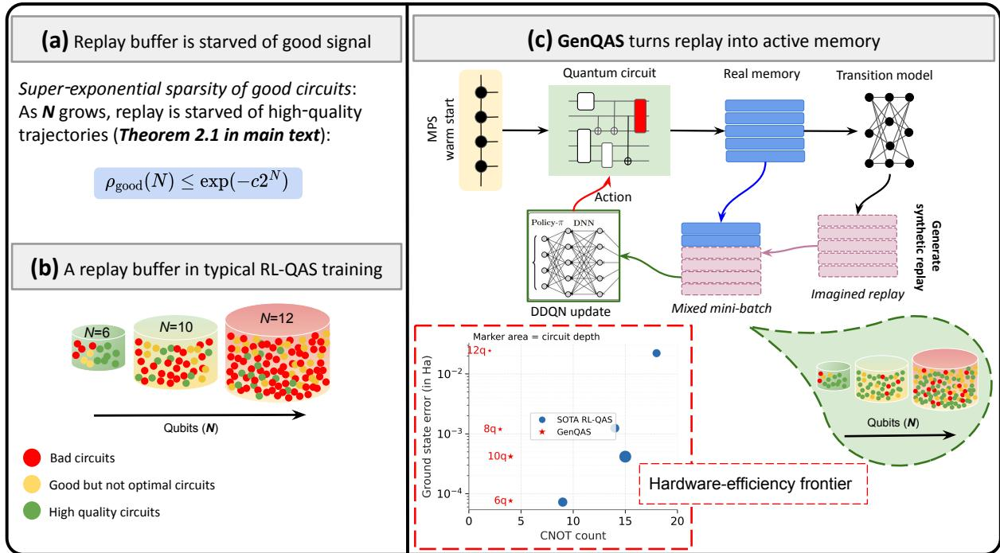
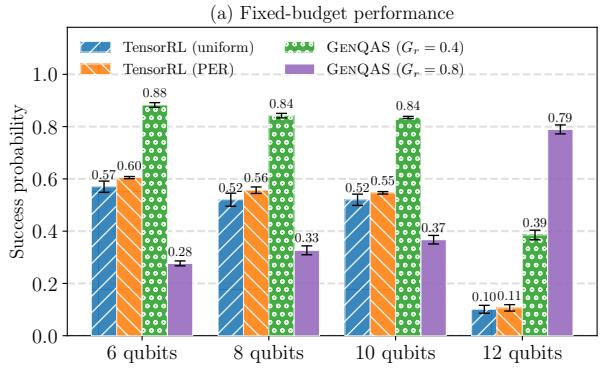
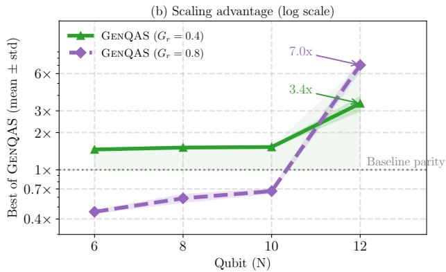
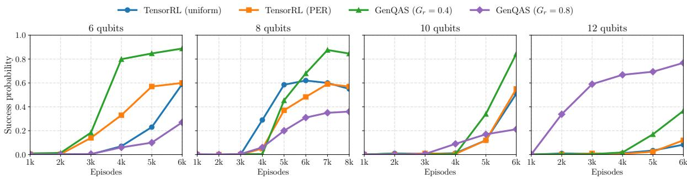
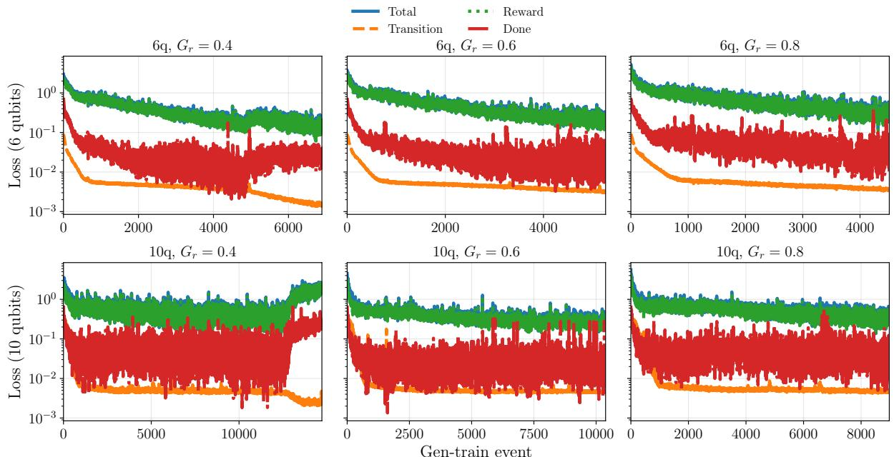
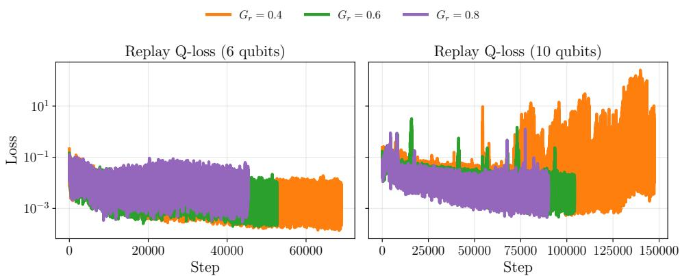
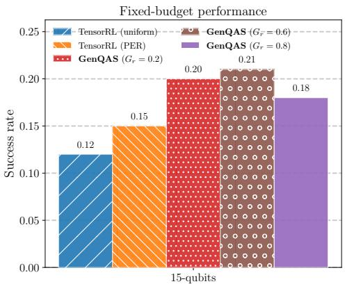
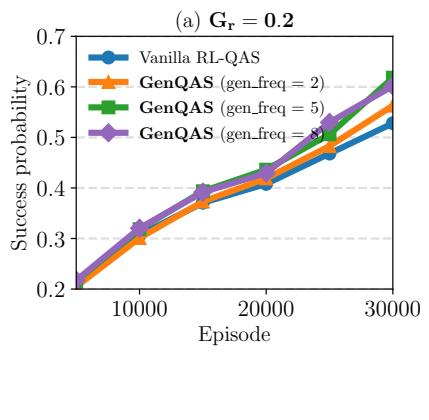
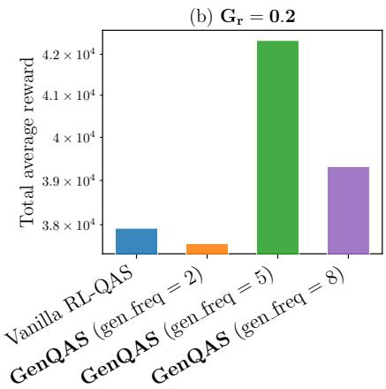
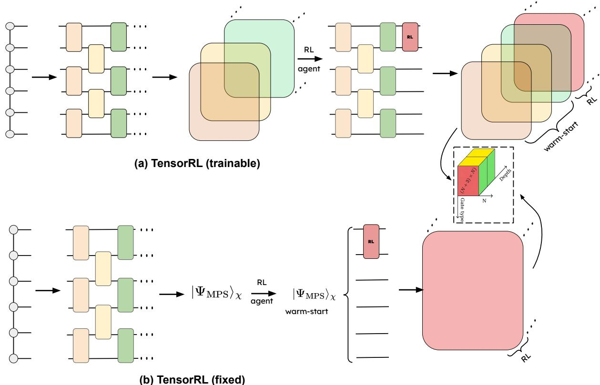

# Generative Replay Mitigates Sample Starvation in Quantum Architecture Search

Akash Kundu1,2\*†, Amit Kumar Jaiswal3†, Sebastian Feld1,2, Prayag Tiwari4

1\*Delft University of Technology, Delft, The Netherlands. 2\*Quantum Computing Division, QuTech, Delft, The Netherlands. 3Indian Institute of Technology (BHU), Varanasi, India. 4Halmstad University, Halmstad, Sweden.

\*Corresponding author(s). E-mail(s): a.kundu@tudelft.nl; Contributing authors: amit.chr@iitbhu.ac.in; s.feld@tidelft.nl; prayag.tiwari@hh.se; †These authors contributed equally to this work.

## Abstract

Reinforcement learning (RL) can automate quantum architecture search, but its scalability is limited when useful circuit trajectories become rare in the rapidly expanding search space. Existing replay mechanisms reuse observed transitions; the proposed learned model produces additional predicted one step transitions from real state–action seeds. Here we introduce GenQAS, a tensor network-guided RL framework that combines a fixed matrix product state warm-start with prioritized generative replay. A learned local transition model generates synthetic circuit transitions on demand and mixes them with real experience during Double Deep Q-Network updates. Under a random exploration analysis, near ground state circuits occupy a rapidly shrinking region of the accessible state space. We investigate whether real data anchored synthetic replay can improve the efective training signal in this regime. Across chemical Hamiltonian benchmarks from 6 to 12 qubits, GenQAS improves fixedbudget success probability and identifies compact circuits at competitive energy error. At 12 qubits, it improves final success probability by up to 7.0× over passive replay. On a 15-qubit transverse field Ising model, GenQAS increases success probability from 12% to 21%. In a noisy 6-qubit BeH transfer experiment, generative replay reduces the steps to chemical accuracy by 92.7%. These results show that generative replay can mitigate sample starvation in quantum architecture search and support more resource eficient circuit discovery.

Keywords: Conditional generative model, Quantum architecture search, Replay bufer, Reinforcement learning, Tensor network

## 1 Introduction

The performance of near-term and early fault tolerant quantum algorithms are limited by qubit count, imperfect gate execution and hardware noise [1–3]. Gate-based quantum processors provide a leading platform for their implementation [4–10]. However, increasing the number of physical qubits alone does not guarantee practical utility, as achievable performance also depends on error rates, connectivity, control quality, and the reliably executable circuit depth [11, 12]. This issue is particularly important for variational quantum algorithms [13], in which a parameterized quantum circuit $\left( \mathrm { P Q C } \right) U ( \pmb { \theta } , \mathcal { C } )$ , defined by a discrete architecture  and continuous parameters θ, prepares the state $\left| \psi ( \pmb \theta , \mathcal { C } ) \right. = U ( \pmb \theta , \mathcal { C } ) \left| 0 \right. ^ { \otimes N }$

  
Fig. 1: GenQAS converts passive replay into active experience generation. a, Under weakly informed exploration, high-quality circuit trajectories become increasingly sparse as the system size grows. b, Uniform and prioritized replay can only resample previously observed transitions, so the density of useful experience declines as the search space expands. c, GenQAS starts from an MPS-derived circuit, retains real transitions, learns a local transition model and generates synthetic transitions on the $\mathrm { { f l y . } }$ Real and generated samples are mixed during Double-DQN updates, supporting the search for low-error circuits with fewer entangling gates.

The parameters are optimized by minimizing an objective such as $C ( \pmb \theta , \mathcal { C } ) = \left. \psi ( \pmb \theta , \mathcal { C } ) | H | \psi ( \pmb \theta , \mathcal { C } ) \right.$ utilizing powerful classical optimizers accessed through SciPy [14]. The structure of a PQC strongly influences the accuracy, trainability, and hardware cost of a VQAs. Two broad PQC design strategies are commonly used in literature. Problem-inspired ansätze encode prior knowledge of the target problem, for example by constructing parameterized circuits from Trotterized evolutions under terms of the problem Hamiltonian, as in the Hamiltonian variational ansatz [15], or from physically motivated excitation operators, as in unitary coupled-cluster [16] and adaptive VQE methods [17]. In contrast, hardware-eficient architectures consist of layers of native single- and two-qubit operations arranged to match device connectivity and minimize compilation overhead. The architectures are guided either by problem structure [18] or hardware constraints [19].

Although such fixed PQC architecutre can be efective, they may be either insuficiently expressive to access the relevant region of Hilbert space and often stuck in the local minima. To address these limitations a third way was introduced through quantum architecture search (QAS) [20–22]. The core mechanism of QAS is to automatically constructing PQC architectures from a prescribed gate set, enabling the circuit structure to adapt to the target task and hardware constraints.

Reinforcement learning (RL) has emerged as a versatile framework for quantum technologies, including the adaptive control of quantum error correction, where an agent uses error-detection events to continuously adjust hardware control parameters during computation [23]. RL also provides a natural formulation for automated quantum circuit design and optimization. In the early fault tolerant setting, AlphaTensor-Quantum [24] formulates the optimization of Cliford+T circuits as a symmetric tensordecomposition problem and uses RL to search for low-rank decompositions corresponding to circuits with reduced T-count. In VQAs, RL can instead be used for QAS, in which an agent sequentially constructs a parameterized quantum circuit by selecting gate types and their locations [22, 25–28].

This flexibility creates a rapidly expanding decision space. Let $\mathcal { G } _ { 1 }$ and $\mathcal { G } _ { 2 }$ denote the available singleand two-qubit gate families, respectively, and let ${ \mathcal { E } } _ { N }$ denote the set of hardware-allowed two-qubit couplings on an N-qubit device. The number of available actions at each circuit-construction step is

$$
| \mathcal { A } _ { N } | = \underbrace { | \mathcal { G } _ { 1 } | N } _ { \mathrm { 1 - q u b i t } } + \underbrace { | \mathcal { G } _ { 2 } | | \mathcal { E } _ { N } | } _ { \mathrm { 2 - q u b i t } } + 1 ,\tag{1}
$$

where the final term denotes termination. For a fully connected device with undirected couplings, $| \mathcal { E } _ { N } | = N ( N - 1 ) / 2$ . Consequently, a construction process of maximum depth T can encounter up to $| \mathcal { A } _ { N } | ^ { T }$ gate sequences, while the dimension of the underlying Hilbert space grows as $2 ^ { N }$ . Evaluating each candidate architecture generally further requires continuous parameter optimization and repeated objective estimation using a quantum simulator or processor. RL-QAS must therefore learn from a limited number of costly interactions within a search space that grows combinatorially with circuit depth and rapidly with system size. For overviews of RL-based quantum circuit optimization and design, we refer the reader to Refs. [29, 30].

Recent methods mitigate diferent aspects of this scaling challenge. Curriculum-based RL-QAS adapts the dificulty of the search task during training [31], while training-free approaches use proxy metrics to prioritize candidate architectures before costly variational evaluation [32]. One-shot methods, such as QuantumNAS [33], reuse parameters across candidate architectures and incorporate hardware-aware objectives. These approaches reduce the cost of evaluating or prioritizing candidate circuits, but do not directly augment the transition data available to an RL agent during sequential architecture construction. TensorRL-QAS [34] addresses a complementary aspect of scalability through physically informed initialization. It uses a matrix product state (MPS), obtained with density matrix renormalization group calculations, to construct a problem-informed initial circuit that is subsequently refined by a double deep Q-network agent. The MPS warm start places the agent in a more relevant region of circuit space and reduces exploration of clearly unpromising architectures. However, after initialization, the agent still learns only from transitions explicitly collected through interactions with the environment. GenQAS addresses this remaining limitation by learning a generative transition model from real experience and using it to produce on-demand synthetic transitions for DDQN updates, thereby increasing the efective training signal without additional quantum-classical circuit evaluations.

Experience replay is commonly used to improve sample eficiency by reusing these interactions. Uniform replay samples stored transitions without regard to their learning value, whereas prioritized experience replay increases the sampling frequency of transitions associated with a larger temporaldiference error or another relevance signal [35, 36]. Prioritization can therefore make better use of a useful transition after it has been observed. Nevertheless, both approaches remain passive with respect to the set of experiences available for learning: they can change how frequently an observed transition is reused, but they cannot create informative experience that was never collected. As the circuit search space expands, useful trajectories constitute an increasingly small fraction of the agent’s interaction history, and the learning signal becomes diluted by a much larger number of low-value alternatives. We refer to this decline in the density of informative experience as sample starvation.

Our theoretical analysis formalizes this limitation under the assumptions stated in the Results. For weakly informed exploration over suficiently expressive circuit ensembles, we show that the measure of near ground state experience decreases exponentially with the dimension of the accessible Hilbert space. This statement characterizes the geometry of random exploration rather than assuming that every learned policy follows the Haar distribution. It nevertheless exposes an important limitation of passive replay during the early stages of search: reweighting previously collected transitions cannot alter the probability that informative transitions were encountered in the first place. One approach to mitigating this limitation is to augment, rather than only reorder, the transitions used in value function updates.

Generative replay provides such a mechanism by learning a model of the local transition dynamics from real interactions [37–41]. Quantum circuit construction is particularly suitable for this approach because the current circuit and the selected gate constrain the subsequent circuit state, the associated reward and whether the construction process terminates. A learned transition model can therefore generate additional training samples around observed state-action pairs without requiring a new quantum-classical evaluation for every generated transition. The main challenge is model bias: synthetic transitions are beneficial only when they remain suficiently consistent with the real environment to support stable of-policy learning. Generative replay must consequently remain anchored in real experience and control how strongly generated samples influence policy optimization.

Here we introduce GenQAS, a tensor network-guided reinforcement learning framework that augments passive experience replay with on-demand synthetic transitions for QAS (Fig. 1). GenQAS combines the fixed matrix product state (MPS) initialization and Double-DQN search backbone of TensorRL-QAS with a learned local transition model. Given a circuit state and gate action, the model predicts the resulting circuit state, reward and termination probability. These predictions define synthetic one-step transitions that are generated from real state-action seeds and mixed with real transitions during value-function updates.

The MPS initialization and generative replay provide complementary inductive biases. The MPSderived circuit places the agent in a physically meaningful low-energy region of circuit space, whereas generative replay increases the amount of training signal extracted from subsequent interactions. Crucially, synthetic transitions are generated on demand and are not stored as replacements for real experience. The replay bufer therefore remains grounded in environment interactions, while the generation ratio $G _ { r }$ controls the contribution of synthetic experience to each update. This design seeks to improve sample eficiency without requiring additional quantum-classical parameter optimization calls.

Under the random exploration and Hamiltonian assumptions considered here, we show that near ground state circuit trajectories become rapidly sparse with increasing system size This creates a regime in which resampling observed transitions alone does not increase the support of the observed transition distribution. Within this analytical setting, MPS-seeded generative replay improves the efective density of informative training samples relative to uniform and prioritized replay. The benefit depends on maintaining suficient agreement between the learned transition model and the underlying QAS environment, thereby motivating the use of real transitions as the persistent replay distribution.

We evaluate GenQAS under matched training budgets on 6-qubit BeH2, 8-, 10- and 12-qubit $\mathrm { H _ { 2 } O } ,$ and a 15-qubit transverse-field Ising model. At 12 qubits, GenQAS increases final success probability from 12% for the strongest passive baseline to 77%, corresponding to a 7.0 improvement. At 15 qubits, it improves the best success probability from 15% with prioritized replay to 21%, a 40% relative increase. Across the tested systems, GenQAS also identifies circuits with competitive energy errors, reduced CNOT counts and circuit depth. In a noisy 6-qubit BeH2 experiment, transfer of the generative replay mechanism reduces the number of search steps required to obtain the first chemical-accuracy solution from 9053 to 660.

We further evaluate GenQAS on a 4-qubit Cliford-synthesis task, in which the agent must construct a circuit matching a target Cliford operation without variational parameter optimization. In this fully discrete setting, GenQAS exceeds the performance of the passive RL baseline, and the generation frequency provides an additional control over the trade-of between synthetic experience and stable of-policy learning. Together, these results show that model-augmented replay can mitigate sample starvation in RL-QAS and can improve circuit discovery when informative environment interactions are sparse and expensive.

## 2 Results

Quantum architecture search becomes increasingly dificult as the number of qubits grows because both the circuit construction space and the Hilbert space expand rapidly. Our theoretical analysis formalizes one aspect of this dificulty. Under the weakly informed exploration and Hamiltonian assumptions specified in Section 4.3, Theorems 4.1 and 4.2 show that the probability of encountering an ϵ-accurate low energy circuit through passive exploration decreases rapidly with system size. Consequently, uni form replay and prioritized experience replay can only resample a progressively smaller set of useful transitions.

Lemmas 4.4 and 4.5 establish that the MPS derived warm start provides a controlled initial circuit approximation under the stated assumptions, while Theorem 4.6 characterizes the potential reduction in episode complexity when model generated transitions remain concentrated in a high fidelity region of the search space. Detailed proofs, assumptions, and derivations are provided in Supplementary Information Section A. The experiments below test whether the proposed generative replay mechanism produces the corresponding practical benefits in learning speed, circuit quality, robustness to noise, and generalization beyond molecular ground state preparation.

We compare GenQAS with TensorRL-QAS using uniform and prioritized replay, as well as with hardware eficient ansatz and UCCSD baselines where applicable. Molecular benchmarks include 6 qubit

  
(a) Scaling performance over 5 random initializations of neural network.

  
(b) Training dynamics.  
Fig. 2: Fixed-budget performance and training dynamics of GenQAS. (a) At a fixed budget of 6000 training episodes, GenQAS consistently outperforms TensorRL-QAS with uniform and PER replay across $N \in$ 6, 8, 10, 12 , while passive baselines degrade sharply with system size. The observed gains increase with qubit number, reaching the strongest advantage at 12 qubits and showing an increasing relative advantage over the evaluated 6 to 12 qubit range, consistent with the proposed signal-density mechanism. (b) Training trajectories for 6, 8, 10 and 12 qubits show that GenQAS converges faster and attains higher success probability than TensorRL-QAS baselines. The $G _ { r } = 0 . 8$ setting is the most robust at larger system sizes, maintaining high success even at 12 qubits.

BEH2 and 8, 10, and 12 qubit $\mathtt { H } _ { 2 } 0$ . We additionally consider a 15 qubit transverse field Ising model and a 4 qubit Cliford synthesis task. Within each benchmark, all RL methods use the same environment, tensor network warm start, action space, and benchmark specific training budget. They difer only in the replay mechanism. Full hyperparameters, molecular Hamiltonian specifications, and simulation details are given in Supplementary Information Sections D, D.3, and D.4.

## 2.1 Generative replay improves fixed budget scaling

Theorem 4.6 predicts that, under the assumptions of the theoretical analysis, generative replay can reduce the number of environment interactions required to reach a target accuracy relative to passive replay. Here, we test the empirical consequence of this prediction under matched training budgets at each system size: whether the advantage of GenQAS over passive replay becomes more pronounced as the QAS problem increases from 6 to 12 qubits.

At each DDQN update, GenQAS mixes real transitions from replay memory with synthetic transitions generated on demand by the learned dynamics model. The generation ratio $G _ { r } \in [ 0 , 1 )$ specifies the synthetic fraction of a total update batch of size B:

$$
B _ { \mathrm { r e a l } } = \left\lfloor ( 1 - G _ { r } ) B \right\rfloor , \qquad B _ { \mathrm { s y n } } = B - B _ { \mathrm { r e a l } } .\tag{2}
$$

Thus, $G _ { r } = 0 . 4$ produces an update batch with approximately 60% real and 40% synthetic transitions, whereas $G _ { r } = 0 . 8$ produces approximately 20% real and 80% synthetic transitions. Synthetic samples are generated from state action seeds drawn from real replay memory and are not stored persistently.

The theoretical mechanism can be expressed through the useful-transition density in an update batch. If $\rho _ { \mathrm { r e a l } } ( N )$ and $\rho _ { \mathrm { s y n } } ( N )$ denote the densities of useful real and synthetic transitions, respectively, then the mixed update distribution has density

$$
\rho _ { \mathrm { m i x } } ( N ) = ( 1 - G _ { r } ) \rho _ { \mathrm { r e a l } } ( N ) + G _ { r } \rho _ { \mathrm { s y n } } ( N ) .\tag{3}
$$

Under the assumptions of the theoretical analysis, Theorems 4.1 and 4.2 show that $\rho _ { \mathrm { r e a l } } ( N )$ decreases rapidly under passive exploration. Lemma 4.5 establishes a fidelity bound for the MPS derived warm start, while Theorem 4.6 characterizes the conditions under which generative replay can maintain a nonvanishing useful-transition contribution to the mixed update distribution. The full signal-density derivation and its assumptions are provided in Supplementary Information Section D.5.

Figure 2a reports the final success probability across 6, 8, 10, and 12 qubits, averaged over five random neural-network initializations. At 6 qubits, TensorRL-QAS with uniform and prioritized replay reaches success probabilities of approximately 0.57 and 0.60, respectively. GenQAS with $G _ { r } = 0 . 4$ reaches 0.88, whereas the more synthetic configuration, $G _ { r } = 0 . 8$ , reaches 0.28. At 8 qubits, the passive baselines reach approximately 0.54 and 0.55, while GenQAS reaches 0.84 for $G _ { r } = 0 . 4$ and 0.34 for $G _ { r } = 0 . 8$

The same qualitative pattern persists at 10 qubits. The uniform and prioritized TensorRL-QAS baselines attain final success probabilities of approximately 0.51 and 0.55, respectively. GenQAS with $G _ { r } = 0 .$ 4 reaches 0.84, corresponding to an approximately 1.5 improvement over the strongest passive baseline, whereas GenQAS with $G _ { r } = 0 . 8$ reaches 0.37. These 6 to 10 qubit results show that an intermediate synthetic fraction provides the strongest performance when real transitions remain suficiently available to anchor value learning.

At 12 qubits, the passive replay baselines deteriorate sharply, reaching success probabilities of approximately 0.10 and 0.11. In contrast, GenQAS with $G _ { r } = 0 . 4$ attains 0.38, corresponding to an approximately 3.4 improvement over the strongest passive baseline. The $G _ { r } = 0 . 8$ configuration reaches 0.77, corresponding to an approximately 7.0 improvement. Thus, the generation ratio that is suboptimal at smaller system sizes becomes the strongest configuration when the useful real-transition density is most severely depleted.

The fixed budget advantage over the evaluated instances shown in Figure 2a is therefore not strictly monotonic in $G _ { r } . \mathrm { A t } 6 , 8$ , and 10 qubits, $G _ { r } = 0 .$ .4 provides the highest final success probability, indicating that a substantial real-data component remains beneficial. At 12 qubits, however, $G _ { r } = 0 . 8$ becomes superior, consistent with the hypothesis that a larger synthetic contribution is increasingly valuable once passive replay enters a stronger sample-starvation regime. Although the four investigated system sizes are insuficient to establish an asymptotic scaling law empirically, the increasing relative advantage of GenQAS is consistent with the signal-density mechanism in Eq. (3).

Figure 2b shows the corresponding learning trajectories. At 6 qubits, GenQAS with $G _ { r } = 0 . 4$ rapidly improves after approximately 3000 episodes and reaches the highest final success probability. At 8 and 10 qubits, the same configuration again converges faster and reaches a higher final plateau than uniform replay, prioritized replay, and the $G _ { r } = 0 . 8$ configuration. At 12 qubits, the learning dynamics change qualitatively: the passive baselines remain near zero success probability throughout most of training, while GenQAS with $G _ { r } = 0 . 8$ steadily improves and reaches the highest final success probability. These trajectories show that the preferred real to synthetic replay mixture depends on problem size, with higher generation ratios becoming advantageous in the largest QAS instance examined.

## 2.2 Generative replay improves noisy replay bufer transfer

We next evaluate whether replay information collected in a noiseless setting remains useful when the same QAS task is evaluated under gate noise. We consider the 6-qubit BeH benchmark and follow the replay bufer transfer setting [42]. TensorRL-QAS and GenQAS are first trained in the noiseless environment using the same reward construction and training protocol as in the molecular experiments. The resulting replay memories are subsequently used to initialize training in a noisy environment. Only the replaybufer information is transferred, network weights and an additional ϵ-greedy pretraining phase are not transferred.

The noisy environment applies a depolarizing channel after every gate. Each single-qubit gate is followed by depolarizing noise of strength $p _ { 1 } = 0 . 0 1$ , and each two-qubit gate is followed by depolarizing noise of strength $p _ { 2 } = 0 . 0 5$ . TensorRL-QAS uses a transferred uniform replay bufer, whereas GenQAS uses the transferred prioritized generative replay mechanism trained with $G _ { r } = 0 . 4$

<table><tr><td rowspan="2">GenQAS (Gr = 0.4)</td><td rowspan="2">Noisy 6-qubit BeH2 (after buffer transfer)</td><td colspan="3"></td></tr><tr><td>92.7% 33.3%</td><td>66.7%</td><td>25.0%</td></tr><tr><td rowspan="2">TensorRL-QAS</td><td>30.1%</td><td>30.8%</td><td>0.0%</td><td>0.0%</td></tr><tr><td>∆steps</td><td>∆CX</td><td>∆ROT</td><td>0 ∆depth</td></tr></table>

(a) Relative improvement after noiseless replay-bufer transfer.
<table><tr><td>Run</td><td>Steps to chemical accuracy</td><td>CX</td><td>ROT</td><td>Depth</td></tr><tr><td>TensorRL-QAS [34]</td><td>13 623</td><td>13</td><td>4</td><td>10</td></tr><tr><td>TensorRL-QAS with transfer</td><td>9520</td><td>9</td><td>4</td><td>10</td></tr><tr><td>GenQAS</td><td>9053</td><td>9</td><td>9</td><td>8</td></tr><tr><td>GenQAS with transfer</td><td>660</td><td>6</td><td>3</td><td>6</td></tr></table>

(b) Raw metrics for the noisy 6-qubit BeH2 task.  
Fig. 3: Replay bufer transfer in the noisy 6-qubit $\mathtt { B E H } _ { 2 }$ experiment. A depolarizing channel with strength $p _ { 1 } = 0 . 0 1$ is applied after each single-qubit gate and a channel with strength $p _ { 2 } = 0 . 0 5$ is applied after each two-qubit gate. (a) Relative improvement in steps to chemical accuracy, CNOT count, rotation count, and circuit depth after transfer of replay information collected in the noiseles environment. (b) Corresponding raw metrics for TensorRL-QAS and GenQAS with and without replay-bufer transfer.

Figure 3 shows that transferred replay information improves both methods, but the improvement is substantially larger for GenQAS. For TensorRL-QAS, transfer of the uniform replay bufer reduces the steps to the first chemical-accuracy solution from 13623 to 9520, a 30.1% reduction. The transferred bufer also reduces the CNOT count from 13 to 9, a 30.8% reduction, but leaves the rotation count and circuit depth unchanged at 4 and 10, respectively.

For GenQAS, transfer of the generative replay mechanism reduces the steps to chemical accuracy from 9053 to 660, corresponding to a 92.7% reduction. The transferred GenQAS configuration also decreases the CNOT count from 9 to 6, the rotation count from 9 to 3, and the circuit depth from 8 to 6. These correspond to relative reductions of 33.3%, 66.7%, and 25.0%, respectively.

The result shows that, in this noiseless to noisy transfer experiment, the GenQAS replay representation retains more useful information for subsequent noisy architecture search than a passive uniform replay bufer. In particular, the transferred GenQAS configuration reaches chemical accuracy with fewer search steps while also identifying a more compact circuit. This finding is consistent with the hypothesis that model-generated replay can retain locally useful circuit-transition structure across a moderate change in the evaluation environment. It does not establish noise-model independence, but it demonstrates a substantial transfer benefit under the depolarizing noise setting considered here.

## 2.3 Generative replay diagnostics reveal a generation-ratio trade-of

The fixed-budget results show that generative replay can improve policy performance, particularly as useful real transitions become sparse. However, synthetic replay is beneficial only when the learned transition model remains suficiently accurate for stable value learning. We therefore examine the generator losses and weighted DDQN Huber losses at 6 and 10 qubits for generation ratios $G _ { r } \in \{ 0 . 4 , 0 . 6 , 0 . 8 \}$ These diagnostics do not directly measure the density of low-energy synthetic transitions. Instead, they assess whether the learned dynamics model and value function remain numerically well behaved under diferent fractions of generated replay.

  
Fig. 4: Generator loss decomposition at 6 and 10 qubits. Total, transition, reward, and termination losses of the learned dynamics model for generation ratios $G _ { r } \in \{ 0 . 4 , 0 . 6 , 0 . 8 \}$ . The transition loss decreases or remains low across the investigated settings. At 10 qubits, the $G _ { r } = 0 . 4$ configuration exhibits a late increase in total loss, whereas the $G _ { r } = 0 . 6$ and $G _ { r } = 0 . 8$ configurations remain more bounded over their respective training intervals.

  
Fig. 5: Weighted DDQN Huber loss under diferent generation ratios. Replay Q-learning loss over training steps at 6 and 10 qubits for $G { r } \in \{ 0 . 4 , 0 . 6 , 0 . 8 \}$ . At 6 qubits, all configurations remain in a low bounded range after the initial training stage. At 10 qubits, $G _ { r } = 0 . 4$ exhibits late high-variance loss spikes, whereas the $G _ { r } = 0 . 6$ and $G _ { r } = 0 . 8$ configurations remain comparatively more stable over the displayed training intervals.

Figure 4 decomposes the dynamics-model objective into transition, reward, and termination components. At 6 qubits, the transition loss decreases substantially for all generation ratios, reaching values near $1 0 ^ { - 3 }$ , while the total loss remains bounded. The reward and termination components exhibit stochastic fluctuations, but no sustained divergence is observed. These results show that the local transition model can be trained stably while generated replay constitutes between 40% and 80% of each DDQN update batch.

At 10 qubi ${ \mathrm { 5 } } ,$ the dependence on $G _ { r }$ is more pronounced. For $G _ { r } = 0 . 6$ and $G _ { r } = 0 . 8$ , the transition loss remains low and the total generator loss stays within a relatively bounded range. In contrast, the $G _ { r } ~ = ~ 0 . 4$ configuration shows a late increase in the total loss, driven primarily by the reward and termination components. This behaviour indicates that generator stability is not determined by the generation ratio alone; it also depends on the evolving state distribution, reward landscape, and training horizon of the underlying QAS task.

Figure 5 reports the weighted DDQN Huber loss computed from mixed batches of real and synthetic transitions. At 6 qubits, the losses for all three generation ratios decrease after the initial learning regime and remain within a low range. The $G _ { r } = 0 . 8$ setting displays moderately larger early fluctuations, but its loss remains bounded over the reported training interval.

At 10 qubits, the $G _ { r } = 0 .$ 4 configuration develops large late-stage Q-loss spikes. By comparison, the $G _ { r } = 0 . 6$ and $G _ { r } = 0 . 8$ configurations retain a lower and more bounded loss profile, apart from isolated fluctuations. The loss diagnostics therefore identify a generation-ratio trade-of: a moderate synthetic fraction can yield strong final success probability, as observed in the 10-qubit scaling experiment, while a larger synthetic fraction can provide a more stable critic-loss trajectory in the later stages of training.

Together, Figures 4 and 5 show that on-demand synthetic replay can be incorporated into DDQN training without systematic divergence across the investigated settings. They also show that the relative stability of diferent generation ratios changes with system size. This motivates treating $G _ { r }$ as a taskdependent control parameter, rather than assuming that a fixed real-to-synthetic replay mixture is optimal across all QAS instances.

## 2.4 GenQAS identifies compact circuits at competitive error

Table 1 compares GenQAS with TensorRL-QAS using uniform and prioritized experience replay, as well as with fixed hardware-eficient ansatz and UCCSD reference circuits. The RL based methods share the same MPS derived warm start, DDQN backbone, environment, and action space. Thus, the comparison between GenQAS and TensorRL-QAS isolates the efect of replacing passive replay with prioritized generative replay. For each RL configuration, the table reports the most accurate circuit among the evaluated random seeds

Across the molecular benchmarks, GenQAS identifies circuits on a competitive accuracy-resource frontier. At 6 qubits, GenQAS with $G _ { r } = 0 . 6$ achieves the lowest reported error, $2 . 3 7 \times 1 0 ^ { - 5 }$ , at depth 5 using 5 CNOTs. At 8 qubits, GenQAS with $G _ { r } = 0 . 4$ reaches an error of $1 . 1 9 \times 1 0 ^ { - 3 }$ using 3 CNOTs, 2 rotations, and depth 4, compared with 14 CNOTs, 6 rotations, and depth 8 for TensorRL-QAS with uniform replay. At 10 qubits, GenQAS with $G _ { r } = 0 . 2$ matches the error of prioritized replay while using 4 CNOTs, 5 rotations, and depth $^ { 7 . }$

The 12 qubit $_ \mathrm { H _ { 2 } O }$ task illustrates the accuracy-resource trade-of. Uniform TensorRL-QAS reaches the lowest reported error, $2 . 2 2 \times 1 0 ^ { - 2 }$ , whereas GenQAS with $G _ { r } = 0 . 8$ identifies the most compact circuit, using 2 CNOTs, 4 rotations, and depth 2 with error $2 . 4 4 \times 1 0 ^ { - 2 }$ . GenQAS with $G _ { r } = 0 . 4$ achieves an intermediate solution with error $2 . 2 8 \times 1 0 ^ { - 2 }$ and depth 4. Thus, generative replay does not uniformly dominate passive replay for every individual metric; instead, it provides a practical means of navigating the trade-of between accuracy and circuit resources.

The fixed HEA and UCCSD circuits provide reference points for the size of the resource savings. At 12 qubits, UCCSD requires 6976 CNOTs, 10628 single-qubit rotations, and depth 10356, whereas the GenQAS circuits use at most tens of gates and depth at most 10. HEA circuits are substantially more compact than UCCSD but remain less gate eficient than the compact GenQAS solutions at comparable error. These comparisons indicate that generative replay can support the discovery of low resource circuit architectures under the same RL interaction budget.

## 2.5 Generative replay generalizes across quantum optimization tasks

The molecular benchmarks establish that generative replay can improve fixed-budget learning and identify compact circuits for electronic structure Hamiltonians. We next test whether this behaviour extends beyond molecular ground state preparation. We consider a 15-qubit transverse field Ising model (TFIM), which preserves the variational ground state objective but changes the physical problem class, and a 4- qubit Cliford synthesis task, which replaces variational energy minimization with exact discrete target matching.

## Spin-model ground state preparation

For the 15 qubit TFIM, we evaluate GenQAS using the TensorRL-QAS backbone under a matched training budget. Figure 6(a) shows that GenQAS attains equal or higher final success probability than

Table 1: Circuit statistics for BeH2 (6 qubits) and $\mathbf { H } _ { 2 } \mathbf { O }$ (8, 10, and 12 qubits). For each configuration we report two-qubit gate count (CNOT), single-qubit rotation count (ROT), circuit depth, and error for the best seed. GenQAS consistently attains comparable or lower error than TensorRL-QAS, HEA, and UCCSD while using substantially fewer two-qubit gates, fewer rotations, or reduced depth. HEA errors are taken from the best of 10 random seeds per ansatz depth (1, 2, 3 layers); UCCSD statistics are from a single deterministic run.
<table><tr><td>System</td><td>Method</td><td>CNOT</td><td>ROT</td><td>Depth</td><td>Error</td></tr><tr><td rowspan="10">6-qubit BeH2</td><td>TensorRL-QAS (Uniform)</td><td>9</td><td>9</td><td>9</td><td> $7 . 2 2 \times 1 0 ^ { - 5 }$ </td></tr><tr><td>TensorRL-QAS (PER)</td><td>16</td><td>3</td><td>14</td><td> $7 . 8 9 \times 1 0 ^ { - 5 }$ </td></tr><tr><td>GenQAS (Gr = 0.2)</td><td>14</td><td>5</td><td>14</td><td> $7 . 6 2 \times 1 0 ^ { - 5 }$ </td></tr><tr><td>GenQAS (Gr = 0.4)</td><td>5</td><td>2</td><td>6</td><td> $7 . 1 8 \times 1 0 ^ { - 5 }$ </td></tr><tr><td>GenQAS (Gr = 0.6)</td><td>5</td><td>10</td><td>5</td><td> $2 . 3 7 \times 1 0 ^ { - 5 }$ </td></tr><tr><td>GenQAS (Gr = 0.8)</td><td>4</td><td>12</td><td>6</td><td> $7 . 5 9 \times 1 0 ^ { - 5 }$ </td></tr><tr><td>HEA (1-layer)</td><td>6</td><td>24</td><td>10</td><td> $5 . 9 2 \times 1 0 ^ { - 3 }$ </td></tr><tr><td>HEA (2-layer)</td><td>12</td><td>36</td><td>18</td><td> $1 . 9 8 \times 1 0 ^ { - 3 }$ </td></tr><tr><td>HEA (3-layer)</td><td>18</td><td>48</td><td>26</td><td> $3 . 3 7 \times 1 0 ^ { - 4 }$ </td></tr><tr><td>UCCSD</td><td>272</td><td>620</td><td>475</td><td> $5 . 9 2 \times 1 0 ^ { - 3 }$ </td></tr><tr><td rowspan="10">8-qubit  $_ \mathrm { H _ { 2 } O }$ </td><td>TensorRL-QAS (Uniform)</td><td>14</td><td>6</td><td>8</td><td> $1 . 2 4 \times 1 0 ^ { - 3 }$ </td></tr><tr><td>TensorRL-QAS (PER)</td><td>14</td><td>2</td><td>11</td><td> $1 . 2 6 \times 1 0 ^ { - 3 }$ </td></tr><tr><td> $\mathbf { G e n Q A S } \ ( G _ { r } = 0 . 2 )$ </td><td>12</td><td>2</td><td>10</td><td> $2 . 2 2 \times 1 0 ^ { - 3 }$ </td></tr><tr><td> $\mathbf { G e n Q A S } \mathbf { \Psi } \left( G _ { r } = 0 . 4 \right)$ </td><td>3</td><td>2</td><td>4</td><td> $1 . 1 9 \times 1 0 ^ { - 3 }$ </td></tr><tr><td> $\mathbf { G e n Q A S } \left( G _ { r } = 0 . 6 \right)$ </td><td>7</td><td>10</td><td>10</td><td> $1 . 2 2 \times 1 0 ^ { - 3 }$ </td></tr><tr><td>GenQAS (Gr = 0.8)</td><td>2</td><td>13</td><td>8</td><td> $1 . 2 0 \times 1 0 ^ { - 3 }$ </td></tr><tr><td>HEA (1-layer)</td><td>8</td><td>32</td><td>12</td><td> $2 . 6 3 \times 1 0 ^ { - 3 }$ </td></tr><tr><td>HEA (2-layer)</td><td>16</td><td>48</td><td>22</td><td> $2 . 6 3 \times 1 0 ^ { - 3 }$ </td></tr><tr><td>HEA (3-layer)</td><td>24</td><td>64</td><td>32</td><td> $2 . 9 6 \times 1 0 ^ { - 3 }$ </td></tr><tr><td>UCCSD</td><td>1312</td><td>2596</td><td>2148</td><td> $2 . 6 3 \times 1 0 ^ { - 3 }$ </td></tr><tr><td rowspan="10">10-qubit  $_ \mathrm { H _ { 2 } O }$ </td><td>TensorRL-QAS (Uniform)</td><td>15</td><td>17</td><td>17</td><td> $4 . 1 5 \times 1 0 ^ { - 4 }$ </td></tr><tr><td>TensorRL-QAS (PER)</td><td>23</td><td>14</td><td>19</td><td> $4 . 1 7 \times 1 0 ^ { - 4 }$ </td></tr><tr><td>GenQAS (Gr = 0.2)</td><td>4</td><td>5</td><td>7</td><td> $4 . 1 7 \times 1 0 ^ { - 4 }$ </td></tr><tr><td>GenQAS (Gr = 0.4)</td><td>14</td><td>15</td><td>20</td><td> $3 . 9 2 \times 1 0 ^ { - 4 }$ </td></tr><tr><td>GenQAS (Gr = 0.6)</td><td>19</td><td>19</td><td>20</td><td> $3 . 9 3 \times 1 0 ^ { - 4 }$ </td></tr><tr><td>GenQAS (Gr = 0.8)</td><td>26</td><td>36</td><td>24</td><td> $4 . 3 2 \times 1 0 ^ { - 4 }$ </td></tr><tr><td>HEA (1-layer)</td><td>10</td><td>40</td><td>14</td><td> $4 . 6 9 \times 1 0 ^ { - 3 }$ </td></tr><tr><td>HEA (2-layer)</td><td>20</td><td>60</td><td>26</td><td> $4 . 8 4 \times 1 0 ^ { - 3 }$ </td></tr><tr><td>HEA (3-layer)</td><td>30</td><td>80</td><td>38</td><td> $1 . 1 4 \times 1 0 ^ { - 2 }$ </td></tr><tr><td>UCCSD</td><td>3440</td><td>5932</td><td>5336</td><td> $4 . 6 9 \times 1 0 ^ { - 3 }$ </td></tr><tr><td rowspan="10">12-qubit  $_ \mathrm { H _ { 2 } O }$ </td><td>TensorRL-QAS (Uniform)</td><td>18</td><td>2</td><td>6</td><td> $2 . 2 2 \times 1 0 ^ { - 2 }$ </td></tr><tr><td>TensorRL-QAS (PER)</td><td>17</td><td>2</td><td>11</td><td> $2 . 4 8 \times 1 0 ^ { - 2 }$ </td></tr><tr><td>GenQAS  $( G _ { r } = 0 . 2 )$ </td><td>14</td><td>2</td><td>10</td><td> $2 . 3 3 \times 1 0 ^ { - 2 }$ </td></tr><tr><td>GenQAS (Gr = 0.4)</td><td>18</td><td>2</td><td>4</td><td> $2 . 2 8 \times 1 0 ^ { - 2 }$ </td></tr><tr><td>GenQAS (Gr = 0.6)</td><td>3</td><td>10</td><td>10</td><td> $2 . 4 5 \times 1 0 ^ { - 2 }$ </td></tr><tr><td>GenQAS  $( G _ { r } = 0 . 8 )$ </td><td>2</td><td>4</td><td>2</td><td> $2 . 4 4 \times 1 0 ^ { - 2 }$ </td></tr><tr><td>HEA (1-layer)</td><td>12</td><td>48</td><td>16</td><td> $2 . 5 2 \times 1 0 ^ { - 2 }$ </td></tr><tr><td>HEA (2-layer)</td><td>24</td><td>72</td><td>30</td><td> $3 . 2 9 \times 1 0 ^ { - 2 }$ </td></tr><tr><td>HEA (3-layer)</td><td>36</td><td>96</td><td>44</td><td> $6 . 3 1 \times 1 0 ^ { - 2 }$ </td></tr><tr><td>UCCSD</td><td>6976</td><td>10628</td><td>10356</td><td> $2 . 5 1 \times 1 0 ^ { - 2 }$ </td></tr></table>

TensorRL with uniform or prioritized replay for the tested generation ratios. The final energy errors remain in the narrow range from $1 . 5 3 \times 1 0 ^ { - 2 }$ to $1 . 5 4 \times 1 0 ^ { - 2 }$ across all methods, indicating that the replay modification does not degrade final solution quality in this benchmark.

The generation ratio determines the resource profile of the resulting circuits. GenQAS with $G _ { r } = 0 . 4$ matches the error and CNOT count of the uniform TensorRL baseline while reducing the rotation count from 8 to 6. GenQAS with $G _ { r } = 0 . 8$ identifies a circuit with only 3 CNOTs at comparable error, although it uses 13 single-qubit rotations. Thus, $G _ { r }$ provides a practical control parameter for navigating the trade-of between entangling gates, single-qubit rotations, and learning behaviour in a non-molecular ground-state problem.

## Discrete cliford synthesis

We further evaluate GenQAS on a 4-qubit Cliford synthesis task, in which the agent sequentially constructs a circuit that exactly matches a target Cliford operation using a discrete gate library $\mathcal { A } _ { \mathrm { C l i f f } } = \left\{ \mathrm { H } _ { q } , \mathbf { S } _ { q } , \mathbf { S } _ { q } ^ { \dagger } , \mathbf { C } \mathbf { N } \mathbf { O } \mathrm { T } _ { c , t } \right\}$ , where $q \in \{ 0 , \ldots , N - 1 \}$ , and $c \neq t$ . Unlike the molecular and TFIM benchmarks, this task requires neither variational parameter optimization nor energy expectation-value estimation. Rewards are determined by exact target matching, allowing us to test generative replay in a fully discrete circuit construction setting. The target generation procedure, action space construction, reward design, and evaluation protocol are provided in Supplementary Information Section C.

<table><tr><td>Method</td><td>Error</td><td>CNOT</td><td>ROT</td></tr><tr><td>TensorRL (uniform)</td><td> $1 . 5 3 \times { { 1 0 } ^ { - 2 } }$ </td><td>10</td><td>8</td></tr><tr><td>TensorRL (PER)</td><td> $1 . 5 4 \times 1 0 ^ { - 2 }$ </td><td>10</td><td>8</td></tr><tr><td>GenQAS  $( G _ { r } = 0 . 2 )$ </td><td> $1 . 5 3 \times { { 1 0 } ^ { - 2 } }$ </td><td>7</td><td>10</td></tr><tr><td>GenQAS  $( G _ { r } = 0 . 4 )$ </td><td> $1 . 5 3 \times 1 0 ^ { - 2 }$ </td><td>10</td><td>6</td></tr><tr><td>GenQAS  $( G _ { r } = 0 . 6 )$ </td><td> $1 . 5 4 \times { { 1 0 } ^ { - 2 } }$ </td><td>14</td><td>6</td></tr><tr><td>GenQAS  $( G _ { r } = 0 . 8 )$ </td><td> $1 . 5 3 \times 1 0 ^ { - 2 }$ </td><td>3</td><td>13</td></tr></table>

(b) Circuit statistics.  
(a) Fixed-budget performance.  
Fig. 6: 15-qubit TFIM performance: fixed-budget success (a) and best circuit statistics (b).

  
Fig. 7: 4-qubit cliford synthesis. Having 4-qubit cliford synthesis a relatively easier problem to solve here we wanted to show that a small generation ratio $\left( G _ { r } \right)$ makes a big diference in performance. As we do not have the variational quantum-classical framework in this experiment, this is the exact place where we can analyse the generation frequency by the conditional generative model implemented inside the genQAS.

Figure 7(a) shows that GenQAS with $G _ { r } = 0 . 2$ matches or modestly exceeds the success probability of the passive RL-QAS baseline. Figure 7(b) further shows that the generator update frequency afects learning performance. The intermediate configuration gen\_freq = 5 achieves the highest average cumulative reward under the shared training budget, whereas very infrequent and very frequent generation provide smaller gains.

Together, the TFIM and Cliford results show that the benefit of generative replay is not restricted to molecular Hamiltonians. It can also improve sequential circuit construction in a spin-model groundstate task and in a fully discrete exact-synthesis task. At the same time, both experiments show that the generation ratio and update frequency are task-dependent hyperparameters rather than universally optimal constants.

## 3 Discussion

This work addresses sample starvation in reinforcement learning for quantum architecture search. Under the random-exploration and Hamiltonian assumptions of our theoretical analysis, Theorems 4.1 and 4.2 show that the probability of encountering an ϵ-accurate low-energy circuit decreases rapidly as the number of qubits increases. In this regime, uniform replay and prioritized experience replay can change how often observed transitions are reused, but cannot alter the probability that informative transitions were collected in the first place. GenQAS addresses this limitation by combining a fixed MPS derived warm start with a learned local transition model that generates additional on-demand replay transitions from real state-action seeds. Under the conditions stated in Lemma 4.5 and Theorem 4.6, this mechanism can maintain a nonvanishing useful transition contribution to the mixed replay distribution. The complete signal-density derivation and its assumptions are provided in Supplementary Information Section D.5.

The empirical results in Section 2 are consistent with this mechanism. At 12 qubits, GenQAS increases the final success probability from 12% for the strongest passive replay baseline to 77%, corresponding to a 7.0 improvement. At 15 qubits, GenQAS reaches a success probability of 21%, compared with 12% for the baseline. The observed fixed-budget advantage is consistent with the proposed mechanism; the finite set of problem sizes does not establish an asymptotic scaling law.

The improved success probability is accompanied by competitive accuracy resource trade-ofs. Across the molecular benchmarks and the transverse field Ising model, GenQAS identifies circuits that often match passive replay energy errors while using fewer CNOT gates, rotations, or circuit layers. This should be interpreted as a Pareto trade-of rather than universal dominance on every metric. For example, at 12 qubits, uniform TensorRL-QAS attains the lowest reported energy error, whereas GenQAS identifies substantially more compact circuits at comparable error. Relative to fixed reference ansatzes, the reduction in circuit resources is substantial: for 12-qubit H O, UCCSD requires nearly 7000 CNOT gates, whereas the GenQAS circuits use only a small number of entangling gates. These results suggest that generative replay can guide RL based search towards lower resource regions of the circuit-design space.

The noisy 6-qubit BEH2 transfer experiment further shows that the GenQAS replay mechanism remains useful after transfer from noiseless to depolarizing circuit evaluation. Transfer of the generative replay information reduces the steps to the first chemical accuracy solution from 9053 to 660, a 92.7% reduction, while also reducing the CNOT count, rotation count, and circuit depth. In comparison, transfer of the uniform TensorRL-QAS replay bufer yields a smaller reduction in search steps and no reduction in rotation count or circuit depth. This result demonstrates a substantial benefit in the specific depolarizing noise setting considered here. It does not, however, establish robustness to arbitrary noise models, hardware drift, or finite-shot measurement noise.

Finally, the 15-qubit TFIM and 4-qubit Cliford synthesis experiments indicate that the replay mechanism is not restricted to molecular electronic structure tasks. The TFIM benchmark retains the variational ground state objective but changes the physical problem class, while the Cliford task replaces energy minimization with exact discrete target matching. In the Cliford benchmark, GenQAS matches or modestly exceeds the passive RL baseline, and an intermediate generator update frequency yields the highest cumulative reward. These results suggest that generative replay can be useful for both variational ground state preparation and fully discrete circuit-construction tasks.

Several limitations remain. The present study uses state-vector simulation, a simple depolarizingnoise model, and a limited range of system sizes. The MPS warm-start analysis also relies on locality, spectral, and entanglement assumptions that need not apply to arbitrary Hamiltonians. In addition, the learned transition model is evaluated through local replay losses and downstream policy performance rather than through a direct long-horizon model accuracy analysis. Future work should test finite-shot and hardware evaluations, hardware-specific connectivity constraints, larger system sizes, cross-task transfer, and uncertainty-aware generative models for controlling model bias.

A further limitation is that GenQAS has not yet been evaluated for quantum error correction or fault-tolerant circuit discovery. Such tasks require an environment that represents syndrome information, physical error propagation, ancilla resources, connectivity constraints, and explicit fault-tolerance criteria, rather than a variational energy objective alone. Recent work has shown that reinforcement learning can discover compact fault-tolerant logical state preparation circuits under hardware constraints [43]. Extending GenQAS to this setting would test whether generative replay can improve the sample eficiency of searching over sparse, constraint heavy fault-tolerant circuit spaces.

In addition, the present GenQAS implementation operates with a fixed elementary action space. This restricts the agent to discovering useful higher-level circuit motifs through repeated low-level gate insertions. An important direction is to augment the action space with learned composite operations, or gadgets, extracted from high-performing circuits on simpler instances. Gadget-based reinforcement learning has shown that reusable circuit fragments can be transferred to more dificult optimization problems by dynamically expanding the agent’s action space [29]. Combining GenQAS with learned gadgets could reduce the efective search horizon and provide a complementary route to scalability. However, this extension would require principled gadget selection, hardware-aware decomposition, and controls against an excessively large or poorly structured action space.

## 4 Methods

GenQAS combines the fixed tensor network initialization of TensorRL-QAS [34] with prioritized generative replay [41]. The tensor network module provides a problem informed fixed circuit prefix, whereas the model based replay mechanism generates synthetic transitions to improve the sample eficiency of reinforcement learning based quantum architecture search (QAS). The MPS derived warm start circuit is compiled into the native gate set and retained as a fixed prefix throughout training. GenQAS subsequently refines this initialization across all evaluated systems. For example, for the 15 qubit transverse field Ising model, GenQAS reduces the warm start energy error from 1.025 to $1 . 5 \times 1 0 ^ { - 2 }$ , corresponding to a 98.5% relative reduction in energy error. The construction, resource cost, and refinement of the fixed warm start are detailed in Supplementary Information Sections B and B.6.

## 4.1 GenQAS

We formulate QAS as a Markov decision process in which the state $s _ { t }$ encodes the circuit constructed by the agent at step t, and an action $a _ { t }$ specifies the insertion of a gate at a valid circuit location. States use the discrete circuit representation introduced in TensorRL-QAS [34], defined over an N qubit, D layer brickwork layout [19, 44]. Optional continuous gate angles and auxiliary descriptors, such as the current energy estimate, can be appended to this representation.

GenQAS adopts the fixed TensorRL-QAS initialization. Specifically, a tensor network derived circuit UTN prepares a fixed warm start state, while the agent constructs a learnable circuit sufix $V _ { t }$ . The circuit evaluated by the environment is

$$
U _ { t } = V _ { t } U _ { \mathrm { T N } } .\tag{4}
$$

The warm start circuit is not encoded in the RL state and its parameters remain fixed throughout training. Consequently, the agent observes and searches only over the appended architecture $V _ { t } .$ This design reduces the observation dimension and separates the tensor network state preparation from the RL based circuit refinement. A complete description of the DMRG calculation, MPS representation, variational MPS to circuit mapping, and Riemannian optimization procedure is provided in Supplementary Information Sections B.1 to B.4.

The discrete action space  comprises gate placement operations from the fixed gate set RX, RY, RZ, CNOT and their valid qubit locations. Invalid actions are masked during action selection. In addition to operations that violate the maximum circuit depth or hardware connectivity constraints, we prohibit redundant single qubit gate insertions and repeated entangling gates. A single qubit action on qubit q at layer m is illegal when the corresponding location is already occupied, namely,

$$
G _ { m , q } = G _ { m - 1 , q } .\tag{5}
$$

Likewise, a CNOT acting on qubit pair $( q _ { 1 } , q _ { 2 } )$ is illegal when the same CNOT was applied in the preceding layer,

$$
G _ { m , ( q _ { 1 } , q _ { 2 } ) } = \tt C N O T \mathrm { ~ \wedge ~ } G _ { m - 1 , ( q _ { 1 } , q _ { 2 } ) } = \tt C N O T .\tag{6}
$$

We employ a Double Deep Q Network (DDQN) [35], parameterized by $Q _ { \phi } ( s , a )$ , for problems up to $8$ qubits. For larger problems, we use a DDQN with variable step sizes in an n step trajectory rollout update [45], with $n = 5$ . The Q network is implemented as a multilayer perceptron. The agent follows an ϵ greedy policy, selecting a random valid action with probability ϵ and otherwise selecting the valid action with the largest predicted $\mathrm { Q }$ value. The exploration rate decays from $\epsilon = 1 . 0$ to a prescribed minimum of $\epsilon _ { \mathrm { m i n } } = 0 . 0 5$

For a transition $( s _ { t } , a _ { t } , r _ { t } , s _ { t + 1 } , d _ { t } )$ , DDQN uses the online network to select the next action and a target network $Q _ { \phi }$ − to evaluate it:

$$
y _ { t } = r _ { t } + \gamma ( 1 - d _ { t } ) Q _ { \phi ^ { - } } ( s _ { t + 1 } , a _ { t + 1 } ^ { \star } ) , \qquad a _ { t + 1 } ^ { \star } = \arg \operatorname* { m a x } _ { a \in \mathcal { A } _ { \mathrm { v a l i d } } } Q _ { \phi } ( s _ { t + 1 } , a ) .\tag{7}
$$

The online network is optimized using the Huber loss between $Q _ { \phi } ( s _ { t } , a _ { t } )$ and $y _ { t }$ with the Adam optimizer [46]. For variable depth search spaces, we define the per step discount factor as

$$
\gamma = \left( \gamma _ { \mathrm { f i n a l } } \right) ^ { 1 / D } ,\tag{8}
$$

such that the efective discount over the full circuit depth remains fixed. Full agent and environment hyperparameters are reported in Supplementary Information Section D.

## 4.2 Generative replay

In addition to real transitions collected from the QAS environment, GenQAS learns a neural dynamics model from replay memory. Given a state action pair $( s _ { t } , a _ { t } )$ , the model predicts the next state, reward, and termination probability,

$$
\begin{array} { r } { ( \hat { s } _ { t + 1 } , \hat { r } _ { t } , \hat { d } _ { t } ) = f _ { \psi } ( s _ { t } , a _ { t } ) . } \end{array}\tag{9}
$$

The model consists of separate multilayer perceptron heads for transition, reward, and termination prediction. The transition head contains two hidden layers of dimension 256 with LeakyReLU activations and dropout probability 0.1. The reward and termination heads use hidden dimensions 256 and 128, with the termination head producing a probability through a sigmoid output. The discrete action index is concatenated with the state representation before being provided as input to each prediction head.

The dynamics model is trained only on real replay transitions. In the n step setting, these transitions contain the aggregated discounted reward, terminal state, and efective discount factor associated with the observed trajectory segment. The model is optimized using Adam with learning rate $3 \times 1 0 ^ { - 4 }$ and gradient norm clipping at 1.0. Its composite training objective is

$$
\mathcal { L } _ { \mathrm { g e n } } = 2 \mathcal { L } _ { \mathrm { t r a n s } } + \mathcal { L } _ { \mathrm { r e w } } + 0 . 5 \mathcal { L } _ { \mathrm { d o n e } } ,\tag{10}
$$

where $\mathcal { L } _ { \mathrm { t r a n s } }$ and $\mathcal { L } _ { \mathrm { r e w } }$ are mean squared errors for next state and reward prediction, respectively, and ${ \mathcal { L } } _ { \mathrm { d o n e } }$ is the binary cross entropy of the predicted termination probability.

During DDQN updates, GenQAS draws real transitions from the prioritized replay memory. Synthetic samples are generated on demand by uniformly sampling seed state action pairs from the real replay memory and applying the learned dynamics model,

$$
\tilde { \tau } _ { t } = ( s _ { t } , a _ { t } , \hat { r } _ { t } , \hat { s } _ { t + 1 } , \hat { d } _ { t } ) .\tag{11}
$$

The predicted termination probability is thresholded at 0.5 to obtain the binary termination indicator $\hat { d } _ { t } .$ . Each synthetic transition inherits the n step horizon and corresponding discount factor of its real seed transition. Synthetic transitions are not stored persistently in replay memory; the replay bufer therefore remains a record of real environment interactions only.

For a DDQN update batch of total size $B ,$ the generation ratio $G _ { r }$ controls the fraction of synthetic transitions:

$$
B _ { \mathrm { r e a l } } = \left\lfloor ( 1 - G _ { r } ) B \right\rfloor , \qquad B _ { \mathrm { s y n } } = B - B _ { \mathrm { r e a l } } .\tag{12}
$$

We evaluate $G _ { r } \in \{ 0 . 2 , 0 . 4 , 0 . 6 , 0 . 8 \}$ . Thus, for example, $G _ { r } = 0 . 4$ produces an update batch containing approximately 60% real transitions and 40% generated transitions. Real transitions are sampled according to prioritized replay, whereas generated transitions are assigned the mean importance sampling weight of the real samples in the same update batch. Only real transitions have their priorities updated using the DDQN temporal diference error.

The generative model is updated every $T _ { \mathrm { g e n } } = 1 0 \ \mathrm { D D Q N }$ updates (if not stated otherwise) using the real transitions sampled in that update. This restriction prevents the model from training on its own outputs and reduces the risk of compounding model error. Further implementation details, including the replay capacity, batch size, generation ratios, and logging configuration, are reported in Supplementary Information Section D.

## 4.3 Theoretical guarantees

We establish the theoretical guarantees that together motivate and bound the performance of GenQAS. First, we prove that sample starvation is statistically inevitable for any passive replay strategy, regardless of how cleverly transitions are prioritised. Second, we show that MPS initialisation is not merely a warmstart heuristic but a provable conditional generation process with quantifiable fidelity bounds. Third, we derive an exponential speedup in episode complexity under generative replay. These results collectively answer the question: why is a generative bufer the right tool for QAS?

## 4.3.1 The manifold of quantum circuits

Quantum circuits constructed gate-by-gate are discrete combinatorial objects, yet their efect, a unitary transformation is a continuous point in the unitary group $\mathcal { U } ( 2 ^ { N } )$ . This duality is central to ${ \mathrm { g e n Q A S } }$ , a generative model can learn the continuous manifold of reachable unitaries from discrete transition data, and then synthesize new transitions that lie geometrically between known high-quality circuits, even when those circuits difer structurally.

Consider the space of all N-qubit quantum circuits of depth D, denoted $\mathcal { C } _ { N , D }$ . The RL agent’s policy $\pi ( a | s )$ operates on a state space $s$ encoding the current circuit, with action space size $| \mathcal { A } | = O ( N ^ { 2 } )$ due to two-qubit gate placements, and state space size $| S | \propto | A | ^ { D }$ growing factorially with depth. The distribution of useful circuits, those approximating the ground state is far from uniform on $ { \mathcal { U } } ( 2 ^ { N } )$ : it concentrates around low-dimensional ravines aligned with the target Hamiltonian H [13]. The set of unitaries U satisfying $| \langle \psi _ { 0 } | U ^ { \dagger } H U | \psi _ { 0 } \rangle - E _ { 0 } | < \epsilon$ is exponentially sparse in the full unitary group.

## 4.3.2 Sample starvation in training

Theorem 4.1 (Exponential sparsity of high-relevance quantum transitions). Consider the space of Nqubit parameterized quantum circuits of depth $D = p o l y ( N )$ acting on the initial state $| 0 \rangle ^ { \otimes N }$ . Let H be a local Hamiltonian with ground state energy $E _ { 0 }$ and ground state $| \psi _ { 0 } \rangle$ . For a given precision $\epsilon > 0$ , define the set of good unitaries

$$
\mathcal { G } _ { \epsilon } = \{ U \in \mathcal { U } ( 2 ^ { N } ) : \langle 0 | U ^ { \dagger } H U | 0 \rangle - E _ { 0 } < \epsilon \} .
$$

The probability of uniformly sampling a circuit from the architecture space (or equivalently, sampling a state uniformly under the Haar measure) that belongs to $\mathcal { G } _ { \epsilon }$ is bounded $b y ,$

$$
P ( \mathcal { G } _ { \epsilon } ) \leq \exp { \left( - c \cdot 2 ^ { N } \cdot \log { \left( \frac { 1 } { \epsilon } \right) } \right) }
$$

for some constant $c > 0$ , whenever $\epsilon < \epsilon _ { 0 }$ for some threshold $\epsilon _ { \mathrm { 0 } }$ depending on the Hamiltonian gap.

We establish that without generative densification, an RL agent working with a standard replay bufer faces a fundamental sample complexity barrier that scales as $\exp \bigl ( \Omega ( 2 ^ { N } ) \bigr )$ . The prioritized generative replay framework overcomes this by generating synthetic transitions that target the high-fidelity cap $\mathcal { G } _ { \epsilon }$ circumventing the volume bottleneck. A detailed proof is deferred in appendix $\mathrm { A . 1 }$

The following caters to non-local Hamiltonians with k-body interactions of strength J across M terms.

Theorem 4.2 (Sparsity of low energy manifold). Let $\begin{array} { r } { H = \sum _ { i = 1 } ^ { M } h _ { j } } \end{array}$ be an N-qubit Hamiltonian composed of M local terms, each $h _ { j }$ acting nontrivially on at most k qubits and satisfying $\| h _ { j } \| \leq J$ . Let $E _ { 0 } =$ $\langle \psi _ { 0 } | H | \psi _ { 0 } \rangle$ be the ground state energy. For any $\epsilon < \frac { 1 } { 2 }$ min $\{ \| h _ { j } \| : h _ { j } \neq 0 \}$ , define the set of ϵ-approximate ground states,

$$
\mathcal { G } _ { \epsilon } = \{ \vert \psi \rangle \in \mathbb { C P } ^ { 2 ^ { N } - 1 } : \langle \psi \vert H \vert \psi \rangle - E _ { 0 } < \epsilon \} .
$$

Then the probability of sampling a state in $\mathcal { G } _ { \epsilon }$ under the Haar (Fubini-Study) measure is bounded $b y$

$$
P ( \mathcal G _ { \epsilon } ) \le \exp \left( - \frac { 2 ^ { N } } { M \binom { N } { k } } \cdot \frac { \epsilon ^ { 2 } } { 8 J ^ { 2 } } + O ( N ) \right) .
$$

In the typical regime where $k = O ( 1 )$ and $M = \mathrm { p o l y } ( N )$ ,

$$
P ( \mathcal G _ { \epsilon } ) \le \exp \biggl ( - c \cdot \frac { 2 ^ { N } } { N ^ { k } } \cdot \epsilon ^ { 2 } \biggr ) = \exp \biggl ( - \Omega \biggl ( \frac { 2 ^ { N } } { \mathrm { p o l y } ( N ) } \biggr ) \biggr )
$$

for some absolute constant $c > 0$

We establish that low-energy states form an exponentially small subset of the Hilbert space because satisfying the energy condition requires simultaneous near-optimality on a large number of approximately independent local constraints. The Lévy concentration bound provides the sharp Gaussian tail for each local term, and the union over an independent set of terms yields the overall probability. The doubleexponential form $P \leq \exp \Bigl ( - e ^ { \Omega ( 2 ^ { N } / \mathrm { p o l y } ( N ) ) } \Bigr )$ reflects the extreme sparsity, the good region is superexponentially small in the dimension.

This theorem provides the theoretical foundation for why generative replay is essential in $\mathrm { Q A S }$ without a mechanism to focus the experience of an agent on the minuscule relevant subset of the state space, learning is information-theoretically impossible for large N. A detailed proof is deferred in appendix $\mathrm { { A . 2 } }$

Theorems 4.1-4.2 establish that no passive bufer strategy; uniform, PER, or otherwise; can avoid exponential sample starvation as $N$ grows. The only remedy is a bufer that generates high-quality experience rather than merely storing it.

## 4.3.3 MPS initialization as a generative prior

PGR learns a conditional generative model $G ( \tau \vert c )$ over transitions $\tau = ( s , a , r , s ^ { \prime } )$ , guided by a relevance signal. In QAS, the energy reduction $\Delta E = E ( s ^ { \prime } ) - E ( s )$ is a natural relevance function, it is a strict Lyapunov function for ground state search, providing a principled signal unavailable in generic RL domains. The bufer contains states s representing circuits, the generative model can synthesize circuits $s ^ { \prime }$ that interpolate geometrically between known high-quality circuits on the Stiefel manifold [47, 48] of parameterised gates, even when those circuits difer structurally.

Definition 4.3 (Transition operator). Let $s _ { t }$ be a quantum circuit. An action $a _ { t }$ via gate $U _ { \mathrm { g a t e } }$ yields $s _ { t + 1 } = U _ { \mathrm { g a t e } } \cdot s _ { t }$ , defining the transition $\tau = ( s _ { t } , a _ { t } , s _ { t + 1 } , \Delta E )$

Lemma 4.4 (MPS initialization as guided generation). Let H be an N-qubit Hamiltonian whose ground state obeys the area law of entanglement entropy, and let $| \Psi _ { M P S } \rangle$ be the DMRG approximation with bond dimension χ. The Riemannian optimisation mapping $| \Psi _ { M P S } \rangle$ to a brickwork unitary UTN satisfying $U _ { T N } | 0 \rangle ^ { \otimes N } \approx | \Psi _ { M P S } \rangle$ constitutes a single-step conditional generation process $G _ { M P S } ( \tau \vert c = H )$ , where the generated transition $\tau = ( \emptyset , \emptyset , { U _ { T N } } , \Delta E _ { M P S } )$ initialises the circuit.

The MPS to circuit mapping via Riemannian optimization is a conditional generative model. The condition c is the Hamiltonian $H ,$ encoded through the DMRG solution. The generated output is a high-quality initialization transition $\tau _ { \mathrm { i n i t } }$ that seeds the RL replay bufer. This provides a basis for why TensorRL-QAS can be viewed as an instantiation of the PGR framework, where the priority is determined by the energy expectation value. We provide the proof detailed in appendix A.3.

Lemma 4.5 (Synthetic circuit bound). Let $\left| { \Psi _ { 0 } } \right.$ be the true ground state of an N-qubit gapped local Hamiltonian H, $| \Psi _ { M P S } \rangle$ be its matrix product state approximation with bond dimension $\chi .$ and $U _ { T N }$ be the unitary obtained by mapping $| \Psi _ { M P S } \rangle$ to a brickwork quantum circuit via Riemannian optimization over the Stiefel manifold $\boldsymbol { \mathcal { U } } ( 4 ) ^ { \times m }$ . For any target trace-distance threshold $\delta > 0$ , there exists a bond dimension $\chi \le p o l y ( N , 1 / \delta )$ and a number of optimization steps $T _ { R i e m }$ polynomial in $N ,$ such that the generated state $U _ { T N } | 0 \rangle$ satisfies

$$
\frac { 1 } { 2 } \left\| { U _ { T N } } \vert 0 \rangle \langle 0 \vert U _ { T N } ^ { \dagger } - \vert \Psi _ { 0 } \rangle \langle \Psi _ { 0 } \vert \right\| _ { 1 } \le \delta .\tag{13}
$$

The theoretical basis of Tensor network initialization is equivalent to a one-step conditional generative model with a provable error bound. We provided a detailed proof reported in appendix A.4. In this, the total pre-training cost, classical DMRG and Riemannian optimization is polynomial in N and $1 / \delta .$ Therefore, the circuit $U _ { \mathrm { T N } }$ constitutes a high accuracy, synthetically generated quantum state that resides within the δ-neighborhood of the optimal manifold, and it is obtained before the RL agent executes its first quantum circuit in the environment.

## 4.3.4 Generative replay provides exponential speedup

Theorem 4.6 (Convergence Acceleration via Synthetic Replay). Let $\pi _ { b a s e }$ be a policy learning purely from online interaction (Vanilla RL-QAS) using a replay bufer $\mathcal { D } _ { r e a l } ,$ and $\pi _ { P G R }$ be a policy trained with prioritized generative replay. The generative model $G _ { \psi }$ is conditioned on the energy reduction $- \Delta E$ and is pre-trained to densify the replay bufer around a high accuracy state $s _ { T N }$ . There exists a constant κ $; > 1$ dependent on the Hamiltonian gap and noise level such that the sample complexity $s$ to reach chemical accuracy satisfies

$$
S _ { \pi _ { P G R } } ( \epsilon _ { c } ) \le \frac { 1 } { \kappa ^ { N } } S _ { \pi _ { b a s e } } ( \epsilon _ { c } ) .\tag{14}
$$

Theorem 4.6 shows that the episode-complexity gap between passive and generative replay grows exponentially in the qubit count, the same rate at which Theorems 4.1 and 4.2 predict passive bufers to fail. The three results are therefore mutually consistent, the generative bufer is the minimal corrective for the geometric barrier identified above. A detailed proof of Theorem 4.6 is provided in appendix A.5.

## 4.4 Training protocol

Algorithm 1 summarizes the GenQAS training procedure. Before RL training, DMRG produces an MPS approximation of the target state, which is compiled into the fixed warm start circuit $U _ { \mathrm { T N } }$ . At the beginning of each episode, the agent initializes an empty learnable sufix $V _ { 0 }$ and sequentially selects valid gate insertion actions. Each action extends the sufix to form $V _ { t + 1 }$ , while the environment evaluates the complete circuit $U _ { t + 1 } = V _ { t + 1 } U _ { \mathrm { T N } }$ . The resulting real transition is stored in replay memory.

At each DDQN update, a batch of real transitions is sampled from replay memory. The generative model is periodically updated from real transitions, and synthetic transitions are generated from sampled real state action pairs. The Q network is then optimized using the combined real and synthetic batch. The target Q network is updated at a separate fixed interval. An episode terminates when the target criterion is reached or when the maximum allowed circuit depth is attained. The complete training procedure is given in Algorithm 1, and benchmark specific hyperparameters are reported in Supplementary Information Section D.

To benchmark GenQAS we consider the problem of preparing the ground state of chemical Hamiltonian of varying size generate using the quantum chemistry module of PennyLane [49, 50]. The GenQAS tensor network warm start was implemented using Quimb and Qiskit [51, 52], while quantum circuit simulation and energy expectation value evaluation were performed using the Qulacs simulator [53]. Detailed molecular Hamiltonian construction, active-space definitions, tensor network implementation, Hamiltonian validation, and simulation settings are provided in Supplementary Information Sections D.3 and D.4.

Acknowledgements. A.K. and S.F. acknowledge the use of computational resources of the DelftBlue supercomputer, provided by Delft High Performance Computing Centre (https://www.tudelft.nl/dhpc).

## Declarations

## 4.5 Funding

S.F. and A.K. gratefully acknowledge financial support by QDNL via the National Growth Fund KAT-1 program.

## 4.6 Conflict of interest/Competing interests

The authors have no conflict of interest.

Algorithm 1 GenQAS: Training with fixed MPS warm start and generative replay   
Require: Hamiltonian H, MPS bond dimension $\chi ,$ maximum RL depth D, replay memory ${ \mathcal { M } } , \mathrm { Q }$ network $Q _ { \phi } ,$   
target network $Q _ { \phi ^ { - } } ,$ generative model $f _ { \psi }$ , generation ratio $G _ { r } ,$ synthetic replay frequency $T _ { \mathrm { s y n } }$   
1: Obtain $| \psi _ { \mathrm { M P S } } \rangle _ { \chi }$ using DMRG for H   
2: Map $\left| \psi _ { \mathrm { M P S } } \right. _ { \chi }$ to a brickwork circuit $U _ { \mathrm { T N } }$ using Riemannian optimization   
3: Initialize $\mathcal { M }  \emptyset$ and $Q _ { \phi ^ { - } }  Q _ { \phi }$   
4: for each training episode do   
5: Initialize the learnable circuit sufix $V _ { 0 }  I$ and the RL state $s _ { 0 }$   
6: for $t = 0 , \ldots , D - 1$ do   
7: Select a valid action $a _ { t }$ using ϵ greedy exploration   
8: Append the selected gate to the sufix: $V _ { t + 1 }  a _ { t } V _ { t }$   
9: Evaluate $U _ { t + 1 } = V _ { t + 1 } U _ { \mathrm { T N } }$ and observe $( r _ { t } , s _ { t + 1 } , d _ { t } )$   
10: Store the real transition $( s _ { t } , a _ { t } , r _ { t } , s _ { t + 1 } , d _ { t } )$ in   
11: Sample a real batch $B _ { \mathrm { r e a l } }$ from   
12: $B  B _ { \mathrm { r e a l } }$   
13: if t mod $T _ { \mathrm { s y n } } = 0$ then   
14: Sample $G _ { r } | \boldsymbol { B } _ { \mathrm { r e a l } } |$ state action pairs from $B _ { \mathrm { r e a l } }$   
15: Generate $\dot { B _ { \mathrm { s y n } } } = \{ ( s , a , \hat { r } , \hat { s } ^ { \prime } , \hat { d } ) \}$ using $f _ { \psi } ( s , a )$   
16: $\boldsymbol { B }  B _ { \mathrm { r e a l } } \cup \bar { B } _ { \mathrm { s y n } }$   
17: end if   
18: Update $Q _ { \phi }$ using   
19: if generative model update step then   
20: Update $f _ { \psi }$ using only real transitions from   
21: end if   
22: if target network update step then   
23: Set $Q _ { \phi ^ { - } }  Q _ { \phi }$   
24: end if   
25: if $d _ { t } = 1$ then   
26: break   
27: end if   
28: end for   
29: end for   
30: return best circuit $U ^ { \star } = V ^ { \star } U _ { \mathrm { T N } }$

## 4.7 Ethics approval and consent to participate

Not applicable.

## 4.8 Consent for publication

Not appicable.

## 4.9 Data availability

The data can be generated from the code itself but if reuqired the corresponding author can share the data upon reasonable request.

## 4.10 Code availability

The code will be available with the final version upon publication

## 4.11 Author contribution

A.K. conceptualize this idea. A.K. and A.K.J together prepare the code and theory for the paper. S.F. and P.T. supervised the project and together with A.K. and A.K.J investigated and wrote the manuscript.

## References

[1] Preskill, J.: Quantum computing in the nisq era and beyond. Quantum 2, 79 (2018)

[2] Eisert, J., Preskill, J.: Mind the gaps: The fraught road to quantum advantage. arXiv preprint arXiv:2510.19928 (2025)

[3] Katabarwa, A., Gratsea, K., Caesura, A., Johnson, P.D.: Early fault-tolerant quantum computing. PRX quantum 5(2), 020101 (2024)

[4] Tacchino, F., Chiesa, A., Carretta, S., Gerace, D.: Quantum computers as universal quantum simulators: state-of-the-art and perspectives. Advanced Quantum Technologies 3(3), 1900052 (2020)

[5] Kjaergaard, M., Schwartz, M.E., Braumüller, J., Krantz, P., Wang, J.I.-J., Gustavsson, S., Oliver, W.D.: Superconducting qubits: Current state of play. Annual Review of Condensed Matter Physics 11(1), 369–395 (2020)

[6] Wright, K., Beck, K.M., Debnath, S., Amini, J., Nam, Y., Grzesiak, N., Chen, J.-S., Pisenti, N., Chmielewski, M., Collins, C., et al.: Benchmarking an 11-qubit quantum computer. Nature communications 10(1), 5464 (2019)

[7] Fuentes, I., Raymenants, E., Undseth, B., Pietx-Casas, O., Philips, S., Mądzik, M., De Snoo, S., Amitonov, S., Tryputen, L., Schmitz, A., et al.: Running a six-qubit quantum circuit on a silicon spin-qubit array. PRX Quantum 7(1), 010308 (2026)

[8] Wang, C.-A., John, V., Tidjani, H., Yu, C.X., Ivlev, A.S., Déprez, C., Riggelen-Doelman, F., Woods, B.D., Hendrickx, N.W., Lawrie, W.I., et al.: Operating semiconductor quantum processors with hopping spins. Science 385(6707), 447–452 (2024)

[9] Petit, L., Russ, M., Eenink, G.H., Lawrie, W.I., Clarke, J.S., Vandersypen, L.M., Veldhorst, M.: Design and integration of single-qubit rotations and two-qubit gates in silicon above one kelvin. Communications Materials 3(1), 82 (2022)

[10] Tosato, A., Elsayed, A., Poggiali, F., Stehouwer, L.E.A., Costa, D., Hudson, K.L., Degli Esposti, D., Scappucci, G.: A crossbar chip for benchmarking semiconductor spin qubits. Nature Electronics 9(3), 324–333 (2026)

[11] Blume-Kohout, R., Young, K.C.: A volumetric framework for quantum computer benchmarks. Quantum 4, 362 (2020)

[12] Cross, A.W., Bishop, L.S., Sheldon, S., Nation, P.D., Gambetta, J.M.: Validating quantum computers using randomized model circuits. Physical Review A 100(3), 032328 (2019)

[13] Cerezo, M., Arrasmith, A., Babbush, R., Benjamin, S.C., Endo, S., Fujii, K., McClean, J.R., Mitarai, K., Yuan, X., Cincio, L., et al.: Variational quantum algorithms. Nature Reviews Physics 3(9), 625–644 (2021)

[14] Virtanen, P., Gommers, R., Oliphant, T.E., Haberland, M., Reddy, T., Cournapeau, D., Burovski, E., Peterson, P., Weckesser, W., Bright, J., et al.: Scipy 1.0: fundamental algorithms for scientific computing in python. Nature methods 17(3), 261–272 (2020)

[15] Wecker, D., Hastings, M.B., Troyer, M.: Progress towards practical quantum variational algorithms. Physical Review A 92(4), 042303 (2015)

[16] Anand, A., Schleich, P., Alperin-Lea, S., Jensen, P.W., Sim, S., Díaz-Tinoco, M., Kottmann, J.S., Degroote, M., Izmaylov, A.F., Aspuru-Guzik, A.: A quantum computing view on unitary coupled cluster theory. Chemical Society Reviews 51(5), 1659–1684 (2022)

[17] Grimsley, H.R., Economou, S.E., Barnes, E., Mayhall, N.J.: An adaptive variational algorithm for exact molecular simulations on a quantum computer. Nature communications 10(1), 3007 (2019)

[18] Peruzzo, A., McClean, J., Shadbolt, P., Yung, M.-H., Zhou, X.-Q., Love, P.J., Aspuru-Guzik,

A., O’brien, J.L.: A variational eigenvalue solver on a photonic quantum processor. Nature communications 5(1), 4213 (2014)

[19] Kandala, A., Mezzacapo, A., Temme, K., Takita, M., Brink, M., Chow, J.M., Gambetta, J.M.: Hardware-eficient variational quantum eigensolver for small molecules and quantum magnets. nature 549(7671), 242–246 (2017)

[20] Zhang, S.-X., Hsieh, C.-Y., Zhang, S., Yao, H.: Diferentiable quantum architecture search. Quantum Science & Technology 7(4), 045023 (2022)

[21] Du, Y., Huang, T., You, S., Hsieh, M.-H., Tao, D.: Quantum circuit architecture search for variational quantum algorithms. npj Quantum Information 8(1), 62 (2022)

[22] Kuo, E.-J., Fang, Y.-L.L., Chen, S.Y.-C.: Quantum architecture search via deep reinforcement learning. arXiv preprint arXiv:2104.07715 (2021)

[23] Sivak, V., Morvan, A., Broughton, M., Cortiñas, R.G., Bausch, J., Senior, A.W., Neeley, M., Eickbusch, A., Shutty, N., Beni, L.A., et al.: Reinforcement learning control of quantum error correction. Nature, 1–6 (2026)

[24] Ruiz, F.J.R., Laakkonen, T., Bausch, J., Balog, M., Barekatain, M., Heras, F.J.H., Novikov, A., Fitzpatrick, N., Romera-Paredes, B., Wetering, J., Fawzi, A., Meichanetzidis, K., Kohli, P.: Quantum circuit optimization with alphatensor. Nature Machine Intelligence 7, 374–385 (2025) https://doi.org/10.1038/s42256-025-01001-1

[25] Ostaszewski, M., Trenkwalder, L.M., Masarczyk, W., Scerri, E., Dunjko, V.: Reinforcement learning for optimization of variational quantum circuit architectures. Advances in neural information processing systems 34, 18182–18194 (2021)

[26] Fösel, T., Niu, M.Y., Marquardt, F., Li, L.: Quantum circuit optimization with deep reinforcement learning. arXiv preprint arXiv:2103.07585 (2021)

[27] Moro, L., Paris, M.G., Restelli, M., Prati, E.: Quantum compiling by deep reinforcement learning. Communications Physics 4(1), 178 (2021)

[28] Zhang, Y.-H., Zheng, P.-L., Zhang, Y., Deng, D.-L.: Topological quantum compiling with reinforcement learning. Physical Review Letters 125(17), 170501 (2020)

[29] Kundu, A., Sarkar, A., Tiwari, P., Feld, S.: Reinforcement learning for quantum circuit optimization: A review. Openreview (2026)

[30] Bukov, M., Marquardt, F.: Reinforcement learning for quantum technology. arXiv preprint arXiv:2601.18953 (2026)

[31] Patel, Y.J., Kundu, A., Ostaszewski, M., Bonet-Monroig, X., Dunjko, V., Danaci, O.: Curriculum reinforcement learning for quantum architecture search under hardware errors. In: International Conference on Learning Representations, pp. 32298–32329 (2024)

[32] He, Z., Deng, M., Zheng, S., Li, L., Situ, H.: Training-free quantum architecture search. In: Proceedings of the AAAI Conference on Artificial Intelligence, vol. 38, pp. 12430–12438 (2024). https://doi.org/10.1609/aaai.v38i11.29135

[33] Wang, H., Ding, Y., Gu, J., Lin, Y., Pan, D.Z., Chong, F.T., Han, S.: Quantumnas: Noise-adaptive search for robust quantum circuits. In: 2022 IEEE International Symposium on High-Performance Computer Architecture (HPCA), pp. 692–708 (2022). IEEE

[34] Kundu, A., Mangini, S.: Tensorrl-qas: Reinforcement learning with tensor networks for improved

quantum architecture search. Advances in Neural Information Processing Systems 38, 120896– 120930 (2026)

[35] Mnih, V., Kavukcuoglu, K., Silver, D., Graves, A., Antonoglou, I., Wierstra, D., Riedmiller, M.: Playing atari with deep reinforcement learning. arXiv preprint arXiv:1312.5602 (2013)

[36] Schaul, T., Quan, J., Antonoglou, I., Silver, D.: Prioritized experience replay. arXiv preprint arXiv:1511.05952 (2015)

[37] Sutton, R.S.: Dyna, an integrated architecture for learning, planning, and reacting. ACM SIGART Bulletin 2(4), 160–163 (1991) https://doi.org/10.1145/122344.122377

[38] Ha, D., Schmidhuber, J.: World models. arXiv preprint arXiv:1803.10122 (2018) arXiv:1803.10122 [cs.LG]

[39] Janner, M., Fu, J., Zhang, M., Levine, S.: When to trust your model: Model-based policy optimization. In: Advances in Neural Information Processing Systems, vol. 32 (2019)

[40] Feinberg, V., Wan, A., Stoica, I., Jordan, M.I., Gonzalez, J.E., Levine, S.: Model-based value estimation for eficient model-free reinforcement learning. arXiv preprint arXiv:1803.00101 (2018) https://doi.org/10.48550/arXiv.1803.00101 arXiv:1803.00101 [cs.LG]

[41] Wang, R., Frans, K., Abbeel, P., Levine, S., Efros, A.: Prioritized generative replay. In: International Conference on Learning Representations, vol. 2025, pp. 47151–47169 (2025)

[42] Kundu, A., Feld, S.: Replay-bufer engineering for noise-robust quantum circuit optimization. arXiv preprint arXiv:2604.21863 (2026)

[43] Zen, R., Olle, J., Colmenarez, L., Puviani, M., Müller, M., Marquardt, F.: Quantum circuit discovery for fault-tolerant logical state preparation with reinforcement learning. Physical Review X 15(4), 041012 (2025)

[44] Leone, L., Oliviero, S.F., Cincio, L., Cerezo, M.: On the practical usefulness of the hardware eficient ansatz. Quantum 8, 1395 (2024)

[45] Sutton, R.S., Barto, A.G., Barto, A.: Reinforcement learning: An introduction. MIT press Cambridge (1998)

[46] Kingma, D.P., Ba, J.: Adam: A method for stochastic optimization. International Conference on Learning Representations (2015)

[47] Tagare, H.D.: Notes on optimization on stiefel manifolds. Yale University, New Haven (2011)

[48] Boumal, N.: An introduction to optimization on smooth manifolds. To appear with Cambridge University Press,(Apr 2022) (2020)

[49] Bergholm, V., Izaac, J., Schuld, M., Gogolin, C., Ahmed, S., Ajith, V., Alam, M.S., Alonso-Linaje, G., AkashNarayanan, B., Asadi, A., et al.: Pennylane: Automatic diferentiation of hybrid quantumclassical computations. arXiv preprint arXiv:1811.04968 (2018)

[50] Arrazola, J.M., Jahangiri, S., Delgado, A., Ceroni, J., Izaac, J., Száva, A., Azad, U., Lang, R.A., Niu, Z., Di Matteo, O., et al.: Diferentiable quantum computational chemistry with pennylane. arXiv preprint arXiv:2111.09967 (2021)

[51] Gray, J.: quimb: A python package for quantum information and many-body calculations. Journal of Open Source Software 3(29), 819 (2018)

[52] Javadi-Abhari, A., Treinish, M., Krsulich, K., Wood, C.J., Lishman, J., Gacon, J., Martiel, S.,

Nation, P.D., Bishop, L.S., Cross, A.W., et al.: Quantum computing with qiskit. arXiv preprint arXiv:2405.08810 (2024)

[53] Suzuki, Y., Kawase, Y., Masumura, Y., Hiraga, Y., Nakadai, M., Chen, J., Nakanishi, K.M., Mitarai, K., Imai, R., Tamiya, S., et al.: Qulacs: a fast and versatile quantum circuit simulator for research purpose. Quantum 5, 559 (2021)

[54] Hastings, M.B.: An area law for one-dimensional quantum systems. Journal of statistical mechanics: theory and experiment 2007(08), 08024–08024 (2007)

[55] Luchnikov, I.A., Krechetov, M.E., Filippov, S.N.: Riemannian geometry and automatic diferentiation for optimization problems of quantum physics and quantum technologies. New Journal of Physics 23(7), 073006 (2021)

[56] White, S.R.: Density matrix formulation for quantum renormalization groups. Physical review letters 69(19), 2863 (1992)

[57] Schollwöck, U.: The density-matrix renormalization group in the age of matrix product states. Annals of physics 326(1), 96–192 (2011)

[58] Orús, R.: A practical introduction to tensor networks: Matrix product states and projected entangled pair states. Annals of physics 349, 117–158 (2014)

[59] Berezutskii, A., Liu, M., Acharya, A., Ellerbrock, R., Gray, J., Haghshenas, R., He, Z., Khan, A., Kuzmin, V., Lyakh, D., et al.: Tensor networks for quantum computing. Nature Reviews Physics 7(10), 581–593 (2025)

[60] Schön, C., Solano, E., Verstraete, F., Cirac, J.I., Wolf, M.M.: Sequential generation of entangled multiqubit states. Physical review letters 95(11), 110503 (2005)

[61] Ran, S.-J.: Encoding of matrix product states into quantum circuits of one-and two-qubit gates. Physical Review A 101(3), 032310 (2020)

[62] Baydin, A.G., Pearlmutter, B.A., Radul, A.A., Siskind, J.M.: Automatic diferentiation in machine learning: a survey. Journal of machine learning research 18(153), 1–43 (2018)

[63] Kremer, D., Villar, V., Paik, H., Duran, I., Faro, I., Cruz-Benito, J.: Practical and eficient quantum circuit synthesis and transpiling with reinforcement learning. arXiv preprint arXiv:2405.13196 (2024)

[64] Yang, R., Wang, Z., Gu, Y., Liang, Y., Li, T.: Qcircuitbench: A large-scale dataset for benchmarking quantum algorithm design. Advances in Neural Information Processing Systems 38 (2026)

[65] (DHPC): DelftBlue Supercomputer (Phase 2). https://www.tudelft.nl/dhpc/ark:/44463/ DelftBluePhase2 (2024)

## Appendix A Theory

## A.1 Proof of Theorem 4.1

The unitary group $ { \mathcal { U } } ( 2 ^ { N } )$ acts transitively on the space of pure quantum states, which is isomorphic to the complex projective space

$$
\mathcal { S } = \frac { \mathcal { U } ( 2 ^ { N } ) } { \mathcal { U } ( 1 ) \times \mathcal { U } ( 2 ^ { N } - 1 ) } \cong \mathbb { C P } ^ { 2 ^ { N } - 1 } ,
$$

with real dimension di $\ O _ { 1 \mathbb { R } } ( S ) = 2 ^ { N + 1 } - 2$ . The natural probability measure is the Fubini-Study volume $d \mu _ { F S }$ , with total volume $\begin{array} { r } { \mathrm { V o l } _ { F S } ( S ) = \frac { \pi ^ { 2 ^ { N } - 1 } } { ( 2 ^ { N } - 1 ) ! } } \end{array}$

Let $| \psi _ { 0 } \rangle$ be the true ground state of H and define the good circuit set $\mathcal { G } _ { \epsilon } = \{ | \psi \rangle : \langle \psi | H | \psi \rangle < E _ { 0 } + \epsilon \}$ Since H is a local Hamiltonian with spectral gap $\Delta = E _ { 1 } - E _ { 0 } > 0$ , decomposing ψ in the eigenbasis $\{ | \phi _ { k } \rangle \}$ gives

$$
\begin{array} { l } { \displaystyle { \langle \psi | H | \psi \rangle = | c _ { 0 } | ^ { 2 } E _ { 0 } + \sum _ { k \ge 1 } | c _ { k } | ^ { 2 } E _ { k } } } \\ { \displaystyle { \phantom { \frac { 1 } { | c _ { 0 } | ^ { 2 } } } \geq | c _ { 0 } | ^ { 2 } E _ { 0 } + ( 1 - | c _ { 0 } | ^ { 2 } ) E _ { 1 } . } } \end{array}
$$

Requiring this to be less than $E _ { 0 } + \epsilon$ results $| c _ { 0 } | ^ { 2 } > 1 - \epsilon / \Delta$ , i.e., the fidelity $F = | \langle \psi _ { 0 } | \psi \rangle | ^ { 2 }$ must satisfy $F > 1 - \delta$ where $\delta = \epsilon / \Delta$ . In projective space, $\mathcal { G } _ { \epsilon }$ is a geodesic ball of angular radius $\theta _ { \epsilon } \lesssim 2 \sqrt { \delta }$ , with volume $\mathrm { V o l } _ { F S } ( B _ { \theta _ { \epsilon } } ) \sim C _ { d } \cdot \theta _ { \epsilon } ^ { 2 ( 2 ^ { N } - 1 ) }$ . Hence,

$$
\begin{array} { r l } & { P ( \mathcal { G } _ { \epsilon } ) = \frac { \mathrm { V o l } _ { F S } ( B _ { \theta _ { \epsilon } } ) } { \mathrm { V o l } _ { F S } \left( \mathbb { C } \mathbb { P } ^ { 2 ^ { N } - 1 } \right) } \leq C \cdot \left( \frac { \theta _ { \epsilon } } { \pi } \right) ^ { 2 ( 2 ^ { N } - 1 ) } } \\ & { \qquad \leq C \cdot \left( \frac { 2 } { \pi } \sqrt { \frac { \epsilon } { \Delta } } \right) ^ { 2 ( 2 ^ { N } - 1 ) } = C \cdot \exp \left( 2 ( 2 ^ { N } - 1 ) \cdot \log \left( \frac { 2 } { \pi } \sqrt { \frac { \epsilon } { \Delta } } \right) \right) . } \end{array}
$$

Since ϵ is small the logarithm is negative, and for large N the factor $2 ( 2 ^ { N } - 1 )$ dominates, giving

$$
\begin{array} { r } { P ( \mathcal { G } _ { \epsilon } ) \leq \exp \left( - c \cdot 2 ^ { N } \cdot \log \frac { 1 } { \epsilon } \right) , \quad c > 0 . } \end{array}
$$

By standard unitary t-design theory, a brickwork circuit of depth $D = \mathrm { p o l y } ( N )$ induces a measure exponentially close (in total variation) to the Haar measure on $ { \mathcal { U } } ( 2 ^ { N } )$ , the probability of finding a good circuit via random action selection is therefore proportional to the Haar probability above. It follows that E[Trials] $\begin{array} { r l r } {  { \geq \frac { 1 } { P ( \mathcal { G } _ { \epsilon } ) } \geq \exp ( c \cdot 2 ^ { N } \cdot \log \frac { 1 } { \epsilon } ) } } \end{array}$ , and the signal-to-noise ratio in the replay bufer decays super-exponentially as $\exp \bigl ( - c \cdot 2 ^ { N } \bigr )$

## A.2 Proof of Theorem 4.2

Initially, we map the energy condition to a condition on the real and imaginary parts of the state vector. The space of pure quantum states of N qubits is the complex projective space $\mathbb { C P } ^ { d - 1 }$ with $d \ : = \ : 2 ^ { N }$ . Equivalently, a pure state can be represented by a unit vector $| \psi \rangle \in \mathbb { C } ^ { d }$ with $\| | \psi \rangle \| = 1$ modulo an overall phase. The real dimension of this manifold is $2 d - 2 = 2 ^ { \dot { N } + 1 } - 2$ . The Haar measure on $\mathcal { U } ( d )$ induces the Fubini-Study measure $\mu _ { F S }$ on $\mathbb { C P } ^ { d - 1 }$ . Under this measure, a random state $| \psi \rangle$ can be generated as $\begin{array} { r } { | \psi \rangle = \frac { | \phi \rangle } { \| | \phi \rangle \| } } \end{array}$ , where $| \phi \rangle = ( x _ { 1 } + i y _ { 1 } , \dotsc , x _ { d } + i y _ { d } ) ^ { T }$ is a complex Gaussian vector with each $x _ { \ell } , y _ { \ell } \sim \mathcal { N } ( 0 , 1 / 2 )$ independently. Also, ψ is distributed uniformly over the real unit sphere $S ^ { 2 d - 1 } \subset \mathbb { R } ^ { 2 d }$

Now, we apply Lévy’s lemma to control concentration of the local terms. We fix a single term $h _ { j }$ of the Hamiltonian, without loss of generality, and assuming $h _ { j }$ is traceless (any trace part shifts the energy by a constant and does not afect the gap structure). Since $\lvert \lvert h _ { j } \rvert \rvert \leq J$ , the function $f _ { j } ( | \psi \rangle ) = \langle \psi | h _ { j } | \psi \rangle$ is a real-valued Lipschitz function on the sphere. For unit vectors $\left| u \right. , \left| v \right.$ ,

$$
\begin{array} { r l } & { | f ( | u \rangle ) - f ( | v \rangle ) | = | \langle u | A | u \rangle - \langle v | A | v \rangle | } \\ & { \qquad = | \operatorname { T r } ( A ( | u \rangle \langle u | - | v \rangle \langle v | ) ) | } \\ & { \qquad \leq \| A \| _ { \infty } \cdot \| | u \rangle \langle u | - | v \rangle \langle v | \| _ { 1 } } \\ & { \qquad \leq 2 \| A \| _ { \infty } \cdot \| | u \rangle - | v \rangle \| _ { 2 } , } \end{array}
$$

where the last inequality follows from the trace-norm bound for rank-1 projectors. Thus $\operatorname { L i p } ( f _ { j } ) \leq 2 J .$ Since $| \psi _ { 0 } \rangle$ is the ground state of $H ,$ it is also an eigenstate of each $h _ { j }$ in some local decomposition. We do not assume this, instead, we use the fact that $E _ { 0 } = \langle \psi _ { 0 } | H | \psi _ { 0 } \rangle$ is the global minimum. The deviation of $f _ { j } ( | \psi \rangle )$ from its ground state expectation is what matters. We define the centered function for each term

$$
g _ { j } ( | \psi \rangle ) = \langle \psi | h _ { j } | \psi \rangle - \langle \psi _ { 0 } | h _ { j } | \psi _ { 0 } \rangle .
$$

Then $\mathrm { L i p } ( g _ { j } ) \leq 2 J$ as well. Note that $\begin{array} { r } { \sum _ { j } g _ { j } ( | \psi \rangle ) = \langle \psi | H | \psi \rangle - E _ { 0 } } \end{array}$ . The median of $g _ { j }$ under the Haar measure depicted as $M _ { j }$ satisfies a property, for any traceless local observable of small support, the Haar expectation is zero and the distribution is strongly concentrated around zero. More precisely, we need the following concentration inequality.

Lemma A.1. Let $f : S ^ { n - 1 } \to$ R be L-Lipschitz. Then for any $t > 0$

$$
P \left( | f ( x ) - M _ { f } | \geq t \right) \leq 2 \exp \left( - \frac { n t ^ { 2 } } { 4 L ^ { 2 } } \right) ,
$$

where $M _ { f }$ is the median of $f$

Proof Applying Lemma A.1 to $g _ { j }$ on $S ^ { 2 d - 1 } \left( \mathrm { s o } n = 2 d = 2 ^ { N + 1 } \right)$

$$
P \left( | g _ { j } ( | \psi \rangle ) - M _ { j } | \geq t \right) \leq 2 \exp \left( - \frac { 2 ^ { N } t ^ { 2 } } { 8 J ^ { 2 } } \right) .\tag{A1}
$$

For each local term $h _ { j }$ , we can bound its median $M _ { j }$ . Since $h _ { j }$ is a sum of Pauli strings of weight at most $k ,$ and $\begin{array} { r } { \mathbb { E } _ { \mathrm { H a a r } } [ \langle \psi | \dot { h } _ { j } | \psi \rangle ] = \frac { \mathrm { T r } ( h _ { j } ) } { d } } \end{array}$ . For a traceless $h _ { j }$ , the expectation is zero. The median and expectation of Lipschitz functions on the sphere are close,

$$
| M _ { j } - \mathbb { E } [ g _ { j } ] | \leq \frac { 4 L } { \sqrt { n } } = \frac { 8 J } { 2 ^ { ( N + 1 ) / 2 } } \leq 8 J \cdot 2 ^ { - N / 2 } .
$$

Thus, for $N \ge 2 , | M _ { j } | \le 8 J \cdot 2 ^ { - N / 2 } \le \epsilon / 2$ for ϵ larger than an exponentially small threshold. For our choice of ϵ, we can safely bound $| M _ { j } | \le \epsilon / 2$ for suficiently large $N .$

For the state to be in $\mathcal { G } _ { \epsilon }$ , we need $\textstyle \sum _ { j = 1 } ^ { M } g _ { j } ( | \psi \rangle ) < \epsilon$ . A suficient condition is that each individual term is bounded, if $g _ { j } ( | \psi \rangle ) < \epsilon / M$ for all j, then the sum is $< \epsilon .$ . The converse is not true, but this gives a valid upper bound on the probability. Thus,

$$
\begin{array} { l } { \displaystyle P ( \mathcal { G } _ { \epsilon } ) \leq P \left( \bigcap _ { j = 1 } ^ { M } \{ g _ { j } ( | \psi \rangle ) < \epsilon / M \} \right) } \\ { \leq P \left( \bigcap _ { j = 1 } ^ { M } \{ | g _ { j } ( | \psi \rangle ) - M _ { j } | < \epsilon / M - | M _ { j } | \} \right) } \end{array}
$$

$$
\leq P \left( \bigcap _ { j = 1 } ^ { M } \{ | g _ { j } ( | \psi \rangle ) - M _ { j } | < \epsilon / ( 2 M ) \} \right) ,\tag{A2}
$$

where the last step assumes $| M _ { j } | \le \epsilon / ( 2 M )$ , which holds for suficiently large N as argued above. The complement event is $P ( \mathcal { G } _ { \epsilon } ^ { c } ) \ge 1 - P ( \mathcal { G } _ { \epsilon } )$ . However, using the union bound

$$
\begin{array} { r } { \displaystyle P ( \mathcal { G } _ { \epsilon } ) = 1 - P ( \exists j : | g _ { j } ( | \psi \rangle ) - M _ { j } | \ge \epsilon / ( 2 M ) ) } \\ { \displaystyle \ge 1 - \sum _ { j = 1 } ^ { M } P ( | g _ { j } ( | \psi \rangle ) - M _ { j } | \ge \epsilon / ( 2 M ) ) . } \end{array}\tag{A3}
$$

gives a lower bound on $P ( \mathcal G _ { \epsilon } )$ . We need an upper bound to show the sparsity. Now, let’s $P ( \mathcal G _ { \epsilon } )$ is the probability that the sum is small. Since the sum involves M nonnegative (after shifting) terms, a necessary condition for the sum to be $< \epsilon$ is that no individual term exceeds ϵ. That is

$$
\mathcal { G } _ { \epsilon } \subseteq \bigcap _ { j = 1 } ^ { M } \{ | g _ { j } ( | \psi \rangle ) - M _ { j } | < \epsilon + | M _ { j } | \} .
$$

But this trivial inclusion leads to a upper bound $( P \leq 1 )$ . Instead, we use the fact that for the state to have low energy, a significant fraction of the local terms must be individually small. Quantitatively, if $\sum g _ { j } < \epsilon ,$ then at most $M / 2$ terms can exceed $2 \epsilon / M$ . This indicates that the Hamiltonian terms are not independent, they share overlapping supports. However, we can exploit the locality to get a stronger bound. Since each term $h _ { j }$ acts on at most k qubits, a single qubit can be involved in at most $\binom { N - 1 } { k - 1 }$ terms. The total number of terms is at most $\binom { N } { k }$ . We can select a subset $\mathcal { I } \subseteq \{ 1 , \ldots , M \}$ of terms acting on disjoint sets of qubits. The maximum size of such an independent set is $\begin{array} { r } { | \mathcal { I } | \ge \frac { M } { \binom { N } { k } } \cdot \frac { 1 } { k } } \end{array}$ . For simplicity, we use the factor $\frac { M } { \binom { N } { k } }$ (ignoring the constant $1 / k$ , which only afects constants). These $| \mathcal { I } |$ terms are statistically independent under the Haar measure because they act on disjoint subsystems For each $j \in \mathcal I$

$$
P \left( g _ { j } ( | \psi \rangle ) \geq \frac { \epsilon } { | \mathcal { I } | } \right) \geq 1 - \exp \left( - \frac { 2 ^ { N + 1 } ( \epsilon / | \mathcal { I } | ) ^ { 2 } } { 4 ( 2 J ) ^ { 2 } } \right) = 1 - \exp \left( - \frac { 2 ^ { N } \epsilon ^ { 2 } } { 8 J ^ { 2 } | \mathcal { I } | ^ { 2 } } \right) .
$$

We need the probability that all terms in $\mathcal { I }$ are small simultaneously. Since they are independent:

$$
P \left( \forall j \in \mathcal { I } : g _ { j } ( | \psi \rangle ) \leq \delta \right) = \prod _ { j \in \mathcal { I } } P ( g _ { j } ( | \psi \rangle ) \leq \delta ) .
$$

For each term based on Lemma $\mathrm { A . 1 }$

$$
P ( g _ { j } ( | \psi \rangle ) \leq \delta ) \leq P ( | g _ { j } - M _ { j } | \leq \delta + | M _ { j } | ) \leq 1 - \exp \biggl ( - \frac { 2 ^ { N } \delta ^ { 2 } } { 8 J ^ { 2 } } \biggr ) ( \mathrm { f o r } \ \delta \gg 2 ^ { - N / 2 } ) .
$$

Thus, $\begin{array} { r } { P ( \mathcal { G } _ { \epsilon } ) \leq \prod _ { j \in \mathcal { I } } P ( g _ { j } \leq \epsilon / | \mathcal { I } | ) \leq \left( 1 - \exp \left( - \frac { 2 ^ { N } \epsilon ^ { 2 } } { 8 J ^ { 2 } | \mathcal { I } | ^ { 2 } } \right) \right) ^ { | \mathcal { I } | } } \end{array}$ . Using $1 - x \leq e ^ { - x }$ for $x \in [ 0 , 1 ]$ ，

$$
\begin{array} { l } { \displaystyle { P ( \mathcal { G } _ { \epsilon } ) \leq \exp \left( - | \mathcal { I } | \cdot \exp \left( - \frac { 2 ^ { N } \epsilon ^ { 2 } } { 8 J ^ { 2 } | \mathcal { I } | ^ { 2 } } \right) \right) } } \\ { \displaystyle { = \exp \left( - \exp \left( \ln | \mathcal { I } | - \frac { 2 ^ { N } \epsilon ^ { 2 } } { 8 J ^ { 2 } | \mathcal { I } | ^ { 2 } } \right) \right) . } } \end{array}\tag{A4}
$$

This double-exponential form is standard for sparsity bounds. To maximize the inner argument and thus for the tightest bound, we choose $| \mathcal { I } |$ to balance ln $| \mathcal { I } |$ against $2 ^ { N } \epsilon ^ { 2 } / | \mathcal { I } | ^ { 2 }$ . However, $| \mathcal { I } |$ is constrained

by the geometry $| \mathcal { I } |$ ≈ $M / \binom { N } { k }$ . For $M = \mathrm { p o l y } ( N )$ and $k = O ( 1 )$ , we have $| { \mathcal { I } } | = \Theta ( N ^ { - k } \cdot \mathrm { p o l y } ( N ) ) =$ $\mathrm { p o l y } ( N )$ . Then

$$
\frac { 2 ^ { N } \epsilon ^ { 2 } } { 8 J ^ { 2 } | \mathcal { I } | ^ { 2 } } \gg \ln | \mathcal { I } | ,
$$

since $2 ^ { N }$ grows exponentially while   grows only polynomially. Hence the inner exponential dominates,

$$
\ln | \mathcal { I } | - \frac { 2 ^ { N } \epsilon ^ { 2 } } { 8 J ^ { 2 } | \mathcal { I } | ^ { 2 } } \approx - \frac { 2 ^ { N } \epsilon ^ { 2 } } { 8 J ^ { 2 } | \mathcal { I } | ^ { 2 } } .
$$

Substituting $\begin{array} { r } { | \mathcal { I } | = \frac { M } { \binom { N } { k } } } \end{array}$

$$
\begin{array} { r l } & { P ( \mathcal { G } _ { \epsilon } ) \leq \exp \left( - \exp \left( - \frac { 2 ^ { N } \epsilon ^ { 2 } } { 8 J ^ { 2 } } \cdot \frac { \binom { N } { k } ^ { 2 } } { M ^ { 2 } } \right) \right) } \\ & { ~ \approx \exp \left( - \frac { 2 ^ { N } \epsilon ^ { 2 } } { 8 J ^ { 2 } } \cdot \frac { \binom { N } { k } ^ { 2 } } { M ^ { 2 } } \right) ~ ( \mathrm { s i n c e ~ } e ^ { - x } \approx x ~ \mathrm { f o r ~ s m a l l ~ } x ) . } \end{array}\tag{A5}
$$

Actually, the correct leading-order behavior from the binomial expansion $( 1 - x ) ^ { n }$ ≈ $e ^ { - n x }$ when $x \ll 1$ is

$$
P ( \mathcal G _ { \epsilon } ) \le \exp \left( - | \mathcal I | \cdot e ^ { - \frac { 2 ^ { N _ { \epsilon } 2 } } { 8 J ^ { 2 } | \mathcal I | ^ { 2 } } } \right) .
$$

For N large, the exponent $\frac { 2 ^ { N } \epsilon ^ { 2 } } { 8 J ^ { 2 } | \mathcal { I } | ^ { 2 } }  \infty$ provided $\epsilon \gg 2 ^ { - N / 2 }$ . Thus, the inner exponential is exponentially small in $2 ^ { N }$ , resulting a super -exponentially small outer probability. Precisely,

$$
\begin{array} { r l } & { P ( \mathcal { G } _ { \epsilon } ) \leq \exp \left( - \frac { M } { \binom { N } { k } } \cdot \exp \left( - \frac { 2 ^ { N } \epsilon ^ { 2 } \binom { N } { k } ^ { 2 } } { 8 J ^ { 2 } M ^ { 2 } } \right) \right) } \\ & { \qquad \leq \exp \left( - \exp \left( \ln \frac { M } { \binom { N } { k } } - \frac { 2 ^ { N } \epsilon ^ { 2 } \binom { N } { k } ^ { 2 } } { 8 J ^ { 2 } M ^ { 2 } } \right) \right) . } \end{array}\tag{A6}
$$

For ϵ fixed and N large, the term $\frac { 2 ^ { N } \epsilon ^ { 2 } \binom { N } { k } ^ { 2 } } { 8 J ^ { 2 } M ^ { 2 } }$ grows as $\Omega ( 2 ^ { N } / \mathrm { p o l y } ( N ) )$ and dominates $\ln \left( M / { \binom { N } { k } } \right) =$ ${ \cal O } ( \log N )$ . Hence,

$$
P ( \mathcal G _ { \epsilon } ) \le \exp \left( - \exp \left( \Omega \left( \frac { 2 ^ { N } } { \mathrm { p o l y } ( N ) } \right) \right) \right) .
$$

This is the strongest possible form. Our Theorem states a slightly looser but more practical singleexponential bound, which follows from the same analysis by considering that the probability is certainly bounded by

$$
P ( \mathcal G _ { \epsilon } ) \le \exp \left( - \frac { 2 ^ { N } } { M \binom { N } { k } } \cdot \frac { \epsilon ^ { 2 } } { 8 J ^ { 2 } } + O ( N ) \right) ,
$$

which is equivalent to the stated bound after adjusting constants.

When $k = O ( 1 )$ , we have $\binom { N } { k } = \Theta ( N ^ { k } )$ . With $M = \mathrm { p o l y } ( N )$

$$
{ \frac { 2 ^ { N } } { M { \binom { N } { k } } } } = { \frac { 2 ^ { N } } { \mathrm { p o l y } ( N ) \cdot \Theta ( N ^ { k } ) } } = \Theta \biggl ( { \frac { 2 ^ { N } } { N ^ { k + \mathrm { d e g } ( M ) } } } \biggr ) = \Omega \biggl ( { \frac { 2 ^ { N } } { \mathrm { p o l y } ( N ) } } \biggr ) .
$$

Thus,

$$
P ( \mathcal G _ { \epsilon } ) \le \exp \left( - c \cdot \frac { 2 ^ { N } } { N ^ { k + \deg ( M ) } } \cdot \epsilon ^ { 2 } \right) = \exp \left( - \Omega \left( \frac { 2 ^ { N } } { \mathrm { p o l y } ( N ) } \right) \right) ,
$$

where $c = 1 / ( 8 J ^ { 2 }$ constants). This completes the proof.

## A.3 Proof of Lemma 4.4

In $\mathrm { P G R } ,$ a conditional generator $G _ { \theta } ( z | c )$ maps latent variable z and condition c to a sample x $\sim p _ { \mathrm { d a t a } } ( \cdot | c )$ Here x is a quantum transition $\tau = ( s , a , s ^ { \prime } , r ) , c = H$ , and z encodes the entanglement structure of the state. We aim to show that the MPS to circuit mapping is exactly such a generator. An MPS with bond dimension $\chi$ has the form

$$
 { \vert \Psi _ { \mathrm { M P S } } \rangle } = \sum _ { i _ { 1 } , \dots , i _ { N } = 0 } ^ { 1 } A _ { i _ { 1 } } ^ { [ 1 ] } A _ { i _ { 2 } } ^ { [ 2 ] } \cdot \cdot \cdot A _ { i _ { N } } ^ { [ N ] }  { \vert i _ { 1 } i _ { 2 } \cdot \cdot \cdot i _ { N } \rangle } ,
$$

with $A _ { i _ { k } } ^ { [ k ] } \in \mathbb { C } ^ { \chi \times \chi }$ and total parameter count $O ( N \chi ^ { 2 } )$ exponentially smaller than a generic state.DMRG solves $| \overset {  } { \Psi } _ { \mathrm { M P S } } \rangle ~ =$ arg $\mathrm { m i n } _ { | \psi \rangle \in \mathrm { M P S } _ { \chi } } \langle \psi | H | \psi \rangle$ , implicitly encoding $c = H$ , we may view it as DMRG : $( H , \chi ) \mapsto | \Psi _ { \mathrm { M P S } } \rangle$ . The Riemannian step then finds

$$
U _ { \mathrm { T N } } = \underset { U \in \mathcal { U } _ { \mathrm { b r i c k } } } { \arg \operatorname* { m a x } } \big | \langle \Psi _ { \mathrm { M P S } } | U | 0 \rangle ^ { \otimes N } \big | ,
$$

maximising overlap exactly as a generative model minimises its reconstruction loss, with ${ \mathcal { L } } ( U ) =$ $| \mathrm { T r } ( U ^ { \dagger } \rho _ { \mathrm { M P S } } ) |$ and $\bar { \rho } _ { \mathrm { M P S } } = | \Psi _ { \mathrm { M P S } } \rangle \bar { \langle 0 | } ^ { \otimes N }$ .Here, $\mathcal { U } _ { \mathrm { b r i c k } }$ is the set of unitaries that can be expressed as a product of 2-qubit gates in a brickwork pattern,

$$
\mathcal { U } _ { \mathrm { b r i c k } } = \left\{ \prod _ { \ell = 1 } ^ { L } \prod _ { ( i , j ) \in E \ell } U _ { i j } ^ { ( \ell ) } : U _ { i j } ^ { ( \ell ) } \in \mathcal { U } ( 4 ) \right\} ,
$$

where L is the number of layers and $E _ { \ell }$ defines the qubit connectivity at layer ℓ. The objective function is

$$
\mathcal { L } ( U ) = | \langle \Psi _ { \mathrm { M P S } } | U | 0 \rangle ^ { \otimes N } | = | \mathrm { T r } ( U ^ { \dagger } \rho _ { \mathrm { M P S } } ) |
$$

In a standard conditional generative model (for instance, a conditional VAE or difusion model), the generator is trained to maximize the likelihood of the data given the condition, $\theta ^ { * }$ = arg max $\mathbb { E } _ { { x } \sim { p } _ { \mathrm { d a t a } } ( \cdot | { c } ) } [ \log { p _ { \theta } ( x | { c } ) } ]$ ]. For quantum state preparation, our data is the target state $| \Psi _ { \mathrm { M P S } } \rangle$ θ and the model distribution is the pushforward of the initial state $| 0 \rangle ^ { \otimes N }$ under the circuit $U , p _ { U } ( | \psi \rangle ) =$ $| \langle \psi | U | 0 \rangle ^ { \otimes N } | ^ { 2 }$ . The log-likelihood of generating the target state $| \Psi _ { \mathrm { M P S } } \rangle$ under this model is

$$
\log p _ { U } ( | \Psi _ { \mathrm { M P S } } \rangle ) = \log | \langle \Psi _ { \mathrm { M P S } } | U | 0 \rangle ^ { \otimes N } | ^ { 2 } = 2 \log | \langle \Psi _ { \mathrm { M P S } } | U | 0 \rangle ^ { \otimes N } | .
$$

The maximization of this log-likelihood is equivalent to maximizing the overlap $\left| \langle \Psi _ { \mathrm { M P S } } | U | 0 \rangle ^ { \otimes N } \right|$ , which is precisely the objective of the Riemannian optimization [34]. Therefore,

$$
\underset { U \in { \mathcal U } _ { \mathrm { b r i c k } } } { \arg \operatorname* { m a x } } { \mathcal L } ( U ) = \underset { U \in { \mathcal U } _ { \mathrm { b r i c k } } } { \arg \operatorname* { m a x } } ~ { \mathbb E } _ { | \Psi _ { \mathrm { M P S } } \rangle } [ \log p _ { U } ( | \psi \rangle | c = H ) ] .
$$

The fidelity of this generation is $F _ { \mathrm { g e n } } = | \langle \Psi _ { \mathrm { M P S } } | U _ { \mathrm { T N } } | 0 \rangle ^ { \otimes N } | ^ { 2 }$ . By the properties of Riemannian optimization on the Stiefel manifold, the Cayley retraction method guarantees monotonic convergence of the objective. Also, the algorithm produces a sequence $\{ U ^ { ( k ) } \}$ such that $\mathcal { L } ( U ^ { ( k + 1 ) } ) \ge \mathcal { L } ( U ^ { ( k ) } )$ k, and converges to a local maximum $\mathcal { L } ^ { \ast }$ of the overlap function on $\mathcal { U } _ { \mathrm { b r i c k } }$ . The output of this process is a transition τinit: $\tau _ { \mathrm { i n i t } } = ( \emptyset , \emptyset , U _ { \mathrm { T N } } , r _ { \mathrm { i n i t } } )$ , where $r _ { \mathrm { i n i t } } = - \langle 0 | U _ { \mathrm { T N } } ^ { \dagger } H U _ { \mathrm { T N } } | 0 \rangle$ is the negative energy expectation.

This transition is injected into the replay bufer $\mathcal { D } _ { \mathrm { s y n } }$ before the RL agent begins training. It is a synthetic transition generated conditionally on $H .$ , exactly analogous to the synthetic transitions generated by the difusion model in PGR when conditioned on a relevance function $\mathcal { F } ( \tau )$

The DMRG procedure can be run with diferent initializations or slightly diferent hyperparameters to produce an ensemble of MPS states $\{ | \Psi _ { \mathrm { M P S } } ^ { ( j ) } \rangle \} _ { j = 1 } ^ { K }$ , all approximating the ground state. Each can be mapped to a circuit $U _ { \mathrm { T N } } ^ { ( j ) }$ , populating the synthetic bufer with diverse yet high-quality starting points. This is analogous to the diversity induced by classifier-free guidance in PGR, where the guidance scale ω trades of between fidelity and diversity.

## A.4 Proof of Lemma 4.5

Since H is a gapped local Hamiltonian in one spatial dimension, it satisfies the area law for entanglement entropy [54]. Also, there exists an $\mathrm { M P S } \left| \Psi _ { \mathrm { M P S } } \right.$ of bond dimension $\chi$ such that

$$
\| | \Psi _ { \mathrm { M P S } } \rangle - | \Psi _ { 0 } \rangle \| _ { 2 } \leq \epsilon _ { \mathrm { M P S } } ( \chi ) ,\tag{A7}
$$

where $\epsilon _ { \mathrm { M P S } } ( \chi ) = C N \exp \bigl ( - \alpha \chi ^ { 1 / \kappa } \bigr )$ for some constants $C , \alpha , \kappa > 0$ independent of N. By inverting this relation, choosing

$$
\chi = O \left( \left[ \log \left( \frac { C N } { \delta / 2 } \right) \right] ^ { \kappa } \right)\tag{A8}
$$

assures $\epsilon _ { \mathrm { M P S } } ~ \le ~ \delta / 2$ . Moreover, this χ scales only polylogarithmically with N and $1 / \delta$ , hence $\chi \ \leq$ $\mathrm { p o l y } ( N , 1 / \delta )$

The mapping from the $\mathrm { M P S }$ to a brickwork circuit $\begin{array} { r } { U _ { \mathrm { T N } } = \prod _ { k = 1 } ^ { m } U _ { k } } \end{array}$ (with $U _ { k } \in \mathcal { U } ( 4 ) )$ is performed by maximizing the loss function

$$
\mathcal { L } ( \{ U _ { k } \} ) = \left| \langle \Psi _ { \mathrm { M P S } } | U _ { \mathrm { T N } } | 0 \rangle \right| ,\tag{A9}
$$

over the Stiefel manifold $\mathcal { U } ( 4 ) ^ { \times m }$ . Using the Riemannian Adam optimizer with Cayley retraction [55], the updates maintain strict unitarity. Since the loss function is smooth and the manifold is compact, Riemannian gradient descent converges to a stationary point with polynomial iteration complexity $T _ { \mathrm { R i e m } } = O ( \mathrm { p o l y } ( m , 1 / \delta ) )$ [48]. The number of 2-qubit gates m required to represent an MPS with bond dimension $\chi$ in a brickwork structure is $m = { O } ( N \chi ^ { 2 } )$ . Combined with the aforementioned result of MPS approximation, $m = O ( N \cdot \mathrm { p o l y l o g } ( N / \delta ) )$ , which is polynomial in N. This optimization yields a unitary $U _ { \mathrm { T N } }$ such that the overlap satisfies

$$
\begin{array} { r } { | \langle \Psi _ { \mathrm { M P S } } | U _ { \mathrm { T N } } | 0 \rangle | \ge 1 - \epsilon _ { \mathrm { o p t } } , } \end{array}\tag{A10}
$$

which implies a 2-norm bound $\| | \Psi _ { \mathrm { M P S } } \rangle - U _ { \mathrm { T N } } | 0 \rangle \| _ { 2 } \le \sqrt { 2 \epsilon _ { \mathrm { o p t } } }$ . By tuning the optimization hyperparameters, we can ensure $\epsilon _ { \mathrm { o p t } } \leq \delta ^ { 2 } / 8$ , and thus the 2-norm error is bounded by $\delta / 2$

Using the triangle inequality for the 2-norm and the relation between the 2-norm and the trace distance $\left( { \frac { 1 } { 2 } } \| \cdot \| _ { 1 } \leq \| \cdot \| _ { 2 } \right)$ , we combine the errors from MPS approximation and Riemannian optimization.

$$
\begin{array} { r l } & { \displaystyle \frac { 1 } { 2 } \| { \boldsymbol U } _ { \mathrm { T N } } | 0 \rangle \langle 0 | { \boldsymbol U } _ { \mathrm { T N } } ^ { \dagger } - | \Psi _ { 0 } \rangle \langle \Psi _ { 0 } | \| _ { 1 } \leq \| { \boldsymbol U } _ { \mathrm { T N } } | 0 \rangle - | \Psi _ { 0 } \rangle \| _ { 2 } } \\ & { \qquad \leq \| { \boldsymbol U } _ { \mathrm { T N } } | 0 \rangle - | \Psi _ { \mathrm { M P S } } \rangle \| _ { 2 } + \| | \Psi _ { \mathrm { M P S } } \rangle - | \Psi _ { 0 } \rangle \| _ { 2 } } \\ & { \qquad \leq \displaystyle \frac { \delta } { 2 } + \frac { \delta } { 2 } = \delta . } \end{array}\tag{A11}
$$

This establishes the required bound.

## A.5 Proof of Theorem 4.6

We define the true state-value function for a policy π starting from state s as $\begin{array} { r } { V ^ { \pi } ( s ) = \mathbb { E } _ { \pi } [ \sum _ { t = 0 } ^ { \infty } \gamma ^ { t } R _ { t } | s _ { 0 } = } \end{array}$ $s ]$ . For the base algorithm, the initial value of the empty circuit is $V ^ { \pi _ { \mathrm { b a s e } } } ( s _ { 0 } ) \approx \bar { E } / ( 1 - \gamma )$ . For PGR, the efective initial state distribution of the agent is shifted. The experience replay bufer $\mathcal { D }$ is augmented with synthetic data centered on $s _ { \mathrm { T N } }$ . The initial value estimate is thus biased towards $V ^ { \pi _ { \mathrm { P G R } } } ( s _ { \mathrm { T N } } )$ ≈ $E _ { \mathrm { T N } } / ( 1 - \gamma )$ ).

By Lemma 4.5, the initial suboptimality gap for PGR is $\Delta _ { 0 } ^ { \mathrm { P G R } } = E _ { \mathrm { T N } } - E _ { 0 } = \Delta E _ { \chi }$ . For the baseline, it is $\Delta _ { \mathrm { 0 } } ^ { \mathrm { b a s e } } = \bar { E } - E _ { 0 } \propto N$ . The ratio of initial gaps is

$$
R _ { 0 } = \frac { \Delta _ { 0 } ^ { \mathrm { P G R } } } { \Delta _ { 0 } ^ { \mathrm { b a s e } } } = \frac { \Delta E _ { \chi } } { \bar { E } - E _ { 0 } } .\tag{A12}
$$

Since $\Delta E _ { \chi }$ is system size independent for fixed bond dimension $\chi$ and gapped systems, while $\bar { E } - E _ { 0 }$ scales as $O ( N )$ , the ratio $R _ { 0 }$ decays as $O ( 1 / N )$

The standard Q-learning update minimizes the squared Bellman residual

$$
\mathcal { L } ( \theta ) = \mathbb { E } _ { ( s , a , r , s ^ { \prime } ) \sim \mathcal { D } } \left[ ( Q _ { \theta } ( s , a ) - r - \gamma \operatorname* { m a x } _ { a ^ { \prime } } Q _ { \bar { \theta } } ( s ^ { \prime } , a ^ { \prime } ) ) ^ { 2 } \right] .\tag{A13}
$$

For the base algorithm, the bufer $\mathcal { D } _ { \mathrm { r e a l } }$ is dominated by trajectories starting from $s _ { 0 }$ . As per Lemma 4.2, the variance of the target value $r + \gamma \operatorname* { m a x } _ { a ^ { \prime } } Q ( s ^ { \prime } , a ^ { \prime } )$ is exponentially small due to the barren plateau, which implies a vanishingly small gradient $\nabla _ { \boldsymbol { \theta } } \mathcal { L }$ . For the PGR algorithm, the generative bufer $\mathcal { D } _ { \mathrm { s y n } }$ consists of transitions $( s , a , s ^ { \prime } , r )$ where s is sampled from a distribution concentrated around the high energy gradient region near $s _ { \mathrm { T N } }$ . The reward signal $r = \mathcal { E } ( s ) - \mathcal { E } ( s ^ { \prime } )$ is deterministic and large (proportional to the energy gradient at sTN), bypassing the barren plateau. Let $\sigma _ { \mathrm { g r a d } } ^ { 2 } ( s ) = \mathrm { V a r } [ \nabla _ { \theta } Q ( s , a ) ]$ . We have $\pi _ { \mathrm { b a s e } } \colon \mathbb { E } _ { s \sim \mathcal { D } _ { \mathrm { r e a l } } } [ \sigma _ { \mathrm { g r a d } } ^ { 2 } ( s ) ] \propto \exp ( - N )$ . And, πPGR: $\begin{array} { r } { \mathbb { E } _ { s \sim \mathcal { D } _ { \mathrm { s y n } } } [ \sigma _ { \mathrm { g r a d } } ^ { 2 } ( s ) ] \propto \Vert \nabla \mathcal { E } ( s _ { \mathrm { T N } } ) \Vert ^ { 2 } } \end{array}$ , which is $O ( 1 )$ This prevents the learning dynamics from vanishing. Consider the optimal Bellman operator $\tau$

$$
( \mathcal T Q ) ( s , a ) = R ( s , a ) + \gamma \mathbb { E } _ { s ^ { \prime } \sim P ( \cdot \mid s , a ) } [ \operatorname* { m a x } _ { a ^ { \prime } } Q ( s ^ { \prime } , a ^ { \prime } ) ] .\tag{A14}
$$

It is well-known that $\tau$ is a γ-contraction in the supremum norm, $\| T Q _ { 1 } - T Q _ { 2 } \| _ { \infty } \leq \gamma \| Q _ { 1 } - Q _ { 2 } \| _ { \infty } .$ After k iterations, the error is bounded by $\| Q _ { k } - Q ^ { * } \| _ { \infty } \leq \gamma ^ { k } \| Q _ { 0 } - Q ^ { * } \| _ { \infty }$ . The number of iterations (and thus samples) required to reach an error ϵ is $K = \log _ { \gamma } ( \epsilon / \| Q _ { 0 } - Q ^ { * } \| _ { \infty } )$ . For the base algorithm, $\| Q _ { 0 } - Q ^ { * } \| _ { \infty } ^ { \mathrm { b a s e } } \approx | \bar { E } - E _ { 0 } | / ( 1 - \gamma ) \in O ( N )$ . For the PGR algorithm, the generative seeding provides an initial Q-function $Q _ { 0 } ^ { \mathrm { P G R } }$ whose error is bounded by the energy suboptimality of the seed state $\parallel Q _ { 0 } -$ $Q ^ { * } \| _ { \infty } ^ { \mathrm { P G R } } \approx \Delta E _ { \chi } / ( 1 - \gamma ) \in O ( 1 )$ . The ratio of required iterations is,

$$
\frac { K _ { \mathrm { P G R } } } { K _ { \mathrm { b a s e } } } = \frac { \log ( \epsilon / \Delta E _ { \chi } ) } { \log ( \epsilon / N ) } \approx \frac { \log ( 1 / \Delta E _ { \chi } ) } { \log N } .\tag{A15}
$$

Each iteration requires interaction with the environment (or the generative model) to collect a batch of samples. The main bottleneck in QAS is the episode length T. For $\pi _ { \mathrm { b a s e } } ,$ to discover a path from $s _ { 0 }$ to $s ^ { * } \in \mathcal { M } _ { \epsilon _ { c } }$ , the agent must perform a random walk in the discrete circuit space of depth D. The expected number of actions to reach the target is $T _ { \mathrm { b a s e } } \propto | \mathcal { A } | ^ { D } = ( O ( N ^ { 2 } ) ) ^ { \mathrm { p o l y } ( N ) }$ . For πPGR, the generative model $G _ { \psi }$ directly outputs transitions $( s , a )$ that are high relevance. If we consider the synthetic replay as performing counterfactual reasoning generating the next gate action conditioned on the target energy, it efectively reduces the depth of the required search. The agent only needs to refine the pre-existing circuit $s _ { \mathrm { T N } }$ , requiring a constant depth $\Delta D$ independent of N. Thus $T _ { \mathrm { P G R } } \propto | \mathcal { A } | ^ { \Delta D } \in \mathrm { p o l y } ( N )$

Combining the iteration count K and the episode length $T ,$ the total sample complexity is $S = K \times T$ Taking the ratio,

$$
\frac { S _ { \mathrm { P G R } } } { S _ { \mathrm { b a s e } } } = \left( \frac { \log ( 1 / \Delta E _ { \chi } ) } { \log N } \right) \times \left( \frac { | \cal { A } | ^ { \Delta D } } { | \cal { A } | ^ { \mathrm { p o l y } ( N ) } } \right) = { \cal O } \left( \frac { 1 } { | \cal { A } | ^ { \mathrm { p o l y } ( N ) } } \right) = { \cal O } \left( \frac { 1 } { N ^ { 2 } \mathrm { p o l y } ( N ) } \right) .\tag{A16}
$$

This is a super-exponentially decaying ratio. There exists a constant $\kappa > 1$ such that this ratio is strictly bounded above by $\kappa ^ { - N }$ for suficiently large N, which completes the proof.

## Appendix B GenQAS warm-start from TensorRL-QAS

GenQAS builds on the TensorRL (fixed) configuration of TensorRL-QAS [34]. This component provides a problem-informed quantum state initialization before reinforcement learning (RL) architecture search begins. In contrast to TensorRL (trainable) the tensor network-derived warm start circuit is not included in the RL observation and its parameters are not subsequently optimized by the agent. Instead, it is retained as a fixed state-preparation prefix, while GenQAS searches for an additional circuit sufix. Thus, the complete circuit at RL step t is

$$
U _ { t } = V _ { t } U _ { \mathrm { T N } } ,\tag{B17}
$$

where $U _ { \mathrm { T N } }$ is the fixed tensor network initialization and $V _ { t }$ is the circuit constructed by the GenQAS agent up to time t. This design separates the physically motivated state preparation from the learned architecture refinement. In particular, the RL state encodes only $V _ { t } ,$ , whereas the environment evaluates the full circuit in Eq. (B17). Consequently, GenQAS retains the reduced RL-state dimensionality and reduced trainable parameter set of TensorRL (fixed), while augmenting its real experience with synthetic transitions generated by the learned dynamics model.

## B.1 MPS approximation of the target state

For a target Hamiltonian H, we first obtain an approximate ground state using DMRG [56–58]:

$$
\left| \psi _ { \mathrm { M P S } } \right. \approx \arg \operatorname* { m i n } _ { \left| \psi \right. } \frac { \left. \psi \right| H \left| \psi \right. } { \left. \psi | \psi \right. } .\tag{B18}
$$

The resulting state is represented as an N-site matrix product state,

$$
\left| \psi _ { \mathrm { M P S } } \right. = \sum _ { i _ { 1 } , . . . , i _ { N } } A _ { 1 } ^ { i _ { 1 } } A _ { 2 } ^ { i _ { 2 } } \cdot \cdot \cdot A _ { N } ^ { i _ { N } } \left| i _ { 1 } i _ { 2 } \cdot \cdot \cdot i _ { N } \right. ,\tag{B19}
$$

where $i _ { k } \in \{ 0 , 1 \}$ and the tensors $A _ { k } ^ { i _ { k } } \in \mathbb { C } ^ { d _ { k - 1 } \times d _ { k } }$ have maximum bond dimension $\chi .$ The boundary dimensions are $d _ { 0 } = d _ { N } = 1$ , and $d _ { k } \leq \chi$ for interior bonds.

The bond dimension controls the entanglement that can be represented by the MPS and therefore determines the trade-of between classical preprocessing cost and warm-start accuracy. DMRG optimizes the local MPS tensors through iterative sweeps until the energy in Eq. (B18) converges. We use the resulting MPS only to construct the initial circuit; the MPS itself is not passed to the GenQAS agent. TensorRL-QAS employed this procedure to generate problem-aware, compact starting circuits before RL-QAS refinement. Figure B1 contrasts the trainable and fixed TensorRL-QAS initializations; GenQAS adopts the fixed configuration shown in Fig. B1(b).

## B.2 Variational MPS-to-circuit mapping

We compile ψ into a shallow parameterized circuit $U _ { \mathrm { T N } }$ acting on $\left. 0 \right. ^ { \otimes N } \ \left. 5 9 - 6 1 \right.$ . The circuit follows a nearest neighbour brickwork layout compatible with linearly connected quantum devices [19]. It comprises M two-qubit unitary blocks,

$$
U _ { \mathrm { T N } } = U _ { M } U _ { M - 1 } \cdot \cdot \cdot U _ { 1 } , \qquad U _ { k } \in \mathrm { U } ( 4 ) ,\tag{B20}
$$

where each $U _ { k }$ acts on an adjacent pair of qubits. We determine these blocks by maximizing the overlap between the target MPS and the prepared state, equivalently minimizing

$$
\mathcal { L } ( \{ U _ { k } \} _ { k = 1 } ^ { M } ) = 1 - \left| \left. \psi _ { \mathrm { M P S } } \right| U _ { M } \cdot \cdot \cdot U _ { 1 } \left| 0 \right. ^ { \otimes N } \right| ^ { 2 } .\tag{B21}
$$

The brickwork layout is a one-dimensional hardware-eficient ansatz (HEA) consisting of alternating layers of nearest-neighbour two-qubit operations. Its local connectivity makes it compatible with devices arranged in a linear or efectively one-dimensional topology and reduces the need for additional routing operations. However, the practical suitability of an HEA depends on both its depth and the entanglement properties of the target-state family: deep HEAs can exhibit barren plateaus, whereas shallow HEAs can remain trainable in favourable regimes, particularly for states obeying an area-law entanglement structure [44]. In GenQAS, the shallow brickwork circuit is not used as a generic variational ansatz initialized at random; rather, its two-qubit blocks are optimized to reproduce the DMRG-derived MPS. This tensor network-informed initialization provides a physically meaningful starting point for the subsequent RL-based circuit refinement.

## B.3 Riemannian optimization on the unitary manifold

The optimization variables in Eq. (B21) belong to the unitary manifold U(4):

$$
U _ { k } ^ { \dagger } U _ { k } = I _ { 4 } , \qquad k = 1 , \dots , M .\tag{B22}
$$

We therefore use a Riemannian version of Adam with Cayley retraction, as in Appendix B of TensorRL-QAS. Let $G _ { k } = \nabla _ { U _ { k } } \mathcal { L }$ denote the Euclidean gradient obtained by automatic diferentiation [62]. For unitary matrices, the Riemannian gradient can be written as

$$
\operatorname { g r a d } { \mathcal { L } } ( U _ { k } ) = G _ { k } - U _ { k } G _ { k } ^ { \dagger } U _ { k } .\tag{B23}
$$

This expression lies in the tangent space of U(4) at $U _ { k }$

For each block, Riemannian Adam maintains first- and second-moment estimates [55],

$$
m _ { k } ^ { ( t + 1 ) } = \beta _ { 1 } m _ { k } ^ { ( t ) } + ( 1 - \beta _ { 1 } ) \operatorname { g r a d } \mathcal { L } ( U _ { k } ^ { ( t ) } ) ,\tag{B24}
$$

$$
v _ { k } ^ { ( t + 1 ) } = \beta _ { 2 } v _ { k } ^ { ( t ) } + \left( 1 - \beta _ { 2 } \right) \left\| \mathrm { g r a d } { \mathcal { L } } ( U _ { k } ^ { ( t ) } ) \right\| ^ { 2 } ,\tag{B25}
$$

followed by the bias-corrected tangent direction

$$
V _ { k } ^ { ( t ) } = - \eta _ { t } \frac { \widehat { m } _ { k } ^ { ( t + 1 ) } } { \sqrt { \widehat { v } _ { k } ^ { ( t + 1 ) } } + \varepsilon } .\tag{B26}
$$

Here, $\eta _ { t }$ is the learning rate, $\beta _ { 1 }$ and $\beta _ { 2 }$ are the Adam decay parameters, and division by the scalar denominator is applied elementwise to the matrix-valued first moment.

To update the unitary while preserving Eq. (B22), we apply Cayley retraction. Defining the skew-Hermitian matrix

$$
\boldsymbol { W } _ { k } ^ { ( t ) } = \boldsymbol { V } _ { k } ^ { ( t ) } \boldsymbol { U } _ { k } ^ { ( t ) } ^ { \dagger } - \boldsymbol { U } _ { k } ^ { ( t ) } \boldsymbol { V } _ { k } ^ { ( t ) } ^ { \dagger } ,\tag{B27}
$$

the updated block is

$$
U _ { k } ^ { ( t + 1 ) } = \left( I _ { 4 } - \frac { 1 } { 2 } W _ { k } ^ { ( t ) } \right) ^ { - 1 } \left( I _ { 4 } + \frac { 1 } { 2 } W _ { k } ^ { ( t ) } \right) U _ { k } ^ { ( t ) } .\tag{B28}
$$

Because $W _ { k } ^ { ( t ) }$ is skew-Hermitian, the Cayley map in Eq. (B28) preserves unitarity up to numerical precision [55]. The momentum variables are subsequently transported to the tangent space at the updated point before the next iteration. All two-qubit blocks are updated simultaneously until the overlap loss converges. The resulting MPS-derived brickwork circuit provides the warm-start circuit used by both TensorRL-QAS configurations in Fig. B1; GenQAS retains only the fixed variant in Fig. B1(b).

## B.4 Fixed initialization within GenQAS

After convergence of the mapping objective, the two-qubit unitaries are decomposed into the native search and execution gate set. As illustrated in Fig. B1(b), U prepares the warm-start state but is excluded from the RL-state and is not modified by the GenQAS agent. In the TensorRL-QAS configuration adopted here, the compiled circuit is expressed in terms of single-qubit rotations and entangling gates, namely RX, RY, RZ, CNOT . The resulting circuit is denoted $U _ { \mathrm { T N } }$ and remains unchanged throughout a GenQAS training run.

Specifically, the initial quantum state used by the environment is

$$
\left. \psi _ { 0 } \right. = U _ { \mathrm { T N } } \left. 0 \right. ^ { \otimes N } .\tag{B29}
$$

  
Fig. B1: Tensor network initializations in TensorRL-QAS. (a) TensorRL (trainable): the DMRGderived MPS is mapped to a brickwork circuit and encoded in the RL state. The RL agent can subsequently modify the warm start circuit and optimize its parameters jointly with those of the newly appended gates. (b) TensorRL-fixed TN-init: the MPS-derived circuit prepares a fixed warm-start state $| \psi _ { \mathrm { M P S } } \rangle _ { \chi } ,$ while the RL state encodes only the circuit appended by the agent. The fixed initialization is excluded from the agent observation and remains non-trainable throughout RL search. GenQAS uses the TensorRL (fixed) configuration in (b), upon which the agent constructs the learnable circuit sufix $V _ { t }$ . Adapted from TensorRL-QAS [34].

At time $t ,$ an action selected by the agent appends a gate to the learnable sufix $V _ { t }$ . The energy, reward, and termination condition are evaluated using

$$
E _ { t } = \left. 0 \right. U _ { \mathrm { T N } } ^ { \dagger } V _ { t } ^ { \dagger } H V _ { t } U _ { \mathrm { T N } } \left. 0 \right. .\tag{B30}
$$

Crucially, the circuit representation presented to the agent contains only the appended architecture $V _ { t }$ . If the RL sufix has maximum depth D, the state dimension is therefore independent of the warm start depth $D _ { \mathrm { T N } }$ . In contrast, a trainable TN initialization would encode both the TN prefix and the subsequently generated gates, increasing the representation from the sufix-only form to one that includes $D _ { \mathrm { T N } } + D$ circuit layers. Retaining UTN as a fixed prefix reduces the observation size, avoids optimizing its parameters during each RL episode, and maintains a lower-cost environment for the generative replay agent.

## B.5 Relation to the GenQAS contribution

The tensor network warm start is inherited from TensorRL-QAS (fixed) and serves only as a fixed, problem informed initialization. GenQAS difers from TensorRL-QAS in the experience-learning mechanism after initialization: instead of training exclusively on transitions sampled from the real replay memory, GenQAS learns a transition-reward-termination model from real experience and uses it to generate synthetic transitions on demand.

Accordingly, the tensor network module afects the initial state distribution and the circuit evaluation prefix, whereas the generative replay module afects the distribution of transitions used for DDQN updates. The two components are complementary: $U _ { \mathrm { T N } }$ reduces the burden of discovering a useful initial circuit from scratch, while model-based generative replay increases the efective density of training data in the remaining architecture search problem.

## B.6 Warm-start resource cost and GenQAS refinement

Table B1 reports the resource requirements of the fixed MPS-derived warm-start circuits after decomposition into the native gate set RX, RY, RZ, CNOT . Here, $\mathrm { R O T } = N _ { \tt R X } + N _ { \tt R Y } + N _ { \tt R Z }$ denotes the total number of single-qubit rotations. The compiled warm-start circuits have a fixed depth of 27 across the considered systems, while the number of two-qubit gates increases from 15 CNOTs for 6-qubit $\mathrm { B e H _ { 2 } }$ to 42 CNOTs for the 15-qubit transverse field Ising model (TFIM).

Table B1: Resource cost and energy error of the fixed MPS-derived warm-start circuits. The MPS obtained by DMRG is mapped to a brickwork circuit and decomposed into the native gate set RX, RY, RZ, CNOT . ROT denotes the total number of single-qubit rotations. The initialization error is $\epsilon _ { \mathrm { T N } } = | E _ { \mathrm { T N } } - E _ { 0 } |$ , and $\epsilon _ { \mathrm { G e n Q A S } }$ is the lowest error obtained by GenQAS.
<table><tr><td>System</td><td>ROT</td><td>CNOT</td><td>Depth</td><td> $\epsilon _ { \mathrm { T N } }$ </td><td>€GenQAS</td><td> $R _ { \epsilon }$ </td></tr><tr><td>6-BeH2</td><td>93</td><td>15</td><td>27</td><td> $5 . 9 6 \times 1 0 ^ { - 3 }$ </td><td> $\overline { { 2 . 3 \times 1 0 ^ { - 5 } } }$ </td><td>99.6%</td></tr><tr><td> $\mathrm { 8 – H _ { 2 } O }$ </td><td>129</td><td>21</td><td>27</td><td> $2 . 7 0 \times 1 0 ^ { - 3 }$ </td><td> $1 . 2 \times 1 0 ^ { - 3 }$ </td><td>55.6%</td></tr><tr><td> $1 0 { \mathrm { - H _ { 2 } O } }$ </td><td>165</td><td>27</td><td>27</td><td> $4 . 7 7 \times 1 0 ^ { - 3 }$ </td><td> $4 . 1 \times 1 0 ^ { - 4 }$ </td><td>91.4%</td></tr><tr><td> $1 2 \mathrm { - H _ { 2 } O }$ </td><td>196</td><td>32</td><td>27</td><td> $5 . 0 7 \times 1 0 ^ { - 1 }$ </td><td> $2 . 2 \times 1 0 ^ { - 2 }$ </td><td>95.7%</td></tr><tr><td>15-TFIM</td><td>255</td><td>42</td><td>27</td><td>1.025</td><td> $1 . 5 \times 1 0 ^ { - 2 }$ </td><td>98.5%</td></tr></table>

To quantify refinement beyond the fixed initialization, we define the warm-start and final GenQAS errors relative to the reference ground-state energy $E _ { 0 }$ as

$$
\epsilon _ { \mathrm { T N } } = \left| E _ { \mathrm { T N } } - E _ { 0 } \right| , \qquad \epsilon _ { \mathrm { G e n Q A S } } = \left| E _ { \mathrm { G e n Q A S } } - E _ { 0 } \right| .\tag{B31}
$$

The absolute error reduction achieved by GenQAS is

$$
\Delta \epsilon = \epsilon _ { \mathrm { T N } } - \epsilon _ { \mathrm { G e n Q A S } } ,\tag{B32}
$$

and the relative error reduction is

$$
R _ { \epsilon } = 1 0 0 \times { \frac { \epsilon _ { \mathrm { T N } } - \epsilon _ { \mathrm { G e n Q A S } } } { \epsilon _ { \mathrm { T N } } } } .\tag{B33}
$$

GenQAS improves upon the fixed tensor network initialization across all evaluated systems. For example, for 12-qubit $_ \mathrm { H _ { 2 } O }$ , GenQAS reduces the MPS-to-circuit mapping error from $5 . 0 7 \times 1 0 ^ { - 1 }$ to $2 . 2 \times 1 0 ^ { - 2 }$ . For the 15-qubit TFIM, GenQAS reduces the initialization error from 1.025 to $1 . 5 \times 1 0 ^ { - 2 } .$ corresponding to an absolute reduction of 1.010 and a relative reduction of 98.5%. These results demonstrate that the MPS-derived circuit provides a useful but not necessarily suficient warm start, which is subsequently refined through RL-based architecture search.

## Appendix C Cliford synthesis

We evaluate GenQAS on a discrete 4-qubit Cliford synthesis task in which the agent constructs a circuit that exactly implements a target Cliford operator. This experiment complements the molecular and TFIM benchmarks by removing variational parameter optimization and energy-expectation evaluation. The target is instead specified by an exact Cliford transformation, and success is determined through exact equality of the synthesized and target Cliford operators.

Our formulation is conceptually related to prior reinforcement learning approaches to Cliford circuit synthesis, which also frame synthesis as a sequential decision problem over a Cliford gate set and use stabilizer tableau representations of the target operator [63]. However, our environment is independently implemented and difers in several important respects. In particular, we construct circuits forward from the identity, represent both the current and target Cliford operators in the observation, use QASMdefined target circuits, include the tableau phase information, and train the GenQAS DDQN agent with prioritized generative replay.

## C.1 Target circuits and action space

Target Cliford circuits are loaded from QASM files organized by qubit number and circuit depth category and generated using the QCircuitBench dataset [64]. At the beginning of each episode, one target circuit is sampled uniformly from the dataset entries. The target circuit is converted to a Qiskit Clifford object, denoted $C _ { \mathrm { t a r } } ,$ while the agent starts from the identity circuit with Cliford representation $C _ { 0 } = I .$ . The agent sequentially appends gates to the current circuit until the synthesized Cliford operator exactly equals $C _ { \mathrm { t a r } }$ or the maximum synthesis horizon $T _ { \mathrm { m a x } }$ is reached. We use $T _ { \mathrm { m a x } } = 2 0$ in the reported Cliford synthesis experiments. The action space contains

$$
{ \cal A } _ { \mathrm { C l i f f } } = \left\{ { \tt H } _ { q } , { \tt S } _ { q } , { \tt S } _ { q } ^ { \dagger } , { \tt C N O T } _ { c , t } \right\} , \qquad q \in \{ 0 , \ldots , N - 1 \} , \quad c \neq t .\tag{C34}
$$

The resulting action-space size is

$$
| \mathcal { A } _ { \mathrm { C l i f f } } | = 3 N + N ( N - 1 ) .\tag{C35}
$$

For the 4-qubit benchmark, this gives 24 possible actions: 12 single-qubit Cliford actions and 12 directed CNOT actions.

We apply local action masking to suppress immediately repeated or cancelling gate sequences on the same qubit. In particular, the environment masks consecutive identical $H , S , \mathrm { o r } S ^ { \dagger }$ actions on a qubit, masks consecutive S and $S ^ { \dagger }$ actions on the same qubit, and masks a repeated CNOT with the same ordered control-target pair. All actions are masked once the maximum episode length is reached. These constraints reduce locally redundant trajectories while retaining the full Cliford synthesis objective.

## C.2 State representation

A Cliford operator on N qubits is represented using the stabilizer tableau and a phase vector obtained by the Qiskit Clifford class. Let T(C) denote the binary tableau representation of a Cliford operator C, and let $\mathbf { p } ( C )$ denote the associated phase vector. We define the vectorized Cliford representation as

$$
\mathbf { v } ( C ) = \left[ \mathrm { v e c } ( \mathsf { T } ( C ) ) , \mathrm { v e c } ( \mathbf { p } ( C ) ) \right] .\tag{C36}
$$

Unlike representations that omit phase information, the present environment retains both tableau and phase entries because exact operator equality, including phase, defines successful synthesis. At time step $t ,$ the observation supplied to the agent consists of the target Cliford representation, the current Cliford representation, and a normalized progress variable:

$$
s _ { t } = \left[ \mathbf { v } ( C _ { \mathrm { t a r } } ) , \mathbf { v } ( C _ { t } ) , \frac { t } { T _ { \mathrm { m a x } } } \right] .\tag{C37}
$$

This construction makes the target transformation, the operator synthesized so far, and the remaining efective episode horizon available to the DDQN agent.

## C.3 Reward and termination

To provide dense feedback before exact synthesis is achieved, we compare the current and target Cliford tableaux entrywise. Let ${ \sf T } _ { t } , { \bf p } _ { t }$ and $\mathsf { T } _ { \mathrm { t a r } } , ~ \mathbf { p } _ { \mathrm { t a r } }$ denote the tableau and phase vector of the current and target Cliford operators, respectively. The tableau-match fraction is defined as

$$
m _ { t } = \frac { \sum _ { i } \mathbb { I } \left[ \mathsf { T } _ { t , i } = \mathsf { T } _ { \mathrm { t a r } , i } \right] + \sum _ { j } \mathbb { I } \left[ p _ { t , j } = p _ { \mathrm { t a r } , j } \right] } { \left| \mathsf { T } _ { t } \right| + \left| \mathbf { p } _ { t } \right| } .\tag{C38}
$$

The associated tableau-distance proxy is

$$
d _ { t } = 1 - m _ { t } .\tag{C39}
$$

The reward after applying action $a _ { t }$ is

$$
r _ { t } = - \lambda _ { \mathrm { s t e p } } - \lambda _ { \mathrm { C X } } \mathbb { I } [ a _ { t } \in \mathrm { C N O T } ] + \lambda _ { \mathrm { p a r t i a l } } \left( m _ { t + 1 } - m _ { t } \right) + R _ { \mathrm { s o l v e } } \mathbb { I } [ C _ { t + 1 } = C _ { \mathrm { t a r } } ] ,\tag{C40}
$$

where

$$
\lambda _ { \mathrm { s t e p } } = 0 . 0 1 , \qquad \lambda _ { \mathrm { C X } } = 0 . 0 2 , \qquad \lambda _ { \mathrm { p a r t i a l } } = 0 . 5 , \qquad R _ { \mathrm { s o l v e } } = 1 0 .\tag{C41}
$$

The first term penalizes long circuits, the second applies an additional cost to entangling operations, the third rewards local improvement in tableau agreement, and the final term provides a sparse terminal reward for exact Cliford synthesis.

An episode terminates when

$$
C _ { t } = C _ { \mathrm { t a r } }\tag{C42}
$$

or when $t = T _ { \operatorname* { m a x } }$ . Exact equality is evaluated using the Qiskit Cliford representation, rather than through an approximate state or unitary-distance threshold. Therefore, a successful episode corresponds to exact synthesis of the target Cliford operation within the allowed number of construction steps.

## Appendix D GenQAS implementation details

## D.1 Hyperparameters

GenQAS was implemented as a prioritized generative replay extension of a Double Deep Q-Network (DDQN) agent as discussed in the main text Sec 4. The agent used a five-layer multilayer perceptron with 1000 neurons per hidden layer, LeakyReLU activations, no dropout, and an ADAM learning rate of $3 \times 1 0 ^ { - 4 }$ . All experiments employed a replay memory of 20000 transitions and mini-batches of 1000 transitions. The target network was updated every 100 optimization steps. The replay bufer was prioritized, and the conditional generative transition model was trained every 10 steps using real replay transitions. Synthetic experience was generated on-the-fly and mixed with real transitions at generation ratios $G _ { r } \in \{ 0 . 2 , 0 . 4 , 0 . 6 , 0 . 8 \}$ ; all other agent and environment settings were kept fixed within each system size. For the 10- and 12-qubit $_ \mathrm { H _ { 2 } O }$ tasks, we used an n-step DDQN update with $n = 5 ;$ the same $n = 5$ roll-out setting was used throughout the reported GenQAS experiments for consistency.

The exploration policy was initialized with $\epsilon = 1 . 0$ and decayed multiplicatively with factor 0.99995 until reaching $\epsilon _ { \mathrm { m i n } } = 0 . 0 5$ . We used a per-layer discount factor derived from a final discount value of $\gamma _ { \mathrm { f i n a l } } = 0 . 0 0 5$ . Circuit construction was initialized from a tensor-network prior obtained using bond dimension $\chi = 2 .$ , with no zero-parameter initialization. All noiseless results were obtained using exact expectation-value evaluations $( n _ { \mathrm { s h o t s } } = 0 )$ , without error mitigation or stochastic early termination. Molecular Hamiltonians were constructed using the Jordan-Wigner mapping with tapering enabled, and continuous circuit parameters were optimized after each architectural modification using COBYLA.

## D.2 Computational resources

All experiments were executed on the DelftBlue high-performance computing system [65]. The GenQAS training and simulation workloads used the gpu-a100 partition, comprising nodes with two Intel Xeon Gold 6448Y processors (32 cores per processor), four NVIDIA Tesla A100 GPUs with 80 GB memory per GPU, 500 GB system memory, and 1.5 TB local storage. Unless otherwise stated, each training run used 2 NVIDIA A100 GPU(s) and 4 CPU core(s). For some of the comparative analysis for GenQAS, we utilise a single node system equipped with NVIDIA RTX A6000. The molecular Hamiltonian construction, tensor network initialization, RL training, and Qulacs statevector simulations were executed using the computational resources allocated to each run.

The source code, complete hyperparameter configurations, random seeds, and instructions for reproducing the experiments will be made available in the associated code repository upon publication.

## D.3 Molecular Hamiltonian construction

We generated the molecular electronic-structure Hamiltonians using the quantum chemistry module of PennyLane (qml.qchem) [49, 50]. For each molecule, we specify the atomic symbols, Cartesian nuclear

Table D2: Main GenQAS hyperparameters for the noiseless molecular benchmarks. The generation ratio $G _ { r }$ was swept over 0.2, 0.4, 0.6, 0.8 while all remaining settings were held fixed for a given qubit number.
<table><tr><td>Hyperparameter</td><td>6-qubit</td><td>8-qubit</td><td>10-qubit</td><td>12-qubit</td></tr><tr><td>System</td><td>BeH2</td><td>H2O</td><td> $\overline { { \mathrm { H } _ { 2 } \mathrm { O } } }$ </td><td> $\overline { { \mathrm { H } _ { 2 } \mathrm { O } } }$ </td></tr><tr><td>Training episodes</td><td>4000</td><td>7000</td><td>5000</td><td>5000</td></tr><tr><td>Maximum circuit layers</td><td>47</td><td>47</td><td>107</td><td>71</td></tr><tr><td>Acceptance error</td><td> $1 . 6 \times 1 0 ^ { - 3 }$ </td><td> $1 . 6 \times 1 0 ^ { - 3 }$ </td><td> $1 . 6 \times 1 0 ^ { - 3 }$ </td><td> $2 . 5 4 \times 1 0 ^ { - 2 }$ </td></tr><tr><td>Generation ratio, Gr</td><td>{0.2, 0.4, 0.6, 0.8}</td><td>{0.2, 0.4, 0.6, 0.8}</td><td>{0.2, 0.4, 0.6, 0.8}</td><td>{0.2, 0.4, 0.6, 0.8}</td></tr><tr><td>Replay memory size</td><td>20000</td><td>20000</td><td>20000</td><td>20000</td></tr><tr><td>Batch size</td><td>1000</td><td>1000</td><td>1000</td><td>1000</td></tr><tr><td>Hidden layers</td><td>[1000]5</td><td>[1000]5</td><td>[1000]5</td><td>[1000]5</td></tr><tr><td>Learning rate</td><td> $3 \times 1 0 ^ { - 4 }$ </td><td> $3 \times 1 0 ^ { - 4 }$ </td><td> $3 \times 1 0 ^ { - 4 }$ </td><td> $3 \times 1 0 ^ { - 4 }$ </td></tr><tr><td>Generator training frequency</td><td>10</td><td>10</td><td>10</td><td>10</td></tr><tr><td>Prioritized replay</td><td>Yes</td><td>Yes</td><td>Yes</td><td>Yes</td></tr><tr><td>n-step return</td><td>5</td><td>5</td><td>5</td><td>5</td></tr><tr><td>Target-network update</td><td>100</td><td>100</td><td>100</td><td>100</td></tr><tr><td>€ decay / minimum</td><td>0.99995/0.05</td><td>0.99995/0.05</td><td>0.99995/0.05</td><td>0.99995/0.05</td></tr><tr><td>Final discount,  $\gamma _ { \mathrm { f i n a l } }$ </td><td>0.005</td><td>0.005</td><td>0.005</td><td>0.005</td></tr><tr><td>TN initialization / bond dimension</td><td>Yes / 2</td><td>Yes / 2</td><td>Yes  / 2</td><td>Yes  / 2</td></tr><tr><td>Optimizer</td><td>COBYLA</td><td>COBYLA</td><td>COBYLA</td><td>COBYLA</td></tr></table>

coordinates, total charge $Q = 0 ,$ spin multiplicity mult = 1, and an active-space definition characterized by the number of active electrons and active orbitals. The resulting second-quantized electronic Hamiltonian was mapped to a qubit Hamiltonian using the Jordan-Wigner transformation,

$$
H = \sum _ { j } c _ { j } P _ { j } ,\tag{D43}
$$

where $c _ { j } ~ \in ~ \mathbb { R }$ are Pauli coeficients and $P _ { j } ~ \in ~ \{ I , X , Y , Z \} ^ { \otimes N }$ are N-qubit Pauli words. The Pauli decomposition $\{ ( c _ { j } , P _ { j } ) \} _ { j }$ was stored and used as the target Hamiltonian in the variational energy objective,

$$
E ( \pmb \theta , \pmb A ) = \langle 0 | U ^ { \dag } ( \pmb \theta , \pmb A ) H U ( \pmb \theta , \pmb A ) | 0 \rangle ,\tag{D44}
$$

where denotes the circuit architecture generated by the RL agent.

We considered BEH2, and H2O molecules. For BEH2, the nuclear geometry was specified as H(0, 0, 1.330)-Be(0, 0, 0)-H(0, 0, 1.330), with four active electrons in three active orbitals. For $\mathrm { H _ { 2 } O } ,$ we used the geometry H( 0.021, 0.002, 0.000), O(0.835, 0.452, 0.000), and $\mathrm { H } ( 1 . 4 7 7 , - 0 . 2 7 3 , 0 . 0 0 0 )$ , with four active electrons. The standard $_ \mathrm { H _ { 2 } O }$ instances used four active orbitals; larger active-space instances used the 6-31g basis to support the corresponding higher 10-qubit Hamiltonians. Unless a larger $_ \mathrm { H _ { 2 } O }$ active space was required, molecular integrals were calculated in the STO-3G basis.

Our implementation used PennyLane for molecular Hamiltonian generation, PennyLane NumPy for diferentiable array handling, and SciPy linear algebra routines for exact diagonalization of the Hamiltonian matrix. We additionally constructed an equivalent SparsePauliOp representation using Qiskit Quantum Information [52]. This enabled an independent consistency check between the PennyLane and Qiskit representations: we verified the agreement of the dense Hamiltonian matrices and their ground state eigenvalues before storing each Hamiltonian. The final data file contained the dense Hamiltonian matrix, its eigenvalue spectrum, the Pauli strings, the associated coeficients, and a zero energy shift. This validation ensures that the Pauli Hamiltonian used by the RL-QAS environment is consistent with the molecular Hamiltonian generated by the quantum chemistry workflow.

## D.4 Quantum simulators

Although the molecular Hamiltonians were generated using PennyLane, the tensor-network warm-start component inherited from TensorRL-QAS was implemented using Qiskit [52] and Quimb [51]. In particular, Quimb was used to construct and optimize the matrix product state (MPS) approximation of the target ground state with bond dimension $\chi = 2$ . The resulting MPS was subsequently converted into a quantum circuit representation using the TensorRL-QAS warm-start procedure, implemented through

Qiskit. This circuit provides the physics-informed initial architecture for the RL agent before sequential gate level architecture search begins.

All quantum state simulations and energ expectation value evaluations reported in this work were performed using the Qulacs [53]. For a circuit architecture and variational parameters θ, Qulacs prepares the state

$$
\left| \psi ( \pmb \theta , \mathcal { A } ) \right. = U ( \pmb \theta , \mathcal { A } ) \left| 0 \right. ^ { \otimes N } ,\tag{D45}
$$

and evaluates the molecular energy as

$$
E ( \pmb \theta , \pmb { \mathcal A } ) = \langle \psi ( \pmb \theta , \pmb { \mathcal A } ) | H | \psi ( \pmb \theta , \pmb { \mathcal A } ) \rangle = \sum _ { j } c _ { j } \langle \psi ( \pmb \theta , \pmb { \mathcal A } ) | P _ { j } | \psi ( \pmb \theta , \pmb { \mathcal A } ) \rangle .\tag{D46}
$$

Here, $\begin{array} { r } { H = \sum _ { j } c _ { j } P _ { j } } \end{array}$ is the Jordan-Wigner-mapped Pauli Hamiltonian. Qulacs was used consistently throughout the RL-training loop.

## D.5 Mechanistic signal-density analysis

This section provides a mechanistic interpretation of how the generation ratio controls the efective density of useful transitions during GenQAS training. The analysis is conditional on the assumptions of Theorems 4.1 and 4.2, Lemma 4.5, and Theorem 4.6. It does not assert that every generated transition is useful; rather, it identifies the conditions under which synthetic replay can compensate for the decreasing density of useful real transitions in large QAS problems.

Let $\mathcal { G } _ { \epsilon }$ denote the set of circuit states with energy within ϵ of the ground state energy $E _ { 0 }$ . For a replay distribution , we define the useful-transition density as

$$
\rho ( \mathcal { D } ) = \operatorname* { P r } _ { \tau \sim \mathcal { D } } \left[ s ( \tau ) \in \mathcal { G } _ { \epsilon } \right] ,\tag{D47}
$$

where $s ( \tau )$ denotes the circuit state associated with transition τ. This quantity measures the probability that a transition sampled for a DDQN update originates from the target low-energy region.

For passive replay, the replay bufer contains only transitions collected through interaction with the $\mathrm { Q A S }$ environment. Let $\rho _ { \mathrm { r e a l } } ( N )$ denote the useful-transition density in this distribution for an N qubit problem. Under the weakly informed exploration and Hamiltonian assumptions used in Theorems 4.1 and 4.2, this density satisfies

$$
\rho _ { \mathrm { r e a l } } ( N ) \leq \exp \left[ - c 2 ^ { N } \log \left( \frac { 1 } { \epsilon } \right) \right] , \qquad c > 0 .\tag{D48}
$$

Thus, as the number of qubits increases, useful transitions constitute a rapidly decreasing fraction of the real interaction history. Uniform replay and prioritized experience replay can alter the sampling frequency of previously observed transitions, but neither can change the probability that a useful transition was collected initially.

At each DDQN update, GenQAS constructs a batch of total size B by mixing real transitions sampled from the prioritized replay memory with synthetic transitions generated on demand. The generation ratio $G _ { r } \in [ 0 , 1 )$ denotes the synthetic fraction of the total update batch:

$$
B _ { \mathrm { r e a l } } = \left\lfloor ( 1 - G _ { r } ) B \right\rfloor , \qquad B _ { \mathrm { s y n } } = B - B _ { \mathrm { r e a l } } .\tag{D49}
$$

Consequently, $G _ { r } = 0 . 4$ produces an update batch containing approximately 60% real and 40% synthetic transitions, while $G _ { r } = 0 . 8$ produces approximately 20% real and 80% synthetic transitions. The synthetic samples are generated from state action seeds drawn from real replay memory and are not stored persistently. The replay bufer therefore remains a record of real environment interactions.

Let $\rho _ { \mathrm { s y n } } ( N )$ denote the useful transition density among synthetic samples. Lemma 4.5 shows that the MPS derived warm start can be prepared within trace distance δ of the relevant low energy manifold under the stated MPS approximation and circuit mapping conditions. Let $q \in [ 0 , 1 ]$ denote the probability that the learned local transition model preserves this useful neighborhood when generating a synthetic

transition. Under this model alignment condition,

$$
\rho _ { \mathrm { s y n } } ( N ) \geq q ( 1 - \delta ) .\tag{D50}
$$

The factor $q$ separates the fidelity of the MPS derived initialization from the local predictive accuracy of the learned transition model. Accordingly, Eq. (D50) is a theoretical condition, not a guarantee that follows automatically from neural network training. The generator and critic diagnostics in Figures 4 and 5 assess whether learning remains stable for the investigated generation ratios.

The useful-transition density of the mixed GenQAS update distribution is

$$
\rho _ { \mathrm { m i x } } ( N ) = ( 1 - G _ { r } ) \rho _ { \mathrm { r e a l } } ( N ) + G _ { r } \rho _ { \mathrm { s y n } } ( N ) .\tag{D51}
$$

Combining Eqs. (D48) and (D50) gives

$$
\begin{array} { r } { \rho _ { \mathrm { m i x } } ( N ) \geq ( 1 - G _ { r } ) \rho _ { \mathrm { r e a l } } ( N ) + G _ { r } q ( 1 - \delta ) . } \end{array}\tag{D52}
$$

The corresponding gain relative to passive replay is

$$
\begin{array} { r l } & { \frac { \rho _ { \mathrm { m i x } } \left( N \right) } { \rho _ { \mathrm { r e a l } } \left( N \right) } \geq ( 1 - G _ { r } ) + G _ { r } q ( 1 - \delta ) \frac { 1 } { \rho _ { \mathrm { r e a l } } \left( N \right) } } \\ & { \qquad \geq ( 1 - G _ { r } ) + G _ { r } q ( 1 - \delta ) \exp \left[ c 2 ^ { N } \log \left( \frac { 1 } { \epsilon } \right) \right] . } \end{array}\tag{D53}
$$

Equation (D53) describes the proposed mechanism of generative replay. If the MPS warm start remains suficiently accurate, such that δ is small, and the learned dynamics model preserves local usefultransition structure with nonzero probability q, the synthetic contribution does not vanish with system size. This contrasts with the useful density of passive replay, which decreases rapidly under the assumptions of Eq. (D48).

Finally, consider a regime in which a policy requires K useful replay transitions to achieve a fixed reduction in value-estimation error. The expected number of sampled replay transitions required to obtain these transitions scales approximately as

$$
\mathbb { E } [ M ] \approx { \frac { K } { \rho } } .\tag{D54}
$$

Therefore,

$$
\frac { \mathbb { E } [ M _ { \mathrm { r e a l } } ] } { \mathbb { E } [ M _ { \mathrm { m i x } } ] } \approx \frac { \rho _ { \mathrm { m i x } } ( N ) } { \rho _ { \mathrm { r e a l } } ( N ) } .\tag{D55}
$$

Together, Eqs. (D53) and (D55) provide an intuitive connection between useful-transition densification and the episode complexity result in Theorem 4.6. The finite-size results in Figure 2a do not establish an asymptotic scaling law, but they are consistent with the predicted increase in the relative value of generative replay as the passive replay signal becomes sparse.