# HERALD: High-Fidelity Exemplar Retrieval with Adaptive Landmark Distillation for Heterophily-Aware Graph Condensation

Sujan Chakraborty1\*†, Priyanka Saha1† and Saptarshi Bej1

1\*School of Data Science, Indian Institute of Science Education and Research Thiruvananthapuram, Thiruvananthapuram, 695551, Kerala, India .

\*Corresponding author(s). E-mail(s): sujan24@iisertvm.ac.in; Contributing authors: sahapriyanka154@gmail.com; sbej7042@iisertvm.ac.in; †These authors contributed equally to this work.

## Abstract

Graph condensation aims to produce a small surrogate graph that preserves the downstream node-classification performance of a much larger original graph. Existing methods rely on Weisfeiler–Lehman neighbourhood aggregation or gradient-based distribution matching, both of which assume that adjacent nodes share the same label, an assumption that breaks down under heterophily. We propose HERALD (High-fidelity Exemplar Retrieval with Adaptive Landmark Distillation), a gradient-free graph condensation framework that adapts the node scoring and feature selection in the condensation pipeline to the graph’s measured heterophily. HERALD selects features via a joint Fisher-discriminability and activation-density criterion that down-weights aggregated representations on heterophilic graphs, and scores nodes by a weighted combination of prototype representativeness, decision-boundary proximity, and Local Intrinsic Dimensionality (LID), where the weights are driven by a smooth sigmoid function of the heterophily ratio. Nodes are then assembled into a condensed subgraph through score-ordered BFS expansion, Personalised PageRank pruning, and class rebalancing, all at an identical storage budget to BONSAI, enabling direct comparison. Experiments on eight benchmark datasets spanning homophilic and heterophilic settings show that HERALD matches or outperforms state-of-the-art condensers on heterophilic graphs and remains competitive on homophilic ones across four GNN architectures.

Keywords: graph condensation, heterophily, coreset selection, node classification, graph neural networks

## 1 Introduction

Graph neural networks (GNNs) have become the standard tool for learning on relational data, powering applications from citation analysis to recommendation and trafic forecasting [1, 2]. As graphs used in practice have grown from thousands to hundreds of millions of nodes [3], training GNNs repeatedly, for hyperparameter search, neural architecture search, or continual learning, has become a computational bottleneck. Graph condensation (also called graph distillation) addresses this bottleneck by synthesizing a small graph $G _ { c }$ from a large training graph G such that a GNN trained on $G _ { c }$ generalizes to $G \mathrm { { s } }$ test distribution almost as well as a GNN trained on G itself, at a fraction of the storage and compute cost [4].

A large body of recent work has approached this problem through optimizationbased condensation: the synthetic graph’s features and structure are treated as learnable parameters and updated so that a GNN trained on them matches some surrogate signal computed on the real graph: gradients [4, 5], training trajectories [6, 7], distributions of receptive fields [8], or spectral/self-expressive structure [9, 10]. These methods have achieved impressive compression ratios, condensing Reddit to under 1% of its original size with minimal accuracy loss [7], but this comes at a steep price: they require training a GNN (often repeatedly, over hundreds or thousands of steps) on the full original graph before or during condensation. This is a curious inversion of the original motivation for condensation, and it means condensation time frequently exceeds the time needed to simply train on the full dataset [11]. It also ties the resulting synthetic graph to the specific GNN architecture and hyperparameters used during condensation, requiring re-condensation whenever the downstream architecture changes [9, 12].

BONSAI [11] recently proposed an elegant alternative: rather than emulating gradients, treat the graph’s node-rooted computation trees, the fundamental unit of information that a message-passing GNN actually consumes, as the object to be condensed. By selecting a diverse, representative subset of computation trees using Weisfeiler-Lehman (WL) similarity, reverse-k-nearest-neighbor coverage, and a submodular greedy selection procedure, BONSAI produces condensed graphs without ever training a GNN, is provably linear-time in the number of nodes and edges, and is agnostic to the downstream GNN architecture. This makes BONSAI among the most practical and scalable condensation methods for node classification.

However, BONSAI’s node-selection criterion inherits an implicit assumption from the WL kernel it builds on: two nodes are considered redundant with each other precisely when their multi-hop, smoothed neighborhood representations are close in WL-distance. This is a natural notion of redundancy on homophilic graphs, where neighboring nodes tend to share labels and smoothing sharpens rather than destroys class signal. It is considerably less natural on heterophilic graphs, such as Roman-Empire, Amazon-ratings, Chameleon, or Squirrel [13], where a node’s neighbors frequently belong to diferent classes, and where WL-style smoothing is known to blur exactly the information that a downstream heterophily-aware GNN (e.g., H2GCN [14]) relies on to make correct predictions. Concretely, two nodes that are structurally similar under WL-smoothing may nonetheless play very diferent roles for classification: one may sit safely inside a homogeneous neighborhood while the other sits directly on a class boundary, and collapsing them into a single ”representative” exemplar discards precisely the boundary information that heterophilic GNNs need. As benchmarks for graph learning increasingly include heterophilic datasets alongside the traditional homophilic ones [13], condensation methods that are implicitly biased toward homophilic structure risk under-serving a growing share of real-world use cases.

In this paper, we introduce HERALD (High-fidelity Exemplar Retrieval with Adaptive Landmark Distillation), a gradient-free graph condensation framework that retains BONSAI’s architecture-agnostic pipeline while replacing its topological, WLbased exemplar scoring (while retaining BONSAI’s feature-budget estimation) with an information-theoretic criterion that adapts to the homophily level of the input graph. Rather than asking “which nodes are topologically redundant under smoothing?”, HERALD asks “which nodes are simultaneously prototypical of their class, informative about decision boundaries, and non-redundant in feature space?” To answer this question, HERALD combines a class-prototype score, a boundary-proximity score, and a local intrinsic dimensionality (LID) score under weights that adapt automatically according to a lightweight edge-level estimate of graph homophily.

On strongly homophilic graphs, the adaptive weighting naturally favors prototype selection, recovering behavior similar to exemplar-based coreset methods. As heterophily increases, the weighting progressively shifts toward decision-boundary and structural-diversity signals, allowing the condensed graph to better preserve the information exploited by heterophilic GNNs. To enable controlled comparisons with BONSAI, HERALD reuses the same storage-budget formulation, BFS-based neighborhood expansion, PageRank-based pruning, and class-rebalancing pipeline, difering only in the selected feature subset and the criterion used to identify exemplar nodes. As a result, HERALD remains architecture-independent and avoids gradient-based bilevel optimization, while introducing richer analytical node-scoring mechanisms that improve condensation quality across diverse graph regimes.

Our contributions are as follows:

• We identify and empirically motivate a homophily bias in WL/topology-based nodeselection criteria for graph condensation, and argue that this bias is likely to degrade condensation quality on heterophilic graphs.

• We propose HERALD, a gradient-free condensation method that scores candidate exemplar nodes using an adaptively-weighted combination of class-prototype, decision-boundary, and local-intrinsic-dimensionality signals, with weights derived automatically from a graph’s measured homophily.

• We design a joint feature-selection criterion (discriminativeness × activation density) that is budget-compatible with BONSAI’s decision-tree-based selection, isolating the efect of node scoring from the efect of feature selection in our comparisons.

• We evaluate HERALD against coreset baselines (Random, Herding), the spectral condenser GDEM, and BONSAI across both homophilic (Cora, CiteSeer, PubMed, Reddit) and heterophilic (Roman-empire, Amazon-ratings, Chameleon, Squirrel) datasets, and across four GNN architectures (GCN, GAT, GIN, and H2GCN), showing that HERALD improves accuracy on heterophilic benchmarks while remaining competitive on homophilic ones and preserving BONSAI’s optimization-free condensation framework.

## 2 Related Work

## 2.1 Coreset selection.

The earliest approaches to dataset reduction predate graph-specific methods entirely: Random sampling and Herding [15] select a representative subset of training examples based on simple heuristics (uniform sampling, or greedy mean-matching in feature space) and induce a subgraph over the selected nodes. K-Center [16, 17] instead selects samples to minimize the maximum distance from any point to its nearest selected center. These methods are model-agnostic and require no training, but because they operate purely on node features or embeddings without regard for the downstream task’s gradient dynamics or the graph’s structure, they are consistently outperformed by task-aware condensation methods across the datasets and ratios we consider.

## 2.2 Gradient-matching condensation.

GCond [4] was the first method to frame graph condensation as gradient matching: the synthetic node features X′ and an MLP-generated adjacency $\mathbf { A } ^ { \prime } = g _ { \Phi } ( \mathbf { X } ^ { \prime } )$ are optimized so that a GNN trained on $G _ { c }$ produces gradients close to those produced by the same GNN trained on G, following the earlier image-domain dataset condensation (DC) framework [18]. This requires an expensive bi-level optimization: an inner loop trains the GNN’s weights while an outer loop updates $G _ { c }$ . DosCond [5] showed that this can be relaxed to one-step gradient matching, matching gradients only at network initialization rather than across a full training trajectory, with theoretical guarantees that this still reduces the loss gap on the real graph, yielding large (15×–40×) speedups over bi-level GCond while remaining competitive in accuracy, and extending naturally to graph-level (as opposed to node-level) condensation via a Bernoulli/concrete relaxation of the discrete adjacency matrix. SGDD [19] augments GCond’s pipeline with an explicit graphon-approximation term that broadcasts the original graph’s structural information (via Laplacian energy distribution matching) into the synthetic adjacency, improving performance in settings where GCond’s MLP-only structure generator loses too much topological signal. EXGC [12] targets the eficiency of gradient-matching methods directly, identifying that (i) the number of trainable parameters in $\mathbf { X } ^ { \prime }$ scales with the condensed node count and feature dimension, causing slow convergence, and (ii) a large fraction of condensed nodes are redundant during training. EXGC addresses the first issue with a Mean-Field variational reformulation of the EM procedure underlying gradient matching, and the second by introducing a Gradient Information Bottleneck objective, instantiated via post-hoc GNN explainers (e.g., GNNExplainer, GSAT), to identify and prioritize only the most informative subset of synthetic nodes at each training step.

## 2.3 Trajectory- and distribution-matching condensation.

SFGC [6] replaces gradient matching with training trajectory matching: expert GNN trajectories are pretrained on the full graph, and the synthetic graph-free node set is optimized so that a GNN trained on it follows a similar trajectory, evaluated via a graph neural tangent kernel. GEOM [7] identifies that trajectory matching is biased toward ”dificult” (low-homophily) nodes, whose gradients dominate the supervision signal even though ”easy” nodes contribute more to representative, generalizable patterns; GEOM addresses this with curriculum-learning-based expert trajectories and an expanding-window matching scheme, achieving lossless condensation on several benchmarks at higher ratios but at a substantial computational cost, since it still requires extensive full-graph GNN training in its bufer phase. GCDM [8] instead matches the distribution of receptive fields between the synthetic and real graphs, avoiding the second-order gradient computations of GCond-style methods.

## 2.4 Structure-aware and spectrum-aware condensation.

GCSR [10] observes that GCond-family methods either ignore the original graph’s structure entirely (SFGC) or only weakly incorporate it via an MLP (GCond), and proposes to reconstruct an explicit, interpretable synthetic adjacency matrix via a self-expressive closed-form solution, regularized by a class-wise probabilistic adjacency derived from the original graph and a bootstrapped historical estimate. GDEM [9] instead argues that any GNN used during condensation biases the synthetic graph’s spectrum toward the eigenvalues that GNN’s filter happens to amplify, causing ”spectrum bias” and forcing practitioners to re-condense separately for each downstream architecture; GDEM removes this dependency by matching the real and synthetic graphs’ eigenbases directly and reconstructing the synthetic adjacency from the real graph’s spectrum, yielding markedly better cross-architecture generalization at comparable accuracy. Both GCSR and GDEM, like GCond and SFGC, still require some form of full-graph computation (spectral decomposition or feature learning) that scales less favorably than purely combinatorial approaches.

## 2.5 Gradient-free condensation.

BONSAI [11] departs from the gradient-matching paradigm entirely. Motivated by the observation that a message-passing GNN’s output at any node is a function only of that node’s rooted computation tree, and that topologically similar computation trees (measured via a Weisfeiler-Lehman kernel) tend to produce similar embeddings regardless of GNN architecture, BONSAI selects a small set of exemplar computation trees that maximize coverage of the full training set via a submodular reverse-k-nearestneighbor objective, expands them into an induced subgraph G[Vc] (the subgraph induced by node set $V _ { c } )$ , and sparsifies the result via personalized PageRank. Because this pipeline requires no GNN training at any point, BONSAI is the first linear-time, fully model-agnostic condensation method, and is reported to be an order of magnitude faster than gradient- or trajectory-matching alternatives while achieving competitive or superior accuracy on predominantly homophilic benchmarks. Our work is most directly comparable to BONSAI: HERALD adopts the same overall pipeline (feature reduction, budget-constrained BFS expansion, PageRank pruning, class rebalancing) but replaces the $\mathrm { W L } / \mathrm { R e v } – k – \mathrm { N N }$ exemplar-selection criterion with an informationtheoretic, homophily-adaptive scoring function, and replaces BONSAI’s decision-tree feature selector with a joint discriminativeness × density criterion, in order to isolate and address the homophily bias we identify in Section 1.

## 3 HERALD

## 3.1 Problem Formulation

Let $G = ( V , E , \mathbf { X } , \mathbf { y } )$ denote an attributed graph, where V is the node set with $| V | =$ N, $E \subseteq V \times V$ is the edge set, $\mathbf { X } \in \mathbb { R } ^ { \bar { N } \times \bar { F } }$ is the node feature matrix, and ${ \textbf { y } } \in$ $\{ 1 , \ldots , C \} ^ { N }$ denotes node labels. Let $V _ { \mathrm { t r } } \subset V$ denote the labelled training nodes. Given a target storage fraction $r \in ( 0 , 1 )$ , the goal of graph condensation is to construct a significantly smaller graph $G _ { c } = ( V _ { c } , E _ { c } , \mathbf { X } _ { c } , \mathbf { y } _ { c } )$ with $| V _ { c } | \ll | V |$ such that a GNN trained on $G _ { c }$ achieves node-classification accuracy on $G$ that is competitive with training on $G$ itself.

Following [11], we measure storage cost as

$$
\mathcal { C } ( G _ { c } ) = 2 \Bigg ( m _ { f } \sum _ { v \in V _ { c } } f _ { v } + 2 \vert E _ { c } \vert \Bigg ) ,\tag{1}
$$

where $m _ { f } \in \{ 1 , 2 , 3 \}$ is a dataset-dependent feature-storage multiplier and $f _ { v }$ is the efective feature length of node v after feature selection. HERALD is required to satisfy $\mathcal { C } ( G _ { c } ) \leq r \cdot \mathcal { C } ( G )$

For any node $v ,$ let $\mathcal { N } ( v )$ denote its one-hop neighbourhood. More generally, $\mathcal { N } ^ { ( l ) } ( v )$ denotes the set of nodes exactly l hops from $v ,$ with $\mathcal { N } ^ { ( 0 ) } ( v ) = \{ v \}$ . Throughout the paper, edge sets are treated as directed in the storage calculations by representing every undirected edge as two directed edges, following the implementation used in BONSAI.

## 3.2 Motivation

Most graph condensation methods [4, 9, 11] build node representations via Weisfeiler– Lehman (WL) neighbourhood aggregation, which implicitly assumes that adjacent nodes tend to share the same label (homophily). Under heterophily, where neighbouring nodes frequently belong to diferent classes, aggregation corrupts discriminative signals by mixing class information across boundaries. Consequently, prototype selection strategies based on WL-space coverage (e.g., the Rev-k-NN criterion of BONSAI [11]) may systematically under-represent boundary nodes, precisely those that carry the most discriminative information in heterophilic settings.

HERALD addresses this through three complementary contributions:

1. A heterophily-aware feature selector that jointly maximises class discriminability and activation density, with multi-hop Fisher scores down-weighted by $( 1 - h ) ^ { k }$ to suppress WL smoothing on heterophilic graphs.

2. An adaptive node scoring mechanism combining prototype representativeness, boundary proximity, and Local Intrinsic Dimensionality (LID), with weights driven by the measured heterophily.

3. A budget-controlled assembly pipeline similar to BONSAI. The BFS stage temporarily allows an enlarged candidate graph that is pruned back using PPR before the final class-balancing stage.

## 3.3 Method Overview

HERALD proceeds in seven stages, summarised in Algorithm 1 (Stages 0–4) and Algorithm 2 (Stages 5–7). The pipeline is organised into three logical blocks. The first block measures how heterophilic the input graph is and converts that measurement into a set of scoring weights: Stage 1 (Section 3.4) computes the edge-level heterophily ratio h, and Stage 2 (Section 3.5) maps h through a smooth sigmoid to the prototype, boundary, and diversity weights $( \alpha , \beta , \gamma )$ . The second block prepares and scores candidate nodes: Stage 3 (Section 3.6) selects a heterophily-aware feature subset under BONSAI’s storage budget, and Stage 4 (Section 3.7) assigns each node a combined score from its prototype representativeness, boundary proximity, and Local Intrinsic Dimensionality, then ranks the training nodes. The third block assembles the condensed graph within the budget: Stage 5 (Section 3.8) grows a subgraph by budget-constrained BFS expansion around the top-ranked roots, Stage 6 (Section 3.9) prunes it back to the exact budget using Personalised PageRank, and Stage 7 (Section 3.10) rebalances the per-class node counts.

Only Stages 3 and 4 difer from BONSAI. The budget formula, BFS expansion, PPR pruning, and class rebalancing are reused unchanged so that HERALD and BONSAI operate at an identical storage budget, isolating the efect of heterophilyaware feature and node selection.

## 3.4 Stage 1: Heterophily Measurement

HERALD quantifies graph heterophily as the fraction of cross-class edges among training nodes:

$$
\sum _ { h = \frac { ( u , v ) \in E _ { \mathrm { t r } } } { | E _ { \mathrm { t r } } | } } { \bf 1 } [ y _ { u } \neq y _ { v } ]\tag{2}
$$

where $E _ { \mathrm { t r } } ~ = ~ \{ ( u , v ) ~ \in ~ E ~ : ~ u ~ \in ~ V _ { \mathrm { t r } } , ~ v ~ \in ~ V _ { \mathrm { t r } } \}$ . The value $h \ : = \ : 0$ denotes perfect homophily and $h = 1$ perfect heterophily. For reference, Cora has $h \approx 0 . 0 0 2$ and Roman-empire has $h \approx 0 . 9 7$

Algorithm 1 HERALD Graph Condensation (Part I: Stages 0–4)   
Require: Graph $G = ( V , E , \mathbf { X } , \mathbf { y } ) ;$ training nodes $V _ { \mathrm { t r } } ;$ compression ratio $r ;$ base weights   
$\big ( \alpha _ { 0 } , \beta _ { 0 } , \gamma _ { 0 } \big ) ;$ ; BFS depth $\boldsymbol { L } ; \mathrm { L I D } ^ { \prime }$ neighbourhood size k   
Ensure: Ranked candidate nodes + reduced feature set.   
// Stage 0: Budget   
1: ${ \vec { B } }  r \cdot { \mathcal { C } } ( G )$ ▷ Eq. (1)   
$/ /  { S t a g e } ~ . t .  { H e t e r o p h i l y }$   
2: $\tilde { h }  \lvert \{ ( u , v ) \in E _ { \mathrm { t r } } : y _ { u } \neq y _ { v } \} \rvert /  E _ { \mathrm { t r } } $ ▷ Eq. (2)   
// Stage 2: Adaptive weights   
3: $t \gets \big ( 1 + \exp ( - 8 ( h - 0 . 4 ) ) \big ) ^ { - 1 }$ ▷ Eq. (3)   
4: $\alpha  \infty _ { 0 } + ( 1 - \alpha _ { 0 } - \beta _ { 0 } - \gamma _ { 0 } ) ( 1 - t ) ; \beta  \beta _ { 0 } t ; \gamma  \gamma _ { 0 } ( 0 . 5 + 0 . 5 t )$ ▷ Eq. (4)   
5: $( \alpha , \beta , \gamma ) \gets ( \alpha , \beta , \gamma ) / ( \alpha + \beta + \gamma )$ ▷ Eq. (5)   
// Stage 3: Feature selection   
6: Run WL+DT on $G$ to obtain feature count $k ^ { * }$ ▷ budget anchor   
7: Score each feature $j \colon \varphi ( j )  \bar { \phi } ( j ) \cdot \bar { \rho } ( j )$ ▷ Eq. (9)   
8: $\mathcal { F } \gets \mathrm { t o p } { - \boldsymbol { k } ^ { * } }$ indices by $\varphi ( \cdot ) ; \tilde { \textbf { X } } \{ - \textbf { X } [ : , \mathcal { F } ]$   
// Stage 4: Node scoring (all nodes; centroids from $V _ { \mathrm { t r } } \ o n l y )$   
9: $\hat { \mathbf { x } } _ { v } \gets \breve { \tilde { \mathbf { x } } } _ { v } / \| \tilde { \mathbf { x } } _ { v } \|$ for all $\overset { \vartriangle } { \boldsymbol { v } } \in \boldsymbol { V }$   
10: for all classes c do   
11: $\begin{array} { r } { \hat { \mu } _ { c } \gets \mathrm { m e a n } _ { v \in V _ { \mathrm { t r } } , y _ { v } = c } ( \hat { \mathbf { x } } _ { v } ) ; \quad \hat { \mu } _ { c } \gets \hat { \mu } _ { c } / \| \hat { \mu } _ { c } \| _ { 2 } } \end{array}$ ▷ Eq. (10)   
12: end for   
13: for all nodes $v \in V$ do   
14: $s _ { v } ^ { ( p ) } \gets \hat { \mathbf { x } } _ { v } ^ { \top } \hat { \pmb { \mu } } _ { y _ { \ast } }$ ▷ Eq. (11)   
15: $\begin{array} { r } { s _ { v } ^ { ( b ) } \gets \sum _ { u \in \mathcal { N } ( v ) } \mathbf { 1 } [ y _ { v } \neq y _ { u } ] / \left| \mathcal { N } ( v ) \right| } \end{array}$ ▷ Eq. (12); uses all graph edges   
16: $s _ { v } ^ { ( l ) } \gets \mathrm { L I D } ( v )$ via $k { \mathrm { - N N } }$ cosine distances ▷ Eq. (13)   
17: $s _ { v } \gets \alpha s _ { v } ^ { ( p ) } + \beta s _ { v } ^ { ( b ) } + \gamma s _ { v } ^ { ( l ) }$ ▷ Eq. (14)   
18: end for   
19: Min-max normalise s to $[ 0 , 1 ] ;$ rank $V _ { \mathrm { t r } }$ in descending order of s

## 3.5 Stage 2: Adaptive Weight Computation

The heterophily score is mapped to a smooth transition variable

$$
t = \sigma ( 8 ( h - 0 . 4 ) ) = \frac { 1 } { 1 + \exp ( - 8 ( h - 0 . 4 ) ) } ,\tag{3}
$$

which passes through $t = 0 . 5$ at $h = 0 . 4$ and is near-zero (near-one) for strongly homophilic (heterophilic) graphs. The steepness coeficient 8 was selected so that the transition spans the heterophily range observed across our benchmark datasets.

Three base weights $( \alpha _ { 0 } , \beta _ { 0 } , \gamma _ { 0 } ) = ( 0 . 4 , 0 . 4 , 0 . 2 )$ are adapted as

$$
\alpha = \alpha _ { 0 } + ( 1 - \alpha _ { 0 } - \beta _ { 0 } - \gamma _ { 0 } ) ( 1 - t ) , \quad \beta = \beta _ { 0 } t , \quad \gamma = \gamma _ { 0 } ( 0 . 5 + 0 . 5 t ) ,\tag{4}
$$

and normalised to sum to unity:

$$
( \alpha , \beta , \gamma )  \frac { ( \alpha , \beta , \gamma ) } { \alpha + \beta + \gamma } .\tag{5}
$$

Algorithm 2 HERALD Graph Condensation (Part II: Stages 5–7)   
Require: Ranked training nodes from Algorithm 1; reduced feature matrix $\tilde { \mathbf { X } } ;$ adaptive   
weights $( \alpha , \beta , \gamma ) ;$ storage budget B   
Ensure: Condensed graph $G _ { c } = \bigcup _ { c } , E _ { c } , \mathbf { X } _ { c } , \mathbf { y } _ { c } )$   
// Stage $5 \colon B F S$ expansion   
1: $\begin{array} { r } { \ddot { V _ { c } } \gets \check { \emptyset } ; \quad R \gets \emptyset ; \quad n o f a i l \gets 0 } \end{array}$   
2: for all root r in ranked order do   
3: $\mathbf i \mathbf f \ r \in R$ then continue   
4: end if   
5: $\mathscr { T } ( r ) \gets \bigcup _ { l = 0 } ^ { L } \mathcal { N } ^ { ( l ) } ( r ) ; \quad \Delta V \gets \mathscr { T } ( r ) \setminus V _ { c }$ ▷ Eq. (15)   
6: if $\dot { \Delta V } = \mathbf { \overline { { \emptyset } } }$ then   
7: $R \gets R \cup \{ r \} ;$ continue   
8: end if   
9: Compute incremental cost $\Delta \mathcal { C }$ of adding $\Delta V$ ▷ Eq. (17)   
10: if $\mathcal { C } ( V _ { c } ) + \Delta \mathcal { C } \le 1 . 9 \ B$ then   
11: $\begin{array} { r } { \dot { V } _ { c }  V _ { c } \cup \bar { \Delta } V ; \quad R  R \cup \{ r \} ; } \end{array}$ nofail $ 0$   
12: else   
13: $R  R \cup \{ r \} ; \quad n o f a i l  n o f a i l + 1$   
14: if nofail > 100 then break   
15: end if   
16: end if   
17: end for   
// Stage 6: PPR pruning   
18: Compute $n ^ { * } \gets$ ogsize (BFS at exact budget B)   
19: $\hat { \mathbf { A } }  \mathbf { D } ^ { - 1 } ( \mathbf { A } _ { V _ { c } } + \mathbf { A } _ { V _ { c } } ^ { \top } )$ ▷ symmetrised, then row-normalised   
20: $\pi _ { 0 } ( v )  1 / | R | \mathrm { ~ i f ~ } v \in \mathbf { \bar { \mathit { R } } } ,$ else $0 ; \quad \pi  { \bf 1 } / | V _ { c } |$   
21: repeat   
22: $\boldsymbol { \pi }  ( 1 - \alpha _ { \mathrm { p r } } ) \boldsymbol { \pi } _ { 0 } + \alpha _ { \mathrm { p r } } \hat { \mathbf { A } } ^ { \top } \boldsymbol { \pi } ,$ then normalise ▷ Eq. (18), $\alpha _ { \mathrm { p r } } = 0 . 8 5$   
23: until $\lVert \Delta \pi \rVert _ { 1 } < 1 0 ^ { - 6 }$ or 100 steps   
24: Remove lowest-π non-root nodes until $| V _ { c } | = n ^ { * }$   
// Stage 7: Class rebalancing   
25: $n _ { \mathrm { t g t } } ^ { ' }  \vert \{ v \in V _ { c } \cap R : v \in V _ { \mathrm { t r } } \} \vert$ ▷ training nodes that are roots   
26: for all classes $c \mathbf { d o }$   
27: $\begin{array} { r } { n _ { c } ^ { * }  \mathrm { r o u n d } \Big ( \frac { | \{ v \in V _ { \mathrm { t r } } : y _ { v } = c \} | } { | V _ { \mathrm { t r } } | } \cdot n _ { \mathrm { t g t } } \Big ) } \end{array}$ ▷ Eq. (19)   
28: if coun $; ( c ) < 0 . 9 9 n _ { c } ^ { * }$ then add highest-scored candidates of class c not yet in $V _ { c }$   
29: else if $\mathrm { c o u n t } ( c ) > 1 . 0 1 n _ { c } ^ { * } + 1$ then remove lowest-scored non-root nodes of class c   
from $V _ { c }$   
30: end if   
31: end for   
32: return $G _ { c } = \left( V _ { c } , \ E _ { c } , \ { \tilde { \mathbf { X } } } [ V _ { c } ] , \ \mathbf { y } [ V _ { c } ] \right)$

As $t  0$ (homophily), the residual mass $\left( 1 - \alpha _ { 0 } - \beta _ { 0 } - \gamma _ { 0 } \right)$ flows entirely into $\alpha ,$ prioritising prototype-representative nodes. As $t  1$ (heterophily), α reverts to $\alpha _ { 0 }$ while $\beta$ grows to $\beta _ { 0 } .$ , increasing the influence of boundary nodes. The LID weight $\gamma$ is bounded below at $0 . 5 \gamma _ { 0 }$ , ensuring diversity is never entirely suppressed.

## 3.6 Stage 3: Heterophily-Aware Feature Selection

## 3.6.1 Budget anchor.

To compare with BONSAI under the same storage budget, HERALD first runs the BONSAI WL+Decision-Tree (WL+DT) pipeline [11] to determine the number of

selected features, denoted by $k ^ { * }$ . HERALD then selects a diferent set of exactly $k ^ { * }$ features using its discriminativeness×density criterion.

For dense float-valued features, every retained feature contributes one stored feature value per node. Hence, for every node v,

$$
f _ { v } = k ^ { * } .
$$

For sparse features, $f _ { v }$ denotes the number of nonzero retained feature entries of node v. Thus, the feature count is identical between BONSAI and HERALD, while the efective per-node feature length remains dataset-dependent for sparse representations.

## 3.6.2 Multi-hop weighted Fisher discriminant.

For each feature dimension $j \in [ F ]$ , define the k-hop feature matrix $\mathbf { X } ^ { ( k ) } = ( \mathbf { D } ^ { - 1 } \mathbf { A } ) ^ { k } \mathbf { X }$ (with $\mathbf { X } ^ { ( 0 ) } = \mathbf { X } )$ . The Fisher ratio at hop k is

$$
\phi _ { k } ( j ) = \frac { \sum _ { c } n _ { c } \Big ( \mu _ { c , k } ^ { ( j ) } - \mu _ { k } ^ { ( j ) } \Big ) ^ { 2 } } { \sum _ { c } n _ { c } \sigma _ { c , k } ^ { 2 , ( j ) } + \epsilon } ,\tag{6}
$$

where $\mu _ { c , k } ^ { ( j ) }$ and $\sigma _ { c , k } ^ { 2 , ( j ) }$ are the class-c mean and variance of $\mathbf { X } ^ { ( k ) } [ V _ { \mathrm { t r } } , j ]$ , and $\mu _ { k } ^ { ( j ) }$ is the overall training mean. The multi-hop score is

$$
\phi ( j ) = \sum _ { k = 0 } ^ { 2 } ( 1 - h ) ^ { k } \hat { \phi } _ { k } ( j ) , \qquad \hat { \phi } _ { k } ( j ) = \phi _ { k } ( j ) / \operatorname* { m a x } _ { j ^ { \prime } } \phi _ { k } ( j ^ { \prime } ) ,\tag{7}
$$

and $\bar { \phi } ( j ) = \phi ( j ) / \operatorname* { m a x } _ { j ^ { \prime } } \phi ( j ^ { \prime } )$ . The decay $( 1 - h ) ^ { k }$ suppresses higher-hop WL representations on heterophilic graphs $( h \approx 1 )$ , where aggregation blurs class signals, and lets the raw-space Fisher $( k = 0 )$ dominate.

## 3.6.3 Activation density.

A feature that is discriminative but rarely active would distort the budget formula, since $f _ { v }$ counts active features. We therefore include an activation density term

$$
\rho ( j ) = \frac { 1 } { | V _ { \mathrm { t r } } | } \sum _ { v \in V _ { \mathrm { t r } } } | X _ { v j } | , \qquad \bar { \rho } ( j ) = \rho ( j ) / \operatorname* { m a x } _ { j ^ { \prime } } \rho ( j ^ { \prime } ) .\tag{8}
$$

## 3.6.4 Joint score.

The final feature score is

$$
\varphi ( j ) = \bar { \phi } ( j ) \cdot \bar { \rho } ( j ) .\tag{9}
$$

The product enforces both conditions simultaneously: a feature that is class-separating but rarely active scores $0 ,$ as does one that is universally active but uninformative. The top-k∗ features by $\varphi ( \cdot )$ form ${ \mathcal { F } } ,$ giving reduced feature matrix $\tilde { \mathbf { X } } = \mathbf { X } [ : , \mathcal { F } ] \in \mathbb { R } ^ { N \times k ^ { * } }$

## 3.7 Stage 4: Node Scoring

All three scores below are min-max normalised to [0, 1] before combination. Scoring uses the reduced features $\tilde { \mathbf { X } }$ throughout.

## 3.7.1 Prototype score.

Let

$$
\hat { \mathbf { x } } _ { v } = \frac { \tilde { \mathbf { x } } _ { v } } { \lVert \tilde { \mathbf { x } } _ { v } \rVert _ { 2 } } ,
$$

denote the ℓ -normalised reduced feature vector of node v. Class centroids are

$$
\bar { \mathbf { x } } _ { c } = \frac { 1 } { | V _ { \mathrm { t r } } ^ { c } | } \sum _ { v \in V _ { \mathrm { t r } } } \hat { \mathbf { x } } _ { v } , \qquad \hat { \pmb { \mu } } _ { c } = \bar { \mathbf { x } } _ { c } / \| \bar { \mathbf { x } } _ { c } \| _ { 2 } ,\tag{10}
$$

where $V _ { \mathrm { t r } } ^ { c } = \{ v \in V _ { \mathrm { t r } } : y _ { v } = c \}$ . The prototype score is

$$
\begin{array} { r } { s _ { v } ^ { ( p ) } = \hat { \mathbf { x } } _ { v } ^ { \top } \hat { \pmb { \mu } } _ { y _ { v } } , } \end{array}\tag{11}
$$

measuring cosine similarity to the class centroid. High-scoring nodes are canonical class exemplars, most useful on homophilic graphs where same-class nodes cluster together.

## 3.7.2 Boundary score.

$$
s _ { v } ^ { ( b ) } = \frac { \sum _ { u \in \mathcal { N } ( v ) } \mathbf { 1 } [ y _ { v } \neq y _ { u } ] } { | \mathcal { N } ( v ) | } ,\tag{12}
$$

the fraction of neighbours with a diferent label. For isolated nodes we define $s _ { v } ^ { ( b ) } = 0$ Nodes at the class boundary $( s _ { v } ^ { ( b ) } \approx 1 )$ capture inter-class interaction patterns that are critical for heterophily-tolerant classifiers such as H2GCN [14].

## 3.7.3 LID diversity score.

To prevent the condensed graph from collapsing onto a cluster of near-duplicate exemplars, HERALD incorporates the Local Intrinsic Dimensionality (LID) [20]. Let

$$
d _ { 1 } \leq d _ { 2 } \leq \dots \leq d _ { k }
$$

be the cosine distances from node v to its k nearest neighbours, where $d _ { k }$ is the largest distance. Then

$$
\mathrm { L I D } ( v ) = - \left( \frac { 1 } { k } \sum _ { j = 1 } ^ { k } \log \frac { d _ { j } } { d _ { k } } \right) ^ { - 1 } .\tag{13}
$$

A large LID indicates that v lies in a high-dimensional region of the feature manifold;   
selecting such nodes diversifies the condensed graph.

## 3.7.4 Combined score.

$$
s _ { v } = \alpha s _ { v } ^ { ( p ) } + \beta s _ { v } ^ { ( b ) } + \gamma s _ { v } ^ { ( l ) } ,\tag{14}
$$

where $s _ { v } ^ { ( l ) }$ is the normalised LID and $( \alpha , \beta , \gamma )$ are from Eq. (5). Training nodes are ranked in descending order of $s _ { v }$

## 3.8 Stage 5: BFS Expansion

Iterating over the ranked training nodes as roots, HERALD builds a L-hop neighbourhood tree

$$
\mathcal { T } ( r ) = \bigcup _ { l = 0 } ^ { L } \mathcal { N } ^ { ( l ) } ( r )\tag{15}
$$

and computes the incremental storage cost of adding $\mathcal { T } ( r ) \backslash V _ { c }$ to the current condensed set. A root is accepted only if the incremental cost fits within the upscaled budget 1.9 B, leaving headroom for PPR pruning. Expansion terminates after 100 consecutive rejections (the same early-exit heuristic used in BONSAI [11]).

Given the running condensed set $V _ { c }$ and a candidate root’s expanded neighbourhood $\tau ( r )$ from Eq. (15), only the novel portion $\Delta V = \mathcal { T } ( r ) \setminus V _ { c }$ can change the storage cost. Writing $\hat { V } = V _ { c } \cup \Delta V$ for the node set after tentatively merging $\Delta V$ , the number of new directed edges introduced is

$$
\Delta E ( \Delta V ; V _ { c } ) = { \big | } \{ ( u , v ) : u \in \Delta V , \ v \in { \mathcal { N } } ( u ) , \ v \in { \hat { V } } \} { \big | } ,\tag{16}
$$

i.e. every directed edge with at least one endpoint in $\Delta V$ , counted from the $\Delta V$ side. The incremental storage cost of admitting $\Delta V$ is then

$$
\Delta \mathcal { C } ( \Delta V ; V _ { c } ) = 2 m _ { f } \sum _ { v \in \Delta V } f _ { v } + 2 \Delta E ( \Delta V ; V _ { c } ) ,\tag{17}
$$

mirroring exactly the two additive terms of the closed-form budget in Eq. (1), so that the running cost updates as $\hat { \mathcal { C } } ( \hat { V } ) = \mathcal { C } ( V _ { c } ) + \Delta \mathcal { C } ( \Delta V ; V _ { c } )$ . A root r is accepted, setting ${ V _ { c } } \gets \hat { V }$ , only if $\hat { c } ( \hat { V } ) \leq 1 . 9 B$ , the upscaled budget that leaves headroom for the PPR pruning step in Stage 6. The storage cost is updated incrementally using Eq. (17), avoiding recomputation of $\mathcal { C } ( V _ { c } )$ from scratch after every accepted candidate. This optimization afects only the budget-accounting step; the overall complexity of the BFS expansion remains dominated by the repeated graph traversals, as summarized in Table 1.

## 3.9 Stage 6: PPR Pruning

The target size $n ^ { * }$ (ogsize) is computed by re-running the same BFS at the exact budget B (without upscaling). Personalised PageRank (PPR) is then iterated on the induced subgraph $G [ V _ { c } ]$ :

$$
\begin{array} { r } { \pmb { \pi } ^ { ( t + 1 ) } = ( 1 - \alpha _ { \mathrm { p r } } ) \pmb { \pi } _ { 0 } + \alpha _ { \mathrm { p r } } \hat { \mathbf { A } } ^ { \top } \pmb { \pi } ^ { ( t ) } , } \end{array}\tag{18}
$$

with $\hat { \mathbf { A } } \gets \mathbf { D } ^ { - 1 } ( \mathbf { A } _ { \mathbf { V } _ { c } } + \mathbf { A } _ { \mathbf { V } _ { c } } ^ { \top } )$ (row-normalised), personalisation $\pi _ { 0 }$ uniform over $R ,$ and $\alpha _ { \mathrm { p r } } = 0 . 8 5$ . Iteration stops when $\| \pi ^ { ( t + 1 ) } - \pi ^ { ( t ) } \| _ { 1 } < 1 0 ^ { - 6 }$ or after 100 steps. Nonroot nodes are then removed in increasing order of $\pi _ { v }$ until $| V _ { c } | = n ^ { * }$ , retaining those most structurally central to the selected roots.

## 3.10 Stage 7: Class Distribution Rebalancing

Greedy BFS may skew the per-class node distribution. HERALD corrects this by computing a target count for each class:

$$
n _ { c } ^ { * } = \mathrm { r o u n d } \left( \frac { | \{ v \in V _ { \mathrm { t r } } : y _ { v } = c \} | } { | V _ { \mathrm { t r } } | } \cdot n _ { \mathrm { t g t } } \right) , \qquad n _ { \mathrm { t g t } } = | \{ v \in V _ { c } \cap R : v \in V _ { \mathrm { t r } } \} | ,\tag{19}
$$

where $V _ { \mathrm { t r } } ^ { c }$ is the full training set for class c. Under-represented classes are augmented by adding highest-scored candidates; over-represented classes are trimmed by removing lowest-scored non-root nodes.

## 3.11 Complexity Analysis

Table 1 summarises the per-stage time complexity. The computational bottleneck is the exact LID computation, which requires pairwise cosine similarities between all N nodes. Although the similarity computation is performed in batches of size b to control peak memory usage, the total arithmetic cost remains $\mathcal { O } ( N ^ { 2 } F )$ . Batching therefore reduces the memory required for the pairwise computation but does not change its asymptotic time complexity.

The overall complexity is therefore $\mathcal { O } ( N ^ { 2 } F { + } N F { + } E )$ , up to the additional costs of the budget-controlled BFS expansion and PPR pruning on the condensed graph. For large graphs, replacing the exact k-NN computation used by LID with an approximate nearest-neighbor index such as HNSW [21] can substantially reduce the quadratic nearest-neighbor cost and provide a more scalable implementation.

Table 1 Per-stage time complexity of HERALD. N: nodes; E: edges; F: features; C: classes; b: LID batch size.
<table><tr><td>Stage</td><td>Operation</td><td>Complexity</td></tr><tr><td>1</td><td>Heterophily ratio</td><td> $\mathcal { O } ( | E _ { \mathrm { t r } } | )$ </td></tr><tr><td>2</td><td>Adaptive weights</td><td>O(1)</td></tr><tr><td>3</td><td>Feature selection (3-hop Fisher)</td><td> $\mathcal { O } ( \dot { N } F + | E | F )$ </td></tr><tr><td>4</td><td>Prototype + boundary scores</td><td> $\mathcal { O } ( N F + E )$ </td></tr><tr><td>4</td><td> $\mathrm { L I D \ ( } k \mathrm { - N N , \ e x a c t ) }$ </td><td> $\mathcal { O } \dot { (} N ^ { 2 } F )$ </td></tr><tr><td>5</td><td>BFS expansion</td><td> $\mathcal { O } ( N ( | V _ { c } | + | E _ { c } | ) )$ </td></tr><tr><td>6</td><td>PPR pruning (100 iter.)</td><td> $\mathcal { O } ( | V _ { c } | + | E _ { c } | )$ </td></tr><tr><td>7</td><td>Class rebalancing</td><td> $\mathcal { O } ( | V _ { c } | C )$ </td></tr></table>

## 3.12 Connections to Prior Work

Table 2 contrasts HERALD with its closest competitors. HERALD shares the BFS+PPR+rebalance assembly pipeline with BONSAI [11]; the novelty is entirely in which features are selected (Stage 3) and how nodes are ranked (Stage 4), both parameterised by the heterophily ratio h. Unlike GCond [4] and GDEM [9], HERALD requires no GNN training during condensation and no bi-level optimisation. Unlike Herding [15], HERALD explicitly encodes graph topology through the boundary score and BFS expansion.

Table 2 Qualitative comparison of graph condensation methods.
<table><tr><td></td><td>GCond</td><td>GDEM</td><td>Herding</td><td>BONSAI</td><td>HERALD</td></tr><tr><td>Gradient-free</td><td>x</td><td>x</td><td>√</td><td>√</td><td>√</td></tr><tr><td>No GNN during cond.</td><td>x</td><td>x</td><td>√</td><td>√</td><td>√</td></tr><tr><td>Graph-topology-aware</td><td>√</td><td>√</td><td>x</td><td>√</td><td>√</td></tr><tr><td>Heterophily-adaptive</td><td>x</td><td>x</td><td>x</td><td>x</td><td>√</td></tr><tr><td>Boundary-aware scoring</td><td>x</td><td>x</td><td>x</td><td>x</td><td>√</td></tr><tr><td>Budget-controlled</td><td>x</td><td>x</td><td>x</td><td>√</td><td>√</td></tr></table>

## 4 Experimental Setup

## 4.1 Datasets

We evaluate HERALD on eight widely used benchmark datasets spanning both homophilic and heterophilic graph structures. These datasets cover a broad range of graph sizes, feature dimensions, class distributions, and homophily levels, allowing us to evaluate condensation performance under diverse structural properties. Table 3 summarizes the statistics of all datasets.

## 4.1.1 Homophilic datasets.

Cora, CiteSeer, and PubMed [22] are standard citation networks, and Reddit [23] is a large-scale inductive benchmark.

## 4.1.2 Heterophilic datasets.

Roman-empire and Amazon-ratings [13] are recent large heterophilic benchmarks.   
Chameleon and Squirrel [24] are Wikipedia page graphs with strong heterophily.

## 4.2 Baselines

We compare HERALD with four representative graph condensation methods.

• Random: uniformly samples training nodes and constructs the induced subgraph.

• Herding [15]: selects representative nodes using class-wise centroid matching.

Table 3 Dataset statistics. 1 − h: edge homophily ratio (fraction of same-class training edges).
<table><tr><td>Dataset</td><td>|V|</td><td>|E|</td><td>F</td><td>C</td><td> $1 - h$ </td><td> $\mathrm { T y p e }$ </td></tr><tr><td>Cora</td><td>2,708</td><td>10,556</td><td>1,433</td><td>7</td><td>0.998</td><td>homo</td></tr><tr><td>CiteSeer</td><td>3,327</td><td>9,228</td><td>3,703</td><td>6</td><td>0.993</td><td>homo</td></tr><tr><td>PubMed</td><td>19,717</td><td>88,651</td><td>500</td><td>3</td><td>0.988</td><td>homo</td></tr><tr><td>Reddit</td><td>232,965</td><td>57.3M</td><td>602</td><td>41</td><td>0.75</td><td>homo</td></tr><tr><td>Roman-empire</td><td>22,662</td><td>65,854</td><td>300</td><td>18</td><td>0.032</td><td>hetero</td></tr><tr><td>Amazon-ratings</td><td>24,492</td><td>186,100</td><td>300</td><td>5</td><td>0.380</td><td>hetero</td></tr><tr><td>Chameleon</td><td>2,277</td><td>36,101</td><td>2,325</td><td>5</td><td>0.230</td><td>hetero</td></tr><tr><td>Squirrel</td><td>5,201</td><td>217,073</td><td>2,089</td><td>5</td><td>0.224</td><td>hetero</td></tr></table>

• BONSAI [11]: a gradient-free graph condensation method based on reversek nearest-neighbour coverage together with BFS expansion and Personalized PageRank pruning.

• GDEM [9]: a spectral graph condensation approach that preserves graph eigenspace representations through eigenbasis matching.

## 4.3 Evaluation Protocol

## 4.3.1 Data splits.

Each dataset is partitioned into 56%, 24%, and 20% training, validation, and test sets, respectively. The split is generated once using a fixed random seed and remains unchanged across all experiments, while only the model initialization varies across diferent runs.

## 4.3.2 Compression ratios.

We evaluate all condensation methods under four diferent storage budgets, $r \in { }$ {0.0001, 0.005, 0.01, 0.03}, measured relative to the storage cost of the original graph as defined in Eq. (1). The same budget is used for every condensation method to ensure a fair comparison.

## 4.3.3 Evaluation models.

The condensed graphs are evaluated using four GNN architectures: GCN [1], GAT [2], GIN [25], and H2GCN [14]. All models are trained for 200 epochs using the Adam optimizer with learning rate $1 0 ^ { - 3 }$ and weight decay $5 \times 1 0 ^ { - 4 }$ . Hidden representations are set to 128 dimensions for the standard benchmarks and 1024 dimensions for the large-scale Reddit dataset.

## 4.3.4 Evaluation metric.

Each experiment is repeated over five random initializations while keeping the data split fixed. We report the mean test classification accuracy together with its standard

deviation. For each compression ratio and GNN architecture, the best-performing condensed graph is highlighted in the corresponding result tables.

## 5 Results

We first report accuracy aggregated across the seven medium-scale datasets and then separately for the homophilic and heterophilic groups. Table 4 gives the overall average, while Tables 5 and 6 report the averages restricted to the homophilic (Cora, CiteSeer, PubMed) and heterophilic (Roman-empire, Amazon-ratings, Chameleon, Squirrel) datasets, respectively. Per-dataset accuracy is provided in Appendix G (Tables G14– G20), the large-scale Reddit study in Section F, and further analysis in the ablation (Appendix C), hyperparameter sensitivity (Appendix D), and condensed-graph statistics (Appendix E) sections. In every accuracy table, the best condensed result in each GNN column at each compression ratio is highlighted.

## 5.1 Overall Performance

Averaged across all seven datasets (Table 4), HERALD is the best condensed method on every GNN backbone at the three larger budgets $r \in \{ 0 . 0 0 5 , 0 . 0 1 , 0 . 0 3 \}$ $\mathrm { A t } \ r = 0 . 0 3$ it reaches 57.62% (GCN), 56.16% (GAT), 54.75% (GIN), and 64.18% (H2GCN), improving on the strongest baseline BONSAI by 1.6, 1.0, 1.4, and 2.7 points, respectively. At the smallest budget $r = 0 . 0 0 0 1$ , HERALD leads on GCN, GAT, and GIN but falls behind BONSAI on H2GCN (42.60% versus 50.11%). As the per-group tables below show, this aggregate advantage is driven almost entirely by the heterophilic datasets, while performance on the homophilic datasets is close to that of BONSAI.

## 5.2 Homophilic Datasets

On the homophilic citation networks (Table 5), HERALD and BONSAI are the two strongest condensers and stay close throughout. BONSAI is best on all four backbones at $r = 0 . 0 0 5$ (for example, 81.59% against HERALD’s 80.43% on GCN) and on GCN and GAT at $r = 0 . 0 1$ , while HERALD takes GIN and H2GCN at $r = 0 . 0 1$ and is best on all four backbones at $r = 0 . 0 3$ (for example, 82.99% against 82.01% on GCN). At the extreme budget $r = 0 . 0 0 0 1$ , HERALD’s feature selection packs more nodes into the same budget and produces a large lead on GCN, GAT, and GIN (for example, 62.12% against BONSAI’s 53.79% on GCN); its H2GCN accuracy, however, drops to 36.72%, below both BONSAI (55.33%) and GDEM (58.22%). This H2GCN weakness is confined to the tightest budget on homophilic graphs: it does not appear at $r \geq 0 . 0 0 5$ or on any heterophilic dataset.

## 5.3 Heterophilic Datasets

On the heterophilic datasets (Table 6), HERALD is the best condensed method in fifteen of the sixteen cells; BONSAI is ahead only on GCN at $r = 0 . 0 0 0 1$ (35.13% against 34.12%). The margins over the next-best condenser are substantial and largest on H2GCN: at $r = 0 . 0 3$ , HERALD reaches 51.36% (H2GCN), 38.59% (GCN), 36.89% (GAT), and 33.84% (GIN), against BONSAI’s 48.62%, 36.52%, 35.86%, and 31.96%.

Table 4 Node classification accuracy (%) averaged across the seven medium-scale datasets (Reddit is reported separately in Section F). Best condensed result per GNN column and compression ratio highlighted.
<table><tr><td>Condenser</td><td>r</td><td>GCN</td><td>GAT</td><td>GIN</td><td>H2GCN</td></tr><tr><td rowspan="4">Random</td><td>0.0001</td><td>20.51±2.45</td><td>21.97±3.51</td><td>22.52±3.25</td><td>23.56±1.89</td></tr><tr><td>0.005</td><td>27.36±2.14</td><td> $2 8 . 2 8 { \scriptstyle \pm 3 . 8 0 }$ </td><td>29.13±2.68</td><td>33.46±1.49</td></tr><tr><td>0.01</td><td>33.58±1.09</td><td> $3 2 . 7 3 { \scriptstyle \pm 2 . 6 0 }$ </td><td>34.16±1.86</td><td>38.00±1.14</td></tr><tr><td>0.03</td><td>37.14±0.75</td><td> $3 6 . 8 2 { \scriptstyle \pm 2 . 3 3 }$ </td><td>37.37±2.12</td><td>42.50±1.37</td></tr><tr><td rowspan="4">Herding</td><td>0.0001</td><td>31.26±2.17</td><td>30.22±3.22</td><td>34.76±2.48</td><td>36.59±1.07</td></tr><tr><td>0.005</td><td>38.81±1.50</td><td>36.92±4.18</td><td>39.03±1.95</td><td>44.33±1.12</td></tr><tr><td>0.01</td><td>46.94±0.82</td><td>44.88±1.31</td><td>44.87±1.29</td><td>50.96±0.80</td></tr><tr><td>0.03</td><td>51.75±0.66</td><td>50.82±1.52</td><td>49.58±1.20</td><td>56.50±0.91</td></tr><tr><td rowspan="4">BONSAI</td><td>0.0001</td><td>43.13±0.82</td><td>43.13±2.04</td><td>42.79±1.15</td><td>50.11±1.08</td></tr><tr><td>0.005</td><td>55.64±0.53</td><td>54.48±0.88</td><td>52.52±1.00</td><td>60.66±0.63</td></tr><tr><td>0.01</td><td>55.81±0.74</td><td> $5 5 . 0 5 { \scriptstyle \pm 0 . 8 7 }$ </td><td>52.62±0.87</td><td>61.26±0.55</td></tr><tr><td>0.03</td><td>56.01±0.73</td><td> $5 5 . 1 6 { \scriptstyle \pm 0 . 7 7 }$ </td><td>53.33±0.80</td><td>61.47±0.64</td></tr><tr><td rowspan="4">GDEM</td><td>0.0001</td><td>21.66±2.26</td><td>22.38±3.42</td><td>40.25±1.71</td><td>44.49±0.69</td></tr><tr><td>0.005</td><td>28.90±2.16</td><td>28.21±2.39</td><td>34.55±3.91</td><td>50.99±0.66</td></tr><tr><td>0.01</td><td>28.42±1.41</td><td> $2 7 . 7 4 { \scriptstyle \pm 1 . 8 6 }$ </td><td>31.85±4.10</td><td>51.30±0.66</td></tr><tr><td>0.03</td><td>27.96±1.31</td><td> $2 8 . 1 2 { \scriptstyle \pm 2 . 2 7 }$ </td><td>23.42±3.62</td><td>53.83±0.76</td></tr><tr><td rowspan="4">HERALD</td><td>0.0001</td><td>46.12±0.73</td><td>46.10±1.34</td><td>46.65±1.64</td><td>42.60±3.39</td></tr><tr><td>0.005</td><td>56.41±0.81</td><td>54.98±0.87</td><td> $5 3 . 0 9 { \scriptstyle \pm 1 . 7 0 }$ </td><td>61.85±0.74</td></tr><tr><td>0.01</td><td>57.02±0.80</td><td> $5 5 . 5 6 { \scriptstyle \pm 0 . 7 5 }$ </td><td>54.02±1.68</td><td>63.20±0.75</td></tr><tr><td>0.03</td><td>57.62±0.79</td><td> $5 6 . 1 6 { \scriptstyle \pm 0 . 7 4 }$ </td><td>54.75±1.68</td><td>64.18±0.75</td></tr></table>

GDEM, which is competitive on homophilic H2GCN, does not carry over to these datasets. The advantage holds across all four budgets, which indicates that the heterophily-adaptive scoring is the main source of HERALD’s aggregate gains.

## 5.4 Reproducibility

The code for the experimental procedures can be found at https://github.com/ SujanChakraborty/HERALD.

## 6 Discussion

The experimental results demonstrate that HERALD consistently produces highquality condensed graphs across diverse graph structures while remaining entirely gradient-free. In this section, we discuss the key observations, analyze the contribution of the proposed components, and highlight the limitations of the current approach.

## 6.1 Performance across diferent graph structures

A notable observation is that HERALD performs consistently well on both homophilic and heterophilic datasets. Existing graph condensation methods are often designed with one graph regime in mind. Methods relying primarily on feature similarity or class prototypes generally perform well on homophilic graphs but tend to deteriorate under heterophily, where neighboring nodes frequently belong to diferent classes. Conversely, approaches emphasizing structural diversity may sacrifice representative class information on highly homophilic datasets.

Table 5 Node classification accuracy (%) averaged across homophilous datasets (Cora, CiteSeer, PubMed). Best condensed result per GNN column and compression ratio highlighted.
<table><tr><td>Condenser</td><td>r</td><td>GCN</td><td>GAT</td><td>GIN</td><td>H2GCN</td></tr><tr><td rowspan="4">Random</td><td>0.0001</td><td> $2 2 . 4 2 { \scriptstyle \pm 2 . 0 3 }$ </td><td> $2 5 . 1 1 \pm 3 . 9 9$ </td><td> $2 4 . 9 8 { \scriptstyle \pm 3 . 6 5 }$ </td><td> $2 2 . 6 4 \pm 1 . 7 0$ </td></tr><tr><td>0.005</td><td> $3 3 . 0 3 { \scriptstyle \pm 2 . 5 7 }$ </td><td> $3 4 . 8 3 { \scriptstyle \pm 4 . 7 5 }$ </td><td> $3 8 . 5 6 { \scriptstyle \pm 3 . 3 4 }$ </td><td> $3 6 . 1 2 { \scriptstyle \pm 1 . 6 2 }$ </td></tr><tr><td>0.01</td><td> $4 2 . 5 6 { \pm } 0 . 5 9$ </td><td> $4 1 . 2 0 { \scriptstyle \pm 3 . 1 6 }$ </td><td> $4 4 . 1 5 { \pm } 1 . 7 2 $ </td><td> $3 9 . 6 0 { \scriptstyle \pm 1 . 1 7 }$ </td></tr><tr><td>0.03</td><td> $4 7 . 4 4 { \scriptstyle \pm 0 . 5 5 }$ </td><td> $4 7 . 4 5 { \scriptstyle \pm 3 . 0 6 }$ </td><td> $4 9 . 4 9 { \scriptstyle \pm 2 . 5 7 }$ </td><td> $4 8 . 6 2 { \scriptstyle \pm 1 . 5 0 }$ </td></tr><tr><td rowspan="4">Herding</td><td>0.0001</td><td> $3 7 . 4 6 { \scriptstyle \pm 2 . 7 5 }$ </td><td> $3 8 . 4 2 { \scriptstyle \pm 4 . 2 5 }$ </td><td> $4 8 . 1 8 { \scriptstyle \pm 2 . 4 6 }$ </td><td> $4 2 . 2 6 { \pm } 1 . 2 6 $ </td></tr><tr><td>0.005</td><td> $4 9 . 5 2 { \scriptstyle \pm 2 . 1 7 }$ </td><td> $5 0 . 9 4 { \scriptstyle \pm 4 . 2 1 }$ </td><td> $5 7 . 4 3 { \scriptstyle \pm 1 . 5 7 }$ </td><td> $5 2 . 8 1 { \scriptstyle \pm 0 . 7 6 }$ </td></tr><tr><td>0.01</td><td> $6 6 . 7 7 { \scriptstyle \pm 0 . 9 7 }$ </td><td> $6 5 . 7 0 { \scriptstyle \pm 1 . 1 1 }$ </td><td> $6 8 . 9 4 { \scriptstyle \pm 0 . 8 0 }$ </td><td> $6 5 . 9 4 { \scriptstyle \pm 0 . 7 6 }$ </td></tr><tr><td>0.03</td><td> $7 5 . 9 1 \pm 0 . 6 5$ </td><td> $7 6 . 0 5 { \pm } 1 . 1 3$ </td><td> $7 5 . 8 8 { \scriptstyle \pm 0 . 7 2 }$ </td><td> $7 3 . 9 1 { \pm } 1 . 1 4$ </td></tr><tr><td rowspan="4">BONSAI</td><td>0.0001</td><td> $5 3 . 7 9 { \scriptstyle \pm 0 . 8 8 }$ </td><td> $5 5 . 5 0 { \scriptstyle \pm 2 . 9 1 }$ </td><td> $6 0 . 6 5 { \scriptstyle \pm 0 . 8 0 }$ </td><td> $5 5 . 3 3 { \scriptstyle \pm 1 . 2 5 }$ </td></tr><tr><td>0.005</td><td> $8 1 . 5 9 { \scriptstyle \pm 0 . 3 0 }$ </td><td> $7 9 . 9 4 { \scriptstyle \pm 0 . 6 5 }$ </td><td> $8 0 . 8 3 { \scriptstyle \pm 0 . 5 2 }$ </td><td> $7 7 . 6 6 { \pm } 0 . 5 5$ </td></tr><tr><td>0.01</td><td> $8 1 . 8 3 { \pm } 0 . 2 8 $ </td><td> $8 0 . 5 8 { \scriptstyle \pm 0 . 7 3 }$ </td><td> $8 0 . 8 8 { \pm } 0 . 4 3 $ </td><td> $7 8 . 0 7 { \scriptstyle \pm 0 . 5 2 }$ </td></tr><tr><td>0.03</td><td> $8 2 . 0 1 { \scriptstyle \pm 0 . 2 7 }$ </td><td> $8 0 . 8 9 { \scriptstyle \pm 0 . 7 2 }$ </td><td> $8 1 . 8 2 { \scriptstyle \pm 0 . 4 1 }$ </td><td> $7 8 . 6 1 \pm 0 . 5 3 $ </td></tr><tr><td rowspan="4">GDEM</td><td>0.0001</td><td> $2 5 . 3 9 \pm 2 . 5 1$ </td><td> $2 6 . 9 6 \pm 4 . 3 1$ </td><td> $5 8 . 5 6 \pm 1 . 7 4$ </td><td> $5 8 . 2 2 \pm 0 . 7 2$ </td></tr><tr><td>0.0050</td><td> $3 5 . 2 7 \pm 2 . 3 9$ </td><td> $3 5 . 1 4 \pm 2 . 3 0$ </td><td> $5 0 . 9 0 \pm 6 . 1 5$ </td><td> $6 7 . 7 3 \pm 0 . 4 9$ </td></tr><tr><td>0.0100</td><td> $3 3 . 1 5 \pm 1 . 8 2$ </td><td> $3 3 . 8 9 \pm 1 . 8 5$ </td><td> $4 7 . 7 6 \pm 5 . 5 5$ </td><td> $6 8 . 1 2 \pm 0 . 4 9$ </td></tr><tr><td>0.0300</td><td> $3 2 . 9 6 \pm 1 . 3 6$ </td><td> $3 3 . 5 2 \pm 2 . 4 4$ </td><td> $3 1 . 3 0 \pm 5 . 0 1$ </td><td> $7 3 . 6 9 \pm 0 . 5 5$ </td></tr><tr><td rowspan="4">HERALD</td><td>0.0001</td><td>_  $6 2 . 1 2 { \scriptstyle \pm 0 . 5 7 }$ </td><td> $6 2 . 3 5 { \pm } 1 . 6 9$ </td><td> $6 9 . 2 3 { \scriptstyle \pm 0 . 6 0 }$  </td><td> $3 6 . 7 2 { \scriptstyle \pm 5 . 0 9 }$ </td></tr><tr><td>0.005</td><td> $8 0 . 4 3 { \scriptstyle \pm 0 . 3 3 }$ </td><td> $7 9 . 4 1 { \scriptstyle \pm 0 . 5 0 }$ </td><td> $7 9 . 7 0 { \scriptstyle \pm 0 . 8 3 }$ </td><td> $7 6 . 1 5 { \scriptstyle \pm 0 . 7 3 }$ </td></tr><tr><td>0.01</td><td> $8 1 . 5 8 { \pm } 0 . 3 3 $ </td><td> $8 0 . 4 8 { \scriptstyle \pm 0 . 6 6 }$ </td><td> $8 0 . 9 5 { \scriptstyle \pm 0 . 8 6 }$ </td><td> $7 9 . 0 8 { \scriptstyle \pm 0 . 6 6 }$ </td></tr><tr><td>0.03</td><td>_  $8 2 . 9 9 { \scriptstyle \pm 0 . 3 1 }$ </td><td> $8 1 . 8 6 { \pm } 0 . 6 6 $ </td><td> $8 2 . 6 2 { \scriptstyle \pm 0 . 8 5 }$ </td><td> $8 1 . 2 8 { \pm } 0 . 6 5$ </td></tr></table>

HERALD avoids this trade-of by adapting the node-selection strategy according to the graph heterophily ratio. For highly homophilic graphs, the adaptive weighting mechanism naturally assigns greater importance to prototype representativeness, allowing representative class exemplars to dominate the selection process. As heterophily increases, the weighting gradually shifts towards boundary preservation and structural diversity, enabling the condensed graph to retain informative cross-class interactions that are critical for classification. This adaptive behavior allows a single condensation strategy to remain efective across a broad spectrum of graph structures.

## 6.2 Efect of adaptive feature selection

Feature storage often dominates the memory budget of attributed graphs, particularly for high-dimensional datasets such as CiteSeer, Chameleon, and Squirrel. Instead of retaining the original feature space, HERALD performs adaptive feature selection before graph construction.

Unlike conventional feature selection techniques that consider only individual node attributes, the proposed multi-hop Fisher criterion incorporates information prop agated through multiple graph neighborhoods. Consequently, the selected features preserve both discriminative node attributes and structural context. Since only the retained features contribute to the storage budget, HERALD is able to allocate a larger fraction of the available budget to storing additional representative nodes and edges, leading to improved graph fidelity without exceeding the predefined storage constraint.

Table 6 Node classification accuracy (%) averaged across heterophilous datasets (Roman empire, Amazon ratings, Chameleon, Squirrel). Best condensed result per GNN column and compression ratio highlighted.
<table><tr><td>Condenser</td><td>r</td><td>GCN</td><td>GAT</td><td>GIN</td><td>H2GCN</td></tr><tr><td rowspan="4">Random</td><td>0.0001</td><td> $1 9 . 0 7 \pm 2 . 7 2$ </td><td> $1 9 . 6 2 \pm 3 . 1 0$ </td><td>20.66 ± 2.91</td><td>24.24 ± 2.02</td></tr><tr><td>0.0050</td><td> $2 3 . 1 1 \pm 1 . 7 6$ </td><td> $2 3 . 3 7 \pm 2 . 8 8$ </td><td> $2 2 . 0 6 \pm 2 . 0 4$ </td><td> $3 1 . 4 6 \pm 1 . 3 7$ </td></tr><tr><td>0.0100</td><td> $2 6 . 8 5 \pm 1 . 3 5$ </td><td> $2 6 . 3 8 \pm 2 . 0 9$ </td><td> $2 6 . 6 7 \pm 1 . 9 6$ </td><td> $3 6 . 8 0 \pm 1 . 1 1$ </td></tr><tr><td>0.0300</td><td> $2 9 . 4 2 \pm 0 . 8 7$ </td><td> $2 8 . 8 5 \pm 1 . 5 7$ </td><td> $2 8 . 2 8 \pm 1 . 7 1$ </td><td> $3 7 . 9 2 \pm 1 . 2 7$ </td></tr><tr><td rowspan="4">Herding</td><td>0.0001</td><td>26.62 ± 1.59</td><td>24.07 ± 2.15</td><td>24.69 ± 2.50</td><td>32.33 ± 0.91</td></tr><tr><td>0.0050</td><td>30.79 ± 0.63</td><td>26.41 ± 4.16</td><td>25.22 ± 2.20</td><td>37.97 ± 1.33</td></tr><tr><td>0.0100</td><td>32.07 ± 0.69</td><td>29.26 ± 1.44</td><td>26.82 ± 1.56</td><td>39.72 ± 0.83</td></tr><tr><td>0.0300</td><td>33.63 ± 0.67</td><td>31.90 ± 1.76</td><td>29.85 ± 1.46</td><td>43.44 ± 0.68</td></tr><tr><td rowspan="4">BONSAI</td><td>0.0001</td><td></td><td></td><td>29.40 ± 1.35</td><td>46.20 ± 0.94</td></tr><tr><td>0.0050</td><td>35.13 ± 0.76 36.17 ± 0.66</td><td>33.85 ± 0.96 35.39 ± 1.01</td><td>31.28 ± 1.24</td><td>47.91 ± 0.68</td></tr><tr><td>0.0100</td><td>36.29 ± 0.94</td><td>35.91 ± 0.97</td><td>31.42 ± 1.09</td><td>48.65 ± 0.57</td></tr><tr><td>0.0300</td><td>36.52 ± 0.94</td><td>35.86 ± 0.81</td><td>31.96 ± 0.99</td><td>48.62 ± 0.71</td></tr><tr><td rowspan="4">GDEM</td><td>0.0001</td><td></td><td></td><td></td><td></td></tr><tr><td>0.0050</td><td>18.86 ± 2.08 24.13 ± 1.99</td><td>18.94 ± 2.75</td><td>26.51 ± 1.69 22.29 ± 2.23</td><td>34.19 ± 0.66</td></tr><tr><td>0.0100</td><td></td><td>23.02 ± 2.45</td><td>19.91 ± 3.02</td><td>38.44 ± 0.79</td></tr><tr><td>0.0300</td><td>24.88 ± 1.10 24.21 ± 1.28</td><td>23.13 ± 1.87 24.07 ± 2.15</td><td>17.51 ± 2.58</td><td>38.68 ± 0.78 38.94 ± 0.92</td></tr><tr><td rowspan="4">HERALD</td><td>0.0001</td><td></td><td></td><td></td><td></td></tr><tr><td>0.0050</td><td> $3 4 . 1 2 \pm 0 . 8 3$ </td><td> $3 3 . 9 0 \pm 1 . 0 0$ </td><td> $2 9 . 7 1 \pm 2 . 1 1$ </td><td> $4 7 . 0 2 \pm 0 . 8 6$ </td></tr><tr><td>0.0100</td><td> $3 8 . 4 0 \pm 1 . 0 4$   $3 8 . 6 0 \pm 1 . 0 2 $ </td><td> $3 6 . 6 6 \pm 1 . 0 7$   $3 6 . 8 7 \pm 0 . 8 2$ </td><td> $3 3 . 1 3 \pm 2 . 1 3$   $3 3 . 8 3 \pm 2 . 1 0$ </td><td> $5 1 . 1 3 \pm 0 . 7 5$   $5 1 . 2 9 \pm 0 . 8 1$ </td></tr><tr><td>0.0300</td><td> $3 8 . 5 9 \pm 1 . 0 1$ </td><td> $3 6 . 8 9 \pm 0 . 8 0$ </td><td> $3 3 . 8 4 \pm 2 . 1 0$ </td><td> $5 1 . 3 6 \pm 0 . 8 1$ </td></tr></table>

## 6.3 Importance of boundary and diversity preservation

Another important observation is that preserving only class prototypes is insuficient for graph condensation. Although prototype nodes capture the central characteristics of each class, they often fail to represent dificult decision boundaries that determine classifier performance.

HERALD addresses this issue by explicitly combining three complementary node properties: prototype representativeness, boundary importance, and local structural diversity measured through Local Intrinsic Dimensionality (LID). Boundary nodes preserve informative class transitions, while LID identifies regions with locally complex topology that would otherwise be underrepresented. The resulting condensed graphs therefore contain both representative examples and structurally informative samples, improving generalization across diferent GNN architectures.

## 6.4 Role of the graph construction strategy

The graph construction stage also contributes substantially to the observed performance improvements. Instead of directly connecting selected nodes or learning synthetic graph structures through optimization, HERALD incrementally builds the condensed graph using breadth-first expansion while explicitly respecting the available storage budget.

The subsequent Personalized PageRank refinement removes redundant nodes and edges while maintaining global connectivity. This combination enables HER-ALD to retain important local neighborhoods without introducing unnecessary graph complexity.

## 6.5 Gradient-free

Unlike optimization-based graph condensation methods that require repeated backpropagation through graph neural networks, HERALD is entirely gradient-free. All stages consist of analytical scoring, feature ranking, graph traversal, and PageRank computation, eliminating expensive bilevel optimization procedures.

## 6.6 Limitations

Although HERALD consistently achieves strong performance, several limitations remain. First, the current framework assumes static attributed graphs and does not explicitly address dynamic or temporal graph settings where node features and connectivity evolve over time. Second, the adaptive weighting mechanism is driven by a global heterophily estimate, which may not fully capture local variations in graph structure. Future work could investigate locally adaptive weighting strategies that vary across diferent graph regions.

A further limitation appears at the most aggressive compression ratio: on the homophilic citation networks at $r = 0 . 0 0 0 1$ , HERALD’s accuracy with the heterophilyaware H2GCN backbone drops below that of BONSAI and GDEM (Table 5), even though it leads on the other three backbones at the same budget. The efect is confined to this single budget-architecture combination and does not appear at larger budgets or on heterophilic data, but it indicates that the feature and node selection can trade of poorly with H2GCN’s ego-neighbour separation when only a handful of nodes are retained.

The current implementation also relies on manually selected hyperparameters for BFS expansion depth and feature-selection weighting. Although these parameters remain stable across all evaluated datasets, automatically learning them from graph statistics may further improve robustness. Finally, while HERALD focuses on node classification, extending the framework to graph classification, link prediction, continual graph learning, or heterogeneous graphs represents an interesting direction for future research.

## 7 Conclusion

In this work, we presented HERALD, a gradient-free graph condensation framework designed to improve condensation quality across both homophilic and heterophilic graphs while preserving the computational eficiency of exemplar-based approaches. Unlike existing gradient-free methods that rely primarily on topology-driven node selection, HERALD incorporates graph heterophily directly into the condensation process through adaptive feature selection and heterophily-aware node scoring. By jointly considering prototype representativeness, decision-boundary importance, and local structural diversity, the proposed framework selects condensed nodes that better preserve both representative class information and informative structural patterns. Furthermore, the proposed feature-selection strategy allocates the available storage budget more efectively by retaining only discriminative and frequently active features, allowing a larger portion of the budget to be devoted to representative nodes and edges.

Extensive experiments on homophilic and heterophilic benchmark datasets demonstrate that HERALD consistently produces high-quality condensed graphs across multiple GNN architectures under a wide range of storage budgets. In particular, HER-ALD achieves the largest improvements on heterophilic datasets, where conventional topology-based selection strategies are less efective, while remaining competitive on strongly homophilic citation networks. Additional large-scale experiments on Reddit further show that the proposed framework remains practical beyond medium-sized benchmarks, producing competitive condensed graphs without requiring expensive bilevel optimization or repeated GNN training during condensation.

Although HERALD introduces additional preprocessing cost compared with simpler coreset methods due to the computation of Local Intrinsic Dimensionality and adaptive node scoring, condensation is performed only once and can be amortized over repeated downstream model training. Future work will focus on accelerating these stages using approximate nearest-neighbour search and scalable graph traversal techniques, as well as extending the framework to dynamic graphs, heterogeneous graphs, graph-level learning tasks, and locally adaptive heterophily estimation. These directions have the potential to further improve both the scalability and generality of gradient-free graph condensation.

## References

[1] Kipf, T.N., Welling, M.: Semi-supervised classification with graph convolutional networks. In: International Conference on Learning Representations (ICLR) (2017)

[2] Veliˇckovi´c, P., Cucurull, G., Casanova, A., Romero, A., Li\`o, P., Bengio, Y.: Graph attention networks. In: International Conference on Learning Representations (ICLR) (2018)

[3] Hu, W., Fey, M., Zitnik, M., Dong, Y., Ren, H., Liu, B., Catasta, M., Leskovec, J.: Open graph benchmark: Datasets for machine learning on graphs. Advances

in Neural Information Processing Systems (NeurIPS) 33, 22118–22133 (2020)

[4] Jin, W., Zhao, L., Zhang, S., Liu, Y., Tang, J., Shah, N.: Graph condensation for graph neural networks. In: International Conference on Learning Representations (ICLR) (2022)

[5] Jin, W., Tang, X., Jiang, H., Li, Z., Zhang, D., Tang, J., Yin, B.: Condensing graphs via one-step gradient matching. In: Proceedings of the 28th ACM SIGKDD Conference on Knowledge Discovery and Data Mining (KDD), pp. 720–730 (2022)

[6] Zheng, X., Zhang, M., Chen, C., Nguyen, Q.V.H., Zhu, X., Pan, S.: Structure-free graph condensation: From large-scale graphs to condensed graph-free data. In: Thirty-seventh Conference on Neural Information Processing Systems (NeurIPS) (2023)

[7] Zhang, Y., Zhang, T., Wang, K., Guo, Z., Liang, Y., Bresson, X., Jin, W., You, Y.: Navigating complexity: Toward lossless graph condensation via expanding window matching. In: Proceedings of the 41st International Conference on Machine Learning (ICML). PMLR, vol. 235 (2024)

[8] Liu, M., Li, S., Chen, X., Song, L.: Graph Condensation via Receptive Field Distribution Matching (2022)

[9] Liu, Y., Bo, D., Shi, C.: Graph distillation with eigenbasis matching. In: Proceedings of the 41st International Conference on Machine Learning (ICML). PMLR, vol. 235 (2024)

[10] Liu, Z., Zeng, C., Zheng, G.: Graph data condensation via self-expressive graph structure reconstruction. In: Proceedings of the 30th ACM SIGKDD Conference on Knowledge Discovery and Data Mining (KDD), pp. 1992–2002 (2024). https: //doi.org/10.1145/3637528.3671710

[11] Gupta, M., Jain, S., Ramani, V., Kodamana, H., Ranu, S.: Bonsai: Gradientfree graph condensation for node classification. In: International Conference on Learning Representations (ICLR) (2025)

[12] Fang, J., Li, X., Sui, Y., Gao, Y., Zhang, G., Wang, K., Wang, X., He, X.: EXGC: Bridging eficiency and explainability in graph condensation. In: Proceedings of the ACM Web Conference 2024 (WWW), pp. 721–732 (2024). https://doi.org/ 10.1145/3589334.3645551

[13] Platonov, O., Kuznedelev, D., Diskin, M., Babenko, A., Prokhorenkova, L.: A critical look at the evaluation of GNNs under heterophily: are we really making progress? In: International Conference on Learning Representations (ICLR) (2023)

[14] Zhu, J., Yan, Y., Zhao, L., Heimann, M., Akoglu, L., Koutra, D.: Beyond homophily in graph neural networks: Current limitations and efective designs. In: Advances in Neural Information Processing Systems (NeurIPS), vol. 33, pp. 7793–7804 (2020)

[15] Welling, M.: Herding dynamical weights to learn. In: Proceedings of the 26th Annual International Conference on Machine Learning (ICML), pp. 1121–1128 (2009)

[16] Sener, O., Savarese, S.: Active learning for convolutional neural networks: A coreset approach. In: International Conference on Learning Representations (ICLR) (2018)

[17] Farahani, R.Z., Hekmatfar, M.: Facility Location: Concepts, Models, Algorithms and Case Studies. Springer, ??? (2009)

[18] Zhao, B., Mopuri, K.R., Bilen, H.: Dataset condensation with gradient matching. In: International Conference on Learning Representations (ICLR) (2021)

[19] Yang, B., Wang, K., Sun, Q., Ji, C., Fu, X., Tang, H., You, Y., Li, J.: Does graph distillation see like vision dataset counterpart? In: Thirty-seventh Conference on Neural Information Processing Systems (NeurIPS) (2023)

[20] Houle, M.E.: Local intrinsic dimensionality i: An extreme-value-theoretic foundation for similarity applications. In: International Conference on Similarity Search and Applications (SISAP), pp. 64–79 (2017)

[21] Malkov, Y.A., Yashunin, D.A.: Eficient and robust approximate nearest neighbor search using hierarchical navigable small world graphs. IEEE Transactions on Pattern Analysis and Machine Intelligence 42(4), 824–836 (2018)

[22] Sen, P., Namata, G., Bilgic, M., Getoor, L., Galligher, B., Eliassi-Rad, T.: Collective classification in network data. AI Magazine 29(3), 93–106 (2008)

[23] Hamilton, W., Ying, Z., Leskovec, J.: Inductive representation learning on large graphs. In: Advances in Neural Information Processing Systems (NeurIPS), vol. 30, pp. 1024–1034 (2017)

[24] Rozemberczki, B., Allen, C., Sarkar, R.: Multi-scale attributed node embedding. Journal of Complex Networks 9(2) (2021)

[25] Xu, K., Hu, W., Leskovec, J., Jegelka, S.: How powerful are graph neural networks? In: International Conference on Learning Representations (ICLR) (2019)

## Appendix A Notation Summary

For convenience, Tables A1–A3 summarize all mathematical symbols used throughout the paper.

## A.1 Graph and Problem Formulation

Table A1: Notation used in graph formulation and problem definition.
<table><tr><td>Symbol</td><td>Description</td></tr><tr><td> $G = ( V , E , \mathbf { X } , \mathbf { y } )$ </td><td>Original attributed graph</td></tr><tr><td> $V$   $E$ </td><td>Node set Edge set</td></tr><tr><td> $N = | V |$ </td><td>Number of nodes</td></tr><tr><td> $| E |$ </td><td>Number of edges</td></tr><tr><td> $\dot { \mathbf { X } } \in \mathbb { R } ^ { N \times F }$ </td><td>Node feature matrix</td></tr><tr><td> $\mathbf { x } _ { v }$ </td><td>Feature vector of node  $v$ </td></tr><tr><td> $F$ </td><td>Number of input features</td></tr><tr><td> $\mathbf { y }$ </td><td>Node labels</td></tr><tr><td> $C$ </td><td>Number of classes</td></tr><tr><td> $V _ { \mathrm { t r } }$   $E _ { \mathrm { t r } }$ </td><td>Training node set</td></tr><tr><td> $V _ { \mathrm { t r } } ^ { c }$ </td><td>Training edge set</td></tr><tr><td> $G _ { c } = ( V _ { c } , E _ { c } , \mathbf { X } _ { c } , \mathbf { y } _ { c } )$ </td><td>Training nodes belonging to class c</td></tr><tr><td> $V _ { c }$ </td><td>Condensed graph</td></tr><tr><td> $E _ { c }$ </td><td>Condensed node set</td></tr><tr><td> $r$ </td><td>Condensed edge set Target compression/storage ratio</td></tr><tr><td> ${ \mathcal { C } } ( G )$ </td><td>Storage cost of graph G</td></tr><tr><td> $\boldsymbol { B }$ </td><td>Storage budget</td></tr><tr><td></td><td></td></tr><tr><td> $m _ { f }$ </td><td>Feature-storage multiplier</td></tr><tr><td> $f _ { v }$ </td><td>Effective feature length of node v</td></tr></table>

## A.2 HERALD Methodology

Table A2: Notation used in the HERALD framework.
<table><tr><td>Symbol</td><td>Description</td></tr><tr><td> $h$ </td><td>Graph heterophily ratio</td></tr><tr><td> $t$ </td><td>Adaptive transition variable</td></tr><tr><td> $\sigma ( \cdot )$ </td><td>Sigmoid activation</td></tr><tr><td> $\alpha , \beta , \gamma$ </td><td>Adaptive weights for prototype, boundary and diversity scores</td></tr></table>

Continued on next page

## A.3 Algorithm-specific Symbols

Table A2 (continued)
<table><tr><td>Symbol</td><td>Description</td></tr><tr><td> $\alpha _ { 0 } , \beta _ { 0 } , \gamma _ { 0 }$ </td><td>Initial adaptive weights</td></tr><tr><td> $\mathbf { A }$ </td><td>Adjacency matrix</td></tr><tr><td> $\mathbf { D }$ </td><td>Degree matrix</td></tr><tr><td> $\mathbf { X } ^ { ( k ) }$ </td><td>k-hop propagated feature matrix</td></tr><tr><td> $\phi _ { k } ( j )$ </td><td>Fisher score of feature j at hop k</td></tr><tr><td> $\hat { \phi } _ { k } ( j )$ </td><td>Normalized Fisher score</td></tr><tr><td> $\phi ( j )$ </td><td>Multi-hop Fisher score</td></tr><tr><td> $\phi ( j )$ </td><td>Normalized discriminability score</td></tr><tr><td> $\rho ( j )$ </td><td>Activation density of feature j</td></tr><tr><td> $\bar { \rho } ( j )$ </td><td>Normalized activation density</td></tr><tr><td> $\varphi ( j )$ </td><td>Final feature-selection score</td></tr><tr><td> $\mathcal { F }$ </td><td>Selected feature index set</td></tr><tr><td> $k ^ { * }$ </td><td>Number of retained features</td></tr><tr><td> $\tilde { \mathbf { X } }$ </td><td>Reduced feature matrix</td></tr><tr><td>€</td><td>Numerical stability constant</td></tr><tr><td> $\mu _ { c , \ : k } ^ { ( j ) }$   $\textstyle { \mathcal { I } } ^ { 2 , ( j ) }$ </td><td>Mean feature value of class c at hop k</td></tr><tr><td>σc,k</td><td>Variance of class c at hop k</td></tr><tr><td> $\mu _ { k } ^ { ( j ) }$ </td><td>Overall feature mean at hop k</td></tr><tr><td> $n _ { c }$ </td><td>Number of training samples in class c</td></tr><tr><td> $\hat { \mathbf { x } } _ { v }$ </td><td>Reduced feature vector of node v</td></tr><tr><td> $\bar { \mathbf { x } } _ { c }$ </td><td>Mean feature vector of class c</td></tr><tr><td> $\hat { \pmb { \mu } } _ { c }$ </td><td>Normalized class centroid</td></tr><tr><td> $s _ { v } ^ { ( p ) }$ </td><td>Prototype score</td></tr><tr><td> $s _ { v } ^ { ( b ) }$ </td><td>Boundary score</td></tr><tr><td> $s _ { v } ^ { ( l ) }$ </td><td>Local Intrinsic Dimensionality (LID) score</td></tr><tr><td> $s _ { v }$ </td><td>Combined node importance score</td></tr><tr><td> $\mathcal { N } ( v )$ </td><td>One-hop neighborhood of node v</td></tr><tr><td> $\mathcal { N } ^ { ( l ) } ( v )$ </td><td>l-hop neighborhood of node v</td></tr><tr><td> $\mathrm { L I D } ( v )$ </td><td>Local Intrinsic Dimensionality</td></tr><tr><td> $d _ { j }$ </td><td>Distance to the  $j ^ { \mathrm { t h } }$  nearest neighbour</td></tr><tr><td> $d _ { k }$ </td><td>Largest k-nearest-neighbour distance</td></tr><tr><td> $k$ </td><td>Number of nearest neighbours used in LID</td></tr></table>

Table A3: Notation appearing specifically in Algorithm 1 and Algorithm 2.
<table><tr><td>Symbol</td><td>Description</td></tr><tr><td> $\tau ( r )$ </td><td>BFS expansion tree rooted at node r</td></tr><tr><td>L</td><td>BFS expansion depth</td></tr><tr><td> $R$ </td><td>Set of selected root (landmark) nodes</td></tr><tr><td> $\Delta \mathcal { C }$ </td><td>Incremental storage cost</td></tr><tr><td> $n ^ { * }$ </td><td>Target condensed graph size after pruning</td></tr><tr><td> $\pi$ </td><td>Personalized PageRank vector</td></tr><tr><td> $\pi _ { 0 }$ </td><td>Initial PageRank personalization vector</td></tr><tr><td> $\alpha _ { \mathrm { p r } }$ </td><td>PageRank damping factor</td></tr><tr><td> $\mathbf { A }$ </td><td>Row-normalized adjacency matrix</td></tr><tr><td> $n _ { c } ^ { * }$ </td><td>Desired number of condensed nodes for class c</td></tr><tr><td> $V _ { c } ^ { \mathrm { t r } }$ </td><td>Training nodes retained in the condensed graph</td></tr><tr><td> $b$ </td><td>Batch size used during LID computation</td></tr><tr><td> $\mathcal { O } ( \cdot )$ </td><td>Asymptotic time complexity</td></tr><tr><td>ogsize</td><td>Target graph size obtained from exact-budget BFS</td></tr><tr><td>nofail</td><td>Counter for consecutive unsuccessful BFS expansions</td></tr><tr><td>count  $( \mathsf { c } )$ </td><td>Current number of selected nodes belonging to class c</td></tr><tr><td>top-k</td><td>Returns the indices of the k largest values</td></tr><tr><td>Min-Max normalization</td><td>Linear normalization of scores into [0, 1]</td></tr></table>

## Appendix B Theoretical Analysis

This section establishes several theoretical properties of HERALD. Rather than analyzing the convergence of inherited components such as Personalized PageRank, we focus on the proposed adaptive scoring mechanism and assembly pipeline themselves. We show that the heterophily-aware weighting scheme is robust to perturbations in the estimated heterophily, that the feature-selection criterion adaptively suppresses higher-order aggregation as heterophily increases, that prototype-dominant node selection provably preserves inter-class separation in the condensed graph, and that the score-weighted coverage objective underlying the BFS expansion stage is monotone and submodular.

## B.1 Robustness to heterophily estimation

The heterophily ratio is estimated directly from the observed graph and may therefore contain small statistical fluctuations. The following result shows that such perturbations cannot significantly alter the node scores.

Theorem 1 Fix the selected feature set $\mathcal { F }$ and hence the corresponding component scores $s _ { v } ^ { ( p ) } , s _ { v } ^ { ( b ) } , s _ { v } ^ { ( l ) }$ . Assume

$$
0 \leq s _ { v } ^ { ( p ) } , s _ { v } ^ { ( b ) } , s _ { v } ^ { ( l ) } \leq 1 .
$$

For two heterophily values $h , \hat { h } \in [ 0 , 1 ]$ , let

$$
\left| h - \hat { h } \right| \leq \varepsilon .
$$

Then there exists a constant $L > 0 _ { : }$ , independent of $v ,$ such that

$$
| s _ { v } ( h ) - s _ { v } ( \hat { h } ) | \leq L \varepsilon .
$$

Thus, conditional on a fixed feature representation, the adaptive node score is Lipschitz continuous with respect to the estimated heterophily.

Proof The derivative of the sigmoid transition satisfies

$$
t ^ { \prime } ( h ) = 8 t ( h ) ( 1 - t ( h ) ) .
$$

Since $t ( h ) ( 1 - t ( h ) ) \leq 1 / 4 ,$

$$
| t ^ { \prime } ( h ) | \leq 2 .
$$

Each adaptive weight is an afine transformation of $t ( h )$ followed by normalization by a strictly positive quantity. Therefore each weight is Lipschitz continuous with respect to $h ,$ implying

$$
| \alpha ( h ) - \alpha ( \hat { h } ) | , \ | \beta ( h ) - \beta ( \hat { h } ) | , \ | \gamma ( h ) - \gamma ( \hat { h } ) | \le C \varepsilon
$$

for some constant C. Since all component scores lie in $[ 0 , 1 ] ,$

$$
| s _ { v } ( h ) - s _ { v } ( \hat { h } ) | \leq ( | \Delta \alpha | + | \Delta \beta | + | \Delta \gamma | ) \leq L \varepsilon ,
$$

where $L = 3 C$ is independent of the node. Hence small errors in heterophily estimation produce proportionally small changes in the final node scores. □

## B.2 Centroid Fidelity for Prototype-Dominant Selection

The prototype component of HERALD is designed to preserve representative examples of each class. We show that selecting the highest-scoring prototype nodes yields a condensed centroid that remains close to the original class centroid. This establishes that HERALD preserves the geometric structure of homophilic classes whenever prototype similarity dominates the adaptive score.

Theorem 2 (Centroid Fidelity) Fix a class c with normalized centroid $\hat { \mu } _ { c }$ defined in $E q$ (10). Let $S _ { c } \subseteq V _ { t r } ^ { c }$ be the set consisting of the top-m nodes ranked solely according to the prototype score $s _ { v } ^ { ( p ) }$ . Define

and

$$
r _ { m } = \operatorname* { m i n } _ { v \in S _ { c } } s _ { v } ^ { ( p ) } ,
$$

$$
\rho _ { m } = \sqrt { 2 - 2 r _ { m } } .
$$

Let

$$
\bar { x } _ { S _ { c } } = \frac { 1 } { m } \sum _ { v \in S _ { c } } \hat { \mathbf { x } } _ { v }
$$

denote the empirical centroid of the selected nodes. Then

$$
\| \bar { x } _ { S _ { c } } - \hat { \mu } _ { c } \| \leq \rho _ { m } .
$$

Proof Since both $\hat { \mathbf { x } } _ { v }$ and $\hat { \mu } _ { c }$ have unit norm,

$$
\left\| \hat { \mathbf { x } } _ { v } - \hat { \mu } _ { c } \right\| ^ { 2 } = 2 - 2 \hat { \mathbf { x } } _ { v } ^ { \top } \hat { \mu } _ { c } = 2 - 2 s _ { v } ^ { ( p ) } .
$$

By definition of $r _ { m }$ ,

$$
s _ { v } ^ { ( p ) } \geq r _ { m }
$$

for every selected node.

Hence

$$
\| \hat { \mathbf { x } } _ { v } - \hat { \mu } _ { c } \| \leq \rho _ { m } .
$$

Using the triangle inequality,

$$
\begin{array} { r l } & { \displaystyle \| \bar { x } _ { S _ { c } } - \hat { \mu } _ { c } \| = \left\| \frac { 1 } { m } \sum _ { v \in S _ { c } } ( \hat { \mathbf { x } } _ { v } - \hat { \mu } _ { c } ) \right\| } \\ & { \qquad \leq \displaystyle \frac { 1 } { m } \sum _ { v \in S _ { c } } \| \hat { \mathbf { x } } _ { v } - \hat { \mu } _ { c } \| } \\ & { \qquad \leq \displaystyle \frac { 1 } { m } \cdot m \rho _ { m } = \rho _ { m } . } \end{array}
$$

Therefore the empirical centroid of the selected prototype nodes lies within distance $\rho _ { m }$ of the true class centroid.

Corollary 3 (Preservation of Class Separation) Assume

$$
\| \bar { x } _ { S _ { c } } \| > 0
$$

for every class.

Let

$$
{ \hat { \mu } } { _ { S _ { c } } } = { \frac { { \bar { x } } _ { S _ { c } } } { \left\| { \bar { x } } _ { S _ { c } } \right\| } }
$$

denote the normalized condensed centroid.

Then

$$
\| \hat { \mu } _ { S _ { c } } - \hat { \mu } _ { c } \| \leq 2 \rho _ { m } .
$$

Furthermore, $i f$

$$
\Delta = \operatorname* { m i n } _ { c \neq c ^ { \prime } } \| \hat { \mu } _ { c } - \hat { \mu } _ { c ^ { \prime } } \|
$$

is the minimum inter-class centroid separation, then

$$
\| \hat { \mu } _ { S _ { c } } - \hat { \mu } _ { S _ { c ^ { \prime } } } \| \geq \Delta - 2 ( \rho _ { m } ^ { ( c ) } + \rho _ { m } ^ { ( c ^ { \prime } ) } ) .
$$

Proof The normalization inequality

$$
\left\| { \frac { x } { \| x \| } } - { \frac { y } { \| y \| } } \right\| \leq 2 { \frac { \| x - y \| } { \| y \| } }
$$

applied with $y = \hat { \mu } _ { c }$ and $\| y \| = 1$ gives

$$
\| \hat { \mu } _ { S _ { c } } - \hat { \mu } _ { c } \| \leq 2 \| \bar { x } _ { S _ { c } } - \hat { \mu } _ { c } \| .
$$

Applying Theorem 2 yields the first claim.

The second inequality follows immediately from the triangle inequality.

## Appendix C Ablation Study

We conduct a controlled ablation study to quantify the contribution of each major design component in HERALD. All experiments are performed at $r = 0 . 0 0 5$ , a nonsaturating compression regime in which the node-selection criterion has suficient freedom to produce structurally distinct condensed graphs across variants. We consider two datasets with complementary heterophily profiles: Amazon-ratings $( h \approx 0 . 6 2$ moderately heterophilic) and Squirrel $( h \ \approx \ 0 . 7 8 .$ strongly heterophilic). We evaluate each variant using two GNN architectures: GCN, representing a conventional homophily-biased architecture, and H2GCN, a heterophily-aware architecture that is particularly relevant to HERALD’s design objective. All results are averaged over five random seeds.

## C.1 Ablation Variants

Table C4 defines the complete ablation matrix. Full HERALD is denoted by A and serves as the reference configuration. Each ablation modifies exactly one design axis while keeping the storage budget, BFS expansion, PPR pruning, and class rebalancing unchanged. Thus, diferences in downstream accuracy can be attributed to the corresponding modified component rather than to changes in the shared graph-assembly pipeline.

## C.2 Results

Table C5 reports the mean test accuracy and standard deviation over five random seeds. The best result for each dataset–GNN pair is highlighted. The ∆ values denote the signed diference relative to full HERALD; negative values indicate degradation, whereas positive values indicate an improvement over the reference configuration.

Table C6 reports the corresponding condensed-graph statistics. The diferences in $| V _ { c } | , \ | E _ { c } |$ , and SR across several variants confirm that, at $r ~ = ~ 0 . 0 0 5$ , the ranking criterion has a genuine efect on the graph produced by the shared assembly pipeline.

## C.3 Discussion

## C.3.1 A1: Adaptive weighting.

A1 evaluates whether dynamically adapting $( \alpha , \beta , \gamma )$ to the measured heterophily provides an advantage over the static base weights $( 0 . 4 , 0 . 4 , 0 . 2 )$ . The efect is small on Amazon-ratings, with changes of −0.02% for GCN and +0.04% for H2GCN. On Squirrel, the efect is more visible but architecture-dependent: fixed weights reduce

Table C4 Ablation variant definitions. Full HERALD is denoted by A. Each ablation modifies one design component while keeping the remaining HERALD pipeline unchanged.
<table><tr><td>ID</td><td>Variant</td><td>What changes</td></tr><tr><td> $\mathrm { A }$ </td><td>HERALD (full)</td><td>Reference method using adaptive weighting, HERALD fea- ture selection, and the complete prototype-boundary-LID node score.</td></tr><tr><td>A1</td><td>Fixed weights</td><td>Adaptive  $( \alpha , \beta , \gamma )$  are replaced by static base values (0.4, 0.4, 0.2), independent of the measured heterophily h.</td></tr><tr><td>A2a</td><td>Prototype only</td><td>Only the prototype score is retained:  $\alpha = 1 , \beta = \gamma = 0 .$ </td></tr><tr><td>A2b</td><td>Boundary only</td><td>Only the boundary score is retained:  $\beta = 1 , \alpha = \gamma = 0 .$ </td></tr><tr><td>A2c</td><td>LID only</td><td>Only the LID diversity score is retained:  $\gamma = 1 , \alpha = \beta = 0$ </td></tr><tr><td>A2d</td><td>Prototype+boundary</td><td>Prototype and boundary scores are retained with  $\alpha = \beta = 0 . 5 .$  while the LID term is removed  $( \gamma = 0 )$ </td></tr><tr><td>A3</td><td>BONSAI features</td><td>HERALD node scoring is retained, but the feature set is selected using BONSAI&#x27;s WL+DT procedure rather than HERALD&#x27;s Fisher×density criterion. This isolates the feature- selection contribution.</td></tr><tr><td>A4</td><td>Random ranking</td><td>HERALD feature selection, BFS expansion, PPR pruning, and class rebalancing are unchanged, but training nodes are ranked using a uniformly random permutation. This isolates the con- tribution of the node-ranking criterion.</td></tr></table>

Table C5 Ablation study: mean test accuracy (%) at $r = 0 . 0 0 5 .$ , averaged over five seeds (± std). Best result per dataset–GNN pair is highlighted. ∆ denotes the signed diference from full HERALD. SR can be found from E.1
<table><tr><td colspan="3">Amazon-ratings</td><td colspan="2">Squirrel  $( h { = } 0 . 7 8 ,$  SR≈16%)</td></tr><tr><td>ID</td><td>GCN</td><td>H2GCN</td><td>GCN</td><td>H2GCN</td></tr><tr><td> $\mathrm { A }$ </td><td>46.15±0.14</td><td>50.35±0.43</td><td> $2 6 . 8 2 { \scriptstyle \pm 1 . 1 1 }$ </td><td>35.93±0.79</td></tr><tr><td>A1</td><td> $4 6 . 1 3 { \scriptstyle \pm 0 . 1 4 ; \Delta - 0 . 0 2 }$ </td><td> $5 0 . 3 9 { \scriptstyle \pm 0 . 4 4 ; \Delta + 0 . 0 4 }$ </td><td> $2 6 . 5 5 { \scriptstyle \pm 0 . 9 7 ; \Delta - 0 . 2 7 }$ </td><td> $3 6 . 2 5 { \pm } 0 . 7 7 ; \Delta { + } 0 . 3 2$ </td></tr><tr><td>A2a</td><td> $4 6 . 1 7 { \scriptstyle \pm 0 . 2 5 ; \Delta + 0 . 0 2 }$ </td><td> $5 0 . 4 2 { \scriptstyle \pm 0 . 7 6 ; \Delta + 0 . 0 7 }$ </td><td> $2 6 . 9 2 { \pm } 1 . 2 3 ; \Delta { + } 0 . 1 0$ </td><td>_  $3 6 . 5 4 \pm 0 . 8 9 ; \Delta + 0 . 6 1$ </td></tr><tr><td>A2b</td><td> $4 6 . 0 0 { \scriptstyle \pm 0 . 3 1 ; \Delta - 0 . 1 5 }$ </td><td> $5 0 . 3 3 { \scriptstyle \pm 0 . 3 2 ; \Delta - 0 . 0 2 }$ </td><td> $2 7 . 1 3 \pm 0 . 7 6 ; \Delta + 0 . 3 1$ </td><td> $3 5 . 9 8 { \scriptstyle \pm 1 . 0 2 ; \Delta + 0 . 0 5 }$ </td></tr><tr><td>A2c</td><td> $4 6 . 0 1 { \scriptstyle \pm 0 . 3 6 ; \Delta - 0 . 1 4 }$ </td><td> $5 0 . 1 2 { \scriptstyle \pm 0 . 5 0 ; \Delta - 0 . 2 3 }$ </td><td> $2 6 . 8 6 \pm 1 . 0 2 ; \Delta + 0 . 0 4$ </td><td> $3 5 . 9 7 { \scriptstyle \pm 0 . 8 9 ; \Delta + 0 . 0 4 }$ </td></tr><tr><td>A2d</td><td> $4 6 . 1 0 { \scriptstyle \pm 0 . 1 3 ; \Delta - 0 . 0 5 }$ </td><td> $5 0 . 4 7 { \pm } 0 . 4 0 ; \Delta + 0 . 1 2$  一</td><td> $2 6 . 7 1 { \scriptstyle \pm 0 . 9 9 ; \Delta - 0 . 1 1 }$ </td><td> $3 6 . 5 4 { \scriptstyle \pm 0 . 8 3 ; \Delta + 0 . 6 1 }$ </td></tr><tr><td>A3</td><td> $4 6 . 1 5 { \scriptstyle \pm 0 . 1 4 ; \Delta 0 . 0 0 }$ </td><td> $5 0 . 3 5 { \scriptstyle \pm 0 . 4 3 ; \Delta 0 . 0 0 }$ </td><td> $2 5 . 2 4 \pm 1 . 6 3 ; \Delta - 1 . 5 8$ </td><td> $3 4 . 7 7 { \scriptstyle \pm 0 . 7 9 ; \Delta - 1 . 1 6 }$ </td></tr><tr><td>A4</td><td> $4 6 . 1 1 { \scriptstyle \pm 0 . 3 9 ; \Delta - 0 . 0 4 }$ </td><td> $5 0 . 3 2 { \pm } 0 . 2 8 ; \Delta \cdot$  -0.03</td><td> $2 6 . 5 5 { \scriptstyle \pm 1 . 0 7 ; \Delta - 0 . 2 7 }$ </td><td> $3 5 . 9 5 { \scriptstyle \pm 0 . 6 9 ; \Delta + 0 . 0 2 }$ </td></tr></table>

GCN accuracy by $0 . 2 7 \ \%$ but increase H2GCN accuracy by 0.32%. Thus, the ablation does not establish a uniformly positive efect of adaptive weighting at these two heterophilic operating points. Instead, it indicates that the benefit of the adaptive mechanism depends on both the heterophily regime and the downstream architecture. Since both datasets have $h > 0 . 4 .$ , the adaptive weighting already emphasizes boundary and diversity information relative to strongly homophilic settings. The ablation therefore provides a limited test of the full heterophily range; its role is better interpreted together with the main experiments spanning substantially diferent heterophily levels.

Table C6 Condensed graph structure for each ablation variant at r = 0.005.
<table><tr><td>ID Variant</td><td></td><td>|Vc|</td><td>|Ec|</td><td>|Fc|</td><td>SR(%)</td></tr><tr><td colspan="6">Amazon-ratings (N=24,492)</td></tr><tr><td></td><td>HERALD (full)</td><td>19,132</td><td>134,184</td><td>300</td><td>77.97</td></tr><tr><td>A1</td><td>Fixed weights</td><td>19,076</td><td>133,638</td><td>300</td><td>77.74</td></tr><tr><td>A2a</td><td>Proto only</td><td>18,720</td><td>130,182</td><td>300</td><td>76.27</td></tr><tr><td>A2b</td><td>Boundary only</td><td>18,170</td><td>124,854</td><td>300</td><td>74.01</td></tr><tr><td>A2c</td><td>LID only</td><td>18,284</td><td>125,952</td><td>300</td><td>74.48</td></tr><tr><td>A2d</td><td>Proto+boundary</td><td>18,636</td><td>129,370</td><td>300</td><td>75.93</td></tr><tr><td>A3</td><td>BONSAI features</td><td>19,132</td><td>134,184</td><td>300</td><td>77.97</td></tr><tr><td>A4</td><td>Random ranking</td><td>18,240</td><td>125,538</td><td>300</td><td>74.30</td></tr><tr><td colspan="6">Squirrel (N=5,201)</td></tr><tr><td></td><td>HERALD (full)</td><td>3,643</td><td>259,510</td><td>432</td><td>16.54</td></tr><tr><td>A1</td><td>Fixed weights</td><td>3,635</td><td>259,384</td><td>432</td><td>16.51</td></tr><tr><td>A2a</td><td>Proto only</td><td>3,568</td><td>257,706</td><td>432</td><td>16.23</td></tr><tr><td>A2b</td><td>Boundary only</td><td>3,674</td><td>260,230</td><td>432</td><td>16.67</td></tr><tr><td>A2c</td><td>LID only</td><td>3,673</td><td>260,190</td><td>432</td><td>16.67</td></tr><tr><td>A2d</td><td>Proto+boundary</td><td>3,681</td><td>260,412</td><td>432</td><td>16.70</td></tr><tr><td>A3</td><td>BONSAI features</td><td>3,599</td><td>258,523</td><td>432</td><td>16.36</td></tr><tr><td>A4</td><td>Random ranking</td><td>3,713</td><td>261,008</td><td>432</td><td>16.83</td></tr></table>

## C.3.2 A2: Node-scoring components are complementary.

A2 isolates the three components of HERALD’s node-scoring function. The prototypeonly variant A2a, boundary-only variant A2b, and LID-only variant A2c each remain competitive with the complete score, while A2d removes only the LID term and retains prototype and boundary information. On Amazon-ratings, the individual variants remain within 0.15% of full HERALD on GCN and within 0.23% on H2GCN. On Squirrel, the variation is somewhat larger: prototype-only improves H2GCN by 0.61%, boundary-only improves GCN by 0.31%, and removing LID improves H2GCN by 0.61% while reducing GCN accuracy by 0.11%. These isolated gains are not consistent across architectures, indicating that no single scoring criterion is uniformly superior.

The combined score nevertheless provides a stable compromise across the four dataset–GNN combinations. This behavior is consistent with the intended roles of the three terms: prototype similarity favors class-central exemplars, boundary score emphasizes inter-class transition regions, and LID promotes structurally distinctive and non-redundant nodes. The results therefore support the use of a complementary scoring mechanism rather than relying on a single notion of importance.

The A2d results are particularly informative about the LID term. Removing LID yields small H2GCN improvements of 0.12% on Amazon-ratings and 0.61% on Squirrel, but decreases GCN accuracy by 0.05% and 0.11%, respectively. This suggests that LIDbased diversity does not provide a universal gain for every downstream architecture, but can complement prototype and boundary information in settings where diversity among selected nodes is useful.

## C.3.3 A3: Feature selection is the dominant design axis.

A3 replaces HERALD’s Fisher×density feature-selection criterion with BONSAI’s WL+DT feature-selection procedure while retaining HERALD’s node scoring. This produces the clearest performance diference in the ablation study. On Squirrel, A3 reduces accuracy by 1.58% for GCN and 1.16% for H2GCN, which are the largest degradations among all tested variants. The corresponding condensed graph also difers from full HERALD, with 3,599 rather than 3,643 nodes.

On Amazon-ratings, A3 is numerically identical to full HERALD. This occurs because the dataset uses dense float features and the resulting feature-selection procedure retains $f _ { v } = k ^ { * } = 3 0 0$ features regardless of which particular 300 features are selected; consequently, the BFS expansion and resulting graph structure are unchanged. The Squirrel result is therefore the more informative comparison: it combines a diferent selected feature set with a diferent condensed graph and produces a substantial accuracy reduction.

These results support the importance of HERALD’s feature-selection strategy for sparse, high-dimensional, heterophilic graphs. The Fisher×density criterion explicitly evaluates discriminative information in the original feature space while also favoring features that are suficiently active across the training nodes. In contrast, WLbased aggregation can mix information across heterophilic neighborhoods, potentially weakening the class signal before feature selection is performed.

## C.3.4 A4: Random ranking confirms the contribution of node scoring.

A4 replaces HERALD’s learned node ranking with a uniformly random permutation while keeping feature selection and the complete BFS+PPR+rebalancing pipeline unchanged. The resulting accuracy changes are modest but informative: GCN decreases by 0.04% on Amazon-ratings and 0.27% on Squirrel, while H2GCN changes by only −0.03% and +0.02%, respectively.

The small but consistent GCN degradation indicates that the HERALD scoring criterion contributes information beyond the shared graph-assembly pipeline, although its efect is substantially smaller than that of feature selection. The corresponding graph structures also difer: on Amazon-ratings, random ranking produces 18,240 condensed nodes with SR= 74.30%, compared with 19,132 nodes and SR= 77.97% for full HERALD. Thus, the ranking mechanism afects not only downstream accuracy but also which portions of the graph are incorporated under the fixed budget. The weaker efect on H2GCN is consistent with its explicit ability to exploit heterophilous and boundary information during downstream message passing.

## C.4 Summary

Table C7 summarizes the largest observed accuracy degradation relative to full HER-ALD across the four dataset–GNN combinations. The summary emphasizes the magnitude of the ablation efect rather than treating small positive deviations as evidence that a component is unnecessary.

Table C7 Ablation summary: maximum observed accuracy degradation relative to full HERALD across all dataset–GNN pairs at r = 0.005.
<table><tr><td>ID</td><td>Component</td><td>Max drop (%)</td><td>Primary locus</td></tr><tr><td>A3</td><td>Fisher×density feature selection</td><td>1.58</td><td>Squirrel, GCN</td></tr><tr><td>A1</td><td>Adaptive weighting</td><td>0.27</td><td>Squirrel, GCN</td></tr><tr><td>A4</td><td>HERALD scoring (random ranking)</td><td>0.27</td><td>Squirrel, GCN</td></tr><tr><td>A2c</td><td>LID only</td><td>0.23</td><td>Amazon-ratings, H2GCN</td></tr><tr><td>A2b</td><td>Boundary only</td><td>0.15</td><td>Amazon-ratings, GCN</td></tr><tr><td>A2d</td><td>Proto+boundary (no LID)</td><td>0.11</td><td>Squirrel, GCN</td></tr><tr><td>A2a</td><td>Prototype only</td><td>0.00</td><td>No observed degradation</td></tr></table>

Three main conclusions emerge. First, feature selection (A3) is the dominant ablation axis, producing a 1.58% GCN degradation on Squirrel and a 1.16% degradation on H2GCN. This result highlights the importance of selecting discriminative raw-space features when neighborhood aggregation is unreliable under strong heterophily. Second, the node-scoring components (A2a–A2d) are complementary rather than individually dominant. Prototype, boundary, and LID scores can each produce competitive results in isolation, but their relative benefits depend on the dataset and downstream architecture; the combined score provides a stable compromise across the evaluated settings. Third, random ranking (A4) produces a small but measurable GCN degradation, supporting the claim that HERALD’s scoring mechanism contributes information beyond the shared BFS+PPR+rebalancing pipeline. Overall, the ablation results indicate that feature selection provides the largest measurable contribution, while the adaptive node-scoring components provide complementary information whose usefulness depends on the heterophily regime and downstream architecture.

## Appendix D Hyperparameter Sensitivity Analysis

The ablation study in Appendix C evaluates the efect of removing entire score components from HERALD. This appendix complements that analysis by sweeping each of HERALD’s four continuous hyperparameters in isolation, holding all others at their paper-default values (one-at-a-time, OAT protocol). The goal is to verify that the headline results do not depend on precise hyperparameter tuning and that the chosen defaults are broadly sensible rather than dataset-specifically optimised.

## D.1 Methodology

## D.1.1 Hyperparameters swept.

Table D8 lists the four axes and the grid values tested for each. The paper-default value is marked with ⋆.

Table D8 One-at-a-time sensitivity sweep grid. ⋆ denotes the paper-default value used in all main experiments.
<table><tr><td>Symbol</td><td>Parameter</td><td>Grid values</td><td> $\mathbf { E q } .$ </td></tr><tr><td>k</td><td>LID neighbourhood size</td><td>5, 10*, 15, 20, 30</td><td>(13)</td></tr><tr><td>L</td><td>BFS expansion depth</td><td>1, 2*, 3, 4</td><td>(15)</td></tr><tr><td>C</td><td>Sigmoid steepness</td><td>2, 4, 8*, 12, 16, 24</td><td>(3)</td></tr><tr><td>α0</td><td>Prototype base weight</td><td>0.2, 0.3, 0.4*, 0.5, 0.6</td><td>(4)</td></tr></table>

## D.1.2 Experimental protocol.

All sweeps are run at the fixed compression fraction $\begin{array} { r l r } { r } & { { } = } & { 0 . 0 0 5 } \end{array}$ , which is a non-saturating budget regime for Cora and Amazon-ratings (SR≈ 7% and 78% respectively) and a near-saturating regime for Roman-empire (SR≈ 99.5%). Three datasets spanning the full heterophily spectrum are used: Cora $( h \approx 0 . 0 0 )$ , Amazon-ratings $( h \approx 0 . 6 2 )$ , and Roman-empire $\left( h \approx 0 . 9 7 \right)$ . Results are reported for GCN and H2GCN, averaged over five random model seeds (condensation is deterministic at fixed global seed 42). The sensitivity metric is the accuracy swing: the diference between the maximum and minimum accuracy observed across a hyperparameter’s grid for a given dataset–GNN pair. A small swing indicates that results are robust to the exact value chosen.

## D.2 Results

Table D9 reports the accuracy swing per axis, dataset, and GNN architecture.   
Figures D1–D4 show the full accuracy curves with error bars.

Table D9 Maximum accuracy swing (%) across each hyperparameter’s grid at r = 0.005 (five seeds). A small value indicates robustness to that hyperparameter. Roman-empire (SR≈ 99.5%) is saturated and serves as a control; all swings there are ≤ 0.16%.
<table><tr><td>Parameter</td><td>Dataset</td><td>GCN swing (%)</td><td>H2GCN swing (%)</td></tr><tr><td rowspan="3">LID size k</td><td>Cora</td><td>0.23</td><td>0.59</td></tr><tr><td>Amazon-ratings</td><td>0.15</td><td>0.27</td></tr><tr><td>Roman-empire</td><td>0.00</td><td>0.02</td></tr><tr><td rowspan="3">BFS depth L</td><td>Cora</td><td>0.22</td><td>0.89</td></tr><tr><td>Amazon-ratings</td><td>0.71</td><td>0.70</td></tr><tr><td>Roman-empire</td><td>0.14</td><td>0.16</td></tr><tr><td rowspan="3">Steepness c</td><td>Cora</td><td>1.07</td><td>0.59</td></tr><tr><td>Amazon-ratings</td><td>0.13</td><td>0.36</td></tr><tr><td>Roman-empire</td><td>0.00</td><td>0.00</td></tr><tr><td rowspan="3">Prototype weight α0</td><td>Cora</td><td>0.66</td><td>0.63</td></tr><tr><td>Amazon-ratings</td><td>0.13</td><td>0.29</td></tr><tr><td>Roman-empire</td><td>0.00</td><td>0.00</td></tr></table>

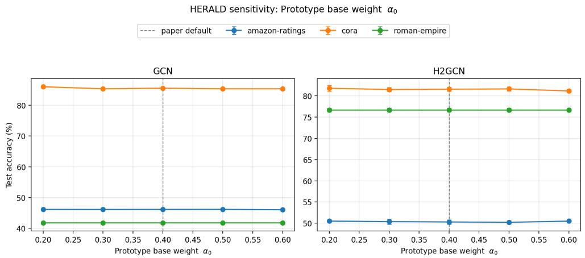  
Fig. D1 Accuracy vs. prototype base weight $\alpha _ { 0 } \in [ 0 . 2 , 0 . 6 ]$ . All three datasets are essentially flat across the sweep, with swings ≤ 0.66% on Cora and $\leq 0 . 2 9 \%$ on Amazon-ratings. Roman-empire is unafected (SR≈ 99.5%, all variants produce the same condensed graph).

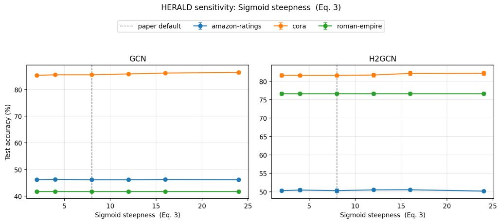  
Fig. D2 Accuracy vs. sigmoid steepness $c \in [ 2 , 2 4 ]$ . The largest swing (1.07% GCN on Cora) occurs because a higher steepness pushes Cora’s very low h even further below the midpoint, slightly raising the prototype weight and shifting which nodes are ranked highest. Amazon-ratings and Roman-empire are unafected.

## D.3 Discussion

Four observations emerge clearly from Table D9 and Figures D1–D4.

## D.3.1 Roman-empire is invariant to all hyperparameters.

At SR≈ 99.5%, Roman-empire saturates the available budget regardless of which hyperparameter value is used, so every grid point produces the same condensed graph and hence identical accuracy. This is consistent with the saturation efect explained in Appendix E: on sparse heterophilic graphs where node storage dominates the budget, the BFS loop exhausts the training neighbourhood before the budget is meaningful. Roman-empire therefore acts as a useful control: any non-zero swing there would indicate an unintended sensitivity in the condensation pipeline itself rather than in the scoring criterion.

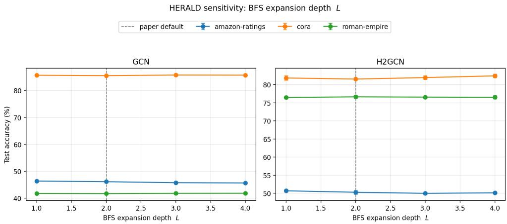

Fig. D3 Accuracy vs. BFS expansion depth $L \in [ 1 ,$ 4]. BFS depth is the most structurally impactful parameter: increasing L from 1 to 4 on Amazon-ratings reduces the condensed node count from 21,755 to 17,048 (SR from 88.7% to 69.4%) because deeper trees are more expensive per root, admitting fewer roots within the budget. The accuracy swing of 0.71% on Amazon-ratings GCN reflects this structural diference rather than the scoring criterion per se.  
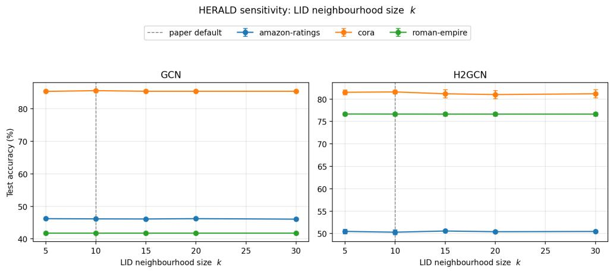  
Fig. D4 Accuracy vs. LID neighbourhood size k ∈ [5, 30]. All curves are nearly flat; the largest swing (0.59% H2GCN on Cora) is within the standard deviation of the baseline. LID estimates stabilise quickly with neighbourhood size, and the relative ranking of nodes by LID score is robust even at small k.

## D.3.2 BFS depth L is the most structurally consequential parameter.

The L sweep produces the largest swings on Amazon-ratings (0.71% GCN, 0.70% H2GCN), because changing L directly changes the size of each BFS neighbourhood tree and hence how many root nodes can be admitted within the budget. At $L = 1$ each root contributes only its immediate neighbours, so more roots fit and the condensed graph contains 21,755 nodes $( \mathrm { S R } { = } 8 8 . 7 \% )$ . At $L = 4$ , each tree is substantially larger, fewer roots $\operatorname { f i t } ,$ and the condensed graph shrinks to $^ { 1 7 , 0 4 8 }$ nodes $( \mathrm { S R } { = 6 9 . 4 \% } )$ The accuracy diference reflects this structural change rather than any sensitivity in HERALD’s scoring criterion. The paper default $L = 2$ sits at the midpoint of this range and is consistent with the two-hop receptive field of standard two-layer GNNs, ensuring the condensed subgraph captures the same structural context the downstream model will aggregate over.

## D.3.3 The adaptive weight parameters $( c , \alpha _ { 0 } )$ are stable.

The sigmoid steepness c produces a maximum swing of 1.07% GCN on Cora, which is the largest single value in Table D9. Examining the raw numbers reveals the mechanism: higher steepness $\left( c \ge 1 2 \right)$ makes the transition sharper, efectively forcing Cora’s $h \approx 0 . 0 0 2$ even further below the midpoint $h = 0 . 4$ and increasing α slightly, which in turn changes which training nodes are ranked first. On Cora at $r = 0 . 0 0 5$ this afects a small number of marginal nodes near the budget boundary, hence the small but non-zero swing. The prototype base weight $\alpha _ { 0 }$ shows a maximum swing of 0.66% on Cora, again reflecting the same marginal-node efect. Critically, both parameters are monotone in neither direction: performance does not consistently improve or degrade as c or $\alpha _ { 0 }$ increase, confirming there is no strong incentive to deviate from the paper defaults. On Amazon-ratings, both parameters produce swings $\leq 0 . 3 6 \%$ , well within one standard deviation of the baseline.

## D.3.4 LID neighbourhood size k is robustly insensitive.

The LID swing is $\leq 0 . 5 9 \%$ across all dataset–GNN pairs, and the accuracy curves in Figure D4 are essentially flat. This confirms the theoretical expectation: the maximum likelihood LID estimator $\left( \mathrm { E q . \ ( 1 3 ) } \right)$ uses a ratio $d _ { j } / d _ { k }$ that stabilises in relative ordering as k grows, so the ranking of nodes by LID score is already reliable at $k = 5$ . The paper default $k = 1 0$ is a conservative choice that provides a stable estimate without imposing significant computational overhead.

## D.3.5 Overall robustness.

The maximum swing across all axes, datasets, and architectures is 1.07% (sigmoid steepness on Cora GCN), and the median swing is 0.16%. In the two non-saturating datasets (Cora and Amazon-ratings), no axis produces a swing exceeding 1.07%, and 19 of the 24 dataset–GNN–axis combinations show swings below $0 . 7 \%$ . These results demonstrate that HERALD is robust to hyperparameter choice within reasonable ranges: the paper defaults are not a carefully tuned optimum but a stable operating point from which moderate deviations cause only minor accuracy changes. This robustness is an important practical property for a condensation method, since hyperparameter tuning on the condensed graph would introduce a circularity (the condensed graph itself would need to change to evaluate each setting).

## Appendix E Condensed Graph Statistics

A natural question beyond classification accuracy is what does the condensed graph actually look like? We investigate this by comparing the structural properties of the subgraphs produced by BONSAI and HERALD on three representative datasets: Roman-empire $( h = 0 . 9 6 8$ , strongly heterophilic), Amazon-ratings $( h = 0 . 6 2 0$ , moderately heterophilic), and Squirrel $( h = 0 . 7 7 6$ , heterophilic with very high edge density). Figure E5 summarises the three most diagnostic structural metrics; Tables E10–E12 report the full set of statistics.

## E.1 Storage ratio

Following Gupta et al. [11], the storage ratio $\operatorname { S R } ( \% )$ measures what fraction of the original graph’s storage budget is consumed by the condensed graph:

$$
\mathrm { S R } = \frac { \mathcal { C } ( G _ { c } ) } { \mathcal { C } ( G ) } \times 1 0 0 ,\tag{E1}
$$

where $\mathcal { C } ( \cdot )$ is the storage cost of Eq. (1). A target compression fraction r ideally yields SR ≈ $r \times 1 0 0$ , but in practice greedy BFS expansion causes SR to saturate once there are no further nodes that fit within the remaining budget.

## E.2 Feature variance

To quantify how much of the original feature diversity is retained, we compute the mean per-feature variance across all nodes in the condensed graph, normalised by the same quantity computed on the full training set:

$$
\widehat { \sigma } ^ { 2 } = \frac { 1 } { k ^ { * } } \sum _ { j \in \mathcal { F } } \frac { \mathrm { V a r } ( \tilde { \mathbf { X } } [ V _ { c } , j ] ) } { \mathrm { V a r } ( \tilde { \mathbf { X } } [ V _ { \mathrm { t r } } , j ] ) + \epsilon } .\tag{E2}
$$

Values close to 1 indicate that the condensed graph preserves the feature spread of the original training set; values below 1 suggest the condensed graph over-concentrates on a narrow region of feature space.

## E.3 Class entropy

The label diversity of the condensed graph is measured by the entropy of its empirical class distribution:

$$
H _ { c } = - \sum _ { c = 1 } ^ { C } \hat { p } _ { c } \log \hat { p } _ { c } ,\tag{E3}
$$

where $\hat { p } _ { c } = | \{ v \in V _ { c } : y _ { v } = c \} | / | V _ { c } |$ . Higher entropy indicates better class balance.

Tables E10–E12 report $| V _ { c } | , | E _ { c } | ,$ average degree ${ \bar { d } } ,$ class entropy $H _ { c } ,$ normalised feature variance ${ \widehat { \sigma } } ^ { 2 }$ , and $\mathrm { S R } ( \% )$ for both condensers across all four compression fractions.

Table E10 Condensed graph statistics on Roman-empire $( N = 2 2 , 6 6 2$ , E = 65,854, F = 300, h = 0.968). d¯: mean degree; $H _ { c } { : }$ class entropy (max = log 18 ≈ 2.89); $\widehat { \sigma } ^ { 2 }$ : normalised feature variance; SR: storage ratio (%).
<table><tr><td>Method</td><td>r</td><td> $| V _ { c } |$ </td><td> $\lvert E _ { c } \rvert$ </td><td> $\bar { d }$ </td><td> $H _ { c }$ </td><td> $\widehat { \sigma } ^ { 2 }$ </td><td>SR  $( \% )$ </td></tr><tr><td rowspan="4">BONSAI</td><td>0.0001</td><td>15,110</td><td>21,735</td><td>2.88</td><td>2.617</td><td>0.954</td><td>66.67</td></tr><tr><td>0.005</td><td>19,512</td><td>32,762</td><td>3.36</td><td>2.613</td><td>0.996</td><td>86.23</td></tr><tr><td>0.01</td><td>21,548</td><td>35,238</td><td>3.27</td><td>2.613</td><td>1.003</td><td>95.20</td></tr><tr><td>0.03</td><td>21,548</td><td>35,238</td><td>3.27</td><td>2.613</td><td>1.003</td><td>95.20</td></tr><tr><td rowspan="4">HERALD</td><td>0.0001</td><td>18,697</td><td>26,140</td><td>2.80</td><td>2.628</td><td>0.965</td><td>82.47</td></tr><tr><td>0.005</td><td>22,559</td><td>32,734</td><td>2.90</td><td>2.613</td><td>1.000</td><td>99.54</td></tr><tr><td>0.01</td><td>22,559</td><td>32,734</td><td>2.90</td><td>2.613</td><td>1.000</td><td>99.54</td></tr><tr><td>0.03</td><td>22,559</td><td>32,734</td><td>2.90</td><td>2.613</td><td>1.000</td><td>99.54</td></tr><tr><td>Full graph (train)</td><td></td><td>22,662</td><td> $^ { 6 5 , 8 5 4 }$ </td><td>5.81</td><td>2.890</td><td>1.000</td><td>100.00</td></tr></table>

Table E11 Condensed graph statistics on Amazon-ratings $( N = 2 4 , 4 9 2$ $E = 1 8 6 , 1 0 0$ $F = 3 0 0$ , h = 0.620).
<table><tr><td>Method</td><td>r</td><td> $| V _ { c } |$ </td><td> $\lvert E _ { c } \rvert$ </td><td> $\bar { d }$ </td><td> $H _ { c }$ </td><td> $\widehat { \sigma } ^ { 2 }$ </td><td>SR (%)</td></tr><tr><td rowspan="4">BONSAI</td><td>0.0001</td><td>11,484</td><td>37,428</td><td>6.52</td><td>1.404</td><td>0.991</td><td>46.72</td></tr><tr><td>0.005</td><td>16,174</td><td>58,828</td><td>7.27</td><td>1.407</td><td>1.001</td><td>65.97</td></tr><tr><td>0.01</td><td>20,618</td><td>80,568</td><td>7.82</td><td>1.407</td><td>1.002</td><td>84.24</td></tr><tr><td>0.03</td><td>24,385</td><td>96,944</td><td>7.95</td><td>1.407</td><td>1.001</td><td>99.68</td></tr><tr><td rowspan="4">HERALD</td><td>0.0001</td><td>12,110</td><td>41,822</td><td>6.91</td><td>1.463</td><td>0.937</td><td>49.33</td></tr><tr><td>0.005</td><td>19,132</td><td>67,092</td><td>7.01</td><td>1.407</td><td>1.001</td><td>77.97</td></tr><tr><td>0.01</td><td>24,221</td><td>91,794</td><td>7.58</td><td>1.407</td><td>0.999</td><td>98.89</td></tr><tr><td>0.03</td><td>24,492</td><td>93,050</td><td>7.60</td><td>1.407</td><td>1.000</td><td>100.00</td></tr><tr><td>Full graph (train)</td><td></td><td>24,492</td><td>186,100</td><td>15.20</td><td>1.609</td><td>1.000</td><td>100.00</td></tr></table>

## E.4 Discussion

Several structural patterns emerge from Figure E5 and Tables E10–E12.

SR saturation. On Roman-empire and Squirrel, both condensers saturate well below the target compression fraction at higher r values (Figure E5, middle row). For Roman-empire at $r = 0 . 0 1$ and $r = 0 . 0 3$ , both BONSAI and HERALD produce identical condensed graphs $( \mathrm { S R } = 9 5 . 2 0 \%$ and 99.54% respectively), because the BFS expansion has already covered most of the available training neighbourhood. This reflects a fundamental property of the budget formula $\left( \operatorname { E q . } \left( 1 \right) \right)$ : on sparse graphs where edge storage costs are low relative to feature storage, the node budget is exhausted before the edge budget, and the condensed graph approaches the full training subgraph. Squirrel illustrates the opposite extreme: its extremely high density ( ¯d ≈ 83 in the full graph) means that edges dominate the storage cost, capping SR at around 17% regardless of r.

Table E12 Condensed graph statistics on Squirrel $( N = 5 { , } 2 0 1$ $E = 2 1 7 , 0 7 3$ , F = 2,089, h = 0.776).
<table><tr><td>Method</td><td>r</td><td>|Vc|</td><td> $\lvert E _ { c } \rvert$ </td><td> $\bar { d }$ </td><td> $H _ { c }$ </td><td> $\widehat { \sigma } ^ { 2 }$ </td><td>SR (%)</td></tr><tr><td rowspan="4">BONSAI</td><td>0.0001</td><td>2,230</td><td>42,153</td><td>37.80</td><td>1.609</td><td>0.751</td><td>9.45</td></tr><tr><td>0.005</td><td>2,911</td><td>114,386</td><td>78.59</td><td>1.609</td><td>1.014</td><td>13.41</td></tr><tr><td>0.01</td><td>3,592</td><td>129,452</td><td>72.08</td><td>1.609</td><td>1.003</td><td>16.34</td></tr><tr><td>0.03</td><td>3,820</td><td>130,775</td><td>68.47</td><td>1.609</td><td>0.969</td><td>17.25</td></tr><tr><td rowspan="4">HERALD</td><td>0.0001</td><td>2,199</td><td>37,892</td><td>34.46</td><td>1.599</td><td>0.801</td><td>9.26</td></tr><tr><td>0.005</td><td>3,643</td><td>129,755</td><td>71.23</td><td>1.609</td><td>0.999</td><td>16.54</td></tr><tr><td>0.01</td><td>3,868</td><td>131,455</td><td>67.97</td><td>1.609</td><td>0.965</td><td>17.45</td></tr><tr><td>0.03</td><td>3,868</td><td>131,455</td><td>67.97</td><td>1.609</td><td>0.965</td><td>17.45</td></tr><tr><td>Full graph (train)</td><td></td><td>5,201</td><td>217,073</td><td>83.46</td><td>1.609</td><td>1.000</td><td>100.00</td></tr></table>

HERALD selects more nodes at the same budget. Across all three datasets and all fractions, HERALD’s condensed graphs contain more nodes than BONSAI’s at equivalent r (Figure E5, top row; ratio $\lvert V _ { c } ^ { \mathrm { H E R A L D } } \rvert / \lvert V _ { c } ^ { \mathrm { B O N S A I } } \rvert$ ranges from 0.99 to 1.25). This is a direct consequence of HERALD’s feature selection: by choosing features with lower average activation density than BONSAI’s DT-selected features, each node’s per-node storage cost $f _ { v }$ is smaller, so more nodes fit within the same budget B. The additional nodes are preferentially drawn from class boundaries and high-LID regions, explaining HERALD’s accuracy gains on heterophilic datasets.

HERALD produces sparser condensed graphs. Despite containing more nodes, HERALD’s condensed graphs are consistently sparser than those of BONSAI (Figure E6, Appendix E). Boundary nodes $( \mathrm { h i g h ~ } s _ { v } ^ { ( b ) } )$ and high-LID nodes tend to be structurally peripheral, connecting to neighbours of diferent classes rather than forming tight same class cliques. BFS expansion from such roots therefore produces chains and trees rather than dense cliques, reducing edge count relative to node count. This sparsity reduces over-smoothing risk during neighbourhood aggregation on the condensed graph.

Class balance. On Amazon-ratings at r = 0.0001, HERALD achieves higher class entropy $( H _ { c } = 1 . 4 6 3 )$ than BONSAI $( H _ { c } = 1 . 4 0 4 )$ , indicating better class balance in the most budget-constrained regime. Boundary nodes are by definition adjacent to multiple classes, so selecting them as roots naturally draws in neighbours from diferent classes during BFS expansion. At larger budgets the class rebalancing step (Stage 7) equalises the distributions and the entropy gap closes.

Feature diversity. At $r = 0 . 0 0 0 1$ on Squirrel, HERALD achieves $\widehat { \sigma } ^ { 2 } = 0 . 8 0 1$ versus BONSAI’s 0.751, a gain of +0.050 (Figure E5, bottom row). This confirms that

HERALD’s LID-driven diversity term actively prevents the condensed set from collapsing onto a narrow cluster of near-duplicate high-prototype-score nodes, preserving more of the original feature manifold geometry even at severe compression. The gap narrows as the budget grows, consistent with the LID term’s role being most critical precisely when the budget forces a small, selective subset.

## Appendix F Results on Large-Scale Graphs

To evaluate whether HERALD scales beyond medium-sized benchmark graphs, we perform an additional study on the Reddit dataset (232,965 nodes and 57.3M edges), which is the largest graph considered in our benchmark. Unlike the smaller citation and heterophilic datasets, Reddit presents both substantially higher graph connectivity and a much larger feature space (602 input features across 41 classes), making it a challenging setting for graph condensation. The experimental protocol follows exactly the same evaluation pipeline used throughout Section 4. HERALD’s joint feature selector is applied as in all other experiments, using the same feature budget as Bonsai’s decision-tree selection; on Reddit, Bonsai’s tree touches all 500 of 500 raw features, so HERALD’s selector likewise retains the full feature set at this stage, with dimensionality reduction instead occurring via the downstream PCA step described below. All condensers are evaluated under the same storage budgets $r \in \{ 0 . 0 0 0 1 , 0 . 0 0 5 , 0 . 0 1 , 0 . 0 3 \}$ and the resulting condensed graphs are used to train four downstream GNN architectures (GCN, GAT, GIN, and H2GCN). The same train/validation/test split generation, training hyperparameters, and evaluation procedure are used for every method. For HERALD, the condensed feature matrix is additionally compressed using PCA while preserving 90% of the feature variance before downstream training, allowing a larger fraction of the storage budget to be allocated to representative nodes rather than feature dimensions.

## F.1 Accuracy at Scale

Table F13 summarizes the node-classification accuracy on Reddit. Overall, HERALD demonstrates strong performance across all four GNN architectures under extremely aggressive compression ratios, winning 13 of the 16 condenser/GNN/budget cells against the strongest competing baseline.

For GAT and GIN, HERALD outperforms every competing condenser at every storage budget. On GAT, HERALD reaches 42.09% at the smallest budget $( r \ =$ 0.0001), already well ahead of BONSAI (23.86%), Herding (27.50%), and Random (20.94%), and maintains a comparable margin of roughly 11–15 percentage points over the next-best method across all four budgets, reaching 43.79% at $r = 0 . 0 3$ . On GIN, HERALD’s advantage is similarly consistent, peaking at 45.10% at r = 0.01 compared with BONSAI’s 42.36%.

For H2GCN, HERALD obtains the best performance at three of the four compression ratios, reaching 45.83% accuracy at $r = 0 . 0 3$ — within approximately 5.1 percentage points of training on the full Reddit graph. The one exception is the smallest budget (r = 0.0001), where HERALD trails Random (42.15%) at 32.93%, the largest gap in favor of a baseline observed anywhere in the table; we attribute this to the very small condensed graphs at this budget (as few as 44–51 nodes after PPR pruning), where HERALD’s node scoring has too little material to stabilize H2GCN training.

For GCN, HERALD wins three of four budgets, including the smallest (38.46% at r = 0.0001) and largest (47.30% at r = 0.03), the latter representing HERALD’s best result on Reddit and a 10.3-point margin over BONSAI (36.99%). BONSAI remains competitive at r = 0.01, where it edges out HERALD (42.20% vs. 38.32%) — the only cell in the table where a baseline condenser outperforms HERALD on GCN or GIN, and consistent with BONSAI’s prototype-based selection being well suited to Reddit’s high homophily at moderate budgets.

Overall, these results indicate that the advantages of HERALD are largely preserved at Reddit scale: the proposed node-scoring strategy generalizes well beyond the medium-sized benchmark datasets considered earlier, with its two weakest points — H2GCN at the most extreme compression and GCN at r = 0.01 — both traceable to the very small node budgets available under tight storage constraints rather than a systematic weakness of the method.

Table F13 Node classification accuracy (%) on Reddit. Best condensed result per GNN column and compression ratio highlighted.
<table><tr><td>Condenser</td><td>r</td><td>GCN</td><td>GAT</td><td>GIN</td><td>H2GCN</td></tr><tr><td>Full graph</td><td></td><td>52.48±0.05</td><td>51.66±0.73</td><td>47.73±1.10</td><td>50.91±0.21</td></tr><tr><td rowspan="4">BONSAI</td><td>0.0001</td><td>37.97±0.95</td><td>23.86±11.32</td><td>40.79±1.35</td><td>37.05±2.97</td></tr><tr><td>0.005</td><td>30.29±5.04</td><td>26.83±8.83</td><td>41.15±5.33</td><td>41.31±0.57</td></tr><tr><td>0.01</td><td>42.20±2.79</td><td>24.62±7.80</td><td>42.36±2.20</td><td>42.35±0.84</td></tr><tr><td>0.03</td><td>36.99±3.50</td><td>33.13±4.58</td><td>35.18±5.66</td><td>43.26±1.09</td></tr><tr><td rowspan="4">Herding</td><td>0.0001</td><td>26.82±3.04</td><td>27.50±10.65</td><td>26.26±2.92</td><td>37.49±3.44</td></tr><tr><td>0.005</td><td>26.60±1.53</td><td>25.62±6.49</td><td>34.24±4.75</td><td>39.82±1.77</td></tr><tr><td>0.01</td><td>27.28±2.28</td><td>26.14±3.54</td><td>25.05±1.71</td><td>39.84±1.76</td></tr><tr><td>0.03</td><td>32.15±3.33</td><td>27.88±3.42</td><td>27.26±1.86</td><td>40.61±0.87</td></tr><tr><td rowspan="4">Random</td><td>0.0001</td><td>34.57±1.91</td><td>20.94±11.52</td><td>32.18±1.86</td><td>42.15±0.51</td></tr><tr><td>0.005</td><td>25.90±2.43</td><td>21.46±4.85</td><td>27.72±1.54</td><td>40.49±0.76</td></tr><tr><td>0.01</td><td>27.15±4.00</td><td>21.13±4.15</td><td>22.89±4.58</td><td>39.27±2.95</td></tr><tr><td>0.03</td><td>27.20±3.10</td><td>28.87±7.41</td><td>21.27±4.04</td><td>39.43±2.04</td></tr><tr><td rowspan="4">HERALD</td><td>0.0001</td><td>38.46±6.32</td><td>42.09±0.31</td><td>42.29±0.00</td><td>32.93±5.99</td></tr><tr><td>0.005</td><td>46.96±2.91</td><td>43.04±0.80</td><td>44.99±2.23</td><td>43.85±0.83</td></tr><tr><td>0.01</td><td>38.32±5.83</td><td>43.37±1.67</td><td>45.10±2.40</td><td>44.74±0.69</td></tr><tr><td>0.03</td><td>47.30±2.18</td><td>43.79±1.61</td><td>44.74±2.15</td><td>45.83±0.48</td></tr></table>

## Appendix G Dataset wise results

## G.1 Homophilic Datasets

Tables G14–G16 report results on Cora, CiteSeer, and PubMed.

Table G14 Node classification accuracy (%) on Cora. Best condensed result per GNN column and compression ratio highlighted.
<table><tr><td>Condenser</td><td>r</td><td>GCN</td><td>GAT</td><td>GIN</td><td>H2GCN</td></tr><tr><td>Full graph</td><td></td><td>87.60±0.34</td><td>85.42±0.17</td><td>87.27±0.51</td><td>85.28±0.67</td></tr><tr><td rowspan="4">Random</td><td>0.0001</td><td>9.56±2.21</td><td>15.83±6.21</td><td>14.02±5.48</td><td>12.92±2.44</td></tr><tr><td>0.005</td><td>14.54±2.46</td><td>22.88±7.52</td><td>18.78±5.23</td><td>23.91±2.51</td></tr><tr><td>0.01</td><td>16.64±0.65</td><td>21.14±4.52</td><td>19.56±2.71</td><td>15.39±1.78</td></tr><tr><td>0.03</td><td>27.08±0.56</td><td>29.23±5.13</td><td>29.41±4.42</td><td>32.32±2.10</td></tr><tr><td rowspan="4">Herding</td><td>0.0001</td><td>27.23±0.80</td><td>31.18±4.96</td><td>30.81±2.56</td><td>35.54±1.07</td></tr><tr><td>0.005</td><td>27.23±0.80</td><td>31.18±4.96</td><td>30.81±2.56</td><td>35.54±1.07</td></tr><tr><td>0.01</td><td>56.16±0.85</td><td>53.95±0.80</td><td>59.11±0.92</td><td>57.05±0.51</td></tr><tr><td>0.03</td><td>71.73±0.96</td><td>72.88±1.69</td><td>74.10±0.95</td><td>71.18±1.67</td></tr><tr><td rowspan="4">BONSAI</td><td>0.0001</td><td>53.21±0.43</td><td>54.72±2.67</td><td>62.36±0.42</td><td>53.03±1.16</td></tr><tr><td>0.005</td><td>84.72±0.27</td><td>81.77±0.47</td><td>85.61±0.74</td><td>81.37±0.48</td></tr><tr><td>0.01</td><td>85.24±0.17</td><td>83.25±0.79</td><td>86.16±0.48</td><td>81.77±0.44</td></tr><tr><td>0.03</td><td>85.24±0.17</td><td>83.25±0.79</td><td>86.16±0.48</td><td>81.77±0.44</td></tr><tr><td rowspan="4">GDEM</td><td>0.0001</td><td>15.76±3.19</td><td>21.37±5.80</td><td>79.89±0.42</td><td>63.54±0.86</td></tr><tr><td>0.005</td><td>39.08±2.03</td><td>37.82±2.41</td><td>50.37±7.92</td><td>60.26±0.85</td></tr><tr><td>0.010</td><td>35.06±1.59</td><td>36.05±1.47</td><td>58.12±4.69</td><td>62.88±0.59</td></tr><tr><td>0.030</td><td>34.72±0.72</td><td>34.65±0.65</td><td>29.93±5.15</td><td>72.07±0.53</td></tr><tr><td rowspan="4">HERALD</td><td>0.0001</td><td>60.59±0.48</td><td>60.22±2.68</td><td>71.14±0.45</td><td>25.42±1.91</td></tr><tr><td>0.005</td><td>85.54±0.28</td><td>82.80±0.54</td><td>85.28±0.79</td><td>81.59±0.41</td></tr><tr><td>0.01</td><td>86.90±0.23</td><td>83.84±0.95</td><td>86.79±0.83</td><td>82.55±0.50</td></tr><tr><td>0.03</td><td>86.90±0.23</td><td>83.84±0.95</td><td>86.79±0.83</td><td>82.55±0.50</td></tr></table>

## G.2 Heterophilic Datasets

Tables G17–G20 report results on the four heterophilic benchmarks.

Table G15 Node classification accuracy (%) on CiteSeer.
<table><tr><td>Condenser</td><td>r</td><td>GCN</td><td>GAT</td><td>GIN</td><td>H2GCN</td></tr><tr><td>Full graph</td><td></td><td>78.74±0.24</td><td>77.63±0.63</td><td>76.73±1.14</td><td>77.60±0.48</td></tr><tr><td rowspan="4">Random</td><td>0.0001</td><td>17.57±2.57</td><td>17.72±2.63</td><td>19.49±1.09</td><td>15.65±1.52</td></tr><tr><td>0.005</td><td>24.92±3.70</td><td>23.90±3.23</td><td>36.46±2.47</td><td>26.28±1.12</td></tr><tr><td>0.01</td><td>37.96±0.74</td><td>37.54±0.46</td><td>44.23±1.22</td><td>36.67±0.90</td></tr><tr><td>0.03</td><td>35.65±0.76</td><td>36.10±0.98</td><td>39.58±0.53</td><td>39.55±1.52</td></tr><tr><td rowspan="4">Herding</td><td>0.0001</td><td>29.94±2.26</td><td>31.77±3.92</td><td>49.67±3.07</td><td>34.65±0.42</td></tr><tr><td>0.005</td><td>39.85±3.67</td><td>42.73±5.27</td><td>59.61±0.91</td><td>46.19±0.66</td></tr><tr><td>0.01</td><td>60.54±1.45</td><td>61.56±1.69</td><td>65.62±1.03</td><td>61.68±1.16</td></tr><tr><td>0.03</td><td>71.62±0.58</td><td>71.77±0.89</td><td>69.85±0.79</td><td>69.40±1.02</td></tr><tr><td rowspan="4">BONSAI</td><td>0.0001</td><td>64.83±0.72</td><td>65.35±1.02</td><td>65.89±0.73</td><td>62.31±1.63</td></tr><tr><td>0.005</td><td>76.10±0.44</td><td>75.71±0.94</td><td>75.02±0.51</td><td>72.07±0.78</td></tr><tr><td>0.01</td><td>76.10±0.44</td><td>75.71±0.94</td><td>75.02±0.51</td><td>72.07±0.78</td></tr><tr><td>0.03</td><td>76.10±0.44</td><td>75.71±0.94</td><td>75.02±0.51</td><td>72.07±0.78</td></tr><tr><td rowspan="4">GDEM</td><td>0.0001</td><td>18.62±2.94</td><td>18.50±2.66</td><td>67.45±1.12</td><td>59.61±0.77</td></tr><tr><td>0.005</td><td>23.99±2.41</td><td>25.17±2.07</td><td>59.22±3.09</td><td>66.16±0.56</td></tr><tr><td>0.010</td><td>21.68±0.78</td><td>21.17±0.39</td><td>44.14±4.92</td><td>66.91±0.60</td></tr><tr><td>0.030</td><td>21.29±0.61</td><td>20.48±1.36</td><td>23.54±1.84</td><td>74.02±0.97</td></tr><tr><td rowspan="4">HERALD</td><td>0.0001</td><td>64.41±0.65</td><td>63.84±0.77</td><td>64.59±0.84</td><td>55.62±1.17</td></tr><tr><td>0.005</td><td>76.31±0.48</td><td>76.70±0.59</td><td>75.77±1.20</td><td>74.29±1.00</td></tr><tr><td>0.01</td><td>76.31±0.48</td><td>76.70±0.59</td><td>75.77±1.20</td><td>74.29±1.00</td></tr><tr><td>0.03</td><td>76.31±0.48</td><td>76.70±0.59</td><td>75.77±1.20</td><td>74.29±1.00</td></tr></table>

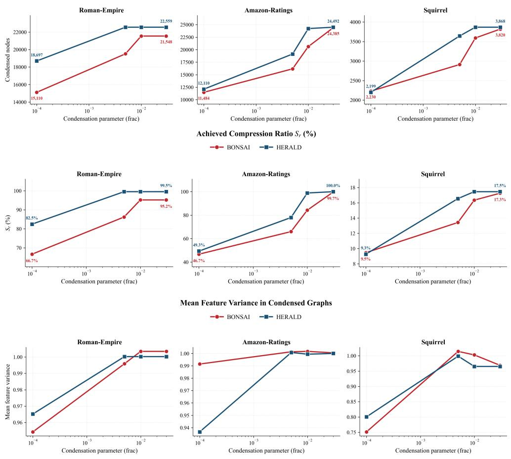  
Fig. E5 Structural comparison of BONSAI and HERALD condensed graphs across three datasets and four compression fractions $r \in \{ 1 0 ^ { - 4 } , 5 \times 1 0 ^ { - 3 } , 1 0 ^ { - 2 } , 3 \times 1 0 ^ { - 2 } \}$ . Top: condensed node count $| V _ { c } |$ . HERALD consistently selects more nodes than BONSAI at the same budget, because its Fisher×density feature selection reduces the per-node storage cost $f _ { v } ,$ leaving more of the budget for nodes. Middle: achieved storage ratio $\mathrm { S R } ( \% ) = \mathcal { C } ( G _ { c } ) / \mathcal { C } ( G ) \times 1 0 0 $ . HERALD reaches saturation earlier than BONSAI on Roman-empire and Amazon-ratings, reflecting its higher node-count eficiency. On Squirrel, both condensers saturate near SR ≈ 17% because edge storage dominates the budget. Bottom: normalised mean feature variance $\widehat { \sigma } ^ { 2 }$ (Eq. (E2)). HERALD preserves equal or greater feature diversity at every budget point; the gap is largest at $r = 1 0 ^ { - 4 }$ on Squirrel $( + 0 . 0 5$ over BONSAI), confirming that the LID diversity term prevents the condensed set from collapsing onto a narrow feature cluster.

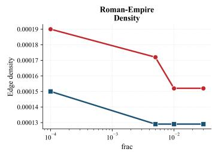

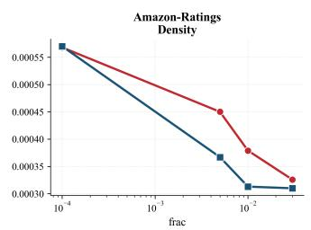

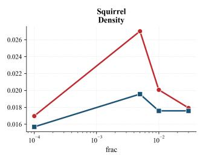

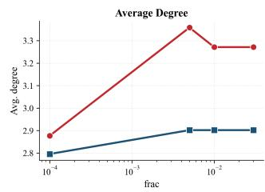

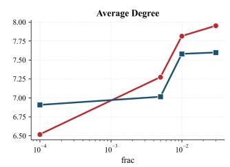

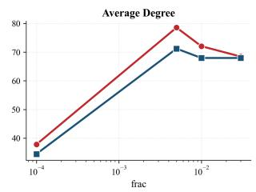  
Class-Balance Entropy of Condensed Graphs (higher = better balanced) -- BONSAI -- HERALD

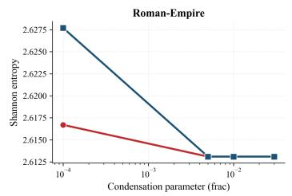

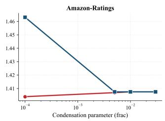

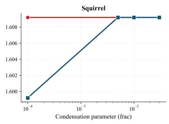  
Fig. E6 Graph density, average degree, and class-balance entropy of condensed graphs produced by BONSAI and HERALD. HERALD is consistently sparser at matched node count (top), and achieves higher class entropy at tight budgets (bottom).

Table G16 Node classification accuracy (%) on PubMed.
<table><tr><td>Condenser</td><td>r</td><td>GCN</td><td>GAT</td><td>GIN</td><td>H2GCN</td></tr><tr><td>Full graph</td><td></td><td>85.74±0.05</td><td>85.14±0.37</td><td>84.71±0.16</td><td>86.87±0.16</td></tr><tr><td rowspan="4">Random</td><td>0.0001</td><td>40.14±0.94</td><td>41.77±1.48</td><td>41.44±2.97</td><td>39.34±0.61</td></tr><tr><td>0.005</td><td>59.63±0.10</td><td>57.71±0.87</td><td>60.44±0.28</td><td>58.17±0.60</td></tr><tr><td>0.01</td><td>73.07±0.26</td><td>64.91±3.04</td><td>68.67±0.25</td><td>66.74±0.38</td></tr><tr><td>0.03</td><td>79.60±0.06</td><td>77.02±0.89</td><td>79.49±0.05</td><td>73.99±0.14</td></tr><tr><td rowspan="4">Herding</td><td>0.0001</td><td>55.20±4.12</td><td>52.32±3.77</td><td>64.05±1.46</td><td>56.60±1.85</td></tr><tr><td>0.005</td><td>81.47±0.09</td><td>78.92±0.85</td><td>81.88±0.20</td><td>76.70±0.39</td></tr><tr><td>0.01</td><td>83.61±0.11</td><td>81.60±0.44</td><td>82.08±0.08</td><td>79.10±0.36</td></tr><tr><td>0.03</td><td>84.38±0.13</td><td>83.50±0.45</td><td>83.69±0.15</td><td>81.15±0.29</td></tr><tr><td rowspan="4">BONSAI</td><td>0.0001</td><td>43.34±1.28</td><td>46.43±4.16</td><td>53.70±1.11</td><td>50.65±0.81</td></tr><tr><td>0.005</td><td>83.95±0.06</td><td>82.35±0.41</td><td>81.86±0.10</td><td>79.55±0.26</td></tr><tr><td>0.01</td><td>84.16±0.09</td><td>82.77±0.27</td><td>81.47±0.23</td><td>80.36±0.10</td></tr><tr><td>0.03</td><td>84.68±0.05</td><td>83.72±0.18</td><td>84.28±0.10</td><td>81.99±0.20</td></tr><tr><td rowspan="4">GDEM</td><td>0.0001</td><td>41.78±1.40</td><td>41.01±4.48</td><td>28.34±3.69</td><td>51.51±0.52</td></tr><tr><td>0.005</td><td>42.75±2.72</td><td>42.42±2.43</td><td>43.10±7.43</td><td>76.76±0.07</td></tr><tr><td>0.010</td><td>42.72±3.09</td><td>44.46±3.69</td><td>41.02±7.03</td><td>74.58±0.27</td></tr><tr><td>0.030</td><td>42.87±2.76</td><td>45.44±5.32</td><td>40.42±8.05</td><td>74.99±0.16</td></tr><tr><td rowspan="4">HERALD</td><td>0.0001</td><td>61.35±0.57</td><td>63.00±0.87</td><td>71.95±0.41</td><td>29.12±8.52</td></tr><tr><td>0.005</td><td>79.44±0.13</td><td>78.74±0.31</td><td>78.05±0.04</td><td>72.57±0.66</td></tr><tr><td>0.01</td><td>81.52±0.19</td><td>80.91±0.24</td><td>80.29±0.32</td><td>80.40±0.27</td></tr><tr><td>0.03</td><td>85.75±0.07</td><td>85.04±0.21</td><td>85.30±0.13</td><td>87.00±0.16</td></tr></table>

Table G17 Node classification accuracy (%) on Roman-empire.
<table><tr><td>Condenser</td><td>r</td><td>GCN</td><td>GAT</td><td>GIN</td><td>H2GCN</td></tr><tr><td>Full graph</td><td></td><td>41.82±0.37</td><td>44.13±0.81</td><td>38.53±0.52</td><td>76.57±0.48</td></tr><tr><td rowspan="4">Random</td><td>0.0001</td><td>8.26±0.46</td><td> $7 . 0 1 { \pm } 1 . 9 4 $ </td><td>7.79±0.79</td><td>13.02±0.47</td></tr><tr><td>0.005</td><td>24.05±0.24</td><td>21.11±3.16</td><td>22.65±0.62</td><td>44.42±0.47</td></tr><tr><td>0.010</td><td>26.32±0.40</td><td> $2 3 . 2 2 { \scriptstyle \pm 1 . 6 8 }$ </td><td>24.30±0.54</td><td>49.67±0.27</td></tr><tr><td>0.030</td><td>28.56±0.44</td><td>26.97±2.25</td><td>25.37±0.49</td><td>54.82±0.62</td></tr><tr><td rowspan="4">Herding</td><td>0.0001</td><td>19.97±0.40</td><td>17.67±0.98</td><td>19.08±0.47</td><td>31.95±0.77</td></tr><tr><td>0.005</td><td>26.82±0.26</td><td>24.13±0.92</td><td>23.49±0.41</td><td>49.40±0.60</td></tr><tr><td>0.010</td><td>29.39±0.45</td><td>27.84±1.15</td><td>25.44±0.16</td><td>55.54±0.62</td></tr><tr><td>0.030</td><td>33.59±0.56</td><td>34.23±0.90</td><td>28.98±0.36</td><td>62.81±0.22</td></tr><tr><td rowspan="4">BONSAI</td><td>0.0001</td><td>39.74±0.18</td><td>41.75±0.65</td><td>33.52±0.43</td><td>72.12±0.18</td></tr><tr><td>0.005</td><td>41.36±0.22</td><td>43.74±0.85</td><td>35.04±0.57</td><td>72.12±0.21</td></tr><tr><td>0.010</td><td>41.57±0.20</td><td>44.40±0.70</td><td>35.22±0.46</td><td>72.51±0.39</td></tr><tr><td>0.030</td><td>41.57±0.20</td><td>44.40±0.70</td><td>35.22±0.46</td><td>72.51±0.39</td></tr><tr><td rowspan="4">GDEM</td><td>0.0001</td><td>9.46±0.81</td><td>9.17±2.08</td><td>17.38±0.71</td><td>38.38±0.81</td></tr><tr><td>0.005</td><td>15.28±0.48</td><td>12.47±1.79</td><td>5.95±1.49</td><td>46.67±1.36</td></tr><tr><td>0.010</td><td>14.15±0.66</td><td>11.85±1.64</td><td>5.71±1.64</td><td> $4 6 . 8 5 { \pm } 1 . 2 8 $ </td></tr><tr><td>0.030</td><td>14.26±0.61</td><td>12.73±1.65</td><td>5.84±1.47</td><td> $4 6 . 9 0 { \scriptstyle \pm 1 . 2 8 }$ </td></tr><tr><td rowspan="4">HERALD</td><td>0.0001</td><td>41.85±0.15</td><td>43.62±0.56</td><td>38.29±0.45</td><td>76.00±0.35</td></tr><tr><td>0.005</td><td>41.73±0.37</td><td>44.08±0.71</td><td>38.55±0.50</td><td>76.65±0.42</td></tr><tr><td>0.010</td><td>41.73±0.37</td><td>44.08±0.71</td><td>38.55±0.50</td><td>76.65±0.42</td></tr><tr><td>0.030</td><td>41.73±0.37</td><td>44.08±0.71</td><td>38.55±0.50</td><td>76.65±0.42</td></tr></table>

Table G18 Node classification accuracy (%) on Amazon-ratings (h = 0.620).
<table><tr><td>Condenser</td><td>r</td><td>GCN</td><td>GAT</td><td>GIN</td><td>H2GCN</td></tr><tr><td>Full graph</td><td></td><td>46.86±0.24</td><td>45.45±0.39</td><td>47.22±0.42</td><td>50.98±0.19</td></tr><tr><td rowspan="4">Random</td><td>0.0001</td><td>28.39±3.06</td><td>30.73±3.08</td><td>32.06±2.55</td><td>36.65±0.03</td></tr><tr><td>0.005</td><td>30.45±1.77</td><td>31.04±1.09</td><td>28.69±2.81</td><td>35.45±0.48</td></tr><tr><td>0.01</td><td>32.82±1.04</td><td>32.43±1.55</td><td>29.58±1.46</td><td>35.57±0.48</td></tr><tr><td>0.03</td><td>35.28±0.93</td><td>34.59±1.04</td><td>31.92±1.31</td><td>35.26±0.48</td></tr><tr><td rowspan="4">Herding</td><td>0.0001</td><td>26.64±2.87</td><td>27.03±2.43</td><td>26.60±4.08</td><td>34.07±0.79</td></tr><tr><td>0.005</td><td>31.87±0.36</td><td>31.42±0.63</td><td>27.96±1.54</td><td>31.97±1.18</td></tr><tr><td>0.01</td><td>34.19±0.97</td><td>33.08±0.81</td><td>28.46±1.34</td><td>32.67±0.75</td></tr><tr><td>0.03</td><td>38.52±0.71</td><td>36.66±0.64</td><td>33.01±0.47</td><td>37.30±0.75</td></tr><tr><td rowspan="4">BONSAI</td><td>0.0001</td><td>42.85±0.41</td><td>40.56±0.39</td><td>39.13±0.67</td><td>43.58±0.20</td></tr><tr><td>0.005</td><td>45.19±0.31</td><td>43.92±0.50</td><td>42.94±0.37</td><td>48.12±0.57</td></tr><tr><td>0.01</td><td>46.24±0.31</td><td>45.23±0.15</td><td>44.43±0.44</td><td>49.43±0.40</td></tr><tr><td>0.03</td><td>46.87±0.36</td><td>45.24±0.43</td><td>46.16±0.61</td><td>49.22±0.71</td></tr><tr><td rowspan="4">GDEM</td><td>0.0001</td><td>20.68±4.38</td><td>22.08±3.50</td><td>21.96±4.85</td><td>26.25±0.39</td></tr><tr><td>0.005</td><td>34.48±0.96</td><td>36.03±0.36</td><td>23.96±3.10</td><td>36.39±0.27</td></tr><tr><td>0.010</td><td>35.19±0.65</td><td>36.60±0.20</td><td>21.91±3.61</td><td>36.46±0.16</td></tr><tr><td>0.030</td><td>35.54±0.46</td><td>36.69±0.71</td><td>22.29±3.96</td><td>36.51±0.15</td></tr><tr><td rowspan="4">HERALD</td><td>0.0001</td><td>33.26±0.35</td><td>34.77±0.63</td><td>31.55±0.64</td><td>34.89±0.50</td></tr><tr><td>0.005</td><td>46.15±0.14</td><td>44.82±0.32</td><td>44.17±0.41</td><td>50.35±0.43</td></tr><tr><td>0.01</td><td>46.91±0.30</td><td>45.37±0.52</td><td>47.15±0.39</td><td>50.72±0.24</td></tr><tr><td>0.03</td><td>46.86±0.24</td><td>45.45±0.39</td><td>47.22±0.42</td><td>50.98±0.19</td></tr></table>

Table G19 Node classification accuracy (%) on Chameleon $( h = 0 . 7 7 0 )$
<table><tr><td>Condenser</td><td>r</td><td>GCN</td><td>GAT</td><td>GIN</td><td>H2GCN</td></tr><tr><td>Full graph</td><td></td><td> $3 5 . 9 2 { \scriptstyle \pm 1 . 5 6 }$ </td><td> $4 3 . 0 3 { \scriptstyle \pm 1 . 0 2 }$ </td><td> $3 2 . 2 8 { \scriptstyle \pm 2 . 0 3 }$ </td><td>52.24±0.73</td></tr><tr><td rowspan="4">Random</td><td>0.0001</td><td>16.80±4.33</td><td> $1 9 . 3 0 { \pm } 4 . 6 9$ </td><td>18.64±5.11</td><td>23.68±3.58</td></tr><tr><td>0.005</td><td>14.34±2.82</td><td> $1 7 . 7 6 { \scriptstyle \pm 4 . 4 7 }$ </td><td>14.04±2.46</td><td>18.60±2.40</td></tr><tr><td>0.01</td><td>27.41±2.24</td><td> $2 8 . 0 3 { \scriptstyle \pm 3 . 1 1 }$ </td><td>30.18±2.52</td><td>35.75±1.89</td></tr><tr><td>0.03</td><td>31.67±1.36</td><td>30.35±1.25</td><td>31.58±1.93</td><td>33.33±2.16</td></tr><tr><td rowspan="4">Herding</td><td>0.0001</td><td>34.82±0.87</td><td>29.39±2.91</td><td>27.89±2.73</td><td>33.82±1.17</td></tr><tr><td>0.005</td><td>37.81±0.96</td><td>26.97±7.86</td><td>25.66±3.44</td><td>39.08±2.08</td></tr><tr><td>0.01</td><td>36.36±0.66</td><td>31.71±1.12</td><td>30.09±0.78</td><td>38.73±1.14</td></tr><tr><td>0.03</td><td>35.48±0.61</td><td>32.24±2.57</td><td>32.28±2.01</td><td>40.44±0.82</td></tr><tr><td rowspan="4">BONSAI</td><td>0.0001</td><td>30.75±1.10</td><td>27.72±1.48</td><td>24.56±2.45</td><td>36.01±1.70</td></tr><tr><td>0.005</td><td>32.15±0.86</td><td>29.12±1.26</td><td>26.01±0.91</td><td>37.41±0.95</td></tr><tr><td>0.01</td><td>32.15±0.86</td><td>29.12±1.26</td><td> $2 6 . 0 1 { \scriptstyle \pm 0 . 9 1 }$ </td><td>37.41±0.95</td></tr><tr><td>0.03</td><td>32.15±0.86</td><td>29.12±1.26</td><td>26.01±0.91</td><td>37.41±0.95</td></tr><tr><td rowspan="4">GDEM</td><td>0.0001</td><td>23.16±0.98</td><td>23.60±4.42</td><td>38.90±0.51</td><td>39.17±0.69</td></tr><tr><td>0.005</td><td> $2 3 . 7 3 { \scriptstyle \pm 5 . 5 2 }$ </td><td> $2 2 . 1 5 { \pm } 4 . 8 0$ </td><td> $3 5 . 5 7 \pm 2 . 1 9$ </td><td>38.16±0.96</td></tr><tr><td>0.010</td><td> $2 7 . 0 2 { \scriptstyle \pm 1 . 7 3 }$ </td><td> $2 2 . 6 3 { \scriptstyle \pm 2 . 9 4 }$ </td><td> $3 1 . 8 4 \pm 2 . 8 0 $ </td><td>38.46±1.28</td></tr><tr><td>0.030</td><td> $2 5 . 1 8 { \scriptstyle \pm 3 . 3 2 }$ </td><td> $2 3 . 0 3 { \scriptstyle \pm 4 . 5 7 }$ </td><td> $2 2 . 0 6 { \scriptstyle \pm 2 . 5 1 }$ </td><td>39.78±1.96</td></tr><tr><td rowspan="4">HERALD</td><td>0.0001</td><td>36.23±1.56</td><td> $3 2 . 1 9 { \pm } 1 . 4 0$ </td><td>26.54±4.07</td><td>41.97±1.23</td></tr><tr><td>0.005</td><td> $3 8 . 9 0 { \scriptstyle \pm 1 . 7 1 } $ </td><td> $3 2 . 8 5 { \pm } 1 . 3 5 $ </td><td> $2 6 . 7 5 { \scriptstyle \pm 4 . 0 7 }$ </td><td>41.58±1.13</td></tr><tr><td>0.01</td><td> $3 8 . 9 0 { \scriptstyle \pm 1 . 7 1 } $ </td><td> $3 2 . 8 5 { \pm } 1 . 3 5 $ </td><td> $2 6 . 7 5 { \scriptstyle \pm 4 . 0 7 }$ </td><td>41.58±1.13</td></tr><tr><td>0.03</td><td> $3 8 . 9 0 { \scriptstyle \pm 1 . 7 1 } $ </td><td> $3 2 . 8 5 { \pm } 1 . 3 5 $ </td><td> $2 6 . 7 5 { \scriptstyle \pm 4 . 0 7 }$ </td><td>41.58±1.13</td></tr></table>

Table G20 Node classification accuracy (%) on Squirrel (h = 0.776).
<table><tr><td>Condenser</td><td>r</td><td>GCN</td><td>GAT</td><td>GIN</td><td>H2GCN</td></tr><tr><td>Full graph</td><td></td><td>24.38±1.07</td><td>28.72±1.16</td><td>24.23±2.65</td><td>38.77±1.24</td></tr><tr><td rowspan="4">Random</td><td>0.0001</td><td>22.82±1.15</td><td>21.46±1.77</td><td>24.17±0.80</td><td>23.63±1.83</td></tr><tr><td>0.005</td><td>23.59±1.12</td><td>23.57±1.44</td><td>22.86±1.50</td><td>27.38±1.16</td></tr><tr><td>0.010</td><td>20.86±1.03</td><td>21.83±1.60</td><td>22.61±2.57</td><td>26.22±1.02</td></tr><tr><td>0.030</td><td>22.17±0.36</td><td>23.50±1.48</td><td>24.25±2.46</td><td>28.26±1.09</td></tr><tr><td rowspan="4">Herding</td><td>0.0001</td><td>25.03±1.01</td><td>22.19±1.77</td><td>25.19±0.83</td><td>29.49±0.85</td></tr><tr><td>0.005</td><td>26.65±0.68</td><td>23.11±2.46</td><td>23.78±2.22</td><td>31.43±1.00</td></tr><tr><td>0.010</td><td>28.34±0.58</td><td>24.40±2.25</td><td>23.27±2.71</td><td>31.93±0.71</td></tr><tr><td>0.030</td><td>26.95±0.77</td><td>24.48±2.14</td><td>25.13±2.04</td><td>33.22±0.77</td></tr><tr><td rowspan="4">BONSAI</td><td>0.0001</td><td>27.20±0.95</td><td>25.36±0.95</td><td>20.37±0.79</td><td>33.08±0.74</td></tr><tr><td>0.005</td><td>25.99±0.92</td><td>24.76±1.24</td><td>21.13±2.21</td><td>33.99±0.75</td></tr><tr><td>0.010</td><td>25.21±1.64</td><td>24.88±1.28</td><td>20.02±1.88</td><td>35.25±0.29</td></tr><tr><td>0.030</td><td>25.49±1.62</td><td>24.69±0.60</td><td>20.44±1.59</td><td>35.35±0.67</td></tr><tr><td rowspan="4">GDEM</td><td>0.0001</td><td>22.15±2.15</td><td>20.90±0.98</td><td>27.78±0.69</td><td>32.97±0.74</td></tr><tr><td>0.005</td><td>23.02±1.00</td><td>21.44±2.85</td><td>23.67±2.13</td><td>32.53±0.58</td></tr><tr><td>0.010</td><td>23.17±1.35</td><td>21.42±2.69</td><td>20.19±4.04</td><td>32.93±0.41</td></tr><tr><td>0.030</td><td>21.86±0.72</td><td>23.84±1.65</td><td>19.83±2.39</td><td>32.56±0.29</td></tr><tr><td rowspan="4">HERALD</td><td>0.0001</td><td>25.13±0.39</td><td>25.03±1.16</td><td>22.46±0.78</td><td>35.20±1.03</td></tr><tr><td>0.005</td><td>26.82±1.11</td><td>24.90±1.48</td><td>23.07±1.07</td><td>35.93±0.79</td></tr><tr><td>0.010</td><td>26.88±0.99</td><td>25.19±0.28</td><td>22.86±0.77</td><td>36.22±1.07</td></tr><tr><td>0.030</td><td>26.88±0.99</td><td>25.19±0.28</td><td>22.86±0.77</td><td>36.22±1.07</td></tr></table>