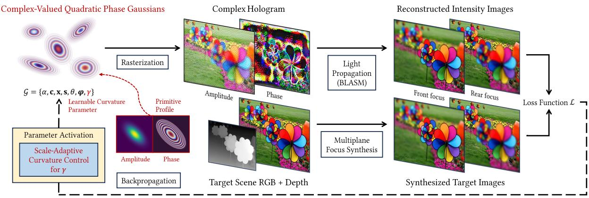
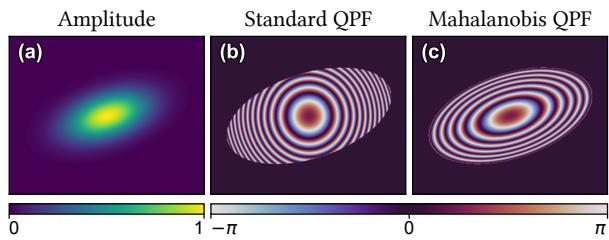
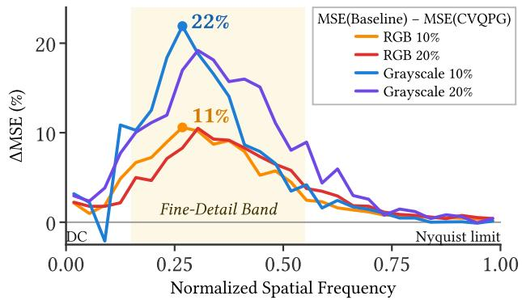
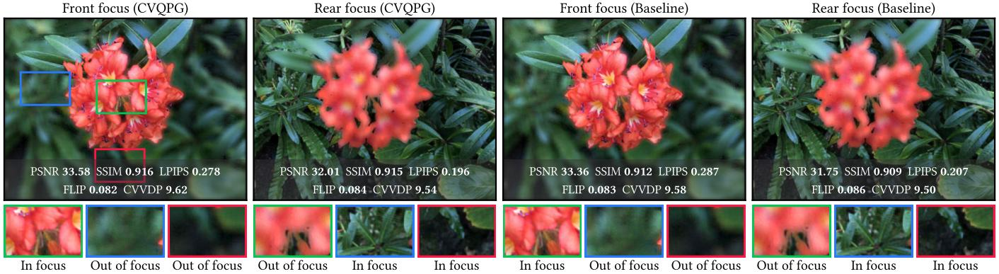
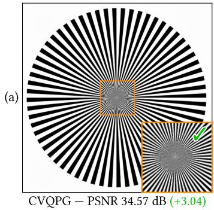
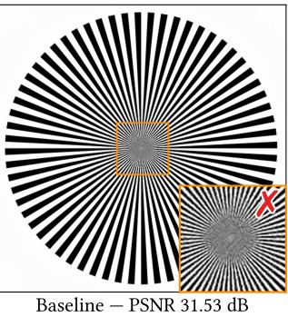
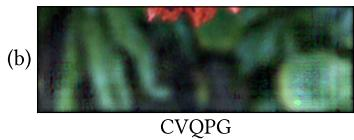
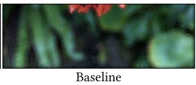
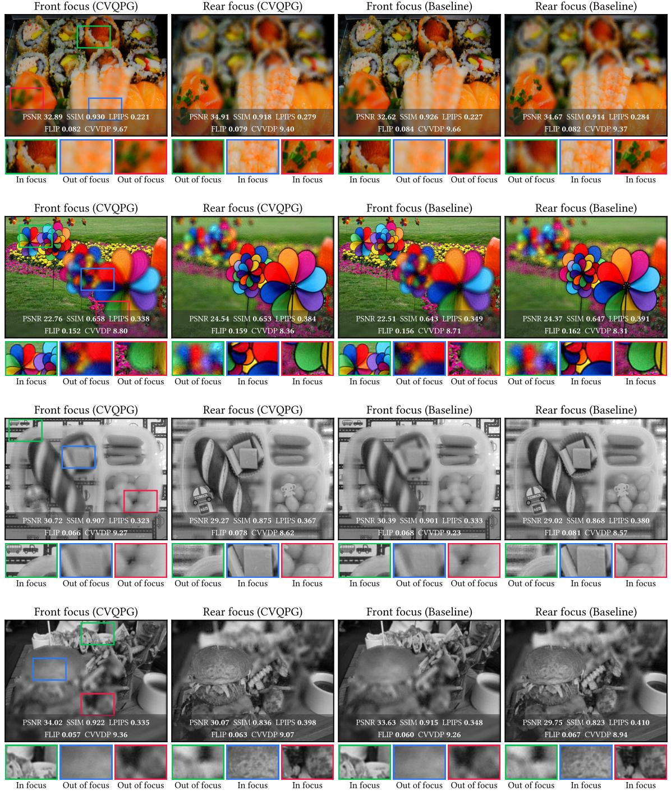

# Hologram Representation via Quadratic Phase Gaussian Splatting

HAOLONG WANG, Swansea University, United Kingdom

YICHENG ZHAN, University College London, United Kingdom

KAAN AKŞIT, University College London, United Kingdom SIMENG QIU, Swansea University, United Kingdom

We introduce Complex-Valued Quadratic Phase Gaussian (CVQPG), a novel hologram representation method that replaces standard 2D Gaussian representations used in 2D Gaussian Splatting with 2D quadratic phase functions. CVQPG incorporates additional learnable parameters to control the curvature of these bases. We evaluate our approach against state-of-the-art methods, exceeding the visual quality by +0.19 dB (RGB) and +0.33 dB (grayscale) on average in holographic reconstructions. Specifically, our equal parameter count evaluations show that modulating the primitive's wavefront is an effective and lightweight enhancement for hologram representations. In addition, our frequency domain analysis illustrates that CVQPG has successfully preserved the mid-to-high frequency band of natural images.

CCS Concepts: • Computing methodologies → Computer graphics;   
Rasterization; Computer vision representations.

## 1 Introduction

Computer-Generated Holography (CGH) plays an essential role in applications such as 3D displays [4, 11, 13]. Given the dense spatial variations in holograms, designing efficient representations that preserve high-frequency details remains a major challenge in CGH. Implicit Neural Representations (INR) [7] favor low-frequency content, and Gaussian image representations [15] fit 2D Gaussians to pixels for compression. A separate line of research tackles hologram novel view synthesis using Gaussians [3, 12]. Closest to us, Zhan et al. [11] place complex-valued Gaussians directly on the 2D hologram plane to model interference and diffraction, enabling efficient and high-fidelity reconstruction.

The work by Zhan et al. assumes a flat phase profile for each primitive; the representational capacity of such Gaussian primitives remains an under-explored question. We further explore this topic by representing full-complex holograms using the complexvalued Gaussian modulated with a quadratic phase wavefront, which explicitly models the field with an additional learnable curvature parameter. Our work makes the following contributions:

• Quadratic Phase Gaussian with Curvature Parameter. Our proposed quadratic phase Gaussian primitive adds one curvature parameter to modulate its wavefront. We derive a per-primitive curvature bound from the display's sampling limit, avoiding highfrequency aliasing.

Our comprehensive experiments with various settings show that CVQPG achieves a generalized quality improvement and outperforms the baseline in parameter effectiveness. We investigate the frequency domain features of CVQPG and ablate its components. We will also release our code upon acceptance.

## 2 Methods

Problem Definition. The holographic display can reconstruct a 3D scene as multi-plane intensity images by propagating light from a complex hologram H $\in \mathbb { C } ^ { N _ { c } \times H \times W }$ with $N _ { c }$ color channels. To synthesize the intensity target for each depth plane, we take an image $\mathbf { I } _ { t a r g e t } \in \mathbb { R } ^ { N _ { c } \times H \times \mathbf { \bar { W } } }$ and its depth map $\mathbf { \widehat { D } } \in \mathbf { \widehat { \mathbb { R } } } ^ { H \times W }$ as the input for the target synthesis function $f _ { s y n t h } ^ { m }$ at plane m. The optimization problem is therefore formulated as:

$$
\hat { \mathbf { H } } \gets \underset { \mathbf { H } } { \mathrm { a r g m i n } } \sum _ { m = 1 } ^ { M } \mathcal { L } \big ( f _ { r e c o n } ^ { m } ( \mathbf { H } ) , f _ { s y n t h } ^ { m } ( \mathbf { I } _ { t a r g e t } , \mathbf { D } ) \big ) ,\tag{1}
$$

where M denotes the total number of depth planes, $f _ { r e c o n } ^ { m }$ is the reconstruction function at plane $m ,$ and L represents the loss function that measures the difference between the reconstructed image and the synthesized target.

Complex-Valued Planar Gaussian. Our method builds upon the complex-valued 2D Gaussian representation [11], which we refer to as the planar Gaussian baseline model. It encodes a hologram as a set of N Gaussian primitives. Each primitive is parameterized as $\mathcal { G } = \{ \alpha , \mathbf { c } , \mathbf { x } , \mathbf { s } , \theta , \varphi \}$ , where $\alpha \in \mathbb { R }$ denotes the opacity, $\mathbf { c } \in \mathbb { R } ^ { N _ { c } }$ the per-channel color amplitude, $\mathbf { x } \in \mathbb { R } ^ { 2 }$ the 2D position, $\mathbf s \in \mathbb { R } ^ { 2 }$ the scales, θ ∈ R the rotation angle, and $\pmb { \varphi } \in \mathbb { R } ^ { N _ { c } }$ the per-channel phase. The distribution of the Gaussian primitive is determined by the 2D covariance matrix $\Sigma = \mathbf { R S S } ^ { \top } \mathbf { R } ^ { \top }$ , where R is the rotation matrix of angle θ, and S = diag(s) is the scaling matrix of scales s. Therefore, the contribution of a Gaussian primitive at pixel coordinate p is

$$
{ \mathcal { G } } ( { \mathbf { p } } ) = { \boldsymbol { \alpha } } \cdot { \mathbf { c } } \cdot \exp \big ( - { \textstyle { \frac { 1 } { 2 } } } ( { \mathbf { p } } - { \mathbf { x } } ) ^ { \top } { \boldsymbol { \Sigma } } ^ { - 1 } ( { \mathbf { p } } - { \mathbf { x } } ) \big ) \cdot \exp \big ( j \varphi \big ) .\tag{2}
$$

The phase profile of each primitive is flat across its effective area, equivalent to a plane wave emitted from a Gaussian ellipse.

Complex-Valued Quadratic Phase Gaussian. Considering the representational capacity, we present a novel primitive: Complex-Valued Quadratic Phase Gaussian (CVQPG). Our design incorporates the Quadratic Phase Factor (QPF) to explicitly modulate field curvature with a minimal overhead of one extra parameter per primitive. Conventionally, we modulate a Gaussian primitive with a standard QPF,

$$
Q _ { s t d } ( { \bf p } ) = \exp \bigl ( j \frac { k } { 2 f } \| { \bf p } - { \bf x } \| ^ { 2 } \bigr ) ,\tag{3}
$$

where k is the wavenumber, and $f$ is the focal length. However, the standard QPF models an isotropic circular wavefront, leading to a mismatch with the Gaussian's anisotropic amplitude envelope (Fig. 2). To resolve this, we utilize the squared Mahalanobis distance $D _ { m a h } ^ { 2 ^ { - } } ( \mathbf { p } ) = ( \mathbf { p } - \mathbf { x } ) ^ { \top } \Sigma ^ { - 1 } ( \mathbf { p } - \mathbf { x } )$ as a unified spatial metric. Therefore, the shape-adaptive Mahalanobis QPF is formulated as

$$
Q _ { m a h } ( { \bf p } ) = \exp \bigl ( j \frac { k \gamma \operatorname * { d e t } ( { \bf S } ) } { 2 } D _ { m a h } ^ { 2 } ( { \bf p } ) \bigr ) ,\tag{4}
$$

  
Fig. 1. Complex-Valued Quadratic Phase Gaussians (CVQPG) represents full complex holograms, preserving high-frequency in their holographic reconstructions CVQPG extends learnable parameters with a curvature parameter y, and optimize the hologram by comparing the reconstructed intensity images with the synthesized targets. (Source Image: [8])

where $\gamma = 1 / f$ is the learnable curvature parameter representing optical power, and det(S) is the determinant of the scaling matrix S. Consequently, each CVQPG primitive is parameterized as $\mathcal { G } =$ {α, c, x, s, θ, φ, γ}, with an added scalar parameter $\gamma \in \mathbb { R }$ Hence, the contribution of a CVQPG primitive at pixel coordinate p is given by

$$
\begin{array} { r } { \mathcal { G } ( \mathbf { p } ) = \alpha \cdot \mathbf { c } \cdot \exp \big ( - \frac { 1 } { 2 } D _ { m a h } ^ { 2 } ( \mathbf { p } ) \big ) \cdot \exp \big ( j \varphi \big ) \cdot Q _ { m a h } ( \mathbf { p } ) . } \end{array}\tag{5}
$$

The configuration of a CVQPG primitive is equivalent to the combination of a planar Gaussian light source and a virtual lens with optical power γ. During optimization, we symmetrically bound $\gamma$ within $[ - \gamma _ { \mathrm { m a x } } , \gamma _ { \mathrm { m a x } } ]$ , which enables a continuous wavefront transformation from divergence $( \gamma > 0 )$ to convergence $( \gamma < 0 )$ . We can represent a planar wavefront by $\gamma = 0 _ { ; }$ avoiding numerical instability caused by the focal length $f  \pm \infty$

  
Fig. 2. Comparison of QPFs on a Gaussian primitive. (a) Shared amplitude envelope. Unlike (b) the standard QPF with misaligned circular fringes, (c) the Mahalanobis QPF yields elliptical fringes perfectly aligned with the envelope.

Scale-Adaptive Curvature Control. The quadratic phase profile acts as a linear chirp signal, providing high-frequency components for detailed hologram reconstruction. However, to prevent aliasing artifacts caused by the physical bandwidth limitations of the Spatial Light Modulator (SLM), we impose a frequency constraint on each primitive. By restricting the chirp evaluation to the 3σ footprint of each primitive, the maximum instantaneous spatial frequency is

$$
\nu _ { \mathrm { m a x } } = \frac { \gamma \cdot 3 \sigma \cdot ( \Delta x ) ^ { 2 } } { \lambda } ,\tag{6}
$$

where $\sigma = \operatorname* { m a x } ( \mathbf { s } )$ is the equivalent standard deviation, $\lambda = 2 \pi / k$ is the wavelength, and ∆x is the pixel pitch of the SLM. Constraining this peak frequency below the SLM's Nyquist limit $( \nu _ { \mathrm { m a x } } ~ \leq ~ 0 . 5$ cycles/pixel) directly yields the scale-adaptive curvature bound for each primitive:

$$
\gamma _ { \mathrm { m a x } } = \eta \cdot \frac { \lambda } { 6 \sigma \cdot ( \Delta x ) ^ { 2 } } ,\tag{7}
$$

where $\eta = 0 . 9$ is a relaxation factor.

Hologram Rendering and Optimization. In the rendering process, rasterization is applied to accumulate all primitive contributions (Eq. 5) across the pixel grid to form the hologram,

$$
\mathbf { H } = \Big \{ \sum _ { n = 1 } ^ { N } \mathcal { G } _ { n } ( \mathbf { p } ) \Big | \mathbf { p } \in [ 1 , W ] \times [ 1 , H ] \Big \} ,\tag{8}
$$

where $H \times W$ is the size of the hologram. We propagate the hologram via the conventional Band-limited Angular Spectrum Method (BLASM) to reconstruct the field intensity ${ { I _ { m } } } = { \left| \mathrm { B L A S M } _ { m } ( { \bf H } ) \right| ^ { 2 } }$ at plane m. At each plane, we compare the reconstructed intensity $I _ { m }$ with the synthesized target intensity $\hat { I } _ { m }$ , minimizing the visual difference between them. The per-plane loss function consists of a reconstruction loss $\mathcal { L } _ { r e c o n }$ proposed by Kavaklı et al. [4] and a similarity loss $\mathcal { L } _ { S S I M } = \left( 1 - \mathrm { S S I M } \right)$ . To accurately simulate depthdependent focus and defocus effects, the total training loss $\mathcal { L }$ is summed over all depth planes as

$$
\mathcal { L } = \sum _ { m = 1 } ^ { M } \big ( \mathcal { L } _ { r e c o n } ^ { m } ( I _ { m } , \hat { I } _ { m } ) + \boldsymbol { w } _ { 1 } \cdot \mathcal { L } _ { S S I M } ^ { m } ( I _ { m } , \hat { I } _ { m } ) \big ) ,\tag{9}
$$

where $ w _ { 1 } = 0 . 0 0 5$ is the SSIM loss weight.

Curvature Warm-Up Strategy. We optimize the learnable curvature parameter γ via a two-stage strategy. We initialize and lock the curvature at γ = $\gamma = 0$ for all primitives, utilizing the planar Gaussians to optimize the low-frequency patterns. In the refinement stage, the curvature parameter is unlocked and optimized with other parameters. This coarse-to-fine approach stabilizes early-stage training and allows the model to refine the residual high-frequency details.

## 3 Evaluation and Discussion

Implementation. We utilize a 3.74 µm pixel pitch and RGB wavelengths of 639 nm, 532 nm, and 473 nm to propagate the holograms to two depth planes at 1 mm and 5 mm. Shared parameters follow the same initialization schemes as the baseline model [11]. max is calculated from the shortest wavelength and bound γ via a tanh activation. We train the models using identical PyTorch pipelines and the Adan optimizer [9]. The training runs for 2000 steps, with a 400-step warm-up stage. All experiments are conducted on a single NVIDIA TITAN RTX GPU.

Quantitative Evaluations. The visual quality of reconstructed images is evaluated using five metrics, including Peak Signal-to-noise Ratio (PSNR), Structural Similarity (SSIM), Perceptual Similarity Metric (LPIPS) [14], FLIP [2], and ColorVideoVDP (CVVDP) [5]. Our dataset is derived from both DIV2K [1] and the Real Forward-Facing dataset [6]. Then we generate the depth map using Depth Anything V2 [10]. We first compare CVQPG against the planar Gaussian baseline on ten scenes at a resolution of 640 × 480 with compression ratios of 10% and 20%. Under equal primitive counts, CVQPG outperforms the baseline across all metrics, achieving mean PSNR gains of +0.19 dB in RGB and +0.33 dB in grayscale (Tab. 1). Since CVQPG adds one trainable scalar per primitive that brings minor parameter overhead, we further conduct an equal-parameter evaluation by enlarging the baseline's primitive count by 13/12× in RGB and 9/8× in grayscale (see Baseline+ rows in Tab. 1). To assess improvements in the frequency domain, we measure the reconstruction MSE at each spatial frequency against the target. Evaluated on ten scenes at an equal primitive count (Fig. 3), the MSE reductions of CVQPG over the baseline are negligible near zero frequency, peak in the mid-to-high frequency band (11% RGB, 22% grayscale), and vanish near the Nyquist limit.

Qualitative Observations. To further explore the high-frequency feature of CVQPG, we reconstruct a single-plane, grayscale Siemens star. With equal primitives, CVQPG achieves a significant PSNR gain (+3.04 dB) with a distinct visual improvement in the central region (Fig. 5a), demonstrating its capacity to resolve high-frequency details. CVQPG exhibits ringing artifacts under zero-padding due to the abrupt truncation of its chirp phase, which is avoided by the baseline (Fig. 5b). We suppress this by applying a cosine-tapered window to smooth the hologram edges before propagation.

Ablation study. The ablation study covers two components of our method: the Scale-Adaptive Curvature Control and the Mahalanobis QPF. Starting from full CVQPG, we compare five scenes at the RGB 10% budget (Tab. 2). Replacing the scale-adaptive bound with a constant bound significantly reduces the PSNR gain (+0.185 → +0.048 dB), identifying it as the decisive component. Replacing the

Table 1. Quantitative comparison averaged over ten scenes and two depth planes. We compare CVQPG against the standard Baseline (equal primitive count N) and the enlarged Baseline+ (equal parameter count). ∆ rows show CVQPG's improvement over the standard Baseline. Best in bold.
<table><tr><td>Setting</td><td>Method</td><td>N</td><td>PSNR↑</td><td>SSIM↑</td><td>LPIPS↓</td><td>FLIP↓</td><td>CVVDP↑</td></tr><tr><td rowspan="4">RGB 20%</td><td>Baseline</td><td>30,720</td><td>29.265</td><td>0.8307</td><td>0.2895</td><td>0.1144</td><td>9.168</td></tr><tr><td>Baseline+</td><td>33,280</td><td>29.386</td><td>0.8336</td><td>0.2853</td><td>0.1134</td><td>9.186</td></tr><tr><td>CVQPG Δ</td><td>30,720</td><td>29.450</td><td>0.8364</td><td>0.2828</td><td>0.1125</td><td>9.203</td></tr><tr><td></td><td></td><td>+0.185</td><td>+0.0057</td><td>-0.0066</td><td>-0.0019</td><td>+0.035</td></tr><tr><td rowspan="4">RGB 10%</td><td>Baseline</td><td>15,360</td><td>28.034</td><td>0.7992</td><td>0.3292</td><td>0.1292</td><td>8.917</td></tr><tr><td>Baseline+</td><td>16,640</td><td>28.179</td><td>0.8034</td><td>0.3241</td><td>0.1271</td><td>8.950</td></tr><tr><td> $\mathrm { C V Q P G }$ </td><td>15,360</td><td>28.225</td><td>0.8053</td><td>0.3217</td><td>0.1265</td><td>8.966</td></tr><tr><td>Δ</td><td></td><td>+0.191</td><td>+0.0060</td><td>-0.0076</td><td>-0.0026</td><td>+0.049</td></tr><tr><td rowspan="4">Grayscale 20%</td><td>Baseline</td><td>15,360</td><td>29.504</td><td>0.8340</td><td>0.3813</td><td>0.0753</td><td>8.935</td></tr><tr><td>Baseline+</td><td>17,280</td><td>29.753</td><td>0.8394</td><td>0.3766</td><td>0.0733</td><td>8.988</td></tr><tr><td>CVQPG</td><td>15,360</td><td>29.834</td><td>0.8443</td><td>0.3694</td><td>0.0725</td><td>9.019</td></tr><tr><td>Δ</td><td></td><td>+0.331</td><td>+0.0103</td><td>-0.0119</td><td>-0.0028</td><td>+0.085</td></tr><tr><td rowspan="4">Grayscale 10%</td><td>Baseline</td><td>7,680</td><td>28.076</td><td>0.7964</td><td>0.4204</td><td>0.0888</td><td>8.548</td></tr><tr><td>Baseline+</td><td>8,640</td><td>28.317</td><td>0.8030</td><td>0.4134</td><td>0.0862</td><td>8.621</td></tr><tr><td>CVQPG</td><td>7,680</td><td>28.398</td><td>0.8079</td><td>0.4069</td><td>0.0850</td><td>8.658</td></tr><tr><td>Δ</td><td></td><td>+0.322</td><td>+0.0115</td><td>-0.0135</td><td>-0.0038</td><td>+0.109</td></tr></table>

  
Fig. 3. Frequency-resolved ∆MSE of CVQPG over the baseline for ten scenes. The gains cover the mid-to-high frequency band that contains fine details of natural images.

Mahalanobis QPF with the standard QPF costs 0.036 dB on average, which confirms the benefit of the isotropic phase profile. Finally, a vanilla model without the two components retains only a gain of +0.046 dB. This performance floor indicates that simply appending a standard QPF fails to capture the full potential of phase modulation.

Table 2. Component ablation averaged over five scenes (RGB 10% N=15,360). ∆ denotes the mean PSNR gain over the baseline. Best in bold.
<table><tr><td>Variant</td><td>Δ</td><td>PSNR↑</td><td>SSIM↑</td><td>LPIPS↓</td><td>FLIP↓</td><td>CVVDP↑</td></tr><tr><td>Baseline</td><td>一</td><td>29.809</td><td>0.8419</td><td>0.3119</td><td>0.1128</td><td>9.095</td></tr><tr><td>Full (CVQPG)</td><td>+0.185</td><td>29.994</td><td>0.8471</td><td>0.3041</td><td>0.1109</td><td>9.137</td></tr><tr><td>w/o Adaptive Bound</td><td>+0.048</td><td>29.857</td><td>0.8438</td><td>0.3103</td><td>0.1122</td><td>9.108</td></tr><tr><td>w/o Mahalanobis QPF</td><td>+0.149</td><td>29.958</td><td>0.8462</td><td>0.3044</td><td>0.1108</td><td>9.134</td></tr><tr><td>None (Vanilla)</td><td>+0.046</td><td>29.855</td><td>0.8437</td><td>0.3098</td><td>0.1118</td><td>9.109</td></tr></table>

Conclusion and Discussion. Our approach improves reconstruction quality across all metrics and settings without per-scene hyperparameter tuning, demonstrating its inherent robustness. Under equal-parameter evaluation, CVQPG retains an advantage over the baseline, showing that optimizing a curvature parameter per primitive is more effective than scaling up the count of planar Gaussians. Our experiments also show that the additional curvature parameter achieves its full potential only when strictly bounded by the perprimitive sampling limit. On the other hand, results in Tab. 1 reveal a chromatic limitation. The PSNR gains in grayscale (+0.331 dB and +0.322 dB) notably exceed those in RGB (+0.185 dB and +0.191 dB) because a shared curvature cannot be simultaneously optimal for all wavelengths. We also discover that CVQPG specifically preserves mid-to-high frequencies of natural images, demonstrating a contentdependent nature in reconstructions. In future work, we aim to explore advanced phase formulations with higher per-primitive parameter complexity and further investigate the representational capacity of explicit hologram representations.

  
Fig. 4. Visual comparison on simulated holographic reconstructions (RGB, 20%, N=30,720) at the front (1 mm) and rear (5 mm) depth planes. CVQPG provides improved visual quality over the baseline. (Source Image: [6])

  
Fig. 5. Qualitative comparisons. (a) CVQPG outperforms the baseline by +3.04 dB PSNR on the Siemens star target, providing distinct high-frequency details in the central region. (b) Abrupt boundary truncation induces ringing artifacts in CVQPG, which is absent in the baseline.

## References

[1] Eirikur Agustsson and Radu Timofte. 2017. NTIRE 2017 Challenge on Single Image Super-Resolution: Dataset and Study. In 2017 IEEE CVPRW. 1122-1131. doi:10.1109/CVPRW.2017.150

[2] Pontus Andersson, Jim Nilsson, Tomas Akenine-Möller, Magnus Oskarsson, Kalle Åström, and Mark D. Fairchild. 2020. FLIP: A Difference Evaluator for Alternating Images. Proc. ACM Comput. Graph. Interact. Tech. 3, 2, Article 15 (Aug. 2020), 23 pages. doi:10.1145/3406183

[3] Suyeon Choi, Brian Chao, Jacqueline Yang, Manu Gopakumar, and Gordon Wetzstein. 2025. Gaussian Wave Splatting for Computer-Generated Holography. ACM TOG 44, 4, Article 57 (July 2025), 13 pages. doi:10.1145/3731163

[4] Koray Kavaklı, Yuta Itoh, Hakan Urey, and Kaan Akşit. 2023. Realistic Defocus Blur for Multiplane Computer-Generated Holography. In 2023 IEEE VR. 418-426. doi:10.1109/VR55154.2023.00057

[5] Rafal K. Mantiuk, Param Hanji, Maliha Ashraf, Yuta Asano, and Alexandre Chapiro. 2024. ColorVideoVDP: A visual difference predictor for image, video and display distortions. ACM TOG 43, 4, Article 129 (July 2024), 20 pages. doi:10.1145/3658144

[6] Ben Mildenhall, Pratul P. Srinivasan, Rodrigo Ortiz-Cayon, Nima Khademi Kalantari, Ravi Ramamoorthi, Ren Ng, and Abhishek Kar. 2019. Local light field fusion: practical view synthesis with prescriptive sampling guidelines. ACM TOG 38, 4, Article 29 (July 2019), 14 pages. doi:10.1145/3306346.3322980

[7] Vincent Sitzmann, Julien Martel, Alexander Bergman, David Lindell, and Gordon Wetzstein. 2020. Implicit neural representations with periodic activation functions. Advances in neural information processing systems 33 (2020), 7462-7473.

[8] Bernard Spragg. 2013. Colorful windmills Shenzhen China. Flickr.

[9] Xingyu Xie, Pan Zhou, Huan Li, Zhouchen Lin, and Shuicheng Yan. 2024. Adan: Adaptive Nesterov Momentum Algorithm for Faster Optimizing Deep Models. IEEE TPAMI 46, 12 (2024), 9508–9520. doi:10.1109/TPAMI.2024.3423382

[10] Lihe Yang, Bingyi Kang, Zilong Huang, Zhen Zhao, Xiaogang Xu, Jiashi Feng, and Hengshuang Zhao. 2024. Depth Anything V2. arXiv:2406.09414 [cs.CV] https://arxiv.org/abs/2406.09414

[11] Yicheng Zhan, Xiangjun Gao, Long Quan, and Kaan Akşit. 2025. Complex-Valued 2D Gaussian Representation for Computer-Generated Holography. arXiv:2511.15022 [cs.CV] https://arxiv.org/abs/2511.15022

[12] Yicheng Zhan, Dong-Ha Shin, Seung-Hwan Baek, and Kaan Akşit. 2026. Complex-Valued Holographic Radiance Fields. ACM TOG 45, 3, Article 31 (April 2026), 16 pages. doi:10.1145/3804450

[13] Jingzhao Zhang, Nicolas Pégard, Jingshan Zhong, Hillel Adesnik, and Laura Waller. 2017. 3D computer-generated holography by non-convex optimization. Optica 4, 10 (2017), 1306–1313.

[14] Richard Zhang, Phillip Isola, Alexei A. Efros, Eli Shechtman, and Oliver Wang. 2018. The Unreasonable Effectiveness of Deep Features as a Perceptual Metric. In 2018 IEEE/CVF CVPR. 586-595. doi:10.1109/CVPR.2018.00068

[15] Xinjie Zhang, Xingtong Ge, Tongda Xu, Dailan He, Yan Wang, Hongwei Qin, Guo Lu, Jing Geng, and Jun Zhang. 2024. GaussianImage: 1000 FPS Image Representation and Compression by 2D Gaussian Splatting. arXiv:2403.08551 [eess.IV] https://arxiv.org/abs/2403.08551

# Hologram Representation via Quadratic Phase Gaussian Splatting

HAOLONG WANG, Swansea University, United Kingdom

YICHENG ZHAN, University College London, United Kingdom

KAAN AKŞIT, University College London, United Kingdom

SIMENG QIU, Swansea University, United Kingdom

## 1 Degenration of Complex-Valued Quadratic Phase Gaussian

The Complex-Valued Quadratic Phase Gaussian (CVQPG) primitive can degenerate to the basic forms in two specific cases. First, when the scales vector $\mathbf { \boldsymbol { s } } = [ s _ { x } , s _ { y } ] ^ { \top }$ has identical elements $s _ { x } = s _ { y } = s ,$ the 2D covariance matrix degenerates to a scaled identity matrix $\Sigma = s ^ { 2 } \mathbf { I }$ The squared Mahalanobis distance becomes $\begin{array} { r } { D _ { m a h } ^ { 2 } ( \mathbf { p } ) = \frac { 1 } { s ^ { 2 } } \| \mathbf { p } - \mathbf { x } \| ^ { 2 } } \end{array}$ , equivalent to a scaled Euclidean distance, where p is the pixel coordinate and x is the primitive's 2D position. Meanwhile, the determinant det $( \mathsf { S } ) = \mathsf { \pmb { s } } ^ { 2 }$ cancels the scale $s ^ { 2 } .$ As a result, the Mahalanobis QPF becomes a standard QPF. Second, when the learnable curvature parameter equals zero $( \gamma = 0 )$ , the phase profile is flattened since $Q _ { m a h } ( { \bf { p } } ) = \exp ( 0 ) = 1$ . In this case, CVQPG primitive degrades to the planar Gaussian with uniform phase profile.

## 2 Scale-Adaptive Curvature Control Derivation

By defining the equivalent standard deviation as $\sigma = \operatorname* { m a x } ( \mathbf { s } )$ , we apply the approximation $\operatorname* { d e t } ( \mathsf { S } ) D _ { m a h } ^ { 2 } ( \boldsymbol { p } ) \approx \boldsymbol { p } ^ { 2 }$ where $\boldsymbol { p }$ is the scalar radial pixel distance from the primitive center. The instantaneous scalar spatial frequency (in cycles/pixel) can be derived from the phase term $\phi$ of the Mahalanobis QPF:

$$
\nu = \frac { 1 } { 2 \pi } \cdot \frac { d \phi } { d p } = \frac { \gamma \cdot p \cdot ( \Delta x ) ^ { 2 } } { \lambda } ,\tag{1}
$$

where $\lambda = 2 \pi / k$ is the wavelength, and $\Delta x$ is the pixel pitch of the SLM. The maximum spatial frequency of the chirp signal is reached at the boundary where $\textstyle p = 3 \sigma :$

$$
\nu _ { \mathrm { m a x } } = \frac { \gamma \cdot 3 \sigma \cdot ( \Delta x ) ^ { 2 } } { \lambda } .\tag{2}
$$

To avoid frequency aliasing, the maximum frequency is bounded by the Nyquist limit of the SLM $( \nu _ { \mathrm { m a x } } \leq 0 . 5$ cycles/pixel):

$$
\frac { \gamma \cdot 3 \sigma \cdot ( \Delta x ) ^ { 2 } } { \lambda } \leq 0 . 5\tag{3}
$$

$$
\gamma \leq \frac { \lambda } { 6 \sigma \cdot ( \Delta x ) ^ { 2 } }\tag{4}
$$

Hence, the scale-adaptive curvature bound is formulated as

$$
\gamma _ { \mathrm { m a x } } = \eta \cdot \frac { \lambda } { 6 \sigma \cdot ( \Delta x ) ^ { 2 } } ,\tag{5}
$$

where η is a relaxation factor providing an empirical safety margin.

## 3 Visual Results

This section illustrates a range of representative reconstructions from our dataset.

  
Fig. 1. Visual comparison on simulated holographic reconstructions between CVQPG and the baseline. We list four settings in an order of RGB 20%, RGB, 10%, grayscale 20%, and grayscale 10%. (Source Image: Ben Sutherland, Bernard Spragg, anotherlunch.com, kennejima)