# Identifiability of Nonnegative Tensor Decompositions via Positive Scattering

Haoming Wang and Ming Yuan Columbia University

September 11, 2026

## Abstract

Identifiability of tensor decompositions is often established through linear-algebraic conditions on the factor families. For nonnegative decompositions, however, positivity provides additional information that is not captured by dimension and independence alone: nonnegative terms cannot cancel, and their supports constrain competing decompositions. We introduce a positive scattering term that quantifies this additional source of identifiability and combine it with the dimension budget underlying the Lovitz–Petrov generalization of Kruskal’s theorem. For every subset of components, we obtain two suficient conditions: a threshold of 2|S| − 2 guarantees minimality and nonnegative rank, while the stronger threshold 2|S| − 1 guarantees uniqueness among nonnegative decompositions of the same length. The key result is a positive splitting inequality for irreducible exchanges of nonnegative rank-one tensors, which combines the dimension constraint with support-induced geometric rigidity. Although the scattering term is defined through an optimization over intermediate factor spaces, we show that its mode costs are exactly 0, 1, or +∞, yielding an exact activation characterization in terms of graph connectivity. The resulting criterion can strictly certify sparse nonnegative tensor decompositions beyond the reach of Kruskal and Lovitz–Petrov conditions, including examples for which those conditions fail even after reshaping. In the matrix case, the two criteria reduce respectively to full-rank factorization and two-sided separability.

Keywords: Nonnegative tensor decomposition, identifiability, tensor rank, nonnegative matrix factorization

## 1 Introduction

Identifiability asks whether observable multilinear data uniquely determine their latent rank-one components, up to the unavoidable permutation and scaling ambiguities. This question is central whenever a tensor decomposition is used as a structural model rather than merely as a numerical approximation. Tensor methods, for example, turn low-order observable moments into latentcomponent recovery procedures in mixture, topic, and other latent-variable models (Allman et al., 2009; Anandkumar et al., 2014, 2015). Nonnegative tensor decompositions arise in such models when the latent components represent quantities that are intrinsically nonnegative.

Nonnegative tensor decompositions also arise naturally in signal processing. They have been used, for example, for blind audio source separation (Barker and Virtanen, 2016) and multilinear spectral unmixing of hyperspectral data (Veganzones et al., 2016). More broadly, tensor decompositions provide identifiability in blind source separation and related multilinear inverse problems. Deterministic uniqueness conditions for canonical polyadic decompositions have therefore been developed to exploit additional structure in signal-processing models, including known, orthonormal, or partially Hermitian factors (Sørensen and De Lathauwer, 2015). Nonnegativity provides a different form of structural information: unlike orthogonality or symmetry, it constrains competing decompositions through the absence of cancellation. Zeros and supports in the observed tensor therefore carry information about which alternative components are possible.

A substantial literature studies uniqueness and identifiability of tensor decompositions through linear-algebraic properties of their factor families. Kruskal’s theorem uses the Kruskal ranks of the factors (Kruskal, 1977), while the Lovitz–Petrov theorem replaces these global conditions by a subset-wise dimension budget and strictly generalizes the Kruskal condition (Lovitz and Petrov, 2023). For nonnegative tensors, related work has established existence of best nonnegative low rank approximations (Lim and Comon, 2009) and generic uniqueness of such approximations (Qi et al., 2016). These results leave open a diferent deterministic question: given a specified exact nonnegative decomposition, how much additional identifiability can be obtained from nonnegativity itself, beyond what is captured by the dimensions of the factor spans?

This paper develops a deterministic answer to this question. Our main idea is to separate two sources of identifiability. The first is linear-algebraic and is measured by the Lovitz–Petrov dimension budget

$$
\beta ( S ) = \sum _ { j = 1 } ^ { d } ( d _ { j } ( S ) - 1 ) ,
$$

for subsets S of components. The second comes from positivity and support geometry. We quantify it by a positive scattering term $\tau ( S )$ , whose formal definition is given in Section 5. Informally, $\tau ( S )$ measures the minimum additional factor-space dimension required to connect the prescribed components through the support geometry imposed by nonnegativity. Thus $\beta ( S )$ and $\tau ( S )$ capture two distinct sources of identifiability that can be combined in a single certificate.

Our main result gives two deterministic suficient conditions. If

$$
\beta ( S ) + \tau ( S ) \geq 2 | S | - 2
$$

for every $S \subseteq [ R ]$ with $| S | \ge 2$ , then the prescribed decomposition is minimal and its number of terms equals the nonnegative rank. If the threshold is strengthened by one, to

$$
\beta ( S ) + \tau ( S ) \geq 2 | S | - 1 ,
$$

then the decomposition is unique among nonnegative decompositions of the same length. The key structural result is a positive splitting inequality: for every irreducible exchange between p prescribed nonnegative rank-one terms and q competing terms,

$$
\beta ( S ) + \tau ( S ) \leq p + q - 2 .
$$

The extra term $\tau ( S )$ arises because an irreducible positive exchange must remain connected under the support geometry of the factor spaces, while the Lovitz–Petrov argument controls the corresponding linear dimension. The two identifiability thresholds then follow by contradiction from the fact that a shorter competing decomposition creates an unbalanced exchange, whereas an inequivalent minimal decomposition creates a balanced exchange of size at least two.

Although $\tau ( S )$ is introduced through a seemingly continuous optimization over intermediate factor spaces, it admits an exact finite characterization. We show that the cost associated with each mode is always $0 , 1 , \mathrm { o r } + \infty$ , and that $\tau ( S )$ is the minimum number of modes that must be activated to make an associated graph connected. This yields an exact computational procedure based on support tests, linear-programming vertex tests, and graph connectivity. The resulting criterion is strictly stronger than the corresponding dimension-based criteria: we give deterministic families for which the new condition certifies nonnegative uniqueness even though the Lovitz– Petrov condition fails, including after reshaping, and numerical experiments show substantial gains in sparse regimes.

The theory also clarifies the matrix boundary case. For order two, the minimality criterion reduces exactly to full column rank of the two factors, or equivalently to rank $( X ) = R$ , while the uniqueness criterion reduces exactly to two-sided separability. Thus the same positive-scattering mechanism that strengthens tensor identifiability specializes to a classical nonnegative matrix identifiability condition.

The remainder of the paper is organized as follows. Section 2 states the problem and the main criterion at a high level. Section 3 develops positive exchanges and the Lovitz–Petrov splitting mechanism. Section 4 develops the support geometry and bridge connectivity induced by nonnegativity. Section 5 gives the formal definition of the positive scattering term and derives its exact activation characterization. Section 6 proves the positive splitting inequality and the main identifiability result. Section 7 develops reshaping and appending-mode consequences, Section 8 gives deterministic and numerical examples, and Section 9 specializes the theory to matrices.

## 2 Problem Setup and Main Criterion

Write $[ n ] = \{ 1 , \dots , n \}$ . Fix $d \ge 2$ and dimensions $n _ { 1 } , . . . , n _ { d } \geq 1$ , and consider a nonnegative decomposition

$$
\mathcal { T } = \sum _ { r = 1 } ^ { R } P _ { r } , \qquad P _ { r } = a _ { r } ^ { ( 1 ) } \otimes \cdots \otimes a _ { r } ^ { ( d ) } , \qquad a _ { r } ^ { ( j ) } \in \mathbb { R } _ { \geq 0 } ^ { n _ { j } } \setminus \{ 0 \} .\tag{1}
$$

The nonnegative rank $\operatorname { r a n k } _ { + } ( \mathcal { T } )$ is the smallest number of nonzero nonnegative rank-one tensors whose sum is $\tau { ; }$ a nonnegative decomposition is minimal if its length equals $\operatorname { r a n k } _ { + } ( \mathcal { T } )$ . For $d = 2 .$ this additive rank-one representation is equivalent to the usual nonnegative matrix factorization formulation (Cohen and Rothblum, 1993, p. 152). Two nonnegative decompositions of the same length are equivalent if their multisets of rank-one terms coincide.

The support of a vector $x \in \mathbb { R } ^ { n }$ is $\operatorname { s u p p } ( x ) = \{ i \in [ n ] : x _ { i } \neq 0 \}$ ; the support of a tensor is defined coordinatewise in the same way. For a nonzero nonnegative tensor, the sum of all entries, called the entry sum, is strictly positive. We will use repeatedly the elementary fact that a sum of nonzero nonnegative tensors is never zero.

For a nonempty subset $S \subseteq [ R ]$ and each mode $j ,$ put

$$
U _ { j } ( S ) = \mathrm { s p a n } \{ a _ { r } ^ { ( j ) } : r \in S \} , \qquad d _ { j } ( S ) = \mathrm { d i m } U _ { j } ( S ) \geq 1 ,
$$

and define the Lovitz–Petrov dimension budget (Lovitz and Petrov, 2023, Theorem 2)

$$
\beta ( S ) = \sum _ { j = 1 } ^ { d } ( d _ { j } ( S ) - 1 ) \geq 0 .
$$

The main result augments this dimension budget with a positive scattering term $\tau ( S )$ . We defer its formal definition to Section 5. Informally, $\tau ( S )$ measures the additional factor-space enlargement forced by nonnegativity to connect the prescribed components through their support geometry. Thus $\beta ( S )$ captures linear-algebraic information, while $\tau ( S )$ captures additional rigidity arising from positivity and support geometry.

We use the following two conditions:

$$
\beta ( S ) + \tau ( S ) \geq 2 | S | - 2 , \qquad \mathrm { f o r ~ e v e r y ~ } S \subseteq [ R ] \mathrm { ~ w i t h ~ } | S | \geq 2 ,\tag{M}
$$

and

$$
\beta ( S ) + \tau ( S ) \geq 2 | S | - 1 , \qquad \mathrm { f o r ~ e v e r y ~ } S \subseteq [ R ] \mathrm { ~ w i t h ~ } | S | \geq 2 .\tag{U}
$$

The first threshold rules out shorter competing nonnegative decompositions, while the stronger threshold also rules out competing decompositions of the same length.

Theorem 1 (Positive Lovitz–Petrov criterion). Let (1) be a nonnegative decomposition. If condition (M) holds, then

$$
\operatorname { r a n k } _ { + } ( { \mathcal { T } } ) = R ,
$$

so that (1) is minimal and its terms are linearly independent. If the stronger condition (U) holds, then every nonnegative decomposition of T of length R is equivalent to (1).

The structural result behind Theorem 1 is a positive splitting inequality. For an irreducible positive exchange involving p prescribed terms and q competing nonnegative rank-one terms, it gives

$$
\beta ( S ) + \tau ( S ) \leq p + q - 2 .
$$

The formal statement and proof are given in Section 6. The key point is that the usual Lovitz– Petrov dimension argument controls the linear complexity of the exchange, while nonnegativity imposes additional support constraints that must be paid for through τ (S).

The criterion automatically contains the Lovitz–Petrov criterion because $\tau ( S ) \geq 0$ . The improvement can be strict: Section 8 gives explicit nonnegative decompositions satisfying (U) for which the Lovitz–Petrov condition fails, even after reshaping the tensor.

For comparison, the three criteria considered in this paper difer in the structural information they use:

<table><tr><td>Criterion</td><td>Information used</td><td>Guarantee</td></tr><tr><td>Kruskal</td><td>Kruskal ranks</td><td>CP uniqueness</td></tr><tr><td></td><td>Lovitz-Petrov subset-wise factor dimensions</td><td>CP uniqueness</td></tr><tr><td>This paper</td><td>dimensions + support geometry nonnegative minimality/uniqueness</td><td></td></tr></table>

## 3 Positive Exchanges and the Splitting Mechanism

This section develops the algebraic mechanism underlying the main identifiability result. We first record two elementary facts about nonnegative rank-one tensors. We then introduce positive exchanges and decompose them into irreducible blocks. Finally, we encode an exchange as a signed family of product tensors and recall the Lovitz–Petrov splitting theorem. The latter provides the linear-algebraic part of the argument; the additional constraint induced by nonnegativity will be developed through support geometry in the next sections.

## 3.1 Basic Facts for Nonnegative Decompositions

We begin with two elementary facts about product tensors. The first gives the usual uniqueness of factorization up to rescaling, while the second shows that a nonnegative rank-one tensor always admits nonnegative factors.

Lemma 1 (Product tensors).

(i) $I f ~ x _ { j } , y _ { j } ~ \in ~ \mathbb { R } ^ { n _ { j } }$ satisfy x<sub>1</sub> $\otimes \cdot \cdot \cdot \otimes x _ { d } = y _ { 1 } \otimes \cdot \cdot \cdot \otimes y _ { d } \neq 0$ , then there exist nonzero scalars $\lambda _ { 1 } , \ldots , \lambda _ { d }$ with $y _ { j } = \lambda _ { j } x _ { j }$ for every j and $\Pi _ { j = 1 } ^ { d } \lambda _ { j } = 1$ . If in addition all the vectors x<sub>j</sub>, y<sub>j</sub> are nonnegative, then every $\lambda _ { j }$ is positive.

(ii) Every nonzero nonnegative rank-one tensor is a tensor product ofnonzero nonnegative vectors.

Proof. Part $( i )$ . Write $X = x _ { 1 } \otimes \cdot \cdot \cdot \otimes x _ { d }$ . Since $X \neq 0$ , there is a multi-index $( i _ { 1 } ^ { * } , \ldots , i _ { d } ^ { * } )$ with $X _ { i _ { 1 } ^ { * } \cdots i _ { d } ^ { * } } \neq 0$ . The entries of X are the products $\textstyle \prod _ { j = 1 } ^ { d } x _ { j } ( i _ { j } )$ , so $x _ { j } ( i _ { j } ^ { * } ) \neq 0$ for every j, and likewise $y _ { j } ( i _ { j } ^ { * } ) ^ { } \neq 0$ for every $j .$

Fix a mode $j$ and let $i \in [ n _ { j } ]$ be arbitrary. Comparing the entry of the two product tensors whose jth index is i and whose lth index is $i _ { l } ^ { * }$ for every $l \neq j$ gives

$$
x _ { j } ( i ) \prod _ { l \neq j } x _ { l } ( i _ { l } ^ { * } ) = y _ { j } ( i ) \prod _ { l \neq j } y _ { l } ( i _ { l } ^ { * } ) .
$$

The two products over $l \neq j$ are nonzero constants independent of i. Hence $y _ { j } = \lambda _ { j } x _ { j }$ with

$$
\lambda _ { j } = \frac { \prod _ { l \neq j } x _ { l } ( i _ { l } ^ { * } ) } { \prod _ { l \neq j } y _ { l } ( i _ { l } ^ { * } ) } \neq 0 .
$$

Substituting back,

$$
y _ { 1 } \otimes \cdot \cdot \cdot \otimes y _ { d } = \Big ( \prod _ { j = 1 } ^ { d } \lambda _ { j } \Big ) x _ { 1 } \otimes \cdot \cdot \cdot \otimes x _ { d } ,
$$

and since this equals $X \neq 0$ we obtain $\Pi _ { j = 1 } ^ { d } \lambda _ { j } = 1$

Now suppose all vectors are nonnegative. Choose i with $y _ { j } ( i ) > 0$ . Then $\lambda _ { j } x _ { j } ( i ) = y _ { j } ( i ) > 0$ forces $x _ { j } ( i ) \neq 0$ , hence $x _ { j } ( i ) > 0$ and $\lambda _ { j } > 0$

Part (ii). Let

$$
X = b _ { 1 } \otimes \cdots \otimes b _ { d } \neq 0
$$

be entrywise nonnegative, with real factors $b _ { j }$ . Choose a multi-index $( i _ { 1 } ^ { * } , \ldots , i _ { d } ^ { * } )$ with

$$
X _ { i _ { 1 } ^ { * } \cdots i _ { d } ^ { * } } = \prod _ { j = 1 } ^ { d } b _ { j } ( i _ { j } ^ { * } ) > 0 .
$$

In particular $b _ { j } ( i _ { j } ^ { * } ) ~ \neq ~ 0$ for all $j ,$ and the number of indices $j$ for which $b _ { j } ( i _ { j } ^ { * } ) ~ < ~ 0$ is even. Multiplying an even number of factors by −1 leaves the product tensor unchanged, so after flipping signs in pairs we may assume

$$
b _ { j } ( i _ { j } ^ { * } ) > 0 \qquad \mathrm { f o r ~ e v e r y ~ } j .
$$

We claim that then each $b _ { j }$ is nonnegative. Fix $j$ and $i \in [ n _ { j } ]$ , and consider the entry of X whose jth index is i and whose other indices are $i _ { l } ^ { * }$

$$
0 \leq X _ { i _ { 1 } ^ { * } \cdots i \cdots i _ { d } ^ { * } } = b _ { j } ( i ) \prod _ { l \neq j } b _ { l } ( i _ { l } ^ { * } ) ,
$$

where the product over $l \neq j$ is strictly positive. Hence $b _ { j } ( i ) \geq 0$ . Each $b _ { j }$ is also nonzero, since $X \neq 0$ □

Convention 1. By Lemma 1 (ii), we may and will choose nonnegative factors for every nonzero nonnegative rank-one tensor under consideration. By Lemma 1 (i), this choice is unique up to positive rescalings whose product is one. All subsequent quantities are invariant under these rescalings.

The next lemma records a basic consequence of nonnegativity that will also be used in the proof of the main criterion.

Lemma 2. The terms of a minimal nonnegative decomposition are linearly independent.

Proof. Let

$$
\mathcal { T } = \sum _ { r = 1 } ^ { R } P _ { r }
$$

be minimal and suppose that

$$
\sum _ { r = 1 } ^ { R } c _ { r } P _ { r } = 0
$$

is a nontrivial linear relation.

The nonzero coeficients cannot all have the same sign. Indeed, after negating the relation if necessary we may assume that all nonzero $c _ { r }$ are positive. Taking the entry sum of both sides then gives

$$
0 = \sum _ { r } c _ { r } ( \mathrm { e n t r y ~ s u m ~ o f ~ } P _ { r } ) > 0 ,
$$

a contradiction, since the entry sum of each $P _ { r }$ is positive. Hence, after negating the relation if necessary, at least one coeficient is positive and at least one is negative.

Put

$$
\varepsilon = \operatorname* { m i n } _ { r : c _ { r } > 0 } \frac { 1 } { c _ { r } } > 0 ,
$$

attained at some index $r _ { 0 }$ . For every r the coeficient $1 - \varepsilon c _ { r }$ is nonnegative: this is clear when $c _ { r } \leq 0$ , and when $c _ { r } > 0$ it follows from $\varepsilon c _ { r } \leq 1$ . Moreover, $1 - \varepsilon c _ { r _ { 0 } } = 0$ . Consequently,

$$
\mathcal { T } = \sum _ { r = 1 } ^ { R } P _ { r } - \varepsilon \sum _ { r = 1 } ^ { R } c _ { r } P _ { r } = \sum _ { r = 1 } ^ { R } ( 1 - \varepsilon c _ { r } ) P _ { r }
$$

is a sum of at most $R - 1$ nonzero nonnegative rank-one tensors, after absorbing each positive coeficient into one factor and discarding terms with coeficient zero. This contradicts the minimality of R.

## 3.2 Positive Exchanges and Irreducible Blocks

We now introduce the basic object used to compare two nonnegative decompositions.

Definition 1 (Positive exchange). A positive exchange is an equality

$$
\sum _ { i \in I } X _ { i } = \sum _ { s \in J } Y _ { s }
$$

between two finite sums of nonzero nonnegative rank-one tensors, indexed by finite sets I and J. A subexchange of it is a pair $( I ^ { \prime } , J ^ { \prime } )$ with $I ^ { \prime } \subseteq I , J ^ { \prime } \subseteq J$ and

$$
\sum _ { i \in I ^ { \prime } } X _ { i } = \sum _ { s \in J ^ { \prime } } Y _ { s } .
$$

The pairs $( \varnothing , \varnothing )$ and $( I , J )$ are called the empty and full subexchanges, respectively. A subexchange is proper if it is diferent from the full subexchange and nontrivial if it is neither empty nor full. The exchange is irreducible if it has no nontrivial subexchange, and reducible otherwise.

The positivity assumption immediately rules out one-sided subexchanges.

Remark 1. A nonempty subexchange cannot have exactly one empty side. If, say, $I ^ { \prime } \ne \emptyset$ and $J ^ { \prime } = \varnothing ,$ , then

$$
\sum _ { i \in I ^ { \prime } } X _ { i } = 0 ,
$$

which is impossible because the entry sum of the left side is positive. Consequently every nonempty subexchange has both sides nonempty.

The complement

$$
( I \setminus I ^ { \prime } , J \setminus J ^ { \prime } )
$$

of any subexchange, obtained by subtracting it from the full exchange, is again a subexchange. If the original subexchange is nonempty and proper, then its complement is also nonempty and hence has both sides nonempty.

Every exchange can be decomposed into irreducible pieces.

Lemma 3 (Block decomposition).

(i) Every positive exchange decomposes as a disjoint union of irreducible positive exchanges: there are partitions

$$
I = I _ { 1 } \sqcup \cdot \cdot \cdot \sqcup I _ { m } , \qquad J = J _ { 1 } \sqcup \cdot \cdot \cdot \sqcup J _ { m } ,
$$

such that each pair $\left( I _ { k } , J _ { k } \right)$ is an irreducible positive exchange.

(ii) If the two sides of the exchange are minimal nonnegative decompositions of the same tensor, then every block is balanced,

$$
| I _ { k } | = | J _ { k } | ;
$$

in particular, the two decompositions have equal length.

Proof. Part (i). Let S be the set of all subexchanges other than the empty subexchange $( \varnothing , \varnothing )$ . This finite set is nonempty because it contains the full subexchange $( I , J )$ . Order S by componentwise inclusion and choose a minimal element $( I _ { 1 } , J _ { 1 } )$ . By Remark 1, both $I _ { 1 }$ and $J _ { 1 }$ are nonempty.

The exchange

$$
\sum _ { i \in I _ { 1 } } X _ { i } = \sum _ { s \in J _ { 1 } } Y _ { s }
$$

is irreducible. Indeed, a nontrivial subexchange of this block would be a nonempty subexchange of the original exchange that is strictly smaller than $( I _ { 1 } , J _ { 1 } )$ , contrary to the choice of $( I _ { 1 } , J _ { 1 } )$

By Remark 1, the complement

$$
\left( I \setminus I _ { 1 } , J \setminus J _ { 1 } \right)
$$

is again a subexchange. If it is empty, we are done. Otherwise we apply the same argument to the complementary exchange. At every step the total number of remaining indices strictly decreases, so the process terminates after finitely many steps.

Part (ii). Let

$$
\mathcal { T } = \sum _ { i \in I } X _ { i } = \sum _ { s \in J } Y _ { s }
$$

with both decompositions minimal, and let $\left( I _ { k } , J _ { k } \right)$ be any block from part (i). Suppose $\left| I _ { k } \right| > \left| J _ { k } \right|$ Replacing the terms $\{ X _ { i } : i \in I _ { k } \}$ by $\{ Y _ { s } : s \in J _ { k } \}$ leaves the sum unchanged, because the block is a subexchange. The resulting decomposition has length

$$
| I | - | I _ { k } | + | J _ { k } | < | I | ,
$$

contradicting the minimality of the first decomposition. The case $\left| I _ { k } \right| < \left| J _ { k } \right|$ is symmetric, using the minimality of the second decomposition. Hence every block is balanced, and summing over the blocks gives $| I | = | J |$ □

Thus an exchange witnessing failure of minimality must contain an unbalanced irreducible block, whereas an exchange between two diferent minimal decompositions contains a balanced irreducible block of size at least two. This distinction is what ultimately produces the two thresholds in Theorem 1.

## 3.3 Connectedness and the Lovitz–Petrov Splitting Theorem

The next step is to encode a positive exchange as a signed family of product tensors. Irreducibility of the exchange will then translate into connectedness of this signed family.

Definition 2 (Splitting and connectedness). Following Lovitz and Petrov (2023, Definition 3), a finite multiset E of nonzero vectors in a real vector space splits if it has a nonempty proper submultiset F such that

$$
\operatorname { s p a n } E = \operatorname { s p a n } F \oplus \operatorname { s p a n } ( E \setminus F ) .
$$

We call E connected if it does not split. A multiset with a single element is connected.

The following theorem is the linear-algebraic ingredient in our argument.

Theorem 2 (Lovitz–Petrov splitting theorem). Let

$$
E = \{ x _ { a , 1 } \otimes \cdot \cdot \cdot \otimes x _ { a , d } : a \in [ N ] \}
$$

be a finite multiset of nonzero product tensors over a field. For each mode put

$$
r _ { j } = \dim \operatorname { s p a n } \{ x _ { a , j } : a \in [ N ] \} .
$$

If

$$
\dim \operatorname { s p a n } E \leq \sum _ { j = 1 } ^ { d } ( r _ { j } - 1 ) ,
$$

then E splits.

We will apply Theorem 2 only over R, to signed families obtained from irreducible positive exchanges. The resulting dimension bound is the linear-algebraic component of the positive splitting inequality. The complementary component, which has no analogue for arbitrary signed exchanges, comes from the support geometry imposed by nonnegativity and is developed in Sections 4–5.

## 4 Support Geometry and Bridge Connectivity

The previous section developed the linear-algebraic component of the identifiability argument through the Lovitz–Petrov splitting theorem. We now develop the complementary structure created by nonnegativity. The basic observation is that the nonnegative vectors in a factor space form an intrinsic polyhedral cone. Its facets record support information that is invisible to ordinary linear dimension. We use these facets to associate a signature to each factor, then combine the signatures across modes into a bridge graph. The final result of the section shows that if this bridge graph is disconnected, then a positive exchange must itself decompose into smaller exchanges.

## 4.1 Intrinsic Cones and Facet Signatures

Let W be a linear subspace of $\mathbb { R } ^ { n }$ . Call W admissible if it is spanned by its nonnegative vectors, i.e.,

$$
W = \operatorname { s p a n } ( W \cap \mathbb { R } _ { \geq 0 } ^ { n } ) .
$$

For admissible W, define the intrinsic cone

$$
C ( W ) = W \cap \mathbb { R } _ { \geq 0 } ^ { n } .
$$

Throughout this section, W is admissible with dim $W \geq 1 ;$ this is the only case needed below, since all factor spaces considered later contain nonzero nonnegative vectors.

The following lemma identifies the facet structure of the intrinsic cone. In particular, although C(W) may lie in a lower-dimensional subspace of $\mathbb { R } ^ { n }$ , every facet is still exposed by one of the original coordinate functionals.

Lemma 4 (Structure of the intrinsic cone). Let $W \subseteq \mathbb { R } ^ { n }$ be admissible with dim $W \geq 1$ . Then:

(i) C(W) is a polyhedral cone that is pointed and full-dimensional in $W$ ;

(ii) every facet F of C(W) has the form

$$
F = C ( W ) \cap \{ x \in \mathbb { R } ^ { n } : x _ { i } = 0 \}
$$

for at least one coordinate i whose functional $x \mapsto x _ { i }$ is not identically zero on $W _ { i }$ ;

(iii) if a facet F satisfies

$$
F = C ( W ) \cap \{ x _ { i } = 0 \} = C ( W ) \cap \{ x _ { k } = 0 \}
$$

for two coordinates i, k, then the restrictions of $x _ { i }$ and $x _ { k }$ to $W$ are positive multiples of one another;

(iv) choosing for every facet F one coordinate i(F) as in (ii), one has

$$
C ( W ) = \{ x \in W : x _ { i ( F ) } \geq 0 \ f o r \ e v e r y \ f a c e t \ F \ o f \ C ( W ) \} .
$$

Proof. (i). The cone C(W) is the intersection of the subspace W with the finitely many closed halfspaces

$$
\{ x \in \mathbb { R } ^ { n } : x _ { i } \geq 0 \} , \qquad i \in [ n ] ,
$$

and is therefore polyhedral. It is pointed because

$$
C ( W ) \cap ( - C ( W ) ) \subseteq \mathbb { R } _ { \geq 0 } ^ { n } \cap ( - \mathbb { R } _ { \geq 0 } ^ { n } ) = \{ 0 \} .
$$

It is full-dimensional in W because admissibility gives

$$
\operatorname { s p a n } C ( W ) = W .
$$

(ii). Let

$$
Z = \{ i \in [ n ] : x _ { i } = 0 { \mathrm { ~ f o r ~ a l l ~ } } x \in W \}
$$

be the set of coordinates that vanish identically on W. Let F be a facet of $C ( W )$ and choose $z \in$ relint F. We claim that $z _ { i } = 0$ for some $i \not \in Z .$ . Otherwise $z _ { i } > 0$ for every $i \not \in Z .$ . Since there are only finitely many such coordinates, all these inequalities remain strict in a neighborhood of z in W, while the coordinates in Z vanish identically on W. Hence $z \in$ relint $C ( W )$ , contradicting the fact that a point in the relative interior of a proper face cannot lie in the relative interior of the full-dimensional polyhedron (Rockafellar, 1970, Theorem 6.2, Corollary 18.1.3).

Thus choose $i \not \in Z$ with $z _ { i } = 0$ and set

$$
G = C ( W ) \cap \{ x _ { i } = 0 \} .
$$

The functional $x \mapsto x _ { i }$ is nonnegative on $C ( W )$ , so G is an exposed face. Since $i \not \in Z ,$ , this functional is not identically zero on W, hence it is positive at some point of $C ( W )$ and therefore $G \neq C ( W )$

We next show that $F \subseteq G$ . The functional $\varphi ( x ) = x _ { i }$ is nonnegative on $C ( W )$ and vanishes at $z \in$ relint F. For any $y \in F$ , the relative interior property implies that the segment from y to z can be extended beyond z while remaining in F (Rockafellar, 1970, Theorem 6.4). Hence there exist $y ^ { \prime } \in F$ and $\mu \in ( 0 , 1 )$ such that

$$
z = \mu y + ( 1 - \mu ) y ^ { \prime } .
$$

Since $\varphi ( y ) , \varphi ( y ^ { \prime } ) \geq 0$ and $\varphi ( z ) = 0 ,$ , we obtain $\varphi ( y ) = 0 , { \mathrm { s o ~ } } y \in G$

Finally, $F = G$ . Since F is a facet,

$$
\dim { \cal F } = \dim { \cal W } - 1 .
$$

Moreover $F \subseteq G \subsetneq C ( W )$ , so dim $G \leq \dim W - 1$ . Since $F \subseteq G$ , dim $G \geq$ dim F, and therefore dim $G =$ dim F. Thus

$$
F = G = C ( W ) \cap \{ x _ { i } = 0 \} .
$$

(iii). Let H = span F. Since F is a facet of the full-dimensional cone $C ( W )$ , H is a hyperplane of W. The restrictions

$$
\varphi _ { i } = x _ { i } | _ { W } , \qquad \varphi _ { k } = x _ { k } | _ { W }
$$

both vanish on F and hence on H. Neither is identically zero on W, because each corresponding coordinate defines a proper face. Their kernels therefore equal the hyperplane $H ,$ so the two functionals are proportional:

$$
\varphi _ { k } = \lambda \varphi _ { i }
$$

for some $\lambda \neq 0$ . Choose $c \in C ( W )$ with $\varphi _ { i } ( c ) > 0$ . Since $\varphi _ { k } ( c ) \geq 0$ , we obtain $\lambda > 0$

(iv). The inclusion $^ { 6 6 } \subset ^ { \mathfrak { N } }$ is immediate. For the converse, observe that $C ( W )$ is a pointed, fulldimensional polyhedral cone in W. Hence it is the intersection of the halfspaces defined by its facets (Schrijver, 1986, Theorem 8.1). By parts (ii)–(iii), each facet halfspace can be represented by a coordinate functional $x \mapsto x _ { i ( F ) }$ restricted to W. Thus

$$
C ( W ) = \{ x \in W : x _ { i ( F ) } \geq 0 \mathrm { ~ f o r ~ e v e r y ~ f a c e t ~ } F \} .
$$

The preceding lemma shows that the facet structure of $C ( W )$ can be represented entirely by coordinate functionals. Although several coordinates may define the same facet, Lemma 4(iii) shows that such representatives difer only by positive scaling. This allows us to record which facets are strictly positive for a given vector.

Let ${ \mathcal { F } } ( W )$ denote the finite set of facets of $C ( W )$ and choose, for each $F \in { \mathcal { F } } ( W )$ , one coordinate representative $i ( F )$ . Define the facet-coordinate map

$$
{ \cal L } _ { \cal W } : { \cal W } \longrightarrow \mathbb { R } ^ { \mathcal { F } ( { \cal W } ) } , \qquad { \cal L } _ { \cal W } x = \left( x _ { i ( { \cal F } ) } \right) _ { { \cal F } \in { \mathcal { F } } ( { \cal W } ) } .
$$

By Lemma $4 ( \mathrm { i i i } )$ , changing the representative of a facet only rescales the corresponding coordinate by a positive constant.

Lemma 5. The map L<sub>W</sub> is linear and injective, and it maps $C ( W )$ into the nonnegative orthant $\mathbb { R } _ { > 0 } ^ { \mathcal { F } ( W ) }$ . In particular, every nonzero $x \in C ( W )$ has a nonempty positive facet signature

$$
\begin{array} { r } { A _ { W } ( x ) = \{ F \in \mathcal { F } ( W ) : x _ { i ( F ) } > 0 \} = \operatorname { s u p p } ( L _ { W } x ) \neq \emptyset , } \end{array}\tag{2}
$$

and

$$
\mathcal { A } _ { W } ( \lambda x ) = \mathcal { A } _ { W } ( x ) \qquad f o r \ e v e r y \ \lambda > 0 .
$$

Proof. Linearity is immediate, and $L _ { W } x$ is entrywise nonnegative whenever $x \in C ( W )$ . Suppose $L _ { W } x = 0$ for some $x \in W$ . Then $x _ { i ( F ) } = 0$ for every facet $F .$ By Lemma $4 ( \mathrm { i v } )$ , both x and $- x$ satisfy all facet inequalities, so

$$
x \in C ( W ) \cap ( - C ( W ) ) = \{ 0 \} .
$$

Thus $L _ { W }$ is injective. In particular, $L _ { W } x \neq 0$ whenever x $\neq 0 ,$ , which proves that every nonzero $x \in C ( W )$ has a nonempty signature. Invariance under positive rescaling is immediate. □

The signature $\mathcal { A } _ { W } ( x )$ records the facets on which x has a strictly positive coordinate representative. Two nonzero vectors in the same intrinsic cone may nevertheless have disjoint signatures; Figure 1 illustrates this phenomenon. This observation motivates the notion of facet-opposite factors used below.

## 4.2 Bridge Graphs and Rectangular Splitting

We now combine facet signatures across modes. Fix a finite index set $S$ and, for each mode $j ,$ a family of nonzero nonnegative vectors

$$
\boldsymbol { x } _ { r } ^ { ( j ) } \in \mathbb { R } _ { > 0 } ^ { n _ { j } } , \qquad r \in S ,
$$

together with an admissible subspace $W _ { j } \subseteq \mathbb { R } ^ { n _ { j } }$ containing all of them. Write

$$
A _ { j } ( r ) = \mathcal A _ { W _ { j } } ( x _ { r } ^ { ( j ) } ) \subseteq \mathcal F ( W _ { j } ) , \qquad r \in S .
$$

These signatures are nonempty by Lemma 5.

Definition 3 (Bridge graph). Two indices $r , s \in S$ are facet-opposite in mode j with respect to $W _ { j } \textit { i f }$

$$
\mathcal { A } _ { j } ( r ) \cap \mathcal { A } _ { j } ( s ) = \emptyset .
$$

The bridge graph

$$
\Gamma = \Gamma ( ( W _ { j } ) _ { j } )
$$

has vertex set S and an edge $\{ r , s \}$ whenever $r \neq s$ are facet-opposite in at most one mode.

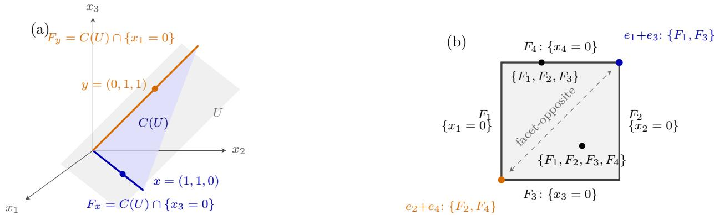  
Figure 1: Intrinsic cones, facets and signatures. (a) The intrinsic cone $C ( U ) = U \cap \mathbb { R } _ { \ge 0 } ^ { 3 }$ of the admissible plane $U = \mathrm { s p a n } \{ x , y \}$ with $x = ( 1 , 1 , 0 ) , \ y \ = \ ( 0 , 1 , 1 )$ : a pointed two-dimensional cone whose facets are its extreme rays, each cut out by a coordinate as in Lemma 4(ii). Each generator, x and $y ,$ lies on its own facet, so its coordinate $i ( F )$ vanishes there and the signatures are $A _ { U } ( x ) = \{ F _ { y } \}$ and $\mathcal { A } _ { U } ( y ) = \{ F _ { x } \}$ , which are disjoint. (b) The cross-section $\{ x _ { 1 } + x _ { 2 } = x _ { 3 } + x _ { 4 } = 1 \}$ of the three-dimensional intrinsic cone of the admissible space $W = \{ x \in \mathbb { R } ^ { 4 } : x _ { 1 } + x _ { 2 } = x _ { 3 } + x _ { 4 } \} \colon \mathrm { a }$ cone over a square with the four facets $F _ { i } = C ( W ) \cap \{ x _ { i } = 0 \} , i ( F _ { i } ) = i$ . Sample points are labeled by their signatures $\boldsymbol { \mathcal { A } } _ { W } ( \cdot )$ : full in the relative interior, smaller on proper faces. The two marked corners have disjoint signatures although they lie in one and the same intrinsic cone.

Thus an edge of the bridge graph means that the two components have compatible facet signatures in all but possibly one mode. This definition is chosen precisely so that bridge edges correspond to one-coordinate moves in the product of the facet sets.

For each $r \in S$ , define the facet box

$$
B _ { r } = \mathscr { A } _ { 1 } ( r ) \times \cdots \times \mathscr { A } _ { d } ( r ) \subseteq \mathscr { F } ( W _ { 1 } ) \times \cdots \times \mathscr { F } ( W _ { d } ) = : \Omega .
$$

The box is nonempty because every factor signature is nonempty. On Ω, call two points rookadjacent if they difer in at most one coordinate. A subset of Ω is rook-connected if every two of its points can be joined by a path of rook-adjacent points lying inside the subset. Every box $B _ { r }$ is rook-connected, since its coordinates may be changed one at a time without leaving the box.

Lemma 6 (Bridges and rooks). Let

$$
U = \bigcup _ { t \in S } B _ { t } \subseteq \Omega .
$$

Two indices $r , s \in S$ lie in the same connected component of the bridge graph Γ if and only if $B _ { r }$ and $B _ { s }$ lie in the same rook-connected component of U. Consequently, the assignment

## r 7−→ the rook component of U containing $B _ { r }$

induces a bijection between the connected components of Γ and the rook components of U.

Proof. Each box $B _ { t }$ is rook-connected and hence is contained in a single rook component of U. The resulting assignment from bridge-graph vertices to rook components is therefore well defined and surjective.

It remains to prove that two vertices belong to the same component on one side if and only if their boxes belong to the same component on the other.

Bridge $p a t h \Rightarrow$ same rook component. It sufices to consider a single bridge edge $\{ r , s \}$ . If the signatures intersect in every mode, choose

$$
f _ { j } \in { \mathcal { A } } _ { j } ( r ) \cap { \mathcal { A } } _ { j } ( s ) \qquad { \mathrm { ~ f o r ~ a l l ~ } } j .
$$

Then $( f _ { 1 } , \dots , f _ { d } ) \in B _ { r } \cap B _ { s }$ , so the two boxes lie in the same rook component.

Otherwise there is a unique exceptional mode $j _ { 0 }$ in which the signatures are disjoint. For every $j \neq j _ { 0 }$ , choose

$$
f _ { j } \in \mathcal { A } _ { j } ( r ) \cap \mathcal { A } _ { j } ( s ) ,
$$

and choose arbitrary

$$
f _ { j _ { 0 } } \in { \cal { A } } _ { j _ { 0 } } ( r ) , \qquad g _ { j _ { 0 } } \in { \cal { A } } _ { j _ { 0 } } ( s ) .
$$

Then

$$
u = ( f _ { 1 } , \ldots , f _ { d } ) \in B _ { r } ,
$$

while

$$
v = ( f _ { 1 } , \ldots , f _ { j _ { 0 } - 1 } , g _ { j _ { 0 } } , f _ { j _ { 0 } + 1 } , \ldots , f _ { d } ) \in B _ { s } .
$$

The two points difer only in coordinate $j _ { 0 } ,$ so they are rook-adjacent. Since both boxes are rookconnected, they belong to the same rook component. Concatenating along a bridge path proves the implication.

Same rook component ⇒ bridge path. Let

$$
u _ { 0 } , u _ { 1 } , \ldots , u _ { m }
$$

be a rook path in $U$ with $u _ { 0 } \in B _ { r }$ and $u _ { m } \in B _ { s }$ . For each k choose $t _ { k } \in S$ such that $u _ { k } \in B _ { t _ { k } }$ taking $t _ { 0 } = r$ and $t _ { m } = s$

For a fixed $k ,$ the points $u _ { k }$ and $u k { + 1 }$ agree in every coordinate except possibly one, say mode $j _ { 0 } .$ Therefore, for every $j \neq j _ { 0 }$

$$
( u _ { k } ) _ { j } = ( u _ { k + 1 } ) _ { j } \in \mathcal A _ { j } ( t _ { k } ) \cap \mathcal A _ { j } ( t _ { k + 1 } ) .
$$

Thus $t _ { k }$ and $t _ { k + 1 }$ are facet-opposite in at most one mode. Hence either $t _ { k } = t _ { k + 1 } \mathrm { o r } \left\{ t _ { k } , t _ { k + 1 } \right\}$ is a bridge edge. The sequence $t _ { 0 } , \ldots , t _ { m }$ therefore gives a walk from r to s in Γ. □

Figure 2 gives a three-mode illustration. The key point is that bridge edges correspond exactly to rook-compatible transitions between facet boxes, whereas a disconnected bridge graph causes the union of the boxes to separate into distinct rook components.

Lemma 7 (Rectangular splitting). Let

$$
\sum _ { r \in S } X _ { r } = \sum _ { s \in J } Y _ { s }
$$

be a positive exchange. Choose nonnegative factors

$$
X _ { r } = x _ { r } ^ { ( 1 ) } \otimes \cdot \cdot \cdot \otimes x _ { r } ^ { ( d ) } , \qquad Y _ { s } = y _ { s } ^ { ( 1 ) } \otimes \cdot \cdot \cdot \otimes y _ { s } ^ { ( d ) }
$$

according to Convention 1. Suppose that for every mode j there is an admissible subspace $W _ { j } \subseteq \mathbb { R } ^ { n _ { j } }$ containing all mode-j factors of both sides. If the bridge graph of the family $( x _ { r } ^ { ( j ) } ) _ { r \in S }$ with respect to $( W _ { j } ) _ { j }$ is disconnected, then the exchange is reducible.

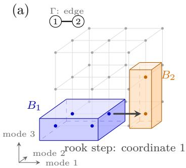

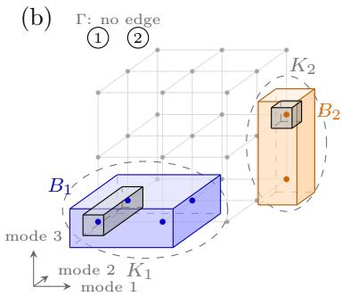  
Figure 2: Boxes and rooks in the signature space Ω, for two indices $r \in \{ 1 , 2 \}$ with facet boxes $B _ { 1 } = \{ 1 , 2 \} \times \{ 1 , 2 \} \times \{ 1 \}$ (blue) and an orange box $B _ { 2 }$ . (a) $B _ { 2 } = \{ 3 \} \times \{ 2 \} \times \{ 1 , 2 \}$ : the mode-1 signatures {1, 2} and {3} are disjoint, but the signatures intersect in modes 2 and 3, so the pair is facet-opposite in exactly one mode, i.e. a bridge edge (Definition 3). Correspondingly, one rook step changing only the first coordinate crosses from $B _ { 1 }$ to $B _ { 2 }$ , as in the proof of Lemma 6: the boxes lie in a single rook component. (b) $B _ { 2 } = \{ 3 \} \times \{ 3 \} \times \{ 1 , 2 \}$ : the signatures are disjoint in modes 1 and 2, no bridge edge exists, and every step between the boxes would have to change two coordinates at once; the union splits into two rook components $K _ { 1 } \sqcup K _ { 2 }$ . Since nonnegative entries cannot cancel, the support of the exchanged tensor is the union of all boxes, each competing box $B _ { s } ^ { \prime }$ (grey) lies inside a single component, and restricting the exchange to $K _ { 1 }$ and $K _ { 2 }$ produces the subexchanges of Lemma 7: the exchange is reducible.

Proof. All factors are nonnegative vectors in $W _ { j }$ , hence belong to $C ( W _ { j } )$ . Consider the tensorproduct map

$$
\Lambda = L _ { W _ { 1 } } \otimes \cdots \otimes L _ { W _ { d } } : W _ { 1 } \otimes \cdots \otimes W _ { d } \longrightarrow \mathbb { R } ^ { \mathcal { F } ( W _ { 1 } ) } \otimes \cdots \otimes \mathbb { R } ^ { \mathcal { F } ( W _ { d } ) } \cong \mathbb { R } ^ { \Omega } .
$$

Each $L _ { W _ { j } }$ is injective by Lemma 5, so Λ is injective.

For a product tensor

$$
z ^ { ( 1 ) } \otimes \cdot \cdot \cdot \otimes z ^ { ( d ) } , \qquad z ^ { ( j ) } \in C ( W _ { j } ) \setminus \{ 0 \} ,
$$

we have

$$
\Lambda ( z ^ { ( 1 ) } \otimes \cdots \otimes z ^ { ( d ) } ) = L _ { W _ { 1 } } z ^ { ( 1 ) } \otimes \cdots \otimes L _ { W _ { d } } z ^ { ( d ) } .
$$

This is entrywise nonnegative on Ω, and its support is the box

$$
\mathrm { s u p p } ( L _ { W _ { 1 } } z ^ { ( 1 ) } ) \times \cdots \times \mathrm { s u p p } ( L _ { W _ { d } } z ^ { ( d ) } ) .
$$

In particular,

$$
\operatorname { s u p p } ( \Lambda X _ { r } ) = B _ { r } ,
$$

and

$$
\mathrm { s u p p } ( \Lambda Y _ { s } ) = B _ { s } ^ { \prime } : = \prod _ { j = 1 } ^ { d } \mathcal { A } _ { W _ { j } } ( y _ { s } ^ { ( j ) } ) ,
$$

where all these boxes are nonempty.

Applying Λ to the exchange gives

$$
M : = \sum _ { r \in S } \Lambda X _ { r } = \sum _ { s \in J } \Lambda Y _ { s } .
$$

Since both sides are sums of entrywise nonnegative tensors, no cancellation can occur, and therefore

$$
\operatorname { s u p p } M = \bigcup _ { r \in S } B _ { r } = \bigcup _ { s \in J } B _ { s } ^ { \prime } = : U .
$$

In particular, every competing box $B _ { s } ^ { \prime }$ is contained in $U .$

Now decompose

$$
U = K _ { 1 } \sqcup \cdots \sqcup K _ { c }
$$

into rook-connected components. Since the bridge graph is disconnected, Lemma 6 gives $c \geq 2$ Every prescribed box $B _ { r }$ and every competing box $B _ { s } ^ { \prime }$ is rook-connected, so each is contained in a single component. Define

$$
S _ { \ell } = \{ r \in S : B _ { r } \subseteq K _ { \ell } \} , \qquad J _ { \ell } = \{ s \in J : B _ { s } ^ { \prime } \subseteq K _ { \ell } \} , \qquad \ell = 1 , \ldots , c .
$$

These sets partition S and $J .$ Each $S _ { \ell }$ is nonempty because every point of $K _ { \ell }$ belongs to some prescribed box $B _ { r }$ , and that entire box is rook-connected and hence contained in $K _ { \ell }$

For each ℓ, put

$$
M _ { \ell } = \sum _ { r \in S _ { \ell } } \Lambda X _ { r } , \qquad N _ { \ell } = \sum _ { s \in J _ { \ell } } \Lambda Y _ { s } .
$$

Both tensors are supported in $K _ { \ell }$ . At every point of $K _ { \ell } ,$ all terms belonging to other components vanish, so

$$
M _ { \ell } = M = N _ { \ell }
$$

on $K _ { \ell } ;$ both sides vanish outside $K _ { \ell }$ . Hence $M _ { \ell } = N _ { \ell }$ on all of Ω.

Moreover $J _ { \ell } \neq \emptyset$ . Otherwise $N _ { \ell } = 0$ , whereas

$$
{ \mathrm { s u p p } } M _ { \ell } = \bigcup _ { r \in S _ { \ell } } B _ { r } \neq \varnothing ,
$$

a contradiction.

Since Λ is injective,

$$
\sum _ { r \in S _ { \ell } } X _ { r } = \sum _ { s \in J _ { \ell } } Y _ { s } , \qquad \ell = 1 , \ldots , c .
$$

Because $c \geq 2$ , at least one such pair is nonempty and proper. It is therefore a nontrivial subexchange, so the original exchange is reducible. □

The significance of Lemma 7 is that irreducibility imposes a connectivity requirement on the factor signatures. This requirement is independent of linear dimension: it arises solely because nonnegative product tensors have rectangular supports in the signature space and cannot cancel outside those supports. In the next section, we quantify the amount of additional factor-space dimension needed to satisfy this connectivity requirement.

## 5 The Positive Scattering Term

The preceding section showed that irreducibility of a positive exchange forces connectivity of the associated bridge graph. This suggests measuring how far the minimal factor spaces are from being connected: how many additional factor-space dimensions are needed to reconnect the prescribed components while remaining inside the support hulls allowed by nonnegativity? The positive scattering term makes this quantity precise.

## 5.1 Support Confinement and the Definition of $\tau$

Return to the decomposition (1) and fix $S \subseteq [ R ]$ with $| S | \ge 2$ . For each mode define the support hull

$$
N _ { j } ( S ) = \bigcup _ { r \in S } \operatorname { s u p p } ( a _ { r } ^ { ( j ) } ) \subseteq [ n _ { j } ] , \qquad H _ { j } ( S ) = \operatorname { s p a n } \{ e _ { i } : i \in N _ { j } ( S ) \} ,
$$

and write

$$
h _ { j } ( S ) = \dim { H _ { j } } ( S ) = | N _ { j } ( S ) | .
$$

Then

$$
U _ { j } ( S ) \subseteq H _ { j } ( S ) ,
$$

and $H _ { j } ( S )$ is admissible because it is spanned by standard basis vectors.

The first observation is that the support hull is not merely a convenient restriction: it is forced by any nonnegative exchange involving the components indexed by S.

Lemma 8 (Support confinement). Let

$$
\sum _ { r \in S } c _ { r } P _ { r } = \sum _ { s \in J } Q _ { s }
$$

be a positive exchange with $c _ { r } > 0$ , and write

$$
Q _ { s } = b _ { s } ^ { ( 1 ) } \otimes \cdots \otimes b _ { s } ^ { ( d ) }
$$

with nonnegative factors. Then

$$
\mathrm { s u p p } \big ( b _ { s } ^ { ( j ) } \big ) \subseteq N _ { j } ( S ) , \qquad s \in J , \quad j \in [ d ] .
$$

Equivalently,

$$
b _ { s } ^ { ( j ) } \in H _ { j } ( S ) \qquad f o r \ a l l \ s \in J , \ j \in [ d ] .
$$

Proof. Suppose, to the contrary, that for some $s \in J$ and some mode $j$ there is

$$
i _ { 0 } \in \mathrm { s u p p } ( b _ { s } ^ { ( j ) } ) \setminus N _ { j } ( S ) .
$$

For every mode $l \neq j$ , choose

$$
i _ { l } \in \mathrm { s u p p } \big ( b _ { s } ^ { ( l ) } \big ) ,
$$

which is possible because the factors are nonzero. Consider the entry of the exchange indexed by $( i _ { 1 } , \ldots , i _ { d } )$ . The term $Q _ { s }$ contributes

$$
b _ { s } ^ { ( j ) } ( i _ { 0 } ) \prod _ { l \neq j } b _ { s } ^ { ( l ) } ( i _ { l } ) > 0 ,
$$

so the right-hand side is strictly positive. On the left, every term $c _ { r } P _ { r }$ vanishes at this index because $i _ { 0 } \notin N _ { j } ( S )$ implies $a _ { r } ^ { ( j ) } ( i _ { 0 } ) = 0$ for every $r \in S$ . This is a contradiction. □

Thus every competing nonnegative factor in an exchange involving S is confined to the coordinate subspaces $H _ { j } ( S )$ . We therefore measure connectivity only through intermediate spaces lying between the prescribed factor spans and these support hulls.

Call a tuple of subspaces

$$
( W _ { 1 } , \ldots , W _ { d } )
$$

admissible $f o r \ S \mathrm { ~ i f } .$ , for every $j ,$

$$
U _ { j } ( S ) \subseteq W _ { j } \subseteq H _ { j } ( S )
$$

and $W _ { j }$ is admissible. Call the tuple feasible for S if its associated bridge graph, as defined in Section 4.2, is connected.

Definition 4 (Positive scattering). The positive scattering term of S is

$$
\tau ( S ) = \operatorname* { m i n } \left\{ \sum _ { j = 1 } ^ { d } ( \dim W _ { j } - d _ { j } ( S ) ) : ( W _ { 1 } , \ldots , W _ { d } ) \ i s \ f e a s i b l e \ f o r \ S \right\} ,\tag{3}
$$

with $\tau ( S ) = + \infty$ if no feasible tuple exists.

The interpretation is straightforward. The minimal choice

$$
W _ { j } = U _ { j } ( S )
$$

uses no additional dimensions and gives the original bridge graph $\Gamma _ { 0 } ( S )$ . Enlarging $W _ { j }$ can create new facet intersections and thereby add bridge edges. The quantity $\tau ( S )$ is the minimum total number of dimensions that must be added across the modes before the bridge graph becomes connected.

Remark 2 (Well-definedness and invariance). Whenever a feasible tuple exists, the minimum in (3) is attained because the possible costs are nonnegative integers bounded above $b y$

$$
\sum _ { j = 1 } ^ { d } \bigl ( h _ { j } ( S ) - d _ { j } ( S ) \bigr ) .
$$

The value $\tau ( S )$ is invariant under positive rescaling of the factors: such rescaling changes neither the spaces $U _ { j } ( S )$ and $H _ { j } ( S )$ nor the facet signatures. It is also invariant under relabeling of the components and under permutations of coordinates within a mode. Finally, ambient coordinates that are identically zero do not afect $\tau ( S )$ , because support confinement restricts attention to the support hulls.

The remainder of this section gives an exact finite characterization of (3). The key observation is that connectivity can be built edge by edge, so the continuous optimization over subspaces can first be separated by mode and then reduced to spanning trees.

## 5.2 Mode Costs and the Tree Formula

Fix a mode j and a finite set F of unordered pairs of elements of S. Define

$$
\kappa _ { j } ( F ) = \operatorname* { m i n } \Bigl \{ \dim W - d _ { j } ( S ) : W { \mathrm { ~ a d m i s s i b l e } } , U _ { j } ( S ) \subseteq W \subseteq H _ { j } ( S ) , \qquad 
$$

$$
\begin{array} { r } { \boldsymbol { \mathcal { A } } _ { W } \big ( \boldsymbol { a } _ { r } ^ { ( j ) } \big ) \cap \mathcal { A } _ { W } \big ( \boldsymbol { a } _ { s } ^ { ( j ) } \big ) \ne \emptyset \quad \mathrm { f o r ~ e v e r y ~ } \{ r , s \} \in F \Big \} , } \end{array}
$$

with $\kappa _ { j } ( F ) = + \infty$ if no such W exists, and $\kappa _ { j } ( \mathcal { O } ) = 0$

The quantity $\kappa _ { j } ( F )$ is the minimum number of dimensions that must be added in mode $j$ in order to make all pairs in F have intersecting facet signatures. The following lemma gives the first simplification.

Lemma 9 (Finiteness of $\kappa _ { j } ( F ) )$ ). For every finite set F of pairs, $\kappa _ { j } ( F ) < \infty$ if and only if

$$
\operatorname { s u p p } \bigl ( a _ { r } ^ { ( j ) } \bigr ) \cap \operatorname { s u p p } \bigl ( a _ { s } ^ { ( j ) } \bigr ) \neq \emptyset
$$

for every $\{ r , s \} \in F$ . When finite,

$$
0 \leq \kappa _ { j } ( F ) \leq h _ { j } ( S ) - d _ { j } ( S ) .
$$

Proof. Suppose first that $\kappa _ { j } ( F ) < \infty$ , and let $W$ be admissible for which all required signature intersections are nonempty. For $\{ r , s \} \in F$ , choose

$$
F _ { 0 } \in \mathcal { A } _ { W } \big ( a _ { r } ^ { ( j ) } \big ) \cap \mathcal { A } _ { W } \big ( a _ { s } ^ { ( j ) } \big ) .
$$

The corresponding coordinate is strictly positive for both factors, so their ordinary supports intersect.

Conversely, suppose all required pairs have intersecting ordinary supports. Take

$$
W = H _ { j } ( S ) .
$$

Then $C ( W )$ is the full nonnegative orthant on the support coordinates $N _ { j } ( S )$ , and its facets are exactly the coordinate hyperplanes $x _ { i } = 0 , i \in N _ { j } ( S )$ . Hence facet signatures coincide with ordinary supports. All required signature intersections therefore hold, and the cost is

$$
h _ { j } ( S ) - d _ { j } ( S ) .
$$

The lower bound is immediate from $W \supseteq U _ { j } ( S )$

It is useful to view a pair as being resolved in a mode when its two signatures intersect. The next result shows that only a spanning tree of such pairwise requirements is needed.

For a spanning tree $T$ of the complete graph on S and a map

$$
\varepsilon : E ( T ) \to [ d ] ,
$$

call $\varepsilon ( e )$ the exempted mode of edge e. Define

$$
F _ { j } ( T , \varepsilon ) = \{ e \in E ( T ) : \varepsilon ( e ) \neq j \} .
$$

Thus mode $j$ is required to resolve every tree edge except those exempted to $j$

Proposition 1 (Tree formula). For every $S \subseteq [ R ]$ with $| S | \ge 2$

$$
\tau ( S ) = \operatorname* { m i n } _ { ( T , \varepsilon ) } \sum _ { j = 1 } ^ { d } \kappa _ { j } \big ( F _ { j } ( T , \varepsilon ) \big ) ,\tag{4}
$$

where $( T , \varepsilon )$ ranges over all spanning trees of the complete graph on $S$ and all exemption maps. Both sides may $e q u a l + \infty$

Proof. Let $\rho$ denote the right-hand side.

$\rho \le \tau ( S )$ . Assume $\tau ( S ) < \infty$ and let $( W _ { j } ) _ { j }$ be a feasible tuple attaining the minimum. Its bridge graph is connected, so it contains a spanning tree T. For every edge $e = \{ r , s \} \in E ( T )$

choose an exempted mode $\varepsilon ( e )$ in which $r ,$ s are allowed to be facet-opposite. Such a mode exists because e is a bridge edge. Hence, for every $j \neq \varepsilon ( e )$ 2

$$
\mathcal { A } _ { W _ { j } } \left( a _ { r } ^ { ( j ) } \right) \cap \mathcal { A } _ { W _ { j } } \left( a _ { s } ^ { ( j ) } \right) \neq \emptyset .
$$

Thus $W _ { j }$ is admissible in the definition of $\kappa _ { j } ( F _ { j } ( T , \varepsilon ) )$ , and

$$
\kappa _ { j } ( F _ { j } ( T , \varepsilon ) ) \leq \dim W _ { j } - d _ { j } ( S ) .
$$

Summing over $j$ gives

$$
\rho \leq \tau ( S ) .
$$

$\tau ( S ) \leq \rho .$ . Suppose $\rho < \infty$ and fix $( T , \varepsilon )$ attaining the minimum. For each mode choose an admissible $W _ { j }$ attaining

$$
\kappa _ { j } ( F _ { j } ( T , \varepsilon ) ) .
$$

For every edge $e = \{ r , s \} \in E ( T )$ and every $j \neq \varepsilon ( e )$ , the signatures of $a _ { r } ^ { ( j ) }$ and $a _ { s } ^ { ( j ) }$ intersect. Thus e is facet-opposite in at most the one mode $\varepsilon ( e )$ , so every edge of $T$ is a bridge edge for the tuple $( W _ { j } ) _ { j }$ . The resulting bridge graph contains the spanning tree $T$ and is therefore connected. Hence the tuple is feasible and

$$
\tau ( S ) \leq \sum _ { j = 1 } ^ { d } ( \dim W _ { j } - d _ { j } ( S ) ) = \rho .
$$

For two components, the formula takes a particularly simple form. If $S = \{ r , s \}$ , the unique spanning tree consists of the single edge $e = \{ r , s \}$ . Exempting mode j<sub>0</sub> gives

$$
F _ { j } = \left\{ { \begin{array} { l l } { \{ e \} , } & { j \neq j _ { 0 } , } \\ { \emptyset , } & { j = j _ { 0 } , } \end{array} } \right.
$$

and therefore

$$
\tau ( \{ r , s \} ) = \operatorname* { m i n } _ { j _ { 0 } \in [ d ] } \sum _ { j \neq j _ { 0 } } \kappa _ { j } ( \{ e \} ) .\tag{5}
$$

## 5.3 Exact Mode Costs

The remaining question is how dificult the mode costs $\kappa _ { j } ( F )$ are to compute. The answer is particularly simple: for each pair, the cost is always 0, 1, or +∞. We establish this in one mode and suppress the mode index and the set S.

Delete coordinates that vanish identically on the support hull and write

$$
H = \mathbb { R } ^ { m } , \qquad U = \mathrm { s p a n } \{ a _ { r } : r \in S \} \subseteq H , \qquad p = \sum _ { r \in S } a _ { r } .
$$

By construction,

$$
p _ { i } > 0 , \qquad i \in [ m ] .
$$

For an intermediate space $U \subseteq W \subseteq H$ , define

$$
E ( W ) = \{ i \in [ m ] : C ( W ) \cap \{ x _ { i } = 0 \} { \mathrm { ~ i s ~ a ~ f a c e t ~ o f ~ } } C ( W ) \} .
$$

If several coordinates define the same facet, all such coordinates belong to $E ( W )$

Lemma 10 (Automatic admissibility). Every intermediate subspace

$$
U \subseteq W \subseteq H
$$

is admissible.

Proof. Let $w \in W$ . Since every coordinate of p is strictly positive, there is $t > 0$ such that

$$
t p _ { i } + w _ { i } \geq 0 , \qquad i \in [ m ] .
$$

For example, one may take

$$
t \geq \operatorname* { m a x } _ { i : w _ { i } < 0 } \frac { - w _ { i } } { p _ { i } } ,
$$

with the maximum over the empty set interpreted as zero. Then both tp and $t p + w$ belong to $W \cap \mathbb { R } _ { > 0 } ^ { m }$ , and

$$
w = ( t p + w ) - t p .
$$

Thus every vector of W lies in the linear span of its nonnegative part.

For each coordinate, define the normalized functional

$$
\ell _ { i } ^ { W } = e _ { i } ^ { * } | _ { W } , \qquad q _ { i } ^ { W } = \frac { \ell _ { i } ^ { W } } { p _ { i } } .
$$

Since $q _ { i } ^ { W } ( p ) = 1$ , all such functionals lie in the afine hyperplane

$$
\{ f \in W ^ { * } : f ( p ) = 1 \} .
$$

Proposition 2 (Normalized dual polytope). Let $U \subseteq W \subseteq H$

(i)

$$
C ( W ) ^ { * } = \mathrm { c o n e } \{ \ell _ { i } ^ { W } : i \in [ m ] \} .
$$

(ii) The section

$$
P ( W ) = \{ f \in C ( W ) ^ { * } : f ( p ) = 1 \}
$$

satisfies

$$
P ( W ) = \mathrm { c o n v } \{ q _ { i } ^ { W } : i \in [ m ] \} .
$$

(iii) A coordinate i belongs to $E ( W )$ if and only if $q _ { i } ^ { W }$ is a vertex of $P ( W )$ .

(iv) For nonzero $x , y \in C ( W )$ 2

$$
\begin{array} { r } { A _ { W } ( x ) \cap A _ { W } ( y ) \neq \emptyset \quad \Longleftrightarrow \quad E ( W ) \cap \operatorname { s u p p } ( x ) \cap \operatorname { s u p p } ( y ) \neq \emptyset . } \end{array}
$$

Proof. (i). The inclusion

$$
{ \mathrm { c o n e } } \{ \ell _ { i } ^ { W } : i \in [ m ] \} \subseteq C ( W ) ^ { * }
$$

is immediate because each coordinate functional is nonnegative on $C ( W )$ . For the reverse inclusion, let

$$
K = \mathrm { c o n e } \{ \ell _ { i } ^ { W } : i \in [ m ] \}
$$

and suppose $f \in C ( W ) ^ { * } \setminus K$ . Since K is a closed polyhedral cone, there exists $x \in W$ such that

$$
g ( x ) \geq 0 \quad { \mathrm { f o r ~ a l l ~ } } g \in K , \qquad f ( x ) < 0 .
$$

In particular,

$$
x _ { i } = \ell _ { i } ^ { W } ( x ) \geq 0 \qquad \mathrm { f o r ~ a l l } ~ i ,
$$

so $x \in C ( W )$ . This contradicts $f \in C ( W ) ^ { * }$ . Hence $C ( W ) ^ { * } = K$

(ii). Write

$$
f = \sum _ { i } \alpha _ { i } \ell _ { i } ^ { W } , \qquad \alpha _ { i } \geq 0 .
$$

Since $f ( p ) = 1$ 2

$$
1 = \sum _ { i } \alpha _ { i } p _ { i } .
$$

Putting

$$
\beta _ { i } = \alpha _ { i } p _ { i }
$$

gives $\begin{array} { r } { \beta _ { i } \geq 0 , \sum _ { i } \beta _ { i } = 1 } \end{array}$ , and

$$
f = \sum _ { i } \beta _ { i } q _ { i } ^ { W } .
$$

Thus

$$
P ( W ) = \mathrm { c o n v } \{ q _ { i } ^ { W } : i \in [ m ] \} .
$$

(iii). Because every coordinate of $p$ is strictly positive, $p$ lies in relint $C ( W )$ . Hence every nonzero element of $C ( W ) ^ { * }$ is strictly positive at $p ,$ and the section $P ( W )$ meets each nonzero ray of $C ( W ) ^ { * }$ exactly once. Under this correspondence, extreme rays of $C ( W ) ^ { * }$ are precisely the vertices of $P ( W )$ . Since facets of the full-dimensional pointed cone $C ( W )$ correspond to extreme rays of its dual cone, and the coordinate ray generated by $\ell _ { i } ^ { W }$ defines a facet exactly when $i \in E ( W )$ , the equivalence follows.

(iv). A facet belongs to both signatures precisely when some coordinate representative $i \in E ( W )$ is strictly positive for both x and y. If multiple coordinates define the same facet, their restrictions to $W$ are positive multiples of one another by Lemma 4(iii), so the condition is independent of the representative. □

The key geometric fact is that, once U is enlarged at all, one additional dimension is enough to make every efective coordinate define a facet. Geometrically, the normalized coordinate functionals form a finite configuration in an afine hyperplane. One additional height coordinate can be chosen so that all relevant points become exposed vertices of the lifted convex hull. This is what turns the apparently continuous enlargement problem into the discrete $0 / 1 / + \infty$ trichotomy below.

Proposition 3 (One-dimensional facet saturation). If

$$
U \subsetneq H ,
$$

there exists $z \in H \setminus U$ such that

$$
W = U + \mathbb { R } z
$$

satisfies

$$
\dim W = \dim U + 1 \qquad a n d \qquad E ( W ) = [ m ] .
$$

Proof. Put

$$
k = \dim U
$$

and consider the afine hyperplane

$$
A = \{ b \in U ^ { * } : b ( p ) = 1 \} .
$$

For each coordinate define

$$
b _ { i } = \frac { e _ { i } ^ { * } | _ { U } } { p _ { i } } \in A .
$$

These points afinely span A. Let $\operatorname { A f f } ( A )$ denote the vector space of real afine functions on A. Indeed, the map

$$
\Phi : U \longrightarrow \mathrm { A f f } ( A ) , \qquad \Phi ( u ) ( b ) = b ( u ) ,
$$

is injective: if $\Phi ( u ) = 0$ , then

$$
0 = b _ { i } ( u ) = \frac { u _ { i } } { p _ { i } }
$$

for every $i ,$ hence $u = 0$ . Since both spaces have dimension k, Φ is an isomorphism. Thus a nonzero afine function cannot vanish at every $b _ { i } .$ which proves that the $b _ { i }$ afinely span A.

Let

$$
b ^ { ( 1 ) } , \dots , b ^ { ( g ) }
$$

be the distinct points among the $b _ { i }$ . Since they afinely span the $( k - 1 )$ -dimensional space $A ,$ we have $g \geq k$

Assign heights $h _ { i }$ and set

$$
z _ { i } = p _ { i } h _ { i } .
$$

If $z \not \in U$ , then

$$
W = U \oplus \mathbb { R } z .
$$

Under the identification

$$
\{ f \in W ^ { * } : f ( p ) = 1 \} \cong A \times \mathbb { R } ,
$$

the normalized coordinate functional $q _ { i } ^ { W }$ corresponds to the lifted point

$$
( b _ { i } , h _ { i } ) .
$$

If $g > k ,$ , choose an inner product on A and set

$$
h _ { \alpha } ^ { 0 } = \| b ^ { ( \alpha ) } \| ^ { 2 } .
$$

For each $\alpha .$ , the afine function

$$
L _ { \alpha } ( x ) = 2 \langle b ^ { ( \alpha ) } , x \rangle - \| b ^ { ( \alpha ) } \| ^ { 2 }
$$

satisfies

$$
\| b ^ { ( \beta ) } \| ^ { 2 } - L _ { \alpha } ( b ^ { ( \beta ) } ) = \| b ^ { ( \beta ) } - b ^ { ( \alpha ) } \| ^ { 2 } > 0 , \qquad \beta \neq \alpha .
$$

Thus every lifted point $( b ^ { ( \alpha ) } , h _ { \alpha } ^ { 0 } )$ is strictly exposed from below. If these heights are already nonafine in the base points, we are done. Otherwise, choose a class-height perturbation $\delta = \left( \delta _ { \alpha } \right)$ outside the space of afine height vectors and put

$$
h _ { \alpha } = h _ { \alpha } ^ { 0 } + \varepsilon \delta _ { \alpha }
$$

for suficiently small $\varepsilon > 0$ . The strict exposure inequalities persist, while the perturbed heights are no longer afine.

If $g = k$ , then the distinct base points are afinely independent. Since $U \subsetneq H$ , we have $m > k$ so some base point occurs for at least two coordinates; say

$$
b _ { i _ { 0 } } = b _ { i _ { 1 } } .
$$

Set

$$
h _ { i _ { 0 } } = 1 , \qquad h _ { i } = 0 \quad ( i \neq i _ { 0 } ) .
$$

The distinct lifted points are then

$$
( \boldsymbol { b } ^ { ( 1 ) } , 1 ) , \quad ( \boldsymbol { b } ^ { ( 1 ) } , 0 ) , \quad ( \boldsymbol { b } ^ { ( 2 ) } , 0 ) , \ldots , ( \boldsymbol { b } ^ { ( k ) } , 0 ) ,
$$

after relabeling. Their diference vectors are linearly independent, so they are the vertices of a k-simplex. Again the heights are not afine.

In either case, $z \not \in U$ and every normalized coordinate functional is a vertex of $P ( W )$ . Proposition 2 therefore gives

$$
E ( W ) = [ m ] .
$$

Proposition 4 (Exact mode-cost trichotomy). For every finite set F of unordered pairs,

$$
\begin{array} { r } { \kappa ( F ) = \left\{ \begin{array} { l l } { + \infty , } & { i f ~ s o m e ~ \{ r , s \} \in F ~ h a s ~ d i s j o i n t ~ o r d i n a r y ~ s u p p o r t s , } \\ { 0 , } & { i f ~ \mathcal { A } _ { U } ( a _ { r } ) \cap \mathcal { A } _ { U } ( a _ { s } ) \neq \emptyset ~ f o r ~ e v e r y ~ \{ r , s \} \in F , } \\ { 1 , } & { o t h e r w i s e . } \end{array} \right. } \end{array}
$$

Here $\kappa ( \emptyset ) = 0$

Proof. If some required pair has disjoint ordinary supports, Lemma 9 gives $\kappa ( F ) = + \infty$

If all required signatures already intersect in U, then $W = U$ is feasible with cost zero, so $\kappa ( F ) = 0$

It remains to consider the case in which every required pair has nonempty ordinary support intersection but at least one pair has disjoint signatures in U. Then cost zero is impossible because a zero-cost space must equal U. Moreover $U \neq H ;$ : if $U = H$ , the signatures in U are simply ordinary supports, contradicting the assumption that some required pair has disjoint signatures. Hence Proposition 3 provides a one-dimensional extension with $E ( W ) = [ m ]$ . Every pair with intersecting ordinary supports then has intersecting signatures by Proposition 2, so $\kappa ( F ) = 1$ □

Since the only finite values are 0 and 1, the cost for a collection of pairs is determined by the worst pair:

$$
\kappa _ { j } ( F ) = \operatorname* { m a x } _ { e \in F } \kappa _ { j } ( e ) , \qquad F \neq \varnothing ,\tag{6}
$$

where

$$
\kappa _ { j } ( e ) = \kappa _ { j } ( \{ e \} ) \in \{ 0 , 1 , + \infty \} .
$$

## 5.4 The Activation Formula

The tree formula and the trichotomy together turn the definition of $\tau ( S )$ into a finite graph problem. For $A \subseteq [ d ]$ , interpret the modes in A as activated: in an activated mode we allow the onedimensional extension supplied by Proposition 3.

Define $G _ { A } ( S )$ to be the graph on $S$ in which $e = \{ r , s \}$ is an edge whenever

$$
\# { \Big \{ } j \in [ d ] : \kappa _ { j } ( e ) = + \infty { \mathrm { ~ o r ~ } } ( \kappa _ { j } ( e ) = 1 { \mathrm { ~ a n d ~ } } j \notin A ) { \Big \} } \leq 1 .
$$

Thus a pair is a bridge precisely when, after activation of the modes in $A ,$ there is at most one mode in which its connectivity remains unresolved.

Theorem 3 (Activation formula). Let $S \subseteq [ R ]$ with $| S | \ge 2$

(i)

$$
\tau ( S ) = \operatorname * { m i n } \{ | A | : A \subseteq [ d ] , \ G _ { A } ( S ) \ i s \ c o n n e c t e d \} ,
$$

with the minimum over an empty family interpreted as $+ \infty$

$$
G _ { \varnothing } ( S ) = \Gamma _ { 0 } ( S ) ,\tag{ii}
$$

and hence

$$
\tau ( S ) = 0 \quad \Longleftrightarrow \quad \Gamma _ { 0 } ( S ) \ i s \ c o n n e c t e d .
$$

(iii) $\tau ( S ) < \infty$ if and only if $G _ { [ d ] } ( S )$ is connected. In particular,

$$
\tau ( S ) \leq \# \{ j : U _ { j } ( S ) \neq H _ { j } ( S ) \} \leq d
$$

whenever $\tau ( S ) < \infty$

Proof. Part (i). Suppose $G _ { A } ( S )$ is connected. For every inactive mode $j \not \in A$ , take

$$
W _ { j } = U _ { j } ( S ) .
$$

For every active mode $j \in A$ with $U _ { j } ( S ) \subsetneq H _ { j } ( S )$ , choose a one-dimensional saturated extension from Proposition $3 ;$ if $U _ { j } ( S ) = H _ { j } ( S )$ , retain $W _ { j } = U _ { j } ( S )$ . The resulting tuple has cost at most |A|.

In an inactive mode, a pair with $\kappa _ { j } ( e ) = 0$ has intersecting signatures, while a pair with $\kappa _ { j } ( e ) \geq 1$ is facet-opposite. In an active mode, saturation resolves every pair having nonempty ordinary support intersection, leaving only pairs with $\kappa _ { j } ( e ) = + \infty$ . Therefore the bridge graph of the constructed tuple is exactly $G _ { A } ( S )$ and is connected. Hence

$$
\tau ( S ) \leq | A | .
$$

Minimizing over connected $G _ { A } ( S )$ gives

$$
\tau ( S ) \leq \operatorname* { m i n } \{ | A | : G _ { A } ( S ) { \mathrm { ~ c o n n e c t e d } } \} .
$$

Conversely, let $( W _ { j } ) _ { j }$ be a feasible tuple and define

$$
A = \{ j : W _ { j } \neq U _ { j } ( S ) \} .
$$

Every active mode contributes at least one dimension, so

$$
| A | \leq \sum _ { j } ( \dim W _ { j } - d _ { j } ( S ) ) .
$$

Replace each active space by a one-dimensional saturated extension of $U _ { j } ( S )$ . This cannot destroy any bridge edge: if a pair had intersecting signatures in the original space, its ordinary supports intersect, and saturation preserves that intersection; if its ordinary supports are disjoint, no admissible extension can resolve the pair. Hence the resulting bridge graph is $G _ { A } ( S )$ and remains connected. Therefore

$$
\operatorname* { m i n } \{ | A | : G _ { A } ( S ) { \mathrm { ~ c o n n e c t e d } } \} \leq \sum _ { j } ( \dim W _ { j } - d _ { j } ( S ) ) .
$$

Minimizing over feasible tuples proves (i).

Part (ii). By the trichotomy,

$$
\kappa _ { j } ( e ) = 0
$$

holds exactly when the signatures of $a _ { r } ^ { ( j ) }$ and $a _ { s } ^ { ( j ) }$ intersect in the minimal space $U _ { j } ( S )$ . Consequently an edge of $G _ { \emptyset } ( S )$ is precisely a pair that is facet-opposite in at most one mode, which is the definition of an edge of $\Gamma _ { 0 } ( S )$

Part (iii). When $A = [ d ]$ , the cost-one obstruction is always activated, so an edge fails to occur only if

$$
\kappa _ { j } ( e ) = + \infty
$$

in at least two modes. By Lemma 9, this is exactly the case in which the ordinary supports are disjoint in at least two modes. Thus $G _ { [ d ] } ( S )$ is the graph obtained by requiring ordinary support intersections in all but at most one mode.

$\mathrm { I f } \tau ( S ) < \infty$ , then some $G _ { A } ( S )$ is connected, hence so is $G _ { [ d ] } ( S )$ because the graphs are monotone in A. Conversely, suppose $G _ { [ d ] } ( S )$ is connected and put

$$
A ^ { * } = \{ j : U _ { j } ( S ) \neq H _ { j } ( S ) \} .
$$

If $U _ { j } ( S ) = H _ { j } ( S )$ , then the signatures in mode j equal ordinary supports, so no pair has $\kappa _ { j } ( e ) = 1$ in that mode. Therefore

$$
G _ { A ^ { * } } ( S ) = G _ { [ d ] } ( S ) ,
$$

which is connected. Part (i) gives

$$
\tau ( S ) \leq | A ^ { * } | = \# \{ j : U _ { j } ( S ) \neq H _ { j } ( S ) \} \leq d .
$$

Remark 3 (Exact computation). Theorem 3 gives an exact finite procedure for computing $\tau ( S )$ First, for each mode, ordinary support intersections determine which pair costs are +∞. For a support-intersecting pair, the distinction between costs 0 and 1 is determined by whether the corresponding normalized coordinate functionals are vertices of $P ( U _ { j } ( S ) )$ , by Proposition 2. After this preprocessing, $\tau ( S )$ is obtained by checking activation sets $A \subseteq [ d ]$ in increasing order of cardinality until $G _ { A } ( S )$ becomes connected.

For rational input data, the vertex tests can be formulated as linear programming feasibility problems. Thus, for fixed tensor order $d ,$ the postprocessing after the vertex tests consists of at most $2 ^ { d }$ graph connectivity problems and is polynomial in |S|. The full identifiability certificate still quantifies over all subsets $S \subseteq [ R ]$ , so the criterion as a whole need not be polynomial-time in R.

The resulting computation is summarized in Algorithm 1. The algorithm first determines the facet-coordinate sets for the minimal spaces $U _ { j } ( S )$ , then computes the pair costs $\kappa _ { j } ( e )$ , and finally searches over activation sets.

```latex
Algorithm 1 Exact computation of $\tau ( S )$
Require: $S \subseteq [ R ] , | S | \geq 2 ,$ and the factors $a _ { r } ^ { ( j ) }$
Ensure: $\tau ( S )$
1: for $j \in [ d ]$ do
2: $\begin{array} { r } { p ^ { ( j ) }  \sum _ { r \in S } a _ { r } ^ { ( j ) } } \end{array}$ and $q _ { i } ^ { ( j ) }  ( e _ { i } ^ { * } | _ { U _ { j } ( S ) } ) / p _ { i } ^ { ( j ) }$ for $i \in N _ { j } ( S )$
3: Group equal $q _ { i } ^ { ( j ) } \mathrm { { ^ { \circ } s } }$ and determine, by LP vertex tests,
$E _ { j } \gets \{ i \in N _ { j } ( S ) : q _ { i _ { \cdot } } ^ { ( j ) } \in \mathrm { v e r t } \mathrm { c o n v } \{ q _ { \ell } ^ { ( j ) } : \ell \in N _ { j } ( S ) \} \}$
4: for all $e = \{ r , s \} \in \binom { S } { 2 }$ do
5: $I _ { j } ( e ) \gets \operatorname { s u p p } ( a _ { r } ^ { ( j ) } ) \cap \operatorname { s u p p } ( a _ { s } ^ { ( j ) } )$
$\begin{array} { r } { \int + \infty , I _ { j } ( e ) = \emptyset , } \end{array}$
6: $\kappa _ { j } ( e )  \{ 0 , \quad \quad I _ { j } ( e ) \cap E _ { j } \neq \emptyset , $
1, otherwise.
7: end for
8: end for
9: for all $A \subseteq [ d ]$ , in nondecreasing order of $| A |$ do
10: $G _ { A } ( S )  ( S , \{ e \in ( \Sigma _ { 2 } ^ { S } ) : b _ { A } ( e ) \leq 1 \} )$ , where
$b _ { A } ( e ) = \# \{ j : \kappa _ { j } ( e ) = + \infty$ or $( \kappa _ { j } ( e ) = 1$ and $j \not \in A ) \}$
11: if $G _ { A } ( S )$ is connected then
12: return $| A |$
13: end if
14: end for
15: return $+ \infty .$
```

## 6 Proof of the Main Criterion

The proof of Theorem 1 combines the two mechanisms developed above. The Lovitz–Petrov splitting theorem gives a constraint on the linear dimension of an irreducible exchange, while the support geometry forces the factor spaces of that exchange to pay the additional scattering cost $\tau ( S )$ . The two efects combine in the positive splitting inequality below. The minimality and uniqueness statements then follow by applying this inequality to an irreducible block of a competing decomposition.

## 6.1 The Positive Splitting Inequality

Fix $S \subseteq [ R ]$ with $| S | \ge 2$ and consider an irreducible positive exchange

$$
\sum _ { r \in S } c _ { r } P _ { r } = \sum _ { s \in J } Q _ { s } , \qquad c _ { r } > 0 ,\tag{7}
$$

where the left-hand side consists of positive multiples of the prescribed terms indexed by S and the right-hand side consists of nonzero nonnegative rank-one tensors

$$
Q _ { s } = b _ { s } ^ { ( 1 ) } \otimes \cdots \otimes b _ { s } ^ { ( d ) }
$$

with nonnegative factors.

Put

$$
U = \mathrm { s p a n } \{ P _ { r } : r \in S \} , \qquad V = \mathrm { s p a n } \{ Q _ { s } : s \in J \} , \qquad h = \mathrm { d i m } ( U \cap V ) ,
$$

and, for each mode,

$$
V _ { j } = \operatorname { s p a n } \{ b _ { s } ^ { ( j ) } : s \in J \} , \qquad W _ { j } = U _ { j } ( S ) + V _ { j } .
$$

By the support-confinement lemma, every $b _ { s } ^ { ( j ) }$ belongs to $H _ { j } ( S )$ . Hence

$$
U _ { j } ( S ) \subseteq W _ { j } \subseteq H _ { j } ( S ) .
$$

Moreover, each $W _ { j }$ is admissible because it is spanned by nonnegative vectors. Thus $( W _ { j } ) _ { j }$ is an admissible tuple for S.

Finally, $h \geq 1 ;$ : the common value of the two sides of (7) is a nonzero nonnegative tensor and therefore belongs to both U and V.

Theorem 4 (Positive splitting inequality). For every irreducible positive exchange (7),

$$
\beta ( S ) + \tau ( S ) \leq \dim U + \dim V - 2 .\tag{8}
$$

In particular, $i f$ the two sides contain $p = | \boldsymbol { S } |$ and $q = | J |$ terms, respectively, then

$$
\beta ( S ) + \tau ( S ) \leq p + q - 2 .
$$

Proof of Theorem 4. Step 1: Irreducibility implies connectedness.

Absorb a minus sign into one factor of each $Q _ { s }$ , say the mode-1 factor, and consider the signed multiset of nonzero product tensors

$$
E = \{ c _ { r } P _ { r } : r \in S \} \cup \{ - Q _ { s } : s \in J \} .
$$

The sum of all elements of E is zero.

We claim that E is connected in the sense of Definition 2. Suppose instead that

$$
E = E _ { 1 } \sqcup E _ { 2 } , \qquad \operatorname { s p a n } E = \operatorname { s p a n } E _ { 1 } \oplus \operatorname { s p a n } E _ { 2 } ,
$$

with both $E _ { 1 }$ and $E _ { 2 }$ nonempty. Let $\sigma _ { k }$ denote the sum of the elements of $E _ { k }$ . Then

$$
\sigma _ { 1 } + \sigma _ { 2 } = 0 , \qquad \sigma _ { k } \in \mathrm { s p a n } E _ { k } .
$$

Since the sum is direct,

$$
\sigma _ { 1 } = \sigma _ { 2 } = 0 .
$$

Let $I _ { k } \subseteq S$ and $J _ { k } \subseteq J$ be the indices of the terms of $E _ { k }$ originating from the two sides of the exchange. Then

$$
\sum _ { r \in I _ { k } } c _ { r } P _ { r } = \sum _ { s \in J _ { k } } Q _ { s } , \qquad k = 1 , 2 .
$$

Neither $E _ { k }$ can contain terms from only one side: if, for instance, $J _ { 1 } = \emptyset$ , then

$$
\sum _ { r \in I _ { 1 } } c _ { r } P _ { r } = 0 ,
$$

which is impossible because all terms are nonzero and nonnegative. Thus

$$
I _ { 1 } , J _ { 1 } , I _ { 2 } , J _ { 2 } \neq \emptyset .
$$

Consequently $( I _ { 1 } , J _ { 1 } )$ is a nontrivial subexchange of (7), contradicting irreducibility. Hence E is connected.

Step 2: The exchange pays the scattering cost.

The mode-j factors of the left side of (7) may be taken to be $c _ { r } a _ { r } ^ { ( 1 ) }$ in mode 1 and $a _ { r } ^ { ( j ) }$ in the remaining modes. Together with the factors $b _ { s } ^ { ( j ) }$ on the right, they all belong to W<sub>j</sub>. Positive rescaling does not change facet signatures. If the bridge graph of the prescribed factors with respect to $( W _ { j } ) _ { j }$ were disconnected, the rectangular splitting lemma (Lemma 7) would imply that the exchange is reducible. Hence this bridge graph is connected, so $( W _ { j } ) _ { j }$ is feasible for S. By the definition of τ(S),

$$
\tau ( S ) \leq \sum _ { j = 1 } ^ { d } ( \dim W _ { j } - d _ { j } ( S ) ) .\tag{6.1}
$$

Step 3: Dimension counting.

The span of the signed family E is

$$
\operatorname { s p a n } E = U + V .
$$

In each mode, the factors appearing in E span exactly $W _ { j }$ , so the mode-j rank of E is

$$
r _ { j } = \dim W _ { j } .
$$

Since E is connected, it does not split. The contrapositive of the Lovitz–Petrov splitting theorem therefore gives

$$
\dim \operatorname { s p a n } E > \sum _ { j = 1 } ^ { d } ( r _ { j } - 1 ) = \sum _ { j = 1 } ^ { d } ( \dim W _ { j } - 1 ) .
$$

All quantities are integers, hence

$$
\sum _ { j = 1 } ^ { d } ( \dim W _ { j } - 1 ) \leq \dim ( U + V ) - 1 .
$$

Using

$$
\dim ( U + V ) = \dim U + \dim V - h ,
$$

we obtain

$$
\sum _ { j = 1 } ^ { d } ( \dim W _ { j } - 1 ) \leq \dim U + \dim V - h - 1 .
$$

Since

$$
\beta ( S ) = \sum _ { j = 1 } ^ { d } ( d _ { j } ( S ) - 1 ) ,
$$

this can be rewritten as

$$
\beta ( S ) + \sum _ { j = 1 } ^ { d } ( \dim W _ { j } - d _ { j } ( S ) ) \leq \dim U + \dim V - h - 1 .
$$

Combining this with (6.1) and $h \geq 1$ gives

$$
\beta ( S ) + \tau ( S ) \leq \dim U + \dim V - h - 1 \leq \dim U + \dim V - 2 ,
$$

which proves (8). Since

$$
\dim U \leq | S | = p , \qquad \dim V \leq | J | = q ,
$$

the final bound follows.

□

Remark 4 (Mechanism). The positive splitting inequality combines two distinct obstructions to an irreducible exchange. The Lovitz–Petrov argument bounds the linear dimension of a connected family of product tensors and produces the dimension budget β(S). Nonnegativity provides a second obstruction: support confinement restricts the competing factors to the support hulls, and irreducibility forces the corresponding bridge graph to be connected. The minimum dimension increment needed to achieve this connectivity is exactly τ(S). Finally, positivity implies that the two sides of the exchange have a common nonzero tensor, so $h = \dim ( U \cap V ) \geq 1$ , producing the additional unit in the final bound.

## 6.2 Minimality and Uniqueness

Proof of Theorem 1. Part (i): Minimality.

Suppose, to the contrary, that

$$
\operatorname { r a n k } _ { + } ( { \mathcal { T } } ) < R .
$$

Let

$$
\mathcal { T } = \sum _ { s = 1 } ^ { q } Q _ { s }
$$

be a minimal nonnegative decomposition, where $q < R$ . Then

$$
\sum _ { r = 1 } ^ { R } { P _ { r } = \sum _ { s = 1 } ^ { q } Q _ { s } }
$$

is a positive exchange. Decompose it into irreducible blocks

$$
( I _ { k } , J _ { k } ) , \qquad k = 1 , \ldots , m ,
$$

using Lemma $3 ( \mathrm { i } )$

Every $J _ { k }$ is nonempty by Remark 1. Since

$$
\sum _ { k = 1 } ^ { m } | I _ { k } | = R > q = \sum _ { k = 1 } ^ { m } | J _ { k } | ,
$$

there exists a block for which

$$
p _ { k } : = | I _ { k } | > | J _ { k } | = : q _ { k } .
$$

In particular,

$$
p _ { k } \geq 2 .
$$

Applying Theorem 4 to this irreducible block gives

$$
\beta ( I _ { k } ) + \tau ( I _ { k } ) \le p _ { k } + q _ { k } - 2 \le 2 p _ { k } - 3 .
$$

On the other hand, condition (M) applied to $S = I _ { k }$ gives

$$
\beta ( I _ { k } ) + \tau ( I _ { k } ) \geq 2 p _ { k } - 2 ,
$$

a contradiction. Hence

$$
\operatorname { r a n k } _ { + } ( { \mathcal { T } } ) = R .
$$

The prescribed decomposition is therefore minimal, and its terms are linearly independent by Lemma 2.

Part (ii): Uniqueness.

Assume condition (U). Since

$$
2 | S | - 1 \geq 2 | S | - 2 ,
$$

condition (M) also holds, so Part (i) implies

$$
\operatorname { r a n k } _ { + } ( { \mathcal { T } } ) = R .
$$

Let

$$
\mathcal { T } = \sum _ { s = 1 } ^ { R } Q _ { s }
$$

be any nonnegative decomposition of length R. It is minimal, as is the prescribed decomposition. Hence Lemma 3(ii) implies that every irreducible block

$$
\left( I _ { k } , J _ { k } \right)
$$

in the exchange

$$
\sum _ { r = 1 } ^ { R } { P _ { r } = \sum _ { s = 1 } ^ { R } Q _ { s } }
$$

is balanced:

$$
| I _ { k } | = | J _ { k } | = : p _ { k } .
$$

If some block had $p _ { k } \geq 2$ , then Theorem 4 would yield

$$
\begin{array} { r } { \beta ( I _ { k } ) + \tau ( I _ { k } ) \le 2 p _ { k } - 2 , } \end{array}
$$

whereas condition (U) requires

$$
\beta ( I _ { k } ) + \tau ( I _ { k } ) \geq 2 p _ { k } - 1 .
$$

This is impossible. Hence every irreducible block is a singleton:

$$
P _ { r } = Q _ { s ( r ) }
$$

for a bijection $r \mapsto s ( r )$ . The two decompositions therefore have the same multiset of rank-one terms and are equivalent. □

Remark 5 (The two thresholds). The two parts of Theorem 1 difer only in the possible size of an irreducible competing block. A shorter decomposition necessarily produces an unbalanced block with $| J _ { k } | \leq | I _ { k } | - 1$ , so the positive splitting inequality yields the upper bound

$$
\beta ( I _ { k } ) + \tau ( I _ { k } ) \leq 2 | I _ { k } | - 3 .
$$

For two decompositions of the same minimal length, every block is balanced; a nontrivial block then has

$$
\beta ( I _ { k } ) + \tau ( I _ { k } ) \leq 2 | I _ { k } | - 2 .
$$

This is why the minimality and uniqueness thresholds difer by exactly one.

## 7 Structural Consequences

The positive-scattering criterion is compatible with several natural structural operations on a tensor decomposition. We first consider reshaping, which changes the grouping of the tensor modes and can increase the dimension budget. We then consider appending modes, which adds nonnegative factors and yields a monotonicity property for the combined dimension–scattering criterion.

## 7.1 Reshaping

Fix, for each $S \subseteq [ R ]$ , a partition

$$
G _ { 1 } \sqcup \cdot \cdot \cdot \sqcup G _ { t } = [ d ] , \qquad G _ { \ell } \neq \varnothing ,
$$

where the partition may depend on S. Group the factors within each block:

$$
\widehat { a } _ { r } ^ { ( \ell ) } = \bigotimes _ { j \in G _ { \ell } } a _ { r } ^ { ( j ) } \in \mathbb { R } _ { \ge 0 } ^ { N _ { \ell } } \setminus \{ 0 \} , \qquad N _ { \ell } = \prod _ { j \in G _ { \ell } } n _ { j } .
$$

Under the canonical isomorphism

$$
\bigotimes _ { j = 1 } ^ { d } \mathbb { R } ^ { n _ { j } } \cong \bigotimes _ { \ell = 1 } ^ { t } \mathbb { R } ^ { N _ { \ell } } ,
$$

the tensor therefore admits the t-mode nonnegative decomposition

$$
\mathcal { T } = \sum _ { r = 1 } ^ { R } \widehat { a } _ { r } ^ { ( 1 ) } \otimes \cdots \otimes \widehat { a } _ { r } ^ { ( t ) } .
$$

Because every grouped factor is nonzero and nonnegative, the theory of Sections 4–5 applies verbatim to the reshaped tensor whenever $t \geq 2$ . For the partition chosen for a given S, write

$$
\widehat { \beta } _ { S } ( \cdot ) , \qquad \widehat { \tau } _ { S } ( \cdot )
$$

for the corresponding dimension budget and scattering term.

The following corollary allows the partition used to certify a given subset S to be chosen independently of the partitions used for other subsets.

Corollary 1 (Reshaped positive criterion). Suppose that for every $S \subseteq [ R ]$ with $| S | \ge 2$ , there exists a partition of the modes into $t \geq 2$ nonempty groups such that

$$
{ \widehat { \beta } } _ { S } ( S ) + { \widehat { \tau } } _ { S } ( S ) \geq 2 | S | - 2 .
$$

Then

$$
\operatorname { r a n k } _ { + } ( { \mathcal { T } } ) = R .
$$

If the partitions can moreover be chosen so that

$$
\widehat { \beta } _ { S } ( S ) + \widehat { \tau } _ { S } ( S ) \geq 2 | S | - 1 ,
$$

then the decomposition (1) is unique among nonnegative decompositions of length R.

Proof. Suppose first that rank $_ + ( T ) < R$ . By the block decomposition lemma, there is an irreducible positive exchange

$$
\sum _ { r \in S } c _ { r } P _ { r } = \sum _ { s \in J } Q _ { s } , \qquad c _ { r } > 0 , \qquad | S | \geq 2 , \qquad | J | \leq | S | - 1 .
$$

Group the modes according to the partition chosen for this set S. The equality of the two sums is unchanged by this regrouping, and every term remains a nonzero nonnegative rank-one tensor in the reshaped tensor format. Moreover, irreducibility is a property of the exchange as an equality of sums and is therefore unchanged by regrouping the modes.

Applying Theorem 4 in the grouped tensor format gives

$$
{ \widehat { \beta } } { s } ( S ) + { \widehat { \tau } } { s } ( S ) \leq | S | + | J | - 2 \leq 2 | S | - 3 ,
$$

contradicting the assumed lower bound

$$
{ \widehat { \beta } } _ { S } ( S ) + { \widehat { \tau } } _ { S } ( S ) \geq 2 | S | - 2 .
$$

Hence rank $+ ( T ) = R .$

Now assume the stronger hypothesis and suppose that

$$
\mathcal { T } = \sum _ { s = 1 } ^ { R } Q _ { s }
$$

is a nonnegative decomposition of length R that is not equivalent to (1). By the first part, the prescribed decomposition is minimal, and the competing decomposition is also minimal. Hence their exchange decomposes into irreducible balanced blocks. Inequivalence implies that at least one block $( S , J )$ satisfies

$$
\left| J \right| = \left| S \right| \geq 2 .
$$

Regroup the modes according to the partition chosen for this S. Applying Theorem 4 in the grouped format yields

$$
{ \widehat { \beta } } _ { S } ( S ) + { \widehat { \tau } } _ { S } ( S ) \leq | S | + | J | - 2 = 2 | S | - 2 ,
$$

contradicting the assumed bound

$$
{ \widehat { \beta } } _ { S } ( S ) + { \widehat { \tau } } _ { S } ( S ) \geq 2 | S | - 1 .
$$

Therefore every nonnegative length-R decomposition is equivalent to (1).

Thus the certificate need not be evaluated in only the original tensor format: diferent subsets S may use diferent groupings of the modes. This is useful because grouping can increase the dimensions of the grouped factor spans even when the individual mode spans are relatively small.

Remark 6 (The one-block partition). The restriction $t \geq 2$ is natural but causes no loss in the criterion. If all modes are grouped into a single block, then the grouped factors are the rank-one tensors P<sub>r</sub> themselves. The resulting one-mode budget is at most $\vert S \vert - 1$ , while the bridge graph is complete because, with only one mode, every pair is facet-opposite in at most one mode. Thus the scattering term is zero and

$$
{ \widehat { \beta } } _ { S } ( S ) + { \widehat { \tau } } _ { S } ( S ) \leq | S | - 1 < 2 | S | - 2 \qquad ( | S | \geq 2 ) .
$$

Hence the one-block grouping can never by itself certify either main criterion.

Reshaping can genuinely strengthen the dimension budget. A standard example comes from the Khatri–Rao product, namely the columnwise product of two matrices (Khatri and Rao, 1968, pp. 169–170). Recall that the Kruskal rank of a matrix is the largest integer k such that every set of k columns is linearly independent (Kruskal, 1977, p. 102). If two factor matrices with R columns have Kruskal ranks whose sum is at least $R + 1$ , then their Khatri–Rao product has full column rank (Sidiropoulos and Bro, 2000, Lemma 1); this may occur even when neither factor matrix has full column rank. Thus grouping modes can create linear independence that is not visible in the individual modes.

We do not establish a general monotonicity relation between the scattering term before and after reshaping. In particular, the grouped scattering term may interact with the changed factor geometry in ways that are not captured by the dimension budget alone.

## 7.2 Appending Modes

The efect of adding new nonnegative modes is diferent. Here the original modes are retained, while additional factor vectors are appended to each term:

$$
\widetilde { P } _ { r } = a _ { r } ^ { ( 1 ) } \otimes \cdots \otimes a _ { r } ^ { ( d ) } \otimes a _ { r } ^ { ( d + 1 ) } \otimes \cdots \otimes a _ { r } ^ { ( d ^ { \prime } ) } ,
$$

where

$$
a _ { r } ^ { ( j ) } \in \mathbb { R } _ { \geq 0 } ^ { n _ { j } } \setminus \{ 0 \} , \qquad j = d + 1 , \dotsc , d ^ { \prime } .
$$

Write $\beta _ { M } ( S )$ and $\tau _ { M } ( S )$ for the budget and scattering term computed using only the modes in a nonempty set $M \subseteq [ d ^ { \prime } ]$

The dimension budget is additive across disjoint sets of modes. More importantly, the scattering term is superadditive.

Proposition 5 (Superadditivity of scattering). Let $I , J \subseteq [ d ^ { \prime } ]$ be disjoint and nonempty. Then, for every $S \subseteq [ R ]$ with $| S | \ge 2$

$$
\beta _ { I \cup J } ( S ) = \beta _ { I } ( S ) + \beta _ { J } ( S )
$$

and

$$
\tau _ { I \cup J } ( S ) \geq \tau _ { I } ( S ) + \tau _ { J } ( S ) .
$$

Consequently,

$$
\beta _ { I \cup J } ( S ) + \tau _ { I \cup J } ( S ) \geq \left( \beta _ { I } ( S ) + \tau _ { I } ( S ) \right) + \left( \beta _ { J } ( S ) + \tau _ { J } ( S ) \right) .
$$

Proof. The identity for $\beta$ follows immediately from its definition.

For the scattering term, suppose first that

$$
\tau _ { I \cup J } ( S ) < \infty
$$

and let $( W _ { j } ) _ { j \in I \cup J }$ be a feasible tuple attaining $\tau _ { I \cup J } ( S )$ . Its bridge graph $\Gamma _ { I \cup J }$ is connected.

Restrict this tuple to the modes in I. Any edge of $\Gamma _ { I \cup J }$ is facet-opposite in at most one mode among $I \cup J ,$ , and hence also in at most one mode among I. Therefore the bridge graph $\Gamma _ { I }$ of the restricted tuple contains $\Gamma _ { I \cup J }$ and is connected. Thus the restricted tuple is feasible for $I ,$ and

$$
\tau _ { I } ( S ) \leq \sum _ { j \in I } ( \dim W _ { j } - d _ { j } ( S ) ) .
$$

The same argument for J gives

$$
\tau _ { J } ( S ) \leq \sum _ { j \in J } ( \dim W _ { j } - d _ { j } ( S ) ) .
$$

Adding,

$$
\tau _ { I } ( S ) + \tau _ { J } ( S ) \leq \sum _ { j \in I \cup J } ( \dim W _ { j } - d _ { j } ( S ) ) = \tau _ { I \cup J } ( S ) .
$$

If $\tau _ { I \cup J } ( S ) = + \infty$ , the inequality is immediate.

This yields the following monotonicity result.

Corollary 2 (Appending nonnegative modes). Suppose the decomposition (1) satisfies condition (M), respectively condition (U). Extend each term by nonzero nonnegative factors in new modes $d + 1 , \ldots , d ^ { \prime }$ as above. Then the extended decomposition

$$
\widetilde { \tau } = \sum _ { r = 1 } ^ { R } \widetilde { P } _ { r }
$$

satisfies the same condition. Consequently,

$$
\mathrm { r a n k } _ { + } ( \tilde { \mathcal { T } } ) = R
$$

under (M), while under (U) the extended decomposition is unique among nonnegative decompositions of length R.

Proof. Fix $S \subseteq [ R ]$ with $| S | \ge 2$ and put

$$
I = [ d ] , \qquad J = \{ d + 1 , \ldots , d ^ { \prime } \} .
$$

By Proposition $5 ,$

$$
\beta _ { [ d ^ { \prime } ] } ( S ) + \tau _ { [ d ^ { \prime } ] } ( S ) \geq \big ( \beta _ { [ d ] } ( S ) + \tau _ { [ d ] } ( S ) \big ) + \big ( \beta _ { J } ( S ) + \tau _ { J } ( S ) \big ) .
$$

Since

$$
\beta _ { J } ( S ) \geq 0 , \qquad \tau _ { J } ( S ) \geq 0 ,
$$

we obtain

$$
\beta _ { [ d ^ { \prime } ] } ( S ) + \tau _ { [ d ^ { \prime } ] } ( S ) \geq \beta _ { [ d ] } ( S ) + \tau _ { [ d ] } ( S ) .
$$

Thus whichever of the two thresholds is satisfied by the original decomposition is also satisfied by the extended decomposition. Applying Theorem 1 proves the result. □

The superadditivity result gives a precise sense in which additional nonnegative modes can only increase the amount of structural information available to the criterion. Unlike reshaping, which changes the mode structure and therefore requires a fresh geometric analysis, appending a mode preserves the existing certificate and adds a nonnegative contribution to the combined dimension–scattering budget.

## 8 Examples

This section illustrates the two principal consequences of the positive-scattering criterion. We first give explicit deterministic families showing that the new criterion can certify nonnegative uniqueness where every dimension-based Lovitz–Petrov criterion fails, even after reshaping. We then examine the size of this gain on random sparse decompositions and search empirically for nonnegative alternatives when the criterion fails.

## 8.1 Explicit Strictness Examples

We begin with two families for which the scattering term is infinite. Thus the identifiability certificate is driven entirely by support geometry: the dimension budget may fall strictly below the Lovitz–Petrov threshold, but nonnegative decompositions cannot exchange mass across the disconnected support pattern.

Example 1 (W tensor). Let $n _ { 1 } = n _ { 2 } = n _ { 3 } = 2$ and

$$
\mathcal { T } = e _ { 1 } \otimes e _ { 1 } \otimes e _ { 2 } + e _ { 1 } \otimes e _ { 2 } \otimes e _ { 1 } + e _ { 2 } \otimes e _ { 1 } \otimes e _ { 1 } .
$$

This is, up to normalization, the three-qubit W state (D¨ur et al., 2000, Eq. (2)).

For every pair S of terms, two factor vectors are parallel in one mode and span a two-dimensional space in the other two modes. Hence

$$
\beta ( S ) = 0 + 1 + 1 = 2 ,
$$

so the pairwise Lovitz–Petrov uniqueness threshold $2 | S | - 1 = 3$ fails. For the full set,

$$
d _ { j } ( [ 3 ] ) = 2 , \qquad j = 1 , 2 , 3 ,
$$

and therefore

$$
\beta ( [ 3 ] ) = 3 < 5 .
$$

The scattering contribution is instead infinite. The three terms are coordinate tensors with labels

$$
( 1 , 1 , 2 ) , \qquad ( 1 , 2 , 1 ) , \qquad ( 2 , 1 , 1 ) .
$$

Any two labels difer in exactly two coordinates. Hence every pair of terms has disjoint supports in two modes. By Theorem 3(iii), the fully activated graph $G _ { [ d ] } ( S )$ has no edges for every S with $| S | \geq 2 .$ , so

$$
\tau ( S ) = + \infty .
$$

Consequently condition (U) holds for every nontrivial subset S, and Theorem 1 gives

$$
\mathrm { r a n k } _ { + } ( \mathcal { T } ) = 3
$$

and uniqueness among nonnegative decompositions of length three.

The failure of all reshaped Lovitz–Petrov conditions can also be checked explicitly. For a pair, every partition of the three modes produces a grouped dimension budget at most $2 < 3$ . For the full set, the three two-block partitions produce grouped budgets at most $3 < 5$ , while grouping all three modes gives budget $2 < 5$ . Thus no reshaping recovers the Lovitz–Petrov uniqueness threshold.

The distinction is genuinely caused by nonnegativity. Over R, the decomposition is not unique. Indeed,

$$
( e _ { 1 } + t e _ { 2 } ) ^ { \otimes 3 } - ( e _ { 1 } - t e _ { 2 } ) ^ { \otimes 3 } = 2 t \mathcal { T } + 2 t ^ { 3 } e _ { 2 } ^ { \otimes 3 } ,
$$

and hence, for every $t > 0$

$$
\mathcal { T } = \frac { 1 } { 2 t } ( e _ { 1 } + t e _ { 2 } ) ^ { \otimes 3 } - \frac { 1 } { 2 t } ( e _ { 1 } - t e _ { 2 } ) ^ { \otimes 3 } - t ^ { 2 } e _ { 2 } ^ { \otimes 3 } .
$$

Thus the same tensor admits a continuum of real rank-three decompositions, while the displayed nonnegative decomposition is unique. The gain from the positive-scattering criterion is therefore not a reformulation of unrestricted CP uniqueness.

For completeness, the real rank of T is also three. Suppose otherwise that

$$
\mathcal { T } = \sum _ { i = 1 } ^ { 2 } u _ { i } \otimes v _ { i } \otimes w _ { i } .
$$

The two mode-1 slices

$$
T _ { 1 } = \left( \begin{array} { c c } { { 0 } } & { { 1 } } \\ { { 1 } } & { { 0 } } \end{array} \right) , \qquad T _ { 2 } = \left( \begin{array} { c c } { { 1 } } & { { 0 } } \\ { { 0 } } & { { 0 } } \end{array} \right)
$$

would lie in the two-dimensional span of $v _ { 1 } w _ { 1 } ^ { \top } , v _ { 2 } w _ { 2 } ^ { \top }$ . Since $T _ { 1 } , T _ { 2 }$ are linearly independent, that span would equal

$$
\{ \alpha T _ { 1 } + \beta T _ { 2 } : \alpha , \beta \in \mathbb { R } \} .
$$

But

$$
\operatorname* { d e t } ( \alpha T _ { 1 } + \beta T _ { 2 } ) = - \alpha ^ { 2 } ,
$$

so the rank-one matrices in this pencil form only the one-dimensional subspace spanned by $T _ { 2 } ,$ a contradiction.

The next example shows that the same strictness phenomenon persists for arbitrary decomposition length.

Example 2 (Arbitrary nonnegative rank). Fix $R \geq 3$ , let

$$
n _ { 1 } = R , \qquad n _ { 2 } = R - 1 , \qquad n _ { 3 } = 2 ,
$$

and define

$$
\mathcal { T } _ { R } = \sum _ { r = 1 } ^ { R - 1 } e _ { r } \otimes e _ { r } \otimes e _ { 1 } + e _ { R } \otimes e _ { 1 } \otimes e _ { 2 } .
$$

Every term is a coordinate tensor. Any two labels difer in at least two coordinates: two diagonal labels $( r , r , 1 )$ and $( r ^ { \prime } , r ^ { \prime } , 1 )$ difer in modes 1 and 2, while $( r , r , 1 )$ and $( R , 1 , 2 )$ difer in modes 1 and 3 (and also in mode 2 unless $r = 1 )$ . Hence every pair has disjoint supports in at least two modes. It follows from Theorem 3(iii) that

$$
\tau ( S ) = + \infty \qquad \mathrm { f o r ~ e v e r y ~ } S \subseteq [ R ] , \quad | S | \geq 2 .
$$

Condition (U) therefore holds for every $S ,$ and

$$
\mathrm { r a n k } _ { + } ( { \mathcal T } _ { R } ) = R
$$

with uniqueness among nonnegative decompositions of length R.

For the full set $S = [ R ]$

$$
d _ { 1 } ( S ) = R , \qquad d _ { 2 } ( S ) = R - 1 , \qquad d _ { 3 } ( S ) = 2 ,
$$

so

$$
\beta ( [ R ] ) = ( R - 1 ) + ( R - 2 ) + 1 = 2 R - 2 < 2 R - 1 .
$$

Thus the unreshaped Lovitz–Petrov condition fails. It also fails after every reshaping. The grouped dimension budgets for the five partitions of the three modes are

<table><tr><td>partition</td><td>grouped ranks</td><td>budget</td></tr><tr><td>{1}, {2}, {3}</td><td> $\overline { { R , \ R - 1 , \ 2 } }$ </td><td>2R-2</td></tr><tr><td>{1, 2}, {3}</td><td>R, 2</td><td>R</td></tr><tr><td>{1, 3}, {2}</td><td> $R , \ R - 1$ </td><td>2R-3</td></tr><tr><td>{2, 3}, {1}</td><td>R, R</td><td>2R-2</td></tr><tr><td>{1, 2,3}</td><td>R</td><td>R− 1.</td></tr></table>

The maximum is $2 R - 2 .$ , still strictly below the uniqueness threshold $2 R - 1$

The example again separates real and nonnegative identifiability. Flattening $\mathcal { T } _ { R }$ along mode 1 gives

$$
\sum _ { r = 1 } ^ { R - 1 } e _ { r } ( e _ { r } \otimes e _ { 1 } ) ^ { \top } + e _ { R } ( e _ { 1 } \otimes e _ { 2 } ) ^ { \top } ,
$$

whose R rows are distinct coordinate vectors. Thus the real rank is at least $R ,$ while the displayed decomposition has length $R ,$ so its real rank is exactly R.

At the same time, the first $R - 1$ terms can be replaced by an arbitrary rank factorization of the identity. If

$$
G = [ g _ { 1 } ~ \cdots ~ g _ { R - 1 } ]
$$

is invertible and $h _ { s }$ denotes the sth column of $G ^ { - \top }$ , then

$$
I _ { R - 1 } = \sum _ { s = 1 } ^ { R - 1 } g _ { s } h _ { s } ^ { \top } ,
$$

and therefore, writing $\iota : \mathbb { R } ^ { R - 1 } \to \mathbb { R } ^ { R }$ for the embedding onto the first $R - 1$ coordinates,

$$
\mathcal { T } _ { R } = \sum _ { s = 1 } ^ { R - 1 } \iota ( g _ { s } ) \otimes h _ { s } \otimes e _ { 1 } + e _ { R } \otimes e _ { 1 } \otimes e _ { 2 }
$$

is another real decomposition of length R. These decompositions are generically inequivalent. By the classical characterization of matrices whose inverse is also nonnegative (Berman and Plemmons, 1994), such a factorization is nonnegative only in the monomial case. Thus the real alternatives do not contradict the nonnegative uniqueness established above.

Figure 3 summarizes the support obstruction common to the two constructions.

## 8.2 Numerical Comparison

We next examine the gain from the scattering term on random sparse nonnegative decompositions. Fix $d = 3$ and $R = 5 .$ , let all mode dimensions equal n, and draw the support of each factor coordinatewise from Bernoulli(p), conditioning on nonempty factors. On each support, assign independent integer values uniformly from $\{ 1 , \ldots , 9 9 9 \}$

For each realization we compute the mode dimensions, the pairwise scattering costs, and the resulting $\tau ( S )$ exactly. Conditions (M) and (U) are then checked for every nontrivial subset $S \subseteq [ R ]$ Thus the reported certification outcomes do not depend on numerical tolerances.

Figure 4 compares condition (U) with Kruskal’s condition (Kruskal, 1977, Theorem 4a) and the Lovitz–Petrov condition

$$
\beta ( S ) \geq 2 | S | - 1 \qquad { \mathrm { f o r ~ e v e r y ~ } } S \subseteq [ R ] , \quad | S | \geq 2 .
$$

Kruskal’s condition implies the Lovitz–Petrov condition (Lovitz and Petrov, 2023, p. 3), and the latter implies (U) because $\tau ( S ) \geq 0$ . Thus the positive-scattering criterion can only expand the certified region.

The diference is largest in sparse regimes. There, support disjointness creates large or infinite scattering costs even when the factor-span dimensions remain too small to meet the dimensiononly threshold. At full support, ordinary support disjointness never occurs, so the infinite-cost obstruction disappears.

(a)  
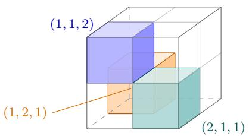

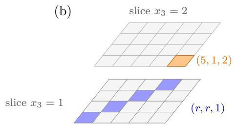  
diagonal vs. diagonal: modes 1, 2 difer diagonal vs. (5, 1, 2): modes 1, 3 difer

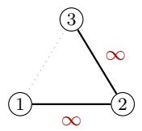  
Figure 3: The combinatorics behind the infinite scattering of both examples. (a) The three terms of the W tensor (Example 1) as cells of the $2 \times 2 \times 2$ array: any two of the labels (1, 1, 2), (1, 2, 1), (2, 1, 1) difer in two coordinates, so the corresponding factor pairs have disjoint supports in two modes. (b) The terms of $\mathcal { T } _ { R }$ (Example 2, drawn for $R = 5 )$ in the two slices $x _ { 3 } = 1 , 2 \colon$ the diagonal labels $( r , r , 1 )$ and the isolated label (R, 1, 2) again difer pairwise in at least two coordinates. (c) Two equivalent readings of the obstruction. In the tree formula (4), whichever spanning tree and exemption map ε one chooses, each tree edge keeps at least one unexempted mode in which the two supports are disjoint, so $\kappa _ { j } ( F _ { j } ( T , \varepsilon ) ) = + \infty$ there by Lemma 9. Equivalently, no pair is an edge of the activation graph $G _ { [ d ] } ( S )$ , so $G _ { [ d ] } ( S )$ is disconnected and Theorem 3(iii) gives $\tau ( S ) = + \infty$ for every $| S | \geq 2 .$ , whereas every reshaped budget falls short of the thresholds.

(a) Kruskal  
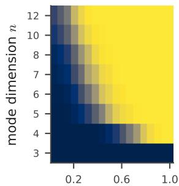  
support density p

(b) Lovitz Petrov  
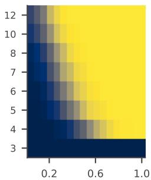  
support density p

(c) condition (U)  
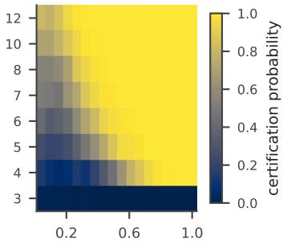  
support density p

(d) difference (c) (b)  
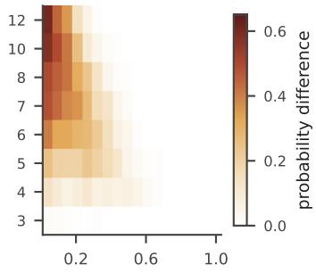  
support density p  
Figure 4: Certification probabilities for random nonnegative decompositions with $d = 3$ and $R =$ 5. Factor supports are drawn coordinatewise from Bernoulli(p), conditioned on being nonempty, and nonzero entries are independent uniform integers in $\{ 1 , \ldots , 9 9 9 \}$ . Each cell aggregates 500 realizations. (a) Kruskal’s condition $\begin{array} { r } { \sum _ { j } ( k _ { j } - 1 ) \ge 2 R - 1 } \end{array}$ . (b) The Lovitz–Petrov condition $\beta ( S ) ~ \ge ~ 2 \vert S \vert ~ - ~ 1$ for every S. (c) The positive-scattering condition (U). (d) The increase in certification probability from (b) to (c). The largest observed increase is 0.60, at $( n , p ) = ( 1 2 , 0 . 0 4 )$ At full support, the infinite support-separation obstruction is absent.

## 8.3 Searching for Alternatives

The previous experiment asks when the criterion certifies uniqueness. We now ask the converse question: when (U) fails, how often can we find an explicit nonnegative alternative?

We restrict attention to the slice $n = 6$ and search every realization that violates (U). The search proceeds in two stages. First, we test explicit pair constructions. If two prescribed terms can be combined into a shorter nonnegative rank-one representation, minimality fails. If they are nonparallel in exactly two modes and have nested supports in one of those modes, the identity

$$
x _ { 1 } \otimes y _ { 1 } + x _ { 2 } \otimes y _ { 2 } = x _ { 1 } \otimes ( y _ { 1 } + t y _ { 2 } ) + ( x _ { 2 } - t x _ { 1 } ) \otimes y _ { 2 }
$$

produces an inequivalent nonnegative decomposition whenever

$$
0 < t < \operatorname* { m i n } _ { i \in \mathrm { s u p p } ( x _ { 1 } ) } { \frac { x _ { 2 } ( i ) } { x _ { 1 } ( i ) } } .
$$

All such constructions are checked exactly over Q.

When no pair construction applies, we use multi-start nonnegative alternating least squares (Kim et al., 2007, p. 1148) only as a heuristic to locate candidate alternatives. A candidate is counted only after an exact rational decomposition has been constructed and verified.

Among the 5621 realizations violating (U), an exact pair construction was found in 5497, and an additional 10 realizations admitted an exact construction on a larger subset. The remaining 114 cases are inconclusive. Thus an exact nonnegative alternative was found in

$$
{ \frac { 5 4 9 7 + 1 0 } { 5 6 2 1 } } \approx 0 . 9 8 
$$

of the violating instances. This provides empirical evidence that the criterion may be close to necessary for this sparse ensemble, although the experiment does not establish necessity.

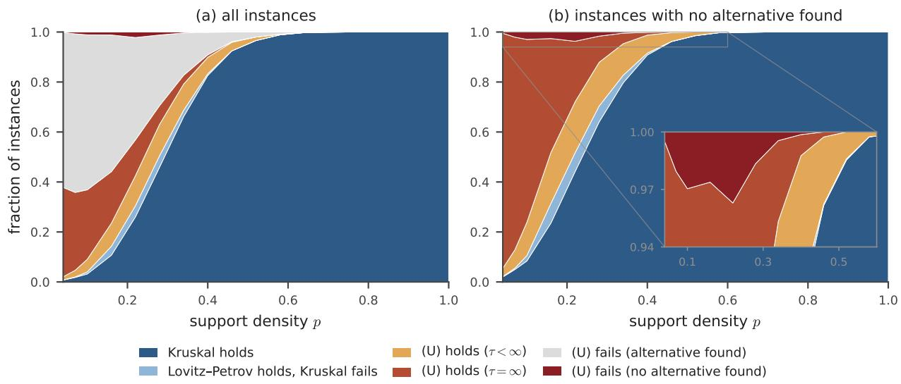  
Figure 5: Search for nonnegative alternatives on the $n = 6$ slice of the ensemble in Figure 4, using 1600 realizations for each value of $p .$ Every realization violating (U) is searched. Exact pair constructions and larger-subset constructions are verified over $\mathbb { Q } ;$ candidate decompositions found by alternating least squares are not counted unless an exact decomposition is subsequently verified. (a) The search outcomes. (b) The same data after removing the exact-alternative layer. The unresolved cases are therefore genuinely inconclusive rather than evidence of uniqueness.

## 9 Matrix Specialization

The order-two case provides a useful boundary case for the general theory. Identifying T with a matrix X, write

$$
X = { \mathcal { T } } = \sum _ { r = 1 } ^ { R } a _ { r } b _ { r } ^ { \top } = A B ^ { \top } , \qquad A = [ a _ { 1 } \ \cdots \ a _ { R } ] \in \mathbb { R } _ { \geq 0 } ^ { n _ { 1 } \times R } , \qquad B = [ b _ { 1 } \ \cdots \ b _ { R } ] \in \mathbb { R } _ { \geq 0 } ^ { n _ { 2 } \times R } ,\tag{9}
$$

where every column of A and B is nonzero. We call a set of columns of a matrix a circuit if it is linearly dependent and every proper subset of it is linearly independent (Whitney, 1935, p. 510). For a nonempty $S \subseteq [ R ]$ , let $A _ { S }$ and $B _ { S }$ denote the corresponding column submatrices. Then

$$
d _ { 1 } ( S ) = \operatorname { r a n k } A _ { S } , \qquad d _ { 2 } ( S ) = \operatorname { r a n k } B _ { S } ,
$$

and therefore

$$
\beta ( S ) = \operatorname { r a n k } A _ { S } + \operatorname { r a n k } B _ { S } - 2 .\tag{10}
$$

The matrix case is especially revealing because neither Kruskal’s nor Lovitz–Petrov’s dimension budget can reach the thresholds in Theorem 1. Hence the matrix content of the present criterion comes entirely from the positivity-induced scattering term.

Remark 7 (Dimension budgets in two modes). The usual Kruskal and Lovitz–Petrov theorems are formulated for tensors with at least three modes. Here we only examine the corresponding dimension-budget inequalities after formally setting $d = 2$ . For every S with $| S | \ge 2$

$$
\beta ( S ) \leq 2 | S | - 2 < 2 | S | - 1 ,
$$

so the Lovitz–Petrov uniqueness threshold can never hold in two modes. Likewise, $i f k _ { 1 }$ and $k _ { 2 }$ are the Kruskal ranks of the two factor matrices, then

$$
\begin{array} { r } { ( k _ { 1 } - 1 ) + ( k _ { 2 } - 1 ) \le 2 R - 2 < 2 R - 1 , } \end{array}
$$

so the corresponding Kruskal threshold is also unattainable.

Thus, in the matrix case, the budget alone cannot certify uniqueness. The diference between the minimality and uniqueness criteria is entirely accounted for by the positive-scattering term.

Condition (M) requires

$$
\tau ( S ) \geq ( \left| S \right| - \operatorname { r a n k } A _ { S } ) + ( \left| S \right| - \operatorname { r a n k } B _ { S } ) ,
$$

while condition (U) requires one additional unit. The next results show that these inequalities have particularly simple interpretations. Minimality reduces exactly to ordinary matrix rank, whereas uniqueness reduces exactly to two-sided separability.

## 9.1 Overlap Graphs and Matrix Scattering

For a pair $\{ r , t \} \subseteq S _ { \mathsf { m } }$ , the two mode costs $\kappa _ { 1 } ( \{ r , t \} )$ and $\kappa _ { 2 } ( \{ r , t \} )$ are computed relative to the set S, using the spaces and support hulls defined in Section 5. By Proposition 4, each belongs to $\{ 0 , 1 , + \infty \}$ . The cases 0 and +∞ can be expressed directly through two natural graphs.

Definition 5 (Overlap graphs). Let $S \subseteq [ R ]$ with $| S | \ge 2$ . The facet-overlap graph $\mathsf { F } _ { A } ( S )$ has vertex set S and an edge $\{ r , t \}$ whenever

$$
\mathcal { A } _ { U _ { 1 } ( S ) } ( a _ { r } ) \cap \mathcal { A } _ { U _ { 1 } ( S ) } ( a _ { t } ) \neq \emptyset .
$$

The support-overlap graph $\mathrm { O } _ { A } ( S )$ has vertex set S and an edge {r, t} whenever

$$
\operatorname { s u p p } ( a _ { r } ) \cap \operatorname { s u p p } ( a _ { t } ) \neq \emptyset .
$$

Define $\mathsf { F } _ { B } ( S )$ and $\mathsf { O } _ { B } ( S )$ analogously for the columns of B.

All graph unions below are taken on the common vertex set S.

By Proposition 4,

$$
\kappa _ { 1 } ( \{ r , t \} ) = 0 \quad \Longleftrightarrow \quad \{ r , t \} \in E ( \mathsf { F } _ { A } ( S ) ) ,
$$

while Lemma 9 gives

$$
\kappa _ { 1 } ( \{ r , t \} ) < + \infty \quad \Longleftrightarrow \quad \{ r , t \} \in E ( \mathsf { O } _ { A } ( S ) ) .
$$

The corresponding statements hold for B. In particular,

$$
\mathsf { F } _ { A } ( S ) \subseteq \mathsf { O } _ { A } ( S ) , \qquad \mathsf { F } _ { B } ( S ) \subseteq \mathsf { O } _ { B } ( S ) .
$$

Proposition 6 (Matrix activation formula). For every $S \subseteq [ R ] \ w i t h \ | S | \geq 2$ , the activation graphs $G _ { M } ( S )$ of Section $5 . 4$ are

$$
G _ { \varnothing } ( S ) = \mathsf { F } _ { A } ( S ) \cup \mathsf { F } _ { B } ( S ) ,\tag{11}
$$

$$
G _ { \{ 1 \} } ( S ) = \mathsf { O } _ { A } ( S ) \cup \mathsf { F } _ { B } ( S ) ,\tag{12}
$$

$$
G _ { \{ 2 \} } ( S ) = \mathsf { F } _ { A } ( S ) \cup \mathsf { O } _ { B } ( S ) ,\tag{13}
$$

$$
G _ { \{ 1 , 2 \} } ( S ) = \mathsf { O } _ { A } ( S ) \cup \mathsf { O } _ { B } ( S ) .\tag{14}
$$

Consequently,

$$
\tau ( S ) = \left\{ \begin{array} { l l } { 0 , } & { \mathsf { F } _ { A } ( S ) \cup \mathsf { F } _ { B } ( S ) \ i s \ c o n n e c t e d , } \\ { 1 , } & { \ o t h e r w i s e , \ i f \ \mathsf { O } _ { A } ( S ) \cup \mathsf { F } _ { B } ( S ) \ o r \ \mathsf { F } _ { A } ( S ) \cup \mathsf { O } _ { B } ( S ) \ i s \ c o n n e c t e d , } \\ { 2 , } & { \ o t h e r w i s e , \ i f \ \mathsf { O } _ { A } ( S ) \cup \mathsf { O } _ { B } ( S ) \ i s \ c o n n e c t e d , } \\ { + \infty , } & { \ o t h e r w i s e . } \end{array} \right.\tag{15}
$$

In particular,

$$
\tau ( S ) \in \{ 0 , 1 , 2 , + \infty \} .
$$

For a pair $S = \{ r , t \}$

$$
\tau ( \{ r , t \} ) = \operatorname* { m i n } \{ \kappa _ { 1 } ( \{ r , t \} ) , \kappa _ { 2 } ( \{ r , t \} ) \} .\tag{16}
$$

Proof. For $M \subseteq \{ 1 , 2 \}$ , recall from Theorem 3(i) that a pair $e = \{ r , t \}$ is an edge of $G _ { M } ( S )$ precisely when

$$
{ \# } { \Big \{ } j : \kappa _ { j } ( e ) = + { \infty } { \mathrm { ~ o r ~ } } { \big ( } \kappa _ { j } ( e ) = 1 { \mathrm { ~ a n d ~ } } j \not \in M { \big ) } { \Big \} } \leq 1 .
$$

If $M = \emptyset$ , the counted modes are exactly those with $\kappa _ { j } ( e ) \geq 1$ . Hence e is an edge if and only if at least one of the two costs is zero, which gives (11). If $M = \{ 1 \}$ , mode 1 contributes to the count only when $ \kappa _ { 1 } ( e ) = + \infty .$ while mode 2 contributes whenever $\kappa _ { 2 } ( e ) \geq 1$ . Thus e is an edge precisely when $\kappa _ { 1 } ( e ) < + \infty$ or $\kappa _ { 2 } ( e ) = 0$ , giving (12). The case $M = \{ 2 \}$ is symmetric, and for $M = \{ 1 , 2 \}$ only the infinite costs remain, giving (14).

The four graphs are monotone in M because

$$
\mathsf { F } _ { A } \subseteq \mathsf { O } _ { A } , \qquad \mathsf { F } _ { B } \subseteq \mathsf { O } _ { B } .
$$

The activation formula now follows directly from Theorem $3 ( \mathrm { i } )$ . For $S = \{ r , t \}$ , the tree formula (5) leaves exactly one mode nonexempted, giving (16). □

## 9.2 Row-Separability

We next identify the matrix condition associated with persistent failure of facet-overlap connectivity.

Definition 6 (Row-separability). Let $A \in \mathbb { R } _ { \geq 0 } ^ { n _ { 1 } \times R }$ and let $S \subseteq [ R ]$ be nonempty. A row index i is pure on r relative to S if

$$
A _ { i r } > 0 , \qquad A _ { i t } = 0 \quad f o r e v e r y t \in S \setminus \{ r \} .
$$

The matrix A is row-separable on S if every $r \in S$ has a row that is pure on r relative to S, and row-separable if it is row-separable on [R]. The factorization (9) is two-sided separable if both A and B are row-separable.

In the conventional notation $X = W H$ with $W = A$ and $H = B ^ { \top }$ , row-separability of B means that for every r some column of H is a positive multiple of the coordinate vector $e _ { r }$ . This is the separability condition of Donoho and Stodden (Donoho and Stodden, 2004); row-separability of A is the analogous condition for $X ^ { \top } = B A ^ { \top }$

Proposition 7 (Facet characterization of separability). Let A have full column rank. The following are equivalent:

(i) A is row-separable;

(ii) $\mathsf { F } _ { A } ( S )$ is disconnected for every $S \subseteq [ R ]$ with $| S | \ge 2$ ;

(iii) $\mathsf { F } _ { A } ( S )$ is edgeless for every $S \subseteq [ R ]$ with $| S | \ge 2$

The same equivalences hold with A and $\mathsf { F } _ { A }$ replaced by B and $\mathsf { F } _ { B }$

Proof. Because A has full column rank, every $A _ { S }$ has full column rank. Fix $S \subseteq [ R ]$ with $| S | \ge 2$ and put

$$
U = U _ { 1 } ( S ) .
$$

For each active row $i \in N _ { 1 } ( S )$ define the normalized row

$$
q _ { i } = \frac { ( A _ { i r } ) _ { r \in S } } { \sum _ { r \in S } A _ { i r } } \in \mathbb { R } ^ { S } ,
$$

and let

$$
P = \mathrm { c o n v } \{ q _ { i } : i \in N _ { 1 } ( S ) \} .
$$

By Proposition 2, a row i defines a facet of $C ( U )$ precisely when $q _ { i }$ is a vertex of $P .$ Moreover, two columns $a _ { r } , a _ { t }$ have intersecting facet signatures if and only if some vertex of $P$ has both rth and tth coordinates positive. Thus

$\{ r , t \} \in E ( \mathsf { F } _ { A } ( S ) ) \quad \iff \ P$ has a vertex with positive rth and tth coordinates. (17)

We use this characterization in both directions.

Row-separable implies edgeless. Suppose A is row-separable. For every $r \in S$ , choose a row that is pure on r relative to $[ R ]$ . Since A has full column rank, such a row gives the normalized vector $q _ { i } = e _ { r }$ . Hence the convex hull P contains all coordinate vectors $e _ { r }$ , while every $q _ { i }$ is a probability vector on $S$ and therefore lies in their simplex. Thus

$$
P = \operatorname { c o n v } \{ e _ { r } : r \in S \} ,
$$

whose vertices have exactly one positive coordinate. By $( 1 7 ) , \mathsf { F } _ { A } ( S )$ is edgeless.

Edgeless implies disconnected. This is immediate because $| S | \geq 2 .$

Disconnected for every S implies row-separable. Suppose instead that A is not row-separable. Choose an inclusion-minimal nonempty subset $S \subseteq [ R ]$ on which A is not row-separable. Then $| S | \ge 2$ . Choose $r \in S$ for which no row is pure on r relative to S.

For every $t \in S \setminus \{ r \}$ , minimality of S implies that A is row-separable on $S \setminus \{ t \}$ . Hence there exists a row $i _ { t }$ such that

$$
A _ { i _ { t } r } > 0 , \qquad A _ { i _ { t } u } = 0 \quad ( u \in S \setminus \{ r , t \} ) .
$$

Because the row is not pure on r relative to $S _ { i }$ , necessarily $A _ { i _ { t } t } > 0$ . Therefore

$$
q _ { i _ { t } } \in \operatorname { r e l i n t } \operatorname { c o n v } \{ e _ { r } , e _ { t } \} .
$$

We next claim that $e _ { r } \notin P .$ Otherwise $e _ { r }$ would be a convex combination of the points $q _ { i }$ Since all coordinates are nonnegative and $e _ { r }$ vanishes outside coordinate r, every $q _ { i }$ appearing with positive weight would have to equal $e _ { r }$ . The corresponding row would be pure on r relative to $S _ { i }$ a contradiction.

Write $q _ { i _ { t } }$ as a convex combination of vertices of P. Since the coordinates outside $\{ r , t \}$ vanish, every vertex appearing with positive weight lies on conv $\left\{ \boldsymbol { e } _ { r } , \boldsymbol { e } _ { t } \right\}$ . Because $q _ { i _ { t } }$ has both its rth and tth coordinates positive, it cannot be represented using only the vertex $e _ { t }$ . Moreover, $e _ { r } \notin P$ , so no vertex in the representation can equal $e _ { r }$ . Hence at least one vertex has both the rth and tth coordinates positive. By (17),

$$
\{ r , t \} \in E ( \mathsf { F } _ { A } ( S ) ) .
$$

This holds for every $t \in S \setminus \{ r \}$ , so $r$ is adjacent to every other vertex and $\mathsf { F } _ { A } ( S )$ is connected, contradicting the assumption. Hence A is row-separable. □

## 9.3 Complete Matrix Characterization

We can now identify both main criteria completely.

Theorem 5 (Matrices: complete characterization). For the nonnegative matrix decomposition (9):

(i) condition (M) holds if and only if

$$
\operatorname { r a n k } A = \operatorname { r a n k } B = R ,
$$

equivalently,

$$
\operatorname { r a n k } X = R ;
$$

(ii) condition (U) holds if and only if the factorization is two-sided separable.

Proof. Part (i). If rank A = rank $B = R$ , then every $A _ { S }$ and $B _ { S }$ has full column rank. Hence

$$
\beta ( S ) = 2 | S | - 2
$$

for every S with $| S | \ge 2$ , and condition (M) follows from $\tau ( S ) \geq 0$

Conversely, suppose rank $A < R$ . Choose a circuit $S \subseteq [ R ]$ among the columns of A. Then

$$
\operatorname { r a n k } A _ { S } = | S | - 1 , \qquad | S | \geq 2 .
$$

Let $U = U _ { 1 } ( S )$ . By circuit minimality, there is a linear dependence

$$
\sum _ { r \in S } c _ { r } a _ { r } = 0
$$

with every $c _ { r } \neq 0$ . Applying the injective map $L _ { U }$ gives

$$
\sum _ { r \in S } c _ { r } L _ { U } a _ { r } = 0 .
$$

If $\mathsf { F } _ { A } ( S )$ were disconnected, choose a nonempty proper connected component $C \subsetneq S$ . For every $r \in C$ and $t \in S \setminus C$ , the supports of $L _ { U } a _ { r }$ and $L _ { U } a _ { t }$ are disjoint. Evaluating the linear relation coordinatewise therefore shows

$$
\sum _ { r \in C } c _ { r } L _ { U } a _ { r } = 0 .
$$

Injectivity of $L _ { U }$ gives

$$
\sum _ { r \in C } c _ { r } a _ { r } = 0 ,
$$

contradicting the fact that S is a circuit. Thus $\mathsf { F } _ { A } ( S )$ is connected. Therefore

$$
\mathsf { F } _ { A } ( S ) \cup \mathsf { F } _ { B } ( S )
$$

is connected, so Proposition 6 and Theorem 3(ii) give

$$
\tau ( S ) = 0 .
$$

Since

$$
\operatorname { r a n k } A _ { S } = | S | - 1 , \qquad \operatorname { r a n k } B _ { S } \leq | S | ,
$$

we have

$$
\beta ( S ) \leq 2 | S | - 3 ,
$$

and hence

$$
\beta ( S ) + \tau ( S ) \leq 2 | S | - 3 < 2 | S | - 2 .
$$

Thus condition (M) fails. The same argument with A and B interchanged shows that (M) implies

$$
\operatorname { r a n k } A = \operatorname { r a n k } B = R .
$$

Finally,

$$
\operatorname { r a n k } X \leq \operatorname* { m i n } \{ \operatorname { r a n k } A , \operatorname { r a n k } B \} \leq R .
$$

If rank A = rank $B = R$ , choose left inverses $L _ { A } A = I _ { R }$ and $L _ { B } B = I _ { R }$ . Then

$$
\begin{array} { r } { L _ { A } \boldsymbol { X } \boldsymbol { L } _ { B } ^ { \top } = L _ { A } \boldsymbol { A } \boldsymbol { B } ^ { \top } \boldsymbol { L } _ { B } ^ { \top } = I _ { R } , } \end{array}
$$

so rank $X \geq R$ , and therefore rank $X = R$ . Conversely, rank $X = R$ forces both rank A and rank B to equal R.

Part (ii). By Part (i), condition (U) can be rewritten as

$$
\tau ( S ) \geq 1 \qquad \mathrm { f o r ~ e v e r y ~ } S \subseteq [ R ] , \ | S | \geq 2 ,
$$

because then

$$
\beta ( S ) = 2 | S | - 2 .
$$

By Proposition 6,

$$
\tau ( S ) = 0 \quad \Longleftrightarrow \quad \mathsf { F } _ { A } ( S ) \cup \mathsf { F } _ { B } ( S ) \mathrm { ~ i s ~ c o n n e c t e d } .
$$

Thus (U) holds if and only if

$$
\mathsf { F } _ { A } ( S ) \cup \mathsf { F } _ { B } ( S )
$$

is disconnected for every $S$ with $| S | \geq 2 .$

Since each $\mathsf { F } _ { A } ( S )$ and $\mathsf { F } _ { B } ( S )$ is a subgraph of this union, both must themselves be disconnected. Proposition 7 therefore implies that A and B are row-separable.

Conversely, suppose A and B are row-separable. Then each has full column rank, since the pure rows for the R columns are necessarily distinct and produce a positive diagonal $R \times R$ submatrix. By Proposition 7,

$$
\mathsf { F } _ { A } ( S ) \quad \mathrm { a n d } \quad \mathsf { F } _ { B } ( S )
$$

are edgeless for every $| S | \ge 2$ . Hence their union is disconnected, so $\tau ( S ) \geq 1$ by Proposition 6. Since $\beta ( S ) = 2 | S | - 2$ , we obtain

$$
\beta ( S ) + \tau ( S ) \geq 2 | S | - 1 ,
$$

which is condition (U).

## 9.4 Separability and Explicit Recovery

The matrix uniqueness criterion therefore has a completely observable form.

Corollary 3 (Separability, diagonal pattern, and recovery). For the nonnegative matrix decomposition (9), the following are equivalent:

(i) condition (U) holds;

(ii) the factorization is two-sided separable;

(iii) there exist pairwise distinct row indices $i _ { 1 } , \dots , i _ { R }$ and pairwise distinct column indices $j _ { 1 } , \dots , j _ { R }$ such that

$$
X _ { i _ { r } j _ { r } } > 0 , \qquad X _ { i _ { r } j _ { t } } = 0 , \qquad r \neq t .\tag{18}
$$

Under these conditions,

$$
\operatorname { r a n k } _ { + } ( X ) = R ,
$$

and every nonnegative length-R decomposition is equivalent to (9). Moreover, $i f i _ { r }$ and $j _ { r }$ are pure indices for r in A and B, respectively, then

$$
a _ { r } b _ { r } ^ { \top } = \frac { ( X e _ { j _ { r } } ) ( e _ { i _ { r } } ^ { \top } X ) } { X _ { i _ { r } j _ { r } } } , \qquad r \in [ R ] ,\tag{19}
$$

and hence

$$
X = \sum _ { r = 1 } ^ { R } \frac { ( X e _ { j _ { r } } ) ( e _ { i _ { r } } ^ { \top } X ) } { X _ { i _ { r } j _ { r } } } .
$$

Proof. The equivalence of (i) and (ii) is Theorem 5.

(ii) implies (iii). For every $r ,$ choose a row $i _ { r }$ of A and a row $j _ { r }$ of B that are pure on r. These indices are pairwise distinct within each factor. Writing

$$
\alpha _ { r } = A _ { i _ { r } r } > 0 , \gamma _ { r } = B _ { j _ { r } r } > 0 ,
$$

we obtain

$$
X _ { i _ { r } j _ { t } } = \sum _ { u = 1 } ^ { R } A _ { i _ { r } u } B _ { j _ { t } u } = \alpha _ { r } \gamma _ { r } \delta _ { r t } ,
$$

which gives (18).

(iii) implies (ii). Assume (18). For every $r ,$

$$
X _ { i _ { r } j _ { r } } = \sum _ { u = 1 } ^ { R } A _ { i _ { r } u } B _ { j _ { r } u } > 0 ,
$$

so there exists at least one $s ( r )$ such that

$$
A _ { i _ { r } , s ( r ) } > 0 , \qquad B _ { j _ { r } , s ( r ) } > 0 .
$$

The map $r \mapsto s ( r )$ is injective. Indeed, if $s ( r ) = s ( t ) = s$ for $r \neq t .$ , then the term indexed by s contributes

$$
A _ { i _ { r } s } B _ { j _ { t } s } > 0
$$

to $X _ { i _ { r } j _ { t } }$ , contradicting the zero pattern. Hence, after relabeling, we may assume

$$
s ( r ) = r .
$$

For $t \neq r _ { : }$ , the diagonal pattern gives

$$
0 = X _ { i _ { r } j _ { t } } \geq A _ { i _ { r } t } B _ { j _ { t } t } .
$$

Since $B _ { j _ { t } t } > 0$ , we obtain

$$
A _ { i _ { r } t } = 0 .
$$

Thus row $i _ { r }$ of A is pure on r. Symmetrically,

$$
0 = X _ { i _ { t } j _ { r } } \geq A _ { i _ { t } t } B _ { j _ { r } t }
$$

and $A _ { i _ { t } t } > 0$ imply that row $j _ { r }$ of $B$ is pure on r. Hence the factorization is two-sided separable.

The rank and uniqueness statements follow from Theorem 1.

Recovery. Since row $j _ { r }$ of B is pure on $r ,$

$$
X e _ { j _ { r } } = \sum _ { u = 1 } ^ { R } a _ { u } B _ { j _ { r } u } = \gamma _ { r } a _ { r } .
$$

Similarly, since row $i _ { r }$ of $A$ is pure on $r ,$

$$
e _ { i _ { r } } ^ { \top } X = \sum _ { u = 1 } ^ { R } A _ { i _ { r } u } b _ { u } ^ { \top } = \alpha _ { r } b _ { r } ^ { \top } .
$$

Finally,

$$
X _ { i _ { r } j _ { r } } = \alpha _ { r } \gamma _ { r } .
$$

Substitution gives

$$
\frac { ( X e _ { j _ { r } } ) ( e _ { i _ { r } } ^ { \top } X ) } { X _ { i _ { r } j _ { r } } } = a _ { r } b _ { r } ^ { \top } ,
$$

which proves (19).

Remark 8 (Fast verification in the matrix case). The matrix specialization eliminates the subset enumeration appearing in the general criterion. Condition (M) is equivalent to

$$
\operatorname { r a n k } X = R ,
$$

and condition (U) is equivalent to two-sided separability, which can be checked directly from the factor matrices. Thus no enumeration of subsets and no linear-programming vertex tests are needed for the matrix certificates.

## 10 Conclusion

This paper develops a deterministic identifiability theory for nonnegative tensor decompositions based on two complementary sources of information. The Lovitz–Petrov dimension budget captures the linear-algebraic constraints imposed by the factor spans, while the positive scattering term captures additional rigidity created by nonnegativity and support geometry. The positive splitting inequality combines these two efects and yields separate thresholds for minimality and uniqueness. Although the scattering term is defined through an optimization over intermediate factor spaces, its mode costs reduce exactly to {0, 1, +∞}, leading to a finite activation problem on a graph. The resulting criterion can strictly improve upon dimension-based uniqueness conditions, including in sparse examples where reshaping does not recover the Lovitz–Petrov condition.

The theory also clarifies how identifiability behaves under natural structural operations. Appending nonnegative modes can only strengthen the combined dimension–scattering criterion, while reshaping provides additional flexibility by changing the grouping of the modes. In the matrix boundary case, the two criteria admit exact closed-form interpretations: minimality reduces to ordinary full-rank factorization, while uniqueness reduces to two-sided separability and admits an explicit term-recovery formula.

Several directions remain open. The full certificate still requires checking all nontrivial subsets of components, motivating the search for more economical suficient conditions or algorithms that exploit additional structure. The interaction between scattering and reshaping is also not fully understood: while grouping can increase the dimension budget, we do not yet have a general comparison between grouped and ungrouped scattering terms. Finally, the matrix specialization identifies two-sided separability as the exact boundary case of the present criterion, leaving open the question of which broader nonnegative matrix identifiability phenomena admit genuine higherorder analogues. More generally, the positive-scattering perspective suggests a broader program of incorporating structural constraints beyond linear independence into deterministic identifiability theory.

## References

E. S. Allman, C. Matias, and J. A. Rhodes, “Identifiability of parameters in latent structure models with many observed variables,” Ann. Statist., vol. 37, no. 6A, pp. 3099–3132, 2009.

A. Anandkumar, R. Ge, D. Hsu, S. M. Kakade, and M. Telgarsky, “Tensor decompositions for learning latent variable models,” J. Mach. Learn. Res., vol. 15, no. 80, pp. 2773–2832, 2014.

A. Anandkumar, D. Hsu, M. Janzamin, and S. Kakade, “When are overcomplete topic models identifiable? Uniqueness of tensor Tucker decompositions with structured sparsity,” J. Mach. Learn. Res., vol. 16, no. 82, pp. 2643–2694, 2015.

T. Barker and T. Virtanen, “Blind separation of audio mixtures through nonnegative tensor factorization of modulation spectrograms,” IEEE/ACM Trans. Audio Speech Lang. Process., vol. 24, no. 12, pp. 2377–2389, 2016.

A. Berman and R. J. Plemmons, Nonnegative Matrices in the Mathematical Sciences, Classics in Applied Mathematics 9, SIAM, Philadelphia, 1994.

J. E. Cohen and U. G. Rothblum, “Nonnegative ranks, decompositions, and factorizations of nonnegative matrices,” Linear Algebra and its Applications, vol. 190, pp. 149–168, 1993.

D. L. Donoho and V. C. Stodden, “When does non-negative matrix factorization give a correct decomposition into parts?” in Advances in Neural Information Processing Systems 16, 2004.

W. D¨ur, G. Vidal, and J. I. Cirac, “Three qubits can be entangled in two inequivalent ways,” Phys. Rev. A, vol. 62, no. 6, Art. no. 062314, 2000.

C. G. Khatri and C. R. Rao, “Solutions to some functional equations and their applications to characterization of probability distributions,” Sankhy¯a, Series A, vol. 30, no. 2, pp. 167–180, 1968.

H. Kim, H. Park, and L. Eld´en, “Non-negative tensor factorization based on alternating largescale non-negativity-constrained least squares,” in Proceedings of the 7th IEEE International Conference on Bioinformatics and Bioengineering (BIBE 2007), vol. II, pp. 1147–1151, 2007.

J. B. Kruskal, “Three-way arrays: Rank and uniqueness of trilinear decompositions, with application to arithmetic complexity and statistics,” Linear Algebra Appl., vol. 18, no. 2, pp. 95–138, 1977.

L.-H. Lim and P. Comon, “Nonnegative approximations of nonnegative tensors,” J. Chemometrics, vol. 23, nos. 7–8, pp. 432–441, 2009.

B. Lovitz and F. Petrov, “A generalization of Kruskal’s theorem on tensor decomposition,” Forum Math. Sigma, vol. 11, Art. no. e27, pp. 1–40, 2023.

Y. Qi, P. Comon, and L.-H. Lim, “Uniqueness of nonnegative tensor approximations,” IEEE Trans. Inf. Theory, vol. 62, no. 4, pp. 2170–2183, 2016.

R. T. Rockafellar, Convex Analysis, Princeton Mathematical Series, vol. 28. Princeton, NJ, USA: Princeton University Press, 1970.

A. Schrijver, Theory of Linear and Integer Programming. Chichester, UK: Wiley, 1986.

N. D. Sidiropoulos and R. Bro, “On the uniqueness of multilinear decomposition of N-way arrays,” Journal of Chemometrics, vol. 14, no. 3, pp. 229–239, 2000.

M. Sørensen and L. De Lathauwer, “New uniqueness conditions for the canonical polyadic decomposition of third-order tensors,” SIAM J. Matrix Anal. Appl., vol. 36, no. 4, pp. 1381–1403, 2015.

M. A. Veganzones, J. E. Cohen, R. Cabral Farias, J. Chanussot, and P. Comon, “Nonnegative tensor CP decomposition of hyperspectral data,” IEEE Trans. Geosci. Remote Sens., vol. 54, no. 5, pp. 2577–2588, 2016.

H. Whitney, “On the abstract properties of linear dependence,” American Journal of Mathematics, vol. 57, no. 3, pp. 509–533, 1935.