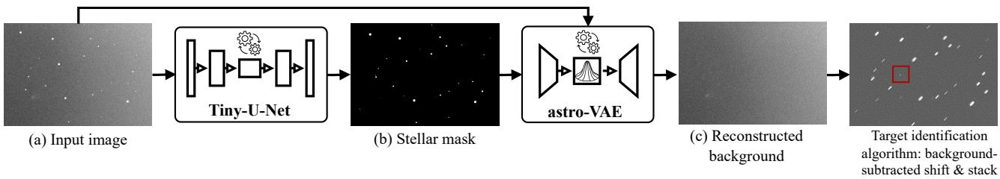
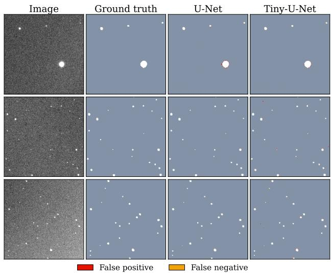
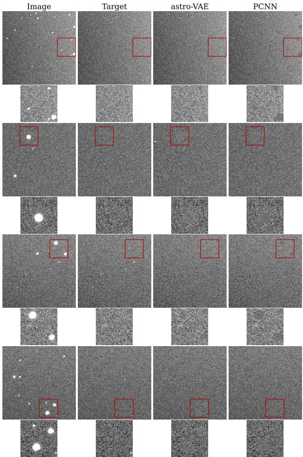
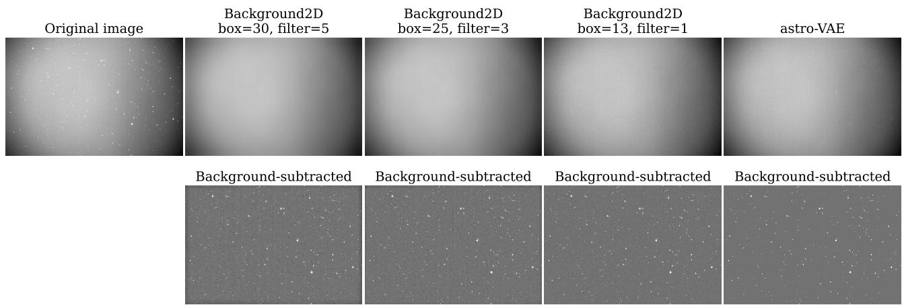
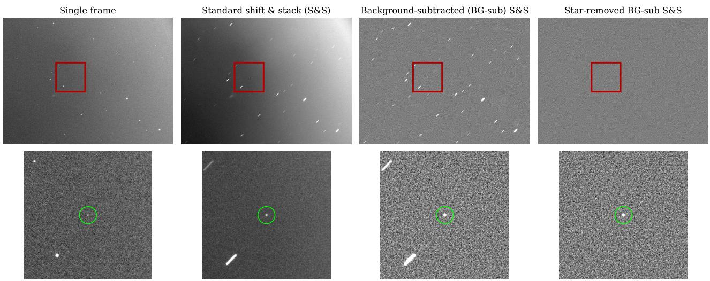

# Improving Faint Object Detection for Space Situational Awareness with Variational Autoencoders

Angela Cratere∗1, Luca Ghilardi2,3, Vishnu Reddy3, 4, Francesco Dell’Olio5, Charalampos S. Kouzinopoulos1, Roberto Furfaro2,3

1Department ofAdvanced Computing Sciences, Maastricht University, Maastricht, The Netherlands

2Systems and Industrial Engineering, University of Arizona, Tucson, USA

3Space4 Center, University ofArizona, Tucson, USA

4Lunar and Planetary Laboratory, University of Arizona, Tucson, USA

5Department of Electrical and Information Engineering, Polytechnic University of Bari, Bari, Italy

We present a deep-learning pipeline for enhancing the detection of faint moving objects in optical space situational awareness (SSA) imagery through automated star removal and background reconstruction. Detecting lowsignal-to-noise ratio (SNR) objects remains extremely challenging in optical observations, particularly in the cislunar (X-GEO) environment, where structured sky backgrounds, dense stellar fields, and scattered moonlight significantly degrade the performance of classical detection algorithms. To address this problem, the proposed pipeline combines a lightweight segmentation network (Tiny-U-Net) to generate stellar masks with a partial-convolution variational autoencoder (astro-VAE), designed to learn the statistical distribution of astronomical backgrounds and perform context-aware inpainting of masked regions. The reconstructed background maps can then be used as a preprocessing step to suppress fixed sources and background inhomogeneities prior to detection. As a proof of concept, the approach is integrated with a shift-and-stack scheme and evaluated on real ground-based telescope observations targeting the X-GEO region. Results demonstrate that the method reconstructs star-free backgrounds with high fidelity, while preserving moving targets and significantly enhancing detectability, thereby providing an efective datadriven preprocessing strategy for faint moving-object detection in optical SSA scenarios.

## 1 Introduction

As the number of active satellites and orbital debris con- tinues to grow [1], space situational awareness (SSA) has become essential for safe and sustainable space operations [2–4]. The increasing focus on beyond geostationary Earth orbit (X-GEO) missions [5], partly driven by National Aeronautics and Space Administration (NASA)’s Artemis pro-gram, has further intensified the need for reliable detection of faint objects under challenging observational conditions. In these scenarios, SSA relies heavily on ground-based optical telescopes to detect extremely low-signal-to-noise ratio (SNR) targets embedded in complex astronomical backgrounds, afected by instrumental noise, sky gradi- ents, stray light, and dense stellar fields [6]. Accurate background estimation and star removal are therefore crit- ical preprocessing steps in optical SSA pipelines. Stellar sources and spatially varying background structures can complicate the detection of faint moving-object signals, and preprocessing must suppress these components with- out attenuating or removing the target. This is particularly im ortant for inte ration-based detection methods, where residual stellar contamination and back round inhomo- geneities can accumulate and generate spurious responses. For instance, detection algorithms such as streak detec tion [7] and track-before-detect (TBD) methods [8] are hi hl sensitive to residual back round fluctuations and stellar contamination, which may lead to false positives. Conventional astronomical techniques for background es- timation [6, 9–11], source extraction [12, 13], and source modelling and removal [14] remain widely used. However, their performance can depend on manually defined pro- cessing choices and parameter settings that may need to be calibrated to the characteristics of each image. This dependence can complicate automated processing across large and heterogeneous SSA datasets, where systematic image-by-image inspection and retuning can become im-practical at scale. Deep learning (DL)-based approaches provide a complementary data-driven strategy by learning the relevant relationships directly from representative ob- servations, reducing the need for image-specific parameter adjustment and facilitating automated inference. Recent studies have applied DL to several astronomical image-processing tasks, including average background prediction [15], stray-light suppression [16], and image denoising [17–19]. Notably, the approach in [20], which inspired our work, used a partial convolution neural network (PCNN) for compact source removal in Herschel far-infrared im- agery. However, their method relies on a deterministic architecture and was evaluated on simulated sources. Prob- abilistic generative models for background reconstruction in real optical SSA imagery have remained largely unex plored, particularly when integrated within operational detection pipelines. To address this gap, we propose a DL framework for robust background estimation and star re- moval to enhance faint object detection in SSA scenarios. Our objective is to assess whether learned reconstruction can provide an efective preprocessing stage for suppress- ing structured backgrounds and stellar contamination prior to object detection. The pipeline combines Tiny-U-Net, a customized lightweight U-Net for stellar mask genera- tion, with astro-VAE, a mask-guided partial convolution variational autoencoder (PC-VAE) for background reconstruction. Our main contributions include: (i) the proposed astro-VAE model, enabling probabilistic modeling of struc- tured sky backgrounds and improved suppression of stel- lar sources compared with deterministic PCNN-based ap- proaches, while reducing model complexity; (ii) a complete processing pipeline for optical SSA imagery combining Tiny-U-Net, astro-VAE, and a detection stage based on a shift-and-stack (S&S) scheme, used to evaluate the efect of the proposed preprocessing on faint target visibility; (iii) validation on real ground-based telescope observations acquired at the University of Arizona (UoA).

## 2 Methods

The proposed pipeline integrates (i) a lightweight segmentation network (Tiny-U-Net) for stellar masking and (ii) a variational reconstruction model (astro-VAE) for contextaware background inpainting. Each telescope frame is processed in 256×256 tiles to reconstruct a stellar mask using Tiny-U-Net; then the masked image is provided to astro-VAE to reconstruct a star-free background estimate (Fig. 1). The reconstructed background can be used to sup- press structured sky variations and stellar clutter before downstream detection algorithms, here integrated with a S&S scheme as an initial proof-of-concept implementation [21].

## 2.1 Tiny-U-Net

Binary stellar masks are generated using a lightweight ver-sion of the U-Net architecture, termed Tiny-U-Net, that we obtained by progressively simplifying a baseline U-Net and comparatively evaluating the two models to quantify the accuracy-complexity trade-of. The baseline U-Net [22] includes four convolutional stages, each composed of two convolutional layers followed by batch normalization and ReLU activations, and a max-pooling operation. The number of filters increases from 64 to 512 (1024-filter bottleneck layer), resulting in 17.27 M parameters. Our Tiny-U-Net employs narrower feature widths (from 16 to 256) and re-moves batch normalization, with reduced parameter count (1.94 M). This simplification substantially lowers computa tional complexity and memory requirements.

## 2.2 astro-VAE

We formulate background reconstruction as a context- aware image inpainting problem [23], modeling stellar regions as missing data reconstructed from surrounding context. In contrast to [20], which uses a deterministic PCNN, we adopt a PC-VAE. VAEs extend autoencoders by introducing a probabilistic latent variable model based on variational inference [24], enabling the learning of a distribution over latent representations. This choice allows the model to learn the distribution of the structured sky back- ground, capturing its variability and producing smoother and more consistent reconstructions in masked regions. A PC-VAE combines variational latent modelin with the spatial selectivity of partial convolution (PC) layers [23], which restrict convolutions to valid (unmasked) pixels and propagate the binary mask throughout the network. astro- VAE adopts a U-Net-like architecture with six PC blocks in the encoder, each composed of two PC layers, with filters increasing from 32 to 256. Strided convolutions reduce the input resolution (256×256×1) to a compact representation (4×4×256), which is flattened and mapped through three fully connected layers to estimate the mean $\mu$ and log-variance log $\sigma ^ { 2 }$ of a latent vector. The latent variable is sampled using the reparameterization trick, $z = \mu + \sigma \epsilon$ where $\epsilon \sim \mathcal { N } ( 0 , 1 )$ , enabling gradient-based optimization. The sampled latent vector is then passed to a symmetric decoder that reconstructs the image through upsampling and PC blocks. The training loss (Eq. 1) combines weighted reconstruction terms for both hole ("h") and valid ("v") background regions, perceptual/style, structural similarity, source-consistency, and Kullback–Leibler (KL) regularization:

$$
\begin{array} { r l } & { \mathcal { L } _ { \mathrm { t r a i n } } = \lambda _ { \mathrm { r e c , h } } \mathcal { L } _ { \mathrm { r e c , h } } + \lambda _ { \mathrm { r e c , v } } \mathcal { L } _ { \mathrm { r e c , v } } + \lambda _ { \mathrm { s t y l e } } \mathcal { L } _ { \mathrm { s t y l e } } } \\ & { ~ + \lambda _ { \mathrm { s s i m } } \mathcal { L } _ { \mathrm { s s i m } } + \lambda _ { \mathrm { s o u r c e } } \mathcal { L } _ { \mathrm { s o u r c e } } + \lambda _ { \mathrm { K L } } D _ { \mathrm { K L } } . } \end{array}\tag{1}
$$

The detailed formulations of the first five loss compo- nents can be found in prior inpainting works [20, 23], whereas the KL term arises from our variational formu- lation. We set the weights to $\lambda _ { \mathrm { { r e c , } \mathrm { { h } } } } ~ = ~ 6 , ~ \lambda _ { \mathrm { { r e c , } \mathrm { { v } } } } ~ = ~ 2 ,$ $\lambda _ { \mathrm { s t y l e } } = 1 2 0 , \lambda _ { \mathrm { s s i m } } = 1 , \lambda _ { \mathrm { s o u r c e } } = 1$ , while λKL = 10−3 controls the latent space regularization. These values fol- low common practices in image inpainting [23] and were empirically determined after several experimental trials.

## 3 Results

We evaluated the proposed pipeline on images targeting the X-GEO region, acquired by ground-based telescopes oper-ated by the Space4 Center at the UoA. The dataset consists of 290 bias-, dark-, and flat-field-corrected optical images (213 used for training and 77 for testing), with varying spatial dimensions (1192×798, 1776×1332, and 2392×1596 pixels). The models were implemented in PyTorch and trained on a workstation equipped with an NVIDIA GeForce RTX 4070 GPU with 12 GB memory.

  
Figure 1: Proposed pipeline: Tiny-U-Net generates a stellar mask (b) from each input image (a); the image and the corresponding mask are fed to the astro-VAE to reconstruct the star-free background (c), which is then used to enhance detection algorithms such as S&S.

  
Figure 2: U-Net vs. Tiny-U-Net star segmentation outputs.

## 3.1 Stellar segmentation

To train both Tiny-U-Net and the baseline U-Net, 4,158 monochromatic patches of size 256×256 were extracted (80/20 training-validation split), with ground-truth masks generated using the Astropy Photutils package [25]. Models were trained for 200 epochs using a binary cross-entropy loss. Hyperparameters were optimized via Bayesian search, exploring learning rate $( 1 0 ^ { - 5 } – 1 0 ^ { - 2 } )$ , batch size (4, 8, 16), and L2 regularization coeficient $( 1 0 ^ { - 8 } - 1 0 ^ { - 2 } )$ , using validation accuracy as the objective. Final evaluation was performed on an independent test set of 1495 patches. Seg- mentation results are summarized in Table 1, while Fig. 2 shows some visual examples. While the baseline U-Net achieves slightly higher intersection over union (IoU) and precision, Tiny-U-Net maintains comparable recall and overall accuracy (OA) with an order-of-magnitude reduction in parameter count (-88.8%). Given the marginal performance degradation and the significant complexity re- duction, Tiny-U-Net was selected for integration into the proposed background estimation pipeline.

## 3.2 Background reconstruction

astro-VAE was trained for 300 epochs (learning rate of $1 0 ^ { - 4 }$ and batch size 8) in a supervised setting. Because paired observations of the same astronomical scene with and without stellar sources were not available, surrogate star-free reference backgrounds were generated by replac- ing masked stellar pixels with randomly sampled neighbor- ing background values. These images were used only as supervisory references during training. The network was trained on 10,214 monochromatic patches (80/20 training- validation split) and evaluated on the same independent test set used for segmentation. Reconstruction performance was quantitatively evaluated using structural similarity index (SSIM), peak signal-to-noise ratio (PSNR), and mean squared error (MSE) with respect to the star-free targets. The results are summarized in Table 2, while Fig. 3 presents representative qualitative examples. astro-VAE was com-pared against the deterministic PCNN baseline [20] trained on the same dataset using an equivalent loss. As reported in Table 2, astro-VAE outperforms PCNN across all met- rics, while using approximately half the number of total parameters (33.50M vs. 70.13M). Qualitative inspection further confirms that astro-VAE better preserves local back- ground structure while more efectively suppressing stellar residuals, whereas PCNN reconstructions exhibit slight texture smoothing in regions previously occupied by bright sources. These results suggest that astro-VAE achieves high reconstruction quality, particularly under structured noise conditions typical of optical SSA imagery.

<table><tr><td>Model</td><td>U-Net</td><td>Tiny-U-Net</td></tr><tr><td> $\mathbf { I o U } _ { s t a r } \ [ \% ]$ </td><td>94.58</td><td>92.66</td></tr><tr><td>Precisionstar [%]</td><td>97.80</td><td>96.05</td></tr><tr><td> $\mathbf { R e c a l l } _ { s t a r } \left[ \% \right]$ </td><td>96.64</td><td>96.33</td></tr><tr><td>mIoU [%]</td><td>97.28</td><td>96.32</td></tr><tr><td>OA [%]</td><td>98.31</td><td>98.16</td></tr><tr><td>Params. [M]</td><td>17.27</td><td>1.94</td></tr></table>

Table 1: Segmentation performance on the test set for U-Net and Tiny-U-Net (threshold = 0.4).

Finally, astro-VAE was also compared with a conventional background-estimation method, specifically the Background2D class from Astropy Photutils [25]. This method estimates a spatially varying background from local statistics computed over a predefined mesh and re- quires the specification of several parameters, including the mesh size, the size of the median filter applied to the low- resolution background map, the source-detection thresh- old, and the source-mask configuration. Figure 4 shows the background estimates obtained for the same input frame while varying the mesh and filter sizes. Larger mesh and filter sizes produce smoother maps dominated by the large- scale background gradient, but leave visible residual struc- ture after subtraction, particularly toward the image bor- ders. Reducing these scales allows the method to follow progressively finer spatial variations and yields a more uniform residual. Thus, the estimated background changes noticeably with the selected configuration, requiring careful calibration of the spatial parameters to the characteris- tics of the image. In contrast, astro-VAE produces a back-ground estimate using the same learned model without image-specific parameter selection at inference time.

  
Figure 3: Visual examples of background reconstruction results using astro-VAE. Model predictions are also compared against PCNN [20].

## 3.3 Impact on shift-and-stack detection

We used the reconstructed background maps to enhance target contrast within a simple S&S scheme [21], in which the trajectory of the object across successive frames is known. The target signal is coherently integrated along the prescribed track, while background stars appear as streaks due to misalignment. Synthetic point-like targets modeled as 2D Gaussian sources were injected into real telescope frames with SNR values between 1.5 and 5, repre- sentative of low-SNR detection conditions. The target centroid followed a known linear trajectory across 10 frames. We then applied S&S in three configurations (Fig. 5): (i) stacking the raw injected frames (baseline); (ii) subtracting the astro-VAE background estimate from each frame prior to stacking; and (iii) stacking the inpainted frames, in which stellar sources were removed while preserving the injected target, followed by subtraction of the estimated background map. For faint X-GEO targets, telescopes op- erate in sidereal tracking mode, pointing toward the predicted target position, where stars remain stationary while the target moves across the detector; therefore the stel- lar masks in configuration (iii) were generated from the median of multiple frames to avoid removing the target. Results demonstrate that the subtraction of the background map obtained with astro-VAE leads to substantially higher stacked SNR values after S&S, with improvements of ≈ 4× relative to the baseline S&S (Table 3). astro-VAE preprocessing suppresses structured background components and stellar clutter, producing a visibly more uniform residual background after stacking (Fig. 5). Importantly, the target is preserved during star removal, enabling reconstruction of star-free backgrounds while retaining moving targets.

<table><tr><td>Model</td><td>SSIM</td><td>PSNR [dB]</td><td>MSE</td><td>Params. [M]</td></tr><tr><td>astro-VAE</td><td>0.963</td><td>35.41</td><td>1.31e-3</td><td>33.50</td></tr><tr><td>PCNN</td><td>0.950</td><td>31.17</td><td>2.68e-3</td><td>70.13</td></tr></table>

Table 2: Quantitative background reconstruction results of astro-VAE on the test dataset, compared with the deterministic PCNN baseline. The total parameter count of each model is reported.

<table><tr><td>Injected SNR</td><td>Stacked SNR Stacked SNR (single frame) (standard S&amp;S) (astro-VAE preproc.)</td></tr><tr><td>1.5</td><td>4.75 17.97</td></tr><tr><td>2.0</td><td>5.99 25.65</td></tr><tr><td>3.0</td><td>9.11 35.40</td></tr><tr><td>4.0</td><td>12.79 47.63</td></tr><tr><td>5.0</td><td>14.83 64.82</td></tr></table>

Table 3: Stacked SNR comparison with and without astro-VAE preprocessing.

## 4 Discussion

This work addresses a key challenge in optical SSA for X-GEO surveillance: improving the detectability of extremely faint moving objects embedded in structured astronomi-cal backgrounds. The combined use of Tiny-U-Net and astro-VAE enabled automated stellar masking and context- aware background reconstruction, and the controlled S&S experiment showed that this preprocessing can substantially increase the stacked SNR of faint injected targets. astro-VAE proved efective in modeling structured sky backgrounds and suppressing stellar sources while pre- serving moving targets. This capability could be particularly beneficial when the object trajectory is uncertain, as addressed in TBD frameworks such as FaXT [8], where multiple velocity hypotheses must be evaluated. In such settings, background structures and fixed stars must be suppressed to avoid coherent integration along incorrect velocity hypotheses, while the unknown moving target must be preserved. Future work will focus on quantifying the impact on false-alarm rate and track purity in TBD methods, as well as on model simplification and compres- sion to investigate deployment on embedded systems (e.g., [26]). This would enable low-latency processing directly at the sensor level, near the telescope node, reducing data transmission and accelerating candidate detection and prioritization for follow-up observations in next-generation SSA systems.

  
Figure 4: Comparison of conventional and learned background estimation on the same input frame. The conventional estimates are obtained using the Background2D class with diferent manually selected box\_size and filter\_size configurations. The top row shows the original image, the corresponding Background2D background estimates, and the astro-VAE predicted background. The bottom row shows the associated background-subtracted images.

  
Figure 5: Object detection using S&S with and without astro-VAE preprocessing, shown for an injected target with SNR = 3. From left to right: single frame; standard S&S, where background inhomogeneities accumulate, and stars appear as streaks; background-subtracted S&S using the astro-VAE reconstructed background, showing improved target contrast; and star-removed background-subtracted S&S, demonstrating that the moving target is preserved while fixed stellar sources are suppressed

## References

1. ESA Space Debris Ofice. ESA’s Annual Space Environment Report tech. rep. (European Space Agency, 2025). https : / / www .

sdo . esoc . esa . int / environment \_ report / Space Environment\_Report\_latest.pdf.

2. Janisch, K.-I. et al. Detection and tracking ofspace debris in cislunar environment: A phase 0 mission design in Proc. 75th Int. Astronautical Congr. (IAC) (Milan, Italy, Oct. 2024), 1188–1204.

3. Bennett, M. M. Orbital debris requires prevention and mitigation across the satellite life cycle. Commun. Eng. 4, 95. https://doi. org/10.1038/s44172-025-00430-5 (2025).

4. Filho, W. L., Abubakar, I. R., Hunt, J. D. & Dinis, M. A. P. Managing space debris: Risks, mitigation measures, and sustainability challenges. Sustain. Futures 10, 100849. issn: 2666-1888. https: / / www . sciencedirect . com / science / article / pii / S2666188825004149 (2025).

5. Willis, S. To the Moon: Strategic competition in the cislunar re- gion. Æther: A Journal of Strategic Airpower & Spacepower 2, 17–30. https://www.jstor.org/stable/48751535 (2023).

6. Popowicz, A. & Smolka, B. A method of complex background es- timation in astronomical images. Mon. Not. Roy. Astron. Soc. 452, 809–823 (2015).

7. Nir, G., Zackay, B. & Ofek, E. O. Optimal and eficient streak detec- tion in astronomical images. Astron. J. 156, 229. https://doi. org/10.3847/1538-3881/aaddff (Oct. 2018).

8. Nguyen, T., Woods, D. F., Ruprecht, J. & Birge, J. Eficient search and detection of faint moving objects in image data. Astron. J. 167, 113. https://doi.org/10.3847/1538-3881/ad20e0 (Feb. 2024).

9. Blanton, M. R., Kazin, E., Muna, D., Weaver, B. A. & Price-Whelan, A. Improved background subtraction for the Sloan Digital Sky Survey images. Astron. J. 142, 31. https://doi.org/10.1088/0004- 6256/142/1/31 (2011).

10. Liu, Q. et al. A recipe for unbiased background modeling in deep wide-field astronomical images. Astrophys. J. 953, 7. https://doi. org/10.3847/1538-4357/acdee3 (2023).

11. Pandey, P. & Saha, K. A geometric approach to estimate background in astronomical images. Astrophys. J. Suppl. Ser. 276, 52. https: //doi.org/10.3847/1538-4365/ad9906 (2025).

12. Stetson, P. B. DAOPHOT: A Computer Program For Crowded-field Stellar Photometry. Publications ofthe Astronomical Society ofthe Pacific 99, 191. https : / / doi . org / 10 . 1086 / 131977 (Mar. 1987).

13. Bertin, E. & Arnouts, S. SExtractor: Software for source extraction. Astron. Astrophys. Suppl. Ser. 117, 393–404. https://doi.org/ 10.1051/aas:1996164 (1996).

14. Liaudat, T. I., Starck, J.-L. & Kilbinger, M. Point spread function modelling for astronomical telescopes: A review focused on weak gravitational lensing studies. Front. Astron. Space Sci. 10. https:// www.frontiersin.org/journals/astronomy-and-spacesciences/articles/10.3389/fspas.2023.1158213/full (2023).

15. Cabayol-Garcia, L. et al. The PAU survey: Background light estimation with deep learning techniques. Mon. Not. Roy. Astron. Soc. 491, 5392–5405. https://doi.org/10.1093/mnras/stz3274 (Feb. 2020).

16. Chen, M., Zhao, Y., Yang, W., et al. A model for suppressing stray light in astronomical images based on deep learning. Sci. Rep. 14, 27521. https://doi.org/10.1038/s41598- 024- 78472- 6 (2024).

17. Vojtekova, A. et al. Learning to denoise astronomical images with U-Nets. Mon. Not. Roy. Astron. Soc. 503, 3204–3215. https://doi. org/10.1093/mnras/staa3567 (May 2021).

18. Nicolaas, R. et al. BGRem: A background noise removerfor astronomical images based on a difusion model 2025. arXiv: 2510.04718 [astro-ph.IM]. https://arxiv.org/abs/2510.04718.

19. Liu, T., Quan, Y., Su, Y., et al. Astronomical image denoising by selfsupervised deep learning and restoration processes. Nat. Astron. 9, 608–615. https://doi.org/10.1038/s41550-025-02484-z (2025).

20. Madarász, M. et al. A deep neural network approach to compact source removal. A&A 696, A37. https://doi.org/10.1051/ 0004-6361/202453262 (2025).

21. Yanagisawa, T. et al. Detection of small GEO debris by use of the stacking method. Trans. Jpn. Soc. Aeronaut. Space Sci. 44, 190–199. https://www.jstage.jst.go.jp/article/tjsass/44/ 146/44\_146\_190/\_article/-char/en (2001).

22. Ronneberger, O., Fischer, P. & Brox, T. U–Net: Convolutional networks for biomedical image segmentation in Proc. Int. Conf. Med. Image Comput. Comput.-Assist. Intervent. (MICCAI) (Springer, Cham, Switzerland, 2015), 234–241.

23. Liu, G. et al. Image inpainting for irregular holes using partial convolutions in Proc. Eur. Conf. Comput. Vis. (ECCV) (Springer, Cham, Switzerland, 2018), 89–105.

24. Kingma, D. P. & Welling, M. Auto-Encoding Variational Bayes 2013. arXiv: 1312.6114 [stat.ML]. https://arxiv.org/abs/ 1312.6114.

25. Bradley, L. et al. astropy/photutils: 2.2.0 version 2.2.0. Feb. 2025. https://doi.org/10.5281/zenodo.14889440.

26. Cratere, A. et al. Eficient FPGA-Accelerated Convolutional Neural Networks for Cloud Detection on CubeSats. IEEE Journal on Miniaturization for Air and Space Systems 6, 187–197 (2025).