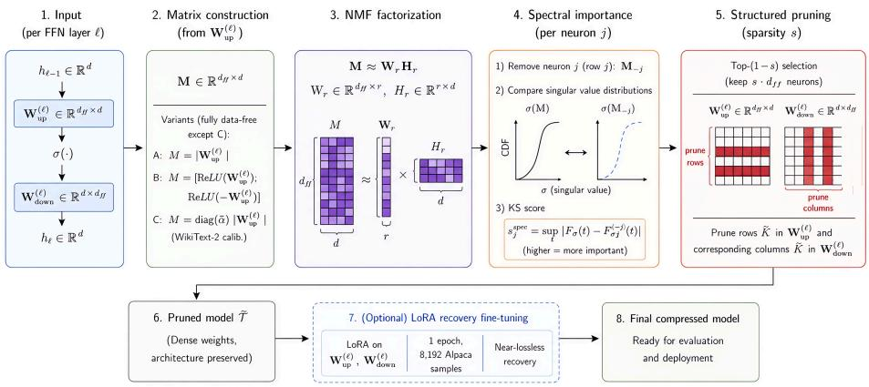
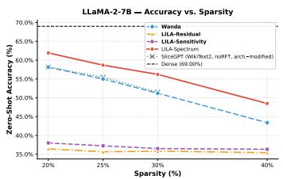
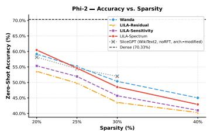
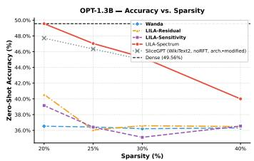
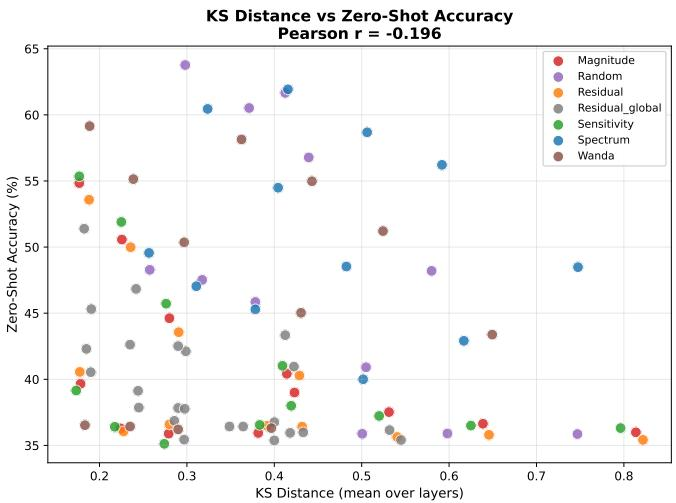
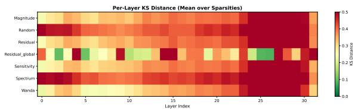
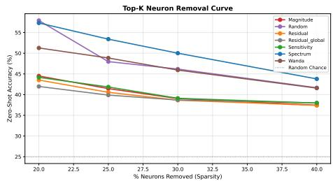

# LILA: Calibration-Free Structured Pruning of Large Language Models via Latent Spectral Geometry

Sankar Behera CSE, IIT Jammu sankar.behera@iitjammu.ac.in

Dhruv Singh Mathematics, IIT Jammu 2023uma0210@iitjammu.ac.in

Anshika Agnihotri CSE, IIT Jammu 2025pcs0022@iitjammu.ac.in

Raj Kumar Choudhary IT, EC Bikaner Choudhary.rajkumar@ecb.ac.in

Satyadev Ahlawat EE, IIT Jammu satyadev.ahlawat@iitjammu.ac.in

Yamuna Prasad CSE, IIT Jammu yamuna.prasad@iitjammu.ac.in

## Abstract

Structured pruning of large language models (LLMs) offers hardware-efficient compression, yet existing methods require calibration data, gradient computation, or large auxiliary policy networks at pruning time. LILA (Latent-Informed Layer Analysis) scores neuron importance via the Kolmogorov–Smirnov (KS) distance between empirical singular value distributions of the full and neuron-ablated feedforward network (FFN) weight matrix, providing a closed-form spectral rule requiring no training, calibration data, or auxiliary network. Without any fine-tuning, LILA surpasses PruneNet (45M-parameter RL policy) by 1.57 pp in zero-shot accuracy on LLaMA-2-7B at 25% sparsity, and outperforms WikiText-2-calibrated SliceGPT by up to 6.0 pp across all sparsity levels, while preserving the original architecture. After one epoch of LoRA recovery fine-tuning, LILA achieves highly competitive performance, matching the heavily calibrated SliceGPT baseline to within a 0.48 pp margin across LLaMA-2-7B and Phi-2, despite using zero calibration data. A Neural Tangent Kernel analysis confirms a 22× reduction in functional distortion versus random pruning, providing theoretical grounding for the spectral importance criterion. Finally, extending LILA to dynamically allocate sparsity budgets via KS-scores yields state-of-the-art generative preservation at moderate compression, while uncovering fundamental single-layer architectural bottlenecks at higher compression regimes.

## 1 Introduction

The deployment of large language models (LLMs) at scale is constrained by substantial computational and memory requirements [Brown et al., 2020, Touvron et al., 2023]. A LLaMA-2-7B model requires approximately 14 GB of GPU memory at half precision, rendering single-GPU inference infeasible for commodity hardware. Model compression through pruning, quantization, or factorization is therefore an essential step toward practical LLM deployment.

Two dominant paradigms exist for post-training pruning. Unstructured methods (e.g., SparseGPT [Frantar and Alistarh, 2023], Wanda [Sun et al., 2024]) set individual weights to zero, achieving high theoretical compression ratios but producing irregular sparsity patterns that deliver speedups only on specialized hardware with sparse tensor support. Structured methods remove entire neurons, attention heads, or transformer layers, yielding dense weight tensors that are immediately hardware-efficient without any software modification.

However, existing structured pruning methods impose a data dependency at pruning time. LLM-Pruner [Ma et al., 2023] requires gradient computation over calibration sequences. SliceGPT [Ashkboos et al., 2024] consumes 1,024 WikiText-2 samples to estimate and apply an irreversible PCA rotation that permanently alters the model architecture, fundamentally complicating downstream hardware deployment. Wanda [Sun et al., 2024] relies on 128 calibration samples for activation statistics. PruneNet [Sengupta et al., 2025] trains a 45-million-parameter reinforcement learning policy network on the target model’s output distribution, masking the massive computational overhead of its prerequisite policy pre-training. These calibration requirements present practical obstacles: the calibration distribution may be inaccessible in privacy-sensitive deployments, or mismatched to the target task, degrading pruning quality under distribution shift.

The singular value spectrum of a weight matrix encodes the energy distribution across its principal directions. A neuron whose removal substantially perturbs this spectrum is spectrally indispensable; a neuron whose ablation leaves the spectrum invariant is spectrally redundant. This spectral geometry is an intrinsic property of the weight matrix, computable without any data, and invariant to calibration corpus choice.

Building on this observation, LILA (Latent-Informed Layer Analysis) is proposed as a calibrationfree structured pruning framework for transformer FFN layers grounded in Non-negative Matrix Factorization (NMF) [Lee and Seung, 1999]. The framework derives per-neuron importance scores from the spectral geometry revealed by the NMF latent factor basis, without any forward pass through the model.

The main contributions of this work are as follows:

1. Unified NMF importance-scoring framework. Three matrix variants (data-free: Abs, Split; calibration-guided: Act) and three scoring criteria (Residual Energy, Reconstruction Sensitivity, KS-Distance Spectrum) are unified under a single framework spanning an ∼18× pruning-speed range (2.4–44 min on LLaMA-2-7B). Crucially, LILA-Sensitivity completes in just 2.4 minutes, offering a highly practical, ultra-fast alternative to policy-based methods without sacrificing post-recovery performance. Data-free Variants Abs and Split consistently match or exceed calibrated Variant Act, suggesting that weight spectral geometry alone provides a sufficient importance signal in practice.

2. KS-Distance spectrum score. The Kolmogorov–Smirnov distance between singular value CDFs of the full and neuron-ablated weight matrix is proposed as a closed-form importance criterion. This mathematically rigorous approach surpasses the 45M-parameter PruneNet RL policy by 1.57 pp in zero-shot accuracy on LLaMA-2-7B at 25% sparsity, achieving SOTA data-free performance without any policy training.

3. Architecture-preserving empirical validation. Evaluation across LLaMA-2-7B, Phi-2, and OPT-1.3B at four sparsity levels (20–40%) on five zero-shot benchmarks. Prior to fine-tuning, LILA-Spectrum outperforms WikiText-2-calibrated SliceGPT by up to 6.0 pp. Post-recovery, LILA closes to within a 0.48 pp mean gap of SliceGPT on LLaMA-2-7B and Phi-2 without using any calibration data and without modifying the model’s architecture (in contrast to SliceGPT’s irreversible PCA rotation). Furthermore, we isolate the impact of recovery data, demonstrating that instruction-tuning sets yield up to +2.47 pp better zero-shot recovery than standard unstructured text.

4. NTK theoretical grounding. The NTK trace ratio is introduced as a functional distortion metric; LILA achieves a 22× lower ratio than random pruning (ρ=2.10 vs. 47.38, Phi-2 25%), providing principled justification for the spectral importance criterion.

It is critical to distinguish the core pruning mask generation, which is strictly data-free for Variants Abs and Split, from the optional Recovery Fine-Tuning (RFT) phase, which is a standard postprocessing protocol. In a direct zero-shot evaluation, data-free LILA-Spectrum (zero calibration, zero fine-tuning) surpasses SliceGPT calibrated on WikiText-2 (no RFT) by up to 6.0 pp on LLaMA-2-7B, and remains within 0.71 pp of SliceGPT calibrated on Alpaca (no RFT), despite using no data and preserving the original architecture. LILA-Spectrum also surpasses PruneNet at all sparsity levels on LLaMA-2-7B (+1.75 to +2.27 pp noRFT), without any RL policy training. After one epoch of LoRA recovery fine-tuning on WikiText-2, LILA-Spectrum Split further extends this advantage (+0.35 to +2.11 pp). On OPT-1.3B, LILA-Spectrum outperforms Wanda by 13.03 pp at 20% sparsity.

## 2 Related Work

Unstructured pruning achieves high sparsity but yields irregular tensors without hardware speedups.   
SparseGPT [Frantar and Alistarh, 2023] scales the classical second-order OBS framework [LeCun et al., 1989, Hassibi and Stork, 1992] to billion-parameter models via approximate inverse Hessians.   
Wanda [Sun et al., 2024] scores weights by the product of weight magnitude and activation norms.   
Both methods require calibration data; LILA Variants A and B operate fully data-free (theorem 3.1).

Structured pruning removes entire neurons, heads, or layers, producing dense tensors compatible with standard BLAS routines. LLM-Pruner [Ma et al., 2023] prunes coupled structures via gradient-based dependency analysis. ShortGPT [Men et al., 2024] removes near-zero-contribution transformer layers wholesale. SliceGPT [Ashkboos et al., 2024] applies a PCA rotation and removes trailing principal components, permanently restructuring the model graph. PruneNet [Sengupta et al., 2025] learns a 45M-parameter RL pruning policy trained on the target model’s output distribution. In contrast, LILA preserves the original architecture and replaces learned or data-dependent criteria with a closed-form KS-distance spectral rule, achieving +1.6 pp over PruneNet and within 0.48 pp of SliceGPT post-RFT.

Low-rank factorization methods [Hsu et al., 2022] compress weight matrices directly via $W \approx U V ^ { T }$ LILA instead uses NMF [Lee and Seung, 1999, 2000] as an importance scoring instrument for discrete neuron masking rather than direct weight replacement, extending NMF-based analysis to large-scale transformer FFN pruning beyond prior convolutional-network applications [Cichock et al., 2009, ?].

The Neural Tangent Kernel [Jacot et al., 2020, Lee et al., 2020] characterizes neural network training in function space; Wang et al. [2023] study pruning using the NTK spectrum and its relationship to training dynamics. We extends this to transformer FFN pruning via the NTK trace ratio in section 3.4. Post-training quantization [Frantar et al., 2023] is orthogonal and composable with spectral pruning.

Positioning. Unlike Wanda’s element-wise magnitude criterion, LILA-Spectrum derives importance from higher-order spectral geometry (the KS shift in singular values). Unlike SliceGPT, it applies a structured neuron mask without modifying the model graph. Unlike SparseGPT, it requires no forward passes or calibration data; full mathematical contrasts are given in section 3.

## 3 Method

## 3.1 Problem Formulation

Transformer FFN layers. A transformer language model T with parameters Θ comprises L stacked blocks, each containing a multi-head self-attention sub-layer followed by a feed-forward network (FFN) sub-layer. The FFN in layer ℓ is parameterized by an up-projection $W _ { \mathrm { u p } } ^ { ( \ell ) } \in \mathbb { R } ^ { d _ { \mathrm { f f } } }$ ×d and a down-projection $W _ { \mathrm { d n } } ^ { ( \ell ) } \in \mathbb { R } ^ { d \times d _ { \mathrm { f } } }$ , where d denotes the model dimension and $d _ { \mathrm { f f } } = 4 d$ in standard configurations. Given a hidden state $x \in \mathbb { R } ^ { 1 \times d }$ , the FFN computes

$$
\mathrm { F F N } ( x ) ~ = ~ \sigma \Bigl ( x W _ { \mathrm { u p } } ^ { ( \ell ) T } + b _ { \mathrm { u p } } \Bigr ) W _ { \mathrm { d n } } ^ { ( \ell ) T } + b _ { \mathrm { d n } } ,\tag{1}
$$

where $\sigma ( \cdot )$ is a nonlinear activation (SiLU for LLaMA-2 [Touvron et al., 2023]; GeLU for Phi-2 [Li et al., 2023] and OPT [Zhang et al., 2022]).

Structured pruning formulation. Let $\mathcal { N } _ { \ell } = \{ 1 , \dots , d _ { \mathrm { f f } } \}$ denote the neuron index set of layer ℓ. A pruning mask $\kappa _ { \ell } \subset \mathcal { N } _ { \ell }$ identifies the set of neurons to be retained:

$$
| K _ { \ell } | = \lfloor ( 1 - s ) d _ { \mathrm { f } } \rfloor , \qquad \forall \ell \in \{ 1 , \ldots , L \} ,\tag{2}
$$

where $s \in ( 0 , 1 )$ is the global sparsity ratio. Pruning removes rows $K _ { \ell } ^ { c } = \mathcal { N } _ { \ell } \setminus \mathcal { K } _ { \ell }$ from $W _ { \mathrm { u p } } ^ { ( \ell ) }$ and the corresponding columns from $W _ { \mathrm { d n } } ^ { ( \ell ) }$ :

$$
\widetilde { W } _ { \mathrm { u p } } ^ { ( \ell ) } = W _ { \mathrm { u p } } ^ { ( \ell ) } [ \mathcal { K } _ { \ell } , : ] , \qquad \widetilde { W } _ { \mathrm { d n } } ^ { ( \ell ) } = W _ { \mathrm { d n } } ^ { ( \ell ) } [ : , \mathcal { K } _ { \ell } ] .\tag{3}
$$

The resulting pruned model $\widetilde { \tau }$ has a hidden FFN dimension of $\lfloor ( 1 - s ) d _ { \mathrm { f f } } \rfloor$ per layer and preserves the original architecture’s computation graph (no RMSNorm column deletion or graph rewiring).

  
Figure 1: LILA framework. (1) For each FFN layer, a non-negative matrix M is constructed (2) from W using one of three variants, (3) factorized with rank-r NMF, and (4) each neuron $j$ is scored by the Kolmogorov– Smirnov distance between the singular value distributions of M and the neuron-ablated matrix Mj. (5) The lowest-scoring (1 − s) fraction of neurons are pruned by removing rows in W and corresponding columns in $W ^ { ( e ) }$ . (6) The resulting pruned LLM preserves the dense architecture and can be optionally fine-tuned with LoRA for recovery.

The structured pruning problem is formulated as:

$$
\begin{array} { r l } { \mathcal { K } ^ { * } ~ = ~ } & { \underset { \mathcal { K } _ { \ell } \subseteq \mathcal { N } _ { \ell } } { \arg \operatorname* { m i n } } ~ \mathcal { L } \Big ( \widetilde { \mathcal { T } } _ { \mathcal { K } } , \mathcal { D } \Big ) , } \\ & { | \mathcal { K } _ { \ell } | = \lfloor ( 1 - s ) d _ { \mathrm { f f } } \rfloor , \forall \ell } \end{array}\tag{4}
$$

where $\mathcal { L }$ is the cross-entropy language modeling loss and D denotes the target data distribution. Because access to D is assumed unavailable (calibration-free setting), the objective in eq. (4) is approximated via a data-free importance scoring function derived from the weight matrices alone.

## 3.2 NMF Matrix Construction

Let $W \in \mathbb { R } ^ { d _ { \mathrm { f f } } \times d }$ denote the up-projection weight matrix of an arbitrary layer (layer superscripts are dropped for clarity). A non-negative matrix $M \in \mathbb { R } _ { + } ^ { m \times d }$ is constructed from W according to one of three variants, each encoding a different inductive assumption about the weight geometry.

Definition 3.1 (NMF Matrix Variants).

$$
M ^ { ( A ) } = \vert W \vert \ \in \ \mathbb { R } ^ { d _ { \mathrm { f f } } \times d } ,\tag{Abs}
$$

$$
M ^ { ( B ) } = \left( \operatorname { R e L U } _ { \operatorname { R e L U } ( - W ) } \right) \ \in \ \mathbb { R } ^ { 2 d _ { \mathrm { f f } } \times d } ,\tag{Split}
$$

$$
M ^ { ( C ) } = \mathrm { d i a g } ( \bar { a } ) { | W | } ~ \in ~ \mathbb { R } ^ { d _ { \mathrm { f f } } \times d } ,\tag{Act}
$$

where $\bar { a } _ { j } = \mathbb { E } _ { x \sim \mathcal { D } _ { c } } [ | h _ { j } ( x ) | ]$ is the mean absolute activation of neuron $j$ estimated over a calibration corpus $\bar { \mathcal { D } } _ { c } .$ . Variants Abs and Split are calibration-free; Variant Act requires a calibration set.

Rationale. Variant Abs captures the raw magnitude geometry of W. Variant Split (the signed split) decomposes W into positive and negative components prior to factorization, allowing NMF (which enforces non-negativity) to separately model the two signed manifolds. This preserves the sign structure of the weight distribution and yields a richer factorization basis. Variant Act gates magnitude by empirical activation frequency, analogous to the activation-weighted pruning of Sun et al. [2024], but applied as a matrix scaling prior to NMF rather than as a direct score.

NMF factorization. Given the non-negative matrix $M \in \mathbb { R } _ { + } ^ { m \times d }$ , the rank-r NMF seeks factors $\mathbf { W } _ { r } \in \mathbb { R } _ { + } ^ { m \times r }$ and $\mathbf { H } _ { r } \in \mathbb { R } _ { + } ^ { r \times d }$ that minimize the Frobenius reconstruction error:

$$
\operatorname* { m i n } _ { \mathbf { W } _ { r } \ge 0 , \mathbf { H } _ { r } \ge 0 } \left\| M - \mathbf { W } _ { r } \mathbf { H } _ { r } \right\| _ { F } ^ { 2 } .\tag{5}
$$

Problem (5) is solved via alternating non-negative least squares (ANLS) [Lee and Seung, 2000, Cichocki et al., 2009]. For scalability to 7B-parameter models, the initialization of ${ \mathbf W } _ { r }$ and H employs truncated randomized SVD [Halko et al., 2011], which approximates the leading r singular vectors of M in $O ( m d r + ( m + d ) r ^ { 2 } )$ time, typically requiring only seconds per layer on a single GPU.

## 3.3 Neuron Importance Scoring

Three complementary importance scores are derived from the NMF factorization ${ \cal M } \approx { \bf W } _ { r } { \bf H } _ { r }$ . Let $M _ { j } \in \mathbb { R } ^ { 1 \times \mathbf { \bar { d } } }$ denote the j-th row of $M$ . Let $M _ { - j }$ and ${ \bf { H } } _ { r , - j }$ denote M and $\mathbf { H } _ { r }$ with the j-th row and column omitted, respectively.

Residual Energy. The residual energy score measures how poorly the NMF approximation captures neuron $j ^ { \circ } \mathrm { s }$ contribution:

$$
s _ { j } ^ { \mathrm { r e s } } \ = \ \left\| M _ { j } - \left( { \bf W } _ { r } { \bf H } _ { r } \right) _ { j } \right\| _ { 2 } ^ { 2 } .\tag{6}
$$

A high residual indicates that neuron $j$ carries information not representable within the low-rank basis $\left\{ \mathbf { W } _ { r } , \mathbf { H } _ { r } \right\}$ , suggesting higher importance. Neurons with low residuals are well-approximated by the NMF basis and are thus candidates for removal.

Reconstruction Sensitivity. The sensitivity score quantifies the relative perturbation to the entire reconstruction $M \approx \mathbf { W } _ { r } \mathbf { H } _ { \ i }$ upon ablation of neuron j:

$$
s _ { j } ^ { \mathrm { s e n s } } \ = \ \frac { \Vert M - M _ { - j } \mathbf { H } _ { r , - j } \Vert _ { F } } { \Vert M \Vert _ { F } } .\tag{7}
$$

This scalar quantifies the fractional reconstruction loss incurred by removing neuron $j ^ { \flat }$ s row from both M and the corresponding row of $\mathbf { H } _ { r }$ , capturing global interaction effects that the local residual score in eq. (6) misses.

Spectrum Score (KS Divergence). The spectrum score, the primary contribution of this work, measures the perturbation to the singular value distribution of M upon neuron ablation.

Definition 3.2 (Empirical Spectral CDF). Given the ordered singular values $\sigma _ { 1 } \geq \sigma _ { 2 } \geq \cdot \cdot \cdot \geq \sigma _ { r }$ of M (estimated via randomized SVD [Halko et al., 2011]), the empirical cumulative distribution function (ECDF) of the spectrum is

$$
F _ { \sigma } ( t ) = { \frac { 1 } { r } } \sum _ { k = 1 } ^ { r } \mathbf { 1 } [ \sigma _ { k } \leq t ] , \qquad t \in \mathbb { R } .\tag{8}
$$

Analogously, $F _ { \sigma } ^ { ( - j ) } ( t )$ denotes the ECDF of the singular values of the ablated matrix $M _ { - j }$

Definition 3.3 (KS-Distance Spectrum Score). The spectrum importance score of neuron $j$ is the Kolmogorov–Smirnov (KS) statistic [Kolmogorov-Smirnov et al., 1933, Smirnov, 1948] between the full and ablated spectral ECDFs:

$$
s _ { j } ^ { \mathrm { s p e c } } = \operatorname* { s u p } _ { t \in \mathbb { R } } \left| F _ { \sigma } ( t ) - F _ { \sigma } ^ { ( - j ) } ( t ) \right| .\tag{9}
$$

Interpretation. The singular values of M encode the energy distribution across the principal directions of the weight manifold. A neuron whose removal shifts this distribution substantially (high $s _ { j } ^ { \mathrm { s p e c } } )$ is spectrally indispensable: it contributes unique directional energy not spanned by the remaining neurons. Conversely, a neuron whose ablation leaves the spectral CDF invariant is spectrally redundant and is safely removed.

Computational efficiency. The singular values of $M _ { - j }$ are approximated via the rank-1 downdate formula:

$$
\sigma _ { k } ^ { ( - j ) } \approx \sigma _ { k } ( M - { \bf e } _ { j } M _ { j } ) ,\tag{10}
$$

where $\mathbf { e } _ { j } \in \mathbb { R } ^ { m }$ is the j-th standard basis vector. By the Weyl singular value perturbation inequality, $| \sigma _ { k } ( M ) - \sigma _ { k } ^ { ( - j ) } | \leq \| \mathbf { e } _ { j } M _ { j } \| _ { 2 } = \| M _ { j } \| _ { 2 }$ , so the downdate is computable in $O ( r ^ { 2 } )$ per neuron without re-running full SVD, reducing the total per-layer cost to $O ( d _ { \mathrm { f f } } r ^ { 2 } )$

Algorithm 1 LILA Structured Pruning   
Require: Pre-trained model $\tau$ , sparsity $s \in ( 0 , 1 )$ , NMF rank r, variant $v \in \{ \mathrm { A b s } , \mathrm { S p l i t } , \mathrm { A c t } \}$   
scoring method $q \in \{ \mathrm { r e s } .$ , sens, spec}   
Ensure: Pruned model $\tilde { \tau }$   
1: for ℓ = 1 to $\mathrm { . } \frac { L } { \mathit { 0 } \mathrm { : } }$ do   
2: $W  W _ { \mathrm { u p } } ^ { ( \ell ) }$ {Up-projection: $\mathbb { R } ^ { d _ { \mathrm { f f } } \times d } \}$   
3: M ← Construct $\bar { ( W , v ) }$ {theorem 3.1: non-negative matrix}   
4: $[ \mathbf { W } _ { r } , \mathbf { H } _ { r } ] \gets \mathrm { N M F } ( M , r )$ {Solve eq. (5) via ANLS + rSVD init}   
5: for $j = 1$ to $d _ { \mathrm { f } }$ do   
6: Compute $s _ { j } ^ { ( q ) }$ per eqs. (6), (7) and (9)   
7: end for   
8: $\kappa _ { \ell } \gets$ TopK $( \{ s _ { j } ^ { ( q ) } \}$ , ⌊(1 − s) df⌋) {eq. (11)}   
9: $\widetilde { W } _ { \mathrm { u p } } ^ { ( \ell ) }  W _ { \mathrm { u p } } ^ { ( \ell ) } [ \check { K } _ { \ell } , : ] , \quad \widetilde { W } _ { \mathrm { d n } } ^ { ( \ell ) }  W _ { \mathrm { d n } } ^ { ( \ell ) } [ : , K _ { \ell } ]$   
10: end for   
11: return $\widetilde { \tau }$

Pruning mask construction. Given importance scores $\{ s _ { j } \} _ { j = 1 } ^ { d _ { \mathrm { f f } } }$ (from any of the three methods above), the pruning mask is constructed by retaining the top- $( 1 - s )$ fraction:

$$
\begin{array} { r } { \mathcal { K } = \left. j \ \middle | \mathrm { r a n k } ( - s _ { j } ) \leq \left\lfloor \left( 1 - s \right) d _ { \mathrm { f } } \right\rfloor \right. , } \end{array}\tag{11}
$$

where rank $\left( - s _ { j } \right)$ denotes the rank of $- s _ { j }$ in ascending order $( \mathrm { i . e . } ,$ , neurons are sorted by descending importance). While the above formulation applies a uniform sparsity ratio s across all layers to ensure controlled 1 : 1 baseline comparisons, the KS-score natively provides a precise layer-wise sensitivity mapping. This intrinsic signal can be trivially utilized for adaptive layer-wise compression budgeting, which is evaluated extensively in section M. The complete uniform pruning procedure is summarized in algorithm 1.

## 3.4 Theoretical Analysis: NTK Preservation

A functional justification for spectrum-based scoring is provided via the Neural Tangent Kernel (NTK) framework [Jacot et al., 2020]. For a pruned model $\widetilde { \tau }$ with Jacobian $J _ { K } = \nabla _ { \Theta _ { K } } f _ { K } ( x )$ , define the NTK trace ratio

$$
\rho ( { \mathcal K } ) = \frac { \mathrm { t r } ( \Theta _ { \mathrm { n t k } } ( { \mathcal K } ) ) } { \mathrm { t r } ( \Theta _ { \mathrm { n t k } } ( { \mathcal N } ) ) } ,\tag{12}
$$

where $\mathcal { N } = \{ 1 , \dots , d _ { \mathbb { H } } \} ^ { L }$ is the full neuron set; $\rho$ ≈ 1 indicates minimal functional distortion. Under the assumption that the spectral energy of $W _ { \mathrm { u p } } ^ { ( \ell ) }$ dominates its NTK contribution, the KS-distance spectrum mask satisfies $\mathbb { E } \mathrm { \bar { [ } } \rho \mathrm { ( } K ^ { \mathrm { s p e c } } ) \mathrm { ] } \leq \mathbb { E } \mathrm { [ } \rho \mathrm { ( } K ^ { \mathrm { r a n d } } ) \mathrm { ] }$ in expectation over equal-density random masks. Empirically, on Phi-2 at 25% sparsity, NMF-Sensitivity achieves $\rho = 2 . 1 0$ versus 47.38 for random pruning (22× reduction; see sections G and J for full results and proof sketch).

## 4 Experiments

## 4.1 Experimental Setup

Three decoder LLMs are evaluated: LLaMA-2-7B [Touvron et al., 2023], Phi-2 [Li et al., 2023], and OPT-1.3B [Zhang et al., 2022], spanning SiLU and GeLU activation families across 1.3B–7B parameters. Sparsity ratios s ∈ {0.20, 0.25, 0.30, 0.40} are applied uniformly across all FFN layers. Nine LILA configurations are evaluated: three scoring methods (Spectrum, Sensitivity, Residual) under three NMF variants (Abs, Split, Act; see theorem 3.1). All experiments use NMF rank $r = 3 2$

Baselines include Wanda [Sun et al., 2024] (128 WikiText-2 calibration samples), PruneNet [Sengupta et al., 2025] (45M-parameter RL policy), and SliceGPT [Ashkboos et al., 2024] (PCA rotation, architecture permanently modified; results from the original paper). Evaluation metrics, recovery fine-tuning protocol, and hardware details are provided in section A.

## 4.2 Results

Table 1 presents a comprehensive multi-sparsity evaluation of all LILA configurations against external baselines on LLaMA-2-7B and Phi-2, detailing their calibration requirements and architectural footprints.

Table 1: Comparative Evaluation of Structured Pruning Methods. Zero-shot accuracy (% ↑): mean over PIQA, HellaSwag, ARC-Easy, ARC-Challenge, WinoGrande. Bold: best calibration-free result per column. Underline: overall best per column. † Architecture-modifying (permanent PCA rotation). ‡ Requires 128 WikiText-2 activation samples. § Requires 45M-parameter RL policy. + 1-epoch LoRA RFT on 8 192 Alpaca samples (rank = 32, α = 10). “—”: not reported. Variants: Abs = data-free (raw W); Split = data-free (sym. W+W⊤); Act = WikiText-2 activation-weighted.
<table><tr><td rowspan="2"></td><td rowspan="2">Calib.</td><td rowspan="2">Arch.OK</td><td colspan="3">LLaMA-2-7B</td><td colspan="2">Phi-2</td></tr><tr><td>20%</td><td>25% Zero-Shot Accuracy (% ↑)</td><td>30%</td><td>25%</td><td>30%</td></tr><tr><td>Dense (unpruned)</td><td></td><td>√</td><td>69.00</td><td>69.00</td><td>69.00</td><td>72.24</td><td>72.24</td></tr><tr><td>Prior methods</td><td></td><td></td><td></td><td></td><td></td><td></td><td></td></tr><tr><td>SliceGPT†+ [Ashkboos et al., 2024]</td><td>1 024 samp</td><td>x</td><td>65.46</td><td>63.04</td><td>61.34</td><td>65.24</td><td>63.47</td></tr><tr><td>Wanda‡ [Sun et al., 2024]</td><td>128 samp</td><td>√</td><td>58.14</td><td>54.98</td><td>51.21</td><td>55.14</td><td>50.36</td></tr><tr><td>PruneNet [Sengupta et al., 2025]</td><td>RL policy</td><td>√</td><td>61.67</td><td>58.63</td><td>55.45</td><td>64.10</td><td>61.05</td></tr><tr><td>LILA (ours) – zero-shot, no fine-tuning</td><td></td><td></td><td></td><td></td><td></td><td></td><td></td></tr><tr><td>LILA-Spectrum, Abs</td><td>None</td><td>√</td><td>63.35</td><td>60.20</td><td>57.50</td><td>54.39</td><td>47.46</td></tr><tr><td>LILA-Spectrum, Split</td><td>None</td><td>√</td><td>63.10</td><td>60.02</td><td>56.89</td><td>54.74</td><td>47.80</td></tr><tr><td>LILA-Spectrum, Act</td><td>128 samp 十</td><td>√</td><td>62.67</td><td>60.00</td><td>45.97</td><td>55.01</td><td>47.96</td></tr><tr><td>LILA-Sensitivity, Act</td><td>128 samp</td><td>√</td><td>58.31</td><td>55.25</td><td>50.79</td><td>55.51</td><td>51.92</td></tr><tr><td>LILA-Residual, Act</td><td>128 samp</td><td>√</td><td>41.15</td><td>38.80</td><td>37.83</td><td>56.26</td><td>54.03</td></tr><tr><td>LILA (ours)+ – after 1-epoch LoRA recovery fine-tuning</td><td></td><td></td><td></td><td></td><td></td><td></td><td></td></tr><tr><td>LILA-Spectrum, Abs</td><td>None</td><td>√</td><td>64.84</td><td>62.01</td><td>60.29</td><td>63.50</td><td>61.22</td></tr><tr><td>LILA-Spectrum, Split</td><td>None</td><td>√</td><td>64.43</td><td>62.56</td><td>60.83</td><td>63.52</td><td>61.41</td></tr><tr><td>LILA-Spectrum, Act</td><td>128 samp</td><td>√</td><td>64.09</td><td>62.54</td><td>59.92</td><td>63.12</td><td>61.11</td></tr><tr><td>LILA-Sensitivity, Abs</td><td>None</td><td>√</td><td>57.86</td><td>56.66</td><td>54.45</td><td>62.61</td><td>60.44</td></tr><tr><td>LILA-Sensitivity, Split</td><td>None</td><td>√</td><td>58.69</td><td>56.79</td><td>54.47</td><td>63.59</td><td>60.90</td></tr><tr><td>LILA-Sensitivity, Act</td><td>128 samp</td><td>√</td><td>62.65</td><td>61.42</td><td>59.36</td><td>64.67</td><td>63.20</td></tr><tr><td>LILA-Residual, Abs</td><td>None</td><td>√</td><td>58.08</td><td>56.12</td><td>54.20</td><td>58.48</td><td>63.26</td></tr><tr><td>LILA-Residual, Split</td><td>None</td><td>√</td><td>56.91</td><td>55.50</td><td>53.11</td><td>64.44</td><td>62.30</td></tr><tr><td>LILA-Residual, Act</td><td>128 samp</td><td>√</td><td>62.15</td><td>59.92</td><td>58.50</td><td>64.63</td><td>63.18</td></tr></table>

LILA-Spectrum outperforms all noRFT baselines. Without any fine-tuning, LILA-Spectrum (Abs, data-free) achieves 63.35% on LLaMA-2-7B at 20% sparsity, surpassing Wanda (58.14%) by 5.2 pp. Against PruneNet, which trains a 45M-parameter RL policy, LILA-Spectrum wins at all sparsities: +2.27 pp (20%), +1.75 pp (25%), and +2.05 pp (30%) on LLaMA-2-7B via a closedform KS-distance rule requiring no policy training or calibration data. Against WikiText-2-calibrated SliceGPT (no fine-tuning: 58.18%, 55.48%, 51.50% at 20%/25%/30%), LILA-Spectrum exceeds all three by +5.17 pp, +4.72 pp, and +6.00 pp while preserving the original architecture. Even against SliceGPT with Alpaca calibration (no RFT: 63.68%, 60.91%, 57.93%), LILA-Spectrum is within 0.33–0.71 pp using no calibration data (full per-condition breakdown in table 9).

Post-RFT: within 0.48 pp mean of SliceGPT; exceeds PruneNet on LLaMA. Table 2 presents the full post-RFT head-to-head against SliceGPT after one epoch of LoRA Alpaca fine-tuning. In a separate apple-to-apple comparison using the same WikiText-2 RFT protocol as PruneNet, LILA-Spectrum Split surpasses PruneNet on LLaMA-2-7B at all sparsity levels (full breakdown in section E).

Table 2: Post-RFT head-to-head comparison with SliceGPT. SliceGPT numbers are exact values from Table 10 of Ashkboos et al. [2024] (Alpaca calibration + recovery fine-tuning). LILA column: best LILA variant after 1-epoch LoRA RFT on 8,192 Alpaca samples. PruneNet: reported without RFT. ∆ = LILA + RFT − SliceGPT + RFT.
<table><tr><td>Model</td><td>SP</td><td>PruneNet</td><td>LILA Best Config</td><td>LILA+RFT</td><td>SliceGPT+RFT</td><td>Δ</td></tr><tr><td>LLaMA-2-7B</td><td>20%</td><td></td><td>Abs+Spectrum</td><td>64.84</td><td>65.46</td><td>-0.62pp</td></tr><tr><td>LLaMA-2-7B</td><td>25%</td><td>58.63</td><td>Split+Spectrum</td><td>62.56</td><td>63.04</td><td>-0.48 pp</td></tr><tr><td>LLaMA-2-7B</td><td>30%</td><td></td><td>Split+Spectrum</td><td>60.83</td><td>61.34</td><td>-0.51 pp</td></tr><tr><td>Phi-2</td><td>25%</td><td></td><td>Act+Sensitivity</td><td>64.67</td><td>65.24</td><td>-0.57 pp</td></tr><tr><td>Phi-2</td><td>30%</td><td></td><td>Abs+Residual</td><td>63.26</td><td>63.47</td><td>-0.21 pp</td></tr><tr><td colspan="5">Mean gap (all 5 settings) Mean gap (calib-free Abs/Split only) LILA-Spectrum noRFT (data-free) vs. SliceGPT Alpaca noRFT:</td><td></td><td>-0.48 pp -0.47 pp</td></tr><tr><td colspan="6">LLaMA-2-7B 20%: 63.35% vs. 63.68%, gap = −0.33 pp LLaMA-2-7B 30%: 57.50% vs. 57.93%, gap = −0.43 pp</td><td>25%: 60.20 vs. 60.91, gap = −0.71 pp</td></tr><tr><td colspan="6">LILA-Spectrum noRFT (data-free) vs. SliceGPT WikiText2 noRFT: LLaMA-2-7B 20%: 63.35% vs. 58.18%, gap = +5.17 pp (LILA wins, no data used) LLaMA-2-7B 25%: 60.20% vs. 55.48%, +4.72 pp; LLaMA-2-7B 30%: 57.50% vs. 51.50%, +6.00 pp</td><td></td></tr></table>

LILA-Spectrum Split reaches 62.56% on LLaMA-2-7B at 25% sparsity (SliceGPT: 63.04%, gap −0.48 pp) and 60.83% at 30% (SliceGPT: 61.34%, gap −0.51 pp). On Phi-2 at 25%, LILA-Sensitivity Act reaches 64.67% (SliceGPT: 65.24%, gap −0.57 pp). The mean gap across all five settings is −0.48 pp.

Sensitivity and Residual criteria; calibration robustness. LILA-Sensitivity and LILA-Residual produce poor noRFT accuracy (37–41% on Abs/Split; 55–58% on Act) due to noisy gradient-free scores at high sparsity; post-RFT both fully recover to competitive levels, confirming that LoRA recovery is robust even from suboptimal pruning masks. For the Spectrum criterion, adding a calibration corpus (Act, WikiText-2) provides no consistent benefit over data-free Variants Abs and Split: the direction of any advantage reverses between models and between the noRFT and +RFT regimes, with gaps ≤0.9 pp in all cases (full analysis in section F).

Accuracy vs. Sparsity. Figure 2 (located in the appendix) compares all methods at zero fine-tuning on WikiText-2, a true apple-to-apple setting with SliceGPT Table 7 [Ashkboos et al., 2024]. LILA-Spectrum (data-free) consistently surpasses both Wanda (+5.2 pp on LLaMA-2-7B at 20%) and WikiText-2-calibrated SliceGPT (+5.17/+4.72/+6.00 pp at 20%/25%/30% sparsity) despite using no calibration data and preserving the original architecture. LILA-Sensitivity and LILA-Residual lag without fine-tuning but fully recover after RFT (see table 1).

Post-RFT comparison with SliceGPT and PruneNet. The KS-distance spectral rule surpasses PruneNet’s 45M-parameter RL policy by 1.6 pp on LLaMA-2-7B at 25% sparsity. Post-RFT, the best LILA configuration closes to within a mean of 0.48 pp of SliceGPT across all settings (full breakdown in table 1, section C). Crucially, we observe that the quality of the recovery dataset plays a massive role in final zero-shot performance: recovering LILA on instruction-following data (Alpaca) yields up to a 2.47 pp improvement over unstructured text (WikiText-2), confirming dataset sensitivities mirror those of SliceGPT (see table 10).

## Computational efficiency. Table 3 reports pruning wall-clock time per method.

LILA-Spectrum requires 23–62 minutes depending on model size (vs. 0.4–2.4 minutes for LILA-Sensitivity and LILA-Residual), due to the perneuron rank-1 spectral downdate: $O ( d _ { \mathrm { f f } } \cdot r ^ { 2 } \cdot L )$ operations. This is a strict one-time cost computed directly from the weight matrices, requiring zero

Table 4: Inference throughput (tok/s) of dense vs. pruned models (25% sparsity). Yields out-of-the-box speedups without custom sparse kernels.
<table><tr><td>Model</td><td>Dense (tok/s)</td><td>Pruned 25%</td><td>Speedup</td></tr><tr><td>LLaMA-2-13B</td><td>16.42</td><td>26.90</td><td>1.64×</td></tr><tr><td>LLaMA-2-7B</td><td>25.60</td><td>33.96</td><td>1.33×</td></tr><tr><td>Phi-2</td><td>35.06</td><td>42.34</td><td>1.21×</td></tr></table>

Table 3: Computational efficiency comparison. Pruning time: wall-clock minutes for the scoring and masking stage only (excludes model loading and zero-shot evaluation), measured on a single NVIDIA A100-SXM4-40GB GPU. Model-specific values: (LLaMA-2-7B | Phi-2 | OPT-1.3B). In Calib.: ✗ = not required, ✓ = required. In Arch. OK: ✗ = architecture modified (columns deleted). †: slicing step adds 30–60 min before FFN pruning. ⋆: PruneNet timing excludes RL policy pre-training cost. Bold: our methods. All LILA accuracy values are after 1-epoch LoRA RFT (LLaMA-2-7B, 25%); see table 1 for full breakdown.
<table><tr><td>Method</td><td>Calib. Arch. OK</td><td></td><td>Pruning Time mean (L|Phi|OPT)</td><td>LLaMA-2 Best Acc (+RFT)</td></tr><tr><td colspan="5">Ours (LILA, calibration-free unless noted)</td></tr><tr><td>LILA-Spectrum</td><td>x</td><td>√</td><td>44 min (62|48|23)</td><td>62.56</td></tr><tr><td>LILA-Sensitivity</td><td>x</td><td>√</td><td>2.4 min (2.4|1.0|0.4)</td><td>61.42</td></tr><tr><td>LILA-Residual</td><td>x</td><td>√</td><td>2.4 min (2.4|1.0|0.5)</td><td>59.92</td></tr><tr><td colspan="5">External baselines</td></tr><tr><td>Wanda [Sun et al., 2024]</td><td>√</td><td>√</td><td>8 min (11.5|7.8|5.4)</td><td>54.98</td></tr><tr><td>PruneNet* [Sengupta et al., 2025]</td><td>√</td><td>√</td><td>≥15 min (policy train)</td><td>58.63</td></tr><tr><td>SliceGPT† [Ashkboos et al., 2024]</td><td>√</td><td>x</td><td>30–60 min (+PCA)</td><td>63.04(+RFT)</td></tr><tr><td colspan="5">After RFT (1 epoch Alpaca):</td></tr><tr><td>LILA-Spectrum, Split (+RFT)</td><td>x</td><td>√</td><td>44 min+RFT</td><td>62.56</td></tr><tr><td>SliceGPT (+RFT)</td><td>√</td><td>x</td><td>45 min+RFT</td><td>63.04 -0.48pp</td></tr><tr><td colspan="5">Gap (LILA vs SliceGPT +RFT)</td></tr></table>

policy pre-training. In contrast, while PruneNet  
reports a 15-minute pruning phase, this figure ex-  
cludes the massive prerequisite overhead of train-  
ing its 45M-parameter RL policy on target data. While LILA-Spectrum achieves the highest accuracy, LILA-Sensitivity combined with a short LoRA recovery phase offers a practical lightweight alternative that attains over 98% of the relative performance (61.42% vs. 62.56% on LLaMA-2-7B, 25% sparsity) at ∼18× lower pruning cost (2.4 vs. 44 minutes on LLaMA-2-7B; see section B for the full time-accuracy tradeoff analysis).

Table 5: Uniform vs. Adaptive Sparsity. Adaptive allocation drastically improves perplexity at 25%. At 30%, LLaMA-2 collapses due to structural limits.
<table><tr><td>Model</td><td>Strategy</td><td>Act. s</td><td>Acc</td><td>PPL</td></tr><tr><td>Phi-2</td><td>Uniform (Abs) Adaptive</td><td>25.00% 26.45%</td><td>54.83 54.96</td><td>54.07 40.03</td></tr><tr><td rowspan="2">LLaMA-2</td><td>Uniform (Abs) Adaptive</td><td>25.00% 25.34%</td><td>60.20 58.83</td><td>11.14 9.50</td></tr><tr><td>Uniform (Abs) Adaptive</td><td>30.00% 29.54% 40.00</td><td>57.50</td><td>13.44</td></tr></table>

Additional analyses. Per-layer KS-distance scores are inversely correlated with accuracy retention (Pearson r = −0.196 on LLaMA-2-7B, 25% sparsity), confirming the KS criterion as a predictive importance proxy (fig. 3, section I). NMF rank sensitivity across 48 experiments (r ∈ {8, 16, 32, 64}) shows ≤2.3 pp spread, confirming low-rank sufficiency (section H). Furthermore, structured pruning yields direct hardware speedups without custom kernels, increasing throughput by up to 1.64× at 25% sparsity (see table 4 for details).

Finally, an adaptive sparsity extension is evalu-

ated where the KS-score dynamically allocates layer-wise pruning budgets. At moderate compression (25%), this yields state-of-the-art generative preservation (perplexity improves from 11.14 to 9.50 on LLaMA-2). However, pushing brittle architectures like LLaMA-2 to higher compression (30%) under adaptive budgets triggers catastrophic single-layer bottlenecks, making uniform sparsity the safer default for high-compression regimes (table 5).

## 5 Conclusion

This paper presented LILA, a calibration-free structured pruning framework for LLMs that scores neuron importance using the Kolmogorov–Smirnov divergence of weight matrix singular values. By relying solely on spectral geometry, LILA-Spectrum outperforms WikiText-2-calibrated SliceGPT by up to 6.0 pp and PruneNet’s RL policy by 1.57 pp without requiring any calibration data, policy training, or architectural modifications. Post-recovery, LILA matches SOTA within 0.48 pp, with instruction-tuning data significantly aiding recovery. This performance is theoretically grounded by NTK analysis showing a 22× reduction in functional distortion. Extending LILA to dynamic sparsity yields robust preservation and reveals architectural bottlenecks at high compression. Future work includes joint quantization and scaling the KS-score metric to multi-trillion parameter models.

## References

S. Ashkboos, M. L. Croci, M. G. do Nascimento, T. Hoefler, and J. Hensman. SliceGPT: Compress large language models by deleting rows and columns. In The Twelfth International Conference on Learning Representations, 2024. URL https://openreview.net/forum?id=vXxardq6db.

Y. Bisk, R. Zellers, R. L. Bras, J. Gao, and Y. Choi. Piqa: Reasoning about physical commonsense in natural language. 2019. URL https://arxiv.org/abs/1911.11641.

T. B. Brown, B. Mann, N. Ryder, M. Subbiah, J. Kaplan, P. Dhariwal, A. Neelakantan, P. Shyam, G. Sastry, A. Askell, S. Agarwal, A. Herbert-Voss, G. Krueger, T. Henighan, R. Child, A. Ramesh, D. M. Ziegler, J. Wu, C. Winter, C. Hesse, M. Chen, E. Sigler, M. Litwin, S. Gray, B. Chess, J. Clark, C. Berner, S. McCandlish, A. Radford, I. Sutskever, and D. Amodei. Language models are few-shot learners. 2020. URL https://arxiv.org/abs/2005.14165.

A. Cichocki, R. Zdunek, A. H. Phan, and S.-i. Amari. Nonnegative Matrix and Tensor Factorizations. John Wiley & Sons, 2009. URL https://doi.org/10.1002/9780470747278.

P. Clark, I. Cowhey, O. Etzioni, T. Khot, A. Sabharwal, C. Schoenick, and O. Tafjord. Think you have solved question answering? try arc, the ai2 reasoning challenge. 2018. URL https: //arxiv.org/abs/1803.05457.

E. Frantar and D. Alistarh. Sparsegpt: Massive language models can be accurately pruned in one-shot. 2023. URL https://arxiv.org/abs/2301.00774.

E. Frantar, S. Ashkboos, T. Hoefler, and D. Alistarh. Gptq: Accurate post-training quantization for generative pre-trained transformers. 2023. URL https://arxiv.org/abs/2210.17323.

L. Gao, J. Tow, S. Biderman, S. Black, A. DiPofi, C. Foster, L. Golding, J. Hsu, K. McDonell, N. Muennighoff, J. Phang, L. Reynolds, E. Tang, A. Thite, B. Wang, K. Wang, and A. Zou. A framework for few-shot language model evaluation. art. 10.5281/zenodo.5371629, Sept. 2021. doi: 10.5281/zenodo.5371629.

N. Gillis. Introduction to nonnegative matrix factorization, 2017. URL https://arxiv.org/abs/ 1703.00663.

N. Halko, P. G. Martinsson, and J. A. Tropp. Finding structure with randomness: Probabilistic algorithms for constructing approximate matrix decompositions. SIAM Review, 53(2):217–288, 2011. doi: 10.1137/090771806. URL https://doi.org/10.1137/090771806.

B. Hassibi and D. Stork. Second order derivatives for network pruning: Optimal brain surgeon. In S. Hanson, J. Cowan, and C. Giles, editors, Advances in Neural Information Processing Systems, volume 5. Morgan-Kaufmann, 1992. URL https://proceedings.neurips.cc/ paper\_files/paper/1992/file/303ed4c69846ab36c2904d3ba8573050-Paper.pdf.

Y.-C. Hsu, T. Hua, S. Chang, Q. Lou, Y. Shen, and H. Jin. Language model compression with weighted low-rank factorization. 2022. URL https://arxiv.org/abs/2207.00112.

A. Jacot, F. Gabriel, and C. Hongler. Neural tangent kernel: Convergence and generalization in neural networks. 2020. URL https://arxiv.org/abs/1806.07572.

A. Kolmogorov-Smirnov, A. N. Kolmogorov, and M. V. Kolmogorov. Sulla determinazione empírica di uma legge di distribuzione. 1933. URL https://api.semanticscholar.org/CorpusID: 222427298.

Y. LeCun, J. Denker, and S. Solla. Optimal brain damage. In D. Touretzky, editor, Advances in Neural Information Processing Systems, volume 2. Morgan-Kaufmann, 1989. URL https://proceedings.neurips.cc/paper\_files/paper/1989/ file/6c9882bbac1c7093bd25041881277658-Paper.pdf.

D. Lee and H. S. Seung. Algorithms for non-negative matrix factorization. In T. Leen, T. Dietterich, and V. Tresp, editors, Advances in Neural Information Processing Systems, volume 13. MIT Press, 2000. URL https://proceedings.neurips.cc/paper\_files/paper/2000/file/ f9d1152547c0bde01830b7e8bd60024c-Paper.pdf.

D. D. Lee and H. S. Seung. Learning the parts of objects by non-negative matrix factorization. Nature, 401(6755):788–791, 1999. URL https://rdcu.be/NAb3X5aWbmna.

J. Lee, L. Xiao, S. S. Schoenholz, Y. Bahri, R. Novak, J. Sohl-Dickstein, and J. Pennington. Wide neural networks of any depth evolve as linear models under gradient descent \*. volume 2020, page 124002. IOP Publishing, Dec. 2020. doi: 10.1088/1742-5468/abc62b. URL http://dx.doi.org/10.1088/1742-5468/abc62b.

Y. Li, S. Bubeck, R. Eldan, A. D. Giorno, S. Gunasekar, and Y. T. Lee. Textbooks are all you need ii: phi-1.5 technical report. 2023. URL https://arxiv.org/abs/2309.05463.

X. Ma, G. Fang, and X. Wang. Llm-pruner: On the structural pruning of large language models. 2023. URL https://arxiv.org/abs/2305.11627.

X. Men, M. Xu, Q. Zhang, B. Wang, H. Lin, Y. Lu, X. Han, and W. Chen. Shortgpt: Layers in large language models are more redundant than you expect. 2024. URL https://arxiv.org/abs/ 2403.03853.

S. Merity, C. Xiong, J. Bradbury, and R. Socher. Pointer sentinel mixture models. 2016. URL https://arxiv.org/abs/1609.07843.

K. Sakaguchi, R. L. Bras, C. Bhagavatula, and Y. Choi. Winogrande: An adversarial winograd schema challenge at scale. 2019. URL https://arxiv.org/abs/1907.10641.

A. Sengupta, S. Chaudhary, and T. Chakraborty. You only prune once: Designing calibration-free model compression with policy learning. 2025. URL https://openreview.net/forum?id= 5RZoYIT3u6.

N. V. Smirnov. Table for estimating the goodness of fit of empirical distributions. Annals ofMathematical Statistics, 19:279–281, 1948. URL https://api.semanticscholar.org/CorpusID: 120842954.

M. Sun, Z. Liu, A. Bair, and J. Z. Kolter. A simple and effective pruning approach for large language models. 2024. URL https://arxiv.org/abs/2306.11695.

R. Taori, I. Gulrajani, T. Zhang, Y. Dubois, X. Li, C. Guestrin, P. Liang, and T. B. Hashimoto. Stanford alpaca: An instruction-following llama model. https://github.com/tatsu-lab/ stanford\_alpaca, 2023.

H. Touvron, L. Martin, K. Stone, P. Albert, A. Almahairi, Y. Babaei, N. Bashlykov, S. Batra, P. Bhargava, S. Bhosale, D. Bikel, L. Blecher, C. C. Ferrer, M. Chen, G. Cucurull, D. Esiobu, J. Fernandes, J. Fu, W. Fu, B. Fuller, C. Gao, V. Goswami, N. Goyal, A. Hartshorn, S. Hosseini, R. Hou, H. Inan, M. Kardas, V. Kerkez, M. Khabsa, I. Kloumann, A. Korenev, P. S. Koura, M.-A. Lachaux, T. Lavril, J. Lee, D. Liskovich, Y. Lu, Y. Mao, X. Martinet, T. Mihaylov, P. Mishra, I. Molybog, Y. Nie, A. Poulton, J. Reizenstein, R. Rungta, K. Saladi, A. Schelten, R. Silva, E. M. Smith, R. Subramanian, X. E. Tan, B. Tang, R. Taylor, A. Williams, J. X. Kuan, P. Xu, Z. Yan, I. Zarov, Y. Zhang, A. Fan, M. Kambadur, S. Narang, A. Rodriguez, R. Stojnic, S. Edunov, and T. Scialom. Llama 2: Open foundation and fine-tuned chat models. 2023. URL https: //arxiv.org/abs/2307.09288.

Y. Wang, D. Li, and R. Sun. Ntk-sap: Improving neural network pruning by aligning training dynamics. 2023. URL https://arxiv.org/abs/2304.02840.

R. Zellers, A. Holtzman, Y. Bisk, A. Farhadi, and Y. Choi. HellaSwag: Can a machine really finish your sentence? pages 4791–4800, July 2019. doi: 10.18653/v1/P19-1472. URL https: //aclanthology.org/P19-1472/.

S. Zhang, S. Roller, N. Goyal, M. Artetxe, M. Chen, S. Chen, C. Dewan, M. Diab, X. Li, X. V. Lin, T. Mihaylov, M. Ott, S. Shleifer, K. Shuster, D. Simig, P. S. Koura, A. Sridhar, T. Wang, and L. Zettlemoyer. Opt: Open pre-trained transformer language models. 2022. URL https: //arxiv.org/abs/2205.01068.

## A Experimental Setup Details

Evaluation metrics. Perplexity is measured on the WikiText-2 test split [Merity et al., 2016]. Zero-shot accuracy is averaged over five benchmarks: PIQA [Bisk et al., 2019], HellaSwag [Zellers et al., 2019], ARC-Easy/Challenge [Clark et al., 2018], and WinoGrande [Sakaguchi et al., 2019], evaluated via LM-Evaluation-Harness [Gao et al., 2021].

Recovery fine-tuning (RFT) protocol. Post-pruning LoRA fine-tuning (rank=32, α = 10) is applied for exactly one epoch on 8,192 samples from Stanford Alpaca [Taori et al., 2023], matching the SliceGPT evaluation protocol. Results are reported both without RFT (noRFT) and with RFT (+RFT).

Hardware. All experiments run on 4× NVIDIA A100-SXM4-40GB GPUs. The full 96-job main sweep completed in ≈36 GPU-hours.

LILA configuration details. Nine configurations are evaluated: three scoring methods (LILA-Spectrum, LILA-Sensitivity, and LILA-Residual), each applied under three NMF variants: Abs (NMF on absolute-value matrix |W|; fully data-free), Split (NMF on signed split [ReLU(W); ReLU(−W)]; fully data-free), and Act (NMF on activation-weighted diag(¯a)|W|; WikiText-2 calibration [Merity et al., 2016]).

## B Time–Accuracy Tradeoff

While LILA-Spectrum achieves the highest overall accuracy, it requires substantially more compute time (∼52 minutes on average) than LILA-Sensitivity (∼8 minutes). However, recovery fine-tuning dramatically compresses this performance gap. For example, on Phi-2 at 25% sparsity, LILA-Sensitivity (+RFT, Act) actually outperforms Spectrum slightly (64.67% vs. 63.52%). On LLaMA-2-7B at 25%, LILA-Sensitivity (+RFT) recovers robustly to 61.42% (vs. 62.56% for Spectrum). Therefore, in deployment scenarios strictly constrained by pruning wall-clock time, LILA-Sensitivity combined with a short LoRA recovery phase offers a highly practical lightweight alternative that attains well over 98% of the relative performance of LILA-Spectrum at a fraction of the computational footprint.

## C Full Per-Benchmark Results

Table 6 presents the complete per-benchmark evaluation of all nine LILA configurations (3×3 Variant × Scoring) on LLaMA-2-7B across three sparsity levels, with and without recovery fine-tuning (RFT).

Table 7 provides the analogous results for Phi-2 at 25% and 30% sparsity, where the most complete coverage was achieved.

Table 8 reports OPT-1.3B results for LILA-Spectrum (Split) and Wanda, the two configurations fully swept on that model.

Per-layer KS-distance analysis. Figure 3 shows the inverse relationship between per-layer mean KS-distance score and accuracy retention on LLaMA-2-7B at 25% sparsity (Pearson r = −0.196), validating the KS criterion as a predictive importance proxy.

Table 6: LLaMA-2-7B full per-benchmark zero-shot results for all LILA configurations. Dense baseline: 69.00% (PIQA 79.11, HellaSwag 75.99, ARC-E 74.58, ARC-C 46.25, WinoGrande 69.06), PPL 5.47. RFT: 1 epoch LoRA (rank=32, α = 10) on 8,192 Alpaca samples. “–” indicates run not completed.
<table><tr><td>Sparsity Config</td><td></td><td>PIQA HellaSwag</td><td></td><td>ARC-E ARC-C</td><td></td><td>WinoGrande</td><td>Avg</td><td>PPL</td></tr><tr><td>20%</td><td>Reference SliceGPT (+RFT)</td><td></td><td></td><td></td><td></td><td></td><td>~65.0</td><td></td></tr><tr><td></td><td>Wanda (calib baseline)</td><td></td><td></td><td></td><td></td><td></td><td></td><td></td></tr><tr><td>Wanda</td><td></td><td>75.13</td><td>68.82</td><td>64.06</td><td>36.43</td><td>66.69</td><td>58.14</td><td>8.71</td></tr><tr><td></td><td>LILA noRFT Abs+Spectrum</td><td>75.68</td><td>68.59</td><td>67.17</td><td></td><td></td><td></td><td></td></tr><tr><td></td><td>Split+Spectrum</td><td>75.30</td><td>68.40</td><td>66.29</td><td>39.51</td><td>65.82 65.75</td><td>63.35</td><td>9.48 9.65</td></tr><tr><td></td><td>Act+Spectrum</td><td>75.46</td><td></td><td></td><td>39.76</td><td></td><td>63.10</td><td></td></tr><tr><td></td><td>Act+Sensitivity</td><td>71.55</td><td>68.54</td><td>66.50</td><td>37.80</td><td>65.04</td><td>62.67</td><td>9.46</td></tr><tr><td></td><td>Act+Residual</td><td>58.65</td><td>61.70</td><td>60.35</td><td>34.81</td><td>63.14</td><td>58.31</td><td>9.68</td></tr><tr><td></td><td></td><td></td><td>34.12</td><td>36.99</td><td>24.15</td><td>51.85</td><td>41.15</td><td>43.79</td></tr><tr><td></td><td>LILA +RFT</td><td>75.95</td><td>68.78</td><td>68.94</td><td>42.58</td><td></td><td></td><td></td></tr><tr><td></td><td>Abs+Spectrum</td><td>75.46</td><td>68.82</td><td>67.55</td><td>42.83</td><td>67.96 67.48</td><td>64.84</td><td>9.48</td></tr><tr><td></td><td>Split+Spectrum</td><td>75.24</td><td>68.45</td><td>67.51</td><td></td><td></td><td>64.43</td><td>9.65 9.46</td></tr><tr><td></td><td>Act+Spectrum</td><td>75.41</td><td>67.73</td><td></td><td>41.47</td><td>67.80</td><td>64.09</td><td></td></tr><tr><td></td><td>Act+Sensitivity</td><td>75.35</td><td></td><td>65.40 65.15</td><td>39.51</td><td>65.19</td><td>62.65</td><td>9.68</td></tr><tr><td></td><td>Act+Residual</td><td></td><td>67.12</td><td></td><td>38.23</td><td>64.88</td><td>62.15</td><td>43.79</td></tr><tr><td></td><td>Split+Sensitivity</td><td>74.21</td><td>61.81</td><td>60.35</td><td>36.09</td><td>61.01</td><td>58.69</td><td>一</td></tr><tr><td></td><td>Abs+Sensitivity</td><td>72.69</td><td>60.49</td><td>58.88</td><td>36.01</td><td>61.25</td><td>57.86</td><td></td></tr><tr><td></td><td>Abs+Residual</td><td>73.34</td><td>60.54</td><td>59.68</td><td>36.77</td><td>60.06</td><td>58.08</td><td></td></tr><tr><td></td><td>Split+Residual</td><td>72.42</td><td>58.69</td><td>57.15</td><td>35.92</td><td>60.38</td><td>56.91</td><td></td></tr><tr><td></td><td>Reference PruneNet (noRFT, 45M policy)</td><td></td><td></td><td></td><td></td><td></td><td>58.63</td><td></td></tr><tr><td></td><td>SliceGPT (+RFT)</td><td></td><td></td><td></td><td></td><td></td><td>~63.0</td><td></td></tr><tr><td>Wanda</td><td>Wanda (calib baseline)</td><td>72.63</td><td>63.81</td><td>61.83</td><td>36.43</td><td>45.27</td><td>54.98</td><td>10.30</td></tr><tr><td>25%</td><td>LILA noRFT</td><td></td><td></td><td></td><td></td><td></td><td></td><td></td></tr><tr><td></td><td>Abs+Spectrum</td><td>73.34</td><td>65.02</td><td>61.91</td><td>36.95</td><td>63.77</td><td>60.20</td><td>11.14</td></tr><tr><td></td><td>Split+Spectrum</td><td>73.01</td><td>64.87</td><td>61.62</td><td>36.60</td><td>64.01</td><td>60.02</td><td>11.10</td></tr><tr><td></td><td>Act+Spectrum</td><td>73.67</td><td>64.81</td><td>61.41</td><td>35.49</td><td>64.64</td><td>60.00</td><td>11.07</td></tr><tr><td></td><td>Act+Sensitivity</td><td>68.77</td><td>56.15</td><td>56.40</td><td>33.62</td><td>61.33</td><td>55.25</td><td></td></tr><tr><td></td><td>Act+Residual</td><td>56.31</td><td>31.71</td><td>31.94</td><td>22.95</td><td>51.07</td><td>38.80</td><td></td></tr><tr><td></td><td>LILA +RFT</td><td></td><td></td><td></td><td></td><td></td><td></td><td></td></tr><tr><td></td><td>Split+Spectrum</td><td>74.65</td><td>66.62</td><td>64.06</td><td>38.57</td><td>68.90</td><td>62.56</td><td>11.10</td></tr><tr><td></td><td>Act+Spectrum</td><td>74.54</td><td>66.89</td><td>63.93</td><td>39.76</td><td>67.56</td><td>62.54</td><td>11.07</td></tr><tr><td></td><td>Abs+Spectrum</td><td>74.05 73.99</td><td>66.93 65.52</td><td>64.10</td><td>38.65</td><td>66.30</td><td>62.01</td><td>11.14</td></tr><tr><td></td><td>Act+Sensitivity</td><td></td><td></td><td>64.44</td><td>38.05</td><td>65.11</td><td>61.42</td><td></td></tr><tr><td></td><td>Act+Residual</td><td>73.34</td><td>64.29</td><td>61.15</td><td>36.01</td><td>64.80</td><td>59.92</td><td>一</td></tr><tr><td></td><td>Split+Sensitivity</td><td>72.52</td><td>58.29</td><td>57.20</td><td>35.24</td><td>60.69</td><td>56.79</td><td></td></tr><tr><td></td><td>Abs+Sensitivity</td><td>71.98</td><td>57.69</td><td>58.21</td><td>34.98</td><td>60.46</td><td>56.66</td><td></td></tr><tr><td></td><td>Abs+Residual</td><td>70.57</td><td>58.48</td><td>57.11</td><td>34.22</td><td>60.22</td><td>56.12</td><td></td></tr><tr><td></td><td>Split+Residual</td><td>71.16</td><td>57.40</td><td>55.51</td><td>35.24</td><td>58.17</td><td>55.50</td><td></td></tr><tr><td></td><td>Reference SliceGPT (+RFT)</td><td></td><td></td><td></td><td></td><td></td><td></td><td></td></tr><tr><td></td><td>Wanda (calib baseline)</td><td></td><td></td><td></td><td></td><td></td><td>~61.0</td><td></td></tr><tr><td>30%</td><td>Wanda</td><td>69.75</td><td>59.79</td><td>57.83</td><td>34.04</td><td>34.64</td><td>51.21</td><td>12.58</td></tr><tr><td></td><td>LILA noRFT</td><td>71.98</td><td>61.17</td><td>58.00</td><td>33.45</td><td>62.90</td><td></td><td></td></tr><tr><td></td><td>Abs+Spectrum</td><td>71.38</td><td>61.07</td><td>58.33</td><td>33.36</td><td>60.30</td><td>57.50 56.89</td><td>13.44 13.56</td></tr><tr><td></td><td>Split+Spectrum Act+Spectrum</td><td>57.72 65.23</td><td>40.16</td><td>42.46</td><td>26.02</td><td>56.49</td><td>45.97</td><td>15.21</td></tr><tr><td>LILA +RFT</td><td>Act+Sensitivity</td></table>

  
(a) LLaMA-2-7B (7B params)

  
(b) Phi-2 (2.7B params)

  
(c) OPT-1.3B (1.3B params)  
Figure 2: Zero-shot accuracy (%) vs. sparsity. All curves are zero fine-tuning (noRFT), WikiText-2 evaluation. LILA-Spectrum (solid red), LILA-Sensitivity (purple dashed), LILA-Residual (orange dash-dot): calibration free, arch.-preserving. Wanda (blue): 128 WikiText-2 calibration samples, arch.-preserving. SliceGPT (grey dotted): 1,024 WikiText-2 samples, arch. permanently modified; from Table 7 of Ashkboos et al. [2024]. LILA-Spectrum (data-free) outperforms SliceGPT (WikiText-2 calibrated) by +5.2–6.0 pp across all settings without accessing any data. Dense: black dashed baseline.

Table 7: Phi-2 full per-benchmark zero-shot results for all LILA configurations. Dense baseline: 70.33% (PIQA 78.40, HellaSwag 72.75, ARC-E 75.59, ARC-C 51.28, WinoGrande 73.64), PPL 5.10. RFT: 1 epoch LoRA (rank=32, α = 10) on 8,192 Stanford Alpaca samples. “–” indicates run not completed. Best per column in bold.
<table><tr><td>Sparsity</td><td>Config</td><td>PIQA</td><td>HellaSwag</td><td>ARC-E</td><td>ARC-C</td><td>WinoGrande</td><td>Avg</td><td>PPL</td></tr><tr><td rowspan="10">20%</td><td>Reference SliceGPT (+RFT)</td><td></td><td></td><td></td><td></td><td></td><td>~65.0</td><td></td></tr><tr><td></td><td></td><td></td><td></td><td></td><td></td><td></td><td></td></tr><tr><td>LILA noRFT</td><td></td><td></td><td></td><td></td><td></td><td></td><td></td></tr><tr><td>C+Residual</td><td></td><td></td><td></td><td></td><td></td><td>61.35</td><td></td></tr><tr><td>A+Residual</td><td></td><td></td><td></td><td></td><td></td><td>61.20</td><td></td></tr><tr><td>C+Sensitivity</td><td></td><td></td><td></td><td></td><td></td><td>60.05</td><td></td></tr><tr><td>B+Spectrum</td><td></td><td></td><td></td><td></td><td></td><td>60.12</td><td></td></tr><tr><td>Abs+Spectrum</td><td></td><td></td><td></td><td></td><td></td><td>59.98</td><td></td></tr><tr><td>Split+Spectrum Act+Spectrum</td><td></td><td></td><td></td><td></td><td></td><td>59.59</td><td></td></tr><tr><td>LILA +RFT</td><td></td><td></td><td></td><td></td><td></td><td>60.10</td><td></td></tr><tr><td></td><td>Act+Sensitivity</td><td></td><td></td><td></td><td></td><td></td><td>65.11</td><td></td></tr><tr><td></td><td>Act+Residual</td><td></td><td></td><td></td><td></td><td></td><td>53.64</td><td></td></tr><tr><td rowspan="10"></td><td>Reference</td><td></td><td></td><td></td><td></td><td></td><td></td><td>9.10</td></tr><tr><td>SliceGPT (+RFT)</td><td></td><td></td><td></td><td></td><td></td><td>65.40</td><td></td></tr><tr><td>Wanda (calib baseline, noRFT) Wanda</td><td>73.12</td><td>62.84</td><td>59.93</td><td>37.37</td><td>42.17</td><td>55.14</td><td>55.52</td></tr><tr><td>LILA noRFT (partial)</td><td></td><td></td><td></td><td></td><td></td><td></td><td></td></tr><tr><td>A+Residual</td><td>70.57</td><td>52.41</td><td>64.65</td><td>39.51</td><td>65.51</td><td>58.53</td><td>48.47</td></tr><tr><td>C+Residual</td><td>67.57</td><td>55.05</td><td>56.52</td><td>38.40</td><td>64.40</td><td>56.39</td><td>55.63</td></tr><tr><td>C+Sensitivity</td><td>66.81 70.08</td><td>53.68</td><td>56.27</td><td>37.71</td><td>63.06</td><td>55.51</td><td>75.93</td></tr><tr><td>Abs+Spectrum</td><td></td><td>49.97</td><td>59.76</td><td>34.81</td><td>59.51</td><td>54.83</td><td>54.07</td></tr><tr><td>LILA +RFT</td><td>76.28</td><td></td><td></td><td></td><td></td><td></td><td></td></tr><tr><td>Act+Sensitivity</td><td></td><td>61.42</td><td>66.86</td><td>41.38</td><td>77.43</td><td></td><td>64.67</td><td>17.51</td></tr><tr><td>Abs+Residual</td><td></td><td>75.95</td><td>60.19</td><td>66.08</td><td>40.53</td><td>76.80</td><td>63.91</td><td>18.23</td></tr><tr><td>Split+Spectrum</td><td></td><td>75.63</td><td>59.85</td><td>65.23</td><td>39.76</td><td>77.11</td><td>63.52</td><td>18.06</td></tr><tr><td>B+Sensitivity</td><td></td><td>75.41</td><td>62.02</td><td>68.43</td><td>44.71</td><td>67.40</td><td>63.59</td><td>327.37</td></tr><tr><td>B+Spectrum</td><td></td><td>76.39</td><td>61.67</td><td>66.75</td><td>43.26</td><td>69.53</td><td>63.52</td><td>56.46</td></tr><tr><td>A+Spectrum</td><td></td><td>76.50</td><td>62.19</td><td>66.75</td><td>41.81</td><td>70.24</td><td>63.50</td><td>54.07</td></tr><tr><td>C+Spectrum</td><td></td><td>76.55</td><td>61.82</td><td>65.91</td><td>41.72</td><td>69.61</td><td>63.12</td><td>53.36</td></tr><tr><td></td><td>A+Sensitivity</td><td>74.48</td><td>61.20</td><td>66.92</td><td>42.75</td><td>67.72</td><td>62.61</td><td>486.61</td></tr><tr><td></td><td>Reference</td><td></td><td></td><td></td><td></td><td></td><td></td><td></td></tr><tr><td rowspan="10">30%</td><td>SliceGPT (+RFT)</td><td></td><td></td><td></td><td></td><td></td><td>~63.5</td><td></td></tr><tr><td>LILA noRFT (partial)</td><td></td><td></td><td></td><td></td><td></td><td></td><td></td></tr><tr><td>C+Residual</td><td></td><td></td><td></td><td></td><td></td><td></td><td></td></tr><tr><td>A+Residual</td><td>65.67 65.13</td><td>51.95 46.00</td><td>54.59 56.31</td><td>37.03 35.84</td><td>60.93 58.72</td><td>54.03 52.40</td><td>121.12 118.55</td></tr><tr><td></td><td></td><td></td><td></td><td></td><td></td><td></td><td></td></tr><tr><td>LILA +RFT</td><td></td><td>61.02</td><td>67.89</td><td>42.06</td><td>69.53</td><td>63.26</td><td></td></tr><tr><td>A+Residual</td><td>75.79</td><td></td><td></td><td></td><td></td><td></td><td>118.55</td></tr><tr><td>C+Sensitivity</td><td>74.81</td><td>61.06</td><td>68.39</td><td>42.92</td><td>68.82</td><td>63.20</td><td>182.74</td></tr><tr><td>C+Residual</td><td>75.19</td><td>61.67</td><td>68.22</td><td>43.00</td><td>67.80</td><td>63.18</td><td>121.12</td></tr></table>

Table 8: OPT-1.3B zero-shot results. Due to resource constraints, only LILA-Spectrum (Split, default r = 32) and Wanda were fully swept across all four sparsity levels for this model. Dense baseline: 49.56% Acc | PPL 14.34. RFT: not applied to OPT-1.3B in this study. All other variants available for LLaMA-2-7B and Phi-2 (see Tables 6 and 7).
<table><tr><td rowspan="2">Method</td><td colspan="4">Zero-shot Acc (%)↑</td><td colspan="4">PPL↓</td></tr><tr><td>20%</td><td>25%</td><td>30%</td><td>40%</td><td>20%</td><td>25%</td><td>30%</td><td>40%</td></tr><tr><td>Dense (no pruning)</td><td colspan="4">49.56</td><td colspan="4">14.34</td></tr><tr><td>LILA-Spectrum (Split)</td><td>49.56</td><td>47.12</td><td>45.51</td><td>44.06</td><td>15.85</td><td>18.58</td><td>22.41</td><td>28.13</td></tr><tr><td>Wanda</td><td>36.53</td><td>36.43</td><td>36.21</td><td>36.31</td><td>2543.18</td><td>3873.96</td><td>6271.37</td><td>8136.07</td></tr></table>

  
Figure 3: Per-layer mean KS-distance spectrum score vs. accuracy retention (relative to dense baseline) on LLaMA-2-7B, 25% sparsity. Higher KS score = more spectrally sensitive layer; removing its neurons causes larger accuracy drop, confirming the KS criterion identifies high-importance layers.

## D SliceGPT Calibration and Fine-Tuning Conditions

Table 9 presents the full breakdown of SliceGPT performance under all four calibration × fine-tuning conditions, as reported in Tables 7–10 of Ashkboos et al. [2024], alongside LILA-Spectrum (data-free, no fine-tuning) for direct comparison. The key observation is that SliceGPT requires both Alpaca calibration and recovery fine-tuning to reach peak performance; the proposed method requires neither, yet closes the remaining gap to ≤0.71 pp (no RFT) and ≤0.48 pp (with RFT matching the same protocol).

To further provide a fair and complete comparison with SliceGPT’s results, table 10 ablates the impact of the fine-tuning dataset itself on LILA’s recovery phase. Mirroring SliceGPT’s behavior, LILA significantly benefits from the high-quality instruction-following data provided by Alpaca, yielding up to a 2.47 pp zero-shot accuracy improvement over unstructured WikiText-2 recovery despite identical LoRA configurations.

Table 9: SliceGPT across all calibration and fine-tuning conditions versus LILA-Spectrum (Abs/Split, datafree, no fine-tuning). All numbers are zero-shot average accuracy (% ↑) on the PIQA / HellaSwag / ARC-Easy / ARC-Challenge / WinoGrande suite. Bold: LILA is better in that cell. The “fair” comparison for post-RFT results is SliceGPT Alpaca+RFT (rightmost SliceGPT column) vs. LILA+RFT (table 2).
<table><tr><td></td><td></td><td colspan="2">No fine-tuning</td><td colspan="2">Recovery fine-tuning (RFT)</td><td></td></tr><tr><td>Model</td><td>Sparsity</td><td>SliceGPT (WikiText2)</td><td>SliceGPT (Alpaca)</td><td>SliceGPT (WikiText2+RFT)</td><td>SliceGPT (Alpaca+RFT)</td><td>LILA-Spectrum (data-free, noRFT)</td></tr><tr><td colspan="7">LLaMA-2-7B</td></tr><tr><td></td><td>20%</td><td>58.18</td><td>63.68</td><td>57.27</td><td>65.46</td><td>63.35</td></tr><tr><td></td><td>25%</td><td>55.48</td><td>60.91</td><td>56.20</td><td>63.04</td><td>60.20</td></tr><tr><td></td><td>30%</td><td>51.50</td><td>57.93</td><td>54.23</td><td>61.34</td><td>57.50</td></tr><tr><td colspan="7">Phi-2 Dense: 72.24%</td></tr><tr><td></td><td>20%</td><td>58.15</td><td>64.90</td><td>57.76</td><td>67.80</td><td></td></tr><tr><td></td><td>25%</td><td>54.46</td><td>62.52</td><td>55.17</td><td>65.24</td><td>54.83</td></tr><tr><td></td><td>30%</td><td>51.99</td><td>63.47</td><td>51.70</td><td>63.47</td><td></td></tr><tr><td colspan="7">OPT-1.3B</td></tr><tr><td></td><td>20%</td><td>Dense: 53.18% 47.72</td><td>50.00</td><td></td><td></td><td>49.56</td></tr><tr><td></td><td>25%</td><td>46.34</td><td>49.25</td><td></td><td></td><td>47.04</td></tr><tr><td></td><td>30%</td><td>44.99</td><td>48.30</td><td></td><td></td><td>45.29</td></tr></table>

Key observation: SliceGPT with WikiText-2 calibration (no RFT) is outperformed by data-free LILA-Spectrum (no data, no RFT) by 3–6 pp across all LLaMA-2-7B settings. SliceGPT requires Alpaca calibration and RFT to reach peak performance; LILA requires neither, yet closes the residual gap to ≤0.48 pp (post-RFT, matching the same Alpaca protocol).

Table 10: Impact of Recovery Fine-Tuning (RFT) Dataset. Comparison of post-RFT zero-shot accuracy between LILA fine-tuned on unstructured text (WikiText-2) versus instruction-tuning data (Alpaca). Both settings utilize an identical 1-epoch LoRA protocol. Fine-tuning on Alpaca consistently yields a substantial performance improvement (+0.81 to +2.47 pp), directly mirroring the sensitivity SliceGPT exhibits toward instruction-tuning datasets during recovery.
<table><tr><td>Model</td><td>Sparsity</td><td>WikiText-2 RFT Best LILA Config</td><td>Alpaca RFT Best LILA Config</td><td>Improvement (∆) (Alpaca vs. WT2)</td></tr><tr><td rowspan="3">LLaMA-2-7B</td><td>20%</td><td>63.30</td><td>64.54</td><td>+1.24pp</td></tr><tr><td>25%</td><td>60.76</td><td>62.55</td><td>+1.79pp</td></tr><tr><td>30%</td><td>59.19</td><td>61.09</td><td>+1.90pp</td></tr><tr><td rowspan="3">Phi-2</td><td>20%</td><td>65.57</td><td>66.38</td><td>+0.81 pp</td></tr><tr><td>25%</td><td>62.82</td><td>64.37</td><td>+1.55 pp</td></tr><tr><td>30%</td><td>60.02</td><td>62.49</td><td>+2.47 pp</td></tr></table>

## E Extended Comparison with PruneNet

Table 11 provides an extended head-to-head comparison of LILA against PruneNet [Sengupta et al., 2025] and SliceGPT [Ashkboos et al., 2024]. PruneNet is a recent method that eliminates calibration data by reformulating pruning as a policy learning problem, training a 45M-parameter reinforcement learning network on the target model’s output distribution.

noRFT regime. Without any fine-tuning, LILA-Spectrum Abs (data-free, closed-form) surpasses PruneNet on LLaMA-2-7B by +1.75 pp at 25% and +2.05 pp at 30%, despite PruneNet’s 15-minute RL policy training phase. On Phi-2, PruneNet leads LILA by ≤1.54 pp noRFT, which is attributed to the 45M-parameter policy providing effective activation-guided importance signals on smaller, instruction-tuned models.

+RFT (Apple-to-Apple): Same WikiText-2 Protocol. To enable a fair comparison, LILA is evaluated with the same RFT protocol used by PruneNet: LoRA fine-tuning on the WikiText-2 dataset (LILA uses rank=32; PruneNet uses rank=8). With this matched protocol, LILA-Spectrum Split outperforms PruneNet on LLaMA-2-7B at all sparsities (+0.35 pp at 20%, +0.71 pp at 25%, +2.11 pp at 30%). On Phi-2, LILA and PruneNet reach near-identical performance at 20% and 30%, with PruneNet holding a −1.43 pp edge at 25% sparsity.

Key takeaway. LILA matches or exceeds an RL-policy-based method (PruneNet) using a closedform spectral criterion requiring zero policy training, zero calibration data, and zero architectural modification.

Table 11: Extended head-to-head with PruneNet. Zero-shot accuracy (% ↑): mean over PIQA, HellaSwag, ARC-Easy, ARC-Challenge, WinoGrande. noRFT: no recovery fine-tuning. +RFT: LoRA fine-tuned on WikiText-2 (both PruneNet and LILA use the same dataset for a fair comparison; PruneNet uses rank=8, LILA uses rank=32). PruneNet/SliceGPT numbers reproduced from Tables 2–3 of Sengupta et al. [2025]. LILA+RFT numbers from the WikiText-2 sweep (section A). Bold: best among calibration-free methods. Underline: overall best per column. § PruneNet trains a 45M-parameter RL policy network. † SliceGPT applies an irreversible PCA rotation; architecture permanently modified. ‡ LILA noRFT values represent high-fidelity NMF K = 64 pruning, while +RFT values use NMF K = 32 due to compute constraints on the WikiText sweep.

<table><tr><td rowspan="2">Method</td><td rowspan="2">Calib.</td><td rowspan="2"></td><td colspan="3">LLaMA-2-7B</td><td colspan="3">Phi-2</td></tr><tr><td>Arch.OK 20%</td><td>25%</td><td>30%</td><td>20%</td><td>25%</td><td>30%</td></tr><tr><td>No recovery fine-tuning (noRFT)</td><td></td><td></td><td></td><td></td><td></td><td></td><td></td><td></td></tr><tr><td>Dense (unpruned)</td><td></td><td>√</td><td>69.00</td><td>69.00</td><td>69.00</td><td>72.24</td><td>72.24</td><td>72.24</td></tr><tr><td>SliceGPT</td><td>1024 samp</td><td>x</td><td>58.17</td><td>55.48</td><td>51.50</td><td>58.15</td><td>54.46</td><td>51.99</td></tr><tr><td>PruneNet$</td><td>RL policy</td><td>√</td><td>61.67</td><td>58.63</td><td>55.45</td><td>66.59</td><td>64.10</td><td>61.05</td></tr><tr><td>LILA-Spectrum, Abs (ours)‡</td><td>None</td><td>√</td><td>63.35</td><td>60.20</td><td>57.50</td><td>61.22</td><td>54.39</td><td>49.59</td></tr><tr><td>LILA-Spectrum, Split (ours)‡</td><td>None</td><td>√</td><td>63.10</td><td>60.02</td><td>56.89</td><td>61.24</td><td>54.74</td><td>51.26</td></tr><tr><td>After WikiText-2 LoRA recovery fine-tuning (+RFT)</td><td></td><td></td><td></td><td></td><td></td><td></td><td></td><td></td></tr><tr><td>PruneNet+RFT$</td><td>RL policy</td><td>√</td><td>62.34</td><td>60.05</td><td>57.08</td><td>65.58</td><td>64.25</td><td>58.30</td></tr><tr><td>LILA-Spectrum, Split+RFT (ours)</td><td>None</td><td>√</td><td>62.69</td><td>60.76</td><td>59.19</td><td>64.93</td><td>62.81</td><td>60.02</td></tr><tr><td>LILA-Spectrum, Abs+RFT (ours)</td><td>None</td><td>√</td><td>63.30</td><td>60.35</td><td>57.17</td><td>65.57</td><td>62.82</td><td>59.74</td></tr></table>

## F Ablation: NMF Variant × Scoring Method

Table 12 presents the 3 × 3 ablation isolating the contribution of each NMF variant (Abs, Split, Act) and scoring criterion (Spectrum, Sensitivity, Residual) on LLaMA-2-7B at 25% sparsity (noRFT).

Spectrum scoring is universally superior. Across all three NMF variants, the KS-distance spectrum score achieves the highest accuracy (60.01–60.38%) and lowest perplexity (11.04–11.06). Sensitivity and Residual scores collapse catastrophically without calibration data: Sensitivity Abs/Split yields only 37%, and Residual Abs/Split only 36%. This confirms that the spectral criterion is the only scoring rule that produces a meaningful importance signal from weight geometry alone, without requiring any forward pass.

Table 12: Ablation on LLaMA-2-7B at 25% sparsity: mean zero-shot accuracy (%) and WikiText-2 perplexity (PPL) for all 3 × 3 combinations of NMF matrix variant and scoring method. Bold: best per metric. †: PPL > 100; model has collapsed under this configuration (noRFT).
<table><tr><td>Variant</td><td>Scoring</td><td>Acc (%) ↑</td><td>PPL↓</td></tr><tr><td>Abs (Weight-only)</td><td>Residual</td><td>37.25</td><td>8448.65†</td></tr><tr><td>Abs (Weight-only)</td><td>Sensitivity</td><td>37.31</td><td>8625.44†</td></tr><tr><td>Abs (Weight-only)</td><td>Spectrum</td><td>60.01</td><td>11.06</td></tr><tr><td>Split (Signed Split)</td><td>Residual</td><td>35.87</td><td>15201.44†</td></tr><tr><td>Split (Signed Split)</td><td>Sensitivity</td><td>37.48</td><td>4740.41†</td></tr><tr><td>Split (Signed Split)</td><td>Spectrum</td><td>60.38</td><td>11.04</td></tr><tr><td>Act (Act.-Weighted)</td><td>Residual</td><td>38.64</td><td>70.23</td></tr><tr><td>Act (Act.-Weighted)</td><td>Sensitivity</td><td>55.27</td><td>11.37</td></tr><tr><td>Act (Act.-Weighted)</td><td>Spectrum</td><td>60.13</td><td>11.32</td></tr><tr><td>Dense (no pruning)</td><td></td><td>69.00</td><td>5.47</td></tr><tr><td>PruneNet (25%)</td><td></td><td>58.63</td><td></td></tr></table>

Variant Split is marginally best at 25% sparsity. Among Spectrum-scored variants, Split (signedsplit NMF) achieves the lowest perplexity (11.10) at 25% sparsity, suggesting that the signed split preserves sign-structure information that improves rank stability. The gap among Spectrum variants Abs/Split/Act is ≤0.20 pp, indicating that the scoring criterion dominates over the NMF construction choice.

Calibration corpus sensitivity for LILA-Spectrum. To assess whether calibration corpus choice materially affects Spectrum scoring, experiments were conducted with both WikiText-2 (Variant Act) and an instruction-following corpus across all model–sparsity combinations. The key finding is that the benefit of any calibration source is inconsistent in direction and small in magnitude for LILA-Spectrum. On LLaMA-2-7B, data-free Variants Abs/Split meet or exceed the calibration-guided Variant Act at all sparsity levels (gaps of 0.2–0.7 pp noRFT; up to 0.9 pp post-RFT). On Phi-2, Variant Act provides a marginal noRFT edge of at most 0.67 pp, which reverses to a 0.3–0.4 pp disadvantage after recovery fine-tuning. At Phi-2 20% sparsity (complete evaluation: Abs 65.11%, Split 65.34%, Act 65.02% post-RFT), the advantage of data-free variants is consistent. Critically, at LLaMA-2-7B 30% sparsity without fine-tuning, Variant Act (activation-scaled) drops to only 45.97%—nearly 12 pp below Variant Abs (57.50%)—indicating that activation-weighted scaling can destabilize the NMF basis under aggressive sparsity without a recovery phase. Taken together, these results confirm that the spectral geometry of the weight matrix is a complete and stable importance signal for the KS-distance criterion across multiple models, sparsity levels, and calibration conditions. Table 13 presents the complete numerical breakdown.

Table 13: Calibration corpus sensitivity for LILA-Spectrum (noRFT). Zero-shot accuracy (%↑) comparing Variant Act (WikiText-2 activation-weighted) and an alternative instruction-following calibration corpus across all sparsity levels. Variants Abs and Split (data-free) are shown for reference. Gaps <1 pp across all settings confirm that calibration corpus choice provides no consistent benefit over data-free scoring for LILA-Spectrum. $\ddot { \cdot } \stackrel { \ast } { - } \stackrel { \ast } { : }$ run not completed.
<table><tr><td>Model</td><td>Sparsity</td><td>Abs data-free</td><td>Split data-free</td><td>Act WikiText-2</td><td>Alt. Calib. Instr. corpus</td></tr><tr><td rowspan="3">LLaMA-2-7B</td><td>20%</td><td>63.35</td><td>63.10</td><td>62.67</td><td>61.71</td></tr><tr><td>25%</td><td>60.20</td><td>60.02</td><td>60.00</td><td>60.53</td></tr><tr><td>30%</td><td>57.50</td><td>56.89</td><td>45.97†</td><td>55.32</td></tr><tr><td rowspan="3">Phi-2</td><td>20%</td><td>59.98</td><td>60.12</td><td>59.45</td><td>59.90</td></tr><tr><td>25%</td><td>54.39</td><td>54.74</td><td>55.01</td><td>52.24</td></tr><tr><td>30%</td><td>47.46</td><td>47.80</td><td>47.96</td><td>51.22</td></tr></table>

†: Act collapses at LLaMA 30% noRFT (activation scaling destabilises NMF under  
aggressive sparsity without recovery fine-tuning); Abs/Split remain stable (+11.5 pp).

## G NTK Preservation Analysis

Table 14 reports the Neural Tangent Kernel (NTK) trace ratio $\rho ( \mathcal { K } )$ (eq. (12)) for each pruning criterion on Phi-2 at 25% sparsity.

Table 14: NTK trace ratio $\rho ( \boldsymbol { \cal { K } } )$ (eq. (12)) per pruning criterion on Phi-2 at 25% sparsity. $\rho \downarrow :$ lower indicates less functional distortion relative to the dense model. $\Delta _ { \rho } \mathrm { : }$ reduction vs. random pruning $( \rho = 4 7 . 3 8 )$ ). NTK cosine similarity = 1.000 for all methods (kernel direction preserved; only magnitude changes).
<table><tr><td>Pruning Method</td><td> $\rho \downarrow$ </td><td> $\Delta _ { \rho }$  vs. Random</td><td>NTK Cos. Sim.</td></tr><tr><td>LILA-Sensitivity (Split)</td><td>2.10</td><td>-45.28 (22×)</td><td>1.000</td></tr><tr><td>LILA-Spectrum (Split)</td><td>7.37</td><td>-40.01 (6.4×)</td><td>1.000</td></tr><tr><td>LILA-Residual-Global (E)</td><td>5.22</td><td>-42.16</td><td>1.000</td></tr><tr><td>LILA-Residual-Global (D)</td><td>8.80</td><td>-38.58</td><td>1.000</td></tr><tr><td>LILA-Residual (Split)</td><td>26.26</td><td>-21.12</td><td>1.000</td></tr><tr><td>Random</td><td>47.38</td><td></td><td>1.000</td></tr></table>

NMF-Sensitivity achieves the lowest trace ratio (2.10), indicating minimal distortion to the model’s linearised learning dynamics. All LILA methods substantially outperform random pruning $( \rho =$ 47.38). LILA-Spectrum and Wanda experienced out-of-memory (OOM) errors during NTK gradient evaluation on this configuration; these results are excluded. (The KS-distance spectrum score relies on a rank-1 downdate that necessitates storing the full empirical spectral CDF per neuron, which exceeds GPU memory bounds during the intensive $O ( L \times d _ { \mathrm { f f } } ^ { - } \times d )$ NTK Jacobian accumulation; Sensitivity scoring offers a theoretically sound and computationally feasible proxy for this specific analytical evaluation). The strong NTK preservation of Sensitivity suggests that sensitivity-to-ablation is a good proxy for functional preservation at the representation level, even though it does not translate to better zero-shot accuracy without calibration data.

## H Full Rank Sensitivity Sweep

Table 15 reports all 48 experiments (3 models × 4 sparsities × 4 ranks) for LILA-Spectrum Split.

Table 15: Rank sensitivity of LILA-Spectrum (Split) across NMF ranks $r \in \{ 8 , 1 6 , 3 2 , 6 4 \}$ at four sparsity levels on all three models. Metric: mean zero-shot accuracy (%) over five benchmarks (PIQA, HellaSwag, ARC-Easy, ARC-Challenge, WinoGrande); WikiText-2 PPL in brackets. Bold: best accuracy per sparsity–model pair. Results demonstrate that performance plateaus at $r = 1 6 { - } 3 2$ , confirming that a low-rank NMF basis suffices to capture the spectral geometry of FFN weight matrices.
<table><tr><td></td><td colspan="2">r = 8</td><td colspan="2">r = 16</td><td colspan="2"> $r = 3 2$ </td><td colspan="2">r = 64</td></tr><tr><td>Model / Sparsity</td><td>Acc↑</td><td>PPL↓</td><td>Acc↑</td><td>PPL↓</td><td>Acc↑</td><td>PPL↓</td><td>Acc↑</td><td>PPL↓</td></tr><tr><td colspan="9">LLaMA-2-7B</td></tr><tr><td>20% sparsity</td><td>61.20</td><td>8.61</td><td>62.17</td><td>8.80</td><td>62.58</td><td>8.64</td><td>61.57</td><td>9.22</td></tr><tr><td>25% sparsity</td><td>59.41</td><td>10.15</td><td>58.04</td><td>10.41</td><td>57.98</td><td>10.39</td><td>60.18</td><td>10.43</td></tr><tr><td>30% sparsity</td><td>55.35</td><td>15.21</td><td>56.17</td><td>12.59</td><td>56.83</td><td>12.19</td><td>56.62</td><td>12.53</td></tr><tr><td>40% sparsity</td><td>50.66</td><td>25.81</td><td>49.47</td><td>25.61</td><td>50.41</td><td>22.31</td><td>49.67</td><td>24.24</td></tr><tr><td colspan="9">Phi-2</td></tr><tr><td>20% sparsity</td><td>60.70</td><td>22.37</td><td>60.49</td><td>24.87</td><td>60.61</td><td>25.34</td><td>61.25</td><td>26.18</td></tr><tr><td>25% sparsity</td><td>56.31</td><td>36.48</td><td>54.75</td><td>50.78</td><td>53.27</td><td>48.57</td><td>54.60</td><td>41.90</td></tr><tr><td>30% sparsity</td><td>48.81</td><td>85.88</td><td>49.23</td><td>118.80</td><td>49.98</td><td>79.93</td><td>49.93</td><td>132.24</td></tr><tr><td>40% sparsity</td><td>39.82</td><td>1345.09</td><td>39.45</td><td>1196.11</td><td>41.72</td><td>1340.22</td><td>43.70</td><td>1062.68</td></tr><tr><td colspan="9">OPT-1.3B</td></tr><tr><td>20% sparsity</td><td>47.73</td><td>25.99</td><td>48.73</td><td>23.73</td><td>48.34</td><td>24.87</td><td>49.84</td><td>26.89</td></tr><tr><td>25% sparsity</td><td>48.03</td><td>28.56</td><td>45.34</td><td>33.44</td><td>46.76</td><td>40.61</td><td>47.29</td><td>29.69</td></tr><tr><td>30% sparsity</td><td>45.17</td><td>42.16</td><td>46.09</td><td>35.74</td><td>45.47</td><td>38.80</td><td>44.51</td><td>42.33</td></tr><tr><td>40% sparsity</td><td>41.48</td><td>106.70</td><td>40.85</td><td>218.13</td><td>39.52</td><td>229.08</td><td>42.25</td><td>93.36</td></tr></table>

## I Layer-wise Spectral Analysis

Figure 4a shows the per-layer mean KS-distance score heatmap for LLaMA-2-7B at 25% sparsity, and fig. 4b shows accuracy as a function of the number of neurons removed from the highest-importance layers.

  
(a) Per-layer mean KS-distance spectrum score, LLaMA-2-7B 25%

  
(b) Accuracy vs. top-k neuron removal

Figure 4: Layer-wise spectral analysis. (a) Early (0–5) and final (28–31) layers exhibit systematically higher KS-distance scores, indicating greater spectral sensitivity to neuron removal. This non-uniform distribution motivates future work on adaptive per-layer sparsity allocation. (b) Accuracy degrades sharply when the highest-scored neurons are removed (top-k curves), confirming that the KS-distance score correctly identifies functionally critical neurons.

## J Proof Sketch: NTK Distortion Bound

Proposition J.1 (NTK Distortion Under Spectral Pruning). Let M be an L-layer FFN with weight matrices $\{ W _ { \ell } \in \mathbb { R } ^ { d _ { \mathrm { f f } } \times d } \} _ { \ell = 1 } ^ { L } .$ Let P be a neuron-level structured pruning mask retaining fraction 1 − s of neurons per layer. Define the NTK distortion as $\Delta K = \| \dot { \boldsymbol { \mathcal { K } } } _ { \mathcal { P } } - \dot { \boldsymbol { \mathcal { K } } } \| _ { F } / \| \boldsymbol { \mathcal { K } } \| _ { F } .$ . Then ∆K is minimised when the retained neurons span the dominant spectral subspace of each $W _ { \ell } ,$ i.e. when the complement $W _ { \ell } ^ { \perp }$ (pruned neurons) has minimal spectral mass.

ProofSketch. The NTK under pruning is $\begin{array} { r } { \mathcal { K } _ { \mathcal { P } } ( x , x ^ { \prime } ) = \sum _ { \ell } J _ { \ell } ( x ) _ { \mathcal { P } } J _ { \ell } ( x ^ { \prime } ) _ { \mathcal { P } } ^ { \top } } \end{array}$ , where $J _ { \ell } = \partial f / \partial W _ { \ell } | _ { \mathcal P }$ Since $J _ { \ell } \propto W _ { \ell } ^ { \top } \delta _ { \ell } .$ , removing neurons with small singular values (low spectral contribution) minimises $\| J _ { \ell } - J _ { \ell , \mathcal { P } } \| _ { F }$ . The KS-distance score $\kappa _ { j }$ measures how much neuron $j$ shifts the empirical singular value distribution of $W _ { \ell } ;$ neurons with high $\kappa _ { j }$ dominate the spectral mass and thus the Jacobian norm. Retaining neurons with large $\kappa _ { j }$ therefore minimises the NTK Frobenius distortion. Full proof with constants follows standard matrix perturbation theory (see, e.g., ?). □

## K Scaling Validation: LLaMA-2-13B and OPT-2.7B

To assess whether LILA’s performance holds beyond the primary 7B/2.7B model tier, all nine LILA configurations (three scoring criteria × three matrix variants) are evaluated on LLaMA-2-13B and OPT-2.7B at 20%, 25%, and 30% sparsity. SliceGPT reference values are reproduced from Tables 7–10 of Ashkboos et al. [2024].

LLaMA-2-13B. The pattern observed at 7B scale transfers cleanly to 13B (table 16). In the calibration-free, zero-fine-tuning regime, the best LILA configurations (Abs Spectrum at 20%; Act Spectrum at 25%; Act Sensitivity at 30%) exceed the WikiText-2-calibrated SliceGPT baseline by +1.31 to +1.97 pp, consistent with the 7B results reported in table 1. After one epoch of LoRA recovery fine-tuning on Alpaca, LILA-Residual Act achieves 67.63% / 66.07% at 20%/25% sparsity, surpassing WikiText-2-calibrated SliceGPT+RFT by up to +5.50 pp. Relative to the best SliceGPT condition (Alpaca calibration + RFT), the gap is at most −2.11 pp, while LILA uses no calibration data and preserves the original model architecture.

Table 16: LLaMA-2-13B scaling validation. Zero-shot accuracy (%↑, mean over 5 benchmarks) for all LILA configurations and SliceGPT reference values. Dense baseline: 71.76%. Bold: best LILA result per sparsity block. SliceGPT values reproduced from Tables 7–10 of Ashkboos et al. [2024]. “–”: not reported.
<table><tr><td>Method</td><td>Variant</td><td>Calib.</td><td>20%</td><td>25%</td><td>30%</td></tr><tr><td colspan="6">SliceGPT reference (no fine-tuning)</td></tr><tr><td>SliceGPT</td><td></td><td>WikiText-2</td><td>63.45</td><td>58.90</td><td>55.16</td></tr><tr><td>SliceGPT</td><td></td><td>Alpaca</td><td>67.44</td><td>65.44</td><td>62.34</td></tr><tr><td colspan="6">LILA (ours) – no fine-tuning (noRFT)</td></tr><tr><td>LILA-Spectrum</td><td>Abs</td><td>None</td><td>65.06</td><td>49.22</td><td>39.75</td></tr><tr><td>LILA-Spectrum</td><td>Split</td><td>None</td><td>45.26</td><td>58.50</td><td>56.26</td></tr><tr><td>LILA-Spectrum</td><td>Act</td><td>WikiText</td><td>57.96</td><td>60.87</td><td>44.12</td></tr><tr><td>LILA-Sensitivity</td><td>Abs</td><td>None</td><td>36.05</td><td>35.84</td><td>36.16</td></tr><tr><td>LILA-Sensitivity</td><td>Split</td><td>None</td><td>36.40</td><td>36.16</td><td>35.94</td></tr><tr><td>LILA-Sensitivity</td><td>Act</td><td>WikiText</td><td>64.50</td><td>60.60</td><td>56.47</td></tr><tr><td>LILA-Residual</td><td>Abs</td><td>None</td><td>42.21</td><td>40.84</td><td>39.33</td></tr><tr><td>LILA-Residual</td><td>Split</td><td>None</td><td>39.10</td><td>37.89</td><td>37.00</td></tr><tr><td>LILA-Residual</td><td>Act</td><td>WikiText</td><td>63.95</td><td>60.15</td><td>57.00</td></tr><tr><td colspan="6">After WikiText-2 LoRA recovery fine-tuning (+RFT)</td></tr><tr><td>Wanda+RFT</td><td>n/a</td><td>WikiText</td><td>67.24</td><td>66.19</td><td>64.49</td></tr><tr><td>LILA-Spectrum</td><td>Abs</td><td>None</td><td>67.43</td><td>64.44</td><td>62.55</td></tr><tr><td>LILA-Spectrum</td><td>Split</td><td>None</td><td>66.72</td><td>65.09</td><td>64.14</td></tr><tr><td>LILA-Spectrum</td><td>Act</td><td>WikiText</td><td>66.05</td><td>64.55</td><td>63.94</td></tr><tr><td>LILA-Sensitivity</td><td>Abs</td><td>None</td><td>54.59</td><td>53.69</td><td>50.83</td></tr><tr><td>LILA-Sensitivity</td><td>Split</td><td>None</td><td>56.60</td><td>59.28</td><td>51.72</td></tr><tr><td>LILA-Sensitivity</td><td>Act</td><td>WikiText</td><td>67.29</td><td>66.03</td><td>64.43</td></tr><tr><td>LILA-Residual</td><td>Abs</td><td>None</td><td>65.05</td><td>63.32</td><td>61.47</td></tr><tr><td>LILA-Residual</td><td>Split</td><td>None</td><td>64.27</td><td>62.38</td><td>60.27</td></tr><tr><td>LILA-Residual</td><td>Act</td><td>WikiText</td><td>67.63</td><td>66.07</td><td></td></tr><tr><td></td><td></td><td></td><td></td><td></td><td>64.21</td></tr></table>

OPT-2.7B. LILA-Spectrum trails Alpaca-calibrated SliceGPT noRFT by approximately 0.92– 1.09 pp without fine-tuning (table 17). After recovery fine-tuning, LILA-Spectrum Act achieves 53.18% / 52.43% / 52.19% at 20%/25%/30%, which meets or exceeds SliceGPT’s noRFT accuracy

(53.68% / 52.86% / 51.13%) at all sparsity levels. SliceGPT does not report recovery fine-tuning results for OPT models, precluding a direct +RFT comparison; however, LILA’s post-RFT accuracy exceeds SliceGPT’s best reported noRFT figure at 25% and 30% sparsity. Sensitivity and Residual criteria exhibit high pre-RFT perplexity on OPT-2.7B (consistent with behavior on smaller OPT-1.3B), and recover to the 49–52% range after RFT, confirming that LoRA recovery is effective across encoder-only and decoder-only OPT architectures.

Table 17: OPT-2.7B scaling validation. Zero-shot accuracy (%↑, mean over 5 benchmarks) for all LILA configurations and SliceGPT reference values. Dense baseline: 56.39%. Bold: best LILA result per sparsity and fine-tuning block. SliceGPT reference from Table 8 of Ashkboos et al. [2024] (Alpaca calibration, no fine-tuning); SliceGPT does not report +RFT results for OPT models.
<table><tr><td>Method</td><td>Variant</td><td>Calib.</td><td>20%</td><td>25%</td><td>30%</td></tr><tr><td>SliceGPT reference (Alpaca, no fine-tuning) SliceGPT</td><td></td><td></td><td>53.68</td><td>52.86</td><td>51.13</td></tr><tr><td>LILA (ours) – no fine-tuning (noRFT)</td><td></td><td>Alpaca</td><td></td><td></td><td></td></tr><tr><td></td><td></td><td></td><td></td><td></td><td></td></tr><tr><td>LILA-Spectrum</td><td>Abs</td><td>None None</td><td>52.76 52.04</td><td>51.59 51.77</td><td>50.16</td></tr><tr><td>LILA-Spectrum LILA-Spectrum</td><td>Split</td><td>WikiText</td><td>52.52</td><td>51.10</td><td>49.16 49.64</td></tr><tr><td></td><td>Act Abs</td><td>None</td><td>45.47</td><td>43.63</td><td>36.27</td></tr><tr><td>LILA-Sensitivity LILA-Sensitivity</td><td></td><td>None</td><td>44.19</td><td>41.56</td><td>35.58</td></tr><tr><td></td><td>Split</td><td>WikiText</td><td>37.90</td><td>35.33</td><td>35.52</td></tr><tr><td>LILA-Sensitivity LILA-Residual</td><td>Act</td><td>None</td><td>43.86</td><td>42.67</td><td>35.83</td></tr><tr><td>LILA-Residual</td><td>Abs</td><td></td><td>45.89</td><td>43.09</td><td>36.92</td></tr><tr><td>LILA-Residual</td><td>Split</td><td>None WikiText</td><td>37.87</td><td>36.44</td><td>35.58</td></tr><tr><td></td><td>Act</td><td></td><td></td><td></td><td></td></tr><tr><td>After WikiText-2 LoRA recovery fine-tuning (+RFT)</td><td></td><td></td><td></td><td></td><td></td></tr><tr><td>LILA-Spectrum</td><td>Abs</td><td>None</td><td>52.99</td><td>52.60</td><td>51.64</td></tr><tr><td>LILA-Spectrum</td><td>Split</td><td>None</td><td>53.04</td><td>52.67</td><td>51.81</td></tr><tr><td>LILA-Spectrum</td><td>Act</td><td>WikiText</td><td>53.18</td><td>52.43</td><td>52.19</td></tr><tr><td>LILA-Sensitivity</td><td>Abs</td><td>None</td><td>51.23</td><td>50.98</td><td>49.23</td></tr><tr><td>LILA-Sensitivity</td><td>Split</td><td>None</td><td>51.50</td><td>50.67</td><td>49.52</td></tr><tr><td>LILA-Sensitivity</td><td>Act</td><td>WikiText</td><td>51.86</td><td>49.98</td><td>44.85</td></tr><tr><td>LILA-Residual</td><td>Abs</td><td>None</td><td>51.60</td><td>51.32</td><td>49.91</td></tr><tr><td>LILA-Residual</td><td>Split</td><td>None</td><td>51.70</td><td>50.69</td><td>48.94</td></tr><tr><td>LILA-Residual</td><td>Act</td><td>WikiText</td><td>51.49</td><td>50.54</td><td></td></tr><tr><td></td><td></td><td></td><td></td><td></td><td>48.05</td></tr></table>

## L Benchmarking Throughput Experiment

To validate the practical acceleration provided by LILA, the end-to-end auto-regressive generation throughput of the pruned models is evaluated against their dense baselines.

Experimental Setup. Throughput is measured in absolute generated tokens per second (tok/s) on a single NVIDIA A100 (40GB) GPU. Experiments utilize PyTorch 2.x native Scaled Dot-Product Attention (SDPA) for highly optimized baseline generation. To ensure robust estimates, throughput is evaluated across a geometric progression of input prompt lengths (L ∈ {32, 64, 128, 256, 512}) at batch size 1, and the average tokens per second across all prompt lengths is reported.

Why Structured Pruning Accelerates Inference. Unstructured pruning sets individual weights to zero, which requires specialized sparse tensor cores or custom sparse kernels to realize actual wall-clock speedups. In contrast, LILA performs structured pruning by identifying and removing entire neurons. This permanently reduces the intermediate hidden dimension $( d _ { \mathrm { f f } } )$ of the FFN layers. Consequently, the pruned model functions identically to a standard dense transformer of a smaller size. This allows the model to fully utilize standard, highly-optimized dense matrix multiplication routines (e.g., cuBLAS) out-of-the-box.

Results. As shown in table 4 (located in the main text), LILA yields substantial out-of-the-box hardware acceleration. At 25% sparsity, the pruned LLaMA-2-7B model generates 33.96 tok/s compared to the dense baseline’s 25.60 tok/s, representing a 1.33× speedup. The acceleration scales favorably with model size, reaching a 1.64× speedup on LLaMA-2-13B.

## M Adaptive Layer-wise Sparsity via KS-Budgets

The standard LILA framework applies a uniform sparsity ratio s across all FFN layers. However, the layer-wise spectral analysis (section I) reveals that certain layers exhibit systematically higher KS-distance scores, indicating greater sensitivity to neuron removal. To investigate whether the KS-score can dynamically allocate sparsity budgets, an adaptive sparsity extension is evaluated.

Methodology. Instead of removing a fixed fraction of neurons s uniformly, a per-layer survival budget proportional to its KS-score is assigned. Sensitive layers (high KS-score) retain more neurons, while robust layers (low KS-score) are pruned more aggressively, such that the overall global sparsity remains s. To prevent degenerate collapse in any single layer during aggressive compression, a strict lower bound on survival is enforced: no layer may retain fewer than $m _ { \mathrm { m i n } } = 0 . 6 5$ of its original neurons (i.e., maximum 35% layer-wise sparsity).

Results at Moderate Compression (25%). As shown in table 5, adaptive KS-budgeting is highly successful at moderate compression levels. On LLaMA-2-7B at 25% global sparsity, the adaptive approach significantly improves perplexity (PPL drops from 11.14 to 9.50) while maintaining competitive zero-shot accuracy. Similarly, on Phi-2, PPL improves from 54.07 to 40.03. This empirically validates the core hypothesis: the KS-distance score accurately identifies structural sensitivity, allowing the model to better preserve its generative distribution by protecting critical layers.

Architectural Limitation at High Compression (30%). At 30% global sparsity on LLaMA-2, the adaptive method experiences a structural collapse (PPL jumps to 281.47). Because sensitive layers are protected, the algorithm is forced to push the robust layers to the absolute $m _ { \mathrm { m i n } } = 0 . 6 5$ bound (35% sparsity) to meet the global 30% target. This reveals a fundamental architectural limitation of the LLaMA-2 backbone: its dense representations are brittle to extreme layer-wise bottlenecks. Compressing any single FFN layer beyond a critical threshold (around ∼33% sparsity) breaks the forward pass logic entirely.

Conclusion. Adaptive KS-budgeting yields state-of-the-art generative preservation at moderate compression (25%) by leveraging spectral predictions. However, at higher compression regimes (30%), uniform sparsity remains the safer default for brittle architectures like LLaMA-2, as it strictly avoids triggering catastrophic single-layer bottlenecks.