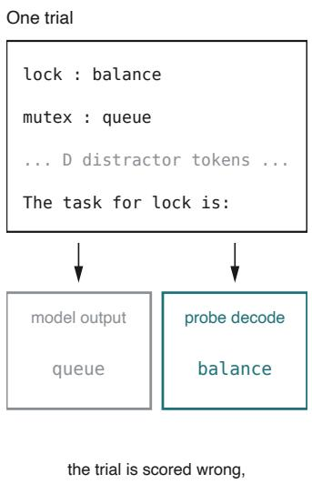
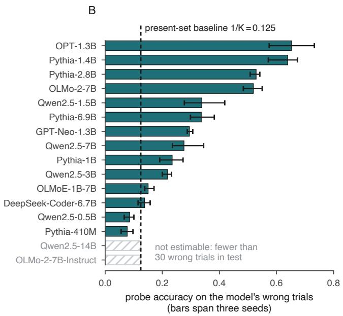
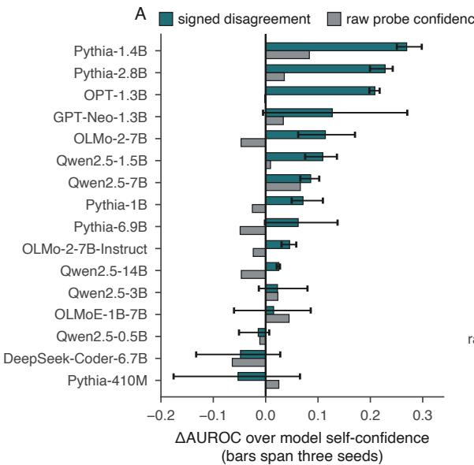
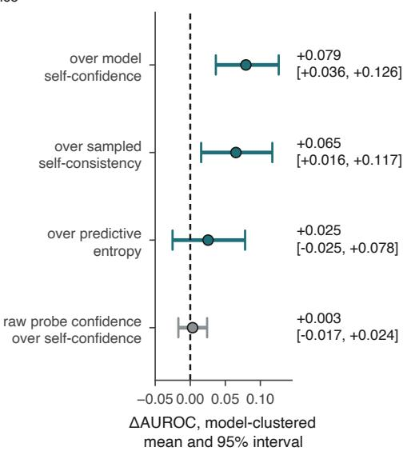
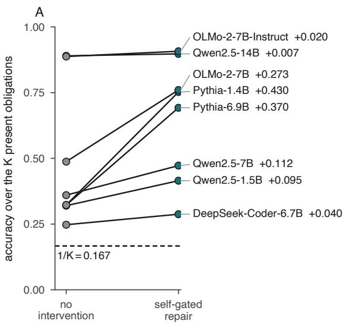
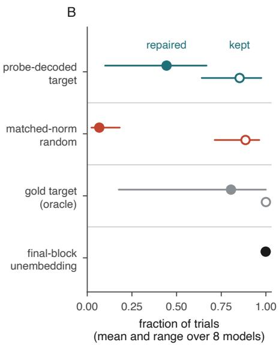

# Legible Failures: Detecting and Repairing In-Context Binding Errors

Manas Venkata Sai Ravulapalli Efficient Computation Inc. manas@perseus.so

Samrath Chadha Efficient Computation Inc. samrath@perseus.so

Abhinav Hari Efficient Computation Inc. abhinav@perseus.so

## Abstract

A wrong answer does not show whether the model lacked the needed information or held it and failed to use it. On an entity–obligation binding task, a language model can emit an incorrect prompt-supplied binding while a linear probe can recover the correct one from its frozen hidden state. We measure how often this occurs across 16 public checkpoints, each evaluated with three seeds. We fit a probe on a training fold, select its layer on a validation fold, and report results on a disjoint test fold. On the trials each model gets wrong, probe accuracy exceeds the strict present-obligation baseline, 1/K = 0.125, by +0.196 (95% CI [+0.101, +0.296], bootstrapped over models). A query-entity counterfactual rules out token presence and recency. A score built from the sign of probe–output disagreement improves failure detection over the model’s own confidence by +0.079 AUROC (95% CI [+0.036, +0.126]). Raw probe confidence gives no measurable improvement over model confidence. Steering the residual stream toward the probe-decoded binding, with no gold label, raises accuracy on all eight models tested by a mean of +0.168 (95% CI [+0.066, +0.280]). Where recent studies report that probe-detected errors are resistant to interventions, we find that in-context binding is a setting in which probes are actionable.

## 1 Introduction

External behaviour cannot distinguish two kinds of failure. A model may answer incorrectly because it lacks a representation of the queried binding entirely, or it may hold a representation in its hidden state without using it to determine the output. We call the latter a legible failure: the correct promptsupplied binding remains linearly recoverable even though the model emits the wrong token. These two failures call for different responses. The first needs the information supplied. The second may be detectable and repairable at inference time. This paper measures how often legible failures occur, whether probe–output disagreement can detect them, and whether a model’s decoded state can be used to change the output.

We examine these questions on a controlled in-context binding task. Transformers form structures that attach attributes to entities [5], but retrieval from those structures becomes unreliable as entity lists grow [7]. Each trial declares K entity–obligation pairs, inserts an interference block, and queries one entity. The assignments are supplied by the prompt and resampled independently on every trial, so entity identity alone carries no information about its obligation. Though Cheang et al. [4] argue that hidden-state probes track recall of parametric knowledge, that explanation is unavailable for these newly sampled bindings.

For each model, we fit probes on a training fold, choose the read layer on a validation fold, and report results on a disjoint test fold. We then evaluate probe accuracy on the test trials where the model answers incorrectly. Across 16 public checkpoints, each evaluated with three seeds, 14 meet the pre-specified failure-count floor. Across those models, probe accuracy on failures exceeds the present-set baseline by +0.196 (95% CI [+0.101, +0.296]). A query-entity counterfactual holds the declarations and their order fixed while changing which entity is queried. The probe follows the corresponding obligation with a mean margin of +0.371 (95% CI [+0.243, +0.503]), showing the probe reads a query-conditional signal rather than lexical presence or recency. On average over a model’s failures, the requested binding remains linearly recoverable from the hidden state.

We next build a failure-detection score from probe–output agreement and compare it with the model’s own confidence, predictive entropy, and sampled self-consistency. The signed score improves failure detection over the model’s confidence by +0.079 AUROC (95% CI [+0.036, +0.126]). Raw probe confidence adds no measurable improvement, while predictive entropy remains competitive.

Finally, we test whether the decoded state can be used to change the output. We apply a steering intervention, without a gold label, to the residual stream from the emitted class toward the probedecoded class at the validation layer. Across all 8 models tested, the intervention raises accuracy by a mean of +0.168 (95% CI [+0.066, +0.280]). A matched-norm random direction repairs fewer trials, and a gold-target arm bounds the maximum improvement. Prior work finds that probe-detected errors resist intervention [2, 13], but in-context binding is a setting where they are not.

The scope of this paper is deliberately bounded by the synthetic task, the single-token answer, the need for white-box access to hidden states, and the use of frozen checkpoints. We therefore treat the intervention as a causal test of the decoded state under this protocol. Section 7 details these limitations.

## 2 Experimental setup

## 2.1 The binding task

Each trial samples K = 8 entities and K obligations without replacement from disjoint pools, pairs them, and writes the pairs as entity: obligation declarations. A block of $D = 6 4$ token IDs drawn uniformly at random from the vocabulary follows, and then the query The task for $e _ { j }$ is: for a uniformly chosen $j .$ . The obligation pool holds 25 action words and the entity pool 47 nouns, filtered per model to those its tokenizer maps to a single token. Entities and obligations are resampled independently on every trial, so the identity of the queried entity carries no information about the obligation bound to it.

A trial counts as correct when the highest logit over the obligation pool at the final query position is $o _ { j }$ . Chance under that rule is one over the pool size, about 0.04. We report throughout against a stricter reference point, the probability of naming one of the K obligations actually present in the context, $1 / K = 0 . 1 2 5$ . Quantities in Section 3 are scored against that stricter number even though the probe faces the same pool-wide decision the model does, resulting in conservative margins.

## 2.2 Probe and failure-conditioned accuracy

At every layer $\ell$ we standardise the residual stream at the query’s final position and fit a multinomial logistic-regression probe over the obligation pool. The 600 trials of each run are shuffled and split three ways. The probe is fitted on the first third, the layer is chosen by accuracy on the second third, and every reported quantity is computed on the remaining 200 trials, which no fitting or selection step has seen. At the chosen layer the probe is refitted on the first two thirds before test-fold reporting.

Layer selection is the step where leakage could enter. A model has tens of candidate layers and several hundred labelled trials. Choosing the layer on the test fold would tune the reported number to the reported fold. The validation-chosen layer lies between 0.49 and 0.92 of depth and changes across seeds on 10 of 16 models, as a re-run selection step should.

The quantity of interest is pAcc | wrong: probe accuracy on the test trials whose model output is wrong. By construction, a model’s accuracy is zero on those trials and probe accuracy above the present-set baseline measures bindings the model held but did not use.

Because the denominator of $\mathrm { p A c c } |$ wrong is the model’s own failure count, an accurate model leaves few trials to estimate it. Before running the sweep, we fixed a minimum of 30 expected wrong test trials, corresponding to a binomial standard error of 0.091 at $p = 0 . 5$ . For models below this threshold, pAcc | wrong is not reported. Detection instead uses AUROC over all 200 test trials and is reported for every model.

A  
  
and the probe read the correct binding

  
Figure 1: Incorrect outputs retain the correct binding. (A) One trial: K declarations, an interference block, and the query. The model emits one obligation and the probe decodes another. (B) Probe accuracy on each model’s wrong trials, pAcc | wrong, with the probe fitted on a training fold, its layer chosen on a validation fold, and accuracy reported on a disjoint test fold of 200 trials. Bars span three seeds. The dashed line is the present-set baseline $1 / \check { K } = 0 . 1 2 5$ . Two of 16 models fall below the 30-trial failure floor and are hatched; pAcc | wrong is not reported for them. Across the 14 models for which pAcc | wrong is reported, the margin above the baseline is +0.196 (95% CI [+0.101, +0.296], bootstrap clustered on model).

## 2.3 Models and statistical analysis

The sweep covers 16 public checkpoints spanning 410M to 14B parameters: the Pythia ladder, GPT-Neo, OPT, OLMo-2 and OLMoE, the Qwen2.5 ladder, and DeepSeek-Coder, including one base and instruction-tuned pair. Appendix A lists the checkpoints and layer counts, and Appendix F the probe hyperparameters and the compute. All measurements use frozen checkpoints, and we do not fine-tune any model. Checkpoint revisions were not pinned; reruns against moved default branches therefore need not be bit-identical.

All intervals reported in this paper are 95% bootstrap intervals. The model is the unit of generalisation. Every cross-model estimate is a bootstrap over 20,000 resamples of models, averaging a model’s three seeds before resampling, so a model contributes once however many runs it was measured over. Seeds and trials are nested observations. Per-model counts of the form “positive on k of $n ^ { \prime \prime }$ are descriptive only.

## 3.1 Failure-conditioned probe accuracy across sixteen checkpoints

On the trials where a model emits the wrong obligation, a linear probe recovers the correct one from the same frozen hidden state (Figure 1). Across the 14 models for which pAcc | wrong is reported, probe accuracy on wrong trials exceeds the present-set baseline of $1 / K = 0 . 1 2 5$ by +0.196 (95% CI [+0.101, +0.296], bootstrap clustered on model). The median pAcc | wrong is 0.29 and the highest is 0.65 on OPT-1.3B. On the seed means, 12 of the 14 models sit above the baseline. The test folds of these models hold between 63 and 178 wrong trials, and every per-model value in Figure 1B has a denominator at least twice the pre-registered floor.

The per-model spread is wide, running from a margin near zero on the weakest models to more than half the range of the metric on OPT-1.3B and Pythia-1.4B. A model that fails often also fails on easy trials. The spread might simply track each model’s error rate, but across the 14 models for which $\mathrm { p A c c }$ | wrong is reported, it instead rises with task accuracy (Spearman $\rho = + 0 . 6 3 , p = 0 . 0 1 7 )$ Among the models we can measure, models that perform better on the task generally have more legible failures, a descriptive correlation.

Choosing the probe layer by test accuracy would fit the reported quantity to the reported fold and inflate accuracy values. We select the layer based on the validation fold to avoid this. On 10 of 16 models, the layer choice moves between seeds.

Qwen2.5-14B and OLMo-2-7B-Instruct fall below the failure-count floor. Qwen2.5-14B answers correctly on 0.979 of trials and leaves about 4 wrong trials in a 200-trial test fold. OLMo-2-7B-Instruct answers correctly on 0.943 and leaves about 11. Their $\mathrm { p A c c } |$ wrong values are therefore not reported. Treating an unreported cell as a failure to exceed the baseline would let two models that contribute no measurement lower the estimate. The positive correlation above suggests the near-ceiling models, for which pAcc| wrong is not reported, may have the most legible failures.

## 3.2 Counterfactual control

A probe could reach these accuracies by reading which obligations are lexically present, or the most recent one, without representing any binding at all. The query-entity counterfactual distinguishes those accounts from a readout of the binding. Holding a declaration fixed, we generate the query for every one of its K entities in turn and ask whether the probe decode follows the obligation bound to the entity actually queried. The declared obligations and their order are identical across those K queries, and only the queried entity changes, so a probe reading token presence or recency scores $1 / K$ by construction while a probe reading the binding tracks the query. Across models the counterfactual accuracy runs from 0.11 to 0.98, exceeding the baseline on 15 of 16 models, with a model-clustered margin of +0.371 (95% CI [+0.243, +0.503]). The single model at the baseline, Pythia-410M, is also the one whose pAcc | wrong margin above $1 / K$ is most negative (-0.048); the control is null exactly where there is no margin to explain. Per-model values are in Appendix B.

Failed trials therefore retain a query-specific linear signal for the queried binding. The signal does not determine the output on those trials. The measurement is an average over a model’s failures and identifies no individual trial as legible. Linear decodability also shows only that the information is present in a form a linear map can read. That is weaker than evidence that the model uses the information, and Section 5 tests the stronger claim by intervention.

## 3.3 Replication on eight further models

An independent re-implementation, sharing no analysis code with the release pipeline and running on different hardware, repeated the failure-conditioned probe, counterfactual and detection measurements at $K { = } 4$ with no interference block on eight models spanning four families. The margin above $1 / K$ replicates in all eight: failure-conditioned probe accuracy spans 0.474 to 0.799 against the present-set baseline of $1 / K \bar { = } 0 . 2 5$ at $K { = } 4$ , and the disagreement score separates wrong from correct trials at AUROC 0.813 to 0.951. The query counterfactual replicates on the four models it was run on. With the declaration block held bit-identical and only the queried entity changed, the probe decodes the new entity’s obligation at 0.733–0.866 and the original entity’s obligation at only 0.095–0.132, below the same baseline.

## 4 Internal–external disagreement predicts error

## 4.1 Signed disagreement score

If the state stays legible on failures, a probe might flag those failures at inference time. The probe’s own confidence is a poor signal. As explained in Section 3, the probe is often correct on the trials the model gets wrong. A confident read is not evidence that the output is right. To address this, we score each trial by signed agreement. For a trial with probe confidence con $\mathrm { f _ { p r o b e } }$ , write

$$
c = \mathrm { c o n f _ { p r o b e } \cdot \big ( 2 1 [ p r o b e = o u t p u t ] - 1 \big ) } ,
$$

B  

  
Figure 2: Signed disagreement improves failure detection over self-confidence. (A) Per-model change in AUROC relative to self-confidence, for the signed disagreement score and for raw probe confidence, on the same test trials with the same probe. Bars span three seeds. (B) Aggregate comparisons against four reference detectors, each a mean over 16 models with a 95% interval from a bootstrap clustered on model. The interval against predictive entropy crosses zero, and so does the interval for raw probe confidence against self-confidence.

such that c is the probe’s confidence when probe and output agree and its negation when they disagree. We evaluate c by the AUROC of separating correct from incorrect trials on the test fold. That AUROC runs over all 200 test trials of a run, correct and incorrect alike: no comparison in this section is conditioned on failure, and every model contributes the same number of trials. We call c a signed disagreement score rather than a certificate as that would imply a formal property the score does not have.

## 4.2 Baselines

The reference detector is the model’s own confidence, taken as the top-two logit margin over the obligation pool. Against it, the signed disagreement score improves AUROC by +0.079 (95% CI [+0.036, +0.126], clustered on model, and positive on 13 of 16 models). Raw probe confidence, evaluated on the same trials with the same probe, improves AUROC by +0.003 (95% CI [-0.017, +0.024], positive on 8 of 16). That interval crosses zero, thus the probe’s confidence alone supplies no measurable advantage over the model’s own confidence. Figure 2A gives the per-model comparison, and Appendix B its values.

Neither of the remaining comparisons needs a probe. Against sampled self-consistency, the modal answer rate over 16 draws from the model’s own obligation distribution, the signed disagreement score gains +0.065 (95% CI [+0.016, +0.117]). Against predictive entropy over the same distribution it gains +0.025 (95% CI [-0.025, +0.078]), an interval that crosses zero. Unlike these three probe-free baselines, which read the output distribution, the score reads the decoded binding. Section 5 uses thi quantity as an intervention target.

## 4.3 Transfer under distribution shift

A probe fitted once and then frozen keeps a positive advantage under distribution shift, which is significant because refitting the detector per deployment condition would be costlier. Across a battery of six models, the frozen probe’s advantage over a model’s own confidence is positive on all six under each of three single-axis shifts: unseen entity and obligation vocabulary, unseen distractor prose, and unseen interference load. The mean advantage across those three shifts is +0.100 (95% CI

  
Figure 3: Self-gated activation repair raises accuracy on all eight models. (A) Accuracy without intervention and under the self-gated repair, one line per model, at $\alpha = 0 . 5$ on 1200 trials with $K = 6$ and $D = 2 5 6$ . The decoded arm uses no gold label and the direction is zero when probe and output agree. The dashed line is $1 / K = 0 . 1 6 7$ . (B) Control arms over the same eight models. Filled markers, labelled “repaired”, give the fraction of wrong trials an arm repairs; open markers, labelled $\mathrm { \Delta ^ { 6 6 } \vec { p } \vec { t } \vec { \Delta } }$ , give the fraction of correct trials it preserves. Each is a mean with the range across models. The gold-target arm bounds what the read layer can do when the target is correct; the final-block unembedding arm checks the wiring and is measured on wrong trials only.

[+0.065, +0.136]). When two shifts are stacked, the advantage stays positive on five of six models.   
OLMoE-1B-7B falls below zero, and it is also the model with the weakest in-domain advantage.   
Appendix C gives the per-condition values.

## 5 The model’s own decoded state repairs behaviour

## 5.1 Self-gated activation repair

The probe produces a decode for every trial, and the decoded binding gives an intervention target that does not require a gold label. At the read layer $\ell ^ { * }$ , chosen on the validation-fold failures with the test fold untouched by the selection, we take the class-conditional mean residual $\mu _ { c }$ of each obligation class over the training fold. On a test trial, write e for the emitted class and cˆ for the probe decode over the K present obligations. We add $\alpha \| h \|$ unit $( \mu _ { \hat { c } } - \mu _ { e } )$ to the residual stream at the query’s final position and re-run the remaining blocks. No gold label enters this arm. The direction is exactly zero whenever the probe agrees with the output, so the intervention fires only on the trials the detector of Section 4 would flag.

The steering runs use $K = 6$ bindings, a code-like interference block of $D = 2 5 6$ tokens, and 1200 trials per model, with accuracy scored over the K present obligations so that chance is $1 / K = 0 . 1 6 7$ The task configuration differs from the one in Section 3, and accuracies from the two settings are not comparable. We report $\alpha = 0 . 5$ . Appendix D gives the sweep over α.

Applied to every test trial, the intervention raises accuracy on all eight models (Figure 3A and Table 1). The mean change is +0.168, with an interval of $\left[ + 0 . 0 6 6 , \dot { + } 0 . 2 8 0 \right]$ from a bootstrap clustered on model. Of the eight models, two sit near ceiling and fire on 0.08 and 0.12 of trials. Across the six models whose baseline accuracy is below 0.85, the mean change is +0.220, reaching +0.430 on Pythia-1.4B. On those models the direction is non-zero on 0.52 to 0.79 of test trials. The accuracy change occurs only on trials the detector flags.

On trials the model already answered correctly, the decoded arm preserves between 0.64 and 0.97 of them across the eight models. Where the probe misreads a binding that was correct, the intervention moves the output away from the correct answer.

## 5.2 Control arms and seeds

Figure 3B reports the control arms. A matched-norm random direction, applied at the same layer on the same trials, repairs 0.02 to 0.18 of failures while preserving 0.71 to 0.96 of correct trials. The decoded and random arms differ only in direction, so the direction drives the effect. Substituting the gold label for the probe decode repairs 0.18 to 1.00 of failures, with correct-trial preservation of 1.00 on every model. That arm bounds what the site can do when the target is right, and it reaches only 0.18 on DeepSeek-Coder-6.7B, the model the self-gated arm helps least (+0.040). Adding the unembedding difference at the final block repairs 0.99 to 1.00 of failures, a check that the intervention code functions correctly.

Re-running the four models with the highest failure rates at three seeds each, with both the trials and the split resampled, gives +0.421 ± 0.018 (Pythia-1.4B), +0.358 ± 0.027 (Pythia-6.9B), $+ 0 . 2 5 8 \pm$ 0.018 (OLMo-2-7B), +0.092 ± 0.053 (Qwen2.5-7B). All 12 of 12 seed runs are positive. The least stable is Qwen2.5-7B, which also has the lowest gold-target ceiling of the four (0.54); the read layer controls less of that model’s decision than it does for others.

A prompt-level arm that re-presents the decoded binding before the query, with no gold label, gives a convergent result on a separate battery of six models. Appendix E reports it.

## 5.3 Boundary conditions

The intervention is measured on one synthetic task, at one site, with one direction family. The negative steering results of Roy et al. [13] and Basu et al. [2] differ on all three aspects, and neither conclusion transfers to the setting of our protocol. Whether ours would hold under their conditions is untested, since we did not re-run their tasks. The decode sets what the direction points at, and the gold-target arm shows that the site itself varies in how much of the decision it controls, from near-total on most models to 0.18 on DeepSeek-Coder-6.7B. Either factor alone can limit the result, so we report the two arms separately. We have not resolved the downstream computation that turns a displacement at ℓ∗ into a change of output.

The re-implementation of Section 3 also bounds the intervention. On the four Pythia models the decoded-target direction recovers 0.245–0.593 of failed trials against a matched-norm random baseline of 0.073–0.136, with the no-op arm returning exactly 0.000 recovery and 1.000 preservation on every model. On the four non-Pythia models (0.5B–1.7B) the same direction recovers at most 0.189. The gold-target arm recovers only 0.130–0.378 on those models, so under this protocol the failure sits at the intervention site and not in the probe: where the gold target cannot repair, no probe-derived direction can. This does not contradict the eight-model repair result of Section 5.1, which tunes site and strength per model at larger scales. Rather, it demonstrates that the intervention does not survive transfer to these models with a fixed site.

The margin above 1/K also has a boundary in state type: on mutable variants, where a later instruction overwrites the binding, and scoped variants, where the binding holds only inside a stated region, failure-conditioned probe accuracy sits near the present-set baseline at matched difficulty (0.307 and 0.284 at Pythia-1.4B). Stating the overwrite rule in the prompt does not rescue the mutable case (accuracy 0.221 with the rule stated against 0.249 without it). The dissociation tracks the state operation, not task difficulty or an unstated convention.

## 6 Related work

That models represent more than they emit is established for parametric knowledge. Orgad et al. [11] and Gekhman et al. [6] show that internal states carry information about answers that are not produced by the model. Wang and Zhu [14] report that answers are recoverable from reasoning traces before the model emits them. Cheang et al. [4] argue that hidden-state probes largely track recall of parametric knowledge. Our target is an in-context binding whose ground truth is supplied by the prompt and resampled every trial, which removes parametric recall as an explanation of the decode. Feng and Steinhardt [5] describe the binding-identity structure transformers use to hold entity–attribute associations. Gur-Arieh et al. [7] report that the positional retrieval mechanism identified for short entity lists becomes unreliable as the list grows, and that models supplement it by other means.

Table 1: The five headline estimates, each with its 95% bootstrap interval (resampling models) and the number of models entering it.
<table><tr><td>Quantity</td><td>Estimate</td><td>95% CI</td><td>No. models</td></tr><tr><td>pAcc | wrong above 1/K</td><td>+0.196</td><td>[+0.101, +0.296]</td><td>14</td></tr><tr><td>Detection over self-conf.</td><td>+0.079</td><td>[+0.036, +0.126]</td><td>16</td></tr><tr><td>Detection over self-cons.</td><td>+0.065</td><td>[+0.016, +0.117]</td><td>16</td></tr><tr><td>Detection over entropy</td><td>+0.025</td><td>[-0.025, +0.078]</td><td>16</td></tr><tr><td>Activation repair</td><td>+0.168</td><td>[+0.066, +0.280]</td><td>8</td></tr></table>

Probe-based error detection typically reads a property from the internal state alone [1, 3]. Liu et al. [10] catalogue disagreement between probe output and model output as a phenomenon. We use that disagreement as the detector and report that its signed form outperforms raw probe confidence, which supplies no advantage over the model’s own confidence on our sweep. Kossen et al. [8] train hidden-state probes to approximate semantic entropy from a single generation. Our comparison is against predictive entropy and sampled self-consistency on a single-token answer, where the advantage over self-consistency excludes zero and the advantage over entropy does not.

Adding a direction to the residual stream to change a model’s output follows inference-time intervention [9]. Roy et al. [13] find that interventions of this family fail to correct hallucinations, a knowledge–action gap, and Basu et al. [2] report a comparable failure on a clinical task. Our setting adds a trial-specific decoded target in place of one global direction, a read layer selected on validation data along a probe-derived direction, and matched control arms. We differ from those reports on each of those counts, and record a positive result under our conditions without claiming theirs would behave the same way. Park et al. [12] separately identify knowledge and prediction subspaces in the residual stream and align them at inference time, a related intervention on a different task.

## 7 Discussion and conclusion

The task was built for control over the binding, the interference and the baseline. That control is what lets representation, output and intervention be measured separately on the same trials. The task is synthetic, the answer is a single token, and the task models maintenance of a binding under interference. No claim here extends to a naturalistic benchmark. Validating the detector and the intervention on a real agent trajectory, where a model reads a symbol and then mis-edits it, is the next test.

Every method here requires white-box access to hidden states at inference time, and both the detector and the intervention are bounded by probe accuracy. Where the probe cannot read the binding, a score built from that probe cannot flag failures, and a direction aimed at its decode has nothing to aim at. Among the four models re-run at three seeds, the one with the lowest gold-target ceiling is also the least stable.

Because pAcc | wrong is not reported for near-ceiling models, the estimate rests on 14 of 16 models and their rare failures remain untested. Reaching multi-token settings would need a free-form comparison against semantic entropy.

The intervention is established as a causal effect on this task by its control arms. The account of why a displacement at $\ell ^ { * }$ changes the output is incomplete. A direct Jacobian measurement on the same task finds that the output’s sensitivity to the binding direction does not fall on wrong trials. This rules out one candidate account, that the readout cannot see the binding, without supplying another.

A subset of failed in-context binding trials retains a query-specific hidden-state signal for the correct binding, recoverable by a linear probe under a leak-free protocol. Comparing that signal with the model’s output improves failure detection over the model’s own confidence, while raw probe confidence does not, and predictive entropy remains competitive. Adding a residual-stream direction toward the probe’s own decode raises the accuracy point estimate on all eight intervention models, under controls that separate the direction from a perturbation of the same size. Further testing would include naturalistic validation on multi-token, free-form agent state.

## Acknowledgements

We would like to thank Kevin li for his help with proof reading and helping us to better write the paper for readability and suggestions leading to this paper writing.

## References

[1] Amos Azaria and Tom Mitchell. The internal state of an LLM knows when it’s lying. In Findings of the Association for Computational Linguistics: EMNLP 2023, pages 967–976, 2023. arXiv:2304.13734.

[2] Sanjay Basu, Sadiq Y. Patel, Parth Sheth, Bhairavi Muralidharan, Namrata Elamaran, Aakriti Kinra, John Morgan, and Rajaie Batniji. Interpretability without actionability: mechanistic methods cannot correct language model errors despite near-perfect internal representations, 2026. arXiv:2603.18353.

[3] Collin Burns, Haotian Ye, Dan Klein, and Jacob Steinhardt. Discovering latent knowledge in language models without supervision. In International Conference on Learning Representations, 2023. arXiv:2212.03827.

[4] Chi Seng Cheang, Hou Pong Chan, Wenxuan Zhang, and Yang Deng. Do LLMs really know what they don’t know? internal states mainly reflect knowledge recall rather than truthfulness, 2025. arXiv:2510.09033.

[5] Jiahai Feng and Jacob Steinhardt. How do language models bind entities in context? In International Conference on Learning Representations, 2024. arXiv:2310.17191.

[6] Zorik Gekhman, Eyal Ben David, Hadas Orgad, Eran Ofek, Yonatan Belinkov, Idan Szpektor, Jonathan Herzig, and Roi Reichart. Inside-out: Hidden factual knowledge in LLMs. In Conference on Language Modeling, 2025. arXiv:2503.15299.

[7] Yoav Gur-Arieh, Mor Geva, and Atticus Geiger. Mixing mechanisms: How language models retrieve bound entities in-context. In International Conference on Learning Representations, 2026. arXiv:2510.06182.

[8] Jannik Kossen, Jiatong Han, Muhammed Razzak, Lisa Schut, Shreshth Malik, and Yarin Gal. Semantic entropy probes: Robust and cheap hallucination detection in LLMs, 2024. arXiv:2406.15927.

[9] Kenneth Li, Oam Patel, Fernanda Viégas, Hanspeter Pfister, and Martin Wattenberg. Inferencetime intervention: Eliciting truthful answers from a language model. In Advances in Neural Information Processing Systems, 2023. arXiv:2306.03341.

[10] Kevin Liu, Stephen Casper, Dylan Hadfield-Menell, and Jacob Andreas. Cognitive dissonance: Why do language model outputs disagree with internal representations of truthfulness? In Conference on Empirical Methods in Natural Language Processing, pages 4791–4797, 2023. arXiv:2312.03729.

[11] Hadas Orgad, Michael Toker, Zorik Gekhman, Roi Reichart, Idan Szpektor, Hadas Kotek, and Yonatan Belinkov. LLMs know more than they show: On the intrinsic representation of LLM hallucinations. In International Conference on Learning Representations, 2025. arXiv:2410.02707.

[12] Yoonah Park, Haesung Pyun, and Yohan Jo. Bridging the knowledge-prediction gap in LLMs on multiple-choice questions. In International Conference on Machine Learning, 2026. arXiv:2509.23782.

[13] Dip Roy, Rajiv Misra, Sanjay Kumar Singh, and Anisha Roy. Detection without correction: A robust asymmetry in activation-based hallucination probing, 2026. arXiv:2604.13068.

Table 2: Checkpoints, layer counts, validation-selected read layers, and accuracy on the binding task with K = 8 and $D = 6 4 ,$ averaged over three seeds.
<table><tr><td>Model</td><td>Checkpoint</td><td>Layers Read layer per seed Accuracy</td><td></td></tr><tr><td>Qwen2.5-14B</td><td>Qwen/Qwen2.5-14B</td><td>4840, 40, 41</td><td>0.979</td></tr><tr><td>OLMo-2-7B-Instruct</td><td>allenai/0LMo-2-1124-7B-Instruct</td><td>3229,26, 27</td><td>0.943</td></tr><tr><td>OLMo-2-7B</td><td>allenai/0LMo-2-1124-7B</td><td>3223, 22, 22</td><td>0.687</td></tr><tr><td>Qwen2.5-7B</td><td>Qwen/Qwen2.5-7B</td><td>2825,26, 26</td><td>0.571</td></tr><tr><td>OPT-1.3B</td><td>facebook/opt-1.3b</td><td>24 19, 19, 19</td><td>0.535</td></tr><tr><td>Qwen2.5-1.5B</td><td>Qwen/Qwen2.5-1.5B</td><td>2824,24,24</td><td>0.447</td></tr><tr><td>Pythia-2.8B</td><td>EleutherAI/pythia-2.8b</td><td>32 17, 18, 18</td><td>0.374</td></tr><tr><td>Qwen2.5-3B</td><td>Qwen/Qwen2.5-3B</td><td>3632, 33, 33</td><td>0.356</td></tr><tr><td></td><td>DeepSeek-Coder-6.7B deepseek-ai/deepseek-coder-6.7b-base</td><td>32 29, 30,29</td><td>0.273</td></tr><tr><td>Pythia-1.4B</td><td>EleutherAI/pythia-1.4b</td><td>2412, 11, 12</td><td>0.259</td></tr><tr><td>Pythia-6.9B</td><td>EleutherAI/pythia-6.9b</td><td>32 18, 18, 19</td><td>0.230</td></tr><tr><td>OLMoE-1B-7B</td><td>allenai/0LMoE-1B-7B-0924</td><td>1613, 13, 13</td><td>0.229</td></tr><tr><td>Pythia-1B</td><td>EleutherAI/pythia-1b</td><td>1612, 12, 12</td><td>0.226</td></tr><tr><td>GPT-Neo-1.3B</td><td>EleutherAI/gpt-neo-1.3B</td><td>2417, 17, 17</td><td>0.204</td></tr><tr><td>Qwen2.5-0.5B</td><td>Qwen/Qwen2.5-0.5B</td><td>2417,17, 17</td><td>0.173</td></tr><tr><td>Pythia-410M</td><td>EleutherAI/pythia-410m</td><td>2419, 14, 21</td><td>0.109</td></tr></table>

[14] Hanyang Wang and Mingxuan Zhu. The detection-extraction gap: Models know the answer before they can say it, 2026. arXiv:2604.06613.

## A Models

Table 2 lists the 16 checkpoints. The layer count is read from the loaded model configuration at run time and the nominal parameter count is the one in the checkpoint name. The runs pinned no revision, so each checkpoint is the default branch as of the sweep date. The read layer column gives the layer chosen on the validation fold at each of the three seeds. It moves between seeds on several models.

## B Per-model legibility, counterfactual and detection

Table 3 gives one row per model. Columns two and three are pAcc | wrong and the query-entity counterfactual. For the two models below 30 expected wrong trials, pAcc | wrong is marked “not reported”; they contribute to neither the median nor the clustered margin. The counterfactual column is read against the 1/K baseline that a present-token or recency heuristic would score. Columns four to seven are the detector comparisons behind Figure 2. Model self-confidence is the top-two logi margin over the obligation pool. Predictive entropy is the entropy of the softmax over that pool, and sampled self-consistency is the modal answer rate over 16 draws from it. Every column is computed on the same test trials from the same forward pass, so the comparison holds the trials and the probe fixed.

The number of wrong trials behind each $\mathrm { p A c c } |$ wrong is 200 times one minus the accuracy in Table 2.

## C Detector transfer under distribution shift

Table 4 gives the frozen-probe transfer battery. Each column is a distribution shift applied at evaluation time to a probe fitted in-domain and then frozen: unseen entity and obligation vocabulary, unseen distractor prose, unseen interference load, and two stacked combinations.

## D Activation repair by model, control arm and seed

Table 5 gives every arm at $\alpha = 0 . 5 . \mathrm { \Omega ^ { 6 } e p . } ^ { , }$ is the fraction of wrong test trials the decoded arm repairs and “Kept” the fraction of correct test trials it preserves. “Rand.” is the matched-norm random direction. “Gold” is the same direction family with the correct label substituted for the decode, and

Table 3: Per-model legibility, query-entity counterfactual and detector comparisons, over three seeds. Columns two and three give the mean over seeds with the range in parentheses. Columns four to seven give the change in AUROC of the signed disagreement score against each reference detector, except “raw probe”, which compares raw probe confidence against model self-confidence.
<table><tr><td>Model</td><td>pAcc|wrong</td><td>Counterfactual</td><td>self-conf.</td><td>raw probe</td><td>self-cons.</td><td>entropy</td></tr><tr><td>Qwen2.5-14B</td><td>not reported</td><td>0.978 (0.972–0.982)</td><td>+0.025</td><td>-0.047</td><td>+0.076</td><td>+0.084</td></tr><tr><td>OLMo-2-7B-Instruct</td><td>not reported</td><td>0.935 (0.927–0.940)</td><td>+0.046</td><td>-0.024</td><td>+0.052</td><td>+0.048</td></tr><tr><td>OLMo-2-7B</td><td>0.519 (0.484–0.550)</td><td>0.746 (0.735–0.758)</td><td>+0.114</td><td>-0.047</td><td>+0.128</td><td>+0.106</td></tr><tr><td>Qwen2.5-7B</td><td>0.276 (0.236–0.345)</td><td>0.515 (0.510–0.520)</td><td>+0.086</td><td>+0.066</td><td>+0.069</td><td>+0.014</td></tr><tr><td>OPT-1.3B</td><td>0.653 (0.574–0.733)</td><td>0.752 (0.738–0.778)</td><td>+0.209</td><td>-0.002</td><td>+0.244</td><td>+0.205</td></tr><tr><td>Qwen2.5-1.5B</td><td>0.339 (0.277–0.419)</td><td>0.543 (0.513–0.587)</td><td>+0.109</td><td>+0.009</td><td>+0.073</td><td>+0.035</td></tr><tr><td>Pythia-2.8B</td><td>0.529 (0.508–0.542)</td><td>0.662 (0.652–0.672)</td><td>+0.228</td><td>+0.036</td><td>+0.235</td><td>+0.190</td></tr><tr><td>Qwen2.5-3B</td><td>0.218 (0.200–0.232)</td><td>0.343 (0.335–0.357)</td><td>+0.023</td><td>+0.023</td><td>+0.006</td><td>-0.064</td></tr><tr><td>DeepSeek-Coder-6.7B</td><td>0.138 (0.115–0.158)</td><td>0.213 (0.195–0.237)</td><td>-0.048</td><td>-0.064</td><td>-0.059</td><td>-0.117</td></tr><tr><td>Pythia-1.4B</td><td>0.639 (0.571–0.673)</td><td>0.714 (0.693–0.730)</td><td>+0.269</td><td>+0.083</td><td>+0.225</td><td>+0.183</td></tr><tr><td>Pythia-6.9B</td><td>0.337 (0.299–0.382)</td><td>0.379 (0.375–0.387)</td><td>+0.062</td><td>-0.049</td><td>+0.053</td><td>-0.007</td></tr><tr><td>OLMoE-1B-7B</td><td>0.150 (0.138–0.171)</td><td>0.235 (0.225–0.248)</td><td>+0.015</td><td>+0.045</td><td>-0.025</td><td>-0.066</td></tr><tr><td>Pythia-1B</td><td>0.235 (0.191–0.273)</td><td>0.300 (0.272–0.318)</td><td>+0.071</td><td>-0.025</td><td>+0.033</td><td>-0.018</td></tr><tr><td>GPT-Neo-1.3B</td><td>0.295 (0.287–0.307)</td><td>0.351 (0.325–0.370)</td><td>+0.127</td><td>+0.034</td><td>+0.119</td><td>+0.062</td></tr><tr><td>Qwen2.5-0.5B</td><td>0.086 (0.067–0.101)</td><td>0.159 (0.143–0.177)</td><td>-0.014</td><td>-0.011</td><td>-0.074</td><td>-0.116</td></tr><tr><td>Pythia-410M</td><td>0.077 (0.056–0.097)</td><td>0.109 (0.098–0.130)</td><td>-0.053</td><td>+0.025</td><td>-0.110</td><td>-0.133</td></tr></table>

Table 4: Change in AUROC over model self-confidence for a probe fitted in-domain and then frozen, under single and stacked distribution shifts.
<table><tr><td>Model</td><td>in-domain</td><td>new vocabulary</td><td>new prose</td><td>new load</td><td>vocab + prose</td><td>load + prose</td></tr><tr><td>OLMo-2-7B</td><td>+0.170</td><td>+0.174</td><td>+0.163</td><td>+0.134</td><td>+0.177</td><td>+0.183</td></tr><tr><td>Pythia-6.9B</td><td>+0.206</td><td>+0.171</td><td>+0.184</td><td>+0.108</td><td>+0.103</td><td>+0.133</td></tr><tr><td>Qwen2.5-7B</td><td>+0.128</td><td>+0.130</td><td>+0.089</td><td>+0.099</td><td>+0.059</td><td>+0.104</td></tr><tr><td>Qwen2.5-1.5B-Instruct</td><td>+0.120</td><td>+0.105</td><td>+0.104</td><td>+0.050</td><td>+0.095</td><td>+0.100</td></tr><tr><td>OLMoE-1B-7B</td><td>+0.018</td><td>+0.039</td><td>+0.032</td><td>+0.085</td><td>-0.081</td><td>-0.149</td></tr><tr><td>OLMo-2-7B-Instruct</td><td>+0.080</td><td>+0.041</td><td>+0.053</td><td>+0.040</td><td>+0.091</td><td>+0.069</td></tr></table>

“Wire” the unembedding difference added at the final block. The steered accuracy column is the self-gated arm applied to every test trial, the number Figure 3A plots. Table 6 sweeps α above 0.5. The values at 0.5 are the $\Delta$ and “Kept” columns of Table 5.  
The seed replication of Section 5 reselects the read layer on each seed’s validation failures. The per-seed changes in accuracy are +0.430/+0.400/+0.432 (Pythia-1.4B), +0.370/+0.378/+0.327 (Pythia 6.9B), +0.273/+0.238/+0.265 (OLMo-2-7B), +0.112/+0.033/+0.132 (Qwen2.5-7B).

## E Prompt repair and its provenance

The prompt-level arm decodes the binding from the model’s hidden state at the read layer and re-presents it before the query, with no gold label. On a separate battery of six models at three seeds, mean recovery is +0.205 (95% CI [+0.076, +0.330], clustered on model), reaching +0.407 on DeepSeek-Coder-6.7B, and a format-matched random injection lowers accuracy on 18 of 18 runs by -0.096 on average. Table 7 gives the per-model values over three seeds on the $\mathrm { \dot { K } } = 8 , D = 6 4$ task. The random-injection control matches the format of the re-presented binding and carries a wrong obligation. The two arms differ only in the content injected, so the content produces the effect. The gated column intervenes only on trials the detector flags. The one model with a negative recovery is the near-ceiling instruction-tuned checkpoint, negative at all three seeds.

This battery was re-run at three seeds for this release and each run’s summary is committed. The per-trial records were not retained, so the numbers in Table 7 are reproducible at run granularity and not at trial granularity. The activation-repair result of Section 5 carries the causal claim. This arm is reported as a convergent measurement.

Table 5: Activation repair at α = 0.5, K = 6, D = 256, 1200 trials per model. $\ell ^ { * }$ is the read layer selected on validation failures.
<table><tr><td>Model</td><td> $\ell ^ { * }$ </td><td>Base</td><td>Steered</td><td>∆</td><td>Fired</td><td>Kept</td><td> ${ \mathrm { R e p . } }$ </td><td>Rand.</td><td>Gold</td><td>Wire</td></tr><tr><td>Pythia-1.4B</td><td>12</td><td>0.323</td><td>0.752</td><td>+0.430</td><td>0.59</td><td>0.93</td><td>0.67</td><td>0.08</td><td>0.94</td><td>1.00</td></tr><tr><td>Pythia-6.9B</td><td>15</td><td>0.323</td><td>0.693</td><td>+0.370</td><td>0.69</td><td>0.79</td><td>0.65</td><td>0.07</td><td>0.88</td><td>1.00</td></tr><tr><td>OLMo-2-7B</td><td>22</td><td>0.487</td><td>0.760</td><td>+0.273</td><td>0.52</td><td>0.89</td><td>0.63</td><td>0.03</td><td>0.96</td><td>1.00</td></tr><tr><td>Qwen2.5-7B</td><td>22</td><td>0.360</td><td>0.472</td><td>+0.112</td><td>0.68</td><td>0.79</td><td>0.29</td><td>0.06</td><td>0.54</td><td>1.00</td></tr><tr><td>Qwen2.5-1.5B</td><td>24</td><td>0.320</td><td>0.415</td><td>+0.095</td><td>0.61</td><td>0.64</td><td>0.31</td><td>0.05</td><td>0.94</td><td>1.00</td></tr><tr><td>DeepSeek-Coder-6.7B</td><td>14</td><td>0.247</td><td>0.287</td><td>+0.040</td><td>0.79</td><td>0.86</td><td>0.10</td><td>0.02</td><td>0.18</td><td>0.99</td></tr><tr><td>OLMo-2-7B-Instruct</td><td>30</td><td>0.887</td><td>0.907</td><td>+0.020</td><td>0.08</td><td>0.97</td><td>0.38</td><td>0.04</td><td>1.00</td><td>1.00</td></tr><tr><td>Qwen2.5-14B</td><td>42</td><td>0.890</td><td>0.897</td><td>+0.007</td><td>0.12</td><td>0.94</td><td>0.52</td><td>0.18</td><td>1.00</td><td>1.00</td></tr></table>

Table 6: Intervention strength above $\alpha = 0 . 5$ . Left: change in accuracy under the self-gated decoded arm. Right: fraction of correct trials kept by the decoded arm at the same values. Both columns at $\alpha = 0 . 5$ are in Table 5.
<table><tr><td>Model</td><td>∆ @ 1.0</td><td> $\Delta \ @ \ : 2 . 0$ </td><td>kept @ 1.0</td><td>kept @ 2.0</td></tr><tr><td>Pythia-1.4B</td><td>+0.443</td><td>+0.453</td><td>0.93</td><td>0.93</td></tr><tr><td>Pythia-6.9B</td><td>+0.385</td><td>+0.402</td><td>0.79</td><td>0.79</td></tr><tr><td>OLMo-2-7B</td><td>+0.275</td><td>+0.275</td><td>0.89</td><td>0.89</td></tr><tr><td>Qwen2.5-7B</td><td>+0.085</td><td>+0.050</td><td>0.69</td><td>0.61</td></tr><tr><td>Qwen2.5-1.5B</td><td>+0.095</td><td>+0.100</td><td>0.64</td><td>0.64</td></tr><tr><td>DeepSeek-Coder-6.7B</td><td>+0.018</td><td>+0.015</td><td>0.67</td><td>0.46</td></tr><tr><td>OLMo-2-7B-Instruct</td><td>+0.020</td><td>+0.020</td><td>0.97</td><td>0.97</td></tr><tr><td>Qwen2.5-14B</td><td>+0.007</td><td>+0.007</td><td>0.94</td><td>0.94</td></tr></table>

## F Hyperparameters and compute

Probes are scikit-learn multinomial logistic regressions with $C = 0 . 5$ , fitted on standardised residualstream activations, with a 400-iteration cap during layer selection and 600 at the chosen layer. The legibility and detection runs use $K = 8$ and $D = 6 4$ uniformly sampled distractor tokens, over 600 trials shuffled and split three ways into folds of 200. The activation-repair runs use $K = 6$ and D = 256 code-like distractor tokens, over 1200 trials with the same three-way split. Class-conditional means are computed on the training fold only, and the read layer is chosen by probe accuracy on the validation-fold failures. Bootstraps draw 20,000 resamples of models with a fixed seed.

All measurements are forward passes on frozen public checkpoints, run on a single node with eight NVIDIA H100-80GB GPUs. This paper trains nothing.

Table 7: Prompt-level re-presentation over six models and three seeds. Recovery is the change in accuracy relative to no intervention.
<table><tr><td>Model</td><td>Layer</td><td>Base</td><td>Re-present</td><td>Random</td><td>Gated</td><td>Recovery</td></tr><tr><td>Pythia-1.4B</td><td>13</td><td>0.228</td><td>0.477</td><td>0.119</td><td>0.438</td><td> $+ 0 . 2 4 9 \pm 0 . 0 2 3$ </td></tr><tr><td>Pythia-6.9B</td><td>20</td><td>0.215</td><td>0.617</td><td>0.153</td><td>0.566</td><td> $+ 0 . 4 0 2 \pm 0 . 0 1 7$ </td></tr><tr><td>DeepSeek-Coder-6.7B</td><td>26</td><td>0.279</td><td>0.687</td><td>0.249</td><td>0.698</td><td> $+ 0 . 4 0 7 \pm 0 . 0 0 3$ </td></tr><tr><td>OLMo-2-7B</td><td>23</td><td>0.699</td><td>0.820</td><td>0.567</td><td>0.859</td><td> $+ 0 . 1 2 1 \pm 0 . 0 2 4$ </td></tr><tr><td>Qwen2.5-7B</td><td>25</td><td>0.761</td><td>0.867</td><td>0.624</td><td>0.893</td><td> $+ 0 . 1 0 6 \pm 0 . 0 0 8$ </td></tr><tr><td>OLMo-2-7B-Instruct</td><td>26</td><td>0.941</td><td>0.888</td><td>0.837</td><td>0.914</td><td> $- 0 . 0 5 3 \pm 0 . 0 1 5$ </td></tr></table>