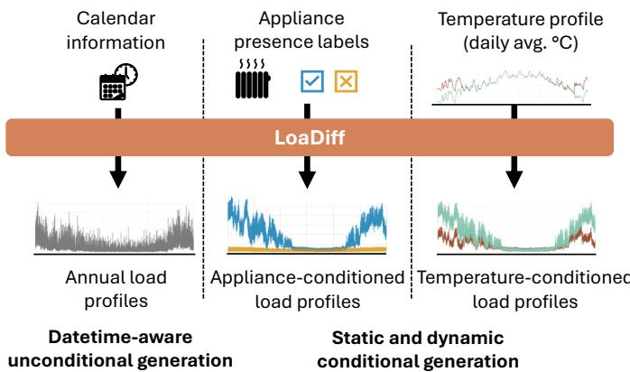
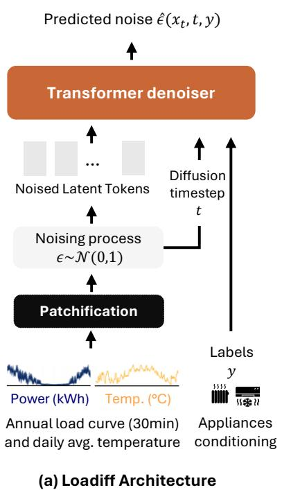
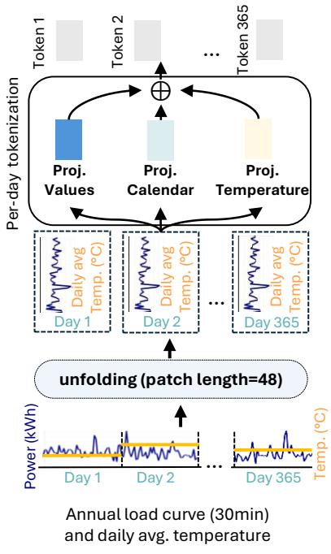
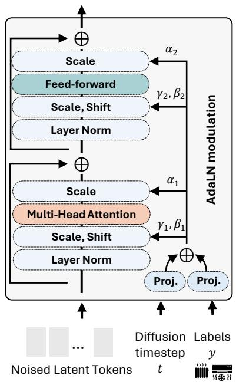
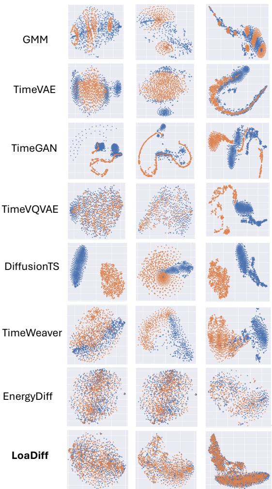
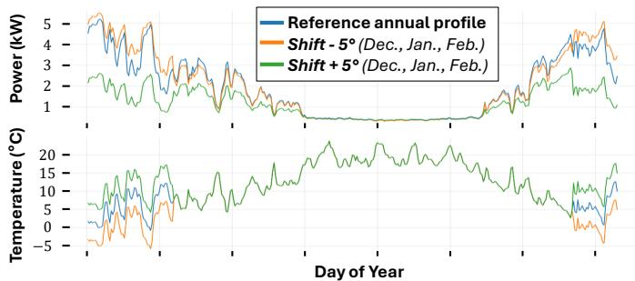
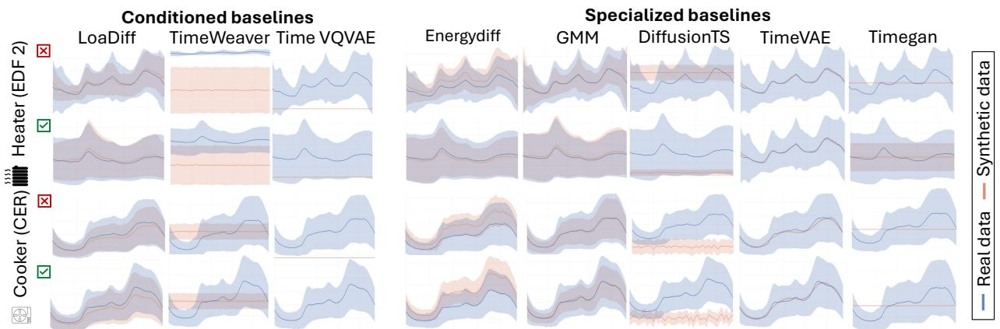

# LoaDiff: Conditional Generation of Electricity Consumption Time Series for Energy Analytics

Mariia Baranova∗†‡, Adrien Petralia∗‡, Etienne Le Naour∗,

Nathan Etourneau∗, Guillaume Hofmann∗, Themis Palpanas†

∗EDF R&D, Palaiseau, France; †Universite Paris Cit´ e´, F-75006 Paris, France

‡These authors contributed equally to this work.

Abstract—The energy transition is reshaping residential electricity consumption through the increasing adoption of distributed generation, electrified appliances, and demand-response programs. Understanding these evolving behaviors requires access to granular smart-meter data for applications such as load forecasting, appliance detection, and demand-side flexibility analysis. However, such data are subject to strict access restrictions and data-protection regulations. Thus, realistic synthetic alternatives are necessary. In this paper, we introduce LOADIFF, a diffusion-based generative model for year-long, sub-hourly smart-meter load curves. LOADIFF supports flexible conditioning on static household attributes, such as appliance ownership, and dynamic contextual variables, including calendar information and outdoor temperature. We evaluate the model against multiple generative baselines on three residential electricity-consumption datasets. Our experiments assess four complementary dimensions: fidelity and diversity, training-record memorization risk, downstream utility for load forecasting and appliance detection, and conditional controllability under alternative temperature conditions. The results show that LOADIFF generates realistic and diverse load profiles, achieves a favorable trade-off between generation quality and limited evidence of memorization, preserves information useful for downstream energy applications, and responds coherently to changes in conditioning variables. Index Terms—Generative AI, Smart Meters, Time Series.

## I. INTRODUCTION

Smart meters are now widely deployed worldwide, recording household electricity consumption at regular intervals and generating large-scale datasets for energy analytics [1]. Typically collected every 10–30 minutes, depending on the country [2], these measurements provide detailed insights into residential electricity use. Utilities rely on such data for demand forecasting, billing, and the development of services such as personalized feedback tools, time-of-use tariffs, and demand-response programs [2], [3]. At this granularity, smartmeter data also support a wide range of data-driven applications, including customer segmentation, non-intrusive load monitoring, and the evaluation of household energy-efficiency actions [4]–[7]. Thus, smart meters have become a cornerstone of modern energy analytics and power-system planning.

However, individual smart-meter load curves are personal data under GDPR [8], potentially revealing occupancy schedules, work habits, holidays, or appliance use [9]. As a result, access is subject to strict legal and technical safeguards, and advanced analytics often remain confined within utility infrastructures, limiting access for external researchers, regulators, and third-party innovators [10].

  
Fig. 1: Illustration of LOADIFF generation capabilities: unconditional generation, conditioning on static household attributes, and conditioning on dynamic variables.

Synthetic data generation has therefore emerged as a promising alternative: artificial load curves that reproduce the statistical properties of real electricity consumption while not corresponding to any real household. Early approaches relied on parametric or rule-based simulators combining appliance models with occupancy patterns [11].

More recently, deep generative models, e.g., variational autoencoders [12], generative adversarial networks [13] and diffusion models [14], have been used to learn realistic consumption patterns directly from data. However, existing approaches suffer from several limitations: they often focus on short horizons (e.g., day or week) rather than long-term behavior [13]–[16]; provide limited control over exogenous factors such as weather, calendar effects, or appliance ownership; and rarely offer systematic evaluation of fidelity, downstream utility, and privacy risk.

In this paper, we introduce LOADIFF, a diffusion-based generative model designed for long-horizon, yet fine-grained, smart-meter data. As illustrated in Figure 1, LOADIFF generates year-long, sub-hourly load traces while supporting flexible conditioning on both static household attributes, such as appliance ownership, and dynamic factors, such as calendar information and outdoor temperature. This formulation is intended to support population-level scenario generation while preserving the temporal structure required by downstream energy applications.

We evaluate LOADIFF on two real-world smart-meter datasets and one simulator-backed dataset, against multiple generative baselines. Our evaluation considers four complementary dimensions: (i) fidelity and diversity, measuring how closely synthetic data reproduce the statistical structure of the target population; (ii) privacy risk, assessing whether generated samples exhibit evidence of training-record memorization via distance-based proximity to the training set; (iii) downstream utility, measuring whether synthetic curves can replace or complement real training data for load forecasting and appliance detection; and (iv) conditional controllability, testing whether generated profiles respond coherently to changes in winter temperatures. Finally, we release the implementation of LOADIFF [17] together with a large synthetic smart-meter dataset [18] to foster reproducibility and broader experimentation with privacy-aware energy data.

Our contributions are summarized as follows:

• We introduce LOADIFF, a diffusion-based generative model for long (i.e., year-long) and fine-grained (i.e., subhourly) smart-meter load curves. Moreover, the model supports conditional generation from both static household covariates and dynamic contextual variables.

• We conduct an extensive empirical evaluation against multiple generative baselines. Across three datasets, LOADIFF achieves strong fidelity–diversity performance while exhibiting a favorable empirical trade-off between generation quality and limited evidence of trainingsample memorization.

• We assess downstream utility on two practical tasks: load forecasting and appliance detection. The results show that LOADIFF samples preserve useful temporal and appliance-specific information, yielding consistently strong performance used as a substitute for real training data, providing effective augmentation.

• We evaluate conditional controllability through counterfactual temperature scenarios. The generated load profiles tend to respond consistently with expected patterns under winter-temperature shifts, suggesting the model captures a plausible relationship between colder weather and electric-heating demand.

• We release an open-source implementation of LOADIFF together with a synthetic smart-meter dataset to support reproducible research on energy-consumption modeling and synthetic-data evaluation.

## II. RELATED WORK

This section reviews related work along three axes relevant to LOADIFF: (i) generative models for time series, (ii) conditional and controllable generation, and (iii) applications of generative models to electricity load curve generation.

Generative Models for Time Series. Generating realistic time series has been an active research topic for many years. Classical approaches such as ARIMA, Gaussian Mixture models, or hidden Markov models capture seasonal patterns but struggle with complex nonlinear dynamics and heterogeneous behaviors [19]. Deep generative models now offer stronger alternatives: VAEs [20], GANs [21], and diffusion-based models [22] efficiently capture high-dimensional temporal dependencies, making them promising candidates for realistic time-series generation.

Conditional Generation and Controllability. These methods have enabled synthetic time-series generation in domains where privacy constraints limit data sharing, including finance [23], mobility [24], and healthcare [25]. However, unconditional generation is often insufficient: users typically need control over specific attributes. Conditional generative models address this by incorporating auxiliary information—static covariates [26] or dynamic exogenous variables [27]—enabling controllable generation and scenario analysis. This is especially relevant in the energy domain, where consumption strongly depends on external covariates such as weather, calendar effects, and appliance ownership [28].

Synthetic Load Curve Generation. Several works have explored generating synthetic electricity consumption data using deep generative models [13]–[16], but typically focus on short time windows (e.g., daily shapes) with limited control over exogenous drivers. [29] conditions load curve synthesis on outdoor temperature, yet flexible conditioning on multiple household attributes—such as appliance ownership, essential for evaluating energy-efficiency actions or demand-response scenarios—remains lacking. LOADIFF addresses this gap, generating realistic yearly sub-hourly load curves conditioned on both static household characteristics and dynamic variables such as weather and calendar effects.

## III. PROBLEM FORMULATION

This section (i) introduces the notation and formalizes the conditional generation problem addressed by LOADIFF, and then (ii) describes the evaluation framework used to assess the quality of the generated synthetic data.

Notations and Generation Formulation. Consider a univariate time series sample $\mathbf { x } = ( x _ { 1 } , \dots , x _ { T } ) \in \mathbb { R } ^ { T }$ representing the electricity consumption load curve of a given household. Each series is observed over a long horizon of T time steps at a sub-hourly resolution $( \mathbf { e } . \mathbf { g } . , \ T \ = \ 1 7 , 5 2 0$ for one year at 30-minute intervals). Each element $x _ { t }$ corresponds to the measured power consumption at time t, typically expressed in Watt-hours. Each load curve x is associated with a set of exogenous variables capturing both static and dynamic information. We denote by

$\textbf { s } \in \mathbb { R } ^ { d _ { s } }$ a vector of static household descriptors (e.g., dwelling type, climate zone, appliance ownership)

$\textbf { z } = ~ ( z _ { 1 } , \dots , z _ { T } )$ a sequence of dynamic covariates with $z _ { t } ~ \in ~ \mathbb { R } ^ { d _ { z } } ~ ( \mathbf { e . g . }$ , time-of-day indicators, calendar effects, outdoor temperature, or price signals).

$\mathbf { c } = ( \mathbf { s } , \mathbf { z } )$ for the full conditioning information.

$\mathcal { D } = \{ ( \mathbf { x } ^ { ( i ) } , \mathbf { s } ^ { ( i ) } , \mathbf { z } ^ { ( i ) } ) \} _ { i = 1 } ^ { N }$ the training dataset.

The objective of LOADIFF is to learn a parametric conditional model $p _ { \theta } ( \mathbf { x } \mid \mathbf { s } , \mathbf { z } )$ which approximates the true conditional distribution $p ( \mathbf { x } \mid \mathbf { s } , \mathbf { z } )$ . Once trained, the model can generate synthetic load curves $\tilde { \mathbf { x } } \sim p _ { \boldsymbol \theta } ( \mathbf { x } \mid \mathbf { s } , \mathbf { z } )$ that are consistent with the conditioning variables.

  
(b) Patchification Module

  
(c) Transformer Denoiser  
Fig. 2: Overview of the LoaDiff framework: (a) overall architecture (training phase), (b) detailed view of the patchification module, and (c) detailed view of the Transformer-based denoiser.

Evaluation of Synthetic Smart-Meter Data. Assessing the quality of synthetic load curves x˜ generated from $p _ { \theta } ( \mathbf { x } \mid \mathbf { s } , \mathbf { z } )$ raises specific methodological challenges. Following the synthetic data literature, we evaluate the generated data along three complementary axes, explained below.

(i) Fidelity measures how closely the synthetic samples x˜ reproduce the statistical properties of real load curves x, including marginal distributions, temporal dependencies, and joint relationships with the conditioning variables (s, z).

(ii) Utility evaluates whether synthetic data can effectively replace real data in downstream tasks. This is assessed by training models on synthetic samples and measuring their performance on real-world test data (Train on Synthetic, Test on Real framework).

(iii) Privacy Privacy examines the extent to which generated samples show evidence of memorizing records from the training dataset D. This is particularly important in the context of smart-meter data, where detailed load curves may reveal sensitive information about household behavior. Note that this evaluation does not provide formal privacy guarantees (e.g., differential privacy).

Many smart-meter synthesis works focus on fidelity metrics (e.g., marginal statistics or autocorrelation), with limited utility analysis and cursory privacy checks. We evaluate all three dimensions to assess practical utility and empirical privacy risk.

## IV. THE LOADIFF APPROACH

This section introduces LOADIFF, a conditional generative model for smart-meter load curves. LOADIFF learns a distribution over individual household electricity trajectories that captures multi-scale temporal patterns, while allowing conditioning on exogenous factors such as calendar features, outdoor temperature, and appliance ownership. The following subsections describe the main components of our approach:

Diffusion-based generation. LOADIFF relies on a denoising diffusion framework, in which the model is trained to progressively remove noise from corrupted time series. At inference time, realistic load curves are generated by iteratively denoising a random noise sequence.

DiT-based backbone. The denoising network is implemented using a Transformer architecture inspired by Diffusion Transformers (DiT) [30], adapted to long one-dimensional time series. To preserve daily structure and reduce sequence length, each yearly load curve is reshaped into a two-dimensional representation and partitioned into non-overlapping daily patches.

Conditioning on Static and Continuous Covariates. This representation maintains temporal correlations while enabling efficient conditioning: dynamic covariates are incorporated at the patch level, while static household attributes are injected through Adaptive Layer Normalization (AdaLN).

The following subsections provide a more detailed description of these components.

## A. Diffusion-based generative modeling of load curves

LOADIFF employs a conditional denoising diffusion probabilistic model (DDPM) [31]. Following the standard DDPM training procedure, we train a denoiser network ϵθ to predict the noise added to a clean load curve $\mathbf { x } _ { \mathrm { 0 } }$ at a random timestep k. The model is optimized using a simple mean-squared error objective between the predicted and the true noise.

To generate a new sample, we start from pure Gaussian noise $\mathbf { x } _ { K }$ and iteratively apply the learned reverse process, conditioned on variables c, to denoise the sample over K steps. The architecture of the denoiser $\epsilon _ { \theta }$ is described next.

## B. A DiT-like Transformer Backbone for Time Series

The denoising network used in LOADIFF relies on a DiTlike Transformer backbone [30] operating on a tokenized representation of the load curve and its covariates. Directly processing year-long sub-hourly load curves as raw sequences would result in prohibitively long input sequences. To maintain computational efficiency while preserving the inherent daily structure of electricity consumption, we reshape each time series from its sequential representation $\mathbf { X } \in \mathbb { R } ^ { T }$ , with $T =$ $1 7 , 5 2 0 = 3 6 5 \times 4 8$ , into an image-like tensor $\mathbf { X } \in \mathbb { R } ^ { H \times W }$ where H corresponds to the number of days in the year (365) and W to the number of half-hour intervals per day (48). This representation makes the temporal structure more explicit and enables patch-based tokenization similar to Vision Transformers. A visualization of the denoiser is shown in Figure 2.

Patching and Tokenization. The first layer of the architecture performs a patchification step that converts the input time series into a sequence of non-overlapping patches. Given the reshaped input $\textbf { X } \in \ \mathbb { R } ^ { H \times W } .$ , this operation produces $\begin{array} { r } { L \ = \ \frac { H } { p _ { H } } \ \times \ \frac { W } { p _ { W } } } \end{array}$ patches $( \mathbf { x } ^ { ( 1 ) } , \ldots , \mathbf { x } ^ { ( L ) } )$ , where $\mathbf { x } ^ { ( \bar { \ell } ) } \in \mathbb { R } ^ { P }$ denotes the ℓ-th patch flattened into a vector of dimension $P = p _ { H } p _ { W }$ . In this setting, the input grid is non-square with shape $\bar { \mathbf { X } } \in \mathbb { R } ^ { H \times W }$ , where H corresponds to the number of days and W to the number of half-hour intervals per day. To preserve the daily structure of electricity consumption, non-square patches of size $( p _ { H } , p _ { W } ) ~ = ~ ( 1 , 4 8 )$ are used. Each patch therefore corresponds to a single day of observations, resulting in a fixed number of tokens $L ~ = ~ 3 6 5$ For each patch, the final token representation is obtained by adding the patchified consumption values, the aligned dynamic covariates, and their interaction features: $\begin{array} { r l } { \mathbf { u } ^ { ( \ell ) } } & { { } = \mathbf { \ell } } \end{array}$ $\bar { \mathbf { x } ^ { ( \ell ) } } + \mathbf { z } ^ { ( \ell ) } + \phi ! \left( \mathbf { x } ^ { ( \ell ) } , \mathbf { z } ^ { ( \ell ) } \right) \in \mathbb { R } ^ { d _ { \mathrm { p a t c h } } }$ . These combined patch features are then projected into the Transformer embedding space: $\mathbf { h } ^ { ( \ell ) } \ast 0 = \mathbf { W }$ ∗ patchu(ℓ) + b ∗ patch $\in \mathbb { R } ^ { d * \mathrm { m o d e l } }$

Timestep and Positional Conditioning. To inform the network about the stage of the diffusion process, the diffusion timestep k is encoded using a learned embedding $\mathbf { e } _ { k } \in$ $\mathbb { R } ^ { d _ { \mathrm { m o d e l } } }$ . This embedding is injected into each Transformer block through Adaptive Layer Normalization (AdaLN). In the AdaLN mechanism, the scale and shift parameters of the normalization layers are modulated by the conditioning vector.

In addition, the denoiser uses a temporal positional encoding $\mathbf { p } ^ { ( \ell ) }$ to represent the absolute location of each patch within the yearly horizon. This encoding is constructed solely from the discrete timestamp values associated with the input subsequences. More precisely, given a timestamp $t _ { i } ,$ we extract four calendar features: weekday $t _ { i } ^ { w }$ , day of month $t _ { i } ^ { d } ,$ day of year $t _ { i } ^ { y }$ , and month $t _ { i } ^ { M }$ . Each of these variables is mapped onto a periodic representation using its corresponding angular frequency: $\begin{array} { r l r } { \theta _ { i } ^ { j } = \frac { 2 \pi t _ { i } ^ { j } } { p ^ { j } } , } & { { } } & { j \in \{ w , d , y , M \} } \end{array}$ , where $\{ p ^ { w } ~ = ~ 7 , ~ p ^ { d } ~ = ~ 3 1 , ~ p ^ { y } ~ ^ { * } = ~ 3 6 5 , ~ p ^ { M } ~ = ~ 1 2 \}$ denote the periods used for weekday, day of month, day of year, and month, respectively. The resulting four-dimensional calendar representation is then projected into the model space through a 1D convolution with kernel size 1.

Transformer blocks. As illustrated in Figure 2(c), the denoiser backbone consists of B stacked Transformer blocks. Each block comprises multi-head self-attention and a feedforward network, both wrapped with residual connections and AdaLN conditioned on the diffusion timestep and static attributes:

$$
\mathbf { h } ^ { \prime } = \mathbf { M S A } \big ( \mathrm { A d a L N } ( \mathbf { h } ; \mathbf { e } _ { k } , \mathbf { e } _ { s } ) \big ) + \mathbf { h } ,
$$

$$
\mathbf { h } ^ { + } = \mathrm { F F N } \big ( \mathrm { A d a L N } ( \mathbf { h } ^ { \prime } ; \mathbf { e } _ { k } , \mathbf { e } _ { s } ) \big ) + \mathbf { h } ^ { \prime } ,\tag{1}
$$

(2)

where $\mathbf { h } \in \mathbb { R } ^ { L \times d _ { \mathrm { m o d e l } } }$ is the token matrix, $\mathbf { e } _ { s }$ is an embedding of static household descriptors s, and MSA/FFN denote multihead self-attention and a position-wise feed-forward network, respectively. This design allows the model to adapt its denoising behavior based on both the diffusion stage and household characteristics.

Output head. After the final block, a linear projection maps token representations back to the patch space, yielding an estimate of the noise for each patch: $\widehat { \mathbf { \epsilon } } ^ { ( \ell ) } = \mathbf { W } _ { \mathrm { o u t } } \mathbf { h } _ { B } ^ { ( \ell ) } + \mathbf { b } _ { \mathrm { o u t } } .$ Reassembling the patches gives the full noise prediction $\epsilon _ { \theta } ( \mathbf { x } _ { k } , k , \mathbf { c } ) \in \mathbb { R } ^ { T }$

## C. Conditioning on exogenous factors

LOADIFF supports conditioning on exogenous factors, for scenario-based generation and counterfactual analyses.

Static Attributes. Static descriptors s (e.g., presence label of an electric heater or an electric vehicle) are embedded into a latent vector $\begin{array} { r } { { \bf e } _ { s } } \end{array} = \begin{array} { r } { f _ { s } ( \bf s ) } \end{array}$ using a small MLP or embedding lookup for categorical variables. As in the original DiT paper [30], the resulting embedding is injected into every Transformer block via AdaLN, allowing the network to adapt its denoising dynamics to the household profile.

Dynamic Covariates. Continuous $( \mathrm { i . e . } ,$ , time-varying covariates $\mathbf { z } ,$ such as temperature) and calendar profiles, are incorporated in two complementary ways. First, as described above, they are concatenated with the consumption values when forming patch features $\mathbf { u } ^ { ( \ell ) }$ , providing a local, timealigned view of exogenous drivers.

Classifier-free Guidance for Controllability. To further improve controllability and robustness, we adopt a classifierfree guidance scheme. During training, a fraction $p _ { \mathrm { d r o p } }$ of conditioning information is randomly dropped (replaced by a learned NULL embedding), and the model learns both conditional and unconditional denoising. At sampling time, we can trade off fidelity to the conditioning versus diversity by interpolating between conditional and unconditional predictions, as is standard in diffusion models. In practice, this mechanism allows users to enforce strong adherence to specific conditioning scenarios (e.g., a particular heating technology and weather year) while avoiding overfitting to spurious correlations in the training data.

Overall, this DiT-like architecture enables LOADIFF to jointly model long-range temporal dependencies, integrate rich exogenous information, and generate realistic, controllable synthetic load curves over year-long horizons.

## V. EXPERIMENTAL EVALUATION

## A. Datasets

We evaluate the models on three residential electricityconsumption datasets. The first is sourced from the Irish Social Science Data Archive (ISSDA) [32], while the other two are provided by Electricit´ e de France (EDF), the main electricity´ provider in France.

1) CER Dataset: The Irish Commission for Energy Regulation monitored electricity consumption in more than 5,000 homes and businesses between 2009 and 2011 to assess smartmeter performance and its impact on consumer behavior [33]. Our experiments use the residential subset: 4,225 households recorded at 30-minute intervals from July 15, 2009, to January 1, 2011, yielding 4,225 load series of length 25,728. Participant questionnaires provide household-composition and appliance-ownership information.

2) EDF Datasets:

• EDF 1. This dataset is based on a survey conducted by EDF to better understand its customers and their electricity consumption behavior. The total power consumption of 2083 houses was recorded every 30min. The dataset contains one year recorded consumption series collected between January 2024 and December 2025. Like the CER dataset, customers filled out a questionnaire with information about household composition, including the appliances in the house.

• EDF 2 (SMACH). The second dataset provided by EDF is a synthetic dataset generated with the SMACH agentbased simulation framework, which models human activities and their impact on household electricity consumption. It consists of 20K synthetic residential customers, each associated with an electricity consumption curve generated from a detailed household description. Each curve is conditioned on several contextual and household-level variables, including household type, household composition, appliance ownership, weather conditions, and other descriptive information available to the simulator.

## B. Evaluation Pipeline

We evaluate LOADIFF against established time-series generative models under the conditioning regimes supported by each method. The pipeline assesses not only whether the generated load curves resemble real consumption traces, but also whether they preserve task-relevant information and respond meaningfully to controlled changes in the conditioning variables.

1) Baselines: The comparison includes generative models spanning three regimes: (i) unconditional generation, (ii) static-conditioned generation, based on time-invariant household attributes, and (iii) hybrid-conditioned generation, combining static attributes with time-varying control variables.

The unconditional baselines include GMM (Gaussian Mixture Model) [34], TimeGAN [21], TimeVAE [20], Diffusion-TS [22], TimeVQVAE [26], TimeWeaver [27], and EnergyDiff [14]. Among these methods, TimeVQVAE and TimeWeaver also support static conditioning, while TimeWeaver is the only baseline that supports hybrid conditioning.

Because the baselines do not expose identical conditioning interfaces, each method is evaluated under the regimes it supports natively. For generation-quality experiments (Table I), we report the unconditional variant of each baseline. For downstream-utility experiments (Tables II and III), we use the conditioned variant of TimeWeaver and LOADIFF, since generating synthetic data matching the target population’s static and dynamic attributes is the practically relevant setting; the remaining baselines do not support conditional generation and are evaluated in their only available form.

2) Evaluation Metrics: The experiments are structured around four dimensions: (i) fidelity and diversity of the generated load curves with respect to the real training data, (ii) privacy, assessing evidence of training-record memorization, (iii) utility for downstream learning tasks, and (iv) controllability under alternative conditioning scenarios.

a) Fidelity and diversity: We quantify distribution matching between real test data and synthetic samples using:

• a discriminative 1-NN two-sample test (Discriminative1NN) [21], where values close to 0.5 indicate that real and generated samples are difficult to distinguish;

• embedding-based distances, including a Frechet distance´ inspired by the standard FID [35], with ROCKET [36] used as the feature extractor in place of an Inception network, and an autocorrelation discrepancy (ACD) [37] that captures mismatches in temporal dependence; and

• t-SNE projections [38], used as a qualitative diagnostic of the overlap between real and synthetic distributions.

Lower FID and ACD values indicate higher fidelity.

b) Privacy: We use distance- and neighborhood-based metrics to assess whether the generator reproduces or memorizes training samples. Nearest-Neighbor Distance Ratio (NNDR) measures the relative distance between a generated sample and its closest real counterparts. NeighborsPrivacy relies on a k-nearest-neighbor voting scheme, with a reference value of 0.5 corresponding to a balanced real/synthetic neighborhood structure and, therefore, limited evidence of memorization.

c) Downstream utility: We assess whether synthetic data can replace or complement real data for downstream learning. We compare three protocols: Train-on-Real Teston-Real (TRTR), used as the reference; Train-on-Synthetic Test-on-Real (TSTR), which measures the standalone utility of generated data; and Train-on-Real-and-Synthetic Teston-Real (TR+STR), which measures their value as a dataaugmentation mechanism. These protocols are applied to two representative tasks: (i) two-day-ahead load forecasting using PatchTST [39]; and (ii) appliance detection using ROCKET [36] and TransApp [3].

TABLE I: Results for fidelity, diversity, and privacy across datasets for different baselines. Cells report mean ± std (std to 2 s.f.) over B = 50 bootstrap resamples of the real/synthetic populations. NNPrivacy is reported as: |NNPrivacy − 0.5|. Lower is better for all metrics. Best and second-best results are in bold and underlined, respectively.
<table><tr><td></td><td colspan="3">Fid. &amp; Div.</td><td colspan="2">Privacy</td></tr><tr><td>Model</td><td>Disc1NN → 0.5</td><td>FID ↓</td><td>ACD ↓</td><td>NNDR↓</td><td>NNPriv. ↓</td></tr><tr><td>CER</td><td></td><td></td><td></td><td></td><td></td></tr><tr><td>GMM</td><td>.5000 ±.0000</td><td>.0206 ±.0004</td><td>.0101 ±.0006</td><td>.0051 ±.0002</td><td>.5000 ±.0000</td></tr><tr><td>TimeVAE</td><td>.6545 ±.0172</td><td>.1064 ±.0006</td><td> $. 1 5 9 4 \pm . 0 0 0 6$ </td><td>.0560 ±.0003</td><td>.5000 ±.0000</td></tr><tr><td>TimeGAN</td><td>.8329 ±.0261</td><td>.5812 ±.0002</td><td>.2111 ±.0004</td><td>.0018 ±.0002</td><td>.5000 ±.0000</td></tr><tr><td>TimeVQVAE</td><td> $. 5 1 3 0 \pm . 0 0 8 7$ </td><td>.0635 ±.0012</td><td> $. 1 2 7 8 \pm . 0 0 1 6$ </td><td> $. 0 3 2 9 \pm . 0 0 1 5$ </td><td>.5000 ±.0000</td></tr><tr><td>Diffusion-TS</td><td> $. 9 9 9 7 \pm . 0 0 1 0$ </td><td>.0408 ±.0005</td><td>.0957 ±.0006</td><td> $. 0 0 6 2 \pm . 0 0 0 2$ </td><td>.4991 ±.0007</td></tr><tr><td>TimeWeaver</td><td>.7182 ±.0369</td><td> $. 0 1 3 7 \pm . 0 0 0 8$ </td><td>.0726 ±.0012</td><td> $. 0 0 8 6 \pm . 0 0 0 6$ </td><td>.4845 ±.0057</td></tr><tr><td>EnergyDiff</td><td>.5006 ±.0112</td><td>.0076 ±.0005</td><td> $\underline { { . 0 0 4 7 \pm . 0 0 0 7 } }$ </td><td> $. 0 0 1 7 \pm . 0 0 0 3$ </td><td>.5000 ±.0000</td></tr><tr><td>LOADIFF</td><td>.5104 ±.0265</td><td>.0073 ±.0006</td><td>.0046 ±.0010</td><td> $\mathbf { 0 0 0 9 } \pm . 0 0 0 3$ </td><td>.4934 ±.0039</td></tr><tr><td>EDF 1</td><td></td><td></td><td></td><td></td><td></td></tr><tr><td>GMM</td><td>.5013 ±.0029</td><td>.0246 ±.0006</td><td>.0176 ±.0012</td><td> $. 0 0 3 3 \pm . 0 0 0 7$ </td><td> $. 5 0 0 0 \pm . 0 0 0 0$ </td></tr><tr><td>TimeVAE</td><td>.8185 ±.0261</td><td>.2130 ±.0013</td><td>.1776 ±.0019</td><td> $\overline { { . 0 0 3 7 \pm . 0 0 0 7 } }$ </td><td> $. 5 0 0 0 \pm . 0 0 0 0$ </td></tr><tr><td>TimeGAN</td><td> $. 7 7 0 7 \pm . 0 2 8 3$ </td><td>.3344 ±.0048</td><td>.2236 ±.0035</td><td> $. 0 2 1 1 \pm . 0 0 1 2$ </td><td> $. 4 9 6 2 \pm . 0 0 2 8$ </td></tr><tr><td>TimeVQVAE</td><td> $\underline { { 5 1 4 3 \pm . 0 1 0 9 } }$ </td><td>.0322 ±.0025</td><td>.0559 ±.0019</td><td> $. 0 2 2 0 \pm . 0 0 2 6$ </td><td> $. 4 9 9 6 \pm . 0 0 1 0$ </td></tr><tr><td>Diffusion-TS</td><td> $1 . 0 0 0 0 \pm . 0 0 0 0$ </td><td> $. 0 2 9 3 \pm . 0 0 1 2$ </td><td>.1531 ±.0023</td><td> $. 0 1 4 0 \pm . 0 0 0 6$ </td><td>.4996 ±.0010</td></tr><tr><td>TimeWeaver</td><td> $. 8 1 3 9 \pm . 0 3 7 6$ </td><td> $. 0 1 7 2 \pm . 0 0 1 4$ </td><td>.0747 ±.0024</td><td> $. 0 1 0 7 \pm . 0 0 0 8$ </td><td> $- 3 7 8 7 \pm . 0 2 0 4$ </td></tr><tr><td>EnergyDiff</td><td> $. 5 7 3 6 \pm . 0 3 9 2$ </td><td> $. 0 1 0 3 \pm . 0 0 1 4$ </td><td>.0044 ±.0012</td><td> $\mathbf { . 0 0 1 3 \pm . 0 0 0 8 }$ </td><td>.4398 ±.0236</td></tr><tr><td>LOADIFF</td><td> $. 5 4 8 1 \pm . 0 3 7 4$ </td><td> $\mathbf { . 0 0 9 6 } \pm . 0 0 1 2$ </td><td> $\underline { { . 0 0 9 3 \pm . 0 0 1 5 } }$ </td><td> $. 0 0 3 9 \pm . 0 0 1 3$ </td><td>.1568 ±.0823</td></tr><tr><td>EDF 2 GMM</td><td></td><td></td><td></td><td></td><td></td></tr><tr><td>TimeVAE</td><td> $\mathbf { 5 0 0 0 } \pm . 0 0 0 0$ </td><td> $. 0 2 1 8 \pm . 0 0 1 5$ </td><td> $. 0 1 3 7 \pm . 0 0 1 2$ </td><td>.0051 ±.0005</td><td> $. 4 9 6 0 \pm . 0 0 1 1$ </td></tr><tr><td></td><td> $. 6 2 4 9 \pm . 0 2 1 1$ </td><td> $. 1 2 0 5 \pm . 0 0 1 7$ </td><td> $. 1 5 7 8 \pm . 0 0 2 2$ </td><td> $. 0 4 2 7 \pm . 0 0 1 0$ </td><td> $. 4 9 8 9 \pm . 0 0 1 2$ </td></tr><tr><td>TimeGAN</td><td> $. 9 9 5 2 \pm . 0 0 4 2$ </td><td> $. 3 2 9 6 \pm . 0 0 8 0$ </td><td> $. 0 4 7 0 \pm . 0 0 2 8$ </td><td> $. 0 0 3 0 \pm . 0 0 0 5$ </td><td> $. 4 9 8 9 \pm . 0 0 1 2$ </td></tr><tr><td>TimeVQVAE</td><td> $. 9 9 7 9 \pm . 0 0 3 4$ </td><td> $1 . 3 3 1 7 \pm . 0 1 3 2$ </td><td> $. 0 7 1 5 \pm . 0 0 0 9$ </td><td> $. 1 8 9 1 \pm . 0 0 0 5$ </td><td> $. 5 0 0 0 \pm . 0 0 0 0$ </td></tr><tr><td>Diffusion-TS</td><td> $1 . 0 0 0 0 \pm . 0 0 0 0$ </td><td> $. 0 3 5 0 \pm . 0 0 1 3$ </td><td> $. 1 5 7 0 \pm . 0 0 1 4$ </td><td> $. 0 1 0 4 \pm . 0 0 0 5$ </td><td> $. 5 0 0 0 \pm . 0 0 0 0$ </td></tr><tr><td>TimeWeaver</td><td> $. 9 8 2 8 \pm . 0 0 8 7$ </td><td>.0244 ±.0017</td><td>.0482 ±.0010</td><td> $. 0 1 0 0 \pm . 0 0 0 5$ </td><td> $\underline { { . 4 2 6 8 \pm . 0 0 4 6 } }$ </td></tr><tr><td>EnergyDiff</td><td> $\overline { { . 5 1 2 7 \pm . 0 1 8 2 } }$ </td><td>.0121 ±.0029</td><td>.0120 ±.0024</td><td> $. 0 0 2 8 \pm . 0 0 0 5$ </td><td>.4969 ±.0020</td></tr><tr><td>LOADIFF</td><td> $. 6 3 0 1 \pm . 0 2 6 2$ </td><td> $\underline { { . 0 1 2 3 \pm . 0 0 3 5 } }$ </td><td>.0076 ±.0011</td><td> $\overline { { . 0 0 0 5 \pm . 0 0 0 4 } }$ </td><td> $. 3 2 9 5 \pm . 0 1 0 9$ </td></tr></table>

d) Conditional controllability: Beyond distribution matching and downstream utility, we test whether LOADIFF responds coherently to controlled changes in its dynamic conditions. We conduct a counterfactual temperaturesensitivity analysis in Section V-C3, in which winter temperatures are shifted.

3) Settings and Computational Resources: All models use identical 70/15/15% train/validation/test splits and normalized data, with inverse transformation of the outputs to physical units. Experiments run on a DGX-H100 cluster using one NVIDIA H100 GPU (80GB) per training or inference run. LOADIFF is trained for up to 300k steps and sampled using standard ancestral DDPM with 100 reverse steps and no respacing, i.e., the full training diffusion schedule. Baselines follow their official repositories and original configurations when available. For TimeWeaver and EnergyDiff, data are reshaped to [B, 48, 365] to meet computational constraints while preserving the annual load structure. The GMM uses 10 components with diagonal covariances.

## C. Results

We report the results in three stages. First, we compare the generated populations in terms of fidelity, diversity, and privacy. Second, we evaluate whether synthetic traces preserve the information required by two downstream tasks: load forecasting and appliance detection. Third, we examine conditional controllability through counterfactual temperature scenarios. Ablations of the main modeling choices are presented in Section V-D.

CER  
EDF1  
EDF2  
  
Fig. 3: Two-dimensional t-SNE projections of real and generated data distributions across different baselines (rows) and datasets (columns). Increased overlap between the two embeddings indicates better coverage of the real data manifold by synthetic samples, reflecting improved fidelity and diversity.

1) Data Generation Quality: Table I compares LOADIFF against baselines introduced in Section V-B1.

Despite achieving a perfect Discriminative score, the 10- component GMM only partially recovers the modes of the real data distribution, as observed in the t-SNE visualization in Figure 3. This incomplete coverage is consistent with its weaker FID and ACD scores relative to the strongest generators, indicating that important temporal dependencies and higher-order distributional characteristics remain uncaptured.

The strongest diffusion-based variants (LOADIFF and EnergyDiff) jointly occupy the best and second-best FID and ACD scores in every dataset, reflecting closer distributional and temporal alignment with the real data than VAE- and GAN-based methods. This advantage is not shared by every diffusion-based method, however: the classical GMM baseline outperforms Diffusion-TS on both FID and ACD in every dataset, and also outperforms TimeWeaver on ACD in every dataset (and on FID on EDF 2), showing that diffusionbased modeling alone does not guarantee strong fidelity. This ordering does not hold as cleanly for Discriminative $1 \mathrm { N N }$ either, where TimeVAE and TimeVQVAE occasionally outperform Diffusion-TS.

LOADIFF achieves the best or second-best FID score in every dataset, and the best or second-best ACD score in every dataset as well. Its Discriminative1NN score is more variable across datasets: close to 0.5 on CER (0.5104), but ranking mid-table on EDF 1 and EDF 2. This trend is also supported by the t-SNE visualizations in Figure 3, where diffusionbased methods exhibit substantially better coverage of the realdata manifold compared to classical generative approaches. Diffusion-TS and TimeWeaver underperform compared to the other diffusion-based methods and, on several metrics, compared to GMM itself, consistent with the Discriminative1NN exceptions noted above and suggesting challenges in modeling long-range dependencies in very long time series.

The privacy results show no consistent trade-off between generation quality and memorization: higher fidelity does not systematically translate into greater memorization. LOADIFF achieves the lowest NNDR score on CER (0.0009) and EDF 2 (0.0005); on EDF 1, EnergyDiff instead achieves the lowest NNDR (0.0013), with LOADIFF close behind (0.0039). On NNPriv, most baselines – including EnergyDiff on CER and EDF 2 – sit near the uninformative reference level of 0.5; LOADIFF moves substantially closer to the ideal deviation of 0 on EDF 1 and EDF 2, and is edged out only narrowly by TimeWeaver on CER (0.4934 vs. 0.4845).

2) Downstream Utility: We now evaluate the practical utility of the generated data under the TRTR, TSTR, and TR+STR protocols defined in Section V-B2. The first task probes whether synthetic curves preserve predictive temporal structure, while the second tests whether they retain appliancespecific consumption signatures.

a) Forecasting: Forecasting evaluates whether synthetic traces preserve temporal dependencies useful for predictive modeling: given a context window $\mathbf { x } _ { 1 : t : }$ a model $f _ { \theta }$ predicts the future horizon $\hat { \mathbf { x } } _ { t + 1 : t + H } = f _ { \theta } ( \mathbf { x } _ { 1 : t } )$ , trained by minimizing the mean squared error.

Forecasting is performed over a two-day horizon (H = 96) using a two-week context (C = 512). PatchTST [39] is used for all experiments, and performance is measured using RMSE and MAE on instance-normalized data. Training uses balanced subsets of real and synthetic data, each containing 1,024 yearly load curves. Samples are extracted through overlapping sliding windows, each containing a context of length C and a forecasting horizon of length H, with a stride of 96 time steps. For each setting, the model is trained for 500 epochs with a batch size of 1024 and early stopping. Evaluation is conducted on a held-out test set of 400 real clients. For TimeWeaver and LOADIFF, conditioned samples are generated using the metadata of the target test population.

Table II reports the TRTR, TSTR, and TR+STR scores on

TABLE II: Downstream forecasting utility, reported as RMSE / MAE. TRTR BASELINE uses real data only; SYNTH. uses synthetic data only; and REAL + SYNTH. combines all synthetic data with the full real training set. Bold indicates the best synthetic-data generator for each training setting.
<table><tr><td rowspan="2">Dataset</td><td rowspan="2">Method</td><td colspan="2">TSTR</td></tr><tr><td>Synth.</td><td>Real + Synth.</td></tr><tr><td rowspan="10">CER</td><td>TRTR Baseline</td><td colspan="2">0.980 / 0.562</td></tr><tr><td>GMM</td><td>1.410 / 0.927</td><td>0.947  / 0.549</td></tr><tr><td>TimeVAE</td><td>1.147  / 0.746</td><td>0.944 / 0.548</td></tr><tr><td>TimeGAN</td><td>2.608 /  2.072</td><td>0.946 / 0.548</td></tr><tr><td>TimeVQVAE</td><td>1.674 / 1.212</td><td>0.943  / 0.547</td></tr><tr><td>Diffusion-TS</td><td>1.111 / 0.722</td><td>0.944 / 0.550</td></tr><tr><td>TimeWeaver</td><td>1.410 / 0.927</td><td>0.944 / 0.545</td></tr><tr><td>EnergyDiff</td><td>1.042 / 0.570</td><td>0.943  /  0.544</td></tr><tr><td>LOADIFF</td><td>0.954 / 0.550</td><td>0.941  / 0.543</td></tr><tr><td>TRTR Baseline</td><td>0.992 / 0.573</td><td></td></tr><tr><td rowspan="8">EDF 1</td><td></td><td></td><td></td></tr><tr><td>GMM TimeVAE</td><td>1.051  / 0.672 1.144 / 0.786</td><td>0.931  / 0.557 0.935 / 0.560</td></tr><tr><td>TimeGAN</td><td>4.436 /  2.649</td><td>0.950 / 0.560</td></tr><tr><td>TimeVQVAE</td><td>1.184 / 0.785</td><td>0.929 / 0.551</td></tr><tr><td>Diffusion-TS</td><td>1.126 / 0.725</td><td>0.937  / 0.558</td></tr><tr><td>TimeWeaver</td><td>1.401  / 0.900</td><td>0.951  / 0.573</td></tr><tr><td></td><td>0.950 / 0.557</td><td>0.930 / 0.549</td></tr><tr><td>EnergyDiff LOADIFF</td><td>0.942 / 0.554</td><td>0.926 / 0.545</td></tr><tr><td rowspan="8">EDF 2</td><td>TRTR Baseline</td><td colspan="2">0.931 / 0.546</td></tr><tr><td>GMM</td><td>1.001  / 0.655</td><td>0.896 / 0.536</td></tr><tr><td>TimeVAE</td><td>1.764 / 1.314</td><td>0.894 /  0.534</td></tr><tr><td>TimeGAN</td><td>1.324 / 0.980</td><td>0.921  / 0.579</td></tr><tr><td>TimeVQVAE</td><td>1.669 / 1.220</td><td>0.896 / 0.535</td></tr><tr><td>Diffusion-TS</td><td>1.099 / 0.719</td><td>0.899 / 0.537</td></tr><tr><td>TimeWeaver</td><td>1.302 / 0.868</td><td>0.904 / 0.543</td></tr><tr><td>EnergyDiff</td><td>0.915 / 0.536</td><td>0.896 / 0.533</td></tr><tr><td></td><td>LOADIFF</td><td>1.027 / 0.577</td><td>0.891 / 0.530</td></tr></table>

CER, EDF1, and EDF2. Models trained on samples generated by EnergyDiff and LOADIFF, which also obtain the strongest generation-quality results in Section V-C1, achieve forecasting performance comparable to or better than the TRTR reference. Across most datasets and evaluation protocols, LOADIFF outperforms the competing baselines. The best overall performance is obtained in the TR+STR setting, indicating that LOADIFF samples provide complementary information and can be used effectively for data augmentation.

b) Appliance detection: We assess whether synthetic load curves preserve appliance-specific consumption patterns through a binary appliance-detection task. For each dataset and target appliance reported in Table III, we generate 2,048 synthetic yearly load curves per method, with an equal number of positive and negative samples. The same post-processing pipeline is applied to all generated data. We evaluate two complementary classifiers: ROCKET [36], a lightweight timeseries classification baseline, and TransApp [3], a deeplearning framework specifically designed for appliance detection from smart-meter data.

We apply the TSTR (SYNTH.) and TR+STR (REAL + SYNTH.) protocols defined in Section V-B2. In both cases, the real validation split is used for model selection and early stopping, and performance is evaluated on the real test split using balanced accuracy to account for class imbalance in the target population.

TABLE III: Downstream appliance classification utility results. Results are reported as balanced accuracy. Each cell reports the results obtained with the two classifiers ROCKET / TransApp. The TRTR BASELINE uses real training data only. SYNTH. uses synthetic data only, while REAL + SYNTH. combines all synthetic data with the full real training set. Bold indicates the best generator for each classifier, appliance, and training setting; underlining indicates the second-best generator.
<table><tr><td rowspan="2">CER Method</td><td colspan="2">Cooker</td><td colspan="2">Dishwasher</td><td colspan="3">Water Heater</td></tr><tr><td>Synth.</td><td>Real + Synth.</td><td>Synth.</td><td>Real + Synth.</td><td>Synth.</td><td></td><td>Real + Synth.</td></tr><tr><td>TRTR Baseline</td><td>0.589</td><td>0.631</td><td>0.663</td><td>/ 0.718</td><td></td><td>0.582 / 0.602</td><td></td></tr><tr><td>GMM TimeVAE TimeGAN</td><td>0.544 / 0.555 0.503 / 0.524 0.498 / 0.500</td><td>0.574 / 0.626 0.587 /0.610 0.580 / 0.624</td><td>0.579 / 0.608 0.503 / 0.509 0.501 / 0.500</td><td>0.655 / 0.723 0.624 / 0.725 0.659 / 0.714</td><td>0.559 / 0.480 0.500 / 0.507 0.500 / 0.505</td><td></td><td>0.586 / 0.605 0.539 / 0.600 0.572 / 0.586</td></tr><tr><td>TimeVQVAE Diffusion-TS TimeWeaver</td><td>0.500 / 0.497 0.500 / 0.521 0.498 / 0.454</td><td>0.577 / 0.630 0.565 / 0.630</td><td>0.500 / 0.506 0.500 / 0.500</td><td>0.663 / 0.719 0.642 / 0.672 0.651 / 0.718</td><td>0.500 / 0.496 0.500 / 0.500 0.498 / 0.491</td><td></td><td>0.581 / 0.621 0.580 / 0.575</td></tr><tr><td>EnergyDiff</td><td>0.520 / 0.541</td><td>0.582 0.621 0.556 / 0.630</td><td>0.500 / 0.601 0.619 / 0.514</td><td>0.628 / 0.668</td><td>0.563 / 0.556</td><td></td><td>0.585 / 0.613 0.597 / 0.602</td></tr><tr><td>LOADIFF</td><td>0.570 / 0.630</td><td>0.574 / 0.628</td><td>0.649 / 0.645</td><td>0.665 / 0.704</td><td>0.581 0.564</td><td></td><td>0.583 / 0.599</td></tr><tr><td>EDF1</td><td>EV</td><td></td><td>Heater</td><td></td><td>Water</td><td>Heater</td><td></td></tr><tr><td>Method</td><td>Synth.</td><td>Real + Synth.</td><td>Synth.</td><td>Real + Synth.</td><td></td><td></td><td></td></tr><tr><td>TRTR Baseline</td><td>0.751 / 0.771</td><td></td><td>0.688 / 0.706</td><td></td><td>Synth.</td><td>0.748 / 0.784</td><td>Real + Synth.</td></tr><tr><td>GMM TimeVAE TimeGAN TimeVQVAE</td><td>0.578 / 0.668 0.516 / 0.496 0.525 / 0.489</td><td>0.632 / 0.737 0.500 / 0.778 0.533 / 0.778 0.562 / 0.757</td><td>0.638 / 0.649 0.512 / 0.503 0.520 / 0.560</td><td>0.660 / 0.724 0.713 / 0.704 0.695 / 0.690</td><td>0.705 / 0.569 0.512 / 0.500 0.512 / 0.503</td><td></td><td>0.727 / 0.774 0.742 / 0.798 0.740 / 0.811</td></tr><tr><td>Diffusion-TS TimeWeaver EnergyDiff</td><td>0.500 / 0.395 0.500 / 0.450 0.327 / 0.706 0.776 / 0.509</td><td>0.570 / 0.776 0.750 / 0.760 0.760 / 0.716</td><td>0.500 / 0.498 0.498 / 0.497 0.336 / 0.490</td><td>0.679 / 0.708 0.690 / 0.710 0.690 / 0.719</td><td>0.500 / 0.466 0.500 / 0.520 0.283 / 0.469</td><td></td><td>0.752 / 0.784 0.739 / 0.785 0.745 / 0.781</td></tr><tr><td>LOADIFF EDF2</td><td>0.707 / 0.758</td><td>0.763 / 0.743</td><td>0.683 / 0.691 0.677 0.719</td><td>0.680 / 0.675 0.702 / 0.730</td><td>0.711 / 0.550 0.731 / 0.736</td><td></td><td>0.737 / 0.785 0.746 / 0.788</td></tr><tr><td>Method</td><td>Heater</td><td>Real + Synth.</td><td>AC</td><td></td><td></td><td>Water Heater</td><td></td></tr><tr><td>TRTR Baseline GMM</td><td>Synth. 0.899</td><td>/0.970</td><td>Synth.</td><td>Real + Synth. 0.645 / 0.897</td><td>Synth.</td><td>0.890 / 0.983</td><td>Real + Synth.</td></tr><tr><td>TimeVAE TimeGAN TimeVQVAE</td><td>0.816 / 0.794 0.527 / 0.538 0.504 / 0.566 0.500 / 0.500</td><td>0.898 / 0.971 0.897 1 0.973 0.899 0.970 0.898 / 0.973</td><td>0.507 / 0.655 0.501 / 0.488 0.437 / 0.500</td><td>0.637 / 0.903 0.637 / 0.898 0.636 / 0.895</td><td></td><td>0.170 / 0.268 0.504 / 0.500 0.667 / 0.539</td><td>0.884 / 0.985 0.894 / 0.984 0.888 / 0.986</td></tr><tr><td>Diffusion-TS TimeWeaver EnergyDiff</td><td>0.637 / 0.778 0.500 / 0.663</td><td>0.900 / 0.969 0.898 / 0.972</td><td>0.500 / 0.678 0.502 / 0.538 0.500 / 0.591</td><td>0.638 / 0.905 0.619 / 0.909 0.636 / 0.895</td><td></td><td>0.500 / 0.500 0.756 / 0.500</td><td>0.895 / 0.986 0.886 / 0.982</td></tr><tr><td></td><td></td><td></td><td></td><td></td><td></td><td></td><td></td></tr><tr><td></td><td></td><td></td><td></td><td></td><td></td><td></td><td></td></tr><tr><td>LOADIFF</td><td></td><td>0.897</td><td>/0.968</td><td></td><td>0.648 / 0.901</td><td>0.500 / 0.502 0.193 / 0.487</td><td></td></tr><tr><td></td><td>0.864 / 0.907</td><td>0.901 / 0.942 0.912</td><td>0.550 / 0.508 0.976</td><td>0.654</td><td>0.905</td><td></td><td>0.888 / 0.985 0.890 / 0.986</td></tr><tr><td></td><td></td><td></td><td>0.621 / 0.874</td><td></td><td></td><td></td><td></td></tr><tr><td></td><td></td><td></td><td></td><td></td><td></td><td></td><td></td></tr><tr><td></td><td></td><td></td><td></td><td></td><td></td><td>0.846 / 0.864</td><td></td></tr><tr><td></td><td></td><td></td><td></td><td></td><td></td><td></td><td>0.901 / 0.984</td></tr><tr><td></td><td></td><td></td><td></td><td></td><td></td><td></td><td></td></tr><tr><td></td><td></td><td></td><td></td><td></td><td></td><td></td><td></td></tr><tr><td></td><td></td><td></td><td></td><td></td><td></td><td></td><td></td></tr><tr><td></td><td>LOADIFF</td><td>EnergyDiff GMM</td><td>TimeVAE</td><td></td><td></td><td></td><td></td></tr><tr><td></td><td></td><td></td><td></td><td>TimeVQVAE</td><td>TimeGAN</td><td></td><td></td></tr><tr><td></td><td></td><td></td><td></td><td></td><td></td><td>TimeWeaver</td><td></td></tr><tr><td></td><td></td><td></td><td></td><td></td><td></td><td></td><td>Diffusion-TS</td></tr><tr><td>Avg. rank</td><td></td><td></td><td></td><td></td><td></td><td></td><td></td></tr><tr><td></td><td></td><td></td><td></td><td></td><td></td><td></td><td></td></tr><tr><td></td><td></td><td></td><td></td><td></td><td></td><td></td><td></td></tr><tr><td></td><td></td><td></td><td></td><td></td><td></td><td></td><td></td></tr><tr><td></td><td></td><td></td><td></td><td></td><td></td><td></td><td></td></tr><tr><td></td><td></td><td></td><td></td><td></td><td></td><td></td><td></td></tr><tr><td></td><td></td><td></td><td></td><td></td><td></td><td></td><td></td></tr><tr><td></td><td></td><td></td><td></td><td></td><td></td><td></td><td></td></tr><tr><td></td><td></td><td></td><td></td><td></td><td></td><td></td><td></td></tr><tr><td></td><td></td><td></td><td></td><td></td><td></td><td></td><td></td></tr><tr><td></td><td></td><td></td><td></td><td></td><td></td><td></td><td></td></tr><tr><td></td><td></td><td></td><td></td><td></td><td></td><td></td><td></td></tr><tr><td></td><td></td><td></td><td></td><td></td><td></td><td></td><td></td></tr><tr><td></td><td></td><td></td><td></td><td></td><td></td><td></td><td></td></tr><tr><td></td><td></td><td></td><td></td><td></td><td></td><td></td><td></td></tr><tr><td></td><td>0.710 / 0.766</td><td>0.660 / 0.677 0.631 / 0.683</td><td>0.595 / 0.646</td><td></td><td></td><td></td><td></td></tr><tr><td></td><td></td><td>3.39 / 4.61 4.56 / 4.11</td><td>4.92 / 4.81</td><td>0.597 / 0.645 5.14 / 4.81</td><td>0.604 / 0.651 5.11 / 5.06</td><td>0.576 / 0.668 5.64 / 5.00</td><td>0.616 / 0.656 5.58 / 5.17</td></tr><tr><td>Avg. score 1.67 / 2.44</td><td></td></table>

Table III shows that LOADIFF provides the strongest overall downstream utility. Aggregated across datasets, appliances, and training settings, LOADIFF ranks first with both classifiers, achieving the highest average balanced accuracy of 0.710/0.766 and the best average rank of 1.67/2.44 with ROCKET / TransApp, respectively. The corresponding average scores of the strongest competing methods are 0.660/0.677 for EnergyDiff and 0.631/0.683 for GMM.

The distinction is particularly clear in the synthetic-only TSTR setting, where LOADIFF obtains the best result among generators in 16 of the 18 classifier-appliance combinations. On EDF2, classifiers trained exclusively on LOADIFF samples reach balanced accuracies of 0.907/0.942 for electric heating, 0.621/0.874 for air conditioning, and 0.846/0.864 for water heating. By contrast, several competing generators yield nearchance performance for at least some appliance labels. While synthetic data do not universally match the utility of real training samples, these results indicate that LOADIFF is a credible substitute in most settings when access to sensitive household-level data is restricted.

Synthetic curves can also be used to complement real observations. When LOADIFF samples are added to the real training set, performance improves over the real-only TRTR BASELINE in 12 of the 18 classifier–appliance combinations, including all six EDF2 cases. The improvements are not systematic across every dataset and classifier, but the aggregate results show that LOADIFF is a reliable augmentation strategy rather than solely a synthetic-data replacement mechanism.

Figure 5 qualitatively compares real and synthetic average daily profiles for households with and without each target appliance. For electric heating on EDF2 and cookers on CER, LOADIFF most closely reproduces both the overall profiles and the appliance-specific differences between classes, suggesting that its conditioning mechanism preserves meaningful appliance signatures.

3) Conditional Controllability: Temperature Sensitivity: We assess the sensitivity of LOADIFF to temperature conditioning through a controlled counterfactual experiment. To isolate the effect of temperature, we generate yearly profiles with the electric-heating label enabled for all samples. We compare the original temperature profile with two scenarios in which winter temperatures are shifted by $- 5 ^ { \circ } \mathrm { C }$ and $+ 5 ^ { \circ } \mathrm { C }$ Under the reference profile, the mean winter temperature is $5 . 8 ^ { \circ } \mathrm { C }$ and the mean winter load is 3,395.4 W. $\mathrm { ~ A ~ } - 5 ^ { \circ } \mathrm { C }$ shift increases the load to 3,754.4 W $( + 1 0 . 6 \% )$ , whereas a $+ 5 ^ { \circ } \mathrm { C }$ shift reduces it to 1,727.7 W (−49.1%). Figure 4 shows the resulting profiles. The asymmetric response indicates that LOADIFF is consistent with a nonlinear relationship between temperature and electric-heating demand, though characterizing its precise shape would require evaluating additional intermediate temperature shifts beyond the two directions tested here.

  
Fig. 4: Impact of counterfactual winter-temperature shifts on generated yearly load profiles. Top: generated load profiles. Bottom: corresponding temperature profiles.

TABLE IV: Ablation study of LOADIFF on EDF2 dataset. For $\mathrm { D i s c } _ { \mathrm { 1 N N } }$ , values closer to 0.5 are better. FID and ACD are minimized. Best results are in bold; second-best are underlined. Unless noted otherwise, values are $\mathrm { m e a n } \pm \mathrm { { \ s t d } }$ over $n { = } 5 0$ evaluation runs.
<table><tr><td>Ablation family Configuration</td><td></td><td>Disc1NN → 0.5</td><td>FID↓</td><td>ACD ↓</td></tr><tr><td></td><td>Reference</td><td> $\underline { { . 5 1 7 5 \pm . 0 2 5 2 } }$ </td><td> $\mathbf { . 0 1 2 8 { \scriptstyle \pm . 0 0 3 9 } }$ </td><td>.0086±.0018</td></tr><tr><td rowspan="2">Conditioning variables</td><td> $\mathtt { n o \_ s t a t i c \_ c o n d }$  no_temp</td><td> $. 5 3 6 4 \pm . 0 2 5 3$   $. 5 3 1 8 { \pm } . 0 2 2 6$ </td><td> $. 0 1 2 9 { \pm } . 0 0 3 9$   $\overline { { . 0 1 3 3 \pm . 0 0 4 2 } }$ </td><td> $. 0 1 1 8 { \pm } . 0 0 3 1$   $. 0 1 2 9 { \pm } . 0 0 3 2$ </td></tr><tr><td> $\mathtt { n o \_ c a l e n d a r }$ </td><td> $. 5 1 8 8 { \pm } . 0 1 7 9$ </td><td> $. 0 1 3 0 { \pm } . 0 0 3 9$ </td><td> $. 0 1 2 3 { \pm } . 0 0 2 5$ </td></tr><tr><td>Conditioning mechanism</td><td>concat_cond  $\mathtt { n o \_ c f g }$ </td><td> $. 5 3 9 4 { \pm } . 0 1 6 5$   $. 5 3 0 6 { \scriptstyle \pm . 0 1 6 7 }$ </td><td> $. 0 1 3 9 { \pm } . 0 0 2 9$   $. 0 1 3 4 \pm . 0 0 3 8$ </td><td> $. 0 1 0 7 { \scriptstyle \pm . 0 0 2 5 }$  .0127±.0022</td></tr><tr><td rowspan="2">Temporal tokenization</td><td>patch_24steps</td><td> $. 5 2 3 8 { \pm } . 0 1 3 8$ </td><td> $. 0 1 3 6 { \pm } . 0 0 3 2$ </td><td> $. 0 1 1 0 { \pm } . 0 0 2 2$ </td></tr><tr><td>patch_336steps</td><td> $\mathbf { . 5 0 0 0 { \div } . 0 0 0 0 }$ </td><td> $. 0 3 4 9 { \scriptstyle \pm . 0 0 0 7 }$ </td><td>.0556±.0020</td></tr></table>

## D. Ablations

Table IV reports single-component ablations of LOADIFF. The reference configuration provides the best overall tradeoff across the three metrics, with the lowest FID (0.0128), the lowest ACD (0.0086), and a near-optimal $\mathrm { D i s c } _ { \mathrm { 1 N N } }$ score (0.5175).

a) Conditioning variables.: Removing static appliance labels (no\_static\_cond) leaves FID essentially unchanged (second-best overall) but degrades $\mathrm { D i s c } _ { \mathrm { 1 N N } }$ and ACD. Removing temperature conditioning (no\_temp) degrades the metric profile most severely among this group, while removing calendar features (no\_calendar) has a milder but still consistent negative effect, indicating that both exogenous variables contribute to generation quality.

b) Conditioning mechanism.: Replacing AdaLN with concatenation-based conditioning $( \mathtt { c o n c a t \_ c o n d } )$ degrades all three metrics relative to the reference, despite still achieving the second-best ACD overall. Disabling classifier-free guidance $( \neg \circ \_ \subset \ d \Sigma \circ )$ degrades all three metrics as well, most substantially ACD, and worsens $\mathrm { D i s c } _ { \mathrm { 1 N N } }$

c) Temporal tokenization.: Temporal patch size has the largest impact. The reference uses one patch per calendar day $\left( \mathtt { p a t c h \_ s i z e } = [ 1 , 4 8 ] \right)$ , matching the load curves’ diurnal periodicity, and Table IV supports this choice from both sides. Finer patches $\mathtt { ( p a t c h \_ 2 4 s t e p s }$ , half-day) raise FID and ACD above the reference without any compensating benefit. Coarser patches (patch\_336steps, weekly) obtain the best $\mathrm { D i s c } _ { \mathrm { 1 N N } }$ score (0.5000) but FID and ACD increase by $2 . 7 \times$ and 6.5×, respectively — a discriminator unable to tell real from fake alongside collapsing fidelity is the signature of mode collapse, not better generation, so Disc $1 \mathrm { N N }$ must be read jointly with curve-level fidelity metrics.

## VI. CONCLUSIONS AND LIMITATIONS

We introduced LOADIFF, a conditional diffusion model for generating realistic smart-meter load curves under privacy constraints. Across three independent datasets, LOADIFF consistently ranks among the top methods on fidelity (best or second-best FID and ACD in every setting) and privacy (lowest NNDR on two of three datasets), and delivers the strongest downstream utility of any method compared, winning 16 of 18 classifier, appliance combinations and matching or exceeding real-data forecasting performance in most cases, making it a practical, privacy-preserving substitute for individual smartmeter data. This strength is not absolute: performance varies across datasets and metrics, and no single method, LOADIFF included, dominates on every one, underscoring why evaluation should rely on multiple complementary metrics rather than any single score.

Two of our three datasets are proprietary EDF data and cannot be released; only CER and our code are public, though this means our results are validated on independent populations rather than a single benchmark. Our privacy assessment relies on distance-based heuristics rather than formal guarantees or attack-based evaluations, and our temperature-sensitivity analysis covers only two counterfactual shifts; both should be read as indicative rather than exhaustive.

## ACKNOWLEDGMENTS

This work was supported by EDF R&D, the French ANRT program, the EU Horizon projects AI4Europe (101070000), TwinODIS (101160009), ARMADA (101168951), and DataGEMS (101188416), and the Greek Ministry of Education project HARSH (YΠ3TA − 0560901).

## REFERENCES

[1] S. Chren, B. Rossi, and T. Pitner, “Smart grids deployments within eu projects: The role of smart meters,” in 2016 Smart Cities Symposium Prague (SCSP), 2016, pp. 1–5.

[2] A. Petralia, P. Charpentier, P. Boniol, and T. Palpanas, “Appliance detection using very low-frequency smart meter time series,” in ACM e-Energy, ser. e-Energy ’23. ACM, 2023.

  
Fig. 5: Average daily consumption profiles generated for households with a given appliance label across the evaluated baselines. We compare conditional models with appliance-specific models trained only on load curves associated with the target label.

[3] A. Petralia, P. Charpentier, and T. Palpanas, “Adf & transapp: A transformer-based framework for appliance detection using smart meter consumption series,” PVLDB, no. 3, 2023.

[4] H. Rafiq, P. Manandhar, E. Rodriguez-Ubinas, O. Ahmed Qureshi, and T. Palpanas, “A review of current methods and challenges of advanced deep learning-based non-intrusive load monitoring (nilm) in residential context,” Energy and Buildings, p. 113890, 2024.

[5] A. Petralia, P. Boniol, P. Charpentier, and T. Palpanas, “Few Labels are All You Need: A Weakly Supervised Framework for Appliance Localization in Smart-Meter Series ,” in ICDE, 2025.

[6] ——, “ DeviceScope: An Interactive App to Detect and Localize Appliance Patterns in Electricity Consumption Time Series ,” in ICDE, 2025.

[7] A. Petralia, P. Charpentier, Y. Kadhi, and T. Palpanas, “Nilmformer: Non-intrusive load monitoring that accounts for non-stationarity,” in KDD. ACM, 2025, p. 4761–4772.

[8] European Parliament and Council of the European Union, “Regulation (eu) 2016/679 of the european parliament (general data protection regulation),” 2016, official Journal of the European Union, L 119, 1–88.

[9] E. McKenna, I. Richardson, and M. Thomson, “Smart meter data: Balancing consumer privacy concerns with legitimate applications,” Energy Policy, 2012.

[10] S. K. Rathor and D. Saxena, “Energy management system for smart grid: An overview and key issues,” Int. J. Energy Res., 2020.

[11] I. Richardson, M. Thomson, and D. Infield, “A high-resolution domestic building occupancy model for energy demand simulations,” Energy Build., no. 8, 2008.

[12] Z. Pan, J. Wang, W. Liao, H. Chen, D. Yuan, W. Zhu, X. Fang, and Z. Zhu, “Data-driven ev load profiles generation using a variational autoencoder,” Energies, no. 5, 2019.

[13] X. Liang and H. Wang, “Synthesis of realistic load data: Adversarial networks for learning and generating residential load patterns,” in Tackling Climate Change with Machine Learning 2022. Neural Information Processing Systems (NIPS), 2022.

[14] N. Lin, P. Palensky, and P. P. Vergara, “Energydiff: Universal time-series energy data generation using diffusion models,” IEEE Trans. Smart Grid, no. 5, 2025.

[15] S. Thorve, Y. Y. Baek, S. Swarup, H. Mortveit, A. Marathe, A. Vullikanti, and M. Marathe, “High resolution synthetic residential energy use profiles for the united states,” Scientific Data, no. 1, 2023.

[16] R. Yuan, S. A. Pourmousavi, W. L. Soong, A. J. Black, J. A. Liisberg, and J. Lemos-Vinasco, “A synthetic dataset of danish residential electricity prosumers,” Scientific Data, no. 1, 2023.

[17] M. B. Adrien Petralia, “Source code of LoaDiff experiments.” september 2026. [Online]. Available: https://github.com/adrienpetralia/loadiff

[18] M. Baranova, A. Petralia, E. Le Naour, N. Etourneau, G. Hofmann, and T. Palpanas, “Loadiff-cer: 50,000 synthetic residential electricity load curves conditioned on appliance ownership,” Sep. 2026. [Online]. Available: https://doi.org/10.5281/zenodo.22257867

[19] N. A. Gershenfeld and A. S. Weigend, “The future of time series: Learning and understanding,” in Pattern Formation in the Physical and Biological Sciences. CRC Press, 2018.

[20] A. Desai, C. Freeman, Z. Wang, and I. Beaver, “Timevae: A variational auto-encoder for multivariate time series generation,” CoRR, 2021.

[21] J. Yoon, D. Jarrett, and M. van der Schaar, Time-series generative adversarial networks. Red Hook, NY, USA: Curran Associates Inc., 2019.

[22] X. Yuan and Y. Qiao, “Diffusion-TS: Interpretable diffusion for general time series generation,” in ICLR, 2024.

[23] M. Wiese, R. Knobloch, R. Korn, and P. Kretschmer, “Quant gans: deep generation of financial time series,” Quantitative Finance, no. 9, 2020.

[24] S. Chatterjee and Y.-C. Byun, “Generating time-series data using generative adversarial networks for mobility demand prediction,” Computers, Materials, & Continua, no. 3, 2023.

[25] Z. Yang, Y. Li, and G. Zhou, “Ts-gan: Time-series gan for sensor-based health data augmentation,” ACM Trans. Comput. Healthcare, no. 2, pp. 1–21, 2023.

[26] D. Lee, S. Malacarne, and E. Aune, “Vector quantized time series generation with a bidirectional prior model,” in AISTATS, 2023.

[27] S. S. Narasimhan, S. Agarwal, O. Akcin, S. Sanghavi, and S. Chinchali, “Time weaver: a conditional time series generation model,” in ICML, ser. ICML’24. JMLR.org, 2024.

[28] A. Grandjean, J. Adnot, and G. Binet, “A review and analysis of residential electric load curve models,” Renew. Sustain. Energy Rev., no. 9, 2012.

[29] T. Nabil, G. Agoua, P. Cauchois, A. D. Moliner, and B. Grossin, “A synthetic dataset of french electric load curves with temperature conditioning,” 2025.

[30] W. Peebles and S. Xie, “Scalable diffusion models with transformers,” in ICCV, 2023.

[31] J. Ho, A. Jain, and P. Abbeel, “Denoising diffusion probabilistic models,” NeurIPS, pp. 6840–6851, 2020.

[32] ISSDA. Irish Social Science Data Archive.

[33] “Cer smart metering project - electricity customer behaviour trial, 2009–2010,” Commission for Energy Regulation (CER), 2012. [Online]. Available: https://www.scidb.cn/en/detail?dataSetId= 311c824cbbf94f70b2e21a56f368bd5f

[34] C. M. Bishop, Pattern Recognition and Machine Learning. Springer, 2006.

[35] P. Jeha, M. Bohlke-Schneider, P. Mercado, S. Kapoor, R. S. Nirwan, V. Flunkert, J. Gasthaus, and T. Januschowski, “Psa-gan: Progressive self-attention gans for synthetic time series,” in ICLR, 2021.

[36] A. Dempster, F. Petitjean, and G. I. Webb, “Rocket: Exceptionally fast and accurate time series classification using random convolutional kernels,” Data Mining and Knowledge Discovery, no. 5, 2020.

[37] H. Ni, L. Szpruch, M. Sabate-Vidales, B. Xiao, M. Wiese, and S. Liao, “Sig-wasserstein gans for time series generation,” in ICAIF, 2022.

[38] L. van der Maaten and G. Hinton, “Visualizing data using t-sne,” JMLR, no. Nov, 2008.

[39] Y. Nie, N. H. Nguyen, P. Sinthong, and J. Kalagnanam, “A time series is worth 64 words: Long-term forecasting with transformers,” in ICLR, 2023.