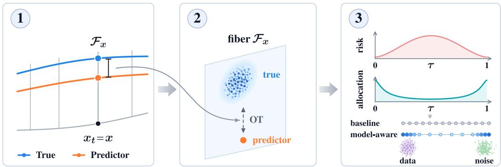
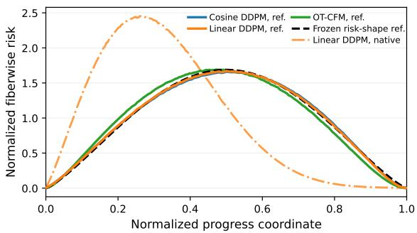
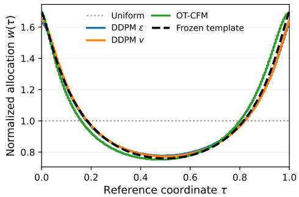
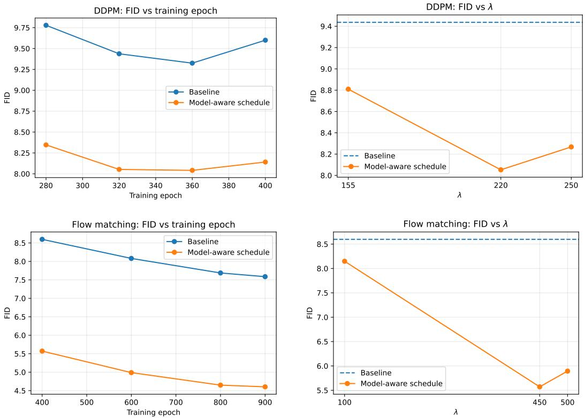
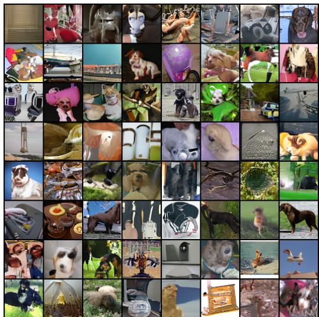
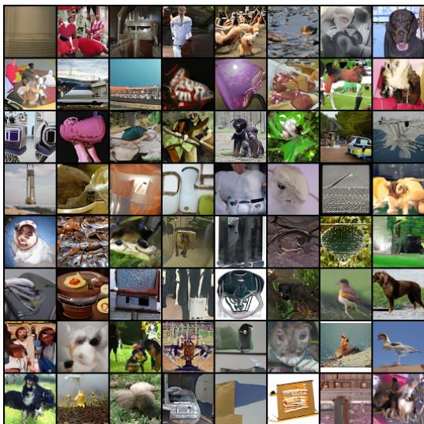
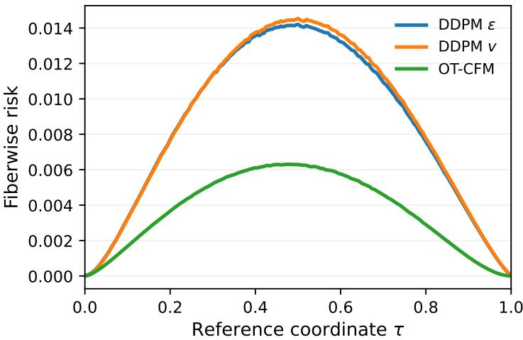

# MODEL-AWARE SCHEDULES IMPROVE GENERATION VIA FIBERWISE OPTIMAL TRANSPORT

Luyi Jia1,∗,† Boyan Zhang1,∗ Yilun Liu2,3 Steffen Rulands1,†

1Arnold-Sommerfeld-Center for Theoretical Physics,

Ludwig-Maximilians-Universitat M¨ unchen, Munich, Germany¨

2Institute of Informatics, Ludwig-Maximilians-Universitat M¨ unchen, Munich, Germany¨ 3Munich Center for Machine Learning, Munich, Germany

luyi.jia@campus.lmu.de boyan.zhang@campus.lmu.de

yilun.liu@tum.de rulands@lmu.de

∗Equal contribution. †Corresponding authors.

## ABSTRACT

Diffusion and flow-matching schedules control the signal and noise coefficients that mix data and noise along affine probability paths. Minimizing a kinetic action defined on coefficient paths, motivated by optimal transport, helps explain strong baselines but remains model-agnostic and ignores prediction error. Here we introduce a model-aware schedule construction based on fiberwise optimal transport. At a fixed time and state on the probability path, compatible signal/noise decompositions form an affine fiber. We define a fiberwise prediction risk by averaging optimal-transport costs between the true and predictor-induced decompositions within these fibers. On a fixed coefficient curve, combining this risk with coefficient-path kinetic action yields a closed-form optimal time allocation. This construction extends to general linear prediction targets, and the risk profile can be estimated from an early baseline checkpoint. We evaluate denoising diffusion probabilistic models (DDPMs) and flow matching across prediction targets, training configurations, risk-estimation checkpoints, datasets, and architectures. Our model-aware schedules consistently outperform strong baselines, including a 38.6% relative FID reduction for flow matching on CIFAR-10 at 16 function evaluations. Each model-agnostic kinetic baseline determines its own kinetic reference coordinate. In these coordinates, fiberwise-risk profiles from independently trained models in different settings align closely after normalization to unit area. The resulting schedule deformations used in training also align, suggesting empirical universality across the evaluated models and settings. Pretrained-checkpoint diagnostics extend this normalized-risk agreement to larger conditional latent diffusion and 2-Rectified Flow (2-RF) models. A frozen analytic allocation template retains most of the model-aware improvement without further risk estimation or model-specific fitting.

Keywords: Diffusion models; flow matching; schedule optimization; fiberwise optimal transport; time reparameterization; empirical universality.

## 1 INTRODUCTION

Diffusion and flow-matching models learn to generate samples from noise (Ho et al., 2020; Lipman et al., 2023). During training, a data sample $x _ { 0 }$ and reference noise ϵ are commonly combined along an affine probability path with state $x _ { t } = m _ { t } x _ { 0 } + s _ { t } \epsilon$ at time t. A schedule specifies how the signal and noise coefficients $m _ { t } , s _ { t }$ evolve. A kinetic action defined on the path of coefficients, motivated by dynamical optimal transport (Benamou & Brenier, 2000), integrates the squared speed of these coefficients over time. On the respective fixed coefficient curves, its minimization yields cosine-type diffusion schedules and the standard conditional optimal-transport (Cond-OT) parameterization for flow matching (Shaul et al., 2023; Ikeda et al., 2025). However, the coefficient-path kinetic action is model-agnostic and ignores prediction error. Its connection to optimal transport motivates a modeldependent correction based on transport between signal/noise decompositions.

Here, we propose a model-aware schedule construction to improve generation quality. At fixed time t with state $x _ { t } ~ = ~ x ,$ , the true and predictor-induced signal/noise decompositions can differ even though both sum to the same state. All compatible decompositions form an affine fiber over x. We define a fiberwise prediction risk by averaging the optimal-transport costs between the true and predictor-induced decompositions within these fibers. This transport is base-preserving: it measures decomposition discrepancy at fixed x, leaving the distribution $p _ { t }$ of $x _ { t }$ unchanged. We estimate the risk profile—the risk as a function of position along the baseline coefficient curve—from a baseline checkpoint. On a fixed coefficient curve, combining this risk with coefficient-path kinetic action yields a closed-form optimal time allocation. The risk term favors less schedule time in higher-risk regions, while the kinetic term penalizes excessively rapid traversal (Figure 1).

To compare risk profiles across models and settings, we use the kinetic reference coordinates determined independently by the model-agnostic kinetic baselines. After unit-area normalization, fiberwise-risk profiles from independently trained models align closely. The resulting allocation deformations used in training also align. This agreement is not assumed by the construction. We use the shared risk shape and the closed-form allocation rule to construct a frozen analytic alloca tion template (Figure 2; Section 6.4). These findings suggest that model-aware schedule design can uncover reusable allocation structure across diffusion and flow matching.

## Our contributions are as follows:

• We formulate fiberwise prediction risk through base-preserving optimal transport on signal/noise decomposition fibers. Under the normalized symmetric product metric, the risk reduces to the $s _ { t } ^ { 2 } .$ weighted noise-prediction MSE and extends to general linear prediction targets, enabling direct risk estimation from the corresponding prediction errors.

• We introduce kinetic reference coordinates defined by model-agnostic kinetic baselines to compare risk profiles and allocation deformations across models and settings. We formulate modelaware scheduling as minimum coefficient-path kinetic action under a budget on schedule-timeintegrated fiberwise prediction risk. The fixed-curve specialization yields a closed-form optimal time allocation for one-shot schedule construction, using a risk profile that can be estimated from an early baseline checkpoint.

• Across prediction targets, training configurations, datasets, and architectures, our schedules consistently improve strong DDPM and flow-matching baselines, including a 38.6% relative reduction in Frechet Inception Distance (FID) (Heusel et al., 2017) at 16 function evaluations. Improvements´ also persist across multiple numerical solvers.

• Shared normalized risk shapes and allocation deformations in kinetic reference coordinates suggest empirical universality across the evaluated models and settings. Diagnostics on pretrained diffusion transformer (DiT) and 2-RF models extend the normalized-risk agreement to larger conditional latent models with distinct architectures and generative constructions. The frozen analytic allocation template retains most of the model-aware improvement.

## 2 RELATED WORK

Adjacent design choices at different levels. Diffusion and flow-matching models involve distinct design choices: the inference-time solver grid; the training-time sampling distribution and loss weighting; and the probability path and its traversal. Inference-time methods select grids using discretization-error criteria, trajectory regularity, or conditional-entropy change (Sabour et al., 2024; Chen et al., 2024; Stancevic et al., 2025). BOSS uses dynamic programming for grid selection and also fine-tunes the velocity field to its selected grid (Nguyen et al., 2024). Xu et al. (2026) design training-time sampling distributions and loss weights using estimated optimal loss values. InfoNoise adapts the training-time sampling distribution using an online estimate of the conditional-entropyrate profile (Raya et al., 2026). We change only the traversal of a fixed coefficient curve and use the resulting schedule during retraining and sampling; the other choices remain complementary.

Schedule and probability-path design. Hang et al. (2025) design log-SNR importance sampling for continuous diffusion training rather than the discrete DDPM setting evaluated here. Constant

Rate Scheduling reparameterizes variance-preserving (VP) diffusion schedules to equalize a chosen rate of distributional change. Its model-dependent procedure updates the schedule online, with training experiments under ϵ-prediction (Okada et al., 2026). Our construction instead estimates fiberwise prediction risk once from a baseline checkpoint and holds the schedule fixed during retraining. On prescribed paths, LayoutFlow tests a sine traversal for layout generation (Guerreiro et al., 2024), while Tsimpos et al. (2025) optimize traversal for a uniform-in-time spatial Lipschitz bound. Concurrent work uses polynomial velocity profiles motivated by Euler’s local truncation error (Bondar, 2026). Another concurrent approach uses loss-quantile traversal that slows at high conditional-flow-matching loss (Tania & Khan, 2026). Chen et al. (2025) instead optimize interpolation coefficients for averaged squared drift Lipschitzness. Most of these methods address ei ther diffusion or flow matching. Our construction allocates time along a fixed coefficient curve by balancing coefficient-path kinetics against schedule-time-integrated fiberwise prediction risk. The same formulation applies across general linear prediction targets in both DDPM and flow matching. Improvements also persist across multiple numerical solvers. Empirical universality across the evaluated models and settings supports a frozen analytic allocation template. This template can be used directly as a schedule without further risk estimation or model-specific fitting.

Kinetic and optimal-transport perspectives. Motivated by dynamical optimal transport (Benamou & Brenier, 2000), Shaul et al. (2023) derive expressions for conditional and marginal kinetic energy of affine probability paths. With independent endpoints and matched second moments, the normalized conditional energy is coefficient-path kinetic action, minimized by Cond-OT. They optimize the marginal kinetic energy over both the coefficient curve and its traversal. The resulting paths are evaluated in flow-matching experiments using independent endpoints rather than minibatch OT coupling. On ImageNet-64, the estimated optimum nearly coincides with the standard Cond-OT coefficient path. We instead minimize coefficient-path kinetic action over traversals of a fixed coefficient curve under a budget on schedule-time-integrated fiberwise prediction risk. Ikeda et al. (2025) also recover the Cond-OT and exact cosine parameterizations by minimizing coefficient-path kinetic action, with the latter subject to the VP constraint. Under their stated assumptions, they derive a speed–accuracy relation between marginal Wasserstein action and a specific Wasserstein generation-error sensitivity. Base-preserving Wasserstein formulations restrict transport to corresponding fibers over a shared base marginal (Peszek & Poyato, 2023; Chemseddine et al., 2025). We apply this structure to signal/noise decomposition fibers. The resulting fiberwise prediction risk measures prediction discrepancy at a fixed state and supplies the model-dependent term in our schedule-design objective.

## 3 BACKGROUND

## 3.1 AFFINE PROBABILITY PATHS AND SCHEDULE COORDINATES

To describe diffusion and flow-matching schedules in a common framework, we work with affine probability paths

$$
\begin{array} { r } { x _ { t } = m _ { t } x _ { 0 } + s _ { t } \epsilon , \qquad x _ { 0 } \sim p _ { \mathrm { d a t a } } , \quad \epsilon \sim \mathcal { N } ( 0 , I ) , \qquad t \in [ 0 , 1 ] , } \end{array}\tag{1}
$$

with marginals $p _ { t } = \operatorname { L a w } ( x _ { t } )$ . A schedule specifies a parameterized coefficient path $t \mapsto ( m _ { t } , s _ { t } )$ The underlying coefficient curve is the geometric curve traced in the (m, s)-plane, independent of traversal speed. For VP/DDPM, write the squared signal coefficient as $\bar { \alpha } _ { t }$ . Then $m _ { t } = \sqrt { { \bar { \alpha } } _ { t } }$ and $s _ { t } = \sqrt { 1 - \bar { \alpha } _ { t } } , \mathrm { s o } m _ { t } ^ { 2 } + s _ { t } ^ { 2 } = 1$ . Standard VP/DDPM uses independent x0 and ϵ. Under our datato-noise convention, the standard Cond-OT parameterization is $m _ { t } = 1 - t$ and $s _ { t } = t$ . With the endpoint marginals fixed, different couplings of data and noise samples $( x _ { 0 } , \epsilon )$ can change their joint law and hence the prediction problem, while preserving the affine coefficient representation above (Ho et al., 2020; Lipman et al., 2023; Pooladian et al., 2023; Tong et al., 2024).

## 3.2 COEFFICIENT-PATH KINETICS AND STANDARD BASELINES

Let $\gamma ( t ) = ( m _ { t } , s _ { t } )$ be a given coefficient path. For a fixed endpoint pair $( x _ { 0 } , \epsilon )$ , differentiating $x _ { t } = m _ { t } x _ { 0 } + s _ { t } \epsilon$ with respect to t gives the path velocity $\dot { x } _ { t } = \dot { m } _ { t } x _ { 0 } + \dot { s } _ { t } \epsilon$ . Under standard regularity conditions, the expected pathwise kinetic action $\begin{array} { r } { \int _ { 0 } ^ { 1 } \mathbb { E } \| \dot { x } _ { t } \| ^ { 2 } d t } \end{array}$ is an upper bound on the marginal Wasserstein action of $p _ { t }$ . This marginal action integrates the squared 2-Wasserstein speed of $p _ { t }$ over time and upper-bounds the endpoint quadratic transport cost. In the settings covered by speed–accuracy relations, it also upper-bounds a Wasserstein generation-error sensitivity (Benamou & Brenier, 2000; Shaul et al., 2023; Ikeda et al., 2025). Prior kinetic analyses use the Euclidean action of the coefficient path to explain strong baseline schedules (Shaul et al., 2023; Ikeda et al., 2025). We adopt this action and refer to it as coefficient-path kinetics:

  
Figure 1: Fiberwise prediction risk and model-aware allocation. 1: At $x _ { t } ~ = ~ x ,$ , the true and predictor-induced decompositions differ vertically within $\mathcal { F } _ { x } . \quad 2 { : }$ The true conditional law and predictor-induced point mass define a base-preserving fiberwise transport cost, averaged over $x \sim p _ { t }$ . 3: The resulting risk and coefficient-path kinetics determine schedule-time allocation on the fixed curve, with profile shapes based on the empirical findings; marker spacing is schematic.

$$
\mathcal { T } _ { \mathrm { k i n } } ( \gamma ) = \int _ { 0 } ^ { 1 } \left( \dot { m } _ { t } ^ { 2 } + \dot { s } _ { t } ^ { 2 } \right) d t .\tag{2}
$$

For independent data/noise endpoints with matched second moments, $\mathcal { T } _ { \mathrm { k i n } }$ equals the normalized expected pathwise kinetic action. With unequal second moments or coupled endpoints, the pathwise action is upper-bounded by a fixed multiple of $\mathcal { T } _ { \mathrm { k i n } }$ (Appendix A.1).

For fixed coefficient endpoints (1, 0) and (0, 1), minimizing $\mathcal { T } _ { \mathrm { k i n } }$ gives a model-agnostic kinetic baseline with constant-speed traversal of the shortest admissible coefficient curve. We call the normalized time of this baseline the kinetic reference coordinate τ. The resulting baselines are the standard Cond-OT parameterization and, under the VP constraint, the exact cosine parameterization (Shaul et al., 2023; Ikeda et al., 2025). For VP, the exact cosine parameterization is

$$
( m _ { \tau } , s _ { \tau } ) = \left( \cos \frac { \pi \tau } { 2 } , \sin \frac { \pi \tau } { 2 } \right) .\tag{3}
$$

This parameterization has appeared in prior diffusion work (Salimans & Ho, 2022). Our DDPM baselines use the closely related offset-normalized cosine schedule introduced by Nichol & Dhariwal (2021), which approximates this kinetic baseline (Appendix A.2).

## 4 FIBERWISE PREDICTION RISK VIA OPTIMAL TRANSPORT

Section 3.2 defines the kinetic reference coordinate along each baseline coefficient curve. We now define the fiberwise prediction risk through base-preserving optimal transport between the true and predictor-induced decompositions over each fixed base state (Figure 1, panels 1 and 2).

## 4.1 DECOMPOSITION FIBERS AND FIBERWISE OPTIMAL TRANSPORT

To compare true and predictor-induced signal/noise decompositions at a fixed state, we first describe the space of compatible decompositions. Write $x _ { t } = u _ { t } + n _ { t }$ , with $\boldsymbol { u } _ { t } = \boldsymbol { m } _ { t } \boldsymbol { x } _ { 0 }$ and $n _ { t } = s _ { t } \epsilon$ . We define the affine fibers ${ \mathcal { F } } _ { x }$ over states $x ,$ the decomposition bundle B collecting these fibers, and the projection pr onto the base state:

$$
\mathcal F _ { x } = \{ ( u , n ) : u + n = x \} , \qquad B = \{ ( x , u , n ) : u + n = x \} , \qquad \mathrm { p r } ( x , u , n ) = x .\tag{4}
$$

We equip the decomposition bundle with the normalized symmetric product metric

$$
g _ { B } : = \frac { 1 } { 2 } \big ( \| d u \| ^ { 2 } + \| d n \| ^ { 2 } \big ) .\tag{5}
$$

With the fiber coordinate $z = ( u - n ) / 2$ , this becomes

$$
g _ { B } = { \frac { 1 } { 4 } } \| d x \| ^ { 2 } + \| d z \| ^ { 2 } .\tag{6}
$$

This gives an orthogonal base–fiber splitting. For a fixed endpoint pair, the true decomposition $( u _ { t } , n _ { t } )$ evolves with time. The horizontal component of its velocity, orthogonal to the fiber, has squared norm $\| \dot { x } _ { t } \| ^ { 2 } / 4$ . In contrast, true and predictor-induced decompositions at the same $( t , x )$ differ only in the vertical direction (Appendix B.1).

For noise prediction, the true and predictor-induced decompositions are

$$
\begin{array} { r } { ( u _ { t } , n _ { t } ) = ( m _ { t } x _ { 0 } , s _ { t } \epsilon ) , \qquad ( u _ { t } ^ { \theta } , n _ { t } ^ { \theta } ) = \big ( x _ { t } - s _ { t } \epsilon _ { \theta } ( x _ { t } , t ) , s _ { t } \epsilon _ { \theta } ( x _ { t } , t ) \big ) . } \end{array}\tag{7}
$$

At fixed $t ,$ the observed state $x _ { t } = x$ may be compatible with different true signal/noise decompositions. Let $\mu _ { t } ^ { x }$ denote their conditional law given $x _ { t } = x$ . In contrast, a deterministic predictor returns a single decomposition for the same (x, t), inducing the point mass

$$
\nu _ { t } ^ { \theta , x } = \delta _ { \zeta _ { \theta } ( x , t ) } , \qquad \zeta _ { \theta } ( x , t ) = \big ( x - s _ { t } \epsilon _ { \theta } ( x , t ) , s _ { t } \epsilon _ { \theta } ( x , t ) \big ) \in \mathcal { F } _ { x } .\tag{8}
$$

With $W _ { 2 , B }$ denoting the 2-Wasserstein distance on ${ \mathcal { F } } _ { x }$ induced by $g _ { B }$ , we define the fiberwise prediction risk by the base-preserving transport cost

$$
\mathcal { W } _ { \mathrm { f i b } } ^ { 2 } ( t ) : = \int W _ { 2 , B } ^ { 2 } \big ( \mu _ { t } ^ { x } , \nu _ { t } ^ { \theta , x } \big ) p _ { t } ( d x ) .\tag{9}
$$

Intuitively, ${ \mathcal W } _ { \mathrm { f i b } } ^ { 2 } ( t )$ measures the average squared distance between true and predicted signal/noise decompositions that sum to the same observed state. Within each fiber, every true decomposition must be transported to the single predicted decomposition. The optimal-transport cost is therefore the conditional mean squared vertical discrepancy. Averaging over $x \sim p _ { t }$ gives the expected squared vertical discrepancy under the joint law of $( x _ { 0 } , \epsilon )$ inducing $x _ { t }$ . Writing $z _ { t } = ( u _ { t } - n _ { t } ) / 2$ and $z _ { t } ^ { \theta } = ( u _ { t } ^ { \theta } - n _ { t } ^ { \theta } ) / 2$ , we write this risk as

$$
R ( t ) : = \mathcal { W } _ { \mathrm { f b } } ^ { 2 } ( t ) = D _ { \mathrm { f b } } ^ { 2 } ( t ) : = \mathbb { E } \Vert z _ { t } - z _ { t } ^ { \theta } \Vert ^ { 2 } = s _ { t } ^ { 2 } e _ { t } ,\tag{10}
$$

with

$$
\begin{array} { r } { e _ { t } : = \mathbb { E } \| \epsilon _ { \theta } ( x _ { t } , t ) - \epsilon \| ^ { 2 } . } \end{array}\tag{11}
$$

This identity makes the risk directly estimable from prediction errors. The fiberwise transport defining $R ( t )$ compares decompositions only within each fixed- $( t , x )$ fiber and therefore leaves the base marginal $p _ { t }$ unchanged (Appendix B.2).

## 4.2 GENERAL LINEAR PREDICTION TARGETS AND TARGET-COORDINATE INVARIANCE

To express the same fiberwise prediction risk for other prediction targets, consider a general linear combination of data and noise:

$$
y _ { t } = a _ { t } x _ { 0 } + b _ { t } \epsilon .\tag{12}
$$

A prediction $y _ { \boldsymbol { \theta } } ( x _ { t } , t )$ induces the noise coordinate

$$
\epsilon _ { \theta } ^ { \mathrm { i n d } } ( x _ { t } , t ) = \frac { - a _ { t } x _ { t } + m _ { t } y _ { \theta } ( x _ { t } , t ) } { \Delta _ { t } } ,\tag{13}
$$

where $\Delta _ { t } = m _ { t } b _ { t } - s _ { t } a _ { t } \neq 0$ . Since $\begin{array} { r } { \epsilon _ { \theta } ^ { \mathrm { i n d } } - \epsilon = \frac { m _ { t } } { \Delta _ { t } } ( y _ { \theta } - y _ { t } ) } \end{array}$ , the fiberwise risk can be written as

$$
R ( t ) = s _ { t } ^ { 2 } \mathbb { E } \Vert \epsilon _ { \theta } ^ { \mathrm { i n d } } ( x _ { t } , t ) - \epsilon \Vert ^ { 2 } = \frac { m _ { t } ^ { 2 } s _ { t } ^ { 2 } } { \Delta _ { t } ^ { 2 } } \mathbb { E } \Vert y _ { \theta } ( x _ { t } , t ) - y _ { t } \Vert ^ { 2 } .\tag{14}
$$

Thus changing the prediction target changes only the coordinate expression of the same fiberwise risk. This expression applies to the DDPM and flow-matching targets considered here. This invariance does not imply matching risk profiles across separately trained models, different settings, or coefficient curves. The conditional and latent-state extension used for the pretrained-checkpoint diagnostics is given in Appendix D.3.

For comparisons across models and settings, we express the fiberwise risk as $R ( \tau )$ in the corresponding kinetic reference coordinate. Section 5 shows how this profile enters schedule-time allocation.

## 5 MODEL-AWARE SCHEDULE DESIGN

## 5.1 RISK-CONSTRAINED KINETIC FORMULATION

To incorporate prediction risk into schedule design, we minimize coefficient-path kinetic action subject to a budget on schedule-time-integrated fiberwise prediction risk:

$$
\operatorname* { m i n } _ { \gamma } \ { \mathcal { T } } _ { \mathrm { k i n } } ( \gamma ) \qquad { \mathrm { s u b j e c t ~ t o } } \qquad \int _ { 0 } ^ { 1 } R ( t ) d t \leq B .\tag{15}
$$

Under the conditions stated in Section 3.2 and Appendix A.1, this can also be viewed as minimizing a tractable upper bound on the corresponding Wasserstein generation-error sensitivity under a modeldependent risk budget. Introducing a Lagrange multiplier $\lambda \geq 0$ for the risk constraint gives, up to an additive constant independent of the schedule, the penalized objective

$$
\mathcal { T } _ { \lambda } ( \gamma ) = \mathcal { T } _ { \mathrm { k i n } } ( \gamma ) + \lambda \int _ { 0 } ^ { 1 } R ( t ) d t .\tag{16}
$$

For direct noise prediction, $R ( t ) = s _ { t } ^ { 2 } e _ { t } ;$ Section 4.2 gives the general-target forms. The orthogonal base–fiber splitting in Eq. (6) separates changes in the state from changes in its decomposition at a fixed state. Under this splitting, a fixed multiple of $\mathcal { T } _ { \mathrm { k i n } }$ upper-bounds expected horizontal kinetic action (Appendix B.1), while $R$ is a model-dependent vertical squared-distance potential. These terms do not form a single dynamical optimal-transport action.

Rather than specifying B, we parameterize the tradeoff by $\lambda ;$ the attained risk integral gives the corresponding budget. We solve a one-shot fixed-curve problem that keeps the risk profile estimated from a baseline checkpoint fixed and optimizes only traversal. Empirically, re-estimating risk after model-aware training changes the resulting time allocations only marginally, supporting this oneshot construction (Appendix E.10).

## 5.2 FIXED-CURVE MODEL-AWARE ALLOCATION

To obtain an explicit allocation rule, we restrict Eq. (15) to traversals of a fixed coefficient curve. Let $\gamma _ { 0 } ( \tau )$ denote the baseline coefficient path in its kinetic reference coordinate. With $t = \Phi ( \tau )$ , the schedule-time allocation density is

$$
w ( \tau ) = \Phi ^ { \prime } ( \tau ) > 0 , \qquad \int _ { 0 } ^ { 1 } w ( \tau ) d \tau = 1 .\tag{17}
$$

Thus $w ( \tau )$ dτ is the schedule time assigned to a reference interval of width dτ. Let $L ^ { \prime } ( \tau ) = \| \gamma _ { 0 } ^ { \prime } ( \tau ) \|$ denote the coefficient-space speed of $\gamma _ { 0 }$ , and write the previously estimated fiberwise-risk profile as $R ( \tau )$ . We optimize w while holding this profile fixed. The constrained problem becomes

$$
\begin{array} { r l } { \underset { w > 0 } { \operatorname* { m i n } } } & { \displaystyle \int _ { 0 } ^ { 1 } \frac { L ^ { \prime } ( \tau ) ^ { 2 } } { w ( \tau ) } d \tau } \\ { \mathrm { s u b j e c t ~ t o ~ } } & { \displaystyle \int _ { 0 } ^ { 1 } R ( \tau ) w ( \tau ) d \tau \leq B , \qquad \int _ { 0 } ^ { 1 } w ( \tau ) d \tau = 1 . } \end{array}\tag{18}
$$

Introducing the corresponding multiplier $\lambda \geq 0$ gives the penalized form

$$
\mathcal { T } _ { \lambda } [ w ] = \int _ { 0 } ^ { 1 } \left[ \frac { L ^ { \prime } ( \tau ) ^ { 2 } } { w ( \tau ) } + \lambda R ( \tau ) w ( \tau ) \right] d \tau .\tag{19}
$$

The Karush–Kuhn–Tucker (KKT) stationarity condition gives the optimal allocation density in closed form:

$$
w ^ { \star } ( \tau ) = \frac { L ^ { \prime } ( \tau ) } { \sqrt { \eta + \lambda R ( \tau ) } } ,\tag{20}
$$

where $\eta$ enforces normalization. This rule converts an estimated risk profile into a time allocation along the prescribed coefficient curve. The derivation, discrete allocation rule, and related invariance properties are given in Appendix C.

With $L ^ { \prime } ( \tau )$ constant in the kinetic reference coordinate, higher values of $R ( \tau )$ mean less schedule time when $\lambda > 0$ The kinetic term penalizes arbitrarily rapid traversal. Hence R and λ jointly determine the allocation deformation: the change in schedule-time allocation relative to the baseline traversal (Figure 1, panel 3). Agreement in normalized risk-profile shapes alone does not guarantee matching allocation deformations: Eq. (20) also depends on the absolute risk scale and on λ relative to the kinetic term.

## 5.3 INSTANTIATION FOR DIFFUSION AND FLOW MATCHING

For DDPM, we retain the standard offset-normalized cosine schedule as a practical approximation to the VP kinetic baseline. We deform only its traversal, using baseline time as the practical VP reference coordinate. Appendix A.2 gives the coordinate audit.

For flow matching, the standard Cond-OT time parameter is already the exact reference coordinate along ${ \displaystyle \gamma _ { 0 } ( \tau ) = ( 1 - \tau , \tau ) }$ . Under $t = \Phi ( \tau )$ ,

$$
x _ { t } = ( 1 - \tau ) x _ { 0 } + \tau \epsilon , \frac { d x _ { t } } { d t } = \frac { \epsilon - x _ { 0 } } { w ( \tau ) } , \tau = \Phi ^ { - 1 } ( t ) .\tag{21}
$$

Thus reparameterization changes both the state–time map and the linear velocity prediction target, rather than merely the training-time sampling distribution. Appendix D.1 gives implementation details for both constructions.

## 6 EXPERIMENTS

## 6.1 EXPERIMENTAL SETUP

We evaluate unconditional generation on CIFAR-10 and ImageNet-64 (Krizhevsky, 2009; Chrabaszcz et al., 2017) using U-Net backbones and include a U-ViT-S/2 architecture-family control on CIFAR-10. Primary DDPM experiments use 1000 timesteps and ϵ-prediction. Our primary flowmatching setting is conditional flow matching with minibatch OT endpoint coupling (OT-CFM), using a uniform training-time sampling distribution and velocity prediction. Baseline and modelaware models are trained from scratch under their respective schedules (Appendix D.1). In each FID comparison, all other training and sampling settings are the same, and results are reported at matched training stages.

DDPM and flow matching use distinct U-Net implementations and optimization recipes on CIFAR-10, but the same U-Net architecture on ImageNet-64. The U-ViT control retains the CIFAR-10 DDPM setup and constructs its schedule from its own baseline risk profile. Additional controls vary the DDPM target, flow-matching endpoint coupling, and the training-time sampling distribution (Appendices D.1, D.2, and E.5). Separately, we perform risk-profile and allocation diagnostics on public DiT-XL/2 and pre-distillation InstaFlow 2-RF checkpoints, without retraining or evaluating a modified generative schedule (Appendix D.3).

Following established evaluation practice (Shaul et al., 2023; Sabour et al., 2024; Okada et al., 2026), we compare generation quality using 50,000-sample FID at matched numbers of function evaluations (NFE). We define $\Delta \dot { \mathrm { F I D } } \dot { = } \mathrm { F I D } \dot { \mathrm { b a s e l i n e } } { - } \mathrm { F I D } \dot { \mathrm { m o d e l - a w a r e } } .$ , with positive values indicating improvement. Main CIFAR-10 results give mean and standard deviation over three pre-specified paired seeds; ImageNet-64 uses one paired seed. All other single-seed CIFAR-10 studies use the same seed selected in advance from this set.

Coarse FID sweeps in the two primary CIFAR-10 settings set λ = 220 for DDPM and $\lambda = 4 5 0$ for flow matching. These sweeps precede the cross-system risk–allocation analysis. We reuse the corresponding values without retuning across prediction targets, endpoint couplings, training-time sampling distributions, risk-estimation checkpoints, datasets, and architectures (Appendix E.6).

## 6.2 MAIN RESULTS

DDPM. Our model-aware schedule reduces FID in all five reported sampling configurations on CIFAR-10 and all five on ImageNet-64. On CIFAR-10, the FID reduction reaches 16.4% with DPM++3M at 16 NFE (Table 1). Across the complete $3 \times 3$ sampler–NFE grid, FID is lower for each of the three paired seeds (Appendix Table 5). Cosine also outperforms the linear-β schedule across all nine configurations (Appendix Table 6). ImageNet-64 reductions at 16 NFE range from 0.91 to 1.75 FID, with DPM++3M also improved at 32 and 64 NFE (Table 2).

Table 1: CIFAR-10 DDPM FID at epoch 400 with ϵ-prediction and λ = 220. Values are mean ± standard deviation over three paired training seeds.
<table><tr><td rowspan="2">Sampler</td><td rowspan="2">NFE</td><td>Baseline</td><td colspan="3">Model-aware (Ours)</td></tr><tr><td>FID↓</td><td>FID↓</td><td>∆FID↑</td><td>%Impr. ↑</td></tr><tr><td> $\mathrm { D P M } + + 3 \mathrm { M }$ </td><td>16</td><td> $9 . 6 4 \pm 0 . 2 6$ </td><td> $8 . 0 6 \pm 0 . 1 6$ </td><td> $1 . 5 8 \pm 0 . 1 1$ </td><td> ${ \bf 1 6 . 4 \pm 0 . 7 \% }$ </td></tr><tr><td> $\mathrm { D P M } + + 3 \mathrm { M }$ </td><td>32</td><td> $7 . 6 9 \pm 0 . 2 6$ </td><td> $6 . 7 9 \pm 0 . 2 7$ </td><td> $0 . 9 1 \pm 0 . 1 2$ </td><td> $1 1 . 8 \pm 1 . 5 \%$ </td></tr><tr><td>DPM++3M</td><td>64</td><td> $6 . 8 3 \pm 0 . 2 4$ </td><td> $6 . 1 9 \pm 0 . 2 7$ </td><td> $0 . 6 4 \pm 0 . 0 7$ </td><td> $9 . 3 \pm 1 . 2 \%$ </td></tr><tr><td>DDIM</td><td>16</td><td> $1 1 . 2 7 \pm 0 . 1 9$ </td><td> $9 . 9 8 \pm 0 . 2 3$ </td><td> $1 . 2 9 \pm 0 . 2 0$ </td><td> $1 1 . 4 \pm 1 . 7 \%$ </td></tr><tr><td> $\mathrm { D P M } { + } { + } 2 \mathrm { M }$ </td><td>16</td><td> $9 . 8 1 \pm 0 . 2 6$ </td><td> $8 . 2 9 \pm 0 . 1 4$ </td><td> $1 . 5 1 \pm 0 . 1 4$ </td><td> $1 5 . 4 \pm 1 . 1 \%$ </td></tr></table>

Table 2: Unconditional ImageNet-64 DDPM FID with ϵ-prediction at the 800k checkpoint and λ = 220.
<table><tr><td></td><td></td><td>Baseline</td><td colspan="3">Model-aware (Ours)</td></tr><tr><td>Sampler</td><td>NFE</td><td>FID ↓</td><td>FID↓</td><td>∆FID↑</td><td>%Impr. ↑</td></tr><tr><td>DPM++3M</td><td>16</td><td>25.01</td><td>23.26</td><td>1.75</td><td>7.0%</td></tr><tr><td>DPM++3M</td><td>32</td><td>20.59</td><td>20.13</td><td>0.46</td><td>2.3%</td></tr><tr><td>DPM++3M</td><td>64</td><td>20.05</td><td>19.50</td><td>0.55</td><td>2.7%</td></tr><tr><td>DDIM</td><td>16</td><td>27.46</td><td>26.55</td><td>0.91</td><td>3.3%</td></tr><tr><td>DPM++2M</td><td>16</td><td>24.90</td><td>23.39</td><td>1.51</td><td>6.1%</td></tr></table>

Flow matching. All four CIFAR-10 sampling configurations improve for each of the three paired seeds, with mean relative FID reductions of 6.9%–38.6%. All seven ImageNet-64 configurations improve at 600k updates, including every Euler budget; midpoint and Heun3 improve by 24.7%– 29.8% (Tables 3 and 4).

## 6.3 ROBUSTNESS AND ABLATIONS

Target and architecture transfer. Using λ = 220 throughout, the resulting schedules improve all six DDPM v-prediction sampling configurations by 7.4%–14.7% and all five U-ViT-S/2 configurations without architecture-specific retuning, including a 12.2% reduction at 16 NFE (Appendix Tables 7 and 8).

Coupling and training-time sampling. Across matched 400-epoch settings with different endpoint couplings and training-time sampling distributions, our model-aware schedules reduce FID by 31.3%–39.4%. The FID rankings are preserved between baseline and model-aware runs: OT coupling remains better than independent coupling, while logit-normal, uniform, and U-shaped sampling remain ordered from lowest to highest FID (Esser et al., 2024; Lee et al., 2024). The U-shaped control replaces the uniform training-time sampling distribution with the RF++ U-shaped distribution, held fixed within each baseline–model-aware pair (Appendix Table 9).

Training-stage, tradeoff-weight, and risk-estimation robustness. Gains persist at the tested training stages and for the tested nonzero λ values in both model families (Appendix E.6). Using epoch-100 rather than late-stage risk estimates changes final FID by only 0.02 for DDPM and 0.06 for flow matching while preserving the shared normalized risk shape (Appendix Tables 10, 11, and 13).

Finite-step integration. For flow matching, finite-NFE behavior is integrator-dependent. On CIFAR-10, model-aware schedules improve FID across all tested higher-order integrators and budgets despite low-NFE discretization effects, but worsen FID with Euler. On ImageNet-64, they improve FID with Euler at all three budgets, indicating setting-specific degradation rather than systematic incompatibility with first-order integration (Table 4; Appendix E.8).

Table 3: CIFAR-10 flow-matching FID at epoch 900 with $\lambda = 4 5 0$ . Values are mean ± standard deviation over three paired training seeds.
<table><tr><td rowspan="2"></td><td rowspan="2">NFE</td><td>Baseline</td><td colspan="3">Model-aware (Ours)</td></tr><tr><td>FID↓</td><td>FID ↓</td><td>∆FID↑</td><td>%Impr. ↑</td></tr><tr><td>Midpoint</td><td>16</td><td> $7 . 6 2 \pm 0 . 2 0$ </td><td> $4 . 6 8 \pm 0 . 1 3$ </td><td> $2 . 9 5 \pm 0 . 0 9$ </td><td> $\mathbf { 3 8 . 6 \pm 0 . 6 \% }$ </td></tr><tr><td>Midpoint</td><td>32</td><td> $5 . 5 2 \pm 0 . 1 0$ </td><td> $4 . 7 2 \pm 0 . 1 0$ </td><td> $0 . 7 9 \pm 0 . 0 9$ </td><td> $1 4 . 4 \pm 1 . 6 \%$ </td></tr><tr><td>Midpoint</td><td>64</td><td> $4 . 4 5 \pm 0 . 0 7$ </td><td> $4 . 1 5 \pm 0 . 0 9$ </td><td> $0 . 3 1 \pm 0 . 1 1$ </td><td> $6 . 9 \pm 2 . 3 \%$ </td></tr><tr><td>Heun3</td><td>15</td><td> $7 . 1 9 \pm 0 . 1 7$ </td><td> $4 . 8 8 \pm 0 . 2 7$ </td><td> $2 . 3 2 \pm 0 . 1 2$ </td><td> $3 2 . 2 \pm 2 . 3 \%$ </td></tr></table>

Table 4: Unconditional ImageNet-64 flow-matching FID at the 600k checkpoint with $\lambda = 4 5 0$
<table><tr><td colspan="2"></td><td>Baseline</td><td colspan="3">Model-aware (Ours)</td></tr><tr><td>Integrator</td><td>NFE</td><td>FID↓</td><td>FID↓</td><td>∆FID↑</td><td>%Impr. ↑</td></tr><tr><td>Midpoint</td><td>16</td><td>41.52</td><td>30.11</td><td>11.40</td><td>27.5%</td></tr><tr><td>Midpoint</td><td>32</td><td>38.75</td><td>29.08</td><td>9.67</td><td>25.0%</td></tr><tr><td>Midpoint</td><td>64</td><td>36.99</td><td>27.87</td><td>9.12</td><td>24.7%</td></tr><tr><td>Heun3</td><td>15</td><td>41.38</td><td>29.04</td><td>12.34</td><td>29.8%</td></tr><tr><td>Euler</td><td>16</td><td>40.29</td><td>36.50</td><td>3.79</td><td>9.4%</td></tr><tr><td>Euler</td><td>32</td><td>38.47</td><td>32.26</td><td>6.21</td><td>16.1%</td></tr><tr><td>Euler</td><td>64</td><td>37.33</td><td>30.34</td><td>6.99</td><td>18.7%</td></tr></table>

## 6.4 SHARED RISK-PROFILE SHAPES AND ALLOCATION DEFORMATIONS

In the kinetic reference coordinates determined independently by the model-agnostic baselines, the CIFAR-10 DDPM ϵ-prediction, DDPM v-prediction, and OT-CFM risk profiles align closely after unit-area normalization. Their allocation deformations also align closely, with more schedule time near the endpoints than in the middle (Figure 2; Appendix Table 13). The DDPM and flow-matching λ values were selected separately based on FID, not to align these deformations.

To characterize this agreement and examine its scope, we fit analytic forms to the two primary CIFAR-10 baseline risk profiles and their corresponding model-aware allocation densities (DDPM ϵ-prediction and OT-CFM). The resulting frozen risk-shape reference is the unit-area normalization of $\sin ^ { 5 / 4 } ( \pi \tau )$ . The frozen analytic allocation template uses the reciprocal-square-root form of Section 5.2:

$$
w _ { \mathrm { a n a } } ( \tau ) \propto \left( 1 + 4 \sin ^ { 5 / 4 } ( \pi \tau ) \right) ^ { - 1 / 2 } .\tag{22}
$$

We apply these frozen reference profiles to the remaining settings without refitting. We compare unit-area risk profiles with the risk-shape reference and allocation densities with the analytic template, using Pearson correlation, relative $L ^ { 2 }$ error, and total variation (TV) (Appendix E.10).

Appendix E.10 extends both findings across targets, checkpoints, architectures, datasets, endpoint couplings, and flow-matching training-time sampling distributions. Using pretrained checkpoints without retraining, we also observe the shared normalized risk shape in larger conditional latent DiT-XL/2 and InstaFlow 2-RF models (Appendices D.3 and E.10).

The linear-β DDPM control recovers this shared risk shape in the VP kinetic reference coordinate, but not in native model time. Linear and cosine DDPM follow the same VP coefficient curve but assign different native model times to the same coefficient pairs. At each native model time t, the linear-DDPM risk R(t) is evaluated at the corresponding coefficient pair $( m _ { t } , s _ { t } )$ . We express the profile in the practical VP reference coordinate by matching each risk value to the cosine-baseline time with the same coefficient pair. In native model time, the linear-DDPM profile agrees weakly with the risk-shape reference (Pearson 0.3616, TV 38.00%). In the practical VP reference coordinate, however, the linear-DDPM profile closely matches the risk-shape reference (Pearson 0.9994, TV 0.84%; Appendix E.10). In the corresponding kinetic reference coordinates, risk profiles reestimated from the primary CIFAR-10 DDPM and OT-CFM model-aware checkpoints retain the shared normalized risk shape. The recomputed allocations also retain the shared deformation (Appendix E.10).

  
Figure 2: Shared risk-profile shapes and allocation deformations. Left: Fiberwise-risk profiles in kinetic reference coordinates, each normalized to unit area. The dash-dotted linear-DDPM profile instead uses native model time, and the dashed black curve is the frozen sin $\scriptstyle { \mathrm { ! } } ^ { 5 / 4 } ( \pi \tau )$ risk-shape reference. Right: Model-aware allocation densities and the frozen analytic allocation template in kinetic reference coordinates.

Overall, these results suggest empirical universality across the evaluated models and settings. The reference coordinate, normalized risk shape, and allocation deformation connect the empirical comparison to our formulation. Coefficient-path kinetics determines the reference coordinate, and fiberwise optimal transport defines the model-dependent risk. Their fixed-curve tradeoff determines the allocation deformation.

On CIFAR-10, the analytic template recovers 98.1%, 98.0%, and 75.8% of the model-aware FID gains for DDPM ϵ-prediction, DDPM v-prediction, and OT-CFM, respectively. On ImageNet-64, it slightly outperforms the model-aware DDPM schedule (109.7% gain recovery) and recovers 76.2% of the corresponding OT-CFM gain. Each recovery fraction compares gains over the same baseline, at the same training stage and with all other training and sampling settings matched. The analytic template thus distills rather than replaces the model-aware construction: the latter identifies the shared normalized risk shape, maps it to an allocation, and retains substantial additional flow-matching gains (Appendix E.11).

An empirical Bayes decomposition for CIFAR-10 DDPM and Independent-CFM attributes 93.74%– 96.32% of $\begin{array} { r l } { \int _ { 0 } ^ { 1 } R ( \tau ) } \end{array}$ dτ to predictor-dependent excess risk, which also carries the shared normalized risk shape. The small remaining Bayes-risk component is negatively correlated with total risk (Appendix E.12).

## 7 DISCUSSION AND LIMITATIONS

Our experiments show that combining coefficient-path kinetics with fiberwise prediction risk to optimize traversal can improve generation quality across models, training settings, and sampling settings. The shared risk shapes and allocation deformations suggest empirical universality and motivate the analytic template, which provides a directly usable schedule without further risk estimation or model-specific fitting. The additional flow-matching gains from the model-aware schedules high light the value of setting-specific risk information.

The shared profile shape and quantitative cross-system agreement remain theoretically unexplained. An explanation may require understanding how the coefficient curve and training dynamics jointly shape fiberwise risk and the resulting allocation deformations. Developing a unified path–fiber optimal-transport formulation alongside an analysis of training dynamics may offer a route to this explanation. Extending the one-shot construction beyond fixed coefficient curves remains future work. We focus training and FID experiments on unconditional CIFAR-10 and ImageNet-64 for controlled comparisons across models, training settings, and sampling settings. Pretrained-checkpoint diagnostics extend the analysis to large conditional latent DiT and 2-RF models. End-to-end evaluation requires retraining these models under the resulting schedules and remains future work.

## ACKNOWLEDGMENTS

We thank Si-Yuan Chen for providing access to an NVIDIA GeForce RTX 3090 GPU used in some of our experiments. We gratefully acknowledge support from the hessian.AI Service Center (funded by the Federal Ministry of Research, Technology and Space, BMFTR, grant no. 16IS22091) and the hessian.AI Innovation Lab (funded by the Hessian Ministry for Digital Strategy and Innovation, grant no. S-DIW04/0013/003). This work receives support from the Munich Center for Machine Learning (MCML) and the Program of China Scholarship Council (Grant No.202508080292). Steffen Rulands is a member of the Center for Nanoscience (CeNS). The funding bodies had no role in the methodological or experimental design, the analysis or interpretation of the results, or the writing of the manuscript.

## AI USE STATEMENT

ChatGPT was used to assist with text editing, coding, the generation and refinement of Figure 1 and assist with literature research. ChatGPT was not involved in research ideation, the development of theoretical results, research methodology, experimental design, or selection and verification of citations. All AI-assisted outputs were reviewed, revised where necessary, and verified by the authors.

## REFERENCES

Fan Bao, Shen Nie, Kaiwen Xue, Yue Cao, Chongxuan Li, Hang Su, and Jun Zhu. All are worth words: A ViT backbone for diffusion models. In Proceedings of the IEEE/CVF Conference on Computer Vision and Pattern Recognition, pp. 22669–22679, 2023. doi: 10.1109/CVPR52729.2023.02171. URL https://openaccess.thecvf.com/ content/CVPR2023/html/Bao\_All\_Are\_Worth\_Words\_A\_ViT\_Backbone\_ for\_Diffusion\_Models\_CVPR\_2023\_paper.html.

Jean-David Benamou and Yann Brenier. A computational fluid mechanics solution to the Monge– Kantorovich mass transfer problem. Numerische Mathematik, 84(3):375–393, 2000. doi: 10. 1007/s002110050002.

Vitalii Bondar. Velocity scheduled flow matching. arXiv preprint arXiv:2607.11442, 2026. URL https://arxiv.org/abs/2607.11442.

Jannis Chemseddine, Paul Hagemann, Gabriele Steidl, and Christian Wald. Conditional wasserstein distances with applications in bayesian OT flow matching. Journal of Machine Learning Research, 26(141):1–47, 2025. URL https://www.jmlr.org/papers/v26/24-0586. html.

Defang Chen, Zhenyu Zhou, Can Wang, Chunhua Shen, and Siwei Lyu. On the trajectory regularity of ODE-based diffusion sampling. In Proceedings of the 41st International Conference on Machine Learning, volume 235 of Proceedings of Machine Learning Research, pp. 7905–7934. PMLR, 2024. URL https://proceedings.mlr.press/v235/chen24bm.html.

Yifan Chen, Eric Vanden-Eijnden, and Jiawei Xu. Lipschitz-guided design of interpolation schedules in generative models. arXiv preprint arXiv:2509.01629, 2025. URL https://arxiv. org/abs/2509.01629.

Patryk Chrabaszcz, Ilya Loshchilov, and Frank Hutter. A downsampled variant of ImageNet as an alternative to the CIFAR datasets. arXiv preprint arXiv:1707.08819, 2017. URL https: //arxiv.org/abs/1707.08819.

Jia Deng, Wei Dong, Richard Socher, Li-Jia Li, Kai Li, and Fei-Fei Li. ImageNet: A largescale hierarchical image database. In 2009 IEEE Conference on Computer Vision and Pattern Recognition, pp. 248–255, 2009. doi: 10.1109/CVPR.2009.5206848. URL https: //doi.org/10.1109/CVPR.2009.5206848.

Prafulla Dhariwal and Alexander Nichol. Diffusion models beat GANs on image synthesis. In Advances in Neural Information Processing Systems, volume 34, pp. 8780–8794, 2021. URL https://proceedings.neurips.cc/paper/2021/hash/ 49ad23d1ec9fa4bd8d77d02681df5cfa-Abstract.html.

Patrick Esser, Sumith Kulal, Andreas Blattmann, Rahim Entezari, Jonas Muller, Harry Saini, Yam¨ Levi, Dominik Lorenz, Axel Sauer, Frederic Boesel, Dustin Podell, Tim Dockhorn, Zion English, and Robin Rombach. Scaling rectified flow transformers for high-resolution image synthesis. In Proceedings of the 41st International Conference on Machine Learning, volume 235 of Proceedings of Machine Learning Research, pp. 12606–12633. PMLR, 2024. URL https://proceedings.mlr.press/v235/esser24a.html.

Julian Jorge Andrade Guerreiro, Naoto Inoue, Kento Masui, Mayu Otani, and Hideki Nakayama. LayoutFlow: Flow matching for layout generation. In Computer Vision – ECCV 2024, volume 15094 of Lecture Notes in Computer Science, pp. 56–72. Springer, 2024. doi: 10.1007/ 978-3-031-72764-1 4. URL https://doi.org/10.1007/978-3-031-72764-1\_4.

Tiankai Hang, Shuyang Gu, Jianmin Bao, Fangyun Wei, Dong Chen, Xin Geng, and Baining Guo. Improved noise schedule for diffusion training. In Proceedings of the IEEE/CVF International Conference on Computer Vision, pp. 4796–4806, 2025. doi: 10.1109/ICCV51701.2025.00456. URL https://openaccess.thecvf.com/content/ICCV2025/html/Hang\_ Improved\_Noise\_Schedule\_for\_Diffusion\_Training\_ICCV\_2025\_paper. html.

Martin Heusel, Hubert Ramsauer, Thomas Unterthiner, Bernhard Nessler, and Sepp Hochreiter. GANs trained by a two time-scale update rule converge to a local Nash equilibrium. In Advances in Neural Information Processing Systems, volume 30, pp. 6626–6637. Curran Associates, Inc., 2017. URL https://proceedings.neurips.cc/paper/2017/hash/ 8a1d694707eb0fefe65871369074926d-Abstract.html.

Jonathan Ho and Tim Salimans. Classifier-free diffusion guidance. arXiv preprint arXiv:2207.12598, 2022. URL https://arxiv.org/abs/2207.12598.

Jonathan Ho, Ajay Jain, and Pieter Abbeel. Denoising diffusion probabilistic models. In Hugo Larochelle, Marc’Aurelio Ranzato, Raia Hadsell, Maria-Florina Balcan, and Hsuan-Tien Lin (eds.), Advances in Neural Information Processing Systems, volume 33, pp. 6840–6851. Cur ran Associates, Inc., 2020. URL https://proceedings.neurips.cc/paper\_files/ paper/2020/file/4c5bcfec8584af0d967f1ab10179ca4b-Paper.pdf.

Kotaro Ikeda, Tomoya Uda, Daisuke Okanohara, and Sosuke Ito. Speed-accuracy relations for diffusion models: Wisdom from nonequilibrium thermodynamics and optimal transport. Physical Review X, 15(3):031031, July 2025. doi: 10.1103/x5vj-8jq9. URL https://doi.org/10. 1103/x5vj-8jq9.

Alex Krizhevsky. Learning multiple layers of features from tiny images. Technical report, University of Toronto, 2009. URL https://www.cs.toronto.edu/˜kriz/ learning-features-2009-TR.pdf.

Sangyun Lee, Zinan Lin, and Giulia Fanti. Improving the training of rectified flows. In Advances in Neural Information Processing Systems, volume 37, pp. 63082–63109. Curran Associates, Inc., 2024. doi: 10.52202/079017-2014. URL https://proceedings.neurips.cc/paper\_files/paper/2024/hash/ 7343a5c976f8399880b695267f1f9e9f-Abstract-Conference.html.

Shanchuan Lin, Bingchen Liu, Jiashi Li, and Xiao Yang. Common diffusion noise schedules and sample steps are flawed. In Proceedings of the IEEE/CVF Winter Conference on Applications of Computer Vision, pp. 5404–5411. IEEE, 2024. doi: 10.1109/WACV57701.2024.00532. URL

https://openaccess.thecvf.com/content/WACV2024/html/Lin\_Common\_ Diffusion\_Noise\_Schedules\_and\_Sample\_Steps\_Are\_Flawed\_WACV\_2024 paper.html.

Tsung-Yi Lin, Michael Maire, Serge Belongie, James Hays, Pietro Perona, Deva Ramanan, Piotr Dollar, and C. Lawrence Zitnick. Microsoft COCO: Common objects in context. In ´ Computer Vision – ECCV 2014, volume 8693 of Lecture Notes in Computer Science, pp. 740–755. Springer, 2014. doi: 10.1007/978-3-319-10602-1 48. URL https://doi.org/10.1007/ 978-3-319-10602-1\_48.

Yaron Lipman, Ricky T. Q. Chen, Heli Ben-Hamu, Maximilian Nickel, and Matthew Le. Flow matching for generative modeling. In The Eleventh International Conference on Learning Representations, 2023. URL https://openreview.net/forum?id=PqvMRDCJT9t.

Xingchao Liu, Chengyue Gong, and Qiang Liu. Flow straight and fast: Learning to generate and transfer data with rectified flow. In The Eleventh International Conference on Learning Representations, 2023. URL https://openreview.net/forum?id=XVjTT1nw5z.

Xingchao Liu, Xiwen Zhang, Jianzhu Ma, Jian Peng, and Qiang Liu. InstaFlow: One step is enough for high-quality diffusion-based text-to-image generation. In The Twelfth International Conference on Learning Representations, 2024. URL https://openreview.net/forum?id= 1k4yZbbDqX.

Cheng Lu, Yuhao Zhou, Fan Bao, Jianfei Chen, Chongxuan Li, and Jun Zhu. DPM-Solver++: Fast solver for guided sampling of diffusion probabilistic models. Machine Intelligence Research, 22 (4):730–751, 2025. doi: 10.1007/s11633-025-1562-4. URL https://doi.org/10.1007/ s11633-025-1562-4.

Bao Nguyen, Binh Nguyen, and Viet Anh Nguyen. Bellman optimal stepsize straightening of flowmatching models. In The Twelfth International Conference on Learning Representations, 2024. URL https://openreview.net/forum?id=Iyve2ycvGZ.

Alexander Quinn Nichol and Prafulla Dhariwal. Improved denoising diffusion probabilistic models. In Proceedings of the 38th International Conference on Machine Learning, volume 139 of Proceedings of Machine Learning Research, pp. 8162–8171. PMLR, 2021. URL https: //proceedings.mlr.press/v139/nichol21a.html.

Shuntaro Okada, Kenji Doi, Ryota Yoshihashi, Hirokatsu Kataoka, and Tomohiro Tanaka. Constant rate scheduling: A general framework for optimizing diffusion noise schedule via distributional change. Transactions on Machine Learning Research, 2026. URL https://openreview. net/forum?id=Pjq6kdvMBj.

William Peebles and Saining Xie. Scalable diffusion models with transformers. In Proceedings of the IEEE/CVF International Conference on Computer Vision, pp. 4195–4205, 2023. doi: 10.1109/ICCV51070.2023.00387. URL https://openaccess.thecvf.com/ content/ICCV2023/html/Peebles\_Scalable\_Diffusion\_Models\_with\_ Transformers\_ICCV\_2023\_paper.html.

Jan Peszek and David Poyato. Heterogeneous gradient flows in the topology of fibered optimal transport. Calculus of Variations and Partial Differential Equations, 62(9):258, 2023. doi: 10. 1007/s00526-023-02601-8.

Aram-Alexandre Pooladian, Heli Ben-Hamu, Carles Domingo-Enrich, Brandon Amos, Yaron Lipman, and Ricky T. Q. Chen. Multisample flow matching: Straightening flows with minibatch couplings. In Proceedings of the 40th International Conference on Machine Learning, volume 202 of Proceedings of Machine Learning Research, pp. 28100–28127. PMLR, 2023. URL https://proceedings.mlr.press/v202/pooladian23a.html.

Gabriel Raya, Bac Nguyen, Georgios Batzolis, Yuhta Takida, Dejan Stancevic, Naoki Murata, Chieh-Hsin Lai, Yuki Mitsufuji, and Luca Ambrogioni. Noise scheduling as informationguided allocation in diffusion training. arXiv preprint arXiv:2602.18647, 2026. URL https: //arxiv.org/abs/2602.18647.

Robin Rombach, Andreas Blattmann, Dominik Lorenz, Patrick Esser, and Bjorn Ommer.¨ High-resolution image synthesis with latent diffusion models. In Proceedings of the IEEE/CVF Conference on Computer Vision and Pattern Recognition, pp. 10684–10695, 2022. doi: 10.1109/CVPR52688.2022.01042. URL https://openaccess.thecvf.com/ content/CVPR2022/html/Rombach\_High-Resolution\_Image\_Synthesis\_ With\_Latent\_Diffusion\_Models\_CVPR\_2022\_paper.html.

Olaf Ronneberger, Philipp Fischer, and Thomas Brox. U-Net: Convolutional networks for biomedical image segmentation. In Medical Image Computing and Computer-Assisted Intervention – MICCAI 2015, volume 9351 of Lecture Notes in Computer Science, pp. 234–241. Springer, 2015. doi: 10.1007/978-3-319-24574-4 28. URL https://doi.org/10.1007/ 978-3-319-24574-4\_28.

Amirmojtaba Sabour, Sanja Fidler, and Karsten Kreis. Align your steps: Optimizing sampling schedules in diffusion models. In Proceedings of the 41st International Conference on Machine Learning, volume 235 of Proceedings ofMachine Learning Research, pp. 42947–42975. PMLR, 2024. URL https://proceedings.mlr.press/v235/sabour24a.html.

Tim Salimans and Jonathan Ho. Progressive distillation for fast sampling of diffusion models. In The Tenth International Conference on Learning Representations, 2022. URL https: //openreview.net/forum?id=TIdIXIpzhoI.

Neta Shaul, Ricky T. Q. Chen, Maximilian Nickel, Matthew Le, and Yaron Lipman. On kinetic optimal probability paths for generative models. In Proceedings ofthe 40th International Conference on Machine Learning, volume 202 of Proceedings of Machine Learning Research, pp. 30883– 30907. PMLR, 2023. URL https://proceedings.mlr.press/v202/shaul23a. html.

Jiaming Song, Chenlin Meng, and Stefano Ermon. Denoising diffusion implicit models. In The Ninth International Conference on Learning Representations, 2021. URL https:// openreview.net/forum?id=St1giarCHLP.

Dejan Stancevic, Florian Handke, and Luca Ambrogioni. Entropic time schedulers for generative diffusion models. In Advances in Neural Information Processing Systems, volume 38, 2025. doi: 10.52202/085713-1474. URL https://proceedings.neurips.cc/paper\_files/paper/2025/hash/ 3ed10616ecdd776be283c0a45cf9332d-Abstract-Conference.html.

Airin Akter Tania and Md Raihan Khan. Difficulty-calibrated interpolation paths for conditional flow matching. arXiv preprint arXiv:2608.21286, 2026. URL https://arxiv.org/abs/ 2608.21286.

Alexander Tong, Kilian Fatras, Nikolay Malkin, Guillaume Huguet, Yanlei Zhang, Jarrid Rector-Brooks, Guy Wolf, and Yoshua Bengio. Improving and generalizing flow-based generative models with minibatch optimal transport. Transactions on Machine Learning Research, 2024. URL https://openreview.net/forum?id=CD9Snc73AW.

Panos Tsimpos, Ren Zhi, Jakob Zech, and Youssef Marzouk. Optimal scheduling of dynamic transport. In Proceedings of Thirty Eighth Conference on Learning Theory, volume 291 of Proceedings of Machine Learning Research, pp. 5441–5505. PMLR, 2025. URL https: //proceedings.mlr.press/v291/tsimpos25a.html.

Patrick von Platen, Suraj Patil, Anton Lozhkov, Pedro Cuenca, Nathan Lambert, Kashif Rasul, Mishig Davaadorj, Dhruv Nair, Sayak Paul, Steven Liu, William Berman, Yiyi Xu, and Thomas Wolf. Diffusers: State-of-the-art diffusion models. GitHub repository, 2022. URL https://github.com/huggingface/diffusers.

Yixian Xu, Shengjie Luo, Liwei Wang, Di He, and Chang Liu. Diagnosing and improving diffusion models by estimating the optimal loss value. In The Fourteenth International Conference on Learning Representations, 2026. URL https://openreview.net/forum?id= X7JfjLKKLQ.

## A COEFFICIENT-PATH KINETICS AND REFERENCE-COORDINATE DETAILS

## A.1 RELATING PATHWISE ACTION TO COEFFICIENT-PATH KINETICS UNDER GENERAL ENDPOINT JOINT LAWS

This appendix relates expected pathwise kinetic action to coefficient-path kinetics for fixed endpoint joint laws. We first establish a general constant-factor upper bound, then identify cases of exact proportionality.

General endpoint joint laws. For a fixed joint law of $( x _ { 0 } , \epsilon )$ with finite second moments,

$$
\dot { x } _ { t } = \dot { m } _ { t } x _ { 0 } + \dot { s } _ { t } \epsilon .\tag{A.1}
$$

Let

$$
A = \mathbb { E } \| x _ { 0 } \| ^ { 2 } , \qquad B = \mathbb { E } \| \epsilon \| ^ { 2 } , \qquad C = \mathbb { E } \langle x _ { 0 } , \epsilon \rangle .\tag{A.2}
$$

Then

$$
\begin{array} { r } { \mathbb { E } \| \dot { x } _ { t } \| ^ { 2 } = A \dot { m } _ { t } ^ { 2 } + 2 C \dot { m } _ { t } \dot { s } _ { t } + B \dot { s } _ { t } ^ { 2 } = \dot { \gamma } ( t ) ^ { \top } G \dot { \gamma } ( t ) , } \end{array}\tag{A.3}
$$

where

$$
G = \left( { \begin{array} { l l } { A } & { C } \\ { C } & { B } \end{array} } \right) .\tag{A.4}
$$

The matrix $G$ is positive semidefinite. Let $c _ { G } > 0$ denote its largest eigenvalue. Integrating the quadratic-form bound gives

$$
\int _ { 0 } ^ { 1 } \mathbb { E } \| \dot { x } _ { t } \| ^ { 2 } d t = \int _ { 0 } ^ { 1 } \dot { \gamma } ( t ) ^ { \top } G \dot { \gamma } ( t ) d t \leq c _ { G } \mathcal { T } _ { \mathrm { k i n } } ( \gamma ) .\tag{A.5}
$$

For a fixed endpoint joint law, $c _ { G }$ is independent of traversal. Minimizing $\mathcal { T } _ { \mathrm { k i n } }$ therefore minimizes this upper bound, but not necessarily the pathwise action itself.

Independent endpoints. For independent endpoints, as in standard VP/DDPM, the centered noise gives $C = 0 ,$ , and the bound uses $c _ { G } = \operatorname* { m a x } ( A , B )$ . If their second moments also match $( A = B )$ then

$$
\int _ { 0 } ^ { 1 } \mathbb { E } \| \dot { x } _ { t } \| ^ { 2 } d t = A \mathcal { T } _ { \mathrm { k i n } } ( \gamma ) .\tag{A.6}
$$

This recovers the normalized relation used in the main text. Under the same conditions, $\mathbb { E } \Vert x _ { t } \Vert ^ { 2 } =$ $A ( m _ { t } ^ { 2 } + s _ { t } ^ { 2 } )$ , so the VP constraint preserves the common second-moment scale.

Fixed Cond-OT coefficient curve. On the fixed Cond-OT coefficient curve, write

$$
m _ { t } = 1 - r ( t ) , \qquad s _ { t } = r ( t ) , \qquad r ( 0 ) = 0 , \quad r ( 1 ) = 1 .\tag{A.7}
$$

Then

$$
\mathbb { E } \Vert \dot { x } _ { t } \Vert ^ { 2 } = ( A + B - 2 C ) \dot { r } ( t ) ^ { 2 } ,\tag{A.8}
$$

where

$$
\begin{array} { r } { A + B - 2 C = \mathbb { E } \| x _ { 0 } - \epsilon \| ^ { 2 } \geq 0 . } \end{array}\tag{A.9}
$$

Since $\begin{array} { r } { \mathcal { T } _ { \mathrm { k i n } } ( \gamma ) = 2 \int _ { 0 } ^ { 1 } \dot { r } ( t ) ^ { 2 } d t } \end{array}$ , the pathwise action satisfies

$$
\int _ { 0 } ^ { 1 } \mathbb { E } \| \dot { x } _ { t } \| ^ { 2 } d t = ( A + B - 2 C ) \int _ { 0 } ^ { 1 } \dot { r } ( t ) ^ { 2 } d t = \frac { A + B - 2 C } { 2 } \mathcal { I } _ { \mathrm { k i n } } ( \gamma ) .\tag{A.10}
$$

This identity holds for any fixed endpoint joint law. Along this curve, endpoint moments and coupling change only the proportionality factor relating pathwise action to coefficient-path kinetics. For a fixed nondegenerate endpoint joint law with $A + \mathsf { \bar { B } } - 2 C > 0 .$ replacing coefficient-path kinetics by pathwise action therefore only rescales the relative weighting of action and risk.

Cond-OT optimality without fixing the coefficient curve. For any absolutely continuous coefficient path with ${ \boldsymbol \gamma } ( 0 ) = ( 1 , 0 )$ and $\gamma ( 1 ) = ( 0 , 1 \rangle$ , the Cauchy–Schwarz inequality gives

$$
\mathcal { T } _ { \mathrm { k i n } } ( \gamma ) \geq \left\| \int _ { 0 } ^ { 1 } \dot { \gamma } ( t ) d t \right\| ^ { 2 } = 2 .\tag{A.11}
$$

Applying the same inequality to each sample path and averaging gives

$$
\int _ { 0 } ^ { 1 } \mathbb { E } \| \dot { x } _ { t } \| ^ { 2 } d t \geq \mathbb { E } \left\| \int _ { 0 } ^ { 1 } \dot { x } _ { t } d t \right\| ^ { 2 } = \mathbb { E } \| \epsilon - x _ { 0 } \| ^ { 2 } = A + B - 2 C .\tag{A.12}
$$

The standard Cond-OT coefficient path ${ \boldsymbol \gamma } ( t ) = ( 1 - t , t )$ attains both bounds. Thus, for each fixed endpoint joint law, it minimizes both coefficient-path kinetics and pathwise action when only the coefficient endpoints are prescribed.

## A.2 PRACTICAL APPROXIMATION TO THE VP KINETIC REFERENCE COORDINATE

For the VP quarter-circle coefficient curve, the exact VP kinetic reference coordinate is

$$
\tau _ { \mathrm { V P } } ( t ) = \frac { 2 } { \pi } \operatorname { a r c c o s } \sqrt { \bar { \alpha } ( t ) } ,\tag{A.13}
$$

with $\tau _ { \mathrm { V P } } = 0$ at the data endpoint and $\tau _ { \mathrm { V P } } = 1$ at the noise endpoint.

The standard offset-normalized cosine schedule used for our DDPM baselines parameterizes the same VP coefficient curve through

$$
\varphi ( t ) = \frac { \pi } { 2 } \frac { t + s _ { \mathrm { o f f } } } { 1 + s _ { \mathrm { o f f } } } , \qquad \bar { \alpha } ( t ) = \frac { \cos ^ { 2 } \varphi ( t ) } { \cos ^ { 2 } \varphi ( 0 ) } ,\tag{A.14}
$$

where $s _ { \mathrm { o f f } }$ is the cosine offset. The cosine phase $\varphi ( t )$ is affine in baseline time t. However, normalizing $\cos ^ { 2 } \varphi ( t )$ by $\cos ^ { 2 } \varphi ( 0 )$ makes $\tau _ { \mathrm { V P } } ( t )$ differ from t. We retain t as the practical VP reference coordinate. For $s _ { \mathrm { o f f } } = 0 . 0 0 8$

$$
\begin{array} { r } { \| t - \tau _ { \mathrm { V P } } ( t ) \| _ { \infty } = 6 . 9 9 6 \times 1 0 ^ { - 3 } . } \end{array}\tag{A.15}
$$

Appendix E.10 reports the corresponding DDPM coordinate controls. Using the exact rather than practical VP reference coordinate changes the DDPM risk-shape comparisons only marginally.

## B DECOMPOSITION-BUNDLE GEOMETRY AND FIBERWISE OPTIMAL-TRANSPORT DETAILS

## B.1 ORTHOGONAL BASE–FIBER SPLITTING

We give the tangent-space calculation behind Section 4.1. On the decomposition bundle, use the normalized symmetric product metric introduced in the main text,

$$
\| ( \delta u , \delta n ) \| _ { \mathcal { B } } ^ { 2 } : = \frac { 1 } { 2 } \left( \| \delta u \| ^ { 2 } + \| \delta n \| ^ { 2 } \right) .\tag{B.1}
$$

With

$$
z = { \frac { u - n } { 2 } } , \qquad u = { \frac { x } { 2 } } + z , \qquad n = { \frac { x } { 2 } } - z ,\tag{B.2}
$$

we have

$$
\delta u = \frac 1 2 \delta x + \delta z , \qquad \delta n = \frac 1 2 \delta x - \delta z ,\tag{B.3}
$$

and hence

$$
\frac { 1 } { 2 } \left( \| \delta \boldsymbol { u } \| ^ { 2 } + \| \delta \boldsymbol { n } \| ^ { 2 } \right) = \frac { 1 } { 4 } \| \delta \boldsymbol { x } \| ^ { 2 } + \| \delta \boldsymbol { z } \| ^ { 2 } .\tag{B.4}
$$

Equivalently, the vertical tangent space and its metric-orthogonal complement are

$$
V = \ker d \operatorname { p r } = \{ ( a , - a ) \} , \qquad H = V ^ { \perp } = \{ ( b , b ) \} .\tag{B.5}
$$

In the $( x , z )$ coordinates, these are

$$
V = \{ ( \delta x , \delta z ) : \delta x = 0 \} , \qquad H = \{ ( \delta x , \delta z ) : \delta z = 0 \} ,\tag{B.6}
$$

so the tangent space splits orthogonally into base and fiber directions.

A base displacement δx has horizontal lift

$$
\left( { \frac { \delta x } { 2 } } , { \frac { \delta x } { 2 } } \right) ,\tag{B.7}
$$

with squared norm $\frac { 1 } { 4 } \| \delta x \| ^ { 2 }$ . For the true lifted path ${ \ell _ { t } } \ = \ ( { x _ { t } } , { u _ { t } } , { n _ { t } } )$ , the horizontal projection therefore satisfies

$$
\| \dot { \ell } _ { t } ^ { H } \| _ { B } ^ { 2 } = \frac { 1 } { 4 } \| \dot { x } _ { t } \| ^ { 2 } .\tag{B.8}
$$

Expected horizontal kinetic energy is therefore one quarter of expected pathwise kinetic energy. This does not imply that the full lifted tangent $\dot { \ell } _ { t }$ is horizontal: the true decomposition may also move in the fiber direction as t varies. Rather, the splitting isolates the base-motion component from samebase decomposition discrepancies, which are purely vertical. For the true and predictor-induced lifts, which share the same base state,

$$
\mathbb { E } \Vert z _ { t } - z _ { t } ^ { \theta } \Vert ^ { 2 } = D _ { \mathrm { f i b } } ^ { 2 } ( t ) ,\tag{B.9}
$$

so the fiberwise prediction discrepancy is purely vertical. Appendix A.1 bounds the pathwise action by a fixed multiple of $\mathcal { T } _ { \mathrm { k i n } }$ . Expected horizontal kinetic action is one quarter of the pathwise action and therefore satisfies the corresponding bound. Our objective combines $\mathcal { T } _ { \mathrm { k i n } }$ with a vertical squared-distance potential; it is not the full kinetic action of the lifted path.

## B.2 FULL FIBERWISE OPTIMAL-TRANSPORT DERIVATION

This subsection gives the full disintegration argument behind the base-preserving fiberwise optimaltransport construction in Section 4.1. Recall the decomposition bundle

$$
\mathcal { B } = \{ ( x , u , n ) \in \mathbb { R } ^ { d } \times \mathbb { R } ^ { d } \times \mathbb { R } ^ { d } : u + n = x \} , \qquad \mathrm { p r } ( x , u , n ) = x ,\tag{B.10}
$$

with fiber

$$
{ \mathcal { F } } _ { x } = \operatorname { p r } ^ { - 1 } ( x ) = \{ ( u , n ) : u + n = x \} .\tag{B.11}
$$

At a fixed time t, the true and predictor-induced lifts

$$
\ell _ { t } = ( x _ { t } , u _ { t } , n _ { t } ) , \qquad \ell _ { t } ^ { \theta } = ( x _ { t } , u _ { t } ^ { \theta } , n _ { t } ^ { \theta } )\tag{B.12}
$$

are random points in B satisfying

$$
\mathrm { p r } ( \ell _ { t } ) = \mathrm { p r } ( \ell _ { t } ^ { \theta } ) = x _ { t } .\tag{B.13}
$$

Their laws are

$$
\mu _ { t } = \operatorname { L a w } ( x _ { t } , u _ { t } , n _ { t } ) , \qquad \nu _ { t } ^ { \theta } = \operatorname { L a w } ( x _ { t } , u _ { t } ^ { \theta } , n _ { t } ^ { \theta } ) ,\tag{B.14}
$$

where

$$
u _ { t } = m _ { t } x _ { 0 } , ~ n _ { t } = s _ { t } \epsilon ,\tag{B.15}
$$

and

$$
n _ { t } ^ { \theta } = s _ { t } \epsilon _ { \theta } ( x _ { t } , t ) , \qquad u _ { t } ^ { \theta } = x _ { t } - n _ { t } ^ { \theta } .\tag{B.16}
$$

Both measures project to the same base marginal $p _ { t } = \mathrm { L a w } ( x _ { t } )$ , and therefore admit disintegrations over the same base variable:

$$
\mu _ { t } ( d x , d u , d n ) = p _ { t } ( d x ) \mu _ { t } ^ { x } ( d u , d n ) ,\tag{B.17}
$$

$$
\nu _ { t } ^ { \theta } ( d x , d u , d n ) = p _ { t } ( d x ) \nu _ { t } ^ { \theta , x } ( d u , d n ) .\tag{B.18}
$$

For each fixed base point $x , \mu _ { t } ^ { x }$ is the conditional decomposition law supported on ${ \mathcal { F } } _ { x }$

$$
\begin{array} { r } { \mu _ { t } ^ { x } = \operatorname { L a w } \big ( ( m _ { t } x _ { 0 } , s _ { t } \epsilon ) \ | \ x _ { t } = x \big ) . } \end{array}\tag{B.19}
$$

For a deterministic predictor,

$$
\nu _ { t } ^ { \theta , x } = \delta _ { \zeta _ { \theta } ( x , t ) } ,\tag{B.20}
$$

where

$$
\zeta _ { \theta } ( x , t ) = \big ( x - s _ { t } \epsilon _ { \theta } ( x , t ) , s _ { t } \epsilon _ { \theta } ( x , t ) \big ) \in \mathcal { F } _ { x } .\tag{B.21}
$$

Let

$$
d _ { \mathcal { B } } ^ { 2 } \big ( ( u , n ) , ( u ^ { \prime } , n ^ { \prime } ) \big ) = \frac { 1 } { 2 } \big ( \| u - u ^ { \prime } \| ^ { 2 } + \| n - n ^ { \prime } \| ^ { 2 } \big )\tag{B.22}
$$

denote the squared distance on each fiber induced by the normalized symmetric product metric $g _ { B } .$ We define the fiberwise prediction risk by

$$
\mathcal { W } _ { \mathrm { f i b } } ^ { 2 } ( t ) : = \int W _ { 2 , B } ^ { 2 } \big ( \mu _ { t } ^ { x } , \nu _ { t } ^ { \theta , x } \big ) p _ { t } ( d x ) .\tag{B.23}
$$

Because $\nu _ { t } ^ { \theta , x }$ is a Dirac mass, its coupling with $\mu _ { t } ^ { x }$ is unique and therefore optimal. Hence

$$
W _ { 2 , B } ^ { 2 } \big ( \mu _ { t } ^ { x } , \nu _ { t } ^ { \theta , x } \big ) = \int _ { \mathcal { F } _ { x } } d _ { B } ^ { 2 } \big ( ( u , n ) , \zeta _ { \theta } ( x , t ) \big ) \mu _ { t } ^ { x } ( d u , d n ) .\tag{B.24}
$$

Equivalently,

$$
W _ { 2 , \mathscr { B } } ^ { 2 } \big ( \mu _ { t } ^ { x } , \nu _ { t } ^ { \theta , x } \big ) = \mathbb { E } \left[ d _ { \mathscr { B } } ^ { 2 } \big ( ( u _ { t } , n _ { t } ) , ( u _ { t } ^ { \theta } , n _ { t } ^ { \theta } ) \big ) \ \middle | \ x _ { t } = x \right] .\tag{B.25}
$$

Averaging over $x \sim p _ { t }$ gives

$$
\mathcal { W } _ { \mathrm { f i b } } ^ { 2 } ( t ) = \frac { 1 } { 2 } \mathbb { E } \left[ \Vert u _ { t } - u _ { t } ^ { \theta } \Vert ^ { 2 } + \Vert n _ { t } - n _ { t } ^ { \theta } \Vert ^ { 2 } \right] .\tag{B.26}
$$

Since the true and predictor-induced decompositions lie in the same fiber,

$$
u _ { t } + n _ { t } = u _ { t } ^ { \theta } + n _ { t } ^ { \theta } = x _ { t } ,\tag{B.27}
$$

and therefore

$$
u _ { t } - u _ { t } ^ { \theta } = - ( n _ { t } - n _ { t } ^ { \theta } ) .\tag{B.28}
$$

It follows that

$$
\begin{array} { r l } & { R ( t ) : = \mathcal { W } _ { \mathrm { f i b } } ^ { 2 } ( t ) = D _ { \mathrm { f i b } } ^ { 2 } ( t ) = \mathbb { E } \Vert n _ { t } - n _ { t } ^ { \theta } \Vert ^ { 2 } } \\ & { \qquad = s _ { t } ^ { 2 } \mathbb { E } \Vert \epsilon - \epsilon _ { \theta } ( x _ { t } , t ) \Vert ^ { 2 } = s _ { t } ^ { 2 } e _ { t } . } \end{array}\tag{B.29}
$$

The same quantity can equivalently be formulated as an optimal-transport problem on the total lifted space. Write

$$
\omega = ( x , u , n ) , \qquad \omega ^ { \prime } = ( x ^ { \prime } , u ^ { \prime } , n ^ { \prime } ) .\tag{B.30}
$$

Define the extended-valued base-preserving cost

$$
c ( \omega , \omega ^ { \prime } ) = \left\{ \begin{array} { l l } { d _ { \mathcal { B } } ^ { 2 } \big ( ( u , n ) , ( u ^ { \prime } , n ^ { \prime } ) \big ) , } & { x = x ^ { \prime } , } \\ { + \infty , } & { x \neq x ^ { \prime } . } \end{array} \right.\tag{B.31}
$$

Let $\Pi ( \mu _ { t } , \nu _ { t } ^ { \theta } )$ denote the set of couplings of $\mu _ { t }$ and $\nu _ { t } ^ { \theta }$ . Then

$$
{ \mathcal W } _ { \mathrm { f i b } } ^ { 2 } ( t ) = \operatorname* { i n f } _ { \Gamma \in \Pi ( \mu _ { t } , \nu _ { t } ^ { \theta } ) } \int c ( \omega , \omega ^ { \prime } ) \Gamma ( d \omega , d \omega ^ { \prime } ) .\tag{B.32}
$$

The infinite cost forbids transport between different base points, so every finite-cost coupling disintegrates into couplings between $\mu _ { t } ^ { x }$ and $\nu _ { t } ^ { \theta , x }$ within the same fiber. Thus the total-space formulation is exactly equivalent to the base-preserving fiberwise transport definition of $R ( t )$

## C FIXED-CURVE OPTIMIZATION DETAILS

## C.1 CONSTRAINED FORMULATION AND KKT SOLUTION

Let

$$
K [ w ] : = \int _ { 0 } ^ { 1 } { \frac { L ^ { \prime } ( \tau ) ^ { 2 } } { w ( \tau ) } } d \tau , \qquad E _ { R } [ w ] : = \int _ { 0 } ^ { 1 } R ( \tau ) w ( \tau ) d \tau .\tag{C.1}
$$

The fixed-curve formulation of Section 5.2 is

$$
\operatorname* { m i n } _ { w > 0 } K [ w ] \qquad \mathrm { s u b j e c t ~ t o } \qquad E _ { R } [ w ] \leq B , \qquad \int _ { 0 } ^ { 1 } w ( \tau ) d \tau = 1 .\tag{C.2}
$$

The kinetic term is convex in $w > 0 ,$ , while the two constraints are linear. Under the usual regularity and strict-feasibility conditions, the KKT conditions characterize the optimum. With multipliers $\lambda \geq 0$ and η, the Lagrangian is

$$
{ \mathcal L } [ w , \lambda , \eta ] = \int _ { 0 } ^ { 1 } \left[ \frac { { \cal L } ^ { \prime } ( \tau ) ^ { 2 } } { w ( \tau ) } + \lambda R ( \tau ) w ( \tau ) + \eta w ( \tau ) \right] d \tau - \lambda B - \eta .\tag{C.3}
$$

Pointwise stationarity gives

$$
- \frac { L ^ { \prime } ( \tau ) ^ { 2 } } { w ( \tau ) ^ { 2 } } + \lambda R ( \tau ) + \eta = 0 ,\tag{C.4}
$$

and hence

$$
w ^ { \star } ( \tau ) = \frac { L ^ { \prime } ( \tau ) } { \sqrt { \eta + \lambda R ( \tau ) } } .\tag{C.5}
$$

The normalization condition determines $\eta ,$ and complementary slackness gives

$$
\lambda \bigl ( E _ { R } [ w ^ { \star } ] - B \bigr ) = 0 .\tag{C.6}
$$

Thus an inactive risk constraint has $\lambda = 0$ and recovers the kinetic baseline, whereas $\lambda > 0$ implies an active risk constraint and selects a point on the kinetic–risk tradeoff. Up to the additive constant $- \lambda B$ , the corresponding penalized objective is the $\mathcal { I } _ { \lambda }$ used in the main text.

## C.2 DISCRETE INTERVAL ALLOCATION

For a partition $0 = \tau _ { 0 } < \dots < \tau _ { K } = 1$ , define the interval coefficient-space arc length $L _ { k }$ and the corresponding schedule-time allocation $\Delta t _ { k }$ by

$$
L _ { k } : = \int _ { \tau _ { k } } ^ { \tau _ { k + 1 } } L ^ { \prime } ( u ) d u , \qquad \Delta t _ { k } : = \Phi ( \tau _ { k + 1 } ) - \Phi ( \tau _ { k } ) ,\tag{C.7}
$$

and let $r _ { k }$ denote the interval-average fiberwise risk. The discrete fixed-curve kinetic and scheduletime-integrated risk terms are

$$
K _ { \mathrm { d i s c } } = \sum _ { k } { \frac { L _ { k } ^ { 2 } } { \Delta t _ { k } } } , \qquad E _ { R , \mathrm { d i s c } } = \sum _ { k } { r _ { k } \Delta t _ { k } } .\tag{C.8}
$$

The constrained problem therefore becomes

$$
\begin{array} { r l } { \underset { \Delta t _ { k } > 0 } { \operatorname* { m i n } } } & { \displaystyle \sum _ { k } \frac { L _ { k } ^ { 2 } } { \Delta t _ { k } } } \\ { \mathrm { s u b j e c t ~ t o } } & { \displaystyle \sum _ { k } r _ { k } \Delta t _ { k } \leq B , \qquad \sum _ { k } \Delta t _ { k } = 1 . } \end{array}\tag{C.9}
$$

For fixed $\lambda \geq 0$ , the corresponding penalized objective is

$$
\mathcal { T } _ { \lambda } ^ { \mathrm { d i s c } } = \sum _ { k } \frac { L _ { k } ^ { 2 } } { \Delta t _ { k } } + \lambda \sum _ { k } r _ { k } \Delta t _ { k } .\tag{C.10}
$$

The KKT stationarity condition gives

$$
\Delta t _ { k } ^ { \star } = \frac { L _ { k } } { \sqrt { \eta + \lambda r _ { k } } } , \qquad \sum _ { k } \Delta t _ { k } ^ { \star } = 1 ,\tag{C.11}
$$

which is the coefficient-space allocation rule underlying the one-shot construction in Appendix D.1.

## C.3 EFFECTIVE GEOMETRY AND RISK-RECALIBRATION PROPERTIES

The kinetic baseline has constant coefficient-space speed. The continuous model-aware optimum $w ^ { \star }$ admits a similar interpretation using a risk-modified line element. Let $d L = L ^ { \prime } ( \tau )$ dτ be the coefficient-space arc-length element. For this solution, define

$$
d \widetilde L : = \frac { d L } { \sqrt { \eta + \lambda R ( \tau ) } } , \qquad \frac { d \widetilde L } { d \tau } = w ^ { \star } ( \tau ) .\tag{C.12}
$$

Let $t ^ { \star }$ denote schedule time under the optimal allocation. Since $d t ^ { \star } = w ^ { \star } ( \tau ) d \tau$

$$
\frac { d \widetilde { L } } { d t ^ { \star } } = 1 .\tag{C.13}
$$

Thus the optimal allocation gives constant-speed traversal with respect to $d \widetilde { L }$ . The cumulative riskmodified length from the starting point gives the schedule time $t ^ { \star }$ at each reference location τ. This time assignment acts as an effective model-dependent clock along the fixed coefficient curve.

The allocation is also invariant to positive affine recalibration of the risk profile. If

$$
\widetilde R ( \tau ) = a R ( \tau ) + b , \qquad a > 0 ,\tag{C.14}
$$

then choosing

$$
\widetilde { \lambda } = \frac { \lambda } { a } , \qquad \widetilde { \eta } = \eta - \frac { \lambda b } { a }\tag{C.15}
$$

gives

$$
\widetilde { \eta } + \widetilde { \lambda } \widetilde { R } ( \tau ) = \eta + \lambda R ( \tau ) ,\tag{C.16}
$$

so $w ^ { \star }$ is unchanged. Hence absolute risk scale and offset do not by themselves determine the deformation.

A related consequence is useful for checkpoint comparisons. For the same parameterized coefficient path and the same $\lambda > 0 .$ , exact equality of two allocation densities implies

$$
\eta _ { 1 } + \lambda R _ { 1 } ( \tau ) = \eta _ { 2 } + \lambda R _ { 2 } ( \tau ) ,\tag{C.17}
$$

and therefore

$$
R _ { 1 } ( \tau ) - R _ { 2 } ( \tau ) = \frac { \eta _ { 2 } - \eta _ { 1 } } { \lambda } ,\tag{C.18}
$$

a constant independent of $\tau .$ Thus identical allocations imply risk-profile agreement up to the additive offset absorbed by the normalization multiplier.

## D MODEL-AWARE CONSTRUCTION AND EXPERIMENTAL DETAILS

## D.1 MODEL-AWARE SCHEDULE CONSTRUCTION AND TRAINING PIPELINE

All model-aware experiments use the same one-shot construction pipeline. We first train a model under the standard baseline schedule and use a fixed baseline checkpoint to estimate the fiberwiserisk profile along the baseline coefficient path. From the estimated risk profile, we construct the model-aware reparameterization using the closed-form allocation rule and then train a new model from scratch under the resulting fixed schedule. The baseline checkpoint is used only for schedule construction: neither the estimated risk profile nor the schedule is updated during model-aware training.

Using the partition and interval quantities from Appendix C.2, let $\tau _ { k } ^ { \circ } \ = \ ( \tau _ { k } + \tau _ { k + 1 } ) / 2$ be the midpoint of interval k. We approximate the interval-average fiberwise risk by the midpoint Monte Carlo estimate

$$
r _ { k } \approx \widehat { D } _ { \mathrm { f i b } } ^ { 2 } ( \tau _ { k } ^ { \circ } ) ,\tag{D.1}
$$

using the fixed baseline checkpoint and the corresponding fiberwise-risk specialization from Section 4.2. We apply the allocation rule of Appendix C.2 and use the cumulative interval allocations to define the monotone reparameterization $t = \Phi ( \tau )$

Algorithm 1 One-shot model-aware schedule construction   
Require: Baseline coefficient path $\gamma _ { 0 }$ , baseline checkpoint with parameters $\theta _ { \mathrm { r e f } }$ , tradeoff λ, parti  
tion $0 = \tau _ { 0 } < \cdot \cdot \cdot < \tau _ { K } = 1$   
1: for $k = 0 , \ldots , K - 1$ do   
2: Set representative location $\tau _ { k } ^ { \circ } = ( \tau _ { k } + \tau _ { k + 1 } ) / 2$   
3: Estimate the midpoint risk $r _ { k }  \widehat { D } _ { \mathrm { f i b } } ^ { 2 } ( \tau _ { k } ^ { \circ } ; \theta _ { \mathrm { r e f } } )$   
4: Compute the interval coefficient-space arc length $L _ { k }$   
5: end for   
6: Solve for η such that $\Delta t _ { k } ^ { \star } = { L _ { k } } / { \sqrt { \eta + \lambda r _ { k } } }$ and $\sum _ { k } \Delta t _ { k } ^ { \star } = 1$   
7: Construct $t = \Phi ( \tau )$ from the cumulative $\{ \Delta t _ { k } ^ { \star } \} _ { k = 0 } ^ { K - 1 }$   
8: Realize Φ in the model-family-specific training schedule   
9: Train a new model from scratch with Φ fixed

Algorithm 1 summarizes the coefficient-space construction using $L _ { k } .$ . The practical DDPM implementation replaces $L _ { k }$ with cosine-phase increments, as described below. For the straight Cond-OT curve, $L _ { k }$ is available in closed form.

Here and below, $\widehat { \mathbb { E } }$ denotes the empirical average over the sampled endpoint pairs at the indicated reference location. Numerical risk estimates additionally average squared residuals over all channels and spatial positions; all reported λ values use this per-coordinate convention.

DDPM. For DDPM, we retain the standard offset-normalized cosine schedule of Appendix A.2. Its baseline time τ is the practical VP reference coordinate. With $\varphi ( \tau )$ denoting the cosine phase,

$$
\bar { \alpha } ( \tau ) = \frac { \cos ^ { 2 } \varphi ( \tau ) } { \cos ^ { 2 } \varphi ( 0 ) } , \qquad \gamma _ { 0 } ( \tau ) = \Bigl ( \sqrt { \bar { \alpha } ( \tau ) } , \sqrt { 1 - \bar { \alpha } ( \tau ) } \Bigr ) .\tag{D.2}
$$

On this unit-radius VP coefficient curve, the interval coefficient-space arc length is

$$
{ \cal L } _ { k } = \operatorname { a r c c o s } \sqrt { \bar { \alpha } ( { \tau } _ { k + 1 } ) } - \operatorname { a r c c o s } \sqrt { \bar { \alpha } ( { \tau } _ { k } ) } .\tag{D.3}
$$

In the practical DDPM implementation, we replace $L _ { k }$ with the cosine-phase increment

$$
\Delta \varphi _ { k } : = \varphi ( \tau _ { k + 1 } ) - \varphi ( \tau _ { k } )\tag{D.4}
$$

and use

$$
\Delta t _ { k } ^ { \star } = \frac { \Delta \varphi _ { k } } { \sqrt { \eta + \lambda r _ { k } } } , \qquad \sum _ { k } \Delta t _ { k } ^ { \star } = 1 .\tag{D.5}
$$

Because $\varphi ( \tau )$ is affine in τ, setting $\lambda = 0$ gives $\Delta t _ { k } ^ { \star } = \tau _ { k + 1 } - \tau _ { k }$ and thus recovers the standard cosine baseline timing. Nonconstant fiberwise risk deforms the allocation over the practical VP reference coordinate.

For this continuous schedule, the replacement has a small total approximation error in coefficientspace arc length. For $\varphi ( 0 ) < \varphi < \pi \bar { / 2 }$

$$
{ \frac { d } { d \varphi } } \operatorname { a r c c o s } { \frac { \cos \varphi } { \cos \varphi ( 0 ) } } = { \frac { \sin \varphi } { \sqrt { \sin ^ { 2 } \varphi - \sin ^ { 2 } \varphi ( 0 ) } } } \geq 1 .\tag{D.6}
$$

Hence $L _ { k } \ge \Delta \varphi _ { k }$ on every interval. Since the curve has total arc length $\pi / 2 ,$ , the total absolute approximation error relative to this length is

$$
\frac { \sum _ { k } \left| { L } _ { k } - \Delta \varphi _ { k } \right| } { \sum _ { k } { L } _ { k } } = 1 - \frac { \varphi ( 1 ) - \varphi ( 0 ) } { \pi / 2 } = \frac { s _ { \mathrm { o f f } } } { 1 + s _ { \mathrm { o f f } } } \approx 0 . 7 9 \%\tag{D.7}
$$

for $s _ { \mathrm { o f f } } = 0 . 0 0 8$

We estimate the risk on 199 reference intervals. For the primary ϵ-prediction setting, the midpoint risk is

$$
r _ { k } = \left( 1 - \bar { \alpha } _ { \tau _ { k } ^ { \circ } } \right) \widehat { \mathbb { E } } \left[ \left\| \epsilon _ { \theta } ( x _ { \tau _ { k } ^ { \circ } } , \tau _ { k } ^ { \circ } ) - \epsilon \right\| ^ { 2 } \right] .\tag{D.8}
$$

For the v-prediction robustness setting (Salimans & Ho, 2022), let $t _ { \mathrm { z s n r } } ( \tau )$ denote the interpolated model-time coordinate under the zero-terminal-SNR-rescaled scheduler, defined by

$$
\bar { \alpha } ^ { \mathrm { z s n r } } \bigl ( t _ { \mathrm { z s n r } } ( \tau ) \bigr ) = \bar { \alpha } ( \tau ) .\tag{D.9}
$$

With

$$
x _ { \tau } = \sqrt { \bar { \alpha } ( \tau ) } x _ { 0 } + \sqrt { 1 - \bar { \alpha } ( \tau ) } \epsilon ,
$$

$$
v _ { \tau } = \sqrt { \bar { \alpha } ( \tau ) } \epsilon - \sqrt { 1 - \bar { \alpha } ( \tau ) } x _ { 0 } ,\tag{D.10}
$$

the midpoint risk is

$$
r _ { k } = \bar { \alpha } ( \tau _ { k } ^ { \circ } ) \big ( 1 - \bar { \alpha } ( \tau _ { k } ^ { \circ } ) \big ) \widehat { \mathbb { E } } \left[ \big \| v _ { \theta } \big ( x _ { \tau _ { k } ^ { \circ } } , t _ { \mathrm { z s n r } } ( \tau _ { k } ^ { \circ } ) \big ) - v _ { \tau _ { k } ^ { \circ } } \big \| ^ { 2 } \right] .\tag{D.11}
$$

After constructing the model-aware traversal, we realize it on the native $T = 1 0 0 0$ diffusion grid. For model-time boundaries $t _ { j } = j / T$ , let

$$
\tau _ { j } = \Phi ^ { - 1 } ( t _ { j } ) , \qquad \varphi _ { j } = \varphi ( \tau _ { j } ) .\tag{D.12}
$$

The discrete diffusion coefficients are obtained directly from consecutive phase values:

$$
\alpha _ { j } = \frac { \cos ^ { 2 } \varphi _ { j } } { \cos ^ { 2 } \varphi _ { j - 1 } } , \qquad \beta _ { j } = 1 - \alpha _ { j } , \qquad j = 1 , \ldots , T ,\tag{D.13}
$$

with the standard 0.999 upper cap on $\beta _ { j }$

Both the baseline and model-aware v-prediction runs additionally apply the same zero-terminal-SNR rescaling before the final $\beta _ { j }$ cap. For a discrete diffusion schedule, let $q _ { j } = \sqrt { \bar { \alpha } _ { j } }$ . We rescale

$$
q _ { j } ^ { \mathrm { z s n r } } = q _ { \mathrm { f i r s t } } \frac { q _ { j } - q _ { \mathrm { l a s t } } } { q _ { \mathrm { f i r s t } } - q _ { \mathrm { l a s t } } } , \quad  &  \bar { \alpha } _ { j } ^ { \mathrm { z s n r } } = \bigl ( q _ { j } ^ { \mathrm { z s n r } } \bigr ) ^ { 2 } .\tag{D.14}
$$

The per-step coefficients are reconstructed from the rescaled cumulative coefficients, with the resulting $\beta _ { j }$ values capped at 0.999 for numerical stability. Because this cap is applied after rescaling, the realized terminal SNR is small but nonzero: $2 . 2 7 8 \times 1 0 ^ { - 9 }$ for the baseline and $8 . 5 1 2 \times 1 0 ^ { - 1 0 }$ for the model-aware schedule with $\lambda = 2 2 0$ . For v-prediction evaluation, both baseline and model-aware runs use trailing timestep spacing (Lin et al., 2024).

In both prediction settings, training uses the resulting fixed diffusion coefficients, with model-time indices sampled uniformly as in the corresponding baseline. Thus the model-aware construction changes the diffusion schedule itself rather than the distribution used to sample training timesteps. Each model-aware network is independently initialized and trained from scratch.

Flow matching. For flow matching, we fix the Cond-OT coefficient curve

$$
\gamma _ { 0 } ( \tau ) = ( 1 - \tau , \tau ) , \qquad x _ { \tau } = ( 1 - \tau ) x _ { 0 } + \tau \epsilon ,\tag{D.15}
$$

and estimate the fiberwise risk on 200 reference intervals. For velocity prediction $v _ { \tau } = \epsilon - x _ { 0 }$ , the midpoint risk is

$$
r _ { k } = \tau _ { k } ^ { \circ 2 } ( 1 - \tau _ { k } ^ { \circ } ) ^ { 2 } { \widehat { \mathbb { E } } } \left[ \left\| v _ { \theta } ( x _ { \tau _ { k } ^ { \circ } } , \tau _ { k } ^ { \circ } ) - ( \epsilon - x _ { 0 } ) \right\| ^ { 2 } \right] .\tag{D.16}
$$

For the straight Cond-OT coefficient curve, the interval coefficient-space arc length is

$$
L _ { k } = \sqrt { 2 } ( \tau _ { k + 1 } - \tau _ { k } ) .\tag{D.17}
$$

We use the normalized Euclidean coefficient-space convention of the main text. On the fixed Cond-OT curve, the pathwise action is proportional to $\mathcal { T } _ { \mathrm { k i n } } ;$ this constant factor is absorbed into the kinetic–risk tradeoff convention (Appendix A.1).

The resulting interval allocations define a piecewise-linear reparameterization $t = \Phi ( \tau )$ . During model-aware training, model time t is drawn from the same training-time sampling distribution as in the corresponding baseline and mapped to

$$
\tau = \Phi ^ { - 1 } ( t ) .\tag{D.18}
$$

Holding the training-time sampling distribution fixed in model time t generally induces a different reference-coordinate distribution over τ. The state and velocity target are then

$$
x _ { t } = ( 1 - \tau ) x _ { 0 } + \tau \epsilon , \qquad { \frac { d x _ { t } } { d t } } = { \frac { \epsilon - x _ { 0 } } { w ( \tau ) } } , \qquad w ( \tau ) = \Phi ^ { \prime } ( \tau ) .\tag{D.19}
$$

Hence reparameterization changes both the state–time map and the corresponding velocity target. Within every baseline–model-aware comparison, the endpoint coupling and training-time sampling distribution are held fixed; only the traversal of the prescribed coefficient curve is changed.

The Monte Carlo budgets and computational cost of the one-time risk-profile estimation are reported in Appendix E.7.

## D.2 ARCHITECTURES, TRAINING, AND EVALUATION DETAILS

Model architectures. The primary experiments use U-Net backbones (Ronneberger et al., 2015). For CIFAR-10 DDPM, we use a Diffusers-style unconditional U-Net (von Platen et al., 2022) with four resolution levels, channel widths (128, 128, 256, 256), and two layers per block. The architecture-family control replaces this backbone with the CIFAR-10 U-ViT-S/2 architecture: $3 2 \times 3 2$ inputs, patch size 2, embedding dimension 512, depth 12, and 8 attention heads. It is unconditional and uses the same ϵ-prediction target (Bao et al., 2023). For CIFAR-10 flow matching, we follow the TorchCFM CIFAR-10 image-generation configuration, with 128 base channels, two residual blocks per resolution, channel multipliers (1, 2, 2, 2), and four-head attention at $1 6 \times 1 6$ resolution (Tong et al., 2024).

For ImageNet-64, DDPM and flow matching use the same unconditional U-Net architecture at $6 4 \times$ 64 resolution, with channel widths (192, 384, 384, 768) and two layers per block. Attention is used at $3 2 \times 3 2 , 1 6 \times 1 6 .$ , and $8 \times 8$ resolutions, with attention-head dimension 8; we use 32 GroupNorm groups and no dropout.

Optimization. The CIFAR-10 DDPM U-Net and U-ViT runs use the same optimization recipe: AdamW with batch size 128, learning rate $2 \times 1 0 ^ { - 4 }$ , weight decay $1 0 ^ { - 4 }$ , and an exponential moving average (EMA) with decay 0.9999. The CIFAR-10 flow-matching models use Adam with batch size 128, learning rate $2 \times 1 0 ^ { - 4 }$ , zero weight decay, 5000 warmup steps, gradient clipping at 1.0, and EMA decay 0.9999.

On ImageNet-64, both model families use AdamW with learning rate $1 0 ^ { - 4 }$ , zero weight decay, EMA decay 0.9999, effective batch size 128, and mixed-precision training. The DDPM runs use two GPUs with per-GPU batch size 32 and two gradient-accumulation steps. The flow-matching runs instead use two GPUs with per-GPU batch size 64 and no gradient accumulation, so each minibatch-OT coupling is formed within a 64-sample per-GPU batch.

Evaluation. All reported FIDs use 50,000 generated samples. FID differences, relative reductions, and gain-recovery percentages are computed from unrounded FIDs. Within each baseline–modelaware comparison, we match the evaluation protocol, generated-sample seed, sampler or integrator, and NFE budget. Unless otherwise specified, single-seed FID evaluations use DPM++3M for DDPM and midpoint integration for flow matching, both at 16 NFE. For CIFAR-10, FID is computed against the full training split. For ImageNet-64, we use the training split of the Downsampled ImageNet 64 × 64 dataset distributed through Academic Torrents and compute FID against its full validation split. Exact epochs or update counts are stated with the corresponding results. For CIFAR-10, one epoch corresponds to 390 optimizer updates.

## D.3 PRETRAINED CONDITIONAL LATENT-MODEL DIAGNOSTICS

Conditional latent-state extension. In this subsection, x denotes the checkpoint-native latent state rather than a pixel-space observation, and c denotes a class label or text prompt. We allow an arbitrary joint endpoint law

$$
( x _ { 0 } , \epsilon , c ) \sim \rho , \qquad \epsilon \sim \mathcal { N } ( 0 , I ) ,\tag{D.20}
$$

and average the fiberwise risk over this joint law. For a conditional predictor, we regard $( x , c )$ as the fixed base variable, replace the conditional fiber laws $\mu _ { t } ^ { x }$ and $\nu _ { t } ^ { \theta , x }$ by $\mu _ { t } ^ { x , c }$ and $\nu _ { t } ^ { \theta , x , c }$ , and otherwise retain the same decomposition fiber ${ \mathcal { F } } _ { x }$ . The identities of Section 4 therefore remain unchanged. Each checkpoint is evaluated in its own native latent representation; no coordinate-wise alignment between the DiT and 2-RF latent spaces is assumed.

DiT-XL/2. We use the public facebook/DiT-XL-2-256 checkpoint, a 675M classconditional latent diffusion transformer on ImageNet-256 (Peebles & Xie, 2023). We select 64 examples from a fixed seed-42 shuffle of an ImageNet-1K validation subset and apply the DiT/ADM center crop at $2 5 6 \times 2 5 6$ (Deng et al., 2009; Dhariwal & Nichol, 2021). We then draw one sample per example from the checkpoint VAE posterior using its native scaling factor. Each latent is paired with independent Gaussian noise and its class label. We query 100 distinct diffusion timesteps t(τ) nearest to uniform midpoints in the same practical VP reference coordinate used in the other diffusion comparisons. The checkpoint is evaluated without classifier-free guidance; from its eight output channels we retain only the four ϵ-prediction channels and exclude the learned-variance channels. With the squared error averaged over latent coordinates, the risk is

$$
R _ { \mathrm { D i T } } ( \tau ) = \bigl ( 1 - \bar { \alpha } _ { t ( \tau ) } \bigr ) \mathbb { E } \left\| \epsilon _ { \theta } ( x _ { \tau } , t ( \tau ) , c ) - \epsilon \right\| ^ { 2 } .\tag{D.21}
$$

InstaFlow 2-RF. We use the public pre-distillation checkpoint XCLiu/2 rectified flow from sd 1 5, a 0.9B text-conditional latent 2-Rectified Flow model (Liu et al., 2023; 2024). To construct a public model-induced coupling, we select 64 nonempty prompts from a fixed seed-42 shuffle of the COCO 2017 training-caption stream and sample one Gaussian noise latent per prompt. Using the same prompt and noise, the Stable Diffusion 1.5 teacher produces the paired endpoint with a second-order DPM-Solver++ sampler at 25 steps and guidance scale 5.0. Both endpoints remain in the native Stable Diffusion latent scale, without VAE decoding or re-encoding. This defines a reconstructed reflow coupling induced by the teacher under a public COCO prompt distribution. It differs from the original InstaFlow training coupling and the minibatch OT endpoint coupling used in our OT-CFM experiments (Lin et al., 2014; Rombach et al., 2022; Lu et al., 2025; Ho & Salimans, 2022).

We evaluate the released 2-RF predictor with its own text encoder and the raw text condition, without classifier-free guidance. In the common data-to-noise coordinate,

$$
x _ { \tau } = ( 1 - \tau ) x _ { 0 } + \tau \epsilon , \qquad \tau = 0 \mathrm { a t t h e \ t e a c h e r \ e n d p o i n t } , \quad \tau = 1 \mathrm { a t \ n o i s e } .\tag{D.22}
$$

The official model timestep is 1000τ: it equals 1000 at the noise endpoint and decreases toward 0 along the native noise-to-data sampling direction. The released predictor uses the corresponding native velocity orientation $x _ { 0 } - \epsilon .$ , so the data-to-noise fiberwise risk can be evaluated equivalently as

$$
R _ { \mathrm { 2 R F } } ( \tau ) = \tau ^ { 2 } ( 1 - \tau ) ^ { 2 } \mathbb { E } \left. v _ { \theta } ( x _ { \tau } , 1 0 0 0 \tau , c ) - ( x _ { 0 } - \epsilon ) \right. ^ { 2 } .\tag{D.23}
$$

Flipping both the prediction and target gives the identical squared residual in the data-to-noise velocity orientation.

Estimation and allocation comparison. Each profile uses the same 64 fixed endpoint pairs at all 100 reference locations. Nested subsample comparisons at $N \in \{ 1 6 , 3 2 , 6 4 \}$ show that the reported shape metrics have stabilized by $N = { \bar { 6 } } 4$ . Per-sample squared errors are averaged over latent coordinates, and the resulting profiles are interpolated to the common midpoint grid and compared with the same normalized-risk and allocation-density metrics as in Appendix E.10. Allocation densities are constructed from the raw risks on a 10,000-point midpoint grid, using the previously fixed family values $\lambda = 2 2 0$ for DiT and $\lambda = 4 5 0$ for 2-RF. For DiT, we additionally apply the affine risk-recalibration property of Appendix C.3 to diagnose the observed absolute-scale shift.

## E ADDITIONAL EXPERIMENTAL RESULTS AND DIAGNOSTICS

## E.1 COMPLETE CIFAR-10 DDPM SAMPLER–NFE GRID

Table 5 reports the complete sampler–NFE grid underlying the main CIFAR-10 DDPM ϵ-prediction results. The main text uses DPM++3M as the primary sampler at 16, 32, and 64 NFE and reports DDIM and DPM++2M at 16 NFE as cross-sampler checks. Here we include the remaining DDIM and DPM++2M budgets for completeness (Song et al., 2021; Lu et al., 2025). The model-aware schedule improves for all three paired seeds in every one of the nine configurations, with mean relative FID reductions ranging from 9.2% to 16.4%.

Table 5: CIFAR-10 DDPM FID on the complete sampler–NFE grid with ϵ-prediction and $\lambda = 2 2 0 .$ Values are mean ± standard deviation over three paired training seeds.
<table><tr><td rowspan="2"></td><td rowspan="2">NFE</td><td>Baseline</td><td colspan="3">Model-aware (Ours)</td></tr><tr><td> $\mathrm { F I D \downarrow }$ </td><td>FID↓</td><td>∆FID↑</td><td>%Impr. ↑</td></tr><tr><td>Sampler DDIM</td><td>16</td><td> $1 1 . 2 7 \pm 0 . 1 9$ </td><td> $9 . 9 8 \pm 0 . 2 3$ </td><td> $1 . 2 9 \pm 0 . 2 0$ </td><td> $1 1 . 4 \pm 1 . 7 \%$ </td></tr><tr><td>DDIM</td><td>32</td><td> $8 . 1 4 \pm 0 . 2 3$ </td><td> $7 . 3 9 \pm 0 . 2 3$ </td><td> $0 . 7 5 \pm 0 . 1 4$ </td><td> $9 . 2 \pm 1 . 7 \%$ </td></tr><tr><td>DDIM</td><td>64</td><td> $7 . 2 7 \pm 0 . 2 3$ </td><td> $6 . 4 4 \pm 0 . 2 1$ </td><td> $0 . 8 3 \pm 0 . 0 7$ </td><td> $1 1 . 4 \pm 0 . 8 \%$ </td></tr><tr><td> $\mathrm { D P M } { + } { + } 2 \mathrm { M }$ </td><td>16</td><td> $9 . 8 1 \pm 0 . 2 6$ </td><td> $8 . 2 9 \pm 0 . 1 4$ </td><td> $1 . 5 1 \pm 0 . 1 4$ </td><td> $1 5 . 4 \pm 1 . 1 \%$ </td></tr><tr><td> $\mathrm { D P M } { + } { + } 2 \mathrm { M }$ </td><td>32</td><td> $7 . 9 0 \pm 0 . 2 7$ </td><td> $7 . 0 0 \pm 0 . 2 5$ </td><td> $0 . 9 0 \pm 0 . 1 2$ </td><td> $1 1 . 4 \pm 1 . 5 \%$ </td></tr><tr><td> $\mathrm { D P M } { + } { + } 2 \mathrm { M }$ </td><td>64</td><td> $6 . 9 7 \pm 0 . 2 4$ </td><td> $6 . 3 0 \pm 0 . 2 7$ </td><td> $0 . 6 7 \pm 0 . 0 7$ </td><td> $9 . 7 \pm 1 . 1 \%$ </td></tr><tr><td> $\mathrm { D P M } + + 3 \mathrm { M }$ </td><td>16</td><td> $9 . 6 4 \pm 0 . 2 6$ </td><td> $8 . 0 6 \pm 0 . 1 6$ </td><td> $1 . 5 8 \pm 0 . 1 1$ </td><td> ${ \bf 1 6 . 4 \pm 0 . 7 \% }$ </td></tr><tr><td> $\mathrm { D P M } + + 3 \mathrm { M }$ </td><td>32</td><td> $7 . 6 9 \pm 0 . 2 6$ </td><td> $6 . 7 9 \pm 0 . 2 7$ </td><td> $0 . 9 1 \pm 0 . 1 2$ </td><td> $1 1 . 8 \pm 1 . 5 \%$ </td></tr><tr><td> $\mathrm { D P M } + + 3 \mathrm { M }$ </td><td>64</td><td> $6 . 8 3 \pm 0 . 2 4$ </td><td> $6 . 1 9 \pm 0 . 2 7$ </td><td> $0 . 6 4 \pm 0 . 0 7$ </td><td> $9 . 3 \pm 1 . 2 \%$ </td></tr></table>

Table 6: CIFAR-10 DDPM FID for the cosine and linear schedules. Single-seed results.
<table><tr><td>Sampler</td><td>NFE</td><td> $\mathrm { F I D } \left( \mathrm { C o s i n e } \right) \downarrow$ </td><td>FID (Linear) ↓</td></tr><tr><td>DDIM</td><td>16</td><td>11.08</td><td>13.77</td></tr><tr><td>DDIM</td><td>32</td><td>7.96</td><td>10.30</td></tr><tr><td>DDIM</td><td>64</td><td>7.05</td><td>8.66</td></tr><tr><td> $\mathrm { D P M } { + } { + } 2 \mathbf { M }$ </td><td>16</td><td>9.60</td><td>13.93</td></tr><tr><td> $\mathrm { D P M } { + } { + } 2 \mathbf { M }$ </td><td>32</td><td>7.73</td><td>11.34</td></tr><tr><td> $\mathrm { D P M } { + } { + } 2 \mathbf { M }$ </td><td>64</td><td>6.78</td><td>9.59</td></tr><tr><td> $\mathrm { D P M } + + 3 \mathrm { M }$ </td><td>16</td><td>9.43</td><td>13.54</td></tr><tr><td> $\mathrm { D P M } + + 3 \mathrm { M }$ </td><td>32</td><td>7.52</td><td>11.10</td></tr><tr><td> $\mathrm { D P M } + + 3 \mathrm { M }$ </td><td>64</td><td>6.64</td><td>9.36</td></tr></table>

## E.2 LINEAR-β DDPM CONTROL

Table 6 reports results for the linear-β DDPM control used in Section 6.2. The control uses $T =$ 1000 diffusion steps with $\beta _ { t }$ linearly spaced from $1 0 ^ { - 4 } { \mathrm { ~ t o ~ } } 2 \times 1 0 ^ { - 2 }$ . Architecture, optimizer, batch size, training horizon, data pipeline, and all other training settings are identical to the cosine-DDPM baseline; only the diffusion schedule is changed. All results use epoch-400 EMA weights.

The linear schedule is consistently weaker than cosine across all nine sampler–NFE configurations, supporting our use of cosine as the primary DDPM baseline in the main text.

## E.3 DDPM v-PREDICTION RESULTS

We additionally evaluate the model-aware schedule under v-prediction to test prediction-target robustness within DDPM and provide an additional instance of the general linear-target formulation. Both baseline and model-aware runs use matched zero-terminal-SNR rescaling, and evaluation uses trailing timestep spacing. We retain the same $\lambda = 2 2 0$ used for ϵ-prediction. We report DPM-Solver++ multistep results. In the Hugging Face Diffusers DDIMScheduler implementation used in our experiments (von Platen et al., 2022), DDIM updates with trailing timestep spacing do not always end at the next grid timestep at these NFE budgets. We therefore omit DDIM from this robustness table.

Table 7 shows that the model-aware schedule improves all six reported DPM-Solver++ configurations across both second- and third-order multistep solvers, with relative FID reductions from 7.4% to 14.7%. The gains are therefore preserved under a different prediction target.

Table 7: CIFAR-10 DDPM v-prediction FID at epoch 400 with $\lambda = 2 2 0$ under matched zeroterminal-SNR rescaling and trailing timestep spacing. Single-seed results.
<table><tr><td rowspan="2">Sampler</td><td rowspan="2">NFE</td><td>Baseline</td><td colspan="3">Model-aware (Ours)</td></tr><tr><td>FID ↓</td><td>FID↓</td><td>∆FID↑</td><td>%Impr. ↑</td></tr><tr><td> $\mathrm { D P M } { + } { + } 2 \mathbf { M }$ </td><td>16</td><td>11.60</td><td>9.94</td><td>1.66</td><td>14.3%</td></tr><tr><td> $\mathrm { D P M } { + } { + } 2 \mathbf { M }$ </td><td>32</td><td>9.24</td><td>8.27</td><td>0.97</td><td>10.5%</td></tr><tr><td> $\mathrm { D P M } { + } { + } 2 \mathbf { M }$ </td><td>64</td><td>8.03</td><td>7.40</td><td>0.63</td><td>7.9%</td></tr><tr><td> $\mathrm { D P M } + + 3 \mathrm { M }$ </td><td>16</td><td>11.31</td><td>9.65</td><td>1.66</td><td>14.7%</td></tr><tr><td> $\mathrm { D P M } + + 3 \mathrm { M }$ </td><td>32</td><td>8.98</td><td>8.02</td><td>0.96</td><td>10.7%</td></tr><tr><td> $\mathrm { D P M } + + 3 \mathrm { M }$ </td><td>64</td><td>7.85</td><td>7.27</td><td>0.58</td><td>7.4%</td></tr></table>

Table 8: CIFAR-10 U-ViT-S/2 architecture-transfer FID at 600 epochs with λ = 220. Single-seed results.
<table><tr><td rowspan="2">Sampler</td><td rowspan="2">NFE</td><td>Baseline</td><td colspan="3">Model-aware (Ours)</td></tr><tr><td>FID↓</td><td>FID↓</td><td>∆FID↑</td><td>%Impr. ↑</td></tr><tr><td>DDIM</td><td>16</td><td>15.38</td><td>14.17</td><td>1.21</td><td>7.8%</td></tr><tr><td>DPM++2M</td><td>16</td><td>13.50</td><td>12.05</td><td>1.46</td><td>10.8%</td></tr><tr><td>DPM++3M</td><td>16</td><td>13.18</td><td>11.57</td><td>1.61</td><td>12.2%</td></tr><tr><td> $\mathrm { D P M } + + 3 \mathrm { M }$ </td><td>32</td><td>10.52</td><td>9.70</td><td>0.83</td><td>7.9%</td></tr><tr><td> $\mathrm { D P M } + + 3 \mathrm { M }$ </td><td>64</td><td>9.17</td><td>8.69</td><td>0.48</td><td>5.2%</td></tr></table>

## E.4 CIFAR-10 U-VIT ARCHITECTURE-FAMILY TRANSFER

We evaluate architecture-family transfer by replacing the CIFAR-10 DDPM U-Net with U-ViT-S/2. We construct the model-aware schedule from the U-ViT baseline risk profile with the same $\lambda = 2 2 0$ , without architecture-specific retuning, and then hold it fixed. Both baseline and modelaware FIDs are evaluated at 600 training epochs using the same sampler–NFE configurations as the main CIFAR-10 DDPM results.

Table 8 shows improvements in all five reported sampler–NFE configurations, including a 12.2% relative FID reduction with $\mathrm { D P M } \mathbf { + } \mathbf { + } 3 \mathbf { M }$ at 16 NFE. Thus the model-aware improvement persists after changing the architecture family without architecture-specific retuning.

## E.5 FLOW-MATCHING COUPLING AND TRAINING-TIME SAMPLING ROBUSTNESS

We test whether the model-aware improvement persists under changes to endpoint coupling and the training-time sampling distribution. Within each matched 400-epoch setting, the baseline and model-aware runs use the same coupling and training-time sampling distribution. We retain λ = 450 throughout without retuning as a robustness test.

The logit-normal control uses $t = \mathrm { s i g m o i d } ( z )$ with $z \sim \mathcal { N } ( 0 , 1 )$ , whereas the RF++ U-shaped control uses $p ( t ) \propto e ^ { 4 t } + e ^ { 4 ( 1 - t ) } \mathrm { o n } t \in [ 0 , 1 ]$ . No additional timestep clipping is applied during training (Esser et al., 2024; Lee et al., 2024).

Table 9 shows improvements in all four settings, with relative FID reductions from 31.3% to 39.4%. The gains persist under independent endpoint coupling and alternative training-time sampling distributions, while preserving the baseline ordering across the tested settings.

## E.6 TRAINING-STAGE AND TRADEOFF-WEIGHT SENSITIVITY

We selected the operating values using preliminary single-seed, 10,000-sample FID sweeps in the two primary CIFAR-10 settings, before the cross-system risk–allocation analysis. For DDPM, the sweep used 16-step DDIM at epoch 320 and considered $\lambda \in \{ 1 5 5 , 1 9 5 , 2 1 0 , 2 2 0 , 2 3 0 , 2 5 0 \}$ . For flow matching, the sweep used 16-NFE midpoint integration at epoch 400 and considered $\lambda \ \in$ {100, 420, 430, 450, 460, 470, 480, 490, 500}. Among the tested values, λ = 220 and $\lambda = 4 5 0$ gave the lowest FID for DDPM and flow matching, respectively. We report representative alternative nonzero values below to assess sensitivity to the tradeoff weight.

Table 9: CIFAR-10 flow-matching FID under changes in endpoint coupling and the training-time sampling distribution, using matched 400-epoch settings. Single-seed results.
<table><tr><td rowspan="2">Variation</td><td rowspan="2">Setting</td><td>Baseline</td><td colspan="2">Model-aware (Ours)</td></tr><tr><td>FID↓</td><td>FID↓</td><td>%Impr. ↑</td></tr><tr><td>Reference</td><td>OT-CFM</td><td>8.60</td><td>5.57</td><td>35.2%</td></tr><tr><td>Coupling</td><td>Independent-CFM</td><td>8.82</td><td>6.06</td><td>31.3%</td></tr><tr><td>Time sampling</td><td>Logit-normal</td><td>8.27</td><td>5.01</td><td>39.4%</td></tr><tr><td>Time sampling</td><td>U-shaped (RF++)</td><td>8.97</td><td>6.12</td><td>31.8%</td></tr></table>

Table 10: DDPM ϵ-prediction FID sensitivity to the checkpoint used to estimate the risk profile. FIDs are evaluated at epoch 400. Single-seed results.
<table><tr><td>Schedule</td><td>FID↓</td><td>∆FID↑</td></tr><tr><td>Cosine baseline</td><td>9.43</td><td></td></tr><tr><td>Model-aware, epoch 320 estimate</td><td>7.90</td><td>1.52</td></tr><tr><td>Model-aware, epoch 100 estimate</td><td>7.88</td><td>1.55</td></tr></table>

We further examine how generation quality varies across model-training checkpoints and across choices of the tradeoff weight λ. Figure 3 summarizes the corresponding CIFAR-10 results for both DDPM and flow matching.

For DDPM ϵ-prediction, the model-aware schedule consistently improves over the cosine baseline from epochs 280 through 400. At epoch 320, all tested nonzero values $\lambda \in \{ 1 5 5 , 2 2 0 , 2 5 0 \}$ } also improve over cosine, although the magnitude of the gain varies across the tested weights.

For flow matching, the model-aware schedule yields an approximately 3-FID improvement throughout the tested range from epochs 400 to 900. At epoch 400, all tested nonzero values $\lambda \in$ {100, 450, 500} improve over the standard Cond-OT parameterization. Together, these results show that the observed gains are not tied to a single training stage or an isolated nonzero choice of λ.

## E.7 RISK-PROFILE CHECKPOINT SENSITIVITY

Tables 10 and 11 give the complete results for the early-checkpoint studies summarized in the main text. In both model families, using the risk profile estimated at epoch 100 retains essentially the full improvement obtained with the later estimate, changing the final FID by only 0.02 for DDPM and 0.06 for flow matching.

The slightly lower DDPM FID obtained with the epoch-100 estimate is not interpreted as evidence that earlier checkpoints are systematically preferable; rather, these results indicate that the estimated risk profile is sufficiently stable across substantially different training stages for the resulting schedule to remain effective.

Risk-estimation cost. We use 12,800 Monte Carlo samples per reference interval: 199 intervals for DDPM (2.55M sample-level forward evaluations) and 200 for flow matching (2.56M). The same respective budgets are used on CIFAR-10 and ImageNet-64. On ImageNet-64, a full DDPM run at 800k updates with effective batch size 128 processes 102.4M training sample instances, while a 600k-update flow-matching run processes 76.8M. Thus risk estimation amounts to only about 2.5% and 3.3% of these sample counts, respectively, and consists only of forward evaluations. This estimation cost is incurred only once.

  
Figure 3: FID sensitivity to training stage and λ on CIFAR-10. From top left to bottom right: DDPM training stage, DDPM λ, flow-matching training stage, and flow-matching λ. DDPM uses ϵ-prediction with DPM++3M at 16 NFE; flow matching uses midpoint at 16 NFE. The λ panels show only tested nonzero values; dashed lines denote the corresponding baselines, and connecting lines are visual guides.

Table 11: Flow-matching FID sensitivity to the checkpoint used to estimate the risk profile in the 400-epoch reference OT-CFM setting. Single-seed results.
<table><tr><td>Schedule</td><td>FID↓</td><td>∆FID↑</td></tr><tr><td>Baseline</td><td>8.60</td><td></td></tr><tr><td>Model-aware, epoch 400 estimate</td><td>5.57</td><td>3.03</td></tr><tr><td>Model-aware, epoch 100 estimate</td><td>5.63</td><td>2.96</td></tr></table>

## E.8 FLOW-MATCHING FINITE-STEP INTEGRATION DIAGNOSTIC

Table 12 provides the complete finite-step integration diagnostic underlying the discussion in Section 6.3. We compare several integrators over increasing NFE budgets to separate schedule effects from numerical behavior specific to coarse integration grids.

The unusually poor low-NFE behavior of standard Heun2 is closely tied to its terminal-stage evalua tion. Replacing only the final Heun2 step with a midpoint step reduces the baseline FID from 52.97 to 7.00 at 16 NFE and from 20.14 to 5.20 at 32 NFE. The discrepancy also shrinks substantially under grid refinement: the baseline gap between standard and last-midpoint Heun2 decreases from 45.97 FID at 16 NFE to 1.77 FID at 64 NFE.

RK4 exhibits a related dependence on grid resolution, with its baseline FID improving from 30.95 at 16 NFE to 3.73 at 64 NFE. The latter is lower than the corresponding midpoint baseline of 4.45, and the model-aware schedule further reduces it to 3.52. Euler instead yields higher FID under the model-aware schedule at all three CIFAR-10 budgets. Since Euler improves at all three tested budgets on ImageNet-64 (Table 4), this degradation is setting-specific rather than a systematic incompatibility with first-order integration.

Table 12: Finite-step integration diagnostic for CIFAR-10 flow matching at epoch 900. Each entry reports Baseline → Model-aware FID ↓ (relative improvement ↑). Single-seed results. Heun2 (last-mid.) replaces the final Heun2 step with a midpoint step to diagnose low-NFE terminal-stage sensitivity.
<table><tr><td>Integrator</td><td>16 NFE</td><td>32 NFE</td><td>64NFE</td></tr><tr><td>Midpoint</td><td>7.59→4.60 (39.3%)</td><td>5.52→4.63 (16.1%)</td><td>4.45→ 4.04 (9.2%)</td></tr><tr><td>Heun2</td><td>52.97→ 33.66 (36.5%)</td><td>20.14→9.95 (50.6%)</td><td>6.04→3.76 (37.8%)</td></tr><tr><td>Heun2 (last-mid.)</td><td>7.00 →4.44 (36.5%)</td><td>5.20 →4.07 (21.8%)</td><td>4.27→ 3.93 (8.0%)</td></tr><tr><td>RK4</td><td>30.95 → 12.84 (58.5%)</td><td>9.55→4.43 (53.6%)</td><td>3.73→3.52 (5.5%)</td></tr><tr><td>Euler</td><td>9.53→9.98 (−4.7%)</td><td>6.98→7.90 (−13.2%)</td><td>5.47→5.80 (−6.0%)</td></tr></table>

  
Figure 4: Uncurated samples from ImageNet-64 OT-CFM models at the 600k checkpoint and 16 NFE using midpoint integration. Left: standard Cond-OT schedule. Right: model-aware reparam eterization with λ = 450. Both grids use the same 64 fixed sampling seeds.

## E.9 IMAGENET-64 FLOW-MATCHING QUALITATIVE SAMPLES

Figure 4 complements the 16-NFE midpoint result in Table 4. With the same 64 fixed sampling seeds, the model-aware grid exhibits more coherent object and scene structure, consistent with the FID reduction from 41.52 to 30.11.

## E.10 RISK-PROFILE AND ALLOCATION-DENSITY AGREEMENT

This appendix quantifies and extends the risk-profile and allocation-density agreement reported in Section 6.4.

Comparison protocol and metrics. Figure 5 shows representative CIFAR-10 fiberwise-risk profiles in their respective kinetic reference coordinates. Their absolute magnitudes differ substantially across systems, motivating a shape comparison after normalization.

For cross-system shape comparison, we normalize each risk profile to unit area,

$$
\bar { R } ( \tau ) = \frac { R ( \tau ) } { \int _ { 0 } ^ { 1 } R ( u ) d u } .\tag{E.1}
$$

  
Figure 5: Raw fiberwise-risk profiles for representative CIFAR-10 settings in their respective reference coordinates. Absolute risk magnitudes differ substantially across systems.

Model-aware allocation densities are constructed from the raw risk profiles with the corresponding λ values, not from R¯.

To characterize the agreement reported in Section 6.4, we fit the reference profiles using the epoch-320 DDPM ϵ-prediction and epoch-400 OT-CFM baseline risk profiles on CIFAR-10, together with their corresponding model-aware allocation densities. The exponent $5 / 4$ and coefficient 4 are fitted over simple candidate values. Neither parameter is theoretically distinguished; the fitted profiles are empirical approximations rather than uniquely identified parametric laws. The risk-shape reference and analytic template remain fixed in all subsequent comparisons.

For both normalized-risk and allocation-density comparisons, let $f$ denote the empirical profile normalized to unit area and $g$ the corresponding frozen reference profile. We report Pearson correlation together with

$$
E _ { L ^ { 2 } } ^ { \mathrm { r e l } } ( f , g ) = \frac { \| f - g \| _ { L ^ { 2 } ( [ 0 , 1 ] ) } } { \| f \| _ { L ^ { 2 } ( [ 0 , 1 ] ) } } , \qquad \mathrm { T V } ( f , g ) = \frac { 1 } { 2 } \| f - g \| _ { L ^ { 1 } ( [ 0 , 1 ] ) } .\tag{E.2}
$$

For risk profiles, $f = { \bar { R } }$ and $g$ is the normalized $\sin ^ { 5 / 4 } ( \pi \tau )$ reference; for allocation densities, $f = w$ and $g = w _ { \mathrm { a n a } }$

To quantify mirror asymmetry independently of either frozen reference profile, we additionally report

$$
A _ { \mathrm { T V } } ( f ) = { \frac { 1 } { 2 } } \int _ { 0 } ^ { 1 } | f ( \tau ) - f ( 1 - \tau ) | ~ d \tau .\tag{E.3}
$$

This quantity vanishes for a profile symmetric about $\tau = 1 / 2$

Agreement across models and settings. Table 13 compares the normalized risk profiles and allocation densities with the frozen reference profiles.

In our CIFAR-10 DDPM experiments, both profiles retain close agreement with their respective references across prediction targets, risk-estimation checkpoints, and the U-Net and U-ViT architectures. For flow matching, both findings persist across endpoint couplings, training-time sampling distributions, and risk-estimation checkpoints. The ImageNet-64 experiments extend this agreement to a second dataset for both model families.

Pretrained-checkpoint diagnostics. The DiT-XL/2 and InstaFlow 2-RF checkpoints evaluated in Appendix D.3 also retain close normalized-risk agreement with the risk-shape reference. These are diagnostics without retraining or FID evaluation under a modified schedule. Under the raw-risk allocation construction, the previously fixed flow-matching value $\lambda = 4 5 0$ also yields close 2-RF allocation agreement, whereas the fixed diffusion value $\lambda = 2 2 0$ does not transfer directly to DiT.

Table 13: Agreement with the frozen risk-shape reference and frozen analytic allocation template, together with mirror asymmetry $A _ { \mathrm { T V } }$ . CIFAR-10 DDPM uses the U-Net backbone unless U-ViT-S/2 is specified; unqualified OT-CFM uses uniform training-time sampling. Allocation densities use $\lambda = 2 2 0$ for diffusion and $\lambda = 4 5 0$ for flow matching unless otherwise specified. The DiT $\lambda = 3 4 . 7$ row uses the same risk profile as the preceding row. $\bar { \boldsymbol E } _ { L ^ { 2 } } ^ { \mathrm { r e l } }$ , TV, and $A _ { \mathrm { T V } }$ are reported in percent.
<table><tr><td></td><td colspan="4">Normalized risk</td><td colspan="4">Allocation density</td></tr><tr><td>Setting</td><td>Pearson ↑</td><td>Erel L2</td><td>V TV↓</td><td>ATV</td><td>Pearson ↑</td><td> $E _ { L ^ { 2 } } ^ { \mathrm { r e l } }$  →</td><td>TV↓</td><td>ATV</td></tr><tr><td>CIFAR-10 DDPM €, ep. 320</td><td>0.9991</td><td>2.20</td><td>1.12</td><td>1.43</td><td>0.9988</td><td>1.98</td><td>0.74</td><td>0.72</td></tr><tr><td>CIFAR-10 DDPM €, ep. 100</td><td>0.9993</td><td>3.18</td><td>1.51</td><td>1.40</td><td>0.9969</td><td>2.16</td><td>0.66</td><td>0.99</td></tr><tr><td>CIFAR-10 DDPM v</td><td>0.9994</td><td>1.72</td><td>0.85</td><td>0.96</td><td>0.9985</td><td>1.67</td><td>0.62</td><td>0.72</td></tr><tr><td>CIFAR-10 DDPM €, U-ViT-S/2</td><td>0.9995</td><td>1.61</td><td>0.82</td><td>1.22</td><td>0.9988</td><td>1.61</td><td>0.58</td><td>0.69</td></tr><tr><td>CIFAR-10 OT-CFM, ep. 400</td><td>0.9917</td><td>6.39</td><td>3.22</td><td>6.41</td><td>0.9909</td><td>3.78</td><td>1.50</td><td>2.91</td></tr><tr><td>CIFAR-10 OT-CFM, ep. 100</td><td>0.9905</td><td>6.98</td><td>3.54</td><td>7.01</td><td>0.9897</td><td>5.48</td><td>2.24</td><td>3.37</td></tr><tr><td>CIFAR-10 OT-CFM, logit-normal</td><td>0.9906</td><td>6.69</td><td>3.40</td><td>6.70</td><td>0.9901</td><td>3.73</td><td>1.51</td><td>3.00</td></tr><tr><td>CIFAR-10 OT-CFM, U-shaped (RF++)</td><td>0.9921</td><td>6.34</td><td>3.19</td><td>6.33</td><td>0.9912</td><td>3.90</td><td>1.55</td><td>2.90</td></tr><tr><td>CIFAR-10 Independent-CFM</td><td>0.9989</td><td>2.25</td><td>1.08</td><td>1.42</td><td>0.9953</td><td>7.12</td><td>2.67</td><td>0.82</td></tr><tr><td>ImageNet-64 DDPM €</td><td>0.9948</td><td>4.92</td><td>2.54</td><td>5.02</td><td>0.9944</td><td>2.74</td><td>1.19</td><td>2.17</td></tr><tr><td>ImageNet-64 OT-CFM</td><td>0.9878</td><td>7.78</td><td>3.96</td><td>7.86</td><td>0.9888</td><td>6.94</td><td>2.84</td><td>3.70</td></tr><tr><td colspan="9">Pretrained conditional latent-model diagnostics</td></tr><tr><td>DiT-XL/2, ImageNet-256, λ = 220</td><td>0.9930</td><td>8.70</td><td>4.37</td><td>5.19</td><td>0.5223</td><td>88.00</td><td>36.18</td><td>26.43</td></tr><tr><td>DiT-XL/2,  $\lambda \stackrel { } { = } 3 4 . 7$ </td><td></td><td></td><td></td><td></td><td>0.9861</td><td>4.40</td><td>1.44</td><td>2.04</td></tr><tr><td>InstaFlow 2-RF, COCO 2017,  $\lambda = 4 5 0$ </td><td>0.9835</td><td>9.92</td><td>4.52</td><td>6.34</td><td>0.9884</td><td>16.20</td><td>6.59</td><td>1.14</td></tr></table>

Table 14: CIFAR-10 DDPM risk-shape coordinate controls. “Practical VP reference” and “exact VP reference” denote, respectively, the practical approximation to and exact form of the VP kinetic reference coordinate. $\boldsymbol { \mathrm { \mathit { E } } } _ { L ^ { 2 } } ^ { \mathrm { r e l } }$ and TV are reported in percent.
<table><tr><td>Comparison</td><td>Coordinate</td><td>Pearson ↑</td><td> $E _ { L ^ { 2 } } ^ { \mathrm { r e l } } \downarrow$ </td><td> $\mathrm { T V } \downarrow$ </td></tr><tr><td>Cosine DDPM vs. risk-shape reference</td><td>Practical VP reference</td><td>0.9991</td><td>2.20</td><td>1.12</td></tr><tr><td>Cosine DDPM vs. risk-shape reference</td><td>Exact VP reference</td><td>0.9988</td><td>2.37</td><td>1.10</td></tr><tr><td>Linear DDPM vs. risk-shape reference</td><td>Native model time</td><td>0.3616</td><td>64.38</td><td>38.00</td></tr><tr><td>Linear DDPM vs. risk-shape reference</td><td>Practical VP reference</td><td>0.9994</td><td>1.67</td><td>0.84</td></tr><tr><td>Linear DDPM vs. risk-shape reference</td><td>Exact VP reference</td><td>0.9995</td><td>1.64</td><td>0.75</td></tr><tr><td>Linear vs. cosine DDPM</td><td>Practical VP reference</td><td>0.9998</td><td>0.93</td><td>0.45</td></tr></table>

Fitting the DiT raw risk by an affine rescaling of the $\sin ^ { 5 / 4 } ( \pi \tau )$ shape and applying the riskrecalibration property of Appendix C.3 predicts $\bar { \lambda } = 3 4 . 7 .$ . At this value, the DiT allocation attains Pearson 0.9861, relative $L ^ { \frac { \mathbf { \lambda } } { 2 } }$ error 4.40%, TV 1.44%, and $A _ { \mathrm { T V } } = 2 . 0 4 \%$ The predicted value is close to the one-dimensional TV- and relative- $L ^ { 2 } .$ -optimal values, 35.3 and 37.6, respectively. Thus the DiT discrepancy is primarily an absolute risk-scale shift rather than a failure of the normalized shape.

DDPM coordinate controls. We next test how the observed risk-profile agreement depends on the comparison coordinate. The linear-β DDPM control compares the same pointwise risk values in native model time and in the practical VP reference coordinate. At each native model time t, risk $R ( t )$ is evaluated at the corresponding coefficient pair $( m _ { t } , s _ { t } )$ . We match this risk value to the cosine-baseline time with the same coefficient pair. Unit-area normalization is then performed separately in native model time and in the practical VP reference coordinate.

A separate check asks whether the practical approximation to the VP kinetic reference coordinate affects the shape comparisons. We therefore also recompute the cosine- and linear-DDPM profiles in the exact VP reference coordinate defined in Appendix A.2. Table 14 reports both coordinate controls.

For the direct linear–cosine comparison, $E _ { L ^ { 2 } } ^ { \mathrm { r e l } }$ uses the $L ^ { 2 }$ norm of the cosine-DDPM profile as its denominator.

The linear-DDPM profile agrees weakly with the risk-shape reference in native model time but closely matches it in the practical VP reference coordinate. The direct linear–cosine comparison is similarly tight, confirming that the two normalized risk profiles closely agree with each other rather than only agreeing separately with the risk-shape reference. Thus the linear-DDPM control recovers the shared risk shape in the kinetic reference coordinate, whereas its native-time profile does not exhibit this agreement.

Using the exact rather than the practical VP reference coordinate changes the cosine- and linear-DDPM comparisons with the risk-shape reference only marginally. Together with the coordinatelevel audit in Appendix A.2, this result supports using the practical VP reference as a close approximation to the exact VP kinetic reference coordinate in the experiments.

Post-training allocation stability. We also test whether the shared normalized risk shape persists after model-aware training and whether re-estimating risk changes the one-shot allocation. Let $R _ { 0 }$ denote the baseline-checkpoint risk used to construct the one-shot allocation w . After training with $w _ { 1 }$ , we estimate $R _ { 1 }$ from the resulting model-aware checkpoint and compute the diagnostic allocation $w _ { 2 }$ from the same closed-form rule with the original λ. We evaluate $R _ { 1 }$ in the same kinetic reference coordinate as $R _ { 0 } ,$ using the corresponding general-target expression from Section 4.2. Let $\begin{array} { r } { \Phi _ { i } ( \tau ) = \int _ { 0 } ^ { \tau } w _ { i } ( u ) } \end{array}$ du, $i \in \{ 1 , 2 \}$ . For OT-CFM, the model-aware predictor $v _ { \theta , 1 } ( x , t )$ estimates $d x _ { t } / d t . \mathrm { A t } \bar { t } = \Phi _ { 1 } ( \tau )$ , its velocity in the reference coordinate is $w _ { 1 } ( \tau ) v _ { \theta , 1 } ( x _ { \tau } , \Phi _ { 1 } ( \tau ) )$ , giving

$$
R _ { 1 } ( \tau ) = \tau ^ { 2 } ( 1 - \tau ) ^ { 2 } \mathbb { E } \left\| w _ { 1 } ( \tau ) v _ { \theta , 1 } ( x _ { \tau } , \Phi _ { 1 } ( \tau ) ) - ( \epsilon - x _ { 0 } ) \right\| ^ { 2 } ,\tag{E.4}
$$

where $x _ { \tau } = ( 1 - \tau ) x _ { 0 } + \tau \epsilon$

For DDPM, $R _ { 0 }$ and $R _ { 1 }$ are estimated from the epoch-320 baseline and epoch-400 model-aware checkpoints, respectively; for OT-CFM, both checkpoints are at epoch 400. Table 15 reports the absolute risk-scale ratio $\textstyle ( \int _ { 0 } ^ { 1 } R _ { 1 } ( \tau ) d \tau ) / ( \int _ { 0 } ^ { 1 } R _ { 0 } ( \tau ) d \tau )$ , together with $\mathrm { T V } ( \bar { R } _ { 1 } , \bar { R } _ { 0 } ) , \mathrm { T V } ( w _ { 2 } , w _ { 1 } )$ and $\| \Phi _ { 2 } - \Phi _ { 1 } \| _ { \infty }$

Table 15: Post-training allocation stability on the two primary CIFAR-10 settings. TV values are reported in percent.
<table><tr><td></td><td colspan="2">Risk</td><td colspan="2">Allocation</td></tr><tr><td>Setting</td><td>Scale ratio</td><td>TV↓</td><td>TV↓</td><td> $\left\| \Phi _ { 2 } - \Phi _ { 1 } \right\| _ { \infty } \downarrow$ </td></tr><tr><td>DDPM €-pred.</td><td>0.9988</td><td>0.161</td><td>0.051</td><td> $4 . 5 7 \times 1 0 ^ { - 4 }$ </td></tr><tr><td>OT-CFM</td><td>1.0192</td><td>0.532</td><td>0.284</td><td> $1 . 4 5 \times 1 0 ^ { - 3 }$ </td></tr></table>

The model-aware checkpoints retain normalized risk profiles close to those of the baseline checkpoints, extending the shared-shape evidence beyond baseline models. Recomputing the allocations from these post-training risks changes them only marginally, preserving the shared allocation deformation and supporting the one-shot construction. This is a stability diagnostic; the proposed construction itself remains one-shot.

Interpreting the normalized risk shape. Across models and settings, the shared normalized risk shape reflects the combination of $s _ { \tau } ^ { 2 }$ and the corresponding noise-prediction MSE, rather than either alone; for velocity prediction, this MSE uses the induced noise prediction. In the exact VP reference coordinate, $s _ { \tau } ^ { 2 } = \dot { \sin ^ { 2 } } ( \pi \tau / 2 )$ , whereas $s _ { \tau } ^ { 2 } = \tau ^ { 2 }$ for the standard Cond-OT parameterization. Both factors are monotone and largest at the noise endpoint, unlike the risk-shape reference. For $0 < \tau <$ 1, dividing that reference by the respective factors yields different noise-prediction MSE shapes.

Mirror asymmetry. In our CIFAR-10 and ImageNet-64 experiments, the tested OT-CFM settings exhibit systematically stronger mirror asymmetry than DDPM and Independent-CFM: $A _ { \mathrm { T V } }$ ranges from 6.33% to 7.86% for normalized risk and from 2.90% to 3.70% for allocation density.

For any symmetric reference g,

$$
\mathrm { T V } ( f , g ) \geq { \frac { 1 } { 2 } } A _ { \mathrm { T V } } ( f ) ,\tag{E.5}
$$

so profile asymmetry places a direct lower bound on its discrepancy from either symmetric frozen reference profile. For normalized risk, the observed OT-CFM TV values lie close to the lower bound $A _ { \mathrm { T V } } / 2 ;$ for allocation density, the same lower bound remains substantial but leaves a larger residual in some settings.

The skew also has a consistent direction across the tested OT-CFM settings. Their normalized-risk centers of mass,

$$
\operatorname { C O M } ( f ) = \int _ { 0 } ^ { 1 } \tau f ( \tau ) d \tau ,\tag{E.6}
$$

lie on the data side (0.480–0.483), whereas their allocation centers of mass lie on the noise side (0.510–0.512). This reversal is consistent with the reciprocal-square-root risk-to-allocation relation, which reduces allocation where the estimated risk is larger. The model-aware allocations thus retain setting-specific asymmetry absent from the symmetric analytic template. The CIFAR-10 symmetrization control suggests that retaining this asymmetry can improve FID (Appendix E.11).

## E.11 FROZEN ANALYTIC ALLOCATION TEMPLATE: FUNCTIONAL VALIDATION

We next evaluate whether the frozen analytic allocation template defined in Section 6.4 is functionally useful when used directly as a schedule. Its normalized density is

$$
w _ { \mathrm { a n a } } ( \tau ) \propto \left( 1 + 4 \sin ^ { 5 / 4 } ( \pi \tau ) \right) ^ { - 1 / 2 } , \qquad \int _ { 0 } ^ { 1 } w _ { \mathrm { a n a } } ( \tau ) d \tau = 1 .\tag{E.7}
$$

Its cumulative map

$$
\Phi _ { \mathrm { a n a } } ( \tau ) = \int _ { 0 } ^ { \tau } w _ { \mathrm { a n a } } ( u ) d u\tag{E.8}
$$

defines a fixed monotone reparameterization.

We realize the same analytic template in the native numerical representation of each model family. Across both CIFAR-10 and ImageNet-64, the primary DDPM realization integrates $w _ { \mathrm { a n a } }$ directly at the final 1000-step diffusion resolution and applies the baseline-preserving cosine-phase construction of Appendix D.1. For both datasets, the primary flow-matching realization uses the same 200- bin piecewise-linear reparameterization as the corresponding model-aware schedule. These primary realizations are used for all functional-validation results reported in Table 16. On CIFAR-10, we additionally evaluate a 199-bin DDPM realization matched to the estimated model-aware schedule and a smooth flow-matching realization obtained from the continuous cumulative map.

To quantify how much of the model-aware improvement is retained, we define the recovered-gain fraction as

$$
G _ { \mathrm { r e c } } = \frac { \mathrm { F I D } _ { \mathrm { b a s e l i n e } } - \mathrm { F I D } _ { \mathrm { a n a l y t i c } } } { \mathrm { F I D } _ { \mathrm { b a s e l i n e } } - \mathrm { F I D } _ { \mathrm { m o d e l - a w a r e } } } .\tag{E.9}
$$

We leave this ratio unclipped, so $G _ { \mathrm { r e c } } > 1$ indicates that the analytic schedule attains a lower FID than the corresponding model-aware schedule.

Table 16 reports the corresponding CIFAR-10 and ImageNet-64 results. The analytic template recovers 98.1% and 98.0% of the model-aware improvement for CIFAR-10 DDPM ϵ-prediction and v-prediction, respectively, and 75.8% in the matched 400-epoch OT-CFM setting. On ImageNet-64, it attains 109.7% gain recovery for DDPM and 76.2% for 600k OT-CFM.

These results clarify that the analytic template does not supplant the model-aware formulation. For DDPM, its near-complete gain recovery shows that the shared allocation deformation accounts for most of the model-aware FID improvement. However, the analytic template is not an independently motivated heuristic schedule. The cross-system risk–allocation analysis identifies the shared normalized risk shape, while the fixed-curve formulation in Section 5.2 yields the analytic template’s reciprocal-square-root dependence on risk. For flow matching, the 75.8% and 76.2% recovery fractions show that the full model-aware construction retains substantial additional gains from settingspecific risk structure.

Table 16: FID ↓ and model-aware gain recovery of the frozen analytic allocation template on CIFAR-10 and ImageNet-64. The CIFAR-10 OT-CFM row uses the matched 400-epoch setting; the ImageNet-64 DDPM and OT-CFM rows use the 800k and 600k checkpoints, respectively. Singleseed results. Gain recovery is measured relative to the improvement from the baseline to the modelaware schedule and computed from unrounded FIDs.
<table><tr><td>Setting</td><td>FID (Baseline) ↓</td><td>FID (Model-aware) ↓</td><td>FID (Analytic) ↓</td><td>Grec ↑</td></tr><tr><td>CIFAR-10 DDPM €-pred.</td><td>9.43</td><td>7.90</td><td>7.93</td><td>98.1%</td></tr><tr><td>CIFAR-10 DDPM v-pred.</td><td>11.31</td><td>9.65</td><td>9.68</td><td>98.0%</td></tr><tr><td>CIFAR-10 OT-CFM</td><td>8.60</td><td>5.57</td><td>6.30</td><td>75.8%</td></tr><tr><td>ImageNet-64 DDPM €-pred.</td><td>25.01</td><td>23.26</td><td>23.09</td><td>109.7%</td></tr><tr><td>ImageNet-64 OT-CFM, 600k</td><td>41.52</td><td>30.11</td><td>32.83</td><td>76.2%</td></tr></table>

For CIFAR-10 flow matching, we further examine whether the remaining gap to the model-aware schedule is explained primarily by the setting-specific asymmetry visible in both panels of Figure 2: in the normalized-risk profile on the left and the induced allocation density on the right. We symmetrize the $\lambda = 4 5 0$ model-aware schedule by pairwise averaging its 200 interval allocations: $\dot { \Delta } t _ { k } ^ { \mathrm { s y m } } = ( \Delta t _ { k } + \Delta t _ { 1 9 9 - k } ) / 2 , k = 0 , \ldots , 1 9 9$ . The resulting OT-CFM schedule attains an FID of $5 . 8 \dot { 4 }$ , compared with 5.57 for the original model-aware schedule and 6.30 for the analytic template. Relative to the symmetrized model-aware schedule, the analytic template recovers 83.1% of the FID improvement over the baseline. Symmetrizing the model-aware allocation therefore narrows the gap, but does not account for it completely.

Finally, using the CIFAR-10 settings, we test whether the observed benefit is sensitive to the numerical realization of the same analytic template. For DDPM ϵ-prediction, the direct 1000-step realization gives an FID of 7.93, compared with 8.05 for the 199-bin realization. For OT-CFM, the 200-bin piecewise-linear realization gives 6.30, compared with 6.47 for the smooth realization. All four remain substantially better than their respective baselines, so we view these differences as numerical realization effects rather than evidence for a generally preferred discretization.

## E.12 EMPIRICAL BAYES DECOMPOSITION OF FIBERWISE RISK

Independent-CFM is included in the coupling-robustness experiments of Section 6.3, and its normalized risk and allocation shapes are included in the unified comparisons of Appendix E.10. Here we use the independent endpoint structure of DDPM and Independent-CFM to ask which part of the fiberwise-risk profile carries the shared broad shape.

Using this independent endpoint structure, we apply an empirical Bayes decomposition along the corresponding reference coordinate τ. Let

$$
p _ { \mathrm { e m p } } ( x _ { 0 } ) = \frac { 1 } { 5 0 , 0 0 0 } \sum _ { j = 1 } ^ { 5 0 , 0 0 0 } \delta ( x _ { 0 } - x _ { j } )\tag{E.10}
$$

be the finite empirical CIFAR-10 training distribution. In this subsection, outer expectations are over $x _ { 0 } \sim p _ { \mathrm { e m p } }$ and independent $\epsilon \sim \mathcal { N } ( 0 , I )$ , whereas $\mathbb { E } _ { \mathrm { e m p } } [ \cdot \mid x _ { \tau } ]$ denotes the corresponding empirical-posterior conditional expectation. For the affine observation $x _ { \tau } = m _ { \tau } x _ { 0 } + s _ { \tau } \epsilon$ , the posterior mean of $x _ { 0 }$ is

$$
\mathbb { E } _ { \mathrm { e m p } } [ x _ { 0 } \mid x _ { \tau } = x ] = \frac { \sum _ { j } x _ { j } \exp \left( - \| x - m _ { \tau } x _ { j } \| ^ { 2 } / ( 2 s _ { \tau } ^ { 2 } ) \right) } { \sum _ { j } \exp \left( - \| x - m _ { \tau } x _ { j } \| ^ { 2 } / ( 2 s _ { \tau } ^ { 2 } ) \right) } .\tag{E.11}
$$

For the fiberwise risk $R ,$ the standard squared-error Bayes decomposition gives

$$
R ( \tau ) = P ( \tau ) + M ( \tau ) ,\tag{E.12}
$$

where $P$ is the Bayes-risk component under the empirical data distribution $p _ { \mathrm { e m p } }$ and M is the Bayesexcess component. For a fixed empirical data distribution and probability path, P is independent of the trained predictor, whereas M measures the predictor-dependent excess risk above the empirical Bayes predictor.

Table 17: Bayes-risk/Bayes-excess decomposition of the CIFAR-10 fiberwise-risk profiles. Integrated shares are computed under the finite empirical training distribution. Shape metrics compare unit-area profiles.
<table><tr><td>Setting</td><td> $\frac { \int _ { 0 } ^ { 1 } P } { \int _ { 0 } ^ { 1 } R } ( \% )$ </td><td> $\frac { \int _ { 0 } ^ { 1 } M } { \int _ { 0 } ^ { 1 } R } \ : ( \% )$ </td><td> $\mathrm { P e a r s o n } ( R , P )$ </td><td> $\mathrm { P e a r s o n } ( R , M )$ </td><td> $\mathrm { T V } ( R , M ) ( \% )$ </td></tr><tr><td>DDPM €-pred.</td><td>3.68</td><td>96.32</td><td>-0.4333</td><td>0.9923</td><td>3.25</td></tr><tr><td>Independent-CFM</td><td>6.26</td><td>93.74</td><td>-0.3514</td><td>0.9809</td><td>5.57</td></tr></table>

For DDPM ϵ-prediction,

$$
\begin{array} { r } { R _ { \mathrm { D D P M } } ( \tau ) = ( 1 - \bar { \alpha } _ { \tau } ) \mathbb { E } \left\| \epsilon - \epsilon _ { \theta } ( x _ { \tau } , \tau ) \right\| ^ { 2 } , } \\ { P _ { \mathrm { D D P M } } ( \tau ) = \bar { \alpha } _ { \tau } \mathbb { E } \left\| x _ { 0 } - \mathbb { E } _ { \mathrm { e m p } } [ x _ { 0 } \mid x _ { \tau } ] \right\| ^ { 2 } . } \end{array}\tag{E.13}
$$

For Independent-CFM,

$$
x _ { \tau } = ( 1 - \tau ) x _ { 0 } + \tau \epsilon ,\tag{E.14}
$$

and

$$
R _ { \mathrm { I C F M } } ( \tau ) = \tau ^ { 2 } ( 1 - \tau ) ^ { 2 } \mathbb { E } \left. v _ { \theta } ( x _ { \tau } , \tau ) - ( \epsilon - x _ { 0 } ) \right. ^ { 2 } ,
$$

$$
\begin{array} { r } { P _ { \mathrm { I C F M } } ( \tau ) = ( 1 - \tau ) ^ { 2 } \mathbb { E } \left. x _ { 0 } - \mathbb { E } _ { \mathrm { e m p } } [ x _ { 0 } \mid x _ { \tau } ] \right. ^ { 2 } . } \end{array}\tag{E.15}
$$

In both cases,

$$
\begin{array} { r } { M ( \tau ) = R ( \tau ) - P ( \tau ) . } \end{array}\tag{E.16}
$$

The posterior means are evaluated against the same finite empirical training distribution, and the decomposition uses the same reference-bin risk estimates used for schedule construction.

Table 17 summarizes the integrated component shares and the agreement of their normalized shapes with the total fiberwise-risk profile.

The Bayes-excess component accounts for 96.32% of the integrated DDPM risk and 93.74% of the Independent-CFM risk. Its normalized shape also closely follows the total risk in both settings, with Pearson correlations of 0.9923 and 0.9809 and TV discrepancies of 3.25% and 5.57%, respectively. By contrast, the Bayes-risk component has weakly negative shape correlation with the total risk. Thus the broad risk-profile shape shared across these two independently coupled systems is carried predominantly by the Bayes-excess component—the part that depends on the learned predictor— rather than by the Bayes-risk component alone.

This decomposition is deliberately interpreted only as a diagnostic of the empirical fiberwise risk used for schedule construction. Because $p _ { \mathrm { e m p } }$ is the finite CIFAR-10 training set, the empirical Bayes quantities above are not estimates of population-level intrinsic image uncertainty; in particular, the empirical posterior can become highly concentrated in low- and moderate-noise regions.