# MUSEC: MOMENTUM SPECTRAL CLIPPING FOR STABLE MUON-TYPE TRAINING

Zhuanghua Liu National University of Singapore

Menglian Wang Wonders Information Co., Ltd.

Luo Luo Fudan University

## ABSTRACT

Muon has emerged as a highly effective optimizer for large language model training, often achieving superior convergence and performance compared with the widely adopted Adam and AdamW optimizers. Nevertheless, Muon is prone to training instability due to its spectral flattening, manifested by loss spikes and unbounded growth of model weights. Existing approaches primarily rely on weight or attentionlogit clipping, which require architecture-specific modifications and do not directly address instability across all model components. We propose MomentUm SpEctral Clipping (Musec), which replaces Muon's spectral flattening with spectral clipping: rather than setting all singular values of the momentum matrix to approximately one, Musec clips singular values that exceed a threshold while preserving the underlying spectral structure of the momentum. Our strategy provides an optimizer-level, architecture-agnostic mechanism for stabilizing Muon training. We further develop Soft Musec, an efficient implementation that uses a smooth spectral saturation function approximated by coupled Newton-Schulz iterations. Theoretically, we establish convergence guarantees for Musec in nonconvex nonsmooth stochastic optimization. To the best of our knowledge, this is the first convergence guarantee for Muon-type methods in the nonconvex nonsmooth setting. We provide empirical studies to show that Soft Musec consistently improves training stability over existing Muon variants across a wide range of learning rates and model sizes. Notably, Soft Musec remains stable in settings where existing Muon variants diverge, while matching their performance under well-tuned configurations.

## 1 INTRODUCTION

Matrix-aware optimizers have recently emerged as strong alternatives to Adam (Kingma & Ba, 2015) and AdamW (Loshchilov & Hutter, 2019) for training large language models. Methods such as Shampoo (Gupta et al., 2018), SOAP (Vyas et al., 2025), Muon (Jordan et al., 2024; Liu et al., 2025), and Scion (Pethick et al., 2025) exploit the two-dimensional structure of weight matrices to achieve faster convergence. Among these, Muon stands out as the simplest and has already been adopted in several large-scale commercial LLM training efforts, including Kimi K2 (Kimi et al., 2025), GLM-5 (Zeng et al., 2026), and DeepSeek-V4 (Xu et al., 2026).

Despite the fast convergence, Muon training is known to suffer from training instability, frequently exhibiting exploding weight norms and divergent attention logits (Kimi et al., 2025). Muon replaces the singular values of its momentum matrix with approximately one, producing an update with a flat singular spectrum. This spectral flattening can inject substantial update magnitude into directions that have relatively small singular values in the original momentum matrix, contributing to unstable weight growth (Kimi et al., 2025, Appendix E). Several approaches have been proposed to address this instability. Logit soft-capping (Gemma et al., 2024) bounds attention scores after computation, but does not prevent the underlying query-key dot products from growing excessively. QK-Norm (Dehghani et al., 2023; Wortsman et al., 2024) normalizes query and key vectors directly, but is incompatible with architectures such as multi-head latent attention (MLA) (Liu et al., 2024), where key matrices are not explicitly materialized during inference. MuonClip (Kimi et al., 2025) takes a different approach by applying weight clipping to the query-key matrices to constrain attention logits. However, it is inherently architecture-specific and only constrains the query-key weight matrices, leaving the value-output and MLP weights entirely unaddressed. These approaches treat the symptoms of Muon's instability rather than its root cause, which lies in Muon's spectral transformation itself.

In this paper, we propose MomentUm SpEctral Clipping (Musec), which replaces Muon's spectral flattening with a spectral clipping operator. While Muon sets all singular values to one, Musec only clips singular values that exceed a threshold. The resulting update preserves the spectral skewness of the momentum matrix, thereby avoiding the amplification of directions associated with relatively small momentum singular values. Unlike existing remedies that target specific architectural components, such as capping attention logits (Gemma et al., 2024) or clipping query-key weights (Kimi et al., 2025), Musec operates directly within the optimizer and is therefore architecture-agnostic, stabilizing all weight matrices uniformly. Moreover, we show that Musec's update admits a principled interpretation as constrained steepest descent: it solves a Frobenius-norm-penalized quadratic subproblem subject to a spectral-norm constraint, complementing the unconstrained steepest descent interpretation of Muon established by Bernstein & Newhouse (2024). We demonstrate the effectiveness of Musec both theoretically and empirically. Despite the growing empirical adoption of Muon-type optimizers, their convergence properties beyond the smooth setting are less explored. Since training objectives in modern deep neural networks are generally nonconvex and may involve nonsmooth components, such as piecewise linear activations and discrete routing mechanisms, we provide convergence guarantees for Musec in the general nonconvex nonsmooth setting. We summarize our main contributions:

• Theoretically, we consider the following stochastic optimization problem:

$$
\operatorname* { m i n } _ { \pmb { W } \in \mathbb { R } ^ { m \times n } } f ( \pmb { W } ) = \mathbb { E } _ { \pmb { \xi } \sim \mathcal { P } } [ F ( \pmb { W } ; \pmb { \xi } ) ] ,\tag{1}
$$

where $\mathcal { P }$ is some unknown distribution, the objective function $f ( W )$ is ρ-weakly convex and the stochastic component function $F ( \mathbf { \boldsymbol { W } } ; \boldsymbol { \xi } )$ is possibly nonconvex and nonsmooth. We show that Musec converges to a $( \delta , { \dot { \epsilon } } )$ -Goldstein stationary point of the objective with $\mathcal { O } ( r ^ { 3 / 2 } \delta ^ { - 1 } \epsilon ^ { - 3 } + \delta ^ { 2 } \rho ^ { 3 } r ^ { - 3 \overline { { / 2 } } } + r ^ { 3 / 4 } \delta ^ { - \overline { { 1 } } } )$ stochastic gradient oracle calls, where r = min(m, n) is the smaller matrix dimension. As long as the weak convexity parameter satisfies $\rho \le \mathcal { O } ( r \delta ^ { - 1 } \epsilon ^ { - 1 } )$ , the dominant term of our complexity is $\mathcal { O } ( r ^ { 3 / 2 } \delta ^ { - 1 } \epsilon ^ { - 3 } )$ . The dependence on the accuracy parameters δ and € matches that of the optimal stochastic firstorder method for nonconvex nonsmooth optimization (Cutkosky et al., 2023). To the best of our knowledge, this constitutes the first convergence analysis of Muon-type algorithms in the nonconvex nonsmooth setting.

• We further develop an efficient implementation, Soft Musec, which replaces hard spectral clipping with a smooth saturation function and approximates the resulting matrix transformation using coupled Newton-Schulz iterations. Empirically, Soft Musec achieves more stable training than existing Muon variants across multiple datasets, including FineWeb, OpenWebText, and C4, over a substantially wider range of learning rates. Notably, Soft Musec maintains stable convergence in settings where existing Muon variants diverge, while matching their performance under well-tuned configurations.

Concurrent work. Concurrently with our work, Jiang et al. (2026) proposed spectral clipping as an optimizer-agnostic wrapper, SPECTRA, that can be applied to various base optimizers, including AdamW (Loshchilov & Hutter, 2019) and Signum (Bernstein et al., 2018). Yi (2026) studied singularvalue clipping as a replacement for Muon's polar step (MuCon), with a focus on the numerical challenges of SVD-free approximation. We independently identify spectral clipping as a natural replacement for Muon's spectral flattening, motivated by its ability to preserve the spectral structure of momentum matrices while suppressing excessively large singular values. Beyond this Muonspecific formulation and motivation, our work provides theoretical and empirical contributions that complement these concurrent studies: to the best of our knowledge, we present the first convergence analysis of Muon-type algorithms in the nonconvex nonsmooth setting, and demonstrate consistent stability improvements across multiple datasets and model sizes. Please refer to Section 4.1 and Appendix D for a detailed discussion.

Paper Organization. Section 2 reviews related work on matrix-aware optimizers and nonconvex nonsmooth optimization. Section 3 establishes notation, formalizes assumptions, and reviews the

Muon optimizer along with its training instability. Section 4 introduces Musec and presents its convergence analysis. Section 5 develops Soft Musec, an efficient SVD-free implementation via coupled Newton-Schulz iterations. Section 6 provides experimental evaluation on NanoGPT models across multiple datasets and model scales. Section 7 concludes the paper.

## 2 RELATED WORK

Matrix-Aware Optimizers Matrix-aware optimizers exploit the two-dimensional structure of weight matrices to improve upon coordinate-wise methods such as Adam (Kingma & Ba, 2015). Shampoo (Gupta et al., 2018) and SOAP (Vyas et al., 2025) leverage matrix structure to construct Kronecker-factored or eigenspace-based preconditioners that incorporate approximate second-order information. Muon (Jordan et al., 2024) takes a fundamentally different approach by orthogonalizing the momentum matrix via Newton-Schulz iterations. Bernstein & Newhouse (2024) showed that this orthogonalization corresponds to steepest descent under the matrix spectral norm. Scion (Pethick et al., 2025) further develops this viewpoint through the Frank–Wolfe framework, interpreting the orthogonalized update as a linear minimization oracle over the spectral-norm ball. Subsequent work has explored variants of Muon, such as NorMuon (Li et al., 2026), which introduces neuron-wise adaptive scaling after orthogonalization. Concurrently with our work, SPECTRA (Jiang et al., 2026) proposed spectral clipping as an optimizer-agnostic wrapper applicable to various base optimizers, with convergence analysis limited to the convex smooth setting. MuCon (Yi, 2026) studied singularvalue clipping as a replacement for Muon's polar step, focusing on numerical challenges without providing convergence guarantees or empirical validation. Yukhimchuk et al. (2026) independently proposed spectral clipping of gradient matrices to handle heavy-tailed noise. Their method clips gradients before the optimizer, whereas Musec integrates clipping into the momentum recurrence as a replacement for Muon's polar step. On the theoretical side, Shen et al. (2025) provided a comprehensive convergence analysis of Muon under smoothness assumptions, characterizing conditions under which Muon can outperform gradient descent, and Gluon (Riabinin et al., 2025) established convergence guarantees for LMO-based optimizers under generalized smoothness. Recently, Yang et al. (2026) analyzed Spectral Descent in the nonsmooth setting, but under convexity and sharpness conditions. These existing results do not cover the general nonconvex nonsmooth stochastic setting, for which we establish the first convergence guarantees.

Nonconvex Nonsmooth Optimization The foundations of nonsmooth optimization trace back to the seminal work of Clarke (1975) and Goldstein (1977). Non-asymptotic complexity guarantees for general nonconvex nonsmooth settings remained elusive until Zhang et al. (2020) established the first non-asymptotic complexity guarantees for subgradient methods converging to Goldstein stationary points. This breakthrough led to a series of subsequent developments (Davis et al., 2022; Tian et al., 2022; Kornowski & Shamir, 2022; Cutkosky et al., 2023; Jordan et al., 2023). In particular, Cutkosky et al. (2023) introduced the online-to-nonconvex (O2NC) framework, achieving the first optimal convergence rates for stochastic nonconvex nonsmooth optimization. Our analysis considers the class of weakly convex functions (Duchi & Ruan, 2018; Davis & Drusvyatskiy, 2019; Davis & Grimmer 2019), which encompasses a broad class of objectives arising in neural network training. For this class of problem, Ji & Yuan (2026) showed that the O2NC framework can be derandomized while preserving the optimal ${ \mathcal O } ( \delta ^ { - 1 } \epsilon ^ { - 3 } )$ complexity. However, convergence of Muon-type algorithms for general nonconvex nonsmooth stochastic objectives remains open. We address this gap from the view of online learning. By applying spectral clipping to the matrix-valued setting, we establish the first convergence guarantees for Muon-type algorithms in the nonconvex nonsmooth regime.

## 3 PRELIMINARIES AND BACKGROUND

In this section, we establish notation, formalize the problem setting and assumptions, and review the Muon optimizer along with its training instability.

## 3.1 NOTATIONS

Throughout this paper, $\left\| \cdot \right\| _ { 2 }$ and $\left\| \cdot \right\| _ { F }$ denote the spectral norm and the Frobenius norm of a matrix, respectively, and $\langle \cdot , \cdot \rangle$ denotes the Frobenius inner product. For a set of matrices $\Omega \subseteq \mathbb { R } ^ { m \times n }$ , we denote dist $( \mathbf { 0 } , \Omega ) : = \operatorname* { i n f } _ { M \in \Omega } \| M \| _ { F }$ and conv(Ω) for the convex hull of Ω. For any positive integer N, we abbreviate $[ N ] = \{ 1 , \dots , \dot { N } \}$ . We use $\mathbb { B } _ { \delta } ( W ) = \{ V \in \mathbb { R } ^ { m \times n } \colon \| V - \bar { W } \| _ { F } \le \delta \}$ to denote the closed ball of radius δ centered at $\pmb { W } \in \mathbb { R } ^ { i n \times n }$ . For a scalar $w \geq 0$ and a threshold $D > 0$ we define the clipping operator as $\mathrm { c l i p } ( w , D ) = \mathrm { m i n } \{ w , D \}$ . For a diagonal matrix $\boldsymbol { M } \in \mathbb { R } ^ { r \times r }$ , we apply the clipping entrywise:

$$
\mathbf { C l i p } ( M , D ) = \mathbf { D i a g } ( \mathrm { c l i p } ( M _ { 1 , 1 } , D ) , \ldots , \mathrm { c l i p } ( M _ { r , r } , D ) ) ,
$$

where $M _ { i , i }$ is the $( i , i )$ -th entry of the matrix M.

## 3.2 PROBLEM FORMULATION

We now formalize the problem setting and state the assumptions used throughout this paper. We begin with the definitions of Lipschitz continuity and weak convexity.

Definition 3.1. We say a function $h \colon \mathbb { R } ^ { m \times n } $ R is $L  – L$ ipschitz, continuous if

$$
\left| h ( W _ { 1 } ) - h ( W _ { 2 } ) \right| \leq L \left\| W _ { 1 } - W _ { 2 } \right\| _ { F } ,
$$

for all $W _ { 1 } , W _ { 2 } \in \mathbb { R } ^ { m \times n }$

The Clarke subdifferential (Clarke, 1990) of a Lipschitz function h at $\pmb { W } \in \mathbb { R } ^ { m \times n }$ is denoted by $\partial h ( W )$ . We next define weakly convex functions.

Definition 3.2. We say a function $h \colon \mathbb { R } ^ { m \times n } \  \ \mathbb { R }$ is ρ-weakly convex for some $\rho > 0$ if the quadratically regularized function $h ( \cdot ) + \left( \rho / 2 \right) \left\| \cdot \right\| _ { F } ^ { 2 }$ is convex, or equivalently

$$
h ( W _ { 1 } ) \geq h ( W _ { 2 } ) + \langle g , W _ { 1 } - W _ { 2 } \rangle - \frac { \rho } { 2 } \left\| W _ { 1 } - W _ { 2 } \right\| _ { F } ^ { 2 } ,
$$

for all $W _ { 1 } , W _ { 2 } \in \mathbb { R } ^ { m \times n } , \pmb { \mathscr { g } } \in \partial h ( \pmb { W } _ { 2 } )$

In the remainder of this paper, we suppose Problem (1) satisfies the following assumptions.

Assumption 3.3. For any $\xi \sim \mathcal { P }$ , the loss function $F ( \mathbf { \boldsymbol { W } } ; \boldsymbol { \xi } )$ is L-Lipschitz continuous with respect to its first argument. Furthermore, the objective $f ( W ) ~ i s ~ \rho \cdot$ -weakly convex.

Assumption 3.4. For each $\pmb { W } \in \mathbb { R } ^ { m \times n }$ , we can access to a stochastic oracle $G ( \pmb { W } ; \pmb { \xi } )$ that is an unbiased estimator of a Clarke subgradient such that $\mathbb { E } [ G ( W ; \xi ) ] \in \partial f ( W )$ . Given a positive constant $\sigma > 0 ,$ we further assume bounded variance:

$$
\begin{array} { r } { \mathbb { E } [ \left\| G ( W ; \xi ) - \mathbb { E } [ G ( W ; \xi ) ] \right\| _ { F } ^ { 2 } ] \leq \sigma ^ { 2 } . } \end{array}
$$

We assume that the objective is bounded below, i.e., $f ^ { * } = \operatorname* { i n f } _ { \substack { W \in \mathbb { R } ^ { m \times n } } } f ( W ) > - \infty$ and we denote $\Delta _ { f } : = f ( W _ { 0 } ) - f ^ { * }$

For general nonsmooth nonconvex objectives, convergence is standardly measured via Goldstein stationarity (Goldstein, 1977).

Definition 3.5. The Goldstein δ-subdifferential of a Lipschitz function f at a point $\pmb { W } \in \mathbb { R } ^ { m \times n }$ is the convex hull of all Clarke subgradients at points in a δ-ball around W, i.e.,

$$
\partial _ { \delta } f ( W ) : = \operatorname { c o n v } \left\{ \bigcup _ { V \in \mathbb { B } _ { \delta } ( W ) } \partial f ( V ) \right\} .
$$

A point $\pmb { W } \in \mathbb { R } ^ { m \times n }$ is called a $( \delta , \epsilon )$ -stationary point $i f \mathrm { d i s t } ( \mathbf { 0 } , \partial _ { \delta } f ( W ) ) \leq \epsilon$

## 3.3 THE MUON OPTIMIZER

Muon (Jordan et al., 2024) is an optimizer designed for matrix-valued parameters. At each iteration, it orthogonalizes the momentum matrix, replacing its nonzero singular values with one and thereby flattening the singular spectrum. The complete procedure is presented in Algorithm 1. Since computing the full SVD is prohibitively expensive in practice, Muon is typically implemented using Newton–Schulz iterations (Higham, 2008) to approximate this orthogonalization (Jordan et al., 2024; Bernstein & Newhouse, 2024).

Algorithm 1: Muon (Jordan et al., 2024)   
1 Input: Initial point $W _ { 0 } ,$ momentum parameter $\beta \in [ 0 , 1 )$ , learning rate $\eta .$   
2 for $n = 0 , 1 , \ldots , N - 1$ do   
3 Sample $\xi _ { n } \sim \mathcal { P }$   
4 $G _ { n } \overset { \cdot } { = } G ( W _ { n } ; \xi _ { n } )$   
5 if $n = 0$ then   
6 $M _ { 0 } = G _ { 0 }$   
7 else   
8 $M _ { n } = ( 1 - \beta ) M _ { n - 1 } + \beta G _ { n }$   
9 end   
10 $( U _ { n } , S _ { n } , V _ { n } ) = \mathrm { S V D } ( M _ { n } )$   
11 $\boldsymbol { W _ { n + 1 } } = \boldsymbol { W _ { n } } - \eta \boldsymbol { U _ { n } } \boldsymbol { V } _ { n } ^ { \intercal }$   
12 end

Algorithm 2: Musec: MomentUm SpEctral Clipping   
1 Input: Initial point $W _ { 0 } ,$ momentum parameter $\beta \in [ 0 , 1 )$ , learning rate $\eta ,$ clipping threshold   
$\bar { D } > 0 ,$ positive integers K and $T$   
2 $N = K \times T$   
3 for $n = 0 , 1 , \ldots , N - 1$ do   
4 Sample $\xi _ { n } \sim \mathcal { P }$   
5 $G _ { n } = G ( W _ { n } ; \xi _ { n } )$   
6 if $n = 0$ then   
7 $\widehat { M } _ { 0 } = G _ { 0 }$   
8 else   
9 $\widehat { M } _ { n } = ( 1 - \beta ) M _ { n - 1 } + \beta G _ { n }$   
10 end   
11 $( U _ { n } , \widehat { S } _ { n } , V _ { n } ) = \mathrm { S V D } ( \widehat { M } _ { n } )$   
12 ${ \cal S } _ { n } = \mathrm { c l i p } ( \widehat { \cal S } _ { n } , D )$   
13 $M _ { n } = U _ { n } S _ { n } V _ { n } ^ { \top }$   
14 $W _ { n + 1 } = W _ { n } - \eta M _ { n }$   
15 end   
16 Set $\begin{array} { r } { \overline { { \boldsymbol { W } } } ^ { ( k ) } = \frac { 1 } { T } \sum _ { t = 0 } ^ { T - 1 } \boldsymbol { W } _ { t } ^ { ( k ) } } \end{array}$ where $W _ { t } ^ { ( k ) } = W _ { ( k - 1 ) T + t }$ for $\forall k \in [ K ] .$   
17 Return: $\overline { { \boldsymbol { W } } } _ { T } \sim$ Uniform $( \{ { \overline { { W } } } ^ { ( k ) } : k \in [ K ] \} )$

Training instability of Muon. Let $M _ { n } = U _ { n } S _ { n } V _ { n } ^ { \top }$ denote the SVD of the momentum matrix at step n. The Muon update $U _ { n } V _ { n } ^ { \top }$ replaces all nonzero singular values of $M _ { n }$ with one, discarding the spectral magnitude information entirely. Consequently, directions associated with small momentum singular values receive updates of the same magnitude as those associated with large singular values, amplifying weakly represented directions and contributing to weight growth and training instability (Kimi et al., 2025, Appendix E). These observations motivate replacing spectral flattening with spectral clipping, which preserves the spectral structure of the momentum while constraining only excessively large singular values.

## 4 METHODOLOGY

In this section, we introduce MomentUm SpEctral Clipping (Musec) and establish its convergence guarantees for nonconvex nonsmooth optimization.

## 4.1 THE ALGORITHM

We present the complete procedure of Musec in Algorithm 2. The key difference from Muon lies in Step 13, where we replace the orthogonalized momentum with a spectrally clipped momentum:

$$
M _ { n } = U _ { n } { \cal S } _ { n } V _ { n } ^ { \top } , ~ \mathrm { w h e r e } ~ { \cal S } _ { n } = { \bf C } \mathrm { l i p } ( \widehat { \cal S } _ { n } , D ) .
$$

Here, $( U _ { n } , \widehat { S } _ { n } , V _ { n } ) = \mathrm { S V D } ( \widehat { M } _ { n } )$ is the singular value decomposition of the momentum $\widehat { M } _ { n }$ with ${ \widehat { \pmb { S } } } _ { n }$ the diagonal matrix of its singular values, and $D > 0$ is the clipping threshold. Unlike Muon's polar step, which maps all nonzero singular values to one, the clipping operator only truncates singular values exceeding the threshold D while leaving smaller singular values unchanged. Thus Musec preserves the spectral structure of the momentum while controlling large spectral components.

In contrast to SPECTRA (Jiang et al., 2026), which applies spectral clipping as a post-processing step to the accumulated momentum while carrying the unclipped momentum state forward, Musec feeds the clipped momentum $M _ { n - 1 }$ back into the exponential moving average (EMA) update at the next step, integrating spectral clipping directly into the momentum recurrence. This ensures that the momentum state itself remains spectrally bounded, allowing singular values to decay in directions where recent gradients are small, rather than being dominated by historical accumulation.

The return procedure in Steps 16–17 partitions the iterates into K consecutive epochs of length T, averages within each epoch, and returns one epoch average uniformly at random. This two-level averaging scheme is standard in the nonconvex nonsmooth optimization literature (Cutkosky et al. 2023; Ji & Yuan, 2026) and is required to establish convergence to Goldstein stationary points. In practice, it is sufficient to return the final iterate $W _ { n } .$ , as is conventional in deep learning.

## 4.2 MUSEC AS CONSTRAINED STEEPEST DESCENT

Bernstein & Newhouse (2024) showed that Muon's polar update solves the unconstrained steepest descent problem under the spectral norm. We establish an analogous characterization for Musec: its spectrally clipped update arises as the solution to a Frobenius-norm-penalized quadratic subproblem subject to a spectral-norm constraint.

Proposition 4.1. Let $G _ { 1 } , \ldots , G _ { L }$ be gradient matrices, let $\lambda > 0$ be a sharpness parameter, and let $\hat { D } > 0$ . For each $l = 1 , \ldots , L ,$ consider the problem

$$
\operatorname* { m i n } _ { \pmb { \Delta } _ { l } } \left[ \left. \pmb { G } _ { l } , \pmb { \Delta } _ { l } \right. + \frac { \lambda } { 2 } \left. \pmb { \Delta } _ { l } \right. _ { F } ^ { 2 } \right] , \mathrm { s . t . } \| \pmb { \Delta } _ { l } \| _ { 2 } \leq D / \lambda .\tag{2}
$$

where $\langle \cdot , \cdot \rangle$ denotes the Frobenius inner product and $\Delta _ { l }$ has the same shape as $G _ { l }$ . Let $G _ { l } \in \mathbb { R } ^ { m _ { l } }$ Xnl have reduced SVD of the form $G _ { l } = \hat { U _ { l } } S _ { l } V _ { l } ^ { \top }$ with $\pmb { S } _ { l } = \mathrm { d i a g } ( \sigma _ { 1 } , \dots , \sigma _ { d _ { l } } )$ and $d _ { l } = \operatorname* { m i n } ( m _ { l } , n _ { l } )$ Then Problem (2) is solved by

$$
\mathbf { \Delta } \mathbf { \Delta } \mathbf { \Delta } \mathbf { \Delta } \mathbf { \Delta } \mathbf { \Delta } \mathbf { \Delta } \mathbf { \Delta } \mathbf { \Delta } \mathbf { \Delta } \mathbf { \Delta } \mathbf { \Delta } \mathbf { \Delta } \mathbf { \Delta } \mathbf { \Delta } \mathbf { \Delta } \mathbf { \Delta } \mathbf { \Delta } \mathbf { \Delta } \mathbf { \Delta } \mathbf { \Delta } \mathbf { \Delta } \mathbf { \Delta } \mathbf { \Delta } \mathbf { \Delta } \mathbf { \Delta } \mathbf { \Delta } \mathbf { \Delta } \mathbf { \Delta } \mathbf { \Delta } \mathbf { \Delta } \mathbf { \Delta } \mathbf { \Delta } \mathbf { \Delta } \mathbf { \Delta } \mathbf { \Delta } \mathbf { \Delta } \mathbf { \Delta } \mathbf { \Delta } \mathbf { \Delta } \mathbf { \Delta } \mathbf { \Delta } \mathbf { \Delta } \mathbf { \Delta } \mathbf { \Delta } \mathbf { \Delta } \mathbf { \Delta } \mathbf { \Delta } \mathbf { \Delta } \mathbf { \Delta } \mathbf { \Delta } \mathbf { \Delta } \mathbf { \Delta } \mathbf { \Delta } \mathbf { \Delta } \mathbf { \Delta } \mathbf { \Delta } \mathbf { \Delta } \mathbf { \Delta } \mathbf { \Delta } \mathbf { \Delta } \mathbf { \Delta } \mathbf { \Delta } \mathbf { \Delta } \mathbf { \Delta } \mathbf { \Delta } \mathbf { \Delta } \mathbf { \Delta } \mathbf { \Delta } \mathbf { \Delta } \mathbf { \Delta } \mathbf { \Delta } \mathbf { \Delta } \mathbf { \Delta } \mathbf { \Delta } \mathbf { \Delta } \mathbf { \Delta } \mathbf { \Delta } \mathbf { \Delta } \mathbf { \Delta } \mathbf { \Delta } \mathbf { \Delta } \mathbf { \Delta } \mathbf { \Delta } \mathbf { \Delta } \mathbf { \Delta } \mathbf { \Delta } \mathbf { \Delta } \mathbf { \Delta } \mathbf { \Delta } \mathbf { \Delta } \mathbf { \Delta } \mathbf { \Delta } \mathbf { \Delta } \mathbf { \Delta } \mathbf { \Delta } \mathbf { \Delta } \mathbf { \Delta } \mathbf { \Delta } \mathbf { \Delta } \mathbf { \Delta } \mathbf { \Delta } \mathbf { \Delta } \mathbf { \Delta } \mathbf { \Delta } \mathbf { \Delta } \mathbf { \Delta } \mathbf { \Delta } \mathbf { \Delta } \mathbf { \Delta } \mathbf { \Delta } \mathbf { \Delta } \mathbf \Delta \mathbf { } \Delta \mathbf { \Delta } \mathbf \Delta
$$

The spectral-norm constraint $\| \Delta W _ { l } \| _ { 2 } \le D / \lambda$ clips singular values that exceed D while preserving smaller ones. Thus, rather than being an ad hoc modification of Muon, Musec admits a principled interpretation as constrained steepest descent under the Frobenius norm with a spectral-norm budget.

## 4.3 CONVERGENCE ANALYSIS

In this subsection, we present the convergence analysis of Musec for solving the nonconvex nonsmooth optimization problem.

We define the filtration $\mathcal { F } _ { n } ~ = ~ \sigma ( G _ { 1 } , G _ { 2 } , \ldots , G _ { n } )$ . Under Assumption 3.4, we can infer that $H _ { n } : = \mathbb { E } [ G _ { n } \mid { \mathcal { F } } _ { n - 1 } ] \in \partial f ( W _ { n } )$ . Analogous to ${ W } _ { t } ^ { ( k ) }$ , we define variables $M _ { t } ^ { ( k ) } = M _ { ( k - 1 ) T + t }$ and $\pmb { H } _ { t } ^ { ( k ) } = \pmb { H } _ { ( k - 1 ) T + t }$ for any $k \in [ K ]$ and $t \in \{ 0 \} \cup [ T - 1 ]$ , and we denote the epoch average $\begin{array} { r } { \overline { { \mathbf { H } } } ^ { ( k ) } = \sum _ { t = 1 } ^ { T } \mathbf { H } _ { t } ^ { ( k ) } / T } \end{array}$ . We first establish the following convergence result for a single epoch k.

Lemma 4.2. Let $\gamma = \beta / \eta$ and $\eta \le 1 / \rho$ where $\beta \leq 1 / 8$ , then for any $k \in [ K ]$ , the sequence $\{ W _ { t } ^ { ( k ) } \} _ { t = 1 } ^ { T }$ generated by Algorithm 2 satisfies

$$
\begin{array} { l } { { \displaystyle \mathbb { E } \left[ f ( W _ { T } ^ { ( k ) } ) - f ( W _ { 0 } ^ { ( k ) } ) \right] } \ ~ } \\ { \displaystyle \leq - \mathbb { E } \left[ \frac { \beta D T } { \gamma } \left\| \overline { { H } } ^ { ( k ) } \right\| _ { F } + \sum _ { t = 0 } ^ { T - 1 } \frac { \beta } { 8 \gamma } \left\| M _ { t } ^ { ( k ) } \right\| _ { F } ^ { 2 } \right] + \frac { \beta D \sigma \sqrt { T } } { \gamma } + \left( \frac { \beta T } { \gamma } + \frac { 1 } { \gamma } \right) D ^ { 2 } + \frac { \beta ^ { 2 } L ^ { 2 } T } { \gamma } + \frac { r D ^ { 2 } } { \gamma } . } \end{array}
$$

By combining Lemma 4.2 with a bound relating $\left\| \overline { { \boldsymbol H } } ^ { ( k ) } \right\| _ { F }$ to the Goldstein δ-subdifferential dist ${ \bf \nabla } _ { \cdot } ( 0 , \partial _ { \delta } f ( \overline { { \mathbf { W } } } _ { k } ) )$ , we obtain the following convergence guarantee for Musec (Algorithm 2) in finding ${ \textrm { a } } ( \delta , \epsilon ) -$ Goldstein stationary point of nonconvex nonsmooth problem.

Theorem 4.3. Let $\gamma = \beta / \eta$ and $\eta \le 1 / \rho$ where $\beta \leq 1 / 8 ,$ Then for any $\delta \ge \eta T D \sqrt { r } ,$ the sequence $\{ \overline { W } ^ { ( k ) } \} _ { k = 1 } ^ { K }$ generated by Algorithm 2 satisfies

$$
\mathbb { E } \left[ \frac { 1 } { K } \sum _ { k = 1 } ^ { K } \mathrm { d i s t } ( \mathbf { 0 } , \partial _ { \delta } f ( \overline { { \boldsymbol W } } ^ { ( k ) } ) ) \right] \leq \frac { \sigma } { \sqrt { T } } + \left( 1 + \frac { 2 r } { \beta T } \right) D + \frac { \beta L ^ { 2 } } { D } + \frac { \gamma \Delta _ { f } } { \beta D T K } .
$$

The following corollary, which follows directly from Theorem 4.3, establishes the oracle complexity of Musec for finding a $( \delta , \epsilon )$ -Goldstein stationary point.

Corollary 4.4. By choosing the parameters as

$$
\begin{array} { l } { { \displaystyle T = ( \delta N ) ^ { 2 / 3 } , ~ K = \delta ^ { - 2 / 3 } N ^ { 1 / 3 } , ~ D = ( \delta N ) ^ { - 1 / 3 } , } } \\ { { \displaystyle \beta = \frac { r ^ { 1 / 2 } } { ( \delta N ) ^ { 2 / 3 } } , ~ \gamma = \frac { r } { \delta ^ { 4 / 3 } N ^ { 1 / 3 } } , ~ \eta = \frac { \delta ^ { 2 / 3 } } { \sqrt { r } N ^ { 1 / 3 } } , } } \end{array}
$$

then it takes Algorithm 2 at most

$$
N = { \mathcal O } \left( \frac { r ^ { 3 / 4 } } { \delta } + \frac { \delta ^ { 2 } \rho ^ { 3 } } { r ^ { 3 / 2 } } + \frac { r ^ { 3 / 2 } ( \sigma ^ { 3 } + L ^ { 6 } + \Delta _ { f } ^ { 3 } ) } { \delta \epsilon ^ { 3 } } \right)
$$

to obtain a $( \delta , \epsilon )$ -Goldstein stationary point.

Remark 4.5. When the weak convexity parameter satisfies $\rho \le \mathcal { O } ( r \delta ^ { - 1 } \epsilon ^ { - 1 } )$ , the dominant term of the complexity reduces to $\mathcal { O } ( r ^ { 3 / 2 } \delta ^ { - 1 } \epsilon ^ { - 3 } )$ . The dependence on the accuracy parameters δ and € matches that of the optimal stochastic first-order method for nonconvex nonsmooth optimization (Cutkosky et al., 2023). The factor of $r ^ { 3 / 2 }$ arises from the matrix-valued structure of the updates. For comparison, the convergence analysis of Muon under smoothness assumptions by Shen et al. (2025) incurs a factor of $r ^ { \widetilde { 2 } }$ in the stochastic setting, though we note that the two results target different stationarity concepts and operate under different assumptions.

## 5 A PRACTICAL IMPLEMENTATION

Computing the exact spectral clipping operator requires a full SVD decomposition at each iteration (step 11 in Algorithm 2), which is prohibitively expensive for the large weight matrices encountered in LLM training. In this section, we develop an efficient SVD-free approximation of the clipping operation. We term the resulting algorithm Soft Musec.

Specifically, we replace the hard clipping function cli $\mathrm { p } ( w , D ) = \mathrm { m i n } ( w , D )$ with the smooth saturation function

$$
h ( w , D ) = \frac { D w } { \sqrt { w ^ { 2 } + D ^ { 2 } } } ,
$$

which satisfies that $h ( w , D )$ ≈ w when $w \ll D$ and $h ( w , D ) \approx D$ when $w \gg D$ . Applying $h ( \cdot , D )$ to each singular value of a matrix $\boldsymbol { M } \in \mathbb { R } ^ { m \times n }$ while preserving its singular vectors yields the soft spectral clipping operator:

$$
H ( M , D ) = D ( M M ^ { \top } + D ^ { 2 } I ) ^ { - 1 / 2 } M .\tag{3}
$$

The key computational challenge in evaluating the operator (3) is the matrix inverse square root $( M M ^ { \dagger } + \dot { D ^ { 2 } } I ) ^ { - 1 / 2 }$ . We approximate this using coupled Newton-Schulz iterations (Higham 2008, Chapter 6; Jiang et al. 2026), which involve only matrix-matrix multiplications and are therefore well-suited to modern GPU hardware. The addition of $D ^ { 2 } { \cal I }$ shifts all eigenvalues away from zero, ensuring numerical stability and rapid convergence of the iteration. In practice, we find that five Newton-Schulz iterations yield strong training performance in bfloat16 arithmetic. The complete Soft Musec algorithm is provided in Algorithm 4 in Appendix C.

## 6 EXPERIMENTS

In this section, we evaluate the effectiveness and stability of Soft Musec on LLM training.

## 6.1 EXPERIMENTAL SETUP

We compare Soft Musec against three baselines: Muon (Jordan et al., 2024), MuonClip (Kimi et al., 2025), and SPECTRA (Jiang et al., 2026). For SPECTRA, we use SGDM (stochastic gradient descent with momentum) as the base optimizer, which corresponds to Muon without the orthogonalization step. This isolates the effect of spectral clipping from Muon's orthogonalization. We note that Jiang et al. (2026) evaluated SPECTRA on AdEMAMix (Pagliardini et al., 2025), AdamW (Loshchilov & Hutter, 2019), and Signum (Bernstein et al., 2018); to our knowledge, our experiments provide the first empirical evaluation of spectral clipping applied to Muon in this setting. For all methods, we tune weight decay over {0.096, 0.3, 0.6, 1.2}. All methods use five Newton-Schulz iterations. For Soft Musec and SPECTRA, we additionally tune the clipping threshold D over {0.05, 0.125, 0.25, 0.5, 0.75, 1.0}.

We adopt the modded-nanogpt codebase¹, a decoder-only Transformer with modern architectural modifications, including RMSNorm (Zhang & Sennrich, 2019), Rotary Positional Embeddings (RoPE) (Su et al., 2024), and square ReLU activations (So et al., 2021). We evaluate three model configurations—NanoGPT-Small (491M parameters), NanoGPT-Medium (613M parameters), and NanoGPT-Wide (1.63B parameters)—across three datasets: FineWeb (Penedo et al., 2024), Open-WebText (Gokaslan & Cohen, 2019), and C4 (Raffel et al., 2020). For all experiments, the respective optimizer is applied to matrix parameters in non-embedding layers (attention and MLP weight matrices), while AdamW is used for embedding layers and vector parameters. Full architectural and hyperparameter details are provided in Appendix E.

## 6.2 STABILITY ACROSS LEARNING RATES

We evaluate each method across learning rates ranging from 0.01 to 0.8 for each model configuration on FineWeb. The exact grid for each configuration is provided in Appendix E.3. Results are shown in Figure 1; runs that diverge during training are omitted. For NanoGPT-Small, all methods achieve comparable validation loss at smaller learning rates. As the learning rate increases, Soft Musec maintains stable convergence, while Muon and MuonClip begin to degrade. At the largest learning rate, Muon fails to converge across all model sizes. MuonClip also fails to converge on NanoGPT-Small and NanoGPT-Medium, and converges to substantially worse validation loss on NanoGPT-Wide. In contrast, Soft Musec and SPECTRA remain stable across all configurations. Across all configurations, Soft Musec achieves performance comparable to SPECTRA, with slight improvements in several settings. Consistent results on OpenWebText and C4 are reported in Appendix F.1.

## 6.3 TRAINING DYNAMICS

To examine training behavior in greater detail, we train NanoGPT-Medium at a learning rate of 0.2 on all three datasets and plot the validation loss over training steps in Figure 2.

All methods exhibit a transient loss spike near step 400, which coincides with a scheduled transition in the modded-nanogpt training pipeline: the learning rate increases by 52%, the batch size doubles, and the attention window widens simultaneously. Notably, Soft Musec and SPECTRA recover from this spike quickly and smoothly, while Muon recovers slowly and converges to a substantially higher final validation loss. MuonClip improves over Muon but displays noticeable oscillations throughout training, suggesting that QK-weight clipping alone does not fully stabilize the optimization trajectory. In contrast, both Soft Musec and SPECTRA converge smoothly and reach comparable final validation loss. Complete training dynamics across all datasets and model configurations are reported in Appendix F.2.

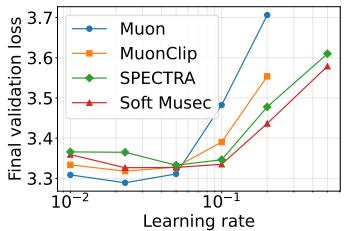  
(a) NanoGPT-small

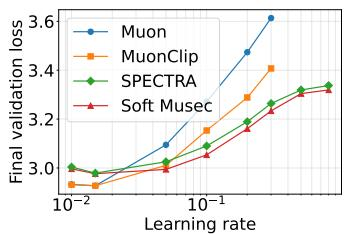  
(b) NanoGPT-medium

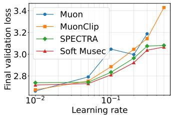  
(c) NanoGPT-wide  
Figure 1: Validation loss versus learning rate on FineWeb across three model configurations.

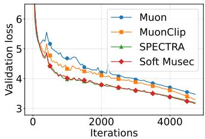  
(a) FineWeb

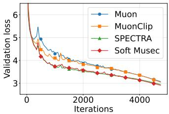  
(b) OpenWebText

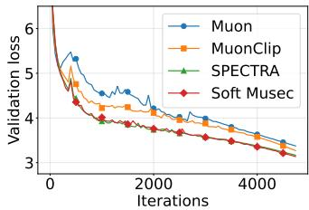  
(c) C4  
Figure 2: Validation loss versus steps of training NanoGPT-Medium on the three datasets.

## 6.4 WEIGHT NORM ANALYSIS

To understand the source of the stability improvements, we track the spectral norm of weight matrices across three component types: query-key (QK) projections, value-output (VO) projections, and MLP weights, during NanoGPT-Medium training on FineWeb at learning rate $\eta = 0 . 2$ . Results are shown in Figure 3. Muon exhibits severe spectral-norm inflation across all three components with norms reaching 300–400 and displaying large oscillations. This is consistent with the spectral flattening mechanism discussed in Section 3: by assigning comparable update magnitudes to all singular directions, Muon amplifies weakly represented directions, leading to substantial weight growth. The unchecked growth of QK norms is particularly concerning, as it can drive attention logit explosion (Kimi et al., 2025). MuonClip partially mitigates QK norm growth but leaves VO and MLP norms elevated, confirming that it only regulates the query-key matrices. In contrast, both Soft Musec and SPECTRA maintain spectral norms below 10 across all components, demonstrating that optimizer-level spectral clipping provides uniform stabilization across the entire model.

## 7 CONCLUSION

In this paper, we introduced Musec, which replaces Muon's spectral flattening with a spectral clipping operator that preserves the spectral structure of the momentum matrix while constraining excessively large singular values. We established the first convergence analysis of Muon-type algorithms in the nonconvex nonsmooth setting, with a rate matching the optimal dependence on the accuracy parameters for stochastic nonconvex nonsmooth optimization. On the practical side, we developed Soft Musec, an efficient SVD-free implementation based on coupled Newton-Schulz iterations, and demonstrated that it substantially improves training stability over existing Muon variants across multiple datasets and model sizes.

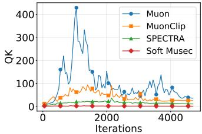  
(a) QK projections

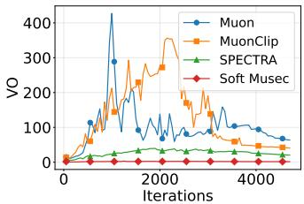  
(b) VO projections

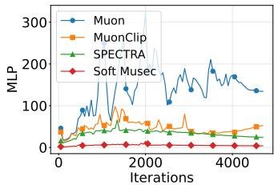  
(c) MLP weights  
Figure 3: Spectral norm of weight matrices over training steps for NanoGPT-Medium on FineWeb.

## REFERENCES

Jeremy Bernstein and Laker Newhouse. Old optimizer, new norm: An anthology. arXiv preprint arXiv:2409.20325, 2024.

Jeremy Bernstein, Yu-Xiang Wang, Kamyar Azizzadenesheli, and Animashree Anandkumar. signsgd: Compressed optimisation for non-convex problems. In International conference on machine learning, pp. 560–569. PMLR, 2018.

Frank H Clarke. Generalized gradients and applications. Transactions of the American Mathematical Society, 205:247–262, 1975.

Frank H. Clarke. Optimization and Nonsmooth Analysis, volume 5 of Classics in Applied Mathematics. Society for Industrial and Applied Mathematics (SIAM), Philadelphia, 1990.

Ashok Cutkosky, Harsh Mehta, and Francesco Orabona. Optimal stochastic non-smooth non-convex optimization through online-to-non-convex conversion. In International Conference on Machine Learning, pp. 6643–6670. PMLR, 2023.

Damek Davis and Dmitriy Drusvyatskiy. Stochastic model-based minimization of weakly convex functions. SIAM Journal on Optimization, 29(1):207–239, 2019.

Damek Davis and Benjamin Grimmer. Proximally guided stochastic subgradient method for nonsmooth, nonconvex problems. SIAM Journal on Optimization, 29(3):1908–1930, 2019.

Damek Davis, Dmitriy Drusvyatskiy, Yin Tat Lee, Swati Padmanabhan, and Guanghao Ye. A gradient sampling method with complexity guarantees for lipschitz functions in high and low dimensions. Advances in neural information processing systems, 35:6692–6703, 2022.

Mostafa Dehghani, Josip Djolonga, Basil Mustafa, Piotr Padlewski, Jonathan Heek, Justin Gilmer, Andreas Peter Steiner, Mathilde Caron, Robert Geirhos, Ibrahim Alabdulmohsin, et al. Scaling vision transformers to 22 billion parameters. In International conference on machine learning, pp. 7480–7512. PMLR, 2023.

John C Duchi and Feng Ruan. Stochastic methods for composite and weakly convex optimization problems. SIAM Journal on Optimization, 28(4):3229–3259, 2018.

Quentin Garrido, Randall Balestriero, Laurent Najman, and Yann Lecun. Rankme: Assessing the downstream performance of pretrained self-supervised representations by their rank. In International conference on machine learning, pp. 10929–10974. PMLR, 2023.

Team Gemma, Morgane Riviere, Shreya Pathak, Pier Giuseppe Sessa, Cassidy Hardin, Surya Bhupatiraju, Léonard Hussenot, Thomas Mesnard, Bobak Shahriari, Alexandre Ramé, et al. Gemma 2: Improving open language models at a practical size. arXiv preprint arXiv:2408.00118, 2024.

Aaron Gokaslan and Vanya Cohen. Openwebtext corpus. http://Skylion007.github.io/ OpenWebTextCorpus, 2019.

Allen A Goldstein. Optimization of lipschitz continuous functions. Mathematical Programming, 13 (1):14–22, 1977.

Vineet Gupta, Tomer Koren, and Yoram Singer. Shampoo: Preconditioned stochastic tensor optimization. In International Conference on Machine Learning, pp. 1842–1850. PMLR, 2018.

Nicholas J. Higham. Functions of Matrices: Theory and Computation. SIAM, 2008.

Fanfan Ji and Xiaotong Yuan. Derandomized online-to-non-convex conversion for stochastic weakly convex optimization. In International Conference on Learning Representations, volume 2026, pp. 125389–125414, 2026.

Xiaowen Jiang, Andrei Semenov, and Sebastian U. Stich. Enhancing llm training via spectral clipping. In Proceedings of the 43rd International Conference on Machine Learning, 2026.

Keller Jordan, Yuchen Jin, Vlado Boza, You Jiacheng, Franz Cesista, Laker Newhouse, and Jeremy Bernstein. Muon: An optimizer for hidden layers in neural networks, 2024. URL https : //kellerjordan.github.io/posts/muon/.

Michael Jordan, Guy Kornowski, Tianyi Lin, Ohad Shamir, and Manolis Zampetakis. Deterministic nonsmooth nonconvex optimization. In The Thirty Sixth Annual Conference on Learning Theory, pp. 4570–4597. PMLR, 2023.

Team Kimi, Yifan Bai, Yiping Bao, Y Charles, Cheng Chen, Guanduo Chen, Haiting Chen, Huarong Chen, Jiahao Chen, Ningxin Chen, et al. Kimi k2: Open agentic intelligence. arXiv preprint arXiv:2507.20534, 2025.

Diederik P. Kingma and Jimmy Ba. Adam: A method for stochastic optimization. In International Conference on Learning Representations, 2015.

Guy Kornowski and Ohad Shamir. Oracle complexity in nonsmooth nonconvex optimization. Journal of Machine Learning Research, 23(314):1–44, 2022.

Zichong Li, Liming Liu, Chen Liang, Weizhu Chen, and Tuo Zhao. NorMuon: Making Muon more efficient and scalable. In Proceedings of the 43rd International Conference on Machine Learning, 2026.

Aixin Liu, Bei Feng, Bin Wang, Bingxuan Wang, Bo Liu, Chenggang Zhao, Chengqi Dengr, Chong Ruan, Damai Dai, Daya Guo, et al. Deepseek-v2: A strong, economical, and efficient mixture-ofexperts language model. arXiv preprint arXiv:2405.04434, 2024.

Jingyuan Liu, Jianlin Su, Xingcheng Yao, Zhejun Jiang, Guokun Lai, Yulun Du, Yidao Qin, Weixin Xu, Enzhe Lu, Junjie Yan, et al. Muon is scalable for llm training. arXiv preprint arXiv:2502.16982, 2025.

Ilya Loshchilov and Frank Hutter. Decoupled weight decay regularization. In International Conference on Learning Representations, 2019.

Matteo Pagliardini, Pierre Ablin, and David Grangier. The ademamix optimizer: Better, faster, older. In International Conference on Learning Representations, volume 2025, pp. 64715–64757, 2025.

Guilherme Penedo, Hynek Kydlíček, Anton Lozhkov, Margaret Mitchell, Colin Raffel, Leandro Von Werra, Thomas Wolf, et al. The fineweb datasets: Decanting the web for the finest text data at scale. Advances in Neural Information Processing Systems, 37:30811–30849, 2024.

Thomas Pethick, Wanyun Xie, Kimon Antonakopoulos, Zhenyu Zhu, Antonio Silveti-Falls, and Volkan Cevher. Training deep learning models with norm-constrained LMOs. In Proceedings of the 42nd International Conference on Machine Learning, volume 267, pp. 49069–49104, 2025.

Colin Raffel, Noam Shazeer, Adam Roberts, Katherine Lee, Sharan Narang, Michael Matena, Yanqi Zhou, Wei Li, and Peter J Liu. Exploring the limits of transfer learning with a unified text-to-text transformer. Journal of machine learning research, 21(140):1–67, 2020.

Artem Riabinin, Egor Shulgin, Kaja Gruntkowska, and Peter Richtárik. Gluon: Making muon & scion great again!(bridging theory and practice of lmo-based optimizers for llms). arXiv preprint arXiv:2505.13416, 2025.

Olivier Roy and Martin Vetterli. The effective rank: A measure of effective dimensionality. In 2007 15th European signal processing conference, pp. 606–610. IEEE, 2007.

Jay Shah, Ganesh Bikshandi, Ying Zhang, Vijay Thakkar, Pradeep Ramani, and Tri Dao. Flashattention-3: Fast and accurate attention with asynchrony and low-precision. Advances in Neural Information Processing Systems, 37:68658–68685, 2024.

Wei Shen, Ruichuan Huang, Minhui Huang, Cong Shen, and Jiawei Zhang. On the convergence analysis of muon. arXiv preprint arXiv:2505.23737, 2025.

David So, Wojciech Mańke, Hanxiao Liu, Zihang Dai, Noam Shazeer, and Quoc V Le. Searching for efficient transformers for language modeling. Advances in neural information processing systems, 34:6010–6022, 2021.

Jianlin Su, Murtadha Ahmed, Yu Lu, Shengfeng Pan, Wen Bo, and Yunfeng Liu. Roformer: Enhanced transformer with rotary position embedding. Neurocomputing, 568:127063, 2024.

Lai Tian, Kaiwen Zhou, and Anthony Man-Cho So. On the finite-time complexity and practical computation of approximate stationarity concepts of lipschitz functions. In International Conference on Machine Learning, pp. 21360–21379. PMLR, 2022.

Nikhil Vyas, Depen Morwani, Rosie Zhao, Itai Shapira, David Brandfonbrener, Lucas Janson, and Sham Kakade. Soap: Improving and stabilizing shampoo using adam for language modeling. In International Conference on Learning Representations, volume 2025, pp. 93423–93444, 2025.

Mitchell Wortsman, Peter Liu, Lechao Xiao, Katie Everett, Alexander Alemi, Ben Adlam, John D Co-Reyes, Izzeddin Gur, Abhishek Kumar, Roman Novak, et al. Small-scale proxies for largescale transformer training instabilities. In International Conference on Learning Representations, volume 2024, pp. 49844–49869, 2024.

Anyi Xu, Bangcai Lin, Bing Xue, Bingxuan Wang, Bingzheng Xu, Bochao Wu, Bowei Zhang, Chaofan Lin, Chen Dong, Chenchen Ling, et al. Deepseek-v4: Towards highly efficient milliontoken context intelligence. arXiv preprint arXiv:2606.19348, 2026.

Yixuan Yang, Yuqing He, and Song Li. Convergence of spectral descent for non-smooth optimization. arXiv preprint arXiv:2605.26977, 2026.

Albert Yi. Mucon: Clipped muon updates for llm training. arXiv preprint arXiv:2605.26459, 2026.

Alexander Yukhimchuk, Mladen Kolar, Martin Takáč, and Sayantan Choudhury. Gradient clipping beyond vector norms: A spectral approach for matrix-valued parameters. arXiv preprint arXiv:2605.11838, 2026.

Aohan Zeng, Xin Lv, Zhenyu Hou, Zhengxiao Du, Qinkai Zheng, Bin Chen, Da Yin, Chendi Ge, Chenghua Huang, Chengxing Xie, et al. Glm-5: from vibe coding to agentic engineering. arXiv preprint arXiv:2602.15763, 2026.

Biao Zhang and Rico Sennrich. Root mean square layer normalization. Advances in neural information processing systems, 32, 2019.

Jingzhao Zhang, Hongzhou Lin, Stefanie Jegelka, Suvrit Sra, and Ali Jadbabaie. Complexity of finding stationary points of nonconvex nonsmooth functions. In International conference on machine learning, pp. 11173–11182. PMLR, 2020.

## APPENDIX

The appendix is organized as follows. Section A proves that Musec's update solves a Frobeniusnorm-penalized quadratic subproblem subject to a spectral-norm constraint. Section B provides the detailed convergence analysis of Musec for nonconvex nonsmooth optimization. Section C presents the complete Soft Musec algorithm with coupled Newton-Schulz iterations. Section D compares the update rules of Musec and SPECTRA. Section E details the architecture configurations, training configurations, and hyperparameter choices for the NanoGPT experiments. Section F provides additional learning rate sweep results, training dynamics, effective rank analysis, computational overhead, and ablation studies.

## A PROOF OF PROPOSITION 4.1

In this section, we give a formal proof of Proposition 4.1. We first restate the proposition as follows. Proposition A.1. Let $G _ { 1 } , \ldots , G _ { L }$ be gradient matrices, let $\lambda > 0$ be a sharpness parameter, and let $\bar { D } > 0$ . For each $l = 1 , \ldots , L ,$ consider the problem

$$
\arg \operatorname* { m i n } _ { \mathbf { \Delta } _ { l } } \left[ \langle \pmb { G } _ { l } , \pmb { \Delta } _ { l } \rangle + \frac { \lambda } { 2 } \left\| \pmb { \Delta } _ { l } \right\| _ { F } ^ { 2 } \right] , \mathrm { s . t . } \| \pmb { \Delta } _ { l } \| _ { 2 } \leq \frac { D } { \lambda } .\tag{4}
$$

where $\langle \cdot , \cdot \rangle$ denotes the Frobenius inner product and $\Delta _ { l }$ has the same shape as $G _ { l } .$ Let $G _ { l } \in \mathbb { R } ^ { m _ { l } \times n _ { l } }$ have reduced SVD of the form $G _ { l } = U _ { l } \mathbf { \hat { S } } _ { l } V _ { l } ^ { \top }$ with $\pmb { S } _ { l } = \mathbf { D i a g } ( \sigma _ { 1 } , \ldots , \overset { \cdot } { \sigma } _ { d _ { l } } )$ and $d _ { l } = \operatorname* { m i n } ( m _ { l } , n _ { l } )$ Then Problem (2) is solved by

$$
\mathbf { \Delta } \mathbf { \Delta } \mathbf { \Delta } \mathbf { \Delta } \mathbf { \Delta } \mathbf { \Delta } \mathbf { \Delta } \mathbf { \Delta } \mathbf { \Delta } \mathbf { \Delta } \mathbf { \Delta } \mathbf { \Delta } \mathbf { \Delta } \mathbf { \Delta } \mathbf { \Delta } \mathbf { \Delta } \mathbf { \Delta } \mathbf { \Delta } \mathbf { \Delta } \mathbf { \Delta } \mathbf { \Delta } \mathbf { \Delta } \mathbf { \Delta } \mathbf { \Delta } \mathbf { \Delta } \mathbf { \Delta } \mathbf { \Delta } \mathbf { \Delta } \mathbf { \Delta } \mathbf { \Delta } \mathbf { \Delta } \mathbf { \Delta } \mathbf { \Delta } \mathbf { \Delta } \mathbf { \Delta } \mathbf { \Delta } \mathbf { \Delta } \mathbf { \Delta } \mathbf { \Delta } \mathbf { \Delta } \mathbf { \Delta } \mathbf { \Delta } \mathbf { \Delta } \mathbf { \Delta } \mathbf { \Delta } \mathbf { \Delta } \mathbf { \Delta } \mathbf { \Delta } \mathbf { \Delta } \mathbf { \Delta } \mathbf { \Delta } \mathbf { \Delta } \mathbf { \Delta } \mathbf { \Delta } \mathbf { \Delta } \mathbf { \Delta } \mathbf { \Delta } \mathbf { \Delta } \mathbf { \Delta } \mathbf { \Delta } \mathbf { \Delta } \mathbf { \Delta } \mathbf { \Delta } \mathbf { \Delta } \mathbf { \Delta } \mathbf { \Delta } \mathbf { \Delta } \mathbf { \Delta } \mathbf { \Delta } \mathbf { \Delta } \mathbf { \Delta } \mathbf { \Delta } \mathbf { \Delta } \mathbf { \Delta } \mathbf { \Delta } \mathbf { \Delta } \mathbf { \Delta } \mathbf { \Delta } \mathbf { \Delta } \mathbf { \Delta } \mathbf { \Delta } \mathbf { \Delta } \mathbf { \Delta } \mathbf { \Delta } \mathbf { \Delta } \mathbf { \Delta } \mathbf { \Delta } \mathbf { \Delta } \mathbf { \Delta } \mathbf { \Delta } \mathbf { \Delta } \mathbf { \Delta } \mathbf { \Delta } \mathbf { \Delta } \mathbf { \Delta } \mathbf { \Delta } \mathbf { \Delta } \mathbf { \Delta } \mathbf { \Delta } \mathbf { \Delta } \mathbf { \Delta } \mathbf { \Delta } \mathbf { \Delta } \mathbf { \Delta } \mathbf { \Delta } \mathbf { \Delta } \mathbf { \Delta } \mathbf { \Delta } \mathbf { \Delta } \mathbf { \Delta } \mathbf { \Delta } \mathbf { \Delta } \mathbf { \Delta } \mathbf \Delta \mathbf { } \mathbf  \Delta 
$$

Proof. The Frobenius norm $\| \Delta _ { l } \| _ { F }$ and the spectral norm $\| \Delta _ { l } \| _ { 2 }$ depend on $\Delta _ { l }$ only through its singular values, while by Von Neumann's trace inequality the inner product $\langle G _ { l } , \Delta _ { l } \rangle$ is minimized, for any fixed spectrum of $\Delta _ { l }$ , by aligning $\Delta _ { l } { ' } s$ singular vectors with those of $- \pmb { G } _ { l }$ . It therefore suffices to restrict attention to

$$
\begin{array} { r } { \pmb { \Delta } _ { l } = - U _ { l } \pmb { A } _ { l } \pmb { V } _ { l } ^ { \top } , \quad \pmb { A } _ { l } = \mathrm { d i a g } ( a _ { 1 } , \dots , a _ { d _ { l } } ) , \quad a _ { 1 } \geq a _ { 2 } \geq \cdots \geq a _ { d _ { l } } \geq 0 . } \end{array}
$$

Under this parametrization,

$$
\langle { \pmb G } _ { l } , { \pmb \Delta } _ { l } \rangle = - \sum _ { i = 1 } ^ { d _ { l } } \sigma _ { i } a _ { i } , \qquad \| { \pmb \Delta } _ { l } \| _ { F } ^ { 2 } = \sum _ { i = 1 } ^ { d _ { l } } a _ { i } ^ { 2 } , \qquad \| { \pmb \Delta } _ { l } \| _ { 2 } = a _ { 1 } .
$$

Since $a _ { 1 } \geq \cdot \cdot \cdot \geq a _ { d _ { l } } \geq 0$ , the constraint $a _ { 1 } \leq D / \lambda$ is equivalent to $0 \leq a _ { l } \leq D / \lambda$ for every $i ,$ and Problem (2) reduces to the separable box-constrained program

$$
\operatorname* { m i n } _ { a _ { i } \in [ 0 , D / \lambda ] } \sum _ { i = 1 } ^ { d _ { l } } \left[ - \sigma _ { i } a _ { i } + \frac { \lambda } { 2 } a _ { i } ^ { 2 } \right] .\tag{5}
$$

Each scalar subproblem is a quadratic in $a _ { i }$ with unconstrained minimizer $\sigma _ { i } / \lambda \geq 0 ;$ clipping to the interval $[ 0 , D / \bar { \lambda } ]$ gives

$$
a _ { i } ^ { * } = \operatorname* { m i n } \left( \frac { \sigma _ { i } } { \lambda } , \frac { D } { \lambda } \right) = \frac { 1 } { \lambda } \operatorname* { m i n } ( \sigma _ { i } , D ) .
$$

The ordering $\sigma _ { 1 } \geq \cdot \cdot \cdot \geq \sigma _ { d _ { l } }$ ensures $a _ { 1 } ^ { * } \geq \dots \geq a _ { d _ { l } } ^ { * }$ , so the monotonicity of the parametrization is automatically satisfied. Since $a _ { i } ^ { * } = \operatorname* { m i n } ( \sigma _ { i } , D ) / \lambda$ , we have $\begin{array} { r } { A _ { l } ^ { * } = \frac { 1 } { \lambda } \hat { S } _ { l } } \end{array}$ with $\hat { \pmb { S } } _ { l } = \mathbf { C } \mathbf { l i p } ( { \pmb { S } } _ { l } , D )$ and hence

$$
\pmb { \Delta } _ { l } = - \pmb { U } _ { l } \pmb { A } _ { l } ^ { * } \pmb { V } _ { l } ^ { \top } = - \pmb { \eta } \cdot \pmb { U } _ { l } \hat { \pmb { S } } _ { l } \pmb { V } _ { l } ^ { \top } ,
$$

with $\eta = 1 / \lambda$ , as claimed.

## B CONVERGENCE ANALYSIS

In this section, we provide the detailed convergence analysis of the Musec algorithm,

## B.1 REGRET ANALYSIS OF ONLINE GRADIENT DESCENT

Before presenting the convergence analysis of the Musec algorithm, we first establish a convergence result for online gradient descent on a quadratic objective, which will subsequently serve as the basis for analyzing the clipping operation in Musec.

Consider a quadratic function of the form:

$$
f _ { t } ( \boldsymbol { X } ) : = - \frac { \beta } { \gamma } \langle \boldsymbol { G } _ { t + 1 } , \boldsymbol { X } \rangle + \frac { \beta } { 2 \gamma } \left. \boldsymbol { X } \right. _ { F } ^ { 2 }
$$

in the matrix-valued variable X. We analyze the following standard online gradient descent (OGD) method with stepsize $\gamma > 0$ over a convex compact set C:

$$
\begin{array} { r l } & { X _ { t + 1 } : = \Pi _ { \mathcal { C } } ( X _ { t } - \gamma \nabla f _ { t } ( X _ { t } ) ) } \\ & { ~ = \Pi _ { \mathcal { C } } ( X _ { t } + \beta \pmb { G } _ { t + 1 } - \beta \pmb { X } _ { t } ) } \\ & { ~ = \Pi _ { \mathcal { C } } \left( ( 1 - \beta ) \pmb { X } _ { t } + \beta \pmb { G } _ { t + 1 } \right) , } \end{array}\tag{6}
$$

where $\Pi _ { C } ( \cdot )$ denotes the Euclidean Projection associated with the convex and compact set $\mathcal { C } .$ The OGD step (6) is consistent with the update of the momentum variable $M _ { n }$ in Algorithm 2 when we choose ${ \dot { \mathcal { C } } } = \{ \mathbf { X } : \| \mathbf { X } \| \leq D \}$

Let $\mathrm { R e g r e t } _ { T } ( \overline { { \mathbf { X } } } )$ denote the regret of the OGD algorithm with respect to some ${ \overline { { \boldsymbol { X } } } } \in { \mathcal { C } }$ after $T$ iterations, defined as:

$$
\mathrm { R e g r e t } _ { T } ( \overline { { \mathbf { X } } } ) : = \sum _ { t = 0 } ^ { T - 1 } f _ { t } ( \mathbf { X } _ { t } ) - \sum _ { t = 0 } ^ { T - 1 } f _ { t } ( \overline { { \mathbf { X } } } ) .
$$

We present the regret analysis of the OGD algorithm as follows.

Lemma B.1. Suppose that $\beta \leq 1 / 8 ,$ then the OGD update (6) applied to the sequence of quadratic functions $\{ f _ { t } ( \boldsymbol { X } ) \} _ { t = 0 } ^ { T - 1 }$ over the convex constraint set $\mathcal { C }$ guarantees that for all $T \geq 1$ and all ${ \overline { { \mathbf { X } } } } \in { \mathcal { C } } .$

$$
\begin{array} { r l } & { \mathrm { \normalfont ~ \mathrm { R e g r e t } } _ { T } ( \overline { \mathbf { X } } ) } \\ & { \leq \displaystyle \sum _ { t = 0 } ^ { T - 1 } \left( - \frac { \beta } { 8 \gamma } \left\| \mathbf { \cal X } _ { t } \right\| _ { F } ^ { 2 } + \frac { \beta } { 2 \gamma } \left\| \overline { \mathbf { X } } \right\| _ { F } ^ { 2 } + \frac { \beta ^ { 2 } } { \gamma } \left\| \mathbf { \cal G } _ { t + 1 } \right\| _ { F } ^ { 2 } \right) + \frac { \left\| \mathbf { \cal X } _ { 0 } \right\| _ { F } ^ { 2 } + \left\| \overline { \mathbf { X } } \right\| _ { F } ^ { 2 } } { \gamma } . } \end{array}
$$

Proof. Fix any ${ \overline { { X } } } \in { \mathcal { C } } .$ By the non-expansiveness of the projection operator,

$$
\begin{array} { r l } & { \quad \left\| { \boldsymbol X } _ { t + 1 } - \overline { { { \boldsymbol X } } } \right\| _ { F } ^ { 2 } } \\ & { = \left\| \Pi _ { \mathcal { C } } ( { \boldsymbol X } _ { t } - \gamma \nabla f _ { t } ( { \boldsymbol X } _ { t } ) ) - \overline { { { \boldsymbol X } } } \right\| _ { F } ^ { 2 } } \\ & { \leq \left\| { \boldsymbol X } _ { t } - \gamma \nabla f _ { t } ( { \boldsymbol X } _ { t } ) - \overline { { { \boldsymbol X } } } \right\| _ { F } ^ { 2 } } \\ & { = \left\| { \boldsymbol X } _ { t } - \overline { { { \boldsymbol X } } } \right\| _ { F } ^ { 2 } + \gamma ^ { 2 } \left\| \nabla f _ { t } ( { \boldsymbol X } _ { t } ) \right\| _ { F } ^ { 2 } - 2 \gamma \langle \nabla f _ { t } ( { \boldsymbol X } _ { t } ) , { \boldsymbol X } _ { t } - \overline { { { \boldsymbol X } } } \rangle . } \end{array}
$$

Rearranging the terms yields

$$
\langle \nabla f _ { t } ( X _ { t } ) , X _ { t } - \overline { { X } } \rangle \leq \frac { \left\| X _ { t } - \overline { { X } } \right\| _ { F } ^ { 2 } - \left\| X _ { t + 1 } - \overline { { X } } \right\| _ { F } ^ { 2 } } { 2 \gamma } + \frac { \gamma \left\| \nabla f _ { t } ( X _ { t } ) \right\| _ { F } ^ { 2 } } { 2 } .\tag{7}
$$

Accordingly, we can show that

$$
\begin{array} { r l } & { \| \nabla _ { \xi } \nabla \pi \boldsymbol { \tau } \cdot \boldsymbol { X } ^ { 0 } \rangle } \\ & { = \sum _ { j } ^ { \ell } f _ { i } ( X _ { \ell } ) - \sum _ { j } ^ { \ell } f _ { i } ( \overline { { X } } ) } \\ & { \sum _ { \ell = 1 } ^ { \ell } \bigg \{ C _ { \ell } f _ { i } ( X _ { \ell } ) , \boldsymbol { \xi } - \boldsymbol { \xi } \bigg \} ^ { 2 } f _ { i } ( \overline { { X } } ) } \\ &  \sum _ { \ell = 1 } ^ { \ell } \bigg \{ C _ { \ell } f _ { i } ( X _ { \ell } ) , \boldsymbol { X } , \boldsymbol { X } - \boldsymbol { X } _ { \ell } ^ { 0 } , \frac { \beta } { 2 r _ { \ell } ^ { \prime } } \bigg \} \| \boldsymbol { X } _ { \ell } - \boldsymbol { X } \| _ { r } ^ { 2 } \bigg \} \\ & { \sum _ { \ell = 0 } ^ { \ell } \frac { \sqrt { r _ { \ell } - 1 } } { 2 r _ { \ell } ^ { \prime } } \bigg \{ 1 - \kappa ^ { 2 } \bigg \} _ { r _ { \ell } } ^ { 2 } \bigg \| X _ { \ell } - \boldsymbol { X } \bigg \} \Big \| _ { r } ^ { 2 } , \quad \mathrm { ~ R ~ l ~ e ~ } \boldsymbol { X } \bigg \| _ { r } ^ { 2 } , } \\ &  \sum _ { \ell = 1 } ^ { \ell } \frac { \sqrt { r _ { \ell } - 1 } } { 2 r _ { \ell } ^ { \prime } } \bigg \{ 1 - \kappa ^ { 2 } \bigg \} _ { r _ { \ell } } ^ { 2 } + \frac { \big \| \boldsymbol { X } _ { \ell } \big | _ { r } ^ { 2 } } { 2 r _ { \ell } ^ { \prime } } - \frac { | \boldsymbol { X } | _ { r } ^ { 2 } } { 2 r _ { \ell } ^ { \prime } } \bigg \} - \frac { \big | \boldsymbol { X } _ { \ell } ^ { 2 } - \boldsymbol { X } ^ { 0 } , \big | _ { r } ^ { 2 } } { 2 r _ { \ell } ^ { \prime } } \bigg \{ \frac   \end{array}
$$

The first inequality is due to the $\beta / \gamma$ -strong convexity of $f _ { t } ( \cdot ) ;$ the second inequality follows from $( 7 ) ;$ the third inequality follows from Young's inequality. The last inequality is due to the reverse Young's inequality: $\left\| A - B \right\| _ { F } ^ { 2 } \geq \left\| A \right\| _ { F } ^ { 2 } / 2 - \left\| B \right\| _ { F } ^ { 2 }$ Since $\beta \leq 1 / 8$ , then we have

$$
\mathrm { R e g r e t } _ { T } ( \overline { { \mathbf { X } } } ) \leq \sum _ { t = 0 } ^ { T - 1 } \left( - \frac { \beta } { 8 \gamma } \left\| \mathbf { X } _ { t } \right\| _ { F } ^ { 2 } + \frac { \beta } { 2 \gamma } \left\| \overline { { \mathbf { X } } } \right\| _ { F } ^ { 2 } + \frac { \beta ^ { 2 } } { \gamma } \left\| \mathbf { G } _ { t + 1 } \right\| _ { F } ^ { 2 } \right) + \frac { \left\| \mathbf { X } _ { 0 } \right\| _ { F } ^ { 2 } + \left\| \overline { { \mathbf { X } } } \right\| _ { F } ^ { 2 } } { \gamma } .
$$

## B.2 PROOF OF LEMMA 4.2

We first restate Lemma 4.2 as follows.

Lemma B.2. Let $\gamma = \beta / \eta$ and $\eta \le 1 / \rho$ where $\beta \leq 1 / 8$ , then for any $k \in [ K ]$ , the sequence $\{ W _ { t } ^ { ( k ) } \} _ { t = 1 } ^ { T }$ generated by Algorithm 2 satisfies

$$
\begin{array} { l } { { \displaystyle \mathbb { E } \left[ f ( { \boldsymbol W } _ { T } ^ { ( k ) } ) - f ( { \boldsymbol W } _ { 0 } ^ { ( k ) } ) \right] } \ ~ } \\ { \le - \ \mathbb { E } \left[ \frac { \beta D T } { \gamma } \left\| \overline { { { \boldsymbol H } } } ^ { ( k ) } \right\| _ { F } + \sum _ { t = 0 } ^ { T - 1 } \frac { \beta } { 8 \gamma } \left\| { \boldsymbol M } _ { t } ^ { ( k ) } \right\| _ { F } ^ { 2 } \right] + \frac { \beta D \sigma \sqrt { T } } { \gamma } + \left( \frac { \beta T } { \gamma } + \frac { 1 } { \gamma } \right) D ^ { 2 } + \frac { \beta ^ { 2 } L ^ { 2 } T } { \gamma } + \frac { r D ^ { 2 } } { \gamma } . } \end{array}
$$

Proof. Let us consider the filtration $\mathcal { F } _ { n } = \sigma ( G _ { 1 } , G _ { 2 } , \ldots , G _ { n } )$ , where $\sigma ( \cdot )$ denotes the generated σ-field. From Assumption 3.4, we can infer that

$$
H _ { n } : = \mathbb { E } [ G _ { n } \mid { \mathcal { F } } _ { n - 1 } ] \in \partial f ( W _ { n } ) .
$$

The weak convexity of $f ( \cdot )$ implies that for all $n \geq 1$ and $\eta ^ { - 1 } \geq \rho .$

$$
\begin{array} { r l r } {  { f ( W _ { n + 1 } ) - f ( W _ { n } ) \le \langle H _ { n + 1 } , W _ { n + 1 } - W _ { n } \rangle + \frac { 1 } { 2 \eta } \| W _ { n + 1 } - W _ { n } \| _ { F } ^ { 2 } } } \\ & { } & \\ & { } & { = \mathbb { E } [ \langle G _ { n + 1 } , W _ { n + 1 } - W _ { n } \rangle + \frac { 1 } { 2 \eta } \| W _ { n + 1 } - W _ { n } \| _ { F } ^ { 2 } \bigm | \mathcal { F } _ { n } ] . } \end{array}
$$

The law of total expectation implies that

$$
\mathbb { E } [ f ( W _ { n + 1 } ) - f ( W _ { n } ) ] \leq \mathbb { E } \left[ \langle G _ { n + 1 } , W _ { n + 1 } - W _ { n } \rangle + \frac { 1 } { 2 \eta } \left. W _ { n + 1 } - W _ { n } \right. _ { F } ^ { 2 } \right] .
$$

Fix an arbitrary $k \in [ K ]$ . Recall that $W _ { t } ^ { ( k ) } = W _ { ( k - 1 ) T + t }$ where $t \in \{ 0 \} \cup [ T - 1 ]$ and we similarly define the notions of $G _ { t } ^ { ( k ) } , H _ { t } ^ { ( k ) }$ and ${ M } _ { t } ^ { ( k ) }$ . We can express the previous inequality as

$$
\mathbb { E } [ f ( W _ { t + 1 } ^ { ( k ) } ) - f ( W _ { t } ^ { ( k ) } ) ] \leq \mathbb { E } \left[ \langle G _ { t + 1 } ^ { ( k ) } , W _ { t + 1 } ^ { ( k ) } - W _ { t } ^ { ( k ) } \rangle + \frac { 1 } { 2 \eta } \left. W _ { t + 1 } ^ { ( k ) } - W _ { t } ^ { ( k ) } \right. _ { F } ^ { 2 } \right] .
$$

Summing the above inequality over $t = 0 , \ldots , T - 1$ yields that

$$
\mathbb { E } [ f ( \boldsymbol { W } _ { T } ^ { ( k ) } ) - f ( \boldsymbol { W } _ { 0 } ^ { ( k ) } ) ] \le \mathbb { E } \left[ \sum _ { t = 0 } ^ { T - 1 } \left( \langle \boldsymbol { G } _ { t + 1 } ^ { ( k ) } , \boldsymbol { W } _ { t + 1 } ^ { ( k ) } - \boldsymbol { W } _ { t } ^ { ( k ) } \rangle + \frac { 1 } { 2 \eta } \left. \boldsymbol { W } _ { t + 1 } ^ { ( k ) } - \boldsymbol { W } _ { t } ^ { ( k ) } \right. _ { F } ^ { 2 } \right) \right] .\tag{8}
$$

From the update rule of $W _ { t + 1 } ^ { ( k ) }$ (step 14 in Algorithm 2), we have

$$
M _ { t } ^ { ( k ) } = \frac { W _ { t } ^ { ( k ) } - W _ { t + 1 } ^ { ( k ) } } { \eta } ,
$$

then we can rewrite the inequality (8) as:

$$
\mathbb { E } [ f ( W _ { T } ^ { ( k ) } ) - f ( W _ { 0 } ^ { ( k ) } ) ] \leq \mathbb { E } \left[ \sum _ { t = 0 } ^ { T - 1 } \left( - \eta \langle G _ { t + 1 } ^ { ( k ) } , M _ { t } ^ { ( k ) } \rangle + \frac { \eta } { 2 } \left\| M _ { t } ^ { ( k ) } \right\| _ { F } ^ { 2 } \right) \right] .\tag{9}
$$

If we choose $\beta = \eta \gamma$ , and we denote the quadratic function

$$
f _ { t } ^ { ( k ) } ( \boldsymbol { X } ) = - \frac { \beta } { \gamma } \langle G _ { t + 1 } ^ { ( k ) } , \boldsymbol { X } \rangle + \frac { \beta } { 2 \gamma } \left. \boldsymbol { X } \right. _ { F } ^ { 2 } .\tag{10}
$$

Since $\beta \leq 1 / 8 ,$ we can apply Lemma B.1 for the regret analysis with respect to the quadratic function $f _ { t } ^ { ( k ) } ( X )$ by taking $X _ { t } = M _ { t } ^ { ( k ) }$ and $\overline { { \mathbf { X } } } = \overline { { \mathbf { M } } } ^ { ( k ) } , \mathcal { C } = \{ \mathbf { X } : \| \mathbf { X } \| _ { 2 } \leq D \}$

$$
\begin{array} { r l } & { \quad \mathrm { R e g r e t } _ { T } ( \overline { { M } } ) } \\ & { : = \displaystyle \sum _ { t = 0 } ^ { T - 1 } f _ { t } ^ { ( k ) } ( { M _ { t } ^ { ( k ) } } ) - \sum _ { t = 0 } ^ { T - 1 } f _ { t } ^ { ( k ) } ( \overline { { M } } ^ { ( k ) } ) } \\ & { \leq \displaystyle \sum _ { t = 0 } ^ { T - 1 } \left( - \frac { \beta } { 8 \gamma } \left\| { M _ { t } ^ { ( k ) } } \right\| _ { F } ^ { 2 } + \frac { \beta } { 2 \gamma } \left\| \overline { { M } } ^ { ( k ) } \right\| _ { F } ^ { 2 } + \frac { \beta ^ { 2 } } { \gamma } \left\| { G _ { t + 1 } ^ { ( k ) } } \right\| _ { F } ^ { 2 } \right) + \frac { \left\| { M _ { 0 } ^ { ( k ) } } \right\| _ { F } ^ { 2 } + \left\| \overline { { M } } ^ { ( k ) } \right\| _ { F } ^ { 2 } } { \gamma } . } \end{array}\tag{11}
$$

Substitute the definition of the quadratic function (10) into (11):

$$
\begin{array} { l } { \displaystyle \sum _ { t = 0 } ^ { T - 1 } \left( - \frac { \beta } { \gamma } \langle G _ { t + 1 } ^ { ( k ) } , M _ { t } ^ { ( k ) } \rangle + \frac { \beta } { 2 \gamma } \left\| M _ { t } ^ { ( k ) } \right\| _ { F } ^ { 2 } \right) } \\ { \displaystyle \leq \sum _ { t = 0 } ^ { T - 1 } \left( - \frac { \beta } { \gamma } \langle G _ { t + 1 } ^ { ( k ) } , \overline { { M } } ^ { ( k ) } \rangle + \frac { \beta } { 2 \gamma } \left\| \overline { { M } } ^ { ( k ) } \right\| _ { F } ^ { 2 } \right) + \sum _ { t = 0 } ^ { T - 1 } \left( - \frac { \beta } { 8 \gamma } \left\| M _ { t } ^ { ( k ) } \right\| _ { F } ^ { 2 } + \frac { \beta } { 2 \gamma } \left\| \overline { { M } } ^ { ( k ) } \right\| _ { F } ^ { 2 } + \frac { \beta ^ { 2 } } { \gamma } \left\| G _ { t + 1 } ^ { ( k ) } \right\| _ { F } ^ { 2 } \right) } \\ { + \displaystyle \frac { \left\| M _ { 0 } ^ { ( k ) } \right\| _ { F } ^ { 2 } + \left\| \overline { { M } } ^ { ( k ) } \right\| _ { F } ^ { 2 } } { \gamma } . } \end{array}
$$

Taking expectations on both sides yields that:

$$
\begin{array} { r l } &  \mathbb { E } [ \frac { \displaystyle \sum _ { j = 1 } ^ { n - 1 } ( - \frac { \beta } { \gamma } ( G _ { i + 1 } ^ { ( k ) } , M _ { i } ^ { ( k ) } ) + \frac { \beta } { 2 \gamma } ] \| M _ { i } ^ { ( k ) } \| _ { F } ^ { 2 } ) ] } \\ & { \le \mathbb { E } [ \displaystyle \sum _ { j = 1 } ^ { n - 1 } ( - \frac { \beta } { \gamma } ( G _ { i + 1 } ^ { ( k ) } , \overline { { M } } ^ { ( k ) } ) + \frac { \beta } { 2 \gamma } \| \overline { { M } } ^ { ( k ) } \| _ { F } ^ { 2 } ) } \\ & { \quad + \displaystyle \sum _ { j = 0 } ^ { n - 1 } ( - \frac { \beta } { \gamma } ( | M _ { i } ^ { ( k ) } | _ { F } ^ { 2 } + \frac { \beta } { 2 \gamma } \| \overline { { M } } ^ { ( k ) } \| _ { F } ^ { 2 } + \frac { \beta ^ { 2 } } { \gamma } \| G _ { i + 1 } ^ { ( k ) } \| _ { F } ^ { 2 } ) + \frac { \| M _ { i } ^ { ( k ) } \| _ { F } ^ { 2 } + \| \overline { { M } } ^ { ( k ) } \| _ { F } ^ { 2 } } { 7 } ] } \\ & { = \mathbb { E } [ - \displaystyle \frac { \beta } { \gamma } \displaystyle \sum _ { i = 0 } ^ { n - 1 } ( G _ { i + 1 } ^ { ( k ) } - H _ { i + 1 } ^ { ( k ) } , \overline { { M } } ^ { ( k ) } ) - \displaystyle \frac { \beta } { \gamma } \displaystyle \sum _ { i = 0 } ^ { n - 1 } ( H _ { i - 2 } ^ { ( k ) } , \overline { { M } } ^ { ( k ) } ) } \\ &  \quad + \displaystyle \sum _ { k = 0 } ^ { n - 1 } ( - \frac { \beta } { \gamma } [ | M _ { i } ^ { ( k ) } | _ { F } ^ { 2 } + \ \end{array}\tag{12}
$$

We choose

$$
\overline { { \boldsymbol { M } } } ^ { ( k ) } = { \cal D } \frac { \sum _ { t = 1 } ^ { T } \boldsymbol { H } _ { t } ^ { ( k ) } } { \left\| \sum _ { t = 1 } ^ { T } \boldsymbol { H } _ { t } ^ { ( k ) } \right\| _ { F } } ,\tag{13}
$$

then we can show that

$$
\left. \overline { { \boldsymbol { M } } } ^ { ( k ) } \right. _ { 2 } \leq \left. \overline { { \boldsymbol { M } } } ^ { ( k ) } \right. _ { F } = D .\tag{14}
$$

In addition, using Jensen's inequality and the fact that $\{ G _ { t + 1 } ^ { ( k ) } - H _ { t + 1 } ^ { ( k ) } \}$ is a martingale-difference sequence with variance bounded by $\sigma ^ { 2 }$ (Assumption 3.4):

$$
\mathbb { E } \left[ - \frac { \beta } { \gamma } \sum _ { t = 0 } ^ { T - 1 } \langle G _ { t + 1 } ^ { ( k ) } - H _ { t + 1 } ^ { ( k ) } , \overline { { M } } ^ { ( k ) } \rangle \right] \leq \mathbb { E } \left[ \frac { \beta } { \gamma } \left. \sum _ { t = 0 } ^ { T - 1 } \left( G _ { t + 1 } ^ { ( k ) } - H _ { t + 1 } ^ { ( k ) } \right) \right. _ { F } \left. \overline { { M } } ^ { ( k ) } \right. _ { F } \right]
$$

$$
\leq \frac { \beta D \sigma \sqrt { T } } { \gamma } ,\tag{15}
$$

where the last inequality follows from Assumption 3.4. In addition, the definition (13) implies that

$$
\begin{array} { r l } & { \mathbb { E } \left[ - \displaystyle \frac { \beta } { \gamma } \sum _ { t = 0 } ^ { T - 1 } \langle \pmb { H } _ { t + 1 } ^ { ( k ) } , \overline { { \pmb { M } } } ^ { ( k ) } \rangle \right] = - \mathbb { E } \left[ \frac { \beta } { \gamma } \left. \displaystyle \sum _ { t = 1 } ^ { T } \pmb { H } _ { t } ^ { ( k ) } , \frac { D \sum _ { t = 1 } ^ { T } \pmb { H } _ { t } ^ { ( k ) } } { \left\| \sum _ { t = 1 } ^ { T } \pmb { H } _ { t } ^ { ( k ) } \right\| _ { F } } \right. \right] } \\ & { \qquad = - \mathbb { E } \left[ \frac { \beta D } { \gamma } \left\| \displaystyle \sum _ { t = 1 } ^ { T } \pmb { H } _ { t } ^ { ( k ) } \right\| _ { F } \right] . } \end{array}\tag{16}
$$

Furthermore, Assumption 3.3 implies that $\left\| G _ { t + 1 } ^ { ( k ) } \right\| _ { F } \leq L$ . Step (13) in Algorithm 2 yields that $\left. M _ { 0 } ^ { ( k ) } \right. _ { F } \leq \sqrt { r } D$ . Consequently, substituting (14), (15), (16) into (12), we have

$$
\begin{array} { l } { { \mathbb { E } \left[ \displaystyle \sum _ { t = 0 } ^ { T - 1 } \left( - \frac { \beta } { \gamma } \langle \mathbf { G } _ { t + 1 } ^ { ( k ) } , \mathbf { M } _ { t } ^ { ( k ) } \rangle + \frac { \beta } { 2 \gamma } \left\| \mathbf { M } _ { t } ^ { ( k ) } \right\| _ { F } ^ { 2 } \right) \right] } } \\ { { \le \frac { \beta D \sigma \sqrt { T } } { \gamma } - \mathbb { E } \left[ \frac { \beta D } { \gamma } \left\| \displaystyle \sum _ { t = 1 } ^ { T } \mathbf { H } _ { t } ^ { ( k ) } \right\| _ { F } + \displaystyle \sum _ { t = 0 } ^ { T - 1 } \frac { \beta } { 8 \gamma } \left\| \mathbf { M } _ { t } ^ { ( k ) } \right\| _ { F } ^ { 2 } \right] + \left( \frac { \beta T D ^ { 2 } } { \gamma } + \frac { \beta ^ { 2 } L ^ { 2 } T } { \gamma } \right) + \frac { r D ^ { 2 } } { \gamma } + \frac { D ^ { 2 } } { \gamma } } } \\ { { = - \mathbb { E } \left[ \frac { \beta D T } { \gamma } \left\| \overline { { \mathbf { H } } } ^ { ( k ) } \right\| _ { F } + \displaystyle \sum _ { t = 0 } ^ { T - 1 } \frac { \beta } { 8 \gamma } \left\| \mathbf { M } _ { t } ^ { ( k ) } \right\| _ { F } ^ { 2 } \right] + \frac { \beta D \sigma \sqrt { T } } { \gamma } + \left( \frac { \beta T } { \gamma } + \frac { 1 } { \gamma } \right) D ^ { 2 } + \frac { \beta ^ { 2 } L ^ { 2 } T } { \gamma } + \frac { r D ^ { 2 } } { \gamma } . } } \end{array}\tag{17}
$$

where in the last equality follows from the definition $\begin{array} { r } { \overline { { \boldsymbol { H } } } ^ { ( k ) } = \frac { 1 } { T } \sum _ { t = 1 } ^ { T } \boldsymbol { H } _ { t } ^ { ( k ) } } \end{array}$ . Recall that $\beta = \eta \gamma$ then combining (9) and (17) yields that

$$
\begin{array} { l } { { \displaystyle { \mathbb { E } } [ f ( { \boldsymbol { W } } _ { T } ^ { ( k ) } ) - f ( { \boldsymbol { W } } _ { 0 } ^ { ( k ) } ) ] } } \\ { { \displaystyle \le - { \mathbb { E } } \left[ \frac { \beta D T } { \gamma } \left\| \overline { { { \boldsymbol { H } } } } ^ { ( k ) } \right\| _ { F } + \sum _ { t = 0 } ^ { T - 1 } \frac { \beta } { 8 \gamma } \left\| { \boldsymbol { M } } _ { t } ^ { ( k ) } \right\| _ { F } ^ { 2 } \right] + \frac { \beta D \sigma \sqrt { T } } { \gamma } + \left( \frac { \beta T } { \gamma } + \frac { 1 } { \gamma } \right) D ^ { 2 } + \frac { \beta ^ { 2 } L ^ { 2 } T } { \gamma } + \frac { r D ^ { 2 } } { \gamma } . } } \end{array}
$$

Before proceeding, we establish an auxiliary lemma that will be used to control the deviation of the iterates ${ W } _ { t } ^ { ( k ) }$ from their average.

Lemma B.3. Let $X _ { 1 } , \ldots , X _ { n }$ be a set of matrices, and let $\begin{array} { r } { \overline { { \pmb X } } = \frac { 1 } { n } \sum _ { i = 1 } ^ { n } { \pmb X } _ { i } } \end{array}$ . Then for all $i \in [ n ]$

$$
\left\| { \boldsymbol { \mathbf { X } } } _ { i } - { \overline { { \boldsymbol { \mathbf { X } } } } } \right\| _ { F } ^ { 2 } \leq { \frac { 1 } { n } } \sum _ { i ^ { \prime } = 1 } ^ { n } \left\| { \boldsymbol { \mathbf { X } } } _ { i } - { \boldsymbol { \mathbf { X } } } _ { i ^ { \prime } } \right\| _ { F } ^ { 2 } \leq n \sum _ { j = 1 } ^ { n } \left\| \Delta _ { j } \right\| _ { F } ^ { 2 } ,
$$

where $\Delta _ { j } : = X _ { j } - X _ { j - 1 }$ and $X _ { 0 }$ can be chosen arbitrarily.

Proof. Fix any $i \in [ n ]$ , we have

$$
\begin{array} { l } { \displaystyle \left\| X _ { i } - \overline { { X } } \right\| _ { F } ^ { 2 } = \left\| X _ { s } - \frac { 1 } { m } \displaystyle \sum _ { \sigma = - 1 } ^ { n } X _ { \sigma } \right\| _ { F } ^ { 2 } \leq \frac { 1 } { n } \displaystyle \sum _ { \sigma = - 1 } ^ { n } \| X _ { i } - X _ { \sigma } \| _ { F } ^ { 2 } } \\ { \displaystyle \quad \quad = \frac { 1 } { n } \displaystyle \sum _ { \sigma = 1 } ^ { n } \left\| \displaystyle \sum _ { \rho = \lambda \delta ^ { \prime } + 1 } ^ { \infty / 2 } ( X _ { 2 ^ { \prime } - 1 } - X _ { j } ) \right\| _ { F } ^ { 2 } } \\ { \displaystyle \quad \leq \frac { 1 } { n } \displaystyle \sum _ { \sigma = 1 } ^ { n } \left( \displaystyle \sum _ { \rho = \lambda \delta ^ { \prime } + 1 } ^ { \operatorname* { s u p } ^ { \prime } } \| \Delta _ { j } \| _ { F } \right) ^ { 2 } } \\ { \displaystyle \quad \leq \left( \displaystyle \sum _ { j = 2 } ^ { n } \| \Delta _ { j } \| _ { F } \right) ^ { 2 } \leq n \displaystyle \sum _ { j = 1 } ^ { n } \| \Delta _ { j } \| _ { F } ^ { 2 } , } \end{array}\tag{18}
$$

where the first and the last inequalities are due to the Cauchy-Schwarz inequality; The second inequality follows from the triangle inequality. □

## B.3 PROOF OF THEOREM 4.3

We now provide the proof of the main convergence theorem of the Musec. We first restate Theorem 4.3 as follows:

Theorem B.4. Let $\gamma = \beta / \eta$ and $\eta \le 1 / \rho$ where $\beta \leq 1 / 8 _ { ; }$ , Then for any $\delta \geq \eta T D { \sqrt { r } } ,$ the sequence $\{ \overline { W } ^ { ( k ) } \} _ { k = 1 } ^ { K }$ generated by Algorithm 2 satisfies

$$
\mathbb { E } \left[ \frac { 1 } { K } \sum _ { k = 1 } ^ { K } \mathrm { d i s t } ( 0 , \partial _ { \delta } f ( \overline { { \boldsymbol W } } ^ { ( k ) } ) ) \right] \leq \frac { \sigma } { \sqrt { T } } + \left( 1 + \frac { 2 r } { \beta T } \right) D + \frac { \beta L ^ { 2 } } { D } + \frac { \gamma \Delta _ { f } } { \beta D T K } .
$$

Proof. For any $k \in [ K ]$ , according to Lemma 4.2, one has

$$
\begin{array} { r l } & { \mathbb { E } [ f ( W _ { T } ^ { ( k ) } ) - f ( W _ { 0 } ^ { ( k ) } ) ] } \\ & { \leq - \mathbb { E } \left[ \frac { \beta D T } { \gamma } \left\| \overline { { H } } ^ { ( k ) } \right\| _ { F } + \displaystyle \sum _ { t = 0 } ^ { T - 1 } \frac { \beta } { 8 \gamma } \left\| M _ { t } ^ { ( k ) } \right\| _ { F } ^ { 2 } \right] + \frac { \beta D \sigma \sqrt { T } } { \gamma } } \\ & { \quad + \left( \frac { \beta T } { \gamma } + \frac { 1 } { \gamma } \right) D ^ { 2 } + \frac { \beta ^ { 2 } L ^ { 2 } T } { \gamma } + \frac { r D ^ { 2 } } { \gamma } } \\ & { \leq - \mathbb { E } \left[ \frac { \beta D T } { \gamma } \left\| \overline { { H } } ^ { ( k ) } \right\| _ { F } \right] + \frac { \beta D \sigma \sqrt { T } } { \gamma } + \left( \frac { \beta T } { \gamma } + \frac { 2 r } { \gamma } \right) D ^ { 2 } + \frac { \beta ^ { 2 } L ^ { 2 } T } { \gamma } . } \end{array}
$$

By the definition that $W _ { T } ^ { ( k ) } = W _ { 0 } ^ { ( k + 1 ) }$ , we obtain

$$
\begin{array} { l } { \displaystyle \mathbb { E } [ f ( \pmb { W } _ { 0 } ^ { ( k + 1 ) } ) - f ( \pmb { W } _ { 0 } ^ { ( k ) } ) ] } \\ { \displaystyle \le - \mathbb { E } \left[ \frac { \beta D T } { \gamma } \left\| \overline { { \pmb { H } } } ^ { ( k ) } \right\| _ { F } \right] + \frac { \beta D \sigma \sqrt { T } } { \gamma } + \left( \frac { \beta T } { \gamma } + \frac { 2 r } { \gamma } \right) D ^ { 2 } + \frac { \beta ^ { 2 } L ^ { 2 } T } { \gamma } . } \end{array}
$$

Rearranging the terms on both sides of the inequality, we have

$$
\mathbb E \left[ \frac { \beta D T } { \gamma } \left. \overline { H } ^ { ( k ) } \right. _ { F } \right] \le \frac { \beta D \sigma \sqrt { T } } { \gamma } + \left( \frac { \beta T } { \gamma } + \frac { 2 r } { \gamma } \right) D ^ { 2 } + \frac { \beta ^ { 2 } L ^ { 2 } T } { \gamma } + \mathbb E [ f ( W _ { 0 } ^ { ( k ) } ) - f ( W _ { 0 } ^ { ( k + 1 ) } ) ] .
$$

By telescoping both sides through $k \in [ K ]$ , we have

$$
\begin{array} { r l } & { \mathbb E \left[ \frac { \beta D T } \gamma \displaystyle \sum _ { k = 1 } ^ { K } \left\| \overline { H } ^ { ( k ) } \right\| _ { F } \right] \leq \frac { \beta D \sigma \sqrt T K } { \gamma } + \left( \frac { \beta T } \gamma + \frac { 2 r } { \gamma } \right) D ^ { 2 } K + \frac { \beta ^ { 2 } L ^ { 2 } T K } { \gamma } + \mathbb E [ f ( W _ { 0 } ^ { ( 0 ) } ) - f ( W _ { 0 } ^ { ( K + 1 ) } ) ] } \\ & { \qquad \leq \frac { \beta D \sigma \sqrt T K } { \gamma } + \left( \frac { \beta T } \gamma + \frac { 2 r } { \gamma } \right) D ^ { 2 } K + \frac { \beta ^ { 2 } L ^ { 2 } T K } { \gamma } + \Delta _ { f } , } \end{array}
$$

where the last inequality follows from the definition of $\Delta _ { f }$ . Dividing both sides by $\beta D T K / \gamma$ yields that

$$
\mathbb { E } \left[ \frac { 1 } { K } \sum _ { k = 1 } ^ { K } \left. \overline { { \pmb { H } } } ^ { ( k ) } \right. _ { F } \right] \leq \frac { \sigma } { \sqrt { T } } + \left( 1 + \frac { 2 r } { \beta T } \right) D + \frac { \beta L ^ { 2 } } { D } + \frac { \gamma \Delta _ { f } } { \beta D T K } .
$$

To translate the bound on $\left\| \overline { { \boldsymbol H } } ^ { ( k ) } \right\| _ { F }$ into a Goldstein-stationarity bound at $\overline { { \mathbf { W } } } ^ { ( k ) }$ , we need every iterate ${ W } _ { t } ^ { ( k ) }$ to lie within the δ-ball of $\overline { { \mathbf { W } } } ^ { ( k ) }$ . Applying Lemma B.3, for any $t \in [ T ]$ , we can show that

$$
\left\| \boldsymbol { W } _ { t } ^ { ( k ) } - \overline { { \boldsymbol { W } } } ^ { ( k ) } \right\| _ { F } \leq \sqrt { T \sum _ { t = 1 } ^ { T } \left\| \boldsymbol { W } _ { t } ^ { ( k ) } - \boldsymbol { W } _ { t - 1 } ^ { ( k ) } \right\| _ { F } ^ { 2 } } \leq \sqrt { T \eta ^ { 2 } \sum _ { t = 0 } ^ { T - 1 } \left\| \boldsymbol { M } _ { t } ^ { ( k ) } \right\| _ { F } ^ { 2 } } \leq \eta T D \sqrt { r } \leq \delta ,
$$

where the second inequality follows from the step (14) in Algorithm 2 and the third inequality is due to $\left. M _ { t } ^ { ( k ) } \right. _ { F } ^ { 2 } \leq r D ^ { 2 }$ . It implies that

$$
\mathrm { d i s t } ( \mathbf { 0 } , \partial _ { \delta } f ( \overline { { \boldsymbol { W } } } ^ { ( k ) } ) ) \leq \left\| \frac { 1 } { T } \sum _ { t = 1 } ^ { T } \boldsymbol { H } _ { t } ^ { ( k ) } \right\| _ { F } = \left\| \overline { { \boldsymbol { H } } } ^ { ( k ) } \right\| _ { F } .
$$

Consequently, we obtain

$$
\mathbb { E } \left[ \frac { 1 } { K } \sum _ { k = 1 } ^ { K } \mathrm { d i s t } ( \mathbf { 0 } , \partial _ { \delta } f ( \overline { { \boldsymbol W } } ^ { ( k ) } ) ) \right] \leq \frac { \sigma } { \sqrt { T } } + \left( 1 + \frac { 2 r } { \beta T } \right) D + \frac { \beta L ^ { 2 } } { D } + \frac { \gamma \Delta _ { f } } { \beta D T K } .
$$

## B.4 PROOF OF COROLLARY 4.4

We restate the complexity bound of Musec as follows.

Corollary B.5. By choosing the parameters as

$$
\begin{array} { l l l } { { T = ( \delta N ) ^ { 2 / 3 } , } } & { { K = \delta ^ { - 2 / 3 } N ^ { 1 / 3 } , } } & { { D = ( \delta N ) ^ { - 1 / 3 } , } } \\ { { \beta = \displaystyle \frac { r ^ { 1 / 2 } } { ( \delta N ) ^ { 2 / 3 } } , } } & { { \gamma = \displaystyle \frac { r } { \delta ^ { 4 / 3 } N ^ { 1 / 3 } } , } } & { { \eta = \displaystyle \frac { \delta ^ { 2 / 3 } } { \sqrt { r } N ^ { 1 / 3 } } , } } \end{array}
$$

then it takes at most

$$
N = { \mathcal O } \left( \frac { r ^ { 3 / 4 } } { \delta } + \frac { \delta ^ { 2 } \rho ^ { 3 } } { r ^ { 3 / 2 } } + \frac { r ^ { 3 / 2 } ( \sigma ^ { 3 } + L ^ { 6 } + \Delta _ { f } ^ { 3 } ) } { \delta \epsilon ^ { 3 } } \right)
$$

to obtain a (δ, €)-Goldstein stationary point.

Proof. The theorem imposes four constraints on the parameters:

$$
\eta T D \sqrt { r } \le \delta , \quad \beta = \eta \gamma , \quad \beta \le \frac { 1 } { 8 } , \quad \eta ^ { - 1 } \ge \rho
$$

We first specify the parameters, then verify that each constraint is satisfied under a mild lower bound on N, and finally translate the theorem's bound into the stated oracle complexity.

Step 1: Parameter choices. Set

$$
\begin{array} { l l } { \displaystyle { T = ( \delta N ) ^ { 2 / 3 } , } } & { \displaystyle { K = \frac { N } { T } = \delta ^ { - 2 / 3 } N ^ { 1 / 3 } , \quad D = ( \delta N ) ^ { - 1 / 3 } , } } \\ { \displaystyle { \beta = \frac { r ^ { 1 / 2 } } { ( \delta N ) ^ { 2 / 3 } } , } } & { \displaystyle { \gamma = \frac { r } { \delta ^ { 4 / 3 } N ^ { 1 / 3 } } , \quad \eta = \frac { \delta ^ { 2 / 3 } } { \sqrt { r } N ^ { 1 / 3 } } } } \end{array}\tag{19}
$$

Step 2: Verifying the constraints. A direct computation gives

$$
\eta \gamma = \frac { \delta ^ { 2 / 3 } } { \sqrt { r } N ^ { 1 / 3 } } \cdot \frac { r } { \delta ^ { 4 / 3 } N ^ { 1 / 3 } } = \beta ,
$$

SO $\beta = \eta \gamma$ holds by construction. For the step-size constraint,

$$
\eta T D \sqrt { r } = \frac { \delta ^ { 2 / 3 } } { \sqrt { r } N ^ { 1 / 3 } } ( \delta N ) ^ { 1 / 3 } \sqrt { r } \le \delta ,
$$

SO $\eta T D \sqrt { r } \leq \delta$ also holds. The remaining two constraints $\beta \leq \frac { 1 } { 8 }$ and $\eta ^ { - 1 } \geq \rho$ translate into lower bounds on N:

$$
N \ge \mathcal { O } \left( \frac { r ^ { 3 / 4 } } { \delta } \right) , \qquad N \ge \frac { \rho ^ { 3 } \delta ^ { 2 } } { r ^ { 3 / 2 } } .
$$

Step 3: Evaluating the theorem's bound. By the theorem 4.3 implies that

$$
\begin{array} { r l } { \displaystyle \mathbb { E } \left[ \frac { 1 } { K } \sum _ { k = 1 } ^ { K } \mathrm { d i s t } ( \mathbf { 0 } , \partial _ { \delta } f ( \overline { { W } } ^ { ( k ) } ) ) \right] \leq \frac { \sigma } { \sqrt { T } } + \left( 1 + \frac { 2 r } { \beta T } \right) D + \frac { \beta L ^ { 2 } } { D } + \frac { \Delta _ { f } \gamma } { \beta D T K } } & { } \\ { \displaystyle \leq \frac { \sigma } { ( \delta N ) ^ { \frac { 1 } { 3 } } } + \frac { 1 } { ( \delta N ) ^ { \frac { 1 } { 3 } } } + \frac { 2 r ^ { \frac { 1 } { 2 } } } { ( \delta N ) ^ { \frac { 1 } { 3 } } } + \frac { r ^ { \frac { 1 } { 2 } } L ^ { 2 } } { ( \delta N ) ^ { \frac { 1 } { 3 } } } + \frac { \Delta _ { f } r ^ { \frac { 1 } { 2 } } } { ( \delta N ) ^ { \frac { 1 } { 3 } } } , } \end{array}
$$

where the last inequality follows from the parameter choices in (19). To obtain (δ, €)-Goldstein stationary point such that it satisfies

$$
\mathbb { E } \left[ \frac { 1 } { K } \sum _ { k = 1 } ^ { K } \mathrm { d i s t } ( \mathbf { 0 } , \partial _ { \delta } f ( \overline { { \mathbf { W } } } ^ { ( k ) } ) ) \right] \leq \epsilon ,
$$

it takes at most

$$
N = \mathcal { O } \left( \frac { r ^ { \frac { 3 } { 4 } } } { \delta } + \frac { \delta ^ { 2 } \rho ^ { 3 } } { r ^ { \frac { 3 } { 2 } } } + \frac { r ^ { \frac { 3 } { 2 } } \bigl ( \sigma ^ { 3 } + L ^ { 6 } + \Delta _ { f } ^ { 3 } \bigr ) } { \delta \epsilon ^ { 3 } } \right)
$$

stochastic gradient oracle queries.

## C DETAILED ALGORITHM OF SOFT MUSEC

In Section 5, we introduced Soft Musec, which replaces exact SVD-based spectral clipping with a smooth saturation function approximated via coupled Newton-Schulz iterations. Here we provide the full algorithmic details.

Recall from Section 5 that the soft spectral clipping operator is given by

$$
H ( M , D ) = D ( M M ^ { \top } + D ^ { 2 } I ) ^ { - 1 / 2 } M ,
$$

```latex
Algorithm 3: Soft Spectral Clipping (SSC)
1 Input: Matrix $\boldsymbol { M } \in \mathbb { R } ^ { m \times n }$ , clipping threshold $D > 0 ,$ number of Newton–Schulz
iterations $K$
2 $\pmb { A } = \pmb { M } \pmb { M } ^ { \top } + D ^ { 2 } \pmb { I }$
3 $\alpha = \left\| A \right\| _ { F }$
4 $Y _ { 0 } = A / \alpha$
5 $Z _ { 0 } = { \cal I }$
6 for $k = 0 , 1 , \ldots , K - 1$ do
7 $\begin{array} { r } { \pmb { T } _ { k } = \frac { 1 } { 2 } ( 3 \pmb { I } - \pmb { Z } _ { k } \pmb { Y } _ { k } ) } \end{array}$
8 $Y _ { k + 1 } = Y _ { k } { \pmb { T } } _ { k }$
9 $Z _ { k + 1 } = T _ { k } Z _ { k }$
10 end
11 Return: $D \cdot ( Z _ { K } / { \sqrt { \alpha } } ) \cdot M .$
```

Algorithm 4: Soft Musec   
1 Input: Initial point $W _ { 0 } .$ , momentum parameter $\beta \in [ 0 , 1 )$ , learning rate η, clipping   
threshold $D > 0 ,$ positive integers $\dot { K }$ and $T ,$ number of Newton–Schultz steps $K _ { \mathrm { n s } }$   
2 $N = K \times T$   
3 for $n = 0 , 1 , \ldots , N - 1$ do   
4 Sample $\xi _ { n } \sim \mathcal { P }$   
5 $G _ { n } = G ( W _ { n } ; \xi _ { n } )$   
6 if $n = 0$ then   
7 $\widehat { M } _ { 0 } = G _ { 0 }$   
8 else   
9 $\widehat { M } _ { n } = ( 1 - \beta ) M _ { n - 1 } + \beta G _ { n }$   
10 end   
11 $M _ { n } = \mathrm { S S C } ( \widehat { M } _ { n } , D , K _ { \mathrm { n s } } ) / /$ Algorithm 3   
12 $W _ { n + 1 } = W _ { n } - \eta M _ { n }$   
13 end   
14 Set $\begin{array} { r } { \overline { { \boldsymbol { W } } } ^ { ( k ) } = \frac { 1 } { T } \sum _ { t = 0 } ^ { T - 1 } \boldsymbol { W } _ { t } ^ { ( k ) } } \end{array}$ where $W _ { t } ^ { ( k ) } = W _ { ( k - 1 ) T + t }$ for $\forall k \in [ K ]$   
15 Return: $\overline { { \boldsymbol { W } } } _ { T } \sim$ Uniform $( \{ { \overline { { W } } } ^ { ( k ) } : k \in [ K ] \} )$

where $\boldsymbol { M } \in \mathbb { R } ^ { m \times n }$ with $m \leq n$ w.1.o.g. We approximate the matrix inverse square root

$$
( M M ^ { \top } + D ^ { 2 } I ) ^ { - 1 / 2 }
$$

using coupled Newton–Schulz iterations (Higham, 2008, Chapter 6), which involve only matrix– matrix multiplications and are therefore well-suited to GPU computation. The complete procedure is presented in Algorithm 3. The normalization by $\| M M ^ { \top } + D ^ { \top } I \| _ { F }$ ensures that the initial iterate $Y _ { 0 }$ has unit Frobenius norm, placing the eigenvalues in a range where the Newton-Schulz iteration converges. The addition of $D ^ { 2 } I$ shifts all eigenvalues away from zero, ensuring numerical stability.

We present the full Soft Musec procedure in Algorithm $^ { 4 , }$ which integrates the soft spectral clipping subroutine (Algorithm 3) into the Musec framework by replacing the exact SVD and hard clipping in Steps 11–14 of Algorithm 2.

## D COMPARISON WITH SPECTRA

We provide a detailed comparison of the Musec and SPECTRA update rules to clarify their algorithmic differences.

Given a matrix M with reduced SVD $M = U S V ^ { \top }$ , we define the spectral clipping operator $\mathbf { C l i p } _ { \mathrm { s c } } ( M ) = U \mathbf { C l i p } ( S , D ) V ^ { \top }$ . Both Musec and SPECTRA employ this operator, but they differ in how the clipped output interacts with the momentum state.

Musec maintains a clipped momentum buffer and computes:

$$
\left\{ \begin{array} { r l } & { \widehat { M } _ { n } = ( 1 - \beta ) M _ { n - 1 } + \beta G _ { n } , } \\ & { M _ { n } = \mathbf { C l i p } _ { \mathrm { s c } } ( \widehat { M } _ { n } , D ) , } \\ & { W _ { n + 1 } = W _ { n } - \eta \mathbf { C l i p } _ { \mathrm { s c } } M _ { n } , } \end{array} \right.
$$

Crucially, the clipped momentum $M _ { n }$ is propagated to the next iteration. This ensures that the momentum state is always spectrally bounded: $\| \mathbf { \bar { M } } _ { n } \| \leq D$ at every iteration.

Ignoring weight decay, the SPECTRA update (Jiang et al., 2026, Eq. (4)) maintains an unclipped momentum buffer and applies spectral clipping only when computing the parameter update:

$$
\left\{ \begin{array} { r l } & { M _ { n } = ( 1 - \beta ) M _ { n - 1 } + \beta G _ { n } . } \\ & { W _ { n + 1 } = W _ { n } - \eta \mathbf { C l i p } _ { \mathrm { s c } } ( M _ { n } , D ) , } \end{array} \right.
$$

Here, the unclipped momentum $M _ { n }$ is carried forward to the next iteration. Although the weight update is spectrally clipped, the momentum state itself is unconstrained.

Key difference. The distinction lies in whether spectral clipping is integrated into the momentum recurrence. In Musec, the momentum state satisfies $\lvert | \boldsymbol { M _ { n } } \rvert | \leq \bar { \boldsymbol { D } }$ at every iteration, so the input to the next EMA step is always spectrally bounded. In SPECTRA, the momentum state is unconstrained: $\| M _ { n } \|$ can grow well beyond D over successive iterations, as clipping is only applied to the output update and does not feed back into the recurrence. Consequently, SPECTRA's momentum can retain large spectral components accumulated over many past iterations, even when recent gradients are small in those directions. Musec's feedback mechanism prevents this accumulation, providing tighter spectral control over the optimization trajectory.

## E EXPERIMENTAL DETAILS

This section provides the detailed architecture, training, and hyperparameter configurations for our NanoGPT experiments.

## E.1 ARCHITECTURE CONFIGURATIONS

Table 1: Architecture specifications across model scales.
<table><tr><td></td><td>Small</td><td>Medium</td><td>Wide</td></tr><tr><td>Layers</td><td>11</td><td>16</td><td>16</td></tr><tr><td>Attention heads</td><td>6</td><td>8</td><td>16</td></tr><tr><td>Head dimension</td><td>128</td><td>128</td><td>128</td></tr><tr><td>Model dimension</td><td>768</td><td>1,024</td><td>2,048</td></tr><tr><td>MLP hidden dimension</td><td>3,072</td><td>4,096</td><td>8,192</td></tr><tr><td>Max sequence length</td><td>2,048</td><td>4,096</td><td>4,096</td></tr><tr><td>Core parameters</td><td>~491M</td><td>~613M</td><td>~1.63B</td></tr></table>

In our experiments, we evaluate three model configurations, including NanoGPT-small, NanoGPT-Medium, and NanoGPT-Wide. All three model configurations follow a decoder-only Transformer architecture based on the modded-nanogpt codebase.2 The architecture incorporates several modern modifications on top of the standard GPT-2 backbone, including RMSNorm (Zhang & Sennrich, 2019), squared ReLU activations (So et al., 2021), Rotary Position Embeddings (Su et al., 2024), sliding-window causal attention via Flash Attention 3 (Shah et al., 2024), and multi-token prediction as an auxiliary training objective. We refer to the codebase for full architectural details. The three configurations differ primarily in their width scaling. Table 1 summarizes their specifications.

## E.2 TRAINING CONFIGURATION

Table 2: Training configuration across model scales.
<table><tr><td></td><td>Small</td><td>Medium</td><td>Wide</td></tr><tr><td>Total steps</td><td>1,390</td><td>4,740</td><td>8,040</td></tr><tr><td>Final batch size (tokens)</td><td>393K</td><td>524K</td><td>1,049K</td></tr><tr><td>Precision</td><td>bfloat16</td><td>bfloat16</td><td>bfloat16</td></tr><tr><td>Hardware</td><td>H800</td><td>H800</td><td>H800</td></tr></table>

All models are trained using the GPT-2 BPE tokenizer in bfloat16 precision on NVIDIA H800 GPUs. We train all configurations on FineWeb (Penedo et al., 2024), OpenWebText (Gokaslan & Cohen, 2019), and C4 (Raffel et al., 2020). Each configuration employs a multi-phase training schedule that jointly ramps up batch size and learning rate. The learning rate follows a warmup-then-decay schedule. Table 2 summarizes the key training parameters. Full schedule details are available in the modded-nanogpt codebase.

## E.3 HYPERPARAMETERS

Table 3: Selected weight decay λ and clipping threshold D for each method and learning rate on NanoGPT-Small. Each entry corresponds to the best validation loss over the sweep. Soft Musec and SPECTRA share the same hyperparameter space.
<table><tr><td rowspan="2">LR</td><td colspan="3">Muon</td><td colspan="3">MuonClip</td><td colspan="4">Soft Musec / SPECTRA</td></tr><tr><td> $\lambda _ { \mathrm { Q K } }$ </td><td>λvo</td><td> $\lambda _ { \mathrm { M L P } }$ </td><td>λQK</td><td>λvo</td><td>λMLP</td><td>λQK</td><td>λvo</td><td>λMLP</td><td>D</td></tr><tr><td>0.01</td><td>1.2</td><td>1.2</td><td>0.3</td><td>1.2</td><td>1.2</td><td>0.3</td><td>1.2</td><td>1.2</td><td>0.3</td><td>0.5</td></tr><tr><td>0.023</td><td>1.2</td><td>1.2</td><td>1.2</td><td>1.2</td><td>1.2</td><td>1.2</td><td>1.2</td><td>1.2</td><td>0.3</td><td>0.5</td></tr><tr><td>0.05</td><td>1.2</td><td>1.2</td><td>1.2</td><td>1.2</td><td>1.2</td><td>1.2</td><td>1.2</td><td>1.2</td><td>0.3</td><td>0.1</td></tr><tr><td>0.1</td><td>1.2</td><td>1.2</td><td>0.3</td><td>1.2</td><td>1.2</td><td>0.3</td><td>1.2</td><td>1.2</td><td>0.3</td><td>0.1</td></tr><tr><td>0.2</td><td>1.2</td><td>1.2</td><td>0.3</td><td>1.2</td><td>1.2</td><td>0.3</td><td>1.2</td><td>1.2</td><td>0.3</td><td>0.1</td></tr><tr><td>0.5</td><td>1.2</td><td>1.2</td><td>0.3</td><td>1.2</td><td>1.2</td><td>0.3</td><td>1.2</td><td>1.2</td><td>0.3</td><td>0.1</td></tr></table>

Table 4: Selected weight decay λ and clipping threshold D for each method and learning rate on NanoGPT-Medium. Each entry corresponds to the best validation loss over the sweep. Soft Musec and SPECTRA share the same hyperparameter space.
<table><tr><td rowspan="2">LR</td><td colspan="3">Muon</td><td colspan="3">MuonClip</td><td colspan="4">Soft Musec / SPECTRA</td></tr><tr><td>λQK</td><td>λvo</td><td>λMLP</td><td>λQK</td><td>λvo</td><td>λMLP</td><td>λQK</td><td>λvo</td><td>λMLP</td><td>D</td></tr><tr><td>0.01</td><td>1.2</td><td>1.2</td><td>1.2</td><td>1.2</td><td>1.2</td><td>1.2</td><td>1.2</td><td>1.2</td><td>0.3</td><td>0.25</td></tr><tr><td>0.015</td><td>1.2</td><td>1.2</td><td>1.2</td><td>1.2</td><td>1.2</td><td>1.2</td><td>1.2</td><td>1.2</td><td>0.3</td><td>0.25</td></tr><tr><td>0.05</td><td>1.2</td><td>1.2</td><td>1.2</td><td>1.2</td><td>1.2</td><td>1.2</td><td>1.2</td><td>1.2</td><td>0.3</td><td>0.05</td></tr><tr><td>0.1</td><td>1.2</td><td>1.2</td><td>0.3</td><td>1.2</td><td>1.2</td><td>1.2</td><td>1.2</td><td>1.2</td><td>0.3</td><td>0.05</td></tr><tr><td>0.2</td><td>1.2</td><td>1.2</td><td>0.3</td><td>1.2</td><td>1.2</td><td>1.2</td><td>1.2</td><td>1.2</td><td>0.3</td><td>0.05</td></tr><tr><td>0.3</td><td>1.2</td><td>1.2</td><td>0.3</td><td>1.2</td><td>1.2</td><td>0.3</td><td>1.2</td><td>1.2</td><td>0.3</td><td>0.05</td></tr><tr><td>0.5</td><td>0.3</td><td>0.3</td><td>0.3</td><td>0.3</td><td>0.3</td><td>0.3</td><td>0.3</td><td>0.3</td><td>0.3</td><td>0.05</td></tr><tr><td>0.8</td><td>0.3</td><td>0.3</td><td>0.1</td><td>0.3</td><td>0.3</td><td>0.1</td><td>0.3</td><td>0.3</td><td>0.1</td><td>0.05</td></tr></table>

For all methods, the respective optimizer is applied to attention and MLP projection matrices, while AdamW is used for embeddings, the language-model head, and scalar parameters. AdamW hyperparameters are held fixed across all methods. For each method, model configuration, and learning rate, we tune the weight decay over {0.096, 0.3, 0.6, 1.2}. For Soft Musec and SPECTRA, we additionally tune the clipping threshold D over {0.05, 0.125, 0.25, 0.5, 0.75, 1.0}. We report the best validation loss over these sweeps. Tables 3, 4, and 5 list the selected hyperparameters for NanoGPT-Small, NanoGPT-Medium, and NanoGPT-Wide, respectively.

Table 5: Selected weight decay λ and clipping threshold D for each method and learning rate on NanoGPT-Wide. Each entry corresponds to the best validation loss over the sweep. Soft Musec and SPECTRA share the same hyperparameter space.
<table><tr><td rowspan="2">LR</td><td colspan="3">Muon</td><td colspan="3">MuonClip</td><td colspan="4">Soft Musec / SPECTRA</td></tr><tr><td> $\lambda _ { \mathrm { Q K } }$ </td><td> $\lambda _ { \mathrm { { V O } } }$ </td><td> $\lambda _ { \mathrm { M L P } }$ </td><td> $\lambda _ { \mathrm { Q K } }$ </td><td> $\lambda _ {  { \mathrm { V O } } }$ </td><td> $\lambda _ { \mathrm { M L P } }$ </td><td> $\lambda _ { \mathrm { Q K } }$ </td><td> $\lambda _ { \mathrm { { V O } } }$ </td><td> $\lambda _ { \mathrm { M L P } }$ </td><td>D</td></tr><tr><td>0.01</td><td>1.2</td><td>1.2</td><td>1.2</td><td>1.2</td><td>1.2</td><td>1.2</td><td>1.2</td><td>1.2</td><td>0.3</td><td>0.25</td></tr><tr><td>0.05</td><td>1.2</td><td>1.2</td><td>1.2</td><td>1.2</td><td>1.2</td><td>1.2</td><td>1.2</td><td>1.2</td><td>0.3</td><td>0.05</td></tr><tr><td>0.1</td><td>1.2</td><td>1.2</td><td>0.3</td><td>1.2</td><td>1.2</td><td>1.2</td><td>1.2</td><td>1.2</td><td>0.3</td><td>0.05</td></tr><tr><td>0.2</td><td>1.2</td><td>1.2</td><td>0.3</td><td>1.2</td><td>1.2</td><td>1.2</td><td>1.2</td><td>1.2</td><td>0.3</td><td>0.05</td></tr><tr><td>0.3</td><td>1.2</td><td>1.2</td><td>0.3</td><td>1.2</td><td>1.2</td><td>0.3</td><td>1.2</td><td>1.2</td><td>0.3</td><td>0.05</td></tr><tr><td>0.5</td><td>0.3</td><td>0.3</td><td>0.3</td><td>0.3</td><td>0.3</td><td>0.3</td><td>0.3</td><td>0.3</td><td>0.3</td><td>0.05</td></tr></table>

## F ADDITIONAL EXPERIMENTAL RESULTS

This section presents additional experimental results comparing Soft Musec against baseline methods on NanoGPT training

## F.1 LEARNING RATE SWEEP

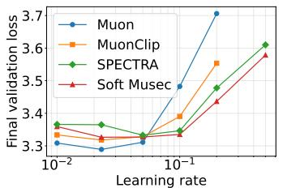  
(a) FineWeb

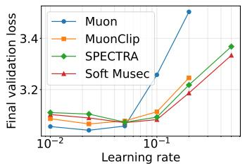  
(b) OpenWebText

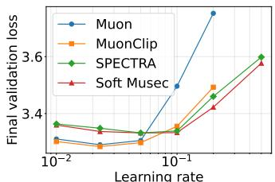  
(c) C4

Figure 4: Validation loss versus learning rate for NanoGPT-Small across three datasets.  
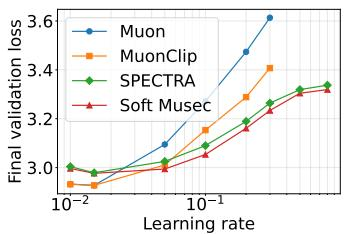  
(a) FineWeb

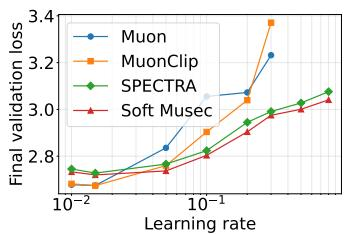  
(b) OpenWebText

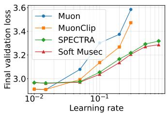  
(c) C4  
Figure 5: Validation loss versus learning rate for NanoGPT-Medium across three datasets.

Figures 4–5 present the complete learning rate sweep results across all model configurations and datasets; runs that diverge during training are omitted. For NanoGPT-Small (Figure 4), all methods achieve comparable validation loss at small learning rates. As the learning rate increases, Muon degrades most rapidly, followed by MuonClip, while Soft Musec and SPECTRA maintain lower validation loss across the full range. For NanoGPT-Medium (Figure 5), the advantage of spectral clipping methods becomes more pronounced: at learning rates $\eta ~ \geq ~ 0 . 1$ , both Soft Musec and SPECTRA substantially outperform Muon and MuonClip, with Soft Musec achieving the best or near-best validation loss at the largest learning rates across all three datasets.

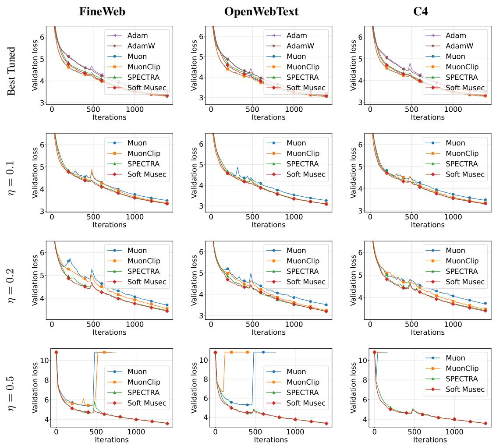  
Figure 6: Training loss over steps for NanoGPT-Small. Rows: learning rates; columns: datasets. Only learning rates where methods exhibit meaningfully different behavior are shown. NaN values within runs are omitted.

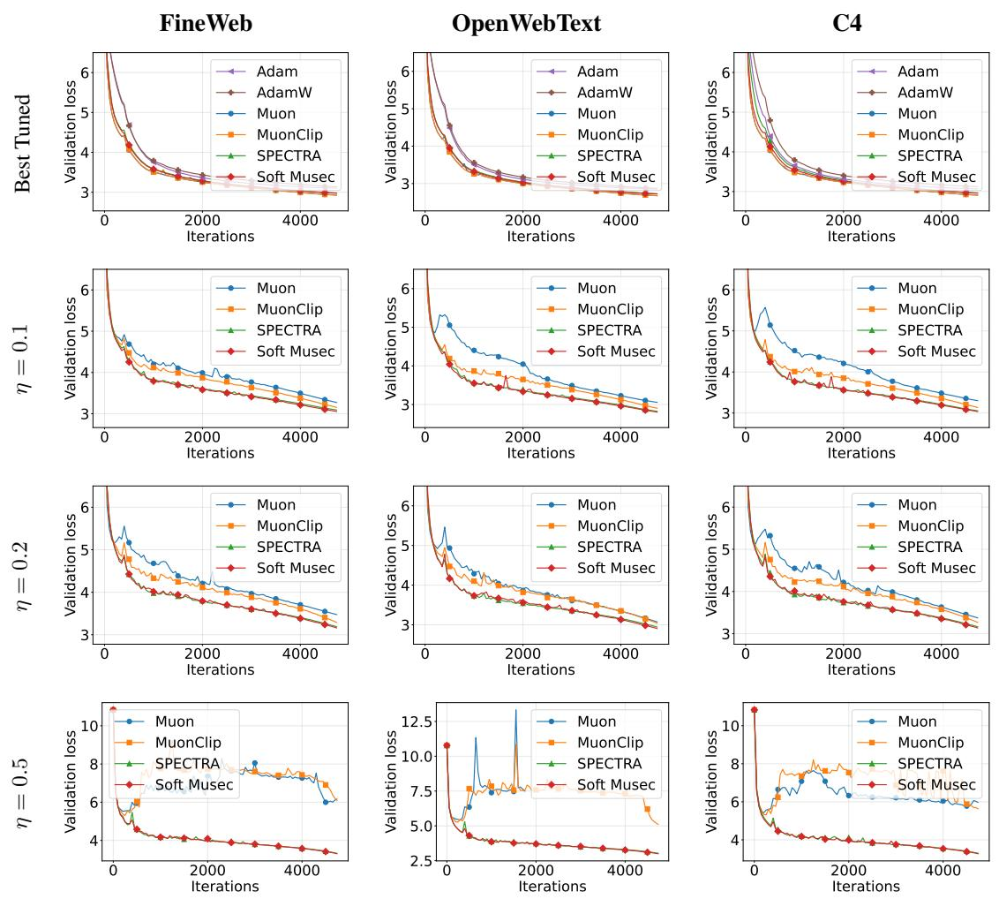  
Figure 7: Training loss over steps for NanoGPT-Medium. Rows: learning rates; columns: datasets. Only learning rates where methods exhibit meaningfully different behavior are shown. NaN values within runs are omitted.

## F.2 ADDITIONAL TRAINING DYNAMICS

Figures 6-8 present training loss curves across all model configurations, datasets, and selected learning rates. At the best-tuned learning rate, all Muon-type optimizers converge to lower validation loss than Adam and AdamW. As the learning rate increases, the stability gap between methods widens, and this effect is amplified at larger model scales. For NanoGPT-Small, instability only manifests at the largest learning rate $( \eta = 0 . 5 )$ , where Muon and MuonClip diverge on some datasets while Soft Musec and SPECTRA remain stable. For NanoGPT-Medium and NanoGPT-Wide, Muon and MuonClip exhibit increasingly severe instability starting from $\eta = 0 . 1$ 1, with large loss spikes and sustained oscillations. Soft Musec and SPECTRA both maintain stable convergence across all configurations, with Soft Musec achieving comparable or slightly smoother training dynamics.

## F.3 EFFECTIVE RANK ANALYSIS

To directly validate our theoretical motivation, we track the effective rank of the update matrices across QK projections, VO projections, and MLP weights during NanoGPT-Medium training on FineWeb at $\eta = 0 . 5$

Let us first recall the definition of the effective rank (Roy & Vetterli, 2007; Garrido et al., 2023) of a matrix $\pmb { A } \in \mathbb { R } ^ { m \times n }$ with singular values $\sigma _ { 1 } \geq \sigma _ { 2 } \geq \cdot \cdot \cdot \geq \sigma _ { r } \geq 0 \ /$ , where $r = \operatorname* { m i n } ( m , n )$

We define the singular value distribution as

$$
p _ { i } = \frac { \sigma _ { i } } { \sum _ { j = 1 } ^ { r } \sigma _ { j } } , \qquad i \in [ r ]
$$

so that $\textstyle \sum _ { i } p _ { i } = 1$ . We next compute the Shannon entropy of this distribution as

$$
H ( p _ { 1 } , \dots , p _ { r } ) = - \sum _ { i = 1 } ^ { r } p _ { i } \log ( p _ { i } ) .
$$

The effective rank of the matrix A, denoted erank(A), is defined as

$$
\operatorname { e r a n k } ( A ) = \exp ( H ( p _ { 1 } , \dots , p _ { r } ) ) .
$$

The complete results are shown in Figure 9. Muon exhibits near-full effective rank across all components, confirming that its polar step discards all spectral magnitude information. MuonClip does not meaningfully reduce the effective rank of the update, as it targets the weight matrices rather than the update itself. Both SPECTRA and Soft Musec achieve substantially lower effective rank than Muon, consistent with the effect of spectral clipping. Notably, as training progresses, Soft Musec maintains lower effective rank than SPECTRA across all three component types. This is consistent with the momentum feedback mechanism in Musec: by propagating the clipped momentum, spectral components are continuously regulated rather than allowed to accumulate in an unclipped buffer, as discussed in Section 4.

## F.4 COMPUTATIONAL OVERHEAD

We compare the average wall-clock time per training step across all methods on FineWeb, with results shown in Figure 10. Across all three model configurations, Soft Musec introduces negligible computational overhead compared to Muon. For NanoGPT-Small, all methods are within 3% of each other (1021–1049 ms). For NanoGPT-Medium, all Muon-type methods achieve similar wallclock time (2550–2692 ms), with MuonClip being the slowest. For NanoGPT-Wide, all methods remain within 2% (15645–15977 ms). MuonClip is consistently the slowest method due to its additional weight clipping step. These results confirm that the spectral clipping operation in Soft Musec introduces minimal computational overhead relative to Muon, as both methods rely on Newton-Schulz iterations of similar complexity.

## F.5 ABLATION STUDIES

In this subsection, we ablate two key hyperparameters of Soft Musec: the clipping threshold D and the number of Newton-Schulz iterations.

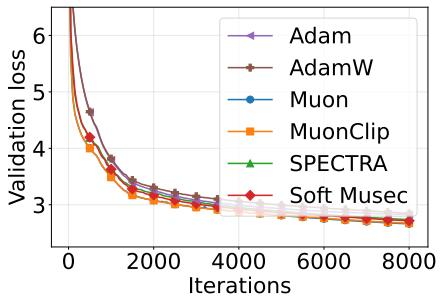  
(a) Best Tuned

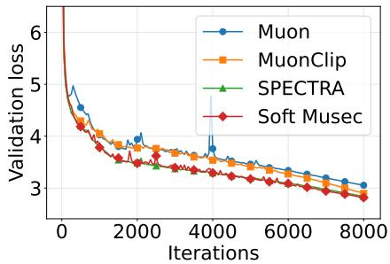  
(b) $\eta = 0 . 1$

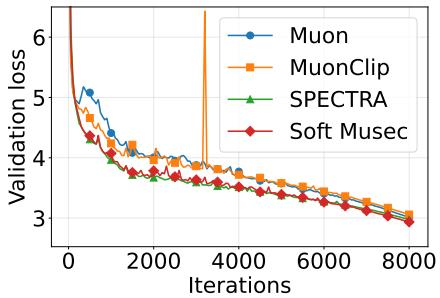  
(c) $\eta = 0 . 2$

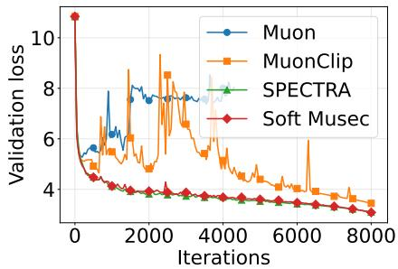  
(d) $\eta = 0 . 5$  
Figure 8: Training loss over steps for NanoGPT-Wide on FineWeb dataset. Only learning rates where methods exhibit meaningfully different behavior are shown. NaN values within runs are omitted.

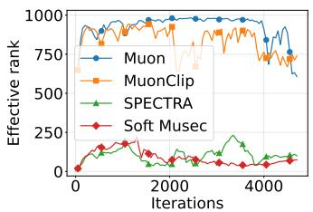  
(a) QK projections

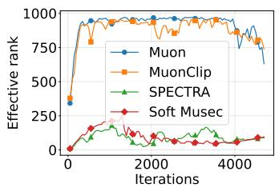  
(b) VO projections

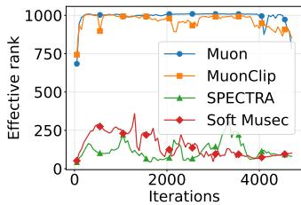  
(c) MLP  
Figure 9: Effective rank of update matrices over training steps for NanoGPT-Medium on FineWeb.

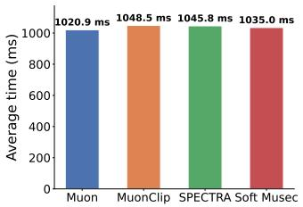  
(a) NanoGPT-Small

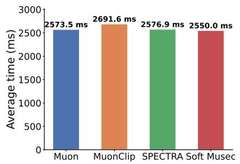  
(b) NanoGPT-Medium

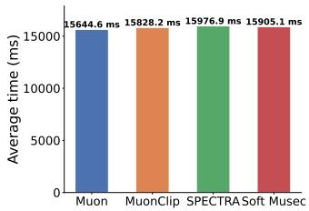  
(c) NanoGPT-Wide  
Figure 10: Average wall clock time comparison of methods for training FineWeb.

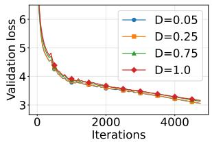  
(a) η = 0.1

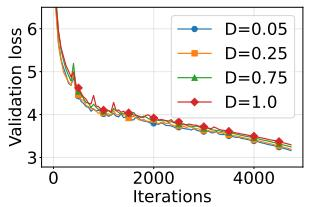  
(b) η = 0.2

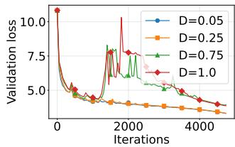  
(c) η = 0.5  
Figure 11: Effect of clipping threshold on Soft Musec training stability across learning rates.

## F.5.1 SENSITIVITY TO CLIPPING THRESHOLD

We study the sensitivity of Soft Musec to the clipping threshold D on NanoGPT-Medium trained on FineWeb across three learning rates $( \eta \in \{ 0 . 1 , \bar { 0 . 2 } , \bar { 0 . 5 } \} $ ), with results shown in Figure 11.

At moderate learning rates $( \eta = 0 . 1$ and $\eta = 0 . 2 )$ , Soft Musec is robust to the choice of D: all values from $D = 0 . 0 5 \mathrm { t o } D = 1 . 0$ converge to comparable validation loss with similar training dynamics. At the largest learning rate $( \eta = 0 . 5 )$ , the choice of D becomes more important. Smaller thresholds $( D = 0 . 0 5$ and $D = 0 . 2 5 )$ maintain smooth convergence, while larger thresholds $( D = 0 . 7 5$ and $D = 1 . 0 )$ exhibit loss spikes in the later stages of training. Notably, even with the largest clipping threshold $( D = 1 . 0 )$ , Soft Musec still converges — in contrast to Muon and MuonClip, which diverge entirely at this learning rate (Figure 7). This demonstrates that spectral clipping provides a meaningful stability benefit regardless of the threshold, while a well-tuned D further improves training smoothness.

## F.5.2 NUMBER OF NEWTON-SCHULZ ITERATIONS

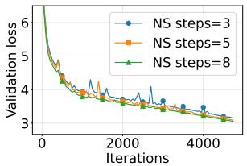  
(a) η = 0.1

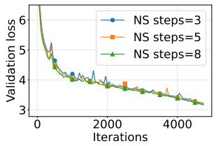  
(b) $\eta = 0 . 2$

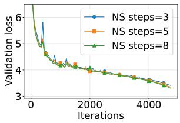  
(c) $\eta = 0 . 5$  
Figure 12: Effect of Newton-Schultz steps on Soft Musec training stability across learning rates.

We study the sensitivity of Soft Musec to the number of Newton-Schulz iterations on NanoGPT-Medium trained on FineWeb across three learning rates $( \eta \in \{ 0 . 1 , 0 . 2 , 0 . 5 \} )$ ), with the clipping threshold fixed at $D = 0 . 0 5$ . Results are shown in Figure 12.

Across all learning rates, Soft Musec is largely insensitive to the number of Newton–Schulz iterations. More iterations yield slightly better validation loss, consistent with a more accurate approximation of the spectral clipping operator. However, the differences are marginal, indicating that even a coarse approximation with three iterations provides most of the stability benefit. This robustness stems from the well-conditioned nature of the matrix $\widehat { M } \widehat { M } ^ { \top } + D ^ { 2 } I$ , whose eigenvalues are bounded below by $D ^ { 2 }$ , enabling rapid convergence of the iteration. In practice, five iterations offer a good balance between approximation quality and computational cost.