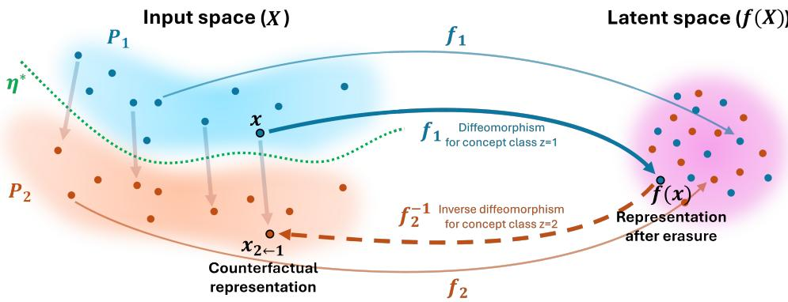
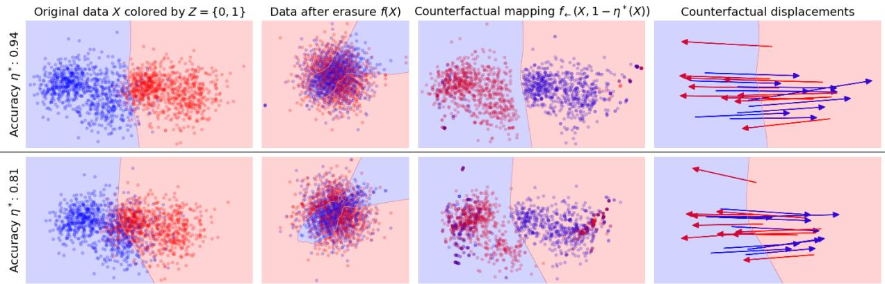
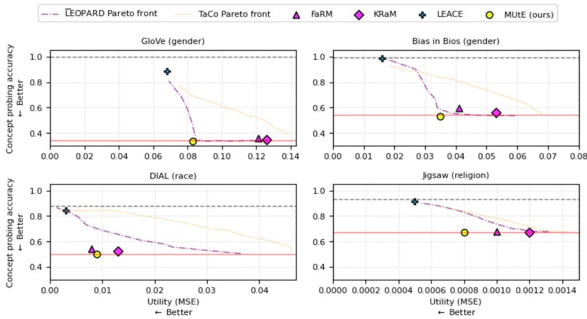

# MUtE: A Dual Framework for Concept Erasure and Counterfactual Interventions

Antoine Saillenfest

onepoint, 29 rue des Sablons, 75116 Paris (France)

a.saillenfest@groupeonepoint.com

## Abstract

Erasing concept-specific information from representations has been proven useful for mitigating bias or interpreting model decisions. The joint objective is to transform the original representations such that the target concept becomes unpredictable, while maximally preserving concept-unrelated information. In this work, we revisit the optimal bounds of concept erasure to derive a novel class of erasure functions that naturally induce a deterministic, dual counterfactual mapping. Bridging the gap between theoretical optimality and practical representation learning, we design an implementation that imposes a translational bias on counterfactual trajectories—a constraint that aligns with how many concepts geometrically manifest in modern language models. Our framework enables seamless navigation between concept erasure and counterfactual generation. We empirically demonstrate its eficacy in improving downstream algorithmic fairness and generating counterfactual texts. 1

## 1 Introduction

Text representations inherently entangle a diverse array of latent concepts, ranging from sensitive demographic attributes (e.g. gender or race) requiring algorithmic mitigation to abstract semantic properties (e.g. writing style or aspect) manipulated for interpretability. Because targeted interventions in the discrete textual space are dificult to automate and frequently yield disfluent artifacts, representation engineering predominantly isolates and manipulates these concepts directly within the continuous embedding space.

The specific task of concept erasure aims to obliterate information pertaining to a target concept from a set of representations via an erasure function (Ravfogel et al., 2020; 2022a; Chowdhury et al., 2025). From an information-theoretic perspective, optimal erasure necessitates navigating a fundamental trade-of: maximizing privacy (ensuring the post-erasure representations contain minimal information regarding the target concept) while maximizing utility (maximizing the retained information from the original representations) (Chowdhury et al., 2025). Because concept erasure is fundamentally task-agnostic, the resulting representations are broadly applicable across downstream NLP tasks, demonstrating eficacy in improving algorithmic fairness (Ravfogel et al., 2020; Chowdhury & Chaturvedi, 2022; Lemberger & Saillenfest, 2024), enhancing interpretability (Lemberger & Saillenfest, 2024), and mitigating language model toxicity (Singh et al., 2024).

Driven by these applications, concept erasure has seen rapid development. By relaxing strict privacy constraints, a significant body of work has addressed linear guardedness (Ravfogel et al., 2023), which consists in preventing concept recovery by a linear adversary. Methods such as INLP (Ravfogel et al., 2020), RLACE (Ravfogel et al., 2022a), and the state-of-the-art LEACE (Belrose et al., 2023) achieve linear erasure via projections onto a low-dimensional concept nullspace. However, general (non-linear) concept erasure remains an open challenge. Current approaches include adversarial training (Ganin et al., 2016; Feder et al., 2021; Ravfogel et al., 2022b), information-theoretic loss optimization (FaRM (Chowdhury & Chaturvedi, 2022), KRaM (Chowdhury et al., 2023)), Bayesian optimization (PEF (Chowdhury et al., 2025)), filtering of ranked directions out of embeddings (TaCo Jourdan et al. (2024)) and density matching via projections (LEOPARD (Saillenfest & Lemberger, 2025)). Those approaches, however, frequently sacrifice downstream utility to satisfy strict privacy bounds. Furthermore, these methods sufer from severe computational bottlenecks, relying on extensive neural network training, expensive density estimations, or Bayesian optimization over finite supports, which scales poorly in high-dimensional regimes.

  
Figure 1: The $\mathrm { M U t E ^ { * } }$ continuous erasure framework. A piecewise erasure function $f$ utilizes class-conditional difeomorphisms $f _ { i }$ to bijectively map source distributions $P _ { i }$ to a shared invariant space, maximizing utility retention. This structure natively induces a dual counterfactual mapping $( f _ { 2 } ^ { - 1 } \circ f _ { 1 } )$ , anchoring a sample x and its counterfactual $x _ { 2  1 }$ to the identical post-erasure representation $f ( x )$ . Constraining these counterfactual trajectories with an a priori structural prior—such as the linear translational bias prevalent in $\mathrm { N L P _ { - } }$ —ties the conditional mappings, efectively resolving the functional non-identifiability of optimal erasure.

Concurrently, recent literature has established profound connections between concept erasure and the generation of counterfactual representations, i.e. approximations of the embedding space under simulated causal interventions on the surface text. Assuming a structural causal model and Gaussian priors, Lemberger & Saillenfest (2024) have demonstrated that concept erasure can act as an intermediary mapping for counterfactual generation. Inspired by linear erasure techniques, recent works derive linear steering interventions under minimal displacement constraints (Singh et al., 2024), which have been decoded into counterfactual texts using continuous-to-discrete inversion techniques (Avitan et al., 2025; Morris et al., 2023).

In this work, we revisit discrete concept erasure within continuous representation spaces at optimality. We formalize the structure of optimal erasure functions and demonstrate that they inherently induce a dual, deterministic counterfactual mapping. Bridging theory and practice, we propose a practical implementation that imposes a rigid translational bias on counterfactual trajectories. This approach practically exploits the phenomenon that modern text encoders frequently isolate concepts as linear directions.

To summarize, our primary contributions are:

• We introduce MUtE∗ (Maximum Utility-preserving Erasure), a class of optimal erasure functions for continuous representations that intrinsically defines a dual counterfactual mapping (Section 2).

• We derive a practical, computationally eficient implementation that leverages a translational bias to perform erasure and counterfactual representation generation (Section 3).

• We empirically validate our framework across synthetic data and NLP benchmarks, demonstrating its eficacy for bias mitigation and counterfactual text generation (Section 4).

## 2 Optimal Erasure and Counterfactuals

This section formalizes the theoretical foundations of Maximum Utility-preserving Erasure $( \mathrm { M U t E } ^ { * } )$ . After defining the problem setting (Section 2.1), we review the necessary conditions for perfect erasure (Section 2.2) and maximal utility retention (Section 2.3). Assuming an oracle predictor, we demonstrate that this optimal erasure naturally induces a dual counterfactual mapping (Section 2.4), providing a principled geometric mechanism to resolve the inherent non-identifiability of erasure functions.

## 2.1 Problem statement

Let $\mathbf { P } _ { \mathcal { S } }$ be a probability distribution over an arbitrary input space ${ \mathcal { S } } .$ . Let enc $: \mathcal { S }  \mathbb { R } ^ { D }$ be an encoding function mapping inputs to a continuous representation space, and let $\mathcal { Z } = \{ 1 , \ldots , K \} ~ ( K > 1 )$ denote a discrete set of concept classes assigned by a ground-truth labeling function $c ^ { * } : S  \mathcal { Z }$

We define the concept variable $Z$ and the representation variable $X \sim \mathbf { P } _ { X }$ as random variables over $s \colon$

$$
Z ( s ) = c ^ { * } ( s )\tag{1}
$$

$$
X ( s ) = \operatorname { e n c } ( s )\tag{2}
$$

Let $p ( x )$ denote the probability density function (PDF) of $\mathbf { P } _ { X }$ . For each concept class $i \in { \mathcal { Z } } .$ , we introduce the class-conditional representation variable $X _ { i } \sim \mathbf { P } _ { i }$ , where the corresponding conditional density is defined as $p _ { i } ( x ) : = p ( x \mid Z = i )$

Concept erasure seeks an erasure function $f$ that removes concept-related information about $Z \ ( { \mathrm { E q . } } \ 1 )$ from the representations X (Eq. 2). We define the post-erasure representation as $Q = f ( X )$ , distributed according to the pushforward measure $\mathbf { Q } = f _ { \# } \mathbf { P } _ { X }$ , with corresponding class-conditional distributions $\mathbf { Q } _ { i }$

We make the following assumptions:

• The erasure function preserves the latent dimensionality, i.e., $f : \mathbb { R } ^ { D }  \mathbb { R } ^ { D }$

• The conditional distributions $\mathbf { P } _ { i }$ are continuous over $\mathbb { R } ^ { D }$ and exhibit full support $( { \mathrm { i . e . } }$ , there is no zero-density regions).2

## 2.2 Discrete Concept Erasure.

Concept erasure fundamentally seeks a transformation f that enforces strict statistical independence between $f ( X )$ and $Z .$ This translates into a rigorous distributional constraint: the class-conditional distributions of the post-erasure representations must be perfectly aligned (Saillenfest & Lemberger, 2025). Formally:

$$
\forall i \in \mathcal { Z } , \quad \mathbf { Q } _ { i } = \mathbf { Q }\tag{3}
$$

From an information-theoretic perspective, Eq. 3 corresponds to achieving the privacy bound characterized by vanishing mutual information: $I ( f ( X ) ; Z ) = 0$ (Chowdhury et al., 2025).

Crucially, however, this pure erasure objective is not self-suficient. An infinite set of mappings satisfies this independence criterion, including degenerate, constant functions $( \mathrm { e . g . } , f ( x ) = k \in \mathbb { R } ^ { D } )$ that catastrophically collapse the representation space. Consequently, any viable concept erasure framework must formulate a joint objective: satisfying the erasure criterion while maximizing the retention of task-agnostic information (utility) inherent to the original representations.

## 2.3 Maximum Utility Preservation.

From an information-theoretic perspective, preserving maximum utility requires the conditional entropy to vanish: $H ( X | f ( X ) , Z ) = 0$ (Chowdhury et al., 2025). Conditioning on a concept class $i \in { \mathcal { Z } } .$ , the equality $H ( X _ { i } | f ( X _ { i } ) ) = 0$ implies that $X _ { i }$ can be perfectly recovered from its post-erasure representation. Since the forward mapping is deterministic by definition $( H ( f ( X _ { i } ) | X _ { i } ) = 0 )$ , this mutual determinism ensures that $f$ maps each conditional distribution $\mathbf { P } _ { i }$ bijectively to $\mathbf { Q } _ { i }$

Structurally, integrating the perfect erasure constraint (Eq. 3), MUtE∗ (Maximum Utility-preserving Erasure) functions satisfies:

$$
\forall s \in S , \quad f ( X ( s ) ) = f _ { c ^ { * } ( s ) } ( X ( s ) )\tag{4}
$$

where each $f _ { i } : \mathbb { R } ^ { D }  \mathbb { R } ^ { D }$ is a difeomorphism transforming $\mathbf { P } _ { i }$ into $\mathbf { Q } .$

This continuous-space formulation mirrors the optimal erasure framework introduced by Chowdhury et al. (2025). Their approach achieves optimal privacy-utility bounds via class-conditional permutations, assuming discrete supports of equal cardinality that are identical up to permutation relative to the target distribution. Our framework generalizes these optimality principles to continuous probability measures by replacing combinatorial permutations with difeomorphisms.

The sample-dependent assignment $c ^ { * } ( s )$ in Eq. 4 precludes $f$ from operating solely on the observable representation X. To circumvent this limitation, Chowdhury et al. (2025) assume disjoint conditional supports, guaranteeing perfect predictability of the concept class from the representation alone. In practice, high-dimensional continuous representations inevitably exhibit overlapping supports, yielding an irreducible Bayes error that precludes strict determinism. However, because modern latent spaces demonstrate high structural separability, routinely allowing probes to achieve near-perfect empirical classification, we adopt a tractable theoretical surrogate. We assume the existence of an optimal oracle predictor $\eta ^ { * }$ that recovers the concept class with negligible error, idealizing it as exact for our formulation:

$$
\forall s \in { \mathcal { S } } , \quad \eta ^ { * } ( X ( s ) ) = Z ( s ) = c ^ { * } ( s )\tag{5}
$$

Under this oracle assumption, MUtE∗ functions (Eq. 4) can be expressed as a class of representation dependent erasure mappings:

$$
f : \mathbb { R } ^ { D } \to \mathbb { R } ^ { D } , \quad x \mapsto f _ { \eta ^ { * } ( x ) } ( x )\tag{6}
$$

Because concept erasure enforces alignment strictly at the distributional level (Eq. 3), the hypothesis space of valid MUtE mappings is infinite. This permits arbitrary topological distortions of the representation space. To resolve this fundamental non-identifiability, we next exploit the dual counterfactual mapping intrinsically induced by these optimal erasure functions.

## 2.4 Dual Counterfactual Mapping

Let the counterfactual mapping of a representation-dependent $\mathrm { M U t E ^ { * } }$ function $f \ ( \mathrm { E q . \ 6 } )$ be:

$$
f _ { \left. \right.} : \mathbb { R } ^ { D } \times \mathcal { Z }  \mathbb { R } ^ { D } , \quad ( x , j ) \mapsto f _ { j } ^ { - 1 } ( f ( x ) )\tag{7}
$$

This transport is termed counterfactual because, for any distinct concept classes $i , j \in \mathcal { Z }$ , it maps $X _ { i } \sim \mathbf { P } _ { i }$ to $X _ { j  i } : = f _ {  } ( X _ { i } , j ) = f _ { j } ^ { - 1 } ( f _ { i } ( X _ { i } ) )$ that is strictly distributed according to $\mathbf { P } _ { j }$

By definition, $f ( X _ { j  i } ) = f ( X _ { i } )$ . This establishes a fundamental structural correspondence between a MUtE∗ function and the counterfactuals it generates: a sample and all its counterfactual counterparts map to the exact same invariant coordinate in the post-erasure latent space. Consequently, each erased representation serves as a geometric anchor connecting |Z| counterfactual representations.

Crucially, this collision property provides a principled mechanism to resolve the inherent non-identifiability of optimal erasure functions. If the geometry of the target counterfactuals $X _ { j  i }$ can be approximated a priori, it directly constrains the hypothesis space of $f$ by tying the difeomorphisms $f _ { i }$ and $f _ { j }$ . By enforcing $f ( X _ { j  i } ) = f ( X _ { i } )$ over these expected counterfactual trajectories, we can isolate geometrically grounded solutions from the infinite space of otherwise valid MUtE∗ functions.

In NLP, the geometric relationship between representations and their counterfactuals has been extensively studied. The Linear Bias Hypothesis posits that deep NLP models naturally encode concepts as linear directions within their high-dimensional latent spaces (Bolukbasi et al., 2016; Vargas $\&$ Cotterell, 2020). Thus, recent steering techniques operationalize counterfactual generation via linear interventions (Singh et al., 2024). The simplest such intervention approximates a counterfactual shift by translating the representation along the vector diference between class centroids (Subramani et al., 2022; Singh et al., 2024).

Synthesizing the theoretical formulation above, Figure 1 illustrates the MUtE∗ framework, demonstrating how its invertible mappings enable bidirectional geometric navigation between concept erasure and counterfactual generation.

## 3 Operationalizing MUtE∗ via Iterative Density Matching

This section bridges the theoretical formulation of MUtE∗ with a computationally tractable implementation. We first recall an iterative Gaussianization procedure (Section 3.1), adapting it to construct a fully representation-dependent erasure mapping (Section 3.2). Geometrically, this mapping imposes an inherent translational bias on the counterfactual trajectories. We then relax the assumption of an oracle predictor $\eta ^ { * }$ to formally characterize the impact of noisy routing. This theoretical analysis directly motivates algorithmic regularizations to promote efective concept erasure within deeply entangled latent spaces (Section 3.3).

## 3.1 Iterative Gaussianization

Rotation-Based Iterative Gaussianization (RBIG) (Laparra et al., 2011) is a highly eficient, iterative Gaussianization technique that transforms any continuous random distribution P into an isotropic Gaussian $\mathcal { N } ( 0 , I )$ . For a set of observations x, the process alternates between applying an orthogonal rotation matrix $R ^ { ( t ) } \in \mathrm { O } ( D )$ and a dimension-wise marginal Gaussianization $\psi ^ { ( t ) }$

$$
{ \begin{array} { l } { { \boldsymbol { x } } ^ { ( t + 1 ) } = \left( { \boldsymbol { \psi } } ^ { ( t ) } \circ { \boldsymbol { R } } ^ { ( t ) } \right) \left( { \boldsymbol { x } } ^ { ( t ) } \right) } \\ { \mathrm { w i t h } \quad { \boldsymbol { x } } ^ { ( 0 ) } = { \boldsymbol { x } } } \end{array} }\tag{8}
$$

where:

$$
\psi ^ { ( t ) } ( x ^ { ( t ) } ) = \left( \Phi ^ { - 1 } \left( \int _ { - \infty } ^ { x _ { d } ^ { ( t ) } } p _ { d } ^ { ( t ) } ( u ) d u \right) \right) _ { d = 1 , \ldots , D }\tag{9}
$$

The marginal Gaussianization $\psi ^ { ( t ) }$ operates independently on each dimension $d ,$ mapping the data to $\mathcal { N } ( 0 , 1 )$ via a marginal uniformization, based on the cumulative density function (CDF) of the marginal probability density function $\left( \mathrm { P D F } \right) p _ { d }$ , followed by the inverse CDF of the standard norma $\mathcal { N } ( 0 , 1 ) , \Phi ^ { - 1 }$

Provided the sequence of orthogonal rotations $\{ R ^ { ( t ) } \}$ induces suficient cross-dimensional mixing $( \mathrm { e . g . }$ , via orthogonal ICA (Hyvarinen et al., 2019), PCA (Jollife & Cadima, 2016), or random orthogonal matrices), RBIG guarantees monotonic convergence to $\mathcal { N } ( 0 , I )$ . This monotonic convergence is formally characterized by a strict reduction in negentropy, defined here as the Kullback-Leibler divergence to the standard isotropic Gaussian, at step t. The negentropy reduction $\Delta J ^ { ( t ) }$ at step t is thus strictly positive:

$$
\Delta J ^ { ( t ) } : = D _ { \mathrm { K L } } ( { \bf P } ^ { ( t ) } \parallel \mathcal { N } ( 0 , I ) ) - D _ { \mathrm { K L } } ( { \bf P } ^ { ( t + 1 ) } \parallel \mathcal { N } ( 0 , I ) ) > 0\tag{10}
$$

The overall Gaussianization process is bijective. Rotations are invertible and $( R ^ { ( t ) } ) ^ { - 1 } = ( R ^ { ( t ) } ) ^ { \top } . \psi ^ { ( t ) }$ is invertible when the support of each marginal PDF is connected (i.e. there are no zero-probability regions) making the marginal CDF strictly monotonic and hence invertible.

## 3.2 Selective Iterative Density Matching

We adapt the process defined in $\operatorname { E q } .$ . 8 into a conditional mapping, selective based on the predicted class $\eta ^ { * } ( x )$ of the sample x:

$$
\begin{array} { r l } & { x ^ { ( t + 1 ) } = \left( \psi _ { \eta ^ { * } ( x ) } ^ { ( t ) } \circ R ^ { ( t ) } \right) ( x ^ { ( t ) } ) } \\ & { \mathrm { w i t h } \quad x ^ { ( 0 ) } = x } \end{array}\tag{11}
$$

where $R ^ { ( t ) }$ is an orthogonal rotation, and $\psi _ { i } ^ { ( t ) }$ denotes the class-conditional, dimension-wise marginal Gaussianization at step t. For a given concept class $i , \psi _ { i } ^ { ( t ) }$ is defined using the marginal class-conditional PDF $p _ { i , d } ^ { ( t ) }$ for the dimension d:

$$
\psi _ { i } ^ { ( t ) } ( x ) = \left( \Phi ^ { - 1 } \left( \int _ { - \infty } ^ { x _ { d } } p _ { i , d } ^ { ( t ) } ( u ) d u \right) \right) _ { d = 1 , \ldots , D }\tag{12}
$$

At each iteration, $R ^ { ( t ) }$ is applied uniformly across the entire representation space, acting as an isometry that preserves the macroscopic geometric structure. Conversely, the class-conditional marginal transformations $\psi _ { i } ^ { ( t ) }$ independently warp the conditional densities to align their marginals with a standard normal distribution.

Under the assumption that $\eta ^ { * }$ acts as a perfect oracle (Eq. 5) and conditioned on any concept class i, this process mirrors the standard RBIG, which guarantees that $\mathbf { P } _ { i }$ is bijectively mapped to an isotropic Gaussian $\mathcal { N } ( 0 , I )$ as $t \to \infty$ . Consequently, this iterative procedure asymptotically drives all conditional distributions $\mathbf { P } _ { i }$ to a shared target measure, theoretically guaranteeing complete concept erasure after a suficient number of iterations $T .$ 3

Truncating the iterative process at step T yields an empirical conditional-bijective MUtE function:

$$
\begin{array} { r l } & { f : \mathbb { R } ^ { d } \to \mathbb { R } ^ { d } , \quad x \mapsto f _ { \eta ^ { * } ( x ) } ( x ) } \\ & { \mathrm { w i t h ~ } f _ { i } = \psi _ { i } ^ { ( T - 1 ) } \circ R ^ { ( T - 1 ) } \circ \cdot \cdot \cdot \circ \psi _ { i } ^ { ( 0 ) } \circ R ^ { ( 0 ) } } \end{array}\tag{13}
$$

Crucially, the initial marginal Gaussianizations $( \psi _ { i } ^ { ( 0 ) } ) _ { i = 1 , \dots , | \mathcal { Z } | }$ independently map the median of each con ditional distribution to the origin. Because deep continuous representations typically exhibit symmetric, Gaussian-like marginals where the mean and median closely align, this zero-order matching acts as a rigid location shift. Consequently, this dominant first step imparts a strong geometric inductive bias, steering counterfactual representations predominantly along the inter-centroid vector $\mathbb { E } [ X _ { j } ] - \mathbb { E } [ X _ { i } ]$ . The subsequent sequence of global rotations and marginal transformations non-linearly refines this trajectory to ensure exact higher-order distributional alignment without destroying the foundational translational bias.

## 3.3 Implementation and Mitigation of Noisy Routing

Due to overlapping conditional supports, the empirical predictor $\eta ^ { * }$ inherently exhibits classification error. Crucially, MUtE decouples density estimation from sample routing: marginal transformations $\psi _ { i } ^ { ( t ) }$ are fitted using ground-truth labels, while the forward mapping of a sample x relies strictly on its predicted class $\eta ^ { * } ( x )$

This irreducible Bayes error theoretically precludes strict convergence to an exact isotropic Gaussian. We formalize this limitation by expressing the stepwise negentropy reduction for class i under noisy routing (see Appendix A for the full derivation):

$$
\Delta J _ { i } ^ { ( t ) } = \Delta J _ { i } ^ { * ( t ) } - E _ { i } ^ { ( t ) }\tag{14}
$$

where $\Delta J _ { i } ^ { * ( t ) } \ge 0$ denotes the ideal negentropy reduction at step t under perfect routing, and $E _ { i } ^ { ( t ) } > 0$ represents a strictly positive entropic penalty induced by misrouting. Consequently, the convergence of each class-conditional distribution to $\mathcal { N } ( 0 , I )$ is fundamentally bottlenecked by this routing error.

Nevertheless, this analytical decomposition directly motivates algorithmic regularizations to optimize the stepwise negentropy reduction—specifically, by maximizing the ideal marginal gain $\Delta J _ { i } ^ { * ( t ) }$ and bounding the routing penalty $E _ { i } ^ { ( t ) }$ . Although exact asymptotic convergence to the standard normal is mathematically unattainable, we expect that enforcing these bounds iteratively drives the conditional manifolds into a suficiently tight, shared neighborhood, to efectively neutralizes class separability.

To maximize the marginal Gaussianization gain $\Delta J _ { i } ^ { * ( t ) }$ , the rotation sequence $\{ R ^ { ( t ) } \}$ must systematically in duce suficient cross-dimensional mixing. While techniques such as orthogonal ICA drive rapid convergence, PCA ofers a superior trade-of between step-wise negentropy reduction and computational complexity (Laparra et al., 2011). To satisfy this mixing requirement concurrently across all concept classes $i \in \mathcal Z$ , we adopt an alternating rotation schedule: $\Breve { R ^ { ( t ) } } = \tilde { R } _ { i } ^ { \mathrm { P C A } }$ , where $i \equiv t \ ( \mathrm { m o d } \ | \mathcal { Z } | )$ and $R _ { i } ^ { \mathrm { { \bar { P } C A } } }$ diagonalizes the covariance of $\mathbf { P } _ { i } ^ { ( t ) }$ . This cyclic scheme periodically aligns the principal axes of each conditional manifold, ensuring their unique cross-correlations are successively exposed for marginal Gaussianization. Although a rotation $R _ { i } ^ { \mathrm { P C A } }$ optimized for class i does not explicitly target the cross-correlations of a distinct class $j \neq i ,$ the RBIG framework guarantees that any valid orthogonal rotation still yields a non-negative negentropy reduction $( \Delta J _ { j } ^ { * ( t ) } \ge 0 )$ . Moreover, if the class-conditional manifolds are approximately equivalent up to a translation, their covariance structures inherently align. In this regime, rotating by $R _ { i } ^ { \mathrm { P C A } }$ is thus expected to simultaneously drive a high negentropy reduction for all classes at every iterative step.

The routing penalty $E _ { i } ^ { ( t ) }$ quantifies the entropic cost of spatial tearing, driven by the cross-entropy mismatch when a sample is evaluated via the marginal density estimator of a mispredicted class. To maintain focus on the practical mitigation strategy, we defer the full analytical expansion and bounding of $E _ { i } ^ { ( t ) }$ to Appendix A.2. Crucially, this penalty diverges to infinity if the true density is strictly positive where the mispredicted estimator assigns zero probability. To bound this log-density ratio, we estimate the continuous conditional PDFs $p _ { i , d } ^ { ( t ) }$ via marginal histograms uniformly discretized into B bins, enforcing a strict minimum density threshold $p _ { i , d } ^ { ( t ) } ( x _ { d } ) \geq \alpha > 0$ . This threshold constrains $E _ { i } ^ { ( t ) }$ with an upper bound. By defaulting to $\alpha = 1 0 ^ { - 1 0 }$ and $B = 1 0 0 0$ , the artificial probability mass injected across the domain $( B \alpha = 1 0 ^ { - 7 } )$ remains negligible.

While these regularizations cannot theoretically guarantee perfect distributional alignment after T iterations, our subsequent evaluations on real-world datasets demonstrate that this constrained implementation yields highly robust concept erasure in practice.

## 4 Experiments

We validate our approach on synthetic and NLP datasets (Section 4.1) for concept erasure and utility preservation (Section 4.2), bias mitigation (Section 4.3) and counterfactual generation of texts (Section 4.4).

## 4.1 Datasets, Baselines and Training details

Table 1: Key dataset statistics. y denotes the availability of a downstream classification task.
<table><tr><td>Dataset</td><td>Encoder</td><td>D</td><td>Concept</td><td>|Z|</td><td>#train</td><td>#test</td><td>y</td></tr><tr><td>GLOVE</td><td>GloVe</td><td>300</td><td>Gender</td><td>3</td><td>~11k</td><td>~7k</td><td></td></tr><tr><td>BIAS IN BIOS</td><td>Bert</td><td>768</td><td>Gender</td><td>2</td><td>~256k</td><td>~98k</td><td>√</td></tr><tr><td>DIAL</td><td>Deepmoji</td><td>300</td><td>Race</td><td>2</td><td>~180k</td><td>~8k</td><td>√</td></tr><tr><td>JIGSAW</td><td>GPT-4</td><td>512</td><td>Religion</td><td>5</td><td>~87k</td><td>~9k √</td><td></td></tr></table>

Baselines. We compare our approach with several baselines for erasure: FaRM (Chowdhury & Chaturvedi, 2022), KRaM (Chowdhury et al., 2023), TaCo (Jourdan et al., 2024), and LEOPARD (Saillenfest & Lemberger, 2025), and the linear erasure method LEACE (Belrose et al., 2023) for completeness. Training details are deferred to Appendix C.

NLP benchmarks. We evaluate our approach for concept erasure across a suite of text embeddings: gender from GloVe (Pennington et al., 2014), gender from BERT representations (Devlin et al., 2019) of short biographies in Bias in Bios (De-Arteaga et al., 2019), race from DeepMoji representations of DIAL tweets (Blodgett et al., 2016), and religion from GPT-4 embeddings (Achiam et al., 2023) of online comments in Jigsaw (jig, 2019). Table 1 summarizes key statistics, other details are deferred to Appendix B.

  
Figure 2: Concept erasure via MUtE on synthetic distributions exhibiting near-perfect separability (top row) versus moderate overlap (bottom row). Background hues indicate decision regions for the routing predictor (cols. 1, 3, 4) and the optimal adversarial probe (col. 2). Point colors denote ground-truth concept labels.

  
Figure 3: Probing accuracy-Utility tradeof. Horizontal red (resp. dotted) lines are chance-level baseline accuracies (resp. accuracies on the original latent space).

Evaluation. Probes for concept prediction and downstream classification were implemented as MLPs (scikit-learn’s MLPClassifier (Pedregosa et al., 2011)). Mean Squared Error (MSE) estimations were conducted using MLPRegressor. Accuracies, MSEs, and fairness scores reported are averages across 5 independent evaluations.

## 4.2 Erasure and utility preservation

Synthetic data. We evaluate MUtE on synthetic $\mathbb { R } ^ { 2 }$ data, modeling a binary concept using two diferent Gaussian mixtures of 2, 000 samples each. We control concept separability by translating the mixtures along a fixed vector, defining two regimes with initial probe accuracies of 94% and 81%, respectively (Figure 2, left). In both settings, we train MUtE for 20 iterations. Post-erasure, the conditional distributions are aligned, and probe accuracy drops to chance (Figure 2, second column). In both regimes, the mapping produces artifacts corresponding to misclassified samples; their counterfactual displacement is roughly inverse to the trajectory expected under ground-truth routing (Figure 2, third column). The counterfactual mapping exhibits a strong translational bias, confirming our geometric priors (Figure 2, right).

Table 2: Fairness evaluation for downstream classifiers. Best results (excluding original representations) in bold.
<table><tr><td>Model</td><td> $a _ { y } ~ ( \% ) \uparrow$ </td><td> $\mathbf { T P R } ^ { \mathbf { R M S } } \downarrow$ </td><td> $\mathrm { D P } \downarrow$ </td></tr><tr><td>BIAS IN BIOS</td><td></td><td></td><td></td></tr><tr><td> $o r i g .$ </td><td> $8 0 . 0 \pm \ : 0 . 1$ </td><td> $0 . 1 6 4 \pm \ : 0 . 0 0 9$ </td><td> $\theta . 5 7 \mathscr { Q } \pm \mathscr { o } . \partial \mathscr { O } \mathscr { s }$ </td></tr><tr><td> $\mathrm { F a R M }$ </td><td> $5 5 . 4 \pm 0 . 1$ </td><td> $0 . 0 8 2 \pm 0 . 0 0 4$ </td><td> $0 . 3 1 4 \pm 0 . 0 0 2$ </td></tr><tr><td> $\mathrm { K R a M }$ </td><td> $5 1 . 2 \pm 0 . 3$ </td><td> $\mathbf { 0 . 0 5 6 \pm 0 . 0 0 3 }$ </td><td> $\mathbf { 0 . 2 8 5 \ : \pm { \ : 0 . 0 0 4 } }$ </td></tr><tr><td>MUtE</td><td> ${ \bf 7 0 . 2 \pm 0 . 2 }$ </td><td> $0 . 0 9 1 \pm 0 . 0 0 2$ </td><td> $0 . 3 9 1 \pm 0 . 0 0 4$ </td></tr><tr><td>DIAL</td><td></td><td></td><td></td></tr><tr><td> $o r i g .$ </td><td> $\ 7 5 . 8 \pm \ 0 . 1$ </td><td> $0 . 1 5 6 \pm \ : 0 . 0 0 7$ </td><td> $0 . 2 6 9 \pm \ : 0 . 0 1 7$ </td></tr><tr><td> $\mathrm { F a R M }$ </td><td> $7 3 . 3 \pm 0 . 5$ </td><td> $\mathbf { 0 . 0 7 9 \pm 0 . 0 0 4 }$ </td><td> $0 . 0 6 1 \pm 0 . 0 0 5$ </td></tr><tr><td> $\mathrm { K R a M }$ </td><td> ${ \bf 7 3 . 1 \pm 0 . 2 }$ </td><td> $\mathbf { 0 . 0 8 4 \ : \pm { \ : 0 . 0 0 5 } }$ </td><td> $\mathbf { 0 . 0 0 6 \ : \pm { \ : 0 . 0 0 6 } }$ </td></tr><tr><td> $\mathrm { M U t E }$ </td><td> $7 1 . 0 \pm 0 . 3$ </td><td> $0 . 0 9 4 \pm 0 . 0 0 5$ </td><td> $0 . 0 8 6 \pm 0 . 0 1 2$ </td></tr></table>

Real-world datasets We extend our evaluation of MUtE to real-world NLP benchmarks. Results in Figure 3 indicates that MUtE consistently reduces probe accuracy for sensitive attributes to the majority-class baseline $( \mathrm { e . g . }$ , 50% for balanced binary concepts) consistently outperforming baseline methods. Following Chowdhury et al. (2025), we use the MSE of reconstructing X from f(X) as a surrogate for utility preservation, noting that MUtE maintains low reconstruction error. Furthermore, MUtE demonstrates competitve or higher performance (accuracy $a _ { y } )$ on downstream tasks (Table 2).

For GloVe, we quantify the preservation of intrinsic semantic and local topological properties. On the WordSim-353 benchmark, we measure the Spearman rank correlation between embedding cosine similarities and human annotations (Agirre et al., 2009). The original embeddings yield a correlation of 0.70. MUtE successfully preserves this semantic alignment (0.71), whereas baseline methods degrade it (FaRM : 0.53, KRaM : 0.33). We also evaluate local topological fidelity by computing the retention rate of the top 1% nearest neighbors post-erasure. MUtE retains 19% of the original neighborhood structure, outperforming both FaRM (13%) and KRaM (10%).

## 4.3 Fair classification

A primary downstream application of concept erasure is mitigating algorithmic bias to improve fairness. Following established methodologies (Ravfogel et al., 2020; De-Arteaga et al., 2019; Saillenfest & Lemberger, 2025), we evaluate fairness using two metrics suited for binary concepts: the Root Mean Square of the True Positive Rate Gap $( \mathrm { T P R } ^ { \mathrm { R M S } } )$ and Demographic Parity (DP) (those metrics are formally defined in Appendix D). Results in Table 2 shows that downstream classifiers trained on MUtE-transformed representations exhibit substantial fairness improvements compared to those trained on the original latent space. MUtE is competitive with established baselines, establishing a distinct operating point on the accuracy-fairness Pareto frontier that strongly favors the preservation of representation utility for Bias in Bios.

The dual counterfactual mapping induced by MUtE enable its application as a data augmentation technique to train fair classifiers directly within the original representation space. Specifically, we train downstream classifiers on Bias in Bios and DIAL using 50k original samples paired with their 50k generated counterfactuals, yielding a balanced 100k-sample training corpus. We evaluate two distinct supervisory regimes: (1) Oracle-Supervised $( \mathrm { M U t E _ {  } ^ { \ast } } )$ : Concept and task labels are jointly available during training, allowing us to generate exact counterfactual representations using the theoretical MUtE∗ function, and (2) Disjoint-

Table 3: Fairness evaluation after data augmentation. Best results (excluding original representations) in bold.
<table><tr><td>Model</td><td> $a _ { y } ~ ( \% ) \uparrow$ </td><td> $\mathbf { T P R } ^ { \mathbf { R M S } } \downarrow$ </td><td> $\mathrm { D P } \downarrow$ </td></tr><tr><td>BIAS IN BIOS</td><td></td><td></td><td></td></tr><tr><td> $o r i g .$ </td><td> $\gamma g . \mathcal { 3 \pm 0 . 2 }$ </td><td> $\theta . { \cal { 1 } } \gamma { \cal { 1 } } \pm 0 . 0 1 0$ </td><td> $0 . 5 6 8 \pm \ : 0 . 0 0 7$ </td></tr><tr><td>Mean diff.</td><td> $7 3 . 9 \pm 0 . 2$ </td><td> $0 . 1 3 6 \pm 0 . 0 0 7$ </td><td> $0 . 5 3 4 \pm 0 . 0 0 5$ </td></tr><tr><td>Linear OT</td><td> $7 3 . 3 \pm 0 . 2$ </td><td> $\mathbf { 0 . 0 9 9 \pm 0 . 0 0 5 }$ </td><td> $\mathbf { 0 . 4 4 9 \ : \pm 0 . 0 0 6 }$ </td></tr><tr><td> $\mathrm { M U t E _ {  } ^ { \ast } }$   $\mathrm { M U t E } _ {  }$ </td><td> ${ \bf 7 5 . 6 \pm 0 . 6 }$   ${ \bf 7 6 . 1 \pm 0 . 4 }$ </td><td> $\mathbf { 0 . 0 9 9 \pm 0 . 0 0 3 }$   $\mathbf { 0 . 1 0 5 \ : \pm { \ : 0 . 0 0 6 } }$ </td><td> $\mathbf { 0 . 4 6 4 \pm 0 . 0 1 0 }$   $0 . 4 7 0 \pm 0 . 0 1 3$ </td></tr><tr><td> $\mathrm { D I A L }$ </td><td></td><td></td><td></td></tr><tr><td> $o r i g .$ </td><td> $\ 7 5 . 8 \pm \ 0 . 1$ </td><td> $0 . 1 5 5 \pm \ : 0 . 0 0 3$ </td><td> $0 . 2 6 8 \pm \ : 0 . 0 0 6$ </td></tr><tr><td> ${ \mathrm { M e a n ~ d i f f } } .$ </td><td> ${ \bf 7 5 . 5 \pm 0 . 1 }$ </td><td> $0 . 1 5 4 \pm 0 . 0 0 5$ </td><td> $0 . 2 6 5 \pm 0 . 0 1 0$ </td></tr><tr><td> $\mathrm { L i n e a r ~ O T }$ </td><td> ${ \bf 7 5 . 5 \pm 0 . 2 }$ </td><td> $0 . 1 4 4 \pm 0 . 0 1 0$ </td><td> $0 . 2 4 3 \pm 0 . 0 2 4$ </td></tr><tr><td> $\mathrm { M U t E _ {  } ^ { \ast } }$ </td><td> ${ \bf 7 5 . 3 \pm 0 . 3 }$ </td><td> $\mathbf { 0 . 1 1 4 \ : \pm { \ : 0 . 0 0 6 } }$ </td><td> $\mathbf { 0 . 1 6 8 \pm 0 . 0 1 4 }$ </td></tr><tr><td> $\mathrm { M U t E } _ {  }$ </td><td> ${ \bf 7 5 . 6 \pm 0 . 1 }$ </td><td> $\mathbf { 0 . 1 0 9 \pm 0 . 0 0 7 }$ </td><td> $\mathbf { 0 . 1 5 4 \pm 0 . 0 1 7 }$ </td></tr></table>

Supervised $( \mathrm { M U t E } _ {  } )$ : Concept and task labels reside in mutually exclusive training sets, MUtE is optimized strictly on the concept-annotated partition and subsequently deployed to augment the task-annotated partition. We benchmark these approaches against two latent steering interventions for counterfactual generation: class-conditional centroid translation (Mean Dif.) (Subramani et al., 2022; Singh et al., 2024) and classconditional linear optimal transport (Linear OT) (Singh et al., 2024). As shown in Table 3, counterfactua augmentation via MUtE∗ and MUtE← drives significant fairness gains in the original representation space, consistently rivaling or outperforming linear steering techniques.

## 4.4 Counterfactual text generation

We evaluate the quality of counterfactual representations generated by $\mathrm { M U t E _ {  } ^ { \ast } }$ against linear steering baselines in the context of discrete text generation. Using the continuous-to-discrete text inversion framework proposed by Morris et al. (2023), we project the counterfactual embeddings back into the natural language space. Specifically, we train a 4-iteration $\mathrm { M U t E ^ { * } }$ model on GTR embeddings (Ni et al., 2022) derived from the Bias in Bios dataset. For test sequences under 32 tokens $( N = 6 2 8$ , bounded by the maximum sequence length observed during the inversion model’s training), we generate counterfactual embeddings using $\mathrm { M U t E _ {  } ^ { \ast } }$ , Mean Diference, and Linear OT, which are subsequently decoded into text. To isolate the impact of the optimization objective from the functional capacity of the mapping, we also train a class-conditional linear surrogate of $\mathrm { M U t E _ {  } ^ { \ast } }$ via linear regressions to approximate the counterfactual mappings (male ← female and female ← male). We benchmark the decoded texts against ground-truth textual counterfactuals—constructed via rule-based substitutions (De-Arteaga et al., 2019)—using BLEU and ROUGE $( 1 / 2 / \mathrm { L }$ $F _ { 1 } \cdot$ -scores) to measure lexical overlap, and BERTScore $\left( F _ { 1 } \right)$ to quantify dense semantic preservation. Finally, to evaluate the eficacy of the latent intervention, we define the gender substitution rate $( r _ { \mathrm { g } } )$ as the proportion of generated gender indicators $( h e ,$ him, his, mr, m, himself and she, her, hers, ms, mrs, herself) that successfully match the target counterfactual class.

Qualitative examples of the inverted mapping, MUtE∗ (Table 4), demonstrate efective gender substitution with high semantic fidelity. Quantitatively (Table 5), although texts decoded from $\mathrm { M U t E _ {  } ^ { \ast } }$ exhibit lower n-gram overlap (BLEU/ROUGE) with the source text compared to baselines, they sustain high BERTScores and achieve a significantly superior gender substitution rate. This discrepancy exposes a fundamental failure mode of standard linear steering baselines: their high lexical overlap is largely an artifact of underintervention. Operating essentially as near-identity functions, these methods artificially inflate n-gram metrics by passively reconstructing the original text. In contrast, by enforcing high-order alignment of the conditional distributions, $\mathrm { M U t E _ {  } ^ { \ast } }$ induces deep structural alterations to execute a robust semantic intervention, while preserving the core semantic utility. Notably, the linear surrogate derived from $\mathrm { M U t E _ {  } ^ { \ast } }$ achieves comparable eficacy, thereby introducing a novel, computationally eficient linear steering mechanism for targeted concept intervention.

Table 4: Counterfactual texts decoded after intervention on gender via MUtE∗ and Linear OT steering on the Bias in Bios dataset. Original gender markers are bolded. Post-intervention markers that successfully align with the target gender are highlighted in green and bolded, whereas contradictory or unchanged markers are highlighted in red and italic.
<table><tr><td>Model</td><td>Gender</td><td>Text</td></tr><tr><td>original</td><td>male</td><td>He received his BA in Mathematics Education from Mercyhurst College in Eric, Pennsylvania, and his PhD in Mathematics from the University of South Carolina.</td></tr><tr><td>Linear OT</td><td>female</td><td>He received her BA in Mathematics Education from Mercyhurst College in Eric, Pennsyl- vania, and her PhD in Mathematics from the University of South Carolina, Tri Carolina.</td></tr><tr><td>MUtE*</td><td>female</td><td>She received her BA in Mathematics Education from Mercyhurst College in South Car- olina, andher PhD in the Department of Mathematics and Education at Eric University in Pennsylvania.</td></tr><tr><td>original</td><td>female</td><td>She participated in projects concerning data analysis. Her research interests include applica- tions of game theory to queueing networks, and to inventory management.</td></tr><tr><td>Linear OT</td><td>male</td><td>She participated in projects related to data analysis. His research interests include applica- tions of game theory to inventory management, data management, and queueing networks .</td></tr><tr><td>MUtE*</td><td>male</td><td>He participated on projects related to data analysis. His research interests include applica- tions of game theory to inventory management, and stochastic queueing game networks.</td></tr></table>

Table 5: Counterfactual text generation evaluation. True CFR (CounterFactual Representation) corresponds to texts decoded from the embeddings of true counterfactual text.
<table><tr><td>Model</td><td>BLEU ↑</td><td>ROUGE ↑</td><td> $r _ { \mathrm { g } }$  ↑</td><td>BERTScore ↑</td></tr><tr><td>True CFR</td><td>78.68</td><td>.92/.80/.88</td><td>.98</td><td>0.98</td></tr><tr><td>Mean diff.</td><td>61.00</td><td>.84/.64/.78</td><td>.46</td><td>0.97</td></tr><tr><td>Linear OT</td><td>60.45</td><td>.85/.65/.78</td><td>.65</td><td>0.97</td></tr><tr><td>MUtE*</td><td>32.93</td><td>.67/.38/.57</td><td>.85</td><td>0.93</td></tr><tr><td>→ Linear Surrogate</td><td>31.18</td><td>.66/.36/.56</td><td>.92</td><td>0.93</td></tr></table>

## 5 Discussion and Future Directions

This work builds upon recent frameworks unifying concept erasure and counterfactual representation generation, demonstrating they are fundamentally dual interventions. By formalizing the navigation between erased and counterfactual continuous spaces via difeomorphisms, our approach establishes a versatile paradigm that readily extends beyond NLP.

Our approach bypasses gradient-based optimization, yielding an eficient, deterministic training phase in high-dimensional continuous spaces. This training eficiency, however, trades of against inference latency: the forward mapping cost scales linearly with the number of iterations T required for convergence. To circumvent the O(T) inference bottleneck, the exact multi-step mapping f can be distilled into an amortized surrogate $f _ { \theta }$ by minimizing the regression loss $\mathcal { L } = \mathbb { E } \left[ \| f ( X ) - \bar { f } _ { \theta } ( \bar { X } ) \| _ { 2 } ^ { 2 } \right]$ . This ofline distillation seamlessly accommodates diverse deployment constraints. To strictly preserve the bijectivity required for dual counterfactual generation, $f _ { \theta }$ can be parameterized using class-specific Invertible Neural Networks (INNs) or memory-eficient Conditional INNs (cINNs) (Ardizzone et al., 2020). When solely forward erasure is required, relaxing the bijectivity constraint via standard feed-forward networks (e.g., MLPs) maximizes inference throughput.

As a preliminary proof-of-concept, we empirically demonstrate in Appendix E that a MLP surrogate successfully preserves both the predictive utility and fairness guarantees of the exact MUtE representations on downstream tasks. This confirms that a lightweight feed-forward network can adequately approximate the underlying transformations, ofering an eficient alternative for practical deployment. We leave extensive evaluations of these distillation strategies to future work.

Beyond resolving computational limitations, subsequent research must expand the framework’s causal expressivity. While our current empirical estimator enforces a rigid translational bias, real-world causal factors of variation frequently interact via complex, non-linear mechanisms exhibiting heterogeneous geometric signatures (Schölkopf et al., 2021). Formulating and integrating expressive geometric priors to capture these diverse, non-linear causal interventions remains an open challenge that necessitates novel theoretical approaches and dedicated future research.

## 6 Conclusion

This work revisits the problem of discrete concept erasure at optimality, formally defined as achieving perfect privacy while maximizing downstream utility preservation. We derive a class of theoretically optimal erasure functions that naturally induce a dual, deterministic counterfactual mapping within the continuous representation space. To bridge theory and practice, we propose a computationally tractable implementation that aligns with this theoretical framework. We demonstrate its empirical eficacy across real-world Natural Language Processing tasks, successfully exploiting the geometric phenomenon that many latent concepts in modern language models manifest as rigid location shifts. Notably, our method proves highly efective for both algorithmic bias mitigation and the generation of counterfactual texts. Future work will explore extending this framework to other data modalities such as image representations in computer vision, and integrating complex geometric priors to model diverse causal interventions.

## Limitations

Our framework is strictly formulated for the erasure of a single, discrete concept. It does not naturally extend to continuous sensitive attributes—a regime where methods such as FaRM (Chowdhury & Chaturvedi, 2022) and KRaM (Chowdhury et al., 2023) are currently better suited—nor does it directly accommodate the simultaneous joint erasure of multiple intersecting concepts.

While enforcing a translational geometric prior is highly efective for many latent concepts in modern text encoders, real-world causal factors of variation frequently interact via highly non-linear mechanisms. Consequently, applying MUtE to arbitrarily complex, entangled representations without verifying the underlying topological assumptions risks suboptimal or unpredictable interventions.

## Ethical Considerations

In this work, we intervene on sensitive demographic attributes—such as gender, race, and religion—by formulating them as discrete categorical variables drawn from a restricted label set. In real-world applications, operationalizing these attributes requires rigorous consensus, a process frequently hindered by heterogeneous cultural, ethical, and legal contexts. Furthermore, the forced erasure of concept-related representations inherently induces a loss of information. This utility degradation can severely impair downstream predictive performance, posing significant risks when deploying these models in high-stakes domains (e.g., healthcare, criminal justice, or resource allocation). Consequently, algorithmic fairness cannot be the sole evaluation criterion in practice. Finally, targeted interventions on specific data dimensions carry unintended systemic risks: erasing a single sensitive attribute may inadvertently incentivize the model to exploit unprotected proxy variables, potentially exacerbating representation biases against intersecting demographic groups.

## References

Jigsaw unintended bias in toxicity classification, 2019. URL https://www.kaggle.com/c/ jigsaw-unintended-bias-in-toxicity-classification/data.

Josh Achiam, Steven Adler, Sandhini Agarwal, Lama Ahmad, Ilge Akkaya, Florencia Leoni Aleman, Diogo Almeida, Janko Altenschmidt, Sam Altman, Shyamal Anadkat, et al. Gpt-4 technical report. arXiv preprint arXiv:2303.08774, 2023.

Eneko Agirre, Enrique Alfonseca, Keith Hall, Jana Kravalova, Marius Paşca, and Aitor Soroa. A study on similarity and relatedness using distributional and WordNet-based approaches. In Mari Ostendorf, Michael Collins, Shri Narayanan, Douglas W. Oard, and Lucy Vanderwende (eds.), Proceedings of Human Language Technologies: The 2009 Annual Conference of the North American Chapter of the Association for Computational Linguistics, pp. 19–27, Boulder, Colorado, June 2009. Association for Computational Linguistics.

Lynton Ardizzone, Jakob Kruse, Carsten Lüth, Niels Bracher, Carsten Rother, and Ullrich Köthe. Conditional invertible neural networks for diverse image-to-image translation. In DAGM German Conference on Pattern Recognition, pp. 373–387. Springer, 2020.

Matan Avitan, Ryan Cotterell, Yoav Goldberg, and Shauli Ravfogel. A practical method for generating string counterfactuals. In Findings of the Association for Computational Linguistics: NAACL 2025, pp. 3267–3286, 2025.

Nora Belrose, David Schneider-Joseph, Shauli Ravfogel, Ryan Cotterell, Edward Raf, and Stella Biderman. LEACE: Perfect linear concept erasure in closed form. In Thirty-seventh Conference on Neural Information Processing Systems, 2023.

Su Lin Blodgett, Lisa Green, and Brendan O’Connor. Demographic dialectal variation in social media: A case study of african-american english. In Proceedings of the 2016 Conference on Empirical Methods in Natural Language Processing, pp. 1119–1130, 2016.

Tolga Bolukbasi, Kai-Wei Chang, James Y Zou, Venkatesh Saligrama, and Adam T Kalai. Man is to computer programmer as woman is to homemaker? debiasing word embeddings. Advances in neural information processing systems, 29, 2016.

Somnath Basu Roy Chowdhury and Snigdha Chaturvedi. Learning fair representations via rate-distortion maximization. Transactions of the Association for Computational Linguistics, 10:1159–1174, 2022. doi: 10.1162/tacl\_a\_00512.

Somnath Basu Roy Chowdhury, Nicholas Monath, Kumar Avinava Dubey, Amr Ahmed, and Snigdha Chaturvedi. Robust concept erasure via kernelized rate-distortion maximization. Advances in Neural Information Processing Systems, 36, 2023.

Somnath Basu Roy Chowdhury, Kumar Avinava Dubey, Ahmad Beirami, Rahul Kidambi, Nicholas Monath, Amr Ahmed, and Snigdha Chaturvedi. Fundamental limits of perfect concept erasure. In Yingzhen Li, Stephan Mandt, Shipra Agrawal, and Emtiyaz Khan (eds.), Proceedings of The 28th International Conference on Artificial Intelligence and Statistics, volume 258 of Proceedings of Machine Learning Research, pp. 901–909. PMLR, 03–05 May 2025. URL https://proceedings.mlr.press/v258/chowdhury25a.html.

Maria De-Arteaga, Alexey Romanov, Hanna Wallach, Jennifer Chayes, Christian Borgs, Alexandra Chouldechova, Sahin Geyik, Krishnaram Kenthapadi, and Adam Tauman Kalai. Bias in bios: A case study of semantic representation bias in a high-stakes setting. In Proceedings of the Conference on Fairness, Accountability, and Transparency, FAT\* ’19, pp. 120–128, New York, NY, USA, 2019. Association for Computing Machinery. ISBN 9781450361255. doi: 10.1145/3287560.3287572.

Jacob Devlin, Ming-Wei Chang, Kenton Lee, and Kristina Toutanova. Bert: Pre-training of deep bidirectional transformers for language understanding. In Proceedings of the 2019 Conference of the North American Chapter of the Association for Computational Linguistics: Human Language Technologies, NAACL-HLT 2019, volume 1, pp. 4171—-4186, Minneapolis, MN, USA, 2019. Association for Computational Linguistics.

Amir Feder, Nadav Oved, Uri Shalit, and Roi Reichart. Causalm: Causal model explanation through counterfactual language models. Computational Linguistics, 47(2):333–386, 2021.

Yaroslav Ganin, Evgeniya Ustinova, Hana Ajakan, Pascal Germain, Hugo Larochelle, François Laviolette, Mario March, and Victor Lempitsky. Domain-adversarial training of neural networks. Journal of machine learning research, 17(59):1–35, 2016.

Aapo Hyvarinen, Hiroaki Sasaki, and Richard Turner. Nonlinear ica using auxiliary variables and generalized contrastive learning. In Kamalika Chaudhuri and Masashi Sugiyama (eds.), Proceedings of the Twenty-Second International Conference on Artificial Intelligence and Statistics, volume 89 of Proceedings of Machine Learning Research, pp. 859–868. PMLR, 16–18 Apr 2019. URL https://proceedings.mlr. press/v89/hyvarinen19a.html.

Ian T Jollife and Jorge Cadima. Principal component analysis: a review and recent developments. Philosophical transactions of the royal society A: Mathematical, Physical and Engineering Sciences, 374(2065): 20150202, 2016.

Fanny Jourdan, Louis Béthune, Agustin Picard, Laurent Risser, and Nicholas Asher. Taco: Targeted concept erasure prevents non-linear classifiers from detecting protected attributes. arXiv preprint arXiv:2312.06499, 2024.

Valero Laparra, Gustavo Camps-Valls, and Jesús Malo. Iterative gaussianization: from ica to random rotations. IEEE transactions on neural networks, 22(4):537–549, 2011.

Pirmin Lemberger and Antoine Saillenfest. Explaining text classifiers with counterfactual representations. In Ulle Endriss, Francisco S. Melo, Kerstin Bach, Alberto José Bugarín Diz, Jose Maria Alonso-Moral, Senén Barro, and Fredrik Heintz (eds.), ECAI 2024 - 27th European Conference on Artificial Intelligence, volume 392 of Frontiers in Artificial Intelligence and Applications, pp. 890–897. IOS Press, 2024. doi: 10.3233/FAIA240576.

John Morris, Volodymyr Kuleshov, Vitaly Shmatikov, and Alexander M Rush. Text embeddings reveal (almost) as much as text. In Proceedings of the 2023 Conference on Empirical Methods in Natural Language Processing, pp. 12448–12460, 2023.

Jianmo Ni, Chen Qu, Jing Lu, Zhuyun Dai, Gustavo Hernandez Abrego, Ji Ma, Vincent Zhao, Yi Luan, Keith Hall, Ming-Wei Chang, et al. Large dual encoders are generalizable retrievers. In Proceedings of the 2022 Conference on Empirical Methods in Natural Language Processing, pp. 9844–9855, 2022.

Fabian Pedregosa, Gaël Varoquaux, Alexandre Gramfort, Vincent Michel, Bertrand Thirion, Olivier Grisel, Mathieu Blondel, Peter Prettenhofer, Ron Weiss, Vincent Dubourg, et al. Scikit-learn: Machine learning in python. the Journal of machine Learning research, 12:2825–2830, 2011.

Jefrey Pennington, Richard Socher, and Christopher D Manning. Glove: Global vectors for word representation. In Proceedings of the 2014 conference on empirical methods in natural language processing (EMNLP), pp. 1532–1543, 2014.

Shauli Ravfogel, Yanai Elazar, Hila Gonen, Michael Twiton, and Yoav Goldberg. Null it out: Guarding protected attributes by iterative nullspace projection. In Dan Jurafsky, Joyce Chai, Natalie Schluter, and Joel Tetreault (eds.), Proceedings of the 58th Annual Meeting of the Association for Computational Linguistics, pp. 7237–7256, Online, July 2020. Association for Computational Linguistics. doi: 10.18653/ v1/2020.acl-main.647.

Shauli Ravfogel, Michael Twiton, Yoav Goldberg, and Ryan D Cotterell. Linear adversarial concept erasure. In International Conference on Machine Learning, pp. 18400–18421. PMLR, 2022a.

Shauli Ravfogel, Francisco Vargas, Yoav Goldberg, and Ryan Cotterell. Adversarial concept erasure in kernel space. In Proceedings of the 2022 Conference on Empirical Methods in Natural Language Processing, pp. 6034–6055, 2022b.

Shauli Ravfogel, Yoav Goldberg, and Ryan Cotterell. Log-linear guardedness and its implications. In Proceedings of the 61st Annual Meeting of the Association for Computational Linguistics (Volume 1: Long Papers), pp. 9413–9431, 2023.

Antoine Saillenfest and Pirmin Lemberger. Nonlinear concept erasure: A density matching approach. In Inês Lynce, Nello Murano, Mauro Vallati, Serena Villata, Federico Chesani, Michela Milano, Andrea Omicini, and Mehdi Dastani (eds.), ECAI 2025 - 28th European Conference on Artificial Intelligence, volume 413 of Frontiers in Artificial Intelligence and Applications, pp. 2138–2145. IOS Press, 2025. doi: 10.3233/FAIA251053.

Bernhard Schölkopf, Francesco Locatello, Stefan Bauer, Nan Rosemary Ke, Nal Kalchbrenner, Anirudh Goyal, and Yoshua Bengio. Toward causal representation learning. Proceedings of the IEEE, 109(5): 612–634, 2021.

Shashwat Singh, Shauli Ravfogel, Jonathan Herzig, Roee Aharoni, Ryan Cotterell, and Ponnurangam Kumaraguru. Representation surgery: theory and practice of afine steering. In Proceedings of the 41st International Conference on Machine Learning, pp. 45663–45680, 2024.

Nishant Subramani, Nivedita Suresh, and Matthew Peters. Extracting latent steering vectors from pretrained language models. In Smaranda Muresan, Preslav Nakov, and Aline Villavicencio (eds.), Findings of the Association for Computational Linguistics: ACL 2022, pp. 566–581, Dublin, Ireland, May 2022. Association for Computational Linguistics. doi: 10.18653/v1/2022.findings-acl.48. URL https: //aclanthology.org/2022.findings-acl.48/.

Francisco Vargas and Ryan Cotterell. Exploring the linear subspace hypothesis in gender bias mitigation. In Bonnie Webber, Trevor Cohn, Yulan He, and Yang Liu (eds.), Proceedings of the 2020 Conference on Empirical Methods in Natural Language Processing (EMNLP), pp. 2902–2913, Online, November 2020. Association for Computational Linguistics. doi: 10.18653/v1/2020.emnlp-main.232.

## A Conditional Negentropy Evolution

In this section, we analyse the evolution of the negentropy for each class of samples. We first compute the theoretical negentropy reduction under a perfect routing assumption (Section A.1). Subsequently, we rigorously evaluate the negentropy evolution under the empirical noisy routing assumption (Section A.2).

Let $i \in \mathcal Z$ denote a target concept class and t denote an arbitrary iteration step of MUtE. Let $R ^ { ( t ) }$ and $\{ \psi _ { k } ^ { ( t ) } \} _ { k \in \mathcal { Z } }$ be the orthogonal rotation matrix and the class-conditional marginal Gaussianizations at step $t ,$ respectively. For notational brevity, we omit the iteration superscript (t) where unambiguous.

Let $X _ { i } ^ { ( t ) }$ be a random variable distributed according to the true class-conditional probability density function $\left( \mathrm { P D F } \right) p _ { i } ^ { ( t ) }$ . We define the rotated variable as $\tilde { X } _ { i } = R X _ { i } ^ { ( t ) }$ , with corresponding joint PDF $\tilde { p } _ { i } ^ { ( t ) }$ and marginal PDFs $\tilde { p } _ { i , d } ^ { ( t ) }$ for each dimension $d \in \{ 1 , \ldots , D \}$

We denote the rotated decision regions, partitioned by the potentially noisy empirical predictor $\eta ^ { * }$ , as $\tilde { \Omega } _ { k } = \{ \tilde { x } \in \mathbb { R } ^ { D } \mid \eta ^ { * } ( R ^ { - 1 } \tilde { x } ) = k \}$ . Using the indicator function $\mathbb { I } _ { \tilde { \Omega } _ { k } }$ , the piecewise forward mapping of a sample $x \sim X _ { i } ^ { ( t ) }$ (Equation 11) can be expressed over the rotated space as:

$$
x ^ { ( t + 1 ) } = \psi _ { \eta ^ { \ast } ( x ) } ( R x ) = \sum _ { k \in \mathcal { Z } } \mathbb { I } _ { \tilde { \Omega } _ { k } } ( \tilde { x } ) \psi _ { k } ( \tilde { x } )
$$

Consequently, the pushforward measure for the entire class i is given by:

$$
X _ { i } ^ { ( t + 1 ) } = \sum _ { k \in \mathcal { Z } } \mathbb { I } _ { \tilde { \Omega } _ { k } } ( \tilde { X } _ { i } ) \psi _ { k } ( \tilde { X } _ { i } )\tag{15}
$$

We track the convergence using the negentropy $J ( X ) = D _ { \mathrm { K L } } ( P \parallel \mathcal { N } ( 0 , I ) )$ , which can be decomposed into the diferential entropy and a cross-entropy penalty against the standard normal PDF $\phi$ (which is the derivative of the standard normal CDF $\Phi ^ { \prime } ( x ) = \phi ( x ) )$ :

$$
J ( X ) = - h ( X ) - \mathbb { E } _ { x \sim X } \left[ \log \prod _ { d = 1 } ^ { D } \phi ( x _ { d } ) \right]\tag{16}
$$

where the diferential entropy is defined as:

$$
h ( X ) = - \mathbb { E } _ { x \sim X } [ \log p ( x ) ]\tag{17}
$$

## A.1 Negentropy Reduction Under Perfect Routing

Under the assumption of an optimal oracle predictor $( \eta ^ { * } ( x ) = i )$ , all samples belonging to class i are transformed strictly via the corresponding difeomorphism $\psi _ { i } \circ R$ . Following standard Iterative Gaussianization (RBIG) principles (Laparra et al., 2011), each transformation strictly reduces the negentropy of the distribution. The negentropy reduction under perfect routing is:

$$
\Delta J _ { i } ^ { * } = J ( X _ { i } ^ { ( t ) } ) - J ( ( \psi _ { i } \circ R ) ( X _ { i } ^ { ( t ) } ) )
$$

Because orthogonal rotations are entropy-preserving isometries, $J ( X _ { i } ^ { ( t ) } ) = J ( \tilde { X } _ { i } )$ . Thus:

$$
\Delta J _ { i } ^ { * } = J ( \tilde { X } _ { i } ) - J ( \psi _ { i } ( \tilde { X } _ { i } ) )
$$

Recalling property 3.1 from Laparra et al. (2011), this reduction exactly equals the sum of the marginal negentropies of the rotated representations:

$$
\Delta J _ { i } ^ { * } = \sum _ { d = 1 } ^ { D } \mathbb { E } _ { \tilde { x } \sim \tilde { X } _ { i } } \left[ \log \frac { \tilde { p } _ { i , d } ^ { ( t ) } ( \tilde { x } _ { d } ) } { \phi ( \tilde { x } _ { d } ) } \right] \ge 0
$$

## A.2 Negentropy Evolution Under Noisy Routing

We now evaluate the evolution of the negentropy $\Delta J _ { i }$ under a realistic noisy routing regime, where overlaps in conditional distributions yield an irreducible Bayes error. The exact negentropy reduction can be decomposed as:

$$
\begin{array} { r l } & { \Delta J _ { i } = J ( X _ { i } ^ { ( t ) } ) - J ( X _ { i } ^ { ( t + 1 ) } ) } \\ & { \qquad = \Delta J _ { i } ^ { * } - \underbrace { \Big ( J ( X _ { i } ^ { ( t + 1 ) } ) - J ( \psi _ { i } ( \tilde { X } _ { i } ) ) \Big ) } _ { : = E _ { i } } } \end{array}\tag{18}
$$

To explicitly compute $J ( X _ { i } ^ { ( t + 1 ) } )$ , we first evaluate the diferential entropy $h ( X _ { i } ^ { ( t + 1 ) } )$ of the shattered pushforward measure (Equation 16). To rigorously account for the non-diferentiable decision boundaries $\partial \tilde { \Omega } _ { k } .$ we decompose the integral over the latent space into a piecewise sum over the disjoint regions $\tilde { \Omega } _ { k }$ . Because the boundaries possess a Lebesgue measure of zero, they do not contribute to the integral:

$$
h ( X _ { i } ^ { ( t + 1 ) } ) = - \sum _ { k \in \mathcal { Z } } \int _ { \tilde { \Omega } _ { k } } p _ { i } ^ { ( t + 1 ) } ( y ) \log p _ { i } ^ { ( t + 1 ) } ( y ) d y
$$

Applying the change of variables $y = \psi _ { k } ( \tilde { x } )$ locally within the interior of each region $\tilde { \Omega } _ { k }$ yields:

$$
\begin{array} { r l } { h ( X _ { i } ^ { ( t + 1 ) } ) } & { = - \sum _ { k \in \mathcal { Z } } \int _ { \tilde { \Omega } _ { k } } \tilde { p } _ { i } ^ { ( t ) } ( \tilde { x } ) \log \left( \frac { \tilde { p } _ { i } ^ { ( t ) } ( \tilde { x } ) } { | \operatorname* { d e t } \mathbf { J } _ { \psi _ { k } } ( \tilde { x } ) | } \right) d \tilde { x } } \\ & { = h ( \tilde { X } _ { i } ) + \sum _ { k \in \mathcal { Z } } \int _ { \tilde { \Omega } _ { k } } \tilde { p } _ { i } ^ { ( t ) } ( \tilde { x } ) \log \left( | \operatorname* { d e t } \mathbf { J } _ { \psi _ { k } } ( \tilde { x } ) | \right) d \tilde { x } } \end{array}\tag{19}
$$

Because the marginal transformation $\psi _ { k }$ operates independently across dimensions, its Jacobian matrix $\mathbf { J } _ { \psi _ { k } }$ is purely diagonal:

$$
\operatorname* { d e t } \mathbf { J } _ { \psi _ { k } } ( \tilde { x } ) = \prod _ { d = 1 } ^ { D } \frac { d } { d \tilde { x } _ { d } } \psi _ { k , d } ( \tilde { x } _ { d } )
$$

Applying the chain rule and the inverse function theorem to the marginal uniformization $\begin{array} { r } { \psi _ { k , d } ( { \tilde { x } } _ { d } ) = \Phi ^ { - 1 } \left( \int _ { - \infty } ^ { \tilde { x } _ { d } } p _ { k , d } ^ { ( t ) } ( u ) d u \right) } \end{array}$ (Equation 12), we have:

$$
\frac { d } { d \tilde { x } _ { d } } \psi _ { k , d } ( \tilde { x } _ { d } ) = \frac { \tilde { p } _ { k , d } ^ { ( t ) } ( \tilde { x } _ { d } ) } { \phi ( \psi _ { k , d } ( \tilde { x } _ { d } ) ) }
$$

And thus:

$$
| \operatorname * { d e t } \mathbf { J } _ { \psi _ { k } } ( \tilde { x } ) | = \prod _ { d = 1 } ^ { D } \frac { \tilde { p } _ { k , d } ^ { ( t ) } ( \tilde { x } _ { d } ) } { \phi ( \psi _ { k , d } ( \tilde { x } _ { d } ) ) }\tag{20}
$$

Substituting Equation 20 back into the diferential entropy expansion (Equation 19), and aggregating the piecewise integrals via the empirical predictor $\eta ^ { * } ( x )$ , we obtain:

$$
h ( X _ { i } ^ { ( t + 1 ) } ) = h ( \tilde { X } _ { i } ) + \mathbb { E } _ { \tilde { x } \sim \tilde { X } _ { i } } \left[ \log \prod _ { d = 1 } ^ { D } \tilde { p } _ { \eta ^ { * } ( x ) , d } ^ { ( t ) } ( \tilde { x } _ { d } ) \right] - \mathbb { E } _ { \tilde { x } \sim \tilde { X } _ { i } } \left[ \log \prod _ { d = 1 } ^ { D } \phi ( \psi _ { \eta ^ { * } ( x ) , d } ( \tilde { x } _ { d } ) ) \right]\tag{21}
$$

We formulate the negentropy of the pushforward measure $J ( X _ { i } ^ { ( t + 1 ) } )$ by substituting Equation 21 into Equa tion 16. Observing that the standard normal cross-entropy terms exactly cancel out, the expression simplifies to:

$$
J ( X _ { i } ^ { ( t + 1 ) } ) = - h ( \tilde { X } _ { i } ) - \mathbb { E } _ { \tilde { x } \sim \tilde { X } _ { i } } \left[ \log \prod _ { d = 1 } ^ { D } \tilde { p } _ { \eta ^ { * } ( x ) , d } ^ { ( t ) } ( \tilde { x } _ { d } ) \right]\tag{22}
$$

By corollary, the negentropy term corresponding to a perfect oracle routing $( J ( \psi _ { i } ( \tilde { X } _ { i } ) ) )$ is recovered by uniformly substituting $\eta ^ { * } ( x ) = i \colon$

$$
J ( \psi _ { i } ( \tilde { X } _ { i } ) ) = - h ( \tilde { X } _ { i } ) - \mathbb { E } _ { \tilde { x } \sim \tilde { X } _ { i } } \left[ \log \prod _ { d = 1 } ^ { D } \tilde { p } _ { i , d } ^ { ( t ) } ( \tilde { x } _ { d } ) \right]\tag{23}
$$

Subtracting Equation 23 from Equation 22 isolates the routing penalty $E _ { i }$ introduced in Equation 18:

$$
E _ { i } = \mathbb { E } _ { \tilde { x } \sim \tilde { X } _ { i } } \left[ \log \prod _ { d = 1 } ^ { D } \frac { \tilde { p } _ { i , d } ^ { ( t ) } ( \tilde { x } _ { d } ) } { \tilde { p } _ { \eta ^ { * } ( x ) , d } ^ { ( t ) } ( \tilde { x } _ { d } ) } \right]\tag{24}
$$

It needs to be noted that $E _ { i }$ is entirely dictated by the misclassified regions, and rewrites as:

$$
E _ { i } = \sum _ { { k \neq i } } \int _ { \tilde { \Omega } _ { k } } \tilde { p } _ { i } ^ { ( t ) } ( \tilde { x } ) \log \prod _ { d = 1 } ^ { D } \frac { \tilde { p } _ { i , d } ^ { ( t ) } ( \tilde { x } _ { d } ) } { \tilde { p } _ { k , d } ^ { ( t ) } ( \tilde { x } _ { d } ) } \mathrm { d } \tilde { x }\tag{25}
$$

The term $E _ { i }$ represents the exact entropic penalty incurred by spatial tearing. It mathematically quantifies the cross-entropy mismatch caused by evaluating the true marginal density $\tilde { p } _ { i , d } ^ { ( t ) }$ using the estimators of the mispredicted class $\tilde { p } _ { \eta ^ { * } ( x ) , d } ^ { ( t ) } .$ . Because the decision boundaries $\partial \tilde { \Omega } _ { k }$ are non-diferentiable, samples routed incorrectly inevitably inject non-Gaussian artifacts into the pushforward measure. Consequently, strict monotonic negentropy reduction $( \Delta J _ { i } > 0 )$ is not guaranteed. Noisy routing injects entropy $( E _ { i } > 0 )$ , while the subsequent rotation and exact marginalization forcibly remove it $( \Delta J _ { i } ^ { * } > 0 )$ .

Crucially, Equation 25 demonstrates that the penalty $E _ { i }$ diverges to infinity if a mispredicted marginal density $\tilde { p } _ { k , d } ^ { ( t ) }$ evaluates to zero over regions where the true density $\tilde { p } _ { i , d } ^ { ( t ) }$ is strictly positive. To rigorously constrain this divergence in practice, we enforce a strict minimum threshold $\alpha > 0$ on all empirical marginal density estimators. By bounding the denominator, the maximum log-ratio across all D dimensions becomes strictly finite. Defining $\begin{array} { r } { \epsilon _ { i } = \sum _ { k \neq i } \int _ { \tilde { \Omega } _ { \cdot } } \tilde { p } _ { i } ^ { ( t ) } ( \tilde { x } ) \mathrm { d } \tilde { x } \equiv \mathbf { P } ( \eta ^ { * } ( \tilde { X } _ { i } ) \neq i ) } \end{array}$ as the class-specific empirical routing error, we can factor it out of the domain of integration, yielding an upper bound of:

$$
E _ { i } \le \mathcal { O } ( - \epsilon _ { i } D \log { \alpha } )\tag{26}
$$

This thresholding strategy guarantees a strictly finite supremum for the spatial tearing penalty, explicitly tying the worst-case algorithmic instability to the intrinsic Bayes error of the latent space.

## B Datasets

GloVe This dataset is a subset of the 150,000 most frequent word embeddings from the original GloVe corpus Pennington et al. (2014). Words are categorized into three discrete concept classes (male-biased, female-biased, and neutral) based on the magnitude of their projection onto the gender direction. This direction is formally defined as the principal component of the subspace spanned by gendered word-pair diferences. The dataset comprises 21,996 embeddings, partitioned into 10,777 for training (49%), 4,620 for validation (21%), and 6,599 for testing (30%).

Bias in Bios This is a real-world benchmark of short biographies scraped from the web, designed specifically to study gender bias in NLP De-Arteaga et al. (2019). Each sample is annotated with a binary gender attribute and one of 28 occupation labels. We utilize the subset curated by Ravfogel et al. (2020), which preserves ∼98% of the original corpus. The dataset exhibits severe historical gender-occupation correlations. It contains 399,423 biographies, stratified by occupation into 255,710 training (64%), 39,369 validation (10%), and 98,344 testing (25%) samples.

DIAL Derived from the DeepMoji corpus Blodgett et al. (2016), DIAL is a Twitter-based sentiment classification benchmark. Each observation includes a binary downstream sentiment label (happy or sad) and a binary demographic attribute corresponding to the linguistic dialect: African-American English (AAE) or Standard American English (SAE). We adopt the version pre-processed by Chowdhury et al. (2023), which guarantees perfect balance across both race and sentiment labels. The dataset totals 175,996 samples, split into 160,000 for training (91%), 8,000 for validation (4.5%), and 7,996 for testing (4.5%).

Jigsaw Based on the Jigsaw Toxicity Classification benchmark, this dataset is used for the downstream task of binary toxicity detection. We target religion as the sensitive concept, operationalized as a discrete categorical variable with five labels: Buddhist, Christian, Hindu, Jewish, and Muslim. The corpus comprises 96,492 samples, divided into 87,434 for training (91%) and 9,058 for testing (9%).

## C Training

## C.1 Hardware and Environment

All experiments are conducted on an NVIDIA GeForce RTX 2080 Ti GPU with 11GB of VRAM and an Intel(R) Core(TM) i9-9900K CPU, using PyTorch 2.8.0 and Python 3.12.9. We employ CUDA 12.6 for accelerated computations.

## C.2 MUtE

We selected T via early stopping, halting the procedure when the validation probe accuracy plateaued at the majority-class baseline, resulting in: T = 100 for GloVe, T = 70 for Bias in Bios, T = 150 for DIAL and Jigsaw.

## C.3 Other models settings

LEACE. We relied on the publicly available implementation from: https://github.com/EleutherAI/concept-erasure.

KRaM and FaRM. We reimplement both KRaM Chowdhury et al. (2023) and FaRM Chowdhury & Chaturvedi (2022) following a standardized training protocol. For both architectures, the hidden dimension at each layer is strictly constrained to match the input feature dimension. Network depth is task-dependent: we utilize 4 layers for GloVe, Bias in Bios, and Jigsaw, and 7 layers for DIAL. The networks are optimized over 50 epochs with a batch size of 512, utilizing a learning rate of $1 0 ^ { - 3 }$ and a weight decay coeficient of 10−5. For the KRaM objective specifically, the regularization weighting hyperparameter is set to λ = 0.7.

LEOPARD. We reimplemented the LEOPARD framework Saillenfest & Lemberger (2025). For the GloVe, Bias in bios, and DIAL datasets, we adopted the exact hyperparameter configurations recommended by the original authors. Lacking explicit guidelines for Jigsaw, we applied the DIAL configuration to this dataset. Cascaded training was employed across all settings. Specifically, models were trained for 1000 epochs on GloVe, 100 epochs on Bias in bios, and 200 epochs on both DIAL and Jigsaw, utiliz ing batch sizes of 10777, 8192, and 2048, respectively. The regularization parameter γ was set to 200 for GloVe and 100 for all other datasets. The initial learning rate was configured to $1 . 0 \times 1 0 ^ { - 3 }$ for GloVe and $5 . 0 \times 1 0 ^ { - 4 }$ for the remaining datasets, subject to a step decay factor of 0.1 at the training midpoint.

TaCo. We reimplemented the TaCo framework Jourdan et al. (2024). Standard TaCo operates as a constrained nonlinear erasure method, optimizing post-erasure representations by ranking removal directions according to their joint importance to both the target concept and a predefined downstream label. For a fair evaluation against unconstrained baselines, we ablated this downstream dependency. Specifically, we adapted TaCo to rank directions based exclusively on their relevance to the target concept, quantified via variancebased sensitivity analysis using Sobol indices. Consistent with Jourdan et al. (2024), we initially apply PCA to project the representations onto a 100-dimensional subspace. To trace the Pareto front (Figure 3), we sweep the number of filtered dimensions from 5 to 95 by step of 5.

<table><tr><td>Model</td><td>Inference time</td><td> $a _ { y } ~ ( \% ) \uparrow$ </td><td></td><td> $\mathbf { T P R } ^ { \mathbf { R M S } } \downarrow$ </td><td>DP↓</td><td> $a _ { z } ~ \mathrm { ( \% ) }$ </td></tr><tr><td>BIAS IN BIOS</td><td></td><td></td><td></td><td></td><td></td><td></td></tr><tr><td>MUtE</td><td>18.7s</td><td></td><td> $7 0 . 2 \pm 0 . 2$ </td><td> $0 . 0 9 1 \pm 0 . 0 0 2$ </td><td> $0 . 3 9 1 \pm 0 . 0 0 4$ </td><td> $5 3 . 2 \pm 0 . 4$ </td></tr><tr><td>MLP surrogate</td><td></td><td>2.1s</td><td> $7 1 . 9 \pm 0 . 2$ </td><td> $0 . 0 8 9 \pm 0 . 0 0 5$ </td><td> $0 . 4 1 3 \pm 0 . 0 0 5$ </td><td> $5 3 . 3 \pm 0 . 2$ </td></tr><tr><td>DIAL</td><td></td><td></td><td></td><td></td><td></td><td></td></tr><tr><td>MUtE</td><td></td><td>14.0s</td><td> $7 1 . 0 \pm 0 . 3$ </td><td> $0 . 0 9 4 \pm 0 . 0 0 5$ </td><td> $0 . 0 8 6 \pm 0 . 0 1 2$ </td><td> $5 0 . 2 \pm 0 . 4$ </td></tr><tr><td>MLP surrogate</td><td></td><td>0.1s</td><td> $7 1 . 4 \pm 0 . 1$ </td><td> $0 . 0 9 1 \pm 0 . 0 0 6$ </td><td> $0 . 0 9 2 \pm 0 . 0 1 6$ </td><td> $5 0 . 0 \pm 0 . 4$ </td></tr></table>

Table 6: Empirical evaluation of the MLP surrogate’s fidelity relative to the exact MUtE mapping. Inference time indicates the total duration required to map the respective test sets. Downstream performance and fairness metrics are evaluated using classifiers trained on the exact MUtE representations but tested on representations generated by the designated model at inference time.

## C.4 Evaluation Protocol

To evaluate representation quality, both the probing classifiers and the downstream task models are implemented via scikit-learn’s MLPClassifier. The networks are optimized using a constant learning rate of $1 0 ^ { - 4 }$ for a maximum of 20 training epochs, which empirically proved suficient for convergence. To ensure statistical reliability, all reported accuracy and fairness metrics are averaged across five independent experimental runs.

## D Fairness Metrics

TPRRMS is the root mean square (RMS) of the sum of the bias quantified by computing the diference (Gap) in the true positive rate (TPR) of the classifier between individuals with diferent concept class labels. Formally, for a binary concept and downstream labels Y sampled from the set of downstream labels Y:

$$
\begin{array} { r } { \mathrm { T P R } _ { 0 , y } = p ( \hat { Y } = y | Z = 0 , Y = y ) } \\ { \mathrm { G a p } _ { y } = \mathrm { T P R } _ { 1 , y } - \mathrm { T P R } _ { 0 , y } } \\ { \mathrm { T P R } ^ { \mathrm { R M S } } = \sqrt { \displaystyle \frac { 1 } { | \mathcal { D } | } \sum _ { y \in \mathcal { D } } ( \mathrm { G a p } _ { y } ) ^ { 2 } } } \end{array}\tag{27}
$$

Intuitively, the true-positive-rate of $\mathrm { a \ ^ { 6 } f a i r ^ { \prime \prime } }$ classifier should not be sensitive to the values of the protected attributes.

For completeness, we also report demographic parity which measures the diference in prediction w.r.t. to a protected attribute and is achieved when the probability of a certain prediction is not dependent on sensitive group membership:

$$
\mathrm { D P } = \sum _ { y \in \mathcal { V } } | p ( \hat { Y } = y | Z = 0 ) - p ( \hat { Y } = y | Z = 1 ) |\tag{28}
$$

## E Distillation of the MUtE Mapping

As a preliminary proof-of-concept for ofline distillation, we approximate a pre-trained exact MUtE mapping using a Multi-Layer Perceptron (MLP) surrogate. The surrogate pipeline comprises an initial Principal Component Analysis (PCA) whitening step (fitted on the training distribution) followed by a 4-layer MLP.

To ensure suficient capacity, the hidden dimension is set to 2d, where d represents the input feature dimension. Intermediate layers consist of a linear transformation, Layer Normalization, and a tanh activation, culminating in a linear output layer.

We train the surrogate model to minimize the Mean Squared Error (MSE) between its outputs and the exact MUtE representations. Optimization is performed using AdamW with a learning rate of $1 0 ^ { - 3 }$ and a batch size of 2, 048 for a maximum of 1, 500 epochs, holding out 2, 000 samples for validation monitoring.

As detailed in Table 6, the MLP surrogate strictly preserves both the predictive utility $\left( a _ { y } \right)$ and the fairness guarantees $( \mathrm { T P R } ^ { \mathrm { R M S } } , \mathrm { D P } , a _ { z } )$ of the exact MUtE mapping. Crucially, the surrogate accelerates inference by at least an order of magnitude. This empirically validates that a lightweight feed-forward network can successfully capture the underlying geometric manifold of the optimal erasure function, providing an eficient alternative for latency-sensitive downstream deployments.