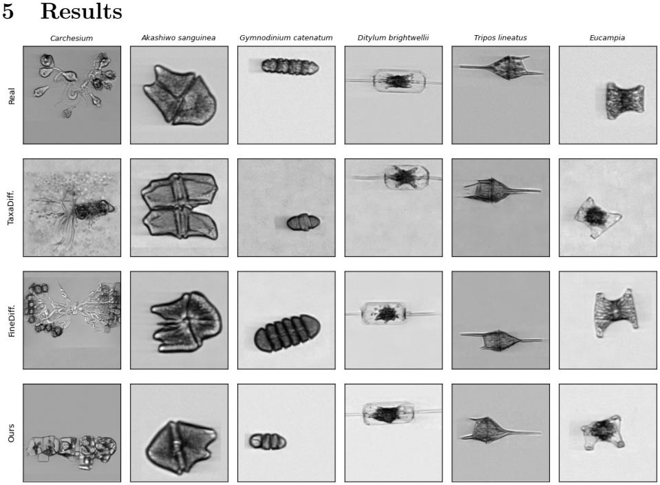
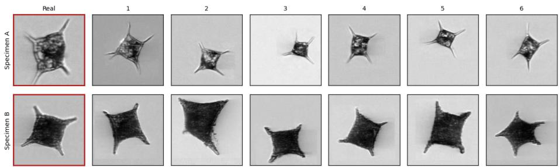

# Multimodal Taxonomic Conditioning for Generative Plankton Imagery

Daniela Ivanova1 , Özgü Göksu1,2 , and Nicolas Pugeault1

1 University of Glasgow, Glasgow, Scotland, UK

Daniela.Ivanova@glasgow.ac.uk, Nicolas.Pugeault@glasgow.ac.uk 2 National Defence University, Istanbul, Türkiye ozgu.goksu@msu.edu.tr

Abstract. Automated plankton imaging produces severely long-tailed datasets, where the rare taxa of greatest ecological interest have too few images to train or evaluate classifiers reliably. We generate synthetic plankton imagery conditioned on taxonomy: a CLIP encoder is adapted on a large plankton corpus with a ranked contrastive objective extended to deep, ragged taxonomies, then frozen to condition a parameter-eficient difusion transformer. We evaluate synthetic sample quality on distributional fidelity and downstream classifier utility.

Keywords: fine-grained recognition · long-tailed recognition · plankton

## 1 Introduction

Automated instruments such as the Imaging FlowCytobot (IFCB) [10] generate plankton imagery far faster than experts can annotate it, and the resulting datasets are severely long-tailed: a handful of abundant taxa dominate, while ecologically important rare species may have fewer than ten images. Generative augmentation is an appealing remedy, but a demanding one for fine-grained morphology, where classes difer by details a generator must reproduce rather than approximate.

Taxonomy ofers structure that ought to help. For instance, two Chaetoceros species share far more visual form than either shares with a ciliate; a generator that knows this can transfer from abundant relatives to rare ones. Recent work exploits this through conditional guidance [12] or through progressive rank-wise training [8] — in both cases, the taxonomy enters through the training procedure rather than the class representation. We instead condition on embeddings whose geometry already encodes it, learned separately from generation: a CLIP encoder is adapted on a large plankton corpus with hierarchical rank annotations [9], then frozen to condition a parameter-eficient difusion transformer. Plankton annotation makes this harder than the fish and insect taxonomies such methods usually target: most specimens are identified only to genus or family, so the hierarchy is deep but unevenly populated, and ranked contrastive objectives do not apply directly.

Our contributions are: (i) an adaptation of ranked contrastive learning to deep, ragged biological taxonomies, with truncation-aware depth matching; (ii) a taxonomy-conditioned difusion model for plankton that decouples hierarchical representation learning from generation; and (iii) an evaluation across distributional fidelity and downstream classifier utility.

## 2 Related Work

Plankton recognition. Kraft et al. [6] establish an operational pipeline for IFCB imagery classification, fine-tuning a ResNet-18 on 63K Baltic Sea images across 50 taxa and addressing class imbalance by random-oversampling rare classes to a minimum of 100 training images. Kareinen et al. [5] exploit self-supervised pre-training on larger corpora of plankton images across imaging instruments and basins to further improve performance. Most recently, Planktonzilla-17M [9] consolidates 3.74M plankton images spanning 602 taxa and thirteen imaging systems, with standardised taxonomic annotations across 7 taxonomic ranks. The authors show that CLIP [14] trained with standard InfoNCE [11] objective and taxonomic lineage as text is competitive with supervised classification, and outperforms even biological foundation models such as BioCLIP [1, 17].

Fine-grained conditional generation. Difusion models produce high-fidelity images but struggle when classes are numerous and visually similar. FineDifusion [12] scales class-conditional generation to 10,000 categories by fine-tuning only the class embedder, biases, and normalisation layers of a pretrained DiT [13] 0.4% of parameters — and introduces hierarchical classifier-free guidance, replacing the unconditional branch with the sample’s superclass so that guidance separates a class from its coarse neighbours rather than from noise. TaxaDiffusion [8] instead adapts Stable Difusion [15] with LoRA [4] modules trained progressively across taxonomic ranks, learning coarse levels before refining to species, and likewise substitutes a higher rank for the unconditional estimate at inference. Both acquire hierarchy through the training procedure or the guidance rule, while the class representation itself remains a learned embedding.

Hierarchical contrastive learning. Flat InfoNCE [11], as used by CLIP and Planktonzilla, treats every non-matching sample as equally negative, which discards the graded similarity a taxonomy provides. RINCE [3] generalises InfoNCE to ranked positives, grading the denominator by rank so that more-similar classes are excluded from a given level’s negatives. Its experiments use two ranks and assume every sample carries a label at every rank. Plankton taxonomies violate both assumptions: they are deep, and in practice ragged, with many specimens identified only to genus or family.

## 3 Method

Our approach difers from prior work in three ways. First, in how much of the hierarchy is used and how. FineDifusion uses a single coarse level, and only in the guidance rule. TaxaDifusion uses all ranks, but keeps CLIP frozen and learns per-rank refinement modules downstream of it, supervised only by the difusion objective. Planktonzilla trains CLIP with the full lineage as a concatenated text string under a standard contrastive objective, so the taxonomy is present in the text but not in the objective. We instead form cumulative lineage strings at each rank and supervise their graded similarity directly, so the hierarchy is present in the embedding geometry before any generator sees it. Second, this adaptation uses a plankton corpus far larger than the generation target, letting the hierarchy be learned where the data supports it. Third, we adapt ranked contrastive learning to a deep, ragged taxonomy, with truncation-aware depth matching and per-rank weighting by batch coverage; to our knowledge the first such application.

We generate plankton images conditioned on taxonomy in two stages. First, a CLIP text encoder is adapted on a large plankton corpus with a rank-aware contrastive objective, producing per-class embeddings whose geometry reflects the taxonomic hierarchy. Downstream, these frozen multimodal embeddings replace the learned class-embedding table of a pretrained difusion transformer.

## 3.1 Taxonomy-aware text encoder

Setup. We adapt OpenCLIP ViT-B/16 with LoRA $\left[ 4 \right] ~ ( r = \alpha { = } 3 2$ , applied to the last $1 2 \ q , v , k$ blocks of both towers) on Planktonzilla-17M [9], using the per-rank cumulative taxonomic lineage as text. Full CLIP training on this corpus takes 100 epochs on 64 H100 GPUs [9]. We use an efective batch size of 2048 on two A5000 GPUs with a gradient accumulation step, learning rate of $1 e - 6$ with Adam, and OneCycle scheduler for 20 epochs.

Ranked contrastive learning. Flat InfoNCE treats every non-matching class as equally negative, discarding the graded similarity a taxonomy provides. RINCE [3] preserves this ordering by partitioning positives into ranks $P _ { 1 } , \ldots , P _ { R }$ of decreasing similarity and applying InfoNCE recursively, treating coarser ranks as negatives at each level:

$$
\begin{array} { r } { \ell _ { i } = - \log \frac { \sum _ { p \in P _ { i } } \exp \left( h ( q , p ) / \tau _ { i } \right) } { \sum _ { p \in \bigcup _ { j \geq i } P _ { j } } \exp \left( h ( q , p ) / \tau _ { i } \right) + \sum _ { n \in N } \exp \left( h ( q , n ) / \tau _ { i } \right) } , } \end{array}\tag{1}
$$

with $\tau _ { i } < \tau _ { i + 1 }$ , so that finer ranks are optimised at sharper temperatures. The total loss is $\textstyle \sum _ { i } \ell _ { i }$

Ragged taxonomies. RINCE assumes every sample carries a label at every rank. Plankton annotations do not: often, specimens are identified only to genus or family. We define the rank of a pair by the shared depth of their lineages $\ell _ { i } , \ell _ { j }$ over R taxonomic levels,

$$
d ( \ell _ { i } , \ell _ { j } ) = \left\{ { \begin{array} { l l } { R , } & { \ell _ { i } = \ell _ { j } } \\ { \operatorname* { m a x } \{ r : \ell _ { i } ^ { 1 : r } = \ell _ { j } ^ { 1 : r } \} , } & { { \mathrm { o t h e r w i s e } } , } \end{array} } \right.\tag{2}
$$

where equality in the first case includes matching truncation – shared depth otherwise counts only populated ranks.

Rank weighting. A query has no rank-d positive whenever no other batch member shares exactly that depth, and on ragged data the afected ranks difer sharply in how much of the batch they constrain. We normalise each rank by the batch size, so that a rank’s influence is proportional to its coverage of the batch rather than uniform across ranks.

## 3.2 Taxonomy-conditioned generation

We follow FineDifusion [12] in freezing a pretrained DiT-XL/2 [13] except for the conditioning embedder, biases, and normalisation layers (2.5M of 676M parameters). The learned class-embeddings are replaced by the frozen CLIP encoder’s embedding; a two-layer MLP projects it to the conditioning width and is the only new trainable component. The lineage text embedding is concatenated with the image embedding of the training image itself. We replace a fraction p=0.5 of training images’ embeddings with their class mean. At inference, this enables conditioning on a class mean image embedding, as we do for our quantitative experiments, or on a specific image’s embedding, as in Figure 2. We retain hierarchical classifier-free guidance: during training a sample’s species-level text embedding is replaced by the embedding of its phylum-level lineage prefix with probability 0.1. We use a batch size of 64 across two A5000 GPUs throughout.

## 4 Experiments

Dataset. We use the WCO L4 Annotated IFCB Training Library [18], collected at the Western Channel Observatory station L4 of Plymouth, UK: 74,181 IFCB images across 145 taxonomic classes, with a strogly long-tailed distribution. This collection is disjoint from Planktonzilla-17M, on which our text encoder is adapted, so the conditioning embeddings are transferred across collections rather than fitted to the generation target. We split 80/20 into train and test, then 90/10 again within train for validation, stratified by class following Kraft et al. [6], giving 52,749 / 6,595 / 14,837 images, with 58 training classes under 100 samples, and a single class left out of the test split due to stratification. The test split is real imagery throughout and identical across every experiment reported, whether the model was trained on real or generated data.

Generation. Each model generates two sets. For the replacement regime, one image per real training image, matching the real training and validation split class-for-class. For the augmentation regime, top-ups for the 58 training classes below the 100-image threshold, $1 0 0 - n _ { c }$ images per class c (3,388 images in total). Sampling uses 250 DDPM steps at guidance scale 4.0 for our models and the FineDifusion baseline; TaxaDifusion is sampled at the settings specified by its authors (250 steps, guidance scale 6). All generated images are cropped to the detected organism with Grounding DINO [7] (prompt "organism.", box threshold 0.15) before downstream classifier evaluation.

## 4.1 Distributional fidelity

We report FID [2] between each model’s replacement set and the real training split, with all sets passed through an identical resize path. Generation at $2 5 6 ^ { \bar { 2 } }$ also compresses aspect ratios relative to real imagery (mean 1.19 vs 1.40), inflating all methods equally. As calibration, FID between two disjoint 3,000-image samples of real data is 10.98 at that sample size.

## 4.2 Downstream classifier utility

We test if generated images can substitute for or augment real training data. We adapt Kraft et al. [6]’s training and evaluation protocol: we train a frozen DINOv3 [16] ViT-S/16 backbone with a three-layer linear head, 20 epochs, three seeds, evaluated by macro-averaged F1 score on the shared real test split. We evaluate training sets created both by the replacement (i.e. fully synthetic) and augmentation (rare classes topped up to 100 with generated images) regimes and we compare against naive oversampling by randomly duplicating real images [6].

  
Fig. 1: Qualitative comparison on three rare (left) and three common (right) classes, with training-set sizes of 2, 13, 7, 3591, 1492 and 3950 images respectively. Rows show a real specimen followed by one sample from each generator.

Table 1 summarises the results from our distributional fidelity and downstream classifier experiments. FineDifusion is the better of the two baselines.

We build upon it and replace its learned per-class embedding table with frozen CLIP text and image embeddings. Our taxonomic-informed conditioning improves fidelity (FID 19.17 vs 22.43) and the ability of synthetic data to substitute for real data, raising macro-F1 from 0.603 to 0.664 when the classifier is trained on generated images alone with the three generators ordered identically by FID and by replacement utility. When synthetic data instead only augments the rare classes of the real training set, the regime does not resolve diferences between generators: ours, FineDifusion and TaxaDifusion are all statistically indistinguishable from duplicating real images, and duplication is itself indistinguishable from no oversampling at all (0.875 vs 0.869). Our conditioning does underperform on the smallest classes, losing to duplication by 0.113 macro-F1 over the four classes with $\leq 2$ training images.

Table 1: Macro F1 over 144 classes on the shared real test split, mean ± standard deviation over three seeds, with the rare (< 100 training images, n=52) and common (n=92) subsets shown separately. FID is measured between the same replacement set and the real training split.
<table><tr><td>Regime</td><td>Training data FID ↓</td><td>F1 all ↑</td><td>F1 rare ↑</td><td>F1 common ↑</td></tr><tr><td></td><td>real only</td><td> $0 . 8 6 9 \pm 0 . 0 0 5$ </td><td> $0 . 7 8 6 \pm 0 . 0 1 4$ </td><td> $0 . 9 1 6 \pm 0 . 0 0 2$ </td></tr><tr><td rowspan="3">Replace</td><td>TaxaDiffusion43.62</td><td> $0 . 5 1 3 \pm 0 . 0 0 8$ </td><td> $0 . 3 0 5 \pm 0 . 0 1 5$ </td><td> $0 . 6 3 0 \pm 0 . 0 0 6$ </td></tr><tr><td>FineDiffusion 22.43</td><td> $0 . 6 0 3 \pm 0 . 0 0 3$ </td><td> $0 . 4 2 1 \pm 0 . 0 0 5$ </td><td> $0 . 7 0 6 \pm 0 . 0 0 1$ </td></tr><tr><td>Ours</td><td>19.17 0.664 ± 0.003 0.486 ± 0.018 0.765 ± 0.005</td><td></td><td></td></tr><tr><td rowspan="4">Augment</td><td>naive [6]</td><td> $0 . 8 7 5 \pm 0 . 0 0 3$ </td><td>0.806 ± 0.006</td><td> $0 . 9 1 4 \pm 0 . 0 0 1$ </td></tr><tr><td>TaxaDiffusion</td><td> $0 . 8 4 3 \pm 0 . 0 0 5$ </td><td> $0 . 7 1 8 \pm 0 . 0 1 4$ </td><td> $0 . 9 1 4 \pm 0 . 0 0 0$ </td></tr><tr><td>FineDiffusion</td><td> $\mathbf { 0 . 8 7 6 \pm 0 . 0 0 1 }$ </td><td> $0 . 8 0 4 \pm 0 . 0 0 1$ </td><td> $\mathbf { 0 . 9 1 7 \pm 0 . 0 0 1 }$ </td></tr><tr><td>Ours</td><td> $0 . 8 6 7 \pm 0 . 0 0 3$ </td><td> $0 . 7 8 0 \pm 0 . 0 0 6$ </td><td> $0 . 9 1 5 \pm 0 . 0 0 2$ </td></tr></table>

  
Fig. 2: Specimen-conditioned generation. Each row shows a real training image (left) followed by four samples generated from that image’s own CLIP image embedding rather than the class prototype.

A possible explanation is that taxonomic proximity does not imply visual proximity, as with Carchesium (Fig 1, col. 1), a sessile colonial ciliate whose nearest taxonomic neighbours are free-swimming solitary ciliates and whose own images agree at $\cos = 0 . 9 4$ in CLIP image space while its nearest neighbour by text embedding sits at $\mathrm { c o s } = 0 . 5 8$ in appearance. A frozen semantic embedding has nothing to transfer from in such cases, whereas a free per-class table can memorise the two available images. Still, our approach presents a diferent and useful capability a learned per-class embedding table cannot express. Conditioning on a per-specimen CLIP image embedding rather than a class prototype generates variations of a particular individual, as in Fig. 2. Our results motivate further exploration into modeling taxonomic relationships across modalities as conditioning signals for generative models.

## References

1. Gu, J., Stevens, S., Campolongo, E.G., Thompson, M.J., Zhang, N., Wu, J., Kopanev, A., Mai, Z., White, A.E., Balhof, J., Dahdul, W., Rubenstein, D., Lapp, H., Berger-Wolf, T., Chao, W.L., Su, Y.: Bioclip 2: Emergent Properties from Scaling Hierarchical Contrastive Learning. In: The Thirty-ninth Annual Conference on Neural Information Processing Systems (2025) 2

2. Heusel, M., Ramsauer, H., Unterthiner, T., Nessler, B., Hochreiter, S.: Gans trained by a two time-scale update rule converge to a local nash equilibrium. Advances in neural information processing systems 30 (2017) 5

3. Hofmann, D.T., Behrmann, N., Gall, J., Brox, T., Noroozi, M.: Ranking Info Noise Contrastive Estimation: Boosting Contrastive Learning via Ranked Positives. In: AAAI Conference on Artificial Intelligence. vol. abs/2201.11736 (2022) 2, 3

4. Hu, J., Shen, Y., Wallis, P., Allen-Zhu, Z., Li, Y., Wang, S., Chen, W.: Lora: Low-Rank Adaptation of Large Language Models. In: International Conference on Learning Representations. vol. abs/2106.09685 (2021) 2, 3

5. Kareinen, J., Eerola, T., Kraft, K., Lensu, L., Suikkanen, S., Kälviäinen, H.: Self-Supervised Pretraining for Fine-Grained Plankton Recognition. In: 2025 IEEE/CVF Conference on Computer Vision and Pattern Recognition Workshops (CVPRW). pp. 2122–2132. IEEE (2025) 2

6. Kraft, K., Velhonoja, O., Eerola, T., Suikkanen, S., Tamminen, T., Haraguchi, L., Ylöstalo, P., Kielosto, S., Johansson, M., Lensu, L., et al.: Towards operational phytoplankton recognition with automated high-throughput imaging, near-real-time data processing, and convolutional neural networks. Frontiers in Marine Science 9, 867695 (2022) 2, 4, 5, 6

7. Liu, S., Zeng, Z., Ren, T., Li, F., Zhang, H., Yang, J., Jiang, Q., Li, C., Yang, J., Su, H., et al.: Grounding dino: Marrying dino with grounded pre-training for open-set object detection. In: European conference on computer vision. pp. 38–55. Springer (2024) 4

8. Monsefi, A.K., Khurana, M., Ramnath, R., Karpatne, A., Chao, W.L., Zhang, C.: Taxadifusion: Progressively Trained Difusion Model for Fine-Grained Species Generation. In: IEEE International Conference on Computer Vision. vol. abs/2506.01923, pp. 8579–8589 (2025) 1, 2

9. Montanares, A.G.C., Valenzuela, L., Martí, L., S’anchez-Pi, N.: Planktonzilla: Multimodal dataset and models for understanding plankton ecosystems. arXiv (2026) 1, 2, 3

10. Olson, R.J., Sosik, H.M.: A submersible imaging-in-flow instrument to analyze nano-and microplankton: Imaging flowcytobot. Limnology and Oceanography: Methods 5(6), 195–203 (2007) 1

11. Oord, A.v.d., Li, Y., Vinyals, O.: Representation Learning with Contrastive Predictive Coding. arXiv.org abs/1807.03748 (2018) 2

12. Pan, Z., Wang, K., Li, G., He, F., Lai, Y.: Finedifusion: scaling up difusion models for fine-grained image generation with 10,000 classes. Applied Intelligence 55(4), 309 (2025) 1, 2, 4

13. Peebles, W.S., Xie, S.: Scalable Difusion Models with Transformers. In: IEEE International Conference on Computer Vision. pp. 4172–4182 (2022) 2, 4

14. Radford, A., Kim, J.W., Hallacy, C., Ramesh, A., Goh, G., Agarwal, S., Sastry, G., Askell, A., Mishkin, P., Clark, J., Krueger, G., Sutskever, I.: Learning Transferable Visual Models From Natural Language Supervision. In: International Conference on Machine Learning. vol. abs/2103.00020 (2021) 2

15. Rombach, R., Blattmann, A., Lorenz, D., Esser, P., Ommer, B.: High-Resolution Image Synthesis with Latent Difusion Models. In: 2022 IEEE/CVF Conference on Computer Vision and Pattern Recognition (CVPR). pp. 10674–10685. IEEE (2022) 2

16. Siméoni, O., Vo, H.V., Seitzer, M., Baldassarre, F., Oquab, M., Jose, C., Khalidov, V., Szafraniec, M., Yi, S., Ramamonjisoa, M., Massa, F., Haziza, D., Wehrstedt, L., Wang, J., Darcet, T., Moutakanni, T., Sentana, L., Roberts, C., Vedaldi, A., Tolan, J., Brandt, J., Couprie, C., Mairal, J., Jégou, H., Labatut, P., Bojanowski, P.: Dinov3. arXiv (2025) 5

17. Stevens, S., Wu, J., Thompson, M.J., Campolongo, E.G., Song, C.H., Carlyn, D.E., Dong, L., Dahdul, W.M., Stewart, C., Berger-Wolf, T., Chao, W.L., Su, Y.: Bioclip: A Vision Foundation Model for the Tree of Life. In: IEEE/CVF Conference on Computer Vision and Pattern Recognition (CVPR) (2024) 2

18. Widdicombe, C.: WCO L4 Annotated IFCB Training Library - Western English Channel, UK (2026). https://doi.org/10.5281/zenodo.20412178, https://doi. org/10.5281/zenodo.20412178 4