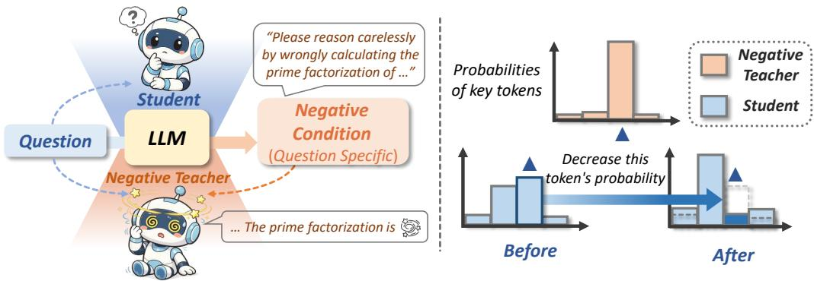
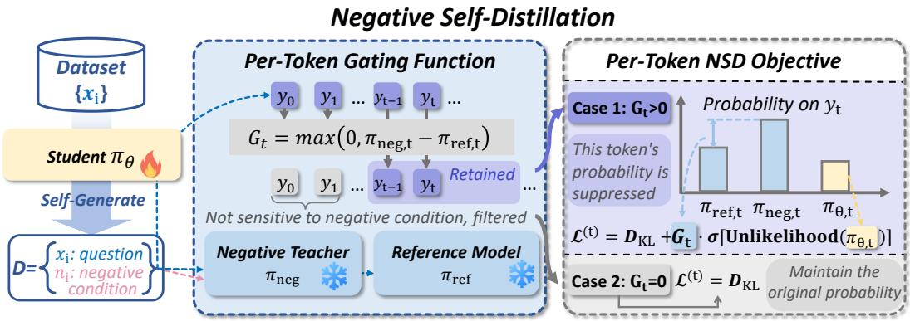
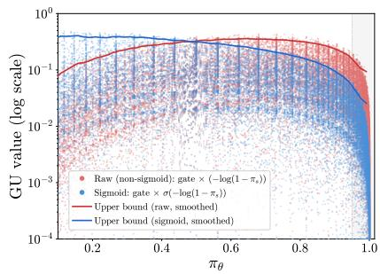
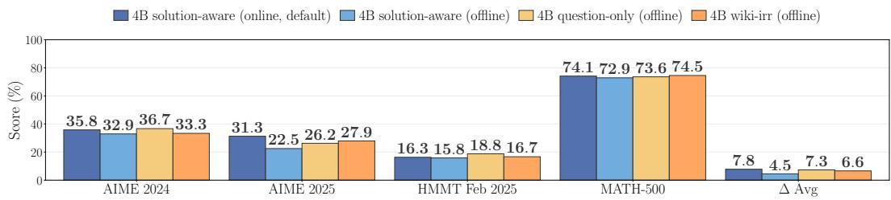
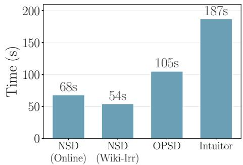
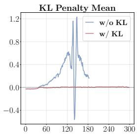
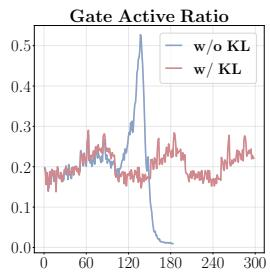
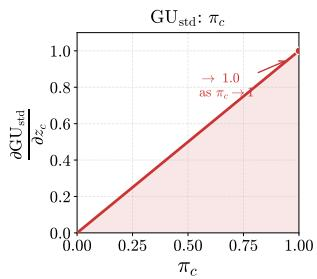
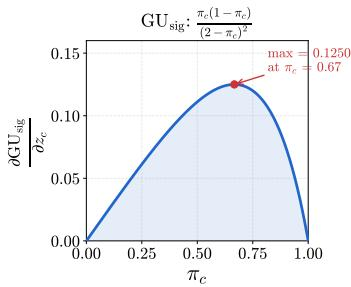
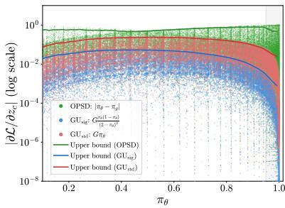

# NEGATIVE SELF-DISTILLATION: LEARNING TOREASON BY AVOIDING FLAWS

Rongcan Pei1, Zhepei Wei1, Shuyao Xu2, Xinyu Zhu1, Wei-Lin Chen1, and Yu Meng1 1Department of Computer Science, University of Virginia 2Stanford University {peirongcan,zhepei.wei,xinyuzhu,wlchen,yumeng5}@virginia.edu shuyao@stanford.edu

GitHub Hugging Face

## ABSTRACT

On-Policy Self-Distillation (OPSD) has emerged as a popular paradigm for large language model (LLM) self-improvement, allowing models to act as their own teachers by leveraging privileged information such as ground-truth solutions. However, recent findings indicate that OPSD can severely degrade the performance of LLMs on complex reasoning tasks: By forcing the student to imitate an artificially confident reasoning trace conditioned on privileged information, OPSD inadvertently suppresses expressions of uncertainty and penalizes the exploratory, self-corrective behaviors required to solve challenging problems. To address this, we introduce Negative Self-Distillation (NSD), a new framework that optimizes LLMs by diverging from flawed reasoning rather than imitating privileged solutions. Instead of relying on ground-truth answers or external supervision, NSD uses the model itself to generate a question-specific negative condition (e.g., acting as a “careless reasoner”) and pushes the student’s distribution away from this self-generated negative teacher. Naively applying unlearning objectives to achieve this divergence is problematic, as flawed reasoning tokens are confounded with basic linguistic tokens; indiscriminately penalizing both risks catastrophically degrading the model’s foundational language capabilities. We resolve this by designing a dynamic gating mechanism that automatically identifies and isolates reasoning-critical tokens, ensuring gradient updates target only behavioral flaws while preserving the model’s linguistic priors. Empirically, NSD consistently outperforms OPSD and other label-free, self-bootstrapping reinforcement learning (RL) baselines. Across seven mathematical reasoning benchmarks (AIME 24/25/26, HMMT, AMC, OlympiadBench, and MATH), NSD achieves average gains of 2.3%, 7.5%, and 6.0% for 1.7B, 4B, and 8B models, respectively. Further analyses show that NSD achieves higher training efficiency while preserving the self-correction behaviors crucial for complex reasoning.

  
Figure 1: Overview of the NSD framework. (Left) We construct a negative teacher from the same base model via self-generated negative conditioning. (Right) The student model is optimized to diverge its distribution from that of the negative teacher.

## 1 INTRODUCTION

Reinforcement Learning with Verifiable Rewards (RLVR) (Shao et al., 2024; Yu et al., 2025; Lambert et al., 2025) has emerged as an effective paradigm for enhancing the reasoning capabilities of large language models (LLMs). However, RLVR is often bottlenecked by computational inefficiency and training signal sparsity. These challenges arise because (1) sampling multiple rollouts per query is expensive, and rollouts within a group frequently receive identical rewards on exceptionally easy or difficult problems, leading to advantage collapse and vanishing gradients (Liao et al., 2026; Xu et al., 2026a; Zhang et al., 2025b); and (2) outcome-based rewards are applied uniformly across the entire generated sequence, which obscures fine-grained, token-level credit assignment. To mitigate these limitations, On-Policy Distillation (OPD) (Agarwal et al., 2024; Lu & Lab, 2025; Song & Zheng, 2026) utilizes a stronger, external teacher model to provide dense token-level supervision over the student model’s self-sampled reasoning trajectories. While this approach successfully yields richer feedback, it introduces a practical constraint: obtaining a strictly superior external teacher that is both sufficiently capable of providing accurate dense supervision and compatible with the student’s tokenizer is often impractical.

To circumvent the reliance on external teacher models, On-Policy Self-Distillation (OPSD) (Zhao et al., 2026a; Shenfeld et al., 2026; Hübotter et al., 2026) has been proposed as a scalable alternative. In OPSD, the model acts as its own teacher by utilizing privileged information (e.g., ground-truth answers) to generate dense supervision signals for the student’s self-sampled trajectories. However, because the OPSD teacher inherently knows the ground-truth solution, it tends to produce artificially confident and highly linear reasoning trajectories (Kim et al., 2026b; Harne et al., 2026). Consequently, forcing the student to minimize the divergence from this teacher distribution inadvertently suppresses high-entropy exploration, expressions of uncertainty, and self-corrective behaviors, which are essential for complex problem-solving.

Motivated by the observation that imitating a synthetically confident oracle can degrade natural reasoning processes, we explore an alternative training paradigm: optimizing the model to explicitly avoid flawed reasoning patterns. We introduce Negative Self-Distillation (NSD), a fully selfbootstrapped framework that operates without external privileged data. Instead of utilizing a teacher conditioned on the correct answer, the model is prompted to generate a question-specific negative condition (e.g., acting as a “careless reasoner”) to instantiate a negative teacher. The student is then optimized to move its token distribution away from the negative teacher, encouraging it to avoid premature conclusions and other flawed reasoning patterns. Importantly, the negative signal is generated from the model itself and does not require ground-truth solutions or external annotations.

A central challenge, however, is that not every token assigned high likelihood by the negatively condi tioned teacher corresponds to a reasoning error. A naive divergence or unlikelihood objective (Welleck et al., 2020) can also penalize ordinary linguistic tokens, degrading the model’s pretrained linguistic priors. NSD therefore introduces a dynamic token-level gating mechanism that compares the negative teacher with a benign reference model and activates the negative objective only when the negative condition increases the likelihood of the sampled token. We further stabilize these updates with a bounded unlikelihood formulation and a KL-based regularization term, preventing excessive updates on high-confidence structural tokens while retaining targeted supervision on reasoning-critical tokens. This design yields a training signal that is both selective and computationally efficient: NSD requires only a single student rollout per sample, avoids full-vocabulary logit alignment, and can parallelize the reference and negative-teacher computations. Beyond accuracy, our analysis shows that NSD preserves and strengthens reflective self-correction behavior rather than encouraging overly confident, linear reasoning. Our main contributions are summarized as follows:

• We propose Negative Self-Distillation (NSD), a label-free, fully self-bootstrapped framework that enhances reasoning capabilities by optimizing the model to diverge from self-generated flawed trajectories, eliminating the need for ground-truth solutions or an external teacher.

• We introduce a token-level gating mechanism together with a bounded unlikelihood objective, enabling targeted divergence from flawed reasoning while preserving foundational language priors.

• We demonstrate that NSD consistently outperforms existing training paradigms (i.e., OPSD (Zhao et al., 2026a), Intuitor (Zhao et al., 2026b) and TTRL (Zuo et al., 2025)) across 1.7B, 4B, and 8B model sizes on seven reasoning tasks. Furthermore, NSD achieves superior training efficiency, mitigates overconfidence, and preserves the model’s intrinsic reflection capabilities.

## 2 NSD: NEGATIVE SELF-DISTILLATION

  
Figure 2: Overview of Negative Self-Distillation. The student model generates negative conditions from the unlabeled training data (Left). We then compare the token distributions between benign and negative contexts, isolating the tokens whose probabilities are abnormally boosted by the negative condition (Mid). Finally, the model is penalized to suppress the probabilities of these isolated tokens, while the filtered benign tokens are regularized only by KL divergence (Right).

We consider a label-free training dataset denoted as $\mathcal { D } _ { \mathrm { r a w } } = \{ ( x _ { i } ) \} _ { i = 1 } ^ { N } ,$ where $x _ { i }$ represents the problem statement. Our method consists of two core components: self negative conditioning and NSD training. We first prompt the student model $\pi _ { \theta }$ to generate a negative condition prompt $n _ { i }$ for each problem. By conditioning the model on this prompt $n _ { i } .$ , we construct a negative teacher $\pi _ { \mathrm { n { e g } } } $ We then penalize the student’s alignment with the teacher under a simple gating mechanism to avoid applying penalty to reasoning-irrelevant tokens. The overview of NSD is shown in Figure 2.

## 2.1 NEGATIVE CONDITION PROMPT GENERATION

The objective of this module is to allocate a negative instruction $n _ { i }$ to each training sample designed to induce flawed reasoning patterns, thereby augmenting the original $\mathcal { D } _ { \mathrm { r a w } }$ into a full negativeconditioned dataset $\mathcal { D } = \{ ( \overline { { x } } _ { i } , n _ { i } ) \} _ { i = 1 } ^ { N } .$ The negative condition generation strategy should follow the self-generation or easy-to-get principle, without utilizing any gold answer. By default, we adopt an online generation strategy: For a given training problem $x ,$ we first sample an initial solution yinit from the student model $\pi _ { \theta }$ . Conditioned on both the problem and this initial response, we then prompt the student model to generate an adaptive negative condition n based on its existing reasoning trace (the complete prompt is provided in Appendix C.3.):

$$
y _ { \mathrm { i n i t } } \sim \pi _ { \theta } ( \cdot \mid x ) , \quad n \sim \pi _ { \theta } ( \cdot \mid x , y _ { \mathrm { i n i t } } )\tag{1}
$$

Our framework can naturally accommodate alternative negative condition generation strategies (discussed in Section 4.3). We default to generating negative conditions on the fly during training as it provides the most stable and effective supervision signal.

## 2.2 BACKGROUND AND CHALLENGES IN UNLIKELIHOOD TRAINING

Our motivation of the NSD training objective is to move the student’s logits distribution away from the negative teacher model’s flawed reasoning behaviors through dense token-level supervision. A natural approach to achieve this is standard unlikelihood training (Welleck et al. (2020)), which minimizes the following objective to suppress the probability of undesirable tokens:

$$
{ \mathcal { L } } _ { \mathrm { u n l i k e l i h o o d } } = - \log ( 1 - \pi _ { \theta } ( y _ { t } \mid x _ { i } , y _ { < t } ) )
$$

However, directly optimizing the objective to distance the student model from the negative teacher’s distribution presents two critical challenges and research questions (RQs):

(1) Indiscriminately treating every highly probable token under the negatively conditioned teacher as a flaw and applying the unlikelihood training is problematic, as ordinary grammatical tokens can appear in both normal and flawed reasoning; unlearning them could easily lead to the degradation of fundamental reasoning capabilities. RQ1: How to identify the tokens that represent genuine reasoning flaws?

(2) This unbounded unlikelihood objective is catastrophic for highly confident, trivial tokens $( e . g .$ punctuation or spaces) — it triggers loss explosions and overly strong gradient that destabilize training and destroy the model’s inherent logic. Specifically, as $\pi _ { \theta }  1$ , the $\mathcal { L } _ { \mathrm { u n l i k e l i h o o d } }$ approaches and the gradient approaches the maximum (as detailed in Appendix A). As a considerable number of tokens have a relatively high probability, this unbounded penalty triggers gradient explosions, also forcing the student to unlearn fixed fundamental linguistic priors $( e . g .$ ., how to use punctuations) and rapidly update the model parameters in an unstable direction. RQ2: How to formulate a penalty to avoid gradient and loss explosions for training stability?

## 2.3 THE NSD TRAINING OBJECTIVE

Token-level adaptive gating. To address RQ1, we propose the gating mechanism to filter out grammatical tokens. During the training phase, the student model generates reasoning trajectories $y = ( y _ { 1 } , \dots , y _ { T } ) \sim \pi _ { \theta }$ . To construct the gating signals, we instantiate two frozen teacher models based on the same initial student model:

• Reference model $\mathrm { ( \pi _ { r e f } ) } { \mathrm { : } }$ Conditioned only on the original problem $x _ { i }$ , predicting the nominal probability $\pi _ { \mathrm { r e f } } ( y _ { t } \mid x _ { i } , y _ { < t } )$ .

• Negative teacher $\mathbf { ( \pi _ { n e g } ) : }$ Conditioned on both the problem and the generated negative prompt $n _ { i }$ predicting the negatively biased probability $\pi _ { \mathrm { n e g } } ( y _ { t } \mid x _ { i } , n _ { i } , y _ { < t } )$ . Note that $\pi _ { \mathrm { n { e g } } }$ shares the same model weights as $\pi _ { \mathrm { r e f } }$ , differing only by the negative context.

We introduce a simple gating function that compares the probabilities of both models to filter out ordinary linguistic tokens and identify the tokens sensitive to the negative injection. For a given student-generated token $y _ { t } \sim \pi _ { \theta } .$ , the gate is defined as the adjusted positive divergence between the probability of negative and reference model on this token:

$$
G _ { t } = \operatorname* { m a x } \Big ( 0 , \pi _ { \mathrm { n e g } } ( y _ { t } \mid x _ { i } , n _ { i } , y _ { < t } ) - \pi _ { \mathrm { r e f } } ( y _ { t } \mid x _ { i } , y _ { < t } ) \Big )\tag{2}
$$

The gate $G _ { t } \in [ 0 , 1 ]$ acts as an automatic noise filter. If $\pi _ { \mathrm { r e f } } \geq \pi _ { \mathrm { n e g } } .$ , the token is not activated by a negative condition and naturally exempt from penalization, preserving the model’s original generative distribution. Conversely, if $\pi _ { \mathrm { n e g } } > \pi _ { \mathrm { r e f } }$ , it indicates that the negative prompt has boosted the token’s likelihood, marking it as a critical target for suppression. Crucially, the penalty weight scales proportionally to this positive gap: a larger divergence directly translates to a heavier penalization.

Gated unlikelihood penalty. To formulate a mathematically sound penalty (i.e., the second challenge) and address RQ2, after filtering structural noise via the dynamic gate $G _ { t }$ , we introduce a Sigmoid-bounded unlikelihood penalty: We squash the penalty using a Sigmoid function, yielding $\frac { 1 } { 2 - \pi _ { \theta } \left( y _ { t } | x _ { i } , y _ { < t } \right) }$ . The Gated Unlikelihood (GU) penalty is formulated as:

$$
\begin{array} { l } { \displaystyle \mathcal { L } _ { \mathrm { G U } } ^ { ( t ) } = G _ { t } \cdot \sigma \Big ( - \log \big ( 1 - \pi _ { \theta } ( y _ { t } \mid x _ { i } , y _ { < t } ) \big ) \Big ) } \\ { \displaystyle = G _ { t } \cdot \frac { 1 } { 2 - \pi _ { \theta } \big ( y _ { t } \mid x _ { i } , y _ { < t } \big ) } } \end{array}\tag{3}
$$

This bounded formulation actively repels the student from negative flaws while safely preserving essential structural tokens. As shown in Figure 3, our sigmoid formulation allocates the strongest unlearning signals to low-to-mid confidence tokens, thereby avoiding gradient explosion on highprobability tokens. We further discuss the GU objective in detail in Section 5.3.

Regularization and overall objective. Let $\pi _ { \boldsymbol { \theta } } { \left( y _ { t } \mid x _ { i } , y _ { < t } \right) }$ denote the current student model being optimized. Our goal is to push the student’s distribution away from the identified vulnerabilities without destroying its fundamental linguistic priors. To further regularize the objective, we introduce a point-wise forward KL penalty evaluated on the sampled token $y _ { t }$ . Instead of computing the fullvocabulary KL divergence, which is computationally heavy during rollouts, we apply an empirical

Raw: gate ( log(1 ¼ ))   
Wait , maybe I should write it as a   
fraction to be precise . 2 2 . 5 is 4 5 / 2 .   
Let me check that again .   
Sigmoid: gate ¾( log(1 ¼ ))   
Wait , maybe I should write it as a   
fraction to be precise . 2 2 . 5 is 4 5 / 2 .   
Let me check that again .   
unactivated activated

  
Figure 3: Left: After applying the sigmoid function, the gated unlikelihood (GU) values are reduced for basic tokens (e.g., punctuations), preventing gradient explosion. Right: The ${ \mathcal { L } } _ { \mathrm { G U } }$ value distribution over 4,096 tokens from 100 training samples, showing that the sigmoid objective avoids penalization spikes on high-probability tokens, redistributing the ${ \mathcal { L } } _ { \mathrm { G U } }$ weights toward tokens with low-to-mid probabilities in the student model.

reference-weighted anchor:

$$
{ \mathcal { L } } _ { \mathrm { K L } } ^ { ( t ) } = \pi _ { \mathrm { r e f } } ( y _ { t } \mid x _ { i } , y _ { < t } ) \cdot \log { \frac { \pi _ { \mathrm { r e f } } ( y _ { t } \mid x _ { i } , y _ { < t } ) } { \pi _ { \theta } ( y _ { t } \mid x _ { i } , y _ { < t } ) } }\tag{4}
$$

This is a single-sample importance-weighted estimator of $D _ { \mathrm { K L } } ( \pi _ { \mathrm { r e f } } \Vert \pi _ { \theta } )$ evaluated on the sampled token $y _ { t }$ . We finally formulate the NSD loss for a single token $y _ { t }$ as a composite objective:

$$
\mathcal { L } _ { \mathrm { N S D } } ^ { ( t ) } = \mathcal { L } _ { \mathrm { G U } } ^ { ( t ) } + \alpha \cdot \mathcal { L } _ { \mathrm { K L } } ^ { ( t ) }\tag{5}
$$

where α is a hyperparameter. The full NSD algorithm is shown in Algorithm 1.

For every component in the $\mathcal { L } _ { \mathrm { N S D } }$ , we validate its necessity and effectiveness through ablation studies in Section 5. The overall objective is calculated by aggregating the token-level losses across the dataset:

$$
\mathcal { I } ( \theta ) = \mathbb { E } _ { ( x , n ) \sim \mathcal { D } , y \sim \pi _ { \theta } } \left[ \sum _ { t = 1 } ^ { | y | } \mathcal { L } _ { \mathrm { N S D } } ^ { ( t ) } \right]\tag{6}
$$

Algorithm 1 Negative Self-Distillation (NSD) Training   
Require: Unlabeled dataset $\mathcal { D } _ { \mathrm { r a w } } = \{ x _ { i } \} _ { i = 1 } ^ { N }$ , Initial model $\pi _ { \theta _ { 0 } } , \mathrm { K L }$ weight α   
Ensure: Optimized student model $\pi _ { \theta }$   
1: Initialize student $\pi _ { \theta } ,$ , and frozen teachers $\pi _ { \mathrm { r e f } } , \pi _ { \mathrm { n e g } }  \pi _ { \theta _ { 0 } }$   
2: for $x _ { i } \in \mathcal { D } _ { \operatorname { r a w } }$ do   
3: Sample reasoning trajectory $y = ( y _ { 1 } , \dots , y _ { T } ) \sim \pi _ { \theta } ( \cdot \mid x _ { i } )$ and the negative prompt $n _ { i }$ 2   
$\pi _ { \theta } ( \cdot \mid x _ { i } , y )$   
4: Initialize loss $\mathcal { I } _ { i }  0$   
5: for $t = 1 , \dots , T$ do   
6: $p _ { \mathrm { r e f } }  \pi _ { \mathrm { r e f } } ( y _ { t } \mid x _ { i } , y _ { < t } )$   
7: $p _ { \mathrm { n e g } }  \pi _ { \mathrm { n e g } } ( y _ { t } \mid x _ { i } , n _ { i } , y _ { < t } )$   
8: $p _ { \theta } \gets \pi _ { \theta } ( y _ { t } \vert x _ { i } , y _ { < t } )$   
9: $G _ { t } \gets \operatorname* { m a x } ( 0 , p _ { \mathrm { n e g } } - p _ { \mathrm { r e f } } )$   
10: $\begin{array} { r } { \mathcal { L } _ { \mathrm { N S D } } ^ { ( t ) }  \frac { G _ { t } } { 2 - p _ { \theta } } + \alpha p _ { \mathrm { r e f } } \log \frac { p _ { \mathrm { r e f } } } { p _ { \theta } } } \end{array}$   
11: ${ \mathcal { T } } _ { i } \gets { \mathcal { T } } _ { i } + { \mathcal { L } } _ { \mathrm { N S D } } ^ { ( t ) }$   
12: end for   
13: Update θ using gradient $\nabla _ { \boldsymbol { \theta } } \mathcal { I } _ { i }$   
14: end for   
15: return $\pi _ { \theta }$

## 3 EXPERIMENTAL SETUP

Training setup. We use the MATH (Hendrycks et al., 2021) dataset as training dataset (for NSD, Intuitor and TTRL training, we discard the gold labels). We conduct training on the following models: Qwen3-1.7B, Qwen3-4B, and Qwen3-8B (Team, 2025). All models are trained for a total of 2 epochs, which is enough to plateau in all baselines. We set α = 0.01, top-k = 32, batch size = 32. For NSD, we set the max generation length to 4096.

Evaluation. We evaluate the math reasoning ability of all models on the following benchmarks: AIME 2024, AIME 2025, AIME 2026, HMMT 2025 (Dekoninck et al., 2026), MATH-500, AMC 2023 and OlympiadBench (He et al., 2024). For OlympiadBench, we exclude the proof problems. By default, we set hyperparameters according to the recommended setting in Qwen3 report (Team, 2025): temperature = 0.6; top-p = 0.95; top-k = 20. The output length is set to 32K.

Baselines. We compare with the following methods representing three different training paradigms: OPSD (Zhao et al., 2026a): A standard distillation framework that minimizes the full-vocabulary KL divergence between the student and a teacher conditioned on the gold solution. Intuitor (Zhao et al., 2026b): A representative RLIF (Reinforcement Learning from Internal Feedback) implementation, which is a variant of GRPO and utilizes average confidence (self-certainty) as the intrinsic reward. TTRL (Zuo et al., 2025): A variant of GRPO that utilizes the majority-voting consensus as pseudogold labels. While vanilla TTRL typically optimizes directly on the test set, we apply it to the training dataset to ensure a fair comparison with other baseline methods.

A conceptual comparison of NSD with existing related methods, along with their implementation details and prompt templates, is provided in Appendix B and C.

## 4 EVALUATION RESULTS

In this section, we first present the main experimental results across multiple mathematical reasoning benchmarks (§4.1). Then we empirically demonstrate NSD achieves better training efficiency and promotes reflection abilities compared to other baselines (§4.2, §4.4). Finally, we show that employing simpler negative conditioning strategies in NSD can also yield comparable effectiveness (§4.3).

## 4.1 MAIN RESULTS

The main results are shown in Table 1. We highlight the following key observations:

NSD achieves the overall best performance on the models with different sizes. As shown in Table 1, NSD consistently achieves the highest average improvements across all model scales, yielding ∆ Avg gains of +2.3%, +7.5%, and +6.0% on the three models respectively. While baselines like OPSD† and RL excel narrowly on AIME 2024, our 4B and 8B models achieve broader generalization across diverse math tasks, maintaining peak AIME accuracies of 35.8% and 39.6%. Notably, unlike other baselines where small improvements possibly partly stem from randomness, NSD guarantees stable performance gains, supported by a significantly low p-value.

NSD is more promising on larger model sizes due to self-generated negative conditions. An observation from Table 1 is that NSD exhibits stronger performance gains on larger models compared to the smaller 1.7B variant. This scaling behavior is tied to our online negative condition generation mechanism: NSD uses on the model itself to generate solution-specific negative conditions. By optimizing against these higher-quality conditions, larger models receive a stronger contrastive training signal, which translates into substantial improvements on challenging reasoning tasks.

Why does NSD outperform other baselines? Compared to OPSD, label-free training of NSD without the privileged information prevents bias (e.g., reinforcing reasoning shortcuts due to the gold solution) and reflection collapse caused by overconfidence (Kim et al., 2026b). We provide additional analysis in Section 4.2 that further confirms NSD better promotes reflection behaviors than other methods. Case studies in Appendix D.4 also illustrate how NSD-trained models abandon the wrong reasoning trajectory and switch to the right one. Compared to Intuitor and TTRL which use model confidence or majority voting to generate training signals, NSD removes the reliance on the model’s self-judgement ability, which leads to possible incorrect training signals. For example, weaker models hardly gain improvement from Intuitor (-0.5% on Qwen3-1.7B) because their high confidence does not necessarily equate to high accuracy. Furthermore, those confidence-based bootstrapping methods also degrade the reflection ability, as shown in Section 4.2

Table 1: Main evaluation results on mathematical reasoning benchmarks. We report the Avg@8 (%) performance under non-thinking mode (we report the performance under thinking mode in Appendix D.2). ∆ Avg is the average absolute improvement over the same-size baseline across all 7 benchmarks. We report the best checkpoint on the validation set within 2 training epochs. Bold marks the best result in each model-size group; underline marks the second best. denotes methods that require ground-truth labels. The last two columns report the 95% CI and one-sided p-value (which measures the probability of observing an improvement at least as large as the really observed one if the improvement were due to chance) for ∆ Avg@8, respectively. OlympiadBench is evaluated on the 675 open-ended math problems (excluding proof problems) using the official judger with symbolic comparison.
<table><tr><td>Method</td><td>AIME 2024</td><td>AIME 2025</td><td>AIME 2026</td><td>HMMT 2025 Feb</td><td>AMC 2023</td><td>Olympiad- Bench</td><td>MATH- 500</td><td>∆ Avg</td><td>95% CI</td><td>p</td></tr><tr><td>1.7B Models</td><td></td><td></td><td></td><td></td><td></td><td></td><td></td><td></td><td></td><td></td></tr><tr><td>Qwen3-1.7B</td><td>9.6</td><td>10.0</td><td>9.6</td><td>7.1</td><td>44.1</td><td>37.1</td><td>62.5</td><td></td><td></td><td></td></tr><tr><td>OPSD†</td><td>15.0</td><td>14.2</td><td>8.8</td><td>5.8</td><td>44.1</td><td>37.2</td><td>62.5</td><td>+1.1</td><td>[−0.3, +2.4]</td><td>0.06</td></tr><tr><td>Intuitor</td><td>13.8</td><td>8.3</td><td>8.3</td><td>6.7</td><td>43.4</td><td>35.4</td><td>60.6</td><td>-0.5</td><td>[−1.8, +0.8]</td><td>0.29</td></tr><tr><td>TTRL</td><td>11.3</td><td>11.3</td><td>9.6</td><td>8.3</td><td>41.6</td><td>36.8</td><td>63.4</td><td>+0.3</td><td>[−1.0, +1.5]</td><td>0.29</td></tr><tr><td>NSD</td><td>14.2</td><td>17.9</td><td>10.0</td><td>7.1</td><td>45.9</td><td>38.7</td><td>62.6</td><td>+2.3</td><td>[+0.7, +4.0]</td><td>0.001</td></tr><tr><td>4B Models</td><td></td><td></td><td></td><td></td><td></td><td></td><td></td><td></td><td></td><td></td></tr><tr><td>Qwen3-4B</td><td>23.8</td><td>20.4</td><td>17.9</td><td>10.8</td><td>68.8</td><td>47.8</td><td>71.2</td><td></td><td></td><td></td></tr><tr><td>OPSD†</td><td>25.4</td><td>22.5</td><td>15.8</td><td>15.8</td><td>68.8</td><td>47.6</td><td>71.7</td><td>+1.0</td><td>[−0.3, +2.4]</td><td>0.10</td></tr><tr><td>Intuitor</td><td>24.6</td><td>25.8</td><td>18.3</td><td>13.8</td><td>70.0</td><td>47.7</td><td>69.8</td><td>+1.3</td><td>-0.5, +3.1]</td><td>0.05</td></tr><tr><td>TTRL</td><td>25.8</td><td>19.6</td><td>18.3</td><td>11.7</td><td>68.1</td><td>47.1</td><td>71.7</td><td>+0.2</td><td>-1.2, +1.7]</td><td>0.33</td></tr><tr><td>NSD</td><td>35.8</td><td>31.3</td><td>29.2</td><td>16.3</td><td>76.3</td><td>51.0</td><td>73.1</td><td>+7.5</td><td>[+5.4, +9.5]</td><td>&lt; 10−4</td></tr><tr><td>8B Models</td><td></td><td></td><td></td><td></td><td></td><td></td><td></td><td></td><td></td><td></td></tr><tr><td>Qwen3-8B</td><td>28.8</td><td>19.2</td><td>18.3</td><td>11.7</td><td>67.2</td><td>48.9</td><td>73.1</td><td></td><td></td><td></td></tr><tr><td>OPSD†</td><td>30.0</td><td>21.3</td><td>17.1</td><td>12.1</td><td>66.9</td><td>48.2</td><td>73.5</td><td>+0.3</td><td>[−1.3, +1.9]</td><td>0.33</td></tr><tr><td>Intuitor</td><td>34.6</td><td>20.4</td><td>18.3</td><td>13.8</td><td>70.9</td><td>49.5</td><td>72.7</td><td>+1.9</td><td>[+0.2, +3.4]</td><td>0.02</td></tr><tr><td>TTRL</td><td>29.2</td><td>18.3</td><td>17.1</td><td>10.8</td><td>69.1</td><td>49.1</td><td>73.0</td><td>-0.1</td><td>[−1.4, +1.3]</td><td>0.57</td></tr><tr><td>NSD</td><td>39.6</td><td>26.3</td><td>25.0</td><td>17.9</td><td>75.6</td><td>50.6</td><td>74.1</td><td>+6.0</td><td>[+4.0, +7.9]</td><td>&lt; 10-4</td></tr></table>

## 4.2 NSD INSPIRES REFLECTION

NSD prevents over-confidence and preserves exploratory reflection. We evaluate model reflection capabilities by measuring the average frequency of reflection tokens $( e . g . , ^ {  } W a i t ^ { ? } )$ across AIME and HMMT benchmarks (Table 2). The detailed definition of reflection tokens is shown in Appendix E. We observe that OPSD and Intuitor severely suppress reflective behavior (dropping to 2.18 and 0.75 per response, respectively), as training on ground-truth or unverified positive rollouts encourages overly direct, non-verifying reasoning trajectories.

Table 2: The average reflection token frequency per response on Qwen3-4B.
<table><tr><td>Method</td><td>AIME 2024</td><td>AIME 2025</td><td>HMMT 2025</td><td>Average</td></tr><tr><td>Baseline</td><td>6.8</td><td>2.2</td><td>1.7</td><td>3.6</td></tr><tr><td>OPSD</td><td>2.6</td><td>2.1</td><td>1.8</td><td>2.2</td></tr><tr><td>Intuitor</td><td>0.6</td><td>1.0</td><td>0.7</td><td>0.8</td></tr><tr><td>NSD</td><td>6.9</td><td>7.5</td><td>8.1</td><td>7.5</td></tr></table>

Conversely, NSD substantially enhances reflection frequency (yielding up to 7.5 per response). By penalizing flawed reasoning paths, NSD avoids over-confidence and enables the model to autonomously re-evaluate potential errors during complex inference, which is also demonstrated by our case study in Appendix D.4.

## 4.3 NEGATIVE CONDITION VARIANTS STUDY

In our main experiments, we default to an online self negative condition generation strategy (denoted as online strategy briefly). While intuitively well-motivated, this approach incurs computational overhead from online rollouts. To explore more efficient alternatives, we investigate the impact of simpler conditioning strategies, selecting the variants based on effective LLM negative conditioning paradigms identified in (Chatziveroglou et al., 2025). In this section, we discuss the following offline generation strategies while our primary evaluations in the previous sections are conducted using the online paradigm:

Strategy 1: Solution-aware negative conditioning. Besides inputting the question, we let the student model rollout first, then prompt it to generate a negative condition based on the question and rollout.

Strategy 2: Question-only negative conditioning. Input the training sample question to the frozen initial student and prompt it to generate a possible negative condition based on it.

Strategy 3: Noise conditioning. Simply add irrelevant Wikipedia articles as noise (denoted as wiki-irr strategy; “irr” stands for irrelevant).

  
Figure 4: Evaluation results of NSD across different conditioning strategies. ∆ denotes the average absolute improvement over the base model across these 4 datasets. The dashed line represents the reference $\Delta$ achieved by the default online strategy.

We evaluate the three NSD conditioning strategies on the Qwen3-4B model. The experimental result of different conditioning strategies is shown in Figure 4. Notably, the question-only negative conditioning strategy achieves a 7.3% average improvement, comparable to 7.8% using our default online solution-aware approach. Furthermore, even the most lightweight offline strategy (wiki-irr) also performs competitively with our default approach, highlighting NSD’s broad scalability to diverse and efficient negative conditions. In contrast, the offline solution-aware strategy exhibits relatively lower performance, primarily driven by its reliance on outdated offline-generated solutions during conditioning.

## 4.4 EFFICIENCY OF NSD

NSD exhibits superior training efficiency compared to OPSD and RLIF. We focus our detailed latency analysis on the computational overhead of the rollout phase, which is the dominant source of training time discrepancy across different algorithms.

In the rollout stage, the student model samples batch size  n rollouts, where n denotes the number of samples per prompt. While GRPO-based baselines (Intuitor and TTRL) demand $n = 8$ , both NSD and OPSD require only $n = 1$ . Subsequently, OPSD and NSD perform additional forward passes on the generated sequences: OPSD prefills each concatenated prompt-response pair to extract top-k logprobabilities, where $k \ = \ 3 2$ in NSD and 128 in OPSD; online NSD generates an online negative condition based on the student’s solution before running two forward passes to compute $\pi _ { \mathrm { r e f } }$ and $\pi _ { \mathrm { n { e g } } } .$

  
Figure 5: Average wall-clock time per training step with 6 or 8 A100 GPUs. For NSD and OPSD, the student model occupies 4 GPUs and the teacher occupies 2 GPUs. For Intuitor, the generation stage is executed across all 8 GPUs. Notably, the wiki-irr strategy effectively reduces the latency compared to using the default online rollout in NSD.

The time consumption is shown in Figure 5. Overall, NSD achieves superior training efficiency through three primary factors: (1) Minimal Rollout Overhead: Unlike multi-sample GRPOstyle baselines, NSD requires only a single rollout per sample, reducing rollout time by 60%. Furthermore, static negative condition generation strategies $( e . g .$ , wiki-irr) save online rollout time entirely, lowering the overall latency from 68s to 54s. (2) Parallelized Forward Prefilling: Although computing $\pi _ { \mathrm { r e f } }$ and $\pi _ { \mathrm { n { e g } } }$ involves two distinct prompts, both share the same model weights and can be prefilled concurrently in parallel. (3) Scalar-Only Loss Computation: NSD requires only three scalar token probabilities, avoiding full-vocabulary logit projections. The result shows that NSD trains faster overall than OPSD, proving that our parallelized prefilling costs substantially less than OPSD’s Top-k logit alignment.

## 4.5 MORE EVALUATIONS AND ANALYSES

We conduct several supplementary evaluations provided in Appendix D. First, we evaluate our models under the Pass@8 metric in Appendix D.1. Second, we report the performance under thinking mode in Appendix D.2. NSD continues to outperform all baselines under these settings. Third, in Appendix D.3, we investigate an alternative objective formulation that treats the negative of the loss as an advantage signal for policy-gradient optimization, demonstrating that the NSD framework is scalable to policy-gradient-style training paradigms.

## 5 UNDERSTANDING NSD TRAINING OBJECTIVE

## 5.1 ADAPTIVE GATING ANALYSIS

The adaptive gating function is designed to filter out trivial tokens while retaining essential ones. RLCSD (Pan et al., 2026) rigorously conceptualizes this by categorizing tokens into style and task tokens, treating the former as noise. A detailed definition is shown in Appendix E. To evaluate how effectively the NSD gating function and existing weighting methods filter out style tokens, we sample a subset of 100 training queries and analyze the logit distributions across the initial 4,096 tokens and calculate the style-task ratio ( denotes the set of task tokens and denotes the set of style tokens):

$$
R = \left[ \frac { 1 } { | S | } \sum _ { t \in S } w _ { t } \right] / \left[ \frac { 1 } { | T | } \sum _ { t \in T } w _ { t } \right]\tag{7}
$$

We compare NSD adaptive gating with initial ratio, entropy-based OPSD weighting (Wang et al., 2026b), and vanilla OPSD loss (Zhao et al., 2026a):

$$
\begin{array} { r l } & { \mathrm { N S D : ~ } w _ { t } = \operatorname* { m a x } \bigl ( 0 , \ \pi _ { \mathrm { n e g } } \bigl ( y _ { t } \mid x , a , y _ { < t } \bigr ) - \pi _ { \mathrm { r e f } } \bigl ( y _ { t } \mid x , y _ { < t } \bigr ) \bigr ) ; \mathrm { E n t r o p y - O P S D : ~ } w _ { t } = - \sum _ { v } \pi _ { \theta } ( v \mid x , y _ { < t } ) , } \\ & { x , y _ { < t } ) \log \pi _ { \theta } ( v \mid x , y _ { < t } ) ; \mathrm { O P S D : ~ } w _ { t } = \sum _ { v } \pi _ { \theta } ( v ) \log \frac { \pi _ { \theta } ( v ) } { \pi _ { \mathrm { g a d } } ( v ) } . } \end{array}
$$

A lower R inherently signifies a better approach (Pan et al., 2026); it implies the method prioritizes task tokens, suppressing gradient generation on meaningless tokens — previous work (Pan et al., 2026; Zhao et al., 2026a) shows that in OPSD, the training signal might be dominated by style tokens, causing the student to imitate styles rather than learning reasoning ability. As shown in Table 3, the NSD gating mechanism alone filters style tokens more effectively than both entropy-based and OPSD-loss-based weighting methods.

Table 3: Comparison of style-task ratio across different methods. A lower value indicates a better approach (Pan et al., 2026).
<table><tr><td>Method</td><td>NSD gate (wiki)</td><td>NSD gate (solution-aware)</td><td>NSD gate (question-only)</td><td>Entropy- OPSD</td><td>OPSD</td></tr><tr><td>style-task ratio</td><td>2.6×</td><td>3.4×</td><td>3.5×</td><td>3.9×</td><td>5.4×</td></tr></table>

## 5.2 KL ABLATION

We investigate the necessity of the KL divergence constraint within the NSD framework. Figure 6 illustrates this via an ablation study comparing the standard NSD against a variant without the KL anchor (NSD-noKL).

Removing the KL constraint leads to a midtraining collapse. As shown in Figure 6 (left), NSD-noKL drastically shifts the student’s distribution, inducing a cycle of learning and forgetting, evidenced by sharp oscillations in the curve. Furthermore, Figure 6 (right) demonstrates that the gate activation ratio in NSD-noKL initially increases but drops precipitously around the 120th step, coinciding precisely with the KL collapse. We also observe that the mean ${ \mathcal { L } } _ { \mathrm { G U } }$ value decreases significantly, indicating that the gating mechanism activates spuriously and loses its effectiveness—a direct result of the model drifting excessively from the reference without KL regularization.

  
Figure 6: Training log of NSD w/ and w/o KL constraint on Qwen3-4B. Left: Forward KL between the reference model and student model per training step; Right: The average activated gating $( \overline { { G _ { t } } } )$ per training step.

## 5.3 DISCUSSION ON GATED UNLIKELIHOOD

A natural inherent consequence of the gating formulation is its sensitivity to minor probability fluctuations in highly predictable tokens (where $\pi _ { \mathrm { n e g } } \approx \pi _ { \mathrm { r e f } }  1$ , usually trivial tokens like punctuations). Occasionally, inherent variance may cause the negative teacher model to assign a marginally higher probability than the reference model, bypassing the filter (e.g., probabilities for space tokens often fluctuate slightly around 99%). Nevertheless, this artifact is controlled: the minuscule divergence yields a near-zero gate value $G _ { t } ,$ ensuring that the overall gating on these high-confidence tokens remains negligible.

To further avoid distancing from these tokens, we bound the pure unlikelihood penalty via Sigmoid function (Equation 3), so that the model enjoys implicit gradient attenuation. The Sigmoid penalty serves as a structural failsafe against gating imperfections. As shown in Figure 3, ${ \mathcal { L } } _ { \mathrm { G U } }$ value on high-probability tokens is significantly lower than the value of pure unlikelihood objectives. Gradient analysis is mathematically discussed in Appendix A.

## 6 RELATED WORK

On policy distillation. The original OPD (Agarwal et al., 2024; Lu & Lab, 2025; Song & Zheng, 2026) relies on external reward models. Self distillation (Zhao et al., 2026a; Hübotter et al., 2026; Shenfeld et al., 2026) removes external teachers by using ground-truth solutions as hints, but suffers from solution bias and overconfidence (Kim et al., 2026b; Harne et al., 2026; Wang et al., 2026a); Recent studies have increasingly optimized the distillation method across various dimensions, mainly including weak supervision (He et al., 2026; Li et al., 2026), credit assignment (Pan et al., 2026; Wang et al., 2026d; Xu et al., 2026c; Wang et al., 2026c), agentic scenarios (Wu et al., 2026; Lu et al., 2026), and other better learning objectives (Yang et al., 2026; Heo et al., 2026; Jiang et al., 2026; Shen et al., 2026; Kim et al., 2026a).

Label-free reinforcement learning. Existing label-free training methods primarily rely on substituting rewards with self-generated ones (usually based on confidence or entropy) within RLVR frameworks (Zhao et al., 2026b; Li et al., 2025; Yuan et al., 2025; Prabhudesai et al., 2026; Huang et al., 2026b;a) or OPD frameworks (Gkountouras et al., 2026; Li et al., 2026), as well as generating gold labels by the model itself (Zhang et al., 2025a; Zuo et al., 2025).

Training with negative signals. Unlikelihood objective (Welleck et al., 2020; Li et al., 2020) has been proposed to train earlier small language models. Several studies incorporate both positive and negative trajectories into distillation or RLVR frameworks (Xu et al., 2026b; Hamdan & Yuret, 2025; Yang et al., 2024). Notably, NSR (Zhu et al., 2026) explores RLVR training driven exclusively by negative signals, demonstrating that it can preserve high-confidence priors while mitigating overfitting. Furthermore, in the context of self-distillation, recent works introduce negative signals to alleviate student overconfidence (Shen et al., 2026; Kim et al., 2026a).

## 7 CONCLUSION

In this work, we propose Negative Self-Distillation (NSD), a label-free training framework comprising negative conditioning and gated unlikelihood training. Empirical results demonstrate that NSD consistently outperforms existing baselines across seven mathematical reasoning benchmarks under various model sizes. Comprehensive analyses and ablation studies show that our adaptive gating mechanism effectively isolates genuinely flawed tokens, while the sigmoid unlikelihood objective ensures smoother reasoning gradients. Furthermore, NSD accommodates diverse negative conditioning strategies, establishing it as a highly scalable framework. Its training efficiency is enhanced by bypassing full-vocabulary computations and leveraging parallelized forward passes for the negative teacher and reference model. Importantly, NSD inherently preserves and stimulates the model’s capacity for self-reflection, highlighting its potential as a promising post-training method for enhancing the reasoning capabilities of LLMs.

## LIMITATIONS

NSD relies on the student model’s inherent capacity to generate negative conditions. Consequently, this approach may be less effective for extremely small or weak models that struggle to produce meaningful negative contrasts for optimization. However, given the rapid capability scaling of modern foundational models, this capacity bottleneck is expected to diminish naturally in future architectures or in stronger models.

Under the online strategy, NSD requires negative-condition generation and two forward passes through the two same frozen models. Nevertheless, we explored alternative conditioning strategies, including efficient generation-free methods like the wiki-irr strategy, which can mitigate the rollout costs while maintaining competitive performance. Moreover, executing the two forward passes in parallel at each training step effectively minimizes overall wall-clock latency.

## ACKNOWLEDGMENTS

This research is partially funded by the NVIDIA Academic Grant and Amazon Research Award. We thank Xinyu Wang and Yu Gu for their valuable feedback and suggestions, particularly for the experimental design.

## REFERENCES

Rishabh Agarwal, Nino Vieillard, Yongchao Zhou, Piotr Stanczyk, Sabela Ramos Garea, Matthieu Geist, and Olivier Bachem. On-policy distillation of language models: Learning from selfgenerated mistakes. In The Twelfth International Conference on Learning Representations, 2024. URL https://openreview.net/forum?id=3zKtaqxLhW.

Giannis Chatziveroglou, Richard Yun, and Maura Kelleher. Exploring LLM reasoning through controlled prompt variations, 2025. URL https://arxiv.org/abs/2504.02111.

Jasper Dekoninck, Nikola Jovanovic, Tim Gehrunger, Kári Rögnvaldsson, Ivo Petrov, Chenhao Sun,´ and Martin Vechev. Beyond benchmarks: MathArena as an evaluation platform for mathematics with LLMs, 2026. URL https://arxiv.org/abs/2605.00674.

Mukesh Ghimire, Aosong Feng, Liwen You, Youzhi Luo, Fang Liu, and Xuan Zhu. PRISM: A unified framework for post-training LLMs without verifiable rewards, 2026. URL https: //arxiv.org/abs/2601.04700.

John Gkountouras, Josip Jukic, and Ivan Titov. Consensus as privileged context for label-free´ self-distillation, 2026. URL https://arxiv.org/abs/2607.13643.

Shadi Hamdan and Deniz Yuret. How much do LLMs learn from negative examples?, 2025. URL https://arxiv.org/abs/2503.14391.

Sarthak Harne, Chinmay Karkar, Yash Pandya, Ahmed Awadallah, and Akshay Nambi. Privileged, but biased: How pi-conditioned teachers break self-distillation, 2026. URL https://arxiv. org/abs/2608.04794.

Chaoqun He, Renjie Luo, Yuzhuo Bai, Shengding Hu, Zhen Leng Thai, Junhao Shen, Jinyi Hu, Xu Han, Yujie Huang, Yuxiang Zhang, Jie Liu, Lei Qi, Zhiyuan Liu, and Maosong Sun. Olympiad-Bench: A challenging benchmark for promoting AGI with olympiad-level bilingual multimodal scientific problems, 2024. URL https://arxiv.org/abs/2402.14008.

Yinghui He, Simran Kaur, Adithya Bhaskar, Yongjin Yang, Jiarui Liu, Narutatsu Ri, Liam Fowl, Abhishek Panigrahi, Danqi Chen, and Sanjeev Arora. Self-Distillation Zero: Self-revision turns binary rewards into dense supervision, 2026. URL https://arxiv.org/abs/2604.12002.

Dan Hendrycks, Collin Burns, Saurav Kadavath, Akul Arora, Steven Basart, Eric Tang, Dawn Song, and Jacob Steinhardt. Measuring mathematical problem solving with the MATH dataset, 2021. URL https://arxiv.org/abs/2103.03874.

Byeongho Heo, Jaehui Hwang, Sangdoo Yun, and Dongyoon Han. On-policy delta distillation, 2026. URL https://arxiv.org/abs/2607.15161.

Chengsong Huang, Haolin Liu, Tong Zheng, Runpeng Dai, Langlin Huang, Jinyuan Li, Zongxia Li, Zhepei Wei, Yu Meng, and Jiaxin Huang. G-Zero: Self-play for open-ended generation from zero data. arXiv preprint arXiv:2605.09959, 2026a.

Chengsong Huang, Wenhao Yu, Xiaoyang Wang, Hongming Zhang, Zongxia Li, Ruosen Li, Jiaxin Huang, Haitao Mi, and Dong Yu. R-Zero: Self-evolving reasoning LLM from zero data. In The Fourteenth International Conference on Learning Representations, 2026b. URL https: //openreview.net/forum?id=96apU6YzSO.

Jonas Hübotter, Frederike Lübeck, Lejs Behric, Anton Baumann, Marco Bagatella, Daniel Marta, Ido Hakimi, Idan Shenfeld, Thomas Kleine Buening, Carlos Guestrin, and Andreas Krause. Reinforcement learning via self-distillation, 2026. URL https://arxiv.org/abs/2601. 20802.

Li Jiang, Haoran Xu, Yichuan Ding, and Amy Zhang. Trajectory-refined distillation, 2026. URL https://arxiv.org/abs/2606.08432.

Jeonghye Kim, Jiwon Jeon, Dongsheng Li, and Yuqing Yang. Rebellious student: Reversing teacher signals for reasoning exploration with self-distilled RLVR, 2026a. URL https://arxiv.org/ abs/2605.10781.

Jeonghye Kim, Xufang Luo, Minbeom Kim, Sangmook Lee, Dohyung Kim, Jiwon Jeon, Dongsheng Li, and Yuqing Yang. Why does self-distillation (sometimes) degrade the reasoning capability of LLMs?, 2026b. URL https://arxiv.org/abs/2603.24472.

Nathan Lambert, Jacob Morrison, Valentina Pyatkin, Shengyi Huang, Hamish Ivison, Faeze Brahman, Lester James V. Miranda, Alisa Liu, Nouha Dziri, Shane Lyu, Yuling Gu, Saumya Malik, Victoria Graf, Jena D. Hwang, Jiangjiang Yang, Ronan Le Bras, Oyvind Tafjord, Chris Wilhelm, Luca Soldaini, Noah A. Smith, Yizhong Wang, Pradeep Dasigi, and Hannaneh Hajishirzi. Tulu 3: Pushing frontiers in open language model post-training, 2025. URL https://arxiv.org/ abs/2411.15124.

Margaret Li, Stephen Roller, Ilia Kulikov, Sean Welleck, Y-Lan Boureau, Kyunghyun Cho, and Jason Weston. Don’t say that! making inconsistent dialogue unlikely with unlikelihood training. In Dan Jurafsky, Joyce Chai, Natalie Schluter, and Joel Tetreault (eds.), Proceedings ofthe 58th Annual Meeting of the Association for Computational Linguistics, pp. 4715–4728, Online, July 2020. Association for Computational Linguistics. doi: 10.18653/v1/2020.acl-main.428. URL https://aclanthology.org/2020.acl-main.428/.

Pengyi Li, Matvey Skripkin, Alexander Zubrey, Andrey Kuznetsov, and Ivan Oseledets. Confidence is all you need: Few-shot RL fine-tuning of language models, 2025. URL https://arxiv. org/abs/2506.06395.

Yijiang Li, Bingyang Wang, Yijun Liang, Yunjie Tian, Di Fu, and Nuno Vasconcelos. On-policy selfdistillation without any supervision, 2026. URL https://arxiv.org/abs/2608.06296.

Baohao Liao, Hanze Dong, Xinxing Xu, Christof Monz, and Jiang Bian. Self-hinting language models enhance reinforcement learning, 2026. URL https://arxiv.org/abs/2602.03143.

Kevin Lu and Thinking Machines Lab. On-policy distillation. Thinking Machines Lab: Connectionism, 2025. doi: 10.64434/tml.20251026. https://thinkingmachines.ai/blog/on-policy-distillation.

Zhengxi Lu, Zhiyuan Yao, Zhuowen Han, Zi-Han Wang, Jinyang Wu, Qi Gu, Xunliang Cai, Weiming Lu, Jun Xiao, Yueting Zhuang, and Yongliang Shen. Self-distilled agentic reinforcement learning, 2026. URL https://arxiv.org/abs/2605.15155.

Leyi Pan, Shuchang Tao, Yunpeng Zhai, Lingzhe Zhang, Zhaoyang Liu, Bolin Ding, Aiwei Liu, and Lijie Wen. RLCSD: Reinforcement learning with contrastive on-policy self-distillation, 2026. URL https://arxiv.org/abs/2606.11709.

Mihir Prabhudesai, Lili Chen, Alex Ippoliti, Katerina Fragkiadaki, Hao Liu, and Deepak Pathak. Maximizing confidence alone improves reasoning, 2026. URL https://openreview.net/ forum?id=Qhg479eBmo.

Zhihong Shao, Peiyi Wang, Qihao Zhu, Runxin Xu, Junxiao Song, Xiao Bi, Haowei Zhang, Mingchuan Zhang, Y. K. Li, Y. Wu, and Daya Guo. DeepSeekMath: Pushing the limits of mathematical reasoning in open language models, 2024. URL https://arxiv.org/abs/ 2402.03300.

Guobin Shen, Xiang Cheng, Chenxiao Zhao, Lei Huang, Jindong Li, Dongcheng Zhao, and Xing Yu. Anti-self-distillation for reasoning RL via pointwise mutual information, 2026. URL https: //arxiv.org/abs/2605.11609.

Idan Shenfeld, Mehul Damani, Jonas Hübotter, and Pulkit Agrawal. Self-distillation enables continual learning, 2026. URL https://arxiv.org/abs/2601.19897.

Mingyang Song and Mao Zheng. A survey of on-policy distillation for large language models. arXiv preprint arXiv:2604.00626, 2026.

Qwen Team. Qwen3 technical report, 2025. URL https://arxiv.org/abs/2505.09388.

Meng Wang, Haohan Zhao, Wenzhuo Liu, Lu Yang, Geng Liu, Haiyang Guo, Guo-Sen Xie, Gaofeng Meng, Hongbin Liu, and Fei Zhu. Denser = better: Limits of on-policy self-distillation for continual post-training, 2026a. URL https://arxiv.org/abs/2607.01763.

Shenzhi Wang, Le Yu, Chang Gao, Chujie Zheng, Shixuan Liu, Rui Lu, Kai Dang, Xiong-Hui Chen, Jianxin Yang, Zhenru Zhang, Yuqiong Liu, An Yang, Andrew Zhao, Yang Yue, Shiji Song, Bowen Yu, Gao Huang, and Junyang Lin. Beyond the 80/20 rule: High-entropy minority tokens drive effective reinforcement learning for LLM reasoning. In The Thirty-ninth Annual Conference on Neural Information Processing Systems, 2026b. URL https://openreview.net/forum? id=yfcpdY4gMP.

Yuanyi Wang, Su Lu, Yanggan Gu, Pengkai Wang, Yifan Yang, Zhaoyi Yan, Congkai Xie, Jianmin Wu, and Hongxia Yang. Not all disagreement is learnable: Token teachability in on-policy distillation, 2026c. URL https://arxiv.org/abs/2605.26844.

Zi-Han Wang, Zhengxi Lu, Zhiyuan Yao, Jinyang Wu, Jie Wu, Zhengzhou Cai, Yueqing Sun, Ziang Ye, Linji Hao, Qi Gu, Xunliang Cai, Yongliang Shen, and Yujiu Yang. AgentOPSD: Recursive self-distillation for agentic reinforcement learning, 2026d. URL https://arxiv.org/abs/ 2608.05987.

Sean Welleck, Ilia Kulikov, Stephen Roller, Emily Dinan, Kyunghyun Cho, and Jason Weston. Neural text generation with unlikelihood training. In International Conference on Learning Representations, 2020. URL https://openreview.net/forum?id=SJeYe0NtvH.

Jinyang Wu, Shuo Yang, Zhengxi Lu, Fan Zhang, Yuhao Shen, Lang Feng, Haoran Luo, Zheng Lian, Shuai Zhang, Zhengqi Wen, and Jianhua Tao. SEED: Self-evolving on-policy distillation for agentic reinforcement learning, 2026. URL https://arxiv.org/abs/2607.14777.

Haobo Xu, Sirui Chen, Ruizhong Qiu, Yuchen Yan, Chen Luo, Monica Xiao Cheng, Jingrui He, and Hanghang Tong. Prune as you generate: Online rollout pruning for faster and better RLVR. In Maria Liakata, Viviane P. Moreira, Jiajun Zhang, and David Jurgens (eds.), Proceedings of the 64th Annual Meeting of the Association for Computational Linguistics (Volume 1: Long Papers), pp. 13876–13893, San Diego, California, United States, July 2026a. Association for Computational Linguistics. ISBN 979-8-89176-390-6. doi: 10.18653/v1/2026.acl-long.632. URL https://aclanthology.org/2026.acl-long.632/.

Shuyao Xu, Cheng Peng, Jiangxuan Long, Weidi Xu, Wei Chu, and Yuan Qi. Harnessing negative signals: Reinforcement distillation from teacher data for LLM reasoning. In Maria Liakata, Viviane P. Moreira, Jiajun Zhang, and David Jurgens (eds.), Proceedings of the 64th Annual Meeting of the Association for Computational Linguistics (Volume 1: Long Papers), pp. 1618–1639, San Diego, California, United States, July 2026b. Association for Computational Linguistics. ISBN 979-8-89176-390-6. doi: 10.18653/v1/2026.acl-long.74. URL https://aclanthology. org/2026.acl-long.74/.

Yuanda Xu, Hejian Sang, Zhengze Zhou, Ran He, Zhipeng Wang, and Alborz Geramifard. TIP: Token importance in on-policy distillation, 2026c. URL https://arxiv.org/abs/2604.14084.

Kevin Yang, Dan Klein, Asli Celikyilmaz, Nanyun Peng, and Yuandong Tian. RLCD: Reinforcement learning from contrastive distillation for LM alignment. In The Twelfth International Conference on Learning Representations, 2024. URL https://openreview.net/forum?id= v3XXtxWKi6.

Shenzhi Yang, Guangcheng Zhu, Bowen Song, Haobo Wang, Mingxuan Xia, Xing Zheng, Yingfan Ma, Zhongqi Chen, Weiqiang Wang, Junbo Zhao, and Gang Chen. OPRD: On-policy representation distillation, 2026. URL https://arxiv.org/abs/2606.06021.

Qiying Yu, Zheng Zhang, Ruofei Zhu, Yufeng Yuan, Xiaochen Zuo, Yu Yue, Weinan Dai, Tiantian Fan, Gaohong Liu, Lingjun Liu, Xin Liu, Haibin Lin, Zhiqi Lin, Bole Ma, Guangming Sheng, Yuxuan Tong, Chi Zhang, Mofan Zhang, Wang Zhang, Hang Zhu, Jinhua Zhu, Jiaze Chen, Jiangjie Chen, Chengyi Wang, Hongli Yu, Yuxuan Song, Xiangpeng Wei, Hao Zhou, Jingjing Liu, Wei-Ying Ma, Ya-Qin Zhang, Lin Yan, Mu Qiao, Yonghui Wu, and Mingxuan Wang. DAPO: An open-source LLM reinforcement learning system at scale, 2025. URL https://arxiv.org/ abs/2503.14476.

Weizhe Yuan, Richard Yuanzhe Pang, Kyunghyun Cho, Xian Li, Sainbayar Sukhbaatar, Jing Xu, and Jason Weston. Self-rewarding language models, 2025. URL https://arxiv.org/abs/ 2401.10020.

Kongcheng Zhang, QI YAO, Shunyu Liu, Yingjie Wang, Baisheng Lai, Jieping Ye, Mingli Song, and Dacheng Tao. Consistent paths lead to truth: Self-rewarding reinforcement learning for LLM reasoning. In The Thirty-ninth Annual Conference on Neural Information Processing Systems, 2025a. URL https://openreview.net/forum?id=ckW70ls93V.

Xingjian Zhang, Siwei Wen, Wenjun Wu, and Lei Huang. EDGE-GRPO: Entropy-driven GRPO with guided error correction for advantage diversity, 2025b. URL https://arxiv.org/abs/ 2507.21848.

Siyan Zhao, Zhihui Xie, Mengchen Liu, Jing Huang, Guan Pang, Feiyu Chen, and Aditya Grover. Self-Distilled Reasoner: On-policy self-distillation for large language models, 2026a. URL https://arxiv.org/abs/2601.18734.

Xuandong Zhao, Zhewei Kang, Aosong Feng, Sergey Levine, and Dawn Song. Learning to reason without external rewards. In The Fourteenth International Conference on Learning Representations, 2026b. URL https://openreview.net/forum?id=OU9nFEYR2M.

Xinyu Zhu, Mengzhou Xia, Zhepei Wei, Wei-Lin Chen, Danqi Chen, and Yu Meng. The surprising effectiveness of negative reinforcement in LLM reasoning. In The Thirty-ninth Annual Conference on Neural Information Processing Systems, 2026. URL https://openreview.net/ forum?id=ftVlLG9cks.

Yuxin Zuo, Kaiyan Zhang, Li Sheng, Shang Qu, Ganqu Cui, Xuekai Zhu, Haozhan Li, Yuchen Zhang, Xinwei Long, Ermo Hua, Biqing Qi, Youbang Sun, Zhiyuan Ma, Lifan Yuan, Ning Ding, and Bowen Zhou. TTRL: Test-time reinforcement learning, 2025. URL https://arxiv.org/ abs/2504.16084.

## A ANALYSIS OF CANDIDATE GATED UNLIKELIHOOD GRADIENTS IN NSD AND OPSD OBJECTIVES

The NSD loss function is defined as ${ \mathcal { L } } = \alpha \cdot D _ { \mathrm { K L } } ( \pi _ { \mathrm { r e f } } \parallel \pi _ { \theta } ) + { \mathcal { L } } _ { \mathrm { G U } }$ . Specifically, we focus on isolating and analyzing the ${ \mathcal { L } } _ { \mathrm { G U } }$ term, which penalizes the student model on tokens vulnerable to negative conditions. Let $\pi _ { c } = \pi _ { \theta } ( c )$ denote the student’s predicted probability for the target sampled token, and $G = \operatorname* { m a x } ( 0 , \pi _ { \mathrm { n e g } } - \pi _ { \mathrm { r e f } } )$ serve as the adaptive gate. To demonstrate the necessity of our ${ \mathcal { L } } _ { \mathrm { G U } }$ item with Sigmoid design, we compare two distinct candidates for this penalty:

Standard Unlikelihood: $\mathrm { G U _ { s t d } } = G \cdot [ - \log ( 1 - \pi _ { c } ) ]$

(8)

$$
\mathrm { O u r s : ~ } \mathrm { G U } _ { \mathrm { s i g } } = G \cdot \sigma ( - \log ( 1 - \pi _ { c } ) ) = G \cdot \frac { 1 } { 2 - \pi _ { c } }\tag{9}
$$

The parameter update magnitude is driven by the gradient of the loss with respect to the pre-softmax logit, $\textstyle { \frac { \partial \mathbf { G } \mathbf { U } } { \partial z _ { c } } }$ . Given the logit-probability Jacobian $\begin{array} { r } { \frac { \partial \pi _ { c } } { \partial z _ { c } } = \pi _ { c } ( 1 - \pi _ { c } ) } \end{array}$ , we evaluate the optimization behavior of both formulations below.

  
Figure 7: (Left and Mid) Comparison of the variations of two types of gradients by probability. (Right) The real gradient distribution in 100 training samples. OPSD tends to assign larger gradients to high-probability tokens, making the model more prone to drastic updates. In contrast, compared to the vanilla unlikelihood loss, our GU objective further suppresses the gradients on high-probability tokens.

## A.1 GRADIENT HAZARD IN STANDARD UNLIKELIHOOD

Applying the chain rule to the standard unbounded logarithmic penalty (Equation 8), the gradient with respect to the logit is:

$$
\frac { \partial { \bf G } { \bf U } _ { \mathrm { s t d } } } { \partial z _ { c } } = { \cal G } \cdot \frac { 1 } { 1 - \pi _ { c } } \cdot \pi _ { c } ( 1 - \pi _ { c } ) = { \cal G } \cdot \pi _ { c }\tag{10}
$$

Mathematically, the gradient in standard unlikelihood scales strictly linearly with the student’s confidence $\pi _ { c }$ (as shown in the Figure 7). This creates an optimization hazard: In causal language modeling, tokens with extreme confidence $( \pi _ { c } > 0 . 9 )$ are probably trivial structural tokens—such as fixed collocations, prepositions, and punctuation. Under this formulation, whenever the gate G is triggered when $\pi _ { c }  1$ , the optimizer delivers its almost maximum update magnitude to these hyper-confident function words. This aggressively penalizes the model’s fundamental linguistic priors, leading to a degradation in generation fluency, especially when the high-probability token ratio is high per rollout.

## A.2 IMPLICIT GRADIENT ATTENUATION IN SIGMOID-SQUASHED GU

To construct a noise-resilient supervision signal, our method utilizes the Sigmoid-squashed penalty (Equation 9). Deriving the logit gradient for this formulation yields:

$$
\begin{array} { c } { { \displaystyle \frac { \partial { \bf G } { \bf U } _ { \mathrm { s i g } } } { \partial z _ { c } } = G \cdot \frac { 1 } { ( 2 - \pi _ { c } ) ^ { 2 } } \cdot \pi _ { c } ( 1 - \pi _ { c } ) } } \\ { { = G \cdot \frac { \pi _ { c } ( 1 - \pi _ { c } ) } { ( 2 - \pi _ { c } ) ^ { 2 } } } } \end{array}\tag{11}
$$

This formulation introduces an elegant, parameter-free implicit gradient attenuation mechanism. The presence of the $( 1 - \pi _ { c } )$ term in the numerator fundamentally alters the gradient landscape. As the student model’s probability approaches 1, the gradient magnitude decays toward zero:

$$
\operatorname* { l i m } _ { \pi _ { c }  1 } \frac { \partial \mathbf { G } \mathbf { U } _ { \mathrm { s i g } } } { \partial z _ { c } } = 0\tag{12}
$$

Since $\pi _ { c } > 0 . 9$ predominantly corresponds to uninformative syntactic tokens, the Sigmoid function inherently protects the model’s structural fluency by silencing huge gradient on these tokens. Instead, as shown in Figure 7 it naturally concentrates the highest gradient magnitude on mid-confidence tokens $( \pi _ { c } \approx 0 . 6 )$ , which are more likely to be the ambiguous, reasoning-critical tokens where the student model requires the strongest corrective supervision. Consequently, our squashed formulation guarantees that dense supervision remains targeted and stable.

## A.3 OPSD GRADIENT ANALYSIS

OPSD objective can be described by:

$$
{ \mathcal { L } } _ { \mathrm { O P S D } } ^ { ( t ) } = D _ { \mathrm { K L } } { \Big ( } \pi _ { \theta } { \big ( } \cdot \mid x _ { i } , s _ { i } , y _ { < t } { \big ) } \ \parallel \ \pi _ { \theta } { \big ( } \cdot \mid x _ { i } , y _ { < t } { \big ) } { \Big ) }\tag{13}
$$

$s _ { i }$ denotes the gold solution in i-th training sample. The gradient visualization is shown in Figure 7. This figure shows that, compared with the NSD objective, whose gradient generally decreases as the token probability increases, the OPSD objective exhibits an increasing trend. This indicates that OPSD encourages the model to learn more from high-probability tokens, which may lead to certain forms of reward hacking, such as overlearning style tokens. In contrast, the candidate objectives in NSD exhibit relatively stable gradient patterns, while the sigmoid-based GU can more effectively suppress gradients on high-probability tokens.

## B COMPARISON OF NSD WITH OTHER METHODS

Table 4: Comparison of NSD with other methods. We conceptually compare them across the following dimensions: Sampling denotes whether the training relies on trajectories generated by the model itself; Source of reward signal indicates the core component driving the training loss function; Teacher specifies whether the approach depends on an external teacher model; Gold label refers to whether ground-truth answers are required; and Monitor signal quality represents whether the method actively filters training signals $( e . g .$ , unconsciously or intentionally) rather than indiscriminately optimizing over all tokens. Note that our NSD is a label-free approach, which is not directly comparable to baselines that rely on additional or external supervision. Consequently, our main experiments mostly focus on comparable methods, with OPSD as a representative labeldependent method for reference.
<table><tr><td>Method</td><td>Sampling</td><td>Source of reward signal</td><td>Teacher</td><td>Gold label</td><td>Monitor signal quality</td></tr><tr><td>SFT/Off-Policy Distillation</td><td> off-policy</td><td>external teacher</td><td>external</td><td> no</td><td>no</td></tr><tr><td>RLVR (GRPO)</td><td>e on-policy</td><td>gold label</td><td> no</td><td>needed</td><td>© noise gradients are counteracted</td></tr><tr><td>OPD</td><td> on-policy</td><td>external reward</td><td>external</td><td> no</td><td>no</td></tr><tr><td>OPSD/SDPO</td><td> on-policy</td><td>gold label</td><td> self</td><td>needed</td><td> no</td></tr><tr><td>SD-Zero</td><td> on-policy</td><td>trained reviser</td><td> self</td><td>needed</td><td> no</td></tr><tr><td>RLIF</td><td> on-policy</td><td>internal metric</td><td> no</td><td> no</td><td> no</td></tr><tr><td>TTRL/U-OPSD</td><td> on-policy</td><td>majority-voting</td><td> no</td><td> no</td><td>no</td></tr><tr><td>NSD</td><td> on-policy</td><td>negative condition</td><td> self</td><td> no</td><td>noise is filtered by gating</td></tr></table>

## C EXPERIMENT DETAILS

## C.1 HYPERPARAMETERS

Table 5 lists the training hyperparameters for all methods. All experiments are conducted on a single node equipped with 8 NVIDIA A100 (80GB) GPUs. Unless otherwise specified, we adopt the default hyperparameters from the respective official implementations, with the following controlled adjustments for fair comparison: For OPSD, we evaluate configurations both with and without LoRA and report the best-performing variant (where LoRA achieves superior results on the 1.7B and 4B models). For Intuitor, we standardize the training batch size to 128, deviating from their scale-dependent defaults (64 for smaller models and 128 for larger models). For TTRL, as majority voting relies on complete final solutions, we extend the maximum generation length to 8192 tokens to prevent output truncation.

Table 5: Training hyperparameters for all methods. “—” means not applicable.
<table><tr><td>Hyperparameter</td><td>NSD (Online, Solution-aware)</td><td>OPSD</td><td>Intuitor</td><td>TTRL</td></tr><tr><td>GPUs</td><td>4 for actor + 2 for teacher</td><td>4 for actor + 2 for teacher</td><td>8</td><td>8</td></tr><tr><td>Train batch size</td><td>32</td><td>32</td><td>128</td><td>8</td></tr><tr><td>PPO mini-batch size</td><td>32</td><td>32</td><td>128</td><td>1</td></tr><tr><td>Max prompt length</td><td>512</td><td>512</td><td>512</td><td>512</td></tr><tr><td>Max response length</td><td>4096</td><td>4096</td><td>3072</td><td>8192</td></tr><tr><td>Actor learning rate</td><td>1 × 10−6</td><td>5 × 10−6</td><td>3 × 10−6</td><td>5 × 10−7</td></tr><tr><td>LR warmup ratio</td><td>0.1</td><td>0.1</td><td>0.1</td><td>0.03</td></tr><tr><td>Rollout per sample n</td><td>1</td><td>1</td><td>8</td><td>8</td></tr><tr><td>Top-k logits</td><td>32</td><td>-1</td><td></td><td></td></tr><tr><td>KL coefficient</td><td>0.01</td><td></td><td>0.005</td><td>0.00</td></tr><tr><td>Total epochs</td><td>2</td><td>2</td><td>2</td><td>2</td></tr></table>

OPSD LoRA target modules: all-linear, with LoRA rank = 64 and alpha = 128.

## C.2 TEMPLATES

We use the Qwen3 instruct chat template throughout. All training are conducted in non-thinking mode: the chat template is invoked with enable\_thinking=False, which causes the model to emit an empty <think> block and proceed directly to the answer. This applies uniformly to the student rollout, the teacher log-probability computation, and all downstream evaluations.

The template for a single-turn exchange takes the following form:

Qwen3 Chat Template (non-thinking, enable\_thinking=False)   
<|im\_start|>user   
{user message}   
<|im\_end|>   
<|im\_start|>assistant   
<think>   
</think>   
{model response}

The empty <think>...</think> block is prepended automatically by the template when enable\_thinking=False and add\_generation\_prompt=True. The model then generates its response after the second blank line.

## C.3 PROMPTS

The student always receives the plain problem prompt below. During NSD training the teacher receives either the same prompt (reference pass) or a negative prompt (negative pass), depending on the variant. All prompts are wrapped in the chat template described in Appendix C.2.

Student / reference teacher prompt (all methods).

Student Prompt   
Problem: {problem}   
Let’s think step by step and output the final answer within \boxed{}.

NSD negative condition prompt generator (Question-only). The following meta-prompt is sent to a helper LLM to produce the per-sample negative condition prompt n used in the question-only offline variant. The generated prompt replaces the system context seen by the teacher model.

Meta-Prompt: Question-only Negative Condition Generation   
You are an expert Math Educator and AI Prompt Engineer. Your task is to analyze the following math   
problem and generate a “Generalized Attack Prompt” that will force an LLM to make a highly plausible,   
human-like cognitive error.   
Anatomy of a Universal Attack Prompt:   
1. Persona: Must start exactly with “You are a student who. . . ”. Describe a specific bad habit relevant to   
this problem.   
2. Trigger: Abstract the problem’s mathematical class. Never use specific numbers or variables from the   
current problem.   
3. Flawed Execution: Instruct a naive heuristic or impulsive shortcut that would give a wrong answer.   
4. Fatal Omission: Explicitly forbid the critical verification step.   
Now, perform this task for the following problem:   
Problem: {problem}   
Output only the “Generalized Attack Prompt”. Start your response with “You are a student who. . . ”. Keep   
it concise (2–3 sentences).

NSD negative condition prompt generator (Solution-aware). When the model’s own rollout is available, the meta-prompt is augmented with the student’s solution to produce a more targeted negative condition.

You are an expert Math Educator and AI Prompt Engineer. Your task is to analyze the following math problem and a student’s existing solution, then generate a “Targeted Attack Prompt” that exploits the exact reasoning steps the student used to cause a highly plausible cognitive error.

3. Flawed Execution: Instruct a shortcut that mirrors the student’s approach but introduces a subtle error.

Output only the “Targeted Attack Prompt”. Start your response with “You are a student who. . . ”. Keep it concise (2–3 sentences).

NSD teacher prompt (wiki-irr variant). In the wiki-irr variant no meta-prompt generator is used. Instead, each training sample is paired with a randomly sampled Wikipedia passage that is

concatenated as spurious “context”. The teacher sees the following prompt while the student still receives the plain student prompt above.

Teacher Prompt: Wiki Irrelevant Negative Condition   
Problem: {problem}   
Below is some context you may find useful to answering the question   
above:   
{wikipedia\_passage}   
Let’s think step by step and output the final answer within \boxed{}.

NSD teacher prompt. For the question-only and solution-aware offline variants, the teacher receives the following prompt, where {negative\_condition} is the output of the meta-prompt generator above.

Teacher Prompt: Question-only / Solution-aware Negative Condition   
Problem: {problem}   
{negative\_condition}   
Now solve the problem following this instruction:   
Let’s think step by step and output the final answer within \boxed{}.

## D ADDITIONAL EXPERIMENTAL RESULTS

## D.1 PASS@8 PERFORMANCE

We report the performance of pass@8 in Table 6.

Table 6: Main evaluation results reported as pass@8 (%): at least one of 8 sampled solutions is correct. Same evaluation setting as Table 1. ∆ Avg is the average absolute improvement over the same-size baseline across all 7 benchmarks. Bold marks the best result in each model-size group; underline marks the second best. denotes methods that require ground-truth labels.

<table><tr><td>Method</td><td>AIME 2024</td><td>AIME 2025</td><td>AIME 2026</td><td>HMMT 2025 Feb</td><td>AMC 2023</td><td>Olympiad- Bench</td><td>MATH- 500</td><td>∆ Avg</td></tr><tr><td>1.7B Models</td><td></td><td></td><td></td><td></td><td></td><td></td><td></td><td></td></tr><tr><td>Qwen3-1.7B</td><td>16.7</td><td>23.3</td><td>13.3</td><td>16.7</td><td>70.0</td><td>57.8</td><td>77.6</td><td></td></tr><tr><td>OPSD†</td><td>40.0</td><td>23.3</td><td>13.3</td><td>16.7</td><td>72.5</td><td>59.6</td><td>77.6</td><td>+3.9</td></tr><tr><td>Intuitor</td><td>30.0</td><td>23.3</td><td>16.7</td><td>13.3</td><td>75.0</td><td>57.0</td><td>76.2</td><td>+2.3</td></tr><tr><td>TTRL</td><td>30.0</td><td>26.7</td><td>23.3</td><td>13.3</td><td>77.5</td><td>58.7</td><td>77.0</td><td>+4.4</td></tr><tr><td>NSD</td><td>33.3</td><td>36.7</td><td>23.3</td><td>16.7</td><td>77.5</td><td>60.9</td><td>77.6</td><td>+7.2</td></tr><tr><td>4B Models</td><td></td><td></td><td></td><td></td><td></td><td></td><td></td><td></td></tr><tr><td>Qwen3-4B</td><td>50.0</td><td>40.0</td><td>40.0</td><td>20.0</td><td>95.0</td><td>67.0</td><td>81.6</td><td></td></tr><tr><td>OPSD†</td><td>40.0</td><td>46.7</td><td>36.7</td><td>30.0</td><td>92.5</td><td>66.4</td><td>81.6</td><td>+0.0</td></tr><tr><td>Intuitor</td><td>50.0</td><td>53.3</td><td>36.7</td><td>26.7</td><td>95.0</td><td>66.1</td><td>80.0</td><td>+2.0</td></tr><tr><td>TTRL</td><td>63.3</td><td>40.0</td><td>46.7</td><td>23.3</td><td>90.0</td><td>64.3</td><td>81.6</td><td>+2.2</td></tr><tr><td>NSD</td><td>60.0</td><td>63.3</td><td>53.3</td><td>30.0</td><td>95.0</td><td>68.3</td><td>82.0</td><td>+8.3</td></tr><tr><td>8B Models</td><td></td><td></td><td></td><td></td><td></td><td></td><td></td><td></td></tr><tr><td>Qwen3-8B</td><td>56.7</td><td>30.0</td><td>43.3</td><td>23.3</td><td>92.5</td><td>66.8</td><td>82.0</td><td></td></tr><tr><td>OPSD†</td><td>46.7</td><td>43.3</td><td>40.0</td><td>23.3</td><td>87.5</td><td>67.6</td><td>81.8</td><td>-0.6</td></tr><tr><td>Intuitor</td><td>60.0</td><td>40.0</td><td>36.7</td><td>26.7</td><td>95.0</td><td>69.0</td><td>81.8</td><td>+2.1</td></tr><tr><td>TTRL</td><td>56.7</td><td>33.3</td><td>36.7</td><td>20.0</td><td>92.5</td><td>66.8</td><td>82.0</td><td>-1.0</td></tr><tr><td>NSD</td><td>70.0</td><td>46.7</td><td>60.0</td><td>40.0</td><td>95.0</td><td>69.0</td><td>81.8</td><td>+9.7</td></tr></table>

## D.2 PERFORMANCE ON THINKING MODE

We evaluate the performance of all methods under the thinking mode on the Qwen3-4B model, reporting the results of the best-performing checkpoints evaluated under the thinking mode. As shown in Table 7, NSD also outperforms all other baselines overall. Notably, both OPSD and NSD achieve more improvements on challenging datasets such as AIME and Olympiad Bench, aligning with the observations from the non-thinking setting. On datasets with limited headroom for improvement $( e . g .$ , AMC), all methods perform comparably to the base model. Furthermore, we observe that the Intuitor-trained model tends to over-think, causing many responses to exceed the maximum generation length limit (even after extending it to 38k tokens), which leads to a severe degradation in accuracy. This phenomenon is also discussed in the previous works (Zhao et al., 2026b; Ghimire et al., 2026).

Table 7: Thinking mode evaluation results on 4B models reported as avg@8 (%). Same evaluation setting as Table 1.
<table><tr><td>Model</td><td>AIME 2024</td><td>AIME 2025</td><td>AIME 2026</td><td>HMMT 2025</td><td>AMC 2023</td><td>MATH- 500</td><td>Olympiad Bench</td><td> $\Delta$  Avg</td></tr><tr><td>Qwen3-4B</td><td>75.8</td><td>69.1</td><td>67.5</td><td>46.0</td><td>97.2</td><td>79.8</td><td>45.9</td><td></td></tr><tr><td>OPSD</td><td>76.2</td><td>69.8</td><td>67.2</td><td>46.2</td><td>96.6</td><td>80.0</td><td>46.7</td><td>+0.2</td></tr><tr><td>Intuitor</td><td>52.9</td><td>45.8</td><td>51.2</td><td>39.6</td><td>90.9</td><td>78.1</td><td>43.9</td><td>-11.3</td></tr><tr><td>TTRL</td><td>72.5</td><td>64.3</td><td>65.1</td><td>46.0</td><td>96.6</td><td>79.2</td><td>44.4</td><td>-1.9</td></tr><tr><td>NSD</td><td>77.3</td><td>73.3</td><td>67.7</td><td>48.4</td><td>97.8</td><td>79.9</td><td>57.9</td><td>+3.0</td></tr></table>

## D.3 ALTERNATIVE OBJECTIVE: POLICY GRADIENT OPTIMIZATION

While the NSD loss $\mathcal { L } _ { \mathrm { N S D } } ^ { ( t ) }$ can be directly backpropagated as a supervised objective, we find it also fits a sampled-token advantage policy-gradient framework, following the spirit of Zhao et al. (2026a) and Lu & Lab (2025). For each token $y _ { t }$ in a student rollout $y \sim \pi _ { \boldsymbol { \theta } } ( \cdot \mid x _ { i } )$ , we define a token-level advantage as the NSD loss:

$$
A _ { t } = - \mathcal { L } _ { \mathrm { N S D } } ^ { ( t ) }\tag{14}
$$

Intuitively, a token with high NSD loss receives a strongly negative advantage, signaling the policy to reduce its probability. Conversely, tokens with low NSD loss receive near-zero or positive advantage, leaving their probabilities unchanged. We treat $A _ { t }$ as a constant with respect to $\dot { \theta }$ and optimize the student via the standard policy gradient surrogate objective:

$$
\mathcal { T } _ { \mathrm { P G } } ( \theta ) = \mathbb { E } _ { ( { \boldsymbol { x } } , { \boldsymbol { a } } ) \sim \mathcal { D } , { \boldsymbol { y } } \sim \pi _ { \theta } } \left[ \sum _ { t } A _ { t } \log \pi _ { \theta } ( y _ { t } \mid { \boldsymbol { x } } _ { i } , { \boldsymbol { y } } _ { < t } ) \right]\tag{15}
$$

We evaluate the NSD based on the alternative objective under the same setting as our main experiment. The result is shown in Table 8. Compared to models optimized with the $\bar { \mathcal { I } }$ objective (Eq. 6), NSD trained under $\mathcal { T } _ { \mathrm { P G } }$ (Eq. 15) achieves superior performance on the 1.7B model (+5.0% on average). However, on the 4B and 8B models, the  -objective NSD yields better overall results. Notably, the wiki-irr strategy consistently performs best under the policy gradient setting, while the online solution-aware strategy emerges as the second best. This discrepancy arises because the gradients are truncated by the advantage function, decreasing the capture of richer gradient signals. In contrast, wiki-irr utilizes noise to introduce more generalized interference (causing an overall degradation of the model’s reasoning capabilities in long contexts), which ultimately makes it a more effective strategy in this regime.

## D.4 CASE STUDY

A case study is shown in Table 9. These results indicate that NSD-trained models more readily explore novel and correct solutions that are entirely absent from the outputs of both the base and OPSD-trained models. Furthermore, by prompting an external LLM (Sonnet) to analyze the reasoning traces of each response, we observe that the NSD-trained model engages in several reflection steps, successfully circumventing erroneous trajectories that commonly trap the base model.

Table 8: Evaluation results of NSD with different negative conditioning strategies on mathematical reasoning benchmarks. The models are trained based on the NSD policy gradient objective in Eq. 15.
<table><tr><td>Method / Variant</td><td>AIME 2024</td><td>AIME 2025</td><td>HMMT Feb 2025</td><td>MATH-500</td><td>∆ Avg</td></tr><tr><td>1.7B Models</td><td></td><td></td><td></td><td></td><td></td></tr><tr><td>NSD (Solution-aware, Offline)</td><td>15.8</td><td>14.2</td><td>5.4</td><td>63.2</td><td>+2.4</td></tr><tr><td>NSD (Solution-aware, Online)</td><td>15.8</td><td>12.5</td><td>7.5</td><td>63.3</td><td>+2.5</td></tr><tr><td>NSD (Wiki-irr, Offline)</td><td>20.0</td><td>15.0</td><td>9.6</td><td>64.4</td><td>+5.0</td></tr><tr><td>4B Models</td><td></td><td></td><td></td><td></td><td></td></tr><tr><td>NSD (Question-only, Offline)</td><td>30.4</td><td>24.6</td><td>16.2</td><td>72.7</td><td>+4.4</td></tr><tr><td>NSD (Solution-aware, Offline)</td><td>33.8</td><td>22.5</td><td>14.6</td><td>72.1</td><td>+4.2</td></tr><tr><td>NSD (Solution-aware, Online)</td><td>31.3</td><td>25.0</td><td>16.3</td><td>74.0</td><td>+5.1</td></tr><tr><td>NSD (Wiki-irr, Offline)</td><td>33.8</td><td>25.4</td><td>17.1</td><td>73.5</td><td>+5.9</td></tr><tr><td>8B Models</td><td></td><td></td><td></td><td></td><td></td></tr><tr><td>NSD (Solution-aware, Offline)</td><td>30.8</td><td>23.3</td><td>12.5</td><td>73.6</td><td>+1.9</td></tr><tr><td>NSD (Solution-aware, Online)</td><td>35.0</td><td>21.7</td><td>13.8</td><td>73.6</td><td>+2.8</td></tr><tr><td>NSD (Wiki-irr, Offline)</td><td>34.2</td><td>28.8</td><td>19.2</td><td>73.9</td><td>+5.8</td></tr></table>

Table 9: Case study on AIME 2025 II #12 comparing Qwen3-4B baseline, OPSD, and NSD. The table shows a summary from Sonnet. Numbers denote correct samples out of 8 independent draws. ✓ correct; ✗ incorrect.
<table><tr><td rowspan=1 colspan=4>Problem                Baseline                    OPSD                      NSD (Ours)</td></tr><tr><td rowspan=4 colspan=4>AIME 2025 II #12 — Geometry. Let $A _ { 1 } A _ { 2 } \dotsm A _ { 1 1 }$ be a non-convex simple 11-gon satisfying: (1 $) \left[ A _ { i } A _ { 1 } A _ { i + 1 } \right] = 1$ for $2 \leq i \leq 1 0 ;$  $\begin{array} { r } { ( 2 ) \cos ( \angle A _ { i } A _ { 1 } A _ { i + 1 } ) = \frac { 1 2 } { 1 3 } \mathrm { f o r } 2 \leq i \leq 1 0 ; } \end{array}$ (3) perimeter = 20. Express $\begin{array} { r } { A _ { 1 } A _ { 2 } + A _ { 1 } A _ { 1 1 } = \frac { m \sqrt { n } - p } { q } } \end{array}$ (n squarefree, no prime dividesall of $m , p , q ) ;$ find $m + n + p + q .$ Pass@8                 0/8x                     0/8x                     4/8 VKey reasoning           From $\cos \theta \ : = \ : \frac { 1 2 } { 1 3 }$ derives $\sin \theta =$                               Same product relation and alter- ${ \frac { 5 } { 1 3 } } ,$ hence $\begin{array} { r } { | A _ { 1 } A _ { i } | \cdot | A _ { 1 } A _ { i + 1 } | = \frac { 2 6 } { 5 } . } \end{array}$   nating sequence. Applies Law of nating sequence. Applies Law ofThe product constraint gives an al- Cosines: since $\begin{array} { r } { x _ { i } x _ { i + 1 } = \frac { 2 6 } { 5 } , } \end{array}$ each Cosines; all 9 inner sides equal d.ternating sequence $a _ { 2 } = x , \ a _ { 3 } =$  inner-polygon side satisfies $d ^ { 2 } =$   Writes the perimeter equation a + $\begin{array} { l c r } { { \frac { 2 6 } { 5 x } , } } & { { a _ { 4 } } } & { { = } ^ { \circ } x , \ldots } \end{array}$ Attempts to  $x _ { i } ^ { 2 } + x _ { i + 1 } ^ { 2 } - \textstyle { \frac { 4 8 } { 5 } } ,$ so all 9 inner  $9 d + { \frac { 2 6 } { 5 a } } = 2 0 .$ Then attempts ause the perimeter but conflates the sides are equal. Čorrectly writes the symmetric-guess approach: tests</td></tr><tr><td rowspan=1 colspan=1>San</td></tr><tr><td rowspan=1 colspan=1>me product relation and alter- Sa</td></tr><tr><td rowspan=1 colspan=1></td><td rowspan=1 colspan=1></td></tr><tr><td></td><td rowspan=1 colspan=1></td><td rowspan=1 colspan=2></td></tr><tr><td></td><td></td><td></td><td rowspan=1 colspan=1>solving for S, minimises S via AM– ifying numerically that the two ex-</td></tr><tr><td></td><td></td><td></td><td rowspan=1 colspan=1> $\iota + \textstyle { \frac { 2 6 } { 5 a } } \Big ) \ = \ 2 \sqrt { \frac { 2 6 } { 5 } } \ =$  pressions for d2 do not agree. SetsGM: min(so the perimeter equa- $\begin{array} { r } { \dot { \boldsymbol { S } } = \boldsymbol { a } + \frac { 2 6 } { 5 a } , } \end{array}$ </td></tr><tr><td></td><td></td><td></td><td rowspan=1 colspan=1> $\frac { 2 { \sqrt { 1 3 0 } } } { 5 }$ , and incorrectly treats this  tion gives d $= \ { \frac { 2 0 ^ { - } S } { 9 } }$  Rewrites</td></tr><tr><td></td><td></td><td></td><td rowspan=1 colspan=1> $d ^ { 2 }$ via Law of Cosines: $\smash { d _ { \mathrm { ~ L ~ o ~ } } ^ { 2 } = }$ </td></tr><tr><td></td><td></td><td></td><td rowspan=2 colspan=1> $\begin{array} { r } { a ^ { 2 } + \frac { 6 7 6 } { 2 5 a ^ { 2 } } - \frac { 4 8 } { 5 } = \left( a + \frac { 2 6 } { 5 a } \right) ^ { 2 } - } \end{array}$  $\begin{array} { r } { \frac { 5 2 } { 5 } - \frac { 4 8 } { 5 } = \check { S } ^ { 2 } - 2 \dot { 0 } . } \end{array}$  Substitut-</td></tr><tr><td></td><td></td><td></td><td rowspan=2 colspan=1> $\bar { m = 2 , n = 1 3 0 , p = 0 , q = 5 } .$ Final: 137 X</td></tr><tr><td></td><td></td><td></td><td rowspan=3 colspan=1> $\begin{array} { r } { \operatorname* { i n g } d = \frac { 2 0 - S } { 9 } } \end{array}$ yields $\begin{array} { r l r } {  { ( \frac { 2 0 - S } { 9 } ) ^ { 2 } } } & { { } = } & { } \end{array}$  $4 S ^ { 2 } +$ </td></tr><tr><td></td><td></td><td></td><td rowspan=1 colspan=1>S2 – 20, which expands to 4S2 +</td></tr><tr><td></td><td></td><td></td><td rowspan=1 colspan=1>2S — 101 = 0. Quadratic formula</td></tr><tr><td></td><td></td><td></td><td rowspan=1 colspan=1> $\begin{array} { r } { S = \frac { - 2 \pm \sqrt { 1 6 2 0 } } { 8 } = } \end{array}$ 9√5-1 (positive</td></tr><tr><td></td><td></td><td></td><td rowspan=1 colspan=1>root), so η $\stackrel { \circ } { \iota } = 9 , n = \stackrel { \circ } { 5 } , p = 1 , q =$ </td></tr><tr><td></td><td></td><td></td><td rowspan=1 colspan=1>4.</td></tr><tr><td></td><td></td><td></td><td rowspan=1 colspan=1>Final: 19</td></tr><tr><td></td><td></td><td></td><td rowspan=1 colspan=1>After the guessing strategy fails on</td></tr><tr><td></td><td></td><td></td><td rowspan=1 colspan=1>multiple candidates $( x = { \sqrt { 2 6 / 5 } } ,$ </td></tr><tr><td></td><td></td><td></td><td rowspan=3 colspan=1>sat- la</td></tr><tr><td></td><td></td><td></td><td rowspan=3 colspan=1> $2 , \ { \frac { 1 3 } { 5 } } , \ { \frac { 1 3 } { \sqrt { 5 } } } )$ , the model explicitlyabandons the approach (“Hmm.Maybe my approach is not working</td></tr><tr><td></td><td></td><td></td><td rowspan=1 colspan=1></td></tr><tr><td></td><td></td><td></td><td rowspan=1 colspan=1>is computed it is treated as the sol</td></tr><tr><td></td><td></td><td></td><td rowspan=1 colspan=1>tion, with no attempt to verify that</td></tr><tr><td></td><td></td><td></td><td rowspan=1 colspan=1>Alternative idea:&quot;) and reframesthe problem around the aggregate</td></tr><tr><td></td><td></td><td></td><td rowspan=1 colspan=1>variable $\begin{array} { r } {  { S } =  { a } + \frac { 2 6 } { 5 a } , } \end{array}$ turning</td></tr><tr><td></td><td></td><td></td><td rowspan=1 colspan=1>an intractable system into a single</td></tr></table>

## E DEFINITION OF TASK, STYLE, AND REFLECTION TOKENS

Considering the similar task setting with RLCSD (Pan et al., 2026), we follow theie definition of both task and style tokens:

(1) empty or whitespace-only style;

(2) matches any of the math regexes (a digit \d; an arithmetic operator in + = / <> =; a LaTeX command \[A-Za-z]+; a double backslash; or one of \$ ^ \_) task;

(3) the normalized form is in the math wordlist {mod, prime, factor, gcd, lcm, log, ln, sin, cos, tan, exp, integral, sqrt, boxed, frac, sum, prod, pi, alpha, beta, gamma, theta, delta, lambda, mu, sigma, infty, leq, geq, neq, cdot, times, div}  task;

(4) pure punctuation or a literal newline token (\n, \\n) style;

(5) the normalized form is in the discourse wordlist (connectives therefore, so, thus, hence, then, because, since; hedges wait, maybe, perhaps, seems, okay, ok, well, now, first, next, finally, actually, alternatively, however; scaffolding step, answer, let, lets; closedclass function words is, are, us, we, the, a, an, of, to, for, in, on, by, at, as, and, or, but, if, yes, no, this, that, these, those, it, its, be, been, being, have, has, had, do, does, did, will, would, should, could, can, may)  style;

## (6) otherwise  neutral.

The following tokens are considered as reflection tokens:

wait, actually, hmm, let me reconsider, let me rethink, i made an error, i made a mistake, that’s wrong, that is wrong, incorrect, reconsider, rethink, re-examine, let me check, let me verify, double check, double-check, going back, revisit, on second thought