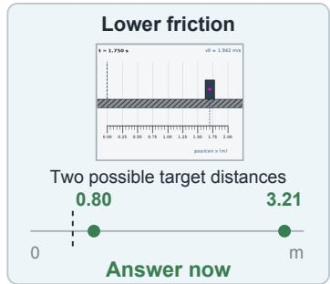
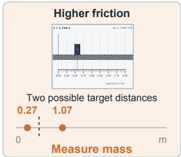
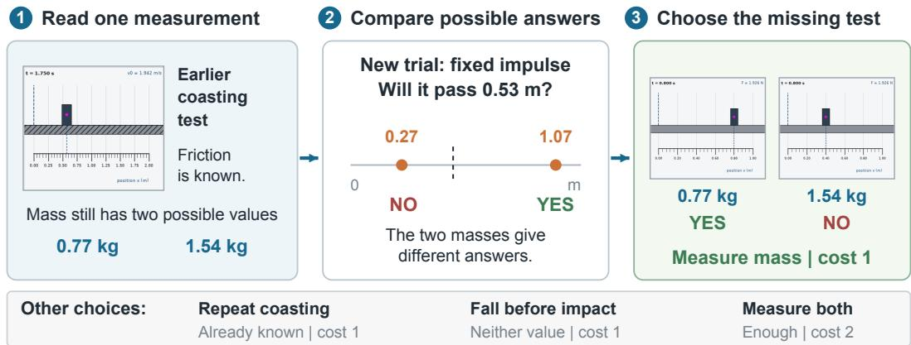
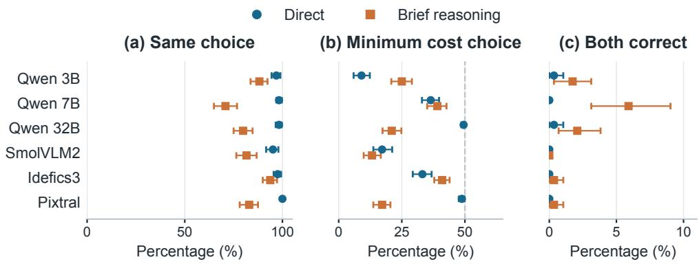
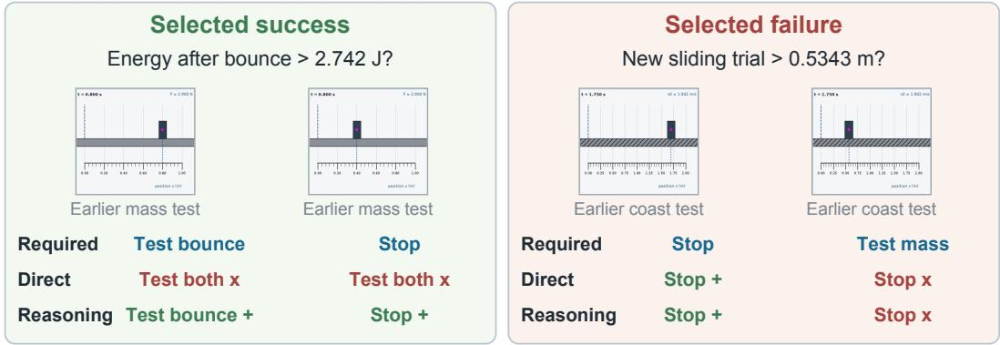
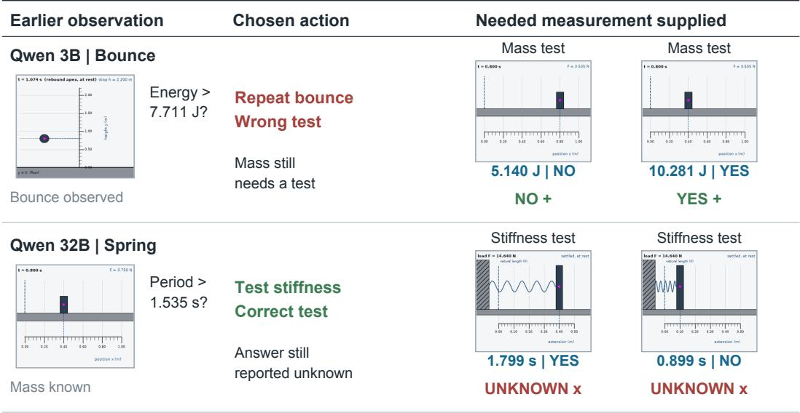

# New Evidence, Same Choice: Testing Physical Experiment Selection in Vision Language Models

Sourajit Saha1 Shubhashis Roy Dipta1 Nobin Sarwar1 Shaswati Saha1 Yuxuan Jiang1 Siyuan Li2 Qiheng Wang3

1University of Maryland, Baltimore County

2University of Georgia

3Independent Researcher

{ssaha2, sroydip1, sms2, ssaha3, yuxuanj1}@umbc.edu https://sourajitcs.github.io/physicalprobe/

After a fixed impulse, will the block pass 0.53 m?

  
Figure 1: The same question can require a different experiment. Two earlier coasting tests reveal different friction. The question asks about a new trial after a fixed impulse. Left: either mass passes the mark, so the answer is known. Middle: one possible distance falls short, so mass must be measured. Right: direct model choices usually fail to change across such pairs. This recorded example was selected for illustration, with its question shortened.

Do models change?   
Same question   
+ changed measurement   
  
95.1 to 100%   
keep the same choice   
6 models | direct responses

## Abstract

Consider a simple mechanics task involving a sliding block, a bouncing object, or a mass attached to a spring. A model first sees an image from one measurement experiment; for example, how far a block coasted and must answer a question about a new trial, such as whether the block will pass a target after a fixed push. The first experiment may provide enough information to answer, or the model may need another measurement, such as the object’s mass, friction, restitution, or spring stiffness. We study whether vision language models can decide when to answer immediately and, when more evidence is needed, which experiment to perform. Current physical reasoning benchmarks usually score only the final answer, so they do not directly evaluate this decision. We introduce a controlled evaluation in which each problem presents one measurement image and four possible physical worlds formed by two possible masses and two possible values of another relevant property. The model must either stop and answer or select the cheapest additional experiment that can resolve the question. We construct matched problem pairs in which changing either the observed measurement or the question changes the correct action. Because all possible worlds and experiment costs are known, we can determine the optimal action explicitly. Across six open models and 144 physical

parameter sets, direct responses repeat the same action for 95.1% to 100% of image pairs even though the correct action changes. Brief reasoning leads to more action changes, but the best model makes both decisions correctly for only 5.9% of image pairs. Additional tests reveal errors in reading measurements, performing physical calculations, and following the required response format. By evaluating evidence selection separately from final answers, our benchmark exposes failures that conventional answer accuracy can hide.

## 1 Introduction

The goal of physical experiment selection is to obtain the information needed for a particular prediction. Consider a block whose surface friction is known. Its mass affects how far it moves after a short push with a fixed impulse. If every possible mass carries it past a requested mark, measuring mass serves no purpose. For a farther mark, that measurement may become necessary. The value of a test depends on the observation and the question together.

Image language representations and instruction tuning support a broad set of visual tasks [1, 2, 3]. Physical benchmarks examine future motion, hidden properties, and object interactions [4, 5, 6, 7]. Interactive agents extend this setting by collecting their own observations [8, 9, 10, 11]. However, an average score can conceal a fixed decision rule [12]. Always stopping earns half the available credit when half the questions are already answerable. Such a score gives no direct test of whether the agent responds to the evidence.

We address this gap through matched physical problems. Two versions share the question, menu, and prices, but show different measurement results. We choose the question so that one version needs an additional test and the other does not. A second comparison holds the image fixed and changes the requested threshold. Scoring both members together exposes failures that an isolated correct choice can hide.

Our evaluation spans sliding, bouncing, and spring motion. The resulting behavior is not a single error pattern. Some models request a property that was already measured. Others stop while multiple answers remain possible. Even a useful selected observation can be followed by an incorrect answer. Models also score poorly on reading and calculation, so selection alone cannot explain these failures.

Our key contributions and findings include:

• A paired evaluation whose finite physical possibilities determine when an experiment is needed and which test has minimum cost;

• Evidence that six open models rarely handle both sides of the constructed comparisons correctly; and

• Dedicated studies of measurement choice, answer use, visual reading, calculation, prompt format, and cost, with recorded examples across all three tasks

## 2 Related Work

Predicting physical events. Intuitive physics models learn regularities of motion [13, 14]. Scene representations support inference of object properties [15, 16], while controlled benchmarks test interactions and future outcomes [4, 6, 17, 18]. PhysBench broadens this evaluation to vision language models [7]. Physion++ requires hidden property inference, and LLMPhy estimates parameters with a simulator [5, 19]. These tasks concern conclusions drawn from observations; we examine which observation should come next.

Learning through experiments. Active perception treats sensing as an action [20, 21, 22, 23]. Learned physical experiments and sequential design seek observations with high information value [24, 25], learned policies can choose which question to ask [26], and cost-aware planning scores committed plans against an oracle budget [27]. Language models can interleave reasoning with actions or generate executable policies [28, 29], while structured supervision can shape how models learn tool-use patterns and intermediate decisions [30, 31]. IVRE, DeepPHY, and HExA study interactive physical reasoning [8, 9, 10]. PhysCaP and task sufficient world models further connect exploration to the downstream objective [11, 32]. We compare pretrained models in a setting where all possible test results and costs are known.

Knowing when to answer. Selective prediction permits abstention [33]. Calibration and uncertainty estimates assess confidence in a response [34, 35, 36, 37]. Related studies also show that model behavior depends on how reasoning is structured, constrained, distilled, and optimized during post-training [38, 39, 40, 41]. TRAPSBench pairs sufficient and insufficient physical evidence to study restraint [42], and OMD-Bench corrupts modalities to test calibrated abstention [43]. Our task additionally requires a choice among missing measurements. Complementary images, contrast sets, and behavioral tests motivate comparisons beyond aggregate accuracy [44, 45, 46, 47, 48, 49]. Here, the paired construction links each controlled input change to a known change in the correct action. Robustness is crucial across safety sensitive AI applications, including medical diagnosis and screening [50, 51, 52, 53, 54, 55, 56], accessible navigation and communication [57, 58], traffic sign understanding for autonomous driving [59, 60], and reliable visual recognition [61, 62]. It is equally essential for interpretable vision systems [63], multimodal retrieval and reasoning [64, 65, 66, 67, 68], generative imaging [69], and safe model unlearning and concept erasure [70, 71, 72, 73], where brittle predictions or unintended behavior can directly undermine user trust and lead to consequential outcomes.

## 3 Method

Given an image and a physical question, a model chooses STOP or one further experiment. We first define the candidate worlds, then construct the paired inputs, and finally compute the reference decisions. Figure 2 illustrates this process with a recorded sliding problem.

  
Figure 2: One new property can separate the remaining answers. The earlier coasting measurement fixes friction, leaving two masses. Their predicted distances lie on opposite sides of the target mark. The mass test distinguishes these cases at cost one. The bottom row gives the information and prices of the other actions. Panel crops come from the same recorded family as Figure 1.

## 3.1 Candidate Physical Worlds

A parameter family has four worlds, $\mathcal { W } = \{ w _ { 0 0 } , w _ { 0 1 } , w _ { 1 0 } , w _ { 1 1 } \}$ . Each world is one combination of two mass values and two values of another property. The latter is friction $\mu ,$ restitution $e ,$ or spring stiffness k. Restitution describes how strongly an object rebounds. All four combinations are equally likely before measurement. We predict sliding distance $d ,$ energy immediately after a bounce $E ,$ , or oscillation period T:

$$
d = \frac { J ^ { 2 } } { 2 \mu g m ^ { 2 } } , \qquad E = m g e ^ { 2 } h , \qquad T = 2 \pi \sqrt { \frac { m } { k } } .\tag{1}
$$

Here, $J$ is the delivered impulse, $h$ is the drop height, and $g$ is gravity. The question compares one outcome with a threshold $q .$ Candidate values, calibration constants, and ideal physical assumptions are given in the prompt. Derivations and sampling ranges appear in Appendix.

Recorded measurements. Each $6 7 2 \times 6 7 2$ image contains four panels with a ruler, marked positions, and times or loads. Displacement under a known force reveals mass on a frictionless track. Coasting

distance indicates friction, rebound height indicates restitution, and extension under a load indicates stiffness. The initial image measures one property and leaves two compatible worlds.

## 3.2 Paired Inputs

We render both possible results of the initial test. Either image leaves two possible target outcomes. Write their target outcome ranges as $[ a , b ]$ and $[ c , d ]$ , ordered by $a < c$ and $b < d .$ Each range contains exactly two discrete possibilities. We place a threshold halfway inside each interval below:

$$
q _ { \mathrm { l o w } } \in ( a , \operatorname* { m i n } ( b , c ) ) , \qquad q _ { \mathrm { h i g h } } \in ( \operatorname* { m a x } ( b , c ) , d ) .\tag{2}
$$

The lower threshold leaves the first history unresolved and makes the second imply YES. The higher threshold makes the first imply NO and leaves the second unresolved. This creates two comparisons: exchange the image at a fixed question, or exchange the threshold at a fixed image. The image comparison preserves all prompt bytes. The threshold comparison retains the image and action ordering.

## 3.3 Reference Actions and Scores

Let $\mathcal { W } ( H )$ contain worlds compatible with history H, and let $y _ { q } ( w )$ denote the binary answer in world w. The answer is known when all remaining worlds agree:

$$
R ( H , q ) = \mathbf { 1 } [ | \{ y _ { q } ( w ) : w \in \mathcal { W } ( H ) \} | = 1 ] .\tag{3}
$$

When $R \ = \ 1$ , stopping costs zero and completes the decision. Otherwise, action a supplies observation $o _ { a } ( w )$ at price $c ( a )$ . The reference selects the cheapest action that resolves every remaining case:

$$
a ^ { * } \in \underset { a \in \mathcal A } { \arg \operatorname* { m i n } } c ( a ) \quad \mathrm { s u b j e c t ~ t o } \quad R ( H \cup \{ o _ { a } ( w ) \} , q ) = 1 \quad \forall w \in \mathcal W ( H ) .\tag{4}
$$

A test of either property costs one unit; the combined report costs two. Free fall before contact costs one and reveals neither unknown. For an unresolved base question, the missing property is the unique cheapest useful measurement. Prices are assigned units, not measured robot or sensor costs.

Evaluation measures. Minimum cost choice counts actions matching $a ^ { * }$ . Both correct requires success on each member of a pair. Same choice compares decoded actions and includes pairs with two invalid replies. We also score whether the selected evidence settles the question and whether the final answer is right. Resolved and correct requires both conditions, excluding lucky guesses from insufficient observations. Our objective is to determine whether the available evidence is sufficient to justify an answer, instead of trading off expected answer accuracy against the cost of additional experiments.

## 4 Experiments

We examine changes in action, unnecessary measurements, use of acquired evidence, and the capabilities needed for these decisions.

Data and models. The study contains 144 independent families, with 48 per physical system. Within each system, half initially measure mass and half measure the other property. Two histories and two thresholds yield 576 decisions and 288 pairs for either comparison. A separate pilot of 12 families informed the answer format. We test Qwen2.5 VL at 3B, 7B, and 32B, SmolVLM2 at 2.2B, Idefics3 at 8B, and Pixtral at 12B [74, 75, 76, 77]. Weights remain unchanged and unquantized.

Generation and coverage. The direct protocol asks for an option code within 16 tokens. The brief protocol appends a request for at most two short sentences and a final ANSWER: <option> line. Its limit is 256 tokens, with a recorded maximum of 200 for Qwen 32B. Both use greedy decoding and randomized option codes that remain aligned within pairs. Prompted reasoning and prompt wording can both affect performance [78, 79, 80, 81, 82]; this comparison also changes response length. An analysis parser decodes the outputs, with invalid replies retained in each denominator. Some accepted reasoning replies are misread by its fallback rules.

Each direct run contains 9,216 calls, covering selection, answers before and after every test, numerical controls, and perception probes. Six input variants use a fixed subset of 72 families. Qwen 32B has 2,304 brief calls for selection, given parameter questions, ruler reading, and property recovery. No scores are inferred for its absent conditions.

Study status and uncertainty. Planned requirements included 75% accuracy for Qwen 7B with all physical properties given. This and other control requirements failed, but evaluation continued, making the analysis exploratory. Intervals use 2,000 seeded bootstrap resamples of complete families [83]. Linked observations remain together, and variant differences use matched subsets. The 95% intervals are pointwise and do not provide joint coverage of all comparisons. Appendix records parsing details and deviations from the plan.

## 5 Results

## 5.1 Different Observations Often Receive the Same Action

  
Figure 3: Paired scores expose behavior hidden by average accuracy. The panels compare unchanged actions, correct minimum cost decisions, and pairs with both decisions right. Each model has 576 choices and 288 image pairs per protocol. The reference never repeats an action within these pairs; always stopping scores 50% in the middle panel. Error bars give 95% family bootstrap intervals.

Figure 3 shows little adaptation under direct responses. Across models, at most 0.3% of image pairs have both actions correct. Changing only the threshold produces repetition rates of 95.5% to 97.9%. Qwen 32B has the highest direct decision score, 49.5%, yet almost never solves an entire image pair. Pixtral stops on 97.6% of decisions and matches no complete image pair. Appendix separates these measurements by physical system.

Additional working changes the pattern. Brief reasoning lowers action repetition to between 70.8% and 93.8%. Qwen 7B attains the strongest image pair score, 5.9% [3.1, 9.0]. For Qwen 32B and Pixtral, greater variation accompanies worse decision accuracy. Some apparent changes involve invalid responses or parser errors, so variation alone cannot establish better evidence use.

Table 1 provides concrete cases behind the protocol comparison. The bounce example contains a correct switch after brief working. Table 2 contrasts the accompanying text with the physical setup. A correct action on the first sliding history does not validate its explanation.

## 5.2 Obtaining Evidence and Using It Can Fail Separately

Table 3 distinguishes available information from the answer it produces. The selected evidence is sufficient in at least half the decisions, partly because those questions require no new observation. With useful tests supplied on unresolved cases, answer accuracy reaches only 34.6% at best. Qwen 7B, Qwen 32B, Idefics3, and Pixtral instead give UNDETERMINED on almost every direct request after a test.

Measuring the known property. Among the 278 single property purchases made by Qwen 3B on unresolved cases, 83.5% repeat the earlier test. SmolVLM2 and Idefics3 show a similar preference.

Table 1: Extra reasoning helps one pair and leaves another error unchanged. Qwen 7B responses are decoded from explicit final letters. The required row gives the cheapest correct action; plus and cross mark correctness. These examples were selected after evaluation. Crops show the last panel, although the model received each full sheet.  

Table 2: Written explanations can name the missing property or confuse the trial. Exact excerpts from Qwen 7B’s brief responses in Table 1 are shown beside our reading of them. The excerpts describe generated text, not access to internal reasoning.
<table><tr><td>Case</td><td>Recorded excerpt</td><td>Interpretation</td></tr><tr><td>Bounce</td><td>“provides information about the object&#x27;s mass but The response identifies which of the two not the coefficient of restitution.&quot;</td><td>properties is absent.</td></tr><tr><td>Sliding</td><td>“provides direct evidence of the block&#x27;s stopping distance.&quot;</td><td>The image starts at a known speed. The target starts after an impulse.</td></tr></table>

Table 3: Direct results separate evidence, answers, and repeated tests. Direct scores are percentages with 95% intervals. Evidence and final success use 576 decisions; supplied test accuracy uses 1,152 answers after informative measurements on unresolved cases. The repeat rate includes only unresolved cases where the model buys a property test; n gives that count.
<table><tr><td>Model</td><td>Enough evidence</td><td>Useful test supplied</td><td>Resolved and correct</td><td>Repeat known property</td><td>n</td></tr><tr><td>Qwen 3B</td><td>58.5 [55.6, 61.5]</td><td>34.6 [31.9, 37.5]</td><td>18.8 [16.1, 22.0]</td><td>83.5 [77.5, 89.5]</td><td>278</td></tr><tr><td>Qwen 7B</td><td>62.0 [58.7, 65.5]</td><td>0.8 [0.3, 1.5]</td><td>0.0 [0.0, 0.0]</td><td>60.7 [36.8, 85.0]</td><td>28</td></tr><tr><td>Qwen 32B</td><td>62.0 [58.7, 65.5]</td><td>0.0 [0.0, 0.0]</td><td>0.0 [0.0, 0.0]</td><td>1.4 [0.0, 4.6]</td><td>70</td></tr><tr><td>SmolVLM2</td><td>56.6 [54.0, 59.4]</td><td>15.3 [12.9, 17.5]</td><td>12.0 [9.5, 14.6]</td><td>80.9 [72.9, 88.0]</td><td>199</td></tr><tr><td>Idefics3</td><td>53.1 [51.4, 55.2]</td><td>0.1 [0.0, 0.3]</td><td>0.0 [0.0, 0.0]</td><td>86.4 [76.4, 94.7]</td><td>110</td></tr><tr><td>Pixtral</td><td>50.0 [50.0, 50.0]</td><td>0.0 [0.0, 0.0]</td><td>0.0 [0.0, 0.0]</td><td>100.0 [100.0, 100.0]</td><td>7</td></tr></table>

Qwen 32B rarely makes this particular error, but stops prematurely on 75.7% of unresolved questions. These outcomes separate choosing the right measurement from deciding whether to measure. The three Qwen sizes do not establish a scaling law.

The additional examples in Table 4 make this separation explicit. Qwen 3B requests another bounce test, yet succeeds for both masses when their measurements are supplied. Qwen 32B selects stiffness correctly in the spring problem, then withholds a definite answer despite sufficient information. The displayed answers come from the saved requests for those two useful measurements.

Changing the visible measurement. On the fixed subset, Qwen 3B repeats the base test on 79.9% of property choices with the original image, 83.5% with a new rendering, and 51.1% without an image. Comparable shifts occur for SmolVLM2 and Idefics3. Deleting the image changes both available evidence and the conditional choice population. The correct action is therefore recomputed; this comparison does not isolate labels from geometry.

Table 4: One model repeats a test; another cannot use the useful result. The two direct response cases show the earlier image, selected action, and answers obtained with the needed test supplied. Blue gives each possible outcome and its correct answer; the line below shows the model response. Labels translate recorded option letters, not quoted explanations. The rows illustrate contrasting failures found in the completed records, without estimating their frequency. Each image is one panel from a full input sheet.  

Table 5: Reading and calculation still matter when selection is removed. Values are percentages with pointwise 95% intervals. Ruler reading allows 5% relative error; property recovery has two options. These probes each use 288 items. Both given means that all property values are supplied as numbers on 1,152 questions. Accepted gives the percentage parsed into an answer in that direct condition.
<table><tr><td>Model</td><td>Read ruler Direct</td><td>Find property Direct</td><td>Both given Direct</td><td>Both given Brief</td><td>Accepted Direct</td></tr><tr><td>Qwen 3B</td><td>41.7 [36.8, 46.5]</td><td>49.7 [45.5, 53.8]</td><td>35.5 [32.0, 39.1]</td><td>35.0 [31.0, 38.7]</td><td>100.0</td></tr><tr><td>Qwen 7B</td><td>83.7 [79.2, 87.9]</td><td>53.5 [48.6, 58.7]</td><td>49.6 [49.0, 50.1]</td><td>41.9 [36.7, 47.4]</td><td>100.0</td></tr><tr><td>Qwen 32B</td><td>29.9 [24.3, 35.8]</td><td>51.0 [48.6, 53.5]</td><td>50.4 [47.1, 53.5]</td><td>33.8 [30.2, 37.2]</td><td>94.2</td></tr><tr><td>SmolVLM2</td><td>42.0 [38.9, 44.8]</td><td>50.3 [44.4, 55.9]</td><td>43.9 [41.1, 46.6]</td><td>41.9 [39.3, 44.4]</td><td>100.0</td></tr><tr><td>Idefics3</td><td>2.8 [1.0, 4.9]</td><td>50.0 [45.1, 54.9]</td><td>46.2 [43.9, 48.5]</td><td>31.4 [28.0, 35.0]</td><td>100.0</td></tr><tr><td>Pixtral</td><td>48.3 [43.8, 52.8]</td><td>52.8 [47.9, 57.6]</td><td>0.1 [0.0, 0.3]</td><td>45.5 [42.3, 48.5]</td><td>0.1</td></tr></table>

## 5.3 The Capability Controls Remain Weak

Visual judgments can fail before a model chooses an experiment [84, 85, 86]. Table 5 shows that Qwen 7B often locates the ruler mark but struggles to recover the measured property. Supplying both properties removes image reading from the task and tests numerical mechanics [87]. No model reaches the planned 75% accuracy requirement in this condition. Thus, the main findings cannot be isolated from broader physical reasoning failures.

A low score can reflect an unfinished response. Pixtral’s direct given parameter accuracy is 0.1%, with only one accepted answer among 1,152 requests. Many generations start a derivation and hit the token cap. Brief responses reach 45.5%, showing why the original score should not be read as near

total lack of physics knowledge; recoverable knowledge can be missing from a default response [88].   
A separate early stopping rule can also truncate numerical ruler responses before their final value.   
Appendix provides validity across all request types.

Prompt changes offer no common remedy. Text readings improve direct choice accuracy by 9.0 to 14.2 percentage points for four models. They leave Qwen 32B unchanged and lower Pixtral by 35.8 points, with 45.5% valid replies in that condition. Asking models to check the remaining possibilities improves SmolVLM2 by 10.1 points [5.6, 14.9]. Giving equations adds 5.2 points [1.7, 9.0] for the same model, while all five other equation intervals include zero. Table 6 compares these changes across all six models; Appendix adds the remaining variants.

Table 6: The same prompt change can help one model and harm another. Entries give changes in direct minimum cost accuracy, in percentage points, relative to the matching 72 family base subset. Brackets show paired 95% intervals. Colors and style change together in the new rendering; the remaining possibilities instruction adds no physical evidence.
<table><tr><td>Model</td><td>Text readings</td><td>Changed rendering</td><td>Given equations</td><td>Check possibilities</td></tr><tr><td rowspan="2">Qwen 3B</td><td>+14.2</td><td>-1.7</td><td>-1.4</td><td>-0.3</td></tr><tr><td>[8.7, 20.5]</td><td>[-3.8, 0.0]</td><td>[−4.2, 1.0]</td><td>[−2.8, 2.1]</td></tr><tr><td rowspan="2">Qwen 7B</td><td>+9.0</td><td>+2.8</td><td>-0.7</td><td>+2.4</td></tr><tr><td>[4.9, 13.5]</td><td>[0.3, 5.9]</td><td>[−3.1, 1.7]</td><td>[0.3, 4.9]</td></tr><tr><td>Qwen 32B</td><td>0.0 [−1.0, 1.0]</td><td>-1.0 [−2.8, 0.3]</td><td>+0.7 [−0.7, 2.1]</td><td>-1.4 [−2.8, −0.3]</td></tr><tr><td>SmolVLM2</td><td>+13.5 [8.7, 18.4]</td><td>-2.1 [-4.9,0.7]</td><td>+5.2 [1.7, 9.0]</td><td>+10.1 [5.6, 14.9]</td></tr><tr><td>Idefics3</td><td>+14.2 [9.0, 19.4]</td><td>-0.3 [-2.8,2.1]</td><td>-1.0 [-4.9,3.1]</td><td>-2.1 [-4.9,0.7]</td></tr><tr><td rowspan="2">Pixtral</td><td>-35.8</td><td>+0.3</td><td>-1.7</td><td>+1.0</td></tr><tr><td>[-40.6, -30.9]</td><td>[0.0, 1.0]</td><td>[−4.5, 0.3]</td><td>[0.0, 2.8]</td></tr></table>

## 5.4 The Selection Rule Also Changes Cost

Table 7: A cheaper sufficient measurement can improve final success. The rules recombine direct answer records over 576 decisions, without further model calls. Each model reads the evidence under all three rules. Success means resolved and correct; cost is in assigned units. Brackets are 95% intervals. The minimum cost reference optimizes sufficiency, not the accuracy of a fallible reader.
<table><tr><td rowspan="2">Choice rule</td><td colspan="2">Qwen 3B</td><td colspan="2">SmolVLM2</td></tr><tr><td>Mean cost</td><td>Resolved and correct</td><td>Mean cost</td><td>Resolved and correct</td></tr><tr><td>Model choice</td><td>0.99 [0.96, 1.02]</td><td>18.8 [16.1, 22.0]</td><td>0.79 [0.72, 0.85]</td><td>12.0 [9.5, 14.6]</td></tr><tr><td>Minimum cost</td><td>0.50 [0.50, 0.50]</td><td>31.7 [28.3, 35.3]</td><td>0.50 [0.50, 0.50]</td><td>19.4 [16.1, 22.8]</td></tr><tr><td>Complete report</td><td>2.00 [2.00, 2.00]</td><td>32.1 [28.6, 35.8]</td><td>2.00 [2.00, 2.00]</td><td>15.6 [12.8, 18.4]</td></tr></table>

Table 7 compares model choices with two reference rules. For Qwen 3B, selecting the cheapest sufficient evidence gives 31.7% final success at cost 0.50, compared with 18.8% at 0.99 for its own choices. SmolVLM2 also has a higher point estimate at lower cost under this rule. The combined report costs four times as much as the minimal rule, with no gain shared by both models. Appendix includes all six models and alternative report prices. Those price changes rescore stored actions; they do not test a model’s response to a newly advertised price.

## 6 Conclusion

We introduced a paired evaluation for testing whether vision language models know when they have enough evidence to answer a physical question and, when they do not, which additional experiment they should perform. Because each pair is designed so that a controlled change in the observation or question changes the correct action, every model choice can be checked against an exact reference. Across six open models, aggregate scores hide a central weakness: models often repeat the same action even when new evidence should change their decision. Our analysis also shows that selecting a useful experiment and correctly interpreting its result are separate challenges. Future progress requires models that adapt their choices to the available evidence while also reading measurements, performing calculations, and formatting answers reliably.

## 7 Limitations

Our findings cover specific open model checkpoints, three idealized systems, discrete disclosed properties, and at most one additional experiment. We do not test natural video, sensor noise, physical robots, or open ended experiment design. Selection and answering use separate calls, so the answering model never sees the selection rationale. Some analyses followed output inspection, and several Qwen 32B brief reasoning conditions are missing. Image ablation and extended generation alter multiple factors, limiting causal attribution. The deterministic reference receives additional metadata and images; its perfect score validates the procedure but is not directly comparable. Thus, our results establish systematic behavioral failures without identifying a unique internal cause.

## References

[1] A. Radford et al. Learning transferable visual models from natural language supervision. In International Conference on Machine Learning, volume 139, pages 8748 to 8763. PMLR, 2021. source.

[2] J. Li et al. BLIP 2: Bootstrapping language image pre training with frozen image encoders and large language models. In International Conference on Machine Learning, volume 202, pages 19730 to 19742. PMLR, 2023. source.

[3] H. Liu et al. Visual instruction tuning. In Advances in Neural Information Processing Systems, volume 36, 2023. source.

[4] D. M. Bear et al. Physion: Evaluating physical prediction from vision in humans and machines. In Advances in Neural Information Processing Systems Datasets and Benchmarks, 2021. source.

[5] H. Y. Tung et al. Physion++: Evaluating physical scene understanding that requires online inference of different physical properties. In Advances in Neural Information Processing Systems, volume 36, 2023. source.

[6] K. Yi et al. CLEVRER: CoLlision Events for Video REpresentation and Reasoning. In International Conference on Learning Representations, 2020. source.

[7] W. Chow et al. PhysBench: Benchmarking and enhancing vision language models for physical world understanding. In International Conference on Learning Representations, 2025. source.

[8] M. Xu et al. Interactive visual reasoning under uncertainty. In Advances in Neural Information Processing Systems, volume 36, 2023. source.

[9] X. Xu et al. DeepPHY: Benchmarking agentic VLMs on physical reasoning. arXiv preprint arXiv:2508.05405, 2025. source.

[10] A. Chandra et al. Hierarchical experimentalist agents. arXiv preprint arXiv:2606.29315, 2026. source.

[11] C. Y. Lin et al. PhysCaP: Grounding code as policy agent with physics informed exploration. arXiv preprint arXiv:2608.21031, 2026. source.

[12] N. J. Lia, S. Roy Dipta, A. K. Zehady, N. Islam, M. Chakraborty, and A. Al Wasif. Read between the lines: A benchmark for uncovering political bias in Bangla news articles. In Proceedings of the Second Workshop on Bangla Language Processing (BLP-2025), 2025. source.

[13] P. W. Battaglia et al. Simulation as an engine of physical scene understanding. Proceedings of the National Academy ofSciences, 110(45):18327 to 18332, 2013. source.

[14] L. S. Piloto et al. Intuitive physics learning in a deep learning model inspired by developmental psychology. Nature Human Behaviour, 6:1257 to 1267, 2022. source.

[15] J. Wu et al. Galileo: Perceiving physical object properties by integrating a physics engine with deep learning. In Advances in Neural Information Processing Systems, volume 28, 2015. source.

[16] J. Wu et al. Learning to see physics via visual de animation. In Advances in Neural Information Processing Systems, volume 30, 2017. source.

[17] A. Bakhtin et al. PHYRE: A new benchmark for physical reasoning. In Advances in Neural Information Processing Systems, volume 32, 2019. source.

[18] R. Riochet et al. IntPhys: A framework and benchmark for visual intuitive physics reasoning. arXiv preprint arXiv:1803.07616, 2018. source.

[19] A. Cherian et al. LLMPhy: Parameter identifiable physical reasoning combining large language models and physics engines. In International Conference on Artificial Intelligence and Statistics, 2026. source.

[20] R. Bajcsy. Active perception. Proceedings ofthe IEEE, 76(8):996 to 1005, 1988. source.

[21] J. Aloimonos et al. Active vision. International Journal ofComputer Vision, 1:333 to 356, 1988. source.

[22] R. Bajcsy et al. Revisiting active perception. Autonomous Robots, 42:177 to 196, 2018. source.

[23] J. Bohg et al. Interactive perception: Leveraging action in perception and perception in action. IEEE Transactions on Robotics, 33:1273 to 1291, 2017. source.

[24] M. Denil et al. Learning to perform physics experiments via deep reinforcement learning. In International Conference on Learning Representations, 2017. source.

[25] A. Foster et al. Deep adaptive design: Amortizing sequential bayesian experimental design. In International Conference on Machine Learning, volume 139, pages 3384 to 3395. PMLR, 2021. source.

[26] S. Roy Dipta, A. Padia, and F. Ferraro. DecomposeRL: Learning to ask useful, informative, and diverse questions for semi-supervised, traceable claim verification. arXiv preprint arXiv:2605.27858, 2026.

[27] Z. A. Nazi and S. Roy Dipta. TRIAGE: Evaluating prospective metacognitive control in LLMs under resource constraints. arXiv preprint arXiv:2605.13414, 2026.

[28] S. Yao et al. ReAct: Synergizing reasoning and acting in language models. In International Conference on Learning Representations, 2023. source.

[29] J. Liang et al. Code as policies: Language model programs for embodied control. In IEEE International Conference on Robotics and Automation, 2023. source.

[30] Y. Jiang and F. Ferraro. SCRIBE: Structured mid-level supervision for tool-using language models, 2026. source.

[31] N. Xu, Y. Jiang, S. Roy Dipta, and H. Zhang. Learning how to use tools, not just when: Pattern-aware tool-integrated reasoning, 2026. source.

[32] F. Feng et al. Learning task sufficient world models by synergizing agentic exploration and structured modeling. arXiv preprint arXiv:2607.04409, 2026. source.

[33] Y. Geifman et al. Selective classification for deep neural networks. In Advances in Neural Information Processing Systems, volume 30, 2017. source.

[34] C. Guo et al. On calibration of modern neural networks. In International Conference on Machine Learning, volume 70, pages 1321 to 1330. PMLR, 2017. source.

[35] S. Kadavath et al. Language models (mostly) know what they know. arXiv preprint arXiv:2207.05221, 2022. source.

[36] L. Kuhn et al. Semantic uncertainty: Linguistic invariances for uncertainty estimation in natural language generation. In International Conference on Learning Representations, 2023. source.

[37] E. Hossain, S. Roy Dipta, S. Neupane, R. Rana, R. Shwartz-Ziv, I. Garibay, and N. Yousefi. UAT-LITE: Inference-time uncertainty-aware attention for pretrained transformers. arXiv preprint arXiv:2602.02952, 2026.

[38] Y. Jiang, D. Li, and F. Ferraro. DRP: Distilled reasoning pruning with mathematical skill-aware step decomposition for efficient large reasoning models. In Findings of the Association for Computational Linguistics: ACL 2026, pages 4020–4039, 2026. source.

[39] Y. Jiang and F. Ferraro. Beyond math: Stories as a testbed for memorization-constrained reasoning in LLMs. In Proceedings of the 19th Conference of the European Chapter of the Associationfor Computational Linguistics (Volume 1: Long Papers), pages 5590–5607, 2026. source.

[40] Y. Jiang and F. Ferraro. Bridging reasoning trajectories in on-policy distillation via near-future guidance, 2026. source.

[41] Z. Yang, Y. Jiang, T.-C. Chen, L. Yang, A. Wong, C. Gao, J. E. Kooi, Z. Li, J. Shi, K. Qiu, Q. Huang, X. Zu, S. Yang, H. Zhang, N. Wong, F. Ilievski, S. Yu, A. Plaat, Z. Ren, M. Hoogendoorn, and V. François-Lavet. Modularized reinforcement learning on LLMs: From MDP creation to exploration and learning, 2026. source.

[42] F. Pramono et al. TRAPSBench: Vision language models encode but fail to express epistemic restraint. arXiv preprint arXiv:2608.13167, 2026. source.

[43] Z. A. Nazi, S. Roy Dipta, and M. R. Parvez. Omni-modal dissonance benchmark: Systematically breaking modality consensus to probe robustness and calibrated abstention. arXiv preprint arXiv:2603.27187, 2026.

[44] Y. Goyal et al. Making the V in VQA matter: Elevating the role of image understanding in visual question answering. In IEEE Conference on Computer Vision and Pattern Recognition, pages 6904 to 6913, 2017. source.

[45] M. Gardner et al. Evaluating models’ local decision boundaries via contrast sets. In Findings of the Association for Computational Linguistics: EMNLP 2020, pages 1307 to 1323, 2020. source.

[46] M. T. Ribeiro et al. Beyond accuracy: Behavioral testing of NLP models with CheckList. In Annual Meeting ofthe Associationfor Computational Linguistics, 2020. source.

[47] A. Mazumder, S. Roy Dipta, N. J. Lia, T. Khan, K. R. Hossain, N. Shri, S. Debsarkar, H. Tasnim, G. G. T. Shawon, D. Mitra, et al. AgentCollabBench: Diagnosing when good agents make bad collaborators. arXiv preprint arXiv:2605.08647, 2026.

[48] N. L. Sayeedi, M. F. A. Sayeedi, S. Roy Dipta, R. Tabassum, A. E. Hridoy, M. Mahmood, M. E. Sobhani, M. T. Hasan, and S. Shatabda. Many dialects, many languages, one cultural lens: Evaluating multilingual VLMs for bengali culture understanding across historically linked languages and regional dialects. arXiv preprint arXiv:2603.21165, 2026.

[49] N. J. Lia and S. Roy Dipta. Cross-lingual sentiment misalignment: Auditing multilingual language models for inversion risk, dialectal representation, and affective stability. In Proceedings of the 1st Workshop on Multilinguality in the Era of Large Language Models (MeLLM 2026), 2026. source.

[50] S. A. Kamran, S. Saha, A. S. Sabbir, and A. Tavakkoli. Optic-net: A novel convolutional neural network for diagnosis of retinal diseases from optical tomography images. In 18th IEEE international conference on machine learning and applications, pages 964–971, 2019.

[51] S. A. Kamran, S. Saha, A. S. Sabbir, and A. Tavakkoli. A comprehensive set of novel residual blocks for deep learning architectures for diagnosis of retinal diseases from optical coherence tomography images. In Deep Learning Applications, Volume 2, pages 25–48. Springer, 2020.

[52] S. Saha and Y. Yesha. Pairwise meta learning pipeline: classifying covid-19 abnormalities on chest radio-graphs. SPIE Medical Imaging 2022: Computer-Aided Diagnosis; PC1203302 (2022) Proceedings Volume PC12033, Medical Imaging 2022: Computer-Aided Diagnosis; PC1203302 (2022), 2022.

[53] N. Ravin, S. Saha, A. Schweitzer, A. Elahi, F. Dako, D. Mollura, and D. Chapman. Mitigating domain shift in ai-based tb screening with unsupervised domain adaptation. IEEE Access, 10: 45997–46013, 2022.

[54] S. Saha, S. Saha, M. O. Gani, T. Oates, and D. Chapman. RFC-Net: Learning high resolution global features for medical image segmentation on a computational budget (student abstract). In Proceedings of the AAAI Conference on Artificial Intelligence, volume 37, pages 16314–16315, 2023.

[55] N. Sarwar. FedMentalCare: towards privacy-preserving fine-tuned LLMs to analyze mental health status using federated learning framework. arXiv preprint arXiv:2503.05786, 2025.

[56] N. Sarwar and S. Roy Dipta. FedMentor: Domain-aware differential privacy for heterogeneous federated LLMs in mental health. arXiv preprint arXiv:2509.14275, 2025.

[57] S. Saha, L. Selingo, E. Olejniczak, H. Noyce, V. Raychoudhury, R. O. Smith, and M. O. Gani. Mypath: Accessible routing for wheelchair users. Rehabilitation Engineering and Assistive Technology Society of North America (RESNA), 2022.

[58] S. M. Abdullah, A. Paul, S. Roy Dipta, Z. Masud, S. Rayana, and A. Kabir. Breaking the silence: A dataset and benchmark for bangla text-to-gloss translation. arXiv preprint arXiv:2504.02293, 2025.

[59] S. Saha, S. A. Kamran, and A. S. Sabbir. Total recall: understanding traffic signs using deep convolutional neural network. In 2018 21st international conference ofcomputer and information technology (ICCIT), pages 1–6, 2018.

[60] S. Saha, M. S. Islam, M. A. B. Khaled, and S. Tairin. An efficient traffic sign recognition approach using a novel deep neural network selection architecture. In Emerging Technologies in Data Mining and Information Security: Proceedings of IEMIS 2018, Volume 3, pages 849–862. Springer, 2018.

[61] S. Saha and N. Saha. A lightning fast approach to classify bangla handwritten characters and numerals using newly structured deep neural network. Procedia computer science, 132: 1760–1770, 2018.

[62] S. Saha and T. Gokhale. Improving shift invariance in convolutional neural networks with translation invariant polyphase sampling. In IEEE/CVF Winter Conference on Applications of Computer Vision, pages 620–629, 2025.

[63] S. Saha and S. Roy Dipta. SeeBel: Seeing is believing. arXiv preprint arXiv:2312.10933, 2023.

[64] S. Saha and T. Gokhale. Zero-shot multimodal retrieval with multi-scale contextual representations. In Proceedings of the 64th Annual Meeting of the Association for Computational Linguistics, pages 20304–20324, 2026.

[65] S. Saha, S. Roy Dipta, S. Saha, N. Sarwar, and Y. Jiang. Before the flip: Measuring hidden score shifts in quantized vision language models before the answer changes for visual question answering, 2026. source.

[66] N. Sarwar. FilterRAG: zero-shot informed retrieval-augmented generation to mitigate hallucinations in VQA. arXiv preprint arXiv:2502.18536, 2025.

[67] S. Roy Dipta and F. Ferraro. Q2E: Query-to-event decomposition for zero-shot multilingual text-to-video retrieval. In Proceedings ofthe 14th International Joint Conference on Natural Language Processing and the 4th Conference ofthe Asia-Pacific Chapter ofthe Associationfor Computational Linguistics, 2025. source.

[68] S. Roy Dipta, T.-Y. Wu, and S. Tripathi. VC-inspector: Advancing reference-free evaluation of video captions with factual analysis. In Proceedings ofthe 64th Annual Meeting ofthe Association for Computational Linguistics (Volume 1: Long Papers), 2026. source.

[69] S. Roy Dipta, S. Saha, S. Saha, and N. Sarwar. OracleZoom: On-policy self-distillation inspired reference-constrained recursive image super resolution, 2026. source.

[70] A. Joshi, S. Saha, D. Shukla, S. Vema, H. Jhamtani, M. Gaur, and A. Modi. Towards robust evaluation of unlearning in LLMs via data transformations. In Findings ofthe Associationfor Computational Linguistics: EMNLP 2024, pages 12100–12119, 2024.

[71] S. Saha, S. Saha, M. Gaur, and T. Gokhale. Side effects of erasing concepts from diffusion models. arXiv preprint arXiv:2508.15124, 2025.

[72] S. Saha, R. Anguluri, and M. Gaur. To erase, or not to erase: Robust training-free concept erasure with preservation aware adaptive ranked subspace expansion. arXiv preprint arXiv:2607.23492, 2026.

[73] N. Sarwar, S. Roy Dipta, Z. Liu, and V. Patil. Multimodal unlearning across vision, language, video, and audio: Survey of methods, datasets, and benchmarks. In Findings ofthe Association for Computational Linguistics: ACL 2026, pages 27702–27730, 2026.

[74] S. Bai et al. Qwen2.5 VL technical report. arXiv preprint arXiv:2502.13923, 2025. source.

[75] A. Marafioti et al. SmolVLM: Redefining small and efficient multimodal models. arXiv preprint arXiv:2504.05299, 2025. source.

[76] H. Laurençon et al. Building and better understanding vision language models: Insights and future directions. arXiv preprint arXiv:2408.12637, 2024. source.

[77] P. Agrawal et al. Pixtral 12B. arXiv preprint arXiv:2410.07073, 2024. source.

[78] J. Wei et al. Chain of thought prompting elicits reasoning in large language models. In Advances in Neural Information Processing Systems, volume 35, 2022. source.

[79] T. Kojima et al. Large language models are zero shot reasoners. In Advances in Neural Information Processing Systems, volume 35, 2022. source.

[80] S. Roy Dipta and F. Ferraro. If we may de-presuppose: Robustly verifying claims through presupposition-free question decomposition. In Proceedings of the 14th Joint Conference on Lexical and Computational Semantics (\*SEM 2025), 2025. source.

[81] Z. A. Nazi, S. Roy Dipta, and S. Kar. †DAGGER: Distractor-aware graph generation for executable reasoning in math problems. arXiv preprint arXiv:2601.06853, 2026.

[82] N. Islam, N. J. Lia, S. Roy Dipta, S. B. Sultan, and A. K. Zehady. Register shifts break LLM safety: A bengali benchmark with culturally grounded harms. arXiv preprint arXiv:2608.22335, 2026.

[83] B. Efron. Nonparametric standard errors and confidence intervals. Canadian Journal of Statistics, 9(2):139 to 158, 1981. source.

[84] P. Rahmanzadehgervi et al. Vision language models are blind. In Asian Conference on Computer Vision, pages 18 to 34, 2024. source.

[85] S. Tong et al. Eyes wide shut? exploring the visual shortcomings of multimodal LLMs. In IEEE/CVF Conference on Computer Vision and Pattern Recognition, pages 9568 to 9578, 2024. source.

[86] Y. Li et al. Evaluating object hallucination in large vision language models. In Conference on Empirical Methods in Natural Language Processing, 2023. source.

[87] J. Ding et al. Using large language model to solve and explain physics word problems approaching human level. arXiv preprint arXiv:2309.08182, 2023. source.

[88] E. Hossain, S. Saha, T. N. Ornee, S. S. Jennifer, U. C. Biswas, S. Roy Dipta, R. Rana, and N. Yousefi. Right knowledge, wrong answer: Characterizing parametric temporal conflict in open-weight language models, 2026. source.

## A Physical Systems and Matched Construction

This appendix gives the construction details and complete results. Qwen 3B, Qwen 7B, and Qwen 32B refer to the three Qwen checkpoints in Appendix. SmolVLM2, Idefics3, and Pixtral denote the checkpoints named 2.2B, 8B, and 12B, respectively. Direct requests an immediate option code. Reason denotes the brief reasoning protocol used in the main tables. Unless stated otherwise, values are percentages with 95% bootstrap intervals in brackets. Each resample contains complete parameter families. NA marks measurements that are not available.

## A.1 Physical Assumptions and Derivations

Sliding. An impulse J changes a block’s velocity from zero to $v _ { 0 } = J / m$ . Coulomb friction produces deceleration µg until the block stops. Using $0 \stackrel { \cdot } { = } v _ { 0 } ^ { 2 } - 2 \mu g d$ gives the first expression in Equation 1. The block slides without rolling on a level surface. The coefficient is constant, no drag acts, and no obstacle interrupts the motion. The coasting measurement uses the same surface and starts at a known speed. The target trial starts with a known impulse, so its initial speed depends on mass.

Bouncing. An object dropped from height h has impact speed $\scriptstyle { \sqrt { 2 g h } }$ . Its rebound speed is $e { \sqrt { 2 g h } }$ The kinetic energy immediately after impact is therefore $\bar { \textstyle \frac { 1 } { 2 } } \dot { m } ( e \sqrt { 2 g h } ) ^ { 2 } = m g e ^ { 2 } h$ . Motion is vertical, with no rotation or drag. The floor is fixed and the restitution coefficient is constant over the tested impact speeds. The measurement and target trial use the same object and floor.

Spring motion. The displacement $x ( t )$ of a horizontal mass on a linear spring obeys mx¨ = −kx. The angular frequency is $\sqrt { k / m }$ , giving $T = 2 \pi { \sqrt { m / k } }$ . The spring is massless, friction and damping are negligible, and motion stays in the linear regime. The stiffness measurement uses the same spring under a known static load.

## A.2 Parameter Sampling and Calibration

Table 8: Each family varies two disclosed physical properties. Lower values are sampled independently within the shown ranges. The upper value is a fixed multiple of the lower value. The generator rounds stored physical quantities to six significant digits.
<table><tr><td>Quantity</td><td>Distribution of lower value</td><td>Upper multiplier</td><td>Units</td></tr><tr><td>Mass m</td><td>Uniform [0.75, 1.50]</td><td>2</td><td>kg</td></tr><tr><td>Friction  $\mu$ </td><td>Uniform [0.08, 0.12]</td><td>3</td><td>dimensionless</td></tr><tr><td>Restitution e</td><td>Uniform [0.30, 0.45]</td><td>2</td><td>dimensionless</td></tr><tr><td>Stiffness k</td><td>Uniform [20, 40]</td><td>4</td><td>N/m</td></tr><tr><td>Sliding impulse J</td><td>Uniform [1.5, 2.5]</td><td>NA</td><td>Ns</td></tr><tr><td>Target drop height h</td><td>Uniform [0.6, 1.4]</td><td>NA</td><td>m</td></tr><tr><td>Gravity g</td><td>9.81</td><td>NA</td><td> $\mathrm { { m } / \mathrm { { s } ^ { 2 } } }$ </td></tr></table>

The main generator uses seed 20260905. It creates 48 families per system. Within each system, it randomly orders 24 initial mass tests and 24 initial tests of the other property. The diagnostic subset uses seed 20260906. It selects 12 families for each combination of system and initial test, giving 72 families. The independent pilot contains 12 further families. It is excluded from the reported main results.

Mass calibration uses a frictionless 1 m track and timestamps 0.2, 0.4, 0.6, 0.8 s. The disclosed force is chosen so the lower mass reaches 0.8 m in the final panel. The resulting displacement is $x = F t ^ { 2 } / ( 2 m )$ . The coasting test uses a 2 m track. Its known launch speed makes the case with lower friction stop at 1.7 m. The four timestamps divide that stopping time into quarters. The rebound test chooses its drop height so the case with higher restitution reaches 0.8 m on a 1 m ruler. The spring test applies four loads, with the maximum extending the softer spring by 0.4 m on a 0.5 m ruler. Free fall begins at 1.2 m and ends at 0.2 m above the floor. Calibration constants depend only on the disclosed candidate values. They do not depend on which world is hidden.

## A.3 Why the Required Action Changes

Consider the ordered outcome ranges used in Equation 2. Since $a < q _ { \mathrm { l o w } } < \operatorname* { m i n } ( b , c )$ , the first history admits outcomes on both sides of the lower threshold. Both outcomes of the second history exceed this threshold. For the higher threshold, max $( b , c ) < q _ { \mathrm { h i g h } } <$ d puts both outcomes of the first history below the threshold and splits the second history. Each history therefore switches between a known answer and an unknown answer across the two questions. Each question also switches between those states across the two histories. Applying the action rule in Section 3.3 then gives the stated switch at each threshold.

Indistinguishable hidden alternatives. Suppose two equally likely remaining worlds produce the same observation and opposite binary answers. An answer rule restricted to YES and NO gives the same output distribution in both worlds when it uses only this observation. If it answers YES with probability p, its mean binary correctness across the two worlds is $( p + ( 1 - p ) ) / 2 = 1 / 2$ . An additional measurement with the same outcome in both worlds leaves this bound unchanged. This bound explains why a correct guess does not count as evidence that settles the answer. It follows from the construction and is not a new impossibility result.

## A.4 Checks on the Rendered Evidence

Table 9: The stored construction passes its implemented checks. Pixel checks use the original rendered sheets. They do not test every model’s resized or tokenized visual input.
<table><tr><td>Check</td><td>Recorded result</td></tr><tr><td>Independent parameter families</td><td>144</td></tr><tr><td>Candidate worlds</td><td>576</td></tr><tr><td>Initial histories / decisions</td><td>288 /576</td></tr><tr><td>Required switches after image / threshold change</td><td>288 /288</td></tr><tr><td>Checks for identical text passed</td><td>288/288</td></tr><tr><td>Checks for identical images across hidden worlds passed</td><td>1,152/1,152</td></tr><tr><td>Largest error in extracting the marked position</td><td>0.456% of panel span</td></tr><tr><td>Smallest informative feature separation</td><td>54 pixels</td></tr><tr><td>Required separation in implementation</td><td>8pixels</td></tr><tr><td>Smallest relative threshold margin</td><td>17.2%</td></tr><tr><td>Reported check failures</td><td>0</td></tr></table>

The measurement renderer marks the relevant position with a magenta dot and a line to the ruler. A deterministic detector compares this position with the generating value. Image hashes verify that measurements which cannot distinguish hidden alternatives reuse identical bytes. The text checks cover each history pair with a fixed question. The rendering checks support the intended geometric encoding. They do not establish that each learned model reads it correctly.

Scope of the deterministic reference. The stored deterministic program obtains a correct result on all 9,216 of its records. It uses known calibration values, panel bounds, candidate metadata, and item identifiers. For combined reports, it reads the two separate measurement sheets. For the text reading variant, it reads the original image. For questions with both parameter values given, it obtains the world from the item identifier. Its score checks the implementation. The program receives information unavailable to the models, so its score cannot rule out errors in how they read the images.

## B Recorded Protocol and Reproducibility Details

## B.1 Inference Accounting

Table 10: All direct runs cover the full item set. Five reasoning runs have the same coverage. Qwen 32B reasoning covers selection and the three control groups.
<table><tr><td>Request type</td><td>Full run</td><td>Qwen 32B reasoning</td></tr><tr><td>Initial action selection</td><td>576</td><td>576</td></tr><tr><td>Answer from initial evidence</td><td>576</td><td>NA</td></tr><tr><td>Answers after four tests in both hidden worlds</td><td>4,608</td><td>NA</td></tr><tr><td>Full numerical state</td><td>1,152</td><td>1,152</td></tr><tr><td>Read the marked position</td><td>288</td><td>288</td></tr><tr><td>Recover the measured property</td><td>288</td><td>288</td></tr><tr><td>Six input variants</td><td>1,728</td><td>NA</td></tr><tr><td>Total</td><td>9,216</td><td>2,304</td></tr></table>

The direct and reasoning runs contain 55,296 and 48,384 model calls, respectively. The main study therefore contains 103,680 calls. The saved completion checks find no duplicate item identifiers or malformed record lines. All completed VLM records have successful infrastructure status. That status is separate from a valid or correct generated answer. The deterministic program’s 9,216 records are additional reference computations, not VLM calls.

## B.2 Output Generation and Parsing

The option menu maps five letters to STOP and the four experiments. The action ordering is sampled per family and reused across both histories and questions. Answer requests use a randomized menu with three options: YES, NO, and UNDETERMINED. Its ordering is preserved across the matched histories. The pilot used bare answer words. Its frequent constant answers led to the lettered format.

The reasoning request is appended to the original prompt, which still includes its request for only an option letter. The exact appended text for an option response is:

Give at most two short sentences of working. You must then end your reply with this exact

final line and nothing after it:

ANSWER: <option letter>

This suffix defines the protocol contrast in Section 4. The implementation defaults to a maximum of 256 tokens. Five runs reach that limit; Qwen 32B reaches 200 tokens. The direct cap is 16 tokens.

All reported metrics use the saved analysis parser. For reasoning, it first seeks a final option letter, then tries standalone option letters in the response. Answer words and explicit action names provide fallbacks. This rule can read a letter in the explanation as the chosen option when the final answer is malformed. For example, a Qwen 7B sliding reply ends in ANSWER: STOP. The parser scores it as a mass measurement because it matches an earlier standalone D. Another truncated bounce reply names the test of the second property but is scored as mass. We retain the supplied metrics. A reasoning answer counted as correct by this parser may not express the correct action. The qualitative records are identified separately in Appendix.

For numerical ruler responses, the reasoning stopping rule includes the prefix ANSWER: itself. This can end generation before the final number. The recorded numeric parser can then obtain a number from the preceding explanation. Consequently, reasoning ruler scores combine measurement reading, output formatting, and extraction behavior. Direct ruler error is the absolute reading error divided by the true reading, not the full ruler span. This differs from the renderer’s geometric check in Table 9.

Interpreting unchanged choices. The unchanged choice rate compares decoded actions. Two invalid actions are also equal in the implementation. A pair can stop counting as unchanged when only one member becomes invalid. SmolVLM2’s reasoning selection validity is 78.0%; the other models range from 99.8% to 100%. The direct selection validity is 100% for all six models. This issue affects the reasoning comparison; direct selection has no invalid actions.

## B.3 Controls and Changes from the Study Plan

The plan required Qwen 7B to reach 75% answer accuracy when both parameters were given. It also required Qwen 7B and SmolVLM2 to reach 80% measurement reading accuracy. The output validity requirement was 95% on applicable requests. The executed direct study did not satisfy all of these requirements. Qwen 7B scores 49.6% with both parameters given, and SmolVLM2 scores 42.0% on ruler reading. Some output groups also fall below the validity requirement. The study nevertheless continued. These requirements appear in the research plan. The supplied record does not document an independent public registration.

The final study also adds three model checkpoints, the two full perception probes, the deterministic reference program, the reasoning protocol, and additional behavioral summaries. Parsing by action name was added after inspecting responses. The 32B reasoning run was shortened because its full projected runtime exceeded the available window. The 7B reasoning run was resumed to complete its remaining requests. These changes support the exploratory scope stated in Section 4. The result tables retain every model and physical system.

## B.4 Uncertainty and Reporting

The recorded bootstrap uses 2,000 resamples with seed 20260905. It resamples the 144 families, preserving all related measurements and questions, or the 72 families for a variant comparison. It does not treat repeated deterministic responses as independent trials. The reported intervals describe variation across these sampled parameter families under one recorded run configuration. They do not measure variation across checkpoints, decoding seeds, or data sources. An interval such as 0[0, 0] is a degenerate empirical bootstrap result, not certainty that the population rate is zero.

Some stored significance values can exceed one when every difference is zero. The implementation also omits the monotonic adjustment required by the standard Holm procedure. We exclude these values and make no adjusted significance claims. We report point estimates and pointwise percentile intervals, with no simultaneous coverage claim. Protocol contrasts are descriptive unless a paired interval is explicitly provided. Variant tables include the stored paired difference intervals. These intervals do not account for parser errors.

## C Complete Decision Results

The next tables give all choice scores, pair scores, and unchanged choice rates. Both members of a pair must match the reference action to count as correct. The individual score uses 576 decisions; each pair score uses 288 pairs. Each system table uses 48 families and 192 decisions. They do not show a consistent ranking of physical systems across all models.

Table 11: Choice accuracy separates stopping from measuring. “Stop correctly” uses the 288 questions with a known answer. “Measure correctly” uses the 288 unresolved questions.
<table><tr><td>Model</td><td></td><td>Protocol Minimum cost choice</td><td>Stop if enough</td><td>Test if needed</td></tr><tr><td rowspan="2">Qwen 3B</td><td>Direct</td><td>9.0 [5.9, 12.3]</td><td>2.1 [0.0, 4.9]</td><td>16.0 [10.1, 21.9]</td></tr><tr><td>Reason</td><td>25.0 [20.8, 29.0]</td><td>38.5 [31.2, 45.8]</td><td>11.5 [6.9, 16.3]</td></tr><tr><td rowspan="2">Qwen 7B</td><td>Direct</td><td>36.5 [33.0, 39.8]</td><td>69.1 [61.8, 76.0]</td><td>3.8 [1.0, 7.3]</td></tr><tr><td>Reason</td><td>39.1 [35.1, 42.7]</td><td>64.2 [57.3, 71.2]</td><td>13.9 [9.4, 19.1]</td></tr><tr><td rowspan="2">Qwen 32B</td><td>Direct</td><td>49.5 [48.6, 50.2]</td><td>75.0 [68.0, 81.6]</td><td>24.0 [17.4, 30.9]</td></tr><tr><td>Reason</td><td>21.0 [17.4, 24.8]</td><td>20.1 [14.6, 25.7]</td><td>21.9 [16.3, 27.8]</td></tr><tr><td rowspan="2">SmolVLM2</td><td>Direct</td><td>17.2 [13.7, 21.2]</td><td>21.2[14.9, 27.8]</td><td>13.2 [8.0, 18.8]</td></tr><tr><td>Reason</td><td>13.2 [9.9, 16.7]</td><td>18.4 [12.8, 24.3]</td><td>8.0 [4.2, 12.2]</td></tr><tr><td>Idefics3</td><td>Direct</td><td>33.2 [29.3, 36.8]</td><td>61.1 [53.1, 68.4]</td><td>5.2 [2.1, 9.0]</td></tr><tr><td rowspan="3">Pixtral</td><td>Reason</td><td>41.0[37.8, 43.9]</td><td>78.5 [71.9, 84.7]</td><td>3.5 [1.0, 6.6]</td></tr><tr><td>Direct</td><td>48.8 [47.6, 49.8]</td><td>97.6 [95.1, 99.7]</td><td>0.0 [0.0, 0.0]</td></tr><tr><td>Reason</td><td>17.2[13.7, 20.5]</td><td>20.5 [15.3, 26.0]</td><td>13.9 [8.7, 19.4]</td></tr></table>

Table 12: Both choices in a pair are seldom correct. Changing the image preserves all prompt text. Changing the threshold preserves the image and action menu.
<table><tr><td>Model</td><td>Protocol</td><td>Changed image</td><td>Changed threshold</td></tr><tr><td rowspan="2">Qwen 3B</td><td>Direct</td><td>0.3 [0.0, 1.0]</td><td>0.3 [0.0, 1.0]</td></tr><tr><td>Reason</td><td>1.7 [0.3, 3.1]</td><td>2.1 [0.7, 3.8]</td></tr><tr><td rowspan="2">Qwen 7B</td><td>Direct</td><td>0.0 [0.0, 0.0]</td><td>0.3 [0.0, 1.0]</td></tr><tr><td>Reason</td><td>5.9 [3.1, 9.0]</td><td>6.9 [3.8, 10.4]</td></tr><tr><td rowspan="2">Qwen 32B</td><td>Direct</td><td>0.3 [0.0, 1.0]</td><td>1.7 [0.3, 3.5]</td></tr><tr><td>Reason</td><td>2.1 [0.7, 3.8]</td><td>1.4 [0.3, 2.8]</td></tr><tr><td rowspan="2">SmolVLM2</td><td>Direct</td><td>0.0 [0.0, 0.0]</td><td>0.0 [0.0, 0.0]</td></tr><tr><td>Reason</td><td>0.0 [0.0, 0.0]</td><td>0.0 [0.0, 0.0]</td></tr><tr><td rowspan="2">Idefics3</td><td>Direct</td><td>0.0 [0.0, 0.0]</td><td>0.0 [0.0, 0.0]</td></tr><tr><td>Reason</td><td>0.3 [0.0, 1.0]</td><td>0.3 [0.0, 1.0]</td></tr><tr><td rowspan="2">Pixtral</td><td>Direct</td><td>0.0 [0.0, 0.0]</td><td>0.0 [0.0, 0.0]</td></tr><tr><td>Reason</td><td>0.3 [0.0, 1.0]</td><td>0.7 [0.0, 1.7]</td></tr></table>

Table 13: Most pairs retain the same decoded action. The reference rate is zero. A change alone does not imply correctness. Appendix explains the effect of invalid outputs.
<table><tr><td>Model</td><td>Protocol</td><td>Changed image</td><td>Changed threshold</td></tr><tr><td rowspan="2">Qwen 3B</td><td>Direct</td><td>96.9 [94.4, 99.0]</td><td>96.9 [94.8, 99.0]</td></tr><tr><td>Reason</td><td>88.2 [83.7, 92.4]</td><td>89.6 [85.1, 93.4]</td></tr><tr><td rowspan="2">Qwen 7B</td><td>Direct</td><td>98.3 [96.9, 99.7]</td><td>95.5 [92.4, 98.3]</td></tr><tr><td>Reason</td><td>70.8 [64.9, 76.7]</td><td>68.8 [62.5, 74.7]</td></tr><tr><td rowspan="2">Qwen 32B</td><td>Direct</td><td>98.3 [96.5, 99.7]</td><td>95.5 [92.4, 98.3]</td></tr><tr><td>Reason</td><td>79.9 [75.0, 84.7]</td><td>77.1 [71.5, 82.3]</td></tr><tr><td rowspan="2">SmolVLM2</td><td>Direct</td><td>95.1 [91.7, 97.9]</td><td>95.8 [93.1, 98.3]</td></tr><tr><td>Reason</td><td>81.6[76.4, 86.8]</td><td>75.0 [68.8, 80.9]</td></tr><tr><td rowspan="2">Idefics3</td><td>Direct</td><td>97.6 [95.5, 99.3]</td><td>96.9 [94.1, 99.0]</td></tr><tr><td>Reason</td><td>93.8 [89.9, 97.2]</td><td>98.3 [96.2, 99.7]</td></tr><tr><td rowspan="2">Pixtral</td><td>Direct</td><td>100.0 [100.0, 100.0]</td><td>97.9 [95.1, 100.0]</td></tr><tr><td>Reason</td><td> $8 3 . 0 [ 7 8 . 1 , 8 7 . 5 ]$ </td><td>78.1 [72.2, 83.7]</td></tr></table>

Table 14: Sliding results. Minimum cost choice accuracy is reported under each response protocol.
<table><tr><td>Model</td><td>Direct</td><td>Reason</td></tr><tr><td>Qwen 3B</td><td>7.8 [3.3, 12.8]</td><td>24.5 [17.0, 31.5]</td></tr><tr><td>Qwen 7B</td><td>29.2 [22.3, 35.3]</td><td>35.9 [29.4, 41.8]</td></tr><tr><td>Qwen 32B</td><td>49.5 [47.6, 51.2]</td><td>19.8 [13.9, 25.5]</td></tr><tr><td>SmolVLM2</td><td>21.9 [15.2, 28.7]</td><td>6.2 [2.6, 10.2]</td></tr><tr><td>Idefics3</td><td>24.5 [17.7, 31.5]</td><td>39.6 [34.0, 44.8]</td></tr><tr><td>Pixtral</td><td>47.4 [44.3, 49.5]</td><td>14.1 [8.5, 19.8]</td></tr></table>

Table 15: Bouncing results. The target asks whether rebound energy exceeds the stated threshold.
<table><tr><td>Model</td><td>Direct</td><td>Reason</td></tr><tr><td>Qwen 3B</td><td>13.0 [6.8, 19.8]</td><td>30.2 [23.4, 36.6]</td></tr><tr><td>Qwen 7B</td><td>31.2 [24.5, 37.8]</td><td>40.6 [33.7, 47.3]</td></tr><tr><td>Qwen 32B</td><td>49.5 [48.3, 50.0]</td><td>21.9[15.1, 28.8]</td></tr><tr><td>SmolVLM2</td><td>15.6 [9.5, 22.3]</td><td>15.1 [10.2, 20.3]</td></tr><tr><td>Idefics3</td><td>38.5 [32.0, 44.3]</td><td>44.8 [39.8, 48.9]</td></tr><tr><td>Pixtral</td><td>49.0 [46.4, 50.0]</td><td>23.4[17.0, 30.1]</td></tr></table>

Table 16: Spring results. The target asks whether the period exceeds the stated threshold.
<table><tr><td>Model</td><td>Direct</td><td>Reason</td></tr><tr><td>Qwen 3B</td><td>6.2 [2.3, 11.1]</td><td>20.3 [13.1, 27.5]</td></tr><tr><td>Qwen 7B</td><td>49.0 [46.7, 50.0]</td><td>40.6 [33.6, 47.6]</td></tr><tr><td>Qwen 32B</td><td>49.5 [48.3, 50.0]</td><td>21.4[14.8, 28.3]</td></tr><tr><td>SmolVLM2</td><td>14.1 [8.5, 20.2]</td><td>18.2[11.4, 25.0]</td></tr><tr><td>Idefics3</td><td>36.5 [30.4, 42.1]</td><td>38.5 [32.8, 44.0]</td></tr><tr><td>Pixtral</td><td>50.0 [50.0, 50.0]</td><td>14.1 [8.9, 19.4]</td></tr></table>

## D Evidence Selection and Answering

Let S mean that the selected evidence settles the answer, and let B mean that the final answer is correct. Then $P ( S \cap B ) = P ( S ) P ( B \mid S )$ for the same set of policy decisions. The supplied answer accuracy uses a different set. It covers the missing property test and combined report on initially unresolved questions, in both hidden worlds. Each complete run has 1,152 such answers. This score is not $P ( B \mid S )$ for the model’s selected actions. Table 17 keeps the three measurements separate.

Table 17: Complete evidence and answer scores for both protocols. Selection sufficiency uses 576 decisions. Answer accuracy uses the 1,152 informative measurement answers defined above. Final success averages both hidden worlds for each decision. Qwen 32B reasoning answers are unavailable.
<table><tr><td>Model</td><td>Protocol</td><td>Enough evidence</td><td>Supplied evidence</td><td>Resolved + correct</td></tr><tr><td rowspan="2">Qwen 3B</td><td>Direct</td><td>58.5 [55.6, 61.5]</td><td>34.6 [31.9, 37.5]</td><td>18.8 [16.1, 22.0]</td></tr><tr><td>Reason</td><td>56.8 [54.3, 59.4]</td><td>25.3 [22.4, 28.5]</td><td>10.3 [7.9, 12.8]</td></tr><tr><td rowspan="2">Qwen 7B</td><td>Direct</td><td>62.0 [58.7, 65.5]</td><td>0.8 [0.3, 1.5]</td><td>0.0 [0.0, 0.0]</td></tr><tr><td>Reason</td><td>61.1 [58.2, 64.2]</td><td>26.8 [24.2, 29.3]</td><td>15.0 [12.4, 17.9]</td></tr><tr><td rowspan="2">Qwen 32B</td><td>Direct</td><td>62.0 [58.7, 65.5]</td><td>0.0 [0.0, 0.0]</td><td>0.0 [0.0, 0.0]</td></tr><tr><td>Reason</td><td>70.1 [66.7, 73.8]</td><td>NA</td><td>NA</td></tr><tr><td rowspan="2">SmolVLM2</td><td>Direct</td><td>56.6 [54.0, 59.4]</td><td>15.3 [12.9, 17.5]</td><td>12.0 [9.5, 14.6]</td></tr><tr><td>Reason</td><td>48.4 [43.9, 53.1]</td><td>16.1 [13.5, 19.1]</td><td>8.2 [6.2, 10.3]</td></tr><tr><td rowspan="2">Idefics3</td><td>Direct</td><td>53.1 [51.4, 55.2]</td><td>0.1 [0.0, 0.3]</td><td>0.0 [0.0, 0.0]</td></tr><tr><td>Reason</td><td>51.7 [50.5, 53.3]</td><td>0.3 [0.0, 0.6]</td><td>0.0 [0.0, 0.0]</td></tr><tr><td rowspan="2">Pixtral</td><td>Direct</td><td>50.0 [50.0, 50.0]</td><td>0.0 [0.0, 0.0]</td><td>0.0 [0.0, 0.0]</td></tr><tr><td>Reason</td><td>56.9 [54.3, 59.7]</td><td>5.6 [4.3, 7.1]</td><td>3.6 [2.2, 5.1]</td></tr></table>

Repeated unknown answers. Several models answer UNDETERMINED on almost every direct request after a measurement. Out of 4,608 answers per model, the counts are 4,537 for Qwen 7B, 4,582 for Qwen 32B, 4,595 for Idefics3, and all 4,608 for Pixtral. These totals include measurements that do and do not settle the answer. This repeated answer helps explain their accuracy near zero when the evidence is sufficient. It is a property of the recorded answers, not proof that every numerical calculation failed.

Hidden alternatives. The direct run contains 576 pairs where an extra measurement cannot distinguish the two hidden worlds. All six models give identical decoded responses to the identical inputs in these pairs. When they produce a definite binary answer, the average correctness over the

Table 18: An unknown answer does not always lead to a new measurement. “Known answer” scores the 288 initially settled questions. “Unknown answer” scores the 288 unresolved questions. “Action agreement” compares saying undetermined with buying a test across all 576 decisions. Agreement alone is not accuracy.
<table><tr><td>Model</td><td>Protocol</td><td>Known answer</td><td>Unknown answer</td><td>Action agreement</td></tr><tr><td rowspan="2">Qwen 3B</td><td>Direct</td><td>28.8 [23.6, 34.0]</td><td>36.1 [30.2, 41.7]</td><td>37.0 [31.1, 42.7]</td></tr><tr><td>Reason</td><td>18.4 [13.9, 23.3]</td><td>60.8 [53.8, 67.0]</td><td>44.4 [38.0, 51.0]</td></tr><tr><td rowspan="2">Qwen 7B</td><td>Direct</td><td>0.0 [0.0, 0.0]</td><td>100.0 [100.0, 100.0]</td><td>30.4 [23.4, 37.8]</td></tr><tr><td>Reason</td><td>25.0 [20.1, 29.9]</td><td>36.5 [31.2, 42.4]</td><td>56.2 [51.4, 60.8]</td></tr><tr><td rowspan="2">Qwen 32B</td><td>Direct</td><td>0.0 [0.0, 0.0]</td><td>100.0 [100.0, 100.0]</td><td>24.7 [18.1, 31.6]</td></tr><tr><td>Reason</td><td>NA</td><td>NA</td><td>NA</td></tr><tr><td rowspan="2">SmolVLM2</td><td>Direct</td><td>23.3 [18.1, 28.5]</td><td>60.8 [54.9, 67.0]</td><td>52.3 [46.7, 58.0]</td></tr><tr><td>Reason</td><td>16.0 [12.2, 20.1]</td><td>31.2 [26.0, 36.5]</td><td>45.7 [40.5, 51.2]</td></tr><tr><td>Idefics3</td><td>Direct</td><td>0.0 [0.0, 0.0]</td><td>99.7 [99.0, 100.0]</td><td>38.7 [31.4, 46.5]</td></tr><tr><td rowspan="3">Pixtral</td><td>Reason</td><td>0.7 [0.0, 1.7]</td><td>97.9 [96.2, 99.3]</td><td>21.7 [15.6, 28.1]</td></tr><tr><td>Direct</td><td>0.0 [0.0, 0.0]</td><td>100.0 [100.0, 100.0]</td><td>2.4 [0.3, 4.9]</td></tr><tr><td>Reason</td><td>12.5 [8.7, 16.3]</td><td>80.2[75.0, 84.7]</td><td>64.6 [59.5, 69.8]</td></tr></table>

balanced hidden alternatives is exactly 50%. Pixtral never produces a definite answer in this group, so its conditional binary rate is undefined. This matches the construction’s expected behavior.

## E Which Experiments Are Chosen?

The next tables separate questions with known and unknown answers. Each row contains 288 choices. “Repeat” measures the already observed property. “Missing” measures the other property. “Both” buys the combined report. Free fall ends before floor contact and reveals neither property.

Table 19: Choices when the answer is already known. Only stopping has minimum cost in this group.
<table><tr><td>Model</td><td>Protocol</td><td>Stop</td><td>Missing</td><td>Repeat</td><td>Fall</td><td>Both</td><td>Invalid</td></tr><tr><td>Qwen 3B</td><td>Direct</td><td>6</td><td>45</td><td>233</td><td>0</td><td>4</td><td>0</td></tr><tr><td rowspan="3">Qwen 7B</td><td>Reason</td><td>111</td><td>35</td><td>132</td><td>4</td><td>6</td><td>0</td></tr><tr><td>Direct</td><td>199</td><td>13</td><td>18</td><td>0</td><td>58</td><td>0</td></tr><tr><td>Reason</td><td>185</td><td>37</td><td>41</td><td>5</td><td>20</td><td>0</td></tr><tr><td>Qwen 32B</td><td>Direct</td><td>216</td><td>71</td><td>1</td><td>0</td><td>0</td><td>0</td></tr><tr><td rowspan="3">SmolVLM2</td><td>Reason</td><td>58</td><td>62</td><td>69</td><td>44</td><td>55</td><td>0</td></tr><tr><td>Direct</td><td>61</td><td>40</td><td>161</td><td>26</td><td>0</td><td>0</td></tr><tr><td>Reason</td><td>53</td><td>27</td><td>54</td><td>63</td><td>29</td><td>62</td></tr><tr><td>Idefics3</td><td>Direct</td><td>176</td><td>17</td><td>93</td><td>0</td><td>2</td><td>0</td></tr><tr><td rowspan="3">Pixtral</td><td>Reason</td><td>226</td><td>10</td><td>47</td><td>5</td><td>0</td><td>0</td></tr><tr><td>Direct</td><td>281</td><td>0</td><td>7</td><td>0</td><td>0</td><td>0</td></tr><tr><td>Reason</td><td>59</td><td>43</td><td>182</td><td>4</td><td>0</td><td>0</td></tr></table>

Table 20: Choices when the answer remains unknown. Measuring the missing property costs less than buying both measurements.
<table><tr><td>Model</td><td>Protocol</td><td>Stop</td><td>Missing</td><td>Repeat</td><td>Fall</td><td>Both</td><td>Invalid</td></tr><tr><td>Qwen 3B</td><td>Direct</td><td>6</td><td>46</td><td>232</td><td>1</td><td>3</td><td>0</td></tr><tr><td rowspan="3">Qwen 7B</td><td>Reason</td><td>105</td><td>33</td><td>139</td><td>5</td><td>6</td><td>0</td></tr><tr><td>Direct</td><td>202</td><td>11</td><td>17</td><td>0</td><td>58</td><td>0</td></tr><tr><td>Reason</td><td>186</td><td>40</td><td>35</td><td>3</td><td>24</td><td>0</td></tr><tr><td rowspan="2">Qwen 32B</td><td>Direct</td><td>218</td><td>69</td><td>1</td><td>0</td><td>0</td><td>0</td></tr><tr><td>Reason</td><td>50</td><td>63</td><td>69</td><td>53</td><td>53</td><td>0</td></tr><tr><td>SmolVLM2</td><td>Direct</td><td>60</td><td>38</td><td>161</td><td>29</td><td>0</td><td>0</td></tr><tr><td></td><td>Reason</td><td>47</td><td>23</td><td>62</td><td>61</td><td>30</td><td>65</td></tr><tr><td>Idefics3</td><td>Direct</td><td>175</td><td>15</td><td>95</td><td>0</td><td>3</td><td>0</td></tr><tr><td rowspan="2">Pixtral</td><td>Reason</td><td>224</td><td>10</td><td>50</td><td>4</td><td>0</td><td>0</td></tr><tr><td>Direct</td><td>281</td><td>0</td><td>7</td><td>0</td><td>0</td><td>0</td></tr><tr><td></td><td>Reason</td><td>65</td><td>40</td><td>178</td><td>4</td><td>0</td><td>1</td></tr></table>

Table 21: Unnecessary measurement and early stopping are different errors. “Unneeded test” uses initially determined cases. “Useless test” means repeating the known property or selecting free fall on unresolved cases. “Early stop” also uses unresolved cases. Each condition has 288 decisions.
<table><tr><td>Model</td><td>Protocol</td><td>Unneeded test</td><td>Useless test</td><td>Early stop</td></tr><tr><td rowspan="2">Qwen 3B</td><td>Direct</td><td>97.9 [95.1, 100.0]</td><td>80.9 [74.7, 87.2]</td><td>2.1 [0.3, 4.5]</td></tr><tr><td>Reason</td><td>61.5 [54.2, 68.8]</td><td>50.0 [42.7, 58.3]</td><td>36.5 [28.8, 43.8]</td></tr><tr><td rowspan="2">Qwen 7B</td><td>Direct</td><td>30.9 [24.0, 38.2]</td><td>5.9 [2.8, 9.7]</td><td>70.1 [62.8, 77.1]</td></tr><tr><td>Reason</td><td>35.8 [28.8, 42.7]</td><td>13.2 [8.7, 18.1]</td><td>64.6 [57.6, 71.5]</td></tr><tr><td rowspan="2">Qwen 32B</td><td>Direct</td><td>25.0 [18.4, 32.0]</td><td>0.3 [0.0, 1.0]</td><td>75.7 [68.8, 82.3]</td></tr><tr><td>Reason</td><td>79.9 [74.3, 85.4]</td><td>42.4 [35.4, 49.3]</td><td>17.4 [12.2, 22.9]</td></tr><tr><td rowspan="2">SmolVLM2</td><td>Direct</td><td>78.8 [72.2, 85.1]</td><td>66.0 [58.3, 72.9]</td><td>20.8 [14.6, 27.8]</td></tr><tr><td>Reason</td><td>60.1 [52.8, 67.4]</td><td>42.7 [35.4, 50.0]</td><td>16.3 [11.1, 22.2]</td></tr><tr><td rowspan="2">Idefics3</td><td>Direct</td><td>38.9 [31.6, 46.9]</td><td>33.0 [25.3, 41.0]</td><td>60.8 [52.8, 68.1]</td></tr><tr><td>Reason</td><td>21.5 [15.3, 28.1]</td><td>18.8 [12.8, 25.0]</td><td>77.8 [71.2, 84.0]</td></tr><tr><td rowspan="2">Pixtral</td><td>Direct</td><td>2.4 [0.3, 4.9]</td><td>2.4 [0.3, 4.9]</td><td>97.6 [95.1, 99.7]</td></tr><tr><td>Reason</td><td>79.5 [74.0, 84.7]</td><td>63.2 [56.2, 70.5]</td><td>22.6 [16.3, 28.5]</td></tr></table>

Table 22: Several models favor measuring the known property again. Rates include only choices of mass or the other property test. Counts give the denominators. Uniform selection between these two tests gives 50%.
<table><tr><td>Model</td><td>Protocol</td><td>Repeat known test</td><td>Property purchases</td></tr><tr><td rowspan="2">Qwen 3B</td><td>Direct</td><td>83.6 [77.6, 89.5]</td><td>556</td></tr><tr><td>Reason</td><td>79.9 [72.1, 87.2]</td><td>339</td></tr><tr><td rowspan="2">Qwen 7B</td><td>Direct</td><td>59.3 [36.4, 82.2]</td><td>59</td></tr><tr><td>Reason</td><td>49.7 [36.9, 62.9]</td><td>153</td></tr><tr><td rowspan="2">Qwen 32B</td><td>Direct</td><td>1.4 [0.0, 3.7]</td><td>142</td></tr><tr><td>Reason</td><td>52.5 [42.4, 62.4]</td><td>263</td></tr><tr><td rowspan="2">SmolVLM2</td><td>Direct</td><td>80.5 [72.4, 87.6]</td><td>400</td></tr><tr><td>Reason</td><td>69.9 [57.1, 81.9]</td><td>166</td></tr><tr><td rowspan="2">Idefics3</td><td>Direct</td><td>85.5 [75.4, 93.9]</td><td>220</td></tr><tr><td>Reason</td><td>82.9 [70.7, 94.7]</td><td>117</td></tr><tr><td rowspan="2">Pixtral</td><td>Direct</td><td>100.0 [100.0, 100.0]</td><td>14</td></tr><tr><td>Reason</td><td>81.3 [74.5, 87.5]</td><td>443</td></tr></table>

Table 23: Repeating the known property leaves unresolved questions unanswered. The same conditional rate is restricted to initially unresolved questions. Denominators differ from Table 22; Pixtral’s direct rate is based on only seven choices.
<table><tr><td>Model</td><td></td><td>Protocol Repeat known test</td><td>Property purchases</td></tr><tr><td rowspan="2">Qwen 3B</td><td>Direct</td><td>83.5 [77.5, 89.5]</td><td>278</td></tr><tr><td>Reason</td><td>80.8 [73.0, 88.3]</td><td>172</td></tr><tr><td rowspan="2">Qwen 7B</td><td>Direct</td><td>60.7 [36.8, 85.0]</td><td>28</td></tr><tr><td>Reason</td><td>46.7 [32.9, 61.0]</td><td>75</td></tr><tr><td rowspan="2">Qwen 32B</td><td>Direct</td><td>1.4 [0.0, 4.6]</td><td>70</td></tr><tr><td>Reason</td><td>52.3 [42.4, 62.3]</td><td>132</td></tr><tr><td rowspan="2">SmolVLM2</td><td>Direct</td><td>80.9 [72.9, 88.0]</td><td>199</td></tr><tr><td>Reason</td><td>72.9 [60.5, 84.3]</td><td>85</td></tr><tr><td rowspan="2">Idefics3</td><td>Direct</td><td>86.4 [76.4, 94.7]</td><td>110</td></tr><tr><td>Reason</td><td>83.3 [71.2, 95.2]</td><td>60</td></tr><tr><td rowspan="2">Pixtral</td><td>Direct</td><td>100.0 [100.0, 100.0]</td><td>7</td></tr><tr><td>Reason</td><td>81.7 [74.4, 88.4]</td><td>218</td></tr></table>

## F Measurement Cost and Final Answers

Policy comparisons reuse the saved answers after every measurement. For each initial history and question, scores average the two hidden alternatives. We look up each action’s answer from an independently recorded response. “Missing property” always measures the property absent from the initial history, including cases where that measurement is unnecessary. “Uniform test” averages exactly over all four measurements, excluding stop. Its assigned mean cost is 1.25 and the recorded analysis supplies no interval. The exact selector stops when possible and otherwise obtains the cheapest sufficient evidence. Its mean cost is 0.5 in the balanced base task. An exact reader with the model selector is a diagnostic bound on evidence sufficiency, not a learned system.

Table 7 presents the main cost comparison.

Table 24: Qwen 3B policy comparison. Final success requires evidence that settles the question and a correct answer. Mean cost includes failed decisions.
<table><tr><td>Qwen 3B</td><td>Direct: correct</td><td>Direct: cost</td><td>Reason: correct</td><td>Reason: cost</td></tr><tr><td>Always stop</td><td>14.4 [11.8, 17.0]</td><td>0.00 [0.00, 0.00]</td><td>9.2 [6.9, 11.6]</td><td>0.00 [0.00, 0.00]</td></tr><tr><td>Repeat known test</td><td>15.5 [12.8, 18.4]</td><td>1.00 [1.00, 1.00]</td><td>9.2 [6.9, 11.6]</td><td>1.00 [1.00, 1.00]</td></tr><tr><td>Free fall</td><td>15.1 [12.5, 17.9]</td><td>1.00 [1.00, 1.00]</td><td>7.5 [5.4, 9.9]</td><td>1.00 [1.00, 1.00]</td></tr><tr><td>Test unknown parameter</td><td>32.7 [29.3, 36.5]</td><td>1.00 [1.00, 1.00]</td><td>21.1 [17.7, 24.7]</td><td>1.00 [1.00, 1.00]</td></tr><tr><td>Complete report</td><td>32.1 [28.6, 35.8]</td><td>2.00 [2.00, 2.00]</td><td>28.5 [25.0, 32.0]</td><td>2.00 [2.00, 2.00]</td></tr><tr><td>Random test</td><td>23.8</td><td>1.25</td><td>16.6</td><td>1.25</td></tr><tr><td>Minimum cost selector</td><td>31.7 [28.3, 35.3]</td><td>0.50 [0.50, 0.50]</td><td>19.6[16.1, 23.4]</td><td>0.50 [0.50, 0.50]</td></tr><tr><td>Model selector</td><td>18.8 [16.1, 22.0]</td><td>0.99 [0.96, 1.02]</td><td>10.3 [7.9, 12.8]</td><td>0.65 [0.57, 0.72]</td></tr><tr><td>Model + exact reader</td><td>58.5 [55.6, 61.5]</td><td>0.99 [0.96, 1.02]</td><td>56.8 [54.3, 59.4]</td><td>0.65 [0.57, 0.72]</td></tr></table>

Table 25: Qwen 7B policy comparison. All policies share the same answer records within each response protocol.
<table><tr><td>Qwen 7B</td><td>Direct: correct</td><td>Direct: cost</td><td>Reason: correct</td><td>Reason: cost</td></tr><tr><td>Always stop</td><td>0.0 [0.0, 0.0]</td><td>0.00 [0.00, 0.00]</td><td>12.5 [10.1, 14.9]</td><td>0.00 [0.00, 0.00]</td></tr><tr><td>Repeat known test</td><td>0.2 [0.0, 0.5]</td><td>1.00 [1.00, 1.00]</td><td>10.1 [8.0, 12.2]</td><td>1.00 [1.00, 1.00]</td></tr><tr><td>Free fall</td><td>0.0 [0.0, 0.0]</td><td>1.00 [1.00, 1.00]</td><td>12.2 [9.7, 14.6]</td><td>1.00 [1.00, 1.00]</td></tr><tr><td>Test unknown parameter</td><td>0.7 [0.3, 1.3]</td><td>1.00 [1.00, 1.00]</td><td>27.0 [23.8, 30.4]</td><td>1.00 [1.00, 1.00]</td></tr><tr><td>Complete report</td><td>0.4 [0.1, 0.9]</td><td>2.00 [2.00, 2.00]</td><td>28.2 [24.9, 31.4]</td><td>2.00 [2.00, 2.00]</td></tr><tr><td>Random test</td><td>0.3</td><td>1.25</td><td>19.4</td><td>1.25</td></tr><tr><td>Minimum cost selector</td><td>0.5 [0.2, 1.0]</td><td>0.50 [0.50, 0.50]</td><td>25.4 [22.2, 28.7]</td><td>0.50 [0.50, 0.50]</td></tr><tr><td>Model selector</td><td>0.0 [0.0, 0.0]</td><td>0.51 [0.39, 0.64]</td><td>15.0 [12.4, 17.9]</td><td>0.43 [0.35, 0.52]</td></tr><tr><td>Model + exact reader</td><td>62.0 [58.7, 65.5]</td><td>0.51 [0.39, 0.64]</td><td>61.1 [58.2, 64.2]</td><td>0.43 [0.35, 0.52]</td></tr></table>

Table 26: Qwen 32B policy comparison. Reasoning answers are absent. The 576 recorded choices still give costs and the evidence score with an exact reader.
<table><tr><td>Qwen 32B</td><td>Direct: correct</td><td>Direct: cost</td><td>Reason: correct</td><td>Reason: cost</td></tr><tr><td>Always stop</td><td>0.0 [0.0, 0.0]</td><td>0.00 [0.00, 0.00]</td><td>NA</td><td>0.00 [0.00, 0.00]</td></tr><tr><td>Repeat known test</td><td>1.2 [0.5, 2.1]</td><td>1.00 [1.00, 1.00]</td><td>NA</td><td>1.00 [1.00, 1.00]</td></tr><tr><td>Free fall</td><td>0.0 [0.0, 0.0]</td><td>1.00 [1.00, 1.00]</td><td>NA</td><td>1.00 [1.00, 1.00]</td></tr><tr><td>Test unknown parameter</td><td>0.0 [0.0, 0.0]</td><td>1.00 [1.00, 1.00]</td><td>NA</td><td>1.00 [1.00, 1.00]</td></tr><tr><td>Complete report</td><td>0.0 [0.0, 0.0]</td><td>2.00 [2.00, 2.00]</td><td>NA</td><td>2.00 [2.00, 2.00]</td></tr><tr><td>Random test</td><td>0.3</td><td>1.25</td><td>NA</td><td>1.25</td></tr><tr><td>Minimum cost selector</td><td>0.0 [0.0, 0.0]</td><td>0.50 [0.50, 0.50]</td><td>NA</td><td>0.50 [0.50, 0.50]</td></tr><tr><td>Model selector</td><td>0.0 [0.0, 0.0]</td><td>0.25 [0.18, 0.32]</td><td>NA</td><td>1.00 [0.91, 1.09]</td></tr><tr><td>Model + exact reader</td><td>62.0 [58.7, 65.5]</td><td>0.25 [0.18, 0.32]</td><td>70.1 [66.7, 73.8]</td><td>1.00 [0.91, 1.09]</td></tr></table>

Table 27: SmolVLM2 policy comparison. Mean cost and final success describe different requirements.
<table><tr><td>SmolVLM2</td><td>Direct: correct</td><td>Direct: cost</td><td>Reason: correct</td><td>Reason: cost</td></tr><tr><td>Always stop</td><td>11.6 [9.0, 14.2]</td><td>0.00 [0.00, 0.00]</td><td>8.0 [6.1, 10.1]</td><td>0.00 [0.00, 0.00]</td></tr><tr><td>Repeat known test</td><td>11.6 [9.2, 14.1]</td><td>1.00 [1.00, 1.00]</td><td>7.3 [5.6, 9.4]</td><td>1.00 [1.00, 1.00]</td></tr><tr><td>Free fall</td><td>11.6 [9.2, 14.1]</td><td>1.00 [1.00, 1.00]</td><td>8.7 [6.6, 10.9]</td><td>1.00 [1.00, 1.00]</td></tr><tr><td>Test unknown parameter</td><td>16.6 [13.8, 19.4]</td><td>1.00 [1.00, 1.00]</td><td>15.2 [12.2, 18.4]</td><td>1.00 [1.00, 1.00]</td></tr><tr><td>Complete report</td><td>15.6 [12.8, 18.4]</td><td>2.00 [2.00, 2.00]</td><td>16.2 [13.4, 19.3]</td><td>2.00 [2.00, 2.00]</td></tr><tr><td>Random test</td><td>13.9</td><td>1.25</td><td>11.8</td><td>1.25</td></tr><tr><td>Minimum cost selector</td><td>19.4 [16.1, 22.8]</td><td>0.50 [0.50, 0.50]</td><td>15.5 [12.6, 18.7]</td><td>0.50 [0.50, 0.50]</td></tr><tr><td>Model selector</td><td>12.0 [9.5, 14.6]</td><td>0.79 [0.72, 0.85]</td><td>8.2 [6.2, 10.3]</td><td>0.71 [0.61, 0.80]</td></tr><tr><td>Model + exact reader</td><td>56.6 [54.0, 59.4]</td><td>0.79 [0.72, 0.85]</td><td>48.4 [43.9, 53.1]</td><td>0.71 [0.61, 0.80]</td></tr></table>

Table 28: Idefics3 policy comparison. Answer scores near zero can occur even when the selected measurement is informative.
<table><tr><td>Idefics3</td><td>Direct: correct</td><td>Direct: cost</td><td>Reason: correct</td><td>Reason: cost</td></tr><tr><td>Always stop</td><td>0.0 [0.0, 0.0]</td><td>0.00 [0.00, 0.00]</td><td>0.3 [0.0, 0.9]</td><td>0.00 [0.00, 0.00]</td></tr><tr><td>Repeat known test</td><td>0.0 [0.0, 0.0]</td><td>1.00 [1.00, 1.00]</td><td>0.0 [0.0, 0.0]</td><td>1.00 [1.00, 1.00]</td></tr><tr><td>Free fall</td><td>0.2 [0.0, 0.5]</td><td>1.00 [1.00, 1.00]</td><td>1.6 [0.7, 2.6]</td><td>1.00 [1.00, 1.00]</td></tr><tr><td>Test unknown parameter</td><td>0.0 [0.0, 0.0]</td><td>1.00 [1.00, 1.00]</td><td>0.2 [0.0, 0.5]</td><td>1.00 [1.00, 1.00]</td></tr><tr><td>Complete report</td><td>0.1 [0.0, 0.3]</td><td>2.00 [2.00, 2.00]</td><td>0.4 [0.0, 1.1]</td><td>2.00 [2.00, 2.00]</td></tr><tr><td>Random test</td><td>0.1</td><td>1.25</td><td>0.5</td><td>1.25</td></tr><tr><td>Minimum cost selector</td><td>0.0 [0.0, 0.0]</td><td>0.50 [0.50, 0.50]</td><td>0.3 [0.0, 0.9]</td><td>0.50 [0.50, 0.50]</td></tr><tr><td>Model selector</td><td>0.0 [0.0, 0.0]</td><td>0.40 [0.32, 0.48]</td><td>0.0 [0.0, 0.0]</td><td>0.22 [0.16, 0.28]</td></tr><tr><td>Model + exact reader</td><td>53.1 [51.4, 55.2]</td><td>0.40 [0.32, 0.48]</td><td>51.7 [50.5, 53.3]</td><td>0.22 [0.16, 0.28]</td></tr></table>

Table 29: Pixtral policy comparison. The model selector is compared with fixed tests and an exact selector.
<table><tr><td>Pixtral</td><td>Direct: correct</td><td>Direct: cost</td><td>Reason: correct</td><td>Reason: cost</td></tr><tr><td>Always stop</td><td>0.0 [0.0, 0.0]</td><td>0.00 [0.00, 0.00]</td><td>6.2 [4.3, 8.2]</td><td>0.00 [0.00, 0.00]</td></tr><tr><td>Repeat known test</td><td>0.0 [0.0, 0.0]</td><td>1.00 [1.00, 1.00]</td><td>2.4 [1.2, 3.8]</td><td>1.00 [1.00, 1.00]</td></tr><tr><td>Free fall</td><td>0.0 [0.0, 0.0]</td><td>1.00 [1.00, 1.00]</td><td>0.9 [0.2, 1.7]</td><td>1.00 [1.00, 1.00]</td></tr><tr><td>Test unknown parameter</td><td>0.0 [0.0, 0.0]</td><td>1.00 [1.00, 1.00]</td><td>4.8 [3.4, 6.3]</td><td>1.00 [1.00, 1.00]</td></tr><tr><td>Complete report</td><td>0.0 [0.0, 0.0]</td><td>2.00 [2.00, 2.00]</td><td>6.4 [4.4, 8.7]</td><td>2.00 [2.00, 2.00]</td></tr><tr><td>Random test</td><td>0.0</td><td>1.25</td><td>3.6</td><td>1.25</td></tr><tr><td>Minimum cost selector</td><td>0.0 [0.0, 0.0]</td><td>0.50 [0.50, 0.50]</td><td>8.8 [6.7, 10.9]</td><td>0.50 [0.50, 0.50]</td></tr><tr><td>Model selector</td><td>0.0 [0.0, 0.0]</td><td>0.02 [0.00, 0.05]</td><td>3.6 [2.2, 5.1]</td><td>0.78 [0.73, 0.84]</td></tr><tr><td>Model + exact reader</td><td>50.0 [50.0, 50.0]</td><td>0.02 [0.00, 0.05]</td><td>56.9 [54.3, 59.7]</td><td>0.78 [0.73, 0.84]</td></tr></table>

## F.1 Repricing the Combined Report

We hold the saved actions fixed and change the combined report price to 1, 2, 3, or 5. At price one, the missing property test and combined report are equally cheap ways to settle unresolved questions. The scorer gives credit for this tie. Every recorded choice comes from a prompt with the original price of two. The procedure changes only the scorer’s cost lookup. For example, Qwen 7B’s direct choice score rises from 36.5% to 46.5% at price one. Its combined report choices now receive credit when the answer is unresolved.

Table 30: Direct choice accuracy after repricing. Each column scores the same actions at a different combined report price.
<table><tr><td>Model</td><td>Price 1</td><td>Price 2</td><td>Price 3</td><td>Price 5</td></tr><tr><td>Qwen 3B</td><td>9.5 [6.4, 12.8]</td><td>9.0 [5.9, 12.3]</td><td>9.0 [5.9, 12.3]</td><td>9.0 [5.9, 12.3]</td></tr><tr><td>Qwen 7B</td><td>46.5 [44.4, 48.3]</td><td>36.5 [33.0, 39.8]</td><td>36.5 [33.0, 39.8]</td><td>36.5 [33.0, 39.8]</td></tr><tr><td>Qwen 32B</td><td>49.5 [48.6, 50.2]</td><td>49.5 [48.6, 50.2]</td><td>49.5 [48.6, 50.2]</td><td>49.5 [48.6, 50.2]</td></tr><tr><td>SmolVLM2</td><td>17.2 [13.7, 21.2]</td><td>17.2 [13.7, 21.2]</td><td>17.2[13.7, 21.2]</td><td>17.2 [13.7, 21.2]</td></tr><tr><td>Idefics3</td><td>33.7 [29.9, 37.3]</td><td>33.2 [29.3, 36.8]</td><td>33.2 [29.3, 36.8]</td><td>33.2 [29.3, 36.8]</td></tr><tr><td>Pixtral</td><td>48.8 [47.6, 49.8]</td><td>48.8 [47.6, 49.8]</td><td>48.8 [47.6, 49.8]</td><td>48.8 [47.6, 49.8]</td></tr></table>

Table 31: Direct mean costs after repricing. Failed decisions remain in every denominator. Other action prices stay fixed.
<table><tr><td>Model</td><td>Price 1</td><td>Price 2</td><td>Price 3</td><td>Price 5</td></tr><tr><td>Qwen 3B</td><td>0.98 [0.95, 1.00]</td><td>0.99 [0.96, 1.02]</td><td>1.00 [0.97, 1.04]</td><td>1.03 [0.97, 1.10]</td></tr><tr><td>Qwen 7B</td><td>0.30 [0.23, 0.38]</td><td>0.51 [0.39, 0.64]</td><td>0.71 [0.53, 0.90]</td><td>1.11 [0.81, 1.43]</td></tr><tr><td>Qwen 32B</td><td>0.25 [0.18, 0.32]</td><td>0.25 [0.18, 0.32]</td><td>0.25 [0.18, 0.32]</td><td>0.25 [0.18, 0.32]</td></tr><tr><td>SmolVLM2</td><td>0.79 [0.72, 0.85]</td><td>0.79 [0.72, 0.85]</td><td>0.79 [0.72, 0.85]</td><td>0.79 [0.72, 0.85]</td></tr><tr><td>Idefics3</td><td>0.39 [0.32, 0.47]</td><td>0.40 [0.32, 0.48]</td><td>0.41 [0.33, 0.49]</td><td>0.43 [0.33, 0.52]</td></tr><tr><td>Pixtral</td><td>0.02 [0.00, 0.05]</td><td>0.02 [0.00, 0.05]</td><td>0.02 [0.00, 0.05]</td><td>0.02 [0.00, 0.05]</td></tr></table>

Table 32: Reasoning choice accuracy after repricing. All six models have complete selection records, including Qwen 32B.
<table><tr><td>Model</td><td>Price 1</td><td>Price 2</td><td>Price 3</td><td>Price 5</td></tr><tr><td>Qwen 3B</td><td>26.0 [21.9, 29.9]</td><td>25.0 [20.8, 29.0]</td><td>25.0 [20.8, 29.0]</td><td>25.0 [20.8, 29.0]</td></tr><tr><td>Qwen 7B</td><td>43.2 [39.6, 46.5]</td><td>39.1 [35.1, 42.7]</td><td>39.1 [35.1, 42.7]</td><td>39.1 [35.1, 42.7]</td></tr><tr><td>Qwen 32B</td><td>30.2 [26.7, 33.9]</td><td>21.0 [17.4, 24.8]</td><td>21.0[17.4, 24.8]</td><td>21.0 [17.4, 24.8]</td></tr><tr><td>SmolVLM2</td><td>18.4 [14.9, 22.2]</td><td>13.2 [9.9, 16.7]</td><td>13.2 [9.9, 16.7]</td><td>13.2 [9.9, 16.7]</td></tr><tr><td>Idefics3</td><td>41.0 [37.8, 43.9]</td><td>41.0 [37.8, 43.9]</td><td>41.0 [37.8, 43.9]</td><td>41.0 [37.8, 43.9]</td></tr><tr><td>Pixtral</td><td>17.2 [13.7, 20.5]</td><td>17.2 [13.7, 20.5]</td><td>17.2[13.7, 20.5]</td><td>17.2 [13.7, 20.5]</td></tr></table>

Table 33: Reasoning mean costs after repricing. Costs use the saved decoded actions.
<table><tr><td>Model</td><td>Price 1</td><td>Price 2</td><td>Price 3</td><td>Price 5</td></tr><tr><td>Qwen 3B</td><td>0.62 [0.55, 0.70]</td><td>0.65 [0.57, 0.72]</td><td>0.67 [0.58, 0.76]</td><td>0.71 [0.60, 0.84]</td></tr><tr><td>Qwen 7B</td><td>0.36 [0.29, 0.42]</td><td>0.43 [0.35, 0.52]</td><td>0.51 [0.40, 0.63]</td><td>0.66 [0.49, 0.85]</td></tr><tr><td>Qwen 32B</td><td>0.81 [0.76, 0.86]</td><td>1.00 [0.91, 1.09]</td><td>1.19 [1.05, 1.34]</td><td>1.56 [1.31, 1.83]</td></tr><tr><td>SmolVLM2</td><td>0.61 [0.53, 0.68]</td><td>0.71 [0.61, 0.80]</td><td>0.81 [0.68, 0.94]</td><td>1.02 [0.81, 1.23]</td></tr><tr><td>Idefics3</td><td>0.22 [0.16, 0.28]</td><td>0.22 [0.16, 0.28]</td><td>0.22 [0.16, 0.28]</td><td>0.22 [0.16, 0.28]</td></tr><tr><td>Pixtral</td><td>0.78 [0.73, 0.84]</td><td>0.78 [0.73, 0.84]</td><td>0.78 [0.73, 0.84]</td><td>0.78 [0.73, 0.84]</td></tr></table>

## G Perception, Calculation, and Output Validity

The ruler task asks for the last panel’s marked reading. It passes when the absolute error is at most 5% of the true reading. The second task asks which of two candidate physical values explains that measurement. Uniform choice between these two values gives 50%. The calculation control gives both physical properties and asks the target question. Its true binary answers are balanced, so always answering one binary class obtains 50%. The menu also permits undetermined, but no question in this control requires it.

Table 34: Neither protocol reaches the planned calculation accuracy. Ruler reading and property recovery each use 288 probes per model. The given parameters control uses 1,152 questions. Generation and parsing affect all scores.
<table><tr><td>Model</td><td>Protocol</td><td>Read the ruler</td><td>Infer parameter</td><td>Given parameters</td></tr><tr><td>Qwen 3B</td><td>Direct</td><td>41.7 [36.8, 46.5]</td><td>49.7 [45.5, 53.8]</td><td>35.5 [32.0, 39.1]</td></tr><tr><td rowspan="3">Qwen 7B</td><td>Reason</td><td>2.1 [0.7, 3.8]</td><td>53.8 [48.6, 58.7]</td><td>35.0 [31.0, 38.7]</td></tr><tr><td>Direct</td><td>83.7 [79.2, 87.9]</td><td>53.5 [48.6, 58.7]</td><td>49.6 [49.0, 50.1]</td></tr><tr><td>Reason</td><td>67.7 [61.4, 74.3]</td><td>31.9 [26.0, 37.8]</td><td>41.9 [36.7, 47.4]</td></tr><tr><td>Qwen 32B</td><td>Direct</td><td>29.9 [24.3, 35.8]</td><td>51.0 [48.6, 53.5]</td><td>50.4 [47.1, 53.5]</td></tr><tr><td rowspan="3">SmolVLM2</td><td>Reason</td><td>25.7 [21.5, 30.2]</td><td>17.0[12.2, 21.9]</td><td>33.8 [30.2, 37.2]</td></tr><tr><td>Direct</td><td>42.0 [38.9, 44.8]</td><td>50.3 [44.4, 55.9]</td><td>43.9 [41.1, 46.6]</td></tr><tr><td>Reason</td><td>36.5 [33.0, 39.9]</td><td>13.2 [9.4, 17.4]</td><td>41.9 [39.3, 44.4]</td></tr><tr><td>Idefics3</td><td>Direct</td><td>2.8 [1.0, 4.9]</td><td>50.0 [45.1, 54.9]</td><td>46.2 [43.9, 48.5]</td></tr><tr><td rowspan="3">Pixtral</td><td>Reason</td><td>1.4 [0.3, 2.8]</td><td>49.0 [45.5, 52.4]</td><td>31.4 [28.0, 35.0]</td></tr><tr><td>Direct</td><td>48.3 [43.8, 52.8]</td><td>52.8 [47.9, 57.6]</td><td>0.1 [0.0, 0.3]</td></tr><tr><td>Reason</td><td>67.0 [61.4, 73.3]</td><td>56.2 [50.7, 61.1]</td><td>45.5 [42.3, 48.5]</td></tr></table>

Table 35: Direct selections are valid, but some control outputs are heavily truncated. Values give the percentage accepted by the parser. A valid answer can still be wrong.
<table><tr><td>Request</td><td>Qwen 3B</td><td>Qwen 7B</td><td>Qwen 32B</td><td>Smol</td><td>Idefics</td><td>Pixtral</td></tr><tr><td>Choose next test</td><td>100.0</td><td>100.0</td><td>100.0</td><td>100.0</td><td>100.0</td><td>100.0</td></tr><tr><td>Initial answer</td><td>100.0</td><td>100.0</td><td>100.0</td><td>100.0</td><td>100.0</td><td>100.0</td></tr><tr><td>After a test</td><td>100.0</td><td>100.0</td><td>100.0</td><td>100.0</td><td>100.0</td><td>100.0</td></tr><tr><td>Given parameters</td><td>100.0</td><td>100.0</td><td>94.2</td><td>100.0</td><td>100.0</td><td>0.1</td></tr><tr><td>Read the ruler</td><td>100.0</td><td>100.0</td><td>42.4</td><td>100.0</td><td>100.0</td><td>100.0</td></tr><tr><td>Infer parameter</td><td>100.0</td><td>100.0</td><td>100.0</td><td>100.0</td><td>100.0</td><td>100.0</td></tr><tr><td>Readings as text</td><td>100.0</td><td>100.0</td><td>100.0</td><td>100.0</td><td>100.0</td><td>45.5</td></tr><tr><td>Changed rendering</td><td>100.0</td><td>100.0</td><td>100.0</td><td>100.0</td><td>100.0</td><td>100.0</td></tr><tr><td>Reworded question</td><td>100.0</td><td>100.0</td><td>100.0</td><td>100.0</td><td>100.0</td><td>100.0</td></tr><tr><td>Given equations</td><td>100.0</td><td>100.0</td><td>100.0</td><td>100.0</td><td>100.0</td><td>100.0</td></tr><tr><td>Check possible worlds</td><td>100.0</td><td>100.0</td><td>100.0</td><td>100.0</td><td>100.0</td><td>100.0</td></tr><tr><td>No initial test</td><td>100.0</td><td>100.0</td><td>100.0</td><td>100.0</td><td>100.0</td><td>61.1</td></tr></table>

Table 36: Longer responses still have format errors. Missing Qwen 32B groups are marked NA. An accepted response may still be interpreted incorrectly by the parser.
<table><tr><td>Request</td><td>Qwen 3B</td><td>Qwen 7B</td><td>Qwen 32B</td><td>Smol</td><td>Idefics</td><td>Pixtral</td></tr><tr><td>Choose next test</td><td>100.0</td><td>100.0</td><td>100.0</td><td>78.0</td><td>100.0</td><td>99.8</td></tr><tr><td>Initial answer</td><td>100.0</td><td>86.6</td><td>NA</td><td>61.5</td><td>100.0</td><td>100.0</td></tr><tr><td>After a test</td><td>100.0</td><td>97.4</td><td>NA</td><td>58.1</td><td>100.0</td><td>99.9</td></tr><tr><td>Given parameters</td><td>71.5</td><td>65.8</td><td>99.7</td><td>89.6</td><td>100.0</td><td>100.0</td></tr><tr><td>Read the ruler</td><td>25.3</td><td>100.0</td><td>100.0</td><td>100.0</td><td>100.0</td><td>100.0</td></tr><tr><td>Infer parameter</td><td>95.5</td><td>52.8</td><td>27.1</td><td>30.9</td><td>100.0</td><td>100.0</td></tr><tr><td>Readings as text</td><td>100.0</td><td>99.7</td><td>NA</td><td>99.0</td><td>100.0</td><td>100.0</td></tr><tr><td>Changed rendering</td><td>100.0</td><td>100.0</td><td>NA</td><td>71.2</td><td>100.0</td><td>100.0</td></tr><tr><td>Reworded question</td><td>100.0</td><td>99.3</td><td>NA</td><td>71.5</td><td>100.0</td><td>100.0</td></tr><tr><td>Given equations</td><td>100.0</td><td>100.0</td><td>NA</td><td>61.5</td><td>100.0</td><td>100.0</td></tr><tr><td>Check possible worlds</td><td>100.0</td><td>100.0</td><td>NA</td><td>78.5</td><td>100.0</td><td>96.9</td></tr><tr><td>No initial test</td><td>100.0</td><td>100.0</td><td>NA</td><td>91.0</td><td>100.0</td><td>100.0</td></tr></table>

## H All Input and Prompt Variants

Each variant has 288 decisions from the same fixed 72 families. Its difference is computed against the matched base subset within the same response protocol. The main paper reports changes for direct responses. Here we also include all five complete reasoning runs. Qwen 32B reasoning variants were not run. Changes are in percentage points, with paired intervals from resampling families.

Table 37: Base scores for the fixed variant subset. Every variant is compared with this subset, not the full 144 families.
<table><tr><td>Model</td><td>Direct</td><td>Reason</td></tr><tr><td>Qwen 3B</td><td>10.8 [6.6, 15.3]</td><td> $2 5 . 0 [ 1 9 . 4 , 3 0 . 6 ]$ </td></tr><tr><td>Qwen 7B</td><td>37.2 [31.6, 42.0]</td><td>38.2 [33.0, 43.1]</td></tr><tr><td>Qwen 32B</td><td>50.0 [49.0, 51.0]</td><td>21.5 [16.3, 26.7]</td></tr><tr><td>SmolVLM2</td><td>17.0 [12.1, 22.2]</td><td>13.9 [9.4, 18.8]</td></tr><tr><td>Idefics3</td><td>34.4 [29.2, 39.6]</td><td>43.1 [38.9, 46.9]</td></tr><tr><td>Pixtral</td><td>48.6 [46.5, 50.0]</td><td> $1 4 . 2 [ 9 . 7 , 1 8 . 8 ]$ </td></tr></table>

Table 38: Text readings have mixed effects. The text gives measured coordinates and times or loads. It does not reveal the hidden property. Pixtral’s direct output validity is 45.5% here.
<table><tr><td>Model</td><td>Direct</td><td>Change (pp)</td><td>Reason</td><td>Change (pp)</td></tr><tr><td>Qwen 3B</td><td> $2 5 . 0 [ 1 9 . 4 , 3 0 . 6 ]$ </td><td> $+ 1 4 . 2 \ [ + 8 . 7 , + 2 0 . 5 ]$ </td><td> $4 5 . 8 [ 4 2 . 7 , 4 8 . 6 ]$ </td><td> $+ 2 0 . 8 [ + 1 5 . 3 , + 2 6 . 4 ]$ </td></tr><tr><td>Qwen 7B</td><td> $4 6 . 2 [ 4 2 . 7 , 4 9 . 3 ]$ </td><td> $+ 9 . 0 \ [ + 4 . 9 , + 1 3 . 5 ]$ </td><td> $4 1 . 3 [ 3 6 . 8 , 4 5 . 5 ]$ </td><td> $+ 3 . 1 \ [ - 3 . 8 , + 9 . 7 ]$ </td></tr><tr><td>Qwen 32B</td><td> $5 0 . 0 [ 5 0 . 0 , 5 0 . 0 ]$ </td><td> $+ 0 . 0 [ - 1 . 0 , + 1 . 0 ]$ </td><td>NA</td><td>NA</td></tr><tr><td>SmolVLM2</td><td> $3 0 . 6 [ 2 5 . 0 , 3 5 . 8 ]$ </td><td> $+ 1 3 . 5 [ + 8 . 7 , + 1 8 . 4 ]$ </td><td>10.8 [6.2, 15.3]</td><td> $- 3 . 1 \left[ - 8 . 3 , + 1 . 7 \right]$ </td></tr><tr><td>Idefics3</td><td> $4 8 . 6 [ 4 6 . 5 , 5 0 . 0 ]$ </td><td> $+ 1 4 . 2 \ [ + 9 . 0 , + 1 9 . 4 ]$ </td><td>45.1 [41.7, 48.3]</td><td> $+ 2 . 1 \left[ - 3 . 5 , + 8 . 0 \right]$ </td></tr><tr><td>Pixtral</td><td> $1 2 . 8 \ : [ 8 . 3 , 1 7 . 7 ]$ </td><td> $- 3 5 . 8 [ - 4 0 . 6 , - 3 0 . 9 ]$ </td><td>34.4 [29.5, 38.9]</td><td> $+ 2 0 . 1 \ [ + 1 3 . 5 , + 2 6 . 4 ]$ </td></tr></table>

Table 39: Changing the rendering preserves the measurement values. Colors and drawing style change together. Small intervals containing zero do not establish invariance to every possible rendering.
<table><tr><td>Model</td><td>Direct</td><td>Change (pp)</td><td>Reason</td><td>Change (pp)</td></tr><tr><td>Qwen 3B</td><td>9.0 [4.9, 13.2]</td><td> $- 1 . 7 [ - 3 . 8 , + 0 . 0 ]$ </td><td> $2 2 . 6 [ 1 7 . 0 , 2 8 . 1 ]$ </td><td> $- 2 . 4 [ - 5 . 9 , + 0 . 7 ]$ </td></tr><tr><td>Qwen 7B</td><td> $3 9 . 9 \ [ 3 4 . 7 , 4 5 . 1 ]$ </td><td> $+ 2 . 8 \left[ + 0 . 3 , + 5 . 9 \right]$ </td><td> $3 8 . 9 [ 3 4 . 0 , 4 3 . 4 ]$ </td><td> $+ 0 . 7 \left[ - 5 . 2 , + 6 . 3 \right]$ </td></tr><tr><td>Qwen 32B</td><td>49.0 [47.9, 50.0]</td><td> $- 1 . 0 [ - 2 . 8 , + 0 . 3 ]$ </td><td>NA</td><td>NA</td></tr><tr><td>SmolVLM2</td><td>14.9 [10.1, 20.1]</td><td> $- 2 . 1 \left[ - 4 . 9 , + 0 . 7 \right]$ </td><td> $1 3 . 9 \ : [ 9 . 0 , 1 8 . 8 ]$ </td><td> $+ 0 . 0 [ - 3 . 1 , + 3 . 1 ]$ </td></tr><tr><td>Idefics3</td><td>34.0 [28.8, 39.2]</td><td> $- 0 . 3 \left[ - 2 . 8 , + 2 . 1 \right]$ </td><td> $4 4 . 1 \ [ 4 0 . 3 , 4 7 . 6 ]$ </td><td> $+ 1 . 0 \left[ - 0 . 7 , + 3 . 1 \right]$ </td></tr><tr><td>Pixtral</td><td>49.0 [47.2, 50.0]</td><td> $+ 0 . 3 \ [ + 0 . 0 , + 1 . 0 ]$ </td><td> $1 6 . 7 [ 1 1 . 8 , 2 1 . 5 ]$ </td><td> $+ 2 . 4 \ : [ - 0 . 7 , + 5 . 6 ]$ </td></tr></table>

Table 40: Wording and option order change together. Their separate effects cannot be inferred from this variant.
<table><tr><td>Model</td><td>Direct</td><td>Change (pp)</td><td>Reason</td><td>Change (pp)</td></tr><tr><td>Qwen 3B</td><td>4.9 [2.1, 8.3]</td><td> $- 5 . 9 [ - 1 0 . 8 , - 0 . 7 ]$ </td><td> $2 1 . 5 [ 1 6 . 0 , 2 7 . 4 ]$ </td><td> $- 3 . 5 \left[ - 1 1 . 8 , + 4 . 9 \right]$ </td></tr><tr><td>Qwen 7B</td><td>36.8 [31.9, 41.7]</td><td> $- 0 . 3 \left[ - 7 . 3 , + 6 . 9 \right]$ </td><td>38.5 [34.0, 42.7]</td><td> $+ 0 . 3 \left[ - 6 . 2 , + 6 . 9 \right]$ </td></tr><tr><td>Qwen 32B</td><td>50.0 [49.0, 51.0]</td><td> $+ 0 . 0 \left[ - 1 . 4 , + 1 . 4 \right]$ </td><td>NA</td><td>NA</td></tr><tr><td>SmolVLM2</td><td>15.3 [10.4, 20.5]</td><td> $- 1 . 7 [ - 8 . 3 , + 5 . 6 ]$ </td><td> $1 9 . 1 \ [ 1 4 . 2 , 2 4 . 3 ]$ </td><td> $+ 5 . 2 [ - 2 . 1 , + 1 2 . 5 ]$ </td></tr><tr><td>Idefics3</td><td>33.0 [27.1, 38.5]</td><td> $- 1 . 4 \left[ - 1 0 . 4 , + 6 . 9 \right]$ </td><td> $3 6 . 1 \ [ 3 0 . 6 , 4 1 . 0 ]$ </td><td> $- 6 . 9 \left[ - 1 4 . 2 , + 0 . 0 \right]$ </td></tr><tr><td>Pixtral</td><td>47.2 [44.4, 49.3]</td><td> $- 1 . 4 [ - 4 . 5 , + 1 . 7 ]$ </td><td> $2 0 . 5 [ 1 5 . 3 , 2 5 . 7 ]$ </td><td> $+ 6 . 2 \ : [ + 0 . 3 , + 1 2 . 2 ]$ </td></tr></table>

Table 41: Supplying the mechanics equations is not a common fix across models. The added text includes both measurement and target equations.
<table><tr><td>Model</td><td>Direct</td><td>Change (pp)</td><td>Reason</td><td>Change (pp)</td></tr><tr><td>Qwen 3B</td><td> $9 . 4 \ : [ 5 . 2 , 1 3 . 9 ]$ </td><td> $- 1 . 4 [ - 4 . 2 , + 1 . 0 ]$ </td><td> $2 4 . 0 [ 1 8 . 1 , 3 0 . 2 ]$ </td><td> $- 1 . 0 [ - 5 . 6 , + 3 . 8 ]$ </td></tr><tr><td>Qwen 7B</td><td> $3 6 . 5 [ 3 0 . 9 , 4 1 . 7 ]$ </td><td> $- 0 . 7 \left[ - 3 . 1 , + 1 . 7 \right]$ </td><td> $3 8 . 2 [ 3 3 . 7 , 4 2 . 4 ]$ </td><td> $+ 0 . 0 \left[ - 5 . 2 , + 5 . 2 \right]$ </td></tr><tr><td>Qwen 32B</td><td>50.7 [50.0, 51.7]</td><td> $+ 0 . 7 \left[ - 0 . 7 , + 2 . 1 \right]$ </td><td>NA</td><td>NA</td></tr><tr><td>SmolVLM2</td><td> $2 2 . 2 [ 1 6 . 7 , 2 8 . 1 ]$ </td><td> $+ 5 . 2 \ [ + 1 . 7 , + 9 . 0 ]$ </td><td> $1 0 . 1 \ [ 5 . 9 , 1 4 . 6 ]$ </td><td> $- 3 . 8 [ - 8 . 7 , + 0 . 7 ]$ </td></tr><tr><td>Idefics3</td><td> $3 3 . 3 [ 2 7 . 8 , 3 8 . 2 ]$ </td><td> $- 1 . 0 [ - 4 . 9 , + 3 . 1 ]$ </td><td> $3 9 . 9 \ [ 3 5 . 4 , 4 4 . 1 ]$ </td><td> $- 3 . 1 \left[ - 6 . 2 , + 0 . 0 \right]$ </td></tr><tr><td>Pixtral</td><td> $4 6 . 9 [ 4 4 . 1 , 4 9 . 3 ]$ </td><td> $- 1 . 7 \left[ - 4 . 5 , + 0 . 3 \right]$ </td><td> $5 . 2 [ 2 . 4 , 8 . 7 ]$ </td><td> $- 9 . 0 [ - 1 3 . 9 , - 4 . 2 ]$ </td></tr></table>

Table 42: Asking models to check remaining possibilities helps some settings and harms others. The instruction adds no new physical evidence or equations.
<table><tr><td>Model</td><td>Direct</td><td>Change (pp)</td><td>Reason</td><td>Change (pp)</td></tr><tr><td>Qwen 3B</td><td>10.4 [5.9, 14.6]</td><td> $- 0 . 3 \left[ - 2 . 8 , + 2 . 1 \right]$ </td><td> $3 0 . 9 \ : [ 2 5 . 3 , 3 6 . 5 ]$ </td><td> $+ 5 . 9 \ [ + 1 . 4 , + 1 0 . 4 ]$ </td></tr><tr><td>Qwen 7B</td><td>39.6 [34.7, 43.8]</td><td> $+ 2 . 4 \ : [ + 0 . 3 , + 4 . 9 ]$ </td><td> $4 2 . 0 [ 3 8 . 2 , 4 5 . 5 ]$ </td><td> $+ 3 . 8 [ - 1 . 4 , + 9 . 0 ]$ </td></tr><tr><td>Qwen 32B</td><td>48.6 [46.9, 50.0]</td><td> $- 1 . 4 [ - 2 . 8 , - 0 . 3 ]$ </td><td>NA</td><td>NA</td></tr><tr><td>SmolVLM2</td><td>27.1 [21.2, 32.3]</td><td> $+ 1 0 . 1 \ [ + 5 . 6 , + 1 4 . 9 ]$ </td><td> $1 2 . 5 [ 8 . 3 , 1 6 . 7 ]$ </td><td> $- 1 . 4 [ - 4 . 5 , + 1 . 4 ]$ </td></tr><tr><td>Idefics3</td><td>32.3 [27.1, 37.5]</td><td> $- 2 . 1 \left[ - 4 . 9 , + 0 . 7 \right]$ </td><td> $4 2 . 0 [ 3 7 . 8 , 4 5 . 8 ]$ </td><td> $- 1 . 0 [ - 2 . 8 , + 0 . 3 ]$ </td></tr><tr><td>Pixtral</td><td>49.7 [49.0, 50.0]</td><td> $+ 1 . 0 \left[ + 0 . 0 , + 2 . 8 \right]$ </td><td> $2 2 . 6 [ 1 7 . 4 , 2 7 . 4 ]$ </td><td> $+ 8 . 3 [ + 2 . 4 , + 1 4 . 2 ]$ </td></tr></table>

Table 43: Removing the measurement changes what must be learned. All four worlds are now possible, and every question needs the combined report. Labels are recomputed for this condition. The difference is not an input deletion with unchanged correct actions.
<table><tr><td>Model</td><td>Direct</td><td>Change (pp)</td><td>Reason</td><td>Change (pp)</td></tr><tr><td>Qwen 3B</td><td> $0 . 0 \left[ 0 . 0 , 0 . 0 \right]$ </td><td> $- 1 0 . 8 \left[ - 1 5 . 3 , \ : - 6 . 6 \right]$ </td><td> $0 . 0 \left[ 0 . 0 , 0 . 0 \right]$ </td><td> $- 2 5 . 0 [ - 3 0 . 6 , - 1 9 . 4 ]$ </td></tr><tr><td>Qwen 7B</td><td>34.7 [23.6, 45.8]</td><td> $- 2 . 4 \left[ - 1 4 . 9 , + 1 1 . 1 \right]$ </td><td>16.7 [9.7, 24.3]</td><td> $- 2 1 . 5 [ - 3 1 . 6 , - 1 1 . 1 ]$ </td></tr><tr><td>Qwen 32B</td><td>0.0 [0.0, 0.0]</td><td> $- 5 0 . 0 [ - 5 1 . 0 , - 4 9 . 0 ]$ </td><td>NA</td><td>NA</td></tr><tr><td>SmolVLM2</td><td>2.8 [0.0, 6.9]</td><td> $- 1 4 . 2 [ - 2 0 . 1 , - 8 . 0 ]$ </td><td>14.6 [7.6, 22.2]</td><td> $+ 0 . 7 \left[ - 9 . 0 , + 1 1 . 1 \right]$ </td></tr><tr><td>Idefics3</td><td>5.6 [1.4, 11.1]</td><td> $- 2 8 . 8 [ - 3 5 . 4 , - 2 2 . 2 ]$ </td><td> $0 . 0 \left[ 0 . 0 , 0 . 0 \right]$ </td><td> $- 4 3 . 1 \left[ - 4 6 . 9 , - 3 8 . 9 \right]$ </td></tr><tr><td>Pixtral</td><td>10.4 [4.2, 18.1]</td><td> $- 3 8 . 2 [ - 4 4 . 4 , - 2 9 . 9 ]$ </td><td> $2 . 1 \ [ 0 . 0 , 5 . 6 ]$ </td><td> $- 1 2 . 2 \left[ - 1 7 . 4 , - 7 . 3 \right]$ </td></tr></table>

## H.1 Repeated Measurements Under Each Variant

These rates include only choices to measure one property. The selected population and its size change across variants. Without the image, “repeat” means choosing the property measured in the matched base case. The model does not see that measurement in this variant. Every rate must therefore be read with its denominator. Section 5.2 compares the base, changed rendering, and removed image conditions.

Table 44: Repeated measurements with text readings. Percentages and counts are restricted to choices of one property test.
<table><tr><td>Model</td><td>Direct: repeat</td><td>n</td><td>Reason: repeat</td><td>n</td></tr><tr><td>Qwen 3B</td><td>50.4 [38.5, 62.2]</td><td>242</td><td>64.5 [31.2, 95.5]</td><td>31</td></tr><tr><td>Qwen 7B</td><td>0.0 [0.0, 0.0]</td><td>22</td><td>31.7 [13.6, 51.9]</td><td>60</td></tr><tr><td>Qwen 32B</td><td>0.0 [0.0, 0.0]</td><td>4</td><td>NA</td><td>NA</td></tr><tr><td>SmolVLM2</td><td>69.0 [53.6, 84.0]</td><td>142</td><td>83.8 [72.3, 93.5]</td><td>136</td></tr><tr><td>Idefics3</td><td>100.0 [100.0, 100.0]</td><td>8</td><td>23.1 [0.0, 56.3]</td><td>26</td></tr><tr><td>Pixtral</td><td> $4 0 . 0 [ 4 . 3 , 8 1 . 0 ]$ </td><td>25</td><td>64.9 [50.4, 79.2]</td><td>114</td></tr></table>

Table 45: Repeated measurements with changed rendering. The physical values are unchanged.
<table><tr><td>Model</td><td>Direct: repeat</td><td>n</td><td>Reason: repeat</td><td>n</td></tr><tr><td>Qwen 3B</td><td>83.5 [74.7, 91.5]</td><td>279</td><td>83.5 [72.8, 92.8]</td><td>170</td></tr><tr><td>Qwen 7B</td><td>51.5 [16.7, 85.7]</td><td>33</td><td>42.7 [25.3, 59.6]</td><td>82</td></tr><tr><td>Qwen 32B</td><td>0.0 [0.0, 0.0]</td><td>69</td><td>NA</td><td>NA</td></tr><tr><td>SmolVLM2</td><td>88.4 [79.5, 96.3]</td><td>199</td><td>59.4 [38.6, 79.6]</td><td>64</td></tr><tr><td>Idefics3</td><td>87.4 [73.9, 97.4]</td><td>103</td><td>72.2 [42.9, 100.0]</td><td>36</td></tr><tr><td>Pixtral</td><td>100.0 [100.0, 100.0]</td><td>6</td><td>86.2 [78.9, 93.1]</td><td>225</td></tr></table>

Table 46: Repeated measurements with changed wording and option order. The selected group can differ substantially from the base condition.
<table><tr><td>Model</td><td>Direct: repeat</td><td>n</td><td>Reason: repeat</td><td>n</td></tr><tr><td>Qwen 3B</td><td>92.4 [86.4, 97.5]</td><td>278</td><td>73.6 [61.9, 84.6]</td><td>201</td></tr><tr><td>Qwen 7B</td><td>67.3 [40.0, 91.3]</td><td>55</td><td>56.8 [36.6, 76.2]</td><td>74</td></tr><tr><td>Qwen 32B</td><td>0.0 [0.0, 0.0]</td><td>70</td><td>NA</td><td>NA</td></tr><tr><td>SmolVLM2</td><td>80.3 [69.8, 89.8]</td><td>234</td><td>45.0 [30.7, 59.6]</td><td>111</td></tr><tr><td>Idefics3</td><td>73.4 [57.1, 87.7]</td><td>128</td><td>75.0 [56.4, 91.7]</td><td>84</td></tr><tr><td>Pixtral</td><td>65.2 [22.2, 100.0]</td><td>23</td><td>79.1 [67.9, 88.9]</td><td>206</td></tr></table>

Table 47: Repeated measurements with mechanics equations. These rates do not identify how the model used the equations.
<table><tr><td>Model</td><td>Direct: repeat</td><td>n</td><td>Reason: repeat</td><td>n</td></tr><tr><td>Qwen 3B</td><td>82.1 [73.6, 89.9]</td><td>280</td><td>85.5 [75.1, 94.9]</td><td>166</td></tr><tr><td>Qwen 7B</td><td>62.5 [35.0, 90.0]</td><td>48</td><td>61.2 [44.0, 77.5]</td><td>67</td></tr><tr><td>Qwen 32B</td><td>0.0 [0.0, 0.0]</td><td>50</td><td>NA</td><td>NA</td></tr><tr><td>SmolVLM2</td><td>74.6 [62.0, 85.9]</td><td>201</td><td>68.3 [52.4, 83.2]</td><td>104</td></tr><tr><td>Idefics3</td><td>89.0 [75.9, 100.0]</td><td>109</td><td>89.5 [73.5, 100.0]</td><td>57</td></tr><tr><td>Pixtral</td><td>100.0 [100.0, 100.0]</td><td>16</td><td>97.0 [93.9, 99.3]</td><td>268</td></tr></table>

Table 48: Repeated measurements after a request to check remaining possibilities. Repetition and total choice accuracy measure different behavior.
<table><tr><td>Model</td><td>Direct: repeat</td><td>n</td><td>Reason: repeat</td><td>n</td></tr><tr><td>Qwen 3B</td><td>83.2 [74.7, 91.2]</td><td>268</td><td>83.0 [70.3, 94.5]</td><td>135</td></tr><tr><td>Qwen 7B</td><td>50.0 [0.0, 100.0]</td><td>24</td><td>25.0 [12.1, 40.4]</td><td>60</td></tr><tr><td>Qwen 32B</td><td>5.7 [0.0, 18.2]</td><td>70</td><td>NA</td><td>NA</td></tr><tr><td>SmolVLM2</td><td>69.4 [55.9, 81.8]</td><td>173</td><td>72.9 [54.0, 91.7]</td><td>70</td></tr><tr><td>Idefics3</td><td>92.1 [80.0, 100.0]</td><td>101</td><td>97.6 [91.8, 100.0]</td><td>42</td></tr><tr><td>Pixtral</td><td>100.0 [100.0, 100.0]</td><td>2</td><td>85.8 [76.8, 93.4]</td><td>176</td></tr></table>

Table 49: Choices without an observed measurement. Repetition is defined relative to the matched base test. This comparison does not isolate test labels from the rest of the image.
<table><tr><td>Model</td><td>Direct: repeat</td><td>n</td><td>Reason: repeat</td><td>n</td></tr><tr><td>Qwen 3B</td><td>51.1 [39.7, 62.8]</td><td>270</td><td>NA</td><td>0</td></tr><tr><td>Qwen 7B</td><td>51.8 [33.3, 69.8]</td><td>112</td><td>46.2 [30.0, 63.3]</td><td>104</td></tr><tr><td>Qwen 32B</td><td>54.7 [41.4, 67.3]</td><td>212</td><td>NA</td><td>NA</td></tr><tr><td>SmolVLM2</td><td>50.0 [26.8, 74.2]</td><td>64</td><td>54.5 [38.0, 71.1]</td><td>110</td></tr><tr><td>Idefics3</td><td>46.4 [20.0, 72.2]</td><td>56</td><td>0.0 [0.0, 0.0]</td><td>4</td></tr><tr><td>Pixtral</td><td>58.3 [34.3, 81.5]</td><td>72</td><td>60.9 [49.5, 72.2]</td><td>220</td></tr></table>

## I Resources and Materials

The recorded study used up to four NVIDIA A100 PCIe GPUs with 40 GB each. Smaller checkpoints used one device; Qwen 32B used two. Inference used BF16 on these Ampere GPUs, with no training or quantization. The recorded environment lists Python 3.12.3, PyTorch 2.6.0 with CUDA 12.4, Transformers 4.51.3, NumPy 2.5.2, and Pillow 12.3.0. Pixtral uses eager attention because the tested vision implementation does not support the selected SDPA path. The original V100 path was not exercised.

Table 50: Recorded request time, input length, and GPU memory. Time and input tokens are averages per call. GPU GB is peak allocated memory on the monitored device. For Qwen 32B, this is not the total across its two GPUs. Its reasoning run also has a different mix of requests.
<table><tr><td>Model</td><td>Protocol</td><td>Calls</td><td>s/call</td><td>Input tokens</td><td>GPU GB</td></tr><tr><td rowspan="2">Qwen 3B</td><td>Direct</td><td>9,216</td><td>0.32</td><td>1300</td><td>8.2</td></tr><tr><td>Reason</td><td>9,216</td><td>5.42</td><td>1332</td><td>8.2</td></tr><tr><td rowspan="2">Qwen 7B</td><td>Direct</td><td>9,216</td><td>0.37</td><td>1300</td><td>17.3</td></tr><tr><td>Reason</td><td>9,216</td><td>8.04</td><td>1332</td><td>17.3</td></tr><tr><td rowspan="2">Qwen 32B</td><td>Direct</td><td>9,216</td><td>0.87</td><td>1300</td><td>33.0</td></tr><tr><td>Reason</td><td>2,304</td><td>15.74</td><td>665</td><td>32.8</td></tr><tr><td rowspan="2">SmolVLM2</td><td>Direct</td><td>9,216</td><td>0.50</td><td>2420</td><td>5.6</td></tr><tr><td>Reason</td><td>9,216</td><td>3.31</td><td>2456</td><td>5.6</td></tr><tr><td rowspan="2">Idefics3</td><td>Direct</td><td>9,216</td><td>0.19</td><td>722</td><td>17.2</td></tr><tr><td>Reason</td><td>9,216</td><td>3.79</td><td>754</td><td>17.2</td></tr><tr><td rowspan="2">Pixtral</td><td>Direct</td><td>9,216</td><td>1.20</td><td>2901</td><td>32.1</td></tr><tr><td>Reason</td><td>9,216</td><td>6.01</td><td>2934</td><td>32.2</td></tr></table>

The direct runs sum to about 8.9 hours of recorded request time and the reasoning runs to about 78.1 hours. These sums are not total GPU hours. One model uses two devices, requests run concurrently, and loading and other overhead are excluded. The execution notes report about 31.8 hours from initial implementation to the last model job and approximately 141 GB of task storage, including checkpoints. They also report 4,222 pilot calls beyond the main study counts. These are recorded project totals, not measurements of a deployable system’s cost. Pixtral’s maximum direct input length reaches 4,245 tokens, above the planned 4,096 cap. The decision was to preserve the original image resolution across models. No model weights are included in the paper source package.

## I.1 Qualitative Example Selection

The success in Table 1 uses the lower threshold from bounce family 015. Its two mass measurements leave possible rebound energies {1.82789, 7.31157} and {3.65576, 14.6231} J. The threshold is 2.74182 J. One history therefore needs a bounce test and the other already implies YES. The unsuccessful example uses the lower threshold from sliding family 004. Figures 1 and 2 use the same family. Its two friction measurements leave possible travel distances {0.801469, 3.20589} and {0.267156, 1.06863} m. The threshold is 0.534312 m. For these two examples, action labels come from explicit final option letters. The examples were chosen after evaluation to illustrate contrasting behaviors.

## I.2 Broader Impacts and Model Assistance

An agent that stops with insufficient evidence or repeats an uninformative test may waste resources or act on an unsupported physical prediction. The present task can help measure such behavior under explicit assumptions. Its schematic environments cannot establish safety in physical deployment. The study includes no robot interaction, human participants, or personal data. It trains no new model and releases no model weights. Language models assisted with manuscript preparation, inspection of supplied files, and figure and LaTeX code. The reported experimental values come from recorded model responses and stored metrics. No new model evaluation was performed for this manuscript version.