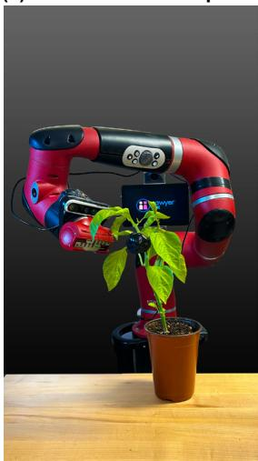
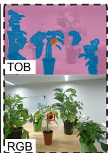
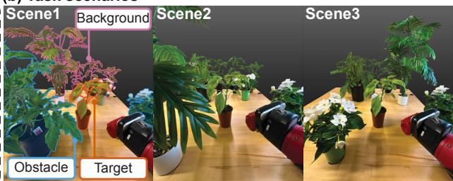
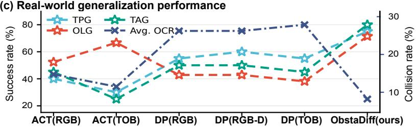
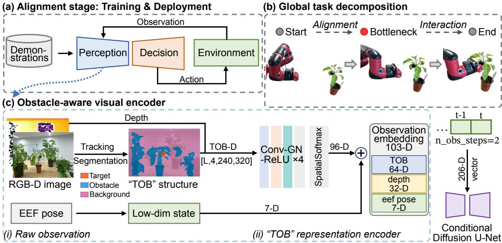
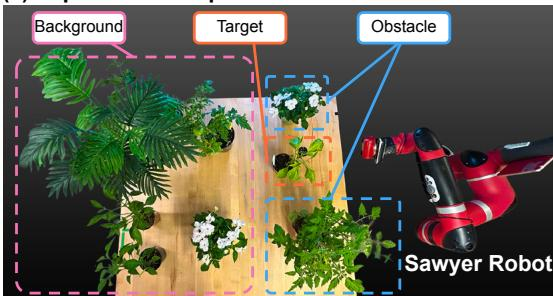
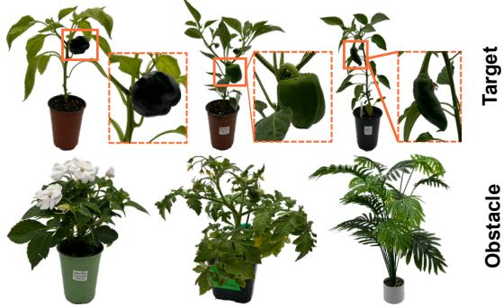
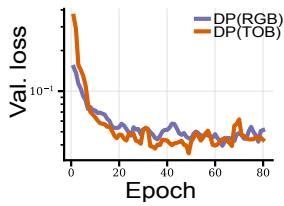
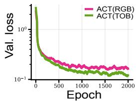
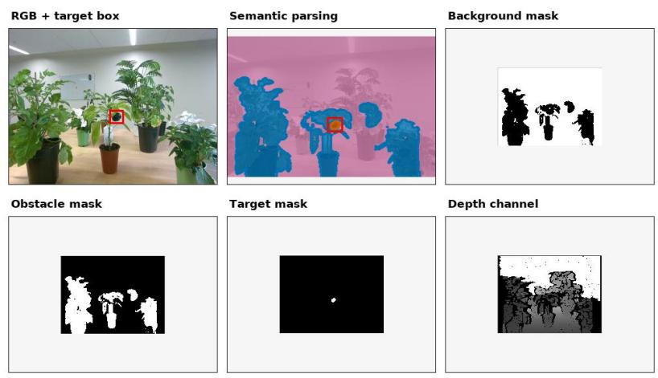

# ObstaDiff: Generalizable Diffusion Policy Learning via Obstacle-aware Representations

Jiawen Wang1 Kevin Yao2 Khalid Jawed1,∗

1Department of Mechanical and Aerospace Engineering, University of California, Los Angeles 2Department of Computer Science, University of California, Los Angeles ∗Corresponding author: khalidjm@seas.ucla.edu

(a) Obstacle-aware representation

  
(b) Task scenarios

  
Figure 1: ObstaDiff learns a structured target–obstacle–background (TOB) representation for imitation learning in cluttered scenes. This representation enables obstacle-aware approach motions, leading to improved generalization across target-pose, obstacle-layout, and target-appearance settings while reducing the average obstacle collision rate, as shown in (c).

Abstract: Imitation learning has achieved impressive results in robotic manipulation, yet most existing approaches assume clean backgrounds and lack explicit mechanisms for obstacle-aware motion generation. Extending such policies to cluttered, real-world scenes with unstructured obstacles remains a key generalization challenge. We present ObstaDiff, a decomposed diffusion-policy framework with a lightweight obstacle-aware visual encoder. ObstaDiff extracts a structured target–obstacle–background representation, enabling the downstream alignment policy to generate end-effector trajectories toward a target-centered bottleneck pose while reasoning about surrounding obstacles. We evaluate ObstaDiff on 61 real-robot greenhouse trials per method (366 executions in total). ObstaDiff achieves 75.41% average task success and 8.20% average obstacle collision rate, outperforming representative imitation-learning baselines and improving generalization in cluttered agricultural scenes.

Keywords: Imitation learning, Diffusion policy, Obstacle-aware representations

## 1 Introduction

Robot manipulation in cluttered, real-world environments has long been a central challenge in robotics, with applications spanning household assistance, logistics, and agricultural automa tion [1, 2]. Unlike controlled industrial settings, such environments are characterized by two intertwined difficulties. First, the robot must interact with diverse target objects while navigating through unstructured obstacles—wires, tools, foliage, or stems—that form narrow and irregular passages around the target. Second, the surrounding scene exhibits substantial visual variability across viewpoints, illumination conditions, and temporal changes, producing similar-yet-non-identical observations that are difficult to handle with fixed perception pipelines [3, 4, 5]. Agricultural scenarios such as greenhouse manipulation represent a particularly demanding instance of this set ting, where dense plant structures, continuous growth, and diurnal illumination changes amplify both challenges simultaneously. Traditional approaches typically rely on explicit, expert-designed pipelines that encode task-specific knowledge through carefully engineered perception and planning modules [2, 6, 7, 8]. Such methods require extensive manual calibration and parameter tuning, and their adaptability is inherently limited when deployed in environments with significant clutter and visual variation.

Learning-based methods, particularly imitation learning (IL), have demonstrated promising perfor mance in robotic manipulation tasks [9, 10]. However, extending IL to cluttered, real-world scenes with unstructured obstacles surfaces several intertwined challenges. Unstructured obstacles form narrow, irregular passages around the target that IL methods trained in clean tabletop settings are illequipped to navigate, while visually complex backgrounds introduce distractors that further degrade perception-based policies [11, 12, 13]. Target appearance, illumination, and camera viewpoints also vary substantially across deployments, and policies trained on limited demonstrations frequently fai to generalize under such visual shifts [14, 15]. Compounding these issues, standard end-to-end visual encoders entangle target, obstacle, and background cues into a single latent feature, leaving the downstream policy without an explicit signal about which parts of the scene must be reached and which must be avoided; as a result, current diffusion-based policies tend to produce trajectories that ignore nearby obstacles, especially under distribution shift [16].

To address these limitations, we present ObstaDiff, a decomposed diffusion-policy framework for imitation learning in cluttered, unstructured scenes. ObstaDiff uses an obstacle-aware visual encoder to transform RGB-D observations into a structured target–obstacle–background representation, making the target to reach and the obstacles to avoid explicit to the downstream policy. Ou main contributions are:

• Obstacle-aware structured representation. We introduce a target–obstacle–background representation and a lightweight encoder that preserve the semantic roles of target, obstacle, and background rather than treating the input as a generic RGB-D image. This structure highlights target–obstacle spatial relationships and suppresses irrelevant background variation, providing more informative conditioning for diffusion-based policy learning.

• Modular decomposed policy framework. We decompose manipulation into diffusionbased alignment and replay-based interaction, decoupling obstacle-aware approach from task-specific close-range behavior. This allows the same learned alignment policy to support different interaction objectives by changing only the replay library, with a data-driven bottleneck rule selecting the interaction trajectory.

• Real-world validation. We evaluate ObstaDiff on 61 real-robot greenhouse trials per method (366 executions in total), spanning target-pose, obstacle-layout, and targetappearance generalization. ObstaDiff achieves a 75.41% average task success rate and reduces the average obstacle collision rate to 8.20%, outperforming representative imitationlearning baselines and demonstrating improved generalization in cluttered agricultural scenes.

## 2 Related Work

## 2.1 Visual Imitation Learning and Representations

Visual imitation learning has progressed from spatial action prediction and multimodal behavior cloning [17, 18] to temporally coherent policies such as ACT [9]. Recent work shows that representation quality is critical for robust manipulation, including visual pretraining [19, 20, 11], object-

centric 3D features [12], and compact point-cloud policies such as DP3 [21]. ObstaDiff differs by using a task-structured target–obstacle–background representation instead of a generic image or point-cloud backbone, making the spatial relation between the target and obstacles explicit.

## 2.2 Diffusion Policies for Manipulation

Diffusion models are effective generative models for multimodal distributions [22, 23] and have been adapted to robotic planning and control through trajectory denoising and receding-horizon action generation [24, 10]. Subsequent diffusion-policy methods improve generalization with 3D conditioning [21, 25], equivariance [26, 27], or reusable sparse policy structure [28]. These works focus mainly on stronger action generation or generic scene representations, whereas ObstaDiff explicitly conditions diffusion-policy alignment on obstacle-aware visual structure.

## 2.3 Obstacle-Aware Manipulation in Cluttered Scenes

Cluttered agricultural scenes require reaching targets through foliage, stems, and narrow passages, and prior systems often rely on engineered perception, navigation, view planning, or shape completion [1, 2, 4, 5, 6]. Learning-based motion methods can generate obstacle-aware trajectories from data [29, 30, 31], but are typically planners rather than closed-loop visuomotor imitation policies. In contrast, strong imitation baselines such as ACT, Diffusion Policy, and DP3 [9, 10, 21] do not explicitly separate regions to reach from regions to avoid. ObstaDiff bridges this gap with a compact target–obstacle–background representation for obstacle-aware alignment before close-range interaction.

## 3 Methodology

As illustrated in Figure 2, ObstaDiff is built around two design choices for generalizable imitation learning in cluttered greenhouse scenes: a structured visual encoder that exposes target–obstacle– background semantics to the policy, and a decomposed execution scheme that separates visually guided alignment from close-range interaction.

## 3.1 Problem Formulation

We formulate greenhouse manipulation as a two-stage visuomotor policy. At each time step t, the robot observes

$$
\mathbf { o } _ { t } = \{ \mathbf { x } _ { t } , \mathbf { e } _ { t } \} ,\tag{1}
$$

where $\mathbf { x } _ { t } \in \mathbb { R } ^ { 4 \times H _ { o } \times W _ { o } }$ denotes the structured visual observation and $\mathbf { e } _ { t } \in \mathbb { R } ^ { 7 }$ denotes the current end-effector pose. The resolution $H _ { o } \times W _ { o }$ corresponds to the preprocessed policy input; in our implementation, $H _ { o } ~ = ~ 2 4 0$ and $W _ { o } ~ = ~ 3 2 0$ . Both $\mathbf { e } _ { t }$ and the action $\mathbf { a } _ { t }$ are represented as 7-D Cartesian poses, consisting of a 3-D position and a unit quaternion.

We decompose the task at a target-centered bottleneck pose $\mathbf { p } ^ { * } \in \mathbb { R } ^ { 7 }$

$$
\pi ( \mathbf { a } _ { 0 : T } \mid \mathbf { o } _ { 0 : T } ) = \underbrace { \pi _ { \mathrm { a l i g n } } ( \mathbf { a } _ { 0 : T _ { b } } \mid \mathbf { o } _ { 0 : T _ { b } } ) } _ { \mathrm { a l i g n m e n t s t a g e } } \cdot \underbrace { \pi _ { \mathrm { i n t e r } } ( \mathbf { a } _ { T _ { b } : T } \mid \mathbf { p } ^ { * } ) } _ { \mathrm { i n t e r a c t i o n s t a g e } } ,\tag{2}
$$

where $T _ { b }$ is not pre-specified but determined online as the first alignment step at which the gated nearest-neighbor criterion of Sec. 3.5 is satisfied, after which control switches to trajectory replay.

## 3.2 Structured Target–Obstacle–Background Observation

ObstaDiff replaces raw RGB-D inputs with a structured target–obstacle–background (TOB) observation that exposes the scene semantics most relevant to obstacle-aware alignment. Given an eye-in-hand RGB-D frame, a fine-tuned YOLOv8s-Worldv2 [32] open-vocabulary detector predicts the target and obstacle regions. Pixels assigned to the target region are labeled as target, pixels assigned to obstacle regions are labeled as obstacle, and all remaining pixels are labeled as background. This produces a three-class semantic index map, which is converted into three binary masks and concatenated with the aligned, normalized depth image:

  
Figure 2: Overview of ObstaDiff. Eye-in-hand RGB-D observations are converted into a structured target–obstacle–background (TOB) representation and encoded with robot state into a 103-D conditioning vector for a diffusion policy. The policy performs obstacle-aware alignment to a targetcentered bottleneck pose, after which replayed actions execute close-range interaction.

$$
\mathbf { x } _ { t } = \left[ \mathbf { m } _ { t } ^ { \mathrm { { b g } } } ; \mathbf { m } _ { t } ^ { \mathrm { { o b s } } } ; \mathbf { m } _ { t } ^ { \mathrm { { t a r } } } ; \bar { \mathbf { d } } _ { t } \right] \in [ 0 , 1 ] ^ { 4 \times H _ { o } \times W _ { o } } ,\tag{3}
$$

where $\mathbf { m } _ { t } ^ { \mathrm { { b g } } } , \mathbf { m } _ { t } ^ { \mathrm { { o b s } } }$ , and $\mathbf { m } _ { t } ^ { \mathrm { t a r } }$ are the background, obstacle, and target masks, respectively, and $\bar { \mathbf { d } } _ { t }$ is the normalized depth image. Details of RGB-D preprocessing and YOLO-based mask construction are provided in Appendix A.1.

By encoding semantic roles and depth in a compact four-channel input, the TOB observation preserves target–obstacle spatial relationships while suppressing appearance-level background variation. This provides the diffusion policy with high-level structure for generating obstacle-aware approach motions.

## 3.3 Obstacle-aware Structured Observation Encoder

The TOB observation is not a natural image, but a structured representation whose channels have explicit semantic roles: background, obstacle, target, and depth. Therefore, we do not process it with a generic image backbone such as the ResNet18 used in Diffusion Policy [10]. Treating TOB as a standard image would ignore its channel-wise structure and force the encoder to relearn spatial abstractions that are already exposed by the preprocessing stage. Instead, we use a lightweight StructuredObsEncoder that preserves the separation between semantic masks and depth and extract compact geometric features for policy conditioning.

The encoder splits the TOB observation into a semantic branch and a depth branch:

$$
\begin{array} { r } { \mathbf { x } _ { t } ^ { \mathrm { s e g } } = \mathbf { x } _ { t } [ 0 : 3 , : , : ] , \qquad \mathbf { x } _ { t } ^ { \mathrm { d e p } } = \mathbf { x } _ { t } [ 3 , : , : ] . } \end{array}\tag{4}
$$

The semantic branch encodes the background, obstacle, and target masks, while the depth branch encodes normalized geometric information. Each branch uses a small convolutional network followed by spatial softmax, which converts feature maps into keypoint-like coordinates rather than dense image features. This design encourages the encoder to capture compact spatial relations, especially the relative layout between the target and nearby obstacles.

The semantic and depth features are concatenated with the end-effector pose:

$$
\mathbf { c } _ { t } = \left[ \mathbf { z } _ { t } ^ { \mathrm { s e g } } ; \mathbf { z } _ { t } ^ { \mathrm { d e p } } ; \mathbf { e } _ { t } \right] \in \mathbb { R } ^ { 1 0 3 } ,\tag{5}
$$

where $\mathbf { z } _ { t } ^ { \mathrm { s e g } } \in \mathbb { R } ^ { 6 4 } , \mathbf { z } _ { t } ^ { \mathrm { d e p } } \in \mathbb { R } ^ { 3 2 }$ , and $\mathbf { e } _ { t } \in \mathbb { R } ^ { 7 }$ . With two observation steps, the diffusion policy receives a 206-D conditioning vector. Architectural details are provided in Appendix A.2.

## 3.4 Alignment-stage Diffusion Policy

The alignment policy is implemented as a conditional diffusion policy that predicts a sequence of end-effector actions for reaching the bottleneck pose. Let

$$
\mathbf { A } ^ { 0 } = \{ \mathbf { a } _ { 1 } , \dots , \mathbf { a } _ { T _ { a } } \}\tag{6}
$$

denote a clean action sequence from the alignment stage. During training, we corrupt ${ \bf A } ^ { 0 }$ with Gaussian noise through a forward diffusion process:

$$
q ( \mathbf { A } ^ { k } \mid \mathbf { A } ^ { 0 } ) = { \mathcal { N } } \left( \mathbf { A } ^ { k } ; { \sqrt { { \bar { \alpha } } _ { k } } } \mathbf { A } ^ { 0 } , ( 1 - { \bar { \alpha } } _ { k } ) \mathbf { I } \right) ,\tag{7}
$$

where k is the diffusion step and $\begin{array} { r } { \bar { \alpha } _ { k } = \prod _ { i = 1 } ^ { k } ( 1 - \beta _ { i } ) } \end{array}$

A noise-prediction network $\epsilon _ { \theta }$ is trained to denoise the action sequence conditioned on the encoded structured observations:

$$
\begin{array} { r } { \mathcal { L } = \mathbb { E } _ { k , { \mathbf A } ^ { 0 } , \epsilon } \left[ \left\| \epsilon - \epsilon _ { \theta } \left( { \mathbf A } ^ { k } , { \mathbf c } _ { 1 : n } , k \right) \right\| _ { 2 } ^ { 2 } \right] , } \end{array}\tag{8}
$$

where $\epsilon \sim \mathcal { N } ( \mathbf { 0 } , \mathbf { I } )$ and $\mathbf { c } _ { 1 : n }$ denotes the conditioning features from the most recent n observation steps. In our experiments, $n = 2$

At inference time, the policy samples an action sequence by iterative denoising:

$$
{ \bf A } ^ { k - 1 } = \frac { 1 } { \sqrt { \alpha _ { k } } } \left( { \bf A } ^ { k } - \frac { \beta _ { k } } { \sqrt { 1 - { \bar { \alpha } } _ { k } } } \epsilon _ { \theta } ( { \bf A } ^ { k } , { \bf c } _ { 1 : n } , k ) \right) + \sigma _ { k } { \bf z } ,\tag{9}
$$

where $\mathbf { z } \sim \mathcal { N } ( \mathbf { 0 } , \mathbf { I } )$ . The first 8 actions from the predicted sequence of 16 are executed in a receding horizon manner before re-planning. Since the conditioning vector explicitly encodes target, obstacle, background, depth, and end-effector pose, the diffusion policy is encouraged to generate approach motions that move toward the target while avoiding nearby plant obstacles.

## 3.5 Bottleneck Switching and Interaction

This modular design decouples obstacle-aware approach from task-specific close-range behavior, allowing the same learned alignment policy to support different interaction objectives by changing only the replay library. For example, the interaction stage can be adapted for touching, harvesting, or close-up inspection without retraining the diffusion policy. We therefore use a data-driven bottleneck switching criterion to transition from the learned alignment phase to the replay-based interaction phase.

The alignment policy is trained on trajectory segments before contact-rich interaction and drives the robot toward a configuration from which an interaction trajectory can be reliably replayed. Rather than switching at a manually hard-coded pose, ObstaDiff compares the current target observation with the initial target observations stored in a replay library collected from demonstrations. The replay library contains $N _ { \mathrm { l i b } }$ interaction trajectories:

$$
\mathcal { D } _ { \mathrm { r e p l a y } } = \{ \left( { \bf g } _ { 0 } ^ { i } , \mathcal { A } _ { \mathrm { i n t e r } } ^ { i } \right) \} _ { i = 1 } ^ { N _ { \mathrm { l i b } } } ,\tag{10}
$$

where $\mathbf { g } _ { 0 } ^ { i }$ denotes the target state at the first frame of the i-th interaction trajectory, and ${ \mathcal { A } } _ { \mathrm { { i n t e r } } } ^ { i }$ denotes the corresponding replay action sequence. During deployment, if the current target state is sufficiently close to an entry in the replay library, the system switches to interaction and replays the nearest corresponding action sequence. This lightweight transition mechanism also avoids relying on eye-in-hand depth during close-range interaction, where depth observations can be unreliable. Implementation details are provided in Appendix A.3.

## 4 Experiments

## 4.1 Experimental Protocol

Hardware. All real-robot experiments were conducted on a 7-DoF Sawyer arm with an eye-inhand Intel RealSense D455 RGB-D camera, used directly as the onboard observation sensor without external camera calibration. The policy was deployed on an NVIDIA RTX 2080 Ti workstation and trained on an NVIDIA RTX 6000 Ada workstation.

Task Benchmarks. We evaluate ObstaDiff in an indoor greenhouse testbed that reproduces the visual clutter and spatial constraints of real greenhouse manipulation. The task requires the robot to reach a pepper target within a predefined target region while avoiding surrounding plant obstacles, as shown in Fig. 3. We design three evaluation settings to test generalization along different axes.

First, Target-Pose Generalization (TPG) evaluates robustness to changes in the target pose. We select 10 target positions within the target region and use two target orientations, resulting in 20 trials. Second, Obstacle-Layout Generalization (OLG) keeps the target fixed and varies the surrounding obstacle plants. We use three obstacle orderings and seven obstacle positions, resulting in 21 trials. Third, Target-Appearance Generalization (TAG) changes the target from the training purple pepper to two unseen green pepper varieties. For each green pepper type, we place the target in 10 different poses within the target region, resulting in 20 trials. Together, TPG, OLG, and TAG comprise 61 evaluation trials and test whether the policy can generate obstacle-aware approach motions

(a) Experiment setup  
  
(b) Target and obstacle plants

  
Figure 3: Experimental setup. (a) Indoor greenhouse testbed with a Sawyer robot, target pepper, background plants, and obstacle plants. (b) Target pepper plants and obstacle plants used in the experiments.

under target pose shifts, obstacle rearrangements, and unseen target appearances. Each trial is a separate real-robot execution under a distinct configuration rather than a repetition of a fixed config uration, so the protocol measures configuration-level generalization rather than within-configuration repeatability. All 61 trials are run per method, giving 61 × 6 = 366 real-robot executions in total. For OLG, training and evaluation use the same three obstacle plant species, but the evaluated spatial arrangements and positions are not seen during demonstration collection; OLG therefore measures generalization to unseen layouts and positions of known obstacle plants, not to unseen obstacle categories.

Demonstrations. We collected 90 expert alignment demonstrations using the gravity-compensation teaching mode of the Sawyer robot. All demonstrations use the purple pepper target, making the green pepper targets in TAG fully unseen during training. The demonstrations are evenly distributed across three obstacle configurations, with 30 target-pose demonstrations per configuration. Each trajectory records the motion from the home position to the bottleneck pose. The interaction stage is handled separately by a replay library containing 26 trajectories from the bottleneck pose to task completion, defined as touching the target pepper. At deployment, ObstaDiff selects the closest replay trajectory according to the bottleneck switching rule in Sec. 3.5.

Training Details. All diffusion-policy variants (DP (RGB), DP (RGB-D), DP (TOB), and ObstaDiff) share an identical pipeline: the same 90 demonstrations, the same train/validation split (random seed 42, 10% held out), two observation steps, prediction horizon 16, action horizon 8, and 250 epochs with AdamW $( 1 \times 1 0 ^ { - 4 }$ learning rate, $1 \times 1 0 ^ { - 6 }$ weight decay, betas (0.95, 0.999)). We used EMA evaluation and a DDIM scheduler with squared-cosine noise, ϵ-prediction, and $K = 1 0 0$ diffusion steps for both training and inference. For DP (RGB-D) and DP (TOB), only the first convolution of the ResNet-18 encoder is expanded from three to four input channels; every remaining layer is unchanged. The sole remaining discrepancy among the DP variants is the per-device batch size (32 for DP (TOB) and ObstaDiff, 16 for DP (RGB) and DP (RGB-D)). Because DP (TOB) and ObstaDiff share the same batch size, batch size does not confound the comparison that isolates the visual encoder.

ACT baselines used chunk size 16, batch size 8, hidden dimension 512, feedforward dimension 3200, KL weight 10, and learning rate $1 \times 1 0 ^ { - 5 }$ , and were trained for 2000 epochs. All methods were evaluated using the checkpoint with the lowest validation loss, with early stopping.

Baselines. We compare ObstaDiff with representative imitation-learning baselines and input ablations. All methods use the same 90 demonstrations, the same bottleneck switching rule, and the same 26-trajectory replay library, so the decomposition cannot explain the differences reported below; what varies is the learned alignment policy and its observation representation.

• ACT (RGB) [9]: an action chunking transformer policy trained with standard RGB observations for the alignment stage.

• ACT (TOB): ACT conditioned on the proposed target–obstacle–background observation, used to evaluate whether TOB also benefits non-diffusion imitation policies.

• DP (RGB) [10]: the standard Diffusion Policy with a ResNet-18 visual encoder over RGB observations.

• DP (RGB-D): the same Diffusion Policy encoder with the aligned depth image appended as a fourth input channel, used to isolate the effect of adding depth alone.

• DP (TOB): the same Diffusion Policy encoder taking exactly the four-channel TOB observation used by ObstaDiff, used to isolate the effect of the observation representation from that of the structured encoder.

• ObstaDiff: the full method using TOB observations, the structured observation encoder, and diffusion-based alignment.

On point-cloud baselines. We do not report DP3 [21] as a quantitative baseline. DP3 conditions on sampled 3D point clouds reconstructed from a fixed external camera, whereas our setting uses image-aligned observations from an eye-in-hand D455 without constructing explicit 3D geometry. Because the camera frame moves continuously with the arm, and because thin foliage, occlusion boundaries, and missing depth introduce substantial reconstruction artifacts, our implementation produced unstable point clouds under registration, cropping, and sampling, and we were unable to deploy it reliably. We therefore report this practical mismatch rather than statistics from an undertuned baseline. This reflects the difficulty of transferring DP3 to a moving eye-in-hand setup in dense foliage, not an inherent restriction of the method to fixed-camera settings.

Evaluation Metrics. We evaluate each method on three generalization settings: Target-Pose Generalization (TPG), Obstacle-Layout Generalization (OLG), and Target-Appearance Generalization (TAG). We report task success rate (TSR) as the primary metric, defined as the percentage of trials in which the robot reaches and interacts with the target without safety violations. We also report obstacle collision rate (OCR), task completion time (TCT), and trajectory smoothness (Traj. Smooth). OCR is the percentage of trials with obstacle collisions, TCT is the wall-clock time from motion onset to task completion, averaged over successful TPG trials, and trajectory smoothness measures the temporal variation of end-effector poses and actions. Higher TSR is better; lower OCR, TCT, and smoothness values are better.

Table 1: Main real-robot results across three generalization settings. Each method is run on all 61 trials (TPG n=20, OLG n=21, TAG n=20), giving 366 real-robot executions in total; the mean is computed over the 61 pooled trials rather than as an average of the three per-setting rates. TCT and trajectory smoothness are computed over successful TPG trials. Best results are shown in bold.
<table><tr><td rowspan="2">Method</td><td colspan="4">TSR (%) ↑</td><td colspan="4">OCR (%)↓</td><td rowspan="2">TCT (s) ↓</td><td rowspan="2"> $\mathbf { S m o o t h } ( 1 0 ^ { - 4 } ) \downarrow$ </td></tr><tr><td>TPG</td><td>OLG</td><td>TAG</td><td>Mean</td><td>TPG</td><td>OLG</td><td>TAG</td><td>Mean</td></tr><tr><td>ACT (RGB)</td><td>40.00</td><td>52.38</td><td>45.00</td><td>45.90</td><td>25.00</td><td>14.29</td><td>5.00</td><td>14.75</td><td>20.77</td><td>1.16</td></tr><tr><td>ACT (TOB)</td><td>30.00</td><td>66.67</td><td>25.00</td><td>40.98</td><td>15.00</td><td>14.29</td><td>5.00</td><td>11.48</td><td>18.38</td><td>0.77</td></tr><tr><td>DP (RGB)</td><td>55.00</td><td>42.86</td><td>50.00</td><td>49.18</td><td>35.00</td><td>33.33</td><td>10.00</td><td>26.23</td><td>18.41</td><td>1.35</td></tr><tr><td>DP (RGB-D)</td><td>60.00</td><td>42.86</td><td>50.00</td><td>50.82</td><td>35.00</td><td>33.33</td><td>10.00</td><td>26.23</td><td>18.67</td><td>1.34</td></tr><tr><td>DP (TOB)</td><td>55.00</td><td>38.10</td><td>45.00</td><td>45.90</td><td>30.00</td><td>38.10</td><td>15.00</td><td>27.87</td><td>18.17</td><td>1.19</td></tr><tr><td>ObstaDiff</td><td>75.00</td><td>71.43</td><td>80.00</td><td>75.41</td><td>5.00</td><td>19.05</td><td>0.00</td><td>8.20</td><td>15.57</td><td>1.13</td></tr></table>

## 4.2 Main Results

Fig. 1(c) and Table 1 summarize the main real-robot results. ObstaDiff achieves the best task success rate in all three generalization settings, with a mean TSR of 75.41% against 45.90% for ACT (RGB) and 49.18% for DP (RGB), and the best mean OCR (8.20% versus 14.75% and 26.23%). Neither of the two information-matched diffusion controls closes this gap: DP (RGB-D) reaches 50.82% TSR and DP (TOB) 45.90%, i.e. 31/61 and 28/61 successes against 30/61 for DP (RGB). We analyze these controls in Sec. 4.3. The improvement is consistent under target-pose shifts (TPG), obstacle rearrangements (OLG), and unseen target appearances (TAG), including the unseen green pepper targets shown in Fig. 3(b). These results indicate that the TOB representation improves not only task completion but also the reliability of obstacle-aware approach motions in cluttered greenhouse scenes.

Qualitative Analysis. Qualitatively, baseline policies often move directly toward the target and are more likely to contact nearby plants in cluttered layouts. In contrast, ObstaDiff produces more obstacle-aware approach motions by aligning with the target-centered free space before entering the bottleneck region. This behavior is consistent with the lower average OCR in Table 1, indicating that the TOB representation provides useful spatial cues for distinguishing the target from nearby obstacles.

## 4.3 Ablation Studies

We first isolate the contribution of the TOB representation from that of the structured encoder using the two information-matched diffusion controls in Table 1. Appending aligned depth to the standard DP encoder moves mean TSR only from 49.18% to 50.82%—one additional successful trial out of 61—and leaves OCR unchanged at 26.23%; the collision counts of DP (RGB) and DP (RGB-D) coincide in every setting (7/20, 7/21, 2/20), indicating that depth alone contributes little to obstacle avoidance under this encoder. Feeding the same encoder the identical four-channel TOB observa-

(a) Diffusion Policy  

(b) ACT  
  
Figure 4: TOB stabilizes training. TOB reduces validation loss, but the ACT (TOB) real-robot results suggest that lower supervised loss alone does not guarantee higher task success.

tion used by ObstaDiff does not help either: mean TSR falls to 45.90% and mean OCR rises to 27.87%. The degradation is concentrated precisely in the setting TOB was designed to address— under obstacle-layout shift, DP (TOB) records the lowest success rate and the highest collision rate of any method in Table 1 (both 8/21, i.e. 38.10%). Since DP (TOB) and ObstaDiff share the same observation, the same demonstrations, and the same batch size, the remaining 29.5-point TSR gap is attributable to the structured encoder. Structured semantic input alone therefore does not confer ob stacle awareness; without an encoder matched to its channel structure it is no better than raw RGB, and can be worse.

For the non-diffusion backbone, adding TOB to ACT reduces mean OCR from 14.75% to 11.48% and improves trajectory smoothness from 1.16 to 0.77, but mean TSR drops from 45.90% to 40.98%—the same pattern, on a different policy class. We do not claim the convolutional backbone or the spatial softmax as novel components; the contribution is their task-specific coupling with TOB. The validation curves in Fig. 4 are consistent with this view: TOB reduces validationloss fluctuation, but lower supervised loss alone does not translate into higher task success.

## 4.4 Discussion

ObstaDiff targets visual imitation learning in cluttered real-world scenes, where small targets are surrounded by leaves, stems, and background distractors. The target–obstacle–background (TOB) representation makes these semantic roles explicit, helping the diffusion policy focus on the target to reach and the obstacles to avoid rather than raw visual clutter. Its decomposed design further supports practical eye-in-hand deployment: RGB-D observations guide the approach stage, while replayed actions handle close-range interaction where depth can become unreliable.

## 5 Limitations

ObstaDiff currently relies on human- or prompt-specified targets, which lets us focus on low-level obstacle-aware alignment but does not address autonomous target selection or task planning. It also inherits the common limitation of imitation learning: the policy is constrained by the demonstration distribution and has limited ability to explore behaviors outside the collected data. Beyond these, only the alignment stage is learned; the interaction stage replays demonstrated trajectories, so our results should be read as evidence about obstacle-aware approach behavior rather than about contactrich manipulation. Our evaluation is also confined to a single indoor greenhouse testbed with three obstacle plant species and one target crop, and the comparison against point-cloud policies remains open in the moving eye-in-hand regime.

## 6 Conclusion

This work presented ObstaDiff, a diffusion-policy framework for imitation learning in cluttered and unstructured greenhouse environments. The central contribution is a lightweight obstacle-aware encoder that converts eye-in-hand RGB-D observations into a structured target–obstacle–background (TOB) representation. By separating the target to reach, the obstacles to avoid, and the background to ignore, TOB provides the diffusion policy with high-level spatial structure for obstacle-aware action generation and improves generalization beyond raw visual imitation.

ObstaDiff also uses a deployment-oriented decomposed execution scheme, where the learned policy handles visually guided alignment and replayed actions handle close-range interaction. This design avoids relying on unreliable eye-in-hand depth during contact-rich motions and allows different interaction objectives to be supported by changing the replay library. Real-robot experiments under target-pose, obstacle-layout, and target-appearance shifts show that ObstaDiff improves task success and obstacle avoidance over imitation-learning baselines. Future work will extend ObstaDiff to mobile manipulation and integrate vision-language models for autonomous target selection.

## Acknowledgments

We gratefully acknowledge support from the United States Department of Agriculture (Grant No. 2024-67021-42528) and the National Science Foundation (Grant No. 2551220).

## References

[1] C. W. Bac, E. J. van Henten, J. Hemming, and Y. Edan. Harvesting robots for high-value crops: State-of-the-art review and challenges ahead. Journal ofField Robotics, 31(6):888–911, 2014.

[2] F. Magistri, Y. Pan, J. Bartels, J. Behley, C. Stachniss, and C. Lehnert. Improving robotic fruit harvesting within cluttered environments through 3d shape completion. IEEE Robotics and Automation Letters, 9(8):7357–7364, 2024.

[3] L. Lobefaro, M. Sodano, D. Fusaro, F. Magistri, M. V. Malladi, T. Guadagnino, A. Pretto, and C. Stachniss. Spatio-temporal consistent semantic mapping for robotics fruit growth monitoring. IEEE Robotics and Automation Letters, 2025.

[4] A. N. Sivakumar, S. Modi, M. V. Gasparino, C. Ellis, A. E. B. Velasquez, G. Chowdhary, and S. Gupta. Learned visual navigation for under-canopy agricultural robots. In Proceedings of Robotics: Science and Systems (RSS), 2021.

[5] T. Yi, D. Zhang, L. Luo, and J. Luo. View planning for grape harvesting based on active vision strategy under occlusion. IEEE Robotics and Automation Letters, 9(3):2535–2542, 2024.

[6] C. Lehnert, A. English, C. McCool, A. W. Tow, and T. Perez. Autonomous sweet pepper harvesting for protected cropping systems. IEEE Robotics and Automation Letters, 2(2):872– 879, 2017.

[7] J. Wang, Y. Jin, J. Shi, D. Li, F. Sun, D. Luo, B. Fang, et al. Ehc-mm: Embodied holistic control for mobile manipulation. In 2025 IEEE International Conference on Robotics and Automation (ICRA), pages 13330–13336. IEEE, 2025.

[8] J. Wang, T. Zhang, Y. Wang, and D. Luo. Optimizing robot arm reaching ability with different joints functionality. In 2023 32nd IEEE International Conference on Robot and Human Interactive Communication (RO-MAN), pages 1778–1785. IEEE, 2023.

[9] T. Z. Zhao, V. Kumar, S. Levine, and C. Finn. Learning fine-grained bimanual manipulation with low-cost hardware. In Proceedings ofRobotics: Science and Systems (RSS), 2023.

[10] C. Chi, Z. Xu, S. Feng, E. Cousineau, Y. Du, B. Burchfiel, R. Tedrake, and S. Song. Diffusion policy: Visuomotor policy learning via action diffusion. The International Journal of Robotics Research, 44(10-11):1684–1704, 2025.

[11] K. Burns, Z. Witzel, J. I. Hamid, T. Yu, C. Finn, and K. Hausman. What makes pre-trained visual representations successful for robust manipulation? In 8th Annual Conference on Robot Learning, 2024.

[12] Y. Zhu, Z. Jiang, P. Stone, and Y. Zhu. Learning generalizable manipulation policies with object-centric 3d representations. In Proceedings of the 7th Conference on Robot Learning (CoRL), volume 229 of Proceedings ofMachine Learning Research, pages 3418–3433. PMLR, 2023.

[13] R. Mirjalili, T. Jülg, F. Walter, and W. Burgard. Augmented reality for robots (arro): Pointing visuomotor policies towards visual robustness. IEEE Robotics and Automation Letters, 2026.

[14] J. Tobin, R. Fong, A. Ray, J. Schneider, W. Zaremba, and P. Abbeel. Domain randomization for transferring deep neural networks from simulation to the real world. In IEEE/RSJ International Conference on Intelligent Robots and Systems (IROS), pages 23–30, 2017.

[15] R. Garcia, R. Strudel, S. Chen, E. Arlaud, I. Laptev, and C. Schmid. Robust visual sim-to-real transfer for robotic manipulation. In IEEE/RSJ International Conference on Intelligent Robots and Systems (IROS), 2023.

[16] H. Li, Q. Feng, Z. Zheng, J. Feng, Z. Chen, and A. Knoll. Language-guided object-centric diffusion policy for generalizable and collision-aware manipulation. In 2025 IEEE International Conference on Robotics and Automation (ICRA), pages 12834–12841. IEEE, 2025.

[17] A. Zeng, P. Florence, J. Tompson, S. Welker, J. Chien, M. Attarian, T. Armstrong, I. Krasin, D. Duong, V. Sindhwani, et al. Transporter networks: Rearranging the visual world for robotic manipulation. In Conference on Robot Learning, pages 726–747. PMLR, 2021.

[18] P. Florence, C. Lynch, A. Zeng, O. A. Ramirez, A. Wahid, L. Downs, A. Wong, J. Lee, I. Mordatch, and J. Tompson. Implicit behavioral cloning. In Proceedings of the 5th Conference on Robot Learning (CoRL), volume 164 of Proceedings of Machine Learning Research, pages 158–168. PMLR, 2022.

[19] S. Nair, A. Rajeswaran, V. Kumar, C. Finn, and A. Gupta. R3m: A universal visual representation for robot manipulation. In Proceedings of the 6th Conference on Robot Learning (CoRL), volume 205 of Proceedings of Machine Learning Research, pages 892–909. PMLR, 2023.

[20] I. Radosavovic, T. Xiao, S. James, P. Abbeel, J. Malik, and T. Darrell. Real-world robot learning with masked visual pre-training. In Proceedings of the 6th Conference on Robot Learning (CoRL), volume 205 of Proceedings of Machine Learning Research, pages 416–426. PMLR, 2023.

[21] Y. Ze, G. Zhang, K. Zhang, C. Hu, M. Wang, and H. Xu. 3d diffusion policy: Generalizable visuomotor policy learning via simple 3d representations. In Proceedings of Robotics: Science and Systems (RSS), 2024.

[22] J. Ho, A. Jain, and P. Abbeel. Denoising diffusion probabilistic models. In Advances in Neural Information Processing Systems (NeurIPS), volume 33, pages 6840–6851, 2020.

[23] J. Song, C. Meng, and S. Ermon. Denoising diffusion implicit models. In International Conference on Learning Representations (ICLR), 2021.

[24] M. Janner, Y. Du, J. B. Tenenbaum, and S. Levine. Planning with diffusion for flexible behavior synthesis. In International Conference on Machine Learning (ICML), volume 162 of Proceedings of Machine Learning Research, pages 9902–9915. PMLR, 2022.

[25] T.-W. Ke, N. Gkanatsios, and K. Fragkiadaki. 3d diffuser actor: Policy diffusion with 3d scene representations. In Proceedings of the 8th Conference on Robot Learning (CoRL), volume 270 of Proceedings ofMachine Learning Research, pages 1949–1974. PMLR, 2025.

[26] D. Wang, S. Hart, D. Surovik, T. Kelestemur, H. Huang, H. Zhao, M. Yeatman, J. Wang, R. Walters, and R. Platt. Equivariant diffusion policy. In Proceedings of the 8th Conference on Robot Learning (CoRL), volume 270 of Proceedings of Machine Learning Research, pages 48–69. PMLR, 2025.

[27] J. Yang, Z. Cao, C. Deng, R. Antonova, S. Song, and J. Bohg. Equibot: Sim(3)-equivariant diffusion policy for generalizable and data efficient learning. In Proceedings of the 8th Conference on Robot Learning (CoRL), volume 270 of Proceedings of Machine Learning Research, pages 1048–1068. PMLR, 2025.

[28] Y. Wang, Y. Zhang, M. Huo, T. Tian, X. Zhang, Y. Xie, C. Xu, P. Ji, W. Zhan, M. Ding, and M. Tomizuka. Sparse diffusion policy: A sparse, reusable, and flexible policy for robot learning. In Proceedings of the 8th Conference on Robot Learning (CoRL), volume 270 of Proceedings ofMachine Learning Research, pages 649–665. PMLR, 2025.

[29] A. H. Qureshi, Y. Miao, A. Simeonov, and M. C. Yip. Motion planning networks: Bridging the gap between learning-based and classical motion planners. IEEE Transactions on Robotics, 37 (1):48–66, 2021.

[30] A. Fishman, A. Murali, C. Eppner, B. Peele, B. Boots, and D. Fox. Motion policy networks. In Proceedings of the 6th Conference on Robot Learning (CoRL), volume 205 of Proceedings ofMachine Learning Research, pages 967–977. PMLR, 2023.

[31] J. Carvalho, A. T. Le, M. Baierl, D. Koert, and J. Peters. Motion planning diffusion: Learning and planning of robot motions with diffusion models. In IEEE/RSJ International Conference on Intelligent Robots and Systems (IROS), 2023.

[32] T. Cheng, L. Song, Y. Ge, W. Liu, X. Wang, and Y. Shan. Yolo-world: Real-time openvocabulary object detection. In 2024 IEEE/CVF Conference on Computer Vision and Pattern Recognition (CVPR), pages 16901–16911. IEEE, 2024.

[33] C. Zhang, D. Han, Y. Qiao, J. U. Kim, S.-H. Bae, S. Lee, and C. S. Hong. Faster segment anything: Towards lightweight sam for mobile applications. arXiv preprint arXiv:2306.14289, 2023.

## A Implementation details

## A.1 Target–Obstacle–Background Preprocessing Details

This section describes the preprocessing pipeline used to construct the target–obstacle–background (TOB) observation.

RGB-D acquisition. The RGB image is obtained from the eye-in-hand camera stream /camera/color/image\_raw as $\mathbf { I } _ { t } \in \mathbb { R } ^ { \mathbf { \breve { H } } \times W \times 3 }$ with uint8 values. The depth image is obtained from /camera/aligned\_depth\_to\_color/image\_raw as $\mathbf { D } _ { t } \in \mathbb { R } ^ { H \times W }$ with uint16 values in millimeters. The depth image is pixel-aligned to the RGB image, and zero depth values denote invalid pixels. Invalid depth values are temporally hole-filled in the depth callback.

Infrared projector artifact reduction. To reduce artifacts from the RGB-D camera infrared projector, we use an emitter even–odd alternation procedure during acquisition. This produces a cleaner RGB stream for downstream YOLO parsing. Depth frames are saved on even frames with the emitter enabled. The RGB and depth buffers are then truncated to the same length before saving.

Semantic parsing. We use YOLOv8s-Worldv2 [32] as the open-vocabulary detector, fine-tuned on approximately 80 manually annotated greenhouse images collected from the demonstration sessions. The target class denotes the selected manipulation target part, namely the pepper fruit to be touched, rather than the whole plant. Detected obstacle boxes are refined into pixel-accurate masks with MobileSAM [33]. The resulting per-pixel labels form the semantic index map $\mathbf { s } _ { t } ~ \in$ $\{ 0 , 1 , 2 \} ^ { H \times W }$ , where label 0 denotes background, label 1 denotes obstacle, and label 2 denotes the target; pixels assigned to neither the target nor an obstacle are treated as background. The index map is converted into three binary masks:

$$
\begin{array} { r } { \mathbf { m } _ { t } ^ { \mathrm { b g } } ( u , v ) = \mathbb { 1 } [ \mathbf { s } _ { t } ( u , v ) = 0 ] , } \end{array}\tag{11}
$$

$$
\mathbf { m } _ { t } ^ { \mathrm { o b s } } ( u , v ) = \mathbb { 1 } [ \mathbf { s } _ { t } ( u , v ) = 1 ] ,\tag{12}
$$

$$
\begin{array} { r } { \mathbf { m } _ { t } ^ { \mathrm { t a r } } ( u , v ) = \mathbb { 1 } [ \mathbf { s } _ { t } ( u , v ) = 2 ] . } \end{array}\tag{13}
$$

Four-channel policy input. The three semantic masks and the aligned depth image are resized to the policy input resolution $H _ { o } \times W _ { o } = 2 4 0 \times 3 2 0$ . The depth image is normalized to [0, 1]:

$$
\bar { \mathbf { d } } _ { t } = \mathrm { N o r m a l i z e } ( \mathbf { D } _ { t } ) ,\tag{14}
$$

where invalid pixels are set to 0. The final policy input is

$$
\mathbf { x } _ { t } = \left[ \mathbf { m } _ { t } ^ { \mathrm { b g } } ; \mathbf { m } _ { t } ^ { \mathrm { o b s } } ; \mathbf { m } _ { t } ^ { \mathrm { t a r } } ; \bar { \mathbf { d } } _ { t } \right] \in [ 0 , 1 ] ^ { 4 \times 2 4 0 \times 3 2 0 } .\tag{15}
$$

In implementation, this tensor corresponds to cam4, whose channel order is

$$
\mathrm { \bigl [ b g \mathrm { \_ m a s k , \ o b s t \mathrm { \_ m a s k , \ p l a n t \mathrm { \_ m a s k , \ d e p t h \mathrm { \_ n o r m } } } \bigr ] \mathrm { . } } }
$$

For batched policy training, the observation tensor is represented as $\mathbf { X } \in \mathbb { R } ^ { B \times T _ { o } \times 4 \times 2 4 0 \times 3 2 0 }$ , where B is the batch size and $T _ { o }$ is the number of observation steps. In our experiments, $T _ { o } = 2 .$

## A.2 Structured Observation Encoder

This section provides implementation details of the StructuredObsEncoder used to encode the fourchannel TOB observation.

Input split. Given the TOB observation $\mathbf { x } _ { t } \in [ 0 , 1 ] ^ { 4 \times 2 4 0 \times 3 2 0 }$ , the encoder splits the input into a semantic tensor and a depth tensor:

$$
\mathbf { x } _ { t } ^ { \mathrm { s e g } } = \mathbf { x } _ { t } [ 0 : 3 , : , : ] \in [ 0 , 1 ] ^ { 3 \times 2 4 0 \times 3 2 0 } , \qquad \mathbf { x } _ { t } ^ { \mathrm { d e p } } = \mathbf { x } _ { t } [ 3 , : , : ] \in [ 0 , 1 ] ^ { 1 \times 2 4 0 \times 3 2 0 } .\tag{16}
$$

The first three channels correspond to the background, obstacle, and target masks, while the fourth channel corresponds to normalized depth.

Branch encoders. The semantic and depth branches use the same lightweight CNN structure but different channel widths. Each branch consists of four convolutional blocks, where each block is

$$
\mathrm { C o n v 2 D }  \mathrm { G r o u p N o r m }  \mathrm { R e L U } .
$$

The convolutional layers use kernels and strides

$$
( 5 \times 5 , s = 2 ) , \quad ( 3 \times 3 , s = 2 ) , \quad ( 3 \times 3 , s = 1 ) , \quad ( 3 \times 3 , s = 1 ) .
$$

For $\phantom { - } 1 2 4 0 \times 3 2 0$ input, the two stride-2 layers reduce the spatial resolution to $6 0 \times 8 0$ . The semantic branch maps

$$
\mathbb { R } ^ { 3 \times 2 4 0 \times 3 2 0 } \to \mathbb { R } ^ { 3 2 \times 6 0 \times 8 0 } ,\tag{17}
$$

and the depth branch maps

$$
\mathbb { R } ^ { 1 \times 2 4 0 \times 3 2 0 }  \mathbb { R } ^ { 1 6 \times 6 0 \times 8 0 } .\tag{18}
$$

Spatial softmax. Instead of flattening the feature maps, each branch applies spatial softmax to convert feature activations into keypoint-like coordinates. For channel c of a feature map $\mathbf { F } ,$ , spatial softmax computes

$$
\mathbf { k } _ { c } = \sum _ { u , v } \mathrm { s o f t m a x } ( \mathbf { F } _ { c } ) ( u , v ) \left[ \begin{array} { l } { u } \\ { v } \end{array} \right] .\tag{19}
$$

Thus, each output channel contributes one expected 2-D coordinate. The semantic branch produces 32 coordinate pairs, giving $\mathbf { z } _ { t } ^ { \mathrm { s e g } } \in \mathbb { R } ^ { 6 4 }$ , while the depth branch produces 16 coordinate pairs, giving $\mathbf { z } _ { t } ^ { \mathrm { d e p } } \in \mathbb { R } ^ { 3 2 }$

Final conditioning vector. The branch outputs are concatenated with the 7-D end-effector pose:

$$
\mathbf { c } _ { t } = \left[ \mathbf { z } _ { t } ^ { \mathrm { s e g } } ; \mathbf { z } _ { t } ^ { \mathrm { d e p } } ; \mathbf { e } _ { t } \right] \in \mathbb { R } ^ { 1 0 3 } .\tag{20}
$$

Since the policy uses two observation steps, the final conditioning input to the diffusion U-Net has dimension $2 \times 1 0 3 = 2 0 6$

## A.3 Bottleneck Switching and Interaction Details

This section describes the data-driven switching rule used to transition from the alignment stage to the interaction stage.

Replay library. From the demonstration dataset, we construct a replay library $\mathcal { D } _ { \mathrm { r e p l a y } }$ containing $N _ { \mathrm { l i b } }$ interaction samples:

$$
\mathcal { D } _ { \mathrm { r e p l a y } } = \{ \left( { \bf g } _ { 0 } ^ { i } , \mathcal { A } _ { \mathrm { i n t e r } } ^ { i } \right) \} _ { i = 1 } ^ { N _ { \mathrm { l i b } } } ,\tag{21}
$$

where $\mathcal { A } _ { \mathrm { i n t e r } } ^ { i } = \{ \hat { \mathbf { a } } _ { 0 } ^ { i } , \dots , \hat { \mathbf { a } } _ { S _ { i } } ^ { i } \}$ is the interaction-stage action sequence from the i-th demonstration, and ${ \bf g } _ { 0 } ^ { i }$ is the target state extracted from the first frame of that interaction segment. In our implementation, $N _ { \mathrm { l i b } } = 2 6$

Target state. The target state is represented by the target center and target depth:

$$
\mathbf { g } _ { t } = \left[ u _ { t } ^ { \mathrm { t a r } } , v _ { t } ^ { \mathrm { t a r } } , d _ { t } ^ { \mathrm { t a r } } \right] ^ { \top } ,\tag{22}
$$

where $( u _ { t } ^ { \mathrm { t a r } } , v _ { t } ^ { \mathrm { t a r } } )$ is the center of the tracked target bounding box in image coordinates, and $d _ { t } ^ { \mathrm { t a r } }$ is defined in the switching rule below. The stored state ${ \bf g } _ { 0 } ^ { i }$ is computed in the same way from the first frame of the i-th replay action sequence.

Nearest-neighbor switching rule. At each alignment step, we compare the current target state against the initial target states stored in the replay library. The target depth $d _ { t } ^ { \mathrm { t a r } }$ is computed from the aligned depth image as the p-th percentile of valid depth pixels inside a central crop of the target bounding box. In our experiments, we use the central $4 0 \%$ of the target box and $p = 2 0$ , which biases the estimate toward the visible foreground surface of the target.

For the i-th replay entry, let $\mathbf { g } _ { 0 } ^ { i } = [ u _ { 0 } ^ { i } , v _ { 0 } ^ { i } , d _ { 0 } ^ { i } ] ^ { \top }$ denote the target state recorded at the first frame of that interaction replay. We compute the normalized image-plane errors

$$
e _ { u } ^ { i } = \frac { \big | u _ { t } ^ { \mathrm { t a r } } - u _ { 0 } ^ { i } \big | } { W } , \qquad e _ { v } ^ { i } = \frac { \big | v _ { t } ^ { \mathrm { t a r } } - v _ { 0 } ^ { i } \big | } { H } ,\tag{23}
$$

and the one-sided normalized depth error

$$
e _ { d } ^ { i } = \operatorname* { m a x } \left( 0 , \frac { d _ { t } ^ { \mathrm { t a r } } - d _ { 0 } ^ { i } } { D } \right) ,\tag{24}
$$

where $W$ and $H$ are the RGB image width and height, and $D$ is the depth normalization scale in millimeters. The one-sided depth error treats the current target as depth-compatible if it is already closer to the camera than the replay reference.

Switching uses a gated nearest-neighbor rule. Each replay entry maintains an entry-specific depthready flag:

$$
r _ { i } ( t ) = r _ { i } ( t - 1 ) \vee \left[ e _ { d } ^ { i } ( t ) \leq \epsilon _ { d } \right] .\tag{25}
$$

That is, a replay entry becomes depth-ready once the live target depth has entered its acceptable depth range at least once. Among depth-ready entries, we select the replay with the smallest imageplane error

$$
i ^ { * } = \arg \operatorname* { m i n } _ { i : r _ { i } ( t ) = 1 } \left( e _ { u } ^ { i } + e _ { v } ^ { i } \right) .\tag{26}
$$

The system switches to the interaction stage when the selected replay also satisfies

$$
e _ { u } ^ { i ^ { * } } + e _ { v } ^ { i ^ { * } } \leq \epsilon _ { u v } .\tag{27}
$$

It then executes the interaction action sequence associated with that replay:

$$
\pi _ { \mathrm { i n t e r } } = \mathrm { R e p l a y } \left( \boldsymbol { A } _ { \mathrm { i n t e r } } ^ { i ^ { * } } \right) .\tag{28}
$$

In our experiments, we use $\epsilon _ { d } = 0 . 0 0 5$ with $D = 1 0 0 0$ mm, corresponding to a 5 mm depth gate, and $\epsilon _ { u v } \ = \ 0 . 2$ for the normalized image-plane error. We use $W = 6 4 0$ and $H  { \mathrm { ~ = ~ } } 4 8 0$ for the image-plane normalization.

Motivation. This rule implements the bottleneck transition without requiring a hard-coded Cartesian pose. Instead, it switches when the current target-centered visual configuration is close to one observed at the beginning of a demonstrated interaction trajectory. This is useful for eye-in-hand deployment because the alignment policy can use structured RGB-D observations while the target is still observable, whereas the subsequent close-range interaction relies on replayed actions when depth around the contact region may become noisy or invalid.

## B TOB Preprocessing Visualization

Fig. 5 visualizes an example of the intermediate outputs produced by the TOB preprocessing pipeline. Starting from the raw RGB observation with a target box, the perception module generates a semantic parsing result and then separates the scene into background, obstacle, and target masks. These three masks are concatenated with the normalized depth channel to form the four-channel TOB observation used by the policy. This visualization illustrates how raw cluttered RGB-D observations are converted into structured inputs that explicitly encode the target to reach, the obstacles to avoid, and the background to ignore.

  
Figure 5: Example TOB preprocessing outputs. From left to right and top to bottom: raw RGB image with target box, semantic parsing result, background mask, obstacle mask, target mask, and normalized depth channel. The final policy input is formed by stacking the three semantic masks with the depth channel.