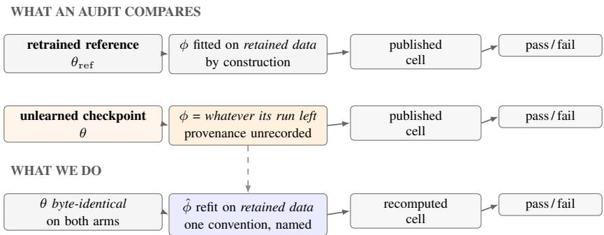
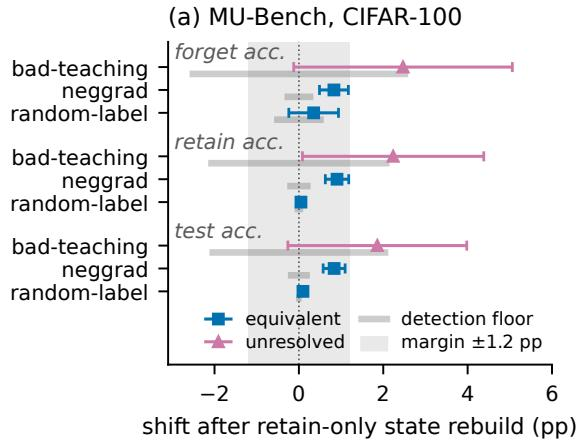
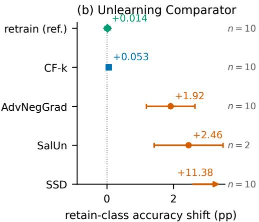
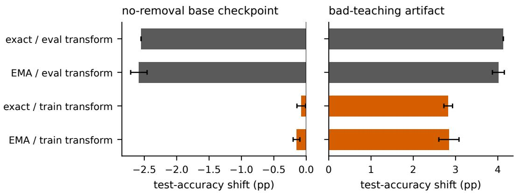
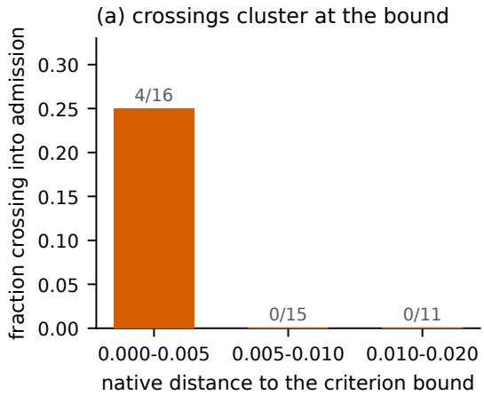
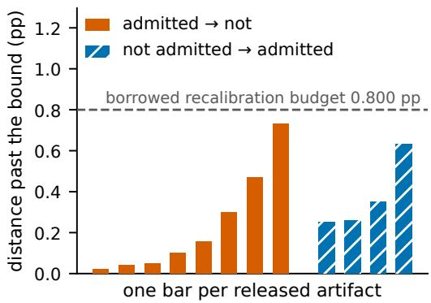

# PUBLISHED UNLEARNING NUMBERS MOVE PER CHECKPOINT, AND NOT BECAUSE THE REMOVED DATA SURVIVES: AN AUDIT OF 263 RELEASED BATCH-NORMALIZED CHECKPOINTS

Junlong Shen & Xingyu Li University of Alberta Edmonton, Canada junlong6@ualberta.ca

## ABSTRACT

An unlearning audit reads its verdict off numbers that an unlearned model and its retrained reference each publish, and both also ship batch-normalization statistics that no gradient step wrote and no release records. Refitting them on kept data at bit-identical weights moves 47 of 221 released checkpoints past the spread their own release’s seeds show, several inside a method whose average does not move: what moves is the checkpoint’s property, not its method’s. What does the moving is not the removed data surviving in the state: exchanging kept records for removed ones inside a fixed fitting pool moves a published cell by almost nothing, while how far a checkpoint’s shipped state has drifted from any refit does track it. The consequence for a published decision is real but narrow: twelve verdicts cross, four clear a measured recalibration budget, two clear it on every replicate, and a population we trained and sited near its own criterion yields none. A release should therefore name the fitting convention beside the number, on the batch-normalized vision models where this channel exists.

## 1 INTRODUCTION

A machine unlearning procedure claims to remove the influence of a subset of the training data from an already-trained model (Cao & Yang, 2015; Bourtoule et al., 2021; Guo et al., 2019). Whether it succeeded is settled by an audit. It compares the unlearned checkpoint against a reference retrained from scratch without the removed data. Three published quantities decide it: accuracy on the removed data, on the data that was kept, and on a held-out test set (Golatkar et al., 2020; Triantafillou et al., 2024). A pass/fail criterion is computed from the three, and all of it is read as a property of the released checkpoint. But a deployed network is not only its trainable tensors. Every batch normalization layer also ships a running mean and a running variance (Ioffe & Szegedy, 2015), fitted from data, used at every inference, and written by no gradient step.

The two arms of that comparison do not come by this state the same way. The difference is built into the comparison rather than left there by an oversight. The retrained reference fits its statistics on retained data by construction, because retained data is all it ever saw. An unlearned checkpoint ships whatever its own procedure’s buffer-update mode left behind. For some procedures that is the base model’s statistics untouched and for others is a running average accumulated while the weights moved. No release we measured records which index set, transform or accumulation rule produced the statistics it ships, so a reader cannot recover the convention from the release. So we put both arms on one named convention and report what moves. Take a checkpoint, change no trainable weight, refit only that state from data the release kept, and recompute the numbers and the verdict the release published for it. Three findings follow, and the third is the one this paper is named for. The published numbers move. They move per checkpoint rather than per method, so a method-level verdict does not describe the artifact an auditor holds. And what moves them is a statistic gone stale against weights that moved, rather than the removed data surviving inside it.

  
Figure 1: An unlearning audit compares two arms whose deployed state was fitted on different data, and only one of them was fitted on retained data by construction. No release records which retained subset, transform or accumulation rule produced the state it ships, so the term is invisible to an audit reading outputs and parameters. Our test refits ϕ on retained data at each checkpoint’s own byte-identical tensors (Section 4.1).

Two questions are separable here and we keep them apart throughout. Whether the two arms of an audit stand in the same relation to this state is a question only a release shipping the retrained reference can answer, and one of ours does. Whether a published cell is sensitive to the convention at all is a question any release can answer, and it is what the census below measures.

A fair objection is that an auditor should read the artifact as shipped, so the state a run left is part of what that run produced. We agree, and attribute none of the shipped state to the procedure that wrote it. The asymmetry is on the other side: the reference’s state is fitted on retained data whatever one thinks of the unlearned one. No removal procedure we are aware of targets, standardizes, reports or audits the variable that separates them (Figure 1). The channel also fixes the reach. Convolutional vision models ship these running statistics. LayerNorm and RMSNorm backbones, including the language models most current unlearning work targets, ship none, so nothing measured here carries to them.

Conventions. Three fitted states have to stay distinct. A released checkpoint ships one; an omission retrain accumulates one online over retained data while its weights still move; our test refits one after the fact at frozen weights. A checkpoint is anchored when it reproduces its own published numbers with its shipped state untouched, and one that fails this never enters an aggregate. Afamily, or arm where the contrast with the reference is the point, is the set of checkpoints a release ships for one removal procedure. A cell is one entry of a release’s published table, and each family has published accuracies on the removed subset $( \dot { d } _ { f } )$ , the retained subset (d<sub>r</sub>) and the test set (d<sub>t</sub>). A shift is refitted minus shipped, and displaced means shifted past a stated margin. A crossing is a checkpoint whose release’s own pass/fail decision changes under the refit. The budget is how far a cell moves when nothing was removed at all (Appendix L).

The margin throughout is ±1.2 percentage points (pp). It is our choice rather than a criterion either release publishes, fixed before the first wave at the primary release’s own median published seed spread, and Section 4.2 reports what happens when it moves. Once the design below is in place, Table 1 collects every question this paper asks beside the answer it returns.

How far a number moves is a property of the checkpoint rather than of the procedure that wrote it, so the deliverable is a per-checkpoint test rather than a family verdict. At three variant clusters a family mean is unresolvable at any margin, while one checkpoint’s shift is measurable to a tenth of a point. We therefore rebuild each checkpoint ten times over independently re-drawn kept subsets and decide it on its own ten alone. Most checkpoints sit near zero, the median moved one at 2.247 pp, and a family whose own interval is equivalent to zero still holds eight checkpoints past the margin.

What moves a number is a shipped statistic gone stale against weights that moved, not the removed data surviving inside it, and we measure that rather than assert it. Holding the fitting pool at one size and exchanging kept records for removed ones moves a checkpoint’s published forget accuracy by +0.015 pp. It moves +0.057 with every removed record in the pool, against that 1.2 pp margin.

What does move with a checkpoint’s shift is how far the state it ships has drifted from any retain-only refit (Section 4.3).

Contributions. Independently of and concurrently with this work, Kalani et al. (2026) show that this refit can reverse a removal verdict on models they train themselves; whether the tables the field has already published survive it is what we answer, on the checkpoints the field released.

• How much a published number moves is a property of the individual checkpoint, not of the method it belongs to. We run the test over 263 released checkpoints, each reproducing its own published values first. We decide 221 of them on ten re-drawn replicates by an exact sign test, under false-discovery control that assumes nothing about how they covary. 47 are displaced, and eight of those sit inside a method whose own interval is equivalent to zero. A method-level verdict therefore bounds an average, not the artifact a reader holds.

• What moves it is a stale statistic rather than surviving removed data, and we measure the alternative rather than argue it away. Holding weights, estimator and pool size fixed and exchanging kept records for removed ones moves a published forget accuracy +0.057 even with every removed record in the pool. Neither provenance arm moves the deployed state out of a by-construction null band. Distance from a checkpoint’s own refit does move, clears that band on all twenty, and is what separates the most displaced checkpoints from the least. Nor is that distance standing in for weight movement: at equal weight distance, a procedure that mixes removed data into its buffers still moves its frozen-buffer twin +33.80 pp further than one that does not. That is a curve reading over every rung. The one distance-matched pair whose frozen arm also stays admissible cannot resolve an effect of any size, and we report that reading as unresolved.

• The convention reaches published pass/fail decisions, and we bound how far it reaches rather than leaning on it. Our refit is a second defensible convention and not a correction, so a crossing shows that a verdict is sensitive to a choice nobody records. Twelve crossings survive re-decision on the release’s own published cell, four exceed a recalibration budget measured on the same instrument, and two do both while holding on all ten re-keyed refits. No ordered method pair reverses on forget accuracy; three of 32 reverse on test.

• The field does not record the convention, and no cheap screen tells an auditor whether it matters for the checkpoint in hand. Of 52 unlearning papers whose text we hold, 42 pass an inclusion rule fixed in advance, 19 run a batch-normalized backbone against a retrained reference, and four of those 19 mention the state at all. None of three checkpointreadable predictors transfers across methods. Where ground truth exists we check our own convention against it, on the ten omission-retrained references a release ships. The refit reproduces their shipped state to a median 0.0019 of a channel’s own activation spread, against a 0.10 bar fixed in advance.

• The account carries to populations we built ourselves, and the verdict half of it does not. On a fourth population, a different dataset and architecture sited near its own published criterion so that a crossing was reachable, 20 of 45 checkpoints displace past that population’s own 1.868 pp margin. None crosses, the nearest missing by 0.204 pp. Static quantization, a fitted deployed state that every architecture has including the ones with no running statistics at all, moves none of 118 checkpoints.

## 2 DEPLOYED STATE AND THE AUDITS THAT OMIT IT

Removal is certified from outputs and parameters. Unlearning evaluations compare an unlearned artifact against an omission-retrained reference and read accuracy over the removed and retained splits, often with a membership-inference score beside it (Golatkar et al., 2020; Shokri et al., 2017; Triantafillou et al., 2024). A large literature varies that readout, the attack behind it, or the enforcement game an audit sits in, and Appendix K places this paper against each line. Their variable is the metric, the attack or the enforcement game, where ours is a state channel all of those metrics read. Li et al. (2026) come closest in kind, calibrating the audit metric itself against a retrained policy, where we hold the metric fixed and ask what the reference’s own fitted state con tributes to it. The two compose: a calibrated metric read off arms with mismatched state inherits the same term. Closest in spirit is Thudi et al. (2022b), arguing an unlearning claim cannot be settled from a released weight vector at all. Thudi et al. (2022a) taxonomise what makes an approximate removal verifiable, and Yu et al. (2025) show retrain equivalence unattainable once training is multistage. Their variable is the training history behind the weights, ours a fitted state those weights do not contain. The two failures of the reference compose rather than compete.

That gap is measurable, so we measured it. Of 52 unlearning papers whose text we hold, 42 pass an inclusion rule fixed in advance. Of those, 19 run batch-normalization-bearing convolutional backbones against a retrained reference. Four of the 19 mention the state anywhere in their text — three once the concurrent work that is itself about it is set aside (Jawandhia et al., 2026). This is a statement about what a paper documents, not what its authors did (Appendix J).

Normalization statistics are a variable others re-estimate for other reasons. Recomputing pop ulation statistics at frozen weights is a standard operation and not one we propose: weight averaging, data-free quantization and pruning all run it (Izmailov et al., 2018; Nagel et al., 2019). Wu & Johnson (2021) establish that the estimator used for those statistics changes accuracy. Their exact-statistics recomputation is the rebuild we adopt rather than dispute; their variable is the estimator, whose converged same-distribution prediction is a small offset shared across models. Test-time adaptation recomputes the same statistics to absorb covariate shift (Schneider et al., 2020; Nado et al., 2020; Wang et al., 2020; Li et al., 2016). That changes the data those statistics see. We hold the distribution fixed and change only which kept subset the state was fitted on. Neither the operation nor the stale ness it exposes is new, and one concurrent paper has now named the confound outright. What is new is what the operation is used to measure: that the movement it produces is indexed by the individual checkpoint rather than by the method, and that it is a stale statistic rather than surviving removed data. Both are decided on third-party artifacts against the tables their own authors published.

Concurrent work on this channel, and the dated record of this one. An unlearned model can be perturbed until it remembers. Quantization does it, retain-set fine-tuning does it, and in concurrent work so does recalibrating deployed normalization state on self-trained models (Zhang et al., 2024; Khan & Sohel, 2026; Siddiqui et al., 2025; Jawandhia et al., 2026). The diagnostic is older than the papers describing it. It ships in Jawandhia et al. (2026)’s released code as experiments/bn recalibration.py, added in the commit of 24 June 2026 and indexed in that repository’s README as a BN-recalibration attack diagnostic. That paper’s arXiv v1 of 2 June 2026 does not mention it. The instrument and protocol here were developed independently of it: bars pre-registered 29 August 2026, census rows minted from 30 August 2026, and the second deployed-state channel pre-registered 6 September 2026 (Appendix S). Doan et al. (2026), posted May 2026, report that normalization statistics amplify memorization during training. Kalani et al. (2026), posted 8 September 2026, formalize the same weight-preserving recalibration and attribute the gap to the running statistics rather than the weights, on nine methods they train themselves, where it reverses headline forget accuracy by up to 78 points. The two records agree where they overlap: our normalization-free stratum returns zero, our membership readout on the primary release does not move, and recoveries of their order appear on checkpoints that fail their own release’s criterion. That is why every count below is read on the admitted stratum. Deciding whether the field’s published tables survive that operation needs the released artifacts themselves, each held to the numbers its own authors printed and re-decided on its own release’s criterion. The direction of the finding differs with the object as well. Forget-class accuracy stays at 0.0000 wherever we move utility, so nothing here recovers removed content (Appendix K).

## 3 A RECONSTRUCTION TEST FOR RELEASED ARTIFACTS

The operation. The test asks one thing of a released checkpoint: how much of the numbers it published survives a retain-only refit of its deployed state. Let θ be a checkpoint’s trainable parameter tensors and ϕ its deployed normalization state, the per-channel running mean and variance each batch-normalization layer applies at inference. We hold θ byte-identical and replace ϕ with $\hat { \phi } ,$ computed by a single forward pass over a sample of the checkpoint’s own retained data. First, ϕ<sup>ˆ</sup> uses exact statistics rather than an exponential moving average. It is therefore a function of the index set and θ alone, which we verify by refitting under permuted order and a different batch size. Second, the images must pass through the producer’s training transform and not its evaluation transform, and Appendix N reports what using the wrong one costs. Accuracies are written as fractions throughout, matching the releases’ own tables, and shifts in percentage points, so a criterion bound of 0.05 is five points wide. Writing $m ( \theta , \phi )$ for a published quantity, the shift we report is $m ( \theta , { \hat { \phi } } ) - m ( \theta , \phi )$ and a checkpoint is displaced when that shift clears a stated margin on every replicate.

The rebuild is a convention, and we measure what that costs. Our refit is not a re-enactment of the reference arm’s own operation. An omission retrain accumulates its statistics online while the weights still move, whereas we compute exact statistics once at fixed final weights. What the two share is the data the state is fitted on, the variable an audit leaves uncontrolled. One artifact class measures that gap. Against the ten omission-retrained references the second release ships, our refit of the same checkpoint sits at a median channelwise distance of 0.0019 against a 0.10 bar fixed in advance. The unlearned families sit 1.8 to 47.1 times further away (Appendix C).

Populations. We audit the two releases we could find that publish a per-checkpoint table an outsider can reproduce, and only one ships the omission-retrained reference the field compares against. The primary population is the MU-Bench release of CIFAR-100 ResNet-50 unlearning checkpoints (Cheng & Amiri, 2024; He et al., 2016). Of its 180, 72 are admitted by the benchmark’s own criterion $| \bar { d } _ { f } - d _ { t } | \leq 0 . 0 5$ . They span three families over three procedure variants, five removal ratios and five seeds (Chundawat et al., 2023; Graves et al., 2021). A fourth, SalUn (Fan et al., 2023), is admitted by none of its own. The same release ships CIFAR-10 groups on ResNet-50 and on a basic-block ResNet-34. The second is the independently authored Unlearning Comparator release of CIFAR-10 ResNet-18 class-deletion checkpoints (Lee et al., 2026), five arms over ten classes including selective synaptic dampening (Foster et al., 2024), and it carries the reference. Table 3 maps every stratum to the claim it carries and the count it carries it at. Two totals recur: 263 checkpoints anchored to their own published cells and 221 of them carrying the replicate census.

Anchoring. No artifact enters an aggregate until we reproduce its own published numbers as shipped. On the primary population 71 of 72 admitted artifacts reproduce their published $d _ { f } , d _ { r }$ and d within 0.02, and on the second 42 of 50 do, all 8 exclusions being SalUn. An absolute anchor binds the whole primary population (Appendix A). SalUn fails to anchor wherever it appears, on 54 of its 55 CIFAR-10 cases on forget accuracy alone while its other two cells reproduce normally. That is a difference in which items are scored rather than a loading failure. No SalUn checkpoint enters any count below (Appendix A).

The equivalence margin, and what a family design can resolve. We test for equivalence and not only for difference. Verdicts are two one-sided tests at the 90% level against the ±1.2 pp margin, computed per family (Schuirmann, 1987; Lakens, 2017). Because treating a release’s grid of variants, ratios and seeds as independent observations would understate how variable a family mean is, every primary-population interval below models that structure at the widest of three estimators (Appendix M). That makes a third outcome possible, and naming it is what keeps a null honest: an interval spanning the margin resolves neither verdict, and we call that family UNRESOLVED. Which outcome a family can reach is a property of its cluster geometry, which we measure by planting a known constant into its own centred shifts.

One checkpoint, end to end. Take the MU-Bench bad-teaching checkpoint at $2 \%$ removal: as shipped it reproduces its published cells and the criterion reads $| d _ { f } ^ { - } - d _ { t } | \stackrel { - } { = } 0 . 0 4 1 4 .$ , inside the 0.05 bound. Refit its state on retained data at unchanged tensors and the same criterion reads 0.0573 (Table 20 follows three more).

## 4 WHAT THE REBUILD MOVES, AND WHAT IT LEAVES ALONE

## 4.1 HOW FAR A PUBLISHED NUMBER MOVES IS INDEXED BY THE CHECKPOINT

The second population carries the difference evidence (Table 2). It is the one release that ships the omission-retrained reference the field itself uses. The reference and CF-k both come back equivalent to zero at +0.014 and +0.053 pp. AdvNegGrad does not, at +1.916 pp with an interval of [+1.49, +2.34], and paired within deleted class over three re-keyed replicates it is +1.879 pp against the reference on the same class, same-signed on all ten classes the release ships. SSD’s much large +11.382 pp is set by three checkpoints that recover tens of points of retain-class accuracy while failing their release’s own criterion, so nothing we claim rests on them.

Table 1: Some published unlearning numbers do not survive a retain-only refit of the deployed state, and what predicts which ones is how stale that state has become. Every question this paper asks, the population it is answered on, and the answer, with the bound that rides with it. The sections below give the design behind each row.
<table><tr><td>question</td><td>n what the test returns</td></tr><tr><td>do the published numbers reproduce as 263 these 263 do, within 0.02; the rest are shipped, before any test?</td><td>excluded</td></tr><tr><td>does forget accuracy move past ±1.2 pp on 221 47 displaced (39 retain, 40 test) ten re-drawn refits?</td><td></td></tr><tr><td>does a second forgetting measure move, on three refits?</td><td>72 21 displaced</td></tr><tr><td>does a published pass/fail verdict cross?</td><td>263 14 candidates → 12 on the published cell → 4 above the measured budget →</td></tr><tr><td>do removed records in the fitting pool move a cell?</td><td>20 +0.015 pp pooled, 0 past 0.5 pp</td></tr><tr><td>has the shipped state drifted from any retain-only refit?</td><td>20 0.00538 against a 0.0019 null band, on all 20</td></tr><tr><td>(quantization scales)?</td><td>does a second deployed state move a cell 118 0 displaced, 47 of them transformers</td></tr><tr><td>does it reproduce on a fourth population, 45 20 displaced past that population&#x27;s own sited near its own criterion?</td><td>1.868 pp margin; 0 verdicts cross, the</td></tr><tr><td>is the state&#x27;s effect a proxy for how far the 90 no: +33.80 pp residual at matched weights moved?</td><td>nearest missing by 0.204 pp movement, [21.28, 46.32]</td></tr><tr><td>does the rebuild reorder two removal proce- 32 0 reverse on forget, 3 on test dures?</td><td></td></tr></table>

The primary population is a grid rather than a set of independent checkpoints, so its family intervals are the clustered ones (Appendix M). Two of its three families are EQUIVALENT to zero on every metric they publish, under nulls that are powered rather than silent. The third moves, at point estimates of +2.469, +2.234 and +1.859 pp, but its family mean is not resolvable on this release. Over three procedure-variant clusters the half-width reaches ±2.591 pp, at which geometry a planted true zero also comes back unresolved, so we withdraw that verdict rather than replace it with a null. What the release does support is a statement per checkpoint. One checkpoint of that family shifts its own forget cell +3.827 pp at a replicate spread of 0.061.

## 4.2 A CENSUS: FAMILY EQUIVALENCE DOES NOT IMPLY PER-CHECKPOINT STABILITY

Two quantities set the scale for any count here, the spread of one checkpoint across replicates and the margin a reader of the release’s own table would already tolerate. Both were fixed before any count was read. For each anchored checkpoint we run the rebuild ten times, re-keying both nuisance draws, the retained subset the state is fitted on and the augmentation stream it sees. We then ask whether that checkpoint’s own displacement clears the same ±1.2 pp margin the family verdicts use. Nothing is pooled, and displaced always means positively displaced, the test being one-sided. That covers 221 of the 263 anchored checkpoints across two releases, two datasets and three convolutional architectures, and coverage is complete rather than selected: all 221 anchor at every one of the ten draws.

The decision rule, and what it assumes. Because the two nuisance draws are re-keyed independently, a checkpoint’s ten displacements are independent. Under the boundary null that its median displacement sits exactly at the margin the signs of the ten deviations are fair coins. Requiring all ten to land beyond the margin on the same side is then an exact one-sided sign test at level $( 1 / 2 ) ^ { 1 0 } = 0 . 0 0 0 { \dot { 9 } } 8$ , with no normality, no resampler and no fitted constant. Its price is that this is also the smallest p-value it can return, so the census is a floor rather than an estimate. Multiplic ity is controlled across all 221 at once by Benjamini-Yekutieli under arbitrary dependence, so what we claim is false-discovery control (Appendix C). The ten draws re-key the refit’s own nuisance, so what is certified is within a checkpoint; training-run variability enters only as the yardstick the margin is set from.

What the census finds. Of the 221 checkpoints, 47 are individually displaced on forget accuracy, 39 on retain and 40 on test, every one certified at $q = 0 . 0 5$ (Table 5). Inside those counts is the dissociation no family-level verdict can express. The family that is EQUIVALENT to zero on all three metrics under the primary clustered estimator still contains 8 of its 45 checkpoints displaced past the same margin. That is arithmetic rather than a surprise: a family mean of +0.830 pp against a 1.2 pp margin, with real across-checkpoint spread, must put some of them past it. The audit therefore has to be run on the checkpoint in hand rather than on its family (Appendix M). These are not marginal cases: the displaced checkpoints sit at a median 2.247 pp, against a generic recalibration cost of 0.736 pp, and accuracy headroom is excluded by measurement (Appendix R). Neither free parameter carries the result. Moving the margin to 1.0 or 1.5 pp takes the forget count to 56 or 31, monotonically on all three metrics. Quadrupling the retained pool moves no checkpoint across it (Appendix A).

Neither the accuracy readout nor the metric family carries it. Run on the other quantity this release publishes about forgetting, the census displaces 21 of 72 checkpoints past that release’s own spread (Appendix D). Against the one release shipping a real omission-retrained oracle per deleted class, one family of four moves +0.0167 of the base-to-oracle separation back toward the un-unlearned base on 10 of 10 classes. Ten classes sharing one base training is all that licenses (Appendix Q).

## 4.3 WHAT INDEXES IT IS A STALE STATISTIC, NOT THE REMOVED DATA

The tempting reading is that a shipped statistic still carries the data the removal was meant to delete, and we measured that arm rather than arguing it away. Hold the weights, the estimator, the image transform and the size of the fitting pool fixed. Then build three pools that share a retain core and differ only in where the remaining k records come from. One draws them from a disjoint retain reserve, one from the removed set at the share a deployment would draw, one from the removed set in full. The first two differ in the provenance of k exchangeable records and in nothing else, so the contrast is exact rather than controlled (Appendix P). Provenance moves the published number by almost nothing (Table 1). At the deployment share the pooled forget cell moves +0.015 pp, and +0.057 with every removed record in the pool, against a census margin of 1.2. No checkpoint reaches 0.5 pp on either contrast and the largest per-checkpoint mean is +0.271. This is a measurement and not a failure to look, since the same maximal-provenance arm on the quantization channel of Section 4.5 does move three checkpoints past their margin.

A null on a published number has two readings: the state changed and the audit could not see it, or it did not change. Measured in the channel-standardized units of Section 3, both provenance contrasts sit inside the band those references fixed, at 0 and 1 of 20 checkpoints above it. The distance between a checkpoint’s shipped state and any retain-only refit clears it on all twenty and is 5.43 times larger at the median. That distance is also the term that moves with the displacement: across the two strata, the ten most displaced checkpoints sit much further from their own refit than the ten least. Their provenance distance is identical to the fifth decimal. So what varies across checkpoints is how stale the state they ship has become. The arms had already suggested it: CF-k ships the base model’s statistics with the removed class still in them and comes back equivalent to zero (Table 2). What separates the arms is whether a procedure updated the buffers while it moved the weights, not whose data those buffers saw. Both provenance figures are conservative upper bounds (Appendix P).

One rival survives that measurement: that the state only stands in for how far the weights moved, since weights that moved further leave whatever shipped with them staler. We put that to an intervention rather than a correlation, on the self-trained population of Section 4.5. Freezing only the buffer update yields a twin bitwise weight-identical to its sibling, 90 pairs of 90 sharing a trainableweight hash and differing in their buffer hash. The gap inside a pair is therefore the deployed state and nothing else. A six-rung optimization ladder per procedure then meets an exposed and an unexposed one at equal weight distance. There the exposed arm’s twin gap stays +33.80 pp above the unexposed arm’s own distance curve, over five seed clusters at [21.28, 46.32]. The one pair matched on distance alone whose frozen twin also stays admissible cannot settle it. Both arms sit at the forget metric’s own quantum against a 12.93 pp detection floor, so admissibility and resolvability do not overlap on this producer (Appendix H). What the ladder isolates is the trajectory those buffers were accumulated along rather than whose data entered the pool, since the two arms’ fitting streams share most of their images and a normalization statistic never reads a label.

## 4.4 PUBLISHED VERDICTS CROSS THE THRESHOLD IN BOTH DIRECTIONS

The rebuild changes the decision each release publishes about its own checkpoints, in both directions and on both releases (Table 19). MU-Bench admits a checkpoint when $| d _ { f } - d _ { t } | \leq 0 . 0 5$ , a gap between two of its own cells with no retrained reference in it. What moves those verdicts is therefore the staleness term of Section 4.3 and not the asymmetry between arms. Under the rebuild 8 of its 71 natively admitted CIFAR-100 checkpoints fall out of that criterion, 4 of the 42 anchor-passing excluded ones fall in, and its CIFAR-10 groups add 2 more. On the second release, whose criterion is a different one, two of four natively failing checkpoints pass with nothing traded away.

We bound this rather than lean on it. Two screens are reported as a conjunction rather than composed: whether a crossing survives being re-decided on the release’s own published cell instead of our recomputed one, and whether it clears a recalibration budget (Appendix O). That budget is measured on this instrument rather than borrowed: no-removal checkpoints give 0.698 pp, which the spread across ten independently trained oracles moves to 0.736. The crossings the budget does not cover sit inside it and are not separable from generic recalibration, so this is an existence result on named checkpoints at the field’s own operating point, not a rate. Re-decided on each of the ten refits the census already carries, both hold on all ten under either rule (Table 22). Two boundaries run the other way. No ordered method pair reverses on forget accuracy. No checkpoint-readable screen substitutes for running the test: of three predictors fixed before their inputs existed, two fail within every family. The third, weight distance from a checkpoint’s own base, is significantly positive in 4 of 9 families and in none of the primary population’s three (Appendix R).

## 4.5 HOW FAR THE ACCOUNT REACHES, AND WHERE IT STOPS

No third release we could find publishes a per-checkpoint table an outsider can reproduce, so we built two populations instead, both self-trained and pooled with neither release. The first is SVHN and VGG-16-BN through a public implementation at its own defaults (Netzer et al., 2011; Simonyan & Zisserman, 2015; Fan et al., 2023). There the displacement reappears on the one arm that mixes removed and retained data, at +0.473 pp against that population’s own 0.323 pp margin, an order below the released magnitudes (Appendix F).

The second population answers what a small effect cannot. It is CIFAR-100 on the same architecture, sited near the published $| d _ { f } - d _ { t } | \leq 0 . 0 5$ criterion by a rule fixed before any base existed. A population far inside that bound cannot produce a crossing at any displacement. The magnitude arrives at released scale: of the 45 checkpoints its producer’s default policy ships, 20 are displaced past that population’s own 1.868 pp margin on ten re-keyed refits, reaching +13.26 pp on one. The verdict does not, and its absence has a measured cause rather than a shortage of power. None of the 45 crosses, against a budget of 0.085 pp from this population’s own bases. The rebuild lifts the forget cell further than the test cell, so it widens the gap on 33 of the 45 while 30 sit above the bound where only a narrowing converts. The nearest checkpoint missed by 0.204 pp (Appendix G). The claim that a verdict crosses rests on the two released populations, and this bounds it.

Which families move is predicted rather than only described. We read each release’s own unlearning loop for whether it updates buffers over batches holding removed data, blind to any displacement and with both tests fixed beforehand. That reading separates exposed from unexposed families by 1.865 pp, and replicates prospectively at the SVHN population’s zero-exposure cells (Appendix I). That population also carries the paper’s interventional arm: a twin freezing only the buffer update, bitwise weight-identical to its sibling, differs from it by −9.50 to −75.81 points of test accuracy. Section 4.3 reads that arm at matched weight movement.

A second deployed state, on backbones that carry no running statistics. Normalization statistics are one instance of a class, and unlike them the activation scales a deployment fits when it quantizes exist on any architecture. Run unchanged over 118 anchored checkpoints, 47 of them swin-base transformers, that census returns zero on every metric, under a familywise correction the accuracy census cannot reach (Appendix E).

## 5 LIMITATIONS

No family-level difference is established on either population, and the family that moves cannot be resolved at all. The second population’s AdvNegGrad interval is DIFFERENT against the margin, but that is displacement under our own rebuild rather than a difference between procedures, and its ten runs share one base training. A family mean on the primary release rests on three procedurevariant clusters, where the detection floor returns a planted zero and a planted +3.0 pp alike. On the second the paired contrast tracks each checkpoint’s own accuracy level at −0.918 (Appendix M).

The census is a floor, not an estimate, and its multiplicity control is false-discovery rather than familywise (Section 4.2). What stays unexplained is which procedural detail leaves one family’s shipped state staler than another’s, and whether that detail is inherent to a removal algorithm or a choice its implementation made. The classifier of Section 4.5 reads an implementation property, a training loop’s buffer-update mode, and nothing separates that from the algorithm it implements. The mixture identity predicting a rebuilt statistic from the removed fraction fails al three of its pre-declared bars (Appendix R). What the ladder of Section 4.3 buys is bounded on two sides. The state’s contribution is not a function of how far the weights moved, but it attributes to the trajectory those buffers were accumulated along rather than to whose data they saw. Its matched and admissible reading is unresolved rather than positive.

The forgetting-quality evidence is one family of one release: ten classes sharing a single base training, with the split that concentrates the effect declared after the first draw. The shift is +0.0167 against an across-class spread of 0.0119 (Appendix Q). The verdict evidence is an existence result, not a rate, and it stands on the two released populations. Most MU-Bench crossings sit inside the 0.736 pp our measured budget allows, and on a population we built and sited so a crossing was reachable, none of 45 checkpoints crosses. Raising it needs checkpoints sitting just below their own criterion.

The first instrument was wrong, and about half of the originally measured effect was the instrument: correcting it took the largest family shift from +5.02 pp down to +2.47 (Appendix N). A displacement is therefore defined relative to a rebuild convention, and no single magnitude is interpretable without naming that convention. The third population establishes reach, not a comparable effect size, resting on four admissible artifacts of one arm; the fourth closes that half at released scale and returns a null on the verdict. And the reach beyond normalization is measured as a null. The census stays convolutional and batch-normalized across three codebases, three datasets and four architectures, none of which a layer-normalized model joins (Ba et al., 2016; Wu & He, 2018). The second channel covers one operating point, and calibration temperatures, feature scalers and class priors are untouched on any pipeline. Nothing here says how far a published cell of a language model moves.

## 6 CONSEQUENCES FOR DELETION AUDITS

What follows for a release. Three requirements are usually collapsed into one, and separating them is what makes this record actionable. Preserving the state is done: both releases serialize the buffers. Recording its fitting history is cheap (Abdullah X, 2025), but only the producer can do it. Reporting the cell under a named rebuild convention is what the evidence supports, because the shipped number is one side of a comparison whose two arms were fitted on different data, and quoting it alone hides a term the reader cannot recover. Concretely, a release reporting an audit cell should add one line: deployed state as shipped; refit on the retained split under the training transform of train.py, cell moves +2.47 pp. We recommend neither overwriting the shipped state nor standardizing one convention across releases. Reversals of the size concurrent work reports on self-trained models appear here only outside the admitted stratum: the three checkpoints recovering the most retain-class accuracy, up to +58.63 pp, all fail their own release’s criterion. That regime is one the benchmarks’ own admissibility excludes, and on admitted released artifacts the effect is small, indexed by the checkpoint, and not screenable.

An unlearning audit compares two models whose deployed state was fitted on data no release records. Putting them on one convention at bit-identical weights moves published numbers per checkpoint, and not because the removed data survives. What that licenses is reproducibility, not deletion safety.

## ETHICS STATEMENT

This work audits publicly released model checkpoints and their published evaluation tables. It involves no human subjects, no new data collection and no personal data. It reports that one released arm’s published forget cell is not reproducible under the conventions we could recover. Other released cells, while reproducible as shipped, are not invariant to a benign recomputation of the state those artifacts ship. Both are statements about measurement validity, not about the intent or competence of their authors. We name arms rather than individuals, and report the anchor failures as counts alongside everything else. The failure mode we disclose is one an auditor needs in order to read a deletion claim correctly. It does not supply a capability for recovering removed content: forget-set accuracy is unchanged wherever we move utility. Deletion audits are used to substantiate legal erasure obligations (Fosch-Villaronga et al., 2017; Ginart et al., 2019). A verdict that moves under a retain-derived recalibration of the state it ships is a risk to the party relying on it.

## REPRODUCIBILITY STATEMENT

The measured objects are public third-party releases, which is what makes this result checkable independently of our code. Section 3 states the rebuild, the anchoring rule and the equivalence margin. Appendix B gives the rebuild verbatim, including the image transform, the accumulation rule, the retained-pool size, the seeds and the exact repository identifiers of every checkpoint used. Appendix A gives the population census and per-family anchor pass rates. Appendix M gives every family interval under every estimator we ran, together with the planted-signal detection floor. Appendix N gives the instrument crossing and the superseded values, and Appendix O every verdict crossing by name. Appendix E gives the second deployed state: the quantization scheme, the calibration sizes, the operating point and the bar that failed. Every table and figure in this paper is generated by a script that reads the stored per-run result artifacts: tables/make\_tables<sub>\*</sub>.py and figs/make\_figures.py, each naming the result files it reads at the top of every emitting function. Those scripts and artifacts are included in the supplementary code archive. What the archive lets a reader do with a single released checkpoint is the whole chain this paper runs on it. Fetch it by the repository identifier we record, and reproduce its published cells as shipped to confirm that it anchors. Refit its deployed state on the retained split under the named convention, and recompute those same cells and the pass/fail verdict its release computes from them. Then regener ate every table and figure here from the stored artifacts. The cost is measured rather than estimated. One refit-and-score pass over 15 checkpoints took 3368 seconds on a single A100 MIG slice, so reproducing a complete ten-draw census for one checkpoint costs under 40 GPU-minutes.

## ACKNOWLEDGMENTS

This work was supported by the CIFAR AI Chairs program, Amii, and NSERC.

## REFERENCES

Abdullah X. Unlearning at Scale: Implementing the Right to be Forgotten in Large Language Models. arXiv preprint arXiv:2508.12220, 2025.

Jimmy Ba, Jamie Kiros, and Geoffrey E. Hinton. Layer Normalization. arXiv preprint arXiv:1607.06450, 2016. doi: 10.48550/arXiv.1607.06450.

Lucas Bourtoule, Varun Chandrasekaran, Christopher A. Choquette-Choo, Hengrui Jia, Adelin Travers, Baiwu Zhang, David Lie, and Nicolas Papernot. Machine Unlearning. In 2021 IEEE Symposium on Security and Privacy (SP), pp. 141–159, 2021. doi: 10.1109/SP40001.2021.00019.

Xavier Bouthillier, Pierre Delaunay, Mirko Bronzi, Assya Trofimov, Brennan Nichyporuk, Justin Szeto, Naz Sepah, Edward Raff, Kanika Madan, Vikram Voleti, Samira Ebrahimi Kahou, Vincent Michalski, Dmitriy Serdyuk, Tal Arbel, Chris Pal, Gael Varoquaux, and Pascal Vincent. Accounting for Variance in Machine Learning Benchmarks. arXiv preprint arXiv:2103.03098, 2021. doi: 10.48550/arXiv.2103.03098.

Yinzhi Cao and Junfeng Yang. Towards Making Systems Forget with Machine Unlearning. In 2015 IEEE Symposium on Security and Privacy (SP), pp. 463–480, 2015. doi: 10.1109/SP.2015.35.

Nicholas Carlini, Steve Chien, Milad Nasr, Shuang Song, Andreas Terzis, and Florian Tramer. Membership Inference Attacks From First Principles. In 2022 IEEE Symposium on Security and Pri vacy (SP), pp. 1897–1914, 2022. doi: 10.1109/SP46214.2022.9833649.

Jiali Cheng and Hadi Amiri. MU-Bench: A Multitask Multimodal Benchmark for Machine Unlearning. arXiv preprint arXiv:2406.14796, 2024. doi: 10.48550/arXiv.2406.14796.

Xinwen Cheng, Zhehao Huang, Wenxin Zhou, Zhengbao He, Ruikai Yang, Yingwen Wu, and Xiaolin Huang. Remaining-data-free Machine Unlearning by Suppressing Sample Contribution. arXiv preprint arXiv:2402.15109, 2024.

Somnath Basu Roy Chowdhury, Rahul Kidambi, Avinava Dubey, David Wang, Gokhan Mergen, Amr AbdelFatah Ahmed, and Aranyak Mehta. Inference-time unlearning using conformal prediction. arXiv preprint arXiv:2602.03787, 2026. doi: 10.48550/arxiv.2602.03787.

Vikram S. Chundawat, Ayush K. Tarun, Murari Mandal, and Mohan Kankanhalli. Can Bad Teaching Induce Forgetting? Unlearning in Deep Networks Using an Incompetent Teacher. In Proceedings of the AAAI Conference on Artificial Intelligence, volume 37, pp. 7210–7217, 2023. doi: 10.1609/ aaai.v37i6.25879.

Andrea D’Angelo, Claudio Savelli, Gabriele Tagliente, Flavio Giobergia, Elena Baralis, and Gio vanni Stilo. How to Make Reproducible Research in Machine Unlearning with ERASURE. In Proceedings of the International Joint Conference on Artificial Intelligence (IJCAI), pp. 11025– 11029, 2025. doi: 10.24963/ijcai.2025/1255.

Ngoc Phu Doan, Chongyan Gu, and Ihsen Alouani. Batch Normalization Amplifies Memorization and Privacy Risks. arXiv preprint arXiv:2605.24420, 2026. doi: 10.48550/arXiv.2605.24420.

Chongyu Fan, Jiancheng Liu, Yihua Zhang, Eric Wong, Dennis Wei, and Sijia Liu. SalUn: Empowering Machine Unlearning via Gradient-based Weight Saliency in Both Image Classification and Generation. arXiv preprint arXiv:2310.12508, 2023. doi: 10.48550/arXiv.2310.12508.

Eduard Fosch-Villaronga, Peter Kieseberg, and Tiffany Li. Humans Forget, Machines Remember: Artificial Intelligence and the Right to Be Forgotten. Computer Law and Security Review, 34(2): 304–313, 2017. doi: 10.1016/j.clsr.2017.08.007.

Jack Foster, Stefan Schoepf, and Alexandra Brintrup. Fast Machine Unlearning without Retraining through Selective Synaptic Dampening. In Proceedings of the AAAI Conference on Artificial Intelligence, volume 38, pp. 12043–12051, 2024. doi: 10.1609/aaai.v38i11.29092.

Jonathan Frankle, David J. Schwab, and Ari S. Morcos. Training BatchNorm and Only BatchNorm: On the Expressive Power of Random Features in CNNs. In International Conference on Learning Representations (ICLR), 2021. doi: 10.48550/arXiv.2003.00152.

Antonio Ginart, Melody Y. Guan, Gregory Valiant, and James Zou. Making AI Forget You: Data Deletion in Machine Learning. arXiv preprint arXiv:1907.05012, 2019. doi: 10.48550/arXiv. 1907.05012.

Shashwat Goel, Ameya Prabhu, Amartya Sanyal, Ser-Nam Lim, Philip Torr, and Ponnurangam Kumaraguru. Towards Adversarial Evaluations for Inexact Machine Unlearning. arXiv preprint arXiv:2201.06640, 2022. doi: 10.48550/arXiv.2201.06640.

Aditya Golatkar, Alessandro Achille, and Stefano Soatto. Eternal Sunshine of the Spotless Net: Selective Forgetting in Deep Networks. In Proceedings of the IEEE/CVF Conference on Computer Vision and Pattern Recognition (CVPR), pp. 9301–9309, 2020. doi: 10.1109/CVPR42600.2020. 00932.

Laura M. Graves, Vineel Nagisetty, and Vijay Ganesh. Amnesiac Machine Learning. In Proceedings of the AAAI Conference on Artificial Intelligence, volume 35, 2021. doi: 10.1609/aaai.v35i13. 17371.

Chuan Guo, Tom Goldstein, Awni Hannun, and Laurens van der Maaten. Certified Data Removal from Machine Learning Models. arXiv preprint arXiv:1911.03030, 2019. doi: 10.48550/arXiv. 1911.03030.

Jamie Hayes, Ilia Shumailov, Eleni Triantafillou, Amr M. Khalifa, and Nicolas Papernot. Inexact Unlearning Needs More Careful Evaluations to Avoid a False Sense of Privacy. arXiv preprint arXiv:2403.01218, 2024. doi: 10.48550/arXiv.2403.01218.

Kaiming He, Xiangyu Zhang, Shaoqing Ren, and Jian Sun. Deep Residual Learning for Image Recognition. In Proceedings of the IEEE Conference on Computer Vision and Pattern Recognition (CVPR), pp. 770–778, 2016. doi: 10.1109/CVPR.2016.90.

Sergey Ioffe and Christian Szegedy. Batch Normalization: Accelerating Deep Network Training by Reducing Internal Covariate Shift. arXiv preprint arXiv:1502.03167, 2015. doi: 10.48550/arXiv. 1502.03167.

Pavel Izmailov, Dmitrii Podoprikhin, Timur Garipov, Dmitry Vetrov, and Andrew Gordon Wilson. Averaging weights leads to wider optima and better generalization. In Uncertainty in Artificial Intelligence (UAI), 2018.

Vedant Jawandhia, Daksh Ahuja, Ghufran Alam Siddiqui, Prashant Trivedi, Yash Sinha, and Pratik Narang. PURGE: Projected Unlearning via Retain-Guided Erasure. arXiv preprint arXiv:2606.03808, 2026. doi: 10.48550/arXiv.2606.03808.

Jinghan Jia, Jiancheng Liu, Parikshit Ram, Yuguang Yao, Gaowen Liu, Yang Liu, Pranay Sharma, and Sijia Liu. Model Sparsity Can Simplify Machine Unlearning. In Advances in Neural Infor mation Processing Systems (NeurIPS), pp. 51584–51605, 2023. doi: 10.52202/075280-2246.

Aaryaman Kalani, Murari Mandal, Dhruv Kumar, Mohan Kankanhalli, and Yash Sinha. The Batch-Norm Illusion: Diagnosing Normalization Artifacts in Machine Unlearning Evaluation. arXiv preprint arXiv:2609.08901, 2026. doi: 10.48550/arXiv.2609.08901.

Abdullah Ahmad Khan and Ferdous Sohel. DurableUn: Quantization-Induced Recovery Attacks in Machine Unlearning. arXiv preprint arXiv:2605.02196, 2026. doi: 10.48550/arXiv.2605.02196.

Yongwoo Kim, Sungmin Cha, and Donghyun Kim. Are We Truly Forgetting? A Critical Reexamination of Machine Unlearning Evaluation Protocols. arXiv preprint arXiv:2503.06991, 2026.

Meghdad Kurmanji, Peter Triantafillou, Jamie Hayes, and Eleni Triantafillou. Towards Unbounded Machine Unlearning. In Advances in Neural Information Processing Systems (NeurIPS), pp. 1957–1987, 2023. doi: 10.52202/075280-0095.

Daniel Lakens. Equivalence Tests: A Practical Primer for t-Tests, Correlations, and Meta-Analyses. Social Psychological and Personality Science, 8(4):355–362, 2017. doi: 10.1177/ 1948550617697177.

Jaeung Lee, Suhyeon Yu, Yurim Jang, Simon S. Woo, and Jaemin Jo. Unlearning Comparator: A Visual Analytics System for Comparative Evaluation of Machine Unlearning Methods. IEEE Transactions on Visualization and Computer Graphics, 32(3):2852–2867, 2026. doi: 10.1109/ TVCG.2026.3658325.

Jiazhuo Li, Yu Zhang, Yiming Fei, Kangkang Dong, Xiaojun Zhu, Houde Liu, and Jinze Tao. Rethinking Demonstration Unlearning in Imitation Learning for Robotics. arXiv preprint arXiv:2608.20784, 2026. doi: 10.48550/arXiv.2608.20784.

Nathaniel Li, Alexander Pan, Anjali Gopal, Summer Yue, Daniel C. Berrios, Alice Gatti, Justin D. Li, Ann-Kathrin Dombrowski, Shashwat Goel, Long Phan, et al. The WMDP Benchmark: Mea suring and Reducing Malicious Use With Unlearning. arXiv preprint arXiv:2403.03218, 2024. doi: 10.48550/arXiv.2403.03218.

Yanghao Li, Naiyan Wang, Jianping Shi, Jiaying Liu, and Xiaodi Hou. Revisiting Batch Normalization For Practical Domain Adaptation. arXiv preprint arXiv:1603.04779, 2016. doi: 10.48550/arXiv.1603.04779.

Qinqi Lin, Ningning Ding, Lingjie Duan, and Jianwei Huang. Governing AI forgetting: Auditing for machine unlearning compliance. arXiv preprint arXiv:2602.14553, 2026.

Mario Lucic, Karol Kurach, Marcin Michalski, Sylvain Gelly, and Olivier Bousquet. Are GANs Created Equal? A Large-Scale Study. arXiv preprint arXiv:1711.10337, 2017. doi: 10.48550/ arXiv.1711.10337.

Pratyush Maini, Zhili Feng, Avi Schwarzschild, Zachary C. Lipton, and J. Zico Kolter. TOFU: A Task of Fictitious Unlearning for LLMs. arXiv preprint arXiv:2401.06121, 2024. doi: 10.48550/ arXiv.2401.06121.

Zachary Nado, Shreyas Padhy, D. Sculley, Alexander D’Amour, Balaji Lakshminarayanan, and Jasper Snoek. Evaluating Prediction-Time Batch Normalization for Robustness under Covariate Shift. arXiv preprint arXiv:2006.10963, 2020. doi: 10.48550/arXiv.2006.10963.

Markus Nagel, Mart van Baalen, Tijmen Blankevoort, and Max Welling. Data-free quantization through weight equalization and bias correction. In IEEE/CVF International Conference on Com puter Vision (ICCV), 2019.

Yuval Netzer, Tao Wang, Adam Coates, Alessandro Bissacco, Bo Wu, and Andrew Y. Ng. Reading Digits in Natural Images with Unsupervised Feature Learning. In NIPS Workshop on Deep Learning and Unsupervised Feature Learning, 2011.

Aviraj Newatia, Michael Cooper, Viet Q. Nguyen, and Rahul G. Krishnan. Mitigating Privacy Risk via Forget Set-Free Unlearning. arXiv preprint arXiv:2604.10636, 2026.

Joelle Pineau, Philippe Vincent-Lamarre, Koustuv Sinha, Vincent Lariviere, Alina Beygelzimer, Florence d’Alche Buc, Emily B. Fox, and Hugo Larochelle. Improving Reproducibility in Machine Learning Research: A Report from the NeurIPS 2019 Reproducibility Program. Journal of Machine Learning Research, 2021.

Edward Raff. A Step Toward Quantifying Independently Reproducible Machine Learning Research. arXiv preprint arXiv:1909.06674, 2019. doi: 10.48550/arXiv.1909.06674.

Shibani Santurkar, Dimitris Tsipras, Andrew Ilyas, and Aleksander Madry. How Does Batch Normalization Help Optimization? arXiv preprint arXiv:1805.11604, 2018. doi: 10.48550/arXiv. 1805.11604.

Sahasrajit Sarmasarkar, Anastasia Koloskova, and Sanmi Koyejo. Auditing of Unlearning Algorithms. arXiv preprint arXiv:2607.05898, 2026. doi: 10.48550/arXiv.2607.05898.

Steffen Schneider, Evgenia Rusak, Luisa Eck, Oliver Bringmann, Wieland Brendel, and Matthias Bethge. Improving Robustness Against Common Corruptions by Covariate Shift Adaptation. arXiv preprint arXiv:2006.16971, 2020. doi: 10.48550/arXiv.2006.16971.

Donald J. Schuirmann. A Comparison of the Two One-Sided Tests Procedure and the Power Approach for Assessing the Equivalence of Average Bioavailability. Journal of Pharmacokinetics and Biopharmaceutics, 15(6):657–680, 1987. doi: 10.1007/BF01068419.

Seonguk Seo, Dongwan Kim, and Bohyung Han. Revisiting machine unlearning with dimensional alignment. In IEEE/CVF Winter Conference on Applications of Computer Vision (WACV), 2025.

Weijia Shi, Jaechan Lee, Yangsibo Huang, Sadhika Malladi, Jieyu Zhao, Ari Holtzman, Daogao Liu, Luke Zettlemoyer, Noah A. Smith, and Chiyuan Zhang. MUSE: Machine Unlearning Six-Way Evaluation for Language Models. arXiv preprint arXiv:2407.06460, 2024. doi: 10.48550/arXiv. 2407.06460.

Yingdan Shi, Sijia Liu, Kaize Ding, and Ren Wang. Tackling fake forgetting through uncertainty quantification. arXiv preprint arXiv:2501.19403, 2025. doi: 10.48550/arxiv.2501.19403.

Reza Shokri, Marco Stronati, Congzheng Song, and Vitaly Shmatikov. Membership Inference Attacks Against Machine Learning Models. In 2017 IEEE Symposium on Security and Privacy (SP), pp. 3–18, 2017. doi: 10.1109/SP.2017.41.

Shoaib Ahmed Siddiqui, Adrian Weller, David Krueger, Gintare Karolina Dziugaite, Michael C. Mozer, and Eleni Triantafillou. From Dormant to Deleted: Tamper-Resistant Unlearning Through Weight-Space Regularization. In Advances in Neural Information Processing Systems, pp. 143463–143494, 2025. doi: 10.52202/085713-4308.

Karen Simonyan and Andrew Zisserman. Very Deep Convolutional Networks for Large-Scale Image Recognition. In International Conference on Learning Representations (ICLR), 2015. doi: 10. 48550/arXiv.1409.1556.

David Sommer, Liwei Song, Sameer Wagh, and Prateek Mittal. Athena: Probabilistic Verification of Machine Unlearning. Proceedings on Privacy Enhancing Technologies, 2022(3):268–290, 2022. doi: 10.56553/popets-2022-0072.

Zirui Song, Huaxing Liu, Xiang Wang, Shuai Li, Xinye Li, Lang Gao, Jinghui Zhang, Zheng Lu, Fengxian Ji, Xiaojun Chang, and Xiuying Chen. Measure, Don’t Optimize: Forecasting Recovery in LLM Unlearning. arXiv preprint arXiv:2608.11408, 2026. doi: 10.48550/arXiv.2608.11408.

Anvith Thudi, Gabriel Deza, Varun Chandrasekaran, and Nicolas Papernot. Unrolling SGD: Understanding Factors Influencing Machine Unlearning. In IEEE European Symposium on Security and Privacy (EuroS&P), pp. 303–319, 2022a.

Anvith Thudi, Hengrui Jia, Ilia Shumailov, and Nicolas Papernot. On the Necessity of Auditable Algorithmic Definitions for Machine Unlearning. In USENIX Security Symposium, 2022b. doi: 10.48550/arXiv.2110.11891.

Eleni Triantafillou, Peter Kairouz, Fabian Pedregosa, Jamie Hayes, Meghdad Kurmanji, Kairan Zhao, Vincent Dumoulin, Julio Jacques Junior, Ioannis Mitliagkas, Jun Wan, Lisheng Sun Hosoya, Sergio Escalera, Gintare Karolina Dziugaite, Peter Triantafillou, and Isabelle Guyon. Are We Making Progress in Unlearning? Findings from the First NeurIPS Unlearning Competi tion. arXiv preprint arXiv:2406.09073, 2024. doi: 10.48550/arXiv.2406.09073.

Dequan Wang, Evan Shelhamer, Shaoteng Liu, Bruno A. Olshausen, and Trevor Darrell. Tent: Fully Test-Time Adaptation by Entropy Minimization. arXiv preprint arXiv:2006.10726, 2020. doi: 10.48550/arXiv.2006.10726.

Yuxin Wu and Kaiming He. Group Normalization. In Proceedings of the European Conference on Computer Vision (ECCV), pp. 3–19, 2018. doi: 10.1007/978-3-030-01261-8 1.

Yuxin Wu and Justin Johnson. Rethinking Batch in BatchNorm. arXiv preprint arXiv:2105.07576, 2021. doi: 10.48550/arXiv.2105.07576.

Cheng Xu, Nan Yan, Liming Chen, and M-Tahar Kechadi. Phantom Gains: Auditing Self-Improvement Against a Measured Null. arXiv preprint arXiv:2608.20290, 2026.

Jiatong Yu, Yanhu He, Anirudh Goyal, and Sanjeev Arora. On the impossibility of retrain equivalence in machine unlearning. arXiv preprint arXiv:2510.16629, 2025.

Zhiwei Zhang, Fali Wang, Xiaomin Li, Zongyu Wu, Xianfeng Tang, Hui Liu, Qi He, Wenpeng Yin, and Suhang Wang. Catastrophic Failure of LLM Unlearning via Quantization. arXiv preprint arXiv:2410.16454, 2024. doi: 10.48550/arXiv.2410.16454.

Chencheng Zhu. Reading the Gate, Not the Interference: Output-Side Interference Measurement Does Not Track Merge Collapse. arXiv preprint arXiv:2608.11797, 2026. doi: 10.48550/arXiv. 2608.11797.

## A POPULATION CENSUS AND ANCHORING

Both populations are third-party public releases, and every artifact is anchored to its own published table before it enters any aggregate. The anchoring rule is a tolerance of 0.02 on each of the three published quantities. Table 4 gives the census by stratum and family.

The MU-Bench release carries 180 ResNet-50 CIFAR-100 artifacts across four procedures. Of these, 72 are admitted by the benchmark’s own criterion $| d _ { f } - d _ { t } | \leq 0 . 0 5$ , 73 fail it while publishing usable values, and 35 ship no usable result file and therefore have no anchor at all. SalUn is admitted 0 of 45 by that criterion and is excluded from the admitted stratum entirely; when we measure the excluded stratum in Section 4.4, the same arm accounts for 30 of the 31 anchor failures there. The eight anchor failures on the second population are also SalUn, eight of that arm’s ten artifacts. The same arm therefore fails on two independent releases, but it fails them differently, and the difference is the whole of what we can claim. On MU-Bench the failure is confined to a single published cell: of the 55 failing artifacts, 54 fail on forget accuracy alone, while their retain and test cells reproduce to $1 0 ^ { - 4 }$ and $4 \times 1 0 ^ { - 4 }$ respectively — the same order as every other family, which fails 0 of 150 on all three cells. On the second release the failure is broader, reaching both cells that release publishes for this arm, 6 of 10 on forget and 6 of 10 on retain. We therefore do not claim these weights fail to reproduce their published table. What we claim for MU-Bench is narrower and is all the evidence carries: this arm’s forget cell is not recoverable without the arm’s own forget-set definition, which no release in either population documents. That is a fact about the arm and not about our loader: the other families anchor at 71 of 72 on the admitted stratum, 42 of 43 on the excluded stratum, and 40 of 40 on the second release.

Table 2: The one arm whose state was fitted on retained data by construction is the one that returns to zero. Retain-class accuracy shift under the rebuild, Unlearning Comparator, ten deleted classes per arm; E is an equivalent verdict and D a different one. Only two of SalUn’s ten checkpoints anchor, and SSD’s mean is set by three that fail their release’s criterion (Appendix A).
<table><tr><td>Arm</td><td>n</td><td>Retain-class accuracy shift (pp, mean ± sd)</td><td>90% interval and verdict</td><td>Paired against the reference (pp)</td></tr><tr><td>omission retraining (ref.) 10</td><td></td><td> $+ 0 . 0 1 4 \pm 0 . 0 7 2$ </td><td> $[ - 0 . 0 3 , + 0 . 0 6 ] \mathrm { ~ E ~ }$ </td><td></td></tr><tr><td>CF-k</td><td>10</td><td> $+ 0 . 0 5 3 \pm 0 . 0 7 4$ </td><td> $[ + 0 . 0 1 , + 0 . 1 0 ] \mathrm { ~ E ~ }$ </td><td> $+ 0 . 0 3 9 ( p { = } 0 . 2 4 7 )$ </td></tr><tr><td>AdvNegGrad</td><td>10</td><td> $+ 1 . 9 1 6 \pm 0 . 7 3 2$ </td><td> $[ + 1 . 4 9 , + 2 . 3 4 ] \mathrm { ~ D ~ }$ </td><td> $+ 1 . 9 0 1 ( p < 1 0 ^ { - 4 } )$ </td></tr><tr><td>SalUn</td><td>2</td><td> $+ 2 . 4 5 6 \pm 1 . 0 3 7$ </td><td></td><td></td></tr><tr><td>SSD</td><td>10</td><td> $+ 1 1 . 3 8 2 \pm 2 0 . 1 3 8$ </td><td></td><td> $+ 1 . 5 1 6 \left( p { = } 0 . 1 2 5 \right)$ </td></tr></table>

Table 3: Which stratum carries which claim, and at what count. Anchored counts checkpoints reproducing their own published cells as shipped; in census counts those decided on ten re-keyed replicates. The second release enters through the paired contrast rather than the census, which is why 263 anchored checkpoints yield a census of 221. The natively excluded stratum is measured separately, for the inward crossings only, and the quantized stratum is a different deployed state on an overlapping population; neither is counted in either total.
<table><tr><td>release, data</td><td>backbone</td><td>stratum</td><td>anchored / in census</td><td>carries</td></tr><tr><td>MU-Bench, CIFAR-100 MU-Bench, CIFAR-10 Unlearning Comparator,</td><td>ResNet-50 ResNet-50/-34 ResNet-18</td><td>admitted admitted all arms</td><td>71/71 150 / 150 42 of 50 / –</td><td>the census; family verdicts the census; crossings the paired contrast</td></tr><tr><td>all anchored</td><td></td><td></td><td>263 / 221</td><td>against the reference</td></tr><tr><td>MU-Bench, CIFAR-100 outside both totals</td><td>ResNet-50</td><td>excluded</td><td>42 of 73</td><td>the inward crossings only, no census and no anchored total</td></tr><tr><td>MU-Bench, CIFAR-100 second channel</td><td>ResNet-50, swin-base</td><td>quantized</td><td>118 / 118</td><td>the second deployed state (Sec. 4.5); 47 ship no</td></tr></table>

Table 4: Population census, the per-family detail behind Table 3 rather than a second set of counts. Artifacts measured counts what entered the pipeline; the next column counts those reproducing their own published $d _ { f } , d _ { r }$ and $d _ { t }$ within 0.02 as shipped. Summing a stratum’s families here reproduces that stratum’s row above.
<table><tr><td>Population stratum</td><td>Family</td><td>Artifacts measured</td><td>Reproducing all three published cells</td><td>Note</td></tr><tr><td>MU-Bench CIFAR-100, admitted</td><td>all</td><td>72</td><td>71</td><td></td></tr><tr><td>MU-Bench CIFAR-100, excluded</td><td>bad-teaching</td><td>22</td><td>22</td><td></td></tr><tr><td>MU-Bench CIFAR-100, excluded</td><td>random-label</td><td>21</td><td>20</td><td></td></tr><tr><td>MU-Bench CIFAR-100, excluded</td><td>salun</td><td>30</td><td>0</td><td>forget cell only (30 of 30)</td></tr><tr><td>MU-Bench CIFAR-10 groups</td><td>all</td><td>205</td><td>150</td><td>55 SalUn fail, 54 on the forget cell alone</td></tr><tr><td>Unlearning Comparator</td><td>all</td><td>50</td><td>42</td><td>8 SalUn artifacts excluded</td></tr></table>

Two absolute anchors bind the pipelines to something outside themselves. On the primary population the released pre-unlearning base checkpoint recomputes to a test accuracy of 0.8328 against its published 0.8328; the two nearby preprocessing variants we tried give 0.8217 and 0.8131, so the anchor is discriminating and not a coincidence. On the second population the anchor error is 0.0002 and the rebuild is additionally verified to be a function of the index set alone: refitting under permuted order and under a different batch size changes the recomputed accuracy by 0.0 percentage points.

Table 5: Family-level equivalence does not imply per-checkpoint stability: neggrad is EQUIV-ALENT to zero on all three metrics under the primary clustered estimator and still carries 8 displaced checkpoints. Checkpoints whose displacement is positive past the ±1.2 pp margin, by the exact one-sided sign test on each checkpoint’s own re-keyed draws. The last column is that family’s own clustered verdict on forget accuracy, so the dissociation is readable in one place, and it is blank for the CIFAR-10 groups because that release publishes no per-family criterion for them. Rows marked 8 rep. are what the eight-replicate wave records; the ten-replicate aggregate stores pooled counts only, so eight is the finest by-family resolution available. The two total rows are the pooled counts, and only the ten-replicate one is certified by Benjamini-Yekutieli at $q = 0 . 0 5$ . The ten-replicate displaced set is a subset of the eight-replicate one by construction, so the extra draws cost one checkpoint on forget accuracy and none on retain or test.
<table><tr><td>group</td><td>family</td><td>n</td><td>forget retain test</td><td></td><td></td><td>family verdict, forget accuracy</td></tr><tr><td>CIFAR-100 ResNet-50 (8 rep.)</td><td>all</td><td>71</td><td>20</td><td>16</td><td>15</td><td></td></tr><tr><td rowspan="6">CIFAR-10 ResNet-50/34 (8 rep.)</td><td>bad teaching</td><td>18</td><td>12</td><td>10</td><td>10</td><td>UNRESOLVED</td></tr><tr><td>neggrad</td><td>45</td><td>8</td><td>6</td><td>5</td><td>EQUIVALENT</td></tr><tr><td>random label</td><td>8</td><td>0</td><td>0</td><td>0</td><td>EQUIVALENT</td></tr><tr><td>all</td><td>150</td><td>28</td><td>23</td><td>25</td><td></td></tr><tr><td>bad teaching</td><td>40</td><td>8</td><td>7</td><td>8</td><td></td></tr><tr><td>neggrad</td><td>55</td><td>14</td><td>13</td><td>13</td><td></td></tr><tr><td></td><td>random label</td><td>55</td><td>6</td><td>3</td><td>4</td><td>一</td></tr><tr><td>both groups, 8 replicates</td><td></td><td>221</td><td>48</td><td>39</td><td>40</td><td></td></tr><tr><td>both groups, 10 replicates</td><td></td><td>221</td><td>47</td><td>39</td><td>40</td><td></td></tr></table>

The two numbers we chose rather than measured. The census has two free parameters. One is the margin a displacement is scored against; the other is how many retained examples the state is refitted on. Neither is estimated from the data, so we swept both on the frozen draws rather than argue for the values we picked. Table 6 reports the sweeps. Moving the margin from 1.2 to 1.0 pp raises the forget count from 47 to 56 and moving it to 1.5 lowers it to 31, monotonically and on all three metrics. At 2.0 pp the count is 23 and none of it is certified, which is multiplicity arithmetic rather than checkpoints ceasing to move: every rejected p-value equals the sign test’s floor, so the Benjamini-Yekutieli step needs a tied set of at least 26 and 23 is short of it. The fitting pool matters less. Across 4000, 8000 and 16 000 examples the per-checkpoint displacement agrees with the value the paper carries to a median 0.150 and 0.100 pp, every one of the 71 checkpoints stays inside the margin, and the family mean is flat at +1.181, +1.191 and +1.190 pp. One pre-registered clause failed and we report it as failed: a single-draw threshold count on test accuracy moves 28, 22 and 25 across the three pools, outside the band we declared. That failure is the reason the carried census uses ten re-keyed draws and an exact test rather than one draw.

## B THE STATE REBUILD, STATED EXACTLY

The contribution rests on one operation, so we give it here rather than a hyperparameter table. Let θ be the trainable tensors of a released checkpoint, loaded with strict=True from the release’s own model.safetensors, and let the batch-normalization layers of the model be $\ell _ { 1 } \ldots \ell _ { L }$ in topological order. The rebuild replaces each layer’s running mean and variance and touches nothing else.

Table 6: The census against its two free parameters, on the frozen ten-draw displacements. Panel (a) counts displaced checkpoints at four margins, given as the count at the sign test’s floor and the count Benjamini-Yekutieli certifies at $q = 0 . 0 5 ;$ the two differ only at 2.0 pp, where the tied set falls below the threshold the procedure needs. Panel (b) varies the number of retained examples the state is refitted on, one draw per pool size, and compares each against the 8000-example pool the paper uses.
<table><tr><td colspan="4">(a) the margin. displaced checkpoints of 221, at the sign-test floor / certified</td></tr><tr><td>margin</td><td> $d _ { f }$ </td><td> $d _ { r }$ </td><td> $d _ { t }$ </td></tr><tr><td>±1.0pp</td><td>56/56</td><td>48 / 48</td><td>47 / 47</td></tr><tr><td>±1.2 pp</td><td>47 /47</td><td>39 / 39</td><td>40/40</td></tr><tr><td>±1.5pp</td><td>31 / 31</td><td>28 / 28</td><td>30/ 30</td></tr><tr><td>±2.0pp</td><td>23 /0</td><td>21 / 0</td><td>19/0</td></tr></table>

<table><tr><td colspan="4">(b) the fitting pool. 71 primary-population checkpoints, one draw each</td></tr><tr><td>examples</td><td>mean  $d _ { f }$  shift (pp)</td><td>past</td><td>|∆| vs. 8000</td></tr><tr><td></td><td></td><td>margin</td><td>median / max</td></tr><tr><td>4000</td><td>+1.181</td><td>25</td><td>0.150 / 0.600</td></tr><tr><td>8000</td><td>+1.191 +1.190</td><td>26 25</td><td></td></tr><tr><td>16000</td><td></td><td></td><td>0.100 / 0.300</td></tr></table>

```python
model.eval() # every BN stays in EVAL mode
n, s, ss = 0, None, None
for b in loader(pool, sorted(idx), bs=256, shuffle=False):
x = input_to(target, b) # forward, early-exit at target
dims = [0] + spatial_dims(x)
s = add(s, x.sum(dim=dims, dtype=float64))
ss = add(ss, (x.double()<sub>**</sub>2).sum(dim=dims))
n += x.numel() // x.shape[1]
target.running_mean = s / n
target.running_var = (ss - s s/n) / (n - 1) # unbiased
target.num_batches_tracked = 0
```

Three properties of this procedure decide whether the contrast means anything, and each was verified rather than assumed.

It is a function of the index set and θ alone. Layers are fitted sequentially, so layer $\ell _ { k }$ sees inputs that already reflect $\ell _ { 1 , k - 1 } { } ^ { , } \mathrm { s }$ finished statistics. The obvious alternative is to run the network in training mode with momentum None and let the framework accumulate, and it is not orderindependent. That path averages per-batch means and per-batch unbiased variances, so the result moves with the batch partition. In training mode each layer’s input distribution depends on batch composition as well. We checked the exact procedure against permuted order and a different batch size and confirmed that the recomputed accuracy is unchanged.

The pool carries the producer’s own training transform. MU-Bench accumulated its shipped statistics over the transform

```javascript
RandomResizedCrop(224) + RandomHorizontalFlip + ToTensor + Normalize
```

read from its training script rather than from its preprocessor configuration file, which disagrees with the script and loses. Scoring instead uses the same release’s evaluation transform,

$$
\begin{array} { r c c c c l } { { } } & { { \mathsf { R e s i z e } ( 2 2 4 ) } } & { { + } } & { { \mathsf { C e n t e r c c r o p } ( 2 2 4 ) } } & { { + } } & { { \mathsf { T o T e n s o r \ + \ N o r m a l \ i z e } } } \end{array}
$$

which is the one that reproduces the published base accuracy exactly. Using the evaluation transform for the rebuild costs more than two percentage points of instrument, as Appendix N shows.

Every scored item is held out of the fitting pool. The retained pool is 8000 training images drawn without replacement from the retained indices; the retained-accuracy probe is a disjoint 10000 images drawn from the same pool of candidates, with the intersection asserted empty in code. An arm whose scored items sat inside the refit pool would buy an advantage its counterpart cannot have, and that advantage would land inside the contrast.

Determinism and versions. The pool is materialised once per augmentation seed and shared across every artifact in a shard, so all artifacts in a comparison see byte-identical inputs. Augmentation seeds are {0, 1, 2} for the family-level waves and the second metric family, and every reported family-level shift is the mean over them; the across-seed spread on the base checkpoint is 0.052 percentage points on test accuracy, which is the instrument noise a single seed inherits. The per-artifact census does not use that triple. It re-keys both nuisance draws ten times per checkpoint, the retained subset as well as the augmentation stream, and decides each artifact on its own ten. Rebuild batch size is 256 and does not affect the result. After each rebuild the code asserts that the SHA-256 of the concatenated trainable tensors is unchanged and that the SHA-256 of the buffers has changed; a violation of either aborts the run. Checkpoints are the jialicheng/ ResNet-50 CIFAR-100 repositories of MU-Bench and the ResNet-18 CIFAR-10 class-deletion checkpoints of Unlearning Comparator, in both cases at the versions publicly available in 2026. Every artifact used is named in the supplementary artifact index.

## C THE CONTROLS, COLLECTED

Section 4.2 states each rival explanation and the measurement that excludes it. Table 7 collects them in one place, including the two known-answer negative controls, one per population, that check the scoring pipeline does not report structure where there is none.

The per-artifact test’s detection floor. The floor is measured at the geometry the census actually runs at. A planted 1.5 pp effect is recovered on 134 of the 150 CIFAR-10 checkpoints and 2.0 pp on all 150, while plants at or below the threshold recover none. One defect in our own earlier controls is worth flagging. A one-sided lower-bound rule cannot reject at a planted mean of exactly zero whatever the data, so those planted-zero arms verify the implementation and nothing more, which is why we measure the size at the threshold instead. The census wave itself reproduces, returning all 70 comparable checkpoints to within 0.000 pp when re-run from scratch.

Table 7: Every rival that would explain the shift away is measured; three are smaller than the effect or point the wrong way, and the fourth is unresolved. Controls, the reading each one addresses, and what it measured. The native-accuracy rival is separated by the sign of the contrast but not by its interval once the release’s own clustering is modelled, and is reported as UNRESOLVED rather than excluded. The first four use the primary population; the last two are known-answer negative controls, one per population.
<table><tr><td>Control</td><td>What it rules out</td><td>Measurement</td></tr><tr><td>Choice of retained subset</td><td>the rebuild itself, with no removal-data difference</td><td>0.181 pp between two disjoint retain-only pools, against 2.558 pp for shipped → retain-only (14.2 ×, 68 of 71 artifacts)</td></tr><tr><td>Accumulation rule</td><td>the estimator&#x27;s functional form</td><td>on a no-removal checkpoint, test accuracy moves —2.550 pp (exact) and —2.583 pp (EMA) with the transform held fixed</td></tr><tr><td>Data distribution</td><td>a transform mismatch inside the rebuild</td><td>the same checkpoint moves —0.077 pp under the producer&#x27;s training transform and —2.550 pp under its evaluation transform</td></tr><tr><td>Native accuracy level</td><td>headroom rather than the pro- ducing method</td><td>level-matched, the moving family gains 1.614 pp more forget accuracy (p=0.0052) while sitting 6.4 pp higher natively</td></tr><tr><td>Membership readout</td><td>a contrast manufactured by the readout itself</td><td>on a checkpoint that never underwent removal the permutation p is at worst 0.402 over the five removal ratios</td></tr><tr><td>Scoring pipeline</td><td>a scorer that reports structure where there is none</td><td>under permuted labels the pipelines return 0.0082 and 0.1035 against chance rates of 0.01 and 0.1</td></tr></table>

Why ten replicates and not eight. The exact sign test can only reject at $( 1 / 2 ) ^ { k }$ on k draws, so the multiplicity procedure available to it is a function of the replicate count. At eight draws the floor p of 0.0039 sits above the Benjamini-Yekutieli threshold, which certifies zero checkpoints and leaves only Benjamini-Hochberg, whose positive-dependence condition a weak measured correlation does not establish; Benjamini-Hochberg at that count would have carried 48. At ten draws the floor of 0.0009766 clears Benjamini-Yekutieli, so the carried counts hold under arbitrary dependence with no assumption about how the checkpoints of one release covary. It does not clear Bonferroni, and thirteen replicates would be needed for that, so no familywise claim is made anywhere in this paper.

The census count is not checkpoint-to-checkpoint scatter. Independently trained checkpoints differ from one another before any rebuild, so one reading of the census is that it measures that scatter. We price the rival rather than argue it: the scatter would need a standard deviation of 0.746 pp to put even the smallest displaced artifact past the census margin at two standard deviations, which is 6.2× the upper bound the three MU-Bench base checkpoints give and 10.3× the ten independently trained oracles on the second population measure. This is a breakdown bound rather than a preregistered test, and the MU-Bench term is an upper bound rather than a measurement, which is why it is reported here and not as a headline.

The rebuild convention, against the one state class with ground truth. The second release ships ten omission-retrained references whose deployed state was itself accumulated over retained data while the weights moved. We compare each shipped state against our post-hoc exact refit of the same checkpoint, channel by channel, in units of that channel’s own activation standard deviation, and pre-registered a threshold of 0.10 on the median. The references come in at 0.0019. The unlearned arms sit further away by factors of 1.8, 17.5, 19.3 and 47.1, the reference band disjoint from the nearest of them, and that ordering matches the ordering of the metric shifts across all five arms. The displacement is therefore visible in the state tensors and not only in an accuracy cell. Two scope notes: this is one draw per checkpoint, so the spread is across checkpoints rather than across draws; and one arm’s factor is a state measurement rather than an anchored one, only 2 of its 10 checkpoints reproducing their own published cells under the forget-set convention we could recover.

The calibration we withdrew. We tried to establish the Student-t rule’s finite-sample size by resampling each artifact’s centred replicates and fitting a critical value that brings the rejection rate to 5 percent. Fed Gaussian residuals, for which the rule is exact, that machinery returns a size of 0.0643 where the answer is 0.050 and fits 2.499 where the answer is 2.132, larger even than the 2.449 it fits on real residuals. A bootstrap-t on five centred residuals is itself anti-conservative, so we had measured the resampler rather than the rule, and a split-sample check cannot catch that because both halves share the artefact. The calibration is withdrawn, no carried count rests on the t rule, and the census is decided by the exact sign test of Section 4.2 instead.

## D THE SECOND METRIC FAMILY

The primary release publishes a zero-retrain-forgetting score beside its accuracy cells. It compares an unlearned artifact’s output distribution on the removed data against a randomly initialized model’s, so it reads the same deployed state through a different statistic. We ran the census on it unchanged: three replicates per checkpoint, both nuisance draws re-keyed, decided against a margin M = 0.00277 taken from the release’s own published spread, with a wider sensitivity margin of 0.00438 reported beside it.

Three bars were fixed before any of those numbers were read. The plumbing bar asks that this wave’s recomputed accuracy shifts reproduce the frozen accuracy wave, and they do, on 71 of 71 checkpoints at a worst difference of 0.0 pp. The anchor bar asks that the new metric reproduce its own published values, and 70 of 71 do, at a median absolute error of 0.0036. The wave covers all 72 artifacts the benchmark admits, rather than the 71 of the accuracy census, because it anchors on its own metric instead of inheriting the accuracy anchor: 71 of the 72 publish a zero-retrain-forgetting value at all. The no-removal bar asks that a checkpoint carrying no removal provenance stay inside the margin, and it moves −0.0007. Table 8 gives the result. The measurement is precise against its own margin, the median replicate standard deviation being 0.00031, and the moving family’s mean shift of +0.0115 is about four times the margin.

Attribution stays withheld here exactly as it does on accuracy. The bar we pre-declared was that an artifact’s displacement not track its native accuracy level; the correlation is −0.30 pooled but reaches −0.56 and −0.65 inside two of the three families. So this corroborates the descriptive family pattern on an independent readout and licenses no causal claim. It is also the same batch-normalization state, so it widens the readout and not the channel reach.

Table 8: An independent forgetting measure separates the same families more sharply than accuracy does. Zero-retrain-forgetting shift under the rebuild, MU-Bench CIFAR-100, three replicates re-keying both nuisance draws. M is the release’s own margin and M<sub>s</sub> the wider sensitivity margin. The last row is the no-removal base checkpoint, this metric’s own negative control.
<table><tr><td>family</td><td>n</td><td>mean shift</td><td>median |shift|</td><td>displaced (M)</td><td>displaced (Ms)</td></tr><tr><td>bad teaching</td><td>18</td><td>+0.0115</td><td>0.0082</td><td>18</td><td>14</td></tr><tr><td>neggrad</td><td>45</td><td>-0.0012</td><td>0.0014</td><td>3</td><td>2</td></tr><tr><td>random label</td><td>9</td><td>-0.0009</td><td>0.0005</td><td>0</td><td>0</td></tr><tr><td>all three families</td><td>72</td><td></td><td></td><td>21</td><td>16</td></tr><tr><td>no-removal base checkpoint</td><td>1</td><td>-0.0007</td><td></td><td>0</td><td>0</td></tr></table>

## E THE SECOND DEPLOYED STATE: QUANTIZATION SCALES

What is fitted, and how. Static post-training quantization maps activations to 8-bit integers through one scale per tensor, fitted by passing calibration data through the network and reading an order statistic off each site’s activation range. We attach the quantizer by forward pre-hook, so trainable tensors and normalization buffers are provably untouched and the only thing that differs between arms is which records the calibration set holds. The convolutional group carries 52 quantized sites per checkpoint and the swin-base group 149. Both use the absmax criterion at 512 calibration records, an operating point fixed on a checkpoint with no removal provenance before any unlearned artifact was quantized. Quantizing at that point moves forget accuracy by −1.65 pp on the convolu tional group and −0.21 pp on the transformer group, so the quantized model is a usable one rather than a degenerate one.

Two contrasts, and why one of them is exact. The displacement contrast is the one the accuracy census uses: each published cell recomputed under a retain-only calibration set against the cell the checkpoint produces as shipped, decided against the release’s own ±1.2 pp margin over thirteen rekeyed draws. The identification contrast is the stronger one. Both of its arms draw the same retain core and differ only in whether $k = \mathrm { r o u n d } ( n _ { \mathrm { c a l } } n _ { \mathrm { d e l } } / N _ { \mathrm { t r a i n } } )$ of their records come from the removed set or from a matched retain reserve. Under the null of no dependence on removal provenance the two arms are exchangeable, so the sign of the paired difference is a fair coin by construction rather than by assumption. Thirteen draws on one side is then a p-value of 0.000244, and the threshold that controls the familywise rate over the 118 checkpoints is 0.000424. The exact test therefore has the resolution to certify familywise here, which at ten draws it does not.

Controls, including one bar that failed. The pre-unlearning base checkpoint of each group carries no removal provenance and sits at 0.048 and 0.042 pp of absolute mean displacement. A nuisance contrast that redraws the same number of records without ever touching a removed one flags no checkpoint either, where chance alone would be expected to flag fewer than one of the 118. The detection floors in Table 9 are planted into each checkpoint’s own per-draw values rather than into synthetic noise, so they price this population’s real spread. One bar did fail. The plumbing bar tying this wave’s unquantized pass to the frozen normalization wave asks that the two agree on the checkpoints they share, and over those 70 the worst difference is 0.0333 pp, past the bar we fixed in advance. On that checkpoint’s removed split it is a single example changing side, and the cause is batch-size-dependent kernel selection between the two waves. Every displacement reported here is a within-wave contrast whose two arms share that selection, so we report the bar as failed rathe than round it to a pass.

Why the channel is quiet, predicted before it was measured. The mechanism was declared in advance. Absmax is an extreme order statistic, so one record can set a scale and its influence on that scale decays like O(1) in the calibration size, while percentile and mse are averaging criteria whose influence decays like ${ \cal O } ( 1 / n )$ . Going from 128 to 2048 calibration records, the median per-movedsite log ratio falls from 0.031 to 0.015 for absmax on the convolutional group and from 0.032 to 0.021 on the transformer group, against 0.018 to 0.004 and 0.014 to 0.003 for percentile. Over the same range absmax moves 4 sites and then 3 on the convolutional group, and 14 and then 16 on the transformer group, while percentile moves 26 and then 40, and 78 and then 135. So absmax moves few scales by amounts that barely decay and percentile moves many by amounts that decay fast, and neither route carries enough to reach an audit cell. The accuracy leg of that prediction passes on the convolutional group and is unevaluable on the transformer one, where the median displacement at the largest calibration size is exactly zero and the declared ratio is undefined. We report it as unevaluable rather than as a pass.

Table 9: The same census on a second deployed state returns zero on both architectures, including the one that ships no normalization statistics at all. Static 8-bit activation scales refitted on a retain-only calibration set, MU-Bench CIFAR-100, thirteen re-keyed draws per checkpoint. The consistent-sign rows use the exchangeable contrast at a margin of zero; the nuisance row is the same rule applied to a contrast that moves no removed record. Detection floors are the planted displacement recovered on at least 90% of a group’s checkpoints. The last two rows calibrate entirely on removed records, which upper-bounds the channel rather than describing a deployment.
<table><tr><td></td><td>ResNet-50 batch norm</td><td>swin-base layer norm</td></tr><tr><td>anchored checkpoints quantization sites per checkpoint</td><td>71</td><td>47</td></tr><tr><td>displaced past the 1.2 pp margin (df/dr/dt)</td><td>52 0/0/0</td><td>149 0/0/0</td></tr><tr><td>consistent-sign displacement at margin 0 (d f) same, nuisance contrast that moves no removed record largest mean displacement (pp, d f)</td><td>0 0</td><td>0 0</td></tr><tr><td>no-removal base checkpoint, |mean| (pp, d f)</td><td>0.287 0.048</td><td>0.169 0.042</td></tr><tr><td>detection floor, consistent-sign test (90%)</td><td>1.0pp</td><td>0.5pp</td></tr><tr><td>detection floor, displacement census (90%)</td><td>2.0pp</td><td></td></tr><tr><td>scales that differ with the removed records</td><td>12.1%</td><td>2.0pp 11.2%</td></tr></table>

## F A THIRD POPULATION, BUILT FROM SCRATCH

Both audited releases are convolutional networks on CIFAR, so the census cannot say on its own whether the displacement is a property of that setting. No third release we could find publishes a per-checkpoint table an outsider can reproduce, so we built a population instead. Everything below is self-trained. It is reported as such and pooled with neither release in any count of this paper.

How it was built. The dataset is SVHN and the architecture is VGG-16-BN, a thirteen-site plain convolutional stack with no residual connections (Netzer et al., 2011; Simonyan & Zisserman, 2015). The unlearning runs go through a public implementation at a fixed commit, at its own defaults, with one disclosed one-line repair without which the released head does not import (Fan et al., 2023). We train five base checkpoints under five seeds, and for each seed run an omission retrain, a retain-only fine-tune, gradient ascent on the removed data and masked relabelling. Each method cell is run twice: once at the producer’s default, which updates the normalization buffers while unlearning, and once with only that update suppressed. Every design decision was written down before any artifact existed. The margin is set the way the primary release’s own margin was, as the median across-seed spread of the population’s own native metric, which here is 0.323 pp on forget accuracy.

What it returns. Table 10 gives every cell. On the four admissible artifacts of the masked relabelling arm the retain-only rebuild moves the forget cell +0.473 pp on average, with per-artifact means of 0.240, 0.280, 0.431 and 0.942, and 2 of the 4 clear the margin under the exact test. The three controls measured on the same instrument in the same run return to zero: retain-only finetuning −0.006 pp over five artifacts, the no-removal base −0.010 and the omission retrain +0.024. Two limits ride with this. The magnitudes are an order below the released populations’ displaced checkpoints and are read against a margin roughly a quarter as wide, so this establishes reach and not a comparable effect size. And the retain and test margins here are degenerate under the preregistered rule, at 0.005 and 0.044 pp, because self-trained cells reproduce across seeds far more tightly than a released benchmark’s do, so no count is read on those two metrics.

Table 10: On a self-trained third population the displacement reappears on the one arm that mixes removed and retained data, and the controls return to zero. SVHN, VGG-16-BN, forty artifacts at ten re-keyed draws each. Admissible counts the artifacts passing both the gap criterion and a utility floor referenced to that seed’s own omission retrain; the admissible shift column is the mean over those, and is blank where a cell has none. Displaced is the exact sign test at that population’s own 0.323 pp margin, certified by Benjamini-Yekutieli. Thefrozen rows carry weights bitwise identical to their default sibling and differ in the shipped buffers alone; they fail the utility floor, so they show the state changes behaviour rather than describing a deployable artifact.
<table><tr><td>cell</td><td>forget-set exposure</td><td>n sible</td><td>admis- native</td><td>mean  $d _ { t }$ </td><td> $d _ { f }$  shift (pp) all</td><td>admissible</td><td>dis- placed</td></tr><tr><td>no-removal base</td><td></td><td>5</td><td>5</td><td>95.7</td><td>-0.010</td><td>-0.010</td><td>0</td></tr><tr><td>omission retrain</td><td>none</td><td>5</td><td>5</td><td>95.5</td><td>+0.024</td><td>+0.024</td><td>0</td></tr><tr><td>retain-only fine-tune</td><td>none</td><td>5</td><td>5</td><td>95.7</td><td>-0.006</td><td>-0.006</td><td>0</td></tr><tr><td>retain-only fine-tune, frozen</td><td>none</td><td>5</td><td>0</td><td>86.2</td><td>+11.119</td><td></td><td>0</td></tr><tr><td>gradient ascent</td><td>pure forget</td><td>5</td><td>1</td><td>24.5</td><td>+0.000</td><td>+0.000</td><td>0</td></tr><tr><td>gradient ascent, frozen</td><td>pure forget</td><td>5</td><td>1</td><td>24.5</td><td>+0.004</td><td>+0.022</td><td>0</td></tr><tr><td>masked relabelling</td><td>mixed</td><td>5</td><td>4</td><td>88.8</td><td>+3.183</td><td>+0.473</td><td>2</td></tr><tr><td>masked relabelling, frozen</td><td>mixed</td><td>5</td><td>0</td><td>13.0</td><td>+79.614</td><td></td><td>0</td></tr></table>

Table 11: The third population’s own bookkeeping: the external anchor its base checkpoints pass, the margins its rule produces, and the blocking invariants each artifact was checked against. Eigh teen of the forty artifacts return a single forget value across all ten draws, which the metric’s own quantization on a 4500-item forget split explains.
<table><tr><td>base checkpoints, mean test accuracy over 5 seeds per-cell margin,  $d _ { f } / d _ { r } / d _ { t } ( \mathsf { p p } )$  0.323 / 0.005 / 0.044 artifacts, all draws present admitted by the gap criterion alone</td></tr></table>

What the criterion admits, and what the frozen twin shows. Table 11 carries a result about the criterion itself. All forty artifacts pass $| d _ { f } - d _ { t } | \leq 0 . 0 5$ , and 19 of them sit far below their own retrain reference: a model at chance satisfies a gap test trivially. The sharpest case is not merely a weak model, since gradient ascent at the producer’s default diverges to entirely non-finite weights on four of five seeds, more than 15 million values each, and those checkpoints still satisfy the criterion. Every count in this appendix is therefore reported twice, once under the criterion alone and once under a utility floor.

Suppressing only the buffer update leaves the twin bitwise weight-identical to its default sibling, verified at a relative weight distance ratio of exactly 1.0 on all arms with finite weights. The two therefore differ in the shipped normalization buffers and in nothing else whatever, and freezing changes test accuracy by −9.50 to −75.81 points; a retain-only rebuild then recovers +11.119 pp of forget accuracy on the fine-tuning arm against −0.006 for its default twin. That is the only interventional evidence in this paper that deployed state carries behaviour the released weights do not determine, and its scope is narrower than it first reads. The utility cost of freezing is not specific to unlearning: retain-only fine-tuning passes no removed example through the network and still moves test accuracy by −9.50 pp, and the relabelling arm’s larger −75.81 pp comes at a relative $L _ { 2 }$ of 0.713 against 0.127. Exposure and weight movement are confounded across the two usable arms, so what the twin establishes is that shipping buffers which no longer match moved weights is costly, not that the cost comes from the removed data.

The prediction that could not be run. Two predictions written before the wave failed, and we report them as failures. The 100%-exposure cell is unavailable rather than refuted: gradient ascent at its producer’s default is inert on one seed and collapses the model to 24.5% test accuracy on the other four, which is the same wall two other public implementations produced. And the frozen twin is unevaluable inside the admissible window, because freezing the update while the weights move ships a stale state that costs 8 to 10 points of test accuracy, a different defect from a contaminated one.

## G A FOURTH POPULATION, SITED WHERE A VERDICT COULD CROSS

The third population answers half of what the two releases leave open. Its magnitudes are an order below theirs, and its checkpoints sit tens of points inside their own criterion, so no displacement it could show would ever reach a verdict. Whether a crossing is a property of those two releases or of the phenomenon needs a population whose checkpoints sit near a criterion to begin with, and no release we found supplies one. So we built it. Everything below is self-trained, reported as such, and pooled with neither release in any count.

How it was built, and how it was sited. The dataset is CIFAR-100 and the architecture is again VGG-16-BN, unlearned through the same public implementation at the same commit and at its own defaults (Fan et al., 2023). Five seeds each carry their own base and their own omission retrain, for 100 artifacts, each rebuilt on ten draws that re-key the retained subset and the training augmentation independently. The augmentation draw is live here, where the producer’s SVHN recipe left it de generate. Siting came first and was written as code before any base existed: a ladder of optimization strengths per procedure, then a rule picking the rungs whose native $| d _ { f } - d _ { t } |$ gap sits closest to the published 5 pp criterion. The nearest rung the population reaches sits 2.00 pp from that criterion, against tens of points for the untuned ladder.

What the anchors and controls return. The five bases land between 72.00 and 72.42 percent test accuracy, inside a band we fixed by reading a published table before any base was scored. The census instrument is the third population’s, bit-identical to it: over the 40 artifacts they share, every native, refit and shift cell agrees to 0.000 pp with matching hashes throughout. Across 990 artifactdraws no artifact has a moved weight tensor and none repeats a refit buffer. Against the producer’s own evaluation block over 100 artifacts the worst disagreement is 0.022 pp on forget accuracy and 0.010 on test, with one retain probe failing at 1.025. The bar excludes that one artifact rather than rounding it to a pass, and we report the bar as partly failed. The crossing detector does depend on which artifact each rebuild belongs to: permuting that join returns 150 crossing artifact-draws against 50 under the true one.

Table 12: On a population sited where a crossing was reachable, the displacement arrives at released scale and the crossing does not. Panel A decides each of the 45 checkpoints the producer’s default policy ships on its own ten re-keyed refits, by the exact sign test the released populations use, under Benjamini–Yekutieli at $q = 0 . 0 5$ . Panel B is what a crossing would have taken: the rebuild moves most of these checkpoints away from their bound rather than toward it.
<table><tr><td colspan="4">A. per-checkpoint census, ten re-keyed refits displaced median sd (pp)</td></tr><tr><td colspan="4">metric n margin (pp) forget accuracy</td></tr><tr><td rowspan="3">retained accuracy test accuracy</td><td>45</td><td>1.868 20</td><td>0.099</td></tr><tr><td>45</td><td>1.292</td><td>0.096</td></tr><tr><td>45</td><td>20 0.803 22</td><td>0.070</td></tr><tr><td colspan="4">B. what a verdict crossing would have taken here</td></tr><tr><td colspan="4">recalibration budget, from this population&#x27;s own five bases 0.085 pp checkpoints whose verdict crosses, default policy</td></tr><tr><td colspan="4" rowspan="3">checkpoints the rebuild moves away from the bound</td></tr><tr><td>0 of 45</td></tr><tr><td>33 of 45</td></tr><tr><td rowspan="3">checkpoints above the bound, where only a narrowing converts smallest gap shift this stratum could have converted largest gap shift observed</td><td rowspan="3"></td><td>30 of 45</td></tr><tr><td>2.361 pp</td></tr><tr><td>3.003 pp 0.204pp</td></tr></table>

What it returns is Table 12. The magnitude reproduces at released scale, at 20 displaced checkpoints of 45 against that population’s own margin and a largest per-checkpoint displacement of +13.26 pp, where the third population’s admissible displacements ran 0.240 to 0.942. The verdict effect does not. None of the 45 crosses its criterion, and the reason is directional rather than a short age of power: the rebuild lifts the forget cell further than the test cell, so on 33 of the 45 it widens the gap that the criterion bounds, while 30 of the 45 sit above the bound, where only a narrowing would convert. The nearest missed by 0.204 pp. Five crossings do exist in the same wave, all of them on frozen-buffer artifacts, which is our own intervention rather than anything this producer ships; they are reported here and enter no count in this paper.

Two corrections to our own analysis. Addendum 4 of the pre-registration records both, dated after the first aggregate ran and before any number of it was carried into this paper. The first implementation of the crossing count omitted the pre-registered restriction to the producer’s default policy, and so reported the five frozen-buffer crossings as though they were shipped ones. The second computed the smallest convertible shift without the sign of the shift this effect actually produces, and quoted a floor from an artifact the effect’s own direction cannot reach.

## H MATCHING WEIGHT MOVEMENT BETWEEN AN EXPOSED AND ANUNEXPOSED PROCEDURE

One rival to the staleness account of Section 4.3 survives every measurement above: that the deployed state stands in for how far the weights moved. On the released census that rival came back mixed (Appendix R), and the frozen twin of Appendix F could not settle it, because the two arms usable there differ in weight distance by a factor of five. This wave removes that difference rather than controlling for it.

Design. On the third population’s own bases, each of three procedures runs along a six-rung ladder of optimization strength, and each rung runs twice: once at the producer’s default, which updates the buffers while unlearning, and once with only that update suppressed. That is 180 cells across five seeds. Inside a pair the trainable weights are bitwise identical and only the shipped buffers differ, so the gap between a pair’s two members is the deployed state and nothing else. An exposed and an unexposed procedure are then matched on the median relative $L _ { 2 }$ distance from their own base, at | ln ratio| ≤ 0.2, a rule fixed before any cell of the wave was adjudicated.

Table 13: At equal weight distance the exposed procedure’s deployed state still carries more, and the one matched pair that is also admissible cannot see an effect of any size. Panel A is the primary reading, one row per pair matched on distance alone. Panel B is the better-powered reading over every rung, with the unmatched operating point beneath it as the check that an effect of this kind is visible to this instrument at all.
<table><tr><td colspan="5">A. pairs matched on weight distance alone</td></tr><tr><td>rungs R1/R0</td><td></td><td>| ln ratio| frozen twin admissible 5 of 5</td><td>twin contrast (pp) +0.07</td><td>sd 0.21</td></tr><tr><td>R2/R1</td><td>0.117 0.055</td><td>3 of 5</td><td>+13.04</td><td>28.07</td></tr><tr><td>R5/R3</td><td>0.092</td><td>0 of 5</td><td>+51.37</td><td>25.71</td></tr><tr><td></td><td></td><td></td><td></td><td></td></tr><tr><td colspan="5">B. the curve reading, and what the instrument can see 12.93pp</td></tr><tr><td colspan="5">detection floor for a twin contrast on this forget set +33.80pp [21.28, 46.32] +65.31pp 10.57, 5 of 5 90 of 90 0.000pp</td></tr><tr><td colspan="5">exposed arm above the unexposed arm&#x27;s own distance curve its interval over 5 seed clusters</td></tr><tr><td colspan="5">same contrast at the unmatched operating point</td></tr><tr><td colspan="5">its spread, and how many seeds agree in sign</td></tr><tr><td colspan="5">pairs with identical trainable weights and different buffers</td></tr><tr><td colspan="5">default rungs against the frozen table of Appendix F</td></tr></table>

The primary reading is unresolved, and that is the finding. Three pairs match on distance (Table 13). A pair may be read only where its frozen arm stays admissible, and one of the three qualifies, on all five seeds. There both arms sit at the forget metric’s own quantum: the largest single arm-seed contrast is 0.533 pp against a detection floor of 12.93 pp measured on this forget set. The two pairs whose contrasts do resolve, at +13.04 and +51.37 pp, keep their frozen arm admissible on 3 and 0 of 5 seeds. Admissibility and resolvability do not overlap on this producer, which the pre-registration’s first addendum predicted before the wave ran.

The curve reading does resolve it. Using every rung rather than the three matched pairs, the exposed arm’s twin gap sits +33.80 pp above the unexposed arm’s own distance curve, over five seed clusters at [21.28, 46.32]. Its most direct instance is the near-matched pair at median distances 0.715 and 0.652, whose twin gaps differ by +51.37 pp with the same sign on all five seeds. A confirming outcome was reachable by construction: at the unmatched operating point the same wave returns +65.31 pp with a spread of 10.57 and five seeds of five agreeing in sign, so what leaves the primary reading unresolved is the matching and not the instrument.

What it isolates, and what it does not. The two arms of a pair differ in the trajectory their buffers were accumulated along, not in whose data entered the fitting pool: their input streams share most of the same images, and a normalization statistic never reads a label. This composes with the provenance null of Section 4.3 rather than competing with it. Most of these rungs’ frozen arms also fail the utility floor, so this is a statement about what the deployed state carries, not about an artifact anyone would ship.

## I READING BUFFER EXPOSURE OUT OF THE PRODUCERS’ OWN CODE

A family-level pattern that is only described invites the reading that we sorted the families after seeing which moved. So we classified them from a source that could not know: each release’s own published implementation. For every family we read whether its unlearning loop puts the network in training mode over batches that contain removed data, which is what makes the shipped buffers accumulate over that data. The classification was fixed, along with both tests below, before any class was compared against any displacement.

Table 14: Which families move is predicted by reading the producers’ own code, blind to the measurements. HIGH marks a family whose released loop updates normalization buffers over batches containing removed data, ZERO one that never does, LOW one that does so only on a small fraction of its steps. From records whether the mode was read directly from the released path or inferred from the method’s definition where the released path does not execute. n counts the anchored checkpoints that enter the family mean, not the family’s released size, which is why SalUn contributes 2 of its ten and its HIGH class rests on the thinnest base in the table. The shift column is forget accuracy on the primary release and retain-class accuracy on the second, each family’s own published metric.
<table><tr><td>release</td><td>family</td><td>source-read exposure</td><td>from</td><td>n</td><td>mean shift (pp)</td><td>dis- placed</td></tr><tr><td>MU-Bench CIFAR-100</td><td>bad-teaching</td><td>HIGH</td><td>read</td><td>18</td><td>+2.483</td><td>12</td></tr><tr><td>MU-Bench CIFAR-100</td><td>neggrad</td><td>HIGH</td><td>read</td><td>45</td><td>+0.741</td><td>8</td></tr><tr><td>MU-Bench CIFAR-100</td><td>random-label</td><td>LOW</td><td>read</td><td>8</td><td>+0.362</td><td>0</td></tr><tr><td>Unlearning Comparator</td><td>SalUn</td><td>HIGH</td><td>read</td><td>2</td><td>+2.456</td><td></td></tr><tr><td>Unlearning Comparator</td><td>AdvNegGrad</td><td>HIGH</td><td>inferred</td><td>10</td><td>+1.916</td><td></td></tr><tr><td>Unlearning Comparator</td><td>CF-k</td><td>ZERO</td><td>inferred</td><td>10</td><td>+0.053</td><td></td></tr><tr><td>Unlearning Comparator</td><td>omission retrain</td><td>ZERO</td><td>read</td><td>10</td><td>+0.014</td><td></td></tr><tr><td colspan="5">tests fixed before any class met a displacement</td><td colspan="3"></td></tr><tr><td colspan="5">mean shift, HIGH families</td><td colspan="3">+1.899pp</td></tr><tr><td colspan="5">mean shift, ZERO families</td><td colspan="3">+0.034pp</td></tr><tr><td colspan="5">separation, against a 1.2 pp margin</td><td colspan="3">1.865pp</td></tr><tr><td colspan="5">ordering test, exact p (floor 0.0556)</td><td colspan="3">0.0556</td></tr></table>

Table 14 gives the result. The magnitude test passes: the HIGH families average +1.899 pp against +0.034 pp for the ZERO families, a separation of 1.865 pp that exceeds the margin the whole paper is scored against. The ordering test does not, at an exact p of 0.0556; that is the smallest value the test can return with three and four families, so it is a design floor rather than a negative result, and we report it at the number it returned. Three of the classifications were inferred rather than read because the released path does not execute as published, which is itself worth recording for a reader who plans to re-run these releases.

This is a prediction about families, not about artifacts. It does not say which checkpoint inside a HIGH family moves, and Appendix R shows no checkpoint-readable quantity supplies that. Its independent test is prospective: Appendix F builds a population the classifier had never seen, and its zero-exposure cells return −0.006 and +0.024 pp, which is what the account predicts.

## J DOES THE LITERATURE NAME THE DEPLOYED-STATE CONVENTION?

The main text asserts that auditing practice specifies controls over outputs and parameters and never names non-parameter deployed state. This appendix measures that assertion on a sample rather than leaving it as one.

Sample. Every unlearning paper whose PDF we hold: the union of a corpus query for recent unlearning evaluation work at ICLR, ICML and NeurIPS 2025–26 and the priors this paper positions against. That is 52 unique documents, one duplicate having been dropped, and all 52 extract to text. Inclusion test, fixed before the widened run and unchanged from the pilot: the text contains “unlearn” at least fifteen times. 42 papers pass it and 10 do not. It is a defined population rather than an exhaustive census of the field, and every statement we make from it carries that rule.

Detector. Each PDF is converted to text, then flattened — hyphenation removed and all whitespace stripped — so that batch-\nnormalization, “batch norm”, BatchNorm and Batch\nNorm collapse to one string before matching. We then search, caseinsensitively, for batchnorm, batchnormalization, runningmean, runningvar, runningstatistic, populationstatistic, bnlayer and bnstatistic. The flattening exists because a false zero here would manufacture the finding.

Two controls, one in each direction. On the same detector, the concurrent work that is about recalibrating deployed normalization state returns 13 hits, on three of those terms (Jawandhia et al., 2026). A positive control is not a negative one, so we also run the detector on an ablated corpus with those terms removed and on a decoy term list: both return zero hits over all 52 papers, against 417 native hits. The detector fires when the text is there and stays silent when it is not, which is what makes the low counts readable.

Result. Of the 42 included papers, 19 run batch-normalization-bearing convolutional backbones (ResNet or VGG) and compare against a model retrained from scratch on the retained data. Four of those 19 mention the deployed normalization state that every one of those backbones ships and that both arms of their comparison carry. Set aside the concurrent work that is itself about this channel and it is 3 of 18, at 2 to 3 term hits each against that paper’s 13: a remaining-data-free method (Cheng et al., 2024), a forget-set-free method (Newatia et al., 2026) and a tamper-resistance method (Siddiqui et al., 2025). None of the three names it as a variable of the comparison. The remaining 23 included papers are language models or otherwise non-convolutional, where the variable this paper studies does not exist.

This widened population narrows an earlier reading of ours rather than confirming it. On the 14- paper pilot the count was zero, and we retire that stronger statement: at the defined population the answer is a small positive count, cited by name above. A paper that never names the convention may still have applied one consistently, so this bounds what is documented and not what is practised.

## K EXTENDED RELATED WORK

What the evaluation literature varies. Unlearning evaluations read accuracy over the removed and retained splits and often a membership-inference score (Graves et al., 2021; Kurmanji et al., 2023; Jia et al., 2023; Carlini et al., 2022), and other modalities apply criteria of the same shape to generation scores (Maini et al., 2024; Li et al., 2024; Shi et al., 2024). All of them are fragile to the attack chosen (Hayes et al., 2024; Goel et al., 2022). A parallel line replaces the statistic itself (Seo et al., 2025; Shi et al., 2025; Kim et al., 2026), moves the intervention to inference time (Chowdhury et al., 2026), enumerates the controls an audit claim needs (Sommer et al., 2022; Sarmasarkar et al., 2026; Song et al., 2026), or models the auditor-operator game a detection capability induces (Lin et al., 2026). Each varies the metric, the attack or the enforcement game. None of them varies the fitted state the metric is computed through, which is the axis this paper holds a release to.

An unlearned artifact can be perturbed until it remembers. Quantizing an unlearned model can restore forgotten content (Zhang et al., 2024; Khan & Sohel, 2026); normalization statistics amplify memorization during training (Doan et al., 2026); an unlearned model is often only dormant, with retain-set fine-tuning recovering the behaviour it was said to have lost (Siddiqui et al., 2025); and concurrent work recalibrates deployed normalization state on self-trained models (Jawandhia et al., 2026). Those results transform a fixed artifact from outside or update its trainable tensors, and they measure restoration of forgotten content. Here the checkpoint’s own shipped state is the variable and the direction is utility. Their quantization is also data-free and applied to weights, where the state Section 4.5 puts on a retain-only footing is fitted on data and applied to activations, so the two lines do not overlap even on the channel they appear to share. The population claim is disjoint too, since we census a third party’s release and anchor every artifact to its own published table. Kalani et al. (2026) are the nearest of these: they formalize the same weight-preserving recalibration as a fixedpoint operator, prove that any gap it opens is attributable to the running statistics rather than to the weights, and measure it on nine methods they train themselves, where it reverses headline forget accuracy by up to 78 points and a normalization-free control removes it. We adopt that operation rather than claim it. What the operator identity settles is what the gap is attributable to. Two things it does not settle are what the published record does under the operation, and whether the movement is the removed data surviving in the fitting pool or a statistic gone stale against weights that moved. Both are questions about released artifacts and their own printed tables, and both are what every count in this paper is about. Their large reversals and our small ones are the same phenomenon read on different strata: on artifacts that fail their own release’s criterion we also recover tens of points (Appendix A), and the admitted stratum every count here is read on is the one an auditor would actually be handed.

Why this state is worth auditing at all. Normalization state is not incidental to what a network computes. Training only the normalization layers of an otherwise random network already reaches non-trivial accuracy (Frankle et al., 2021; Santurkar et al., 2018), so a channel that no release records and no audit matches is carrying part of the function being audited.

Changing the readout is not changing the state. Kim et al. (2026) re-examine the protocols themselves and argue that logit-level readouts overstate forgetting, recommending representationlevel ones instead. That changes which readout an audit trusts, where we hold the readout fixed and change which fitted state accompanies bit-identical weights. Our own second metric family (Appendix D) makes the two directions separable: it swaps the readout while holding the state channel fixed, and the displacement survives.

Benchmark numbers are known to vary, but not like this. Bouthillier et al. (2021) bound how far seed and data resampling move a benchmark result, and the reproducibility literature documents how often a reported number fails to survive re-implementation (Pineau et al., 2021; Raff, 2019; Lucic et al., 2017). Those are stochastic sources that trial averaging removes; a state-estimator mismatch is systematic and invisible to averaging. Reproducibility tooling for unlearning standardises the pipeline rather than the deployed state a checkpoint ships (D’Angelo et al., 2025). Two recent audits adopt the discipline we follow, admitting no claim that does not exceed a measured null on a frozen model (Xu et al., 2026; Zhu, 2026).

## L TERMS USED THROUGHOUT

arm, family the set of checkpoints a release ships for one removal procedure. On the primary release an arm spans three procedure variants, five removal ratios and five seeds, and we also call it a family.

anchoring reproducing a checkpoint’s own published numbers while its state is untouched. A checkpoint that fails this never enters an aggregate.

the rebuild replacing a checkpoint’s deployed normalization statistics with statistics fitted on retained data, at bit-identical trainable tensors.

refit displacement the signed change the rebuild produces in a checkpoint’s own published metric. It is a measured difference between two fitted states, and no part of it is attributed here to the removal procedure that wrote the shipped one.

DIFFERENT, EQUIVALENT, UNRESOLVED a family interval falling strictly outside the ±1.2 pp margin, strictly inside it, or spanning it.

detectionfloor the half-width the clustered estimator returns when a true zero is planted into a family’s own cluster structure. A family whose floor exceeds the margin can reach no verdict in either direction. Figure 2 plots both populations’ family intervals against those floors.



  
Figure 2: At identical architecture, dataset, distribution and estimator, one family’s published numbers return to within a tenth of a point while another’s move past the release’s own margin. (a) MU-Bench: 90% two-one-sided-test intervals per family, clustered on the release’s own procedure variants, against the ±1.2 pp margin. The grey bar behind each interval is that family’s detection floor, the half-width the same estimator returns on a planted true zero. Where the floor is wider than the margin, no verdict is available in either direction. (b) Unlearning Comparator: retain-class accuracy shift per arm, mean ± one standard deviation. SSD is off the scale and drawn as an arrow, its mean being set by three artifacts that fail their release’s criterion.

## M CLUSTERING, AND WHAT EACH FAMILY’S DESIGN CAN RESOLVE

The primary release ships each family as a grid of three procedure variants, five removal ratios and five seeds, so its artifacts are not independent draws. Every family interval in the main text is estimated with that structure modelled, and Table 16 gives all of them under every estimator we ran: the unclustered interval, cluster-robust CR2 variances clustered by variant, by variant crossed with ratio and by seed, and a crossed hierarchical fit with random intercepts for variant and ratio, read by parametric bootstrap. The main text reports the wider of the two variant-based CR2 intervals. Verdicts hold where the design is thick and move where it is thin. The two equivalent families keep their verdict in 29 of the 30 cells, the exception being neggrad retain accuracy under the hierarchical fit. The moving family’s verdict instead depends on which grouping is assumed. It is different on all three metrics when artifacts are grouped by seed, on two of the three when they are grouped by variant crossed with ratio, and unresolved on all three when they are grouped by variant alone. The pre-declared rule is to report the wider of the two variant-based intervals, which for that family is the variant grouping, so the conservative reading is the one the main text carries. The dependence is real and sits mostly on the ratio axis: on the moving family the intraclass correlations run 0.15 to 0.23 by variant and 0.34 to 0.37 by ratio, against 0.00 to 0.03 and 0.37 to 0.47 on neggrad.

A widened interval that contains zero can mean the effect is absent or that the design cannot see it, and those are different claims. To separate them we plant a known effect into each family’s own cluster structure and re-run the estimator on it. Each family’s real per-artifact shifts are centred to a true mean of exactly zero, which preserves every variant, ratio and seed grouping and every withincluster spread, and a constant of 0.0 or 3.0 pp is added. Table 17 reports what comes back. The estimator recovers the planted level exactly in all eighteen arms. On neggrad and random-label it also returns the right verdict at both plants, which is what makes their nulls in Table 15 powered rather than silent. On bad-teaching both plants come back unresolved, so at three variant cluster no effect in the region of interest could have been resolved either way. The reason is substantive rather than a sample-size accident: bad-teaching’s shift depends strongly on the release variant while neggrad’s does not, so the family that moves is exactly the family whose mean three clusters cannot pin.

Table 15: Two of three procedure families are EQUIVALENT to zero on every metric they publish; for the third, three procedure variants cannot resolve a family mean in either direction. Shift of each published quantity when deployed normalization state is rebuilt from retained data at bit-identical trainable tensors, MU-Bench. Brackets give 90% two-one-sided-test intervals against the ±1.2 pp margin, from cluster-robust CR2 variances over G procedure-variant groups at the Student-t critical value for G − 1 degrees of freedom. The last column is the pre-unlearning checkpoint, which has no removal provenance by construction.
<table><tr><td rowspan="2">Published metric</td><td colspan="4">Shift under the retain-only state rebuild (percentage points)</td></tr><tr><td>bad-teaching n=18, G=3 unresolved</td><td>neggrad n=45, G=3 equivalent</td><td>random-label n=8, G=3 equivalent</td><td>no-removal base n=3 seeds</td></tr><tr><td>Forget accuracy</td><td></td><td>+2.47[−0.12, +5.06] +0.83 [+0.49, +1.17] +0.35 [−0.24, +0.94]</td><td></td><td>+0.21</td></tr><tr><td>Retain accuracy</td><td></td><td>+2.23 [+0.08, +4.38] +0.90 [+0.63, +1.18] +0.05 [−0.05, +0.15]</td><td></td><td>-0.05</td></tr><tr><td>Test accuracy</td><td></td><td>+1.86 [-0.26, +3.98] +0.84 [+0.58, +1.10] +0.10 [+0.03, +0.17]</td><td></td><td>-0.08</td></tr><tr><td>detection floor</td><td>Half-width returned on a planted true zero at each family&#x27;s own clustering, forget / retain / test ±2.59/±2.15/±2.12</td><td>±0.34/±0.28/±0.26</td><td>±0.59/±0.10/±0.07</td><td></td></tr></table>

Table 16: Every family-level interval under five estimators, MU-Bench. D is different, E equivalent and U unresolved against the ±1.2 pp margin. The main text uses the wider of the two variant-based cluster-robust columns.
<table><tr><td>Family</td><td>Metric</td><td>unclustered</td><td>CR2 by variant</td><td>CR2 by variant × ratio</td><td>CR2 by seed</td><td>crossed hierarchical</td></tr><tr><td>bad-teaching</td><td>forget retain</td><td>[+1.74, +3.20] D [+1.62, +2.84] D</td><td>[−0.12, +5.06] U [+0.08, +4.38] U</td><td>[+1.43, +3.51] D [+1.35, +3.12] D</td><td>[+1.91, +3.02] D</td><td>[+1.11, +3.73] U [+1.32, +3.33] D</td></tr><tr><td></td><td>test</td><td>[+1.26, +2.46] D</td><td>[-0.26, +3.98] u</td><td>[+1.01, +2.71] U</td><td>[+1.75, +2.72] D [+1.33, +2.38] D</td><td>[+0.84, +2.91] U</td></tr><tr><td>neggrad</td><td>forget</td><td>[+0.65, +1.01] E</td><td>[+0.49, +1.17] E</td><td>[+0.56, +1.10] E</td><td>[+0.61, +1.05] E</td><td>[+0.40, +1.19] E</td></tr><tr><td></td><td>retain</td><td>[+0.74, +1.07] E</td><td>[+0.63, +1.18] E</td><td>[+0.66, +1.15] E</td><td>[+0.69, +1.12] E</td><td>[+0.53, +1.24] U</td></tr><tr><td></td><td>test</td><td>[+0.68, +0.99] E</td><td>[+0.63, +1.04] E</td><td>[+0.58, +1.10] E</td><td>[+0.65, +1.02] E</td><td>[+0.47, +1.19] E</td></tr><tr><td></td><td></td><td></td><td></td><td></td><td></td><td></td></tr><tr><td>random-label</td><td>forget</td><td>[+0.12, +0.58] E</td><td>[-0.24, +0.94] E</td><td>[+0.07, +0.63] E</td><td>[+0.35, +0.35] E</td><td>[+0.05, +0.62] E</td></tr><tr><td></td><td>retain</td><td>[-0.03, +0.12] E</td><td>[−0.02, +0.12] E</td><td>[-0.05, +0.15] E</td><td>[−0.30, +0.40] E</td><td>[−0.24, +0.13] E</td></tr><tr><td></td><td></td><td></td><td></td><td></td><td></td><td></td></tr><tr><td></td><td>test</td><td>[-0.01, +0.20] E</td><td>[+0.09, +0.11] E</td><td>[+0.03, +0.17] E</td><td>[−0.28, +0.47] E</td><td>[-0.00, +0.20] E</td></tr></table>

## N THE INSTRUMENT CORRECTION

An earlier version of this measurement rebuilt statistics on evaluation-transformed images. It was wrong, and about half of the effect it reported was itself the instrument. The defect announced itself on a control artifact that by construction should show nothing and instead showed −2.55 percentage points.

Crossing the accumulation rule against the image transform on the pre-unlearning base checkpoint localises the offset (Figure 3). Under evaluation-transformed images the checkpoint loses −2.550 pp of test accuracy with exact statistics and −2.583 pp with an exponential moving average. Under the producer’s training transform the same checkpoint sits at −0.077 pp and −0.150 pp. The accumulation rule is worth hundredths of a point; the transform is worth two and a half points. The same crossing on an artifact from the moving family separates differently, at +4.130 pp under the eval uation transform and +2.827 pp under the training transform. The correction therefore does not subtract a constant, and the family separation is not an artifact of matching only to the base checkpoint.

Table 17: Detection floor by family and metric. Each family’s own per-artifact shifts are centred to a true mean of zero, a known constant is planted, and the clustered estimator is re-run on the real cluster structure. Recovered is the level the estimator returns for the planted constant.
<table><tr><td rowspan="2">Family</td><td rowspan="2">Metric</td><td colspan="2"> $\mathrm { p l a n t e d \ t r u e \ e f f e c t { + } 0 . 0 \ p p }$ </td><td colspan="2"> $\mathrm { p l a n t e d \ t r u e \ e f f e c t { + 3 . 0 p p } }$ </td></tr><tr><td>recovered [90% interval]</td><td>verdict</td><td>recovered [90% interval]</td><td>verdict</td></tr><tr><td>bad-teaching</td><td>forget</td><td> $+ 0 . 0 0 [ - 2 . 5 9 , + 2 . 5 9 ]$ </td><td>unresolved</td><td> $+ 3 . 0 0 [ + 0 . 4 1 , + 5 . 5 9 ]$ </td><td>unresolved</td></tr><tr><td></td><td>retain</td><td> $+ 0 . 0 0 \left[ - 2 . 1 5 , + 2 . 1 5 \right]$ </td><td>unresolved</td><td> $+ 3 . 0 0 [ + 0 . 8 5 , + 5 . 1 5 ]$ </td><td>unresolved</td></tr><tr><td></td><td>test</td><td> $+ 0 . 0 0 \left[ - 2 . 1 2 , + 2 . 1 2 \right]$ </td><td>unresolved</td><td> $+ 3 . 0 0 [ + 0 . 8 8 , + 5 . 1 2 ]$ </td><td>unresolved</td></tr><tr><td>neggrad</td><td>forget</td><td> $+ 0 . 0 0 [ - 0 . 3 4 , + 0 . 3 4 ]$ </td><td>equivalent</td><td> $+ 3 . 0 0 [ + 2 . 6 6 , + 3 . 3 4 ]$ </td><td>different</td></tr><tr><td></td><td>retain</td><td> $+ 0 . 0 0 \left[ - 0 . 2 8 , + 0 . 2 8 \right]$ </td><td>equivalent</td><td> $+ 3 . 0 0 [ + 2 . 7 2 , + 3 . 2 8 ]$ </td><td>different</td></tr><tr><td></td><td>test</td><td> $+ 0 . 0 0 \left[ - 0 . 2 6 , + 0 . 2 6 \right]$ </td><td>equivalent</td><td> $+ 3 . 0 0 [ + 2 . 7 4 , + 3 . 2 6 ]$ </td><td>different</td></tr><tr><td>random-label</td><td>forget</td><td> $+ 0 . 0 0 \left[ - 0 . 5 9 , + 0 . 5 9 \right]$ </td><td>equivalent</td><td> $+ 3 . 0 0 [ + 2 . 4 1 , + 3 . 5 9 ]$ </td><td>different</td></tr><tr><td></td><td>retain</td><td> $+ 0 . 0 0 \left[ - 0 . 1 0 , + 0 . 1 0 \right]$ </td><td>equivalent</td><td> $+ 3 . 0 0 [ + 2 . 9 0 , + 3 . 1 0 ]$ </td><td>different</td></tr><tr><td></td><td>test</td><td> $+ 0 . 0 0 \left[ - 0 . 0 7 , + 0 . 0 7 \right]$ </td><td>equivalent</td><td> $+ 3 . 0 0 [ + 2 . 9 3 , + 3 . 0 7 ]$ </td><td>different</td></tr></table>

  
Figure 3: The offset a naive rebuild reports is the data distribution, not the estimator’s functional form. Test-accuracy shift under all four combinations of accumulation rule and image transform, on the released pre-unlearning checkpoint (left) and on an artifact from the family that moves (right). Bars are means over three augmentation seeds with one standard deviation; the exact/eval arm is deterministic.

All 113 artifacts that were anchor-passing when the correction landed — the 71 primary and the 42 second-population ones, before the CIFAR-10 groups joined the census — were re-measured through the corrected rebuild, and every number in the main text, over all 263, comes from it. Table 18 prints the superseded per-family values beside the current ones so the size and direction of the correction are visible. It shrank the largest family shift, moved two families from negative to positive, and moved the second population’s omission-retrained reference from −1.44 to +0.01 percentage points. No offset is subtracted anywhere in the current instrument, because there is no longer an offset to subtract.

Table 18: Superseded evaluation-transform values beside the distribution-matched values reported in the main text, MU-Bench, per family and per published metric.
<table><tr><td rowspan="2"></td><td colspan="3">Evaluation-transform rebuild / distribution-matched rebuild (pp)</td></tr><tr><td>bad-teaching</td><td>neggrad</td><td>random-label</td></tr><tr><td>Forget accuracy</td><td> $+ 5 . 0 2 2 / + 2 . 4 6 9$ </td><td> $- 1 . 0 3 0 / + 0 . 8 3 0$ </td><td> $- 0 . 0 8 1 / + 0 . 3 5 0$ </td></tr><tr><td>Retain accuracy</td><td> $+ 4 . 5 0 6 / + 2 . 2 3 4$ </td><td> $- 1 . 3 8 2 / + 0 . 9 0 4$ </td><td> $- 3 . 5 4 1 / + 0 . 0 4 9$ </td></tr><tr><td>Test accuracy</td><td> $+ 4 . 3 0 1 / + 1 . 8 5 9$ </td><td> $- 0 . 8 3 0 / + 0 . 8 3 6$ </td><td> $- 2 . 0 9 9 / + 0 . 0 9 6$ </td></tr></table>

## O EVERY VERDICT CROSSING, BY NAME

Table 19 summarises the crossings by release and native status, and Table 20 follows four named artifacts end to end, including one the test cannot measure at all.

Table 19: A release’s own success verdict is not invariant to putting both arms’ deployed state on the same retain-derived footing. Crossings under the rebuild at bit-identical trainable tensors, by release and native status. The last column gives how far each MU-Bench crossing lands past the 0.05 bound, over it when leaving the admitted set and under it when entering, and for the second release the RA values its crossings move between.
<table><tr><td>Release</td><td>Success criterion</td><td>Native status</td><td>n</td><td>Cross- ings</td><td>Distance past the bound</td></tr><tr><td>MU-Bench</td><td> $| d _ { f } - d _ { t } | \leq 0 . 0 5$ </td><td>admitted</td><td>71</td><td>8</td><td>0.0002–0.0073 over</td></tr><tr><td>MU-Bench</td><td> $| d _ { f } - d _ { t } | \leq 0 . 0 5$ </td><td>excluded</td><td>42</td><td>4</td><td>0.0025–0.0063 under</td></tr><tr><td>Comparator</td><td> ${ \mathrm { R A } } \geq 0 . 9 5 , { \mathrm { U A } } \leq 0 . 1 0$ </td><td>failing</td><td>4</td><td>2</td><td> $0 . 9 4 9 7 {  } 0 . 9 8 5 6 , 0 . 8 9 9 9 {  } 0 . 9 9 5 1$ </td></tr></table>

Table 20: What the test does to four named artifacts, including the one class of artifact it cannot measure. Each row rebuilds a released checkpoint’s deployed normalization state from retained data at bit-identical trainable tensors and recomputes the quantity its release’s criterion reads. The last row is the case the test cannot reach: this arm’s forget cell does not reproduce under our forget-set convention, and since the criterion is a function of that cell the arm is dropped before the test runs. Its retain and test cells reproduce normally.
<table><tr><td>Released artifact</td><td>What the release published</td><td>After the re- build</td><td>Consequence</td></tr><tr><td>MU-Bench, bad-teaching, 2% removed</td><td> $| d _ { f } - d _ { t } | = 0 . 0 4 1 4 ,$  admitted</td><td>0.0573</td><td>leaves the criterion</td></tr><tr><td>MU-Bench, random-label, 8% removed</td><td> $| d _ { f } - d _ { t } | = 0 . 0 5 0 3 .$  not admit- ted</td><td>0.0437</td><td>enters the criterion</td></tr><tr><td>Comparator, SalUn, class auto- mobile</td><td> $\mathrm { R A } = 0 . 9 4 9 7 , \mathrm { f a i l s }$ </td><td>0.9856</td><td>passes the criterion</td></tr><tr><td>MU-Bench, salun, all 30 arti- facts</td><td>forget cell not reproducible un- der our forget-set convention; retain and test reproduce to  $1 0 ^ { - 4 }$ </td><td>not evaluable on the crite- rion</td><td>excluded, since the criterion is a func- tion of the forget cell</td></tr></table>

Figure 4 places every crossing against the bound it started from and the budget it has to clear. Table 21 lists each MU-Bench artifact whose admission status changes under the rebuild, with its native and rebuilt criterion value. The upper block is the natively admitted stratum and the lower block the natively excluded one. Removal ratio is the percentage of the training set the release removed, and seed is the release’s own; the two together with the variant and family identify the released repository uniquely.

The two second-population crossings are SalUn on the deleted class automobile, whose retain-train accuracy moves $\mathsf { \bar { 0 } . 9 4 9 7 \to 0 . 9 8 5 6 }$ while forget-train accuracy moves 0.0018 → 0.0004, and SSD on airplane, whose retain-train accuracy moves 0.8999 → 0.9951 with forget-train accuracy at 0.0000 before and after. Both cross a threshold of 0.95 on retain-train accuracy, and neither trades forgetting for the pass.

Do the crossings survive independently re-keyed refits? A crossing declared on one refit could be an artifact of that refit’s retained draw, so we re-decided every crossing separately on each of the ten refits the census already carries, under both decision rules, with the rule set fixed beforehand. Table 22 gives the result. The two CIFAR-10 crossings that clear the measured budget are unanimous on all ten draws under either rule, and that group’s per-draw crossing count does not move. The CIFAR-100 group is weaker and we report it as such: four of its six published-cell crossings hold on all ten, one on nine and one on six, and its per-draw count wanders between 6 and 9, so the CIFAR-100 crossing count is itself draw-dependent. Eleven crossing-rule pairs are unanimous, each at the exact boundary-null floor of 0.00098, and all eleven clear the Benjamini–Yekutieli cutoff of 0.01656 under arbitrary dependence. Four of the fourteen candidate crossings lie outside the tendraw stratum and keep exactly the strength the published-cell re-decision gave them; four further crossings that appear on some draws but were not declared at the frozen draw are reported in the run artifacts and counted nowhere, under a bar fixed before the draws were read. The decision instrument carries its own known-answer control: with every shift zeroed it manufactures no crossing at all.



(b) all sit inside the borrowed budget  
  
Figure 4: Verdict crossings are real and confined to a narrow band around the criterion, and on the CIFAR-100 release none of them exceeds what a generic recalibration could produce. (a) Fraction of natively excluded MU-Bench artifacts crossing into admission, by how far the artifact started from the 0.05 bound; counts are crossings over stratum size. (b) How far past the bound each crossing on this release lands, in percentage points, against the 0.800 pp budget borrowed from another paper’s worst case. Our own no-removal checkpoints tighten that to 0.698 pp, and against the tighter number the tallest bar here clears it at 0.730 pp, by a margin far inside that budget’s own spread. The decisive above-budget cases are elsewhere: two on the second release and two on MU-Bench CIFAR-10.

Table 21: The MU-Bench CIFAR-100 artifacts whose published admission status changes when deployed normalization state is rebuilt from retained data at bit-identical trainable tensors. Counted on the release’s own published cell rather than on our recomputation, the MU-Bench total across groups is 12 of 14 candidate crossings; this table lists the CIFAR-100 block. The benchmark admits an artifact when $| d _ { f } - d _ { t } | \leq 0 . 0 5 ;$ out leaves the admitted set and in enters it. Release variant is the released repository prefix, where -cl adds curriculum learning and -so the release’s alternative optimizer.
<table><tr><td>Release variant</td><td>Family</td><td>Removal ratio (%)</td><td>Seed</td><td>Native  $| d _ { f } - d _ { t } |$ </td><td>Rebuilt  $| d _ { f } \mathrm { ~ - ~ } d _ { t } |$ </td><td>Crossing direction</td></tr><tr><td>unlearn-so</td><td>bad-teaching</td><td>8</td><td>100</td><td>0.0404</td><td>0.0502</td><td>out</td></tr><tr><td>unlearn-so</td><td>random-label</td><td>4</td><td>87</td><td>0.0496</td><td>0.0504</td><td>out</td></tr><tr><td>unlearn-cl</td><td>random-label</td><td>4</td><td>87</td><td>0.0478</td><td>0.0505</td><td>out</td></tr><tr><td>unlearn</td><td>bad-teaching</td><td>2</td><td>87</td><td>0.0412</td><td>0.0510</td><td>out</td></tr><tr><td>unlearn</td><td>bad-teaching</td><td>6</td><td>42</td><td>0.0407</td><td>0.0516</td><td>out</td></tr><tr><td>unlearn-cl</td><td>bad-teaching</td><td>4</td><td>87</td><td>0.0486</td><td>0.0530</td><td>out</td></tr><tr><td>unlearn-so</td><td>bad-teaching</td><td>2</td><td>21</td><td>0.0485</td><td>0.0547</td><td>out</td></tr><tr><td>unlearn</td><td>bad-teaching</td><td>2</td><td>42</td><td>0.0414</td><td>0.0573</td><td>out</td></tr><tr><td>unlearn</td><td>random-label</td><td>8</td><td>42</td><td>0.0504</td><td>0.0475</td><td>in</td></tr><tr><td>unlearn-so</td><td>bad-teaching</td><td>8</td><td>13</td><td>0.0528</td><td>0.0474</td><td>in</td></tr><tr><td>unlearn</td><td>bad-teaching</td><td>4</td><td>87</td><td>0.0508</td><td>0.0465</td><td>in</td></tr><tr><td>unlearn</td><td>random-label</td><td>8</td><td>87</td><td>0.0503</td><td>0.0437</td><td>in</td></tr></table>

Table 22: The two crossings that clear the measured budget are also the two that survive every re-keyed refit. Each candidate crossing re-decided independently on all ten census refits, under the published-cell and recomputed-cell rules. The last column is how much the population’s crossing count itself moves across those ten draws.
<table><tr><td>population</td><td>decided on the</td><td>frozen crossings</td><td>on 10 of 10</td><td>on 1-9 of 10</td><td>per-draw count</td></tr><tr><td>MU-Bench CIFAR-100</td><td>published cell</td><td>6</td><td>4</td><td>2</td><td>6-9</td></tr><tr><td>MU-Bench CIFAR-100</td><td>recomputed cell</td><td>8</td><td>3</td><td>5</td><td>6-10</td></tr><tr><td>MU-Bench CIFAR-10</td><td>published cell</td><td>2</td><td>2</td><td>0</td><td>2-2</td></tr><tr><td>MU-Bench CIFAR-10</td><td>recomputed cell</td><td>2</td><td>2</td><td>0</td><td>2-3</td></tr><tr><td colspan="4">crossing-rule pairs unanimous on all 10 draws</td><td></td><td>11</td></tr><tr><td colspan="4">exact floor p per pair, and the Benjamini-Yekutieli cutoff crossings outside the ten-draw stratum, left at their own strength</td><td colspan="2">0.00098 / 0.01656 4 of 14</td></tr></table>

## P EXPOSURE VERSUS ESTIMATION

Section 4.3 reports the arm that would have turned the displacement into a deletion failure. This appendix gives its design, its bars, and the state-level reading that decides which kind of null the cell-level one is.

Design. Every arm holds the trainable tensors, the estimator, the producer’s training transform and the size of the fitting pool fixed at 8000 records, and varies only which records fill the pool. Arm C takes a retain core of 8000 − k records plus k from a disjoint retain reserve. Arm D replaces those k with removed records at the share a deployment would draw, $k = \mathrm { r o u n d } ( 8 0 0 0 \cdot n _ { \mathrm { d e l } } / 5 0 0 0 0 )$ . Arm F fills all k slots from the removed set, which at the release’s largest removal ratio is most of the pool. C and D differ in the provenance of k exchangeable records and in nothing else, pool size included, so the contrast is exchangeability-exact rather than merely controlled. The twenty checkpoints are selected by code from the frozen ten-draw ranking, the ten largest and ten smallest displacements, so none is chosen on a number this wave produced. Each carries six re-keyed draws whose key stream differs from the census’s own, which is why the bar comparing the two waves is distributional; the tight bar is arm C reproducing the census’s own draw-0 forget cell, which it does to exactly 0.0 pp on all twenty. All 120 checkpoint-draws re-anchor to their own published cells before any contrast is read.

What the cell-level arms return. The pooled forget-accuracy contrast is +0.015 pp at the deployment share, positive on 5 of the 6 draws, and +0.057 pp at the ceiling, positive on 4 of 6. At six draws the exact two-sided floor is 0.03125, so nothing here is certified in either direction; what is measured is the size, and it is small. No checkpoint passes 0.5 pp on either contrast, the largest per-checkpoint mean is +0.271 pp, and the test-accuracy contrasts behave the same way. A confirming outcome was reachable on this instrument: the analogous maximal-provenance arm on the quantization channel does move 3 of 71 checkpoints past their margin, one of them by more than six points (Appendix E).

Which kind of null it is. Table 23 carries the arithmetic. A cell-level null can mean the state changed and the audit could not see it, or that the state did not change. We had already met the first kind: on the quantization channel a large share of activation scales differs with the deleted records in or out while no published cell budges (Appendix E), so there the bound is on propagation. Here the fork was written down before any distance existed and the aggregation decides it mechanically against the band, not by reading. It returns the second branch. In the channel-standardized units of Appendix C, the provenance contrasts sit at 0.00061 and 0.00101 with 0 and 1 of 20 checkpoints above the by-construction null band of 0.0019, while the distance from a checkpoint’s shipped state to a retain-only refit is 0.00538, clears that band on all twenty, and is 5.43 times larger at the median, ranging from 1.82 to 15.00 across them. There is no state change for the audit to be insensitive to.

Two qualifications ride with this. Both provenance distances are upper bounds on provenance, because exchanging k records for k others perturbs a finite-sample estimate even when provenance is irrelevant and no arm here isolates that resampling component; the bound is therefore conservative in the direction that matters. And the result bounds what the removed data contributes to a fitted state at these releases’ removal shares. It says nothing about the census, the crossings or the documentation leg, which are claims about a convention’s effect on an audit’s outputs rather than about whose data the state held.

Table 23: What tracks a checkpoint’s displacement is how far its shipped state has drifted from any retain-only refit, not whose data that state was fitted on. Twenty primary checkpoints, the ten most and ten least displaced in the frozen census, over six re-keyed draws. Column 3 counts them past a threshold: in (a) the by-construction null band our refit measured against the omissionretrained references, 0.0019; in (b) 0.5 pp. Strata and thresholds were fixed before any distance was computed.
<table><tr><td>what the arm pair varies</td><td>median</td><td>above band</td><td>by census stratum 10 largest</td><td>10 smallest</td></tr><tr><td colspan="5">(a) the deployed state itself, in units of a channel&#x27;s own activation spread</td></tr><tr><td>shipped → retain-only refit</td><td>0.00538</td><td>20</td><td>0.00807</td><td>0.00287</td></tr><tr><td>provenance of k, deployment share</td><td>0.00061</td><td>0</td><td>0.00061</td><td>0.00061</td></tr><tr><td>provenance of k, every removed record 0.00101</td><td></td><td>1</td><td></td><td></td></tr><tr><td colspan="5">(b) the published forget cell the same arms produce (pp), pooled over 6 re-keyed draws</td></tr><tr><td>provenance of k, deployment share</td><td>+0.015</td><td>0</td><td>+0.006</td><td>+0.025</td></tr><tr><td>provenance of k, every removed record</td><td>+0.057</td><td>0</td><td>+0.102</td><td>+0.012</td></tr></table>

## Q FORGETTING QUALITY: TWO READOUTS, ONE USABLE

The main text reports that the convention reaches a forgetting-quality readout on one family of one release. Here is what each population could and could not answer.

The primary release answers neither way. Table 24 collects both readouts. The field’s standard membership attack is unreadable on these checkpoints rather than null: its cross-validation accuracy has a median of 0.518 against a 0.55 floor fixed before the wave, with 6.9% of arm reads above it, because these models barely overfit. No count is certified at any depth. The number the field publishes as its privacy metric nevertheless moves under the convention, by −0.789 pooled and up to 3.633, and holding the attack frozen puts −0.754 of that in the model’s own scores rather than in the attack re-adapting; an identity check with no convention swap returns exactly zero, so the readout adds no variance of its own. The drift readout on the same population is voided by the control its own contract named: the pre-unlearning base, which carries no removal at all, drifts 0.0642 along the same axis against the unlearned checkpoints’ 0.0191, a ratio of 3.36 with all 15 of 15 cells above the threshold whose breach the contract said would void the leg. This is the generic recalibration rival firing a third time, and we report the leg as voided rather than as a result.

The second release ships the oracle the question needs. It publishes an omission-retrained reference for every deleted class, so a forgetting position can be read against a real pole rather than an attack. We measure where the refit moves each checkpoint along the base-to-oracle axis, over three re-keyed draws, under both pole conventions. Table 25 gives every family. SSD moves +0.0167 back toward the un-unlearned base on 10 of 10 classes, with the sign holding on all three draws and under the alternative pole convention at +0.0172; 5 of the 10 classes pass the materiality bar fixed in advance. The effect concentrates on shippable checkpoints: +0.0215 over the 7 classes clearing the release’s own retain bar, all 7 same-signed, against +0.0054 over the 3 that fail it. That split was declared after the first draw and before the other two were read, and they confirmed it. The acrossdraw spread is 0.000138 against an across-class spread of 0.0119, so the classes disagree far more than the draws do. The other three families sit at noise and their signs do not hold across draws.

The cheapest rival, asked on the same checkpoints. That SSD simply moved its weights furthest is the obvious alternative, and it runs against itself on two axes. Between families the orderings are discordant: SalUn’s median relative weight distance is 0.577 against SSD’s 0.245, while its drift is +0.0058 against SSD’s +0.0167. Within SSD the correlation between weight movement and drift is significantly negative where the account predicts positive, at $\rho = - 0 . 7 9 4$ over ten classes with a permutation $p = 0 . 0 0 8 5$ , so the classes whose weights moved furthest drift least. The rule we fixed for this stops short of refuted rather than reaching it, because its refutation clause required the further-moving family to sit at noise and SalUn’s drift rests on the 2 of 10 classes its own release admits. What distinguishes SSD’s procedure is therefore open, and the same rival came back mixed on the other population.

Table 24: Neither forgetting-quality readout on the primary release can answer, and each fails for its own measured reason. The membership attack is at chance on checkpoints that barely overfit; the drift readout is voided by a no-removal control that moves further than the checkpoints under test.
<table><tr><td>quantity</td><td>value</td></tr><tr><td>membership readout: unreadable, not null attack cross-validation accuracy, median</td><td>0.5179</td></tr><tr><td>floor fixed before the wave, and the fraction above it the privacy cell moves anyway, pooled and at its largest (pp)</td><td>0.55 / 0.069 -0.789 / 3.633</td></tr><tr><td>of which the model&#x27;s own scores, attack held frozen (pp)</td><td>-0.754</td></tr><tr><td>identity check: no convention swap, no attack-seed effect (pp)</td><td>0.0</td></tr><tr><td></td><td></td></tr><tr><td>drift readout: voided by its own no-removal control</td><td></td></tr><tr><td>unlearned artifacts drift, mean</td><td>0.0191</td></tr><tr><td>the pre-unlearning base, carrying no removal, drifts</td><td>0.0642</td></tr><tr><td></td><td></td></tr><tr><td>ratio, against a contract that voids the leg above 0.02</td><td>3.36</td></tr><tr><td>base cells above that threshold</td><td>15 of 15</td></tr></table>

Table 25: One family of four moves on a forgetting-quality readout measured against a real omission-retrained oracle, and the family that moved its weights furthest is not it. Position shift along the base-to-oracle axis under the refit, by family, with the weight-movement rival read on the same checkpoints. Positive is toward the un-unlearned base.
<table><tr><td>family</td><td>mean ∆λ</td><td>+ on</td><td>past</td><td></td><td>weight</td><td colspan="2">within family</td></tr><tr><td></td><td></td><td>all</td><td>0.02</td><td>n</td><td>moved</td><td>ρ</td><td>perm. p</td></tr><tr><td>SSD</td><td>+0.0167</td><td>10</td><td>5</td><td>10</td><td>0.245</td><td>-0.794</td><td>0.0085</td></tr><tr><td>SalUn</td><td>+0.0058</td><td>2</td><td>0</td><td>2</td><td>0.577</td><td></td><td></td></tr><tr><td>AdvNegGrad</td><td>+0.0000</td><td>4</td><td>0</td><td>10</td><td>0.182</td><td>-0.176</td><td>0.6318</td></tr><tr><td>CF-k</td><td>-0.0001</td><td>2</td><td>0</td><td>10</td><td>0.093</td><td>-0.515</td><td>0.1339</td></tr><tr><td colspan="6">SSD, the 7 classes clearing the release&#x27;s own retain bar</td><td colspan="2">+0.0215</td></tr><tr><td colspan="6">SSD, the 3 classes failing it SSD, spread across draws and across classes</td><td colspan="2">+0.0054 0.000138/0.0119</td></tr></table>

## R NEGATIVE AND UNRESOLVED RESULTS

Three questions we asked returned answers that support no claim in the main text. We report them because a reader deciding what to build on this needs to know which parts did not hold.

The removed-data provenance channel is not established. We asked whether the deployed state alone carries a contrast between removed and unseen items beyond a matched permutation control. The separation we pre-registered for it allows at most 1 of 8 artifacts to also reject under a swap from one retain-only state to a disjoint retain-only state. Two retain-only states carry no removal-data difference by construction. Four of eight reject, all at $p = 0 . 0 0 0 \mathrm { . }$ , so the bar failed and no provenance claim rests on this channel. What survives is a magnitude statement we did not pre-register: across those eight artifacts the shipped-to-retain-only contrast averages 0.342 in absolute value and reaches 0.6351, against 0.011 for retain-only-to-retain-only on the same artifacts, a factor of 30.5. That magnitude tracks each artifact’s own removed-versus-retained margin gap at a correlation of −0.999, exactly as the rival predicts, so a nuisance-free reading is unavailable. A rejection count was the wrong instrument at this sample size, where a nuisance thirty times below the effect still rejects; comparing magnitudes is what the metric channel’s control got right. The readout itself is sound: on a checkpoint that never underwent removal the permutation p is at worst 0.402 over the five removal ratios.

The obvious mechanism fails on the family it needs to explain. If a rebuilt statistic were simply the shipped one with the removed data’s contribution taken out, the displacement of an artifact would be proportional to the fraction of the training set removed, with a zero intercept. We pre-declared three bars for that identity and it passed none of them on the only family that moves. The withinfamily correlation between shift and removed fraction is −0.211 at one-sided $p \ = \ 0 . 8 1$ ; leaveone-ratio-out prediction from the through-origin fit loses to predicting the family mean; and the ordinary-least-squares intercept excludes zero on all three published metrics. The record therefore establishes that the shift is method-indexed without explaining what inside a procedure produces it.

We record one contrast this test surfaced, explicitly as an observation and not as a result, because it was not pre-registered and nothing rests on it. The two families that are equivalent to zero fit the identity closely and out of sample. Their correlations run +0.56 to +0.58 across the three metrics, their intercepts are −0.031, +0.131 and +0.073 with every interval containing zero, and leaveone-ratio-out beats the mean on all three. A probe-size explanation is excluded, since the retained and test probes are fixed size while only the removed probe scales with the ratio, and the pattern appears identically on all three. Promoting this to a claim would need a pre-declared confirmation loop we have not run, and the second population cannot supply one because class deletion has no removed-fraction axis.

Native accuracy does not explain the census, within family either. Across the census the correlation between a checkpoint’s displacement on forget accuracy and its own native accuracy is −0.137 on the primary population and −0.010 on the CIFAR-10 groups. We report the within-family structure rather than suppress it: it reaches −0.699 on the smallest primary family, at $n = 8$ , and about −0.44 inside each of the two large CIFAR-10 families, while the two large primary families are near zero. None of that recovers the headroom reading, whose prediction is a pooled negative correlation of the size of the effect.

No checkpoint-readable predictor transfers across families, and one works inside a release group. The relative distance between an artifact’s shipped normalization buffers and the released base’s is computable from two files with no data and no forward pass, and pooled across families it correlates with the shift. That is entirely a between-family difference. Within each family the correlations are inconsistent in sign, and leave-one-family-out linear prediction beats predicting the training mean only trivially while its errors are as large as the effect being predicted. The number of batches each layer records having tracked is readable but near-constant across artifacts and carries no discriminative information.

The third predictor is the strongest rival to reading the displacement as a property of the artifact, and it is the one we ran last. If a shipped state is simply stale with respect to weights that moved, then how far the weights moved should predict how far the cell moves. The relative $L _ { 2 }$ distance of an artifact’s trainable parameters from its own group’s released base is readable from two files. We fixed a three-way decision rule before computing any correlation: uphold if the within-family rank correlation is significantly positive in a majority of families, reject if in none, and call it mixed otherwise. Table 26 gives the outcome, which is mixed. The correlation is significantly positive in 4 of 9 families, all four on the CIFAR-10 groups and reaching $\rho = + 0 . 7 7 0$ , and in none of the primary population’s three. Pooled across all 221 checkpoints it is +0.092 at $p = 0 . 1 7 0$ , which does not decide either way, since pooling across families whose means differ is a Simpson confound and we declared in advance that it would not.

We report the partial success rather than the headline. Inside the CIFAR-10 groups weight distance is genuinely informative, clearing significance on all three of that group’s families, so an auditor working at that architecture and dataset could triage on it. The same auditor would be wrong to carry the screen to the primary CIFAR-100 population, where it recovers nothing. That is the claim this record supports: no tested predictor works universally, not that per-artifact measurement is unavoidable. Directional, layerwise and normalization-layer-restricted weight accounts are untested and one of them could yet succeed. The reason to run the test per artifact is therefore the withinfamily dispersion itself rather than the predictors failing: the family whose interval is equivalent to zero still contains 8 of its 45 checkpoints displaced past the same margin.

Table 26: The weight-movement rival, under a rule fixed before any correlation was computed. Each row is one family inside one release group; ρ is the Spearman correlation between an artifact’s relative weight distance from its own base and its mean forget-accuracy displacement over ten draws, and $p$ is a within-family permutation test. Four of nine are significantly positive, all on the CIFAR-10 groups. The pooled row is reported for completeness and decides nothing, as the pre-registration states.
<table><tr><td></td><td></td><td></td><td>mean rel.</td><td>mean  $d _ { f }$ </td><td>Spearman</td><td>perm.</td></tr><tr><td>group</td><td>family</td><td>n</td><td> $L _ { 2 }$ </td><td>shift (pp)</td><td>ρ</td><td>p</td></tr><tr><td>CIFAR-10 ResNet-34</td><td>bad-teaching</td><td>10</td><td>0.029</td><td>+0.681</td><td>-0.152</td><td>0.682</td></tr><tr><td>CIFAR-10 ResNet-34</td><td>neggrad</td><td>10</td><td>0.006</td><td>+0.738</td><td>+0.770</td><td>0.014</td></tr><tr><td>CIFAR-10 ResNet-34</td><td>random-label</td><td>10</td><td>0.840</td><td>+1.694</td><td>-0.018</td><td>0.973</td></tr><tr><td>CIFAR-10 ResNet-50</td><td>bad-teaching</td><td>30</td><td>0.057</td><td>+2.221</td><td>+0.528</td><td>0.003</td></tr><tr><td>CIFAR-10 ResNet-50</td><td>neggrad</td><td>45</td><td>0.004</td><td>+0.711</td><td>+0.431</td><td>0.003</td></tr><tr><td>CIFAR-10 ResNet-50</td><td>random-label</td><td>45</td><td>0.260</td><td>+0.391</td><td>+0.350</td><td>0.021</td></tr><tr><td>CIFAR-100 ResNet-50</td><td>bad-teaching</td><td>18</td><td>0.016</td><td>+2.483</td><td>-0.344</td><td>0.164</td></tr><tr><td>CIFAR-100 ResNet-50</td><td>neggrad</td><td>45</td><td>0.004</td><td>+0.741</td><td>+0.156</td><td>0.305</td></tr><tr><td>CIFAR-100 ResNet-50</td><td>random-label</td><td>8</td><td>0.038</td><td>+0.362</td><td>+0.595</td><td>0.133</td></tr><tr><td>pooled across all 221 checkpoints</td><td></td><td>221</td><td></td><td></td><td>+0.092</td><td>0.170</td></tr></table>

## S PROVENANCE AND TIMELINE

The operation this paper measures is not new here, and the dates on the public record fix the order plainly. The recalibration diagnostic appears in the released code accompanying Jawandhia et al. (2026) as experiments/bn recalibration.py, entering that repository at the commit of 24 June 2026 and indexed in its own README as a BN-recalibration attack diagnostic. The same paper’s arXiv v1, dated 2 June 2026, contains no discussion of it: a text search of that version returns no occurrence of recalibration or of the normalization-free remedy the code implements. The instrument, bars and decision rules used here were fixed against that background and before the measurements they govern. The primary population’s protocol, equivalence margin and blocking bars were pre-registered on 29 August 2026 in PREREGISTRATION.md for the primary wave. The census rows were minted from 30 August 2026 onward. The second deployed-state channel, its operating point and its detection floor were pre-registered on 6 September 2026 in that arm’s own PREREGISTRATION.md. That was before any displacement on an unlearned artifact in that channel existed. Kalani et al. (2026) was posted on 8 September 2026, after both pre-registrations and after the census rows this paper reports. Every pre-registration file named here is included verbatim in the supplementary code archive, so a reader can check each bar against the wave it governed rather than take the ordering on trust.