# Particle GFlowNets: Rethinking Generative Marginalization Models

Tiago da Silva1

Diego Mesquita2

Salem Lahlou1

1MBZUAI 2School of Applied Mathematics, Getulio Vargas Foundation

## Abstract

Generative Marginalization Models (MaMs) have been recently introduced as efficient neural sampling models for any-order autoregressive modelling of discrete distributions. By learning both the marginal and conditional probabilities of a persistent-block Gibbs sampler, MaMs enable fast posterior evaluation with a single neural network forward pass. While prior work has considered MaMs to be distinct from Generative Flow Networks (GFlowNets), a well-established paradigm for inference in discrete stochastic models, we show that they are equivalent. Then, we also extend MaMs’ sampling strategy to non-autoregressive generative processes. In particular, we describe an automatic criterion for full-state rejuvenation of the Gibbs sampler, derived from the Gelman-Rubin statistic, which plays a key role in speeding up learning convergence. Our experiments show that our method, called Particle GFlowNets, markedly accelerates training in large combinatorial spaces.

## 1 INTRODUCTION

Generative Flow Networks [GFlowNets; Bengio et al., 2021, 2023] have been used in recent years as flexible samplers for distributions over compositional, discrete objects such as sequences and sets. Notably, they were successfully applied to problems in computational biology [Jain et al., 2022, 2023a, Laajil et al., 2025], combinatorial optimization [Zhang et al., 2023a,b, Zhang and Cao, 2025], and Bayesian inference [Deleu et al., 2022, 2023], several of which seem not to be as easily solvable with other approaches. In fact, given a positive function R(x) defined over a finite and combinatorial space, a GFlowNet can often generate independent samples from the corresponding probability distribution $\pi ( x ) \propto R ( x )$ with remarkable accuracy [Shen et al., 2023].

To achieve this, GFlowNets learn a policy function for a Markov Decision Process (MDP) whose marginal distribution over terminal states matches π(x) [Tiapkin et al., 2024]. However, training is frequently bottlenecked by the simulation of long, overlapping trajectories, requiring countless neural network forward passes for each gradient step. Generative Marginalization Models [MaMs; Liu et al., 2024] mitigate this issue by learning both the marginal and conditional distributions of a Gibbs sampler [Geman and Geman, 1984]. In doing so, each learning step requires a constant number of model evaluations—corresponding to a single Gibbs transition—regardless of the state space’s size.

Contrarily to conventional understanding, we demonstrate that MaMs are equivalent to permutation-conditioned (PC) GFlowNets, which we introduce as a particular case of the well-established conditional GFlowNet framework [Bengio et al., 2023, Jain et al., 2023b]. Specifically, we show that MaMs’ learning objective corresponds to the traditional detailed balance loss function [Bengio et al., 2023, Example 5] for PC-GFlowNets. With this in mind, the key contribution of MaMs is a computationally efficient Gibbs sampling algorithm that minimizes the number of neural network evaluations during training. Their core assumption, however, is that R(x) is supported on a factorized domain (i.e., $\{ 1 , \ldots , K \} ^ { d } )$ , which limits MaMs’ applicability in permutation-invariant (e.g., graph-structured) spaces [Liu et al., 2024, Section 3]. The central question we ask in this work is whether such an approach can be adapted to non-factorized domains. We answer it affirmatively.

For this, we propose Particle (P) GFlowNets. As in MaMs, a P-GFlowNet maintains a persistent Gibbs sampler over terminal states. Similarly to PC-GFlowNets, a P-GFlowNet optimizes a learning objective that enforces the detailed balance condition of the underlying Markov chain. In contrast to both methods, which were designed for autoregressive modelling, the reverse (backward) move for P-GFlowNets is non-deterministic, as the forward mapping is non-injective. To circumvent this, we use a stochastic reverse transition kernel, which can also be learned. Importantly, once trained, a P-GFlowNet can generate both independent or correlated samples via MDP simulation or Gibbs sampling, respectively. The crucial difference lies in the per-generation computational cost and the effective sample size of the generated samples, both of which are larger for independent sampling. Given a limited time budget, the optimal approach will likely need to be determined in a case-by-case basis.

In practice, we find that samples from P-GFlowNet’s persistent Gibbs chain can become highly correlated during training, reducing the accuracy of gradient estimates and slowing down convergence. To address this limitation, we occasionally refresh the stochastic process based on the Gelman-Rubin statistics Gelman and Rubin [1992], Carpenter et al. [2017], also known as R-hat or ${ \hat { R } } ,$ being above a certain threshold. We empirically show that this process, called rejuvenation in the probabilistic programming literature Lew et al. [2022a,b], significantly accelerates learning convergence.

Additionally, we evaluate P-GFlowNets on both established benchmarks and novel tasks for which relevant functionals can be efficiently computed and used for reliable performance assessment. Our experiments show that P-GFlowNets significantly accelerate training convergence when the cost of MDP simulation exceeds that of evaluating the target distribution, which is typical for large, long-horizon state spaces. In summary, our contributions are as follows.

1. We show MaMs can be represented as PC GFlowNets, and that their learning objective is equivalent to Bengio et al. [2023]’s expected detailed balance loss function.

2. We introduce P-GFlowNets. When compared to prior methods for GFlowNet training, P-GFlowNets asymptotically reduce the average number of forward passes per gradient step as the MDP’s horizon increases.

3. We empirically demonstrate that P-GFlowNets significantly reduce wall-clock time for learning convergence.

The reader only interested in learning about P-GFlowNets may skip Section 3 and focus on Sections A, 4 and 5 instead.

## 2 PRELIMINARIES

Notations. Let be a discrete space. We assume is compositional, i.e., each $x \in \mathcal { X }$ can be described as a collection of components ${ \mathcal { C } } , x = \{ c _ { 1 } , \ldots , c _ { d } \} \subseteq { \mathcal { C } }$ , with $d \geq 1$ possibly depending on x. Often, we will consider $\mathcal { X } : = [ K ] ^ { d } : = \{ 1 , \dots , K \} ^ { d }$ for positive integers K and $d ,$ in which case we will refer to d as $\mathcal { X } \mathrm { { s } }$ dimension. In this setting, $\mathcal { C } = [ K ] \times [ d ]$ and each $x = \{ ( i _ { 1 } , 1 ) , \dots , ( i _ { d } , d ) \}$ corresponds to the sequence $( i _ { 1 } , \dots , i _ { d } ) \in [ K ] ^ { d }$ . We use these notations interchangeably, i. $\mathsf { . e . , } x = \{ ( 1 , 1 ) , ( 0 , 2 ) , ( 1 , 3 ) \}$ represents the sequence $( 1 , 0 , 1 )$ , with $x _ { 1 } = 1 , x _ { 2 } = 0$ and $x _ { 3 } = 1$ . In particular, we write $x \equiv \{ ( i _ { j } , j ) \} _ { j = 1 } ^ { d }$ . In general, $\mathcal { X } \subseteq 2 ^ { \mathcal { C } }$ is a subset of $\mathit { c } _ { \mathit { \Pi } } ^ { \prime } _ { \mathrm { { s } } }$ power set, $2 ^ { \mathcal { C } }$

Our objectives are to generate $x \in \mathcal { X }$ in proportion to a given positive measure in , the probability mass of which we will denote by $R \colon \mathcal { X } \ \to \ \mathbb { R } _ { + }$ , and to evaluate the marginal probability of subsets of x under R. We will call $\pi ( x ) \propto R ( x )$ the normalized distribution. As in Bengio et al. [2021], Malkin et al. [2023], we refer to R as a reward function. Additionally, we will define the space as

$$
S = \{ s \in 2 ^ { \mathcal { C } } : s \subset x { \mathrm { ~ f o r ~ s o m e ~ } } x \in \mathcal { X } \} .\tag{1}
$$

Clearly, $\varnothing \in S$ . As in Bengio et al. [2021, 2023], we call $s \cup \mathcal { X }$ the state space, and define $s _ { o } ~ : = ~ \emptyset$ as the initial state. Similarly, we let $\mathcal { G } : = ( \mathcal { S } \cup \mathcal { X } , \mathcal { E } ) , \mathcal { E } \ =$ $\{ ( s , s ^ { \prime } ) \colon \exists c \in \mathcal { C } \setminus s ^ { \prime }$ such that $s ^ { \prime } = s \cup \{ c \} \}$ , be the state graph. Intuitively, $s  s ^ { \prime }$ in if s′ differs from s by a single additional component. We say that the generative process is autoregressive when $\mathcal { G }$ is a tree rooted at $s _ { o } ;$ see Figure 1.

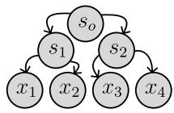

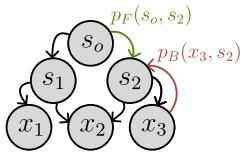  
(a) Autoregressive.  
(b) Non-autoregressive.  
Figure 1: The state graph ( ) is a tree in an autoregressive setting (a). When many trajectories lead to the same state, such as $s _ { o }  ( s _ { 1 } , s _ { 2 } )  x _ { 2 }$ in (b), is a non-tree DAG.

GFlowNets. A GFlowNet learns a forward policy function $p _ { F } \colon S \times ( S \cup \mathcal { X } )  [ 0 , 1 ]$ such that $p _ { F } ( s , \cdot )$ is a probability distribution supported on the children of s in the state graph . By defining $s _ { o }  x$ as the set of trajectories in $\mathcal { G }$ from $s _ { o }$ to x $\in \mathcal { X }$ , we seek a function $p _ { F }$ satisfying

$$
p _ { \top } ( x ) : = \sum _ { \tau \in s _ { o }  x } p _ { F } ( s _ { o } , \tau ) \propto R ( x ) ,\tag{2}
$$

with $\tau = ( s _ { o } , \ldots , s _ { d - 1 } , x ) , s _ { d } : = x ,$ and (with a slight abuse of notation) $\begin{array} { r } { p _ { F } ( s _ { o } , \tau ) = \prod _ { i = 1 } ^ { d } p _ { F } ( s _ { i - 1 } , s _ { i } ) ; } \end{array}$ ; we refer to d as the trajectory’s length. Equation (2) represents the marginal distribution over induced by $p _ { F } ( s _ { o } , \cdot )$ . When the generative process is autoregressive, $s _ { o } $ x contains a single trajectory $\tau _ { x } .$ , and $p _ { \mathsf { T } } ( x ) = p _ { F } ( s _ { o } , \tau _ { x } )$ . Otherwise, the set $s _ { o } \  \ x$ might be intractably large; see Figure 1. Under these conditions, we introduce a backward policy $p _ { B }$ , which is a forward policy on the transposed state graph, and approximate Equation (2) via importance sampling,

$$
p _ { \mathsf { T } } ( x ) = \mathbb { E } _ { \overleftarrow { \tau } \sim p _ { B } ( x , \cdot ) } \left[ \frac { p _ { F } ( s _ { o } , \overrightarrow { \tau } ) } { p _ { B } ( x , \overleftarrow { \tau } ) } \right] \propto R ( x ) ,
$$

in which we use $\vec { \tau }$ and to distinguish the forward and backward trajectories. (We will drop this notation in the rest of the text for clarity). By letting $\begin{array} { r } { Z : = \sum _ { x \in \mathcal { X } } R ( x ) } \end{array}$ be the partition function of our target distribution, the above equation may be re-arranged as (dividing both sides by $R ( x ) )$

$$
\mathbb { E } _ { \tau \sim p _ { B } ( x , \cdot ) } \left[ \frac { Z \cdot p _ { F } ( s _ { o } , \tau ) } { R ( x ) \cdot p _ { B } ( x , \tau ) } \right] = 1 .\tag{3}
$$

The condition $Z \cdot p _ { F } ( s _ { o } , \tau ) = R ( x ) \cdot p _ { B } ( x , \tau )$ is known as trajectory balance [TB; Malkin et al., 2022]. In practice, $p _ { F } ( s , \cdot )$ is parameterized as a softmax neural network receiving s as input, and we optimize both $p _ { F }$ and $Z$ via stochastic gradient descent on the objective function

$$
\mathcal { L } _ { \mathrm { T B } } ( p _ { F } , p _ { B } , Z ) = \mathbb { E } _ { \tau \sim p _ { E } } \left[ \left( \log \frac { Z \cdot p _ { F } ( s _ { o } , \tau ) } { R ( x ) \cdot p _ { B } ( x , \tau ) } \right) ^ { 2 } \right] ,
$$

with $p _ { E }$ as an exploratory (full-support) policy [see, $\mathrm { e . g . }$ Madan et al., 2025, Kim et al., 2025]. As the reader may have noticed, pB was chosen arbitrarily; it can be either learned [e.g., Shen et al., 2023, Gritsaev et al., 2025] or fixed [e.g., Deleu et al., 2022, Zhou et al., 2024].

Alternatively, we commonly parameterize theflowfunctions

$$
F ( s ) = Z \sum _ { \tau \in s _ { o } \ s } p _ { F } ( s _ { o } , \tau ) ,
$$

for $\boldsymbol { s } \neq \boldsymbol { s } _ { o }$ and $F ( s _ { o } ) = Z _ { \mathrm { \scriptsize { : } } }$ , and define the detailed balance (DB) learning objective $\mathcal { L } _ { \mathrm { D B } } ( p _ { F } , p _ { B } , F )$ as

$$
\mathbb { E } _ { \tau \sim p _ { E } } \left[ \sum _ { 1 \le i \le d } w _ { i } \left( \log \frac { F ( s _ { i - 1 } ) p _ { F } ( s _ { i - 1 } , s _ { i } ) } { F ( s _ { i } ) p _ { B } ( s _ { i } , s _ { i - 1 } ) } \right) ^ { 2 } \right] ,\tag{4}
$$

with $\tau = ( s _ { o } , \ldots , s _ { d } )$ as in Equation (2), $F ( s _ { d } ) = R ( s _ { d } )$ and $w _ { i } > 0$ as positive weights such that $\textstyle \sum _ { i = 1 } ^ { n } w _ { i } \ = \ 1$ Common choices for $w _ { i }$ are either uniform $w _ { i } = 1 / n$ [Bengio et al., 2023] or $w _ { i } \propto \exp \{ \lambda i \}$ for $\lambda > 0$ , the intuition being that states closer to should be assigned with larger weights during training [Silva et al., 2025a]. Other learning objectives have also been studied [e.g., Madan et al., 2022, Zhang et al., 2023a]; see Section C for related works.

A conditional GFlowNet, on the other hand, models a family of distributions $R _ { \omega } ( x )$ indexed by a parameter $\omega \in \Omega$ that is also used as input for both the policy $( p _ { F }$ and $p _ { B } )$ and flow (F) functions. Prominent applications include multiobjective combinatorial optimization, in which Ω is a simplex and $R _ { \omega }$ represents a weighted mixture of each objective according to ω [Jain et al., 2023b, Roy et al., 2023, Zhu et al., 2023, Laajil et al., 2025], and distributed learning, with each $\omega \in \Omega$ representing a distinct subgraph of the state graph and $R _ { \omega } ( x )$ simply referring to the restriction of a given $R ( x )$ to the corresponding subset of [Silva et al., 2025b].

MaMs. In the context of sampling, MaMs were designed by Liu et al. [2024] for fast autoregressive modelling of discrete models. Simply put, they concomitantly learn a marginal and conditional distributions, $p _ { \theta }$ and $p _ { \phi } , \mathrm { o n } [ K ] ^ { d }$ satisfying both a correctness and consistency conditions. Given indices ${ \mathcal { T } } , { \mathcal { T } } \subseteq \{ 1 , \dots , d \}$ such that $\mathcal { T } \subset \mathcal { T }$ and $| { \mathcal { I } } \setminus \mathcal { T } | = M$ , we respectively define these conditions as

$$
p _ { \theta } ( x ) = { \frac { R ( x ) } { Z } } { \mathrm { ~ a n d ~ } } p _ { \theta } ( x _ { \mathcal { T } } ) p _ { \phi } ( x _ { \mathcal { T } } | x _ { \mathcal { T } } ) = p _ { \theta } ( x _ { \mathcal { T } } ) ,\tag{5}
$$

for $x \in \mathcal { X }$ . As in Liu et al. [2024], we assume $M = 1$ although our analysis can be easily extended to $M > 1$ by interpreting a group of M adjacent variables as a single variable. As with GFlowNets, $p _ { \theta }$ and $p _ { \phi }$ are parameterized as neural networks. Also, a special symbol $\triangle$ is used to represent a marginalized variable—e.g., if $\boldsymbol { x } = ( x _ { 1 } , \dots , x _ { d } )$ then $x _ { \{ 1 , 2 \} } = ( x _ { 1 } , x _ { 2 } , \triangle , \ldots , \triangle ) - \mathrm { { \ O { ~ \cdot ~ } \partial } }$ and Z is a learned parameter. Once trained, the probability $p _ { \theta } ( x _ { \perp } )$ of any $x \in \mathcal { X }$ and any ${ \mathcal { T } } \subseteq \{ 1 , \ldots , d \}$ can be evaluated in a single neural network forward pass. To enforce Equation (5), we minimize

$$
\operatorname { K L } [ p _ { \theta } | | \pi ] + \lambda { \mathrm { C o n s i s t e n c y E r r o r } } ( p _ { \theta } , p _ { \phi } , Z ) ,\tag{6}
$$

in which $\begin{array} { r } { \lambda > 0 , \mathrm { K L } [ p _ { \theta } | | \pi ] : = \mathbb { E } _ { x \sim p _ { \theta } } \left[ \log \frac { p _ { \theta } ( x ) } { \pi ( x ) } \right] } \end{array}$ is the Kullback-Leibler (KL) divergence between pθ and π, and ConsistencyError is defined as

$$
\mathbb { E } _ { \boldsymbol { x } \sim \boldsymbol { q } } \mathbb { E } _ { m } \mathbb { E } _ { \sigma } \left( \log \frac { p _ { \boldsymbol { \theta } } \left( \boldsymbol { x } _ { \sigma \left( < m \right) } \right) \cdot p _ { \boldsymbol { \phi } } \left( \boldsymbol { x } _ { m } \left| \boldsymbol { x } _ { \sigma \left( \left[ m - 1 \right] \right) } \right) \right) } { p _ { \boldsymbol { \theta } } \left( \boldsymbol { x } _ { \sigma \left( \left[ m \right] \right) } \right) } \right) ^ { 2 } ,
$$

with $m \sim \mathcal { U } [ d ] , \sigma \sim \mathcal { U } ( S _ { d } )$ , q as any distribution over $x ,$ $\mathcal { U } [ d ]$ as an uniform distribution over $[ d ] = \{ 1 , \ldots , d \}$ , (hardcoded) restriction $p _ { \theta } ( ( \triangle , \dots , \triangle ) ) = Z$ , and σ uniformly picked from the space of permutations, which we denote by

$$
S _ { d } = \{ \sigma \colon [ d ] \to [ d ] \mid \sigma { \mathrm { ~ i s ~ b i j e c t i v e } } \} .\tag{7}
$$

To generate samples from $p _ { \theta }$ , which are needed to estimate the KL divergence in Equation (6), Liu et al. [2024] implement a persistent-block Gibbs sampling scheme having $p _ { \phi }$ as the transition kernel. As we explain next, under the consistency condition in Equation (5), the resulting Markov chain has the marginal $p _ { \theta }$ as the stationary distribution.

Gibbs sampling. Originally designed by [Geman and Geman, 1984] to sample from the Gibbs distribution [Gibbs, 1902], and also known as Successive Substitution Sampling [SSS; Schervish, 2012], Gibbs sampling creates a Markov chain by iteratively modifying each coordinate of a state x according to the conditionals of the target distribution $\pi ( x )$ . That is, we iteratively select $i \in [ d ]$ and then $x _ { i } ^ { \prime } \sim \pi ( x _ { i } | x _ { - i } )$ , with $x _ { - i } = x _ { \{ 1 , \dots , i - 1 , i + 1 , \dots , d \} }$ as in Equation (5). This process may be pictured as $( x _ { 1 } , x _ { 2 } )  ( x _ { 1 } ^ { \prime } , x _ { 2 } )  ( x _ { 1 } ^ { \prime } , x _ { 2 } ^ { \prime } )$ for two-dimensional distributions. When i is picked at random, the algorithm is known as random scan Gibbs sampler; otherwise, as systematic scan Gibbs sampler [Owen, 2013]. We will focus on the former. The reader is invited to notice that the resulting Markov chain is stationary with respect to the target distribution $\pi .$

In the context of learning and energy-based models [Hinton, 2002, Tieleman, 2008, Liu et al., 2024], a persistent-block Gibbs sampler extends the canonical algorithm by (i) grouping variables into blocks, each of which is updated in a single step, and (ii) maintaining the Markov chain’s state across gradient updates of the underlying neural sampling model. We notice that, in this case, the Markov chain ceases to be stationary until training converges.

## 3 RETHINKING MAMS AS GFLOWNETS

We now show that MaMs may be interpreted as a conditional GFlowNet (Section 3.1). In a nutshell, the conditioning space $\Omega : = S _ { d }$ will be the space of permutations defined in Equation (7), and we will demonstrate the consistency loss function is equivalent to the weighted DB loss in Equation (4) in expectation (Section 3.2).

## 3.1 PERMUTATION-CONDITIONED GFLOWNETS

To understand the connection between MaMs and GFlowNets, we first introduce a family of permutationconditioned (PC) GFlowNets for autoregressive modelling. Again, let $\mathcal { X } = [ K ] ^ { d }$ . We define a learnable state-embedding function $\psi \colon S \ \to \ \mathbb { R } ^ { h }$ and weights $\{ \mathbf { W } _ { k } \} _ { k = 1 } ^ { K }$ such that $\mathbf { W } _ { k } \in \mathbb { R } ^ { h \times d }$ for a given dimension h. Then, recall from Section 2 that the state space $\mathcal { S } \cup \mathcal { X }$ is simply a subset of the power set of $\mathcal { C } : = [ K ] \times [ d ]$ . As such, the policy function evaluated at $s ^ { ( i ) } : = \{ ( k _ { 1 } , \bar { \sigma } ( 1 ) ) , \ldots , ( k _ { i } , \sigma ( i ) ) \} \in \mathcal { S }$ and conditioned on a permutation $\sigma \in S _ { d }$ is defined as

$$
p _ { F } ^ { \sigma } ( s ^ { ( i ) } , s ^ { ( i + 1 ) } ) \propto \exp \{ \mathbf { w } _ { k , \sigma ( i + 1 ) } ^ { T } \psi ( s ^ { ( i ) } ) \}\tag{8}
$$

for $s ^ { ( i + 1 ) } = s ^ { ( i ) } \cup \{ ( k , \sigma ( i + 1 ) ) \}$ and $k \in [ K ]$ . Intuitively, $p _ { F } ^ { \sigma }$ fills up a sequence up to a prescribed size (d, in this case) according to the ordering imposed by σ. We illustrate this in Figure 2. Given a σ and a $\mathbf { \bar { \Phi } } _ { S } ( i + 1 ) \mathbf { \Phi } \in S$ , there is only one state $\bar { \mathbf { \Lambda } } _ { S } ( i )$ such that the transition $s ^ { ( i ) } \to s ^ { ( i + 1 ) }$ has positive probability under $p _ { F } ^ { \sigma } ( s _ { i } , \cdot )$ . Hence, the only choice for the backward policy abiding by the TB condition in Equation (3) is $p _ { B } ^ { \sigma } \big ( s ^ { ( i + 1 ) } , \cdot \big ) \ = \ \delta _ { s ^ { ( i ) } }$ for $s ^ { ( i ) } = \{ ( k _ { j } , \sigma ( j ) ) \} _ { j = 1 } ^ { i }$ and $s ^ { ( i + 1 ) } = s ^ { ( i ) } \cup \{ ( k _ { i + 1 } , \sigma ( i + 1 ) ) \}$ with $( k _ { j } ) _ { j = 1 } ^ { i + 1 } \in [ K ] ^ { i + 1 }$ $\delta _ { s ( i ) }$ is the Dirac delta at $s ^ { ( i ) }$ , i.e., $\delta _ { s ( i ) } ( s ) = 1$ if $s = s ^ { ( i ) }$ and 0 otherwise. Thus, as p plays no significant role in learning, we set it aside from most of our analysis until Section 4. Our main claim in this section is that there a bijective correspondence between MaMs and PC GFlowNets.

Claim 3.1. For each MaM, there is a unique and functionally equivalent PC GFlowNet; see Proposition 3.2.

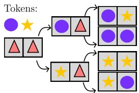

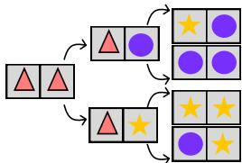  
(a) $\sigma ( 1 ) = 1 , \sigma ( 2 ) = 2 .$  
(b) σ(1) = 2, σ(2) = 1.  
Figure 2: A PC GFlowNet fills up a sequence according to a given permutation (σ). After trained, it supports fast evaluation of any-subset marginals. ( means no token.)

Clearly, the conditioning permutation σ only affects the navigation of $s ,$ as both and $R \colon \mathcal { X } \  \ \mathbb { R } _ { + }$ remain unchanged under σ (except for re-labeling). Interestingly, however, the permutation-conditioned flow function $F ^ { \sigma }$ satisfying the DB condition in Equation (4) can be exactly interpreted as the marginal probability distribution of a sequence under R. This result, outlined below, is crucial in bridging the gap between GFlowNets and MaMs.

Proposition 3.1. Let $F ^ { \sigma }$ be a flow function abiding by the DB condition of a permutation-conditioned GFlowNet, i.e.,

$$
F ^ { \sigma } ( s ) p _ { F } ^ { \sigma } ( s , s ^ { \prime } ) = F ^ { \sigma } ( s ^ { \prime } ) p _ { B } ^ { \sigma } ( s ^ { \prime } , s )\tag{9}
$$

and $F ^ { \sigma } ( x ) = R ( x ) f o r x \in \mathcal { X }$ . Then, denoting by $s ^ { ( i ) } = $ $\{ ( k _ { 1 } , \sigma ( 1 ) ) , \ldots , ( k _ { i } , \sigma ( i ) ) \} f o r i \leq d ,$

$$
F ^ { \sigma } ( s ^ { ( i ) } ) = \sum _ { \substack { x \in \mathcal { X } : x _ { \sigma ( [ i ] ) } = s _ { \sigma ( [ i ] ) } ^ { ( i ) } } } R ( x ) a n d F ^ { \sigma } ( s _ { o } ) = \sum _ { x \in \mathcal { X } } R ( x ) ,\tag{10}
$$

in which $x _ { \sigma ( [ i ] ) } = s _ { \sigma ( [ i ] ) } ^ { ( i ) }$ means that $x \in [ K ] ^ { d }$ agrees with $s ^ { ( i ) }$ on thefirst i coordinates according to the permutation σ, i.e., $x _ { \sigma ( 1 ) } = s _ { \sigma ( 1 ) } ^ { ( i ) } , \ldots , x _ { \sigma ( i ) } = s _ { \sigma ( i ) } ^ { ( i ) } $ . In other words, $\frac { F ^ { \sigma } ( s ^ { ( i ) } ) } { F ^ { \sigma } ( s _ { o } ) }$ is the marginal distribution $o f s ^ { ( i ) }$ under R.

As in Section 2, the state $s ^ { ( i ) }$ in the Proposition 3.1 can be written as $s _ { j } ^ { ( i ) } = k _ { j }$ for $j \in \sigma ( [ i ] )$ and $s _ { j } ^ { ( i ) } = \triangle$ otherwise.

When learning a conditional GFlowNet, we often augment the input of the neural networks parameterizing both $F ^ { \sigma }$ and $p _ { F } ^ { \sigma }$ with σ [Bengio et al., 2023, Zhang et al., 2023a]. As MaMs avoid such augmentation, we ask: is it needed for PC GFlowNets? The following corollary shows that, when states $s ^ { 1 }$ and $s ^ { 2 }$ differ solely by the permutation σ, the optimal flow function in Equation (9) does not depend on σ.

Corollary 3.1. Let $\sigma _ { 1 } , \sigma _ { 2 } ~ \in ~ S _ { d }$ be permutations, and $d e f t n e ~ s ^ { 1 , ( i ) } = \{ ( k _ { 1 } , \sigma _ { 1 } ( 1 ) ) , \ldots , ( k _ { i } , \sigma _ { 1 } ( i ) ) \}$ and $s ^ { 2 , ( i ) } =$ $\{ ( k _ { 1 } , \sigma _ { 2 } ( 1 ) ) , \ldots , ( k _ { i } , \sigma _ { 2 } ( i ) ) \}$ . Then, if i satisfies $\sigma _ { 1 } ( [ i ] ) =$ $\sigma _ { 2 } ( [ i ] ) , i . e . , \sigma _ { 1 }$ and $\sigma _ { 2 }$ coincide on $[ i ] : = \{ 1 , \dots , i \}$

$$
F ^ { \sigma _ { 1 } } ( s ^ { 1 , ( i ) } ) = F ^ { \sigma _ { 2 } } ( s ^ { 2 , ( i ) } ) .
$$

To evaluate $p _ { F } ^ { \sigma } ( s ^ { ( i ) } , s ^ { ( i + 1 ) } )$ , however, information about $\sigma ( i { + } 1 )$ is needed. As we show below, $\sigma _ { 1 }$ and $\sigma _ { 2 }$ coincide on $[ i + 1 ]$ , then $p _ { F } ^ { \sigma _ { 1 } } ( s ^ { ( i ) } , s ) = p _ { F } ^ { \sigma _ { 2 } } ( s ^ { ( i ) } , s )$ for each $s \in \mathcal S \cup \mathcal X$ Corollary 3.2. Let $\sigma _ { 1 } , \sigma _ { 2 } \in S _ { d }$ . Define $s ^ { 1 , ( i ) }$ and $s ^ { 2 , ( i ) }$ as in Corollary 3.1. Assume $\sigma _ { 1 } ( \leq i + 1 ) = \sigma _ { 2 } ( \leq i + 1 )$ . Then,

$$
p _ { F } ^ { \sigma _ { 1 } } ( s ^ { 1 , ( i ) } , \cdot ) = p _ { F } ^ { \sigma _ { 2 } } ( s ^ { 2 , ( i ) } , \cdot ) ,
$$

$i . e . , i f s ^ { 1 , ( i + 1 ) } \equiv s ^ { 2 , ( i + 1 ) }$ correspond to the same object in $( \lbrack K ] ^ { \mathsf { ^ { \circ } } } \cup \{ \triangle \} ) ^ { d } , p _ { F } ^ { \sigma _ { 1 } } ( s ^ { 1 , ( i ) } , s ^ { 1 , ( i + \overset { \cdot } { 1 } ) } ) = p _ { F } ^ { \sigma _ { 2 } } ( s ^ { 2 , ( i ) } , s ^ { 2 , ( i + 1 ) } ) .$

In practice, we parameterize $p _ { F } ^ { \sigma } ( s ^ { ( i ) } , \cdot )$ as a neural network returning a matrix $\mathbf { P } = \mathbb { R } _ { + } ^ { K \times } \bar { d }$ with sum $( \mathbf { P } ) = 1$ representing the probability of each variable k being in the ith position, $\mathbf { P } _ { k , i }$ , and mask out all columns except the $\sigma ( i + 1 )$ -th one, which results in Equation (8). Drawing on the derivations above, Claim 3.1 is only a matter of bookkeeping.

Notation mapping. We recall a MaM is characterized by a marginal p and conditional $p _ { \phi }$ distributions. Also, for each $s = ( k _ { 1 } , \ldots , k _ { d } )$ with $k _ { j } \in [ K ]$ or $k _ { j } = \triangle ( \mathrm { i . e . }$ $k _ { j }$ is marginalized), as described in Section 2, there is a permutation σ and an index i for which $s \equiv \{ ( j , \sigma ( j ) ) \} _ { j = 1 } ^ { i }$ in the PC GFlowNet’s state graph. By Corollary 3.1, we can unambiguously define $F ^ { \sigma } ( s ) \ : = \ p _ { \theta } ( s )$ . Similarly, let $\mathcal { I } \supset \mathcal { I }$ be subsets of $\{ 1 , \ldots , d \}$ , and define $I = | \mathcal { I } |$ (Recall $| \mathcal { I } \setminus \mathcal { T } | = 1 )$ . As before, given $x \in { \mathcal { X } }$ , there is a permutation σ such that $\sigma ( [ I ] ) = \mathcal { T } , \sigma ( [ I + 1 ] ) = \mathcal { I }$ , and

$$
\begin{array} { r } { x _ { \mathcal { T } } \equiv \{ ( x _ { \sigma ( j ) } , \sigma ( j ) ) \} _ { j = 1 } ^ { I } \mathrm { a n d } x _ { \mathcal { T } } \equiv \{ ( x _ { \sigma ( j ) } , \sigma ( j ) ) \} _ { j = 1 } ^ { I + 1 } . } \end{array}\tag{11}
$$

Under Corollary $3 . 2 , p _ { F } ^ { \sigma } ( x _ { \tt Z } , \cdot )$ does not depend on $\sigma ( j )$ for $j > I + 1$ . Again, we can thus define $p _ { \phi } ( x _ { \mathcal { T } } | x _ { \mathcal { T } } ) =$ $p _ { F } ^ { \sigma } ( x _ { \mathcal { T } } , x _ { \mathcal { T } } )$ without ambiguity. Our central result, stated below, establishes that there is a unique PC GFlowNet for each MaM satisfying both the distributional $( { \mathrm { i . e . , } } p _ { \theta } ( x ) = \pi ( x )$ for $x \in \mathcal { X } )$ and consistency conditions, and vice-versa.

Proposition 3.2 (MaMs are PC GFlowNets). Let $( p _ { \theta } , p _ { \phi } )$ be a consistent MaM satisfying $p _ { \theta } ( x ) = \pi ( x )$ . Then, there is a unique PC GFlowNet such that $F ^ { \sigma } ( x _ { \mathcal { T } } ) = p _ { \theta } ( x _ { \mathcal { T } } )$ and $p _ { F } ^ { \sigma } ( x _ { \mathcal { T } } , x _ { \mathcal { T } } ) = p _ { \phi } ( x _ { \mathcal { T } } | x _ { \mathcal { T } } )$ for each triplet $\mathcal { T } , \mathcal { T } ,$ σ as in Equation (11). This PC GFlowNet satisfies the DB condition in Equation (9). Conversely, a PC GFlowNet satisfying DB induces a unique consistent MaM such that $p _ { \theta } ( x ) = \pi ( x )$

From an operational viewpoint, both MaMs and PC GFlowNets allow for the evaluation of any-subset marginals with a single neural network forward pass in discrete models. In fact, the only lingering difference between MaMs and PC GFlowNets is their differing learning objectives.

As we discuss next, however, the estimator used for MaM’s loss function is biased unless the consistency condition holds. Hence, it might be unsuited for training. We instead derive a novel unbiased estimator that preserves MaMs constant number of forward passes per gradient step.

## 3.2 REVISITING MAMS’ OBJECTIVE

At a basic level, MaMs aim to minimize the KL divergence between $p _ { \theta }$ and π under the consistency constraint, i.e.,

$$
\operatorname* { m i n } _ { p _ { \theta } } \mathrm { K L } [ p _ { \theta } | | \pi ] \ \mathrm { s u c h \ t h a t } \ p _ { \theta } ( x _ { \mathcal { T } } ) p _ { \phi } ( x _ { \mathcal { T } } | x _ { \mathcal { T } } ) = p _ { \theta } ( x _ { \mathcal { T } } )
$$

for each set of indices $\mathcal { T } , \mathcal { T }$ as in Proposition 3.2. As directly enforcing $p _ { \theta }$ to be consistent with $p _ { \phi }$ is computationally unfeasible, a penalty function—the ConsistencyError—is introduced instead; recall Equation (6). A central question, however, remains unanswered: how to generate samples from $p _ { \theta }$ to estimate the objective function $\mathrm { K L } [ p _ { \theta } | | \pi ] ?$

When the consistency constraint is satisfied, a persistent Gibbs sampling scheme using $p _ { \phi }$ as the transition kernel would realize a Markov chain ergodic with respect to $p _ { \theta }$ , the samples of which could be used for estimating $\mathrm { K L } [ p _ { \theta } | | \pi ]$ However, $p _ { \theta }$ is only approximately consistent with $p _ { \phi }$ . Thus, the generated samples would produce biased estimates of the KL objective. Based on the connection between MaMs and PC GFlowNets in Proposition 3.2, we propose instead minimizing the consistency-only objective below.

Definition 3.1. We let $\begin{array} { r } { p _ { \theta } ( x _ { \mathcal { T } } ) = \frac { F _ { \theta } ( x _ { \mathcal { T } } ) } { Z } } \end{array}$ for given parametric function $F _ { \theta }$ and $x \in \mathcal { X }$ and indices ${ \mathcal { T } } \subseteq [ d ]$ with $Z : =$ $F ( x _ { \emptyset } )$ learnable. The consistency-only objective ${ \mathcal { L } } _ { \mathrm { C O } }$ is

$$
\mathbb { E } _ { x \sim q , m , \sigma } \left( \log \frac { F _ { \theta } ( x _ { \sigma ( [ m - 1 ] ) } ) p _ { \phi } ( x _ { \sigma ( m ) } \vert x _ { \sigma ( [ m - 1 ] ) } ) ) } { F _ { \theta } ( x _ { \sigma ( [ m ] ) } ) } \right) ^ { 2 } ,
$$

in which $\sigma \sim \mathcal { U } ( S _ { d } ) , m \sim \mathrm { C a t } ( \mathbf { w } )$ for $\textbf { w } \geq \textbf { 0 }$ and $\begin{array} { r } { \sum _ { i = 1 } ^ { d } \mathbf { w } _ { i } = 1 } \end{array}$ , and q is a full-support distribution over $\mathcal { X } .$ Additionally, we restrict $F _ { \theta } ( x ) = R ( x )$ for $x \in \mathcal { X }$

The only difference between ${ \mathcal { L } } _ { \mathrm { C O } }$ and $\mathbf { M a M s } ^ { \prime }$ consistency error is that we enforce $F _ { \theta } ( x ) = R ( x )$ for $x \in \mathcal { X }$ instead of minimizing $\operatorname { K L } [ p _ { \boldsymbol { \theta } } | | \pi ]$ . Clearly, when ${ \mathcal { L } } _ { \mathrm { C O } }$ is globally minimized, $\begin{array} { r } { F _ { \theta } ( x _ { \emptyset } ) ~ = ~ \sum _ { x \in \mathcal { X } } R ( x ) } \end{array}$ , which allows for direct evaluation of $p _ { \theta }$ . Moreover, the ${ \mathcal { L } } _ { \mathrm { C O } }$ corresponds to the DB loss $\mathcal { L } _ { \mathrm { D B } }$ in Equation (4) with a specific weight scheme $( w _ { i } ) _ { i = 1 } ^ { d }$ . In contrast to $\mathcal { L } _ { \mathrm { D B } }$ , however, a Monte Carlo approximation of ${ \mathcal { L } } _ { \mathrm { C O } }$ requires a constant number of forward passes with respect to the state space’s dimension.

Proposition 3.3. Let $( F , p _ { F } ^ { \sigma } )$ be a PC GFlowNet. (By Corollary 3.1, F does not depend on σ). Let $p _ { E } ^ { \sigma }$ be an exploratory policy such that the marginal of $p _ { E } ^ { \sigma } ( s _ { o } , \cdot )$ over matches the distribution q defined in Definition 3.1. Then,

$$
\begin{array} { r l } & { \quad \underset { \sigma \sim \mathcal { U } ( S _ { d } ) } { \mathbb { E } } [ w _ { i } \sum _ { 1 \leq i \leq d } ( \log \frac { F ( s _ { i - 1 } ) p _ { F } ^ { \sigma } ( s _ { i }  s _ { i - 1 } ) } { F ( s _ { i } ) } ) ^ { 2 } ] = } \\ & { \quad \underset { \sigma \sim \mathcal { U } ( S _ { d } ) } { \sim } [ ( \log \frac { F ( x _ { \sigma ( [ i - 1 ] ) } ) p _ { F } ^ { \sigma } ( x _ { \sigma ( [ i - 1 ] ) } , x _ { \sigma ( [ i ] ) } ) } { F ( x _ { \sigma ( [ i ] ) } ) } ) ^ { 2 } ] , } \\ & { \quad \underset { i \sim \mathrm { C a t } ( \mathbf { w } ) } { \sim } [ ( \log \frac { F ( x _ { \sigma ( [ i ] ) } ) p _ { F } ^ { \sigma } ( x _ { \sigma ( [ i ] ) } , ) } { F ( x _ { \sigma ( [ i ] ) } ) } ) ^ { 2 } ] , } \end{array}
$$

$$
w i t h \tau = ( s _ { i } ) _ { i = 0 } ^ { d } , s _ { d } = x , a n d x _ { \sigma ( [ i ] ) } = \{ ( x _ { j } , \sigma ( j ) ) \} _ { j = 1 } ^ { i } .
$$

Proposition 3.3 establishes that MaMs’ ConsistencyError corresponds to a transition-wise estimator of the conventional DB loss function for conditional GFlowNets. After thoroughly outlining the connection between PC GFlowNets and MaMs, we ask: how can we leverage our results to improve GFlowNet training? We investigate this next.

## 4 PARTICLE GFLOWNETS

We extend the persistent-block Gibbs sampling scheme to non-autoregressive generative processes, such as set generation, in which multiple trajectories may lead to the same object. As with MaMs, this reduces the number of forward passes from $\mathcal O ( d )$ to $\mathcal { O } ( 1 )$ per gradient step. We also develop an automatic criterion for refreshing the Gibbs chain, which improves exploration and accelerates convergence.

Particle GFlowNets. We recall from Section 2 that a compositional object x is represented as a collection of components from a set $\mathcal { C } , \mathrm { i . e . , } x = \{ c _ { 1 } , . . . , c _ { d } \}$ . In this scenario, a policy function induces a probability distribution over a subset of conditioned on a state $s \in 2 ^ { \mathcal { C } }$ . For PC GFlowNets, $\mathcal { C } = [ K ] \times [ d ]$ and $p _ { F } ^ { \sigma } ( s ^ { ( i ) } , \cdot )$ induces a distribution over $[ K ] \times \{ \sigma ( i + 1 ) \} \subset \mathcal { C } .$ as in Proposition 3.1. We henceforth assume that each $x \in \mathcal { X }$ is naturally represented by exactly d components, i.e., ${ \mathcal { X } } \subseteq ( { \mathcal { C } } )$ . This is often the case for usual applications and benchmarks in the GFlowNet literature, such as set generation Jang et al. [2024], phylogenetic inference [Zhou et al., 2024], design of mRNA sequences [Laajil et al., 2025], causal discovery [Silva et al., 2026], and certain combinatorial optimization tasks [Zhang et al., 2023b].

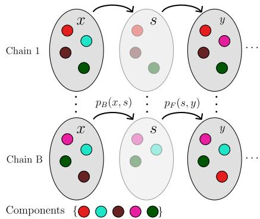  
Figure 3: A transition $x  y$ for P-GFlowNets’ persistent Gibbs sampler. At each iteration, we replace a component of the current state x and evaluate the loss function in Equation (12) by averaging over the B stochastic processes. This requires (1) forward passess, regardless of d.

To build intuition, consider Figure 3. We start by generating samples $\{ x _ { t } ^ { b } \} _ { b = 1 } ^ { B } \subseteq \mathcal X$ from an untrained GFlowNet. Each $x _ { b }$ can be thought of as a d-sized subset of , for instance, $x _ { t } ^ { \bar { b } } = \{ c _ { 1 } ^ { t , b } , \ldots , c _ { d } ^ { t , b } \}$ . At each iteration, we remove a component $c _ { i } ^ { t , b }$ from $x _ { t } ^ { b }$ according to $p _ { B } ( x _ { t } ^ { b } , \cdot )$ , resulting in $s _ { t } ^ { b }$ We then choose a $c \in { \mathcal { C } }$ according to the forward policy $p _ { F } ( s _ { t } ^ { b } , \cdot )$ and attach it to $s _ { t } ^ { b } .$ , generating $x _ { t + 1 } ^ { b } : = s _ { t } ^ { b } \cup \{ c \}$ . In conclusion, we may update each model via a gradient step on

$$
\hat { \mathcal { L } } _ { \mathrm { C } } : = \frac { 1 } { B } \sum _ { 1 \leq b \leq B } \left( \log \frac { F ( s _ { t } ^ { b } ) p _ { F } ( s _ { t } ^ { b } , x _ { t + 1 } ^ { b } ) } { R ( x _ { t + 1 } ^ { b } ) p _ { B } ( x _ { t + 1 } ^ { b } , s _ { t } ^ { b } ) } \right) ^ { 2 } .
$$

Upon repetition, this produces a coupled Markov chain $\{ \bar  \{ x _ { t } ^ { b } \} _ { b = 1 } ^ { B } \} _ { t \geq 1 }$ satisfying the DB condition for terminal $( x _ { t } ^ { b } )$ and near-terminal $( s _ { t } ^ { b } )$ states. However, independent sampling via MDP simulation can only be achieved if the DB condition is satisfied for every intermediate state. In view of this, we also sample $s _ { t } ^ { b , k } \stackrel { \bullet } { \sim } p _ { B } ^ { k } ( x _ { t } ^ { b } , \cdot )$ by removing k components from $x _ { t } ^ { b } ; p _ { B } ^ { k }$ denotes p ’s k-fold composition. Then, we select $s _ { t + 1 } ^ { b , k } \sim \stackrel { - } { p _ { F } } ( s _ { t } ^ { b , k } , \cdot )$ and compute

$$
\hat { \mathcal { L } } _ { \mathrm { I } } : = \frac { 1 } { B } \sum _ { 1 \le b \le B } \left( \log \frac { F ( s _ { t } ^ { b , k } ) p _ { F } ( s _ { t } ^ { b , k } , s _ { t + 1 } ^ { b , k } ) } { F ( s _ { t + 1 } ^ { b , k } ) p _ { B } ( s _ { t + 1 } ^ { b , k } , s _ { t } ^ { b , k } ) } \right) ^ { 2 } .
$$

In practice, we pick $k \sim \mathrm { C a t } ( \mathbf { w } )$ with $\textbf { w } \in \mathbb { R } ^ { d }$ as the probabilities of a truncated Poisson distribution with average equal to log d. As suggested by Proposition 3.3, this choice provides larger weight to near-terminal states, which has been shown to be beneficial [Silva et al., 2025a], while ensuring coverage of the entire state graph. We then define

$$
\hat { \mathcal { L } } _ { \mathrm { P } } = \hat { \mathcal { L } } _ { \mathrm { C } } + \hat { \mathcal { L } } _ { \mathrm { I } }\tag{12}
$$

as our loss function. We refer to a model trained by minimizing $\hat { \mathcal { L } } _ { \mathrm { P } }$ as a Particle (P) GFlowNet. Notably, we show below that the Markov chain $\{ x _ { t } \} _ { t \ge 1 }$ described above is ergodic with respect to the target π when the P-GFlowNet abides by the DB condition. This ensures P-GFlowNets support both correlated and independent sampling, the choice of which to use being a trade off between computational cost with statistical efficiency.

Proposition 4.1. Let $( p _ { F } , p _ { B } , F )$ be a P-GFlowNet abiding by the detailed balance condition. Define $\{ x _ { t } \} _ { t \ge 1 }$ as the Markov chain with the transition kernel depicted in Figure 3. Then, $\{ x _ { t } \} _ { t \ge 1 } i s$ ergodic with respect to π.

Importantly, our persistent Gibbs chain might suffer from inadequate state space exploration due to the structural similarity of adjacent states. To mitigate this issue, we occasionally refresh the process with fresh independent samples from the current policy $p _ { F } ( s _ { o } , \cdot )$ . This approach is discussed next.

Chain rejuvenation. We use the $\hat { R }$ metric to decide when to restart our stochastic process. Following standard statistical practice, we define $\hat { R } > 1 . 1$ as our condition for rejuvenation [Carpenter et al., 2017]. To understand this, recall that the Rˆ measures the discrepancy between the withinand inter-chain variances. When samples are independently generated, $\hat { R } \approx 1 . { \bf A }$ large $\hat { R }$ indicates that the diversity of our batched stochastic process is significantly larger than that of each individual sequence, which suggests inefficient state space exploration. To account for the non-stationarity of our Gibbs sampler, we use Gelman’s split Rˆ metric.

As we are dealing with discrete state spaces, however, we cannot directly compute meaningful variances. Instead, we use the last layer embeddings of the forward policy’s neural network to compute the split Rˆ metric. As we show in the following section, the proposed criterion notoriously improves learning convergence and exploration.

## 5 EXPERIMENTS

Our experimental campaign addresses the following research questions (RQs) regarding P-GFlowNets.

RQ1 Under which conditions do P-GFlowNets improve convergence relative to a standard GFlowNet?

RQ2 How effective is our approach for chain rejuvenation?

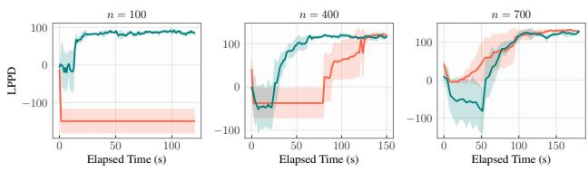

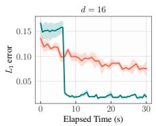

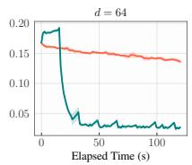

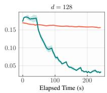  
(a) Set generation with log-additive rewards.  
(b) Bayesian variable selection.  
P-GFlowNet GFlowNet

Figure 4: P-GFlowNets often converge faster to the target distribution. As the MDP horizon d grows (a), the relative speed up of our method increases. In contrast (b), our method grows more effective as the reward query cost decreases relative to the sampling cost—i.e., as the number n of samples for likelihood evaluation becomes smaller.

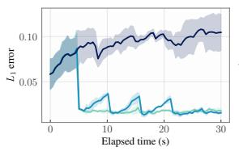

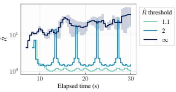  
Figure 5: Chain rejuvenation critically accelerates learning. Left: Equation (13). Right: Rˆ throughout training.

As P-GFlowNets reduce the number of neural network forward passes for sample generation, we expect it to reduce training time when learning is bottlenecked by policy evaluation (RQ1). This is the case when trajectories are long, and sampling is expensive, and reward queries are cheaper than multiple model inferences. Our experiments confirm this intuition (see Figures 4 and 6).

We also show that chain rejuvenation does not only improve state space exploration, but significantly accelerates learning convergence (RQ2). All in all, our observations position P-GFlowNets as a compute-efficient and principled algorithm for GFlowNet training. We provide further details and computer code for our experiments in the supplement.

Set generation with log-additive rewards. Our first task consists of generating fixed-size subsets of a given set ${ \mathcal { C } } =$ $\{ 1 , \ldots , K \}$ . Let ${ \mathcal { X } } : = \{ s \subseteq { \mathcal { C } } : | s | = d \}$ be the space of d-sized subsets of . Similarly, $S : = \{ s \subseteq { \mathcal { C } } : | s | < d \}$ , and $s _ { o } = \emptyset$ be the initial state. Given a utility function u: $c $ $\mathbb { R } _ { + }$ , we define the target distribution $R \colon \mathcal X \to \mathbb R _ { + }$ as

$$
\log R ( x ) = \sum _ { c \in x } { \log u ( c ) } .
$$

This function has several important features. First, despite being factorizable into $x ' s$ components, it cannot be arbitrarily well-approximated by a mean-field variational approximation. Second, the function $R ( x )$ can be naturally extended to arbitrary d (state graph’s diameter) and K (state graph branching’s factor) with $d \ \leq \ K$ Third, if $\mathbf { 1 } _ { s }$ denotes $s \mathrm { ^ { \circ } s }$ indicator function, both the partition function $\begin{array} { r } { Z : = \sum _ { x \in \mathcal { X } } R ( x ) } \end{array}$ and the marginals $\begin{array} { r } { p _ { c } : = \frac { 1 } { Z } \sum _ { s \in \mathcal { X } } R ( x ) \cdot \mathbf { 1 } _ { s } ( c ) } \end{array}$ for $c \in { \mathcal { C } }$ can be efficiently computed in ${ \bar { \mathcal { O } } } ( K \cdot d ^ { 2 } )$ through the following dynamic programming algorithm, which may be of independent interest for GFlowNet evaluation. Let $\mathrm { f i r s t } _ { k } ( S )$ denote the first k elements of any $S \subseteq { \mathcal { C } }$ in a fixed order, and define

$$
Z _ { k , i } ^ { c } = \sum _ { \stackrel { s \subseteq \mathrm { f i r s t } _ { k } ( \mathcal { C } \backslash \{ c \} ) } { | s | = i } } \prod _ { e \in s } u ( e ) \mathrm { a n d } Z _ { k , i } = \sum _ { \stackrel { s \subseteq \mathrm { f i r s t } _ { k } } { | s | = i } } \prod _ { e \in s } u ( e )
$$

for $k \in \{ 1 , \ldots , K \}$ and $i \in \{ 1 , \ldots d \}$ . It should be clear that if $\begin{array} { r } { P _ { k , i } ^ { c } = u ( c ) \cdot \frac { Z _ { k - 1 , i } ^ { c } } { Z _ { k , i } } } \end{array}$ then $p _ { c } = P _ { K , d } ^ { c } .$ Also, $Z _ { k + 1 , i } = u ( k + 1 ) \cdot Z _ { k , i - 1 } + Z _ { k , i } $ , with a similar recurrence equation for $Z _ { k , i } ^ { c }$ obtained by replacing $u ( k { + } 1 )$ by the appropriate $( k + 1 )$ -th element of ${ \mathcal { C } } \backslash \{ c \}$ . As such, we gauge the accuracy of a trained GFlowNet on this task by drawing N independent states $\{ \{ x _ { 1 } , \ldots , x _ { N } \} \} \subseteq { \mathcal { X } }$ and computing

$$
\frac { 1 } { | \mathcal { C } | } \sum _ { c \in \mathcal { C } } | p _ { c } - \hat { p } _ { c } | \mathrm { ~ w i t h ~ } \hat { p } _ { c } = \frac { 1 } { N } \sum _ { 1 \leq n \leq N } \mathbf { 1 } _ { x _ { n } } ( c ) .\tag{13}
$$

We consider $( d , K ) \in \{ ( 3 2 , 6 4 ) , ( 6 4 , 1 2 8 ) , ( 1 2 8 , 2 5 6 ) \}$ and log $u ( c ) \sim \mathcal { N } ( 0 , 1 )$ drawn from a standard Gaussian for $c \in$ . Then, we track the reduction in the above metric in terms of wall-clock time in Figure 4. As d increases, the runtime gap between P-GFlowNet and a standard GFlowNet widens.

Additionally, Figure 5 shows our rejuvenation approach is paramount for speeding up training. There, we consider $( d , K ) = ( 6 4 , 1 2 8 )$ and the conditions $\hat { R } > \alpha$ for $\alpha = 1 . 1$ (default), $\alpha = 2 .$ , and $\alpha = \infty ( \mathrm { i } . \mathrm { e } .$ ., no rejuvenation).

Bayesian variable selection. When reward query costs offset the sampling overhead, we expect that allocating more compute per sample should speed up learning convergence. Indeed, this has been empirically observed by Madan et al. [2025], Kim et al. [2025], Dall’Antonia et al. [2026]. To understand how this behavior affects the training of P-GFlowNets, we consider the problem of Bayesian variable selection [George and McCulloch, 1993] with progressively larger sample sizescorresponding to increasingly expensive-to-evaluate posterior distributions. Let $\mathbf { X } \in \overline { { \mathbb { R } ^ { n \times K } } }$ and $\mathbf { y } \in \mathbb { R } ^ { n }$ be a dataset with n samples and K-dimensional features, and denote by $\mathbf { X } _ { F } \in \mathbb { R } ^ { n \times | F | }$ the column-filtered data with $F \subseteq \{ 1 , \ldots , K \}$ . Also, let ${ \mathbf I } _ { n }$ $( \mathrm { r e s p . } \mathbf { I } _ { | F | } )$ is n-dimensional (resp. $| F |$ -dimensional) identity matrix, $F \sim$ Multinomial $\langle \mathopen { } \mathclose \bgroup \{ 1 , \ldots , K \} , \pi \mathopen { } \mathclose \bgroup )$ indicates each $F$ is sampled with probability $\pi ^ { | { \cal F } | } ( 1 - \pi ) ^ { K - | { \cal F } | }$ for $\pi \in [ 0 , 1 ]$ . We then consider the linear model

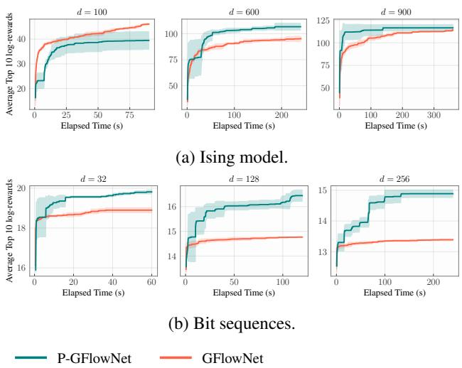  
Figure 6: P-GFlowNets improve exploration. We show the average log-reward of the 10 most rewarding states found in training. As in Figure 4, the runtime gains from P-GFlowNets as the MDP horizon (d) grows.

$$
\begin{array} { r l r } & { } & { { \bf y } \vert \beta , F \sim { \mathcal N } ( { \bf X } _ { F } \beta _ { F } , \eta ^ { 2 } { \bf I } _ { n } ) \mathrm { w i t h } } \\ & { } & { \beta _ { F } \vert F \sim { \mathcal N } ( 0 , \nu ^ { 2 } { \bf I } _ { \vert F \vert } ) \mathrm { a n d } F \sim \mathrm { M u l t i n o m i a l } ( [ K ] , \pi ) . } \end{array}
$$

We assume π, $\eta > 0 ,$ and $\nu > 0$ are known. Under these conditions, the marginal posterior distribution over the set $F$ is

$$
\log R ( F ) = \log \mathcal { N } ( \mathbf { y } \vert 0 , \nu ^ { 2 } \mathbf { X } _ { F } \mathbf { X } _ { F } ^ { T } + \eta ^ { 2 } \mathbf { I } _ { n } ) + \vert F \vert \log \frac { \pi } { 1 - \pi } ,
$$

with $\mathcal { N } ( \mathbf { y } | \boldsymbol { \mu } , \Sigma )$ denoting the density of a Gaussian distribution with mean $\mu$ and covariance $\Sigma .$ Clearly, evaluating $R ( F )$ costs $\mathcal { O } ( K \cdot n ^ { 2 } )$ . To assess a GFlowNet, we evaluate the log-predictive posterior density (LPPD) of a held-out dataset $( \mathbf { X } ^ { \star } , \mathbf { y } ^ { \star } )$ throughout training. Given samples $\{ \{ F _ { 1 } , \dotsc , F _ { N } \} \}$ , we approximate the LPPD as

$$
\mathrm { L P P D } = \log \frac { 1 } { N } \sum _ { 1 \leq n \leq N } p ( \mathbf { y } ^ { \star } | \mathbf { X } ^ { \star } , \mathbf { y } , F ) ,
$$

with $p ( { \mathbf { y } ^ { \star } } | { \mathbf { y } } , F ) = \mathcal { N } ( { \mathbf { y } ^ { \star } } | { \mathbf { X } } _ { F } \mu _ { F } , { \mathbf { X } } _ { F } ^ { \star } \Sigma _ { F } { \mathbf { X } ^ { T } } + \eta ^ { 2 } { \mathbf { I } _ { n } } )$ and $\mu _ { F } = \eta ^ { - 2 } \Sigma _ { F } \mathbf { X } _ { F } ^ { T } \mathbf { y }$ and $\begin{array} { r } { \dot { \Sigma } _ { F } = ( \eta ^ { - 2 } \mathbf { \dot { X } } _ { F } ^ { T } \mathbf { X } _ { F } + \nu ^ { - 2 } \mathbf { I } _ { | F | } ) ^ { - 1 } } \end{array}$ as $\beta _ { F }$ posterior’s mean and covariance given $F _ { \mathrm { { ; } } }$ , respectively. In practice, each row of $\mathbf { X } _ { F }$ is independently sampled from $\mathcal { N } ( \mathbf { 0 } , \Gamma )$ , with $\mathbf { 0 } \in \mathbb { R } ^ { K }$ and $\Gamma \in \dot { \mathbb { R } ^ { K \times K } }$ and $\Gamma _ { i j } \stackrel { \cdot } { = } \gamma ^ { | i - j | }$ for $\gamma = 0 . 8$ . Under this model, X’s columns are highly correlated, and the posterior distribution over $F$ is multimodal.

Notably, Figure 4 shows that P-GFlowNets consistently outperform a standard GFlowNet when n small. However, as n grows, the posterior evaluation cost outpaces that of trajectory sampling, and the computational benefits from our model dwindle. As explained above, this confirms our initial assumptions regarding P-GFlowNets.

We next consider the tasks of Ising model simulation, also present in [Liu et al., 2024], and of bit generation, a common testbed for GFlowNets [e.g., Viviano et al., 2023]. For each example, is the space of d-sized sequences with elements from $\{ - 1 , 1 \}$ and $\{ 1 , 0 \}$ , respectively. As is standard practice Malkin et al. [2022], Pan et al. [2023], Kim et al. [2025], we evaluate a model by measuring the average log reward for the top 10 most valuable samples found throughout training.

Ising model. Simply put, let $\mathbf { J } \in \mathbb { R } ^ { d \times d }$ and $\mathbf { h } \in \mathbb { R } ^ { d }$ . We define an energy function as $\begin{array} { r } { E ( \mathbf { x } ) \ = \ - \frac { 1 } { 2 } \mathbf { x } ^ { T } \mathbf { J } \mathbf { x } - \mathbf { h } ^ { T } \mathbf { x } . } \end{array}$ and $p ( x ) \propto \exp \left\{ - E ( x ) / \beta \right\}$ as the probability of a configuration $x \in \{ - 1 , 1 \} ^ { d }$ under a temperature $\beta > 0 .$ . In Figure 6, we consider $d \in \{ 1 0 0 , 3 0 0 , 9 0 0 \}$ . We observe that P-GFlowNets drastically improve exploration when trajectories are long and sampling is consequently expensive.

Bit sequences. As in Malkin et al. [2022], Tiapkin et al. [2024], we let $\mathcal { M } \subseteq \{ 1 , 0 \} ^ { d }$ be a set of modes, and define β log $\begin{array} { r } { R ( x ) = 1 - \operatorname* { m i n } _ { m \in \mathcal { M } } \rho ( m , x ) / d , } \end{array}$ with $\rho ( x , m )$ as edit distance between x and m and $\beta > 0$ is a temperature parameter. We consider $d \in \{ 6 4 , 1 2 8 , 2 5 6 \}$ and $\beta = { } ^ { 1 } / 2 0$ As we consistently observed in prior experiments, Figure 6 shows P-GFlowNets significantly speed up the discovery of high-reward states as the MDP horizon grows.

## 6 DISCUSSION

We showed that MaMs [Liu et al., 2024], which were previously thought to be distinct from GFlowNets, can be seen as an instantiation of a conditional GFlowNet using a persistent Gibbs sampler for exploration during training. Based on this, we also demonstrated this strategy generalizes beyond autoregressive modelling, for which MaMs were originally designed, while maintaining its computational benefits. Our experiments highlighted that the resulting method, called Particle GFlowNets, significantly accelerated learning convergence in terms of wall-clock time when compared against conventional GFlowNet training algorithms.

From a broader perspective, our work (esp. Propositions 3.3 and 4.1) strengthens the connection between GFlowNets and Markov chain methods, which was also formally studied by Deleu and Bengio [2023]. This raises several questions. How to optimally decide when to rejuvenate the persistent Gibbs sampler? As noted in Silva et al. [2025a], diagnosing GFlowNets is strikingly difficult; can we draw inspirations from the MCMC literature to properly assess the distributional accuracy of GFlowNets? Successful Markov samplers, such as Langevin dynamics-based methods [Welling and Teh, 2011, Girolami and Calderhead, 2011], rely on simulating a latent dynamics for each transition of the underlying stochastic process; is such a technique extensible to GFlowNets, and when does it accelerate training? We believe these to be interesting directions for future research.

## Acknowledgements

DM acknowledges the support of the Fundação Carlos Chagas Filho de Amparo à Pesquisa do Estado do Rio de Janeiro (FAPERJ) (SEI-260003/020348/2025, SEI-260003/020694/2025) and the Conselho Nacional de Desenvolvimento Científico e Tecnológico (CNPq) (404336/2023- 0, 305692/2025-9, 445170/2024-7).

## References

Emmanuel Bengio, Moksh Jain, Maksym Korablyov, Doina Precup, and Yoshua Bengio. Flow network based generative models for non-iterative diverse candidate generation. In NeurIPS (NeurIPS), 2021.

Yoshua Bengio, Salem Lahlou, Tristan Deleu, Edward J. Hu, Mo Tiwari, and Emmanuel Bengio. Gflownet foundations. Journal ofMachine Learning Research (JMLR), 2023.

James Bradbury, Roy Frostig, Peter Hawkins, Matthew James Johnson, Chris Leary, Dougal Maclaurin, George Necula, Adam Paszke, Jake VanderPlas, Skye Wanderman-Milne, and Qiao Zhang. JAX: composable transformations of Python+NumPy programs, 2018.

Bob Carpenter, Andrew Gelman, Matthew D Hoffman, Daniel Lee, Ben Goodrich, Michael Betancourt, Marcus Brubaker, Jiqiang Guo, Peter Li, and Allen Riddell. Stan: A probabilistic programming language. Journal of statistical software, 2017.

Sanghyeok Choi, Sarthak Mittal, Víctor Elvira, Jinkyoo Park, and Nikolay Malkin. Reinforced sequential monte carlo for amortised sampling, 2025. URL https:// arxiv.org/abs/2510.11711.

Pedro Dall’Antonia, Tiago da Silva, Daniel Csillag, Salem Lahlou, and Diego Mesquita. Avoid what you know: Divergent trajectory balance for gflownets, 2026. URL https://arxiv.org/abs/2602.17827.

Tristan Deleu and Yoshua Bengio. Generative flow networks: a markov chain perspective, 2023.

Tristan Deleu, António Góis, Chris Chinenye Emezue, Mansi Rankawat, Simon Lacoste-Julien, Stefan Bauer, and Yoshua Bengio. Bayesian structure learning with generative flow networks. In UAI, 2022.

Tristan Deleu, Mizu Nishikawa-Toomey, Jithendaraa Subramanian, Nikolay Malkin, Laurent Charlin, and Yoshua Bengio. Joint Bayesian inference of graphical structure and parameters with a single generative flow network. In Advances in Neural Processing Systems (NeurIPS), 2023.

Walter M. Fitch. Toward defining the course of evolution: minimum change for a specific tree topology. Systematic Zoology, 20(4):406–416, 1971.

Andrew Gelman and Donald B. Rubin. Inference from iterative simulation using multiple sequences. Statistical Science, 1992.

Stuart Geman and Donald Geman. Stochastic relaxation, gibbs distributions, and the bayesian restoration of images. IEEE Transactions on Pattern Analysis and Machine Intelligence, PAMI-6(6), November 1984. doi: 10.1109/tpami.1984.4767596.

Edward I George and Robert E McCulloch. Variable selection via gibbs sampling. Journal of the American Statistical Association, 88(423):881–889, 1993.

Josiah Willard Gibbs. Elementary Principles in Statistical Mechanics: Developed with Especial Reference to the Rational Foundation of Thermodynamics. Charles Scribner’s Sons, New York, 1902. Reprinted by Dover Publications (1960) and others.

Mark Girolami and Ben Calderhead. Riemann manifold langevin and hamiltonian monte carlo methods. Journal ofthe Royal Statistical Society: Series B (Statistical Methodology), 2011.

Timofei Gritsaev, Nikita Morozov, Sergey Samsonov, and Daniil Tiapkin. Optimizing backward policies in gflownets via trajectory likelihood maximization, 2025. URL https://arxiv.org/abs/2410.15474.

Geoffrey E. Hinton. Training products of experts by minimizing contrastive divergence. Neural Comput., 14 (8):1771–1800, August 2002. ISSN 0899-7667. doi: 10.1162/089976602760128018. URL https://doi. org/10.1162/089976602760128018.

Edward J. Hu, Moksh Jain, Eric Elmoznino, Younesse Kaddar, and et al. Amortizing intractable inference in large language models, 2023a.

Edward J. Hu, Nikolay Malkin, Moksh Jain, Katie Everett, Alexandros Graikos, and Yoshua Bengio. Gflownet-em for learning compositional latent variable models, 2023b. URL https://arxiv.org/abs/2302.06576.

Rui Hu, Yifan Zhang, Zhuoran Li, and Longbo Huang. Beyond squared error: Exploring loss design for enhanced training of generative flow networks, 2024. URL https://arxiv.org/abs/2410.02596.

Moksh Jain, Emmanuel Bengio, Alex Hernandez-Garcia, Jarrid Rector-Brooks, Bonaventure F. P. Dossou, Chanakya Ajit Ekbote, Jie Fu, Tianyu Zhang, Michael Kilgour, Dinghuai Zhang, Lena Simine, Payel Das, and Yoshua Bengio. Biological sequence design with GFlowNets. In International Conference on Machine Learning (ICML), 2022.

Moksh Jain, Tristan Deleu, Jason Hartford, Cheng-Hao Liu, Alex Hernandez-Garcia, and Yoshua Bengio. Gflownets for ai-driven scientific discovery. Digital Discovery, 2023a.

Moksh Jain, Sharath Chandra Raparthy, Alex Hernandez-Garcia, Jarrid Rector-Brooks, Yoshua Bengio, Santiago Miret, and Emmanuel Bengio. Multi-objective GFlowNets. In International Conference on Machine Learning (ICML), 2023b.

Hyosoon Jang, Minsu Kim, and Sungsoo Ahn. Learning energy decompositions for partial inference in GFlownets. In The Twelfth International Conference on Learning Representations, 2024.

Keller Jordan, Yuchen Jin, Vlado Boza, You Jiacheng, Franz Cesista, Laker Newhouse, and Jeremy Bernstein. Muon: An optimizer for hidden layers in neural networks, 2024. URL https://kellerjordan.github. io/posts/muon/.

Minsu Kim, Taeyoung Yun, Emmanuel Bengio, Dinghuai Zhang, Yoshua Bengio, Sungsoo Ahn, and Jinkyoo Park. Local search gflownets. arXiv preprint arXiv:2310.02710, 2023.

Minsu Kim, Taeyoung Yun, Emmanuel Bengio, Dinghuai Zhang, Yoshua Bengio, Sungsoo Ahn, and Jinkyoo Park. Local search gflownets, 2024. URL https://arxiv. org/abs/2310.02710.

Minsu Kim, Sanghyeok Choi, Taeyoung Yun, Emmanuel Bengio, Leo Feng, Jarrid Rector-Brooks, Sungsoo Ahn, Jinkyoo Park, Nikolay Malkin, and Yoshua Bengio. Adaptive teachers for amortized samplers. In The Thirteenth International Conference on Learning Representations, 2025. URL https://openreview.net/forum? id=BdmVgLMvaf.

Aya Laajil, Abduragim Shtanchaev, Sajan Muhammad, Eric Moulines, and Salem Lahlou. Curriculum-augmented gflownets for mrna sequence generation, 2025. URL https://arxiv.org/abs/2510.03811.

Salem Lahlou, Tristan Deleu, Pablo Lemos, Dinghuai Zhang, Alexandra Volokhova, Alex Hernández-García, Léna Néhale Ezzine, Yoshua Bengio, and Nikolay Malkin. A theory of continuous generative flow networks. In ICML, volume 202 of Proceedings of Machine Learning Research, pages 18269–18300. PMLR, 2023.

Elaine Lau, Nikhil Vemgal, Doina Precup, and Emmanuel Bengio. Dgfn: Double generative flow networks, 2023. URL https://arxiv.org/abs/2310.19685.

Alexander K. Lew, Monica Agrawal, David Sontag, and Vikash K. Mansinghka. Pclean: Bayesian data cleaning at scale with domain-specific probabilistic program-

ming, 2022a. URL https://arxiv.org/abs/ 2007.11838.

Alexander K. Lew, Marco Cusumano-Towner, and Vikash K. Mansinghka. Recursive monte carlo and variational inference with auxiliary variables, 2022b. URL https: //arxiv.org/abs/2203.02836.

Sulin Liu, Peter J Ramadge, and Ryan P Adams. Generative marginalization models. In International Conference on Machine Learning (ICML) , 2024.

Kanika Madan, Jarrid Rector-Brooks, Maksym Korablyov, Emmanuel Bengio, Moksh Jain, Andrei Cristian Nica, Tom Bosc, Yoshua Bengio, and Nikolay Malkin. Learning gflownets from partial episodes for improved convergence and stability. In International Conference on Machine Learning, 2022.

Kanika Madan, Alex Lamb, Emmanuel Bengio, Glen Berseth, and Yoshua Bengio. Towards improving exploration through sibling augmented GFlownets. In The Thirteenth International Conference on Learning Representations, 2025.

Idriss Malek, Aya Laajil, Abhijith Sharma, Eric Moulines, and Salem Lahlou. Loss-guided auxiliary agents for overcoming mode collapse in gflownets, 2025. URL https://arxiv.org/abs/2505.15251.

Nikolay Malkin, Moksh Jain, Emmanuel Bengio, Chen Sun, and Yoshua Bengio. Trajectory balance: Improved credit assignment in GFlownets. In NeurIPS (NeurIPS), 2022.

Nikolay Malkin, Salem Lahlou, Tristan Deleu, Xu Ji, Edward Hu, Katie Everett, Dinghuai Zhang, and Yoshua Bengio. GFlowNets and variational inference. International Conference on Learning Representations (ICLR), 2023.

Sean P Meyn and Richard L Tweedie. Markov Chains and Stochastic Stability. Cambridge University Press, Cambridge, 2nd edition, 2009. Cambridge Mathematical Library.

Art B. Owen. Monte Carlo theory, methods and examples. 2013.

Ling Pan, Nikolay Malkin, Dinghuai Zhang, and Yoshua Bengio. Better training of GFlowNets with local credit and incomplete trajectories. In International Conference on Machine Learning (ICML), 2023.

Ling Pan, Moksh Jain, Kanika Madan, and Yoshua Bengio. Pre-training and fine-tuning generative flow networks. In The Twelfth International Conference on Learning Representations, 2024.

Julien Roy, Pierre-Luc Bacon, Christopher Pal, and Emmanuel Bengio. Goal-conditioned gflownets for controllable multi-objective molecular design. arXiv preprint arXiv:2306.04620, 2023.

Mark J Schervish. Theory of statistics. Springer Science & Business Media, 2012.

Max W. Shen, Emmanuel Bengio, Ehsan Hajiramezanali, Andreas Loukas, Kyunghyun Cho, and Tommaso Biancalani. Towards understanding and improving gflownet training. In International Conference on Machine Learning, 2023.

Tiago Silva, Rodrigo Barreto Alves, Eliezer de Souza da Silva, Amauri H Souza, Vikas Garg, Samuel Kaski, and Diego Mesquita. When do GFlownets learn the right distribution? In The Thirteenth International Conference on Learning Representations, 2025a.

Tiago Silva, Amauri H Souza, Omar Rivasplata, Vikas Garg, Samuel Kaski, and Diego Mesquita. Generalization and distributed learning of GFlownets. In The Thirteenth International Conference on Learning Representations, 2025b.

Tiago Silva, Bruna Bazaluk, Eliezer da Silva, António Góis, Salem Lahlou, Dominik Heider, Samuel Kaski, Diego Mesquita, and Adele Ribeiro. Expert-aided causal discovery of ancestral graphs. SSRN, 01 2026. doi: 10.2139/ssrn.6074306.

Daniil Tiapkin, Nikita Morozov, Alexey Naumov, and Dmitry Vetrov. Generative flow networks as entropyregularized rl, 2024.

Tijmen Tieleman. Training restricted boltzmann machines using approximations to the likelihood gradient. In Proceedings of the 25th international conference on Machine learning, pages 1064–1071, 2008.

Ashish Vaswani, Noam Shazeer, Niki Parmar, Jakob Uszkoreit, Llion Jones, Aidan N. Gomez, Lukasz Kaiser, and Illia Polosukhin. Attention is all you need, 2023. URL https://arxiv.org/abs/1706.03762.

Siddarth Venkatraman, Moksh Jain, Luca Scimeca, Minsu Kim, Marcin Sendera, Mohsin Hasan, Luke Rowe, Sarthak Mittal, Pablo Lemos, Emmanuel Bengio, Alexandre Adam, Jarrid Rector-Brooks, Yoshua Bengio, Glen Berseth, and Nikolay Malkin. Amortizing intractable inference in diffusion models for vision, language, and control, 2024. URL https://arxiv.org/abs/2405. 20971.

Joseph D Viviano, Omar G Younis, Sanghyeok Choi, Victor Schmidt, Yoshua Bengio, and Salem Lahlou. torchgfn: A pytorch gflownet library. arXiv e-prints, pages arXiv– 2305, 2023.

Max Welling and Yee Whye Teh. Bayesian learning via stochastic gradient langevin dynamics. In Proceedings of the 28th International Conference on Machine Learning (ICML-11), 2011.

David W Zhang, Corrado Rainone, Markus Peschl, and Roberto Bondesan. Robust scheduling with gflownets. In International Conference on Learning Representations (ICLR), 2023a.

Dinghuai Zhang, Hanjun Dai, Nikolay Malkin, Aaron Courville, Yoshua Bengio, and Ling Pan. Let the flows tell: Solving graph combinatorial optimization problems with gflownets. In NeurIPS (NeurIPS), 2023b.

Ni Zhang and Zhiguang Cao. Hybrid-balance GFlownet for solving vehicle routing problems. In The Thirty-ninth Annual Conference on Neural Information Processing Systems, 2025.

Ming Yang Zhou, Zichao Yan, Elliot Layne, Nikolay Malkin, Dinghuai Zhang, Moksh Jain, Mathieu Blanchette, and Yoshua Bengio. PhyloGFN: Phylogenetic inference with generative flow networks. In The Twelfth International Conference on Learning Representations, 2024.

Mingyang Zhou, Zichao Yan, Elliot Layne, Nikolay Malkin, Dinghuai Zhang, Moksh Jain, Mathieu Blanchette, and Yoshua Bengio. Phylogfn: Phylogenetic inference with generative flow networks, 2023.

Yiheng Zhu, Jialu Wu, Chaowen Hu, Jiahuan Yan, Chang-Yu Hsieh, Tingjun Hou, and Jian Wu. Sample-efficient multi-objective molecular optimization with gflownets, 2023.

# Particle GFlowNets: Rethinking Generative Marginalization Models (Supplementary Material)

Tiago da Silva1

Diego Mesquita2

Salem Lahlou1

1MBZUAI 2School of Applied Mathematics, Getulio Vargas Foundation

## A SUMMARY & PSEUDOCODE

Table 1: Summary of our main theoretical results.
<table><tr><td>Result</td><td>Name</td><td>Statement</td></tr><tr><td>Prop. 3.1</td><td>Flow = Marginal</td><td>The flow at any partial state equals the sum of rewards over all completions consistent with that state.</td></tr><tr><td>Cor. 3.1</td><td>σ-Independence of Flow</td><td>The optimal flow does not depend on the variable ordering σ used to construct the DAG.</td></tr><tr><td>Cor. 3.2</td><td>σ-Independence of Policy</td><td>The forward policy is likewise permutation-independent, so the net- work need not receive σ as input.</td></tr><tr><td></td><td>Prop. 3.2 MaMs ≡ PC-GFlowNets</td><td>Consistent MaMs and PC-GFlowNets satisfying detailed balance are equivalent.</td></tr><tr><td></td><td>Prop. 3.3 Consistency Error = DB Loss</td><td>The MaM consistency error is an unbiased, O(1)-cost estimator of the weighted detailed balance training loss.</td></tr><tr><td></td><td>Prop. 4.1 P-GFlowNet Ergodicity</td><td>The persistent Markov chain induced by a P-GFlowNet satisfying detailed balance converges to π ∝ R.</td></tr></table>

The main purpose of our work is to show that MaMs and GFlowNets, previously thought to be distinct, are the same—with MaM differing from conventional GFlowNet implementations solely in how states are sampled during training. Building on this equivalence, we introduce P-GFlowNets, demonstrating its correctness and computational efficiency as a sampling model for discrete, compositional spaces. In this context, Table 1 summarizes our central claims regarding the equivalence between P-GFlowNets and MaMs (Propositions 3.1 and 3.2, Corollaries 3.1 and 3.2) and the correctness of P-GFlowNets (Propositions 3.3 and 4.1). We also provide a pseudocode description of P-GFlowNets in Algorithms 1 and 2.

Algorithm 1: Transition kernel for Algorithm 2.   
1 Procedure TransitionKernel(x)   
/ One step of the persistent Gibbs chain (used to produce $y ^ { ( b ) }$ in $\hat { \mathcal { L } } _ { C } )$ \*/   
2 Sample s  pB(  x);   
// remove one component via backward policy   
3 Sample x′  pF(  s);   
// add one component via forward policy   
4 return $x ^ { \prime } ;$

Algorithm 2: P-GFlowNet Training Loop   
Input: Reward function R, batch size B, GR threshold $\hat { R } _ { \mathrm { t h r } } .$ weight vector w (truncated Poisson, mean log d)   
Output: Trained parameters $\theta = ( p _ { F } , p _ { B } , F )$   
/\* Initialisation \*/   
1 Sample particles $\{ \boldsymbol { x } ^ { ( b ) } \} _ { b = 1 } ^ { B } \sim p _ { F } ( \cdot \mid s _ { o } )$ via MDP simulation;   
2 while not converged do   
$/ \star$ Complete loss $\hat { \mathcal { L } } _ { C }$ (terminal $/$ near-terminal transitions) \*/   
3 for $b = 1$ to B do   
4 $s ^ { ( b ) } \sim p _ { B } ( \cdot \mid x ^ { ( b ) } ) ;$   
$/ /$ remove one component   
5 $y ^ { ( b ) } \sim p _ { F } ( \cdot \mid s ^ { ( b ) } )$   
$/ /$ add one component   
6 $\hat { \mathcal { L } } _ { C } \gets \frac { 1 } { B } \sum _ { b = 1 } ^ { B } \Bigg ( \log \frac { F ( s ^ { ( b ) } ) p _ { F } ( s ^ { ( b ) } , y ^ { ( b ) } ) } { R ( y ^ { ( b ) } ) p _ { B } ( y ^ { ( b ) } , s ^ { ( b ) } ) } \Bigg ) ^ { 2 } ;$   
$/ \star$ Intermediate loss $\hat { \mathcal { L } } _ { I }$ (interior transitions, depth sampled from w) \*/   
7 for $b = 1$ to $B$ do   
8 Sample depth $k ^ { ( b ) } \sim \mathrm { C a t } ( \mathbf { w } ) ;$   
$/ /$ truncated Poisson, mean log d   
9 $s ^ { ( b , k ) } \sim p _ { B } ^ { k ^ { ( b ) } } ( \cdot \mid x ^ { ( b ) } )$ ;   
$/ /$ remove k components   
10 $\boldsymbol { s } ^ { \prime ( b , k ) } \sim p _ { F } ( \cdot \mid \boldsymbol { s } ^ { ( b , k ) } ) ;$   
$/ /$ add one component   
11 $\hat { \mathcal { L } } _ { I } \gets \frac { 1 } { B } \sum _ { b = 1 } ^ { B } \Bigg ( \log \frac { F ( s ^ { ( b , k ) } ) p _ { F } ( s ^ { ( b , k ) } , s ^ { \prime ( b , k ) } ) } { F ( s ^ { \prime ( b , k ) } ) p _ { B } ( s ^ { \prime ( b , k ) } , s ^ { ( b , k ) } ) } \Bigg ) ^ { 2 } ;$   
$/ \star$ Gradient step \*/   
12 $\hat { \mathcal { L } } _ { P } \gets \hat { \mathcal { L } } _ { C } + \hat { \mathcal { L } } _ { I } ;$   
13 $\theta \gets \theta - \eta \nabla _ { \theta } \hat { \mathcal { L } } _ { P } ( \theta ) ;$   
/\* Particle update via Gibbs step \*/   
14 for $b = 1$ to B do   
15 $x ^ { ( b ) }  y ^ { ( b ) } ;$ ;   
$/ /$ advance persistent chain   
$/ \star$ Rejuvenation (Gelman-Rubin criterion) \*/   
16 Compute split $\hat { R }$ from last-layer embeddings of $p _ { F }$ over the 512 most recent states;   
17 if $\hat { R } > \hat { R } _ { \mathrm { t h r } }$ then   
18 Resample all particles: $x ^ { ( b ) } \sim p _ { F } ( \cdot \mid s _ { o } )$ for $b = 1 , \ldots , B ;$   
19 return $\theta ;$

## B PROOFS

## B.1 PROOF OF PROPOSITION 3.1

We first show that $F ^ { \sigma } ( s _ { o } )$ equals the partition function of $Z$ and, in particular, does not depend on σ. To see this, notice that Equation (9) implies

$$
F ^ { \sigma } ( s _ { o } ) p _ { F } ^ { \sigma } ( s _ { o } , \tau _ { \sigma , x } ) = F ^ { \sigma } ( x ) : = R ( x )\tag{14}
$$

for the only trajectory $\tau _ { \sigma , x }$ starting at $s _ { o }$ and finishing at $x \in \mathcal { X }$ with positive probability under $p _ { F } ^ { \sigma }$ (as explained earlier, $p _ { B } ^ { \tau } ( s , \cdot )$ is either 1 or 0). Also, it should be clear that

$$
\sum _ { x \in \mathcal { X } } p _ { F } ^ { \sigma } ( s _ { o } , \tau _ { \sigma , x } ) = \sum _ { \tau \in s _ { o }  \mathcal { X } } p _ { F } ^ { \sigma } ( s _ { o } , \tau ) = 1 ,
$$

as there is only one trajectory from $s _ { o }$ to each x and, separating the sum according to the terminal state $x \in \mathcal { X }$ of each τ, this is exactly $\textstyle \sum _ { x \in { \mathcal { X } } } p _ { \mathbb { T } } ( x )$ for the $p \top$ introduced in Equation (2). Then, when we sum Equation (14) over $x \in \mathcal { X }$

$$
F ^ { \sigma } ( s _ { o } ) = \sum _ { x \in \mathcal { X } } R ( x ) : = Z .
$$

This shows $F ^ { \sigma } ( s _ { o } )$ does not depend on $\sigma .$ Similarly, to show that Equation (10) is satisfied, we proceed by induction in i. For this, let $\mathrm { T } ( \sigma , s ^ { ( i ) } ) = \{ x \in \mathcal { X } \colon x _ { \sigma ( [ i ] ) } = s _ { \sigma ( [ i ] ) } ^ { ( i ) } \}$ . Then, for $i = d , s ^ { ( d ) } \in \mathcal { X } , \mathrm { T } ( \sigma , s ^ { ( d ) } ) = \{ s ^ { ( d ) } \}$ and $F ^ { \sigma } ( s ^ { ( d ) } ) = R ( x )$ by definition. Assume, for $i < d ,$ that $\begin{array} { r } { F ( s ^ { ( i + 1 ) } ) = \sum _ { x \in \mathrm { T } ( \sigma , s ^ { ( i + 1 ) } ) } R ( x ) } \end{array}$ for each $( i + 1 )$ -sized object $s ^ { ( i + 1 ) }$ . Then, summing over the support of $p _ { F } ^ { \sigma } ( s _ { i } , \cdot )$ in the DB condition in Equation (9), we observe that

$$
F ^ { \sigma } ( s ^ { ( i ) } ) = \sum _ { k \in [ K ] } F ^ { \sigma } ( s ^ { ( i ) } \cup \{ ( k , \sigma ( i + 1 ) ) \} ) .
$$

Clearly, $s ^ { ( i ) , k } ~ = ~ s ^ { ( i ) } \cup \{ ( k , \sigma ( i + 1 ) ) \}$ corresponds to an $( i + 1 )$ -sized sequence. Also, the sets $\mathrm { T } ( \sigma , s ^ { ( i ) , k } )$ are disjoint for $k ~ \in ~ [ K ]$ as, ${ \mathrm { i f ~ } } x \in \operatorname { T } ( \sigma , s ^ { ( i ) , k } ) \cap \operatorname { T } ( \sigma , s ^ { ( i ) , k ^ { \prime } } )$ , then $x _ { \sigma ( i + 1 ) } ~ = ~ k$ and $x _ { \sigma ( i + 1 ) } ~ = ~ k ^ { \prime }$ . Additionally, $\begin{array} { r } { \mathrm { T } ( \sigma , s ^ { ( i ) } ) = \bigcup _ { k \in [ K ] } \mathrm { T } ( \sigma , s ^ { ( i ) , k } ) } \end{array}$ (see Figure 2). By induction,

$$
\begin{array} { l } { { \displaystyle { F ^ { \sigma } ( s ^ { ( i ) } ) = \sum _ { k \in [ K ] } F ^ { \sigma } ( s ^ { ( i ) , k } ) } } } \\ { { \displaystyle \quad = \sum _ { k \in [ K ] } \sum _ { x \in \mathrm { T } ( \sigma , s ^ { ( i ) , k } ) } R ( x ) = \sum _ { x \in \mathrm { T } ( \sigma , s ^ { ( i ) } ) } R ( x ) . } } \end{array}
$$

In particular,

$$
\frac { F ^ { \sigma } ( s ^ { ( i ) } ) } { F ^ { \sigma } ( s _ { o } ) } = \sum _ { x \in \mathrm { T } ( \sigma , s ^ { ( i ) } ) } \frac { R ( x ) } { Z } ,
$$

which is exactly the marginal distribution of $s ^ { ( i ) }$ under $R .$

## B.2 PROOF OF COROLLARY 3.1

This follows from Proposition 3.1. In fact, notice that $\mathrm { T } ( \sigma _ { 1 } , s ^ { 1 , ( i ) } ) ~ = ~ \mathrm { T } ( \sigma _ { 2 } , s ^ { 2 , ( i ) } )$ , as if $x ~ \in ~ \operatorname { T } ( \sigma _ { 1 } , s ^ { 1 , ( i ) } )$ , then $x _ { \sigma ( [ i ] ) } = s _ { \sigma ( [ i ] ) } ^ { 1 , ( i ) } = s _ { \sigma ( [ i ] ) } ^ { 2 , ( i ) }$ , and so $x \in \mathrm { T } ( \sigma _ { 2 } , s ^ { 2 , ( i ) } )$ , and vice-versa. As a consequence,

$$
\begin{array} { r l } {  { F ^ { \sigma _ { 1 } } ( s ^ { 1 , ( i ) } ) = \sum _ { x \in \mathrm { T } ( \sigma _ { 1 } , s ^ { 1 , ( i ) } ) } R ( x ) } } \\ & { = \sum _ { x \in \mathrm { T } ( \sigma _ { 2 } , s ^ { 2 , ( i ) } ) } R ( x ) = F ^ { \sigma _ { 2 } } ( s ^ { 2 , ( i ) } ) . } \end{array}
$$

## B.3 PROOF OF COROLLARY 3.2

This follows from Corollary 3.1. As both $p _ { F } ^ { \sigma _ { 1 } }$ and $p _ { F } ^ { \sigma _ { 2 } }$ satisfy the DB condition, for $j \in \{ 1 , 2 \}$

$$
p _ { F } ^ { \sigma _ { j } } ( s ^ { j , ( i ) } , s ^ { j , ( i + 1 ) } ) = \frac { F ^ { \sigma _ { j } } ( s ^ { j , ( i + 1 ) } ) } { F ^ { \sigma _ { j } } ( s ^ { j , ( i ) } ) } ,
$$

with $s ^ { j , ( i + 1 ) } = s ^ { j , ( i ) } \cup \{ ( k , \sigma _ { i } ( i + 1 ) ) \}$ for some $k \in \left[ K \right]$ , and zero otherwise. As $\sigma _ { 1 } ( \leq i + 1 ) = \sigma _ { 2 } ( \leq i + 1 )$ , Corollary 3.1 ensures that $F ^ { \sigma _ { 1 } } ( s ^ { 1 , ( i ) } ) { \stackrel { \cdot } { = } } F ^ { { \bar { \sigma } } _ { 2 } } ( s ^ { 2 , ( i ) } )$ and $F ^ { \sigma _ { 1 } } ( s ^ { 1 , ( i \bar { + } 1 ) } \bar { ) } = F ^ { \sigma _ { 2 } } ( s ^ { 2 , ( i + 1 ) } )$ , and then

$$
p _ { F } ^ { \sigma _ { 1 } } ( s ^ { 1 , ( i ) } , \cdot ) = p _ { F } ^ { \sigma _ { 2 } } ( s ^ { 2 , ( i ) } , \cdot ) .
$$

## B.4 PROOF OF PROPOSITION 3.2

This proposition follows directly from Corollaries 3.1 and 3.2, and the notational mapping discussed in Section 3.1. That said, we provide a comprehensive demonstration below.

$( \implies )$ Let $( p _ { \theta } , p _ { \phi } )$ be a consistent MaM satisfying $p _ { \theta } ( x ) = \pi ( x )$ for all $x .$ . Then, define a PC-GFlowNet $( p _ { F } ^ { \sigma } , F ^ { \sigma } )$ as follows. For each ${ \mathcal { I } } \subseteq \{ 1 , \ldots , d \}$ , let $\sigma _ { \mathcal { I } }$ be a permutation for which the first $| \mathcal { I } |$ elements are $\mathcal { I }$ . For $i \in \{ 1 , \ldots , d \} \setminus \mathcal { T }$ let $\sigma _ { \mathcal { T } } ^ { i }$ be a permutation for which the first $| \mathcal { I } |$ elements are $\mathcal { T }$ , and the $( | \mathcal { I } | + 1 )$ -th element is i.

In this context, let $F ^ { \sigma _ { \mathcal { I } } } ( x _ { \mathcal { I } } ) = p _ { \theta } ( x _ { \mathcal { I } } )$ . Also, let ${ \mathcal { I } } = { \mathcal { I } } \cup \{ i \}$ and $p _ { F } ^ { \sigma _ { \mathcal { T } } ^ { \ast } } ( x _ { \mathcal { I } } , x _ { \mathcal { T } } ) = p _ { \phi } ( x _ { \mathcal { T } } \vert x _ { \mathcal { I } } )$ , with $x \tau$ and $x _ { \mathcal { I } }$ as in Equation (11).

By Corollaries 3.1 and 3.2, the above construction does not depend on the choice of permutation $\sigma .$ Consequently, $( p _ { F } ^ { \sigma } , F ^ { \sigma } )$ is equivalent to the MaM $( p _ { \theta } , p _ { \phi } )$

$( \Leftarrow )$ Conversely, let $( p _ { F } ^ { \sigma } , F ^ { \sigma } )$ be a PC-GFlowNet abiding by the DB condition. Let $\sigma _ { \mathcal { T } } ^ { i } , \sigma _ { \mathcal { T } } ^ { i }$ , and  be defined as above, and let

$$
p _ { \theta } ( x _ { \mathcal { I } } ) = F ^ { \sigma _ { \mathcal { I } } ( x _ { \mathcal { I } } ) \mathrm { ~ a n d ~ } p _ { \phi } ( x _ { \mathcal { I } } | \mathcal { I } ) } ) = p _ { F } ( x _ { \mathcal { I } } , x _ { \mathcal { I } } ) .
$$

By Corollaries 3.1 and 3.2, again, the definition above does not depend on permutation $\sigma _ { \mathcal { I } }$ and $\sigma _ { \mathcal { T } } ^ { i }$ , as long as they satisfy the property that the first $| \mathcal { I } |$ elements are $\mathcal { I } _ { : }$ , and the $( | \mathcal { I } | + 1 )$ -th is i.

Consequently, $( p _ { \theta } , p _ { \phi } )$ implements the PC-GFlowNet $( p _ { F } ^ { \sigma } , F ^ { \sigma } )$

This shows the equivalence.

## B.5 PROOF OF PROPOSITION 3.3

To see this, let x be $\boldsymbol { \tau } ^ { \prime } \mathbf { s }$ terminal state. First, notice that $p _ { E } ^ { \sigma }$ simply denotes a(exploratory) policy such that $p _ { E } ( s , \cdot )$ and $p _ { F } ^ { \sigma } ( s , \cdot )$ have the same support for each $s \in S$ . By the definition of PC GFlowNets, each τ has size d and $s _ { i } = x _ { \sigma ( [ i ] ) }$ for $i \in \{ 0 , \ldots , d \}$ . For conciseness, define

$$
\Delta ( x , \sigma , i ) : = \left( \log \frac { F ( x _ { \sigma ( [ i - 1 ] ) } ) p _ { F } ^ { \sigma } ( x _ { \sigma ( [ i ] ) } | x _ { \sigma ( [ i - 1 ] ) } ) ) } { F ( x _ { \sigma ( [ i ] ) } ) } \right) ^ { 2 } .
$$

Then, the LHS of Proposition 3.3 can be written as

$$
\underset { \tau \sim p _ { E } ^ { \sigma } ( s _ { o } , \cdot ) } { \mathbb { E } } \left[ \sum _ { 1 \leq i \leq d } w _ { i } \Delta ( x , \sigma , i ) \right] \underset { x \sim q , i \sim \mathrm { C a t } ( \mathbf { w } ) } { = } \underset { \Delta \cdot \mathrm { c a t } ( \mathbf { w } ) } { \mathbb { E } } \left[ \Delta ( x , \sigma , i ) \right] ,
$$

as the marginal of $p _ { E } ^ { \sigma }$ matches $q .$ This is exactly the inner expectation of Proposition 3.3’s RHS.

## B.6 PROOF OF PROPOSITION 4.1

To ensure that $\{ x _ { t } \}$ is ergodic, we show that (i) it is irreducible $( \mathrm { i . e . }$ , every state is reachable from every other state), (ii) aperiodic $( \mathrm { i . e . }$ , the chain does not return to $x _ { t }$ at regular intervals), and (iii) stationary with respect to π [Meyn and Tweedie, 2009].

By definition of both and $s ,$ and since neither $p _ { F }$ or $p _ { B }$ are degenerate $( \mathrm { i . e . }$ , they do not assign zero probability to valid transition), the chain $\{ x _ { t } \}$ is irreducible. Additionally, for any $t ,$ we can return to $x _ { t }$ with positive probability after any number of steps. Hence, the chain is aperiodic.

To see that the chain is stationary with respect to π, we first recall that the detailed balance implies

$$
F ( s ) p _ { F } ( s , x ) = R ( x ) p _ { B } ( x , s )
$$

for any $x \in \mathcal { X }$ and $s \in S$ . Denote by $\kappa \colon \mathcal { X } \times \mathcal { X }  \mathbb { R } _ { + }$ the transition kernel of $\{ x _ { t } \}$ . Our objective is to show that

$$
{ \cal R } ( x ) \kappa ( x , x ^ { \prime } ) = { \cal R } ( x ^ { \prime } ) \kappa ( x ^ { \prime } , x ) ,
$$

which implies $\{ x _ { t } \}$ is stationary with respect to $\pi ( x ) \propto R ( x )$ . For this, we notice that

$$
\kappa ( x , x ^ { \prime } ) = \sum _ { s \in \cal S } p _ { B } ( x , s ) p _ { F } ( s , x ^ { \prime } ) .
$$

Hence,

$$
\begin{array} { l } { { \displaystyle { \cal R } ( x ) \kappa ( x , x ^ { \prime } ) = \sum _ { s \in { \cal S } } { \cal R } ( x ) p _ { B } ( x , s ) p _ { F } ( s , x ^ { \prime } ) } } \\ { ~ } \\ { { \displaystyle ~ = \sum _ { s \in { \cal S } } { \cal F } ( s ) p _ { F } ( s , x ) p _ { F } ( s , x ^ { \prime } ) } } \\ { ~ } \\ { { \displaystyle ~ = \sum _ { s \in { \cal S } } { \cal F } ( s ) p _ { F } ( s , x ) p _ { F } ( s , x ^ { \prime } ) } } \\ { { \displaystyle ~ = \sum _ { s \in { \cal S } } { \cal R } ( x ^ { \prime } ) p _ { B } ( x ^ { \prime } , s ) p _ { F } ( s , x ) } } \\ { ~ } \\ { { \displaystyle ~ = { \cal R } ( x ^ { \prime } ) \kappa ( x ^ { \prime } , x ) } } \end{array}
$$

we highlight in teal and in blue the terms for which we apply the DB condition. This shows $\{ x _ { t } \}$ is stationary with respect to π. Taken together, our results ensure $\{ x _ { t } \}$ is ergodic with respect to π.

## C RELATED WORKS

GFlowNets [Bengio et al., 2021, Lahlou et al., 2023, Bengio et al., 2023] are a topic of major interest in the probabilistic modelling literature, providing a clear framework for reasoning about complex hierarchical variational approximations of discrete stochastic models [Malkin et al., 2023, Choi et al., 2025]. The central challenge hampering GFlowNets’ broader applicability, in our opinion, is that they are often notoriously difficult to train. A prominent research direction for mitigating this problem, in fact, has been the development of effective learning objectives [Madan et al., 2022, Malkin et al., 2022, Hu et al., 2024, Pan et al., 2024, 2023] that accelerate training convergence. As learning efficiency is characterized by not only the objective function, but also by which samples are observed throughout training, another significant recent line of research has explored meta-heuristic approaches for enhanced state space exploration [Lau et al., 2023, Kim et al., 2025, Madan et al., 2025, Malek et al., 2025, Dall’Antonia et al., 2026]. In particular, our method operationally resembles Kim et al. [2024], Hu et al. [2023b], both of which introduce a sampling technique based on repeated applications of forward and backward policies; however, only P-GFlowNets asymptotically reduces the number of forward passes per gradient step as a function of the underlying $\mathrm { { \mathbf { M D P } \mathrm { { \mathbf { s } } } } }$ horizon. Nonetheless, despite significantly enhancing GFlowNet’s sample efficiency, these approaches often incur in a significant computational cost due to expensive exploration strategies requiring numerous policy evaluations per sample. In fact, our evaluation of SA-GFlowNets, Adaptive Teachers GFlowNets, and ACE Madan et al. [2025], Kim et al. [2025], Dall’Antonia et al. [2026], alongside Local Search GFlowNets Kim et al. [2023], suggested an increase of up to 4 in the per-sample processing time when compared against Madan et al. [2022], Malkin et al. [2022]’s traditional algorithms, which remain standard in the GFlowNet literature, e.g., [Hu et al., 2023a, Venkatraman et al., 2024, Zhou et al., 2023]. As in MaMs [Liu et al., 2024], our work addresses a fundamentally different problem: contrarily to prior approaches, we assume reward querying is cheap, and exploration cost is dominated by policy evaluation. This is the dominant setting for Bayesian inference over complex models in large state spaces, e.g., Deleu et al. [2022], wherein the policy $p _ { F }$ is frequently parameterized with inference-intensive models such as a transformer Vaswani et al. [2023]. With this in mind, as discussed in Section 6, we believe the ideal algorithm would adaptively provision the appropriate amount of computation for each batch of samples. How such an approach would have to be implemented, however, remains open.

## D EXPERIMENTAL DETAILS

Our models were implemented in JAX [Bradbury et al., 2018]. All our experiments were run in a Apple MacBook Pro, Apple M4 (10-core: 4P + 6E), 16 GB unified memory, macOS 26.2 (Tahoe). In Section 5, the GFlowNet was trained by minimizing the TB loss Malkin et al. [2022]. We used Muon optimizer Jordan et al. [2024] for minimizing the learning objectives for both GFlowNets and P-GFlowNets. As in Madan et al. [2022], we used a learning rate of $1 0 ^ { - 3 }$ for $p _ { F }$ and of $1 0 ^ { - 2 }$ for $F$ and $Z ; p _ { B }$ was fixed as an uniform policy. For each experiment, we implemented a 2-layer MLP with 256 hidden units for parameterizing the policy network, and fixed B = 64 for the batch size. We trained each model with a fixed time budget shown in Figures 4 to 6. In particular, we also set $\nu = \eta = 1 0 ^ { - 1 }$ for the task of Bayesian variable selection and, for the bit sequence generation, followed Malkin et al. [2022]’s approach for constructing the set of modes . All plots show the average across 3 independent runs; error bars represent one standard deviation from the average. We periodically evaluated the Rˆ asynchronously based on the 512 most recently observed states, following the implementation in Stan [Carpenter et al., 2017], rejuvenating the chain when the computed Rˆ exceeded 1.1.

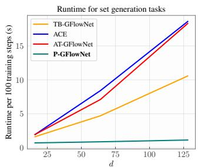

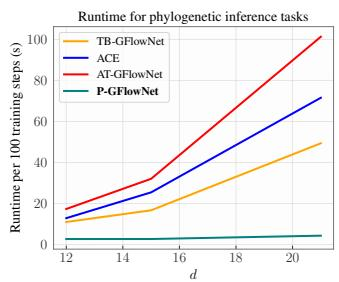  
Figure 8: Per-training step runtime for ACE, AT, TB, and P-GFlowNets (ours). By circumventing complete trajectory sampling during training, P-GFlowNets reduce per-step computation cost by several orders of magnitude.

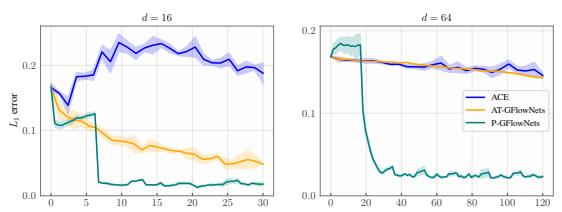  
(a) $L _ { 1 }$ error for set generation.

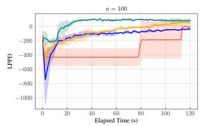  
(b) LPPD for variable selection.

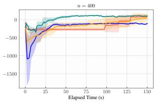  
Figure 9: P-GFlowNets converge faster than AT, ACE, and TB GFlowNets in the set generation and variable selection tasks, achieving more accurate marginals (a) and larger log-predictive density (b), respectively, within a shorter time span.

## E ADDITIONAL EXPERIMENTS

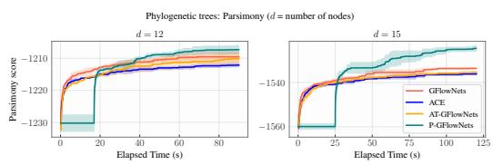  
Figure 7: P-GFlowNets finds more parsimonious phylogenetic trees than ACE, AT GFlowNets and TB GFlowNets.

To further evaluate P-GFlowNets, we compare it against the recently proposed Adaptive Teachers (AT) Kim et al. [2025] and the Adaptive Complementary Exploration (ACE) Dall’Antonia et al. [2026] training algorithms. We also confirm P-GFlowNets’ effectiveness in the phylogenetic inference task Zhou et al. [2024].

Comparison against AT and ACE. In contrast to P-GFlowNets, whose focus lies on reducing the per-step computational cost for both training and inference, AT and ACE aim at improving a GFlowNet’s sample efficiency by training an exploratory model to search for highly informative (e.g., unvisited, high-probability under the target) regions

during learning. In doing so, however, training cost often increases multifold due to the evaluation of both the exploratory and target GFlowNets on both forward and backward trajectories; see Figure 8. From this perspective, we found that P-GFlowNets converge significantly faster than AT and ACE with respect to wall-clock time. We show illustrate this in Figure 9 for both the set generation and variable selection tasks. In both cases, we followed the implementations of Dall’Antonia et al. [2026] for both AT and ACE GFlowNets.

The main setting for which these artificial curiosity-inspired strategies would be appropriate, in our opinion, is when the reward function is extremely expensive to evaluate relatively to the policy network and this expensiveness cannot be reduced by exploiting the shared structure of adjacent states through caching, as explained next.

Phylogenetic inference. To further evaluate P-GFlowNets, we also consider the problem of phylogenetic inference using the parsimony score as the log-reward function Fitch [1971]. We adopt the algorithm suggested by Zhou et al. [2024]. Given a phylogenetic tree T with leaves L annotated with $\{ \mathrm { A } , \mathrm { T } , \mathrm { C } , \mathrm { G } \}$ , let ${ \bf e } _ { n } \in \{ 1 , 0 \} ^ { 4 }$ be the one-hot encoding of node n. For n in L, ${ \bf e } _ { n } ^ { ( 1 ) } = 1$ if n is annotated with $A ; \mathbf { e } _ { n } ^ { ( 2 ) } = 1$ , if T, and etc. Otherwise, $\mathbf { e } _ { n } ^ { ( j ) } = 0$ . Then, by letting $\operatorname { L C } ( n )$ and $\operatorname { R C } ( n )$ denote the left and right child of n, the parsimony score is recursively defined as

$$
\begin{array} { r l } & { \mathbf { e } _ { n } = \{ \mathbf { e } _ { \mathrm { L C } ( n ) } \wedge \mathbf { e } _ { \mathrm { R C } ( n ) } \ \mathrm { i f } \ \sum _ { i = 1 } ^ { 4 } ( \mathbf { e } _ { \mathrm { L C } ( n ) } \wedge \mathbf { e } _ { \mathrm { R C } ( n ) } ) ^ { ( i ) } \geq 1  } \\ & { \qquad \mathbf { e } _ { \mathrm { L C } ( n ) } \vee \mathbf { e } _ { \mathrm { R C } ( n ) } , \ \mathrm { o t h e r w i s e } .  } \\ & {  \mathrm { P a r S c o r e } ( n , \mathrm { T } ) = \mathrm { P a r S c o r e } ( \mathrm { L C } ( n ) , \mathrm { T } ) + \mathrm { P a r S c o r e } ( \mathrm { R C } ( n ) , \mathrm { T } ) + [ \mathbf { e } _ { n } \neq \mathbf { e } _ { \mathrm { L C } ( n ) } \wedge \mathbf { e } _ { \mathrm { R C } ( n ) } ] , } \end{array}
$$

with the boundary condition ParScore $( n , \mathrm { T } ) = 0$ for $n \in \mathrm { L }$ and u, $\mathbf { \Delta } , \mathbf { v } \mapsto [ \mathbf { u } \neq \mathbf { v } ]$ being 1 if u and v match element-wise and 0 otherwise. The parsimony score of a tree whose leaves are annotated with a sequence of $\{ \mathrm { A } , \mathrm { T } , \mathrm { C } , \mathrm { G } \}$ is the sum of the parsimony score of a tree whose leaves are solely annotated with each element in this sequence, corresponding to the usual bag-of-words assumption in phylogenetic statistical models. The intuition is that a tree is as parsimonious (having low parsimony score) as the number of disagreements between a parent and its children. We define $R ( \mathrm { T } ) =$ $\exp \{ - \mathrm { P a r S c o r e ( r ( T ) , T ) } \}$ as our reward function, with r(T) as the root of T.

Importantly, the modular nature of ParScore ensures that, in transitioning from T to $\mathrm { T ^ { \prime } }$ using P-GFlowNets’ backwardforward kernels, most of the computation required fo $\mathrm { P a r S c o r e ( T ^ { \prime } ) }$ can be reused from ParScore(T), reducing the cost of reward querying. Based on this, we compare P-GFlowNets against AT and ACE GFlowNets on their state space exploration capabilities during training in Figure 7. The initial exploration phase, highlighted as a horizontal line for P-GFlowNets, corresponds to the period before which samples are collected for computing $\begin{array} { r } { \bar { \hat { R } } , } \end{array}$ which is used to decide whether the chain should be rejuvenated. As in the set generation and variable selection tasks, P-GFlowNets improve upon both AT and ACE given a similar wall-clock time budget. That said, extending P-GFlowNets to mixed, discrete and continuous, spaces—as often required in phylogenetic inference based on stochastic evolution models—remains an interesting venue for future research.