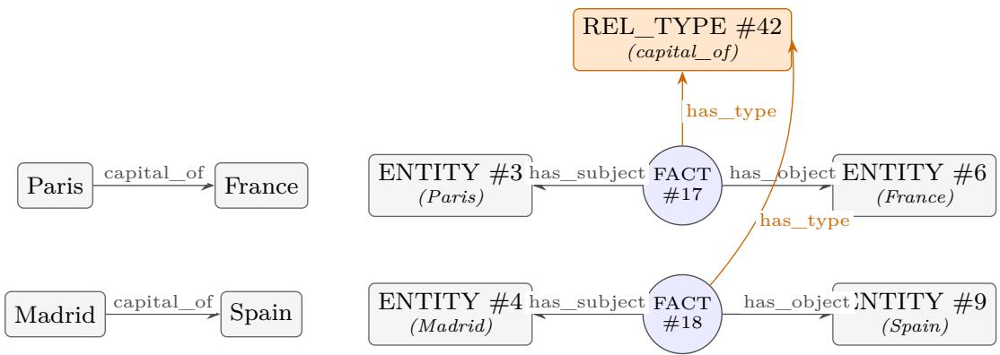
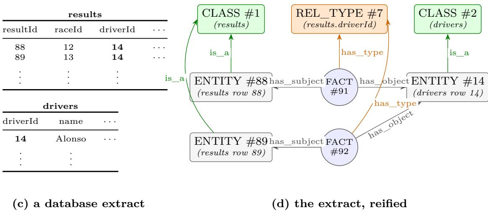
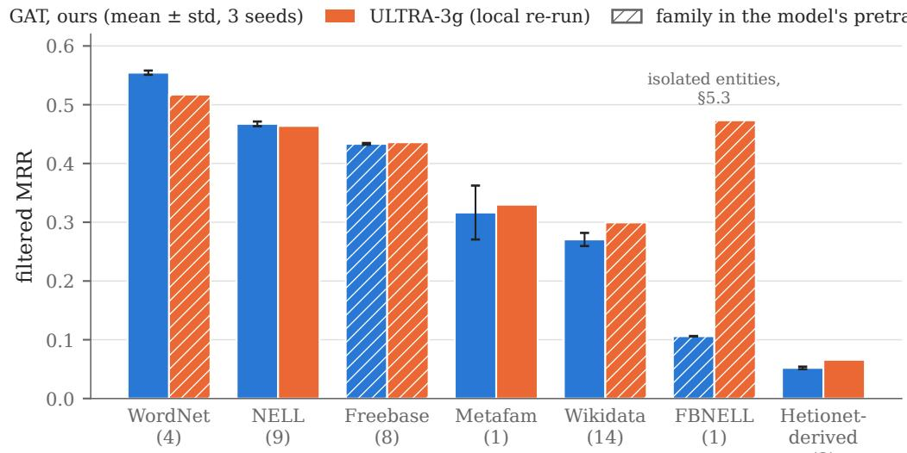
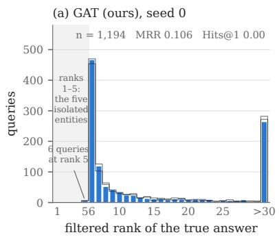
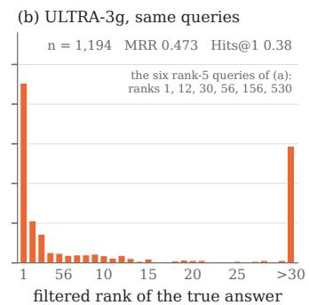

# Reification as a Transferable Vocabulary: Zero-Shot Link Prediction with Vanilla GNNs

Camille PradelMatr, https://itmatr.techcamille@itmatr.tech

## Abstract

Knowledge graph foundation models such as ULTRA achieve zero-shot link prediction on unseen graphs through dedicated architectures that hard-code a transfer mechanism. In this work we move that mechanism out of the architecture and into the representation, by reifying the input graph: every fact becomes a node, connected to its subject, object, and relation type through a fixed vocabulary of six meta-relations, with relation types as anonymous shared nodes rather than model parameters. On this representation, five textbook GNNs (GAT, GINE with sum and with mean+max aggregation, GraphSAGE, R-GCN), each trained on a single knowledge graph of 4,245 triples for 30 minutes on one NVIDIA A100, transfer zero-shot to 40 inductive link-prediction benchmarks. The best of them, an of-the-shelf GAT, matches ULTRA, a dedicated foundation model pretrained on three graphs, across ULTRA’s own evaluation suite. The same fixed vocabulary extends to relational databases, a row becoming an entity and a foreign-key column a relation type; a preliminary probe on two unseen databases, with no cell values, schema text or in-context labels, shows a model of this family pretrained on three knowledge graphs ranking foreign-key targets far above random-initialization and degree controls. We release the code, the checkpoints, and the evaluation pipeline for all 40 benchmarks.

## 1 Introduction

The foundation-model recipe (pre-train on broad data, apply zero-shot to unseen inputs) rests on a shared input vocabulary. A language model can read any document because every document is written in the same tokens. Relational data ofers no such shared vocabulary. Every knowledge graph names its own entities and its own relation types; every relational database adds one more private layer: a schema of tables and columns found nowhere else, its foreign keys playing the role of a knowledge graph’s relation types. Any model that allocates parameters to a vocabulary item (an entity embedding, a relation embedding, a per-table encoder) is structurally unable to read the next dataset. Recent position work on graph foundation models identifies exactly this as the central open problem: finding a transferable vocabulary shared across graphs (Mao et al., 2024).

Two research lines answer it today, each confined to one data model and each with a dedicated architecture. On the knowledge graph side, knowledge graph foundation models (KGFMs) achieve structural transfer: ULTRA (Galkin et al., 2024) conditions on the query and learns relative relation representations built from a relation graph with four fixed relation-to-relation interactions; TRIX, MOTIF, and Gamma refine the same design (Zhang et al., 2025; Huang et al., 2025; Xin et al., 2025); Flock replaces message passing with random-walk sequence encoding (Kim et al., 2025); prompt- and in-context variants condition a pretrained reasoner with graph prompts (Cui et al., 2024; Wang et al., 2024), and SEMMA adds text embeddings of relation names (Arun et al., 2025). These models generalize to unseen entities and relations, but they are KG-only, and each hard-codes its transfer mechanism into a bespoke architecture. On the relational database side, relational foundation models transfer through a mix of schema text and in-context conditioning: the Relational Transformer (Ranjan et al., 2026) tokenizes every cell with its column name and value text, while KumoRFM (Hudovernik et al., 2026) learns in-context over a relational graph transformer. These generalize to unseen schemas, but they are RDB-only. A knowledge graph can certainly be stored as a database, as one triple table or as one table per relation type, and its relation names then provide a thin layer of schema text; what the standard link-prediction benchmarks cannot provide is the labeled task table that carries most of these models’ transfer (Section 2). No single model covers both, and in every one of them the transfer mechanism lives in the model.

Our idea is to move the problem from the architecture to the representation. We reify the data (Figure 1): every fact becomes a node, connected to its subject, its object, and its relation type through a fixed vocabulary of six meta-relations. Relation types become anonymous shared nodes rather than model parameters, and so do entity types (tables) in the database case. The nodes are shared in that two facts of the same relation point to the same relation-type node, so “being of the same kind” is now structure in the graph rather than a row in an embedding table. They are anonymous in that they carry no learned identity: the model reads nothing but a node’s kind and its structural position. After reification, every dataset is a homogeneous graph over the same finite input vocabulary: three node kinds (entities, facts, relation types), four with entity types for databases, and six meta-relations, eight with is\_a and its inverse (Section 3.1). Nothing dataset-specific remains for a model to parameterize. Any GNN that is inductive over nodes, given query conditioning implemented as a labeling trick (Zhang et al., 2022), can be trained on one dataset and applied unchanged to any other.

The question is then empirical: with the representation fixed and the architecture deliberately generic, how much zero-shot inductive transfer is left? We report two findings and one probe.

1. Zero-shot transfer works with unmodified architectures. Five textbook backbones (GAT (Veličković et al., 2018), GINE with sum and with mean+max aggregation (Xu et al., 2019; Hu et al., 2020), GraphSAGE (Hamilton et al., 2017), and R-GCN (Schlichtkrull et al., 2018)), trained under one frozen recipe (64 dimensions, 12 layers, a 30-minute budget on one NVIDIA A100, 3 seeds fixed a priori) on a single 4,245-triple knowledge graph, all transfer zero-shot to 40 inductive benchmarks. None collapses, with one exception, identified and explained (Section 5.3), and the ordering between them is stable across evaluation panels up to one swap (Section 5.1).

2. The best of them matches the dedicated foundation model. Over all 40 benchmarks the GAT averages 0.3565 ± 0.0049 against 0.3732 for ULTRA re-run from its released checkpoint with our evaluation code; on the 13 benchmarks whose families appear in neither pretraining corpus, 0.3600 ± 0.0055 against 0.3617; and on the twelve inductive-(e) GraIL benchmarks it scores higher, 0.5457 against 0.5224 (Section 5.2).

3. A probe of the same representation on relational databases. A model of this family pretrained on three knowledge graphs, applied to two unseen reified databases with no features, no fine-tuning, no schema text and no in-context labels, ranks foreign-key targets far above random-initialization and degree controls, while the single-graph models of Section 5 do not (Section 6). This is where the vocabulary’s coverage of both data models is put to the test; we report the outcome as a preliminary probe, not as a transfer result.

We do not claim to beat the state of the art: ULTRA remains ahead on the full aggregate, the KGFMs that refine ULTRA’s design (TRIX, MOTIF, Gamma, Flock) publish figures up to 0.03 MRR above ULTRA’s on the inductive-(e) splits (Table 5), and Section 5.4 shows the remaining gap is not closed by choosing a diferent single training graph. The contribution is the demonstration that a fixed structural representation carries most of zero-shot inductive transfer with none of the dedicated machinery. The representation itself is not new as an encoding: the literature uses reification for n-ary facts, and HYPER (Huang et al., 2026) treats it as a hostile baseline, showing that ULTRA pretrained on ordinary KGs transfers poorly to reified graphs. To our knowledge, no prior work pre-trains natively on reification or proposes it as the cross-dataset transfer mechanism (Section 2).

  
(a) two facts of a knowledge graph  
(b) the same facts, reified

  
Figure 1: Reification as a fixed structural vocabulary. Panels (a) and (b): two facts of a knowledge graph and their reification. Panels (c) and (d): an extract of a relational database, two tables linked by one foreign key, and its reification into the same vocabulary. Inverse meta-relations are omitted for readability; annotations in parentheses are for the reader, the model sees only anonymous node identities and kinds.

## 2 Related work

Inductive link prediction and KG foundation models. GraIL (Teru et al., 2020) introduced inductive relation prediction over unseen entities (the inductive-(e) scenario) via subgraph reasoning; NBFNet (Zhu et al., 2022) made source-conditioned full-graph propagation the dominant backbone; A\*Net and AdaProp address its cost (Zhu et al., 2023; Zhang et al., 2023). InGram (Lee et al., 2023) first targeted unseen relations (inductive-(e,r)) through a relation graph. ULTRA (Galkin et al., 2024) turned that relation-graph idea into the first KGFM: relative relation representations from a relation graph with four fundamental interactions (h2h, h2t, t2h, t2t), conditioned on the query, in two stacked NBFNet-style conditional MPNNs. TRIX (Zhang et al., 2025) adds recursive entity/relation updates with provably higher expressiveness; MOTIF (Huang et al., 2025) characterizes what KGFMs based on binary relation motifs can express; Gamma (Xin et al., 2025) adds multi-geometry attention; Flock (Kim et al., 2025)

Table 1: positioning by transfer mechanism (S = structural invariants, T = schema/relation-name text, C = in-context conditioning on labeled examples).
<table><tr><td></td><td>mechanism(s)</td><td>domains</td><td>architecture</td><td>generalizes to</td></tr><tr><td>ULTRA / TRIX / MOTIF / Gamma / Flock</td><td>S (relation graph / walks)</td><td>KGs</td><td>dedicated</td><td>unseen entities + relations</td></tr><tr><td>SEMMA / ProLINK</td><td>S + T (relation-name text via LLM)</td><td>KGs</td><td>dedicated</td><td>unseen entities + relations</td></tr><tr><td>KG-ICL / KGPFN</td><td>S + C (prompt graphs / episodes)</td><td>KGs</td><td>dedicated</td><td>unseen entities + relations</td></tr><tr><td>RT / KumoRFM</td><td>C (dominant, per RT&#x27;s ablation) + T + learned S</td><td>RDBs</td><td>dedicated</td><td>unseen entities + relations + schemas</td></tr><tr><td>This work</td><td>S, in the representation</td><td>KGs (+ RDB probe)</td><td>any inductive MPNN</td><td>unseen entities + relations + schemas</td></tr></table>

breaks with this design, replacing message passing with random-walk sequence encoding. On the GraIL and InGram splits, TRIX and Flock publish the highest zero-shot figures of the four (Section 5.2, Table 5). Prompt- and in-context KGFMs (Cui et al., 2024; Wang et al., 2024; Gao et al., 2026) condition a pretrained reasoner with graph prompts; SEMMA (Arun et al., 2025) adds LLM text embeddings of relation names. Apart from Flock and the in-context line, these models are direct descendants of ULTRA’s relation-graph design; ULTRA remains the family’s shared reference point, and our evaluation uses it as such (Section 4). All of these are KG-only, dedicated architectures: the transfer mechanism lives in the model. We put it in the data. ULTRA’s relation graph is a structural transformation too, but only ULTRA can consume it; the reified graph can be read by any node-inductive GNN, and this paper is that substitution test.

Relational deep learning and RDB foundation models. Relational Deep Learning (Fey et al., 2023) reads a relational database as a heterogeneous temporal graph, the relational entity graph; RelBench (Robinson et al., 2024) is its benchmark suite. Two foundation models transfer across databases: the Relational Transformer (RT) (Ranjan et al., 2026), which tokenizes every cell with its column name and value and pre-trains on masked cells, and KumoRFM (Hudovernik et al., 2026), its commercial counterpart, which learns in-context over a relational graph transformer. What carries their zero-shot transfer is best read from RT’s own context ablation: in-context labels of the target entity first, schema text second; and since column-name overlap between RelBench databases is near zero, RT concludes it must also exploit structural relational patterns (Ranjan et al., 2026).

None of these mechanisms is available on a bare knowledge graph. A KG can be stored as a database, as one triple table or as one table per relation type, and its relation names then provide a thin layer of schema text; but the link-prediction benchmarks provide no labeled task table to condition on, and that is the dominant channel. The gap is also one of task: RT’s pre-training predicts value cells, foreign keys shape its attention but are never prediction targets, and its authors list link prediction as out of scope, so RT can appear neither in the KG evaluation of Section 5 nor in the featureless probe of Section 6. We therefore describe each family by its mix of three composable transfer mechanisms: structural invariants, schema text, and in-context conditioning on labeled examples (Table 1). Our representation uses the first alone: at inference it consumes the target dataset and nothing else.

Reification. Turning an edge into a node is classical: the Levi graph in graph theory and star expansion for hypergraphs (Agarwal et al., 2006). Message passing centred on edges rather than on entities has been used as an architectural device for link prediction: PathCon (Wang et al., 2021) aggregates the relational context and the relational paths around an entity pair without any entity embedding, and RMPI (Geng et al., 2023) propagates between the edges of an enclosing subgraph, on its line graph, to reach unseen relations as well as unseen entities, drawing relation semantics from an ontological schema when one is available. Both keep the edge-centric view inside a dedicated model with relation-specific parameters; here the same view is written into the data once, with relation types as anonymous nodes, so that a homogeneous GNN with no relation parameters can read it. In the KG literature, reification is the standard encoding for n-ary and hyper-relational facts (Wei et al., 2025), and the hyper-relational line explicitly engineered around it for performance: StarE (Galkin et al., 2020) and HINGE (Rosso et al., 2020) keep qualifiers native; HYPER (Huang et al., 2026) operates directly on hypergraphs and evaluates “ULTRA over reification” as a degraded baseline, attributing the drop to longer hop distances and distribution shift from ordinary-KG pre-training. We draw the opposite conclusion from the same observation: reification hurts models pre-trained on non-reified data, and, to our knowledge, nobody has pre-trained natively on the reified representation. Concurrently, (Amouzouvi et al., 2026) also seek a universal structural vocabulary for KGFMs, via graphlet features fed to a dedicated model; ours is a representational substrate: the data itself is rewritten.

Expressiveness and equivariance. Unconditioned GNNs compute unary node invariants and provably cannot solve link prediction; conditioning on the query (labeling trick (Zhang et al., 2022), C-MPNN (Huang et al., 2023)) is necessary. Double equivariance (Zhou et al., 2025) formalizes the joint entity×relation invariance that inductive- $\mathrm { ( e , r ) }$ prediction requires, and reification realizes it structurally: permuting relation types permutes anonymous nodes, so any node-permutation-equivariant GNN is automatically equivariant to it. ISDEA, the model of that work, obtains the same invariance through a dedicated architecture; its evaluation ranks each answer against 50 sampled negatives, so its published figures are not comparable with the filtered full-ranking protocol used throughout this paper, and we do not compare against them numerically. Chen et al. (Chen and Wang, 2023) analyze how graph transformations trade expressiveness against depth, the source of our “one original hop = two reified hops” accounting.

Broader structured-data foundation models. TabPFN (Hollmann et al., 2023) and TabICL (Qu et al., 2025) cover single tables; GraphAny (Zhao et al., 2024) targets node classification on arbitrary graphs; Wang et al. (Wang et al., 2025) transfer from KGs to general graphs via textualization, the closest prior to our database probe, with text rather than structure as the bridge.

## 3 Method

## 3.1 The reified representation

Knowledge graphs. A KG is a triple store $G = ( E , R , F )$ with entities $E ,$ relation types R, and facts $F \subseteq E \times R \times E$ . Its input vocabulary, what a model must be able to read, is $E \cup R$ and both parts change with every dataset.

Reification. We map G to a homogeneous directed graph $G ^ { \prime } = ( V ^ { \prime } , E ^ { \prime } )$ (Figure 1a–b) with:

• Nodes $V ^ { \prime } = E \cup F \cup R \mathrm { : }$ one node per entity (kind ENTITY), per fact (kind FACT), and per relation type (kind REL\_TYPE). Relation-type nodes are anonymous: they carry no identity beyond their kind and their structural position.

• Edges: for each fact $f \ = \ ( h , r , t )$ , six edges over a fixed meta-relation vocabulary: has\_subject $( f {  } h )$ , subject\_of $( h {  } f )$ , has\_object $( f {  } t )$ , object\_of $( t {  } f )$ , has\_type $( f {  } r )$ , has\_instance $( r {  } f )$

The direction of the original relation is preserved structurally (has\_subject vs has\_object), so inverse-relation augmentation, a staple of multi-relational GNNs, is unnecessary and omitted. The input vocabulary of $G ^ { \prime }$ is finite and universal: 3 node kinds and 6 meta-relations, whatever the dataset. Two facts of the same relation type share a relation node; “these two edges are of the same kind” is a 2-hop structural pattern, not a parameter.

Relational databases. A relational database maps into the same vocabulary, extended by exactly one node kind and one meta-relation. The mapping has two steps. Step 1: the database is already a multi-relational graph. Following relational deep learning (Fey et al., 2023), take every row of every table as a node, and every foreign-key cell (a cell of row u holding the key of a row v in another table) as an edge $u  v$ . Two edges coming from the same foreign-key column are of the same type, exactly as two KG facts sharing a relation: the foreign-key columns are the database’s relation types. Step 2: reify that graph exactly as above. Each foreign-key cell becomes a FACT node with its six meta-relation edges, and each foreign-key column an anonymous REL\_TYPE node. The one genuinely new ingredient is the schema’s type information: each table becomes an entity-type node of a fourth kind, CLASS, connected to its rows by one more meta-relation pair, $\dot { \mathsf { 1 } } \mathsf { s } _ { - } \mathsf { a }$ and its inverse has\_member (Figure 1c–d). A new database is therefore new structure over the same fixed vocabulary, exactly like a new KG. The models of this paper are pretrained on knowledge graphs, which have no tables, so they never see a class node; Section 6 says how the probe accommodates this.

Remark (has\_type vs is\_a). Both are instantiation edges (instance → type) and could in principle be merged into one meta-relation, the endpoint node kinds carrying the distinction. We keep them separate, mirroring RDF’s rdf:predicate / rdf:type distinction: has\_type sits on the critical path of query conditioning and relational composition (every fact has exactly one), while $\dot { \mathsf { 1 } } \mathsf { s } _ { - } \mathsf { a }$ is an optional schema signal that a bare KG does not have. Distinct edge embeddings let the model weight the two roles independently from the first layer.

Structure versus data properties. The vocabulary covers structure only: entities $( \mathrm { r o w s } )$ relation types (foreign-key columns), facts (foreign-key cells), and entity types (tables). Data properties, the non-key cell values, are not part of the reified graph; integrating them is left to future work. The restriction is what allows the database probe of Section 6 to test the vocabulary itself: run featureless, it measures what key structure alone carries, not the quality of a feature encoder. The KG benchmarks of Section 5 contain no literals, so the restriction costs them nothing.

What reification costs. It multiplies node count $( \mathrm { r o u g h l y ~ } \times 2 0$ on typical KGs) and doubles the graph diameter, since one original hop becomes two reified hops through the fact node. Section 3.2 sets depth accordingly and Section 7 discusses the cost.

What reification buys. It reduces the requirement on the model from “multi-relational GNN with a parametric relation vocabulary” to “homogeneous GNN inductive over nodes”. It realizes the entity×relation double anonymization that $\mathrm { i n d u c t i v e - ( e , r ) }$ prediction demands (Zhou et al., 2025) structurally: permuting relation types permutes anonymous nodes, and any node-permutation-equivariant GNN is automatically equivariant to it. The correspondence extends to computation: one layer of a conditional multi-relational MPNN on $G$ aggregates over typed edges, and the same aggregation factors through the fact nodes of $G ^ { \prime }$ in two hops, so k layers of a query-conditioned homogeneous MPNN on $G ^ { \prime }$ can carry out $\lfloor k / 2 \rfloor$ layers of message passing on G. We use this as a depth accounting (Section 3.2) rather than as a formal result.

## 3.2 The five backbones

Why conditioning is necessary. An unconditioned MPNN computes unary node invariants, which provably cannot rank links (Zhang et al., 2022; Huang et al., 2023). We therefore condition the initialization on the query: the minimal, architecture-agnostic form of the labeling trick.

Initialization. Node states start from their kind embedding, $x _ { v } = { \mathrm { e m b } } _ { \mathrm { k i n d } } ( \mathrm { k i n d } ( v ) )$ (3 vectors). For a query $( h , r , ? )$ (resp. $( ? , r , t ) )$ , two learned additive markers are applied: a role marker on the known endpoint entity (subject vs object role; 2 vectors) and a query-relation marker on the queried relation-type node (1 vector). Propagation then runs on one copy of the graph per query. Total conditioning parameters: 3 vectors of dimension d. There are no per-relation, per-entity, or per-dataset parameters anywhere in the model.

Backbones. The representation can be consumed by any MPNN that is inductive over nodes; only per-entity shallow embeddings, transductive by construction, are out of scope. To keep the architecture out of the result, we take four backbones exactly as shipped by PyTorch Geometric (Fey and Lenssen, 2019) (GAT, GINE with sum aggregation, GraphSAGE, and R-GCN over the six meta-relations) and one two-line variant of GINE whose sum aggregator is replaced by PyG’s mean+max multi-aggregation; we change nothing else in them. GraphSAGE, as shipped, consumes no edge features and therefore does not see the meta-relation labels; it is kept as the weakest-information baseline. All five share one configuration: dimension 64, 12 layers (≈6 logical hops on the original graph, given the ×2 diameter), LayerNorm and dropout 0.2 per layer, and 0.11M–0.41M parameters depending on backbone, the same order as ULTRA’s 0.17M.

Scoring, and the asymmetry it creates. Candidate t is scored by an MLP over its final state alone, $s ( t ) = \mathrm { M L P } ( x _ { t } )$ . This is the weakest readout available, chosen so that the representation carries the result. It leaves the models query-conditioned at the propagation level (through seeded initialization) but not at the readout level, where ULTRA also conditions its scoring on the query. Section 5.3 shows that this asymmetry is invisible on 39 of the 40 benchmarks and decisive on the fortieth.

Training. Cross-entropy over all entities (full softmax), with known true answers masked (filtered training). To prevent leakage, the queried fact’s six edges (its three meta-relation edges and their inverses, Section 3.1) are removed from its graph copy during message passing. Training and inference are full-graph, NBFNet-style (Zhu et al., 2022). The recipe was frozen before any evaluation: 30-minute budget on one NVIDIA A100, selection on validation MRR only, seeds {0, 1, 2} fixed a priori for every backbone, no post-hoc seed or checkpoint selection.

## 4 Experimental setup

Training data. Every model is trained on a single graph: the training split of FB15k-237- Inductive v1 (Teru et al., 2020), with 1,594 entities, 180 relations, and 4,245 triples. For comparison, ULTRA’s pretraining corpus (FB15k-237, WN18RR, CoDEx-Medium) contains roughly 130× more triples.

Evaluation. We evaluate on 40 inductive benchmarks under the filtered ranking protocol and report absolute MRR: the 12 GraIL inductive-(e) splits (FB15k-237, WN18RR, NELL-995, versions v1–v4), the 13 InGram inductive-(e,r) splits (FB, WK, NL, 25–100), and 15 extended splits (ILPC 2022 small/large (Galkin et al., 2022), HM 1k/3k/5k (Hamaguchi et al., 2017; Liu et al., 2021), FBNELL, Metafam, WikiTopics MT1–4 (Zhou et al., 2023)). Every evaluation is zero-shot: the models are applied as trained, with no fine-tuning and no target-side adaptation.

Machine. Every number in this paper, ours and the baseline’s, was produced on one NVIDIA A100 with 80 GB, one job at a time. The 30-minute training budget refers to that device: it is 1,800 s of wall-clock training on a single A100, not a normalized compute unit.

Baseline. The baseline is ULTRA’s released 3-graph checkpoint,1 reported in two columns. The re-run column is that checkpoint evaluated on the same machine with our evaluation code, on the same splits, with the same filtered candidate sets and the same tie-breaking as our models; it is the comparison we control end to end, and the primary one. The published column copies, split by split, the zero-shot MRR of the same model from the appendix tables of the ULTRA paper (Galkin et al., 2024) (results/ultra3g\_published.csv records the source table of each value). The two disagree: the published column is higher on 28 of the 40 benchmarks and by 0.008 MRR on average, with the largest gaps on WN18RR v4 (0.611 published against 0.484 re-run), WikiTopics MT4:health (0.624 against 0.557), NELL-995 v1 (0.785 against 0.727) and WN18RR v1 (0.648 against 0.593); the re-run is higher on Metafam (0.330 against 0.238) and on the three Hetionet-derived splits. The gap is not one we can close. The published figures come from the original TorchDrug implementation, while the released checkpoint is a $\mathrm { P y }$ Torch Geometric re-implementation whose own README places it below the paper on the inductive-(e) datasets (MRR 0.420 against 0.430 over 18 graphs) and at parity on the inductive-(e,r) ones (0.344 against 0.345). Independent re-runs land where ours does: the Gamma authors report ULTRA-3g at 0.5176 on the twelve GraIL splits under their own protocol (Xin et al., 2025), against our 0.5224 and the published 0.5492. Every comparative table carries both columns; the text quotes the re-run column, which is the controlled comparison. Read against the published column instead, the comparison is less favorable: the all-40 gap is 0.025 rather than 0.017 (Table 4), the GAT trails on every family with more than one split (Table 3), and its lead on the inductive-(e) benchmarks becomes parity (0.5457 against 0.5492, one seed standard deviation). Only Section 5.2, which places the paper among published KG foundation models, uses the published column in the text.

One excluded split. The original suite has a 41st benchmark, HM:indigo (458 relations), which we exclude on measured compute grounds: evaluating a single model on it ran 4h38 without finishing, memory-bound on the 80 GB A100. The decision was taken before any score of ours existed on that split. The cut is not neutral: ULTRA is ahead of comparable models there, so the exclusion shifts the aggregates in our favor, by about +0.003 MRR (extended-split reference $\mathrm { g a p - 0 . 0 8 0 7  - 0 . 0 7 7 6 }$ ; flat-aggregate reference $\mathrm { g a p - 0 . 0 3 8 8  - 0 . 0 3 6 6 } )$ . The split remains in the published results, marked out of scope.

Budget note. The 30-minute cap binds only for the GAT, which completes 14 of its 20 epochs; measured on the full evaluation, lifting the cap to 20 epochs adds +0.003 MRR. The frugality of the recipe does not hinge on the cap.

## 5 Results

## 5.1 Five textbook backbones, forty graphs

Every backbone transfers: the weakest (R-GCN) still averages 0.2350 across 40 unseen graphs, far above chance on every family, and none falls to random on any family, with one exception analyzed in Section 5.3. The ordering $( \mathrm { G A T > G I N E \mathrm { - } m e a n \mathrm { + } m a x > G I N E \mathrm { - } s u m > G r a p h S A G E > \mathrm { R } \mathrm { - } G C N } )$ is stable across evaluation panels, up to one swap: GINE-sum overtakes GINE-mean+max on the extended panel.

The GAT is 0.0167 behind ULTRA on the full aggregate and ahead on the twelve inductive-(e) benchmarks (0.5457 vs 0.5224). A 16-draw training portfolio of the same GAT recipe averages $0 . 4 2 9 3 \pm 0 . 0 0 4 7$ on the 25-benchmark GraIL+InGram suite against 0.4299 for ULTRA; we summarize this as matching the dedicated foundation model in the single-small-KG regime.

## 5.2 Where the gap lives: families and regimes

The GAT is ahead of ULTRA on WordNet and NELL, at parity on Freebase, and behind on Wikidata, on the Hetionet-derived splits (hard for every model; ULTRA itself is at 0.066), and on Metafam.

The all-40 aggregate is not a like-for-like comparison, and the asymmetry runs against us. Our models saw one Freebase-derived graph; ULTRA’s corpus (FB15k-237, WN18RR, CoDEx-Medium) covers the Freebase, WordNet, and Wikidata families. Of the 40 benchmarks, 27 belong to a family ULTRA pretrained on, against 9 for us. Table 4 therefore reports the aggregate at three nesting levels, using the regime labels assigned when the evaluation matrix was built, before this comparison was considered.

Table 2: filtered MRR, mean ± std over 3 seeds. (From results/backbone\_matrix.csv / broad\_eval\_matrix.csv; full 15×40 matrix in Appendix C. The two ULTRA rows are the re-run and published columns of Section 4; best value per column in bold.)
<table><tr><td></td><td>inductive-(e) (12)</td><td>inductive-(e,r) (13)</td><td>extended (15)</td><td>all 40</td></tr><tr><td>GAT</td><td> $\mathbf { 0 . 5 4 5 7 \pm 0 . 0 0 3 1 }$ </td><td> $0 . 3 3 0 0 \pm 0 . 0 0 2 9$ </td><td> $0 . 2 2 8 1 \pm 0 . 0 0 8 2$ </td><td> $0 . 3 5 6 5 \pm 0 . 0 0 4 9$ </td></tr><tr><td>GINE (mean+max)</td><td> $0 . 5 2 7 6 \pm 0 . 0 0 5 8$ </td><td> $0 . 3 1 4 8 \pm 0 . 0 0 7 6$ </td><td> $0 . 1 8 0 7 \pm 0 . 0 0 3 3$ </td><td> $0 . 3 2 8 4 \pm 0 . 0 0 5 1$ </td></tr><tr><td>GINE (sum)</td><td> $0 . 5 0 6 9 \pm 0 . 0 0 4 2$ </td><td> $0 . 2 9 1 8 \pm 0 . 0 0 3 4$ </td><td> $0 . 1 9 8 7 \pm 0 . 0 0 4 3$ </td><td> $0 . 3 2 1 4 \pm 0 . 0 0 3 5$ </td></tr><tr><td>GraphSAGE</td><td> $0 . 4 6 7 6 \pm 0 . 0 0 7 4$ </td><td> $0 . 2 8 0 1 \pm 0 . 0 0 4 0$ </td><td> $0 . 1 6 2 5 \pm 0 . 0 0 8 0$ </td><td> $0 . 2 9 2 3 \pm 0 . 0 0 4 4$ </td></tr><tr><td>R-GCN</td><td> $0 . 4 3 4 4 \pm 0 . 0 1 3 1$ </td><td> $0 . 2 0 0 5 \pm 0 . 0 1 5 0$ </td><td> $0 . 1 0 5 5 \pm 0 . 0 0 2 2$ </td><td> $0 . 2 3 5 0 \pm 0 . 0 0 9 5$ </td></tr><tr><td>ULTRA (3-graph, re-run)</td><td>0.5224</td><td>0.3446</td><td>0.2786</td><td>0.3732</td></tr><tr><td>ULTRA (3-graph, published)</td><td>0.5492</td><td>0.3517</td><td>0.2731</td><td>0.3815</td></tr></table>

Table 3: per-family filtered MRR, GAT $( \mathbf { m e a n } \pm \mathbf { s t d } )$ vs ULTRA, re-run and published columns. Regime labels are relative to each model’s training corpus: our models saw only FB15k-237- Inductive v1; ULTRA’s corpus contains Freebase, WordNet, and Wikidata parents. Best value per row in bold.
<table><tr><td>family (n splits)</td><td>GAT</td><td>ULTRA re-run</td><td>ULTRA published</td><td>regime (ours / ULTRA)</td><td></td></tr><tr><td>Freebase (8)</td><td> $0 . 4 3 3 4 \pm 0 . 0 0 1 5$ </td><td>0.4361</td><td>0.4456</td><td></td><td>in-family / in-family</td></tr><tr><td>WordNet (4)</td><td> $0 . 5 5 4 5 \pm 0 . 0 0 3 6$ </td><td>0.5172</td><td>0.5745</td><td></td><td>new KG / in-family</td></tr><tr><td>NELL (9)</td><td> $0 . 4 6 7 4 \pm 0 . 0 0 4 0$ </td><td>0.4639</td><td>0.4764</td><td></td><td>new KG / new KG</td></tr><tr><td>Wikidata (14)</td><td> $0 . 2 7 0 7 \pm 0 . 0 1 1 2$ </td><td>0.2996</td><td>0.3039</td><td></td><td>new KG / in-family</td></tr><tr><td>Hetionet-derived (3)</td><td> $0 . 0 5 2 1 \pm 0 . 0 0 2 2$ </td><td>0.0659</td><td>0.0433</td><td></td><td>new KG / new KG</td></tr><tr><td>Metafam (1)</td><td> $0 . 3 1 6 5 \pm 0 . 0 4 5 8$ </td><td>0.3298</td><td>0.2380</td><td></td><td>new KG / new KG</td></tr><tr><td>FBNELL (1)</td><td> $0 . 1 0 6 1 \pm 0 . 0 0 0 3$ </td><td>0.4734</td><td>0.4850</td><td></td><td>see Section 5.3</td></tr></table>

The 13-benchmark row is the only symmetric comparison in the paper: NELL (9 splits), the Hetionet-derived splits (3), and Metafam (1) are new families for ULTRA exactly as they are for us. There the two models are indistinguishable, the gap being a third of our own seed-to-seed spread. That number comes with two caveats: the subset is smaller and dominated by the NELL family, so it measures a narrower question than the all-40 row; and while the criterion is structural rather than score-driven, the decision to report this level was taken after the results were known. We therefore report all three rows and treat the all-40 aggregate, where ULTRA leads by 0.017, as the primary comparison.

Excluding the FBNELL split (analyzed next), the 39-split aggregate is 0.3629 vs 0.3706: the single pathological split accounts for more than half of the overall gap to ULTRA.

Where this sits among KG foundation models. ULTRA is the reference point of our evaluation, not the state of the art. Table 5 places the GAT next to the published zero-shot figures of the four KGFMs that followed ULTRA, on the 25 GraIL and InGram splits where all of them report per-split numbers (their extended suites difer from ours). The published rows are each paper’s own figures, under its own evaluation code and checkpoint-selection protocol, recomputed by us as unweighted means over exactly these 12 and 13 splits; none of them is a same-machine comparison, and the two ULTRA rows show how much that alone can move a number. On the inductive-(e) splits the newer models range from 0.008 (MOTIF) to 0.031 (Flock) above the published ULTRA; on the inductive-(e,r) splits all five, ULTRA included, lie within 0.019 of one another. Over the 25 splits the GAT, trained on one 4,245-triple graph for 30 minutes, is 0.004 above the re-run ULTRA, 0.013 below the published ULTRA, and 0.028 below TRIX, the strongest of the four.

  
Figure 2: per-family filtered MRR, GAT (mean ± std over 3 seeds) versus the re-run ULTRA-3g, families ordered from our strongest to weakest. Hatching marks a family present in the model’s own pretraining corpus; FBNELL is the isolated-entity split of Section 5.3.

Table 4: aggregates by how much of each family each model saw in pretraining. $\mathrm { G a p } = \mathrm { G A T }$ minus ULTRA, for each ULTRA column.
<table><tr><td>subset</td><td>n</td><td>GAT</td><td>ULTRA re-run</td><td>gap</td><td>ULTRA published</td><td>gap</td></tr><tr><td>all benchmarks</td><td>40</td><td> $0 . 3 5 6 5 \pm 0 . 0 0 4 9$ </td><td>0.3732</td><td>-0.0167</td><td>0.3815</td><td>-0.0249</td></tr><tr><td>families unseen by us</td><td>31</td><td> $0 . 3 4 4 8 \pm 0 . 0 0 5 9$ </td><td>0.3537</td><td>-0.0090</td><td>0.3615</td><td>-0.0168</td></tr><tr><td>families unseen by both</td><td>13</td><td> $0 . 3 6 0 0 \pm 0 . 0 0 5 5$ </td><td>0.3617</td><td>-0.0017</td><td>0.3582</td><td>+0.0018</td></tr></table>

## 5.3 The one failure mode: isolated entities

On FBNELL, all fifteen models collapse to MRR 0.076–0.106 with Hits@1 exactly 0, the only anomaly in the 600-cell matrix. FBNELL is the only split of the 40 whose test inference graph contains isolated entities: exactly five, each appearing in no triple of any split and in exactly one test triple (five queries whose answer is isolated, one whose source is). Our training graph contains no such entity (each of its 1,594 entities carries at least one fact), and neither does any other inference graph of the 40. Under seeded propagation no message ever reaches an isolated entity, so its state remains at its initialization, identical for all five (entities are anonymous) and constant across the 1,194 queries of the split. Under the plain readout that constant state happens to outscore every connected candidate, so the five occupy ranks 1–5 of every query: the rank distributions show no query at ranks 1–4 and a mode at rank 6 (454–470 of 1,194 queries across the three GAT seeds, which is rank 1 once the preempting block is discounted). Five entities without a single observed fact cost the backbones between 0.23 and 0.39 MRR (0.38 for the GAT, estimated by discounting the five preempting ranks). We report the 0.106 as measured, since removing the isolated entities from the candidate pool would edit the protocol in our favor on the one split where it hurts us.

ULTRA is immune, and the contrast explains why. What matters is that the degenerate state be scored below the true answers, and that property must be learned. ULTRA’s readout conditions on the query, and the state it must downrank is not rare in its regime: for a sourceconditioned model, every candidate beyond the reach of the propagation carries no query signal, on any graph, so a model that scored that state high would collapse everywhere; ULTRA’s training keeps that state out of the top rather than at the bottom. For our models the degenerate state requires a degree-0 entity, which no training graph we used contains, so the score a trained model assigns to it is arbitrary: the same recipe trained on CoDEx-Small (Section 5.4) happens to show no preemption on FBNELL (0.357 versus our 0.106) although CoDEx-Small contains no low-degree entity either, an arbitrary sign rather than a fix. What no model can learn is the handful of queries whose true answer is one of the five: the five candidates are structurally identical, so any permutation-equivariant model scores them identically and those queries are decided by tie-breaking, for ULTRA as for us, as ULTRA-3g’s own ranks confirm: it scores the five identically and places them mid-ranking, so the queries whose answer is isolated land at ranks 12 to 530 (Appendix C.4). ULTRA’s advantage on the split is earned on the other queries, where isolated candidates merely need to stay out of the way. Our models condition at the propagation level only (Section 3.2), which cannot reach a disconnected candidate by construction. Six models of the same family do have a query-conditioned readout: the generic model of the probe, in its three pretraining draws, and three models trained on our single training graph with that model’s recipe (Appendix D.3). None was trained on a graph containing an isolated entity, and none of them shows the preemption: on FBNELL all six place their mode at rank 1 and score between 0.31 and 0.43 MRR with Hits@1 between 0.24 and 0.34, against 0.08 to 0.11 and Hits@1 of exactly zero for the fifteen plain-readout models (Table B2). The test is not a pure ablation, since these models also difer from those of Table 2 by their training recipe, so we read it as a confirmation of the mechanism rather than as a measurement of the readout alone. One trace remains: for the three single-graph models, the five queries whose answer is isolated still land at ranks 5 to 20, so the isolated block stays grouped just below the top on exactly those queries, while the three-graph models spread them between ranks 28 and 282 (Table B2).

Table 5: zero-shot filtered MRR of published KG foundation models on the 25 GraIL and InGram splits, next to the GAT. Published rows are each paper’s own figures under its own evaluation code and checkpoint-selection protocol (Gamma selects its checkpoint on the target validation sets), recomputed as unweighted means over exactly these 12 and 13 splits (results/kgfm\_published.csv records the source table of each value); only the GAT and the re-run ULTRA are same-machine. All KGFMs pretrain on the same three graphs; KG-ICL, an in-context model pretrained on a diferent corpus, is omitted.
<table><tr><td>model</td><td>training data</td><td>inductive-(e) (12)</td><td>inductive-(e,r) (13)</td><td>all 25</td></tr><tr><td>GAT (ours, 3 seeds)</td><td>FB15k-237-Ind v1</td><td> $0 . 5 4 5 7 \pm 0 . 0 0 3 1$ </td><td> $0 . 3 3 0 0 \pm 0 . 0 0 2 9$ </td><td> $0 . 4 3 3 6 \pm 0 . 0 0 2 9$ </td></tr><tr><td>ULTRA-3g, re-run</td><td>3 KGs</td><td>0.5224</td><td>0.3446</td><td>0.4299</td></tr><tr><td>ULTRA-3g, published</td><td>3 KGs</td><td>0.5492</td><td>0.3517</td><td>0.4465</td></tr><tr><td>TRIX, published</td><td>3 KGs</td><td>0.5790</td><td>0.3534</td><td>0.4617</td></tr><tr><td>MOTIF, published</td><td>3KGs</td><td>0.5567</td><td>0.3346</td><td>0.4412</td></tr><tr><td>Gamma, published</td><td>3 KGs</td><td>0.5581</td><td>0.3527</td><td>0.4513</td></tr><tr><td>Flock, published</td><td>3 KGs</td><td>0.5797</td><td>0.3435</td><td>0.4569</td></tr></table>

## 5.4 Does the choice of training graph matter?

The models of Section 5 train on one Freebase-derived graph, and Table 3 locates their weakness on the Wikidata and Hetionet-derived families. This section measures how much of that profile is due to the training graph itself: we retrain the same recipe on other single training graphs and read the result per evaluation family (full per-family table in Appendix C).

The informative candidate is CoDEx-Small, a Wikidata-family graph, retrained with 3 seeds and gradient-step-matched to the reference. If family proximity between training and evaluation graphs drove transfer, this model should gain exactly where ours is weak; instead it loses 0.008 on the Wikidata-family benchmarks and 0.061 on the 40-graph mean. Two larger candidates, ConceptNet100k and AristoV4, do not fit full-graph training in 80 GB and were compared in a sampled-subgraph regime against a reference retrained the same way; neither helps on any weak family, and since their numbers are not comparable to the rest of the paper they stay in the appendix.

  
Figure 3: FBNELL, distribution of the filtered rank of the true answer over the 1,194 queries. (a) GAT seed 0 (bars) with seeds 1 and 2 as outlines; (b) ULTRA-3g on the same queries, same filter. Panel (a): no query lands at ranks 1–4: the five isolated entities occupy them; the six queries at rank 5 are the five whose answer is isolated and the one whose source is; the mode is rank 6. Panel (b): ULTRA-3g (MRR 0.473, Hits@1 0.38) has its mode at rank 1 and no gap; the six rank-5 queries of panel (a) land at ranks 1, 12, 30, 56, 156 and 530.

The choice of training graph therefore explains neither the successes nor the remaining gap: the transfer of Table 2 does not come from a fortunate match between training and evaluation families, since the in-family candidate gains nothing even on its own family, and the gap to ULTRA is not closed by a better-chosen single graph. ULTRA’s own pretraining study points the same way from the other side: varying the pretraining mix from one to eight graphs, its authors observe performance saturating beyond three and leave a more principled choice of mix to future work (Galkin et al., 2024). Training mixtures on the reified representation are the natural next experiment (Section 7).

## 6 The same vocabulary reads a relational database

Section 3.1 maps a relational database into the reified vocabulary: rows become entities, foreignkey columns relation types, foreign-key cells facts, and tables entity-type nodes. The models available for the probe are pretrained on knowledge graphs only, whose vocabulary has no entity type, so they cannot read a CLASS node or an is\_a edge: the probe therefore feeds them the database in its knowledge-graph form (rows, foreign-key columns, foreign-key cells), and uses the tables only to constrain the candidate set (Appendix D.1). To test whether this mapping yields a shared vocabulary rather than merely a shared notation, we take a model pretrained on knowledge graphs only, reify an unseen database, and rank foreign-key targets with no features, no fine-tuning, no schema text and no in-context labels.

The regime is deliberately impoverished. Cell values are where most of a database’s information sits, and schema text and in-context labels are the two mechanisms through which relational foundation models actually transfer (Section 2, Table 1). A model given none of the three has only the key structure left. Existing relational foundation models cannot run here at all: strip the text and the labeled context and they have no input. Any signal measured in this regime is therefore attributable to structure alone.

We summarize the probe here; Appendix D gives the protocol and the per-key results on both databases. The transferring model is a generic corpus-pretrained backbone of this family, not one of the models of Section 5. On two unseen databases (243k and 10.06M reified nodes), it ranks foreign-key targets far above both controls on entity-referencing keys: Hits@10 between 0.78 and 1.00 on the four driver and constructor keys of the qualifying and results tables of a Formula-1 database, against 0.00 for the same architecture with random initialization, and well above a degree heuristic. The result holds across pretraining seeds and on both databases, and the failures are consistent: the keys whose targets form a large class of near-interchangeable events (races, posts) stay near random, as nothing in the bare key structure distinguishes one race from another.

Nothing in the setup is exclusive to our models: the foreign-key graph of Step 1 (Section 3.1) is an ordinary multi-relational graph that a KG foundation model can consume directly. We therefore ran the three released ULTRA checkpoints zero-shot on the raw foreign-key graph, with the same queries, candidates and controls (Appendix D). The checkpoint pretrained on the same three graphs as our model (ULTRA-3g) never rises above the degree heuristic (1 of 13 keys on rel-f1, 0 of 11 on rel-stack). The more broadly pretrained checkpoints do extract structure: ULTRA-50g rises above both controls on 5 keys of each database, substantially (Hits@10 above 0.10) on 3 of rel-f1 and 4 of rel-stack, with a profile diferent from our model’s. Our generic model stays ahead on three of the four driver and constructor keys of rel-f1 (Hits@10 gaps of 0.20 to 0.43, non-overlapping bootstrap CIs; parity on the fourth, 1.00 versus 0.95) and on the three author keys of rel-stack (gaps of 0.38 to 0.82, non-overlapping CIs), ULTRA-50g is ahead on user votes and parent posts (0.73 vs 0.32, 0.27 vs 0.00), and the two are at parity on the post keys of comments and edit history. The two representations thus extract partially disjoint signals from the same graph, and ULTRA’s zero-shot behavior is strongly checkpoint-dependent on individual keys (0.13, 0.02 and 0.83 on posts.OwnerUserId across the three checkpoints, against 0.83 for our model). Finally, the models of Section 5, pretrained on FB15k-237 v1 alone, do not transfer at all (Hits@10 0.00 on every entity key, three seeds): the probe signal is a property of the diverse pretraining corpus as much as of the representation.

The corpus dependence can be isolated. With the same backbone, recipe and reified representation, models pretrained on FB15k-237 v1 alone transfer on none of the entity-referencing rel-f1 keys (six models: two recipes, three seeds each) and on a recipe- and seed-dependent subset of the rel-stack keys (two post keys reliably with the Section 5 recipe; three author keys for one seed in three with the corpus recipe). Pretrained on three transductive KGs, the same backbone transfers on all ten strong keys of both databases for each of three pretraining seeds. The multi-graph corpus is what makes the transfer complete and reliable; the reified representation is what lets a three-graph model extract it where ULTRA-3g, pretrained on the same three graphs, does not.

The result remains a probe, run on two databases, with one reified model family and one external KG foundation model, and no comparison against a supervised specialist. We will pursue these experiments in future work, shifting the emphasis to what the shared vocabulary uniquely provides: a single model that reads both data models natively, pretrained on knowledge graphs and relational databases jointly and applied to either, rather than a setup in which any KG foundation model can stand in for ours.

## 7 Limitations

The gap that remains. ULTRA is ahead by 0.017 overall, concentrated on the Wikidata and Hetionet-derived families (Table 3), and Section 5.4 shows no single alternative training graph closes it; the KGFMs that followed ULTRA publish figures a further 0.008 to 0.031 above ULTRA’s on the inductive-(e) splits (Table 5). Vanilla transfer from one small KG is demonstrated in-distribution of the Freebase/WordNet/NELL families; ULTRA’s multi-graph invariants generalize further. Multi-graph training mixtures on the reified representation are the natural next experiment and are out of scope here.

Isolated entities. Our deliberately minimal models omit query-conditioned readout, which Section 5.3 identifies as what protects ULTRA from degree-0 entities and confirms on six models of the family that have one. We stop short of calling it necessary: one plain-readout model escaped the pathology through its training graph alone, with a sign nothing guarantees. What remains open is the residual gap to ULTRA on that split (0.43 against 0.47 for the best of the six) and the grouping of the isolated candidates that persists, for the single-graph models, on the queries whose own answer is isolated; a controlled ablation that changes the readout and nothing else would separate the readout from the recipe.

Cost accounting. The 30-minute budget is a property of the training graph’s size as much as of the method (Section 5.4); the frugality holds in the demonstrated regime and we do not present it as a scaling law. Reification itself is not free: it multiplies node count by roughly ×20 and doubles the graph diameter, so a reified graph needs twice the depth of the original for the same reach, and full-graph propagation stops fitting in memory well before a plain KG would. Section 5.4 hits exactly that wall on the 100k-fact training candidates.

Scope. All results are structural link prediction on featureless graphs; the database probe (Section 6) is evidence for the vocabulary, not for a general capability on relational databases. It also leaves the entity-type nodes of Section 3.1 untested: exercising them requires a model pretrained on data that has tables, the joint KG-and-database pretraining announced as future work.

## 8 Conclusion

We have shown that zero-shot inductive link prediction across knowledge graphs does not require a dedicated foundation-model architecture; it requires a representation in which datasets share a vocabulary. Reification provides one, with three node kinds and six meta-relations (four and eight for databases), and on it five textbook GNNs, trained on a single 4,245-triple knowledge graph for 30 minutes on one NVIDIA A100, transfer to 40 inductive benchmarks. The best of them, an of-the-shelf GAT, matches ULTRA where the comparison is symmetric (0.3600 versus 0.3617 on the 13 benchmarks whose families neither model saw in pretraining) and trails it by 0.017 on the full 40-benchmark aggregate, more than half of that gap tracing to a single split with isolated entities. The same vocabulary reads a relational database, and a preliminary probe on two unseen databases shows a model of this family pretrained on three knowledge graphs ranking foreign-key targets far above random-initialization and degree controls. The transfer mechanism, once moved from the architecture into the data, is available to any node-inductive GNN. We release the code and the evaluation pipeline for all 40 benchmarks at https://github.com/getorbital/REIFM, and the checkpoints (the 15 KG models of Table 2 and the six models of the probe) at https://huggingface.co/itmatr/REIFM.

## A Protocol details

Frozen recipe. Dimension 64, 12 layers, dropout 0.2, cosine learning rate schedule with base rate 5 · 10−4, weight decay 0.01, batch size 16, 20 epochs capped at 1,800 s, 1,000 validation queries, full-graph propagation, plain readout. Training graph: the training split of FB15k-237- Inductive v1. Only backbone and seed vary across the 15 models. Model selection is Tier-1: the checkpoint maximizing validation MRR on the training graph’s own validation split, never on any test split. Seeds {0, 1, 2} were fixed a priori for every backbone; no seed was rejected, re-drawn, or replaced, including the weakest draw of each family. Table A1 lists the argument block as stored with each checkpoint; the released checkpoints ship with the same file.

Machine. One NVIDIA A100 (80 GB), one job at a time, for every number in this paper including the ULTRA re-run (Section 4). Timings elsewhere in the paper — the 1,800 s training cap, the 4h38 measured on the excluded split, the per-gradient-step costs of Appendix B — all refer to that device.

Table A1: frozen argument block of the 15 KG models (from the stored results.json; only backbone and seed vary). Two later-introduced flags, class\_node and ent\_features\_dir, are absent from these runs, which is their default (of / none).
<table><tr><td>argument</td><td>value</td><td>note</td></tr><tr><td>backbone</td><td>gat</td><td>varies: gat · ginemax · gine_sum · sage · rgcn</td></tr><tr><td>seed</td><td>0</td><td>varies: 0· 1 · 2</td></tr><tr><td>dim</td><td>64</td><td></td></tr><tr><td>layers</td><td>12</td><td></td></tr><tr><td>agg</td><td>sum</td><td>used by the PyG GINE (sum) and GraphSAGE convolutions only</td></tr><tr><td>dropout</td><td>0.2</td><td></td></tr><tr><td>edge_dropout</td><td>0.0</td><td>off</td></tr><tr><td>1r</td><td>0.0005</td><td></td></tr><tr><td>cosine</td><td>True</td><td></td></tr><tr><td>wd</td><td>0.01</td><td></td></tr><tr><td>bs</td><td>16</td><td></td></tr><tr><td>accum_steps</td><td>1</td><td></td></tr><tr><td>grad_clip</td><td>0.0</td><td>off</td></tr><tr><td>epochs</td><td>20</td><td></td></tr><tr><td>max_train_secs</td><td>1800.0</td><td>binding for GAT only (14 epochs)</td></tr><tr><td>train</td><td>FB15k237Inductive:v1</td><td></td></tr><tr><td>select_eval</td><td>FB15k237Inductive:v1</td><td>Tier-1</td></tr><tr><td>valid_every</td><td></td><td></td></tr><tr><td>valid_queries</td><td>1000</td><td></td></tr><tr><td>pos_mask</td><td>True</td><td></td></tr><tr><td>sampled</td><td>False</td><td>off: full-graph propagation</td></tr><tr><td>qc_readout</td><td>False</td><td>off: plain readout</td></tr><tr><td>qc_complex</td><td>False</td><td>off</td></tr><tr><td>rel_graph_layers</td><td>-1</td><td>-1 = off</td></tr><tr><td>use_cofact</td><td>False</td><td>off</td></tr><tr><td>rel_pe</td><td>0</td><td>off</td></tr><tr><td>ent_pe</td><td>0</td><td>off off</td></tr><tr><td>jk</td><td>False</td><td></td></tr><tr><td>swa</td><td>False</td><td>off</td></tr><tr><td>nre_p</td><td>0.0</td><td>off</td></tr><tr><td>head_margin_k</td><td>0</td><td>off off</td></tr><tr><td>grad_ckpt</td><td>False</td><td></td></tr></table>

Code non-drift control. Eleven of the fifteen checkpoints were trained three weeks before the remaining four, and four commits had touched the training and model paths in between, each claiming to be a no-op under our flag settings. Rather than trust that, we verified it in two steps before training the missing seeds, with the acceptance threshold (0.005 MRR) fixed in advance.

Evaluation path. Re-evaluating an existing checkpoint on five splits with the current code reproduced its stored results to within 0.0009 (FB15k-237-v1 0.4951 → 0.4954; WN18RR-v1 0.6605 → 0.6605; NELL-v1 0.6182 → 0.6180; FB-InGram-25 0.3021 → 0.3021; NL-InGram-0 $0 . 3 8 0 0  0 . 3 7 9 1 )$

Training path. Retraining one configuration (R-GCN, seed 0) bit-for-bit under the current code reproduced its best validation MRR to within 0.0003 (0.4618 at epoch 16 against 0.4621 at epoch 18), with identical parameter count, the same number of epochs, and superposed loss trajectories. R-GCN was chosen because none of the paper’s main results rests on it. The replica is archived as a reproducibility control and does not enter any table; the original checkpoint stays in the matrix, so no selection is made after the fact.

Conformance of all fifteen checkpoints to the frozen recipe was then checked field by field. One audit subtlety is worth recording: two arguments introduced by later commits do not exist in the older runs’ stored configurations, and their absence is the default the protocol requires. A naive comparison that treats “key absent” as a diference reports eleven spurious deviations.

## B Transparency notes

B.1 The excluded split. Section 4 gives the decision and its two deltas. For completeness, the 41-benchmark aggregates that the exclusion removes are: ULTRA 0.3747 → 0.3732 and the internal reference model 0.3359 → 0.3366 on the flat mean $\left( \mathrm { g a p - 0 . 0 3 8 8 \to - 0 . 0 3 6 6 } \right)$ ; on the extended panel, the reference-to-ULTRA gap moves from −0.0807 over 16 splits to −0.0776 over 15. HM:indigo is the fourth most unfavorable extended split for that reference (−0.1270); the most unfavorable one, WikiTopics-MT3:infra (−0.1895), stays in scope. No model of this paper was ever evaluated on HM:indigo; it appears in Table C1 with ULTRA’s score only.

B.2 FBNELL, as measured. Table B1 lists the fifteen FBNELL cells exactly as evaluated under the protocol of Section 4. Removing the five isolated entities from the candidate pool would raise every one of these cells by 0.23 to 0.39 MRR (Section 5.3); we did not do it, because it would edit the protocol in our favor on the one split where it hurts us.

Table B1: the fifteen FBNELL cells as measured (1,194 queries; the five isolated entities occupy ranks 1–5 of every query).
<table><tr><td>backbone</td><td>seed</td><td>MRR</td><td>Hits@1</td><td>Hits@3</td><td>Hits@10</td></tr><tr><td>GAT</td><td>0</td><td>0.1063</td><td>0.0000</td><td>0.0000</td><td>0.6030</td></tr><tr><td>GAT</td><td>1</td><td>0.1057</td><td>0.0000</td><td>0.0000</td><td>0.5930</td></tr><tr><td>GAT</td><td>2</td><td>0.1062</td><td>0.0000</td><td>0.0000</td><td>0.6022</td></tr><tr><td>GINE (mean+max)</td><td>0</td><td>0.1024</td><td>0.0000</td><td>0.0000</td><td>0.5737</td></tr><tr><td>GINE (mean+max)</td><td>1</td><td>0.1015</td><td>0.0000</td><td>0.0000</td><td>0.5687</td></tr><tr><td>GINE (mean+max)</td><td>2</td><td>0.1034</td><td>0.0000</td><td>0.0000</td><td>0.5729</td></tr><tr><td>GINE (sum)</td><td>0</td><td>0.0996</td><td>0.0000</td><td>0.0000</td><td>0.5704</td></tr><tr><td>GINE (sum)</td><td>1</td><td>0.0981</td><td>0.0000</td><td>0.0000</td><td>0.5570</td></tr><tr><td>GINE (sum)</td><td>2</td><td>0.0971</td><td>0.0000</td><td>0.0000</td><td>0.5528</td></tr><tr><td>GraphSAGE</td><td>0</td><td>0.0958</td><td>0.0000</td><td>0.0000</td><td>0.5410</td></tr><tr><td>GraphSAGE</td><td>1</td><td>0.0958</td><td>0.0000</td><td>0.0000</td><td>0.5436</td></tr><tr><td>GraphSAGE</td><td>2</td><td>0.0961</td><td>0.0000</td><td>0.0000</td><td>0.5377</td></tr><tr><td>R-GCN</td><td>0</td><td>0.0763</td><td>0.0000</td><td>0.0000</td><td>0.3928</td></tr><tr><td>R-GCN</td><td>1</td><td>0.0829</td><td>0.0000</td><td>0.0000</td><td>0.4146</td></tr><tr><td>R-GCN</td><td>2</td><td>0.0781</td><td>0.0000</td><td>0.0000</td><td>0.3911</td></tr></table>

Table B2 gives, under the same protocol and on the same machine, the six models with a query-conditioned readout evaluated for Section 5.3 (results/fbnell\_qc\_readout.csv); the candidate pool is untouched here as well. The last column lists the filtered ranks of the six queries whose answer (five) or source (one) is an isolated entity, in the order of the test file; the third listed is the query whose source is isolated.

B.3 Provenance of the evaluation cells. Of the 600 cells of the main matrix, the 75 GAT cells on the 25 GraIL and InGram benchmarks are the frozen evaluations of the same checkpoints from the earlier campaign (same harness, same machine); the evaluation-path control of Appendix A bounds the drift between the two dates at 0.0009. On the two smallest splits (NELL-995-v1, 402 queries; NL-InGram-0, 1,526) GPU evaluation is not deterministic: re-running the same checkpoint with the same code changes the rank of 30–40 (resp. about 150) queries and moves the MRR by up to ±0.006 (resp. ±0.002); the released integrity check therefore uses the pre-registered 0.005 threshold, and reproduces 44 of its 75 cells exactly. The remaining 525 cells were evaluated in one campaign. The re-run ULTRA column was evaluated once on the same machine and never re-run. One extended cell (GAT seed 2, ILPC2022-small) had also been evaluated independently three days earlier and reproduced within 0.001.

B.4 Gradient-step matching for CoDEx-Small (Section 5.4). Under the frozen recipe, one gradient step on CoDEx-Small costs 13× one step on the reference graph (3.52 s versus 0.27 s per batch, measured on the A100), so the 1,800 s cap would allow 511 steps against 7,434 for the reference, 7 % of its training. We therefore matched steps rather than seconds: 14 epochs of 531 batches, the reference’s exact schedule, with the same 14 selection points, about 7.3 h per seed. Gradient checkpointing was enabled to fit the 35,000-node reified graph in memory (24 GB instead of an out-of-memory failure); it changes memory use, not the computation. Everything else in the recipe is unchanged, and selection uses CoDEx-Small’s own validation split.

B.5 The sampled regime (Section 5.4). ConceptNet100k and AristoV4 do not fit fullgraph training in 80 GB. Both were trained with sampled-subgraph propagation, and compared against the reference recipe retrained in that same regime on FB15k-237-Inductive v1 (one seed each). Bounded neighborhoods cap what any model can reach: the sampled reference averages 0.2756 over the 40 benchmarks against 0.3565 for the full-graph GAT. The two sampled columns of Table C3 are therefore comparable to their own reference only, never to Table 2.

B.6 The pretraining draws behind the probe. The generic model of Section 6 was pretrained four times with the same recipe (Appendix D.3): the original run and three repretrainings with seeds 0, 1 and 2. A sanity gate, fixed before any probe was run, required a re-pretraining to reach 95 % of the original run’s selection score (0.4310 on the mean validation MRR of the three selection splits, hence a threshold of 0.4095). Seeds 0 and 2 passed (0.4337 and 0.4410); seed 1 did not (0.3788 after its full 6 h budget), and by the pre-registered rule no probe result was drawn from it. The three passing models are the three seeds of Table D6; the failed draw is reported here rather than averaged away, as a data point on the seed variance of the corpus recipe.

B.7 Reporting rules. All aggregates are unweighted means of per-benchmark filtered MRR; standard deviations are over the three seeds, computed per aggregate (mean over benchmarks per seed, then standard deviation across seeds, n − 1 denominator). Every ULTRA figure labeled rerun is the local evaluation of the released checkpoint (Section 4); every figure labeled published is copied, split by split, from the appendix tables of the ULTRA paper, with the source table of each value recorded in paper\_short/results/ultra3g\_published.csv; the KGFM rows of Table 5 are copied the same way from the respective papers (paper\_short/results/kgfm\_published.csv). Regime labels (Tables 3, 4 and C1) were assigned when the evaluation matrix was assembled, before the aggregates of Table 4 were considered.

B.8 Declaration on generative AI. Anthropic’s Claude, through Claude Code, was used throughout this work as a coding and writing assistant. It wrote most of the experiment code, ran and logged the experiments under protocols fixed in advance by the author, and drafted and edited the text, tables and figures. The research questions, the design of the representation, the evaluation protocol, every decision on what to run and what to claim, and the final text were set, reviewed and approved by the author, who takes full responsibility for the content.

onditioned-readout models of Section 5.3 on FBNELL, as measured (1,194 queries, same protocol and ma candidate pool). 3-KG generic = the probe’s generic model, pretraining draws A, B, C (Appendix D.3); one and recipe trained on FB15k-237-Inductiv
<table><tr><td>model</td><td>seed</td><td>MRR</td><td>Hits@1</td><td>Hits@3</td><td>Hits@10</td><td>queries at ranks 1–4</td><td>mode rank</td><td>ranks of the 6 isolated queries</td></tr><tr><td>3-KG generic</td><td>A</td><td>0.4296</td><td>0.3317</td><td>0.4732</td><td>0.6164</td><td>609</td><td>1</td><td>155, 59, 1, 282, 33, 116</td></tr><tr><td>3-KG generic</td><td>B</td><td>0.4259</td><td>0.3308</td><td>0.4690</td><td>0.6114</td><td>592</td><td>1</td><td>187, 172, 1, 277, 36, 247</td></tr><tr><td>3-KG generic</td><td>C</td><td>0.4332</td><td>0.3442</td><td>0.4682</td><td>0.6039</td><td>597</td><td>1 1</td><td>161, 69, 1, 212, 28, 84</td></tr><tr><td>1-KG, corpus recipe</td><td>0</td><td>0.3105</td><td>0.2353</td><td>0.2898</td><td>0.5343</td><td>353</td><td></td><td>5, 5, 1, 5, 6, 5</td></tr><tr><td>1-KG, corpus recipe</td><td>1</td><td>0.3791</td><td>0.3065</td><td>0.3735</td><td>0.5628</td><td>459</td><td></td><td>5, 7, 5, 7, 6, 6</td></tr><tr><td>1-KG, corpus recipe</td><td>2</td><td>0.3882</td><td>0.3090</td><td>0.4045</td><td>0.5561</td><td>510</td><td></td><td>5, 11, 5, 20, 12, 6</td></tr></table>

## C Full result matrices

C.1 Per-benchmark results. Table C1 gives, for each of the 40 benchmarks, the mean and standard deviation over the three seeds of each backbone, the locally re-run ULTRA-3g, and the regime labels used in Table 4. Table C2 gives the underlying 15 × 40 matrix, one cell per (backbone, seed, benchmark). Both are derived from the released broad\_eval\_matrix.csv, which also carries Hits@1/3/10 per cell.

C.2 The 16-draw GAT portfolio (Section 5.1). Sixteen trainings of the frozen GAT recipe, difering only in seed, evaluated on the 25 GraIL and InGram benchmarks: 0.4304, 0.4342, 0.4361, 0.4213, 0.4318, 0.4240, 0.4288, 0.4338, 0.4301, 0.4299, 0.4299, 0.4287, 0.4220, 0.4229, 0.4363, 0.4278 (mean 0.4293, standard deviation 0.0047; ULTRA-3g 0.4299 on the same 25). The first three are the three seeds of the paper. The portfolio is reported as a distribution: no draw was selected or discarded.

C.3 Alternative single training graphs (Section 5.4): per-family ∆ vs the FB15k-237- Inductive-v1 reference. CoDEx-Small: 3 seeds, gradient-step-matched to the reference (its 8× larger training set makes second-matching meaningless; one of its gradient steps costs 13× the reference’s). ConceptNet100k and AristoV4 (100k–600k facts) require sampled-subgraph training; their reference column is the same model retrained in that regime, and these two columns are not comparable to Table 2 or to the CoDEx-Small column. The preregistered progress criteria (a gain above +0.02 MRR on a weak family without losing more than 0.02 on the 40-graph mean) are met by no candidate. From results/monokg\_transfer.csv.

The FBNELL entry of the CoDEx-Small column (+0.251) is the arbitrary-sign phenomenon of Section 5.3, not a repair.

C.4 Rank dumps. Every evaluation of this paper stored the filtered rank of each query. The dumps behind Figure 3 (the fifteen models on FBNELL) are released with the evaluation pipeline. For all fifteen models no query lands at ranks 1–4 and the mode is rank 6; six queries sit at rank 5 (seven for one GINE seed, a tie): the five whose answer is one of the isolated entities and the one whose source is. ULTRA-3g’s ranks on the same queries (Figure 3b) show the contrast: it scores the five isolated candidates identically on every query with a connected source (maximal spread 1e-6) and places that block below a median of 184 of the 4,752 candidates; the five isolated-answer queries land at ranks 12, 30, 56, 156 and 530, and on 67 of the other 1,189 queries the block still outranks the true answer.

the 40 benchmarks, mean±std over the 3 seeds of each backbone, and ULTRA-3g in its two columns Sec ( d as published in the ULTRA paper’s appendix tables. Regime labels: train = the training graph’s own ) aining corpus; new KG = family unseen; partial = FBNELL (Freebase and NELL. Panel order: 12 GraIL
<table><tr><td rowspan=2 colspan=16>split                family          regime ours /ULTRA           GAT GINE (mean+max)    GINE (sum)    GraphSAGE        R-GCN ULTRA-3g re-run  ULTRA-3g published</td><td></td></tr><tr><td rowspan=1 colspan=1></td></tr><tr><td rowspan=1 colspan=4>FB15k237Inductive:v1  Freebase        train / in-f</td><td rowspan=1 colspan=7>amily      0.5257 ± 0.0062    0.4979 ± 0.0053 0.5074 ± 0.0085</td><td rowspan=1 colspan=2>0.4982± 0.0070</td><td rowspan=1 colspan=3>0.4581± 0.0025           0.4863              0.498</td><td rowspan=2 colspan=1></td></tr><tr><td rowspan=1 colspan=1>FB15k237Inductive:v2</td><td rowspan=1 colspan=2>Freebase</td><td rowspan=1 colspan=1>in-family /</td><td rowspan=1 colspan=7>in-family   0.5322 ± 0.0023    0.5159 ± 0.0053 0.5034 ± 0.0109</td><td rowspan=1 colspan=1>0.4867</td><td rowspan=1 colspan=1>± 0.0023</td><td rowspan=1 colspan=3>0.4458 ± 0.0064           0.5010              0.512</td></tr><tr><td rowspan=1 colspan=1>FB15k237Inductive:v3</td><td rowspan=1 colspan=2>Freebase</td><td rowspan=1 colspan=1>in-family</td><td rowspan=1 colspan=3>/ in-family   0.5052 ± 0.0010</td><td rowspan=1 colspan=2>0.4786 ± 0.0028</td><td rowspan=1 colspan=2>0.4730 ± 0.0052</td><td rowspan=1 colspan=1>0.4571</td><td rowspan=1 colspan=1>± 0.0005</td><td rowspan=1 colspan=3>0.4224 ± 0.0085           0.4821              0.491</td><td rowspan=1 colspan=1></td></tr><tr><td rowspan=1 colspan=1>FB15k237Inductive:v4</td><td rowspan=1 colspan=2>Freebase</td><td rowspan=1 colspan=1>in-family</td><td rowspan=1 colspan=3>in-family   0.4836 ± 0.0017</td><td rowspan=1 colspan=2>0.4623 ± 0.0026</td><td rowspan=1 colspan=2>0.4502 ± 0.0075</td><td rowspan=1 colspan=1>0.4352</td><td rowspan=1 colspan=1>± 0.0034</td><td rowspan=1 colspan=3>0.3823 ± 0.0031           0.4770              0.486</td><td rowspan=2 colspan=1></td></tr><tr><td rowspan=1 colspan=1>NELLInductive:v1</td><td rowspan=1 colspan=2>NELL</td><td rowspan=1 colspan=1>new KG</td><td rowspan=1 colspan=3>new KG    0.6262 ± 0.0137</td><td rowspan=1 colspan=2>0.6219 ± 0.0112</td><td rowspan=1 colspan=2>0.5778 ± 0.0203</td><td rowspan=1 colspan=1>0.7806</td><td rowspan=1 colspan=1>± 0.0231</td><td rowspan=1 colspan=1>0.4674 ± 0.1203</td><td rowspan=1 colspan=2>0.7270              0.785</td></tr><tr><td rowspan=1 colspan=1>NELLInductive:v2</td><td rowspan=1 colspan=2>NELL</td><td rowspan=1 colspan=1>new KG</td><td rowspan=1 colspan=5>new KG    0.5595 ± 0.0071    0.5175 ± 0.0072</td><td rowspan=1 colspan=2>0.4803 ± 0.0051</td><td rowspan=1 colspan=1>0.3236</td><td rowspan=1 colspan=1>± 0.0195</td><td rowspan=1 colspan=1>0.3544 ± 0.0155</td><td rowspan=1 colspan=2>0.5247               0.526</td><td rowspan=1 colspan=1></td></tr><tr><td rowspan=1 colspan=1>NELLInductive:v3</td><td rowspan=1 colspan=2>NELL         new</td><td rowspan=1 colspan=1>KG</td><td rowspan=1 colspan=5>new KG    0.5624 ± 0.0051    0.5366 ± 0.0072</td><td rowspan=1 colspan=1>0.4980</td><td rowspan=1 colspan=1>± 0.0058</td><td rowspan=1 colspan=1>0.4013</td><td rowspan=1 colspan=1>± 0.0127</td><td rowspan=1 colspan=1>0.3427 ± 0.0158</td><td rowspan=1 colspan=2>0.5112              0.515</td><td rowspan=1 colspan=1></td></tr><tr><td rowspan=1 colspan=1>NELLInductive:v4</td><td rowspan=1 colspan=2>NELL</td><td rowspan=1 colspan=1>new KG</td><td rowspan=1 colspan=5>new KG    0.5356 ± 0.0033    0.5028 ± 0.0119</td><td rowspan=1 colspan=1>0.4662</td><td rowspan=1 colspan=1>± 0.0102</td><td rowspan=1 colspan=1>0.2647</td><td rowspan=1 colspan=1>± 0.0164</td><td rowspan=1 colspan=1>0.3182 ± 0.0249</td><td rowspan=1 colspan=2>0.4905               0.479</td><td rowspan=1 colspan=1></td></tr><tr><td rowspan=1 colspan=1>WN18RRInductive:v1</td><td rowspan=1 colspan=2>WordNet</td><td rowspan=1 colspan=1>new KG</td><td rowspan=1 colspan=5>in-family   0.6567 ± 0.0065    0.6558 ± 0.0070</td><td rowspan=1 colspan=1>0.6304</td><td rowspan=1 colspan=1>± 0.0224</td><td rowspan=1 colspan=1>0.5656</td><td rowspan=1 colspan=1>± 0.0419</td><td rowspan=1 colspan=1>0.6009 ± 0.0134</td><td rowspan=1 colspan=2>0.5929              0.648</td><td rowspan=1 colspan=1></td></tr><tr><td rowspan=1 colspan=1>WN18RRInductive:v2</td><td rowspan=1 colspan=2>WordNet       new</td><td rowspan=1 colspan=1>KG</td><td rowspan=1 colspan=3>in-family    0.6335 ± 0.0054</td><td rowspan=1 colspan=2>0.6340 ± 0.0098</td><td rowspan=1 colspan=2>0.6127 ± 0.0134</td><td rowspan=1 colspan=1>0.5765</td><td rowspan=1 colspan=1>± 0.0173</td><td rowspan=1 colspan=1>0.5984 ± 0.0104</td><td rowspan=1 colspan=2>0.6205              0.663</td><td rowspan=1 colspan=1></td></tr><tr><td rowspan=1 colspan=1>WN18RRInductive:v3</td><td rowspan=1 colspan=2>WordNet       new</td><td rowspan=1 colspan=1>KG</td><td rowspan=1 colspan=3>in-family   0.3304 ± 0.0009</td><td rowspan=1 colspan=2>0.3106 ± 0.0086</td><td rowspan=1 colspan=1>0.3097</td><td rowspan=1 colspan=1>± 0.0013</td><td rowspan=1 colspan=1>0.3095</td><td rowspan=1 colspan=1>± 0.0019</td><td rowspan=1 colspan=1>0.2771 ± 0.0064</td><td rowspan=1 colspan=2>0.3712              0.376</td><td rowspan=1 colspan=1></td></tr><tr><td rowspan=1 colspan=1>WN18RRInductive:v4</td><td rowspan=1 colspan=2>WordNet</td><td rowspan=1 colspan=1>new KG</td><td rowspan=1 colspan=3>in-family    0.5974 ± 0.0034</td><td rowspan=1 colspan=2>0.5969 ± 0.0064</td><td rowspan=1 colspan=1>0.5735</td><td rowspan=1 colspan=1>± 0.0175</td><td rowspan=1 colspan=1>0.5121</td><td rowspan=1 colspan=1>± 0.0357</td><td rowspan=1 colspan=1>0.5453 ± 0.0095</td><td rowspan=1 colspan=1>0.4842</td><td rowspan=1 colspan=1>0.611</td><td rowspan=1 colspan=1></td></tr><tr><td rowspan=1 colspan=1>FBIngram:100</td><td rowspan=1 colspan=2>Freebase</td><td rowspan=1 colspan=1>in-family</td><td rowspan=1 colspan=3>/ in-family   0.4218 ± 0.0062</td><td rowspan=1 colspan=1></td><td rowspan=1 colspan=1>0.3753 ± 0.0148</td><td rowspan=1 colspan=1>0.3233</td><td rowspan=1 colspan=1>± 0.0149</td><td rowspan=1 colspan=1>0.3064</td><td rowspan=1 colspan=1>± 0.0054</td><td rowspan=1 colspan=1>0.1933 ± 0.0370</td><td rowspan=1 colspan=1>0.4383</td><td rowspan=1 colspan=1>0.449</td><td rowspan=1 colspan=1></td></tr><tr><td rowspan=1 colspan=1>FBIngram:25</td><td rowspan=1 colspan=2>Freebase</td><td rowspan=1 colspan=1>in-family</td><td rowspan=1 colspan=3>in-family   0.3358 ± 0.0006</td><td rowspan=1 colspan=1></td><td rowspan=1 colspan=1>0.3065 ± 0.0041</td><td rowspan=1 colspan=1>0.2894</td><td rowspan=1 colspan=1>± 0.0071</td><td rowspan=1 colspan=1>0.2675</td><td rowspan=1 colspan=1>± 0.0046</td><td rowspan=1 colspan=1>0.2191 ± 0.0047</td><td rowspan=1 colspan=1>0.3830</td><td rowspan=1 colspan=1>0.388</td><td rowspan=1 colspan=1></td></tr><tr><td rowspan=1 colspan=1>FBIngram:50</td><td rowspan=1 colspan=2>Freebase</td><td rowspan=1 colspan=1>in-family</td><td rowspan=1 colspan=3>in-family   0.2912 ± 0.0011</td><td rowspan=1 colspan=1></td><td rowspan=1 colspan=1>0.2633 ± 0.0034</td><td rowspan=1 colspan=1>0.2587</td><td rowspan=1 colspan=1>± 0.0050</td><td rowspan=1 colspan=1>0.2430</td><td rowspan=1 colspan=1>± 0.0049</td><td rowspan=1 colspan=1>0.2171 ± 0.0040</td><td rowspan=1 colspan=1>0.3303</td><td rowspan=1 colspan=1>0.338</td><td rowspan=1 colspan=1></td></tr><tr><td rowspan=1 colspan=1>FBIngram:75</td><td rowspan=1 colspan=1>Freebase</td><td rowspan=1 colspan=1></td><td rowspan=1 colspan=1>in-family</td><td rowspan=1 colspan=3>in-family   0.3716 ± 0.0051</td><td rowspan=1 colspan=1></td><td rowspan=1 colspan=1>0.3352 ± 0.0059</td><td rowspan=1 colspan=1>0.3285</td><td rowspan=1 colspan=1>± 0.0075</td><td rowspan=1 colspan=1>0.3082</td><td rowspan=1 colspan=1>± 0.0034</td><td rowspan=1 colspan=1>0.2600 ± 0.0150</td><td rowspan=1 colspan=1>0.3905</td><td rowspan=1 colspan=1>0.403</td><td></td></tr><tr><td></td><td></td><td></td><td></td><td></td><td></td><td></td><td></td><td rowspan=3 colspan=1>0.3696 ± 0.0151</td><td></td><td></td><td></td><td rowspan=3 colspan=1> ± 0.0246</td><td rowspan=3 colspan=1>0.2276 ± 0.0144</td><td rowspan=3 colspan=1>0.3472</td><td rowspan=3 colspan=1>0.342</td><td></td></tr><tr><td></td><td></td><td></td><td></td><td></td><td></td><td></td><td></td><td></td><td></td><td></td><td rowspan=2 colspan=1></td></tr><tr><td rowspan=1 colspan=1>NLIngram:0</td><td rowspan=1 colspan=1>NELL</td><td rowspan=1 colspan=1></td><td rowspan=1 colspan=1>new KG</td><td rowspan=1 colspan=2>new KG</td><td rowspan=1 colspan=1>0.3450 ± 0.0065</td><td rowspan=1 colspan=1></td><td rowspan=1 colspan=1>0.2771</td><td rowspan=1 colspan=1>± 0.0079</td><td rowspan=1 colspan=1>0.2846</td></tr><tr><td rowspan=1 colspan=1>NLIngram:100</td><td rowspan=1 colspan=1>NELL</td><td rowspan=1 colspan=1></td><td rowspan=1 colspan=1>new KG</td><td rowspan=1 colspan=2>new KG</td><td rowspan=1 colspan=1>0.4690 ± 0.0041</td><td rowspan=1 colspan=1></td><td rowspan=1 colspan=1>0.4315 ± 0.0033</td><td rowspan=1 colspan=1>0.4152</td><td rowspan=1 colspan=1>± 0.0157</td><td rowspan=1 colspan=1>0.4167</td><td rowspan=1 colspan=1>± 0.0091</td><td rowspan=1 colspan=1>0.2545 ± 0.0124</td><td rowspan=1 colspan=1>0.4422</td><td rowspan=1 colspan=1>0.471</td><td rowspan=2 colspan=1></td></tr><tr><td rowspan=1 colspan=1>NLIngram:25</td><td rowspan=1 colspan=1>NELL</td><td rowspan=1 colspan=1></td><td rowspan=1 colspan=1>new KG</td><td rowspan=1 colspan=2>new KG</td><td rowspan=1 colspan=1>0.3534 ± 0.0082</td><td rowspan=1 colspan=1></td><td rowspan=1 colspan=1>0.3934 ± 0.0023</td><td rowspan=1 colspan=1>0.3114</td><td rowspan=1 colspan=1>± 0.0037</td><td rowspan=1 colspan=1>0.3085</td><td rowspan=1 colspan=1>± 0.0134</td><td rowspan=1 colspan=1>0.2680 ± 0.0495</td><td rowspan=1 colspan=1>0.3865</td><td rowspan=1 colspan=1>0.395</td></tr><tr><td rowspan=1 colspan=1>NLIngram:50</td><td rowspan=1 colspan=2>NELL</td><td rowspan=1 colspan=1>new KG</td><td rowspan=1 colspan=2>new KG</td><td rowspan=1 colspan=1>0.4053 ± 0.0043</td><td rowspan=1 colspan=1></td><td rowspan=1 colspan=1>0.3677 ± 0.0148</td><td rowspan=1 colspan=1>0.3788</td><td rowspan=1 colspan=1>± 0.0050</td><td rowspan=1 colspan=1>0.3552</td><td rowspan=1 colspan=1> ± 0.0067</td><td rowspan=1 colspan=1>0.2444 ± 0.0238</td><td rowspan=1 colspan=1>0.3976</td><td rowspan=1 colspan=1>0.407</td><td rowspan=2 colspan=1></td></tr><tr><td rowspan=1 colspan=1>NLIngram:75</td><td rowspan=1 colspan=2>NELL</td><td rowspan=1 colspan=1>new KG</td><td rowspan=1 colspan=3>new KG    0.3504 ± 0.0024</td><td rowspan=1 colspan=1></td><td rowspan=1 colspan=1>0.3295 ± 0.0191</td><td rowspan=1 colspan=1>0.3330</td><td rowspan=1 colspan=1>± 0.0028</td><td rowspan=1 colspan=1>0.3081</td><td rowspan=1 colspan=1>± 0.0019</td><td rowspan=1 colspan=1>0.2244 ± 0.0096</td><td rowspan=1 colspan=1>0.3478</td><td rowspan=1 colspan=1>0.368</td></tr><tr><td rowspan=1 colspan=1>WKIngram:100</td><td rowspan=1 colspan=2>Wikidata</td><td rowspan=1 colspan=1>new KG</td><td rowspan=1 colspan=3>in-family   0.1523 ± 0.0094</td><td rowspan=1 colspan=2>0.1337 ± 0.0191</td><td rowspan=1 colspan=1>0.1204</td><td rowspan=1 colspan=1>± 0.0127</td><td rowspan=1 colspan=1>0.1038</td><td rowspan=1 colspan=1>± 0.0037</td><td rowspan=1 colspan=1>0.0281 ± 0.0135</td><td rowspan=2 colspan=2>0.1782              0.1640.3072               0.316</td><td rowspan=2 colspan=1></td></tr><tr><td rowspan=1 colspan=1>WKIngram:25</td><td rowspan=1 colspan=2>Wikidata</td><td rowspan=1 colspan=1>new KG</td><td rowspan=1 colspan=3>in-family   0.2825 ± 0.0084</td><td rowspan=1 colspan=2>0.2711 ± 0.0056</td><td rowspan=1 colspan=1>0.2868</td><td rowspan=1 colspan=1>± 0.0117</td><td rowspan=1 colspan=1>0.2760</td><td rowspan=1 colspan=1>± 0.0033</td><td rowspan=1 colspan=1>0.1468 ± 0.0169</td></tr><tr><td rowspan=1 colspan=1>WKIngram:50</td><td rowspan=1 colspan=2>Wikidata</td><td rowspan=1 colspan=1>new KG</td><td rowspan=1 colspan=3>in-family    0.1602 ± 0.0033</td><td rowspan=1 colspan=2>0.1578 ± 0.0069</td><td rowspan=1 colspan=1>0.1544</td><td rowspan=1 colspan=1>± 0.0029</td><td rowspan=1 colspan=1>0.1560</td><td rowspan=1 colspan=1>± 0.0039</td><td rowspan=1 colspan=1>0.1097 ± 0.0182</td><td rowspan=1 colspan=2>0.1577              0.166</td><td rowspan=2 colspan=1></td></tr><tr><td rowspan=1 colspan=1>WKIngram:75</td><td rowspan=1 colspan=2>Wikidata</td><td rowspan=1 colspan=1>new KG</td><td rowspan=1 colspan=3>in-family    0.3521 ± 0.0152</td><td rowspan=1 colspan=2>0.3578 ± 0.0033</td><td rowspan=1 colspan=1>0.3164</td><td rowspan=1 colspan=1>± 0.0026</td><td rowspan=1 colspan=1>0.3069</td><td rowspan=1 colspan=1>± 0.0036</td><td rowspan=1 colspan=1>0.2137 ± 0.0192</td><td rowspan=1 colspan=2>0.3731              0.365</td></tr><tr><td rowspan=1 colspan=1>FBNELL:FBNELL v1</td><td rowspan=1 colspan=2>FBNELL</td><td rowspan=1 colspan=1>partial</td><td rowspan=1 colspan=3>partial       0.1061 ± 0.0003</td><td rowspan=1 colspan=2>0.1024 ± 0.0010</td><td rowspan=1 colspan=2>0.0983 ± 0.0013</td><td rowspan=1 colspan=1>0.0959</td><td rowspan=1 colspan=1>± 0.0002</td><td rowspan=1 colspan=1>0.0791 ± 0.0034</td><td rowspan=2 colspan=2>0.4734              0.4850.0791              0.059</td><td rowspan=2 colspan=1></td></tr><tr><td rowspan=1 colspan=1>HM:1k</td><td rowspan=1 colspan=2>Hetionet-derived</td><td rowspan=1 colspan=1>new KG</td><td rowspan=1 colspan=3>/ new KG    0.0568 ± 0.0045</td><td rowspan=1 colspan=2>0.0321 ± 0.0039</td><td rowspan=1 colspan=2>0.0464 ± 0.0026</td><td rowspan=1 colspan=1>0.0474</td><td rowspan=1 colspan=1>± 0.0071</td><td rowspan=1 colspan=1>0.0176 ± 0.0019</td></tr><tr><td rowspan=1 colspan=1>HM:3k</td><td rowspan=1 colspan=2>Hetionet-derived</td><td rowspan=1 colspan=1>new KG</td><td rowspan=1 colspan=5>new KG    0.0528 ± 0.0014     0.0266 ± 0.0047</td><td rowspan=1 colspan=1>0.0373</td><td rowspan=1 colspan=1>± 0.0007</td><td rowspan=1 colspan=1>0.0315</td><td rowspan=1 colspan=1>± 0.0004</td><td rowspan=1 colspan=1>0.0163 ± 0.0020</td><td rowspan=2 colspan=2>0.0634              0.0370.0552              0.034</td><td rowspan=2 colspan=1></td></tr><tr><td rowspan=1 colspan=1>HM:5k</td><td rowspan=1 colspan=2>Hetionet-derived</td><td rowspan=1 colspan=1>new KG</td><td rowspan=1 colspan=5>new KG    0.0468 ± 0.0017     0.0226 ± 0.0052</td><td rowspan=1 colspan=1>0.0343</td><td rowspan=1 colspan=1>± 0.0008</td><td rowspan=1 colspan=1>0.0301</td><td rowspan=1 colspan=1>± 0.0004</td><td rowspan=1 colspan=1>0.0158 ± 0.0015</td></tr><tr><td rowspan=1 colspan=1>ILPC2022:large</td><td rowspan=1 colspan=2>Wikidata</td><td rowspan=1 colspan=1>new KG</td><td rowspan=1 colspan=4>/in-family   0.2188 ± 0.0031</td><td rowspan=1 colspan=1>0.2019 ± 0.0218</td><td rowspan=1 colspan=1>-0.1046</td><td rowspan=1 colspan=1>10.0002</td><td rowspan=1 colspan=1>0.1450</td><td rowspan=1 colspan=1>1.0.0080</td><td rowspan=1 colspan=1>0.0424 ± 0.0018</td><td rowspan=2 colspan=2>0.2971              0.2900.2959              0.302</td><td rowspan=2 colspan=1></td></tr><tr><td rowspan=1 colspan=1>ILPC2022:small</td><td rowspan=1 colspan=2>Wikidata</td><td rowspan=1 colspan=1>new KG</td><td rowspan=1 colspan=4>in-family    0.2333 ± 0.0047</td><td rowspan=1 colspan=1>0.2090 ± 0.0048</td><td rowspan=1 colspan=1>-0.1000</td><td rowspan=1 colspan=1>+ 0.0185</td><td rowspan=1 colspan=1>0.1668</td><td rowspan=1 colspan=1> ± 0.0089</td><td rowspan=1 colspan=1>0.0741 ± 0.0117</td></tr><tr><td rowspan=1 colspan=1>Metafam:Metafam</td><td rowspan=1 colspan=2>Metafam</td><td rowspan=1 colspan=1>new KG</td><td rowspan=1 colspan=3>new KG    0.3165 ± 0.0458</td><td rowspan=1 colspan=1></td><td rowspan=1 colspan=1>0.2161 ± 0.0292</td><td rowspan=1 colspan=1>0.4386</td><td rowspan=1 colspan=1>± 0.0172</td><td rowspan=1 colspan=1>0.3819</td><td rowspan=1 colspan=1>± 0.0732</td><td rowspan=1 colspan=1>0.2919 ± 0.0408</td><td rowspan=2 colspan=2>0.3298              0.2380.2794              0.298</td><td rowspan=2 colspan=1></td></tr><tr><td rowspan=1 colspan=1>WikiTopicsMT1:health</td><td rowspan=1 colspan=2>Wikidata</td><td rowspan=1 colspan=1>new KG</td><td rowspan=1 colspan=3>/in-family    0.3140 ± 0.0043</td><td rowspan=1 colspan=1></td><td rowspan=1 colspan=1>0.1716 ± 0.0317</td><td rowspan=1 colspan=1>0.3089</td><td rowspan=1 colspan=1>± 0.0008</td><td rowspan=1 colspan=1>0.2198</td><td rowspan=1 colspan=1>± 0.0805</td><td rowspan=1 colspan=1>0.0954 ± 0.0051</td></tr><tr><td rowspan=1 colspan=1>WikiTopicsMT1:tax</td><td rowspan=1 colspan=2>Wikidata</td><td rowspan=1 colspan=1>new KG</td><td rowspan=1 colspan=1>in-family</td><td rowspan=1 colspan=2>0.2312 ± 0.0593</td><td rowspan=1 colspan=1></td><td rowspan=1 colspan=1>0.0671 ± 0.0190</td><td rowspan=1 colspan=1>-0.2016</td><td rowspan=1 colspan=1></td><td rowspan=1 colspan=1>0.2053</td><td rowspan=1 colspan=1>± 0.0089</td><td rowspan=1 colspan=1>0.0204 ± 0.0113</td><td></td><td></td><td></td></tr><tr><td rowspan=2 colspan=1>WikiTopicsMT2:org</td><td rowspan=2 colspan=2>Wikidata</td><td rowspan=2 colspan=1>new KG</td><td rowspan=2 colspan=1>in-family</td><td rowspan=2 colspan=2>0.0631± 0.0085</td><td rowspan=2 colspan=1></td><td rowspan=2 colspan=1>0.0535 ± 0.0025</td><td rowspan=2 colspan=1>-0.0185</td><td rowspan=2 colspan=1>+ 0.0018</td><td rowspan=2 colspan=1>0.01.46</td><td rowspan=2 colspan=1></td><td rowspan=2 colspan=1>0.0041 0.0003</td><td></td><td></td><td></td></tr><tr><td rowspan=1 colspan=2>0.2420              0.2240.0832              0.095</td><td rowspan=1 colspan=1></td></tr><tr><td rowspan=1 colspan=1>WikiTopicsMT2:sci</td><td rowspan=1 colspan=2>Wikidata</td><td rowspan=1 colspan=1>new KG</td><td rowspan=1 colspan=1>in-family</td><td rowspan=1 colspan=2>0.2129± 0.0164</td><td rowspan=1 colspan=1></td><td rowspan=1 colspan=1>0.1122 ± 0.0218</td><td rowspan=1 colspan=1></td><td rowspan=1 colspan=1></td><td rowspan=1 colspan=1>0.1951</td><td rowspan=1 colspan=1>± 0.0097</td><td></td><td></td><td></td><td></td></tr><tr><td></td><td></td><td></td><td rowspan=3 colspan=1>new KG</td><td rowspan=3 colspan=1>in-family</td><td rowspan=3 colspan=3>0.1721 ± 0.0102</td><td rowspan=3 colspan=1>0.1245 ± 0.0098</td><td rowspan=3 colspan=1>0.1254</td><td rowspan=3 colspan=1>± 0.0008</td><td rowspan=3 colspan=1>0.1083</td><td rowspan=3 colspan=1>± 0.0132</td><td rowspan=3 colspan=1>0.0247± 0.0073</td><td rowspan=3 colspan=1>0.2510</td><td></td><td></td></tr><tr><td></td><td></td><td></td><td rowspan=2 colspan=2>0.2580.259</td></tr><tr><td rowspan=1 colspan=1>WikiTopicsMT3:art</td><td rowspan=1 colspan=2>Wikidata</td></tr><tr><td rowspan=1 colspan=1>WikiTopicsMT3:infra</td><td rowspan=1 colspan=2>Wikidata</td><td rowspan=1 colspan=1>new KG</td><td rowspan=1 colspan=1>in-family</td><td rowspan=1 colspan=3>0.5275 ± 0.0105</td><td rowspan=1 colspan=1>0.5026 ± 0.0115</td><td rowspan=1 colspan=1></td><td rowspan=1 colspan=1></td><td rowspan=1 colspan=1>0.3497</td><td rowspan=1 colspan=1>± 0.0061</td><td rowspan=1 colspan=1>0.3289 ± 0.0022</td><td rowspan=1 colspan=1>0.6221</td><td rowspan=2 colspan=2>0.6190.624</td></tr><tr><td rowspan=1 colspan=1>WikiTopicsMT4:health</td><td rowspan=1 colspan=2>Wikidata</td><td rowspan=1 colspan=1>new KG</td><td rowspan=1 colspan=1>in-family</td><td rowspan=1 colspan=3>0.6361 ± 0.0183</td><td rowspan=1 colspan=1>0.6348 ± 0.0076</td><td rowspan=1 colspan=1>0.5446</td><td rowspan=1 colspan=1>0.0103</td><td rowspan=1 colspan=1>0.3101</td><td rowspan=1 colspan=1>± 0.0202</td><td rowspan=1 colspan=1>0.4497± 0.0373</td><td rowspan=1 colspan=1>0.5565</td></tr><tr><td rowspan=1 colspan=1>WikiTopicsMT4:sci</td><td rowspan=1 colspan=2>Wikidata</td><td rowspan=1 colspan=1>new KG</td><td rowspan=1 colspan=4>in-family   0.2334 ± 0.0241</td><td rowspan=1 colspan=1>0.2338 ± 0.0151</td><td rowspan=1 colspan=1>0.1728</td><td rowspan=1 colspan=1>± 0.0016</td><td rowspan=1 colspan=1>0.1355</td><td rowspan=1 colspan=1>± 0.0071</td><td rowspan=1 colspan=1>0.0521 ± 0.0028</td><td rowspan=1 colspan=1></td><td rowspan=2 colspan=2>0.2934              0.2740.4361              0.440</td></tr><tr><td rowspan=1 colspan=1>HM:indigo (excluded)</td><td rowspan=1 colspan=2>Hetionet-derived</td><td rowspan=1 colspan=1>new KG</td><td rowspan=1 colspan=4>new KG</td><td rowspan=1 colspan=1></td><td rowspan=1 colspan=2></td><td rowspan=1 colspan=2></td><td rowspan=1 colspan=1></td><td></td></tr></table>

full 15×40 matrix (filtered MRR per seed), frombroad\_eva
<table><tr><td rowspan=1 colspan=3>split                            GAT s0</td><td rowspan=1 colspan=4>s1 / s2/ GINE(mean+max) s0</td><td rowspan=1 colspan=6>/ s1  / s2  GINEE (sum) s0/ s1  / s2  GraphSAGE s0</td><td rowspan=1 colspan=5>/ s1  / s2      R-GCN s0s1 / s2</td></tr><tr><td rowspan=1 colspan=2>FB15k237Inductive:v1  0.5238</td><td rowspan=1 colspan=1>/ 0.5207</td><td rowspan=1 colspan=3>/ 0.5327         0.4954</td><td rowspan=1 colspan=1>/0.4943</td><td rowspan=1 colspan=2>/ 0.5039  0.5171</td><td rowspan=1 colspan=1>/0.5014</td><td rowspan=1 colspan=1>/0.5036</td><td rowspan=1 colspan=1>0.4910</td><td rowspan=1 colspan=1>/ 0.4986</td><td rowspan=1 colspan=2>/0.5049 0.4569</td><td rowspan=1 colspan=1>/ 0.4564</td><td rowspan=1 colspan=2>/0.4609</td></tr><tr><td rowspan=1 colspan=2>FB15k237Inductive:v2  0.5304</td><td rowspan=1 colspan=1>0.5314</td><td rowspan=1 colspan=3>/0.5348         0.5110</td><td rowspan=1 colspan=1>0.5152</td><td rowspan=1 colspan=2>0.5215  0.5156</td><td rowspan=1 colspan=1>0.4947</td><td rowspan=1 colspan=1>0.4999</td><td rowspan=1 colspan=1>0.4886</td><td rowspan=1 colspan=1>0.4842</td><td rowspan=1 colspan=2>0.4874 0.4454</td><td rowspan=1 colspan=1>0.4397</td><td rowspan=1 colspan=2>/0.4524</td></tr><tr><td rowspan=1 colspan=2>FB15k237Inductive:v3  0.5063</td><td rowspan=1 colspan=1>/0.5049</td><td rowspan=1 colspan=3>/0.5043         0.4800</td><td rowspan=1 colspan=1>0.4754</td><td rowspan=1 colspan=2>/0.4804  0.4789</td><td rowspan=1 colspan=1>0.4695</td><td rowspan=1 colspan=1>0.4705</td><td rowspan=1 colspan=1>0.4575</td><td rowspan=1 colspan=1>0.4566</td><td rowspan=1 colspan=2>0.4571 0.4221</td><td rowspan=1 colspan=1>0.4310</td><td rowspan=1 colspan=2>/0.4141</td></tr><tr><td rowspan=1 colspan=2>FB15k237Inductive:v4  0.4816</td><td rowspan=1 colspan=1>0.4848</td><td rowspan=1 colspan=3>/0.4844         0.4600</td><td rowspan=1 colspan=1>0.4651</td><td rowspan=1 colspan=2>/0.4619  0.4582</td><td rowspan=1 colspan=1>0.4432</td><td rowspan=1 colspan=1>0.4493</td><td rowspan=1 colspan=1>0.4353</td><td rowspan=1 colspan=1>0.4318</td><td rowspan=1 colspan=2>0.4386 0.3793</td><td rowspan=1 colspan=1>0.3854</td><td rowspan=1 colspan=2>/0.3822</td></tr><tr><td rowspan=1 colspan=2>NELLInductive:v1       0.6219</td><td rowspan=1 colspan=1>0.6152</td><td rowspan=1 colspan=3>0.6416         0.6180</td><td rowspan=1 colspan=1>0.6131</td><td rowspan=1 colspan=1>/0.6345</td><td rowspan=1 colspan=1>0.5736</td><td rowspan=1 colspan=1>0.5999</td><td rowspan=1 colspan=1>0.5600</td><td rowspan=1 colspan=1>0.7610</td><td rowspan=1 colspan=1>0.7748</td><td rowspan=1 colspan=1>0.8061</td><td rowspan=1 colspan=1>0.3301</td><td rowspan=1 colspan=1>0.5546</td><td rowspan=1 colspan=1>/0.5175</td><td rowspan=1 colspan=1></td></tr><tr><td rowspan=1 colspan=2>NELLInductive:v2      0.5515</td><td rowspan=1 colspan=1>0.5650</td><td rowspan=1 colspan=3>0.5619         0.5163</td><td rowspan=1 colspan=1>0.5110</td><td rowspan=1 colspan=1>0.5253</td><td rowspan=1 colspan=1>0.4860</td><td rowspan=1 colspan=1>0.4764</td><td rowspan=1 colspan=1>0.4784</td><td rowspan=1 colspan=1>0.3452</td><td rowspan=1 colspan=1>0.3073</td><td rowspan=1 colspan=1>0.3184</td><td rowspan=1 colspan=1>0.3375</td><td rowspan=1 colspan=1>0.3679</td><td rowspan=1 colspan=1>/0.3579</td><td rowspan=1 colspan=1></td></tr><tr><td rowspan=1 colspan=2>NELLInductive:v3      0.5611</td><td rowspan=1 colspan=1>0.5581</td><td rowspan=1 colspan=3>0.5680         0.5430</td><td rowspan=1 colspan=1>0.5288</td><td rowspan=1 colspan=1>0.5381</td><td rowspan=1 colspan=1>0.5047</td><td rowspan=1 colspan=1>0.4947</td><td rowspan=1 colspan=1>0.4945</td><td rowspan=1 colspan=1>0.4159</td><td rowspan=1 colspan=1>0.3953</td><td rowspan=1 colspan=1>0.3927</td><td rowspan=1 colspan=1>0.3258</td><td rowspan=1 colspan=1>0.3570</td><td rowspan=1 colspan=1>0.3452</td><td rowspan=1 colspan=1></td></tr><tr><td rowspan=1 colspan=2>NELLInductive:v4      0.5325</td><td rowspan=1 colspan=1>0.5353</td><td rowspan=1 colspan=3>0.5390         0.5123</td><td rowspan=1 colspan=1>0.4895</td><td rowspan=1 colspan=2>/0.5067  0.4779</td><td rowspan=1 colspan=1>0.4613</td><td rowspan=1 colspan=1>0.4593</td><td rowspan=1 colspan=1>0.2793</td><td rowspan=1 colspan=1>0.2679</td><td rowspan=1 colspan=1>0.2470</td><td rowspan=1 colspan=1>0.2897</td><td rowspan=1 colspan=1>0.3292</td><td rowspan=1 colspan=1>0.3356</td><td rowspan=1 colspan=1></td></tr><tr><td rowspan=1 colspan=2>WN18RRInductive:v1   0.6513</td><td rowspan=1 colspan=1>0.6639</td><td rowspan=1 colspan=3>0.6549         0.6605</td><td rowspan=1 colspan=1>0.6478</td><td rowspan=1 colspan=2>/0.6592 0.6257</td><td rowspan=1 colspan=1>0.6108</td><td rowspan=1 colspan=1>0.6548</td><td rowspan=1 colspan=1>0.5209</td><td rowspan=1 colspan=1>0.5717</td><td rowspan=1 colspan=1>0.6041</td><td rowspan=1 colspan=1>0.6140</td><td rowspan=1 colspan=1>0.6013</td><td rowspan=1 colspan=1>0.5873</td><td rowspan=1 colspan=1></td></tr><tr><td rowspan=1 colspan=2>WN18RRInductive:v2  0.6283</td><td rowspan=1 colspan=1>0.6391</td><td rowspan=1 colspan=3>0.6332         0.6406</td><td rowspan=1 colspan=1>0.6227</td><td rowspan=1 colspan=1>/0.6386</td><td rowspan=1 colspan=1>0.6061</td><td rowspan=1 colspan=1>0.6038</td><td rowspan=1 colspan=1>0.6281</td><td rowspan=1 colspan=1>0.5624</td><td rowspan=1 colspan=1>0.5714</td><td rowspan=1 colspan=1>0.5958</td><td rowspan=1 colspan=1>0.6083</td><td rowspan=1 colspan=1>0.5992</td><td rowspan=1 colspan=1>0.5876</td><td rowspan=1 colspan=1></td></tr><tr><td rowspan=1 colspan=1>WN18RRInductive:v3</td><td rowspan=1 colspan=1>0.3298</td><td rowspan=1 colspan=1>0.3300</td><td rowspan=1 colspan=1>0.3314</td><td rowspan=1 colspan=1></td><td rowspan=1 colspan=1>0.3139</td><td rowspan=1 colspan=1>0.3008</td><td rowspan=1 colspan=1>0.3171</td><td rowspan=1 colspan=1>0.3082</td><td rowspan=1 colspan=1>0.3105</td><td rowspan=1 colspan=1>0.3105</td><td rowspan=1 colspan=1>0.3073</td><td rowspan=1 colspan=1>0.3102</td><td rowspan=1 colspan=1>0.3110</td><td rowspan=1 colspan=1>0.2803</td><td rowspan=1 colspan=1>0.2813</td><td rowspan=1 colspan=1>0.2698</td><td rowspan=1 colspan=1></td></tr><tr><td rowspan=1 colspan=1>WN18RRInductive:v4</td><td rowspan=1 colspan=1>0.5936</td><td rowspan=1 colspan=1>0.5986</td><td rowspan=1 colspan=1>0.6001</td><td rowspan=1 colspan=1></td><td rowspan=1 colspan=1>0.6012</td><td rowspan=1 colspan=1>0.5896</td><td rowspan=1 colspan=1>0.6000</td><td rowspan=1 colspan=1>0.5691</td><td rowspan=1 colspan=1>0.5586</td><td rowspan=1 colspan=1>0.5927</td><td rowspan=1 colspan=1>0.4768</td><td rowspan=1 colspan=1>0.5114</td><td rowspan=1 colspan=1>0.5482</td><td rowspan=1 colspan=1>0.5528</td><td rowspan=1 colspan=1>0.5485</td><td rowspan=1 colspan=1>0.5346</td><td rowspan=1 colspan=1></td></tr><tr><td rowspan=1 colspan=1>FBIngram:100</td><td rowspan=1 colspan=1>0.4158</td><td rowspan=1 colspan=1>0.4214</td><td rowspan=1 colspan=1>0.4281</td><td rowspan=1 colspan=1></td><td rowspan=1 colspan=1>0.3868</td><td rowspan=1 colspan=1>0.3586</td><td rowspan=1 colspan=1>0.3804</td><td rowspan=1 colspan=1>0.3368</td><td rowspan=1 colspan=1>0.3259</td><td rowspan=1 colspan=1>0.3073</td><td rowspan=1 colspan=1>0.3110</td><td rowspan=1 colspan=1>0.3004</td><td rowspan=1 colspan=1>0.3078</td><td rowspan=1 colspan=1>0.1690</td><td rowspan=1 colspan=1>0.2358</td><td rowspan=1 colspan=1>0.1750</td><td rowspan=1 colspan=1></td></tr><tr><td rowspan=1 colspan=1>FBIngram:25</td><td rowspan=1 colspan=1>0.3356</td><td rowspan=1 colspan=1>0.3364</td><td rowspan=1 colspan=1>0.3353</td><td rowspan=1 colspan=1></td><td rowspan=1 colspan=1>0.3021</td><td rowspan=1 colspan=1>0.3074</td><td rowspan=1 colspan=1>0.3101</td><td rowspan=1 colspan=1>0.2967</td><td rowspan=1 colspan=1>0.2826</td><td rowspan=1 colspan=1>0.2890</td><td rowspan=1 colspan=1>0.2728</td><td rowspan=1 colspan=1>0.2644</td><td rowspan=1 colspan=1>0.2653</td><td rowspan=1 colspan=1>0.2176</td><td rowspan=1 colspan=1>0.2244</td><td rowspan=1 colspan=1>/0.2154</td><td rowspan=1 colspan=1></td></tr><tr><td rowspan=1 colspan=1>FBIngram:50</td><td rowspan=1 colspan=1>0.2901</td><td rowspan=1 colspan=1>0.2911</td><td rowspan=1 colspan=1>/0.2923</td><td rowspan=1 colspan=1></td><td rowspan=1 colspan=1>0.2617</td><td rowspan=1 colspan=1>0.2610</td><td rowspan=1 colspan=1>/0.2672</td><td rowspan=1 colspan=1>0.2601</td><td rowspan=1 colspan=1>0.2531</td><td rowspan=1 colspan=1>0.2629</td><td rowspan=1 colspan=1>0.2459</td><td rowspan=1 colspan=1>/0.2373</td><td rowspan=1 colspan=1>0.2457</td><td rowspan=1 colspan=1>0.2161</td><td rowspan=1 colspan=1>0.2215</td><td rowspan=1 colspan=1>/0.2136</td><td rowspan=1 colspan=1></td></tr><tr><td rowspan=1 colspan=2>FBIngram:75            0.3713</td><td rowspan=1 colspan=1>0.3768</td><td rowspan=1 colspan=1>0.3667</td><td rowspan=1 colspan=1></td><td rowspan=1 colspan=1>0.3372</td><td rowspan=1 colspan=1>0.3286</td><td rowspan=1 colspan=1>0.3398</td><td rowspan=1 colspan=1>0.3351</td><td rowspan=1 colspan=1>0.3203</td><td rowspan=1 colspan=1>0.3301</td><td rowspan=1 colspan=1>0.3044</td><td rowspan=1 colspan=1>0.3110</td><td rowspan=1 colspan=1>0.3093</td><td rowspan=1 colspan=1>0.2428</td><td rowspan=1 colspan=1>0.2673</td><td rowspan=1 colspan=1>0.2699</td><td rowspan=1 colspan=1></td></tr><tr><td rowspan=1 colspan=1>NLIngram:0</td><td rowspan=1 colspan=1>0.3452</td><td rowspan=1 colspan=1>0.3385</td><td rowspan=1 colspan=2>0.3514</td><td rowspan=1 colspan=1>0.3794</td><td rowspan=1 colspan=1>0.3522</td><td rowspan=1 colspan=1>0.3772</td><td rowspan=1 colspan=1>0.2723</td><td rowspan=1 colspan=1>0.2863</td><td rowspan=1 colspan=1>0.2728</td><td rowspan=1 colspan=1>0.2820</td><td rowspan=1 colspan=1>0.2614</td><td rowspan=1 colspan=2>0.3104 0.2140</td><td rowspan=1 colspan=1>0.2427</td><td rowspan=1 colspan=1>0.2261</td><td rowspan=1 colspan=1></td></tr><tr><td rowspan=1 colspan=1>NLIngram:100</td><td rowspan=1 colspan=1>0.4730</td><td rowspan=1 colspan=1>0.4649</td><td rowspan=1 colspan=3>0.4691          0.4350</td><td rowspan=1 colspan=1>0.4310</td><td rowspan=1 colspan=1>0.4284</td><td rowspan=1 colspan=1>0.4330</td><td rowspan=1 colspan=1>0.4033</td><td rowspan=1 colspan=1>0.4094</td><td rowspan=1 colspan=1>0.4242</td><td rowspan=1 colspan=1>0.4066</td><td rowspan=1 colspan=2>0.4193 0.2432</td><td rowspan=1 colspan=1>0.2525</td><td rowspan=1 colspan=1>0.2678</td><td rowspan=1 colspan=1></td></tr><tr><td rowspan=1 colspan=1>NLIngram:25</td><td rowspan=1 colspan=1>0.3497</td><td rowspan=1 colspan=1>0.3476</td><td rowspan=1 colspan=2>0.3628</td><td rowspan=1 colspan=1>0.3959</td><td rowspan=1 colspan=1>0.3930</td><td rowspan=1 colspan=1>/0.3913</td><td rowspan=1 colspan=1>0.3114</td><td rowspan=1 colspan=1>0.3151</td><td rowspan=1 colspan=1>0.3078</td><td rowspan=1 colspan=1>0.2956</td><td rowspan=1 colspan=1>/0.3077</td><td rowspan=1 colspan=1>0.3223</td><td rowspan=1 colspan=1>0.2172</td><td rowspan=1 colspan=1>0.2708</td><td rowspan=1 colspan=1>/0.3161</td><td rowspan=1 colspan=1></td></tr><tr><td rowspan=1 colspan=1>NLIngram:50</td><td rowspan=1 colspan=1>0.4089</td><td rowspan=1 colspan=1>0.4066</td><td rowspan=1 colspan=2>0.4005</td><td rowspan=1 colspan=1>0.3821</td><td rowspan=1 colspan=1>0.3525</td><td rowspan=1 colspan=1>0.3686</td><td rowspan=1 colspan=1>0.3811</td><td rowspan=1 colspan=1>0.3731</td><td rowspan=1 colspan=1>0.3822</td><td rowspan=1 colspan=1>0.3585</td><td rowspan=1 colspan=1>0.3475</td><td rowspan=1 colspan=1>0.3595</td><td rowspan=1 colspan=1>0.2171</td><td rowspan=1 colspan=1>0.2555</td><td rowspan=1 colspan=1>/0.2606</td><td rowspan=1 colspan=1></td></tr><tr><td rowspan=1 colspan=1>NLIngram:75</td><td rowspan=1 colspan=1>0.3494</td><td rowspan=1 colspan=1>0.3487</td><td rowspan=1 colspan=2>0.3531</td><td rowspan=1 colspan=1>0.3409</td><td rowspan=1 colspan=1>0.3075</td><td rowspan=1 colspan=1>0.3402</td><td rowspan=1 colspan=1>0.3358</td><td rowspan=1 colspan=1>0.3328</td><td rowspan=1 colspan=1>0.3303</td><td rowspan=1 colspan=1>0.3096</td><td rowspan=1 colspan=1>0.3059</td><td rowspan=1 colspan=1>0.3088</td><td rowspan=1 colspan=1>0.2161</td><td rowspan=1 colspan=1>0.2223</td><td rowspan=1 colspan=1>0.2349</td><td rowspan=1 colspan=1></td></tr><tr><td rowspan=1 colspan=1>WKIngram:100</td><td rowspan=1 colspan=1>0.1415</td><td rowspan=1 colspan=1>0.1582</td><td rowspan=1 colspan=3>0.1573         0.1557</td><td rowspan=1 colspan=1>0.1229</td><td rowspan=1 colspan=1>/0.1224</td><td rowspan=1 colspan=1>0.1252</td><td rowspan=1 colspan=1>0.1301</td><td rowspan=1 colspan=1>0.1060</td><td rowspan=1 colspan=1>0.0998</td><td rowspan=1 colspan=1>0.1044</td><td rowspan=1 colspan=1>0.1072</td><td rowspan=1 colspan=1>0.0168</td><td rowspan=1 colspan=1>0.0430</td><td rowspan=1 colspan=1>0.0244</td><td rowspan=1 colspan=1></td></tr><tr><td rowspan=1 colspan=2>WKIngram:25           0.2754</td><td rowspan=1 colspan=1>0.2918</td><td rowspan=1 colspan=3>/0.2804         0.2748</td><td rowspan=1 colspan=1>0.2647</td><td rowspan=1 colspan=1>0.2739</td><td rowspan=1 colspan=1>0.2867</td><td rowspan=1 colspan=1>0.2752</td><td rowspan=1 colspan=1>0.2985</td><td rowspan=1 colspan=1>0.2724</td><td rowspan=1 colspan=1>0.2788</td><td rowspan=1 colspan=1>0.2769</td><td rowspan=1 colspan=1>0.1306</td><td rowspan=1 colspan=1>0.1455</td><td rowspan=1 colspan=1>0.1644</td><td rowspan=1 colspan=1></td></tr><tr><td rowspan=1 colspan=2>WKIngram:50           0.1564</td><td rowspan=1 colspan=1>0.1628</td><td rowspan=1 colspan=3>/0.1613         0.1641</td><td rowspan=1 colspan=1>0.1504</td><td rowspan=1 colspan=1>0.1588</td><td rowspan=1 colspan=1>0.1522</td><td rowspan=1 colspan=1>0.1533</td><td rowspan=1 colspan=1>0.1577</td><td rowspan=1 colspan=1>0.1521</td><td rowspan=1 colspan=1>0.1598</td><td rowspan=1 colspan=1>0.1561</td><td rowspan=1 colspan=1>0.0890</td><td rowspan=1 colspan=1>0.1169</td><td rowspan=1 colspan=1>/0.1231</td><td rowspan=1 colspan=1></td></tr><tr><td rowspan=1 colspan=2>WKIngram:75           0.3349</td><td rowspan=1 colspan=1>0.3635</td><td rowspan=1 colspan=3>0.3579         0.3595</td><td rowspan=1 colspan=1>0.3540</td><td rowspan=1 colspan=1>0.3600</td><td rowspan=1 colspan=1>0.3178</td><td rowspan=1 colspan=1>0.3134</td><td rowspan=1 colspan=1>0.3181</td><td rowspan=1 colspan=1>0.3110</td><td rowspan=1 colspan=1>0.3042</td><td rowspan=1 colspan=1>0.3056</td><td rowspan=1 colspan=1>0.1923</td><td rowspan=1 colspan=1>0.2194</td><td rowspan=1 colspan=1>0.2293</td><td rowspan=1 colspan=1></td></tr><tr><td rowspan=2 colspan=2>FBNELL:FBNELL_v1  0.1063HM:1k                  0.0554</td><td rowspan=1 colspan=1>0.1057</td><td rowspan=1 colspan=3>0.1062         0.1024</td><td rowspan=1 colspan=1>0.1015</td><td rowspan=1 colspan=2>/0.1034 0.0996</td><td rowspan=1 colspan=1>0.0981</td><td rowspan=1 colspan=1>0.0971</td><td rowspan=1 colspan=1>0.0958</td><td rowspan=1 colspan=1>0.0958</td><td rowspan=1 colspan=2>0.0961  0.0763</td><td rowspan=1 colspan=1>0.0829</td><td rowspan=1 colspan=1>0.0781</td><td rowspan=1 colspan=1></td></tr><tr><td rowspan=1 colspan=1>0.0618</td><td rowspan=1 colspan=3>0.0532         0.0285</td><td rowspan=1 colspan=1>0.0315</td><td rowspan=1 colspan=2>0.0363  0.0469</td><td rowspan=1 colspan=1>0.0488</td><td rowspan=1 colspan=1>0.0436</td><td rowspan=1 colspan=1>0.0536</td><td rowspan=1 colspan=1>0.0491</td><td rowspan=1 colspan=1>0.0396</td><td rowspan=1 colspan=1>0.0154</td><td rowspan=1 colspan=1>0.0183</td><td rowspan=1 colspan=1>0.0190</td><td rowspan=1 colspan=1></td></tr><tr><td rowspan=1 colspan=2>HM:3k                  0.0528</td><td rowspan=1 colspan=1>0.0541</td><td rowspan=1 colspan=1>0.0514</td><td rowspan=1 colspan=2>0.0213</td><td rowspan=1 colspan=1>0.0303</td><td rowspan=1 colspan=2>/0.0282  0.0379</td><td rowspan=1 colspan=1>0.0366</td><td rowspan=1 colspan=1>0.0374</td><td rowspan=1 colspan=1>0.0319</td><td rowspan=1 colspan=1>0.0314</td><td rowspan=1 colspan=1>0.0311</td><td rowspan=1 colspan=1>0.0155</td><td rowspan=1 colspan=1>0.0148</td><td rowspan=1 colspan=1>/0.0186</td><td rowspan=1 colspan=1></td></tr><tr><td rowspan=1 colspan=1>HM:5k</td><td rowspan=1 colspan=1>0.0485</td><td rowspan=1 colspan=1>0.0467</td><td rowspan=1 colspan=1>/0.0451</td><td rowspan=1 colspan=1></td><td rowspan=1 colspan=1>0.0180</td><td rowspan=1 colspan=1>0.0283</td><td rowspan=1 colspan=1>/0.0214</td><td rowspan=1 colspan=1>0.0352</td><td rowspan=1 colspan=1>0.0336</td><td rowspan=1 colspan=1>0.0340</td><td rowspan=1 colspan=1>0.0301</td><td rowspan=1 colspan=1>0.0298</td><td rowspan=1 colspan=1>0.0305</td><td rowspan=1 colspan=1>0.0151</td><td rowspan=1 colspan=1>0.0148</td><td rowspan=1 colspan=1>/0.0175</td><td rowspan=1 colspan=1></td></tr><tr><td rowspan=1 colspan=1>ILPC2022:large</td><td rowspan=1 colspan=1>0.2154</td><td rowspan=1 colspan=1>0.2215</td><td rowspan=1 colspan=1>/0.2194</td><td rowspan=1 colspan=1></td><td rowspan=1 colspan=1>0.1809</td><td rowspan=1 colspan=1>0.2004</td><td rowspan=1 colspan=1>0.2245</td><td rowspan=1 colspan=1>0.2012</td><td rowspan=1 colspan=1>0.1986</td><td rowspan=1 colspan=1>0.1840</td><td rowspan=1 colspan=1>0.1500</td><td rowspan=1 colspan=1>0.1356</td><td rowspan=1 colspan=1>0.1520</td><td rowspan=1 colspan=1>0.0428</td><td rowspan=1 colspan=1>0.0439</td><td rowspan=1 colspan=1>0.0404</td><td rowspan=1 colspan=1></td></tr><tr><td rowspan=1 colspan=1>ILPC2022:small</td><td rowspan=1 colspan=1>0.2280</td><td rowspan=1 colspan=1>0.2351</td><td rowspan=1 colspan=1>0.2368</td><td rowspan=1 colspan=1></td><td rowspan=1 colspan=1>0.2048</td><td rowspan=1 colspan=1>0.2143</td><td rowspan=1 colspan=1>0.2080</td><td rowspan=1 colspan=1>0.1981</td><td rowspan=1 colspan=1>0.1968</td><td rowspan=1 colspan=1>0.1759</td><td rowspan=1 colspan=1>0.1586</td><td rowspan=1 colspan=1>0.1656</td><td rowspan=1 colspan=1>0.1762</td><td rowspan=1 colspan=1>0.0613</td><td rowspan=1 colspan=1>0.0769</td><td rowspan=1 colspan=1>0.0842</td><td rowspan=1 colspan=1></td></tr><tr><td rowspan=1 colspan=1>Metafam:Metafam</td><td rowspan=1 colspan=1>0.3306</td><td rowspan=1 colspan=1>0.2653</td><td rowspan=1 colspan=1>0.3537</td><td rowspan=1 colspan=1></td><td rowspan=1 colspan=1>0.1828</td><td rowspan=1 colspan=1>0.2370</td><td rowspan=1 colspan=1>0.2286</td><td rowspan=1 colspan=1>0.4522</td><td rowspan=1 colspan=1>0.4192</td><td rowspan=1 colspan=1>0.4443</td><td rowspan=1 colspan=1>0.4234</td><td rowspan=1 colspan=1>0.4250</td><td rowspan=1 colspan=1>0.2974</td><td rowspan=1 colspan=1>0.3381</td><td rowspan=1 colspan=1>0.2608</td><td rowspan=1 colspan=1>/0.2769</td><td rowspan=1 colspan=1></td></tr><tr><td rowspan=1 colspan=1>WikiTopicsMT1:health</td><td rowspan=1 colspan=1>0.3092</td><td rowspan=1 colspan=1>0.3173</td><td rowspan=1 colspan=1>0.3156</td><td rowspan=1 colspan=1></td><td rowspan=1 colspan=1>0.2078</td><td rowspan=1 colspan=1>0.1580</td><td rowspan=1 colspan=1>/0.1489</td><td rowspan=1 colspan=1>0.3097</td><td rowspan=1 colspan=1>0.3082</td><td rowspan=1 colspan=1>0.3088</td><td rowspan=1 colspan=1>0.2678</td><td rowspan=1 colspan=1>0.1268</td><td rowspan=1 colspan=1>0.2647</td><td rowspan=1 colspan=1>0.0909</td><td rowspan=1 colspan=1>0.0944</td><td rowspan=1 colspan=1>/0.1010</td><td rowspan=1 colspan=1></td></tr><tr><td rowspan=2 colspan=1>WikiTopicsMT1:taxWikiTopicsMT2:org</td><td rowspan=1 colspan=1>0.1879</td><td rowspan=1 colspan=1>0.2070</td><td rowspan=1 colspan=1>0.2988</td><td rowspan=1 colspan=1></td><td rowspan=1 colspan=1>0.0815</td><td rowspan=1 colspan=1>0.0456</td><td rowspan=1 colspan=1>/ 0.0741</td><td rowspan=1 colspan=1>0.2014</td><td rowspan=1 colspan=1>0.2033</td><td rowspan=1 colspan=1>/0.2008</td><td rowspan=1 colspan=1>0.2079</td><td rowspan=1 colspan=1>/0.1954</td><td rowspan=1 colspan=1>0.2127</td><td rowspan=1 colspan=1>0.0139</td><td rowspan=1 colspan=1>0.0334</td><td rowspan=1 colspan=1>/0.0138</td><td rowspan=1 colspan=1></td></tr><tr><td rowspan=1 colspan=1>0.0534</td><td rowspan=1 colspan=1>0.0695</td><td rowspan=1 colspan=1>0.0664</td><td rowspan=1 colspan=1></td><td rowspan=1 colspan=1>0.0564</td><td rowspan=1 colspan=1>0.0519</td><td rowspan=1 colspan=1>0.0521</td><td rowspan=1 colspan=1>0.0110</td><td rowspan=1 colspan=1>0.0134</td><td rowspan=1 colspan=1>0.0131</td><td rowspan=1 colspan=1>0.0144</td><td rowspan=1 colspan=1>0.0150</td><td rowspan=1 colspan=1>0.0144</td><td rowspan=1 colspan=1>0.0039</td><td rowspan=1 colspan=1>0.0040</td><td rowspan=1 colspan=1>0.0045</td><td rowspan=1 colspan=1></td></tr><tr><td rowspan=1 colspan=1>WikiTopicsMT2:sci</td><td rowspan=1 colspan=1>0.1944</td><td rowspan=1 colspan=1>0.2187</td><td rowspan=1 colspan=1>0.2255</td><td rowspan=1 colspan=1></td><td rowspan=1 colspan=1>0.1252</td><td rowspan=1 colspan=1>0.0870</td><td rowspan=1 colspan=1>0.1244</td><td rowspan=1 colspan=1>0.2206</td><td rowspan=1 colspan=1>0.2037</td><td rowspan=1 colspan=1>0.1989</td><td rowspan=1 colspan=1>0.1928</td><td rowspan=1 colspan=1>0.1868</td><td rowspan=1 colspan=1>0.2057</td><td rowspan=1 colspan=1>0.0662</td><td rowspan=1 colspan=1>0.0801</td><td rowspan=1 colspan=1>0.0624</td><td rowspan=1 colspan=1></td></tr><tr><td rowspan=1 colspan=1>WikiTopicsMT3:art</td><td rowspan=1 colspan=1>0.1669</td><td rowspan=1 colspan=1>0.1839</td><td rowspan=1 colspan=1>0.1656</td><td rowspan=1 colspan=1></td><td rowspan=1 colspan=1>0.1194</td><td rowspan=1 colspan=1>0.1184</td><td rowspan=1 colspan=1>0.1358</td><td rowspan=1 colspan=1>0.1259</td><td rowspan=1 colspan=1>0.1245</td><td rowspan=1 colspan=1>0.1257</td><td rowspan=1 colspan=1>0.1234</td><td rowspan=1 colspan=1>0.1026</td><td rowspan=1 colspan=1>0.0988</td><td rowspan=1 colspan=1>0.0200</td><td rowspan=1 colspan=1>0.0210</td><td rowspan=1 colspan=1>0.0332</td><td rowspan=1 colspan=1></td></tr><tr><td rowspan=1 colspan=1>WikiTopicsMT3:infra</td><td rowspan=1 colspan=1>0.5209</td><td rowspan=1 colspan=1>0.5396</td><td rowspan=1 colspan=1>0.5221</td><td rowspan=1 colspan=1></td><td rowspan=1 colspan=1>0.4916</td><td rowspan=1 colspan=1>0.5146</td><td rowspan=1 colspan=1>/0.5017</td><td rowspan=1 colspan=1>0.3878</td><td rowspan=1 colspan=1>0.3597</td><td rowspan=1 colspan=1>0.3550</td><td rowspan=1 colspan=1>0.3463</td><td rowspan=1 colspan=1>0.3461</td><td rowspan=1 colspan=1>0.3567</td><td rowspan=1 colspan=1>0.3289</td><td rowspan=1 colspan=1>0.3311</td><td rowspan=1 colspan=1>/0.3268</td><td rowspan=1 colspan=1></td></tr><tr><td rowspan=1 colspan=1>WikiTopicsMT4:health</td><td rowspan=1 colspan=1>0.6150</td><td rowspan=1 colspan=1>0.6456</td><td rowspan=1 colspan=1>0.6477</td><td rowspan=1 colspan=1></td><td rowspan=1 colspan=1>0.6414</td><td rowspan=1 colspan=1>0.6265</td><td rowspan=1 colspan=1>0.6364</td><td rowspan=1 colspan=1>0.5517</td><td rowspan=1 colspan=1>0.5493</td><td rowspan=1 colspan=1>0.5328</td><td rowspan=1 colspan=1>0.3295</td><td rowspan=1 colspan=1>0.2892</td><td rowspan=1 colspan=1>0.3116</td><td rowspan=1 colspan=1>0.4067</td><td rowspan=1 colspan=1>0.4723</td><td rowspan=1 colspan=2>0.4702</td></tr><tr><td rowspan=1 colspan=1>WikiTopicsMT4:sci</td><td rowspan=1 colspan=1>0.2101</td><td rowspan=1 colspan=1>0.2582</td><td rowspan=1 colspan=3>0.2319         0.2472</td><td rowspan=1 colspan=1>0.2174</td><td rowspan=1 colspan=1>0.2369</td><td rowspan=1 colspan=1>0.1721</td><td rowspan=1 colspan=1>0.1716</td><td rowspan=1 colspan=1>0.1746</td><td rowspan=1 colspan=1>0.1369</td><td rowspan=1 colspan=1>0.1278</td><td rowspan=1 colspan=1>0.1418</td><td rowspan=1 colspan=1>0.0497</td><td rowspan=1 colspan=1>0.0552</td><td rowspan=1 colspan=2>0.0515</td></tr></table>

Table C3: alternative training graphs, per-family ∆ MRR vs the reference of the same regime.
<table><tr><td>family</td><td>∆ CoDEx-Small</td><td>∆ ConceptNet100k</td><td>∆ AristoV4</td></tr><tr><td>Freebase</td><td>-0.141</td><td>-0.189</td><td>-0.091</td></tr><tr><td>WordNet</td><td>-0.103</td><td>-0.277</td><td>-0.090</td></tr><tr><td>NELL</td><td>-0.113</td><td>-0.100</td><td>-0.042</td></tr><tr><td>Wikidata (target)</td><td>-0.008</td><td>-0.110</td><td>-0.021</td></tr><tr><td>Hetionet-derived (target)</td><td>-0.003</td><td>+0.022</td><td>-0.002</td></tr><tr><td>Metafam</td><td>-0.023</td><td>-0.240</td><td>-0.239</td></tr><tr><td>FBNELL</td><td>+0.251</td><td>-0.137</td><td>-0.075</td></tr><tr><td>all-40 mean</td><td>-0.061</td><td>-0.134</td><td>-0.052</td></tr></table>

## D The KG→RDB probe: protocol and per-key results

D.1 Databases and the graph actually probed. The two databases are RelBench’s rel-f1 (Formula 1: 9 tables, 13 foreign-key columns) and rel-stack (Stack Exchange: 7 tables, 11 foreign-key columns), about 57× larger (Table D1). Each is mapped by Step 1 and Step 2 of Section 3.1: every row becomes an entity, every foreign-key column an anonymous relation-type node, every non-null foreign-key cell a fact with its six meta-relation edges. Cell values, column names, table names and timestamps are discarded. The CLASS extension of Section 3.1 (one entity-type node per table, linked to its rows by is\_a) was not exercised by the probe: the probed graph contains the three node kinds of a knowledge graph and nothing else, and the pretrained models have never seen a class node. Table membership enters the protocol in one place only, the candidate set: a query on column results.driverId is ranked against the rows of the drivers table. The probe therefore tests the shared vocabulary in its knowledge-graph form (Step 1 + Step 2), and leaves the schema-level extension untested.

Table D1: the two databases (RelBench rel-f1 and rel-stack) as reified for the probe: rows → entities, FK columns → relation types, FK cells → facts (no class nodes; tables only constrain the candidate set). Reified nodes = rows + FK cells + FK columns; edges = 6 per FK cell.
<table><tr><td>database</td><td>tables</td><td>rows</td><td>FK columns</td><td>FK cells</td><td>reified nodes</td><td>reified edges</td></tr><tr><td>rel-f1</td><td>9</td><td>74,063</td><td>13</td><td>169,421</td><td>243,497</td><td>1,016,526</td></tr><tr><td>rel-stack</td><td>7</td><td>4,247,264</td><td>11</td><td>5,812,887</td><td>10,060,162</td><td>34,877,322</td></tr></table>

D.2 Protocol. For each foreign-key column in turn, its cells are split at random (fixed seed) into a support half, which stays in the inference graph, and a query half, which is removed from the graph and asked as (row, column, ?) queries in the subject-to-object direction; all other columns’ cells remain in the graph. Candidates are the rows of the referenced table. Ranking is filtered: every other known target of the same (row, column) pair, from either half, is masked. Ties are resolved pessimistically (a candidate scoring equal to the true answer counts against it). In the paired runs of Tables D2 and D3, 60 queries per column are drawn with a per-column seeded generator, identical for every model and baseline. Each table reports Hits@10 and MRR with 95 % bootstrap confidence intervals over queries (1,000 resamples). Three model-free references accompany each cell: the degree heuristic, which ranks candidates by how many support cells of the queried column point to them, under the same filtering and tie rule; the random baseline, 1 / #candidates; and, for the reified models, a random-initialization control, the same architecture with untrained weights, which is at Hits@10 0.00 on every entity-referencing key of both databases (Table D6) and is omitted from the paired tables. A key is said to transfer when the lower bound of the model’s Hits@10 interval exceeds both the degree heuristic and the random-init control; hits at Hits@10 ≤ 0.10, all of which occur on event-referencing keys (\*.raceId, postLinks.PostId), are called marginal and are not counted in the text. Every number of this appendix was produced on the single A100 of Section 4.

D.3 Models. The generic model (“ours, 3 KGs”) is the memory-lean GINE variant with mean+max aggregation used in Section 5 (there labeled GINE (mean+max)), dimension 64, 12 layers, dropout 0.2, pretrained on the transductive FB15k-237, WN18RR and CoDEx-Medium graphs (200, 100 and 100 batches per epoch respectively) with a recipe suited to that corpus: constant learning rate 5 · 10−4, weight decay 0.01, edge dropout 0.15, gradient clipping at 1.0, batch size 8 with 4-step accumulation, up to 40 epochs within a 6 h budget (22 completed), 423k parameters. Unlike the models of Section 5 it has a query-conditioned readout: the candidate score is a function of both the candidate state and the query relation state. Selection used the mean validation MRR of the inductive v1 splits of FB15k-237, WN18RR and NELL-995 (validation graphs distinct from the training graphs, never a test split). Three pretraining seeds passed the sanity gate of Appendix B.6 (A = original run, B and C = re-pretrainings); all three are re-ranked on the paired draw in Tables D2–D5. “Ours, 1 KG, Section 5 recipe” are the three GINE (mean+max) checkpoints of Table 2, converted without numerical change to the memory-lean implementation for the 10M-node graph. “Ours, 1 KG, corpus recipe” are three models trained with the generic model’s recipe on FB15k-237-Inductive v1 alone. “GAT §5” are the three GAT checkpoints of Table 2 (rel-f1 only; full-graph propagation of the GAT does not fit the rel-stack graph in 80 GB). ULTRA-3g/4g/50g are the three released checkpoints, run zero-shot on the raw foreign-key graph of Step 1 (rows as nodes, columns as relation types, inverse relations added as in ULTRA’s own data pipeline), with the same queries, candidates, filtering and tie rule; an untrained ULTRA of the same architecture served as its random-init control and stayed at or below 0.03 Hits@10 on every key. Six raw hops were allowed on each side. ULTRA is given the raw graph rather than the reified one because it degrades on reified graphs (Huang et al., 2026); the honest test of the baseline is the graph it was designed for.

D.4 Paired results. Tables D2 to D5 give the paired comparison on the two databases: rel-f1 (Hits@10, then MRR), then rel-stack.

Reading the tables with the rule of D.2: the generic 3-KG model transfers on the four driver and constructor keys of the qualifying and results tables of rel-f1 and on six rel-stack keys (the four author keys votes.UserId, posts.OwnerUserId, comments.UserId, postHistory.UserId, and the two post keys comments.PostId, postHistory.PostId); the six one-KG models transfer on no entity-referencing rel-f1 key; the Section 5 recipe finds the two post keys of rel-stack for all three seeds and never an author key, while the corpus recipe on one graph finds the three author keys (and comments.PostId) for one seed in three, and nothing above the marginal threshold for the other two. ULTRA-3g exceeds both controls on one key (qualifying.driverId) of rel-f1 and none of rel-stack; ULTRA-4g on 3 and 4 keys; ULTRA-50g on 5 and 5, of which 3 and 4 are above the marginal threshold.

D.5 Robustness to the pretraining seed. Table D6 reports the three passing pretraining seeds of the generic model on the historical query draws of the original study. Those draws were made with an unseeded subsampler, so they cannot be reconstructed exactly; the split (support half versus query half, seed 0) and the candidate sets are identical by construction, as the random-baseline column, which depends only on the candidate set, confirms on all 24 keys. Table D6 keeps those historical draws for the record; Tables D2–D5 re-rank all three seeds on the same seeded draw (60 queries per key, both databases). On that paired draw all three seeds transfer on the same strong keys (four on rel-f1, six on rel-stack), with per-key diferences of at most 0.10 Hits@10 on rel-f1 and 0.15 on rel-stack. Two boundary keys of rel-f1 (constructor\_standings.constructorId, constructor\_results.constructorId), on which the generic model does not beat the degree heuristic, vary with the seed (0.47/0.50 for seed B against 0.00/0.05 for seed C, seed A 0.08/0.50) and are reported as such.

D.6 Failure profile. The failures of the reified models are the same on both databases and for every seed: keys whose targets form a large class of near-interchangeable, time-indexed events (the five \*.raceId keys of rel-f1; votes.PostId, posts.ParentId and the two postLinks.\* keys of rel-stack) stay near random, and so does badges.UserId, the one key whose subject rows carry no other foreign key and therefore no compositional context. The keys that transfer are those where the queried fact sits in a dense co-key context (a results row also names its race and its constructor) and the target class is a set of persistent, structurally rich entities (drivers, constructors, users). ULTRA-50g does not share this profile entirely: it reads posts.ParentId (0.27) where the reified models are at 0.00, and it is at 0.02 on posts.OwnerUserId where they are at 0.83.

obe — same 60 seeded queries per key for every column; Hits@10 95% bootstrap CI]. Degree = in-degree [ t the seeds in order 0 / 1 / 2. The 3-KG column lists the three pretraining seeds of the generic model (A me recipe), each re-ranked on the paired draw; CIs are omitted in this column, as in the other three-seed col rical (unseeded) dr
<table><tr><td>key (→ table, #candidates)</td><td>degree</td><td>ULTRA-3g</td><td>ULTRA-4g</td><td>ULTRA-50g</td><td>GAT §5 (3 seeds)</td><td>ours, 1 KG, §5 recipe (3 seeds)</td><td>ours, 1 KG, corpus recipe (3 seeds)</td><td>ours, 3 KGs (seeds A / B / / C)</td></tr><tr><td>qualifying.raceId (→ races, 820)</td><td>0.00</td><td>0.00 [0.00, 0.00]</td><td>0.10 [0.03, 0.18]</td><td>0.07 [0.02, 0.13]</td><td>0.08  / 0.05 /0.08</td><td>0.05 0.05 0.03</td><td>0.07 /0.05 /0.07</td><td>0.08 / 0.08 / 0.12</td></tr><tr><td>qualifying.driverId (→ drivers, 857)</td><td>0.35</td><td>0.53 [0.42, 0.67]</td><td>0.75 [0.63, 0.85]</td><td>0.65 [0.53, 0.77]</td><td>0.00 0.00 0.00</td><td>0.00 0.00 0.00</td><td>0.00 0.00 0.00</td><td>0.93 0.93 /0.97</td></tr><tr><td>qualifying.constructorId (→ constructors, 211)</td><td>0.63</td><td>0.47 [0.35, 0.60]</td><td>0.67 [0.55, 0.78]</td><td>0.95 [0.90, 1.00]</td><td>0.00 / 0.00 0.00</td><td>0.00 0.00 /0.00</td><td>0.00 0.00 0.00</td><td>1.00 / 0.97 /1.00</td></tr><tr><td>races.circuitId (→ circuits, 77)</td><td>0.40</td><td>0.42 [0.30, 0.55]</td><td>0.00 [0.00, 0.00]</td><td>0.32 [0.20, 0.43]</td><td>0.00 0.00 0.00</td><td>0.00 0.00 0.00</td><td>0.00 0.00 0.27</td><td>0.30 /0.32 0.37</td></tr><tr><td>standings.raceId (→ races, 820)</td><td>0.03</td><td>0.02 [0.00, 0.05]</td><td>0.03 [0.00, 0.08]</td><td>0.00 [0.00, 0.00]</td><td>0.02 0.03 0.03</td><td>0.00 0.00 0.00</td><td>0.03 0.00 0.02</td><td>0.00 /0.00 /0.00</td></tr><tr><td>standings.driverId (→ drivers, 857)</td><td>0.08</td><td>0.07 [0.02, 0.13]</td><td>0.05 [0.00, 0.12]</td><td>0.07 [0.02, 0.13]</td><td>0.00 0.00 0.00</td><td>0.00 0.00 0.00</td><td>0.00 0.00 0.00</td><td>0.02 0.02 0.00</td></tr><tr><td>constructor_standings.raceId (→ races, 820)</td><td>0.00</td><td>0.02 [0.00, 0.05]</td><td>0.02 [0.00, 0.05]</td><td>0.02 [0.00, 0.05]</td><td>0.00 / 0.00 /0.00</td><td>0.00 0.00 /0.00</td><td>0.00 0.02 /0.00</td><td>0.02 /0.02 /0.02</td></tr><tr><td>constructor_standings.constructorId (→ constructors, 211)</td><td>0.42</td><td>0.42 [0.28, 0.53]</td><td>0.40 [0.27, 0.52]</td><td>0.38 [0.27, 0.52]</td><td>0.00 0.00 0.00</td><td>0.00 0.00 0.00</td><td>0.00 0.00 0.00</td><td>0.08 /0.47 0.00</td></tr><tr><td>constructor_results.raceId (→ races, 820)</td><td>0.00</td><td>0.00 [0.00, 0.00]</td><td>0.00 [0.00, 0.00]</td><td>0.02 [0.00, 0.05]</td><td>0.00 / 0.00 / 0.00</td><td>0.00 0.00 / 0.00</td><td>0.03 0.00 / 0.02</td><td>0.02 / 0.02 / 0.02</td></tr><tr><td>constructor_results.constructorId (→ constructors, 211)</td><td>0.47</td><td>0.47 [0.35, 0.60]</td><td>0.50 [0.38, 0.63]</td><td>0.47 [0.35, 0.60]</td><td>0.00 0.00 0.00</td><td>0.00 0.00 0.00</td><td>0.00 0.00 0.00</td><td>0.50 0.50 0.05</td></tr><tr><td>results.raceId (→ races, 820)</td><td>0.00</td><td>0.03 [0.00, 0.08]</td><td>0.03 [0.00, 0.08]</td><td>0.08 [0.02, 0.15]</td><td>0.00 / 0.00 0.00</td><td>0.10 /0.00 0.07</td><td>0.02 0.00 /0.03</td><td>0.08 /0.08 / 0.08</td></tr><tr><td>results.driverId (→ drivers, 857) results.constructorId (→ constructors, 211)</td><td>0.18 0.47</td><td>0.27 [0.17, 0.38] 0.57 [0.45, 0.70]</td><td>0.43 [0.30, 0.55] 0.55 [0.42, 0.67]</td><td>0.30 [0.18, 0.42] 0.78 [0.68, 0.88]</td><td>0.00 0.00 0.00 0.00 / 0.00 0.00</td><td>0.00 0.00 0.00 0.00 /0.00 /0.00</td><td>0.00 0.00 0.00 0.00 / 0.00 / 0.03</td><td>0.73 /0.65 / 0.83 0.98 / 0.92 / /1.00</td></tr></table>

obe — same 60 seeded queries per key for every column; MRR. Degree = in-degree heuristic under the querie / 2. The 3-KG column lists the three pretraining seeds of the generic model (A = original run, B and C h re-ranked on the paired draw; Table D6 keeps their historical (u
<table><tr><td>key (→ table, #candidates)</td><td>degree</td><td>ULTRA-3g</td><td>ULTRA-4g</td><td>ULTRA-50g</td><td>GAT §5 (3 seeds)</td><td>ours, 1 KG, §5 recipe (3 seeds) ours, 1 KG,</td><td>, corpus recipe (3 seeds)</td><td>ours, 3 KGs (seeds A / B / C)</td></tr><tr><td>qualifying.raceId (→ races, 820)</td><td>0.014</td><td>0.002</td><td>0.039</td><td>0.024</td><td>0.029 0.028 /0.027</td><td>0.026 0.026 /0.029</td><td>0.029/ 0.036 /0.040</td><td>0.032 0.033 0.046</td></tr><tr><td>qualifying.driverId (→ drivers, 857)</td><td>0.120</td><td>0.203</td><td>0.363</td><td>0.381</td><td>0.014 / 0.014 / 0.014</td><td>0.017 / 0.016 / 0.015</td><td>0.010 / 0.009 / 0.011</td><td>0.335 /0.356 / 0.427</td></tr><tr><td>qualifying.constructorId (→ constructors, 211)</td><td>0.162</td><td>0.223</td><td>0.324</td><td>0.715</td><td>0.047 /0.047 /0.048</td><td>0.068 /0.053 /0.052</td><td>0.037 / 0.041 / 0.039</td><td>0.544 /0.472 0.832</td></tr><tr><td>races.circuitId (→ circuits, 77)</td><td>0.193</td><td>0.194</td><td>0.019</td><td>0.141</td><td>0.033 /0.033 /0.033</td><td>0.031 /0.028 /0.027</td><td>0.031 /0.031 / 0.094</td><td>0.101 /0.147 / 0.109</td></tr><tr><td>standings.raceId (→ races, 820)</td><td>0.028</td><td>0.007</td><td>0.011</td><td>0.010</td><td>0.014 /0.013 /0.014</td><td>0.003 /0.005 0.009</td><td>0.015 /0.005 /0.005</td><td>0.022 /0.022 0.013</td></tr><tr><td>standings.driverId (→ drivers, 857)</td><td></td><td>0.040</td><td>0.029</td><td>0.029</td><td>0.008 0.008 0.008</td><td>0.004 0.004 0.002</td><td>0.002 0.002 0.003</td><td>0.029 0.036 0.005</td></tr><tr><td></td><td>0.049</td><td></td><td></td><td></td><td></td><td></td><td></td><td></td></tr><tr><td>constructor_standings.raceId (→ races, 820)</td><td>0.007</td><td>0.007</td><td>0.009</td><td>0.006</td><td>0.007 0.007 /0.007</td><td>0.003 /0.005 /0.003</td><td>0.006 /0.011 /0.006</td><td>0.012 /0.012 /0.012</td></tr><tr><td>constructor_standings.constructorId (→ constructors, 211)</td><td>0.177</td><td>0.177</td><td>0.175</td><td>0.170</td><td>0.041 0.041 /0.041</td><td>0.022 0.022 0.009</td><td>0.009 0.019 0.009</td><td>0.066 /0.095 0.019</td></tr><tr><td>constructor_results.raceId (→ races, 820)</td><td>0.011</td><td>0.005</td><td>0.004</td><td>0.013</td><td>0.007 / 0.006 / 0.007</td><td>0.004 / 0.005 / 0.003</td><td>0.013 / 0.006 /0.011</td><td>0.017 /0.017 0.017</td></tr><tr><td>constructor_results.constructorId (→ constructors, 211)</td><td>0.244</td><td>0.246 0.014</td><td>0.198 0.014</td><td>0.217 0.029</td><td>0.043 /0.041 /0.043 0.006 / 0.006 / 0.006</td><td>0.019 /0.015 / 0.013</td><td>0.012 /0.015 / 0.013</td><td>0.100 0.102 0.058</td></tr><tr><td>results.raceId (→ races, 820) results.driverId (→ drivers, 857)</td><td>0.007 0.079</td><td>0.124</td><td>0.186</td><td>0.151</td><td>0.009 / 0.009 / 0.009</td><td>0.024 / 0.008 / 0.034 0.006 /0.004 /0.009</td><td>0.022 / 0.005 /0.009 0.005 /0.003 / 0.007</td><td>0.032 /0.039 / 0.038</td></tr><tr><td>results.constructorId (→ constructors, 211)</td><td>0.197</td><td>0.243</td><td>0.280</td><td>0.453</td><td>0.030 / 0.030 / 0.030</td><td>0.022 /0.012 /0.015</td><td>0.015 / 0.009 / 0.037</td><td>0.231 /0.190 /0.257 0.534 /0.427 /0.703</td></tr></table>

ed probe — same 60 seeded queries per key for every column; Hits@10 [95% bootstrap CI]. Degree = in- umns list the seeds in order 0 / 1 / 2. The 3-KG column lists the three pretraining seeds of the generic mod e same recipe), each re-ranked on the paired draw; CIs are omitted in this column, as in the other three-see historical (unseeded) d
<table><tr><td>key (→ table, #candidates)</td><td>degree</td><td>ULTRA-3g</td><td>ULTRA-4g</td><td>ULTRA-50g</td><td>ours, 1 KG, §5 recipe (3 seeds)</td><td>ours, 1 KG, corpus recipe (3 seeds)</td><td>ours, 3 KGs (seeds A / B / C)</td></tr><tr><td>votes.PostId (→ posts, 333,893)</td><td>0.00</td><td>0.00 [0.00, 0.00]</td><td>0.00 [0.00, 0.00]</td><td>0.00 [0.00, 0.00]</td><td>0.00 / / 0.00 / 0.00</td><td>0.00 / 0.00 / 0.00</td><td>0.00 / 0.00/ /0.00</td></tr><tr><td>votes.UserId (→ users, 255,360)</td><td>0.13</td><td>0.10 [0.03, 0.18]</td><td>0.55 [0.43, 0.67]</td><td>0.73 [0.62, 0.83]</td><td>0.00 0.00 / 0.00</td><td>0.00 0.00 / 0.02</td><td>0.32 /0.42 0.35</td></tr><tr><td>badges.UserId (→ users, 255,360)</td><td>0.07</td><td>0.05 [0.00, 0.12]</td><td>0.00 [0.00, 0.00]</td><td>0.00 [0.00, 0.00]</td><td>0.00 0.00 0.00</td><td>0.00 0.00 / 0.00</td><td>0.00 0.00 0.00</td></tr><tr><td>posts. OwnerUserId (→ users, 255,360)</td><td>0.05</td><td>0.13 [0.05, 0.22]</td><td>0.83 [0.73, 0.92]</td><td>0.02 [0.00, 0.05]</td><td>0.00 0.00 / 0.00</td><td>0.00 0.02 /0.83</td><td>0.83 /0.83 0.98</td></tr><tr><td>posts.ParentId (→ posts, 333,893)</td><td>0.00</td><td>0.00 [0.00, 0.00]</td><td>0.02 [0.00, 0.07]</td><td>0.27 [0.17, 0.38]</td><td>0.00 0.00 / 0.00</td><td>0.00 0.00 /0.00</td><td>0.00 / 0.00 0.00</td></tr><tr><td>comments.UserId (→ users, 255,360)</td><td>0.18</td><td>0.17 [0.08, 0.27]</td><td>0.17 [0.08, 0.27]</td><td>0.23 [0.13, 0.35]</td><td>0.00 0.00 / 0.00</td><td>0.00 0.00 0.32</td><td>0.62 / 0.70 0.63</td></tr><tr><td></td><td>0.00</td><td>0.00 [0.00, 0.00]</td><td>0.22 [0.12, 0.32]</td><td>0.35 [0.23, 0.47]</td><td>0.12 0.17 / 0.17</td><td>0.00 0.08 / 0.12</td><td>0.27 / 0.25 0.25</td></tr><tr><td>comments.PostId (→ posts, 333,893)</td><td>0.00</td><td>0.00 [0.00, 0.00]</td><td>0.32 [0.20, 0.43]</td><td>0.32 [0.20, 0.43]</td><td>0.33 0.35 / 0.33</td><td>0.00 0.10 /0.08</td><td>0.32 / 0.30 0.28</td></tr><tr><td>postHistory.PostId (→ posts, 333,893) postHistory.UserId (→ users, 255,360)</td><td>0.20</td><td>0.17 [0.08, 0.27]</td><td>0.15 [0.07, 0.23]</td><td>0.22 [0.12, 0.33]</td><td>0.00 0.00 / 0.00</td><td>0.00 0.00 /0.75</td><td>0.82 /0.85 0.83</td></tr><tr><td>postLinks.PostId (→ posts, 333,893)</td><td>0.00</td><td>0.00 [0.00, 0.00]</td><td>0.03 [0.00, 0.08]</td><td>0.10 [0.03, 0.18]</td><td>0.07 0.00 / 0.00</td><td>0.00 0.00 /0.00</td><td>0.08 / 0.08 0.08</td></tr><tr><td>postLinks.RelatedPostId (→ posts, 333,893)</td><td>0.03</td><td>0.02 [0.00, 0.05]</td><td>0.03 [0.00, 0.08]</td><td>0.05 [0.00, 0.12]</td><td>0.00 0.00 / 0.02</td><td>0.02 / 0.00 /0.02</td><td>0.07 / 0.10 0.10</td></tr></table>

d probe — same 60 seeded queries per key for every column; MRR. Degree = in-degree heuristic under t der 0 / 1 / 2. The 3-KG column lists the three pretraining seeds of the generic model (A = original run, pe), each re-ranked on the paired draw; Table D6 keeps their historical
<table><tr><td>key (→ table, #candidates)</td><td>degree</td><td>ULTRA-3g</td><td>ULTRA-4g</td><td>ULTRA-50g</td><td>ours, 1 KG, §5 recipe (3 seeds)</td><td>ours, 1 KG, corpus recipe (3 seeds)</td><td>ours, 3 KGs (seeds A / B / C)</td></tr><tr><td>votes.PostId (→ posts, 333,893)</td><td>0.001</td><td>0.001</td><td>0.001</td><td>0.001</td><td>0.000 0.000 0.000</td><td>0.000 0.000 0.000</td><td>0.000 /0.001 0.000</td></tr><tr><td>votes.UserId (→ users, 255,360)</td><td>0.066</td><td>0.065</td><td>0.466</td><td>0.735</td><td>0.000 0.000 0.000</td><td>0.000 0.000 0.017</td><td>0.305 0.358 0.310</td></tr><tr><td>badges.UserId (→ users, 255,360)</td><td>0.034</td><td>0.015</td><td>0.000</td><td>0.002</td><td>0.000 0.000 0.000</td><td>0.000 0.000 0.000</td><td>0.000 0.000 0.000</td></tr><tr><td>posts.OwnerUserId (→ users, 255,360)</td><td>0.033</td><td>0.072</td><td>0.685</td><td>0.021</td><td>0.000 0.000 0.000</td><td>0.000 0.017 0.608</td><td>0.516 0.490 0.623</td></tr><tr><td>posts.ParentId (→ posts, 333,893)</td><td>0.000</td><td>0.000</td><td>0.008</td><td>0.174</td><td>0.000 0.000 0.000</td><td>0.000 0.000 0.000</td><td>0.000 0.000 0.000</td></tr><tr><td>comments.UserId (→ users, 255,360)</td><td>0.116</td><td>0.108</td><td>0.064</td><td>0.129</td><td>0.000 0.000 0.000</td><td>0.000 0.000 0.319</td><td>0.500 0.512 /0.489</td></tr><tr><td>comments.PostId (→ posts, 333,893)</td><td>0.000</td><td>0.001</td><td>0.129</td><td>0.213</td><td>0.110 0.145 0.135</td><td>0.000 0.062 0.090</td><td>0.191 0.182 /0.186</td></tr><tr><td>postHistory.PostId (→ posts, 333,893)</td><td>0.000</td><td>0.002</td><td>0.209</td><td>0.210</td><td>0.230 0.217 0.194</td><td>0.000 / 0.087 0.070</td><td>0.203 /0.200 / 0.191</td></tr><tr><td>postHistory.UserId (→ users, 255,360)</td><td>0.080</td><td>0.072</td><td>0.063</td><td>0.105</td><td>0.000 0.000 0.000</td><td>0.000 /0.000 / 0.717</td><td>0.734 /0.736 /0.756</td></tr><tr><td>postLinks.PostId (→ posts, 333,893)</td><td>0.000</td><td>0.000</td><td>0.007</td><td>0.048</td><td>0.027 0.000 0.002</td><td>0.000 /0.000 /0.000</td><td>0.060 /0.060 /0.060</td></tr><tr><td>postLinks.RelatedPostId (→ posts, 333,893)</td><td>0.017</td><td>0.008</td><td>0.016</td><td>0.029</td><td>0.001 /0.001 0.005</td><td>0.005 / 0.001 /0.005</td><td>0.055 / 0.063 / 0.062</td></tr></table>

e pretraining seed of the generic 3-KG model, Hits@10 [95% CI] on the historical (unseeded) query draws; n nal pretraining run, B and C two re-pretrainings with the same recipe; a fourth draw failed the pretraining same architecture, untrained; degree = in-degree heuristic (bo
<table><tr><td rowspan=1 colspan=9>database · key                                random-init (A)  degree (A)  seed A (original), n             seed B, n             seed C, n</td><td rowspan=1 colspan=1></td></tr><tr><td rowspan=1 colspan=1>rel-f1 · qualifying.raceId                                   0.05        0.02  0.03 [</td><td rowspan=1 colspan=2>0.00, 0.08]</td><td rowspan=1 colspan=1>, 60 0.03 [</td><td rowspan=1 colspan=1>0.01, 0.06]</td><td rowspan=1 colspan=1>, 200  0.10 [</td><td rowspan=1 colspan=2>0.07, 0.15]</td><td rowspan=1 colspan=2>, 200</td></tr><tr><td rowspan=1 colspan=1>rel-f1 · qualifying.driverId                                 0.00        0.33  0.93</td><td rowspan=1 colspan=2>[0.87, 0.98]</td><td rowspan=1 colspan=1>, 60  0.91</td><td rowspan=1 colspan=1>[0.87, 0.95]</td><td rowspan=1 colspan=1>, 200  0.95 [</td><td rowspan=1 colspan=2>0.93, 0.98]</td><td rowspan=1 colspan=2>,200</td></tr><tr><td rowspan=1 colspan=1>rel-f1 · qualifying.constructorId                           0.00        0.70  1.00[</td><td rowspan=1 colspan=2>1.00, 1.00]</td><td rowspan=1 colspan=1>, 60  0.99 [</td><td rowspan=1 colspan=1>0.98, 1.00]</td><td rowspan=1 colspan=1>, 200  1.00 [</td><td rowspan=1 colspan=2>1.00, 1.00]</td><td rowspan=1 colspan=1>,200</td><td rowspan=3 colspan=1></td></tr><tr><td rowspan=1 colspan=1>rel-f1· races.circuitId                                     0.00        0.63  0.33[</td><td rowspan=1 colspan=2>0.22, 0.45]</td><td rowspan=1 colspan=1>, 60 0.34 [</td><td rowspan=1 colspan=1>0.28, 0.40]</td><td rowspan=1 colspan=1>, 200  0.40</td><td rowspan=1 colspan=2>[0.33, 0.47],</td><td rowspan=1 colspan=1>200</td></tr><tr><td rowspan=1 colspan=1>rel-f1 · standings.raceId                                   0.05        0.05  0.12[</td><td rowspan=1 colspan=2>0.05, 0.20]</td><td rowspan=1 colspan=1>, 60  0.07 [0</td><td rowspan=1 colspan=1>.04, 0.10]</td><td rowspan=1 colspan=1>, 200  0.04[</td><td rowspan=1 colspan=2>0.02, 0.07]</td><td rowspan=1 colspan=1>,200</td></tr><tr><td rowspan=1 colspan=1>rel-f1 · standings.driverId                                 0.00        0.08  0.02</td><td rowspan=1 colspan=2>[0.00, 0.05]</td><td rowspan=1 colspan=1>, 60  0.01[</td><td rowspan=1 colspan=1>0.00, 0.03]</td><td rowspan=1 colspan=1>, 200  0.00</td><td rowspan=1 colspan=2>[0.00, 0.00],</td><td rowspan=1 colspan=1>200</td><td rowspan=1 colspan=1></td></tr><tr><td rowspan=1 colspan=1>rel-f1 : constructor_standings.raceId                     0.00        0.00  0.00[</td><td rowspan=1 colspan=2>0.00, 0.00]</td><td rowspan=1 colspan=1>, 60 0.01 [0</td><td rowspan=1 colspan=1>.00, 0.03]</td><td rowspan=1 colspan=1>, 200  0.01[</td><td rowspan=1 colspan=2>0.00, 0.03]</td><td rowspan=1 colspan=1>,200</td><td rowspan=1 colspan=1></td></tr><tr><td rowspan=1 colspan=1>rel-f1 · constructor_standings.constructorId              0.00        0.38  0.10</td><td rowspan=1 colspan=2>[0.03, 0.18]</td><td rowspan=1 colspan=1>, 60 0.51 [0</td><td rowspan=1 colspan=1>.43, 0.57]</td><td rowspan=1 colspan=1>, 200  0.01</td><td rowspan=1 colspan=2>[0.00, 0.01], 200</td><td rowspan=1 colspan=1>.200</td><td rowspan=1 colspan=1></td></tr><tr><td rowspan=1 colspan=1>rel-f1 · constructor_results.raceId                         0.02        0.00  0.03[</td><td rowspan=1 colspan=2>0.00, 0.08]</td><td rowspan=1 colspan=1>, 60 0.04 [0</td><td rowspan=1 colspan=1>.01, 0.06]</td><td rowspan=1 colspan=1>, 200  0.04[</td><td rowspan=1 colspan=2>0.01, 0.06],</td><td rowspan=1 colspan=1>200</td><td rowspan=1 colspan=1></td></tr><tr><td rowspan=1 colspan=1>rel-f1 · constructor_results.constructorId                 0.00        0.57  0.60</td><td rowspan=1 colspan=2>[0.47, 0.72], 60</td><td rowspan=1 colspan=1>0.56 [0</td><td rowspan=1 colspan=1>.49, 0.62]</td><td rowspan=1 colspan=1>, 200  0.04[0</td><td rowspan=1 colspan=2>.01, 0.06]</td><td rowspan=1 colspan=1>,200</td><td rowspan=1 colspan=1></td></tr><tr><td rowspan=1 colspan=1>rel-f1 : results.raceId                                      0.05        0.02  0.05</td><td rowspan=1 colspan=2>[0.00, 0.12], 60</td><td rowspan=1 colspan=1>0.05 [0</td><td rowspan=1 colspan=1>.02, 0.09]</td><td rowspan=1 colspan=1>, 200  0.08[0</td><td rowspan=1 colspan=2>.04, 0.12]</td><td rowspan=1 colspan=2>200,</td></tr><tr><td rowspan=1 colspan=1>rel-f1 · results.driverId                                    0.00        0.08  0.78</td><td rowspan=1 colspan=2>[0.68, 0.88], 60</td><td rowspan=1 colspan=1>0.67 [0</td><td rowspan=1 colspan=1>.60, 0.73]</td><td rowspan=1 colspan=1>, 200  0.81</td><td rowspan=1 colspan=2>[0.76, 0.86],</td><td rowspan=1 colspan=1>, 200</td><td rowspan=1 colspan=1></td></tr><tr><td></td><td rowspan=3 colspan=2>[0.92, 1.00]</td><td rowspan=3 colspan=1>, 60  0.91 [0</td><td rowspan=3 colspan=1>.87, 0.95]</td><td rowspan=3 colspan=1>, 200  0.98 [0</td><td rowspan=3 colspan=2>.96, 1.00],</td><td rowspan=3 colspan=1>200</td><td></td></tr><tr><td rowspan=2 colspan=1>rel-f1 · results.constructorId                               0.00        0.43  0.97</td><td></td></tr><tr><td rowspan=4 colspan=1></td></tr><tr><td rowspan=1 colspan=1>rel-stack · votes.PostId                                    0.00        0.00  0.00</td><td rowspan=1 colspan=2>[0.00, 0.00], 60</td><td rowspan=1 colspan=1>0.00 [</td><td rowspan=1 colspan=1>0.00, 0.00</td><td rowspan=1 colspan=1>], 60   0.02 [</td><td rowspan=1 colspan=2>0.00, 0.07</td><td rowspan=1 colspan=1>], 60</td></tr><tr><td rowspan=1 colspan=1>rel-stack · votes.UserId                                    0.00        0.12  0.47</td><td rowspan=1 colspan=2>[0.35, 0.58], 60</td><td rowspan=1 colspan=1>0.60 [</td><td rowspan=1 colspan=1>0.48, 0.72</td><td rowspan=1 colspan=1>], 60   0.47</td><td rowspan=1 colspan=2>[0.35, 0.58</td><td rowspan=1 colspan=1>], 60</td></tr><tr><td rowspan=1 colspan=1>rel-stack · badges.UserId                                  0.00        0.03  0.00</td><td rowspan=1 colspan=2>[0.00, 0.00], 60</td><td rowspan=1 colspan=1>0.00 [</td><td rowspan=1 colspan=1>0.00, 0.00</td><td rowspan=1 colspan=1>], 60   0.00 [</td><td rowspan=1 colspan=2>0.00, 0.00</td><td rowspan=1 colspan=1>], 60</td></tr><tr><td rowspan=1 colspan=1>rel-stack : posts.OwnerUserId                             0.00        0.03  0.75</td><td rowspan=1 colspan=2>[0.65, 0.85], 60</td><td rowspan=1 colspan=1>0.75 [</td><td rowspan=1 colspan=1>0.65, 0.85</td><td rowspan=1 colspan=1>], 60   0.93</td><td rowspan=1 colspan=2>[0.87, 0.98]</td><td rowspan=1 colspan=1>, 60</td><td rowspan=1 colspan=1></td></tr><tr><td rowspan=1 colspan=1>rel-stack · posts.ParentId                                 0.00        0.00  0.00</td><td rowspan=1 colspan=1>0.00</td><td rowspan=1 colspan=1>0.00</td><td rowspan=1 colspan=1>0.00 [</td><td rowspan=1 colspan=1>0.00, 0.00</td><td rowspan=1 colspan=1>], 60   0.00 [</td><td rowspan=1 colspan=2>0.00, 0.00]</td><td rowspan=1 colspan=1>, 60</td><td rowspan=1 colspan=1></td></tr><tr><td rowspan=1 colspan=1>rel-stack · comments.UserId                              0.00        0.18  0.58</td><td rowspan=1 colspan=1>0.47</td><td rowspan=1 colspan=1>0.70</td><td rowspan=1 colspan=1>0.70 [</td><td rowspan=1 colspan=1>0.58, 0.82</td><td rowspan=1 colspan=1>], 60   0.55 [</td><td rowspan=1 colspan=2>0.43, 0.68]</td><td rowspan=1 colspan=1>, 60</td><td rowspan=1 colspan=1></td></tr><tr><td rowspan=1 colspan=1>rel-stack·comments.PostId                              0.00        0.00  0.25</td><td rowspan=1 colspan=2>[0.15, 0.35]</td><td rowspan=1 colspan=1>, 60   0.25 [</td><td rowspan=1 colspan=1>0.15, 0.35</td><td rowspan=1 colspan=1>], 60   0.25</td><td rowspan=1 colspan=2>[0.15, 0.35]</td><td rowspan=1 colspan=1>, 60</td><td rowspan=1 colspan=1></td></tr><tr><td></td><td rowspan=1 colspan=2>[0.35, 0.62], 60</td><td rowspan=1 colspan=1>0.48 [</td><td rowspan=1 colspan=1>0.35, 0.62</td><td rowspan=1 colspan=1>], 60   0.43</td><td rowspan=1 colspan=2>[0.30, 0.57]</td><td rowspan=1 colspan=1>, 60</td><td rowspan=2 colspan=1>rel-stack : postHistory.PostId                             0.00        0.00  0.48rel-stack · postHistory.UserId                             0.00        0.22  0.77[</td></tr><tr><td></td><td rowspan=1 colspan=2>0.67, 0.87]</td><td rowspan=1 colspan=1>, 60  0.80 [</td><td rowspan=1 colspan=1>0.70, 0.90]</td><td rowspan=1 colspan=1>, 60   0.83</td><td rowspan=1 colspan=2>[0.73, 0.92], 60</td><td rowspan=4 colspan=2>, 60</td></tr><tr><td></td><td rowspan=2 colspan=2>[0.02, 0.17], 60</td><td rowspan=2 colspan=1>0.08 [</td><td rowspan=2 colspan=1>0.02, 0.17]</td><td rowspan=2 colspan=1>, 60   0.05 [</td><td rowspan=2 colspan=2>[0.00, 0.12], 60</td><td rowspan=2 colspan=1>60</td></tr><tr><td rowspan=2 colspan=1>rel-stack·postLinks.PostId                              0.00        0.00  0.08rel-stack postLinks.RelatedPostId                       0.03        0.03  0.03[0</td></tr><tr><td rowspan=1 colspan=2>.00, 0.08]</td><td rowspan=1 colspan=1>, 60   0.05 [</td><td rowspan=1 colspan=1>0.00, 0.12]</td><td rowspan=1 colspan=1>, 60   0.03 [</td><td rowspan=1 colspan=2>0.00, 0.08]</td></tr></table>

## References

Sameer Agarwal, Kristin Branson, and Serge Belongie. Higher order learning with graphs. In Proceedings of the 23rd International Conference on Machine Learning (ICML), 2006.

Kossi Amouzouvi, Robert Wardenga, Jens Lehmann, and Sahar Vahdati. Graphlets as building blocks for structural vocabulary in knowledge graph foundation models, 2026. URL https: //arxiv.org/abs/2605.06154.

Arvindh Arun, Sumit Kumar, Mojtaba Nayyeri, Bo Xiong, Ponnurangam Kumaraguru, Antonio Vergari, and Stefen Staab. Semma: A semantic aware knowledge graph foundation model, 2025. URL https://arxiv.org/abs/2505.20422.

Yeyuan Chen and Dingmin Wang. Calibrate and boost logical expressiveness of gnn over multi-relational and temporal graphs, 2023. URL https://arxiv.org/abs/2311.01647.

Yuanning Cui, Zequn Sun, and Wei Hu. A prompt-based knowledge graph foundation model for universal in-context reasoning. In Advances in Neural Information Processing Systems (NeurIPS), 2024. URL https://arxiv.org/abs/2410.12288.

Matthias Fey and Jan E. Lenssen. Fast graph representation learning with PyTorch Geometric. In ICLR Workshop on Representation Learning on Graphs and Manifolds, 2019. URL https://arxiv.org/abs/1903.02428.

Matthias Fey, Weihua Hu, Kexin Huang, Jan Eric Lenssen, Rishabh Ranjan, Joshua Robinson, Rex Ying, Jiaxuan You, and Jure Leskovec. Relational deep learning: Graph representation learning on relational databases, 2023. URL https://arxiv.org/abs/2312.04615.

Mikhail Galkin, Priyansh Trivedi, Gaurav Maheshwari, Ricardo Usbeck, and Jens Lehmann. Message passing for hyper-relational knowledge graphs. In Proceedings of the 2020 Conference on Empirical Methods in Natural Language Processing (EMNLP), 2020. URL https:// aclanthology.org/2020.emnlp-main.596/.

Mikhail Galkin, Max Berrendorf, and Charles Tapley Hoyt. An open challenge for inductive link prediction on knowledge graphs, 2022. URL https://arxiv.org/abs/2203.01520.

Mikhail Galkin, Xinyu Yuan, Hesham Mostafa, Jian Tang, and Zhaocheng Zhu. Towards foundation models for knowledge graph reasoning, 2024. URL https://arxiv.org/abs/2310. 04562.

Yisen Gao, Jiaxin Bai, Haoyu Huang, Zhongwei Xie, Yufei Li, Hong Ting Tsang, Sirui Han, and Yangqiu Song. Kgpfn: Unlocking the potential of knowledge graph foundation model via in-context learning, 2026. URL https://arxiv.org/abs/2605.14907.

Yuxia Geng, Jiaoyan Chen, Jef Z. Pan, Mingyang Chen, Song Jiang, Wen Zhang, and Huajun Chen. Relational message passing for fully inductive knowledge graph completion, 2023. URL https://arxiv.org/abs/2210.03994.

Takuo Hamaguchi, Hidekazu Oiwa, Masashi Shimbo, and Yuji Matsumoto. Knowledge transfer for out-of-knowledge-base entities: A graph neural network approach. In International Joint Conference on Artificial Intelligence (IJCAI), 2017. URL https://arxiv.org/abs/1706. 05674.

William L. Hamilton, Rex Ying, and Jure Leskovec. Inductive representation learning on large graphs. In Advances in Neural Information Processing Systems (NeurIPS), 2017. URL https://arxiv.org/abs/1706.02216.

Noah Hollmann, Samuel Müller, Katharina Eggensperger, and Frank Hutter. Tabpfn: A transformer that solves small tabular classification problems in a second, 2023. URL https: //arxiv.org/abs/2207.01848.

Weihua Hu, Bowen Liu, Joseph Gomes, Marinka Zitnik, Percy Liang, Vijay Pande, and Jure Leskovec. Strategies for pre-training graph neural networks. In International Conference on Learning Representations (ICLR), 2020. URL https://arxiv.org/abs/1905.12265.

Xingyue Huang, Miguel Romero Orth, İsmail İlkan Ceylan, and Pablo Barceló. A theory of link prediction via relational weisfeiler-leman on knowledge graphs, 2023. URL https: //arxiv.org/abs/2302.02209.

Xingyue Huang, Pablo Barceló, Michael M. Bronstein, İsmail İlkan Ceylan, Mikhail Galkin, Juan L Reutter, and Miguel Romero Orth. How expressive are knowledge graph foundation models?, 2025. URL https://arxiv.org/abs/2502.13339.

Xingyue Huang, Mikhail Galkin, Michael M. Bronstein, and İsmail İlkan Ceylan. Hyper: A foundation model for inductive link prediction with knowledge hypergraphs, 2026. URL https://arxiv.org/abs/2506.12362.

Valter Hudovernik, Federico López, Vid Kocijan, Akihiro Nitta, Jan Eric Lenssen, Jure Leskovec, and Matthias Fey. Kumorfm-2: Scaling foundation models for relational learning, 2026. URL https://arxiv.org/abs/2604.12596.

Jinwoo Kim, Xingyue Huang, Krzysztof Olejniczak, Kyungbin Min, Michael Bronstein, Seunghoon Hong, and İsmail İlkan Ceylan. Flock: A knowledge graph foundation model via learning on random walks, 2025. URL https://arxiv.org/abs/2510.01510.

Jaejun Lee, Chanyoung Chung, and Joyce Jiyoung Whang. Ingram: Inductive knowledge graph embedding via relation graphs, 2023. URL https://arxiv.org/abs/2305.19987.

Shuwen Liu, Bernardo Cuenca Grau, Ian Horrocks, and Egor V. Kostylev. INDIGO: GNN-based inductive knowledge graph completion using pair-wise encoding. In Advances in Neural Information Processing Systems (NeurIPS), 2021. URL https://proceedings.neurips.cc/ paper/2021/hash/0fd600c953cde8121262e322ef09f70e-Abstract.html.

Haitao Mao, Zhikai Chen, Wenzhuo Tang, Jianan Zhao, Yao Ma, Tong Zhao, Neil Shah, Mikhail Galkin, and Jiliang Tang. Position: Graph foundation models are already here. In Proceedings of the 41st International Conference on Machine Learning (ICML), 2024. URL https://arxiv.org/abs/2402.02216.

Jingang Qu, David Holzmüller, Gaël Varoquaux, and Marine Le Morvan. Tabicl: A tabular foundation model for in-context learning on large data, 2025. URL https://arxiv.org/abs/ 2502.05564.

Rishabh Ranjan, Valter Hudovernik, Mark Znidar, Charilaos Kanatsoulis, Roshan Upendra, Mahmoud Mohammadi, Joe Meyer, Tom Palczewski, Carlos Guestrin, and Jure Leskovec. Relational transformer: Toward zero-shot foundation models for relational data, 2026. URL https://arxiv.org/abs/2510.06377.

Joshua Robinson, Rishabh Ranjan, Weihua Hu, Kexin Huang, Jiaqi Han, Alejandro Dobles, Matthias Fey, Jan E. Lenssen, Yiwen Yuan, Zecheng Zhang, Xinwei He, and Jure Leskovec. Relbench: A benchmark for deep learning on relational databases, 2024. URL https: //arxiv.org/abs/2407.20060.

Paolo Rosso, Dingqi Yang, and Philippe Cudré-Mauroux. Beyond triplets: Hyper-relational knowledge graph embedding for link prediction. In Proceedings of The Web Conference 2020 (WWW), 2020.

Michael Schlichtkrull, Thomas N. Kipf, Peter Bloem, Rianne van den Berg, Ivan Titov, and Max Welling. Modeling relational data with graph convolutional networks. In The Semantic Web (ESWC), 2018. URL https://arxiv.org/abs/1703.06103.

Komal K. Teru, Etienne Denis, and William L. Hamilton. Inductive relation prediction by subgraph reasoning, 2020. URL https://arxiv.org/abs/1911.06962.

Petar Veličković, Guillem Cucurull, Arantxa Casanova, Adriana Romero, Pietro Liò, and Yoshua Bengio. Graph attention networks. In International Conference on Learning Representations (ICLR), 2018. URL https://arxiv.org/abs/1710.10903.

Hongwei Wang, Hongyu Ren, and Jure Leskovec. Relational message passing for knowledge graph completion, 2021. URL https://arxiv.org/abs/2002.06757.

Kai Wang, Yuwei Xu, Zhiyong Wu, and Siqiang Luo. Llm as prompter: Low-resource inductive reasoning on arbitrary knowledge graphs, 2024. URL https://arxiv.org/abs/2402.11804.

Kai Wang, Siqiang Luo, Caihua Shan, and Yifei Shen. Towards graph foundation models: Training on knowledge graphs enables transferability to general graphs. In Advances in Neural Information Processing Systems, volume 38, 2025. URL https://proceedings.neurips.cc/paper\_files/paper/2025/hash/ de04896f011beff76c91e094f72727f4-Abstract-Conference.html.

Jiyao Wei, Saiping Guan, Da Li, Xiaolong Jin, Jiafeng Guo, and Xueqi Cheng. A survey of link prediction in n-ary knowledge graphs, 2025. URL https://arxiv.org/abs/2506.08970.

Ling Xin, Mojtaba Nayyeri, Zahra Makki Nayeri, and Stefen Staab. Geometric structural knowledge graph foundation model, 2025. URL https://arxiv.org/abs/2512.22931.

Keyulu Xu, Weihua Hu, Jure Leskovec, and Stefanie Jegelka. How powerful are graph neural networks? In International Conference on Learning Representations (ICLR), 2019. URL https://arxiv.org/abs/1810.00826.

Muhan Zhang, Pan Li, Yinglong Xia, Kai Wang, and Long Jin. Labeling trick: A theory of using graph neural networks for multi-node representation learning, 2022. URL https: //arxiv.org/abs/2010.16103.

Yongqi Zhang, Zhanke Zhou, Quanming Yao, Xiaowen Chu, and Bo Han. Adaprop: Learning adaptive propagation for graph neural network based knowledge graph reasoning. In Proceedings of the 29th ACM SIGKDD Conference on Knowledge Discovery and Data Mining (KDD), 2023. URL https://arxiv.org/abs/2205.15319.

Yucheng Zhang, Beatrice Bevilacqua, Mikhail Galkin, and Bruno Ribeiro. Trix: A more expressive model for zero-shot domain transfer in knowledge graphs, 2025. URL https: //arxiv.org/abs/2502.19512.

Jianan Zhao, Hesham Mostafa, Mikhail Galkin, Michael Bronstein, Zhaocheng Zhu, and Jian Tang. Graphany: A foundation model for node classification on any graph, 2024. URL https://arxiv.org/abs/2405.20445.

Jincheng Zhou, Beatrice Bevilacqua, and Bruno Ribeiro. A multi-task perspective for link prediction with new relation types and nodes, 2023. URL https://arxiv.org/abs/2307. 06046.

Jincheng Zhou, Yucheng Zhang, Jianfei Gao, Yangze Zhou, and Bruno Ribeiro. Double equivariance for inductive link prediction for both new nodes and new relation types, 2025. URL https://arxiv.org/abs/2302.01313.

Zhaocheng Zhu, Zuobai Zhang, Louis-Pascal Xhonneux, and Jian Tang. Neural bellmanford networks: A general graph neural network framework for link prediction, 2022. URL https://arxiv.org/abs/2106.06935.

Zhaocheng Zhu, Xinyu Yuan, Mikhail Galkin, Sophie Xhonneux, Ming Zhang, Maxime Gazeau, and Jian Tang. A\*net: A scalable path-based reasoning approach for knowledge graphs. In Advances in Neural Information Processing Systems (NeurIPS), 2023. URL https://arxiv. org/abs/2206.04798.