# SIRF: A Spec-Internalized Risk Foundation Model for Industrial Content Risk Control

Suwan Wu1, Yumeng Lin1,2, Pengcheng Yuan1, Xiaolong Jiang1 1Xiaohongshu Inc. 2Tianjin University

{wusuwan, linyumeng, yuanpengcheng, laige}@xiaohongshu.com lym619@tju.edu.cn

## Abstract

For industrial content risk control, the real deployment constraint is not average accuracy but how much risk can be auto-handled under high precision and second-level latency. We present SIRF (Spec-Internalized Risk Foundation Model), which internalizes a platform’s complex policies, synthesized without additional human annotation via EntiGraph, MAGA rewriting and account-level chain-ofthought (CoT), into the weights via continued pretraining (CPT), so rules are applied at high precision under an ultra-low-latency, verdict-only deployment. A controlled samesource comparison (Qwen3-8B-SFT vs. SIRF-8B-SFT, identical policy injection and verdictonly output form, differing only in policygrounded CPT) attributes the gain to internalization: SIRF-8B-SFT reaches 71.3 Black Recall@P95, +15.1pp over the baseline, using only ∼70M CPT tokens without harming general ability, and among included, logprobavailable models under this interface it matches or exceeds far larger systems. SIRF is deployed as a tree-model adjudication layer (20% more mis-penalized samples recovered) and transfers to a freezing scenario at low cost (∼70% relative mis-penalization reduction).

## 1 Introduction

Why is “accuracy” not enough for risk control? Content risk control is a high-stakes decision setting: a false positive wrongly penalizes an innocent user and directly reduces that user’s experience and activity, while a false negative leaves a safety hazard, and both are irreversible. The objective is therefore not to “make fewer mistakes” on average but to minimize disturbance to good users while protecting the ecosystem (a motivation we validate with the online A/B result in §5.2) — that is, how much risk can be auto-handled under high precision. Yet account-level risk identification is hard: the specifications are complex (around a hundred policies), the features are heterogeneous and multisource (profile, recent posts, comment interactions, devices, reports), and a verdict must be returned within seconds from a full account view. Business strategies also change frequently, so operators need to retune the threshold rather than retrain, which requires a monotone confidence score. Under the joint constraints of high precision, second-level latency, verdict-only output and a tunable threshold, applying complex rules at high precision becomes the deployment bottleneck.

Why do existing routes not fit? Injecting the policy at inference (long-context or retrievalaugmented generation, RAG) incurs context and retrieval overhead that conflicts with the secondlevel, single-forward constraint. Dropping the policy and learning a pure classifier would require well-covered samples for every policy and every trigger–exemption branch, a labeling scale that is hard to meet for long-tail policies. In both, rule knowledge either lives only transiently in the context or is never systematically injected, leaving the rules outside the model’s intrinsic capability.

SIRF (Spec-Internalized Risk Foundation Model) answers this by internalizing the policy specifications (synthesized without additional human annotation via EntiGraph + MAGA + CoT) into the weights via policy-grounded CPT, followed by domain supervised fine-tuning (SFT). The model then applies rules at high precision under an ultra-low-latency, verdict-only deployment (Figure 1). It is not merely a classifier but a transferable risk foundation model: the same base, with light SFT, serves different risk domains.

## Contributions.

1. SIRF, a paradigm that internalizes risk-control policies into the weights with 70M synthesized tokens and no per-query retrieval.

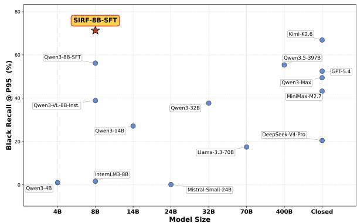  
Figure 1: Black (risky) Recall@P95 vs. model size, among included, logprob-available models under this deployment interface. SIRF-8B sits above all compared open-weight (4B– 400B) and closed-source models at the high-precision operating point. Excluded models: Claude, Doubao and GLM, whose APIs return no token logprobs, so no confidence ranking and hence no Recall@P can be computed; this is an interface limitation, not a capability judgment. Our core attribution to spec internalization does not rely on these cross-model comparisons but on the controlled 8B same-source study in Table 1.

2. A controlled attribution: a same-source comparison differing only in CPT, plus a percomponent corpus ablation (§4.3) isolating the gain to policy content rather than indomain tokens.

3. Transferability: light SFT moves the base to a new risk domain (∼70% relative mispenalization reduction).

4. Deployment evidence at second-level latency (13% prompt cut; +20% release), with general knowledge preserved and costs reported honestly.

## 2 Related Work

Synthetic CPT and spec internalization. Domain-adaptive pretraining (DAPT, Gururangan et al., 2020) continues training on domain corpora; EntiGraph (Yang et al., 2025b) synthesizes entity-relation text for synthetic CPT to internalize domain facts. Closest to us is the concurrent Model Spec Midtraining (MSM, Li et al., 2026), which midtrains on synthetic documents about a model spec to reduce misalignment. SIRF shares this internalize-then-demonstrate paradigm but differs in goal: MSM targets general alignment, whereas SIRF instantiates spec internalization for industrial risk-control policies under strict deployment constraints, with a controlled attribution study, online deployment and cross-domain transfer.

LLM data synthesis. Self-Instruct (Wang et al., 2023) self-distills instruction data; MAGA (Hao et al., 2025) expands corpora via multi-genre, multiaudience rewriting. SIRF specializes these for policy internalization, with label-leakage control.

Content moderation (guard models). Guard models from Llama Guard (Inan et al., 2023) and ShieldGemma (Zeng et al., 2024) to schemaconditioned classification (Zaratiana et al., 2026), together with Constitutional AI (Bai et al., 2022) and RAG (Lewis et al., 2020), all supply the policy online (via prompt, schema or retrieval) and focus on classification quality. SIRF instead internalizes it into the weights (no retrieval, verdictonly), targets the real operating point, and gives deployment evidence for an adjudication layer and cross-domain transfer.

Midtraining, data mixing, and schedule. Work on what to train on after pretraining and before alignment — domain reweighting (Xie et al., 2023), late-training domain upsampling (Blakeney et al., 2024) and midtraining recipes in open models (Team OLMo et al., 2024) — finds late-stage gains sensitive to mixture and schedule rather than token volume alone. SIRF instantiates this regime for a deployed risk-control spec at a small budget; §4.3 is the corresponding mixture-sensitivity check.

Selective classification. Abstaining below a confidence threshold is the classical error–reject tradeoff (Chow, 1970), formalized as selective classification with a coverage/risk curve (El-Yaniv and Wiener, 2010) and extended to deep networks (Geifman and El-Yaniv, 2017). Recall@P reads this trade-off in the direction operators care about: fix precision on the risky class, then ask how much of it can be auto-handled.

LLM confidence, calibration, and CoT faithfulness. LLMs’ verbalized confidence is often overconfident and poorly calibrated (Xiong et al., 2024; Tian et al., 2023), and CoT is often unfaithful, post-hoc rationalizing a decided conclusion (Turpin et al., 2023); querying the class token probability better reflects what the model knows (Kadavath et al., 2022), and guard-model calibration matters for deployment (Liu et al., 2025). Post-hoc calibration (temperature and Platt scaling (Guo et al., 2017), isotonic regression (Zadrozny and Elkan, 2002); see also Desai and Durrett, 2020) improves probability quality, but any strictly monotone recalibrator leaves Recall@P unchanged (§3.3, Appendix B): a re-thresholdable operating point needs a good ranking, not a low ECE. Hence SIRF’s use of the verbalizer first-token probability as the decision score.

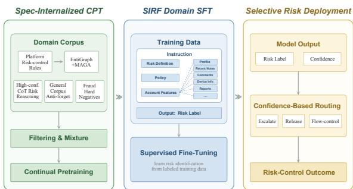  
Figure 2: The SIRF pipeline: Spec-Internalized CPT → Domain SFT → Selective Risk Deployment.

## 3 Method

SIRF’s training pipeline is: Base → policygrounded CPT (internalizing the policy specifications into the weights) → domain SFT → deployment (second-level, verdict-only) (Figure 2). We describe corpus synthesis, training configuration, and deployment in turn.

## 3.1 Policy Corpus Synthesis

We turn roughly a hundred structured policy specifications (each with trigger and exemption rules) into a multi-perspective risk-control knowledge corpus by automated synthesis, with no additional human annotation: an LLM pipeline builds the corpus from policy documents and account features, commissioning no new labelling effort (scope of that claim below).

Decompose, and decouple stable rules from volatile strategies. Since rules change often and retraining each time is costly, we decompose the policies into fine-grained underlying rules — the slow-changing judgment logic, e.g. why a behavior is fraud — and separate them from the volatile strategy layer (whether a risk type is active, how tight its threshold is). SIRF internalizes the stable rules into the CPT base and tracks the strategy layer via dynamic thresholds (§3.3) and light SFT, synthesizing along three lines.

(1) EntiGraph. For each policy we extract 6–15 key entities in 6 types (violating behavior, account feature, threshold, concept, user type, exemption), describe each with its boundaries and confusable distinctions, analyze cross-entity relations, generate trigger–exemption boundary samples, and expand into 7 perspectives (case analysis, counterexamples, misjudgment review).

(2) MAGA rewriting. We rewrite each policy in 5 genres × 4 audiences (engineer, moderator, appealing user, adversarial researcher) for expressive diversity.

(3) Account-level CoT distillation. We distill “feature → policy-clause → decision” chains from real account-level data with a Self-Evolving Account Data Agent (SEADA): a teacher LLM (Qwen3.5-397B-A17B) turns account features plus the decomposed rules into a three-stage chain (risksignal check → exemption check → verdict); an independent LLM-as-a-judge scores each chain for clause faithfulness; and a gate on trainability, self-consistency and confidence admits only high-quality samples. Samples carrying internalecosystem labels are removed, and no ground-truth disposition ever enters the data or the teacher’s context.

Outputs pass quality control (MD5 dedup, refusal detection, cleaning, label-balanced downsampling); generated text must be coherent, must not add rules beyond the policy, and must match the real business form.

Scope of the annotation claim. The chains terminate in a verdict, so their conclusions act as a weak supervision signal during CPT: selfgenerated from features and rules, never conditioned on the ground-truth disposition used for evaluation, and carried as fine-grained risk tags rather than the three-way evaluation label. The claim is “no new human labels,” not “no supervision” (see Limitations).

## 3.2 Training and Corpus

The CPT corpus totals ∼70M tokens (∼0.0002% of Qwen3’s ∼36T-token corpus; Yang et al., 2025a): risk-reasoning 46.7M (66.7%), structured policy knowledge 11.3M (16.1%), anti-forgetting general corpus 6.8M (9.8%) and public fraud hard negatives 5.2M (7.4%); ∼58M directly internalize the platform’s rules. Token share overstates how much of the corpus is CoT: by document count the CoT block is only 22,674/101,669 ≈ 22%, since one CoT document is far longer than a policyknowledge item. CPT uses next-token prediction for 1 epoch at a conservative LR (1e-5). The SFT input is {policy}\n{features} and the output is only the verdict, with loss on response tokens.

Base checkpoint and baseline fairness. All three 8B models — the zero-shot base, the SFT baseline (Qwen3-8B-SFT) and SIRF-8B-SFT — start from the identical checkpoint Qwen/Qwen3-VL-8B-Instruct, used as a textonly LLM with the vision tower frozen. The two fine-tuned arms share the same policy injection, the same verdict-only output form and exactly the same SFT data (40,989 samples, same sources and class balance, 3 epochs); the only difference is SIRF’s added CPT stage, which is what makes the gain attributable to it.

## 3.3 Deployment

Online risk control needs second-level responses and only a verdict, so SIRF is deployed verdictonly: the model emits the label and nothing else (4–5 tokens, no reasoning trace). Rule application is internalized during CPT, so high-precision judgment needs no intermediate reasoning, matching the SFT objective (no train/deploy gap).

Confidence: first-token verbalizer probability. Let $y _ { 1 }$ be the first token the model emits. The decision score is $c = p ( y _ { 1 } \mid x )$ , which under greedy decoding equals $\operatorname* { m a x } _ { v } p ( v \mid x )$ at that position. This one quantity is used throughout the paper and online; Appendix B compares it against an aggregate over label strings that we do not deploy. We avoid CoT confidence: the post-CoT class-token probability is shaped by the preceding generation and CoT is often unfaithful (Turpin et al., 2023), while verbalized confidence is generally overconfident (Xiong et al., 2024; Tian et al., 2023); the class token probability better reflects the model’s grasp (Kadavath et al., 2022). The score lets operators retune without retraining; online we cut at an extreme percentile of the score distribution (§5.1). To avoid a clash of notation, “Px” always denotes a precision constraint in this paper, and percentile cutoffs are written as $\tau _ { q }$ (q the percentile).

What the score must satisfy (and what it need not). Deployment needs not an absolutely calibrated probability but a ranking from which a high-precision operating point can be swept and re-thresholded without retraining. The distinction matters: Recall@P is invariant under any strictly monotone recalibration, so temperature or Platt scaling cuts the expected calibration error (ECE)

by 3–6× in our setting while leaving every operating point exactly where it was (Appendix B). Hence: inference uses greedy decoding under a fixed serving configuration, and thresholds are calibrated under it and fitted per model on each model’s own confidence distribution, never transferred; and since a few fine-grained labels share their first token, we record the first eight token probabilities and read the score at the first position that disambiguates the predicted class.

## 4 Experiments and Results

## 4.1 Experimental Setup

Task and datasets. The task is account-level three-way risk classification (Black, risky; White, benign; Gray, borderline) with 20+ fine subclasses. The main set $\scriptstyle ( n = 1 0 0 0 )$ follows the live production distribution of a large content-community platform: Black 596 / Gray 250 / White 154 over 25 fine classes (Appendix A), so the denominator behind Black Recall@P95 is 596; ground truth is the live disposition outcome plus a random human re-check. A balanced set (n=4638, ∼200 per fine class) is a robustness check (§4.5). Train/test split by time; data are de-identified with internal-ecosystem labels filtered out.

Metrics. The core metric is per-class Recall@P, a one-vs-rest sweep run independently per class rather than one global threshold: for class k we take the smallest score threshold $t _ { k } ^ { \star }$ at which the samples predicted k with score $\geq t _ { k } ^ { \star }$ reach precision $\geq P$ , and report the fraction of all gold-k samples it recovers (formal definition in Appendix $\mathbf { A } )$ .1 We focus on Black Recall@P90/P95, plus Macro-F1 and Accuracy; general ability uses 10 public benchmarks (§4.6) and efficiency uses time-to-first-token (TTFT), end-to-end latency, throughput (QPS) and KV-cache memory (§4.4).

Statistical reporting. A paired bootstrap with 1000 resamples gives ∆Black Recall@P95 = +15.1pp, 95% CI [+11.7, +18.5], positive in 1000/1000 resamples. Thresholds are fitted once on the full set and held fixed inside every resample, so the interval covers sampling variability of recall at a fixed operating point but not the variability of threshold selection. Two caveats follow. Thresholds are selected on the same $n { = } 1 0 0 0$ set on which recall is reported, which is optimistic;

transferred unchanged to the independent balanced set they still hold Black precision ≥ 95% (SIRF 95.7%). And Recall@P95 is a step quantity at a steep cutoff, so a few boundary samples can move it; we therefore rest not on a single P95 point but on the whole sweep (Figure 3), the balanced-set replication (Appendix C) and the multi-month deployment.

Compared models and fairness. We compare open-weight models (4B–400B) and closedsource models (GPT-5.4, Kimi-K2.6, Qwen3-Max, MiniMax-M2.7, DeepSeek-V4-Pro). All see the same prompt template and policy injection, use greedy decoding, and are thresholded on their own score distribution; the only interface difference is GPT-5.4’s top\_logprobs cap of 5 against 20 elsewhere. Models whose API returns no token logprobs (Claude, Doubao, GLM) are excluded — an interface limitation, not a capability judgment. Granularity also differs: distinct first-token probability values are 17.5% for GPT-5.4 versus 66– 76% elsewhere, so GPT-5.4’s identical B@P90 and B@P95 reflect a coarse interface, whereas for Kimi-K2.6 and Qwen3.5-397B the same pattern reflects a real ceiling on high-confidence purity. Crossmodel results corroborate but are not the central claim.

## 4.2 Main Results

SIRF-8B-SFT reaches 71.3 Black Recall@P95, +15.1 points over the same-source, verdict-only baseline Qwen3-8B-SFT (56.2), with Macro-F1 and Accuracy on par (Table 1).

Main findings. (i) Highest high-precision Black recall. Black Recall@P95 reaches 71.3, +15.1pp over Qwen3-8B-SFT and above every included logprob-available model — Kimi-K2.6 at 66.9, the 400B Qwen3.5-397B at 55.4 (Figure 1). (ii) The tighter the threshold, the larger the advantage. Black recall is flat over P80–P90 and only engages past ∼P93 (Figure 3): SIRF’s high-confidence samples are purer and hold recall under stricter precision, so the gap peaks at P95. (iii) The gain is from what was trained, not how much. 70M is ∼0.0002% of pretraining at LR 1e-5 and general ability is nearly unchanged (Figure 4); §4.3 shows policy-free in-domain tokens buy nothing, and Logit Lens corroborates the mechanism (Appendix F).

(iv) No loss of basic classification; the White regression is confined to the extreme cutoff. Macro-

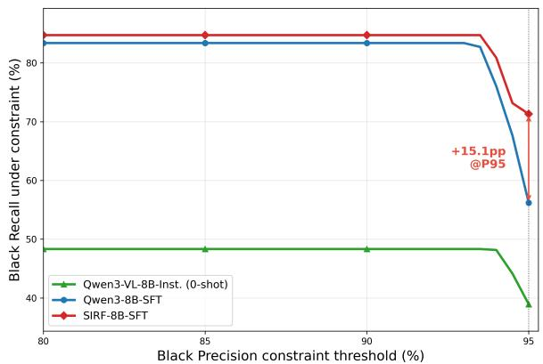  
Figure 3: Black recall vs. precision constraint for the three same-source 8B arms (Qwen3-VL-8B-Inst. → Qwen3-8B-SFT → SIRF-8B-SFT); the gap is largest at P95 (+15.1pp).

F1 (80.4 vs 81.9) and Accuracy (83.5 vs 84.0) are on par. White Recall@P95 drops (20.1 vs 27.3), in apparent tension with the release path of §5.1; sweeping the White operating point resolves this as a mismatch, not a conflict. At matched precision White recall is 68.2 vs 59.1 at P85 and 54.5 vs 46.8 at P90 (White precision 85.4/85.0, 90.3/90.0), so SIRF is the better White judge across the release band and loses only at the steepest cutoff — the same right-shift mechanism as (ii). Human-review load does not grow, since SIRF acts only on the two confident ends.

Confidence is higher and more usable as a threshold. SIRF’s top-1 score distribution shifts right of the baseline’s (mean 0.788→0.814), is higher on 662/1000 samples, and the lift concentrates where SIRF is correct rather than spreading as indiscriminate overconfidence (Appendices B and D). This underpins finding (ii) and the extreme online cutoffs (§5.1).

## 4.3 Where Does the Gain Come From? Per-Component CPT Ablation

Table 1 varies CPT as a single block, which supports “CPT helps” but not “the spec was internalized”: since account-level CoT dominates the corpus by token count, the gain could equally come from distilled in-domain reasoning. We therefore replaced the CPT corpus component by component, holding the base, the SFT data and schedule, and the evaluation set fixed. Black Recall@P95 is 56.2 with no CPT, 55.7 for domainonly (fraud plus general corpus, no policy), 64.6 for EntiGraph+MAGA only, 69.5 for CoT only, 70.6 without CoT and 71.3 for the full corpus; across arms B@P90 stays within 81.2–84.7 and Macro-F1 within 79.7–81.9 (Appendix G).

<table><tr><td>Model</td><td>B@P90</td><td>B@P95</td><td>W@P90</td><td>W@P95</td><td>G@P90</td><td>G@P95</td><td>M-F1</td><td>Acc</td></tr><tr><td>GPT-5.4</td><td>52.5</td><td>52.5</td><td>6.5</td><td>3.9</td><td>0.4</td><td>0.4</td><td>63.7</td><td>65.7</td></tr><tr><td>Kimi-K2.6</td><td>66.9</td><td>66.9</td><td>27.2</td><td>25.2</td><td>0.0</td><td>0.0</td><td>70.0</td><td>73.3</td></tr><tr><td>Qwen3-Max</td><td>49.5</td><td>49.5</td><td>1.9</td><td>1.9</td><td>2.4</td><td>2.4</td><td>61.6</td><td>63.3</td></tr><tr><td>MiniMax-M2.7</td><td>55.2</td><td>43.3</td><td>0.6</td><td>0.6</td><td>10.8</td><td>6.0</td><td>63.8</td><td>65.4</td></tr><tr><td>DeepSeek-V4-Pro</td><td>31.5</td><td>20.5</td><td>6.5</td><td>6.5</td><td>7.6</td><td>2.0</td><td>42.1</td><td>41.5</td></tr><tr><td>Qwen3.5-397B-A17B</td><td>55.4</td><td>55.4</td><td>39.2</td><td>30.1</td><td>3.6</td><td>2.0</td><td>66.2</td><td>68.1</td></tr><tr><td>Qwen3-VL-8B-Inst. (0-shot)</td><td>48.3</td><td>38.9</td><td>14.3</td><td>13.0</td><td>0.0</td><td>0.0</td><td>55.4</td><td>56.5</td></tr><tr><td>Qwen3-8B-SFT</td><td>83.4</td><td>56.2</td><td>46.8</td><td>27.3</td><td>32.8</td><td>18.0</td><td>81.9</td><td>84.0</td></tr><tr><td>SIRF-8B-SFT</td><td>84.7</td><td>71.3</td><td>54.5</td><td>20.1</td><td>32.4</td><td>19.2</td><td>80.4</td><td>83.5</td></tr></table>

Table 1: Main results (n=1000, Recall@P %). B/W/G = Black/White/Gray, M-F1 = Macro-F1; bold = best in column. Upper block: closed-source APIs and very large open-weight models; lower block: the 8B same-source comparison, all three arms starting from the same Qwen3-VL-8B-Instruct checkpoint (§3.2) and differing only in what training is applied. Only logprob-available models are included (§4.1). The central claim is the same-source Qwen3-8B-SFT vs. SIRF-8B-SFT comparison (differing only in CPT); cross-model numbers are corroboration under this interface, not a leaderboard.

This separates “what was trained” from “how much”. In-domain tokens on their own buy nothing: domain-only is indistinguishable from no CPT, although that is exactly the arm the “in-domain reasoning distillation” reading predicts should capture most of the gain. They are not inert once policy content is present (w/o CoT sits 6.0pp above EntiGraph+MAGA alone), but that difference is within the step-noise of the metric and we do not build on it. Both policy-carrying arms improve over no CPT — declarative (EntiGraph+MAGA) and procedural (account-level CoT, whose chains ground each verdict in policy clauses) — and the full corpus is highest, though the ablation does not order the two carriers. A mechanism check agrees: the CPT-only model (no SFT) emits policy codes such as “P-0” and cannot classify at all (100% non-classification first tokens), i.e., CPT installs policy knowledge and SFT the output routing (Appendix F).

## 4.4 Inference Efficiency

Internalization means the online prompt no longer needs the full policy to invoke the rules. We deploy a conservative reduced policy: trimming redundant phrasing while keeping all rule details, cutting the prompt by 13% (10.7k→9.0k characters of policy). B@P90 (84.7→84.6) and Accuracy (83.5→83.3) are essentially unchanged, while the strictest operating point costs 71.3→66.9 — stated plainly rather than as slight, since −4.4pp is about 30% of the headline gain.

Since the KV footprint is almost entirely the prompt, this maps directly to high-concurrency speedups: median end-to-end latency improves ↓8.8%/↓12.6%/↓18.2% at concurrency 16/32/100, QPS rises +14%–+23% for concurrency ≥16, and per-request KV cache drops ∼13%, raising the maximum concurrency from 381 to 436 (Appendix E).

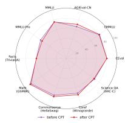  
(a) 8B

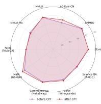  
(b) 14B

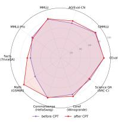  
(c) 32B  
Figure 4: Anti-forgetting radars at 8B, 14B, and 32B: general ability before/after CPT almost fully overlaps.

## 4.5 Per-Class Diagnosis

Deployment also depends on per-subclass behavior, which sets operators’ disposition confidence per risk class. On the balanced set’s 24 fine classes, SIRF gains $\Delta \geq + 3$ on 6, loses on 4 and is flat on the rest, with class-average recall on par with the baseline; gains concentrate on high-risk classes (infant conditioning +8.8, qualification documents +6.6, debt relief and fund recovery +6.5) while drops are mostly low-risk types (per-class table in Appendix C). With ∼200 samples per class the claim is consistency of direction, not per-class significance: deltas of +4 to +6.6 are within sampling noise and only the largest are individually meaningful.

## 4.6 General-Knowledge Retention

Does domain CPT harm general knowledge? We evaluate before/after CPT at 8B / 14B / 32B on 10 public benchmarks: C-Eval (Huang et al., 2023), CMMLU (Li et al., 2024), AGIEval-CN (Zhong et al., 2024), MMLU (Hendrycks et al., 2020), MMLU-Pro (Wang et al., 2024), GSM8K (Cobbe et al., 2021), HellaSwag (Zellers et al., 2019), WinoGrande (Sakaguchi et al., 2021), ARC-Challenge (Clark et al., 2018), TriviaQA (Joshi et al., 2017). The radars overlap almost fully at every scale (Figure 4): at 8B most benchmarks are flat or slightly up (AGIEval-CN +4.8, GSM8K +2.2, HellaSwag +2.9) and only MMLU-Pro drops (−3.6); this holds at 14B / 32B. Targeted internalization at this budget therefore costs little general ability, which is what makes the base transferable. Text-only CPT does weaken instruction-following (see Limitations), which matters little for a verdictonly deployment.

## 5 Production Deployment Evidence

SIRF is deployed in two online domains: (a) flow control (SIRF as a tree-model adjudication layer) and (b) freezing (cross-domain transfer), both running for multiple months with no degradation of the high-precision gains. For compliance we report relative magnitudes, the order of magnitude of affected traffic, the runtime in months and the randomization scheme, but not absolute volumes, business impact, exact thresholds, per-channel breakdowns or confidence intervals. This section corroborates that the system works in production rather than measuring an effect size; the quantitative claims rest on §4.

## 5.1 Flow Control: Adjudication Layer

After a coarse hit by the tree model, SIRF adjudicates again (Figure 2) under ultra-conservative per-class cutoffs, routing hit traffic three ways — auto-escalate high-confidence Black, release highconfidence White, keep the rest under the original flow control. Each cutoff is set on its own class’s score distribution (Black at the τ99 percentile of the Black scores, White analogously), so the two autohandled arms come from different sub-populations, not from one top-1% slice of all hits. On hit traffic at the hundred-thousand-user scale, auto-escalation covers about 10% of all hits and release recovers good samples equivalent to +20% of the tree model’s original false positives.

Why Gray is never auto-disposed. Gray recall at strict precision is low for every model in Table 1 (0–19.2 at P95). This is a property of the class, not a defect: Gray is the “undecided” bucket, so its score mass sits mid-distribution and no useful threshold exists. Gray therefore stays in the original tree-model flow — practitioners should route a Gray-like class, not threshold it.

Which White operating point the release path uses. The release arm needs high White precision and runs in the P85–P90 band, not at the P95 cutoff — exactly the band where SIRF beats the baseline on White recall at matched precision. That is the mechanism behind the +20% release figure, and why the White Recall@P95 regression adds no human-review volume: mid-confidence White cases were never in the auto-release path.

## 5.2 Freezing: Cross-Domain Transfer

We transfer the same SIRF base to the freezing domain with only light in-domain SFT and no CPT rerun: mis-penalization drops by about 70% relatively, releasing a cumulative million-user scale online.

An online A/B experiment validates these released users: a random split into treatment (SIRF adjudication with high-confidence releases) and control (original policy) over the same population and window, with no other model or policy change rolled out and no significant between-arm shift in traffic mix, upstream thresholds or seasonal events. The treatment group is significantly better on core metrics such as weekly active penetration (a relative lift in the high-single-digit to low-double-digit range), showing SIRF recovers mis-frozen highvalue active users.

This is a first validation of SIRF as a risk foundation model (multi-domain transfer is future work), confirming the introduction’s motivation: fewer false positives directly improve normal users’ experience and activity.

## 6 Conclusion

SIRF internalizes a platform’s risk-control policies into the weights with only 70M synthesized tokens, so that under second-level latency and verdict-only output it recalls more risk at the high-precision operating point (+15.1pp Black Recall@P95 over the same-source baseline) while preserving general knowledge, with a per-component ablation attributing the gain to policy content rather than extra in-domain tokens. A spec-internalized base fits industrial risk control better than pursuing average accuracy.

## Limitations

Sensitivity of the operating-point metric. Black Recall@P95 is a steep-cutoff quantity and is therefore sensitive to a few boundary samples at n=1000. We consequently do not rest on that single point but on combined evidence: consistent dominance across P80–P95, the fixedthreshold paired difference (+15.1pp, 95% CI [+11.7, +18.5]), the balanced-set replication (Appendix C) and the multi-month deployment. The thresholds are also fitted and evaluated on the same set; transferred unchanged to the independent balanced set they still hold Black precision ≥ 95%. A larger, multi-period evaluation set remains future work.

Supervision. CPT uses no additional human annotation, but the SEADA chains terminate in verdicts that act as a self-generated, quality-gated weak supervision signal (§3.1); the ground-truth disposition never enters the data or the teacher’s context.

The score is a ranking, not a probability. Recall@P is invariant to any strictly monotone recalibration, so absolute calibration was never the design target; diagnostics are reported in Appendix B for completeness. A post-hoc calibrator, or a marginal aggregation over label strings, is an orthogonal enhancement rather than a prerequisite for the deployed operating point.

Costs of the deployed stance. Text-only CPT preserves knowledge and reasoning but weakens instruction-following (§4.6); this is tolerable because deployment emits a single verdict. The reduced policy trades −4.4pp at P95 (71.3→66.9, roughly 30% of the same-source gain) for a 13% prompt cut.

Scope and reproducibility. Comparison coverage is interface-limited: Claude, Doubao and GLM return no token logprobs and could not be included. All experiments use the policies of a single Chineselanguage platform, and the foundation-model claim rests on a first transfer scenario (§5.2). The data are proprietary and no code or model is released; we document the prompt structure and serialization conventions instead (Appendix H).

## Ethical Considerations

Content risk control directly affects users’ speech and account rights, and a misjudgment may wrongly penalize a legitimate user, so the boundary and accountability of automated decisions are especially important. SIRF adopts ultra-conservative thresholds online, concentrating automatic execution on the samples the model is most confident about, to reduce false-positive risk. On data, the account data used for training and evaluation are anonymized and used only for risk assessment, with no individual profiling or secondary use. We also note that policies and labels may carry the value judgments and preferences of a specific platform, so the model may perform unevenly across populations or content types; when transferring SIRF to other platforms or scenarios, its fairness should be re-examined and the policy re-calibrated. Finally, a risk-control system faces the dual risks of over-enforcement that harms legitimate users and under-blocking that harms the ecosystem; the trade-off should be decided jointly by the specific business’s value orientation and human oversight, rather than left entirely to the model.

## Acknowledgments

We thank the anonymous reviewers for their constructive comments. We also thank our colleagues on the risk-control engineering and operations teams for supporting the online deployment and the A/B evaluation.

## References

Yuntao Bai, Saurav Kadavath, Sandipan Kundu, Amanda Askell, Jackson Kernion, Andy Jones, Anna Chen, Anna Goldie, Azalia Mirhoseini, Cameron McKinnon, Carol Chen, Catherine Olsson, Christopher Olah, Danny Hernandez, Dawn Drain, Deep Ganguli, Dustin Li, Eli Tran-Johnson, Ethan Perez, and 32 others. 2022. Constitutional AI: Harmlessness from AI feedback. arXiv preprint arXiv:2212.08073.

Cody Blakeney, Mansheej Paul, Brett W Larsen, Sean Owen, and Jonathan Frankle. 2024. Does your data spark joy? performance gains from domain upsampling at the end of training. arXiv preprint arXiv:2406.03476.

Chao Chow. 1970. On optimum recognition error and reject tradeoff. IEEE Transactions on information theory, 16(1):41–46.

Peter Clark, Isaac Cowhey, Oren Etzioni, Tushar Khot, Ashish Sabharwal, Carissa Schoenick, and Oyvind Tafjord. 2018. Think you have solved question answering? Try ARC, the AI2 reasoning challenge. arXiv preprint arXiv:1803.05457.

Karl Cobbe, Vineet Kosaraju, Mohammad Bavarian, Mark Chen, Heewoo Jun, Lukasz Kaiser, Matthias Plappert, Jerry Tworek, Jacob Hilton, Reiichiro Nakano, Christopher Hesse, and John Schulman. 2021. Training verifiers to solve math word problems. arXiv preprint arXiv:2110.14168.

Shrey Desai and Greg Durrett. 2020. Calibration of pre-trained transformers. In Proceedings ofthe 2020 Conference on Empirical Methods in Natural Language Processing (EMNLP), pages 295–302.

Ran El-Yaniv and Yair Wiener. 2010. On the foundations of noise-free selective classification. Journal of Machine Learning Research, 11(5).

Yonatan Geifman and Ran El-Yaniv. 2017. Selective classification for deep neural networks. Advances in neural information processing systems, 30.

Chuan Guo, Geoff Pleiss, Yu Sun, and Kilian Q Weinberger. 2017. On calibration of modern neural networks. In International conference on machine learning, pages 1321–1330. PMLR.

Suchin Gururangan, Ana Marasovic, Swabha´ Swayamdipta, Kyle Lo, Iz Beltagy, Doug Downey, and Noah A Smith. 2020. Don’t stop pretraining: Adapt language models to domains and tasks. In Proceedings of the 58th annual meeting of the association for computational linguistics, pages 8342–8360.

Xintong Hao, Ruijie Zhu, Ge Zhang, Ke Shen, and Chenggang Li. 2025. Reformulation for pretraining data augmentation. arXiv preprint arXiv:2502.04235.

Dan Hendrycks, Collin Burns, Steven Basart, Andy Zou, Mantas Mazeika, Dawn Song, and Jacob Steinhardt. 2020. Measuring massive multitask language understanding. arXiv preprint arXiv:2009.03300.

Yuzhen Huang, Yuzhuo Bai, Zhihao Zhu, Junlei Zhang, Jinghan Zhang, Tangjun Su, Junteng Liu, Chuancheng Lv, Yikai Zhang, Jiayi Lei, Yao Fu, Maosong Sun, and Junxian He. 2023. C-Eval: A multi-level multi-discipline Chinese evaluation suite for foundation models. Advances in neural information processing systems, 36:62991–63010.

Hakan Inan, Kartikeya Upasani, Jianfeng Chi, Rashi Rungta, Krithika Iyer, Yuning Mao, Michael Tontchev, Qing Hu, Brian Fuller, Davide Testuggine, and Madian Khabsa. 2023. Llama Guard: LLMbased input-output safeguard for human-AI conversations. arXiv preprint arXiv:2312.06674.

Mandar Joshi, Eunsol Choi, Daniel S Weld, and Luke Zettlemoyer. 2017. TriviaQA: A large scale distantly supervised challenge dataset for reading comprehension. In Proceedings of the 55th Annual Meeting of the Associationfor Computational Linguistics (Volume 1: Long Papers), pages 1601–1611.

Saurav Kadavath, Tom Conerly, Amanda Askell, Tom Henighan, Dawn Drain, Ethan Perez, Nicholas Schiefer, Zac Hatfield-Dodds, Nova DasSarma, Eli Tran-Johnson, Scott Johnston, Sheer El-Showk, Andy Jones, Nelson Elhage, Tristan Hume, Anna Chen, Yuntao Bai, Sam Bowman, Stanislav Fort, and 17 others. 2022. Language models (mostly) know what they know. arXiv preprint arXiv:2207.05221.

Patrick Lewis, Ethan Perez, Aleksandra Piktus, Fabio Petroni, Vladimir Karpukhin, Naman Goyal, Heinrich Küttler, Mike Lewis, Wen-tau Yih, Tim Rocktäschel, Sebastian Riedel, and Douwe Kiela. 2020.

Retrieval-augmented generation for knowledgeintensive NLP tasks. Advances in neural information processing systems, 33:9459–9474.

Chloe Li, Nevan Wichers, Sara Price, Samuel Marks, and Jon Kutasov. 2026. Model spec midtraining: Improving how alignment training generalizes. arXiv preprint arXiv:2605.02087.

Haonan Li, Yixuan Zhang, Fajri Koto, Yifei Yang, Hai Zhao, Yeyun Gong, Nan Duan, and Timothy Baldwin. 2024. CMMLU: Measuring massive multitask language understanding in Chinese. In Findings of the Associationfor Computational Linguistics: ACL 2024, pages 11260–11285.

Hongfu Liu, Hengguan Huang, Xiangming Gu, Hao Wang, and Ye Wang. 2025. On calibration of LLMbased guard models for reliable content moderation. In International Conference on Learning Representations, volume 2025, pages 67808–67829.

Keisuke Sakaguchi, Ronan Le Bras, Chandra Bhagavatula, and Yejin Choi. 2021. WinoGrande: An adversarial Winograd schema challenge at scale. Communications ofthe ACM, 64(9):99–106.

Team OLMo, Pete Walsh, Luca Soldaini, Dirk Groeneveld, Kyle Lo, Shane Arora, Akshita Bhagia, Yuling Gu, Shengyi Huang, Matt Jordan, Nathan Lambert, Dustin Schwenk, Oyvind Tafjord, Taira Anderson, David Atkinson, Faeze Brahman, Christopher Clark, Pradeep Dasigi, Nouha Dziri, and 24 others. 2024. 2 OLMo 2 Furious. arXiv preprint arXiv:2501.00656.

Katherine Tian, Eric Mitchell, Allan Zhou, Archit Sharma, Rafael Rafailov, Huaxiu Yao, Chelsea Finn, and Christopher D Manning. 2023. Just ask for calibration: Strategies for eliciting calibrated confidence scores from language models fine-tuned with human feedback. In Proceedings of the 2023 Conference on Empirical Methods in Natural Language Processing, pages 5433–5442.

Miles Turpin, Julian Michael, Ethan Perez, and Samuel Bowman. 2023. Language models don’t always say what they think: Unfaithful explanations in chain-ofthought prompting. Advances in Neural Information Processing Systems, 36:74952–74965.

Yizhong Wang, Yeganeh Kordi, Swaroop Mishra, Alisa Liu, Noah A Smith, Daniel Khashabi, and Hannaneh Hajishirzi. 2023. Self-Instruct: Aligning language models with self-generated instructions. In Proceedings ofthe 61st annual meeting ofthe associationfor computational linguistics (volume 1: long papers), pages 13484–13508.

Yubo Wang, Xueguang Ma, Ge Zhang, Yuansheng Ni, Abhranil Chandra, Shiguang Guo, Weiming Ren, Aaran Arulraj, Xuan He, Ziyan Jiang, Tianle Li, Max Ku, Kai Wang, Alex Zhuang, Rongqi Fan, Xiang Yue, and Wenhu Chen. 2024. MMLU-Pro: A more robust and challenging multi-task language understanding benchmark. Advances in Neural Information Processing Systems, 37:95266–95290.

Sang Michael Xie, Hieu Pham, Xuanyi Dong, Nan Du, Hanxiao Liu, Yifeng Lu, Percy S Liang, Quoc V Le, Tengyu Ma, and Adams Wei Yu. 2023. DoReMi: Optimizing data mixtures speeds up language model pretraining. Advances in Neural Information Processing Systems, 36:69798–69818.

Miao Xiong, Zhiyuan Hu, Xinyang Lu, Yifei Li, Jie Fu, Junxian He, and Bryan Hooi. 2024. Can LLMs express their uncertainty? an empirical evaluation of confidence elicitation in LLMs. In International Conference on Learning Representations, volume 2024, pages 23650–23678.

An Yang, Anfeng Li, Baosong Yang, Beichen Zhang, Binyuan Hui, Bo Zheng, Bowen Yu, Chang Gao, Chengen Huang, Chenxu Lv, Chujie Zheng, Dayiheng Liu, Fan Zhou, Fei Huang, Feng Hu, Hao Ge, Haoran Wei, Huan Lin, Jialong Tang, and 41 others. 2025a. Qwen3 technical report. arXiv preprint arXiv:2505.09388.

Zitong Yang, Neil Band, Shuangping Li, Emmanuel Candes, and Tatsunori Hashimoto. 2025b. Synthetic continued pretraining. In International Conference on Learning Representations, volume 2025, pages 44379–44421.

Bianca Zadrozny and Charles Elkan. 2002. Transforming classifier scores into accurate multiclass probability estimates. In Proceedings of the eighth ACM SIGKDD international conference on Knowledge discovery and data mining, pages 694–699.

Urchade Zaratiana, Mary Newhauser, George Hurn-Maloney, and Ash Lewis. 2026. GLiGuard: Schemaconditioned classification for LLM safeguard. arXiv preprint arXiv:2605.07982.

Rowan Zellers, Ari Holtzman, Yonatan Bisk, Ali Farhadi, and Yejin Choi. 2019. HellaSwag: Can a machine really finish your sentence? In Proceedings ofthe 57th annual meeting ofthe associationfor computational linguistics, pages 4791–4800.

Wenjun Zeng, Yuchi Liu, Ryan Mullins, Ludovic Peran, Joe Fernandez, Hamza Harkous, Karthik Narasimhan, Drew Proud, Piyush Kumar, Bhaktipriya Radharapu, Olivia Sturman, and Oscar Wahltinez. 2024. Shield-Gemma: Generative AI content moderation based on Gemma. arXiv preprint arXiv:2407.21772.

Lianmin Zheng, Liangsheng Yin, Zhiqiang Xie, Chuyue Sun, Jeff Huang, Cody H Yu, Shiyi Cao, Christos Kozyrakis, Ion Stoica, Joseph E Gonzalez, Clark W Barrett, and Ying Sheng. 2024. SGLang: Efficient execution of structured language model programs. Advances in neural information processing systems, 37:62557–62583.

Wanjun Zhong, Ruixiang Cui, Yiduo Guo, Yaobo Liang, Shuai Lu, Yanlin Wang, Amin Saied, Weizhu Chen, and Nan Duan. 2024. AGIEval: A human-centric benchmark for evaluating foundation models. In Findings ofthe associationfor computational linguistics: NAACL 2024, pages 2299–2314.

## A Evaluation Protocol and Set Composition

Formal definition of Recall@P. Let $\hat { y } _ { i }$ be the predicted label, $y _ { i }$ the gold label and $c _ { i }$ the decision score (§3.3) of sample i. For class k and target precision $P ,$ , let $A _ { k } ( t ) = \{ i : \hat { y } _ { i } = k , \ c _ { i } \geq t \}$ be the accepted set at threshold $t ,$ with precision $\mathrm { p r e c } _ { k } ( t ) = | \{ i \in A _ { k } ( t ) : y _ { i } = k \} | / | A _ { k } ( t ) |$ . Then

$$
\begin{array} { r l r } & { } & { t _ { k } ^ { \star } = \operatorname* { m i n } \{ t : \mathrm { p r e c } _ { k } ( t ) \geq P \} , } \\ & { } & { \mathrm { R e c a l l } @ P ( k ) = \frac { | \{ i \in A _ { k } ( t _ { k } ^ { \star } ) : y _ { i } = k \} | } { | \{ i : y _ { i } = k \} | } . } \end{array}
$$

Taking the smallest feasible t makes the accepted set as large as the precision constraint allows. Each class is thresholded on its own score distribution, and each model on its own; no threshold is shared across classes or transferred across models.

The main set (n=1000) is a productiondistribution sample from a single time window. Its three-way composition is Black 596 / Gray 250 / White 154, so the denominators of the Recall@P columns in Table 1 are 596, 250 and 154 respectively; its ground truth is the live disposition outcome plus a random human re-check. Under the mapping used throughout, the single undisclosedmerchant subclass forms Gray, the benign class forms White, and the remaining 23 fine-grained subclasses form Black.

Because that production distribution is heavily long-tailed, the smaller Black subclasses carry too few samples for per-subclass conclusions on this set, so we make none: all per-subclass analysis (§4.5) uses the balanced set instead, which holds ∼200 samples per fine class by construction. The three-way supports above are what the headline metrics depend on, and they are large enough for the Black and Gray columns; the White column rests on 154 samples and should be read with that in mind.

## B Calibration and Confidence Variants

This appendix reports calibration diagnostics for the decision score and compares it against equally cheap alternatives (Table 2). The result is worth stating bluntly: SIRF is less well calibrated in absolute terms than its same-source baseline, and this does not affect the operating point.

Three findings. (i) SIRF is more over-confident: its ECE rises from 0.128 to 0.176, because CPT raises confidence across the board while accuracy stays flat. (ii) Monotone recalibration is free but useless here: Platt and temperature scaling reduce ECE by 3.4× for the baseline and 6.1× for SIRF, yet they are strictly increasing functions of the raw score and therefore leave Recall@P at every precision level exactly unchanged — a re-thresholdable operating point depends on the ranking, not on the probability values, which is why we keep the raw score online and why a low ECE was never the design target. (iii) The aggregation matters more than the calibrator: summing the first-token probability mass over all label strings of a class (“marginal over labels”) is equally cheap, better calibrated, and changes the ranking, unlike the monotone calibrators. We did not use it in the deployed system, whose thresholds were calibrated on the first-token score, but we recommend it as the default for anyone reusing this recipe.

<table><tr><td>Score</td><td>Model</td><td>ECE</td><td>Brier</td></tr><tr><td>first-token prob.</td><td>Qwen3-8B-SFT SIRF-8B-SFT</td><td>0.128 0.176</td><td>0.197 0.214</td></tr><tr><td>+ Platt scaling</td><td>Qwen3-8B-SFT SIRF-8B-SFT</td><td>0.038 0.029</td><td></td></tr><tr><td>+ isotonic</td><td>Qwen3-8B-SFT SIRF-8B-SFT</td><td>0.033 0.034</td><td></td></tr><tr><td>marginal over labels</td><td>Qwen3-8B-SFT SIRF-8B-SFT</td><td>0.081 0.086</td><td>0.123 0.131</td></tr></table>

Table 2: Calibration of the decision score (n=1000, 10 equalwidth bins, correctness of the emitted fine-grained label). Posthoc calibrators are fitted on one random half and evaluated on the other. Temperature scaling behaves like Platt scaling and is omitted.

## C Balanced-Set Replication

The balanced set (n=4638, ∼200 per fine class) is a complementary robustness check. Table 3 gives its numbers. The direction of the same-source comparison is reproduced (SIRF above Qwen3-8B-SFT, both far above the zero-shot base) with a much smaller margin than on the production-distribution set, and Recall@P90 equals Recall@P95 for every model here, i.e., the precision constraint is not binding on this distribution. Thresholds fitted on the main set and transferred unchanged to this set still hold Black precision ≥ 95% (SIRF 95.7%), which is the cross-dataset check referenced in §4.1.

Table 4 lists the six most-improved fine classes referenced in §4.5.

## D Confidence-Reliability Analysis

This appendix gives the full first-token confidence analysis summarized in §4.2. Against the same-source baseline Qwen3-8B-SFT, we observe four consistent signals. (i) Overall right-shift: SIRF’s top-1 probability mean 0.788→0.814, median 0.851→0.900, with the empirical cumulative distribution function (ECDF) to the right over the whole range (Figure 5a) and more mass in the highconfidence bins (Figure 6a). (ii) Per-sample dominance: SIRF exceeds the baseline on 662/1000 samples, with most points above the diagonal (Figure 5b). (iii) The lift aligns with reliability: it is largest where SIRF alone is correct (+0.045) and modest when both are correct (+0.020), not indiscriminate overconfidence. (iv) Cross-label consistency: SIRF’s mean confidence exceeds the baseline on most high-frequency labels (Figure 6b), with only a very few classes flat or slightly lower. Together these underpin finding 2 and the extreme percentile cutoff used online (§5.1).

<table><tr><td>Model</td><td>B@P90</td><td>B@P95</td></tr><tr><td>Qwen3-VL-8B-Inst. (0-shot)</td><td>42.0</td><td>42.0</td></tr><tr><td>Qwen3-8B-SFT</td><td>78.1</td><td>78.1</td></tr><tr><td>SIRF-8B-SFT</td><td>79.5</td><td>79.5</td></tr><tr><td>SIRF-14B-SFT</td><td>78.8</td><td>78.8</td></tr><tr><td>SIRF-32B-SFT</td><td>79.1</td><td>79.1</td></tr></table>

Table 3: Black Recall@P on the balanced set (n=4638).

<table><tr><td>Model</td><td>C1</td><td>C2</td><td>C3</td><td>C4</td><td>C5</td><td>C6</td></tr><tr><td>Qwen3-8B-SFT</td><td>4.1</td><td>6.7</td><td>11.0</td><td>0.0</td><td>35.0</td><td>70.5</td></tr><tr><td>SIRF-8B-SFT</td><td>12.9</td><td>13.3</td><td>17.5</td><td>6.5</td><td>40.0</td><td>74.5</td></tr><tr><td>∆</td><td>+8.8</td><td>+6.6</td><td>+6.5</td><td>+6.5</td><td>+5.0 +4.0</td><td></td></tr></table>

Table 4: Per-class Recall@P95 on the balanced set, the 6 most-improved classes, ∆ = SIRF − baseline. C1–C6: infant conditioning, qualification documents, debt relief, fund recovery, counterfeit marketing, fortune-telling.

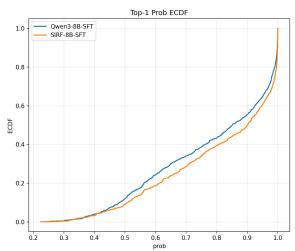  
(a) Top-1 probability ECDF.

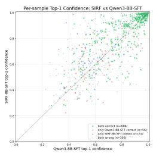  
(b) Per-sample scatter.  
Figure 5: First-token top-1 confidence: (a) SIRF’s ECDF is right-shifted over the whole range; (b) per-sample scatter (quadrant-colored), most points above the diagonal.

## E Efficiency Curves

This appendix gives the per-concurrency numbers (Table 5) and the full curves of the §4.4 efficiency experiments. The main text reports only a few representative concurrency points; here we show the full prompt-length distribution (Figure 7) and the absolute curves of each efficiency metric vs. concurrency (Figures 8 and 9), to let readers verify the trend and robustness of the gains.

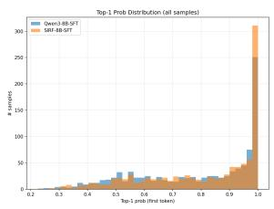  
(a) Top-1 probability histogram.

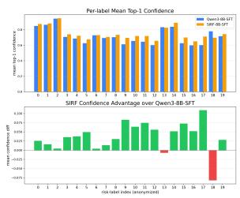  
(b) Per-label mean confidence.

Figure 6: (a) SIRF has more mass in high-confidence bins; (b) per-label mean top-1 confidence with SIRF’s advantage consistent across labels.  
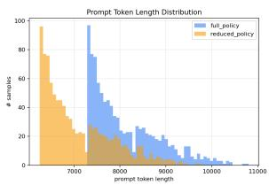

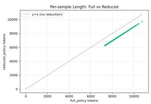  
Figure 7: Prompt token-length distribution (full vs. reduced): the distributions have the same shape and only shift left, i.e., reduction is an approximately proportional trim per prompt.

<table><tr><td>Concurrency</td><td>TTFT</td><td>E2E lat. (p50)</td><td>QPS</td></tr><tr><td>1</td><td>↓5.6%</td><td>↓2.6%</td><td>↑78.5%</td></tr><tr><td>16</td><td>↓26.8%</td><td>↓8.8%</td><td>↑18.9%</td></tr><tr><td>32</td><td>↓3.6%</td><td>↓12.6%</td><td>↑22.5%</td></tr><tr><td>64</td><td>↓10.3%</td><td>↓12.5%</td><td>↑14.3%</td></tr><tr><td>100</td><td>↓17.0%</td><td>↓18.2%</td><td>↑23.2%</td></tr></table>

Table 5: Relative inference-performance improvement of reduced vs. full policy at different concurrency. TTFT and endto-end latency are medians (p50). The stable gain of prompt reduction appears in the production-relevant high-concurrency range (≥16); the single-concurrency QPS is noisy and for reference only.

Setup. We compare two online tiers: full policy (full policy, mean single-prompt 8122 tokens) and reduced policy (reduced tier, trimming only redundant phrasing while keeping all rule details, mean 7093 tokens, ↓13%). Both use the same SIRF-8B model and the same evaluation set (n=1000). Stress testing runs on SGLang (Zheng et al., 2024), hardware 8×L20Y, tensor parallel TP=8, max\_running\_requests=400, classification output ≈4–5 tokens; concurrency ∈ {1, 4, 16, 32, 64, 100}, 200 requests per tier per concurrency with 5 warmup. Unless noted, TTFT and end-to-end latency are medians (p50); we also report p90 to reflect the tail. The singleconcurrency tier is noisy, so its QPS is for reference only; production cares about the ≥16 highconcurrency range.

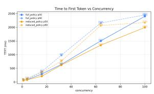

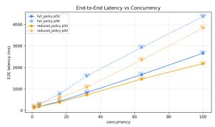  
(a) TTFT vs. concurrency.  
(b) End-to-end latency vs. concurrency.

Figure 8: Latency vs. concurrency (p50/p90). (a) In the highconcurrency range (≥16) the reduced tier’s TTFT is stably lower, with the p90 gap exceeding p50 (larger gains on tail latency). (b) End-to-end latency improvement grows monotonically with concurrency, reaching ∼↓18% p50 at 100.  
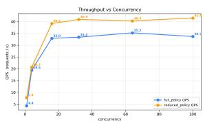

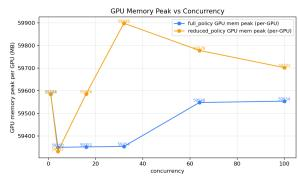  
(a) Throughput (QPS).  
(b) Peak GPU memory (per card).  
Figure 9: Throughput and memory vs. concurrency. (a) In the high-concurrency range the reduced tier’s QPS is stably higher (+14%–+23%); the single-concurrency point is reference only. (b) Memory is not the bottleneck in this range; the value of reduction shows up as a higher concurrency ceiling under the same budget.

Overall, the five figures consistently corroborate the §4.4 conclusion from four dimensions (prompt distribution, latency, throughput, memory capacity): a mere 13% token reduction, with a quantified 4.4pp B@P95 trade-off while preserving B@P90 and accuracy (§4.4), yields stable high-concurrency latency and throughput gains, and leaves headroom for scaling concurrency.

## F Interpretability via Logit Lens

Sections 4.2–4.4 argue SIRF’s effectiveness from external metrics (Black recall, latency and throughput); this appendix gives mechanism-level evidence from internal representations, answering: where exactly does CPT “learn” the policy into the model? Our conclusion: CPT not only fixes the behavior at the final output, but injects policy-clausecorresponding semantic signals into mid-to-late representation layers; SFT builds the routing for “emitting the decision label at the output position.” Neither alone suffices; combined, SFT’s learned routing lands on CPT’s injected, policy-aligned representations.

Method: Logit Lens. We probe the model with Logit Lens: project the residual stream (at the position about to predict the next token, after each transformer block) back to the vocabulary through the model’s own final LayerNorm and lm\_head, obtaining that layer’s vocabulary distribution. Reading the probability of the “decision-label first-character” token shows in how many layers and with what strength the correct decision signal emerges. We use the same dialogue template as in training/inference and set the probe at the first token of the decision label, ensuring samedistribution with deployment. To verify reliability, we checked the last-layer prediction against the model’s actual inference output, with a 97.6% agreement on the decision-label first character, indicating Logit Lens faithfully reflects the model’s real computation path.

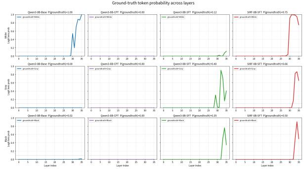  
Figure 10: Ground-truth label probability across layers for three representative samples and four models. Rows: true label (White, Gray, Black); columns: model (Base, CPT, SFT, SIRF). Each subplot plots the “correct-label first character” probability under Logit Lens per layer; the dashed line is the emergence threshold 0.1, and the title’s P(groundtruth) is the final-layer probability.

2 × 2 factorial model matrix. To cleanly separate the contributions of CPT and SFT, we probe four models the same way: Base (the shared checkpoint Qwen3-VL-8B-Instruct, §3.2), CPT (Base+CPT), SFT (Base+SFT), SIRF (Base+CPT+SFT, main model). The target tokens for decision labels and the policy-keyword list are pre-registered in a config before the experiment, forbidden to be adjusted post-hoc, to rule out cherry-picking.

Figure 10 reveals three key phenomena:

1. CPT improves signal “strength,” not “earlier appearance.” In the Gray and Black rows, the correct-label signal for both SFT and SIRF emerges near L30, but SIRF’s final-layer probability is markedly higher (Gray: 0.66 vs 0.40; Black: 0.50 vs 0.35). So CPT’s contribution is not earlier emergence but stronger, more robust signal after emergence, consistent with the intuition that CPT injects more stable semantic representations.

2. CPT alone does not emit labels (“knowledge but no routing”). The CPT column has nearzero correct-label probability throughout, with its final prediction often on irrelevant tokens such as markdown title symbols. This shows CPT changed the model’s knowledge and expression preferences but did not build the structural mapping of “outputting the decisionlabel first character at the assistant start”; this routing is learned only by SFT.

3. SFT builds routing but is easily hijacked by surface cues; CPT+SFT is stable. The SFT column gives the correct label at the end but with lower probability and is sometimes biased to a wrong label by surface cues; the SIRF column (CPT+SFT) gives the highest, cleanest correct signal on all three classes. This is the internal mechanism corresponding to SIRF recalling more risk than SFT at the high-precision operating point in §4.2.

Caveats. Logit Lens reflects only the token probability after projecting the residual to the vocabulary; it is evidence of CPT-induced layer-wise emergence rather than a strict “feature localization,” and the decision signal is approximated by the label first character (a few labels sharing a first character have slight confusion). These do not affect the above cross-model relative comparison, but validation with larger scale and stronger causal methods is future work.

## G Per-Component CPT Ablation

Table 6 is the full version of the ablation summarized in §4.3, together with the training recipe shared by all arms.

<table><tr><td>CPT corpus</td><td>B@P95 B@P90</td><td>M-F1</td></tr><tr><td>no CPT (Qwen3-8B-SFT)</td><td>56.2</td><td>83.4 81.9</td></tr><tr><td>domain-only (no policy)</td><td>55.7</td><td>83.6 80.4</td></tr><tr><td>EntiGraph+MAGA only</td><td>64.6</td><td>83.2 80.7</td></tr><tr><td>CoT only</td><td>69.5</td><td>83.6 80.9</td></tr><tr><td>w/o CoT</td><td>70.6</td><td>81.2 79.7</td></tr><tr><td>full CPT (SIRF-8B)</td><td>71.3</td><td>84.7 80.4</td></tr></table>

Table 6: Per-component CPT ablation (n=1000): the CPT corpus is varied while the 8B base, the SFT data and schedule, and the evaluation set are held fixed. End rows are the Table 1 runs. Since Recall@P95 is a step quantity (§4.1), adjacent middle rows are not a precise ranking.

Training details. All arms in Table 6 use the identical recipe: CPT with next-token prediction, full-parameter, 1 epoch, LR 1e-5, cosine schedule, warmup 0.03, cutoff 4096 with packing; then SFT, full-parameter, 3 epochs, LR 1e-5, cutoff 16384, on the same 40,989-sample set, with an effective batch size of 512 in both stages. The CPT blocks are: account-level CoT 22,674 documents (∼51M characters), EntiGraph+MAGA 10,041 (∼17.5M), public fraud corpus 59,104 (∼7.1M), general antiforgetting corpus 9,850 (∼10.5M).

## H Prompt and Feature Serialization

The account data are proprietary and cannot be released, and the exact feature schema is businessconfidential, so we specify the input structure rather than the individual fields. The prompt is {policy}\n{features} and the target is the verdict label alone. The feature block serializes a heterogeneous account view into a fixed sequence of bracketed sections, one per signal domain — account profile, published content and media, interaction traces, and abuse-report signals — and within each section one line per field, in a fixed order, of the form - <field>: <value>. Recent content is rendered as a title/body pair per item, with explicit markers for missing or restricted items.

Three conventions matter more for reproduction than the field list itself. Empty domains are rendered explicitly as empty rather than dropped, so the section layout is identical across accounts and the model can distinguish “no signal” from “field absent”. The recent-content window is fixedlength (the most recent 10 items) rather than tokenbudgeted, which is what keeps prompt length roughly stable (mean ∼12.1k characters with the full policy, of which ∼10.7k is the policy). All identifiers are removed or pseudonymized before serialization, and internal-ecosystem labels are stripped so that no system label can leak through the feature block (§3.1).