# A CHOSEN FUTURE CAN STILL BE REWRITTEN: CAUSAL WRITABILITY IN VIDEO MODELS

Xingyun Wang1,4,\* Haomin Zheng2,4,\* Man Yuan2,4 Leqian Yang3,4 Ziming Liu1,4,5

1Tsinghua University 2Peking University 3University of Science and Technology of China 4MetaCircle 5Shanghai Qi Zhi Institute

\*Equal contribution. xingyun-24@mails.tsinghua.edu.cn zmliu@tsinghua.edu.cn Project page GitHub

## ABSTRACT

When a video model generates physically incorrect motion, did it fail to learn the correct motion, or did it learn it but fail to use it? We show the latter: the correct motion remains available inside the model and can still be made to control the generated video. We train on videos where red masses oscillate slowly and blue masses oscillate quickly, then test a red mass with fast observed motion. Even when the model generates slow motion in this conflicting case, a low-dimensional edit predicted from simple physical variables restores the correct fast motion. We call this ability causal writability. At fixed strength, we find a sharp depth boundary: the same edit changes the video before the boundary but not after it. This closure marks commitment for that write. The motion signal nevertheless remains, and a stronger downstream write can restore physical motion, while excessive gain overshoots. Early causal writability predicts which errors training later corrects: those errors are writable at more network depths than errors that persist. We reproduce both causal writability and its sharp closure in a pretrained 1.3B video model, supporting generality across model scale and training regime.

a Correlated data support multiple predictors  
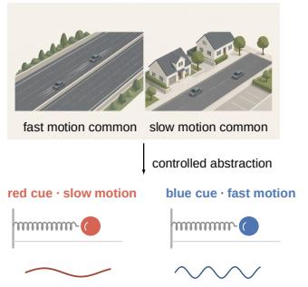

b Natural generation selects one future  
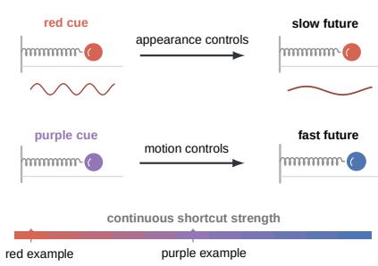

c The physical alternative remains writable  
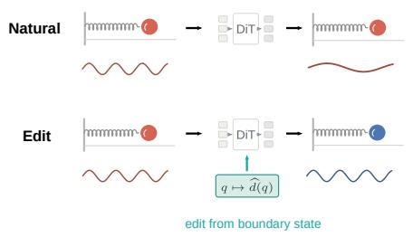

d Closure marks causal commitment  
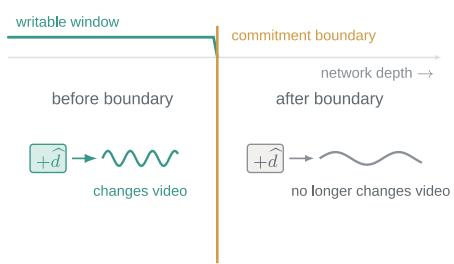  
Figure 1: Natural generation can select one future while a causally usable physical alternative remains writable. a, Correlated red–slow and blue–fast examples support both motion-based and appearance-based predictive rules. b, With observed motion fixed, cue strength changes which future controls natural generation. c, An activation edit predicted from target motion and boundary state gives the physical alternative control over decoded video. d, Closure marks the depth after which the same edit no longer changes the decoded video.

## 1 INTRODUCTION

When a video model generates physically incorrect motion, has it failed to learn the correct motion, or has it learned it but failed to use it? The generated video alone cannot distinguish these two failures. We show that the correct motion can remain available inside the model even when it does not control the natural rollout; an intervention can give it control.

Correlations in observational video create this ambiguity. Generative world models learn from video to predict how scenes will evolve (Ha & Schmidhuber, 2018; Hafner et al., 2020; Ho et al., 2022), but appearance, context, object identity, and motion rarely vary independently. Highway scenes, for example, tend to contain faster vehicle motion, while residential scenes tend to contain slower motion. Scene appearance can therefore predict speed statistically without determining it physically. A model may extrapolate the future from recent motion or use appearance as a proxy for speed. Ordinary training examples do not distinguish these rules; only when appearance and observed motion conflict do they predict different futures. This is predictive underspecification (Geirhos et al., 2020; D’Amour et al., 2022).

To test whether the correct motion is absent or merely unused, we construct a controlled spring–mass task. During training, red masses oscillate slowly and blue masses oscillate quickly. At test time, we create unseen color–motion combinations by holding observed motion fixed and changing only color—for example, a red mass with fast observed motion. We determine which cue controls the generated future by measuring motion directly in fully decoded videos. The model can follow color and generate slow motion—a predictive shortcut. A low-dimensional internal edit predicted from simple physical variables restores the correct fast motion. Figure 1 summarizes the conflict and the causal tests that follow.

Causal writability is the ability of an internal edit to change motion in decoded video. It depends on both edit location and strength. As computation proceeds, observed-frame information is progressively written into future-frame states, so observed-frame edits can eventually arrive too late. At fixed strength, we find a sharp depth boundary over a narrow range of layers: the same edit changes the video before the boundary but not after it. Closure marks commitment for that write. The underlying motion signal remains detectable after commitment; an appropriate downstream gain restores physical motion, while excessive gain overshoots.

Early causal writability predicts which errors training later corrects. At an early checkpoint, those errors are writable at more network depths than errors that persist. The writable boundary also depends on evidence and learning history: more observed motion keeps the correct future writable to deeper layers, and, in a pretrained 1.3B video model, learning motion before introducing the color bias also moves the boundary deeper.

Different natural behavior can coexist with a shared causal edit space. Independently trained models differ in how often their rollouts follow observed motion, yet corrective edits transfer between them. This points to different downstream use of similar physical solutions. We therefore trace the downstream write and show that self-attention carries motion information from observed frames into future-frame states; strengthening the corresponding write restores the correct motion in decoded video.

## 2 HOW APPEARANCE AND OBSERVED MOTION COMPETE FOR THE GENERATED FUTURE

Experimental setting. We study Spring, a 488M-parameter latent flow-matching Transformer with 30 bidirectional DiT blocks and a frozen Wan2.1 VAE. Each 20-fps video shows a colored mass oscillating on a spring, with 65 observed frames followed by 64 generated frames. Training pairs red with the slow band $\omega \sim U [ 2 . 2 , 3 . 0 ]$ rad/s and blue with the fast band $\omega \sim U [ 5 . 2 , 6 . 4 ]$ rad/s. No conflicting color–frequency combinations appear during training. We train two settings with different amounts of visible motion. Long retains all 65 observed frames, whereas Short replaces the first 57 frames with a fixed background, leaving only the final 8 motion frames while preserving the timeline and token count. We detect the mass in fully decoded videos and measure its generated frequency and future appearance. Full model, sampling, and evaluation details appear in Appendix A.

a Decoded solution landscape  
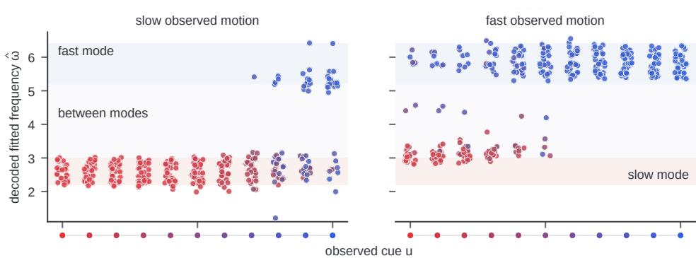

b Observed motion completes future appearance  
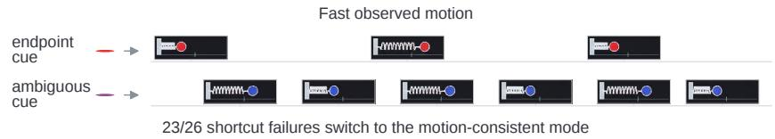

c More observed motion favors the motion­consistent future  
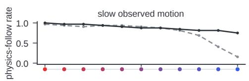

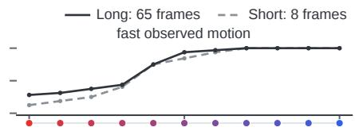  
Figure 2: Appearance and observed motion compete to determine the generated future. a, A hue sweep measures decoded frequency and RGB. b, Ambiguous cues let observed motion select its paired motion–appearance mode. c, Long (65 frames) resists stronger conflicting cues than Short (8 frames); each rate uses 32 histories per cue and motion band.

Appearance-cue strength shifts the generated future. We fix observed motion and generation seed for each trajectory and sweep 11 hues from red to blue. Physics-follow rate is the fraction of valid decoded videos whose frequency lies in the observed-motion band, evaluated over the stated cohort. Aggregate behavior pools the 64 × 11 grid (32 slow and 32 fast histories); cue-specific and conflict-only rates use subsets. The training color–frequency rule gives a 50% reference on the full balanced grid, but 0% on conflict-only endpoints.

Appearance cues mainly select between the two training-supported frequency bands, rather than continuously tuning speed. Around ambiguous hues, the generated future is more likely to follow observed motion than at the red or blue endpoints.

Observed motion completes the learned motion–appearance pair. The same model can also use observed motion to select the color paired with that motion during training (Figure 2b). Under ambiguous appearance cues, fast motion favors a blue future and slow motion a red one. With strong color cues, the same model instead favors the frequency paired with the observed color. These two behaviors show that the learned motion–appearance association can be completed in either direction.

More visible motion shifts control toward the physical solution. In separately trained Short and Long models, motion-consistent futures persist farther toward the conflicting red or blue endpoint under Long in both conflict directions (Figure 2c). The generated future therefore depends on the relative evidence supplied by appearance and observed motion. Pendulum shows the same cuedependent competition in another oscillatory system (Appendix B.7.1). We next test whether the motion-consistent alternative remains causally accessible when the conflicting color cue controls generation.

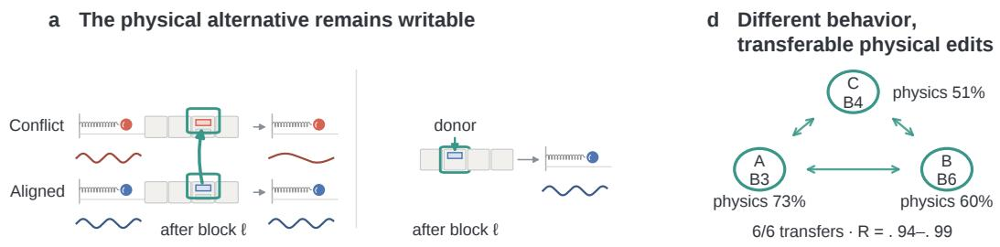

b Position and velocity organize the write  
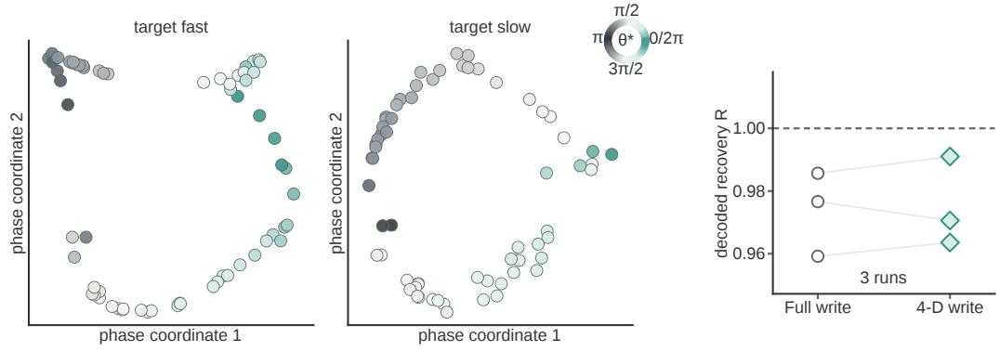

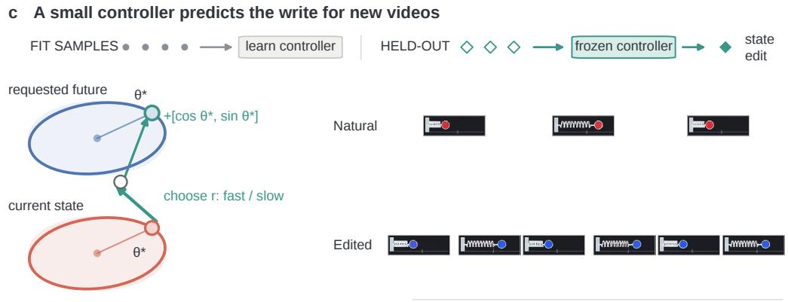  
Figure 3: A compact, physically structured activation edit restores the motion-consistent future. a, A full edit redirects the naturally selected future in decoded video. b, Four coordinates retain nearly the full effect, with their variation organized by boundary position and velocity. c, A controller fitted on separate trajectories predicts held-out edits from target motion and boundary state. d, Natural physics-follow rates pool each run’s $6 4 \times 1 1$ cue grid; all six directed transfers achieve held-out decoded recovery $R = . 9 4 \mathrm { - } . 9 9$

## 3 A PHYSICALLY STRUCTURED ALTERNATIVE REMAINS CAUSALLY ACCESSIBLE

We test causal accessibility in three independently trained Short models after 50K training steps. Each strict aligned–conflict pair shares observed motion, prediction-boundary state, and generation seed, and differs only in color. Both rollouts are valid: the aligned input uses the training-paired color and follows observed motion, whereas the conflict input uses the opposite color and follows appearance (e.g., fast–blue versus fast–red; full criteria in Appendix $\mathbf { A } ) .$ . The prediction-boundary state is the position and velocity at the final observed frame. Let $h _ { A , i }$ and $h _ { C , i }$ denote their observed-frame token states after DiT block ℓ (with i indexing an aligned–conflict pair). Adding $d _ { i } = h _ { A , i } - h _ { C , i }$ to the conflict run redirects its decoded future (Figure 3a).

Let $\hat { \omega } _ { C , i }$ denote the fitted frequency of the natural conflict rollout, $\hat { \omega } _ { A , i }$ that of its corresponding aligned rollout, and $\hat { \omega } _ { \mathrm { e d i t } , i } ( \ell )$ the fitted frequency after intervention at block ℓ. We measure normalized frequency recovery by

$$
R _ { i } ^ { \omega } ( \ell ) = \frac { \hat { \omega } _ { \mathrm { e d i t } , i } ( \ell ) - \hat { \omega } _ { C , i } } { \hat { \omega } _ { A , i } - \hat { \omega } _ { C , i } } ,
$$

so $R ^ { \omega } = 0$ denotes the natural conflict frequency and $R ^ { \omega } = 1$ the corresponding aligned frequency. For the structure analysis, a layer scan selects a late site where the write still redirects the decoded future; across the three runs this site falls at blocks 3, 6, and 4. Only observed-frame tokens are changed. This full edit does not reveal whether the model has learned a compact physical representation. We therefore use PCA to look for low-dimensional structure shared across edits.

Four coordinates retain nearly the full effect. We fit an uncentered PCA basis to paired differences from one set of trajectories. For each held-out trajectory, we retain only the component of its paired difference along the first four axes and test whether this low-rank edit preserves the effect of the full difference. Across the three Short 50K runs, 87.8% of held-out top-4 writes satisfy $. 7 5 < R ^ { \omega } < 1 . 2 5$ compared with 92.4% for the full paired-difference edit. Each run supports two rewrite directions (slow→fast and fast→slow), giving six run–direction groups. This establishes a compact edit space, but each held-out test still uses its own paired difference.

Boundary position and velocity organize the write. The Top-4 coordinates vary systematically with boundary phase: held-out edits form smooth phase-ordered loops in both rewrite directions (Figure 3b). For harmonic motion, $x = A$ cos θ and $v = - A u$ sin θ, so the input boundary phase

$$
\theta ^ { * } = \mathrm { a t a n 2 } ( - v ^ { * } / \omega _ { \mathrm { t r u e } } , x ^ { * } ) ,
$$

compactly encodes normalized position and velocity: up to a common amplitude scale, cos $\theta ^ { * }$ is position-like and sin $\theta ^ { * }$ is velocity-like after frequency normalization. This organization suggests predicting an edit for a new trajectory from its boundary state and requested target direction, without the matched aligned activation. We fit a separate first-harmonic map for each target family:

$$
\hat { z } _ { 1 : 4 } ^ { ( r ) } ( \theta ^ { * } ) = \beta _ { 0 } ^ { ( r ) } + \beta _ { c } ^ { ( r ) } \cos \theta ^ { * } + \beta _ { s } ^ { ( r ) } \sin \theta ^ { * } , \qquad r \in \{ \mathrm { f a s t } , \mathrm { s l o w } \} .
$$

This model raises held-out coordinate $R ^ { 2 } { \mathrm { ~ t o ~ } } . 8 3 \mathrm { - } . 8 8 ,$ , up from .51–.60 for a direction-only model. For a held-out input, the frozen controller predicts four coordinates from target direction and boundary state, then reconstructs the activation edit through the frozen PCA basis. Across the six run–direction groups, 85.9% of these synthesized held-out writes satisfy $. 7 5 < R ^ { \omega } < 1 . 2 5$ (Figure 3c).

Physical-state differences also place the two rewrite directions in a common edit space (Appendix B.5). The edits also rewrite associated appearance: slow→fast shifts future color toward blue. The same low-order organization recurs in Pendulum, where boundary angle and angular velocity predict topfour coordinates, and in non-oscillatory Free Fall, where a donor-free $[ 1 , \bar { g } _ { \mathrm { t a r g e t } } ]$ controller reaches median held-out recovery $R ^ { g } = . 9 6 7 $ across 64 decoded rollouts (Appendix B.7.1, B.7.2).

Models with very different natural behavior can share transferable physical corrections. Despite identical architecture and training settings, physics-follow rates span about 22 percentage points across the three training seeds (Figure 3d). This variation motivates testing whether these models share a transferable physical edit space. A scale and four-dimensional orthogonal map fitted on separate trajectories transfers controller-predicted edits across all six directed run pairs, with near-full held-out decoded recovery (Figure 3d; Appendix B.11). Their behavioral differences may therefore arise from how downstream computation uses a shared physical solution. This shifts the question from whether the physical solution exists to when it loses its ability to affect generation.

## 4 CAUSAL WRITABILITY: WHEN DOES THE FUTURE BECOME HARD TO CHANGE?

To measure depthwise writability, we apply each matched full edit from Section 3 at all 31 network sites. Early writes redirect the shortcut future; after a narrow depth range, the edit stops changing decoded motion. For a strict-failure bank—pairs whose aligned rollout follows observed motion and whose conflict rollout follows color—and writing $\mathrm { P r } _ { i }$ for the fraction over trajectories i, define

$$
W ^ { \omega } ( \ell ) = { \operatorname* { P r } } _ { i } \mathrm { r a l i d } \Lambda \ . 7 5 < R _ { i } ^ { \omega } ( \ell ) < 1 . 2 5 \mathrm { J } , \qquad D ^ { \omega } = \sum _ { \ell \in \mathcal { L } } W ^ { \omega } ( \ell ) ,
$$

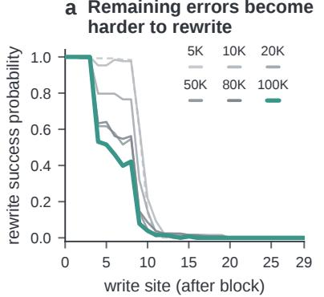

b Physics improves as remaining errors become less writable  
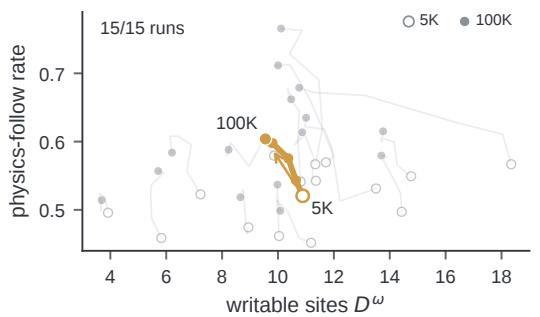

c Early writability predicts which errors training will fix  
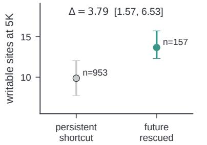

d More visible motion delays commitment  
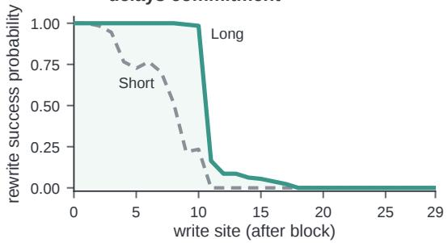  
Figure 4: Causal writability closes with depth and predicts which early failures training later corrects. a, Layerwise recovery closes earlier over training. b, Across 15 seeds, mean full-grid (64 × 11) physics-follow rate rises while remaining errors become less writable. c, Later-corrected errors are more writable at 5K. d, Long (65 frames) delays closure relative to Short (8 frames).

over the common 31-site scan $\mathcal { L }$ (one site before block 0 and one after each of the 30 blocks). $W ^ { \omega } ( \ell )$ is the fraction of strict failures that can still be redirected at site $\ell , D ^ { \omega }$ is the expected number of writable sites out of 31; a larger value means that the same write remains effective deeper into the network. For one trajectory,

$$
D _ { i } ^ { \omega } = \sum _ { \ell \in \mathcal { L } } \mathbf { 1 } [ \mathrm { v a l i d } \ \wedge \ . 7 5 < R _ { i } ^ { \omega } ( \ell ) < 1 . 2 5 ] .
$$

The motion-consistent future is causally writable while the tested write changes the decoded motion; closure marks commitment for the write. Individual trajectories close at different sites, so averaging broadens the population profile. In Pendulum, more observed motion delays closure in both directions; Free Fall loses near-full direct writability after block 1 (Appendix B.7.1, B.7.2).

Training corrects some errors while consolidating the rest. Across 15 Short runs, physicsfollowing behavior rises from .52 at 5K to .60 at 100K, while mean writability among remaining shortcut errors falls from 10.88 to 9.55 sites (Figure 4b). A classifier can improve held-out accuracy while becoming more confidently wrong on some remaining examples, increasing their cross-entropy loss. We therefore ask whether early writability distinguishes the shortcut errors that training later corrects from those that persist. See Appendix B.9 for same-checkpoint comparisons.

Early writability predicts which errors training later corrects. We test this prediction using trajectories that all follow the shortcut at 5K. Future-rescued trajectories follow observed motion at both 80K and 100K, whereas persistent failures follow the shortcut at all six checkpoints (5K, 10K, 20K, 50K, 80K, and 100K). Future-rescued errors are writable at 3.79 more sites on average (95% CI [1.57, 6.53]; Figure 4c). Early writability therefore separates the two outcomes before their generated behavior diverges (Appendix B.9).

The link between early writability and later behavior raises a second question: can stronger support for the physical future keep it writable deeper into the network? We test two ways of providing that support: more observed motion and learning dynamics before introducing the appearance shortcut.

More visible motion delays commitment. In all three matched-seed comparisons at 50K, Long remains writable to a later block than Short (Figure 4d).

Training order moves the commitment boundary. Longer histories strengthen the motion evidence available at inference. We next ask whether learning motion first has a similar effect, comparing two adaptation paths for the same pretrained Wan 1.3B video DiT. Direct adaptation learns the biased red–slow/blue–fast task immediately. Neutral-first adaptation first learns the same motion from achromatic videos, where appearance carries no frequency information, and then receives the same biased data.

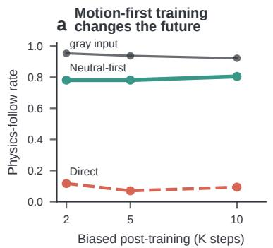

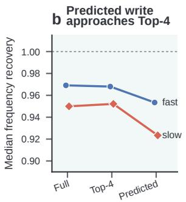

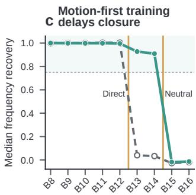  
Figure 5: In a pretrained video DiT, learning cue-independent dynamics first improves physical behavior and delays commitment. a, Direct and Neutral-first conflict-endpoint rates and the matched gray-input rate each use the same 128 held-out histories. b, The donor-free controller approaches the full-edit and Top-4 references. c, Direct and Neutral-first adaptation both close sharply, but between B12–B13 and B14–B15, respectively.

Training order changes the generated future. On a fixed population of 128 trajectories, conflict physics-follow at 10K is 80.5% after Neutral-first adaptation and 9.4% after Direct adaptation. Aligned performance is similar (Figure 5a). Before comparing closure, we verify that the compact edit remains effective in Wan. A controller fitted on separate trajectories approaches the Top-4 reference in both write directions (Figure 5b).

Learning cue-independent motion first delays closure. On the same persistent-failure identities, Neutral-first adaptation retains writability deeper than Direct adaptation (Figure 5c). On fixed identities, access can close and later reopen across nearby training checkpoints. Commitment therefore marks a depth boundary within a given forward pass; subsequent training can move or reopen it (Appendix B.3).

Longer histories and motion-first learning thus provide two ways to preserve access to the physical future. They leave open what stops that future from controlling generation when direct writing finally fails.

## 5 ATTENTION WRITES THE SELECTED FUTURE INTO FUTURE TOKENS

When direct writing stops changing the video, two explanations remain. The signal for the alternative motion may have disappeared, or it may still be present after the selected motion has already been written into future-frame tokens.

The alternative-motion signal survives closure. We first apply a write at an earlier writable block. At each subsequent block, we compare the edited future-frame activations with the natural conflict run and project their difference onto the aligned-minus-conflict direction. We call this projection the alternative-motion signal. A value of 1 indicates the full paired difference along that direction; 0 indicates the unedited conflict response. On held-out fast-target examples, the signal remains measurable in all three runs from the first non-writable block through the final block, even after observed-frame writes stop changing the generated frequency (Figure 6a).

We next localize the pathway through which the physical direction causally affects generation, starting from the full edit $\dot { E ^ { \circ } } = \dot { C } \dot { + } \left( A - \mathbf { \bar {  { C } } } \right)$ (where C, A, and E denote the conflict, aligned, and edited activations, respectively). We first replace either the post-attention future-frame state or the subsequent MLP output with its natural-conflict counterpart. We then decompose self-attention by restoring its natural-conflict Q, K, or V components one at a time. Restoring Q tests the queries issued by future-frame tokens, while restoring K or V tests the information made available by observed-frame tokens.

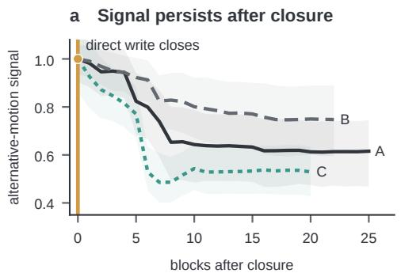

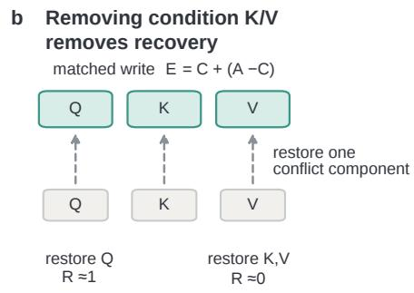

c One attention head can restore target motion  
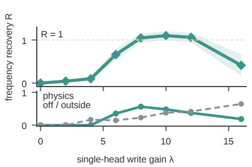

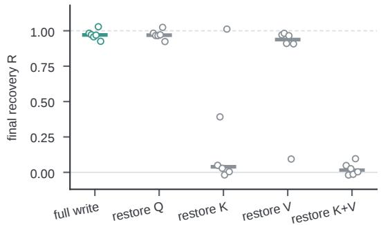  
Figure 6: The alternative-motion signal survives closure, and self-attention determines whether it changes the video. a, The signal remains measurable after observed-frame writing stops changing decoded motion. b, Restoring conflict K+V, but not Q, removes frequency recovery. c, On 48 held-out fast-motion/red-cue strict failures, moderate V-head amplification restores target motion; excessive gain leaves the supported modes.

Observed-frame K/V mediates the motion write into future-frame tokens. Restoring the natural-conflict post-attention future-frame state removes frequency recovery, whereas restoring the following MLP output preserves frequency recovery. This localizes the write to self-attention. Within self-attention, restoring Q has little effect, while jointly restoring observed-frame K+V removes recovery in all six run–direction groups (Figure 6b). Future-frame queries therefore obtain the motion-controlling information from observed-frame K/V.

We next test whether amplifying this attention write can restore control. Head-level responsibility differs across runs: the effect is concentrated in one K head, distributed across K/V, or localized to a selective V head (Appendix B.13). In Run C, we amplify only the observed-frame V of one of the nine heads:

$$
V _ { C } ^ { ( 8 ) } + \lambda \Delta V ^ { ( 8 ) } , \qquad \Delta V ^ { ( 8 ) } = V _ { M } ^ { ( 8 ) } - V _ { C } ^ { ( 8 ) } ,
$$

where M is the state produced by the frozen controller from Section 3 and λ scales the strength of the physical-alternative direction.

Moderate amplification allows the alternative motion to regain control. At λ = 8, the physicsfollowing rate peaks at 56.3% across 48 held-out strict failures (Figure 6c). Higher gain overshoots: at $\lambda = 1 6 ,$ , all outputs remain valid, but most are off-family. In this model, the alternative-motion signal remains present, but its unamplified attention write is too weak to control the video. We also examine when the alternative-motion write becomes effective during iterative generation. Early-only flow-matching writes produce an internal response without decoded recovery, whereas late- or all-call writes restore the motion-consistent future. Effective control therefore depends on the temporal allocation of the write, not only its location within the network (Appendix Figure 31).

## 6 DISCUSSION AND LIMITATIONS

Predictive underspecification and causal writability answer different questions. The former asks which solutions fit the training data; the latter asks which can still reach the output as inference proceeds. This parallels the control-theoretic distinction between observability and controllability (Kalman, 1960): a physical solution may remain detectable after it loses control over generation. Commitment marks this loss of causal access, not the loss of physical information.

Our mechanistic analysis uses controlled synthetic dynamics, where exact counterfactual matching and quantitative decoded-video evaluation are possible. The learned edits follow the coupled appearance–dynamics modes in training, and closure is specific to the observed-frame edit, sites, and checkpoints tested. Independent runs distribute the observed-to-future attention write across different K/V components and heads. Pendulum extends the analysis to another oscillator and renderer; Free Fall extends it to non-oscillatory dynamics with a specified-gravity controller. In a pretrained 1.3B Wan video DiT, we likewise observe an executable physical edit and a clear closure boundary, showing that the acquisition–control distinction is not confined to models trained from scratch. Whether naturally occurring shortcuts in broadly pretrained world models exhibit the same point of no return remains open.

## 7 RELATED WORK

Shortcut learning and predictive underspecification. Training data can support multiple predictive rules that agree on the training distribution and diverge only under shift (Geirhos et al., 2020; D’Amour et al., 2022). In controlled mechanics videos, Kang et al. (2025) find case-based generalization with an attribute hierarchy that places color above velocity. Our cue sweep also reveals the reverse relation: observed motion can select its training-associated color.

Physics representations and control in video models. Physics-related structure is decodable in video encoders (Joseph et al., 2026) and inverted diffusion trajectories (Esmati et al., 2026); concept activation vectors steer VideoMAE’s plausibility judgments (Alam, 2026). Generation improves through relational alignment (Zhang et al., 2025) or inference-time rewards (Yuan et al., 2026). We test whether physical-state-based activation edits change motion in fully decoded video, distinguishing the presence of physical information from its ability to control generation.

Causal intervention, commitment, and cross-model transfer. Activation patching probes internal mechanisms (Meng et al., 2022; Zhang & Nanda, 2024), but subspace interventions can mislead causal attribution (Makelov et al., 2024). Manifold steering links geometry to behavior, including video physics (Wurgaft et al., 2026). Plattner et al. (2026) localize and rescue 3D failure through an early-denoising cross-attention write. Our question is whether a physically specified alternative remains causally usable after the model has selected a different future. Stitching (Bansal et al., 2021) and permutation alignment (Ainsworth et al., 2023) compare networks, but stitching does not establish shared information (Smith et al., 2025). Cross-model steering transfers interventions (Oozeer et al., 2025; Poppi et al., 2026); we test held-out physical corrections across models with different natural behavior.

## REPRODUCIBILITY STATEMENT

Appendix A documents the model, data generation, decoded evaluator, statistical units, strict-pair construction, and intervention protocol. We will release training and evaluation code, configurations, data generators, random seeds, checkpoint metadata and hashes, frozen evaluation manifests, frozen aligned–conflict pair identities and input frames, figure builders, and audit scripts. The manifests record the sample identities used in each comparison and link quantitative figures to their source artifacts. A release script reruns the evidence checks, verifies provenance, rebuilds the mechanism figures, and compiles the manuscript. The release will include all hyperparameters and experimentspecific settings needed to reproduce the reported results.

## AI USE STATEMENT

The authors used generative AI assistants, including OpenAI ChatGPT and Codex-based coding agents, to help refine hypotheses and experimental designs; implement and refactor code; run and monitor experiments; construct audits; analyze results; design figures; search the literature; and draft, translate, and edit the manuscript. The authors formulated the research questions, made all final methodological and interpretive decisions, approved each experiment, supervised its execution, inspected raw outputs, and reviewed the code, citations, figures, and claims in the submission. All reported measurements come from the stated deterministic evaluators and intervention pipelines, not language-model judgments. The authors reviewed all AI-assisted material and take responsibility for the final paper.

## REFERENCES

Samuel K. Ainsworth, Jonathan Hayase, and Siddhartha Srinivasa. Git re-basin: Merging models modulo permutation symmetries. In International Conference on Learning Representations, 2023.

Nahid Alam. Causal physics steering in video world models via concept activation vectors. In Proceedings of the IEEE/CVF Conference on Computer Vision and Pattern Recognition Workshops, pp. 5890–5896, 2026.

Yamini Bansal, Preetum Nakkiran, and Boaz Barak. Revisiting model stitching to compare neural representations. In Advances in Neural Information Processing Systems, volume 34, 2021.

Alexander D’Amour, Katherine Heller, Dan Moldovan, Ben Adlam, Babak Alipanahi, Alex Beutel, Christina Chen, Jonathan Deaton, Jacob Eisenstein, Matthew D. Hoffman, et al. Underspecification presents challenges for credibility in modern machine learning. Journal of Machine Learning Research, 23(226):1–61, 2022.

Parsa Esmati, Somjit Nath, Katja Hofmann, Derek Nowrouzezahrai, Samira Ebrahimi Kahou, and Majid Mirmehdi. The invisible hand of physics: When video diffusion models know more than they show. arXiv preprint arXiv:2606.05328, 2026.

Robert Geirhos, Jorn-Henrik Jacobsen, Claudio Michaelis, Richard Zemel, Wieland Brendel, Matthias¨ Bethge, and Felix A. Wichmann. Shortcut learning in deep neural networks. Nature Machine Intelligence, 2:665–673, 2020.

David Ha and Jurgen Schmidhuber. World models.¨ arXiv preprint arXiv:1803.10122, 2018.

Danijar Hafner, Timothy Lillicrap, Jimmy Ba, and Mohammad Norouzi. Dream to control: Learning behaviors by latent imagination. In International Conference on Learning Representations, 2020.

Jonathan Ho, Tim Salimans, Alexey Gritsenko, William Chan, Mohammad Norouzi, and David J. Fleet. Video diffusion models. In Advances in Neural Information Processing Systems, 2022.

Sonia Joseph, Quentin Garrido, Randall Balestriero, Matthew Kowal, Thomas Fel, Shahab Bakhtiari, Blake Richards, and Mike Rabbat. Interpreting physics in video world models. In International Conference on Machine Learning, 2026.

Rudolf E. Kalman. On the general theory of control systems. In Proceedings of the First International Congress ofthe International Federation ofAutomatic Control, pp. 481–492, 1960.

Bingyi Kang, Yang Yue, Rui Lu, Zhijie Lin, Yang Zhao, Kaixin Wang, Gao Huang, and Jiashi Feng. How far is video generation from world model: A physical law perspective. In Proceedings of the 42nd International Conference on Machine Learning, volume 267 of Proceedings ofMachine Learning Research, pp. 28991–29017, 2025.

Aleksandar Makelov, Georg Lange, Atticus Geiger, and Neel Nanda. Is this the subspace you are looking for? an interpretability illusion for subspace activation patching. In International Conference on Learning Representations, 2024.

Kevin Meng, David Bau, Alex Andonian, and Yonatan Belinkov. Locating and editing factual associations in GPT. In Advances in Neural Information Processing Systems, 2022.

Narmeen Fatimah Oozeer, Dhruv Nathawani, Nirmalendu Prakash, Michael Lan, Abir Harrasse, and Amirali Abdullah. Activation space interventions can be transferred between large language models. In Proceedings ofthe 42nd International Conference on Machine Learning, volume 267 of Proceedings ofMachine Learning Research, pp. 47212–47286. PMLR, 2025.

Maximilian Plattner, Fabian Paischer, Johannes Brandstetter, and Arturs Berzins. Meltdown: Circuits and bifurcations in point-cloud-conditioned 3d diffusion transformers. arXiv preprint arXiv:2602.11130, 2026.

Tobia Poppi, Silvia Cappelletti, Sara Sarto, Florian Schiffers, Garin Kessler, Marcella Cornia, Lorenzo Baraldi, and Rita Cucchiara. Do models share safety representations? cross-model steering for safe visual generation. arXiv preprint arXiv:2606.05290, 2026.

Damian Smith, Harvey Mannering, and Antonia Marcu. Functional alignment can mislead: Examining model stitching. In Proceedings of the 42nd International Conference on Machine Learning, volume 267 of Proceedings of Machine Learning Research, pp. 55972–55998, 2025.

Daniel Wurgaft, Can Rager, Matthew Kowal, Vasudev Shyam, Sheridan Feucht, Usha Bhalla, Tal Haklay, Eric Bigelow, Raphael Sarfati, Thomas McGrath, Owen Lewis, Jack Merullo, Noah Goodman, Thomas Fel, Atticus Geiger, and Ekdeep Singh Lubana. Manifold steering reveals the shared geometry of neural network representation and behavior. arXiv preprint arXiv:2605.05115, 2026.

Jianhao Yuan, Xiaofeng Zhang, Felix Friedrich, Nicolas Beltran-Velez, Melissa Hall, Reyhane Askari-Hemmat, Xiaochuang Han, Nicolas Ballas, Michal Drozdzal, and Adriana Romero-Soriano. Inference-time physics alignment of video generative models with latent world models. In Proceedings of the IEEE/CVF Conference on Computer Vision and Pattern Recognition, pp. 16118–16129, June 2026.

Fred Zhang and Neel Nanda. Towards best practices of activation patching in language models: Metrics and methods. In International Conference on Learning Representations, 2024.

Xiangdong Zhang, Jiaqi Liao, Shaofeng Zhang, Fanqing Meng, Xiangpeng Wan, Junchi Yan, and Yu Cheng. VideoREPA: Learning physics for video generation through relational alignment with foundation models. In Advances in Neural Information Processing Systems, volume 38, 2025.

## A EXPERIMENTAL DETAILS

Model and training. The Spring model is a no-text latent flow-matching transformer with 488,158,912 trainable parameters, excluding its frozen VAE. Its denoiser has 30 bidirectional DiT blocks, hidden width 1152, feed-forward width 4608, nine attention heads of width 128, and a 1 × 2 × 2 latent patch size. A frozen Wan2.1 VAE maps each 129-frame video to a 33 × 16 × 16 latent grid with 16 channels: 17 conditioning frames followed by 16 target frames. Spatial patching gives 1,088 condition and 1,024 target tokens. The two history regimes use the same architecture, token count, prediction boundary, and optimizer; they differ only in the visible physical history. Table 1 gives the remaining shared contract.

Decoded-video evaluation. Evaluation uses generated pixels. A deterministic detector tracks the mass center in every future frame without reading the input hue label. Validity requires detection in at least 90% of frames, no missing run longer than three frames, adjacent and boundary jumps at most 12 px, vertical deviation at most 7 px, multi-component rate at most 0.10, and valid area and image bounds. For valid tracks, detected horizontal pixel coordinates are converted to normalized displacement from equilibrium. We fit the detected future-frame positions at their original time points, without interpolating missing detections, using

Table 1: Spring experimental contract. Long and Short use the same video span and latent layout; Short replaces early motion with the fixed background before VAE encoding.
<table><tr><td>Component</td><td>Setting</td></tr><tr><td>Training support</td><td>2,048 videos per regime: 1,024 red–slow and 1,024 blue–fast; no conflicting color-frequency combinations</td></tr><tr><td>Physical variables</td><td>slow  $\omega \stackrel { - } { \sim } U [ 2 . 2 , 3 . 0 \bar { ] }$  rad/s; fast  $\omega \sim U [ 5 . 2 , 6 . 4 ]$  rad/s; normal- ized horizontal-displacement amplitude  $\sim U [ 0 . \dot { 1 } 0 , 0 . 1 7 ]$  ; phase</td></tr><tr><td>Video and boundary</td><td> $\sim U [ 0 , 2 \pi )$  128 × 128, 20 fps; frames 0–64 are conditioning frames and frames 65–128 are generated</td></tr><tr><td>Long / Short history</td><td>Long exposes real frames  $0 { - } 6 4 ;$  Short replaces frames 0–56 by RGB (28, 30, 34) and exposes real motion in frames 57–64; re- placement occurs before VAE encoding</td></tr><tr><td>Renderer</td><td>equilibrium  $x = 0 . 5 8$  , anchor  $x = 0 . 1 6$  , center  $y = 0 . 5 0 ,$  mass radius 7 px, 10 spring coils; red RGB (235, 48, 48) and blue RGB (48, 96, 235). Oscillator position x, amplitude, and boundary posi- tion  $x ^ { * }$  are expressed as normalized horizontal displacements from equilibrium;  $v ^ { * }$  is the corresponding displacement velocity per sec- ond. A displacement x is rendered at horizontal pixel coordinate</td></tr><tr><td>Latent sequence</td><td> $( 0 . 5 8 + x ) \bar { ( } W - 1 )$  33 latent frames and 2,112 tokens: 17 condition frames (1,088 tokens) and 16 target frames (1,024 tokens); only target frames</td></tr><tr><td>Optimization</td><td>enter the loss AdamW with PyTorch ConstantLR, batch size 32, gradient accu- mulation 1, base learning rate  $2 \times 1 0 ^ { - 4 }$  , weight decay 0.01, no</td></tr><tr><td>Training schedule</td><td>EMA primary mechanism analyses use the 50K checkpoints; the 15-run longitudinal runs train to 100K and are evaluated at 5K, 10K, 20K,</td></tr><tr><td>Sampling</td><td>50K, 80K, and 100K 20 flow-matching calls, scheduler shift 5.0, denoising strength 1.0, and fixed per-trajectory generation seeds</td></tr></table>

$$
x ( t ) = a \cos ( \hat { \omega } t ) + b \sin ( \hat { \omega } t ) + c
$$

over a 1,601-point grid with $\hat { \omega } \in [ 1 . 2 1 , 8 . 6 4 ]$ rad/s. Fits with RMSE at most 0.035 are retained; the RMSE is measured in the normalized displacement coordinate. Frequency-band membership uses a 0.005 rad/s tolerance at the slow and fast band boundaries. We measure future appearance from the mean RGB of the detected mass pixels across valid future frames—not by averaging entire video frames—and project it onto the red-to-blue color axis. The 11 cues linearly interpolate between RGB (235, 48, 48) and (48, 96, 235). A valid rollout is labeled physics-following when ωˆ lies in the history consistent band, shortcut-following when it lies in the cue-associated opposite band, compromise when it lies in the unsupported gap, and off-family/invalid otherwise. The frozen 64-history × 11-hue response grid keeps trajectory identity, physical parameters, renderer, and generation seed fixed across hue. Consequently, hue variants are repeated measurements of 64 histories, not 704 independent samples.

Strict aligned–conflict pairs. A strict pair consists of an aligned rollout that is valid and in its true frequency band and a conflict rollout that is valid and follows the opposite shortcut band. The pair shares trajectory, frequency, amplitude, phase, boundary state $( x ^ { * } , v ^ { * } )$ , renderer, and generation seed; only mass color changes. The route and cross-run analyses use a shared 256-trajectory bank for the three 50K Short runs: 128 fast-target and 128 slow-target pairs, split into 128 fit and 128 held-out pairs balanced by direction. Every pair satisfies the strict criteria in all three runs and has $| \hat { \omega } _ { A } - \hat { \omega } _ { C } | \geq 2 . 0$ Writability uses each seed–checkpoint’s local bank of natural strict failures, because that estimand asks which errors remain at that point in training. The persistent-error control freezes trajectory identities across checkpoints to test bank-composition effects directly.

Intervention operators. Layer localization and writability replace the condition state,

$$
h _ { \ell , \mathrm { c o n d } } ^ { C }  h _ { \ell , \mathrm { c o n d } } ^ { A } ,
$$

whereas route analyses add a full, projected, transferred, or predicted edit,

$$
h _ { \ell , \mathrm { c o n d } } ^ { C }  h _ { \ell , \mathrm { c o n d } } ^ { C } + \tilde { d } _ { \ell } , \qquad d _ { \ell } = h _ { \ell , \mathrm { c o n d } } ^ { A } - h _ { \ell , \mathrm { c o n d } } ^ { C } .
$$

Both operators modify only the 1,088-token condition prefix at one site, hit that site once on each of 20 flow-matching calls, and leave the 1,024-token target suffix exactly unchanged at injection; the suffix then evolves normally through subsequent computation. Flow-matching-window and component-restoration experiments state their deviations explicitly. Layer scans cover 31 sites: the pre-block residual and after-B0 through after-B29. Route localization chooses the latest after-block at which at least 75% of edits in each direction are valid and satisfy $0 . 7 5 < R _ { i } ^ { \omega } < 1 . 2 5$ ; this functional site is distinct from $D ^ { \omega }$ , which summarizes writability over the full scan.

We call an analysisfit-only when every projection, scale, coefficient, and model-selection choice is fixed on the fit split before any held-out trajectory is evaluated.

Statistical units and provenance. Figure 2 treats the 64 physical histories (32 per frequency band) as units and the 11 hues as repeated measurements. Route, controller, and transfer fits use trajectory-disjoint held-out sets. The cross-solution analysis resamples complete six-checkpoint seed trajectories; the future-fate analysis first resamples seeds and then trajectories within seed × direction × fate strata. Exact checkpoint, bank, split, bootstrap seed, validity record, and source-artifact hash are frozen, where applicable, in figure-specific machine-readable manifests.

## B SUPPLEMENTARY RESULTS

Throughout this section, Runs A, B, and C denote the independently trained Short models with seeds 3407, 3408, and 3409, respectively.

## B.1 BEHAVIORAL ROBUSTNESS AND MATCHED CUE REVERSAL

Table 2 conditions on trajectories for which the strongly conflicting endpoint cue already produces the shortcut-associated frequency: red for a true-fast history and blue for a true-slow history. It then changes only the cue to purple (u = 0.5) for the same physical trajectory and generation seed. Thus the table measures a within-trajectory change in the naturally selected decoded continuation, not accuracy on two unrelated sample sets.

Table 2: Endpoint shortcut failures often return toward the history-consistent continuation at the ambiguous cue. Purple outcomes are counts within each endpoint shortcut cohort.
<table><tr><td>Run / motion</td><td>Endpoint shortcut</td><td>t Purple physics</td><td>Purple shortcut</td><td>Purple</td><td>Purple off/invalid</td></tr><tr><td></td><td></td><td></td><td></td><td>compromise</td><td></td></tr><tr><td>A / fast A / slow</td><td>10/32 16/32</td><td>8 15</td><td>0 0</td><td>1 1</td><td>1 0</td></tr><tr><td>B / fast</td><td>16/32</td><td>9</td><td>1</td><td>5</td><td>1</td></tr><tr><td>B / slow</td><td>8/32</td><td>8</td><td>0</td><td>0</td><td>0</td></tr><tr><td>C / fast</td><td>8/32</td><td>1</td><td>0</td><td>5</td><td>2</td></tr><tr><td>C / slow</td><td>9/32</td><td>9</td><td>0</td><td>0</td><td>0</td></tr></table>

The categorical reversal is solution- and direction-dependent, especially for the fast-history branch of Run C. Nevertheless, over the endpoint-shortcut cohort, every run–direction group shifts both frequency and future color toward the history-associated joint mode on average: the mean frequency shift ranges from 1.68 to 2.76 rad/s and the normalized color shift from .50 to .71.

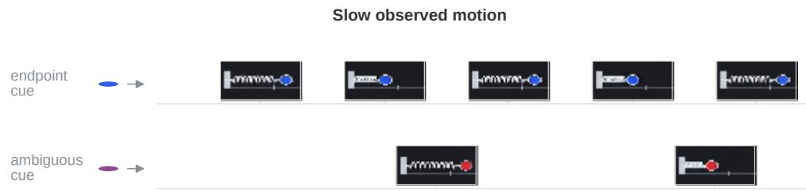  
Figure 7: The reverse matched example shows the same coupled switch. With slow observed motion and the future window fixed, changing only the cue from the conflicting blue endpoint to the ambiguous cue redirects decoded motion toward the slow band and future appearance toward red. Frames are the measured turning points from the same decoded future window.

Figure 8 expands the decoded-video evaluation to all 15 Short runs at 50K. Each run uses the same 64 physical histories, 11 hues, and deterministic evaluator; all 10,560 rollouts are valid. The aggregate allocation varies substantially across runs, particularly in how often an unsupported compromise is realized. The cue-response panels nevertheless show the same evidence-dependent pattern: slow histories are most often preserved near red cues, fast histories near blue cues, with solution-specific transition widths around the ambiguous region.

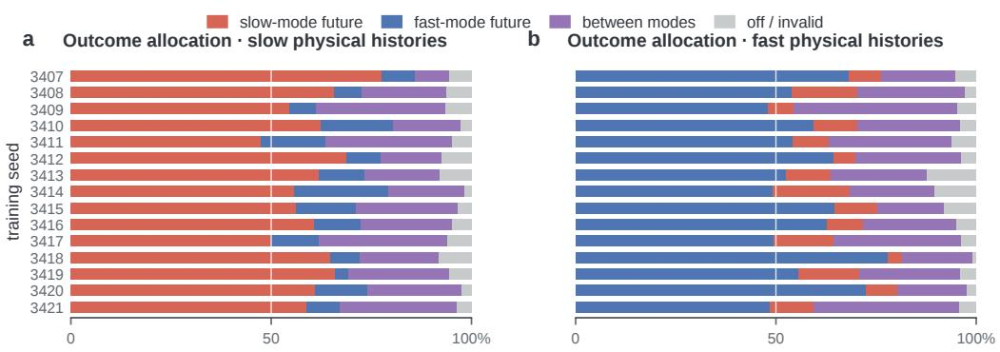  
d Cue response · fast physical histories

c Cue response · slow physical histories  
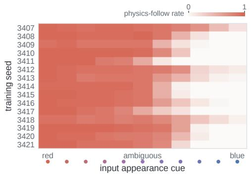

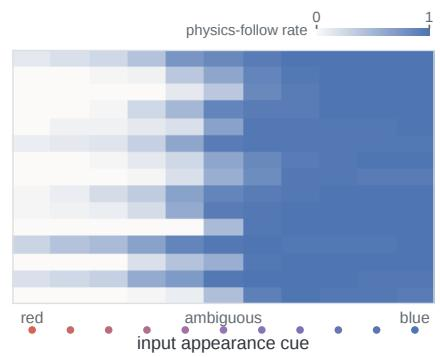  
Figure 8: Evidence-dependent joint-mode selection recurs across 15 independently trained models. a,b, Outcome allocation over all 352 hue-conditioned rollouts in each physical band. Colors denote decoded motion modes, not correctness: coral is slow, blue is fast, purple lies between the supported bands, and gray is off-family or invalid. c,d, Physics-follow rate for each seed and cue; every cell averages 32 physical histories.

## B.2 PRETRAINED WAN REPLICATION OF THE EXECUTABLE ROUTE AND SHARP CLOSURE

We repeat the route analysis in a pretrained Wan 1.3B video DiT adapted to the biased Spring task. A direction-specific first-harmonic controller is fit on 128 trajectories and frozen before evaluation on 128 disjoint receivers. The held-out coordinate fits reach $\mathit { R } ^ { 2 } = . 8 5 8 / . 7 7 1$ for fast/slow targets. In decoded rollouts, the donor-free controller attains median recovery $R ^ { \dot { \omega } } = . 9 5 3 / . 9 2 3$ , close to the Top-4 ceiling of .968/.952; neither controller fitting nor held-out intervention accesses the held-out aligned activation. Top-4 oracle edits are rescaled to the receiver’s full-edit norm; phase-predicted edits are not.

The same model family also exhibits localized closure. On the same 17 slow-target persistent failures, direct adaptation loses median recovery between B12 and B13, whereas neutral-first adaptation retains it until B14 and loses it between B14 and B15. Thus the training path shifts the boundary without turning the loss of direct condition-side control into a gradual network-wide decay.

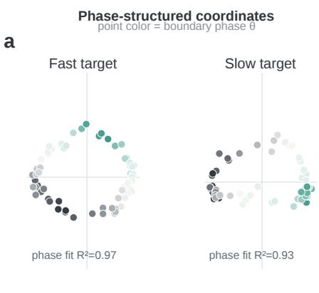

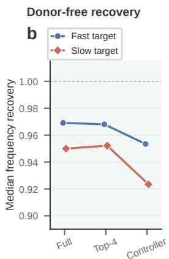

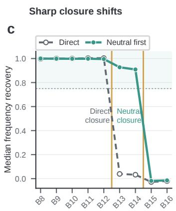  
Figure 9: A pretrained video DiT reproduces the executable route and localized commitment boundary. a, Held-out top-four coordinates vary smoothly with boundary phase in both rewrite directions $( n = 6 4$ each; the displayed state-varying coordinate pairs are centered for visualization). b, The Top-4 projection retains the full-edit recovery, and the fit-only phase controller approaches that ceiling without a held-out donor. c, Median recovery on the same persistent-failure identities drops across one adjacent-block transition under both training paths, while neutral-first adaptation shifts the transition later. The amber lines mark the two observed closure intervals; the shaded region denotes . $. 7 5 < R ^ { \omega } < 1 . 2 5$

## B.3 PRETRAINED NEUTRAL-TO-BIASED CURRICULUM

We initialize a Wan 1.3B video DiT in two ways. The Direct path adapts the pretrained checkpoint directly on the red–slow/blue–fast Spring data. The Neutral path first trains for 10K updates on 2,048 achromatic Spring videos, with slow and fast dynamics equally frequent and all masses rendered RGB (92, 92, 92), then starts the same biased stage from a fresh optimizer. The biased-stage data order and random streams are matched between paths. Gray and biased training manifests have disjoint trajectory identities.

Population results use a frozen evaluation set generated before model evaluation: 128 physical histories (64 per frequency band), each rendered at 11 red-to-blue hues and one gray appearance. Its base seeds are disjoint from both training manifests, the earlier development hue set, and the mechanism cohort. Table 3 reports endpoint behavior. Every biased-checkpoint endpoint and gray rollout is evaluator-valid, so the nonzero off-family entries are valid tracks whose fitted frequencies lie outside the supported outcome categories.

Table 3: Neutral adaptation redirects the solution reached under the same subsequent biased data. Columns report decoded conflict outcomes on the same 128 held-out histories. The paired interval resamples physical histories.
<table><tr><td>Biased step</td><td>Path</td><td>Aligned Conflict physics physics</td><td></td><td>Shortcut Compromise family</td><td></td><td>Off-</td><td>Neutral-Direct physics</td></tr><tr><td>2K</td><td>Direct</td><td>83.6</td><td>11.7</td><td>61.7</td><td>16.4</td><td>10.2</td><td></td></tr><tr><td></td><td>Neutral</td><td>93.8</td><td>78.1</td><td>12.5</td><td>7.8</td><td></td><td>1.6 66.4 [57.8,74.2]</td></tr><tr><td>5K</td><td>Direct</td><td>93.0</td><td>7.0</td><td>65.6</td><td>23.4</td><td>3.9</td><td></td></tr><tr><td></td><td>Neutral</td><td>96.1</td><td>78.1</td><td>7.0</td><td>14.8</td><td></td><td>0.0 71.1 [63.3,78.9]</td></tr><tr><td>10K</td><td>Direct</td><td>96.1</td><td>9.4</td><td>58.6</td><td>28.1</td><td>3.9</td><td></td></tr><tr><td></td><td>Neutral</td><td>93.8</td><td>80.5</td><td>7.8</td><td>11.7</td><td></td><td>0.0 71.1 [63.3,78.9]</td></tr></table>

The identical 5K and 10K paired intervals are not duplicated estimates. Both paired difference vectors contain 91 improvements and 37 ties, although 20 trajectory identities change outcome between the two checkpoints; their trajectory-bootstrap distributions therefore coincide.

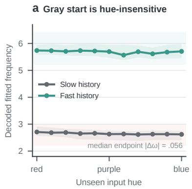

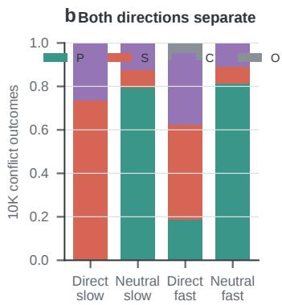

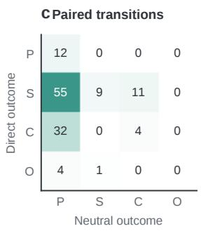  
Figure 10: A cue-independent starting solution redirects biased post-training on a frozen heldout population. a, Before biased training, median decoded frequency changes little over unseen hue; shading is the interquartile range across histories. b, The 10K conflict difference occurs in both physical directions. c, Counts for the same 128 histories show that most Direct shortcut/compromise outcomes become physical under Neutral initialization. The post-training population curves already shown in Figure 5a are not repeated here.

At the achromatic 10K starting checkpoint, the median matched red–blue endpoint frequency difference is .056 rad/s and opposite-band shortcut outcomes are absent at the nominal conflict endpoint. The checkpoint is an imperfect Spring generator, especially for fast histories, but hue does not yet control the generated frequency systematically. Within the Neutral biased path, gray inputs for the same histories remain more physics-following than colored conflicts by 17.2, 15.6, and 11.7 percentage points at 2K, 5K, and 10K, respectively.

The event-centered causal analysis uses a separate seed-disjoint bank enriched for shortcut-susceptible histories and therefore does not estimate population failure prevalence. At 2K, 17 slow-direction failures already present at 1K have median deepest writable block B12, whereas ten failures newly observed at 2K have median B15 (difference three blocks, trajectory-bootstrap 95% CI [2, 4]). Among all 27 slow strict failures at 2K, those still shortcut-selected at 3K have median boundary B12, versus B14.5 for non-persistent failures (difference 2.5 blocks, 95% CI [2, 3]).

The 2K depth ordering remains strong for behavior measured at 4K and 5K but attenuates by 10K, supporting a near-term stabilization signal whose predictive power weakens over longer horizons. On 11 fixed identities, recovery at B13/B14 also closes and reopens over nearby checkpoints while B12 remains writable and B15 remains typically closed. This exploratory fixed-identity result makes commitment a checkpoint-local computational property, not an absorbing state across further optimization.

a New failures retain deeper causal access  
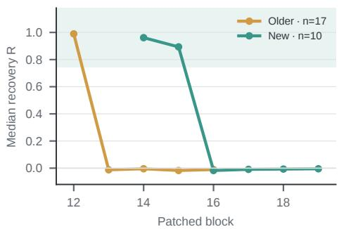

b Failure age shifts writable depth  
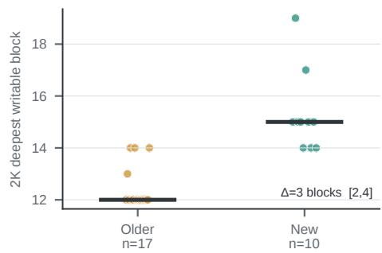

c Writability predicts near-term fate  
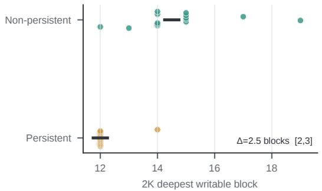

d Access can close and reopen  
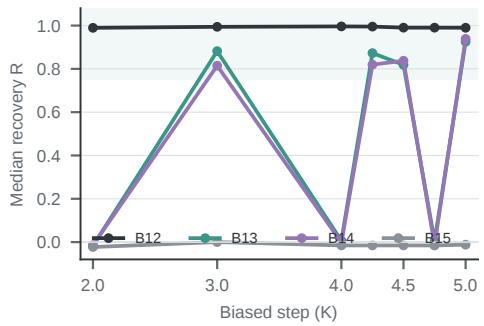  
Figure 11: Behavioral failure precedes stable writability closure in the Neutral path. a, At 2K, newly observed failures retain effective edits about three blocks deeper than failures already present at 1K. b, The same comparison is summarized per trajectory by its deepest writable block. c, Among the same 2K failures, deeper writability predicts departure from the shortcut mode at 3K. d, On fixed persistent identities, downstream B13/B14 access can close and reopen across nearby checkpoints; curves show cohort medians.

## B.4 BOUNDARY-PHASE CONTROLLER ABLATIONS

Across the six Spring run–direction groups in the main-text comparison, median normalized recovery ranges from .910 to 1.012 for the Top-4 paired-difference edit and from .910 to 1.009 for the predicted boundary-state controller.

The two-dimensional view in Figure 3b is a fit-only phase-aligned projection inside the frozen top-four route. After fitting the joint raw, uncentered PCA on 128 fit differences, we fit within each target direction

$$
z ( \theta ^ { * } ) = \mu + a \cos \theta ^ { * } + b \sin \theta ^ { * }
$$

in four-dimensional route coordinates and orthonormalize the span of $[ a , b ]$ . This frozen plane is then applied to 64 disjoint held-out pairs per direction. For the displayed run, held-out phase-plane $R ^ { 2 }$ is $. 9 3 5 / . 8 8 1 $ ; the corresponding unsupervised branch-local $\mathrm { P C } \bar { 2 } \mathrm { - } \bar { \mathrm { P C } } 3$ view gives $. 8 7 2 / . 8 7 5$ . Thus the panel shows that a phase-organized component exists within the Top-4 edit subspace, not that phase explains every Top-4 coordinate.

The executable controller in Figure 3 reads only the input-history boundary phase

$$
\theta ^ { * } = \mathrm { a t a n 2 } ( - v ^ { * } / \omega _ { \mathrm { t r u e } } , x ^ { * } )
$$

and requested target direction $s \in \{ + 1 , - 1 \}$ . One pooled fit uses

$$
[ 1 , \cos \theta ^ { * } , \sin \theta ^ { * } , s , s \cos \theta ^ { * } , s \sin \theta ^ { * } ]  \hat { z } _ { 1 : 4 } .
$$

Because s has two values, this is algebraically equivalent to fitting a separate first-harmonic map $[ 1 ,$ , cos $\theta ^ { * }$ , sin $\theta ^ { * } ]$ for fast- and slow-target edits. Every model in Figure 12 is fit on the same 128 full edits from strict pairs (64 per direction) and tested on 128 disjoint edits. Direction alone explains the common route offset, but not the state-varying coordinates; sharing one phase law across both targets also fails. The full target-specific phase model reaches held-out coordinate $R ^ { 2 } = . 8 2 8 – . 8 8 5$ across three independently trained checkpoints. Adding explicit ω/amplitude features improves mean held-out $R ^ { 2 }$ by only .011, while raw boundary-state and larger derivative-shaped bases do not improve it.

b Direction sets PC1; phase a Target-specific phase captures state variation resolves PC2--PC4  
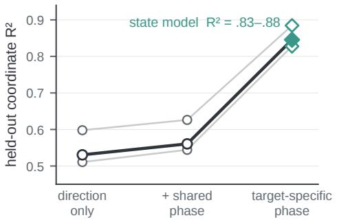

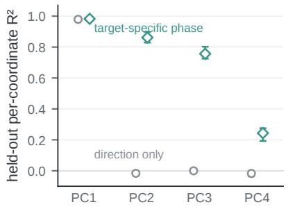  
Figure 12: Within the tested first-harmonic controller family, target-specific boundary phase is needed to predict the Top-4 edit coordinates. a, Thin lines are independently trained checkpoints; the thick line is their median. Direction-only and a shared additive phase law leave substantial held-out error; allowing the first-harmonic coefficients to depend on target direction recovers the full state model. b, Direction alone predicts the coarse PC1 translation but almost none of PC2–PC4; target-specific phase predicts those state-varying coordinates. Markers in b are medians and error bars span the minimum and maximum across the three checkpoints. All values are fit-only held-out coordinate predictions, not decoded recovery rates.

Repeating the same fit-only phase-aligned-plane analysis on explicit 100K checkpoints replicates the structure at the localized functional layers B3, B6, and B4. Qualification is checkpoint-local; held-out fast/slow counts are $5 0 / 4 5 , 6 0 / 5 3 .$ , and 54/53 for Runs A–C. Held-out fast/slow phase-plane $R ^ { 2 }$ is .868/.817 for Run A, .934/.881 for Run B, and .924/.895 for Run C (315 held-out paired-difference records total). For Run B, these values are nearly identical to the 50K result (.935/.881), whereas its branch-local PC2–PC3 control at 100K is .866/.824. The contrast shows that apparent loop tightness depends on the projection: the fit-only phase-aligned plane and unsupervised local PCs answer different questions within the same frozen route.

## B.5 BOUNDARY-STATE AND AFTER-CONFLICT CONTROLLERS

The boundary-state controller uses only the input boundary state and requested rewrite direction to predict $\hat { z } _ { 1 : 4 }$ and reconstruct the condition-prefix edit through the frozen top-four basis. Baseline rollouts define the held-out strict-failure evaluation cohort but are not inputs to the controller. A complementary coordinate-difference model first decodes the natural conflict and estimates its realized frequency and future-start phase, $( \hat { \omega } _ { C } , \hat { \phi } _ { C } )$ . Given a requested target state $( \omega _ { T } , \phi _ { T } )$ , it forms

$$
\Psi ( \omega , \phi ) = [ \omega , \cos \phi , \sin \phi , \omega \cos \phi , \omega \sin \phi ] , \qquad \Delta \Psi _ { C \to T } = \Psi ( \omega _ { T } , \phi _ { T } ) - \Psi ( \hat { \omega } _ { C } , \hat { \phi } _ { C } ) .
$$

The requested physical frequency is mapped into the model’s decoded-frequency convention by a fit-only calibration, and target phase is supplied by a target-specific first-harmonic law fit on the same training split. On the 128 held-out receivers per run, constructing the edit reads only the natural conflict rollout—not the held-out aligned video or activation. Held-out coordinate ${ \bf \dot { \cal R } } ^ { 2 }$ is .828/.879/.850 across Runs $\mathbf { A - C } ,$ and median decoded recovery over the six run–direction groups ranges from .895 to 1.004.

This difference form has useful structure. It is zero when target and current states agree, reverses sign when source and target are exchanged, and composes additively through intermediate states. The sine–cosine embedding removes the $2 \pi$ phase discontinuity; $\Delta \omega$ supplies the coarse frequency translation, while the phase and ω-weighted phase terms provide position-like and velocity-like corrections. A single pooled linear map therefore supports continuous target specification, although the decoded evaluations in this paper are restricted to the two matched target families; they do not establish reliable control of unsupported middle frequencies. The model remains retrospective because $( \hat { \omega } _ { C } , \hat { \phi } _ { C } )$ must be measured from the first generated future; the target state is specified without another donor video.

## a Two physical parameterizations obey different information contracts

Executable input-state controller  
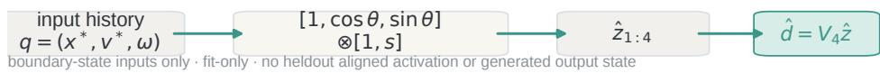  
Post-generation specified-target edit

$$
\Delta \Psi = \Psi ( \omega _ { T } , \phi _ { T } ) - \Psi ( \hat { \omega } _ { C } , \hat { \phi } _ { C } )
$$

b Comparable heldout coordinate fit  
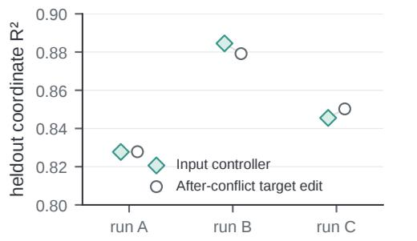

c Both parameterizations recover matched targets  
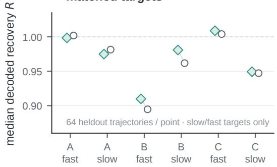  
Figure 13: Two physical parameterizations describe the route under different information contracts. a, The boundary-state controller uses only input boundary phase and target direction to construct its edit. The coordinate-difference model measures the decoded conflict state and compares it with a target state supplied by fit-only frequency calibration and phase prediction; it reads neither the held-out aligned video nor an aligned activation donor. b, Both parameterizations predict similar held-out route coordinates. c, Injecting either prediction recovers the matched target family, but only the boundary-state controller constructs its edit without reading the generated conflict future. Decoded interventions are evaluated only for the slow and fast matched target families, not unsupported middle frequencies.

## B.6 FULL-DIMENSIONAL MEAN AND RECEIVER-SPECIFIC EDIT CONTROLS

The state-conditioned Top-4 controller is not helped merely by operating in a larger activation space. We compare it with a fit-only full-dimensional mean that retains every activation coordinate but is constant across held-out receivers within each target direction. Across all 15 checkpoints, the controller has a higher strict target-band rate and a higher recovery-window rate at every checkpoint. Pooled over the 1,920 held-out receivers, strict success rises from 47.6% to 68.9%, and recoverywindow success rises from 58.2% to 81.7%. The receiver-specific full edit reaches 75.3% and 90.2%, respectively, but is an oracle diagnostic because it reads each held-out aligned activation (Figure 14).

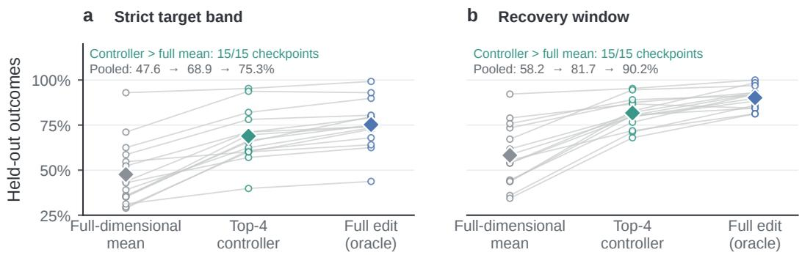  
Thin lines pair methods within checkpoint; diamonds show pooled rates.

Figure 14: State-conditioned Top-4 controllers outperform a full-dimensional global mean across 15 checkpoints. a, Strict target-band rates. b, Recovery-window rates. Each checkpoint (seeds 3407–3421) contributes 128 disjoint held-out receivers. Thin lines pair methods within a checkpoint; small points are checkpoint rates and diamonds are pooled rates. The fit-only full mean keeps all activation dimensions but is constant across receivers within a target direction. The full edit uses each receiver’s aligned-minus-conflict difference and is therefore an oracle reference, not a transferable controller. All displayed intervention records are valid.

## B.7 CROSS-SYSTEM REPLICATIONS OF PHYSICALLY ORGANIZED WRITABILITY

## B.7.1 PENDULUM

We repeat the behavioral, edit-geometry, decoded-recovery, and depth-localization analyses in a Pendulum frequency–color task. Table 4 summarizes the frozen experimental contract.

Table 4: Pendulum replication contract and provenance.
<table><tr><td>Component</td><td>Frozen setting</td></tr><tr><td>Model</td><td>width-1152 DiT, seed 3407, Short/Long 50K</td></tr><tr><td>Checkpoint</td><td>step 50,000</td></tr><tr><td>Behavior</td><td>64 physical states × 11 cues in each of four history-band cells; 2,816 decoded futures</td></tr><tr><td>Mechanism split</td><td>128 strict receivers; 64 fit and 64 disjoint held-out, balanced 32/32 per target direction</td></tr><tr><td>Intervention</td><td>after block 12 (zero based), all 20 flow-matching calls, 1,088 condition-prefix tokens; target suffix unchanged</td></tr><tr><td>Evaluator</td><td>Detection ≥ 50%, missing runs  $\leq 1 2$  frames, adjacent/boundary  $\mathrm { j u m p s } \leq 3 0 \mathrm { p x }$  , and a valid oscillation fit; common across condi-</td></tr><tr><td>Same-rank comparison</td><td>tions Paired-difference Top-4 coordinates and controller-predicted Top-4 coordinates; global scale 1.0 selected on fit only</td></tr></table>

The frozen oscillation-fit RMSE limit is .12; bob size and inferred length are retained as diagnostics, not exclusion gates.

Appearance cue and observed motion compete in decoded Pendulum futures. All $4 \times 6 4 \times 1 1 =$ 2,816 rollouts yield valid dynamics and appearance measurements, with physical-state identity as the clustering unit. Endpoint cues favor their training-associated frequency, while ambiguous cues give observed motion more control; generated appearance moves with the selected motion (Figure 15).

Boundary angle and angular velocity organize the edit. Raw, uncentered PCA is fit on paired differences from the fit split, and the top-four coordinates are retained. Within each target direction, a first-harmonic law of boundary phase—the oscillator-specific encoding of angle and angular velocity—defines a frozen two-dimensional plane. Disjoint held-out edits lie on the same structure, with phase-plane $R ^ { 2 } = . 9 7 5$ for target-low and .985 for target-high $( n = 3 2$ each; Figure 16).

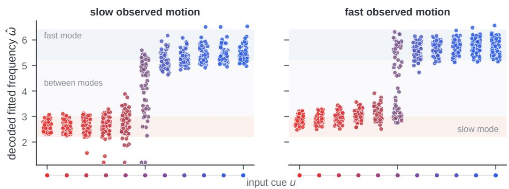  
a Decoded solution landscape

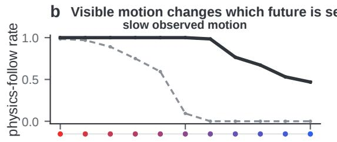

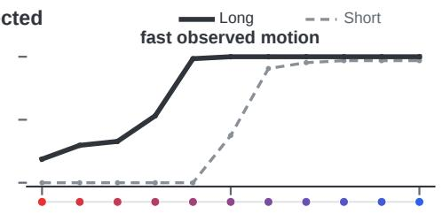  
Figure 15: Appearance cue and observed motion compete in Pendulum decoded rollouts. a, The Short landscape holds low or high observed motion fixed while sweeping 11 cues; point RGB is measured from the generated future, and pale bands mark the two training-supported frequency ranges. b, The same per-cue physics-follow summary compares Short and Long input using the main-paper line-style convention.

a Position and velocity organize the write  
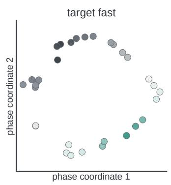

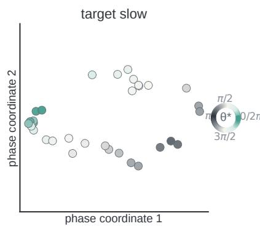

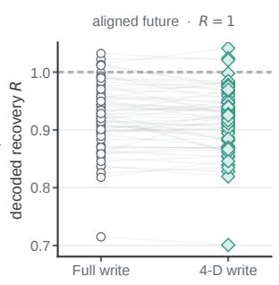

Figure 16: Pendulum physical state organizes edit coordinates. The two phase planes show disjoint held-out target-fast and target-slow writes in the frozen fit-only coordinate system; point color is boundary phase. The paired inset compares full and Top-4 decoded recovery on all 64 held-out receivers. Held-out phase-plane $R ^ { 2 }$ is .985/.975.  
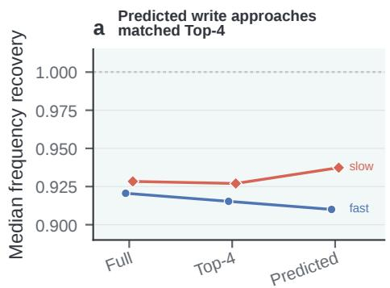

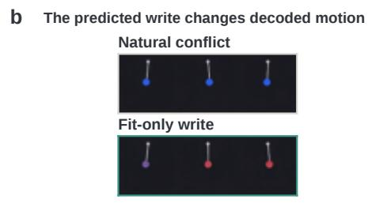  
Figure 17: A donor-free top-four Pendulum controller approaches the Top-4 reference. a, Fastand slow-target medians among evaluator-valid receivers compare Full, Top-4, and predicted writes in the same coordinate space. b, Real decoded strips show the same held-out receiver before and after the fit-only write. All-cohort validity and near-full counts are reported in the accompanying text.

A donor-free controller reaches the same-rank reference. Across 64 held-out receivers, the natural-conflict, full-edit, Top-4, and predicted-edit conditions are evaluator-valid for all 64 receivers; their all-cohort near-full counts are 0, 63, 63, and 63. Median recovery is 0, .925, .926, and .917, respectively. The fit-only controller therefore approaches its Top-4 reference while using fit-learned parameters and held-out boundary state. It produces 58 physics-following futures and six compromises. The decoded frame strips hold receiver, noise, schedule, and future window fixed (Figure 17).

Writability again closes over a localized depth range. On the Short/Long common-strict cohort $( n = 3 8$ paired receivers per direction), Long increases integrated writability $D ^ { \omega }$ by 10.53 sites for target-low and 8.05 sites for target-high. The midpoint $L _ { 5 0 }$ moves later by 9.46 and 7.95 sites, respectively. Additional motion history therefore delays commitment in both directions (Figure 18).

a Visible motion delays Pendulum commitment  
  
Figure 18: Visible motion delays Pendulum commitment in both directions. Target-low and target-high directions are shown separately with Short and Long common-strict rewrite-probability curves overlaid. Thin amber lines mark their separate $L _ { 5 0 }$ closure sites.

## B.7.2 FREE FALL

Free Fall tests the same claims in a non-oscillatory system. A mass is released from rest at a fixed boundary state, with red paired with the low-gravity range $g \in [ . 0 0 3 , . 0 2 5 ]$ and blue with the highgravity range $g \in [ . 0 4 5 , . 0 6 7 ]$ . The model has 30 DiT blocks and is evaluated at 100K with 32 visible conditioning frames. Table 5 summarizes the frozen contract.

Table 5: Free-fall replication contract and provenance.
<table><tr><td>Component</td><td>Frozen setting</td></tr><tr><td>Model</td><td>width-1536 DiT, 30 blocks, 12 heads, seed 3407, 100K</td></tr><tr><td>Behavior</td><td>64 Short-regime trajectories × 11 cues; 704 decoded futures dis- played. The full 1,408-row Short/Long diagnostic remains in source data</td></tr><tr><td>Mechanism bank</td><td>128 gravity-error pairs, balanced across low/high gravity: aligned  $| \hat { g } - g | < . 0 0 2$  , conflict  $| \hat { g } - g | \geq . 0 0 2$ </td></tr><tr><td>Intervention</td><td>after block 1, all 20 flow-matching calls; observed-frame tokens edited and future-frame tokens unchanged at insertion</td></tr><tr><td>PCA and controller</td><td>Shared uncentered PCA fit on 64 pairs only; direction-specific  $[ 1 , g _ { \mathrm { t a r g e t } } ]$  laws fit on 32 pairs each. The remaining 64 pairs (32</td></tr><tr><td>Evaluator</td><td>per direction) are held out, with disjoint base seeds Gravity-fit success:  $| \hat { g } - g | < . 0 0 2$ </td></tr></table>

Here failure means inaccurate gravity, not necessarily a switch to the opposite gravity interval. Success and normalized recovery $R = ( \hat { g } _ { \mathrm { e d i t } } - \hat { g } _ { C } ) / ( \hat { g } _ { A } - \hat { g } _ { C } )$ use the same fitted gravities; A and C denote the aligned and conflict baselines.

Decoded gravity remains in the observed-motion family across appearance cues. We display the 704 decoded futures from the 32-frame Short regime used by the mechanism experiments. In both physical ranges, hue shifts fitted gravity within the history-consistent family without switching to the other range (Figure 19). Point color shows decoded appearance.

a Decoded gravity follows the observed-motion family

  
Figure 19: Decoded Free Fall gravity follows the observed-motion family. Holding low- or high-gravity observed motion fixed in the 32-frame regime, we sweep 11 appearance cues and fit $\hat { g }$ from all 704 decoded futures. Point color is measured future appearance; pale bands show the two training-supported gravity ranges.

Specified gravity organizes a compact edit family. A shared uncentered PCA basis is fit on 64 paired differences, excluding all 64 held-out pairs. Within each target direction, a $[ 1 , g _ { \mathrm { t a r g e t } } ]$ law is fit on 32 pairs and evaluated on the other 32. Rank 2 is the smallest rank retaining at least 99% of fit-set residual energy (99.545%). At each retained rank, a single global scale is the square root of total divided by retained fit-set energy; at rank 2 it is 1.00228, shared by oracle projection and controller, with no per-receiver norm matching. Held-out joint coordinate $R ^ { 2 ^ { * } }$ is .997/.992 for low/high targets. Four-coordinate oracle projection achieves gravity-fit success on all 64 held-out pairs (Figure 20).

a Target gravity organizes edit coordinates

  
Figure 20: Target gravity organizes compact Free Fall edit coordinates. a, Held-out paired differences (32 per direction) are shown in the first two coordinates of a PCA basis fit on the separate 64-pair fit set; point shade is target gravity, and the displayed $R ^ { 2 }$ evaluates the direction-specific $[ 1 , g _ { \mathrm { t a r g e t } } ]$ law. b, Paired-difference projection saturates rapidly with retained PCA rank; gravity-fit success rates use the same 64 held-out pairs at every rank. Basis and rank-dependent global scales use only the fit set.

The donor-free controller changes held-out decoded futures. Frozen direction-specific $[ 1 , g _ { \mathrm { t a r g e t } } ]$ controllers map specified gravity into the same two-coordinate space without reading a held-out activation donor. All 64 held-out outputs are evaluator-valid; median normalized recovery is .967; gravity-fit success is $6 1 / 6 4 = . 9 5 3$ , with mean absolute gravity error .00086. The edit also moves

## a Donor-free write approaches matched recovery

Figure 21: A donor-free free-fall controller approaches matched decoded recovery. a, Gravity-fit success is reported for the full-edit reference, Top-2 oracle projection, and predicted directional controller on the same 64 held-out receivers (64, 62, and 61 successes, respectively). b, Real decoded keyframes show matched natural and controller-edited held-out examples with the same receiver, generation seed, flow-matching schedule, and future window.  
  
Figure 22: Free Fall reproduces localized causal writability. Gravity-fit success is shown at every intervention block on the same 128 gravity-error pairs. The amber line marks the .75 success-fraction boundary between B1 and B2; every edit is applied at all 20 flow-matching calls.

appearance toward the training-associated target color in all 64 outputs, so this is a physically parameterized edit to the coupled target future, not a color-disentangled gravity subspace. Figure 21 includes two real matched natural/controller-edited held-out comparisons, selecting the receiver closest to the direction-specific median recovery in each target range.

Direct writability is concentrated in early blocks. The same full edit reaches gravity-fit success of 1.0 after blocks 0 and 1, then the gravity-fit success fraction falls below .75 after block 1 (Figure 22). The full 30-block profile is displayed.

## B.8 PERSISTENT-ERROR COMPOSITION CONTROL

Figure 23 removes a possible sample-composition explanation for the training-time contraction in causal writability. We freeze the trajectory identities that remain strict shortcut failures at all six evaluated checkpoints, then compare those same trajectories at 5K and 100K. Thus a later checkpoint cannot appear less writable merely because its local strict bank contains a different set of failures.

  
Figure 23: The same unresolved shortcut errors become less causally writable during training. a, Each gray line is one seed cohort evaluated on fixed persistent-error trajectory identities; amber is the trajectory-weighted mean. Thirteen of fifteen cohorts decline from 5K to 100K, with mean paired change $\Delta D ^ { \omega } = - 0 . 6 2$ sites (seed-clustered 95% CI [−1.48, −0.11]). b, The same 886 trajectories lose access under raw, valid-only, and continuous-recovery scoring, using the same trajectory weighting and seed-then-trajectory bootstrap.

## B.9 WRITABILITY ROBUSTNESS AND HISTORY DEPENDENCE

We test whether the writability results depend on the near-full recovery threshold, measured output/state covariates, or invalid frequency readouts. We then report the operational Short/Long boundaries separately for each of the three training seeds.

The checkpoint-centered cross-solution association is direction-asymmetric: fast-target writability has $r = . 4 4 ( 9 5 \% \mathrm { C I } [ . 0 5 , . 7 1 ] )$ , whereas the slow-target estimate is $r = . 2 9 ( 9 5 \% \mathrm { C I } [ - . 0 3 , . 5 1 ] )$ . The pooled $r = . 4 0$ association in Figure 25a summarizes an overall tendency, with a stronger estimate in the fast branch.

Figure 32 expands the Short/Long boundary summary into all six complete fast-target layer profiles. We restrict this comparison to the fast target because no complete three-run Long slow-target strict cohort is available: Runs B and C each qualified zero of 4,096 evaluated candidates, and no corresponding Run-A qualification result was located in the audited Large-Long result root.

Table 6: Long checkpoints have later operational fast-target write boundaries for all three training seeds at 50K. Boundaries are the last after-block sites whose strong-rewrite rate is at least .75. Short and Long use the same architecture, step, and intervention protocol, but each checkpoint is evaluated on its own 128-pair strict bank; trajectory identities are not paired across history regimes.
<table><tr><td>Run</td><td>Short boundary</td><td>Long boundary</td><td>Long - Short</td></tr><tr><td>A</td><td>B3</td><td>B16</td><td>+13</td></tr><tr><td>B</td><td>B6</td><td>B8</td><td>+2</td></tr><tr><td>C</td><td>B6</td><td>B10</td><td>+4</td></tr></table>

  
Figure 24: Early writability and training-time closure survive alternative definitions and measured controls. a, The early gap between future-rescued and persistent failures remains under six definitions of writability (157 rescued, 953 persistent). b, The same early separation remains after controlling natural error severity and boundary state. Diamonds show pooled trajectory mean differences in a and direction-balanced AUC in b; horizontal lines are seed-clustered trajectory bootstrap 95% intervals.

  
Figure 25: Across-run writability is associated with physics behavior at the same training steps. a, After checkpoint centering, runs with larger $D ^ { \omega }$ tend to be more physics-following. b, The association is clearer for fast-target quantities than for the slow target; the pooled result summarizes a direction-asymmetric tendency. Complete six-checkpoint seed trajectories are the bootstrap unit.

## B.10 EARLY ERROR FATE AND DOWNSTREAM TARGET WRITE

Figure 26 asks whether trajectories with different future training outcomes already differ in downstream route realization at the same early checkpoint and boundary.

b More target write, more decoded rescue  
  
Figure 26: Early failures later rescued by training already realize more of the condition-totarget route. At the same 5K boundary, trajectories later rescued by training already show a larger route-aligned target-state response than persistent failures (a). A K-only intervention also changes decoded frequency only in the future-rescued group (b; 11 rescued and 12 persistent fast-target failures). The source controller is fit on separate trajectories. Curves and markers show trajectory means; shaded bands and error bars are trajectory-bootstrap 95% intervals.

## B.11 CROSS-RUN TRANSFER CONTROLS AND TARGET-CONDITIONED OUTCOMES

The scale-plus-orthogonal maps in Figure 27 are fit on 128 matched differences and evaluated on 128 disjoint physical identities for every directed run pair. Matched within-direction coordinate $R ^ { 2 }$ ranges from .955 to .997, whereas shuffling trajectory identity within direction gives means of .066–.152; none of 20,000 shuffles reaches the matched value $( p < 0 . 0 0 0 0 5$ for every map). This shuffle tests coordinate geometry, not decoded intervention efficacy. The separate intervention test passes held-out boundary state through the source controller, frozen cross-run map, and target basis. All six directed maps redirect decoded frequency with pooled direction-median recovery $\bar { R } = . 9 4 2 \mathrm { - } . 9 9 1$

Absolute physics-follow rates remain bounded by the target model’s own full-edit ceiling; normalized recovery is therefore the primary cross-run transfer endpoint.

fast target slow target direction median

a Matched state coordinates align across runs  

b Fit-only controllers transfer causally  
  
Figure 27: Internal geometry transfers across independently trained models. a, A fit-only scale and four-dimensional orthogonal map aligns held-out matched coordinates in all six directed run pairs; within-direction trajectory shuffles do not. b, Source-controller predictions transferred through the frozen maps recover decoded frequency in both rewrite directions. The shuffle in a is a coordinate null; the decoded claim in b comes from separate held-out interventions.

## B.12 MATCHED-COORDINATE COMPATIBILITY ACROSS TRAINING CHECKPOINTS

We next ask whether a route coordinate selected at one training checkpoint can be expressed at another checkpoint in the same run. The assay uses exactly 5K, 10K, 20K, 50K, 80K, and 100K. Every checkpoint independently qualifies strict failures from the same frozen 256-trajectory library. Each source–target map is fit on the qualified intersection inside one permanent fit split and evaluated on the corresponding intersection inside the globally disjoint held-out split; a physical identity never changes split.

Matched-coordinate compatibility persists across exact checkpoints  
  
Figure 28: Matched route coordinates remain compatible across exact training checkpoints. Cells report the held-out fraction satisfying $. 7 5 < R < 1 . 2 5$ after a Top-4 coordinate selected at the source checkpoint is mapped by a fit-only scaled-orthogonal transform and injected at the target checkpoint’s own rewrite site. All 90 directed off-diagonal maps are shown; each cell contains $8 8 - 1 2 3$ held-out physical trajectories, with Wilson 95% intervals in the source data. Blank diagonals mean self-transfer was not evaluated. The assay tests within-run temporal compatibility, not the predicted controller transfer in Figure 27b.

Compatibility is high but solution-dependent: the median cell fraction is .966, .893, and .796 for Runs A–C, respectively. This does not contradict contracting writability. Figure 28 asks whether a matched selected coordinate can be transported between each checkpoint’s own rewrite site on a qualified intersection; $D ^ { \omega }$ asks how long a local condition-side edit remains directly effective across depth.

a Run A · K-head concentration

## B.13 SHARED MEDIATION AND IMPLEMENTATION MULTIPLICITY

Having established shared route geometry, we compare separately calibrated head- and componentlevel interventions. The goal is to identify how the edit is mediated within each run, not to rank components at a common gain.

  
Figure 29: Shared route semantics admit distinct downstream bottlenecks under the tested interventions. In Run A, one K head closely reproduces the calibrated whole-K/V response. In Run B, the tested K-head intervention at gain 8 remains below whole-K/V at gain 2. In Run C, the tested whole-K/V gains 1, 2, and 4 do not cross the margin, whereas the selected V-head intervention does. Markers show mean final recovery over 16 held-out trajectories per panel. The panels establish implementation multiplicity. Independently calibrated doses do not support equal-dose component rankings.

The compact comparison above uses independently calibrated doses. To expose the underlying causal margins, Figure 33 reports the complete tested gain grids for the intervention that is informative in each run.

Table 7: Component restoration localizes a common attention-mediated target write. The first four rows restore natural-conflict condition components inside the successful full edit; effects are relative to the intact edit over six run–direction groups with 16 paired receivers each. The final rows compare post-attention target-state and MLP-output interventions. Intervals are hierarchical-bootstrap 95% CIs over group medians.
<table><tr><td>Paired contrast</td><td>Unit</td><td>∆R</td><td>95% CI</td></tr><tr><td>Restore conflict Q — full edit</td><td>6 × 16</td><td>+.0004</td><td>[−.0010, +.0047]</td></tr><tr><td>Restore conflict K — full edit</td><td>6 × 16</td><td>-.917</td><td>[−.967, −.028]</td></tr><tr><td>Restore conflict V — full edit</td><td>6 × 16</td><td>-.003</td><td>[−.456, +.005]</td></tr><tr><td>Restore conflict K+V — full edit</td><td>6 × 16</td><td>-.931</td><td>[-.985, -.908]</td></tr><tr><td>Edited post-attention target – edited MLP output</td><td>23 receivers / 6 groups</td><td>+.960</td><td>[+.253, +1.024]</td></tr><tr><td>Restore conflict post-attention target — re- 24 receivers / 6 groups store conflict MLP output</td><td></td><td>-.979</td><td>[-1.042, -.938]</td></tr></table>

## B.14 SPECIFICITY AND SAME-COHORT FULL-EDIT REFERENCES

For the Run-C V/h8 bottleneck, we test whether decoded rescue specifically tracks realization of the target route. We also compare the same 48 failures under the B9 head intervention and three B4 residual-edit references while keeping their distinct operators explicit.

a Route-aligned write predicts decoded rescue  

b Route signal survives norm control  
  
Figure 30: Decoded rescue follows the route-aligned target write, not generic activation growth. a, On the same 48 trajectories, the gain-6 to gain-8 increase in target-route projection tracks frequency recovery and identifies newly physics-following rollouts. b, Route projection remains associated with recovery after controlling response norm; the estimated partial association of response norm after controlling route projection is near zero (ρ = −.006, 95% CI [−.276, .238]).

Table 8: Single-head rescue is comparable with full-edit references on the same 48 failures. All interventions use the same held-out Run-C fast-target cohort, but the first three act on the B4 condition residual, whereas the single-head intervention acts on attention V at B9. We report physics-follow rates descriptively because these interventions act at different sites and through different operators. All four arms are evaluator-valid; off-family denotes valid tracks outside the supported frequency categories.
<table><tr><td></td><td colspan="5">Mean Median</td><td></td><td>Off-</td></tr><tr><td>Intervention</td><td>Site / operator</td><td>R</td><td>R</td><td></td><td>Physics Shortcut Compromise family</td><td></td><td></td></tr><tr><td>Full paired difference B4 condition residual</td><td></td><td>.992</td><td>1.002</td><td>50.0%</td><td>0.0%</td><td></td><td>39.6% 10.4%</td></tr><tr><td>Top-four projection</td><td>B4 condition residual</td><td>.992</td><td>1.003</td><td>41.7%</td><td>0.0%</td><td></td><td>41.7% 16.7%</td></tr><tr><td>Fit-only state edit</td><td>B4 condition residual</td><td>.972</td><td>.994</td><td>43.8%</td><td>0.0%</td><td></td><td>41.7%14.6%</td></tr><tr><td>Single V/h8, gain 8</td><td>B9 attention V head</td><td>1.048</td><td>1.087</td><td>56.3%</td><td>0.0%</td><td></td><td>20.8% 22.9%</td></tr></table>

## B.15 FM-TIME ALLOCATION AND DECODED SINGLE-HEAD RESCUE

Finally, we distribute the same gain-8 V/h8 write over different flow-matching-call windows and inspect both the immediate target-route response and the decoded continuation.

a Late calls carry the single-head effect  
  
b The intervention changes decoded video

  
Figure 31: The localized V-head write changes decoded video when applied over late flowmatching calls. a, On the same 48 selection-clean Run-C fast-target failures, an early-call write is internally visible but behaviorally ineffective, while late or all-call allocation rescues frequency. Markers show trajectory means with trajectory-bootstrap 95% intervals. A separate same-identity fast-target cohort $( n = 1 6 )$ shows that neither five-call half of the late window rescues alone. b, A representative exact replay changes the decoded joint continuation from red/slow to blue/fast; it is the robust ${ \bf - } L _ { 1 }$ medoid selected from 28 eligible successful replays, and frames mark measured turning points in the same future window.

a Run A · Short  

b Run B · Short  

c Run C · Short  

d Run A · Long  

e Run B · Long  

f Run C · Long  
  
Figure 32: Long-history fast-target writes remain effective deeper in all three Spring solutions. a–c, Short-history layer scans for Runs A–C. d–f, The corresponding Long-history scans. Every panel shows the complete checkpoint-specific 128-pair strict bank at 50K; each point is the fraction with a valid decoded output and . $7 5 < \dot { R } ^ { \omega } < 1 . 2 5$ . The amber horizontal line marks the .75 operational threshold, and the vertical line marks the last after-block site meeting it. Short and Long use the same architecture, checkpoint step, intervention, and readout protocol, but their strict banks are not trajectory-paired.

b Run B · whole K/V  
a Run A · K/h6  

  
Figure 33: Distinct K/V implementations have distinct causal dose responses. a, Run A writes only K head 6 at gains 1, 2, 4, 6, and 8 on 16 common selection-clean held-out fast-target failures. b, Run B writes whole condition K/V at gains 1, 2, 4, 8, and 12 on the same 16 physical identities. c, Run C writes only V head 8 at gains 2, 4, 6, 8, 10, 12, and 16 on 48 selection-clean held-out failures. Upper panels show mean frequency recovery with trajectory-bootstrap 95% intervals; lower panels show physics-follow and off/outside-family fractions. Gain zero is the unedited-conflict reference, for which R = 0 by definition. Every executed arm is evaluator-valid, uses all 20 flow-matching calls, and does not read a held-out aligned activation. Operators and gain scales differ across panels, so the figure establishes solution-specific causal margins rather than an equal-dose component ranking.