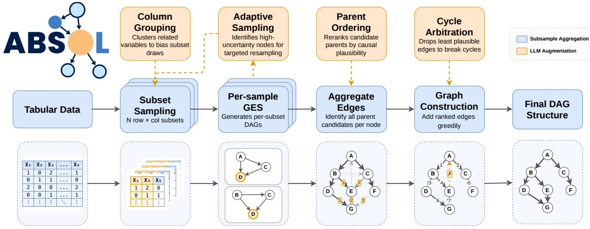
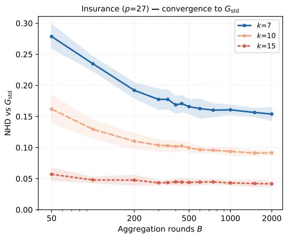
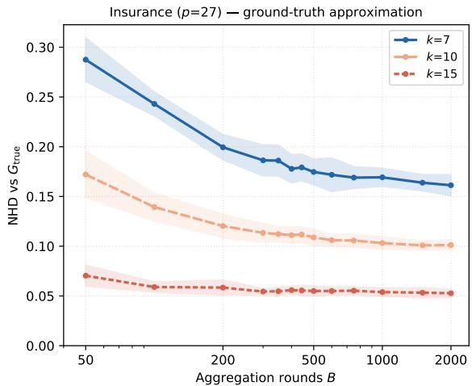
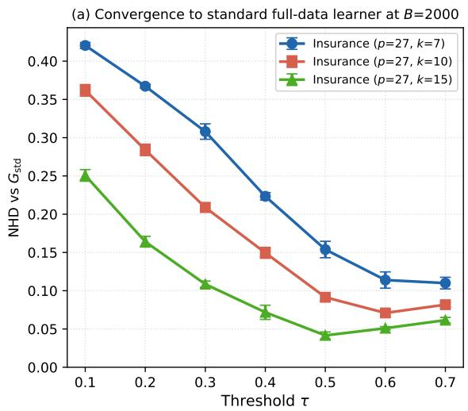
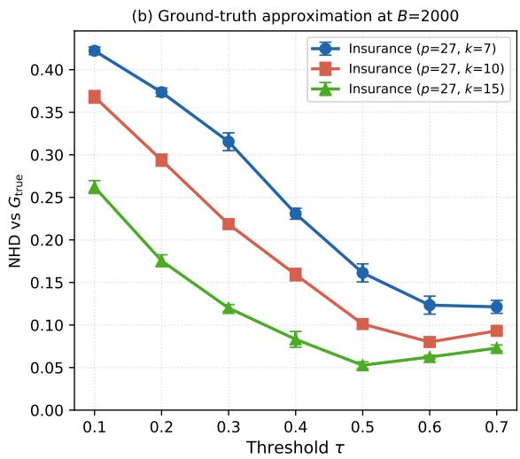

# ABSOL: Aggregated Bayesian Subsampling Orchestrated with LLMs

Jackson Hassell Megagon Labs jackson@megagon.ai

Chen Shen Megagon Labs chen\_s@megagon.ai

Estevam Hruschka Megagon Labs estevam@megagon.ai

## Abstract

Large language models are increasingly used as natural-language interfaces to structured data, yet they remain unreliable when answers require consistent evidence conditioning, dependency-aware reasoning, and uncertainty estimation. Bayesian networks provide an explicit probabilistic reasoning layer, but learning useful structures from data remains costly and fragile at scale. We introduce ABSOL, a hybrid LLM-guided Bayesian network structure-learning framework that uses LLMs as bounded semantic guides. Across five discrete BN benchmarks spanning 27 to 1041 nodes, ABSOL is the only evaluated method to produce a viable graph on every benchmark, and achieves the highest Edge F on every benchmark larger than 27 nodes with GPT-5.4. The four LLM augmentations, which contribute complementary semantic evidence to the statistical backbone, improve Edge F over the non-LLM aggregation backbone by +0.23 on average. Complementary post-hoc refinement experiments suggest that these gains depend in part on limiting the LLM’s authority over the final structure. Together, these results show that language-derived semantic knowledge can substantially improve scalable probabilistic structure learning when used as bounded guidance within a statistically grounded reasoning pipeline. The code for ABSOL is available at github.com/megagonlabs/absol-bn.

## 1 Introduction

Bayesian networks (BNs) represent dependencies among variables as a directed acyclic graph and support well-defined probabilistic inference over evidence, targets, and latent relationships (Pearl, 1988; Koller and Friedman, 2009). Constructing useful BNs at realistic scale remains difficult, however: manual specification is infeasible for domains with hundreds of variables, and purely data-driven structure learning is computationally expensive, statistically fragile, and sensitive to finite-sample effects (Scutari et al., 2019; Kitson et al., 2023).

At the same time, LLMs encode substantial semantic knowledge about how domain variables tend to relate: which are plausibly associated, which parent-child directions are semantically natural under a BN interpretation, and which relationships are unlikely or only indirectly mediated (Long et al., 2023; Darvariu et al., 2024; Ban et al., 2025). Recent NLP work on LLM-guided causal discovery and Bayesian Network structure elicitation either delegate graph construction directly to the LLM or interleave LLM guidance with a full-data statistical learner (Zhang et al., 2026; Jiralerspong et al., 2024; Babakov et al., 2025b; Long et al., 2023; Feng et al., 2025; Zhou et al., 2024; Babakov et al., 2025a), but neither path has been shown to scale to probabilistic models with hundreds of variables.

We introduce ABSOL (Figure 1), a hybrid LLMguided BN structure-learning pipeline that scales to networks with hundreds of variables. Rather than asking an LLM to generate an entire graph, ABSOL uses it only at bounded decision points, where semantic knowledge guides search while a statistical learner retains authority over structural decisions. This places ABSOL within a broader NLP-systems pattern of using LLMs not as unconstrained predictors, but as semantic controllers inside verifiable, statistically grounded reasoning pipelines.

To improve scalability, ABSOL learns BN subgraphs on many row-and-column subsampled tables and aggregates their edge-level decisions into a single global structure (Section 3.2), drawing on the idea that stable structural signals can be recovered through repeated resampling and aggregation (Breiman, 1996; Friedman et al., 1999a; Meinshausen and Bühlmann, 2010; Scutari and Nagarajan, 2013).

To incorporate semantic knowledge and compensate for the reduced sample size in each subsampled round, ABSOL consults the LLM at four bounded augmentations (Section 3.3): identifying variables likely to interact (Column Grouping), focusing additional sampling on ambiguous decisions (Adaptive Sampling), ranking candidate parents (Parent Ordering), and resolving local acyclicity conflicts (Cycle Arbitration). This design follows the emerging view that LLMs are more reliable as bounded priors than as autonomous generators of complete dependency graphs (Darvariu et al., 2024; Ban et al., 2025; Du et al., 2025). We evaluate ABSOL on five discrete BN benchmarks ranging from 27 to 1041 nodes to test whether bounded LLM guidance remains useful at scales where direct LLM graph generation and full-data search become impractical.

  
Figure 1: The ABSOL algorithm. Blue components form the subsample-aggregated GES+BDEU backbone, and orange components are the four bounded LLM augmentations, each acting at a fixed decision point. Graph construction is specified fully in Algorithm 1.

Our results show that bounded LLM guidance substantially improves BN structure learning. Across benchmarks, ABSOL achieves the highest Edge $F _ { 1 }$ among the compared methods under GPT-5.4 at every scale except INSURANCE. Under our evaluated implementations and computational budgets, no baseline produces a usable graph beyond NEUROPATHIC (222 nodes), whereas ABSOL runs successfully on DIABETES (413 nodes) and MUNIN (1041 nodes). Ablations show that the four LLM-guided components improve Edge $F _ { 1 }$ on every benchmark over $\mathsf { A B S O L } _ { \mathsf { n o L L M } }$ , with an average absolute lift of +0.23 and the largest relative gains on the largest graphs. Conversely, the post-hoc refinement variants in Appendix G, which give the LLM unilateral editing authority, reduce Edge $F _ { 1 }$ in eight of nine tested settings.

In summary, our contributions are threefold. First, we provide an empirical account of how language-derived semantic knowledge can be integrated with statistical evidence, contrasting bounded LLM guidance with direct graph generation and post-hoc editing. Second, we introduce a scalable subsample-aggregation backbone that decomposes large BN structure learning into tractable local searches. Third, we provide an empirical study of LLM semantic guidance at scale, showing improvements across BN benchmarks up to 1041 nodes and isolating the contribution of each bounded LLM augmentation.

## 2 Related Work

## 2.1 Bayesian Network Structure Learning

Bayesian network structure learning recovers a graph over variables from data (Pearl, 1988; Koller and Friedman, 2009). Existing methods fall into three families: constraint-based (e.g., PC), scorebased (e.g., GES with BDeu scoring), and hybrid approaches (Kitson et al., 2023). For discrete data, GES+BDEU is the standard score-based baseline (Heckerman et al., 1995; Chickering, 2002). ABSOL keeps GES+BDEU as the statistical core, but uses it through subsampled aggregation rather than a single full-data search.

## 2.2 Scaling Structure Learning Through Aggregation

Scaling structure learning to high-dimensional settings is challenging both algorithmically and statistically. Prior work reduces per-instance complexity by restricting the search space before learning – via candidate-parent restriction (Friedman et al., 1999b), local skeleton discovery combined with score search (Tsamardinos et al., 2006), greedysearch optimization for large data (Scutari et al., 2019), or learning and merging subgraphs from separate variable-space partitions (Bernaola et al., 2023) – at the cost of potentially missing longrange dependencies.

A complementary framing asks which structural features persist under data perturbations. Bootstrap aggregation (Breiman, 1996), applied to BN analysis, scores edge and Markov-blanket confidence by learning networks across resampled tables, with follow-up work refining model-averaging choices, replicate counts, and edge-confidence thresholds (Friedman et al., 1999a; Broom et al., 2012; Scutari and Nagarajan, 2013). Stability selection generalizes this intuition through subsampling followed by selection-frequency thresholds (Meinshausen and Bühlmann, 2010). ABSOL extends this line by learning overlapping variable subproblems with GES+BDEU and aggregating edge decisions under an explicit finite-sample bound.

## 2.3 LLM-Augmented Structure Learning for Bayesian Networks

LLM-augmented causal discovery operates at multiple stages, with varying LLM roles in the final structure decision. LLM-primary graph construction methods such as bfsBN (Jiralerspong et al., 2024) use the LLM to directly construct candidate graph structure, reaching 222 nodes on Neuropathic. Hybrid methods instead constrain the LLM to guide rather than decide. In-process guidance during algorithm execution appears most effective: score-based methods like Harmonized Prior (Ban et al., 2025) decompose LLM judgments into soft constraints for GES+BDEU scoring (reaching 109 nodes on Pathfinder), while constraint-based approaches like LLM-CD (Du et al., 2025) insert LLM guidance at skeleton construction and edgeorientation phases. Post-learning verification applies LLM feedback after structure recovery: Cau-Scientist (Peng et al., 2026) validates LLM proposals against data, and iterative refinement (Ban et al., 2023) cycles between learning and LLM-guided improvement suggestions. In the hybrid and inprocess settings, a consistent principle holds: the data-driven learner (GES+BDEU or PC) retains final authority over structural decisions, with the LLM as a biasing signal rather than the decision mechanism. ABSOL follows this guidance-based pattern, but applies LLM augmentation across a subsample-aggregation pipeline rather than a single full-data learner.

## 3 ABSOL Method

## 3.1 Problem Definition and Standard BN Learning

Let $D = \{ x ^ { ( r ) } \} _ { r = 1 } ^ { n }$ be a discrete data table with n rows and variables $X _ { 1 } , \ldots , X _ { p }$ . A Bayesian network (BN) consists of a directed acyclic graph G and local conditional distributions over these variables (Pearl, 1988; Koller and Friedman, 2009). Writing $\operatorname { P a } _ { i } ( G )$ for the parents of $X _ { i } .$ , the graph induces the factorization

$$
P ( X _ { 1 } , \ldots , X _ { p } ) = \prod _ { i = 1 } ^ { p } P ( X _ { i } \mid \operatorname { P a } _ { i } ( G ) ) .\tag{1}
$$

The structure-learning task is to estimate G from D.

We use score-based BN structure learning as the statistical reference. A score-based learner assigns a data-dependent score to each candidate graph and searches for a high-scoring structure. For discrete variables, we use the Bayesian Dirichlet equivalent uniform (BDeu) score (Heckerman et al., 1995). Because BDeu decomposes across node families, local graph operations can be evaluated by rescoring only the affected child families. We pair this score with Greedy Equivalence Search (GES), which greedily searches over Markov-equivalence classes of DAGs using local insert/delete operators (Chickering, 2002).

For any table $D ^ { \prime } .$ whether the full data D or a row/variable subtable, let $S _ { \mathrm { B D e u } } ( G ; D ^ { \prime } )$ denote the BDeu score of graph $G$ on $D ^ { \prime }$ . We define the GES+BDEU base learner A and its full-data reference output as

$$
\begin{array} { r l } & { \boldsymbol { \mathcal { A } } ( D ^ { \prime } ) : = \operatorname { G E S } \bigl ( D ^ { \prime } ; S _ { \mathrm { B D e u } } ( \cdot ; D ^ { \prime } ) \bigr ) , } \\ & { \quad G _ { \mathrm { s t d } } : = \boldsymbol { \mathcal { A } } ( D ) . } \end{array}\tag{2}
$$

Here $G _ { \mathrm { s t d } }$ denotes the graph returned by fulldata $\mathrm { G E S + B D E U }$ , which need not be the global maximizer of the BDeu score. The aggregation analysis below is therefore learner-relative: it asks when many smaller $\mathcal { A } ( D ^ { \prime } )$ runs reproduce the decisions of the full-data reference learner, rather than claiming recovery of the unknown causal graph.

## 3.2 Subsample-Aggregated BN Learning

Full-data A is expensive because score-based BN search may need to enumerate parent/operator subsets, which is exponential in $p$ in the worst case. ABSOL instead runs B independent searches on k-variable subtables, with total search cost $O ( B T _ { \mathrm { G E S } } ( m , k ) )$ (Table 2). The costly search therefore happens inside k-variable subproblems; $p$ enters the aggregation budget through the endpoint co-sampling probability $\begin{array} { r l } { \pi _ { \mathrm { e l i g } } } & { { } = } \end{array}$ $k ( k { - } 1 ) / ( p ( p { - } 1 ) )$ .

In round b, ABSOL samples m rows and k variables uniformly without replacement, runs A on the induced subtable, and embeds the learned graph $\widehat { G } ^ { ( b ) }$ back into the full variable set.1

We aggregate the learned structures by cooccurrence voting. For an unordered edge $e =$ $\{ u , v \}$ over the original $p$ variables, let $c _ { e }$ denote the number of rounds in which both endpoints were co-sampled $( \{ u , v \} \subseteq C _ { b } )$ . For any graph G, let $E _ { \mathrm { s k e l } } ( G )$ denote its unordered adjacency set. Throughout this subsection, $e \in G$ means $e \in E _ { \mathrm { s k e l } } ( G )$ , i.e., the two endpoints are adjacent regardless of direction. Thus, the aggregation guarantee below concerns adjacency inclusion; directed assembly is handled downstream, with parent ordering and cycle arbitration providing the LLMaugmented cases in Section 3.3. Define

$$
\widehat { f } _ { e } = \left\{ \begin{array} { l l } { \frac { 1 } { c _ { e } } \sum _ { b : \{ u , v \} \subseteq C _ { b } } { \mathbf { 1 } \{ e \in \widehat { G } ^ { ( b ) } \} } , } & { \mathrm { i f ~ } c _ { e } > 0 , } \\ { 0 , } & { \mathrm { i f ~ } c _ { e } = 0 . } \end{array} \right.\tag{3}
$$

Rounds in which either endpoint is absent from $C _ { b }$ are excluded from both numerator and denominator; only rounds with genuine co-occurrence contribute. On $c _ { e } > 0 , \widehat { f } _ { e }$ is an unbiased estimator of $p _ { e } ^ { \mathrm { c o } } = \mathrm { P r } [ e \in \widehat { G } ^ { ( b ) } \mid \{ u , v \} \subseteq C _ { b } ]$ , the edge probability conditional on co-sampling. Co-occurrence voting removes the mechanical shrinkage by the endpoint-eligibility rate $\pi _ { \mathrm { e l i g } } ;$ however, $p _ { e } ^ { \mathrm { c o } }$ can still depend on the variable budget k through the other variables co-sampled in the subproblem. The appendix derives the resulting concentration bound, including the case $c _ { e } = 0$ . Given a threshold $\tau$ , the aggregated graph is

$$
\widehat { G } _ { B } ( \tau ) = \{ e : \widehat { f } _ { e } \geq \tau \} .\tag{4}
$$

We next formalize two properties of the aggregated graph: it approximates the full-data reference learner on certifiable edge decisions, and its failure probability can be controlled by the number of subsampling rounds.

Theorem (Aggregation approximation). Let $G _ { \mathrm { s t d } }$ be the full-data output of A from Eq. 2. Let $\mathcal { M } _ { \mathrm { c e r t } }$ be the set of edges whose include/exclude verdict can be certified via the full-data GES operator trace; let $M _ { \mathrm { { c e r t } } } ~ = ~ | \mathcal { M } _ { \mathrm { { c e r t } } } |$ . For each certified edge $e ~ \in ~ \mathcal { M } _ { \mathrm { c e r t } } ^ { + }$ (included in $G _ { \mathrm { s t d } } )$ , define the positive margin $a _ { e } ^ { + } ~ = ~ p _ { e } ^ { \mathrm { c o } }$ $\tau ;$ for $e ~ \in ~ \mathcal { M } _ { \mathrm { c e r t } } ^ { - }$ (excluded from $G _ { \mathrm { s t d } } )$ , define the negative margin $a _ { e } ^ { - } ~ = ~ \tau ~ - ~ p _ { e } ^ { \mathrm { c o } }$ Let $\begin{array} { r } { a _ { \mathrm { m i n } } = \operatorname* { m i n } \left\{ \operatorname* { m i n } _ { e \in \mathcal { M } _ { \mathrm { c e r t } } ^ { + } } a _ { e } ^ { + } , \operatorname* { m i n } _ { e \in \mathcal { M } _ { \mathrm { c e r t } } ^ { - } } a _ { e } ^ { - } \right\} } \end{array}$ be the weakest signed margin, with empty positive or negative classes omitted. Under regularity, pathstability, and independent-round assumptions, if $a _ { \operatorname* { m i n } } > 0$ , then

$$
\begin{array} { r l } & { \operatorname* { P r } \Bigl [ \widehat { G } _ { B } ( \tau ) \cap \mathcal { M } _ { \mathrm { c e r t } } \neq G _ { \mathrm { s t d } } \cap \mathcal { M } _ { \mathrm { c e r t } } \Bigr ] } \\ & { \qquad \leq M _ { \mathrm { c e r t } } \left( 1 - \pi _ { \mathrm { e l i g } } \left( 1 - \exp ( - 2 a _ { \mathrm { m i n } } ^ { 2 } ) \right) \right) _ { \phantom { \mathrm { } } , \varepsilon } ^ { B } . } \end{array}\tag{5}
$$

The failure probability decays exponentially in $B ;$ the certified-universe construction, path-stability conditions, and detailed proofs are deferred to Appendix A. The theorem characterizes the subsample-aggregation backbone, and it does not provide a practical certificate for a full ABSOL run. Its practical role is to separate finite-vote disagreement, which additional rounds reduce, from limitations in each subsample’s information that additional rounds cannot remove.

Corollary (Aggregation budget). Since the realized margin $a _ { \mathrm { m i n } }$ is not known a priori, we fix a target resolvable margin $a _ { \mathrm { t a r g e t } } \in ( 0 , 1 / 2 ]$ and a pre-specified upper bound $\begin{array} { r } { M _ { 0 } \leq { \binom { p } { 2 } } } \end{array}$ on certified edges. Applying the standard bound $( 1 - x ) ^ { B } \leq$ $\exp ( - B x )$ to Eq. 5 at 5% failure probability yields the sufficient design rule

$$
B _ { 9 5 } ( a _ { \mathrm { t a r g e t } } ) = \left\lceil \frac { \log ( 2 0 M _ { 0 } ) } { \pi _ { \mathrm { e l i g } } ( 1 - \exp ( - 2 a _ { \mathrm { t a r g e t } } ^ { 2 } ) ) } \right\rceil ,\tag{6}
$$

where $\pi _ { \mathrm { e l i g } } = k ( k { - } 1 ) / ( p ( p { - } 1 ) )$ is the endpoint co-occurrence probability. For small margins $a _ { \mathrm { t a r g e t } } \ll 1$ , the formula simplifies to the approximation

$$
B _ { 9 5 } ( a _ { \mathrm { t a r g e t } } ) \approx \left\lceil \frac { \log ( 2 0 M _ { 0 } ) } { 2 \pi _ { \mathrm { e l i g } } a _ { \mathrm { t a r g e t } } ^ { 2 } } \right\rceil .
$$

We use $a _ { \mathrm { t a r g e t } } = 0 . 1 0$ as a reference margin for planning the subsample budget. Because $a _ { \mathrm { m i n } }$ is not known a priori, Eq. 6 gives a conservative sufficient budget rather than a dataset-specific optimum. In the main experiments, we use a common experimental budget of $B = 1 0 0 0$ (Table 6) for all datasets without per-dataset tuning. Appendix C reports how aggregation behaves as B varies, and Appendix A.8 lists the diagnostics for applying the bound.

## 3.3 LLM Augmentation Strategies

The aggregated learner ${ \widehat { G } } _ { B } ( \tau )$ is grounded in data but blind to variable meaning. ABSOL consults an LLM through four bounded augmentations in the pipeline (Figure 1, Algorithm 1), using semantic knowledge while keeping GES+BDEU as the statistical backbone. Each LLM response is parsed and validated before use, and if validation fails, the corresponding step falls back to its statistical baseline. All LLM calls receive short natural-language descriptions of each variable and its discrete states (Appendix F.2). Hyperparameters, prompt templates, and implementation details are deferred to Appendix B.

Column Grouping Uniform variable subsampling can waste rounds on subsets whose variables are unlikely to interact. For each $X _ { i } ,$ we ask the LLM which variables are plausible direct causes or effects, and symmetrize the responses into an adjacency graph $\mathcal { G } _ { \mathrm { L L M } }$ . During variable sampling, pairs adjacent in $\mathcal { G } _ { \mathrm { L L M } }$ are upweighted to co-occur more often, concentrating the fixed subsampling budget on semantically plausible dependencies.

Adaptive Sampling After the initial B rounds, edges with vote frequencies near τ are ambiguous; we score this ambiguity by the Bernoulli entropy of $\widehat { f } _ { e }$ . For nodes incident to high-entropy edges, the LLM is shown the uncertain candidates and their vote frequencies, then asked which additional variables should be co-sampled as possible confounders, mediators, or disambiguators. Additional rounds force-include the suggested variables, and their edge votes and co-occurrence counts are merged with the initial pool (Algorithm 2).

Parent Ordering Raw vote frequency ranks association strength, not causal direction: direct causes can be mixed with confounded or transitively correlated variables. For each node, the LLM sees every candidate parent with its subsampling support and returns a ranked list of plausible direct causes. This resembles prior-evaluation approaches for LLM causal knowledge (Darvariu et al., 2024), but the ranking is used inside the aggregation pipeline rather than supplied as external constraints to a separate discovery algorithm.

Cycle Arbitration Unlike broader LLM-based graph cleanup or refinement (Du et al., 2025; Ban et al., 2023), ABSOL invokes the LLM only when greedy assembly would violate acyclicity, limiting semantic intervention to local cases where the statistical assembler would otherwise reject a candidate edge. When a candidate edge $P  C$ would close one or more cycles, we enumerate the directed paths $C \sim P$ in the graph and ask the LLM for a subset of path edges whose removal breaks every offending path.

We also evaluated a fifth augmentation, posthoc graph refinement in the style of prior LLMbased refinement work (Ban et al., 2023). Because this variant consistently degraded performance, we exclude it from ABSOL and report the structural failure mode in Appendix G.

## 3.4 Augmentation Assembly

The four LLM augmentations intervene at distinct stages of the ABSOL pipeline. Before structure learning begins, column grouping constructs a semantic adjacency graph that biases the variablesubset sampler toward placing plausibly related variables in the same subproblems. ABSOL then performs the initial row-and-column subsampling rounds, runs GES+BDEU on each induced subtable, and aggregates the resulting directed-edge observations using co-occurrence-normalized support. Adaptive sampling is applied after this initial aggregation stage: directed edges with sufficiently high Bernoulli entropy are treated as uncertain, and the LLM proposes additional variables to co-sample with the affected nodes. The resulting targeted rounds are merged with the initial rounds by updating the same edge-vote and co-occurrence counts.

After all initial and adaptive rounds are complete, ABSOL converts the final aggregated evidence into a DAG. For each child $X _ { i }$ , it forms a candidate-parent list from variables observed as parents of $X _ { i }$ in the learned subgraphs, together with their co-occurrence-normalized support. Parent ordering reranks this list using both the subsampling evidence and the variables’ semantic descriptions. LLM-endorsed candidates may remain eligible below the aggregation threshold τ, whereas non-endorsed candidates must clear $\tau .$ . The assembler then processes candidate edges greedily in this order, adding $X _ { j } \to X _ { i }$ only while respecting the maximum in-degree and acyclicity constraints. If an otherwise eligible edge would create a cycle, cycle arbitration is invoked on the existing paths from $X _ { i }$ to $X _ { j } { \mathrm { : } }$ : the LLM proposes a set of path edges whose removal would break every resulting cycle, and the proposed edit is applied only if it passes structural validation. The complete procedure is given in Algorithm 1.

<table><tr><td>Name</td><td># Nodes</td><td># Edges</td><td>Domain</td></tr><tr><td>INSURANCE</td><td>27</td><td>52</td><td>Finance</td></tr><tr><td>HEPAR2</td><td>70</td><td>123</td><td>Medical</td></tr><tr><td>NEUROPATHIC</td><td>222</td><td>770</td><td>Medical</td></tr><tr><td>DIABETES</td><td>413</td><td>602</td><td>Medical</td></tr><tr><td>MUNIN</td><td>1041</td><td>1397</td><td>Medical</td></tr></table>

Table 1: Chosen Bayesian network benchmark details.
<table><tr><td>Method</td><td></td><td>Type Non-LLM Work</td><td>LLM Calls</td></tr><tr><td>GES+BDEU</td><td>Stat.</td><td> $T _ { \mathrm { G E S } } ( n , p )$ </td><td>0</td></tr><tr><td>PC</td><td>Stat.</td><td> $T _ { \mathrm { P C } } ( n , p , d )$ </td><td>0</td></tr><tr><td>LLM-CD</td><td>Hyb.</td><td> $O ( I T _ { \mathrm { P C } } ( n , p , d ) )$ </td><td> $O ( I p ^ { 2 } 2 ^ { d } )$ </td></tr><tr><td>PROMPTBN</td><td>LLM</td><td>一</td><td>1</td></tr><tr><td>BFSBN</td><td>LLM</td><td></td><td> $O ( p )$ </td></tr><tr><td>ABSOLnoLLM</td><td>Hyb.</td><td> $O ( B T _ { \mathrm { G E S } } ( m , k ) )$ </td><td>0</td></tr><tr><td>ABSOL</td><td>Hyb.</td><td> $O ( ( B + t | \mathcal { U } | ) T _ { \mathrm { G E S } } ( m , k ) )$ </td><td> $O ( p + | \mathcal { U } | + C )$ </td></tr></table>

Table 2: Per-method comparison of ABSOL and the baselines. Non-LLM Work is the sequential structuresearch cost (excluding CPT fitting), LLM Calls counts API requests. Symbols, parallelism notes, and derivations are given in Appendix D.

## 4 Experimental Evaluation

We organize the experiments around three questions: (i) how the subsample-aggregated GES+BDEU backbone compares with the full-data learner where feasible, (ii) which LLM augmentations improve BN structure learning, and what this can tell us about combining LLM and statistical evidence, and (iii) whether ABSOL remains accurate and tractable as graph size increases.

## 4.1 Datasets

We evaluate on five discrete Bayesian network benchmarks spanning two orders of magnitude in graph size: INSURANCE, HEPAR2, NEURO-PATHIC, DIABETES, and MUNIN. All but NEU-ROPATHIC are drawn from the standard bnlearn repository (Scutari, 2010), which supplies the canonical benchmark suite for prior LLM-based BN structure discovery (Babakov et al., 2025b; Jiralerspong et al., 2024; Zhang et al., 2026). NEU-ROPATHIC (Tu et al., 2019) is a synthetic clinical network used in prior LLM-driven causal discovery work (Jiralerspong et al., 2024). For each ground truth network, we generate a synthetic discrete training table (see Appendix F for details) and evaluate the learned structure from the synthetic data against that same network.

## 4.2 Baselines

We compare ABSOL against two purely statistical structure learners, three recent LLM-driven approaches, and a purely statistical variant of the ABSOL pipeline. Each baseline is reimplemented to match the configuration reported in its source paper, including hyperparameters, depth caps, and scoring choices. Per-baseline implementation details are deferred to Appendix B.

• GES (Chickering, 2002) The score-based learner that ABSOL uses internally as its base learner. Running it directly on the full table isolates the contribution of subsample aggregation.

• PC (Spirtes et al., 2001) The canonical constraint-based learner, providing a nonscore-based statistical reference point.

• PROMPTBN (Zhang et al., 2026) Generates a full DAG in a single LLM call from variable metadata alone, representing the data-free end of the spectrum.

• BFSBN (Jiralerspong et al., 2024) Constructs a DAG via a breadth-first multi-turn LLM conversation, representing LLM-as-structurelearner approaches that use no tabular data.

• LLM-CD (Du et al., 2025) Hybrid approach that injects LLM guidance into PC’s skeletondiscovery and edge-orientation phases, representing in-process LLM-as-guide approaches that interleave LLM judgments with a constraint-based learner on the full data table.

$\mathsf { A B S O L } _ { \mathsf { n o L L M } } \colon$ The subsample-aggregated GES+BDEU pipeline of Section 3.2, with no LLM augmentations.

Table 2 summarizes each method’s structuresearch cost and LLM call count.

## 4.3 Evaluation Metrics

We report three structure-quality measures against the ground-truth network:

Normalized Hamming Distance (NHD): fraction of ordered variable pairs whose directed ad-

<table><tr><td></td><td colspan="3">Insurance</td><td colspan="3">Hepar2</td><td colspan="3">Neuropathic</td><td colspan="3">Diabetes</td><td colspan="3">Munin</td></tr><tr><td>Method</td><td>NHD↓</td><td>Edge F1↑</td><td>BDeu ↑</td><td>NHD↓</td><td>Edge F1 ↑</td><td>BDeu ↑</td><td>NHD ↓ Edge F1 ↑</td><td></td><td>BDeu ↑</td><td>NHD↓</td><td>Edge F1 ↑</td><td>BDeu ↑</td><td>NHD↓</td><td>Edge F1 ↑</td><td>BDeu ↑</td></tr><tr><td>GES</td><td>0.017</td><td>0.920</td><td>-2.6e6</td><td></td><td>OoM</td><td></td><td></td><td>OoM</td><td></td><td></td><td>OoM</td><td></td><td></td><td>OoM</td><td></td></tr><tr><td>PC</td><td>0.063</td><td>0.674</td><td>-2.8e6</td><td>0.037</td><td>0.391</td><td>-6.6e6</td><td>0.033</td><td>0.135</td><td>-6.7e6</td><td></td><td>ToF</td><td></td><td></td><td>ToF</td><td></td></tr><tr><td>PromptBN</td><td>0.074</td><td>0.764</td><td>-2.8e6</td><td></td><td>OoT</td><td></td><td></td><td>OoT</td><td></td><td></td><td>NVG</td><td></td><td></td><td>OoT</td><td></td></tr><tr><td>bfsBN</td><td>0.060</td><td>0.774</td><td>-2.9e6</td><td>0.058</td><td>0.368</td><td>-6.7e6</td><td></td><td>OoC</td><td></td><td></td><td>OoT</td><td></td><td></td><td>OoC</td><td></td></tr><tr><td>LLM-CD</td><td>0.017</td><td>0.939</td><td>-2.8e6</td><td>0.019</td><td>0.751</td><td>-6.5e6</td><td></td><td>ToF</td><td></td><td></td><td>ToF</td><td></td><td></td><td>ToF</td><td></td></tr><tr><td>ABSOLnoLLM</td><td>0.048</td><td>0.796</td><td>-2.6e6</td><td>0.051</td><td>0.493</td><td>-6.5e6</td><td>0.039</td><td>0.256</td><td>-6.3e6</td><td>0.015</td><td>0.073</td><td>-1.2e8</td><td>0.006</td><td>0.025</td><td>-9.9e7</td></tr><tr><td>ABSOL</td><td>0.023</td><td>0.902</td><td>-2.6e6</td><td>0.017</td><td>0.798</td><td>-6.5e6</td><td>0.033</td><td>0.423</td><td>-5.8e6</td><td>0.007</td><td>0.499</td><td>-7.0e7</td><td>0.005</td><td>0.187</td><td>-8.6e7</td></tr></table>

Table 3: Each baseline and ABSOL (with and without LLM augmentations) across five Bayesian network benchmarks. LLM-powered methods use GPT-5.4, and each cell is the result of a single run. See Table 5 for multiple trials and Table 4 for cross-LLM comparison. Best per column in bold. Methods that failed to finish within resource limits are annotated with their failure reason: OoM=out of memory failure, OoT=out of per-response tokens failure, OoC=out of context (context window filled) failure, ToF=timeout failure, NVG=no valid graph, such as not conforming to the output format expected or returning a template that was not evaluable as a DAG.

jacency differs from ground truth, normalized by $p ( p - 1 )$ (lower is better).

Edge $\mathbf { F _ { 1 } }$ : standard F-measure on directed edges, with precision $| E _ { \mathrm { l e a r n e d } } \cap E _ { \mathrm { g t } } | / | E _ { \mathrm { l e a r n e d } } |$ and recall $| E _ { \mathrm { l e a r n e d } } \cap E _ { \mathrm { g t } } | / | E _ { \mathrm { g t } } |$ (higher is better).

BDeu (Heckerman et al., 1995): Bayesian Dirichlet equivalent uniform score of the learned structure on the training table (higher is better).

## 4.4 Main Results

Table 3 shows the main comparison across the five benchmarks. ABSOL is the only evaluated method that produces a viable graph on every benchmark and obtains the highest Edge $F _ { 1 }$ on every benchmark larger than INSURANCE. On INSURANCE, full-data GES and LLM-CD outscore ABSOL because the $p { = } 2 7$ graph is still small enough for monolithic search, giving each structural decision access to the full variable set. This monolithic strategy becomes infeasible as graphs grow: GES exhausts memory by HEPAR2, and LLM-CD times out by NEUROPATHIC. In contrast, ABSOL keeps each structure-learning subproblem fixed-size and uses LLM calls that scale linearly in $p .$ Even on HEPAR2, where LLM-CD still completes, ABSOL reaches comparable Edge $F _ { 1 }$ in 20 minutes rather than 30 hours (Tables 3, 7).

The baseline failures are also informative. Fulldata GES exhausts memory on HEPAR2, while PC completes NEUROPATHIC only after 35 hours and then times out on larger networks. PROMPTBN usually exceeds its 16K-token completion budget, but on DIABETES it instead returns an invalid dynamic-BN template rather than an evaluable DAG. BFSBN exhausts GPT-5.4’s context window during the NEUROPATHIC traversal as conversation history accumulates, and exceeds the token budget on the first call for DIABETES.

LLM-CD completes HEPAR2, but does not finish on NEUROPATHIC within 48 hours because its skeleton phase is neither depth-bounded nor parallelized. Appendix B gives the full mechanisms.

The comparison between $\mathsf { A B S O L } _ { \mathsf { n o L L M } }$ and ABSOL isolates the contribution of the LLMguided components. Without any LLM calls, $\mathsf { A B S O L } _ { \mathsf { n o L L M } }$ already beats PC, PROMPTBN, and BFSBN on Edge $F _ { 1 }$ wherever those baselines complete. Adding the four LLM augmentations from Section 3.3 improves Edge $F _ { 1 }$ on every benchmark, with an average absolute lift of +0.23 over $\mathsf { A B S O L } _ { \mathsf { n o L L M } }$ . The relative lift is largest on the largest graph, MUNIN, where Edge $F _ { 1 }$ rises more than seven-fold $( 0 . 0 2 5  0 . 1 8 7 )$ . On the three benchmarks with five-trial estimates, ABSOL $\because \boldsymbol { \mathbf { \rho } }$ 95% Edge $F _ { 1 }$ confidence intervals are within 0.020, several times smaller than the lifts over $\mathsf { A B S O L } _ { \mathsf { n o L L M } }$ (Table 5). BDeu and NHD follow the same overall pattern, and ABSOL improves over $\mathsf { A B S O L } _ { \mathsf { n o L L M } }$ across the reported metrics and benchmarks. This pattern is consistent with the intended role of semantic guidance: as the candidate-edge pool grows, the subsampling signal becomes sparser and domain knowledge has greater marginal value.

We next consider whether the gains could be explained by benchmark memorization rather than useful semantic guidance. Public Bayesian network benchmarks may be partially recoverable from variable names alone, and recent causal-discovery prompting studies document such memorization effects (Long et al., 2023; Feng et al., 2025; Babakov et al., 2025a). Two comparisons argue against memorization as the main explanation. First, the lift from $\mathsf { A B S O L } _ { \mathsf { n o L L M } }$ to ABSOL remains large on the two largest benchmarks, where recalling an entire graph from pretraining is least plausible: +0.43 Edge $F _ { 1 }$ on DIABETES $( p = 4 1 3 )$ and +0.16 on MUNIN $( p \ = \ 1 0 4 1 )$ . Second, on IN-SURANCE, where memorization is most plausible, the metadata-only PROMPTBN+Gemini baseline reaches Edge $F _ { 1 } = 0 . 8 4 5$ , while ABSOL+Gemini reaches 0.922 on the same benchmark (Table 4). This gap suggests that the data-driven learner adds signal beyond name-based graph recall. Moreover, PROMPTBN’s recall drops sharply after INSUR-ANCE and does not scale beyond HEPAR2, while ABSOL continues to improve over its no-LLM backbone on the largest graphs.

<table><tr><td></td><td></td><td colspan="3">Insurance</td><td colspan="3">Hepar2</td><td colspan="3">Neuropathic</td><td colspan="3">Diabetes</td><td colspan="3">Munin</td></tr><tr><td>Method</td><td>LLM</td><td>NHD↓</td><td>Edge F1 ↑</td><td>BDeu ↑</td><td>NHD ↓ Edge F1 ↑</td><td></td><td>BDeu ↑</td><td>NHD ↓ Edge F1 ↑</td><td></td><td>BDeu ↑</td><td>NHD ↓ Edge F1 ↑</td><td></td><td>BDeu ↑</td><td>NHD ↓ Edge F1 ↑</td><td></td><td>BDeu ↑</td></tr><tr><td>PromptBN</td><td>GPT</td><td>0.074</td><td>0.764</td><td>-2.8e6</td><td></td><td>OoT</td><td></td><td></td><td>OoT</td><td></td><td></td><td>NVG</td><td></td><td></td><td>OoT</td><td></td></tr><tr><td></td><td>DeepSeek</td><td></td><td>NVG</td><td></td><td></td><td>OoT</td><td></td><td></td><td>OoT</td><td></td><td></td><td>OoT</td><td></td><td></td><td>NVG</td><td></td></tr><tr><td></td><td>Gemini</td><td>0.043</td><td>0.845</td><td>-2.7e6</td><td>0.053</td><td>0.429</td><td>-6.8e6</td><td></td><td>OoT</td><td></td><td></td><td>OoT</td><td></td><td></td><td>NVG</td><td></td></tr><tr><td>bfsBN</td><td>GPT</td><td>0.060</td><td>0.774</td><td>-2.9e6</td><td>0.058</td><td>0.368</td><td>-6.7e6</td><td></td><td>OoC</td><td></td><td></td><td>OoT</td><td></td><td></td><td>OoC</td><td></td></tr><tr><td></td><td>DeepSeek</td><td></td><td>OoT</td><td></td><td></td><td>OoT</td><td></td><td>0.031</td><td>0.171</td><td>-6.5e6</td><td></td><td>OoC</td><td></td><td></td><td>OoT</td><td></td></tr><tr><td></td><td>Gemini</td><td>0.028</td><td>0.900</td><td>-2.7e6</td><td>0.039</td><td>0.427</td><td>-6.8e6</td><td></td><td>OoC</td><td></td><td></td><td>OoC</td><td></td><td></td><td>OoT</td><td></td></tr><tr><td>LLM-CD</td><td>GPT</td><td>0.017</td><td>0.939</td><td>-2.8e6</td><td>0.019</td><td>0.751</td><td>-6.5e6</td><td></td><td>ToF</td><td></td><td></td><td>ToF</td><td></td><td></td><td>ToF</td><td></td></tr><tr><td></td><td>DeepSeek</td><td>0.017</td><td>0.931</td><td>-2.6e6</td><td>0.019</td><td>0.751</td><td>-6.5e6</td><td></td><td>ToF</td><td></td><td></td><td>ToF</td><td></td><td></td><td>ToF</td><td></td></tr><tr><td></td><td>Gemini</td><td>0.014</td><td>0.949</td><td>-2.6e6</td><td>0.014</td><td>0.817</td><td>-6.5e6</td><td></td><td>ToF</td><td></td><td></td><td>ToF</td><td></td><td></td><td>ToF</td><td></td></tr><tr><td>ABSOL</td><td>GPT</td><td>0.023</td><td>0.902</td><td>-2.6e6</td><td>0.017</td><td>0.798</td><td>-6.5e6</td><td>0.033</td><td>0.423</td><td>-5.8e6</td><td>0.007</td><td>0.499</td><td>-7.0e7</td><td>0.005</td><td>0.187</td><td>-8.6e7</td></tr><tr><td></td><td>DeepSeek</td><td>0.051</td><td>0.804</td><td>-2.6e6</td><td>0.018</td><td>0.761</td><td>-6.5e6</td><td>0.035</td><td>0.380</td><td>-5.9e6</td><td>0.008</td><td>0.446</td><td>-7.4e7</td><td>0.005</td><td>0.184</td><td>-8.5e7</td></tr><tr><td></td><td>Gemini</td><td>0.017</td><td>0.922</td><td>-2.6e6</td><td>0.017</td><td>0.789</td><td>-6.5e6</td><td>0.034</td><td>0.460</td><td>-5.9e6</td><td>0.006</td><td>0.562</td><td>-6.4e7</td><td>0.005</td><td>0.221</td><td>-8.4e7</td></tr></table>

Table 4: LLM backend comparison on 5 datasets. Models used: gpt-5.4-2026-03-05, deepseek-v4-pro, gemini-3.1-pro-preview. Bold marks the best LLM for each method on each dataset/metric. Failure codes as in Table 3.

Finally, the augmentation effect is not tied to a single LLM backend. All 15 (LLM, dataset) combinations in Table 4 improve over $\mathsf { A B S O L } _ { \mathsf { n o L L M } }$ in Edge $F _ { 1 }$ , with mean lifts of +0.23 for GPT-5.4, +0.19 for DeepSeek, and +0.26 for Gemini. The same baseline comparison also holds across backends: with the same LLM, ABSOL outperforms the LLM-powered baselines except for LLM-CD on INSURANCE, and for LLM-CD+Gemini on HEPAR2. Together, these results suggest that the gains come from the bounded integration of semantic augmentation into the subsample-aggregated learner, rather than from one particular model.

## 4.5 LLM Augmentation Ablation Results

Table 5 reports leave-one-out (LOO) ablations for the four LLM augmentations on the three datasets where repeated runs are computationally feasible. The full ABSOL pipeline improves Edge $F _ { 1 }$ over $\mathsf { A B S O L } _ { \mathsf { n o L L M } }$ by +0.11 on INSURANCE, +0.25 on HEPAR2, and +0.18 on NEUROPATHIC. These gaps are several times larger than the corresponding 95% confidence intervals. The ablation therefore studies which augmentations account for the gain.

Parent ordering provides the most consistent Edge $F _ { 1 }$ benefit. Removing it lowers Edge $F _ { 1 }$ on all three datasets, producing the largest drop on INSURANCE and NEUROPATHIC, and the secondlargest drop on HEPAR2. This suggests that statistical aggregation recovers useful adjacencies, while semantic directionality is important for converting them into parent sets.

<table><tr><td>Method</td><td>Insurance</td><td>Hepar2</td><td>Neuropathic</td><td>Rank</td></tr><tr><td colspan="5"> $E d g e \ : F _ { 1 }$ </td></tr><tr><td> $\mathsf { A B S O L } _ { \mathsf { n o L L M } }$ </td><td> $0 . 7 8 9 \pm 0 . 0 1 5$ </td><td> $0 . 5 2 1 \pm 0 . 0 1 6$ </td><td> $0 . 2 2 2 \pm 0 . 0 2 0$ </td><td>6.00</td></tr><tr><td>ABSOL</td><td> $0 . 8 9 6 \pm 0 . 0 0 8$ </td><td> $0 . 7 7 2 \pm 0 . 0 1 9$ </td><td> $0 . 4 0 0 \pm 0 . 0 1 5$ </td><td>2.00</td></tr><tr><td>- ParOrd</td><td> $0 . 8 4 3 \pm 0 . 0 0 7$ </td><td> $0 . 7 3 2 \pm 0 . 0 1 0$ </td><td> $0 . 3 4 1 \pm 0 . 0 1 2$ </td><td>4.67</td></tr><tr><td>- ColGroup</td><td> $0 . 8 7 4 \pm 0 . 0 0 6$ </td><td> $0 . 7 5 2 \pm 0 . 0 1 0$ </td><td> $0 . 3 9 5 \pm 0 . 0 2 0$ </td><td>3.33</td></tr><tr><td>- CycleArb</td><td> $\mathbf { 0 . 8 9 8 \pm 0 . 0 1 3 }$ </td><td> $\mathbf { 0 . 7 8 1 \pm 0 . 0 1 5 }$ </td><td> $0 . 3 8 1 \pm 0 . 0 0 6$ </td><td>2.00</td></tr><tr><td>- AdaSam</td><td> $0 . 8 8 6 \pm 0 . 0 0 6$ </td><td> $0 . 6 1 5 \pm 0 . 0 0 5$ </td><td> $\mathbf { 0 . 4 2 7 \pm 0 . 0 0 3 }$ </td><td>3.00</td></tr><tr><td colspan="5">NHD</td></tr><tr><td>ABSOLnoLLM</td><td> $0 . 0 5 1 \pm 0 . 0 0 3$ </td><td> $0 . 0 4 8 \pm 0 . 0 0 2$ </td><td> $0 . 0 4 7 \pm 0 . 0 0 1$ </td><td>6.00</td></tr><tr><td>ABSOL</td><td> $\mathbf { 0 . 0 2 5 \pm 0 . 0 0 2 }$ </td><td> $0 . 0 1 9 \pm 0 . 0 0 2$ </td><td> $\mathbf { 0 . 0 3 4 \ : \pm { \bf 0 . 0 0 1 } }$ </td><td>1.33</td></tr><tr><td>- ParOrd</td><td> $0 . 0 3 8 \pm 0 . 0 0 1$ </td><td> $0 . 0 2 0 \pm 0 . 0 0 1$ </td><td> $0 . 0 3 5 \pm 0 . 0 0 1$ </td><td>3.33</td></tr><tr><td>- ColGroup</td><td> $0 . 0 3 1 \pm 0 . 0 0 2$ </td><td> $0 . 0 2 0 \pm 0 . 0 0 1$ </td><td> $0 . 0 3 5 \pm 0 . 0 0 1$ </td><td>3.00</td></tr><tr><td>- CycleArb</td><td> $\mathbf { 0 . 0 2 5 \pm 0 . 0 0 3 }$ </td><td> $\mathbf { 0 . 0 1 7 \pm 0 . 0 0 1 }$ </td><td> $0 . 0 3 5 \pm 0 . 0 0 0$ </td><td>1.33</td></tr><tr><td>- AdaSam</td><td> $0 . 0 2 9 \pm 0 . 0 0 2$ </td><td> $0 . 0 3 9 \pm 0 . 0 0 1$ </td><td> $0 . 0 4 4 \pm 0 . 0 0 1$ </td><td>4.33</td></tr><tr><td colspan="5"> $B D e u ( \times 1 0 ^ { 6 } )$ </td></tr><tr><td>ABSOLnoLLM</td><td> $- 2 . 6 4 4 \pm 0 . 0 0 9$ </td><td> $- 6 . 5 2 0 \pm 0 . 0 0 4$ </td><td>-6.608 ± 0.183 6.00</td><td></td></tr><tr><td>ABSOL</td><td> $\mathbf { - 2 . 6 1 9 \pm 0 . 0 0 1 }$ </td><td> $\mathbf { - 6 . 5 0 7 \pm 0 . 0 0 2 }$ </td><td>-5.859 ± 0.082 1.67</td><td></td></tr><tr><td>– ParOrd</td><td> $- 2 . 6 2 4 \pm 0 . 0 0 3$ </td><td> $- 6 . 5 0 9 \pm 0 . 0 0 2$ </td><td>−5.791 ± 0.022 2.67</td><td></td></tr><tr><td>- ColGroup</td><td> $- 2 . 6 2 0 \pm 0 . 0 0 1$ </td><td> $- 6 . 5 1 3 \pm 0 . 0 0 4$ </td><td>-5.852 ± 0.059 3.33</td><td></td></tr><tr><td> $- { \mathrm { C y c l e A r b } }$ </td><td> $- 2 . 6 2 0 \pm 0 . 0 0 1$ </td><td> $- 6 . 5 1 1 \pm 0 . 0 0 6$ </td><td> $- 5 . 8 6 3 \pm 0 . 0 3 7$ </td><td>3.33</td></tr><tr><td>- AdaSam</td><td> $\mathbf { - 2 . 6 1 9 \pm 0 . 0 0 1 }$ </td><td> $- 6 . 5 1 2 \pm 0 . 0 0 3$ </td><td>−6.372 ± 0.025</td><td>3.33</td></tr></table>

Table 5: ABSOL leave-one-out ablation to isolate the effects of each augmentation. All metrics are reported averaged across five trials (mean ± 95% CI). Best mean per column in bold. All LLM-based methods use GPT-5.4. Rank is averaged for each method across all datasets, per metric.

Adaptive sampling helps when uncertain edges can be resolved by targeted co-sampling, but its effect is dataset-dependent. Removing it gives the largest Edge $F _ { 1 }$ drop on HEPAR2 and a smaller drop on INSURANCE, showing that extra rounds around high-entropy edges can improve the aggregated graph. On NEUROPATHIC, however, removing adaptive sampling slightly improves Edge $F _ { 1 }$ $( 0 . 4 0 0  0 . 4 2 7 )$ . This exception is consistent with the dataset’s many left/right variable pairs: targeted resampling can concentrate on ambiguous nearduplicates, whereas uniform sampling may provide stronger smoothing. The same variant worsens NHD and BDeu on NEUROPATHIC, so the Edge $F _ { 1 }$ gain is not a uniform improvement.

Cycle arbitration is a scale-dependent safeguard rather than a frequent intervention on the repeatedrun datasets. It is rarely invoked on smaller graphs: during HEPAR2 training it fires only once, and its leave-one-out effect is within the confidence interval. On larger assembled graphs, cycle-closing conflicts are more common: on MUNIN, the same mechanism fires 62 times. The measurable NEU-ROPATHIC drop when cycle arbitration is removed $( 0 . 4 0 0  0 . 3 8 1 )$ is consistent with this pattern. We therefore retain it because it is nearly inactive when unnecessary but provides a bounded way to resolve acyclicity conflicts when graph assembly becomes harder.

Column grouping has the smallest standalone leave-one-out effect, but the LOO mean remains below ABSOL on all three datasets. Its contribution appears partly entangled with later stages: among edges present with all augmentations but absent without column grouping, 85% on HEPAR2 and 82% on NEUROPATHIC are also lost when parent ordering or cycle arbitration is removed. This overlap suggests that column grouping is associated with edges that are jointly supported across multiple augmentation stages.

Overall, the ablation supports keeping the full augmentation set. Parent ordering provides the most consistent Edge $F _ { 1 }$ benefit. Removing it lowers Edge $F _ { 1 }$ on every dataset, with non-overlapping reported confidence intervals, and gives the worst average Edge- $F _ { 1 }$ rank among the leave-one-out variants. Adaptive sampling produces the largest single-dataset effect on HEPAR2, but is more dataset-dependent. The remaining augmentations have smaller or more regime-specific effects, with each contributing evidence somewhere in the table or in the call-frequency analysis above. The rank column gives the same summary: the full pipeline has the best or tied-best average rank for every metric, and the best overall average rank across metrics. We therefore use all four augmentations as the default ABSOL configuration.

## 5 Conclusion

We introduced ABSOL, a hybrid Bayesian network structure-learning pipeline that pairs subsampleaggregated GES+BDEU with four bounded LLM augmentations: column grouping, adaptive sampling, parent ordering, and cycle arbitration. The aggregation step is supported by a finite-sample bound against a full-data reference learner, while the LLM augmentations inject semantic guidance through constrained, graph-validating operations.

Our experiments show that this design changes the scalability frontier for LLM-assisted BN learning. Every evaluated baseline fails by DIABETES (413 nodes), whereas ABSOL produces viable graphs on both DIABETES and MUNIN (1041 nodes). Bounded LLM guidance improves Edge $F _ { 1 }$ on every benchmark, with an average absolute lift of +0.23 over $\mathsf { A B S O L } _ { \mathsf { n o L L M } }$ and the largest relative gains on the largest graphs; the pattern is consistent across three LLMs and five datasets. The ablations further show that the most reliable LLM contributions come from targeted semantic interventions, especially parent ordering, rather than direct graph generation or unconstrained graph editing.

## Limitations

Scope of the aggregation guarantee. The finitesample guarantee in Section 3.2 isolates the error introduced by subsampling: it bounds disagreement between the aggregated graph and the fulldata GES+BDEU reference learner on certifiable adjacency decisions. It does not separately establish causal consistency of the full-data learner. As with standard BN structure learning, performance can be affected by Markov-equivalence ambiguity, BDeu prior choices, finite-sample effects, and unobserved confounding.

Benchmark setting. Following standard BN evaluation practice, the training tables are forwardsampled from known reference graphs. This enables controlled comparison across methods, but does not test measurement noise, distribution shift, selection bias, or latent confounding in real observational data. The benchmark graphs are also public, so LLMs may have seen variable names or graph fragments during pretraining. Because benchmark leakage cannot be ruled out completely, Section 4.4 checks whether metadata-only baselines and scaling behavior can explain the observed gains.

Contamination risks. Contamination-robust evaluation is an open question for LLM-guided causal structure learning. The Bayesian networks in the bnlearn repository (Scutari, 2010) are widely used because they have been curated and verified by human experts, but that maturity makes pretraining exposure likely. The cleanest control would be to evaluate on networks the LLM could not have seen during training, and were released after its training cutoff or held privately. Synthetic Bayesian networks offer one alternative: procedurally generating fresh graphs whose variables and dependencies are novel by construction and therefore cannot have been memorized. The main difficulty is keeping such domains semantically coherent, since a network over meaningless variables would suppress the semantic signal ABSOL relies on and would test robustness to nonsense rather than to contamination. Designing generators that produce novel yet semantically plausible networks is an important open problem, and we leave a full contaminationrobust benchmark to future work.

## Ethical Considerations

Medical benchmarks are not clinical artifacts. Four of our five benchmarks (HEPAR2, NEURO-PATHIC, DIABETES, MUNIN) describe medical processes, but Section 4 evaluates structure recovery on synthetic tables sampled from a known reference graph. The learned graphs should not be used for diagnosis, treatment selection, or causal-effect estimation in real populations without independent clinical validation.

## References

Nikolay Babakov, Ehud Reiter, and Alberto Bugarín. 2025a. CausalGraphBench: a benchmark for evaluating language models capabilities of causal graph discovery. In Proceedings of the 63rd Annual Meeting of the Association for Computational Linguistics (Volume 4: Student Research Workshop), pages 240– 258, Vienna, Austria. Association for Computational Linguistics.

Nikolay Babakov, Ehud Reiter, and Alberto Bugarín. 2025b. Scalability of Bayesian network structure elicitation with large language models: a novel methodology and comparative analysis. In Proceedings ofthe 31st International Conference on Computational Linguistics, pages 10685–10711, Abu Dhabi, UAE. Association for Computational Linguistics.

Taiyu Ban, Lyuzhou Chen, Derui Lyu, Xiangyu Wang, and Huanhuan Chen. 2023. Causal structure learning supervised by large language model. arXiv preprint arXiv:2311.11689. Submitted to ICLR 2024 (Open-Review: JzFLBOFMZ2).

Taiyu Ban, Lyuzhou Chen, Derui Lyu, Xiangyu Wang, Qinrui Zhu, and Huanhuan Chen. 2025. LLMdriven causal discovery via harmonized prior. IEEE Transactions on Knowledge and Data Engineering, 37(4):1943–1960.

Niko Bernaola, Mario Michiels, Pedro Larrañaga, and Concha Bielza. 2023. Learning massive interpretable gene regulatory networks of the human brain by merging Bayesian networks. PLOS Computational Biology, 19(12):e1011443.

Leo Breiman. 1996. Bagging predictors. Machine Learning, 24(2):123–140.

Bradley M. Broom, Kim-Anh Do, and Devika Subramanian. 2012. Model averaging strategies for structure learning in Bayesian networks with limited data. BMC Bioinformatics, 13(Suppl 13):S10.

David Maxwell Chickering. 2002. Optimal structure identification with greedy search. Journal of Machine Learning Research, 3:507–554.

Victor-Alexandru Darvariu, Stephen Hailes, and Mirco Musolesi. 2024. Large language models are effective priors for causal graph discovery. Preprint, arXiv:2405.13551.

Huaming Du, Yujia Zheng, Baoyu Jing, Yu Zhao, Gang Kou, Guisong Liu, Tao Gu, Weimin Li, and Carl Yang. 2025. Causal discovery through synergizing large language model and data-driven reasoning. In Proceedings ofthe 31st ACM SIGKDD Conference on Knowledge Discovery and Data Mining, Toronto, ON, Canada. ACM.

Tao Feng, Lizhen Qu, Niket Tandon, Zhuang Li, Xiaoxi Kang, and Gholamreza Haffari. 2025. On the reliability of large language models for causal discovery. In Proceedings of the 63rd Annual Meeting of the Associationfor Computational Linguistics (Volume 1: Long Papers), pages 9565–9590. Association for Computational Linguistics.

Nir Friedman, Moisés Goldszmidt, and Abraham J. Wyner. 1999a. Data analysis with Bayesian networks: A bootstrap approach. In Proceedings of the Fifteenth Conference on Uncertainty in Artificial Intelligence, pages 196–205. Morgan Kaufmann.

Nir Friedman, Iftach Nachman, and Dana Pe’er. 1999b. Learning Bayesian network structure from massive datasets: The “sparse candidate” algorithm. In Proceedings ofthe Fifteenth Conference on Uncertainty in Artificial Intelligence, pages 206–215. Morgan Kaufmann.

David Heckerman, Dan Geiger, and David M. Chickering. 1995. Learning bayesian networks: The combination of knowledge and statistical data. Machine Learning, 20(3):197–243.

Thomas Jiralerspong, Xiaoyin Chen, Yash More, Vedant Shah, and Yoshua Bengio. 2024. Efficient causal graph discovery using large language models. arXiv preprint arXiv:2402.01207.

Neville Kenneth Kitson, Anthony C. Constantinou, Zhigao Guo, Yang Liu, and Kiattikun Chobtham. 2023. A survey of Bayesian network structure learning. Artificial Intelligence Review, 56:8721–8814.

Daphne Koller and Nir Friedman. 2009. Probabilistic Graphical Models: Principles and Techniques. MIT Press.

Stephanie Long, Tibor Schuster, and Alexandre Piché. 2023. Can large language models build causal graphs? arXiv preprint arXiv:2303.05279.

Nicolai Meinshausen and Peter Bühlmann. 2010. Stability selection. Journal ofthe Royal Statistical Society: Series B (Statistical Methodology), 72(4):417–473.

Judea Pearl. 1988. Probabilistic Reasoning in Intelligent Systems: Networks ofPlausible Inference. Morgan Kaufmann.

Bo Peng, Sirui Chen, Lei Xu, and Chaochao Lu. 2026. Causcientist: Teaching LLMs to respect data for causal discovery. arXiv preprint arXiv:2601.13614. Submitted January 20, 2026.

Marco Scutari. 2010. Learning bayesian networks with the bnlearn r package. Journal of Statistical Software, 35(3):1–22.

Marco Scutari and Radhakrishnan Nagarajan. 2013. Identifying significant edges in graphical models of molecular networks. Artificial Intelligence in Medicine, 57(3):207–217.

Marco Scutari, Claudia Vitolo, and Allan Tucker. 2019. Learning Bayesian networks from big data with greedy search: Computational complexity and efficient implementation. Statistics and Computing, 29:1095–1108.

Peter Spirtes, Clark Glymour, and Richard Scheines. 2001. Causation, Prediction, and Search. The MIT Press.

Masayuki Takayama, Tadahisa Okuda, Thong Pham, Tatsuyoshi Ikenoue, Shingo Fukuma, Shohei Shimizu, and Akiyoshi Sannai. 2025. Integrating large language models in causal discovery: A statistical causal approach. Transactions on Machine Learning Research.

Ioannis Tsamardinos, Laura E. Brown, and Constantin F. Aliferis. 2006. The max-min hill-climbing Bayesian network structure learning algorithm. Machine Learning, 65(1):31–78.

Ruibo Tu, Kun Zhang, Bo C. Bertilson, Hedvig Kjellström, and Cheng Zhang. 2019. Neuropathic pain diagnosis simulator for causal discovery algorithm evaluation. In Advances in Neural Information Processing Systems 32 (NeurIPS 2019), pages 12773– 12784.

Yinghuan Zhang, Yufei Zhang, Parisa Kordjamshidi, and Zijun Cui. 2026. Bayesian network structure discovery using large language models. Transactions on Machine Learning Research.

Yu Zhou, Xingyu Wu, Beicheng Huang, Jibin Wu, Liang Feng, and Kay Chen Tan. 2024. Causalbench: A comprehensive benchmark for causal learning capability of LLMs. Preprint, arXiv:2404.06349.

## A Aggregation Approximation Proof

This appendix proves the aggregation guarantee stated in Section 3.2. It compares the aggregated graph with the full-data output $G _ { \mathrm { s t d } } = \mathcal { A } ( D )$ . The proof is written for the co-occurrence-normalized voting rule used in the main text. For any learned graph G, let

$$
E _ { \mathrm { s k e l } } ( G ) = \{ \{ u , v \} : u { \mathrm { a n d } } v { \mathrm { a r e ~ a d j a c e n t ~ i n ~ } } G \} .
$$

Throughout this appendix, for an unordered edge e, the shorthand $e \in G$ means $e \in E _ { \mathrm { s k e l } } ( G )$ . Thus intersections such as $G _ { \mathrm { s t d } } \cap \mathcal { M } _ { \mathrm { c e r t } }$ are skeletonlevel edge intersections.

## A.1 Sampling and Votes

Let $\mathcal { M } = \{ \{ i , j \} : 1 \le i < j \le p \}$ be the candidate edge universe. In round b, ABSOL samples rows $R _ { b } \subseteq [ n ]$ and variables $C _ { b } \subseteq [ p ]$ uniformly without replacement, runs the base learner A on the induced table $D [ R _ { b } , C _ { b } ]$ , and embeds the learned graph back into the full variable set. For $e = \{ u , v \} \in \mathcal { M }$ , define the eligibility indicator

$$
J _ { b } ( e ) = \mathbf { 1 } \{ \{ u , v \} \subseteq C _ { b } \} ,
$$

and the conditional vote indicator

$$
Z _ { b } ( e ) = \mathbf { 1 } \{ e \in E _ { \mathrm { s k e l } } ( { \widehat { G } } ^ { ( b ) } ) \} .
$$

Note $Z _ { b } ( e ) = 0$ whenever $J _ { b } ( e ) = 0$ (an ineligible round cannot include e). Let $\begin{array} { r } { c _ { e } = \sum _ { b = 1 } ^ { B } J _ { b } ( e ) } \end{array}$ denote the co-occurrence count. ABSOL uses cooccurrence voting:

$$
\widehat { f } _ { e } = \left\{ \begin{array} { l l } { \displaystyle \frac { 1 } { c _ { e } } \sum _ { b = 1 } ^ { B } J _ { b } ( e ) Z _ { b } ( e ) } & { \mathrm { i f } c _ { e } > 0 , } \\ { 0 } & { \mathrm { i f } c _ { e } = 0 . } \end{array} \right.
$$

Define the conditional edge probability

$$
p _ { e } ^ { \mathrm { c o } } = \mathrm { P r } [ Z _ { b } ( e ) = 1 \mid J _ { b } ( e ) = 1 ] .
$$

On the event $c _ { e } > 0$ , the variables $\{ Z _ { b } ( e ) \} _ { b : J _ { b } ( e ) = 1 }$ are independent Bernoull $\left( p _ { e } ^ { \mathrm { c o } } \right)$ . Hence $\widehat { f } _ { e }$ is an unbiased estimator of $p _ { e } ^ { \mathrm { c o } }$ conditional on $c _ { e } > 0 .$ . Cooccurrence voting removes the mechanical shrinkage by the endpoint-eligibility rate $\pi _ { \mathrm { e l i g } } = k ( k -$ $1 ) / ( p ( p - 1 ) )$ ; however, $p _ { e } ^ { \mathrm { c o } }$ may still depend on k through the other variables co-sampled in the subproblem. The concentration argument below accounts for the probability that $c _ { e } = 0$

## A.2 Certified Edge Universe

The theorem is stated on a subset of edges whose full-data decision can be localized to a certified step of the full-data greedy search. Let $\mathrm { T r a c e } _ { \mathrm { s t d } }$ denote the instrumented full-data run of A, including evaluated but non-selected GES operators.

For an edge $e = \{ X , Y \}$ , an operator-level decision certificate is a tuple

$$
d = ( e , \mathrm { t a g } , c , \mathrm { C t x } , a , z ) ,
$$

where tag $\in \{ \mathrm { I n s e r t , D e l e t e } \} , c \in \{ X , Y \}$ is the child node for the local BDeu score, Ctx is the local CPDAG context used by the operator, a records whether the operator is selected or rejected by the greedy decision at that step, and

$$
z = \mathbf { 1 } \{ e \in E _ { \mathrm { s k e l } } ( G _ { \mathrm { s t d } } ) \}
$$

is the final include/exclude verdict of the full-data learner. The informative variable set for the certificate is

$$
U _ { d } = \{ X , Y \} \cup \mathrm { P a } _ { c } \cup \mathrm { N A } _ { c , c ^ { \prime } } \cup S ,
$$

where $c ^ { \prime }$ is the other endpoint and S is the insert/delete conditioning set used by the Chickering operator.

A certificate is certifying for e if its local decision is consistent with the final bit z and no later selected full-data operator reverses that bit. The certified universe is

$$
\mathcal { M } _ { \mathrm { c e r t } } = \{ e \in \mathcal { M } : \exists \mathrm { c e r t i f y i n g ~ d e c i s i o n ~ f o r } e \} .
$$

For each $e \in \mathcal { M } _ { \mathrm { c e r t } }$ , fix one canonical certifying decision $d _ { e }$ , set $U _ { e } = U _ { d _ { e } }$ , and partition

$$
\begin{array} { r l } & { \mathcal { M } _ { \mathrm { c e r t } } ^ { + } = \mathcal { M } _ { \mathrm { c e r t } } \cap E _ { \mathrm { s k e l } } ( G _ { \mathrm { s t d } } ) , } \\ & { \mathcal { M } _ { \mathrm { c e r t } } ^ { - } = \mathcal { M } _ { \mathrm { c e r t } } \setminus E _ { \mathrm { s k e l } } ( G _ { \mathrm { s t d } } ) . } \end{array}
$$

Finally, let $M _ { \mathrm { c e r t } } = | \mathcal { M } _ { \mathrm { c e r t } } | \leq \binom { p } { 2 }$

## A.3 Concentration Proof

For $e \in \mathcal { M } _ { \mathrm { c e r t } }$ , define the one-round conditional error probabilities:

$$
\begin{array} { r } { q _ { e } ^ { \mathrm { c o + } } : = \mathrm { P r } [ Z _ { b } ( e ) = 0 \mid J _ { b } ( e ) = 1 ] , } \\ { q _ { e } ^ { \mathrm { c o - } } : = \mathrm { P r } [ Z _ { b } ( e ) = 1 \mid J _ { b } ( e ) = 1 ] . } \end{array}
$$

These are bounded using row-noise and pathstability terms:

$$
q _ { e } ^ { \mathrm { c o + } } \leq 1 - \frac { \pi _ { \mathrm { i n f o } } ( e ) } { \pi _ { \mathrm { e l i g } } ( e ) } ( 1 - \chi _ { e } ) ,
$$

$$
q _ { e } ^ { \mathrm { c o - } } \leq 1 - \frac { \pi _ { \mathrm { i n f o } } ( e ) } { \pi _ { \mathrm { e l i g } } ( e ) } ( 1 - \chi _ { e } ) ,
$$

where $\chi _ { e } = \operatorname* { m i n } \{ 1 , \rho _ { e } + \xi _ { m } ( e ) \}$ combines path instability and row-subsampling noise. The conditional edge probability given eligibility is

$$
p _ { e } ^ { \mathrm { c o } } : = \mathrm { P r } [ Z _ { b } ( e ) = 1 \mid J _ { b } ( e ) = 1 ] \geq 1 - q _ { e } ^ { \mathrm { c o } + } .
$$

For $e \in \mathcal { M } _ { \mathrm { c e r t } } ^ { + } .$ , the vote margin is $a _ { e } ^ { + } = p _ { e } ^ { \mathrm { c o } } - \tau$ and for e $\in \mathcal { M } _ { \mathrm { c e r t } } ^ { - }$ , the vote margin is $a _ { e } ^ { - } = \tau - p _ { e } ^ { \mathrm { c o } }$ Assume $a _ { e } ^ { \pm } > 0$ for every certified edge.

Conditional on the eligible-round set $\{ b \ :$ $J _ { b } ( e ) = 1 \}$ , the variables $\{ Z _ { b } ( e ) \} _ { b : J _ { b } ( e ) = 1 }$ are independent Bernoull $( p _ { e } ^ { \mathrm { c o } } )$ . By Hoeffding’s inequality,

$$
\mathrm { P r } [ \mathsf { e d g e \ e r r o r \mid } c _ { e } = c ] \leq \exp ( - 2 c ( a _ { e } ^ { \pm } ) ^ { 2 } ) .
$$

When $c _ { e } = 0 .$ , the convention $\widehat { f } _ { e } = 0$ ensures the edge is excluded, which is covered by the same marginalization below. The co-occurrence count $c _ { e } \sim$ Binomial $( B , \pi _ { \mathrm { e l i g } } )$ . Marginalizing over $c _ { e }$ using the moment-generating function,

$$
\begin{array} { r l } & { \mathbb { E } [ \exp ( - 2 c _ { e } ( a _ { e } ^ { \pm } ) ^ { 2 } ) ] } \\ & { = \big ( 1 - \pi _ { \mathrm { e l i g } } + \pi _ { \mathrm { e l i g } } \exp ( - 2 ( a _ { e } ^ { \pm } ) ^ { 2 } ) \big ) ^ { B } } \\ & { = \big ( 1 + \pi _ { \mathrm { e l i g } } ( \exp ( - 2 ( a _ { e } ^ { \pm } ) ^ { 2 } ) - 1 ) \big ) ^ { B } . } \end{array}
$$

Therefore,

$$
\begin{array} { r } { \mathrm { P r [ e d g e \ e r r o r ] } \le \Big ( 1 - \pi _ { \mathrm { e l i g } } } \\ { \times \left[ 1 - \exp \left( - 2 ( a _ { e } ^ { \pm } ) ^ { 2 } \right) \right] \Big ) _ { \mathscr { n } _ { \tau } \gamma } ^ { B } . } \end{array}\tag{7}
$$

For the worst-case certified margin $a _ { \mathrm { m i n } } ~ =$ mine $a _ { e } ^ { \pm }$ , taking a union bound over certified edges,

$$
\begin{array} { r l } & { \operatorname* { P r } \Bigl [ \widehat { G } _ { B } ( \tau ) \cap \mathcal { M } _ { \mathrm { c e r t } } \neq G _ { \mathrm { s t d } } \cap \mathcal { M } _ { \mathrm { c e r t } } \Bigr ] } \\ & { \qquad \leq M _ { \mathrm { c e r t } } \left( 1 - \pi _ { \mathrm { e l i g } } \left( 1 - \exp ( - 2 a _ { \mathrm { m i n } } ^ { 2 } ) \right) \right) _ { \quad 0 } ^ { B } . } \end{array}\tag{8}
$$

This proves Eq. 5. The per-edge form $\begin{array} { r } { \sum _ { e } \left( 1 - \pi _ { \mathrm { e l i g } } ( 1 - \exp ( - 2 a _ { e } ^ { 2 } ) ) \right) ^ { B } } \end{array}$ is tighter.

## A.4 Aggregation Budget

From Eq. 8, to achieve certified error probability δ on the certified edge set, it suffices that

$$
M _ { \mathrm { c e r t } } \left( 1 - \pi _ { \mathrm { e l i g } } ( 1 - \exp ( - 2 a _ { \mathrm { m i n } } ^ { 2 } ) ) \right) ^ { B } \leq \delta .
$$

Using the standard bound $( 1 - x ) ^ { B } \leq \exp ( - B x )$ we obtain the sufficient confidence rule

$$
B _ { \delta } ( a _ { \mathrm { m i n } } ) = \left\lceil \frac { \log ( M _ { \mathrm { c e r t } } / \delta ) } { \pi _ { \mathrm { e l i g } } ( 1 - \exp ( - 2 a _ { \mathrm { m i n } } ^ { 2 } ) ) } \right\rceil .
$$

For $\delta = 0 . 0 5$ and a pre-specified upper bound $M _ { 0 }$ on certified edges,

$$
B _ { 9 5 } ( a _ { \mathrm { t a r g e t } } ) = \left\lceil \frac { \log ( 2 0 M _ { 0 } ) } { \pi _ { \mathrm { e l i g } } ( 1 - \exp ( - 2 a _ { \mathrm { t a r g e t } } ^ { 2 } ) ) } \right\rceil .\tag{9}
$$

The realized weakest margin $a _ { \mathrm { m i n } }$ is not known before the aggregation is run. For small margins $a _ { \mathrm { t a r g e t } } \ll 1$ , the denominator satisfies $1 -$ ex $\mathrm { p ( - 2 } a _ { \mathrm { t a r g e t } } ^ { \mathrm { 2 } } ) \ \approx \ 2 a _ { \mathrm { t a r g e t } } ^ { \mathrm { 2 } }$ , giving the approximate design heuristic

$$
B _ { 9 5 } ( a _ { \mathrm { t a r g e t } } ) \approx \left\lceil \frac { \log ( 2 0 M _ { 0 } ) } { 2 \pi _ { \mathrm { e l i g } } a _ { \mathrm { t a r g e t } } ^ { 2 } } \right\rceil .
$$

If the realized $a _ { \mathrm { m i n } } \geq a _ { \mathrm { t a r g e t } }$ and $M _ { \mathrm { { c e r t } } } \leq M _ { 0 }$ then the design round count $B _ { 9 5 } ( a _ { \mathrm { t a r g e t } } )$ certifies 95% agreement on the certified edge set. If either condition fails post-hoc, observed vote margins and certified-edge counts diagnose whether the shortfall comes from unresolved difficult edges or from an underestimated edge count.

## A.5 Sufficient Conditions for Positive Margins

The concentration argument above only requires positive margins $a _ { e } ^ { \pm }$ . We next give sufficient conditions linking those margins to variable coverage, row noise, and stability of the full-data GES path.

Variable coverage. For an edge $e \ = \ \{ X , Y \}$ define endpoint eligibility

$$
\begin{array} { c } { \mathcal { T } _ { e } ^ { ( b ) } = \{ \{ X , Y \} \subseteq C _ { b } \} , } \\ { \pi _ { \mathrm { e l i g } } ( e ) = \operatorname* { P r } ( \mathcal { T } _ { e } ^ { ( b ) } ) = \displaystyle \frac { k ( k - 1 ) } { p ( p - 1 ) } . } \end{array}
$$

Let ${ \mathcal { T } } _ { e } ^ { ( b ) } = \{ U _ { e } \subseteq C _ { b } \}$ be informative coverage of the certifying local context. If $s _ { e } = | U _ { e } |$ , then

$$
\pi _ { \mathrm { i n f o } } ( e ) = \mathrm { P r } ( \mathcal { T } _ { e } ^ { ( b ) } ) = \frac { { \binom { p - s _ { e } } { k - s _ { e } } } } { { \binom { p } { k } } } ,
$$

with value 0 when $k < s _ { e }$

Path stability. Let $\mathcal { P } _ { e } ^ { ( b ) }$ be the event that, conditional on informative coverage, the subproblem run reaches a matching certifying decision for e and no later selected operator changes the final bit contrary to $z _ { e } = \mathbf { 1 } \{ e \in E _ { \mathrm { s k e l } } ( G _ { \mathrm { s t d } } ) \}$ . Define

$$
\rho _ { e } = \mathrm { P r } [ ( \mathcal { P } _ { e } ^ { ( b ) } ) ^ { c } \mid \mathcal { T } _ { e } ^ { ( b ) } ] .
$$

Let $\xi _ { m } ( e )$ denote the row-subsampling probability that the local BDeu decision associated with the

certifying operator is reversed despite informative coverage and path stability. The combined oneround instability is

$$
\chi _ { e } = \operatorname* { m i n } \{ 1 , \rho _ { e } + \xi _ { m } ( e ) \} .
$$

Then the one-round mismatch probabilities satisfy, for $e \in \mathcal { M } _ { \mathrm { c e r t } } ^ { + }$

$$
q _ { e } ^ { + } : = \operatorname* { P r } [ Z _ { b } ( e ) = 0 ] \leq 1 - \pi _ { \mathrm { i n f o } } ( e ) ( 1 - \chi _ { e } ) ,
$$

and, for $e \in \mathcal { M } _ { \mathrm { c e r t } } ^ { - }$

$$
q _ { e } ^ { - } : = \operatorname* { P r } [ Z _ { b } ( e ) = 1 ] \leq \pi _ { \mathrm { e l i g } } ( e ) - \pi _ { \mathrm { i n f o } } ( e ) ( 1 - \chi _ { e } ) .
$$

Under co-occurrence voting, the relevant probability is $p _ { e } ^ { \mathrm { c o } }$ , the conditional edge probability given eligibility. The one-round mismatch probability (given $J _ { b } ( e ) = 1 )$ satisfies:

$$
\begin{array} { r l } & { q _ { e } ^ { \mathrm { c o + } } : = \mathrm { P r } [ Z _ { b } ( e ) = 0 \mid J _ { b } ( e ) = 1 ] , } \\ & { \qquad \leq 1 - \frac { \pi _ { \mathrm { i n f o } } ( e ) } { \pi _ { \mathrm { e l i g } } ( e ) } ( 1 - \chi _ { e } ) , } \\ & { q _ { e } ^ { \mathrm { c o - } } : = \mathrm { P r } [ Z _ { b } ( e ) = 1 \mid J _ { b } ( e ) = 1 ] , } \\ & { \qquad \leq 1 - \frac { \pi _ { \mathrm { i n f o } } ( e ) } { \pi _ { \mathrm { e l i g } } ( e ) } ( 1 - \chi _ { e } ) . } \end{array}
$$

Thus, for $e \in \mathcal { M } _ { \mathrm { c e r t } } ^ { + }$ , a sufficient vote margin is

$$
\underline { { a } } _ { e } ^ { + } = \frac { \pi _ { \mathrm { i n f o } } ( e ) } { \pi _ { \mathrm { e l i g } } ( e ) } ( 1 - \chi _ { e } ) - \tau ,
$$

and, for $e \in \mathcal { M } _ { \mathrm { c e r t } } ^ { - }$

$$
\underline { { a } } _ { e } ^ { - } = \tau - \left[ 1 - \frac { \pi _ { \mathrm { i n f o } } ( e ) } { \pi _ { \mathrm { e l i g } } ( e ) } ( 1 - \chi _ { e } ) \right] .
$$

The ratio $\pi _ { \mathrm { i n f o } } / \pi _ { \mathrm { e l i g } }$ is the probability that, given co-sampling of both endpoints, the full certifying context $U _ { e }$ is also co-sampled. If every $\underline { a } _ { e } ^ { \pm }$ is positive, the theorem holds with $a _ { \mathrm { m i n } }$ replaced by

$$
\underline { { a } } _ { \mathrm { m i n } } = \operatorname* { m i n } \Bigl \{ \operatorname* { m i n } _ { e \in \mathcal { M } _ { \mathrm { c e r t } } ^ { + } } \underline { { a } } _ { e } ^ { + } , \operatorname* { m i n } _ { e \in \mathcal { M } _ { \mathrm { c e r t } } ^ { - } } \underline { { a } } _ { e } ^ { - } \Bigr \} ,
$$

with empty positive or negative classes omitted.

## A.6 BDeu and Path-Stability Ingredients

We record the analytic ingredients used to bound $\xi _ { m } ( e )$ and $\rho _ { e }$ .

BDeu score-scale shift. Let $v _ { \mathrm { s u b } } = k - 1$ and $v _ { \mathrm { f u l l } } = p - 1$ be the variable universe sizes entering the structure prior for the subproblem and full-data learner. Under finite state spaces, $\alpha _ { \mathrm { { e s s } } } > 0$ , and positive local cell mass, define

$$
\begin{array} { r } { \Delta _ { \Phi } ( m , n , k , p ) = \frac { \log ( v _ { \mathrm { s u b } } / \eta _ { \mathrm { s t r } } - 1 ) } { m } } \\ { - \frac { \log ( v _ { \mathrm { f u l l } } / \eta _ { \mathrm { s t r } } - 1 ) } { n } } \end{array}
$$

Then the deterministic per-row BDeu shift between the subproblem scale and the full-data scale satisfies

$$
\begin{array} { l } { \displaystyle \psi _ { e } ( m , n , k , p ) \leq | \Delta _ { \Phi } ( m , n , k , p ) | } \\ { \displaystyle + C _ { 1 } \left( \frac { \log m } { m } + \frac { \log n } { n } \right) } \\ { \displaystyle + C _ { 2 } \left( \frac { 1 } { m } + \frac { 1 } { n } \right) , } \end{array}
$$

where $C _ { 1 }$ and $C _ { 2 }$ depend on the local table size and BDeu pseudo-counts. This is the term that prevents a small full-data local margin from being treated as certifiable at a much smaller row/variable scale.

Local BDeu Lipschitz control. Let $\mu _ { e } > 0$ be the minimum local joint cell mass for the certifying local table, and let $r _ { Y } q _ { Y } r _ { X }$ be the number of cells in the local $( Y , X , { \mathrm { P a } } _ { Y } )$ table. On the local probability simplex ball $\| \nu - \nu ^ { \mathrm { s t d } } \| _ { \infty } \leq \mu _ { e } / 2$ and for $m \geq 2 / \mu _ { e } ,$ , the normalized BDeu local contrast is Lipschitz with modulus

$$
\begin{array} { r l r } {  { L _ { e } ^ { \mathrm { B D e u } } ( m , k ) \le r _ { Y } q _ { Y } r _ { X } } } \\ & { } & \\ & { } & { \qquad \times [ 2 | \log ( \mu _ { e } / 2 ) |  } \\ & { } & \\ & { } & { \qquad + \frac { 1 6 ( 1 + \alpha _ { \mathrm { e s s } } ) } { m \mu _ { e } } ] . } \end{array}\tag{10}
$$

The key cancellation is that the leading log m terms in the paired digamma derivatives cancel; for fixed $\mu _ { e }$ , the limiting modulus is independent of $m .$

Row-noise bound. Let $\widetilde { \gamma } _ { e } = [ | \bar { \Delta } _ { e } ^ { \mathrm { s t d } } | - \psi _ { e } ] .$ + be the effective full-data local margin after subtracting the deterministic score-scale shift, and define

$$
t _ { e } = \operatorname* { m i n } \left\{ \frac { \mu _ { e } } { 2 } , \frac { \widetilde { \gamma } _ { e } } { L _ { e } ^ { \mathrm { B D e u } } ( m , k ) } \right\} .
$$

For a constant $C _ { e }$ equal to the relevant local cell count,

$$
\xi _ { m } ( e ) \leq 2 C _ { e } \exp ( - 2 m t _ { e } ^ { 2 } ) .
$$

Path-stability sufficient condition. Let $g _ { * } ^ { \mathrm { p a t h } } >$ 0 be the minimum greedy decision gap along the full-data GES path, $\psi _ { * } ^ { \mathrm { p a i h } }$ the worst score-scale shift, $\widetilde { g } _ { \ast } ^ { \mathrm { p a t h } } = [ \dot { g } _ { \ast } ^ { \mathrm { p a t h } } - 2 \psi _ { \ast } ^ { \mathrm { p a t h } } ] _ { + } , L _ { \ast } ^ { \mathrm { p a t h } }$ the worst local Lipschitz modulus, and $\Sigma _ { A } ^ { \mathrm { p a t h } }$ the total number of candidate operators evaluated along the fulldata path. With

$$
t _ { * } ^ { \mathrm { p a t h } } = \operatorname* { m i n } \left\{ \frac { \mu _ { * } ^ { \mathrm { p a t h } } } { 2 } , \frac { \widetilde { g } _ { * } ^ { \mathrm { p a t h } } } { 2 L _ { * } ^ { \mathrm { p a t h } } ( m , k ) } \right\} ,
$$

the path-instability parameter satisfies

$$
\begin{array} { r } { \rho _ { e } \leq \rho _ { e } ^ { \mathrm { c o l } } + 4 \Sigma _ { A } ^ { \mathrm { p a t h } } C _ { * } ^ { \mathrm { p a t h } } } \\ { \times \exp [ - 2 m ( t _ { * } ^ { \mathrm { p a t h } } ) ^ { 2 } ] . } \end{array}
$$

Here $\rho _ { e } ^ { \mathrm { c o l } }$ is the full-trace variable-omission floor: even with no row noise, a fixed variable subsample can omit variables needed to shadow the full-data greedy path.

## A.7 Variable-Subsampling Regimes

Fixed (k<p). Co-occurrence voting eliminates the denominator bias that all-round voting introduces at small $k / p$ . Under all-round voting, $\mathbb { E } [ \widehat { f } _ { e } ^ { \mathrm { a r } } ] = \pi _ { \mathrm { e l i g } } \cdot p _ { e } ^ { \mathrm { c o } }$ , so the threshold τ must be rescaled by $\pi _ { \mathrm { e l i g } }$ to maintain the same inclusion criterion — a per-dataset correction that is impractical to specify ahead of time. Co-occurrence voting targets $p _ { e } ^ { \mathrm { c o } }$ directly, making τ dataset-agnostic.

However, co-occurrence voting does not eliminate the informative-coverage floor $\rho _ { e } ^ { \mathrm { c o l } }$ . Even when both endpoints are co-sampled, the certifying local context $U _ { e }$ (which may include parents or conditioning variables beyond $\{ u , v \} )$ can still be absent from $C _ { b }$ . Certified agreement in the cooccurrence regime therefore requires only that the sufficient margins $\underline { a } _ { e } ^ { \pm }$ remain positive after accounting for the informative-coverage shortfall — not that the denominator bias vanishes (it already has).

Full-information limit. As $k  p , m  n$ , and $B  \infty$ , we have $\pi _ { \mathrm { e l i g } } ( e ) \to 1 , \pi _ { \mathrm { i n f o } } ( e ) \to 1$ $\rho _ { e } ^ { \mathrm { c o l } } \to 0$ , and the row-noise terms vanish, giving

$$
\mathrm { P r } \Big [ \widehat { G } _ { B } ( \tau ) \cap \mathcal { M } _ { \mathrm { c e r t } } = G _ { \mathrm { s t d } } \cap \mathcal { M } _ { \mathrm { c e r t } } \Big ] \to 1 .
$$

The full-information limit is the same under allround and co-occurrence voting; before that limit, co-occurrence voting keeps τ interpretable without requiring $k \approx p$

## A.8 Diagnostics

For each run, assess the theorem’s datasetdependent conditions using the following diagnostics:

• the chosen $B , \tau , m , k , a _ { \mathrm { t a r g e t } } .$ , and $M _ { 0 } ;$ ;

• the observed vote-margin distribution $| \widehat { f } _ { e } - \tau |$ on certified edges, including the minimum or low quantiles;

$M _ { \mathrm { c e r t } }$ , or the conservative upper bound used if the certified trace is not instrumented;

• endpoint and informative coverage counts for certified edges;

• when available, path-instability summaries such as $\widehat { \rho } _ { e }$ or separate variable-floor and rowpath estimates.

Do not use these diagnostics to tune B after test-set evaluation.

## A.9 Outside the Certified Universe

The theorem makes no claim about $\mathcal { M } \backslash \mathcal { M } _ { \mathrm { c e r t } }$ Such edges lack a localized full-data certifying decision under the instrumented GES trace. Extending the guarantee to all non-edges would require additional assumptions about the full-data learner or the data-generating graph. ABSOL’s main theorem therefore remains scoped to certified agreement with $G _ { \mathrm { s t d } }$

Every edge present in $G _ { \mathrm { s t d } }$ has at least one selected Insert in the full-data trace that is not later reversed, so it belongs to $\mathcal { M } _ { \mathrm { c e r t } } ^ { + }$ . The uncovered set $\mathcal { M } \backslash \mathcal { M } _ { \mathrm { c e r t } }$ therefore consists of full-data nonedges that the trace does not certify locally.

If $G ^ { * }$ denotes a true causal graph, write $S _ { B } =$ $E _ { \mathrm { s k e l } } ( \widehat { G } _ { B } ( \tau ) ) , \ S _ { \mathrm { s t d } } \ = \ E _ { \mathrm { s k e l } } ( G _ { \mathrm { s t d } } )$ , and $S ^ { * } =$ $E _ { \mathrm { s k e l } } ( G ^ { * } )$ . Then

$$
\begin{array} { r } { | S _ { B } \triangle S ^ { * } | \le | S _ { B } \triangle S _ { \mathrm { s t d } } | + | S _ { \mathrm { s t d } } \triangle S ^ { * } | . } \end{array}
$$

This appendix controls the first term on $\mathcal { M } _ { \mathrm { c e r t } }$ Controlling the second term requires separate consistency assumptions for the full-data BN learner and is outside the learner-relative guarantee.

## B Implementation Details

This appendix records the implementations behind every method evaluated in Section 4, including the statistical and LLM-driven baselines as well as each component of ABSOL.

## B.1 Statistical Base Learners

GES: ABSOL’s base learner and the GES baseline both use the GES implementation from the causal-learn library using BDeu as the scoring method. Inside ABSOL, each subsampling round invokes a fresh GES call on the sampled subtable while the full-data GES baseline runs the same procedure on the entire synthetic data table at once.

Out-of-memory investigation with GES on HEPAR2: The full-data GES baseline fails with an out-of-memory error on HEPAR2. This is not caused by an unbounded parent search, as GES runs under the same per-node in-degree cap κ as ABSOL’s internal base learner (Table 6). The cause is instead specific to the causal-learn GES+BDEU implementation. It memoizes local family scores, and BDEU scoring allocates contingency tables whose size grows multiplicatively with the cardinalities of the child and parent variables. HEPAR2 contains multi-state categorical variables with up to seven states, so candidate families can induce large intermediate count tables. Eventually the combined footprint exceeds available memory on our hardware. This failure mode is specific to the evaluated implementation and score. While alternative implementations or scores such as BIC would possibly have a smaller memory footprint on the same benchmark, we keep BDEU fixed across the GES-based methods so that the comparison isolates the effect of subsample aggregation rather than a change of scoring criterion.

PC: The PC baseline uses the constraint-based PC implementation in the pgmpy library with all default parameters. The relevant defaults are a hard depth cap on the conditioning-set size (max\_cond\_vars= 5), a parallel CI-test variant (variant=parallel), and a significance level of 0.01. The depth cap in particular is vital on the larger networks: without it, PC’s skeleton discovery enumerates an exponentially growing number of subsets of each node’s neighbours at each depth, and the runtime quickly becomes intractable on networks with hub vertices.

Parameter fitting: After structure learning, every method that produces conditional probability tables fits parameters by maximum likelihood with a uniform Dirichlet smoothing prior, using the standard pgmpy estimator. ABSOL fits a separate CPT to each node, using only the variables in that node’s Markov blanket. This allows ABSOL to easily scale to arbitrarily large networks, while still supporting prediction. GES, PC, and ABSOL all add any missing nodes to the completed DAG as isolated nodes before parameter fitting.

## B.2 LLM Baselines

PromptBN: We reimplement PROMPTBN (Zhang et al., 2026) as a single LLM call that is given the variable list together with the variable descriptions of Section F.2 and is asked to return the full directed edge set in one shot. If the returned edge set is invalid, the LLM is prompted to retry up to five times. The model is given a per-response budget of 16384 tokens.

bfsBN: BFSBN (Jiralerspong et al., 2024) is reimplemented as a breadth-first, multi-turn conversation in which the LLM is asked, at each turn, for the parents of the next variable to be expanded. The model is given a per-response budget of 8192 tokens. Because every turn is retained in the conversation, BFSBN’s context usage grows with the number of variables explored, making it sensitive to both network size and per-turn response length.

The original BFSBN study reports success on NEUROPATHIC with GPT-4. In our setting, BFSBN completes NEUROPATHIC with DeepSeek but exhausts the context window with GPT-5.4 and Gemini. We read this as a context-budget effect rather than a limitation of the algorithm: the reasoning models we use likely emit substantially longer perturn responses than GPT-4, so the conversation history grows faster and, on a network as large as NEUROPATHIC, can overrun the available window. LLM-CD: We reimplement LLM-CD (Du et al., 2025) from the released GitHub repo, which inserts LLM guidance into a typical PC algorithm. The pipeline runs causal-learn’s SkeletonDiscovery with LLM consultation on borderline CI tests, followed by an LLM edgeorientation pass on the resulting skeleton. The original implementation had an optional outside refine-loop to improve the classification ability of the model on a single node. However, as this paper focuses only on whole-graph structure learning and not downstream single-node predictive capabilities, this external loop is omitted from this implementation. The runtime-governing parameters match the upstream values: $\alpha = 0 . 0 5$ , chisquare CI test, LLM borderline threshold 0.001, no bound on conditioning-set size, and a singlethreaded skeleton phase. The model is given a per-response budget of 4096 tokens.

Timeout failure investigation with LLM-CD on NEUROPATHIC: Our LLM-CD reimplementation completes HEPAR2 in 30 hours but does not finish running on NEUROPATHIC within a 48-hour wall-clock budget, despite the PC baseline finishing on that dataset in time. The nontermination follows from the published algorithm’s choice of skeleton search. LLM-CD inherits causal-learn’s SkeletonDiscovery with no bound on the conditioning-set size, so at the high PC depths reached on hub vertices the per-node CI-test count grows combinatorially. LLM-CD (Du et al., 2025) was evaluated on networks up to 51 nodes, so NEUROPATHIC $( p = 2 2 2 )$ sits outside the regime in which it was demonstrated.

However, this is not inconsistent with our PC baseline completing NEUROPATHIC in 35 hours. pgmpy’s PC defaults that we use (a hard depth cap, parallel CI dispatch, and a tighter $\alpha = 0 . 0 1 )$ together prevent the deep enumeration that consumes LLM-CD’s wall-clock. Capping depth would likely significantly reduce required runtime, but both are deviations from the algorithm as published, so we report LLM-CD as it stands and mark NEU-ROPATHIC as not completed.

## B.3 The ABSOL Pipeline

Algorithm 1 gives the full ABSOL pipeline. The four LLM-augmentation hooks named in Section 3.3 appear as labeled subroutines. Each subroutine is independently enabled by a configuration flag — with all flags disabled the pipeline reduces to the $\mathsf { A B S O L } _ { \mathsf { n o L L M } }$ variant from Section 4.2.

## B.4 Column Grouping

Column grouping identifies, for every variable, the other variables that are likely to share a direct causal relationship with it. We query the LLM once per variable, then the union of all returned sets is combined into a pair-level related-pair relation. This biases column subsampling so that causally adjacent variables co-occur more often than under uniform sampling. Concretely, during column subsampling each candidate is reweighted by a factor α (Table 6) whenever it is related to at least one already-picked column.

## B.5 Adaptive Sampling

After the initial B subsampling rounds, adaptive sampling measures the Bernoulli entropy of every surviving edge’s vote frequency and flags as uncertain any node with at least one incoming edge whose entropy exceeds the threshold $H _ { \mathrm { u n c } }$ (in bits)

Algorithm 1 ABSOL pipeline   
Require: Table D with p variables, subsampling budget B, subsample sizes   
(m, k), vote threshold τ, max parents κ   
1: if column grouping enabled then   
2: G ← LLM-COLUMNGROUPING(D)   
3: end if   
4: Initialize directed-edge tallies $\widehat { n } _ { u \right. v } ~ \left. ~ 0$ and co-occurrence counts   
c ← 0   
5: for $b = 1 , \ldots , B { \bf d o }$   
6: Sample rows R of size m without replacement   
7: Sample columns C of size k; upweight pairs in $\mathcal { G } _ { \mathrm { L L M } }$ if enabled   
8: $\widehat { G } ^ { ( b ) } \gets \mathrm { G E S } ( D [ R _ { b } , C _ { b } ] ; S _ { \mathrm { B D e u } } )$   
9: for edge u → v ∈ $\widehat { G } ^ { ( b ) }$ do $\widehat { n } _ { u  v }  \widehat { n } _ { u  v } + 1$   
10: end for   
11: for pair $\{ u , v \} \subseteq C _ { b }$ do $c _ { u , v } \gets c _ { u , v } + 1$   
12: end for   
13: end for   
14: if adaptive sampling enabled then   
15: n, cb ← LLM-ADAPTIVESAMPLING(D, n, cb )   
16: end if   
17: $\widehat { f } _ { u  v }  \widehat { n } _ { u  v } / c _ { u , v }$ for every candidate edge with $c _ { u , v } > 0$   
18: $\mathcal { E } _ { + }  \{ u  v : \widehat { f } _ { u  v } > 0 \}$ and $\mathcal { E } _ { \tau }  \{ u  v : \widehat { f } _ { u  v } \geq \tau \}$   
19: For each pair $\{ u , v \}$ with both u → v and v → u in $\mathcal { E } _ { \tau } .$ , keep only the   
direction with the larger n   
20: for each node v do   
21: if parent ordering enabled then   
22: $L _ { v }  \mathrm { L L }$ M-PARENTORDERING $\mathsf { i } ( v , \mathcal { E } _ { + } )$   
23: else   
24: L ← candidate parents of v in $\scriptstyle { \mathcal { E } } _ { \tau }$ , ranked by Pearson correlation   
with v in D   
25: end if   
26: end for   
27: G ← empty DAG on the p variables   
28: for each node v in descending order of $\textstyle \sum _ { w } { \widehat { n } } _ { v \to w }$ do   
29: for each candidate parent u ∈ $L _ { v }$ with $| \mathrm { P a } _ { G } ( v ) | < \kappa \cdot$ do   
30: if adding u → v would create no cycle then   
31: add $u  v { \mathrm { t o } } G$   
32: else if cycle arbitration enabled then   
33: G ← LLM-C A $( G , u , v )$   
34: end if   
35: end for   
36: end for   
37: return G

and whose endpoints co-occur in at least $c _ { \mathrm { m i n } }$ samples. For each flagged node, the LLM is shown the uncertain candidate parents with their observed frequencies and asked which other variables should be co-sampled to resolve the ambiguity. The LLMsuggested companions are then force-included in t additional subsampling rounds per flagged node, with the remaining column slots drawn by the same procedure as the initial pool. Each targeted round runs the same GES call as the initial sampling. The resulting edges and co-sampled pairs are merged into the running tallies before ABSOL proceeds. Algorithm 2 summarizes the procedure.

## B.6 Parent Ordering

Parent ordering replaces the default correlationranked candidate parent list with an LLM-produced ranking. For each child v, the LLM is shown v, every candidate parent with a positive subsampling vote frequency (i.e. every u with $\widehat { f } _ { u  v } > 0$ prior to applying the cutoff), and the subsampling support of each candidate. The LLM is asked to return the candidates in order of causal relevance.

Algorithm 2 LLM-ADAPTIVESAMPLING   
Require: Data D, tallies nb, co-counts c, entropy threshold $H _ { \mathrm { u n c } } , \ \mathrm { c o - }$   
occurrence floor $c _ { \mathrm { m i n } } ,$ samples per node t, subsample sizes (m, k)   
1: $u  \emptyset$ ▷ uncertain nodes   
2: for each candidate edge u → v with $c _ { u , v } \geq c _ { \operatorname* { m i n } }$ do   
3: $\widehat { f } \left. \widehat { n } _ { u \right. v } / c _ { u , v }$   
4: if $\cdot \cdot H _ { 2 } ( \widehat { f } ) \geq H _ { \mathrm { u n c } }$ then $\mathcal { U }  \mathcal { U } \cup \{ v \}$   
5: end if   
6: end for   
7: for $\operatorname { e a c h } v \in \mathcal { U } \mathbf { d o }$   
8: Sv ← LLM-suggested companions for v   
9: for $j = 1 , \dots , t$ do   
10: Sample rows R of size m; sample columns C of size k with   
$\{ v \} \cup S _ { v }$ force-included   
11: $\widehat { G } \gets \mathrm { G E S } ( D [ R , C ] ; S _ { \mathrm { B D e u } } )$   
12: for edge u′ → v′ ∈ Gb do $\widehat { n } _ { u ^ { \prime }  v ^ { \prime } }  \widehat { n } _ { u ^ { \prime }  v ^ { \prime } } + 1$   
13: end for   
14: for pair $\{ u ^ { \prime } , v ^ { \prime } \} \subseteq C$ do $c _ { u ^ { \prime } , v ^ { \prime } }  c _ { u ^ { \prime } , v ^ { \prime } }$ + 1   
15: end for   
16: end for   
17: end for   
18: return $\widehat { n } , c$

The vote-frequency cutoff $\tau$ is applied differently in the LLM-augmented and unaugmented paths. Without parent ordering, the greedy assembler receives only the candidates in $\mathcal { E } _ { \tau } .$ . With parent ordering enabled, candidates the LLM endorses are kept regardless of their subsampling support, and candidates the LLM omits are tail-appended in descending $\widehat { f }$ and kept only if $\widehat { f } _ { u  v } \geq \bar { \tau }$ . The motivation is that LLM endorsement should bypass the cutoff, with subsampling support as the floor for everything else, so neither signal can silently delete a candidate the other strongly supports. The resulting ordering is consumed directly by the greedy DAG assembly, with the LLM’s top-ranked parents tried first under the in-degree cap κ.

When adaptive sampling is also enabled, candidates that adaptive sampling targeted are additionally annotated with a pre-/post- adaptive-sampling trajectory, so the LLM can see whether the targeted resampling resolved the ambiguity in favor of or against each candidate.

## B.7 Cycle Arbitration

The greedy assembly of Section 3.2 adds candidate edges in vote-rank order and skips any edge that would close a cycle. Instead, if cycle arbitration is enabled, when adding $P  C$ would close one or more cycles, we enumerate the directed paths $C \sim P$ currently in G and produce the union of their edges. The LLM is shown this edge set and asked for a hitting set whose removal breaks every offending path. The requested edges are then removed and $P \  \ C$ is added. The proposed removals are verified after the fact: if the LLM declines (empty hitting set), or if removing its chosen edges does not actually break every offending path, the removals are reverted and the candidate edge is dropped as in the baseline. Path enumeration is capped at $\Pi _ { \mathrm { m a x } }$ paths—if the cap is exceeded the augmentation falls back to the baseline reject behavior, since the prompt and the model’s ability to construct a valid hitting set both degrade beyond that point.

## B.8 Fallbacks

When an LLM response cannot be parsed into the expected schema or violates a graph-level invariant (DAG-ness, node membership, or isolation), each augmentation falls back to its statistical counterpart for that step rather than producing an invalid graph. Exact decoding parameters and per-augmentation hyperparameters are listed in Table 6.

<table><tr><td>Symbol</td><td>Description</td><td>Value</td></tr><tr><td colspan="3">Aggregation</td></tr><tr><td>B</td><td>subsampling rounds</td><td>1000</td></tr><tr><td>m</td><td>rows per subsample</td><td>10000</td></tr><tr><td>k</td><td>columns per subsample</td><td>15</td></tr><tr><td>T</td><td>vote-frequency threshold</td><td>0.5</td></tr><tr><td colspan="3">LLM augmentations</td></tr><tr><td>α</td><td>column upweight factor</td><td>5.0</td></tr><tr><td> $H _ { \mathrm { u n c } }$ </td><td>uncertainty entropy threshold (bits)</td><td>0.7</td></tr><tr><td> $c _ { \mathrm { m i n } }$ </td><td>min co-occurrence for uncertainty</td><td>5</td></tr><tr><td>t</td><td>targeted samples per uncertain node</td><td>10</td></tr><tr><td> $\Pi _ { \mathrm { m a x } }$ </td><td>cycle path enumeration cap</td><td>10</td></tr><tr><td colspan="3">LLM decoding</td></tr><tr><td></td><td>reasoning effort</td><td>medium</td></tr><tr><td></td><td>max completion tokens</td><td>4096</td></tr><tr><td></td><td>temperature</td><td>default</td></tr></table>

Table 6: Hyperparameters used in the main experiments.

## C Subsample-Aggregation Ablation: Vote-Threshold Convergence and Sensitivity

The aggregation bound in Eq. 5 predicts that, for certified edge decisions with positive margins, disagreement with the full-data reference learner decreases as the number of subsampling rounds grows. We examine this finite-sample behavior on INSURANCE. Since the main experiments fix $\tau = 0 . 5$ before evaluation, the ablation separates convergence under this threshold from the sensitivity of the aggregation rule to nearby thresholds.

We use the co-occurrence-normalized voting rule from Section 3.2. For a candidate edge $u  v .$ , the vote frequency is $\widehat { f } _ { u  v } ^ { \mathrm { c o } } = \widehat { n } _ { u  v } / c _ { u , v } ,$ where $c _ { u , v }$ counts rounds in which both endpoints were sampled. This normalization removes the mechanical endpoint-eligibility factor $\pi _ { \mathrm { e l i g } }$ $k ( k { - } 1 ) / [ p ( p { - } 1 ) ]$ from the vote frequency. The experiments below measure finite-sample convergence and threshold sensitivity on this benchmark; they do not separately verify the theorem’s regularity or path-stability conditions.

We sweep three column sizes $k \in \{ 7 , 1 0 , 1 5 \}$ thresholds $\tau \in \{ 0 . 1 0 , 0 . 2 0 , \ldots , 0 . 7 0 \}$ , and round counts B from 50 to 2000. The metric is Normalized Hamming Distance (NHD) between $\widehat { G } _ { B } ^ { \mathrm { c o } } ( \tau )$ and two references: the full-data GES output $G _ { \mathrm { s t d } }$ and the ground-truth network $G _ { \mathrm { t r u e } }$ . Results are averaged over 10 independent seeds.

Convergence with B. Figure 2 shows NHD vs. $G _ { \mathrm { s t d } }$ as B increases under the pre-specified threshold $\tau = 0 . 5$ . The curves decrease and stabilize as B grows. Larger k values produce lower final NHD, reflecting higher effective co-observation counts. At the main column budget $k \ = \ 1 5 .$ the fixed threshold $\tau = 0 . 5 \mathrm { g i v e s } 0 . 0 4 2 \pm 0 . 0 0 4$ NHD to $G _ { \mathrm { s t d } }$ and $0 . 0 5 3 \pm 0 . 0 0 4 \mathrm { N H D }$ to $G _ { \mathrm { t r u e } }$ at $B = 2 0 0 0$

Threshold sensitivity. Figure 3 shows NHD at $B = 2 0 0 0$ as a function of $\tau$ . The best threshold decreases with k: $\tau ^ { * } = 0 . 7 0$ for $k = 7 , 0 . 6 0$ for $k = 1 0$ , and 0.50 for $k = 1 5$ . Within each k, nearby thresholds give similar results: the NHD gap between the best and second-best threshold is at most 0.008. In this setting, modest misspecification of τ therefore has limited effect. When $\pi _ { \mathrm { e l i g } }$ is small, conservative thresholds suppress noisy edges; when the column budget is larger, moderate thresholds preserve more intermediate edges.

For a new dataset, we recommend choosing the largest column budget k permitted by memory and runtime, since larger subproblems preserve more variable context and increase endpoint coobservation. With the $k = 1 5$ setting in Table 6, $\tau = 0 . 5$ is our recommended initial value. This configuration was used without dataset-specific threshold tuning across all five benchmarks in Table 3 and Table 4. When resource constraints require smaller column budgets, the INSURANCE sweep in Figure 3 suggests tested starting points of $\tau = 0 . 6$ for $k = 1 0$ and $\tau = 0 . 7$ for $k = 7$ This implies that when each subsample size is smaller, we need larger minimum co-occurrence vote frequency. Nearby thresholds performed similarly: the NHD difference between the best and second-best value was at most 0.008 for every tested k.

  
Figure 2: Convergence of subsample-aggregated GES+BDEU with B for Insurance $( p { = } 2 7 )$ at $k \in \{ 7 , 1 0 , 1 5 \}$ evaluated at the fixed threshold $\tau = 0 . 5$ used in the main experiments. Left: NHD vs. $G _ { \mathrm { s t d } }$ (convergence to standard learner). Right: NHD vs. $G _ { \mathrm { t r u e } }$ (ground-truth approximation). Shaded bands: ±1 std over 10 seeds.

  
Figure 3: τ sensitivity at $B = 2 0 0 0$ on Insurance $( p { = } 2 7 )$ . NHD vs. $G _ { \mathrm { s t d } }$ (left) and vs. $G _ { \mathrm { t r u e } }$ (right) as a function of τ for $k \in \{ 7 , 1 0 , 1 5 \}$ . Error bars: ±1 std over 10 seeds. The optimal τ decreases from 0.70 to 0.50 as k increases.

## D Cost Model and Derivations

Table 2 summarizes the practical structure-search cost (excluding CPT fitting) and the number of LLM API calls for each method. The B and t|U| subsample rounds in ABSOL and ABSOLnoLLM are mutually independent and parallelizable.

The per-call structure-search cost under the causal-learn max-parent cap κ is $T _ { \mathrm { G E S } } ( a , b ) \ =$ $O ( ( a + r ^ { \kappa + 1 } ) b ^ { 4 } 2 ^ { \kappa } )$ , with a rows, b variables, and maximum variable cardinality r. Under maximum graph degree d for the PC skeleton phase, $T _ { \mathrm { P C } } ( n , p , d ) = O ( ( n + r ^ { d + 2 } ) p ^ { 2 } 2 ^ { d } )$ . Boundedstate terms (r constant) simplify these to $O ( a b ^ { 4 } 2 ^ { \kappa } )$ and $O ( n p ^ { 2 } 2 ^ { d } )$ respectively.

The LLM calls column counts API requests, not token volume. For LLM-CD, following Du et al.’s discovery-stage accounting, the count excludes the extra repeated querying used only for uncertainty analysis. C denotes cycle-arbitration events during graph assembly, with $C = O ( p ^ { 2 } )$ worst-case. I is the number of LLM-CD outer iterations, and the subsample dimensions satisfy $k \ll p$ and $m \leq n$

## E Hardware and Cost

Compute. All baseline runs were executed on a single AWS EC2 instance with 16 vCPUs and 128 GiB RAM. The structure learning uses CPU only, and no GPU is required, and the LLM augmentations dispatch to remote API.

Time and token costs. Table 7 reports wall-clock time and total LLM token usage for each method on each benchmark. All methods are run with a

per-trial time limit of 48 hours.
<table><tr><td>Dataset</td><td>Method</td><td>Time (min)</td><td>Input Tokens</td><td>Completion Tokens</td></tr><tr><td>Insurance</td><td>GES</td><td>1.67</td><td>一</td><td>一</td></tr><tr><td></td><td>PC</td><td>3.10</td><td></td><td></td></tr><tr><td></td><td>PromptBN</td><td>1.72</td><td>2.9K</td><td>8.6K</td></tr><tr><td></td><td>bfsBN</td><td>11.8</td><td>199K</td><td>36K</td></tr><tr><td></td><td>LLM-CD</td><td>12.1</td><td>24K</td><td>25K</td></tr><tr><td></td><td>ABSOLoLLM</td><td>17.1</td><td></td><td></td></tr><tr><td></td><td>ABSOL</td><td>24.8</td><td>191K</td><td>140K</td></tr><tr><td>Hepar2</td><td>PC</td><td>48.9</td><td></td><td>1</td></tr><tr><td></td><td>bfsBN</td><td>10.8</td><td>2.0M</td><td>33K</td></tr><tr><td></td><td>LLM-CD</td><td>1777</td><td>92K</td><td>86K</td></tr><tr><td></td><td>ABSOLoLLM</td><td>7.67</td><td></td><td></td></tr><tr><td></td><td>ABSOL</td><td>20.3</td><td>757K</td><td>308K</td></tr><tr><td>Neuropathic</td><td>PC</td><td>2096</td><td></td><td>一</td></tr><tr><td></td><td>ABSOLnoLLM</td><td>9.65</td><td></td><td></td></tr><tr><td></td><td>ABSOL</td><td>73.3</td><td>5.3M</td><td>1.2M</td></tr><tr><td>Diabetes</td><td>PromptBN</td><td>8.47</td><td>79K</td><td>8.6K</td></tr><tr><td></td><td>ABSOLoLLM</td><td>66.6</td><td></td><td></td></tr><tr><td></td><td>ABSOL</td><td>480</td><td>26M</td><td>2.1M</td></tr><tr><td>Munin</td><td>ABSOLoLLM</td><td>38.4</td><td></td><td></td></tr><tr><td></td><td>ABSOL</td><td>160</td><td>71M</td><td>3.6M</td></tr></table>

Table 7: Wall-clock time and LLM token usage per method per benchmark, for methods that were able to successfully run. LLM-powered methods (PromptBN, bfsBN, ABSOL) use GPT-5.4. Non-LLM methods show – for token columns.

## F Dataset Preparation

## F.1 Synthetic training data

For each benchmark we generate a synthetic training table by forward sampling n joint configurations from the ground-truth network. The sampled table is the only input that the structure learners ever see. The ground-truth graph is held out and used only for evaluation against the metrics of Section 4.3. Per-dataset sample counts n and the corresponding row/column subsample budgets used during aggregation are listed in Table 6 and the perdataset configuration files released with the code.

## F.2 Variable descriptions

Every LLM-driven method in this paper consumes a per-network variable description file: a mapping from each variable name in the network to a short natural-language description of the quantity it represents and the meaning of its discrete states. Variable descriptions are authored once per dataset and reused across every LLM augmentation and every LLM baseline (PROMPTBN, BFSBN, LLM-CD), so that comparisons across methods are not confounded by differences in the domain context provided to the model.

## G Excluded Augmentation: Graph Refinement

A natural extension of the augmentations in Section 3.3 is a graph refinement step that runs after greedy assembly and lets the LLM edit the final DAG by adding or deleting edges, following prior iterative-editing designs (Takayama et al., 2025; Ban et al., 2023). This augmentation was excluded from ABSOL because every variant degraded Edge $F _ { 1 }$ on top of the rest of the pipeline.

The four augmentations we retain each act either on the sampling distribution (adaptive sampling, column grouping) or on a locally bounded decision during graph assembly (parent ordering on one child, cycle arbitration on one proposed edge). Graph refinement is the only candidate augmentation whose scope is the entire assembled graph and whose authority is unilateral edit, meaning it can add or delete any edge irrespective of upstream evidence.

By construction, refinement runs last and consumes evidence the rest of the pipeline has already aggregated such as subsampling support, parentordering endorsement, cycle-arbitration outcomes. When it disagrees with an upstream decision, it wins by being last. That structural asymmetry persists regardless of what information the prompt is given and how narrowly the action space is scoped.

We tested three variants of graph refinement:

1. VANILLA REFINEMENT: the iterative add/delete/terminate loop described in the implementations cited above.

2. REFINEMENT WITH SUBSAMPLING SUP-PORT: every in-graph edge is annotated with its subsampling support in the prompt, and a “near-miss” block annotates edges that were endorsed upstream but did not fit into the greedy aggregation.

3. NARROWLY SCOPED REFINEMENT: targeted refinement specifically in areas that are likely blind spots for the existing algorithm: confounding variables and orphan nodes. In two separate passes, the LLM was asked to delete edges from confounding variables, and to connect orphan nodes to the main graph.

Table 8 reports the $F _ { 1 }$ delta of each variant on top of the rest of the ABSOL pipeline on all three datasets. None of the three variants contributes positively on any dataset, except vanilla refinement on Neuropathic, which has an Edge $F _ { 1 }$ delta of nearly zero.

<table><tr><td>Variant</td><td>Insurance</td><td>Hepar2</td><td>Neuropathic</td></tr><tr><td>Vanilla refinement</td><td>-0.042</td><td>-0.160</td><td>0.001</td></tr><tr><td>Refinement + support</td><td>-0.009</td><td>-0.026</td><td>-0.012</td></tr><tr><td>Narrowly scoped refinement</td><td>-0.031</td><td>-0.059</td><td>-0.108</td></tr></table>

Table 8: $F _ { 1 }$ change when graph refinement is appended to the rest of the ABSOL pipeline, by variant and dataset.

For a representative example: on Hepar2 with the subsampling-support variant, refinement proposed 21 deletes, of which 12 were true-positive edges. Five of those true positives had subsampling support ≥ 0.9, including bilirubin→itching at support 0.991. The prompt showed the LLM each edge’s support and explicitly framed high support as evidence the edge was unlikely to be spurious, but the LLM proposed the deletes anyway. The narrow scope variant exhibits the same mechanism: of eight deletes proposed on Hepar2 for confounder redirection, all eight were true-positive edges, and of eighteen proposed additional edges to connect orphan nodes, only one was true-positive.

The three variants in Table 8 span the natural axes of remediation (prompt enrichment, actionspace restriction, and a combined justification requirement) and they converge to the same failure mode. Once a high-precision graph has been assembled, every remaining unilateral edit the LLM is empowered to make is fundamentally a calibration disagreement against statistical evidence the LLM has already been shown. This implies that augmentations that compose positively are the ones that contribute evidence (additional sampling, sampling weights, parent endorsements that bypass the cutoff). Augmentations that propose edits to an already- assembled high-precision graph are likely to degrade results, regardless of how they are scoped or informed.

## H Stagewise Error Analysis

Table 5 measures each augmentation’s end-to-end contribution through leave-one-out ablations. Because the four LLM interfaces perform different conditional tasks, raw per-call accuracy measures are conditioned on different candidate sets and are not directly comparable across augmentations. Instead, to localize the system-level errors to specific stages and identify process bottlenecks, we analyze the retained intermediate states from the existing runs. In Table 9, for each ground-truth edge, we assign its loss to the first stage after which it can no longer appear in the final graph.

<table><tr><td>Stage</td><td>Insurance</td><td>Hepar2</td><td>Neuropathic</td><td>Diabetes</td><td>Munin</td></tr><tr><td>ABSOL</td><td></td><td></td><td></td><td></td><td></td></tr><tr><td>Candidate generation</td><td>6.2%</td><td>6.5%</td><td>29.1%</td><td>0.7%</td><td>67.0%</td></tr><tr><td>Direction resolution</td><td>4.2%</td><td>11.4%</td><td>7.2%</td><td>22.6%</td><td>8.1%</td></tr><tr><td>Parent selection</td><td>1.9%</td><td>10.1%</td><td>26.5%</td><td>3.7%</td><td>0.0%</td></tr><tr><td>Greedy assembly</td><td>0.0%</td><td>0.3%</td><td>0.3%</td><td>16.9%</td><td>2.6%</td></tr><tr><td>Recovered</td><td>87.7%</td><td>71.7%</td><td>36.9%</td><td>56.1%</td><td>22.3%</td></tr><tr><td>ABSOLnoLLM</td><td></td><td></td><td></td><td></td><td></td></tr><tr><td>Candidate generation</td><td>6.2%</td><td>10.0%</td><td>33.4%</td><td>30.9%</td><td>87.1%</td></tr><tr><td>Vote threshold</td><td>13.5%</td><td>22.2%</td><td>5.4%</td><td>1.2%</td><td>0.0%</td></tr><tr><td>Direction resolution</td><td>5.8%</td><td>10.4%</td><td>10.8%</td><td>29.4%</td><td>2.5%</td></tr><tr><td>Greedy assembly</td><td>0.0%</td><td>0.0%</td><td>27.6%</td><td>30.1%</td><td>7.5%</td></tr><tr><td>Recovered</td><td>74.5%</td><td>57.5%</td><td>22.8%</td><td>8.5%</td><td>2.9%</td></tr></table>

Table 9: Percentage of ground-truth edges that are lost at each stage, with Recovered as the final directed-edge recall. Only Candidate Generation and Recovered are directly comparable across methods because the intermediate stages operate on different surviving candidate sets. INSURANCE, HEPAR2, and NEUROPATHIC are averaged over five trials, while DIABETES and MUNIN are single runs. All ABSOL numbers are with GPT-5.4, and are from the same runs as in Table 3 and Table 5.

The decomposition shows that there is no single downstream bottleneck: the dominant loss stage varies substantially across datasets and scales. The matched comparison shows where the final recall gains first become possible, while the stage decomposition localizes the points at which ground-truth edges become irrecoverable. The final recall of recovered ground-truth edges rises uniformly with LLM augmentations across the five benchmarks, with an average gain of +0.217. On the two largest graphs, much of this gain occurs before final assembly: candidate-generation losses fall from 30.9% to 0.7% on DIABETES and from 87.1% to 67.0% on MUNIN. This complements the leave-one-out results, where removing Parent Ordering lowers Edge $F _ { 1 }$ on all three repeated-run benchmarks, with the largest drop on INSURANCE and NEUROPATHIC and the second-largest on HEPAR2.

## I Prompt Templates

Shared preamble (prepended to every system mes  
sage)   
You are an expert on causal reasoning with   
deep subject matter expertise. You are   
working on creating a new Bayesian   
Network.   
Reason carefully about direct causal   
relationships between variables,   
distinguishing them from indirect   
effects, common-cause confounding, and   
coincidental correlation. When   
frequencies or candidate lists from   
statistical learning are provided, treat   
them as informative but not

authoritative - they may reflect sampling variance or confounding variables.

## I.1 Column Grouping

## System message

We are building a Bayesian Network and need to identify which other variables are likely to have a direct causal relationship with a target variable. This will be used to bias sampling so that causally related variables are more often sampled together.

Identify the variables that are likely to be directly causally linked to the target variable - either as a direct cause of the target variable or as a direct effect of the target variable. Exclude variables whose relationship with the target variable is only indirect ( mediated through other variables) or purely correlational without a direct causal mechanism.

Respond with only a Python list of variable   
names, nothing else. Example format:   
["NodeA", "NodeB", "NodeC"]

1. Likely confounders - variables that may be common causes of the target node and one or more of the uncertain candidates, whose presence would let the structure learner correctly attribute the relationship.

Identify which OTHER columns should be cosampled with the target node in additional samples to better resolve which of the uncertain candidate parents are TRUE direct causes of the target node. Focus on:

2. Likely mediators - variables sitting causally between the target node and a candidate, whose inclusion clarifies whether the candidate is a direct or indirect cause.

3. Disambiguators - variables causally linked to one candidate but not others, helping distinguish which candidates reflect true direct relationships.

Do NOT include the target node itself or the uncertain candidates already listed - those will already be included. Pick 3-8 columns from the available list. If you cannot identify useful co-sampling columns, return an empty list.

Respond with only a Python list of column   
names, nothing else. Example format:   
["ColumnA", "ColumnB", "ColumnC"]

## User message

{variable\_descriptions}

The target variable is: {target\_node}

Reminder: respond with only a Python list of variable names, nothing else.

## I.2 Adaptive Sampling

## System message

We are refining a Bayesian Network through subsample aggregation. For one specific node, the aggregation analysis has produced ambiguous results about its parent set, and we want to run additional targeted samples to resolve the ambiguity.

You will be shown a target node, the candidate parents whose status remains uncertain, and the subsampling frequency of each candidate (the fraction of samples - in which both nodes cooccurred - where the candidate appeared as a parent of the target node). Frequencies near 0.5 indicate the samples disagree on whether the edge belongs in the final graph.

## User message

{variable\_descriptions}

TARGET NODE: {target\_node}

The subsample aggregation analysis identified the following candidate parents whose status remains uncertain.

{uncertain\_edges}

Reminder: respond with only a Python list of column names, nothing else.

## I.3 Parent Ordering

## System message

We need to determine which nodes should be the parents of a target node in our Bayesian Network, as well as the order of importance for these parents.

We have selected the following candidate parent nodes by training many small Bayesian Networks on subsets of the data.

Take these percentages into account, but do not blindly follow them. They could be easily swayed by random variance in

sampling frequency - only a small number of nodes are present in each sample - or by spurious correlations in the data subsets.

Respond only with a Python-formatted list of   
your chosen parent node names, nothing   
else. The list should be in order of   
relevance, with the strongest parent   
candidates ranked first. Make sure the   
parent node names are exact string   
matches of the ones provided to you.

## User message

{variable\_descriptions}

Target Node: {target\_node}

We are displaying the percentage of subsample networks in which the edge parent->{ target\_node} appeared.

{parent\_percentages}

Reminder: respond only with a Pythonformatted list of your chosen parent node names, nothing else.

When adaptive sampling is also enabled, the system message above is extended with the following block, placed before the response-format instruction. The block explains the additional pre-/postadaptive-sampling trajectory annotations that the user message attaches to any candidate the adaptivesampling step targeted.

## Additional system block (adaptive sampling enabled)

Some candidates may be annotated with a pre-AS / post-AS trajectory of the form: <parent>: <pct> (<count>/<co\_occurrence> networks where both co-occurred) pre-AS: <pct> (<count>/<co\_occurrence> initial subsample networks where both co-occurred) - AS triggered at H=<entropy> post-AS: <pct> (<count>/< co\_occurrence> AS-targeted samples where both co-occurred)

These candidates were flagged by an upstream "adaptive sampling" (AS) step because the initial subsample network was uncertain about them (their pre-AS Bernoulli entropy H exceeded a threshold ; H is in bits, 1.0 = maximum uncertainty / 50-50, 0.0 = unanimous). The pipeline then ran additional samples that forced the target node and the uncertain candidates to be co-sampled, with the intent of resolving the ambiguity. The "post-AS" line shows how the edge fared in those targeted samples in isolation, and the "overall" line is the combined evidence.

When a candidate has this trajectory, the targeted samples were drawn specifically to disambiguate it, so the post-AS rate is informative about whether the relationship survives controlled cosampling. A candidate where post-AS rate is high and AS triggered at high H is one the pipeline deliberately scrutinized and where the targeted evidence supports the edge.

## I.4 Cycle Arbitration

## System message

We are assembling a Bayesian Network by greedily adding directed edges. When a proposed new edge would close one or more cycles, we must remove one or more existing edges so that NO directed path from the new edge's child back to its parent remains.

Pick the smallest set of edges to drop such that every offending path has at least one of its edges removed. Prefer dropping edges that are least likely to reflect a true direct causal relationship - edges with implausible direction or pairs more likely to be correlated without direct causation - over edges that reflect well-established domain knowledge.

If no acceptable removal set exists (i.e. you   
would rather keep all existing edges   
and not add the proposed new edge),   
respond with an empty list.

Respond with only a Python list of edge numbers, nothing else. Example: [2, 5]

## User message

{variable\_descriptions}

We are about to add the edge {new\_edge\_parent } -> {new\_edge\_child}, but this would create one or more cycles because the following directed paths from { new\_edge\_child} to {new\_edge\_parent} already exist in the graph:

{cycle\_paths}

If we add {new\_edge\_parent} -> { new\_edge\_child}, every path above closes into a cycle.

The candidate edges to remove (the union of all edges appearing in any path above) are:

{edge\_options}   
Reminder: respond with only a Python list of   
edge numbers, nothing else.

## J Artifact License

Code, prompts, and experiment configurations will be released under the BSD 3-Clause License. Third-party benchmark networks, software libraries, and hosted LLM outputs remain subject to their original licenses and terms of use.