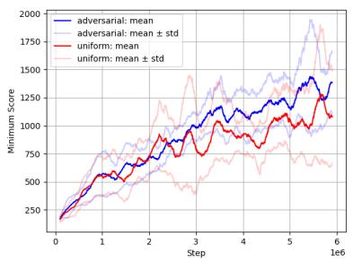
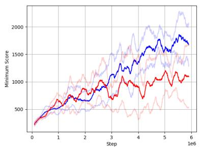
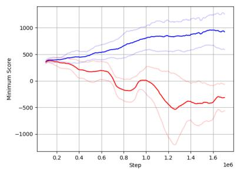

# ADMISSABLE: TRAINING REINFORCEMENT LEARNING AGENTS AGAINST ADVERSARIAL MISSINGNESS

Paul Stahlhofen, Luca Hermes, Tim Kochs, Markus Vieth, Barbara Hammer

Bielefeld University

{pstahlhofen,lhermes,tkochs,mvieth,bhammer}@techfak.uni-bielefeld.de

## ABSTRACT

In order to make Reinforcement Learning algorithms applicable in real world scenarios, safety must be ensured even under adverse operating conditions. In this work, we consider the challenge of adversarial feature missingness: a scenario in which an adversary occludes features from the agent’s observation in order to reduce performance as much as possible. We formally define adversarial missingness for Reinforcement Learning and compare it to the related concepts of $\ell _ { \infty }$ -norm bounded adversarial perturbations and learning with missing data. We develop an adversarial training algorithm and show its effectiveness in increasing robustness against adversarial missingness on three MuJoCo benchmark environments. Compared to a baseline trained with random uniform missingness, our method achieves better robustness on all three tasks.

Keywords Reinforcement Learning, Adversarial Attacks, Missing Data

## 1 Introduction

Reinforcement Learning (RL) has shown great potential in many areas, from mastering complex games [Silver et al., 2017] to robotics [Ha et al., 2020] and cooling of data centers [Luo et al., 2022]. For deployment in practise, the European Union defines strict guidelines on Trustworthy AI [European Commission, 2019]. To meet the criteria for trustworthiness, RL agents must be trained for a robust performance under adverse operating conditions. In this work, we consider a scenario in which the most important part of the state observation is hidden from the agent. We model this by introducing an adversary with the goal of minimizing the agent’s return by masking a limited number of the state features. We refer to this scenario as Adversarial Missingness - a concept known from the field of causal structure learning [Koyuncu et al., 2024]. Adversarial Missingness bridges the gap between learning with missing data and learning under adversarial attacks.

RL with Missing Data: Several approaches have been developed to handle missing data in Reinforcement Learning. Most methods make use of an imputation for the missing data, before training the agent on the imputed observations [Fleming et al., 2019] [Xiang et al., 2026] [Mei et al., 2023]. The algorithm proposed by [Skand et al., 2024] groups features into modalities and uses a transformer over the sequence of these modalities as part of the encoder. The authors demonstrate the effectiveness of their approach even under multiple missing modalities. [Wang et al., 2019] model the problem as a Partially Observable Markov Decision Process (POMDP). They learn the environment’s transition dynamics under incomplete and noisy observations, employing a model-based RL approach to optimize the policy. [Becker and Neumann, 2022] develop an extension of the Recurrent State Space Models (RSSMs) [Hafner et al., 2019] to better model aleatoric uncertainty. They demonstrate that their world model can be used successfully for the imputation of missing data. Although these works cover different assumptions about data missingness, none of them discusses a scenario where the missing features are controlled by an adversary.

RL with Adversarially Attacked States: Neural networks were shown to be vulnerable to adversarial attacks i.e. to inputs that an attacker has intentionally created to cause the model to make a mistake [Szegedy et al., 2014]. Though originally discovered in image classification, the vulnerability of strong function approximators can have catastrophic consequences also in Reinforcement Learning. [Huang et al., 2017] feed adversarial examples to the policies of image-based RL agents, showing reduced performance for multiple learning algorithms. [Pattanaik et al., 2017] show effectiveness of adversarial attacks also for smaller environments with state representations that are not based on images. [Zhang et al., 2021b] introduce the State Adversarial Markov Decision Process (SA-MDP) to theoretically analyze the problem and train for robustness against a learned optimal adversary in a follow-up work [Zhang et al., 2021a]. For a general survey on robustness in Reinforcement Learning, we refer the interested reader to [Moos et al., 2022].

Most of these works consider adversarial inputs as perturbed original states with a perturbation budget bounded in the $\ell _ { \infty } { - } \mathrm { n o r m }$ This is inspired by image classification, where the classifier output should not change by making imperceptible changes to every single pixel. However, as pointed out by [Koyuncu et al., 2024], these attacks cannot capture scenarios where the adversary is only able to remove part of the observation, instead of changing every single feature of the input. The same argument applies to other $\ell _ { p }$ -norm bounded attacks with $p \geq 1$ . In practise, it is debatable whether the more likely threat model to a trained robot is one where a hacker gets to manipulate all of its sensor values by a tiny amount, or one where the attacker gets to remove or destroy a limited number of sensors, trying to pick those on which the robot will likely rely the most. An important property of standard adversarials in image recognition is being intuitively indistinguishable for a human beholder. This property can admittedly get lost in human-perceivable domains like vision or audio, if part of the input is simply removed. On the other hand, many RL applications rely on features measured by sensors that can hardly be monitored by humans as easily as viewing an image. The notion of "imperceptibility" changes for these settings, making missingness a potentially hidden threat as well.

Two related publications consider both missingness and adversarial attacks: [Li et al., 2025] employ a hierarchical Reinforcement Learning approach for traffic signal control. They train one agent for the actual control problem and a second one to produce input reconstructions via a diffusion model to counter corruptions of the input induced by attacks or missing data. However, they don’t let the adversary determine which feature is missing. [Kumar et al., 2022] develop a method to obtain provably robust policies in a POMDP setting where the agent does not observe the full state They bound the perturbation of their adversary by the $\ell _ { 2 }$ -norm, hence not allowing it to simply mask a feature from the agent’s observation.

## 2 Adversarial Missingness in Reinforcement Learning

As a basis, recall the standard definition of a Markov Decision Process

Definition 1 Markov Decision Process (MDP) A Markov Decision Process is a quintuplet $\mathcal { P } = ( \mathcal { S } , \mathcal { A } , \mathcal { R } , \gamma , P _ { \mathrm { t r a n s } } )$ with a state space $S \subset \mathbb { R } ^ { d }$ , an action space A, a set of possible rewards ${ \mathcal { R } } \subseteq \mathbb { R } .$ , a discount factor $\gamma \in [ 0 , 1 ]$ and a transition function $P _ { \mathrm { t r a n s } } ( r , s ^ { \prime } | s , a )$ mapping tuples of states and actions to probability distributions over next states and rewards.

At each time step, the agent observes a state $S _ { t }$ and picks an action $A _ { t }$ . Based on transition probability $P _ { \mathrm { t r a n s } }$ the environment then emits an immediate reward $R _ { t + 1 }$ and transits to the next state $S _ { t + 1 }$ until termination. The goal in standard Reinforcement Learning is to optimize a policy $\pi ( a | s )$ such that sampling actions from π in each state maximizes the expected cumulative reward

$$
\operatorname* { m a x } _ { \pi } \mathbb { E } _ { \pi , P _ { \mathrm { t r a n s } } } \left[ \sum _ { t = 0 } ^ { T } \gamma ^ { t } R _ { t + 1 } \right]\tag{1}
$$

Equivalently, this objective can be phrased as maximizing the value of an initial state, where the value function $v ^ { \pi }$ is defined as the expected future reward for each state when following π from that state onward

$$
v ^ { \pi } ( s ) = \mathbb { E } _ { P _ { \mathrm { t r a n s } } , \pi } \left[ \sum _ { k = 0 } ^ { T - ( t + 1 ) } \gamma ^ { k } R _ { t + k + 1 } | S _ { t } = s \right]\tag{2}
$$

We now extend the standard definition by adding an adversary that can remove up to k features from the state, for some $k < d .$ Let $U : = \{ A \subset \{ 1 , \dots , d \} | | A | \leq k \}$ contain all potentially missing subsets of features. A parametrized missingness function m can now be defined given $u \in U$

$$
m _ { u } ( s ) _ { i } : = { \left\{ \begin{array} { l l } { \bot } & { { \mathrm { i f ~ } } i \in u } \\ { s _ { i } } & { { \mathrm { o t h e r w i s e } } } \end{array} \right. }\tag{3}
$$

At each step, the agent now observes $m _ { u } ( S _ { t } )$ instead of the full state $S _ { t }$ and has to take an action based on this limited information. An important detail of our formalization is that u is globally fixed, not changing over state or time. That

way, we can accurately model real-world scenarios like sensor failures or sources of information that are permanently removed. Analogous to standard MDPs, we can define an occluding value function

$$
v _ { u } ^ { \pi } ( s ) : = \mathbb { E } _ { P _ { \mathrm { t r a n s } } , \pi , m _ { u } } \left[ \sum _ { k = 0 } ^ { T - ( t + 1 ) } \gamma ^ { k } R _ { t + k + 1 } | S _ { t } = s \right]\tag{4}
$$

The Bellman equation for the value function of this MDP with missingness is given by

$$
v _ { u } ^ { \pi } ( s ) = \int _ { a } \pi ( a | m _ { u } ( s ) ) \int _ { r } \int _ { s ^ { \prime } } P _ { \mathrm { t r a n s } } ( r , s ^ { \prime } | s , a ) [ r + \gamma v _ { u } ^ { \pi } ( s ^ { \prime } ) ]\tag{5}
$$

The goal of the adversary is to minimize the value of the starting state by picking a set of missing features

$$
\operatorname* { m i n } _ { u \in U } v _ { u } ^ { \pi } ( s _ { 0 } )\tag{6}
$$

Conversely, the objective of finding a robust policy against adversarial missingness is expressed by

$$
\operatorname* { m a x } _ { \pi } \operatorname* { m i n } _ { u \in U } v _ { u } ^ { \pi } ( s _ { 0 } )\tag{7}
$$

## 3 Adversarial Training against Missingness

In this paper, we limit ourselves to experiments for the case where the adversary may only remove one feature $k = 1$ Further analysis for multiple missing features is left for future work. Before trying to solve the robustness objective, we have to find a suitable numerical representation for partially occluded states. In order to introduce as little bias as possible, we decide against a learned imputation and instead apply a masking approach as used in [Skand et al., 2024]: all missing features are replaced by zeros and a binary indicator vector v with $v _ { i } : = \mathbb { I } ( i \in u )$ is concatenated to the state.

In their first paper discussing adversarial examples, [Szegedy et al., 2014] propose adversarial training. They include adversarial inputs in the training set to improve the robustness of their classifier. In the following, we develop an adversarial training approach to achieve robustness against adversarial missingness in RL (Eqn. 7). We use the Soft Actor Critic (SAC) algorithm for training [Haarnoja et al., 2018]. SAC is a state of the art off-policy algorithm, using an entropy maximization term in its loss for improved exploration. At each episode during training, we sample a missing feature from a probability distribution $p _ { \mathrm { m i s s } }$ over $U , p _ { \mathrm { m i s s } }$ is initialized as a uniform distribution and adapted to simulate the adversary. Every $\zeta$ time steps, adversarial scores $a _ { u } ^ { \pi } : = \hat { v } _ { u } ^ { \pi } ( s _ { 0 } )$ are determined for every $u \in U$ , where vˆ is an approximation of the value function v computed by running N episodes and averaging the results. We update $p _ { \mathrm { m i s s } }$ according to the inverse adversarial scores

$$
\begin{array} { r } { p _ { \mathrm { m i s s } } ( i ) = \frac { \frac { 1 } { a _ { u } ^ { \pi } - l + \epsilon } } { \sum _ { u \in U } \frac { 1 } { a _ { u } ^ { \pi } - l + \epsilon } } } \end{array}\tag{8}
$$

where l is a lower bound of the $a _ { u } ^ { \pi }$ and ϵ is a small tolerance to avoid division by zero. Using this update, features that lead to lower performance when missing will be sampled more frequently by the adversary. We decide for a stochastic adversary instead of a deterministic one that would always pick min ${ } _ { , } a _ { u } ^ { \pi }$ in order to avoid training instabilities and forgetting. In cases where a lower bound is not known, we observe in practise that good results can be achieved by estimating a bound and clipping values of $a _ { u } ^ { \pi }$ that fall below it. The values for $\zeta ,$ ϵ and l used in our experiments are given in Table 1. We compare our method to a baseline where $p _ { \mathrm { m i s s } }$ is fixed as a uniform distribution.

<table><tr><td rowspan=1 colspan=1>Hyperparameter</td><td rowspan=1 colspan=1>Update Frequency</td><td rowspan=1 colspan=1>Tolerance</td><td rowspan=1 colspan=1>Return Lower Bound</td></tr><tr><td rowspan=1 colspan=1>Value</td><td rowspan=1 colspan=1>ζ = 5000</td><td rowspan=1 colspan=1>€ = 10−8</td><td rowspan=1 colspan=1>l = 0</td></tr></table>

Table 1: Hyperparameters for Adversarial Training

## 4 Results and Discussion

We evaluate our adversarial training approach on three MuJoCo benchmark environments: Hopper, Walker and Ant [Todorov et al., 2012]. The environments are structurally similar. Given a robot with multiple joints, the task is to apply torque to the joints in order to move forward as far as possible without falling. The difference between the environments lies in the type of robot and the size of the observation and action spaces (see Table 2). As we are interested in robustness against the strongest possible adversary, we consider the minimum over the adversarial score $a _ { u } ^ { \pi }$ as a performance measure. Intuitively speaking, this is the episodic return1 that an agent can still achieve if the adversary managed to remove the most important feature. Every time we update $p _ { m i s s }$ , we record the adversarial performance. For the baseline with uniform missingness, we record adversarial performance at the same intervals without updating the distribution. Results are shown in Figure 1.

<table><tr><td rowspan=1 colspan=1></td><td rowspan=1 colspan=1>Hopper</td><td rowspan=1 colspan=1>Walker</td><td rowspan=1 colspan=1>Ant</td></tr><tr><td rowspan=1 colspan=1>Number of Observations</td><td rowspan=1 colspan=1>11</td><td rowspan=1 colspan=1>17</td><td rowspan=1 colspan=1>105</td></tr><tr><td rowspan=1 colspan=1>Number of Actions</td><td rowspan=1 colspan=1>3</td><td rowspan=1 colspan=1>6</td><td rowspan=1 colspan=1>8</td></tr></table>

Table 2: Properties of the MuJoCo environments used for training

  
(a) Hopper-v5

  
(b) Walker2d-v5

  
(c) Ant-v5  
Figure 1: Performance under adversarial missingness. Every 5.000 time steps, we determine the adversarial performance min $a _ { i } ^ { \pi }$ for training runs with adversarial missingness (blue) and random uniform missingness (red). Results are averaged over 5 runs and smoothed with a moving average over 40 records.

We can see a better adversarial performance when training with adversarial missingness in all three runs. The larger the observation space, the more pronounced is the advantage. It appears that a more focused approach, forcing the model to deal without the few features on which it may have overfitted so far, becomes more important, the more features exist. In particular, note the catastrophic adversarial performance of uniform missingness training in the Ant environment. This makes a strong case for training with adversarial missingness instead, as it shows that a model that has seemingly been robustified against many possible missing features can still have a tremendous weak spot. This kind of vulnerability might not be identified when averaging performances across different missing features, if it is an outlier. In order to enhance trustworthy AI and prevent catastrophic events caused by sensor failures, we therefore recommend the use of adversarial missingness instead of standard uniform missingness in training of Reinforcement Learning agents.

## 5 Conclusion

In this work, we applied the concept of adversarial missingness to Reinforcement Learning. We gave a formal definition of the problem, including objectives for the adversary and for model robustness. After developing an adversarial training approach to optimize the robustness objective, we compared our method to a baseline with random uniform missingness on three MuJoCo benchmark environments. We were able to show an improvement in performance for all three cases, observing a higher benefit of adversarial training for environments with larger observation spaces. Adversarial missingness is an interesting and still mostly unexplored area, leaving many directions for future work. Extending the scope to more than one missing feature would lead to broader generalization. To that end, we plan to explore more efficient ways of estimating adversarial scores and connections to methods from Explainable AI.

## References

[Becker and Neumann, 2022] Becker, P. and Neumann, G. (2022). On Uncertainty in Deep State Space Models for Model-Based Reinforcement Learning. arXiv:2210.09256 [cs.LG].

[European Commission, 2019] European Commission (2019). Ethics guidelines for trustworthy AI. Publications Office, LU.

[Fleming et al., 2019] Fleming, S. L., Jeyapragasan, K., Duan, T., Ding, D., Gombar, S., Shah, N., and Brunskill, E. (2019). Missingness as Stability: Understanding the Structure of Missingness in Longitudinal EHR data and its Impact on Reinforcement Learning in Healthcare. arXiv:1911.07084 [cs].

[Ha et al., 2020] Ha, S., Xu, P., Tan, Z., Levine, S., and Tan, J. (2020). Learning to Walk in the Real World with Minimal Human Effort. CoRR, abs/2002.08550. arXiv: 2002.08550.

[Haarnoja et al., 2018] Haarnoja, T., Zhou, A., Abbeel, P., and Levine, S. (2018). Soft Actor-Critic: Off-Policy Maximum Entropy Deep Reinforcement Learning with a Stochastic Actor. In PMLR, volume 80, pages 1861–1870. arXiv:1801.01290 [cs].

[Hafner et al., 2019] Hafner, D., Lillicrap, T., Fischer, I., Villegas, R., Ha, D., Lee, H., and Davidson, J. (2019). Learning Latent Dynamics for Planning from Pixels. In Chaudhuri, K. and Salakhutdinov, R., editors, Proceedings of the 36th International Conference on Machine Learning, volume 97 of Proceedings ofMachine Learning Research, pages 2555–2565. PMLR.

[Huang et al., 2017] Huang, S., Papernot, N., Goodfellow, I., Duan, Y., and Abbeel, P. (2017). Adversarial Attacks on Neural Network Policies. arXiv:1702.02284 [cs.LG].

[Koyuncu et al., 2024] Koyuncu, D., Gittens, A., Yener, B., and Yung, M. (2024). Adversarial Missingness Attacks on Causal Structure Learning. ACM Transactions on Intelligent Systems and Technology, 15(6):1–60.

[Kumar et al., 2022] Kumar, A., Levine, A., and Feizi, S. (2022). Policy Smoothing for Provably Robust Reinforcement Learning. arXiv:2106.11420 [cs.LG].

[Li et al., 2025] Li, M., Wang, J., Yu, G., Wang, X., Chen, Q., Ni, W., Li, L., and Peng, H. (2025). RobustLight: Improving Robustness via Diffusion Reinforcement Learning for Traffic Signal Control. In Forty-second International Conference on Machine Learning.

[Luo et al., 2022] Luo, J., Paduraru, C., Voicu, O., Chervonyi, Y., Munns, S., Li, J., Qian, C., Dutta, P., Davis, J. Q., Wu, N., Yang, X., Chang, C.-M., Li, T., Rose, R., Fan, M., Nakhost, H., Liu, T., Kirkman, B., Altamura, F., Cline, L., Tonker, P., Gouker, J., Uden, D., Bryan, W. B., Law, J., Fatiha, D., Satra, N., Rothenberg, J., Waraich, M., Carlin, M., Tallapaka, S., Witherspoon, S., Parish, D., Dolan, P., Zhao, C., and Mankowitz, D. J. (2022). Controlling Commercial Cooling Systems Using Reinforcement Learning. Version Number: 2.

[Mei et al., 2023] Mei, H., Li, J., Shi, B., and Wei, H. (2023). Reinforcement Learning Approaches for Traffic Signal Control under Missing Data. In Proceedings of the Thirty-Second International Joint Conference on Artificial Intelligence, pages 2261–2269. arXiv:2304.10722 [cs.LG].

[Moos et al., 2022] Moos, J., Hansel, K., Abdulsamad, H., Stark, S., Clever, D., and Peters, J. (2022). Robust Reinforcement Learning: A Review of Foundations and Recent Advances. Machine Learning and Knowledge Extraction, 4(1):276–315.

[Pattanaik et al., 2017] Pattanaik, A., Tang, Z., Liu, S., Bommannan, G., and Chowdhary, G. (2017). Robust Deep Reinforcement Learning with Adversarial Attacks. arXiv:1712.03632 [cs].

[Raffin et al., 2021] Raffin, A., Hill, A., Gleave, A., Kanervisto, A., Ernestus, M., and Dormann, N. (2021). Stable-Baselines3: Reliable Reinforcement Learning Implementations. Journal ofMachine Learning Research, 22(268):1–8.

[Silver et al., 2017] Silver, D., Schrittwieser, J., Simonyan, K., Antonoglou, I., Huang, A., Guez, A., Hubert, T., Baker, L., Lai, M., Bolton, A., Chen, Y., Lillicrap, T., Hui, F., Sifre, L., Van Den Driessche, G., Graepel, T., and Hassabis, D. (2017). Mastering the game of Go without human knowledge. Nature, 550(7676):354–359.

[Skand et al., 2024] Skand, S., Pandit, B., Kim, C., Fuxin, L., and Lee, S. (2024). Simple Masked Training Strategies Yield Control Policies That Are Robust to Sensor Failure. In 8th Annual Conference on Robot Learning.

[Szegedy et al., 2014] Szegedy, C., Zaremba, W., Sutskever, I., Bruna, J., Erhan, D., Goodfellow, I., and Fergus, R. (2014). Intriguing properties of neural networks. arXiv:1312.6199 [cs.CV].

[Todorov et al., 2012] Todorov, E., Erez, T., and Tassa, Y. (2012). MuJoCo: A physics engine for model-based control. In 2012 IEEE/RSJ International Conference on Intelligent Robots and Systems, pages 5026–5033.

[Wang et al., 2019] Wang, Y., He, H., and Tan, X. (2019). Robust Reinforcement Learning in POMDPs with Incomplete and Noisy Observations. arXiv:1902.05795 [cs].

[Xiang et al., 2026] Xiang, J., Kong, N., Yang, C.-C., Luo, L., and Yu, H. (2026). Partially observable reinforcemen learning for blood glucose control under missing data. Computers & Industrial Engineering, 218:112118.

[Zhang et al., 2021a] Zhang, H., Chen, H., Boning, D., and Hsieh, C.-J. (2021a). Robust Reinforcement Learning on State Observations with Learned Optimal Adversary. arXiv:2101.08452 [cs, stat].

[Zhang et al., 2021b] Zhang, H., Chen, H., Xiao, C., Li, B., Liu, M., Boning, D., and Hsieh, C.-J. (2021b). Robust Deep Reinforcement Learning against Adversarial Perturbations on State Observations. arXiv:2003.08938 [cs.LG].