# Assembling the CREW: A Collaborative Multi-agent Reinforcement Learning Framework for Automated Related Work Generation

Hai-Dang Dang1\*, Bao-Yen Pham1\*, Bao Nguyen2

Tran Thi Huong3, Huynh Thi Thanh Binh1

1Hanoi University of Science and Technology 2The Chinese University of Hong Kong 3Hanoi University of Industry

## Abstract

Automatic Related Work Generation (RWG) significantly reduces the human time and effort required to author the Related Work Section (RWS) of a research paper. However, prior methods leveraging multi-agent Large Language Models (LLMs) typically rely on a predefined workflow, where each agent is responsible for a specific step in the entire process. This rigid, static inter-agent coordination limits the adaptive collaboration required to synthesize complex scientific literature. To address this limitation, we propose CREW (Collaborative Reinforcement Learning for Related Work Generation), a novel framework where LLM agents bypass heuristic pipelines to dynamically coordinate by autonomously selecting actions, such as Retrieve, Disseminate, Compose, and Critique, driven by a policy optimized via Independent Proximal Policy Optimization (IPPO). Extensive experiments on a standard RWG benchmark demonstrate that our approach yields substantial quality improvements over strong existing baselines, while significantly reducing token costs. Code is available at https://github.com/YenPBao/ CREW-Collaborative-MARL.git

## 1 Introduction

To translate an initial idea into scientific research, scholars often explore a range of literature, carefully summarizing, synthesizing, and contrasting earlier findings. This process is both timeconsuming and labor-intensive. Indeed, literature synthesis represents a major bottleneck in the scientific workflow, particularly given the rapid growth of scientific publications. Addressing this challenge, Hoang and Kan (2010) introduced Related Work Generation (RWG) as a research direction within Natural Language Processing (NLP). The task aims to automatically transform an initial concept, typically consisting of a title and an abstract, together with a list of potential related references, into a coherent and logical related work draft that comprehensively covers key findings from prior studies with accurate citations.

Overall, RWG research has evolved along three main methodological directions. Firstly, extractive approaches select and concatenate sentences directly from source documents, making them simple to implement and generally faithful to the original content. However, their limited ability to paraphrase and abstract often results in related-work sections that are redundant and poorly structured (Hu and Wan, 2014; Chen and Zhuge, 2016; Deng et al., 2021). Secondly, abstractive supervised models move beyond sentence extraction by incorporating task-specific components and structured representations, including relation-aware RWG models and structured scientific summarization methods (Chen et al., 2021, 2022; Xiao et al., 2022). Although these models achieve strong performance within their training domains, their reliance on task specific training and annotated datasets limits scalability and adaptation to new domains or topics. Thirdly, LLM-based methods leverage strong generative capabilities to produce coherent and logi cally structured related work sections. However, single-LLM approaches remain prone to hallucination and constrained by context capacity, as high quality synthesis often requires jointly reasoning over many references. Even with long-context models (e.g., GPT-4o with a 128K-token capacity), simply concatenating all references into a single input remains ineffective, as long contexts can dilute attention and cause important inter-document relationships to be overlooked. Retrieval-based alternatives reduce the context burden but may omit relevant evidence and weaken coverage (Izacard and Grave, 2021; Wu et al., 2022). To overcome these obstacles, recent research has leveraged multiagent LLM frameworks to decompose the overall RWG process into smaller subtasks, assigning each agent to a specific part of the workflow. This division of labor reduces the workload each agent must process, thereby lowering the risk of exceeding the context window (Wu et al., 2023; Li et al., 2023; Liu et al., 2025). However, fixed subtask assignments force the overall process to proceed sequentially, increasing inference time. More importantly, these approaches lack a mechanism that allows multiple agents to collaborate on the same subtask when it becomes critical. If too few agents are assigned to an important subtask at a particular stage, it can become a bottleneck, producing low-quality intermediate outputs that limit subsequent agents. For example, after agents have moved from reading to drafting, they may find that the collected evidence remains insufficient, making further drafting ineffective despite multiple agents being assigned to writing. Therefore, agents need mechanisms to proactively select context-dependent actions and coordinate more effectively.

Motivated by these observations, we introduce a multi-agent framework that enables flexible, context-dependent action selection through Multi-Agent Reinforcement Learning (MARL). MARL enables independently operating agents to coordinate their decisions through a shared learned policy rather than a centralized orchestrator, thereby reducing computational overhead and improving scalability. To achieve this, we formulate RWG as a Decentralized Partially Observable Markov Decision Process (Dec-POMDP), where each agent receives a distinct local observation consisting of its internal knowledge state, shared resources, and peer actions. At the same time, our environment provides a team-level global reward based on the quality of the collaboratively constructed draft and its alignment with human-written references. Importantly, beyond the conventional actions of literature retrieval and drafting employed in prior work, we introduce two additional actions, knowledge dissemination and draft critiquing, to promote proactive information sharing and adaptive inter-agent coordination throughout the RWG process. The framework is then optimized using IPPO with parameter sharing to ensure computational efficiency and scalability. Extensive experiments show that our framework improves over competitive baselines in LLM-as-a-judge evaluation and valid citation grounding, while reducing inference time and token costs.

Our contributions can be summarized as follows:

1. We introduce two collaborative actions, Disseminate and Critique, which enable agents to share useful knowledge and provide mutual feedback, improving both coordination and the quality of the generated draft.

2. We propose a MARL framework based on a Dec-POMDP formulation, allowing agents to proactively select context-dependent actions from their local observations. We further optimize the decision-making policy using IPPO with parameter sharing for efficient multi-agent coordination.

3. We conduct extensive experiments showing that our framework improves over strong existing methods across multiple evaluation metrics. Additional transferability experiments demonstrate that a decision-making policy trained with one LLM can be reused with different inference LLMs, indicating that the learned coordination strategy is not tied to a single backbone model.

## 2 Related Work

RWG has attracted growing attention for its role in supporting scientific writing and is commonly categorized into Extractive RWG (ERWG) and Abstractive RWG (ARWG) (Li and Ouyang, 2024). ERWG methods construct related work sections by selecting and concatenating representative sentences from cited papers. Early approaches such as ReWoS (Hoang and Kan, 2010) rely on hierarchical rule-based extraction at both coarseand fine-grained topic levels, while subsequent methods incorporate topic modeling and learningbased importance estimation, e.g., clustering sentences with PLSA and ranking them using regression models (Hu and Wan, 2014). To better capture target–reference relationships, later studies exploit citation contexts (Chen and Zhuge, 2016) or sentence-level embeddings with coherence-aware reordering, as in SERGE (Deng et al., 2021). Graph-based methods explicitly model inter-paper relations, such as ToC-RWG (Wang et al., 2020) and bibliographic graph-based neural summarization (Wang et al., 2018). Overall, despite being citation-faithful, ERWG methods remain limited in producing comparative and analytical discussions, as they depend heavily on pre-existing comparative sentences that are difficult to obtain in practice.

To address these limitations, recent work has shifted toward ARWG, where models generate related-work text in their own words. ARWG approaches can be broadly categorized into citationlevel and section-level generation. Citation-level ARWG focuses on generating short descriptions for individual citations based on local citation context and cited paper content, typically using citation context and abstracts due to input length constraints (Luu et al., 2021; Gu and Hahnloser, 2024; Jung et al., 2022; Li et al., 2024; Xiao et al., 2022). These methods generally assume one cited paper per citation and model citations in isolation, limiting their ability to capture cross-paper relationships. Section-level ARWG extends this formulation by generating longer related-work paragraphs that contain multiple citations, explicitly modeling interactions among referenced papers to improve global coherence. Following early attention-based models (Wang et al., 2018), a common strategy is to model papers and their interactions as graphs, enabling structured reasoning over citations, topics, and semantic dependencies. Building upon this paradigm, Chen et al. (2021) introduced RRG, which captures relationships among referenced papers using a relation graph and iteratively refines document representations prior to generation. Simi larly, Chen et al. (2022) proposed TAG, integrating graph-guided interactions at both the encoding and decoding stages, alongside contrastive learning, to encourage well-structured outputs. In this work, we focus on section-level ARWG.

Despite their demonstrated effectiveness, existing section-level ARWG methods are typically trained from scratch, resulting in substantial computational and memory overhead when scaled to large corpora with many reference papers. To overcome this, a promising research direction is to leverage the robust generative capabilities of pretrained LLMs to bypass costly retraining. However, fully unlocking LLMs for this task requires overcoming their inherent context-window limitations. This challenge is especially pronounced in section-level ARWG, where identifying complex latent links necessitates simultaneously processing a massive volume of text across numerous reference papers. Prior attempts to handle such inputlength constraints commonly rely on long-context models, iterative reading-and-summarization strategies (Miller et al., 2016; Chevalier et al., 2023), and retrieval-based methods (Izacard and Grave, 2021; Wu et al., 2022). However, each direction has notable drawbacks: long-context processing can dilute the effectiveness of attention, iterative reading may overwrite early evidence, and retrieval risks omitting crucial inter-document nuances.

To circumvent these limitations, our framework leverages multi-LLM collaboration to effectively distribute reasoning and knowledge processing across multiple agents. Unlike many existing multi-LLM systems that rely on rigid predefined interaction patterns or static self-reflection loops (Wu et al., 2023; Li et al., 2023; Shinn et al., 2023), our approach proposes a highly adaptable paradigm grounded in multi-agent reinforcement learning. For instance, while Liu et al. (2025) recently proposed a multi-agent system that uses citation graphs and specialized roles (Selector, Reader, and Writer), imposing these fixed roles forces agents into sequential pipelines, restricting their ability to address subtasks as they become critical. Conversely, our approach offers a flexible collaboration paradigm by introducing explicit dynamic cooperation via discussion actions among complementary LLM agents and enabling step-wise situational action selection, which allows agents to dynamically determine subsequent actions, reducing unnecessary interactions and computational overhead while improving reasoning reliability.

## 3 Methodology

Following the setting of Select, Read, and Write (Liu et al., 2025), the input consists of the author’s initial idea, represented by the title $\mathcal { T } _ { C }$ and abstract $\boldsymbol { \mathcal { A } } _ { C }$ of the citing paper C, together with a set of potential reference papers $\mathcal { R } = \{ r _ { 1 } , r _ { 2 } , . . . , r _ { n } \}$ Given these inputs, our framework transforms the reference set into a coherent related work section $\boldsymbol { \mathcal { S } }$ that synthesizes the key ideas most relevant to $C$ with accurate citation grounding. The overall workflow of the proposed framework is summarized in Figure 1.

## 3.1 Dec-POMDP Formulation

In this work, we cast RWG as a Dec-POMDP, which naturally accommodates (i) partial observability, since each of M agent sees only the shared working documents and its own private knowledge, (ii) all agents act independently based on their own distinct observations, without relying on a centralized controller, thereby distributing the computation and enhancing scalability. Thus, agents operate independently and in parallel over a series of timesteps: at each timestep t, the environment is in state $s _ { t } ,$ each agent i receives an observation $o _ { t } ^ { i }$ as its partial view of the state, selects an action $a _ { t } ^ { i }$ and then receives a reward $r _ { t } ^ { i }$ from the environment. We define the states, observations, actions, and rewards as follows.

Shared Environment  
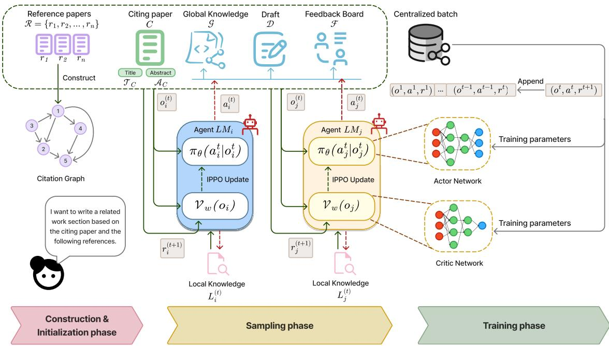  
Figure 1: Overview of our multi-agent framework. Agents operate independently and in parallel over a series of timesteps. At each step, each agent observes the input information and current working documents, selects one of four actions, and receives a reward guided by the human-written related-work section as the gold standard. The collected interactions are aggregated into a buffer to train the policy, which is then used as the agents’ decisionmaking policy during inference to produce the final output.

States. At each time step t, the global state $s _ { t } \in S$ is defined as:

$$
s _ { t } = \langle \mathcal { T } _ { C } , \mathcal { A } _ { C } , \mathcal { R } , L _ { t } , G _ { t } , D _ { t } , F _ { t } \rangle ,\tag{1}
$$

where the first three components are the static task inputs introduced above. The remaining four components correspond to the four types of documents that we propose for the collaborative writing process. Local knowledge ${ \cal L } _ { t } = \{ L _ { t } ^ { 1 } , . . . , L _ { t } ^ { \bar { M } } \}$ is the collection of agent-private knowledge states; each $L _ { t } ^ { i }$ accumulates reading summaries obtained through Agent i’s individual exploration of the citation graph via the Retrieve action and remains invisible to other agents. Global knowledge $G _ { t }$ is a shared knowledge base accessible to all agents, aggregated from individual local contributions via the Disseminate action; it serves as the collective understanding of the literature that any agent can draw upon when drafting or critiquing. Draft $D _ { t }$ is the evolving text of the related-work section, iteratively refined by agents through the Compose action. Feedback $F _ { t }$ stores the accumulated critiques and revision suggestions produced by agents through the Critique action, thereby providing structured signals to systematically guide subsequent draft revisions. The detailed explanation of the Actions is provided below.

Observations. Since Agent i cannot access the local knowledge of other agents, each agent receives only a partial observation $o _ { t } ^ { i } \in \mathcal { O } ^ { i } ,$

$$
o _ { t } ^ { i } = \mathrm { E m b e d } \left( \left. ~ L _ { t } ^ { i } , ~ G _ { t } , ~ D _ { t } , ~ F _ { t } ~ \right. \right) ,\tag{2}
$$

Directly feeding the raw textual content of each document into the policy network would result in an excessively large observation space, making convergence during training prohibitively difficult. To maintain a compact state representation, the embedding operator Embed(·) encodes each component $k \in \{ L , G , D , F \}$ into a five-dimensional numerical feature vector $\mathbf { x } _ { k } = [ v _ { 1 , k } , \dotsc , v _ { 5 , k } ]$ , with all feature values clipped to [0, 1]. The resulting observation has 20 dimensions and is independent of the number of agents M, so the policy architecture does not need to change when the team size varies. The five features are defined as follows:

(i) Semantic relevance $( v _ { 1 , k } ) \colon$ The cosine similarity, denoted by $c ( \cdot , \cdot )$ , between the embedding $\mathbf { e } _ { k }$ of component k and the initial-idea embedding $\mathbf { e } _ { \mathrm { i d e a } } = \mathrm { e m b e d } ( \mathcal { T } _ { C } \oplus \mathcal { A } _ { C } )$ , where the initial idea consists of the title $\mathcal { T } _ { C }$ and abstract $\mathbf { \nabla } \mathcal { A } _ { C } \mathbf { : }$

$$
v _ { 1 , k } = c ( \mathbf { e } _ { k } , \mathbf { e } _ { \mathrm { i d e a } } ) .\tag{3}
$$

(ii) Coverage and Novelty $( v _ { 2 , k } ) \colon$ : A componentspecific measure defined as:

$$
v _ { 2 , k } = \left\{ \begin{array} { l l } { 1 - \alpha \delta _ { \mathrm { i d } } - ( 1 - \alpha ) \delta _ { \mathrm { s e m } } } & { k = L , } \\ { 1 - c ( \mathbf { e } _ { L _ { i } } , \mathbf { e } _ { G } ) , } & { k = G , } \\ { c ( \mathbf { e } _ { D } , \mathbf { e } _ { G } ) , } & { k = D , } \\ { c ( \mathbf { e } _ { F } , \mathbf { e } _ { \mathrm { i d e a } } - \mathbf { e } _ { D } ) , } & { k = F , } \end{array} \right.\tag{4}
$$

where for Local Knowledge (L), the coverage feature penalizes redundancy against other agents. Specifically, $\delta _ { \mathrm { i d } } ~ = ~ | { \mathcal P } _ { i } \cap { \mathcal P } _ { \neg i } | / | { \mathcal P } _ { i } |$ calculates the identifier-level overlap ratio between the set of papers read by Agent $\textit { i } ( \mathcal { P } _ { i } )$ and those read by all other agents $( \mathcal { P } _ { \neg i } )$ . Concurrently, $\delta _ { \mathrm { s e m } } =$ max ${ \bf \Gamma } _ { j \neq i } c ( { \bf e } _ { L _ { i } } , { \bf e } _ { L _ { j } } )$ captures the maximum semantic similarity between Agent $i \ ' s$ local knowledge and that of any peer. For Global Knowledge (G), it measures semantic novelty relative to the shared knowledge. For the Draft (D), it quantifies semantic coverage with reward to the G. For Feedback Board F, it measures alignment with the gap vector $\mathbf { e } _ { \mathrm { i d e a } } - \mathbf { e } _ { D }$

(iii) Personal action distribution $( v _ { 3 , k } )$ : The historical frequency with which Agent i has selected action k, defined explicitly as:

$$
v _ { 3 , k } = \frac { n _ { k } ^ { i } } { \sum _ { a \in \mathcal { A } } n _ { a } ^ { i } } ,\tag{5}
$$

where $n _ { k } ^ { i }$ is the accumulated count of action k executed by Agent i.

(iv) Token capacity $( v _ { 4 , k } )$ : The remaining normalized token capacity for action k:

$$
v _ { 4 , k } = \operatorname* { m a x } \biggl ( 0 , 1 - \frac { \tau _ { k } } { \tau _ { \operatorname* { m a x } } } \biggr ) ,\tag{6}
$$

where $\tau _ { k }$ is the current token usage associated with action $k ,$ and $\tau _ { \mathrm { m a x } }$ represents the predefined maximum allowable token budget.

(v) Social activity distribution $( v _ { 5 , k } ) \ d \cdot$ : The proportion of action k performed by other agents,

$$
v _ { 5 , k } = \frac { n _ { k } ^ { - i } } { n _ { k } ^ { \mathrm { a l l } } } ,\tag{7}
$$

providing Agent i with awareness of team-level coordination, where $n _ { k } ^ { \neg i }$ is the number of times action k has been performed by all agents except Agent i, and $n _ { k } ^ { \mathrm { a l l } }$ is the total number of times action k has been performed by all agents.

Actions. The joint action space is $\mathcal { A } = \mathcal { A } ^ { 1 } \times$ $\cdots \times \mathcal { A } ^ { M }$ ; each agent i selects one of four actions: Retrieve, Disseminate, Compose, or Critique, and the joint action is $\mathbf { a } ~ = ~ ( a _ { t } ^ { \bar { 1 } } , \ldots , a _ { t } ^ { M } )$ . Each action is realized by a dedicated prompt template (Appendix G). The Retrieve action selects a candidate paper $p _ { c } ^ { t - 1 }$ to read and updates the agent’s local knowledge. Disseminate merges local into shared knowledge; Critique reviews the current draft; Compose revises the draft from all available sources:

$$
L _ { t } ^ { i } = \mathrm { R e t r i e v e } \bigl ( L _ { t - 1 } ^ { i } , p _ { c } ^ { t - 1 } \bigr )
$$

$$
G _ { t } = { \mathrm { D i s s e m i n a t e } } \left( L _ { t } ^ { i } , G _ { t - 1 } \right)\tag{8}
$$

(9)

$$
F _ { t } = \mathrm { C r i t i q u e } \left( L _ { t } ^ { i } , D _ { t - 1 } \right)\tag{10}
$$

$$
D _ { t } = \mathrm { C o m p o s e } \big ( D _ { t - 1 } , G _ { t - 1 } , L _ { t } ^ { i } , F _ { t - 1 } \big )\tag{11}
$$

Rewards. We adopt a delta-based cooperative reward structure. The reward decomposes into two terms: a draft-quality gain reflecting overall synthesis progress, and a component-quality gain reflecting improvements in the specific artifact targeted by the agent’s action:

$$
r _ { t } ^ { i } = ( 1 - \lambda ^ { t } ) \Delta Q _ { D } ^ { ( t ) } + \lambda ^ { t } \Delta Q _ { k ( a ^ { i } ) } ^ { ( t ) } ,\tag{12}
$$

where $Q _ { k } ^ { ( t ) }$ denotes the quality of component $k \in$ $\{ L , G , D , F \}$ at time step t, and $\Delta Q _ { k } ^ { ( t ) } = Q _ { k } ^ { ( t ) } -$ $Q _ { k } ^ { ( t - 1 ) }$ denotes its quality gain. The decaying coefficient $\lambda ^ { t }$ encourages agents to first improve the background documents before gradually shifting attention toward composing the final draft. The quality $Q _ { k }$ is estimated by document-specific heuristic functions, depending on the type of document. These heuristics primarily reference the humanwritten related-work section, whose embedding is denoted by $\bf e _ { \mathrm { g o l d } }$ . Detailed quality formulas and the credit-assignment procedure are provided in Appendix A.2 and Appendix A.3.

## 3.2 Proposed Algorithm

As illustrated in Figure 1, we optimize the cooperative policy using parameter-shared IPPO, with full pseudocode provided in Appendix A.1. The framework alternates between sampling and training: agents interact asynchronously under a shared behavioral policy, collect rewards from Section 3.1, and aggregate rollouts to update a single shared

Actor and Critic. This design keeps the policy scalable while reducing coordination overhead across agents.

The sampling phase. During data collection, M agents asynchronously select actions from the discrete space A based on the shared policy $\pi \theta \cdot$ This interaction occurs over a subset of papers, spanning several time steps across multiple epochs. The reward is calculated by measuring the specific semantic and structural improvements made to the draft, compared with the ground truth one. These transition tuples $( o _ { t } ^ { i } , a _ { t } ^ { i } , r _ { t } ^ { i } , o _ { t + 1 } ^ { i } )$ are temporarily stored in local experience buffers.

The training phase. Once a predefined stopping condition is met, trajectories from all local buffers are aggregated into a centralized batch W to update the shared networks. For each sample $j \in \mathcal W$ , PPO defines the probability ratio

$$
\rho _ { j } ( \theta ) = \frac { \pi _ { \theta } ( a _ { j } \mid o _ { j } ) } { \pi _ { \theta _ { \mathrm { o l d } } } ( a _ { j } \mid o _ { j } ) } .\tag{13}
$$

The clipped surrogate objective for the Actor is

$$
\mathcal { L } ^ { \mathrm { C L I P } } ( \boldsymbol { \theta } ) = \frac { 1 } { \left| \mathcal { W } \right| } \sum _ { j \in \mathcal { W } } \operatorname* { m i n } \Bigl ( \rho _ { j } ( \boldsymbol { \theta } ) \hat { A } _ { j } ,\tag{14}
$$

where $\hat { A } _ { j }$ is estimated with Generalized Advantage Estimation (GAE) (Schulman et al., 2016). The Critic is trained against the empirical return $\hat { R } _ { j }$ using the value loss

$$
\mathcal { L } ^ { \mathrm { V F } } ( \phi ) = \frac { 1 } { \vert \mathcal { W } \vert } \sum _ { j \in \mathcal { W } } \left( V _ { \phi } ( o _ { j } ) - \hat { R } _ { j } \right) ^ { 2 } .\tag{15}
$$

During optimization, the Actor maximizes the clipped surrogate objective while the Critic minimizes the value loss; this centralized optimization cycle is repeated until the policy converges.

The actor and critic networks. To ensure parameter efficiency and facilitate knowledge transfer across agents, our framework maintains a single Actor network $( \pi _ { \theta } )$ and Critic network $( V _ { \phi } )$ applied uniformly to all agents. The Actor maps the 20-dimensional observation vector to action logits $\mathbf { z } \in \mathbb { R } ^ { 4 }$ for categorical sampling, while the Critic outputs a scalar value estimate $\hat { V } _ { \phi } ( o _ { t } ^ { i } )$ as the variance-reduction baseline. Both networks share the same compact feedforward design, differing only in their final output heads; detailed configurations are provided in Table 6 in Appendix D.

## 4 Experimental Results and Discussions

To evaluate the CREW framework, we design a series of experiments addressing overall performance, architectural choices, and cost efficiency.

## 4.1 Experimental Setup

Dataset. We evaluate our framework on the OARE-LATEDWORK dataset (Docekal et al., 2024), currently the primary dataset supporting full-textbased related work generation. Specifically, we use 2% of the papers (1829 papers) for training and 0.4% of the papers (366 papers) for evaluation, as detailed in Appendix B.

Implementation Details. For the main results, we use Qwen 2.5 72B Instruct1 for both policy training and inference. In the transferability study, we keep the trained controller fixed and swap the inference backbone to LLaMA 8B2, Gemini 2.0 Flash3, Qwen 2.5 72B Instruct, and $\mathrm { G P T - 4 o ^ { 4 } }$ . Complete IPPO hyperparameters and network architecture are provided in Appendix D, while prompt templates are provided in Appendix G.

Evaluation Metrics. Following the evaluation protocol of Select, Read, and Write (SRW) (Liu et al., 2025), we adopt an LLM-as-a-Judge setup. For robustness and fairness, final scores are computed as the arithmetic mean of ratings from three judges on a 1–5 Likert scale: GPT-4o, LLaMA 3.3 70B Instruct5, and DeepSeek- $\mathbf { \nabla } \cdot \mathbf { V } 3 ^ { 6 }$ . In addition to standard metrics (Coverage, Logic, and Relevance), we report Citation Verification, defined as the proportion of generated citations that exist in the database. To assess operational efficiency, we further report total input/output tokens and inference time for the baselines. Detailed definitions and evaluation procedures for all metrics are provided in Appendix C.

## 4.2 Baselines

We situate our proposed CREW framework against widely-adopted baseline paradigms (with detailed behavioral analysis in Appendix D.3):

Multi-Agent Methods. We compare against SRW (Liu et al., 2025) and our own Orchestrator baseline, inspired by HuggingGPT (Shen et al., 2023), with both baselines using Qwen 2.5 72B

Table 1: Performance of different models on the OARELATEDWORK dataset. The best and the runner-up results are shown in bold and underlined, respectively. Our method outperforms the strong existing baseline across all quality and citation metrics while using fewer tokens.
<table><tr><td>Model</td><td colspan="4">LLM-based Evaluation (Avg.)</td><td>Citation</td><td colspan="2">Cost Efficiency</td></tr><tr><td></td><td>Cov. ↑</td><td>Logic ↑</td><td>Rel. ↑</td><td>Overall↑</td><td>Ver.(%)↑</td><td>Tokens↓</td><td>Inf. Time (s) ↓</td></tr><tr><td>PRIMERA</td><td>1.18</td><td>1.41</td><td>2.04</td><td>1.54</td><td>0.00</td><td>0.34K</td><td>2</td></tr><tr><td>GPT-4o (Long Context)</td><td>3.20</td><td>3.28</td><td>3.76</td><td>3.41</td><td>48.61</td><td>6.61K</td><td>38</td></tr><tr><td>GPT-40 (RAG)</td><td>3.19</td><td>3.30</td><td>3.76</td><td>3.42</td><td>96.40</td><td>3.68K</td><td>37</td></tr><tr><td>SRW (Qwen 2.5 72B)</td><td>3.38</td><td>3.73</td><td>4.17</td><td>3.76</td><td>80.40</td><td>210.37K</td><td>585</td></tr><tr><td>Orchestrator (Qwen 2.5 72B)</td><td>3.41</td><td>3.71</td><td>4.27</td><td>3.80</td><td>99.67</td><td>181.29K</td><td>822</td></tr><tr><td>CREW (Qwen 2.5 72B, 4 Agents)</td><td>3.44</td><td>3.73</td><td>4.27</td><td>3.82</td><td>99.33</td><td>198.74K</td><td>755</td></tr></table>

Table 2: Comparison with a naive orchestration strategy on the OARELATEDWORK dataset. The best and the runner-up results are shown in bold and underlined, respectively.
<table><tr><td rowspan="2">Model</td><td colspan="4">LLM-based Evaluation (Avg.)</td><td>Citation</td></tr><tr><td>Cov. ↑</td><td>Logic ↑</td><td>Rel. ↑</td><td>Overall↑</td><td>Ver.(%)↑</td></tr><tr><td>Naive Orchestrator (Qwen 2.5 72B)</td><td>3.22</td><td>3.24</td><td>3.73</td><td>3.40</td><td>98.67</td></tr><tr><td rowspan="2">Orchestrator (Qwen 2.5 72B) CREW (Qwen 2.5 72B, 4 Agents)</td><td>3.41</td><td>3.71</td><td>4.27</td><td>3.80</td><td>99.67</td></tr><tr><td>3.44</td><td>3.73</td><td>4.27</td><td>3.82</td><td>99.33</td></tr></table>

Instruct to match the main setting. The Orchestrator incorporates CREW’s proposed architecture, including the shared workspace, local knowledge, and action space; its key distinction is that it replaces the autonomous RL-based policy controller with a centralized LLM coordinator that assigns actions to the agents. Further implementation and behavioral details are provided in Appendix D.3.

Single LLM Methods. We evaluate GPT-4o with either the full document context or standard Retrieval-Augmented Generation (RAG) (Lewis et al., 2020).

Abstractive Methods. We benchmark against PRIMERA (Xiao et al., 2022), a strong sequenceto-sequence model for multi-document synthesis.

## 4.3 Comparison Results

We present four primary experiments to validate our framework’s capabilities, covering main performance, model transferability, benchmark transferability on a different dataset, and ablation analysis. The scalability analysis over different numbers of agents is deferred to Appendix E.

Main Results. As shown in Table 1, CREW improves over the SRW baseline in overall LLMjudged quality by 0.06 points on the 1–5 scale and citation verification by 23.54%, while reducing token usage by 12.90%. These gains indicate that learned coordination improves generation quality, citation validity, and efficiency. Compared with our Orchestrator baseline, CREW achieves higher overall quality (+0.02 points on the 1–5 scale) and lower inference time. This modest quality margin is expected, as the Orchestrator inherits CREW’s architecture, including the shared workspace, local knowledge, and action space, and differs primarily by replacing the learned decentralized policy with a centralized LLM coordinator, as described in Section 4.2. To examine this structural contribution, we compare against a Naive Orchestrator adapted from HuggingGPT (Shen et al., 2023), where the coordinator handles problem decomposition, task generation, and iterative task assignment based on prior agent feedback. Table 2 shows that this variant obtains Overall and Citation Verification scores of 3.40 and 98.67%, respectively, substantially underperforming both the architectureaware Orchestrator (3.80 Overall) and CREW (3.82 Overall). These results indicate that the strong performance of the Orchestrator derives substantially from CREW’s structural design. CREW further avoids the coordinator as a single point of failure. Under a simulated 5% API failure rate, CREW and the Orchestrator encounter similar numbers of failed calls, but CREW finishes in 812 rather than 1012 seconds because unaffected agents can continue operating independently without depending on an orchestrator.

Table 3: Model transferability across inference LLMs using the controller trained with Qwen 2.5 72B Instruct.
<table><tr><td rowspan="2">Inference Model</td><td colspan="4">LLM-based Evaluation (Avg.)</td><td>Citation</td><td>Cost Efficiency</td></tr><tr><td>Cov. ↑</td><td>Logic ↑</td><td>Rel. ↑</td><td>Overall ↑</td><td>Ver.(%)↑</td><td>Tokens↓</td></tr><tr><td>LLaMA 8B (Long-context) LLaMA 8B + CREW</td><td>2.97 3.31</td><td>2.99 3.42</td><td>3.17 3.96</td><td>3.04 3.57</td><td>53.23 82.01</td><td>20.52K 161.49K</td></tr><tr><td>Gemini 2.0 Flash (Long-context)</td><td>3.11</td><td>3.17</td><td>3.54</td><td>3.28</td><td>98.61</td><td>20.93K</td></tr><tr><td>Gemini 2.0 Flash + CREW</td><td>3.31</td><td>3.60</td><td>4.23</td><td>3.71</td><td>96.70</td><td>156.10K</td></tr><tr><td>Qwen 2.5 72B Instruct (Long-context)</td><td>3.19</td><td>3.35</td><td>3.73</td><td>3.42</td><td>65.83</td><td>21.57K</td></tr><tr><td>Qwen 2.5 72B Instruct + CREW</td><td>3.31</td><td>3.33</td><td>4.17</td><td>3.79</td><td>96.20</td><td>121.81K</td></tr><tr><td></td><td></td><td></td><td></td><td></td><td></td><td></td></tr><tr><td>GPT-4o (Long Context)</td><td>3.20</td><td>3.28</td><td>3.76</td><td>3.42</td><td>48.61</td><td>6.61K</td></tr><tr><td>GPT-40 + CREW</td><td>3.43</td><td>3.77</td><td>4.26</td><td>3.82</td><td>96.70</td><td>139.10K</td></tr></table>

Table 4: Cross-domain transferability on Multi-News without policy retraining or reward adaptation. Best and runner-up results are shown in bold and underlined.
<table><tr><td>Framework</td><td colspan="4">LLM-based Evaluation (Avg.)</td><td colspan="3">ROUGE</td></tr><tr><td></td><td>Overall ↑</td><td>Cov. ↑</td><td>Logic ↑</td><td>Rel. ↑</td><td>R-1↑</td><td>R-2↑</td><td>R-L ↑</td></tr><tr><td>GPT-4o (Long Context)</td><td>3.53</td><td>3.36</td><td>3.70</td><td>3.54</td><td>40.57</td><td>11.56</td><td>19.24</td></tr><tr><td>SRW (Qwen 2.5 72B)</td><td>3.37</td><td>3.20</td><td>3.59</td><td>3.31</td><td>39.13</td><td>12.18</td><td>19.24</td></tr><tr><td>Orchestrator (Qwen 2.5 72B)</td><td>3.75</td><td>3.53</td><td>3.76</td><td>3.96</td><td>41.81</td><td>13.03</td><td>20.61</td></tr><tr><td>CREW (Ours)</td><td>3.84</td><td>3.65</td><td>3.91</td><td>3.97</td><td>43.74</td><td>14.08</td><td>20.29</td></tr></table>

Table 5: Ablation study of key CREW components and their effects on generation quality and citation reliability.
<table><tr><td rowspan="2">Component Configuration</td><td colspan="4">LLM-based Evaluation (Avg.)</td><td>Citation</td><td>Cost Efficiency</td></tr><tr><td>Cov. ↑</td><td>Logic ↑</td><td>Rel. ↑</td><td>Overall ↑</td><td>Ver.(%)↑</td><td>Tokens↓</td></tr><tr><td>w/o Draft Quality Reward</td><td>3.50</td><td>3.70</td><td>4.30</td><td>3.83</td><td>44.07</td><td>139.02K</td></tr><tr><td>w/o Feedback Action</td><td>2.33</td><td>2.54</td><td>2.85</td><td>2.58</td><td>10.00</td><td>37.54K</td></tr><tr><td>w/o Social Activity Observation</td><td>2.97</td><td>3.30</td><td>3.65</td><td>3.30</td><td>0.00</td><td>85.57K</td></tr><tr><td>CREW (Full System)</td><td>3.45</td><td>3.73</td><td>4.27</td><td>3.82</td><td>96.20</td><td>152.70K</td></tr></table>

Model Transferability. We evaluate whether the learned 3-agent coordination policy transfers across backbones without retraining the controller. As shown in Table 3, the policy trained with Qwen 2.5 72B Instruct remains effective when agents use other inference models to execute selected actions. CREW raises the overall score of LLaMA 8B from 3.04 to 3.57 and Gemini 2.0 Flash from 3.28 to 3.71, while GPT-4o reaches 3.82. Although citation verification varies with the generation model, every transferred configuration substantially exceeds the corresponding long-context setting in overall quality. These results indicate that the controller learns a reusable coordination protocol rather than model-specific generation patterns. The consistent gains across model sizes and providers suggest that coordination knowledge is largely decoupled from the linguistic capabilities of the executor, allowing CREW to adopt upgraded backbones without repeating policy training.

Benchmark Transferability. We study crossdomain generalization on Multi-News (Fabbri et al., 2019), where the system must synthesize multiple news articles describing the same event. We adapt only the task prompts and represent articles for each event as a fully connected graph; the learned policy and reward-trained controller remain frozen. Alongside LLM-based quality dimensions, we report ROUGE-1, ROUGE-2, and ROUGE-L to measure lexical agreement with reference summaries. Table 4 shows that CREW achieves an overall score of 3.84, outperforming the Orchestrator and SRW by 0.09 and 0.47 points, respectively. It also obtains the best Coverage, Logic, Relevance, ROUGE-1, and ROUGE-2 scores, while remaining competitive on ROUGE-L. The gains across semantic judgments and reference-based metrics suggest that the policy preserves useful collaboration behaviors when the document genre, output purpose, and evidence structure differ from scientific related work generation. Notably, these improvements require neither controller retraining nor reward adaptation, indicating that the learned action-selection strategy remains useful when the evidence units shift from scientific papers to news articles. This result broadens CREW’s potential applicability to other multi-document synthesis tasks requiring agents to coordinate evidence gathering, integration, and revision across heterogeneous sources.

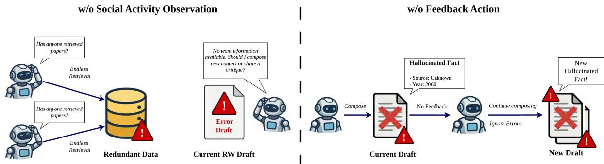  
Figure 2: Ablation failure cases of CREW. Removing social activity observation leads to poor coordination and redundant agent behavior, while removing the feedback action prevents agents from correcting citation errors introduced by others, reducing both citation accuracy and logical coherence.

Ablation Studies. We conduct ablation studies to examine the contribution of key components under the IPPO objective. As shown in Table 5, removing observation, reward, or action-space components generally degrades performance. Removing the draft-quality reward weakens the direct signal for improving the generated draft, causing agents to rely more on retrieval and feedback while performing fewer effective writing updates. Consequently, citation verification drops to nearly half of the full CREW system, suggesting that retrieved evidence is less effectively grounded in the final draft. Although the overall score slightly increases in this setting, the gain is marginal and comes at the cost of substantially lower citation reliability.

Figure 2 illustrates two representative failure cases. Without social activity observation, agents cannot track the action patterns of others, leading to redundant retrieval, overlapping behaviors, and weaker coordination; accordingly, Coverage, Logic, and Relevance decrease to around 3.30 on average. Removing the feedback action causes the largest degradation, with the Overall score dropping to 2.58, because agents lose an explicit mechanism for flagging hallucinated citations, missing evidence, and inconsistent claims. These results highlight the importance of both coordination-aware observation and feedback-driven revision in CREW.

## 5 Conclusion

We introduced CREW, a collaborative multi-agent reinforcement learning framework for automated related work generation. Instead of relying on a fixed pipeline, CREW allows multiple LLM agents to dynamically select among retrieval, knowledge dissemination, drafting, and critique actions according to a learned IPPO policy. Agents make decentralized decisions from their local observations while coordinating through shared knowledge, drafts, and feedback. This combination preserves agent autonomy without sacrificing the information exchange required for coherent scientific synthesis. Experiments on the OARELATEDWORK benchmark show that CREW improves generation quality and citation grounding over strong baselines while maintaining competitive efficiency. Comparisons with centralized and naive orchestrators in dicate that effective collaboration depends on both the system structure and learned action selection. Ablations show that feedback, social-activity observations, and quality-oriented rewards are important for coordination, revision, and citation reliability. Transfer experiments demonstrate that the learned policy remains effective across different inference backbones and can adapt for broader multi-document synthesis without retraining. Scalability experiments show that additional agents can contribute complementary retrieval, writing, and review capacity, although gains must be balanced against inference cost and latency. Overall, CREW demonstrates that reinforcement-learned, decentralized coordination offers a flexible alternative to rigid LLM pipelines and provides a promising foundation for adaptive, citation-aware scientific writing assistants.

## Limitations

Although CREW achieves strong empirical performance, several limitations remain. First, the current system operates solely over a fixed candidate pool rather than dynamically querying live scholarly databases, potentially missing newly published papers or relevant background literature. Second, our automated reward signals and LLM-dependent critique may not fully capture nuanced scholarly conventions, theoretical framing, or field-specific writing styles. Third, while the learned policy can be generalized to broader multi-document synthesis tasks beyond related work generation simply by modifying action prompts, our evaluation breadth across other domains is currently confined to a preliminary study on Multi-News. Fourth, due to resource constraints, our human evaluation remains relatively limited in scale, despite exhibiting strong alignment with LLM-as-a-judge assessments. Finally, while parallel agents reduce wall-clock latency in principle, practical deployments are still constrained by backbone LLM reasoning capabilities, API rate limits, and hardware availability. Future work will integrate dynamic scholarly search engines, expand human evaluation, and explore broader scientific domains.

## Ethical Considerations

CREW is intended to assist researchers in drafting and organizing related work sections, not to replace human scholarly judgment. Because LLM-based systems can still generate unsupported claims, misinterpret cited work, or overstate relationships among papers, users should carefully verify all generated statements, citations, and comparisons before publication. The system should be used as a writing aid that accelerates evidence organization and revision, while final responsibility for accuracy, attribution, and intellectual contribution remains with the authors. There is also a risk that automated related work generation could encourage superficial literature review practices if users accept outputs without critical reading. To mitigate this risk, CREW emphasizes citation grounding and critique actions, but these safeguards do not eliminate the need for human review. In addition, evaluations based on LLM judges may reflect biases present in the judging models, including preferences for fluent writing or dominant research paradigms. We therefore recommend transparent reporting when such tools are used and encourage future work on stronger provenance tracking, uncertainty estimation, and human-centered evaluation protocols.

## References

Tom B. Brown, Benjamin Mann, Nick Ryder, Melanie Subbiah, Jared Kaplan, Prafulla Dhariwal, Arvind Neelakantan, Pranav Shyam, Girish Sastry, Amanda Askell, Sandhini Agarwal, Ariel Herbert-Voss, Gretchen Krueger, Tom Henighan, Rewon Child, Aditya Ramesh, Daniel M. Ziegler, Jeffrey Wu, Clemens Winter, and 12 others. 2020. Language models are few-shot learners. In Advances in Neural Information Processing Systems 33: Annual Conference on Neural Information Processing Systems 2020, NeurIPS 2020, December 6-12, 2020, virtual.

Jingqiang Chen and Hai Zhuge. 2016. Summarization of related work through citations. In 12th International Conference on Semantics, Knowledge and Grids, SKG 2016, Beijing, China, August 15-17, 2016, pages 54–61. IEEE Computer Society.

Xiuying Chen, Hind Alamro, Mingzhe Li, Shen Gao, Rui Yan, Xin Gao, and Xiangliang Zhang. 2022. Target-aware abstractive related work generation with contrastive learning. In Proceedings ofthe 45th International ACM SIGIR Conference on Research and Development in Information Retrieval, SIGIR ’22, page 373–383, New York, NY, USA. Association for Computing Machinery.

Xiuying Chen, Hind Alamro, Mingzhe Li, Shen Gao, Xiangliang Zhang, Dongyan Zhao, and Rui Yan. 2021. Capturing relations between scientific papers: An abstractive model for related work section generation. In Proceedings of the 59th Annual Meeting of the Association for Computational Linguistics and the 11th International Joint Conference on Natural Language Processing (Volume 1: Long Papers), pages 6068–6077, Online. Association for Computational Linguistics.

Alexis Chevalier, Alexander Wettig, Anirudh Ajith, and Danqi Chen. 2023. Adapting language models to compress contexts. In Proceedings ofthe 2023 Conference on Empirical Methods in Natural Language Processing, pages 3829– 3846, Singapore. Association for Computational Linguistics.

Zekun Deng, Zixin Zeng, Weiye Gu, Jiawen Ji, and Bolin Hua. 2021. Automatic related work section generation by sentence extraction and reordering. In Proceedings of the 1st Workshop on AI + Informetrics (AII2021) colocated with the iConference 2021, Virtual Event, March 17th, 2021, CEUR Workshop Proceedings, pages 101–110. CEUR-WS.org.

Martin Docekal, Martin Fajcik, and Pavel Smrz. 2024. Oarelatedwork: A large-scale dataset of related work sections with full-texts from open access sources. Preprint, arXiv:2405.01930.

Alexander Fabbri, Irene Li, Tianwei She, Suyi Li, and Dragomir Radev. 2019. Multi-news: A large-scale multidocument summarization dataset and abstractive hierarchical model. In Proceedings of the 57th Annual Meeting of the Association for Computational Linguistics, pages 1074–1084, Florence, Italy. Association for Computational Linguistics.

William Feller. 1968. An Introduction to Probability Theory and Its Applications, 3 edition, volume 1. John Wiley and Sons.

Jakob Foerster, Gregory Farquhar, Triantafyllos Afouras, Nantas Nardelli, and Shimon Whiteson. 2018. Counterfactual multi-agent policy gradients. Proceedings of the AAAI Conference on Artificial Intelligence, 32(1).

Nianlong Gu and Richard Hahnloser. 2024. Controllable citation sentence generation with language models. In Proceedings ofthe Fourth Workshop on Scholarly Document Processing (SDP 2024), pages 22–37, Bangkok, Thailand. Association for Computational Linguistics.

Cong Duy Vu Hoang and Min-Yen Kan. 2010. Towards automated related work summarization. In Coling 2010: Posters, pages 427–435, Beijing, China. Coling 2010 Organizing Committee.

Yue Hu and Xiaojun Wan. 2014. Automatic generation of related work sections in scientific papers: An optimization approach. In Proceedings of the 2014 Conference on Empirical Methods in Natural Language Processing (EMNLP), pages 1624–1633, Doha, Qatar. Association for Computational Linguistics.

Gautier Izacard and Edouard Grave. 2021. Leveraging passage retrieval with generative models for open domain question answering. In Proceedings ofthe 16th Conference ofthe European Chapter ofthe Associationfor Computational Linguistics: Main Volume, pages 874–880, Online. Association for Computational Linguistics.

Shing-Yun Jung, Ting-Han Lin, Chia-Hung Liao, Shyan-Ming Yuan, and Chuen-Tsai Sun. 2022. Intent-controllable citation text generation. Mathematics, 10(10).

Patrick Lewis, Ethan Perez, Aleksandra Piktus, Fabio Petroni, Vladimir Karpukhin, Naman Goyal, Heinrich Kuttler, Mike Lewis, Wen-tau Yih, Tim Rocktäschel, Sebastian Riedel, and Douwe Kiela. 2020. Retrieval-Augmented Generation for Knowledge-Intensive NLP Tasks. In Advances in Neural Information Processing Systems.

Guohao Li, Hasan Hammoud, Hani Itani, Dmitrii Khizbullin, and Bernard Ghanem. 2023. Camel: Communicative agents for "mind" exploration of large language model society. In Advances in Neural Information Processing Systems, volume 36, pages 51991–52008. Curran Associates, Inc.

Ming Li, Xin Chen, Xin Li, Bin Ma, and Paul M. B. Vitányi. 2004. The similarity metric. IEEE Transactions on Information Theory, 50(12):3250–3264.

Xiangci Li, Yi-Hui Lee, and Jessica Ouyang. 2024. Cited text spans for scientific citation text generation. In Proceedings ofthe Fourth Workshop on Scholarly Document Processing (SDP 2024), pages 90–104, Bangkok, Thailand. Association for Computational Linguistics.

Xiangci Li and Jessica Ouyang. 2024. Related work and citation text generation: A survey. In Proceedings of the 2024 Conference on Empirical Methods in Natural Language Processing, pages 13846–13864, Miami, Florida, USA. Association for Computational Linguistics.

J. Lin. 1991. Divergence measures based on the shannon entropy. IEEE Transactions on Information Theory, 37(1):145–151.

Pengfei Liu, Weizhe Yuan, Jinlan Fu, Zhengbao Jiang, Hiroaki Hayashi, and Graham Neubig. 2023. Pre-train, prompt, and predict: A systematic survey of prompting methods in natural language processing. ACM Comput. Surv., 55(9).

Xiaochuan Liu, Ruihua Song, Xiting Wang, and Xu Chen. 2025. Select, read, and write: A multi-agent framework of full-text-based related work generation. In Findings of the Association for Computational Linguistics: ACL 2025, pages 7009–7028, Vienna, Austria. Association for Computational Linguistics.

Kelvin Luu, Xinyi Wu, Rik Koncel-Kedziorski, Kyle Lo, Isabel Cachola, and Noah A. Smith. 2021. Explaining relationships between scientific documents. In Proceedings of the 59th Annual Meeting ofthe Associationfor Computational Linguistics and the 11th International Joint Conference on Natural Language Processing (Volume 1: Long Papers), pages 2130–2144, Online. Association for Computational Linguistics.

Alexander Miller, Adam Fisch, Jesse Dodge, Amir-Hossein Karimi, Antoine Bordes, and Jason Weston. 2016. Keyvalue memory networks for directly reading documents. In Proceedings ofthe 2016 Conference on Empirical Methods in Natural Language Processing, pages 1400–1409, Austin, Texas. Association for Computational Linguistics.

OpenRouter. 2026. OpenRouter API Documentation. https: //openrouter.ai/docs. Accessed: May 24, 2026.

John Schulman, Philipp Moritz, Sergey Levine, Michael I. Jordan, and Pieter Abbeel. 2016. High-dimensional continuous control using generalized advantage estimation. In 4th International Conference on Learning Representations, ICLR 2016, San Juan, Puerto Rico, May 2-4, 2016, Conference Track Proceedings.

Yongliang Shen, Kaitao Song, Xu Tan, Dongsheng Li, Weiming Lu, and Yueting Zhuang. 2023. Hugginggpt: Solving ai tasks with chatgpt and its friends in hugging face. In Advances in Neural Information Processing Systems, volume 36, pages 38154–38180. Curran Associates, Inc.

Noah Shinn, Federico Cassano, Ashwin Gopinath, Karthik Narasimhan, and Shunyu Yao. 2023. Reflexion: language agents with verbal reinforcement learning. In Advances in Neural Information Processing Systems, volume 36, pages 8634–8652. Curran Associates, Inc.

J Terry, Benjamin Black, Nathaniel Grammel, Mario Jayakumar, Ananth Hari, Ryan Sullivan, Luis S Santos, Clemens Dieffendahl, Caroline Horsch, Rodrigo Perez-Vicente, Niall Williams, Yashas Lokesh, and Praveen Ravi. 2021. Pettingzoo: Gym for multi-agent reinforcement learning. In Advances in Neural Information Processing Systems, volume 34, pages 15032–15043. Curran Associates, Inc.

Pancheng Wang, Shasha Li, Haifang Zhou, Jintao Tang, and Ting Wang. 2020. Toc-rwg: Explore the combination of topic model and citation information for automatic related work generation. IEEE Access, 8:13043–13055.

Yongzhen Wang, Xiaozhong Liu, and Zheng Gao. 2018. Neural related work summarization with a joint context-driven attention mechanism. In Proceedings ofthe 2018 Conference on Empirical Methods in Natural Language Processing, pages 1776–1786, Brussels, Belgium. Association for Computational Linguistics.

Jason Wei, Xuezhi Wang, Dale Schuurmans, Maarten Bosma, brian ichter, Fei Xia, Ed Chi, Quoc V Le, and Denny Zhou. 2022. Chain-of-thought prompting elicits reasoning in large language models. In Advances in Neural Information Processing Systems, volume 35, pages 24824–24837. Curran Associates, Inc.

Jules White, Quchen Fu, Sam Hays, Michael Sandborn, Carlos Olea, Henry Gilbert, Ashraf Elnashar, Jesse Spencer-Smith, and Douglas C. Schmidt. 2023. A prompt pattern catalog to enhance prompt engineering with chatgpt. Preprint, arXiv:2302.11382.

Qingyun Wu, Gagan Bansal, Jieyu Zhang, Yiran Wu, Beibin Li, Erkang Zhu, Li Jiang, Xiaoyun Zhang, Shaokun Zhang, Jiale Liu, Ahmed Hassan Awadallah, Ryen W White, Doug Burger, and Chi Wang. 2023. Autogen: Enabling next-gen llm applications via multi-agent conversation. Preprint, arXiv:2308.08155.

Yuhuai Wu, Markus Norman Rabe, DeLesley Hutchins, and Christian Szegedy. 2022. Memorizing transformers. In The Tenth International Conference on Learning Representations, ICLR 2022, Virtual Event, April 25-29, 2022. OpenReview.net.

Wen Xiao, Iz Beltagy, Giuseppe Carenini, and Arman Cohan. 2022. PRIMERA: Pyramid-based masked sentence pre-training for multi-document summarization. In Proceedings of the 60th Annual Meeting of the Association for Computational Linguistics (Volume 1: Long Papers), pages 5245–5263, Dublin, Ireland. Association for Computational Linguistics.

Shunyu Yao, Jeffrey Zhao, Dian Yu, Nan Du, Izhak Shafran, Karthik R. Narasimhan, and Yuan Cao. 2023. React: Synergizing reasoning and acting in language models. In The Eleventh International Conference on Learning Representations, ICLR 2023, Kigali, Rwanda, May 1-5, 2023. Open-Review.net.

## A Algorithmic and Methodological Details

This section provides algorithmic and methodological details for the proposed framework.

## A.1 Pseudocode of the Proposed Framework

Appendix A.1 summarizes the full training, sampling, and inference procedure of CREW. Algorithm 1 shows how agents interact with shared artifacts over multiple rounds, collect rewards from artifact quality improvements, update the shared IPPO, and finally generate the related work draft through learned action sampling at inference time.

## A.2 Reward Formulation

This appendix details our reward function, which defines component-wise quality improvement rewards for four artifacts: draft, local knowledge, global knowledge, and feedback. These rewards provide dense and interpretable learning signals that encourage agents to produce coherent, informative, and target-paper-relevant related work drafts. Draft-level improvement is measured against the human-written related work section, denoted as egold.

(i) Draft quality $\widehat { Q } _ { D }$ evaluates semantic relevance alongside a compression-density score, using lossless compression as a lightweight proxy for textual regularity (Li et al., 2004):

$$
\widehat { Q } _ { D } = \gamma _ { D , 1 } c ( D , \mathrm { g o l d } ) + \gamma _ { D , 2 } ( 1 - C ( D ) / | D | ) ,\tag{16}
$$

where $C ( D )$ is the lossless compressed byte-length and $| D |$ is the original byte-length of the draft.

(ii) Local quality $\widehat { Q } _ { L }$ balances relevance and topic density against a redundancy penalty:

$$
\widehat { Q } _ { L } = \gamma _ { L , 1 } c ( L _ { i } , \mathrm { g o l d } ) + \gamma _ { L , 2 } c ( L _ { i } , \mathrm { t g t } ) - \gamma _ { L , 3 } \rho _ { i } ,\tag{17}
$$

where $c ( L _ { i } , \mathrm { t g t } )$ evaluates how topically focused the readings are, and $\rho _ { i } = \operatorname* { m a x } _ { h \in \mathcal { H } _ { i } } c ( L _ { i } , h )$ penalizes semantic overlap with the agent’s recent reading history $\mathcal { H } _ { i }$

(iii) Global quality $\widehat { Q } _ { G }$ rewards alignment with the gold standard, semantic novelty relative to prior shared knowledge $G _ { t - 1 }$ , and lexical distributional similarity to the gold standard:

$$
\begin{array} { r } { \widehat { Q } _ { G } = \gamma _ { G , 1 } c ( G , \mathrm { g o l d } ) + \gamma _ { G , 2 } \left( 1 - c ( G , G _ { t - 1 } ) \right) } \\ { + \gamma _ { G , 3 } \left( 1 - \mathrm { J S } ( p _ { G } \| p _ { \mathrm { g o l d } } ) \right) , ( 1 8 ) } \end{array}
$$

where $\mathrm { J S } ( \cdot \| \cdot )$ measures lexical coverage of the global knowledge against the gold standard, since lower distributional divergence indicates that G covers a more similar set of unigram evidence (Lin, 1991).

(iv) Feedback quality $\widehat { Q } _ { F }$ measures whether the critique targets draft deficiencies, using the gap vector $\mathbf { g } = \mathbf { e } _ { \mathrm { g o l d } } - \mathbf { e } _ { D }$

$$
\widehat { Q } _ { F } = c ( { \bf e } _ { F } , { \bf g } ) .\tag{19}
$$

## A.3 Joint Action and Credit Assignment

Joint Collaboration. When multiple agents simultaneously perform actions that modify shared resources, namely Disseminate, Critique, and Compose, our framework employs a segment-level coordination mechanism. Each agent selects the text segment it is most confident in editing and reports a confidence score $c _ { i } \in [ 0 , 1 ]$ in JSON format. Because agents have distinct observations shaped by their individual exploration trajectories, they naturally gravitate toward different segments, mirroring human collaboration in which authors refine different parts of a manuscript in parallel. The environment then merges these edits into a cohesive document. If multiple agents select the same segment, the agent with the highest confidence score $c _ { i }$ is granted editing rights.

Algorithm 1 CREW with Independent PPO   
Input: Target paper p, paper database P, citation graph ${ \mathcal { G } } ,$ agents $\mathcal { A } = \{ A _ { i } \} _ { i = 1 } ^ { M }$ , horizon $T$   
Output: Final related-work draft $D _ { T }$   
1: Initialize shared actor model π and shared critic model $V _ { \phi } .$   
2: while step $< s t e p _ { m a x }$ do   
3: // Loop through training steps   
4: Initialize shared batch buffer $\boldsymbol { \mathscr { W } } \gets \boldsymbol { \emptyset } .$   
5: while W does not reach a predefined size do   
6: Create M empty episode caches $\boldsymbol { E } ^ { 1 } , \dots , \boldsymbol { E } ^ { M }$   
7: Initialize shared states $D _ { 0 } , G _ { 0 } , F _ { 0 } , { \cal C } _ { 0 } \gets \emptyset$   
8: // Reset the environment   
9: Initialize local memory $L _ { i } ^ { 0 } \gets \emptyset$ for each Ai   
10: for t = 1 to T do   
11: for each agent $A _ { i } \in { \mathcal { A } }$ in parallel do   
12: Observe $o _ { t } ^ { i } = \mathrm { \large O B S E R V E } \big ( D _ { t - 1 } , G _ { t - 1 } , F _ { t - 1 } , C _ { t - 1 } , L _ { t - 1 } ^ { i } \big )$   
13: Sample $a _ { t } ^ { i } \sim \pi _ { \theta } ( { \bf \cdot } \mid o _ { t } ^ { i } ) .$ where $a _ { t } ^ { i } \in \{$ {Retrieve, Disseminate, Critique, Compose}   
14: if $a _ { t } ^ { i } =$ Retrieve then   
15: $\check { ( } L _ { t } ^ { i } , \mathcal { C } _ { t } ) \gets \mathrm { R E T R I E V E } ( L _ { t - 1 } ^ { i } , C _ { t - 1 } , \mathcal { P } , \mathcal { G } )$   
16: else if at = Disseminate then   
17: $G _ { t } \gets \mathrm { D I S S E M I N A T E } \left( L _ { t } ^ { i } , G _ { t - 1 } \right)$   
18: else if $a _ { i } ^ { t } = C r i t i q u e$ then   
19: $F _ { t } \gets \mathrm { C R I T I Q U E } ( D _ { t - 1 } , L _ { t } ^ { i } , G _ { t - 1 } )$   
20: else if $a _ { i } ^ { t } = C o m p o s e$ then   
21: $D _ { t } \gets \mathrm { C o M P O S E } ( D _ { t - 1 } , G _ { t - 1 } , L _ { t } ^ { i } , F _ { t - 1 } , C _ { t - 1 } )$   
22: end if   
23: $r _ { t } ^ { i } \gets \mathrm { R E W A R D } \big ( D _ { t } , G _ { t } , F _ { t } , C _ { t } , L _ { i } ^ { t } \big )$   
24: Store $( o _ { t } ^ { i } , a _ { t } ^ { i } , r _ { t } ^ { i } .$ , log πθ $( a _ { t } ^ { i } \mid o _ { t } ^ { i } ) , V _ { \phi } ( o _ { t } ^ { i } ) )$ into cache $E ^ { i }$   
25: end for   
26: end for   
27: for each agent $A _ { i } \in { \mathcal { A } }$ do   
28: Append cache $E ^ { i }$ into the shared batch buffer W.   
29: end for   
30: end while   
31: // Stop sampling, start training   
32: Estimate advantages Aˆ with GAE on the shared batch W   
33: Compute actor loss $J _ { \pi } ( \theta )$ and critic loss $J _ { V } ( \phi )$ on the shared batch W   
34: Update shared parameters θ and ϕ using Adam and gradient clipping   
35: end while   
36: Inference: At inference time, each agent samples its action from the learned shared policy, $a _ { t } ^ { i } \sim \pi _ { \theta } ( \cdot \mid o _ { t } ^ { i } )$ , over T rounds,   
and the final draft $D _ { T }$ is returned.

We formalize the likelihood of such overlap using the Birthday Problem and Stirling’s approximation (Feller, 1968). Under a strictly uniform random policy, which serves as a worst-case baseline where agents select shared actions with probability $p = 3 / 4$ and choose segments uniformly, the unconditional probability of overlapping edits for M agents across K segments is approximated as:

$$
\begin{array} { c } { { P ( \mathrm { o v e r l a p } ) \approx \displaystyle \sum _ { n = 2 } ^ { M } \left[ 1 - \exp \left( - \frac { n ( n - 1 ) } { 2 K } \right) \right] } } \\ { { \times \left( { \cal M } \right) \left( \displaystyle \frac { 3 } { 4 } \right) ^ { n } \left( \displaystyle \frac { 1 } { 4 } \right) ^ { { \cal M } - n } . } } \end{array}\tag{20}
$$

For example, with $M = 3$ agents and $K = 6$ segments, the overlap probability is only ≈ 25.78%, suggesting that parallel co-editing remains efficient with limited coordination overhead.

Credit Assignment. Once the joint draft is generated, it is evaluated to compute a global reward. To fairly distribute this shared reward among participating agents, we draw inspiration from the counterfactual multi-agent policy-gradient framework COMA (Foerster et al., 2018) and apply difference rewards. Formally, the difference reward for agent i is defined as:

$$
D _ { i } ( z ) = G ( z ) - G ( z _ { - i } ) ,\tag{21}
$$

where $G ( z )$ is the global evaluation score of the fully composed text z, and $G ( z _ { - i } )$ is the score of the text synthesized without the contributions of agent i.

## B Dataset Construction and Citation Graph

To ensure a rigorous and reproducible evaluation of the generated related work sections, this appendix

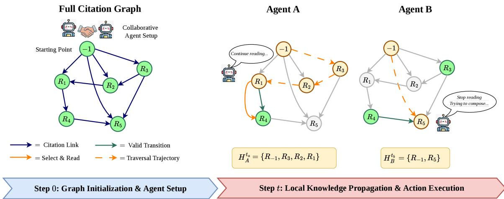  
Figure 3: Citation graph construction and agent traversal in CREW. The target paper is assigned the sentinel ID −1 and linked to its cited references to form the working citation graph. Agents then traverse the graph under local observation, selecting reachable citations and incrementally updating their reading histories.

provides detailed information on the processing of the OARELATEDWORK dataset.

## B.1 OARelatedWork Dataset

We leverage the OARELATEDWORK dataset, which contains 91,445 academic papers stored in JSONL format. Each paper record includes five fields: a unique integer id, title, abstract, related\_work (the gold-standard related work section), and referenced (the list of cited paper IDs).

In our experiments, we split the dataset into two non-overlapping subsets for policy learning and experimental evaluation. Specifically, we use 2% of the papers for training and 0.4% of the papers for evaluation. The training subset is used to optimize both the actor and critic networks during PPO training: the actor learns agents’ action-selection policies, while the critic estimates value functions for evaluating state-action trajectories. The evaluation subset is kept disjoint from the training subset, ensuring that no target paper used for training appears in the test set.

## B.2 Citation Graph Construction

From the OARELATEDWORK dataset, we construct a directed citation graph $\mathcal { G } = ( \nu , \mathcal { E } )$ , as illustrated in Figure 3. The graph is initialized from the target paper, assigned the sentinel ID −1, and its connected reference papers; agents then traverse valid citation transitions to select and read papers, producing agent-specific trajectories and local histories. We represent the graph as two adjacency lists:

– Outgoing adjacency (citation\_adj\_out): For each paper $p _ { i } ,$ , the list of papers it cites, i.e., $\mathcal { N } _ { \mathrm { o u t } } ( p _ { i } ) = \{ p _ { j } | e _ { i , j } \in \mathcal { E } \}$

– Incoming adjacency (citation\_adj\_in): For each paper $p _ { i }$ , the list of papers that cite it, i.e., $\mathcal { N } _ { \mathrm { i n } } ( p _ { i } ) = \{ p _ { j } \ | \ e _ { j , i } \in \mathcal { E } \}$

During evaluation, a target paper $P _ { \mathrm { t a r g e t } }$ is selected from the dataset and assigned the sentinel ID −1. Its outgoing citation edges are injected into the graph, and its direct neighbors (papers with at least 5 valid connections) serve as the reference pool $\mathcal { P } = \mathcal { N } _ { \mathrm { o u t } } ( P _ { \mathrm { t a r g e t } } )$ from which the multi-agent system must read and synthesize. The gold-standard related\_work field of $P _ { \mathrm { t a r g e t } }$ is used as the ground truth for evaluation.

## C Evaluation metrics

## C.1 LLM-as-a-judge

Evaluating long-form academic text generation is inherently complex, as traditional n-gram metrics fail to capture narrative flow, logical transitions, and citation discipline. We adopt an LLM-as-a-Judge protocol (using GPT-4o) scoring on a 1–5 Likert scale across three dimensions.

Coverage. Evaluates whether the generated related work comprehensively covers all key areas.

– Score 1: Limited coverage, touching small portions and lacking key areas.

– Score 2: Covers some parts but has noticeable omissions of significant areas.

– Score 3: Generally comprehensive but misses a few key points.

– Score 4: Covers most key areas comprehensively, with only minor topics left out.

– Score 5: Comprehensively covers all key and peripheral topics with detailed discussions.

Logic. Assesses the logical flow and structural coherence.

– Score 1: Lacks logic, no clear connections between sentences.

– Score 2: Weak logical flow, content arranged in a disordered manner.

– Score 3: Reasonable structure, though transitions could be improved (e.g., repeating).

– Score 4: Good logical consistency, natural transitions, only slightly rigid.

– Score 5: Tightly structured, logically clear, smooth transitions without redundancy.

Relevance. Evaluates focus on the target paper’s core subject.

– Score 1: Outdated or unrelated to the field, no alignment with the topic.

– Score 2: Somewhat on topic but with several digressions.

– Score 3: Generally on topic despite minor unrelated details.

– Score 4: Mostly on topic and focused, without frequent digressions.

– Score 5: Exceptionally focused, seamlessly contributing to core topic understanding.

## C.2 Citation Verification

To complement LLM-based quality evaluation, we further assess whether the generated related work draft is grounded in the provided citation database. A high-quality draft should not only be coherent and relevant, but also cite the correct papers from the available reference pool without introducing unsupported or hallucinated references. We therefore use citation verification to measure the validity of citations produced in the generated draft.

Let $\hat { \mathcal { C } } ( D )$ denote the set of paper IDs cited in a generated draft $D ,$ and let ${ \mathcal { P } } _ { \mathrm { r e f } }$ denote the valid reference pool associated with the target paper. We define citation verification as the proportion of generated citations that can be correctly matched to valid papers in the reference pool:

$$
\mathrm { C V } ( D ) = \frac { \Big | \hat { \mathcal C } ( D ) \cap \mathcal { P } _ { \mathrm { r e f } } \Big | } { \operatorname* { m a x } \Big ( 1 , \Big | \hat { \mathcal C } ( D ) \Big | \Big ) } .\tag{22}
$$

A higher CV(D) indicates that the generated draft cites papers grounded in the provided reference pool, while a lower score suggests the presence of invalid, unsupported, or hallucinated citations.

## D Implementation Details

In this section, we provide the comprehensive setup details required to reproduce our framework, including system configurations, specific hyperparameter choices for IPPO, and the network architectures.

## D.1 System and Training Setup

Our behavioral policy is optimized using IPPO, driven by the open-weight Qwen 2.5 72B Instruct model to ensure robust local reasoning during centralized training. The training setup involves a shared Actor and Critic network (Parameter Sharing) for multi agents interacting globally. The training is conducted for 3 training epochs, with K = 4 PPO optimization epochs per update and an episode horizon (max rounds) of 15 steps per paper. Actions are capped to a context length of 6144 tokens, and GPU memory utilization is scaled dynamically. For inference to demonstrate policy transferability, we swap the generation engine with LLaMA 8B, Gemini 2.0 Flash, Qwen 2.5 72B Instruct, and GPT-4o. Table 6 summarizes the core IPPO hyperparameters, LLM settings, reward coefficients, and network configurations.

## D.2 Network Architectures

The shared actor–critic layer configurations, including parameter counts, are detailed in Table 6. The observation vector contains 20 dimensions derived from graph features, draft quality, and social metrics.

## D.3 Baselines Detailed Analysis

To accurately situate the performance of our framework within the current literature, we compare CREW against three groups of baseline paradigms: multi-agent methods, single-agent LLM methods, and abstractive supervised models.

Multi-Agent Methods. We include two multi-agent baselines. Select, Read, and Write (SRW) (Liu et al., 2025) is a specialized architecture for related-work generation that decomposes the task into selector, reader, and writer roles. For a fair comparison with our experimental budget, we run SRW for 15 rounds of select-read interactions, followed by one final write round to generate the related-work section. This setting preserves SRW’s intended multi-stage evidence-gathering workflow while matching the number of interaction rounds used in our experiments. We also compare against an Orchestrator baseline inspired by HuggingGPT (Shen et al., 2023). It keeps the same shared documents, agent pool, and action space as CREW but replaces the learned IPPO decisionmaking policy with a centralized LLM coordinator. The Orchestrator is run for the same 15 rounds as CREW and assigns actions to individual agents from the full system state. This baseline tests whether CREW’s gains come from reinforcementlearned decentralized coordination rather than simply from using multiple agents and shared working memory.

Single-Agent LLM Methods. We evaluate GPT-4o under two single-agent settings. In GPT-4o (Long Context), the model receives the target paper context and the available reference information in a single prompt, then directly generates the related-work section. This setting represents a monolithic generation strategy that relies on the model’s long-context reasoning ability. In GPT-4o (RAG), we first retrieve the most relevant chunks using embedding-based similarity and then prompt GPT-4o with the retrieved evidence, representing a standard retrieval-augmented search-and-generate pipeline.

Abstractive Models. PRIMERA (Xiao et al., 2022) is a supervised sequence-to-sequence model pre-trained for multi-document summarization. We adapt it to related-work generation on OARE-LATEDWORK, using it as an abstractive baseline that tests how far a specialized summarization model can go without explicit multi-agent reasoning, citation-graph exploration, or adaptive action selection.

## D.4 System Hyperparameters and Configurations

We implemented CREW in $\mathrm { P y }$ thon 3.12.12 and used PettingZoo (Terry et al., 2021) to construct the multi-agent reinforcement learning environment.

Table 6: System hyperparameters and configurations used in CREW.
<table><tr><td>Category</td><td>Notation</td><td>Description</td><td>Value</td></tr><tr><td rowspan="8">RL</td><td> $\alpha _ { \omega }$ </td><td>Actor learning rate</td><td> $3 \times 1 0 ^ { - 4 }$ </td></tr><tr><td> $\alpha _ { \phi }$ </td><td>Critic learning rate</td><td> $1 \times { 1 0 } ^ { - 3 }$ </td></tr><tr><td> $\gamma$ </td><td>Discount factor</td><td>0.99</td></tr><tr><td> $\lambda$ </td><td>GAE parameter</td><td> $_ { 0 . 9 5 }$ </td></tr><tr><td> $\epsilon$ </td><td>Clipping threshold</td><td> $_ { 0 . 2 }$ </td></tr><tr><td> $K$ </td><td>PPO epochs</td><td>4</td></tr><tr><td></td><td>Entropy coefficient</td><td>0.01</td></tr><tr><td> $_ { T } ^ { c _ { e } }$ </td><td>Rollout steps</td><td>15</td></tr><tr><td rowspan="4">LLM</td><td> $\tau$ </td><td>Temperature</td><td>0.3</td></tr><tr><td>p</td><td>Top-p sampling</td><td>0.9</td></tr><tr><td> $N _ { \mathrm { m a x } }$ </td><td>Max output tokens</td><td>1400</td></tr><tr><td></td><td></td><td>0.8</td></tr><tr><td rowspan="8">Reward</td><td> $\gamma _ { D , 1 }$   $\gamma _ { D , 2 }$ </td><td>Draft quality coefficient Draft quality coefficient</td><td>0.2</td></tr><tr><td> $\gamma _ { L , 1 }$ </td><td>Local quality coefficient</td><td>0.5</td></tr><tr><td></td><td>Local quality coefficient</td><td>0.3</td></tr><tr><td> $\gamma _ { L , 2 }$ </td><td></td><td></td></tr><tr><td> $\gamma _ { L , 3 }$ </td><td>Local quality coefficient</td><td>0.2</td></tr><tr><td> $\gamma _ { G , 1 }$ </td><td>Global quality coefficient</td><td>0.5 0.3</td></tr><tr><td> $\gamma _ { G , 2 }$ </td><td>Global quality coefficient</td><td>0.2</td></tr><tr><td> $\gamma _ { G , 3 }$ </td><td>Global quality coefficient</td><td></td></tr><tr><td rowspan="6">Network</td><td>π1</td><td>Policy hidden layer 1</td><td>672</td></tr><tr><td>π2</td><td>Policy hidden layer 2</td><td>1056</td></tr><tr><td> $\pi _ { 3 }$ </td><td>Policy output layer 3</td><td>132</td></tr><tr><td> $V _ { 1 }$ </td><td>Value hidden layer 1</td><td>672</td></tr><tr><td> $V _ { 2 }$ </td><td>Value hidden layer 2</td><td>1056</td></tr><tr><td> $V _ { 3 }$ </td><td>Value output layer 3</td><td>33</td></tr></table>

All actor–critic components were trained locally on a workstation equipped with an NVIDIA RTX A5000 GPU with 24GB of GDDR6 memory. LLMbased generation and evaluation were conducted through the OpenRouter API (OpenRouter, 2026), which provides a unified interface for accessing different language model backends. Unless otherwise specified, all baselines and ablation studies were run under the same software and hardware environment. Table 6 summarizes the system hyperparameters and configurations used in CREW, including IPPO optimization settings, LLM decoding parameters, and reward coefficients.

## E Scalability Analysis

Multi-Agent Collaboration. To further analyze the effect of agent collaboration, we conduct an additional experiment by varying the number of agents from 1 to 5 while keeping the same backend language model for all settings. This ensures that the comparison reflects the contribution of the multi-agent organization rather than differences in model capability. For each configuration, we evaluate the generated related work quality, execution time, and total token consumption. As shown in Table 7, increasing the number of agents generally improves the quality scores, especially in logic and citation quality, since different agents can specialize in retrieval, feedback, knowledge updating, and writing. Meanwhile, execution time only increases moderately because agents can perform several actions in parallel, although total token usage grows with the number of agents. These results suggest that multi-agent collaboration provides a better trade-off between generation quality and computational cost than a single-agent setup. Discussion. Although parallel agents should ideally keep wall-clock time nearly stable, inference time increases mildly and then stabilizes in Table 7. This is largely due to OpenRouter API latency, which is external to our system. At timestep t, the system waits for the slowest agent, ${ \cal T } _ { t } ~ = ~ \mathrm { m a x } _ { 1 \leq i \leq M } \tau _ { i } ^ { ( t ) }$ If each agent independently experiences a delayed API response with probability p (Feller, 1968), and response time is $T _ { \mathrm { w a i t } }$ under delay and $T _ { \mathrm { n o r m a l } }$ otherwise, then $\mathbb { E } [ T _ { t } ] = T _ { \mathrm { w a i t } } - ( T _ { \mathrm { w a i t } } - T _ { \mathrm { n o r m a l } } ) ( 1 - p ) ^ { M }$ . Therefore, lim ${ \bf \Gamma } _ { M \to \infty } \mathbb { E } [ T _ { t } ] = T _ { \mathrm { w a i t } }$ for $0 ~ < ~ p ~ \leq ~ 1$ Thus, API variability may raise latency, but the expected timestep duration remains bounded rather than growing unboundedly with the number of agents.

Table 7: Impact of scaling the number of collaborative agents on generation quality, citation grounding, and token consumption.
<table><tr><td rowspan="2">Number of Agents</td><td colspan="4">LLM-based Evaluation (Avg.)</td><td>Citation</td><td colspan="2">Cost Efficiency</td></tr><tr><td>Cov. ↑</td><td>Logic ↑</td><td>Rel. ↑</td><td>Overall ↑</td><td> $\mathbf { V e r . } ( \% ) \uparrow$ </td><td>Tokens↓</td><td>Time(s) ↓</td></tr><tr><td>1</td><td>3.04</td><td>3.36</td><td>3.82</td><td>3.41</td><td>86.10</td><td>42.26K</td><td>359</td></tr><tr><td>2</td><td>3.41</td><td>3.69</td><td>4.27</td><td>3.79</td><td>100.00</td><td>90.64K</td><td>778</td></tr><tr><td>3</td><td>3.31</td><td>3.33</td><td>4.17</td><td>3.79</td><td>96.20</td><td>121.81K</td><td>644</td></tr><tr><td>4</td><td>3.44</td><td>3.73</td><td>4.27</td><td>3.82</td><td>99.33</td><td>198.74K</td><td>755</td></tr><tr><td>5</td><td>3.48</td><td>3.77</td><td>4.36</td><td>3.87</td><td>99.17</td><td>246.49K</td><td>833</td></tr></table>

## F Qualitative Experiments

## F.1 Human Evaluation

To complement the automatic evaluation, we conducted a human evaluation on 20 papers randomly selected from the Artificial Intelligence domain. Following the evaluation protocol of SRW (Liu et al., 2025), three graduate students performed pairwise comparisons between outputs generated by CREW and SRW. The evaluators assessed each pair in terms of coverage, logic, relevance, and overall quality. CREW achieved win rates of 53% for coverage, 60% for logic, and 57% for relevance, yielding an average overall win rate of 56.7%. These results indicate that human judges consistently preferred CREW to SRW across all evaluation dimensions. This human preference closely aligns with the automatic comparison in Table 1, jointly demonstrating the effectiveness of CREW’s learned coordination in producing higher-quality related work; the qualitative example in Section F.2 further supports this conclusion by showing that CREW provides more citation-grounded synthesis and clearer connections between prior studies and the target paper than the baselines.

## F.2 Case Study

We use a challenging target paper on tweet wikification to illustrate how CREW handles short-text entity linking, collective inference, graph-based semisupervision, and low-label training while grounding claims in the provided citation pool. Figure 4 shows the target paper, and Figure 5 compares outputs from CREW and the baselines.

## G Prompt Templates

We present the detailed prompt templates that drive each agent action. The RETRIEVE action is further organized into two sequential phases: paper selection, which selects candidate papers related to the target work, and paper reading, which reads the selected papers and extracts useful evidence for later writing. Other prompts are designed following common prompt-engineering practices (Brown et al., 2020; Wei et al., 2022; Yao et al., 2023; White et al., 2023; Liu et al., 2023), including role specification, explicit task instructions, step-bystep task decomposition, and output format constraints. These designs help reduce ambiguity and make the generated outputs more stable and easier to evaluate (Liu et al., 2025).

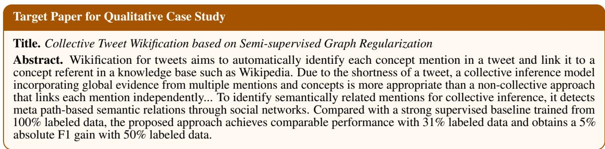

Figure 4: Qualitative case-study target paper. The framed title and abstract of the target paper.  
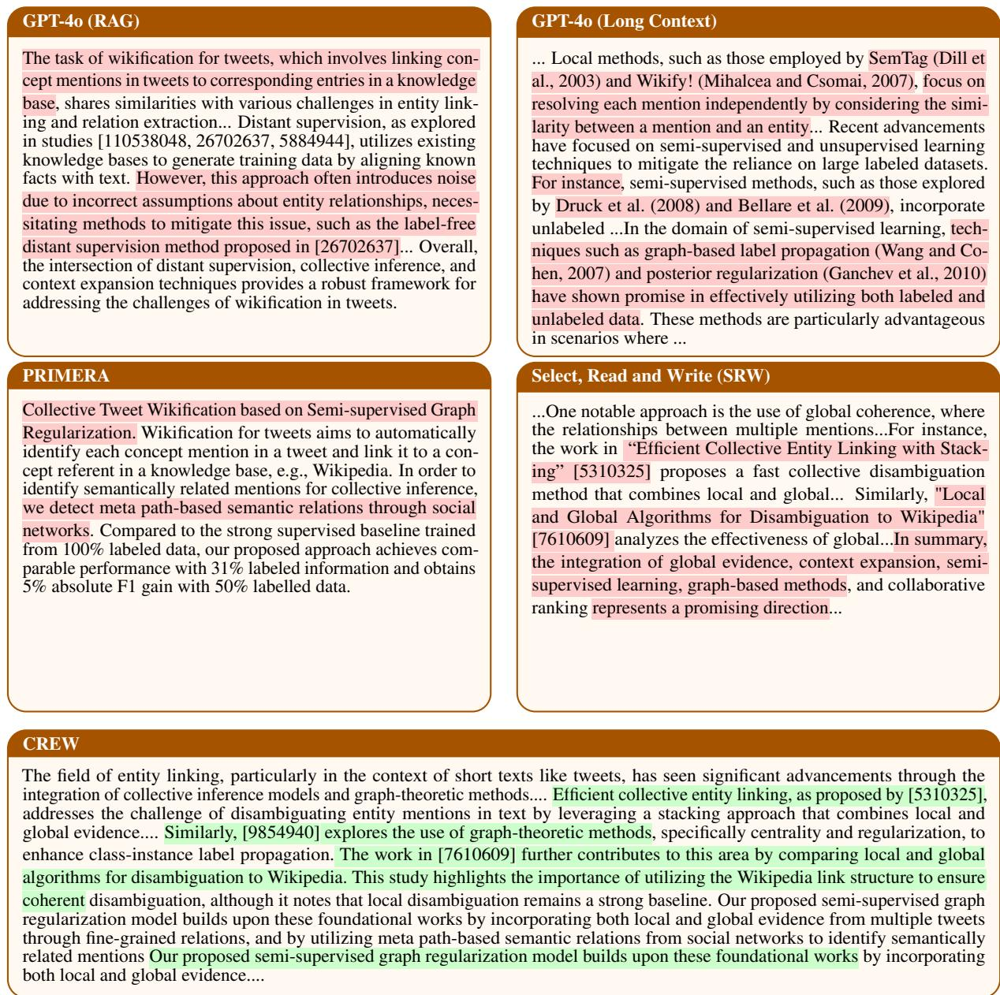  
Figure 5: Case study comparing related work generation outputs from GPT-4o (Long Context), GPT-4o (RAG), Primera, SRW, and CREW. Red highlights mark problematic content such as unsupported citations, weak synthesis, target-abstract copying, or list-like summaries. Green highlights show CREW’s citation-grounded synthesis and its ability to connect prior works to the target paper.

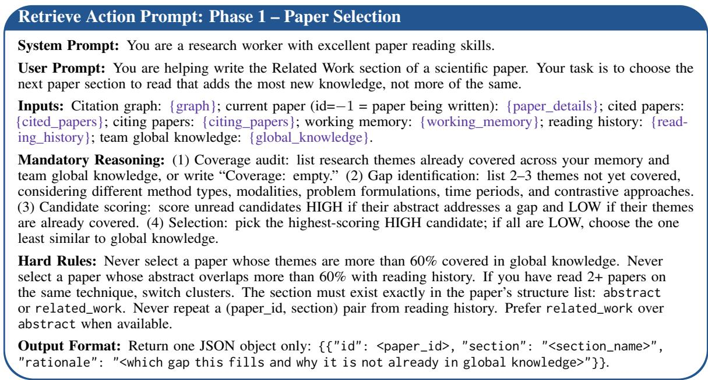

Figure 6: Prompt template for the RETRIEVE action, Phase 1: Paper Selection.  
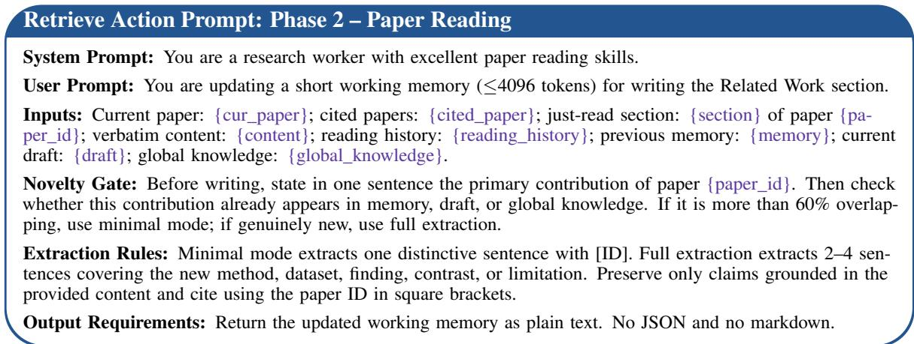  
Figure 7: Prompt template for the RETRIEVE action, Phase 2: Paper Reading.

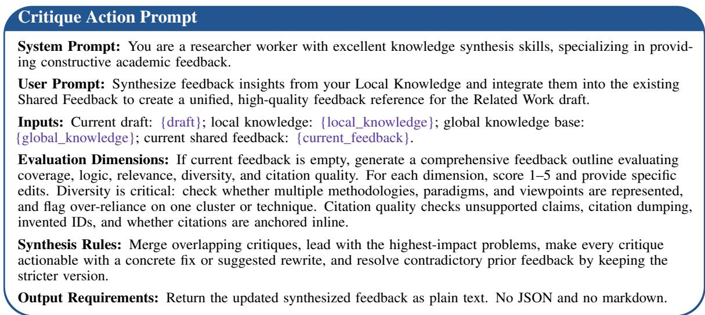  
Figure 8: Prompt template for the CRITIQUE action.

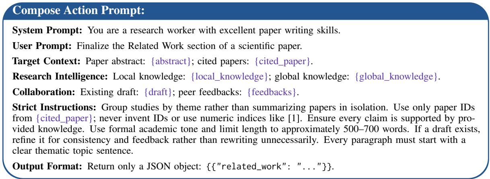  
Figure 9: Prompt template for the COMPOSE action.

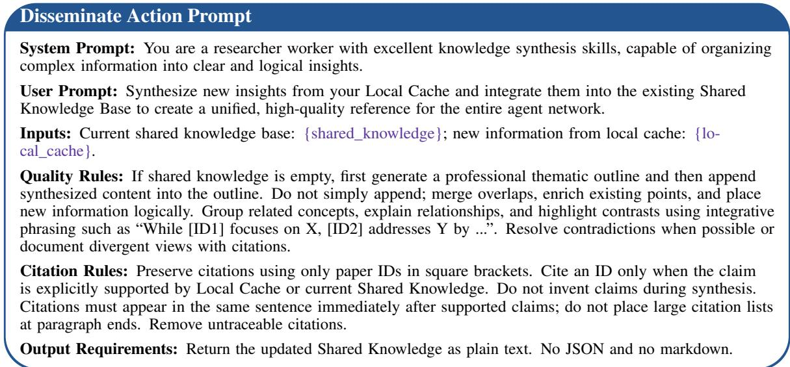

Figure 10: Prompt template for the DISSEMINATE action.  
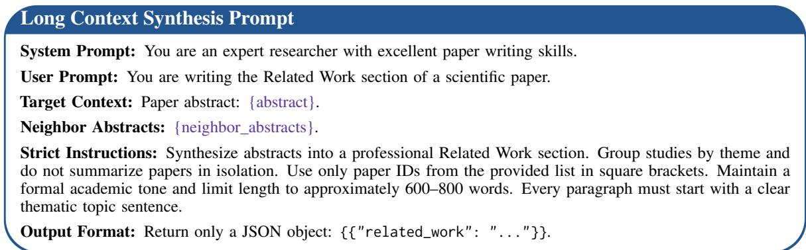  
Figure 11: Prompt template for long-context synthesis.

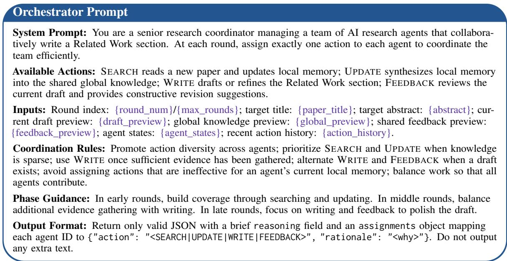  
Figure 12: Prompt template for the centralized orchestrator baseline.