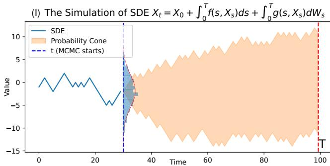
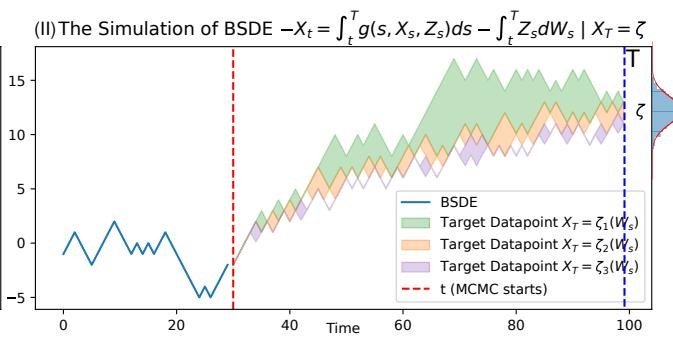
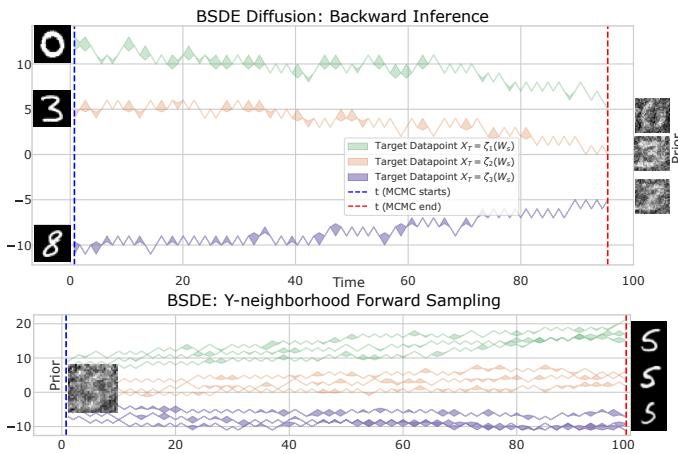
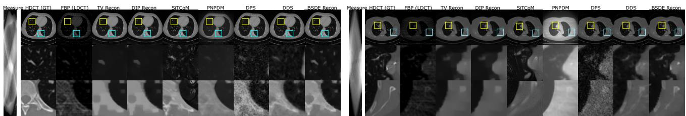
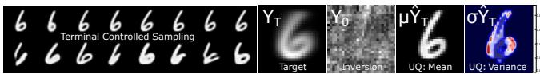
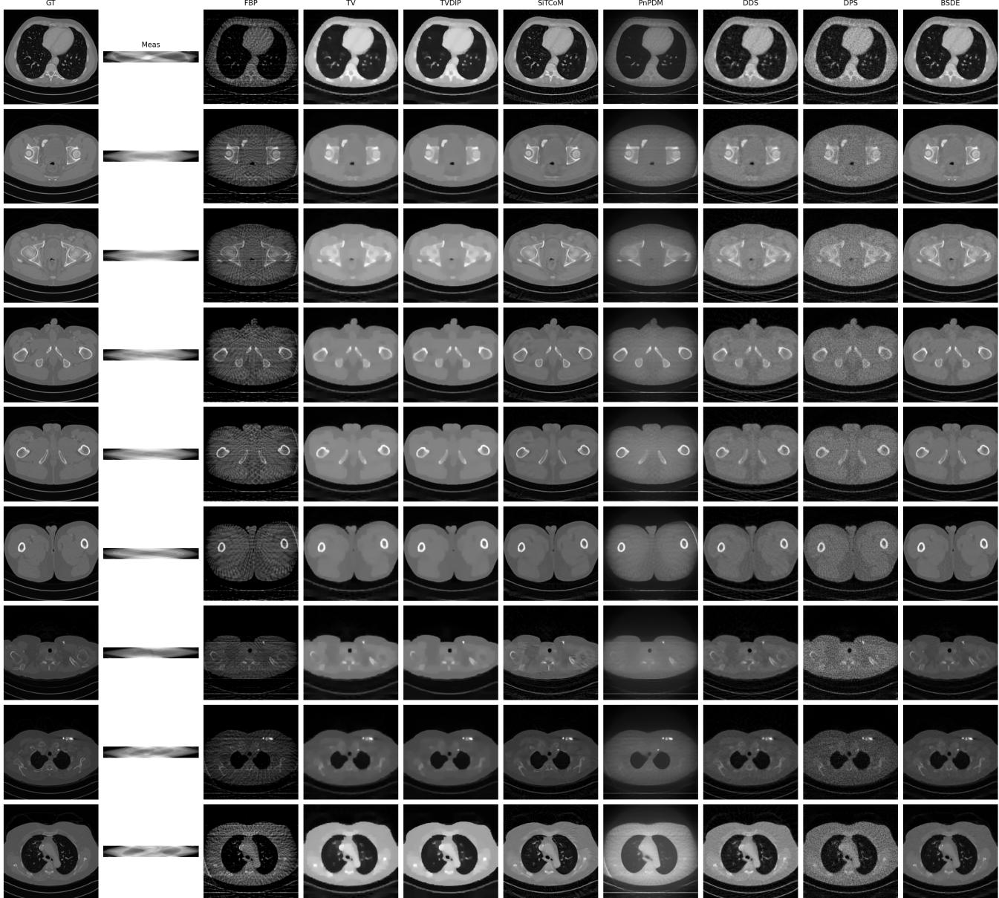
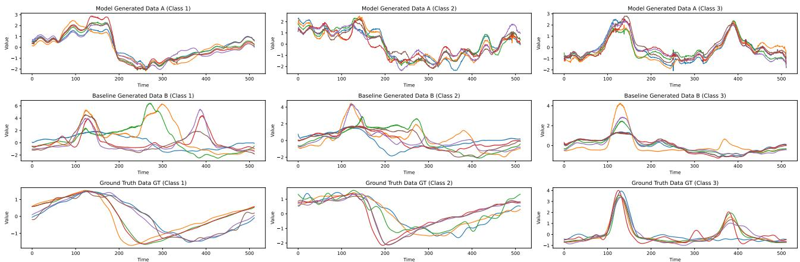
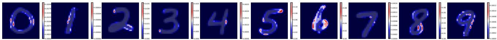
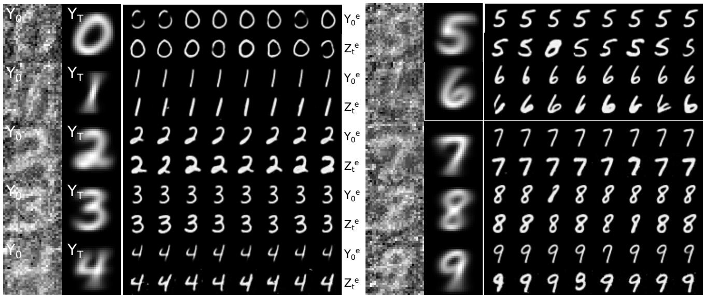

# Backward SDEs-based Diffusion for Physics-Constrained Generation

Zihao Wang <sup>1</sup>

## Abstract

Pretrained score-based diffusion models provide strong unconditional priors, yet enforcing measurement or physics consistency in inverse problems is often handled by heuristic guidance, intermittent projections, or task-specific conditional training, with limited guarantees of feasibility at the end of inference. We propose terminalconditioned inversion for score-based SDE priors. Given a frozen Score-SDE prior and a taskdefined terminal feasibility specification, we construct an associated backward stochastic differential equation whose adapted solution defines a principled inverse map from the terminal requirement to a prior state at a chosen noise level. Under standard regularity conditions, we establish existence and uniqueness of the adapted solution and obtain terminal consistency by construction. We further develop a practical neural BSDE solver that composes arbitrary pretrained diffusion priors with domain constraints without modifying the score-defined coefficients, producing an anchored prior state that enables neighborhood sampling for uncertainty characterization. Experiments on toy datasets validate stable terminal-conditioned inversion and distributionally consistent neighborhood sampling. As a real-world case study, we apply the framework to sparse-view CT reconstruction and achieve improved reconstruction quality over representative training-free baselines while satisfying strict measurement feasibility under the prescribed terminal specification. Project is available in: https://laplace.center/icmlbsdeI/

## 1. Introduction

Many practical and scientific tasks require recovering an unknown signal x from indirect and noisy observations

$$
y = \mathcal { A } ( x ) + \eta ,\tag{1}
$$

where A is a known or partially known forward operator and η denotes noise. The forward model alone rarely identifies x uniquely: multiple candidates can explain the same y. In high-stakes settings, the goal is not merely to produce a perceptually plausible sample, but to output solutions that are physically consistent with the observation at the end of inference, for example

$$
x \in S ( y ) \triangleq \{ x : \ A ( x ) \approx y \} .\tag{2}
$$

This exposes a persistent tension. Physics imposes a rigid terminal requirement, while unsupervised generative priors represent uncertainty through stochasticity and high-entropy support. Bridging physical determinism with generative uncertainty is the core challenge.

Diffusion and score-based models (Ho et al., 2020; Song et al., 2021) provide remarkably expressive priors learned from massive data, motivating their integration with forward operators for inverse problems. A wide range of approaches has emerged, including diffusion-based inverse problem solvers (Kawar et al., 2022), pseudoinverse or conditional-score constructions (Song et al., 2023), bridgebased formulations (Wang et al., 2025a; De Bortoli et al., 2021; Heng et al., 2021), and posterior-sampling methods such as diffusion posterior sampling (Chung et al., 2023; Li et al., 2024; Alkhouri et al., 2025; Achituve et al., 2025; Ekström Kelvinius et al., 2025; Peng et al., 2024). Despite strong empirical progress, a persistent difficulty is how measurement consistency is enforced. Most methods rely on step-wise penalties, intermittent projections, or guidance schedules whose strengths and time dependencies are tuned heuristically (Janati et al., 2025; Zheng & Lan, 2024). When the inverse problem is severely ill-posed, heuristic enforcement can lead to physically inconsistent yet visually plausible hallucinations, which is particularly concerning in scientific and medical applications.

At a conceptual level, this difficulty reflects a mismatch in mathematical formulation. Standard score-based generation is an initial-value stochastic transport: one starts from a simple reference distribution and simulates a reverse-time SDE to obtain data samples (Song et al., 2021), built on timereversal characterizations of diffusions (Anderson, 1982; Hirono et al., 2024). Physics-constrained inference, however, is naturally terminal-value: the requirement is specified through a feasibility event or an observation. Injecting penalties or projections into a discrete sampling loop does not, in general, define the path measure conditioned on a terminal requirement, and can push trajectories away from the intended manifold, motivating manifold-aware corrections such as MCG (Chung et al., 2022). These observations point to a missing ingredient: a principled path-space mechanism whose conditioning is posed directly in terminal form.

BSDE-based Diffusion
<table><tr><td>Framework</td><td>Prior</td><td>Constraint form</td><td>Path cond.?</td><td>Terminal consistency</td><td>Tuning burden</td></tr><tr><td>Variational, TV</td><td>explicit reg. / plug-in</td><td>soft, penalty</td><td>No</td><td>sometimes</td><td>medium</td></tr><tr><td>GAN inversion</td><td>GAN generator</td><td>soft, physics loss</td><td>No</td><td>no guarantee</td><td>high</td></tr><tr><td>Diffusion posterior sampling</td><td>score</td><td>soft</td><td>Approx.</td><td>no guarantee</td><td>high</td></tr><tr><td>Projection-in-the-loop/PnP</td><td>domain pretrained score</td><td>intermittent projection</td><td>No</td><td>often improves, not guaranteed</td><td>medium</td></tr><tr><td>Manifold-constrained diffusion</td><td>score</td><td>soft or hybrid</td><td> $\operatorname { A p p r o x . }$ </td><td>not guaranteed</td><td>medium</td></tr><tr><td>Diffusion and Schrödinger bridges</td><td>score</td><td>path measure</td><td>Yes, path value</td><td>yes</td><td>high</td></tr><tr><td>Ours: BSDE-diffusion</td><td>general pretrained score</td><td>hard terminal map</td><td>Yes, terminal value</td><td>by design</td><td>lower</td></tr></table>

Table 1. Comparison of physics-constrained generative frameworks: Variational (Rudin et al., 1992; Sidky & Pan, 2008; Liu et al., 2018; Chen et al., 2018); GAN inversion (Bora et al., 2017; Shah & Hegde, 2018; Chan et al., 2022); DPS and posterior sampling (Chung et al., 2023; Li et al., 2024; Alkhouri et al., 2025; Achituve et al., 2025; Ekström Kelvinius et al., 2025; Peng et al., 2024); PnP, RED, diffusion PnP (Park et al., 2025; Venkatakrishnan et al., 2013; Romano et al., 2017; Wang et al., 2022; Zhu et al., 2023); manifold constrained (Chung et al., 2022; Wang et al., 2025b; Chen & Lipman, 2024); bridges and matching (De Bortoli et al., 2021; Heng et al. 2021; Wang et al., 2025a; Gushchin et al., 2024; 2025; Ksenofontov & Korotin, 2025; Alkhouri et al., 2025).

In stochastic analysis, terminal-value problems are naturally expressed via backward stochastic differential equations, BSDEs (Bismut, 1973; Pardoux & Peng, 1990). A BSDE encodes the terminal requirement explicitly and solves for an adapted pair $( Y _ { t } , Z _ { t } )$ . The process $Z _ { t }$ acts as an adapted control in the martingale representation, steering stochastic dynamics so that the prescribed terminal specification is satisfied. This terminal-value viewpoint aligns directly with physics-constrained inference and complements other pathconditioning paradigms such as diffusion and Schrödinger bridges (De Bortoli et al., 2021; Heng et al., 2021).

We introduce a BSDE-based, terminally conditioned diffusion framework that applies to any pretrained score prior expressible in Score-SDE form. We show that, given a pretrained Score-SDE defining a base stochastic dynamics, we can construct an associated BSDE by imposing a terminal condition via a task-defined terminal map. This map encodes the observation requirement and can be instantiated as a decode, projection onto $S ( y )$ , and encode composition, enforcing physics consistency at the terminal condition rather than through heuristic time-dependent guidance. Solving the associated BSDE yields a well-defined inverse mapping from a terminal requirement to a prior state at a chosen noise level, and it satisfies the terminal specification by construction. This associated BSDE is not a reverse-time SDE: the pretrained SDE specifies the base diffusion prior, while the BSDE introduces an adapted pair whose martingale integrand is solved from the terminal requirement.

Our contributions are as follows. First, we introduce a terminal-conditioned diffusion perspective that brings BS-DEs into generative modeling as a general mechanism for enforcing terminal feasibility. Second, we provide a rigorous associated-BSDE construction for score-based SDE priors and establish well-posedness under standard regularity assumptions, ensuring existence and uniqueness of an adapted solution. Third, we develop a practical solver for general Score-BSDEs that composes arbitrary pretrained diffusion priors with domain-defined terminal operators through a hard terminal map, avoiding task-specific conditional training and reducing tuning burden. Finally, we instantiate the framework on a representative physicsconstrained inverse problem, sparse-view CT reconstruction, as a case study that highlights the methodological gap between terminal-conditioned, feasibility-defined reconstruction via an associated BSDE and widely used PnP-style step-wise conditioning strategies.

## 2. Preliminaries

We review three ingredients used throughout the paper: score-based diffusion in the SDE formulation, physicsconstrained inverse problems and common strategies for enforcing measurement consistency summarized in Table 1, and BSDEs as a terminal-value formalism. This section supports our main objective: a general, well-posed terminaldefined inversion principle applicable to any pretrained score-based SDE prior.

## 2.1. Score-Based Diffusion via SDEs

Scores and denoising score matching: Let $p _ { \mathrm { d a t a } }$ denote the data distribution on X. Score-based diffusion models learn the score field $\nabla _ { x } \log p _ { t } ( x )$ of a family of perturbed distributions $\{ p _ { t } \} _ { t \in [ 0 , T ] }$ . A standard training principle is denoising score matching. One samples $x _ { 0 } \sim p _ { \mathrm { d a t a } }$ , selects a noise level t, perturbs $x _ { 0 }$ to obtain $x _ { t } ,$ , and trains a neural network $s _ { \theta } ( x _ { t } , t )$ to approximate $\nabla _ { x } \log { p _ { t } ( x _ { t } ) }$ (Song et al., 2021). For Gaussian perturbations of the form $x _ { t } = x _ { 0 } +$ $\sigma ( t ) \epsilon$ with $\epsilon \sim \mathcal { N } ( 0 , I )$ , an equivalent objective is

$$
\begin{array} { r } { \mathcal { L } ( \theta ) = \mathbb { E } _ { t , x _ { 0 } , \epsilon } \Big [ \big \| s _ { \theta } ( x _ { t } , t ) + \frac { x _ { t } - x _ { 0 } } { \sigma ( t ) ^ { 2 } } \big \| _ { 2 } ^ { 2 } \Big ] . } \end{array}\tag{3}
$$

Forward-time SDE: The SDE viewpoint unifies diffusion learning and sampling in continuous time (Song et al., 2021). Let $( \Omega , \mathcal { F } , \{ \mathcal { F } _ { t } \} _ { t \in [ 0 , T ] } , \mathbb { P } )$ be a filtered probability space supporting a Brownian motion $( W _ { t } ) _ { t \in [ 0 , T ] }$ . A broad class of perturbation processes can be written as the forward SDE

$$
d X _ { t } = f ( X _ { t } , t ) d t + g ( t ) d W _ { t } , \qquad X _ { 0 } \sim p _ { \mathrm { d a t a } } ,\tag{4}
$$

which induces a marginal density $p _ { t }$ for $X _ { t }$ .

Reverse-time SDE: Given an estimate $\begin{array} { r l } { s _ { \theta } ( x , t ) } & { { } \approx } \end{array}$ $\nabla _ { x } \log p _ { t } ( x )$ , samples from $p _ { \mathrm { d a t a } }$ can be obtained by simulating the reverse-time SDE (Anderson, 1982; Song et al., 2021)

$$
d X _ { t } = \left[ f ( X _ { t } , t ) - g ( t ) ^ { 2 } s _ { \theta } ( X _ { t } , t ) \right] d t + g ( t ) d \bar { W } _ { t } , t : T \to 0 ,\tag{5}
$$

initialized from $X _ { T } \sim p _ { T }$ . In practice, Eq. (5) is integrated numerically, and solver choices influence sample quality (Song et al., 2021; Karras et al., 2022; Jolicoeur-Martineau et al., 2021; Mao et al., 2023). We need to note that the reverse-time SDEs is a sampling mechanism for the learned prior and does not encode terminal feasibility constraints.

Physics-constrained inverse problems: We consider inverse problems with measurements defined by Eq. (1), where A is a known forward operator. A central requirement is measurement consistency. Reconstructed outputs should satisfy the feasible set

$$
S ( y ) \triangleq \{ x : { \mathcal { A } } ( x ) \approx y \} ,\tag{6}
$$

up to the tolerance implied by the noise model and numerical errors. This requirement is particularly important in highstakes settings such as medical imaging, where visually plausible but physically inconsistent hallucinations can be unacceptable.

Physics constrained Diffusion: Table 1 summarizes major paradigms for combining learned priors with physics. They differ along three axes. First, some methods enforce constraints through soft penalties, while others apply explicit consistency operators. Second, some approaches correspond to conditioning a path measure on terminal feasibility, while others apply step-wise corrections without a terminal-value characterization. Third, practical performance often depends on tuning guidance weights and schedules. These differences motivate our terminal-conditioned perspective. Rather than enforcing physics through time-dependent guidance, we will encode feasibility as a terminal condition and solve for an adapted mechanism that achieves it.

## 2.2. Backward Stochastic Differential Equations

A backward stochastic differential equation is specified by a terminal condition and solved backward over time. Given a terminal random variable ξ and a driver ${ \hat { f } } ,$ a standard BSDE seeks adapted processes $( Y _ { t } , Z _ { t } )$ such that (Bismut, 1973; Pardoux & Peng, 1990)

$$
Y _ { t } = \xi + \int _ { t } ^ { T } \hat { f } ( s , Y _ { s } , Z _ { s } ) d s - \int _ { t } ^ { T } Z _ { s } d W _ { s } , \qquad t \in [ 0 , T ] .\tag{7}
$$

Equivalently, $d Y _ { t } = - \hat { f } ( t , Y _ { t } , Z _ { t } ) d t + Z _ { t } d W _ { t }$ with terminal condition $Y _ { T } = \xi .$ . Under standard assumptions that $\hat { f }$ is Lipschitz in $( Y , Z )$ and $\xi \in L ^ { 2 }$ , Eq. (7) admits a unique adapted solution (Pardoux & Peng, 1990). The process $Z _ { t }$ serves as the martingale integrand that makes the terminal condition achievable within the given filtration.

This terminal-value characterization is distinct from the reverse-time SDE in Eq. (5). Reverse-time SDEs are used to sample from a learned prior by transporting $p _ { T }$ back to $p _ { \mathrm { d a t a } }$ using a score field. In contrast, BSDEs take a terminal specification as an input and solve for an adapted pair $( Y , Z )$ that satisfies it. This viewpoint is central to our contribution.

## 3. Method

We formalize terminal-conditioned inversion as a general framework for physics-constrained inference under pretrained score-based diffusion priors. Our key observation is that any score-based SDE admits a corresponding BSDE representation, allowing inversion to be posed as a welldefined terminal value problem. By encoding observations or feasibility requirements as terminal conditions, the induced BSDE defines a mathematically well-posed inverse map from terminal constraints to a prior state at a chosen noise level.

## 3.1. BSDEs for Score-based Modeling

We introduce the terminal-conditioned inversion problem for arbitrary pretrained score-based SDE priors, define the associated BSDE representation, and state the well-posedness guarantees that make the inversion map mathematically sound. The construction is model-agnostic in the sense that it applies to any prior that admits a score-based SDE form, and it isolates task information through a terminal specification operator.

Score-SDE priors: Let $( \Omega , { \mathcal { F } } , ( { \mathcal { F } } _ { t } ) _ { t \in [ 0 , T ] } , \mathbb { P } )$ be a filtered probability space supporting a d-dimensional Brownian motion $( W _ { t } ) _ { t \in [ 0 , T ] } .$ . A score-based prior is represented through a diffusion process $( X _ { t } ) _ { t \in [ 0 , T ] }$ of the form

$$
\mathrm { d } X _ { t } ~ = ~ b _ { \theta } ( X _ { t } , t ) \mathrm { d } t ~ + ~ \sigma ( t ) \mathrm { d } W _ { t } ,\tag{8}
$$

where $\sigma ( t )$ is a known diffusion scale and the drift $b _ { \theta }$ is



  
Figure 1. Reverse-time SDE versus associated BSDE. Left: reverse-time sampling is an initial value formulation that evolves from a chosen noise law and does not encode a fixed terminal specification. Right: a BSDE is posed by a terminal condition and solves backward for an adapted representation process that enforces the terminal requirement.

specified using a trained score network $s _ { \theta } ( \cdot , t )$ . This class covers standard VP and VE constructions and their scoreparametrized variants.

Terminal specification Terminal-conditioned inversion is defined by a task-provided terminal requirement. We encode this requirement through a measurable specification operator

$$
\Psi : \mathcal { V }  \mathbb { R } ^ { d } ,\tag{9}
$$

which maps an observation $y \in \mathcal { V }$ to a target terminal latent state. In practice, Ψ can be implemented by decoding a latent to the image domain, enforcing the task constraint via a consistency step which its measurement matching under A, and re-encoding back to the latent space.

SDE Score Associated BSDE The key modeling object here is an associated BSDE that pairs with a given SDE defined score prior. It is posed as a terminal value problem and returns an adapted solution whose initial value is interpreted as the recovered prior state at a chosen noise level.

Definition 3.1 (Associated BSDE for a score prior). Fix a horizon $\tau \in ( 0 , T ]$ . Let $( X _ { t } ) _ { t \in [ 0 , \tau ] }$ follow the pretrained score prior (8) driven by the Brownian motion $( W _ { t } ) _ { t \in [ 0 , \tau ] }$ Let ξ be an $\mathcal { F } _ { \tau }$ -measurable terminal random variable in $L ^ { 2 } ( \Omega ; \mathbb { R } ^ { d } )$ . In terminal-conditioned inversion, we set $\xi =$ $\Psi ( y )$ for a given observation y.

We seek an adapted pair $( Y , Z )$ with $Y \in \mathcal { S } ^ { 2 } ( [ 0 , \tau ] ; \mathbb { R } ^ { d } )$ and $Z \in \mathcal { H } ^ { 2 } ( [ 0 , \tau ] ; \mathbb { R } ^ { d \times d } )$ that satisfies

$$
Y _ { t } \ = \ \xi + \int _ { t } ^ { \tau } f _ { \theta } \big ( s , X _ { s } , Y _ { s } , Z _ { s } \big ) \mathrm { d } s - \int _ { t } ^ { \tau } Z _ { s } \mathrm { d } W _ { s } , \ t \in [ 0 , \tau ] .\tag{10}
$$

We call (10) the associated BSDE induced by the score prior (8) and the terminal specification encoded by $\xi .$

Equation (10) is a BSDE in the standard sense. The terminal condition is imposed at the right endpoint $t = \tau$ , and the solution is required to be adapted to $( \mathcal { F } _ { t } )$ . The process $Z _ { t }$ is an unknown adapted representation process solved from the terminal condition. This is the structural distinction from reverse-time SDE sampling, where the diffusion coefficient is prescribed and no terminal constraint is enforced.

Well-posedness: To use (10) as a general inversion tool, we need existence and uniqueness of an adapted solution. In our setting, the BSDE driver is induced by the pretrained score prior through its score network and noise schedule. Concretely, we consider score-induced drivers of the form

$$
f _ { \theta } ( t , x , y , z ) \triangleq \hat { f } \big ( t , s _ { \theta } ( y , t ) , z \big ) ,\tag{11}
$$

where $\hat { f }$ is a fixed measurable map determined by the chosen prior family and the terminal-conditioning mechanism. The analysis follows classical Lipschitz BSDE theory under standard regularity assumptions commonly adopted for neural score models.

Assumption 3.2. There exist constants $L _ { y } , L _ { z } \geq 0$ such that for all $t \in [ 0 , \tau ]$ and all $x \in \mathbb { R } ^ { d } , y , y ^ { \prime } \in \mathbb { R } ^ { d } , z , z ^ { \prime } \in$ $\mathbb { R } ^ { d \times d }$

$$
\begin{array} { r } { \left\| f _ { \theta } ( t , x , y , z ) - f _ { \theta } ( t , x , y ^ { \prime } , z ^ { \prime } ) \right\| \ \leq \ L _ { y } \left\| y - y ^ { \prime } \right\| + L _ { z } \left\| z - z ^ { \prime } \right\| . } \end{array}\tag{12}
$$

Moreover,

$$
\mathbb { E } \int _ { 0 } ^ { \tau } \| f _ { \theta } ( t , X _ { t } , 0 , 0 ) \| ^ { 2 } \mathrm { d } t < \infty , \qquad \mathbb { E } \| \xi \| ^ { 2 } < \infty .\tag{13}
$$

Theorem 3.3 (Well-posedness of the associated BSDE). Under Assumption 3.2, the BSDE (10) admits a unique adapted solution $( \bar { Y } , Z ) \in \mathcal { S } ^ { 2 } ( [ 0 , \tau ] ; \mathbb { R } ^ { d } ) \times \mathcal { H } ^ { 2 } ( [ 0 , \tau ] ; \bar { \mathbb { R } ^ { d \times d } } )$

Theorem 3.3 is proved in the Appendix Sec. B.2. The prove follows classical BSDE well-posedness results for Lipschitz drivers (Pardoux & Peng, 1990; Peng, 1991). It provides the mathematical foundation for terminal-conditioned inversion. Given an observation y and terminal specification $\xi = \Psi ( y )$ with $\xi \in L ^ { 2 }$ , the inversion map is well-defined by the unique initial value $Y _ { 0 }$ of the adapted BSDE solution.

The associated BSDE enforces the terminal specification by construction; we have the corollary 3.4:

  
Figure 2. Backward inversion and forward use of the recovered prior state. Top: Example of solving the associated BSDE with terminal specification to obtain the recovered prior state $Y _ { 0 }$ . Bottom: generate feasible outputs by corresponding Score-SDE.

Corollary 3.4 (Terminal consistency). Let $( Y , Z )$ be the unique solution in Theorem 3.3. Then $Y _ { \tau } = \xi$ holds almost surely. In terminal-conditioned inversion with $\xi = \Psi ( y )$ the terminalfeasibility requirement encoded by Ψ is satisfied almost surely by the BSDE solution.

BSDE is fundamentally distinct from reverse-time SDE Reverse-time SDE and BSDE are mathematically distinct objects and arise from different problem statements. Reverse-time SDE is a time-reversal characterization of a forward diffusion and is therefore the standard backbone in many plug-and-play (PnP)–style score methods for inverse problems: under suitable regularity assumptions on the forward coefficients and the existence of timemarginal densities, the reversed process is again a diffusion whose drift is identified by the forward drift together with density-dependent correction terms involving the score of the time marginals (Haussmann & Pardoux, 1986). This time-reversal characterization underlies score-based generative modeling, where the reverse-time dynamics used for sampling depend on the score of the perturbed data distribution and are integrated from a reference noise law toward the data end (Song et al., 2021). In contrast, a BSDE specifies a terminal random variable and seeks an adapted pair $( Y , Z )$ satisfying a backward integral equation, where $Z$ is the martingale integrand in the Doob–Meyer or martingale representation sense (Pardoux & Peng, 1990; El Karoui et al., 1997). Accordingly, reverse-time SDE addresses the time-reversal and sampling dynamics of a given diffusion, whereas our terminal-conditioned inversion is posed as a terminal-value problem whose solution is an adapted process pair determined by the terminal specification.

Using the recovered prior state via neighborhood sampling: Terminal-conditioned inversion returns a recovered prior state $Y _ { 0 }$ at the chosen noise level. In inverse problems, a single observation may admit multiple feasible explanations, and exploring this ambiguity is often desirable for uncertainty quantification. A practical mechanism is neighborhood sampling around the recovered state.

Let $( Y , Z )$ be the associated BSDE solution for a terminal specification $\xi = \Psi ( y )$ . Sample perturbations δ from a userchosen local distribution and form perturbed prior states

$$
\tilde { Y } _ { 0 } ~ = ~ Y _ { 0 } + \delta .\tag{14}
$$

Each $\tilde { Y } _ { 0 }$ is then propagated through the pretrained diffusion dynamics associated with the score prior, producing a family of outputs whose diversity is controlled by the perturbation scale. Since all samples share the same terminal specification mechanism through the recovered anchor $Y _ { 0 } ,$ this procedure provides an efficient way to generate multiple plausible solutions without modifying the pretrained prior.

## 3.2. Solve the BSDE-based Diffusion Model

The associated score-BSDE in Section 3.1 is nonlinear and typically does not admit an analytical solution. We therefore rely on numerical solvers to compute the recovered prior state and the adapted representation process. We present two solver families that are sufficient for our purposes. The first is a classical regression-based solver that approximates conditional expectations on a time grid. The second is a deep BSDE solver that parameterizes the representation process with a neural network and optimizes it by terminal matching, which enables efficient GPU acceleration in our implementation. A broader overview of BSDE solvers can be found in (Chessari et al., 2023).

Time discretization: Let $0 = t _ { 0 } < t _ { 1 } < \cdots < t _ { N } = T$ be a uniform grid with step size $\Delta t \ = \ T / N$ , and denote $\Delta W _ { k } ^ { i } \ = \ \mathbf { \bar {  { W } } } _ { t _ { k + 1 } } ^ { i } \ - \ W _ { t _ { k } } ^ { \bar { i } }$ for the ith Brownian path. For a BSDE of the form $\begin{array} { r } { Y _ { t } = \xi + \int _ { t } ^ { T } f ( s , Y _ { s } , Z _ { s } ) \mathrm { d } s - } \end{array}$ $\begin{array} { r } { \int _ { t } ^ { T } Z _ { s } \mathrm { d } W _ { s } , } \end{array}$ , a standard explicit discretization yields the recursion

$$
y _ { k + 1 } ^ { i } = y _ { k } ^ { i } - f ( t _ { k } , y _ { k } ^ { i } , z _ { k } ^ { i } ) \Delta t + z _ { k } ^ { i } \Delta W _ { k } ^ { i } , \ k = 0 , \ldots , N - 1 ,\tag{15}
$$

where $y _ { k } ^ { i } \approx Y _ { t _ { k } }$ and $z _ { k } ^ { i } \approx Z _ { t _ { k } }$ along the ith simulated path.

Regression-based solver: A classical approach estimates $Z _ { t _ { k } }$ by approximating conditional expectations on the grid (Gobet et al., 2005; Lemor et al., 2006; Longstaff & Schwartz, 2001; Chessari et al., 2023). Given Monte Carlo (MC) samples $\{ ( y _ { k } ^ { i } , \Delta W _ { k } ^ { i } ) \} _ { i = 1 } ^ { M }$ , one uses a basis expansion to regress quantities of the form $\mathbb { E } [ \Delta W _ { k } y _ { k + 1 } | \mathcal { F } _ { t _ { k } } ]$ onto a chosen finite-dimensional function class. This yields an estimate of $z _ { k }$ that is then inserted into the forward recursion (15). The recovered prior state is obtained as the empirical average of the resulting $y _ { 0 } ^ { i }$ values over the MC paths.

The traditional BSDE solver cannot be used for solving the proposed high dimensional BSDE-Diffusion model. For high-dimensional state spaces, regression on hand-crafted bases becomes inefficient. We therefore introduce the learning based solver for solving the proposed BSDE-Diffusion model. The core idea is to parameterize the representation process by a neural network (E et al., 2017) and fit it by minimizing a terminal matching objective.

We treat the initial value as a learnable parameter α and set $y _ { 0 } ^ { i } = \alpha$ for all paths. We parameterize $Z _ { t _ { k } }$ by a neural network $\Phi _ { \beta }$ and set $z _ { k } ^ { i } = \Phi _ { \beta } ( t _ { k } , \eta _ { k } ^ { i } )$ , where $\eta _ { k } ^ { i }$ denotes the chosen input features at time $t _ { k }$ along the ith path. Given $( \alpha , \beta )$ , we propagate $( y _ { k } ^ { i } , z _ { k } ^ { i } )$ forward using (15) to obtain $y _ { N } ^ { i }$ , and minimize the terminal loss

$$
\mathcal { L } ( \alpha , \beta ) = \frac { 1 } { M } \sum _ { i = 1 } ^ { M } \big \| \xi - y _ { N } ^ { i } \big \| ^ { 2 } .\tag{16}
$$

Gradient-based optimization yields parameters $( \alpha , \beta )$ , after which the recovered prior state is given by $Y _ { 0 } \approx \alpha$ Algorithm 1 summarizes the procedure.

```tcl
Algorithm 1 Deep BSDE solver by terminal matching
Input: Terminal specification $\xi ,$ step size $\Delta t ,$ number of
paths M, initial parameters $( \alpha , \beta )$ , learning rate $\lambda _ { l }$
Output: Recovered prior state α and network parameters $\beta$
Data: Brownian paths $\{ W _ { t _ { k } } ^ { i } \} _ { i = 1 , k = 0 } ^ { M , N }$ and increments $\Delta W _ { k } ^ { i }$
repeat
Set $y _ { 0 } ^ { i } = \alpha$ for $i = 1 , \dots , M$ for $k = 0$ to $N - 1$ do
$z _ { k } ^ { \check { i } } = \Phi _ { \beta } ( t _ { k } , \eta _ { k } ^ { i } ) \ y _ { k + 1 } ^ { i } = y _ { k } ^ { i } - f ( t _ { k } , y _ { k } ^ { i } , z _ { k } ^ { i } ) \Delta t +$
$z _ { k } ^ { i } \Delta W _ { k } ^ { i }$
end
Update $\begin{array} { r } { ( \alpha , \beta ) \ \gets \ ( \alpha , \beta ) - \lambda _ { l } \nabla _ { ( \alpha , \beta ) } \frac { 1 } { M } \sum _ { i = 1 } ^ { M } \| \boldsymbol { \xi } \ - \| \boldsymbol { \xi } \| ^ { 2 } , } \end{array}$
$\bar { y } _ { N } ^ { i } \rVert ^ { 2 }$
until convergence
```

## 4. Application and Experiment

Our experiments follow a two-stage narrative that links theory to practice.

Part 4.1) toy validation of BSDE diffusion theory : We first use controlled toy benchmarks to empirically validate the theoretical claims of BSDE-diffusion: (a) terminal-value conditioning enables stable latent inversion which should be consistent with BSDE well-posedness. (b) the recovered prior encoding is distributionally correct in the sense that neighborhood sampling produces class-consistent outputs with improved distributional agreement.

Part 4.2) Physics-constrained CT reconstruction: We then evaluate the same terminal-value mechanism on a representative physics-constrained inverse problem: sparse-view CT reconstruction (SVCT) reconstruction. Here the central objective is terminal physical consistency : reconstructions must satisfy the CT measurement model within a prescribed numerical tolerance, which is essential for reliable deployment in mission-critical imaging scenarios.

For toy conditional generation, we report distributional similarity via Jensen–Shannon divergence (lower is better) and shape similarity via average cosine similarity (higher is better). For CT reconstruction, we report (a) image quality metrics (PSNR/SSIM) and (b) physics consistency quantified by the relative measurement residual $\| \ b { \mathcal { A } } ( \ b { x } ) - \ b { y } \| / \| \ b { y } \|$ evaluated after applying the terminal consistency map.

## 4.1. Toy Validation

MNIST: terminal-conditioned inversion and stable prior encodings. We validate terminal-conditioned inversion in a controlled visual setting using MNIST. We train a score model under a variance-exploding SDE perturbation and then construct an associated BSDE whose terminal condition is a prescribed target sample $\xi$ . We solve for the adapted pair $( Y _ { t } , Z _ { t } )$ such that $Y _ { T } = \xi .$

We adopt the driver

$$
\hat { f } \left( s _ { \theta } ( Y _ { t } , t ) , Z _ { t } \right) = - \sigma _ { t } ^ { 2 } s _ { \theta } ( Y _ { t } , t ) + \alpha Z _ { t } ,
$$

and set $\alpha = 0$ to isolate the effect of terminal conditioning. The corresponding BSDE is

$$
\mathrm { d } Y _ { t } = - \sigma _ { t } ^ { 2 } s _ { \theta } ( Y _ { t } , t ) \mathrm { d } t + Z _ { t } \mathrm { d } W _ { t } , \qquad Y _ { T } = \xi .\tag{17}
$$

This setup probes the terminal-value nature of the model. The solver learns an adapted process $Z _ { t }$ that enforces the terminal specification.

Stability under repeated solves and neighborhood sampling. BSDE inversion maps a terminal sample $\xi$ to an initial state $Y _ { 0 } ,$ , which serves as a code in the prior space. Under the well-posedness conditions, the adapted solution is unique, suggesting that repeated solves for the same $\xi$ should produce consistent encodings. We therefore report the terminal feasibility error $| Y _ { T } - \xi |$ and the variability of the recovered $Y _ { 0 }$ across solver restarts and random seeds. To verify that $Y _ { 0 }$ is a meaningful encoding rather than an optimization artifact, we also sample local neighborhoods

$$
\tilde { Y } _ { 0 } = Y _ { 0 } + \lambda \epsilon , \qquad \epsilon \sim { \mathcal N } ( 0 , I ) ,\tag{18}
$$

and generate outputs by running the BSDE-conditioned forward dynamics from $\tilde { Y } _ { 0 } . \mathrm { A s }$ Fig. 4 shows, it yields controlled diversity while preserving digit identity, supports that $Y _ { 0 }$ is a stable prior code induced by the terminal condition.

Star lightcurves: quantitative distributional consistency MNIST provides an intuitive visualization, but it does not directly quantify distributional fidelity. We therefore use star lightcurves, where class-conditional generation is commonly evaluated with distributional metrics. The question is whether terminal-conditioned inversion yields a prior encoding whose neighborhood sampling matches the target conditional distribution.

  
Figure 3. Qualitative comparison for SVCT lung screening. From left to right: physics measurement, high resolution reference, sparseview recon (FBP), TV, DIP-TV, DPS, DDS\*, SiTCom, PnPDM, and the proposed BSDE. Highlighted regions emphasize pulmonary parenchyma and small structural details that are critical for early cancer screening. The proposed method better preserves subtle lung textures and low-contrast structures while suppressing noise and remaining consistent with the measurement model. More examples are in Appendix. E.1.

<table><tr><td>Method</td><td colspan="10">MAE↓ PSNR↑ SSIM↑ NPSNR↑ NSSIM↑1 NMSE↓ NCC↑ Task-spec. training? Training-free? Unconditional prior? General prior?</td></tr><tr><td>FBP</td><td>37.22</td><td>14.12</td><td>0.366</td><td>8.91</td><td>0.268</td><td>0.4695</td><td>0.902</td><td>No</td><td>Yes</td><td>N/A</td><td>NA</td></tr><tr><td>TV( (Chen et al., 2018)</td><td>4.81</td><td>27.89</td><td>0.807</td><td>27.56</td><td>0.816</td><td>0.0205</td><td>0.978</td><td>No</td><td>Yes</td><td>N/A</td><td></td></tr><tr><td>TVDIP (Ma et al., 2025)</td><td>4.56</td><td>28.08</td><td>0.816</td><td>27.79</td><td>0.827</td><td>0.0197</td><td>0.979</td><td>No</td><td>Yes</td><td>Yes</td><td>Yes</td></tr><tr><td></td><td></td><td></td><td></td><td></td><td></td><td></td><td></td><td></td><td></td><td></td><td></td></tr><tr><td>PnPDM (Zheng et al., 2025)</td><td>23.38</td><td>19.06 24.27</td><td>0.551</td><td>22.36 24.36</td><td>0.691</td><td>0.3531</td><td>0.934</td><td>No</td><td>Yes Yes</td><td>Yes</td><td>No</td></tr><tr><td>DPS (Chung et al., 2023)</td><td>9.84 4.38</td><td>31.10</td><td>0.494 0.806</td><td>30.93</td><td>0.508 0.811</td><td>0.0473 0.0118</td><td>0.950 0.988</td><td>No No</td><td>Yes</td><td>Yes Yes</td><td>Yes No</td></tr><tr><td>DDS* (Chung &amp; Ye, 2024) SiTCoM (Alkhouri et al., 2025)</td><td>5.83</td><td>27.34</td><td>0.695</td><td>27.37</td><td>0.704</td><td>0.0265</td><td>0.973</td><td>No</td><td>Yes</td><td>Yes</td><td>Yes</td></tr><tr><td>BSDE (Proposed)</td><td>3.57</td><td>30.99</td><td>0.868</td><td>30.85</td><td>0.869</td><td>0.0101</td><td>0.989</td><td>No</td><td>Yes</td><td>Yes</td><td>Yes</td></tr></table>

Table 2. SVCT reconstruction quality. We additionally report method attributes: whether the approach requires task-specific training, is training-free at test time, uses an unconditional prior, and whether the prior is general. \*See special footnote [1] for DDS.

We compare against representative conditioning mechanisms, including diffusion-based perturbation editing, GAN inversion, and a variational baseline based on an LSTM-VAE. We follow prior practice in this dataset and report Jensen-Shannon divergence and average cosine similarity for class-conditional generation of Cepheid, Eclipsing Binary, and RR Lyrae lightcurves. Table 3 shows improved distributional agreement relative to the baselines. Together with MNIST, this supports the claim that terminal-conditioned inversion yields stable codes and distributionally consistent neighborhood sampling.

## 4.2. Real-world Case Study: SVCT Reconstruction

We instantiate terminal-conditioned inversion on a physicsconstrained inverse problem, SVCT reconstruction. This case study serves two purposes. It demonstrates how the terminal condition encodes feasibility under a real measurement operator. It tests whether the associated BSDE solver can enforce terminal physical consistency without injecting measurements into the pretrained score prior.

Table 3. Unsupervised conditional generation on star lightcurves. Lower is better for Jensen–Shannon divergence. Higher is better for average cosine similarity.
<table><tr><td rowspan="2"></td><td colspan="3">Jensen-Shannon Divergence↓</td><td colspan="3">Average Cos Similarity↑</td></tr><tr><td>Cepheid</td><td>Eclipsing B</td><td>RR Lyrae</td><td>Cepheid</td><td>Eclipsing B</td><td>RR Lyrae</td></tr><tr><td>SDE Diff.</td><td>0.3521</td><td>0.4397</td><td>0.3942</td><td>0.4338</td><td>0.4648</td><td>0.6284</td></tr><tr><td>GAN Inv.</td><td>0.3714</td><td>0.4374</td><td>0.3639</td><td>0.2860</td><td>0.5495</td><td>0.3302</td></tr><tr><td>LSTMVAE</td><td>0.3929</td><td>0.4916</td><td>0.3721</td><td>0.3794</td><td>0.0357</td><td>0.5299</td></tr><tr><td>BŠDE Diff.</td><td>0.3323</td><td>0.4223</td><td>0.3510</td><td>0.7095</td><td>0.4321</td><td>0.6838</td></tr></table>

  
Figure 4. Terminal-conditioned inversion and neighborhood sampling with the BSDE mechanism. See more in Appendix E.3

Measurement model and hard terminal requirement. Let $y _ { 0 } \in \mathcal { V }$ denote the SVCT measurement. We model the measurement formation by

$$
y _ { 0 } = \mathcal { A } ( x _ { 0 } ) + \eta
$$

, where $x _ { 0 } \in \mathcal { X }$ is the unknown standard CT image at the diffusion data end and $\mathcal { A } : \mathcal { X }  \mathcal { V }$ is the known CT forward operator that already includes the SVCT degradation mechanism. Our goal is terminal physical consistency: the final reconstruction xˆ must satisfy

$$
\| \mathcal { A } ( \hat { x } ) - y _ { 0 } \| \le \varepsilon \| y _ { 0 } \|
$$

for a prescribed numerical tolerance $\varepsilon > 0$ . We enforce this requirement through a hard terminal specification and a terminal measurement loss used by the solver. The pretrained score prior remains unconditional and freeze.

Pretrained SDE Diffusion We employ a pretrained scorebased diffusion prior (Song et al., 2021) in latent space (Rombach et al., 2022) and keep it frozen during reconstruction. Let $X _ { t } \in \mathbb { R } ^ { d }$ denote the latent state and consider the unconditional VE-SDE

$$
\mathrm { d } X _ { t } ~ = ~ g ( t ) \mathrm { d } W _ { t } , \qquad t \in [ 0 , T ] ,\tag{19}
$$

where $W _ { t }$ is a standard Brownian motion and $g ( t ) > 0$ is the diffusion scale. The marginal noise level satisfies $\begin{array} { r } { \sigma ^ { 2 } ( t ) \ = \ \int _ { 0 } ^ { t } g ^ { 2 } ( s ) } \end{array}$ ds. A pretrained score network $s _ { \vartheta } ( x , t ) \approx \nabla _ { x } \log p _ { t } ( x )$ specifies the denoising field at each time. The measurement $y _ { 0 }$ does not enter (19).

Imaging terminal specification: We encode the CT measurement requirement as a hard terminal specification through a measurable map $\Psi : \mathcal { V }  \mathbb { R } ^ { d }$ . Given the observed sinogram $y _ { 0 } , \Psi ( y _ { 0 } )$ returns a data-end latent specification whose decoded image is measurement-consistent under A within the prescribed tolerance. This exposes the CT constraint to the BSDE through a terminal boundary condition rather than through the pretrained score drift.

SDE-associated BSDE Form: Fix a diffusion noise level τ and solve an associated BSDE on the interval $[ 0 , \tau ]$ . We use the BSDE time variable $t \in [ 0 , \tau ]$ as an inversion-time parameter, mapped to diffusion time $r = \tau - t .$ , so that $t = \tau$ corresponds to the diffusion data end $r = 0$ and $t = 0$ corresponds to the diffusion state at noise level $r = \tau .$ . The BSDE terminal condition is

$$
Y _ { \tau } ~ = ~ \Psi ( y _ { 0 } ) ,\tag{20}
$$

and the associated BSDE reads

$$
Y _ { t } \ = \ Y _ { \tau } + \int _ { t } ^ { \tau } f \big ( s , X _ { s } , Y _ { s } , Z _ { s } \big ) \mathrm { d } s - \int _ { t } ^ { \tau } Z _ { s } \mathrm { d } W _ { s } , \ t \in [ 0 , \tau ] .\tag{21}
$$

Equivalently, $\mathrm { d } Y _ { t } = - f ( t , X _ { t } , Y _ { t } , Z _ { t } ) \mathrm { d } t + Z _ { t } \mathrm { d } W _ { t }$ with terminal condition (20). The inversion target is the recovered noisy prior state at diffusion noise level τ , represented by the BSDE initial value $Y _ { 0 }$

We discretize the VE-SDE using a schedule $\{ \sigma _ { k } \} _ { k = 0 } ^ { K }$ and increments $\Delta \sigma _ { k } ^ { 2 } = \sigma _ { k + 1 } ^ { 2 } - \sigma _ { k } ^ { 2 }$ . We use the pretrained scoredefined denoising recursion from index $k _ { \tau }$ down to 0 to map the inferred latent state at noise level τ to the data end. Let $\widetilde { X } _ { 0 }$ denote the resulting data-end latent and let D denote the fixed decoder mapping latent states. We obtain $\widetilde { x } _ { 0 } = D ( \widetilde { X } _ { 0 } )$ and set the final reconstruction as: ${ \hat { x } } \ { \triangleq } \ { \widetilde { x } } _ { 0 }$

Terminal measurement consistency: We solve the BSDE by minimizing the measurement discrepancy

$$
\operatorname* { m i n } \mathcal { L } _ { \mathrm { m e a s } } \triangleq \mathbb { E } \Big [ \big \| \mathcal { A } ( \hat { x } ) - y _ { 0 } \big \| ^ { 2 } \Big ] ,\tag{22}
$$

where the expectation is taken over the innovation variables used by the discrete score-defined recursion. This loss enforces terminal physical consistency in the measurement domain while keeping the pretrained prior unconditional: we do not inject $y _ { 0 }$ into the SDE coefficients nor into score evaluation, and instead solve for an adapted BSDE solution whose inferred prior state yields a terminal reconstruction consistent with A and $y _ { 0 }$

Baseline and Result We compare against filtered backprojection (FBP), total variation minimization (TV) (Chen et al., 2018), deep image prior (TVDIP) (Ma et al., 2025), and four diffusion-based inverse problem solvers: PnPDM (Zheng et al., 2025), DPS (Chung et al., 2023), DDS (Chung & Ye, 2024), and SiTCoM (Alkhouri et al., 2025). These baselines are chosen to cover complementary reconstruction paradigms: analytic and variational methods (FBP, TV), a training-free DIP baseline (TVDIP), and representative diffusion-based reconstruction methods. All methods use the same A and are evaluated under the same metrics. FBP serves as a fast analytic baseline, TV (Chen et al., 2018) as a classical physics-constrained regularization baseline, TVDIP (Ma et al., 2025) as a training-free DIP baseline, and PnPDM (Zheng et al., 2025), DPS (Chung et al., 2023), DDS<sup>1</sup> (Chung & Ye, 2024), and SiTCoM (Alkhouri et al., 2025) as diffusion-based baselines.

Quantitatively, Table 2 summarizes SVCT reconstruction performance on the SVCT dataset. The proposed BSDE solver achieves the best MAE (3.57), SSIM (0.868), NSSIM (0.869), NMSE (0.0101), and NCC (0.989), while remaining competitive in PSNR/NPSNR. Relative to the nondiffusion baselines, MAE decreases from 37.22 under FBP and 4.56 under TVDIP to 3.57, while SSIM increases from 0.366 under FBP and 0.816 under TVDIP to 0.868. Compared with the diffusion baselines built without datasetspecific retraining in our setting, BSDE substantially improves over PnPDM, DPS, and SiTCoM. We note that DDS uses a released CT-domain prior, so it does not correspond to exactly the same general-prior setting studied in this paper. We report DDS for reference in Table 2, but do not make it the main focus of the discussion here. A more detailed discussion of this mismatch and the resulting fairness issue is deferred to the Appendix.

Figure 3 corroborates the quantitative trends. FBP and TVDIP retain residual streaking and structured artifacts. TV suppresses noise but over-smooths fine structures in the highlighted regions. Among the diffusion baselines, PnPDM, DPS, and SiTCoM can sharpen details but may also exhibit contrast drift or reduced structural fidelity under step-wise soft measurement guidance. In contrast, BSDE better preserves subtle textures and edges while maintaining measurement consistency through the terminal feasibility map, yielding reconstructions that remain visually faithful and physically constrained.

## 5. Ablation

Effect of terminal conditioning. We first conduct a controlled ablation at resolution 128 × 128 to isolate the contribution of terminal conditioning within the proposed BSDE framework. We compare three variants. Hard terminal constraint denotes the full model, where the BSDE correction network is optimized with the terminal measurement loss. Soft terminal penalty replaces the hard terminal conditioning mechanism with a soft penalty toward the initial terminal estimate $z _ { \tau , \mathrm { i n i t } }$ . No terminal constraint removes the BSDE correction network and directly optimizes the terminal latent variable $z _ { \tau }$

Table 4. Ablation of terminal conditioning on $1 2 8 \times 1 2 8$ CT reconstruction. The hard terminal constraint gives the best reconstruction quality and the lowest measurement residual, confirming the importance of terminal feasibility in the BSDE formulation.
<table><tr><td>Method</td><td>PSNR↑</td><td>SSIM↑</td><td>NMSE↓</td><td>Residual.↓</td></tr><tr><td>Hard terminal constraint</td><td> $\overline { { { \bf 3 5 . 3 6 \pm 2 . 0 6 } } }$ </td><td> $\mathbf { 0 . 9 4 6 0 \pm 0 . 0 1 6 5 }$ </td><td> $\mathbf { 0 . 0 0 3 5 2 \pm 0 . 0 0 2 2 4 }$ </td><td> $\mathbf { \overline { { 0 . 0 0 1 2 8 \pm 0 . 0 0 0 2 1 } } }$ </td></tr><tr><td>Soft terminal penalty</td><td> $3 3 . 1 0 \pm 0 . 7 8$ </td><td> $0 . 9 1 9 4 \pm 0 . 0 0 7 2$ </td><td> $0 . 0 0 5 4 3 \pm 0 . 0 0 1 7 4$ </td><td> $0 . 0 0 2 0 3 \pm 0 . 0 0 0 2 2$ </td></tr><tr><td>No terminal constraint</td><td> $1 7 . 3 8 \pm 0 . 7 5$ </td><td> $0 . 4 1 8 8 \pm 0 . 0 6 9 5$ </td><td> $0 . 2 0 3 3 \pm 0 . 0 6 8 9$ </td><td> $0 . 2 0 0 8 \pm 0 . 0 2 3 8$ </td></tr></table>

Table 4 shows that terminal conditioning is essential for both image quality and measurement consistency. Replacing the hard terminal constraint with a soft penalty already degrades PSNR from 35.36 to 33.10 and increases the residual from 0.00128 to 0.00203, indicating that a soft attraction to $z _ { \tau , \mathrm { i n i t } }$ does not fully preserve terminal feasibility. Removing the terminal constraint causes a much larger failure: PSNR drops to 17.38, SSIM decreases to 0.4188, and the residual increases by two orders of magnitude to 0.2008. This confirms that the performance gain is not merely due to latent optimization, but comes from the BSDE correction mechanism that enforces the terminal measurement requirement.

Effect of terminal timepoint τ . We further perform a standalone sweep over the BSDE terminal timepoint $\tau \in \{ 0 . 0 5 , 0 . 1 5 , 0 . 3 5 , 0 . 4 5 , 0 . 5 0 \}$ to isolate the effect of the inversion horizon. The terminal timepoint controls the noise level at which the recovered prior state is anchored. A smaller τ keeps the inversion closer to the data end and can improve reconstruction fidelity, while a larger τ requires a stronger correction from a noisier latent state and can make terminal recovery less stable.

Empirically, $\tau = 0 . 0 5$ achieves the highest mean PSNR, $3 5 . 5 2 \pm 2 . 2 0$ , but it also requires a stronger terminal correction. In contrast, τ = 0.15 achieves a nearly identical PSNR of 35.21 ± 1.84 with better stability, providing the best quality–stability tradeoff in our experiments. When τ becomes larger, performance drops substantially: PSNR decreases to 31.34 ± 1.69 at τ = 0.35 and further to 23.48 ± 3.29 at $\tau = 0 . 4 5$ . These results suggest that terminal-conditioned BSDE inversion benefits from anchoring at a moderate diffusion noise level.

## 6. Conclusion

We proposed terminal-conditioned inversion for score-based SDE priors via an associated BSDE. Feasibility is imposed through a terminal specification, while the pretrained score prior remains unconditional and frozen. Under standard regularity conditions, the resulting BSDE is well posed and defines a unique adapted inverse mapping from the terminal requirement to a prior anchor. We also developed a neural BSDE solver that makes this construction numerically tractable for complex score priors without conditional retraining. Toy experiments validate stable inversion and distributionally consistent sampling. As a case study, SVCT reconstruction shows improved fidelity together with measurement consistency. Future work will focus on faster solvers and broader application cases.

## Acknowledgment

This research is supported by the Ruth S. Holmberg Grant, and is supported in part by the Provost’s Office of University of Tennessee at Chattanooga. We thank the anonymous reviewers for their constructive feedback.

## Impact Statement

This paper presents work whose goal is to advance the field of Machine Learning. There are many potential societal consequences of our work, none which we feel must be specifically highlighted here.

## References

Achituve, I., Habi, H. V., Rosenfeld, A., Netzer, A., Diamant, I., and Fetaya, E. Inverse problem sampling in latent space using sequential Monte Carlo. In Singh, A., Fazel, M., Hsu, D., Lacoste-Julien, S., Berkenkamp, F., Maharaj, T., Wagstaff, K., and Zhu, J. (eds.), Proceedings of the 42nd International Conference on Machine Learning, volume 267 of Proceedings ofMachine Learning Research, pp. 420–443. PMLR, 13–19 Jul 2025. URL https://proceedings.mlr.press/ v267/achituve25a.html.

Alkhouri, I., Liang, S., Huang, C.-H., Dai, J., Qu, Q., Ravishankar, S., and Wang, R. SITCOM: Step-wise triple-consistent diffusion sampling for inverse problems. In Singh, A., Fazel, M., Hsu, D., Lacoste-Julien, S., Berkenkamp, F., Maharaj, T., Wagstaff, K., and Zhu, J. (eds.), Proceedings ofthe 42nd International Confer ence on Machine Learning, volume 267 of Proceedings ofMachine Learning Research, pp. 1128–1158. PMLR, 13–19 Jul 2025. URL https://proceedings.mlr. press/v267/alkhouri25b.html.

Anderson, B. D. O. Reverse-time diffusion equation models. Stochastic Processes and their Applications, 12(3):313– 326, 1982. doi: 10.1016/0304-4149(82)90051-5.

Bismut, J.-M. Conjugate convex functions in optimal

stochastic control. Journal ofMathematical Analysis and Applications, 44(2):384–404, 1973. ISSN 0022-247X. doi: https://doi.org/10.1016/0022-247X(73)90066-8. URL https://www.sciencedirect.com/ science/article/pii/0022247X73900668.

Bora, A., Jalal, A., Price, E., and Dimakis, A. G. Compressed sensing using generative models. In Precup, D. and Teh, Y. W. (eds.), Proceedings of the 34th International Conference on Machine Learning, volume 70 of Proceedings of Machine Learning Research, pp. 537–546. PMLR, 06–11 Aug 2017. URL https://proceedings.mlr.press/v70/ bora17a.html.

Chan, K. C. K., Xu, X., Wang, X., Gu, J., and Loy, C. C. Glean: Generative latent bank for image superresolution and beyond, 2022. URL https://arxiv. org/abs/2207.14812.

Chen, R. T. Q. and Lipman, Y. Flow matching on general geometries, 2024. URL https://arxiv.org/abs/ 2302.03660.

Chen, W., Shao, Y., Wang, Y., Zhang, Q., Liu, Y., Yao, L., Chen, Y., Yang, G., and Gui, Z. A novel total variation model for low-dose ct image denoising. IEEE Access, 6:78892–78903, 2018. doi: 10.1109/ACCESS.2018. 2885514.

Chessari, J., Kawai, R., Shinozaki, Y., and Yamada, T. Numerical methods for backward stochastic differential equations: A survey. Probability Surveys, 20(none), jan 2023. doi: 10.1214/23-ps18. URL https://doi. org/10.1214%2F23-ps18.

Chung, H. and Ye, J. C. Deep diffusion image prior for efficient ood adaptation in 3d inverse problems, 2024. URL https://arxiv.org/abs/2407.10641.

Chung, H., Sim, B., Ryu, D., and Ye, J. C. Improving diffusion models for inverse problems using manifold constraints. In Advances in Neural Information Processing Systems, 2022. doi: 10.48550/arXiv.2206.00941. URL https://arxiv.org/abs/2206.00941.

Chung, H., Kim, J., Mccann, M. T., Klasky, M. L., and Ye, J. C. Diffusion posterior sampling for general noisy inverse problems. In The Eleventh International Conference on Learning Representations, 2023. URL https: //openreview.net/forum?id=OnD9zGAGT0k.

De Bortoli, V., Thornton, J., Heng, J., and Doucet, A. Diffusion schrödinger bridge with applications to score-based generative modeling. In Advances in Neural Information Processing Systems, 2021. doi: 10.48550/arXiv.2106. 01357. URL https://arxiv.org/abs/2106. 01357.

E, W., Han, J., and Jentzen, A. Deep learning-based numerical methods for high-dimensional parabolic partial differential equations and backward stochastic differential equations. Communications in Mathematics and Statistics, 5(4):349–380, November 2017. doi: 10.1007/ s40304-017-0117-6. URL https://doi.org/10. 1007/s40304-017-0117-6.

Ekström Kelvinius, F., Zhao, Z., and Lindsten, F. Solving linear-Gaussian Bayesian inverse problems with decoupled diffusion sequential Monte Carlo. In Singh, A., Fazel, M., Hsu, D., Lacoste-Julien, S., Berkenkamp, F., Maharaj, T., Wagstaff, K., and Zhu, J. (eds.), Proceedings of the 42nd International Conference on Machine Learning, volume 267 of Proceedings ofMachine Learning Research, pp. 15148–15181. PMLR, 13–19 Jul 2025. URL https://proceedings.mlr.press/ v267/ekstrom-kelvinius25b.html.

El Karoui, N., Peng, S., and Quenez, M. C. Backward stochastic differential equations in finance. Mathematical finance, 7(1):1–71, 1997.

Gobet, E., Lemor, J.-P., and Warin, X. A regression-based Monte Carlo method to solve backward stochastic differential equations. Annals ofApplied Probability, 15(3): 2172–2202, 2005.

Gushchin, N., Kholkin, S., Burnaev, E., and Korotin, A. Light and optimal schrödinger bridge matching. In Salakhutdinov, R., Kolter, Z., Heller, K., Weller, A., Oliver, N., Scarlett, J., and Berkenkamp, F. (eds.), Proceedings of the 41st International Conference on Machine Learning, volume 235 of Proceedings of Machine Learning Research, pp. 17100–17122. PMLR, 21–27 Jul 2024. URL https://proceedings.mlr.press/ v235/gushchin24a.html.

Gushchin, N., Li, D., Selikhanovych, D., Burnaev, E., Baranchuk, D., and Korotin, A. Inverse bridge matching distillation. In Singh, A., Fazel, M., Hsu, D., Lacoste-Julien, S., Berkenkamp, F., Maharaj, T., Wagstaff, K., and Zhu, J. (eds.), Proceedings ofthe 42nd International Conference on Machine Learning, volume 267 of Proceedings of Machine Learning Research, pp. 21471–21496. PMLR, 13–19 Jul 2025. URL https://proceedings.mlr. press/v267/gushchin25b.html.

Haussmann, U. G. and Pardoux, É. Time reversal of diffusions. The Annals of Probability, 14(4):1188–1205, 1986.

Heng, J., De Bortoli, V., Doucet, A., and Thornton, J. Simulating diffusion bridges with score matching, 2021. URL https://arxiv.org/abs/2111.07243.

Hirono, Y., Tanaka, A., and Fukushima, K. Understanding diffusion models by feynman’s path integral. In Salakhutdinov, R., Kolter, Z., Heller, K., Weller, A., Oliver, N., Scarlett, J., and Berkenkamp, F. (eds.), Proceedings of the 41st International Conference on Machine Learning, volume 235 of Proceedings ofMachine Learning Research, pp. 18324–18351. PMLR, 21–27 Jul 2024. URL https://proceedings.mlr.press/ v235/hirono24a.html.

Ho, J., Jain, A., and Abbeel, P. Denoising diffusion probabilistic models. In Larochelle, H., Ranzato, M., Hadsell, R., Balcan, M., and Lin, H. (eds.), Advances in Neural Information Processing Systems, volume 33, pp. 6840–6851. Curran Associates, Inc., 2020. URL https://proceedings.neurips. cc/paper\_files/paper/2020/file/ 4c5bcfec8584af0d967f1ab10179ca4b-Paper pdf.

Janati, Y., Moufad, B., Qassime, M. A. E., Oliviero Durmus, A., Moulines, E., and Olsson, J. A mixture-based framework for guiding diffusion models. In Singh, A., Fazel, M., Hsu, D., Lacoste-Julien, S., Berkenkamp, F., Maharaj, T., Wagstaff, K., and Zhu, J. (eds.), Proceedings of the 42nd International Conference on Machine Learning, volume 267 of Proceedings ofMachine Learning Research, pp. 26830–26876. PMLR, 13–19 Jul 2025. URL https://proceedings.mlr.press/ v267/janati25a.html.

Jolicoeur-Martineau, A., Li, K., Piché-Taillefer, R., Kachman, T., and Mitliagkas, I. Gotta go fast when generating data with score-based models, 2021.

Karras, T., Aittala, M., Aila, T., and Laine, S. Elucidating the design space of diffusion-based generative models. In Oh, A. H., Agarwal, A., Belgrave, D., and Cho, K. (eds.), Advances in Neural Information Processing Systems, 2022. URL https://openreview.net/ forum?id=k7FuTOWMOc7.

Kawar, B., Elad, M., Ermon, S., and Song, J. Denoising diffusion restoration models, 2022. URL https:// arxiv.org/abs/2201.11793.

Ksenofontov, G. and Korotin, A. Categorical schrödinger bridge matching. In Singh, A., Fazel, M., Hsu, D., Lacoste-Julien, S., Berkenkamp, F., Maharaj, T., Wagstaff, K., and Zhu, J. (eds.), Proceedings of the 42nd International Conference on Machine Learning, volume 267 of Proceedings of Machine Learning Research, pp. 31727–31751. PMLR, 13–19 Jul 2025. URL https://proceedings.mlr.press/ v267/ksenofontov25a.html.

Lemor, J.-P., Gobet, E., and Warin, X. Rate of convergence of an empirical regression method for solving generalized backward stochastic differential equations. Bernoulli, 12 (5):889–916, 2006.

Li, S., Jiang, X., Tivnan, M., Gang, G. J., Shen, Y., and Stayman, J. W. Ct reconstruction using diffusion posterior sampling conditioned on a nonlinear measurement model. Journal of Medical Imaging, 11(04), August 2024. ISSN 2329-4302. doi: 10.1117/1.jmi.11.4. 043504. URL http://dx.doi.org/10.1117/1. JMI.11.4.043504.

Lin, S., Clark, R., Birke, R., Schönborn, S., Trigoni, N., and Roberts, S. Anomaly detection for time series using vae-lstm hybrid model. In ICASSP 2020 - 2020 IEEE International Conference on Acoustics, Speech and Signal Processing (ICASSP), 2020.

Liu, J., Sun, Y., Xu, X., and Kamilov, U. S. Image restoration using total variation regularized deep im age prior, 2018. URL https://arxiv.org/abs/ 1810.12864.

Longstaff, F. A. and Schwartz, E. S. Valuing american options by simulation: a simple least-squares approach. The review offinancial studies, 14(1):113–147, 2001.

Ma, Y., Zhang, Y., Chen, L., Jiang, Q., Shi, F., and Wei, B. Deep plug-and-play denoising prior with total variation regularization for low-dose ct. Frontiers in Physics, Volume 13 - 2025, 2025. ISSN 2296-424X. doi: 10.3389/fphy.2025.1563756. URL https:// www.frontiersin.org/journals/physics/ articles/10.3389/fphy.2025.1563756.

Mao, W., Xu, C., Zhu, Q., Chen, S., and Wang, Y. Leapfrog diffusion model for stochastic trajectory prediction. In Proceedings of the IEEE/CVF Conference on Computer Vision and Pattern Recognition, pp. 5517–5526, 2023.

Meng, C., He, Y., Song, Y., Song, J., Wu, J., Zhu, J.- Y., and Ermon, S. SDEdit: Guided image synthesis and editing with stochastic differential equations. In International Conference on Learning Representations, 2022. URL https://openreview.net/forum? id=aBsCjcPu\_tE.

Pardoux, E. and Peng, S. Adapted solution of a backward stochastic differential equation. Systems & Control Letters, 14(1):55–61, 1990. ISSN 0167-6911. doi: https://doi.org/10.1016/0167-6911(90)90082-6. URL https://www.sciencedirect.com/ science/article/pii/0167691190900826.

Park, C. Y., Hu, Y., McCann, M. T., Garcia-Cardona, C., Wohlberg, B., and Kamilov, U. S. Plug-and-play priors

as a score-based method. In 2025 IEEE International Conference on Image Processing (ICIP), pp. 49–54, 2025. doi: 10.1109/ICIP55913.2025.11084503.

Peng, S. Probabilistic interpretation for systems of quasilinear parabolic partial differential equations. Stochastics and stochastics reports (Print), 37(1-2):61–74, 1991.

Peng, X., Zheng, Z., Dai, W., Xiao, N., Li, C., Zou, J., and Xiong, H. Improving diffusion models for inverse problems using optimal posterior covariance. In Salakhutdinov, R., Kolter, Z., Heller, K., Weller, A., Oliver, N., Scarlett, J., and Berkenkamp, F. (eds.), Proceedings of the 41st International Conference on Machine Learning, volume 235 of Proceedings of Machine Learning Research, pp. 40347–40370. PMLR, 21–27 Jul 2024. URL https://proceedings.mlr.press/ v235/peng24h.html.

Rebbapragada, U., Protopapas, P., Brodley, C. E., and Alcock, C. Finding anomalous periodic time series. Machine Learning, 74(3):281–313, dec 2008. doi: 10.1007/ s10994-008-5093-3. URL https://doi.org/10. 1007%2Fs10994-008-5093-3.

Romano, Y., Elad, M., and Milanfar, P. The little engine that could: Regularization by denoising (red). SIAM Journal on Imaging Sciences, 10(4):1804–1844, 2017. doi: 10.1137/16M1102884.

Rombach, R., Blattmann, A., Lorenz, D., Esser, P., and Ommer, B. High-resolution image synthesis with latent diffusion models, 2022. URL https://arxiv.org/ abs/2112.10752.

Rudin, L. I., Osher, S., and Fatemi, E. Nonlinear total variation based noise removal algorithms. Physica D: Nonlinear Phenomena, 60(1–4):259–268, 1992. doi: 10. 1016/0167-2789(92)90242-F.

Shah, V. and Hegde, C. Solving linear inverse problems using gan priors: An algorithm with provable guarantees. arXiv preprint arXiv:1802.08406, 2018. doi: 10.48550/ arXiv.1802.08406.

Sidky, E. Y. and Pan, X. Image reconstruction in circular cone-beam computed tomography by constrained, totalvariation minimization. Physics in Medicine and Biology, 53(17):4777–4807, 2008. doi: 10.1088/0031-9155/53/ 17/021.

Song, J., Vahdat, A., Mardani, M., and Kautz, J. Pseudoinverse-guided diffusion models for inverse problems. In International Conference on Learning Representations, 2023. URL https://openreview.net/ forum?id=9\_gsMA8MRKQ.

Song, Y., Sohl-Dickstein, J., Kingma, D. P., Kumar, A., Ermon, S., and Poole, B. Score-based generative modeling through stochastic differential equations. In International Conference on Learning Representations (ICLR), 2021. doi: 10.48550/arXiv.2011.13456. URL https://arxiv.org/abs/2011.13456.

Venkatakrishnan, S. V., Bouman, C. A., and Wohlberg, B. Plug-and-play priors for model based reconstruction. In 2013 IEEE Global Conference on Signal and Information Processing (GlobalSIP), pp. 945–948, 2013. doi: 10. 1109/GlobalSIP.2013.6737048.

Wang, H., Jin, T., Lin, W., Wang, S., Huang, H., Ji, S., and Zhao, Z. IRBridge: Solving image restoration bridge with pre-trained generative diffusion models. In Fortysecond International Conference on Machine Learning, 2025a. URL https://openreview.net/forum? id=b3bJR1quJ3.

Wang, Y., Yu, J., and Zhang, J. Zero-shot image restoration using denoising diffusion null-space model. arXiv preprint arXiv:2212.00490, 2022. doi: 10.48550/arXiv. 2212.00490.

Wang, Z., Vandersteen, C., Raffaelli, C., Guevara, N., and Delingette, H. Multi-energy quasi-symplectic langevin inference for latent disentangled learning. IEEE Transactions on Image Processing, 34:7037–7049, 2025b. doi: 10.1109/TIP.2025.3624614.

Xia, W., Zhang, Y., Yang, Y., Xue, J.-H., Zhou, B., and Yang, M.-H. Gan inversion: A survey, 2022.

Zheng, C. and Lan, Y. Characteristic guidance: Non-linear correction for diffusion model at large guidance scale. In Salakhutdinov, R., Kolter, Z., Heller, K., Weller, A., Oliver, N., Scarlett, J., and Berkenkamp, F. (eds.), Proceedings of the 41st International Conference on Machine Learning, volume 235 of Proceedings of Machine Learning Research, pp. 61386–61412. PMLR, 21–27 Jul 2024. URL https://proceedings.mlr.press/ v235/zheng24f.html.

Zheng, H., Chu, W., Zhang, B., Wu, Z., Wang, A., Feng, B., Zou, C., Sun, Y., Kovachki, N. B., Ross, Z. E., Bouman, K., and Yue, Y. Inversebench: Benchmarking plug-andplay diffusion priors for inverse problems in physical sciences. In The Thirteenth International Conference on Learning Representations, 2025. URL https:// openreview.net/forum?id=U3PBITXNG6.

Zhu, Y., Zhang, K., Liang, J., Cao, J., Wen, B., Timofte, R., and Van Gool, L. Denoising diffusion models for plug-and-play image restoration. arXiv preprint arXiv:2305.08995, 2023. doi: 10.48550/arXiv.2305. 08995.

## A. Notations

We collect the main notation used throughout the paper.

• Probability space. $( \Omega , \mathcal { F } , ( \mathcal { F } _ { t } ) _ { t \in [ 0 , T ] } , \mathbb { P } )$ is a filtered probability space. $( W _ { t } ) _ { t \in [ 0 , T ] }$ is a d-dimensional Brownian motion adapted to $( \mathcal { F } _ { t } )$

• Data and distributions. $\mathcal { X } \subseteq \mathbb { R } ^ { d }$ is the data space. $p _ { \mathrm { d a t a } }$ is the data distribution on $\mathcal { X } .$ . For a stochastic process $( X _ { t } )$ $p _ { t }$ denotes the marginal density of $X _ { t }$ at time t.

• Score field and network. The score field at time t is $\nabla _ { x } \log p _ { t } ( x ) . \ s _ { \theta } ( x , t )$ is a neural network approximation of $\nabla _ { x } \log p _ { t } ( x )$ , with parameters θ.

• Score-SDE prior. T is the diffusion time horizon. The forward Score-SDE prior is

$$
\mathrm { d } X _ { t } = f ( X _ { t } , t ) \mathrm { d } t + g ( t ) \mathrm { d } W _ { t } , \qquad X _ { 0 } \sim p _ { \mathrm { d a t a } } .
$$

When needed, $\bar { W } _ { t }$ denotes a Brownian motion for reverse-time sampling dynamics.

• Inverse problems and measurements. A is a known forward operator and $y$ is the measurement. $S ( y )$ denotes the measurement-feasible set (or an ε-feasible set) specified by the task.

• Terminal specification. Ψ is a measurable terminal specification operator that encodes the feasibility requirement induced by $y .$ The BSDE terminal random variable is $\xi : = \Psi ( y )$

• Associated BSDE (terminal-conditioned inversion). $\tau \in ( 0 , T ]$ is the chosen inversion horizon (noise level). We solve an adapted pair $( Y _ { t } , Z _ { t } ) _ { t \in [ 0 , \tau ] }$ satisfying

$$
Y _ { t } = \xi + \int _ { t } ^ { \tau } f _ { \theta } ( s , X _ { s } , Y _ { s } , Z _ { s } ) \mathrm { d } s - \int _ { t } ^ { \tau } Z _ { s } \mathrm { d } W _ { s } , \qquad t \in [ 0 , \tau ] ,
$$

where $f _ { \theta }$ is the BSDE driver. The recovered prior state is $Y _ { 0 }$

• Function spaces and regularity. $S ^ { 2 } ( [ 0 , \tau ] ; \mathbb { R } ^ { d } )$ denotes square-integrable adapted processes with finite $\begin{array} { r } { \mathbb { E } [ \operatorname* { s u p } _ { t \in [ 0 , \tau ] } \overline { { \| Y _ { t } \| ^ { 2 } } } ] . { H ^ { 2 } ( [ 0 , \tau ] ; \mathbb { R } ^ { d \times d } ) } } \end{array}$ denotes square-integrable predictable processes with finite $\begin{array} { r } { \mathbb { E } [ \int _ { 0 } ^ { \tau } \| Z _ { t } \| ^ { 2 } \mathrm { d } t ] } \end{array}$ $\xi \in L ^ { 2 } ( \dot { \Omega } ; \dot { \mathbb R } ^ { d } )$ means $\mathbb { E } \| \boldsymbol { \xi } \| ^ { 2 } < \infty . \ L _ { y } , L _ { z }$ are Lipschitz constants of $f _ { \theta }$ in $( y , z )$

• Discrete noise schedule. $\{ \sigma _ { k } \} _ { k = 0 } ^ { K }$ is a discrete noise schedule and $\Delta \sigma _ { k } ^ { 2 } : = \sigma _ { k + 1 } ^ { 2 } - \sigma _ { k } ^ { 2 } \cdot \epsilon _ { k } \sim \mathcal { N } ( 0 , I )$ are standard Gaussian innovations.

## B. Proofs

## B.1. Notation and function spaces

Let $( \Omega , { \mathcal { F } } , ( { \mathcal { F } } _ { t } ) _ { t \in [ 0 , T ] } , \mathbb { P } )$ support a d-dimensional Brownian motion $( W _ { t } ) _ { t \in [ 0 , T ] }$ . We use the standard spaces (as in Pardoux–Peng’s proof strategy):

$$
\mathcal { H } ^ { 2 } : = \Big \{ Z : \Omega \times [ 0 , T ] \to \mathbb { R } ^ { d \times d } \mathrm { p r o g r e s s i v e l y ~ m e a s u r a b l e : ~ } \mathbb { E } \int _ { 0 } ^ { T } \| Z _ { t } \| ^ { 2 } d t < \infty \Big \} ,
$$

$$
\mathcal { S } ^ { 2 } : = \Big \{ Y : \Omega \times [ 0 , T ] \to \mathbb { R } ^ { d } \mathrm { ~ a d a p t e d , c o n t i n u o u s : ~ } \mathbb { E } \big [ \operatorname* { s u p } _ { t \in [ 0 , T ] } \| Y _ { t } \| ^ { 2 } \big ] < \infty \Big \} .
$$

(We use the Euclidean norm $\| \cdot \|$ and the associated inner product $\langle \cdot , \cdot \rangle . )$

We consider the BSDE

$$
Y _ { t } = \xi + \int _ { t } ^ { T } \hat { f } \big ( s _ { \theta } ( Y _ { s } , s ) , Z _ { s } , s \big ) d s - \int _ { t } ^ { T } Z _ { s } d W _ { s } , \qquad t \in [ 0 , T ] .\tag{23}
$$

For convenience, define the effective driver

$$
G ( t , y , z ) : = \hat { f } \big ( t , s _ { \theta } ( y , t ) , z \big ) ,
$$

where $s _ { \theta } ( \cdot , t ) : \mathbb { R } ^ { d }  \mathbb { R } ^ { m }$ and $\widehat { f } ( t , \cdot , \cdot ) : \mathbb { R } ^ { m } \times \mathbb { R } ^ { d \times d }  \mathbb { R } ^ { d }$ . Then (23) can be rewritten as

$$
Y _ { t } = \xi + \int _ { t } ^ { T } G ( s , Y _ { s } , Z _ { s } ) d s - \int _ { t } ^ { T } Z _ { s } d W _ { s } .
$$

## B.2. Step A: Properties of the driver G (from Assumption 3.2)

Lemma B.1 (Lipschitzness of G in $( y , z ) )$ . Under Assumption 3.2,for all $t \in [ 0 , T ]$ and all $( y , z ) , ( y ^ { \prime } , z ^ { \prime } )$

$$
\| G ( t , y , z ) - G ( t , y ^ { \prime } , z ^ { \prime } ) \| \leq L _ { y } \| y - y ^ { \prime } \| + L _ { z } \| z - z ^ { \prime } \| .
$$

This is exactly Assumption 3.2.

Lemma B.2 (Square-integrability at the origin). Under Assumption 3.2,

$$
\mathbb { E } \int _ { 0 } ^ { T } \| G ( t , 0 , 0 ) \| ^ { 2 } d t < \infty .
$$

This is the integrability condition in Assumption 3.2.

Hence, under the assumptions of Theorem 3.3 and Proposition 3.2, G is uniformly Lipschitz in $( y , z )$ (Lemma B.1) and satisfies the standard square-integrability condition at the origin (Lemma B.2).

## B.3. Step B: Linear BSDE solvability via martingale representation

Lemma B.3 (Linear BSDE (construction)). Let $\xi \in L ^ { 2 } ( \Omega ;  { \mathbb { R } } ^ { d } )$ and let $g \in L ^ { 2 } ( \Omega \times [ 0 , T ] ; \mathbb { R } ^ { d } )$ be progressively measurable. Then there exists a unique pair $( Y , Z ) \in { \mathcal { S } } ^ { 2 } \times { \mathcal { H } } ^ { 2 }$ such that

$$
Y _ { t } = \xi + \int _ { t } ^ { T } g ( s ) d s - \int _ { t } ^ { T } Z _ { s } d W _ { s } , \qquad t \in [ 0 , T ] .\tag{24}
$$

Proof. Define $\begin{array} { r } { U : = \xi + \int _ { 0 } ^ { T } g ( s ) d s \in L ^ { 2 } ( \Omega ; \mathbb { R } ^ { d } ) } \end{array}$ . Let $M _ { t } : = \mathbb { E } [ U \mid \mathcal { F } _ { t } ]$ , then $( M _ { t } )$ is a square-integrable martingale. By the martingale representation theorem, there exists a unique $Z \in \mathcal { H } ^ { 2 }$ such that $\begin{array} { r } { M _ { t } = M _ { 0 } + \int _ { 0 } ^ { t } Z _ { s } d W _ { s } } \end{array}$ . Set $Y _ { t } : =$ $\begin{array} { r } { M _ { t } - \int _ { 0 } ^ { t } g ( s ) d s } \end{array}$ . Rearranging yields (24). Uniqueness follows by subtracting two solutions: the difference has $\xi = 0$ and $g \equiv 0 ,$ , so its martingale representation forces $Z \equiv 0$ and hence $Y \equiv 0$ □

## B.4. Step C: Uniqueness for the nonlinear BSDE (Itô energy estimate)

Proposition B.4 (Uniqueness in $S ^ { 2 } \times \mathcal { H } ^ { 2 } )$ . Assume $\xi \in L ^ { 2 }$ and G satisfies the uniform Lipschitz condition in Lemma B.1. Then (23) has at most one solution in $S ^ { 2 } \times \mathcal { H } ^ { 2 }$

Proof. Let $( Y , Z )$ and $( \tilde { Y } , \tilde { Z } )$ be two solutions. Set $\Delta Y : = Y - \tilde { Y } , \Delta Z : = Z - \tilde { Z } ,$ , and $\Delta G ( t ) : = G ( t , Y _ { t } , Z _ { t } ) { - } G ( t , \tilde { Y } _ { t } , \tilde { Z } _ { t } )$ Then

$$
\Delta Y _ { t } = \int _ { t } ^ { T } \Delta G ( s ) d s - \int _ { t } ^ { T } \Delta Z _ { s } d W _ { s } .
$$

Apply Itô’s formula to $\| \Delta Y _ { t } \| ^ { 2 }$ on [t, T]:

$$
\| \Delta Y _ { t } \| ^ { 2 } + \int _ { t } ^ { T } \| \Delta Z _ { s } \| ^ { 2 } d s = 2 \int _ { t } ^ { T } \langle \Delta Y _ { s } , \Delta G ( s ) \rangle d s - 2 \int _ { t } ^ { T } \langle \Delta Y _ { s } , \Delta Z _ { s } d W _ { s } \rangle .
$$

Take expectation; the stochastic integral has zero expectation:

$$
\mathbb { E } \| \Delta Y _ { t } \| ^ { 2 } + \mathbb { E } \int _ { t } ^ { T } \| \Delta Z _ { s } \| ^ { 2 } d s = 2 \mathbb { E } \int _ { t } ^ { T } \langle \Delta Y _ { s } , \Delta G ( s ) \rangle d s .
$$

Using Cauchy–Schwarz and Young’s inequality with $\varepsilon = 1$

$$
2 \langle a , b \rangle \leq \| a \| ^ { 2 } + \| b \| ^ { 2 } .
$$

By Lipschitzness (Lemma B.1), $\| \Delta G ( s ) \| \le L _ { G } ( \| \Delta Y _ { s } \| + \| \Delta Z _ { s } \| )$ , hence $\| \Delta G ( s ) \| ^ { 2 } \leq 2 L _ { G } ^ { 2 } ( \| \Delta Y _ { s } \| ^ { 2 } + \| \Delta Z _ { s } \| ^ { 2 } )$ Therefore,

$$
\mathbb { E } \Vert \Delta Y _ { t } \Vert ^ { 2 } \leq ( 1 + 2 L _ { G } ^ { 2 } ) \int _ { t } ^ { T } \mathbb { E } \Vert \Delta Y _ { s } \Vert ^ { 2 } d s ,
$$

where we dropped the nonnegative E $\begin{array} { r } { \int _ { t } ^ { T } \| \Delta Z _ { s } \| ^ { 2 } d s } \end{array}$ term on the left. By Grönwall’s inequality, $\mathbb { E } \Vert \Delta Y _ { t } \Vert ^ { 2 } = 0$ for all t, hence $\Delta Y \equiv 0 { \mathrm { a . s } }$ . Plugging back gives E $\begin{array} { r } { \int _ { 0 } ^ { T } \| \Delta Z _ { s } \| ^ { 2 } d s = 0 , \mathrm { s o } \Delta Z \equiv 0 } \end{array}$ □

## B.5. Step D: Existence via Picard iteration (Pardoux–Peng proof route (Pardoux & Peng, 1990; Peng, 1991))

Theorem B.5 (Existence and uniqueness (detailed proof of Theorem 3.3)). Assume: $\begin{array} { r } { ( i ) \ \xi \ \in \ L ^ { 2 } ( \Omega ; \mathbb R ^ { d } ) . } \end{array}$ ; (ii) E $\begin{array} { r } { \cdot \int _ { 0 } ^ { T } \| G ( t , 0 , 0 ) \| ^ { 2 } d t < \infty ( e . g . } \end{array}$ ., Lemma B.2); (iii) G is uniformly Lipschitz in $( y , z )$ (Lemma B.1). Then (23) admits a unique adapted solution $( Y , Z ) \in { \mathcal { S } } ^ { 2 } \times { \mathcal { H } } ^ { 2 }$

Proof. (1) Picard scheme (linearization). Initialize $( Y ^ { 0 } , Z ^ { 0 } ) \equiv ( 0 , 0 )$ . Given $( Y ^ { n } , Z ^ { n } )$ , define the progressively measurable process

$$
g ^ { n + 1 } ( t ) : = G ( t , Y _ { t } ^ { n } , Z _ { t } ^ { n } ) .
$$

We claim $g ^ { n + 1 } \in L ^ { 2 } ( \Omega \times [ 0 , T ] )$ . Indeed, by Lipschitzness,

$$
\lVert G ( t , y , z ) \rVert \leq \lVert G ( t , 0 , 0 ) \rVert + L _ { G } ( \lVert y \rVert + \lVert z \rVert ) ,
$$

hence with $( a + b + c ) ^ { 2 } \leq 3 ( a ^ { 2 } + b ^ { 2 } + c ^ { 2 } )$

$$
\begin{array} { r } { \| g ^ { n + 1 } ( t ) \| ^ { 2 } \leq 3 \| G ( t , 0 , 0 ) \| ^ { 2 } + 3 L _ { G } ^ { 2 } \| Y _ { t } ^ { n } \| ^ { 2 } + 3 L _ { G } ^ { 2 } \| Z _ { t } ^ { n } \| ^ { 2 } . } \end{array}
$$

Integrating and taking expectation gives finiteness because E $\begin{array} { r } { \int _ { 0 } ^ { T } \| G ( t , 0 , 0 ) \| ^ { 2 } d t < \infty } \end{array}$ and (inductively) $( Y ^ { n } , Z ^ { n } ) \in$ $S ^ { 2 } \times \mathcal { H } ^ { 2 }$ implies E $\begin{array} { r } { \int _ { 0 } ^ { T } \| Y _ { t } ^ { n } \| ^ { 2 } d t \leq T \mathbb { E } \operatorname* { s u p } _ { t } \| Y _ { t } ^ { n } \| ^ { 2 } < \infty } \end{array}$ and E $\begin{array} { r } { \int _ { 0 } ^ { T } \| Z _ { t } ^ { n } \| ^ { 2 } d t < \infty } \end{array}$

Therefore, by Lemma B.3, there exists a unique $( Y ^ { n + 1 } , Z ^ { n + 1 } ) \in \mathcal S ^ { 2 } \times \mathcal H ^ { 2 }$ solving the linear BSDE

$$
Y _ { t } ^ { n + 1 } = \xi + \int _ { t } ^ { T } g ^ { n + 1 } ( s ) d s - \int _ { t } ^ { T } Z _ { s } ^ { n + 1 } d W _ { s } .\tag{25}
$$

(2) Contraction estimate in an exponentially weighted norm.

Let $\Delta Y ^ { n + 1 } : = Y ^ { n + 1 } - Y ^ { n } , \Delta Z ^ { n + 1 } : = Z ^ { n + 1 } - Z ^ { n }$ . Subtract (25) at levels $n + 1$ and n to get

$$
\Delta Y _ { t } ^ { n + 1 } = \int _ { t } ^ { T } \Delta g ^ { n + 1 } ( s ) d s - \int _ { t } ^ { T } \Delta Z _ { s } ^ { n + 1 } d W _ { s } , \quad \Delta g ^ { n + 1 } ( t ) : = g ^ { n + 1 } ( t ) - g ^ { n } ( t ) .
$$

Fix $\beta > 0$ and apply Itô’s formula to $e ^ { \beta t } \| \Delta Y _ { t } ^ { n + 1 } \| ^ { 2 } $

$$
\begin{array} { r l } & { \displaystyle e ^ { \beta t } \mathbb { E } \| \Delta Y _ { t } ^ { n + 1 } \| ^ { 2 } + \mathbb { E } \int _ { t } ^ { T } e ^ { \beta s } \Big ( \beta \| \Delta Y _ { s } ^ { n + 1 } \| ^ { 2 } + \| \Delta Z _ { s } ^ { n + 1 } \| ^ { 2 } \Big ) d s } \\ & { \quad \quad \quad = 2 \mathbb { E } \int _ { t } ^ { T } e ^ { \beta s } \langle \Delta Y _ { s } ^ { n + 1 } , \Delta g ^ { n + 1 } ( s ) \rangle d s , } \end{array}
$$

where the stochastic integral vanishes after expectation. Using Young’s inequality,

$$
2 \langle a , b \rangle \leq \frac { \beta } { 2 } \| a \| ^ { 2 } + \frac { 2 } { \beta } \| b \| ^ { 2 } ,
$$

we obtain

$$
\mathbb { E } \int _ { t } ^ { T } e ^ { \beta s } \Big ( \frac { \beta } { 2 } \| \Delta Y _ { s } ^ { n + 1 } \| ^ { 2 } + \| \Delta Z _ { s } ^ { n + 1 } \| ^ { 2 } \Big ) d s \leq \frac { 2 } { \beta } \mathbb { E } \int _ { t } ^ { T } e ^ { \beta s } \| \Delta g ^ { n + 1 } ( s ) \| ^ { 2 } d s .
$$

By Lipschitzness of G,

$$
\| \Delta g ^ { n + 1 } ( s ) \| = \| G ( s , Y _ { s } ^ { n } ,  { Z _ { s } ^ { n } } ) - G ( s , Y _ { s } ^ { n - 1 } ,  { Z _ { s } ^ { n - 1 } } ) \| \leq L _ { G } ( \| \Delta Y _ { s } ^ { n } \| + \| \Delta Z _ { s } ^ { n } \| ) ,
$$

hence $\| \Delta g ^ { n + 1 } ( s ) \| ^ { 2 } \leq 2 L _ { G } ^ { 2 } ( \| \Delta Y _ { s } ^ { n } \| ^ { 2 } + \| \Delta Z _ { s } ^ { n } \| ^ { 2 } )$ . Define the weighted energy norm

$$
\| ( U , V ) \| _ { \beta , t } ^ { 2 } : = \mathbb { E } \int _ { t } ^ { T } e ^ { \beta s } { \bigl ( } \| U _ { s } \| ^ { 2 } + \| V _ { s } \| ^ { 2 } { \bigr ) } d s .
$$

The above inequalities yield

$$
\| ( \Delta Y ^ { n + 1 } , \Delta Z ^ { n + 1 } ) \| _ { \beta , t } ^ { 2 } \leq \frac { 4 L _ { G } ^ { 2 } } { \beta } \| ( \Delta Y ^ { n } , \Delta Z ^ { n } ) \| _ { \beta , t } ^ { 2 } .
$$

Choose $\beta > 4 L _ { G } ^ { 2 }$ and set $\begin{array} { r } { q : = \frac { 4 L _ { G } ^ { 2 } } { \beta } \in ( 0 , 1 ) } \end{array}$ . Then $\| ( \Delta Y ^ { n + 1 } , \Delta Z ^ { n + 1 } ) \| _ { \beta , 0 } ^ { 2 } \leq q \| ( \Delta Y ^ { n } , \Delta Z ^ { n } ) \| _ { \beta , 0 } ^ { 2 } ,$ so $( Y ^ { n } , Z ^ { n } )$ is Cauchy under $\| \cdot \| _ { \beta , 0 }$ and thus converges to some $( Y , Z )$ in that norm.

(3) Passing to the limit and verification. Since G is Lipschitz and $( Y ^ { n } , Z ^ { n } )  ( Y , Z )$ in the weighted $L ^ { 2 }$ sense, it follows that $G ( \cdot , Y ^ { n } , Z ^ { n } )  G ( \cdot , Y , Z )$ in $L ^ { 2 } ( \Omega \times [ 0 , T ] )$ . Letting $n \to \infty$ in (25) yields that $( Y , Z )$ satisfies (23).

(4) Membership in $S ^ { 2 } \times \mathcal { H } ^ { 2 }$ . From (23) and the square-integrability of ξ and $G ( \cdot , 0 , 0 )$ , standard Itô/BDG a priori estimates imply $\begin{array} { r } { \mathbb E \operatorname* { s u p } _ { t \in [ 0 , T ] } \| Y _ { t } \| ^ { 2 } + \mathbb E \int _ { 0 } ^ { T } \| Z _ { t } \| ^ { 2 } d t < \infty } \end{array}$ , hence $( Y , Z ) \in { \mathcal { S } } ^ { 2 } \times { \mathcal { H } } ^ { 2 }$

Thus, uniqueness follows from Proposition B.4.

Theorem 3.3 in the main text is exactly Theorem B.5 above, applied to $G ( t , y , z ) = \hat { f } ( t , s _ { \theta } ( y , t ) , z )$ with the driver/score conditions in Proposition 3.2.

## C. Key Implementations

## C.1. Backward Stochastic Differential Equation for Diffusion

We consider the case used in our example that the Forward Diffusion model defined through:

$$
\underbrace { Y _ { t } } _ { \substack { \mathrm { R e u r n e d } \mathrm { V a t u e } Y _ { t } \mathrm { i n } \mathrm { B S D E 0 } } } = \underbrace { \xi } _ { \substack { \mathrm { T a r g e t X i 0 } } } + \int _ { t } ^ { T } \underbrace { ( \sigma ^ { 2 } u ) S _ { \theta } ( Y _ { u } , u ) } _ { \mathrm { D i v e r f 0 } } d s - \int _ { t } ^ { T } \underbrace { Z _ { s } } _ { \substack { \mathrm { S o l v e r n e t w o r k i n } \mathrm { B S D E 0 } . \mathrm { T h e } \mathrm { d w i n } \mathrm { B S D E 0 } } }\tag{26}
$$

where $\hat { f } = ( \sigma ^ { 2 } u ) S _ { \theta } ( Y _ { u } , u )$ . The Python implementation of above BSDE-based Diffusion is:

# Driver Func   
def f(t, y, z, score\_model, config):   
t = torch.ones(config.solver\_batch\_size, device=device) <sub>\*</sub> t   
score\_model.eval()   
model\_output = score\_model(y, t)   
#time schedule   
alphas = 1.0 - betas   
alphas\_cumprod = alphas.cumprod(dim=0)   
weighted\_score = betas / torch.sqrt(1 - alphas\_cumprod)   
#Extract coefficients based on t   
mean = extract(1 / torch.sqrt(alphas), t, y.shape) <sub>\*</sub>   
(- extract(weighted\_score, t, y.shape) <sub>\*</sub> model\_output)   
return -mean

```python
# Target Func
def Xi(target):
# Target Y_T
return torch.Tensor(target).to(device)
# Integral Func
def BSDE(batch_size, N):
delta_t = T / N
W = torch.randn(batch_size, dim_d, N, device=device)
<sub>*</sub> np.sqrt(delta_t) # Brownian
t = torch.ones(batch_size, device=device)
y = y_0 <sub>*</sub> marginal_prob_std(t)[:, None, None, None] +
torch.zeros(W.size()[0],dim_y,device=device)
# Integral over t
for i in range(N):
z = PHI(i, delta_t) # Solver Net
dw = torch.randn_like(z) <sub>*</sub> np.sqrt(delta_t)
t = torch.ones(batch_size, device=device) <sub>*</sub> i <sub>*</sub> delta_t
g = (z diffusion_coeff_fn(t)[:, None, None, None])
rdm = (dw <sub>*</sub> g).reshape(-1, dim_y)
y_t = y = y - f(delta_t<sub>*</sub>i, x, y, z)<sub>*</sub>delta_t + rdm
return y_t
```

In the aforementioned code fragment, the python function $\textrm { \textbf { f } } ( \ t , \textrm { \textbf { y } } , \textrm { \textbf { z } }$ , score\_model, config) aligns with the driver function explicated in Eq. 7, while the function Xi(target) represents the target $Y _ { T } ~ = ~ \xi .$ . The function BSDE(batch\_size, N) integrates the BSDE from t to T across N steps of discretization.

We can resolve the presented BSDE by employing a numerical solver as delineated in the manuscript.

## D. Algorithms

Once the backward BSDE is solved, we obtain an initial state $Y _ { 0 }$ and an adapted control process $( Z _ { t } ) _ { t \in [ 0 , T ] }$ (or an estimator thereof). We then construct controlled forward samplers by perturbing $Y _ { 0 } ~ ( Y _ { 0 } - n e i g h b o r h o o d ~ s a m p l i n g )$

Forward-time form. From (7), the corresponding forward-time stochastic dynamics read

$$
d Y _ { t } = - \hat { f } \left( s _ { \theta } ( Y _ { t } , t ) , Z _ { t } , t \right) d t + Z _ { t } d W _ { t } , Y _ { 0 } \mathrm { g i v e n . }\tag{27}
$$

All forward samplers below are Euler–Maruyama discretizations of (27).

In practice, we use a learned estimator Φ (trained by our BSDE solver) to approximate the control, e.g., $Z _ { t }$ ≈ $\Phi ( t _ { i } , W _ { t _ { i } } ; \beta ) \in \mathbb { R } ^ { d \times d }$

## Algorithm 2: $Y _ { 0 }$ -neighborhood sampling

Given a reference initial state $Y _ { 0 }$ inferred by solving the backward BSDE for a terminal datum $\xi ,$ we generate diversity by sampling perturbed initial conditions $\tilde { Y } _ { 0 } = Y _ { 0 } + \lambda \varepsilon$ , then propagating each $\tilde { Y } _ { 0 }$ forward according to (27). The parameter $\lambda \geq 0$ controls the exploration radius around $Y _ { 0 }$

## Algorithm 3: Monte Carlo uncertainty quantification

To quantify uncertainty in conditional generation, we repeatedly run a chosen forward sampler (e.g., Algorithm 2 with independent randomness (Brownian increments and/or $Y _ { 0 }$ perturbations) to obtain an empirical distribution of terminal samples. We report the sample mean and covariance.

Algorithm 2 Conditional generation via $Y _ { 0 } .$ neighborhood sampling (forward Euler–Maruyama)   
Input: Initial state $Y _ { 0 } ,$ , Z-estimator $\Phi ( \cdot ; \beta )$ , steps $N _ { \ast }$ , score $s _ { \theta } ,$ driver ${ \hat { f } } ,$ scale $\lambda$   
Output: Terminal sample $\tilde { Y } _ { T }$   
$\Delta t \gets T / N \ \varepsilon _ { 0 } \sim \mathcal { N } ( 0 , I _ { d } ) \ y \gets Y _ { 0 } + \lambda \varepsilon _ { 0 } \ W \gets 0 \ \mathbf { f o r } \ i = 0$ to $N - 1$ do   
$t _ { i } \gets i \Delta t \ \varepsilon _ { i } \sim \mathcal { N } ( 0 , I _ { d } ) , \Delta W _ { i } \gets \sqrt { \Delta t } \varepsilon _ { i } \ W \gets W + \Delta W _ { i } \ Z _ { i } \gets \Phi ( t _ { i } , W ; \beta )$ $/ / \subset Z _ { i } \approx Z _ { t _ { i } } \in \mathbb { R } ^ { d \times d }$   
$b _ { i } \gets - \hat { f } \big ( s _ { \theta } ( y , t _ { i } ) , Z _ { i } , t _ { i } \big )$ // drift of (27)   
$y \gets y + b _ { i } \Delta t + Z _ { i } \Delta W _ { i }$   
return y

Algorithm 3 Monte Carlo uncertainty quantification for terminal samples   
Input: Sampler A (Algorithm 2), number of runs $\overline { { K } }$   
Output: Sample mean ${ \bar { y } } ,$ sample covariance $\widehat { \mathrm { C o v } }$   
for k = 1 to K do   
$y ^ { ( k ) }  A ( )$ $/ /$ independent random seed / Brownian path   
$\begin{array} { r } { \bar { y }  \frac { 1 } { K } \sum _ { k = 1 } ^ { K } y ^ { ( k ) } \widehat { \mathrm { C o v } }  \frac { 1 } { K - 1 } \sum _ { k = 1 } ^ { K } ( y ^ { ( k ) } - \bar { y } ) ( y ^ { ( k ) } - \bar { y } ) ^ { \top } } \end{array}$ return ${ \bar { y } } , { \widehat { \mathrm { C o v } } }$

## E. Additional Qualitative Evaluation

## E.1. SVCT Reconstruction

Additional qualitative comparisons. Fig. 5 reports additional SVCT reconstruction examples across diverse anatomical slices. Consistent trends can be observed. FBP exhibits severe streaking and noise amplification, especially around high-attenuation structures, which obscures low-contrast tissue boundaries. TV effectively suppresses noise but introduces noticeable over-smoothing and loss of fine textures (e.g., lung parenchyma and soft-tissue interfaces), together with bias in local contrast. TVDIP further reduces streak artifacts compared to TV, but still tends to blur anatomical edges and dampen subtle structures, suggesting a trade-off between artifact removal and detail preservation.

Among diffusion-based baselines, SiTCoM, PnPDM, DPS, and DDS further illustrate different behaviors under step-wise conditioning. SiTCoM can recover sharper local structures than TV/TVDIP, but its intensity is less stable across cases and it still exhibits noticeable streak residuals and display-window sensitivity. PnPDM is visually smoother and reduces streaking, but it often suppresses high-frequency textures and weak edges, yielding an over-regularized appearance and attenuated structural contrast. DPS is more sensitive to the measurement-guidance balance in this setting and tends to produce grainy, unstable textures, especially in soft-tissue regions, indicating that posterior-sampling guidance alone does not fully prevent drift toward visually plausible but poorly calibrated samples. DDS is visibly stronger than the other diffusion baselines and recovers sharper anatomical boundaries with fewer gross failures. However, we emphasize that this result is obtained with a released CT-pretrained prior, so it does not correspond to exactly the same general-prior setting studied in this paper. In the present comparison, DDS should therefore be interpreted mainly as a strong reference point rather than a like-for-like baseline.

In contrast, our method follows a terminal-conditioned formulation that is fundamentally different from step-wise PnP-style designs. Rather than repeatedly injecting heuristic guidance along the stochastic path, we impose a hard terminal feasibility operator at the endpoint of the reverse process. This enables composition with arbitrary pretrained generative priors in a modular manner: the prior specifies the base stochastic dynamics, while the task information is isolated into the termina specification that enforces measurement-consistent decoding and projection. As a result, the final reconstruction is explicitly tied to the measurement model through the terminal constraint, making the solution less fragile to the absolute strength of the prior or to prior pretraining domains that are not perfectly matched to the measurement target. When the measurement operator is accurate and the terminal projection is well-defined, endpoint feasibility is enforced by construction up to numerical tolerances, whereas PnPDM, DPS, and SiTCoM do not provide an explicit terminal guarantee and can drift toward prior-preferred samples when the prior and the measurement target are inconsistent. Qualitatively, BSDE remains the most stable across slices: it suppresses streaks, preserves subtle textures and soft-tissue transitions, and avoids the contras drift or grainy artifacts seen in the step-wise diffusion baselines. Compared with DDS, BSDE is slightly smoother in some regions but shows more calibrated global appearance under the same measurement model, which is consistent with our goal

SiTCoM

BSDE

GT

TVDIP

FBP

PnPDM

of enforcing terminal feasibility under a general-prior setting rather than relying on a tightly matched CT-domain prior Notably, BSDE better maintains lung texture and sharp soft-tissue transitions without introducing the over-smoothing seen in TV/TVDIP.

TV  
DDS  
DPS  
  
Figure 5. Additional qualitative results.

## E.2. Further discussion on DDS and prior matching

Table 2 shows that, under the intended general-prior setting, BSDE provides the strongest overall quantitative performance. Among the baselines that do not rely on a released CT-domain pretrained prior in our evaluation setting, BSDE outperforms PnPDM, DPS, and SiTCoM across all reported image-quality and error metrics. This is the main quantitative comparison aligned with our problem definition: enforcing terminal feasibility under a frozen general prior, rather than assuming that the prior is already tightly matched to the CT measurement domain.

We include DDS here only as an additional reference. The reason is that DDS uses a released CT-pretrained prior, and therefore does not correspond to the same general-prior setting studied in this paper. For this reason, we do not center the main quantitative claim on DDS, and defer a more detailed discussion of this fairness mismatch to the Appendix.

Even under this non-like-for-like comparison, the result is still useful to read carefully. DDS attains slightly higher PSNR/NPSNR (31.10/30.93 vs. 30.99/30.85), but BSDE remains better on MAE (3.57 vs. 4.38), SSIM (0.868 vs. 0.806), NSSIM (0.869 vs. 0.811), NMSE (0.0101 vs. 0.0118), and NCC (0.989 vs. 0.988). So we do not read DDS as overturning the main result. Rather, it indicates that a domain-matched CT prior can slightly favor pixel-wise distortion metrics, while BSDE still retains stronger structural consistency and lower overall error in the intended general-prior regime.

Therefore, our main takeaway remains unchanged: BSDE is most competitive in the setting this paper is actually about, namely reconstruction with a frozen prior that may be imperfect or mismatched, where correctness is enforced by the terminal constraint rather than inherited from a domain-specific CT prior.

## E.3. BSDE for star Light Curve Inversion and Conditional Generation

The visual comparison of the proposed approach against other generation methods is presented in the Fig. 6. We use the star lightcurve dataset (Rebbapragada et al., 2008) , which encapsulates time series data corresponding to three distinct categories of star lightcurves: Cepheid, Eclipsing Binary, and RR Lyrae. Each stellar class portrays exclusive periodic ligh fluctuations, contributing significantly to astronomical explorations. Fig. 6 manifests unsupervised conditional generation results of individual samples for various methods across the triad of distinct classes.

Our proposed BSDE-based Diffusion model exhibits a noteworthy performance superiority over the GAN-inversion (Xia et al., 2022), LSTMVAE (Lin et al., 2020), and SDE-based Diffusion(Meng et al., 2022) methods in the realm of unsupervised conditional generation of star lightcurves signals. Fig. 6 presents rows of unsupervised conditional generation results sourced from the proposed BSDE-based Diffusion model, the GAN-based Inversion model, the SDE-based Diffusion Perturbing model, the LSTMVAE-based model, and samples drawn from the target classes for the purpose of comparison. From this visual inspection, it is evident that the BSDE Diffusion model continually surpasses its counterparts for all three classes of star types (Cepheid, Eclipsing Binary, and RR Lyrae), implying the model’s enhanced precision in echoing the genuine star lightcurve distributions.

The visualization shows the effectiveness of our BSDE-based Diffusion model in capturing and replicating the complex temporal dynamics inherent in these celestial time series data, thus establishing it as a promising tool for advance time series generation tasks.

  
Figure 6. Conditional Generation of lightcurves (time series data).

  
Figure 7. One sample uncertainty quantification on MNIST dataset.

  
Figure 8. BSDEs-based Diffusion for Conditioning Generation on MNIST Dataset (2D data).

## E.4. BSDE for Diffusion Inversion and Conditional Generation

Fig. 8 displays the diffusion inversion outcomes achieved when employing the BSDE-based Diffusion model with target mean images of Y from each class to procure the latent representation $Y _ { 0 }$ of the intended target.

Once we obtain the latent noise encoding, as shown in the Fig. 8, we can then perform conditional generation by using the proposed Y -neighborhood Sampling algorithm. The figure shows diversity of the generation for different numbers. In the absence of the two transformations, the uncertainty tied to a single sample generation can still be quantified via the MC method delineated in algorithm 3. We exhibit the uncertainty related to one sample generation in Fig. 7.

## F. Additional Experimental and Implementation Details

## F.1. SVCT forward model and exact experimental setting

To make the CT setting fully explicit, we describe the degradation model used in the SVCT experiments. The task is sparse-view CT with light noise, not sparse-view CT in the strict Poisson-photon sense. We use a parallel-beam Radon geometry with 30 uniformly spaced projection views over $1 8 0 ^ { \circ }$ , i.e., over the nonredundant angular range [0, π]. Let $x _ { 0 } \in \mathcal { X }$ denote the target image and let $\mathcal { A } : \mathcal { X }  \mathcal { V }$ denote the forward projector. The measurement is generated as

$$
y _ { 0 } = \mathcal { A } ( x _ { 0 } ) + \eta ,\tag{28}
$$

where η is additive Gaussian noise applied to the sinogram with variance $1 0 ^ { - 5 }$ . Thus, in our experiments, the main difficulty comes from severe angular undersampling, while the measurement noise is relatively light.

Preprocessing note. All baselines and the proposed method are evaluated under the same forward operator A, the same 30-view geometry, and the same Gaussian-noise level. We also ensure consistent image-range handling during export and evaluation.

## F.2. CT-specific realization of the terminal specification

In the toy setting, the terminal target ξ is explicitly prescribed. In CT reconstruction, however, the terminal specification is typically not available as a closed-form latent anchor. Instead, it is defined implicitly through measurement feasibility under the forward model.

For a measurement $y _ { 0 }$ , we define the feasible image set

$$
S _ { \varepsilon } ( y _ { 0 } ) = \{ x \in \mathcal { X } : \| \mathcal { A } ( x ) - y _ { 0 } \| \leq \varepsilon \| y _ { 0 } \| \} .\tag{29}
$$

The terminal specification operator Ψ should therefore be interpreted as a terminal-consistency operator: it encodes the requirement that the decoded terminal latent correspond to an image in $S _ { \varepsilon } ( y _ { 0 } )$ . Equivalently, in the CT case, $\Psi ( y _ { 0 } )$ is realized numerically by minimizing the terminal-domain measurement discrepancy

$$
\mathcal { L } _ { \mathrm { m e a s } } \ = \ \mathbb { E } \big [ \| A ( \hat { x } ) - y _ { 0 } \| ^ { 2 } \big ] ,\tag{30}
$$

where the expectation is taken over the innovation variables in the discretized score-defined recursion. This means that the CT pipeline is not an example where the terminal anchor is removed.

CT-specific implicit realization of the terminal condition. For completeness, we summarize the CT pipeline used to realize the implicit terminal specification:

1. Given a measurement $y _ { 0 }$ , initialize the BSDE parameters $( \alpha , \beta )$ for the recovered noisy prior state and the representation process.

2. Solve the BSDE on $[ 0 , \tau ]$ to obtain the inferred latent state at noise level τ.

3. Run the frozen denoising recursion from noise level τ to the data end.

4. Decode the resulting data-end latent to obtain $\hat { x } = D ( \hat { z } _ { 0 } )$

5. Evaluate the terminal-domain measurement loss

$$
\mathcal { L } _ { \mathrm { m e a s } } = \mathbb { E } \big [ \| \mathcal { A } ( \hat { x } ) - y _ { 0 } \| ^ { 2 } \big ] .
$$

6. Update $( \alpha , \beta )$ by gradient descent through the discretized BSDE solver and denoising recursion.

7. Repeat until convergence and output the final reconstruction xˆ.

## F.3. Explicit-terminal and implicit-terminal regimes

The paper contains two practically different terminal-conditioned regimes.

Explicit-terminal regime. In the toy experiments, the terminal target ξ is explicitly given. The BSDE is therefore trained by direct terminal matching, and the terminal-value formulation appears in its most direct form.

Implicit-terminal regime. In real inverse problems such as CT, a closed-form latent target is typically unavailable. The terminal condition still exists conceptually, but it is specified through forward-model-defined feasibility rather than by an explicit latent anchor. This is why Eq. (22) is introduced: it numerically realizes the same terminal requirement in the terminal domain. In this sense, the CT pipeline remains terminal-conditioned, but the terminal specification is implicit.

This distinction is important because it clarifies why the CT implementation should not be interpreted as abandoning the BSDE formulation. The optimization is still carried out within the BSDE-parameterized family induced by the terminal-conditioned construction, rather than as unconstrained latent fitting.

## F.4. Baseline implementation details

To make the comparisons reproducible, we summarize the baseline implementations and the main hyperparameters used in our experiments. We start from the released implementations of each method and only adapt the task-specific CT geometry and measurement setup to the 30-view SVCT setting with Gaussian noise variance $1 0 ^ { - 5 }$

## F.5. Further discussion on prior matching and why we do not require a CT-specific prior

It is common in inverse-problem papers to use a prior pretrained on tightly matched in-domain data. However, this is not the setting studied in our paper. Our goal is to handle the more realistic case where the prior may be imperfect or mismatched with the target measurement domain. In practice, mismatch can arise for many reasons, including scanner differences, protocol changes, preprocessing pipelines, site-specific variation, or domain shifts between the source data used to train the prior and the test-time measurements.

This is precisely the issue our BSDE formulation is designed to address. We do not want correctness to depend on the prior already being well aligned with the measurement distribution. Instead, the forward model defines the terminal requirement, and the BSDE constrains the final reconstruction to remain consistent with the observed measurement even when the prior is imperfect or mismatched.

In that sense, the main distinction is not simply whether a method uses a task-specific prior. For example, SiTCoM also does not require a task-specific retrained prior. The more important difference is how measurement consistency is enforced: our method uses terminal feasibility as the main constraint, rather than relying on the prior to already be correct.

## F.6. How the score-induced driver is chosen

A remaining practical question is how the BSDE driver $\hat { f }$ is chosen once a prior family is fixed. The general associated BSDE is written using a generic driver notation to allow dependence on the forward prior process. In the score-induced instantiation used in this paper, the effective driver is chosen as a coupling of the pretrained score field and the BSDE state:

$$
f _ { \theta } ( t , x , y , z ) ~ = ~ \hat { f } \big ( t , s _ { \theta } ( y , t ) , z \big ) .\tag{31}
$$

The dependence on the prior family therefore enters through the selected score model $s _ { \theta }$ and its noise schedule.

For the toy VE-style construction used in Eq. (17), the driver specializes to

$$
\hat { f } ( s _ { \theta } ( Y _ { t } , t ) , Z _ { t } ) = - \sigma _ { t } ^ { 2 } s _ { \theta } ( Y _ { t } , t ) + \alpha Z _ { t } .\tag{32}
$$

Setting $\alpha = 0$ isolates the effect of terminal conditioning and yields

$$
d Y _ { t } = - \sigma _ { t } ^ { 2 } s _ { \theta } ( Y _ { t } , t ) d t + Z _ { t } d W _ { t } .\tag{33}
$$

Thus, Eq. (17) is not an arbitrary choice: it is the score-induced specialization associated with the selected VE-style prior and the chosen terminal-conditioning mechanism.

## F.7. Practical limitations and computational cost

Our method inherits the practical limitations of neural BSDE solvers and score-based inverse solvers more broadly.

In our current implementation, a representative CT reconstruction run takes approximately 41.3 s for inference, plus 2.8 s for model loading. The optimization stage dominates the runtime (40.9 s). Peak GPU memory usage is about 886 MB allocated (898 MB reserved).

The theoretical guarantees in Section 3 apply to the exact adapted BSDE solution under the stated assumptions. In practice, the method uses time discretization and neural approximation of the representation process. A preliminary discretization study indicates that the method remains reasonably stable over several solver choices, with relative measurement residuals around 0.0015–0.0017 for $k _ { \mathrm { s d e } } \in \{ 1 , 8 , 1 6 , 3 2 \}$

Still, approximation and discretization errors remain part of the practical gap between theory and implementation.