# Bayesian Optimisation Using Product-of-Experts Gaussian Process Models with Uncertainty Calibration

Yean Hoon Ong University College London London, United Kingdom yean-hoon.ong@ucl.ac.uk

## ABSTRACT

Bayesian optimisation (BO) typically relies on a single global Gaussian process (GP) model as its surrogate model. However, GP regression has cubic computational complexity in the number of training data points, limiting its applicability to large-scale optimisation problems. The product-ofexperts Gaussian process model with uncertainty calibration (GP-pro-c) mitigates this limitation by combining multiple local GP experts, enabling improved uncertainty quantification, reduced computational cost, and preservation of global correlations. Despite these desirable properties, the use of GP-pro-c in BO has not been thoroughly studied. This paper introduces BO-pro-c, a Bayesian optimisation algorithm that uses GP-pro-c as its surrogate model, and evaluate its performance across a diverse range of BO settings. Experimental results suggest that BO-pro-c maintains competitive optimisation performance while achieving a 0.9% reduction in simple regret and a 39.4% reduction in computational overhead relative to a BO algorithm based on a single global GP model.

Keywords Bayesian optimisation · Product-of-experts Gaussian processes · Uncertainty calibration

## 1 Introduction

Bayesian optimisation (BO) [Brochu et al., 2010, Shahriari et al., 2016, Frazier, 2018, Garnett, 2023] is an effective strategy for finding the optimum (maximum or minimum) of a black-box function. Gaussian processes (GPs) are the most commonly used surrogate models in BO because of their ability to provide both predictive means and uncertainty quantification. However, modelling black-box functions effectively with GPs in BO remains challenging.

Traditionally, most BO algorithms employ a single global GP (GP-glo) as the surrogate model. However, GP-glo has a key limitation: training and inference in GP regression require all input data points and involve inversion of an n × n covariance matrix, where n is the number of training data points [Rasmussen and Williams, 2006, Shahriari et al., 2016] Consequently, the computational cost scales cubically, i.e., O(n3), making GP-glo impractical for large-scale datasets and high-dimensional problems

To address this limitation, previous studies have proposed the use of collections of independent local GPs (GP-ind) [Eriksson et al., 2019] and product-of-experts GP models (GP-pro) [Schilling et al., 2016, Tautvaišas and Žilinskas, 2022] as surrogate models. Compared with GP-glo and GP-ind, GP-pro models, which consist of multiple collaborative local GPs, can alleviate the cubic computational burden while capturing both local patterns and global correlations. However, the use of GP-pro as a surrogate model in BO remains limited, and existing approaches often deliver less satisfactory performance than BO algorithms based on GP-glo or GP-ind.

This paper adopts the product-of-experts GP model with uncertainty calibration proposed by [Ong et al., 2026]. This model, referred to as GP-pro-c, combines multiple local GP models whose predictions are aggregated to produce a final estimate. The GP-pro-c model offers several advantages: (i) it captures local patterns by allowing each local GP to learn region-specific hyperparameters; (ii) it captures global spatial correlations; (iii) it mitigates cubic computational costs; and (iv) it incorporates an information-based mechanism for calibrating overestimated predictive variances. Despite these advantages, no comprehensive study has evaluated the effectiveness of GP-pro-c in BO settings across different acquisition functions.

The main contributions of this paper are as follows:

• Introduction of a BO algorithm that uses GP-pro-c as its surrogate model, denoted as BO-pro-c.

• Comprehensive comparative studies of optimisation performance and computational overhead across a range of BO settings using four widely adopted acquisition functions: expected improvement (EI), Gaussian process lower confidence bound (GP-LCB), max-value entropy search (MES), and Thompson sampling (TS).

• A rigorous evaluation of BO-pro-c against BO algorithms based on GP-pro, GP-glo, and GP-ind models.

The remainder of this paper is organised as follows. Section 2 reviews related work. Section 3 presents the BO-pro-c algorithm. Section 4 reports the experimental results, and Section 5 concludes the paper.

## 2 Related Work

The use of generalised product-of-experts Gaussian processes (gPoE) as surrogate models in Bayesian optimisation (BO) has been explored only by Schilling et al. [2016] and Tautvaišas and Žilinskas [2022], and remains relatively underdeveloped.

Schilling et al. [2016] were the first to investigate the use of a gPoE surrogate model in a sequential BO framework for tuning the hyperparameters of machine learning models via a meta-learning approach. In their method, each GP expert was assigned an equal number of training data points through random partitioning. Posterior predictions were aggregated using a uniform weighting scheme, whereby each GP expert was assigned the same weight. Empirical results obtained using the expected improvement (EI) acquisition function showed that the gPoE-based BO algorithm only occasionally outperformed a BO algorithm based on a single global GP model.

Tautvaišas and Žilinskas [2022] extended this line of research by investigating three PoE-based models, namely gPoE, the Bayesian committee machine (BCM), and the robust Bayesian committee machine (rBCM), as surrogate models. They also proposed a BO algorithm that combines the gPoE model with a trust-region framework. Although entropybased weighting was introduced to improve posterior aggregation, the approach continued to rely on random data partitioning, which does not explicitly account for spatial structure or local data density. Furthermore, the empirical evaluation was restricted to a narrow BO setting, using sequential query selection and the upper confidence bound (UCB) acquisition function with a fixed parameter κ = 1. This limited experimental setting makes it difficult to asses the robustness and general applicability of PoE-based surrogate models in BO.

More importantly, both studies reported that gPoE-based BO algorithms failed to consistently outperform GP-glo or strong baselines such as TuRBO. A key issue identified by Tautvaišas and Žilinskas [2022] is the overestimation of predictive variances in gPoE models, which can lead to excessive exploration and consequently degrade optimisation performance. However, this limitation was not addressed algorithmically. Instead, heuristic adjustments, such as fixing κ = 1, were used to partially mitigate over-exploration, without resolving the underlying modelling issue.

To address this limitation, Ong et al. [2026] proposed the GP-pro-c model, which incorporates an information-theoretic calibration mechanism for correcting overestimated posterior variances in product-of-experts GP models. By exploiting the monotonicity and submodularity properties of information gain, the method defines a principled calibration ratio for adjusting the predictive uncertainty of each local expert. This leads to improved uncertainty quantification while preserving predictive accuracy and computational efficiency.

Despite these advances, the potential of calibrated PoE models in BO remains largely unexplored. In particular, there has been no systematic investigation of (i) whether uncertainty calibration improves optimisation performance, (ii) how calibrated PoE models behave under different acquisition functions, and (iii) whether such models can provide a practical alternative to GP-glo and existing scalable BO methods.

This paper addresses these gaps by integrating the GP-pro-c model into a BO framework and conducting a comprehensive evaluation across a diverse range of BO settings.

## 3 Algorithm BO-pro-c

Algorithm 1 presents the pseudo-code of BO-pro-c, a Bayesian optimisation algorithm that uses a product of M > 1 local GP models (GP-pro-c) to model an unknown objective function. An implementation of BO-pro-c is available at https://github.com/yhong123/bo-pro-c.

Algorithm 1 BO-pro-c   
Input: unknown noisy objective function f   
Input: input domain X   
Input: initial sample size $N _ { \mathrm { i n i t } }$   
Input: maximum number of data points per local GP model $N _ { \mathrm { G P } }$   
Input: acquisition function a   
Input: number of local GP models M (minimum: 2)   
Input: evaluation budget T   
Initialise: $\mathcal { D } _ { 0 } = \{ ( { \bf x } _ { i } , { \bf \bar { y } } _ { i } ) \} _ { i \leq N _ { \mathrm { i n i t } } }$   
for $t = 1 , \dots , T$ do   
M ← max(2, int $( | \mathcal { D } _ { t - 1 } | / N _ { \mathrm { G P } } ) )$   
Partition $\mathcal { D } _ { t - 1 }$ into M subsets $\mathcal { D } _ { t - 1 } ^ { ( m ) }$   
Assign each subset $\mathcal { D } _ { t - 1 } ^ { ( m ) }$ to local model $G P _ { t - 1 } ^ { ( m ) }$   
Train each $G P _ { t - 1 } ^ { ( m ) }$ using $\mathcal { D } _ { t - 1 } ^ { ( m ) }$   
Generate candidate set $\mathcal { X } ^ { \prime } \overset { \cdot } { = } \left\{ \mathbf { { x } } _ { i } ^ { \prime } \right\}$   
for all $\pmb { x } _ { i } ^ { \prime } \in \mathcal { X } ^ { \prime }$ do   
Compute calibration ratios using Eq. 5   
Compute aggregated posterior mean and variance using Eqs. 7–8   
Select the next query point:   
arg maxx′ $a ^ { \mathrm { E I } } ( \pmb { x } ^ { \prime } \mid \mathcal { D } _ { t - 1 } )$   
arg minx′ $a ^ { \mathrm { L C B } } ( \pmb { x } ^ { \prime } \mid \mathscr { D } _ { t - 1 } )$   
${ \mathbf { } } x _ { t } =$ (1)   
arg maxx′ $a ^ { \mathrm { M E S } } ( { \pmb x } ^ { \prime } \mid \mathcal { D } _ { t - 1 } )$   
arg minx′ $a ^ { \mathrm { T S } } ( \mathbf { x } ^ { \prime } \mid \mathcal { D } _ { t - 1 } )$   
Evaluate the objective function: $y _ { t } = f ( \pmb { x } _ { t } ) + \epsilon _ { t }$   
Update the dataset: $\mathcal { D } _ { t }  \mathcal { D } _ { t - 1 } \cup \{ ( \bar { \mathbf { x } } _ { t } , \bar { \mathbf { y } } _ { t } ) \}$   
return $\begin{array} { r } { \hat { \pmb { x } } _ { T } = \arg \operatorname* { m i n } _ { \pmb { x } \in \mathcal { D } _ { T } } y ( \pmb { x } ) } \end{array}$

Given an unknown noisy objective function $f : \mathcal { X }  \mathbb { R } .$ , where X is a compact subset of $\mathbb { R } ^ { d }$ , the objective is to identify the minimiser x∗ within the input domain X under a fixed evaluation budget T.

## Initialisation

The BO-pro-c algorithm begins by constructing an initial dataset $\mathcal { D } _ { 0 } = \{ ( x _ { i } , y _ { i } ) \} _ { i \leqslant N _ { i n i t } }$ . The initial input locations are generated using Latin hypercube sampling [Jones et al., 1998, Bull, 2011]. Following standard practice in Bayesian optimisation, the initial sample size is set to $N _ { i n i t } = 2 ( d + 1 )$ [Balandat et al., 2020].

## Data assignment and local GP training

Each local GP model is constrained to a maximum of $N _ { G P } = 2 0 0$ data points. At iteration $t ,$ given dataset $\mathcal { D } _ { t - 1 }$ containing n observations, the number of experts is defined as

$$
M = \operatorname { i n t } ( | \mathscr { D } _ { t - 1 } | / N _ { G P } ) ,
$$

subject to a minimum of $M = 2$ . The dataset is then partitioned into M subsets, $\mathcal { D } _ { t - 1 } ^ { ( m ) }$ , such that each subset contains approximately the same number of data points.

Three data assignment strategies are considered: (i) random partitioning, (ii) k-means clustering, and (iii) ball-tree partitioning (see Ong et al. [2026] for details).

Each local model $G P _ { t - 1 } ^ { ( m ) }$ is trained on $\mathcal { D } _ { t - 1 } ^ { ( m ) }$ using a constant mean function and a Matérn-5/2 kernel with automatic relevance determination (ARD). The hyperparameters $\pmb { \theta } _ { t - 1 } ^ { ( m ) }$ are estimated by maximising the log marginal likelihood:

$$
\begin{array} { c } { { \log p \left( y _ { t - 1 } ^ { ( m ) } \mid X _ { t - 1 } ^ { ( m ) } , \theta _ { t - 1 } ^ { ( m ) } \right) = - \displaystyle \frac { 1 } { 2 } \left( y _ { t - 1 } ^ { ( m ) } - \tilde { \mu } _ { t - 1 } ^ { ( m ) } \right) ^ { \top } \left( K _ { t - 1 } ^ { ( m ) } + \bar { \sigma } _ { t - 1 , m } ^ { 2 } I \right) ^ { - 1 } \left( y _ { t - 1 } ^ { ( m ) } - \tilde { \mu } _ { t - 1 } ^ { ( m ) } \right) } } \\ { { - \displaystyle \frac { 1 } { 2 } \log \left| K _ { t - 1 } ^ { ( m ) } + \bar { \sigma } _ { t - 1 , m } ^ { 2 } I \right| - \displaystyle \frac { \left| \mathcal { D } _ { t - 1 } ^ { ( m ) } \right| } { 2 } \log ( 2 \pi ) } } \end{array}\tag{2}
$$

where $\tilde { \mu } _ { t - 1 } ^ { ( m ) }$ is the vector of mean-function values evaluated at $X _ { t - 1 } ^ { ( m ) } , \ddot { \sigma } _ { t - 1 , m } ^ { 2 }$ is the observation noise variance, and $K _ { t - 1 } ^ { ( m ) } + \ddot { \sigma } _ { t - 1 , m } ^ { 2 } I$ is the covariance matrix associated with the noisy observations $\pmb { y } _ { t - 1 } ^ { ( m ) }$

## Posterior aggregation with calibration

A candidate set ${ \mathcal X } ^ { \prime } = \{ { \pmb x } _ { i } ^ { \prime } \}$ of size min $( 1 0 0 d M , 1 0 ^ { 4 } )$ is generated using a scrambled Sobol sequence. For each candidate point $\mathbf { \boldsymbol { x } } _ { i : } ^ { \prime }$ , every local model $G P _ { t - 1 } ^ { ( m ) }$ independently computes the posterior predictive mean $\mu _ { t - 1 , m } ( \pmb { x } _ { i } ^ { \prime } )$ and variance $\sigma _ { t - 1 , m } ^ { 2 } ( \dot { \mathbf { x } } _ { i } ^ { \prime } )$ :

$$
\mu _ { t - 1 , m } ( \pmb { x } _ { i } ^ { \prime } ) = \tilde { \mu } _ { t - 1 } ^ { ( m ) } ( \pmb { x } _ { i } ^ { \prime } ) + k _ { t - 1 } ^ { ( m ) } ( \pmb { x } _ { i } ^ { \prime } ) ^ { \top } \left( \pmb { K } _ { t - 1 } ^ { ( m ) } + \ddot { \sigma } _ { t - 1 , m } ^ { 2 } \pmb { I } \right) ^ { - 1 } \left( y _ { t - 1 } ^ { ( m ) } - \tilde { \mu } _ { t - 1 } ^ { ( m ) } \right)\tag{3}
$$

$$
\sigma _ { t - 1 , m } ^ { 2 } ( \pmb { x } _ { i } ^ { \prime } ) = k _ { t - 1 } ^ { ( m ) } ( \pmb { x } _ { i } ^ { \prime } , \pmb { x } _ { i } ^ { \prime } ) - \pmb { k } _ { t - 1 } ^ { ( m ) } ( \pmb { x } _ { i } ^ { \prime } ) ^ { \top } \left( \pmb { K } _ { t - 1 } ^ { ( m ) } + \ddot { \sigma } _ { t - 1 , m } ^ { 2 } \pmb { I } \right) ^ { - 1 } \pmb { k } _ { t - 1 } ^ { ( m ) } ( \pmb { x } _ { i } ^ { \prime } )\tag{4}
$$

where $\tilde { \mu } _ { t - 1 } ^ { ( m ) }$ denotes the mean function, $k _ { t - 1 } ^ { ( m ) }$ denotes the covariance function, and $\pmb { k } _ { t - 1 } ^ { ( m ) }$ contains the covariance terms between $\pmb { x } _ { i } ^ { \prime }$ and $X _ { t - 1 } ^ { ( m ) }$

To mitigate variance overestimation, the predictive variance of each local model is adjusted using a calibration factor $\alpha _ { t - 1 , m } \bar { ( } x _ { i } ^ { \prime } )$

$$
\hat { \sigma } _ { t - 1 , m } ^ { 2 } ( \pmb { x } _ { i } ^ { \prime } ) = \alpha _ { t - 1 , m } ( \pmb { x } _ { i } ^ { \prime } ) \sigma _ { t - 1 , m } ^ { 2 } ( \pmb { x } _ { i } ^ { \prime } )\tag{5}
$$

where

$$
\alpha _ { t - 1 , m } ( \pmb { x } _ { i } ^ { \prime } ) = \exp \left( - \frac { e - 1 } { e } \frac { 1 } { 2 } \log \left( 1 + \frac { \sigma _ { t - 1 , m } ^ { 2 } ( \pmb { x } _ { i } ^ { \prime } ) } { \ddot { \sigma } _ { t - 1 , m } ^ { 2 } } \right) \right)\tag{6}
$$

See Ong et al. [2026] for the derivation of the calibration factor.

The aggregated predictive distribution is given by:

$$
\mu _ { t - 1 } ( \pmb { x } _ { i } ^ { \prime } ) = \sigma _ { t - 1 } ^ { 2 } ( \pmb { x } _ { i } ^ { \prime } ) \sum _ { m = 1 } ^ { M } \left( w _ { t - 1 , m } ( \pmb { x } _ { i } ^ { \prime } ) \mu _ { t - 1 , m } ( \pmb { x } _ { i } ^ { \prime } ) \frac { 1 } { \hat { \sigma } _ { t - 1 , m } ^ { 2 } ( \pmb { x } _ { i } ^ { \prime } ) } \right)\tag{7}
$$

$$
\sigma _ { t - 1 } ^ { 2 } ( \pmb { x } _ { i } ^ { \prime } ) = \left( \sum _ { m = 1 } ^ { M } \left( w _ { t - 1 , m } ( \pmb { x } _ { i } ^ { \prime } ) \frac { 1 } { \hat { \sigma } _ { t - 1 , m } ^ { 2 } ( \pmb { x } _ { i } ^ { \prime } ) } \right) \right) ^ { - 1 }\tag{8}
$$

where $w _ { t - 1 , m } ( \pmb { x } _ { i } ^ { \prime } ) > 0$ denotes the weight assigned to the m-th local model. The weights are computed using either the entropy-based or variance-based weighting scheme described in Ong et al. [2026].

## Acquisition and optimisation

The aggregated predictive mean and variance are used to evaluate the acquisition function. Four widely used acquisition functions are considered: expected improvement (EI), Gaussian process lower confidence bound (GP-LCB), max-value entropy search (MES), and Thompson sampling (TS).

The selected query point $\mathbf { \Delta } _ { \mathbf { \mathcal { X } } _ { t } }$ is evaluated to obtain $y _ { t } = f ( \pmb { x } _ { t } ) + \epsilon _ { t } .$ , and the dataset is updated accordingly. This process is repeated until the evaluation budget T is exhausted. The final recommendation is

$$
\hat { \pmb { x } } _ { T } = \arg \operatorname* { m i n } _ { { \pmb { x } } \in \mathcal { D } _ { T } } { \pmb { y } } ( { \pmb { x } } )
$$

## 4 Experiments

This section presents the results and discussion of empirical evaluations of BO-pro-c with respect to (i) three data assignment methods, (ii) three weighting schemes, (iii) the use of uncertainty calibration, (iv) four acquisition functions, and (v) 12 input dimensionalities.

For clarity, all experiments followed a common evaluation protocol, summarised below.

BO algorithms. The experiments compared BO-pro-c against (i) BO algorithms based on a single global GP model (BO-glo), (ii) BO algorithms based on a collection of independent local GP models (BO-ind), and (iii) BO algorithms based on a product-of-experts GP model without uncertainty calibration (BO-pro).

In total, 88 BO algorithm variants were considered:

Table 1: Summary of BO algorithm variants used in the experiments, including BO-pro-c, BO-pro, BO-ind, and BO-glo.
<table><tr><td>Label</td><td>Type of GPs</td><td>Data assignment method</td><td>Weighting scheme</td><td>Uncertainty calibration</td></tr><tr><td>glo</td><td>single global GP</td><td></td><td></td><td></td></tr><tr><td>ind-rd</td><td>independent local GPs</td><td>random</td><td></td><td></td></tr><tr><td>ind-kx</td><td>independent local GPs</td><td>k-means</td><td></td><td></td></tr><tr><td>ind-bt</td><td>independent local GPs</td><td>ball-tree</td><td></td><td></td></tr><tr><td>pro-bt-ent</td><td>product-of-experts GP</td><td>ball-tree</td><td>entropy</td><td>no</td></tr><tr><td>pro-bt-var</td><td>product-of-experts GP</td><td>ball-tree</td><td>variance</td><td>no</td></tr><tr><td>pro-bt-uni</td><td>product-of-experts GP</td><td>ball-tree</td><td>uniform</td><td>no</td></tr><tr><td>pro-kx-ent</td><td>product-of-experts GP</td><td>k-means</td><td>entropy</td><td>no</td></tr><tr><td>pro-kx-var</td><td>product-of-experts GP</td><td>k-means</td><td>variance</td><td>no</td></tr><tr><td>pro-kx-uni</td><td>product-of-experts GP</td><td>k-means</td><td>uniform</td><td>no</td></tr><tr><td>pro-rd-ent</td><td>product-of-experts GP</td><td>random</td><td>entropy</td><td>no</td></tr><tr><td>pro-rd-var</td><td>product-of-experts GP</td><td>random</td><td>variance</td><td>no</td></tr><tr><td>pro-rd-uni</td><td>product-of-experts GP</td><td>random</td><td>uniform</td><td>no</td></tr><tr><td>pro-bt-ent-c</td><td>product-of-experts GP</td><td>ball-tree</td><td>entropy</td><td>yes</td></tr><tr><td>pro-bt-var-c</td><td>product-of-experts GP</td><td>ball-tree</td><td>variance</td><td>yes</td></tr><tr><td>pro-bt-uni-c</td><td>product-of-experts GP</td><td>ball-tree</td><td>uniform</td><td>yes</td></tr><tr><td>pro-kx-ent-c</td><td>product-of-experts GP</td><td>k-means</td><td>entropy</td><td>yes</td></tr><tr><td>pro-kx-var-c</td><td>product-of-experts GP</td><td>k-means</td><td>variance</td><td>yes</td></tr><tr><td>pro-kx-uni-c</td><td>product-of-experts GP</td><td>k-means</td><td>uniform</td><td>yes</td></tr><tr><td>pro-rd-ent-c</td><td>product-of-experts GP</td><td>random</td><td></td><td></td></tr><tr><td>pro-rd-var-c</td><td>product-of-experts GP</td><td>random</td><td>entropy variance</td><td>yes yes</td></tr><tr><td>pro-rd-uni-c</td><td>product-of-experts GP</td><td>random</td><td>uniform</td><td>yes</td></tr><tr><td></td><td></td><td></td><td></td><td></td></tr></table>

(i) four BO-glo variants using the EI, GP-LCB, MES, and TS acquisition functions, respectively;

(ii) 12 BO-ind variants corresponding to the Cartesian product of three data assignment methods and four acquisition functions;

(iii) 36 BO-pro variants corresponding to the Cartesian product of three data assignment methods, three weighting schemes, and four acquisition functions; and

(iv) 36 BO-pro-c variants corresponding to the Cartesian product of three data assignment methods, three weighting schemes, uncertainty calibration, and four acquisition functions.

All BO-ind, BO-pro, and BO-pro-c variants were constrained to a maximum of 200 data points per local GP model.

Table 1 summarises the BO algorithm variants considered in the experiments. The algorithm names (e.g., pro-rd-ent-c) encoded the corresponding model configurations. The labels glo, ind, and pro denoted the single global GP model, independent local GP models, and product-of-experts GP models, respectively. The labels rd, kx, and bt denoted random, k-means, and ball-tree data assignment methods, respectively, whereas ent, var, and uni denoted entropy, variance, and uniform weighting schemes. The suffix c indicated the use of uncertainty calibration.

GP modelling. All experiments used GPyTorch [Gardner et al., 2018] for GP regression. Before model fitting, the input domain was rescaled to $[ 0 , 1 ] ^ { d }$ and the function values were standardised. Each GP employed a Matérn-5/2 covariance function with automatic relevance determination (ARD) and a constant mean function. The GP hyperparameters were estimated by maximising the log marginal likelihood prior to selecting new query points.

Synthetic benchmark functions. Experiments were conducted on 47 benchmark functions with known global minima: the two-dimensional Eggholder, Goldstein-Price, and Shubert functions, together with the Ackley, Levy, Rastrigin, and Rosenbrock functions in dimensions $d = 5 , \ldots , 1 5$ . The batch size was set to $B = d .$ Table 2 summarises the benchmark functions. All objective function evaluations were corrupted with additive Gaussian noise drawn from $\mathcal { N } ( 0 , 0 . 2 5 )$ ).

Table 2: Summary of the 47 synthetic benchmark functions used in the BO experiments.
<table><tr><td>Function</td><td>Number of variables</td><td>Input domain</td><td>Minimiser x*</td><td>Global minimum f(x*)</td></tr><tr><td>Eggholder</td><td>2</td><td> $[ - 5 1 2 , 5 1 2 ] ^ { 2 }$ </td><td>(512, 404.2319)</td><td>-959.6407</td></tr><tr><td>Goldstein-Price</td><td>2</td><td>[−2, 2]2</td><td>(0,-1)</td><td>3</td></tr><tr><td>Shubert</td><td>2</td><td> $[ - 1 0 , \bar { 1 } 0 ] ^ { 2 }$ </td><td>multiple</td><td>-186.7309</td></tr><tr><td>Ackley</td><td>5</td><td> $[ - 1 0 , 1 0 ] ^ { 5 }$ </td><td>(0, 0, 0,0, 0)</td><td>0</td></tr><tr><td>Levy</td><td>5</td><td> $[ - 1 0 , 1 0 ] ^ { 5 }$ </td><td>(1, 1, 1, 1, 1)</td><td>0</td></tr><tr><td>Rastrigin</td><td>5</td><td> $[ - 5 . 1 2 , \dot { 5 } . 1 2 ] ^ { 5 }$ </td><td>(0, 0, 0,0,0)</td><td>0</td></tr><tr><td>Rosenbrock</td><td>5</td><td> $[ - 5 , 1 0 ] ^ { 5 }$ </td><td>(1, 1, 1, 1, 1)</td><td>0</td></tr><tr><td>Ackley</td><td>6</td><td> $[ - 1 0 , 1 \bar { 0 } ] ^ { 6 }$ </td><td>(0, . . . , 0)</td><td>0</td></tr><tr><td>Levy</td><td>6</td><td> $[ - 1 0 , 1 0 ] ^ { 6 }$ </td><td>(1, . . . , 1)</td><td>0</td></tr><tr><td>Rastrigin</td><td>6</td><td> $[ - 5 . 1 2 , \dot { 5 } . 1 2 ] ^ { 6 }$ </td><td>(0, . . . , 0)</td><td>0</td></tr><tr><td>Rosenbrock</td><td>6</td><td> $[ - 5 , 1 0 ] ^ { 6 }$ </td><td>(1, . . . , 1)</td><td>0</td></tr><tr><td>Ackley</td><td>7</td><td> $[ - 1 0 , 1 \dot { 0 } ] ^ { 7 }$ </td><td>(0, . . . , 0)</td><td>0</td></tr><tr><td>Levy</td><td>7</td><td> $[ - 1 0 , 1 0 ] ^ { 7 }$ </td><td>(1, . . . , 1)</td><td>0</td></tr><tr><td>Rastrigin</td><td>7</td><td> $[ - 5 . 1 2 , \dot { 5 } . 1 2 ] ^ { 7 }$ </td><td>(0, . . . , 0)</td><td>0</td></tr><tr><td>Rosenbrock</td><td>7</td><td> $[ - 5 , 1 0 ] ^ { 7 }$ </td><td>(1, . . . , 1)</td><td>0</td></tr><tr><td>Ackley</td><td>8</td><td> $\bar { \lceil - 1 0 , 1 0 \rceil } ^ { 8 }$ </td><td>(0, . . . , 0)</td><td>0</td></tr><tr><td>Levy</td><td>8</td><td> $[ - 1 0 , 1 0 ] ^ { 8 }$ </td><td>(1, . . . , 1)</td><td>0</td></tr><tr><td>Rastrigin</td><td>8</td><td> $[ - 5 . 1 2 , \dot { 5 } . 1 2 ] ^ { 8 }$ </td><td>(0, . . . , 0)</td><td>0</td></tr><tr><td>Rosenbrock</td><td>8</td><td> $[ - 5 , 1 0 ] ^ { 8 }$ </td><td>(1, . . . , 1)</td><td>0</td></tr><tr><td>Ackley</td><td>9</td><td> $[ - 1 0 , 1 \dot { 0 } ] ^ { 9 }$ </td><td>(0, . . . , 0)</td><td>0</td></tr><tr><td>Levy</td><td>9</td><td> $[ - 1 0 , 1 0 ] ^ { 9 }$ </td><td>(1, . . . , 1)</td><td>0</td></tr><tr><td>Rastrigin</td><td>9</td><td> $[ - 5 . 1 2 , \dot { 5 } . 1 2 ] ^ { 9 }$ </td><td>(0, . . . , 0)</td><td>0</td></tr><tr><td>Rosenbrock</td><td>9</td><td>[−5,10]9</td><td>(1, . . . , 1)</td><td>0</td></tr><tr><td>Ackley</td><td>10</td><td> $[ - 1 0 , \dot { 1 0 } ] ^ { 1 0 }$ </td><td>(0, . . . , 0)</td><td>0</td></tr><tr><td>Levy</td><td>10</td><td> $[ - 1 0 , 1 0 ] ^ { 1 0 }$ </td><td>(1, . . . , 1)</td><td>0</td></tr><tr><td>Rastrigin</td><td>10</td><td> $[ - 5 . 1 2 , \dot { 5 } . 1 2 ] ^ { 1 0 }$ </td><td>(0, . . . , 0)</td><td>0</td></tr><tr><td>Rosenbrock</td><td>10</td><td> $[ - 5 , 1 0 ] ^ { 1 0 }$ </td><td>(1, . . . , 1)</td><td>0</td></tr><tr><td>Ackley</td><td>11</td><td> $[ - 1 0 , \dot { 1 0 } ] ^ { 1 1 }$ </td><td>(0, . . . , 0)</td><td>0</td></tr><tr><td>Levy</td><td>11</td><td> $[ - 1 0 , 1 0 ] ^ { 1 1 }$ </td><td>(1, . . . , 1)</td><td>0</td></tr><tr><td>Rastrigin</td><td>11</td><td> $[ - 5 . 1 2 , 5 . 1 2 ] ^ { 1 1 }$ </td><td>(0, . . . , 0)</td><td>0</td></tr><tr><td>Rosenbrock</td><td>11</td><td> $[ - 5 , 1 0 ] ^ { 1 1 }$ </td><td>(1, . . . , 1)</td><td>0</td></tr><tr><td>Ackley</td><td>12</td><td> $[ - 1 0 , \dot { 1 0 } ] ^ { 1 2 }$ </td><td>(0, . . . , 0)</td><td>0</td></tr><tr><td>Levy</td><td>12</td><td> $[ - 1 0 , 1 0 ] ^ { 1 2 }$ </td><td>(1, . . . , 1)</td><td>0</td></tr><tr><td>Rastrigin</td><td>12</td><td> $[ - 5 . 1 2 , \dot { 5 } . 1 2 ] ^ { 1 2 }$ </td><td>(0, . . . , 0)</td><td>0</td></tr><tr><td>Rosenbrock</td><td>12</td><td> $[ - 5 , 1 0 ] ^ { 1 2 }$ </td><td>(1, . . . , 1)</td><td>0</td></tr><tr><td>Ackley</td><td>13</td><td> $[ - 1 0 , \dot { 1 0 } ] ^ { 1 3 }$ </td><td>(0, . . . , 0)</td><td>0</td></tr><tr><td>Levy</td><td>13</td><td> $[ - 1 0 , 1 0 ] ^ { 1 3 }$ </td><td>(1, . . . , 1)</td><td>0</td></tr><tr><td>Rastrigin</td><td>13</td><td> $[ - 5 . 1 2 , \dot { 5 } . 1 2 ] ^ { 1 3 }$ </td><td>(0, . . . , 0)</td><td>0</td></tr><tr><td>Rosenbrock</td><td>13</td><td> $[ - 5 , 1 0 ] ^ { 1 3 }$ </td><td>(1, . . . , 1)</td><td>0</td></tr><tr><td>Ackley</td><td>14</td><td> $[ - 1 0 , \dot { 1 0 } ] ^ { 1 4 }$ </td><td>(0, . . . , 0)</td><td>0</td></tr><tr><td>Levy</td><td>14</td><td> $[ - 1 0 , 1 0 ] ^ { 1 4 }$ </td><td>(1, . . . , 1)</td><td>0</td></tr><tr><td>Rastrigin</td><td>14</td><td> $[ - 5 . 1 2 , \dot { 5 } . 1 2 ] ^ { 1 4 }$ </td><td>(0, . . . , 0)</td><td>0</td></tr><tr><td>Rosenbrock</td><td>14</td><td> $[ - 5 , 1 0 ] ^ { 1 4 }$ </td><td>(1, . . . , 1)</td><td>0</td></tr><tr><td>Ackley</td><td>15</td><td> $[ - 1 0 , \dot { 1 0 } ] ^ { 1 5 }$ </td><td>(0, . . . , 0)</td><td>0</td></tr><tr><td>Levy</td><td>15</td><td> $[ - 1 0 , 1 0 ] ^ { 1 5 }$ </td><td>(1, . . . , 1)</td><td>0</td></tr><tr><td>Rastrigin</td><td>15</td><td> $[ - 5 . 1 2 , \dot { 5 } . 1 2 ] ^ { 1 5 }$ </td><td>(0, . . . , 0)</td><td>0</td></tr><tr><td>Rosenbrock</td><td>15</td><td> $[ - 5 , 1 0 ] ^ { 1 5 }$ </td><td> $( 1 , \ldots , 1 )$ </td><td>0</td></tr></table>

Experiment protocol. For each benchmark function, all 88 BO algorithm variants were evaluated and each experiment was repeated five times using different random seeds. The reported results correspond to the mean and standard error across the five runs. Within each run, all algorithms were initialised using the same set of input points to ensure a fair comparison. Each algorithm was allocated a total evaluation budget of 50d. Batches of query points were generated by greedily optimising the acquisition function, with query points selected in descending order of acquisition value. The evaluation of an entire batch was counted as a single BO iteration.

Evaluation metrics. The optimisation performance of a BO algorithm after an evaluation budget of $T$ was measured using the simple regret $r _ { T }$ [Bubeck et al., 2009, Dorard, 2012, Shahriari, 2016], defined as

$$
r _ { T } = \operatorname* { m i n } _ { \pmb { x } ^ { \prime } \in \mathcal { D } _ { T } } y ( \pmb { x } ^ { \prime } ) - \operatorname* { m i n } _ { \pmb { x } \in \mathcal { X } } f ( \pmb { x } )
$$

that is, the difference between the objective value of the best queried point and that of the true global minimiser. Simple regret was reported on a logarithmic scale.

For pairwise comparisons between BO algorithms, simple regrets were analysed using Student’s t-test. The resulting p-values quantified the strength of evidence for performance differences between algorithms. Throughout this study, differences with $p \leq 0 . 1$ were regarded as statistically significant.

Computational overhead was defined as the time required to select the next set of query points. This included both GP model fitting and acquisition-function optimisation.

All experiments reporting computational overhead were conducted on a single Apple M2 processor (3.49 GHz, 8 GB memory).

Presentation of results. To provide a comprehensive overview of optimisation performance and computational overhead, the results are analysed using (i) performance progress plots, (ii) computational overhead progress plots, (iii) performance-overhead trade-off plots, (iv) violin plots, (v) summary statistics tables, and (vi) p-value tables.

Performance progress plots present the average accumulated simple regret across five runs at each optimisation step. Computational overhead progress plots show the average optimisation overhead at each BO iteration. Performanceoverhead trade-off plots compare final simple regret against average computational overhead over the entire optimisation run. All simple regret values are reported on a logarithmic scale.

Violin plots illustrate the distribution of final simple regrets over five runs, with horizontal lines indicating the mean, median, minimum, and maximum values. The vertical axis corresponds to the final simple regret on a logarithmic scale.

Below each violin plot, the first table reports the mean, geometric mean, and median final simple regret. Shaded cells identify the three best-performing algorithms according to each metric.

The second table reports p-values obtained from paired t-tests comparing final simple regrets between algorithms. The ordering of rows and columns is identical. Each entry indicates that the algorithm corresponding to the column outperforms the algorithm corresponding to the row, whereas an empty cell indicates the opposite. Values with $p < 0 . 1$ are highlighted to indicate statistically significant differences.

## 4.1 Comparative studies of Gaussian process models

Figure 1 presents the performance and computational overhead of the BO-pro-c, BO-pro, and BO-ind algorithms across three data assignment methods: random (rd), k-means (kx), and ball-tree (bt). For this analysis, algorithms were grouped according to their data assignment method, and the reported performance and computational overhead were averaged across all algorithms sharing the same assignment method and across the 47 synthetic benchmark functions All BO-pro-c and BO-pro variants employed entropy weighting and the GP-LCB acquisition function.

Figure 2 presents the performance and computational overhead of BO-pro-c and BO-pro across three weighting schemes: entropy (ent), variance (var), and uniform (uni). For this analysis, algorithms were grouped according to their weighting scheme, and the reported performance and computational overhead were averaged across all algorithms sharing the same weighting scheme and across the 47 synthetic benchmark functions. All BO-pro-c and BO-pro variants employed the ball-tree assignment method and the GP-LCB acquisition function.

In general, BO-pro-c variants achieved lower average simple regret than their BO-pro counterparts across all data assignment methods and weighting schemes, although none of these differences were statistically significant. These results suggest that information-based uncertainty calibration provides consistent performance improvements within a BO framework, regardless of the data assignment method or weighting scheme employed.

<table><tr><td></td><td>pro-bt-c</td><td>▲</td><td>pro-rd-c V</td><td>pro-kx</td><td>人</td><td>ind-bt</td><td>人</td><td>ind-kx</td><td>Y</td><td>ind-rd</td></tr><tr><td></td><td>pro-kx-c</td><td></td><td>pro-bt</td><td>Y</td><td>pro-rd</td><td></td><td></td><td></td><td></td><td></td></tr></table>

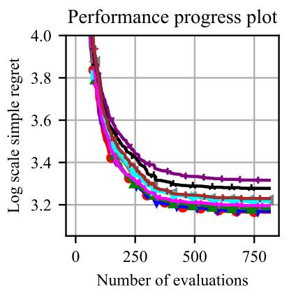

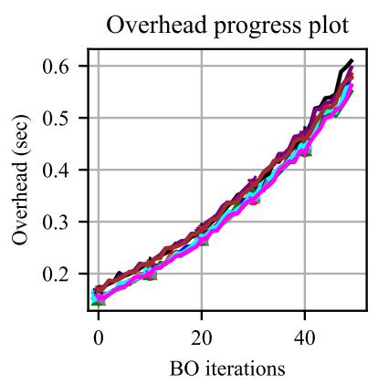

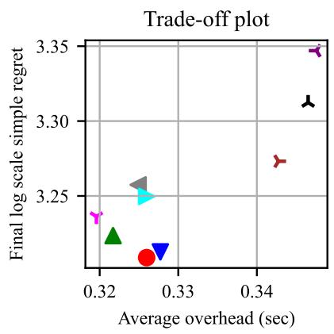

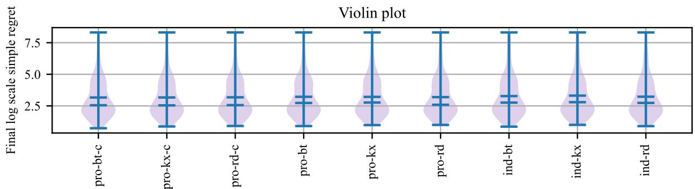

Table of mean, geometric mean and median
<table><tr><td rowspan=1 colspan=1></td><td rowspan=1 colspan=1>pro-bt-c</td><td rowspan=1 colspan=1>pro-kx-c</td><td rowspan=1 colspan=1>pro-rd-c</td><td rowspan=1 colspan=1>pro-bt</td><td rowspan=1 colspan=1>pro-kx</td><td rowspan=1 colspan=1>pro-rd</td><td rowspan=1 colspan=1>ind-bt</td><td rowspan=1 colspan=1>ind-kx</td><td rowspan=1 colspan=1>ind-rd</td></tr><tr><td rowspan=1 colspan=1>mean</td><td rowspan=1 colspan=1>3.209</td><td rowspan=1 colspan=1>3.213</td><td rowspan=1 colspan=1>3.224</td><td rowspan=1 colspan=1>3.257</td><td rowspan=1 colspan=1>3.250</td><td rowspan=1 colspan=1>3.236</td><td rowspan=1 colspan=1>3.312</td><td rowspan=1 colspan=1>3.347</td><td rowspan=1 colspan=1>3.273</td></tr><tr><td rowspan=1 colspan=1>gmean</td><td rowspan=1 colspan=1>2.825</td><td rowspan=1 colspan=1>2.839</td><td rowspan=1 colspan=1>2.847</td><td rowspan=1 colspan=1>2.893</td><td rowspan=1 colspan=1>2.876</td><td rowspan=1 colspan=1>2.865</td><td rowspan=1 colspan=1>2.916</td><td rowspan=1 colspan=1>2.954</td><td rowspan=1 colspan=1>2.893</td></tr><tr><td rowspan=1 colspan=1>median</td><td rowspan=1 colspan=1>2.613</td><td rowspan=1 colspan=1>2.637</td><td rowspan=1 colspan=1>2.660</td><td rowspan=1 colspan=1>2.711</td><td rowspan=1 colspan=1>2.743</td><td rowspan=1 colspan=1>2.615</td><td rowspan=1 colspan=1>2.875</td><td rowspan=1 colspan=1>2.857</td><td rowspan=1 colspan=1>2.819</td></tr></table>

p-value table
<table><tr><td rowspan=1 colspan=1></td><td rowspan=1 colspan=1>pro-bt-c</td><td rowspan=1 colspan=1>pro-kx-c</td><td rowspan=1 colspan=1>pro-rd-c</td><td rowspan=1 colspan=1>pro-bt</td><td rowspan=1 colspan=1>pro-kx</td><td rowspan=1 colspan=1>pro-rd</td><td rowspan=1 colspan=1>ind-bt</td><td rowspan=1 colspan=1>ind-kx</td><td rowspan=1 colspan=1>ind-rd</td></tr><tr><td rowspan=1 colspan=1>pro-bt-c</td><td rowspan=1 colspan=1></td><td rowspan=1 colspan=1></td><td rowspan=1 colspan=1></td><td rowspan=1 colspan=1></td><td rowspan=1 colspan=1></td><td rowspan=1 colspan=1></td><td rowspan=1 colspan=1></td><td rowspan=1 colspan=1></td><td rowspan=1 colspan=1></td></tr><tr><td rowspan=1 colspan=1>pro-kx-c</td><td rowspan=1 colspan=1>0.987</td><td rowspan=1 colspan=1></td><td rowspan=1 colspan=1></td><td rowspan=1 colspan=1></td><td rowspan=1 colspan=1></td><td rowspan=1 colspan=1></td><td rowspan=1 colspan=1></td><td rowspan=1 colspan=1></td><td rowspan=1 colspan=1></td></tr><tr><td rowspan=1 colspan=1>pro-rd-c</td><td rowspan=1 colspan=1>0.936</td><td rowspan=1 colspan=1>0.949</td><td rowspan=1 colspan=1></td><td rowspan=1 colspan=1></td><td rowspan=1 colspan=1></td><td rowspan=1 colspan=1></td><td rowspan=1 colspan=1></td><td rowspan=1 colspan=1></td><td rowspan=1 colspan=1></td></tr><tr><td rowspan=1 colspan=1>pro-bt</td><td rowspan=1 colspan=1>0.785</td><td rowspan=1 colspan=1>0.796</td><td rowspan=1 colspan=1>0.846</td><td rowspan=1 colspan=1></td><td rowspan=1 colspan=1>0.974</td><td rowspan=1 colspan=1>0.899</td><td rowspan=1 colspan=1></td><td rowspan=1 colspan=1></td><td rowspan=1 colspan=1></td></tr><tr><td rowspan=1 colspan=1>pro-kx</td><td rowspan=1 colspan=1>0.811</td><td rowspan=1 colspan=1>0.823</td><td rowspan=1 colspan=1>0.873</td><td rowspan=1 colspan=1></td><td rowspan=1 colspan=1></td><td rowspan=1 colspan=1>0.925</td><td rowspan=1 colspan=1></td><td rowspan=1 colspan=1></td><td rowspan=1 colspan=1></td></tr><tr><td rowspan=1 colspan=1>pro-rd</td><td rowspan=1 colspan=1>0.884</td><td rowspan=1 colspan=1>0.897</td><td rowspan=1 colspan=1>0.947</td><td rowspan=1 colspan=1></td><td rowspan=1 colspan=1></td><td rowspan=1 colspan=1></td><td rowspan=1 colspan=1></td><td rowspan=1 colspan=1></td><td rowspan=1 colspan=1></td></tr><tr><td rowspan=1 colspan=1>ind-bt</td><td rowspan=1 colspan=1>0.601</td><td rowspan=1 colspan=1>0.609</td><td rowspan=1 colspan=1>0.654</td><td rowspan=1 colspan=1>0.793</td><td rowspan=1 colspan=1>0.770</td><td rowspan=1 colspan=1>0.701</td><td rowspan=1 colspan=1></td><td rowspan=1 colspan=1></td><td rowspan=1 colspan=1>0.823</td></tr><tr><td rowspan=1 colspan=1>ind-kx</td><td rowspan=1 colspan=1>0.484</td><td rowspan=1 colspan=1>0.491</td><td rowspan=1 colspan=1>0.531</td><td rowspan=1 colspan=1>0.659</td><td rowspan=1 colspan=1>0.638</td><td rowspan=1 colspan=1>0.574</td><td rowspan=1 colspan=1>0.860</td><td rowspan=1 colspan=1></td><td rowspan=1 colspan=1>0.688</td></tr><tr><td rowspan=1 colspan=1>ind-rd</td><td rowspan=1 colspan=1>0.762</td><td rowspan=1 colspan=1>0.773</td><td rowspan=1 colspan=1>0.821</td><td rowspan=1 colspan=1>0.972</td><td rowspan=1 colspan=1>0.947</td><td rowspan=1 colspan=1>0.873</td><td rowspan=1 colspan=1></td><td rowspan=1 colspan=1></td><td rowspan=1 colspan=1></td></tr></table>

Figure 1: Performance and computational overhead on 47 synthetic benchmark functions across 12 input dimensions $( \bar { d } = 2 , 5 , \dots , 1 5 , B = d )$ , comparing three data assignment methods: random (rd), k-means (kx), and ball-tree (bt). Results are averaged over all functions. Variants of BO-pro-c (pro-c), BO-pro (pro), and BO-ind (ind) are shown. The performance progress plot shows the average accumulated simple regrets. The overhead progress plot shows the average computational overheads. The trade-off plot presents the comparison of the final simple regret with average computational overhead. The violin plot gives the entire range of final simple regrets. The first table presents the mean, geometric mean, and median of the final simple regrets. The second table presents p-values comparing final simple regrets between algorithms. $p \leqslant 0 . 1$ indicates statistically significant differences. Each entry indicates that the column algorithm outperforms the row algorithm, while empty cells indicate the opposite. BO-pro-c with ball-tree assignment (pro-bt-c) achieved the best overall performance.

<table><tr><td></td><td>pro-ent-c</td><td>V</td><td>pro-var-c</td><td></td><td>pro-uni-c</td><td></td><td>pro-ent</td><td></td><td>pro-var</td><td>Y</td><td>pro-uni</td></tr></table>

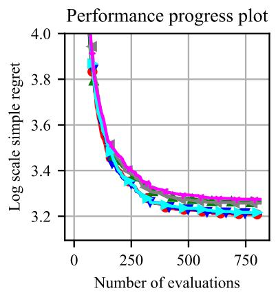

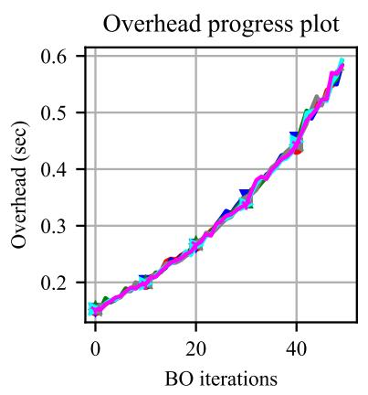

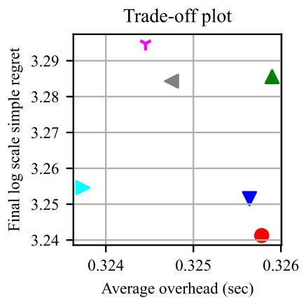

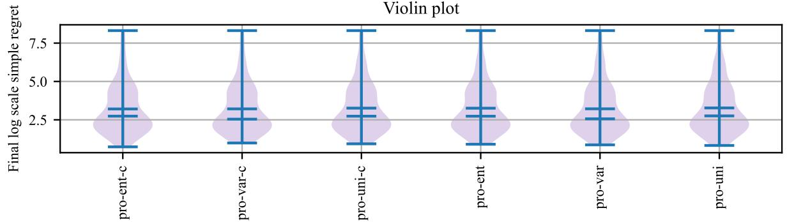  
Table of mean, geometric mean and median

<table><tr><td rowspan=1 colspan=1></td><td rowspan=1 colspan=1>pro-ent-c</td><td rowspan=1 colspan=1>pro-var-c</td><td rowspan=1 colspan=1>pro-uni-c</td><td rowspan=1 colspan=1>pro-ent</td><td rowspan=1 colspan=1>pro-var</td><td rowspan=1 colspan=1>pro-uni</td></tr><tr><td rowspan=1 colspan=1>mean</td><td rowspan=1 colspan=1>3.241</td><td rowspan=1 colspan=1>3.252</td><td rowspan=1 colspan=1>3.286</td><td rowspan=1 colspan=1>3.284</td><td rowspan=1 colspan=1>3.255</td><td rowspan=1 colspan=1>3.295</td></tr><tr><td rowspan=1 colspan=1>gmean</td><td rowspan=1 colspan=1>2.858</td><td rowspan=1 colspan=1>2.879</td><td rowspan=1 colspan=1>2.901</td><td rowspan=1 colspan=1>2.909</td><td rowspan=1 colspan=1>2.865</td><td rowspan=1 colspan=1>2.900</td></tr><tr><td rowspan=1 colspan=1>median</td><td rowspan=1 colspan=1>2.613</td><td rowspan=1 colspan=1>2.673</td><td rowspan=1 colspan=1>2.879</td><td rowspan=1 colspan=1>2.711</td><td rowspan=1 colspan=1>2.676</td><td rowspan=1 colspan=1>2.770</td></tr></table>

p-value table
<table><tr><td rowspan=1 colspan=1></td><td rowspan=1 colspan=1>pro-ent-c</td><td rowspan=1 colspan=1>pro-var-c</td><td rowspan=1 colspan=1>pro-uni-c</td><td rowspan=1 colspan=1>pro-ent</td><td rowspan=1 colspan=1>pro-var</td><td rowspan=1 colspan=1>pro-uni</td></tr><tr><td rowspan=1 colspan=1>pro-ent-c</td><td rowspan=1 colspan=1></td><td rowspan=1 colspan=1></td><td rowspan=1 colspan=1></td><td rowspan=1 colspan=1></td><td rowspan=1 colspan=1></td><td rowspan=1 colspan=1></td></tr><tr><td rowspan=1 colspan=1>pro-var-c</td><td rowspan=1 colspan=1>0.982</td><td rowspan=1 colspan=1></td><td rowspan=1 colspan=1></td><td rowspan=1 colspan=1></td><td rowspan=1 colspan=1></td><td rowspan=1 colspan=1></td></tr><tr><td rowspan=1 colspan=1>pro-uni-c</td><td rowspan=1 colspan=1>0.800</td><td rowspan=1 colspan=1>0.816</td><td rowspan=1 colspan=1></td><td rowspan=1 colspan=1>0.984</td><td rowspan=1 colspan=1>0.831</td><td rowspan=1 colspan=1></td></tr><tr><td rowspan=1 colspan=1>pro-ent</td><td rowspan=1 colspan=1>0.815</td><td rowspan=1 colspan=1>0.831</td><td rowspan=1 colspan=1></td><td rowspan=1 colspan=1></td><td rowspan=1 colspan=1>0.846</td><td rowspan=1 colspan=1></td></tr><tr><td rowspan=1 colspan=1>pro-var</td><td rowspan=1 colspan=1>0.969</td><td rowspan=1 colspan=1>0.986</td><td rowspan=1 colspan=1></td><td rowspan=1 colspan=1></td><td rowspan=1 colspan=1></td><td rowspan=1 colspan=1></td></tr><tr><td rowspan=1 colspan=1>pro-uni</td><td rowspan=1 colspan=1>0.758</td><td rowspan=1 colspan=1>0.773</td><td rowspan=1 colspan=1>0.954</td><td rowspan=1 colspan=1>0.938</td><td rowspan=1 colspan=1>0.788</td><td rowspan=1 colspan=1></td></tr></table>

Figure 2: Performance and computational overhead on 47 synthetic benchmark functions across 12 input dimensions $( \bar { d ^ { \cdot } } = 2 , 5 , \dots , 1 5 , B = d )$ , comparing three weighting schemes: entropy (ent), variance (var), and uniform (uni). Results are averaged over all functions. Variants of BO-pro-c (pro-c) and BO-pro (pro) are shown. BO-pro-c with entropy weighting (pro-ent-c) achieved the best overall performance.

As shown in the performance progress plots in Figure 1, BO-pro-c generally converges more rapidly than BO-pro. This observation suggests that information-based uncertainty calibration helps maintain a more effective balance between exploration and exploitation throughout the optimisation process.

Among the BO-pro-c variants using random, k-means, and ball-tree assignment methods (denoted by pro-rd-c, pro-kx-c, and pro-bt-c, respectively), pro-bt-c achieved the best overall performance, attaining the lowest mean, geometric mean, and median simple regrets. However, none of the performance differences between the three assignment methods were statistically significant.

In terms of computational overhead, the k-means assignment method incurred slightly higher costs than the random and ball-tree methods. This behaviour can be attributed to the uneven allocation of data points across local GP models under k-means clustering. Consequently, some local models contained substantially more data points than others, resulting in higher computational costs. In contrast, both random and ball-tree assignment produced more balanced data partitions and therefore more consistent computational overhead.

Among the weighting schemes, BO-pro-c variants using entropy weighting achieved the best overall performance, yielding the lowest mean, geometric mean, and median simple regrets. The strong performance of the ball-tree assignment method and entropy-weighted aggregation is consistent with the findings reported in Ong et al. [2026].

The computational overhead trends observed for BO-pro-c closely resemble those of BO-pro. This indicates that the uncertainty calibration procedure introduces only a marginal additional computational cost.

Figure 1 also shows that, among the BO-ind variants (ind-rd, ind-kx, and ind-bt), ind-rd performed noticeably better than the other two approaches. This finding suggests that random partitioning is a more effective strategy for allocating training data to independent local GP models when no mechanism for information sharing exists between experts. A possible explanation is that random assignment reduces discontinuities in predictions at the boundaries between local regions. As observed for BO-pro-c and BO-pro, ind-kx also incurred slightly higher computational overhead than ind-rd and ind-bt due to the uneven distribution of data points among local GP models.

Comparing BO-pro-c, BO-pro, and BO-ind more broadly, all BO-pro-c and BO-pro variants achieved lower average simple regret than their BO-ind counterparts. Furthermore, BO-ind incurred higher computational overhead than both BO-pro-c and BO-pro. This is because each local GP model in BO-ind independently evaluates the acquisition function over the same candidate set at every optimisation step, causing computational cost to increase with the number of local models.

Overall, these comparative studies suggest that information-based uncertainty calibration can provide an effective mechanism for mitigating variance overestimation in product-of-experts GP models and improving BO performance. The strongest overall empirical performance was obtained when the GP-pro model was constructed using the ball-tree assignment method and aggregated using the entropy-weighted scheme.

## 4.2 Examining the impact of the number of data points per local Gaussian process model

In BO settings involving large-scale datasets, the number of data points assigned to each local GP model is an important factor influencing both optimisation performance and computational overhead. A larger local training set generally enables a GP model to produce more accurate predictions, albeit at the expense of increased computational cost.

Figure 3 presents the performance and computational overhead of BO-pro-c using 100 and 200 data points per local GP model across four acquisition functions. Experiments were conducted on 18 synthetic benchmark functions, namely the 10d–15d Ackley, Levy, and Rastrigin functions, which require relatively large numbers of observations for effective optimisation.

For this analysis, algorithms were grouped according to the number of data points assigned to each local GP model and the acquisition function used. The reported results were averaged across the 18 benchmark functions. All BO-pro-c variants employed the ball-tree assignment method and the entropy-weighted aggregation scheme.

Across all acquisition functions, BO-pro-c variants using 200 data points per local GP model (denoted by BO-pro-c-200) generally achieved lower average simple regrets than those using 100 data points (denoted by BO-pro-c-100), although the improvement was accompanied by a modest increase in computational overhead. These findings suggest that larger local training sets enable the GP-pro-c model to approximate the underlying objective function more accurately, thereby supporting more effective exploration of the search space and improved optimisation performance.

Overall, these results indicate that, when sufficient computational resources are available, using a larger number of data points per local GP model is beneficial for BO-pro-c in large-scale optimisation settings.

<table><tr><td></td><td>pro-c-ei-100</td><td></td><td>pro-c-mes-100</td><td>1</td><td>pro-c-ei-200</td><td>人</td><td>pro-c-mes-200</td></tr><tr><td></td><td>pro-c-lcb-100</td><td></td><td>pro-c-ts-100</td><td></td><td>pro-c-lcb-200</td><td>人</td><td>pro-c-ts-200</td></tr></table>

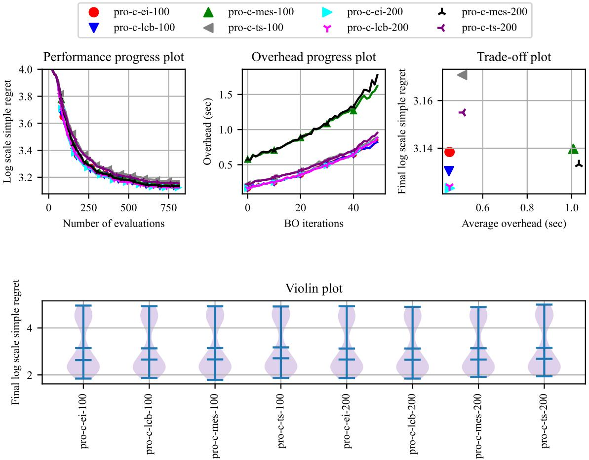

Table of mean, geometric mean and median
<table><tr><td rowspan=1 colspan=1></td><td rowspan=1 colspan=1>pro-c-ei-100</td><td rowspan=1 colspan=1>pro-c-lcb-100 p</td><td rowspan=1 colspan=1>ro-c-mes-100</td><td rowspan=1 colspan=1>pro-c-ts-100</td><td rowspan=1 colspan=1>pro-c-ei-200</td><td rowspan=1 colspan=1>pro-c-lcb-200 p</td><td rowspan=1 colspan=1>ro-c-mes-200</td><td rowspan=1 colspan=1>pro-c-ts-200</td></tr><tr><td rowspan=1 colspan=1>mean</td><td rowspan=1 colspan=1>3.138</td><td rowspan=1 colspan=1>3.130</td><td rowspan=1 colspan=1>3.140</td><td rowspan=1 colspan=1>3.171</td><td rowspan=1 colspan=1>3.123</td><td rowspan=1 colspan=1>3.124</td><td rowspan=1 colspan=1>3.133</td><td rowspan=1 colspan=1>3.155</td></tr><tr><td rowspan=1 colspan=1>gmean</td><td rowspan=1 colspan=1>2.983</td><td rowspan=1 colspan=1>2.975</td><td rowspan=1 colspan=1>2.985</td><td rowspan=1 colspan=1>3.015</td><td rowspan=1 colspan=1>2.970</td><td rowspan=1 colspan=1>2.971</td><td rowspan=1 colspan=1>2.979</td><td rowspan=1 colspan=1>2.998</td></tr><tr><td rowspan=1 colspan=1>median</td><td rowspan=1 colspan=1>2.677</td><td rowspan=1 colspan=1>2.635</td><td rowspan=1 colspan=1>2.675</td><td rowspan=1 colspan=1>2.739</td><td rowspan=1 colspan=1>2.664</td><td rowspan=1 colspan=1>2.649</td><td rowspan=1 colspan=1>2.644</td><td rowspan=1 colspan=1>2.732</td></tr></table>

p-value table
<table><tr><td rowspan=1 colspan=1></td><td rowspan=1 colspan=1>pro-c-ei-100</td><td rowspan=1 colspan=1>pro-c-1cb-100 [</td><td rowspan=1 colspan=1>pro-c-mes-100]</td><td rowspan=1 colspan=1>pro-c-ts-100</td><td rowspan=1 colspan=1>pro-c-ei-200</td><td rowspan=1 colspan=1>pro-c-lcb-200</td><td rowspan=1 colspan=1>pro-c-mes-200</td><td rowspan=1 colspan=1>pro-c-ts-200</td></tr><tr><td rowspan=1 colspan=1>pro-c-ei-100</td><td rowspan=1 colspan=1></td><td rowspan=1 colspan=1>0.944</td><td rowspan=1 colspan=1></td><td rowspan=1 colspan=1></td><td rowspan=1 colspan=1>0.894</td><td rowspan=1 colspan=1>0.899</td><td rowspan=1 colspan=1>0.964</td><td rowspan=1 colspan=1></td></tr><tr><td rowspan=1 colspan=1>pro-c-lcb-100</td><td rowspan=1 colspan=1></td><td rowspan=1 colspan=1></td><td rowspan=1 colspan=1></td><td rowspan=1 colspan=1></td><td rowspan=1 colspan=1>0.950</td><td rowspan=1 colspan=1>0.955</td><td rowspan=1 colspan=1></td><td rowspan=1 colspan=1></td></tr><tr><td rowspan=1 colspan=1>pro-c-mes-100</td><td rowspan=1 colspan=1>0.991</td><td rowspan=1 colspan=1>0.935</td><td rowspan=1 colspan=1></td><td rowspan=1 colspan=1></td><td rowspan=1 colspan=1>0.885</td><td rowspan=1 colspan=1>0.890</td><td rowspan=1 colspan=1>0.955</td><td rowspan=1 colspan=1></td></tr><tr><td rowspan=1 colspan=1>pro-c-ts-100</td><td rowspan=1 colspan=1>0.779</td><td rowspan=1 colspan=1>0.726</td><td rowspan=1 colspan=1>0.788</td><td rowspan=1 colspan=1></td><td rowspan=1 colspan=1>0.678</td><td rowspan=1 colspan=1>0.683</td><td rowspan=1 colspan=1>0.744</td><td rowspan=1 colspan=1>0.892</td></tr><tr><td rowspan=1 colspan=1>pro-c-ei-200</td><td rowspan=1 colspan=1></td><td rowspan=1 colspan=1></td><td rowspan=1 colspan=1></td><td rowspan=1 colspan=1></td><td rowspan=1 colspan=1></td><td rowspan=1 colspan=1></td><td rowspan=1 colspan=1></td><td rowspan=1 colspan=1></td></tr><tr><td rowspan=1 colspan=1>pro-c-lcb-200</td><td rowspan=1 colspan=1></td><td rowspan=1 colspan=1></td><td rowspan=1 colspan=1></td><td rowspan=1 colspan=1></td><td rowspan=1 colspan=1>0.995</td><td rowspan=1 colspan=1></td><td rowspan=1 colspan=1></td><td rowspan=1 colspan=1></td></tr><tr><td rowspan=1 colspan=1>pro-c-mes-200</td><td rowspan=1 colspan=1></td><td rowspan=1 colspan=1>0.980</td><td rowspan=1 colspan=1></td><td rowspan=1 colspan=1></td><td rowspan=1 colspan=1>0.930</td><td rowspan=1 colspan=1>0.935</td><td rowspan=1 colspan=1></td><td rowspan=1 colspan=1></td></tr><tr><td rowspan=1 colspan=1>pro-c-ts-200</td><td rowspan=1 colspan=1>0.886</td><td rowspan=1 colspan=1>0.831</td><td rowspan=1 colspan=1>0.895</td><td rowspan=1 colspan=1></td><td rowspan=1 colspan=1>0.782</td><td rowspan=1 colspan=1>0.787</td><td rowspan=1 colspan=1>0.850</td><td rowspan=1 colspan=1></td></tr></table>

Figure 3: Performance and computational overhead on 18 synthetic benchmark functions across six input dimensions (d = 10, . . . , 15, B = d), comparing BO-pro-c with 100 and 200 data points per local GP model. Results are averaged across all benchmark functions and acquisition functions. BO-pro-c with 200 data points per local GP model (BO-pro c-200) consistently achieved better optimisation performance than BO-pro-c-100, at the cost of a modest increase in computational overhead.

## 4.3 Comparative study of acquisition functions

Figure 4 presents the performance and computational overhead of BO-pro-c, BO-pro, BO-ind, and BO-glo across four acquisition functions: expected improvement (EI), Gaussian process lower confidence bound (GP-LCB), max-value entropy search (MES), and Thompson sampling (TS).

For this analysis, algorithms were grouped according to the acquisition function used, and the reported results were averaged across all algorithms sharing the same acquisition function and across the 47 benchmark functions. All BO-pro-c and BO-pro variants employed the ball-tree assignment method and the entropy-weighted aggregation scheme, whereas all BO-ind variants employed random data assignment.

Overall, BO-pro-c performed better than BO-pro and BO-ind across all acquisition functions. Specifically, the BO-pro-c variants (pro-c-ei, pro-c-lcb, pro-c-mes, and pro-c-ts) consistently achieved lower average simple regrets than the corresponding BO-pro and BO-ind variants.

Among all algorithms, BO-pro-c using the GP-LCB acquisition function exhibited the strongest overall empirical performance. The GP-LCB acquisition function guides the selection of query points using the predictive mean and confidence intervals provided by the GP surrogate model. Within BO-pro-c, the information-based calibration procedure reduces variance overestimation in local GP models, resulting in more accurate confidence intervals in the aggregated posterior distribution. Consequently, the acquisition function is less prone to excessive exploration of highly uncertain regions and is better able to balance exploration and exploitation throughout the optimisation process. This likely explains the superior convergence behaviour observed for BO-pro-c-lcb.

Although the empirical results suggest that GP-LCB is particularly effective when combined with BO-pro-c, no theoretical regret bounds are currently available for the proposed algorithm. The derivation of such guarantees remains an important direction for future work.

In terms of computational overhead, BO-pro-c, BO-pro, BO-ind, and BO-glo exhibited broadly similar computational trends when used with EI, GP-LCB, and TS. In contrast, the use of MES increased computational overhead by approximately one order of magnitude across all surrogate models. This additional cost is attributable to the approximation procedures required for evaluating the MES acquisition function.

Overall, these results indicate that BO-pro-c is most effective when combined with GP-LCB, providing the best optimisation performance while maintaining relatively low computational overhead.

## 4.4 Examining the impact of input dimensionality

Figure 5 examines the effect of input dimensionality $( 2 \leqslant d \leqslant 1 5 )$ on the performance and computational overhead of BO-pro-c, BO-pro, BO-ind, and BO-glo.

For this analysis, algorithms were grouped according to their GP model type, and the reported performance and computational overhead were averaged across the corresponding groups of benchmark functions. All BO-pro-c and BO-pro variants employed the ball-tree assignment method and the entropy-weighted aggregation scheme. All BO-ind variants employed random data assignment. All algorithms used the GP-LCB acquisition function.

Several findings can be drawn from Figure 5. Across all 12 input dimensionalities, BO-pro-c (pro-c) achieved lower simple regret than both BO-pro (pro) and BO-ind (ind). Relative to BO-glo, BO-pro-c achieved lower regret on 9 of the 12 dimensionalities considered, while performing slightly worse at d = 7, 9, and 14.

In terms of computational overhead, BO-pro-c, BO-pro, and BO-ind exhibited only modest increases as dimensionality increased. In contrast, the computational overhead of BO-glo increased substantially with growing dimensionality. For lower-dimensional problems (2 ⩽ d ⩽ 6), BO-glo incurred lower computational overhead than the other methods. However, for higher-dimensional problems (7 ⩽ d ⩽ 15), BO-glo became substantially more expensive than BO-pro-c, BO-pro, and BO-ind.

## 5 Discussion and conclusion

Table 3 reports the average log-scale simple regret achieved by BO-pro-bt-ent-c, BO-pro-bt-ent, BO-ind-rd, and BO-glo using the GP-LCB acquisition function across 47 synthetic benchmark functions. The corresponding average computational overhead per optimisation iteration is reported in Table 4.

Overall, the experimental results favour BO-pro-c, which incorporates an information-based uncertainty calibration mechanism within a product-of-experts GP model. The best overall empirical performance was achieved by BO-pro-c when combined with the ball-tree assignment method, entropy-based weighting, and the GP-LCB acquisition function.

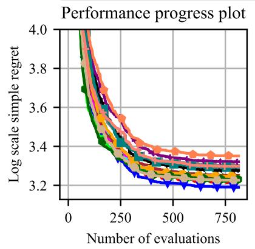

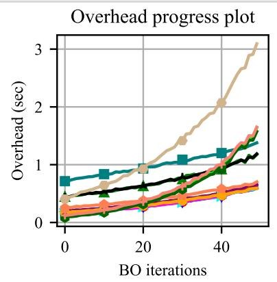

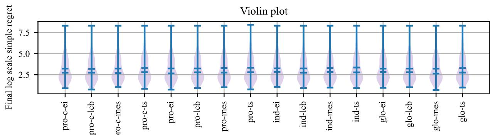

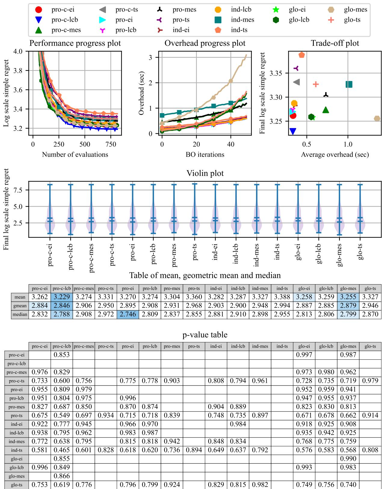

<table><tr><td rowspan=1 colspan=1></td><td rowspan=1 colspan=1>pro-c-ei</td><td rowspan=1 colspan=1>pro-c-lcb</td><td rowspan=1 colspan=1>pro-c-mes</td><td rowspan=1 colspan=1>pro-c-ts</td><td rowspan=1 colspan=1>pro-ei</td><td rowspan=1 colspan=1>pro-lcb</td><td rowspan=1 colspan=1>pro-mes</td><td rowspan=1 colspan=1>pro-ts</td><td rowspan=1 colspan=1>ind-ei</td><td rowspan=1 colspan=1>ind-lcb</td><td rowspan=1 colspan=1>ind-mes</td><td rowspan=1 colspan=1>ind-ts</td><td rowspan=1 colspan=1>glo-ei</td><td rowspan=1 colspan=1>glo-lcb</td><td rowspan=1 colspan=1>glo-mes</td><td rowspan=1 colspan=1>glo-ts</td></tr><tr><td rowspan=1 colspan=1>mean</td><td rowspan=1 colspan=1>3.262</td><td rowspan=1 colspan=1>3.229</td><td rowspan=1 colspan=1>3.274</td><td rowspan=1 colspan=1>3.331</td><td rowspan=1 colspan=1>3.270</td><td rowspan=1 colspan=1>3.274</td><td rowspan=1 colspan=1>3.304</td><td rowspan=1 colspan=1>3.360</td><td rowspan=1 colspan=1>3.282</td><td rowspan=1 colspan=1>3.287</td><td rowspan=1 colspan=1>3.327</td><td rowspan=1 colspan=1>3.388</td><td rowspan=1 colspan=1>3.258</td><td rowspan=1 colspan=1>3.259</td><td rowspan=1 colspan=1>3.255</td><td rowspan=1 colspan=1>3.327</td></tr><tr><td rowspan=1 colspan=1>gmean</td><td rowspan=1 colspan=1>2.884</td><td rowspan=1 colspan=1>2.846</td><td rowspan=1 colspan=1>2.906</td><td rowspan=1 colspan=1>2.950</td><td rowspan=1 colspan=1>2.895</td><td rowspan=1 colspan=1>2.908</td><td rowspan=1 colspan=1>2.931</td><td rowspan=1 colspan=1>2.968</td><td rowspan=1 colspan=1>2.903</td><td rowspan=1 colspan=1>2.900</td><td rowspan=1 colspan=1>2.948</td><td rowspan=1 colspan=1>2.994</td><td rowspan=1 colspan=1>2.887</td><td rowspan=1 colspan=1>2.885</td><td rowspan=1 colspan=1>2.879</td><td rowspan=1 colspan=1>2.946</td></tr><tr><td rowspan=1 colspan=1>median</td><td rowspan=1 colspan=1>2.832</td><td rowspan=1 colspan=1>2.788</td><td rowspan=1 colspan=1>2.908</td><td rowspan=1 colspan=1>2.972</td><td rowspan=1 colspan=1>2.746</td><td rowspan=1 colspan=1>2.809</td><td rowspan=1 colspan=1>2.837</td><td rowspan=1 colspan=1>2.855</td><td rowspan=1 colspan=1>2.881</td><td rowspan=1 colspan=1>2.910</td><td rowspan=1 colspan=1>2.898</td><td rowspan=1 colspan=1>2.955</td><td rowspan=1 colspan=1>2.813</td><td rowspan=1 colspan=1>2.806</td><td rowspan=1 colspan=1>2.799</td><td rowspan=1 colspan=1>2.870</td></tr></table>

<table><tr><td rowspan=1 colspan=1></td><td rowspan=1 colspan=1>pro-c-ei</td><td rowspan=1 colspan=1>pro-c-lcb</td><td rowspan=1 colspan=1>pro-c-mes</td><td rowspan=1 colspan=1>pro-c-ts</td><td rowspan=1 colspan=1>pro-ei</td><td rowspan=1 colspan=1>pro-lcb</td><td rowspan=1 colspan=1>pro-mes</td><td rowspan=1 colspan=1>pro-ts</td><td rowspan=1 colspan=1>ind-ei</td><td rowspan=1 colspan=1>ind-lcb</td><td rowspan=1 colspan=1>ind-mes</td><td rowspan=1 colspan=1>ind-ts</td><td rowspan=1 colspan=1>glo-ei</td><td rowspan=1 colspan=1>glo-lcb</td><td rowspan=1 colspan=1>glo-mes</td><td rowspan=1 colspan=1>glo-ts</td></tr><tr><td rowspan=1 colspan=1>pro-c-ei</td><td rowspan=1 colspan=1></td><td rowspan=1 colspan=1>0.853</td><td rowspan=1 colspan=1></td><td rowspan=1 colspan=1></td><td rowspan=1 colspan=1></td><td rowspan=1 colspan=1></td><td rowspan=1 colspan=1></td><td rowspan=1 colspan=1></td><td rowspan=1 colspan=1></td><td rowspan=1 colspan=1></td><td rowspan=1 colspan=1></td><td rowspan=1 colspan=1></td><td rowspan=1 colspan=1>0.997</td><td rowspan=1 colspan=1></td><td rowspan=1 colspan=1>0.987</td><td rowspan=1 colspan=1></td></tr><tr><td rowspan=1 colspan=1>pro-c-lcb</td><td rowspan=1 colspan=1></td><td rowspan=1 colspan=1></td><td rowspan=1 colspan=1></td><td rowspan=1 colspan=1></td><td rowspan=1 colspan=1></td><td rowspan=1 colspan=1></td><td rowspan=1 colspan=1></td><td rowspan=1 colspan=1></td><td rowspan=1 colspan=1></td><td rowspan=1 colspan=1></td><td rowspan=1 colspan=1></td><td rowspan=1 colspan=1></td><td rowspan=1 colspan=1></td><td rowspan=1 colspan=1></td><td rowspan=1 colspan=1></td><td rowspan=1 colspan=1></td></tr><tr><td rowspan=1 colspan=1>pro-c-mes</td><td rowspan=1 colspan=1>0.976</td><td rowspan=1 colspan=1>0.829</td><td rowspan=1 colspan=1></td><td rowspan=1 colspan=1></td><td rowspan=1 colspan=1></td><td rowspan=1 colspan=1></td><td rowspan=1 colspan=1></td><td rowspan=1 colspan=1></td><td rowspan=1 colspan=1></td><td rowspan=1 colspan=1></td><td rowspan=1 colspan=1></td><td rowspan=1 colspan=1></td><td rowspan=1 colspan=1>0.973</td><td rowspan=1 colspan=1>0.980</td><td rowspan=1 colspan=1>0.962</td><td rowspan=1 colspan=1></td></tr><tr><td rowspan=1 colspan=1>pro-c-ts</td><td rowspan=1 colspan=1>0.733</td><td rowspan=1 colspan=1>0.600</td><td rowspan=1 colspan=1>0.756</td><td rowspan=1 colspan=1></td><td rowspan=1 colspan=1>0.775</td><td rowspan=1 colspan=1>0.778</td><td rowspan=1 colspan=1>0.903</td><td rowspan=1 colspan=1></td><td rowspan=1 colspan=1>0.808</td><td rowspan=1 colspan=1>0.794</td><td rowspan=1 colspan=1>0.961</td><td rowspan=1 colspan=1></td><td rowspan=1 colspan=1>0.728</td><td rowspan=1 colspan=1>0.735</td><td rowspan=1 colspan=1>0.719</td><td rowspan=1 colspan=1>0.979</td></tr><tr><td rowspan=1 colspan=1>pro-ei</td><td rowspan=1 colspan=1>0.955</td><td rowspan=1 colspan=1>0.809</td><td rowspan=1 colspan=1>0.979</td><td rowspan=1 colspan=1></td><td rowspan=1 colspan=1></td><td rowspan=1 colspan=1></td><td rowspan=1 colspan=1></td><td rowspan=1 colspan=1></td><td rowspan=1 colspan=1></td><td rowspan=1 colspan=1></td><td rowspan=1 colspan=1></td><td rowspan=1 colspan=1></td><td rowspan=1 colspan=1>0.952</td><td rowspan=1 colspan=1>0.959</td><td rowspan=1 colspan=1>0.941</td><td rowspan=1 colspan=1></td></tr><tr><td rowspan=1 colspan=1>pro-lcb</td><td rowspan=1 colspan=1>0.951</td><td rowspan=1 colspan=1>0.804</td><td rowspan=1 colspan=1>0.975</td><td rowspan=1 colspan=1></td><td rowspan=1 colspan=1>0.996</td><td rowspan=1 colspan=1></td><td rowspan=1 colspan=1></td><td rowspan=1 colspan=1></td><td rowspan=1 colspan=1></td><td rowspan=1 colspan=1></td><td rowspan=1 colspan=1></td><td rowspan=1 colspan=1></td><td rowspan=1 colspan=1>0.947</td><td rowspan=1 colspan=1>0.955</td><td rowspan=1 colspan=1>0.937</td><td rowspan=1 colspan=1></td></tr><tr><td rowspan=1 colspan=1>pro-mes</td><td rowspan=1 colspan=1>0.827</td><td rowspan=1 colspan=1>0.687</td><td rowspan=1 colspan=1>0.850</td><td rowspan=1 colspan=1></td><td rowspan=1 colspan=1>0.870</td><td rowspan=1 colspan=1>0.874</td><td rowspan=1 colspan=1></td><td rowspan=1 colspan=1></td><td rowspan=1 colspan=1>0.904</td><td rowspan=1 colspan=1>0.889</td><td rowspan=1 colspan=1></td><td rowspan=1 colspan=1></td><td rowspan=1 colspan=1>0.823</td><td rowspan=1 colspan=1>0.830</td><td rowspan=1 colspan=1>0.813</td><td rowspan=1 colspan=1></td></tr><tr><td rowspan=1 colspan=1>pro-ts</td><td rowspan=1 colspan=1>0.675</td><td rowspan=1 colspan=1>0.549</td><td rowspan=1 colspan=1>0.697</td><td rowspan=1 colspan=1>0.934</td><td rowspan=1 colspan=1>0.715</td><td rowspan=1 colspan=1>0.718</td><td rowspan=1 colspan=1>0.839</td><td rowspan=1 colspan=1></td><td rowspan=1 colspan=1>0.748</td><td rowspan=1 colspan=1>0.735</td><td rowspan=1 colspan=1>0.897</td><td rowspan=1 colspan=1></td><td rowspan=1 colspan=1>0.671</td><td rowspan=1 colspan=1>0.678</td><td rowspan=1 colspan=1>0.662</td><td rowspan=1 colspan=1>0.914</td></tr><tr><td rowspan=1 colspan=1>ind-ei</td><td rowspan=1 colspan=1>0.922</td><td rowspan=1 colspan=1>0.777</td><td rowspan=1 colspan=1>0.945</td><td rowspan=1 colspan=1></td><td rowspan=1 colspan=1>0.966</td><td rowspan=1 colspan=1>0.970</td><td rowspan=1 colspan=1></td><td rowspan=1 colspan=1></td><td rowspan=1 colspan=1></td><td rowspan=1 colspan=1>0.984</td><td rowspan=1 colspan=1></td><td rowspan=1 colspan=1></td><td rowspan=1 colspan=1>0.918</td><td rowspan=1 colspan=1>0.925</td><td rowspan=1 colspan=1>0.908</td><td rowspan=1 colspan=1></td></tr><tr><td rowspan=1 colspan=1>ind-lcb</td><td rowspan=1 colspan=1>0.938</td><td rowspan=1 colspan=1>0.795</td><td rowspan=1 colspan=1>0.962</td><td rowspan=1 colspan=1></td><td rowspan=1 colspan=1>0.983</td><td rowspan=1 colspan=1>0.987</td><td rowspan=1 colspan=1></td><td rowspan=1 colspan=1></td><td rowspan=1 colspan=1></td><td rowspan=1 colspan=1></td><td rowspan=1 colspan=1></td><td rowspan=1 colspan=1></td><td rowspan=1 colspan=1>0.935</td><td rowspan=1 colspan=1>0.942</td><td rowspan=1 colspan=1>0.925</td><td rowspan=1 colspan=1></td></tr><tr><td rowspan=1 colspan=1>ind-mes</td><td rowspan=1 colspan=1>0.772</td><td rowspan=1 colspan=1>0.638</td><td rowspan=1 colspan=1>0.795</td><td rowspan=1 colspan=1></td><td rowspan=1 colspan=1>0.815</td><td rowspan=1 colspan=1>0.818</td><td rowspan=1 colspan=1>0.942</td><td rowspan=1 colspan=1></td><td rowspan=1 colspan=1>0.848</td><td rowspan=1 colspan=1>0.834</td><td rowspan=1 colspan=1></td><td rowspan=1 colspan=1></td><td rowspan=1 colspan=1>0.768</td><td rowspan=1 colspan=1>0.775</td><td rowspan=1 colspan=1>0.759</td><td rowspan=1 colspan=1></td></tr><tr><td rowspan=1 colspan=1>ind-ts</td><td rowspan=1 colspan=1>0.581</td><td rowspan=1 colspan=1>0.465</td><td rowspan=1 colspan=1>0.601</td><td rowspan=1 colspan=1>0.828</td><td rowspan=1 colspan=1>0.618</td><td rowspan=1 colspan=1>0.620</td><td rowspan=1 colspan=1>0.736</td><td rowspan=1 colspan=1>0.894</td><td rowspan=1 colspan=1>0.649</td><td rowspan=1 colspan=1>0.637</td><td rowspan=1 colspan=1>0.792</td><td rowspan=1 colspan=1></td><td rowspan=1 colspan=1>0.576</td><td rowspan=1 colspan=1>0.583</td><td rowspan=1 colspan=1>0.568</td><td rowspan=1 colspan=1>0.808</td></tr><tr><td rowspan=1 colspan=1>glo-ei</td><td rowspan=1 colspan=1></td><td rowspan=1 colspan=1>0.855</td><td rowspan=1 colspan=1></td><td rowspan=1 colspan=1></td><td rowspan=1 colspan=1></td><td rowspan=1 colspan=1></td><td rowspan=1 colspan=1></td><td rowspan=1 colspan=1></td><td rowspan=1 colspan=1></td><td rowspan=1 colspan=1></td><td rowspan=1 colspan=1></td><td rowspan=1 colspan=1></td><td rowspan=1 colspan=1></td><td rowspan=1 colspan=1></td><td rowspan=1 colspan=1>0.990</td><td rowspan=1 colspan=1></td></tr><tr><td rowspan=1 colspan=1>glo-lcb</td><td rowspan=1 colspan=1>0.996</td><td rowspan=1 colspan=1>0.849</td><td rowspan=1 colspan=1></td><td rowspan=1 colspan=1></td><td rowspan=1 colspan=1></td><td rowspan=1 colspan=1></td><td rowspan=1 colspan=1></td><td rowspan=1 colspan=1></td><td rowspan=1 colspan=1></td><td rowspan=1 colspan=1></td><td rowspan=1 colspan=1></td><td rowspan=1 colspan=1></td><td rowspan=1 colspan=1>0.993</td><td rowspan=1 colspan=1></td><td rowspan=1 colspan=1>0.983</td><td rowspan=1 colspan=1></td></tr><tr><td rowspan=1 colspan=1>glo-mes</td><td rowspan=1 colspan=1></td><td rowspan=1 colspan=1>0.866</td><td rowspan=1 colspan=1></td><td rowspan=1 colspan=1></td><td rowspan=1 colspan=1></td><td rowspan=1 colspan=1></td><td rowspan=1 colspan=1></td><td rowspan=1 colspan=1></td><td rowspan=1 colspan=1></td><td rowspan=1 colspan=1></td><td rowspan=1 colspan=1></td><td rowspan=1 colspan=1></td><td rowspan=1 colspan=1></td><td rowspan=1 colspan=1></td><td rowspan=1 colspan=1></td><td rowspan=1 colspan=1></td></tr><tr><td rowspan=1 colspan=1>glo-ts</td><td rowspan=1 colspan=1>0.753</td><td rowspan=1 colspan=1>0.619</td><td rowspan=1 colspan=1>0.776</td><td rowspan=1 colspan=1></td><td rowspan=1 colspan=1>0.796</td><td rowspan=1 colspan=1>0.799</td><td rowspan=1 colspan=1>0.924</td><td rowspan=1 colspan=1></td><td rowspan=1 colspan=1>0.829</td><td rowspan=1 colspan=1>0.815</td><td rowspan=1 colspan=1>0.982</td><td rowspan=1 colspan=1></td><td rowspan=1 colspan=1>0.749</td><td rowspan=1 colspan=1>0.756</td><td rowspan=1 colspan=1>0.740</td><td rowspan=1 colspan=1></td></tr></table>

Figure 4: Performance and computational overhead on 47 synthetic benchmark functions across 12 input dimensions $( \bar { d ^ { - } } = 2 , 5 , \dots , 1 5 , B = d ) .$ , comparing four acquisition functions: EI, GP-LCB, MES, and TS. Results are averaged across all benchmark functions. BO-pro-c with GP-LCB (pro-c-lcb) achieved the best overall empirical performance.

Final log scale simple regret across input dimensions  
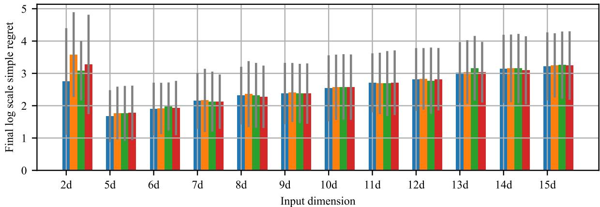

Average overhead (sec) across input dimensions  
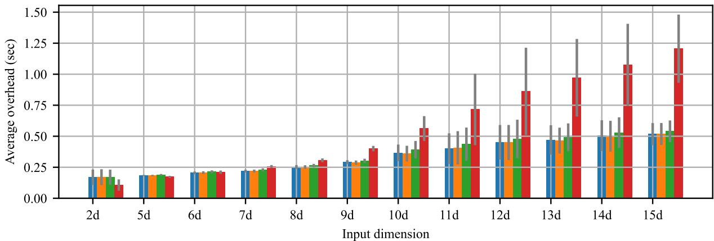  
Figure 5: Performance and computational overhead on 47 synthetic benchmark functions across input dimensions $2 \leqslant d \leqslant 1 5$ . The top plot shows the average simple regret, and the bottom plot shows the computational overhead. BO-pro-c, BO-pro, and BO-ind exhibited modest increases in overhead as dimensionality increases, whereas BO-glo exhibited a substantially steeper increase.

Within BO-pro-c, the ball-tree assignment method groups spatially similar data points while maintaining balanced dataset sizes across local GP models, thereby improving local modelling accuracy without introducing substantial computational imbalance. The entropy-weighted aggregation scheme assigns larger weights to more reliable local experts and is closely related to minimising the KL divergence between individual expert distributions and the aggregated predictive distribution [Cao and Fleet, 2015]. Furthermore, the information-based calibration procedure reduces variance overestimation in local GP models, producing more accurate posterior uncertainty estimates. When combined with GP-LCB, these improved uncertainty estimates lead to more reliable confidence intervals and a better balance between exploration and exploitation during optimisation.

Compared with BO-pro, BO-pro-c achieved a 1.4% reduction in average simple regret. These findings suggest that uncertainty calibration improves the quality of posterior uncertainty estimates and contributes to more effective optimisation behaviour.

Compared with BO-ind, BO-pro-c achieved a 1.8% reduction in average simple regret and a 4.7% reduction in computational overhead. This result is consistent with known limitations of independent local GP models, including discontinuities at sub-region boundaries [Park and Huang, 2016], the inability to capture long-range spatial correlations [Liu et al., 2020], and the lack of information sharing between local experts [Liu et al., 2020]. Collectively, these limitations reduce the effectiveness of the optimisation process.

Compared with BO-glo, BO-pro-c achieved a modest 0.9% reduction in average simple regret while reducing computational overhead by 39.4%. These results suggest that BO-pro-c can retain optimisation performance comparable to that of a single global GP model while substantially reducing computational cost.

The relative advantages of BO-pro-c and BO-glo depend on problem dimensionality. For lower-dimensional problems $( d \leqslant 6 )$ , BO-glo may be preferable because of its lower computational overhead while maintaining performance comparable to BO-pro-c. However, for higher-dimensional problems $( d > 6 )$ , BO-pro-c generally provides a more favourable trade-off between optimisation performance and computational cost than either BO-glo or BO-ind.

Despite these improvements, BO-pro-c remains affected by the curse of dimensionality, particularly for problems with $d \geqslant 1 0$ . Performance degradation in this regime is also observed for BO-glo and BO-ind. Future research could investigate the integration of BO-pro-c with trust-region methods to further improve scalability and optimisation performance in high-dimensional settings.

In summary, this study introduced BO-pro-c, a Bayesian optimisation algorithm that employs a product-of-experts Gaussian process model with uncertainty calibration as its surrogate model. Comprehensive experimental evaluations across 47 synthetic benchmark functions suggest that BO-pro-c can achieve competitive optimisation performance while maintaining substantially lower computational overhead than conventional BO approaches based on a single global GP model. These findings indicate that uncertainty-calibrated product-of-experts GP models provide an effective and scalable surrogate-modelling framework for Bayesian optimisation.

## References

Eric Brochu, Vlad M. Cora, and Nando de Freitas. A tutorial on bayesian optimization of expensive cost functions, with application to active user modeling and hierarchical reinforcement learning. arXiv preprint arXiv:1012.2599, 2010. doi:10.48550/arXiv.1012.2599.

Bobak Shahriari, Kevin Swersky, Ziyu Wang, Ryan P. Adams, and Nando de Freitas. Taking the human out of the loop: A review of bayesian optimization. Proceedings of the IEEE, 104(1):148–175, 2016. doi:10.1109/JPROC.2015.2494218.

Peter I. Frazier. A tutorial on bayesian optimization. arXiv preprint arXiv:1807.02811, 2018. doi:10.48550/arXiv.1807.02811.

Roman Garnett. Bayesian Optimization. Cambridge University Press, 2023.

Carl Edward Rasmussen and Christopher K. I. Williams. Gaussian Processesfor Machine Learning. MIT Press, 2006.

David Eriksson, Michael Pearce, Jacob Gardner, Ryan D. Turner, and Matthias Poloczek. Scalable global optimization via local bayesian optimization. In Advances in Neural Information Processing Systems 32, volume 32. Curran Associates, Inc., 2019.

Nicolas Schilling, Martin Wistuba, and Lars Schmidt-Thieme. Scalable hyperparameter optimization with products of gaussian process experts. In Machine Learning and Knowledge Discovery in Databases, pages 33–48, Cham, 2016. Springer International Publishing. doi:10.1007/978-3-319-46128-1\_3.

Saulius Tautvaišas and Julius Žilinskas. Scalable bayesian optimization with generalized product of experts. Journal of Global Optimization, 84:217–238, 2022. doi:10.1007/s10898-022-01236-x.

Yean Hoon Ong, Paolo Barucca, Wei Pan, and Jun Wang. Information-based calibration of uncertainty quantification in product-of-experts gaussian process models. Journal of Artificial Intelligence Research, 86, August 2026. doi:10.1613/jair.1.20374. URL https://doi.org/10.1613/jair.1.20374.

Donald R. Jones, Matthias Schonlau, and William J. Welch. Efficient global optimization of expensive black-box functions. Journal ofGlobal Optimization, 13(4):455–492, 1998. doi:10.1023/A:1008306431147.

Adam D. Bull. Convergence rates of efficient global optimization algorithms. Journal ofMachine Learning Research, 12(88):2879–2904, 2011.

Maximilian Balandat, Brian Karrer, Daniel R. Jiang, Samuel Daulton, Benjamin Letham, Andrew Gordon Wilson, and Eytan Bakshy. Botorch: A framework for efficient monte-carlo bayesian optimization. In Advances in Neural Information Processing Systems 33, volume 33, 2020.

Jacob R. Gardner, Geoff Pleiss, David Bindel, Kilian Q. Weinberger, and Andrew Gordon Wilson. Gpytorch: Blackbox matrix-matrix gaussian process inference with gpu acceleration. In Advances in Neural Information Processing Systems 31, volume 31, pages 7576–7587, 2018.

Sébastien Bubeck, Rémi Munos, and Gilles Stoltz. Pure exploration in multi-armed bandits problems. In Algorithmic Learning Theory, pages 23–37, Berlin, Heidelberg, 2009. Springer Berlin Heidelberg. doi:10.1007/978-3-642-04414- 4\_5.

Table 3: Average log-scale simple regret of BO-pro-bt-ent-c, BO-pro-bt-ent, BO-ind-rd, and BO-glo using the GP-LCB acquisition function across 47 synthetic benchmark functions with input dimensionalities ranging from 2 to 15.
<table><tr><td>Function</td><td>BO-pro-bt-ent-c-lcb</td><td>BO-pro-bt-ent-lcb</td><td>BO-ind-rd-1cb</td><td>BO-glo-1cb</td></tr><tr><td>2d Eggholder</td><td> $4 . 9 1 0 \pm 0 . 6 0 4$ </td><td> $5 . 5 5 0 \pm 0 . 7 2 1$ </td><td> $4 . 6 7 4 \pm 0 . 4 1 1$ </td><td> $5 . 6 3 3 \pm 0 . 7 5 5$ </td></tr><tr><td>2d Goldstein-Price</td><td> $2 . 4 3 6 \pm 1 . 4 3 0$ </td><td> $2 . 6 1 3 \pm 1 . 1 5 9$ </td><td> $2 . 7 2 8 \pm 0 . 7 1 8$ </td><td> $1 . 8 4 2 \pm 0 . 4 8 3$ </td></tr><tr><td>2d Shubert</td><td> $3 . 6 1 3 \pm 1 . 6 4 4$ </td><td> $4 . 4 7 5 \pm 0 . 6 0 3$ </td><td> $3 . 3 5 5 \pm 0 . 9 8 6$ </td><td> $4 . 8 3 0 \pm 0 . 1 6 5$ </td></tr><tr><td>5d Ackley</td><td> $1 . 5 9 7 \pm 0 . 0 5 7$ </td><td> $1 . 6 7 8 \pm 0 . 0 4 0$ </td><td> $1 . 7 0 2 \pm 0 . 0 8 2$ </td><td> $1 . 6 4 0 \pm 0 . 1 5 5$ </td></tr><tr><td>5d Levy</td><td> $0 . 9 4 1 \pm 0 . 1 4 8$ </td><td> $1 . 0 4 4 \pm 0 . 0 9 8$ </td><td> $0 . 9 5 7 \pm 0 . 0 3 9$ </td><td> $1 . 0 3 4 \pm 0 . 0 1 9$ </td></tr><tr><td>5d Rastrigin</td><td> $2 . 8 6 1 \pm 0 . 1 2 6$ </td><td> $2 . 9 9 1 \pm 0 . 1 9 1$ </td><td> $3 . 0 0 5 \pm 0 . 0 9 0$ </td><td> $3 . 0 3 0 \pm 0 . 0 8 4$ </td></tr><tr><td>5d Rosenbrock</td><td> $4 . 5 0 4 \pm 0 . 3 8 4$ </td><td> $4 . 5 0 6 \pm 0 . 3 7 7$ </td><td> $5 . 7 8 8 \pm 0 . 6 6 4$ </td><td> $4 . 4 3 9 \pm 0 . 3 1 7$ </td></tr><tr><td>6d Ackley</td><td> $1 . 8 5 2 \pm 0 . 0 8 6$ </td><td> $1 . 7 7 0 \pm 0 . 1 6 2$ </td><td> $1 . 8 7 1 \pm 0 . 0 3 0$ </td><td> $1 . 8 6 3 \pm 0 . 0 3 2$ </td></tr><tr><td>6d Levy</td><td> $1 . 1 3 4 \pm 0 . 1 0 7$ </td><td> $1 . 2 5 5 \pm 0 . 0 5 9$ </td><td> $1 . 3 1 6 \pm 0 . 0 7 3$ </td><td> $1 . 1 4 4 \pm 0 . 0 3 2$ </td></tr><tr><td>6d Rastrigin</td><td> $3 . 0 7 5 \pm 0 . 2 2 5$ </td><td> $3 . 0 9 8 \pm 0 . 2 3 6$ </td><td> $3 . 0 6 5 \pm 0 . 2 3 4$ </td><td> $3 . 1 5 0 \pm 0 . 2 2 2$ </td></tr><tr><td>6d Rosenbrock</td><td> $6 . 6 1 8 \pm 0 . 6 0 1$ </td><td> $5 . 9 2 0 \pm 0 . 2 5 5$ </td><td> $6 . 2 4 9 \pm 0 . 3 5 8$ </td><td> $5 . 9 2 0 \pm 0 . 2 5 4$ </td></tr><tr><td>7d Ackley</td><td> $1 . 9 8 0 \pm 0 . 0 2 2$ </td><td> $1 . 9 1 9 \pm 0 . 0 2 9$ </td><td> $1 . 9 2 4 \pm 0 . 1 1 6$ </td><td> $1 . 9 7 5 \pm 0 . 0 8 7$ </td></tr><tr><td>7d Levy</td><td> $1 . 4 5 9 \pm 0 . 0 2 3$ </td><td> $1 . 4 7 7 \pm 0 . 0 2 9$ </td><td> $1 . 4 4 7 \pm 0 . 1 5 1$ </td><td> $1 . 3 9 6 \pm 0 . 0 5 2$ </td></tr><tr><td>7d Rastrigin</td><td> $3 . 4 8 2 \pm 0 . 1 7 6$ </td><td> $3 . 7 3 5 \pm 0 . 0 6 1$ </td><td> $3 . 5 9 1 \pm 0 . 0 6 7$ </td><td> $3 . 3 8 9 \pm 0 . 1 0 9$ </td></tr><tr><td>7d Rosenbrock</td><td> $6 . 4 3 7 \pm 0 . 2 5 6$ </td><td> $6 . 4 3 7 \pm 0 . 2 5 7$ </td><td> $6 . 4 3 7 \pm 0 . 2 5 7$ </td><td> $6 . 4 3 7 \pm 0 . 2 5 6$ </td></tr><tr><td>8d Ackley</td><td> $2 . 0 3 2 \pm 0 . 0 6 5$ </td><td> $2 . 0 9 8 \pm 0 . 0 2 8$ </td><td> $2 . 0 2 6 \pm 0 . 0 6 2$ </td><td> $2 . 0 7 4 \pm 0 . 0 5 3$ </td></tr><tr><td>8d Levy</td><td> $1 . 7 4 5 \pm 0 . 1 1 0$ </td><td> $1 . 6 5 1 \pm 0 . 1 1 2$ </td><td> $1 . 6 8 2 \pm 0 . 1 0 3$ </td><td> $1 . 5 5 7 \pm 0 . 2 1 9$ </td></tr><tr><td>8d Rastrigin</td><td> $3 . 7 5 8 \pm 0 . 0 5 4$ </td><td> $3 . 9 9 9 \pm 0 . 0 3 8$ </td><td> $3 . 9 5 6 \pm 0 . 0 2 3$ </td><td> $3 . 7 9 2 \pm 0 . 0 8 3$ </td></tr><tr><td>8d Rosenbrock</td><td> $7 . 3 0 5 \pm 0 . 7 0 3$ </td><td> $7 . 3 0 6 \pm 0 . 7 0 2$ </td><td> $7 . 3 2 7 \pm 0 . 7 1 6$ </td><td> $7 . 2 5 1 \pm 0 . 6 6 3$ </td></tr><tr><td>9d Ackley</td><td> $2 . 1 2 3 \pm 0 . 0 1 9$ </td><td> $2 . 1 0 1 \pm 0 . 0 5 2$ </td><td> $2 . 1 1 7 \pm 0 . 0 8 7$ </td><td> $2 . 0 8 8 \pm 0 . 0 2 0$ </td></tr><tr><td>9d Levy</td><td> $1 . 7 1 9 \pm 0 . 0 1 9$ </td><td> $1 . 8 6 7 \pm 0 . 0 2 1$ </td><td> $1 . 7 5 5 \pm 0 . 0 3 5$ </td><td> $1 . 7 9 5 \pm 0 . 0 5 4$ </td></tr><tr><td>9d Rastrigin</td><td> $3 . 8 9 9 \pm 0 . 1 3 1$ </td><td> $3 . 9 0 7 \pm 0 . 0 9 1$ </td><td>3.836 ± 0.155</td><td>3.900 ± 0.120</td></tr><tr><td>9d Rosenbrock 10d Ackley</td><td> $8 . 1 1 3 \pm 0 . 2 0 1$ </td><td> $8 . 1 1 3 \pm 0 . 2 0 1$ </td><td> $8 . 1 1 2 \pm 0 . 2 0 1$ </td><td>8.112 ± 0.202</td></tr><tr><td></td><td> $2 . 1 4 0 \pm 0 . 0 9 8$ </td><td> $2 . 1 7 1 \pm 0 . 1 0 9$ </td><td>2.191 ± 0.061</td><td>2.223 ± 0.059</td></tr><tr><td>10d Levy 10d Rastrigin</td><td> $2 . 0 5 8 \pm 0 . 0 6 0$   $4 . 2 5 9 \pm 0 . 0 5 0$ </td><td> $2 . 0 3 7 \pm 0 . 0 8 8$ </td><td> $2 . 0 5 0 \pm 0 . 1 5 5$ </td><td>2.000 ± 0.117</td></tr><tr><td>10d Rosenbrock</td><td> $8 . 3 7 8 \pm 0 . 0 7 8$ </td><td>4.233 ± 0.095</td><td>4.258 ± 0.028</td><td>4.242 ± 0.038</td></tr><tr><td>11d Ackley</td><td> $2 . 2 0 7 \pm 0 . 0 5 0$ </td><td> $8 . 3 7 8 \pm 0 . 0 7 8$ </td><td> $8 . 3 7 8 \pm 0 . 0 7 8$ </td><td>8.378 ± 0.078</td></tr><tr><td>11d Levy</td><td> $2 . 3 6 0 \pm 0 . 0 8 7$ </td><td> $2 . 1 9 7 \pm 0 . 0 6 6$ </td><td>2.184 ± 0.049 2.321 ± 0.080</td><td>2.189 ± 0.094</td></tr><tr><td>11d Rastrigin</td><td> $4 . 2 0 7 \pm 0 . 0 9 8$ </td><td>2.354 ± 0.077</td><td> $4 . 3 7 3 \pm 0 . 1 1 2$ </td><td>2.349 ± 0.072</td></tr><tr><td>11d Rosenbrock</td><td> $8 . 9 5 7 \pm 0 . 0 6 1$ </td><td> $4 . 2 6 9 \pm 0 . 1 7 1$ </td><td></td><td>4.376 ± 0.110</td></tr><tr><td>12d Ackley</td><td> $2 . 3 0 1 \pm 0 . 0 3 3$ </td><td> $8 . 9 5 7 \pm 0 . 0 6 1$ </td><td> $8 . 9 5 7 \pm 0 . 0 6 1$ </td><td>8.957 ± 0.061 2.300 ± 0.028</td></tr><tr><td>12d Levy</td><td> $2 . 4 3 8 \pm 0 . 1 0 7$ </td><td> $2 . 3 3 0 \pm 0 . 0 2 6$   $2 . 4 5 0 \pm 0 . 1 2 1$ </td><td> $2 . 2 7 8 \pm 0 . 0 5 9$   $2 . 3 8 2 \pm 0 . 1 3 3$ </td><td> $2 . 4 6 0 \pm 0 . 1 2 9$ </td></tr><tr><td>12d Rastrigin</td><td> $4 . 4 2 1 \pm 0 . 0 3 7$ </td><td> $4 . 4 0 5 \pm 0 . 0 1 0$ </td><td> $4 . 4 9 2 \pm 0 . 0 7 9$ </td><td></td></tr><tr><td>12d Rosenbrock</td><td> $9 . 0 2 9 \pm 0 . 0 0 5$ </td><td> $9 . 0 2 9 \pm 0 . 0 0 5$ </td><td> $9 . 0 2 9 \pm 0 . 0 0 5$ </td><td> $4 . 4 1 9 \pm 0 . 0 3 7$   $9 . 0 2 9 \pm 0 . 0 0 5$ </td></tr><tr><td>13d Ackley</td><td> $2 . 3 0 6 \pm 0 . 0 1 8$ </td><td> $2 . 3 0 8 \pm 0 . 0 1 9$ </td><td> $2 . 2 7 8 \pm 0 . 0 7 3$ </td><td> $2 . 3 2 5 \pm 0 . 0 4 0$ </td></tr><tr><td>13d Levy</td><td> $2 . 7 8 8 \pm 0 . 0 1 9$ </td><td> $2 . 8 0 9 \pm 0 . 0 3 0$ </td><td> $2 . 9 5 2 \pm 0 . 1 5 1$ </td><td> $2 . 8 0 6 \pm 0 . 0 3 1$ </td></tr><tr><td>13d Rastrigin</td><td> $4 . 4 9 6 \pm 0 . 1 9 6$ </td><td> $4 . 5 9 7 \pm 0 . 0 6 5$ </td><td> $4 . 6 3 6 \pm 0 . 0 8 7$ </td><td> $4 . 5 0 0 \pm 0 . 1 8 9$ </td></tr><tr><td>13d Rosenbrock</td><td> $9 . 9 6 5 \pm 0 . 0 6 7$ </td><td> $9 . 9 6 5 \pm 0 . 0 6 7$ </td><td> $9 . 9 6 5 \pm 0 . 0 6 7$ </td><td> $9 . 9 6 5 \pm 0 . 0 6 7$ </td></tr><tr><td>14d Ackley</td><td> $2 . 2 7 0 \pm 0 . 0 7 7$ </td><td> $2 . 2 7 5 \pm 0 . 0 5 2$ </td><td> $2 . 2 8 5 \pm 0 . 0 9 3$ </td><td> $2 . 2 4 6 \pm 0 . 0 7 7$ </td></tr><tr><td>14d Levy</td><td> $2 . 9 1 8 \pm 0 . 0 2 2$ </td><td> $2 . 9 5 5 \pm 0 . 0 1 9$ </td><td> $2 . 9 1 0 \pm 0 . 0 5 8$ </td><td> $2 . 8 7 9 \pm 0 . 0 6 3$ </td></tr><tr><td>14d Rastrigin</td><td> $4 . 7 6 9 \pm 0 . 0 2 6$ </td><td> $4 . 7 5 5 \pm 0 . 0 5 4$ </td><td> $4 . 8 0 2 \pm 0 . 0 1 4$ </td><td> $4 . 7 2 4 \pm 0 . 0 3 0$ </td></tr><tr><td>14d Rosenbrock</td><td> $9 . 8 0 9 \pm 0 . 3 5 2$ </td><td> $9 . 8 0 9 \pm 0 . 3 5 2$ </td><td> $9 . 8 0 9 \pm 0 . 3 5 2$ </td><td> $9 . 8 0 9 \pm 0 . 3 5 2$ </td></tr><tr><td>15d Ackley</td><td> $2 . 3 7 5 \pm 0 . 0 0 7$ </td><td> $2 . 3 9 2 \pm 0 . 0 1 0$ </td><td> $2 . 3 8 8 \pm 0 . 0 4 5$ </td><td>2.377 ± 0.007</td></tr><tr><td>15d Levy</td><td> $2 . 9 7 3 \pm 0 . 1 3 1$ </td><td> $3 . 0 5 1 \pm 0 . 0 8 3$ </td><td> $3 . 0 5 3 \pm 0 . 0 6 8$ </td><td> $3 . 0 0 5 \pm 0 . 1 5 3$ </td></tr><tr><td>15d Rastrigin</td><td> $4 . 8 3 6 \pm 0 . 0 6 3$ </td><td> $4 . 7 4 8 \pm 0 . 0 6 9$ </td><td> $4 . 8 4 7 \pm 0 . 0 6 9$ </td><td> $4 . 8 6 1 \pm 0 . 0 8 1$ </td></tr><tr><td>15d Rosenbrock</td><td> $1 0 . 5 8 5 \pm 0 . 1 9 4$ </td><td> $1 0 . 5 8 5 \pm 0 . 1 9 4$ </td><td> $1 0 . 5 8 5 \pm 0 . 1 9 4$ </td><td> $1 0 . 5 8 5 \pm 0 . 1 9 4$ </td></tr><tr><td>Average ↓</td><td>3.229</td><td>3.274</td><td>3.287</td><td>3.259</td></tr></table>

Table 4: Average computational overhead per optimisation iteration (seconds) of BO-pro-bt-ent-c, BO-pro-bt-ent, BO-ind-rd, and BO-glo using the GP-LCB acquisition function across 47 synthetic benchmark functions with input dimensionalities ranging from 2 to 15.
<table><tr><td>Function</td><td>BO-pro-bt-ent-c-lcb</td><td>BO-pro-bt-ent-lcb</td><td>BO-ind-rd-lcb</td><td>BO-glo-lcb</td></tr><tr><td>2d Eggholder</td><td>0.185 ± 0.074</td><td>0.188 ± 0.075</td><td>0.189 ± 0.078</td><td>0.113 ± 0.044</td></tr><tr><td>2d Goldstein-Price</td><td>0.146 ± 0.001</td><td>0.146 ± 0.002</td><td>0.147 ± 0.002</td><td>0.089 ± 0.001</td></tr><tr><td>2d Shubert</td><td>0.193 ± 0.082</td><td>0.193 ± 0.085</td><td>0.194 ± 0.079</td><td>0.123 ± 0.060</td></tr><tr><td>5d Ackley</td><td>0.186 ± 0.005</td><td>0.186 ± 0.003</td><td>0.194 ± 0.005</td><td>0.173 ± 0.008</td></tr><tr><td>5d Levy</td><td>0.181 ± 0.003</td><td>0.179 ± 0.004</td><td>0.185 ± 0.005</td><td>0.170 ± 0.009</td></tr><tr><td>5d Rastrigin</td><td>0.184 ± 0.005</td><td>0.184 ± 0.006</td><td>0.189 ± 0.006</td><td>0.174 ± 0.006</td></tr><tr><td>5d Rosenbrock</td><td>0.190 ± 0.016</td><td>0.187 ± 0.014</td><td>0.194 ± 0.016</td><td>0.174 ± 0.011</td></tr><tr><td>6d Ackley</td><td>0.208 ± 0.011</td><td>0.214 ± 0.008</td><td>0.218 ± 0.009</td><td>0.223 ± 0.013</td></tr><tr><td>6d Levy</td><td>0.200 ± 0.013</td><td>0.199 ± 0.011</td><td>0.209 ± 0.013</td><td>0.203 ± 0.009</td></tr><tr><td>6d Rastrigin</td><td>0.205 ± 0.007</td><td>0.206 ± 0.010</td><td>0.215 ± 0.009</td><td>0.205 ± 0.006</td></tr><tr><td>6d Rosenbrock</td><td>0.196 ± 0.002</td><td>0.196 ± 0.002</td><td>0.205 ± 0.004</td><td>0.205 ± 0.005</td></tr><tr><td>7d Ackley</td><td>0.218 ± 0.007</td><td>0.217 ± 0.009</td><td>0.229 ± 0.013</td><td>0.256 ± 0.015</td></tr><tr><td>7d Levy</td><td>0.225 ± 0.015</td><td>0.222 ± 0.013</td><td>0.230 ± 0.011</td><td>0.260 ± 0.011</td></tr><tr><td>7d Rastrigin</td><td>0.213 ± 0.009</td><td>0.220 ± 0.013</td><td>0.227 ± 0.012</td><td>0.251 ± 0.008</td></tr><tr><td>7d Rosenbrock</td><td>0.222 ± 0.004</td><td>0.218 ± 0.007</td><td>0.229 ± 0.008</td><td>0.261 ± 0.005</td></tr><tr><td>8d Ackley</td><td>0.251 ± 0.014</td><td>0.251 ± 0.010</td><td>0.263 ± 0.012</td><td>0.303 ± 0.011</td></tr><tr><td>8d Levy</td><td>0.253 ± 0.019</td><td>0.255 ± 0.022</td><td>0.267 ± 0.016</td><td>0.311 ± 0.019</td></tr><tr><td>8d Rastrigin</td><td>0.252 ± 0.013</td><td>0.249 ± 0.007</td><td>0.261 ± 0.012</td><td>0.304 ± 0.013</td></tr><tr><td>8d Rosenbrock</td><td>0.249 ± 0.015</td><td>0.253 ± 0.020</td><td>0.264 ± 0.020</td><td>0.301 ± 0.017</td></tr><tr><td>9d Ackley</td><td>0.293 ± 0.015</td><td>0.293 ± 0.019</td><td>0.306 ± 0.019</td><td>0.403 ± 0.021</td></tr><tr><td>9d Levy</td><td>0.296 ± 0.012</td><td>0.288 ± 0.014</td><td>0.301 ± 0.011</td><td>0.409 ± 0.011</td></tr><tr><td>9d Rastrigin</td><td>0.284 ± 0.018</td><td>0.282 ± 0.015</td><td>0.298 ± 0.019</td><td>0.388 ± 0.025</td></tr><tr><td>9d Rosenbrock</td><td>0.263 ± 0.017</td><td>0.259 ± 0.017</td><td>0.284 ± 0.017</td><td>0.362 ± 0.021</td></tr><tr><td>10d Ackley</td><td>0.353 ± 0.052</td><td>0.351 ± 0.050</td><td>0.377 ± 0.060</td><td>0.542 ± 0.082</td></tr><tr><td>10d Levy</td><td>0.357 ± 0.050</td><td>0.348 ± 0.044</td><td>0.380 ± 0.047</td><td>0.566 ± 0.090</td></tr><tr><td>10d Rastrigin</td><td>0.387 ± 0.088</td><td>0.381 ± 0.083</td><td>0.418 ± 0.089</td><td>0.579 ± 0.121</td></tr><tr><td>10d Rosenbrock</td><td>0.293 ± 0.002</td><td>0.283 ± 0.001</td><td>0.308 ± 0.009</td><td>0.427 ± 0.003</td></tr><tr><td>11d Ackley</td><td>0.345 ± 0.042</td><td>0.347 ± 0.052</td><td>0.377 ± 0.056</td><td>0.581 ± 0.070</td></tr><tr><td>11d Levy</td><td>0.448 ± 0.154</td><td>0.468 ± 0.175</td><td>0.497 ± 0.168</td><td>0.856 ± 0.375</td></tr><tr><td>11d Rastrigin</td><td>0.407 ± 0.122</td><td>0.407 ± 0.115</td><td>0.434 ± 0.123</td><td>0.710 ± 0.257</td></tr><tr><td>11d Rosenbrock</td><td>0.319 ± 0.006</td><td>0.316 ± 0.011</td><td>0.345 ± 0.002</td><td>0.536 ± 0.009</td></tr><tr><td>12d Ackley</td><td>0.503 ± 0.165</td><td>0.507 ± 0.184</td><td>0.536 ± 0.189</td><td>1.007 ± 0.466</td></tr><tr><td>12d Levy</td><td>0.396 ± 0.060</td><td>0.400 ± 0.066</td><td>0.414 ± 0.071</td><td>0.753 ± 0.196</td></tr><tr><td>12d Rastrigin</td><td>0.457 ± 0.145</td><td>0.441 ± 0.127</td><td>0.486 ± 0.154</td><td>0.825 ± 0.286</td></tr><tr><td>12d Rosenbrock</td><td>0.335 ± 0.006</td><td>0.337 ± 0.013</td><td>0.355 ± 0.009</td><td>0.602 ± 0.027</td></tr><tr><td>13d Ackley 13d Levy</td><td>0.464 ± 0.094</td><td>0.464 ± 0.085</td><td>0.482 ± 0.080</td><td>0.994 ± 0.300</td></tr><tr><td>13d Rastrigin</td><td>0.430 ± 0.044</td><td>0.428 ± 0.043</td><td>0.451 ± 0.042</td><td>0.856 ± 0.114</td></tr><tr><td>13d Rosenbrock</td><td>0.517 ± 0.166</td><td>0.502 ± 0.145 0.386 ± 0.004</td><td>0.540 ± 0.161</td><td>1.063 ± 0.410</td></tr><tr><td>14d Ackley</td><td>0.380 ± 0.003 0.481 ± 0.062</td><td></td><td>0.409 ± 0.005</td><td>0.748 ± 0.007</td></tr><tr><td>14d Levy</td><td>0.562 ± 0.189</td><td>0.463 ± 0.063</td><td>0.506 ± 0.061</td><td>0.998 ± 0.149</td></tr><tr><td>14d Rastrigin</td><td>0.471 ± 0.043</td><td>0.562 ± 0.188</td><td>0.588 ± 0.186</td><td>1.239 ± 0.499</td></tr><tr><td>14d Rosenbrock</td><td></td><td>0.476 ± 0.034</td><td>0.494 ± 0.048</td><td>0.987 ± 0.134</td></tr><tr><td></td><td>0.402 ± 0.003</td><td>0.401 ± 0.003</td><td>0.430 ± 0.001</td><td>0.830 ± 0.001</td></tr><tr><td>15d Ackley</td><td>0.530 ± 0.094</td><td>0.513 ± 0.079</td><td>0.544 ± 0.098</td><td>1.158 ± 0.164</td></tr><tr><td>15d Levy</td><td>0.502 ± 0.092</td><td>0.526 ± 0.114</td><td>0.535 ± 0.096</td><td>1.265 ± 0.386</td></tr><tr><td>15d Rastrigin</td><td>0.519 ± 0.078</td><td>0.516 ± 0.065</td><td>0.540 ± 0.063</td><td>1.193 ± 0.213</td></tr><tr><td>15d Rosenbrock</td><td>0.446 ± 0.011</td><td>0.425 ± 0.003</td><td>0.470 ± 0.001</td><td>0.988 ± 0.010</td></tr><tr><td>Average ↓</td><td>0.323</td><td>0.322</td><td>0.339</td><td>0.533</td></tr></table>

Louis Dorard. Bandit Algorithms for Searching Large Spaces. PhD thesis, University College London, 2012.

Bobak Shahriari. Practical Bayesian Optimization with Application to Tuning Machine Learning Algorithms. PhD thesis, The University of British Columbia, 2016.

Yanshuai Cao and David J. Fleet. Transductive log opinion pool of gaussian process experts. arXiv preprint arXiv:1511.07551, 2015. doi:10.48550/arXiv.1511.07551.

Chiwoo Park and Jianhua Z. Huang. Efficient computation of gaussian process regression for large spatial data sets by patching local gaussian processes. Journal ofMachine Learning Research, 17(174):1–29, 2016.

Haitao Liu, Yew-Soon Ong, Xiaobo Shen, and Jianfei Cai. When gaussian process meets big data: A review of scalable gps. IEEE Transactions on Neural Networks and Learning Systems, 31(11):4405–4423, 2020. doi:10.1109/TNNLS.2019.2957109.