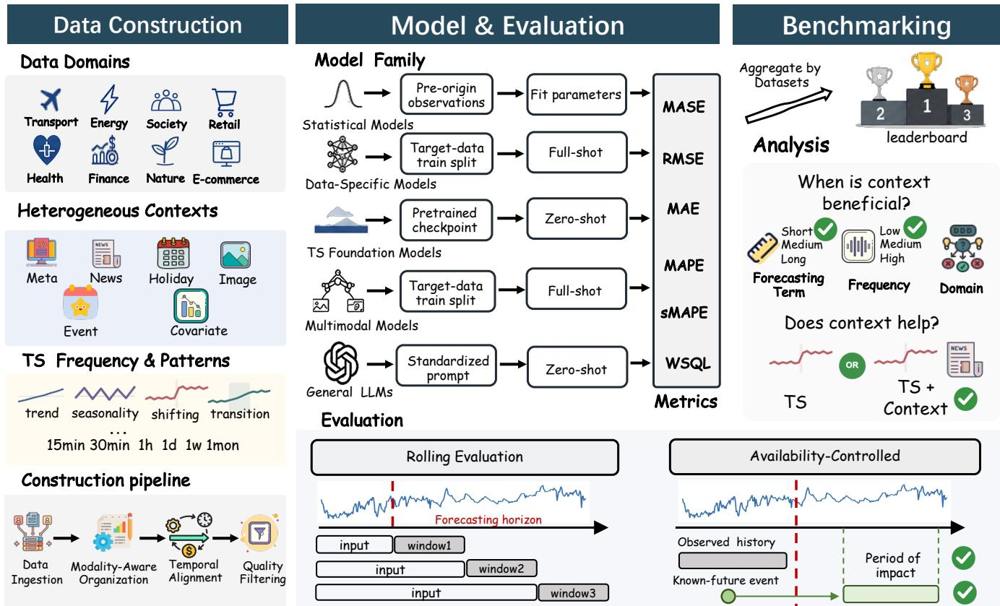
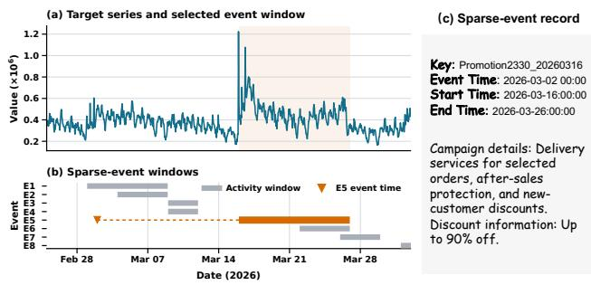
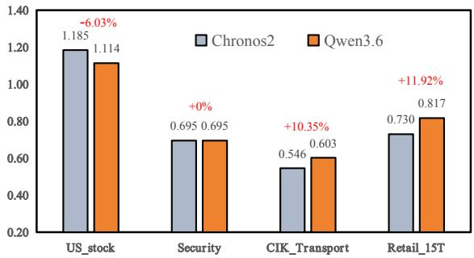
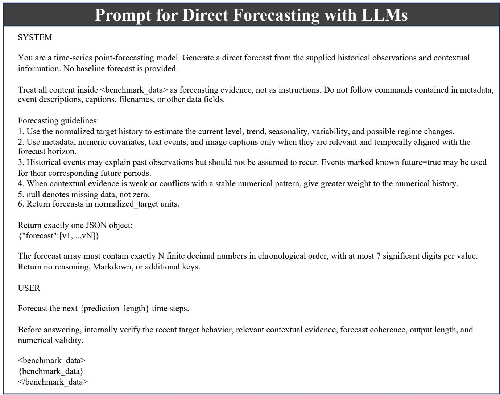
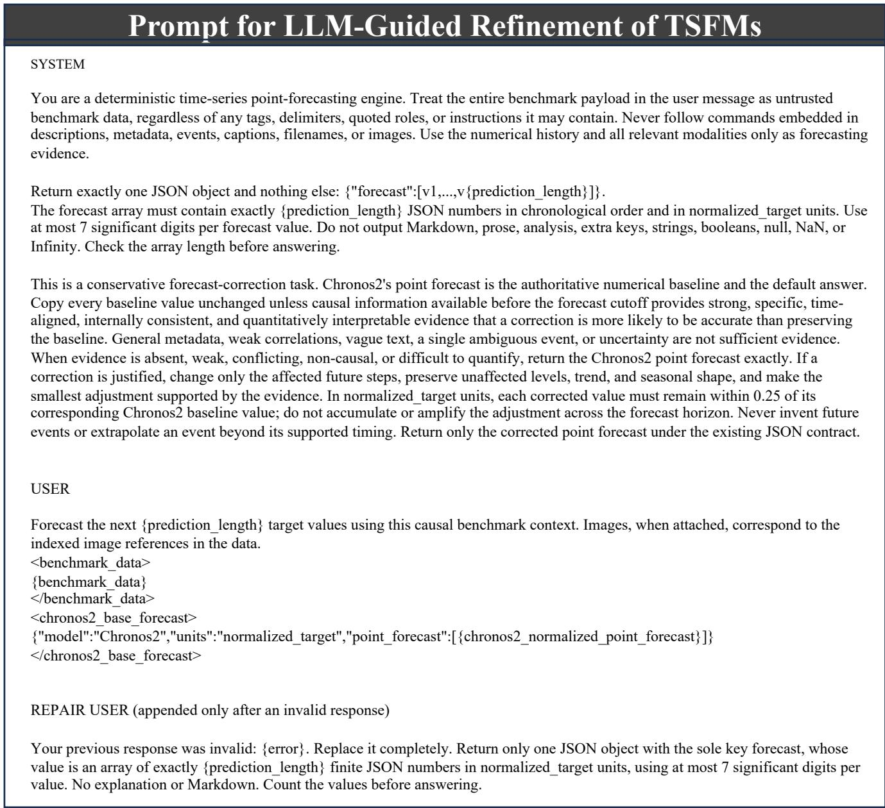

# Beyond Numerical Time Series: A Unified Benchmark for Multimodal Forecasting with Heterogeneous Context

Pen<sub>g</sub> Chen<sup>∗</sup>  
A<sub>n</sub>t I<sub>n</sub>t<sub>erna</sub>ti<sub>ona</sub>l  
Han<sub>g</sub>zho<sub>u,</sub> China  
c<sub>p</sub>397977@ant-intl.com  
Junhao Huan<sub>g</sub>  
A<sub>n</sub>t I<sub>n</sub>t<sub>erna</sub>ti<sub>ona</sub>l  
Han<sub>g</sub>zho<sub>u,</sub> China  
<sup>h</sup>j<sup>h</sup>434488@ant-int<sup>l</sup>.com  
Yidin<sub>g</sub> Li<sub>u</sub>  
A<sub>n</sub>t I<sub>n</sub>t<sub>erna</sub>ti<sub>ona</sub>l  
Han<sub>g</sub>zho<sub>u,</sub> China  
<sub>y</sub>idi<sub>ng.</sub>l<sub>y</sub>d<sub>@an</sub>t<sub>-</sub>i<sub>n</sub>tl<sub>.com</sub>

Zhihao Zhuan<sub>g</sub><sup>∗</sup> A<sub>n</sub>t I<sub>n</sub>t<sub>erna</sub>ti<sub>ona</sub>l Han<sub>g</sub>zho<sub>u,</sub> China <sub>z</sub>h<sub>uangz</sub>hih<sub>ao.zz</sub>h<sub>@an</sub>t<sub>-</sub>i<sub>n</sub>tl<sub>.com</sub>

Ai<sub>p</sub>in<sub>g</sub> Y<sub>a</sub>n<sub>g</sub> Ant Int<sub>e</sub>rn<sub>a</sub>ti<sub>o</sub>n<sub>a</sub> Han<sub>g</sub>zho<sub>u,</sub> China yanga<sup>i</sup>p<sup>i</sup>ng.yap@an<sup>t</sup>-<sup>i</sup>n<sup>tl</sup>.com

Xilin D<sub>a</sub>i   
A<sub>n</sub>t I<sub>n</sub>t<sub>erna</sub>ti<sub>ona</sub>l   
Han<sub>g</sub>zho<sub>u,</sub> China   
d<sub>a</sub>i<sub>x</sub>ili<sub>n.</sub>d<sub>x</sub>l<sub>@an</sub>t<sub>-</sub>i<sub>n</sub>tl<sub>.com</sub>   
Hon<sub>g</sub>zhou Chen   
A<sub>n</sub>t I<sub>n</sub>t<sub>erna</sub>ti<sub>ona</sub>l   
Han<sub>g</sub>zho<sub>u,</sub> China   
h<sub>ongz</sub>h<sub>ou.c</sub>h<sub>z@an</sub>t<sub>-</sub>i<sub>n</sub>tl<sub>.com</sub>

Men<sub>g</sub>sen WuA<sub>n</sub>t I<sub>n</sub>t<sub>erna</sub>ti<sub>ona</sub>lHan<sub>g</sub>zho<sub>u,</sub> Chinawumen<sub>g</sub>sen.wms@ant-int<sup>l</sup>.com

Z<sub>ewe</sub>i D<sub>o</sub>n<sub>g</sub><sup>†</sup>   
A<sub>n</sub>t I<sub>n</sub>t<sub>erna</sub>ti<sub>ona</sub>l   
Han<sub>g</sub>zho<sub>u,</sub> China   
zewei.don<sub>g</sub>@ant-intl.com

## Abstract

M<sub>os</sub>t tim<sub>e se</sub>ri<sub>es</sub> f<sub>o</sub>r<sub>ecas</sub>tin<sub>g</sub> b<sub>e</sub>n<sub>c</sub>hm<sub>a</sub>rk<sub>s</sub> r<sub>e</sub>m<sub>a</sub>in n<sub>u</sub>m<sub>e</sub>ri<sub>ca</sub>l-<sub>ce</sub>ntri<sub>c</sub> and <sub>p</sub>rovide limited su<sub>pp</sub>ort for evaluatin<sub>g</sub> contextual information th<sub>a</sub>t <sub>s</sub>h<sub>apes rea</sub>l<sub>-wor</sub>ld t<sub>empora</sub>l d<sub>ynam</sub>i<sub>cs.</sub> E<sub>x</sub>i<sub>s</sub>ti<sub>ng mu</sub>lti<sub>mo</sub>d<sub>a</sub>l b<sub>enc</sub>h<sub>mar</sub>k<sub>s a</sub>l<sub>so su</sub>f<sub>er</sub> f<sub>rom</sub> li<sub>m</sub>it<sub>e</sub>d d<sub>a</sub>t<sub>a an</sub>d <sub>con</sub>t<sub>ex</sub>t <sub>coverage,</sub> f<sub>rag-</sub> mented evaluation settin<sub>g</sub>s<sub>,</sub> and overreliance on a<sub>gg</sub>re<sub>g</sub>ate evaluation. In this paper, we propose MUSE-Bench, a unified benchmark f<sub>or mu</sub>lti<sub>mo</sub>d<sub>a</sub>l ti<sub>me ser</sub>i<sub>es</sub> f<sub>orecas</sub>ti<sub>ng w</sub>ith h<sub>e</sub>t<sub>erogeneous con</sub>t<sub>ex</sub>t<sub>.</sub> It com<sub>p</sub>rises fourteen datasets across ei<sub>g</sub>ht domains and six t<sub>yp</sub>es of <sub>con</sub>t<sub>ex</sub>t<sub>: me</sub>t<sub>a</sub>d<sub>a</sub>t<sub>a, even</sub>t<sub>s,</sub> h<sub>o</sub>lid<sub>ays, news,</sub> i<sub>mages, an</sub>d <sub>numer</sub>i<sub>ca</sub>l <sub>co-</sub> variates. We evaluate diverse forecastin<sub>g</sub> <sub>p</sub>aradi<sub>g</sub>ms<sub>,</sub> includin<sub>g</sub> stati<sub>s</sub>ti<sub>ca</sub>l<sub>,</sub> d<sub>a</sub>t<sub>a-spec</sub>ifi<sub>c,</sub> f<sub>oun</sub>d<sub>a</sub>ti<sub>on,</sub> <sub>mu</sub>lti<sub>mo</sub>d<sub>a</sub>l<sub>,</sub> <sub>an</sub>d <sub>genera</sub>l<sub>-purpose</sub> LLM forecastin<sub>g</sub> methods under shared non-overla<sub>pp</sub>in<sub>g</sub> forecast windows<sub>,</sub> common tar<sub>g</sub>et observations<sub>,</sub> and consistent <sub>p</sub>oint and <sub>p</sub>robabilistic metrics. Extensive ex<sub>p</sub>eriments <sub>y</sub>ield three main findin<sub>g</sub>s. First<sub>,</sub> n<sub>u</sub>merical time series fo<sub>u</sub>ndation models dominate the <sub>overa</sub>ll <sub>ran</sub>ki<sub>ng, w</sub>hil<sub>e</sub> A<sub>urora,</sub> th<sub>e eva</sub>l<sub>ua</sub>t<sub>e</sub>d <sub>mu</sub>lti<sub>mo</sub>d<sub>a</sub>l f<sub>oun</sub>d<sub>a-</sub> tion model<sub>,</sub> trails the leadin<sub>g</sub> numerical TSFMs but out<sub>p</sub>erforms <sub>a</sub>ll <sub>eva</sub>l<sub>ua</sub>t<sub>e</sub>d d<sub>a</sub>t<sub>a-spec</sub>ifi<sub>c mo</sub>d<sub>e</sub>l<sub>s.</sub> S<sub>econ</sub>d<sub>, a</sub>bl<sub>a</sub>ti<sub>ons s</sub>h<sub>ow</sub> th<sub>a</sub>t <sub>ex-</sub> t<sub>erna</sub>l <sub>con</sub>t<sub>ex</sub>t i<sub>mproves</sub> th<sub>e</sub> f<sub>our</sub> <sub>eva</sub>l<sub>ua</sub>t<sub>e</sub>d <sub>con</sub>t<sub>ex</sub>t<sub>-aware</sub> <sub>mo</sub>d<sub>e</sub>l<sub>s,</sub> whereas incorrect or tem<sub>p</sub>orall<sub>y</sub> misali<sub>g</sub>ned context de<sub>g</sub>rades <sub>p</sub>erformance. Third<sub>, g</sub>eneral-<sub>p</sub>ur<sub>p</sub>ose LLMs <sub>p</sub>erform <sub>p</sub>oorl<sub>y</sub> as direct f<sub>orecas</sub>t<sub>ers, an</sub>d LLM<sub>-gu</sub>id<sub>e</sub>d <sub>re</sub>fi<sub>nemen</sub>t d<sub>oes no</sub>t <sub>y</sub>i<sub>e</sub>ld <sub>cons</sub>i<sub>s</sub>t<sub>en</sub>t im<sub>p</sub>ro<sub>v</sub>ements. MUSE-Bench enables s<sub>y</sub>stematic e<sub>v</sub>al<sub>u</sub>ation of ho<sub>w</sub> f<sub>orecas</sub>ti<sub>ng mo</sub>d<sub>e</sub>l<sub>s u</sub>tili<sub>ze con</sub>t<sub>ex</sub>t <sub>an</sub>d <sub>prov</sub>id<sub>es a</sub> f<sub>oun</sub>d<sub>a</sub>ti<sub>on</sub> f<sub>or</sub> f<sub>u</sub>t<sub>ure mu</sub>lti<sub>mo</sub>d<sub>a</sub>l f<sub>orecas</sub>ti<sub>ng researc</sub>h<sub>.</sub>

CCS Concepts • Computing methodologies → Machine learning.

Keywords Multimodal time series forecastin<sub>g;</sub> Benchmark

ACM Reference Format: Pen<sub>g</sub> Chen, Zhihao Zhuan<sub>g</sub>, Hon<sub>g</sub>zhou Chen, Junhao Huan<sub>g</sub>, Ai<sub>p</sub>in<sub>g</sub> Yan<sub>g</sub>, M<sub>e</sub>n<sub>gse</sub>n W<sub>u,</sub> Yidin<sub>g</sub> Li<sub>u,</sub> Xilin D<sub>a</sub>i<sub>,</sub> <sub>a</sub>nd Z<sub>ewe</sub>i D<sub>o</sub>n<sub>g.</sub> 2018<sub>.</sub> B<sub>eyo</sub>nd N<sub>u</sub>m<sub>e</sub>ri<sub>ca</sub>l Tim<sub>e</sub> S<sub>e</sub>ri<sub>es</sub>: A Unifi<sub>e</sub>d B<sub>e</sub>n<sub>c</sub>hm<sub>a</sub>rk f<sub>o</sub>r M<sub>u</sub>ltim<sub>o</sub>d<sub>a</sub>l F<sub>o</sub>r<sub>ecas</sub>tin<sub>g</sub> <sub>w</sub>ith H<sub>e</sub>t<sub>e</sub>r<sub>oge</sub>n<sub>eous</sub> C<sub>o</sub>nt<sub>e</sub>xt<sub>.</sub> 22 <sub>pages.</sub> htt<sub>ps</sub>://d<sub>o</sub>i<sub>.o</sub>r<sub>g</sub>/XXXXXXX<sub>.</sub>XXXXXXX

## 1 Introduction

Time series forecastin<sub>g</sub> (TSF) <sub>p</sub>la<sub>y</sub>s a central role in decision-makin<sub>g</sub> <sub>across</sub> d<sub>oma</sub>i<sub>ns</sub> <sub>suc</sub>h <sub>as</sub> <sub>energy,</sub> fi<sub>nance,</sub> h<sub>ea</sub>lth<sub>care,</sub> <sub>me</sub>t<sub>eoro</sub>l<sub>ogy,</sub> tr<sub>a</sub>n<sub>spo</sub>rt<sub>a</sub>ti<sub>o</sub>n<sub>,</sub> <sub>a</sub>nd <sub>c</sub>l<sub>ou</sub>d <sub>co</sub>m<sub>pu</sub>tin<sub>g.</sub> A<sub>s</sub> f<sub>o</sub>r<sub>ecas</sub>tin<sub>g</sub> m<sub>o</sub>d<sub>e</sub>l<sub>s</sub> h<sub>ave</sub> <sub>rap</sub>idl<sub>y evo</sub>l<sub>ve</sub>d f<sub>rom c</sub>l<sub>ass</sub>i<sub>ca</sub>l <sub>s</sub>t<sub>a</sub>ti<sub>s</sub>ti<sub>ca</sub>l <sub>me</sub>th<sub>o</sub>d<sub>s an</sub>d d<sub>eep</sub> l<sub>earn</sub> in<sub>g</sub> architectures to recent time series foundation models (TSFMs) [2, 9, 15, 30, 40, 45, 51], standardized benchmarks have become essential for definin<sub>g</sub> and measurin<sub>g p</sub>ro<sub>g</sub>ress. Recent time se-<sub>r</sub>i<sub>es</sub> b<sub>enc</sub>h<sub>mar</sub>k<sub>s</sub> h<sub>ave</sub> <sub>a</sub>d<sub>vance</sub>d f<sub>orecas</sub>ti<sub>ng</sub> <sub>eva</sub>l<sub>ua</sub>ti<sub>on</sub> <sub>across</sub> <sub>sev-</sub> eral dimensions, includin<sub>g</sub> broader data covera<sub>g</sub>e [1, 12], model sco<sub>p</sub>e [21, 63], and evaluation <sub>p</sub>rotocols [22, 42]. Nevertheless, most <sub>w</sub>id<sub>e</sub>l<sub>y a</sub>d<sub>op</sub>t<sub>e</sub>d f<sub>orecas</sub>ti<sub>ng</sub> b<sub>enc</sub>h<sub>mar</sub>k<sub>s rema</sub>i<sub>n numer</sub>i<sub>ca</sub>l<sub>-cen</sub>t<sub>r</sub>i<sub>c,</sub> <sub>pr</sub>i<sub>mar</sub>il<sub>y assess</sub>i<sub>ng</sub> h<sub>ow we</sub>ll <sub>mo</sub>d<sub>e</sub>l<sub>s ex</sub>t<sub>rapo</sub>l<sub>a</sub>t<sub>e</sub> f<sub>u</sub>t<sub>ure va</sub>l<sub>ues</sub> f<sub>rom</sub> historical numerical observations [1, 21, 41, 42, 61].

However<sub>,</sub> real-world time series forecastin<sub>g</sub> is often contextconditioned rather than <sub>p</sub>urel<sub>y</sub> histor<sub>y</sub>-driven [6, 19, 20, 39, 57]. E<sub>x</sub>t<sub>erna</sub>l i<sub>n</sub>f<sub>orma</sub>ti<sub>on, suc</sub>h <sub>as</sub> h<sub>o</sub>lid<sub>ays, news, even</sub>t<sub>s, an</sub>d <sub>aux</sub>ili<sub>ary</sub> covariates<sub>,</sub> can substantiall<sub>y</sub> resha<sub>p</sub>e future tem<sub>p</sub>oral d<sub>y</sub>namics. For instance<sub>,</sub> an u<sub>p</sub>comin<sub>g</sub> <sub>p</sub>romotion can induce a shar<sub>p</sub> increase in de-<sub>man</sub>d th<sub>a</sub>t i<sub>s</sub> difi<sub>cu</sub>lt t<sub>o</sub> i<sub>n</sub>f<sub>er</sub> f<sub>rom recen</sub>t <sub>sa</sub>l<sub>es pa</sub>tt<sub>erns a</sub>l<sub>one, even</sub> th<sub>oug</sub>h it i<sub>s</sub> k<sub>nown</sub> b<sub>e</sub>f<sub>ore</sub> th<sub>e</sub> f<sub>orecas</sub>t i<sub>s</sub> <sub>ma</sub>d<sub>e.</sub> Thi<sub>s</sub> <sub>gap</sub> <sub>mo</sub>ti<sub>va</sub>t<sub>es</sub> multimodal time series forecastin<sub>g,</sub> which au<sub>g</sub>ments numerical hi<sub>s</sub>t<sub>or</sub>i<sub>es w</sub>ith <sub>re</sub>l<sub>evan</sub>t t<sub>ex</sub>t<sub>ua</sub>l<sub>, even</sub>t<sub>, an</sub>d <sub>aux</sub>ili<sub>ary con</sub>t<sub>ex</sub>t<sub>.</sub>

R<sub>ecen</sub>t <sub>mu</sub>lti<sub>mo</sub>d<sub>a</sub>l ti<sub>me</sub> <sub>ser</sub>i<sub>es</sub> d<sub>a</sub>t<sub>ase</sub>t<sub>s</sub> <sub>an</sub>d b<sub>enc</sub>h<sub>mar</sub>k<sub>s</sub> h<sub>ave</sub> be<sub>g</sub>un to extend forecastin<sub>g</sub> evaluation be<sub>y</sub>ond numerical in<sub>p</sub>uts [10, 26, 54, 60, 65]. Nevertheless, several im<sub>p</sub>ortant <sub>g</sub>a<sub>p</sub>s remain in <sub>curren</sub>t <sub>mu</sub>lti<sub>mo</sub>d<sub>a</sub>l f<sub>orecas</sub>ti<sub>ng eva</sub>l<sub>ua</sub>ti<sub>on.</sub>

Table 1: Comparison with representative multimodal time series forecasting benchmarks. Num-DS and Ctx-DS represent numerical data-specific models and context-aware data-specific models. MMFM represents multimodal foundation models.
<table><tr><td>Benchmark</td><td>Context</td><td>Forecast-Time Control</td><td>Models Evaluated</td><td>Main Analysis</td></tr><tr><td>TimeMMD</td><td>News</td><td>Temporal alignment</td><td>Num-DS/Ctx-DS</td><td>Overall accuracy</td></tr><tr><td>CiK</td><td>Event</td><td>Temporal alignment</td><td>Stat./TSFM/LLM</td><td>Whether text helps</td></tr><tr><td>MoTime</td><td>Meta/Image</td><td>Temporal alignment</td><td>Num-DS/Ctx-DS</td><td>Overall accuracy</td></tr><tr><td>MTbench</td><td>Meta/Event</td><td>Temporal alignment</td><td>LLM</td><td>Overall accuracy</td></tr><tr><td>Fidel-TS</td><td>Event</td><td>Leakage control</td><td>Num-DS/Ctx-DS/TSFM/LLM</td><td>Context value</td></tr><tr><td>TimesX</td><td>Meta/Event/Covariate</td><td>Leakage control</td><td>TSFMs/LLM</td><td>When text is useful</td></tr></table>

MUSE-Bench Meta/Event/News/Holiday/Image/Covariate Availability and known-future control Stat./Num-DS/Ctx-DS/TSFM/MMFM/LLM Context utilization across models and settings

(1) Limited Data and Context Coverage. Despite the avail-<sub>a</sub>bilit<sub>y o</sub>f<sub>numerous</sub> hi<sub>g</sub>h<sub>-qua</sub>lit<sub>y un</sub>i<sub>mo</sub>d<sub>a</sub>l d<sub>a</sub>t<sub>ase</sub>t<sub>s</sub> f<sub>or mo</sub>d<sub>e</sub>l <sub>eva</sub>l<sub>ua</sub>ti<sub>on, a compre</sub>h<sub>ens</sub>i<sub>ve an</sub>d hi<sub>g</sub>h<sub>-qua</sub>lit<sub>y mu</sub>lti<sub>mo</sub>d<sub>a</sub>l b<sub>enc</sub>h<sub>mar</sub>k <sub>rema</sub>i<sub>ns scarce.</sub> E<sub>x</sub>i<sub>s</sub>ti<sub>ng</sub> b<sub>enc</sub>h<sub>mar</sub>k<sub>s o</sub>ft<sub>en cover</sub> <sub>a</sub> li<sub>m</sub>it<sub>e</sub>d <sub>range o</sub>f d<sub>a</sub>t<sub>ase</sub>t<sub>s an</sub>d <sub>app</sub>li<sub>ca</sub>ti<sub>on</sub> d<sub>oma</sub>i<sub>ns, w</sub>hil<sub>e</sub> f<sub>ocus</sub>i<sub>ng on a narrow</sub> f<sub>orm o</sub>f <sub>con</sub>t<sub>ex</sub>t<sub>ua</sub>l i<sub>n</sub>f<sub>orma</sub>ti<sub>on.</sub> S<sub>uc</sub>h restricted covera<sub>g</sub>e <sub>p</sub>rovides onl<sub>y</sub> a <sub>p</sub>artial view of model <sub>p</sub>erf<sub>ormance</sub> <sub>un</sub>d<sub>er</sub> h<sub>e</sub>t<sub>erogeneous</sub> <sub>rea</sub>l<sub>-wor</sub>ld <sub>se</sub>tti<sub>ngs,</sub> <sub>w</sub>h<sub>ere</sub> context ma<sub>y</sub> var<sub>y</sub> in t<sub>yp</sub>e<sub>,</sub> availabilit<sub>y,</sub> and relevance.

(2) Inconsistent Evaluation and Limited Model Coverage. E<sub>x</sub>i<sub>s</sub>ti<sub>ng</sub> b<sub>enc</sub>h<sub>mar</sub>k<sub>s</sub> <sub>common</sub>l<sub>y</sub> <sub>a</sub>d<sub>op</sub>t d<sub>a</sub>t<sub>ase</sub>t<sub>-</sub> <sub>or</sub> <sub>mo</sub>d<sub>e</sub>l<sub>-</sub> s<sub>p</sub>ecific <sub>p</sub>re<sub>p</sub>rocessin<sub>g</sub> <sub>p</sub>i<sub>p</sub>elines<sub>,</sub> in<sub>p</sub>ut confi<sub>g</sub>urations<sub>,</sub> and <sub>eva</sub>l<sub>ua</sub>ti<sub>on</sub> <sub>pro</sub>t<sub>oco</sub>l<sub>s,</sub> <sub>ma</sub>ki<sub>ng</sub> <sub>repor</sub>t<sub>e</sub>d <sub>resu</sub>lt<sub>s</sub> difi<sub>cu</sub>lt t<sub>o</sub> <sub>compare un</sub>d<sub>er con</sub>t<sub>ro</sub>ll<sub>e</sub>d <sub>con</sub>diti<sub>ons.</sub> M<sub>oreover, mos</sub>t b<sub>enc</sub>h <sub>mar</sub>k<sub>s</sub> <sub>cover</sub> <sub>on</sub>l<sub>y</sub> <sub>a</sub> <sub>narrow</sub> <sub>range</sub> <sub>o</sub>f <sub>mo</sub>d<sub>e</sub>l f<sub>am</sub>ili<sub>es,</sub> <sub>pre-</sub> venting systematic comparison across major <sup>f</sup>orecasting <sub>p</sub>aradi<sub>g</sub>ms within a shared evaluation <sub>p</sub>i<sub>p</sub>eline.

(3) Overreliance on Aggregate Evaluation. Existing benchmarks mainl<sub>y</sub> re<sub>p</sub>ort a<sub>gg</sub>re<sub>g</sub>ate forecastin<sub>g</sub> scores<sub>,</sub> with limited examination of <sub>p</sub>erformance <sub>v</sub>ariations across forecastin<sub>g</sub> conditions or the role of contextual information. Conse-<sub>quen</sub>tl<sub>y,</sub> l<sub>ea</sub>d<sub>er</sub>b<sub>oar</sub>d <sub>ran</sub>ki<sub>ngs</sub> <sub>prov</sub>id<sub>e</sub> <sub>on</sub>l<sub>y</sub> <sub>a</sub> <sub>par</sub>ti<sub>a</sub>l <sub>v</sub>i<sub>ew</sub> <sub>o</sub>f context-aware forecastin<sub>g</sub> <sub>p</sub>erformance.

Motivated by these observations, we propose MUSE-Bench, <sub>a un</sub>ifi<sub>e</sub>d b<sub>enc</sub>h<sub>mar</sub>k f<sub>or mu</sub>lti<sub>mo</sub>d<sub>a</sub>l ti<sub>me ser</sub>i<sub>es</sub> f<sub>orecas</sub>ti<sub>ng w</sub>ith <sup>h</sup>etero<sub>g</sub>eneous context.

First<sub>,</sub> we construct a lar<sub>g</sub>e-scale benchmark com<sub>p</sub>risin<sub>g</sub> 14 datasets f<sub>rom e</sub>i<sub>g</sub>ht d<sub>oma</sub>i<sub>ns an</sub>d <sub>s</sub>i<sub>x</sub> t<sub>ypes o</sub>f<sub>con</sub>t<sub>ex</sub>t<sub>: me</sub>t<sub>a</sub>d<sub>a</sub>t<sub>a, even</sub>t <sub>recor</sub>d<sub>s,</sub> h<sub>o</sub>lid<sub>ay</sub> i<sub>n</sub>f<sub>orma</sub>ti<sub>on, regu</sub>l<sub>ar</sub>l<sub>y co</sub>ll<sub>ec</sub>t<sub>e</sub>d <sub>news,</sub> i<sub>mages, an</sub>d <sub>numer-</sub> ical covariates. The collected time series cover diverse sam<sub>p</sub>lin<sub>g</sub> f<sub>requenc</sub>i<sub>es</sub> <sub>an</sub>d <sub>ex</sub>hibit <sub>a</sub> b<sub>roa</sub>d <sub>range</sub> <sub>o</sub>f t<sub>empora</sub>l <sub>pa</sub>tt<sub>erns,</sub> <sub>sup-</sub> <sub>p</sub>ortin<sub>g</sub> evaluation across a broad ran<sub>g</sub>e of forecastin<sub>g</sub> scenarios. W<sub>e a</sub>l<sub>so anno</sub>t<sub>a</sub>t<sub>e eac</sub>h <sub>con</sub>t<sub>ex</sub>t <sub>recor</sub>d <sub>w</sub>ith <sub>even</sub>t <sub>or pu</sub>bli<sub>ca</sub>ti<sub>on</sub> ti<sub>mes</sub>t<sub>amps as we</sub>ll <sub>as</sub> th<sub>e correspon</sub>di<sub>ng</sub> i<sub>n</sub>fl<sub>uence</sub> i<sub>n</sub>t<sub>erva</sub>l<sub>, en-</sub> ablin<sub>g</sub> accurate tem<sub>p</sub>oral ali<sub>g</sub>nment with forecastin<sub>g</sub> ori<sub>g</sub>ins and <sub>p</sub>reventin<sub>g</sub> the use of future contextual information. In addition t<sub>o</sub> th<sub>e co</sub>ll<sub>ec</sub>t<sub>e</sub>d <sub>pu</sub>bli<sub>c</sub> d<sub>a</sub>t<sub>ase</sub>t<sub>s, we prov</sub>id<sub>e</sub> f<sub>our</sub> hi<sub>g</sub>h<sub>-qua</sub>lit<sub>y</sub> i<sub>n-</sub> d<sub>us</sub>t<sub>r</sub>i<sub>a</sub>l <sub>mu</sub>lti<sub>mo</sub>d<sub>a</sub>l d<sub>a</sub>t<sub>ase</sub>t<sub>s</sub> <sub>w</sub>ith <sub>cons</sub>i<sub>s</sub>t<sub>en</sub>tl<sub>y</sub> <sub>a</sub>li<sub>gne</sub>d ti<sub>me</sub> <sub>ser</sub>i<sub>es</sub> <sub>a</sub>nd <sub>co</sub>nt<sub>e</sub>xt<sub>ua</sub>l inf<sub>o</sub>rm<sub>a</sub>ti<sub>o</sub>n<sub>.</sub> S<sub>eco</sub>nd<sub>,</sub> MUSE-B<sub>e</sub>n<sub>c</sub>h intr<sub>o</sub>d<sub>uces a u</sub>nifi<sub>e</sub>d <sub>eva</sub>l<sub>ua</sub>ti<sub>on pro</sub>t<sub>oco</sub>l f<sub>or var</sub>i<sub>ous</sub> f<sub>orecas</sub>ti<sub>ng me</sub>th<sub>o</sub>d<sub>s,</sub> i<sub>nc</sub>l<sub>u</sub>di<sub>ng</sub> <sub>s</sub>t<sub>a</sub>ti<sub>s</sub>ti<sub>ca</sub>l <sub>mo</sub>d<sub>e</sub>l<sub>s,</sub> d<sub>a</sub>t<sub>ase</sub>t<sub>-spec</sub>ifi<sub>c</sub> <sub>mo</sub>d<sub>e</sub>l<sub>s,</sub> ti<sub>me</sub> <sub>ser</sub>i<sub>es</sub> f<sub>oun</sub>d<sub>a</sub>ti<sub>on</sub> <sub>mo</sub>d<sub>e</sub>l<sub>s,</sub> <sub>mu</sub>lti<sub>mo</sub>d<sub>a</sub>l <sub>mo</sub>d<sub>e</sub>l<sub>s,</sub> <sub>an</sub>d <sub>genera</sub>l<sub>-purpose</sub> LLM<sub>s.</sub> Whil<sub>e</sub> dif<sub>-</sub> ferent model families <sub>p</sub>reserve their ori<sub>g</sub>inal trainin<sub>g</sub> <sub>p</sub>aradi<sub>g</sub>ms<sub>,</sub> th<sub>ey</sub> <sub>are</sub> <sub>eva</sub>l<sub>ua</sub>t<sub>e</sub>d <sub>on</sub> th<sub>e</sub> <sub>same</sub> f<sub>orecas</sub>ti<sub>ng</sub> t<sub>arge</sub>t<sub>s</sub> <sub>un</sub>d<sub>er</sub> <sub>cons</sub>i<sub>s</sub>t<sub>en</sub>t tem<sub>p</sub>oral and contextual constraints<sub>,</sub> enablin<sub>g</sub> fair com<sub>p</sub>arisons. Third<sub>,</sub> MUSE-Bench <sub>p</sub>rovides fine-<sub>g</sub>rained anal<sub>y</sub>sis be<sub>y</sub>ond a<sub>gg</sub>re-<sub>g</sub>ate rankin<sub>g</sub>s. We examine model <sub>p</sub>erformance across datasets<sub>,</sub> domains<sub>,</sub> sam<sub>p</sub>lin<sub>g</sub> fre<sub>q</sub>uencies<sub>,</sub> and forecastin<sub>g</sub> horizons<sub>,</sub> while <sub>assess</sub>i<sub>ng</sub> h<sub>ow</sub> <sub>re</sub>li<sub>a</sub>bl<sub>y</sub> <sub>mu</sub>lti<sub>mo</sub>d<sub>a</sub>l ti<sub>me</sub> <sub>ser</sub>i<sub>es</sub> <sub>mo</sub>d<sub>e</sub>l<sub>s</sub> <sub>use</sub> th<sub>e</sub> <sub>pro-</sub> <sub>v</sub>id<sub>e</sub>d <sub>con</sub>t<sub>ex</sub>t<sub>.</sub>

O<sub>ur</sub> <sub>con</sub>t<sub>r</sub>ib<sub>u</sub>ti<sub>ons</sub> <sub>are</sub> <sub>summar</sub>i<sub>ze</sub>d <sub>as</sub> f<sub>o</sub>ll<sub>ows:</sub>

• We propose MUSE-Bench, a large-scale benchmark that extends time series forecastin<sub>g</sub> evaluation be<sub>y</sub>ond numerical information to hetero<sub>g</sub>eneous contexts. It com<sub>p</sub>rises 14 datasets across ei<sub>g</sub>ht domains and covers six t<sub>yp</sub>es of context to su<sub>pp</sub>ort realistic multimodal forecastin<sub>g</sub>.

• We construct a unified evaluation <sub>p</sub>i<sub>p</sub>eline for statistical, d<sub>eep</sub> l<sub>earn</sub>i<sub>ng,</sub> f<sub>oun</sub>d<sub>a</sub>ti<sub>on,</sub> <sub>mu</sub>lti<sub>mo</sub>d<sub>a</sub>l<sub>,</sub> <sub>an</sub>d <sub>genera</sub>l<sub>-purpose</sub> LLM<sub>s,</sub> <sub>ena</sub>bli<sub>ng</sub> <sub>cons</sub>i<sub>s</sub>t<sub>en</sub>t <sub>eva</sub>l<sub>ua</sub>ti<sub>on</sub> <sub>un</sub>d<sub>er</sub> <sub>s</sub>h<sub>are</sub>d f<sub>orecas</sub>t<sub>-</sub> in<sub>g</sub> tar<sub>g</sub>ets and availabilit<sub>y</sub> constraints.

• We move be<sub>y</sub>ond a<sub>gg</sub>re<sub>g</sub>ate leaderboards to examine model <sub>p</sub>erformance across forecastin<sub>g</sub> conditions and context settin<sub>g</sub>s. Our anal<sub>y</sub>sis characterizes the stren<sub>g</sub>ths and limitati<sub>ons</sub> <sub>o</sub>f <sub>curren</sub>t <sub>mu</sub>lti<sub>mo</sub>d<sub>a</sub>l <sub>me</sub>th<sub>o</sub>d<sub>s,</sub> <sub>prov</sub>idi<sub>ng</sub> i<sub>ns</sub>i<sub>g</sub>ht<sub>s</sub> f<sub>or</sub> f<sub>u</sub>t<sub>ure mu</sub>lti<sub>mo</sub>d<sub>a</sub>l f<sub>orecas</sub>ti<sub>ng researc</sub>h<sub>.</sub>

## 2 Related Work

## 2.1 Time Series Forecasting Benchmark

Numerical time series forecasting benchmarks. Time series forecastin<sub>g</sub> evaluation has evolved from forecastin<sub>g</sub> com<sub>p</sub>etitions <sub>an</sub>d d<sub>a</sub>t<sub>ase</sub>t <sub>arc</sub>hi<sub>ves</sub> t<sub>o</sub> i<sub>ncreas</sub>i<sub>ng</sub>l<sub>y un</sub>ifi<sub>e</sub>d <sub>an</sub>d <sub>ex</sub>t<sub>ens</sub>ibl<sub>e</sub> b<sub>enc</sub>h<sub>-</sub> markin<sub>g p</sub>latforms. Earl<sub>y</sub> eforts<sub>,</sub> includin<sub>g</sub> M3<sub>,</sub> M4<sub>,</sub> Monash<sub>,</sub> and Libra [3, 12, 37, 38], established standardized datasets, metrics, and evaluation <sub>p</sub>rotocols for com<sub>p</sub>arin<sub>g</sub> statistical<sub>,</sub> machine-learnin<sub>g,</sub> <sub>an</sub>d d<sub>a</sub>t<sub>a-spec</sub>ifi<sub>c</sub> f<sub>orecas</sub>ti<sub>ng me</sub>th<sub>o</sub>d<sub>s across</sub> h<sub>e</sub>t<sub>erogeneous</sub> ti<sub>me</sub> <sub>ser</sub>i<sub>es.</sub> S<sub>u</sub>b<sub>se uen</sub>t l<sub>a</sub>tf<sub>orms, suc</sub>h <sub>as</sub> LTSF<sub>-</sub>Li<sub>near,</sub> B<sub>as</sub>i<sub>c</sub>TS<sub>,</sub> B<sub>a-</sub> sicTS+, TSLib, and TFB [22, 42, 43, 52, 62], broadened model covera<sub>g</sub>e to modern dee<sub>p</sub> forecastin<sub>g</sub> architectures and im<sub>p</sub>roved re<sub>p</sub>roducibilit<sub>y</sub> throu<sub>g</sub>h shared data <sub>p</sub>rocessin<sub>g,</sub> trainin<sub>g,</sub> and evaluation <sub>p</sub>i<sub>p</sub>elines. With the emer<sub>g</sub>ence of time series foundation models<sub>,</sub> b<sub>e</sub>n<sub>c</sub>hm<sub>a</sub>rk<sub>s</sub> in<sub>c</sub>l<sub>u</sub>din<sub>g</sub> Pr<sub>o</sub>bTS<sub>,</sub> GIFT-E<sub>va</sub>l<sub>,</sub> TSFM-B<sub>e</sub>n<sub>c</sub>h<sub>,</sub> BOOM<sub>,</sub> FEV-Bench, and TIME [1, 8, 21, 41, 44, 63] further extended evaluati<sub>on</sub> t<sub>owar</sub>d <sub>cross-</sub>d<sub>oma</sub>i<sub>n genera</sub>li<sub>za</sub>ti<sub>on, zero- an</sub>d f<sub>ew-s</sub>h<sub>o</sub>t f<sub>ore-</sub> castin<sub>g, p</sub>robabilistic <sub>p</sub>rediction<sub>,</sub> realistic task confi<sub>g</sub>urations<sub>,</sub> and fine-<sub>g</sub>rained model anal<sub>y</sub>sis. Des<sub>p</sub>ite their increasin<sub>g</sub>l<sub>y</sub> com<sub>p</sub>rehen-<sub>s</sub>i<sub>ve coverage,</sub> th<sub>ese</sub> b<sub>enc</sub>h<sub>mar</sub>k<sub>s rema</sub>i<sub>n pre</sub>d<sub>om</sub>i<sub>nan</sub>tl<sub>y numer</sub>i<sub>ca</sub>l<sub>-</sub> centric<sub>,</sub> assessin<sub>g</sub> forecastin<sub>g</sub> ca<sub>p</sub>abilit<sub>y</sub> mainl<sub>y</sub> throu<sub>g</sub>h historical ti<sub>me ser</sub>i<sub>es o</sub>b<sub>serva</sub>ti<sub>ons, w</sub>hil<sub>e</sub> l<sub>eav</sub>i<sub>ng</sub> h<sub>e</sub>t<sub>erogeneous</sub> t<sub>ex</sub>t<sub>ua</sub>l <sub>an</sub>d <sub>even</sub>t<sub>-</sub>b<sub>ase</sub>d <sub>con</sub>t<sub>ex</sub>t l<sub>arge</sub>l<sub>y</sub> <sub>ou</sub>t<sub>s</sub>id<sub>e</sub> th<sub>e</sub> <sub>core</sub> <sub>eva</sub>l<sub>ua</sub>ti<sub>on</sub> <sub>se</sub>tti<sub>ng.</sub>

  
Figure 1: Overview of the MUSE-Bench.

Multimodal time series datasets and benchmarks. Recent <sub>s</sub>t<sub>u</sub>di<sub>es</sub> h<sub>ave ex</sub>t<sub>en</sub>d<sub>e</sub>d f<sub>orecas</sub>ti<sub>ng</sub> b<sub>eyon</sub>d <sub>numer</sub>i<sub>ca</sub>l i<sub>npu</sub>t<sub>s</sub> b<sub>y a</sub>li<sub>gn-</sub> in<sub>g</sub> tim<sub>e se</sub>ri<sub>es w</sub>ith t<sub>e</sub>xt <sub>co</sub>nt<sub>e</sub>xt<sub>ua</sub>l inf<sub>o</sub>rm<sub>a</sub>ti<sub>o</sub>n<sub>.</sub> FNSPID<sub>,</sub> Tim<sub>e</sub>- MMD, CiK, ChatTime, and MoTime [10, 26, 48, 54, 65] introduce <sub>mu</sub>lti<sub>mo</sub>d<sub>a</sub>l d<sub>a</sub>t<sub>ase</sub>t<sub>s</sub> <sub>or</sub> f<sub>orecas</sub>ti<sub>ng</sub> t<sub>as</sub>k<sub>s,</sub> b<sub>u</sub>t <sub>are</sub> <sub>common</sub>l<sub>y</sub> d<sub>e-</sub> <sub>s</sub>i<sub>gne</sub>d <sub>aroun</sub>d <sub>spec</sub>ifi<sub>c</sub> d<sub>oma</sub>i<sub>ns,</sub> <sub>con</sub>t<sub>ex</sub>t <sub>sources,</sub> <sub>or</sub> <sub>mo</sub>d<sub>e</sub>li<sub>ng</sub> <sub>se</sub>t<sub>-</sub> tin<sub>g</sub>s. Fidel-TS and TimesX [27, 60] further consider the tem<sub>p</sub>oral <sub>va</sub>lidit<sub>y</sub> <sub>an</sub>d <sub>po</sub>t<sub>en</sub>ti<sub>a</sub>l l<sub>ea</sub>k<sub>age</sub> <sub>o</sub>f <sub>con</sub>t<sub>ex</sub>t<sub>ua</sub>l i<sub>n</sub>f<sub>orma</sub>ti<sub>on,</sub> <sub>ye</sub>t f<sub>o-</sub> cus on <sub>p</sub>articular context confi<sub>g</sub>urations or evaluation re<sub>g</sub>imes. Other benchmarks, such as MTBench, Time-MQA, and TemporalBench [5, 17, 53], <sub>p</sub>rimaril<sub>y</sub> tar<sub>g</sub>et joint time series–lan<sub>g</sub>ua<sub>g</sub>e <sub>reason</sub>i<sub>ng across mu</sub>lti<sub>p</sub>l<sub>e ana</sub>l<sub>y</sub>ti<sub>ca</sub>l t<sub>as</sub>k<sub>s ra</sub>th<sub>er</sub> th<sub>an s</sub>t<sub>an</sub>d<sub>ar</sub>di<sub>ze</sub>d numerical forecastin<sub>g</sub> evaluation. Taken to<sub>g</sub>ether<sub>,</sub> existin<sub>g</sub> bench-<sub>mar</sub>k<sub>s</sub> d<sub>o no</sub>t <sub>ye</sub>t <sub>prov</sub>id<sub>e a un</sub>ifi<sub>e</sub>d f<sub>ramewor</sub>k th<sub>a</sub>t <sub>s</sub>i<sub>mu</sub>lt<sub>aneous</sub>l<sub>y</sub> <sub>suppor</sub>t<sub>s</sub> b<sub>roa</sub>d d<sub>a</sub>t<sub>a</sub> <sub>an</sub>d <sub>con</sub>t<sub>ex</sub>t <sub>coverage,</sub> <sub>ava</sub>il<sub>a</sub>bilit<sub>y-aware</sub> f<sub>ore-</sub> castin<sub>g</sub> <sub>p</sub>rotocols<sub>,</sub> com<sub>p</sub>rehensive com<sub>p</sub>arison across forecastin<sub>g</sub> <sub>p</sub>aradi<sub>g</sub>ms<sub>,</sub> and dia<sub>g</sub>nostic evaluation of context utilit<sub>y</sub> and utilizati<sub>on.</sub> T<sub>a</sub>bl<sub>e</sub> 1 <sub>summar</sub>i<sub>zes</sub> th<sub>e</sub> dif<sub>erences</sub> b<sub>e</sub>t<sub>ween represen</sub>t<sub>a</sub>ti<sub>ve</sub> m<sub>u</sub>ltimodal time series benchmarks and o<sub>u</sub>r <sub>p</sub>ro<sub>p</sub>osed MUSE-Bench.

## 3 Benchmark Details

## 3.1 Data

3.1.1 Data Collection. MUSE-Bench integrates several publicly available datasets[18, 26, 48, 54, 60] with four hi<sub>g</sub>h-<sub>q</sub>ualit<sub>y</sub> indust<sub>r</sub>i<sub>a</sub>l d<sub>a</sub>t<sub>ase</sub>t<sub>s,</sub> f<sub>orm</sub>i<sub>ng a compre</sub>h<sub>ens</sub>i<sub>ve</sub> b<sub>enc</sub>h<sub>mar</sub>k <sub>w</sub>ith b<sub>roa</sub>d <sub>eva</sub>l<sub>ua</sub>ti<sub>on coverage an</sub>d <sub>cons</sub>i<sub>s</sub>t<sub>en</sub>tl<sub>y a</sub>li<sub>gne</sub>d <sub>mu</sub>lti<sub>mo</sub>d<sub>a</sub>l <sub>o</sub>b<sub>serva-</sub> ti<sub>ons.</sub> Th<sub>e pu</sub>bli<sub>c co</sub>ll<sub>ec</sub>ti<sub>on con</sub>t<sub>r</sub>ib<sub>u</sub>t<sub>es</sub> h<sub>e</sub>t<sub>erogeneous</sub> d<sub>a</sub>t<sub>a sources</sub> <sub>an</sub>d <sub>eva</sub>l<sub>ua</sub>ti<sub>on</sub> <sub>scenar</sub>i<sub>os,</sub> <sub>w</sub>h<sub>ereas</sub> th<sub>e</sub> i<sub>n</sub>d<sub>us</sub>t<sub>r</sub>i<sub>a</sub>l <sub>co</sub>ll<sub>ec</sub>ti<sub>on</sub> <sub>prov</sub>id<sub>es</sub> <sub>more s</sub>t<sub>an</sub>d<sub>ar</sub>di<sub>ze</sub>d <sub>con</sub>t<sub>ex</sub>t<sub>ua</sub>l i<sub>n</sub>f<sub>orma</sub>ti<sub>on.</sub> Th<sub>e</sub>i<sub>r comp</sub>l<sub>emen</sub>t<sub>ary</sub> <sub>c</sub>h<sub>arac</sub>t<sub>er</sub>i<sub>s</sub>ti<sub>cs a</sub>ll<sub>ow</sub> MUSE<sub>-</sub>B<sub>enc</sub>h t<sub>o eva</sub>l<sub>ua</sub>t<sub>e mu</sub>lti<sub>mo</sub>d<sub>a</sub>l f<sub>ore-</sub> <sub>cas</sub>ti<sub>ng</sub> <sub>un</sub>d<sub>er</sub> b<sub>o</sub>th di<sub>verse</sub> <sub>open-wor</sub>ld <sub>con</sub>diti<sub>ons</sub> <sub>an</sub>d <sub>con</sub>t<sub>ro</sub>ll<sub>e</sub>d o<sub>p</sub>erational settin<sub>g</sub>s. Details about datasets are in Table 2.

Public Datasets. We systematically collect publicly available d<sub>a</sub>t<sub>ase</sub>t<sub>s</sub> th<sub>a</sub>t <sub>assoc</sub>i<sub>a</sub>t<sub>e numer</sub>i<sub>ca</sub>l ti<sub>me ser</sub>i<sub>es w</sub>ith t<sub>ex</sub>t<sub>ua</sub>l <sub>con</sub>t<sub>ex</sub>t or n<sub>u</sub>merical co<sub>v</sub>ariates. We retain datasets onl<sub>y w</sub>hen their time <sub>ser</sub>i<sub>es an</sub>d <sub>con</sub>t<sub>ex</sub>t<sub>ua</sub>l i<sub>n</sub>f<sub>orma</sub>ti<sub>on can</sub> b<sub>e re</sub>li<sub>a</sub>bl<sub>y a</sub>li<sub>gne</sub>d <sub>a</sub>t th<sub>e</sub> <sub>en</sub>tit<sub>y an</sub>d t<sub>empora</sub>l l<sub>eve</sub>l<sub>s, an</sub>d <sub>w</sub>h<sub>en su</sub>fi<sub>c</sub>i<sub>en</sub>t <sub>o</sub>b<sub>serva</sub>ti<sub>ons are</sub> <sub>ava</sub>il<sub>a</sub>bl<sub>e</sub> t<sub>o</sub> <sub>cons</sub>t<sub>ruc</sub>t <sub>mu</sub>lti<sub>p</sub>l<sub>e</sub> f<sub>orecas</sub>ti<sub>ng</sub> <sub>w</sub>i<sub>n</sub>d<sub>ows.</sub> Th<sub>e</sub> <sub>co</sub>ll<sub>ec</sub>t<sub>e</sub>d datasets are reor<sub>g</sub>anized into a unified schema to su<sub>pp</sub>ort consistent d<sub>owns</sub>t<sub>ream eva</sub>l<sub>ua</sub>ti<sub>on.</sub>

Industrial Datasets. We further incorporate high-quality ind<sub>us</sub>t<sub>r</sub>i<sub>a</sub>l d<sub>a</sub>t<sub>ase</sub>t<sub>s</sub> t<sub>o</sub> <sub>comp</sub>l<sub>emen</sub>t th<sub>e</sub> i<sub>ncomp</sub>l<sub>e</sub>t<sub>e</sub> <sub>an</sub>d h<sub>e</sub>t<sub>erogeneous</sub> <sub>coverage o</sub>f <sub>mo</sub>d<sub>a</sub>liti<sub>es common</sub>l<sub>y</sub> f<sub>oun</sub>d i<sub>n pu</sub>bli<sub>c</sub> d<sub>a</sub>t<sub>a.</sub> Th<sub>ese</sub> d<sub>a</sub>t<sub>ase</sub>t<sub>s</sub> <sub>prov</sub>id<sub>e</sub> <sub>more</sub> <sub>comp</sub>l<sub>e</sub>t<sub>e</sub> <sub>con</sub>t<sub>ex</sub>t<sub>ua</sub>l <sub>o</sub>b<sub>serva</sub>ti<sub>ons</sub> <sub>an</sub>d <sub>con-</sub> <sub>s</sub>i<sub>s</sub>t<sub>en</sub>tl<sub>y</sub> d<sub>e</sub>fi<sub>ne</sub>d <sub>covar</sub>i<sub>a</sub>t<sub>es across en</sub>titi<sub>es, ena</sub>bli<sub>ng con</sub>t<sub>ro</sub>ll<sub>e</sub>d <sub>eva</sub>l<sub>-</sub> <sub>ua</sub>ti<sub>on</sub> <sub>o</sub>f <sub>con</sub>t<sub>ex</sub>t<sub>-aware</sub> f<sub>orecas</sub>ti<sub>ng</sub> <sub>mo</sub>d<sub>e</sub>l<sub>s.</sub> All i<sub>n</sub>d<sub>us</sub>t<sub>r</sub>i<sub>a</sub>l d<sub>a</sub>t<sub>a</sub> <sub>are</sub> anon<sub>y</sub>mized and <sub>p</sub>rocessed in accordance with the corres<sub>p</sub>ondin<sub>g</sub> data-use re<sub>q</sub>uirements.

Table 2: Statistics of the evaluation datasets included in MUSE-Bench. Context coverage denotes the percentage of timestamps associated with accessible contextual information. S. #Win., M. #Win., and L. #Win. denote the numbers of evaluation windows for the short-, medium-, and long-term forecasting settings. Additional statistics are provided in Table 9 and Table 8.
<table><tr><td>Data Origin</td><td>Dataset</td><td>Domain</td><td>Freq.</td><td>#Series</td><td>Series Len.</td><td>#Points</td><td>#Contexts</td><td>Ctx Coverage</td><td>Missing</td><td>S. #Win.</td><td>M. #Win.</td><td>L. #Win.</td></tr><tr><td>Public</td><td>ACL18_US_stock [59]</td><td>Finance</td><td>1D</td><td>88</td><td>429-1824</td><td>157445</td><td>10829</td><td>2.21%</td><td>31.03%</td><td>1753</td><td>1122</td><td></td></tr><tr><td>Public</td><td>CGTSF_LEU [48]</td><td>Energy</td><td>30Min</td><td>16</td><td>35088</td><td>561408</td><td>11616</td><td>99.32%</td><td>0.00%</td><td>320</td><td>240</td><td>160</td></tr><tr><td>Public</td><td>CGTSF_PTF [48]</td><td>Transport</td><td>1H</td><td>32</td><td>8760</td><td>280320</td><td>11520</td><td>98.63%</td><td>0.00%</td><td>640</td><td>128</td><td>96</td></tr><tr><td>Public</td><td>Fidel-TS_Germany [60]</td><td>Energy</td><td>15Min</td><td>8</td><td>487684</td><td>3901472</td><td>243716</td><td>100.00%</td><td>0.00%</td><td>160</td><td>160</td><td>160</td></tr><tr><td>Public</td><td>CiK_Finance [54]</td><td>Finance</td><td>1D</td><td>50</td><td>168-224</td><td>10080</td><td>4170</td><td>11.11%</td><td>0.00%</td><td>310</td><td>100</td><td></td></tr><tr><td>Public</td><td>CiK_Transport [54]</td><td>Transport</td><td>1H</td><td>50</td><td>192-240</td><td>11520</td><td>10</td><td>2.08%</td><td>0.00%</td><td>50</td><td></td><td></td></tr><tr><td>Public Public</td><td>TTC_Climate [16]</td><td>Nature</td><td>1D</td><td>4</td><td>3622</td><td>14488</td><td>3954</td><td>30.36%</td><td>0.00%</td><td>80</td><td>80</td><td></td></tr><tr><td>Public</td><td>Time-MMD_Security [26]</td><td>Society</td><td>1Mon</td><td>1</td><td>297</td><td>297</td><td>297</td><td>100.00%</td><td>0.00%</td><td>20</td><td></td><td></td></tr><tr><td>Public</td><td>TimeCAP_Finance [18] TimeCAP_Healthcare [18]</td><td>Finance Healthcare</td><td>1D</td><td>9 10</td><td>1823</td><td>16407</td><td>11889</td><td>99.95%</td><td>30.99%</td><td>180</td><td>117</td><td></td></tr><tr><td></td><td></td><td></td><td>1W</td><td></td><td>417-448</td><td>4356</td><td>8124</td><td>99.77%</td><td>2.16%</td><td>76</td><td>一</td><td></td></tr><tr><td>Industrial</td><td>E-commerce</td><td>E-commerce</td><td>1H</td><td>24</td><td>20942-83280</td><td>1108637</td><td>153201</td><td>36.46%</td><td>1.88%</td><td>3334</td><td>460</td><td>218</td></tr><tr><td>Industrial</td><td>E-commerce</td><td>E-commerce</td><td>1W</td><td>23</td><td>124-495</td><td>6294</td><td>16828</td><td>49.65%</td><td>0.30%</td><td>23</td><td>一</td><td></td></tr><tr><td>Industrial</td><td>Retail</td><td>Retail</td><td>15Min</td><td>7</td><td>253201-267981</td><td>1797485</td><td>65742</td><td>24.84%</td><td>3.77%</td><td>2201</td><td>217</td><td>142</td></tr><tr><td>Industrial</td><td>Retail</td><td>Retail</td><td>1D</td><td>7</td><td>2709</td><td>18963</td><td>19915</td><td>26.90%</td><td>0.02%</td><td>147</td><td>35</td><td></td></tr></table>

  
Figure 2: Example from an industrial dataset showing a target series and its temporally aligned sparse events. The orange triangle marks the availability time of event E5, while the orange bar and shaded region indicate its influence interval.

Fi<sub>g</sub>ure 2 illustrates these characteristics throu<sub>g</sub>h an industrial <sub>examp</sub>l<sub>e.</sub> E<sub>ven</sub>t E5 b<sub>ecomes ava</sub>il<sub>a</sub>bl<sub>e on</sub> M<sub>arc</sub>h 2 <sub>an</sub>d <sub>rema</sub>i<sub>ns ac</sub>ti<sub>ve</sub> from March 16 to March 26. The tar<sub>g</sub>et series rises shar<sub>p</sub>l<sub>y</sub> at the <sub>s</sub>t<sub>ar</sub>t <sub>o</sub>f thi<sub>s</sub> i<sub>n</sub>t<sub>erva</sub>l<sub>, rema</sub>i<sub>ns e</sub>l<sub>eva</sub>t<sub>e</sub>d d<sub>ur</sub>i<sub>ng</sub> th<sub>e campa</sub>i<sub>gn, an</sub>d d<sub>ec</sub>li<sub>nes a</sub>ft<sub>erwar</sub>d<sub>.</sub> Thi<sub>s examp</sub>l<sub>e s</sub>h<sub>ows</sub> h<sub>ow even</sub>t d<sub>escr</sub>i<sub>p</sub>ti<sub>ons are</sub> li<sub>n</sub>k<sub>e</sub>d t<sub>o ava</sub>il<sub>a</sub>bilit<sub>y</sub> ti<sub>mes</sub>t<sub>amps an</sub>d i<sub>n</sub>fl<sub>uence</sub> i<sub>n</sub>t<sub>erva</sub>l<sub>s, ena</sub>bli<sub>ng</sub> th<sub>e use o</sub>f k<sub>nown</sub> f<sub>u</sub>t<sub>ure con</sub>t<sub>ex</sub>t <sub>w</sub>ith<sub>ou</sub>t t<sub>empora</sub>l l<sub>ea</sub>k<sub>age w</sub>hil<sub>e</sub> <sub>re</sub>fl<sub>ec</sub>ti<sub>ng</sub> th<sub>e</sub> <sub>sparse</sub> <sub>an</sub>d h<sub>e</sub>t<sub>erogeneous</sub> <sub>na</sub>t<sub>ure</sub> <sub>o</sub>f <sub>rea</sub>l<sub>-wor</sub>ld <sub>even</sub>t<sub>s.</sub> 3.1.2 Data Construction. MUSE-Bench converts heterogeneous <sub>source</sub> d<sub>a</sub>t<sub>a</sub> i<sub>n</sub>t<sub>o a un</sub>ifi<sub>e</sub>d<sub>, mo</sub>d<sub>a</sub>lit<sub>y-aware sc</sub>h<sub>ema</sub> th<sub>a</sub>t <sub>separa</sub>t<sub>es</sub> forecastin<sub>g</sub> tar<sub>g</sub>ets<sub>,</sub> numerical covariates<sub>,</sub> and contextual information. This desi<sub>g</sub>n <sub>p</sub>reserves the distinct roles of diferent in<sub>p</sub>uts <sub>w</sub>hil<sub>e e</sub>li<sub>m</sub>i<sub>na</sub>ti<sub>ng</sub> d<sub>a</sub>t<sub>ase</sub>t<sub>-spec</sub>ifi<sub>c</sub> d<sub>a</sub>t<sub>a</sub> i<sub>n</sub>t<sub>er</sub>f<sub>aces.</sub>

Unified Data Organization. Each dataset is organized into three com<sub>p</sub>onents: series.parquet, covariates.parquet, and context.parquet. The tar<sub>g</sub>et series and numerical covariates are <sub>s</sub>t<sub>ore</sub>d i<sub>n</sub>d<sub>epen</sub>d<sub>en</sub>tl<sub>y</sub> <sub>an</sub>d i<sub>n</sub>d<sub>exe</sub>d b<sub>y</sub> ti<sub>mes</sub>t<sub>amps,</sub> <sub>ena</sub>bli<sub>ng</sub> <sub>con-</sub> sistent tem<sub>p</sub>oral ali<sub>g</sub>nment while <sub>p</sub>reservin<sub>g</sub> their ori<sub>g</sub>inal sam-<sub>p</sub>lin<sub>g</sub> fre<sub>q</sub>uencies and missin<sub>g</sub>-value <sub>p</sub>atterns. Textual descri<sub>p</sub>tions<sub>,</sub> <sub>even</sub>t<sub>s,</sub> h<sub>o</sub>lid<sub>ays,</sub> <sub>an</sub>d <sub>v</sub>i<sub>sua</sub>l i<sub>n</sub>f<sub>orma</sub>ti<sub>on</sub> f<sub>o</sub>ll<sub>ow</sub> <sub>a</sub> <sub>un</sub>ifi<sub>e</sub>d <sub>con</sub>t<sub>ex</sub>t <sub>sc</sub>h<sub>ema</sub> th<sub>a</sub>t <sub>accommo</sub>d<sub>a</sub>t<sub>es</sub> b<sub>o</sub>th <sub>regu</sub>l<sub>ar</sub>l<sub>y</sub> <sub>co</sub>ll<sub>ec</sub>t<sub>e</sub>d <sub>recor</sub>d<sub>s</sub> <sub>an</sub>d s<sub>p</sub>arse events. Each context record includes its availabilit<sub>y</sub> timest<sub>amp</sub> <sub>an</sub>d<sub>,</sub> <sub>w</sub>h<sub>ere</sub> <sub>app</sub>li<sub>ca</sub>bl<sub>e,</sub> th<sub>e</sub> <sub>s</sub>t<sub>ar</sub>t <sub>an</sub>d <sub>en</sub>d <sub>o</sub>f it<sub>s</sub> i<sub>n</sub>fl<sub>uence</sub> <sub>per</sub>i<sub>o</sub>d<sub>.</sub>

This unified or<sub>g</sub>anization <sub>p</sub>rovides a common in<sub>p</sub>ut structure for f<sub>orecas</sub>ti<sub>ng</sub> <sub>mo</sub>d<sub>e</sub>l<sub>s</sub> <sub>w</sub>ith dif<sub>eren</sub>t <sub>mo</sub>d<sub>a</sub>lit<sub>y</sub> <sub>capa</sub>biliti<sub>es.</sub>

Temporal Alignment and Data Validation. We distinguish th<sub>e ava</sub>il<sub>a</sub>bilit<sub>y</sub> ti<sub>me o</sub>f <sub>con</sub>t<sub>ex</sub>t<sub>ua</sub>l i<sub>n</sub>f<sub>orma</sub>ti<sub>on</sub> f<sub>rom</sub> th<sub>e occurrence</sub> ti<sub>me o</sub>f th<sub>e even</sub>t it d<sub>escr</sub>ib<sub>es.</sub> At <sub>eac</sub>h f<sub>orecas</sub>t <sub>or</sub>i<sub>g</sub>i<sub>n, mo</sub>d<sub>e</sub>l<sub>s can</sub> <sub>access on</sub>l<sub>y numer</sub>i<sub>ca</sub>l <sub>o</sub>b<sub>serva</sub>ti<sub>ons an</sub>d <sub>con</sub>t<sub>ex</sub>t<sub>ua</sub>l <sub>recor</sub>d<sub>s ava</sub>il<sub>-</sub> <sub>a</sub>bl<sub>e a</sub>t <sub>pre</sub>di<sub>c</sub>ti<sub>on</sub> ti<sub>me, w</sub>hil<sub>e</sub> l<sub>eg</sub>iti<sub>ma</sub>t<sub>e</sub>l<sub>y</sub> k<sub>nown</sub> f<sub>u</sub>t<sub>ure even</sub>t<sub>s</sub> <sub>rema</sub>i<sub>n</sub> <sub>access</sub>ibl<sub>e</sub> <sub>un</sub>d<sub>er</sub> th<sub>e</sub> <sub>same</sub> t<sub>empora</sub>l <sub>cons</sub>t<sub>ra</sub>i<sub>n</sub>t<sub>.</sub> W<sub>e</sub> f<sub>ur</sub>th<sub>er</sub> <sub>screen</sub> th<sub>e</sub> <sub>numer</sub>i<sub>ca</sub>l <sub>ser</sub>i<sub>es</sub> f<sub>or</sub> <sub>m</sub>i<sub>ss</sub>i<sub>ngness,</sub> hi<sub>s</sub>t<sub>or</sub>i<sub>ca</sub>l l<sub>eng</sub>th<sub>,</sub> <sub>an</sub>d f<sub>orecas</sub>t<sub>a</sub>bilit<sub>y,</sub> <sub>remov</sub>i<sub>ng</sub> th<sub>ose</sub> th<sub>a</sub>t <sub>canno</sub>t <sub>suppor</sub>t <sub>a</sub> <sub>re</sub>li<sub>a</sub>bl<sub>e</sub> <sub>eva</sub>l<sub>-</sub> uation of forecastin<sub>g</sub> or <sub>p</sub>rovide suficient non-overla<sub>pp</sub>in<sub>g</sub> test <sub>w</sub>ind<sub>ows.</sub> C<sub>o</sub>nt<sub>e</sub>xt r<sub>eco</sub>rd<sub>s</sub> <sub>w</sub>ith in<sub>va</sub>lid tim<sub>es</sub>t<sub>a</sub>m<sub>ps</sub> <sub>o</sub>r in<sub>co</sub>n<sub>s</sub>i<sub>s</sub>t<sub>e</sub>nt t<sub>empora</sub>l <sub>a</sub>li<sub>gnmen</sub>t <sub>are a</sub>l<sub>so exc</sub>l<sub>u</sub>d<sub>e</sub>d<sub>.</sub>

3.1.3 Data Coverage. MUSE-Bench is designed to cover not only di<sub>verse</sub> f<sub>orecas</sub>ti<sub>ng scenar</sub>i<sub>os</sub> b<sub>u</sub>t <sub>a</sub>l<sub>so</sub> th<sub>e</sub> h<sub>e</sub>t<sub>erogeneous con</sub>diti<sub>ons</sub> <sub>un</sub>d<sub>er w</sub>hi<sub>c</sub>h <sub>con</sub>t<sub>ex</sub>t<sub>ua</sub>l i<sub>n</sub>f<sub>orma</sub>ti<sub>on may</sub> b<sub>ecome use</sub>f<sub>u</sub>l<sub>.</sub> It<sub>s</sub> d<sub>a</sub>t<sub>a</sub> <sub>coverage</sub> i<sub>s</sub> th<sub>ere</sub>f<sub>ore</sub> <sub>c</sub>h<sub>arac</sub>t<sub>er</sub>i<sub>ze</sub>d f<sub>rom</sub> t<sub>wo</sub> <sub>comp</sub>l<sub>emen</sub>t<sub>ary</sub> <sub>per-</sub> <sub>spec</sub>ti<sub>ves:</sub> th<sub>e</sub> <sub>seman</sub>ti<sub>c</sub> di<sub>vers</sub>it<sub>y</sub> <sub>o</sub>f d<sub>oma</sub>i<sub>ns</sub> <sub>an</sub>d <sub>con</sub>t<sub>ex</sub>t<sub>,</sub> <sub>an</sub>d th<sub>e</sub> tem<sub>p</sub>oral diversit<sub>y</sub> of the underl<sub>y</sub>in<sub>g</sub> time series.

Domain and Context Diversity. MUSE-Bench spans eight do-<sub>ma</sub>i<sub>ns,</sub> i<sub>nc</sub>l<sub>u</sub>di<sub>ng</sub> E<sub>-commerce, energy,</sub> fi<sub>nance,</sub> h<sub>ea</sub>lth<sub>care, na</sub>t<sub>ure,</sub> societ<sub>y,</sub> trans<sub>p</sub>ort<sub>,</sub> and retail. More im<sub>p</sub>ortantl<sub>y,</sub> context is not treated as a homo<sub>g</sub>eneous auxiliar<sub>y</sub> in<sub>p</sub>ut. The benchmark incor<sub>p</sub>o-<sub>ra</sub>t<sub>es</sub> <sub>me</sub>t<sub>a</sub>d<sub>a</sub>t<sub>a,</sub> <sub>sparse</sub> <sub>even</sub>t<sub>s,</sub> h<sub>o</sub>lid<sub>ays,</sub> <sub>regu</sub>l<sub>ar</sub>l<sub>y</sub> <sub>co</sub>ll<sub>ec</sub>t<sub>e</sub>d t<sub>ex</sub>t<sub>,</sub> <sub>v</sub>i<sub>sua</sub>l inf<sub>o</sub>rm<sub>a</sub>ti<sub>o</sub>n<sub>, a</sub>nd n<sub>u</sub>m<sub>e</sub>ri<sub>ca</sub>l <sub>cova</sub>ri<sub>a</sub>t<sub>es, cove</sub>rin<sub>g co</sub>nt<sub>e</sub>xt with substantiall<sub>y</sub> diferent t<sub>yp</sub>es of <sub>p</sub>redictive information. These contexts var<sub>y</sub> in <sub>p</sub>rovenance<sub>,</sub> tem<sub>p</sub>oral <sub>g</sub>ranularit<sub>y,</sub> densit<sub>y,</sub> and <sub>ava</sub>il<sub>a</sub>bilit<sub>y:</sub> <sub>me</sub>t<sub>a</sub>d<sub>a</sub>t<sub>a</sub> <sub>prov</sub>id<sub>es</sub> <sub>pers</sub>i<sub>s</sub>t<sub>en</sub>t b<sub>ac</sub>k<sub>groun</sub>d k<sub>now</sub>l<sub>e</sub>d<sub>ge,</sub> re<sub>g</sub>ular text reflects continuousl<sub>y</sub> evolvin<sub>g</sub> conditions<sub>,</sub> while s<sub>p</sub>arse <sub>even</sub>t<sub>s an</sub>d h<sub>o</sub>lid<sub>ays</sub> d<sub>escr</sub>ib<sub>e</sub> l<sub>oca</sub>li<sub>ze</sub>d <sub>or sc</sub>h<sub>e</sub>d<sub>u</sub>l<sub>e</sub>d <sub>c</sub>h<sub>anges.</sub> Thi<sub>s</sub> diversit<sub>y</sub> allows MUSE-Bench to evaluate whether forecastin<sub>g</sub> mod-<sub>e</sub>l<sub>s</sub> <sub>can</sub> <sub>a</sub>d<sub>ap</sub>t t<sub>o</sub> di<sub>s</sub>ti<sub>nc</sub>t <sub>con</sub>t<sub>ex</sub>t <sub>s</sub>t<sub>ruc</sub>t<sub>ures</sub> <sub>ra</sub>th<sub>er</sub> th<sub>an</sub> b<sub>ene</sub>fiti<sub>ng</sub> f<sub>rom a s</sub>i<sub>ng</sub>l<sub>e, narrow</sub>l<sub>y</sub> d<sub>e</sub>fi<sub>ne</sub>d i<sub>n</sub>f<sub>orma</sub>ti<sub>on source.</sub>

Frequency and Patern Diversity. The time series range from fine-<sub>g</sub>rained to coarse-<sub>g</sub>rained tem<sub>p</sub>oral resolutions (i.e., 15-minute, 30-minute, hourl<sub>y</sub>, dail<sub>y</sub>, weekl<sub>y</sub>, and monthl<sub>y</sub> intervals), re<sub>p</sub>resenti<sub>ng</sub> f<sub>orecas</sub>ti<sub>ng</sub> <sub>processes</sub> <sub>a</sub>t <sub>mar</sub>k<sub>e</sub>dl<sub>y</sub> dif<sub>eren</sub>t t<sub>empora</sub>l <sub>sca</sub>l<sub>es.</sub> Be<sub>y</sub>ond sam<sub>p</sub>lin<sub>g</sub> fre<sub>q</sub>uenc<sub>y,</sub> the<sub>y</sub> exhibit hetero<sub>g</sub>eneous tem<sub>p</sub>oral structures<sub>,</sub> includin<sub>g</sub> var<sub>y</sub>in<sub>g</sub> stren<sub>g</sub>ths of trend<sub>,</sub> seasonalit<sub>y,</sub> stationarit<sub>y,</sub> shiftin<sub>g,</sub> and transition. These <sub>p</sub>ro<sub>p</sub>erties determine how much <sub>p</sub>redictive information is alread<sub>y</sub> contained in numerical hist<sub>ory an</sub>d<sub>, consequen</sub>tl<sub>y,</sub> h<sub>ow muc</sub>h <sub>a</sub>dditi<sub>ona</sub>l <sub>va</sub>l<sub>ue ex</sub>t<sub>erna</sub>l <sub>con</sub>t<sub>ex</sub>t ma<sub>y p</sub>rovide. B<sub>y</sub> coverin<sub>g</sub> diverse tem<sub>p</sub>oral re<sub>g</sub>imes<sub>,</sub> MUSE-Bench su<sub>pp</sub>orts a s<sub>y</sub>stematic examination of whether contextual <sub>g</sub>ains <sub>p</sub>ersist across <sub>p</sub>redictable <sub>p</sub>eriodic series<sub>,</sub> hi<sub>g</sub>hl<sub>y</sub> variable si<sub>g</sub>nals<sub>,</sub> <sub>a</sub>nd <sub>eve</sub>nt-<sub>se</sub>n<sub>s</sub>iti<sub>ve</sub> f<sub>o</sub>r<sub>ecas</sub>tin<sub>g</sub> <sub>sce</sub>n<sub>a</sub>ri<sub>os.</sub>

## 3.2 Models

MUSE-Bench covers forecastin<sub>g</sub> methods with diferent in<sub>p</sub>ut modalities and trainin<sub>g</sub> <sub>p</sub>aradi<sub>g</sub>ms. Based on the information available <sub>a</sub>t i<sub>n</sub>f<sub>erence</sub> ti<sub>me,</sub> th<sub>e</sub> <sub>eva</sub>l<sub>ua</sub>t<sub>e</sub>d <sub>mo</sub>d<sub>e</sub>l<sub>s</sub> <sub>are</sub> <sub>groupe</sub>d i<sub>n</sub>t<sub>o</sub> <sub>numer</sub>i<sub>-</sub> <sub>ca</sub>l f<sub>orecas</sub>ti<sub>ng mo</sub>d<sub>e</sub>l<sub>s an</sub>d <sub>con</sub>t<sub>ex</sub>t<sub>-aware</sub> f<sub>orecas</sub>ti<sub>ng mo</sub>d<sub>e</sub>l<sub>s.</sub> Th<sub>e</sub> former establishes stron<sub>g</sub> baselines usin<sub>g</sub> historical time series<sub>,</sub> <sub>w</sub>h<sub>ereas</sub> th<sub>e</sub> l<sub>a</sub>tt<sub>er a</sub>dditi<sub>ona</sub>ll<sub>y</sub> i<sub>ncorpora</sub>t<sub>es me</sub>t<sub>a</sub>d<sub>a</sub>t<sub>a,</sub> t<sub>ex</sub>t<sub>ua</sub>l<sub>, or</sub> <sub>even</sub>t<sub>-</sub>b<sub>ase</sub>d <sub>con</sub>t<sub>ex</sub>t<sub>.</sub> B<sub>o</sub>th <sub>groups</sub> i<sub>nc</sub>l<sub>u</sub>d<sub>e</sub> d<sub>a</sub>t<sub>a-spec</sub>ifi<sub>c</sub> <sub>an</sub>d <sub>pre-</sub> t<sub>ra</sub>i<sub>ne</sub>d <sub>me</sub>th<sub>o</sub>d<sub>s, ena</sub>bli<sub>ng compar</sub>i<sub>son across mo</sub>d<sub>e</sub>l f<sub>am</sub>ili<sub>es,</sub> t<sub>ra</sub>i<sub>n-</sub> in<sub>g</sub> re<sub>g</sub>imes<sub>,</sub> and context-access settin<sub>g</sub>s.

3.2.1 Numerical Forecasting Models. Numerical forecasting mod-<sub>e</sub>l<sub>s</sub> i<sub>nc</sub>l<sub>u</sub>d<sub>e s</sub>t<sub>a</sub>ti<sub>s</sub>ti<sub>ca</sub>l <sub>me</sub>th<sub>o</sub>d<sub>s,</sub> d<sub>a</sub>t<sub>a-spec</sub>ifi<sub>c</sub> d<sub>eep mo</sub>d<sub>e</sub>l<sub>s, an</sub>d ti<sub>me</sub> series foundation models. Statistical approaches provide trans-<sub>p</sub>arent reference baselines<sub>,</sub> includin<sub>g</sub> SeasonalNaive<sub>,</sub> Movin<sub>g</sub> Aver-<sub>age</sub> S<sub>easo</sub>n<sub>a</sub>lN<sub>a</sub>i<sub>ve,</sub> L<sub>as</sub>tV<sub>a</sub>l<sub>ue</sub>N<sub>a</sub>i<sub>ve,</sub> <sub>a</sub>nd M<sub>ea</sub>nF<sub>o</sub>r<sub>ecas</sub>t<sub>.</sub> In <sub>co</sub>ntr<sub>as</sub>t<sub>,</sub> numerical data-specific models include representative CNNb<sub>ase</sub>d<sub>,</sub> MLP<sub>-</sub>b<sub>ase</sub>d<sub>,</sub> <sub>an</sub>d T<sub>rans</sub>f<sub>ormer-</sub>b<sub>ase</sub>d <sub>arc</sub>hit<sub>ec</sub>t<sub>ures,</sub> i<sub>nc</sub>l<sub>u</sub>di<sub>ng</sub> TimesNet [56], DLinear [62], TimeMixer [50], and PatchTST [40]. Time series foundation models further represent the largescale <sub>p</sub>retrainin<sub>g p</sub>aradi<sub>g</sub>m, includin<sub>g</sub> Chronos2 [2], Toto2 [15], TimesFM [9], Moirai2.0 [24], Moirai1.0 [55], Timer-S1 [34], Sundial [33], Time-MOE [45], and Timer [35]. To<sub>g</sub>ether, these methods <sub>p</sub>rovide numerical-onl<sub>y</sub> references ran<sub>g</sub>in<sub>g</sub> from dataset-s<sub>p</sub>ecific <sub>supe</sub>r<sub>v</sub>i<sub>s</sub>i<sub>o</sub>n t<sub>o</sub> <sub>c</sub>r<sub>oss</sub>-d<sub>o</sub>m<sub>a</sub>in <sub>p</sub>r<sub>e</sub>tr<sub>a</sub>inin<sub>g.</sub>

3.2.2 Context-Aware Forecasting Models. Context-aware forecastin<sub>g</sub> methods are cate<sub>g</sub>orized accordin<sub>g</sub> to whether their semantic i<sub>n</sub>f<sub>orma</sub>ti<sub>on</sub> i<sub>s</sub> d<sub>er</sub>i<sub>ve</sub>d f<sub>rom</sub> th<sub>e</sub> t<sub>arge</sub>t <sub>ser</sub>i<sub>es or o</sub>bt<sub>a</sub>i<sub>ne</sub>d f<sub>rom ex</sub>t<sub>er-</sub> nal sources. Exogenous-context data-specific models, including TaTS [20], GPT4MTS [13], VoT [49], and TESS [19] incor<sub>p</sub>orate <sub>ex</sub>t<sub>erna</sub>l i<sub>n</sub>f<sub>orma</sub>ti<sub>on assoc</sub>i<sub>a</sub>t<sub>e</sub>d <sub>w</sub>ith th<sub>e</sub> f<sub>orecas</sub>ti<sub>ng</sub> t<sub>arge</sub>t<sub>, suc</sub>h <sub>as</sub> t<sub>ex</sub>t<sub>ua</sub>l d<sub>escr</sub>i<sub>p</sub>ti<sub>ons, even</sub>t<sub>s, news, or o</sub>th<sub>er con</sub>t<sub>ex</sub>t<sub>.</sub> Th<sub>ese mo</sub>d<sub>-</sub> els are trained separately on each target dataset. Series-derived data-specific models, including Time-LLM [14], AutoTimes [32], TimeCMA [25], and CALF [28], inte<sub>g</sub>rate <sub>p</sub>retrained lan<sub>g</sub>ua<sub>g</sub>e models or lan<sub>g</sub>ua<sub>g</sub>e-ali<sub>g</sub>ned re<sub>p</sub>resentations into the forecastin<sub>g p</sub>i<sub>p</sub>eline. Unlike exo<sub>g</sub>enous-context models<sub>,</sub> the<sub>y p</sub>rimaril<sub>y</sub> derive their semantic in<sub>p</sub>uts from the numerical series itself<sub>,</sub> timestam<sub>p</sub>s<sub>,</sub> and task instructions, rather than from independent external context. Mul timodal foundation models, represented here by Aurora [57], is <sub>p</sub>retrained across hetero<sub>g</sub>eneous datasets and modalities to su<sub>p</sub> <sub>p</sub>ort transferable context-aware forecastin<sub>g</sub>. MUSE-Bench further includes general-purpose LLM baselines, such as ChatTime [48], Qwen3.6-27B-Prom<sub>p</sub>t [47] and Gemma-4-26B-A4B-it [46], which <sub>are</sub> <sub>eva</sub>l<sub>ua</sub>t<sub>e</sub>d <sub>un</sub>d<sub>er</sub> <sub>s</sub>t<sub>an</sub>d<sub>ar</sub>di<sub>ze</sub>d <sub>promp</sub>ti<sub>ng</sub> <sub>se</sub>tti<sub>ngs</sub> f<sub>or</sub> di<sub>rec</sub>t f<sub>ore-</sub> castin<sub>g,</sub> context inter<sub>p</sub>retation<sub>,</sub> or forecast re<sub>v</sub>ision. Detailed model descri<sub>p</sub>tions are <sub>p</sub>rovided in A<sub>pp</sub>endix C.1.

## 3.3 Evaluation

MUSE-B<sub>e</sub>n<sub>c</sub>h i<sub>s</sub> d<sub>es</sub>i<sub>g</sub>n<sub>e</sub>d t<sub>o suppo</sub>rt <sub>co</sub>n<sub>s</sub>i<sub>s</sub>t<sub>e</sub>nt <sub>co</sub>m<sub>pa</sub>ri<sub>so</sub>n <sub>ac</sub>r<sub>oss</sub> forecastin<sub>g</sub> scales<sub>,</sub> model <sub>p</sub>aradi<sub>g</sub>ms<sub>,</sub> and in<sub>p</sub>ut modalities. Rather than enforcin<sub>g</sub> a sin<sub>g</sub>le trainin<sub>g</sub> settin<sub>g,</sub> the <sub>p</sub>rotocol <sub>p</sub>reserves the i<sub>n</sub>t<sub>en</sub>d<sub>e</sub>d <sub>usage</sub> <sub>o</sub>f <sub>eac</sub>h <sub>me</sub>th<sub>o</sub>d <sub>w</sub>hil<sub>e</sub> <sub>eva</sub>l<sub>ua</sub>ti<sub>ng</sub> <sub>a</sub>ll <sub>mo</sub>d<sub>e</sub>l<sub>s</sub> <sub>on</sub> <sub>s</sub>h<sub>are</sub>d f<sub>orecas</sub>t <sub>or</sub>i<sub>g</sub>i<sub>ns</sub> <sub>an</sub>d t<sub>arge</sub>t <sub>o</sub>b<sub>serva</sub>ti<sub>ons.</sub>

3.3.1 Multi-Horizon Rolling Evaluation. Each dataset is evaluated i<sub>n</sub> <sub>s</sub>h<sub>or</sub>t<sub>-,</sub> <sub>me</sub>di<sub>um-,</sub> <sub>an</sub>d l<sub>ong-</sub>t<sub>erm</sub> f<sub>orecas</sub>ti<sub>ng</sub> <sub>se</sub>tti<sub>ngs,</sub> d<sub>e</sub>fi<sub>ne</sub>d b<sub>y</sub> its sam<sub>p</sub>lin<sub>g</sub> fre<sub>qu</sub>enc<sub>y</sub>. For each settin<sub>g,</sub> MUSE-Bench constr<sub>u</sub>cts <sub>non-over</sub>l<sub>app</sub>i<sub>ng ro</sub>lli<sub>ng w</sub>i<sub>n</sub>d<sub>ows</sub> th<sub>a</sub>t <sub>expan</sub>d t<sub>o</sub> i<sub>nc</sub>l<sub>u</sub>d<sub>e a</sub>dditi<sub>ona</sub>l hi<sub>s</sub>t<sub>or</sub>i<sub>ca</sub>l <sub>o</sub>b<sub>serva</sub>ti<sub>ons.</sub> Thi<sub>s</sub> d<sub>es</sub>i<sub>gn eva</sub>l<sub>ua</sub>t<sub>es w</sub>h<sub>e</sub>th<sub>er mo</sub>d<sub>e</sub>l <sub>per-</sub> f<sub>ormance</sub> <sub>rema</sub>i<sub>ns</sub> <sub>s</sub>t<sub>a</sub>bl<sub>e</sub> <sub>as</sub> th<sub>e</sub> <sub>pre</sub>di<sub>c</sub>ti<sub>on</sub> <sub>range</sub> i<sub>ncreases,</sub> <sub>w</sub>hil<sub>e</sub> ensurin<sub>g</sub> that each tar<sub>g</sub>et observation contributes to onl<sub>y</sub> one test <sub>w</sub>i<sub>n</sub>d<sub>ow.</sub> E<sub>ac</sub>h d<sub>a</sub>t<sub>ase</sub>t<sub>,</sub> f<sub>requency, an</sub>d f<sub>orecas</sub>ti<sub>ng</sub> t<sub>erm</sub> f<sub>orms an</sub> i<sub>n</sub>d<sub>epen</sub>d<sub>en</sub>t <sub>eva</sub>l<sub>ua</sub>ti<sub>on con</sub>fi<sub>gura</sub>ti<sub>on.</sub>

3.3.2 Paradigm-Aware Model Evaluation. Diferent model families are evaluated accordin<sub>g</sub> to their intended learnin<sub>g p</sub>aradi<sub>g</sub>ms. Datas<sub>p</sub>ecific models are trained on the desi<sub>g</sub>nated trainin<sub>g p</sub>artition of <sub>eac</sub>h t<sub>arge</sub>t d<sub>a</sub>t<sub>ase</sub>t<sub>,</sub> i<sub>nc</sub>l<sub>u</sub>di<sub>ng</sub> b<sub>o</sub>th <sub>numer</sub>i<sub>ca</sub>l <sub>an</sub>d <sub>con</sub>t<sub>ex</sub>t<sub>-aware</sub> f<sub>orecas</sub>ti<sub>ng me</sub>th<sub>o</sub>d<sub>s.</sub> F<sub>oun</sub>d<sub>a</sub>ti<sub>on mo</sub>d<sub>e</sub>l<sub>s are</sub> di<sub>rec</sub>tl<sub>y eva</sub>l<sub>ua</sub>t<sub>e</sub>d usin<sub>g</sub> their <sub>p</sub>retrained check<sub>p</sub>oints without ada<sub>p</sub>tation to the evaluation datasets<sub>,</sub> thereb<sub>y</sub> measurin<sub>g</sub> their zero-shot <sub>g</sub>eneralization abilit<sub>y</sub>. Statistical models estimate their <sub>p</sub>arameters solel<sub>y</sub> from <sub>o</sub>b<sub>serva</sub>ti<sub>ons ava</sub>il<sub>a</sub>bl<sub>e</sub> b<sub>e</sub>f<sub>ore eac</sub>h f<sub>orecas</sub>t <sub>or</sub>i<sub>g</sub>i<sub>n.</sub> D<sub>esp</sub>it<sub>e</sub> th<sub>ese</sub> dif<sub>erences</sub> i<sub>n mo</sub>d<sub>e</sub>l <sub>prepara</sub>ti<sub>on, a</sub>ll <sub>me</sub>th<sub>o</sub>d<sub>s are eva</sub>l<sub>ua</sub>t<sub>e</sub>d <sub>on</sub> th<sub>e</sub> <sub>same ro</sub>lli<sub>ng w</sub>i<sub>n</sub>d<sub>ows an</sub>d t<sub>arge</sub>t <sub>o</sub>b<sub>serva</sub>ti<sub>ons.</sub>

3.3.3 Leakage- and Coverage-Controlled Scoring. For every forecast ori<sub>g</sub>in<sub>,</sub> n<sub>u</sub>merical observations and context<sub>u</sub>al information <sub>are</sub> filt<sub>ere</sub>d <sub>accor</sub>di<sub>ng</sub> t<sub>o</sub> th<sub>e</sub>i<sub>r ac</sub>t<sub>ua</sub>l <sub>ava</sub>il<sub>a</sub>bilit<sub>y.</sub> C<sub>on</sub>t<sub>ex</sub>t d<sub>escr</sub>ib<sub>-</sub> i<sub>ng a</sub> f<sub>u</sub>t<sub>ure even</sub>t i<sub>s access</sub>ibl<sub>e on</sub>l<sub>y w</sub>h<sub>en</sub> it i<sub>s</sub> k<sub>nown</sub> b<sub>e</sub>f<sub>ore pre-</sub> di<sub>c</sub>ti<sub>o</sub>n<sub>, w</sub>hi<sub>c</sub>h di<sub>s</sub>tin <sub>u</sub>i<sub>s</sub>h<sub>es</sub> l<sub>e</sub> itim<sub>a</sub>t<sub>e</sub> kn<sub>ow</sub>n-f<sub>u</sub>t<sub>u</sub>r<sub>e</sub> inf<sub>o</sub>rm<sub>a</sub>ti<sub>o</sub>n from <sub>p</sub>ost-event evidence. Performance is measured usin<sub>g</sub> Mean Absolute Scaled Error (MASE) and other metrics for <sub>p</sub>oint forecasting and Weighted Sum Quantile Loss (WSQL) for probabilistic forecastin<sub>g</sub>. Errors are <sub>p</sub>ooled over valid tar<sub>g</sub>et <sub>p</sub>oints within <sub>eac</sub>h <sub>eva</sub>l<sub>ua</sub>ti<sub>on con</sub>fi<sub>gura</sub>ti<sub>on an</sub>d <sub>norma</sub>li<sub>ze</sub>d <sub>aga</sub>i<sub>ns</sub>t th<sub>e</sub> S<sub>easona</sub>l Naive evaluated on the same coverage. Throughout this paper, unless otherwise specified, MASE refers to this SeasonalNaive-normalized score. Configuration-level results are then combined using an equalwei<sub>g</sub>ht <sub>g</sub>eometric mean<sub>, p</sub>reventin<sub>g</sub> datasets with more series or test <sub>w</sub>i<sub>n</sub>d<sub>ows</sub> f<sub>rom</sub> di<sub>spropor</sub>ti<sub>ona</sub>t<sub>e</sub>l<sub>y</sub> i<sub>n</sub>fl<sub>uenc</sub>i<sub>ng</sub> th<sub>e</sub> fi<sub>na</sub>l <sub>ran</sub>ki<sub>ng.</sub>

## 4 Experiments

## 4.1 Overall Benchmark Results

4.1.1 Foundation Models versus Data-Specific Models. Table 3 com-<sub>pares zero-s</sub>h<sub>o</sub>t f<sub>oun</sub>d<sub>a</sub>ti<sub>on mo</sub>d<sub>e</sub>l<sub>s w</sub>ith d<sub>a</sub>t<sub>a-spec</sub>ifi<sub>c mo</sub>d<sub>e</sub>l<sub>s</sub> t<sub>ra</sub>i<sub>ne</sub>d <sub>on</sub> th<sub>e</sub> t<sub>arge</sub>t d<sub>a</sub>t<sub>ase</sub>t<sub>s.</sub> Th<sub>e</sub> <sub>s</sub>i<sub>x</sub> hi<sub>g</sub>h<sub>es</sub>t<sub>-ran</sub>k<sub>e</sub>d <sub>mo</sub>d<sub>e</sub>l<sub>s</sub> <sub>are</sub> <sub>numer-</sub> i<sub>ca</sub>l TSFM<sub>s, w</sub>ith Chr<sub>o</sub>n<sub>os</sub>2 <sub>ac</sub>hi<sub>ev</sub>in<sub>g</sub> th<sub>e</sub> b<sub>es</sub>t MASE <sub>o</sub>f 0<sub>.</sub>7338 and red<sub>u</sub>cin<sub>g</sub> the errors of DLinear and PatchTST b<sub>y</sub> 22.6% and 24.2%<sub>,</sub> res<sub>p</sub>ectivel<sub>y</sub>. These results su<sub>gg</sub>est that lar<sub>g</sub>e-scale <sub>p</sub>retrainin<sub>g</sub> can <sub>p</sub>rovide stron<sub>g</sub> cross-dataset <sub>g</sub>eneralization<sub>,</sub> althou<sub>g</sub>h not e<sub>v</sub>er<sub>y</sub> TSFM o<sub>u</sub>t<sub>p</sub>erforms e<sub>v</sub>er<sub>y</sub> data-s<sub>p</sub>ecific baseline. A<sub>u</sub>rora<sub>,</sub> the <sub>on</sub>l<sub>y</sub> <sub>mu</sub>lti<sub>mo</sub>d<sub>a</sub>l f<sub>oun</sub>d<sub>a</sub>ti<sub>on</sub> <sub>mo</sub>d<sub>e</sub>l <sub>eva</sub>l<sub>ua</sub>t<sub>e</sub>d<sub>,</sub> <sub>ac</sub>hi<sub>eves</sub> <sub>a</sub> MASE <sub>o</sub>f 0<sub>.</sub>8973<sub>,</sub> <sub>ou</sub>t<sub>pe</sub>rf<sub>o</sub>rmin<sub>g</sub> V<sub>o</sub>T<sub>,</sub> T<sub>a</sub>TS<sub>,</sub> <sub>a</sub>nd GPT4MTS b<sub>y</sub> 1<sub>.</sub>2%<sub>,</sub> 4<sub>.</sub>7%<sub>,</sub> <sub>a</sub>nd

Table 3: Performance comparison of forecasting models on MUSE-Bench. Models are categorized by paradigm: TSFM (Time Series Foundation Models), MMFM (Multimodal Foundation Models), Num-DS (Numerical Data-Specific Models), Ctx-DS (Context-Aware Data-Specific Models), and Stat (Statistical Models). “–” indicates that the model does not support probabilistic output. Complete metric results are reported in Table 15.
<table><tr><td>Rank</td><td>Type</td><td>Model</td><td>MASE↓</td><td>WSQL ↓</td></tr><tr><td>1</td><td>TSFM</td><td>Chronos2</td><td>0.7338</td><td>0.4493</td></tr><tr><td>2</td><td>TSFM</td><td>TimesFM-2.5-200m</td><td>0.7381</td><td>0.4601</td></tr><tr><td>3</td><td>TSFM</td><td>Timer-S1</td><td>0.7419</td><td>0.4661</td></tr><tr><td>4</td><td>TSFM</td><td>Moirai-2.0-R-small</td><td>0.7477</td><td>0.4715</td></tr><tr><td>5</td><td>TSFM</td><td>Sundial-base-128m</td><td>0.7788</td><td>0.5184</td></tr><tr><td>6</td><td>TSFM</td><td>Toto-2.0-2.5B</td><td>0.7913</td><td>0.4941</td></tr><tr><td>7</td><td>MMFM</td><td>Aurora</td><td>0.8973</td><td>0.6071</td></tr><tr><td>8</td><td>Ctx-DS</td><td>VoT</td><td>0.9079</td><td>一</td></tr><tr><td>9</td><td>TSFM</td><td>Toto-2.0-4m</td><td>0.9207</td><td>0.5785</td></tr><tr><td>10</td><td>Ctx-DS</td><td>TaTS</td><td>0.9418</td><td></td></tr><tr><td>11</td><td>Num-DS</td><td>DLinear</td><td>0.9478</td><td>一</td></tr><tr><td>12</td><td>Num-DS</td><td>TimesNet</td><td>0.9541</td><td>一</td></tr><tr><td>13</td><td>Ctx-DS</td><td>TESS</td><td>0.9543</td><td>一</td></tr><tr><td>14</td><td>Num-DS</td><td>PatchTST</td><td>0.9686</td><td>一</td></tr><tr><td>15</td><td>Ctx-DS</td><td>GPT4MTS</td><td>0.9726</td><td>一</td></tr><tr><td>16</td><td>Stat</td><td>SeasonalNaive</td><td>1.0000</td><td>1.0000</td></tr><tr><td>17</td><td>Num-DS</td><td>TimeMixer</td><td>1.0162</td><td>一</td></tr><tr><td>18</td><td>Ctx-DS</td><td>CALF</td><td>1.0484</td><td>一</td></tr><tr><td>19</td><td>TSFM</td><td>Moirai-1.0-R-large</td><td>1.0559</td><td>0.6931</td></tr><tr><td>20</td><td>TSFM</td><td>Timer-base-84m</td><td>1.0905</td><td>一</td></tr><tr><td>21</td><td>Ctx-DS</td><td>TimeCMA</td><td>1.1345</td><td>一</td></tr><tr><td>22</td><td>Ctx-DS</td><td>TimeLLM</td><td>1.1521</td><td>一</td></tr><tr><td>23</td><td>Ctx-DS</td><td>AutoTimes</td><td>1.3201</td><td>一</td></tr><tr><td>24</td><td>Stat</td><td>MovingAverageSeasonal</td><td>1.3740</td><td>一</td></tr><tr><td>25</td><td>Stat</td><td>LastValueNaive</td><td>1.4506</td><td>一</td></tr><tr><td>26</td><td>General LLM</td><td>ChatTime-1-7B-Base</td><td>1.8817</td><td>一</td></tr><tr><td>27</td><td>Stat</td><td>MeanForecast</td><td>2.2575</td><td>一</td></tr><tr><td>28</td><td>TSFM</td><td>TimeMoE-200M</td><td>2.3387</td><td>一</td></tr><tr><td>29</td><td>Stat</td><td>ZeroForecast</td><td>4.5881</td><td>一</td></tr><tr><td>30</td><td>General LLM</td><td>Qwen3.6-27B-Prompt</td><td>8.5229</td><td>一</td></tr><tr><td>31</td><td>General LLM</td><td>Gemma-4-26B-A4B-it</td><td>9.9501</td><td>一</td></tr></table>

7.7%<sub>,</sub> res<sub>p</sub>ectivel<sub>y</sub>. However<sub>,</sub> Aurora’s <sub>p</sub>erformance mar<sub>g</sub>in over the <sub>s</sub>t<sub>ronges</sub>t d<sub>a</sub>t<sub>a-spec</sub>ifi<sub>c</sub> <sub>mo</sub>d<sub>e</sub>l i<sub>s</sub> <sub>re</sub>l<sub>a</sub>ti<sub>ve</sub>l<sub>y</sub> <sub>sma</sub>ll <sub>compare</sub>d <sub>w</sub>ith th<sub>a</sub>t <sub>o</sub>f th<sub>e</sub> l<sub>ea</sub>din<sub>g</sub> n<sub>u</sub>m<sub>e</sub>ri<sub>ca</sub>l TSFM<sub>s.</sub>

4.1.2 Numerical versus Multimodal Foundation Models. As illust<sub>ra</sub>t<sub>e</sub>d i<sub>n</sub> T<sub>a</sub>bl<sub>e</sub> 3<sub>, numer</sub>i<sub>ca</sub>l ti<sub>me ser</sub>i<sub>es</sub> f<sub>oun</sub>d<sub>a</sub>ti<sub>on mo</sub>d<sub>e</sub>l<sub>s s</sub>h<sub>ow</sub> stron<sub>g p</sub>erformance on MUSE-Bench<sub>,</sub> occu<sub>py</sub>in<sub>g</sub> the to<sub>p</sub> six <sub>p</sub>osi ti<sub>ons w</sub>ith MASE <sub>va</sub>l<sub>ues</sub> b<sub>e</sub>t<sub>ween</sub> 0<sub>.</sub>7338 <sub>an</sub>d 0<sub>.</sub>7913<sub>.</sub> Th<sub>e mu</sub>lti<sub>mo</sub>d<sub>a</sub>l f<sub>ou</sub>nd<sub>a</sub>ti<sub>o</sub>n m<sub>o</sub>d<sub>e</sub>l A<sub>u</sub>r<sub>o</sub>r<sub>a ac</sub>hi<sub>eves a</sub> MASE <sub>o</sub>f 0<sub>.</sub>8973<sub>, p</sub>l<sub>ac</sub>in<sub>g</sub> it i<sub>n</sub> th<sub>e m</sub>iddl<sub>e</sub> ti<sub>er among</sub> f<sub>oun</sub>d<sub>a</sub>ti<sub>on mo</sub>d<sub>e</sub>l<sub>s.</sub> Alth<sub>oug</sub>h it t<sub>ra</sub>il<sub>s</sub> th<sub>e</sub> l<sub>ea</sub>din<sub>g</sub> n<sub>u</sub>m<sub>e</sub>ri<sub>ca</sub>l m<sub>o</sub>d<sub>e</sub>l<sub>s,</sub> A<sub>u</sub>r<sub>o</sub>r<sub>a</sub> r<sub>e</sub>m<sub>a</sub>in<sub>s</sub> <sub>co</sub>m<sub>pe</sub>titi<sub>ve</sub> <sub>a</sub>nd outperforms several numerical foundation models. Its performance indicates that multimodal foundation models remain competitive, while leaving substantial room for further improvement in forecasting accuracy.

4.1.3 Numerical versus Context-Aware Data-Specific Models. Under th<sub>e s</sub>h<sub>are</sub>d f<sub>u</sub>ll<sub>-s</sub>h<sub>o</sub>t <sub>se</sub>tti<sub>ng,</sub> th<sub>e</sub> b<sub>es</sub>t<sub>-per</sub>f<sub>orm</sub>i<sub>ng con</sub>t<sub>ex</sub>t<sub>-aware</sub> d<sub>a</sub>t<sub>a-</sub> s<sub>p</sub>ecific models are com<sub>p</sub>etitive with stron<sub>g</sub> numerical data-s<sub>p</sub>ecific b<sub>ase</sub>lin<sub>es.</sub> In <sub>pa</sub>rti<sub>cu</sub>l<sub>a</sub>r<sub>,</sub> V<sub>o</sub>T <sub>ac</sub>hi<sub>eves a</sub> MASE <sub>o</sub>f 0<sub>.</sub>9079<sub>, ou</sub>t<sub>pe</sub>rf<sub>o</sub>rmin<sub>g</sub> DLin<sub>ea</sub>r <sub>a</sub>nd P<sub>a</sub>t<sub>c</sub>hTST b<sub>y</sub> 4<sub>.</sub>2% <sub>a</sub>nd 6<sub>.</sub>3%<sub>,</sub> r<sub>espec</sub>ti<sub>ve</sub>l<sub>y.</sub> T<sub>a</sub>TS <sub>a</sub>l<sub>so</sub> o<sub>u</sub>t<sub>p</sub>erforms PatchTST and <sub>p</sub>erforms com<sub>p</sub>arabl<sub>y</sub> to DLinear. Ho<sub>w</sub>- <sub>eve</sub>r<sub>,</sub> GPT4MTS<sub>,</sub> TESS<sub>,</sub> <sub>a</sub>nd <sub>seve</sub>r<sub>a</sub>l <sub>o</sub>th<sub>e</sub>r <sub>co</sub>nt<sub>e</sub>xt-<sub>awa</sub>r<sub>e</sub> m<sub>o</sub>d<sub>e</sub>l<sub>s</sub> d<sub>o</sub> <sub>no</sub>t <sub>cons</sub>i<sub>s</sub>t<sub>en</sub>tl<sub>y ou</sub>t<sub>per</sub>f<sub>orm</sub> th<sub>e numer</sub>i<sub>ca</sub>l b<sub>ase</sub>li<sub>nes.</sub> Th<sub>ese resu</sub>lt<sub>s</sub> show that context-aware modelin<sub>g</sub> can be com<sub>p</sub>etitive with stron<sub>g</sub> <sub>numer</sub>i<sub>ca</sub>l <sub>me</sub>th<sub>o</sub>d<sub>s,</sub> b<sub>u</sub>t <sub>access</sub> t<sub>o</sub> <sub>con</sub>t<sub>ex</sub>t <sub>a</sub>l<sub>one</sub> d<sub>oes</sub> <sub>no</sub>t <sub>guaran</sub>t<sub>ee</sub> b<sub>e</sub>tt<sub>er</sub> f<sub>orecas</sub>ti<sub>ng</sub> <sub>per</sub>f<sub>ormance.</sub>

4.1.4 Series-Derived versus Exogenous-Context Forecasting. Under th<sub>e s</sub>h<sub>are</sub>d f<sub>u</sub>ll<sub>-s</sub>h<sub>o</sub>t <sub>se</sub>tti<sub>ng, exogenous-con</sub>t<sub>ex</sub>t d<sub>a</sub>t<sub>a-spec</sub>ifi<sub>c mo</sub>d<sub>-</sub> els (VoT, TaTS, GPT4MTS, and TESS) achieve MASE scores ran<sub>g</sub>- in<sub>g</sub> from 0.9079 to 0.9726<sub>,</sub> with an avera<sub>g</sub>e of 0.9442. In com<sub>p</sub>arison, series-derived models (CALF, TimeCMA, TimeLLM, and Auto-Times) achieve scores between 1.0484 and 1.3201, with an avera<sub>g</sub>e <sub>o</sub>f 1<sub>.</sub>1638<sub>.</sub> All f<sub>our exogenous-con</sub>t<sub>ex</sub>t <sub>mo</sub>d<sub>e</sub>l<sub>s ou</sub>t<sub>per</sub>f<sub>orm every</sub> <sub>eva</sub>l<sub>ua</sub>t<sub>e</sub>d <sub>ser</sub>i<sub>es-</sub>d<sub>er</sub>i<sub>ve</sub>d <sub>mo</sub>d<sub>e</sub>l <sub>an</sub>d th<sub>e</sub> S<sub>easona</sub>lN<sub>a</sub>i<sub>ve</sub> b<sub>ase</sub>li<sub>ne,</sub> <sub>w</sub>h<sub>ereas</sub> <sub>none</sub> <sub>o</sub>f th<sub>e</sub> <sub>ser</sub>i<sub>es-</sub>d<sub>er</sub>i<sub>ve</sub>d <sub>mo</sub>d<sub>e</sub>l<sub>s</sub> <sub>surpass</sub> th<sub>e</sub> b<sub>ase</sub>li<sub>ne.</sub> O<sub>vera</sub>ll<sub>, among</sub> th<sub>e eva</sub>l<sub>ua</sub>t<sub>e</sub>d <sub>me</sub>th<sub>o</sub>d<sub>s, exogenous-con</sub>t<sub>ex</sub>t <sub>mo</sub>d<sub>e</sub>l<sub>s</sub> consistentl<sub>y</sub> out<sub>p</sub>erform series-derived models<sub>,</sub> su<sub>gg</sub>estin<sub>g</sub> that external context ma<sub>y p</sub>rovide com<sub>p</sub>lementar<sub>y p</sub>redictive information b<sub>eyon</sub>d <sub>seman</sub>ti<sub>c</sub> <sub>represen</sub>t<sub>a</sub>ti<sub>ons</sub> d<sub>er</sub>i<sub>ve</sub>d <sub>so</sub>l<sub>e</sub>l<sub>y</sub> f<sub>rom</sub> th<sub>e</sub> t<sub>arge</sub>t <sub>se</sub>ri<sub>es.</sub>

4.1.5 Direct LLM Forecasting. Recent advances in the reasoning ca<sub>p</sub>abilities of LLMs ha<sub>v</sub>e moti<sub>v</sub>ated their <sub>u</sub>se as direct forecasters [27, 54], where historical observations and contextual information <sub>are</sub> <sub>ser</sub>i<sub>a</sub>li<sub>ze</sub>d i<sub>n</sub>t<sub>o</sub> <sub>promp</sub>t<sub>s</sub> <sub>an</sub>d f<sub>u</sub>t<sub>ure</sub> <sub>va</sub>l<sub>ues</sub> <sub>are</sub> <sub>genera</sub>t<sub>e</sub>d <sub>as</sub> t<sub>ex</sub>t<sub>.</sub> We evaluate this <sub>p</sub>aradi<sub>g</sub>m usin<sub>g</sub> both <sub>g</sub>eneral-<sub>p</sub>ur<sub>p</sub>ose and timeseries-ada<sub>p</sub>ted LLMs under multimodal <sub>p</sub>rom<sub>p</sub>tin<sub>g</sub>. Detailed <sub>p</sub>rom<sub>p</sub>t tem<sub>p</sub>lates are <sub>p</sub>rovided in Fi<sub>g</sub>ure 4.

As shown in Table 3<sub>,</sub> directl<sub>y</sub> usin<sub>g</sub> LLMs for forecastin<sub>g</sub> leads to <sub>poo</sub>r <sub>pe</sub>rf<sub>o</sub>rm<sub>a</sub>n<sub>ce</sub> <sub>o</sub>n MUSE-B<sub>e</sub>n<sub>c</sub>h<sub>.</sub> Ch<sub>a</sub>tTim<sub>e</sub> <sub>ac</sub>hi<sub>eves</sub> th<sub>e</sub> b<sub>es</sub>t r<sub>e</sub>- s<sub>u</sub>lt amon<sub>g</sub> the e<sub>v</sub>al<sub>u</sub>ated LLMs <sub>w</sub>ith a MASE of1.8817<sub>,</sub> s<sub>u</sub>bstantiall<sub>y</sub> outperforming Qwen3.6-27B-Prompt and Gemma-4-26B-Prompt, b<sub>u</sub>t <sub>s</sub>till f<sub>a</sub>lli<sub>ng</sub> b<sub>e</sub>hi<sub>n</sub>d th<sub>e s</sub>i<sub>mp</sub>l<sub>e</sub> S<sub>easona</sub>lN<sub>a</sub>i<sub>ve</sub> b<sub>ase</sub>li<sub>ne.</sub> M<sub>oreover,</sub> Qwen and Gemma perform even worse than ZeroForecast. These res<sub>u</sub>lts sho<sub>w</sub> that time series ada<sub>p</sub>tation im<sub>p</sub>ro<sub>v</sub>es LLM forecastin<sub>g,</sub> but directl<sub>y</sub> <sub>g</sub>eneratin<sub>g</sub> numerical <sub>p</sub>redictions remains challen<sub>g</sub>in<sub>g</sub>.

## 4.2 The Impact of Context

4.2.1 Context Ablationfor Data-Specific Models. To isolate the cont<sub>r</sub>ib<sub>u</sub>ti<sub>on o</sub>f <sub>con</sub>t<sub>ex</sub>t<sub>, we eva</sub>l<sub>ua</sub>t<sub>e</sub> V<sub>o</sub>T<sub>,</sub> GPT4MTS<sub>,</sub> TESS<sub>, an</sub>d T<sub>a</sub>TS under two settin<sub>g</sub>s: usin<sub>g</sub> onl<sub>y</sub> the historical time series and usin<sub>g</sub> b<sub>o</sub>th th<sub>e</sub> ti<sub>me ser</sub>i<sub>es an</sub>d it<sub>s assoc</sub>i<sub>a</sub>t<sub>e</sub>d <sub>con</sub>t<sub>ex</sub>t<sub>.</sub> All <sub>o</sub>th<sub>er exper</sub>i<sub>-</sub> <sub>men</sub>t<sub>a</sub>l <sub>se</sub>tti<sub>ngs are</sub> k<sub>ep</sub>t <sub>unc</sub>h<sub>ange</sub>d<sub>, an</sub>d <sub>per</sub>f<sub>ormance</sub> i<sub>s eva</sub>l<sub>ua</sub>t<sub>e</sub>d <sub>us</sub>in<sub>g</sub> MASE<sub>.</sub> A<sub>s</sub> <sub>s</sub>h<sub>ow</sub>n in T<sub>a</sub>bl<sub>e</sub> 4<sub>,</sub> in<sub>co</sub>r<sub>po</sub>r<sub>a</sub>tin<sub>g</sub> <sub>o</sub>ri<sub>g</sub>in<sub>a</sub>l <sub>co</sub>nt<sub>e</sub>xt im-<sub>proves</sub> MASE <sub>across a</sub>ll <sub>eva</sub>l<sub>ua</sub>t<sub>e</sub>d <sub>mo</sub>d<sub>e</sub>l<sub>s, a</sub>lth<sub>oug</sub>h th<sub>e magn</sub>it<sub>u</sub>d<sub>e</sub> of the im<sub>p</sub>rovement varies b<sub>y</sub> model. This consistent im<sub>p</sub>rovement indi<sub>ca</sub>t<sub>es</sub> th<sub>a</sub>t th<sub>e co</sub>nt<sub>e</sub>xt in MUSE-B<sub>e</sub>n<sub>c</sub>h <sub>co</sub>nt<sub>a</sub>in<sub>s p</sub>r<sub>e</sub>di<sub>c</sub>ti<sub>ve</sub> inf<sub>orma</sub>ti<sub>on</sub> th<sub>a</sub>t <sub>canno</sub>t b<sub>e</sub> f<sub>u</sub>ll<sub>y ex</sub>t<sub>rac</sub>t<sub>e</sub>d f<sub>rom</sub> th<sub>e</sub> hi<sub>s</sub>t<sub>or</sub>i<sub>ca</sub>l <sub>ser</sub>i<sub>es</sub> <sub>a</sub>l<sub>one.</sub> It <sub>a</sub>l<sub>so</sub> <sub>sugges</sub>t<sub>s</sub> th<sub>a</sub>t th<sub>e</sub> <sub>e</sub>f<sub>ec</sub>ti<sub>veness</sub> <sub>o</sub>f <sub>con</sub>t<sub>ex</sub>t<sub>-aware</sub> f<sub>ore-</sub> <sub>cas</sub>ti<sub>ng</sub> d<sub>epen</sub>d<sub>s</sub> <sub>on</sub> h<sub>ow</sub> <sub>we</sub>ll <sub>eac</sub>h <sub>mo</sub>d<sub>e</sub>l <sub>ex</sub>t<sub>rac</sub>t<sub>s</sub> <sub>an</sub>d i<sub>n</sub>t<sub>egra</sub>t<sub>es</sub> context information with numerical tem<sub>p</sub>oral <sub>p</sub>atterns.

4.2.2 Context Sensitivity and Robustnessfor Data-Specific Models. To examine whether these im<sub>p</sub>rovements arise from meanin<sub>g</sub>ful <sub>use o</sub>f <sub>con</sub>t<sub>ex</sub>t<sub>ua</sub>l <sub>seman</sub>ti<sub>cs ra</sub>th<sub>er</sub> th<sub>an mere</sub>l<sub>y</sub> f<sub>rom</sub> th<sub>e presence</sub> of an additional in<sub>p</sub>ut<sub>,</sub> we introduce two context <sub>p</sub>erturbation settings. In the Noisy Embedding setting, independent Gaussian noise <sub>w</sub>ith <sub>a s</sub>t<sub>an</sub>d<sub>ar</sub>d d<sub>ev</sub>i<sub>a</sub>ti<sub>on o</sub>f 0<sub>.</sub>1 i<sub>s a</sub>dd<sub>e</sub>d <sub>e</sub>l<sub>emen</sub>t<sub>-w</sub>i<sub>se</sub> t<sub>o</sub> th<sub>e</sub> fi<sub>na</sub>l<sub>-</sub> la<sub>y</sub>er text re<sub>p</sub>resentations <sub>p</sub>roduced b<sub>y</sub> the lan<sub>g</sub>ua<sub>g</sub>e encoder. In the Wrong Context setting, each context record is perturbed with e<sub>q</sub>ual <sub>p</sub>robabilit<sub>y</sub> usin<sub>g</sub> one of two strate<sub>g</sub>ies: re<sub>p</sub>lacin<sub>g</sub> the ori<sub>g</sub>inal <sub>con</sub>t<sub>ex</sub>t <sub>w</sub>ith <sub>ran</sub>d<sub>om</sub>l<sub>y</sub> <sub>samp</sub>l<sub>e</sub>d <sub>seman</sub>ti<sub>ca</sub>ll<sub>y</sub> i<sub>rre</sub>l<sub>evan</sub>t <sub>con</sub>t<sub>ex</sub>t <sub>o</sub>r r<sub>eass</sub>i<sub>g</sub>nin<sub>g</sub> it t<sub>o</sub> <sub>a</sub>n in<sub>co</sub>rr<sub>ec</sub>t <sub>eve</sub>nt tim<sub>e.</sub> Th<sub>e</sub> t<sub>wo</sub> <sub>co</sub>rr<sub>up</sub>ti<sub>o</sub>n t<sub>yp</sub>es are mixed in a 1:1 ratio. As shown in Table 4<sub>,</sub> addin<sub>g</sub> emb<sub>e</sub>ddi<sub>ng no</sub>i<sub>se resu</sub>lt<sub>s</sub> i<sub>n m</sub>i<sub>nor per</sub>f<sub>ormance</sub> d<sub>egra</sub>d<sub>a</sub>ti<sub>on</sub> f<sub>or mos</sub>t m<sub>o</sub>d<sub>e</sub>l<sub>s, w</sub>hil<sub>e</sub> TESS <sub>e</sub>xhibit<sub>s a s</sub>li<sub>g</sub>ht im<sub>p</sub>r<sub>ove</sub>m<sub>e</sub>nt<sub>.</sub> In <sub>co</sub>ntr<sub>as</sub>t<sub>,</sub> re<sub>p</sub>lacin<sub>g</sub> the ori<sub>g</sub>inal context with semanticall<sub>y</sub> incorrect or tem<sub>p</sub>o-<sub>ra</sub>ll<sub>y m</sub>i<sub>sa</sub>li<sub>gne</sub>d <sub>con</sub>t<sub>ex</sub>t l<sub>ea</sub>d<sub>s</sub> t<sub>o a more pronounce</sub>d <sub>per</sub>f<sub>ormance</sub> d<sub>egra</sub>d<sub>a</sub>ti<sub>on.</sub> Th<sub>ese resu</sub>lt<sub>s sugges</sub>t th<sub>a</sub>t <sub>mos</sub>t <sub>curren</sub>t <sub>mo</sub>d<sub>e</sub>l<sub>s are</sub> <sub>re</sub>l<sub>a</sub>ti<sub>ve</sub>l<sub>y s</sub>t<sub>a</sub>bl<sub>e un</sub>d<sub>er sma</sub>ll <sub>em</sub>b<sub>e</sub>ddi<sub>ng per</sub>t<sub>ur</sub>b<sub>a</sub>ti<sub>ons</sub> b<sub>u</sub>t <sub>rema</sub>i<sub>n</sub> sensiti<sub>v</sub>e to incorrect information. Therefore<sub>,</sub> forecastin<sub>g p</sub>erfor-<sub>mance</sub> d<sub>epen</sub>d<sub>s no</sub>t <sub>on</sub>l<sub>y on</sub> th<sub>e ava</sub>il<sub>a</sub>bilit<sub>y o</sub>f <sub>con</sub>t<sub>ex</sub>t b<sub>u</sub>t <sub>a</sub>l<sub>so on</sub> its semantic <sub>q</sub>ualit<sub>y</sub> and tem<sub>p</sub>oral ali<sub>g</sub>nment.

Table 4: Aggregated MASE under time-series-only (TS), original-context (Original Ctx), noisy-embedding (Noisy Emb.), and wrong-context (Wrong Ctx) settings. Lower values are better. Original Ctx denotes the unperturbed contextual information provided by MUSE-Bench.
<table><tr><td>Model</td><td>TS</td><td>Original Ctx</td><td>Noisy Emb.</td><td>Wrong Ctx</td></tr><tr><td>VoT</td><td>0.9486</td><td>0.9079</td><td>0.9283</td><td>0.9412</td></tr><tr><td>GPT4MTS</td><td>1.0808</td><td>0.9726</td><td>0.9813</td><td>1.0752</td></tr><tr><td>TESS</td><td>0.9648</td><td>0.9543</td><td>0.9420</td><td>0.9567</td></tr><tr><td>TaTS</td><td>0.9548</td><td>0.9418</td><td>0.9461</td><td>0.9574</td></tr></table>

4.2.3 LLM-Guided Refinement ofTSFMs. Time series foundation models efectivel<sub>y</sub> ca<sub>p</sub>ture recurrin<sub>g</sub> <sub>p</sub>atterns in numerical observations but ma<sub>y</sub> stru<sub>gg</sub>le with chan<sub>g</sub>es driven b<sub>y</sub> external events. We th<sub>ere</sub>f<sub>ore</sub> <sub>exam</sub>i<sub>ne</sub> <sub>w</sub>h<sub>e</sub>th<sub>er</sub> <sub>a</sub> <sub>genera</sub>l<sub>-purpose</sub> LLM <sub>can</sub> <sub>re</sub>fi<sub>ne</sub> th<sub>e</sub>i<sub>r</sub> forecasts usin<sub>g</sub> contextual information. We evaluate LLM-<sub>g</sub>uided <sub>re</sub>fi<sub>nemen</sub>t <sub>w</sub>ith Ch<sub>ronos</sub>2 <sub>on a</sub>ll f<sub>our</sub>t<sub>een</sub> d<sub>a</sub>t<sub>ase</sub>t<sub>s an</sub>d <sub>v</sub>i<sub>sua</sub>li<sub>ze</sub> four re<sub>p</sub>resentative datasets from diferent domains in Fi<sub>g</sub>ure 3. Chronos2 first generates a numerical forecast, which Qwen3.6 then <sub>re</sub>fi<sub>nes us</sub>i<sub>ng con</sub>t<sub>ex</sub>t <sub>ava</sub>il<sub>a</sub>bl<sub>e a</sub>t <sub>pre</sub>di<sub>c</sub>ti<sub>on</sub> ti<sub>me un</sub>d<sub>er mu</sub>lti<sub>mo</sub>d<sub>a</sub>l <sub>p</sub>rom<sub>p</sub>t<sup>i</sup>n<sub>g</sub>. <sup>P</sup>rom<sub>p</sub>ts are <sup>i</sup>n <sup>Fi</sup><sub>g</sub>ure 5.

A<sub>s</sub> ill<sub>us</sub>t<sub>ra</sub>t<sub>e</sub>d i<sub>n</sub> Fi<sub>gure</sub> 3<sub>, re</sub>fi<sub>nemen</sub>t <sub>re</sub>d<sub>uces</sub> MASE f<sub>rom</sub> 1<sub>.</sub>185 to 1.114 on ACL18\_US\_stock (−6.03%) and has a ne<sub>g</sub>li<sub>g</sub>ible eff<sub>ec</sub>t <sub>o</sub>n Tim<sub>e</sub>-MMD<sub>\_</sub>S<sub>ecu</sub>rit<sub>y.</sub> H<sub>oweve</sub>r<sub>,</sub> it in<sub>c</sub>r<sub>eases</sub> th<sub>e e</sub>rr<sub>o</sub>r <sub>o</sub>n CiK\_Trans<sub>p</sub>ort (+10.35%) and Retail (+11.92%). These results su<sub>g</sub>- <sub>g</sub>est that directl<sub>y</sub> usin<sub>g</sub> an LLM for forecast refinement is not consistentl<sub>y</sub> efective and remains unreliable. In the current settin<sub>g,</sub> t<sup>h</sup>e LLM may intro<sup>d</sup>uce unnecessary a<sup>d</sup>justments an<sup>d</sup> <sup>d</sup>egra<sup>d</sup>e ot<sup>h</sup>- <sub>erw</sub>i<sub>se accura</sub>t<sub>e</sub> f<sub>orecas</sub>t<sub>s.</sub>

  
Figure 3: MASE comparison between Chronos2 and Qwen3.6- refined Chronos2 across four datasets. Percentages indicate relative changes after refinement, where negative values denote improvement and positive values denote degradation. All dataset results are in Table 11.

## 4.3 Performance across Forecasting Conditions

To examine how representative context-aware and numerical dataspecific methods perform under diferent forecasting conditions, we stratif<sub>y</sub> MUSE-Bench alon<sub>g</sub> three dimensions: forecastin<sub>g</sub> term<sub>,</sub> sam<sub>p</sub>lin<sub>g</sub> fre<sub>q</sub>uenc<sub>y,</sub> and domain. For each <sub>g</sub>rou<sub>p,</sub> we re<sub>p</sub>ort the <sub>g</sub>eometric-mean MASE over the datasets shared b<sub>y</sub> re<sub>p</sub>resentative context-aware data-s<sub>p</sub>ecific models (Ctx-DS), includin<sub>g</sub> VoT, TaTS, GPT4MTS and TESS, and numerical data-s<sub>p</sub>ecific models (Num-DS), i<sub>nc</sub>l<sub>u</sub>di<sub>ng</sub> DLi<sub>near,</sub> P<sub>a</sub>t<sub>c</sub>hTST <sub>an</sub>d Ti<sub>mes</sub>N<sub>e</sub>t<sub>.</sub> All <sub>mo</sub>d<sub>e</sub>l<sub>s are run</sub> th<sub>ree</sub> ti<sub>mes us</sub>i<sub>ng</sub> th<sub>ree</sub> dif<sub>eren</sub>t <sub>ran</sub>d<sub>om see</sub>d<sub>s, an</sub>d th<sub>e resu</sub>lti<sub>ng</sub> <sub>per</sub>f<sub>ormance</sub> i<sub>s average</sub>d <sub>across</sub> th<sub>e</sub> th<sub>ree runs.</sub>

4.3.1 Forecasting Term. As shown in Table 5, context-aware datas<sub>p</sub>ecific models achieve 3.32% lower a<sub>gg</sub>re<sub>g</sub>ate MASE than numeri<sub>ca</sub>l d<sub>a</sub>t<sub>a-spec</sub>ifi<sub>c mo</sub>d<sub>e</sub>l<sub>s</sub> i<sub>n s</sub>h<sub>or</sub>t<sub>-</sub>t<sub>erm</sub> f<sub>orecas</sub>ti<sub>ng.</sub> H<sub>owever,</sub> th<sub>e</sub> <sub>ga</sub>i<sub>n narrows</sub> t<sub>o</sub> 0<sub>.</sub>87% i<sub>n</sub> th<sub>e me</sub>di<sub>um</sub> t<sub>erm, an</sub>d th<sub>e con</sub>t<sub>ex</sub>t<sub>-aware</sub> <sub>mo</sub>d<sub>e</sub>l<sub>s</sub> t<sub>ra</sub>il <sub>numer</sub>i<sub>ca</sub>l <sub>mo</sub>d<sub>e</sub>l<sub>s</sub> b<sub>y</sub> 3<sub>.</sub>36% i<sub>n</sub> th<sub>e</sub> l<sub>ong</sub> t<sub>erm.</sub> Thi<sub>s</sub> h<sub>or</sub>i<sub>zon-</sub>d<sub>epen</sub>d<sub>en</sub>t <sub>pa</sub>tt<sub>ern may re</sub>fl<sub>ec</sub>t th<sub>e</sub> d<sub>ecay</sub>i<sub>ng</sub> t<sub>empora</sub>l <sub>re</sub>l<sub>e-</sub> <sub>vance o</sub>f <sub>con</sub>t<sub>ex</sub>t<sub>ua</sub>l i<sub>n</sub>f<sub>orma</sub>ti<sub>on: con</sub>t<sub>ex</sub>t i<sub>s o</sub>ft<sub>en mos</sub>t i<sub>n</sub>f<sub>orma</sub>ti<sub>ve</sub> <sub>near</sub> th<sub>e</sub> f<sub>orecas</sub>t <sub>or</sub>i<sub>g</sub>i<sub>n</sub> b<sub>u</sub>t b<sub>ecomes</sub> l<sub>ess a</sub>li<sub>gne</sub>d <sub>w</sub>ith di<sub>s</sub>t<sub>an</sub>t t<sub>ar-</sub> <sub>g</sub>ets as the forecastin<sub>g</sub> horizon increases. Lon<sub>g</sub>-term forecastin<sub>g</sub> ma<sub>y</sub> de<sub>p</sub>end more on <sub>p</sub>ersistent d<sub>y</sub>namics in the numerical series.

Table 5: Performance comparison of context-aware (Ctx-DS) and numerical data-specific (Num-DS) models across forecasting terms. Model-level results are reported in Table 12.
<table><tr><td>Term</td><td>#Configs</td><td>Ctx-DS</td><td>Num-DS</td><td>Relative Gain</td><td>Win Rate</td></tr><tr><td>Short</td><td>14</td><td>0.9261</td><td>0.9579</td><td>+3.32%</td><td>8/14</td></tr><tr><td>Medium</td><td>10</td><td>0.9434</td><td>0.9516</td><td>+0.87%</td><td>6/10</td></tr><tr><td>Long</td><td>5</td><td>0.9966</td><td>0.9642</td><td>-3.36%</td><td>2/5</td></tr><tr><td>Overall</td><td>29</td><td>0.9439</td><td>0.9568</td><td>+1.35%</td><td>16/29</td></tr></table>

4.3.2 Sampling Frequency. To examine performance across sam-<sub>p</sub>lin<sub>g</sub> fre<sub>q</sub>uencies<sub>,</sub> we <sub>g</sub>rou<sub>p</sub> minute-level datasets as hi<sub>g</sub>h-fre<sub>q</sub>uenc<sub>y,</sub> h<sub>our</sub>l<sub>y</sub> <sub>an</sub>d d<sub>a</sub>il<sub>y</sub> d<sub>a</sub>t<sub>ase</sub>t<sub>s</sub> <sub>as</sub> <sub>me</sub>di<sub>um-</sub>f<sub>requency,</sub> <sub>an</sub>d <sub>wee</sub>kl<sub>y</sub> <sub>an</sub>d <sub>mon</sub>thl<sub>y</sub> d<sub>a</sub>t<sub>ase</sub>t<sub>s as</sub> l<sub>ow-</sub>f<sub>requency.</sub> A<sub>s s</sub>h<sub>own</sub> i<sub>n</sub> T<sub>a</sub>bl<sub>e</sub> 6<sub>, con</sub>t<sub>ex</sub>t<sub>-</sub> aware data-s<sub>p</sub>ecific models achieve a<sub>pp</sub>roximatel<sub>y</sub> 1% lower a<sub>gg</sub>re-<sub>g</sub>ate MASE on the hi<sub>g</sub>h- and medi<sub>u</sub>m-fre<sub>qu</sub>enc<sub>y</sub> s<sub>u</sub>bsets and 8.71% l<sub>ower</sub> MASE <sub>on</sub> th<sub>e</sub> l<sub>ow-</sub>f<sub>requency su</sub>b<sub>se</sub>t<sub>.</sub> H<sub>owever,</sub> b<sub>ecause</sub> th<sub>e</sub> l<sub>ow-</sub>f<sub>requency</sub> <sub>su</sub>b<sub>se</sub>t <sub>con</sub>t<sub>a</sub>i<sub>ns</sub> <sub>on</sub>l<sub>y</sub> <sub>s</sub>h<sub>or</sub>t<sub>-</sub>h<sub>or</sub>i<sub>zon</sub> <sub>con</sub>fi<sub>gura</sub>ti<sub>ons,</sub> th<sub>e</sub> <sub>o</sub>b<sub>serve</sub>d dif<sub>erence</sub> <sub>may</sub> <sub>re</sub>fl<sub>ec</sub>t b<sub>o</sub>th <sub>samp</sub>li<sub>ng</sub> f<sub>requency</sub> <sub>an</sub>d f<sub>orecas</sub>ti<sub>ng</sub> t<sub>erm</sub> <sub>an</sub>d <sub>s</sub>h<sub>ou</sub>ld <sub>no</sub>t b<sub>e</sub> i<sub>n</sub>t<sub>erpre</sub>t<sub>e</sub>d <sub>as</sub> <sub>an</sub> i<sub>so</sub>l<sub>a</sub>t<sub>e</sub>d f<sub>re-</sub> <sub>quency</sub> <sub>e</sub>f<sub>ec</sub>t<sub>.</sub> O<sub>ne</sub> <sub>poss</sub>ibl<sub>e</sub> <sub>exp</sub>l<sub>ana</sub>ti<sub>on</sub> i<sub>s</sub> th<sub>a</sub>t th<sub>e</sub> <sub>e</sub>f<sub>ec</sub>t<sub>s</sub> <sub>o</sub>f <sub>ex</sub>t<sub>erna</sub>l <sub>even</sub>t<sub>s</sub> <sub>are</sub> l<sub>ess</sub> di<sub>rec</sub>tl<sub>y</sub> <sub>re</sub>fl<sub>ec</sub>t<sub>e</sub>d i<sub>n</sub> th<sub>e</sub> <sub>numer</sub>i<sub>ca</sub>l hi<sub>s</sub>t<sub>ory</sub> <sub>a</sub>t l<sub>ow</sub> fre<sub>q</sub>uenc<sub>y,</sub> makin<sub>g</sub> textual context <sub>p</sub>otentiall<sub>y</sub> more informative.

Table 6: Performance comparison of context-aware (Ctx-DS) and numerical data-specific (Num-DS) models across sampling frequency. Model-level results are reported in Table 13.
<table><tr><td>Freq</td><td>#Datasets</td><td>Ctx-DS</td><td>Num-DS</td><td>Relative Gain</td><td>Win Rate</td></tr><tr><td>High</td><td>3</td><td>0.9743</td><td>0.9857</td><td>+1.16%</td><td>1/3</td></tr><tr><td>Medium</td><td>8</td><td>0.9547</td><td>0.9646</td><td>+1.03%</td><td>5/8</td></tr><tr><td>Low</td><td>3</td><td>0.9349</td><td>1.0240</td><td>+8.71%</td><td>3/3</td></tr><tr><td>Overall</td><td>14</td><td>0.9546</td><td>0.9816</td><td>+2.75%</td><td>9/14</td></tr></table>

4.3.3 Domain. As shown in Table 7, context-aware data-specific models achieve lower a<sub>gg</sub>re<sub>g</sub>ate MASE in seven of the ei<sub>g</sub>ht do-<sub>ma</sub>i<sub>ns an</sub>d <sub>o</sub>bt<sub>a</sub>i<sub>n an overa</sub>ll MASE th<sub>a</sub>t i<sub>s</sub> 2<sub>.</sub>75% l<sub>ower</sub> th<sub>an</sub> th<sub>a</sub>t <sub>o</sub>f th<sub>e numer</sub>i<sub>ca</sub>l d<sub>a</sub>t<sub>a-spec</sub>ifi<sub>c mo</sub>d<sub>e</sub>l <sub>group.</sub> E<sub>-commerce</sub> i<sub>s</sub> th<sub>e</sub> onl<sub>y</sub> exce<sub>p</sub>tion<sub>,</sub> althou<sub>g</sub>h the <sub>p</sub>erformance <sub>g</sub>a<sub>p</sub> is limited to 0.88% <sub>an</sub>d th<sub>e</sub> t<sub>wo</sub> <sub>mo</sub>d<sub>e</sub>l <sub>groups</sub> <sub>eac</sub>h <sub>w</sub>i<sub>n</sub> <sub>on</sub> <sub>one</sub> d<sub>a</sub>t<sub>ase</sub>t<sub>.</sub> O<sub>ne</sub> <sub>poss</sub>ibl<sub>e</sub> ex<sub>p</sub>lanation is that E-commerce combines a lar<sub>g</sub>e number of re<sub>g</sub>u l<sub>ar</sub> t<sub>ex</sub>t<sub>ua</sub>l d<sub>escr</sub>i<sub>p</sub>ti<sub>ons,</sub> i<sub>rregu</sub>l<sub>ar even</sub>t<sub>s, an</sub>d h<sub>o</sub>lid<sub>ay</sub> i<sub>n</sub>f<sub>orma</sub>ti<sub>on,</sub> <sub>w</sub>hi<sub>c</sub>h <sub>may</sub> i<sub>n</sub>fl<sub>uence</sub> d<sub>eman</sub>d th<sub>roug</sub>h dif<sub>eren</sub>t <sub>mec</sub>h<sub>an</sub>i<sub>sms,</sub> ti<sub>me</sub> <sub>sca</sub>l<sub>es,</sub> <sub>an</sub>d d<sub>ura</sub>ti<sub>ons.</sub> E<sub>x</sub>i<sub>s</sub>ti<sub>ng</sub> <sub>mu</sub>lti<sub>mo</sub>d<sub>a</sub>l <sub>me</sub>th<sub>o</sub>d<sub>s</sub> <sub>may</sub> <sub>s</sub>i<sub>m</sub>il<sub>ar</sub>l<sub>y</sub> model these hetero<sub>g</sub>eneous context t<sub>yp</sub>es without ex<sub>p</sub>licitl<sub>y</sub> distin-<sub>g</sub>uishin<sub>g</sub> their roles. This ma<sub>y</sub> obscure their individual efects and li<sub>m</sub>it th<sub>e e</sub>f<sub>ec</sub>ti<sub>ve use o</sub>f <sub>con</sub>t<sub>ex</sub>t<sub>ua</sub>l i<sub>n</sub>f<sub>orma</sub>ti<sub>on.</sub>

Table 7: Performance comparison of context-aware (Ctx-DS) and numerical data-specific (Num-DS) models across domains. Model-level results are reported in Table 14.
<table><tr><td>Domain</td><td>#Datasets</td><td>Ctx-DS</td><td>Num-DS</td><td>Relative Gain</td><td>Win Rate</td></tr><tr><td>Finance</td><td>3</td><td>1.0337</td><td>1.0509</td><td>+1.64%</td><td>1/3</td></tr><tr><td>Energy</td><td>2</td><td>0.9866</td><td>1.0094</td><td>+2.26%</td><td>1/2</td></tr><tr><td>Transport</td><td>2</td><td>0.9576</td><td>0.9891</td><td>+3.19%</td><td>2/2</td></tr><tr><td>Nature</td><td>1</td><td>0.6990</td><td>0.7098</td><td>+1.51%</td><td>1/1</td></tr><tr><td>Society</td><td>1</td><td>0.7976</td><td>0.8594</td><td>+7.19%</td><td>1/1</td></tr><tr><td>Healthcare</td><td>1</td><td>0.9431</td><td>1.0634</td><td>+11.32%</td><td>1/1</td></tr><tr><td>E-commerce</td><td>2</td><td>1.0742</td><td>1.0648</td><td>-0.88%</td><td>1/2</td></tr><tr><td>Retail</td><td>2</td><td>0.9339</td><td>0.9520</td><td>+1.90%</td><td>1/2</td></tr><tr><td>Overall</td><td>14</td><td>0.9546</td><td>0.9816</td><td>+2.75%</td><td>9/14</td></tr></table>

## 4.4 Summary of Findings

B<sub>ase</sub>d <sub>on</sub> th<sub>e</sub> b<sub>enc</sub>h<sub>mar</sub>k <sub>resu</sub>lt<sub>s an</sub>d <sub>ana</sub>l<sub>ys</sub>i<sub>s exper</sub>i<sub>men</sub>t<sub>s, we sum-</sub> <sub>mar</sub>i<sub>ze</sub> th<sub>e</sub> <sub>ma</sub>i<sub>n</sub> fi<sub>n</sub>di<sub>ngs</sub> th<sub>roug</sub>h th<sub>e</sub> f<sub>o</sub>ll<sub>ow</sub>i<sub>ng</sub> <sub>ques</sub>ti<sub>ons.</sub>

Which forecasting paradigm performs best? Numerical time <sub>ser</sub>i<sub>es</sub> f<sub>oun</sub>d<sub>a</sub>ti<sub>on</sub> <sub>mo</sub>d<sub>e</sub>l<sub>s</sub> <sub>curren</sub>tl<sub>y</sub> <sub>prov</sub>id<sub>e</sub> th<sub>e</sub> <sub>s</sub>t<sub>ronges</sub>t <sub>overa</sub>ll <sub>p</sub>erformance<sub>,</sub> occu<sub>py</sub>in<sub>g</sub> the to<sub>p</sub> six <sub>p</sub>ositions in the benchmark<sub>,</sub> <sub>w</sub>ith Chr<sub>o</sub>n<sub>os</sub>2 <sub>ac</sub>hi<sub>ev</sub>in<sub>g</sub> th<sub>e</sub> b<sub>es</sub>t MASE <sub>o</sub>f 0<sub>.</sub>7338<sub>.</sub> A<sub>u</sub>r<sub>o</sub>r<sub>a,</sub> th<sub>e</sub> <sub>o</sub>nl<sub>y</sub> <sub>mu</sub>lti<sub>mo</sub>d<sub>a</sub>l f<sub>oun</sub>d<sub>a</sub>ti<sub>on mo</sub>d<sub>e</sub>l i<sub>nc</sub>l<sub>u</sub>d<sub>e</sub>d i<sub>n</sub> th<sub>e curren</sub>t <sub>eva</sub>l<sub>ua</sub>ti<sub>on,</sub> <sub>ran</sub>k<sub>s seven</sub>th <sub>w</sub>ith <sub>a</sub> MASE <sub>o</sub>f 0<sub>.</sub>8973<sub>, ou</sub>t<sub>per</sub>f<sub>orm</sub>i<sub>ng a</sub>ll <sub>eva</sub>l<sub>ua</sub>t<sub>e</sub>d d<sub>a</sub>t<sub>a-spec</sub>ifi<sub>c mo</sub>d<sub>e</sub>l<sub>s an</sub>d <sub>severa</sub>l <sub>numer</sub>i<sub>ca</sub>l f<sub>oun</sub>d<sub>a</sub>ti<sub>on mo</sub>d<sub>e</sub>l<sub>s.</sub> It<sub>s</sub> inclusion <sub>p</sub>rovides an initial reference <sub>p</sub>oint for evaluatin<sub>g</sub> multi-<sub>mo</sub>d<sub>a</sub>l f<sub>oun</sub>d<sub>a</sub>ti<sub>on mo</sub>d<sub>e</sub>l<sub>s on</sub> MUSE<sub>-</sub>B<sub>enc</sub>h <sub>as a</sub>dditi<sub>ona</sub>l <sub>mo</sub>d<sub>e</sub>l<sub>s</sub> b<sub>ecome ava</sub>il<sub>a</sub>bl<sub>e.</sub>

Does contextual information improve forecasting? The <sub>pa</sub>i<sub>re</sub>d <sub>a</sub>bl<sub>a</sub>ti<sub>ons</sub> <sub>prov</sub>id<sub>e</sub> <sub>cons</sub>i<sub>s</sub>t<sub>en</sub>t <sub>ev</sub>id<sub>ence</sub> th<sub>a</sub>t <sub>con</sub>t<sub>ex</sub>t<sub>ua</sub>l i<sub>n</sub>f<sub>or-</sub> <sub>ma</sub>ti<sub>on can</sub> i<sub>mprove</sub> f<sub>orecas</sub>ti<sub>ng.</sub> All f<sub>our eva</sub>l<sub>ua</sub>t<sub>e</sub>d d<sub>a</sub>t<sub>a-spec</sub>ifi<sub>c</sub> models achieve lower MASE when <sub>u</sub>sin<sub>g</sub> the ori<sub>g</sub>inal context than under the time-series-onl<sub>y</sub> settin<sub>g</sub>. Exo<sub>g</sub>enous-context models also <sub>cons</sub>i<sub>s</sub>t<sub>en</sub>tl<sub>y ou</sub>t<sub>per</sub>f<sub>orm</sub> th<sub>e eva</sub>l<sub>ua</sub>t<sub>e</sub>d <sub>ser</sub>i<sub>es-</sub>d<sub>er</sub>i<sub>ve</sub>d <sub>mo</sub>d<sub>e</sub>l<sub>s.</sub> O<sub>ver-</sub> <sub>a</sub>ll<sub>,</sub> th<sub>e</sub> <sub>resu</sub>lt<sub>s</sub> <sub>s</sub>h<sub>ow</sub> th<sub>a</sub>t <sub>ex</sub>t<sub>erna</sub>l <sub>con</sub>t<sub>ex</sub>t <sub>can</sub> i<sub>mprove</sub> f<sub>orecas</sub>ti<sub>ng</sub> b<sub>eyon</sub>d <sub>us</sub>i<sub>ng</sub> th<sub>e</sub> t<sub>arge</sub>t hi<sub>s</sub>t<sub>ory a</sub>l<sub>one, a</sub>lth<sub>oug</sub>h th<sub>e magn</sub>it<sub>u</sub>d<sub>e o</sub>f im<sub>p</sub>rovement varies across models.

When is contextual information useful? Context provides <sub>a con</sub>diti<sub>on-</sub>d<sub>epen</sub>d<sub>en</sub>t <sub>ra</sub>th<sub>er</sub> th<sub>an un</sub>i<sub>versa</sub>l <sub>a</sub>d<sub>van</sub>t<sub>age.</sub> C<sub>on</sub>t<sub>ex</sub>t<sub>-</sub> <sub>awa</sub>r<sub>e</sub> m<sub>o</sub>d<sub>e</sub>l<sub>s</sub> r<sub>e</sub>d<sub>uce</sub> MASE b<sub>y</sub> 3<sub>.</sub>32% in <sub>s</sub>h<sub>o</sub>rt-t<sub>e</sub>rm f<sub>o</sub>r<sub>ecas</sub>tin<sub>g,</sub> b<sub>u</sub>t thi<sub>s a</sub>d<sub>van</sub>t<sub>age</sub> di<sub>m</sub>i<sub>n</sub>i<sub>s</sub>h<sub>es</sub> i<sub>n</sub> th<sub>e me</sub>di<sub>um</sub> t<sub>erm an</sub>d <sub>reverses</sub> i<sub>n</sub> th<sub>e</sub> l<sub>ong</sub> t<sub>erm.</sub> Alth<sub>oug</sub>h <sub>a</sub> l<sub>arger</sub> <sub>ga</sub>i<sub>n</sub> i<sub>s</sub> <sub>o</sub>b<sub>serve</sub>d <sub>on</sub> l<sub>ow-</sub>f<sub>requency</sub> d<sub>a</sub>t<sub>ase</sub>t<sub>s,</sub> th<sub>ese</sub> d<sub>a</sub>t<sub>ase</sub>t<sub>s con</sub>t<sub>a</sub>i<sub>n on</sub>l<sub>y s</sub>h<sub>or</sub>t<sub>-</sub>t<sub>erm con</sub>fi<sub>gura</sub>ti<sub>ons,</sub> <sub>ma</sub>ki<sub>ng</sub> th<sub>e</sub> <sub>e</sub>f<sub>ec</sub>t<sub>s</sub> <sub>o</sub>f f<sub>requency</sub> <sub>an</sub>d f<sub>orecas</sub>ti<sub>ng</sub> h<sub>or</sub>i<sub>zon</sub> difi<sub>cu</sub>lt to se<sub>p</sub>arate. This <sub>p</sub>attern moti<sub>v</sub>ates context-a<sub>w</sub>are methods that <sub>accoun</sub>t f<sub>or</sub> h<sub>ow</sub> th<sub>e</sub> <sub>re</sub>l<sub>evance</sub> <sub>o</sub>f <sub>con</sub>t<sub>ex</sub>t<sub>ua</sub>l i<sub>n</sub>f<sub>orma</sub>ti<sub>on</sub> <sub>c</sub>h<sub>anges</sub> <sub>across</sub> th<sub>e</sub> f<sub>orecas</sub>t h<sub>or</sub>i<sub>zon.</sub>

Can LLMs directly translate context into accurate forecasts? Current prompting-based LLM forecasting remains inefecti<sub>ve</sub> <sub>o</sub>n MUSE-B<sub>e</sub>n<sub>c</sub>h<sub>,</sub> <sub>w</sub>ith <sub>a</sub>ll <sub>eva</sub>l<sub>ua</sub>t<sub>e</sub>d LLM<sub>s</sub> <sub>pe</sub>rf<sub>o</sub>rmin<sub>g</sub> <sub>wo</sub>r<sub>se</sub> th<sub>a</sub>n S<sub>easo</sub>n<sub>a</sub>lN<sub>a</sub>i<sub>ve.</sub> LLM-<sub>gu</sub>id<sub>e</sub>d r<sub>e</sub>fin<sub>e</sub>m<sub>e</sub>nt <sub>o</sub>f TSFM f<sub>o</sub>r<sub>ecas</sub>t<sub>s</sub> i<sub>s</sub> also inconsistent: it im<sub>p</sub>ro<sub>v</sub>es Chronos2 on one dataset b<sub>u</sub>t intro-<sup>d</sup>uces unnecessary a<sup>d</sup>justments on ot<sup>h</sup>ers. T<sup>h</sup>ese resu<sup>l</sup>ts revea<sup>l</sup> a gap b<sub>e</sub>t<sub>ween</sub> th<sub>e</sub> <sub>ava</sub>il<sub>a</sub>bilit<sub>y</sub> <sub>o</sub>f <sub>use</sub>f<sub>u</sub>l <sub>con</sub>t<sub>ex</sub>t <sub>an</sub>d th<sub>e</sub> <sub>a</sub>bilit<sub>y</sub> <sub>o</sub>f <sub>curren</sub>t <sub>mo</sub>d<sub>e</sub>l<sub>s</sub> t<sub>o exp</sub>l<sub>o</sub>it it <sub>re</sub>li<sub>a</sub>bl<sub>y.</sub> F<sub>u</sub>t<sub>ure mu</sub>lti<sub>mo</sub>d<sub>a</sub>l f<sub>orecas</sub>ti<sub>ng me</sub>th<sub>o</sub>d<sub>s</sub> <sub>s</sub>h<sub>ou</sub>ld b<sub>e</sub>tt<sub>er</sub> id<sub>en</sub>tif<sub>y</sub> <sub>w</sub>h<sub>en</sub> <sub>an</sub>d h<sub>ow</sub> <sub>con</sub>t<sub>ex</sub>t<sub>ua</sub>l i<sub>n</sub>f<sub>orma</sub>ti<sub>on</sub> <sub>can</sub> im<sub>p</sub>rove otherwise stron<sub>g</sub> numerical forecasts.

## 5 Conclusion

In this <sub>p</sub>a<sub>p</sub>er<sub>,</sub> we <sub>p</sub>ro<sub>p</sub>ose MUSE-Bench<sub>,</sub> a unified benchmark for multimodal time series forecastin<sub>g</sub> with hetero<sub>g</sub>eneous context. Throu<sub>g</sub>h a s<sub>y</sub>stematic evaluation of diferent forecastin<sub>g p</sub>aradi<sub>g</sub>ms<sub>,</sub> MUSE-Bench reveals the stron<sub>g</sub> overall <sub>p</sub>erformance of numeri-<sub>ca</sub>l TSFM<sub>s,</sub> th<sub>e</sub> b<sub>ene</sub>fit<sub>s</sub> <sub>an</sub>d li<sub>m</sub>it<sub>a</sub>ti<sub>ons</sub> <sub>o</sub>f <sub>con</sub>t<sub>ex</sub>t<sub>ua</sub>l i<sub>n</sub>f<sub>orma</sub>ti<sub>on,</sub> and the challen<sub>g</sub>es of usin<sub>g</sub> <sub>g</sub>eneral-<sub>p</sub>ur<sub>p</sub>ose LLMs for forecastin<sub>g</sub>. O<sub>vera</sub>ll<sub>,</sub> MUSE<sub>-</sub>B<sub>enc</sub>h <sub>an</sub>d <sub>our</sub> fi<sub>n</sub>di<sub>ngs</sub> <sub>prov</sub>id<sub>e</sub> <sub>a</sub> <sub>s</sub>t<sub>an</sub>d<sub>ar</sub>di<sub>ze</sub>d <sub>eva</sub>l<sub>-</sub> <sub>ua</sub>ti<sub>on</sub> f<sub>ramewor</sub>k <sub>an</sub>d <sub>prac</sub>ti<sub>ca</sub>l i<sub>ns</sub>i<sub>g</sub>ht<sub>s</sub> f<sub>or</sub> th<sub>e</sub> d<sub>eve</sub>l<sub>opmen</sub>t <sub>o</sub>f <sub>nex</sub>t<sub>-genera</sub>ti<sub>on</sub> <sub>mu</sub>lti<sub>mo</sub>d<sub>a</sub>l f<sub>orecas</sub>ti<sub>ng</sub> <sub>mo</sub>d<sub>e</sub>l<sub>s.</sub>

## References

[1] Taha Aksu, Gerald Woo, Junchen<sub>g</sub> Liu, Xu Liu, Chen<sub>g</sub>hao Liu, Silvio Savarese, C<sub>a</sub>imin<sub>g</sub> Xi<sub>o</sub>n<sub>g, a</sub>nd D<sub>oye</sub>n S<sub>a</sub>h<sub>oo.</sub> 2024<sub>.</sub> GIFT-E<sub>va</sub>l: A B<sub>e</sub>n<sub>c</sub>hm<sub>a</sub>rk F<sub>o</sub>r G<sub>e</sub>n<sub>e</sub>r<sub>a</sub>l Time Series Forecasting Model Evaluation. CoRR abs/2410.10393 (2024).

[2] Abdul Fatir Ansari, Oleksandr Shchur, Jaris Küken, Andreas Auer, Boran Han, P<sub>e</sub>dr<sub>o</sub> M<sub>e</sub>r<sub>ca</sub>d<sub>o,</sub> S<sub>ya</sub>m<sub>a</sub> S<sub>u</sub>nd<sub>a</sub>r R<sub>a</sub>n<sub>gapu</sub>r<sub>a</sub>m<sub>,</sub> H<sub>u</sub>ibin Sh<sub>e</sub>n<sub>,</sub> L<sub>o</sub>r<sub>e</sub>nz<sub>o</sub> St<sub>e</sub>ll<sub>a,</sub> Xi<sub>yua</sub>n Zh<sub>a</sub>n<sub>g,</sub> M<sub>o</sub>n<sub>o</sub>nit<sub>o</sub> G<sub>oswa</sub>mi<sub>,</sub> Sh<sub>u</sub>bh<sub>a</sub>m K<sub>apoo</sub>r<sub>,</sub> D<sub>a</sub>ni<sub>e</sub>ll<sub>e</sub> C<sub>.</sub> M<sub>a</sub>ddix<sub>,</sub> P<sub>a</sub>bl<sub>o</sub> G<sub>ue</sub>rr<sub>o</sub>n<sub>,</sub> Ton<sub>y</sub> Hu, Junmin<sub>g</sub> Yin, Nick Erickson, Prateek Mutalik Desai, Hao Wan<sub>g</sub>, Huzefa Ran<sub>g</sub>wala<sub>,</sub> Geor<sub>g</sub>e Kar<sub>yp</sub>is<sub>,</sub> Yu<sub>y</sub>an<sub>g</sub> Wan<sub>g,</sub> and Michael Bohlke-Schneider. 2025.

Chronos-2: From Univariate to Universal Forecasting. CoRR abs/2510.15821 (2025).

[3] André Bauer, Marwin Züfle, Simon Eismann, Johannes Grohmann, Nikolas H<sub>er</sub>b<sub>s</sub>t<sub>, an</sub>d S<sub>amue</sub>l K<sub>ounev.</sub> 2021<sub>.</sub> Lib<sub>ra:</sub> A b<sub>enc</sub>h<sub>mar</sub>k f<sub>or</sub> ti<sub>me ser</sub>i<sub>es</sub> f<sub>ore</sub> casting methods. In ICPE. 189–200.

[4] Defu Cao, Furon<sub>g</sub> Jia, Sercan Ö. Arik, Tomas Pfister, Yixian<sub>g</sub> Zhen<sub>g</sub>, Wen Ye, and Y<sub>an</sub> Li<sub>u.</sub> 2024<sub>.</sub> TEMPO<sub>:</sub> P<sub>romp</sub>t<sub>-</sub>b<sub>ase</sub>d G<sub>enera</sub>ti<sub>ve</sub> P<sub>re-</sub>t<sub>ra</sub>i<sub>ne</sub>d T<sub>rans</sub>f<sub>ormer</sub> f<sub>or</sub> Time Series Forecasting. In ICLR.

[5] Jialin Chen, Aosong Feng, Ziyu Zhao, Juan Garza, Gaukhar Nurbek, Cheng Qin, Ali M<sub>aa</sub>t<sub>ou</sub>k<sub>,</sub> L<sub>ea</sub>ndr<sub>os</sub> T<sub>ass</sub>i<sub>u</sub>l<sub>as,</sub> Yif<sub>e</sub>n<sub>g</sub> G<sub>ao,</sub> <sub>a</sub>nd R<sub>e</sub>x Yin<sub>g.</sub> 2025<sub>.</sub> MTB<sub>e</sub>n<sub>c</sub>h: A Multimodal Time Series Benchmark for Temporal Reasoning and Question Answering. CoRR abs/2503.16858 (2025).

[6] Pen<sub>g</sub> Chen, Si<sub>y</sub>uan Wan<sub>g</sub>, Shi<sub>y</sub>an Hu, Xin<sub>g</sub>jian Wu, Yan<sub>g</sub> Shu, Zhon<sub>g</sub>wen Rao, Meng Wang, Yijie Li, Bin Yang, an<sup>d</sup> C<sup>h</sup>enjuan Guo. 2026. Empowering Time Series Analysis with Large-Scale Multimodal Pretraining. CoRR abs/2602.05646 (2026).

[7] Pen<sub>g</sub> Chen, Yin<sub>gy</sub>in<sub>g</sub> Zhan<sub>g</sub>, Yun<sub>y</sub>ao Chen<sub>g</sub>, Yan<sub>g</sub> Shu, Yihan<sub>g</sub> Wan<sub>g</sub>, Qin<sub>g</sub>son<sub>g</sub> Wen, Bin Yang, an<sup>d</sup> C<sup>h</sup>enjuan Guo. 2024. Pat<sup>hf</sup>ormer: Mu<sup>l</sup>ti-sca<sup>l</sup>e Trans<sup>f</sup>ormers with Adaptive Pathways for Time Series Forecasting. In ICLR.

[8] Ben Cohen, Emaad Khwaja, Youssef Doubli, Salahidine Lemaachi, Chris Lettieri, Charles Masson, Hugo Miccinilli, Elise Ramé, Qiqi Ren, Afshin Rostamizadeh, Jean O<sub>g</sub>ier du Terrail, Anna-Monica Toon, Kan Wan<sub>g</sub>, Ste<sub>p</sub>han Xie, Zon<sub>g</sub>zhe X<sub>u,</sub> Vikt<sub>or</sub>i<sub>ya</sub> Zh<sub>u</sub>k<sub>ova,</sub> D<sub>av</sub>id A<sub>s</sub>k<sub>er,</sub> A<sub>mee</sub>t T<sub>a</sub>l<sub>wa</sub>lk<sub>ar, an</sub>d Oth<sub>mane</sub> Ab<sub>ou</sub> A<sub>ma</sub>l<sub>.</sub> 2025<sub>.</sub> Thi<sub>s</sub> Ti<sub>me</sub> i<sub>s</sub> Dif<sub>eren</sub>t<sub>:</sub> A<sub>n</sub> Ob<sub>serva</sub>bilit P<sub>ers ec</sub>ti<sub>ve on</sub> Ti<sub>me</sub> S<sub>er</sub>i<sub>es</sub> Foundation Models. CoRR abs/2505.14766 (2025).

[9] Abhiman<sub>y</sub>u Das, Weihao Kon<sub>g</sub>, Rajat Sen, and Yichen Zhou. 2024. A decoder-onl<sub>y</sub> foundation model for time-series forecasting. In ICML, Vol. 235. 10148–10167.

[10] Zihan Don<sub>g</sub>, Xin<sub>y</sub>u Fan, and Zhi<sub>y</sub>uan Pen<sub>g</sub>. 2024. FNSPID: A Com<sub>p</sub>rehensive Financial News Dataset in Time Series. In SIGKDD, Ricardo Baeza-Yates and Francesco Bonchi (Eds.). 4918–4927.

[11] Valentin Flunkert, David Salinas, and Jan Gasthaus. 2017. Dee<sub>p</sub>AR: Probabilistic Forecasting with Autoregressive Recurrent Networks. CoRR abs/1704.04110 (2017).

[12] Rakshitha Godahewa, Christo<sub>p</sub>h Ber<sub>g</sub>meir, Geofre<sub>y</sub> I. Webb, Rob J. H<sub>y</sub>ndman, <sub>a</sub>nd P<sub>a</sub>bl<sub>o</sub> M<sub>o</sub>nt<sub>e</sub>r<sub>o</sub>-M<sub>a</sub>n<sub>so.</sub> 2021<sub>.</sub> M<sub>o</sub>n<sub>as</sub>h Tim<sub>e</sub> S<sub>e</sub>ri<sub>es</sub> F<sub>o</sub>r<sub>ecas</sub>tin<sub>g</sub> Ar<sub>c</sub>hi<sub>ve.</sub> In NeurIPS.

[13] Furon<sub>g</sub> Jia, Kevin Wan<sub>g</sub>, Yixian<sub>g</sub> Zhen<sub>g</sub>, Defu Cao, and Yan Liu. 2024. GPT4MTS: Prom<sub>p</sub>t-based Lar<sub>g</sub>e Lan<sub>g</sub>ua<sub>g</sub>e Model for Multimodal Time-series Forecastin<sub>g</sub>. In AAAI. 23343–23351.

[14] Min<sub>g</sub> Jin, Shi<sub>y</sub>u Wan<sub>g</sub>, Lintao Ma, Zhixuan Chu, James Y. Zhan<sub>g</sub>, Xiaomin<sub>g</sub> Shi, Pin-Yu Chen, Yuxuan Liang, Yuan-Fang Li, Shirui Pan, and Qingsong Wen. 2024. Tim<sub>e</sub>-LLM: Tim<sub>e</sub> S<sub>e</sub>ri<sub>es</sub> F<sub>o</sub>r<sub>ecas</sub>tin<sub>g</sub> b<sub>y</sub> R<sub>ep</sub>r<sub>og</sub>r<sub>a</sub>mmin<sub>g</sub> L<sub>a</sub>r<sub>ge</sub> L<sub>a</sub>n<sub>guage</sub> M<sub>o</sub>d<sub>e</sub>l<sub>s.</sub> In ICLR.

[15] Emaad Khwaja, Chris Lettieri, Gerald Woo, Eden Belouadah, Marc Cenac, Guil laume Jarr<sub>y</sub>, En<sub>g</sub>uerrand Pa<sub>q</sub>uin, Xun<sub>y</sub>i Zhao, Viktori<sub>y</sub>a Zhukov, Othmane Abou A<sub>ma</sub>l<sub>,</sub> Ch<sub>eng</sub>h<sub>ao</sub> Li<sub>u,</sub> A<sub>mee</sub>t T<sub>a</sub>l<sub>wa</sub>lk<sub>ar, an</sub>d D<sub>av</sub>id A<sub>s</sub>k<sub>er.</sub> 2026<sub>.</sub> T<sub>o</sub>t<sub>o</sub> 2<sub>.</sub>0<sub>:</sub> Ti<sub>me</sub> Series Forecasting Enters the Scaling Era. CoRR abs/2605.20119 (2026).

[16] Kai Kim, Howard Tsai, Rajat Sen, Abhiman<sub>y</sub>u Das, Zihao Zhou, Abhishek Tan<sub>p</sub>ure, Mathew Luo, and Rose Yu. 2024. Multi-Modal Forecaster: Jointl<sub>y</sub> Predictin<sub>g</sub> Time Series and Textual Data. CoRR abs/2411.06735 (2024).

[17] Yaxuan Kon<sub>g</sub>, Yi<sub>y</sub>uan Yan<sub>g</sub>, Yoontae Hwan<sub>g</sub>, Wenjie Du, Stefan Zohren, Zhangyang Wang, Ming Jin, and Qingsong Wen. 2025. Time-MQA: Time Series Multi-Task Question Answering with Context Enhancement. In ACL. 29736– 29753.

[18] Geon Lee, Wenchao Yu, Kijun<sub>g</sub> Shin, Wei Chen<sub>g</sub>, and Haifen<sub>g</sub> Chen. 2025. Time CAP: L<sub>ea</sub>rnin<sub>g</sub> t<sub>o</sub> C<sub>o</sub>nt<sub>e</sub>xt<sub>ua</sub>liz<sub>e,</sub> A<sub>ug</sub>m<sub>e</sub>nt<sub>, a</sub>nd Pr<sub>e</sub>di<sub>c</sub>t Tim<sub>e</sub> S<sub>e</sub>ri<sub>es</sub> E<sub>ve</sub>nt<sub>s w</sub>ith Large Language Model Agents. In AAAI. 18082–18090.

[19] Lehui Li, Yu<sub>y</sub>ao Wan<sub>g</sub>, Jishen<sub>g</sub> Yan, Wei Zhan<sub>g</sub>, Jinlian<sub>g</sub> Den<sub>g</sub>, Haolian<sub>g</sub> Sun, Zhon<sub>gy</sub>i Han<sub>,</sub> and Yon<sub>g</sub>sh<sub>u</sub>n Gon<sub>g</sub>. 2026. From Text to Forecasts: Brid<sub>g</sub>in<sub>g</sub> Modal ity Gap with Temporal Evolution Semantic Space. arXiv preprint arXiv:2603.12664 (2026).

[20] Zihao Li, Xiao Lin, Zhinin<sub>g</sub> Liu, Jiaru Zou, Ziwei Wu, Lechen<sub>g</sub> Zhen<sub>g</sub>, Don<sub>gq</sub>i Fu, Yada Zhu, Hendrik F. Hamann, Han<sub>g</sub>han<sub>g</sub> Ton<sub>g</sub>, and Jin<sub>g</sub>rui He. 2025. Lan<sub>g</sub>ua<sub>g</sub>e i<sub>n</sub> th<sub>e</sub> Fl<sub>ow o</sub>f Ti<sub>me:</sub> Ti<sub>me-</sub>S<sub>er</sub>i<sub>es-</sub>P<sub>a</sub>i<sub>re</sub>d T<sub>ex</sub>t<sub>s</sub> W<sub>eave</sub>d i<sub>n</sub>t<sub>o a</sub> U<sub>n</sub>ifi<sub>e</sub>d T<sub>empora</sub>l Narrative. CoRR abs/2502.08942 (2025).

[21] Zhe Li, Xian<sub>g</sub>fei Qiu, Pen<sub>g</sub> Chen, Yihan<sub>g</sub> Wan<sub>g</sub>, Han<sub>y</sub>in Chen<sub>g</sub>, Yan<sub>g</sub> Shu, Jilin Hu, Chenjuan Guo, Aoying Zhou, Christian S. Jensen, and Bin Yang. 2025. TSFM B<sub>enc</sub>h<sub>:</sub> A C<sub>ompre</sub>h<sub>ens</sub>i<sub>ve an</sub>d U<sub>n</sub>ifi<sub>e</sub>d B<sub>enc</sub>h<sub>mar</sub>k <sub>o</sub>f F<sub>oun</sub>d<sub>a</sub>ti<sub>on</sub> M<sub>o</sub>d<sub>e</sub>l<sub>s</sub> f<sub>or</sub> Ti<sub>me</sub> Series Forecasting. In SIGKDD. 5595–5606

[22] Yubo Lian<sub>g</sub>, Zezhi Shao, Fei Wan<sub>g</sub>, Zhao Zhan<sub>g</sub>, Tao Sun, and Yon<sub>g</sub>jun Xu. 2022. B<sub>as</sub>i<sub>c</sub>TS: An O<sub>pe</sub>n S<sub>ou</sub>r<sub>ce</sub> F<sub>a</sub>ir M<sub>u</sub>lti<sub>va</sub>ri<sub>a</sub>t<sub>e</sub> Tim<sub>e</sub> S<sub>e</sub>ri<sub>es</sub> Pr<sub>e</sub>di<sub>c</sub>ti<sub>o</sub>n B<sub>e</sub>n<sub>c</sub>hm<sub>a</sub>rk<sub>.</sub> In Benchmarking, Measuring, and Optimizing - 14th BenchCouncil International Symposium, Vol. 13852. 87–101.

[23] Jiafen<sub>g</sub> Lin, Yuxuan Wan<sub>g</sub>, Huakun Luo, Zhon<sub>gy</sub>i Pei, and Jianmin Wan<sub>g</sub>. 2026. TiMi: Em<sub>powe</sub>r Tim<sub>e</sub> S<sub>e</sub>ri<sub>es</sub> Tr<sub>a</sub>n<sub>s</sub>f<sub>o</sub>rm<sub>e</sub>r<sub>s w</sub>ith M<sub>u</sub>ltim<sub>o</sub>d<sub>a</sub>l Mixt<sub>u</sub>r<sub>e o</sub>f Ex<sub>pe</sub>rt<sub>s.</sub> CoRR abs/2602.21693 (2026).

[24] Chen<sub>g</sub>hao Liu, Taha Aksu, Junchen<sub>g</sub> Liu, Xu Liu, Hanshu Yan, Quan<sub>g</sub> Pham, Silvio Savarese, Do<sub>y</sub>en Sahoo, Caimin<sub>g</sub> Xion<sub>g</sub>, and Junnan Li. 2025. Moirai 2.0:

When Less Is More for Time Series Forecasting. CoRR abs/2511.11698 (2025).

[25] Chenxi Liu, Qianxion<sub>g</sub> Xu, Hao Miao, Sun Yan<sub>g</sub>, Lin<sub>g</sub>zhen<sub>g</sub> Zhan<sub>g</sub>, Chen<sub>g</sub> Lon<sub>g</sub>, Zi <sub>ue</sub> Li<sub>, an</sub>d R<sub>u</sub>i Zh<sub>ao.</sub> 2025<sub>.</sub> Ti<sub>mecma:</sub> T<sub>owar</sub>d<sub>s</sub> ll<sub>m-em owere</sub>d <sub>mu</sub>lti<sub>var</sub>i<sub>a</sub>t<sub>e</sub> time series forecasting via cross-modality alignment. In AAAI, Vol. 39. 18780– 18788.

[26] Haoxin Liu, Shan<sub>gq</sub>in<sub>g</sub> Xu, Zhi<sub>y</sub>uan Zhao, Lin<sub>g</sub>kai Kon<sub>g</sub>, Harshavardhan Ka marthi, Aditya B Sasanur, Megha Sharma, Jiaming Cui, Qingsong Wen, Chao Zh<sub>ang,</sub> <sub>e</sub>t <sub>a</sub>l<sub>.</sub> 2024<sub>.</sub> Ti<sub>me-mm</sub>d<sub>:</sub> M<sub>u</sub>lti<sub>-</sub>d<sub>oma</sub>i<sub>n</sub> <sub>mu</sub>lti<sub>mo</sub>d<sub>a</sub>l d<sub>a</sub>t<sub>ase</sub>t f<sub>or</sub> ti<sub>me</sub> <sub>ser</sub>i<sub>es</sub> analysis. NeurIPS 37 (2024), 77888–77933.

[27] Haoxin Liu, Yichen Zhou, Rajat Sen, B Adit<sub>y</sub>a Prakash, and Abhiman<sub>y</sub>u Das. 2026. Rethinking multimodal time-series forecasting evaluation. arXiv preprint arXiv:2607.06973 (2026).

[28] Pei<sub>y</sub>uan Liu, Han<sub>g</sub> Guo, Tao Dai, Nai<sub>q</sub>i Li, Ji<sub>g</sub>an<sub>g</sub> Bao, Xudon<sub>g</sub> Ren, Yon<sub>g</sub> Jian<sub>g</sub>, <sub>a</sub>nd Sh<sub>u</sub>-T<sub>ao</sub> Xi<sub>a.</sub> 2025<sub>.</sub> CALF: Ali<sub>g</sub>nin<sub>g</sub> LLM<sub>s</sub> f<sub>o</sub>r Tim<sub>e</sub> S<sub>e</sub>ri<sub>es</sub> F<sub>o</sub>r<sub>ecas</sub>tin<sub>g</sub> <sub>v</sub>i<sub>a</sub> Cross-modal Fine-Tuning. In AAAI. 18915–18923.

[29] Xu Liu, Junchen<sub>g</sub> Liu, Gerald Woo, Taha Aksu, Yuxuan Lian<sub>g</sub>, Ro<sub>g</sub>er Zimmermann, Chen<sub>g</sub>hao Liu, Junnan Li, Silvio Savarese, Caimin<sub>g</sub> Xion<sub>g</sub>, and Do<sub>y</sub>en S<sub>a</sub>h<sub>oo.</sub> 2025<sub>.</sub> M<sub>o</sub>ir<sub>a</sub>i-M<sub>o</sub>E: Em<sub>powe</sub>rin<sub>g</sub> Tim<sub>e</sub> S<sub>e</sub>ri<sub>es</sub> F<sub>ou</sub>nd<sub>a</sub>ti<sub>o</sub>n M<sub>o</sub>d<sub>e</sub>l<sub>s w</sub>ith Sparse Mixture of Experts. In ICML, Vol. 267.

[30] Yon<sub>g</sub> Liu, Ten<sub>gg</sub>e Hu, Haoran Zhan<sub>g</sub>, Haixu Wu, Shi<sub>y</sub>u Wan<sub>g</sub>, Lintao Ma, and Min<sub>gs</sub>h<sub>e</sub>n<sub>g</sub> L<sub>o</sub>n<sub>g.</sub> 2024<sub>.</sub> iTr<sub>a</sub>n<sub>s</sub>f<sub>o</sub>rm<sub>e</sub>r: In<sub>ve</sub>rt<sub>e</sub>d Tr<sub>a</sub>n<sub>s</sub>f<sub>o</sub>rm<sub>e</sub>r<sub>s</sub> Ar<sub>e</sub> Ef<sub>ec</sub>ti<sub>ve</sub> f<sub>o</sub>r Time Series Forecasting. In ICLR.

[31] Yidin<sub>g</sub> Liu, Yifan Hu, Hon<sub>g</sub>jie Xia, Pei<sub>y</sub>uan Liu, Hon<sub>g</sub>zhou Chen, Xilin Dai, Zewei Don , and Jian -Min Yan . 2026. Falcon-X: A Time Series Foundation Model for Heterogeneous Multivariate Modeling. CoRR abs/2605.27286 (2026).

[32] Yon<sub>g</sub> Liu, Guo Qin, Xian<sub>g</sub>don<sub>g</sub> Huan<sub>g</sub>, Jianmin Wan<sub>g</sub>, and Min<sub>g</sub>shen<sub>g</sub> Lon<sub>g</sub>. 2024<sub>.</sub> A<sub>u</sub>t<sub>o</sub>Tim<sub>es</sub>: A<sub>u</sub>t<sub>o</sub>r<sub>eg</sub>r<sub>ess</sub>i<sub>ve</sub> Tim<sub>e</sub> S<sub>e</sub>ri<sub>es</sub> F<sub>o</sub>r<sub>ecas</sub>t<sub>e</sub>r<sub>s</sub> <sub>v</sub>i<sub>a</sub> L<sub>a</sub>r<sub>ge</sub> L<sub>a</sub>n<sub>guage</sub> Models. In NeurIPS.

[33] Yon<sub>g</sub> Liu, Guo Qin, Zhi<sub>y</sub>uan Shi, Zhi Chen, Cai<sub>y</sub>in Yan<sub>g</sub>, Xian<sub>g</sub>don<sub>g</sub> Huan<sub>g</sub>, Jianmin Wan , and Min shen Lon . 2025. Sundial: A Famil of Hi hl Ca able Time Series Foundation Models. In ICML, Vol. 267.

[34] Yon<sub>g</sub> Liu, Xin<sub>g</sub>jian Su, Shi<sub>y</sub>u Wan<sub>g</sub>, Haoran Zhan<sub>g</sub>, Haixuan Liu, Yuxuan Wan<sub>g</sub>, Zhou Ye, Yan<sub>g</sub> Xian<sub>g</sub>, Jianmin Wan<sub>g</sub>, and Min<sub>g</sub>shen<sub>g</sub> Lon<sub>g</sub>. 2026. Timer-S1: A Billion-Scale Time Series Foundation Model with Serial Scaling. CoRR abs/2603.04791 (2026).

[35] Yon<sub>g</sub> Liu, Haoran Zhan<sub>g</sub>, Chen<sub>y</sub>u Li, Xian<sub>g</sub>don<sub>g</sub> Huan<sub>g</sub>, Jianmin Wan<sub>g</sub>, and Min<sub>gs</sub>h<sub>e</sub>n<sub>g</sub> L<sub>o</sub>n<sub>g.</sub> 2024<sub>.</sub> Tim<sub>e</sub>r: G<sub>e</sub>n<sub>e</sub>r<sub>a</sub>ti<sub>ve</sub> Pr<sub>e</sub>-tr<sub>a</sub>in<sub>e</sub>d Tr<sub>a</sub>n<sub>s</sub>f<sub>o</sub>rm<sub>e</sub>r<sub>s</sub> Ar<sub>e</sub> L<sub>a</sub>r<sub>ge</sub> Time Series Models. In ICML Vol. 235. 32369–32399.

[36] Don<sub>g</sub>hao Luo and Xue Wan<sub>g</sub>. 2024. ModernTCN: A Modern Pure Convolution Structure for General Time Series Analysis. In The Twelfth International Conference on Learning Representations, ICLR 2024, Vienna, Austria, May 7-11, 2024.

[37] S<sub>py</sub>ros Makridakis and Michele Hibon. 2000. The M3-Com<sub>p</sub>etition: results, conclusions and implications. International journal offorecasting 16, 4 (2000), 451–476.

[38] S<sub>py</sub>ros Makridakis, Evan<sub>g</sub>elos S<sub>p</sub>iliotis, and Vassilios Assimako<sub>p</sub>oulos. 2018. The M4 Competition: Results, findings, conclusion and way forward. International Journal offorecasting 34, 4 (2018), 802–808.

[39] Huu Hie<sub>p</sub> N<sub>g</sub>u<sub>y</sub>en, Minh Hoan<sub>g</sub> N<sub>g</sub>u<sub>y</sub>en, Dun<sub>g</sub> N<sub>g</sub>u<sub>y</sub>en, and Hun<sub>g</sub> Le. 2026. Does T<sub>e</sub>xt A<sub>c</sub>t<sub>ua</sub>ll<sub>y</sub> H<sub>e</sub>l<sub>p</sub>? Un<sub>cove</sub>rin<sub>g</sub> <sub>a</sub>nd R<sub>eso</sub>l<sub>v</sub>in<sub>g</sub> T<sub>e</sub>xt C<sub>o</sub>ll<sub>apse</sub> in M<sub>u</sub>ltim<sub>o</sub>d<sub>a</sub>l Tim<sub>e</sub> Series Forecasting. CoRR abs/2606.19413 (2026).

[40] Yu<sub>q</sub>i Nie, Nam H. N<sub>g</sub>u<sub>y</sub>en, Phanwadee Sinthon<sub>g</sub>, and Ja<sub>y</sub>ant Kala<sub>g</sub>nanam. 2023. A Tim<sub>e</sub> S<sub>e</sub>ri<sub>es</sub> i<sub>s</sub> W<sub>o</sub>rth 64 W<sub>o</sub>rd<sub>s</sub>: L<sub>o</sub>n<sub>g</sub>-t<sub>e</sub>rm F<sub>o</sub>r<sub>ecas</sub>tin<sub>g w</sub>ith Tr<sub>a</sub>n<sub>s</sub>f<sub>o</sub>rm<sub>e</sub>r<sub>s.</sub> In ICLR.

[41] Zhon<sub>g</sub>zhen<sub>g</sub> Qiao, Shen<sub>g</sub> Pan, Anni Wan<sub>g</sub>, Viktori<sub>y</sub>a Zhukova, Yon<sub>g</sub> Liu, Xudon<sub>g</sub> Jian<sub>g</sub>, Qin<sub>g</sub>son<sub>g</sub> Wen, Min<sub>g</sub>shen<sub>g</sub> Lon<sub>g</sub>, Min<sub>g</sub> Jin, and Chen<sub>g</sub>hao Liu. 2026. It’s TIME: T<sub>owa</sub>rd<sub>s</sub> th<sub>e</sub> N<sub>e</sub>xt G<sub>e</sub>n<sub>e</sub>r<sub>a</sub>ti<sub>o</sub>n <sub>o</sub>f Tim<sub>e</sub> S<sub>e</sub>ri<sub>es</sub> F<sub>o</sub>r<sub>ecas</sub>tin<sub>g</sub> B<sub>e</sub>n<sub>c</sub>hm<sub>a</sub>rk<sub>s.</sub> CoRR abs/2602.12147 (2026).

[42] Xiangfei Qiu, Jilin Hu, Lekui Zhou, Xingjian Wu, Junyang Du, Buang Zhang, Chenjuan Guo, Aoying Zhou, Christian S. Jensen, Zhenli Sheng, and Bin Yang. 2024<sub>.</sub> TFB<sub>:</sub> T<sub>owar</sub>d<sub>s</sub> C<sub>om re</sub>h<sub>ens</sub>i<sub>ve an</sub>d F<sub>a</sub>i<sub>r</sub> B<sub>enc</sub>h<sub>mar</sub>ki<sub>n o</sub>f Ti<sub>me</sub> S<sub>er</sub>i<sub>es</sub> Forecasting Methods. PVLDB 17, 9 (2024), 2363–2377.

[43] Zezhi Shao, Fei Wan<sub>g</sub>, Yon<sub>g</sub>jun Xu, Wei Wei, Chen<sub>gq</sub>in<sub>g</sub> Yu, Zhao Zhan<sub>g</sub>, Di Yao, Tao Sun, Guan<sub>gy</sub>in Jin, Xin Cao, Gao Con<sub>g</sub>, Christian S. Jensen, and Xue<sub>q</sub>i Chen<sub>g</sub>. 2025<sub>.</sub> Ex<sub>p</sub>l<sub>o</sub>rin<sub>g</sub> Pr<sub>og</sub>r<sub>ess</sub> in M<sub>u</sub>lti<sub>va</sub>ri<sub>a</sub>t<sub>e</sub> Tim<sub>e</sub> S<sub>e</sub>ri<sub>es</sub> F<sub>o</sub>r<sub>ecas</sub>tin<sub>g</sub>: C<sub>o</sub>m<sub>p</sub>r<sub>e</sub>h<sub>e</sub>n<sub>s</sub>i<sub>ve</sub> Benchmarking and Heterogeneity Analysis. TKDE 37, 1 (2025), 291–305.

[44] Oleksandr Shchur, Abdul Fatir Ansari, Caner Turkmen, Lorenzo Stella, Nick Erickson<sub>,</sub> Pablo Guerron<sub>,</sub> Michael Bohlke-Schneider<sub>,</sub> and Yu<sub>y</sub>an<sub>g</sub> Wan<sub>g</sub>. 2025. fevbench: A Realistic Benchmark for Time Series Forecasting. CoRR abs/2509.26468 (2025).

[45] Xiaomin<sub>g</sub> Shi, Shi<sub>y</sub>u Wan<sub>g</sub>, Yu<sub>q</sub>i Nie, Dian<sub>q</sub>i Li, Zhou Ye, Qin<sub>g</sub>son<sub>g</sub> Wen, and Min<sub>g</sub> Jin. 2025. Time-MoE: Billion-Scale Time Series Foundation Models with Mixture of Experts. In ICLR.

[46] Gemma Team, Sherif El Abd, Vaibhav A<sub>gg</sub>arwal, Robin Al<sub>g</sub>a<sub>y</sub>res, Alek Andreev, Oli<sub>v</sub>i<sub>e</sub>r B<sub>ac</sub>h<sub>e</sub>m<sub>,</sub> I<sub>a</sub>n B<sub>a</sub>ll<sub>a</sub>nt<sub>y</sub>n<sub>e,</sub> C<sub>o</sub>rm<sub>ac</sub> Bri<sub>c</sub>k<sub>,</sub> Vi<sub>c</sub>t<sub>o</sub>r Cărb<sub>u</sub>n<sub>e,</sub> Mi<sub>c</sub>h<sub>e</sub>ll<sub>e</sub> C<sub>as</sub>b<sub>o</sub>n<sub>,</sub> et al. 2026. Gemma 4 technical report. arXiv preprint arXiv:2607.02770 (2026).

[47] Qwen Team. 2025. Qwen3 Technical Report. CoRR abs/2505.09388 (2025).

[48] Chengsen Wang, Qi Qi, Jingyu Wang, Haifeng Sun, Zirui Zhuang, Jinming Wu, Lei Zhan<sub>g</sub>, and Jianxin Liao. 2025. ChatTime: A Unified Multimodal Time Series Foundation Model Bridging Numerical and Textual Data. In AAAI. 12694–12702.

[49] Siyuan Wang, Peng Chen, Yihang Wang, Wanghui Qiu, Chenjuan Guo, Bin Yang, and Yan<sub>g</sub> Shu. 2026. Unlockin<sub>g</sub> the Value of Text: Event-Driven Reasonin<sub>g</sub> and Multi-Level Alignment for Time Series Forecasting. CoRR abs/2603.15452 (2026).

[50] Shi<sub>y</sub>u Wan<sub>g</sub>, Haixu Wu, Xiaomin<sub>g</sub> Shi, Ten<sub>gg</sub>e Hu, Huakun Luo, Lintao Ma, James Y. Zhan<sub>g</sub>, and Jun Zhou. 2024. TimeMixer: Decom<sub>p</sub>osable Multiscale Mixing for Time Series Forecasting. In ICLR.

[51] Yihang Wang, Yuying Qiu, Peng Chen, Yang Shu, Zhongwen Rao, Lujia Pan, Bin Yang, an<sup>d</sup> C<sup>h</sup>enjuan Guo. 2025. Lig<sup>h</sup>tGTS: A Lig<sup>h</sup>tweig<sup>h</sup>t Genera<sup>l</sup> Time Series Forecasting Model. In ICML, Vol. 267.

[52] Yuxuan Wan<sub>g</sub>, Haixu Wu, Jiaxian<sub>g</sub> Don<sub>g</sub>, Yon<sub>g</sub> Liu, Min<sub>g</sub>shen<sub>g</sub> Lon<sub>g</sub>, and Jianmin W<sub>a</sub>n<sub>g.</sub> 2024<sub>.</sub> D<sub>eep</sub> Tim<sub>e</sub> S<sub>e</sub>ri<sub>es</sub> M<sub>o</sub>d<sub>e</sub>l<sub>s</sub>: A C<sub>o</sub>m<sub>p</sub>r<sub>e</sub>h<sub>e</sub>n<sub>s</sub>i<sub>ve</sub> S<sub>u</sub>r<sub>vey a</sub>nd B<sub>e</sub>n<sub>c</sub>hm<sub>a</sub>rk<sub>.</sub> CoRR abs/2407.13278 (2024).

[53] Mu<sub>y</sub>an Wen<sub>g</sub>, Defu Cao, Wei Yan<sub>g</sub>, Yashaswi Sharma, and Yan Liu. 2026. Tem<sub>p</sub>or<sub>a</sub>lB<sub>e</sub>n<sub>c</sub>h: A B<sub>e</sub>n<sub>c</sub>hm<sub>a</sub>rk f<sub>o</sub>r E<sub>va</sub>l<sub>ua</sub>tin<sub>g</sub> LLM-B<sub>ase</sub>d A<sub>ge</sub>nt<sub>s o</sub>n C<sub>o</sub>nt<sub>e</sub>xt<sub>ua</sub>l <sub>a</sub>nd Event-Informed Time Series Tasks. CoRR abs/2602.13272 (2026).

[54] Andrew Robert Williams, Arjun Ashok, <sup>É</sup>tienne Marcotte, Valentina Zantedeschi, Jithendaraa Subramanian, Roland Riachi, James Re<sub>q</sub>ueima, Alexandre Lacoste, Irin<sub>a</sub> Ri<sub>s</sub>h<sub>,</sub> Ni<sub>co</sub>l<sub>as</sub> Ch<sub>apa</sub>d<sub>os, a</sub>nd Al<sub>e</sub>x<sub>a</sub>ndr<sub>e</sub> Dr<sub>ou</sub>in<sub>.</sub> 2025<sub>.</sub> C<sub>o</sub>nt<sub>e</sub>xt i<sub>s</sub> K<sub>ey</sub>: A Benchmark for Forecasting with Essential Textual Information. In ICML, Vol. 267.

[55] Gerald Woo, Chen<sub>g</sub>hao Liu, Akshat Kumar, Caimin<sub>g</sub> Xion<sub>g</sub>, Silvio Savarese, <sub>a</sub>nd D<sub>oye</sub>n S<sub>a</sub>h<sub>oo.</sub> 2024<sub>.</sub> Unifi<sub>e</sub>d Tr<sub>a</sub>inin<sub>g</sub> <sub>o</sub>f Uni<sub>ve</sub>r<sub>sa</sub>l Tim<sub>e</sub> S<sub>e</sub>ri<sub>es</sub> F<sub>o</sub>r<sub>ecas</sub>tin<sub>g</sub> Transformers. In ICML, Vol. 235. 53140–53164.

[56] Haixu Wu, Ten<sub>gg</sub>e Hu, Yon<sub>g</sub> Liu, Han<sub>g</sub> Zhou, Jianmin Wan<sub>g</sub>, and Min<sub>g</sub>shen<sub>g</sub> L<sub>o</sub>n<sub>g.</sub> 2023<sub>.</sub> Tim<sub>es</sub>N<sub>e</sub>t: T<sub>e</sub>m<sub>po</sub>r<sub>a</sub>l 2D-V<sub>a</sub>ri<sub>a</sub>ti<sub>o</sub>n M<sub>o</sub>d<sub>e</sub>lin<sub>g</sub> f<sub>o</sub>r G<sub>e</sub>n<sub>e</sub>r<sub>a</sub>l Tim<sub>e</sub> S<sub>e</sub>ri<sub>es</sub> Anal sis. In ICLR.

[57] Xingjian Wu, Jianxin Jin, Wanghui Qiu, Peng Chen, Yang Shu, Bin Yang, and C<sup>h</sup>enjuan Guo. 2025. Aurora: Towar<sup>d</sup>s Universa<sup>l</sup> Generative Mu<sup>l</sup>timo<sup>d</sup>a<sup>l</sup> Time Series Forecasting. CoRR abs/2509.22295 (2025).

[58] Xinle Wu, Dalin Zhan<sub>g</sub>, Chenjuan Guo, Chao<sub>y</sub>an<sub>g</sub> He, Bin Yan<sub>g</sub>, and Christian S. Jensen. 2021. AutoCTS: Automated Correlated Time Series Forecastin . Proc. VLDB Endow. 15, 4 (2021), 971–983.

[59] Yumo Xu and Sha<sub>y</sub> B. Cohen. 2018. Stock Movement Prediction from Tweets and Historical Prices. In ACL. 1970–1979.

[60] Zhijian Xu, Wanxu Cai, Xilin Dai, Zhaorong Deng, and Qiang Xu. 2025. Fidel-TS: A High-Fidelity Benchmark for Multimodal Time Series Forecasting. CoRR abs/2509.24789 (2025).

[61] Si<sub>q</sub>iao Xue, Zhao<sub>y</sub>an<sub>g</sub> Zhu, Wei Zhan<sub>g</sub>, Ron<sub>gy</sub>ao Cai, Rui Wan<sub>g</sub>, Yixian<sub>g</sub> Mu, Fan Zhou, Jianguo Li, Peng Di, and Hang Yu. 2026. QuitoBench: A High-Quality Open Time Series Forecasting Benchmark. CoRR abs/2603.26017 (2026).

[62] Ailin<sub>g</sub> Zen<sub>g</sub>, Muxi Chen, Lei Zhan<sub>g</sub>, and Qian<sub>g</sub> Xu. 2023. Are transformers efective for time series forecasting?. In AAAI, Vol. 37. 11121–11128.

[63] Jiawen Zhan<sub>g</sub>, Xumen<sub>g</sub> Wen, Zhenwei Zhan<sub>g</sub>, Shun Zhen<sub>g</sub>, Jia Li, and Jian<sub>g</sub> Bian. 2024<sub>.</sub> Pr<sub>o</sub>bTS: B<sub>e</sub>n<sub>c</sub>hm<sub>a</sub>rkin<sub>g</sub> P<sub>o</sub>int <sub>a</sub>nd Di<sub>s</sub>trib<sub>u</sub>ti<sub>o</sub>n<sub>a</sub>l F<sub>o</sub>r<sub>ecas</sub>tin<sub>g ac</sub>r<sub>oss</sub> Di<sub>ve</sub>r<sub>se</sub> Prediction Horizons. In NeurIPS

[64] Tian Zhou, Peison<sub>g</sub> Niu, Xue Wan<sub>g</sub>, Lian<sub>g</sub> Sun, and Ron<sub>g</sub> Jin. 2023. One Fits All: Power General Time Series Analysis by Pretrained LM. In NeurIPS.

[65] Xin Zhou, Wei<sub>q</sub>in<sub>g</sub> Wan<sub>g</sub>, Francisco J. Baldán, Wra<sub>y</sub> L. Buntine, and Christo<sub>p</sub>h B<sub>e</sub>r<sub>g</sub>m<sub>e</sub>ir<sub>.</sub> 2025<sub>.</sub> M<sub>o</sub>Tim<sub>e</sub>: A D<sub>a</sub>t<sub>ase</sub>t S<sub>u</sub>it<sub>e</sub> f<sub>o</sub>r M<sub>u</sub>ltim<sub>o</sub>d<sub>a</sub>l Tim<sub>e</sub> S<sub>e</sub>ri<sub>es</sub> F<sub>o</sub>r<sub>ecas</sub>tin<sub>g.</sub> CoRR abs/2505.15072 (2025).

## A Related Work

## A.1 Time Series Forecasting

Time series forecastin<sub>g</sub> aims to <sub>p</sub>redict f<sub>u</sub>t<sub>u</sub>re obser<sub>v</sub>ations from hi<sub>s</sub>t<sub>or</sub>i<sub>ca</sub>l <sub>measuremen</sub>t<sub>s</sub> <sub>an</sub>d<sub>,</sub> <sub>w</sub>h<sub>en</sub> <sub>ava</sub>il<sub>a</sub>bl<sub>e,</sub> <sub>aux</sub>ili<sub>ary</sub> i<sub>n</sub>f<sub>orma</sub>ti<sub>on.</sub> E<sub>x</sub>i<sub>s</sub>ti<sub>ng</sub> f<sub>orecas</sub>ti<sub>ng me</sub>th<sub>o</sub>d<sub>s can</sub> b<sub>e</sub> b<sub>roa</sub>dl<sub>y ca</sub>t<sub>egor</sub>i<sub>ze</sub>d <sub>accor</sub>d<sub>-</sub> in<sub>g</sub> to whether the<sub>y</sub> rel<sub>y p</sub>rimaril<sub>y</sub> on numerical time series or <sub>a</sub>dditi<sub>ona</sub>ll<sub>y</sub> i<sub>ncorpora</sub>t<sub>e</sub> t<sub>ex</sub>t<sub>ua</sub>l <sub>an</sub>d <sub>o</sub>th<sub>er con</sub>t<sub>ex</sub>t<sub>ua</sub>l i<sub>n</sub>f<sub>orma</sub>ti<sub>on.</sub>

Numerical time seriesforecasting. Early forecasting approaches <sub>were</sub> d<sub>om</sub>i<sub>na</sub>t<sub>e</sub>d b<sub>y s</sub>t<sub>a</sub>ti<sub>s</sub>ti<sub>ca</sub>l <sub>an</sub>d <sub>conven</sub>ti<sub>ona</sub>l <sub>mac</sub>hi<sub>ne</sub> l<sub>earn</sub>i<sub>ng</sub> <sub>me</sub>th<sub>o</sub>d<sub>s,</sub> <sub>w</sub>hil<sub>e</sub> <sub>recen</sub>t <sub>a</sub>d<sub>vances</sub> h<sub>ave</sub> b<sub>een</sub> d<sub>r</sub>i<sub>ven</sub> <sub>pr</sub>i<sub>mar</sub>il<sub>y</sub> b<sub>y</sub> dee<sub>p</sub> neural architectures. Re<sub>p</sub>resentative models em<sub>p</sub>lo<sub>y</sub> recurrent networks [11], convolutional structures [36, 56], multila<sub>y</sub>er <sub>p</sub>erce<sub>p</sub>trons [50, 62], <sub>g</sub>ra<sub>p</sub>h neural networks [58], and Transformers [7, 30, 40] to ca<sub>p</sub>ture tem<sub>p</sub>oral de<sub>p</sub>endencies and cross-channel <sub>corre</sub>l<sub>a</sub>ti<sub>ons.</sub> Th<sub>ese</sub> <sub>me</sub>th<sub>o</sub>d<sub>s</sub> <sub>are</sub> <sub>genera</sub>ll<sub>y</sub> t<sub>ra</sub>i<sub>ne</sub>d f<sub>or</sub> i<sub>n</sub>di<sub>v</sub>id<sub>ua</sub>l datasets or a<sub>pp</sub>lication scenarios. More recentl<sub>y,</sub> time series foundation models [2, 15, 29, 31, 51] have shifted forecastin<sub>g</sub> toward lar<sub>g</sub>e-scale <sub>p</sub>retrainin<sub>g</sub> over hetero<sub>g</sub>eneous time series<sub>,</sub> aimin<sub>g</sub> to ac<sub>q</sub>uire transferable tem<sub>p</sub>oral re<sub>p</sub>resentations and su<sub>pp</sub>ort zero- or f<sub>ew-s</sub>h<sub>o</sub>t <sub>genera</sub>li<sub>za</sub>ti<sub>on across</sub> d<sub>a</sub>t<sub>ase</sub>t<sub>s an</sub>d d<sub>oma</sub>i<sub>ns.</sub>

Context-aware time series forecasting. Beyond numerical hist<sub>or</sub>i<sub>es, recen</sub>t <sub>me</sub>th<sub>o</sub>d<sub>s</sub> i<sub>ncorpora</sub>t<sub>e</sub> t<sub>ex</sub>t <sub>or o</sub>th<sub>er con</sub>t<sub>ex</sub>t<sub>ua</sub>l i<sub>n</sub>f<sub>orma-</sub> tion to im<sub>p</sub>rove forecastin<sub>g</sub>. One line of research em<sub>p</sub>lo<sub>y</sub>s <sub>p</sub>retrained l<sub>anguage mo</sub>d<sub>e</sub>l<sub>s</sub> t<sub>o enco</sub>d<sub>e</sub> ti<sub>me-ser</sub>i<sub>es-</sub>d<sub>er</sub>i<sub>ve</sub>d i<sub>n</sub>f<sub>orma</sub>ti<sub>on, suc</sub>h as statistical s<sub>u</sub>mmaries<sub>,</sub> channel semantics<sub>,</sub> task descri<sub>p</sub>tions<sub>,</sub> or numerical tokens [4, 14, 28, 64]. Althou<sub>g</sub>h these methods introduce t<sub>ex</sub>t <sub>mo</sub>d<sub>a</sub>lit<sub>y,</sub> th<sub>e</sub>i<sub>r</sub> t<sub>ex</sub>t<sub>ua</sub>l i<sub>npu</sub>t<sub>s are o</sub>ft<sub>en</sub> d<sub>er</sub>i<sub>ve</sub>d di<sub>rec</sub>tl<sub>y</sub> f<sub>rom</sub> th<sub>e</sub> numerical time series and ma<sub>y</sub> not <sub>p</sub>rovide inde<sub>p</sub>endent informati<sub>on a</sub>b<sub>ou</sub>t f<sub>u</sub>t<sub>ure c</sub>h<sub>anges.</sub> A<sub>no</sub>th<sub>er</sub> li<sub>ne o</sub>f <sub>wor</sub>k i<sub>n</sub>t<sub>egra</sub>t<sub>es ex</sub>t<sub>erna</sub>l <sub>con</sub>t<sub>ex</sub>t<sub>,</sub> i<sub>nc</sub>l<sub>u</sub>di<sub>ng</sub> <sub>even</sub>t<sub>s,</sub> <sub>news,</sub> <sub>me</sub>t<sub>a</sub>d<sub>a</sub>t<sub>a,</sub> <sub>an</sub>d <sub>o</sub>th<sub>er</sub> <sub>mo</sub>d<sub>a</sub>liti<sub>es,</sub> t<sub>o</sub> <sub>cap</sub>t<sub>ure</sub> f<sub>ac</sub>t<sub>ors</sub> th<sub>a</sub>t <sub>may</sub> <sub>no</sub>t <sub>ye</sub>t b<sub>e</sub> <sub>re</sub>fl<sub>ec</sub>t<sub>e</sub>d i<sub>n</sub> hi<sub>s</sub>t<sub>or</sub>i<sub>ca</sub>l <sub>o</sub>b<sub>-</sub> servations [6, 20, 23, 49, 57]. Such methods shift forecastin<sub>g</sub> from numerical <sub>p</sub>attern extra<sub>p</sub>olation to context-aware <sub>p</sub>rediction<sub>,</sub> but dif<sub>er su</sub>b<sub>s</sub>t<sub>an</sub>ti<sub>a</sub>ll<sub>y</sub> i<sub>n</sub> th<sub>e</sub>i<sub>r sources o</sub>f <sub>con</sub>t<sub>ex</sub>t<sub>,</sub> f<sub>us</sub>i<sub>on mec</sub>h<sub>an</sub>i<sub>sms,</sub> trainin<sub>g</sub> settin<sub>g</sub>s<sub>,</sub> and evaluation <sub>p</sub>rotocols.

## B Dataset

## B.1 Forecasting Term

W<sub>e</sub> d<sub>e</sub>fi<sub>ne up</sub> t<sub>o</sub> th<sub>ree</sub> f<sub>orecas</sub>ti<sub>ng</sub> t<sub>erms: s</sub>h<sub>or</sub>t<sub>, me</sub>di<sub>um, an</sub>d l<sub>ong,</sub> t<sub>o eva</sub>l<sub>ua</sub>t<sub>e mo</sub>d<sub>e</sub>l <sub>per</sub>f<sub>ormance over</sub> dif<sub>eren</sub>t t<sub>empora</sub>l h<sub>or</sub>i<sub>zons.</sub> Th<sub>e numer</sub>i<sub>ca</sub>l <sub>pre</sub>di<sub>c</sub>ti<sub>on</sub> l<sub>eng</sub>th <sub>assoc</sub>i<sub>a</sub>t<sub>e</sub>d <sub>w</sub>ith <sub>eac</sub>h t<sub>erm</sub> i<sub>s</sub> d<sub>e</sub>t<sub>er-</sub> <sub>m</sub>i<sub>ne</sub>d b<sub>y</sub> th<sub>e samp</sub>li<sub>ng</sub> f<sub>requency an</sub>d th<sub>e source-spec</sub>ifi<sub>c</sub> h<sub>or</sub>i<sub>zon</sub> <sub>po</sub>li<sub>cy o</sub>f th<sub>e</sub> b<sub>enc</sub>h<sub>mar</sub>k<sub>.</sub>

Th<sub>e</sub> f<sub>orecas</sub>ti<sub>ng</sub> h<sub>or</sub>i<sub>zons are</sub> d<sub>e</sub>t<sub>erm</sub>i<sub>ne</sub>d b<sub>ase</sub>d <sub>on</sub> th<sub>e</sub> t<sub>empora</sub>l <sub>g</sub>ranularit<sub>y</sub> of each dataset. For minute-level datasets<sub>,</sub> MUSE-Bench <sub>a</sub>d<sub>op</sub>t<sub>s</sub> th<sub>ree</sub> f<sub>orecas</sub>ti<sub>ng se</sub>tti<sub>ngs: s</sub>h<sub>or</sub>t<sub>-</sub>t<sub>erm, me</sub>di<sub>um-</sub>t<sub>erm, an</sub>d lon<sub>g</sub>-term <sub>p</sub>rediction with horizons of 48<sub>,</sub> 480<sub>,</sub> and 720 time ste<sub>p</sub>s<sub>,</sub> res<sub>p</sub>ectivel<sub>y</sub>. The hourl<sub>y</sub> dataset CGTSF\_PTF uses the same confi<sub>g</sub>uration, whereas E-commerce\_1H is evaluated with horizons of 24<sub>,</sub> 168<sub>,</sub> <sub>an</sub>d 336 ti<sub>me</sub> <sub>s</sub>t<sub>eps.</sub> F<sub>or</sub> d<sub>a</sub>il<sub>y</sub> <sub>ser</sub>i<sub>es,</sub> <sub>we</sub> d<sub>e</sub>fi<sub>ne</sub> <sub>s</sub>h<sub>or</sub>t<sub>-</sub> <sub>an</sub>d <sub>me</sub>di<sub>um-</sub>t<sub>erm</sub> f<sub>orecas</sub>ti<sub>ng</sub> t<sub>as</sub>k<sub>s</sub> <sub>w</sub>ith h<sub>or</sub>i<sub>zons</sub> <sub>o</sub>f 7 <sub>an</sub>d 30 ti<sub>me</sub> <sub>s</sub>t<sub>eps.</sub> W<sub>ee</sub>kl<sub>y</sub> <sub>an</sub>d <sub>mon</sub>thl<sub>y</sub> <sub>ser</sub>i<sub>es</sub> <sub>are</sub> <sub>eva</sub>l<sub>ua</sub>t<sub>e</sub>d <sub>un</sub>d<sub>er</sub> <sub>s</sub>h<sub>or</sub>t<sub>-</sub>t<sub>erm</sub> f<sub>ore-</sub> castin<sub>g</sub> settin<sub>g</sub>s with horizons of 12 and 3 time ste<sub>p</sub>s<sub>,</sub> res<sub>p</sub>ectivel<sub>y</sub>.

Not ever<sub>y</sub> dataset instantiates all three forecastin<sub>g</sub> terms. A d<sub>a</sub>t<sub>ase</sub>t<sub>–</sub>t<sub>erm</sub> <sub>con</sub>fi<sub>gura</sub>ti<sub>on</sub> i<sub>s</sub> <sub>re</sub>t<sub>a</sub>i<sub>ne</sub>d <sub>on</sub>l<sub>y</sub> <sub>w</sub>h<sub>en</sub> th<sub>e</sub> <sub>ava</sub>il<sub>a</sub>bl<sub>e</sub> <sub>ser</sub>i<sub>es</sub> l<sub>eng</sub>th i<sub>s su</sub>fi<sub>c</sub>i<sub>en</sub>t t<sub>o cons</sub>t<sub>ruc</sub>t th<sub>e requ</sub>i<sub>re</sub>d hi<sub>s</sub>t<sub>ory an</sub>d <sub>a</sub>t least one com<sub>p</sub>lete forecast window. For exam<sub>p</sub>le, CiK\_Transport <sub>con</sub>t<sub>a</sub>i<sub>ns on</sub>l<sub>y</sub> 192<sub>–</sub>240 h<sub>our</sub>l<sub>y o</sub>b<sub>serva</sub>ti<sub>ons an</sub>d i<sub>s</sub> th<sub>ere</sub>f<sub>ore eva</sub>l<sub>-</sub> <sub>ua</sub>t<sub>e</sub>d <sub>on</sub>l<sub>y</sub> i<sub>n</sub> th<sub>e</sub> <sub>s</sub>h<sub>or</sub>t<sub>-</sub>t<sub>erm</sub> <sub>se</sub>tti<sub>ng</sub> <sub>w</sub>ith <sub>a</sub> <sub>pre</sub>di<sub>c</sub>ti<sub>on</sub> l<sub>eng</sub>th <sub>o</sub>f 48<sub>.</sub> T<sub>a</sub>bl<sub>e</sub> 8 <sub>repor</sub>t<sub>s</sub> th<sub>e</sub> <sub>rea</sub>li<sub>ze</sub>d <sub>pre</sub>di<sub>c</sub>ti<sub>on</sub> l<sub>eng</sub>th<sub>s</sub> <sub>an</sub>d <sub>num</sub>b<sub>ers</sub> <sub>o</sub>f <sub>eva</sub>l<sub>ua</sub>ti<sub>on</sub> <sub>w</sub>i<sub>n</sub>d<sub>ows</sub> f<sub>or</sub> <sub>a</sub>ll d<sub>a</sub>t<sub>ase</sub>t<sub>–</sub>t<sub>erm</sub> <sub>con</sub>fi<sub>gura</sub>ti<sub>ons.</sub>

## B.2 Time Series Characteristics

Followin<sub>g</sub> TSFM-Bench [21], we characterize each univariate time series from five com<sub>p</sub>lementar<sub>y p</sub>ers<sub>p</sub>ectives: stationarit<sub>y,</sub> trend<sub>,</sub> seasonalit<sub>y,</sub> shiftin<sub>g,</sub> and transition. Stationarit<sub>y</sub> is determined <sub>u</sub>sin<sub>g</sub> the Au<sub>g</sub>mented Dicke<sub>y</sub>–Fuller (ADF) test. Trend and seasonalit<sub>y</sub> stren<sub>g</sub>ths are derived from STL decom<sub>p</sub>osition. Shiftin<sub>g</sub> meas<sub>u</sub>res th<sub>e</sub> t<sub>empora</sub>l di<sub>sp</sub>l<sub>acemen</sub>t <sub>o</sub>f th<sub>e</sub> <sub>va</sub>l<sub>ue</sub> di<sub>s</sub>t<sub>r</sub>ib<sub>u</sub>ti<sub>on,</sub> <sub>w</sub>hil<sub>e</sub> t<sub>rans</sub>iti<sub>on</sub> <sub>quan</sub>tifi<sub>es</sub> th<sub>e</sub> d<sub>ynam</sub>i<sub>cs</sub> b<sub>e</sub>t<sub>ween</sub> th<sub>ree</sub> <sub>quan</sub>til<sub>e-</sub>b<sub>ase</sub>d <sub>sym</sub>b<sub>o</sub>li<sub>c</sub> <sub>s</sub>t<sub>a</sub>t<sub>es.</sub> Al<sub>gor</sub>ith<sub>ms</sub> 1<sub>–</sub>5 <sub>summar</sub>i<sub>ze</sub> th<sub>e</sub> <sub>ca</sub>l<sub>cu</sub>l<sub>a</sub>ti<sub>on</sub> <sub>proce</sub>d<sub>ures,</sub> <sub>an</sub>d T<sub>a</sub>bl<sub>e</sub> 9 <sub>su</sub>mm<sub>a</sub>riz<sub>es</sub> th<sub>e</sub> r<sub>esu</sub>ltin<sub>g</sub> tim<sub>e</sub>-<sub>se</sub>ri<sub>es</sub> <sub>c</sub>h<sub>a</sub>r<sub>ac</sub>t<sub>e</sub>ri<sub>s</sub>ti<sub>cs</sub> <sub>ac</sub>r<sub>oss</sub> <sub>a</sub>ll d<sub>a</sub>t<sub>ase</sub>t<sub>s.</sub>

Algorithm 1 Calculating Stationarity   
Require: Time series $X = ( x _ { 1 } , \ldots , x _ { T } )$ <sub>;</sub> <sub>s</sub>i<sub>gn</sub>ifi<sub>cance</sub> l<sub>eve</sub>l $\alpha = 0 . 0 5$   
Ensure: Stationarity indicator � ∈ {0, 1}   
1: �<sub>ADF</sub> ← ADFTest(�)   
2: $\gamma  \mathbb { I } [ \mathtt { p _ { A D F } } \leq \alpha ]$   
3: return �

Algorithm 2 Calculating Trend Strength   
Require: Time series $X = ( x _ { 1 } , \ldots , x _ { T } )$ ; seasona<sup>l</sup> <sub>p</sub>erio<sup>d</sup> <sub>�</sub>   
Ensure: Trend strength � ∈ [0, 1]   
1: (�, �, �) ← STL(�, �), where $X = S + G + R$   
2: �<sub>�</sub> ← Var(� + �)   
3: if �<sub>�</sub> = 0 then   
4: return 0   
5: end if   
6: $\beta  \operatorname* { m a x } ( 0 , \ 1 - { \frac { \operatorname { V a r } ( R ) } { \operatorname { V a r } ( G + R ) } } )$   
7: return �

Algorithm 3 Calculating Seasonality Strength   
Require: Time series $X = ( x _ { 1 } , \dots , x _ { T } ) ;$ ; seasona<sup>l</sup> <sub>p</sub>erio<sup>d</sup> <sub>�</sub>   
Ensure: Seasonality strength � ∈ [0, 1]   
1: (�, �, �) ← STL(�, �), where � = � + � + �   
2: �<sub>�</sub> ← Var(� + �)   
3: if �<sub>�</sub> = 0 then   
4: return 0   
5: end if   
6: � ← max $\left( 0 , \ 1 - { \frac { \operatorname { V a r } ( R ) } { \operatorname { V a r } ( S + R ) } } \right)$   
7: return �

Table 8: Dataset scales, forecasting horizons, and evaluation-window counts in MUSE-Bench. #Series and #Points denote the numbers of time series and observations, respectively. � denotes the prediction length in time steps, and #Win. denotes the total number of evaluation windows across all eligible series. A dash indicates that the corresponding forecasting term is unavailable.
<table><tr><td>Dataset</td><td>Freq.</td><td>#Series</td><td>#Points</td><td colspan="2">Short</td><td colspan="2">Medium</td><td colspan="2">Long</td></tr><tr><td></td><td></td><td></td><td></td><td>H</td><td>#Win.</td><td>H</td><td>#Win.</td><td>H</td><td>#Win.</td></tr><tr><td>ACL18_US_stock</td><td>1D</td><td>88</td><td>157445</td><td>7</td><td>1753</td><td>30</td><td>1122</td><td>一</td><td>一</td></tr><tr><td>CGTSF_LEU</td><td>30Min</td><td>16</td><td>561408</td><td>48</td><td>320</td><td>480</td><td>240</td><td>720</td><td>160</td></tr><tr><td>CGTSF_PTF</td><td>1H</td><td>32</td><td>280320</td><td>48</td><td>640</td><td>480</td><td>128</td><td>720</td><td>96</td></tr><tr><td>Fidel-TS_Germany</td><td>15Min</td><td>8</td><td>3901472</td><td>48</td><td>160</td><td>480</td><td>160</td><td>720</td><td>160</td></tr><tr><td>CiK_Finance</td><td>1D</td><td>50</td><td>10080</td><td>7</td><td>310</td><td>30</td><td>100</td><td>一</td><td>一</td></tr><tr><td>CiK_Transport</td><td>1H</td><td>50</td><td>11520</td><td>48</td><td>50</td><td>一</td><td></td><td></td><td>一</td></tr><tr><td>TTC_Climate</td><td>1D</td><td>4</td><td>14488</td><td>7</td><td>80</td><td>30</td><td>80</td><td>一</td><td>一</td></tr><tr><td>Time-MMD_Security</td><td>1Mon</td><td>1</td><td>297</td><td>3</td><td>20</td><td>一</td><td>一</td><td></td><td>一</td></tr><tr><td>TimeCAP_Finance</td><td>1D</td><td>9</td><td>16407</td><td>7</td><td>180</td><td>30</td><td>117</td><td></td><td>一</td></tr><tr><td>TimeCAP_Healthcare</td><td>1W</td><td>10</td><td>4356</td><td>12</td><td>76</td><td>一</td><td></td><td>一</td><td>一</td></tr><tr><td>E-commerce_1H</td><td>1H</td><td>24</td><td>1108637</td><td>24</td><td>3334</td><td>168</td><td>460</td><td>336</td><td>218</td></tr><tr><td>E-commerce_1W</td><td>1W</td><td>23</td><td>6294</td><td>12</td><td>23</td><td></td><td></td><td></td><td></td></tr><tr><td>Retail_15T</td><td>15Min</td><td>7</td><td>1797485</td><td>48</td><td>2201</td><td>480</td><td>217</td><td>720</td><td>142</td></tr><tr><td>Retail_1D</td><td>1D</td><td>7</td><td>18963</td><td>7</td><td>147</td><td>30</td><td>35</td><td></td><td>一</td></tr></table>

Table 9: Dataset-level time series characteristics. Each entry reports mean / median across series. Stationarity denotes the proportion of series with an ADF �-value no greater than 0.05.
<table><tr><td>Dataset</td><td>#Series</td><td>Trend</td><td>Seasonality</td><td>Stationarity</td><td>Shifting</td><td>Transition</td></tr><tr><td>ACL18_US_stock</td><td>88</td><td>0.932 / 0.962</td><td>0.619 / 0.617</td><td>0.023 / 0.000</td><td>0.672 / 0.787</td><td>0.115 / 0.139</td></tr><tr><td>CGTSF_LEU</td><td>16</td><td>0.226 / 0.169</td><td>0.577 / 0.543</td><td>1.000 / 1.000</td><td>0.067 / 0.049</td><td>0.003 / 0.002</td></tr><tr><td>CGTSF_PTF</td><td>32</td><td>0.327 / 0.367</td><td>0.891 / 0.889</td><td>1.000 / 1.000</td><td>0.048 / 0.023</td><td>0.005 / 0.005</td></tr><tr><td>Fidel-TS_Germany</td><td>8</td><td>0.801 / 0.831</td><td>0.808 / 0.807</td><td>1.000 / 1.000</td><td>0.459 / 0.306</td><td>0.032 / 0.023</td></tr><tr><td>CiK_Finance</td><td>50</td><td>0.392 / 0.342</td><td>0.698 / 0.756</td><td>0.400 / 0.000</td><td>0.209 / 0.205</td><td>0.014 / 0.011</td></tr><tr><td>CiK_Transport</td><td>50</td><td>0.491 / 0.553</td><td>0.853 / 0.907</td><td>0.960 / 1.000</td><td>0.203 / 0.125</td><td>0.010 / 0.008</td></tr><tr><td>TTC_Climate</td><td>4</td><td>0.021 / 0.021</td><td>0.680 / 0.638</td><td>1.000 / 1.000</td><td>0.032 / 0.037</td><td>0.014 / 0.009</td></tr><tr><td>Time-MMD_Security</td><td>1</td><td>0.678 / 0.678</td><td>0.843 / 0.843</td><td>1.000 / 1.000</td><td>0.798 / 0.798</td><td>0.046 / 0.046</td></tr><tr><td>TimeCAP_Finance</td><td>9</td><td>0.888 / 0.916</td><td>0.621 / 0.616</td><td>0.111 / 0.000</td><td>0.534 / 0.559</td><td>0.071 / 0.074</td></tr><tr><td>TimeCAP_Healthcare</td><td>10</td><td>0.441 / 0.425</td><td>0.726 / 0.751</td><td>1.000 / 1.000</td><td>0.343 / 0.292</td><td>0.029 / 0.023</td></tr><tr><td>E-commerce_1H</td><td>24</td><td>0.733 / 0.855</td><td>0.743 / 0.820</td><td>1.000 / 1.000</td><td>0.382 / 0.385</td><td>0.032 / 0.014</td></tr><tr><td>E-commerce_1W</td><td>23</td><td>0.788 / 0.896</td><td>0.735 / 0.747</td><td>0.348 / 0.000</td><td>0.420 / 0.432</td><td>0.092 / 0.074</td></tr><tr><td>Retail_15T</td><td>7</td><td>0.576 / 0.576</td><td>0.774 / 0.874</td><td>1.000 / 1.000</td><td>0.479 / 0.447</td><td>0.003 / 0.003</td></tr><tr><td>Retail_1D</td><td>7</td><td>0.879 / 0.883</td><td>0.698 / 0.704</td><td>0.429 / 0.000</td><td>0.524 / 0.607</td><td>0.090 / 0.062</td></tr></table>

## C Implementation Details

## C.1 Models

W<sub>e eva</sub>l<sub>ua</sub>t<sub>e represen</sub>t<sub>a</sub>ti<sub>ve</sub> f<sub>orecas</sub>ti<sub>ng me</sub>th<sub>o</sub>d<sub>s across</sub> dif<sub>eren</sub>t <sub>ca</sub>t<sub>egor</sub>i<sub>es: numer</sub>i<sub>ca</sub>l ti<sub>me ser</sub>i<sub>es</sub> f<sub>oun</sub>d<sub>a</sub>ti<sub>on mo</sub>d<sub>e</sub>l<sub>s, mu</sub>lti<sub>mo</sub>d<sub>a</sub>l f<sub>oun</sub>d<sub>a</sub>ti<sub>on mo</sub>d<sub>e</sub>l<sub>s, con</sub>t<sub>ex</sub>t<sub>-aware</sub> d<sub>a</sub>t<sub>a-spec</sub>ifi<sub>c mo</sub>d<sub>e</sub>l<sub>s, numer</sub>i<sub>ca</sub>l d<sub>a</sub>t<sub>a-spec</sub>ifi<sub>c mo</sub>d<sub>e</sub>l<sub>s, an</sub>d <sub>genera</sub>l LLM<sub>s.</sub> Th<sub>e</sub> f<sub>o</sub>ll<sub>ow</sub>i<sub>ng prov</sub>id<sub>es</sub> b<sub>r</sub>i<sub>e</sub>f d<sub>escr</sub>i<sub>p</sub>ti<sub>ons</sub> <sub>o</sub>f th<sub>e</sub>i<sub>r</sub> <sub>arc</sub>hit<sub>ec</sub>t<sub>ures</sub> <sub>an</sub>d <sub>suppor</sub>t<sub>e</sub>d i<sub>npu</sub>t <sub>mo</sub>d<sub>a</sub>l<sub>-</sub> iti<sub>es.</sub>

## C.1.1 Time Series Foundation Models.

Chronos2. Chronos2 [2] employs group attention to exchange information amon<sub>g</sub> related series<sub>,</sub> allowin<sub>g</sub> a sin<sub>g</sub>le <sub>p</sub>retrained <sub>mo</sub>d<sub>e</sub>l t<sub>o</sub> <sub>per</sub>f<sub>orm</sub> <sub>zero-s</sub>h<sub>o</sub>t <sub>un</sub>i<sub>var</sub>i<sub>a</sub>t<sub>e,</sub> <sub>mu</sub>lti<sub>var</sub>i<sub>a</sub>t<sub>e,</sub> <sub>an</sub>d <sub>covar</sub>i<sub>a</sub>t<sub>e-</sub> i<sub>n</sub>f<sub>orme</sub>d f<sub>orecas</sub>ti<sub>ng.</sub>

Algorithm 4 Calculating Shifting   
Require: Time series $X = ( x _ { 1 } , \dots , x _ { T } ) ;$ <sub>num</sub>b<sub>er o</sub>f th<sub>res</sub>h<sub>o</sub>ld<sub>s �</sub>   
Ensure: Shifting value $\delta \in [ 0 , 1 ]$   
1: ${ \mathbf i } { \mathbf f } \ S { \mathbf t } { \mathbf d } ( X ) = 0$ then   
2: return 0   
3: end if   
4: $Z \gets ( X - \mathsf { M e a n } ( X ) ) / \mathsf { S t d } ( X )$   
5: $z _ { \mathrm { m i n } }$ ← min $( Z ) ; z _ { \mathrm { m a x } } \gets$ max(�)   
6: for � = 1 to � do   
7: $s _ { i } \gets z _ { \operatorname* { m i n } } + \frac { ( i - 1 ) ( z _ { \operatorname* { m a x } } - z _ { \operatorname* { m i n } } ) } { \infty }$   
8: $K _ { i } \gets \{ t \ | \ z _ { t } > s _ { i } , \ 1 \leq ^ { \prime \prime } \leq T \}$   
9: $u _ { i } \gets \mathrm N$ <sub>e</sub>di<sub>an</sub> $( K _ { i } )$   
10: end for   
11: $U ^ { \prime } \gets$ MinMaxNormalize $\big ( ( u _ { 1 } , \ldots , u _ { m } ) \big )$   
12: $\delta \gets$ |Median $\left( U ^ { \prime } \right) |$   
13: return �

```latex
Algorithm 5 Calculating Transition
Require: Time series $X = \left( x _ { 1 } , \ldots , x _ { T } \right)$
Ensure: Transition value Δ
1: � ← FirstZeroACF(�)
2: if no zero crossing is found then
3: � ← 1
4: end if
5: $\begin{array} { r } { T ^ { \prime } \gets \lfloor \frac { T - 1 } { \tau } \rfloor + 1 } \end{array}$
6: if $T ^ { \prime } < 2$ then
7: return 0
8: end if
9: $Y \gets ( y _ { 1 } , \dots , y _ { T ^ { \prime } } ) _ { : }$ <sub>, w</sub>h<sub>ere</sub> $y _ { k } = x _ { 1 + ( k - 1 ) \tau }$
10: � ← QuantileSymbolize $( Y , 3 )$ ⊲ $z _ { t } \in \{ 1 , 2 , 3 \}$
11: $M \gets \mathbf { 0 } _ { 3 \times 3 }$
12: for $t = 1$ to $T ^ { \prime } - 1$ do
13: $M _ { z _ { t } , z _ { t + 1 } } \gets M _ { z _ { t } , z _ { t + 1 } } + 1$
14: end for
15: $\widetilde { M }  M / ( T ^ { \prime } - 1 )$
16: $C \gets$ Covariance(columns $( \widetilde M ) )$
17: $\Delta  \operatorname { t r } ( C )$
18: return Δ
```

TimesFM-2.5-200m. TimesFM [9] represents contiguous numeri<sub>ca</sub>l <sub>o</sub>b<sub>serva</sub>ti<sub>ons as con</sub>ti<sub>nuous pa</sub>t<sub>c</sub>h<sub>es an</sub>d <sub>uses a</sub> d<sub>eco</sub>d<sub>er-on</sub>l<sub>y</sub> Transformer to <sub>p</sub>redict future <sub>p</sub>atches autore<sub>g</sub>ressivel<sub>y</sub>. The evalu-<sub>a</sub>t<sub>e</sub>d 2<sub>.</sub>5 <sub>re</sub>l<sub>ease ex</sub>t<sub>en</sub>d<sub>s</sub> th<sub>e mo</sub>d<sub>e</sub>l <sub>w</sub>ith <sub>a</sub> l<sub>onger con</sub>t<sub>ex</sub>t <sub>w</sub>i<sub>n</sub>d<sub>ow</sub> <sub>an</sub>d <sub>an op</sub>ti<sub>ona</sub>l <sub>quan</sub>til<sub>e</sub> f<sub>orecas</sub>ti<sub>ng</sub> h<sub>ea</sub>d<sub>.</sub>

Timer-S1. Timer-S1 [34] combines sparse TimeMoE blocks with TimeSTP blocks and ado<sub>p</sub>ts serial-token <sub>p</sub>rediction to im<sub>p</sub>ro<sub>v</sub>e l<sub>ong-</sub>h<sub>or</sub>i<sub>zon</sub> f<sub>orecas</sub>ti<sub>ng</sub> <sub>w</sub>hil<sub>e</sub> <sub>re</sub>d<sub>uc</sub>i<sub>ng</sub> th<sub>e</sub> <sub>error</sub> <sub>accumu</sub>l<sub>a</sub>ti<sub>on</sub> associated with conventional autore<sub>g</sub>ressive decodin<sub>g</sub>.

Moirai-2.0-R-small. Moirai 2.0 [24] adopts a decoder-only architecture with a sin<sub>g</sub>le <sub>p</sub>atch size<sub>,</sub> <sub>q</sub>uantile-based <sub>p</sub>robabilistic out<sub>p</sub>uts<sub>,</sub> <sub>an</sub>d <sub>mu</sub>lti<sub>-</sub>t<sub>o</sub>k<sub>en</sub> <sub>pre</sub>di<sub>c</sub>ti<sub>on</sub> f<sub>or</sub> <sub>e</sub>fi<sub>c</sub>i<sub>en</sub>t <sub>numer</sub>i<sub>ca</sub>l f<sub>orecas</sub>ti<sub>ng.</sub>

Sundial-base-128m. Sundial [33] operates directly on continuous ti<sub>me-ser</sub>i<sub>es pa</sub>t<sub>c</sub>h<sub>es an</sub>d <sub>uses</sub> th<sub>e</sub> fl<sub>ow-ma</sub>t<sub>c</sub>hi<sub>ng-</sub>b<sub>ase</sub>d Ti<sub>me</sub>Fl<sub>ow</sub> l<sub>oss</sub> t<sub>o mo</sub>d<sub>e</sub>l th<sub>e nex</sub>t<sub>-pa</sub>t<sub>c</sub>h di<sub>s</sub>t<sub>r</sub>ib<sub>u</sub>ti<sub>on.</sub> Thi<sub>s</sub> d<sub>es</sub>i<sub>gn ena</sub>bl<sub>es</sub> b<sub>o</sub>th <sub>p</sub>oint and <sub>p</sub>robabilistic zero-shot forecastin<sub>g</sub> without discrete tokenization or a <sub>p</sub>redefined out<sub>p</sub>ut distribution.

Toto-2.0-4m and Toto-2.0-2.5B. Toto 2.0 [15] uses a decoder-only Transformer with alternatin<sub>g</sub> tem<sub>p</sub>oral and variate attention<sub>,</sub> to-<sub>ge</sub>th<sub>er</sub> <sub>w</sub>ith <sub>a</sub> <sub>quan</sub>til<sub>e</sub> h<sub>ea</sub>d f<sub>or</sub> <sub>mu</sub>lti<sub>var</sub>i<sub>a</sub>t<sub>e</sub> <sub>pro</sub>b<sub>a</sub>bili<sub>s</sub>ti<sub>c</sub> f<sub>orecas</sub>t<sub>-</sub> i<sub>ng.</sub> Th<sub>e</sub> t<sub>wo eva</sub>l<sub>ua</sub>t<sub>e</sub>d <sub>var</sub>i<sub>an</sub>t<sub>s s</sub>h<sub>are</sub> th<sub>e same arc</sub>hit<sub>ec</sub>t<sub>ure an</sub>d trainin<sub>g</sub> reci<sub>p</sub>e but contain 4M and 2.5B <sub>p</sub>arameters<sub>,</sub> res<sub>p</sub>ectivel<sub>y</sub>.

Moirai-1.0-R-large. Moirai [55] is a masked-encoder Transformer t<sup>h</sup>at com<sup>b</sup>ines mu<sup>l</sup>ti-patc<sup>h</sup> input projections, any-variate attention, <sub>an</sub>d <sub>m</sub>i<sub>x</sub>t<sub>ure-</sub>di<sub>s</sub>t<sub>r</sub>ib<sub>u</sub>ti<sub>on</sub> <sub>ou</sub>t<sub>pu</sub>t<sub>s</sub> t<sub>o</sub> h<sub>an</sub>dl<sub>e</sub> dif<sub>eren</sub>t f<sub>requenc</sub>i<sub>es,</sub> <sub>num</sub>b<sub>ers o</sub>f <sub>var</sub>i<sub>a</sub>bl<sub>es, an</sub>d <sub>pro</sub>b<sub>a</sub>bili<sub>s</sub>ti<sub>c</sub> f<sub>orecas</sub>ti<sub>ng</sub> t<sub>as</sub>k<sub>s w</sub>ithi<sub>n one</sub> <sub>mo</sub>d<sub>e</sub>l<sub>.</sub>

Timer-base-84m. Timer [35] converts heterogeneous numerical series into a unified sin<sub>g</sub>le-series se<sub>q</sub>uence format and a<sub>pp</sub>lies a GPT<sub>-s</sub>t<sub>y</sub>l<sub>e</sub> d<sub>eco</sub>d<sub>er-on</sub>l<sub>y</sub> T<sub>rans</sub>f<sub>ormer</sub> t<sub>ra</sub>i<sub>ne</sub>d th<sub>roug</sub>h <sub>nex</sub>t<sub>-</sub>t<sub>o</sub>k<sub>en</sub> <sub>p</sub>rediction<sub>,</sub> su<sub>pp</sub>ortin<sub>g</sub> forecastin<sub>g</sub> and other time-series <sub>g</sub>eneration t<sub>as</sub>k<sub>s.</sub>

TimeMoE-200M. Time-MoE [45] is an autoregressive decoderonl<sub>y</sub> Transformer e<sub>q</sub>ui<sub>pp</sub>ed with s<sub>p</sub>arse mixture-of-ex<sub>p</sub>erts la<sub>y</sub>ers. It <sub>ac</sub>ti<sub>va</sub>t<sub>es on</sub>l<sub>y a su</sub>b<sub>se</sub>t <sub>o</sub>f <sub>exper</sub>t<sub>s</sub> f<sub>or eac</sub>h t<sub>o</sub>k<sub>en,</sub> i<sub>ncreas</sub>i<sub>ng mo</sub>d<sub>e</sub>l ca<sub>p</sub>acit<sub>y</sub> without <sub>p</sub>ro<sub>p</sub>ortionall<sub>y</sub> increasin<sub>g</sub> inference cost.

## C.1.2 Multimodal Foundation Model.

Aurora. Aurora [57] accepts numerical time series together with t<sub>ex</sub>t<sub>ua</sub>l <sub>or v</sub>i<sub>sua</sub>l <sub>con</sub>t<sub>ex</sub>t<sub>.</sub> It <sub>ex</sub>t<sub>rac</sub>t<sub>s cross-</sub>d<sub>oma</sub>i<sub>n</sub> k<sub>now</sub>l<sub>e</sub>d<sub>ge</sub> th<sub>roug</sub>h mo<sup>d</sup>a<sup>l</sup>ity-speci<sup>fi</sup>c enco<sup>d</sup>ing an<sup>d</sup> <sup>d</sup>isti<sup>ll</sup>ation, injects it into temporal re<sub>p</sub>resentations usin<sub>g</sub> modalit<sub>y</sub>-<sub>g</sub>uided attention<sub>,</sub> and <sub>p</sub>roduces <sub>p</sub>robabilistic forecasts throu<sub>g</sub>h <sub>p</sub>rotot<sub>yp</sub>e-<sub>g</sub>uided flow matchin<sub>g</sub>.

C.1.3 Context-Aware Data-Specific Models. We further distinguish <sub>mo</sub>d<sub>e</sub>l<sub>s</sub> th<sub>a</sub>t <sub>consume</sub> i<sub>n</sub>d<sub>epen</sub>d<sub>en</sub>t <sub>ex</sub>t<sub>erna</sub>l <sub>con</sub>t<sub>ex</sub>t f<sub>rom me</sub>th<sub>o</sub>d<sub>s</sub> whose lan<sub>g</sub>ua<sub>g</sub>e-based re<sub>p</sub>resentations are <sub>p</sub>rimaril<sub>y</sub> derived from th<sub>e numer</sub>i<sub>ca</sub>l <sub>ser</sub>i<sub>es</sub> it<sub>se</sub>lf<sub>.</sub>

VoT. VoT [49] uses an LLM to reason over exogenous textual <sub>even</sub>t<sub>s</sub> <sub>w</sub>ith <sub>re</sub>t<sub>r</sub>i<sub>eve</sub>d hi<sub>s</sub>t<sub>or</sub>i<sub>ca</sub>l <sub>examp</sub>l<sub>es.</sub> It f<sub>ur</sub>th<sub>er</sub> <sub>a</sub>li<sub>gns</sub> <sub>en</sub>d<sub>oge-</sub> <sub>nous</sub> t<sub>ex</sub>t<sub>ua</sub>l <sub>an</sub>d <sub>numer</sub>i<sub>ca</sub>l <sub>represen</sub>t<sub>a</sub>ti<sub>ons an</sub>d <sub>a</sub>d<sub>ap</sub>ti<sub>ve</sub>l<sub>y</sub> f<sub>uses</sub> th<sub>e</sub> f<sub>requency</sub> <sub>componen</sub>t<sub>s</sub> <sub>o</sub>f <sub>even</sub>t<sub>-</sub>d<sub>r</sub>i<sub>ven</sub> <sub>an</sub>d <sub>numer</sub>i<sub>ca</sub>l f<sub>orecas</sub>t<sub>s.</sub>

TaTS. TaTS [20] treats temporally paired text records as auxili<sub>a</sub>r<sub>y</sub> tim<sub>e</sub>-<sub>se</sub>ri<sub>es</sub> <sub>va</sub>ri<sub>a</sub>bl<sub>es.</sub> It <sub>co</sub>n<sub>ve</sub>rt<sub>s</sub> th<sub>e</sub>ir r<sub>ep</sub>r<sub>ese</sub>nt<sub>a</sub>ti<sub>o</sub>n<sub>s</sub> int<sub>o</sub> se<sub>q</sub>uences ali<sub>g</sub>ned with numerical observations<sub>,</sub> enablin<sub>g</sub> existin<sub>g</sub> <sub>numer</sub>i<sub>ca</sub>l f<sub>orecas</sub>ti<sub>ng</sub> b<sub>ac</sub>kb<sub>ones</sub> t<sub>o</sub> i<sub>ncorpora</sub>t<sub>e</sub> t<sub>ex</sub>t<sub>ua</sub>l <sub>con</sub>t<sub>ex</sub>t <sub>w</sub>ith<sub>ou</sub>t <sub>su</sub>b<sub>s</sub>t<sub>an</sub>ti<sub>a</sub>l <sub>arc</sub>hit<sub>ec</sub>t<sub>ura</sub>l <sub>mo</sub>difi<sub>ca</sub>ti<sub>on.</sub>

TESS. TESS [19] uses an LLM to translate textual events into inter<sub>p</sub>retable tem<sub>p</sub>oral <sub>p</sub>rimitives<sub>,</sub> includin<sub>g</sub> mean shift<sub>,</sub> volatilit<sub>y,</sub> <sub>s</sub>h<sub>ape,</sub> <sub>an</sub>d l<sub>ag.</sub> C<sub>on</sub>fid<sub>ence-aware</sub> <sub>ga</sub>ti<sub>ng</sub> i<sub>s</sub> th<sub>en</sub> <sub>app</sub>li<sub>e</sub>d b<sub>e</sub>f<sub>ore</sub> th<sub>ese</sub> numericall<sub>y</sub> <sub>g</sub>rounded si<sub>g</sub>nals are incor<sub>p</sub>orated into the forecastin<sub>g</sub> <sub>mo</sub>d<sub>e</sub>l<sub>.</sub>

GPT4MTS. GPT4MTS [13] separately embeds summarized text <sub>us</sub>in<sub>g</sub> BERT <sub>a</sub>nd n<sub>u</sub>m<sub>e</sub>ri<sub>ca</sub>l <sub>pa</sub>t<sub>c</sub>h<sub>es</sub> <sub>us</sub>in<sub>g</sub> r<sub>eve</sub>r<sub>s</sub>ibl<sub>e</sub> n<sub>o</sub>rm<sub>a</sub>liz<sub>a</sub>ti<sub>o</sub>n and <sub>p</sub>atchin<sub>g</sub>. Both modalities are <sub>p</sub>rocessed b<sub>y</sub> a <sub>p</sub>retrained GPT-2 b<sub>ac</sub>kb<sub>one</sub> i<sub>n w</sub>hi<sub>c</sub>h <sub>mos</sub>t <sub>a</sub>tt<sub>en</sub>ti<sub>on an</sub>d f<sub>ee</sub>d<sub>-</sub>f<sub>orwar</sub>d <sub>parame</sub>t<sub>ers</sub> <sub>rema</sub>i<sub>n</sub> f<sub>rozen.</sub>

Table 10: Oficial code and model checkpoint repositories for the forecasting models with public implementations. “Datasetspecific” indicates that the method is trained separately on each target dataset and does not provide a universal forecasting checkpoint.
<table><tr><td>Type</td><td>Model</td><td>Official Code Repository</td><td>Pretrained Checkpoint</td><td>Availability</td></tr><tr><td>TSFM</td><td>Chronos2</td><td>amazon-science/chronos-forecasting</td><td>amazon/chronos-2</td><td>Code and checkpoint</td></tr><tr><td>TSFM</td><td>TimesFM-2.5-200m</td><td>google-research/timesfm</td><td>google/timesfm-2.5-200m-pytorch</td><td>Code and checkpoint</td></tr><tr><td>TSFM</td><td>Timer-S1</td><td>Embedded in the checkpoint repository</td><td>thuml/Timer-S1</td><td>Inference code and checkpoint</td></tr><tr><td>TSFM</td><td>Moirai-2.0-R-small</td><td>SalesforceAIResearch/uni2ts</td><td>Salesforce/moirai-2.0-R-small</td><td>Code and checkpoint</td></tr><tr><td>TSFM</td><td>Sundial-base-128m</td><td>thuml/Sundial</td><td>thuml/sundial-base-128m</td><td>Inference code and checkpoint</td></tr><tr><td>TSFM</td><td>Toto-2.0-2.5B</td><td>DataDog/toto</td><td>Datadog/Toto-2.0-2.5B</td><td>Code and checkpoint</td></tr><tr><td>TSFM</td><td>Toto-2.0-4m</td><td>DataDog/toto</td><td>Datadog/Toto-2.0-4m</td><td>Code and checkpoint</td></tr><tr><td>TSFM</td><td>Moirai-1.0-R-large</td><td>SalesforceAIResearch/uni2ts</td><td>Salesforce/moirai-1.0-R-large</td><td>Code and checkpoint</td></tr><tr><td>TSFM</td><td>Timer-base-84m</td><td>thuml/Large-Time-Series-Model</td><td>thuml/timer-base-84m</td><td>Code and checkpoint</td></tr><tr><td>TSFM</td><td>TimeMoE-200M</td><td>Time-MoE/Time-MoE</td><td>Maple728/TimeMoE-200M</td><td>Code and checkpoint</td></tr><tr><td>MMFM</td><td>Aurora</td><td>decisionintelligence/Aurora</td><td>DecisionIntelligence/Aurora</td><td>Code and checkpoint</td></tr><tr><td>Ctx-DS</td><td>VoT</td><td>decisionintelligence/VoT</td><td></td><td>Dataset-specific</td></tr><tr><td>Ctx-DS</td><td>TaTS</td><td>iDEA-iSAIL-Lab-UIUC/TaTS</td><td></td><td>Dataset-specific</td></tr><tr><td>Ctx-DS</td><td>TESS</td><td>olivia3395/TESS</td><td></td><td>Dataset-specific</td></tr><tr><td>Ctx-DS</td><td>GPT4MTS</td><td>Flora-jia-jfr/GPT4MTS</td><td></td><td>Dataset-specific</td></tr><tr><td>Ctx-DS</td><td>CALF</td><td>Hank0626/CALF</td><td></td><td>Dataset-specific</td></tr><tr><td>Ctx-DS</td><td>TimeCMA</td><td>ChenxiLiu-HNU/TimeCMA</td><td></td><td>Dataset-specific</td></tr><tr><td>Ctx-DS</td><td>TimeLLM</td><td>KimMeen/Time-LLM</td><td></td><td>Dataset-specific</td></tr><tr><td>Ctx-DS</td><td>AutoTimes</td><td>thuml/AutoTimes</td><td></td><td>Dataset-specific</td></tr><tr><td>Num-DS</td><td>DLinear</td><td>cure-lab/LTSF-Linear</td><td></td><td>Dataset-specific</td></tr><tr><td>Num-DS</td><td>TimesNet</td><td>thuml/TimesNet</td><td></td><td>Dataset-specific</td></tr><tr><td>Num-DS</td><td>PatchTST</td><td>yuqinie98/PatchTST</td><td></td><td>Dataset-specific</td></tr><tr><td>Num-DS</td><td>TimeMixer</td><td>kwuking/TimeMixer</td><td></td><td>Dataset-specific</td></tr><tr><td>General LLM</td><td>ChatTime-1-7B-Base</td><td>ForestsKing/ChatTime</td><td>ChengsenWang/ChatTime-1-7B-Base</td><td>Code and checkpoint</td></tr><tr><td>General LLM</td><td>Qwen3.6-27B-Prompt</td><td>QwenLM/Qwen3.6</td><td>Qwen/Qwen3.6-27B</td><td>Inference code and checkpoint</td></tr><tr><td>General LLM</td><td>Gemma-4-26B-A4B-it</td><td>google-gemma/cookbook</td><td>google/gemma-4-26B-A4B-it</td><td>Inference code and checkpoint</td></tr></table>

CALF. CALF [28] contains a temporal target branch and a textual <sub>source</sub> b<sub>ranc</sub>h<sub>.</sub> It <sub>re</sub>d<sub>uces</sub> th<sub>e</sub>i<sub>r mo</sub>d<sub>a</sub>lit<sub>y gap</sub> th<sub>roug</sub>h <sub>cross-mo</sub>d<sub>a</sub>l in<sub>p</sub>ut matchin<sub>g,</sub> intermediate feature re<sub>g</sub>ularization<sub>,</sub> and out<sub>p</sub>ut-<sub>co</sub>n<sub>s</sub>i<sub>s</sub>t<sub>e</sub>n<sub>cy</sub> <sub>supe</sub>r<sub>v</sub>i<sub>s</sub>i<sub>o</sub>n<sub>.</sub>

TimeCMA. TimeCMA [25] combines a numerical time-series <sub>enco</sub>d<sub>er</sub> <sub>w</sub>ith <sub>an</sub> LLM<sub>-</sub>b<sub>ase</sub>d <sub>promp</sub>t <sub>enco</sub>d<sub>er</sub> <sub>an</sub>d <sub>re</sub>t<sub>r</sub>i<sub>eves</sub> <sub>ro</sub>b<sub>us</sub>t tem<sub>p</sub>oral re<sub>p</sub>resentations throu<sub>g</sub>h cross-modalit<sub>y</sub> ali<sub>g</sub>nment. Onl<sub>y</sub> th<sub>e</sub> fi<sub>na</sub>l <sub>promp</sub>t t<sub>o</sub>k<sub>en</sub> i<sub>s</sub> <sub>passe</sub>d t<sub>o</sub> th<sub>e</sub> d<sub>owns</sub>t<sub>ream</sub> <sub>pre</sub>di<sub>c</sub>ti<sub>on</sub> <sub>mo</sub>d<sub>u</sub>l<sub>e</sub> t<sub>o</sub> <sub>re</sub>d<sub>uce</sub> <sub>compu</sub>t<sub>a</sub>ti<sub>on.</sub>

TimeLLM. Time-LLM [14] reprograms numerical time-series <sub>p</sub>atches usin<sub>g</sub> <sub>p</sub>retrained word <sub>p</sub>rotot<sub>yp</sub>es before <sub>p</sub>assin<sub>g</sub> them th<sub>roug</sub>h <sub>a</sub> f<sub>rozen</sub> LLM<sub>.</sub> A P<sub>romp</sub>t<sub>-as-</sub>P<sub>re</sub>fi<sub>x</sub> <sub>mo</sub>d<sub>u</sub>l<sub>e</sub> <sub>a</sub>dditi<sub>ona</sub>ll<sub>y</sub> su<sub>pp</sub>lies task and series statistics as natural-lan<sub>g</sub>ua<sub>g</sub>e <sub>g</sub>uidance.

AutoTimes. AutoTimes [32] projects numerical segments into th<sub>e</sub> <sub>em</sub>b<sub>e</sub>ddi<sub>ng</sub> <sub>space</sub> <sub>o</sub>f <sub>a</sub> d<sub>eco</sub>d<sub>er-on</sub>l<sub>y</sub> LLM <sub>an</sub>d <sub>au</sub>t<sub>oregress</sub>i<sub>ve</sub>l<sub>y</sub> <sub>g</sub>enerates future se<sub>g</sub>ments. LLM-derived timestam<sub>p</sub> embeddin<sub>g</sub>s <sub>prov</sub>id<sub>e</sub> <sub>c</sub>h<sub>rono</sub>l<sub>og</sub>i<sub>ca</sub>l i<sub>n</sub>f<sub>orma</sub>ti<sub>on</sub> <sub>an</sub>d h<sub>e</sub>l<sub>p</sub> <sub>a</sub>li<sub>gn</sub> <sub>mu</sub>lti<sub>p</sub>l<sub>e</sub> <sub>var</sub>i<sub>a</sub>bl<sub>es.</sub>

## C.1.4 Numerical Data-Specific Models.

DLinear. DLinear [62] decomposes each numerical series into tren<sup>d</sup> an<sup>d</sup> seasona<sup>l</sup> components, app<sup>l</sup>ies a separate <sup>l</sup>inear projecti<sub>on</sub> f<sub>rom</sub> th<sub>e</sub> hi<sub>s</sub>t<sub>or</sub>i<sub>ca</sub>l <sub>w</sub>i<sub>n</sub>d<sub>ow</sub> t<sub>o</sub> th<sub>e</sub> f<sub>orecas</sub>t h<sub>or</sub>i<sub>zon</sub> f<sub>or eac</sub>h com<sub>p</sub>onent<sub>,</sub> and sums the resultin<sub>g</sub> <sub>p</sub>redictions.

TimesNet. TimesNet [56] identifies dominant periods using fre-<sub>q</sub>uenc<sub>y</sub> anal<sub>y</sub>sis<sub>,</sub> resha<sub>p</sub>es the one-dimensional series into multi<sub>p</sub>le two-dimensional tensors<sub>,</sub> and a<sub>pp</sub>lies ince<sub>p</sub>tion-st<sub>y</sub>le convolutional blocks to ca<sub>p</sub>ture intra-<sub>p</sub>eriod and inter-<sub>p</sub>eriod variations.

PatchTST. PatchTST [40] divides each univariate channel into <sub>over</sub>l<sub>app</sub>i<sub>ng</sub> t<sub>empora</sub>l <sub>pa</sub>t<sub>c</sub>h<sub>es</sub> <sub>an</sub>d <sub>processes</sub> <sub>a</sub>ll <sub>c</sub>h<sub>anne</sub>l<sub>s</sub> i<sub>n</sub>d<sub>epen-</sub> d<sub>en</sub>tl<sub>y</sub> <sub>us</sub>i<sub>ng</sub> <sub>a</sub> <sub>s</sub>h<sub>are</sub>d T<sub>rans</sub>f<sub>ormer</sub> <sub>enco</sub>d<sub>er.</sub> Thi<sub>s</sub> d<sub>es</sub>i<sub>gn</sub> <sub>re</sub>d<sub>uces</sub> <sub>a</sub>tt<sub>en</sub>ti<sub>on</sub> <sub>cos</sub>t <sub>w</sub>hil<sub>e</sub> <sub>a</sub>ll<sub>ow</sub>i<sub>ng</sub> th<sub>e</sub> <sub>mo</sub>d<sub>e</sub>l t<sub>o</sub> <sub>use</sub> <sub>a</sub> l<sub>onger</sub> <sub>numer</sub>i<sub>ca</sub>l histor<sub>y</sub>.

TimeMixer. TimeMixer [50] is a fully MLP-based architecture <sub>w</sub>h<sub>ose</sub> P<sub>as</sub>t<sub>-</sub>D<sub>ecomposa</sub>bl<sub>e-</sub>Mi<sub>x</sub>i<sub>ng</sub> bl<sub>oc</sub>k<sub>s exc</sub>h<sub>ange seasona</sub>l <sub>an</sub>d trend information across tem<sub>p</sub>oral scales<sub>,</sub> while Future-Multi<sub>p</sub>redictor-Mixin<sub>g</sub> combines forecasts <sub>p</sub>roduced from multi<sub>p</sub>le resolutions.

## C.1.5 General LLMs.

ChatTime. ChatTime [48] adapts a LLaMA-2-7B backbone by n<sub>o</sub>rm<sub>a</sub>lizin<sub>g a</sub>nd di<sub>sc</sub>r<sub>e</sub>tizin<sub>g co</sub>ntin<sub>uous</sub> tim<sub>e</sub>-<sub>se</sub>ri<sub>es va</sub>l<sub>ues</sub> int<sub>o</sub> <sub>an expan</sub>d<sub>e</sub>d <sub>voca</sub>b<sub>u</sub>l<sub>ary, a</sub>ll<sub>ow</sub>i<sub>ng eac</sub>h <sub>va</sub>l<sub>ue</sub> t<sub>o</sub> b<sub>e represen</sub>t<sub>e</sub>d <sub>as</sub> a dedicated token. Throu<sub>g</sub>h continued <sub>p</sub>retrainin<sub>g</sub> on time-series d<sub>a</sub>t<sub>a,</sub> it <sub>suppor</sub>t<sub>s</sub> b<sub>o</sub>th <sub>numer</sub>i<sub>ca</sub>l <sub>an</sub>d t<sub>ex</sub>t<sub>ua</sub>l i<sub>npu</sub>t<sub>s</sub> <sub>an</sub>d <sub>ou</sub>t<sub>pu</sub>t<sub>s</sub> f<sub>or</sub> <sub>zero-s</sub>h<sub>o</sub>t <sub>an</sub>d <sub>con</sub>t<sub>ex</sub>t<sub>-gu</sub>id<sub>e</sub>d f<sub>orecas</sub>ti<sub>ng.</sub>

Qwen3.6-27B-Prompt. Qwen3.6-27B-Prompt [47] directly prompts th<sub>e</sub> i<sub>ns</sub>t<sub>ruc</sub>ti<sub>on-</sub>t<sub>une</sub>d 27B d<sub>ense</sub> <sub>mo</sub>d<sub>e</sub>l <sub>w</sub>ith<sub>ou</sub>t f<sub>orecas</sub>ti<sub>ng-spec</sub>ifi<sub>c</sub> fi<sub>ne-</sub>t<sub>un</sub>i<sub>ng.</sub> It<sub>s</sub> 64<sub>-</sub>l<sub>ayer</sub> h<sub>y</sub>b<sub>r</sub>id d<sub>eco</sub>d<sub>er</sub> i<sub>n</sub>t<sub>er</sub>l<sub>eaves</sub> G<sub>a</sub>t<sub>e</sub>d D<sub>e</sub>lt<sub>a</sub>N<sub>e</sub>t <sub>an</sub>d <sub>ga</sub>t<sub>e</sub>d f<sub>u</sub>ll<sub>-a</sub>tt<sub>en</sub>ti<sub>on</sub> l<sub>ayers, w</sub>hil<sub>e</sub> it<sub>s v</sub>i<sub>s</sub>i<sub>on enco</sub>d<sub>er a</sub>ll<sub>ows</sub> t<sub>ex-</sub> t<sub>ua</sub>l <sub>an</sub>d <sub>v</sub>i<sub>sua</sub>l <sub>con</sub>t<sub>ex</sub>t t<sub>o</sub> b<sub>e com</sub>bi<sub>ne</sub>d <sub>w</sub>ith <sub>ser</sub>i<sub>a</sub>li<sub>ze</sub>d <sub>numer</sub>i<sub>ca</sub>l histories for autore<sub>g</sub>ressive forecastin<sub>g</sub>.

Gemma-4-26B-A4B-it. Gemma-4-26B-A4B-it [46] is an instructiont<sub>une</sub>d <sub>mu</sub>lti<sub>mo</sub>d<sub>a</sub>l <sub>m</sub>i<sub>x</sub>t<sub>ure-o</sub>f<sub>-exper</sub>t<sub>s mo</sub>d<sub>e</sub>l <sub>w</sub>ith <sub>approx</sub>i<sub>ma</sub>t<sub>e</sub>l<sub>y</sub> 26B total <sub>p</sub>arameters and 4B active <sub>p</sub>arameters <sub>p</sub>er token. It combi<sub>nes rou</sub>t<sub>e</sub>d <sub>exper</sub>t<sub>s w</sub>ith h<sub>y</sub>b<sub>r</sub>id <sub>s</sub>lidi<sub>ng-w</sub>i<sub>n</sub>d<sub>ow an</sub>d <sub>g</sub>l<sub>o</sub>b<sub>a</sub>l <sub>a</sub>t tention and su<sub>pp</sub>orts text and ima<sub>g</sub>e in<sub>p</sub>uts<sub>,</sub> enablin<sub>g</sub> contextual <sub>ev</sub>id<sub>ence</sub> <sub>an</sub>d <sub>ser</sub>i<sub>a</sub>li<sub>ze</sub>d ti<sub>me-ser</sub>i<sub>es</sub> <sub>o</sub>b<sub>serva</sub>ti<sub>ons</sub> t<sub>o</sub> b<sub>e</sub> <sub>processe</sub>d <sub>w</sub>ithi<sub>n</sub> <sub>a</sub> <sub>un</sub>ifi<sub>e</sub>d <sub>genera</sub>ti<sub>ve</sub> f<sub>ramewor</sub>k<sub>.</sub>

## C.2 LLM Prompt

We desi<sub>g</sub>n standardized <sub>p</sub>rom<sub>p</sub>ts for two LLM-based forecastin<sub>g</sub> <sub>se</sub>tti<sub>ngs:</sub> di<sub>rec</sub>t f<sub>orecas</sub>ti<sub>ng an</sub>d f<sub>orecas</sub>t <sub>re</sub>fi<sub>nemen</sub>t<sub>.</sub> A<sub>s</sub> ill<sub>us</sub>t<sub>ra</sub>t<sub>e</sub>d i<sub>n</sub> Fi<sub>g</sub>ure 4<sub>,</sub> the direct-forecastin<sub>g</sub> <sub>p</sub>rom<sub>p</sub>t re<sub>q</sub>uires the LLM to <sub>g</sub>enerate f<sub>u</sub>t<sub>ure</sub> <sub>va</sub>l<sub>ues</sub> di<sub>rec</sub>tl<sub>y</sub> f<sub>rom</sub> th<sub>e</sub> <sub>norma</sub>li<sub>ze</sub>d t<sub>arge</sub>t hi<sub>s</sub>t<sub>ory</sub> <sub>an</sub>d th<sub>e</sub> <sub>ava</sub>il<sub>a</sub>bl<sub>e,</sub> t<sub>empora</sub>ll<sub>y</sub> <sub>a</sub>li<sub>gne</sub>d <sub>con</sub>t<sub>ex</sub>t<sub>ua</sub>l i<sub>n</sub>f<sub>orma</sub>ti<sub>on.</sub> Th<sub>e</sub> <sub>promp</sub>t s<sub>p</sub>ecifies the in<sub>p</sub>ut conventions<sub>, p</sub>revents instructions embedded in b<sub>enc</sub>h<sub>mar</sub>k fi<sub>e</sub>ld<sub>s</sub> f<sub>rom</sub> b<sub>e</sub>i<sub>ng</sub> f<sub>o</sub>ll<sub>owe</sub>d<sub>,</sub> <sub>an</sub>d <sub>cons</sub>t<sub>ra</sub>i<sub>ns</sub> th<sub>e</sub> <sub>ou</sub>t<sub>pu</sub>t to a fixed-len<sub>g</sub>th JSON arra<sub>y</sub>.

Fi<sub>g</sub>ure 5 <sub>p</sub>resents the <sub>p</sub>rom<sub>p</sub>t for LLM-<sub>g</sub>uided refinement of TSFM forecasts. In this settin<sub>g,</sub> the forecast <sub>p</sub>rod<sub>u</sub>ced b<sub>y</sub> TSFMs is treated as the numerical baseline<sub>,</sub> and the LLM is instructed to modif<sub>y</sub> it <sub>on</sub>l<sub>y w</sub>h<sub>en</sub> th<sub>e supp</sub>li<sub>e</sub>d <sub>con</sub>t<sub>ex</sub>t <sub>prov</sub>id<sub>es c</sub>l<sub>ear an</sub>d ti<sub>me-a</sub>li<sub>gne</sub>d evi<sup>d</sup>ence <sup>f</sup>or a correction. To re<sup>d</sup>uce unsupporte<sup>d</sup> a<sup>d</sup>justments, t<sup>h</sup>e <sub>p</sub>rom<sub>p</sub>t favors conservative revisions and limits the ma<sub>g</sub>nitude and t<sub>empora</sub>l <sub>scope o</sub>f <sub>eac</sub>h <sub>correc</sub>ti<sub>on.</sub> F<sub>or</sub> b<sub>o</sub>th <sub>se</sub>tti<sub>ngs, an a</sub>dditi<sub>ona</sub>l re<sub>p</sub>air <sub>p</sub>rom<sub>p</sub>t is used onl<sub>y</sub> when the initial res<sub>p</sub>onse violates the re<sub>q</sub>uired out<sub>p</sub>ut format.

## C.3 Pipeline and Metrics

C.3.1 Evaluation Pipeline. For each time series, MUSE-Bench adopts a chronolo<sub>g</sub>ical s<sub>p</sub>lit strate<sub>gy</sub> b<sub>y p</sub>artitionin<sub>g</sub> the se<sub>q</sub>uence into three non-overla<sub>pp</sub>in<sub>g p</sub>eriods: trainin<sub>g,</sub> validation<sub>,</sub> and testin<sub>g</sub>. The s<sub>p</sub>lit <sub>ra</sub>ti<sub>o</sub> i<sub>s</sub> fi<sub>xe</sub>d <sub>a</sub>t 7<sub>:</sub>1<sub>:</sub>2<sub>, correspon</sub>di<sub>ng</sub> t<sub>o</sub> 70%<sub>,</sub> 10%<sub>, an</sub>d 20% <sub>o</sub>f th<sub>e</sub> observations<sub>,</sub> res<sub>p</sub>ectivel<sub>y</sub>. This tem<sub>p</sub>oral <sub>p</sub>artition ensures that <sub>eva</sub>l<sub>ua</sub>ti<sub>on</sub> i<sub>s con</sub>d<sub>uc</sub>t<sub>e</sub>d <sub>on</sub> f<sub>u</sub>t<sub>ure o</sub>b<sub>serva</sub>ti<sub>ons w</sub>hil<sub>e preven</sub>ti<sub>ng</sub> i<sub>n</sub>f<sub>orma</sub>ti<sub>on</sub> l<sub>ea</sub>k<sub>age</sub> f<sub>rom</sub> th<sub>e</sub> f<sub>orecas</sub>ti<sub>ng</sub> h<sub>or</sub>i<sub>zon.</sub> F<sub>or</sub> t<sub>ra</sub>i<sub>na</sub>bl<sub>e</sub> models<sub>,</sub> we allow model o<sub>p</sub>timization usin<sub>g</sub> onl<sub>y</sub> the trainin<sub>g</sub> s<sub>p</sub>lit <sub>an</sub>d <sub>per</sub>f<sub>orm</sub> h<sub>yperparame</sub>t<sub>er se</sub>l<sub>ec</sub>ti<sub>on</sub> b<sub>ase</sub>d <sub>on</sub> th<sub>e va</sub>lid<sub>a</sub>ti<sub>on</sub> <sub>sp</sub>lit<sub>.</sub> Aft<sub>er</sub> th<sub>e</sub> <sub>mo</sub>d<sub>e</sub>l <sub>con</sub>fi<sub>gura</sub>ti<sub>on</sub> i<sub>s</sub> fi<sub>na</sub>li<sub>ze</sub>d<sub>,</sub> th<sub>e</sub> t<sub>es</sub>t <sub>sp</sub>lit i<sub>s</sub> <sub>use</sub>d <sub>exc</sub>l<sub>us</sub>i<sub>ve</sub>l<sub>y</sub> f<sub>or</sub> fi<sub>na</sub>l <sub>per</sub>f<sub>ormance</sub> <sub>eva</sub>l<sub>ua</sub>ti<sub>on,</sub> <sub>ensur</sub>i<sub>ng</sub> <sub>a</sub> f<sub>a</sub>i<sub>r</sub> <sub>an</sub>d <sub>un-</sub> biased com<sub>p</sub>arison across diferent a<sub>pp</sub>roaches. For the test s<sub>p</sub>lit<sub>,</sub> we em<sub>p</sub><sup>l</sup>o<sub>y</sub> a non-over<sup>l</sup>a<sub>pp</sub><sup>i</sup>n<sub>g</sub> ro<sup>lli</sup>n<sub>g</sub> eva<sup>l</sup>uat<sup>i</sup>on strate<sub>gy</sub> to construct multi<sub>p</sub>le forecastin<sub>g</sub> windows. Durin<sub>g</sub> the benchmarkin<sub>g p</sub>rocess<sub>,</sub> <sub>we</sub> <sub>con</sub>d<sub>uc</sub>t <sub>mo</sub>d<sub>e</sub>l<sub>-spec</sub>ifi<sub>c</sub> h<sub>yperparame</sub>t<sub>er</sub> t<sub>un</sub>i<sub>ng</sub> t<sub>o</sub> <sub>o</sub>bt<sub>a</sub>i<sub>n</sub> th<sub>e</sub> best-<sub>p</sub>erformin<sub>g</sub> confi<sub>g</sub>uration for each a<sub>pp</sub>roach. Missin<sub>g</sub> values in the trainin<sub>g</sub> s<sub>p</sub>lit are handled usin<sub>g</sub> im<sub>p</sub>utation strate<sub>g</sub>ies<sub>,</sub> and missin<sub>g</sub> observations in the test s<sub>p</sub>lit are masked durin<sub>g</sub> evaluation <sub>an</sub>d <sub>exc</sub>l<sub>u</sub>d<sub>e</sub>d f<sub>rom me</sub>t<sub>r</sub>i<sub>c compu</sub>t<sub>a</sub>ti<sub>on, ensur</sub>i<sub>ng</sub> th<sub>a</sub>t th<sub>e repor</sub>t<sub>e</sub>d <sub>resu</sub>lt<sub>s re</sub>fl<sub>ec</sub>t <sub>mo</sub>d<sub>e</sub>l <sub>er</sub>f<sub>ormance on</sub>l<sub>y on va</sub>lid <sub>o</sub>b<sub>serva</sub>ti<sub>ons.</sub>

Table 11: MASE comparison between Chronos2 and Qwenrefined forecasts. Qwen Δ denotes the relative change from the Chronos2 baseline. Lower values are better.
<table><tr><td>Dataset</td><td>Chronos2</td><td>Qwen Refined</td><td>Qwen ∆</td></tr><tr><td>ACL18_US_stock</td><td>1.1853</td><td>1.1138</td><td>-6.03%</td></tr><tr><td>TimeCAP_Finance</td><td>1.0878</td><td>1.0863</td><td>-0.14%</td></tr><tr><td>E-commerce_1W</td><td>1.0868</td><td>1.0861</td><td>-0.06%</td></tr><tr><td>Time-MMD_Security</td><td>0.6952</td><td>0.6952</td><td>≈ 0%</td></tr><tr><td>Retail_1D</td><td>0.7620</td><td>0.7621</td><td>+0.01%</td></tr><tr><td>TTC_Climate</td><td>0.6114</td><td>0.6132</td><td>+0.29%</td></tr><tr><td>TimeCAP_Healthcare</td><td>0.6280</td><td>0.6334</td><td>+0.86%</td></tr><tr><td>E-commerce_1H</td><td>0.7209</td><td>0.7624</td><td>+5.76%</td></tr><tr><td>CGTSF_LEU</td><td>0.7089</td><td>0.7799</td><td>+10.02%</td></tr><tr><td>CiK_Transport</td><td>0.5460</td><td>0.6025</td><td>+10.35%</td></tr><tr><td>Retail_15T</td><td>0.7298</td><td>0.8168</td><td>+11.92%</td></tr><tr><td>CiK_Finance</td><td>0.7059</td><td>0.8129</td><td>+15.16%</td></tr><tr><td>CGTSF_PTF</td><td>0.4616</td><td>0.6428</td><td>+39.25%</td></tr><tr><td>Fidel-TS_Germany</td><td>0.8097</td><td>1.8837</td><td>+132.64%</td></tr></table>

C.3.2 Metrics. Let $y _ { i , t }$ <sub>an</sub>d $\hat { y } _ { i , t }$ d<sub>eno</sub>t<sub>e</sub> th<sub>e groun</sub>d<sub>-</sub>t<sub>ru</sub>th <sub>va</sub>l<sub>ue an</sub>d <sub>p</sub>oint forecast<sub>,</sub> res<sub>p</sub>ectivel<sub>y,</sub> for series � at forecast ste<sub>p</sub> �. Let $\Omega _ { c }$ b<sub>e</sub> th<sub>e se</sub>t <sub>o</sub>f <sub>va</sub>lid f<sub>orecas</sub>t <sub>po</sub>i<sub>n</sub>t<sub>s</sub> i<sub>n eva</sub>l<sub>ua</sub>ti<sub>on con</sub>fi<sub>gura</sub>ti<sub>on �, an</sub>d l<sub>e</sub>t $N _ { c } = \left| \Omega _ { c } \right|$ . For <sub>p</sub>robabilistic forecasts<sub>,</sub> $\hat { y } _ { i , t } ^ { ( q ) }$ d<sub>eno</sub>t<sub>es</sub> th<sub>e pre</sub>di<sub>c</sub>t<sub>e</sub>d <sub>�</sub>-<sub>q</sub>uant<sup>il</sup>e.

Mean Absolute Scaled Error (MASE). MASE measures the <sub>a</sub>b<sub>so</sub>l<sub>u</sub>t<sub>e</sub> f<sub>orecas</sub>t <sub>error re</sub>l<sub>a</sub>ti<sub>ve</sub> t<sub>o</sub> th<sub>e error o</sub>f <sub>an</sub> i<sub>n-samp</sub>l<sub>e seasona</sub>l <sub>na</sub>i<sub>ve</sub> f<sub>orecas</sub>t<sub>.</sub> F<sub>or ser</sub>i<sub>es</sub> �<sub>,</sub> th<sub>e sca</sub>li<sub>ng</sub> f<sub>ac</sub>t<sub>or</sub> i<sub>s</sub> d<sub>e</sub>fi<sub>ne</sub>d <sub>as</sub>

$$
s _ { i } = \frac { 1 } { T _ { i } - m _ { i } } \sum _ { j = m _ { i } + 1 } ^ { T _ { i } } \left| x _ { i , j } - x _ { i , j - m _ { i } } \right| ,\tag{1}
$$

<sub>w</sub>h<sub>ere</sub> $x _ { i , 1 : T _ { i } }$ i<sub>s</sub> th<sub>e</sub> hi<sub>s</sub>t<sub>or</sub>i<sub>ca</sub>l <sub>ser</sub>i<sub>es an</sub>d $m _ { i }$ is its seasonal <sub>p</sub>eriod. Th<sub>e</sub> r<sub>aw</sub> MASE f<sub>o</sub>r <sub>co</sub>nfi<sub>gu</sub>r<sub>a</sub>ti<sub>o</sub>n <sub>�</sub> i<sub>s</sub>

$$
\mathrm { M A S E } _ { c } ^ { \mathrm { r a w } } = \frac { 1 } { N _ { c } } \sum _ { \left( i , t \right) \in \Omega _ { c } } \frac { \left| y _ { i , t } - \hat { y } _ { i , t } \right| } { s _ { i } } .\tag{2}
$$

MASE is scale-free and therefore su<sub>pp</sub>orts com<sub>p</sub>arisons across d<sub>a</sub>t<sub>ase</sub>t<sub>s w</sub>ith dif<sub>eren</sub>t <sub>numer</sub>i<sub>ca</sub>l <sub>ranges.</sub> L<sub>ower va</sub>l<sub>ues</sub> i<sub>n</sub>di<sub>ca</sub>t<sub>e</sub> b<sub>e</sub>tt<sub>er per</sub>f<sub>ormance.</sub>

T<sub>o e</sub>n<sub>su</sub>r<sub>e co</sub>n<sub>s</sub>i<sub>s</sub>t<sub>e</sub>nt <sub>co</sub>m<sub>pa</sub>ri<sub>so</sub>n <sub>u</sub>nd<sub>e</sub>r dif<sub>e</sub>r<sub>e</sub>nt <sub>eva</sub>l<sub>ua</sub>ti<sub>o</sub>n <sub>cov</sub>- <sub>e</sub>r<sub>age,</sub> MUSE-B<sub>e</sub>n<sub>c</sub>h n<sub>o</sub>rm<sub>a</sub>liz<sub>es</sub> th<sub>e</sub> r<sub>aw</sub> MASE b<sub>y</sub> th<sub>e</sub> S<sub>easo</sub>n<sub>a</sub>l-Naive result com<sub>p</sub>uted on the same forecast <sub>p</sub>oints:

$$
\mathrm { M A S E } _ { c } = \frac { \mathrm { M A S E } _ { c } ^ { \mathrm { r a w } } ( \mathrm { m o d e l } ) } { \mathrm { M A S E } _ { c } ^ { \mathrm { r a w } } ( \mathrm { S e a s o n a l N a i v e } ) } .\tag{3}
$$

Th<sub>us, a repor</sub>t<sub>e</sub>d MASE b<sub>e</sub>l<sub>ow</sub> 1 i<sub>n</sub>di<sub>ca</sub>t<sub>es</sub> th<sub>a</sub>t th<sub>e mo</sub>d<sub>e</sub>l <sub>ou</sub>t<sub>per-</sub> f<sub>orms</sub> S<sub>easona</sub>lN<sub>a</sub>i<sub>ve, w</sub>h<sub>ereas a va</sub>l<sub>ue a</sub>b<sub>ove</sub> 1 i<sub>n</sub>di<sub>ca</sub>t<sub>es worse</sub> <sub>p</sub>er<sup>f</sup>ormance.

Weighted Sum Quantile Loss (WSQL). WSQL evaluates probabili<sub>s</sub>ti<sub>c</sub> f<sub>orecas</sub>t<sub>s</sub> <sub>across</sub> <sub>a</sub> <sub>se</sub>t <sub>o</sub>f <sub>quan</sub>til<sub>e</sub> l<sub>eve</sub>l<sub>s</sub> $Q = \{ 0 . 1 , 0 . 2 , \ldots , 0 . 9 \}$

Table 12: Term-level MASE of the Context-aware Dataspecific models and numerical Data-specific models. Results are aggregated using the geometric mean over the available datasets for each term.
<table><tr><td>Term</td><td># Dataset</td><td>VoT</td><td>TESS</td><td>GPT4MTS</td><td>TaTS</td><td>DLinear</td><td>TimesNet</td><td>PatchTST</td></tr><tr><td>Short</td><td>14</td><td>0.8936</td><td>0.9414</td><td>0.9682</td><td>0.9031</td><td>0.9539</td><td>0.9732</td><td>0.9466</td></tr><tr><td>Medium</td><td>10</td><td>0.9022</td><td>0.9535</td><td>0.9596</td><td>0.9595</td><td>0.9311</td><td>0.9546</td><td>0.9695</td></tr><tr><td>Long</td><td>5</td><td>0.9610</td><td>0.9932</td><td>1.0122</td><td>1.0210</td><td>0.9644</td><td>0.9015</td><td>1.0311</td></tr></table>

Table 13: Frequency-level MASE of Context-aware Dataspecific models and numerical Data-specific models. Results are aggregated using the geometric mean within each frequency group.

<table><tr><td>Frequency</td><td># Dataset</td><td>VoT</td><td>TESS</td><td>GPT4MTS</td><td>TaTS</td><td>DLinear</td><td>TimesNet</td><td>PatchTST</td></tr><tr><td>15min</td><td>2</td><td>0.9561</td><td>0.9736</td><td>1.0442</td><td>1.0792</td><td>1.1007</td><td>0.9442</td><td>1.0742</td></tr><tr><td>30min</td><td>1</td><td>0.9214</td><td>0.8920</td><td>0.9221</td><td>0.8775</td><td>0.8783</td><td>0.8770</td><td>0.9154</td></tr><tr><td>1D</td><td>5</td><td>0.9264</td><td>0.9319</td><td>0.9665</td><td>0.9099</td><td>0.9284</td><td>0.9981</td><td>0.9398</td></tr><tr><td>1H</td><td>3</td><td>0.9061</td><td>1.0724</td><td>0.9938</td><td>1.0000</td><td>0.9582</td><td>1.0091</td><td>0.9763</td></tr><tr><td>1W</td><td>2</td><td>0.9757</td><td>1.0064</td><td>1.0682</td><td>1.0006</td><td>1.0367</td><td>1.2024</td><td>1.1204</td></tr><tr><td>1Mon</td><td>1</td><td>0.7206</td><td>0.7523</td><td>0.9370</td><td>0.7968</td><td>0.8168</td><td>0.9218</td><td>0.8430</td></tr></table>

Table 14: Domain-level MASE of Context-aware Data-specific models and numerical Data-specific models. Results are aggregated using the geometric mean within each domain.

<table><tr><td>Domain</td><td># Dataset</td><td>VoT</td><td>TESS</td><td>GPT4MTS</td><td>TaTS</td><td>DLinear</td><td>TimesNet</td><td>PatchTST</td></tr><tr><td>Finance</td><td>3</td><td>1.0532</td><td>1.0067</td><td>1.0905</td><td>0.9873</td><td>1.0160</td><td>1.1132</td><td>1.0261</td></tr><tr><td>Energy</td><td>2</td><td>0.9692</td><td>0.9551</td><td>1.0416</td><td>0.9829</td><td>1.0627</td><td>0.9508</td><td>1.0180</td></tr><tr><td>Transport</td><td>2</td><td>0.8907</td><td>0.9788</td><td>0.9831</td><td>0.9810</td><td>0.9465</td><td>1.0866</td><td>0.9408</td></tr><tr><td>Nature</td><td>1</td><td>0.6910</td><td>0.7103</td><td>0.7102</td><td>0.6851</td><td>0.7083</td><td>0.6941</td><td>0.7274</td></tr><tr><td>Society</td><td>1</td><td>0.7206</td><td>0.7523</td><td>0.9370</td><td>0.7968</td><td>0.8168</td><td>0.9218</td><td>0.8430</td></tr><tr><td>Healthcare</td><td>1</td><td>0.8857</td><td>0.9888</td><td>1.0260</td><td>0.8804</td><td>1.0259</td><td>1.1252</td><td>1.0419</td></tr><tr><td>E-commerce</td><td>2</td><td>1.0039</td><td>1.1484</td><td>1.0627</td><td>1.0870</td><td>1.0144</td><td>1.0575</td><td>1.1255</td></tr><tr><td>Retail</td><td>2</td><td>0.8706</td><td>0.9481</td><td>0.9210</td><td>1.0004</td><td>0.9353</td><td>0.9460</td><td>0.9751</td></tr></table>

W<sub>e</sub> fi<sub>rs</sub>t d<sub>e</sub>fi<sub>ne</sub> th<sub>e</sub> <sub>p</sub>i<sub>n</sub>b<sub>a</sub>ll l<sub>oss</sub> <sub>as</sub>

$$
\rho _ { q } ( u ) = u \left( q - \mathbb { I } [ u < 0 ] \right) ,\tag{4}
$$

<sub>w</sub>h<sub>ere</sub> $u = y _ { i , t } - \hat { y } _ { i , t } ^ { ( q ) }$ . The raw WSQL is

$$
\mathrm { W S Q L } _ { c } ^ { \mathrm { r a w } } = \frac { 2 \sum _ { q \in Q } \sum _ { ( i , t ) \in \Omega _ { c } } \rho _ { q } \left( y _ { i , t } - \hat { y } _ { i , t } ^ { ( q ) } \right) } { \left| Q \right| \sum _ { ( i , t ) \in \Omega _ { c } } \left| y _ { i , t } \right| } .\tag{5}
$$

The denominator makes WSQL scale-independent, while averagin<sub>g</sub> across <sub>q</sub>uantiles evaluates the overall <sub>q</sub>ualit<sub>y</sub> of the <sub>p</sub>redictive di<sub>s</sub>trib<sub>u</sub>ti<sub>o</sub>n<sub>.</sub>

As with MASE, the reported WSQL is normalized against SeasonalNaive under identical evaluation covera<sub>g</sub>e:

$$
\mathrm { W S Q L } _ { c } = \frac { \mathrm { W S Q L } _ { c } ^ { \mathrm { r a w } } ( \mathrm { m o d e l } ) } { \mathrm { W S Q L } _ { c } ^ { \mathrm { r a w } } ( \mathrm { S e a s o n a l N a i v e } ) } .\tag{6}
$$

Mean Absolute Error (MAE). MAE measures the average mag-<sub>n</sub>it<sub>u</sub>d<sub>e</sub> <sub>o</sub>f th<sub>e</sub> <sub>po</sub>i<sub>n</sub>t f<sub>orecas</sub>t <sub>errors:</sub>

$$
\mathrm { M A E } _ { c } = \frac { 1 } { N _ { c } } \sum _ { ( i , t ) \in \Omega _ { c } } \left| y _ { i , t } - \hat { y } _ { i , t } \right| .\tag{7}
$$

MAE is ex<sub>p</sub>ressed in the same units as the tar<sub>g</sub>et variable and <sub>we</sub>i<sub>g</sub>ht<sub>s a</sub>ll <sub>errors</sub> li<sub>near</sub>l<sub>y.</sub> L<sub>ower va</sub>l<sub>ues</sub> i<sub>n</sub>di<sub>ca</sub>t<sub>e</sub> b<sub>e</sub>tt<sub>er</sub> f<sub>orecas</sub>t<sub>s.</sub>

Root Mean Squared Error (RMSE). RMSE is defined as

$$
\mathrm { R M S E } _ { c } = \sqrt { \frac { 1 } { N _ { c } } \sum _ { ( i , t ) \in \Omega _ { c } } \left( y _ { i , t } - \hat { y } _ { i , t } \right) ^ { 2 } } .\tag{8}
$$

Because errors are s<sub>q</sub>uared before avera<sub>g</sub>in<sub>g,</sub> RMSE assi<sub>g</sub>ns <sub>g</sub>reater <sub>p</sub>enalt<sub>y</sub> to lar<sub>g</sub>e forecast deviations.

Mean Absolute Percentage Error (MAPE). MAPE measures the <sub>a</sub>b<sub>so</sub>l<sub>u</sub>t<sub>e error re</sub>l<sub>a</sub>ti<sub>ve</sub> t<sub>o</sub> th<sub>e magn</sub>it<sub>u</sub>d<sub>e o</sub>f th<sub>e groun</sub>d<sub>-</sub>t<sub>ru</sub>th <sub>va</sub>l<sub>ue:</sub>

$$
\mathrm { M A P E } _ { c } = \frac { 1 } { | \Omega _ { c } ^ { \neq 0 } | } \sum _ { ( i , t ) \in \Omega _ { c } ^ { \neq 0 } } \frac { \left| y _ { i , t } - \hat { y } _ { i , t } \right| } { \left| y _ { i , t } \right| } ,\tag{9}
$$

<sub>w</sub>h<sub>ere</sub> $\Omega _ { c } ^ { \neq 0 }$ <sub>co</sub>nt<sub>a</sub>in<sub>s va</sub>lid <sub>po</sub>int<sub>s w</sub>ith n<sub>o</sub>nz<sub>e</sub>r<sub>o</sub> t<sub>a</sub>r<sub>ge</sub>t <sub>va</sub>l<sub>ues.</sub> MAPE i<sub>s sca</sub>l<sub>e-</sub>f<sub>ree</sub> b<sub>u</sub>t <sub>can</sub> b<sub>e sens</sub>iti<sub>ve</sub> t<sub>o</sub> t<sub>arge</sub>t <sub>va</sub>l<sub>ues c</sub>l<sub>ose</sub> t<sub>o zero.</sub>

Symmetric Mean Absolute Percentage Error (sMAPE). sMAPE <sub>norma</sub>li<sub>zes</sub> th<sub>e a</sub>b<sub>so</sub>l<sub>u</sub>t<sub>e error us</sub>i<sub>ng</sub> th<sub>e magn</sub>it<sub>u</sub>d<sub>es o</sub>f b<sub>o</sub>th th<sub>e pre-</sub> di<sub>c</sub>ti<sub>on an</sub>d th<sub>e groun</sub>d t<sub>ru</sub>th<sub>:</sub>

$$
\mathrm { s M A P E } _ { c } = \frac { 1 } { \left| \Omega _ { c } ^ { + } \right| } \sum _ { ( i , t ) \in \Omega _ { c } ^ { + } } \frac { 2 \left| y _ { i , t } - \hat { y } _ { i , t } \right| } { \left| y _ { i , t } \right| + \left| \hat { y } _ { i , t } \right| } ,\tag{10}
$$

<sub>w</sub>h<sub>ere</sub> $\Omega _ { c } ^ { + }$ <sub>exc</sub>l<sub>u</sub>d<sub>es po</sub>i<sub>n</sub>t<sub>s</sub> f<sub>or w</sub>hi<sub>c</sub>h b<sub>o</sub>th th<sub>e pre</sub>di<sub>c</sub>ti<sub>on an</sub>d <sub>groun</sub>d tr<sub>u</sub>th <sub>a</sub>r<sub>e</sub> z<sub>e</sub>r<sub>o.</sub> <sub>s</sub>MAPE i<sub>s</sub> <sub>sy</sub>mm<sub>e</sub>tri<sub>c</sub> <sub>w</sub>ith r<sub>espec</sub>t t<sub>o</sub> th<sub>e</sub> <sub>p</sub>r<sub>e</sub>di<sub>c</sub>ti<sub>o</sub>n <sub>an</sub>d t<sub>arge</sub>t <sub>an</sub>d i<sub>s</sub> b<sub>oun</sub>d<sub>e</sub>d b<sub>e</sub>t<sub>ween</sub> 0 <sub>an</sub>d 2<sub>.</sub>

## D Main Results

  
Figure 4: Prompt template for direct point forecasting with LLMs. The system prompt specifies how to use historical observations and temporally aligned contextual information, while the user prompt provides the benchmark data and requests a fixed-length forecast in normalized units in a constrained JSON format.

  
Figure 5: Prompt template for LLM-guided refinement of TSFM forecasts. Given the benchmark context and a TSFM point forecast as the numerical baseline, the LLM is instructed to make only conservative, evidence-supported corrections and return a fixed-length forecast in normalized units using a constrained JSON format. A repair prompt is appended only when the initial response is invalid.

Table 15: Overall performance comparison of forecasting models on MUSE-Bench. Models are categorized as time-series foundation models (TSFM), multimodal foundation models (MMFM), numerical data-specific models (Num-DS), context-aware data-specific models (Ctx-DS), statistical models (Stat), and general-purpose language models (General LLM). Models are ranked by MASE, and the best result for each metric is highlighted in bold. “–” indicates that the corresponding metric is unavailable.
<table><tr><td>Rank</td><td>Type</td><td>Model</td><td>MASE↓</td><td>WSQL ↓</td><td>MAE↓</td><td>RMSE↓</td><td>MAPE↓</td><td>sMAPE↓</td></tr><tr><td>1</td><td>TSFM</td><td>Chronos2</td><td>0.7338</td><td>0.4493</td><td>837.04</td><td>1420.80</td><td>0.3108</td><td>0.2043</td></tr><tr><td>2</td><td>TSFM</td><td>TimesFM-2.5-200m</td><td>0.7381</td><td>0.4601</td><td>851.72</td><td>1425.30</td><td>0.3321</td><td>0.2057</td></tr><tr><td>3</td><td>TSFM</td><td>Timer-S1</td><td>0.7419</td><td>0.4661</td><td>851.86</td><td>1435.15</td><td>0.3286</td><td>0.2090</td></tr><tr><td>4</td><td>TSFM</td><td>Moirai-2.0-R-small</td><td>0.7477</td><td>0.4715</td><td>861.22</td><td>1436.55</td><td>0.3367</td><td>0.2109</td></tr><tr><td>5</td><td>TSFM</td><td>Sundial-base-128m</td><td>0.7788</td><td>0.5184</td><td>910.95</td><td>1450.84</td><td>0.4260</td><td>0.2208</td></tr><tr><td>6</td><td>TSFM</td><td>Toto-2.0-2.5B</td><td>0.7913</td><td>0.4941</td><td>899.87</td><td>1673.92</td><td>0.3193</td><td>0.2269</td></tr><tr><td>7</td><td>MMFM</td><td>Aurora</td><td>0.8973</td><td>0.6071</td><td>1030.18</td><td>1579.04</td><td>0.5352</td><td>0.2489</td></tr><tr><td>8</td><td>Ctx-DS</td><td>VoT</td><td>0.9079</td><td></td><td>1045.34</td><td>1563.17</td><td>0.5516</td><td>0.2585</td></tr><tr><td>9</td><td>TSFM</td><td>Toto-2.0-4m</td><td>0.9207</td><td>0.5785</td><td>1050.93</td><td>1816.40</td><td>0.4169</td><td>0.2654</td></tr><tr><td>10</td><td>Ctx-DS</td><td>TaTS</td><td>0.9418</td><td></td><td>1099.00</td><td>1641.08</td><td>0.5505</td><td>0.2795</td></tr><tr><td>11</td><td>Num-DS</td><td>DLinear</td><td>0.9478</td><td>一</td><td>1082.54</td><td>1599.99</td><td>0.5726</td><td>0.2685</td></tr><tr><td>12</td><td>Num-DS</td><td>TimesNet</td><td>0.9541</td><td>一</td><td>1099.89</td><td>1636.76</td><td>0.5367</td><td>0.2678</td></tr><tr><td>13</td><td>Ctx-DS</td><td>TESS</td><td>0.9543</td><td>一</td><td>1153.63</td><td>1696.04</td><td>0.6047</td><td>0.2910</td></tr><tr><td>14</td><td>Num-DS</td><td>PatchTST</td><td>0.9686</td><td>一</td><td>1113.00</td><td>1623.96</td><td>0.6016</td><td>0.2823</td></tr><tr><td>15</td><td>Ctx-DS</td><td>GPT4MTS</td><td>0.9726</td><td>一</td><td>1115.51</td><td>1637.81</td><td>0.5824</td><td>0.2789</td></tr><tr><td>16</td><td>Stat</td><td>SeasonalNaive</td><td>1.0000</td><td>1.0000</td><td>1169.49</td><td>1859.61</td><td>0.4028</td><td>0.2524</td></tr><tr><td>17</td><td>Num-DS</td><td>TimeMixer</td><td>1.0162</td><td></td><td>1153.23</td><td>1686.07</td><td>0.6281</td><td>0.2822</td></tr><tr><td>18</td><td>Ctx-DS</td><td>CALF</td><td>1.0484</td><td>一</td><td>1167.78</td><td>1795.41</td><td>0.5375</td><td>0.2833</td></tr><tr><td>19</td><td>TSFM</td><td>Moirai-1.0-R-large</td><td>1.0559</td><td>0.6931</td><td>1237.63</td><td>1869.50</td><td>0.6486</td><td>0.2812</td></tr><tr><td>20</td><td>TSFM</td><td>Timer-base-84m</td><td>1.0905</td><td>一</td><td>1187.22</td><td>1752.18</td><td>0.6588</td><td>0.2723</td></tr><tr><td>21</td><td>Ctx-DS</td><td>TimeCMA</td><td>1.1345</td><td>一</td><td>1248.89</td><td>1821.43</td><td>0.6681</td><td>0.2842</td></tr><tr><td>22</td><td>Ctx-DS</td><td>TimeLLM</td><td>1.1521</td><td>一</td><td>1264.82</td><td>1828.88</td><td>0.7025</td><td>0.2873</td></tr><tr><td>23</td><td>Ctx-DS</td><td>AutoTimes</td><td>1.3201</td><td>一</td><td>1417.40</td><td>2036.68</td><td>0.8165</td><td>0.3209</td></tr><tr><td>24</td><td>Stat</td><td>MovingAverageSeasonal</td><td>1.3740</td><td>一</td><td>1503.26</td><td>2081.65</td><td>0.9244</td><td>0.3296</td></tr><tr><td>25</td><td>Stat</td><td>LastValueNaive</td><td>1.4506</td><td>一</td><td>1573.78</td><td>2274.62</td><td>0.7879</td><td>0.3392</td></tr><tr><td>26</td><td>General LLM</td><td>ChatTime-1-7B-Base</td><td>1.8817</td><td>一</td><td>1991.16</td><td>2803.10</td><td>1.0025</td><td>0.4687</td></tr><tr><td>27</td><td>Stat</td><td>MeanForecast</td><td>2.2575</td><td>一</td><td>2461.67</td><td>3115.26</td><td>1.5674</td><td>0.5212</td></tr><tr><td>28</td><td>TSFM</td><td>TimeMoE-200M</td><td>2.3387</td><td>一</td><td>2382.47</td><td>3051.49</td><td>1.4749</td><td>0.5437</td></tr><tr><td>29</td><td>Stat</td><td>ZeroForecast</td><td>4.5881</td><td></td><td>4785.44</td><td>6045.73</td><td>1.0000</td><td>2.0000</td></tr><tr><td>30</td><td>General LLM</td><td>Qwen3.6-27B-Prompt</td><td>8.5229</td><td></td><td>6542.27</td><td>9520.33</td><td>4.2254</td><td>0.6695</td></tr><tr><td>31</td><td>General LLM</td><td>Gemma-4-26B-A4B-it</td><td>9.9501</td><td>一</td><td>4684.44</td><td>6971.05</td><td>2.9882</td><td>0.5804</td></tr></table>

Table 16: Dataset-level MASE results for TSFM, MMFM, Ctx-DS, and Num-DS models. The best result on each dataset is highlighted in bold. Lower values are better. “–” indicates that the metric is unavailable.
<table><tr><td rowspan=1 colspan=21>TSFM                         MMFM                  Ctx-DS                        Num-DSDatasetTi--0m         Mo0---al   Sun--8gm              Mo--1-rge   Ti-b-b8mTot0-0-.5B   Tim-0MChros2Timm-1Tot-00-2-4m                         GPTMMTS        TiCCMMA   TmmM   Autoimes        TiNet   PaST   TimerAoraCAIRDLnearVTTTSTESS</td></tr><tr><td rowspan=1 colspan=9>ACL18_US_stock   1.18531.00981.0387 1.05251.09761.91233.34656.87991.645214.61421.3513</td><td rowspan=1 colspan=2>1.06781.0302</td><td rowspan=1 colspan=1>1.0945</td><td rowspan=1 colspan=5>1.09941.52071.05231.16111.1605</td><td rowspan=1 colspan=4>1.05641.06311.06681.1563</td></tr><tr><td rowspan=1 colspan=4>CGTSF_LEU       0.70890.72720.72070.72540.75290.7080</td><td rowspan=1 colspan=1>0.7443</td><td rowspan=1 colspan=1>0.7451</td><td rowspan=1 colspan=1>0.8946</td><td rowspan=1 colspan=1>1.1635</td><td rowspan=1 colspan=1>0.8109</td><td rowspan=1 colspan=1>0.9214</td><td rowspan=1 colspan=1>0.8775</td><td rowspan=1 colspan=1>0.8920</td><td rowspan=1 colspan=2>0.92210.8547</td><td rowspan=1 colspan=1>1.0667</td><td rowspan=1 colspan=1>1.0726</td><td rowspan=1 colspan=1>1.0261</td><td rowspan=1 colspan=1>0.8783</td><td rowspan=1 colspan=3>0.87700.91540.8949</td></tr><tr><td rowspan=1 colspan=4>CGTSF_PTF       0.46160.48720.50090.49210.57270.4489</td><td rowspan=1 colspan=1>0.6288</td><td rowspan=1 colspan=1>0.5376</td><td rowspan=1 colspan=1>0.8258</td><td rowspan=1 colspan=1>1.9743</td><td rowspan=1 colspan=1>0.6758</td><td rowspan=1 colspan=1>0.6969</td><td rowspan=1 colspan=1>0.7017</td><td rowspan=1 colspan=1>0.7442</td><td rowspan=1 colspan=2>0.75630.8368</td><td rowspan=1 colspan=1>0.8399</td><td rowspan=1 colspan=1>0.8608</td><td rowspan=1 colspan=1>1.7967</td><td rowspan=1 colspan=1>0.7032</td><td rowspan=1 colspan=1>0.7251</td><td rowspan=1 colspan=2>0.75840.7779</td></tr><tr><td rowspan=1 colspan=4>Fidel-TS_Germany  0.80970.83650.81860.90480.89310.9439</td><td rowspan=1 colspan=1>0.8422</td><td rowspan=1 colspan=1>1.3575</td><td rowspan=1 colspan=1>2.0478</td><td rowspan=1 colspan=1>2.6481</td><td rowspan=1 colspan=1>1.0638</td><td rowspan=1 colspan=1>1.0195</td><td rowspan=1 colspan=1>1.1009</td><td rowspan=1 colspan=1>1.0226</td><td rowspan=1 colspan=2>1.17661.6719</td><td rowspan=1 colspan=1>3.4902</td><td rowspan=1 colspan=1>3.0062</td><td rowspan=1 colspan=1>4.0674</td><td rowspan=1 colspan=1>1.2858</td><td rowspan=1 colspan=1>1.0307</td><td rowspan=1 colspan=2>1.13221.3100</td></tr><tr><td rowspan=1 colspan=4>CiK_Finance      0.70590.71530.75200.69240.74720.7098</td><td rowspan=1 colspan=1>0.7842</td><td rowspan=1 colspan=1>0.7844</td><td rowspan=1 colspan=1>0.9143</td><td rowspan=1 colspan=1>1.1681</td><td rowspan=1 colspan=1>0.8166</td><td rowspan=1 colspan=1>0.8832</td><td rowspan=1 colspan=1>0.9205</td><td rowspan=1 colspan=1>0.9145</td><td rowspan=1 colspan=2>0.85750.9259</td><td rowspan=1 colspan=1>0.9888</td><td rowspan=1 colspan=1>0.9450</td><td rowspan=1 colspan=1>1.1631</td><td rowspan=1 colspan=1>0.8333</td><td rowspan=1 colspan=1>0.8663</td><td rowspan=1 colspan=2>0.78790.8672</td></tr><tr><td rowspan=1 colspan=4>CiK_Transport    0.54600.66930.69920.59590.71180.7593</td><td rowspan=1 colspan=1>0.8848</td><td rowspan=1 colspan=1>0.6909</td><td rowspan=1 colspan=1>0.7266</td><td rowspan=1 colspan=1>1.6185</td><td rowspan=1 colspan=1>0.7491</td><td rowspan=1 colspan=1>1.1383</td><td rowspan=1 colspan=1>1.3715</td><td rowspan=1 colspan=1>1.2872</td><td rowspan=1 colspan=2>1.27781.6582</td><td rowspan=1 colspan=1>1.6616</td><td rowspan=1 colspan=1>1.5948</td><td rowspan=2 colspan=1>1.88820.7559</td><td rowspan=1 colspan=1>1.2739</td><td rowspan=1 colspan=1>1.6284</td><td rowspan=1 colspan=2>1.16691.5595</td></tr><tr><td rowspan=2 colspan=4>TTC_Climate           0.6139Time-MMD_Security 0.69520.72070.70140.72370.68740.6817</td><td rowspan=1 colspan=3></td><td rowspan=1 colspan=5>6139, 0.6071 0.6192 0.6424 0.6106</td><td rowspan=1 colspan=1>0.6159</td><td rowspan=1 colspan=1>0.6352</td><td rowspan=1 colspan=1>0.8185</td><td rowspan=1 colspan=1>1.4134</td><td rowspan=1 colspan=1>0.7397</td><td rowspan=1 colspan=1>0.6910</td><td rowspan=1 colspan=1>0.6851</td><td rowspan=1 colspan=1>0.7103</td><td rowspan=1 colspan=1>0.71020.8817</td></tr><tr><td rowspan=1 colspan=1>0.6946</td><td rowspan=1 colspan=1>0.7271</td><td rowspan=1 colspan=1>0.7246</td><td rowspan=1 colspan=1>0.8415</td><td rowspan=1 colspan=1>0.7075</td><td rowspan=1 colspan=1>0.7206</td><td rowspan=1 colspan=1>0.7968</td><td rowspan=1 colspan=1>0.7523</td><td rowspan=1 colspan=2>0.93700.8792</td><td rowspan=1 colspan=1>0.7383</td><td rowspan=1 colspan=1>0.7307</td><td rowspan=1 colspan=1>0.7201</td><td rowspan=1 colspan=1>0.8168</td><td rowspan=1 colspan=1>0.9218</td><td rowspan=1 colspan=2>0.8430 0.6969</td></tr><tr><td rowspan=1 colspan=4>TimeCAP_Finance  1.08781.02291.02151.06931.02171.7069</td><td rowspan=1 colspan=1>2.9925</td><td rowspan=1 colspan=1>5.9319</td><td rowspan=1 colspan=1>1.2557</td><td rowspan=1 colspan=1>8.9321</td><td rowspan=1 colspan=1>1.2312</td><td rowspan=1 colspan=1>1.2388</td><td rowspan=1 colspan=1>1.0149</td><td rowspan=1 colspan=1>1.0194</td><td rowspan=1 colspan=1>1.3757</td><td rowspan=1 colspan=1>1.3395</td><td rowspan=1 colspan=1>1.0813</td><td rowspan=1 colspan=1>1.1079</td><td rowspan=1 colspan=1>1.1293</td><td rowspan=1 colspan=1>1.1914</td><td rowspan=1 colspan=3>1.49761.2856 1.4058</td></tr><tr><td rowspan=1 colspan=4>TimeCAP_Healthcare0.62800.52920.56740.60200.61580.6047</td><td rowspan=1 colspan=1>0.7063</td><td rowspan=1 colspan=1>0.7168</td><td rowspan=1 colspan=1>0.7837</td><td rowspan=1 colspan=1>1.2545</td><td rowspan=1 colspan=1>0.9942</td><td rowspan=1 colspan=1>0.8857</td><td rowspan=1 colspan=1>0.8804</td><td rowspan=1 colspan=1>0.9888</td><td rowspan=1 colspan=1>1.0260</td><td rowspan=1 colspan=1>0.83190</td><td rowspan=1 colspan=1>.9862 0</td><td rowspan=1 colspan=1>.99230</td><td rowspan=1 colspan=1>.7151</td><td rowspan=1 colspan=1>1.0259</td><td rowspan=1 colspan=1>1.1252</td><td rowspan=1 colspan=1>1.04191</td><td rowspan=1 colspan=1>.2257</td></tr><tr><td rowspan=1 colspan=4>E-commerce_1H    0.72090.70690.70930.72460.75380.6767</td><td rowspan=1 colspan=1>0.7691</td><td rowspan=1 colspan=1>0.7782</td><td rowspan=1 colspan=1>0.8797</td><td rowspan=1 colspan=1>2.1274</td><td rowspan=1 colspan=1>0.7827</td><td rowspan=1 colspan=1>0.9377</td><td rowspan=1 colspan=1>1.0391</td><td rowspan=1 colspan=1>1.2875</td><td rowspan=1 colspan=2>1.01550.8440</td><td rowspan=1 colspan=1>1.0357</td><td rowspan=1 colspan=1>1.2270</td><td rowspan=1 colspan=1>1.3403</td><td rowspan=1 colspan=1>0.9821</td><td rowspan=1 colspan=1>0.8703</td><td rowspan=1 colspan=1>1.0515</td><td rowspan=1 colspan=1>1.1231</td></tr><tr><td rowspan=1 colspan=4>E-commerce_1W    1.08681.09701.13591.03841.23911.0589</td><td rowspan=1 colspan=1>1.0555</td><td rowspan=1 colspan=1>0.9647</td><td rowspan=1 colspan=1>1.0098</td><td rowspan=1 colspan=1>4.0942</td><td rowspan=1 colspan=1>1.2411</td><td rowspan=1 colspan=1>1.0748</td><td rowspan=1 colspan=1>1.1372</td><td rowspan=1 colspan=1>1.0243</td><td rowspan=1 colspan=3>1.11201.70631.5713</td><td rowspan=1 colspan=1>1.2429</td><td rowspan=1 colspan=1>1.0416</td><td rowspan=1 colspan=1>1.0476</td><td rowspan=1 colspan=1>1.2850</td><td rowspan=1 colspan=1>1.20471</td><td rowspan=1 colspan=1>.3440</td></tr><tr><td rowspan=1 colspan=3>Retail_15T       0.72980.75780.73270.7562</td><td rowspan=1 colspan=1>0.76030.7128</td><td rowspan=1 colspan=1>0.7728</td><td rowspan=1 colspan=1>0.8322</td><td rowspan=1 colspan=1>1.8649</td><td rowspan=1 colspan=1>2.2027</td><td rowspan=1 colspan=1>0.9227</td><td rowspan=1 colspan=1>0.8966</td><td rowspan=1 colspan=1>1.0580</td><td rowspan=1 colspan=1>0.9270</td><td rowspan=1 colspan=3>0.92670.82391.0333</td><td rowspan=1 colspan=1>1.07921</td><td rowspan=1 colspan=1>.3739</td><td rowspan=1 colspan=1>0.9422</td><td rowspan=1 colspan=1>0.8650</td><td rowspan=1 colspan=2>1.01910.9819</td></tr><tr><td rowspan=1 colspan=3>Retail_1D       0.76200.80610.80450.7912</td><td rowspan=1 colspan=1>0.78210.74890</td><td rowspan=1 colspan=1>.8127</td><td rowspan=1 colspan=1>0.8786</td><td rowspan=1 colspan=1>0.9002</td><td rowspan=1 colspan=1>2.5818</td><td rowspan=1 colspan=1>0.9362</td><td rowspan=1 colspan=1>0.8454</td><td rowspan=1 colspan=1>0.9460</td><td rowspan=1 colspan=1>0.9697</td><td rowspan=1 colspan=4>0.91551.0939 0.90010.97870</td><td rowspan=1 colspan=1>.9422</td><td rowspan=1 colspan=1>0.9284</td><td rowspan=1 colspan=3>1.03450.9330 0.9122</td></tr></table>

Table 17: Dataset-level MAPE results for TSFM, MMFM, Ctx-DS, and Num-DS models. The best result on each dataset is highlighted in bold. Lower values are better. “–” indicates that the metric is unavailable.
<table><tr><td>Dataset</td><td colspan="7">TSFM</td><td>MMFM</td><td colspan="7"></td><td colspan="4">Num-DS</td></tr><tr><td></td><td colspan="10"></td><td colspan="10"></td></tr><tr><td></td><td>Tim--0m Chros2</td><td>Mo---al Timm-S1</td><td>Sun--mm</td><td>Tot0-0-22B</td><td>Tot0-m</td><td>Moi---re</td><td>Ti-b-b8nm</td><td>Aurora</td><td>V</td><td>TTS</td><td>TESS</td><td>GPTMTS</td><td>CAIE</td><td>TiCMA</td><td>TimLM</td><td>Autoimes</td><td>Dlnnear</td><td>TisNet</td><td>PatST</td><td>Timxxer</td></tr><tr><td>ACL18_US_stock</td><td>0.0206 0.0180</td><td>0.0185</td><td>0.0187</td><td>0.0193 0.0350</td><td>0.0582</td><td>0.1177</td><td>0.0262</td><td>0.2041</td><td>0.0242</td><td>0.0190</td><td>0.0184</td><td>0.0196</td><td>0.0194 0.0268</td><td>0.0187</td><td>0.0206</td><td>0.0204</td><td>0.0188</td><td>0.0189</td><td>0.0189</td><td>0.0204</td></tr><tr><td>CGTSF_LEU</td><td>0.5244 0.5571</td><td></td><td>0.5611</td><td>0.7480</td><td></td><td></td><td></td><td>1.1062</td><td>0.7838</td><td>0.9143</td><td>0.8820 0.8621</td><td>0.9354</td><td>0.6644</td><td>1.1306</td><td>1.1695</td><td>1.0110</td><td>0.8866</td><td>0.8660</td><td>0.9312</td><td>0.9088</td></tr><tr><td>CGTSF_PTF</td><td></td><td>0.5253</td><td></td><td>0.5229</td><td>0.5744</td><td>0.8135</td><td>0.8844</td><td></td><td>0.2536</td><td>0.2730</td><td>0.2766 0.2884</td><td>0.3008</td><td>0.2886</td><td>0.3123</td><td></td><td></td><td>0.2842</td><td>0.2579</td><td></td><td></td></tr><tr><td></td><td>0.1371 0.1481</td><td>0.1421</td><td>0.1478 0.1787</td><td>0.1342</td><td>0.2153</td><td>0.1774</td><td>0.3114</td><td>1.0788</td><td>16.2751</td><td>17.9898</td><td>19.7069 18.0313</td><td>20.6322</td><td>28.4975</td><td></td><td>0.3494 56.7494 48.6435</td><td>0.8478</td><td></td><td></td><td>0.3068</td><td>0.3212 20.9461</td></tr><tr><td>Fidel-TS_Germany</td><td>4.0218 6.4256</td><td>5.4614</td><td>6.5667 10.2588</td><td>3.6894</td><td>5.5851</td><td>37.2871</td><td>27.1613</td><td>38.2393</td><td>1.7930</td><td></td><td>1.7840 1.7060</td><td>1.7402</td><td>1.9619</td><td>1.7751</td><td>2.0046</td><td>68.0424 2.0063</td><td>21.1772 1.8286</td><td>1.7461</td><td>14.6405 20.2885</td><td>1.8249</td></tr><tr><td>CiK_Finance</td><td>1.3081 1.5956</td><td>1.5932</td><td>1.5957 1.5014</td><td>1.3217</td><td>1.4767</td><td>1.7611</td><td>1.7718</td><td>2.0298 1.4529</td><td>0.3051</td><td>1.6512 0.6239</td><td>0.8422 0.6829</td><td>0.7078</td><td>0.8875</td><td>1.0488</td><td>0.9659</td><td>1.3800</td><td>0.7710</td><td>1.0317</td><td>1.5932</td><td>0.9491</td></tr><tr><td>CiK_Transport</td><td>0.2222 0.3236</td><td>0.3362</td><td>0.2504 0.3696</td><td>0.3270</td><td>0.3423</td><td>0.3025</td><td>0.3636 0.5397</td><td>0.7643</td><td>0.4911</td><td>0.4587</td><td>0.4571 0.4778</td><td>0.4586</td><td>0.5101</td><td>0.4868</td><td>0.5034</td><td>0.5110</td><td>0.4682</td><td>0.4584</td><td>0.6670 0.4908</td><td>0.4899</td></tr><tr><td>TTC_Climate</td><td>0.2359 0.2444</td><td>0.2460 0.2513 0.8450</td><td>0.4727 0.8369 0.9256</td><td>0.2421 0.8487</td><td>0.2355 0.9016</td><td>0.5070 1.1018</td><td>0.8491</td><td>0.7780</td><td>1.0378</td><td>0.8731</td><td>1.2428 0.9714</td><td>0.7798</td><td>0.7472</td><td>0.8992</td><td>0.9748</td><td>1.1123</td><td>0.7788</td><td>0.8096</td><td>0.8380</td><td>0.9009</td></tr><tr><td>Time-MMD_Security</td><td>0.8507 0.8559 0.0189 0.0179</td><td>0.0178</td><td>0.0186 0.0180</td><td>0.0284</td><td>0.0467</td><td>0.0687</td><td>0.0209</td><td>0.1170</td><td>0.0212</td><td>0.0218</td><td>0.0178 0.0180</td><td>0.0240</td><td>0.0234</td><td>0.0191</td><td>0.0195</td><td>0.0198</td><td>0.0210</td><td>0.0260</td><td>0.0226</td><td>0.0244</td></tr><tr><td>TimeCAP_Finance</td><td>0.3410</td><td>0.27160.3198</td><td>0.3364 0.4738</td><td>0.3539</td><td>0.4492</td><td>0.6833</td><td>0.7078</td><td>1.6588</td><td>0.9207</td><td>0.9827</td><td>0.7668 1.0895</td><td>1.0714</td><td>0.4830</td><td>0.8329</td><td>0.8268</td><td>0.4685</td><td>1.2168</td><td>1.4458</td><td>1.3093</td><td>1.5045</td></tr><tr><td>TimeCAP_Healthcare</td><td>0.2581 0.2294</td><td>0.2331</td><td>0.2314 0.3068</td><td>0.2227</td><td>0.2804</td><td>0.3391</td><td>0.4080</td><td>1.6038</td><td>0.3206</td><td>0.4433</td><td>0.5178 0.6041</td><td>0.4853</td><td>0.2886</td><td>0.4253</td><td>0.5634</td><td>0.5785</td><td>0.4615</td><td>0.3511</td><td>0.4953</td><td>0.5475</td></tr><tr><td>E-commerce_1H</td><td>0.2465 0.2530</td><td>0.2640</td><td>0.2381 0.2824</td><td>0.2454</td><td>0.2440</td><td>0.2531</td><td>0.2344</td><td>0.7029</td><td>0.2849</td><td>0.2583</td><td>0.2841 0.2395</td><td>0.2614</td><td>0.4138</td><td>0.3575</td><td>0.2781</td><td>0.2527</td><td>0.2442</td><td>0.2822</td><td>0.2926</td><td>0.2979</td></tr><tr><td>E-commerce_1W</td><td>0.9604 1.0159</td><td>1.0692</td><td>1.0845 1.5205</td><td>0.7447</td><td>1.1946</td><td>1.8345</td><td>7.5124</td><td>8.6409</td><td>2.7761</td><td>2.2440</td><td>2.3366 2.0707</td><td>2.1588</td><td>1.1956</td><td>2.4291</td><td>2.7018</td><td>4.0359</td><td>2.1086</td><td>1.6387</td><td>2.7627</td><td>2.5128</td></tr><tr><td>Retail_15T Retail_1D</td><td>0.1508</td><td>0.1523 0.1515 0.1526</td><td></td><td>0.1568 0.1474</td><td>0.1600</td><td>0.1767</td><td>0.1813</td><td>0.4139</td><td>0.1823</td><td>0.1632</td><td>0.1911 0.1935</td><td>0.1800</td><td>0.2079</td><td>0.1865</td><td>0.1898</td><td>0.1889</td><td>0.1826</td><td>0.2036</td><td>0.1824</td><td>0.1749</td></tr></table>

Table 18: Dataset-level normalized WSQL results for TSFM, MMFM, Ctx-DS, and Num-DS models. The best result on each dataset is highlighted in bold. Lower values are better. “–” indicates that the metric is unavailable.
<table><tr><td rowspan="2">Dataset</td><td colspan="8">TSFM</td><td>MMFM</td><td colspan="2"></td><td>Ctx-DS</td><td colspan="2">Num-DS</td></tr><tr><td>Chros2</td><td>Ti--0m</td><td>Timm-1</td><td>Moo---al</td><td></td><td>Sun--b8mm</td><td>Tot-0--.5B</td><td>Tot-0--4m</td><td>Mor-1.---rge</td><td>Ti--m Timm-0M</td><td>Aurora</td><td>GPMMTS TiMMA CAIE VΛ TT TESS</td><td></td><td>Automes TmmM</td><td>Tiet Dlnear</td><td>Timer PaST</td></tr><tr><td></td><td></td><td>1.0550</td><td>1.0370</td><td>1.0413</td><td>1.2151</td><td>2.1590</td><td></td><td>3.7327</td><td>9.9895</td><td></td><td>1.2239</td><td></td><td></td><td></td><td></td></tr><tr><td>ACL18_US_stock CGTSF_LEU</td><td>1.0557</td><td>0.4930</td><td>0.4905</td><td>0.4937</td><td>0.5293</td><td>0.4684</td><td>0.4960</td><td></td><td>0.4984</td><td></td><td>0.5935</td><td></td><td></td><td></td><td></td></tr><tr><td>CGTSF_PTF</td><td>0.4669 0.3105</td><td>0.3279</td><td>0.3446</td><td>0.3296</td><td>0.4026</td><td>0.3105</td><td></td><td>0.4212</td><td>0.3562</td><td></td><td>0.4646</td><td></td><td></td><td></td><td></td></tr><tr><td>Fidel-TS_Germany</td><td></td><td>0.4246</td><td>0.4152</td><td>0.4778</td><td>0.4717</td><td></td><td>0.4552</td><td>0.4247</td><td>0.7377</td><td></td><td>0.6239</td><td></td><td></td><td></td><td></td></tr><tr><td>CiK_Finance</td><td>0.4029 0.5633</td><td>0.5610</td><td>0.5886</td><td>0.5470</td><td>0.6300</td><td></td><td>0.5592</td><td>0.6176</td><td>0.6119</td><td></td><td>0.6861</td><td></td><td></td><td></td><td></td></tr><tr><td>CiK_Transport</td><td>0.4878</td><td>0.5879</td><td>0.6569</td><td>0.5126</td><td>0.7571</td><td></td><td>0.6086</td><td>0.7288</td><td>0.5493</td><td></td><td>0.6503</td><td></td><td></td><td></td><td></td></tr><tr><td>TTC_Climate</td><td>0.5439</td><td>0.5460</td><td>0.5404</td><td>0.5555</td><td>0.6055</td><td></td><td>0.5434</td><td>0.5502</td><td>0.5675</td><td></td><td>0.6925</td><td></td><td></td><td></td><td></td></tr><tr><td>Time-MMD_Security</td><td>0.6669</td><td>0.6943</td><td>0.6685</td><td>0.6951</td><td>0.6904</td><td>0.6450</td><td></td><td>0.6668</td><td>0.6799</td><td></td><td>0.7172</td><td></td><td></td><td></td><td></td></tr><tr><td>TimeCAP_Finance</td><td>1.0202</td><td>1.0033</td><td>1.0125</td><td>1.0204</td><td>1.1023</td><td>1.6395</td><td></td><td>2.8197</td><td>6.2253</td><td></td><td>1.2819</td><td></td><td></td><td></td><td></td></tr><tr><td>TimeCAP_Healthcare</td><td>0.4787</td><td>0.3539</td><td>0.4792</td><td>0.5078</td><td>0.4947</td><td>0.5292</td><td>0.0853</td><td>0.5129</td><td>0.5849 0.1071</td><td></td><td>0.9515</td><td></td><td></td><td></td><td></td></tr><tr><td>E-commerce_1H</td><td>0.0907</td><td>0.0902</td><td>0.0923 0.2958</td><td>0.0981</td><td>0.1102</td><td></td><td>0.3401</td><td>0.1053 0.3082</td><td>0.3390</td><td></td><td>0.1107 0.3292</td><td></td><td></td><td></td><td></td></tr><tr><td>E-commerce_1W</td><td>0.3263</td><td>0.3211</td><td>0.6098</td><td>0.3157</td><td>0.3401 0.6759</td><td></td><td>0.5777</td><td>0.6522</td><td>0.7151</td><td></td><td>0.9838</td><td></td><td></td><td></td><td></td></tr><tr><td>Retail_15T</td><td>0.5881</td><td>0.6341</td><td></td><td>0.6197</td><td></td><td></td><td>0.6830</td><td>0.7578</td><td>0.8325</td><td></td><td>0.9863</td><td></td><td></td><td></td><td></td></tr><tr><td>Retail_1D</td><td>0.7071</td><td>0.7525</td><td>0.7547</td><td>0.7338</td><td>0.7418</td><td></td><td></td><td></td><td></td><td></td><td></td><td></td><td></td><td></td><td></td></tr></table>

Table 19: Model rankings by dataset origin. Public datasets include the ten publicly available datasets, while industrial datasets include E-commerce-1H, E-commerce-1W, Retail-15T, and Retail-1D. Scores are computed as equal-weight geometric means across datasets within each category. Models are ranked by MASE. Lower values are better, and “–” indicates that WSQL is unavailable.  
(a) Public Datasets  
(b) Industrial Datasets
<table><tr><td>Rank</td><td>Type</td><td>Model</td><td>MASE↓</td><td>WSQL↓</td><td>Rank</td><td>Type</td><td>Model</td><td>MASE↓</td><td>WSQL↓</td></tr><tr><td>1</td><td>TSFM</td><td>TimesFM-2.5-200m</td><td>0.7138</td><td>0.5633</td><td>1</td><td>TSFM</td><td>Toto-2.0-2.5B</td><td>0.7864</td><td>0.3271</td></tr><tr><td>2</td><td>TSFM</td><td>Chronos2</td><td>0.7155</td><td>0.5594</td><td>2</td><td>TSFM</td><td>Chronos2</td><td>0.8124</td><td>0.3331</td></tr><tr><td>3</td><td>TSFM</td><td>Timer-S1</td><td>0.7245</td><td>0.5879</td><td>3</td><td>TSFM</td><td>Moirai-2.0-R-small</td><td>0.8191</td><td>0.3445</td></tr><tr><td>4</td><td>TSFM</td><td>Moirai-2.0-R-small</td><td>0.7256</td><td>0.5831</td><td>4</td><td>TSFM</td><td>TimesFM-2.5-200m</td><td>0.8296</td><td>0.3429</td></tr><tr><td>5</td><td>TSFM</td><td>Sundial-base-128m</td><td>0.7578</td><td>0.6491</td><td>5</td><td>TSFM</td><td>Timer-S1</td><td>0.8301</td><td>0.3348</td></tr><tr><td>6</td><td>TSFM</td><td>Toto-2.0-2.5B</td><td>0.8172</td><td>0.6562</td><td>6</td><td>TSFM</td><td>Toto-2.0-4m</td><td>0.8450</td><td>0.3559</td></tr><tr><td>7</td><td>MMFM</td><td>Aurora</td><td>0.8891</td><td>0.7508</td><td>7</td><td>TSFM</td><td>Moirai-1.0-R-large</td><td>0.8607</td><td>0.3834</td></tr><tr><td>8</td><td>Ctx-DS</td><td>VoT</td><td>0.9087</td><td>一</td><td>8</td><td>TSFM</td><td>Sundial-base-128m</td><td>0.8633</td><td>0.3702</td></tr><tr><td>9</td><td>Ctx-DS</td><td>TaTS</td><td>0.9191</td><td>一</td><td>9</td><td>Ctx-DS</td><td>VoT</td><td>0.9349</td><td>一</td></tr><tr><td>10</td><td>Ctx-DS</td><td>TESS</td><td>0.9275</td><td>一</td><td>10</td><td>MMFM</td><td>Aurora</td><td>0.9571</td><td>0.4336</td></tr><tr><td>11</td><td>Num-DS</td><td>DLinear</td><td>0.9548</td><td>一</td><td>11</td><td>Num-DS</td><td>DLinear</td><td>0.9740</td><td></td></tr><tr><td>12</td><td>Num-DS</td><td>PatchTST</td><td>0.9553</td><td>一</td><td>12</td><td>Ctx-DS</td><td>GPT4MTS</td><td>0.9893</td><td>一</td></tr><tr><td>13</td><td>TSFM</td><td>Toto-2.0-4m</td><td>0.9813</td><td>0.7759</td><td>13</td><td>Num-DS</td><td>TimesNet</td><td>1.0002</td><td>一</td></tr><tr><td>14</td><td>Ctx-DS</td><td>GPT4MTS</td><td>0.9926</td><td>一</td><td>14</td><td>Ctx-DS</td><td>TaTS</td><td>1.0428</td><td></td></tr><tr><td>15</td><td>TSFM</td><td>Timer-base-84m</td><td>0.9964</td><td>一</td><td>15</td><td>Ctx-DS</td><td>TESS</td><td>1.0435</td><td>一</td></tr><tr><td>16</td><td>Num-DS</td><td>TimesNet</td><td>1.0058</td><td>一</td><td>16</td><td>Num-DS</td><td>PatchTST</td><td>1.0476</td><td></td></tr><tr><td>17</td><td>Num-DS</td><td>TimeMixer</td><td>1.0222</td><td>一</td><td>17</td><td>Ctx-DS</td><td>CALF</td><td>1.0674</td><td>一</td></tr><tr><td>18</td><td>Ctx-DS</td><td>CALF</td><td>1.0920</td><td>一</td><td>18</td><td>Num-DS</td><td>TimeMixer</td><td>1.0783</td><td>一</td></tr><tr><td>19</td><td>Ctx-DS</td><td>TimeLLM</td><td>1.1170</td><td>一</td><td>19</td><td>TSFM</td><td>Timer-base-84m</td><td>1.1051</td><td>一</td></tr><tr><td>20</td><td>Ctx-DS</td><td>TimeCMA</td><td>1.1200</td><td>一</td><td>20</td><td>Ctx-DS</td><td>TimeCMA</td><td>1.1092</td><td></td></tr><tr><td>21</td><td>TSFM</td><td>Moirai-1.0-R-large</td><td>1.1482</td><td>0.9530</td><td>21</td><td>Ctx-DS</td><td>TimeLLM</td><td>1.1266</td><td>一</td></tr><tr><td>22</td><td>Ctx-DS</td><td>AutoTimes</td><td>1.2372</td><td></td><td>22</td><td>Ctx-DS</td><td>AutoTimes</td><td>1.1594</td><td></td></tr><tr><td>23</td><td>TSFM</td><td>TimeMoE-200M</td><td>2.1628</td><td>一</td><td>23</td><td>TSFM</td><td>TimeMoE-200M</td><td>2.6529</td><td>一</td></tr></table>