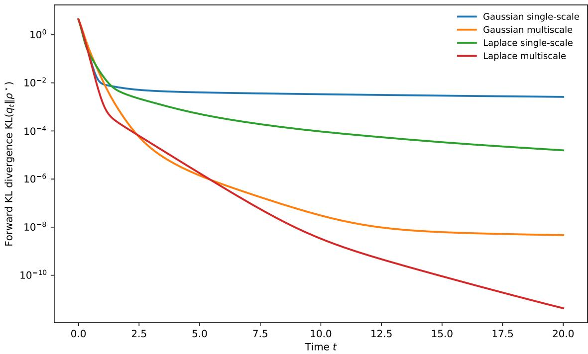
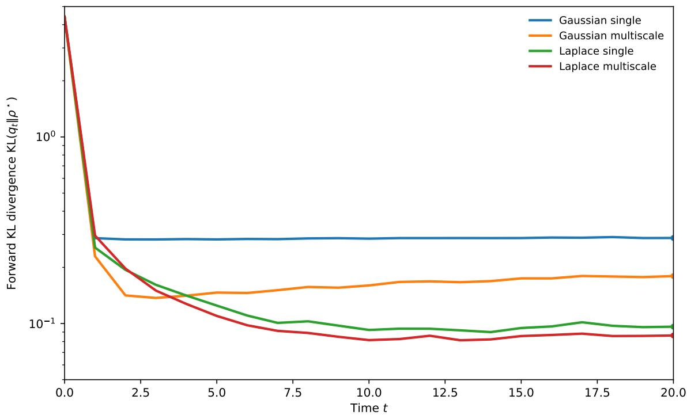
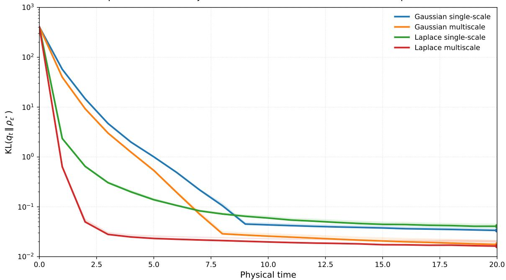
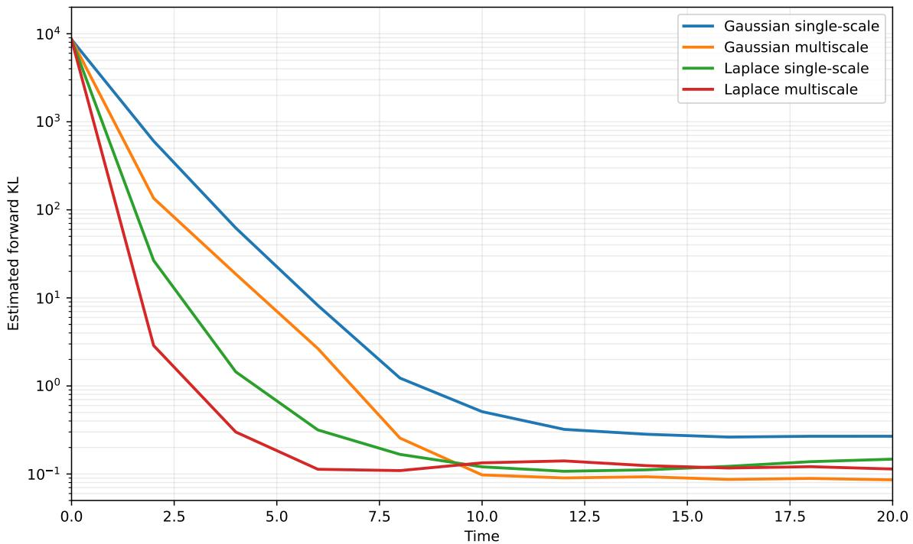

# Convergence rates for generative drifting flows: fixed-scale obstructions and multihead acceleration

Arthur Stéphanovitch Centre de recherche en économie et statistique ENSAE, IP Paris arthur.stephanovitch@ensae.fr

Eddie Aamari Département de Mathématiques et Applications CNRS, École Normale Supérieure, PSL eddie.aamari@ens.fr

September 15, 2026

## Abstract

Drifting models ofer a promising route to faster generative AI: they perform gradual transport during training, while generating new samples in a single step. This paper asks whether the underlying drifting process can converge rapidly to a target distribution under ideal conditions, before finite-data or optimization efects are introduced. We show that its convergence rate depends critically on how it handles spatial scale. With a single fixed resolution, fine-scale features of the target can become nearly invisible, leading to extremely slow convergence. We introduce a multihead approach that combines scale-normalized information across a continuum of resolutions. We prove that this multihead approach restores exponential convergence near standard reference distributions. These results identify fixed resolution as a key bottleneck and provide a simple route to faster one-step generative models.

## Contents

1 Introduction 23   
1.1 The drifting algorithm and its population limit   
1.2 Contributions and paper organization 7   
2 Slow convergence of fixed-bandwidth drifting flows on the torus 9   
2.1 Gaussian smoothing 10   
2.2 Laplace smoothing 13   
2.3 Heuristic extension to Gaussian initialization on Rd 15   
3 Continuum multihead drifting restores exponential convergence 16   
3.1 The multihead population field 16   
3.2 Fourier intuition: scale averaging creates a spectral gap 17   
3.3 Local exponential convergence for multihead heat drifting on the torus . 18   
3.4 Local exponential convergence for multihead Ornstein–Uhlenbeck drifting on $\mathbb { R } ^ { d }$ 19   
4 Numerical evidence for multihead acceleration 20   
4.1 Experimental design and common protocol 21   
4.2 A simple multiscale target . 21   
5 Conclusion and future directions 24   
5.1 Beyond local convergence 24   
5.2 From the population PDE to the true drifting algorithm 25

## 1 Introduction

Modern generative models, such as difusion and flow-matching, typically generate samples by numerically solving a stochastic or ordinary diferential equation over many sequential steps. Drifting models [1] take a diferent approach: they shift this iterative computation to training, while generation requires only a single forward pass. This separation between training and sampling makes the generation phase much faster. During training, the successive neural networks transport the model distribution along a path toward the target distribution. At inference time, however, a new sample does not need to retrace this path: it is generated by applying a learned transport map once.

Informally, drifting constructs this transport by repeatedly comparing the current model distribution with the target distribution. At each stage, a velocity field is obtained from a kernel-smoothed diference between the two distributions. The field attracts model particles toward regions of high target density while simultaneously repelling particles from one another. A neural network is then trained to approximate the corresponding short transport step, and these steps are accumulated during training.

Before studying finite-sample estimation, neural-network approximation, or optimization error, one must first determine whether the underlying population dynamics itself approaches the target at a fast rate. This leads to the central question of the paper:

Does the idealized drifting dynamics, in the infinite-data limit with no algorithmic error, converge to the target distribution exponentially fast?

This question matters for both theoretical and algorithmic reasons. The population flow is the best-case version of the method: if this idealized evolution is intrinsically slow, then increasing the dataset size or enlarging the neural network cannot remove the underlying obstruction. Moreover, the convergence rate of the flow determines the time horizon over which a practical algorithm must approximate it. A slowly converging flow requires more discretization steps to reach a prescribed accuracy, creating a longer interval over which time-discretization and learning errors must be controlled and may accumulate or be amplified.

We show that exponential convergence of the idealized drifting dynamics depends critically on how the dynamics treats spatial scales. During training, the choice of the kernel determines which diferences between the two distributions are visible to the velocity field. In particular, its bandwidth sets the spatial resolution of the comparison. A large bandwidth emphasizes broad diferences in mass, but smooths out fine structure. A small bandwidth reveals finer local diferences, but the resulting correction only acts over a small surrounding area. Classical drifting uses one fixed bandwidth and therefore observes the discrepancy between the model and the target at one prescribed resolution throughout the evolution.

The following informal statement summarizes our main theoretical result.

Theorem 1 (Informal). Classical fixed-bandwidth drifting dynamics does not admit a uniform exponential rate over natural classes of smooth targets. Averaging the drift over a continuum of bandwidths, while placing greater emphasis on the finer scales, removes this obstruction and yields local exponential convergence.

At the empirical level, this suggests a simple modification: compute the normalized drifting field at a finite collection of scales and average the resulting fields before the regression step. This finite-scale version does not inherit the continuum guarantee, but it approximates the same scale-averaging mechanism over the range of resolutions represented in a finite computation. The rest of the training procedure is unchanged. The analysis conducted in this paper explains why the continuum modification changes the convergence rate.

We work with two spatial settings for complementary purposes. On the torus Td, we develop the main intuition, construct counterexamples, and prove convergence results in a setting where compactness removes technical issues related to tails and behavior at infinity and makes the relevant Fourier structure particularly transparent. This allows us to isolate the mechanisms governing the convergence rate without obscuring them with additional analytic dificulties. We then establish the corresponding convergence theory on $\mathbb { R } ^ { d }$ , with a Gaussian reference measure and Ornstein–Uhlenbeck smoothing. While the torus provides a convenient and informative model setting, the Euclidean result is the one most directly relevant to the generative-modeling problem, where the state space is naturally unbounded.

## 1.1 The drifting algorithm and its population limit

Drifting generative models were introduced by Deng, Li, Li, Du and He [1] as a one-step alternative to difusion and flow-based generative models. Let π be a simple latent prior and let $f _ { \theta }$ be a generator. Its output distribution is the pushforward

$$
q _ { \theta } : = ( f _ { \theta } ) _ { \# } \pi .
$$

The generator is trained so that $q _ { \theta }$ matches the target law $\rho ^ { \star }$ . Since the target is observed only through data, the algorithm uses a finite training set

$$
Y _ { 1 } , \ldots , Y _ { n } \sim \rho ^ { \star } , \qquad { \widehat { \rho } } _ { n } ^ { \star } : = { \frac { 1 } { n } } \sum _ { j = 1 } ^ { n } \delta _ { Y _ { j } } .
$$

The training procedure is iterative. At each iteration, the current generator first produces a collection of samples. An attraction–repulsion field is then computed by comparing these generated samples with the data samples, and is used to construct drifted target points. Finally, the generator parameters are updated by fitting the generator to these targets. Repeating these steps progressively transports the generated distribution toward the data distribution.

## 1.1.1 The finite-sample drifting step.

At training iteration $\ell ,$ the current generator is $f _ { \theta _ { \ell } }$ . For simplicity, let us first write the full-batch version with n latent samples

$$
Z _ { 1 } , \dots , Z _ { n } \sim \pi , \qquad X _ { i } ^ { \ell } : = f _ { \theta _ { \ell } } ( Z _ { i } ) , \qquad { \widehat { q } } _ { \ell , n } : = { \frac { 1 } { n } } \sum _ { i = 1 } ^ { n } \delta _ { X _ { i } ^ { \ell } } .
$$

The points $Y _ { j }$ are the data samples, while $X _ { j } ^ { \ell }$ are the generated samples at step ℓ of the training. Given a nonnegative kernel $K _ { \sigma }$ , the algorithm compares a generated point x with these two clouds through the normalized weights

$$
a _ { j } ^ { \ell } ( x ) : = \frac { K _ { \sigma } ( x , Y _ { j } ) } { \sum _ { k = 1 } ^ { n } K _ { \sigma } ( x , Y _ { k } ) } , \qquad r _ { j } ^ { \ell } ( x ) : = \frac { K _ { \sigma } ( x , X _ { j } ^ { \ell } ) } { \sum _ { k = 1 } ^ { n } K _ { \sigma } ( x , X _ { k } ^ { \ell } ) } .\tag{1}
$$

The corresponding local attraction fields are

$$
m _ { \widehat { \rho _ { n } ^ { \star } } } ^ { \sigma } ( x ) : = \sum _ { j = 1 } ^ { n } a _ { j } ^ { \ell } ( x ) ( Y _ { j } - x ) , \qquad m _ { \widehat { q _ { \ell , n } } } ^ { \sigma } ( x ) : = \sum _ { j = 1 } ^ { n } r _ { j } ^ { \ell } ( x ) ( X _ { j } ^ { \ell } - x ) ,
$$

and the empirical drifting field is the diference between these two fields:

$$
\begin{array} { l } { { \displaystyle \widehat { V } _ { \ell , n } ^ { \sigma } ( x ) : = m _ { \widehat { \rho } _ { n } ^ { \star } } ^ { \sigma } ( x ) - m _ { \widehat { q } _ { \ell , n } } ^ { \sigma } ( x ) } } \\ { { \displaystyle \ = \sum _ { j = 1 } ^ { n } a _ { j } ^ { \ell } ( x ) ( Y _ { j } - x ) - \sum _ { j = 1 } ^ { n } r _ { j } ^ { \ell } ( x ) ( X _ { j } ^ { \ell } - x ) . } } \end{array}\tag{2}
$$

The first term pulls x toward nearby data points, and the second term pushes x away from nearby generated points. When the positive and negative empirical distributions coincide, these two terms are identical and the drift vanishes.

The drift is then turned into a regression target. For each generated sample $X _ { i } ^ { \ell }$ , define

$$
\begin{array} { r } { \widehat { X } _ { i } ^ { \ell , \mathrm { d r i f t } } : = X _ { i } ^ { \ell } + \tau _ { \ell } \widehat { V } _ { \ell , n } ^ { \sigma } ( X _ { i } ^ { \ell } ) , } \end{array}
$$

where $\tau _ { \ell } > 0$ is a drift scale, often absorbed into the definition of the field. The next network is trained to map the same latent variables toward these new points:

$$
\theta _ { \ell + 1 } \approx \mathop { \mathrm { a r g m i n } } _ { \theta } { \frac { 1 } { n } } \sum _ { i = 1 } ^ { n } \| f _ { \theta } ( Z _ { i } ) - \widehat { X } _ { i } ^ { \ell , \mathrm { d r i f t } } \| ^ { 2 } .
$$

In practice one does not usually use the whole dataset at every iteration. One draws a mini-batch of data samples and a mini-batch of latent variables, computes the same weights and targets inside the batch, and performs an SGD step. In image experiments, the kernel may also be evaluated after a feature extractor, possibly at several scales and spatial locations. These implementation choices change how the finite sums in (1) are computed, but they do not change the basic structure: data attraction plus repulsion among generated particles, followed by regression of a transport map from latent samples to the new drifted points.

This explains the diference with difusion or flow-based models. Difusion and flow models move a sample through many inference-time updates. Drifting models instead use the many optimization steps of training to move the pushforward distribution $q _ { \theta _ { \ell } }$ . After training, generation is still a single forward pass $z \mapsto f _ { \theta _ { L } } ( z )$ The intermediate parameters $\theta _ { 1 } , \ldots , \theta _ { L - 1 }$ are used only during training and are not traversed when a new sample is generated.

## 1.1.2 The population version.

This paper studies the idealized dynamics obtained by removing three finite-sample efects: the finite dataset, the mini-batch approximation, and the finite optimization step. Formally, the empirical measures $\widehat { \rho } _ { n } ^ { \star }$ and ${ \widehat { q } } _ { \ell , n }$ are replaced by the target density $\rho ^ { \star }$ and the current density $q ,$ and the discrete training iteration is replaced by a continuous transport equation.

For a probability density $\rho ,$ define the population local attraction field

$$
m _ { \rho } ^ { \sigma } ( x ) : = \frac { \int K _ { \sigma } ( x , y ) ( y - x ) \rho ( y ) \mathrm { d } y } { \int K _ { \sigma } ( x , y ) \rho ( y ) \mathrm { d } y } .
$$

The population analogue of (2) is then

$$
V _ { \rho ^ { \star } , q } ^ { \sigma } ( x ) : = m _ { \rho ^ { \star } } ^ { \sigma } ( x ) - m _ { q } ^ { \sigma } ( x ) .
$$

The population dynamics associated with drifting is obtained by transporting the current model density along this field. If $q _ { t }$ denotes the idealized model density at training time $t ,$ then the formal velocity is

$$
v _ { t } ( x ) = V _ { \rho ^ { \star } , q _ { t } } ^ { \sigma } ( x ) ,
$$

and $q _ { t }$ evolves through the continuity equation

$$
\begin{array} { r } { \partial _ { t } q _ { t } + \nabla \cdot ( q _ { t } v _ { t } ) = 0 . } \end{array}\tag{3}
$$

The goal of this paper is to study the convergence of the solution $q _ { t }$ to $( 3 )$ toward the target distribution $\rho ^ { \star }$ , to identify the limitations of the fixed-bandwidth dynamics, and to introduce a multihead modification with improved convergence rates.

## 1.1.3 Comparing convergence rates of continuous flows

Before comparing two drifting equations, one has to specify what is meant by a “rate of convergence” for a PDE. If $( \rho _ { t } ) _ { t \geq 0 }$ converges to $\rho ^ { \star }$ and $\phi : [ 0 , \infty )  [ 0 , \infty )$ is increasing, then $\widetilde { \rho } _ { t } = \rho _ { \phi ( t ) }$ has the same image as $\left( \rho _ { t } \right)$ , but a diferent speed. With a fast enough time change, a logarithmic decay can be made to look exponential. Thus, a rate is meaningful only after specifying the time parameter with respect to which the dynamics is defined.

For an autonomous population rule, this time parameter is part of the rule. A population drifting method is specified by an autonomous vector-field rule. Given a target measure $\rho ^ { \star }$ and a current density $q ,$ a formulation A assigns a velocity field $V _ { \mathsf { A } } [ \rho ^ { \star } , q ]$ , and the corresponding population equation is

$$
\begin{array} { r } { \partial _ { t } q _ { t } + \nabla \cdot \left( q _ { t } V _ { \mathsf { A } } [ \rho ^ { \star } , q _ { t } ] \right) = 0 . } \end{array}
$$

Let $S _ { t } ^ { \mathsf { A } , \rho ^ { \star } }$ denote the solution map, i.e.

$$
q _ { t } = S _ { t } ^ { \mathsf { A } , \rho ^ { \star } } ( q _ { 0 } ) .
$$

Because $V _ { \mathsf { A } }$ does not depend explicitly on time, the maps $( S _ { t } ^ { \mathsf { A } , \rho ^ { \star } } ) _ { t \geq 0 }$ have the semigroup property

$$
S _ { t + s } ^ { \mathsf { A } , \rho ^ { \star } } = S _ { t } ^ { \mathsf { A } , \rho ^ { \star } } \circ S _ { s } ^ { \mathsf { A } , \rho ^ { \star } } .
$$

The semigroup property rules out arbitrary time changes. Suppose that $T _ { t } : = S _ { \phi ( t ) } ^ { \mathsf { A } , \rho ^ { \star } }$ , then $( T _ { t } ) _ { t \geq 0 }$ is again a semigroup only if $\phi ( t + s ) = \phi ( t ) + \phi ( s )$ . Under the usual continuity assumption, this forces

$$
\phi ( t ) = c t
$$

for some constant $c \geq 0$ . Thus the only reparametrizations compatible with the autonomous-flow structure are constant changes of units. A nonlinear time change produces instead

$$
\frac { d } { d t } q _ { \phi ( t ) } = \phi ^ { \prime } ( t ) F ( q _ { \phi ( t ) } ) ,
$$

where F denotes the autonomous right-hand side of the original PDE. This is a diferent equation: it is non-autonomous and contains a prescribed time-dependent multiplier. Let us make the convention explicit.

Definition 1 (Convergence rates for semigroups). Let P be a target class, let $q _ { 0 }$ be the initialization, and let Err be an error functional such as relative entropy or Wasserstein distance. For an autonomous formulation A, define the worst-case population-flow error by

$$
R _ { \mathsf { A } } ( t ) : = \operatorname* { s u p } _ { \rho ^ { \star } \in \mathcal { P } } \mathrm { E r r } \big ( S _ { t } ^ { \mathsf { A } , \rho ^ { \star } } q _ { 0 } , \rho ^ { \star } \big ) .
$$

A convergence rate for the PDE is an estimate on $R _ { \mathsf { A } } ( t )$ in the canonical time of the semigroup $S _ { t } ^ { \mathsf { A } , \rho ^ { \star } }$

With this convention, a natural benchmark is exponential convergence. For many gradient flows, such a rate follows from suitable convexity assumptions or from an inequality that controls the decay of the energy [2, 3]. A bound of the form

$$
R _ { \mathsf { A } } ( t ) \leq C e ^ { - c t }
$$

means that the time required to reach an error level ε grows only logarithmically with $1 / \varepsilon$ . For a stable numerical discretization, this is the behavior one would hope for in practice. Indeed, the more time the continuous flow needs to reach a prescribed accuracy, the more discretization steps are required and the longer the time interval over which discretization, statistical, and map-learning errors must be controlled. We therefore ask whether drifting converges exponentially in its canonical time.

Remark 1 (Drifting is not a Wasserstein gradient flow). Several recent works relate drifting to Wasserstein gradient flows or to approximations of such flows $[ 4 , \ 5 , \ 6 ] .$ . These interpretations do not, however, provide an exact gradient-flow formulation of the autonomous drifting equation studied here. Depending on the formulation, the smoothing is applied diferently or the velocity field is frozen during one update.

In Appendix C.3, we prove that, at any positive smoothing scale, the Gaussian Drifting field cannot be the first variation of any $C ^ { 2 }$ functional on smooth positive densities. Consequently, the corresponding drifting dynamics are not the Wasserstein gradient flow of such an energy. Exponential convergence therefore does not follow from the standard gradient-flow theory and must be established, or ruled out, by analyzing the drifting equation directly.

## 1.1.4 Notation

Throughout the paper, $d \geq 1$ denotes the ambient dimension and ${ \ N } _ { 0 } : = \{ 0 , 1 , 2 , . . . \}$ . For a multi-index $\kappa = ( \kappa _ { 1 } , \ldots , \kappa _ { d } ) \in  { \mathbb { N } } _ { 0 } ^ { d }$ , we write $| \kappa | : = \kappa _ { 1 } + \cdot \cdot \cdot + \kappa _ { d }$ and $\partial ^ { \kappa } : = \partial _ { 1 } ^ { \kappa _ { 1 } } \cdot \cdot \cdot \partial _ { d } ^ { \kappa _ { d } }$ . The Euclidean norm and inner product are denoted by $| \cdot |$ and ·, respectively. The flat torus is

$$
 { \mathbb { T } } ^ { d } : = (  { \mathbb { R } } / 2 \pi  { \mathbb { Z } } ) ^ { d } ,
$$

and is always equipped with normalized Lebesgue measure; in particular, $\textstyle \int _ { \mathbb { T } ^ { d } } 1 \mathrm { d } x = 1$ . On $\mathbb { R } ^ { d }$ , dx denotes ordinary Lebesgue measure, while $\gamma$ denotes the standard Gaussian probability measure. The symbol $d _ { D }$ denotes the Euclidean distance when $D = \mathbb { R } ^ { d }$ and the geodesic distance when $D =  { \mathbb { T } } ^ { d }$

For simplicity, throughout the manuscript we identify probability densities with the probability measures they represent whenever the reference measure is clear. Thus, for example, a density $q$ on $\mathbb { T } ^ { d }$ also denotes the measure q dx, and a density $q$ relative to $\gamma$ also denotes $q \mathrm { d } \gamma$ . We write $T _ { \# } \mu$ for the pushforward of $\mathrm { a }$ measure $\mu$ by a measurable map $T , \delta _ { x }$ for the Dirac mass at $x ,$ , and $\Pi ( \mu , \nu )$ for the set of couplings of $\mu$ and $\nu .$ If $\mu \ll \nu _ { \mathrm { : } }$ , then

$$
{ \mathrm { K L } } ( \mu \mid \nu ) : = \int \log \left( { \frac { { \mathrm { d } } \mu } { { \mathrm { d } } \nu } } \right) { \mathrm { d } } \mu ,
$$

with the value $+ \infty$ when $\mu \ll \nu$ . The quadratic Wasserstein distance is

$$
W _ { 2 } ^ { 2 } ( \mu , \nu ) : = \operatorname* { i n f } _ { \pi \in \Pi ( \mu , \nu ) } \int d _ { D } ( x , y ) ^ { 2 } \mathrm { d } \pi ( x , y ) .
$$

For a positive density $\rho ,$ its score is $\nabla$ log $\rho .$

For an integrable function f and a probability measure $\mu ,$ we use

$$
\mathbb { E } _ { \mu } [ f ] : = \int f \mathrm { d } \mu , \quad \quad \mathrm { V a r } _ { \mu } ( f ) : = \mathbb { E } _ { \mu } \left[ ( f - \mathbb { E } _ { \mu } f ) ^ { 2 } \right] ,
$$

and, for vector-valued $F , G$ of compatible dimensions,

$$
\operatorname { C o v } _ { \mu } ( F , G ) : = \mathbb { E } _ { \mu } [ F \otimes G ] - \mathbb { E } _ { \mu } [ F ] \otimes \mathbb { E } _ { \mu } [ G ] .
$$

We write $\| \cdot \| _ { L ^ { p } ( \mu ) }$ for the usual $L ^ { p }$ norm, $\operatorname { L i p } ( f )$ for the Lipschitz seminorm, and $\operatorname { o s c } ( f ) : = \operatorname* { s u p } f - \operatorname* { i n f } f$ Convolution on either $\mathbb { R } ^ { d }$ or $\mathbb { T } ^ { d }$ is normalized according to the corresponding reference measure:

$$
( f * g ) ( x ) : = \int f ( x - y ) g ( y ) \mathrm { d } y .
$$

On $\mathbb { T } ^ { d }$ we use the Fourier convention

$$
e _ { n } ( x ) : = e ^ { i n \cdot x } , \qquad { \widehat { f } } ( n ) : = \int _ { \mathbb { T } ^ { d } } f ( x ) e ^ { - i n \cdot x } \mathrm { d } x , \qquad n \in \mathbb { Z } ^ { d } ,
$$

so that $\begin{array} { r } { f = \sum _ { n \in \mathbb { Z } ^ { d } } \widehat { f } ( n ) e _ { n } } \end{array}$ whenever the series is classically meaningful. The heat semigroup is denoted by $P _ { s } : = e ^ { s \Delta } ;$ hence $P _ { s } e _ { n } = e ^ { - s | n | ^ { 2 } } e _ { n }$ on $\mathbb { T } ^ { d } .$ . In the Gaussian-reference setting, $Q _ { s } : = e ^ { s L _ { \gamma } }$ denotes the Ornstein–Uhlenbeck semigroup with generator $L _ { \gamma } : = \Delta - x \cdot \nabla$

For $\eta > 0$ , set

$$
m _ { \eta } : = \operatorname* { m a x } \{ m \in \mathbb { N } _ { 0 } : m < \eta \} .
$$

If $f = ( f _ { 1 } , \ldots , f _ { r } ) : D \to \mathbb { R } ^ { r }$ , where $D \in \{ \mathbb { R } ^ { d } , \mathbb { T } ^ { d } \}$ , define

$$
\| f \| _ { \mathcal { H } ^ { \eta } ( D ) } : = \operatorname* { m a x } _ { 1 \leq j \leq r } \left\{ \sum _ { 0 \leq | \kappa | \leq m _ { \eta } } \| \partial ^ { \kappa } f _ { j } \| _ { L ^ { \infty } ( D ) } + \sum _ { | \kappa | = m _ { \eta } } \operatorname* { s u p } _ { x \neq y } \frac { | \partial ^ { \kappa } f _ { j } ( x ) - \partial ^ { \kappa } f _ { j } ( y ) | } { d _ { D } ( x , y ) ^ { \eta - m _ { \eta } } } \right\} .
$$

For vector and tensor fields, the norm is understood componentwise, and the domain is omitted from the notation when it is clear from context. In particular, $\mathcal { H } ^ { 1 } = C ^ { 0 , 1 }$ and $\mathcal { H } ^ { 2 } = C ^ { 1 , 1 }$ under this convention. We write

$$
\mathcal H _ { C } ^ { \eta } ( D ; \mathbb R ^ { r } ) : = \left\{ f : D \to \mathbb R ^ { r } : \| f \| _ { \mathcal H ^ { \eta } ( D ) } \leq C \right\} ,
$$

and omit $\mathbb { R } ^ { r }$ when $r = 1$

Finally, $A \lesssim _ { \theta }$ B means that $A \leq C _ { \theta } B$ for a constant $C _ { \theta }$ depending only on the displayed parameters $\theta ;$ $A \gtrsim _ { \theta } B$ has the analogous meaning, and $A \asymp _ { \theta } B$ means that both inequalities hold. Constants denoted by c or $C$ may change from line to line, and their subscripts record the parameters on which they are allowed to depend.

## 1.2 Contributions and paper organization

## 1.2.1 Main results

To the best of our knowledge, this work provides the first explicit convergence-rate results for the full nonlinear population dynamics underlying drifting. Previous analyses identified a slowdown through linearized or frozen-field calculations; here we establish rate statements for the nonlinear equation itself, uniformly over natural classes of targets. The population dynamics assumes infinite data and no approximation or optimization error. Slow convergence at this level is therefore an intrinsic limitation of classical drifting, rather than an artifact of implementation.

Classical fixed-bandwidth drifting is intrinsically slow. We first prove quantitative lower bounds showing that a single fixed bandwidth cannot correct discrepancies at all spatial scales rapidly. For Gaussian drifting on the d-dimensional torus, Proposition 1 shows that, for every dimension $d \geq 1$ and every regularity exponent $\beta > 0$ , the worst-case error over a bounded $\mathcal { H } ^ { \beta }$ class of target potentials satisfies

$$
\operatorname* { s u p } _ { \rho ^ { \star } \in \mathcal { H } _ { C } ^ { \beta } ( \mathbb { T } ^ { d } ) } \mathrm { K L } ( q _ { t } \mid \rho ^ { \star } ) \stackrel { > } { \sim } ( \log t ) ^ { - \beta } .
$$

Thus no polynomial, and hence no exponential, convergence rate can hold uniformly over finite-smoothness target classes. For the original Laplace displacement field, Proposition 2 gives, for every $\beta > 0$

$$
\operatorname* { s u p } _ { \rho ^ { \star } \in \mathcal { H } _ { C } ^ { \beta } ( \mathbb { T } ^ { d } ) } \mathrm { K L } ( q _ { t } \mid \rho ^ { \star } ) \gtrsim \left( 1 + \frac { t } { \tau ^ { d + 1 } } \right) ^ { - 2 \beta / ( d + 1 ) } .
$$

The Laplace field is less severely afected than the Gaussian field, but no uniform rate faster than polynomial can hold over these target classes.

Together, these results give a nonlinear and quantitative explanation for why classical fixed-bandwidth drifting can be prohibitively slow: suficiently fine discrepancies remain only weakly corrected, regardless of how accurately the population field is evaluated.

Multihead drifting restores fast convergence. We then introduce multihead drifting, an autonomous dynamics that averages ordinary drifting fields over a range of smoothing scales. The method allows the flow to correct coarse and fine discrepancies simultaneously, without committing to a single bandwidth and without annealing the bandwidth over time. At the empirical level, it can be implemented by averaging standard drifting fields evaluated at a finite collection of scales.

Theorems 2 and 3 show that this modification changes the qualitative convergence behavior. For smooth targets $\rho ^ { \star }$ suficiently close to the uniform law on the torus or to the standard Gaussian law on $\mathbb { R } ^ { d }$ , the multihead flow converges exponentially:

$$
{ \mathrm { K L } } ( q _ { t } \mid \rho ^ { \star } ) \lesssim e ^ { - 2 c t } .
$$

This is the main contrast of the paper: fixed-bandwidth drifting sufers logarithmic or polynomial worst-case obstructions, whereas the proposed multihead dynamics restores exponential convergence, at least locally.

Evidence beyond the perturbative theory. Finally, the numerical study tests the same mechanism outside the local regime. Section 4 presents Experiment 1, a controlled smooth target in $\mathbb { R } ^ { 2 }$ studied at both the population-PDE and finite-data levels. We report in Appendix A two more complex finite-data tests, a regularized curve-supported target and a high-dimensional stratified target in $\mathbb { R } ^ { 2 0 }$ . Across all three settings, a small collection of well-placed scales yields a better distributional match at the same, suggesting that the multihead advantage persists for irregular and high-dimensional targets.

## 1.2.2 Related work

Drifting models were introduced by Deng et al. [1] as a training-time transport mechanism for one-step generation. Several recent papers explain the structure of this field. For Gaussian kernels, the population drift is, up to a constant time scaling, the diference between the scores of Gaussian-smoothed target and model densities [7, 5, 4]. The long–short flow-map interpretation of Li and Zhu [8] gives a complementary derivation from a short terminal transport step.

For non-Gaussian displacement kernels, the geometry is more delicate. Franz et al. [9] show that the original normalized field is not in general a gradient field and identify the Gaussian as the exceptional radial case; they also propose a sharp normalization that restores a potential structure. Esteban-Casadevall et al. [10] replace Euclidean displacement directions by kernel gradients, obtaining a score-diference field for general characteristic kernels. For the original displacement construction, Lee [11] prove identifiability for a companion-elliptic family containing Gaussian and Laplace kernels, while also showing that a smal field alone does not prevent escape of mass. He et al. [12] replace one-sided normalization by two-sided Sinkhorn scaling, which produces a related identifiable attraction–repulsion dynamics.

Several works connect drifting to variational transport. Cao et al. [4] derive KDE-based procedures from Wasserstein gradient flows of approximated divergences. Gretton et al. [6] distinguish the proposed and implemented Gaussian updates and relate them to fixed points of smoothed-divergence flows. Turan et al. [5] give a frozen-field variational interpretation and use a linearized Fourier analysis to expose the high-frequency bottleneck of a fixed Gaussian bandwidth. The exact placement of the smoothing operator is important, however. As explained in Subsection 2.1 and proved in Appendix C.3, the plug-in map

$$
q \longmapsto \log { \frac { G _ { \sigma } * q } { G _ { \sigma } * \rho ^ { \star } } }
$$

is not the first variation of the smoothed relative entropy, and at positive scale it is not the first variation of any $C ^ { 2 }$ energy on smooth positive densities. We therefore analyze the autonomous transport equation directly rather than relying on an exact energy-dissipation identity.

The closest prior convergence analysis is Turan et al. [5]. Their mode-by-mode calculation predicts exponentially large time scales for high frequencies under a fixed Gaussian bandwidth and motivates a bandwidth that decreases with time. Our lower bounds establish the corresponding obstruction for the full nonlinear autonomous equation and uniformly over finite-smoothness target classes. Our remedy is also diferent: rather than annealing one bandwidth, we use one time-independent vector field that averages a continuum of scales.

Brown et al. [13] propose second-order drifting models to accelerate the recovery of fine-scale structure. They add momentum to the sample dynamics through auxiliary velocities and time-dependent damping, and connect the resulting evolution to Nesterov’s accelerated optimization. Their theoretical analysis is local around equilibrium: after linearizing the population dynamics and approximating the target as locally flat, they show that each Fourier mode follows a Nesterov-type second-order ODE. This connects their dynamics to the classical $\mathcal { O } ( t ^ { - 2 } )$ convergence rate for the associated quadratic objective, rather than providing a rate for the full nonlinear evolution.

Our results strengthen this convergence picture at the level of the full nonlinear population dynamics. We establish quantitative fixed-bandwidth lower bounds for both Gaussian and Laplace kernels, uniformly over classes of targets with finite smoothness. By contrast, our multihead construction accelerates convergence by combining several kernel scales in the drift, including increasingly fine scales, while keeping the dynamics first-order and time-independent. We prove exponential convergence of the resulting nonlinear flow near the uniform law on the torus and the standard Gaussian law on $\mathbb { R } ^ { d }$ (Theorems 2 and 3). The gain is therefore a distribution-level convergence guarantee that remains efective at fine scales, beyond the linearized mode-by-mode description.

The finite-particle results of Balasubramanian [14] address a complementary layer of the problem. They give continuous-time bounds for conservative KDE-gradient dynamics and for the original non-conservative Laplace field, with explicit particle, bandwidth, occupancy, and quadrature efects. Such residual-velocity and particle-number estimates do not by themselves yield a uniform physical-time rate to the target without a coercive population estimate. The present paper supplies this missing population-rate analysis for fixed bandwidths and a local coercive mechanism for the multihead flow. Finally, Dumont et al. [15] prove long-time convergence for a constrained gradient flow on transport maps under convexity assumptions; that evolution is distinct from the original attraction–repulsion population equation studied here.

Organization. Section 2 proves the fixed-bandwidth Gaussian and Laplace lower bounds and gives their Fourier interpretation. Section 3 introduces the multihead field and proves local exponential convergence for the heat and Ornstein–Uhlenbeck models. Section 4 presents a numerical study of a smooth multiscale target, both at the population-PDE and finite-data levels. Two additional, more complex finite-data experiments are reported in Appendix A. The remaining appendices contain the fixed-bandwidth wellposedness argument, the lower-bound proofs, a variational non-integrability example, and the nonlinear estimates for the multihead flow.

## 2 Slow convergence of fixed-bandwidth drifting flows on the torus

This section shows that a fixed positive bandwidth can severely limit the convergence of drifting flows, even at the population level with exact expectations. On the torus, this obstruction is particularly transparent in Fourier variables: smoothing suppresses high-frequency discrepancies before the drift is computed, so the corresponding damping rates vanish as the frequency increases. We turn this mechanism into nonlinear lower bounds over bounded finite-smoothness classes of target densities.

## 2.1 Gaussian smoothing

In the case of Gaussian smoothing, the drifting field can be written using the scores of the smoothed densities. Recall that, for a positive density $\rho ,$ its score corresponds to the field $\nabla$ log $\rho .$

Let

$$
G _ { \sigma } ( z ) \propto \exp \left( - \frac { | z | ^ { 2 } } { 2 \sigma ^ { 2 } } \right) , \qquad \rho _ { \sigma } : = G _ { \sigma } * \rho .
$$

Since

$$
\nabla _ { x } G _ { \sigma } ( x - y ) = \frac { y - x } { \sigma ^ { 2 } } G _ { \sigma } ( x - y ) ,
$$

we obtain

$$
\nabla \rho _ { \sigma } ( x ) = { \frac { 1 } { \sigma ^ { 2 } } } \int G _ { \sigma } ( x - y ) ( y - x ) \rho ( y ) \mathrm { d } y .
$$

Dividing by $\rho _ { \sigma } ( x )$ gives

$$
\frac { \int G _ { \sigma } ( x - y ) ( y - x ) \rho ( y ) \mathrm { d } y } { \int G _ { \sigma } ( x - y ) \rho ( y ) \mathrm { d } y } = \sigma ^ { 2 } \nabla \log \rho _ { \sigma } ( x ) .
$$

Thus, by the definition of the drifting field,

$$
V _ { \rho ^ { \star } , q } ^ { \sigma } = \sigma ^ { 2 } \left( \nabla \log \rho _ { \sigma } ^ { \star } - \nabla \log q _ { \sigma } \right) = - \sigma ^ { 2 } \nabla \log \frac { q _ { \sigma } } { \rho _ { \sigma } ^ { \star } } .
$$

Because convolution with $G _ { \sigma }$ agrees with the heat semigroup $P _ { \sigma ^ { 2 } / 2 }$ , the continuity equation can therefore be written as

$$
\partial _ { t } q _ { t } = \sigma ^ { 2 } \nabla \cdot \left( q _ { t } \nabla \log \frac { P _ { \sigma ^ { 2 } / 2 } q _ { t } } { P _ { \sigma ^ { 2 } / 2 } \rho ^ { \star } } \right) .
$$

The same computation holds on the torus using the periodic Gaussian kernel. This is the score formulation used in the next subsection.

## 2.1.1 A logarithmic lower bound

We state the obstruction on the flat torus $ { \mathbb { T } ^ { d } } = (  { \mathbb { R } } / 2 \pi  { \mathbb { Z } } ) ^ { d }$ , equipped with normalized Lebesgue measure. For a bounded potential $a :  { \mathbb { T } } ^ { d } \to  { \mathbb { R } }$ , set

$$
\rho _ { a } ^ { \star } ( x ) : = \frac { e ^ { a ( x ) } } { \int _ {  { \mathbb { T } } ^ { d } } e ^ { a ( y ) } \mathrm { d } y } .
$$

For a fixed bandwidth $\sigma > 0$ , let $q _ { t } ^ { a }$ solve the Gaussian drifting equation

$$
\partial _ { t } q _ { t } ^ { a } = \sigma ^ { 2 } \nabla \cdot \left( q _ { t } ^ { a } \nabla \log \frac { P _ { \sigma ^ { 2 } / 2 } q _ { t } ^ { a } } { P _ { \sigma ^ { 2 } / 2 } \rho _ { a } ^ { \star } } \right) , \qquad q _ { 0 } ^ { a } \equiv 1 ,\tag{4}
$$

where $P _ { s } = e ^ { s \Delta }$ is the heat semigroup on $\mathbb { T } ^ { d }$

Proposition 1 (Fixed-bandwidth Gaussian smoothing is logarithmically slow). Let $\beta > 0 , \sigma > 0$ and $C > 0$ . Then there exists a constant $c > 0$ such that for all $t \geq 2$

$$
\operatorname* { s u p } _ { a \in \mathcal { H } _ { C } ^ { \beta } ( \mathbb { T } ^ { d } ) } \mathrm { K L } ( q _ { t } ^ { a } \mid \rho _ { a } ^ { \star } ) \geq c ( \log t ) ^ { - \beta } .\tag{5}
$$

Moreover,

$$
\operatorname* { s u p } _ { a \in \mathcal { H } _ { C } ^ { \beta } ( \mathbb { T } ^ { d } ) } W _ { 2 } ( q _ { t } ^ { a } , \rho _ { a } ^ { \star } ) \geq c ( \log t ) ^ { - ( \beta + 1 ) / 2 } .\tag{6}
$$

The proof of Proposition 1 can be found in Section C.1. Since $a \in \mathcal { H } _ { C } ^ { \beta } ( \mathbb { T } ^ { d } )$ is uniformly bounded, the map

$$
a \longmapsto \rho _ { a } ^ { \star } : = { \frac { e ^ { a } } { \int _ {  { \mathbb { T } } ^ { d } } e ^ { a } \mathrm { d } x } }
$$

identifies this class, up to changes in the radius, with a bounded $\mathcal { H } ^ { \beta }$ class of probability densities that are uniformly bounded above and away from zero. Thus, the lower bound can equivalently be interpreted as a worst-case statement over a finite-regularity class of target densities.

## 2.1.2 Fourier intuition

To give some intuition on the result, we explain the fixed-bandwidth obstruction for the linearized equation in the simplest case, where the target is the flat density $\rho ^ { \star } \equiv 1$ . We use the Fourier convention

$$
e _ { n } ( x ) = e ^ { i n \cdot x } , \qquad n \in \mathbb { Z } ^ { d } ,
$$

so that

$$
\Delta e _ { n } = - | n | ^ { 2 } e _ { n } , \qquad { \cal P } _ { s } e _ { n } = e ^ { - s | n | ^ { 2 } } e _ { n } .
$$

For Gaussian drifting with bandwidth $\sigma > 0$ , set $\begin{array} { r } { s _ { \sigma } : = \frac { \sigma ^ { 2 } } { 2 } } \end{array}$ . Since $\rho ^ { \star } \equiv 1$ , the fixed-bandwidth Gaussian drifting equation becomes

$$
\partial _ { t } q _ { t } = \sigma ^ { 2 } \nabla \cdot ( q _ { t } \nabla \log P _ { s _ { \sigma } } q _ { t } ) .\tag{7}
$$

We linearize this equation around the equilibrium $q \equiv 1$ . Write

$$
q _ { t } = 1 + u _ { t } , \qquad \int _ {  { \mathbb { T } } ^ { d } } u _ { t } ( x ) \mathrm { d } x = 0 ,
$$

with $u _ { t }$ small. Since $P _ { s _ { \sigma } } 1 = 1$ , one has $P _ { s _ { \sigma } } q _ { t } = 1 + P _ { s _ { \sigma } } u _ { t }$ . Therefore

$$
\log P _ { s \sigma } q _ { t } = \log ( 1 + P _ { s \sigma } u _ { t } ) = P _ { s \sigma } u _ { t } + O ( u _ { t } ^ { 2 } ) .
$$

Moreover,

$$
q _ { t } \nabla \log P _ { s _ { \sigma } } q _ { t } = ( 1 + u _ { t } ) \nabla ( P _ { s _ { \sigma } } u _ { t } + O ( u _ { t } ^ { 2 } ) ) = \nabla P _ { s _ { \sigma } } u _ { t } + O ( u _ { t } ^ { 2 } ) .
$$

Keeping only the linear terms in (7) gives

$$
\partial _ { t } u _ { t } = \sigma ^ { 2 } \Delta P _ { s _ { \sigma } } u _ { t } .\tag{8}
$$

Now decompose $u _ { t }$ into Fourier modes:

$$
u _ { t } ( x ) = \sum _ { n \in \mathbb { Z } ^ { d } \setminus \{ 0 \} } \widehat { u } _ { t } ( n ) e _ { n } ( x ) .
$$

The zero mode is absent because $u _ { t }$ has mean zero. For each $n \neq 0$

$$
\Delta P _ { s _ { \sigma } } e _ { n } = - | n | ^ { 2 } e ^ { - s _ { \sigma } | n | ^ { 2 } } e _ { n } .
$$

Thus (8) becomes, mode by mode,

$$
\frac { \mathrm { d } } { \mathrm { d } t } \widehat { u } _ { t } ( n ) = - \lambda _ { \sigma } ( n ) \widehat { u } _ { t } ( n ) ,
$$

where

$$
\lambda _ { \sigma } ( n ) : = \sigma ^ { 2 } | n | ^ { 2 } e ^ { - s _ { \sigma } | n | ^ { 2 } } = \sigma ^ { 2 } | n | ^ { 2 } \exp \left( - \frac { \sigma ^ { 2 } | n | ^ { 2 } } { 2 } \right) .
$$

Consequently,

$$
\widehat { u } _ { t } ( n ) = e ^ { - \lambda _ { \sigma } ( n ) t } \widehat { u } _ { 0 } ( n ) .
$$

The key point is the high-frequency behavior of $\lambda _ { \sigma } ( n )$

$$
\lambda _ { \sigma } ( n ) = \sigma ^ { 2 } | n | ^ { 2 } e ^ { - \sigma ^ { 2 } | n | ^ { 2 } / 2 } \longrightarrow 0 \qquad \mathrm { a s } | n |  \infty .
$$

Thus the linearized fixed-bandwidth Gaussian operator has no spectral gap:

$$
\operatorname* { i n f } _ { n \in \mathbb { Z } ^ { d } \backslash \{ 0 \} } \lambda _ { \sigma } ( n ) = 0 .
$$

A high-frequency perturbation of $q _ { t }$ is almost erased by the heat operator $P _ { s _ { \sigma } }$ before the drift is computed. The transport field therefore sees the mode only through the tiny factor $e ^ { - \sigma ^ { 2 } | n | ^ { 2 } / 2 }$ , and the corresponding damping rate is exponentially small in $| n | ^ { 2 }$

For example, take a perturbation along the first coordinate,

$$
u _ { 0 } ( x ) = \varepsilon _ { n } \sin ( n x _ { 1 } ) , \qquad \varepsilon _ { n } = n ^ { - \beta } .
$$

Then the linearized solution is

$$
u _ { t } ( x ) = \varepsilon _ { n } e ^ { - \lambda _ { \sigma } ( n \mathbf { e } _ { 1 } ) t } \sin ( n x _ { 1 } ) ,
$$

where $\mathbf { e } _ { 1 } = ( 1 , 0 , \ldots , 0 )$ . The time scale needed to damp this mode is

$$
\lambda _ { \sigma } ( n { \bf e } _ { 1 } ) ^ { - 1 } = \frac { 1 } { \sigma ^ { 2 } n ^ { 2 } } \exp \left( \frac { \sigma ^ { 2 } n ^ { 2 } } { 2 } \right) .
$$

At a given time t, choose the frequency $n _ { t }$ so that $t \lambda _ { \sigma } ( n _ { t } \mathbf { e } _ { 1 } ) \lesssim 1$ . Equivalently,

$$
n _ { t } \asymp _ { \sigma } \sqrt { \log t } ,
$$

up to harmless logarithmic corrections from the polynomial factor $n _ { t } ^ { 2 }$ . For this choice of frequency, the mode has not yet been substantially damped by time t. Its remaining amplitude is still of order

$$
n _ { t } ^ { - \beta } \asymp ( \log t ) ^ { - \beta / 2 } .
$$

For this choice of frequency, the mode has not yet been substantially damped by time t, and therefore

$$
\| u _ { t } \| _ { L ^ { 1 } ( \mathbb { T } ^ { d } ) } \asymp n _ { t } ^ { - \beta } \asymp ( \log t ) ^ { - \beta / 2 } .
$$

Squaring this scale gives the entropy obstruction

$$
\mathrm { K L } ( q _ { t } \mid 1 ) \gtrsim ( \log t ) ^ { - \beta } .
$$

This linearized calculation captures the high-frequency obstruction underlying Proposition 1 and predicts the critical frequency scale

$$
n \asymp \sqrt { \log t } ,
$$

used in the nonlinear proof.

## 2.2 Laplace smoothing

We now consider the same fixed-bandwidth convergence question as Section 2.1, but for a Laplace-type kernel. The conclusion is better than in the Gaussian case, but still negative. For Gaussian kernels, Tweedie’s formula rewrites the local attraction field as a smoothed score:

$$
m _ { \rho } ^ { \sigma } ( x ) = \sigma ^ { 2 } \nabla \log \rho _ { \sigma } ( x ) .
$$

No analogous identity is available for the Laplace kernel. We therefore keep the original local attraction field. For $\tau > 0$ , let $L _ { \tau }$ denote the periodized Laplace smoothing kernel. Its Fourier coeficients are

$$
\widehat { L } _ { \tau } ( m ) = \left( 1 + \tau ^ { 2 } | m | ^ { 2 } \right) ^ { - ( d + 1 ) / 2 } , \qquad m \in \mathbb { Z } ^ { d } .
$$

Thus $L _ { \tau } * \rho$ is the Laplace-smoothed version of a density $\rho .$ We also need the vector kernel which gives the local average displacement. On the torus, it is convenient to define it through its Fourier coeficients:

$$
\widehat { K } _ { \tau } ( m ) = - i \nabla _ { \xi } \left[ \left( 1 + \tau ^ { 2 } | \xi | ^ { 2 } \right) ^ { - ( d + 1 ) / 2 } \right] _ { \xi = m } , \qquad m \neq 0 , \qquad \widehat { K } _ { \tau } ( 0 ) = 0 .
$$

For a positive density $\rho$ on $\mathbb { T } ^ { d }$ , define

$$
M _ { \tau } [ \rho ] ( x ) \mathrel { \mathop : } = \frac { K _ { \tau } * \rho ( x ) } { L _ { \tau } * \rho ( x ) } .
$$

The denominator is the mass of $\rho$ seen from x at scale $\tau _ { \mathrm { { ; } } }$ , while the numerator is the corresponding average displacement. Hence $M _ { \tau } [ \rho ] ( x )$ is the Laplace analogue of the local attraction field used in the definition of drifting.

Given a target measure $\rho _ { a } ^ { \star }$ , the fixed-bandwidth Laplace drifting equation is

$$
\partial _ { t } q _ { t } ^ { a } + \nabla \cdot ( q _ { t } ^ { a } [ M _ { \tau } [ \rho _ { a } ^ { \star } ] - M _ { \tau } [ q _ { t } ^ { a } ] ] ) = 0 , \qquad q _ { 0 } ^ { a } \equiv 1 .\tag{9}
$$

## 2.2.1 A polynomial lower bound

For a potential $a :  { \mathbb { T } } ^ { d } \to  { \mathbb { R } }$ , set

$$
\rho _ { a } ^ { \star } ( x ) : = \frac { e ^ { a ( x ) } } { \int _ {  { \mathbb { T } } ^ { d } } e ^ { a ( y ) } \mathrm { d } y } .
$$

The periodized Laplace kernel $L _ { \tau }$ is strictly positive and Lipschitz, and the displacement kernel $K _ { \tau }$ is Lipschitz. These properties follow, for example, from their absolutely convergent periodized Euclidean representations. Proposition 3 therefore applies to (9); we denote its unique global characteristic solution by $q _ { t } ^ { a }$

Proposition 2 (Fixed-bandwidth Laplace smoothing is polynomially slow). Let $\tau > 0 , \beta > 0$ and $C > 0$ Then, there exists $c > 0$ such that for every $t \geq 0$

$$
\operatorname* { s u p } _ { a \in \mathcal { H } _ { C } ^ { \beta } ( \mathbb { T } ^ { d } ) } \mathrm { K L } ( q _ { t } ^ { a } \mid \rho _ { a } ^ { \star } ) \geq c \left( 1 + \frac { t } { \tau ^ { d + 1 } } \right) ^ { - 2 \beta / ( d + 1 ) }\tag{10}
$$

and

$$
\operatorname* { s u p } _ { a \in \mathcal { H } _ { C } ^ { \beta } ( \mathbb { T } ^ { d } ) } W _ { 2 } ( q _ { t } ^ { a } , \rho _ { a } ^ { \star } ) \geq c \left( 1 + \frac { t } { \tau ^ { d + 1 } } \right) ^ { - ( \beta + 1 ) / ( d + 1 ) } .\tag{11}
$$

The proof of Proposition 2 can be found in Section C.2.

## 2.2.2 Fourier intuition

We now explain the fixed-bandwidth Laplace obstruction at the linearized Fourier level for $\rho ^ { \star } \equiv 1$ . Since $M _ { \tau } [ 1 ] = 0$ , the Laplace drifting equation becomes

$$
\partial _ { t } q _ { t } - \nabla \cdot ( q _ { t } M _ { \tau } [ q _ { t } ] ) = 0 .\tag{12}
$$

Write

$$
q _ { t } = 1 + u _ { t } , \qquad \int _ {  { \mathbb { T } } ^ { d } } u _ { t } ( x ) \mathrm { d } x = 0 ,
$$

with $u _ { t }$ small. Since

$$
L _ { \tau } * q _ { t } = 1 + L _ { \tau } * u _ { t } , \qquad K _ { \tau } * q _ { t } = K _ { \tau } * u _ { t } ,
$$

the quotient defining the local attraction field satisfies

$$
M _ { \tau } [ q _ { t } ] = \frac { K _ { \tau } * u _ { t } } { 1 + L _ { \tau } * u _ { t } } = K _ { \tau } * u _ { t } + O ( u _ { t } ^ { 2 } ) .
$$

Keeping only the linear terms in (12) gives

$$
\partial _ { t } u _ { t } = \nabla \cdot ( K _ { \tau } * u _ { t } ) .\tag{13}
$$

Recall that

$$
\widehat { L } _ { \tau } ( m ) = \left( 1 + \tau ^ { 2 } | m | ^ { 2 } \right) ^ { - ( d + 1 ) / 2 } ,
$$

by definition of the vector kernel we have

$$
\widehat { K } _ { \tau } ( m ) = - i \nabla _ { \xi } \widehat { L } _ { \tau } ( \xi ) \big | _ { \xi = m } = i ( d + 1 ) \tau ^ { 2 } m \left( 1 + \tau ^ { 2 } | m | ^ { 2 } \right) ^ { - ( d + 3 ) / 2 } , \qquad m \neq 0 .
$$

Therefore

$$
\nabla \cdot ( K _ { \tau } * e _ { m } ) = i m \cdot \widehat { K } _ { \tau } ( m ) e _ { m } = - \lambda _ { \tau } ( m ) e _ { m } ,
$$

where

$$
\lambda _ { \tau } ( m ) : = ( d + 1 ) \tau ^ { 2 } | m | ^ { 2 } \left( 1 + \tau ^ { 2 } | m | ^ { 2 } \right) ^ { - ( d + 3 ) / 2 } .\tag{14}
$$

Thus, if

$$
u _ { t } ( x ) = \sum _ { m \in \mathbb { Z } ^ { d } \setminus \{ 0 \} } \widehat { u } _ { t } ( m ) e _ { m } ( x ) ,
$$

then (13) becomes, mode by mode,

$$
\frac { \mathrm { d } } { \mathrm { d } t } \widehat { u } _ { t } ( m ) = - \lambda _ { \tau } ( m ) \widehat { u } _ { t } ( m ) , \qquad \widehat { u } _ { t } ( m ) = e ^ { - \lambda _ { \tau } ( m ) t } \widehat { u } _ { 0 } ( m ) .
$$

The high-frequency behavior is the key point. From (14),

$$
\lambda _ { \tau } ( m ) \sim ( d + 1 ) \tau ^ { - ( d + 1 ) } | m | ^ { - ( d + 1 ) } \qquad \mathrm { a s ~ } | m | \to \infty .
$$

In particular,

$$
\lambda _ { \tau } ( m ) \longrightarrow 0 \qquad \mathrm { a s } | m |  \infty .
$$

The linearized fixed-bandwidth Laplace operator therefore has no spectral gap. However, the loss is only polynomial in $| m |$ , whereas in the Gaussian case it is exponential in $| m | ^ { 2 }$

The target-perturbation calculation now follows the Gaussian case, with a diferent mode rate. Take

$$
\rho ^ { \star } ( x ) = 1 + \varepsilon _ { n } \sin ( n x _ { 1 } ) , \qquad q _ { 0 } \equiv 1 , \qquad \varepsilon _ { n } = n ^ { - \beta } .
$$

At the linearized level,

$$
\begin{array} { r } { r _ { t } ( x ) \simeq - \varepsilon _ { n } e ^ { - \lambda _ { \tau } ( n \mathbf { e } _ { 1 } ) t } \sin ( n x _ { 1 } ) . } \end{array}
$$

Since

$$
\lambda _ { \tau } ( n \mathbf { e } _ { 1 } ) \asymp \tau ^ { - ( d + 1 ) } n ^ { - ( d + 1 ) } ,
$$

choosing

$$
n _ { t } \asymp \left( 1 + \frac { t } { \tau ^ { d + 1 } } \right) ^ { 1 / ( d + 1 ) }
$$

leaves a discrepancy of order

$$
n _ { t } ^ { - \beta } \asymp \left( 1 + \frac { t } { \tau ^ { d + 1 } } \right) ^ { - \beta / ( d + 1 ) } .
$$

After squaring the amplitude, this gives

$$
\mathrm { K L } ( q _ { t } \mid \boldsymbol { \rho } ^ { \star } ) \stackrel { } { \sim } \left( 1 + \frac { t } { \tau ^ { d + 1 } } \right) ^ { - 2 \beta / ( d + 1 ) } .
$$

This linear calculation identifies the high-frequency bottleneck underlying Proposition 2: for fixed Laplace smoothing, the damping rate decays polynomially, rather than exponentially as in the Gaussian case, and therefore still vanishes at high frequencies.

## 2.3 Heuristic extension to Gaussian initialization on $\mathbb { R } ^ { d }$

The lower bounds above were stated on the torus in order to keep the argument simple: Fourier modes are exact eigenfunctions, the smoothed denominators are uniformly bounded from below, and the nonlinear flow preserves the high-frequency symmetry of the examples. The obstruction itself, however, is not a compactness phenomenon. It is a fixed-bandwidth phenomenon, and the same mechanism should also appear on $\mathbb { R } ^ { d }$ when the initialization is the standard Gaussian.

Let $\gamma$ denote the standard Gaussian density on $\mathbb { R } ^ { d }$ and consider targets of the form

$$
\rho _ { n } ^ { \star } ( x ) = Z _ { n } ^ { - 1 } \exp \{ \varepsilon _ { n } \sin ( n x _ { 1 } ) \} \gamma ( x ) , \qquad \varepsilon _ { n } = n ^ { - \beta } .
$$

The potentials $\varepsilon _ { n } \sin ( n x _ { 1 } )$ are uniformly bounded in $\mathcal { H } ^ { \beta } ( \mathbb { R } ^ { d } )$ . Moreover,

$$
\int _ { \mathbb R ^ { d } } \sin ( n x _ { 1 } ) \rho _ { n } ^ { \star } ( x ) \mathrm { d } x = \frac { \varepsilon _ { n } } { 2 } + o ( \varepsilon _ { n } ) ,
$$

whereas the same moment is initially zero under $q _ { 0 } = \gamma$ . Thus, as on the torus, it is enough to understand how quickly the drifting vector field can create this oscillatory moment.

For Gaussian smoothing, the attenuation of high-frequency oscillations can be computed explicitly. If $G _ { \sigma }$ is the Gaussian kernel with variance $\sigma ^ { 2 }$ , then

$$
\frac { G _ { \sigma } * ( \gamma \sin ( n \cdot ) ) ( x ) } { G _ { \sigma } * \gamma ( x ) } = \exp \left( - \frac { \sigma ^ { 2 } n ^ { 2 } } { 2 ( 1 + \sigma ^ { 2 } ) } \right) \sin \left( \frac { n x _ { 1 } } { 1 + \sigma ^ { 2 } } \right) .
$$

Thus an oscillation of frequency n in the Gaussian background is reduced by an exponentially small factor before the score is computed. Diferentiation only contributes polynomial factors in n. Consequently the fixed-bandwidth Gaussian field sees the perturbation at size

$$
\mathrm { p o l y } ( n ) \exp ( - c _ { \sigma } n ^ { 2 } ) ,
$$

exactly as in the torus calculation. Choosing

$$
n \asymp _ { \sigma } \sqrt { \log t }
$$

therefore leaves a perturbation of amplitude $n ^ { - \beta }$ , suggesting the candidate orders

$$
\mathrm { K L } ( q _ { t } ^ { n } \mid \rho _ { n } ^ { \star } ) \stackrel { } { \sim } ( \log t ) ^ { - \beta } , \qquad W _ { 2 } ( q _ { t } ^ { n } , \rho _ { n } ^ { \star } ) \stackrel { } { \sim } ( \log t ) ^ { - ( \beta + 1 ) / 2 } ,
$$

up to changes in constants.

For the Laplace kernel the same wave-packet picture gives the polynomial analogue. The Fourier transform of $\gamma ( x ) \sin ( n x _ { 1 } )$ is concentrated in two packets centered at ±ne1. At high frequency, the Laplace multiplier is essentially constant on each packet and has size

$$
( 1 + \tau ^ { 2 } n ^ { 2 } ) ^ { - ( d + 1 ) / 2 } .
$$

For the drifting vector field, after taking the divergence, this gives the same efective damping scale as on the torus,

$$
\lambda _ { \tau } ( n ) \asymp \tau ^ { - ( d + 1 ) } n ^ { - ( d + 1 ) } .
$$

Choosing

$$
n \asymp \left( 1 + \frac { t } { \tau ^ { d + 1 } } \right) ^ { 1 / ( d + 1 ) }
$$

therefore suggests the same candidate rates

$$
\mathrm { K L } ( q _ { t } ^ { n } \mid \rho _ { n } ^ { \star } ) \gtrsim \left( 1 + \frac { t } { \tau ^ { d + 1 } } \right) ^ { - 2 \beta / ( d + 1 ) } , \qquad W _ { 2 } ( q _ { t } ^ { n } , \rho _ { n } ^ { \star } ) \gtrsim \left( 1 + \frac { t } { \tau ^ { d + 1 } } \right) ^ { - ( \beta + 1 ) / ( d + 1 ) } .
$$

We do not state this Euclidean version as a theorem. Proving it would require technical estimates which are absent from the torus proof and would not change the underlying message. On the torus, the examples remain in an exactly invariant high-frequency subspace, and the positivity of the heat kernel gives a uniform lower bound on all smoothed denominators. On $\mathbb { R } ^ { d }$ , both features disappear. The Gaussian background couples the oscillation to the slowly varying envelope; the nonlinear transport can leak mass into nearby frequencies; and the denominators $K * q _ { t }$ decay in the tails, so one needs weighted lower bounds, tail propagation, and weighted stability estimates for the quotient defining the drift. For the Laplace kernel, one would additionally need a pseudodiferential version of the torus multiplier estimate, uniformly under the nonlinear evolution.

These dificulties are technical rather than conceptual. Locally, on spatial scales of order $1 / n ,$ , the Gaussian background is nearly constant and the fixed-bandwidth kernel acts on the oscillatory part exactly as its Fourier multiplier predicts. The torus result isolates this mechanism without the extra weighted analysis required on $\mathbb { R } ^ { d }$ . We therefore view the compact setting as a clean model for the fixed-bandwidth obstruction, not as the source of the obstruction.

## 3 Continuum multihead drifting restores exponential convergence

## 3.1 The multihead population field

The results of Section 2 show that no single bandwidth gives a uniform rate over the target classes considered there. We therefore average the drifting field over a range of bandwidths. We first give the empirical construction and then define the population equation analyzed in this section.

At the finite-sample level this means replacing one drifting field by a weighted superposition of drifting fields. If $0 < s _ { 1 } < \dots < s _ { J }$ are smoothing scales and $w _ { j } > 0$ are weights, the multihead version has the form

$$
\widehat { V } _ { \ell , n } ^ { \mathrm { m u l t i } } ( x ) = \sum _ { j = 1 } ^ { J } w _ { j } \widehat { V } _ { \ell , n } ^ { s _ { j } } ( x ) ,\tag{15}
$$

where $\widehat { V } _ { \ell , n } ^ { s _ { j } }$ is the usual velocity field at scale $s _ { j }$ . This multihead algorithm is close to practical implementations in which the regression target is built from several bandwidths rather than from a single one as done in the original paper [1].

The population object studied in this section is the continuous-scale analogue of (15). Let $( \mathsf { P } _ { s } ) _ { s \geq 0 }$ be a smoothing family with positive kernels. Given a target law $\rho ^ { \star }$ and a current law $\rho ,$ define the scale-s smoothed log-ratio by

$$
\psi _ { s } ^ { \mathsf { P } } [ \rho | \rho ^ { \star } ] ( x ) : = \log \frac { \mathsf { P } _ { s } \rho ( x ) } { \mathsf { P } _ { s } \rho ^ { \star } ( x ) } .
$$

The associated scale-averaged potential is an average of these smoothed log-ratios,

$$
\Phi _ { S } ^ { \mathsf { P } } [ \rho \mid \rho ^ { \star } ] ( x ) : = \frac { 1 } { S } \int _ { 0 } ^ { S } \psi _ { s } ^ { \mathsf { P } } [ \rho \mid \rho ^ { \star } ] ( x ) \mathrm { d } s .\tag{16}
$$

The population multihead drifting velocity is then

$$
v _ { \rho | \rho ^ { \star } } ^ { \mathsf { P } } ( x ) = - \nabla \Phi _ { S } ^ { \mathsf { P } } [ \rho | \rho ^ { \star } ] ( x ) ,\tag{17}
$$

and the corresponding evolution is

$$
\begin{array} { r } { \partial _ { t } \rho _ { t } = \nabla \cdot ( \rho _ { t } \nabla \Phi _ { S } ^ { \mathsf { P } } [ \rho _ { t } | \rho ^ { \star } ] ) . } \end{array}
$$

Note that for the heat kernel, this construction is not simply the classical drifting field evaluated at several bandwidths and averaged with the same weights. Indeed, the classical Gaussian drifting field at bandwidth $\sigma = \sqrt { 2 s }$ is

$$
V _ { \rho ^ { \star } , \rho } ^ { \sigma } = - \sigma ^ { 2 } \nabla \log \frac { \mathsf { P } _ { s } \rho } { \mathsf { P } _ { s } \rho ^ { \star } } ,
$$

whereas (17) corresponds to

$$
v _ { \rho | \rho ^ { \star } } ^ { \mathrm { h e a t } } = \frac { 1 } { S } \int _ { 0 } ^ { S } \frac { 1 } { 2 s } V _ { \rho ^ { \star } , \rho } ^ { \sqrt { 2 s } } \mathrm { d } s ,
$$

so removing the prefactor $\sigma ^ { 2 }$ amounts to using a non-uniform scale weighting proportional to $1 / \sigma ^ { 2 }$ , and therefore gives relatively more weight to fine scales. In practice, this corresponds to taking weights $\begin{array} { r } { w _ { j } = \frac { 1 } { 2 s _ { j } J } } \end{array}$ in (15).

## 3.2 Fourier intuition: scale averaging creates a spectral gap

We now give a simple Fourier calculation explaining why averaging over heat scales removes the highfrequency obstruction present at any fixed positive scale. This calculation is linear and should be understood as the model case behind the perturbative nonlinear argument below.

We work on the flat torus with the target density $\rho ^ { \star } \equiv 1$ . Write a nearby density as

$$
\rho _ { t } = 1 + u _ { t } , \qquad \int _ {  { \mathbb { T } } ^ { d } } u _ { t } ( x ) \mathrm { d } x = 0 .
$$

Consider first a single heat scale $s > 0$ . At the linearized level, the smoothed log-ratio is

$$
\log ( P _ { s } \rho _ { t } ) = \log ( 1 + P _ { s } u _ { t } ) = P _ { s } u _ { t } + O ( u _ { t } ^ { 2 } ) .
$$

Thus the linearized potential generated by the scale s is

$$
\Phi _ { s } ^ { \mathrm { l i n } } [ u _ { t } ] = P _ { s } u _ { t } .
$$

The population equation has the form

$$
\begin{array} { r } { \partial _ { t } \rho _ { t } = \nabla \cdot ( \rho _ { t } \nabla \Phi [ \rho _ { t } ] ) . } \end{array}
$$

Linearizing around $\rho ^ { \star } \equiv 1$ gives

$$
\partial _ { t } u _ { t } = \Delta P _ { s } u _ { t } .
$$

Now write

$$
u _ { t } ( x ) = \sum _ { n \in \mathbb { Z } ^ { d } \setminus \{ 0 \} } \widehat { u } _ { t } ( n ) e _ { n } ( x ) .
$$

The zero mode is absent because $u _ { t }$ has mean zero. For each nonzero Fourier mode,

$$
\Delta P _ { s } e _ { n } = - | n | ^ { 2 } e ^ { - s | n | ^ { 2 } } e _ { n } .
$$

Therefore

$$
\frac { \mathrm { d } } { \mathrm { d } t } \widehat { u } _ { t } ( n ) = - \lambda _ { s } ( n ) \widehat { u } _ { t } ( n ) , \qquad \mathrm { w i t h ~ } \lambda _ { s } ( n ) = | n | ^ { 2 } e ^ { - s | n | ^ { 2 } } .
$$

For every fixed $s > 0 , \lambda _ { s } ( n ) \longrightarrow 0$ as n tends to infinity. This is the fixed-scale obstruction: the kernel almost removes very high frequencies before the drift has a chance to act on them.

The multihead field averages these fixed-scale contributions over $s \in [ 0 , S ]$ . At the linearized level, the damping rate of the Fourier mode n is therefore the average of the scale-wise damping rates:

$$
\lambda _ { S } ^ { \mathrm { m u l t i } } ( n ) = \frac { 1 } { S } \int _ { 0 } ^ { S } \lambda _ { s } ( n ) \mathrm { d } s = \frac { 1 } { S } \int _ { 0 } ^ { S } | n | ^ { 2 } e ^ { - s | n | ^ { 2 } } \mathrm { d } s = \frac { 1 - e ^ { - S | n | ^ { 2 } } } { S } .
$$

Thus the scale-averaged linearized equation reads, mode by mode,

$$
\frac { \mathrm { d } } { \mathrm { d } t } \widehat { u } _ { t } ( n ) = - \lambda _ { S } ^ { \mathrm { m u l t i } } ( n ) \widehat { u } _ { t } ( n ) , \qquad \lambda _ { S } ^ { \mathrm { m u l t i } } ( n ) = \frac { 1 - e ^ { - S | n | ^ { 2 } } } { S } .
$$

The behavior is now completely diferent from the fixed-scale one. Indeed, since $n \in \mathbb { Z } ^ { d } \backslash \{ 0 \}$ , one has $| n | \geq 1 ;$ therefore

$$
\lambda _ { S } ^ { \mathrm { m u l t i } } ( n ) = \frac { 1 - e ^ { - S | n | ^ { 2 } } } { S } \geq \frac { 1 - e ^ { - S } } { S } = : c _ { S } > 0 .
$$

This gives a genuine spectral gap for the linearized scale-averaged operator. More precisely,

$$
\frac { \mathrm { d } } { \mathrm { d } t } | { \widehat { u } } _ { t } ( n ) | ^ { 2 } = - 2 \lambda _ { S } ^ { \mathrm { m u l t i } } ( n ) | { \widehat { u } } _ { t } ( n ) | ^ { 2 } \leq - 2 c _ { S } | { \widehat { u } } _ { t } ( n ) | ^ { 2 } \qquad \mathrm { f o r ~ e v e r y ~ } n \neq 0 .
$$

Summing over Fourier modes gives, for any Sobolev index $r \geq 0$

$$
\| u _ { t } \| _ { H ^ { r } } \leq e ^ { - c _ { S } t } \| u _ { 0 } \| _ { H ^ { r } } .
$$

This is the linear spectral-gap mechanism used in the nonlinear theorem: fixed heat scales damp each frequency at a rate that vanishes at high frequency, whereas averaging over all heat scales $0 \leq s \leq S$ gives a uniform positive damping rate.

## 3.3 Local exponential convergence for multihead heat drifting on the torus

The slow-convergence results above are fixed-bandwidth statements. We now record the complementary local result for the multihead heat field. In this subsection $ { \mathbb { T } ^ { d } } = (  { \mathbb { R } } / 2 \pi  { \mathbb { Z } } ) ^ { d }$ is equipped with normalized Lebesgue measure; the choice of period only changes constants. Let

$$
P _ { s } = e ^ { s \Delta } , \qquad 0 \leq s \leq S ,
$$

and take the uniform scale average $\begin{array} { r } { \mu _ { S } = \frac { 1 } { S } \mathbb { 1 } _ { [ 0 , S ] } ( s ) } \end{array}$ ds in (16). If

$$
\rho ^ { \star } = e ^ { a } \mathrm { d } x , \qquad \int _ {  { \mathbb { T } } ^ { d } } e ^ { a } \mathrm { d } x = 1 ,
$$

and $h = \log ( \rho / \rho ^ { \star } )$ , then the scale-averaged heat potential is

$$
\Phi _ { S } ^ { \mathrm { h e a t } } [ h ] = \frac { 1 } { S } \int _ { 0 } ^ { S } \log \frac { P _ { s } ( e ^ { h + a } ) } { P _ { s } ( e ^ { a } ) } \mathrm { d } s .
$$

The corresponding evolution is

$$
\partial _ { t } \rho _ { t } = \nabla \cdot \bigl ( \rho _ { t } \nabla \Phi _ { S } ^ { \mathrm { h e a t } } [ h _ { t } ] \bigr ) , \qquad h _ { t } = \log \frac { \rho _ { t } } { \rho ^ { \star } } , \qquad \rho _ { 0 } = \mathrm { d } x .\tag{18}
$$

Theorem 2 (Local exponential convergence for multihead heat drifting). Fix $S > 0$ and $d \geq 1$ . There exist constants

$$
\varepsilon _ { S } > 0 , \qquad c _ { S } > 0 , \qquad C _ { S } < \infty ,
$$

such that the following holds. Let $a \in \mathcal { H } ^ { 3 } (  { \mathbb { T } } ^ { d } )$ satisfy

$$
\int _ {  { \mathbb { T } } ^ { d } } e ^ { a } \mathrm { d } x = 1 , \qquad \| a \| _ { \mathcal { H } ^ { 3 } } \leq \varepsilon _ { S } .
$$

Then there exists a unique global solution $( \rho _ { t } ) _ { t \geq 0 }$ to (18). Furthermore, for every $t \geq 0$ , it satisfies

$$
\left\| \nabla \log \frac { \rho _ { t } } { \rho ^ { \star } } \right\| _ { \mathcal { H } ^ { 1 } } \leq C _ { S } e ^ { - c _ { S } t } \| \nabla a \| _ { \mathcal { H } ^ { 1 } } ,\tag{19}
$$

and

$$
\begin{array} { r } { \mathrm { K L } ( \rho _ { t } \mid \boldsymbol { \rho } ^ { \star } ) \leq C _ { S } e ^ { - 2 c _ { S } t } \| \nabla a \| _ { \mathcal H ^ { 1 } } ^ { 2 } . } \end{array}\tag{20}
$$

The proof of Theorem 2 can be found in Section D. This result shows that the weighted scale-averaging construction removes the high-frequency obstruction of fixed-bandwidth drifting. By assigning greater relative weight to fine scales while retaining information from coarser scales, it restores local exponential convergence to the target, both in the score norm and in relative entropy.

## 3.4 Local exponential convergence for multihead Ornstein–Uhlenbeck drifting on $\mathbb { R } ^ { d }$

On $\mathbb { R } ^ { d }$ the corresponding local result uses the Ornstein–Uhlenbeck semigroup rather than the translationinvariant heat semigroup. Let

$$
\mathrm { d } \gamma ( x ) = ( 2 \pi ) ^ { - d / 2 } e ^ { - | x | ^ { 2 } / 2 } \mathrm { d } x , \qquad L _ { \gamma } = \Delta - x \cdot \nabla , \qquad Q _ { s } = e ^ { s L _ { \gamma } } .
$$

Equivalently, Mehler’s formula gives, for every bounded measurable function $f \colon  { \mathbb { R } ^ { d } } \to  { \mathbb { R } }$

$$
Q _ { s } f ( x ) = \mathbb { E } _ { Z \sim \mathcal { N } ( 0 , 1 ) } \left[ f \left( e ^ { - s } x + \sqrt { 1 - e ^ { - 2 s } } Z \right) \right] .\tag{21}
$$

For a target

$$
\rho ^ { \star } = e ^ { a } \gamma , \qquad \int _ { \mathbb { R } ^ { d } } e ^ { a } \mathrm { d } \gamma = 1 ,
$$

and $h = \log ( \rho / \rho ^ { \star } )$ , define

$$
\Phi _ { S } ^ { \mathrm { O U } } [ h ] = \frac { 1 } { S } \int _ { 0 } ^ { S } \log \frac { Q _ { s } ( e ^ { h + a } ) } { Q _ { s } ( e ^ { a } ) } \mathrm { d } s .
$$

The population OU multihead drifting equation is

$$
\partial _ { t } \rho _ { t } = \nabla \cdot \left( \rho _ { t } \nabla \Phi _ { S } ^ { \mathrm { O U } } [ h _ { t } ] \right) , \qquad h _ { t } = \log \frac { \mathrm { d } \rho _ { t } } { \mathrm { d } \rho ^ { \star } } , \qquad \rho _ { 0 } = \gamma .\tag{22}
$$

We use the Ornstein–Uhlenbeck kernel on $\mathbb { R } ^ { d }$ because it is naturally adapted to the Gaussian reference measure: it preserves γ and the denominators $Q _ { s } ( e ^ { a } )$ remain uniformly controlled when a is small. This avoids the weighted tail estimates required for the heat kernel and allows the argument to be carried out in unweighted Hölder norms. We nevertheless regard this choice as mainly technical. Indeed, by Mehler’s formula (21), Ornstein–Uhlenbeck smoothing is heat smoothing combined with a deterministic spatial contraction and therefore has the same short-scale regularization that drives the scale-averaging coercivity mechanism. We consequently expect an analogous local exponential convergence result for the heat kernel on $\mathbb { R } ^ { d }$ , once the proof is supplemented with suitable weighted denominator bounds, tail-propagation estimates, and weighted stability estimates.

Theorem 3 (Local exponential convergence for OU multihead drifting). Fix $S > 0$ and $d \geq 1$ . There exist constants

$$
\varepsilon _ { S } > 0 , \qquad c _ { S } > 0 , \qquad C _ { S } < \infty ,
$$

depending only on d and S, such that the following holds. Let $a \in \mathcal { H } ^ { 3 } ( \mathbb { R } ^ { d } )$ satisfy

$$
\int _ { \mathbb { R } ^ { d } } e ^ { a } \mathrm { d } \gamma = 1 , \qquad \| a \| _ { \mathcal { H } ^ { 3 } } \leq \varepsilon _ { S } .
$$

Then there exists a unique global solution $( \rho _ { t } ) _ { t \geq 0 }$ to (22). Furthermore, for every $t \geq 0$ , it satisfies

$$
\left\| \nabla \log \frac { \mathrm { d } \rho _ { t } } { \mathrm { d } \rho ^ { \star } } \right\| _ { \mathcal { H } ^ { 1 } } \leq C _ { S } e ^ { - c _ { S } t } \| \nabla a \| _ { \mathcal { H } ^ { 1 } } ,\tag{23}
$$

and

$$
\begin{array} { r } { \mathrm { K L } ( \rho _ { t } \mid \boldsymbol { \rho } ^ { \star } ) \leq C _ { S } e ^ { - 2 c _ { S } t } \| \nabla a \| _ { \mathcal H ^ { 1 } } ^ { 2 } . } \end{array}\tag{24}
$$

The proof of Theorem 3 can be found in Section D. As in the torus setting, the scale average removes the fixed-bandwidth blind spot. The resulting multihead dynamics therefore restores local exponential convergence to the target, both in the score norm and in relative entropy.

Remark 2 (Finite versus continuum multihead fields). The uniform spectral gap above uses the full interval $s \in [ 0 , S ]$ , and therefore includes arbitrarily small scales. Any finite collection $s _ { 1 } , \ldots , s _ { J } > 0$ has a smallest positive scale, so it does not retain a uniform gap over arbitrarily high frequencies. It can nevertheless approximate the continuum mechanism over any fixed range of resolved frequencies. Theorems 2 and 3 concern the continuum population flow; the finite-scale experiments below test its finite-resolution analogue.

## 4 Numerical evidence for multihead acceleration

This section presents Experiment 1, a simple test of the scale-separation mechanism predicted by the analysis. We study a smooth oscillatory target in $\mathbb { R } ^ { 2 }$ first at the population-PDE level and then with finite data and minibatches. The two more complex finite-data experiments (a regularized curve-supported target in $\mathbb { R } ^ { 2 }$ and a target made of parallel sheets in $\mathbb { R } ^ { 2 0 } )$ are reported in Appendix A.

All reported experiments are deliberately designed to contain components at distinct spatial or frequency scales. This setting highlights the regime in which the multihead method can benefit from resolving several scales simultaneously. We also conducted simpler experiments with less pronounced frequency separation; in those cases, the multihead and single-scale methods achieved essentially the same errors. This indicates that the multihead advantage is associated with genuinely multiscale features rather than with a systematic improvement in every setting.

## 4.1 Experimental design and common protocol

In all reported experiments, the initial distribution is the standard Gaussian, $\rho _ { 0 } = \gamma$

Methods and scale selection. Each reported experiment compares Gaussian single-scale, Gaussian multihead, Laplace single-scale, and Laplace multihead drifting. The Gaussian field uses the normalized score mismatch $- \nabla \log ( P _ { s } q / P _ { s } \rho ^ { \star } )$ , without the usual factor 2s. The Laplace field is divided by its leading small-bandwidth factor $( d + 1 ) \tau ^ { 2 }$ . These normalizations remove the principal scale-dependent slowdown and allow a fair comparison of single-scale and multihead algorithms. Note that multiplying any of these vector fields by a positive constant does not change the paths followed by the particles; it only changes the speed at which the particles move along those paths. In this setting, a multihead field is therefore an average of the corresponding single-scale fields.

For each method, we perform several validation runs with diferent scale locations and weights, select the best-performing configuration, and then use these choices for conducting the reported test runs. All comparisons are at equal evolution time, not equal computation: a multihead update evaluates several fields. The experiments therefore measure acceleration of the population dynamics rather than computational runtime.

Finite-data comparisons. In the finite-data experiments, the target is represented by a fixed training sample and the evolving law by particles. All finite-data experiments use 50,000 target observations and at each iteration draw one target minibatch and one particle minibatch, each of size 2048.

KL evaluation and computational interpretation. The KL error is evaluated independently of the grids and minibatches used to construct the velocity. Particle histograms are formed on a finer grid, smoothed with the fixed bandwidth of size 0.05, and compared with an analytic or high-accuracy population representation of the target.

Ornstein–Uhlenbeck comparison. We do not report the OU multihead method separately because, across our experiments, its errors and convergence curves were consistently close to those of the Gaussian multihead method. We therefore show only the Gaussian multihead results.

## 4.2 A simple multiscale target

This experiment is the most controlled test of the scale-separation mechanism. The target contains one broad and one fine oscillatory component. The population-PDE version removes all sampling and estimation efects and therefore tests the intrinsic dynamics. The finite-data version then asks whether the same ordering survives particle and minibatch noise. This setting is the closest experiment to the Gaussian-reference and Fourier intuition developed in Section 3.

Target. The target density is

$$
\rho ^ { \star } ( x ) = Z ^ { - 1 } \exp \Big ( \sin ( 2 0 x _ { 1 } + 7 x _ { 2 } ) - 5 \cos ( x _ { 1 } + x _ { 2 } ) \Big ) \gamma ( x ) .
$$

The cosine term creates a broad modulation, whereas the sine term creates a much finer oscillation.

## 4.2.1 Population PDE

Protocol. Here $q _ { t }$ and $\rho ^ { \star }$ are represented directly, so no samples, particles, minibatches, or density estimator enter the dynamics. We solve the non-local continuity equation on a $2 2 4 \times 2 2 4$ grid over

$[ - 5 . 5 , 5 . 5 ] ^ { 2 }$ with a conservative finite-volume scheme and an adaptive time step bounded by 0.02. All methods are run to $T = 2 0$
<table><tr><td>Kernel</td><td>Single-scale</td><td>Multihead</td></tr><tr><td>Gaussian</td><td> $s = 0 . 0 0 5$ </td><td>12-node quadrature on  $[ 0 , 0 . 0 8 ]$ </td></tr><tr><td>Laplace</td><td> $\tau = 0 . 0 9 8$ </td><td>12-node quadrature on [0, 0.135]</td></tr></table>

Table 1: Scale configurations for Experiment 1 at the population-PDE level.

  
Figure 1: Forward KL for Experiment 1 under the deterministic PDE protocol. Both multihead flows continue to decrease after the corresponding single-scale flow slows down.

<table><tr><td>Kernel</td><td></td><td>Single-scale KL Multihead KL</td></tr><tr><td>Gaussian</td><td> $2 . 6 \times 1 0 ^ { - 3 }$ </td><td> $4 . 6 \times 1 0 ^ { - 9 }$ </td></tr><tr><td>Laplace</td><td> $1 . 5 \times 1 0 ^ { - 5 }$ </td><td> $4 . 2 \times 1 0 ^ { - 1 2 }$ </td></tr></table>

Table 2: Experiment 1 population-PDE results at the common final time $T = 2 0$

At the same physical time, the multihead error is smaller for both kernels. The Gaussian multihead flow reaches a KL error of $1 0 ^ { - 3 }$ at time 1.58, whereas the Gaussian single-scale flow does not reach this threshold by time 20. The corresponding Laplace times are 1.07 and 3.75.

This behavior is the numerical counterpart of the spectral mechanism in Section 3: a fixed smoothing scale can make the fine oscillatory mode nearly invisible, whereas averaging across scales retains a contribution from resolutions at which that mode is visible. It is consistent with the scale-averaging spectral-gap intuition, but it is not a direct numerical verification of Theorem $s ;$ rather, it tests a broader setting in which the initial condition $\rho _ { 0 }$ is not close to the target $\rho ^ { \star }$ . Within this broader setting, the numerical results further suggest that the Laplace multihead method outperforms the other methods, as it attains both the smallest final KL error and the earliest crossing of the $1 0 ^ { - 3 }$ threshold.

## 4.2.2 Finite data and minibatches

The population experiment deliberately removes statistical error. This finite-data counterpart tests whether the multihead advantage remains after the velocity is estimated from one fixed training sample and paired minibatches.

Protocol. The selected scale configurations are

<table><tr><td>Kernel</td><td>Single-scale</td><td>Multihead</td></tr><tr><td>Gaussian</td><td> $s = 0 . 0 5$ </td><td>(0.006, 0.04, 0.06, 0.08)</td></tr><tr><td>Laplace</td><td> $\tau = 0 . 1 8$ </td><td>(0.12, 0.21, 0.30, 0.35)</td></tr></table>

Table 3: Scale configurations for Experiment 1 finite-data runs.

  
Figure 2: Mean forward KL over three paired finite-data repetitions for Experiment 1.

<table><tr><td>Kernel</td><td>Single-scale KL</td><td>Multihead KL</td></tr><tr><td>Gaussian</td><td>0.287</td><td>0.179</td></tr><tr><td>Laplace</td><td>0.096</td><td>0.086</td></tr></table>

Table 4: Experiment 1 finite-data results at $T = 2 0$

Relative to the corresponding single-scale method, multihead reduces the mean terminal KL by 37.5% for Gaussian and by 10.3% for Laplace. Under this finite-data protocol, the same ordering as in the population experiment persists despite sampling and minibatch noise: the multihead flow achieves a lower mean terminal KL for both kernels. Although statistical noise leads to substantially larger terminal errors and reduces the separation between some methods, the multihead flow achieves a lower mean KL for both kernels.

Additional experiments. The main text focuses on the controlled target above. Appendix A reports two more complex finite-data experiments: a target concentrated near a curve in $\mathbb { R } ^ { 2 }$ and a target formed by parallel sheets in $\mathbb { R } ^ { 2 0 }$ . Both use the protocol of Subsection 4.1, so their results are directly comparable with Experiment 1.

## 5 Conclusion and future directions

This paper gives, to the best of our knowledge, the first quantitative convergence results for drifting at the level of its population PDE. The analysis isolates the role of the smoothing scale in the dynamics. For a fixed bandwidth, the discrepancy between the current law and the target is observed only after smoothing, and therefore small-scale errors are only weakly visible to the velocity field. In the Gaussian case this loss is exponential in the frequency and leads to the logarithmic lower bound of Proposition 1; for the true Laplace-type drifting field the loss is polynomial and gives Proposition 2. Thus fixed-scale drifting does not admit a uniform fast convergence theory over natural finite-regularity target classes.

We overcome this obstruction by introducing a multihead drifting flow, in which the velocity field averages the score mismatch across a continuum range of smoothing scales. Theorems 2 and 3 show that, for targets suficiently close to the flat or Gaussian reference measure in the stated $\mathcal { H } ^ { 3 }$ topology, the resulting population flow converges exponentially fast, both in logarithmic score and in relative entropy. This gives a theoretical explanation for the empirical advantage of multihead drifting: it prevents fine-scale discrepancies from being smoothed away before they can influence the drift.

The experiments indicate that the same mechanism remains relevant beyond the perturbative setting. In the smooth, curve-supported, and stratified examples, using several scales improves the distributional match. These observations motivate the two questions considered below: whether the local coercive estimate can be extended globally, and whether the population advantage remains after finite-sample, discretization, and map-learning errors are included.

## 5.1 Beyond local convergence

A natural next step is to replace the perturbative convergence theory by a non-local one. The proof of Theorems 2 and 3 is based on a bootstrap argument in which the logarithmic score remains in a small neighborhood of equilibrium. In that neighborhood, the linear spectral gap produced by scale averaging dominates the nonlinear terms. A global theory would require a mechanism that prevents the flow from leaving the region where the multihead field remains coercive.

One possible route is to identify a Lyapunov functional or a dissipation inequality adapted to the scaleaveraged logarithmic potential. Such an estimate would have to control the same objects that appear in the local proof: the smoothed logarithmic ratios, the scale-wise denominators, and the covariance terms generated by the tilted kernels. In the local analysis these quantities are controlled by smallness in $\mathcal { H } ^ { 3 }$ Away from this regime, one would need bounds preventing degeneracy of the denominators and growth of the covariance terms along the flow.

A second route is to keep the dynamical viewpoint and look for stability estimates that are localized along the evolving law. Uniform ambient bounds are unlikely to be the right quantities for rough or nearly singular targets. For instance, if the target is concentrated near a manifold or a stratified set, normal directions may be strongly contracting while tangential directions are governed by the intrinsic geometry of the support. The correct stability theory may therefore involve distribution-weighted norms, localized one-sided Lipschitz bounds, or estimates along couplings of the relevant trajectories. Establishing such localized stability estimates would be a first step toward a convergence theory for non-perturbative and lower-dimensional targets.

## 5.2 From the population PDE to the true drifting algorithm

A second direction is to pass from the population PDE to the finite-sample drifting algorithm of [1]. The present paper removes statistical error, time-discretization error, and map-learning error in order to isolate the population mechanism. A theorem for the true algorithm should keep the population flow as the reference object and prove that the learned discrete trajectory tracks it over the time horizon on which the population equation has already converged.

At a schematic level, one may organize the error as

$$
W _ { 2 } ( \widehat { \rho } _ { N } , \rho ^ { \star } ) \leq \underbrace { W _ { 2 } ( \rho _ { T } , \rho ^ { \star } ) } _ { \mathrm { p o p u l a t i o n ~ c o n v e r g e n c e } } + \underbrace { W _ { 2 } ( \rho _ { T } ^ { \Delta } , \rho _ { T } ) } _ { \mathrm { t i m e ~ d i s c r e t i z a t i o n } } + \underbrace { W _ { 2 } ( \rho _ { N } ^ { n , \Delta } , \rho _ { T } ^ { \Delta } ) } _ { \mathrm { e m p i r i c a l ~ f i e l d ~ e r o r } } + \underbrace { W _ { 2 } ( \widehat { \rho } _ { N } , \rho _ { N } ^ { n , \Delta } ) } _ { \mathrm { m a p - l e a r i n i g ~ e r r o r } } .
$$

Here $\rho _ { T }$ denotes the population multihead flow, $\rho _ { T } ^ { \Delta }$ the corresponding time-discretized dynamics with the exact population field, $\rho _ { N } ^ { n , \Delta }$ the dynamics driven by the empirical multihead field, and $\widehat { \rho } _ { N }$ the law produced by the learned maps.

The first term is precisely the population problem studied here. In the local regime it is controlled by Theorems 2 and $s ;$ in a future global theory it would be replaced by the non-local convergence estimate discussed above.

The second term is deterministic. It should be controlled by a standard discretization argument for the population flow: one propagates perturbations using the one-sided Lipschitz constant of the velocity, while the full spatial and time regularity of the velocity enters through the local truncation error.

The empirical field error is the statistical part of the problem. In the multihead algorithm the velocity is built from empirical smoothed log-ratios, and therefore contains both numerator and denominator errors at several scales. A finite-sample proof should control this error in a trajectory-wise norm. At small scales one expects to need a lower scale cutof, denominator clipping, and tail localization. The bias introduced by these operations should be controlled by regularity estimates for the exact score, while the random part should follow from concentration estimates for the smoothed empirical quantities. The localized score-regularity results of [16] provide a natural analytic input for this step.

The last term is the error made when replacing the ideal update map by a learned map. Conditionally on the empirical field, this should be bounded by a regression inequality for the chosen generator class. The approximation term in such an inequality requires regularity of good oracle maps. A natural construction is to choose a smooth transport map $T _ { i } ^ { \star }$ pushing the reference Gaussian measure to the population law at step $i ,$ and then compose it with the exact population update. Smooth transport-map estimates, such as those in [17], should then give the regularity needed to approximate this oracle map by the chosen architecture.

These four estimates must be combined over the whole training horizon. The main dificulty is to show that the statistical, discretization, and map-learning errors do not grow faster than the population error decays. Such a result would connect the population PDE studied here with the finite-data drifting algorithm.

## 6 Acknowledgements

We warmly thank Maxence Adly, Antonin Chodron de Courcel, Cyril Imbert, Kimia Nadjahi and Gabriel Peyré for very insightful discussions.

## References

[1] Mingyang Deng, He Li, Tianhong Li, Yilun Du, and Kaiming He. Generative Modeling via Drifting. 2026. doi: 10.48550/arXiv.2602.04770. arXiv: 2602.04770 [cs.LG].

[2] Luigi Ambrosio, Nicola Gigli, and Giuseppe Savaré. Gradient Flows in Metric Spaces and in the Space of Probability Measures. Second. Lectures in Mathematics ETH Zürich. Basel: Birkhäuser, 2008. isbn: 978-3-7643-8722-8. doi: 10.1007/978-3-7643-8722-8.

[3] Dominique Bakry, Ivan Gentil, and Michel Ledoux. Analysis and Geometry of Markov Difusion Operators. Vol. 348. Grundlehren der mathematischen Wissenschaften. Cham: Springer, 2014. isbn: 978-3-319-00227-9. doi: 10.1007/978-3-319-00227-9.

[4] Jiarui Cao, Zixuan Wei, and Yuxin Liu. Gradient Flow Drifting: Generative Modeling via Wasserstein Gradient Flows of KDE-Approximated Divergences. 2026. doi: 10.48550/arXiv.2603.10592. arXiv: 2603.10592 [cs.LG].

[5] Erkan Turan, Nicolas Dufour, and Maks Ovsjanikov. Generative Drifting is Secretly Score Matching: A Spectral and Variational Perspective. 2026. doi: 10.48550/arXiv.2603.09936. arXiv: 2603.09936 [cs.LG].

[6] Arthur Gretton, Li Kevin Wenliang, Alexandre Galashov, James Thornton, Valentin De Bortoli, and Arnaud Doucet. On the Wasserstein Gradient Flow Interpretation of Drifting Models. 2026. doi: 10.48550/arXiv.2605.05118. arXiv: 2605.05118 [cs.LG].

[7] Chieh-Hsin Lai, Bac Nguyen, Naoki Murata, Yuhta Takida, Toshimitsu Uesaka, Yuki Mitsufuji, Stefano Ermon, and Molei Tao. A Unified View of Score-Based and Drifting Models. 2026. doi: 10 48 0/ 2603 07 14. arXiv: 2603 07 14 [ G].

[8] Zhiqi Li and Bo Zhu. A Long–Short Flow-Map Perspective for Drifting Models. 2026. doi: 10.48550/ arXiv.2602.20463. arXiv: 2602.20463 [cs.LG].

[9] Leonard T. Franz, Sebastian Hofmann, Tim Weiland, Bernhard Schölkopf, and Georg Martius. Drifting Fields are not Conservative. 2026. doi: 10.48550/arXiv.2604.06333. arXiv: 2604.06333 [cs.LG].

[10] Maria Esteban-Casadevall, Jorge Carrasco-Pollo, Max Welling, Jan-Willem van de Meent, Erik J. Bekkers, and Floor Eijkelboom. Kernel-Gradient Drifting Models. 2026. doi: 10.48550/arXiv.2605. 10727. arXiv: 2605.10727 [cs.LG].

[11] Hak Geun Lee. Identifiability and Stability of Generative Drifting with Companion-Elliptic Kernel Families. 2026. doi: 10.48550/arXiv.2604.24196. arXiv: 2604.24196 [stat.ML].

[12] Ping He, Om Khangaonkar, Hamed Pirsiavash, Yikun Bai, and Soheil Kolouri. Sinkhorn-Drifting Generative Models. 2026. doi: 10.48550/arXiv.2603.12366. arXiv: 2603.12366 [cs.LG].

[13] Drake Brown, Yuhao Huang, Shih-Hsin Wang, and Bao Wang. Second Order Drifting Models. 2026. doi: 10.48550/arXiv.2608.07924. arXiv: 2608.07924 [cs.LG].

[14] Krishnakumar Balasubramanian. Finite-Particle Convergence Rates for Conservative and Non-Conservative Drifting Models. 2026. doi: 10 . 48550 / arXiv . 2605 . 22795. arXiv: 2605 . 22795 [stat.ML].

[15] Théo Dumont, Théo Lacombe, and François-Xavier Vialard. Learning Monge Maps by Lifting and Constraining Wasserstein Gradient Flows. 2026. doi: 10.48550/arXiv.2603.25182. arXiv: 2603.25182 [math.OC].

[16] Arthur Stéphanovitch. Regularity of the score function in generative models. 2025. arXiv: 2506.19559 [math.ST]. url: https://arxiv.org/abs/2506.19559.

[17] Arthur Stéphanovitch. Smooth transport map via difusion process. 2025. arXiv: 2411 . 10235 [math.PR]. url: https://arxiv.org/abs/2411.10235.

A Additional numerical experiments 27   
A.1 Experiment 2: a regularized curve-supported target in $\mathbb { R } ^ { 2 }$ 27   
A.2 Experiment 3: many parallel sheets in R20 28   
B Well-posedness of the fixed-bandwidth flows 30   
C Proof of the lower bounds 33   
C.1 Proof of the Gaussian smoothing lower bound Proposition 1 33   
C.2 Proof of the Laplace smoothing lower bound Proposition 2 . 36   
C.3 A non-integrability example for the Gaussian plug-in field 39   
D Proofs of the local multihead exponential convergence results 40   
D.1 Common notation 40   
D.2 Weak formulation at endpoint regularity 42   
D.3 Model-specific semigroup estimates . 42   
D.4 Tilted averages and covariance bounds 44   
D.5 Scale-variable estimates 46   
D.6 The zero-scale cancellation . 48   
D.7 The physical-time score inequality 49   
D.8 Smooth local construction and continuation 51   
D.9 Global smooth control and entropy . 58   
D.10 Endpoint operator stability and uniqueness 59   
D.11 Removal of the smoothness assumption and proof of the theorems 63

## A Additional numerical experiments

This appendix reports the two more complex finite-data experiments deferred from Section 4. They extend the controlled smooth-target study to a distribution concentrated near a curved set and to a high-dimensional target with many parallel strata. Both experiments use the common finite-data and KL-evaluation protocol described in Subsection 4.1.

## A.1 Experiment 2: a regularized curve-supported target in $\mathbb { R } ^ { 2 }$

Experiment 1 in Subsection 4.2 encodes scale separation through Fourier oscillations in a smooth fulldimensional density. Experiment 2 asks whether the same phenomenon persists when scale separation is geometric. The target has a thin normal direction, a curved global support, and five distinct frequency bands along the intrinsic coordinate.

Target. Let

$$
\Phi ( t ) = ( t , 0 . 2 5 \sin ( 3 t ) + 0 . 0 9 \sin ( 1 7 t ) ) , \qquad t \in [ - 3 . 8 , 3 . 8 ] .
$$

A nonuniform intrinsic density on the curve combines five frequency bands (0.8, 2.4, 7, 18, and 42), and $\mu = \Phi _ { \# } ( \rho ( t ) \mathrm { d } t )$ is the resulting singular measure. The target used in both training and evaluation is the heat-regularized law

$$
\rho ^ { \star } = P _ { \varepsilon } \mu , \qquad \varepsilon = 0 . 0 0 1 2 .
$$

Protocol. The selected scale configurations are

<table><tr><td>Kernel</td><td>Single-scale</td><td>Multihead</td></tr><tr><td>Gaussian Laplace</td><td>s = 0.006  $\tau = 0 . 1 6$ </td><td>(0.0025, 0.005, 0.01, 0.04) (0.06, 0.12, 0.20, 0.36)</td></tr></table>

Table 5: Scale configurations for Experiment 2.

Experiment 2: KL trajectories under the finite-data minibatch protocol  

Figure 3: Pooled forward KL for Experiment 2. Each curve uses the 150,000 particles from the three paired repetitions; the shaded range is obtained by leaving out one repetition at a time.
<table><tr><td>Kernel</td><td>Single-scale KL</td><td>Multihead KL</td></tr><tr><td>Gaussian</td><td>0.0337</td><td>0.0176</td></tr><tr><td>Laplace</td><td>0.0408</td><td>0.0163</td></tr></table>

Table 6: Experiment 2 KL estimates at the final time $T = 2 0$

We see that multihead reduces the terminal KL by 47.7% for Gaussian and by 60.0% for Laplace. The result is consistent with the fixed-scale obstruction in a geometric form. A single bandwidth must compromise between moving mass along the full curve, resolving its intermediate oscillations, and matching the narrow regularized normal direction. The multihead field contains scales adapted to each of these tasks and continues to decrease after the single-scale curves flatten. Because the target is concentrated near a lower-dimensional set and lies far from the perturbative reference laws, these results suggest that the theoretical mechanism extends beyond the regimes established in this paper.

## A.2 Experiment 3: many parallel sheets in $\mathbb { R } ^ { 2 0 }$

The first two experiments create diferent scales through oscillations or a curved support. Here the scales come from the positions and weights of many parallel sheets.

Target. Write $\boldsymbol { x } = \left( \boldsymbol { u } , \boldsymbol { z } \right)$ with $u \in \mathbb { R } ^ { 1 8 }$ and $z \in \mathbb { R } ^ { 2 }$ . For $i , j \in \{ - 3 , \ldots , 3 \}$ , set

$$
c _ { i j } = 0 . 5 ( i , j ) , \qquad S _ { i j } = \mathbb { R } ^ { 1 8 } \times \{ c _ { i j } \} .\tag{25}
$$

Thus there are 49 parallel 18-dimensional sheets. After adding Gaussian noise, the target density is

$$
\begin{array} { r l } & { \rho ^ { \star } ( u , z ) = \mathcal { N } ( 0 , 0 . 1 ^ { 2 } I _ { 1 8 } ) ( u ) \displaystyle \sum _ { i , j = - 3 } ^ { 3 } w _ { i j } \mathcal { N } ( c _ { i j } , 0 . 1 ^ { 2 } I _ { 2 } ) ( z ) , } \\ & { w _ { i j } = \displaystyle \frac { 1 } { Z } \exp \left( - \frac { \| c _ { i j } \| ^ { 2 } } { 2 } \right) \left( 1 + 0 . 8 ( - 1 ) ^ { i + j } \right) . } \end{array}
$$

The first factor makes sheets near the center more likely. The second factor alternates between 1.8 and 0.2, so neighboring sheets have diferent weights. This gives one pattern across the full grid and another between nearby sheets. Before the Gaussian noise is added, the target is supported exactly on the union of the 49 sheets in (25).

Protocol. The selected scale configurations are
<table><tr><td>Kernel</td><td>Single scale</td><td>Four scales</td><td>Weights</td></tr><tr><td>Gaussian</td><td>s = 0.32</td><td>(0.05, 0.08, 0.30, 0.52)</td><td>(0.01, 0.04, 0.35, 0.60)</td></tr><tr><td>Laplace</td><td>τ = 0.23</td><td>(0.08, 0.13,0.22, 0.32)</td><td>(0.005, 0.020, 0.550, 0.425)</td></tr></table>

Table 7: Scale configurations for Experiment 3.

  
Figure 4: KL error for Experiment 3.

<table><tr><td>Kernel</td><td>Single-scale KL</td><td>Multihead KL</td></tr><tr><td>Gaussian</td><td>1.15419</td><td>0.83133</td></tr><tr><td>Laplace</td><td>0.75062</td><td>0.67393</td></tr></table>

Table 8: Experiment 3 KL estimates at $T = 2 0$ . The estimates use the combined 6144 final particles from the three runs.

Using four scales lowers the final KL by 28.0% for Gaussian and by 10.2% for Laplace. This is expected as a relatively large bandwidth helps move mass across the full grid, but it smooths over the diference between neighboring heavy and light sheets. A smaller bandwidth sees this local diference, but it is less efective for transport across the grid. A single bandwidth must compromise between the two tasks. The four-scale field contains useful resolutions for both, so its KL continues to decrease after the single-scale curve begins to flatten.

Taken together with Experiment 1 in the main text, these results show that the multihead variants achieve lower terminal KL error than the corresponding single-scale methods for both Gaussian and Laplace kernels across all three targets. The improvement is visible in the deterministic population flow and remains present with finite samples and minibatches, despite the larger statistical error. These results support using a range of bandwidths for genuinely multiscale targets, while indicating that scale selection and computational cost merit further study.

## B Well-posedness of the fixed-bandwidth flows

The Gaussian and Laplace lower bounds use the same elementary characteristic well-posedness principle. At a fixed positive smoothing scale, the denominator in the normalized local field is bounded away from zero uniformly over all probability measures. Consequently the velocity is uniformly Lipschitz in space and Lipschitz with respect to the evolving law. We record the full argument here. In this section, $W _ { 1 }$ denotes the 1-Wasserstein distance on $\mathbb { T } ^ { d }$ associated with the geodesic distance.

Proposition 3 (Global well-posedness for normalized convolution fields). Let $L : \mathbb { T } ^ { d } \to ( 0 , \infty )$ and $K :  { \mathbb { T } } ^ { d } \to  { \mathbb { R } } ^ { d }$ be periodic Lipschitz kernels, and define for $\mu \in \mathcal P (  { \mathbb { T } } ^ { d } )$

$$
B [ \mu ] ( x ) : = \frac { K * \mu ( x ) } { L * \mu ( x ) } .
$$

For every target $\nu \in \mathcal { P } ( \mathbb { T } ^ { d } )$ and every initial law $\mu _ { 0 } \in \mathcal P ( \mathbb { T } ^ { d } )$ , the equation

$$
\partial _ { t } \mu _ { t } + \nabla \cdot \left( \mu _ { t } ( \mathcal { B } [ \nu ] - \mathcal { B } [ \mu _ { t } ] ) \right) = 0 , \qquad \mu _ { t = 0 } = \mu _ { 0 } ,\tag{26}
$$

has a unique global narrowly continuous distributional solution. It is the pushforward of $\mu _ { 0 }$ by the unique self-consistent characteristic flow

$$
\dot { X } _ { t } ( x ) = \mathcal { B } [ \nu ] ( X _ { t } ( x ) ) - \mathcal { B } [ \mu _ { t } ] ( X _ { t } ( x ) ) , \qquad X _ { 0 } ( x ) = x , \qquad \mu _ { t } = ( X _ { t } ) _ { \# } \mu _ { 0 } .
$$

If $\mu _ { 0 } = q _ { 0 }$ dx with $q _ { 0 } \in L ^ { \infty } (  { \mathbb { T } } ^ { d } )$ and ess inf $q _ { 0 } > 0$ , then $\mu _ { t } = q _ { t }$ dx for all $t \geq 0$ and, for every $T < \infty$ there is $C _ { T } < \infty$ , depending only on $T , d , L , K$ , such that

$$
e ^ { - C _ { T } } \exp { \ q _ { 0 } } \leq q _ { t } \leq e ^ { C _ { T } } \| q _ { 0 } \| _ { L ^ { \infty } } , \qquad 0 \leq t \leq T .\tag{27}
$$

Finally, every translation symmetry shared by ν and $\mu _ { 0 }$ is preserved by $\mu _ { t }$

Proof. Set

$$
m _ { L } : = \operatorname* { m i n } _ { \mathbb { T } ^ { d } } L > 0 , \qquad M _ { 0 } : = \frac { \| K \| _ { L ^ { \infty } } } { m _ { L } } , \qquad C _ { B } : = \frac { \mathrm { L i p } ( K ) } { m _ { L } } + \frac { \| K \| _ { L ^ { \infty } } \mathrm { L i p } ( L ) } { m _ { L } ^ { 2 } } .
$$

The constants are finite because the torus is compact and L is strictly positive.

Uniform bounds for the normalized field. For every $\mu \in \mathcal P (  { \mathbb { T } } ^ { d } )$ ，

$$
L * \mu \geq m _ { L } , \qquad \| K * \mu \| _ { L ^ { \infty } } \leq \| K \| _ { L ^ { \infty } } ,
$$

so $\| B [ \mu ] \| _ { L ^ { \infty } } \leq M _ { 0 }$ . If $x , x ^ { \prime } \in \mathbb { T } ^ { d }$ , then

$$
\begin{array} { r l } & { | K * \mu ( x ) - K * \mu ( x ^ { \prime } ) | \leq \mathrm { L i p } ( K ) d _ { \mathbb { T } ^ { d } } ( x , x ^ { \prime } ) , } \\ & { | L * \mu ( x ) - L * \mu ( x ^ { \prime } ) | \leq \mathrm { L i p } ( L ) d _ { \mathbb { T } ^ { d } } ( x , x ^ { \prime } ) . } \end{array}
$$

Using

$$
{ \frac { a } { b } } - { \frac { a ^ { \prime } } { b ^ { \prime } } } = { \frac { a - a ^ { \prime } } { b } } + a ^ { \prime } { \frac { b ^ { \prime } - b } { b b ^ { \prime } } }
$$

and the lower bound $b , b ^ { \prime } \geq m _ { L }$ gives

$$
\operatorname { L i p } ( B [ \mu ] ) \leq C _ { B } \qquad { \mathrm { u n i f o r m l y ~ i n ~ } } \mu .\tag{28}
$$

The same calculation controls the dependence on the measure. Indeed, for any coupling $\pi \in \Pi ( \mu , \widetilde { \mu } )$ and every $x \in \mathbb { T } ^ { d }$

$$
\begin{array} { r l r } & { } & { \vert K \ast \mu ( x ) - K \ast \widetilde { \mu } ( x ) \vert \le \mathrm { L i p } ( K ) \int _ { \mathbb { T } ^ { d } \times \mathbb { T } ^ { d } } d _ { \mathbb { T } ^ { d } } ( y , z ) { \mathrm { d } } \pi ( y , z ) , } \\ & { } & { \vert L \ast \mu ( x ) - L \ast \widetilde { \mu } ( x ) \vert \le \mathrm { L i p } ( L ) \int _ { \mathbb { T } ^ { d } \times \mathbb { T } ^ { d } } d _ { \mathbb { T } ^ { d } } ( y , z ) { \mathrm { d } } \pi ( y , z ) . } \end{array}
$$

Taking the infimum over couplings yields

$$
\| \mathcal { B } [ \mu ] - \mathcal { B } [ \widetilde { \mu } ] \| _ { L ^ { \infty } } \leq C _ { B } W _ { 1 } ( \mu , \widetilde { \mu } ) .\tag{29}
$$

Local construction by a contraction. Fix $T > 0$ for the moment and let

$$
\mathcal X _ { T } : = C ( [ 0 , T ] ; \mathcal P ( \mathbb T ^ { d } ) ) , \qquad d _ { T } ( m , \tilde { m } ) : = \operatorname* { s u p } _ { 0 \leq t \leq T } W _ { 1 } ( m _ { t } , \tilde { m } _ { t } ) .
$$

Because $\mathbb { T } ^ { d }$ is compact, $\mathcal { P } ( \mathbb { T } ^ { d } )$ is complete for $W _ { 1 }$ , hence so is $( \mathcal { X } _ { T } , d _ { T } )$ . For $m \in \mathcal { X } _ { T }$ , define

$$
v _ { t } ^ { m } ( x ) : = B [ \nu ] ( x ) - B [ m _ { t } ] ( x ) .
$$

By (28),

$$
\| v _ { t } ^ { m } \| _ { L ^ { \infty } } \leq 2 M _ { 0 } , \qquad \mathrm { L i p } ( v _ { t } ^ { m } ) \leq 2 C _ { B } ,\tag{30}
$$

uniformly in m and t. Moreover, narrow continuity of m is equivalent to $W _ { \mathrm { 1 ^ { - c o n t i n u i t y } } }$ on the compact torus, so (29) implies that $t \mapsto v _ { t } ^ { m }$ is continuous in the uniform norm. The non-autonomous ODE

$$
\dot { X } _ { t } ^ { m } ( x ) = v _ { t } ^ { m } ( X _ { t } ^ { m } ( x ) ) , \qquad X _ { 0 } ^ { m } ( x ) = x ,
$$

therefore has a unique global flow. Define

$$
\Phi ( m ) _ { t } : = ( X _ { t } ^ { m } ) _ { \# } \mu _ { 0 } .
$$

The continuity of the flow shows that $\Phi ( m ) \in \mathcal { X } _ { T }$

We next make the contraction estimate explicit. Work with periodic lifts of the vector fields and flows to $\mathbb { R } ^ { d }$ , choosing the same lift of the initial point for $X ^ { m }$ and $X ^ { m }$ . From (28) and (29),

$$
\begin{array} { r l r } & { } & { | X _ { t } ^ { m } ( x ) - X _ { t } ^ { \widetilde { m } } ( x ) | \leq 2 C _ { B } \displaystyle \int _ { 0 } ^ { t } | X _ { s } ^ { m } ( x ) - X _ { s } ^ { \widetilde { m } } ( x ) | \mathrm { d } s } \\ & { } & { + C _ { B } \displaystyle \int _ { 0 } ^ { t } W _ { 1 } ( m _ { s } , \widetilde { m } _ { s } ) \mathrm { d } s . } \end{array}
$$

Gronwall’s lemma gives, for $0 \leq t \leq T$

$$
\operatorname* { s u p } _ { x } d _ { \mathbb { T } ^ { d } } ( X _ { t } ^ { m } ( x ) , \tilde { X _ { t } ^ { m } } ( x ) ) \leq C _ { B } T e ^ { 2 C _ { B } T } d _ { T } ( m , \widetilde { m } ) .
$$

Coupling the two pushforwards by the common starting point $x \sim \mu _ { 0 }$ then yields

$$
d _ { T } ( \Phi ( m ) , \Phi ( \tilde { m } ) ) \leq C _ { B } T e ^ { 2 C _ { B } T } d _ { T } ( m , \tilde { m } ) .
$$

Choose $T _ { * } > 0$ so that $C _ { B } T _ { * } e ^ { 2 C _ { B } T _ { * } } < 1$ . Banach’s fixed-point theorem gives a unique $\mu \in \mathcal { X } _ { T _ { * } }$ satisfying $\mu _ { t } = ( X _ { t } ^ { \mu } ) _ { \# } \mu _ { 0 }$ . Since $T _ { * }$ depends only on $L$ and $K$ , the same construction can be restarted from $\mu _ { T _ { * } }$ on each successive interval of length $T _ { * }$ . This produces a global narrowly continuous characteristic solution.

For completeness, the characteristic solution is distributional. Indeed, if $\varphi \in C _ { c } ^ { 1 } ( [ 0 , \infty ) \times  { \mathbb { T } } ^ { d } )$ , diferentiation of $\varphi ( t , X _ { t } ( x ) )$ along the flow and integration against $\mu _ { 0 }$ give the weak formulation of (26).

Uniqueness in the distributional class. Let $\mu \in C ( [ 0 , T ] ; \mathcal { P } ( \mathbb { T } ^ { d } ) )$ be any narrowly continuous distributional solution of (26). The associated velocity

$$
v _ { t } ( x ) : = \mathcal { B } [ \nu ] ( x ) - \mathcal { B } [ \mu _ { t } ] ( x )
$$

is bounded, uniformly Lipschitz in $x ,$ and continuous in t with values in $C (  { \mathbb { T } } ^ { d } ;  { \mathbb { R } } ^ { d } )$ by the estimates above. We spell out why the linear continuity equation with this prescribed velocity has only the characteristic solution. Fix $t \in [ 0 , T ]$ and $\psi \in C ^ { 1 } ( \mathbb { T } ^ { d } )$ . Choose smooth periodic vector fields $v ^ { \varepsilon }$ on $[ 0 , t ] \times  { \mathbb { T } } ^ { d }$ such that $v ^ { \varepsilon }  v$ uniformly and $\operatorname* { s u p } _ { \varepsilon } \mathrm { L i p } _ { x } ( v ^ { \varepsilon } ) < \infty$ , and let $X _ { s , r } ^ { \varepsilon }$ be the corresponding two-parameter flows. The backward test function

$$
\varphi ^ { \varepsilon } ( s , x ) : = \psi ( X _ { s , t } ^ { \varepsilon } ( x ) )
$$

is smooth and satisfies

$$
\partial _ { s } \varphi ^ { \varepsilon } + v _ { s } ^ { \varepsilon } \cdot \nabla \varphi ^ { \varepsilon } = 0 , \qquad \varphi ^ { \varepsilon } ( t , \cdot ) = \psi ,
$$

with $\| \nabla \varphi ^ { \varepsilon } \| _ { L ^ { \infty } }$ bounded uniformly in $\varepsilon$ by the flow Lipschitz estimate. Using $\varphi ^ { \varepsilon }$ in the distributional formulation on [0, t] (after an inessential cutof at the time endpoints) gives

$$
\int _ { \mathbb T ^ { d } } \psi \mathrm d \mu _ { t } - \int _ { \mathbb T ^ { d } } \varphi ^ { \varepsilon } ( 0 , \cdot ) \mathrm d \mu _ { 0 } = \int _ { 0 } ^ { t } \int _ { \mathbb T ^ { d } } ( v _ { s } - v _ { s } ^ { \varepsilon } ) \cdot \nabla \varphi ^ { \varepsilon } \mathrm d \mu _ { s } \mathrm d s .
$$

The right-hand side tends to zero. Uniform stability of Lipschitz ODE flows also gives $X _ { 0 , t } ^ { \varepsilon }  X _ { 0 , t }$ uniformly, where $X _ { s , r }$ is the flow of v. Passing to the limit therefore yields

$$
\int _ {  { \mathbb { T } } ^ { d } } \psi \mathrm { d } \mu _ { t } = \int _ {  { \mathbb { T } } ^ { d } } \psi ( X _ { 0 , t } ( x ) ) \mathrm { d } \mu _ { 0 } ( x ) .
$$

Since this holds for every $\psi ,$ every distributional solution necessarily satisfies

$$
\mu _ { t } = ( X _ { 0 , t } ) _ { \# } \mu _ { 0 } .
$$

Now let $\mu$ and $\widetilde { \mu }$ be two solutions with the same initial law, and let X and $\widetilde { X }$ be their flows. Coupling $\mu _ { t }$ and $\widetilde { \mu } _ { t }$ by $( X _ { t } , \widetilde { X } _ { t } ) _ { \# } \mu _ { 0 }$ gives

$$
W _ { 1 } ( \mu _ { t } , \widetilde { \mu } _ { t } ) \le \operatorname* { s u p } _ { x } d _ { \mathbb { T } ^ { d } } ( X _ { t } ( x ) , \widetilde { X } _ { t } ( x ) ) .
$$

Repeating the flow comparison above and using this coupling yields

$$
\operatorname* { s u p } _ { x } d _ { \mathbb { T } ^ { d } } ( X _ { t } ( x ) , \widetilde { X } _ { t } ( x ) ) \leq 3 C _ { B } \int _ { 0 } ^ { t } \operatorname* { s u p } _ { x } d _ { \mathbb { T } ^ { d } } ( X _ { s } ( x ) , \widetilde { X } _ { s } ( x ) ) \mathrm { d } s .
$$

Gronwall’s lemma implies $X _ { t } = \widetilde { X } _ { t }$ and therefore $\mu _ { t } = \widetilde { \mu } _ { t }$ for every t. This proves global uniqueness in the stated class.

Density bounds. Assume $\mu _ { 0 } = q _ { 0 }$ dx with $q _ { 0 } \in L ^ { \infty }$ and ess inf $q _ { 0 } > 0$ . By (30), the characteristic flow and its inverse are Lipschitz, with

$$
\operatorname { L i p } ( X _ { t } ) , \operatorname { L i p } ( X _ { t } ^ { - 1 } ) \leq e ^ { 2 C _ { B } t } .
$$

Thus $X _ { t }$ is bi-Lipschitz and the pushforward of an absolutely continuous measure is absolutely continuous. By Rademacher’s theorem and the area formula, for almost every $x ,$

$$
q _ { t } ( X _ { t } ( x ) ) \vert \operatorname* { d e t } D X _ { t } ( x ) \vert = q _ { 0 } ( x ) .
$$

The bi-Lipschitz estimates imply

$$
e ^ { - 2 d C _ { B } t } \leq | \operatorname* { d e t } D X _ { t } ( x ) | \leq e ^ { 2 d C _ { B } t } \qquad \mathrm { f o r ~ a . e . ~ } x .
$$

Consequently, for $0 \leq t \leq T$

$$
e ^ { - 2 d C _ { B } T } \exp { q _ { 0 } } \leq q _ { t } \leq e ^ { 2 d C _ { B } T } \| q _ { 0 } \| _ { L ^ { \infty } } \qquad \mathrm { a . e . ~ o n ~ }  { \mathbb { T } } ^ { d } ,
$$

which is (27) with $C _ { T } = 2 d C _ { B } T$

Translation symmetries. Let $T _ { y } ( x ) = x + y \mathrm { ~ o n ~ }  { \mathbb { T } } ^ { d }$ , and suppose $( T _ { y } ) _ { \# } \nu = \nu$ and $( T _ { y } ) _ { \# } \mu _ { 0 } = \mu _ { 0 }$ Convolution equivariance gives, for every probability measure $\eta ,$

$$
\begin{array} { r } { B [ ( T _ { y } ) _ { \# } \eta ] ( x ) = B [ \eta ] ( x - y ) . } \end{array}
$$

Hence ${ \widetilde \mu _ { t } } : = ( T _ { y } ) _ { \# } \mu _ { t }$ solves (26) with the same target and the same initial law as $\mu _ { t }$ . By uniqueness, $\widetilde { \mu } _ { t } = \mu _ { t }$ for all $t \geq 0$ □

## C Proof of the lower bounds

## C.1 Proof of the Gaussian smoothing lower bound Proposition 1

Proof. Write

$$
P _ { r } = e ^ { r \Delta } , \qquad r _ { \sigma } = \frac { \sigma ^ { 2 } } { 2 } ,
$$

and set

$$
m : = m _ { \beta } = \operatorname* { m a x } \{ j \in \mathbb { N } _ { 0 } : j < \beta \} , \qquad \alpha : = \beta - m \in ( 0 , 1 ] .
$$

For $n \geq 1$ and a parameter $\eta > 0$ to be fixed below, let

$$
h _ { n } ( x ) = \eta n ^ { - \beta } \sin ( n x _ { 1 } ) , \qquad \rho _ { n } ^ { \star } ( x ) = \frac { \exp ( h _ { n } ( x ) ) } { \int _ { \mathbb { T } ^ { d } } \exp ( h _ { n } ( y ) ) \mathrm { d } y } .
$$

We first verify that this family is uniformly bounded in the Hölder space appearing in the proposition. If κ is a multi-index with $j : = | \kappa | \leq m$ , then the derivative vanishes unless κ is supported in the first coordinate, and in every case

$$
\| \partial ^ { \kappa } h _ { n } \| _ { L ^ { \infty } (  { \mathbb { T } } ^ { d } ) } \leq \eta n ^ { j - \beta } \leq \eta .
$$

For $| \kappa | = m , \mathrm { { a s } }$

$$
| \psi ( u ) - \psi ( v ) | \leq C _ { \alpha } | u - v | ^ { \alpha } , \qquad \psi \in \{ \mathrm { s i n } , \mathrm { c o s } \} ,
$$

this implies, after choosing compatible lifts of the torus coordinates, that

$$
\begin{array} { l l } { \displaystyle \operatorname* { s u p } _ { x \neq y } \frac { \vert \partial ^ { \kappa } h _ { n } ( x ) - \partial ^ { \kappa } h _ { n } ( y ) \vert } { d _ { \mathbb { T } ^ { d } } ( x , y ) ^ { \alpha } } \leq C _ { \alpha } \eta n ^ { m - \beta + \alpha } } \\ { \displaystyle \qquad = C _ { \alpha } \eta . } \end{array}
$$

Here the same argument covers integer $\beta ,$ for which $\alpha = 1$ and the top-order seminorm is Lipschitz. Consequently, there exists $C _ { d , \beta } < \infty$ such that

$$
\operatorname* { s u p } _ { n \geq 1 } \| h _ { n } \| _ { \mathcal H ^ { \beta } ( \mathbb T ^ { d } ) } \leq C _ { d , \beta } \eta .\tag{31}
$$

Let $q _ { t } ^ { n }$ be the solution of (4) with $a = h _ { n } .$ , that is

$$
\partial _ { t } q _ { t } ^ { n } = \sigma ^ { 2 } \nabla \cdot \left( q _ { t } ^ { n } \nabla \log \frac { P _ { r _ { \sigma } } q _ { t } ^ { n } } { P _ { r _ { \sigma } } \rho _ { n } ^ { \star } } \right) , \qquad q _ { 0 } ^ { n } \equiv 1 .\tag{32}
$$

We show that for a suitable frequency $n = n _ { t } \simeq \sqrt { \log t }$ , the solution has not created the n-th sine moment of the target by time t.

Step 1: the smoothed velocity is exponentially small for coordinate-periodic perturbations. The target $\rho _ { n } ^ { \star }$ is invariant under translations in $x _ { 2 } , \ldots , x _ { d }$ and under the shift $x _ { 1 } \mapsto x _ { 1 } + 2 \pi / n$ . The initial density has the same symmetries. Since equation (32) is equivariant under torus translations, Proposition 3 implies that $q _ { t } ^ { n }$ retains these symmetries for every $t \geq 0$ . Consequently, $q _ { t } ^ { n } - 1$ and $\rho _ { n } ^ { \star } - 1$ only have Fourier modes in

$$
\{ \ell n \mathbf { e } _ { 1 } : \ell \in \mathbb { Z } \setminus \{ 0 \} \} , \qquad \mathbf { e } _ { 1 } = ( 1 , 0 , \ldots , 0 ) .
$$

Let $\rho$ be a probability density on $\mathbb { T } ^ { d }$ with these symmetries. Since

$$
P _ { r _ { \sigma } } e _ { k } = e ^ { - r _ { \sigma } | k | ^ { 2 } } e _ { k } , \qquad k \in \mathbb { Z } ^ { d } ,
$$

and $\begin{array} { r } { \lvert \widehat { \rho - 1 } ( k ) \rvert \leq \lVert \rho - 1 \rVert _ { L ^ { 1 } } \leq 2 } \end{array}$ , we get

$$
\begin{array} { r l } {  { \| \nabla P _ { r _ { \sigma } } \rho \| _ { L ^ { \infty } } = \| \nabla P _ { r _ { \sigma } } ( \rho - 1 ) \| _ { L ^ { \infty } } } } \\ & { \leq C \sum _ { \ell \neq 0 } | \ell n | e ^ { - r _ { \sigma } \ell ^ { 2 } n ^ { 2 } } \leq C e ^ { - \gamma n ^ { 2 } } , } \end{array}\tag{33}
$$

for constants $C , \gamma > 0$ depending only on $\sigma .$

The heat kernel on $\mathbb { T } ^ { d }$ is continuous and strictly positive. Therefore there exists $c _ { d , \sigma } ^ { \mathrm { h e a t } } > 0$ such that, for every probability density $\rho ,$

$$
P _ { r _ { \sigma } } \rho ( x ) \geq c _ { d , \sigma } ^ { \mathrm { h e a t } } , \qquad x \in  { \mathbb { T } } ^ { d } .\tag{34}
$$

Applying (33) and (34) to $\rho = q _ { t } ^ { n }$ and $\rho = \rho _ { n } ^ { \star }$ gives

$$
\left. \nabla \log \frac { P _ { r _ { \sigma } } q _ { t } ^ { n } } { P _ { r _ { \sigma } } \rho _ { n } ^ { \star } } \right. _ { L ^ { \infty } } \leq C e ^ { - \gamma n ^ { 2 } } ,\tag{35}
$$

where now C may also depend on $d .$

Step 2: the model sine moment remains small. Define

$$
A _ { n } ( t ) : = \int _ {  { \mathbb { T } } ^ { d } } \sin ( n x _ { 1 } ) q _ { t } ^ { n } ( x ) \mathrm { d } x .
$$

Since $q _ { 0 } ^ { n } \equiv 1 , A _ { n } ( 0 ) = 0$ . Diferentiating along (32) and integrating by parts gives

$$
\begin{array} { r } { A _ { n } ^ { \prime } ( t ) = \sigma ^ { 2 } \int _ { \mathbb { T } ^ { d } } \sin ( n x _ { 1 } ) \nabla \cdot \left( q _ { t } ^ { n } \nabla \log \frac { P _ { r _ { \sigma } } q _ { t } ^ { n } } { P _ { r _ { \sigma } } \rho _ { n } ^ { \star } } \right) \mathrm { d } x } \\ { = - \sigma ^ { 2 } n \int _ { \mathbb { T } ^ { d } } \cos ( n x _ { 1 } ) q _ { t } ^ { n } \partial _ { x _ { 1 } } \log \frac { P _ { r _ { \sigma } } q _ { t } ^ { n } } { P _ { r _ { \sigma } } \rho _ { n } ^ { \star } } \mathrm { d } x . } \end{array}
$$

Using that $q _ { t } ^ { n }$ is a probability density and using (35),

$$
| A _ { n } ^ { \prime } ( t ) | \leq C n e ^ { - \gamma n ^ { 2 } } .
$$

Therefore

$$
| A _ { n } ( t ) | \leq C t n e ^ { - \gamma n ^ { 2 } } .\tag{36}
$$

Step 3: the target sine moment has size ηn $^ - \beta _ { \| }$ . Put $\varepsilon _ { n } : = \eta n ^ { - \beta }$ . Since the target depends only on x1 and the reference measure is normalized,

$$
\rho _ { n } ^ { \star } ( x ) = \frac { e ^ { \varepsilon _ { n } \sin ( n x _ { 1 } ) } } { \int _ {  { \mathbb { T } } ^ { d } } e ^ { \varepsilon _ { n } \sin ( n y _ { 1 } ) } \mathrm { d } y } .
$$

A Taylor expansion at $\varepsilon _ { n } = 0$ , together with $\begin{array} { r } { \int _ {  { \mathbb { T } } ^ { d } } \sin ^ { 2 } ( n x _ { 1 } ) \mathrm { d } x = 1 / 2 . } \end{array}$ , gives

$$
\int _ {  { \mathbb { T } } ^ { d } } \sin ( n x _ { 1 } ) \rho _ { n } ^ { \star } ( x ) \mathrm { d } x = \frac { \varepsilon _ { n } } { 2 } + O ( \varepsilon _ { n } ^ { 3 } ) ,
$$

with an absolute implicit constant, uniformly in $n .$ . Hence there is a universal $\eta _ { 0 } > 0$ such that, whenever $0 < \eta \leq \eta _ { 0 }$

$$
\int _ { \mathbb { T } ^ { d } } \sin ( n x _ { 1 } ) \rho _ { n } ^ { \star } ( x ) { \mathrm { d } } x \geq c \eta n ^ { - \beta } \qquad { \mathrm { f o r ~ e v e r y ~ } } n \geq 1 .\tag{37}
$$

We now fix

$$
0 < \eta \leq \operatorname* { m i n } \left\{ \eta _ { 0 } , \frac { C } { C _ { d , \beta } } \right\} .
$$

By (31), this ensures that $h _ { n } \in \mathcal { H } _ { C } ^ { \beta } ( \mathbb { T } ^ { d } )$ for every $n \geq 1$

Step 4: choose the hard frequency. For $t \geq 2 .$ , let

$$
n _ { t } : = \left\lceil L \sqrt { \log t } \right\rceil ,
$$

where $L \geq 1$ will be fixed momentarily. Since $n _ { t } \geq L \sqrt { \log t }$ and $n _ { t } \lesssim _ { L } \sqrt { \log t }$ for $t \geq 2$ , one has

$$
\operatorname* { s u p } _ { t \geq 2 } t n _ { t } ^ { \beta + 1 } e ^ { - \gamma n _ { t } ^ { 2 } } \longrightarrow 0 \qquad \mathrm { a s ~ } L  \infty .
$$

We may therefore choose L, depending only on $d , \beta , \sigma$ and $\eta ,$ so large that

$$
C t n _ { t } ^ { \beta + 1 } e ^ { - \gamma n _ { t } ^ { 2 } } \leq \frac { c \eta } { 2 } \qquad \mathrm { f o r ~ e v e r y ~ } t \geq 2 ,
$$

where C and c are the constants in (36) and (37). Combining those two estimates yields

$$
\begin{array} { r l r } {  {  \int _ { \mathbb T ^ { d } } \sin ( n _ { t } x _ { 1 } ) ( q _ { t } ^ { n _ { t } } - \rho _ { n _ { t } } ^ { \star } ) \mathrm { d } x  \ge c \eta n _ { t } ^ { - \beta } - C t n _ { t } e ^ { - \gamma n _ { t } ^ { 2 } } } } \\ & { } & { \ge c \eta n _ { t } ^ { - \beta } . } \end{array}
$$

Since $n _ { t } \asymp _ { L } \sqrt { \log t }$ , this gives

$$
\left| \int _ { \mathbb { T } ^ { d } } \sin ( n _ { t } x _ { 1 } ) ( q _ { t } ^ { n _ { t } } - \rho _ { n _ { t } } ^ { \star } ) \mathrm { d } x \right| \geq c \eta ( \log t ) ^ { - \beta / 2 } .\tag{38}
$$

Step 5: convert the moment gap into KL and Wasserstein lower bounds. By Pinsker’s inequality,

$$
\begin{array} { r } { \mathrm { K L } ( q _ { t } ^ { n _ { t } } \mid \rho _ { n _ { t } } ^ { \star } ) \geq 2 \| q _ { t } ^ { n _ { t } } - \rho _ { n _ { t } } ^ { \star } \| _ { \mathrm { T V } } ^ { 2 } . } \end{array}
$$

Since $| \sin ( n _ { t } x _ { 1 } ) | \leq 1$

$$
\Vert q _ { t } ^ { n _ { t } } - \rho _ { n _ { t } } ^ { \star } \Vert _ { \mathrm { T V } } \geq \frac { 1 } { 2 } \left| \int _ { \mathbb { T } ^ { d } } \sin ( n _ { t } x _ { 1 } ) ( q _ { t } ^ { n _ { t } } - \rho _ { n _ { t } } ^ { \star } ) \mathrm { d } x \right| .
$$

Together with (38), this yields

$$
\mathrm { K L } ( q _ { t } ^ { n _ { t } } \mid \rho _ { n _ { t } } ^ { \star } ) \geq c \eta ^ { 2 } ( \log t ) ^ { - \beta } .
$$

Taking the supremum over $a \in \mathcal { H } _ { C } ^ { \beta } ( \mathbb { T } ^ { d } )$ and absorbing the fixed factor $\eta ^ { 2 }$ into the constant proves (5). For the Wasserstein bound, use Kantorovich duality with

$$
\varphi _ { n _ { t } } ( x ) : = \frac { \sin ( n _ { t } x _ { 1 } ) } { n _ { t } } .
$$

Because $\| \nabla \varphi _ { n _ { t } } \| _ { L ^ { \infty } } \leq 1$ , this function is 1-Lipschitz on $\mathbb { T } ^ { d }$ . Hence

$$
\begin{array} { r l } & { W _ { 1 } ( q _ { t } ^ { n _ { t } } , \rho _ { n _ { t } } ^ { \star } ) \geq \bigg | \int _ { \mathbb T ^ { d } } \frac { \sin \left( n _ { t } x _ { 1 } \right) } { n _ { t } } ( q _ { t } ^ { n _ { t } } - \rho _ { n _ { t } } ^ { \star } ) \mathrm { d } x \bigg | } \\ & { \qquad \geq c \eta n _ { t } ^ { - ( \beta + 1 ) } } \\ & { \qquad \geq c \eta ( \log t ) ^ { - ( \beta + 1 ) / 2 } . } \end{array}
$$

Since $W _ { 2 } \geq W _ { 1 }$ , taking the supremum and absorbing η into the constant proves (6).

## C.2 Proof of the Laplace smoothing lower bound Proposition 2

Proof. Fix $0 < \eta \leq 1 / 4$ , to be chosen small enough below. For $n \geq 1$ , set

$$
\varepsilon _ { n } : = \eta n ^ { - \beta } , \qquad a ^ { ( n ) } ( x ) : = \log \bigl ( 1 + \varepsilon _ { n } \sin ( n x _ { 1 } ) \bigr ) , \qquad \rho _ { n } ^ { \star } : = \rho _ { a ^ { ( n ) } } ^ { \star } .
$$

Since $\begin{array} { r } { \int _ { \mathbb T ^ { d } } \bigl ( 1 + \varepsilon _ { n } \sin ( n x _ { 1 } ) \bigr ) \mathrm { d } x = 1 } \end{array}$ , we have

$$
\rho _ { n } ^ { \star } ( x ) = 1 + \varepsilon _ { n } \sin ( n x _ { 1 } ) .
$$

Thus $\rho _ { n } ^ { \star }$ is a positive probability density on $\mathbb { T } ^ { d }$ , and $a ^ { ( n ) }$ is smooth. Let $q _ { t } ^ { n } : = q _ { t } ^ { a ^ { ( n ) } }$ be the unique global characteristic solution of (9) with target $\rho _ { n } ^ { \star }$ , whose existence and positivity follow from Proposition 3.

Step 1: high-frequency attenuation. For $n \geq 1$ , define

$$
\omega _ { \tau } ( n ) : = \sum _ { \ell \neq 0 } \mu _ { \tau } ( \ell n e _ { 1 } ) , \qquad \mu _ { \tau } ( m ) : = - m \cdot \nabla _ { m } \widehat { L } _ { \tau } ( m ) .
$$

By (14),

$$
\mu _ { \tau } ( m ) = ( d + 1 ) \tau ^ { 2 } | m | ^ { 2 } \left( 1 + \tau ^ { 2 } | m | ^ { 2 } \right) ^ { - ( d + 3 ) / 2 } ,
$$

and therefore

$$
\omega _ { \tau } ( n ) \leq C _ { d } \tau ^ { - ( d + 1 ) } n ^ { - ( d + 1 ) } .\tag{39}
$$

Let $\rho = 1 + r$ be a density depending only on $x _ { 1 }$ , with period $2 \pi / n$ in the $x _ { 1 }$ variable, and assume $\| r \| _ { L ^ { \infty } } \leq 1 / 2$ . Since $K _ { \tau } * 1 = 0$ , the numerator of $M _ { \tau } [ \rho ]$ is $K _ { \tau } * r$ . The only nonzero Fourier modes of r are $\ell n e _ { 1 } , \ell \neq 0$ . Hence

$$
\| K _ { \tau } * r \| _ { L ^ { \infty } } \leq C n ^ { - 1 } \omega _ { \tau } ( n ) \| r \| _ { L ^ { \infty } } ,
$$

and

$$
\| \nabla \cdot ( K _ { \tau } * r ) \| _ { L ^ { \infty } } \leq C \omega _ { \tau } ( n ) \| r \| _ { L ^ { \infty } } .
$$

Moreover,

$$
L _ { \tau } * \rho = 1 + L _ { \tau } * r , \qquad \| L _ { \tau } * r \| _ { L ^ { \infty } } \leq \| r \| _ { L ^ { \infty } } \leq 1 / 2 ,
$$

so the normalization in $M _ { \tau } [ \rho ]$ is uniformly nondegenerate. Diferentiating the quotient and using that $\nabla L _ { ☉ }$ τ is integrable gives

$$
\| M _ { \tau } [ \rho ] \| _ { L ^ { \infty } } \leq C n ^ { - 1 } \omega _ { \tau } ( n ) \| r \| _ { L ^ { \infty } } , \qquad \| \nabla \cdot M _ { \tau } [ \rho ] \| _ { L ^ { \infty } } \leq C \omega _ { \tau } ( n ) \| r \| _ { L ^ { \infty } } .\tag{40}
$$

The constant depends only on d and $\tau .$

Step 2: the true nonlinear flow stays close to the flat density on the invisible time scale. The target $\rho _ { n } ^ { \star }$ and the initialization $q _ { 0 } ^ { n } \equiv 1$ depend only on $x _ { 1 }$ and are 2π/n-periodic. By uniqueness and symmetry, the solution $q _ { t } ^ { n }$ has the same property. Set

$$
R _ { n } ( t ) : = \| q _ { t } ^ { n } - 1 \| _ { L ^ { \infty } } .
$$

As long as $R _ { n } ( t ) \leq 1 / 2$ , estimate (40) gives

$$
\| \nabla \cdot ( M _ { \tau } [ \rho _ { n } ^ { \star } ] - M _ { \tau } [ q _ { t } ^ { n } ] ) \| _ { L ^ { \infty } } \leq C \omega _ { \tau } ( n ) \left( \varepsilon _ { n } + R _ { n } ( t ) \right) .\tag{41}
$$

Along characteristics of the transport equation,

$$
\frac { \mathrm { d } } { \mathrm { d } t } \log { q _ { t } ^ { n } ( X _ { t } ) } = - \nabla \cdot ( M _ { \tau } [ \rho _ { n } ^ { \star } ] - M _ { \tau } [ q _ { t } ^ { n } ] ) ( X _ { t } ) .
$$

Therefore, by (41) and Gronwall’s inequality, there is a numerical $\delta > 0$ such that

$$
\omega _ { \tau } ( n ) t \leq \delta \qquad \implies \qquad R _ { n } ( t ) \leq C \varepsilon _ { n } .\tag{42}
$$

After decreasing η, this closes the bootstrap $R _ { n } ( t ) \leq 1 / 2$

Step 3: the n-th sine moment cannot be created quickly. Define the model sine moment

$$
A _ { n } ( t ) : = \int _ {  { \mathbb { T } } ^ { d } } \sin ( n x _ { 1 } ) q _ { t } ^ { n } ( x ) \mathrm { d } x .
$$

Since $q _ { 0 } ^ { n } \equiv 1 , A _ { n } ( 0 ) = 0$ . Diferentiating along (9) gives

$$
A _ { n } ^ { \prime } ( t ) = \int _ { \mathbb { T } ^ { d } } \nabla \sin ( n x _ { 1 } ) \cdot q _ { t } ^ { n } \left( M _ { \tau } [ \rho _ { n } ^ { \star } ] - M _ { \tau } [ q _ { t } ^ { n } ] \right) \mathrm { d } x .
$$

Using (40), (42), and $\textstyle \int q _ { t } ^ { n } = 1$ , we get, whenever $\omega _ { \tau } ( n ) t \leq \delta$

$$
\begin{array} { r } { | A _ { n } ^ { \prime } ( t ) | \leq C \omega _ { \tau } ( n ) \varepsilon _ { n } . } \end{array}
$$

Thus, after decreasing δ if necessary,

$$
| A _ { n } ( t ) | \leq { \frac { \varepsilon _ { n } } { 8 } } \qquad { \mathrm { w h e n e v e r ~ } } \omega _ { \tau } ( n ) t \leq \delta .\tag{43}
$$

On the other hand, the target moment is exact:

$$
\int _ {  { \mathbb { T } } ^ { d } } \sin ( n x _ { 1 } ) \rho _ { n } ^ { \star } ( x ) \mathrm { d } x = \varepsilon _ { n } \int _ {  { \mathbb { T } } ^ { d } } \sin ^ { 2 } ( n x _ { 1 } ) \mathrm { d } x = \frac { \varepsilon _ { n } } { 2 } .\tag{44}
$$

Combining (43) and (44), we obtain

$$
\left| \int _ { \mathbb { T } ^ { d } } \sin ( n x _ { 1 } ) \left( q _ { t } ^ { n } - \rho _ { n } ^ { \star } \right) ( x ) \mathrm { d } x \right| \geq { \frac { 3 \varepsilon _ { n } } { 8 } }\tag{45}
$$

whenever $\omega _ { \tau } ( n ) t \leq \delta .$

Step 4: choose the invisible frequency. Choose $B \geq 1$ large enough, depending only on $d , \tau$ and the constants above, and set

$$
n _ { t } : = \left\lceil B \left( 1 + \frac { t } { \tau ^ { d + 1 } } \right) ^ { 1 / ( d + 1 ) } \right\rceil .
$$

By (39), this choice ensures

$$
\omega _ { \tau } ( n _ { t } ) t \leq \delta .
$$

Therefore (45) gives

$$
\left| \int _ { \mathbb { T } ^ { d } } \sin ( n _ { t } x _ { 1 } ) \left( q _ { t } ^ { n _ { t } } - \rho _ { n _ { t } } ^ { \star } \right) ( x ) \mathrm { d } x \right| \geq c \eta \left( 1 + \frac { t } { \tau ^ { d + 1 } } \right) ^ { - \beta / ( d + 1 ) } .\tag{46}
$$

Step 5: convert the moment gap into KL and Wasserstein lower bounds. Since $| \sin ( n _ { t } x _ { 1 } ) | \leq 1$ (46) implies

$$
\| q _ { t } ^ { n _ { t } } - \rho _ { n _ { t } } ^ { \star } \| _ { L ^ { 1 } } \geq c \eta \left( 1 + \frac { t } { \tau ^ { d + 1 } } \right) ^ { - \beta / ( d + 1 ) } .
$$

Pinsker’s inequality gives

$$
\mathrm { K L } ( q _ { t } ^ { n _ { t } } \mid \rho _ { n _ { t } } ^ { \star } ) \geq c \eta ^ { 2 } \left( 1 + \frac { t } { \tau ^ { d + 1 } } \right) ^ { - 2 \beta / ( d + 1 ) } .
$$

For the Wasserstein bound, use the 1-Lipschitz test function

$$
\varphi _ { t } ( x ) : = \frac { \sin ( n _ { t } x _ { 1 } ) } { n _ { t } } .
$$

Kantorovich duality gives

$$
\begin{array} { r l } & { W _ { 2 } ( q _ { t } ^ { n _ { t } } , \rho _ { n _ { t } } ^ { \star } ) \geq W _ { 1 } ( q _ { t } ^ { n _ { t } } , \rho _ { n _ { t } } ^ { \star } ) } \\ & { \qquad \geq \left| \displaystyle \int _ { \mathbb T ^ { d } } \frac { \sin \left( n _ { t } x _ { 1 } \right) } { n _ { t } } \left( q _ { t } ^ { n _ { t } } - \rho _ { n _ { t } } ^ { \star } \right) \left( x \right) { \mathrm { d } } x \right| } \\ & { \qquad \geq c \eta n _ { t } ^ { - ( \beta + 1 ) } } \\ & { \qquad \geq c \eta \left( 1 + \displaystyle \frac { t } { \tau ^ { d + 1 } } \right) ^ { - ( \beta + 1 ) / ( d + 1 ) } . } \end{array}
$$

It remains only to verify that the potentials belong to the prescribed smoothness ball. Since

$$
a ^ { ( n ) } = \log ( 1 + \eta n ^ { - \beta } \sin ( n x _ { 1 } ) )
$$

and $\eta \leq 1 / 4$ , the composition $f \mapsto \log ( 1 + f )$ is smooth on the range of $f = \eta n ^ { - \beta } \sin ( n x _ { 1 } )$ . The usual Hölder composition estimate gives

$$
\operatorname* { s u p } _ { n \geq 1 } \| a ^ { ( n ) } \| _ { \mathcal H ^ { \beta } ( \mathbb { T } ^ { d } ) } \leq C _ { \beta } \eta .
$$

Given the radius $C > 0$ in the statement, choose

$$
0 < \eta \leq \operatorname* { m i n } \left\{ \frac { 1 } { 4 } , \eta _ { 0 } , \frac { C } { C _ { \beta } } \right\} ,
$$

where $\eta _ { 0 }$ is small enough for the bootstrap above. Then $a ^ { ( n ) } \in \mathcal { H } _ { C } ^ { \beta } ( \mathbb { T } ^ { d } )$ for every n. Taking the supremum over $a \in \mathcal { H } _ { C } ^ { \beta } ( \mathbb { T } ^ { d } )$ and absorbing the fixed powers of $\eta$ into a constant $c _ { C } > 0$ proves (10) and (11).

## C.3 A non-integrability example for the Gaussian plug-in field

This appendix records a simple obstruction to interpreting the Gaussian plug-in drift as an exact Wasserstein gradient flow of some hidden energy. The point is not that the velocity fails to be a spatial gradient; for the Gaussian kernel it is a spatial gradient. The obstruction is instead that this spatial potential is not a variational derivative with respect to the density variable.

Work on the one-dimensional torus $\mathbb { T } = \mathbb { R } / ( 2 \pi \mathbb { Z } )$ with normalized Lebesgue measure, and let $P _ { s } = e ^ { s \partial _ { x x } }$ with $s > 0$ . Fix a smooth positive target density $\rho ^ { \star }$ . Suppose, for contradiction, that there is a $C ^ { 2 }$ functional $\mathcal { E }$ on smooth positive probability densities such that the Gaussian drifting equation can be written as the Wasserstein gradient flow of $\mathcal { E }$ , namely

$$
\nabla \frac { \delta \mathcal { E } } { \delta q } ( q ) = \sigma ^ { 2 } \nabla \log \frac { P _ { s } q } { P _ { s } \rho ^ { \star } }
$$

for every smooth positive density $q .$ Since first variations are defined only up to additive constants, this means that, when paired against zero-mean perturbations,

$$
\frac { \delta \mathcal { E } } { \delta q } ( q ) = \sigma ^ { 2 } \log \frac { P _ { s } q } { P _ { s } \rho ^ { \star } } .
$$

Therefore, for every pair of smooth zero-mean perturbations $h , k .$ , the second variation would have to satisfy

$$
D ^ { 2 } { \mathcal { E } } ( q ) [ h , k ] = \sigma ^ { 2 } \int _ { \mathbb { T } } k ( x ) { \frac { P _ { s } h ( x ) } { P _ { s } q ( x ) } } \mathrm { d } x .\tag{47}
$$

The Hessian of a $C ^ { 2 }$ functional must be symmetric in $h$ and $k .$ We now show that the bilinear form in (47) is not symmetric in general.

Let

$$
q _ { \varepsilon } ( x ) = 1 + \varepsilon \cos x , \qquad | \varepsilon | \ll 1 ,
$$

so that

$$
P _ { s } q _ { \varepsilon } ( x ) = 1 + a \cos x , \qquad a : = \varepsilon e ^ { - s } .
$$

Choose the zero-mean perturbations

$$
h ( x ) = \cos x , \qquad k ( x ) = \cos 2 x .
$$

Then

$$
P _ { s } h = e ^ { - s } \cos x , \qquad P _ { s } k = e ^ { - 4 s } \cos 2 x .
$$

Using

$$
{ \frac { 1 } { 1 + a \cos x } } = 1 - a \cos x + O ( a ^ { 2 } ) ,
$$

we obtain

$$
\begin{array} { c } { \displaystyle { \int _ { \mathbb { T } } k \frac { P _ { s } h } { P _ { s } q _ { \varepsilon } } \mathrm { d } x = e ^ { - s } \int _ { \mathbb { T } } \frac { \cos { 2 x } \cos { x } } { 1 + a \cos { x } } \mathrm { d } x } } \\ { \displaystyle { = - \frac { a e ^ { - s } } { 4 } + O ( a ^ { 2 } ) , } } \end{array}
$$

and similarly

$$
\begin{array} { c l l } { \displaystyle \int _ { \mathbb T } h \frac { P _ { s } k } { P _ { s } q _ { \varepsilon } } \mathrm { d } x = e ^ { - 4 s } \int _ { \mathbb T } \frac { \cos { x } \cos { 2 x } } { 1 + a \cos { x } } \mathrm { d } x } \\ { \displaystyle = - \frac { a e ^ { - 4 s } } { 4 } + O ( a ^ { 2 } ) . } \end{array}
$$

Since $s > 0 .$ , one has $e ^ { - s } \neq e ^ { - 4 s }$ . Thus, for ε small and nonzero,

$$
\int _ { \mathbb { T } } k \frac { P _ { s } h } { P _ { s } q _ { \varepsilon } } \mathrm { d } x \neq \int _ { \mathbb { T } } h \frac { P _ { s } k } { P _ { s } q _ { \varepsilon } } \mathrm { d } x .
$$

This contradicts the symmetry of the Hessian of $\mathcal { E } .$ . Consequently, at every positive scale, the Gaussian plug-in potential

$$
\log \frac { P _ { s } q } { P _ { s } \rho ^ { \star } }
$$

is not the first variation of any $C ^ { 2 }$ energy functional on densities. The corresponding drifting equation is therefore not an exact Wasserstein gradient flow in this sense.

## D Proofs of the local multihead exponential convergence results

This appendix proves Theorems 2 and 3. The two proofs are written in a common notation. The model-specific input is isolated in the semigroup and covariance estimates; after that point the argument is identical.

## D.1 Common notation

Throughout this appendix, $t \geq 0$ denotes the physical evolution time, whereas $s \in [ 0 , S ]$ denotes a smoothing scale; the maximal scale $S > 0$ is fixed. For vector- and tensor-valued fields, all norms are taken componentwise. Constants denoted by $C _ { S }$ may depend on the dimension d and on S, but not on the solution or on the target potential a.

Reference measure and smoothing operators. We treat the heat model on the torus and the Ornstein–Uhlenbeck (OU) model on $\mathbb { R } ^ { d }$ simultaneously. In each model, X is the state space, m is the reference probability measure, $\textstyle { \left( { \mathsf { P } } _ { s } \right) } _ { s \geq 0 }$ is the Markov semigroup acting on scalar functions, and L is its generator. The operator $\mathsf { K } _ { s }$ is the corresponding semigroup acting componentwise on vector fields, chosen so that it propagates gradients: $\nabla \mathsf { P } _ { s } f = \mathsf { K } _ { s } \nabla f$ . Concretely,

<table><tr><td>model</td><td>X</td><td>m</td><td> $\mathsf { P } _ { s }$  (scalar smoothing)</td><td>L</td><td> $\mathsf { K } _ { s }$  (score smoothing)</td></tr><tr><td>torus</td><td>Td</td><td>dx</td><td> $\overline { { P _ { s } = e ^ { s \Delta } } }$ </td><td>∆</td><td>P{s</td></tr><tr><td>OU</td><td> $\mathbb { R } ^ { d }$ </td><td> $\gamma$ </td><td> $Q _ { s } = e ^ { s L _ { \gamma } }$ </td><td> $L _ { \gamma } = \Delta - x \cdot \nabla$ </td><td> $e ^ { - s } Q _ { s } .$ </td></tr></table>

Here dx is normalized Lebesgue measure on $\mathbb { T } ^ { d } .$ , while $\gamma$ is the standard Gaussian probability measure on $\mathbb { R } ^ { d } .$

$$
\mathrm { d } \gamma ( x ) = ( 2 \pi ) ^ { - d / 2 } e ^ { - | x | ^ { 2 } / 2 } \mathrm { d } x .
$$

Thus m always denotes the model’s reference probability measure. The factor $e ^ { - s }$ in the OU definition of $\mathsf { K } _ { s }$ comes from the commutation identity $\nabla Q _ { s } f = e ^ { - s } Q _ { s } \nabla f ;$ on the torus, gradients commute directly with the heat semigroup.

The generator of the vector-field semigroup $\mathsf { K } _ { s }$ is denoted by

$$
{ \mathcal { L } } = \Delta \quad { \mathrm { i n ~ t h e ~ t o r u s ~ c a s e , } } \qquad { \mathcal { L } } = L _ { \gamma } - I \quad { \mathrm { i n ~ t h e ~ O U ~ c a s e . } }
$$

Consequently, for every suficiently regular scalar function f and vector field $\xi ,$

$$
\nabla \mathsf { P } _ { s } f = \mathsf { K } _ { s } \nabla f , \qquad \partial _ { s } \bigl ( \mathsf { K } _ { s } \xi \bigr ) = \mathcal { L } ( \mathsf { K } _ { s } \xi ) .\tag{48}
$$

Target law and logarithmic density ratio. Let a be the target potential, normalized by

$$
\int _ { \mathsf { X } } e ^ { a } \mathrm { d } { \mathsf { m } } = 1 , \qquad \rho ^ { \star } = e ^ { a } { \mathsf { m } } .\tag{49}
$$

Thus a describes the target law as a perturbation of the reference measure m. For a current probability law $\rho \ll \rho ^ { \star }$ , define

$$
h = \log \frac { \mathrm { d } \rho } { \mathrm { d } \rho ^ { \star } } , \qquad \mathrm { d } \rho = e ^ { h } \mathrm { d } \rho ^ { \star } = e ^ { h + a } \mathrm { d } \mathsf { m } .
$$

The gradient ∇h is the score discrepancy between $\rho$ and the target $\rho ^ { \star }$

Scale-dependent and averaged potentials. At scale s, we smooth the densities of $\rho$ and $\rho ^ { \star }$ relative to m. Their smoothed logarithmic ratio, its average over all scales $0 \leq s \leq S$ , and the resulting score field are

$$
\psi _ { s } [ h ] : = \log \frac { \mathsf { P } _ { s } ( e ^ { h + a } ) } { \mathsf { P } _ { s } ( e ^ { a } ) } , \qquad \Phi _ { S } [ h ] : = \frac { 1 } { S } \int _ { 0 } ^ { S } \psi _ { s } [ h ] \mathrm { d } s , \qquad W _ { S } [ h ] : = \nabla \Phi _ { S } [ h ] .\tag{50}
$$

In words, $\psi _ { s } [ h ]$ is the smoothed log-density ratio at one scale, $\Phi _ { S } [ h ]$ is its uniform scale average, and $W _ { S } [ h ]$ is the gradient field used by the transport equation.

Physical-time evolution. The evolving law $\rho _ { t }$ satisfies

$$
\partial _ { t } \rho _ { t } = \nabla \cdot \bigl ( \rho _ { t } W _ { S } [ h _ { t } ] \bigr ) , \qquad h _ { t } = \log \frac { \mathrm { d } \rho _ { t } } { \mathrm { d } \rho ^ { \star } } .\tag{51}
$$

Equivalently, the transport velocity is $- W _ { S } [ h _ { t } ]$ . In terms of the logarithmic density ratio, the equation becomes

$$
\partial _ { t } h _ { t } = \mathsf { L } _ { \rho ^ { \star } } \Phi _ { S } [ h _ { t } ] + \nabla h _ { t } \cdot \nabla \Phi _ { S } [ h _ { t } ] , \qquad \mathsf { L } _ { \rho ^ { \star } } : = \mathsf { L } + \nabla a \cdot \nabla .\tag{52}
$$

Here $\mathsf { L } _ { \rho ^ { \star } }$ is the difusion generator associated with the target measure: it equals $\Delta + \nabla a \cdot \nabla$ on the torus and $L _ { \gamma } + \nabla a \cdot \nabla$ in the OU model. Since only gradients of the potentials enter the dynamics, adding a spatially constant term to $h$ does not change $W _ { S } [ h ]$ or the right-hand side of (52).

## D.2 Weak formulation at endpoint regularity

We now specify the notion of solution used in Theorems 2 and 3. Let $a \in \mathcal H ^ { 3 }$ satisfy (49), and let $h _ { \mathrm { i n } }$ satisfy

$$
\nabla h _ { \mathrm { i n } } \in \mathcal { H } ^ { 1 } , \qquad \int e ^ { h _ { \mathrm { i n } } } \mathrm { d } \rho ^ { \star } = 1 .
$$

On a finite interval [0, T], a solution of (51) with initial datum $h _ { \mathrm { i n } }$ is a narrowly continuous curve of probability measures $( \rho _ { t } ) _ { 0 \leq t \leq T }$ of the form

$$
\mathrm { d } \rho _ { t } = e ^ { h _ { t } } \mathrm { d } \rho ^ { \star } ,
$$

such that

$$
h , \nabla h \in C _ { \mathrm { l o c } } ( [ 0 , T ] \times \mathsf { X } ) , \qquad \operatorname* { s u p } _ { 0 \leq t \leq T } \| \nabla h _ { t } \| _ { \mathcal { H } ^ { 1 } } < \infty ,
$$

where $\mathsf { X } = \mathbb { T } ^ { d }$ in the heat case and $\mathsf { X } = \mathbb { R } ^ { d }$ in the OU case, and such that $h _ { 0 } = h _ { \mathrm { i n } }$ . The equation is understood in the distributional sense:

$$
\int \varphi \mathrm { d } \rho _ { t } - \int \varphi e ^ { h _ { \mathrm { i n } } } \mathrm { d } \rho ^ { \star } = - \int _ { 0 } ^ { t } \int \nabla \varphi \cdot W _ { S } [ h _ { \tau } ] \mathrm { d } \rho _ { \tau } \mathrm { d } \tau\tag{53}
$$

for every smooth compactly supported test function $\varphi ;$ on the torus, $\varphi$ is simply smooth. A solution is global if these properties hold on every finite interval.

In the OU case, the probability normalization $\begin{array} { r } { \int e ^ { h _ { t } } \mathrm { d } \rho ^ { \star } = 1 } \end{array}$ and the bounded score imply that $h _ { t }$ has at most linear growth, so all terms in (53) are well defined.

For both convergence theorems, $h _ { \mathrm { i n } } = - a$ . In that case $e ^ { h _ { \mathrm { i n } } } \rho ^ { \star } = \mathsf { m }$ , giving the reference initial laws dx on the torus and $\gamma$ in the OU model.

## D.3 Model-specific semigroup estimates

The first lemma contains all linear semigroup input used in the proof.

Lemma 1 (Score semigroup estimates). Fix $S > 0$ . The following estimates hold.

(i) For every integer $q \geq 0$ there is $C _ { q , S } < \infty$ such that, for $0 < s \le S$

$$
\begin{array} { r } { \| \mathsf { K } _ { s } \xi \| _ { \mathcal { H } ^ { q + 2 } } \leq C _ { q , S } ( 1 \wedge s ) ^ { - 1 / 2 } \| \xi \| _ { \mathcal { H } ^ { q + 1 } } , } \end{array}\tag{54}
$$

and therefore, for $0 \leq s _ { 0 } < s _ { 1 } \leq S$

$$
\int _ { s _ { 0 } } ^ { s _ { 1 } } \| \mathsf { K } _ { s - s _ { 0 } } \xi \| _ { \mathcal { H } ^ { q + 2 } } \mathrm { d } s \leq C _ { q , S } \sqrt { s _ { 1 } - s _ { 0 } } \| \xi \| _ { \mathcal { H } ^ { q + 1 } } .\tag{55}
$$

(ii) For every integer $m \geq 1$ there is $C _ { m , S } < \infty$ such that

$$
\sup _ { 0 \leq s \leq S } \| \mathsf { K } _ { s } \xi \| _ { \mathcal { H } ^ { m } } \leq C _ { m , S } \| \xi \| _ { \mathcal { H } ^ { m } } .\tag{56}
$$

In the torus case one may take $C _ { m , S } = 1$

(iii) The semigroup is non-expansive on $\mathcal { H } ^ { 1 }$ :

$$
\| \mathsf { K } _ { s } \xi \| _ { \mathcal { H } ^ { 1 } } \leq \| \xi \| _ { \mathcal { H } ^ { 1 } } , \qquad 0 \leq s \leq S .\tag{57}
$$

(iv) There is $\theta _ { S } \in ( 0 , 1 )$ such that

$$
\| \mathsf { K } _ { S } \xi \| _ { \mathcal { H } ^ { 1 } } \leq \theta _ { S } \| \xi \| _ { \mathcal { H } ^ { 1 } }\tag{58}
$$

for every score field ξ in the torus case and for every vector field $\xi$ in the OU case. More explicitly, in the OU case one may take $\theta _ { S } = e ^ { - S }$ . In the torus case one may take $\theta _ { S } = 1 - m _ { S }$ , where $m _ { S } : = \operatorname* { i n f } _ { x \in \mathbb { T } ^ { d } } p _ { S } ( x ) > 0$ and $p _ { S }$ is the heat kernel at time S.

Proof. In the torus case ${ \sf K } _ { s } = { \sf P } _ { s }$ . The Markov property and the commutation $\partial ^ { \kappa } P _ { s } = P _ { s } \partial ^ { \kappa }$ give boundedness on every $\mathcal { H } ^ { m }$ , and in particular non-expansiveness on $\mathcal { H } ^ { 1 }$ . The smoothing estimate follows by writing the torus heat kernel as the periodization of the Euclidean heat kernel. Diferentiating once on the kernel and integrating by parts at the level of the bounded $q + 1$ derivatives gives the usual $\boldsymbol { C } s ^ { - 1 / 2 }$ bound for $0 < s \leq 1 ;$ for $s \geq 1$ it follows from smoothness of the heat kernel on the compact torus. Diference quotients at the top order give the Lipschitz seminorm. Integrating $( s - s _ { 0 } ) ^ { - 1 / 2 }$ gives (55).

It remains in the torus case to prove the strict contraction on score fields. If f has zero Lebesgue mean, then

$$
P _ { S } f ( x ) = \int _ { \mathbb { T } ^ { d } } ( p _ { S } ( x - y ) - m _ { S } ) f ( y ) { \mathrm { d } } y .
$$

Since $p _ { S } - m _ { S } \ge 0$ and $\begin{array} { r } { \int ( p _ { S } - m _ { S } ) = 1 - m _ { S } } \end{array}$ , one has

$$
\| P _ { S } f \| _ { L ^ { \infty } } \leq ( 1 - m _ { S } ) \| f \| _ { L ^ { \infty } } .
$$

Apply this componentwise to a periodic score field $\xi = \nabla g \colon$ each component has zero mean. To get the Lipschitz seminorm without imposing more regularity, fix a nonzero torus displacement y and set

$$
\delta _ { y } \xi _ { i } ( x ) : = \frac { \xi _ { i } ( x + y ) - \xi _ { i } ( x ) } { d ( y , 0 ) } .
$$

By periodicity $\delta _ { y } \xi _ { i }$ has zero mean, and translation invariance gives

$$
\delta _ { y } { \cal P } _ { S } \xi _ { i } = { \cal P } _ { S } \delta _ { y } \xi _ { i } .
$$

Hence

$$
\| \delta _ { y } P _ { S } \xi _ { i } \| _ { L ^ { \infty } } \leq ( 1 - m _ { S } ) \| \delta _ { y } \xi _ { i } \| _ { L ^ { \infty } } \leq ( 1 - m _ { S } ) \mathrm { L i p } ( \xi _ { i } ) .
$$

Taking the supremum over $y \ne 0$ gives the same contraction for the Lipschitz seminorm. Together with the $L ^ { \infty }$ estimate this gives (58) in $\mathcal { H } ^ { 1 }$

In the OU case ${ \sf K } _ { s } = e ^ { - s } Q _ { s }$ . Mehler’s formula gives

$$
Q _ { s } f ( x ) = \mathbb { E } \big [ f ( e ^ { - s } x + \sqrt { 1 - e ^ { - 2 s } } Z ) \big ] , \qquad Z \sim \gamma .
$$

Thus $\partial ^ { \kappa } Q _ { s } f = e ^ { - s | \kappa | } Q _ { s } ( \partial ^ { \kappa } f )$ . Since $Q _ { s }$ is Markov and

$$
\mathrm { L i p } ( Q _ { s } f ) \leq e ^ { - s } \mathrm { L i p } ( f ) ,
$$

this gives (56) for every $m \geq 1$ . In particular,

$$
\| e ^ { - s } Q _ { s } \xi \| _ { L ^ { \infty } } \le e ^ { - s } \| \xi \| _ { L ^ { \infty } } , \qquad \mathrm { L i p } ( e ^ { - s } Q _ { s } \xi ) \le e ^ { - 2 s } \mathrm { L i p } ( \xi ) ,
$$

which implies both non-expansiveness and the strict bound with $\theta _ { S } = e ^ { - S }$ . For (54), the first derivatives are controlled by the same commutation. For the extra derivative, set $\sigma _ { s } = \sqrt { 1 - e ^ { - 2 s } }$ . Gaussian integration by parts in Mehler’s formula gives, for bounded $F .$

$$
| \partial _ { k } Q _ { s } F ( x ) | \leq e ^ { - s } \sigma _ { s } ^ { - 1 } \mathbb { E } | Z _ { k } | \| F \| _ { L ^ { \infty } } \leq C _ { d } ( 1 \wedge s ) ^ { - 1 / 2 } \| F \| _ { L ^ { \infty } } .
$$

Apply this with F equal to a first derivative of $\xi$ and use diference quotients for the top Lipschitz seminorm. This proves the OU smoothing estimate and its integrated form. □

## D.4 Tilted averages and covariance bounds

For a function H and a test function F define the tilted average

$$
M _ { s , H } [ F ] ( x ) : = \frac { \mathsf { P } _ { s } ( e ^ { H } F ) ( x ) } { \mathsf { P } _ { s } ( e ^ { H } ) ( x ) } .\tag{59}
$$

The corresponding covariance is

$$
\begin{array} { r } { \mathrm { C o v } _ { s , H , x } ( F , G ) : = M _ { s , H } [ F G ] ( x ) - M _ { s , H } [ F ] ( x ) M _ { s , H } [ G ] ( x ) . } \end{array}
$$

When no confusion is possible we suppress the point x.

Lemma 2 (Tilted covariance estimates). Let $R < \infty$ and $S > 0$ . There is $C _ { R , S } < \infty$ such that the following holds. If H is locally Lipschitz and $\| \nabla H \| _ { L ^ { \infty } } \leq R$ , then, uniformly in $0 \leq s \leq S$ and in the base point x,

$$
| \operatorname { C o v } _ { s , H , x } ( F , G ) | \leq C _ { R , S } \omega _ { s } \| \nabla F \| _ { L ^ { \infty } } \| \nabla G \| _ { L ^ { \infty } }
$$

for every Lipschitz $F , G$ in the torus case and every Lipschitz $F , G$ with at most linear growth in the OU case. Here

$$
\omega _ { s } = 1 \wedge s \quad f o r \ t h e \ t o r u s , \qquad \omega _ { s } = 1 - e ^ { - 2 s } \quad f o r \ O U .
$$

In particular $\omega _ { s } \leq C _ { S } ( 1 \wedge s )$ in both cases.

Proof. At $s = 0$ the tilted kernel is a Dirac mass, so the covariance is zero. We assume $s > 0$

In the torus case, let ν be the probability measure

$$
\mathrm { d } \nu ( y ) = \frac { p _ { s } ( x - y ) e ^ { H ( y ) } } { P _ { s } ( e ^ { H } ) ( x ) } \mathrm { d } y .
$$

If $Y , Y ^ { \prime }$ are independent with law $\nu ,$ then

$$
\operatorname { C o v } _ { \nu } ( F , G ) = \frac { 1 } { 2 } \mathbb { E } \big [ ( F ( Y ) - F ( Y ^ { \prime } ) ) ( G ( Y ) - G ( Y ^ { \prime } ) ) \big ] .
$$

Therefore, with $d _ { \mathbb { T } }$ denoting the torus distance,

$$
\begin{array} { r l } { | \operatorname { C o v } _ { \boldsymbol { \nu } } ( \boldsymbol { F } , \boldsymbol { G } ) | \leq \displaystyle \frac { 1 } { 2 } \| \nabla \boldsymbol { F } \| _ { \infty } \| \nabla \boldsymbol { G } \| _ { \infty } \mathbb { E } d _ { \mathbb { T } } ( Y , Y ^ { \prime } ) ^ { 2 } } & { } \\ { \leq 2 \| \nabla \boldsymbol { F } \| _ { \infty } \| \nabla \boldsymbol { G } \| _ { \infty } \mathbb { E } d _ { \mathbb { T } } ( Y , x ) ^ { 2 } . } & { } \end{array}
$$

Since osc $H \leq R \mathrm { d i a m } (  { \mathbb { T } } ^ { d } )$

$$
\mathbb { E } d _ { \mathbb { T } } ( Y , x ) ^ { 2 } \leq e ^ { \mathrm { o s c } H } P _ { s } ( d _ { \mathbb { T } } ( x , \cdot ) ^ { 2 } ) ( x ) .
$$

The heat process generated by $\Delta$ is $x + \sqrt { 2 } B _ { s }$ modulo $2 \pi \mathbb { Z } ^ { d }$ , hence

$$
P _ { s } ( d _ { \mathbb { T } } ( x , \cdot ) ^ { 2 } ) ( x ) \leq \mathbb { E } \operatorname* { m i n } \{ 2 | B _ { s } | ^ { 2 } , \mathrm { d i a m } ( \mathbb { T } ^ { d } ) ^ { 2 } \} \leq C _ { d } ( 1 \wedge s ) .
$$

Combining the last displays gives the torus estimate.

In the OU case, put

$$
\sigma _ { s } : = \sqrt { 1 - e ^ { - 2 s } } , \qquad T _ { s , x } ( z ) : = e ^ { - s } x + \sigma _ { s } z .
$$

The tilted measure in the Gaussian variable is

$$
\mathrm { d } \nu _ { s , x , H } ( z ) = e ^ { b ( z ) } \mathrm { d } \gamma ( z ) , \qquad b ( z ) : = H ( T _ { s , x } ( z ) ) - \log \int e ^ { H ( T _ { s , x } ( w ) ) } \mathrm { d } \gamma ( w ) .
$$

Then $\textstyle \int e ^ { b } \mathrm { d } \gamma = 1$ and $\mathrm { L i p } ( b ) \leq \sigma _ { s } R .$ . We use two standard consequences of Gaussian concentration. If U is centered and LU-Lipschitz under γ, then for every $q \geq 2$

$$
\| U \| _ { L ^ { q } ( \gamma ) } \leq C \sqrt { q } L _ { U } .\tag{60}
$$

Also, since b is $\sigma _ { s } R \mathrm { - I }$ ipschitz and normalized by $\textstyle \int e ^ { b } \mathrm { d } \gamma = 1$

$$
\| e ^ { b } \| _ { L ^ { r } ( \gamma ) } \leq \exp ( C r ^ { 2 } \sigma _ { s } ^ { 2 } R ^ { 2 } ) , \qquad r \geq 1 .\tag{61}
$$

Indeed, Gaussian exponential concentration gives $\begin{array} { r } { \int e ^ { \lambda ( b - \int b \mathrm { d } \gamma ) } \mathrm { d } \gamma \leq \exp ( C \lambda ^ { 2 } \sigma _ { s } ^ { 2 } R ^ { 2 } ) } \end{array}$ , while Jensen’s inequality and the normalization $\begin{array} { r } { \int e ^ { b } \mathrm { d } \gamma = 1 \mathrm { ~ g i v e ~ } \int b \mathrm { d } \gamma \le 0 } \end{array}$ . Taking $\lambda = r$ proves (61).

Set $f ( z ) = F ( T _ { s , x } ( z ) )$ and $g ( z ) = G ( T _ { s , x } ( z ) )$ , and center them with respect to γ:

$$
f _ { 0 } = f - \int f \mathrm { d } \gamma , \qquad g _ { 0 } = g - \int g \mathrm { d } \gamma .
$$

Then $f _ { 0 }$ and $g _ { 0 }$ are respectively $\sigma _ { s } \| \nabla F \| _ { \infty ^ { - } }$ and $\sigma _ { s } \| \nabla G \| _ { \infty } - .$ Lipschitz. Moreover

$$
\mathrm { C o v } _ { \nu _ { s , x , H } } ( f , g ) = \int f _ { 0 } g _ { 0 } e ^ { b } \mathrm { d } \gamma - \left( \int f _ { 0 } e ^ { b } \mathrm { d } \gamma \right) \left( \int g _ { 0 } e ^ { b } \mathrm { d } \gamma \right) .
$$

Using Hölder’s inequality, (60), and (61),

$$
\begin{array} { r l r } {  {  \int f _ { 0 } g _ { 0 } e ^ { b } \mathrm { d } \gamma  \le \| f _ { 0 } \| _ { L ^ { 4 } ( \gamma ) } \| g _ { 0 } \| _ { L ^ { 4 } ( \gamma ) } \| e ^ { b } \| _ { L ^ { 2 } ( \gamma ) } } } \\ & { } & { \le C \sigma _ { s } ^ { 2 } \| \nabla F \| _ { \infty } \| \nabla G \| _ { \infty } \exp ( C \sigma _ { s } ^ { 2 } R ^ { 2 } ) . } \end{array}
$$

The first two moments have the same order. Indeed,

$$
\begin{array} { r l r } & { } & { \left| \displaystyle \int f _ { 0 } e ^ { b } \mathrm { d } \gamma \right| \le \| f _ { 0 } \| _ { L ^ { 2 } ( \gamma ) } \| e ^ { b } \| _ { L ^ { 2 } ( \gamma ) } \le C \sigma _ { s } \| \nabla F \| _ { \infty } \exp ( C \sigma _ { s } ^ { 2 } R ^ { 2 } ) , } \\ & { } & { \left| \displaystyle \int g _ { 0 } e ^ { b } \mathrm { d } \gamma \right| \le \| g _ { 0 } \| _ { L ^ { 2 } ( \gamma ) } \| e ^ { b } \| _ { L ^ { 2 } ( \gamma ) } \le C \sigma _ { s } \| \nabla G \| _ { \infty } \exp ( C \sigma _ { s } ^ { 2 } R ^ { 2 } ) . } \end{array}
$$

Multiplying the last two bounds and increasing the constant gives the required $C _ { R , S } \sigma _ { s } ^ { 2 } \| \nabla F \| _ { \infty } \| \nabla G \| _ { \infty }$ bound for the product term. Since $\sigma _ { s } ^ { 2 } = 1 - e ^ { - 2 s } \le 1$ , the OU estimate follows. Functions of at most linear growth are obtained by truncating F and G and using the exponential integrability implied by $\| \nabla H \| _ { \infty } < \infty$ □

The next identities are used repeatedly. In the torus case set $\alpha _ { s } = 1$ , while in the OU case set $\alpha _ { s } = e ^ { - s }$ Diferentiating (59) and using the commutation relation for the scalar semigroup gives

$$
\nabla \psi _ { s } [ g ] = \alpha _ { s } \Big ( M _ { s , g + a } [ \nabla g + \nabla a ] - M _ { s , a } [ \nabla a ] \Big ) ,\tag{62}
$$

and

$$
\begin{array} { r l } & { \nabla ^ { 2 } \psi _ { s } [ g ] = \alpha _ { s } ^ { 2 } \Big ( M _ { s , g + a } [ \nabla ^ { 2 } g + \nabla ^ { 2 } a ] - M _ { s , a } [ \nabla ^ { 2 } a ] } \\ & { \qquad + \mathrm { C o v } _ { s , g + a } ( \nabla g + \nabla a , \nabla g + \nabla a ) - \mathrm { C o v } _ { s , a } ( \nabla a , \nabla a ) \Big ) . } \end{array}\tag{63}
$$

All formulas are first justified for smooth functions. The Lipschitz versions follow by standard mollification.

Lemma 3 (Coeficient control). There are $\varepsilon _ { 0 } > 0$ and $C _ { S } < \infty$ such that, $i f \parallel a \parallel _ { \mathcal { H } ^ { 3 } } \leq \varepsilon _ { 0 }$ and

$$
r _ { s } : = \mathsf { P } _ { s } ( e ^ { a } ) , \qquad c _ { s } : = \nabla \log r _ { s } , \qquad b _ { s } : = \nabla ^ { 2 } \log r _ { s } ,
$$

then, for every $0 \leq s \leq S$

$$
\frac { 1 } { 2 } \leq r _ { s } \leq 2 ,\tag{64}
$$

and

$$
\begin{array} { r } { \| \log r _ { s } \| _ { L ^ { \infty } } + \| c _ { s } \| _ { \mathcal { H } ^ { 2 } } + \| b _ { s } \| _ { \mathcal { H } ^ { 1 } } \leq C _ { S } \| a \| _ { \mathcal { H } ^ { 3 } } . } \end{array}\tag{65}
$$

Proof. $\mathrm { I f ~ } \| a \| _ { L ^ { \infty } } \leq \varepsilon _ { 0 }$ , then $e ^ { - \varepsilon _ { 0 } } \leq e ^ { a } \leq e ^ { \varepsilon _ { 0 } }$ . Taking $\varepsilon _ { 0 }$ small and using that $\mathsf { P } _ { s }$ is Markov gives (64). The chain rule gives

$$
\| e ^ { a } - 1 \| _ { L ^ { \infty } } + \| e ^ { a } - 1 \| _ { \mathcal { H } ^ { 3 } } \leq C \| a \| _ { \mathcal { H } ^ { 3 } }
$$

for $\varepsilon _ { 0 }$ small. The derivative commutation estimates for $P _ { s }$ in the torus case and for $Q _ { s }$ in the OU case show that $\mathsf { P } _ { s }$ is bounded on $\mathcal { H } ^ { 3 }$ uniformly for $0 \leq s \leq S$ . Diferentiating log $r _ { s }$ up to order two, using diference quotients at the top order, and using $r _ { s } \ge 1 / 2$ gives (65). □

## D.5 Scale-variable estimates

Throughout this subsection $g$ is smooth, $\xi : = \nabla g .$ , and $y : = \| \xi \| _ { \mathcal { H } ^ { 1 } }$ . All estimates are invariant under adding constants to $g .$

Proposition 4 (Lipschitz score lifting). There are $\varepsilon _ { 1 } > 0 , r _ { 1 } > 0$ , and $C _ { S } < \infty$ such that, $i f$

$$
\| a \| _ { \mathcal H ^ { 3 } } \leq \varepsilon _ { 1 } , \qquad \| \nabla g \| _ { \mathcal H ^ { 1 } } \leq r _ { 1 } ,
$$

then

$$
\operatorname* { s u p } _ { 0 \leq s \leq S } \| \nabla \psi _ { s } [ g ] \| _ { \mathcal H ^ { 1 } } \leq C _ { S } \| \nabla g \| _ { \mathcal H ^ { 1 } } .\tag{66}
$$

Proof. Set $H _ { \theta } = a + \theta g , 0 \leq \theta \leq 1$ . If $\varepsilon _ { 1 } + r _ { 1 }$ is bounded, Lemma 2 applies uniformly to all $H _ { \theta }$ . After decreasing $\varepsilon _ { 1 }$ and $r _ { 1 } .$ , all constants depend only on d and S.

We first estimate the $L ^ { \infty }$ norm. By (62) and $\alpha _ { s } \leq 1$

$$
\begin{array} { r l } & { | \nabla \psi _ { s } [ g ] | \leq | M _ { s , g + a } [ \nabla g ] | + | M _ { s , g + a } [ \nabla a ] - M _ { s , a } [ \nabla a ] | } \\ & { \qquad \leq y + | M _ { s , g + a } [ \nabla a ] - M _ { s , a } [ \nabla a ] | . } \end{array}
$$

Diferentiating $M _ { s , H _ { \theta } } [ F ]$ in θ gives

$$
\frac { \mathrm { d } } { \mathrm { d } \theta } M _ { s , H _ { \theta } } [ F ] = \mathrm { C o v } _ { s , H _ { \theta } } ( F , g ) .\tag{67}
$$

Thus Lemma 2, applied with $F = \nabla a ,$ , gives

$$
\begin{array} { r } { | M _ { s , g + a } [ \nabla a ] - M _ { s , a } [ \nabla a ] | \leq C _ { S } \| \nabla ^ { 2 } a \| _ { \infty } \| \nabla g \| _ { \infty } \leq C _ { S } \| a \| _ { \mathcal H ^ { 3 } } y . } \end{array}
$$

This proves $\| \nabla \psi _ { s } [ g ] \| _ { L ^ { \infty } } \leq C _ { S } y$

For the Lipschitz seminorm it is enough, for smooth ${ \mathit { g } } ,$ to bound $\| \nabla ^ { 2 } \psi _ { s } [ g ] \| _ { L ^ { \infty } }$ . In (63), the expectation part is

$$
M _ { s , g + a } [ \nabla ^ { 2 } g ] + M _ { s , g + a } [ \nabla ^ { 2 } a ] - M _ { s , a } [ \nabla ^ { 2 } a ] .
$$

The first term is bounded by y. The second diference is controlled using (67) and Lemma 2 with $F = \nabla ^ { 2 } a \colon$

$$
\begin{array} { r } { | M _ { s , g + a } [ \nabla ^ { 2 } a ] - M _ { s , a } [ \nabla ^ { 2 } a ] | \leq C _ { S } \operatorname { L i p } ( \nabla ^ { 2 } a ) \| \nabla g \| _ { \infty } \leq C _ { S } \| a \| _ { \mathcal H ^ { 3 } } y . } \end{array}
$$

For the covariance part, expand

$$
\begin{array} { r l } & { \mathrm { C o v } _ { s , g + a } ( \nabla g + \nabla a , \nabla g + \nabla a ) - \mathrm { C o v } _ { s , a } ( \nabla a , \nabla a ) } \\ & { \quad = \mathrm { C o v } _ { s , g + a } ( \nabla g , \nabla g ) + 2 \mathrm { C o v } _ { s , g + a } ( \nabla a , \nabla g ) } \\ & { \quad \quad + \mathrm { C o v } _ { s , g + a } ( \nabla a , \nabla a ) - \mathrm { C o v } _ { s , a } ( \nabla a , \nabla a ) . } \end{array}
$$

The first two terms are bounded by $C _ { S } ( y ^ { 2 } + \Vert a \Vert _ { \mathcal { H } ^ { 3 } } y )$ . For the last term, diferentiate in $\theta ;$ componentwise,

$$
\begin{array} { r l r } {  { \frac { \mathrm { d } } { \mathrm { d } \theta } \mathrm { C o v } _ { s , H _ { \theta } } ( F , F ) = \mathrm { C o v } _ { s , H _ { \theta } } ( F \otimes F , g ) - M _ { s , H _ { \theta } } [ F ] \otimes \mathrm { C o v } _ { s , H _ { \theta } } ( F , g ) } } \\ & { } & { \quad - \mathrm { C o v } _ { s , H _ { \theta } } ( F , g ) \otimes M _ { s , H _ { \theta } } [ F ] , } \end{array}
$$

with $F = \nabla a$ . Lemma 2 gives a bound $C _ { S } \| a \| _ { \mathcal { H } ^ { 3 } } ^ { 2 } y$ . Taking $\varepsilon _ { 1 } , r _ { 1 } \leq 1$ , all terms are bounded by $C _ { S } y$ Together with the $L ^ { \infty }$ estimate, this proves (66). □

The scale equation for $z _ { s } : = \nabla \psi _ { s } [ g ]$ is the common parabolic core of both proofs.

Lemma 4 (Scale equation). For smooth g,

$$
\partial _ { s } z _ { s } = \mathcal { L } z _ { s } + F _ { s } ( z _ { s } ) , \qquad z _ { 0 } = \nabla g ,\tag{68}
$$

where

$$
F _ { s } ( z ) = 2 ( c _ { s } + z ) \cdot \nabla z + 2 b _ { s } ^ { T } z , \qquad c _ { s } = \nabla \log \mathsf { P } _ { s } ( e ^ { a } ) , \quad b _ { s } = \nabla ^ { 2 } \log \mathsf { P } _ { s } ( e ^ { a } ) .
$$

Proof. Let $q _ { s } = \mathsf { P } _ { s } ( e ^ { g + a } )$ and $r _ { s } = \mathsf { P } _ { s } ( e ^ { a } )$ . Then $\psi _ { s } = \log q _ { s } - \log r _ { s }$ . Since $\partial _ { s } q _ { s } = \mathsf { L } q _ { s }$ and $\partial _ { s } r _ { s } = \mathsf { L } r _ { s }$ 2 and since for a positive function u,

$$
{ \frac { \mathsf { L } u } { u } } = \mathsf { L } \log u + | \nabla \log u | ^ { 2 }
$$

for both ${ \mathsf { L } } = \Delta$ and ${ \mathsf { L } } = L _ { \gamma }$ , we obtain

$$
\begin{array} { r } { \partial _ { s } \psi _ { s } = \mathsf { L } \psi _ { s } + | \nabla \psi _ { s } | ^ { 2 } + 2 \nabla \log r _ { s } \cdot \nabla \psi _ { s } . } \end{array}
$$

Taking a gradient gives the result. In the torus case $\nabla \mathsf { L } = \Delta \nabla$ , while in the OU case $\nabla L _ { \gamma } = ( L _ { \gamma } - I ) \nabla$ The identity $\nabla ( | z | ^ { 2 } ) = 2 ( z \cdot \nabla ) z$ is used with $z = \nabla \psi _ { s }$ , a gradient field. □

Proposition 5 (Averaged one-derivative gain). There are $\varepsilon _ { 2 } > 0 , r _ { 2 } > 0$ , and $C _ { S } < \infty$ such that, if

$$
\| a \| _ { \mathcal H ^ { 3 } } \leq \varepsilon _ { 2 } , \qquad \| \nabla g \| _ { \mathcal H ^ { 1 } } \leq r _ { 2 } ,
$$

then

$$
\int _ { 0 } ^ { S } \| \nabla \psi _ { s } [ g ] \| _ { \mathcal H ^ { 2 } } \mathrm { d } s \leq C _ { S } \| \nabla g \| _ { \mathcal H ^ { 1 } } .\tag{69}
$$

Consequently,

$$
\| W _ { S } [ g ] \| _ { \mathcal { H } ^ { 2 } } \leq C _ { S } \| \nabla g \| _ { \mathcal { H } ^ { 1 } } .\tag{70}
$$

Proof. Let $\boldsymbol { z } _ { s } = \nabla \psi _ { s } [ \boldsymbol { g } ]$ . Duhamel’s formula for (68) is

$$
z _ { s } = \mathsf { K } _ { s } \nabla g + \int _ { 0 } ^ { s } \mathsf { K } _ { s - u } F _ { u } ( z _ { u } ) \mathrm { d } u .
$$

Lemma 3 gives

$$
\operatorname* { s u p } _ { 0 \leq u \leq S } ( \| c _ { u } \| _ { \mathcal H ^ { 2 } } + \| b _ { u } \| _ { \mathcal H ^ { 1 } } ) \leq C _ { S } \| a \| _ { \mathcal H ^ { 3 } } .\tag{71}
$$

The elementary product estimates in the $C ^ { k , 1 }$ scale give

$$
\begin{array} { r } { \| A B \| _ { \mathcal { H } ^ { 1 } } \leq C \| A \| _ { \mathcal { H } ^ { 1 } } \| B \| _ { \mathcal { H } ^ { 1 } } , \qquad \| A \cdot \nabla z \| _ { \mathcal { H } ^ { 1 } } \leq C \| A \| _ { \mathcal { H } ^ { 1 } } \| z \| _ { \mathcal { H } ^ { 2 } } . } \end{array}\tag{72}
$$

Using (71), Proposition 4, and (72),

$$
\begin{array} { r } { \| F _ { u } ( z _ { u } ) \| _ { \mathcal { H } ^ { 1 } } \leq C _ { S } ( \| a \| _ { \mathcal { H } ^ { 3 } } + \| \nabla g \| _ { \mathcal { H } ^ { 1 } } ) \| z _ { u } \| _ { \mathcal { H } ^ { 2 } } + C _ { S } \| a \| _ { \mathcal { H } ^ { 3 } } \| \nabla g \| _ { \mathcal { H } ^ { 1 } } . } \end{array}\tag{73}
$$

By Lemma 1 and Fubini,

$$
\begin{array} { r l } { \displaystyle \int _ { 0 } ^ { S } \| z _ { s } \| _ { \mathcal H ^ { 2 } } \mathrm { d } s \leq C _ { S } \| \nabla g \| _ { \mathcal H ^ { 1 } } + C _ { S } \int _ { 0 } ^ { S } \| F _ { u } ( z _ { u } ) \| _ { \mathcal H ^ { 1 } } \mathrm { d } u } & { } \\ { \leq C _ { S } \| \nabla g \| _ { \mathcal H ^ { 1 } } + C _ { S } ( \| a \| _ { \mathcal H ^ { 3 } } + \| \nabla g \| _ { \mathcal H ^ { 1 } } ) \int _ { 0 } ^ { S } \| z _ { u } \| _ { \mathcal H ^ { 2 } } \mathrm { d } u . } \end{array}
$$

Here the term $C _ { S } \| a \| _ { \mathcal { H } ^ { 3 } } \| \nabla g \| _ { \mathcal { H } ^ { 1 } }$ has been absorbed into the first term after taking $\| a \| _ { \mathcal { H } ^ { 3 } } \leq 1$ . Choose $\varepsilon _ { 2 } , r _ { 2 }$ so small that the final term is absorbed into the left-hand side. This proves (69). The bound (70) follows from $\begin{array} { r } { W _ { S } [ g ] = \frac { 1 } { S } \int _ { 0 } ^ { S } z _ { s } \mathrm { d } s } \end{array}$ □

## D.6 The zero-scale cancellation

Define the linear averaged score velocity

$$
W _ { S } ^ { 0 } [ \xi ] : = \frac { 1 } { S } \int _ { 0 } ^ { S } { \sf K } _ { s } \xi { \sf d } s .
$$

For $\xi = \nabla g$ , define

$$
U [ g ] : = W _ { S } [ g ] - W _ { S } ^ { 0 } [ \nabla g ] = \frac { 1 } { S } \int _ { 0 } ^ { S } \bigl ( \nabla \psi _ { s } [ g ] - \mathsf { K } _ { s } \nabla g \bigr ) \mathrm { d } s .\tag{74}
$$

Proposition 6 (Cancelled correction estimate). There are $\varepsilon _ { 3 } > 0 , r _ { 3 } > 0$ , and $C _ { S } < \infty$ such that, if

$$
\| a \| _ { \mathcal H ^ { 3 } } \leq \varepsilon _ { 3 } , \qquad \| \nabla g \| _ { \mathcal H ^ { 1 } } \leq r _ { 3 } ,
$$

then

$$
\mathcal { L } U [ g ] = \frac { 1 } { S } \int _ { 0 } ^ { S } ( { \mathsf { K } } _ { S - u } - I ) F _ { u } ( \nabla \psi _ { u } [ g ] ) \mathrm { d } u\tag{75}
$$

in the sense of distributions. Moreover,

$$
\begin{array} { r } { \| \mathcal { L } U [ g ] \| _ { \mathcal { H } ^ { 1 } } \leq C _ { S } ( \| a \| _ { \mathcal { H } ^ { 3 } } + \| \nabla g \| _ { \mathcal { H } ^ { 1 } } ) \| \nabla g \| _ { \mathcal { H } ^ { 1 } } . } \end{array}
$$

Proof. Let ${ z _ { u } } = \nabla \psi _ { u } [ g ]$ . Duhamel’s formula gives

$$
z _ { s } - \mathsf { K } _ { s } \nabla g = \int _ { 0 } ^ { s } \mathsf { K } _ { s - u } F _ { u } ( z _ { u } ) \mathrm { d } u .
$$

Substituting this into (74) and exchanging the order of integration,

$$
U [ g ] = \frac { 1 } { S } \int _ { 0 } ^ { S } \int _ { u } ^ { S } { \sf K } _ { s - u } F _ { u } ( z _ { u } ) \mathrm { d } s \mathrm { d } u .
$$

Since $\partial _ { \tau } { \sf K } _ { \tau } = \mathcal { L } { \sf K } _ { \tau }$ 2

$$
\mathcal { L } \int _ { u } ^ { S } { \mathsf { K } _ { s - u } } \mathrm { d } s = \int _ { 0 } ^ { S - u } \mathcal { L } \mathsf { K } _ { \tau } \mathrm { d } \tau = \mathsf { K } _ { S - u } - I .
$$

This proves (75). $\mathrm { B y } \ ( 5 7 ) , \mathsf { K } _ { S - u } - I$ is bounded on $\mathcal { H } ^ { 1 }$ with norm at most 2. Hence (73) and Proposition 5 give

$$
\begin{array} { r l } {  { \| \mathcal { L } U [ g ] \| _ { \mathcal { H } ^ { 1 } } \le \frac { 2 } { S } \int _ { 0 } ^ { S } \| F _ { u } ( z _ { u } ) \| _ { \mathcal { H } ^ { 1 } } \mathrm { d } u } } \\ & { \le C _ { S } ( \| a \| _ { \mathcal { H } ^ { 3 } } + \| \nabla g \| _ { \mathcal { H } ^ { 1 } } ) \| \nabla g \| _ { \mathcal { H } ^ { 1 } } . } \end{array}
$$

## D.7 The physical-time score inequality

Set

$$
A _ { S } \xi : = \mathcal { L } W _ { S } ^ { 0 } [ \xi ] = \frac { \mathsf { K } _ { S } - I } { S } \xi , \qquad \lambda _ { S } : = \frac { 1 - \theta _ { S } } { S } ,\tag{76}
$$

where $\theta _ { S }$ is the strict contraction constant in Lemma 1.

Lemma 5 (Damping of the averaged linear part). Along the linear equation $\dot { \xi } = A _ { S } \xi$

$$
D ^ { + } \| \boldsymbol { \xi } \| _ { \mathcal { H } ^ { 1 } } \leq - \lambda _ { S } \| \boldsymbol { \xi } \| _ { \mathcal { H } ^ { 1 } }\tag{77}
$$

for all score fields in the torus case and for all vector fields in the OU case. Here $D ^ { + }$ denotes the upper right Dini derivative. Moreover, the semigroup generated by $A _ { S }$ satisfies

$$
\| e ^ { t A _ { S } } \xi \| _ { \mathcal { H } ^ { 1 } } \leq e ^ { - \lambda _ { S } t } \| \xi \| _ { \mathcal { H } ^ { 1 } }\tag{78}
$$

for the same class of fields.

Proof. Let $B = \mathsf { K } _ { S }$ . Since $A _ { S } = ( B - I ) / S$ and B commutes with $I ,$

$$
e ^ { t A _ { S } } = e ^ { - t / S } \exp \left( \frac { t } { S } B \right) = e ^ { - t / S } \sum _ { n = 0 } ^ { \infty } \frac { ( t / S ) ^ { n } } { n ! } B ^ { n } .
$$

For the OU model, Lemma 1 gives $\| B ^ { n } \xi \| _ { \mathcal { H } ^ { 1 } } \leq \theta _ { S } ^ { n } \| \xi \| _ { \mathcal { H } ^ { 1 } }$ for every vector field. For the torus model, if $\xi$ is a periodic score field, then every $B ^ { n } \xi$ is again a periodic score field, and the same bound holds. Therefore

$$
\| e ^ { t A _ { S } } \xi \| _ { \mathcal { H } ^ { 1 } } \leq e ^ { - t / S } \sum _ { n = 0 } ^ { \infty } \frac { ( t / S ) ^ { n } } { n ! } \theta _ { S } ^ { n } \| \xi \| _ { \mathcal { H } ^ { 1 } } = e ^ { - ( 1 - \theta _ { S } ) t / S } \| \xi \| _ { \mathcal { H } ^ { 1 } } .
$$

This is (78), and (77) follows by taking the upper right derivative at $t = 0$

Lemma 6 (Diferentiated physical-time equation). For every smooth solution of (52), with

$$
\begin{array} { r } { \xi _ { t } : = \nabla h _ { t } , \qquad W _ { t } : = W _ { S } [ h _ { t } ] , } \end{array}
$$

one has

$$
\partial _ { t } \xi _ { t } = A _ { S } \xi _ { t } + ( W _ { t } \cdot \nabla ) \xi _ { t } + R _ { t } ,\tag{79}
$$

where

$$
\boldsymbol { R _ { t } } = \mathcal { L } \boldsymbol { U } [ h _ { t } ] + ( \boldsymbol { \nabla } ^ { 2 } a ) \boldsymbol { W _ { t } } + ( \boldsymbol { \nabla } \boldsymbol { W _ { t } } ) ^ { T } \boldsymbol { \nabla } a + ( \boldsymbol { \nabla } \boldsymbol { W _ { t } } ) ^ { T } \boldsymbol { \xi _ { t } } .\tag{80}
$$

Proof. Starting from (52),

$$
\partial _ { t } h _ { t } = \mathsf { L } \Phi _ { S } [ h _ { t } ] + \nabla a \cdot W _ { t } + \xi _ { t } \cdot W _ { t } .
$$

Taking a gradient gives

$$
\begin{array} { r } { \partial _ { t } \xi _ { t } = \nabla \mathsf { L } \Phi _ { S } [ h _ { t } ] + \nabla ( \nabla a \cdot W _ { t } ) + \nabla ( \xi _ { t } \cdot W _ { t } ) . } \end{array}
$$

By the definition of $\mathcal { L } , \nabla \mathsf { L } \Phi _ { S } [ h _ { t } ] = \mathcal { L } W _ { t }$ . Since $W _ { t }$ and $\xi _ { t }$ are gradient fields,

$$
\nabla ( \xi _ { t } \cdot W _ { t } ) = ( W _ { t } \cdot \nabla ) \xi _ { t } + ( \nabla W _ { t } ) ^ { T } \xi _ { t } ,
$$

and

$$
\nabla ( \nabla a \cdot W _ { t } ) = ( \nabla ^ { 2 } a ) W _ { t } + ( \nabla W _ { t } ) ^ { T } \nabla a .
$$

Finally split

$$
\mathcal { L } W _ { t } = \mathcal { L } W _ { S } ^ { 0 } [ \xi _ { t } ] + \mathcal { L } U [ h _ { t } ] = A _ { S } \xi _ { t } + \mathcal { L } U [ h _ { t } ] .
$$

Substitution proves (79)–(80).

Lemma 7 (Damped transport logarithmic norm). Let $\xi _ { t }$ be a smooth score field solving

$$
\partial _ { t } \xi _ { t } = A _ { S } \xi _ { t } + ( W _ { t } \cdot \nabla ) \xi _ { t } + R _ { t }
$$

on a time interval. Then

$$
\begin{array} { r } { D ^ { + } \| \xi _ { t } \| _ { \mathcal H ^ { 1 } } + \lambda _ { S } \| \xi _ { t } \| _ { \mathcal H ^ { 1 } } \leq C _ { d } \| W _ { t } \| _ { \mathcal H ^ { 2 } } \| \xi _ { t } \| _ { \mathcal H ^ { 1 } } + \| R _ { t } \| _ { \mathcal H ^ { 1 } } . } \end{array}\tag{81}
$$

Proof. Let $E _ { h } = e ^ { h A _ { S } }$ . By Lemma 5,

$$
\| E _ { h } \xi _ { t } \| _ { \mathcal { H } ^ { 1 } } \leq e ^ { - \lambda _ { S } h } \| \xi _ { t } \| _ { \mathcal { H } ^ { 1 } } ,
$$

because $\xi _ { t }$ is a score field. Let $T _ { t , h }$ be the homogeneous transport propagator for

$$
\partial _ { \tau } z _ { \tau } = ( W _ { \tau } \cdot \nabla ) z _ { \tau } , \qquad z _ { t } = f , \qquad t \leq \tau \leq t + h .
$$

The characteristic-flow estimate gives

$$
\| T _ { t , h } f \| _ { \mathcal { H } ^ { 1 } } \leq \exp \left( C _ { d } \int _ { t } ^ { t + h } \| W _ { \tau } \| _ { \mathcal { H } ^ { 2 } } { \mathrm { d } } \tau \right) \| f \| _ { \mathcal { H } ^ { 1 } } .
$$

Indeed, the $L ^ { \infty }$ norm is preserved by homogeneous transport and the Lipschitz seminorm grows at most by the Lipschitz constant of the flow, which is bounded by the exponential on the right.

Since the solution is smooth,

$$
\xi _ { t + h } = \xi _ { t } + h \{ A _ { S } \xi _ { t } + ( W _ { t } \cdot \nabla ) \xi _ { t } + R _ { t } \} + o ( h ) \quad \mathrm { i n } \ \mathcal { H } ^ { 1 } ,
$$

while

$$
T _ { t , h } E _ { h } \xi _ { t } = \xi _ { t } + h \{ A _ { S } \xi _ { t } + ( W _ { t } \cdot \nabla ) \xi _ { t } \} + o ( h ) \quad \mathrm { i n ~ } \mathcal { H } ^ { 1 } .
$$

Thus

$$
\xi _ { t + h } = T _ { t , h } E _ { h } \xi _ { t } + h R _ { t } + o ( h ) \quad \mathrm { i n ~ } \mathcal { H } ^ { 1 } .
$$

Taking norms and using the two estimates above,

$$
\begin{array} { r l r } {  { \| \xi _ { t + h } \| _ { \mathcal H ^ { 1 } } \leq \exp ( C _ { d } \int _ { t } ^ { t + h } \| W _ { \tau } \| _ { \mathcal H ^ { 2 } } \mathrm d \tau ) e ^ { - \lambda _ { S } h } \| \xi _ { t } \| _ { \mathcal H ^ { 1 } } } } \\ & { } & { + h \| R _ { t } \| _ { \mathcal H ^ { 1 } } + o ( h ) . } \end{array}
$$

Subtract $\| \xi _ { t } \| _ { \mathcal { H } ^ { 1 } }$ , divide by h, and let $h \downarrow 0$ to obtain (81).

Proposition 7 (Closed score inequality). There are $\varepsilon _ { 4 } > 0 , r _ { 4 } > 0$ , and $C _ { S } < \infty$ such that the following holds. Let $h _ { t }$ be a smooth solution on [0, T] and assume

$$
\| a \| _ { \mathcal H ^ { 3 } } \leq \varepsilon _ { 4 } , \qquad \operatorname* { s u p } _ { 0 \leq t \leq T } \| \nabla h _ { t } \| _ { \mathcal H ^ { 1 } } \leq r _ { 4 } .
$$

Then, with $y ( t ) : = \| \nabla h _ { t } \| _ { \mathcal H ^ { 1 } }$

$$
D ^ { + } y ( t ) + \lambda _ { S } y ( t ) \leq C _ { S } ( \| a \| _ { \mathcal { H } ^ { 3 } } + y ( t ) ) y ( t ) , \qquad 0 \leq t \leq T .\tag{82}
$$

Proof. By Lemmas 7 and 6,

$$
D ^ { + } y ( t ) + \lambda _ { S } y ( t ) \leq C \| W _ { t } \| _ { \mathcal { H } ^ { 2 } } y ( t ) + \| R _ { t } \| _ { \mathcal { H } ^ { 1 } } .\tag{83}
$$

Proposition 5 gives

$$
\| W _ { t } \| _ { \mathcal H ^ { 2 } } \leq C _ { S } y ( t ) .
$$

Proposition 6 gives

$$
\begin{array} { r } { \| \mathcal { L } U [ h _ { t } ] \| _ { \mathcal { H } ^ { 1 } } \leq C _ { S } ( \| a \| _ { \mathcal { H } ^ { 3 } } + y ( t ) ) y ( t ) . } \end{array}
$$

The product estimates in $\mathcal { H } ^ { 1 }$ and the bound on $W _ { t }$ give

$$
\begin{array} { r l } & { \| ( \nabla ^ { 2 } a ) W _ { t } \| _ { \mathcal { H } ^ { 1 } } + \| ( \nabla W _ { t } ) ^ { T } \nabla a \| _ { \mathcal { H } ^ { 1 } } \leq C _ { S } \| a \| _ { \mathcal { H } ^ { 3 } } y ( t ) , } \\ & { \qquad \| ( \nabla W _ { t } ) ^ { T } \xi _ { t } \| _ { \mathcal { H } ^ { 1 } } \leq C _ { S } y ( t ) ^ { 2 } . } \end{array}
$$

Together with (80), this gives

$$
\| R _ { t } \| _ { \mathcal { H } ^ { 1 } } \leq C _ { S } ( \| a \| _ { \mathcal { H } ^ { 3 } } + y ( t ) ) y ( t ) .
$$

Substitution into (83) proves (82).

## D.8 Smooth local construction and continuation

The a priori estimates above require smooth solutions. We record the local construction in a form that applies to both models. In the OU model, every smooth target used in this subsection is assumed to have bounded positive-order derivatives. The constants in this subsection may depend on high smooth norms of a and of the initial datum; this is separate from the convergence constants in the theorems.

In the torus case, let ${ \mathfrak { X } } ^ { \infty }$ be the space of smooth periodic exact score fields. Equivalently, $\xi \in \mathfrak { X } ^ { \infty }$ if $\partial _ { i } \xi _ { j } = \partial _ { j } \xi _ { i } .$ , the periods along coordinate cycles vanish, and all component means vanish. Let $\mathcal { P } \xi$ be the unique mean-zero periodic solution of

$$
\Delta ( \mathcal { P } \xi ) = \nabla \cdot \boldsymbol { \xi } , \qquad \int _ { \mathbb { T } ^ { d } } \mathcal { P } \boldsymbol { \xi } \mathrm { d } \boldsymbol { x } = 0 .
$$

Then $\nabla { \mathcal { P } } \xi = \xi .$

In the OU case, ${ \mathfrak { X } } ^ { \infty }$ is the space of smooth closed vector fields whose derivatives of every positive order are bounded. For $\xi \in { \mathfrak { X } } ^ { \infty }$ define

$$
( { \mathcal { P } } \xi ) ( x ) : = \int _ { 0 } ^ { 1 } \xi ( \theta x ) \cdot x \mathrm { d } \theta - \int _ { \mathbb { R } ^ { d } } \int _ { 0 } ^ { 1 } \xi ( \theta y ) \cdot y \mathrm { d } \theta \mathrm { d } \rho ^ { \star } ( y ) .\tag{84}
$$

Then $\nabla { \mathcal { P } } \xi = \xi$ and $\begin{array} { r } { \int \mathcal { P } \xi \mathrm { d } \rho ^ { \star } = 0 } \end{array}$ . The primitive has at most linear growth when $\xi$ is bounded, which is compatible with the Gaussian tails of $\rho ^ { \star }$

For $\xi \in { \mathfrak { X } } ^ { \infty }$ set $g = \mathcal { P } \xi$ and define

$$
\begin{array} { r } { \mathcal { W } ( \xi ) : = W _ { S } [ g ] , } \end{array}
$$

$$
\mathcal E ( \xi ) : = A _ { S } \xi + \mathcal L U [ g ] + ( \nabla ^ { 2 } a ) W _ { S } [ g ] + ( \nabla W _ { S } [ g ] ) ^ { T } \nabla a .\tag{85}
$$

The diferentiated score equation can then be written as

$$
\partial _ { t } \xi = ( \mathcal { W } ( \xi ) \cdot \nabla ) \xi + ( \nabla \mathcal { W } ( \xi ) ) ^ { T } \xi + \mathcal { E } ( \xi ) .\tag{86}
$$

Lemma 8 (Linear scale-variable tame estimate). Let $m \geq 1$ and $0 \leq s _ { 0 } < s _ { 1 } \leq S$ . Let $u _ { s }$ be a smooth vector field solving

$$
\partial _ { s } u _ { s } = \mathcal { L } u _ { s } + A _ { s } \cdot \nabla u _ { s } + B _ { s } u _ { s } + f _ { s } , \qquad s _ { 0 } \leq s \leq s _ { 1 } ,\tag{87}
$$

where $A _ { s }$ is a smooth vector field and $B _ { s }$ is a smooth matrix field. Put

$$
K _ { A } : = \operatorname* { s u p } _ { s _ { 0 } \leq s \leq s _ { 1 } } \| A _ { s } \| _ { \mathcal H ^ { 1 } } , \qquad K _ { B } : = \int _ { s _ { 0 } } ^ { s _ { 1 } } \| B _ { s } \| _ { \mathcal H ^ { 1 } } \mathrm d s .
$$

There is a constant $C _ { m , S , K _ { A } , K _ { B } } <$ ∞ such that

$$
\begin{array} { r l r } {  { \operatorname* { s u p } _ { s _ { 0 } \leq s \leq s _ { 1 } } \| u _ { s } \| _ { \mathcal H ^ { m } } + \int _ { s _ { 0 } } ^ { s _ { 1 } } \| u _ { s } \| _ { \mathcal H ^ { m + 1 } } \mathrm d s } } \\ & { } & { \leq C _ { m , S , K _ { A } , K _ { B } } ( \| u _ { s _ { 0 } } \| _ { \mathcal H ^ { m } } + \int _ { s _ { 0 } } ^ { s _ { 1 } } [ \| f _ { r } \| _ { \mathcal H ^ { m } } + ( \| A _ { r } \| _ { \mathcal H ^ { m } } + \| B _ { r } \| _ { \mathcal H ^ { m } } ) \| u _ { r } \| _ { \mathcal H ^ { 1 } } ] \mathrm d r ) . } \end{array}\tag{88}
$$

The estimate is valid for the torus and for the OU model. In the OU case it is understood for bounded smooth fields with bounded derivatives.

Proof. We first prove the principal estimate used below. Let

$$
\mathcal { L } _ { s } ^ { 0 } v : = \mathcal { L } v + A _ { s } \cdot \nabla v .
$$

If v is a smooth scalar or vector field satisfying

$$
\partial _ { s } v _ { s } = \mathcal { L } _ { s } ^ { 0 } v _ { s } + g _ { s } , \qquad s _ { 0 } \leq s \leq s _ { 1 } ,
$$

then

$$
\operatorname* { s u p } _ { s _ { 0 } \leq s \leq s _ { 1 } } \| v _ { s } \| _ { L ^ { \infty } } + \int _ { s _ { 0 } } ^ { s _ { 1 } } \| \nabla v _ { s } \| _ { L ^ { \infty } } \mathrm { d } s \leq C _ { S , K _ { A } } \left( \| v _ { s _ { 0 } } \| _ { L ^ { \infty } } + \int _ { s _ { 0 } } ^ { s _ { 1 } } \| g _ { r } \| _ { L ^ { \infty } } \mathrm { d } r \right) .\tag{89}
$$

Here is a direct proof. Let $\mathsf { R } _ { t } = e ^ { t \mathcal { L } }$ ; thus ${ \sf R } _ { t } = { P } _ { t }$ on the torus and ${ \sf R } _ { t } = e ^ { - t } Q _ { t }$ in the OU model. The heat-kernel and Mehler formulas give, for $0 < t \leq S$

$$
\| \mathsf { R } _ { t } f \| _ { L ^ { \infty } } \leq \| f \| _ { L ^ { \infty } } , \qquad \| \nabla \mathsf { R } _ { t } f \| _ { L ^ { \infty } } \leq C _ { S } t ^ { - 1 / 2 } \| f \| _ { L ^ { \infty } } .\tag{90}
$$

The maximum principle therefore gives

$$
\operatorname* { s u p } _ { s _ { 0 } \leq s \leq s _ { 1 } } \| v _ { s } \| _ { L ^ { \infty } } \leq \| v _ { s _ { 0 } } \| _ { L ^ { \infty } } + \int _ { s _ { 0 } } ^ { s _ { 1 } } \| g _ { r } \| _ { L ^ { \infty } } \mathrm { d } r .\tag{91}
$$

Duhamel’s formula relative to $\mathsf { R } _ { t }$ and (90) give

$$
\begin{array} { r l } & { \| \nabla v _ { s } \| _ { L ^ { \infty } } \leq C _ { S } ( s - s _ { 0 } ) ^ { - 1 / 2 } \| v _ { s _ { 0 } } \| _ { L ^ { \infty } } } \\ & { \qquad + C _ { S } \displaystyle \int _ { s _ { 0 } } ^ { s } ( s - r ) ^ { - 1 / 2 } \big ( K _ { A } \| \nabla v _ { r } \| _ { L ^ { \infty } } + \| g _ { r } \| _ { L ^ { \infty } } \big ) \mathrm { d } r . } \end{array}
$$

On an interval $I = [ r _ { 0 } , r _ { 1 } ] \subset [ s _ { 0 } , s _ { 1 } ]$ of length at most $\delta ,$ application of the same formula starting at $r _ { 0 }$ followed by Fubini, yields

$$
\begin{array} { r l r } {  { \int _ { I } \| \nabla v _ { s } \| _ { L ^ { \infty } } \mathrm { d } s \le 2 C _ { S } \sqrt { \delta } ( \| v _ { r _ { 0 } } \| _ { L ^ { \infty } } + \int _ { I } \| g _ { r } \| _ { L ^ { \infty } } \mathrm { d } r ) } } \\ & { } & { \qquad + \ 2 C _ { S } K _ { A } \sqrt { \delta } \displaystyle \int _ { I } \| \nabla v _ { r } \| _ { L ^ { \infty } } \mathrm { d } r . } \end{array}
$$

Choose $\delta > 0$ , depending only on $S$ and $K _ { A }$ , so that the last coeficient is at most $1 / 2$ . Absorb that term, partition $[ s _ { 0 } , s _ { 1 } ]$ into finitely many such intervals, and use (91) at their left endpoints. Summing the resulting estimates proves (89).

For smooth functions the norm $\mathcal { H } ^ { m }$ is equivalent to the sum of the $L ^ { \infty }$ norms of derivatives up to order $m _ { : }$ with the top order interpreted through diference quotients. Apply derivatives $D ^ { \alpha } , | \alpha | \leq m .$ , to (87), keeping $A _ { s } \cdot \nabla$ in the principal operator. In the torus case $D ^ { \alpha }$ commutes with ${ \mathcal { L } } .$ . In the OU case the commutator with $\mathcal { L } = L _ { \gamma } - I$ is a constant-coeficient lower-order term; in particular

$$
\| [ D ^ { \alpha } , \mathcal { L } ] u _ { s } \| _ { L ^ { \infty } } \leq C _ { m } \| u _ { s } \| _ { \mathcal { H } ^ { m } } .
$$

The drift commutator satisfies

$$
\| [ D ^ { \alpha } , A _ { s } \cdot \nabla ] u _ { s } \| _ { L ^ { \infty } } \leq C _ { m } \big ( \| A _ { s } \| _ { \mathcal H ^ { m } } \| u _ { s } \| _ { \mathcal H ^ { 1 } } + \| A _ { s } \| _ { \mathcal H ^ { 1 } } \| u _ { s } \| _ { \mathcal H ^ { m } } \big ) , \qquad | \alpha | \leq m ,
$$

and the zeroth-order term satisfies the tame product bound

$$
\begin{array} { r } { \| B _ { s } u _ { s } \| _ { \mathcal { H } ^ { m } } \leq C _ { m } \big ( \| B _ { s } \| _ { \mathcal { H } ^ { 1 } } \| u _ { s } \| _ { \mathcal { H } ^ { m } } + \| B _ { s } \| _ { \mathcal { H } ^ { m } } \| u _ { s } \| _ { \mathcal { H } ^ { 1 } } \big ) . } \end{array}
$$

The same bounds hold for the top Lipschitz seminorm after applying the preceding estimates to diference quotients.

Using (89) for each diferentiated equation gives, for $s _ { 0 } \leq t \leq s _ { 1 }$ ，

$$
\begin{array} { r l } & { X _ { m } ( t ) : = \displaystyle \operatorname* { s u p } _ { s _ { 0 } \leq s \leq t } \| u _ { s } \| _ { \mathcal H ^ { m } } + \int _ { s _ { 0 } } ^ { t } \| u _ { s } \| _ { \mathcal H ^ { m + 1 } } \mathrm d s } \\ & { \qquad \leq C _ { m , S , K _ { A } } \Bigg ( \| u _ { s _ { 0 } } \| _ { \mathcal H ^ { m } } + \int _ { s _ { 0 } } ^ { t } \Bigl [ \| f _ { r } \| _ { \mathcal H ^ { m } } + ( 1 + \| A _ { r } \| _ { \mathcal H ^ { 1 } } + \| B _ { r } \| _ { \mathcal H ^ { 1 } } ) \| u _ { r } \| _ { \mathcal H ^ { m } } } \\ & { \qquad + ( \| A _ { r } \| _ { \mathcal H ^ { m } } + \| B _ { r } \| _ { \mathcal H ^ { m } } ) \| u _ { r } \| _ { \mathcal H ^ { 1 } } \Bigg ] \mathrm d r \Bigg ) . } \end{array}
$$

The integral of $\| A _ { r } \| _ { \mathcal { H } ^ { 1 } }$ over any subinterval is bounded by $S K _ { A } .$ , and the integral of $\| B _ { r } \| _ { \mathcal { H } ^ { 1 } }$ over any subinterval is bounded by $K _ { B }$ . Gronwall’s lemma therefore absorbs the term containing $\| u _ { r } \| _ { \mathcal { H } ^ { m } }$ and gives (88) at $t = s _ { 1 }$ □

Lemma 9 (Tame estimates for the smooth local theory). Let $a \in C ^ { \infty }$ satisfy (49); in the OU model assume that every positive-order derivative of a is bounded. There are $\varepsilon _ { \mathrm { l o c } } > 0$ and $r _ { \mathrm { l o c } } > 0$ , no larger than the smallness thresholds in Propositions $4 - 6 ,$ with the following property. $I f \| a \| _ { \mathcal H ^ { 3 } } \leq \varepsilon _ { \mathrm { l o c } }$ , then for every integer $q \geq 1$ , every $R < r _ { \mathrm { l o c } }$ , and every $M < \infty$ , there is $C _ { q , R , M , a , S } <$ ∞ such that, whenever $\xi , \tilde { \xi } \in \mathfrak { X } ^ { \infty }$ satisfy

$$
\| \xi \| _ { \mathcal { H } ^ { 1 } } , \| \widetilde { \xi } \| _ { \mathcal { H } ^ { 1 } } \leq R , \qquad \| \xi \| _ { \mathcal { H } ^ { q + 1 } } , \| \widetilde { \xi } \| _ { \mathcal { H } ^ { q + 1 } } \leq M ,
$$

one has

$$
\begin{array} { r } { \| \mathcal { W } ( \xi ) - \mathcal { W } ( \widetilde { \xi } ) \| _ { \mathcal { H } ^ { q + 2 } } + \| \mathcal { E } ( \xi ) - \mathcal { E } ( \widetilde { \xi } ) \| _ { \mathcal { H } ^ { q + 1 } } \leq C _ { q , R , M , a , S } \| \xi - \widetilde { \xi } \| _ { \mathcal { H } ^ { q + 1 } } . } \end{array}\tag{92}
$$

Moreover, whenever $\| \xi \| _ { \mathcal { H } ^ { 1 } } \leq R$

$$
\| \mathcal { W } ( \xi ) \| _ { \mathcal { H } ^ { q + 2 } } + \| \mathcal { E } ( \xi ) \| _ { \mathcal { H } ^ { q + 1 } } \leq C _ { q , R , a , S } ( 1 + \| \xi \| _ { \mathcal { H } ^ { q + 1 } } ) .\tag{93}
$$

Proof. We use the equivalent smooth norm

$$
\| u \| _ { \mathcal { H } ^ { m } } \simeq \sum _ { | \alpha | \leq m } \| D ^ { \alpha } u \| _ { L ^ { \infty } } , \qquad m \in \mathbb { N } ,
$$

with the top order understood through diference quotients. The spaces $\mathcal { H } ^ { m } = C ^ { m - 1 , 1 }$ satisfy the tame product estimate

$$
\| A B \| _ { \mathcal { H } ^ { m } } \leq C _ { m } ( \| A \| _ { \mathcal { H } ^ { 1 } } \| B \| _ { \mathcal { H } ^ { m } } + \| A \| _ { \mathcal { H } ^ { m } } \| B \| _ { \mathcal { H } ^ { 1 } } ) ,
$$

and the corresponding commutator estimate

$$
\begin{array} { r } { \| D ^ { \alpha } ( A \cdot \nabla u ) - A \cdot \nabla D ^ { \alpha } u \| _ { L ^ { \infty } } \leq C _ { m } ( \| A \| _ { \mathcal { H } ^ { m } } \| u \| _ { \mathcal { H } ^ { 1 } } + \| A \| _ { \mathcal { H } ^ { 1 } } \| u \| _ { \mathcal { H } ^ { m } } ) , \quad | \alpha | \leq m . } \end{array}
$$

The same estimates hold for the top Lipschitz seminorm by applying them to diference quotients. Let $z _ { s } ^ { \xi } : = \nabla \psi _ { s } [ \mathcal { P } \xi ]$ . By Lemma 4,

$$
\partial _ { s } z _ { s } ^ { \xi } = \mathcal { L } z _ { s } ^ { \xi } + F _ { s } ( z _ { s } ^ { \xi } ) , \qquad z _ { 0 } ^ { \xi } = \xi .\tag{94}
$$

Since a is smooth, the coeficient fields $c _ { s }$ and $b _ { s }$ are bounded in every ${ \mathcal { H } } ^ { m }$ , uniformly for $0 \leq s \leq S$ . By Lemma 3, their low norms are $O ( \| a \| _ { \mathcal { H } ^ { 3 } } )$ . By Proposition 4, after decreasing $\varepsilon _ { \mathrm { l o c } }$ and $r _ { \mathrm { l o c } }$ if necessary,

$$
\displaystyle { \operatorname* { s u p } _ { 0 \le s \le S } \| z _ { s } ^ { \xi } \| _ { \mathcal { H } ^ { 1 } } \le C _ { S } R }\tag{95}
$$

whenever $\| \xi \| _ { \mathcal { H } ^ { 1 } } \le R < r _ { \mathrm { l o c } }$

We first prove the one-input estimate. Set $m = q + 1$ and apply Lemma 8 to (94) with

$$
u _ { s } = z _ { s } ^ { \xi } , \qquad A _ { s } = 2 ( c _ { s } + z _ { s } ^ { \xi } ) , \qquad B _ { s } = 2 b _ { s } , \qquad f _ { s } = 0 .
$$

The low coeficient norms are bounded uniformly because of (95) and Lemma 3. Moreover,

$$
\| A _ { s } \| _ { \mathcal H ^ { m } } \leq C _ { m , a , S } \big ( 1 + \| z _ { s } ^ { \xi } \| _ { \mathcal H ^ { m } } \big ) , \qquad \| B _ { s } \| _ { \mathcal H ^ { m } } \leq C _ { m , a , S } .
$$

Applying (88) on $[ 0 , t ] , 0 \leq t \leq S$ , and using $\begin{array} { r } { \operatorname* { s u p } _ { s } \| z _ { s } ^ { \xi } \| _ { \mathcal { H } ^ { 1 } } \leq C _ { S } R } \end{array}$ , gives

$$
\begin{array} { r l } & { X _ { m } ( t ) : = \displaystyle \operatorname* { s u p } _ { 0 \leq s \leq t } \| z _ { s } ^ { \xi } \| _ { \mathcal H ^ { m } } + \int _ { 0 } ^ { t } \| z _ { s } ^ { \xi } \| _ { \mathcal H ^ { m + 1 } } \mathrm d s } \\ & { \qquad \leq C _ { m , R , a , S } \left( \| \xi \| _ { \mathcal H ^ { m } } + 1 + \int _ { 0 } ^ { t } X _ { m } ( r ) \mathrm d r \right) . } \end{array}
$$

Gronwall’s lemma gives

$$
\displaystyle \operatorname* { s u p } _ { 0 \leq s \leq S } \| z _ { s } ^ { \xi } \| _ { \mathcal H ^ { q + 1 } } + \int _ { 0 } ^ { S } \| z _ { s } ^ { \xi } \| _ { \mathcal H ^ { q + 2 } } \mathrm { d } s \leq C _ { q , R , a , S } ( 1 + \| \xi \| _ { \mathcal H ^ { q + 1 } } ) .\tag{96}
$$

In particular, if the input is bounded by M in $\mathcal { H } ^ { q + 1 }$ , the right-hand side is bounded by $C _ { q , R , M , a , S }$ For two inputs, put $v _ { s } = z _ { s } ^ { \xi } - z _ { s } ^ { \xi }$ . The exact diference is

$$
\begin{array} { r } { \partial _ { s } \boldsymbol { v } _ { s } = \mathcal { L } \boldsymbol { v } _ { s } + 2 ( c _ { s } + z _ { s } ^ { \xi } ) \cdot \nabla \boldsymbol { v } _ { s } + 2 b _ { s } ^ { T } \boldsymbol { v } _ { s } + 2 \boldsymbol { v } _ { s } \cdot \nabla z _ { s } ^ { \xi } , \qquad \boldsymbol { v } _ { 0 } = \xi - \tilde { \xi } , } \end{array}\tag{97}
$$

and equivalently

$$
F _ { s } ( z _ { s } ^ { \xi } ) - F _ { s } ( z _ { s } ^ { \xi } ) = 2 ( c _ { s } + z _ { s } ^ { \xi } ) \cdot \nabla v _ { s } + 2 v _ { s } \cdot \nabla z _ { s } ^ { \xi } + 2 b _ { s } ^ { T } v _ { s } .\tag{98}
$$

First apply Lemma 8 to (97) with $m = 1$ . The product estimate gives

$$
\| v _ { s } \cdot \nabla z _ { s } ^ { \tilde { \xi } } \| _ { \mathcal { H } ^ { 1 } } \leq C \| z _ { s } ^ { \tilde { \xi } } \| _ { \mathcal { H } ^ { 2 } } \| v _ { s } \| _ { \mathcal { H } ^ { 1 } } ,
$$

and $\begin{array} { r l } { \int _ { 0 } ^ { S } \| z _ { s } ^ { \tilde { \xi } } \| _ { \mathcal { H } ^ { 2 } } } \end{array}$ ds is bounded by (96). Hence Gronwall gives the low diference estimate

$$
\operatorname* { s u p } _ { 0 \leq s \leq S } \| v _ { s } \| _ { \mathcal H ^ { 1 } } + \int _ { 0 } ^ { S } \| v _ { s } \| _ { \mathcal H ^ { 2 } } \mathrm { d } s \leq C _ { R , M , a , S } \| \xi - \tilde { \xi } \| _ { \mathcal H ^ { 1 } } .\tag{99}
$$

Now apply Lemma 8 to (97) with $m = q + 1$ . The only forcing term is $2 v _ { s } \cdot \nabla z _ { s } ^ { \tilde { \xi } }$ , and the tame product estimate gives

$$
\begin{array} { r } { \| v _ { s } \cdot \nabla z _ { s } ^ { \tilde { \xi } } \| _ { \mathcal { H } ^ { q + 1 } } \leq C _ { q } \| z _ { s } ^ { \tilde { \xi } } \| _ { \mathcal { H } ^ { 2 } } \| v _ { s } \| _ { \mathcal { H } ^ { q + 1 } } + C _ { q } \| z _ { s } ^ { \tilde { \xi } } \| _ { \mathcal { H } ^ { q + 2 } } \| v _ { s } \| _ { \mathcal { H } ^ { 1 } } . } \end{array}\tag{100}
$$

The coeficient $\| z _ { s } ^ { \tilde { \xi } } \| _ { \mathcal { H } ^ { 2 } }$ is integrable in s by (96); the second term on the right of (100) is integrable and bounded by (96) and (99). The lower-order coeficient contribution in (88), namely

$$
\begin{array} { r } { ( \lVert c _ { s } + z _ { s } ^ { \xi } \rVert _ { \mathcal { H } ^ { q + 1 } } + \lVert b _ { s } \rVert _ { \mathcal { H } ^ { q + 1 } } ) \lVert v _ { s } \rVert _ { \mathcal { H } ^ { 1 } } , } \end{array}
$$

is also integrable and bounded by (96) and (99). Gronwall therefore yields

$$
\operatorname* { s u p } _ { 0 \leq s \leq S } \| z _ { s } ^ { \xi } - z _ { s } ^ { \tilde { \xi } } \| _ { \mathcal H ^ { q + 1 } } + \int _ { 0 } ^ { S } \| z _ { s } ^ { \xi } - z _ { s } ^ { \tilde { \xi } } \| _ { \mathcal H ^ { q + 2 } } \mathrm { d } s \leq C _ { q , R , M , a , S } \| \xi - \tilde { \xi } \| _ { \mathcal H ^ { q + 1 } } .\tag{101}
$$

Combining (98), (99), (100), and (101) gives

$$
\int _ { 0 } ^ { S } \| F _ { s } ( z _ { s } ^ { \xi } ) - F _ { s } ( z _ { s } ^ { \widetilde { \xi } } ) \| _ { \mathcal H ^ { q + 1 } } \mathrm { d } s \leq C _ { q , R , M , a , S } \| \xi - \widetilde { \xi } \| _ { \mathcal H ^ { q + 1 } } .\tag{102}
$$

Similarly, (96) and the product estimate give the one-input bound

$$
\int _ { 0 } ^ { S } \| F _ { s } ( z _ { s } ^ { \xi } ) \| _ { \mathcal { H } ^ { q + 1 } } \mathrm { d } s \leq C _ { q , R , a , S } ( 1 + \| \xi \| _ { \mathcal { H } ^ { q + 1 } } ) .\tag{103}
$$

Since $\begin{array} { r } { \mathcal { W } ( \xi ) = \frac { 1 } { S } \int _ { 0 } ^ { S } z _ { s } ^ { \xi } \mathrm { d } s } \end{array}$ , estimates (96) and (101) give the asserted one-input and diference bounds for W. For the correction term, use the cancellation formula (75). For two inputs,

$$
\mathcal { L } ( U [ \mathcal { P } \xi ] - U [ \mathcal { P } \tilde { \xi } ] ) = \frac { 1 } { S } \int _ { 0 } ^ { S } ( \mathsf { K } _ { S - u } - I ) \big ( F _ { u } ( z _ { u } ^ { \xi } ) - F _ { u } ( z _ { u } ^ { \xi } ) \big ) \mathrm { d } u .
$$

The operator $\mathsf { K } _ { S - u } - I$ is bounded on $\mathcal { H } ^ { q + 1 }$ by (56), and (102) gives the diference bound for $\mathcal { L } U$ . The one-input bound follows in the same way from (103). Finally, $A _ { S } = ( \mathsf { K } _ { S } - I ) / S$ is bounded on every $\mathcal { H } ^ { q + 1 }$ by (56), and multiplication by the fixed smooth coeficients ∇a and $\nabla ^ { 2 } a$ is bounded in the same tame scale. This proves (92) and (93). □

Proposition 8 (Smooth local construction, reconstruction, and continuation). Let $\varepsilon _ { \mathrm { l o c } }$ and $r _ { \mathrm { l o c } }$ be as in Lemma 9. Let $a \in C ^ { \infty }$ satisfy (49) and $\| a \| _ { \mathcal H ^ { 3 } } \leq \varepsilon _ { \mathrm { l o c } } ;$ in the OU model assume that every positive-order derivative of a is bounded. Fix $0 < r < r _ { \mathrm { l o c } }$ . Let $g _ { \mathrm { i n } }$ be a smooth input such that $\xi _ { \mathrm { i n } } : = \nabla g _ { \mathrm { i n } } \in \mathfrak { X } ^ { \infty }$ and $\| \xi _ { \mathrm { i n } } \| _ { \mathcal { H } ^ { 1 } } < r$ . In the OU case also assume $\begin{array} { r } { \int g _ { \mathrm { i n } } \mathrm { d } \rho ^ { \star } = 0 } \end{array}$ , and in the torus case replace $g _ { \mathrm { i n } }$ by its mean-zero representative.

Then the score equation (86) has a unique maximal smooth solution $\xi _ { t } \in \mathfrak { X } ^ { \infty }$ on an interval $[ 0 , T _ { \mathrm { m a x } } )$ . If $g _ { t } = \mathcal { P } \xi _ { t }$ and

$$
h _ { t } : = g _ { t } - \log \int e ^ { g _ { t } } \mathrm { d } \rho ^ { \star } , \qquad \mathrm { d } \rho _ { t } = e ^ { h _ { t } } \mathrm { d } \rho ^ { \star } ,
$$

then $h _ { t }$ solves (52) and $\rho _ { t }$ solves (51). Conversely, every smooth normalized solution of (52) gives, after taking its score, a solution of (86). Finally, $i f T _ { \mathrm { m a x } } < \infty$ and

$$
\operatorname* { l i m } _ { t \uparrow T _ { \operatorname* { m a x } } } \| \xi _ { t } \| _ { \mathcal { H } ^ { 1 } } < r ,\tag{104}
$$

then the solution extends beyond $T _ { \mathrm { m a x } }$

Proof. We give the Picard construction for the score equation. Fix an integer $q \geq 2$ . Choose

$$
\| \xi _ { \mathrm { i n } } \| _ { \mathcal { H } ^ { 1 } } < R < r
$$

and then choose $M > 2 \| \xi _ { \mathrm { i n } } \| _ { \mathcal { H } ^ { q + 1 } }$ . Set $\xi _ { t } ^ { ( 0 ) } = \xi _ { \mathrm { i n } }$ . Given $\xi ^ { ( n ) }$ , define $W ^ { ( n ) } = \mathcal { W } ( \xi ^ { ( n ) } )$ and $E ^ { ( n ) } = \mathcal { E } ( \xi ^ { ( n ) } )$ and solve the linear transport system

$$
\partial _ { t } \xi ^ { ( n + 1 ) } = ( W ^ { ( n ) } \cdot \nabla ) \xi ^ { ( n + 1 ) } + ( \nabla W ^ { ( n ) } ) ^ { T } \xi ^ { ( n + 1 ) } + { \cal E } ^ { ( n ) } , \qquad \xi _ { t = 0 } ^ { ( n + 1 ) } = \xi _ { \mathrm { i n } } .\tag{105}
$$

For fixed smooth $W ^ { ( n ) } , E ^ { ( n ) }$ , this equation is solved by characteristics.

The iteration preserves the class $\mathfrak { X } ^ { \infty }$ . View $\xi ^ { ( n + 1 ) }$ as the one-form $\begin{array} { r } { \alpha ^ { ( n + 1 ) } = \sum _ { i } \xi _ { i } ^ { ( n + 1 ) } \mathrm { d } x _ { i } } \end{array}$ . The two transport terms in (105) are the Lie derivative ${ \mathcal { L } } _ { W ^ { ( n ) } } \alpha ^ { ( n + 1 ) }$ . The forcing $E ^ { ( n ) }$ is exact: $A _ { S } \xi ^ { ( n ) }$ is a gradient by (76), ${ \mathcal { L } } U [ { \mathcal { P } } \xi ^ { ( n ) } ]$ is a gradient by the commutator relation (48), and

$$
( \nabla ^ { 2 } a ) W ^ { ( n ) } + ( \nabla W ^ { ( n ) } ) ^ { T } \nabla a = \nabla ( W ^ { ( n ) } \cdot \nabla a ) ,
$$

because $W ^ { ( n ) }$ is itself a gradient field. If $\alpha ^ { ( n + 1 ) }$ is closed, then Cartan’s formula gives ${ \mathcal { L } } _ { W ^ { ( n ) } } \alpha ^ { ( n + 1 ) } =$ $\mathrm { d } ( i _ { W ^ { ( n ) } } \alpha ^ { ( n + 1 ) } )$ . Hence closedness is preserved. In the torus case the periods along coordinate cycles have zero time derivative and vanish initially, hence the field remains exact and has zero component means. In the OU case closedness is enough, since the primitive (84) fixes the additive constant.

The classical transport estimate in $\mathcal { H } ^ { q + 1 }$ gives

$$
\frac { \mathrm { d } ^ { + } } { \mathrm { d } t } \| \xi _ { t } ^ { ( n + 1 ) } \| _ { \mathcal { H } ^ { q + 1 } } \leq C _ { q } \| W _ { t } ^ { ( n ) } \| _ { \mathcal { H } ^ { q + 2 } } \| \xi _ { t } ^ { ( n + 1 ) } \| _ { \mathcal { H } ^ { q + 1 } } + \| E _ { t } ^ { ( n ) } \| _ { \mathcal { H } ^ { q + 1 } } .\tag{106}
$$

We now choose the time interval by an induction. Suppose that on [0, T]

$$
\operatorname* { s u p } _ { 0 \leq t \leq T } \| \xi _ { t } ^ { ( n ) } \| _ { \mathcal H ^ { q + 1 } } \leq M , \qquad \operatorname* { s u p } _ { 0 \leq t \leq T } \| \xi _ { t } ^ { ( n ) } \| _ { \mathcal H ^ { 1 } } \leq R .
$$

Lemma 9 gives

$$
\| \boldsymbol { W } _ { t } ^ { ( n ) } \| _ { \mathcal { H } ^ { q + 2 } } + \| \boldsymbol { E } _ { t } ^ { ( n ) } \| _ { \mathcal { H } ^ { q + 1 } } \leq C _ { q , R , M , a , S } , \qquad 0 \leq t \leq T .
$$

Thus (106) implies

$$
\| \xi _ { t } ^ { ( n + 1 ) } \| _ { \mathcal { H } ^ { q + 1 } } \leq e ^ { C _ { q , R , M , a , S } t } \big ( \| \xi _ { \mathrm { i n } } \| _ { \mathcal { H } ^ { q + 1 } } + 1 \big ) - 1 .
$$

The same transport estimate in $\mathcal { H } ^ { 1 }$ , using Lemma 9 at low order, gives

$$
\| \xi _ { t } ^ { ( n + 1 ) } \| _ { \mathcal { H } ^ { 1 } } \leq e ^ { C _ { R , M , a , S } t } \big ( \| \xi _ { \mathrm { i n } } \| _ { \mathcal { H } ^ { 1 } } + 1 \big ) - 1 .
$$

Since $\| \xi _ { \mathrm { i n } } \| _ { \mathcal { H } ^ { q + 1 } } < M / 2$ and $\| \xi _ { \mathrm { i n } } \| _ { \mathcal { H } ^ { 1 } } < R$ , we can choose $T > 0$ so that both right-hand sides are bounded respectively by M and by R. This proves, by induction in $n ,$ the invariant bounds

$$
\operatorname* { s u p } _ { 0 \leq t \leq T } \| \xi _ { t } ^ { ( n ) } \| _ { \mathcal H ^ { q + 1 } } \leq M , \qquad \operatorname* { s u p } _ { 0 \leq t \leq T } \| \xi _ { t } ^ { ( n ) } \| _ { \mathcal H ^ { 1 } } \leq R < r .\tag{107}
$$

Set $\Delta ^ { ( n + 1 ) } : = \xi ^ { ( n + 1 ) } - \xi ^ { ( n ) }$ . Subtracting the equations for $\xi ^ { ( n + 1 ) }$ and $\xi ^ { ( n ) }$ gives

$$
\begin{array} { r l } & { \partial _ { t } \Delta ^ { ( n + 1 ) } = ( W ^ { ( n ) } \cdot \nabla ) \Delta ^ { ( n + 1 ) } + ( \nabla W ^ { ( n ) } ) ^ { T } \Delta ^ { ( n + 1 ) } + G ^ { ( n ) } , } \\ & { \qquad G ^ { ( n ) } : = ( W ^ { ( n ) } - W ^ { ( n - 1 ) } ) \cdot \nabla \xi ^ { ( n ) } + ( \nabla W ^ { ( n ) } - \nabla W ^ { ( n - 1 ) } ) ^ { T } \xi ^ { ( n ) } + E ^ { ( n ) } - E ^ { ( n - 1 ) } . } \end{array}
$$

The product estimate and (92), applied at order $q - 1$ , give

$$
\begin{array} { r } { \| G _ { t } ^ { ( n ) } \| _ { \mathcal { H } ^ { q } } \leq C _ { q , R , M , a , S } \| \xi _ { t } ^ { ( n ) } - \xi _ { t } ^ { ( n - 1 ) } \| _ { \mathcal { H } ^ { q } } . } \end{array}
$$

Using the transport estimate in $\mathcal { H } ^ { q }$ and (107),

$$
\operatorname* { s u p } _ { 0 \leq t \leq T } \| \Delta _ { t } ^ { ( n + 1 ) } \| _ { \mathcal H ^ { q } } \leq C _ { q , R , M , a , S } T e ^ { C _ { q , R , M , a , S } T } \operatorname* { s u p } _ { 0 \leq t \leq T } \| \Delta _ { t } ^ { ( n ) } \| _ { \mathcal H ^ { q } } .
$$

After reducing $T$ so that the prefactor is $< ~ 1$ , this is a contraction. Thus the iterates converge in $C ( [ 0 , T ] ; \mathcal { H } ^ { q } )$ to a solution bounded in $L ^ { \infty } ( [ 0 , T ] ; \mathcal { H } ^ { q + 1 } )$ . The same diference estimate gives uniqueness in this class. Taking $q = 2$ gives a solution with a controlled $\mathcal { H } ^ { 1 }$ norm on $[ 0 , T ]$ ; applying the high-order estimate above to that solution, or equivalently to its Picard approximants before passing to the limit, propagates every finite $\mathcal { H } ^ { k }$ norm from the smooth initial datum on the same interval. Hence the solution is smooth.

Let $g _ { t } = \mathcal { P } \xi _ { t }$ . Since (86) is the gradient of the right-hand side of (52), there exists a scalar function $\zeta ( t )$ such that

$$
\partial _ { t } g _ { t } = F ( g _ { t } ) - \zeta ( t ) , \qquad F ( g ) : = \mathsf { L } _ { \rho ^ { \star } } \Phi _ { S } [ g ] + \nabla g \cdot \nabla \Phi _ { S } [ g ] .
$$

Let $\begin{array} { r } { Z ( t ) = \int e ^ { g _ { t } } \mathrm { d } \rho ^ { \star } } \end{array}$ and $c ( t ) = \log Z ( t )$ . Since adding constants to g does not change $\nabla \Phi _ { S } [ g ]$ , one has $F ( g _ { t } - c ( t ) ) = F ( g _ { t } )$ . If $h _ { t } = g _ { t } - c ( t )$ , the normalization $\textstyle \int e ^ { h _ { t } } \mathrm { d } \rho ^ { \star } = 1$ holds and

$$
\int e ^ { h _ { t } } F ( h _ { t } ) \mathrm { d } \rho ^ { \star } = 0 .
$$

Indeed, by integration by parts,

$$
\begin{array} { r l r } & { } & { \displaystyle \int e ^ { h _ { t } } \mathsf { L } _ { \rho ^ { \star } } \Phi _ { S } [ h _ { t } ] \mathrm { d } \rho ^ { \star } = - \int \nabla ( e ^ { h _ { t } } ) \cdot \nabla \Phi _ { S } [ h _ { t } ] \mathrm { d } \rho ^ { \star } , } \\ & { } & { \displaystyle \int e ^ { h _ { t } } \nabla h _ { t } \cdot \nabla \Phi _ { S } [ h _ { t } ] \mathrm { d } \rho ^ { \star } = \int \nabla ( e ^ { h _ { t } } ) \cdot \nabla \Phi _ { S } [ h _ { t } ] \mathrm { d } \rho ^ { \star } . } \end{array}
$$

On $\mathbb { R } ^ { d }$ this is justified by inserting smooth cutofs and then letting the cutof radius $_ \mathrm { g o }$ to infinity; the potentials have at most linear growth and $\rho ^ { \star }$ has Gaussian tails. Hence

$$
c ^ { \prime } ( t ) = Z ( t ) ^ { - 1 } \int e ^ { g _ { t } } \partial _ { t } g _ { t } \mathrm { d } \rho ^ { \star } = \int e ^ { h _ { t } } F ( h _ { t } ) \mathrm { d } \rho ^ { \star } - \zeta ( t ) = - \zeta ( t ) .
$$

Therefore $\partial _ { t } h _ { t } = F ( h _ { t } )$ , which is (52); multiplying by $e ^ { h _ { t } } \rho ^ { \star }$ gives (51). The converse follows by taking a gradient in (52).

It remains to prove continuation. Suppose (104) holds. Choose $R < r$ and $t _ { 0 } < T _ { \mathrm { m a x } }$ such that $\| \xi _ { t } \| _ { \mathcal { H } ^ { 1 } } \leq R$ for $t _ { 0 } \le t < T _ { \mathrm { m a x } }$ . The high-order transport estimate for (86) gives, for $q \geq 1$

$$
\begin{array} { l } { \displaystyle \frac { \mathrm { d } ^ { + } } { \mathrm { d } t } \| \xi _ { t } \| _ { \mathcal { H } ^ { q + 1 } } \leq C _ { q } \| \mathcal { W } ( \xi _ { t } ) \| _ { \mathcal { H } ^ { 2 } } \| \xi _ { t } \| _ { \mathcal { H } ^ { q + 1 } } + C _ { q } \| \mathcal { W } ( \xi _ { t } ) \| _ { \mathcal { H } ^ { q + 2 } } \| \xi _ { t } \| _ { \mathcal { H } ^ { 1 } } } \\ { + \ : \| \mathcal { E } ( \xi _ { t } ) \| _ { \mathcal { H } ^ { q + 1 } } . } \end{array}
$$

Using Proposition 5 for the low norm and Lemma 9 for the high norms,

$$
\frac { \mathrm { d } ^ { + } } { \mathrm { d } t } \| \xi _ { t } \| _ { \mathcal { H } ^ { q + 1 } } \leq C _ { q , R , a , S } \big ( 1 + \| \xi _ { t } \| _ { \mathcal { H } ^ { q + 1 } } \big ) , \qquad t _ { 0 } \leq t < T _ { \operatorname* { m a x } } .
$$

Since $T _ { \mathrm { m a x } } < \infty$ , Gronwall’s lemma keeps every finite high norm bounded up to $T _ { \mathrm { m a x } } .$ . The equation then bounds $\partial _ { t } \xi _ { t }$ in every lower norm, so $\xi _ { t }$ converges in $C ^ { \infty }$ to some $\xi _ { * }$ with $\| \xi _ { * } \| _ { \mathcal { H } ^ { 1 } } \leq R < r$ . Restarting the local construction at $\xi _ { * }$ extends the solution beyond $T _ { \mathrm { m a x } } .$ , a contradiction. This proves the continuation criterion. □

## D.9 Global smooth control and entropy

We first prove the decay for smooth targets.

Proposition 9 (Global smooth score decay). There are $\varepsilon _ { * } > 0$ and $C _ { S } < \infty$ , depending only on $d , S$ such that the following holds in either model. Let $a \in C ^ { \infty }$ satisfy (49) and $\| a \| _ { \mathcal { H } ^ { 3 } } \leq \varepsilon _ { * } ,$ in the OU model assume that every positive-order derivative of a is bounded. Let $h _ { t }$ be the smooth solution of (52) with initial condition $h _ { t = 0 } = - a$ . Then the solution is global and

$$
\| \nabla h _ { t } \| _ { \mathcal { H } ^ { 1 } } \leq e ^ { - \lambda _ { S } t / 2 } \| \nabla a \| _ { \mathcal { H } ^ { 1 } } , \qquad t \geq 0 .\tag{108}
$$

Proof. Let $r _ { \mathrm { c o n t } } < r _ { \mathrm { l o c } }$ and let $r _ { * } > 0$ be smaller than $r _ { \mathrm { c o n t } }$ and all smallness thresholds in the a priori estimates above. Choose $\varepsilon _ { * } > 0$ so small that $\varepsilon _ { * } \leq \varepsilon _ { \mathrm { l o c } }$ 9

$$
C _ { S } ( \varepsilon _ { * } + r _ { * } ) \leq \frac { \lambda _ { S } } { 2 } ,\tag{109}
$$

and

$$
\varepsilon _ { * } < \frac { 1 } { 2 } \operatorname* { m i n } \{ r _ { * } , r _ { \mathrm { c o n t } } \} .
$$

For the reference initial condition, the initial logarithmic density ratio relative to $\rho ^ { \star } \ \mathrm { i s } \ - a$ . Hence

$$
y ( 0 ) : = \| \nabla h _ { 0 } \| _ { \mathcal { H } ^ { 1 } } = \| \nabla a \| _ { \mathcal { H } ^ { 1 } } \leq \| a \| _ { \mathcal { H } ^ { 3 } } \leq \varepsilon _ { * } < r _ { * } / 2 .
$$

To invoke Proposition 8, take $\xi _ { \mathrm { i n } } = - \nabla a$ . In the torus case let $g _ { \mathrm { i n } }$ be the mean-zero representative of − $^ { - a , }$ and in the OU case let

$$
g _ { \mathrm { i n } } : = - a + \int a \mathrm { d } \rho ^ { \star } .
$$

Then $\nabla g _ { \mathrm { i n } } = - \nabla a$ and $g _ { \mathrm { i n } }$ satisfies the normalization required in Proposition 8. The reconstruction formula gives the initial logarithmic density

$$
g _ { \mathrm { i n } } - \log \int e ^ { g _ { \mathrm { i n } } } \mathrm { d } \rho ^ { \star } = - a ,
$$

because ${ \rho ^ { \star } = e ^ { a } \mathsf { m } }$ and m is normalized.

By Proposition 8, there is a maximal smooth solution on $[ 0 , T _ { \mathrm { m a x } } )$ . Define the first exit time

$$
\tau : = \operatorname* { i n f } \{ t < T _ { \operatorname* { m a x } } : y ( t ) = r _ { * } \} ,
$$

with $\tau = \infty$ if the set is empty. On $[ 0 , \tau )$ , Proposition 7 and (109) give

$$
D ^ { + } y ( t ) + \frac { \lambda _ { S } } { 2 } y ( t ) \leq 0 .
$$

The Dini version of Gronwall’s lemma yields

$$
y ( t ) \le e ^ { - \lambda _ { S } t / 2 } y ( 0 ) , \qquad 0 \le t < \tau .
$$

If $\tau < \infty$ , continuity gives $y ( \tau ) = r _ { * } ,$ while the last inequality gives $y ( \tau ) \le y ( 0 ) < r _ { * } / 2$ , a contradiction. Thus no exit occurs before $T _ { \mathrm { m a x } } .$ , and

$$
y ( t ) \leq e ^ { - \lambda _ { S } t / 2 } \| \nabla a \| _ { \mathcal { H } ^ { 1 } } , \qquad 0 \leq t < T _ { \operatorname* { m a x } } .
$$

If $T _ { \mathrm { m a x } } < \infty$ , then

$$
\operatorname* { l i m } _ { t \uparrow T _ { \mathrm { m a x } } } y ( t ) \leq y ( 0 ) \leq \varepsilon _ { * } < r _ { \mathrm { c o n t } } ,
$$

so the continuation criterion in Proposition 8 extends the solution past $T _ { \mathrm { m a x } }$ , a contradiction. Hence $T _ { \mathrm { m a x } } = \infty$ and (108) holds. □

Lemma 10 (Entropy from score control). $F o r \varepsilon _ { * } > 0$ small enough, the target measure ${ \rho ^ { \star } = e ^ { a } \mathsf { m } }$ satisfies   
a logarithmic Sobolev inequality with a constant depending only on d and an upper bound on $\| a \| _ { L ^ { \infty } }$   
Consequently, for every normalized h with $\begin{array} { r } { \int e ^ { h } \mathrm { d } \rho ^ { \star } = 1 } \end{array}$ 2

$$
\begin{array} { r } { \mathrm { K L } ( e ^ { h } \rho ^ { \star } \mid \rho ^ { \star } ) \le C _ { S } \| \nabla h \| _ { L ^ { \infty } } ^ { 2 } . } \end{array}\tag{110}
$$

Proof. On the torus, normalized Lebesgue measure satisfies a logarithmic Sobolev inequality. Since $\rho ^ { \star } = e ^ { a }$ dx and a is bounded, the Holley–Stroock bounded perturbation principle gives

$$
\mathrm { E n t } _ { \rho ^ { \star } } ( f ^ { 2 } ) \leq C _ { d } e ^ { \mathrm { o s c } a } \int _ {  { \mathbb { T } } ^ { d } } | \nabla f | ^ { 2 } \mathrm { d } \rho ^ { \star } .
$$

Taking $f = e ^ { h / 2 }$ gives

$$
\mathrm { E n t } _ { \rho ^ { \star } } ( e ^ { h } ) \leq C _ { d } e ^ { \mathrm { o s c } a } \int | \nabla h | ^ { 2 } e ^ { h } \mathrm { d } \rho ^ { \star } \leq C _ { d } e ^ { \mathrm { o s c } a } \| \nabla h \| _ { L ^ { \infty } } ^ { 2 } .
$$

In the OU case, write $\mathrm { d } \rho ^ { \star } = e ^ { - U ( x ) } \mathrm { d } x$ with

$$
U ( x ) = \frac { | x | ^ { 2 } } { 2 } - a ( x ) + \frac { d } { 2 } \log ( 2 \pi ) .
$$

If $\| a \| _ { \mathcal { H } ^ { 3 } } \leq \varepsilon _ { * }$ and $\varepsilon _ { * } \leq 1 / 2$ , then $\begin{array} { r } { \nabla ^ { 2 } U = I - \nabla ^ { 2 } a \geq \frac { 1 } { 2 } I . } \end{array}$ . The Bakry–Émery criterion gives

$$
\operatorname { E n t } _ { \rho ^ { \star } } ( f ^ { 2 } ) \leq 4 \int | \nabla f | ^ { 2 } \mathrm { d } \rho ^ { \star } .
$$

Again taking $f = e ^ { h / 2 }$ gives (110).

## D.10 Endpoint operator stability and uniqueness

The smooth construction above loses one derivative in its contraction estimate. At the endpoint $a \in \mathcal H ^ { 3 }$ uniqueness instead follows from a lower norm estimate for the scale-averaged operators. The estimate uses only the $L ^ { \infty }$ distance between two scores and therefore does not diferentiate the physical-time diference equation.

For g with $\nabla g \in \mathcal { H } ^ { 1 }$ , let $z _ { s } ^ { g } : = \nabla \psi _ { s } [ g ]$ . We continue to write $\mathcal { W } ( \nabla g ) = W _ { S } [ g ]$ . The expression $\mathcal { E } ( \nabla g )$ is defined by (85), with ${ \mathcal { L } } U [ g ]$ interpreted through the cancellation identity (75). The following proposition shows that these quantities are well defined at the endpoint.

Proposition 10 (Endpoint operator estimates). Fix $S > 0 , M < \infty$ , and $R < \infty$ . There is $C _ { M , R , S } < \infty$ such that the following holds in both models. Let $a \in \mathcal H ^ { 3 }$ satisfy (49) and $\| a \| _ { \mathcal { H } ^ { 3 } } \leq M$ ${ \mathit { I f g , \widetilde g } }$ have scores in $\mathcal { H } ^ { 1 }$ satisfying

$$
\| \nabla g \| _ { \mathcal H ^ { 1 } } , \| \nabla \widetilde g \| _ { \mathcal H ^ { 1 } } \le R ,
$$

then

$$
\operatorname* { s u p } _ { 0 \leq s \leq S } \| z _ { s } ^ { g } \| _ { \mathcal { H } ^ { 1 } } + \int _ { 0 } ^ { S } \| z _ { s } ^ { g } \| _ { \mathcal { H } ^ { 2 } } \mathrm { d } s + \| \mathcal { W } ( \nabla g ) \| _ { \mathcal { H } ^ { 2 } } + \| \mathcal { E } ( \nabla g ) \| _ { L ^ { \infty } } \leq C _ { M , R , S } ,\tag{111}
$$

and

$$
\begin{array} { r } { \| \mathcal { W } ( \nabla g ) - \mathcal { W } ( \nabla \widetilde { g } ) \| _ { \mathcal { H } ^ { 1 } } + \| \mathcal { E } ( \nabla g ) - \mathcal { E } ( \nabla \widetilde { g } ) \| _ { L ^ { \infty } } } \\ { \le C _ { M , R , S } \| \nabla g - \nabla \widetilde { g } \| _ { L ^ { \infty } } . } \end{array}\tag{112}
$$

The constants are unchanged if constants are added to ${ \textbf { \textit { g o r g } } }$

Proof. We first argue for smooth functions. The bounds are uniform under mollification, so the endpoint statement follows at the end by approximation. Put $z _ { s } = z _ { s } ^ { g }$ . The score and Hessian formulas (62)–(63), together with Lemma 2, give the bounded-set estimate

$$
\displaystyle \operatorname* { s u p } _ { 0 \leq s \leq S } \| z _ { s } \| _ { \mathcal { H } ^ { 1 } } \leq C _ { M , R , S } .\tag{113}
$$

Here no smallness is used: the constants in the tilted covariance estimate are allowed to depend on $M + R$ Likewise, the proof of Lemma 3, without normalizing the bounds to $1 / 2$ and 2, gives

$$
\displaystyle \operatorname* { s u p } _ { 0 \leq s \leq S } ( \| c _ { s } \| _ { \mathcal H ^ { 2 } } + \| b _ { s } \| _ { \mathcal H ^ { 1 } } ) \leq C _ { M , S } .
$$

Apply Lemma 8 with $m = 1$ to the scale equation (68), taking

$$
A _ { s } = 2 ( c _ { s } + z _ { s } ) , \qquad B _ { s } = 2 b _ { s } ^ { T } , \qquad f _ { s } = 0 .
$$

Estimate (113) controls all low coeficient norms in that lemma. It follows that

$$
\int _ { 0 } ^ { S } \| z _ { s } ^ { g } \| _ { \mathcal { H } ^ { 2 } } \mathrm { d } s \leq C _ { M , R , S } .\tag{114}
$$

Averaging in s gives the asserted $\mathcal { H } ^ { 2 }$ bound for $\mathcal { W } ( \nabla g )$

We next prove the diference estimate. Set

$$
q : = g - \widetilde { g } , \qquad \eta : = \nabla q , \qquad v _ { s } : = z _ { s } ^ { g } - z _ { s } ^ { \widetilde { g } } .
$$

For $0 \leq \theta \leq 1$ , define

$$
H _ { \theta } : = a + \widetilde { g } + \theta q , \qquad F _ { \theta } : = \nabla a + \nabla \widetilde { g } + \theta \eta .
$$

Diferentiation of the tilted average gives

$$
\frac { \mathrm { d } } { \mathrm { d } \theta } M _ { s , H _ { \theta } } [ F _ { \theta } ] = M _ { s , H _ { \theta } } [ \eta ] + \mathrm { C o v } _ { s , H _ { \theta } } ( F _ { \theta } , q ) .
$$

The first term is bounded by $\| \eta \| _ { L ^ { \infty } }$ . In the covariance term, $F _ { \theta }$ has uniformly bounded Lipschitz norm and $\| \nabla q \| _ { L ^ { \infty } } = \| \eta \| _ { L ^ { \infty } }$ . Lemma 2 therefore yields

$$
\displaystyle \operatorname* { s u p } _ { 0 \leq s \leq S } \| v _ { s } \| _ { L ^ { \infty } } \leq C _ { M , R , S } \| \eta \| _ { L ^ { \infty } } .\tag{115}
$$

This argument is valid in the OU case because q has at most linear growth, which is included in Lemma 2. Subtracting the two scale equations gives

$$
\begin{array} { r } { \partial _ { s } v _ { s } = \mathcal { L } v _ { s } + 2 ( c _ { s } + z _ { s } ^ { g } ) \cdot \nabla v _ { s } + 2 b _ { s } ^ { T } v _ { s } + 2 v _ { s } \cdot \nabla z _ { s } ^ { \widetilde { g } } , \qquad v _ { 0 } = \eta . } \end{array}
$$

Use the principal gradient estimate (89), with $2 ( c _ { s } + z _ { s } ^ { g } )$ · ∇ kept in the principal operator. Equations (113) and (115) give

$$
\int _ { 0 } ^ { S } \| v _ { s } \| _ { \mathcal H ^ { 1 } } \mathrm { d } s \leq C _ { M , R , S } \| \eta \| _ { L ^ { \infty } } .\tag{116}
$$

Indeed, the zeroth-order forcing is bounded by $C ( \| b _ { s } \| _ { L ^ { \infty } } + \| \nabla z _ { s } ^ { g } \| _ { L ^ { \infty } } ) \| v _ { s } \| _ { L ^ { \infty } }$ , and its integral is controlled by (113). Averaging (116) in s proves the $\mathcal { H } ^ { 1 }$ part of (112).

It remains to control E. The exact diference of the nonlinear scale forcing is

$$
F _ { s } ( z _ { s } ^ { g } ) - F _ { s } ( z _ { s } ^ { \widetilde { g } } ) = 2 ( c _ { s } + z _ { s } ^ { g } ) \cdot \nabla v _ { s } + 2 v _ { s } \cdot \nabla z _ { s } ^ { \widetilde { g } } + 2 b _ { s } ^ { T } v _ { s } .
$$

Consequently, (115) and (116) imply

$$
\int _ { 0 } ^ { S } \| F _ { s } ( z _ { s } ^ { g } ) - F _ { s } ( \tilde { z _ { s } ^ { g } } ) \| _ { L ^ { \infty } } \mathrm { d } s \leq C _ { M , R , S } \| \eta \| _ { L ^ { \infty } } .
$$

The operators $\mathsf { K } _ { S - s } - I$ are bounded on $L ^ { \infty }$ . The cancellation identity (75) therefore gives

$$
\| \mathcal { L } U [ g ] - \mathcal { L } U [ \tilde { g } ] \| _ { L ^ { \infty } } \leq C _ { M , R , S } \| \eta \| _ { L ^ { \infty } } .
$$

Also $A _ { S }$ is bounded on $L ^ { \infty }$ . The remaining terms in $( 8 5 )$ are controlled by the already proved $\mathcal { H } ^ { 1 }$ diference bound for W and by the fixed bounds on $\nabla a$ and $\nabla ^ { 2 } a$ . This proves the diference estimate for $\mathcal { E } .$ . The one-input $L ^ { \infty }$ bound follows from the same cancellation formula, (113)–(114), and the product bounds in (85).

We now remove the smoothness assumption. Choose periodic mollifications in the torus case and Euclidean mollifications in the OU case. Choose the additive constants of the mollified primitives so that they converge locally uniformly to $g$ and $\widetilde g ;$ none of the operators depends on those constants. We obtain smooth $a ^ { n } , g ^ { n } , \tilde { g } ^ { n }$ such that

$$
a ^ { n }  a \mathrm { i n } C _ { \mathrm { l o c } } ^ { 2 } , \qquad \nabla g ^ { n }  \nabla g , \quad \nabla \widetilde { g } ^ { n }  \nabla \widetilde { g } \quad \mathrm { l o c a l l y \ u n i f o r m l y } ,
$$

with the relevant $\mathcal { H } ^ { 3 }$ and $\mathcal { H } ^ { 1 }$ norms bounded by $M + o ( 1 )$ and $R + o ( 1 )$ . In the OU case the primitives have a common linear growth bound. Hence all smooth estimates above hold with one constant $C _ { M , R , S }$

For each fixed $s > 0$ , the heat-kernel or Mehler formulas and dominated convergence give local uniform convergence

$$
z _ { s } ^ { g ^ { n } } \longrightarrow z _ { s } ^ { g } , \qquad z _ { s } ^ { \widetilde { g } ^ { n } } \longrightarrow z _ { s } ^ { \widetilde { g } } .
$$

At $s = 0$ this is the assumed convergence of the input scores. The uniform $\mathcal { H } ^ { 1 }$ bounds pass to the limit by lower semicontinuity. For $s > 0$ the scale scores are smooth, and the same semigroup formulas identify the limits of their spatial derivatives. Fatou’s lemma therefore gives

$$
\int _ { 0 } ^ { S } \| z _ { s } ^ { g } \| _ { \mathcal H ^ { 2 } } \mathrm d s \leq \operatorname* { l i m i n f } _ { n \to \infty } \int _ { 0 } ^ { S } \| z _ { s } ^ { g ^ { n } } \| _ { \mathcal H ^ { 2 } } \mathrm d s .
$$

Averaging in $s \ \mathrm { g i }$ ves local uniform convergence of the velocities. Their uniform $\mathcal { H } ^ { 2 }$ bounds then imply, again by lower semicontinuity, that $\boldsymbol { \mathcal { W } } ( \nabla g ) \in \boldsymbol { \mathcal { H } } ^ { 2 }$ . Applying the same argument to the diferences proves the $\mathcal { H } ^ { 1 }$ velocity stability estimate.

It remains to identify the cancelled forcing. The uniform $\mathcal { H } ^ { 1 }$ bounds on the scale scores imply that their weak spatial gradients are bounded in $L ^ { \infty } ( [ 0 , S ] \times \mathsf { X } )$ . Local uniform convergence of the scores therefore identifies the weak-star limits of those gradients. Since $c _ { s } ^ { n } , b _ { s } ^ { n }$ converge locally uniformly to $c _ { s } , b _ { s }$ , the nonlinear scale forcings $F _ { s } ^ { n }$ associated with the target $a ^ { n }$ satisfy

$$
F _ { s } ^ { n } ( z _ { s } ^ { g ^ { n } } ) \stackrel { * } {  } F _ { s } ( z _ { s } ^ { g } ) \quad \mathrm { i n ~ } L ^ { \infty } ( [ 0 , S ] \times \mathsf { X } ) ,
$$

and similarly for the diference of two inputs. In the OU case the weak-star space is taken with respect to ds dγ; compactly supported tests identify the limit and are dense in $L ^ { 1 } ( \gamma )$ . The operators $\mathsf { K } _ { S - s }$ are contractions on $L ^ { \infty }$ and have the corresponding $L ^ { 1 }$ preadjoints. More explicitly, for an $L ^ { 1 }$ test field $\chi ( s , x )$ , self-adjointness of $P _ { t }$ with respect to dx and of $Q _ { t }$ with respect to $\gamma$ gives

$$
\int _ { 0 } ^ { S } \int \chi _ { s } \cdot \mathsf { K } _ { S - s } F _ { s } ^ { n } = \int _ { 0 } ^ { S } \int \mathsf { K } _ { S - s } \chi _ { s } \cdot F _ { s } ^ { n } ,
$$

and ${ \sf K } _ { S - s \mathcal { X } s }$ is again an $L ^ { 1 }$ test field. Consequently the right-hand side of the cancellation identity converges converges in the wea $\mathrm { k } \mathrm { - } ^ { \ast }$ topology of $L ^ { \infty }$ to

$$
\frac { 1 } { S } \int _ { 0 } ^ { S } ( { \mathsf { K } } _ { S - s } - I ) F _ { s } ( z _ { s } ^ { g } ) \mathrm { d } s .
$$

This limit is the distribution ${ \mathcal { L } } U [ g ]$ . It is independent of the chosen mollification because $U [ g ] =$ $\mathcal { W } ( \nabla g ) - W _ { S } ^ { 0 } [ \nabla g ]$ is already fixed and distributional limits are unique. The one-input and diference $L ^ { \infty }$ bounds pass to the limit, as do the remaining product terms in (85). This completes the endpoint proof. □

Proposition 11 (Endpoint stability and uniqueness). Let $a \in \mathcal H ^ { 3 }$ satisfy (49). Every solution in the sense of Section D.2 satisfies the score equation (86) in distributions. If h and $\widetilde { h }$ are two such solutions on $[ 0 , T ]$ , with initial data $h _ { \mathrm { i n } }$ and $\widetilde { h } _ { \mathrm { i n } }$ , respectively, then

$$
\| \nabla h _ { t } - \nabla \tilde { h } _ { t } \| _ { L ^ { \infty } } \leq e ^ { C _ { T } t } \| \nabla h _ { 0 } - \nabla \tilde { h } _ { 0 } \| _ { L ^ { \infty } } , \qquad 0 \leq t \leq T ,\tag{117}
$$

where $C _ { T }$ depends on $S , \| a \| _ { \mathcal H ^ { 3 } }$ , and the two score bounds on $[ 0 , T ]$ . In particular, a solution with a given initial condition is unique.

Proof. Let $\rho _ { t } = e ^ { h _ { t } } \rho ^ { \star }$ be a solution in the sense of Section D.2 and write

$$
\mathrm { d } \mathsf { m } = Z ^ { - 1 } e ^ { - V ( x ) } \mathrm { d } x , \qquad V = 0 \mathrm { ~ o n ~ } \mathbb { T } ^ { d } , \qquad V ( x ) = \frac { | x | ^ { 2 } } { 2 } \mathrm { ~ i n ~ t h e ~ O U ~ c a s e . }
$$

The Lebesgue density of $\rho _ { t }$ is $p _ { t } = Z ^ { - 1 } e ^ { h _ { t } + a - V }$ . Proposition 10 gives $W s [ h ] \in L ^ { \infty } ( [ 0 , T ] ; \mathcal { H } ^ { 2 } )$ . The local continuity of the score and the explicit tilted-average formula make $t \mapsto W _ { S } [ h _ { t } ]$ Borel, while its spatial Lipschitz constant is uniformly bounded. Thus the ODE

$$
\dot { X } _ { t } ( x ) = - W _ { S } [ h _ { t } ] ( X _ { t } ( x ) )
$$

has a unique global bi-Lipschitz flow. The associated linear continuity equation has at most one narrowly continuous finite-measure solution: for a smooth terminal test function, composition with the backward flow solves the backward transport equation, and insertion of this test function into the weak formulation keeps its pairing with the measure constant. Hence $\rho _ { t } = ( X _ { t } ) _ { \# } \rho _ { 0 }$ . Since $\rho _ { 0 }$ has a strictly positive density, the change-of-variables formula gives, for almost every t,

$$
\frac { \mathrm { d } } { \mathrm { d } t } \log p _ { t } ( X _ { t } ( x ) ) = \nabla \cdot W _ { S } [ h _ { t } ] ( X _ { t } ( x ) ) .
$$

Equivalently,

$$
\begin{array} { r } { \partial _ { t } \log p _ { t } = \nabla \cdot W _ { S } [ h _ { t } ] + W _ { S } [ h _ { t } ] \cdot \nabla \log p _ { t } } \end{array}
$$

in distributions. Substituting log $p _ { t } = h _ { t } + a - V - \log Z$ yields

$$
\partial _ { t } h _ { t } = \nabla \cdot W _ { S } [ h _ { t } ] + ( \nabla a - \nabla V ) \cdot W _ { S } [ h _ { t } ] + \nabla h _ { t } \cdot W _ { S } [ h _ { t } ] ,
$$

which is (52).

Taking a spatial gradient and using the endpoint cancellation identity gives (86) in distributions. Every term on its right-hand side belongs to $L ^ { \infty } ( [ 0 , T ] \times \mathsf { X } )$ by Proposition 10 and the assumed score bound. If that right-hand side is denoted by B, the distributional identity $\partial _ { t } \nabla h = B$ implies, after changing the score on a null set in time,

$$
\nabla h _ { t } = \nabla h _ { 0 } + \int _ { 0 } ^ { t } B _ { \tau } \mathrm { d } \tau \quad \mathrm { i n ~ } L ^ { \infty } .
$$

Thus the score is Lipschitz in time with values in $L ^ { \infty }$ ; its uniform spatial Lipschitz bound is part of the regularity required in Section D.2.

Set

$$
\xi = \nabla h , \qquad \tilde { \xi } = \nabla \tilde { h } , \qquad W = \mathcal { W } ( \xi ) , \qquad \widetilde { W } = \mathcal { W } ( \tilde { \xi } ) , \qquad \delta = \xi - \tilde { \xi } .
$$

Subtracting the two score equations gives

$$
\begin{array} { r } { \partial _ { t } \delta = ( W \cdot \nabla ) \delta + G , } \end{array}\tag{118}
$$

where

$$
\begin{array} { r l } & { G = ( ( W - \widetilde { W } ) \cdot \nabla ) \widetilde { \xi } + ( \nabla W ) ^ { T } \delta + ( \nabla W - \nabla \widetilde { W } ) ^ { T } \widetilde { \xi } } \\ & { \qquad + \mathcal { E } ( \xi ) - \mathcal { E } ( \widetilde { \xi } ) . } \end{array}
$$

Let $R _ { T }$ bound the two $\mathcal { H } ^ { 1 }$ score norms on $[ 0 , T ]$ . Proposition 10 and the one-input velocity bound give

$$
\| G _ { t } \| _ { L ^ { \infty } } \leq C _ { T } \| \delta _ { t } \| _ { L ^ { \infty } } \quad \mathrm { f o r ~ a l m o s t ~ e v e r y ~ } t \in [ 0 , T ] .
$$

Let $X ( t ; x )$ be the global characteristic flow of −W. The chain rule along X, valid for the space-time Lipschitz representative of δ, and (118) give

$$
\frac { \mathrm { d } } { \mathrm { d } t } | \delta _ { t } ( X ( t ; x ) ) | \leq C _ { T } \| \delta _ { t } \| _ { L ^ { \infty } }
$$

for almost every t. Because the characteristic map $X ( t ; \cdot )$ is onto, taking the supremum over $x ,$ integrating in time, and applying Gronwall’s lemma proves (117).

If the initial scores agree, then $\nabla h _ { t } = \nabla \tilde { h } _ { t }$ for every t. Their diference is therefore spatially constant. Since both solutions are probability measures, $\begin{array} { r } { \int e ^ { h _ { t } } \mathrm { d } \rho ^ { \star } = 1 } \end{array}$ , and that constant is zero. Thus $h = \widetilde { h }$ and $\rho = { \widetilde { \rho } } .$ □

## D.11 Removal of the smoothness assumption and proof of the theorems

We now finish the proof of Theorems 2 and 3. Let $c _ { S } : = \lambda _ { S } / 2$ and choose the smallness constant $\varepsilon _ { S }$ in both theorems so that

$$
\varepsilon _ { S } \leq \frac 1 2 \varepsilon _ { * }
$$

and so that $\varepsilon _ { S }$ is no larger than all other smallness constants required above.

If a is smooth, and in the OU case every positive-order derivative of a is bounded, Proposition 9 gives the unique global smooth normalized solution and

$$
\lVert \nabla h _ { t } \rVert _ { \mathcal { H } ^ { 1 } } \leq e ^ { - c _ { S } t } \lVert \nabla a \rVert _ { \mathcal { H } ^ { 1 } } .
$$

Lemma 10 then gives

$$
\begin{array} { r } { \mathrm { K L } ( \rho _ { t } \mid \boldsymbol { \rho } ^ { \star } ) \leq C _ { S } e ^ { - 2 c _ { S } t } \| \nabla a \| _ { \mathcal H ^ { 1 } } ^ { 2 } . } \end{array}
$$

Now let $a \in \mathcal H ^ { 3 }$ satisfy the hypotheses of either theorem. Choose a standard mollifier $\eta _ { \delta } .$ , periodic in the torus case and Euclidean in the OU case, and set

$$
\widetilde { a } ^ { \delta } : = \eta _ { \delta } * a , \qquad c _ { \delta } : = - \log \int e ^ { \widetilde { a } ^ { \delta } } \mathrm { d } { \sf m } , \qquad a ^ { \delta } : = \widetilde { a } ^ { \delta } + c _ { \delta } .
$$

Then $a ^ { \delta } \in C ^ { \infty } , \int e ^ { a ^ { \delta } } \mathrm { d } \mathsf { m } = 1$ , and in the OU case every positive-order derivative of $a ^ { \delta }$ is bounded. Since a is bounded and uniformly continuous, $\widetilde a ^ { \delta } \to a$ uniformly; hence $c _ { \delta }  0$ . Moreover,

$$
\operatorname* { l i m } _ { \delta \downarrow 0 } \operatorname* { s u p } \| a ^ { \delta } \| _ { \mathcal H ^ { 3 } } \leq \| a \| _ { \mathcal H ^ { 3 } } , \qquad \operatorname* { l i m } _ { \delta \downarrow 0 } \operatorname* { s u p } \| \nabla a ^ { \delta } \| _ { \mathcal H ^ { 1 } } \leq \| \nabla a \| _ { \mathcal H ^ { 1 } } ,\tag{119}
$$

while

$$
\partial ^ { \kappa } a ^ { \delta } \longrightarrow \partial ^ { \kappa } a \quad \mathrm { l o c a l l y ~ u n i f o r m l y ~ f o r ~ e v e r y ~ } | \kappa | \le 2 .\tag{120}
$$

For all suficiently small δ, one has $\| a ^ { \delta } \| _ { \mathcal { H } ^ { 3 } } \leq \varepsilon _ { * }$ . Let $h _ { t } ^ { \delta }$ be the corresponding global smooth logarithmic density ratio relative to $\rho _ { \delta } ^ { \star } = e ^ { a ^ { \delta } } \mathsf { m }$ . Proposition 9 gives, uniformly in $\delta ,$

$$
\| \nabla h _ { t } ^ { \delta } \| _ { \mathcal { H } ^ { 1 } } \leq e ^ { - c _ { S } t } \| \nabla a ^ { \delta } \| _ { \mathcal { H } ^ { 1 } } , \qquad t \geq 0 .\tag{121}
$$

Fix $T < \infty$ . Equation (121) gives a uniform spatial $\mathcal { H } ^ { 1 }$ bound for the scores on $[ 0 , T ]$ . The endpoint one-input estimate (111), applied uniformly to the bounded family $a ^ { \delta } .$ , and the diferentiated equation (86) give

$$
\operatorname* { s u p } _ { \delta } \operatorname* { s u p } _ { 0 \leq t \leq T } \| \partial _ { t } \nabla h _ { t } ^ { \delta } \| _ { L ^ { \infty } } < \infty .
$$

Normalize each smooth solution by

$$
\int e ^ { h _ { t } ^ { \delta } } \mathrm { d } \rho _ { \delta } ^ { \star } = \int e ^ { h _ { t } ^ { \delta } + a ^ { \delta } } \mathrm { d } { \mathsf { m } } = 1 .
$$

On the torus, the uniform score bound controls the oscillation of $h _ { t } ^ { \delta }$ , and the normalization fixes its additive constant. In the OU case, $\mathrm { i f } \ \| \nabla h \| _ { L ^ { \infty } } \leq L , \| a \| _ { L ^ { \infty } } \leq M$ , and $\textstyle \int e ^ { h + a } \mathrm { d } \gamma = 1$ , then

$$
| h ( x ) | \leq C _ { L , M , d } + L | x | , \qquad x \in \mathbb { R } ^ { d } .
$$

Indeed, $h ( 0 ) - L | x | \leq h ( x ) \leq h ( 0 ) + L | x |$ , and

$$
1 \geq e ^ { h ( 0 ) - M } \int e ^ { - L | x | } \mathrm { d } \gamma ( x ) , \qquad 1 \leq e ^ { h ( 0 ) + M } \int e ^ { L | x | } \mathrm { d } \gamma ( x )
$$

bound $h ( 0 )$ from above and below. Thus $h _ { t } ^ { \delta }$ is locally uniformly bounded in the OU case as well. The scalar equation (52), together with the local bounds on $W _ { S } ^ { \delta } [ h _ { t } ^ { \delta } ]$ and its first spatial derivatives, gives locally uniform bounds on $\partial _ { t } h _ { t } ^ { \delta }$

Applying Arzelà–Ascoli on $[ 0 , N ] \times K _ { N }$ , where $( K _ { N } ) _ { N \ge 1 }$ exhausts the state space, and then taking a diagonal subsequence yields a function h defined for all $t \geq 0$ such that, for every $T < \infty$ and every compact K in the state space,

$$
h ^ { \delta } \longrightarrow h , \qquad \nabla h ^ { \delta } \longrightarrow \nabla h \quad \mathrm { u n i f o r m l y ~ o n } ~ [ 0 , T ] \times K\tag{122}
$$

along that subsequence. We next pass to the limit in the velocity. Let $\psi _ { s } ^ { \delta }$ denote (50) with $a ^ { \delta }$ in place of $^ { a , }$ and put

$$
z _ { s , t } ^ { \delta } : = \nabla \psi _ { s } ^ { \delta } [ h _ { t } ^ { \delta } ] , \qquad z _ { s , t } : = \nabla \psi _ { s } [ h _ { t } ] .
$$

For fixed $s > 0$ , the tilted-average formula (62) and (122)–(120) imply

$$
\operatorname* { s u p } _ { 0 \leq t \leq T } \operatorname* { s u p } _ { x \in K } | z _ { s , t } ^ { \delta } ( x ) - z _ { s , t } ( x ) | \longrightarrow 0
$$

for every compact K. In the OU case, the linear-growth estimate gives the uniform integrable majorant $C e ^ { C | z | }$ in Mehler’s formula; the score factors are uniformly bounded, and the denominators converge to strictly positive limits. $\mathrm { A t } \ s = 0$ the convergence is precisely the convergence of the scores. Estimate (113), uniformly for the bounded family of targets $a ^ { \delta }$ , gives a uniform $L ^ { \infty }$ bound in s. Dominated convergence therefore yields

$$
W _ { S } ^ { \delta } [ h ^ { \delta } ] \longrightarrow W _ { S } [ h ] \quad \mathrm { l o c a l l y ~ u n i f o r m l y ~ o n } ~ [ 0 , T ] \times \mathsf { X } .
$$

Let $\varphi$ be a smooth compactly supported test function; on the torus it is simply smooth. The smooth solutions satisfy

$$
\int \varphi e ^ { h _ { \tau } ^ { \delta } + a ^ { \delta } } \mathrm { d } \mathsf { m } - \int \varphi \mathrm { d } \mathsf { m } = - \int _ { 0 } ^ { t } \int \nabla \varphi \cdot W _ { S } ^ { \delta } [ h _ { \tau } ^ { \delta } ] e ^ { h _ { \tau } ^ { \delta } + a ^ { \delta } } \mathrm { d } \mathsf { m } \mathrm { d } \tau .
$$

The local uniform convergences above pass this identity to the limit. In the OU case, uniformly for $0 \leq t \leq T$

$$
e ^ { h _ { t } ^ { \delta } + a ^ { \delta } } \leq C _ { T } e ^ { C _ { T } | x | } ,
$$

and the right-hand side is integrable against $\gamma .$ . Dominated convergence therefore also gives

$$
\int e ^ { h _ { t } + a } \mathrm { d } \gamma = 1 .
$$

The same majorant shows that $t \mapsto e ^ { h _ { t } + a } \gamma$ is narrowly continuous. On the torus this is immediate from compactness. Since $h _ { 0 } ^ { \delta } = - a ^ { \delta }$ , one has $h _ { 0 } = - a$ . Thus $\rho _ { t } = e ^ { h _ { t } } \rho ^ { \star }$ satisfies the weak formulation (53) and the required normalization.

The uniform score estimate passes to the limit by lower semicontinuity. More precisely, local uniform convergence and a uniform $\mathcal { H } ^ { 1 }$ bound imply

$$
\| f \| _ { L ^ { \infty } } \leq \operatorname* { l i m } _ { n } \operatorname* { i n f } \| f _ { n } \| _ { L ^ { \infty } } , \quad \quad \operatorname { L i p } ( f ) \leq \operatorname* { l i m } _ { n } \operatorname* { i n f } \operatorname { L i p } ( f _ { n } ) .
$$

The first inequality follows on compact balls and then globally by increasing the ball; the second follows by passing to the limit for pairs of points. Applying this to $f _ { n } = \nabla h _ { t } ^ { \delta _ { n } }$ and using (119) gives

$$
\| \nabla h _ { t } \| _ { \mathcal { H } ^ { 1 } } \leq e ^ { - c _ { S } t } \| \nabla a \| _ { \mathcal { H } ^ { 1 } } , \qquad t \geq 0 .\tag{123}
$$

In particular, the limit is a global solution in the sense of Section D.2.

Proposition 11 shows that this solution is unique. It also shows that the limit is independent of the mollifier and of the extracted subsequence. Estimate (123) is (19) in the torus case and (23) in the OU case, after allowing the theorem constant $C _ { S }$

Finally, Lemma 10 applies to the normalized limiting density and gives

$$
\begin{array} { r } { \mathrm { K L } ( \rho _ { t } \mid \rho ^ { \star } ) \leq C _ { S } \| \nabla h _ { t } \| _ { \mathcal H ^ { 1 } } ^ { 2 } \leq C _ { S } e ^ { - 2 c _ { S } t } \| \nabla a \| _ { \mathcal H ^ { 1 } } ^ { 2 } . } \end{array}
$$

This proves (20) and (24), and completes the proof of both theorems.