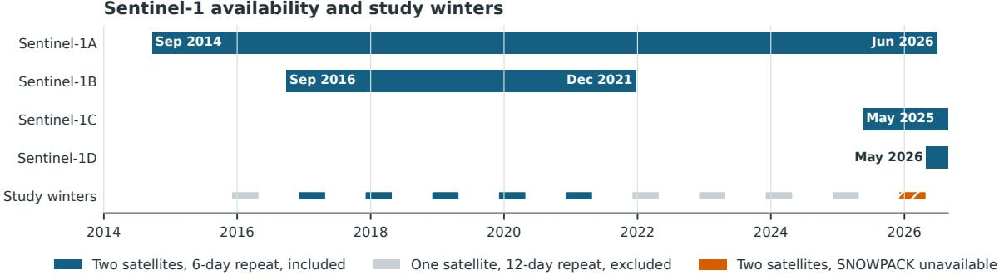
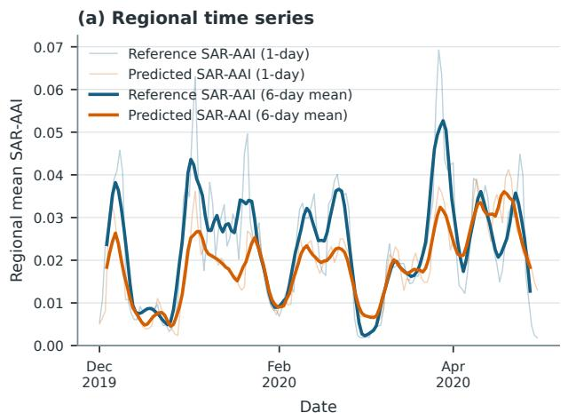
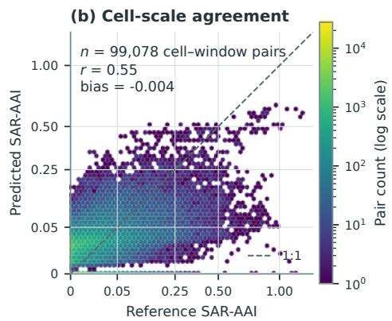
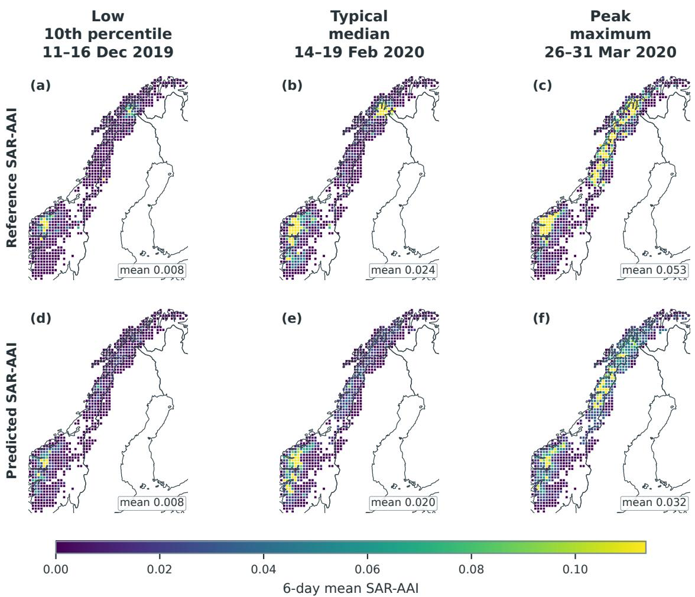
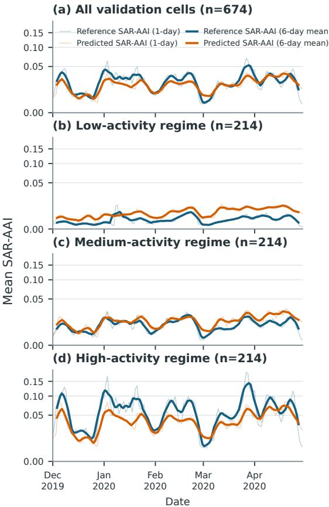

# DATA-DRIVEN PREDICTION OF SATELLITE-OBSERVED AVALANCHE ACTIVITY FROM SNOWPACK SIMULATIONS

Jakob Grahn\*1, Filippo Maria Bianchi1,2, Bert Kruyt3, Karsten Müller3

1NORCE Research, Tromsø, Norway 2UiT The Arctic University of Norway, Tromsø, Norway 3Norwegian Water Resources and Energy Directorate, Oslo, Norway

ABSTRACT: Avalanche forecasting requires knowledge of the snowpack and recent avalanche activity, but both are difficult to keep track of across large mountain regions. Field observations are essential but often sparse, which limits regional monitoring and development of numerical or statistical prediction models. Synthetic aperture radar (SAR) can repeatedly map avalanche debris over large areas, opening up new opportunities for data-driven approaches for avalanche forecasting. In this study, we take a first step in this direction. We constructed two large datasets for five winters with two operational Sentinel-1 satellites and a typical six-day repeat interval. First, we mapped avalanche debris in Sentinel-1 images across Norway and parts of Sweden. Secondly, we ran the SNOWPACK model forced by numerical weather predictions on a 20 20 km grid, at different elevations and predefined slope angles. A transformer was then trained to use five days of SNOWPACK outputs to predict activity mapped by SAR for the following day. We represented activity with the SAR-detected Avalanche Activity Index (SAR-AAI), a study-specific index that gives larger debris more weight, spreads detections across possible occurrence dates and normalises by modelled runout area. We trained the transformer on four winters and evaluated it on one. Regional mean predicted and reference SAR-AAI had a Pearson correlation of 0.803 when averaged over complete six-day periods, with each value placed at the midpoint of its period. The model followed broad changes in time and space, but produced smoother predictions and underestimated the strongest activity. At the 20 km cell scale, agreement after the same six-day averaging was weaker (r = 0.549). The result is based on a single training run of the machine-learning model and has not been tested on an untouched winter. The SAR dataset is incomplete and contains detection errors and uncertain timing. Thus, the results do not yet show operational forecast skill. Still, predictions based on regional SNOWPACK simulations followed broad changes mapped by Sentinel-1. This is a promising first step towards using SAR avalanche detections with snowpack modelling for avalanche forecasting.

KEYWORDS: avalanche activity; synthetic aperture radar; SNOWPACK; deep learning; remote sensing

## 1. INTRODUCTION

Avalanche forecasting requires knowledge of the snowpack and recent avalanche activity. Both are difficult to keep track of across large mountain regions. Field observations are essential, but they are sparse, uneven and often limited by visibility and access. This is particularly challenging in the Scandinavian Mountains, where forecasters assess large and sparsely populated areas.

Spaceborne synthetic aperture radar (SAR) has become a complementary way to map avalanche activity. Changes in radar backscatter between repeat-pass images can reveal avalanche debris. Methods have progressed from manual inspection and simple thresholding to automatic machine-learning methods that outline likely debris (Vickers et al. 2016; Eckerstorfer et al. 2019; Bianchi et al. 2021b). SAR does not give a complete record of activity: avalanches can be missed, false detections can remain, and the release time is only known to fall between two observations. Even so, it provides repeated observations across areas that are difficult to cover from the ground.

Snowpack modelling has developed in parallel. Physically based models such as SNOWPACK use meteorological observations or numerical weather prediction to simulate how the snowpack develops through the winter (Bartelt and Lehning 2002a; Herla et al. 2024a). Herla et al. (2024a) describe a regional model chain that runs SNOW-PACK across Norway at several elevations and predefined slope aspects. These simulations provide consistent snowpack histories where direct measurements are scarce.

Using historical data to predict avalanche conditions is not new. Early statistical models used discriminant analysis and nearest-neighbour methods, followed by classification trees and supportvector machines (Buser 1983; Kronholm et al. 2006; Pozdnoukhov et al. 2011). More recent studies have used random forests and other machine-learning methods to predict regional activity classes, natural dry- and wet-snow avalanche days, and danger levels assigned by forecasting services (Harvey et al. 2016; Dkengne Sielenou et al. 2021; Pérez-Guillén et al. 2022;

Sentinel-1 availability and study winters  
  
Figure 1: Sentinel-1 availability and study-season selection. The satellite lanes show operational data periods, rounded to the month and through August 2026; the Sentinel-1A endpoint follows its announced phase-out. The thin study-winter strip marks each 1 December–30 April period. Blue winters had two satellites, a typical six-day repeat interval and matching SNOWPACK simulations, and were included. Grey winters had one satellite and a typical twelve-day interval. The orange hatched winter had two satellites but no SNOWPACK simulation. Mission availability does not guarantee an acquisition in every grid cell. Dates follow Copernicus mission records (European Space Agency and European Commission 2026).

Viallon-Galinier et al. 2023; Mayer et al. 2023; Hendrick et al. 2023; Eiselt and Graversen 2025). These studies show that meteorological and simulated snowpack data contain useful information about avalanche conditions. Most, however, use field observations, individual avalanche-path records or forecaster assessments as their training target.

Here, we bring together two large regional datasets. The first is a multiwinter catalogue of avalanche-debris detections from Sentinel-1 images across Norway and parts of Sweden. The second contains NWP-driven SNOWPACK simulations on a 20 by 20 km grid, resolved by elevation and slope aspect. Together, they allow us to test whether recent simulated snowpack conditions can predict the following day’s activity mapped by SAR.

Grahn et al. (2024) described an earlier version of our SAR dataset and outlined a different, pixel-scale model based directly on numerical weather prediction (NWP) fields and previous avalanche masks. Here, we instead calculate SAR-detected Avalanche Activity Index (SAR-AAI) for each 20 km cell and predict it from five days of regional SNOWPACK histories. To our knowledge, this is the first study to use a multiwinter, wide-area SAR-derived avalancheactivity dataset as the prediction target for regional SNOWPACK simulations resolved by elevation and slope aspect. This is a first experiment rather than an operational forecasting system.

## 2. DATA

## 2.1. Satellite-observed avalanche activity

We produced the avalanche dataset from repeatpass Sentinel-1 SAR images. A segmentation model compared radar backscatter from consecutive passes, together with terrain information, and outlined likely avalanche debris (Bianchi et al. 2021a). Each image pair produced polygons of likely debris. The same debris could appear in overlapping satellite views, so we merged polygons that matched in space and time. A merged polygon represents mapped debris, not necessarily a distinct avalanche. We defined its occurrence interval, the period when the avalanche could have occurred, as the intersection between the possible occurrence periods of the merged polygons. We did not assign an exact release date.

As Figure 1 shows, we used five complete twosatellite winters, 2016–2017 through 2020–2021. One Sentinel-1 satellite repeats a given orbit after 12 days. With two satellites offset in the same orbit, the interval is 6 days. The shorter interval improves the timing of satellite-mapped activity, as well as detection capabilities. We ran the detection algorithm from 1 December to 30 April each winter. Excluding late spring reduced likely bareground and wet-snow false positives. Even within this period, no detection can mean either that no avalanche was mapped or that no suitable observation was available. SAR mapping can also miss small, dry or loose avalanches. We therefore aknowledge that the dataset is an incomplete record of avalanche activity, and should be used as an indicator.

We screened the merged detections by polygon size, elevation and land cover. The avalanchedebris polygons were at least 2,000 $\mathsf { m } ^ { 2 }$ and smaller than $2 0 0 , 0 0 0 \ \mathrm { m ^ { 2 } }$ and had a mean digital elevation model (DEM) elevation above 75 m. A polygon was rejected when at least 25% of its area was classified as cropland, built-up land or coniferous forest, or when at least 50% was permanent water. These rules were applied only where the land-cover product completely covered and classified the polygon. During daily target construction, each assigned date also required at least 0.30 m of simulated snow at the detection’s elevation and aspect. This removes likely snowfree false positives, but uses one model input to screen the reference data.

## 2.2. Regional SNOWPACK simulations

We ran SNOWPACK (Bartelt and Lehning 2002b) with reanalysis from MET Norway’s Long-Term Consistent (LTC) archive on the 1 km MET Nordic grid. AWSOME used the median values within each 20 by 20 km cell and 300 m elevation band (Herla et al. 2024b). For the five study winters, we used 2,589 available cell and elevation combinations. Each cell used up to seven elevation levels from 300 to 2,100 m. At each level, one flat simulation and four simulated slopes at 38◦ facing north, east, south and west represented solar and wind exposure.

The configuration was adapted with the Norwegian Water Resources and Energy Directorate (NVE) for Norwegian conditions. Changes covered how new-snow density and grain shape were calculated, along with erosion, redeposition and snow exchange between the simulated slopes.

The study period ends in 2020–2021. No matching 2025–2026 SNOWPACK simulation was available at the time of writing, although that winter met the satellite requirement (Figure 1).

## 2.3. Terrain data

We used a DEM and a modelled flow-depth map to identify avalanche runout terrain within each grid cell. We modelled runout with MoT-Voellmy (Issler 2025). The model used terrain downsampled to 20 m, and we returned its output to the 10 m DEM grid. We counted pixels with maximum flow depth above 0.1 m as runout terrain and summed them to obtain the total modelled runout area in each cell. We marked targets invalid in cells with less than $1 0 , 0 0 0 { \mathrm { m } } ^ { 2 }$ of modelled runout terrain. Runout information only defined the target and which cells were valid; it was not a model input. Dividing by runout area expresses mapped activity per unit of modelled runout terrain, and the minimum prevents ratios based on very small areas.

## 3. METHODS

We assigned detections to possible avalanche dates, calculated daily SAR-AAI, as defined in equation (1), and trained a transformer.

## 3.1. Input features: five-day SNOWPACK history

Each sample represented one 20 km grid cell and target date. The input comprised the five preceding daily SNOWPACK states for up to five slope directions and seven elevation levels.

Archived SNOWPACK profiles were normally available every three hours, with occasional gaps. We reduced each variable-length layer profile to 277 fixed features: layer count, profile height and total thickness; the mean, standard deviation, minimum and maximum of numerical layer properties; surface and basal layer values; and grain-type fractions and indicators. We kept the latest profile for each local day and a mask identified missing day–slope–elevation combinations. The model therefore received one summary vector per daily profile, not the ordered snow layers or changes within the day.

## 3.2. Target labels: following-day SAR-AAI

We overlaid each avalanche-debris polygon on the 20 km grid. To screen likely snow-free detections, we matched each polygon to the SNOW-PACK simulations for its mean elevation and terrain orientation. We kept only possible dates with at least 0.30 m of simulated snow. Because the release date was unknown, we spread each detection equally across the possible dates that passed the seasonal and snow-depth filters. We then summed all contributions into one value for each cell and date. The daily index therefore spreads the mapped activity across the dates when the avalanche may have occurred; it does not identify the release date.

The target for each sample was one SAR-AAI value for the whole cell on the following day. This study-specific index is defined precisely for cell c and date d in Equation (1):

$$
\mathsf { S A R - A A l } _ { c , d } = \frac { 1 0 ^ { 6 } } { R _ { c } } \sum _ { i \in ( c , d ) } \left( \frac { A _ { i } } { 1 0 ^ { 4 } } \right) ^ { 1 . 5 } \frac { f _ { i , c } } { n _ { i } } ,\tag{1}
$$

Equation (1) sums all detections that overlap cell $c$ and could have occurred on date $d .$ For each detection, $A _ { i } / 1 0 ^ { 4 }$ expresses its full mapped debris area relative to $1 0 , 0 0 0 \mathsf { m } ^ { 2 }$ , equivalent to a 100 m 100 m reference area. The exponent 1.5 gives larger polygons more weight. We chose it during exploratory work because larger avalanches are generally more dangerous and therefore more important to predict, but we did not calibrate it from physical data. The factor $f _ { i , c }$ is the fractional overlap of the detection with cell c. The divisor $n _ { i }$ spreads it equally across the possible dates that passed the seasonal and snow-depth filters: $n _ { i } = 1$ assigns the full weight to one date, $n _ { i } = 2$ assigns half to each of two dates, and so on. Finally, $1 0 ^ { 6 } / R _ { c }$ expresses the summed weight per square kilometre of modelled runout terrain in the cell, the index represents activity in units of actual avalanche terrain.

SAR-AAI is a study-specific index, not an avalanche count, conventional avalanche-size scale or operational danger level. It describes mapped debris rather than release activity, and its timing remains uncertain. We refer to the label as reference SAR-AAI and the model output as predicted SAR-AAI.

We included a cell-winter only if it contained at least one positive detection. This excluded quiet or unobserved cases, which an operational system would also need to handle.

## 3.3. Transformer architecture and training

Each daily 277-feature SNOWPACK summary was linearly encoded, then combined with learned representations of its position within the five-day history, slope aspect and elevation. Two transformer layers (Vaswani et al. 2017) processed the available encoded states, which attention pooling combined into one representation for the cell. An availability mask prevented missing day– aspect–elevation combinations from contributing to the transformer or pooling. Input features were scaled using the training seasons, and missing values were set to zero.

The model had two output heads. A classification head predicted whether SAR-AAI was present, while a regression head predicted its positive value. The model received no explicit cell identifier, coordinates, runout area or historical activity statistic for the cell.

Weighted binary cross-entropy trained the classification head. The regression head was trained on positive reference SAR-AAI using Smooth-L1 loss on the transformed target and symmetric meansquared error in the original SAR-AAI scale. We used AdamW with dropout, learning-rate reduction and early stopping. Early stopping and model selection used validation RMSE for positive SAR-AAI after returning predictions to the original scale. Classification probabilities below 0.5 gave zero predicted SAR-AAI.

We trained on 332,623 samples from 2016–2017, 2017–2018, 2018–2019 and 2020–2021. We validated on 102,448 samples from 674 cells in 2019– 2020. The split was seasonal, not spatial, and 642 validation cells also appeared in the training winters.

## 4. RESULTS

Because SAR timing is uncertain, we compare the regional series and values for individual cells using complete six-day averages, matching the maximum occurrence interval. We place each average at the midpoint of its period, halfway between the two middle dates (Figure 2). This smoothing is used only for evaluation and plotting; it does not change the daily model output. Across 147 validation periods, regional mean predicted SAR-AAI followed the main reference SAR-AAI cycles, with Pearson correlation 0.803. During the peak period, 26–31 March 2020, predicted SAR-AAI reached 60.0% of the reference.

At cell scale, the predictions showed more scatter and followed reference SAR-AAI less closely. Across 99,078 cell and window combinations with complete six-day averages, Pearson correlation was 0.549. Most high reference values lay below the one-to-one line, showing that the model underestimated the strongest activity.

Across the representative low, typical and peak periods mapped in Figure 3, the predictions reproduced several broad concentrations of activity. They were smoother than the reference and slighlty weaker during the March peak. The model however reproduced large spatial patterns within the season, but it missed some local concentrations.

We divided the 642 cells also present in the training seasons into equal-sized low-, medium- and high-activity regimes using only their mean refer-

  
Faint lines show allocated 1-day values and bold lines show 6-day means at window midpoints. Density axes use a square-root scale.

Figure 2: Regional and cell-scale SAR-AAI in the 2019–2020 validation season. (a) Mean reference and predicted SAR-AAI across 674 cells; faint lines are daily values and bold lines are six-day means placed at the midpoint of each period. (b) Density of 99,078 cell and window combinations from 147 periods with all six days available. The axes use a square-root scale labelled in SAR-AAI units; colour is logarithmic.

  
Figure 3: Six-day mean SAR-AAI for the periods nearest the 10th percentile (low), median (typical) and maximum (peak) regional reference value. Reference and predicted values share one colour range; grey cells have no validation sample. Borders: Natural Earth Admin 0 Countries, 1:50m, version 5.1.1.

  
Figure 4: Daily and six-day mean reference and predicted SAR-AAI for all 674 validation cells and three equal activity regimes based on average reference activity in the training winters (214 cells each). Validation values did not define the regimes. Panels share a square-root scale.

ence SAR-AAI in the training seasons (Figure 4). For the low-, medium- and high-activity regimes, correlations between the six-day reference and predicted series were 0.563, 0.766 and 0.813, respectively. The predicted SAR-AAI followed the timing most clearly in the medium- and highactivity regimes. It underestimated high-activity peaks and tended to exceed the low-activity reference late in the season.

## 5. DISCUSSION AND CONCLUSIONS

We tested whether five days of regional, terrainresolved SNOWPACK simulations could predict the following day’s avalanche activity, represented by the SAR-AAI. When averaged over six days and across the region, the predictions followed the main activity cycles in the SAR dataset. During the 2019–2020 validation season, regional predicted and reference SAR-AAI had a correlation of 0.803. The model reproduced broad changes in time and space, but produced smoother maps, underestimated the strongest activity and reached about 60% of the reference during the peak period. Agreement was weaker at the 20 km cell scale, suggesting that the model captured regional patterns better than local extremes.

This is an encouraging result because the model used only recent SNOWPACK states resolved by elevation and slope aspect. It received no explicit coordinates, runout area or history of avalanche activity. The agreement therefore indicates that the regional snowpack simulations and the separate satellite dataset contain some of the same broad changes in avalanche conditions.

Part of this relationship may reflect conditions that affect whether avalanche debris is visible in repeat-pass SAR, as well as conditions associated with avalanche release. The results should therefore be interpreted as a prediction of satelliteobserved activity. Even so, the results indicate a promising connection between wide-area SAR detections and physically based snowpack simulations. This provides a useful basis for developing regional models of avalanche activity and, eventually, for supporting avalanche forecasting.

## ACKNOWLEDGEMENTS

This work was supported by the European Space Agency (ESA) through PRODEX contract 4000137043 (AFEX), administered by the Norwegian Space Agency. We thank MET Norway for meteorological data and the Norwegian Mapping Authority for elevation data.

## REFERENCES

Bartelt, P. and Lehning, M. (2002a). A physical SNOW-PACK model for the Swiss avalanche warning: Part I: Numerical model. In: Cold Regions Science and Technology 35.3, pp. 123–145. https://doi.org/10.1016/S0165- 232X(02)00074-5.

Bartelt, P. and Lehning, M. (2002b). A physical SNOW-PACK model for the Swiss avalanche warning: Part I: Numerical model. In: Cold Regions Science and Technology 35.3, pp. 123–145. https://doi.org/10.1016/S0165- 232X(02)00074-5.

Bianchi, F. M., Grahn, J., Eckerstorfer, M., Malnes, E., and Vickers, H. (2021a). Snow Avalanche Segmentation in SAR Images With Fully Convolutional Neural Networks. In: IEEE Journal of Selected Topics in Applied Earth Observations and Remote Sensing 14, pp. 75–82. https://doi.org/10.1109/JSTARS.2020.3036914.

Bianchi, F. M., Grahn, J., Eckerstorfer, M., Malnes, E., and Vickers, H. (2021b). Snow avalanche segmentation in SAR images with fully convolutional neural networks. In: IEEE Journal of Selected Topics in Applied Earth Observations and Remote Sensing 14, pp. 75–82. https://doi.org/10.1109/JSTARS.2020.3036914.

Buser, O. (1983). Avalanche forecast with the method of nearest neighbours: An interactive approach. In: Cold Regions Science and Technology 8.2, pp. 155–163. https://doi.org/10.1016/0165-232X(83)90006-X.

Dkengne Sielenou, P., Viallon-Galinier, L., Hagenmuller, P., Naveau, P., Morin, S., Dumont, M., Verfaillie, D., and Eckert, N. (2021). Combining random forests and class-balancing to discriminate between three classes of avalanche activity in the French Alps. In: Cold Regions Science and Technology 187, 103276. https://doi.org/10.1016/j.coldregions.2021.103276.

Eckerstorfer, M., Vickers, H., Malnes, E., and Grahn, J. (2019). Near-real time automatic snow avalanche activity monitoring system using Sentinel-1 SAR data in Norway. In: Remote Sensing 11.23, 2863. https://doi.org/10.3390/rs11232863.

Eiselt, K.-U. and Graversen, R. G. (2025). Predicting avalanche danger in northern Norway using statistical models. In: The Cryosphere 19, pp. 1849–1871. https://doi.org/10.5194/tc-19-1849-2025.

European Space Agency and European Commission (2026). Sentinel-1 Mission. URL: https : / / sentiwiki . copernicus.eu/web/s1-mission (visited on 08/28/2026).

Grahn, J., Bianchi, F. M., Müller, K., and Malnes, E. (2024). “Data-driven avalanche forecasting – using weather and satellite data”. In: Proceedings of the International Snow Science Workshop. Tromsø, Norway, pp. 39–44.

Harvey, S., Herwijnen, A. van, and Richter, B. (2016). “Statistical nowcast of avalanche activity at the regional scale”. In: Proceedings of the International Snow Science Workshop 2016. Breckenridge, Colorado, USA, pp. 1173–1179.

Hendrick, M., Techel, F., Volpi, M., Olevski, T., Pérez-Guillén, C., Herwijnen, A. van, and Schweizer, J. (2023). Automated prediction of wet-snow avalanche activity in the Swiss Alps. In: Journal of Glaciology 69.277, pp. 1365– 1378. https://doi.org/10.1017/jog.2023.24.

Herla, F., Widforss, A., Binder, M., Müller, K., Horton, S., Reisecker, M., and Mitterer, C. (2024a). “Establishing an operational weather & snowpack model chain in Norway to support avalanche forecasting”. In: Proceedings of the International Snow Science Workshop 2024. Tromsø, Norway, pp. 168–175.

Herla, F., Widforss, A., Binder, M., Müller, K., Horton, S., Reisecker, M., and Mitterer, C. (2024b). “Establishing an operational weather & snowpack model chain in Norway to support avalanche forecasting”. In: Proceedings of the International Snow Science Workshop. Tromsø, Norway, pp. 168–175.

Issler, D. (Feb. 20, 2025). Basic Equations and Numerical Methods in MoT-Voellmy. Technical Note 20230100-06-TN. Norwegian Geotechnical Institute.

Kronholm, K., Vikhamar-Schuler, D., Jaedicke, C., Isaksen, K., Sorteberg, A., and Kristensen, K. (2006). “Forecasting snow avalanche days from meteorological data using classification trees: Grasdalen, western Norway”. In: Proceedings of the International Snow Science Workshop 2006. Telluride, Colorado, USA, pp. 786–795.

Mayer, S., Techel, F., Schweizer, J., and Herwijnen, A. van (2023). Prediction of natural dry-snow avalanche activity using physics-based snowpack simulations. In: Natural Hazards and Earth System Sciences 23, pp. 3445–3465. https://doi.org/10.5194/nhess-23-3445-2023.

Pérez-Guillén, C., Techel, F., Hendrick, M., Volpi, M., Herwijnen, A. van, Olevski, T., Obozinski, G., Pérez-Cruz, F., and Schweizer, J. (2022). Data-driven automated predictions of the avalanche danger level for dry-snow conditions in Switzerland. In: Natural Hazards and Earth System Sciences 22, pp. 2031–2056. https://doi.org/10.5194/nhess-22-2031-2022.

Pozdnoukhov, A., Matasci, G., Kanevski, M., and Purves, R. S. (2011). Spatio-temporal avalanche forecasting with Support Vector Machines. In: Natural Hazards and Earth System Sciences 11.2, pp. 367–382. https://doi.org/10.5194/nhess-11-367-2011.

Vaswani, A., Shazeer, N., Parmar, N., Uszkoreit, J., Jones, L., Gomez, A. N., Kaiser, Ł., and Polosukhin, I. (2017). “Attention Is All You Need”. In: Advances in Neural Information Processing Systems. Vol. 30, pp. 5998–6008.

Viallon-Galinier, L., Hagenmuller, P., and Eckert, N. (2023). Combining modelled snowpack stability with machine learning to predict avalanche activity. In: The Cryosphere 17, pp. 2245–2260. https://doi.org/10.5194/tc-17-2245-2023.

Vickers, H., Eckerstorfer, M., Malnes, E., Larsen, Y., and Hindberg, H. (2016). A method for automated snow avalanche debris detection through use of synthetic aperture radar (SAR) imaging. In: Earth and Space Science 3.11, pp. 446– 462. https://doi.org/10.1002/2016EA000168.