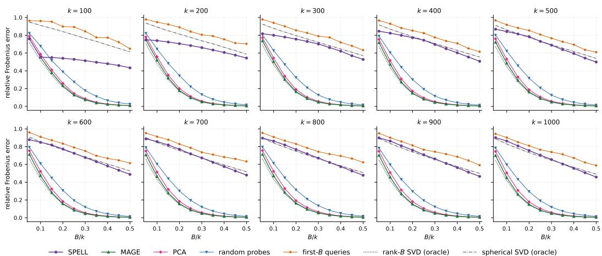
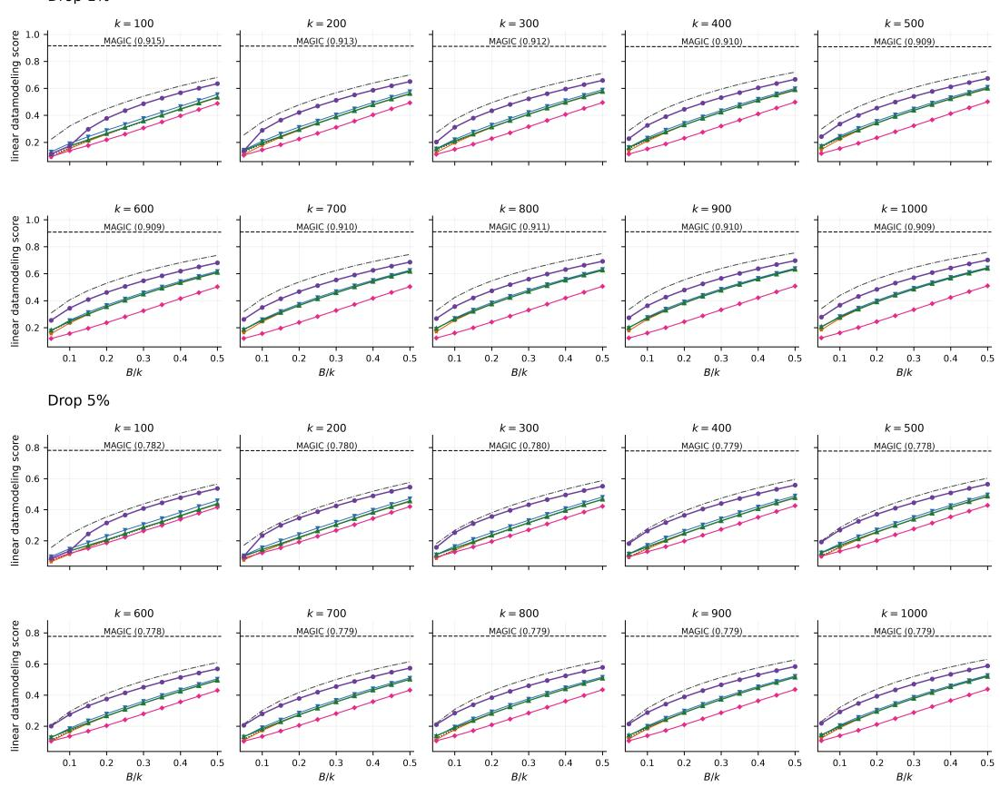
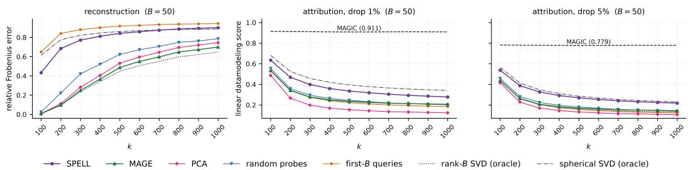
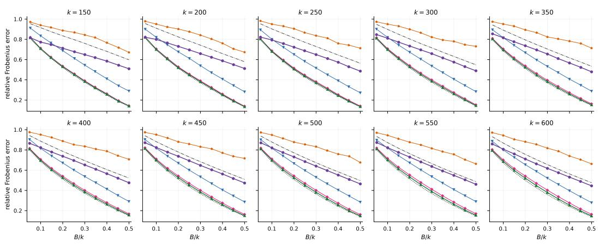
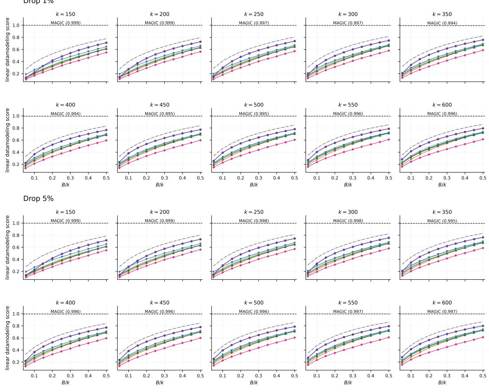
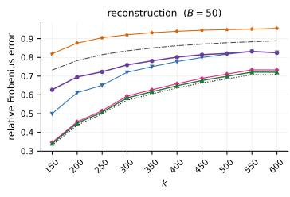
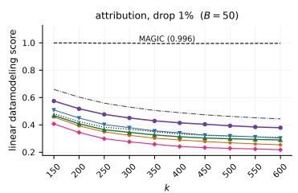
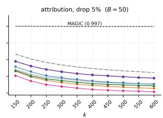
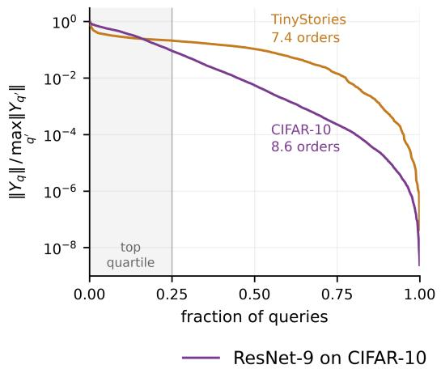
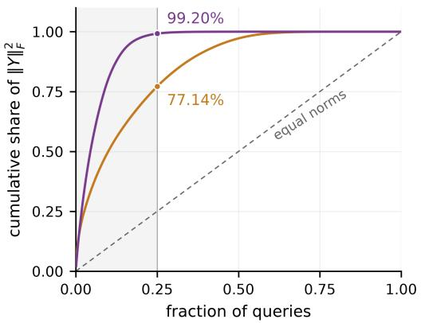

# Data Attribution at Scale via Influence Matrix Estimation

Yuxi Chen1, Hamza Golubovic2, Han Tong2, Arian Maleki2,3, and Andrew Ilyas4,5

Carnegie Mellon University

1Department of Statistics & Data Science

4Software and Societal Systems Department

5Department of Electrical and Computer Engineering {ericc3, andrewi}@andrew.cmu.edu

Columbia University   
2Department of Statistics   
3Electrical Engineering Department   
{hg2723, ht2672, mm4338}@columbia.edu

## Abstract

Data attribution seeks to quantify how individual training examples shape a model’s predictions and underpins problems including data valuation, machine unlearning, and model interpretability. Despite having a long line of work, computationally scalable methods often struggle to predict the effect of removing training data in neural networks due to their non-convex nature. To overcome this challenge, metagradient-based methods such as MAGIC (Ilyas and Engstrom, 2025) differentiate each prediction through the entire training run and compute its exact influence with respect to the training data, but require a separate run for every prediction. To reduce this cost, we cast budgeted attribution as estimating a large influence matrix from a small number of measurements. We show that the measurements most appropriate for recovering this matrix differ from those best suited for attribution itself. We then present two algorithms, MAGE and SPELL, suited for reconstruction and attribution respectively, that run on existing metagradient machinery at no extra cost. Empirical studies demonstrate strong performance over existing baselines across training scales and measurement budgets.

## 1 Introduction

With the success of modern deep learning, understanding how training data shapes model behavior has become increasingly important. Previous studies have traced many undesirable model behaviors back to the training data, showing that neural networks can memorize private records (Carlini et al., 2021), inherit targeted vulnerabilities from a few poisoned examples (Wan et al., 2023), and learn shortcuts by relying on signals that are predictive yet brittle (Ilyas et al., 2019). At the same time, data selection allows smaller datasets to match or surpass the performance of larger counterparts for vision and language model training (Sorscher et al., 2022; Li et al., 2024). Similar effects likewise appear during post-training, where a curated fraction of the data can elicit strong instruction following and reasoning (Zhou et al., 2023; Xia et al., 2024; Muennighoff et al., 2025). Together, these findings testify to the central role of training data in shaping model behavior.

One way to understand the impact of training data is to ask how a given metric of interest (e.g., held-out test loss) would have changed had the same model been trained on a different dataset. To answer this question naively would require one to modify the training dataset, retrain the new model, and observe the resulting outputs. Instead, predictive data attribution seeks to predict this counterfactual quantity without retraining (Ilyas et al., 2022) by estimating the contribution of every training example to the prediction of interest. Previous works have studied this problem using tools like approximate influence functions (Koh and Liang, 2017), Shapley values (Ghorbani and Zou, 2019), trajectory tracing (Pruthi et al., 2020), and scalable approximations of influence functions (Park et al., 2023). Despite their computational appeal, these methods have often produced estimates that align poorly with the true outcome of retraining in neural networks (Bae et al., 2022; 2024).

Overcoming these hurdles, MAGIC (Ilyas and Engstrom, 2025) differentiates the loss from a test prediction backward through the entire optimization trajectory, computing its gradient with respect to the training data weights. This gradient—also known as the exact influence function—near-perfectly predicts the effects of modifying the training dataset on the given test prediction’s loss. However, computing the exact influence function with MAGIC would require a separate reverse differentiation through the full training run for every prediction of interest. This makes MAGIC expensive to scale to settings where we wish to study many held-out examples individually.

In this work, we ask whether the cost of data attribution can be reduced when estimating the influence scores across many predictions. Our contributions are as follows:

1. We cast the problem of budgeted data attribution across many predictions as that of estimating a Jacobian matrix of influence scores from a limited number of left and right vector products.

2. We formalize two distinct objectives, reconstruction and attribution, and show that the two are optimized using different measurements, since reconstruction weights each prediction by its squared row norm whereas attribution weights them equally.

3. We introduce MAGE (Metagradient Approximation by Gram Eigendirections) for reconstruction and SPELL (SPherical Estimation for the Linear datamodeling score at Low budgets) for attribution, both of which run on existing metagradient machinery.

4. Across a ResNet-9 on CIFAR-10 and a 92M-parameter language model on TinyStories, MAGE and SPELL each outperform existing computable alternatives on their intended objective under various measurement budgets.

## 2 Predictive Data Attribution and Influence Matrix Estimation

We begin by formalizing both the predictive data attribution framework and the underlying computational primitives. The central idea is to parameterize the training dataset through continuous importance weights, after which our goal becomes computing derivatives of the trained model behavior with respect to these weights. Finally, we state the problem of estimating the influence matrix under a limited budget and define two objectives, reconstruction and attribution, which emphasize distinct aspects of any estimate.

## 2.1 Setup and Notation

We follow the datamodeling framework of Ilyas et al. (2022). Let $\mathcal { D } = \{ x _ { i } \} _ { i = 1 } ^ { n }$ be a dataset of n training points. We parameterize the training set by an importance-weight vector $w \in \mathbb { R } ^ { n }$ where wi scales the contribution of example i to the training loss. With this representation, a standard training pipeline corresponds to $w = \mathbf { 1 } _ { n } ,$ , where $\mathbf { 1 } _ { n } ^ { \smile } \in \mathbb { R } ^ { n }$ is the all-ones vector, and setting $w _ { i } = 0$ amounts to removing example i from the training set.

Next, let $\Theta \subseteq \mathbb { R } ^ { p }$ denote the parameter space and let A be a learning algorithm mapping data weights to trained model parameters,

$$
\mathcal { A } : \mathbb { R } ^ { n }  \Theta , \qquad \theta ( w ) = \mathcal { A } ( w ) .
$$

The learning algorithm A encompasses every aspect of training beyond the data weights, including the model architecture, optimizer, and learning rate schedule.

Following the single-model setting of Ilyas and Engstrom (2025), we also fix every source of training randomness, whereby the same weighting w always generates the same parameters θ(w). We further assume that A is iterative and smooth, meaning that $\theta ( w )$ is produced by a fixed sequence of differentiable training updates, and small perturbations to w produce controlled changes in the resulting model output and its derivative.

Finally, we are given k test queries that we wish to attribute to the training data. Throughout, we write $[ k ] = \mathbf { \check { \{ 1 , \dots , k \} } }$ . For each test query $q \in [ k ]$ , we let $\phi _ { q } : \Theta \to \mathbb { R }$ be a differentiable scalar measurement of the trained model $( \mathrm { e . g . }$ , the loss of the model with parameters θ on test query $q )$ . We define the model output function $f _ { q }$

$$
f _ { q } ( w ) = \phi _ { q } ( \theta ( w ) ) = \phi _ { q } ( \mathcal { A } ( w ) )\tag{1}
$$

as the composition function mapping data weights directly to the measurement for query q, so that $f _ { q } ( \dot { w } )$ is the value that would be observed on query q if the model were trained using data weights w. We collect these functions into the vector-valued model output function ${ \check { F } } ,$

$$
F ( w ) = ( f _ { 1 } ( w ) , \ldots , f _ { k } ( w ) ) \in \mathbb { R } ^ { k } .
$$

At a high level, our goal is to return an estimate $\widehat { F } = ( \widehat { f } _ { 1 } , \ldots , \widehat { f } _ { k } )$ of this function, which predicts the model behavior under any weighting w without retraining.

## 2.2 Metagradients and MAGIC

The composition in Equation 1 makes the model output function $f _ { q } ( w )$ differentiable with respect to the training weights, and its derivative

$$
\nabla _ { w } f _ { q } ( \mathbf { 1 } _ { n } ) = \nabla _ { w } \phi _ { q } ( A ( w ) ) \big | _ { w = \mathbf { 1 } _ { n } } \in \mathbb { R } ^ { n }
$$

is called the metagradient of query q, a gradient taken through the entire training procedure. Its ith entry measures how the observed value on query q would respond to an infinitesimal change in the weight of training example i. Since computing this derivative naively would be computationally prohibitive, Engstrom et al. (2025) introduce REPLAY, which computes metagradients for large-scale training runs at a cost comparable to that of training itself. Hereinafter, we use the word “replay” synonymously with the REPLAY algorithm.

To leverage metagradients for data attribution, MAGIC (Ilyas and Engstrom, 2025) linearizes the model output function $f _ { q }$ around $w = \mathbf { 1 } _ { n }$ with a first-order Taylor expansion,

$$
f _ { q } ( w ) \approx \widehat { f } _ { q } ( w ) = f _ { q } ( \mathbf { 1 } _ { n } ) + \langle \nabla _ { w } f _ { q } ( \mathbf { 1 } _ { n } ) , w - \mathbf { 1 } _ { n } \rangle ,
$$

which defines a linear predictor for studying the effect of removing any subset of training examples. Let $S \subseteq [ n ]$ be a subset of examples to remove and let $\mathbf { 1 } _ { S } \in \{ 0 , 1 \} ^ { n }$ be its indicator vector, so that training without the examples in S corresponds to the weighting ${ \bf 1 } _ { n } - { \bf 1 } _ { S }$ Writing $\Delta _ { q } ( S )$ for the resulting change in query q, MAGIC predicts

$$
\Delta _ { q } ( S ) = f _ { q } ( \mathbf { 1 } _ { n } - \mathbf { 1 } _ { S } ) - f _ { q } ( \mathbf { 1 } _ { n } ) \approx - \left. \nabla _ { w } f _ { q } ( \mathbf { 1 } _ { n } ) , \mathbf { 1 } _ { S } \right. = - \sum _ { i \in S } \left[ \nabla _ { w } f _ { q } ( \mathbf { 1 } _ { n } ) \right] _ { i } .
$$

Since the metagradient is evaluated at ${ \bf 1 } _ { n }$ and does not depend on ${ \mathbf { 1 } } _ { S } ,$ , a single metagradient allows us to generate counterfactual predictions for all subsets of $\mathrm { \Delta }$ simultaneously, and these predictions have been shown to near-perfectly estimate the effects of removing training data (Ilyas and Engstrom, 2025).

Finally, we collect the metagradients across all k queries and define the influence matrix

$$
Y = \left. \frac { \partial F ( w ) } { \partial w } \right| _ { w = \mathbf { 1 } _ { n } } \in \mathbb { R } ^ { k \times n } ,
$$

which records the influence of every training example on every test query. We write $Y _ { q }$ for its qth row—the metagradient of query q—so that recovering $\check { Y }$ would allow us to generate counterfactual predictions for all k queries simultaneously.

## 2.3 Influence Matrix Estimation

MAGIC recovers row $Y _ { q }$ by differentiating $f _ { q }$ backward through the entire training trajectory. Thus, recovering all k rows would require k replays of training. In this paper, we ask:

Given a budget of only $B < k$ replays, how well can we approximate the influence matrix?

We consider two ways of evaluating the quality of any estimate $\widehat { Y }$ of the full influence matrix under this setting, which emphasize distinct yet equally important aspects of the problem.

Reconstruction. The reconstruction error is given by

$$
\left\| Y - \widehat { Y } \right\| _ { F } ^ { 2 } = \sum _ { q = 1 } ^ { k } \left\| Y _ { q } - \widehat { Y } _ { q } \right\| ^ { 2 } ,
$$

which is the standard measure of estimation quality for matrix recovery. This is an appropriate objective in settings where we wish to identify the training data driving model behavior, as is the case with data valuation (Ghorbani and $Z _ { \mathrm { { O u } _ { \it { 1 } } } }$ 2019; Jia et al., 2019).

Attribution. Instead of optimizing directly for the proximity between $\widehat { Y }$ and Y in $\ell _ { 2 } { \mathrm { - n o r m } }$ we can also measure how well the induced predictions track the behavior of models retrained on the modified data. One objective that captures this notion of counterfactual accuracy is the linear datamodeling score (LDS) (Ilyas et al., 2022). To define the LDS for a given query $q$ at removal fraction $p ,$ we draw a subset $S \subseteq [ n ]$ of size np uniformly at random and write

$$
\widehat { \Delta } _ { q } ( S ) = - \langle \widehat { Y } _ { q } , \mathbf { 1 } _ { S } \rangle , \qquad \Delta _ { q } ( S ) = f _ { q } ( \mathbf { 1 } _ { n } - \mathbf { 1 } _ { S } ) - f _ { q } ( \mathbf { 1 } _ { n } )
$$

for the predicted change and the true change observed on the model retrained using $[ n ] \setminus S$ The LDS for query q is then given by

$$
\mathrm { L D S } _ { q } = \rho _ { S } \left( \widehat { \Delta } _ { q } ( S ) , \Delta _ { q } ( S ) \right) ,
$$

where $\rho _ { S }$ is the (Spearman) correlation taken over the randomness of $S ,$ and we average the LDS over all the queries. This is an appropriate objective in settings where we wish to predict counterfactual model behaviors under interventions to the training dataset, which transpires in machine unlearning (Guo et al., 2020; Bourtoule et al., 2021) and model interpretability (Koh and Liang, 2017).

## 3 MAGE and SPELL

In this section, we present MAGE and $\mathrm { S P E L L } ,$ our procedures for estimating the influence matrix Y from a budget of $B < k$ calls to the metagradient machinery. The two methods share a conceptually straightforward skeleton of measuring B well-chosen linear combinations of the rows of Y, and estimating every row by its projection onto the span of the measurements. They differ primarily in the rule selecting the next combination. We present both procedures in Algorithm 1.

## 3.1 One Replay Can Measure Combinations of Queries

Recall that MAGIC calculates the attribution scores of a single query using reverse-mode differentiation through the training run. However, since differentiation is linear, MAGIC’s computation is not constrained to a single query. To make this precise, let

$$
J = \left. \frac { \partial \theta ( w ) } { \partial w } \right| _ { w = \mathbf { 1 } _ { n } } \in \mathbb { R } ^ { p \times n }
$$

denote the Jacobian of the trained model parameters with respect to the n training weights, whose ith column represents how perturbing the weight of training example i changes the resulting model parameters. Next, for each query q, let

$$
v _ { q } = \nabla _ { \theta } \phi _ { q } \bigl ( \theta \bigl ( \mathbf { 1 } _ { n } \bigr ) \bigr ) \in \mathbb { R } ^ { p }
$$

denote the gradient of its measurement with respect to the final parameters. By the chain rule, the influence matrix factors as

$$
Y = V ^ { \top } J \in \mathbb { R } ^ { k \times n } , \qquad V = [ v _ { 1 } , \dots , v _ { k } ] \in \mathbb { R } ^ { p \times k } .
$$

Ordinarily, we would recover row $Y _ { q }$ by running REPLAY with $v _ { q }$ as the input to reversemode differentiation. More generally, for any coefficient vector z, we may instead input the combined query gradient $\bar { V z } _ { i }$ where the same computation returns

$$
( V z ) ^ { \top } J = z ^ { \top } V ^ { \top } J = z ^ { \top } Y \in \mathbb { R } ^ { n } .
$$

Therefore, a single replay can measure any chosen linear combination of the rows of $\boldsymbol { Y } ,$ and a budget of B replays allows for B such chosen combinations.

## 3.2 A Projection Estimator via Forward-Mode Differentiation

Having laid out the above, we can estimate every row of Y by its projection onto the span of the acquired measurements. Writing

$$
\mathcal { U } = \mathsf { s p a n } \left( z _ { 1 } ^ { \top } Y , \ldots , z _ { B } ^ { \top } Y \right) \subseteq \mathbb { R } ^ { n }
$$

for the subspace derived from B combinations $z _ { 1 } , \dots , z _ { B } ,$ one natural candidate is $ { \widehat { Y } } =  { Y }  { \Pi _ { \mathcal { U } } }$ where $\Pi _ { \mathcal { U } }$ denotes the orthogonal projection onto $\mathcal { U } .$

However, we note that replays themselves can not determine the projection onto $\mathcal { U } .$ . This is because projecting row $\bar { Y _ { q } }$ onto U also requires its inner product with every measurement,

$$
\left. Y _ { q } , z ^ { \top } Y \right. = v _ { q } ^ { \top } J \left( z ^ { \top } Y \right) ^ { \top } ,
$$

which involves the unknown row itself. Despite this, we note that the factor $J ( z ^ { \top } Y ) ^ { \top } \in \mathbb { R } ^ { p }$ is common to every query, and can be calculated using standard forward-mode differentiation, as observed by Gunn (2026). We then pair each replay with an extra forward-mode pass to obtain these inner products. Having this information allows us to update the estimate along the part of the new measurement orthogonal to all previous replays (Golub and Van Loan, 2013), a step we call EXTEND-PROJECTION in Algorithm 1.

## 3.3 Reducing the Two Objectives

To design our measurement strategy, we first note that the nature of orthogonal projections paves the way for powerful reductions of both objectives, which we derive below and make use of throughout our procedures.

Reconstruction. For any query q, we can expand the reconstruction error as

$$
\begin{array} { r l } & { \left. Y _ { q } - \widehat { Y } _ { q } \right. ^ { 2 } = \left. Y _ { q } \right. ^ { 2 } - 2 \left. Y _ { q } , Y _ { q } \Pi _ { \mathcal { U } } \right. + \left. Y _ { q } \Pi _ { \mathcal { U } } \right. ^ { 2 } } \\ & { \qquad = \left. Y _ { q } \right. ^ { 2 } - 2 \left. Y _ { q } \Pi _ { \mathcal { U } } \right. ^ { 2 } + \left. Y _ { q } \Pi _ { \mathcal { U } } \right. ^ { 2 } } \\ & { \qquad = \left. Y _ { q } \right. ^ { 2 } - \left. Y _ { q } \Pi _ { \mathcal { U } } \right. ^ { 2 } , } \end{array}
$$

where the second equality holds since $\Pi _ { \mathcal { U } }$ is idempotent and symmetric. Summing over the k queries, we obtain

$$
\left. Y - \widehat { Y } \right. _ { F } ^ { 2 } = \left. Y \right. _ { F } ^ { 2 } - \left. Y \Pi _ { \mathcal { U } } \right. _ { F } ^ { 2 } ,
$$

hence minimizing the reconstruction error is equivalent to maximizing the captured energy. Attribution. To relate the linear datamodeling score to the orthogonal projection, we first reduce the objective through a series of approximations. Fixing a query q, we can write

$$
\begin{array} { r l } & { \mathrm { L D S } _ { q } = { \mathrm { S p e a r m a n } } { - \rho _ { S } } \left( - \langle \widehat { Y } _ { q } , \mathbf { 1 } _ { S } \rangle , \ f _ { q } ( \mathbf { 1 } _ { n } - \mathbf { 1 } _ { S } ) - f _ { q } ( \mathbf { 1 } _ { n } ) \right) } \\ & { \mathrm { ~ \ ~ \ } } \\ & { \mathrm { ~ \ ~ \ } } \\ & { \mathrm { ~ \ ~ \ } } \\ & { \mathrm { ~ \ ~ \ } } \\ & { \mathrm { \ ~ \ } } \\ & { \mathrm { \ ~ \ } } \\ & { \mathrm { \ ~ \ } } \end{array}
$$

$$
\begin{array} { r l } & { \frac { ( 3 ) } { = } \operatorname { P e a r s o n - } \rho \left( \widehat { Y } _ { q } , Y _ { q } \right) } \\ & { \overset { ( 4 ) } { \approx } \ \frac { \left. Y _ { q } \Pi _ { \mathcal { U } } , Y _ { q } \right. } { \left\| Y _ { q } \Pi _ { \mathcal { U } } \right\| \left\| Y _ { q } \right\| } } \\ & { \overset { ( 5 ) } { = } \frac { \left. Y _ { q } \Pi _ { \mathcal { U } } , Y _ { q } \Pi _ { \mathcal { U } } \right. } { \left\| Y _ { q } \Pi _ { \mathcal { U } } \right\| \left\| Y _ { q } \right\| } = \frac { \left\| Y _ { q } \Pi _ { \mathcal { U } } \right\| ^ { 2 } } { \left\| Y _ { q } \Pi _ { \mathcal { U } } \right\| \left\| Y _ { q } \right\| } = \frac { \left\| Y _ { q } \Pi _ { \mathcal { U } } \right\| } { \left\| Y _ { q } \right\| } . } \end{array}
$$

In (1), we replace Spearman correlation with Pearson correlation, since under approximate joint normality of the two sums the two quantities are related monotonically (Kruskal, 1958), so improving one improves the other. In (2), we replace the ground truth by its MAGIC prediction. We defer the calculation of (3) to Appendix A. The approximation in (4) is due to the empirical observation that the rows of Y are nearly mean-zero and centering has a negligible effect on the correlation. Finally, (5) holds since $\mathrm { \bar { I } } \mathrm { I } _ { \mathcal { U } }$ is idempotent and symmetric.

Summing over the k queries and writing $D = \mathrm { d i a g } \left( \| Y _ { 1 } \| , \dots , \| Y _ { k } \| \right)$ and $\widetilde { Y } = D ^ { - 1 } Y ,$

$$
\sum _ { q = 1 } ^ { k } \mathrm { L D S } _ { q } ^ { 2 } \propto \sum _ { q = 1 } ^ { k } \frac { \left. Y _ { q } \Pi _ { \mathcal { U } } \right. ^ { 2 } } { \left. Y _ { q } \right. ^ { 2 } } = \left. D ^ { - 1 } Y \Pi _ { \mathcal { U } } \right. _ { F } ^ { 2 } = \left. \widetilde { Y } \Pi _ { \mathcal { U } } \right. _ { F } ^ { 2 } .\tag{2}
$$

Thus, we see that optimizing for the LDS likewise maximizes the captured energy of $\widetilde { Y } .$

## 3.4 Selecting the Combinations to Measure

The top-B right-singular subspace of Y is optimal for reconstruction, and that of $\widetilde { Y }$ is optimal for the attribution surrogate in Equation 2 (Fan, 1949). While the truncated SVD is ordinarily computed from the full matrix, it can also be assembled one direction at a time. To do so, we can probe (i.e., send through replay) the leading eigenvector of the residual Gram matrix,

$$
R = Y \left( I _ { n } - \Pi _ { \mathcal { U } } \right) Y ^ { \top } ,
$$

where we suppress the iteration index so that U and R denote the current span and residual. After B iterations, the span of the measurements recovers the top-B right-singular subspace (Hotelling, 1933; Golub and Van Loan, 2013).

However, forming the residual Gram matrix would require the rows of $Y \left( \mathrm { o r } \widetilde { Y } \right.$ analogously). Instead, MAGE and SPELL run the iterations using principled stand-ins built from the query gradients and the measurements taken so far, with MAGE tracking the truncated SVD of Y and SPELL that of its row-normalized counterpart.

MAGE. MAGE substitutes the query Gram matrix $G _ { V } = V ^ { \top } V$ for R and probes its leading eigenvectors in order. We also note that

$$
z ^ { \top } G _ { V } z = \| V z \| ^ { 2 }
$$

measures the energy going into replay and $z ^ { \top } R z$ the unmeasured energy after replay, so the substitution is reasonable whenever J preserves the inner products between query gradients.

SPELL. To derive the measurements for SPELL, we first note that for any probe r on ${ \widetilde { Y } } ,$

$$
\begin{array} { r } { r ^ { \top } \widetilde { Y } = ( D ^ { - 1 } r ) ^ { \top } Y , } \end{array}
$$

which is equivalent to probing $z \propto D ^ { - 1 } r$ on Y. Since the residual Gram matrix of $\widetilde { Y }$ is

$$
\widetilde { Y } \left( I _ { n } - \Pi _ { \mathcal { U } } \right) \widetilde { Y } ^ { \top } = D ^ { - 1 } R D ^ { - 1 } ,
$$

we can probe $v _ { \mathrm { m a x } } ( D ^ { - 1 } R D ^ { - 1 } )$ on ${ \widetilde { Y } } ,$ which amounts to probing $z \propto D ^ { - 1 } v _ { \mathrm { { m a x } } } ( D ^ { - 1 } R D ^ { - 1 } )$ on Y. Here, both D and R are unknown. We can first approximate the entries of D with

$$
\widehat { d } _ { q } = \| \widehat { Y } _ { q } \| ,
$$

Algorithm 1 MAGE and SPELL.   
Input: query gradients $V ,$ replay budget $B ,$ warm-up length $a _ { 0 }$ (SPELL only)   
Requires: REPL $\begin{array} { r } { \mathrm { A Y } ( s ) = s ^ { \top } J , } \end{array}$ FORW $\mathrm { A R D } ( u ) = J u ^ { \top }$   
$\widehat { Y } \gets 0 , \mathcal { U } \gets \{ 0 \}$   
for $a = 1 , \dots , B$ do   
za ← MAGE-SELECT(a) or SPELL-SELECT $( a , { \widehat { Y } } )$   
$u \gets \mathrm { R E P L A Y } \left( V z _ { a } \right)$ ▷ One replay: $u = z _ { a } ^ { \top } Y$   
$c \gets V ^ { \top } \mathrm { F O R W A R D } ( u )$ ▷ One forward-mode pass: $c = Y u ^ { \top }$   
$\widehat { Y } \gets \mathrm { E x T E N D - P R O J E C T I O N } ( \widehat { Y } , \mathcal { U } , u , c )$   
$\mathcal { U }  \mathcal { U } + \mathsf { s p a n } ( u )$   
return $\widehat { Y }$ ▷ $\widehat { Y } = Y \Pi _ { \mathcal { U } }$   
procedure MAGE-SELECT(a)   
return the ath leading eigenvector of $G _ { V } = V ^ { \top } V$   
procedure ${ \tt S P E L - S E L E C T } ( a , \widehat { Y } )$   
if $a \leq a _ { 0 }$ then return MAGE-SELECT(a) ▷ Warm up   
$\widehat { D } \gets \mathrm { d i a g } ( \operatorname* { m a x } \{ \| \widehat { Y } _ { q } \| , \tau \} )$ $\triangleright$ Estimate row norms   
$G _ { \mathrm { r e s } } \gets \mathsf { R E S I D U A L - } \dot { \mathrm { G R A M } } ( V , [ z _ { 1 } , \dots , z _ { a - 1 } ] )$ ▷ Project out replayed gradients   
return $\widehat { D } ^ { - 1 } v _ { \mathrm { m a x } } ( \widehat { D } ^ { - 1 } G _ { \mathrm { r e s } } \dot { D } ^ { - 1 } )$ $\triangleright v _ { \mathrm { m a x } } .$ leading eigenvector

the length of the measured part of row q. While $\widehat { d } _ { q }$ underestimates $\| Y _ { q } \|$ due to the unmeasured component, we note that every row is $\mathit { \Omega } ^ { \prime \prime } \mathrm { c u t } ^ { \prime \prime }$ by the same subspace. Thus, the rankings across queries can stabilize after a few measurements. Since the row norm, and thus its esti mate, enters the probe quadratically, any query whose row norm is badly underestimated could commandeer the next probe. To prevent this, we impose a percentile floor

$$
\widehat { \cal D } = \mathrm { d i a g } \left( \mathrm { m a x } \{ \widehat { d } _ { q } , \tau \} \right) , \qquad \tau = { \cal Q } _ { 0 . 1 } \left( \{ \widehat { d } _ { q } : \widehat { d } _ { q } > 0 \} \right) ,
$$

with $Q _ { 0 . 1 }$ the empirical tenth percentile. In practice, we observe that using nearby percentiles (Q0.05, $\stackrel { \cdot } { Q } _ { 0 . 1 5 } , \mathrm { o r } \stackrel { \cdot } { Q } _ { 0 . 2 } )$ does not noticeably change the estimate.

To approximate R, SPELL follows MAGE’s substitution of $G _ { V }$ . However, since the maximizer is now taken against the approximation

$$
\begin{array} { r } { \widehat { D } ^ { - 1 } G _ { V } \widehat { D } ^ { - 1 } \approx D ^ { - 1 } R D ^ { - 1 } , } \end{array}
$$

where $\widehat { D } ^ { - 1 }$ is updated after every round, the probes no longer come from one fixed eigenbasis. Consequently, the deflation that MAGE performs implicitly by probing in order, which removes directions already measured before each round, must now be carried out explicitly.

Since the final estimate depends on any probe z only through the combined query gradient $V z ,$ it follows that deflating z amounts to removing the part of $V z$ measured by the previous replays, which we can achieve by solving the least squares problem

$$
\operatorname* { m i n } _ { \beta } \left\| V z - V Z \beta \right\| , \qquad Z = [ z _ { 1 } , \dots , z _ { a - 1 } ] ,
$$

with the minimizer given by $\beta = ( Z ^ { \top } G _ { V } Z ) ^ { + } Z ^ { \top } G _ { V } z$ . Writing the map $z \mapsto z - Z \beta$ in matrix form, we obtain the RESIDUAL-GRAM matrix in Algorithm 1,

$$
P = I _ { k } - Z \left( Z ^ { \top } G _ { V } Z \right) ^ { + } Z ^ { \top } G _ { V } , \qquad G _ { \mathrm { r e s } } = P ^ { \top } G _ { V } P .
$$

Assembling the approximation and residual projection, we arrive at

$$
z \propto \widehat { D } ^ { - 1 } v _ { \mathrm { m a x } } \Big ( \widehat { D } ^ { - 1 } G _ { \mathrm { r e s } } \widehat { D } ^ { - 1 } \Big ) .
$$

Finally, since the estimates may be unreliable in the initial iterations, we warm up SPELL by following MAGE for the first $a _ { 0 }$ rounds.

## 4 Experiments

In this section, we evaluate MAGE and SPELL across two settings. In both settings, we first compute the exact influence matrix Y by running a separate replay for each of the k queries. For SPELL, we set the first $a _ { 0 } = \operatorname* { m a x } ( \lceil 0 \dot { . } 1 B \rceil , 1 0 )$ calls for the warm-up phase in Algorithm 1.

We compare our methods against three baselines at the same budget of B replays. Random probing replaces MAGE’s principal component with a Gaussian combination $\dot { z } \sim \mathcal { N } ( 0 , I _ { k } )$ of the queries. The first-B-queries baseline replaces it with the coordinate vector $z = e _ { a }$ for $a = 1 , \dotsc , B _ { \scriptscriptstyle { \mathscr { n } } }$ , where these B queries are chosen by class-balanced round robin on CIFAR-10 and by random permutation on TinyStories.

Principal component analysis (PCA) reconstructs $\widehat { Y } = { V } _ { B } ^ { \top } J ,$ where $V _ { B }$ is the rank-B SVD of $V ,$ by passing the top-B principal directions of the query gradients V directly through replay. We also include two oracle baselines computable only with access to $Y _ { \iota }$ , which are the rank-B singular value decomposition (SVD) of ${ \dot { Y } } ,$ which achieves the smallest reconstruction error at rank $B ,$ and the rank-B SVD of the row-normalized counterpart of Y.

We evaluate all methods on the two aforementioned objectives in Section 2.3. For reconstruction, we report the relative Frobenius error

$$
\Big \| Y - \widehat { Y } \Big \| _ { F } \Big / \Big \| Y \Big \| _ { F } .
$$

For data attribution, we report the linear datamodeling score (LDS). To approximate this quantity for a given test query q and removal fraction $p ,$ we take the following steps:

1. Draw M subsets $S _ { 1 } , \ldots , S _ { M } \subseteq [ n ]$ of size np uniformly at random to be removed from the training set.

2. Retrain the model on each subset $[ n ] \setminus S _ { j }$ by setting the weight of every removed example to zero, holding all other training randomness fixed.

3. Record for every test query q the predicted change $\widehat { \Delta } _ { q } ( S _ { j } ) = - \langle \widehat { Y } _ { q } , \mathbf { 1 } _ { S _ { j } } \rangle$ and true change $\Delta _ { q } ( S _ { j } ) = f _ { q } ( \mathbf { 1 } _ { n } - \mathbf { 1 } _ { S _ { i } } ) - f _ { q } ( \mathbf { 1 } _ { n } )$ in the model output function.

4. Compute the Spearman correlation between the predicted and true change over all M subsets.

Finally, we average the LDS over all k test queries, which gives

$$
\overline { { \mathrm { L D S } } } = \frac { 1 } { k } \sum _ { q = 1 } ^ { k } \rho \left( \left[ \widehat { \Delta } _ { q } ( S _ { j } ) \right] _ { j = 1 } ^ { M } , \left[ \Delta _ { q } ( S _ { j } ) \right] _ { j = 1 } ^ { M } \right)
$$

We use $M = 3 0 0$ retrained models at two removal fractions of 1% and 5%, and hold the subsets fixed across test queries and methods. We also plot the estimate given by the exact influence matrix $- \langle Y _ { q } , \mathbf { 1 } _ { S _ { j } } ^ { \bullet } \rangle$ as the ceiling (MAGIC).

## 4.1 ResNet-9 on CIFAR-10

We first consider a ResNet-9 architecture trained on CIFAR-10 (Krizhevsky, 2009), where our goal is to attribute the cross-entropy loss on up to k = 1000 held-out test images back to the training data. The model contains 10M parameters and is trained on the full set of 50K training examples (see Appendix B.1 for further details). We then average the results over ten random seeds, where the resulting models attain a mean 89.88% test accuracy on the full CIFAR-10 test set. For the figures below, we plot the relative Frobenius error and linear datamodeling score against the number of replays B over the total number of test queries k.

We see in Figure 1 that MAGE attains the lowest reconstruction error of any implementable method at every budget and query set size. For data attribution, the top panel of Figure 2 shows that SPELL consistently outperforms computable alternatives at every size k once the budget reaches a fifth of the query set size, when 1% of the training data is dropped.

Furthermore, as shown in the bottom panel of Figure 2, SPELL retains the same advantage when 5% of the training data is dropped.

Table 1 details both metrics at $k = 5 0 0$ under the budgets of $B = 5 0$ and B = 100. At B = 50, MAGE attains a relative Frobenius error of 0.49 against 0.53 for PCA, 0.62 for random probes, and 0.92 for the first-B queries, while SPELL obtains an LDS of 0.34 against 0.25 for random probes, 0.22 for the first-B queries, and 0.15 for PCA when dropping 1% of the data.

Finally, in Figure 3, we fix the number of replays at $B = 5 0$ and vary the size k of the test query set. We see that both the relative Frobenius error and linear datamodeling score across all methods degrade as k increases. Nevertheless, both MAGE and SPELL degrade gracefully and retain their comparative advantages over other methods.

  
Figure 1: Reconstruction error across 10 seeded ResNet-9 models trained on CIFAR-10 and query set size k. MAGE is nearly indistinguishable from the oracle rank-B SVD.

<table><tr><td rowspan="2">Budget</td><td rowspan="2">Method</td><td rowspan="2">Relative Frobenius error ↓</td><td colspan="2">Linear datamodeling score ↑</td></tr><tr><td>1% removed</td><td>5% removed</td></tr><tr><td rowspan="7">B = 50</td><td>MAGE</td><td>0.4872 ±0.0064</td><td>0.2358 ±0.0017</td><td>0.1698 ±0.0032</td></tr><tr><td>SPELL</td><td>0.8419 ±0.0061</td><td>0.3353 ±0.0023</td><td>0.2696 ±0.0045</td></tr><tr><td>Random probes</td><td>0.6231 ±0.0049</td><td>0.2461 ±0.0013</td><td>0.1803 ±0.0032</td></tr><tr><td>PCA</td><td>0.5316 ±0.0061</td><td>0.1541 ±0.0010</td><td>0.1327 ±0.0017</td></tr><tr><td>First B queries</td><td>0.9177 ±0.0040</td><td>0.2226 ±0.0024</td><td>0.1568 ±0.0032</td></tr><tr><td>Rank-B SVD</td><td>0.4483 ±0.0058</td><td>0.2328 ±0.0022</td><td>0.1599 ±0.0030</td></tr><tr><td>Spherical SVD</td><td>0.8611 ±0.0049</td><td>0.3948 ±0.0023</td><td>0.2852 ±0.0056</td></tr><tr><td rowspan="8">B = 100</td><td>MAGE</td><td>0.1614 ±0.0034</td><td>0.3425 ±0.0017</td><td>0.2570 ±0.0040</td></tr><tr><td>SPELL</td><td>0.7845 ±0.0064</td><td>0.4538 ±0.0023</td><td>0.3708 ±0.0052</td></tr><tr><td>Random probes</td><td>0.3177 ±0.0045</td><td>0.3572 ±0.0013</td><td>0.2721 ±0.0041</td></tr><tr><td>PCA</td><td>0.1869 ±0.0036</td><td>0.2337 ±0.0013</td><td>0.2006 ±0.0021</td></tr><tr><td>First B queries</td><td>0.8542 ±0.0048</td><td>0.3405 ±0.0020</td><td>0.2538 ±0.0034</td></tr><tr><td>Rank-B SVD</td><td>0.1545 ±0.0031</td><td>0.3420 ±0.0016</td><td>0.2545 ±0.0040</td></tr><tr><td>Spherical SVD</td><td>0.7745 ±0.0047</td><td>0.5189 ±0.0026</td><td>0.4007 ±0.0057</td></tr><tr><td>MAGIC</td><td>一</td><td>0.9087 ±0.0038</td><td>0.7778 ±0.0058</td></tr></table>

Table 1: Performance of methods on ResNet-9 at $k = 5 0 0$ with $B = 5 0$ and 100 on CIFAR-10, evaluated against models retrained after removing a random 1% and 5% of the training set. We bold the best computable method in each column, where MAGIC is the ceiling given by the exact influence matrix at $B = k ,$ . The values are averaged over ten runs and reported along with their standard errors.

  
SPELL MAGE PCA random probes first-B queries… rank-B SVD (oracle)--- spherical SVD (oracle)

Figure 2: Linear datamodeling score across 10 seeded ResNet-9 models trained on CIFAR-10 and query set size k after removing a random 1% (top) and 5% (bottom) of the training set. SPELL outperforms all computable methods at every k once $B \geq 0 . 2 k .$  
  
Figure 3: At a fixed budget of replays $B = 5 0 _ { i }$ , we see that reconstruction error increases and attribution quality decays as the size k of the test query set grows.

## 4.2 GPT-2 on TinyStories

For our second domain, we fine-tune a 12-layer GPT-2-style decoder (Radford et al., 2019) on TinyStories (Eldan and Li, 2023). We consider a chunk of 512 consecutive tokens as a single training example, and the query value is the negative log-likelihood the model assigns to the single token following a held-out chunk of the same length. We fine-tune the model on 2048 training examples, where our goal is to attribute up to 600 test queries back to the training data. The model has 92M parameters, and only the fine-tuning stage is attributed starting from a fixed pretrained checkpoint shared across all runs (see Appendix B.2 for further details). We then average the results over four runs, where the fine-tuned models attain a mean 65.04% top-1 next-token accuracy on the held-out query corpus.

  
SPELL MAGE PCA random probes first-B queries… rank-B SVD (oracle)--- spherical SVD (oracle)  
Figure 4: Reconstruction error across 4 seeded GPT-2-style decoders fine-tuned on TinyStories and query set size k. MAGE is nearly indistinguishable from the oracle rank-B SVD.

  
SPELL  MAGE  PCA  random probes  first-B queries … rank-B SVD (oracle) -- spherical SVD (oracle)  
Figure 5: Linear datamodeling score across 4 seeded GPT-2-style decoders fine-tuned on TinyStories and query set size k after removing a random 1% (top) and 5% (bottom) of the fine-tuning set. SPELL outperforms all computable methods at every k once $B \geq 0 . 2 k$

<table><tr><td rowspan="2">Budget</td><td rowspan="2">Method</td><td rowspan="2">Relative Frobenius error ↓</td><td colspan="2">Linear datamodeling score ↑</td></tr><tr><td>1% removed</td><td>5% removed</td></tr><tr><td rowspan="7">B = 50</td><td>MAGE</td><td>0.6986 ±0.0012</td><td>0.2980 ±0.0018</td><td>0.2970 ±0.0017</td></tr><tr><td>SPELL</td><td>0.8206 ±0.0013</td><td>0.3931 ±0.0004</td><td>0.3947 ±0.0017</td></tr><tr><td>Random probes</td><td>0.8165 ±0.0010</td><td>0.3191 ±0.0014</td><td>0.3221 ±0.0018</td></tr><tr><td>PCA</td><td>0.7104 ±0.0012</td><td>0.2275 ±0.0022</td><td>0.2258 ±0.0012</td></tr><tr><td>First B queries</td><td>0.9478 ±0.0003</td><td>0.2683 ±0.0015</td><td>0.2704 ±0.0014</td></tr><tr><td>Rank-B SVD</td><td>0.6847 ±0.0009</td><td>0.3164 ±0.0027</td><td>0.3168 ±0.0023</td></tr><tr><td>Spherical SVD</td><td>0.8777 ±0.0008</td><td>0.4618 ±0.0016</td><td>0.4654 ±0.0018</td></tr><tr><td rowspan="8">B = 100</td><td>MAGE</td><td>0.5257 ±0.0013</td><td>0.4341 ±0.0009</td><td>0.4350 ±0.0017</td></tr><tr><td>SPELL</td><td>0.7310 ±0.0012</td><td>0.5451 ±0.0006</td><td>0.5488 ±0.0009</td></tr><tr><td>Random probes</td><td>0.6665 ±0.0009</td><td>0.4543 ±0.0005</td><td>0.4566 ±0.0021</td></tr><tr><td>PCA</td><td>0.5429 ±0.0013</td><td>0.3428 ±0.0009</td><td>0.3416 ±0.0012</td></tr><tr><td>First B queries</td><td>0.8777 ±0.0002</td><td>0.4120 ±0.0010</td><td>0.4136 ±0.0011</td></tr><tr><td>Rank-B SVD</td><td>0.5075 ±0.0012</td><td>0.4622 ±0.0006</td><td>0.4635 ±0.0015</td></tr><tr><td>– – Spherical SVD</td><td>0.7711 ±0.0004</td><td>0.6130 ±0.0007</td><td>0.6217 ±0.0018</td></tr><tr><td>-- MAGIC</td><td>一</td><td>0.9952 ±0.0004</td><td>0.9964 ±0.0002</td></tr></table>

Table 2: Performance of methods on GPT-2 at k = 500 with B = 50 and 100 on TinyStories, evaluated against models retrained after removing a random 1% and 5% of the fine-tuning set. We bold the best computable method in each column, and MAGIC is the ceiling given by the exact influence matrix at B = k. The values are averaged over four runs and reported along with their standard errors.

In Figure 4, we see that MAGE attains the lowest reconstruction error of any implementable method at every budget and query set size. For data attribution, the top panel of Figure 5 shows that SPELL also outperforms every computable alternative at every k once the budget reaches a fifth of the query set size, when 1% of the fine-tuning data is dropped. We also see in the bottom panel of Figure 5 that SPELL remains performant when 5% of the data is dropped. In greater detail, Table 2 shows that at k = 500 with budget B = 50, MAGE attains a relative Frobenius error of 0.70 against 0.71 for PCA, 0.82 for random probes, and 0.95 for the first-B queries, while SPELL obtains an LDS of 0.39 against 0.32 for random probes, 0.27 for the first-B queries, and 0.23 for PCA when dropping 1% of the data.

Finally, in Figure 6, we fix the budget at B = 50 and vary the size k of the test query set, and observe the same degradation as k increases. Nonetheless, both MAGE and SPELL maintain their comparative advantages over other methods. While the two scenarios are not directly comparable given that they contain distinct datasets, optimizers, and network architectures, we note that they nevertheless behave alike. Specifically, at the fixed budget B = 50, SPELL attains 37% of MAGIC’s ceiling on CIFAR-10 and 39% on TinyStories when dropping 1% of the data, and 85% of the performance of rank-B spherical SVD in both. The ranking among the competitive methods also does not differ across the two domains once B ≥ 0.2k.

  
Figure 6: At a fixed budget of replays B = 50, reconstruction error increases and attribution quality decays as the size k of the test query set grows.

## 4.3 Reconciling the Two Objectives

Across both settings, MAGE attains the lowest reconstruction error whereas SPELL attains the highest linear datamodeling score, which may seem conflicting given that MAGE recovers the influence matrix almost exactly in terms of the relative Frobenius error. We resolve this apparent contradiction by further examining the geometry of Y in Appendix C.

## 5 Conclusion

In this paper, we cast data attribution at scale as a problem of estimating the influence matrix from a small number of measurements, using the observation that a single replay measures any linear combination of its rows. Next, we introduce MAGE and SPELL, algorithms tailored to recover the matrix itself and to preserve data attribution fidelity respectively. Across a ResNet-9 on CIFAR-10 and a GPT-2-style decoder on TinyStories, both methods consistently outperform every computable alternative on their targeted objectives. Given that the cost of both procedures is set by the measurement budget rather than by the number of queries, they enable efficient attribution for many queries simultaneously where recovering the exact influence matrix may be computationally prohibitive.

One promising avenue for future work is to investigate whether better selection rules exist, and in particular whether the attribution objective admits a measurement that is optimal in the same way that truncated SVD is optimal for reconstruction, which would help guide the design of practical selection rules at a fixed measurement budget.

## Acknowledgements

We thank Sam Gunn and Nathan Ju for helpful discussions.

Y.C. and A.I. gratefully acknowledge support from the Delta system at the National Center for Supercomputing Applications through allocation CIS251020 from the Advanced Cyberinfrastructure Coordination Ecosystem: Services & Support (ACCESS) program, which is supported by National Science Foundation grants #2138259, #2138286, #2138307, #2137603, and #2138296. A.M. gratefully acknowledges support from National Science Foundation grant DMS-2515716 and a Google Faculty Award.

## References

Andrew Ilyas and Logan Engstrom. MAGIC: Near-Optimal Data Attribution for Deep Learning, 2025. arXiv:2504.16430 [cs].

Nicholas Carlini, Florian Tramer, Eric Wallace, Matthew Jagielski, Ariel Herbert-Voss, Katherine Lee, Adam Roberts, Tom Brown, Dawn Song, Ulfar Erlingsson, Alina Oprea, and Colin Raffel. Extracting Training Data from Large Language Models. In Proceedings of the 30th USENIX Security Symposium, 2021.

Alexander Wan, Eric Wallace, Sheng Shen, and Dan Klein. Poisoning Language Models During Instruction Tuning. In Proceedings of the 40th International Conference on Machine Learning, 2023.

Andrew Ilyas, Shibani Santurkar, Dimitris Tsipras, Logan Engstrom, Brandon Tran, and Aleksander Madry. Adversarial Examples Are Not Bugs, They Are Features. In Proceedings of the 32nd International Conference in Neural Information Processing Systems, 2019.

Ben Sorscher, Robert Geirhos, Shashank Shekhar, Surya Ganguli, and Ari Morcos. Beyond Neural Scaling Laws: Beating Power Law Scaling via Data Pruning. In Advances in Neural Information Processing Systems, 2022.

Jeffrey Li, Alex Fang, Georgios Smyrnis, Maor Ivgi, Matt Jordan, Samir Gadre, Hritik Bansal, Etash Guha, Sedrick Keh, Kushal Arora, Saurabh Garg, Rui Xin, Niklas Muennighoff,

Reinhard Heckel, Jean Mercat, Mayee Chen, Suchin Gururangan, Mitchell Wortsman, Alon Albalak, Yonatan Bitton, Marianna Nezhurina, Amro Abbas, Cheng-Yu Hsieh, Dhruba Ghosh, Josh Gardner, Maciej Kilian, Hanlin Zhang, Rulin Shao, Sarah Pratt, Sunny Sanyal, Gabriel Ilharco, Giannis Daras, Kalyani Marathe, Aaron Gokaslan, Jieyu Zhang, Khyathi Chandu, Thao Nguyen, Igor Vasiljevic, Sham Kakade, Shuran Song, Sujay Sanghavi, Fartash Faghri, Sewoong Oh, Luke Zettlemoyer, Kyle Lo, Alaaeldin El-Nouby, Hadi Pouransari, Alexander Toshev, Stephanie Wang, Dirk Groeneveld, Luca Soldaini, Pang Wei Koh, Jenia Jitsev, Thomas Kollar, Alexandros G. Dimakis, Yair Carmon, Achal Dave, Ludwig Schmidt, and Vaishaal Shankar. DataComp-LM: in search of the next generation of training sets for language models. In Proceedings of the 38th International Conference on Neural Information Processing Systems, 2024.

Chunting Zhou, Pengfei Liu, Puxin Xu, Srini Iyer, Jiao Sun, Yuning Mao, Xuezhe Ma, Avia Efrat, Ping Yu, Lili Yu, Susan Zhang, Gargi Ghosh, Mike Lewis, Luke Zettlemoyer, and Omer Levy. LIMA: less is more for alignment. In Proceedings of the 37th International Conference on Neural Information Processing Systems, 2023.

Mengzhou Xia, Sadhika Malladi, Suchin Gururangan, Sanjeev Arora, and Danqi Chen. LESS: Selecting Influential Data for Targeted Instruction Tuning. In Proceedings of the 41st International Conference on Machine Learning, 2024.

Niklas Muennighoff, Zitong Yang, Weijia Shi, Xiang Lisa Li, Li Fei-Fei, Hannaneh Hajishirzi, Luke Zettlemoyer, Percy Liang, Emmanuel Candès, and Tatsunori Hashimoto. s1: Simple test-time scaling. In Proceedings of the 2025 Conference on Empirical Methods in Natural Language Processing, 2025.

Andrew Ilyas, Sung Min Park, Logan Engstrom, Guillaume Leclerc, and Aleksander Madry. Datamodels: Understanding Predictions with Data and Data with Predictions. In Proceedings of the 39th International Conference on Machine Learning, 2022.

Pang Wei Koh and Percy Liang. Understanding Black-box Predictions via Influence Functions. In Proceedings of the 34th International Conference on Neural Information Processing Systems, 2017.

Amirata Ghorbani and James Zou. Data Shapley: Equitable Valuation of Data for Machine Learning. In Proceedings of the 36th International Conference on Machine Learning, 2019.

Garima Pruthi, Frederick Liu, Satyen Kale, and Mukund Sundararajan. Estimating training data influence by tracing gradient descent. In Proceedings ofthe 34th International Conference on Neural Information Processing Systems, 2020.

Sung Min Park, Kristian Georgiev, Andrew Ilyas, Guillaume Leclerc, and Aleksander Madry. TRAK: Attributing Model Behavior at Scale. In Proceedings ofthe 40th International Conference on Machine Learning, 2023.

Juhan Bae, Nathan Ng, Alston Lo, Marzyeh Ghassemi, and Roger Grosse. If influence functions are the answer, then what is the question? In Proceedings of the 36th International Conference on Neural Information Processing Systems, 2022.

Juhan Bae, Wu Lin, Jonathan Lorraine, and Roger Grosse. Training data attribution via approximate unrolling. In Proceedings of the 38th International Conference on Neural Information Processing Systems, 2024.

Logan Engstrom, Andrew Ilyas, Benjamin Chen, Axel Feldmann, William Moses, and Aleksander Madry. Optimizing ML Training with Metagradient Descent, 2025. arXiv:2503.13751 [stat.ML].

Ruoxi Jia, David Dao, Boxin Wang, Frances Ann Hubis, Nick Hynes, Nezihe Merve Gürel, Bo Li, Ce Zhang, Dawn Song, and Costas J. Spanos. Towards Efficient Data Valuation Based on the Shapley Value. In Proceedings of the Twenty-Second International Conference on Artificial Intelligence and Statistics, 2019.

Chuan Guo, Tom Goldstein, Awni Hannun, and Laurens Van Der Maaten. Certified Data Removal from Machine Learning Models. In Proceedings of the 37th International Conference on Machine Learning, 2020.

Lucas Bourtoule, Varun Chandrasekaran, Christopher A. Choquette-Choo, Hengrui Jia, Adelin Travers, Baiwu Zhang, David Lie, and Nicolas Papernot. Machine Unlearning. In 2021 IEEE Symposium on Security and Privacy (SP), May 2021.

Sam Gunn. How to sketch a learning algorithm, 2026. arXiv:2604.07328 [cs.LG].

Gene H. Golub and Charles F. Van Loan. Matrix Computations. Johns Hopkins University Press, Baltimore, MD, 4 edition, 2013.

William H. Kruskal. Ordinal Measures of Association. Journal of the American Statistical Association, 53(284), 1958.

Ky Fan. On a Theorem of Weyl Concerning Eigenvalues of Linear Transformations I. Proceedings of the National Academy of Sciences, 35(11), 1949.

Harold Hotelling. Analysis of a Complex of Statistical Variables into Principal Components. Journal of Educational Psychology, 24(6), 1933.

Alex Krizhevsky. Learning Multiple Layers of Features from Tiny Images. Technical report, University of Toronto, 2009.

Alec Radford, Jeffrey Wu, Rewon Child, David Luan, Dario Amodei, and Ilya Sutskever. Language Models are Unsupervised Multitask Learners, 2019.

Ronen Eldan and Yuanzhi Li. TinyStories: How Small Can Language Models Be and Still Speak Coherent English?, 2023. arXiv:2305.07759 [cs.CL].

## A Proof of the Pearson Correlation Identity

First, we define

$$
H = I _ { n } - \frac { 1 } { n } { \bf 1 } _ { n } { \bf 1 } _ { n } ^ { \top } , \qquad \alpha = \frac { p ( 1 - p ) n } { n - 1 } .
$$

For a uniformly random subset S of size np, $\mathrm { C o v } _ { S } ( { \bf 1 } _ { S } ) = \alpha { \cal H } _ { \ l }$ , and we can write

$$
\begin{array} { r l } & { \mathrm { P e a r s o n } \ - \rho _ { S } \left( - ( \widehat { Y } _ { q } , \mathbf { 1 } _ { S } ) , \ - ( \widehat { Y } _ { q } , \mathbf { 1 } _ { S } ) \right) = \frac { \widehat { Y } _ { q } \cos { ( \mathbf { 1 } _ { S } ) } Y _ { q } ^ { \top } } { \sqrt { \widehat { Y } _ { q } \cos { ( \mathbf { 1 } _ { S } ) } \widehat { Y } _ { q } ^ { \top } } \sqrt { \widehat { Y } _ { q } \cos { ( \mathbf { 1 } _ { S } ) } Y _ { q } ^ { \top } } } } \\ & { \quad \quad \quad \quad \quad \quad \quad \quad \quad \quad \quad \quad \quad \quad \quad \quad \quad \quad \quad \quad \quad \quad \quad \quad \quad \quad \quad \quad \quad \quad \quad \quad \quad \quad \quad } \\ & { \quad \quad \quad \quad \quad \quad \quad \quad \quad \quad \quad \quad \quad \quad \quad \quad \quad \quad \quad \quad \quad \quad \quad \quad \quad \quad \quad \quad \quad \quad \quad \quad \quad \quad } \\ & { \quad \quad \quad \quad \quad \quad \quad \quad \quad \quad \quad \quad \quad \quad \quad \quad \quad \quad \quad \quad \quad \quad \quad \quad \quad \quad \quad \quad \quad \quad \quad \quad \quad } \\ & { \quad \quad \quad \quad \quad \quad \quad \quad \quad \quad \quad \quad \quad \quad \quad \quad \quad \quad \quad \quad \quad \quad \quad \quad \quad \quad \quad \quad \quad \quad \quad \quad \quad } \\ & { \quad \quad \quad \quad \quad \quad \quad \quad \quad \quad \quad \quad \quad \quad \quad \quad \quad \quad \quad \quad \quad \quad \quad \quad \quad \quad \quad \quad \quad \quad \quad \quad \quad } \\ & { \quad \quad \quad \quad \quad \quad \quad \quad \quad \quad \quad \quad \quad \quad \quad \quad \quad \quad \quad \quad \quad \quad \quad \quad \quad \quad \quad \quad \quad \quad \quad \quad \quad \quad } \\ & { \quad \quad \quad \quad \quad \quad \quad \quad \quad \quad \quad \quad \quad \quad \quad \quad \quad \quad \quad \quad \quad \quad \quad \quad \quad \quad \quad \quad \quad \quad \quad \quad \quad \quad \quad } \\ &  \quad \quad \quad \quad \quad \quad \quad \quad \quad \quad \quad \end{array}
$$

where the penultimate equality holds because H is idempotent and symmetric.

## B Architecture Details

## B.1 ResNet-9 on CIFAR-10

Our ResNet-9 consists of eight $3 \times 3$ convolutions, each followed by batch normalization and GELU nonlinearity, and a final linear head. The first layer widens the input image to 80 channels at full resolution, and the second layer widens it to 160 and applies a $2 \times 2$ average pooling. Two more layers at 160 channels form the first residual block. The next two layers widen and downsample twice more, to 320 channels at $8 \times 8$ and then to 640 channels at $4 \times 4 .$ The last two convolutional layers form a second residual block at 640 channels. A final $4 \times 4$ average pooling reduces each channel to a single value, and a linear head maps the resulting 640-dimensional vector to the ten class logits.

<table><tr><td>Hyperparameter</td><td>Value</td></tr><tr><td>Learning rate Weight decay Batch size</td><td>0.085  $5 \times 1 0 ^ { - 4 }$  500</td></tr><tr><td>Epochs Training steps T</td><td>20 2,000</td></tr><tr><td>Training examples n Optimizer</td><td>50,000</td></tr><tr><td>Momentum LR schedule</td><td>SGD 0.85</td></tr><tr><td>LR start multiplier LR end multiplier</td><td>One-cycle linear 0.1 0.0</td></tr></table>

Table 3: Training hyperparameters for ResNet-9 on CIFAR-10. The learning rate and the weight decay are both divided by the momentum correction $1 + 1 / { \left( 1 - 0 . 8 5 \right) }$

The $k = 1 0 0 0$ queries are randomly chosen to ensure balance at 100 images per class and prefix-nested in $k ,$ so that the $k = 1 \mathrm { \check { 0 0 } }$ set is the first 100 rows of the $k = 1 0 0 0 \mathrm { { s e t } }$

## B.2 GPT-2 on TinyStories

Our model is a 12-layer pre-norm transformer decoder of width 768 with 12 attention heads of 64 dimensions. The input is a chunk of 512 tokens and is mapped through an embedding table and added to a learned position embedding, where we tokenize with a vocabulary of 8192 entries that contains the 7936 most frequent words of the pretraining text together with 256 single-byte fallbacks. Each block applies causal self-attention and a feed-forward network that widens from 768 to 3072 through a GELU nonlinearity, preceded by layer normalization and wrapped in a residual connection.

We partition the TinyStories training corpus into chunks of length 512 and divide them into three splits with no overlap, reserving 896,000 chunks for pretraining, 4473 for fine-tuning, and 1024 for testing. We attribute on the test split, where each of our four runs fine-tunes on a different draw of $n = 2 0 4 8$ chunks from the fine-tuning split.

<table><tr><td>Hyperparameter</td><td>Pretraining</td><td>Fine-tuning</td></tr><tr><td>Learning rate</td><td> $6 \times 1 0 ^ { - 4 }$ </td><td> $5 \times 1 0 ^ { - 6 }$ </td></tr><tr><td>Weight decay</td><td>0.1</td><td> $1 0 ^ { - 5 }$ </td></tr><tr><td>Batch size</td><td>128</td><td>16</td></tr><tr><td>Epochs</td><td>2</td><td>2</td></tr><tr><td>Training steps T</td><td>14,000</td><td>256</td></tr><tr><td>Training exāmples n</td><td>896,000</td><td>2,048</td></tr><tr><td>Optimizer</td><td>AdamW</td><td>AdamW</td></tr><tr><td> $( { \dot { \beta _ { 1 } } } , \beta _ { 2 } )$ </td><td>(0.95,0.999)</td><td>(0.95,0.999)</td></tr><tr><td>LR schedule</td><td>One-cycle linear</td><td>One-cycle linear</td></tr><tr><td>LR start multiplier</td><td>10-6</td><td>10-6</td></tr><tr><td>LR end multiplier</td><td>0.1</td><td>0.1</td></tr><tr><td>LR peak time</td><td>0.25</td><td>0.25</td></tr><tr><td>Matmul precision</td><td>TF32</td><td>fp32</td></tr></table>

Table 4: Training hyperparameters for the language model on TinyStories.

## C Geometry of the Influence Matrix

In Section 3.3, we have shown that reconstruction and attribution weight queries differently, and have seen in Section 4 that MAGE and SPELL indeed excel at their respective tasks. Here, we provide some further intuition behind this phenomenon. In particular, we show that for the two scenarios considered in Section 4, the rows of the influence matrix differ by many orders of magnitude in norm.

In Figure 7, we sort the queries using their row norms $\| Y _ { q } \|$ in decreasing order and plot them along with the share of total energy accumulated thus far. For the ResNet-9 setting considered in Section 4.1 with k = 1000, the norms span 8.6 orders of magnitude on CIFAR-10, and the largest quartile of queries holds 99.20% of the total energy. For the GPT-2 setting shown in Section 4.2 with k = 600, the row norms span 7.4 orders of magnitude, where the largest quartile of queries captures 77.14% of the total energy on TinyStories.

Since the relative Frobenius error weights each query by the square of its row norm $\| Y _ { q } \| ^ { 2 } ,$ it follows that on CIFAR-10 the error is determined almost entirely by the top quartile. The linear datamodeling score instead averages over every query equally regardless of its norm. Consequently, the same estimate can be scored very differently under the two objectives. To measure this behavior, we consider the mean per-query relative error

$$
\frac { 1 } { k } \sum _ { q = 1 } ^ { k } \Big | \Big | Y _ { q } - \widehat { Y } _ { q } \Big | \Big | \Big / \Big | \Big | Y _ { q } \Big | \Big | ,
$$

which normalizes each error by its ground-truth influence. Table 5 shows that MAGE attains a relative Frobenius error of 0.0045 on CIFAR-10 at $k = 1 0 0 0$ and $B = 5 0 0$ against a mean per-query relative error of 0.447. In contrast, SPELL attains a balanced performance of 0.458 against 0.584.

  
GPT-2 on TinyStories

Figure 7: Row norms of the exact influence matrix Y at k = 1000 on CIFAR-10 and $k = 6 0 0$ on TinyStories, sorted in decreasing order. The left panel plots the row norm of each query divided by the largest, and the right panel plots the fraction of the total energy the queries accumulate, where the shaded region represents the top quartile of queries. The values are averaged over ten runs for CIFAR-10 and four on TinyStories.
<table><tr><td>Setting</td><td>Method</td><td>Relative Frobenius error</td><td>Mean per-query error</td><td>Ratio</td></tr><tr><td rowspan="4">CIFAR-10</td><td>MAGE</td><td>0.0045</td><td>0.447</td><td>100</td></tr><tr><td>SPELL</td><td>0.458</td><td>0.584</td><td>1.3</td></tr><tr><td>Random probes</td><td>0.0152</td><td>0.491</td><td>32</td></tr><tr><td>PCA</td><td>0.0057</td><td>0.576</td><td>101</td></tr><tr><td rowspan="4">TinyStories</td><td>MAGE</td><td>0.148</td><td>0.459</td><td>3.1</td></tr><tr><td>SPELL</td><td>0.445</td><td>0.545</td><td>1.2</td></tr><tr><td>Random probes</td><td>0.279</td><td>0.568</td><td>2.0</td></tr><tr><td>PCA</td><td>0.164</td><td>0.507</td><td>3.1</td></tr></table>

Table 5: Performance of methods across ResNet-9 at k = 1000 with B = 500 on CIFAR-10, and GPT-2 at $k = 6 0 0$ with $B = 3 0 0$ on TinyStories. The values are averaged over ten runs for CIFAR-10 and four on TinyStories.

To capture a clearer picture of the underlying geometry, we sort the queries by $\| Y _ { q } \|$ and partition them into quartiles. Table 6 below reports the per-query relative error and the linear datamodeling score within every quartile. Across both scenarios, MAGE reconstructs the largest quartile almost exactly but learns little about the smallest quartile, and its attribution quality follows the same pattern. In contrast, SPELL remains nearly flat on both measures.

While the smallest quartile may appear unpredictable, the exact influence matrix suggests otherwise, scoring 0.88 on the smallest quartile and 0.92 on the largest, where MAGE attains only 0.35 on the smallest against 0.59 for SPELL on CIFAR-10. This suggests that it could be helpful for practitioners to understand the imbalance in the row norms before deciding on the optimal attribution strategy.

Surprisingly, we also find that the row norms of Y in the scenarios above are nearly perfectly ranked by the norms of the query gradients themselves, with a mean Spearman correlation of 0.999 on CIFAR-10 and 0.996 on TinyStories across the same runs. Given that the query gradients are already accessible after training, a practitioner could read off how concentrated a query set is in advance, and decide whether to invoke MAGE or SPELL before spending any measurement budget. We leave a theoretical justification of why this phenomenon occurs for future investigation.

<table><tr><td rowspan="2">Setting</td><td rowspan="2"></td><td colspan="4">Per-query relative error</td><td colspan="5">Linear datamodeling score</td></tr><tr><td>Quartile MAGE</td><td>SPELL</td><td>Random</td><td>PCA</td><td>MAGE</td><td></td><td>SPELL Random</td><td></td><td>PCA MAGIC</td></tr><tr><td rowspan="4">CIFAR-10</td><td>Q1</td><td>0.88</td><td>0.69</td><td>0.88</td><td>1.14</td><td>0.35</td><td>0.59</td><td>0.35</td><td>0.09</td><td>0.88</td></tr><tr><td>Q2</td><td>0.87</td><td>0.57</td><td>0.82</td><td>1.12</td><td>0.37</td><td>0.73</td><td>0.44</td><td>0.12</td><td>0.92</td></tr><tr><td>Q3</td><td>0.04</td><td>0.56</td><td>0.25</td><td>0.05</td><td>0.91</td><td>0.73</td><td>0.87</td><td>0.91</td><td>0.92</td></tr><tr><td>Q4</td><td>0.00</td><td>0.52</td><td>0.02</td><td>0.00</td><td>0.92</td><td>0.76</td><td>0.92</td><td>0.92</td><td>0.92</td></tr><tr><td rowspan="4">TinyStories</td><td>Q1</td><td>0.89</td><td>0.64</td><td>0.89</td><td>0.98</td><td>0.43</td><td>0.69</td><td>0.43</td><td>0.20</td><td>0.98</td></tr><tr><td>Q2</td><td>0.85</td><td>0.54</td><td>0.73</td><td>0.94</td><td>0.48</td><td>0.81</td><td>0.63</td><td>0.28</td><td>1.00</td></tr><tr><td>Q3</td><td>0.09</td><td>0.54</td><td>0.41</td><td>0.10</td><td>0.98</td><td>0.82</td><td>0.90</td><td>0.97</td><td>1.00</td></tr><tr><td>Q4</td><td>0.01</td><td>0.45</td><td>0.24</td><td>0.01</td><td>1.00</td><td>0.86</td><td>0.96</td><td>1.00</td><td>1.00</td></tr></table>

Table 6: Performance of methods across ResNet-9 at $k = 1 0 0 0$ with $B = 5 0 0$ on CIFAR-10, and GPT-2 at k = 600 with B = 300 on TinyStories. Queries are partitioned into quartiles by $\| Y _ { q } \|$ in increasing order, with Q1 being the smallest and Q4 being the largest. The linear datamodeling score is measured against models retrained after removing a random 1% of the training set. The values are averaged over ten runs for ResNet-9 and four on TinyStories.