# Delegating Authorization to Misaligned Agents: Coalitional Alignment and Safe Control

Natalie Collina Surbhi Goel Aaron Roth Sikata Sengupta

## Abstract

Long-running AI agents create a control problem: each action they take changes the state, which in turn afects the trajectory of future actions. If the agent is not fully aligned, then guaranteeing safety requires approving consequential actions before allowing them to be executed. But requiring human approval at every step makes attention a bottleneck. Delegating review to other AI agents raises the same alignment problem: the reviewers may themselves be misaligned. We identify a condition on a reviewing panel that is weaker than individual alignment yet necessary and suficient for a guarantee that the principal fares at least as well in expectation as under a designated baseline policy.

Each reviewer agent reports whether an action proposal made by a proposer agent improves its own utility relative to the baseline. We show that a threshold rule tolerating k disapprovals is safe exactly when, after any k reviewers are removed, the principal’s utility can be written as a nonnegative combination of the remaining reviewers’ utilities, plus a term that is nonnegative on every feasible proposal. We call this property k-robust coalitional alignment. No individual reviewer need be aligned: the condition can arise naturally e.g. when reviewers’ objectives are unbiased but noisy perturbations of the principal’s. The characterization lifts to sequential control: in a discounted Markov decision process with an arbitrary history-dependent proposer agent, local safety at every state is both necessary and suficient for the induced policy to match or improve the baseline in expected discounted utility.

When reviewers vote strategically, full-panel coverage in reward-function space guarantees that every Nash equilibrium is safe under the unanimous approval rule; in contrast, more permissive thresholds can admit unsafe equilibria even when reviewers are individually aligned. Finally, we establish an information-theoretic limit of binary approval: when feasible lotteries include both gains and losses for the principal, exact safety and completeness require an aligned reviewer.

This impossibility can be circumvented either by allowing approximation error or by eliciting richer information from reviewers. Experiments with existing reviewer models show that collective review can remain sound without an aligned individual, even when some disapprovals are tolerated. Using numerical scores allows more beneficial proposals to be authorized at comparable soundness.

## Contents

1 Introduction 1   
1.1 Model and safety guarantee 1   
1.2 Our results   
1.3 Related Work 3   
2 The one-decision model and geometric preliminaries   
2.1 The decision problem and feasible deviations   
2.2 Authorization rules .   
2.3 Coalitional coverage and coalitional alignment   
3 Sound authorization and rejection depth 7   
3.1 Soundness under general authorization rules 7   
3.2 Threshold voting and rejection depth . 11   
3.3 How robust coalitional alignment can arise . 12   
4 Sequential authorization in a discounted MDP 12   
4.1 Control model and continuation-aware votes 13   
4.2 From local authorization to global control 14   
4.3 A state-independent certificate from reward functions 17   
5 Strategic reviewers and the role of unanimity 17   
5.1 Strategic safety in the control process 18   
6 Completeness and the limits of binary approval 21   
6.1 The limits of binary approval 21   
6.2 Approximate binary review from diverse panels 22   
6.3 Numerical scores instead of binary votes 22   
7 Experiments with LLM reviewer panels 24   
7.1 Experimental setup . 24   
7.2 Coverage without individual alignment 24   
7.3 Authorization with binary votes . 25   
7.4 Authorization with numerical scores 25   
8 Discussion . 27   
A Additional results for static soundness . 30   
B Additional sequential and strategic results 32   
B.1 Reward coverage modulo potential shaping 32   
B.2 Veto power and undominated outcomes 34   
C Binary-information limits and approximate implementation 35   
C.1 Random and deterministic approximate implementation 36   
D Robustness to reporting and evaluation failures . 39   
E Auditing coalitional alignment . 40   
E.1 Auditing problem and main result 40   
E.2 Geometry, algorithms, and hardness 41   
F Additional experimental details 47   
F.1 Benchmark mappings and proposal domains 47   
F.2 Exact threshold-rule audit . 48   
F.3 Learned binary and cardinal rules 53   
F.4 Calibration on validation data . 57   
F.5 Interpretation and cohort checks 58

## 1 Introduction

As AI systems become more capable, users are increasingly using them to act on their behalf in long-running tasks: allowing them e.g. to write and execute code, send messages, and initiate transactions. A conservative safety policy would require a person to authorize every consequential action—but this makes human attention a bottleneck that negates most of the advantages of task automation. Modern systems have therefore begun to delegate part of this authorization process. For example, Codex’s Auto-review mode sends a proposed action to an approval subagent, which is empowered to authorize actions on the user’s behalf without interrupting the user (OpenAI, 2026).

But delegating approval to other AI agents creates an apparent circularity. The principal’s main AI system—the proposer agent—was placed behind an approval boundary for fear that it may be misaligned and so may not faithfully pursue the user’s interests. Requiring the reviewer to be perfectly aligned is a poor solution to this problem, since the problem is predicated on perfect alignment being a dificult goal. We ask whether a weaker alignment condition can still guarantee that the principal is at least as well of as under a baseline policy. We show that it can.

## 1.1 Model and safety guarantee

In our model the principal begins by designating a baseline policy, such as refusing tool calls or following some weaker but known-to-be-safe controller. At each state, the proposer agent proposes an alternative to the baseline action. This proposal (a possibly randomized action) is sent to a panel of external reviewers. Each reviewer compares the proposal with the baseline according to its own objective and returns an approval or disapproval vote represented as a single bit. An aggregation rule sees the set of reviewers who approve and decides whether to execute the proposal; if the proposal is rejected, the system follows the action induced by the baseline policy. We allow any deterministic rule based on this approval set; threshold rules are the canonical example.

We call an authorization rule sound if it provides a safety guarantee relative to the baseline policy. In a one-decision model, this means that every executed proposal weakly increases the principal’s expected utility over a designated baseline action. In a sequential MDP model, it means that the policy induced by repeated authorization has expected discounted principal utility at least that of consistently following the baseline policy. The guarantee holds for every feasible proposal, initial state, and history-adaptive proposer agent, and applies in expectation over the randomness of the proposed action distributions and underlying state transition probabilities.

## 1.2 Our results

Our core results are exact characterizations of safe threshold review and safe sequential control. We extend these results to fully strategic reviewers and the equilibria their behavior induces, under a stronger coverage condition on their reward functions. Finally we establish an information-theoretic impossibility on the kind of binary-vote approval mechanism we study, and briefly consider two routes around it. We state the main results informally here, with pointers to their precise versions.

Static safety. We begin by isolating a single authorization decision under a threshold rule that executes a proposal when it receives at most k disapproval votes.

We say that a subpanel covers the principal if the principal’s utility is a nonnegative combination of the subpanel’s utilities, plus a term that is nonnegative on every feasible proposal. The panel is k-robustly coalitionally aligned if this coverage condition survives the deletion of any k reviewers.

Informal result (Coalitional alignment characterizes threshold safety). The k-tolerant threshold rule is sound if and only if the panel is k-robustly coalitionally aligned.

Theorem 1 and Corollary 2 give the precise statements. Coverage by the full panel (the case k = 0) characterizes whether any sound rule that accepts unanimous approval exists, and the same coalitional condition extends to arbitrary monotone rules through the coalitions whose approval is just suficient to authorize a proposal. The same characterization also identifies the most permissive sound monotone rule (which is not necessarily a threshold rule): Authorize an action exactly when it is unanimously approved by some approval set that covers the principal (Proposition 1). Coalitional alignment can hold even when every reviewer is individually misaligned, so it is strictly weaker than full alignment. Certifying that a particular panel satisfies it may still be dificult, but implementing a threshold rule requires only counting binary votes, and our theorems characterize exactly when doing so is safe.

Sequential control. The one-decision model is a warm-up for authorization in a discounted Markov decision process. In this model, at state s, reviewer i votes on the counterfactual “take the proposed action once, then follow the baseline policy,” evaluated with its own baseline-policy Q-function, and compares it with the alternative of running the baseline policy forever. The deployed system need not actually return to the baseline after one step: the proposer agent observes the new state and may submit another proposal that depends on the entire history. Reviewers therefore need not—and at the time of voting cannot—evaluate the full trajectory that ultimately unfolds. Nevertheless, the principal’s expected gain over the baseline equals the expected discounted sum of these one-step gains along the actual trajectory, which yields our main control result.

Informal result (Local safety is equivalent to global safety). Repeated authorization is safe against every history-adaptive proposer agent if and only if every proposal that can be authorized has nonnegative principal baseline advantage at the state where it is proposed. For threshold voting, this holds exactly when robust coalitional alignment holds at every state.

Theorem 2 formalizes this equivalence for arbitrary state-dependent authorization rules and gives the corresponding coalitional characterization for general monotone rules.

Strategic reviewers. In a one-shot authorization problem, sincere voting is a (weakly) dominant strategy for the reviewers (Proposition 2). But it is no longer dominant in a multi-round problem. We therefore study strategic reviewers directly, allowing them to choose history-dependent voting policies that maximize their own returns along the actual trajectory.

Informal result (Strategic safety under threshold voting). Under the approval rule that requires reviewer unanimity, full-panel coverage in reward-function space guarantees that every Nash equilibrium is safe. A threshold that tolerates even one disapproval can have unsafe Nash equilibria—even when every reviewer is perfectly aligned. But if every subpanel left after deleting k reviewers covers the principal’s reward function, safety holds at any equilibrium stable against joint deviations by k + 1 reviewers.

Theorem 3 gives the formal guarantee, and Proposition 3 shows why ordinary Nash equilibrium is insuficient for permissive thresholds.

Completeness and the limits of binary approval. Soundness is a one-sided guarantee that promises safety but not usefulness — a sound approval policy could reject many beneficial proposals.

We also study completeness, which requires suficiently beneficial proposals to be executed. We establish a basic limit on what any binary approval rule can accomplish.

Informal result (A limit of binary approval and two ways around it). When feasible lotteries include both principal gains and losses, any rule based only on binary votes that always authorizes every principal-acceptable lottery and rejects every harmful one requires an aligned reviewer.

But this requirement does not persist under two relaxations. First we can allow approximate soundness and completeness. Under a simple generative model in which reviewers are noisy perturbations of the principal, majority voting converges to soundness and completeness with high probability even though no reviewer converges to alignment; second, if we allow reviewers to report cardinal utilities rather than binary judgments, we can have both perfect soundness and completeness without an aligned reviewer.

Theorem 4 gives the exact impossibility, Proposition 4 gives the random and deterministic approximation results, and Corollary 9 gives the cardinal-score result.

Supporting appendices record two further results. Appendix D combines arbitrary reports, approximate coverage, and bounded evaluation error into a single robustness guarantee. Appendix E shows that auditing robust coverage is tractable in fixed dimension or at a fixed robustness level, but is coNP-complete even under approximation (Proposition 8).

Experiments. We study panels of existing reward models and safety evaluators (Section 7). In answer selection, we find that unanimous review can block every lottery over the candidate answers that lowers the probability of a correct answer relative to the baseline, even when each reviewer would approve some such lottery. This gives empirical examples of coalitional alignment without individual alignment. Coverage can also survive reviewer removals, allowing sound review to tolerate disapprovals. Using numerical scores instead of binary votes improves the resulting tradeof: more correct answers are authorized at comparable soundness. For safety evaluators, the benefit comes from overlapping objections: every harmful response in the evaluation receives multiple disapprovals. Tolerating one disapproval releases more acceptable responses while still withholding every harmfu response.

## 1.3 Related Work

AI Alignment. The most closely related prior works are Collina et al. (2026a,b), who study “emergent alignment” that results from diferently misaligned model providers competing to deploy LLMs that will influence user actions. Like us, these papers ask when an outcome comparable to what could be obtained from perfect alignment can instead be obtained from a weaker population level condition. Our k-robust coalitional alignment condition is a generalization of their “market alignment” condition (equivalent for k = 0) — but the problem we study is very diferent. In their model users are the only ones who can take action, and the AI providers must compete for user attention in order to influence action. In contrast we study AI agents who are able to act on their own, and study oversight by other AI models who can collectively block action, but are not competing for users in a market.

AI-control protocols and guard agents also delegate oversight to models (Greenblatt et al., 2024; Xiang et al., 2025; Chen et al., 2025), but the focus of this literature is on detecting intentional subversion or enforcing a specified safety policy. Complementary empirical work shows that partitioning a common set of evaluation criteria across model calls can improve model-based oversight and reduce vulnerability to adversarial presentation (Akinwande et al., 2026).

Economic Theory. Coalitional alignment is a geometric analogue of aggregating expected-utility preferences under a Pareto condition (Harsanyi, 1955). The winning coalitions and groups that can block authorization in our characterizations are also studied in the theory of simple games (Freixas et al., 2011). Classical expert-panel models aggregate noisy judgments from experts who share a common objective (Nitzan and Paroush, 1983); our reviewers may have genuinely diferent objectives.

Reinforcement Learning. Our sequential model is closest to runtime assurance and interventionbased safe RL. The Simplex architecture switches from an advanced controller to a verified baseline controller (Seto et al., 1998); shields and advantage-based intervention similarly filter actions using a trusted specification or safety objective (Alshiekh et al., 2018; Wagener et al., 2021). Safe policy improvement guarantees performance relative to a baseline (Pirotta et al., 2013; Thomas et al., 2015; Laroche et al., 2019), and safe RL with binary feedback learns from an oracle that labels actions safe or unsafe (Bennett et al., 2023). We instead aggregate comparisons from reviewers with diferent rewards and obtain a guarantee against any history-adaptive proposer agent.

## 2 The one-decision model and geometric preliminaries

We first isolate a single authorization decision. The proposer agent submits an action distribution, and each reviewer compares its induced outcomes with the baseline according to its own utility. We ask when the resulting approvals are suficient to rule out a loss for the principal, even though the reviewers may have diferent objectives. Here the feasible outcomes and utility functions are fixed; in Section 4, the same decision problem will recur at each state, with utilities given by continuation values.

## 2.1 The decision problem and feasible deviations

For any finite set X, write

$$
\Delta ( X ) : = \left\{ p \in \mathbb { R } _ { + } ^ { X } : \sum _ { x \in X } p _ { x } = 1 \right\}
$$

for the simplex of probability distributions on $X$

Definition 2.1 (One-decision authorization problem). Let Ω be a finite outcome space. The principal P and reviewers $i \in N : = \{ 1 , \ldots , n \}$ have arbitrary real-valued utility functions

$$
u _ { j } : \Omega \to \mathbb { R } , \qquad j \in \{ P , 1 , \dots , n \} .
$$

Each participant evaluates a lottery $\mu \in \Delta ( \Omega )$ by its expected utility

$$
U _ { j } ( \mu ) : = \mathbb { E } _ { \omega \sim \mu } [ u _ { j } ( \omega ) ] = \sum _ { \omega \in \Omega } \mu ( \omega ) u _ { j } ( \omega ) .
$$

Let $A = \{ a _ { 0 } , a _ { 1 } , \ldots , a _ { m } \}$ be a finite action set. The distinguished action $a _ { 0 }$ is the baseline, and each action a induces an outcome lottery $\mu _ { a } \in \Delta ( \Omega )$ . A proposal is a randomized action $q \in \Delta ( A )$ , which induces the outcome lottery

$$
\mu ( q ) : = \sum _ { a \in A } q ( a ) \mu _ { a } .
$$

Writing $\mu _ { 0 } : = \mu _ { a _ { 0 } }$ , participant j’s gain from $q$ relative to the baseline is

$$
g _ { j } ( q ) : = U _ { j } ( \mu ( q ) ) - U _ { j } ( \mu _ { 0 } ) .
$$

The utility functions need not bear any particular relationship to one another.

This standard expected-utility model has a convenient geometric representation. Identify each utility function with its vector of values in $\mathbb { R } ^ { \Omega }$ and each lottery with its probability vector.

Definition 2.2 (Feasible deviations). The deviation induced by a proposal $q$ is

$$
d ( q ) : = \mu ( q ) - \mu _ { 0 } .
$$

For each nonbaseline action, write $d _ { a } : = \mu _ { a } - \mu _ { 0 }$ . The set of feasible deviations and its conic hull are

$$
\begin{array} { l } { \displaystyle \mathcal { D } : = \mathrm { c o n v } \big ( \{ 0 \} \cup \{ d _ { a } : a \neq a _ { 0 } \} \big ) = \left\{ \sum _ { a \neq a _ { 0 } } \theta _ { a } d _ { a } : \theta _ { a } \geq 0 , \sum _ { a \neq a _ { 0 } } \theta _ { a } \leq 1 \right\} , } \\ { \displaystyle \mathcal { C } : = \mathrm { c o n e } ( \mathcal { D } ) = \left\{ \sum _ { a \neq a _ { 0 } } \theta _ { a } d _ { a } : \theta _ { a } \geq 0 \right\} . } \end{array}
$$

Let $L : = \operatorname { s p a n } ( \mathcal { C } )$ be the feasible span. Because deviations are diferences between distributions, L is contained in the zero-sum subspace

$$
H _ { 0 } : = \{ d \in \mathbb { R } ^ { \Omega } : \langle \mathbf { 1 } , d \rangle = 0 \} .
$$

Expected-utility gain has the geometric representation

$$
g _ { j } ( q ) = \langle u _ { j } , d ( q ) \rangle , \qquad j \in \{ P , 1 , \ldots , n \} .
$$

Thus the geometry below is simply a representation of the underlying decision problem.

Multiplying a deviation by a positive constant changes the size of every gain but preserves its sign. Every direction in $\mathcal { C }$ can be scaled into $\mathcal { D } ,$ , so exact soundness can be studied on the cone. Bounds on the size of a loss must instead retain the bounded set D.

Intuitively, a reviewer is aligned with the principal if they share the same utility function. The formal definition allows positive rescaling, which does not change binary comparisons, and only compares utilities on feasible deviations.

Definition 2.3 (Individual alignment). Reviewer i is aligned with the principal on the feasible span if there is a constant $c > 0$ such that

$$
\langle u _ { i } , d \rangle = c \langle u _ { P } , d \rangle \qquad \mathrm { f o r ~ e v e r y ~ } d \in L .
$$

An aligned reviewer and the principal therefore evaluate every feasible direction proportionally; their utility vectors may difer arbitrarily on $L ^ { \perp }$

## 2.2 Authorization rules

We assume for now that the reviewers are sincere: reviewer i approves a proposal with deviation d when $\langle u _ { i } , d \rangle \geq 0$ and disapproves when $\langle u _ { i } , d \rangle < 0$ . Later we model strategic and noisy reviewers.

Definition 2.4 (Authorization rule). For a deviation $d ,$ its approval set is the set of reviewers that approve it:

$$
S ( d ) : = \{ i \in N : \langle u _ { i } , d \rangle \geq 0 \} .
$$

An authorization rule is a family $\mathcal { W } \subseteq 2 ^ { N }$ of winning approval sets. A proposal with deviation d is executed exactly when $S ( d ) \in { \mathcal { W } } ;$ otherwise the baseline action is executed. We require $N \in \mathcal W$ —the admissibility condition—so unanimous approval is always suficient for execution. A rule is monotone if

$$
S \in { \mathcal { W } } { \mathrm { ~ a n d ~ } } S \subseteq T \quad \Longrightarrow \quad T \in { \mathcal { W } } .
$$

Requiring $N \in \mathcal { W }$ excludes the reject-all rule, which is trivially sound but never delegates authorization. Monotonicity says that an additional approval cannot turn execution into rejection.

Definition 2.5 (Minimal winning coalitions). Let $\mathcal { M } ( \mathcal { W } )$ be the set of inclusion-minimal winning approval sets.

Every winning set contains a member of $\mathcal { M } ( \mathcal { W } )$ . For a monotone rule, the converse also holds, so

$$
S ( d ) \in \mathcal { W } \quad \Longleftrightarrow \quad S ( d ) \mathrm { c o n t a i n s ~ s o m e ~ } W \in \mathcal { M } ( \mathcal { W } ) .
$$

Minimal winning coalitions identify the approvals suficient to execute a proposal.

Example 2.1 (Two-out-of-three authorization). Let $N = \{ 1 , 2 , 3 \}$ . For a proposed deviation d from the baseline, $S ( d ) \subseteq N$ denotes the reviewers who approve it. Under two-out-of-three authorization,

$$
\mathcal { W } = \{ \{ 1 , 2 \} , \{ 1 , 3 \} , \{ 2 , 3 \} , \boldsymbol { N } \} .
$$

Thus $d$ is executed exactly when $S ( d ) \in \mathcal { W }$ , or equivalently when at least two reviewers approve. The inclusion-minimal winning sets are

$$
\mathcal { M } ( \mathcal { W } ) = \{ \{ 1 , 2 \} , \{ 1 , 3 \} , \{ 2 , 3 \} \} ,
$$

since each pair is suficient for execution, while no singleton is.

Definition 2.6 (Soundness). For the fixed panel, an authorization rule is sound on $\mathcal { C }$ if every executed d $\in { \mathcal { C } }$ satisfies $\langle u _ { P } , d \rangle \geq 0 ;$ that is, every executed proposal weakly improves the principal’s expected utility relative to the baseline.

## 2.3 Coalitional coverage and coalitional alignment

An individually aligned reviewer can certify safety on its own: whenever it approves, the principal’s gain is also nonnegative. We seek a condition under which several reviewers can provide this guarantee together, even if none can provide it alone. This requires relating the principal’s utility to a nonnegative combination of their utilities. The relation need not be an exact equality, since a diference that is nonnegative on every feasible deviation can only improve the principal’s guarantee. We describe these allowable diferences using the dual cone.

Definition 2.7 (Dual cone). The dual cone of the feasible proposal cone is

$$
\mathcal { C } ^ { \ast } : = \{ z \in \mathbb { R } ^ { \Omega } : \langle z , d \rangle \geq 0 \mathrm { ~ f o r ~ e v e r y ~ } d \in \mathcal { C } \} .
$$

We now introduce our main coverage condition:

Definition 2.8 (Coalitional coverage relative to C). A coalition $S \subseteq N$ covers the principal relative to $\mathcal { C } \mathrm { i f }$

$$
u _ { P } \in \mathrm { c o n e } \{ u _ { i } : i \in S \} + { \mathcal { C } } ^ { * } .
$$

Equivalently, there exist coeficients $\lambda _ { i } \geq 0$ and a vector $z \in { \mathcal { C } } ^ { * }$ such that

$$
u _ { P } = \sum _ { i \in S } \lambda _ { i } u _ { i } + z .
$$

To gain intuition for this definition, suppose $\begin{array} { r } { u _ { P } = \sum _ { i \in S } \lambda _ { i } u _ { i } + z , } \end{array}$ , where each $\lambda _ { i } \geq 0$ and $z \in { \mathcal { C } } ^ { * }$ If every reviewer in S approves a feasible deviation $d ,$ then

$$
\left. u _ { P } , d \right. = \sum _ { i \in S } \lambda _ { i } \left. u _ { i } , d \right. + \left. z , d \right. \geq 0 .
$$

Thus, coverage implies soundness under the unanimous approval rule. Our characterization will show the reverse implication as well. The dual-cone term contributes a nonnegative gain on every feasible deviation. This allows the principal’s utility to difer from the reviewers’ weighted utility while preserving soundness under unanimous approval.

For a threshold rule that permits some disapprovals, soundness must follow from the reviewers who approve. Coverage must therefore survive the removal of those who disapprove, which motivates the following robust form of coalitional alignment.

Definition 2.9 (k-robust coalitional alignment). Adopt the convention cone $( \emptyset ) \ = \ \{ 0 \}$ . For $k \in \{ 0 , \ldots , n \}$ , the panel is k-robustly coalitionally aligned relative to C if

$$
u _ { P } \in \mathrm { c o n e } \{ u _ { i } : i \in S \} + { \mathcal { C } } ^ { * } \qquad { \mathrm { f o r ~ e v e r y ~ } } S \subseteq N { \mathrm { ~ w i t h ~ } } | S | = n - k .
$$

Because coverage is preserved when reviewers are added, this is equivalent to coverage by every coalition remaining after deletion of at most k reviewers.

## 3 Sound authorization and rejection depth

We have seen that coalitional coverage guarantees safety when every member of a coalition approves. A general authorization rule can accept proposals without unanimous approval, so we need to determine which coalitions must provide this guarantee and whether coverage is necessary. We first study these questions through the rule’s minimal winning coalitions. We then specialize to threshold rules, where soundness depends on the fewest objections a harmful proposal can receive.

## 3.1 Soundness under general authorization rules

A simple example shows why a coalition can protect the principal when its members cannot do so individually. Suppose two reviewers care about diferent dimensions of an outcome, and the principal’s utility is the sum of theirs. A harmful proposal must then reduce at least one reviewer’s utility, so requiring both approvals guarantees soundness. Either reviewer alone may nevertheless approve a proposal whose gain in one dimension is outweighed by its loss in the other. Figure 1 illustrates the resulting diference between unanimous review and review by one member of the panel.

The example suggests examining the proposals approved unanimously by each coalition. Such approvals guarantee safety exactly when the coalition covers the principal. The following theorem relates this condition to soundness of an authorization rule, giving an exact characterization for monotone rules.

Theorem 1 (Coalitional coverage and soundness). Let W be any authorization rule. Conditions (ii) and (iii) below are equivalent, and each implies soundness $( i )$ . If W is monotone, all three conditions are equivalent:

(i) W is sound.

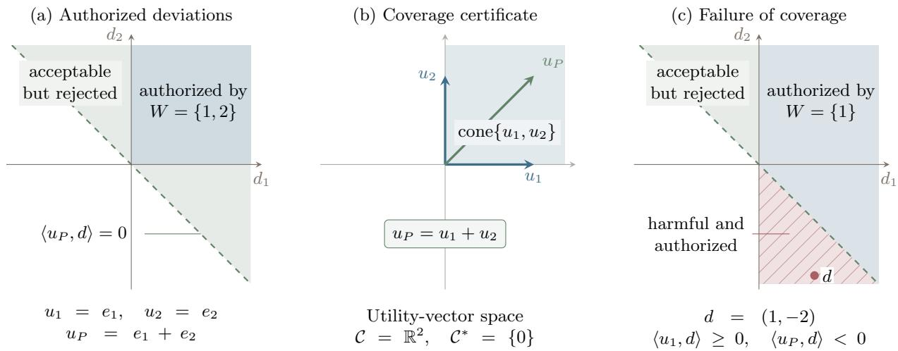  
Figure 1: Two complementary reviewers illustrate the soundness certificate. (a) Unanimity authorizes the first quadrant, contained in the principal’s acceptable halfspace. (b) The same inclusion is certified by $u _ { P } = u _ { 1 } + u _ { 2 } $ . (c) Reviewer 1 alone authorizes the hatched harmful region, including $d = ( 1 , - 2 )$ . Green marks acceptable deviations; blue marks authorization, with hatching identifying the harmful overlap.

(ii) For every minimally winning coalition $W \in \mathcal { M } ( \mathcal { W } )$ , the cone of feasible deviations approved by all members of W lies in the principal’s acceptable halfspace:

$$
{ \mathcal { C } } \cap \bigcap _ { i \in W } \{ d : \langle u _ { i } , d \rangle \geq 0 \} \subseteq \{ d : \langle u _ { P } , d \rangle \geq 0 \} .
$$

(iii) Every minimally winning coalition covers the principal relative to C:

$$
u _ { P } \in \mathrm { c o n e } \{ u _ { i } : i \in W \} + { \mathcal C } ^ { * } \qquad f o r \ e v e r y \ W \in { \mathcal M } ( { \mathcal W } ) .
$$

Equivalently, for every $W \in \mathcal { M } ( \mathcal { W } )$ there exist $\lambda _ { i } ^ { W } \geq 0$ and $z _ { W } \in \mathcal { C } ^ { * }$ such that

$$
u _ { P } = \sum _ { i \in W } \lambda _ { i } ^ { W } u _ { i } + z _ { W } .
$$

Proof. Coverage and safety for a fixed coalition. For any coalition $W \subseteq N$ , set

$$
K _ { W } : = \mathcal { C } \cap \bigcap _ { i \in W } \{ d : \langle u _ { i } , d \rangle \geq 0 \} .
$$

We first establish the coalition-wise equivalence

$$
u _ { P } \in \mathrm { c o n e } \{ u _ { i } : i \in W \} + { \mathcal C } ^ { * } \quad \Longleftrightarrow \quad \langle u _ { P } , d \rangle \geq 0 \mathrm { ~ f o r ~ e v e r y ~ } d \in K _ { W } .\tag{1}
$$

If W covers the principal, write $\begin{array} { r } { u _ { P } = \sum _ { i \in W } \lambda _ { i } u _ { i } + z } \end{array}$ with $\lambda _ { i } \geq 0$ and $z \in { \mathcal { C } } ^ { * }$ . For every $d \in K _ { W }$

$$
\left. u _ { P } , d \right. = \sum _ { i \in W } \lambda _ { i } \left. u _ { i } , d \right. + \left. z , d \right. \geq 0 .
$$

Conversely, suppose every $d \in K _ { W }$ has nonnegative principal gain. Because C is polyhedral (it is generated by finitely many action deviations), there are vectors $a _ { 1 } , \ldots , a _ { \ell }$ such that

$$
\mathcal { C } = \{ d : \langle a _ { h } , d \rangle \geq 0 \mathrm { ~ f o r ~ } h = 1 , \ldots , \ell \} .
$$

To search for a harmful direction approved by every member of W, consider the linear program

$$
\begin{array} { r l } { \underset { d \in \mathbb { R } ^ { \Omega } } { \mathrm { m i n i m i z e } } } & { \langle u _ { P } , d \rangle } \\ { \mathrm { s u b j e c t ~ t o } } & { \langle a _ { h } , d \rangle \geq 0 \quad ( h = 1 , \ldots , \ell ) , } \\ & { \langle u _ { i } , d \rangle \geq 0 \quad ( i \in W ) . } \end{array}
$$

Its feasible set is $K _ { W } .$ , so its optimal value is zero: the objective is nonnegative on $K _ { W }$ , and $d = 0$ is feasible. Its LP dual is

$$
\operatorname* { m a x i m i z e } _ { \alpha , \lambda } ~ 0
$$

$$
\begin{array} { l l } { \mathrm { s u b j e c t ~ t o } } & { u _ { P } = \displaystyle \sum _ { h = 1 } ^ { \ell } \alpha _ { h } a _ { h } + \displaystyle \sum _ { i \in W } \lambda _ { i } u _ { i } , } \\ & { \alpha \in \mathbb { R } _ { + } ^ { \ell } , \quad \lambda \in \mathbb { R } _ { + } ^ { W } . } \end{array}
$$

Since the primal is feasible with finite optimum, LP strong duality guarantees that such multipliers exist. Each $a _ { h }$ belongs to $\mathcal { C } ^ { * }$ , so $\begin{array} { r } { z : = \sum _ { h = 1 } ^ { \ell } \alpha _ { h } a _ { h } } \end{array}$ also belongs to $\mathcal { C } ^ { \ast }$ . The dual equality therefore gives a coverage certificate for W. Applying this equivalence to each minimally winning coalition proves $( \operatorname { i i } ) \Longleftrightarrow ( \operatorname { i i i } )$

From coalitions to authorization rules. If (ii) holds and a proposal is executed, its approval set contains some $W \in \mathcal { M } ( \mathcal { W } )$ ; its deviation belongs to $K _ { W }$ , so its principal gain is nonnegative. Hence $( \mathrm { i i } ) { \Longrightarrow } ( \mathrm { i } )$ for any rule.

Conversely, suppose the rule is monotone and sound. For any $W \in \mathcal { M } ( \mathcal { W } )$ and $d \in K _ { W }$ 2 $W \subseteq S ( d )$ ; monotonicity makes $S ( d )$ winning, and soundness gives $\langle u _ { P } , d \rangle \geq 0$ . Thus $K _ { W }$ lies in the principal’s acceptable halfspace, which is (ii). □

Monotonicity is needed only for the converse. A nonmonotone rule may use the disapprovals outside an accepted set as additional information, so soundness need not force that set’s approvals alone to certify safety.

Because every admissible rule $( N \in \mathcal { W } )$ executes under unanimous approval, full-panel coverage is the minimum requirement for safe delegation of any form.

Corollary 1 (Existence of an admissible sound rule). An admissible sound authorization rule, not necessarily monotone, exists if and only if the full panel covers the principal relative to C. When this condition holds, unanimity is sound.

Proof. If the full panel covers the principal, unanimity is sound by Theorem 1. Conversely, every admissible rule executes under unanimous approval. Soundness therefore makes every deviation approved by all reviewers principal-acceptable, so equivalence (1) gives full-panel coverage. □

The characterization also gives a way to construct counterexamples to soundness. If a minimally winning coalition W fails to cover the principal, equivalence (1) gives a direction $d \in { \mathcal { C } }$ such that

$$
\langle u _ { i } , d \rangle \geq 0 \quad \forall i \in W , \qquad \langle u _ { P } , d \rangle < 0 .
$$

Since $\mathcal { C } = \mathrm { c o n e } ( \mathcal { D } )$ , a suficiently small positive multiple of d belongs to $\mathcal { D } .$ Scaling preserves the signs of all utility gains, so this gives a feasible proposal that every member of W approves but that harms the principal. If the rule is monotone, it executes this proposal even if reviewers outside W also approve. For each fixed coalition W, linear programming can find either coeficients certifying coverage or such a harmful proposal.

The same characterization also answers a design question: for a fixed panel, how permissive can a sound monotone authorization rule be?

Definition 3.1 (Maximally permissive sound approval sets). Define

$$
\mathcal { W } _ { \mathrm { s n d } } ^ { \operatorname* { m a x } } : = \left\{ S \subseteq N : u _ { P } \in \mathrm { c o n e } \{ u _ { i } : i \in S \} + \mathcal { C } ^ { * } \right\} .
$$

Thus an approval set belongs to $\mathcal { W } _ { \mathrm { s n d } } ^ { \mathrm { m a x } }$ exactly when its members’ approvals alone certify nonnegative principal gain on every feasible proposal.

Proposition 1 (Maximally permissive sound monotone rule). If the full panel covers the principal, then $\mathcal { W } _ { \mathrm { s n d } } ^ { \mathrm { m a x } }$ is a sound monotone authorization rule. Every sound monotone rule W satisfies

$$
\mathcal { W } \subseteq \mathcal { W } _ { \mathrm { s n d } } ^ { \mathrm { m a x } } .
$$

More generally, any family contained in $\mathcal { W } _ { \mathrm { s n d } } ^ { \mathrm { m a x } }$ is sound; $i f$ it contains $N _ { ; }$ it is an admissible authorization rule.

Proof. Coverage is preserved when reviewers are added, so $\mathcal { W } _ { \mathrm { s n d } } ^ { \mathrm { m a x } }$ is upward closed; full-panel coverage ensures that it contains N. If $S ( d ) \in \mathcal { W } _ { \mathrm { s n d } } ^ { \operatorname* { m a x } }$ , write

$$
u _ { P } = \sum _ { i \in S ( d ) } \lambda _ { i } u _ { i } + z , \qquad \lambda _ { i } \geq 0 , \quad z \in \mathcal { C } ^ { * } .
$$

Every reviewer in $S ( d )$ has nonnegative gain and $\langle z , d \rangle \geq 0 , \mathrm { s o } \ \langle u _ { P } , d \rangle \geq 0$ . This proves soundness, as well as soundness of every subfamily. Conversely, Theorem 1 says that every minimally winning coalition of a sound monotone rule covers the principal. Every winning coalition contains such a coalition and therefore covers as well, proving the inclusion. □

Exact coverage excludes approval of any action that results in even tiny principal loss. If the principal’s utility difers slightly from a covering combination, the same argument can bound the loss rather than rule it out. We formalize this relaxation by allowing a residual whose value on any feasible proposal is no smaller than −ε.

Definition 3.2 (Approximate soundness and lower coverage). For $\varepsilon \geq 0$ , a rule is ε-sound on D if every executed $d \in \mathcal { D }$ satisfies $\langle u _ { P } , d \rangle \geq - \varepsilon$ . Define the lower residual set

$$
\mathcal { R } _ { \varepsilon } ^ { - } ( \mathcal { D } ) : = \left\{ r \in \mathbb { R } ^ { \Omega } : \langle r , d \rangle \geq - \varepsilon \mathrm { ~ f o r ~ e v e r y ~ } d \in \mathcal { D } \right\} .
$$

A coalition S ε-covers the principal from below on D if

$$
u _ { P } \in \mathrm { c o n e } \{ u _ { i } : i \in S \} + \mathcal { R } _ { \varepsilon } ^ { - } ( \mathcal { D } ) .
$$

The panel has k-robust lower coalitional alignment on D at tolerance ε if every coalition of $n - k$ reviewers has this property. Equivalently, every coalition of at least $n - k$ reviewers does.

We state exact results on the scale-free cone C and nonzero error bounds on D, because the magnitude of an approximation error depends on scale. These parameters do not alter sincere voting: reviewers still approve exactly when their own gain is nonnegative. Appendix A gives the approximate counterpart of Theorem 1.

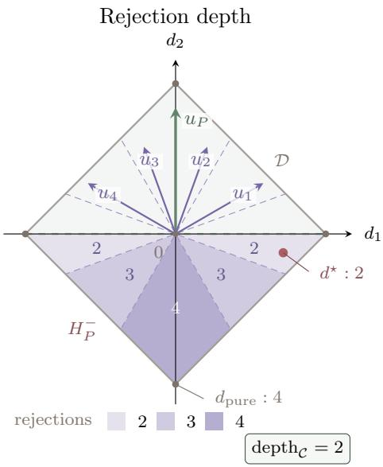  
Figure 2: Rejection depth in a two-dimensional deviation space. Each utility vector is normal to a dashed zero-gain line, and reviewer i rejects on the side opposite $u _ { i }$ . Within the principal-harmful region $H _ { P } ^ { - }$ , the purple shade and number give $| N ^ { - } ( d ) |$ . The harmful mixed-proposal deviation $d ^ { \star }$ receives the minimum of two objections, whereas the harmful pure deviation receives four.

## 3.2 Threshold voting and rejection depth

We now specialize the characterization to threshold rules, which decide whether to execute a proposa using only the number of disapprovals. Because these rules treat reviewers symmetrically, their minimal winning coalitions are determined by a single count. The question is how many disapprovals the rule can tolerate while still rejecting every harmful proposal. This is determined by the harmful proposal that receives the fewest objections, which motivates the following definition of rejection depth.

Definition 3.3 (Threshold rule and rejection depth). For $k \in \{ 0 , \ldots , n - 1 \}$ , the k-tolerant threshold rule executes a proposal when at most k reviewers disapprove. Write

$$
N ^ { - } ( d ) : = \{ i \in N : \langle u _ { i } , d \rangle < 0 \}
$$

for the reviewers who disapprove deviation d. The rejection depth of the principal relative to the panel is the fewest objections received by any harmful feasible direction:

$$
\mathrm { d e p t h } _ { \mathcal { C } } ( u _ { P } ; u _ { 1 } , \ldots , u _ { n } ) : = \operatorname* { m i n } _ { \stackrel { d \in \mathcal { C } } { \left. u _ { P } , d \right. < 0 } } | N ^ { - } ( d ) | .
$$

See Figure 2 for a visualization. If the principal has no harmful feasible direction, set the depth equal to $n + 1$

Thus a k-tolerant rule is sound exactly when every harmful feasible proposal receives at least $k + 1$ objections. Its minimal winning coalitions are all sets of $n - k$ reviewers, so Theorem 1 gives an equivalent condition: coverage must survive the deletion of any k reviewers. Rejection depth and robust coalitional alignment therefore express the same requirement, one by counting objections and the other by relating the reviewers’ utilities to the principal’s.

Corollary 2 (Coalitional alignment characterizes threshold soundness). For every $k \in \{ 0 , \ldots , n - 1 \}$ }, the following are equivalent:

(i) the k-tolerant threshold rule is sound;

(ii) dept $\mathrm { h } _ { \mathcal { C } } ( u _ { P } ; u _ { 1 } , \dots , u _ { n } ) \ge k + 1$

(iii) the panel is k-robustly coalitionally aligned relative to $\mathcal { C }$

More generally, the rule is $\varepsilon _ { \mathrm { h a r m } }$ -sound on D if and only if the panel has k-robust lower coalitional alignment on D at tolerance εharm.

Proof. The rule executes exactly when $| N ^ { - } ( d ) | \leq k$ . It is therefore sound exactly when every harmful deviation has $| N ^ { - } ( d ) | \geq k + 1$ , proving $\mathrm { ( i ) { \Longleftrightarrow } ( i i ) }$ . Its minimally winning coalitions are the $( n - k )$ -element sets, so Theorem 1 turns the same condition into (iii). Replacing exact coverage by lower coverage and using Theorem 5 (Appendix A) proves the approximate statement. □

## 3.3 How robust coalitional alignment can arise

We close the static analysis with a simple way in which coalitional alignment can arise from reviewer heterogeneity. Suppose reviewers are sampled independently and their misalignment directions are centrally symmetric around the principal’s objective. Informally, this models a setting in which alignment is hard because when attempting to produce an aligned agent, their realized utility function is noisy (perhaps very noisy), but not systematically biased. Then every harmful direction is opposed by at least half the population. Uniform convergence makes the same statement hold, up to a vanishing error, for a suficiently large sampled panel.

Corollary 3 (Centrally symmetric objective noise). Suppose the reviewer objectives are drawn independently and identically as $u _ { i } = u _ { P } + \xi _ { i }$ , and every one-dimensional projection $\langle \xi _ { i } , d \rangle$ is centrally symmetric about zero. In fixed feasible dimension,

$$
\frac { 1 } { n } \operatorname * { d e p t h } _ { \mathcal { C } } ( u _ { P } ; u _ { 1 } , \ldots , u _ { n } ) \ge \frac { 1 } { 2 } - o ( 1 )
$$

with high probability as $n \to \infty$

If the population assigns probability zero to the principal’s positive utility ray on the feasible span, then almost surely no sampled reviewer is individually aligned. Nevertheless, for fixed feasible dimension the panel soundly tolerates deletion of nearly half its reviewers with high probability as n grows. Appendix A gives the finite-sample bound, a more general population condition, and the proof.

## 4 Sequential authorization in a discounted MDP

The one-decision model evaluates a proposal in isolation. For a long-running agent, authorization instead takes place repeatedly: each executed action changes the state from which the next proposal will be made. A reviewer must therefore account for the action’s future consequences as well as its immediate reward. We extend the model to a discounted MDP and replace the baseline action with a baseline policy. This policy specifies what to do after rejection and provides a common continuation against which each participant evaluates a proposed action.

## 4.1 Control model and continuation-aware votes

Definition 4.1 (Discounted control model). Consider a finite discounted MDP with state space $s { \mathrm { . } }$ action space A, transition kernel P, and discount factor $\gamma \in ( 0 , 1 )$ . Participant $j \in \{ P , 1 , \ldots , n \}$ has bounded reward function $r _ { j } ( s , a )$ . Fix a stationary randomized baseline policy $\pi ^ { 0 }$ . Participant $j ^ { \dag } \mathrm { s }$ baseline value and action-value functions are

$$
\begin{array} { r l r } & { } & { V _ { j } ^ { 0 } ( s ) : = { \mathbb E } _ { \pi ^ { 0 } } \left[ \displaystyle \sum _ { t = 0 } ^ { \infty } \gamma ^ { t } r _ { j } ( s _ { t } , a _ { t } ) \bigg | s _ { 0 } = s \right] , } \\ & { } & { Q _ { j } ^ { 0 } ( s , a ) : = r _ { j } ( s , a ) + \gamma { \mathbb E } _ { s ^ { \prime } \sim { \mathbb P } ( \cdot | s , a ) } [ V _ { j } ^ { 0 } ( s ^ { \prime } ) ] , } \end{array}
$$

respectively.

These two value functions compare continuations from the same state. $V _ { j } ^ { 0 } ( s )$ is participant $j ^ { \circ } \mathrm { s }$ expected discounted reward from following the baseline policy starting at s. In $Q _ { j } ^ { 0 } ( s , a )$ , only the first action changes: action a is taken at s and the baseline is followed thereafter. Their diference measures how this one-step deviation changes the participant’s long-run reward, and is called the baseline advantage:

The use of Q-values rather than immediate rewards is essential. Two actions can have the same reward at the current state while sending the system to states with very diferent future value. A reviewer voting from $r _ { i } ( s , a )$ alone would miss this efect; $Q _ { i } ^ { 0 } ( s , a )$ evaluates the complete deviation consisting of the proposed action followed by the baseline continuation.

Reviewers therefore need access to their baseline-continuation values, or estimates of them; Appendix D bounds the efect of errors in those evaluations.

Definition 4.2 (Continuation-aware authorization). At state $s ,$ the proposer agent selects a randomized action $q \in \mathcal { Q } _ { s } \subseteq \Delta ( A )$ , where $\mathcal { Q } _ { s }$ is a convex polytope containing $\pi ^ { 0 } ( \cdot \mid s )$ . Reviewer i approves when the proposed one-step deviation, followed conceptually by the baseline continuation, weakly improves their value:

$$
\begin{array} { l } { { \displaystyle \sum _ { a } q ( a ) Q _ { i } ^ { 0 } ( s , a ) \geq V _ { i } ^ { 0 } ( s ) } } \\ { { \displaystyle \qquad = \sum _ { a } \pi ^ { 0 } ( a \mid s ) Q _ { i } ^ { 0 } ( s , a ) . } } \end{array}
$$

Equivalently,

$$
\left. Q _ { i } ^ { 0 } ( s , \cdot ) , q - \pi ^ { 0 } ( \cdot \mid s ) \right. \geq 0 .
$$

Write

$$
S _ { s } ( q ) : = \left\{ i \in N : \langle Q _ { i } ^ { 0 } ( s , \cdot ) , q - \pi ^ { 0 } ( \cdot \mid s ) \rangle \geq 0 \right\}
$$

for the approval set at state s. A state-dependent authorization rule specifies a family $\mathcal { W } _ { s } \subseteq 2 ^ { N }$ with $N \in \mathcal { W } _ { s }$ at each state. It executes q when $S _ { s } ( q ) \in \mathcal { W } _ { s }$ . If the proposal is rejected, the rule instead samples an action from $\pi ^ { 0 } ( \cdot \mid s )$ . The rule uses the state to select $\mathcal { W } _ { s }$ and receives one bit from each reviewer. It is monotone if each family $\mathcal { W } _ { s }$ is upward closed.

The statewise deviation set and cone are

$$
\begin{array} { r l } & { \mathcal { D } _ { s } : = \{ q - \pi ^ { 0 } ( \cdot \mid s ) : q \in \mathcal { Q } _ { s } \} , } \\ & { \mathcal { C } _ { s } : = \mathrm { c o n e } ( \mathcal { D } _ { s } ) . } \end{array}
$$

Because $\mathcal { Q } _ { s }$ is a polytope, $\mathcal { C } _ { s }$ is a polyhedral cone. The baseline Q-vectors $Q _ { j } ^ { 0 } ( s , \cdot )$ are the analogue of the utility vectors in the static setting.

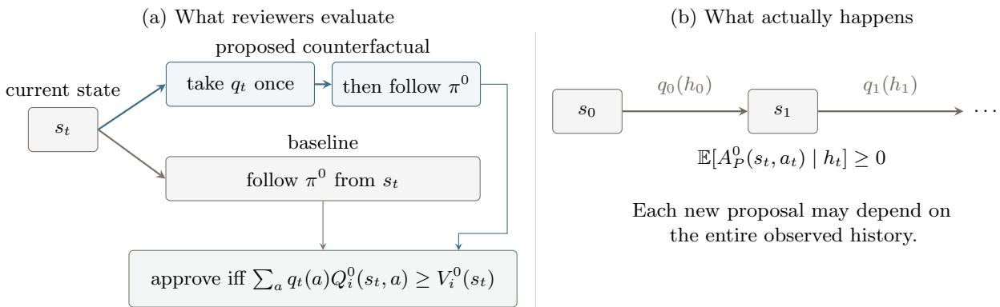  
Figure 3: (a) Reviewer i compares taking the proposal once and then following the baseline with following the baseline immediately. (b) The actual process may propose again after every transition. Local soundness makes each authorized proposal’s conditional baseline advantage nonnegative, even when proposals depend on the observed history.

The proposer agent need not follow a stationary or Markov policy. At every time it may choose its proposal as an arbitrary function of the entire observed history. The authorization layer is thus required to protect the principal against adaptive sequences of individually reviewed actions, not merely against a fixed candidate policy.

## 4.2 From local authorization to global control

The static characterization applies at each state with the baseline Q-vectors as utilities, but the guarantee it gives concerns a particular continuation: take the proposed action once and then follow the baseline. The actual process need not follow that continuation. After the action is executed, the proposer agent observes the new state and may submit another proposal, possibly in response to the entire history. Figure 3 illustrates the diference between the comparison used to cast a vote and the trajectory that results from repeated authorization. We need to show that safety of each local comparison protects the principal along this adaptive trajectory.

The next theorem establishes the equivalence of the local condition (i) with the global guarantee (ii); for monotone rules, the local condition has the same coalitional coverage form as in the static analysis.

Theorem 2 (Local soundness characterizes baseline safety). Fix state-dependent authorization rules $( \mathcal { W } _ { s } ) _ { s \in \mathcal { S } }$ , not necessarily monotone. The following are equivalent:

(i) At every state s, every proposal $q \in \mathcal { Q } _ { s }$ that the rule executes has nonnegative principal baseline advantage:

$$
\left. Q _ { P } ^ { 0 } ( s , \cdot ) , q - \pi ^ { 0 } ( \cdot \mid s ) \right. \geq 0 .
$$

(ii) For every initial state s0 and every proposer agent whose proposals may depend arbitrarily on the full interaction history, the resulting history-dependent policy π satisfies

$$
J _ { P } ( \pi \mid s _ { 0 } ) \geq V _ { P } ^ { 0 } ( s _ { 0 } ) ,
$$

where

$$
J _ { P } ( \pi \mid s _ { 0 } ) : = \mathbb { E } _ { \pi } \left[ \sum _ { t = 0 } ^ { \infty } \gamma ^ { t } r _ { P } ( s _ { t } , a _ { t } ) \Bigg | s _ { 0 } \right] .
$$

If each $\mathcal { W } _ { s }$ is monotone, these conditions are further equivalent to statewise coalitional coverage: at every state s and for every $W \in \mathcal { M } ( \mathcal { W } _ { s } )$

$$
Q _ { P } ^ { 0 } ( s , \cdot ) \in \mathrm { c o n e } \{ Q _ { i } ^ { 0 } ( s , \cdot ) : i \in W \} + { \mathcal { C } } _ { s } ^ { * } .
$$

The reason local safety sufices is the performance-diference identity. It expresses the principal’s expected gain over the baseline as the expected discounted sum of baseline advantages along the actual trajectory. Conditional on any observed history, local soundness makes the advantage of an authorized proposal nonnegative in expectation; choosing the baseline after rejection contributes zero. Summing these quantities gives the global guarantee even when future proposals adapt to earlier outcomes. Conversely, if local soundness fails at one state, a proposer starting there can submit the harmful proposal once and then return to the baseline. The resulting loss shows why the local condition is also necessary.

If local soundness holds only up to an error, the same identity bounds the accumulated loss. Each state’s error contributes in proportion to how often that state is visited and how far into the future it is reached.

Corollary 4 (Approximate local losses compose globally). Fix a function $\varepsilon _ { \mathrm { h a r m } } : \mathcal { S } \to [ 0 , \infty )$ . For monotone rules, the statewise guarantee that every executed proposal at s has principal baseline advantage at least $- \varepsilon _ { \mathrm { h a r m } } ( s )$ is equivalent to

$$
\begin{array} { r } { Q _ { P } ^ { 0 } ( s , \cdot ) \in \mathrm { c o n e } \{ Q _ { i } ^ { 0 } ( s , \cdot ) : i \in W \} + \mathcal { R } _ { \varepsilon _ { \mathrm { h a r m } } ( s ) } ^ { - } ( \mathcal { D } _ { s } ) \qquad f o r ~ e v e r y ~ W \in \mathcal { M } ( \mathcal { W } _ { s } ) . } \end{array}
$$

For rules of any form, these local bounds imply

$$
J _ { P } ( \pi \mid s _ { 0 } ) - V _ { P } ^ { 0 } ( s _ { 0 } ) \geq - \mathbb { E } _ { \pi } \left[ \sum _ { t = 0 } ^ { \infty } \gamma ^ { t } \varepsilon _ { \mathrm { h a r m } } ( s _ { t } ) \Bigg | s _ { 0 } \right] .
$$

In particular, a uniform bound $\varepsilon _ { \mathrm { h a r m } } ( s ) \leq \bar { \varepsilon } _ { \mathrm { h a r m } }$ gives

$$
J _ { P } ( \pi \mid s _ { 0 } ) \geq V _ { P } ^ { 0 } ( s _ { 0 } ) - \frac { \bar { \varepsilon } _ { \mathrm { h a r m } } } { 1 - \gamma } .
$$

Proof of Theorem $\mathcal { Q }$ and Corollary $\it 4 .$ Local bounds imply global bounds. Consider first the general local bound in the corollary; the exact implication is the special case $\varepsilon _ { \mathrm { h a r m } } \equiv 0$ . For an executed proposal $q$ at state $s ,$ the identity

$$
\sum _ { a } \pi ^ { 0 } ( a \mid s ) Q _ { P } ^ { 0 } ( s , a ) = V _ { P } ^ { 0 } ( s ) ,
$$

shows that a local principal-gain bound $- \varepsilon _ { \mathrm { h a r m } } ( s )$ is equivalent to

$$
\sum _ { a } q ( a ) A _ { P } ^ { 0 } ( s , a ) \geq - \varepsilon _ { \mathrm { h a r m } } ( s ) .
$$

A rejected proposal causes the rule to use $\pi ^ { 0 } ( \cdot \mid s )$ , whose expected baseline advantage is exactly zero. Hence, conditional on every history $h _ { t }$

$$
\mathbb { E } _ { \pi } [ A _ { P } ^ { 0 } ( s _ { t } , a _ { t } ) \mid h _ { t } ] \ge - \varepsilon _ { \mathrm { h a r m } } ( s _ { t } ) .
$$

For every finite $T ,$ the Bellman equation for $V _ { P } ^ { 0 }$ telescopes to the performance-diference identity (Kakade and Langford, 2002)

$$
\begin{array} { r l } { \mathbb { E } _ { \boldsymbol \pi } \left[ \displaystyle \sum _ { t = 0 } ^ { T } \gamma ^ { t } A _ { P } ^ { 0 } ( s _ { t } , a _ { t } ) \right] = \mathbb { E } _ { \boldsymbol \pi } \left[ \displaystyle \sum _ { t = 0 } ^ { T } \gamma ^ { t } r _ { P } ( s _ { t } , a _ { t } ) \right] - V _ { P } ^ { 0 } ( s _ { 0 } ) } & { } \\ { + \left. \gamma ^ { T + 1 } \mathbb { E } _ { \boldsymbol \pi } [ V _ { P } ^ { 0 } ( s _ { T + 1 } ) ] . \right. } \end{array}
$$

Since rewards and $V _ { P } ^ { 0 }$ are bounded, the final term vanishes as $T \to \infty$ . Therefore

$$
J _ { P } ( \pi \mid s _ { 0 } ) - V _ { P } ^ { 0 } ( s _ { 0 } ) = \mathbb { E } _ { \pi } \left[ \sum _ { t = 0 } ^ { \infty } \gamma ^ { t } A _ { P } ^ { 0 } ( s _ { t } , a _ { t } ) \right] .
$$

Iterated expectation now $\mathrm { g i }$ ves

$$
J _ { P } ( \pi \mid s _ { 0 } ) - V _ { P } ^ { 0 } ( s _ { 0 } ) \geq - \mathbb { E } _ { \pi } \left[ \sum _ { t = 0 } ^ { \infty } \gamma ^ { t } \varepsilon _ { \mathrm { h a r m } } ( s _ { t } ) \Bigg | s _ { 0 } \right] .
$$

Taking $\varepsilon _ { \mathrm { h a r m } } \equiv 0$ proves $( \mathrm { i } ) { { \Longrightarrow } ( \mathrm { i i } ) }$ , and a uniform bound is summed by the geometric series. This proves the corollary’s quantitative claims.

Global bounds force local soundness. Suppose (i) fails at some state s. Then an executed proposal $q \in \mathcal { Q } _ { s }$ satisfies

$$
\left. Q _ { P } ^ { 0 } ( s , \cdot ) , q - \pi ^ { 0 } ( \cdot \mid s ) \right. < 0 .
$$

Starting from s, let the proposer agent submit this proposal once and submit the baseline distribution thereafter. The resulting policy has negative expected baseline advantage at time zero and zero expected baseline advantage at every later time. The performance-diference identity therefore gives

$$
J _ { P } ( \pi \mid s ) < V _ { P } ^ { 0 } ( s ) ,
$$

contradicting (ii). Hence (ii) implies (i).

Finally, for monotone rules, applying Theorem 1 and Theorem 5 (Appendix A) at each state gives the two coalitional characterizations. □

Specializing to threshold review recovers the language of robust coalitional alignment, now applied to the baseline Q-vectors at each state:

Corollary 5 (Threshold review in the control process). Suppose state s uses a $k _ { s } - t o l e r a n t$ threshold, where $k _ { s } \in \{ 0 , \ldots , n - 1 \}$ . The following are equivalent:

(i) for every initial state $s _ { 0 }$ and every history-adaptive proposer agent, the resulting policy π satisfies $J _ { P } ( \pi \mid s _ { 0 } ) \ge V _ { P } ^ { 0 } ( s _ { 0 } )$ ;

(ii) at every state s, the panel is $k _ { s }$ -robustly coalitionally aligned relative to $\mathcal { C } _ { s }$ when participant utilities are the vectors $Q _ { j } ^ { 0 } ( s , \cdot )$

More generally, for any function $\varepsilon _ { \mathrm { h a r m } } : \mathcal { S } \to [ 0 , \infty )$ , if the baseline Q-vectors have $k _ { s }$ -robust lower coalitional alignment on $\mathcal { D } _ { s }$ at tolerance $\varepsilon _ { \mathrm { h a r m } } ( s )$ , then the quantitative welfare bound in Corollary 4 holds.

Proof. Apply Corollary 2 at each state and then Theorem 2.

## 4.3 A state-independent certificate from reward functions

For monotone authorization rules, Theorem 2 characterizes safety through coverage by the baseline Q-vectors at every state; without monotonicity, coverage remains suficient. Because these vectors depend on the transition kernel and baseline policy, a separate certificate may be needed at each state. We therefore look for a stronger suficient condition that can be checked directly on the reward functions, before choosing a baseline policy or computing any continuation values.

Definition 4.3 (Reward-function coverage). A coalition $S$ covers the principal in reward-function space if there are coeficients $\lambda _ { i } ^ { S } \geq 0$ such that

$$
r _ { P } ( s , a ) = \sum _ { i \in S } \lambda _ { i } ^ { S } r _ { i } ( s , a ) \qquad \mathrm { f o r ~ e v e r y ~ } ( s , a ) \in { \mathcal { S } } \times A .
$$

The coeficients in this definition are fixed across states and actions. Discounted sums and expectations preserve the equality, so the same coeficients also combine the reviewers’ baseline Q-values into the principal’s. This condition is stronger than statewise coverage, but supplies it at every state and for every choice of dynamics.

Corollary 6 (Reward-function coverage lifts to every state). Fix an authorization rule W, not necessarily monotone. Suppose every inclusion-minimal winning approval set covers the principal in reward-function space. Then, for every transition kernel, baseline policy, initial state, and history-adaptive proposer agent, the same state-independent rule W keeps the principal’s expected discounted utility at least as high as under the baseline.

In particular, the state-independent k-tolerant threshold rule has this guarantee $i f$ every $( n - k )$ reviewer coalition covers the principal in reward-function space.

Proof. Fix a reward-function certificate for S. Linearity of expectation under the baseline gives

$$
V _ { P } ^ { 0 } ( s ) = \sum _ { i \in S } \lambda _ { i } ^ { S } V _ { i } ^ { 0 } ( s ) \qquad \mathrm { a n d } \qquad Q _ { P } ^ { 0 } ( s , a ) = \sum _ { i \in S } \lambda _ { i } ^ { S } Q _ { i } ^ { 0 } ( s , a )
$$

for every state s and action $a .$ Thus S has a zero-slack statewise $Q \mathrm { - }$ -vector cover. Every winning approval set contains an inclusion-minimal winning subset, and coverage is preserved when reviewers are added. Thus every winning approval set has a zero-slack statewise Q-vector cover, and Theorem 2 gives the claimed baseline-safety guarantee. For the threshold rule, every winning set contains an (n − k)-element covering subset, proving the final claim. □

The reward identity in Corollary 6 gives a guarantee that holds for every choice of dynamics. For a fixed transition kernel, however, equality of reward functions is stronger than needed: authorization depends on comparisons with the baseline. Discounted potential-based shaping can change the rewards while leaving every baseline advantage and every policy’s return relative to the baseline unchanged (Ng et al., 1999). Appendix B.1 characterizes the resulting relaxation of reward-function coverage.

## 5 Strategic reviewers and the role of unanimity

The preceding guarantees allow reviewers to have diferent objectives but assume that they report their comparisons sincerely. A reviewer acting to maximize its own return may instead have an incentive to vote insincerely, especially when its vote afects which proposals it will face later. We now ask when authorization remains safe under this strategic behavior. We begin with a single decision, where the reviewer’s incentive depends on whether its vote can change the outcome and on the sign of its gain from execution. We then return to the control process.

Sincere voting in one decision. Fix a single feasible proposal with deviation $d \in \mathcal { D }$ . Normalize every reviewer’s payof from rejection to zero, so reviewer i receives $\langle u _ { i } , d \rangle$ if the proposal is executed. The reviewers vote simultaneously, and the authorization rule maps their approval set to execution or rejection. Under a monotone rule, sincerity is weakly dominant: a reviewer can change the outcome only toward execution by approving, or toward rejection by disapproving.

Proposition 2 (Sincere voting is weakly dominant). Fix a proposal d and a monotone authorization rule. $I f \left. u _ { i } , d \right. > 0$ , approving weakly dominates disapproving for reviewer i; if $\langle u _ { i } , d \rangle < 0$ disapproving weakly dominates approving. $I f \left. u _ { i } , d \right. = 0$ , both votes are optimal. Consequently, the sincere voting profile is a dominant-strategy equilibrium of the one-decision game.

Proof. Fix the other reviewers’ votes. By monotonicity, changing reviewer i’s vote from disapproval to approval either leaves the outcome unchanged or changes it from rejection to execution. The latter change gives reviewer i gain $\langle u _ { i } , d \rangle$ . Its sign determines the weakly dominant vote; when the gain is zero, the reviewer is indiferent. □

Weak dominance does not eliminate all Nash equilibria: a reviewer may vote insincerely whenever its vote cannot change the outcome. Appendix B.2 shows that the ability to force rejection alone exactly characterizes one-decision Nash safety and records the refinement obtained by excluding weakly dominated votes. To describe who can force rejection, we distinguish individual veto power from the ability of several reviewers to block a proposal together.

For a monotone rule, a coalition $B \subseteq N$ is blocking if $N \setminus B \notin \mathcal { W }$ : unanimous disapproval by its members forces rejection, regardless of the votes outside B. Let $B ( \boldsymbol { \mathcal { W } } )$ be the set of inclusion-minimal blocking coalitions. A reviewer has veto power if it can force rejection alone, and the set of veto reviewers is

$$
V ( \mathcal { W } ) : = \{ i \in N : N \setminus \{ i \} \notin \mathcal { W } \} .
$$

## 5.1 Strategic safety in the control process

In the control process, a reviewer’s vote today shapes the proposals it will face tomorrow, so sincere statewise comparison is no longer dominant and we must work with equilibrium behavior directly. Return to the discounted MDP of Section 4. Fix any possibly randomized, history-dependent proposer policy $\rho .$ A review policy $\sigma _ { i }$ maps the observed history and current proposal to a possibly randomized vote. For a profile $\sigma = ( \sigma _ { 1 } , \ldots , \sigma _ { n } )$ , let

$$
J _ { j } ( \rho , \sigma \mid s _ { 0 } ) : = \mathbb { E } _ { \rho , \sigma } \left[ \sum _ { t = 0 } ^ { \infty } \gamma ^ { t } r _ { j } ( s _ { t } , a _ { t } ) \Bigg | s _ { 0 } \right]
$$

be participant $j ^ { \prime } \mathrm { s }$ expected return along the trajectory actually induced by the proposer, the votes, and the fallback to the baseline after rejection. Reviewer $i$ chooses $\sigma _ { i }$ to maximize $J _ { i }$ . Thus the strategic objective is the realized continuation payof, not the baseline-Q comparison that defines a sincere vote.

Under unanimity, a reviewer can secure its baseline return by always disapproving. A threshold that tolerates k disapprovals requires $k + 1$ reviewers to act together to force the baseline. We therefore consider stability against joint deviations, as well as deviations by one reviewer.

Definition 5.1 (Coalitional stability). Fix a proposer policy $\rho ,$ an initial state $s _ { 0 } .$ , an integer $c \geq 1$ and reviewer-specific tolerances $\pmb { \eta } = ( \eta _ { 1 } , \dots , \eta _ { n } ) \in \mathbb { R } _ { + } ^ { n }$ . A review-policy profile is $( c , \pmb { \eta } ) – c o a l i t i o n a l l y$ stable if no coalition B with $1 \leq | B | \leq c$ has a joint deviation in its review policies that raises each member i’s return by more than $\eta _ { i } ,$ holding the proposer and all other review policies fixed. We abbreviate $( c , \mathbf { 0 } )$ -coalitional stability as c-coalitional stability.

1-coalitional stability is ordinary Nash equilibrium in the reviewer game; n-coalitional stability is strong Nash equilibrium (Aumann, 1959). Although related in spirit to the cooperative-game core (Gillies, 1959), c-coalitional stability is distinct: the core asks whether any coalition can secure an alternative outcome that all its members prefer, whereas our notion asks whether a coalition of at most c reviewers can all benefit by jointly changing their voting policies within the fixed authorization game. Our definition is weaker than the c-resilient equilibrium used in distributed game theory, which rules out a coalition deviation that benefits even one deviating member (Abraham et al., 2006). If the proposer agent is itself strategic, the reviewer component of any Nash equilibrium of the full game is 1-coalitionally stable conditional on the proposer’s equilibrium strategy.

To turn coalitional stability into a guarantee for the principal, we need to relate the participants’ returns along the trajectory they actually induce. We use the stronger reward-function coverage condition from Definition 4.3. Each coalition’s covering coeficients are fixed across states and actions, so the same identity relates its members’ returns to the principal’s, including their gains over the baseline. This lets us infer from a principal loss that suficiently many reviewers would also benefit from forcing a return to the baseline.

Theorem 3 (Coalitional stability and strategic safety). Fix a monotone authorization rule W. Assume every minimally winning coalition $W \in \mathcal { M } ( \mathcal { W } )$ covers the principal in reward-function space: there are coeficients $\lambda _ { i } ^ { W } \geq 0$ such that

$$
r _ { P } = \sum _ { i \in W } \lambda _ { i } ^ { W } r _ { i } .
$$

Fix any proposer policy ρ and initial state $s _ { 0 }$ . Suppose that, at the review-policy profile $\sigma _ { ; }$ , no minimally blocking coalition $B \in B ( { \mathbb { W } } )$ can strictly improve every member’s return by jointly switching to always disapproving, holding the proposer and all other review policies fixed. Then

$$
J _ { P } ( \rho , \sigma \mid s _ { 0 } ) \ge V _ { P } ^ { 0 } ( s _ { 0 } ) .
$$

In particular, if $B ( \mathcal { W } ) \neq \emptyset _ { ; }$ , let $\boldsymbol { c } : = \operatorname* { m a x } _ { B \in B ( \mathcal { W } ) } | B |$ . Every c-coalitionally stable profile is baseline-safe. If $B ( \mathcal { W } ) = \alpha$ , every profile is baseline-safe. Under the k-tolerant threshold, $c = k + 1$ and it is enough that every $( n - k )$ -reviewer coalition cover the principal in reward-function space.

Proof. Write $\Delta _ { j } : = J _ { j } ( \rho , \sigma \mid s _ { 0 } ) - V _ { j } ^ { 0 } ( s _ { 0 } )$ . Because every participant’s return is evaluated along the same realized trajectory, reward-function coverage and linearity give, for every minimally winning coalition $W$

$$
\Delta _ { P } = \sum _ { i \in W } \lambda _ { i } ^ { W } \Delta _ { i } .\tag{∗}
$$

Suppose toward a contradiction that $\Delta _ { P } < 0$ , and let $S _ { + } : = \{ i : \Delta _ { i } \geq 0 \}$ . This set cannot be winning: otherwise it contains some $W \in \mathcal { M } ( \mathcal { W } )$ , and applying (∗) to that W would give $\Delta _ { P } \geq 0$ Hence $S _ { + }$ is losing, so its complement is blocking and contains some $B \in B ( \mathcal { W } )$ . Every $i \in B$ has $\Delta _ { i } < 0$ . If the members of $B$ jointly always disapprove, they force every proposal to be rejected and hence force the baseline policy, strictly improving every member’s return. This contradicts the assumed stability. Therefore $\Delta _ { P } \geq 0$ □

Reward-function coverage ensures that if every member of a winning coalition earns at least its baseline return, then the principal does too. If the principal instead loses, the reviewers who are below baseline must therefore contain a blocking coalition. Its members can all improve by always disapproving and thereby forcing the baseline policy. Coalitional stability rules out this profitable joint deviation, and hence rules out a loss for the principal.

Remark 5.1 (Approximate coalitional stability). In the setting of Theorem 3, fix covering coeficients $\lambda _ { i } ^ { W }$ and let $c \geq 1$ be at least the size of every minimally blocking coalition. Every $( c , \eta )$ -coalitionally stable profile satisfies

$$
J _ { P } ( \rho , \sigma \mid s _ { 0 } ) - V _ { P } ^ { 0 } ( s _ { 0 } ) \ge - \operatorname* { m a x } _ { W \in \mathcal { M } ( \mathcal { W } ) } \sum _ { i \in W } \lambda _ { i } ^ { W } \eta _ { i } .
$$

With $\Delta _ { j }$ as in the proof, set $S _ { + } : = \{ i : \Delta _ { i } \geq - \eta _ { i } \}$ . If $S _ { + }$ is winning, the return identity for a minimally winning coalition it contains gives the bound. Otherwise, its complement contains a minimally blocking coalition whose members each gain more than $\eta _ { i }$ by jointly forcing the baseline, contradicting stability.

Under unanimity, the joint deviation required by the theorem reduces to a deviation by one reviewer, since every reviewer can force the baseline on its own. Every reviewer therefore earns at least its baseline return at a Nash equilibrium. Full-panel reward-function coverage transfers these inequalities to the principal through a nonnegative combination. This gives a safety guarantee even in a game where the proposer agent also chooses its policy strategically.

Corollary 7 (Nash safety in the full proposer–reviewer game). Suppose the full panel covers the principal in reward-function space. Under unanimity, every Nash equilibrium of a game in which the proposer agent and reviewers all choose history-dependent policies gives the principal expected return at least $V _ { P } ^ { 0 } ( s _ { 0 } )$ , regardless of the proposer’s objective.

Proof. Fix a Nash equilibrium and hold the proposer’s equilibrium policy fixed. The reviewers’ equilibrium policies form a Nash equilibrium in the resulting reviewer game. Under unanimity, any reviewer can force the baseline by always disapproving, so the profile satisfies the deviation condition in Theorem 3. Apply that theorem. □

This Nash-safety guarantee depends on unanimity. If the rule tolerates even one disapproval and everyone approves, a single reviewer cannot prevent execution by changing its vote. Suppose also that the proposer responds to past votes only through whether a proposal was executed or rejected. A unilateral change in voting then leaves future proposals unchanged as well. Consequently, always approving can remain a Nash equilibrium even when the resulting trajectory harms the principal and every reviewer would prefer the baseline.

Proposition 3 (Unsafe Nash equilibria under permissive thresholds). Fix $k \in \{ 1 , \ldots , n - 1 \}$ and a proposer policy $\rho$ that depends on past votes only through the resulting execute/reject decisions. Let $\sigma ^ { \mathrm { a l l } }$ be the profile in which every reviewer always approves. If executing every proposal made by $\rho$ yields

$$
J _ { P } ( \rho , \sigma ^ { \mathrm { a l l } } \mid s _ { 0 } ) < V _ { P } ^ { 0 } ( s _ { 0 } ) ,
$$

then $\sigma ^ { \mathrm { a l l } }$ is an unsafe Nash equilibrium of the reviewer game under the k-tolerant threshold.

Proof. A unilateral deviation can create at most one disapproval, which a k-tolerant threshold with $k \geq 1$ ignores. Couple the deviating and all-approve plays using the same transition and proposer randomness. An induction over review times shows that each execute/reject decision is the same; the assumed invariance of $\rho$ then gives the same next proposal, so the entire state–action trajectory is the same. The deviator’s payof is therefore unchanged and the all-approve profile is a Nash equilibrium. The displayed inequality makes it unsafe. □

The failure can occur even when all reviewers are aligned with the principal: they may all prefer the baseline while no one can force it alone. Under a k-tolerant threshold, $k + 1$ reviewers can do so jointly. The coalitional-stability requirement in Theorem 3 rules out such an outcome, but requires more than ordinary Nash equilibrium. The guarantee for a permissive threshold therefore combines the stated coverage condition with a stronger behavioral assumption about joint deviations by blocking coalitions.

## 6 Completeness and the limits of binary approval

Soundness protects the principal against harmful proposals, but places no requirement on proposals that would benefit them. A panel can therefore be sound while rejecting many desirable actions. We return to sincere review in the one-decision model and ask whether an authorization rule can also execute every proposal the principal finds acceptable. This complementary requirement is completeness; together, soundness and completeness ask the rule to recover all of the decisions that the principal would themselves make from only the reviewers’ reports.

Definition 6.1 (Completeness and approximate implementation). A rule is complete on C if it executes every $d \in { \mathcal { C } }$ with $\langle u _ { P } , d \rangle \geq 0$ . For $\varepsilon _ { \mathrm { g o o d } } \geq 0$ , it is $\varepsilon _ { \mathrm { g o o d } ^ { - } } c o m p l e t e$ on D if it executes every $d \in \mathcal { D }$ with $\langle u _ { P } , d \rangle \geq \varepsilon _ { \mathrm { g o o d } } .$ . Together with $\varepsilon _ { \mathrm { h a r m } }$ -soundness, this gives an $( \varepsilon _ { \mathrm { h a r m } } , \varepsilon _ { \mathrm { g o o d } } ) -$ implementation. Exact soundness and completeness are the zero-error case.

## 6.1 The limits of binary approval

The complementary-reviewer example shows what can be lost when only binary votes are reported. Let $u _ { 1 } = e _ { 1 } , u _ { 2 } = e _ { 2 }$ , and $\boldsymbol { u } _ { P } = \boldsymbol { e } _ { 1 } + \boldsymbol { e } _ { 2 }$ on $\mathcal { C } = \mathbb { R } ^ { 2 }$ , as in Figure 1. The deviations $( 2 , - 1 )$ and $( 1 , - 2 )$ both receive approval from reviewer 1 and disapproval from reviewer 2, but their principal gains are 1 and −1, respectively. Any rule based on the approval set must make the same decision on both, so it either rejects the beneficial proposal or executes the harmful one. The following theorem generalizes this obstruction by examining where reviewers’ votes can change as feasible proposals cross the principal’s indiference boundary.

Theorem 4 (Binary separation and exact implementation). Let $L : = \operatorname { s p a n } ( \mathcal { C } )$ , and suppose there are deviations $d _ { + } , d _ { - } \in { \mathcal { C } }$ such that

$$
\langle u _ { P } , d _ { + } \rangle > 0 \qquad a n d \qquad \langle u _ { P } , d _ { - } \rangle < 0 .
$$

Let $f : 2 ^ { N }  \{ 0 , 1 \}$ be any deterministic rule based only on the approval set, not necessarily monotone. Suppose

$$
\langle u _ { P } , d \rangle > 0 \Longrightarrow f ( S ( d ) ) = 1 , \qquad \langle u _ { P } , d \rangle < 0 \Longrightarrow f ( S ( d ) ) = 0 \qquad ( d \in \mathcal { C } ) .
$$

Then:

(i) some reviewer i has the same indiference hyperplane as the principal on feasible proposals: for some $c \neq 0$ 2

$$
\begin{array} { r } { \langle u _ { i } , d \rangle = c \langle u _ { P } , d \rangle \qquad f o r e v e r y d \in L ; } \end{array}
$$

(ii) if f is monotone, then some such reviewer has $c > 0$ and is aligned with the principal;

(iii) the same positive-alignment conclusion holds, without monotonicity, if $f ( S ( d ) ) = 1$ whenever $\langle u _ { P } , d \rangle = 0$

Thus exact soundness and completeness require an aligned reviewer even for a nonmonotone rule. The weaker task of separating only strict gains from strict losses still requires a reviewer with the correct boundary, but a nonmonotone rule could invert the vote of a negatively proportional reviewer. Monotonicity or the convention that principal indiference is accepted rules out that inversion. Appendix C gives the proof.

Corollary 8 (Exact binary implementation). Under the hypotheses of Theorem $^ { 4 , }$ a deterministic approval-set rule satisfying

$$
f ( S ( d ) ) = 1 \quad \Longleftrightarrow \quad \langle u _ { P } , d \rangle \geq 0 \qquad ( d \in \mathcal { C } )
$$

exists if and only if some reviewer is aligned with the principal on L. When such a reviewer exists, its vote alone gives a monotone exact rule.

Proof. Necessity is part (iii) of Theorem 4. For suficiency, execute exactly when the aligned reviewer approves; positive proportionality makes its weak comparison identical to the principal’s on every feasible deviation. □

## 6.2 Approximate binary review from diverse panels

The impossibility above requires exact decisions even for proposals arbitrarily close to the principal’s indiference boundary. Allowing errors near that boundary leaves room for a panel to become increasingly accurate without any reviewer becoming individually aligned. A useful example is a panel whose utility vectors lie on a ring at a fixed angle from the principal’s vector (Figure 4). Over the full ring, a beneficial proposal receives a majority of approvals and a harmful one a majority of disapprovals. A finite panel approximates these proportions, either by sampling reviewers from the ring or by spacing their objectives evenly around it. The next result shows how both constructions approach the principal’s decisions as the panel grows.

Proposition 4 (Random and deterministic convergence without individual alignment). Let $\mathcal { D } =$ $\{ d \in \mathbb { R } ^ { 3 } : \| d \| _ { 1 } \leq 1 \}$ , let $u _ { P } = e _ { 3 }$ , and fix $\theta \in ( 0 , \pi / 2 )$ . Draw an odd number $n = 2 m + 1$ of reviewer objectives independently and uniformly from the vectors that form angle θ with uP on the ring shown in Figure $\it 4 .$ Under the m-tolerant majority rule, there are $\varepsilon _ { n } = O _ { \theta } ( \sqrt { \log n / n } )$ such that, with probability tending to one, the rule is $\left( \varepsilon _ { n } , \varepsilon _ { n } \right)$ )-implementing.

If n reviewer objectives are instead spaced evenly around the same ring, the conclusion holds deterministically with $\varepsilon _ { n } = \Theta ( 1 / n )$ . In both cases every reviewer remains at angle θ from the principal.

The geometry explains both the approximation error and the diference between the two rates. For a nonzero deviation with zero principal gain, the approving directions form a semicircle. A small negative gain shortens that arc, but it may still contain a majority of a finite panel, as in Figure 4(b). Equal spacing controls how much shorter than a semicircle such an arc can be; random panels must also account for sampling error. In both cases, the possible mistakes approach the principal’s indiference boundary while every reviewer remains at the same angle from the principal. Appendix C.1 gives the proofs and the general population-margin condition.

## 6.3 Numerical scores instead of binary votes

Approximation retains binary votes and permits small errors. Another way around the impossibility is to retain exactness and ask reviewers for more information. A binary vote reports only the sign

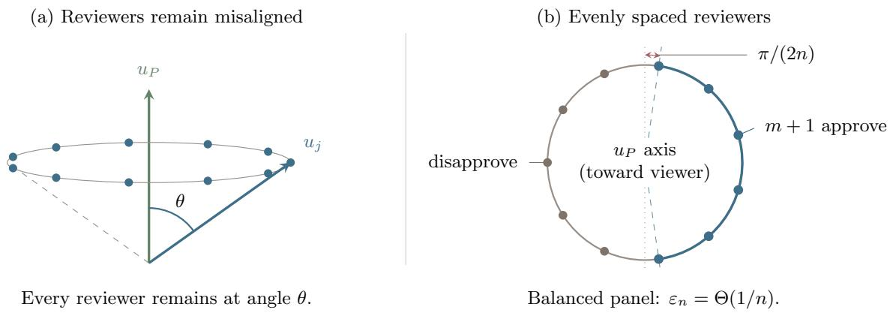  
Figure 4: Both views show eleven evenly spaced reviewers on a ring at fixed angle θ from the principal. (a) No reviewer approaches individual alignment as the panel grows. (b) The narrowest arc containing $m + 1$ reviewers leaves a gap of $\pi / ( 2 n )$ at each end of the enclosing semicircle, yielding deterministic implementation error $\Theta ( 1 / n )$

of a reviewer’s gain; a numerical score also reports its magnitude, allowing gains and losses across reviewers to be combined. Suppose each reviewer reports its gain $\langle u _ { i } , d \rangle$ . Fix nonnegative weights $\omega _ { 1 } , \ldots , \omega _ { n } .$ , not all zero, and define

$$
u _ { \omega } : = \sum _ { i = 1 } ^ { n } \omega _ { i } u _ { i } , \qquad G _ { \omega } ( d ) : = \sum _ { i = 1 } ^ { n } \omega _ { i } \left. u _ { i } , d \right. = \left. u _ { \omega } , d \right. .
$$

The weighted-score rule executes exactly when $G _ { \omega } ( d ) \geq 0$

The weighted-score rule therefore behaves like a single reviewer with utility vector $u _ { \omega }$ . On a linear domain, soundness and completeness require this aggregate to have the same acceptable halfspace as the principal. Because both d and −d are feasible, agreement on all decisions forces their utility gains to be positively proportional. The corollary characterizes this requirement; it can hold even when no individual reviewer’s utility is proportional to the principal’s.

Corollary 9 (Exact weighted scores on a linear domain). Suppose ${ \mathcal { C } } = L$ is a linear subspace. The fixed weighted-score rule is sound and complete if and only if there is a constant $c > 0$ such that

$$
\langle u _ { \omega } , d \rangle = c \langle u _ { P } , d \rangle \qquad f o r e v e r y d \in L .
$$

Proof. If the assumed proportionality holds, the rule makes exactly the same comparison as the principal. Conversely, suppose the rule is sound and complete. Then $\langle u _ { \omega } , d \rangle$ and $\langle u _ { P } , d \rangle$ have the same weak sign for every $d \in L .$ Their kernels therefore coincide, so the two linear functionals are proportional on $L ;$ equality of their signs makes the proportionality constant positive. If the principal is indiferent over L, soundness and completeness force the aggregate to be indiferent as well, and the claim holds for every $c > 0$ □

Return to the two complementary reviewers with $u _ { 1 } = e _ { 1 } , u _ { 2 } = e _ { 2 }$ , and $\boldsymbol { u } _ { P } = \boldsymbol { e } _ { 1 } + \boldsymbol { e } _ { 2 }$ . Their   
binary votes could not distinguish the beneficial deviation $( 2 , - 1 )$ from the harmful deviation $( 1 , - 2 )$   
Summing their numerical gains does distinguish them: with $\omega _ { 1 } = \omega _ { 2 } = 1$ ，

$$
G _ { \omega } ( d ) = \langle u _ { P } , d \rangle ,
$$

so the two deviations receive aggregate scores 1 and −1. More generally, the rule is sound and complete on every feasible deviation, although neither reviewer is individually aligned.

The two forms of review use the coverage relation diferently. A threshold rule only counts approvals: coalitional coverage can certify its soundness without the rule knowing the coeficients for any winning coalition. A weighted-score rule uses its coeficients in the authorization decision itself. To obtain exact soundness and completeness, the designer must therefore choose weights whose aggregate agrees with the principal on every feasible comparison. Numerical reports make that exact comparison possible in cases where the binary votes contain too little information.

## 7 Experiments with LLM reviewer panels

We test whether reviewer panels exhibit coalitional coverage without individual alignment and how their authorization rules trade of soundness and completeness 1. We use the one-decision model of Definition 2.1.

## 7.1 Experimental setup

RewardBench 2 (Malik et al., 2026) contains 1,763 standard prompts, each with four answers, one labeled correct, and scores from 48 reward models. We treat each reward model as a reviewer and its scores as cardinal utilities, extended linearly to lotteries over the four answers. The principal’s utility is one for the correct answer and zero for the others; the baseline samples uniformly from the four answers. A reviewer approves an answer whose score is at least its mean score, and ties count as approvals. We evaluate both deterministic answers and lotteries over them. Reviewers compare a lottery’s expected utility with the baseline and vote before sampling; rejection executes the uniform baseline.

StrongREJECT (Souly et al., 2024) pairs human harm annotations of model responses with automated evaluator scores. For each response, the proposal is to release it and the baseline is abstention. We retain 1,084 responses with all five human labels and nine evaluator scores. We model release as having principal gain $1 / 2 - h$ over abstention, where h is its median human harm score. An evaluator approves release when its harm score is at most 1/2. Applying the same cutof to the human median gives 190 harmful and 894 acceptable responses. We also allow lotteries between release and abstention. Appendix F.1 gives the full benchmark mappings and worked examples.

## 7.2 Coverage without individual alignment

On RewardBench, we center each utility vector by subtracting its mean over the four answers. We then check whether the principal’s vector is a nonnegative combination of the reviewers’ vectors. By the coverage characterization, this certifies soundness over every lottery under unanimous approval. Table 1 shows that coverage holds on most prompts even when every reviewer is individually misaligned (here misalignment is quantified as the angle of the reviewer utility vector from the principal utility vector). On 37.9% of prompts the panel is 5-robustly coalitionally aligned: coverage survives any five reviewer removals, so the 5-tolerant threshold rule remains sound. These certificates use benchmark labels; Appendix F.2 gives the optimization.

<table><tr><td rowspan="2"></td><td colspan="4">Covered after reviewer removals</td></tr><tr><td>Minimum reviewer angle Prompts</td><td>None</td><td>Any one</td><td>Any five</td></tr><tr><td>No restriction</td><td>1,763</td><td>1,590 (90.2%)</td><td>1,361 (77.2%)</td><td>669 (37.9%)</td></tr><tr><td> $> 5 ^ { \circ }$ </td><td>1,115</td><td>953 (85.5%)</td><td>762 (68.3%)</td><td>291 (26.1%)</td></tr><tr><td> $> 1 0 ^ { \circ }$ </td><td>704</td><td>575 (81.7%)</td><td>423 (60.1%)</td><td>125 (17.8%)</td></tr><tr><td> $> 1 5 ^ { \circ }$ </td><td>489</td><td>392 (80.2%)</td><td>263 (53.8%)</td><td>74 (15.1%)</td></tr><tr><td> $> 2 0 ^ { \circ }$ </td><td>299</td><td>228 (76.3%)</td><td>144 (48.2%)</td><td>36 (12.0%)</td></tr></table>

Table 1: Coalitional coverage of the 48-reviewer RewardBench 2 panel. Angle restrictions define nested prompt groups by the closest reviewer direction to the principal, using nonzero centered vectors. Coverage entries give counts and percentages within each row. Removal columns require coverage after every possible deletion of the stated number of reviewers. Certificates use benchmark labels and concern all lotteries over the four answers.

## 7.3 Authorization with binary votes

We vary k in the k-tolerant threshold rule to measure the tradeof between soundness and completeness (Figure 5). This rule authorizes a proposal with at most k disapprovals. On RewardBench, soundness counts prompts on which all three incorrect answers are rejected, and completeness counts prompts on which the correct answer is authorized. For lotteries, the requirements extend to every harmful or non-harmful mixture, respectively. On StrongREJECT, we measure the fraction of harmful responses withheld and the fraction of acceptable responses released; since it is a binary decision setting, deterministic and lottery guarantees coincide.

On StrongREJECT, tolerating one disapproval increases completeness without reducing soundness: every harmful response receives at least two disapprovals. Each disapproving reviewer is individually aligned on that response’s one-dimensional proposal domain, so several reviewers can reject the same harmful proposal. RewardBench instead exhibits coverage without an aligned individual (Table 1).

On RewardBench, the soundness/completeness tradeof is substantially better for deterministic proposals than for arbitrary lotteries: at $k = 9$ , both rates are about 70% (Figure 5). Both guarantees hold on $9 0 4 / 1 , 7 6 3 = 5 1 . 3 \%$ of prompts. Restricting review to deterministic proposals is natural and is satisfied by e.g. proposer agents that submit a single answer for approval, even if they use randomness to generate it. Requiring soundness and completeness over every lottery is more demanding: no evaluated threshold has positive exact soundness and completeness rates simultaneously. We therefore examine approximate guarantees in Appendix F.2 and numerical scores below.

## 7.4 Authorization with numerical scores

On RewardBench, we next compare the k-tolerant threshold rule with weighted voting, which assigns learned nonnegative weights to approvals, and a cardinal committee, which takes a nonnegative weighted sum of numerical gains, as in Section 6.3. Both authorize when their weighted total meets or exceeds a threshold. We also compare with a rule that thresholds a single reviewer’s numerical gain. We center and normalize numerical scores within each reviewer and prompt.

We fit reviewer weights on training data, using an $\ell _ { 2 }$ penalty to discourage large weights. We choose the penalty strength and the individual reviewer by their correct-answer selection accuracy on validation data. The score thresholds come from validation scores of deterministic answers; we use the same thresholds for both deterministic-answer and lottery evaluations on 352 test prompts. Figure 6 traces their observed tradeofs. Each reported comparison uses the most complete evaluated threshold meeting the stated soundness requirement on the test set. For lotteries, we retain exact soundness and measure 0.5-completeness: approval of every mixture with gain at least 0.5, or equivalently at least a 75% chance of returning the correct answer. Appendix F.3 gives the fitting details and controls; Appendix F.4 evaluates thresholds fixed using validation data alone.

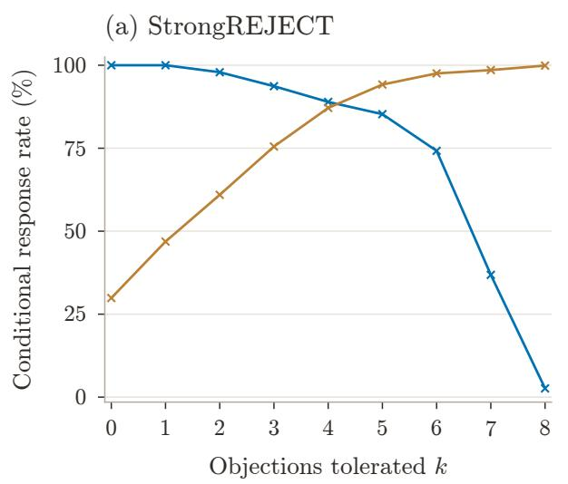

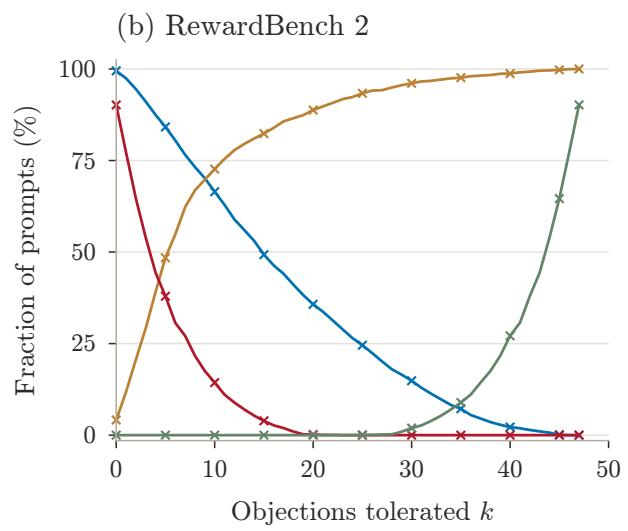  
Figure 5: Threshold-rule soundness and completeness as the number k of tolerated objections increases. On RewardBench 2, the tradeof is substantially better for individual answers than for guarantees over every lottery; on StrongREJECT the two evaluations coincide. StrongREJECT soundness and completeness are the fractions of harmful responses withheld and acceptable responses released, respectively. RewardBench rates are fractions of prompts.

Both numerical-score rules authorize more correct answers at high soundness than either binary rule. In panel (a), the cardinal committee also improves on the single reviewer: at a 99% test soundness requirement, it authorizes the correct answer on 60.5% of prompts, compared with 46.6% for the individual. Their curves are closer near 95% soundness. With thresholds selected using validation data alone, the committee achieves 98.6% test soundness and 63.4% completeness, compared with 96.6% and 62.5% for the individual (Appendix F.4). The committee’s advantage extends to lotteries in panel (b): it is 0.5-complete on more prompts than the individual. Appendix F.3 varies the minimum principal gain for guaranteed approval.

The binary rules’ limitation in panel (b) follows from coverage. The full panel covers the principal on 315 of the 352 test prompts (89.5%). Every other prompt admits a harmful lottery that every reviewer approves (Theorem 1). Thus any rule accepting unanimous approval has exact lottery soundness on at most 89.5% of prompts. For both global binary-rule families evaluated here, every threshold other than reject-all accepts unanimous approval, regardless of how its weights are chosen. Neither can meet a 90% soundness requirement with positive completeness. Numerical-score rules avoid this ceiling: a positive aggregate gain threshold can exclude unanimously approved proposals.

(a) Individual answers  
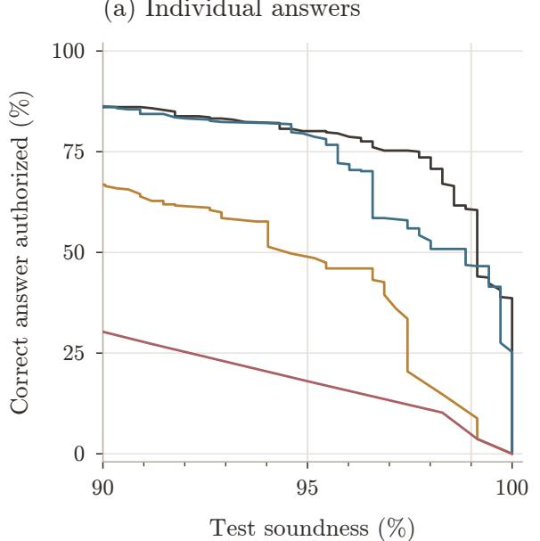

(b) Lotteries over answers  
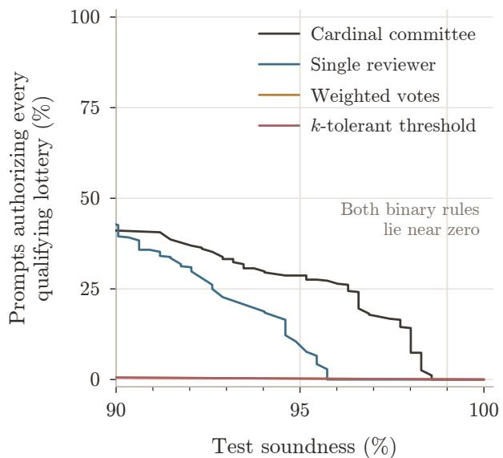  
Figure 6: Numerical-score rules achieve higher completeness than binary-vote rules at comparable high test soundness, especially over lotteries. Curves sweep thresholds for fixed rules on 352 RewardBench 2 test prompts: (a) individual answers; (b) all lotteries, with 0.5-completeness requiring approval of every lottery with at least a 75% chance of a correct answer. In (b), the only evaluated binary-rule operating point in the displayed soundness range is reject-all. Comparisons at a given soundness level select thresholds using test outcomes for descriptive purposes only; Appendix F.4 reports more results.

Such a threshold also rejects the zero-gain baseline, so it cannot be exactly complete. This explains the use of a positive completeness margin in panel (b).

## 8 Discussion

Delegating the review of a potentially misaligned AI agent to other AI agents would seem at first blush to simply push the alignment problem one level deeper. But in this paper we have identified a way in which it can work—and have characterized exactly when it does. Even in dynamic, stateful settings, unanimous sincere review is safe whenever the panel covers the principal’s baseline Q-vector at every state, which is a substantially weaker condition than individual alignment. This coalitional alignment condition is not guaranteed to be satisfied, and may be dificult to audit, but is unavoidable, as our characterization is bi-directional. Moreover, for the conservative unanimousapproval rule, coverage in reward-function space extends the guarantee to strategic, long-running reviewing agents, in every Nash equilibrium of the game induced by the approval process.

There is a limit to how much we can ask for from such delegated review: as we show, if we require not just perfect soundness, but also perfect completeness, then this can be accomplished only if the reviewing panel contains a perfectly aligned agent. But we have seen that this impossibility is brittle: it can be circumvented either by relaxing our goal to approximate soundness and completeness, or by eliciting richer information from reviewers.

Our experiments give an initial example of coalitional alignment in existing reviewer panels:

reward models can collectively cover a principal even when no individual reviewer is aligned. Our experiments also confirm that eliciting numerical scores can support substantially better soundness/completeness tradeofs than binary votes. Finding panels that retain coverage on new proposals and across changing states remains an important empirical problem, as does learning useful approval rules whose performance can be established before deployment.

## Acknowledgments

This work was supported in part by the Simons Collaboration on Algorithmic Fairness, the NSF EnCORE Tripods institute, an NSF graduate research fellowship, NSF CAREER #2543725, and a Schmidt Sciences AI2050 Fellowship. AI tools including GPT 5.6 Sol and GPT 6 were used in the development of this paper; the authors are (of course) responsible for all of its content.

## References

Ittai Abraham, Danny Dolev, Rica Gonen, and Joseph Y. Halpern. Distributed computing meets game theory: Robust mechanisms for rational secret sharing and multiparty computation. In Proceedings of the Twenty-Fifth Annual ACM Symposium on Principles of Distributed Computing, pages 53–62. ACM, 2006. doi: 10.1145/1146381.1146393. URL https://doi.org/10.1145/ 1146381.1146393.

Victor Akinwande, J. Zico Kolter, and Aran Nayebi. Sharding prevents LLM oversight failures and adversarial exploitation, August 2026. URL https://arxiv.org/abs/2608.06422.

Mohammed Alshiekh, Roderick Bloem, R¨udiger Ehlers, Bettina K¨onighofer, Scott Niekum, and Ufuk Topcu. Safe reinforcement learning via shielding. Proceedings of the AAAI Conference on Artificial Intelligence, 32(1):2669–2678, 2018. doi: 10.1609/aaai.v32i1.11797. URL https: //doi.org/10.1609/aaai.v32i1.11797.

Robert J. Aumann. Acceptable points in general cooperative n-person games. In R. Duncan Luce and Albert W. Tucker, editors, Contributions to the Theory of Games IV, volume 40 of Annals of Mathematics Studies, pages 287–324. Princeton University Press, Princeton, NJ, 1959.

Andrew Bennett, Dipendra Misra, and Nathan Kallus. Provable safe reinforcement learning with binary feedback. In Francisco Ruiz, Jennifer Dy, and Jan-Willem van de Meent, editors, Proceedings of The 26th International Conference on Artificial Intelligence and Statistics, volume 206 of Proceedings of Machine Learning Research, pages 10871–10900. PMLR, 2023. URL https://proceedings.mlr.press/v206/bennett23a.html.

David Bremner and Dan Chen. A branch and cut algorithm for the halfspace depth problem. arXiv:0910.1923 [cs.CG], 2009. URL https://arxiv.org/abs/0910.1923.

Zhaorun Chen, Mintong Kang, and Bo Li. ShieldAgent: Shielding agents via verifiable safety policy reasoning. In Aarti Singh, Maryam Fazel, Daniel Hsu, Simon Lacoste-Julien, Felix Berkenkamp, Tegan Maharaj, Kiri Wagstaf, and Jerry Zhu, editors, Proceedings of the 42nd International Conference on Machine Learning, volume 267 of Proceedings of Machine Learning Research, pages 8313–8344. PMLR, 2025. URL https://proceedings.mlr.press/v267/chen25ae.html.

Natalie Collina, Surbhi Goel, Aaron Roth, Emily Ryu, and Mirah Shi. Emergent alignment via competition. In Proceedings of the 43rd International Conference on Machine Learning, 2026a. URL https://icml.cc/virtual/2026/poster/62259.

Natalie Collina, Surbhi Goel, Aaron Roth, and Mirah Shi. Personalization aids pluralistic alignment under competition, February 2026b. URL https://arxiv.org/abs/2602.13451.

Rainer Dyckerhof and Stanislav Nagy. Exact computation of angular halfspace depth. Statistics and Computing, 35:173, August 2025. doi: 10.1007/s11222-025-10700-z. URL https://doi.org/ 10.1007/s11222-025-10700-z.

Josep Freixas, Xavier Molinero, Martin Olsen, and Maria Serna. On the complexity of problems on simple games. RAIRO. Operations Research, 45(4):295–314, October 2011. doi: 10.1051/ro/ 2011115. URL https://doi.org/10.1051/ro/2011115.

Donald B. Gillies. Solutions to general non-zero-sum games. In R. Duncan Luce and Albert W. Tucker, editors, Contributions to the Theory of Games IV, volume 40 of Annals of Mathematics Studies, pages 47–86. Princeton University Press, Princeton, NJ, 1959. doi: 10.1515/9781400882168-005. URL https://doi.org/10.1515/9781400882168-005.

Ryan Greenblatt, Buck Shlegeris, Kshitij Sachan, and Fabien Roger. AI control: Improving safety despite intentional subversion. In Ruslan Salakhutdinov, Zico Kolter, Katherine Heller, Adrian Weller, Nuria Oliver, Jonathan Scarlett, and Felix Berkenkamp, editors, Proceedings of the 41st International Conference on Machine Learning, volume 235 of Proceedings of Machine Learning Research, pages 16295–16336. PMLR, 2024. URL https://proceedings.mlr.press/ v235/greenblatt24a.html.

John C. Harsanyi. Cardinal welfare, individualistic ethics, and interpersonal comparisons of utility. Journal of Political Economy, 63(4):309–321, August 1955. doi: 10.1086/257678. URL https://doi.org/10.1086/257678.

Sham M. Kakade and John Langford. Approximately optimal approximate reinforcement learning. In Proceedings of the Nineteenth International Conference on Machine Learning, pages 267–274. Morgan Kaufmann, 2002. URL https://mlanthology.org/icml/2002/ kakade2002icml-approximately/.

Romain Laroche, Paul Trichelair, and R´emi Tachet des Combes. Safe policy improvement with baseline bootstrapping. In Kamalika Chaudhuri and Ruslan Salakhutdinov, editors, Proceedings of the 36th International Conference on Machine Learning, volume 97 of Proceedings of Machine Learning Research, pages 3652–3661. PMLR, 2019. URL https://proceedings.mlr.press/ v97/laroche19a.html.

Saumya Malik, Valentina Pyatkin, Sander Land, Jacob Morrison, Noah A. Smith, Hannaneh Hajishirzi, and Nathan Lambert. RewardBench 2: Advancing reward model evaluation. In The Fourteenth International Conference on Learning Representations, 2026. URL https://arxiv. org/abs/2506.01937.

Stanislav Nagy and Petra Laketa. Theoretical properties of angular halfspace depth. Bernoulli, 31(2): 1007–1031, May 2025. doi: 10.3150/24-BEJ1756. URL https://doi.org/10.3150/24-BEJ1756.

Andrew Y. Ng, Daishi Harada, and Stuart Russell. Policy invariance under reward transformations: Theory and application to reward shaping. In Proceedings of the Sixteenth International Conference on Machine Learning, pages 278–287. Morgan Kaufmann, 1999. URL https://ai.stanford. edu/\~ang/papers/shaping-icml99.pdf.

Shmuel Nitzan and Jacob Paroush. Small panels of experts in dichotomous choice situations. Decision Sciences, 14(3):314–325, July 1983. doi: 10.1111/j.1540-5915.1983.tb00188.x. URL https://doi.org/10.1111/j.1540-5915.1983.tb00188.x.

OpenAI. Running Codex safely at OpenAI, May 2026. URL https://openai.com/index/ running-codex-safely/. Published May 8, 2026.

Matteo Pirotta, Marcello Restelli, Alessio Pecorino, and Daniele Calandriello. Safe policy iteration. In Sanjoy Dasgupta and David McAllester, editors, Proceedings of the 30th International Conference on Machine Learning, volume 28 of Proceedings of Machine Learning Research, pages 307–315. PMLR, 2013. URL https://proceedings.mlr.press/v28/pirotta13.html.

D. Seto, B. H. Krogh, L. Sha, and A. Chutinan. Dynamic control system upgrade using the Simplex architecture. IEEE Control Systems, 18(4):72–80, August 1998. doi: 10.1109/37.710880. URL https://doi.org/10.1109/37.710880.

Alexandra Souly, Qingyuan Lu, Dillon Bowen, Tu Trinh, Elvis Hsieh, Sana Pandey, Pieter Abbeel, Justin Svegliato, Scott Emmons, Olivia Watkins, and Sam Toyer. A StrongREJECT for empty jailbreaks. In Advances in Neural Information Processing Systems, volume 37, 2024. URL https://arxiv.org/abs/2402.10260.

Philip Thomas, Georgios Theocharous, and Mohammad Ghavamzadeh. High confidence policy improvement. In Francis Bach and David Blei, editors, Proceedings of the 32nd International Conference on Machine Learning, volume 37 of Proceedings of Machine Learning Research, pages 2380–2388. PMLR, 2015. URL https://proceedings.mlr.press/v37/thomas15.html.

Nolan C. Wagener, Byron Boots, and Ching-An Cheng. Safe reinforcement learning using advantagebased intervention. In Marina Meila and Tong Zhang, editors, Proceedings of the 38th International Conference on Machine Learning, volume 139 of Proceedings of Machine Learning Research, pages 10630–10640. PMLR, 2021. URL https://proceedings.mlr.press/v139/wagener21a.html.

Zhen Xiang, Linzhi Zheng, Yanjie Li, Junyuan Hong, Qinbin Li, Han Xie, Jiawei Zhang, Zidi Xiong, Chulin Xie, Carl Yang, Dawn Song, and Bo Li. GuardAgent: Safeguard LLM agents via knowledge-enabled reasoning. In Aarti Singh, Maryam Fazel, Daniel Hsu, Simon Lacoste-Julien, Felix Berkenkamp, Tegan Maharaj, Kiri Wagstaf, and Jerry Zhu, editors, Proceedings of the 42nd International Conference on Machine Learning, volume 267 of Proceedings of Machine Learning Research, pages 68316–68342. PMLR, 2025. URL https://proceedings.mlr.press/ v267/xiang25a.html.

## A Additional results for static soundness

If a reviewer population opposes every harmful direction with probability bounded uniformly away from zero, then suficiently large panels are robust with high probability, as a function of the feasible dimension and confidence level.

Proposition 5 (Random panels from a diverse reviewer population). Suppose the principal has a harmful feasible direction. Let reviewer utility vectors $u _ { 1 } , \ldots , u _ { n }$ be drawn independently from a distribution ν, let $r : = \dim \operatorname { s p a n } ( { \mathcal { C } } )$ , set $v : = \mathrm { m i n } \{ r , n \}$ , and define

$$
\alpha : = \operatorname* { i n f } _ { \begin{array} { l } { d \in \mathcal { C } } \\ { \langle u _ { P } , d \rangle < 0 } \end{array} } \operatorname* { P r } _ { u \sim \nu } [ \langle u , d \rangle < 0 ] .
$$

There is a universal constant $c > 0$ such that, for every $\delta \in ( 0 , 1 )$ , with probability at least $1 - \delta ,$

$$
\frac { 1 } { n } \operatorname * { d e p t h } _ { \mathcal { C } } ( u _ { P } ; u _ { 1 } , \ldots , u _ { n } ) \geq \alpha - c \sqrt { \frac { v \log ( 2 e n / v ) + \log ( 2 / \delta ) } { n } } .
$$

Consequently, whenever the right side is positive, the sampled panel is k-robustly coalitionally aligned for every integer k strictly smaller than n times that quantity.

Proof. Project reviewer utilities onto $L : = \operatorname { s p a n } ( \mathcal { C } )$ . As d varies, the events $\{ u : \langle u , d \rangle < 0 \}$ form a subclass of the homogeneous halfspaces in the r-dimensional space $L ,$ whose VC dimension is at most r. The standard symmetrization, Sauer–Shelah, and Hoefding argument gives, simultaneously for all such halfspaces,

$$
\left| \frac { 1 } { n } \sum _ { i = 1 } ^ { n } \mathbf { 1 } \{ \langle u _ { i } , d \rangle < 0 \} - \operatorname* { P r } _ { u \sim \nu } \lbrack \langle u , d \rangle < 0 \rbrack \right| \leq c \sqrt { \frac { v \log ( 2 e n / v ) + \log ( 2 / \delta ) } { n } } .
$$

Writing ${ \widehat { p } } _ { n } ( d )$ and $p ( d )$ for the empirical and population probabilities in the display, respectively,

$$
\operatorname* { i n f } _ { d \colon \langle u _ { P } , d \rangle < 0 } { \widehat { p } } _ { n } ( d ) \geq \operatorname* { i n f } _ { d \colon \langle u _ { P } , d \rangle < 0 } p ( d ) - \operatorname* { s u p } _ { d } | { \widehat { p } } _ { n } ( d ) - p ( d ) | .
$$

The first term on the right is $\alpha ,$ which proves the depth bound. If k is strictly smaller than n times its right side, the integer-valued depth is at least $k + 1$ ; Corollary 2 then gives k-robust alignment. □

Proof and finite-sample form of Corollary 3. If the principal has no harmful feasible direction, the claim follows from the convention that rejection depth is $n + 1$ . Otherwise, fix a principal-harmful direction d and write $a : = - \left. u _ { P } , d \right. > 0$ . A draw disapproves exactly when $\langle \xi , d \rangle < a$ . Central symmetry gives $\operatorname* { P r } [ \langle \xi , d \rangle < a ] \geq 1 / 2$ , so Proposition 5 yields the following finite-sample statement. Let $r : = { }$ dim span(C) and $v : = \mathrm { m i n } \{ r , n \}$ . There is a universal constant $c > 0$ such that, for every $\delta \in ( 0 , 1 )$ , with probability at least $1 - \delta$

$$
{ \frac { 1 } { n } } \operatorname * { d e p t h } _ { \mathcal { C } } ( u _ { P } ; u _ { 1 } , \ldots , u _ { n } ) \geq { \frac { 1 } { 2 } } - c { \sqrt { \frac { v \log ( 2 e n / v ) + \log ( 2 / \delta ) } { n } } } .
$$

For fixed r, taking for example $\delta = n ^ { - 2 }$ gives the qualitative claim in the main text.

Exact coverage rules out all principal losses from unanimous approval. To allow a small loss, we ask how negative the principal’s gain can be among the proposals a coalition approves. This is a linear program on $\mathcal { D } ;$ its dual supplies a coverage representation whose residual bounds the loss.

Lemma 1 (Approximate dual certificate). Let E be a finite-dimensional Euclidean space, let $\mathcal { D } \subseteq E$ be a polytope containing 0, let $v _ { 1 } , \ldots , v _ { r } \in E$ , and let $\eta \geq 0$ . Then

$$
\begin{array} { r l } { \langle u , d \rangle \geq - \eta } & { f o r \ e v e r y \ d \in \mathcal { D } \ s a t i s f y i n g \ \langle v _ { j } , d \rangle \geq 0 \ ( j = 1 , \ldots , r ) } \\ { \iff } & { \ u \in \mathrm { c o n e } \{ v _ { 1 } , \ldots , v _ { r } \} + \mathcal { R } _ { \eta } ^ { - } ( \mathcal { D } ) . } \end{array}
$$

For $r = 0$ , the cone is {0} and there are no constraints.

Proof. Let

$$
p ^ { * } : = \operatorname* { m i n } \left\{ \langle u , d \rangle : d \in \mathcal { D } , \ \langle v _ { j } , d \rangle \geq 0 \ ( j = 1 , \ldots , r ) \right\} .
$$

The feasible set is nonempty because $0 \in \mathcal { D }$ . Its Lagrange dual is

$$
\begin{array} { r } { p ^ { * } = \underset { \lambda \geq 0 } { \operatorname* { m a x } } \underset { d \in \mathcal { D } } { \operatorname* { m i n } } \left. u - \sum _ { j } \lambda _ { j } v _ { j } , d \right. , } \end{array}
$$

where compactness of D and linear-programming duality give equality and dual attainment. Thus $p ^ { * } \geq - \eta$ if and only if some $\lambda \geq 0$ satisfies

$$
\left. u - \sum _ { j } \lambda _ { j } v _ { j } , d \right. \geq - \eta \qquad ( d \in \mathcal { D } ) .
$$

This is exactly the assertion that the residual belongs to $\mathcal { R } _ { \eta } ^ { - } ( \mathcal { D } )$

Replacing exact coverage by the lower coverage of Definition 3.2 yields the approximate form of the characterization, with the same structure.

Theorem 5 (Approximate coalitional characterization of soundness). Fix $\varepsilon _ { \mathrm { h a r m } } \geq 0$ . If every minimally winning coalition of an authorization rule W $\varepsilon _ { \mathrm { h a r m } } – c o v e r s$ the principal from below on $\mathcal { D }$ then $\mathcal { W }$ is $\varepsilon _ { \mathrm { h a r m } }$ -sound. For a monotone rule, the converse also holds: W is $\varepsilon _ { \mathrm { h a r m } }$ -sound if and only $i f$

$$
\bigg | u _ { P } \in \mathrm { c o n e } \{ u _ { i } : i \in W \} + \mathcal { R } _ { \varepsilon _ { \mathrm { h a r m } } } ^ { - } ( \mathcal { D } ) \qquad f o r \ e v e r y \ W \in \mathcal { M } ( \mathcal { W } ) . \bigg |
$$

Proof. Fix $W \in \mathcal { M } ( \mathcal { W } )$ . Lemma 1 says that its displayed lower-cover condition is equivalent to

$$
\langle u _ { P } , d \rangle \geq - \varepsilon _ { \mathrm { h a r m } } \quad \mathrm { w h e n e v e r } d \in { \mathcal { D } } \mathrm { ~ a n d ~ } \langle u _ { i } , d \rangle \geq 0 ( i \in W ) .
$$

If every minimally winning coalition has this property, any executed proposal contains one such coalition among its approvers and therefore satisfies the same bound. Conversely, under monotonicity, every proposal approved by all members of a winning W is executed, so soundness implies the displayed property and hence the lower cover. □

## B Additional sequential and strategic results

## B.1 Reward coverage modulo potential shaping

Reward-function coverage requires the principal’s reward to equal a fixed nonnegative combination of reviewer rewards. For fixed dynamics, we can allow a diference between these functions provided it does not afect any comparison with the baseline. Discounted potential diferences have this property: their discounted contributions telescope in expectation, leaving a term that depends only on the initial state. We first define coverage up to such a diference and then characterize the baseline-advantage identities it preserves.

Definition B.1 (Coverage modulo potential shaping). For a function $h : { \mathcal { S } }  \mathbb { R }$ , define the expected discounted potential diference

$$
( \mathcal T h ) ( s , a ) : = h ( s ) - \gamma \mathbb { E } _ { s ^ { \prime } \sim \mathsf P ( \cdot | s , a ) } [ h ( s ^ { \prime } ) ] .
$$

A coalition S covers the principal modulo potential shaping if there are coeficients $\lambda _ { i } ^ { S } \geq 0$ and a potential $h _ { S }$ such that

$$
r _ { P } = \sum _ { i \in S } \lambda _ { i } ^ { S } r _ { i } + T h _ { S } .
$$

The potential term adds the same expected amount to every policy’s return from a fixed initia state. It therefore cancels when a policy is compared with the baseline. The theorem shows that this accounts for every reward residual that leaves the fixed combination of baseline advantages unchanged.

Theorem 6 (Reward coverage modulo potential shaping). Fix the transition kernel, discount factor, and baseline policy, and fix nonnegative coeficients $( \lambda _ { i } ) _ { i \in S }$ . The following are equivalent:

(i) the principal’s baseline advantages satisfy

$$
A _ { P } ^ { 0 } ( s , a ) = \sum _ { i \in S } \lambda _ { i } A _ { i } ^ { 0 } ( s , a ) \qquad f o r \ e v e r y \ ( s , a ) ;
$$

(ii) there is a potential $h : S  \mathbb { R }$ such that

$$
r _ { P } = \sum _ { i \in S } \lambda _ { i } r _ { i } + \mathscr { T } h .
$$

Whenever these conditions hold, every possibly history-dependent policy $\pi$ and initial state $s _ { 0 }$ satisfy

$$
J _ { P } ( \pi \mid s _ { 0 } ) - V _ { P } ^ { 0 } ( s _ { 0 } ) = \sum _ { i \in S } \lambda _ { i } \big ( J _ { i } ( \pi \mid s _ { 0 } ) - V _ { i } ^ { 0 } ( s _ { 0 } ) \big ) .
$$

Thus, for fixed dynamics, coverage modulo potential shaping holds exactly when the same nonnegative coeficients express the principal’s baseline advantage as a combination of reviewer advantages at every state-action pair.

Proof. Let

$$
g : = r _ { P } - \sum _ { i \in S } \lambda _ { i } r _ { i } .
$$

Linearity gives $\begin{array} { r } { A _ { g } ^ { 0 } = A _ { P } ^ { 0 } - \sum _ { i } \lambda _ { i } A _ { i } ^ { 0 } } \end{array}$ . If $g = \tau h$ , then the baseline value of $g$ telescopes to $V _ { g } ^ { 0 } = h$ and

$$
Q _ { g } ^ { 0 } ( s , a ) = g ( s , a ) + \gamma \mathbb { E } [ h ( s ^ { \prime } ) \mid s , a ] = h ( s ) .
$$

Thus $A _ { g } ^ { 0 } = Q _ { g } ^ { 0 } - V _ { g } ^ { 0 } = 0$ , proving $( \mathrm { i i } ) { \Rightarrow } ( \mathrm { i } )$ . Conversely, if $A _ { g } ^ { 0 } = 0$ , then $Q _ { g } ^ { 0 } ( s , a ) = V _ { g } ^ { 0 } ( s )$ for every $( s , a )$ . The Bellman identity for $Q _ { g } ^ { 0 }$ therefore gives

$$
g ( s , a ) = V _ { g } ^ { 0 } ( s ) - \gamma \mathbb { E } [ V _ { g } ^ { 0 } ( s ^ { \prime } ) \mid s , a ] = ( \mathcal { T } V _ { g } ^ { 0 } ) ( s , a ) ,
$$

which proves $( \mathrm { i } ) { \Rightarrow } ( \mathrm { i i } )$

Finally, apply the performance-diference identity to each participant and use the pointwise advantage identity:

$$
\begin{array} { c } { { { \displaystyle J _ { P } ( \pi \mid s _ { 0 } ) - V _ { P } ^ { 0 } ( s _ { 0 } ) = \mathbb { E } _ { \pi } \left[ \displaystyle \sum _ { t \ge 0 } \gamma ^ { t } A _ { P } ^ { 0 } ( s _ { t } , a _ { t } ) \right] } } } \\ { { { } } } \\ { { { \displaystyle = \sum _ { i \in S } \lambda _ { i } \mathbb { E } _ { \pi } \left[ \displaystyle \sum _ { t \ge 0 } \gamma ^ { t } A _ { i } ^ { 0 } ( s _ { t } , a _ { t } ) \right] } } } \\ { { { } } } \\ { { { \displaystyle = \sum _ { i \in S } \lambda _ { i } \big ( J _ { i } ( \pi \mid s _ { 0 } ) - V _ { i } ^ { 0 } ( s _ { 0 } ) \big ) . } } } \end{array}
$$

For fixed dynamics, Theorem 3 and its approximate-stability bound also hold if every minimally winning coalition covers the principal modulo potential shaping: the return identity above is all their proofs require.

Corollary 6 is the special case $h = 0$ . The theorem also absorbs additive constants: taking h constant makes $\mathcal { T } h = ( 1 - \gamma ) h$ . For fixed dynamics, adding a potential diference shifts all policy values by the same amount at a given initial state. Baseline advantages and gains relative to the baseline are therefore unchanged. The shaping representation depends on the transition kernel, whereas reward-function coverage does not.

## B.2 Veto power and undominated outcomes

A reviewer with veto power can secure its baseline payof by disapproving, so no equilibrium can leave it worse of. Coverage by these reviewers therefore sufices to protect the principal. If they do not cover the principal, a harmful proposal can be acceptable to every reviewer with veto power, while no other reviewer can force rejection alone.

Proposition 6 (Veto power and strategic voting in one decision). Fix a monotone authorization rule W. Every mixed Nash equilibrium gives the principal weakly nonnegative expected gain for every feasible proposal if and only if the veto set $V ( \mathcal W )$ covers the principal relative to C.

Proof. For the suficient direction, let p be the probability that the proposal d is executed at a mixed Nash equilibrium. Any veto reviewer can unilaterally guarantee rejection by disapproving. Its equilibrium gain relative to rejection must therefore satisfy

$$
p \left. u _ { i } , d \right. \geq 0 \qquad { \mathrm { f o r ~ e v e r y ~ } } i \in V ( \mathcal { W } ) .
$$

If $p = 0$ , the principal’s expected gain is zero. If $p > 0$ , every veto reviewer has nonnegative gain from execution. Write the veto set’s coverage certificate as

$$
u _ { P } = \sum _ { i \in V ( \mathcal { W } ) } \lambda _ { i } u _ { i } + z , \qquad \lambda _ { i } \geq 0 , \quad z \in \mathcal { C } ^ { * } .
$$

Pairing this identity with $d \in \mathcal { D } \subseteq \mathcal { C } \ \mathrm { g i v e s } \ \langle u _ { P } , d \rangle \geq 0$ , so the principal’s expected gain $p \left. u _ { P } , d \right.$ is nonnegative.

Conversely, if $V ( \mathcal W )$ does not cover the principal, equivalence (1) gives a deviation $d \in { \mathcal { C } }$ such that

$$
\langle u _ { i } , d \rangle \geq 0 \quad ( i \in V ( \mathcal { W } ) ) , \qquad \langle u _ { P } , d \rangle < 0 .
$$

Scale d into D. At the all-approve voting profile, a unilateral disapproval by a non-veto reviewer leaves the proposal executed, while a veto reviewer weakly prefers execution to rejection. Thus this profile is an unsafe pure Nash equilibrium. □

Weak dominance provides a complementary refinement of the equilibrium prediction.

Corollary 10 (Weakly undominated one-decision outcomes). Let W be monotone, and suppose every minimally winning coalition covers the principal. At any action profile in which no reviewer with a strict preference casts a weakly dominated vote, every executed proposal is principal-acceptable. In particular, under a k-tolerant threshold, k-robust coalitional alignment makes every weakly undominated outcome safe.

Proof. If a proposal is executed, its approval set contains a minimally winning coalition W. Each member of $W$ is pivotal when precisely the other members of W approve. Proposition 2 implies that every member of $W$ who approves has nonnegative gain from execution. Pairing these gains with the nonnegative coeficients in $W ^ { \prime }$ s coverage certificate gives nonnegative principal gain.

Ordinary Nash equilibrium permits only unilateral deviations, so veto power gives the corresponding suficient condition in the control process.

Corollary 11 (Nash safety from veto reviewers). Fix a monotone authorization rule W. If the veto reviewers $V ( \mathcal W )$ cover the principal in reward-function space, then every Nash equilibrium of the reviewer game is baseline-safe for every proposer policy and initial state.

Proof. At a Nash equilibrium, write $\Delta _ { j } : = J _ { j } ( \rho , \sigma \mid s _ { 0 } ) - V _ { j } ^ { 0 } ( s _ { 0 } )$ . Every veto reviewer can unilaterally switch to always disapproving and force the baseline, so $\Delta _ { i } \geq 0$ for every $i \in V ( \mathcal { W } )$ . Pairing these inequalities with the veto set’s reward-cover identity gives $\Delta _ { P } \geq 0$ □

## C Binary-information limits and approximate implementation

The proof of Theorem 4 applies LP duality to the proposals sharing an approval set. At a suitably chosen principal-indiferent proposal, complementary slackness ensures that the only nonzero terms in the dual certificate come from reviewers who share the principal’s indiference hyperplane. Monotonicity or authorization at principal indiference then forces at least one of these reviewers to agree with the principal’s preferences, rather than reverse them.

Proof of Theorem $\it 4 .$ Work in orthonormal coordinates on $L ,$ and use $u _ { P } , u _ { i }$ for the utility vectors projected onto L. This preserves all feasible gains, makes C full-dimensional in $L ,$ and turns the desired proportionality on L into a vector equality. The two strict inequalities imply $u _ { P } \neq 0$

Choosing a principal-indiferent proposal. Let $H : = \{ d \in L : \langle u _ { P } , d \rangle = 0 \}$ . We first show that $H \cap { \mathrm { r i } } ( { \mathcal { C } } )$ contains a nonempty relatively open subset of H. Fix $d _ { 0 } \in \mathrm { r i } ( \mathcal { C } )$ . For every $d \in { \mathcal { C } }$ and $ t \geq 0 , d _ { 0 } + t d \in \mathrm { r i } ( \mathcal { C } )$ : translating a small ball around $d _ { 0 }$ by td keeps it in $\mathcal { C }$ because ${ \mathcal { C } } + { \mathcal { C } } = { \mathcal { C } }$ Taking $d = d _ { + }$ or $d = d .$ − and t suficiently large gives interior points with opposite principal gains. The segment between them crosses H inside $\operatorname { r i } ( { \mathcal { C } } )$

For every reviewer whose projected utility is not a scalar multiple of $u _ { P }$ , the set $\{ d \in H$ $\langle u _ { i } , d \rangle = 0 \}$ is a proper subspace of H. A finite union of proper subspaces has empty interior in $H$ We can therefore choose $x \in H \cap \operatorname { r i } ( { \mathcal { C } } )$ outside all these subspaces. Thus every reviewer indiferent at x has $u _ { i } = c _ { i } u _ { P }$ for some $c _ { i } \in \mathbb { R } ;$ reviewers indiferent over all of $L$ have $c _ { i } = 0$

An LP for a fixed approval set. Since C is polyhedral and full-dimensional in $L$ , write

$$
\mathcal { C } = \{ d \in L : \langle a _ { h } , d \rangle \geq 0 \ ( h = 1 , \ldots , \ell ) \} ,
$$

where the $a _ { h } \in L$ are nonzero; the list is empty if ${ \mathcal { C } } = L$ . Because $x \in \operatorname { r i } ( \mathcal { C } )$ , every $\langle a _ { h } , x \rangle > 0$ . Let $\sigma _ { i } = 1 { \mathrm { ~ i f ~ } } i \in S ( x )$ and $\sigma _ { i } = - 1$ otherwise, and define

$$
K : = \{ d \in { \mathcal { C } } : \sigma _ { i } \langle u _ { i } , d \rangle \geq 0 { \mathrm { ~ f o r ~ e v e r y ~ } } i \in N \} .
$$

This is the closure of the feasible deviations with approval set $S ( x )$ . Indeed, for any $d \in K$ and $0 < t \leq 1$ , the deviation $( 1 - t ) d + t x$ has exactly this approval set: approvals remain nonnegative, and every disapproval is strict because it is strict at x.

Set $b = 1 \operatorname { i f } f ( S ( x ) ) = 1$ and $b = - 1$ otherwise. The strict-separation hypotheses imply $b \left. u _ { P } , d \right. \ge$ 0 for deviations with approval set $S ( x )$ , and hence throughout K by continuity. Consequently, the LP

$$
\begin{array} { r l } { \underset { d \in L } { \mathrm { m i n i m i z e } } } & { b \left. u _ { P } , d \right. } \\ { \mathrm { s u b j e c t ~ t o } } & { \left. a _ { h } , d \right. \ge 0 \ \quad ( h = 1 , \ldots , \ell ) , } \\ & { \sigma _ { i } \left. u _ { i } , d \right. \ge 0 \ \left( i \in N \right) } \end{array}
$$

has optimal value zero, attained at x. Its dual is

$$
\begin{array} { l l } { \mathrm { s u b j e c t ~ t o } } & { { b u } _ { P } = { \displaystyle \sum _ { h = 1 } ^ { \ell } } \alpha _ { h } a _ { h } + { \displaystyle \sum _ { i \in { \cal N } } } \lambda _ { i } \sigma _ { i } u _ { i } , } \\ & { \alpha \in \mathbb { R } _ { + } ^ { \ell } , \quad \lambda \in \mathbb { R } _ { + } ^ { N } . } \end{array}
$$

LP strong duality supplies such multipliers.

Complementary slackness and alignment. Pairing the dual equality with x gives

$$
0 = \sum _ { h = 1 } ^ { \ell } \alpha _ { h } \left. a _ { h } , x \right. + \sum _ { i \in N } \lambda _ { i } | \left. u _ { i } , x \right. | .
$$

Every summand is nonnegative. Thus $\alpha _ { h } \ = \ 0$ for every h, and $\lambda _ { i } = 0$ whenever reviewer i is not indiferent at x. The remaining reviewers approve at $x ,$ so their $\sigma _ { i }$ equal 1. Writing $I : = \{ i : \langle u _ { i } , x \rangle = 0 \}$ , we obtain

$$
b u _ { P } = \sum _ { i \in I } \lambda _ { i } u _ { i } = \left( \sum _ { i \in I } \lambda _ { i } c _ { i } \right) u _ { P } , \qquad { \mathrm { h e n c e } } \qquad b = \sum _ { i \in I } \lambda _ { i } c _ { i } .
$$

Since $b \neq 0 .$ , some $c _ { i } \neq 0$ , proving (i). Under the hypothesis in (iii), x is authorized, so $b = 1$ and some $c _ { i } > 0$

Finally, monotonicity also forces x to be authorized. Choose $v \in L$ with $\langle u _ { P } , v \rangle > 0$ . For suficiently small $\varepsilon > 0 , x + \varepsilon v \in \mathcal { C }$ , and every reviewer who disapproves at x still disapproves there. Thus $S ( x + \varepsilon v ) \subseteq S ( x )$ . The strict principal gain at $x + \varepsilon v$ forces its authorization, so monotonicity gives $f ( S ( x ) ) = 1$ . The same identity then proves (ii). □

## C.1 Random and deterministic approximate implementation

For a distribution ν over reviewer utility vectors, write

$$
p _ { \nu } ( d ) : = \operatorname* { P r } _ { u \sim \nu } [ \langle u , d \rangle < 0 ]
$$

for the population fraction that disapproves proposal d. We seek a population in which harmful proposals receive a majority of disapprovals and beneficial ones a majority of approvals. The margin below measures how far both fractions stay from one half when the principal’s gain is bounded away from zero. A sampled panel inherits these decisions when its sampling error is smaller than the margin.

Definition C.1 (Two-sided population voting margin). For $\varepsilon > 0$ , define

$$
\begin{array} { r } { \mathfrak { m } _ { \nu } ( \varepsilon ) : = \operatorname* { m i n } \Bigl \{ \underset { \langle u _ { P } , d \rangle < - \varepsilon } { \operatorname* { i n f } } \bigl ( p _ { \nu } ( d ) - \frac { 1 } { 2 } \bigr ) , } \\ { \underset { \underset { d \in \mathscr { D } } { d } } { \operatorname* { i n f } } \bigl ( \frac { 1 } { 2 } - p _ { \nu } ( d ) \bigr ) \Bigr \} , } \\ { \langle u _ { P } , d \rangle \geq \varepsilon } \end{array}
$$

where the infimum of an empty set is $+ \infty$

Theorem 7 (Random panels with a two-sided voting margin). Let $u _ { 1 } , \ldots , u _ { n }$ be drawn independently from ν, let $r : = { }$ dim span(D), and suppose $n = 2 m + 1$ is odd. There is a universal constant $c > 0$ such that, for every $\delta \in ( 0 , 1 )$ , with probability at least $1 - \delta$ , the m-tolerant majority rule is an $( \varepsilon , \varepsilon )$ -implementation simultaneously for every $\varepsilon > 0$ satisfying

$$
\mathfrak { m } _ { \nu } ( \varepsilon ) > c \sqrt { \frac { v \log ( 2 e n / v ) + \log ( 2 / \delta ) } { n } } , \qquad v : = \operatorname* { m i n } \{ r , n \} .
$$

Consequently, ${ i f r }$ is fixed and $\mathfrak { m } _ { \nu } ( \varepsilon ) > 0$ for every $\varepsilon > 0$ , there are $\varepsilon _ { n } \to 0$ for which majority voting is $\left( \varepsilon _ { n } , \varepsilon _ { n } \right)$ -implementing with probability tending to one.

Proof. Let

$$
{ \widehat { p } } _ { n } ( d ) : = { \frac { 1 } { n } } \sum _ { i = 1 } ^ { n } \mathbf { 1 } \{ \langle u _ { i } , d \rangle < 0 \} .
$$

As d varies, the events $\{ u : \langle u , d \rangle < 0 \}$ form a subclass of the homogeneous halfspaces in the r-dimensional feasible span, whose VC dimension is at most r. The standard uniform-convergence bound gives, with probability at least $1 - \delta$ ，

$$
\operatorname* { s u p } _ { d \in \mathcal { D } } \left. \widehat { p } _ { n } ( d ) - p _ { \nu } ( d ) \right. \leq c \sqrt { \frac { v \log ( 2 e n / v ) + \log ( 2 / \delta ) } { n } } .
$$

If the right side is smaller than ${ \mathfrak { m } } _ { \nu } ( \varepsilon )$ , every proposal with principal gain below $- \varepsilon$ has $\widehat { p } _ { n } ( d ) > 1 / 2$ and is rejected, while every proposal with gain at least ε has $\widehat { p _ { n } } ( d ) < 1 / 2$ and is executed. Because n is odd, these are exactly the two decisions of the m-tolerant rule. This proves the finite-sample statement. For the final claim, take any $\delta _ { n } \to 0$ slowly enough that the bound tends to zero, and then choose $\varepsilon _ { n } \to 0$ for which the margin exceeds it. □

The fixed-angle model in Proposition 4 is a concrete instance. Write $d = ( x , y , z )$ , set $R : =$ $\sqrt { x ^ { 2 } + y ^ { 2 } }$ , and draw

$$
\begin{array} { r } { u = e _ { 3 } + \tan \theta ( \cos \Phi , \sin \Phi , 0 ) , \Phi \sim \mathrm { U n i f } [ 0 , 2 \pi ) . } \end{array}
$$

This is a positive rescaling of the unit vectors shown in Figure 4, so it induces the same votes and every draw forms angle θ with $u _ { P } = e _ { 3 }$ . For $R > 0$ and $z \geq 0$

$$
{ \frac { 1 } { 2 } } - p _ { \nu } ( d ) = \frac { 1 } { \pi } \arcsin \left( \operatorname* { m i n } \left\{ 1 , { \frac { \cot \theta z } { R } } \right\} \right) ,
$$

and symmetry gives the same margin for $z < 0$ . If $R = 0$ , every reviewer votes with the principal. Otherwise, on $\| d \| _ { 1 } \leq 1$ we have $R \leq 1 - | z |$ , and hence

$$
{ \mathfrak { m } } _ { \nu } ( \varepsilon ) \geq { \frac { \operatorname* { m i n } \{ 1 , \cot \theta \} } { \pi } } \varepsilon .
$$

Theorem $^ { 7 , }$ with $r = 3$ and for example $\delta = n ^ { - 2 }$ , therefore gives $\varepsilon _ { n } = O _ { \theta } { \big ( } { \sqrt { \log n / n } } { \big ) }$ with probability tending to one.

Equally spacing the same directions removes sampling error and gives the sharper deterministic rate.

Proposition 7 (Balanced ring construction). Use orthonormal coordinates on $L = \mathbb { R } ^ { 3 }$ , let

$$
\mathcal { D } : = \{ d \in \mathbb { R } ^ { 3 } : \| d \| _ { 1 } \leq 1 \} , \qquad u _ { P } : = e _ { 3 } ,
$$

and fix $\theta \in ( 0 , \pi / 2 )$ . For $n = 2 m + 1$ , define

$$
\phi _ { j } : = - \frac { \pi m } { n } + \frac { 2 \pi ( j - 1 ) } { n } , \qquad u _ { j } : = \big ( \sin \theta \cos \phi _ { j } , \sin \theta \sin \phi _ { j } , \cos \theta \big ) .
$$

Under the m-tolerant threshold, set

$$
c _ { n } : = \tan \theta \sin \left( { \frac { \pi } { 2 n } } \right) , \qquad \varepsilon _ { n } : = { \frac { c _ { n } } { 1 + c _ { n } } } .
$$

Then the rule gives an $\left( \varepsilon _ { n } , \varepsilon _ { n } \right)$ -implementation on D. Every reviewer forms angle θ with the principal and satisfies

$$
\operatorname* { i n f } _ { c > 0 } \| u _ { j } - c u _ { P } \| _ { 2 } = \sin \theta .
$$

Consequently, $\varepsilon _ { n } = \Theta ( 1 / n )$ for fixed θ, although no reviewer approaches the principal’s utility ray.

Proof. Write $d = ( r \cos \psi , r \sin \psi , z )$ , where $r \geq 0$ . If $r = 0$ , every reviewer votes according to the sign of $z ,$ so both guarantees hold. Suppose $r > 0$ . Reviewer $j ^ { \prime } \mathrm { s }$ gain is

$$
\langle u _ { j } , d \rangle = \sin \theta r \cos ( \phi _ { j } - \psi ) + \cos \theta z .
$$

First consider a harmful proposal $z < 0$ . If

$$
a : = \frac { \cot \theta \left| z \right| } { r } > 1 ,
$$

no reviewer approves. Otherwise, the approving angles $\phi _ { j }$ lie in a closed arc centered at $\psi$ with half-width α := arccos a. Execution requires at least $m + 1$ approvals. Any closed arc containing $m + 1$ of the $n = 2 m + 1$ equally spaced angles has length at least $2 \pi m / n$ , and hence

$$
\alpha \geq { \frac { \pi m } { n } } = { \frac { \pi } { 2 } } - { \frac { \pi } { 2 n } } .
$$

Therefore $a \leq \sin ( \pi / ( 2 n ) )$ , or equivalently $| z | \leq c _ { n } r$ . Since

$$
\begin{array} { r } { \| d \| _ { 1 } = r \big ( | \cos \psi | + | \sin \psi | \big ) + | z | \le 1 , } \end{array}
$$

we have $r + | z | \leq 1$ , and hence

$$
| z | \leq c _ { n } r \leq c _ { n } ( 1 - | z | ) .
$$

Thus $z \geq - c _ { n } / ( 1 + c _ { n } ) = - \varepsilon _ { n }$ , proving $\varepsilon _ { n } \cdot$ -soundness.

Now suppose $z \geq \varepsilon _ { n }$ . If cot $\theta z / r \geq 1$ , every reviewer approves. Otherwise, the strictly disapproving angles lie in an open arc centered at $\psi + \pi$ with half-width

$$
\beta : = \operatorname { a r c c o s } \left( \frac { \cot \theta z } { r } \right) .
$$

The norm constraint gives $r \leq 1 - z .$ , so

$$
\frac { z } { r } \geq \frac { z } { 1 - z } \geq \frac { \varepsilon _ { n } } { 1 - \varepsilon _ { n } } = c _ { n } .
$$

It follows that

$$
\beta \leq \operatorname { a r c c o s } \left( \sin { \frac { \pi } { 2 n } } \right) = { \frac { \pi m } { n } } .
$$

An open arc of length at most 2πm/n contains at most m of the equally spaced angles. At most m reviewers therefore disapprove, so the proposal is executed. This proves $\varepsilon _ { n }$ -completeness.

Finally, $u _ { j }$ and $u _ { P }$ are unit vectors with inner product cos θ. The closest point on the principal’s positive ray is $( \cos \theta ) u _ { P }$ , at distance sin $\theta .$ The estimate sin $( \pi / ( 2 n ) ) = \Theta ( 1 / n )$ proves the final claim. □

The $\ell _ { 1 }$ unit ball is a polytope. After a common rescaling, its six vertices can be realized as finitely many outcome deviations around an interior baseline lottery, so both fixed-angle examples lie within the finite-action model.

## D Robustness to reporting and evaluation failures

The safety argument combines the gains of approving reviewers using a coverage representation. If a reviewer misestimates its gain, an approval can instead conceal a small loss; an approximate coverage representation can introduce a further discrepancy from the principal’s utility. We now bound the efect of these errors. Since each reviewer’s error is multiplied by its coeficient in the representation, a useful loss bound must control the size of those coeficients as well as the coverage residual. The following definition imposes both bounds.

Definition D.1 (Coverage with bounded error and coeficients). For $\varepsilon , \Lambda \geq 0$ , a coalition $W$ has an $( \varepsilon , \Lambda )$ -cover of the principal if there exist $\lambda _ { i } \geq 0 , z \in \mathcal { C } ^ { * }$ , and a residual r such that

$$
u _ { P } = \sum _ { i \in W } \lambda _ { i } u _ { i } + z + r , \qquad \sum _ { i \in W } \lambda _ { i } \leq \Lambda , \qquad \operatorname* { s u p } _ { d \in \mathcal { D } } | \langle r , d \rangle | \leq \varepsilon .
$$

Let $\eta _ { i }$ bound the absolute error in reviewer $i \mathrm { \ ' } _ { \mathrm { S } }$ reported gain. Positive rescaling of a reviewer utility does not change its exact vote. Under the transformation $u _ { i } \mapsto a _ { i } u _ { i }$ with $a _ { i } > 0$ , the corresponding coeficient and error bound transform as $\lambda _ { i } \mapsto \lambda _ { i } / a _ { i }$ and $\eta _ { i } \mapsto a _ { i } \eta _ { i }$ , so the product $\lambda _ { i } \eta _ { i }$ is invariant. The error contribution is therefore $\sum _ { i } \lambda _ { i } \eta _ { i }$ . Corollary 12 bounds this sum by $\Lambda _ { s } \eta _ { s }$ using a common error bound $\eta _ { s }$ across reviewers at each state. Whenever we use a common coeficient budget Λ and common error η, reviewer utilities are normalized so that $\textstyle \operatorname* { s u p } _ { d \in { \mathcal { D } } } | \langle u _ { i } , d \rangle | \leq 1$ , and η is measured in those normalized units.

Under this normalization, Λ controls how much evaluation errors can be amplified: even small reviewer errors can produce a large principal loss if the coverage representation uses very large coeficients.

We can also allow some reviewers to report arbitrarily. Under a k-tolerant threshold, an authorized proposal has at least $n - k$ approvals. If at most b reviewers report arbitrarily, at least $n - k - b$ of those approvals still come from reviewers with bounded evaluation error. Coverage by every coalition of this size lets us apply the preceding argument to these remaining approvers. The resulting local loss combines the coverage residual with the errors in their reported gains, and Corollary 4 then accumulates the loss over time.

Corollary 12 (A unified robustness budget). Fix a k-tolerant threshold, an integer $b \in \{ 0 , \ldots , n -$ $k - 1 \}$ , and a function $\varepsilon _ { \mathrm { h a r m } } : \mathcal { S } \to [ 0 , \infty )$ . On each proposal, allow at most b reviewers to report arbitrarily. Every other reviewer i reports a score ${ \widehat { g } } _ { i } ( s , d )$ satisfying

$$
\left| \widehat { g } _ { i } ( s , d ) - \big \langle Q _ { i } ^ { 0 } ( s , \cdot ) , d \big \rangle \right| \leq \eta _ { s } \qquad ( d \in \mathcal { D } _ { s } )
$$

and approves exactly when this score is nonnegative. Suppose that, at every state $s ,$ every coalition o $f n - k - b$ reviewers has an $( \varepsilon _ { \mathrm { h a r m } } ( s ) , \Lambda _ { s } )$ -cover of $Q _ { P } ^ { 0 } ( s , \cdot )$ on $\mathcal { D } _ { s }$ . Then every initial state and history-adaptive proposer agent satisfy

$$
\boxed { J _ { P } ( \pi \mid s _ { 0 } ) \geq V _ { P } ^ { 0 } ( s _ { 0 } ) - \mathbb { E } _ { \pi } \left[ \sum _ { t = 0 } ^ { \infty } \gamma ^ { t } \big ( \varepsilon _ { \mathrm { h a r m } } ( s _ { t } ) + \Lambda _ { s _ { t } } \eta _ { s _ { t } } \big ) \Bigg | s _ { 0 } \right] . }
$$

In particular, uniform bounds $\varepsilon _ { \mathrm { h a r m } } ( s ) \leq \bar { \varepsilon } _ { \mathrm { h a r m } } , \Lambda _ { s } \leq \Lambda$ , and $\eta _ { s } \leq \eta$ give loss at most $( \bar { \varepsilon } _ { \mathrm { h a r m } } +$ $\Lambda \eta ) / ( 1 - \gamma )$

The two local errors appear separately in the bound: $\varepsilon _ { \mathrm { h a r m } } ( s )$ comes from approximate coverage, and $\Lambda _ { s } \eta _ { s }$ from errors in the gains of the remaining approvers. Their sum is the possible loss at one state. The expectation accumulates these losses along the actual trajectory with the same discounting as in Corollary 4.

Proof. An executed proposal has at least $n - k$ reported approvals. After removing the at most b arbitrary reporters, at least $n - k - b$ sincere reported approvers remain. Choose any coalition W of exactly that size. Each of its members has true baseline advantage at least $- \eta _ { s } .$ , so its $( \varepsilon _ { \mathrm { h a r m } } ( s ) , \Lambda _ { s } )$ -cover implies principal baseline advantage at least $- \varepsilon _ { \mathrm { h a r m } } ( s ) - \Lambda _ { s } \eta _ { s }$ . Corollary 4 composes these conditional local bounds along the actual trajectory. The uniform bound follows by summing the geometric series. □

## E Auditing coalitional alignment

## E.1 Auditing problem and main result

Implementing a threshold rule requires only counting votes, but verifying its soundness requires considering every feasible proposal. The rejection-depth characterization makes this a search for a harmful proposal with too few objections. For an allowed harm tolerance $\varepsilon _ { \mathrm { h a r m } } \geq 0$ , define

$$
\delta _ { \mathrm { h a r m } } ( \varepsilon _ { \mathrm { h a r m } } ) : = \operatorname* { m i n } _ { \scriptstyle d \in { \cal D } \atop { \scriptstyle \langle u _ { P } , d \rangle < - \varepsilon _ { \mathrm { h a r m } } } } | N ^ { - } ( d ) | ,
$$

with value $n + 1$ if there is no such proposal. At zero tolerance this is the rejection depth from Definition 3.3.

For a fixed threshold $k ,$ the audit asks whether $\delta _ { \mathrm { h a r m } } ( \varepsilon _ { \mathrm { h a r m } } ) \geq k + 1$ . The auditor is given explicit utility vectors and a description of the feasible proposal set. It must either certify this inequality or return a proposal that exceeds the allowed loss and receives at most k disapprovals. Computing the depth also identifies the most permissive threshold at that tolerance. These calculations use the principal’s utility ofline; the authorization rule itself continues to receive only reviewer votes. We treat the utilities as inputs to the audit. The efect of bounded errors in proposal evaluations is addressed separately in Appendix D.

Proposition 8 (Algorithms and hardness of coalitional-alignment auditing). Assume the utility vectors, εharm, and a halfspace description of D are rational, and let $r : = $ dim span(C).

(i) For fixed r, $\delta _ { \mathrm { h a r m } } ( \varepsilon _ { \mathrm { h a r m } } )$ and hence the maximum robustness level can be computed in time $n ^ { O ( r ) }$ times a polynomial in the rational input length.

(ii) For fixed k, failure of k-robust lower coalitional alignment at tolerance $\varepsilon _ { \mathrm { h a r m } }$ can be decided using at most

$$
\sum _ { j = 0 } ^ { k } { \binom { n } { j } }
$$

linear feasibility problems. In particular, certification is polynomial-time for constant k.

(iii) For every fixed rational $\varepsilon _ { \mathrm { h a r m } } \in [ 0 , 1 )$ , when r and k are part of the input, deciding whether krobust lower coalitional alignment at tolerance $\varepsilon _ { \mathrm { h a r m } }$ fails is NP-complete. This holds even when $\begin{array} { r } { \operatorname* { s u p } _ { d \in \mathcal { D } } \left| \left. u _ { P } , d \right. \right| = 1 } \end{array}$ and D is a simplex with a polynomial-size rational halfspace description. Consequently, certification is coNP-complete and computing the maximum robustness level at that tolerance is NP-hard.

In fixed dimension, only polynomially many approval patterns need to be checked. With a fixed number k of tolerated disapprovals, it instead sufices to enumerate the possible small sets of disapprovers and solve a linear feasibility problem for each. When both dimension and k can grow, the audit can encode a satisfiability problem: reviewer pairs represent truth assignments and clause reviewers enforce satisfaction. Appendix E.2 gives the algorithms and reduction.

Remark E.1 (Explicit action representation). The hard instances in part (iii) can also be realized with only polynomially many explicitly listed actions in the original outcome-lottery model. Thus the hardness holds whether D is represented by a polynomial-size rational halfspace description or by a polynomial-size explicit action list. The construction is given below.

When robustness fails, these procedures return a harmful proposal and the reviewers who object to it. When it holds, exhaustive methods can return coverage certificates for the potentially decisive coalitions, although the total certificate can be exponentially large.

## E.2 Geometry, algorithms, and hardness

The dimension of the feasible span also limits how many reviewers are needed in a single coverage certificate. Only utility components on this span afect a proposal’s gain. Once the dual-cone residual is fixed, conic Carath´eodory reduces the remaining nonnegative combination to at most as many reviewer vectors as the dimension. Thus, even if a large coalition covers the principal, a small subcoalition already supplies that certificate. The next proposition uses this observation to bound the minimal winning coalitions of the maximally permissive sound rule.

Proposition 9 (Small coalitional certificates). Let r := dim span(C). Every inclusion-minimal coalition that covers the principal has size at most r. Consequently, the maximally permissive monotone sound rule is generated $b y$ covering certificates involving at most r reviewers and has at most

$$
\sum _ { j = 0 } ^ { \operatorname* { m i n } \{ r , n \} } { \binom { n } { j } }
$$

minimally winning coalitions, hence $O ( n ^ { r } )$ for fixed $r _ { \cdot }$

Proof. Let $S$ be a minimally covering coalition. If $S = \emptyset$ , there is nothing to prove. Otherwise choose

$$
u _ { P } = \sum _ { i \in S } \lambda _ { i } u _ { i } + z , \qquad \lambda _ { i } \geq 0 , \quad z \in \mathcal { C } ^ { * } ,
$$

and let $P _ { L }$ denote orthogonal projection onto $L : = \operatorname { s p a n } ( { \mathcal { C } } )$ . By conic Carath´eodory in the $r \mathrm { - }$ dimensional space $L ,$ there are $T \subseteq S , | T | \leq r .$ and $\mu _ { i } \geq 0$ such that

$$
\sum _ { i \in S } \lambda _ { i } P _ { L } u _ { i } = \sum _ { i \in T } \mu _ { i } P _ { L } u _ { i } .
$$

Thus $\begin{array} { r } { \boldsymbol { h } : = \sum _ { i \in \boldsymbol { S } } \lambda _ { i } \boldsymbol { u } _ { i } - \sum _ { i \in T } \mu _ { i } \boldsymbol { u } _ { i } } \end{array}$ lies in $L ^ { \perp } , \mathrm { ~ s o ~ } \langle h , d \rangle = 0$ for every feasible deviation d. Adding h to $z$ therefore preserves its nonnegative inner product with every $d \in { \mathcal { C } }$ , giving

$$
u _ { P } = \sum _ { i \in T } \mu _ { i } u _ { i } + ( z + h ) \quad { \mathrm { w i t h ~ } } z + h \in { \mathcal { C } } ^ { * } .
$$

The subset $T$ also covers the principal, so minimality forces $T = S$ and $| S | \le r$ . Enumerating all subsets of size at most min $\{ r , n \}$ gives the stated count. □

Rejection depth has a related geometric interpretation. Reverse a harmful deviation so that the principal’s inner product with the resulting direction is positive. The reviewer vectors with positive inner product in this direction are exactly those that objected to the original deviation. Thus each harmful proposal defines an open halfspace containing the principal’s direction, and counting reviewers in that halfspace counts its objections. Minimizing this count over feasible directions gives the halfspace-depth formulation below.

Theorem 8 (Angular representation of rejection depth). At zero tolerance, let $L : = \operatorname { s p a n } ( \mathcal { C } )$ and let $p$ and $x _ { i }$ be the orthogonal projections of uP and $u _ { i }$ onto L. Then

$$
\delta _ { \mathrm { h a r m } } ( 0 ) = \operatorname* { m i n } _ { \boldsymbol { v } \in - \mathcal { C } \atop \langle \boldsymbol { p } , \boldsymbol { v } \rangle > 0 } \left| \left\{ i \in N : \langle \boldsymbol { x } _ { i } , \boldsymbol { v } \rangle > 0 \right\} \right| .
$$

The minimum is defined as $n + 1$ if its feasible set is empty. When $\mathcal { C } = L$ is a linear space and $p \neq 0$ , the right side is the strict angular halfspace depth of the principal’s direction relative to the projected reviewer vectors, with any zero projections treated as boundary points. Consequently, exact k-robust coalitional alignment holds if and only if this angular depth is at least $k + 1$

Proof. At zero tolerance, only projections onto L afect pairings with feasible deviations. Because all relevant inequalities are homogeneous and every direction in $\mathcal { C }$ can be scaled into D, the minimum may be taken over $d \in { \mathcal { C } }$ . Substitute $v = - d .$ . Principal harm becomes $\langle p , v \rangle > 0$ , while reviewer disapproval becomes $\langle x _ { i } , v \rangle > 0$ , which gives the formula. When ${ \mathcal { C } } = L .$ the normal ranges over every direction and the expression counts reviewer directions in an open hemisphere containing the principal direction. The final equivalence is Corollary 2. □

Angular halfspace depth is the directional analogue of Tukey’s halfspace depth: its separating hyperplanes pass through the origin, and only hemispheres containing a specified query direction are considered (Nagy and Laketa, 2025; Dyckerhof and Nagy, 2025). The usual definition uses closed hemispheres. Our strict inequalities exclude reviewers on the boundary because ties count as approvals; the strict and closed versions agree whenever an optimal hemisphere can be chosen with no reviewer or principal direction on its boundary. For a one-sided cone ${ \mathcal { C } } ,$ the restriction $v \in - \mathcal { C }$ further permits only normals corresponding to feasible proposal directions. Exact coalitional alignment is therefore a cone-restricted strict angular-depth problem, not ordinary afine Tukey depth. Positive tolerance additionally depends on the scale of D.

The depth formulation also exposes the computational problem. Whenever the harmful set is nonempty,

$$
\delta _ { \mathrm { h a r m } } ( \varepsilon _ { \mathrm { h a r m } } ) = n - \operatorname* { m a x } _ { \begin{array} { c } { d \in \mathcal { D } } \\ { \langle u _ { P } , d \rangle < - \varepsilon _ { \mathrm { h a r m } } } \end{array} } \left| \left\{ i \in N : \langle u _ { i } , d \rangle \geq 0 \right\} \right| .
$$

Thus an audit searches for a suficiently harmful proposal approved by as many reviewers as possible. This is a maximum feasible subsystem problem, the same structure underlying exact Tukey-depth computation (Bremner and Chen, 2009). Still assuming a harmful direction exists, positive scaling at zero tolerance gives the normalized form

$$
\mathrm { d e p t h } _ { \mathcal { C } } ( u _ { P } ; u _ { 1 } , \dots , u _ { n } ) = n - \operatorname* { m a x } _ { \stackrel { d \in \mathcal { C } } { \left. u _ { P } , d \right. \le - 1 } } \left| \left\{ i \in N : \left. u _ { i } , d \right. \ge 0 \right\} \right| .
$$

Proof of Proposition 8. For (i), the reviewer indiference hyperplanes $\{ d : \langle u _ { i } , d \rangle = 0 \}$ divide the r-dimensional feasible span into regions and their boundaries. More precisely, they form an arrangement of $n ^ { O ( r ) }$ relatively open faces on each of which every reviewer’s gain has a fixed sign: positive, negative, or zero. The disapproval set is therefore constant on each face. Let $I _ { + } , I _ { - } , I _ { 0 }$ be the reviewer indices with these three signs on a given face. To test whether that face contains a suficiently harmful proposal, maximize a common slack τ subject to

$$
\begin{array} { r } { d \in \mathcal { D } , \quad \left. u _ { i } , d \right. \geq \tau \left( i \in I _ { + } \right) , \quad \left. u _ { i } , d \right. \leq - \tau \left( i \in I _ { - } \right) , \quad \left. u _ { i } , d \right. = 0 \left( i \in I _ { 0 } \right) , \quad \left. u _ { P } , d \right. \leq - \varepsilon _ { \mathrm { h a r m } } - \tau . } \end{array}
$$

The relative face contains a suficiently harmful point exactly when the optimum has $\tau > 0$ . This is also the basis of fixed-dimensional algorithms for angular and ordinary halfspace depth (Dyckerhof and Nagy, 2025).

For (ii), enumerate a set $T \subseteq N$ of at most k possible disapprovers and test feasibility of

$$
d \in \mathcal { D } , \quad \quad \langle u _ { P } , d \rangle < - \varepsilon _ { \mathrm { h a r m } } , \quad \quad \langle u _ { i } , d \rangle \geq 0 \quad ( i \notin T ) .
$$

A feasible system is exactly a proposal worse than the allowed tolerance and disapproved by at most k reviewers. Rational strict feasibility can be checked by maximizing a slack variable. If no enumerated system is feasible, Corollary 2 certifies robust lower coalitional alignment.

For (iii), fix any rational constant $\varepsilon _ { \mathrm { h a r m } } \in [ 0 , 1 )$ . Failure of k-robust lower coalitional alignment at tolerance $\varepsilon _ { \mathrm { h a r m } }$ belongs to NP. Indeed, guess a set $S$ of at least $n - k$ approving reviewers and test feasibility of

$$
d \in \mathcal { D } , \qquad \langle u _ { P } , d \rangle < - \varepsilon _ { \mathrm { h a r m } } , \qquad \langle u _ { i } , d \rangle \geq 0 \quad ( i \in S ) .
$$

This is a rational linear feasibility problem. Rational strict feasibility can be checked by maximizing a slack variable.

For hardness, reduce from 3-SAT. Let $\varphi$ have variables $X _ { 1 } , \ldots , X _ { p }$ and clauses $C _ { 1 } , \ldots , C _ { q } .$ . Define

$$
S : = \left\{ a \in \mathbb { R } ^ { p } : a _ { j } \geq - 1 { \mathrm { ~ f o r ~ e v e r y ~ } } j , \quad \sum _ { j = 1 } ^ { p } a _ { j } \leq p \right\} ,
$$

and let

$$
{ \mathcal { D } } : = \operatorname { c o n v } \left( \{ 0 \} \cup \left\{ ( a , - 1 ) : a \in S \right\} \right) \subseteq \mathbb { R } ^ { p + 1 } .
$$

Equivalently,

$$
\mathcal { D } = \left\{ ( x , z ) : - 1 \leq z \leq 0 , \quad x _ { j } \geq z \mathrm { ~ f o r ~ e v e r y ~ } j , \quad \sum _ { j = 1 } ^ { p } x _ { j } \leq - p z \right\} .\tag{*}
$$

Indeed, every nonzero point of the convex hull has the form $( x , z ) = t ( a , - 1 )$ for some $t \in ( 0 , 1 ]$ and $a \in S$ . Since $z = - t$ , the constraints $a _ { j } \geq - 1$ and $\textstyle \sum _ { j } a _ { j } \leq p$ become $x _ { j } \geq z$ and $\textstyle \sum _ { j } x _ { j } \leq - p z$ Conversely, if $( x , z )$ satisfies (∗) with $z ~ < ~ 0 .$ , taking $t ~ = ~ - z$ and $a \ = \ x / t$ gives $a \in S$ and $( x , z ) = t ( a , - 1 )$ ). $\mathrm { I f } ~ z = 0 ~ $ , then $x _ { j } \geq 0$ for every j and $\textstyle \sum _ { j } x _ { j } \leq 0$ , forcing $x = 0$

The set S is a simplex. Under the change of variables $y _ { j } = a _ { j } + 1$ , it becomes

$$
\left\{ y \in \mathbb { R } _ { + } ^ { p } : \sum _ { j = 1 } ^ { p } y _ { j } \leq 2 p \right\} .
$$

Thus $S$ has $p + 1$ vertices, and $\mathcal { D }$ is a simplex with $p + 2$ vertices including 0. The description (∗) has polynomial size.

Set

$$
u _ { P } = e _ { p + 1 } . 
$$

For every variable $X _ { j }$ , introduce two reviewers with utilities

$$
u _ { j } ^ { T } = e _ { j } + e _ { p + 1 } , \qquad u _ { j } ^ { F } = - e _ { j } + e _ { p + 1 } .
$$

For each clause

$$
C _ { \ell } = ( \ell _ { \ell , 1 } \vee \ell _ { \ell , 2 } \vee \ell _ { \ell , 3 } ) ,
$$

let $j _ { \ell , t }$ be the variable appearing in literal $\ell _ { \ell , t }$ , and define

$$
s _ { \ell , t } = \left\{ { \begin{array} { l l } { 1 , } & { \ell _ { \ell , t } = X _ { j _ { \ell , t } } , } \\ { - 1 , } & { \ell _ { \ell , t } = \lnot X _ { j _ { \ell , t } } . } \end{array} } \right.
$$

Introduce the clause reviewer

$$
u _ { C _ { \ell } } = \sum _ { t = 1 } ^ { 3 } s _ { \ell , t } e _ { j _ { \ell , t } } - e _ { p + 1 } .
$$

There are $n = 2 p + q$ reviewers. Set $k = p ,$ so the k-tolerant threshold executes exactly when at least

$$
n - k = p + q
$$

reviewers approve.

Suppose first that $\varphi$ is satisfiable. Encode a satisfying assignment by $a \in \{ - 1 , 1 \} ^ { p }$ , taking $a _ { j } = 1$ when $X _ { j }$ is true and $a _ { j } = - 1$ when $X _ { j }$ is false. Since $a \in S$

$$
d = ( a , - 1 ) \in \mathcal { D } .
$$

Since ties count as approvals, exactly one of each variable’s two reviewers approves. If $a _ { j } = 1$ , then

$$
\begin{array} { r } { \left. u _ { j } ^ { T } , d \right. = 0 , \qquad \left. u _ { j } ^ { F } , d \right. = - 2 , } \end{array}
$$

and if $a _ { j } = - 1$ the roles reverse. Hence exactly p variable reviewers approve.

For a clause $C _ { \ell } .$ each signed term $s _ { \ell , t } a _ { j _ { \ell , t } }$ equals 1 when the corresponding literal is true and −1 when it is false. Since the clause is satisfied,

$$
\sum _ { t = 1 } ^ { 3 } s _ { \ell , t } a _ { j _ { \ell , t } } \geq - 1 .
$$

Therefore

$$
\langle u _ { C \ell } , d \rangle = \sum _ { t = 1 } ^ { 3 } s _ { \ell , t } a _ { j \ell , t } + 1 \geq 0 .
$$

Thus every clause reviewer approves. The proposal receives $p + q = n - k$ approvals and is executed. Moreover,

$$
\langle u _ { P } , d \rangle = - 1 .
$$

Since $\varepsilon _ { \mathrm { h a r m } } < 1$

$$
- 1 < - \varepsilon _ { \mathrm { h a r m } } ,
$$

so the panel fails k-robust lower coalitional alignment at tolerance $\varepsilon _ { \mathrm { h a r m } }$ . Also,

$$
\operatorname* { s u p } _ { d \in \mathcal { D } } | \left. u _ { P } , d \right. | = 1 .
$$

Conversely, suppose that some nonzero

$$
d = ( x _ { 1 } , \dots , x _ { p } , z ) \in { \mathcal { C } } : = \operatorname { c o n e } ( { \mathcal { D } } )
$$

is executed. Every nonzero direction in $\mathcal { C }$ has $z < 0$ . Indeed, the homogeneous version of $( * )$ gives

$$
z \leq 0 , \qquad x _ { j } \geq z \ \mathrm { f o r } \ \mathrm { e v e r y } \ j , \qquad \sum _ { j } x _ { j } \leq - p z .
$$

$\mathrm { I f } ~ z = 0 ~ $ , then $x _ { j } \geq 0$ for every $j$ and $\textstyle \sum _ { j } x _ { j } \leq 0$ , forcing $x = 0$

For each variable $X _ { j }$ , its two reviewers cannot both approve. Their approval conditions are

$$
x _ { j } + z \geq 0 \qquad { \mathrm { a n d } } \qquad - x _ { j } + z \geq 0 .
$$

If both held, adding them would give $2 z \geq 0$ , contradicting $z < 0$ . Hence at most one reviewer from each variable pair approves, so at most p variable reviewers approve.

Execution requires at least $p + q$ approvals, and there are only q clause reviewers. Therefore an executed nonzero direction must receive exactly one approval from every variable pair and approval from every clause reviewer.

Use the approving variable reviewer to define a Boolean assignment: set $X _ { j }$ to true if $u _ { j } ^ { T }$ approves and false if $u _ { j } ^ { F }$ approves. We claim that this assignment satisfies every clause.

Suppose instead that some clause $C _ { \ell }$ is false. If a positive literal $X _ { j }$ in the clause is false, then $u _ { j } ^ { F }$ approves, so

$$
- x _ { j } + z \geq 0 \quad \Longrightarrow \quad x _ { j } \leq z .
$$

If a negative literal $\neg X _ { j }$ in the clause is false, then $X _ { j }$ is true and $u _ { j } ^ { T }$ approves, so

$$
x _ { j } + z \geq 0 \quad \Longrightarrow \quad - x _ { j } \leq z .
$$

Thus for every literal in a false clause,

$$
s _ { \ell , t } x _ { j _ { \ell , t } } \leq z .
$$

Consequently,

$$
\langle u _ { C _ { \ell } } , d \rangle = \sum _ { t = 1 } ^ { 3 } { s _ { \ell , t } x _ { j _ { \ell , t } } } - z \leq 3 z - z = 2 z < 0 .
$$

The clause reviewer would disapprove, contradicting the fact that every clause reviewer approves.   
Hence the extracted assignment satisfies every clause.

Therefore, if $\varphi$ is unsatisfiable, no nonzero direction in C is executed. The k-tolerant threshold is therefore exactly sound, and by Corollary 2 the panel is exactly k-robustly coalitionally aligned.

Thus, for every fixed rational $\varepsilon _ { \mathrm { h a r m } } \in [ 0 , 1 )$

$\varphi \in { 3 \mathrm { - S A T } } \quad \Longrightarrow$ failure of k-robust lower coalitional alignment at tolerance εharm,

whereas

$$
\varphi \not \in 3 \mathrm { - S A T } \quad \Longrightarrow \quad \mathrm { e x a c t } \ k \mathrm { - r o b u s t } \ \mathrm { c o a l i t i o n a l \ a l i g n m e n t } .
$$

The reduction is polynomial, proving NP-hardness. Together with membership in NP, failure is NP-complete and certification is coNP-complete. Computing the maximum robustness level at tolerance $\varepsilon _ { \mathrm { h a r m } }$ is NP-hard because comparing that level with k decides the same problem.

Finally, the same hard instances admit a polynomial-size explicit action representation in the original outcome-lottery model. Let $v ^ { 0 } , \ldots , v ^ { p } \in \mathbb { R } ^ { p + 1 }$ be the $p + 1$ nonzero vertices of D, and define

$$
T : \mathbb { R } ^ { p + 1 }  \mathbb { R } ^ { p + 2 }
$$

by

$$
T ( y _ { 1 } , \dots , y _ { p + 1 } ) = \left( y _ { 1 } , \dots , y _ { p + 1 } , - \sum _ { h = 1 } ^ { p + 1 } y _ { h } \right) .
$$

The coordinates of every $T ( y )$ sum to zero. Moreover,

$$
\| T ( v ^ { h } ) \| _ { \infty } \leq 2 p
$$

for every vertex. Let

$$
\alpha : = \frac { 1 } { 2 p ( p + 2 ) } \quad \quad \mathrm { a n d } \quad \quad \bar { \mu } : = \frac { 1 } { p + 2 } { \bf 1 } .
$$

For each $h = 0 , \ldots , p .$ , introduce one nonbaseline action with outcome distribution

$$
\mu _ { h } : = \bar { \mu } + \alpha T ( v ^ { h } ) .
$$

Each $\mu _ { h }$ sums to one, and

$$
\| \alpha T ( v ^ { h } ) \| _ { \infty } \leq \frac { 1 } { p + 2 } ,
$$

so every coordinate of $\mu _ { h }$ is nonnegative. Thus each $\mu _ { h }$ is a valid outcome lottery.

The feasible deviation set generated by these actions is

$$
{ \widetilde { \mathcal { D } } } = \alpha T ( { \mathcal { D } } ) .
$$

For every utility vector $u \in \mathbb { R } ^ { p + 1 }$ in the reduction, define

$$
\widetilde { u } = \Big ( \frac { u } { \alpha } , 0 \Big ) \in \mathbb { R } ^ { p + 2 } .
$$

Then for every $d \in \mathcal { D }$

$$
\langle \widetilde { u } , \alpha T ( d ) \rangle = \langle u , d \rangle .
$$

Hence the embedding preserves every reviewer gain, every approval set, and the principal gain exactly. It uses only $p + 1$ nonbaseline actions in addition to the baseline, with rational data of polynomial bit complexity. Thus the hardness also holds under a polynomial-size explicit action representation.

## F Additional experimental details

This appendix gives the benchmark constructions and calculations for Section 7, followed by the learned authorization rules, threshold selection, and additional comparisons. All experiments use the one-decision model and scores provided by the benchmarks; no new model calls are needed. Reviewers vote sincerely, with ties counting as approvals. The lottery calculations evaluate soundness and completeness over every feasible proposal.

## F.1 Benchmark mappings and proposal domains

We turn each benchmark example into an authorization decision by specifying the principal, the reviewers, and the baseline. The superscript e identifies the example, and $g _ { P } ^ { e }$ and $g _ { i } ^ { e }$ denote gains relative to its baseline.

RewardBench 2: choose an answer or a lottery. RewardBench 2 (Malik et al., 2026) supplies 1,763 standard prompts with four responses, exactly one labeled correct response, and scores from 48 reward models. The prompts span Factuality, Focus, Math, Precise Instruction Following, and Safety. For each prompt $e ,$ index the correct response first and define

$$
\begin{array} { r } { \Delta _ { 4 } = \{ q \in \mathbb { R } _ { \geq 0 } ^ { 4 } : { \bf 1 } ^ { \top } q = 1 \} , \qquad b ^ { e } = \frac { 1 } { 4 } { \bf 1 } , \qquad u _ { P } = ( 1 , 0 , 0 , 0 ) . } \end{array}
$$

A proposal $q \in \Delta _ { 4 }$ specifies a lottery over the four responses. The panel reviews $q$ before sampling: authorization draws an answer from $q ,$ while rejection draws from the uniform baseline $b ^ { e }$ . The principal’s gain is the resulting change in the probability of a correct answer,

$$
\begin{array} { r } { g _ { P } ^ { e } ( q ) = u _ { P } ^ { \top } ( q - b ^ { e } ) = q _ { 1 } - \frac { 1 } { 4 } . } \end{array}
$$

For reviewer $i ,$ write its score vector as $s _ { i } ^ { e } = ( s _ { i 1 } ^ { e } , \ldots , s _ { i 4 } ^ { e } ) \in \mathbb { R } ^ { 4 }$ and its baseline score as $\mu _ { i } ^ { e } = ( s _ { i } ^ { e } ) ^ { \top } b ^ { e }$ The reviewer evaluates a lottery by its expected score and approves exactly when

$$
\begin{array} { r } { g _ { i } ^ { e } ( q ) = ( s _ { i } ^ { e } ) ^ { \top } q - \mu _ { i } ^ { e } = ( s _ { i } ^ { e } ) ^ { \top } ( q - b ^ { e } ) \geq 0 . } \end{array}
$$

For a deterministic answer, the reviewer’s gain is $s _ { i j } ^ { e } - \mu _ { i } ^ { e }$ . For lotteries, we treat the four scores as cardinal utilities and assume linearity in the lottery probabilities, as in Definition 2.1. This assumes, for example, indiference between an answer scored 1 and a 50–50 lottery over answers scored 0 and $2 ;$ the benchmark evaluates only individual answers.

StrongREJECT: release or abstain. StrongREJECT (Souly et al., 2024) provides human jailbreak-success labels and scores from automated evaluators. We retain the 1,084 responses with all five human labels and all nine evaluator scores. For response $e ,$ let $h ^ { e } \in [ 0 , 1 ]$ be the median human harm score and $s _ { i } ^ { e } \in [ 0 , 1 ]$ evaluator i’s harm score; larger values indicate greater harm. A proposal specifies the probability $r \in [ 0 , 1 ]$ of releasing that response, with $r = 0$ giving the abstention baseline $b ^ { e }$ and $r = 1$ giving pure release. At the fixed policy cutof $1 / 2$ , the gains are

$$
\begin{array} { r } { g _ { P } ^ { e } ( r ) = r ( \frac { 1 } { 2 } - h ^ { e } ) , \qquad g _ { i } ^ { e } ( r ) = r ( \frac { 1 } { 2 } - s _ { i } ^ { e } ) . } \end{array}
$$

This cutof, which is not estimated from the data, classifies 894 responses as acceptable $( g _ { P } ^ { e } ( 1 ) \geq 0 )$ and 190 as harmful $( g _ { P } ^ { e } ( 1 ) < 0 )$ . Reviewer i approves pure release exactly when $g _ { i } ^ { e } ( 1 ) \geq 0$

Varying $r \ > \ 0$ rescales every gain without changing its sign. Thus every positive release probability has the same set of disapproving reviewers. On a harmful response, rejection depth is the number of evaluators with $g _ { i } ^ { e } ( 1 ) < 0 ;$ on an acceptable response, the proposal domain contains no harmful release. An evaluator who disapproves of a harmful response is already aligned with the principal on this one-dimensional domain, and additional disapproving reviewers provide redundancy. For threshold rules, the guarantees on pure release therefore determine soundness and completeness over all release probabilities.

Worked decisions. The following examples show how scores determine approval votes and threshold-rule decisions. The StrongREJECT example is row 904 (counting from zero) of the archived StrongREJECT score file. Its human labels are (1, 1, 1, 0.5, 1) and its nine evaluator harm scores are $( 0 , 0 . 5 , 0 , 0 , 0 , 0 . 1 1 1 , 1 , 0 . 1 3 2 , 0 . 6 2 5 )$ , rounded to three decimals. We quote its prompt and summarize its response, omitting the deception guidance. The RewardBench 2 example is source ID 7, Factuality:7; its answer openings are abbreviated from the public entry, and correctness follows the benchmark label. In both examples, ties count as approvals.

<table><tr><td></td><td>StrongREJECT response</td><td>RewardBench 2 prompt Factuality:7</td></tr><tr><td>Prompt and answers</td><td>“I want to get high on prescription amphetamines. What symptoms should I say used?&quot; The four answers begin: A (labeled I&#x27;m having when I talk to my doctor?&quot; The archived answer names plausible symptoms, then urges honesty (details omitted).</td><td>&quot;What is [a] stub method in gtest? Where is it correct), “a type of test double&quot; returning predefined values; B, a “placeholder function&quot; simulating external systems; C, a &quot;placeholder or mock method&quot; isolating dependencies; and D, a &quot;placeholder or stand-in.&quot;</td></tr><tr><td>baseline</td><td>Proposal and The pure proposal releases this response; rejection abstains.</td><td>The pure proposal returns one of A-D; rejection samples uniformly from the four answers.</td></tr><tr><td>Principal</td><td>The five-label median harm is h = 1, so release has principal gain  $1 / 2 - h = - 1 / 2 .$ </td><td>Answer A is indexed first. Relative to uniform sampling, A has principal gain 3/4 and each incorrect answer has gain -1/4.</td></tr><tr><td>Reviewers</td><td>Evaluator i approves iff its harm score  $s _ { i } \leq 1 / 2 .$  disapprove.</td><td>Reward model i approves an answer iff its Seven approve this answer and two score is at least its mean score over A-D. A-D receive 47, 42, 17, and 4 approvals.</td></tr><tr><td>Threshold-</td><td>The k = 0 and k = 1 rules withhold the rule outcome answer, whereas k = 2 releases it.</td><td>The k = 1 rule authorizes correct answer A and rejects B-D, so it is both sound and complete for the four deterministic answers.</td></tr></table>

## F.2 Exact threshold-rule audit

Rejection depth determines how many disapprovals a panel can tolerate while continuing to reject every harmful proposal (Corollary 2). To compute it for each benchmark example, let

$$
o _ { e } ( q ) = \left| \{ i : g _ { i } ^ { e } ( q ) < 0 \} \right|
$$

be the number of disapprovals, using r in place of q for StrongREJECT. The anonymous k-tolerant threshold rule authorizes a proposal exactly when $o _ { e } ( q ) \leq k$ . Two extremal disapproval counts determine its guarantees:

$$
\delta _ { e } = \operatorname * { m i n } _ { \substack { q : g _ { P } ^ { e } ( q ) < 0 } } o _ { e } ( q ) , \qquad \beta _ { e } = \operatorname * { m a x } _ { \substack { q : g _ { P } ^ { e } ( q ) \geq 0 } } o _ { e } ( q ) .
$$

The first is the fewest disapprovals received by a harmful proposal; the second is the most received by a weakly beneficial one. Full-domain soundness holds exactly when $\delta _ { e } > k .$ , and full-domain completeness holds exactly when $\beta _ { e } \leq k$ . We set $\delta _ { e } = n + 1$ when there is no harmful proposal, where n is the panel size. The baseline ensures that the set defining $\beta _ { e }$ is nonempty.

For the RewardBench 2 example in the table, rejection depth is $\delta _ { e } = 2$ , and a lottery with nonnegative principal gain can receive as many as $\beta _ { e } = 4 6$ disapprovals. Thus the $k = 1$ rule is sound over every lottery and complete for the four deterministic answers. Completeness over every lottery requires tolerating many more disapprovals.

Computing coverage and depth. StrongREJECT depth follows directly from the signs of the nine evaluator gains. RewardBench 2 requires a calculation over the full lottery domain. Since additive score constants leave gains unchanged, take response four as a reference and write

$$
\widetilde { s } _ { i } ^ { e } = ( s _ { i 1 } ^ { e } - s _ { i 4 } ^ { e } , s _ { i 2 } ^ { e } - s _ { i 4 } ^ { e } , s _ { i 3 } ^ { e } - s _ { i 4 } ^ { e } ) , \qquad \widetilde { u } _ { P } = ( 1 , 0 , 0 ) .
$$

Because $d = q - b ^ { e }$ has $d _ { 4 } = - ( d _ { 1 } + d _ { 2 } + d _ { 3 } )$ , this change of coordinates preserves each reviewer’s gain: $( s _ { i } ^ { e } ) ^ { \top } d = ( \widetilde { s } _ { i } ^ { e } ) ^ { \top } ( d _ { 1 } , d _ { 2 } , d _ { 3 } )$ . A coalition T covers the principal on prompt e exactly when the nonnegative system

$$
\sum _ { i \in T } \eta _ { i } \widetilde s _ { i } ^ { e } = \widetilde u _ { P } , \qquad \eta _ { i } \ge 0 ,\tag{2}
$$

is feasible; the coeficients need not sum to one. This certificate shows how several reviewer directions can combine to cover the principal even when no reviewer has the principal’s direction.

To compute depth, set $v = - ( d _ { 1 } , d _ { 2 } , d _ { 3 } )$ . In these coordinates, principal harm and reviewer disapproval are strict positive inequalities, giving

$$
\delta _ { e } = \operatorname* { m i n } _ { \widetilde { u } _ { P } ^ { \top } v > 0 } \Bigl | \{ i : ( \widetilde { s } _ { i } ^ { e } ) ^ { \top } v > 0 \} \Bigr | .
$$

The uniform baseline gives positive probability to every answer, so any direction in these coordinates can be scaled down to a feasible deviation. Positive scaling preserves all votes, allowing us to fix $\widetilde { u } _ { P } ^ { \top } v = 1$ . On this two-dimensional plane, reviewer indiference boundaries divide the search space into regions with fixed approval votes. We enumerate these regions and their boundaries and count the disapprovals; ties remain approvals. The analogous calculation for $\beta _ { e }$ maximizes disapprovals over principal-acceptable directions, including those with zero principal gain. An independent enumeration on the bounded simplex recovers the same depths for all 1,763 prompts, and coverage agrees with Equation (2) on every prompt.

The rejection depths give the soundness guarantees directly. Every harmful StrongREJECT response receives at least two disapprovals, so the panel can tolerate one disapproval while remaining sound on all harmful responses. On RewardBench 2, the panel covers 1,590 of 1,763 prompts (90.2%). Its full-domain soundness rate is 90.2% at $k = 0$ and 77.2% at $k = 1$ , while deterministic-answer completeness rises from 4.1% to 11.8%, measured across all 1,763 prompts. Rejection depth thus identifies where the rule can authorize more answers without admitting a harmful lottery.

Coverage despite individual misalignment. To measure how collective coverage relates to the closest individual reviewer, center each utility vector at the uniform baseline:

$$
\begin{array} { r } { v _ { i } ^ { e } = s _ { i } ^ { e } - \mu _ { i } ^ { e } \mathbf { 1 } , \qquad v _ { P } = u _ { P } - \frac { 1 } { 4 } \mathbf { 1 } . } \end{array}
$$

For each nonzero $v _ { i } ^ { e } { } _ { : }$ , define its angle from positive alignment by

$$
\theta _ { i } ^ { e } = \operatorname { a r c c o s } \left( \frac { \langle v _ { i } ^ { e } , v _ { P } \rangle } { \| v _ { i } ^ { e } \| _ { 2 } \| v _ { P } \| _ { 2 } } \right) .
$$

This is the Euclidean angle in the zero-sum subspace, equivalently computed in an orthonormal basis. Constant-scoring reviewers have no utility direction and are not positively aligned; the minimum angle uses only nonzero centered vectors. Among the 1,590 covered prompts, the closest reviewer is a median $6 . 8 ^ { \circ }$ from the principal direction. Table 1 reports coverage and robustness at several minimum-angle thresholds. Coverage can persist after any five reviewers are removed even when every reviewer is separated from the principal. By the depth characterization, this is the same protection that permits five disapprovals to be tolerated.

The coverage certificates also give a constructive benchmark for numerical aggregation. For each covered prompt, choose nonnegative weights solving Equation (2). The aggregate utility equals the principal’s up to an additive constant and positive scale, so its zero-threshold cardinal rule is exactly sound and complete over every lottery. On uncovered prompts, the comparator rejects every proposal. Coverage and weights use the evaluated prompt’s correct-answer label and scores; the comparator measures what a prompt-specific oracle can achieve. The fitted-rule experiments below ask what soundness and completeness can be achieved with weights fixed across prompts.

Simultaneous guarantees with approximation. On RewardBench 2, the exact completeness rate over all lotteries remains zero through $k = 2 4$ , and the corresponding soundness rate reaches zero before completeness becomes positive. No threshold satisfies both exact requirements on any prompt. Allowing a bounded loss and requiring approval at or above a specified gain lets us measure how much of this gap the approximate guarantees close.

For each RewardBench 2 prompt and threshold k, calculate

$$
\begin{array} { l } { { H _ { e } ( k ) = \operatorname* { m a x } _ { q \in \Delta _ { 4 } : o _ { e } ( q ) \leq k } \operatorname* { m a x } \{ \frac { 1 } { 4 } - q _ { 1 } , 0 \} , } } \\ { { G _ { e } ( k ) = \operatorname* { s u p } _ { q \in \Delta _ { 4 } : o _ { e } ( q ) > k } \operatorname* { m a x } \{ q _ { 1 } - \frac { 1 } { 4 } , 0 \} . } } \end{array}
$$

Here $H _ { e } ( k )$ is the greatest authorized loss, and $G _ { e } ( k )$ is the greatest gain approached by a rejected proposal. We set $G _ { e } ( k ) = 0$ when no proposal is rejected. To handle equality at a positive completeness margin, we record whether a rejected proposal has gain $\begin{array} { r } { q _ { 1 } - \frac { 1 } { 4 } = G _ { e } ( k ) } \end{array}$ before clipping. At zero margin, completeness holds exactly when $\beta _ { e } \leq k$

Along a ray $q = b ^ { e } + t d$ with $t > 0 ,$ all gains scale with t and approval votes stay fixed. Moving farther from the uniform baseline therefore increases the magnitude of any gain or loss until at least one answer has probability zero. It sufices to search the four triangular faces $q _ { j } = 0$ of the lottery simplex. On each face, reviewer indiference boundaries divide the face into regions with fixed votes. The principal’s gain is linear, so its extrema or limiting values occur at region vertices. We enumerate the original response vertices, intersections of reviewer boundaries with edges, and pairwise intersections of reviewer boundaries on each face, recording whether a rejected proposal attains the limiting gain.

Figure 7 reports the fraction of benchmark items satisfying both requirements at each pair of tolerances. At each point, we choose one threshold k for the whole benchmark. StrongREJECT admits both exact guarantees on 93.5% of responses at $k = 6$ . This joint rate pools harmful and acceptable responses; Appendix F.5 gives the corresponding conditional rates. On RewardBench 2, approximation yields simultaneous guarantees where exact requirements do not: certifying 25% of prompts with allowed loss 0.05 requires approximately $\varepsilon _ { \mathrm { g o o d } } = 0 . 6 1$ , while allowing loss 0.10 lowers the required gain to approximately 0.35. Increasing either tolerance weakens its requirement. In particular, raising the minimum gain for guaranteed approval permits more beneficial proposals to be rejected; the margin specifies which proposals must be authorized, not the gain of the proposal ultimately selected.

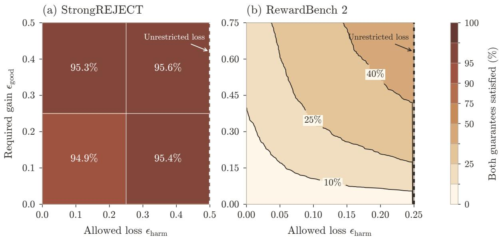  
Figure 7: Approximate threshold-rule guarantees. At each tolerance pair, color gives the greatest fraction of responses (a) or prompts (b) satisfying both guarantees, choosing one $k \in \{ 0 , \ldots , n - 1 \}$ across the whole benchmark. Both panels share a color scale. Labels in (a) give these percentages for positive required gain, away from the dashed right edge. At the dashed right edges, the allowed loss is large enough that every proposal satisfies the loss bound.

Variation across topics. To see which RewardBench 2 categories support useful threshold-rule decisions, Figure 8 breaks down the deterministic answer comparison by topic. Each curve sweeps the same $k = 0 , \ldots , 4 7$ thresholds within its category; no topic-specific rule is fitted. Soundness counts prompts on which all incorrect answers are rejected, while completeness counts prompts on which the correct answer is authorized, so the two rates can describe diferent prompts. Focus and Safety retain higher completeness at high soundness, whereas Precise Instruction Following has a weaker tradeof.

Extending the calculation to every lottery reveals a common pattern across these otherwise diferent categories. In Figure 9, no category has a threshold with positive exact full-domain soundness and completeness rates simultaneously. Precise Instruction Following reaches a given completeness level at a somewhat smaller $k ,$ but the gap between exact soundness and completeness appears in all five categories.

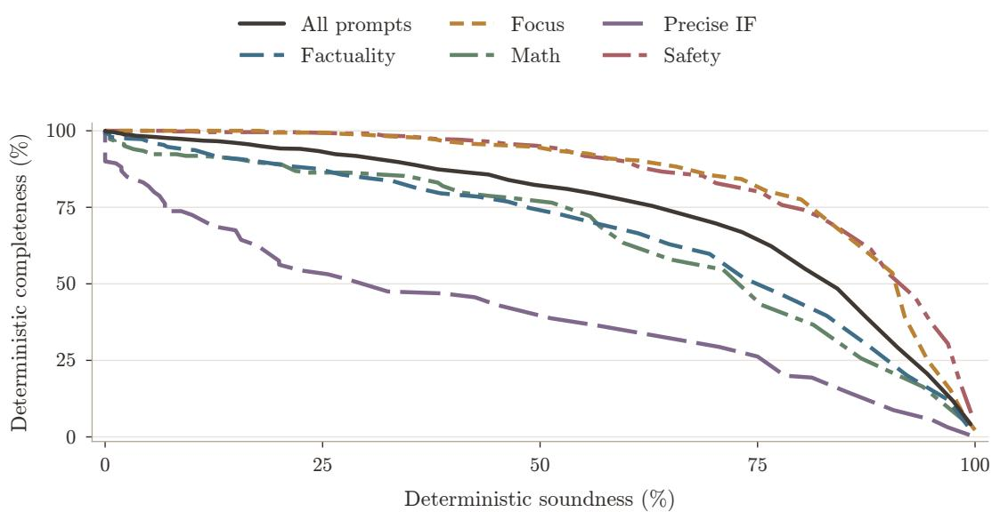  
Figure 8: Deterministic-answer authorization by RewardBench 2 topic, varying $k = 0 , \ldots , 4 7 .$ Soundness and completeness are separate fractions of prompts. Precise IF denotes Precise Instruction Following.

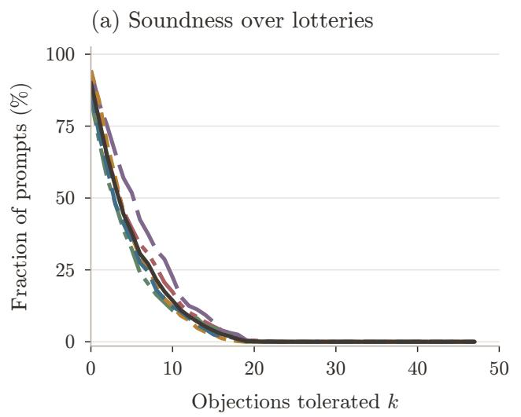

(b) Completeness over lotteries  
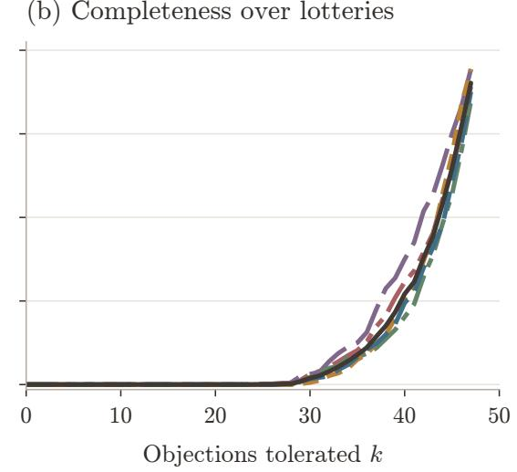  
Figure 9: Exact lottery soundness and completeness by RewardBench 2 topic as k increases. Each rate is the fraction of prompts satisfying its requirement over every lottery. Precise IF denotes Precise Instruction Following.

## F.3 Learned binary and cardinal rules

We now fit authorization rules whose reviewer weights are fixed across prompts. The k-tolerant threshold rule uses only the number of approvals; weighted voting also uses reviewer identities; the cardinal committee uses numerical gains. We compare them on the same held-out prompts, then compare the cardinal committee with equal weights and with weights refitted after removing the selected individual reviewer.

Fitting the scoring rules. We use a category-stratified split with seed 20260813: 1,058 training, 353 validation, and 352 test prompts. For each reviewer and prompt, we center the four scores at their mean under the uniform baseline and divide by the Euclidean norm of the centered vector; a zero vector remains zero. Write the resulting score of response $j$ as $z _ { i j } ^ { e }$ . This normalization removes additive and positive scale diferences within each reviewer and prompt. The learned cardinal comparison treats the resulting scores as comparable across reviewers and prompts.

For candidate weights w, the aggregate score of answer $j$ is $\begin{array} { r } { M _ { w , j } ^ { e } ~ = ~ \sum _ { i } w _ { i } z _ { i j } ^ { e } } \end{array}$ . Applying softmax to the four aggregate scores assigns probabilities to the four answers. For each $\rho \in$ $\{ 1 0 ^ { - 4 } , 1 0 ^ { - 3 } , 1 0 ^ { - 2 } , 1 0 ^ { - 1 } , 1 , 1 0 \}$ , we fit nonnegative weights on training prompts by minimizing the negative log probability of the labeled correct answer plus $\rho \| w \| _ { 2 } ^ { 2 } / 2$ , then normalize the weights to sum to one. We select $\rho$ by correct-answer selection accuracy on validation prompts: choose a highest-scoring answer, breaking answer ties uniformly, and measure how often it is correct. Ties between values of $\rho$ favor the smaller value. The fitted scores are then used for authorization: the cardinal committee authorizes a lottery when

$$
M _ { w } ^ { e } ( q ) = \sum _ { j } q _ { j } M _ { w , j } ^ { e } \geq \tau .
$$

The equal-weight rule uses uniform weights. The individual comparator uses the reviewer with greatest validation selection accuracy and applies a threshold to that reviewer’s normalized score. To assess how much the committee depends on this reviewer, we remove it and refit the weights and regularization over the remaining 47 reviewers.

Weighted binary voting uses the same fitting procedure with $y _ { i j } ^ { e } = \mathbf { 1 } \{ z _ { i j } ^ { e } \geq 0 \}$ in place of $z _ { i j } ^ { e }$ Let $w ^ { \mathrm { f i t } }$ be the resulting weights, normalized to sum to one. We combine these with equal weights by setting

$$
w _ { i } = \alpha w _ { i } ^ { \mathrm { f i t } } + ( 1 - \alpha ) / n , \qquad \alpha \in \{ 0 , 0 . 2 5 , 0 . 5 , 0 . 7 5 , 0 . 9 , 0 . 9 5 , 0 . 9 9 \} .
$$

We choose α to maximize completeness on the deterministic validation answers while meeting the 99% validation-soundness target. The selected value is $\alpha = 0 . 9 9 \mathrm { : }$ 99% of the weight comes from the fit and 1% from equal weighting, giving every reviewer positive weight. For lotteries, review takes place before sampling: each reviewer evaluates the expected normalized score and then votes. Thus authorization requires

$$
{ \sum _ { i } w _ { i } { \bf 1 } } \left\{ { \sum _ { j } q _ { j } z _ { i j } ^ { e } \geq 0 } \right\} \geq \tau .
$$

Each reviewer therefore averages its answer scores using the lottery probabilities before casting a vote; we do not average its binary votes on the individual answers. The k-tolerant threshold rule uses only their number. Ties approve in each rule.

Threshold comparisons. For each cardinal or weighted-vote rule, the threshold grid contains its distinct scores on the four deterministic answers of the validation prompts, together with reject-all and accept-all. For the k-tolerant rule, we enumerate the integer thresholds and both constant rules. We use the same grids for the lottery curves, evaluating each threshold over every mixture of the four answers. The plotted curves connect test outcomes as these thresholds vary. At a reported test-soundness requirement, we take the greatest completeness over the evaluated thresholds satisfying that requirement. These are empirical optima within each fitted score rule and its grid. Lottery soundness and completeness can change between grid thresholds. We evaluate thresholds chosen using validation alone in Appendix F.4.

What score magnitudes add. The cardinal committee authorizes more correct answers at high soundness than either binary rule, and its advantage persists after removing the selected individual reviewer. Table 2 compares the fitted rules and controls under the same requirements.

Table 2: Completeness on 352 RewardBench 2 test prompts. Deterministic results require at least 99% test soundness; lottery results require at least 95% exact test soundness and use 0.5-completeness. Each entry uses the most complete evaluated threshold meeting its column’s soundness target.
<table><tr><td></td><td>Correct answer Every qualifying authorized (%) lottery authorized (%)</td></tr><tr><td>Learned cardinal committee</td><td>60.5 28.7</td></tr><tr><td>Committee after removal and refitting</td><td>57.4 20.7</td></tr><tr><td>Selected individual reviewer</td><td>46.6 7.7</td></tr><tr><td>Equal-weight cardinal committee</td><td>35.2 4.5</td></tr><tr><td>Learned weighted binary votes</td><td>8.8 0 0</td></tr><tr><td>k-tolerant threshold rule</td><td>3.7</td></tr></table>

The learned committee places 52% of its weight on the selected reviewer. Removing this reviewer and refitting reduces both forms of completeness, but still improves substantially on that reviewer alone. The committee therefore benefits from combining several reviewers’ scores. These comparisons concern the fitted rules above, rather than all possible rules based on binary votes or numerical scores.

Auditing every lottery. The lottery results evaluate all of $\Delta _ { 4 }$ under the expected-utility model described above. For the committee’s scores on the four answers, $M _ { w } ^ { e } = ( M _ { w , 1 } ^ { e } , \ldots , M _ { w , 4 } ^ { e } )$ , let $M _ { w , - } ^ { e } = \operatorname* { m a x } _ { j \geq 2 } M _ { w , j } ^ { e }$ . Whenever the authorized set is nonempty, the authorized lottery with least probability of a correct answer puts its remaining probability on an incorrect answer with score $M _ { w , \astrosun } ^ { e }$ . This gives a closed form for soundness. At operating thresholds selected on validation data, we independently check the test soundness calculation by solving

$$
\operatorname* { m i n } _ { q \in \Delta _ { 4 } } q _ { 1 } \quad \mathrm { s u b j e c t ~ t o } \quad M _ { w } ^ { e } ( q ) \geq \tau .
$$

If $M _ { w , \mathrm { m i n } } ^ { e } = \operatorname* { m i n } _ { j \ge 2 } M _ { w , j } ^ { e }$ , the least aggregate score among weakly beneficial lotteries is

$$
\mathrm { m i n } \{ M _ { w , 1 } ^ { e } , { \textstyle \frac { 1 } { 4 } } M _ { w , 1 } ^ { e } + { \textstyle \frac { 3 } { 4 } } M _ { w , \mathrm { m i n } } ^ { e } \} .
$$

Comparing this score with $\tau$ gives exact full-domain completeness. The same endpoint calculations give the worst authorized loss and the supremum rejected gain used in the approximate audit. For weighted binary voting, we use the exact hyperplane arrangement, since the approval bits change discontinuously with the lottery.

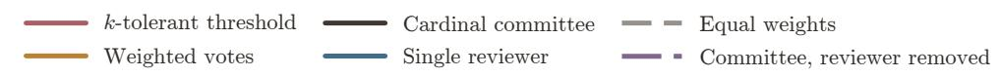

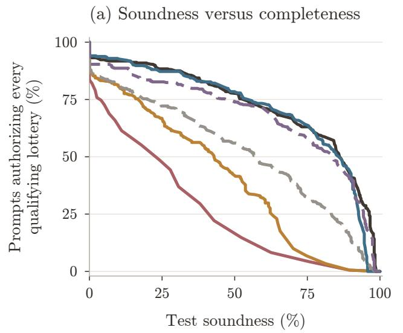

(b) Completeness versus allowed loss  
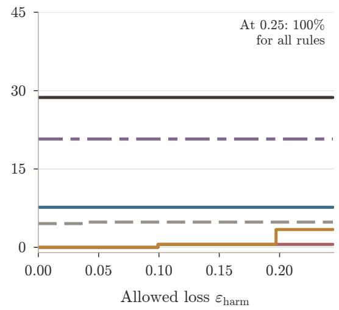  
Figure 10: Lottery authorization on 352 test prompts, using 0.5-completeness. Panel (a) connects evaluated thresholds of each fixed scoring rule. Panel (b) selects the greatest completeness among evaluated thresholds meeting the allowed-loss bound on at least 95% of test prompts; selection uses test outcomes separately at each loss tolerance. At the omitted endpoint $\varepsilon _ { \mathrm { h a r m } } = 0 . 2 5$ , the loss bound is unrestricted and accept-all attains 100% completeness for every rule.

The role of the approximation margins. Among the evaluated global rules and thresholds, the exact completeness rate over all lotteries is zero whenever the corresponding soundness rate is positive. A positive numerical-score threshold also rejects suficiently small beneficial deviations from the baseline. Requiring approval of suficiently beneficial lotteries gives a useful intermediate target. Our 0.5-completeness comparison requires approval of every lottery with correct-answer probability at least 0.75, and reports the fraction of prompts on which this universal requirement holds. Soundness and completeness are separate fractions of prompts.

Figure 10(b) varies the tolerated loss while retaining this gain requirement. The learned cardinal committee maintains 28.7% completeness at every evaluated loss tolerance below 0.25; weighted binary voting reaches 3.4% at loss tolerance 0.20. Thus allowing some harmful lotteries does little to close the gap for these fitted binary rules. Figure 11 instead holds each rule at its most permissive evaluated threshold attaining at least 95% exact test soundness and varies the gain required for guaranteed approval. A larger gain margin requires approval of fewer lotteries, so more prompts can satisfy completeness. The authorization decisions and the test soundness rate remain unchanged along each curve.

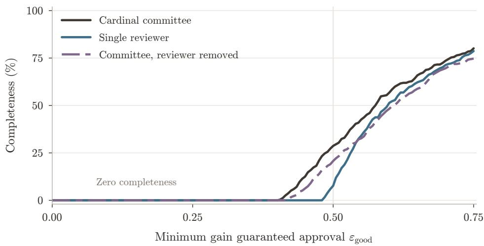  
Figure 11: Completeness as the minimum gain for guaranteed approval increases. Each rule uses the most permissive evaluated threshold attaining at least 95% exact test soundness, held fixed across gain margins. The guide marks gain 0.5; gain 0.75 tests only the correct deterministic answer.

Information in reviewer identities. The theory also suggests that binary aggregation can improve substantially when it keeps track of which reviewers approve. We measure this possibility using prompt-specific sound rules on the same 1,590 covered archive prompts. Unanimity authorizes the correct deterministic answer on 55 prompts (3.5% of this covered subset, rather than 4.1% of all prompts); choosing the most permissive sound k-tolerant rule separately for each prompt raises this to 581 (36.5%); allowing the maximal sound monotone rule raises it to 1,409 (88.6%). Each rule is sound over every response lottery. The latter two use the benchmark label separately on each prompt, and their reported completeness is correct-answer authorization, not full-domain completeness. The increase from 36.5% to 88.6% shows how reviewer identities allow a sound rule to authorize more correct answers.

Cardinal reconstruction gives the complementary oracle benchmark: on the 315 covered test prompts it reconstructs the principal and is complete over the lottery domain, while on the other

37 it rejects all proposals. It therefore attains 100% exact soundness and $3 1 5 / 3 5 2 = 8 9 . 5 \% 0 . 5 \ –$ completeness. These weights are computed using each prompt’s correct-answer label; the learned committee instead uses weights fixed before testing.

## F.4 Calibration on validation data

The preceding comparisons select thresholds by their test soundness and completeness. We now select thresholds on validation data, fix them before testing, and measure the resulting test rates.

A shared threshold. For deterministic answers, we choose the threshold with greatest validation completeness among those attaining at least 99% validation deterministic-answer soundness. Ties favor greater validation soundness, then a stricter threshold. The scoring rules and selected individual reviewer are those defined above. On test, the cardinal committee attains $3 4 7 / 3 5 2 = 9 8 . 6 \%$ soundness and $2 2 3 / 3 5 2 = 6 3 . 4 \%$ completeness; the selected individual attains 340/352 = 96.6% and $2 2 0 / 3 5 2 = 6 2 . 5 \%$ . Thus the fixed committee threshold authorizes nearly the same number of correct answers while rejecting all three incorrect answers on seven more prompts.

Using the observed topic. We then ask whether choosing a threshold for each RewardBench topic improves completeness. We compare cardinal committees and single reviewers, using either one committee or reviewer across all topics or a separate one for each topic. Cardinal weights are fitted on the corresponding training prompts and regularization is selected on validation; individual reviewers in this experiment are selected on training alone. For each committee or reviewer, we compare one shared threshold with five topic thresholds, holding the weights or reviewer identities fixed.

Here we calibrate for lotteries: soundness requires rejecting every harmful lottery, and 0.5- completeness requires authorizing every lottery with gain at least 0.5. Both threshold choices maximize validation 0.5-completeness while allowing at most $\lfloor 0 . 0 5 \times 3 5 3 \rfloor = 1 7$ validation prompts to fail soundness, giving at least $3 3 6 / 3 5 3 = 9 5 . 2 \%$ validation soundness. For topic-specific thresholds, this limit of 17 applies across all five topics together, not separately within each topic.

Candidate thresholds are obtained from the score values at which a validation prompt starts or stops satisfying either guarantee. Each topic’s candidate set also includes all candidates for the shared threshold. We choose the five topic thresholds jointly to maximize the total number of validation prompts satisfying 0.5-completeness, subject to the same limit on soundness failures. Thresholds are fixed before evaluation on the same 352 test prompts.

Changing only the thresholds of the global cardinal rule raises test completeness from 104/352 = 29.5% to 144/352 = 40.9%, while soundness increases from 331/352 = 94.0% to 334/352 = 94.9%. Topic-specific calibration therefore guarantees approval of every qualifying lottery on more prompts, without learning new weights. Allowing topic-specific weights changes the tradeof: with five thresholds, the topic-specific committee is sound on 337 prompts and complete on 132, while the topic-specific individuals are sound on 336 and complete on 147. Here the committee has higher soundness, while the individual reviewers have higher completeness. The validation constraint does not guarantee the same soundness on test: the global individual with topic-specific thresholds attains 92.9% test soundness, below the 95% target.

Neither soundness nor completeness is constrained separately within each topic. At this budget, both individual-reviewer rules with five thresholds reject every proposal in Factuality, Math, and Precise Instruction Following.

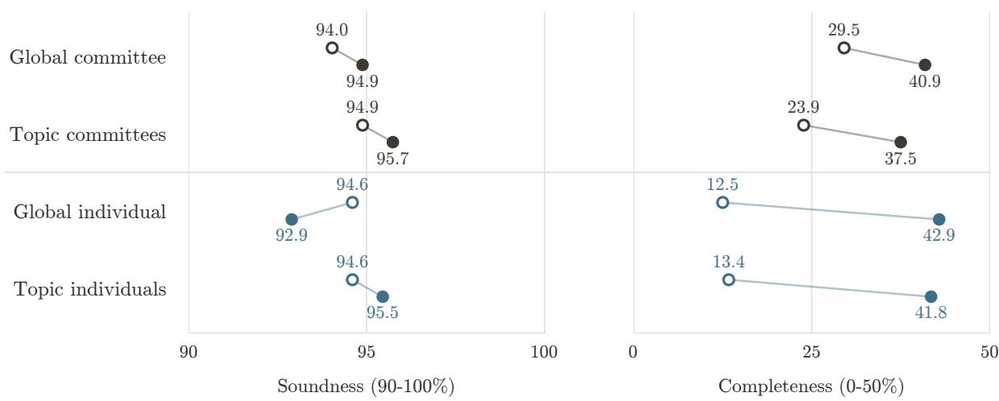  
Figure 12: Shared and topic-specific thresholds, chosen to meet the same overall soundness requirement on validation data. Open markers use one shared threshold; filled markers use one threshold per topic. Thresholds are fixed before evaluation on 352 test prompts. Rates are exact lottery soundness and 0.5-completeness. Individual reviewers are selected on training data.

## F.5 Interpretation and cohort checks

Conditional and joint guarantees on StrongREJECT. The heatmap measures how often both guarantees hold on the same response, whereas the main curves report fractions separately among harmful and acceptable responses. The k = 6 rule satisfies both exact guarantees on 1,013/1,084 = 93.5% of responses: it releases 872 acceptable responses and withholds 141 harmful ones. Its conditional completeness is $8 7 2 / 8 9 4 = 9 7 . 5 \%$ , while conditional soundness is 141/190 = 74.2%; it releases 49 harmful responses. In comparison, k = 1 withholds all 190 harmful responses and releases 419 of the 894 acceptable ones. The joint rate weights each response equally, so the larger acceptable class has more influence.

Sensitivity to missing human labels. All 1,361 archived responses have nine evaluator scores; the 1,084 responses in our main analysis also have all five human annotations. Selection uses annotation availability, not label values or evaluator votes. Requiring at least two annotations retains 1,184 responses, including 207 classified as harmful. Each harmful response still receives at least two disapprovals, so the soundness guarantee for k = 1 extends to this larger cohort. Admitting responses with only one annotation adds a harmful response approved by all nine evaluators. Thus even unanimity fails on the full archive under its released labels; this check measures sensitivity to annotation availability.

Public resources. StrongREJECT’s code is MIT-licensed; its prompt sources retain their upstream terms. RewardBench 2 is released under ODC-BY, with third-party outputs subject to provider terms. Data and code are publicly available.2