# Discrete Beckmann Transport Models for One-Step Language Modeling and Reasoning

Sophia Tang<sup>†1</sup>, Shiyi Wang<sup>2,3,4</sup>

<sup>1</sup>University of Pennsylvania, <sup>2</sup>Harvard University, <sup>3</sup>Kempner Institute, <sup>4</sup>IAIFI

Abstract. Discrete difusion and flow models are a promising alternative to autoregressive language models, but compressing many-step sampling into fewer steps typically requires distilling a pretrained teacher model. This caps the student at the teacher’s quality and requires a costly two-stage training pipeline. We introduce Discrete Beckmann Transport Models (DBTM), built on a time-independent flow whose autonomous transport map provably carries any point in the ambient space to a fixed point on the vertices of the simplex in a single step. We show that this fixed-point property is characterized by a conservation equation whose residual can be minimized directly from data, removing the requirement for a teacher flow and time conditioning. Under this construction, a partially trained map corresponds to the flow truncated at finite time, so generation reduces to iterating one map until it reaches a fixed point. We further extend the map to a partial-context interpolant where additional function evaluations act as refinement steps rather than ODE integration steps. On language modeling and reasoning tasks, DBTM enables one- and few-step generation that improves quality and accuracy over discrete difusion and continuous flow baselines.

Correspondence: sophtang@engineering.upenn.edu, fwang@math.harvard.edu

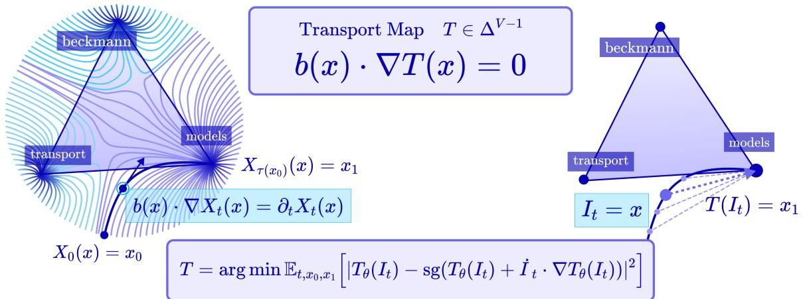

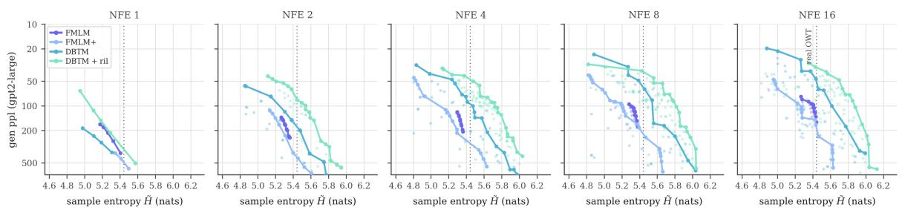  
Figure 1 Discrete Beckmann Transport Models. Top Left: The autonomous field on a 2-dimensional simplex where the autonomous velocity field b(x) solves the Eulerian equation $\boldsymbol { b } ( \boldsymbol { x } ) \cdot \nabla X _ { s } ( \boldsymbol { x } ) = \partial _ { s } X _ { s } ( \boldsymbol { x } )$ . Top Right: The corresponding transport map $T ( x )$ that solves the conservation equation $\boldsymbol { b } ( \boldsymbol { x } ) \cdot \nabla T ( \boldsymbol { x } ) = 0$ maps every point along the interpolant $I _ { t } = x$ directly to the endpoint $x _ { 1 }$ . Bottom: Generative frontiers of DBTM variants vs. flow map baselines FMLM and FMLM+ on OpenWebText, with lower generative PPL and higher entropy being the optimal directions.

<sup>†</sup>Work done while a visiting researcher at Harvard University.

## 1 Introduction

Discrete difusion models (Shi et al., 2024; Sahoo et al., 2024; Ou et al., 2025; Zheng et al., 2025) are competitive alternatives to autoregressive language modeling, ofering bidirectional dependencies. However, for sequences of length L over a vocabulary of size $V _ { : }$ , the state space grows as $V ^ { L }$ , forcing practical samplers to factorize the per-step denoising distribution across positions. This factorization discards intra-step dependencies, so unmasking many positions at once degrades sample quality, and high-fidelity generation requires many function evaluations scaling linearly with L. The resulting limit on parallelism has motivated continuous-space flows that land on the simplex and can be distilled into few-step samplers. Among these techniques are flow maps (Bofi et al., 2025) which have been adapted to discrete sequences (Potaptchik et al., 2026; Lee et al., 2026a) by defining a mean denoiser that transports a point at time s directly to its further denoised state at time t, landing at a vertex of the simplex at $t = 1$

A key limitation of few-step language modeling with flow maps is the need to learn both the diagonal $( s = t )$ and of-diagonal $( s \neq t )$ terms, either by distilling a teacher flow approximating the marginal velocity $b _ { t }$ or by training both jointly via bootstrapping, with the former commonly performing better (Potaptchik et al., 2026; Lee et al., 2026a). Distillation caps the student at the teacher’s quality, propagating its approximation errors, and imposes a two-stage pipeline that must train the teacher to convergence before fitting the student. Bootstrapping removes the teacher but makes the of-diagonal targets depend on the model’s own evolving predictions, which can be unstable and slow to converge.

We introduce Discrete Beckmann Transport Models (DBTM), a framework that learns the autonomous transport map $T$ associated with the time-independent flow, which provably has straighter trajectories than the time-dependent flow and carries any ambient point to the data manifold supported on the simplex vertices. This fixed-point property is formalized by the conservation equation $b \cdot \nabla T = 0$ , whose residual we minimize to train directly from data, replacing the distillation stage entirely.

Our main contributions can be summarized as follows:

1. Discrete Beckmann Transport Models: From the time-independent flow ODE $X _ { s } ( x _ { 0 } )$ , we define a one-step map $T ( x ) : = X _ { \tau ( x _ { 0 } ) } ( x )$ that provably transports any ambient point to a fixed point on the discrete data manifold without conditioning on time.

2. Direct Training from Data: T can be trained without distillation by iteratively regressing onto a frozen copy of itself plus an Euler correction. A partially trained $T _ { \theta }$ maps to an intermediate point along the autonomous flow and converges to $T _ { \theta ^ { \star } } = X _ { \tau ( x _ { 0 } ) }$ , so the manifold can be reached by iteratively applying $T _ { \theta }$

3. Self-Correction via Iterative Refinement: We train with a partial-context interpolant, which enables confidence- or quality-based iterative refinement during training and inference.

We validate DBTM on unconditional language modeling and conditional reasoning tasks, demonstrating stronger performance than baselines at lower or matched NFEs. Further discussion of related works is provided in App. A.

## 2 Preliminaries

Continuous Generative Modeling on the Simplex Let $\mathcal { V } = \{ 1 , \ldots , V \}$ be a vocabulary and $x = ( x ^ { 1 } , \ldots , x ^ { L } ) \in \mathcal { V } ^ { L }$ a sequence of L tokens. Embedding each token as a vertex of the probability simplex $\Delta ^ { V - 1 } : = \{ x \in \mathbb { R } _ { > 0 } ^ { V }$ $\textstyle \sum _ { j } x _ { j } = 1 \}$ } via the one-hot map $x ^ { \ell } \mapsto e _ { x ^ { \ell } }$ represents a sequence with a point in $( \mathbb { R } ^ { V } ) ^ { L }$ . The data distribution $\mu _ { 1 }$ is atomic, supported on the $V ^ { L }$ vertex configurations:

$$
M _ { 1 } : = \{ e _ { 1 } , . . . , e _ { V } \} ^ { L } \subset ( \Delta ^ { V - 1 } ) ^ { L } ,\tag{1}
$$

and we decode by taking the per-position argmax $x \mapsto ( \arg \operatorname* { m a x } _ { j } x _ { j } ^ { \ell } ) _ { \ell \in [ L ] }$ , which is exact on $M _ { 1 }$ . The prior distribution can be defined as a product of Gaussians $\mu _ { 0 } = \mathcal { N } ( 0 , \sigma ^ { 2 } I _ { V } ) ^ { \otimes L }$ , and continuous generative modeling aims to transport $\mu _ { 0 }$ to $\mu _ { 1 }$ via a continuous flow in ambient space.

Generative Flows and Flow Maps The stochastic interpolants framework (Albergo and Vanden-Eijnden, 2023; Albergo et al., 2025) connects $\mu _ { 0 }$ and $\mu _ { 1 }$ through the interpolant:

$$
I _ { t } : = \alpha _ { t } x _ { 0 } + \beta _ { t } x _ { 1 } , \quad t \in [ 0 , 1 ]\tag{2}
$$

with $x _ { 0 } \sim \mu _ { 0 } , x _ { 1 } \sim \mu _ { 1 }$ independent and schedules satisfying $\alpha _ { 0 } = \beta _ { 1 } = 1 , \alpha _ { 1 } = \beta _ { 0 } = 0$ , so that $I _ { 0 } = x _ { 0 }$ and $I _ { 1 } = x _ { 1 }$ . We take $\beta _ { t } = 1 - \alpha _ { t }$ with $\alpha _ { t } = ( 1 - t ) ^ { a }$ for $a \ge 1$ , recovering the linear interpolant at $a = 1$ . Writing $\mu _ { t } : = \operatorname { L a w } ( I _ { t } )$ , the flow matching velocity is given by:

$$
b _ { t } ( x ) : = \mathbb { E } _ { x _ { 0 } , x _ { 1 } } \left[ \dot { I } _ { t } \big | I _ { t } = x \right] = \underset { \dot { b } _ { t } } { \arg \operatorname* { m i n } } \ \mathbb { E } _ { x _ { 0 } , x _ { 1 } } \left[ \Big | \hat { b } _ { t } ( I _ { t } ) - \dot { I } _ { t } \Big | ^ { 2 } \right]\tag{3}
$$

where the second equality is the regression characterization that makes $b _ { t }$ learnable from samples without access to $\mu _ { t }$ . The pair $\left( { { b } _ { t } } , { { \mu } _ { t } } \right)$ satisfies the continuity equation:

$$
\nabla \cdot \left( b _ { t } \mu _ { t } \right) = - \partial _ { t } \mu _ { t } .\tag{4}
$$

The probability flow ODE is given by:

$$
\frac { d } { d t } X _ { s , t } ( x ) = b _ { t } ( X _ { s , t } ( x ) ) , \quad X _ { s , s } ( x ) = x\tag{5}
$$

transports $\mu _ { s }$ to $\mu _ { t }$ . Sampling from a learned $b _ { t }$ requires integrating (5), at a cost measured in network function evaluations (NFE). Flow maps instead learn the two-time solution operator $X _ { s , t }$ , advancing the state over a finite interval in one evaluation. By uniqueness of the ODE solution, it obeys the semigroup property:

$$
X _ { t , u } \circ X _ { s , t } = X _ { s , u } \mathrm { f o r ~ a l l } \ s \leq t \leq u , \qquad X _ { s } \circ X _ { u } = X _ { s + u } \mathrm { w h e n } \ b _ { t } \equiv b\tag{6}
$$

where the second identity is the case where the velocity field is time-independent.

## 3 Autonomous Flows on the Simplex

## 3.1 Properties of the Autonomous Flow

While standard flow matching learns a time-dependent field $b _ { t }$ and integrates it over a fixed horizon $t \in [ 0 , 1 ]$ , an autonomous flow model (Lee et al., 2026b) defines a time-independent velocity field b:

$$
\begin{array} { r } { b ( x ) : = \mathbb { E } _ { t , x _ { 0 } , x _ { 1 } } [ \dot { I } _ { t } | I _ { t } = x ] = \operatorname * { a r g m i n } _ { \hat { b } } \mathbb { E } _ { t , x _ { 0 } , x _ { 1 } } \left[ | \hat { b } ( I _ { t } ) - \dot { I } _ { t } | ^ { 2 } \right] , \qquad t \sim \mathcal { U } [ 0 , 1 ] } \end{array}\tag{7}
$$

associated with the autonomous ODE:

$$
\begin{array} { r } { \dot { X } _ { s } ( x _ { 0 } ) = b ( X _ { s } ( x _ { 0 } ) ) , \quad X _ { 0 } ( x _ { 0 } ) = x _ { 0 } } \end{array}\tag{8}
$$

where $s \in [ 0 , \infty )$ is the integration time of the autonomous ODE, which is decoupled from the interpolation time t.

Proposition 3.1 (Time-average of standard flow matching). Given the time-dependent flow matching velocity $b _ { t } ( x ) : = \mathbb { E } _ { x _ { 0 } , x _ { 1 } } [ \dot { I } _ { t } | I _ { t } = x ]$ defined with the interpolant $I _ { t } : = \alpha _ { t } x _ { 0 } + \beta _ { t } x _ { 1 }$ , the autonomous velocity field is the time-weighted average:

$$
b ( \boldsymbol { x } ) = \frac { \int _ { 0 } ^ { 1 } \mu _ { t } ( \boldsymbol { x } ) b _ { t } ( \boldsymbol { x } ) d t } { \int _ { 0 } ^ { 1 } \mu _ { t } ( \boldsymbol { x } ) d t }\tag{9}
$$

The proof is in $\mathrm { A p p }$ . C.1.1. Intuitively, $b ( x )$ averages the velocities of every interpolant passing through x at any time $t \in [ 0 , 1 ]$ , so the field depends on position alone, removing the time dependence that constrains the flow to terminate at $\mu _ { 1 }$ at $t = 1$ and yielding straighter dynamics. We make this precise in App. C.1. Just as the time-dependent flow satisfies a continuity equation (4), the autonomous flow satisfies the divergence condition (Proof in $\mathrm { A p p }$ . B.2) (Lee et al., 2026b) obtained by integrating over time $t \in [ 0 , 1 ]$

$$
\int _ { 0 } ^ { 1 } \nabla \cdot ( b _ { t } \mu _ { t } ) = - \int _ { 0 } ^ { 1 } \partial _ { t } p _ { t } \Longrightarrow \nabla \cdot \boldsymbol { j } = \mu _ { 0 } - \mu _ { 1 }\tag{10}
$$

where $\begin{array} { r } { j = \nu b = \int _ { 0 } ^ { 1 } \mu _ { t } b _ { t } } \end{array}$ dt is the current and $\textstyle \nu ( x ) : = \int _ { 0 } ^ { 1 } \mu _ { t } ( x )$ dt the occupation measure. This makes $\mu _ { 0 }$ the source and $\mu _ { 1 }$ the sink of the current, so b transports µ<sub>0</sub> to $\mu _ { 1 } \mathrm { ~ - ~ } \mathrm { w i t h }$ the key distinction that $X _ { s }$ need not reach $M _ { 1 }$ at $s = 1$ . We call the time at which it converges to $M _ { 1 }$ the hitting time $\tau ( x _ { 0 } ) \in [ 0 , + \infty )$ , and show it is finite on the simplex.

Theorem 3.1 (Convergence of autonomous flow on the simplex). Let $\mu _ { 0 }$ be absolutely continuous on $( \mathbb { R } ^ { V } ) ^ { L }$ with continuous, strictly positive density, and let

$$
M _ { 1 } = \operatorname { s u p p } ( \mu _ { 1 } ) = ( \{ e _ { 1 } , \dots , e _ { V } \} ) ^ { L } \subset ( \Delta ^ { V - 1 } ) ^ { L }\tag{11}
$$

be the finite set of $V ^ { L }$ vertex configurations. Then for $\mu _ { 0 } - a . e . \ x _ { 0 }$ , the autonomous flow $X _ { s } ( x _ { 0 } )$ satisfies:

(i) Absorption: $i f X _ { s ^ { \star } } ( x _ { 0 } ) \in M _ { 1 }$ for some $s ^ { \star } < \infty ,$ , then ${ X _ { s } ( x _ { 0 } ) = X _ { s ^ { \star } } ( x _ { 0 } ) }$ for all $s > s ^ { \star }$

(ii) Convergence: there is $x ^ { \star } ( x _ { 0 } ) \in M _ { 1 }$ with lim<sub>s→∞</sub> $X _ { s } ( x _ { 0 } ) = x ^ { \star } ( x _ { 0 } )$

(iii) Finite hitting time: for the linear interpolant $I _ { t } = ( 1 - t ) x _ { 0 } + t x _ { 1 } , \tau ( x _ { 0 } ) : = \operatorname* { i n f } \{ t \geq 0 : X _ { s } ( x _ { 0 } ) \in$ $M _ { 1 } \} < + \infty$ . Although the autonomous velocity field vanishes at the vertices, $b ( e _ { j } ) = 0$ for all $e _ { j } \in M _ { 1 }$ it does not vanish in the limit approaching them: $\begin{array} { r } { \operatorname* { l i m } _ { r \downarrow 0 } b ( e _ { j } + r \omega ) = - \kappa ( \omega ) \omega } \end{array}$ The approach speed is bounded below by $\kappa _ { - } > 0$ and $\tau ( x _ { 0 } ) \leq t _ { e n t r y } + 2 r _ { 1 } / \kappa _ { - } ~ f o r$ a fixed radius $r _ { 1 }$

The proof is in App. C.4. The resulting discontinuity in b at the vertices is an artifact of the linear interpolant: for a general interpolant (2) that is self-stopping, i.e., $\dot { \alpha } _ { t }  0$ as $t \to 1$ , Proposition C.5 shows b is continuous at the vertices with $b ( x ) \to 0$ as $x \to e _ { i }$

## 3.2 Autonomous Transport Map

Given the hitting time $\tau ( x _ { 0 } )$ of the autonomous flow $X _ { s } ( x _ { 0 } )$ , the associated one-step transport map $T$ can be written as the limit:

$$
T ( x _ { 0 } ) : = \operatorname* { l i m } _ { s \to \tau ( x _ { 0 } ) } X _ { s } ( x _ { 0 } ) \in M _ { 1 } , \quad T _ { \# } \mu _ { 0 } = \mu _ { 1 }\tag{12}
$$

which is also the pushforward of $\mu _ { 0 }$ to $\mu _ { 1 }$ . Since $X _ { s } ( x _ { 0 } )$ is a deterministic function of $x _ { 0 }$ , starting along any point $X _ { s } ( x _ { 0 } )$ for $s \in [ 0 , \tau ( x _ { 0 } ) )$ yields the same fixed point $T ( X _ { s } ( x _ { 0 } ) ) = T ( x _ { 0 } )$ . By the semigroup condition (6), the map T is idempotent such that $T ^ { \circ k } ( \cdot ) = T ^ { \circ k ^ { \prime } } ( \cdot )$ for any $k , k ^ { \prime } \in \mathbb { N } .$

Proposition 3.2 (Autonomous transport map solves conservation equation (Lee et al., 2026b)). Given the autonomous flow velocity field b, the autonomous flow $X _ { s } ( x _ { 0 } )$ defined in (8) solves the Eulerian equation:

$$
\left\{ \begin{array} { l l } { b ( x ) \cdot \nabla X _ { s } ( x ) = \partial _ { s } X _ { s } ( x ) , } & { X _ { 0 } ( x ) = x \quad x \notin M _ { 1 } } \\ { X _ { s } ( x ) = x } & { x \in M _ { 1 } } \end{array} \right.\tag{13}
$$

Since the autonomous transport map $T ( x )$ defined in (12) is the limit of $X _ { s } ( x )$ as $s \to \tau ( x )$ with vanishing velocity at the vertices $( \dot { X } _ { s } ( e _ { j } ) = 0 ~ f o r ~ a l l ~ j \in \{ 1 , \dots , V \} )$ by Theorem $\it 3 . 1 , T ( x )$ is the unique solution of the conservation equation:

$$
\left\{ \begin{array} { l l } { b ( x ) \cdot \nabla T ( x ) = 0 } & { x \not \in M _ { 1 } } \\ { T ( x ) = x } & { x \in M _ { 1 } } \end{array} \right.\tag{14}
$$

Proposition 3.2 follows from Theorem 3.1, with proof in App. C.6. This is the key result that drives a principled approach for training the one-step map directly from data without distillation.

## 4 Learning One-Step Maps Without Distillation

We present a method of directly learning the one-step transport map T by matching the updates that converge to the solution of the conservation equation in (14). The converged map $T$ transports any noisy state to its corresponding fixed point on the data manifold, yielding one-step generation and principled refinement techniques.

## 4.1 Iteratively Solving the Eulerian Equation

Unlike previous few-step model training, which requires distillation or bootstrapping from an approximated target, Proposition 3.2 presents a principled approach to learning T by iteratively regressing the autonomous flow

$X _ { s } ( x )$ until the equilibrium point when $b ( \boldsymbol { x } ) \cdot \nabla X _ { \tau ( \boldsymbol { x } ) } ( \boldsymbol { x } ) = \boldsymbol { b } ( \boldsymbol { x } ) \cdot \nabla T ( \boldsymbol { x } ) = 0$ for all $x \in ( \mathbb { R } ^ { V } ) ^ { L }$ . Starting from an untrained map $\begin{array} { r } { T ^ { ( 0 ) } ( x ) = X ^ { ( 0 ) } ( x ) = x } \end{array}$ , we iteratively regress the Euler step of size $\eta \colon$

$$
X ^ { ( n + 1 ) } ( x ) = X ^ { ( n ) } ( x ) + \eta b ( x ) \cdot \nabla X ^ { ( n ) } ( x )\tag{15}
$$

where $T _ { \theta }$ is trained to match $X ^ { ( n + 1 ) }$ given fixed $X ^ { ( n ) }$ as $X ^ { ( n ) }  T$ for large n. Since we define $b ( x ) : =$ $\mathbb { E } _ { t , x _ { 0 } , x _ { 1 } } [ \dot { I } _ { t } | I _ { t } = x ]$ , the optimal map is:

$$
T = \underset { T _ { \theta } } { \arg \operatorname* { m i n } } \mathbb { E } _ { t , x _ { 0 } , x _ { 1 } } \left[ \| T _ { \theta } ( I _ { t } ) - \mathrm { s g } ( T _ { \theta } ( I _ { t } ) + \dot { I } _ { t } \cdot \nabla T _ { \theta } ( I _ { t } ) ) \| ^ { 2 } \right]\tag{16}
$$

minimized exactly when $T$ satisfies the conservation equation $\begin{array} { r } { \mathbb { E } _ { t , x _ { 0 } , x _ { 1 } } [ \dot { I } _ { t } \cdot \nabla T _ { \theta } ( I _ { t } ) | I _ { t } = x ] = b ( x ) \cdot \nabla T _ { \theta } ( x ) = 0 . } \end{array}$ Crucially, this objective ensures that even when $T _ { \theta }$ has not converged, it approximates a map to some point along $X _ { s } ,$ so by the semigroup property (6), k inference-time iterations $T _ { \theta } ^ { \circ k } ( x _ { 0 } )$ approximates along the flow to $X _ { k t } ( x _ { 0 } )$ which converges to $M _ { 1 }$ as $k t  \tau ( x _ { 0 } )$ ).

## 4.2 Training Objectives for the Transport Map

In practice, the autonomous transport map is parameterized as $T _ { \theta } ( \cdot ) = \mathrm { s o f t m a x } ( f _ { \theta } ( \cdot ) )$ for a neural network $f _ { \theta } .$ Since the map is restricted to the simplex, we formulate each objective as a cross-entropy (CE) over categorical distributions rather than an unconstrained squared error, with the exception of the transport loss where the target does not lie on the simplex.

Transport Loss From (16), the transport loss is obtained by regressing $T _ { \theta }$ onto the stop-gradient of itself, added to the Euler step correction along the autonomous flow:

$$
\mathcal { L } _ { \mathrm { t r a n s p o r t } } ( \theta ) : = \mathbb { E } _ { t , x _ { 0 } , x _ { 1 } } \bigg [ \sum _ { \ell \in [ L ] \backslash \mathcal { C } } \big \| T _ { \theta } ( I _ { t } ) _ { \ell } - \mathrm { s g } ( T _ { \theta } ( I _ { t } ) + \dot { I } _ { t } \cdot \nabla T _ { \theta } ( I _ { t } ) ) _ { \ell } \big \| ^ { 2 } \bigg ]\tag{17}
$$

where $\mathcal { C }$ is the set of committed tokens and the correction $\begin{array} { r } { \frac { d } { d t } T ( I _ { t } ) = \boldsymbol { \dot { I } _ { t } } \cdot \nabla T ( I _ { t } ) } \end{array}$ is tangent to the simplex and its elements sum to zero.

Semigroup Loss From (12), we show that by the semigroup condition $T _ { \theta } ^ { \circ k } ( \cdot ) = T _ { \theta } ^ { \circ k ^ { \prime } } ( \cdot )$ , which we enforce using the semigroup loss:

$$
\mathcal { L } _ { \mathrm { s e m i } } ( \theta ) : = \mathbb { E } _ { t , x _ { 0 } , x _ { 1 } } \biggl [ \sum _ { k \in \mathcal { K } } \sum _ { \ell \in [ L ] \backslash \mathcal { C } } \mathrm { C E } \left( T _ { \theta } ( I _ { t } ) _ { \ell } , \mathrm { s g } ( T _ { \theta } ^ { \circ k } ( I _ { t } ) _ { \ell } ) \right) \biggr ]\tag{18}
$$

for $k \in \mathcal { K } \subset \mathbb { N }$ applications of the map. We apply this loss only toward the end of training, since the initial identity map $T = \mathrm { i d }$ satisfies it trivially.

Boundary Loss To enforce the boundary condition $T ( x ) = x$ for $x \in M _ { 1 }$ from Proposition 3.2, we add a boundary loss:

$$
\mathcal { L } _ { \mathrm { b n d } } ( \theta ) : = \mathbb { E } _ { x _ { 1 } } \bigg [ \sum _ { \ell \in [ L ] \backslash \ell } \mathrm { C E } \left( T _ { \theta } ( x _ { 1 } ) _ { \ell } , x _ { 1 } ^ { \ell } \right) \bigg ]\tag{19}
$$

Beyond the boundary itself, any intermediate $I _ { t }$ should map to its target, $T _ { \theta } ( I _ { t } ) = x _ { 1 }$ . While the anchor condition is implicitly enforced by the transport loss, the geometry of the simplex makes explicit enforcement useful over a specific time interval, which we describe next.

## 4.3 Phase Transitions and the Anchor Loss

The flow constructed from the time-dependent interpolant on the simplex commits to a vertex at a short time window called the phase transition. Before the transition, the output token remains uncertain; after it, the token is committed, and further integration does not change the output. Such transitions have been analyzed in difusion models (Ambrogioni, 2025; Yu and Huang, 2025), and we can use tools from random energy models (REM) (Derrida, 1980) to determine the timing of this transition.

Theorem 4.1 (Phase Transition and Commitment Time). The phase transition where the interpolant (2) commits to a vertex occurs at time:

$$
t ^ { \star } = 1 - \Big ( 1 + \sigma \sqrt { 2 \log V } \Big ) ^ { - 1 / a }\tag{20}
$$

where $\sigma$ is the noise scale of the $x _ { 0 }$ , and a is the exponent on $\alpha _ { t } = ( 1 - t ) ^ { a }$ and V is the vocabulary size defining the simplex $\Delta ^ { V - 1 }$

The full derivation is in App. C.2. The derivation relies on the idea that competing forces pull the flow trajectory towards each of the V vertices, resembling the selection of states in a random energy model at a given temperature, which undergoes a phase transition at $t = t ^ { \star }$ . With the target vertex fixed at $e _ { k }$ during training, the trajectory starts from $x _ { 0 } .$ , where each vertex carries an energy proportional to the noise scale $\sigma ,$ and the flow commits to the target when the energy of the target vertex outweighs the competing energies of all other vertices $j \neq k .$ Intuitively, this means that the interval $[ 0 , t ^ { \star } ]$ is when the flow must resolve uncertainty in coordination with the other positions, and the interval $[ t ^ { \star } , 1 ]$ is the period post-transition where the endpoint is decided, and we can safely anchor the trajectory to the dominant vertex.

This gives a principled criterion for when to supervise the map toward its target. Over $[ t ^ { \star } , 1 ]$ , where the endpoint is already decided, we can anchor $T _ { \theta } ( I _ { t } )$ directly without sacrificing diversity:

$$
\mathcal { L } _ { \mathrm { a n c h o r } } ( \theta ) : = \mathbb { E } _ { t , x _ { 0 } , x _ { 1 } } \bigg [ \sum _ { \ell } \mathbf { 1 } [ t > t _ { \mathrm { a n c h o r } } ] \mathrm { C E } \left( T _ { \theta } ( I _ { t } ) ^ { \ell } , x _ { 1 } ^ { \ell } \right) \bigg ]\tag{21}
$$

with $t _ { \mathrm { a n c h o r } } = t ^ { \star }$ . Empirically, disabling $\mathcal { L } _ { \mathrm { a n c h o r } }$ or setting $t _ { \mathrm { a n c h o r } } > t ^ { \star }$ slowed convergence, while $t _ { \mathrm { a n c h o r } } < t ^ { \star }$ caused mode collapse (Table 12). More broadly, this characterization of the commitment time on the simplex suggests that the transport loss (17) and inference-time steering are best concentrated on the pre-transition interval $[ 0 , t ^ { \star } ]$ , where the endpoint is still being resolved.

## 5 Training and Sampling with Fixed-Point Refinement

## 5.1 Test-Time Scaling with Self-Refinement

Partial-Context Interpolant We consider the subclass of interpolants in which tokens at positions $\mathcal { C } \subset \{ 1 , \ldots , L \}$ in the sequence are held as context tokens in their clean state $I _ { t } ^ { \ell } = x _ { 1 } ^ { \ell }$ , while the remaining are noised to time t:

$$
I _ { t } ^ { \ell } ( \mathcal { C } ) : = \left\{ \begin{array} { l l } { x _ { 1 } ^ { \ell } } & { \ell \in \mathcal { C } } \\ { \alpha _ { t } ^ { \ell } x _ { 0 } ^ { \ell } + ( 1 - \alpha _ { t } ^ { \ell } ) x _ { 1 } ^ { \ell } } & { \ell \in [ L ] \setminus \mathcal { C } } \end{array} \right.\tag{22}
$$

The map $T _ { \theta }$ remains time-independent but is trained on this larger family of per-position interpolants $I _ { t } ^ { \ell } ( \mathcal { C } )$ enabling conditioning on partial clean contexts during inference.

Confidence-Based Refinement Using the predicted map $T _ { \theta }$ , we can obtain a measure of the model’s per-token confidence $q _ { \phi } ^ { \ell }$ and use it to determine which tokens to renoise and refine via the context-dependent map. Concretely, we define:

$$
q ^ { \ell } ( T _ { \theta } ( x ) ) : = \langle T _ { \theta } ( x ) , { \hat { x } } _ { 1 } \rangle , \quad { \hat { x } } _ { 1 } = \arg \operatorname* { m a x } ( T _ { \theta } ( x ) )\tag{23}
$$

Given a threshold $\kappa \ ( { \mathrm { e . g . } } \ \kappa = 0 . 9 )$ , the refinement step holds the clean one-hot tokens $\hat { x } ^ { \ell }$ for the set of highconfidence positions ${ \mathcal { C } } : = \{ \ell : q ^ { \ell } ( T _ { \theta } ( x ) ) \geq \kappa \}$ and samples fresh noise for all remaining positions $\ell \in [ L ] \setminus \mathcal { C }$ , and reapplies the map $T _ { \theta }$ , which training with the partial-context interpolant makes well-defined.

Refinement with Learned Per-Token Quality Another approach to performing self-correction on the output of the transport map is to measure the coherence of each token given the predicted context and resampling noise for incoherent predictions. The ideal coherence score is the probability of the proposed token $\hat { x } _ { 1 } ^ { \ell }$ given the ground truth at all other positions, $q _ { \star } ^ { \ell } ( \hat { x } ) : = \operatorname* { P r } [ \hat { x } ^ { \ell } \mid x _ { 1 } \oplus m ^ { \ell } ]$ , where $m ^ { \ell }$ masks the ℓth position. Since $x _ { 1 }$ is unavailable at inference, computing it would cost L extra forward passes. Following Kim et al. (2026), we replace the ground truth with the model’s own prediction and define the per-token quality:

$$
q _ { \phi } ^ { \ell } ( T _ { \theta } ( x ) ) = \mathrm { P r } \left[ \hat { x } _ { 1 } ^ { \ell } = x _ { 1 } ^ { \ell } \mid T _ { \theta } ( x ) \right] , \quad \hat { x } ^ { \ell } = \arg \operatorname* { m a x } \left( T _ { \theta } ( x ) ^ { \ell } \right)\tag{24}
$$

which can be estimated by a learnable quality head with parameters $\phi$ trained by minimizing:

$$
\mathcal { L } _ { \phi } ( \phi ) = \mathbb { E } _ { x _ { 0 } , x _ { 1 } } \bigg [ \sum _ { \ell } \mathrm { B C E } \left( \mathbf { 1 } [ \hat { x } _ { 1 } ^ { \ell } = x _ { 1 } ^ { \ell } ] , q _ { \phi } ^ { \ell } ( T _ { \theta } ( x ) ) \right) \bigg ] , \quad \hat { x } _ { 1 } = \arg \operatorname* { m a x } \left( T _ { \theta } ( x ) \right)\tag{25}
$$

Since this expectation is over the same $( x _ { 0 } , x _ { 1 } )$ pairs as the map objectives, it trains jointly with $T _ { \theta }$ . At inference, obtaining $q _ { \phi }$ costs no additional NFE and defines ${ \mathcal { C } } : = \{ \ell : q _ { \phi } ^ { \ell } ( T _ { \theta } ( x ) ) \geq \kappa \}$ just like confidence-based refinement. Algorithm 2 provides the full inference algorithm with refinement.

## 5.2 Training with Refinement in the Loop

Both refinement rules reuse a map trained on the partial-context interpolant of Section 5.1, where the context set C is drawn at random. At inference, however, C is not random. It is built up over rounds by committing the highest-confidence or quality positions first. The training distribution therefore contains out-of-distribution contexts, since none of the losses enforce the map to complete the structured context generated from the inference sampler. The mismatch is significant in the few-NFE regime: under a budget of k rounds, each round commits roughly $1 / k$ of the remaining positions, so the context after round r is a large, highly non-uniform set, and $q _ { \phi }$ is also out of distribution when scoring it.

Commit Rule We close this gap by supervising $T _ { \theta }$ on the commit sets the sampler is likely to visit at inference. Index refinement rounds by $r = 1 , \ldots , k$ with $\mathcal { C } _ { 0 } = \emptyset$ , and let $\mathcal { R } _ { r } : = [ L ] \backslash \mathcal { C } _ { r - 1 }$ be the positions still uncommitted entering round r. Writing $q ^ { \ell }$ for the commit score of position ℓ (confidence or the quality $q _ { \phi } ^ { \ell } )$ , each round commits the set $\Delta \mathcal { C } _ { r }$ ranked highest by $q ^ { \ell }$ and renoises the rest:

$$
\begin{array} { r } { \Delta \mathcal { C } _ { r } : = \underbrace { \{ \ell \in \mathcal { R } _ { r } : q ^ { \ell } \geq \kappa \} } _ { \mathrm { t h r e s h o l d } } \cup \underbrace { \mathrm { t o p } _ { n _ { r } } \left( \mathcal { R } _ { r } ; q \right) } _ { \mathrm { f o o r } } , \qquad n _ { r } : = \left\lceil \frac { | \mathcal { R } _ { r } | } { k - r + 1 } \right\rceil , \qquad \hat { x } _ { r , k } ^ { \ell } : = \left\{ \begin{array} { l l } { x _ { 1 } ^ { \ell } } & { \ell \in \mathcal { C } _ { r } } \\ { x _ { 0 } ^ { \ell } } & { \ell \in [ L ] \setminus \mathcal { C } _ { r } } \end{array} \right. } \end{array}\tag{26}
$$

where $\mathrm { t o p } _ { n _ { r } } ( \mathscr { R } _ { r } ; q )$ denotes the $n _ { r }$ highest-scoring positions of $\mathcal { R } _ { r }$ , and $\mathscr { C } _ { r } : = \mathscr { C } _ { r - 1 } \cup \Delta \mathscr { C } _ { r } .$ So every position above κ is committed, and at minimum $n _ { r }$ positions are committed regardless. Since $| \Delta \mathcal { C } _ { r } | \ge n _ { r }$ and $n _ { k } = | \mathcal { R } _ { k } |$ , we have $\mathcal { C } _ { k } = [ L ]$ and the sampler always terminates within k NFE.

Refinement-in-Loop Objective From $( 2 6 ) , \hat { x } _ { r , k } : = \mathrm { R E N O I S E } \big ( T _ { \theta } \big ( \hat { x } _ { r - 1 , k } \big ) \big )$ can be used like the partial-context interpolant of Section 5.1 with the committed positions determined from sampling with refinement. We train the map to recover $x _ { 1 }$ from these states via the refinement-in-loop (ril) objective:

$$
\mathcal { L } _ { \mathrm { r i l c c } } ( \theta ) : = \mathbb { E } _ { x _ { 0 } , x _ { 1 } } \bigg [ \sum _ { k \in K } \sum _ { r = 1 } ^ { k } \sum _ { \ell \in [ L ] \backslash \mathcal { C } _ { r } } \mathrm { C E } \left( T _ { \theta } ( \hat { x } _ { r - 1 , k } ) ^ { \ell } , ~ x _ { 1 } ^ { \ell } \right) \bigg ]\tag{27}
$$

which sums only over uncommitted positions, since the committed positions are pinned one-hot and carry no gradient. The same states are used to train the quality head:

$$
\mathcal { L } _ { \mathrm { r i l }  \phi } ( \phi ) : = \mathbb { E } _ { x _ { 0 } , x _ { 1 } } \bigg [ \sum _ { k \in \mathcal { K } } \sum _ { r = 1 } ^ { k } \sum _ { \ell \in [ L ] \setminus \mathcal { C } _ { r } } \mathrm { B C E } ( \mathbf { 1 } [ \hat { x } _ { 1 } ^ { \ell } = x _ { 1 } ^ { \ell } ] , \ q _ { \phi } ^ { \ell } ( T _ { \theta } ( \hat { x } _ { r - 1 , k } ) ) ) \bigg ] , \quad \hat { x } _ { 1 } = \arg \operatorname* { m a x } ( T _ { \theta } ( \hat { x } _ { r - 1 , k } ) )\tag{28}
$$

with the argument of $q _ { \phi }$ detached. The full objective is

$$
\begin{array} { r } { \mathcal { L } ( \theta , \phi ) = \mathcal { L } _ { \mathrm { t r a n s p o r t } } + \lambda _ { \mathrm { s e m i } } \mathcal { L } _ { \mathrm { s e m i } } + \lambda _ { \mathrm { b n d } } \mathcal { L } _ { \mathrm { b n d } } + \lambda _ { \mathrm { a n c h o r } } \mathcal { L } _ { \mathrm { a n c h o r } } + \lambda _ { \phi } \mathcal { L } _ { \phi } + \lambda _ { \mathrm { r i l } } \left( \mathcal { L } _ { \mathrm { r i l . c } } + \lambda _ { \mathrm { q u a l t y } } \mathcal { L } _ { \mathrm { r i l . { \phi } } } \right) } \end{array}\tag{29}
$$

The stop-gradient rollout costs k extra forward passes and no extra backward pass during training. We implement $q _ { \phi }$ as a head on the trunk of $T _ { \theta }$ reading its hidden state, so a refinement round costs exactly one NFE and the k-round sampler requires only k NFEs resulting in no inference overhead. An alternative instantiation for ril training is given in App. D.

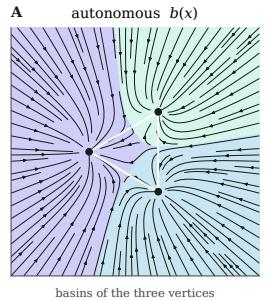

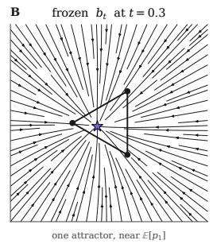

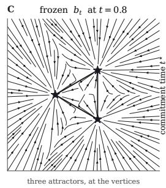

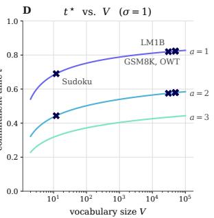

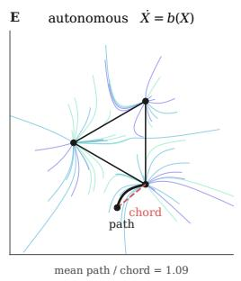

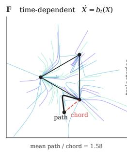

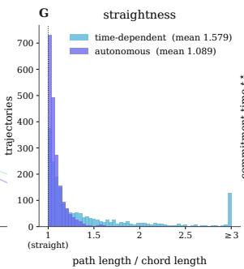

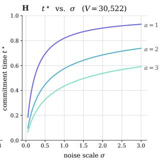  
Figure 2 Dynamics of Autonomous and Time-Dependent Flows. (A) Visualization of the autonomous flow on $\Delta ^ { 2 }$ that is stationary across time and flows towards fixed basins of attraction at the vertices. (B) Time-dependent flow before the vertex commitment time $( t = 0 . 3 )$ where the basin of attraction is at the mean, and (C) after the commitment time $( t = 0 . 8 )$ when the basins of attraction are at the vertices. (E) and (G) Comparison of mean path and chord ratio of autonomous and time-dependent flows. (D) and (H) Plot of commitment time t<sup>⋆</sup> against the simplex dimension V and the prior scale σ with curves for when the interpolant exponent $a \in \{ 1 , 2 , 3 \}$

Self-Distillation with Semigroup Loss Late in training, the output after k refinement rounds approximates a clean sample from $\mu _ { 1 }$ , and its coupling to the initial noise $x _ { 0 }$ is automatic, removing the need for a prescribed noise-data coupling. Writing $\boldsymbol { \hat { x } } _ { r , k }$ for the state after r rounds under budget k with $\hat { x } _ { 0 , k } : = T _ { \theta } ( x _ { 0 } )$ , the semigroup objective matches the map at every intermediate round to the final output:

$$
\mathcal { L } _ { \mathrm { s e m i - r } } ( \theta ) : = \mathbb { E } _ { x _ { 0 } , x _ { 1 } } \bigg [ \sum _ { k \in K } \sum _ { r = 1 } ^ { k } \sum _ { \ell } \mathrm { C E } \left( T _ { \theta } \big ( \hat { x } _ { r - 1 , k } \big ) , \mathrm { s g } \big ( T _ { \theta } \big ( \hat { x } _ { k - 1 , k } \big ) \big ) \right) \bigg ]\tag{30}
$$

where $\hat { x } _ { k , k } = T _ { \theta } ( \hat { x } _ { k - 1 , k } )$ is the final clean sequence after k rounds of refinement. This is analogous to the semigroup loss defined in (18) but with the map operation composed with the renoise operation.

## 6 Experiments

We validate our claims empirically: (i) the autonomous flow on the simplex yields stable attractors at the vertices of the simplex, resulting in smoother trajectories; (ii) the timing of the phase transition is the optimal anchor time that prevents mode collapse and yields faster convergence; (iii) direct training of the one-step map scales to unconditional language modeling and reasoning benchmarks; and (iv) refinement-in-loop training improves coherence and accuracy.

## 6.1 The Autonomous Field Has Stable Attractors at the Vertices

In Figure 2, we compare the time-dependent flow matching field against the autonomous field on the 2-simplex: the autonomous field partitions the ambient space into basins where the only equilibria are the vertices, a property we analyze further for general simplices in App. C.1. As illustrated in Figure 2E-G, the autonomous flow has straighter trajectories due to the stationary basins of attraction than the time-dependent flow, whose basins of attraction appear at staggered times in the interior of the simplex before moving to the vertices (App. C.1.2).

## 6.2 Scaling the One-Step Map to Language

Experimental setup. We evaluate unconditional generation on LM1B (Chelba et al., 2013) and OpenWebText (OWT) (Gokaslan et al., 2019), reporting generative perplexity (Gen-PPL) under GPT-2-Large (Radford et al.,

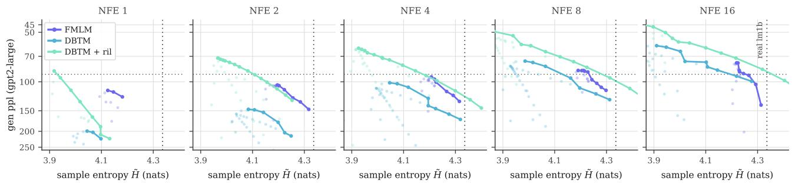

Figure 3 Generative Frontiers of DBTM vs. FMLM. Generative perplexity (plotted log scale, ↓) against sample entropy (↑) on LM1B for NFE ∈ {1, 2, 4, 8, 16}. Each curve is a Pareto frontier: every inference-time knob swept for each method is pooled, and a point is kept only if no other reaches both higher entropy and lower Gen. PPL. DBTM is swept over commit temperature, prior scale σ, and commit threshold κ. FMLM is swept over its churn γ and the same prior scale. The dotted line marks real LM1B data entropy (4.336). DBTM and DBTM + ril are trained for a total of 200K steps each, compared to FMLM initialized from a 1M-step teacher with 100K distillation steps.
<table><tr><td></td><td colspan="6">LM1B</td><td colspan="6">OWT</td></tr><tr><td>NFE</td><td colspan="2">1</td><td colspan="2">2</td><td colspan="2">4</td><td colspan="2">1</td><td colspan="2">2</td><td colspan="2">4</td></tr><tr><td>Method</td><td>Gen-PPL ↓</td><td>Ent. ↑</td><td>Gen-PPL ↓</td><td>Ent. ↑</td><td>Gen-PPL ↓</td><td>Ent. ↑</td><td>Gen-PPL ↓</td><td>Ent. ↑</td><td>Gen-PPL ↓</td><td>Ent. ↑</td><td>Gen-PPL ↓</td><td>Ent. ↑</td></tr><tr><td>Duo + DCD</td><td>1224.52</td><td>4.33</td><td>520.08</td><td>4.20</td><td>210.88</td><td>4.23</td><td>5743.29</td><td>6.02</td><td>891.16</td><td>5.41</td><td>250.86</td><td>5.37</td></tr><tr><td>Duo + Di4C</td><td>292.94</td><td>3.79</td><td>247.69</td><td>3.87</td><td>150.67</td><td>4.00</td><td>370.51</td><td>3.92</td><td>210.22</td><td>4.63</td><td>154.67</td><td>4.85</td></tr><tr><td>MDLM + SDTT</td><td>1429.48</td><td>4.31</td><td>602.14</td><td>4.28</td><td>241.01</td><td>4.28</td><td>1260.86</td><td>5.26</td><td>877.22</td><td>5.34</td><td>339.73</td><td>5.38</td></tr><tr><td>MDLM + Di4C</td><td>1217.10</td><td>4.38</td><td>621.59</td><td>4.37</td><td>247.32</td><td>4.00</td><td>1298.80</td><td>5.29</td><td>758.23</td><td>5.35</td><td>239.27</td><td>5.40</td></tr><tr><td>CFM</td><td>269.72</td><td>3.10</td><td>267.39</td><td>3.15</td><td>267.97</td><td>3.28</td><td></td><td></td><td></td><td></td><td></td><td></td></tr><tr><td>FMLM</td><td>119.34</td><td>4.16</td><td>110.19</td><td>4.21</td><td>98.76</td><td>4.21</td><td>168.30</td><td>5.17</td><td>133.29</td><td>5.25</td><td>111.31</td><td>5.26</td></tr><tr><td>FMLM+</td><td></td><td></td><td></td><td></td><td></td><td></td><td>378.53</td><td>5.34</td><td>114.46</td><td>5.14</td><td>41.16</td><td>4.77</td></tr><tr><td>DFM (PSD)</td><td>94.08</td><td>4.06</td><td>87.42</td><td>4.08</td><td>78.89</td><td>4.10</td><td>180.29</td><td>4.91</td><td>152.83</td><td>5.03</td><td>122.32</td><td>5.10</td></tr><tr><td>DFM (ESD)</td><td>68.11</td><td>3.79</td><td>77.60</td><td>4.11</td><td>71.53</td><td>4.13</td><td>5.33</td><td>0.26</td><td>108.91</td><td>5.15</td><td>77.08</td><td>5.27</td></tr><tr><td>DBTM</td><td>201.20</td><td>4.03</td><td>167.05</td><td>4.19</td><td>119.99</td><td>4.20</td><td>188.2</td><td>4.97</td><td>76.2</td><td>5.14</td><td>52.2</td><td>5.26</td></tr><tr><td>DBTM + ril</td><td>85.50</td><td>3.92</td><td>81.00</td><td>4.05</td><td>73.54</td><td>4.04</td><td>65.2</td><td>4.95</td><td>62.2</td><td>5.38</td><td>57.5</td><td>5.52</td></tr></table>

Table 1 Discrete Beckmann Transport Model Unconditional Language Modeling Performance. Generative perplexity (↓) and entropy (↑) across number of function evaluations (NFEs) for LM1B and OWT. Comparison at matched entropy at the generative frontier across inference-time knobs is given in Tables 13 and 14. Reported OWT values for DBTM are with linear attention at matched parameter count. Standard DiT comparison is given in Table 7.

2019) and within-sequence unigram entropy (Ent.). Since a model that collapses onto repeated tokens can reach arbitrarily low perplexity, we compare perplexities only among checkpoints whose entropy remains in the range of the data entropy. Baselines include distilled discrete difusion and continuous flow map baselines evaluated at NFE budgets matched to ours. We report two variants: DBTM, trained with the transport, boundary, and anchor losses of Section 4.2, and DBTM + ril, which adds the refinement-in-loop objectives of Section 5.2. Further experiment details in App. G.2.

Discrete BTM is competitive with distilled flow maps. Table 1 compares against distilled few-step models and simplex flows at matched NFE. On LM1B, DBTM with ril outperforms every distilled discrete difusion model at 1, 2, and 4 NFE, and is competitive with the best flow-map baseline while maintaining entropy close to the data. On OWT, with linear attention at matched parameter count, DBTM with ril achieves the lowest perplexity across all non-collapsed entropy methods at every NFE budget with the closest entropy to the data. At 4 NFE, DBTM without ril reaches the lowest perplexity overall (52.2) while DBTM + ril attains the highest entropy in the table (5.52), so the two variants trace the two ends of the quality-diversity frontier. Refinement-in-loop yields significant gains in the low NFE regime, reducing 1-NFE perplexity by 58% on LM1B and by 65% on OWT. Figures 1 and 3 show the resulting perplexity-entropy frontier, where DBTM and DBTM + ril dominate the baselines across entropies within the range of the data. Notably, DBTM requires no teacher flow, fewer training steps, and no time conditioning. Example generations are in App. I.

Anchoring at the phase transition prevents mode collapse. Theorem 4.1 gives t<sup>⋆</sup> as a function of the vocabulary size, noise scale, and schedule exponent. Sweeping $t _ { \mathrm { a n c h o r } }$ around this value on LM1B (Table 12) demonstrates its importance. Anchoring before t<sup>⋆</sup> supervises toward a fixed target while the endpoint is undecided, and the model collapses to repetitive tokens, whereas anchoring after t<sup>⋆</sup> $( \mathrm { e . g . ~ } t _ { \mathrm { a n c h o r } } = 0 . 8 5 )$ leaves the post-transition interval unsupervised, resulting in higher Gen. PPL at equal training time (Table 12).

Refinement enables more efective use of step budget. Table 7 evaluates a single DBTM checkpoint across NFE budgets: quality improves consistently with increasing budget until the sequence is fully committed, at which point it saturates. Distilled flow models instead move along a fixed time axis in discrete jumps, and masked difusion unmasks on a fixed schedule with factorization error growing as NFE shrinks. Because every DBTM evaluation returns a clean-sequence distribution from any intermediate state, one model produces a one-shot proposal and then, via Section 5, renoises low-quality positions and remaps them against committed context. The commitment condition also acts as a self-stopping rule, so the NFE count adapts to the sample rather than being fixed in advance as in flow map and flow matching samplers.

## 6.3 Reasoning with Discrete BTMs

Experimental setup. We evaluate on two conditional reasoning tasks, Sudoku at three dificulty levels, evaluated on one-shot exact-solve accuracy, and TinyGSM code (Liu et al., 2023a), evaluated on zero-shot accuracy on the GSM8K test set (Cobbe et al., 2021) following Kim et al. (2025). For baselines, we compare against many-step autoregressive, discrete difusion, and continuous difusion models as well as FMLM+ (Agarwal et al., 2026), a distilled fewstep flow map model trained for iterative refinement. We match our NFE budget and network parameters to FMLM+ for fair comparison. Details in App. G.

<table><tr><td></td><td></td><td colspan="4">Sudoku</td><td colspan="2">GSM8K</td></tr><tr><td>Category</td><td>Method</td><td>NFE</td><td>Easy</td><td>Med.</td><td>Hard</td><td>NFE</td><td>Acc. (%,↑)</td></tr><tr><td rowspan="2">AR</td><td>Sample</td><td>128</td><td>13.9</td><td>5.1</td><td>0.6</td><td>512</td><td>53.9</td></tr><tr><td>Greedy</td><td>128</td><td>14.6</td><td>5.1</td><td>1.0</td><td>512</td><td>63.3</td></tr><tr><td rowspan="2">Discrete</td><td>MDLM</td><td>128</td><td>92.0</td><td>77.1</td><td>30.2</td><td>1024</td><td>18.0</td></tr><tr><td>Duo</td><td>128</td><td>96.3</td><td>84.7</td><td>58.4</td><td>1024</td><td>17.2</td></tr><tr><td rowspan="3">Continuous</td><td>CANDI</td><td>128</td><td>79.3</td><td>45.9</td><td>16.7</td><td>1024</td><td>0.2</td></tr><tr><td>FLM</td><td>128</td><td>94.2</td><td>82.7</td><td>44.5</td><td>1024</td><td>0.3</td></tr><tr><td>S-FLM</td><td>128</td><td>94.8</td><td>85.2</td><td>45.0</td><td>1024</td><td>18.0</td></tr><tr><td rowspan="4">Few-Step</td><td>FMLM+</td><td>4</td><td>97.9</td><td>92.0</td><td>71.2</td><td>1</td><td>0</td></tr><tr><td>FMLM+</td><td>16</td><td>97.8</td><td>92.6</td><td>81.4</td><td>32</td><td>16.6</td></tr><tr><td>DBTM + ril</td><td>4</td><td>99.5</td><td>97.3</td><td>84.6</td><td>1</td><td>0.8</td></tr><tr><td>DBTM + ril</td><td>16</td><td>99.9</td><td>99.4</td><td>97.5</td><td>32</td><td>16.8</td></tr></table>

Table 2 Discrete Beckmann Transport Model Reasoning Performance. Sudoku columns are exact-solve accuracy (%) on the 2000-puzzle held-out set and GSM8K is accuracy (%) on the 1319-problem test set. FMLM+ at NFE 16 is our own evaluation of the released checkpoints on easy and medium, and the hard and GSM8K cells are taken from Table 13 of Agarwal et al. (2026).

Refinement enables fixed-point reasoning. Reasoning tasks are where the refinement scheme matters most, because

a joint one-shot decode of a puzzle or a chain of arithmetic almost always contains locally plausible but globally inconsistent positions. Table 2 shows that DBTM matches or exceeds many-step autoregressive, discrete difusion, and continuous flow baselines on all dificulty levels of Sudoku while using one to two orders of magnitude fewer network evaluations, and exceeds the strongest few-step baseline at the same budget, with the margin widening on the harder dificulty levels. On the 1319-problem GSM8K test set, DBTM achieves 0.8% solve accuracy in 1 NFE, surpassing continuous baselines CANDI (Pynadath et al., 2026) and FLM (Lee et al., 2026a) at 1024 NFEs and FMLM+ (Agarwal et al., 2026). At 32 NFEs, DBTM achieves 16.8% solve accuracy, slightly higher than FMLM+ at matched NFE and closing the gap with S-FLM at 32× fewer NFE. Autoregressive (AR) methods still dominate on GSM8K, suggesting refinement schemes that exploit the left-to-right structure of reasoning traces as a promising direction for future work.

## 7 Conclusion

We introduced Discrete Beckmann Transport Models (DBTM), a class of discrete generative models that replace the time-dependent velocity of flow matching with a stationary, autonomous field on the simplex. The resulting trajectories are straighter, time-averaged paths whose only stable equilibria lie at the vertices of the simplex. Defining the transport map as the solution to the conservation equation along this field lets us train it end-to-end from data alone, with no time conditioning and no teacher to distill from. Since every application of the map proposes a clean sequence, scaling NFEs take the form of renoise-and-refine steps that self-correct inconsistencies given a set of committed context tokens rather than finer integration steps. Across language modeling and reasoning benchmarks, DBTMs improve on both discrete difusion and flow baselines.

## 8 Acknowledgements

The authors thank Michael Albergo and Brian Cheuk-Kit Lee for helpful discussions and guidance. SW is supported by a Kempner Graduate Fellowship. This work is made possible by a gift from the Chan Zuckerberg Initiative Foundation to establish the Kempner Institute for the Study of Natural and Artificial Intelligence.

## References

Manan Agarwal, Sheel Shah, Chanhyuk Lee, Jaehoon Yoo, Jerry Huang, Seunghoon Hong, Aditi Raghunathan, Jinwoo Kim, and Nicholas M Bofi. 2026. Posterior refinement: Fast language generation via any-order flow maps. arXiv preprint arXiv:2606.24773.

Michael Albergo, Nicholas M Bofi, and Eric Vanden-Eijnden. 2025. Stochastic interpolants: A unifying framework for flows and difusions. Journal of Machine Learning Research, 26(209):1–80.

Michael S Albergo and Eric Vanden-Eijnden. 2023. Building normalizing flows with stochastic interpolants. International Conference on Learning Representations.

Luca Ambrogioni. 2025. The statistical thermodynamics of generative difusion models: Phase transitions, symmetry breaking and critical instability. Entropy.

Jacob Austin, Daniel D Johnson, Jonathan Ho, Daniel Tarlow, and Rianne Van Den Berg. 2021. Structured denoising difusion models in discrete state-spaces. Advances in Neural Information Processing Systems.

Nicholas M Bofi, Michael S Albergo, and Eric Vanden-Eijnden. 2024. Flow map matching with stochastic interpolants: A mathematical framework for consistency models. Transactions in Machine Learning Research.

Nicholas M Bofi, Michael S Albergo, and Eric Vanden-Eijnden. 2025. How to build a consistency model: Learning flow maps via self-distillation. Advances in Neural Information Processing Systems.

Andrew Campbell, Jason Yim, Regina Barzilay, Tom Rainforth, and Tommi Jaakkola. 2024. Generative flows on discrete state-spaces: Enabling multimodal flows with applications to protein co-design. International Conference on Machine Learning.

Ciprian Chelba, Tomas Mikolov, Mike Schuster, Qi Ge, Thorsten Brants, Phillipp Koehn, and Tony Robinson. 2013. One billion word benchmark for measuring progress in statistical language modeling. arXiv preprint arXiv:1312.3005.

Yuxin Chen, Chumeng Liang, Hangke Sui, Ruihan Guo, Chaoran Cheng, Jiaxuan You, and Ge Liu. 2026. Langflow: Continuous difusion rivals discrete in language modeling. arXiv preprint arXiv:2604.11748.

Chaoran Cheng, Jiahan Li, Jiajun Fan, and Ge Liu. 2025. α-flow: A unified framework for continuous-state discrete flow matching models. arXiv preprint arXiv:2504.10283.

Karl Cobbe, Vineet Kosaraju, Mohammad Bavarian, Mark Chen, Heewoo Jun, Lukasz Kaiser, Matthias Plappert, Jerry Tworek, Jacob Hilton, Reiichiro Nakano, et al. 2021. Training verifiers to solve math word problems. arXiv preprint arXiv:2110.14168.

Oscar Davis, Samuel Kessler, Mircea Petrache, İsmail İ Ceylan, Michael Bronstein, and Avishek J Bose. 2024. Fisher flow matching for generative modeling over discrete data. Advances in Neural Information Processing Systems.

Bernard Derrida. 1980. Random-energy model: Limit of a family of disordered models. Physical Review Letters, 45(2):79.

Justin Deschenaux and Caglar Gulcehre. 2025. Beyond autoregression: Fast llms via self-distillation through time. In International Conference on Learning Representations.

Justin Deschenaux and Caglar Gulcehre. 2026. Language modeling with hyperspherical flows. arXiv preprint arXiv:2605.11125.

Sander Dieleman, Laurent Sartran, Arman Roshannai, Nikolay Savinov, Yaroslav Ganin, Pierre H Richemond, Arnaud Doucet, Robin Strudel, Chris Dyer, Conor Durkan, et al. 2022. Continuous difusion for categorical data. arXiv preprint arXiv:2211.15089.

Kevin Frans, Danijar Hafner, Sergey Levine, and Pieter Abbeel. 2025. One step difusion via shortcut models. International Conference on Learning Representations.

Itai Gat, Tal Remez, Neta Shaul, Felix Kreuk, Ricky TQ Chen, Gabriel Synnaeve, Yossi Adi, and Yaron Lipman. 2024. Discrete flow matching. Advances in Neural Information Processing Systems.

Aaron Gokaslan, Vanya Cohen, Ellie Pavlick, and Stefanie Tellex. 2019. Openwebtext corpus. http://Skylion007.github. io/OpenWebTextCorpus.

Guangfu Guo, Xiaoqian Lu, Linsey Pang, Weiran Yao, Haolin Chen, Kunpeng Liu, and Long Cheng. 2026. Deltaflow: Noise-adaptive bidirectional gated delta networks for embedded language flows. arXiv preprint arXiv:2608.01240.

Yi Guo, Wei Wang, Zhihang Yuan, Rong Cao, Kuan Chen, Zhengyang Chen, Yuanyuan Huo, Yang Zhang, Yuping Wang, Shouda Liu, et al. 2025. Splitmeanflow: Interval splitting consistency in few-step generative modeling. arXiv preprint arXiv:2507.16884.

Satoshi Hayakawa, Yuhta Takida, Masaaki Imaizumi, Hiromi Wakaki, and Yuki Mitsufuji. 2025. Distillation of discrete difusion through dimensional correlations. International Conference on Machine Learning.

Keya Hu, Linlu Qiu, Yiyang Lu, Hanhong Zhao, Tianhong Li, Yoon Kim, Jacob Andreas, and Kaiming He. 2026. Elf: Embedded language flows. arXiv preprint arXiv:2605.10938.

Jaehyeong Jo and Sung Ju Hwang. 2025. Continuous difusion model for language modeling. Advances in Neural Information Processing Systems.

Wonjun Kang, Kevin Galim, Seunghyuk Oh, Minjae Lee, Yuchen Zeng, Shuibai Zhang, Coleman Hooper, Yuezhou Hu Hyung Koo, Nam Ik Cho, et al. 2026. Parallelbench: Understanding the trade-ofs of parallel decoding in difusion llms. In International Conference on Learning Representations, volume 2026.

Nitish Shirish Keskar, Bryan McCann, Lav R Varshney, Caiming Xiong, and Richard Socher. 2019. Ctrl: A conditional transformer language model for controllable generation. arXiv preprint arXiv:1909.05858.

Jaeyeon Kim, Seunggeun Kim, Taekyun Lee, David Z Pan, Hyeji Kim, Sham Kakade, and Sitan Chen. 2026. Fine-tuning masked difusion for provable self-correction. International Conference on Machine Learning.

Jaeyeon Kim, Kulin Shah, Vasilis Kontonis, Sham Kakade, and Sitan Chen. 2025. Train for the worst, plan for the best: Understanding token ordering in masked difusions. International Conference on Machine Learning.

Chanhyuk Lee, Jaehoon Yoo, Manan Agarwal, Sheel Shah, Jerry Huang, Aditi Raghunathan, Seunghoon Hong, Nicholas M Bofi, and Jinwoo Kim. 2026a. Flow map language models: One-step language modeling via continuous denoising. arXiv preprint arXiv:2602.16813.

Cheuk-Kit Lee, Florentin Coeurdoux, Peter Potaptchik, Yilun Du, Michael S Albergo, and Eric Vanden-Eijnden. 2026b. Beckmann transport models: From autonomous flows to one-step maps. arXiv preprint arXiv:2608.01692.

Yaron Lipman, Ricky TQ Chen, Heli Ben-Hamu, Maximilian Nickel, and Matt Le. 2023. Flow matching for generative modeling. International Conference on Learning Representations.

Bingbin Liu, Sebastien Bubeck, Ronen Eldan, Janardhan Kulkarni, Yuanzhi Li, Anh Nguyen, Rachel Ward, and Yi Zhang. 2023a. Tinygsm: achieving> 80% on gsm8k with small language models. arXiv preprint arXiv:2312.09241.

Xingchao Liu, Chengyue Gong, and Qiang Liu. 2023b. Flow straight and fast: Learning to generate and transfer data with rectified flow. International Conference on Learning Representations.

Aaron Lou, Chenlin Meng, and Stefano Ermon. 2024. Discrete difusion modeling by estimating the ratios of the data distribution. International Conference on Machine Learning.

Jingyang Ou, Shen Nie, Kaiwen Xue, Fengqi Zhu, Jiacheng Sun, Zhenguo Li, and Chongxuan Li. 2025. Your absorbing discrete difusion secretly models the conditional distributions of clean data. International Conference on Learning Representations.

William Peebles and Saining Xie. 2023. Scalable difusion models with transformers. In 2023 IEEE/CVF International Conference on Computer Vision (ICCV), pages 4172–4182. IEEE.

Peter Potaptchik, Jason Yim, Adhi Saravanan, Peter Holderrieth, Eric Vanden-Eijnden, and Michael S Albergo. 2026. Discrete flow maps. arXiv preprint arXiv:2604.09784.

Patrick Pynadath, Jiaxin Shi, and Ruqi Zhang. 2026. Candi: Hybrid discrete-continuous difusion models. International Conference on Machine Learning.

Alec Radford, Jefrey Wu, Rewon Child, David Luan, Dario Amodei, Ilya Sutskever, et al. 2019. Language models are unsupervised multitask learners. OpenAI blog, 1(8):9.

Daan Roos, Oscar Davis, Floor Eijkelboom, Michael Bronstein, Max Welling, Ismail Ilkan Ceylan, Luca Ambrogioni, and Jan-Willem van de Meent. 2026. Categorical flow maps. International Conference on Machine Learning.

Amirmojtaba Sabour, Sanja Fidler, and Karsten Kreis. 2025. Align your flow: Scaling continuous-time flow map distillation. Advances in Neural Information Processing Systems.

Subham Sahoo, Marianne Arriola, Yair Schif, Aaron Gokaslan, Edgar Marroquin, Justin Chiu, Alexander Rush, and Volodymyr Kuleshov. 2024. Simple and efective masked difusion language models. Advances in Neural Information Processing Systems.

Subham Sekhar Sahoo, Justin Deschenaux, Aaron Gokaslan, Guanghan Wang, Justin Chiu, and Volodymyr Kuleshov. 2025. The difusion duality. International Conference on Machine Learning.

Jiaxin Shi, Kehang Han, Zhe Wang, Arnaud Doucet, and Michalis Titsias. 2024. Simplified and generalized masked difusion for discrete data. Advances in Neural Information Processing Systems.

Yang Song and Prafulla Dhariwal. 2024. Improved techniques for training consistency models. International Conference on Learning Representations.

Yang Song, Prafulla Dhariwal, Mark Chen, and Ilya Sutskever. 2023. Consistency models. International Conference on Machine Learning.

Hannes Stark, Bowen Jing, Chenyu Wang, Gabriele Corso, Bonnie Berger, Regina Barzilay, and Tommi Jaakkola. 2024. Dirichlet flow matching with applications to dna sequence design. International Conference on Machine Learning.

Jianlin Su, Murtadha Ahmed, Yu Lu, Shengfeng Pan, Wen Bo, and Yunfeng Liu. 2024. Roformer: Enhanced transformer with rotary position embedding. Neurocomputing, 568:127063.

Sophia Tang and Pranam Chatterjee. 2026. Expanding flow maps. arXiv preprint arXiv:2607.21585.

Sophia Tang, Yinuo Zhang, Alexander Tong, and Pranam Chatterjee. 2025. Gumbel-softmax flow matching with straight through guidance for controllable biological sequence generation. arXiv preprint arXiv:2503.17361.

Alexander Tong, Kilian Fatras, Nikolay Malkin, Guillaume Huguet, Yanlei Zhang, Jarrid Rector-Brooks, Guy Wolf, and Yoshua Bengio. 2024. Improving and generalizing flow-based generative models with minibatch optimal transport. Transactions in Machine Learning Research.

Songlin Yang, Jan Kautz, and Ali Hatamizadeh. 2025. Gated delta networks: Improving mamba2 with delta rule. International Conference on Learning Representations.

Songlin Yang, Bailin Wang, Yu Zhang, Yikang Shen, and Yoon Kim. 2024. Parallelizing linear transformers with the delta rule over sequence length. Advances in neural information processing systems.

Zhihan Yang, Wei Guo, Shuibai Zhang, Subham Sekhar Sahoo, Yongxin Chen, Arash Vahdat, Morteza Mardani, and John Thickstun. 2026. Continuous difusion scales competitively with discrete difusion for language. arXiv preprint arXiv:2605.18530.

Zhendong Yu and Haiping Huang. 2025. Nonequilbrium physics of generative difusion models. Physical Review E, 111(1):014111.

Kaiwen Zheng, Yongxin Chen, Hanzi Mao, Ming-Yu Liu, Jun Zhu, and Qinsheng Zhang. 2025. Masked difusion models are secretly time-agnostic masked models and exploit inaccurate categorical sampling. International Conference on Learning Representations.

Linqi Zhou, Mathias Parger, Ayaan Haque, and Jiaming Song. 2026. Terminal velocity matching. International Conference on Learning Representations.

## Appendix

A Related Work 15   
A.1 Discrete and Continuous Generative Models for Sequence Data 15   
A.2 Time-dependent and autonomous flows . 15   
A.3 Flow maps in discrete state space 15   
B Background on Autonomous Flows 16   
B.1 Notation 16   
B.2 Divergence Condition 16   
C Theoretical Results 17   
C.1 Dynamics of Time-Dependent and Autonomous Flows 18   
C.2 Deriving the Phase Transition and Commitment Time 26   
C.3 Occupation Measure of Autonomous Flow on the Simplex 29   
C.4 Autonomous Velocity Vanishes at the Vertices 31   
C.5 Convergence of Autonomous Flow on the Simplex 32   
C.6 Eulerian and Conservation Equations . 35   
D Refinement-in-Loop Details and Additional Results 37   
D.1 On-policy Rollouts 37   
D.2 Refinement-in-Loop for Reasoning 38   
D.3 Refinement-in-Loop for Unconditional Language Modeling 38   
E Hyperparameter Discussion 41   
E.1 Training Hyperparameters 41   
E.2 Inference Hyperparameters 41   
F Ablations and Additional Results 42   
G Experiment Details 47   
G.1 General Experiment Details . 47   
G.2 Unconditional Language Modeling Experiment Details 47   
G.3 Reasoning Experiment Details . 48   
H Algorithms 50   
I Example Generations 52

## A Related Work

## A.1 Discrete and Continuous Generative Models for Sequence Data

Generative modeling of discrete data in the form of sequences or graphs has taken many forms. Discrete difusion (Austin et al., 2021; Lou et al., 2024), masked discrete difusion (Shi et al., 2024; Sahoo et al., 2024; Ou et al., 2025; Zheng et al., 2025), and discrete flow matching (Gat et al., 2024; Campbell et al., 2024) model discrete sequence generation as a continuous-time Markov chain (CTMC) where transitions are defined by a rate matrix. However, since the discrete state space grows exponentially with the vocabulary size and sequence length, discrete difusion models rely on learning the factorized approximations of the transition probabilities that require many inference steps to capture the dependencies between tokens for accurate generation (Kang et al., 2026). To overcome the factorization errors inherent in discrete state-space parameterizations, continuous state-space parameterizations have emerged as an alternative by embedding the flow trajectories in simplex space (Stark et al., 2024; Davis et al., 2024; Tang et al., 2025) or in a latent embedding space (Cheng et al., 2025; Chen et al., 2026; Dieleman et al., 2022; Hu et al., 2026; Deschenaux and Gulcehre, 2026; Yang et al., 2026; Jo and Hwang, 2025). In this work, we model the autonomous flow transporting a Gaussian prior $\mu _ { 0 }$ on $\mathbb { R } ^ { d } , d : = V L ,$ , to the data distribution $\mu _ { 1 }$ supported on the vertex set $\mathcal { V } : = \{ e _ { 1 } , . . . , e _ { V } \} ^ { L }$ of the product of simplices $( \Delta ^ { V - 1 } ) ^ { L } \subset \mathbb { R } ^ { d }$ , which is the construction used in discrete flow maps (Potaptchik et al., 2026; Lee et al., 2026a).

## A.2 Time-dependent and autonomous flows

Our framework develops the discrete state space instantiation of Beckmann Transport Models (BTMs) (Lee et al., 2026b), an approach to the problem of transporting states between distributions $\mu _ { 0 }$ and $\mu _ { 1 }$ via a time-independent velocity field b that satisfies the divergence condition $\nabla \cdot ( \nu b ) = \mu _ { 0 } - \mu _ { 1 }$ . In contrast to the time-dependent velocity field of standard flow matching (Lipman et al., 2023; Albergo and Vanden-Eijnden, 2023; Albergo et al., 2025; Liu et al., 2023b) that transports x along $b _ { s } ( x ) = \mathbb { E } _ { x _ { 0 } , x _ { 1 } } [ \dot { I } _ { s } | I _ { s } = x ]$ which is the expectation of the interpolant velocity passing x at time s, the autonomous velocity field additionally averages over the time coordinate of the interpolant $s \in [ 0 , 1 ]$ , yielding the expectation over all interpolant velocities that pass x at any time. In our work, we derive and empirically validate the unique properties of the autonomous flow on the simplex, specifically showing that it yields straighter flows with favorable Lipschitz properties and stationary attractors at the vertex. We establish the fact that the autonomous velocity field is non-vanishing approaching each vertex but vanishes when reaching it, partitioning the ambient space around the simplex into stationary basins of attraction.

## A.3 Flow maps in discrete state space

There exists a long line of work on distilling and constructing few-step generative models that aim to reduce the number of function evaluations needed to integrate the generative ODE or SDE. These include consistency models (Song et al., 2023; Song and Dhariwal, 2024), shortcut models (Frans et al., 2025), MeanFlow (Guo et al., 2025), rectified flow (Liu et al., 2023b), flow maps (Bofi et al., 2024; Sabour et al., 2025; Bofi et al., 2025), and many of these frameworks have been extended to the discrete state space (Roos et al., 2026; Lee et al., 2026a; Potaptchik et al., 2026) and variable-length generation (Tang and Chatterjee, 2026). Most related to our work are flow map language models (Lee et al., 2026a) with posterior refinement (Agarwal et al., 2026) and discrete flow maps (Potaptchik et al., 2026), which learn a two-time map $( s , t )$ along the interpolant between a Gaussian prior and the simplex vertices. Despite this shared goal, DBTM difers from flow maps in several aspects, summarized in Table 3.

Flow map models are explicitly time-conditioned and are typically trained by distilling a pretrained teacher flow $b _ { t } .$ , requiring supervision over all $( s , t )$ time pairs together with a careful balance of the diagonal (teacher matching) and of-diagonal consistency objectives. DBTM instead trains a single autonomous model conditioned only on the current state, with no teacher and no time embedding, reducing the space of functions that need to be learned during training. For a flow map, each NFE is a discretized jump along the generative trajectory, whereas for DBTM each NFE refines a complete clean proposal, so intermediate iterates remain in the data space and can be treated as a reasoning trace. Since inference only ever visits a small subset of the $( s , t )$ grid, flow map models spend training time on time pairs that are never used at sampling time. Training DBTM from noise-data interpolants instead covers exactly the states encountered at inference. Finally, the autonomous formulation admits a natural stopping criterion: sampling iterations stop once the proposal reaches its fixed point or once all tokens pass a confidence threshold, whereas flow map sampling requires the step schedule to be fixed in advance.

Table 3 Comparison of DBTM with Flow Map Language Models (FMLM) and Discrete Flow Maps (DFM). Both generate in a fixed small number of function evaluations, but flow maps discretize an ODE between trained $( s , t )$ pairs and need a teacher and time conditioning, whereas DBTM refines a clean proposal with a single autonomous map. The rows contrast the two methods.
<table><tr><td></td><td>Flow Map LMs / DFM</td><td>DBTM (Ours)</td></tr><tr><td>Few-step generation</td><td>Yes</td><td>Yes</td></tr><tr><td>Time conditioning</td><td>Yes (s and t conditioning)</td><td>No</td></tr><tr><td>Teacher model</td><td>Yes</td><td>No</td></tr><tr><td>Each NFE is</td><td>Discretized step along ODE</td><td>Refinement of clean proposal</td></tr><tr><td>Self-stopping</td><td>No</td><td>Yes</td></tr><tr><td>Training complexity</td><td>High; requires diagonal/off-diagonal balancing and supervision over all (s, t) time pairs</td><td>Low; trains a single model conditioned only on the current state</td></tr><tr><td>Training-inference mismatch</td><td>inference</td><td>Yes; many (s, t) time jumps are unused at No; training from noise-data interpolants covers all states seen at inference</td></tr><tr><td>Self-correction / reasoning trace</td><td> $\mathrm { N o }$ </td><td>Yes</td></tr></table>

## B Background on Autonomous Flows

## B.1 Notation

Sequences and the simplex V is the vocabulary size, L the sequence length, $\ell \in \left[ L \right]$ a position and $j , k$ vertex indices. $e _ { j }$ is a one-hot vertex of the simplex $\Delta ^ { V - 1 } , ( \mathbb { R } ^ { V } ) ^ { L }$ the ambient space, $x ^ { \ell }$ the ℓ-th position of a sequence, and $M _ { 1 }$ the data manifold of $V ^ { L }$ vertex configurations. $\mu _ { 0 }$ is the Gaussian prior with noise scale $\sigma$ and $\mu _ { 1 }$ the data distribution.

Interpolants and time s, t, u denote time coordinates, $I _ { t } = \alpha _ { t } x _ { 0 } + \beta _ { t } x _ { 1 }$ the interpolant between $x _ { 0 } \sim \mu _ { 0 }$ and $x _ { 1 } \sim \mu _ { 1 } , \dot { I } _ { t }$ its velocity and $\mu _ { t }$ its marginal. $\alpha _ { t } = ( 1 - t ) ^ { a }$ is the interpolant time schedule with exponent a. For the partial-context interpolant, $t _ { \ell }$ and $\alpha _ { t } ^ { \ell }$ are per-position, $\mathcal { C } \subset [ L ]$ is the clean context set, $f$ the clean fraction, and $c _ { \ell }$ the context indicator.

Flows and the transport map $b _ { t }$ is the time-dependent flow matching velocity and b the autonomous (timeindependent) velocity. ν is the occupation measure, $j = \nu b$ the current, $\nu ^ { ( j ) } , J ^ { ( j ) }$ their per-vertex components and $w _ { j }$ the occupancy weights. $X _ { s }$ the autonomous flow, $\tau ( x _ { 0 } )$ the hitting time of $M _ { 1 }$ and $T$ the autonomous transport map, the long-time limit of $X _ { s }$

Learned objects and refinement $T _ { \theta } = \mathrm { s o f t m a x } ( f _ { \theta } )$ is the learned map, $q _ { \phi } ^ { \ell }$ the per-token quality head on the trunk hidden state $h ^ { \ell }$ , and $\operatorname { s g } ( \cdot )$ the stop-gradient. Losses are ${ \mathcal { L } } _ { \mathrm { t r a n s p o r t } } , { \mathcal { L } } _ { \mathrm { b n d } } , { \mathcal { L } } _ { \mathrm { a n c h o r } } , { \mathcal { L } } _ { \phi } , { \mathcal { L } } _ { \mathrm { r i l } } , { \mathcal { L } } _ { \mathrm { r i l } - \phi }$ each weighted by a λ scalar. At inference, $\hat { x } _ { r , k }$ is the partially committed sequence at refinement round r of k total rounds, κ is the commit threshold, $\mathcal { C } _ { r }$ is the committed index set after round $r ,$ and NFE is the number of network evaluations, which coincides with the number of refinement rounds k.

## B.2 Divergence Condition

Proposition B.1 (Autonomous flow satisfies divergence condition). For uniformly sampled $t \sim \mathcal { U } ( [ 0 , 1 ] )$ the autonomous velocity $b ( x ) : = \mathbb { E } _ { t , x _ { 0 } , x _ { 1 } } [ \dot { I } _ { t } | I _ { t } = x ]$ satisfies the divergence condition:

$$
\nabla \cdot ( b \nu ) = \mu _ { 0 } - \mu _ { 1 }\tag{31}
$$

Proof. For a family of interpolants $( \alpha _ { t } , \beta _ { t } ) _ { t \in [ 0 , 1 ] }$ , the time-dependent velocity, by the chain rule $\dot { I } _ { t } = \dot { \alpha } _ { t } x _ { 0 } + \dot { \beta } _ { t } x _ { 1 }$ ， is:

$$
b _ { t } ( x ) = \mathbb { E } [ \dot { I } _ { t } | I _ { t } = x ] = \dot { \alpha } _ { t } \mathbb { E } [ x _ { 0 } | I _ { t } = x ] + \dot { \beta } _ { t } \mathbb { E } [ x _ { 1 } | I _ { t } = x ] = \dot { \alpha } _ { t } \eta _ { 0 } ( t , x ) + \dot { \beta } _ { t } \eta _ { 1 } ( t , x )\tag{32}
$$

where we define $\eta _ { 0 } ( t , x ) : = \mathbb { E } [ x _ { 0 } | I _ { t } = x ]$ and $\eta _ { 1 } ( t , x ) : = \mathbb { E } [ x _ { 1 } | I _ { t } = x ]$ . b satisfies the continuity equation with time-dependent marginal $\mu _ { t } \colon$

$$
\begin{array} { r } { \partial _ { t } \mu _ { t } + \nabla \cdot ( b _ { t } \mu _ { t } ) = 0 } \end{array}\tag{33}
$$

The autonomous flow is given by integrating over $t \in [ 0 , 1 ]$ of the time-dependent flow:

$$
b ( x ) = \mathbb { E } _ { t } [ b _ { t } ( x ) | I _ { t } = x ] = { \frac { \int _ { 0 } ^ { 1 } b _ { t } ( x ) \mu _ { t } ( x ) \pi ( t ) d t } { \int _ { 0 } ^ { 1 } \mu _ { t } ( x ) \pi ( t ) d t } } = { \frac { 1 } { \nu ( x ) } } \int _ { 0 } ^ { 1 } b _ { t } ( x ) \mu _ { t } ( x ) d t\tag{34}
$$

where $\pi ( t )$ is the distribution from which t is sampled (typically uniform on [0, 1]). For uniform $\pi ( t )$ , we can integrate the continuity equation over $t \in [ 0 , 1 ]$ to get:

$$
\int _ { 0 } ^ { 1 } \partial _ { t } \mu _ { t } d t + \nabla \cdot \int _ { 0 } ^ { 1 } b _ { t } \mu _ { t } d t = 0 ,\tag{35}
$$

The first integral reduces to $\begin{array} { r } { \int _ { 0 } ^ { 1 } \partial _ { t } \mu _ { t } d t = \mu _ { 1 } - \mu _ { 0 } } \end{array}$ and the second integral can be simplified using the definition of b(x) in (34) to get $( \mu _ { 1 } - \mu _ { 0 } ) { \dot { + } } \nabla \cdot ( b \nu ) = 0$ or $\nabla \cdot ( b \nu ) = \mu _ { 0 } - \mu _ { 1 }$ □

Corollary B.1 (Endpoint parameterization). Let $q _ { x } ( t ) : = \mu _ { t } ( x ) / \nu ( x )$ be the probability density of $t \in [ 0 , 1 ]$ given x. Then, the endpoint parameterization of the autonomous flow is given by:

$$
b ( x ) = \mathbb { E } _ { t \sim q _ { x } ( t ) } \left[ \lambda _ { t } { \big ( } \eta _ { 1 } ( t , x ) - x { \big ) } \right] = Z ( x ) \left( { \bar { \eta } } _ { 1 } ( t , x ) - x \right)\tag{36}
$$

where $Z ( x ) : = \mathbb { E } _ { t \sim q _ { x } } [ \lambda _ { t } ]$ is a scalar and $\begin{array} { r } { \bar { \eta } _ { 1 } ( t , x ) : = \frac { 1 } { Z ( x ) } \mathbb { E } _ { t \sim q _ { x } } [ \lambda _ { t } \eta _ { 1 } ( t , x ) ] } \end{array}$ is the averaged endpoint prediction.

Proof. Given (32), we can write $x = \alpha _ { t } \eta _ { 0 } ( t , x ) + \beta _ { t } \eta _ { 1 } ( t , x )$ and for $t < 1$ , we can substitute $\eta _ { 0 } = ( x - \beta _ { t } \eta _ { 1 } ) / \alpha _ { t }$ to get the endpoint form:

$$
b _ { t } ( x ) = \frac { \dot { \alpha } _ { t } } { \alpha _ { t } } x + \left( \dot { \beta } _ { t } - \frac { \dot { \alpha } _ { t } \beta _ { t } } { \alpha _ { t } } \right) \eta _ { 1 } ( t , x )\tag{37}
$$

Since $\beta _ { t } = 1 - \alpha _ { t }$ , we have $\dot { \beta } _ { t } = - \dot { \alpha } _ { t }$ and the bracket simplifies to $\begin{array} { r } { - \dot { \alpha } \left( 1 + \frac { 1 - \alpha _ { t } } { \alpha _ { t } } \right) = - \dot { \alpha } _ { t } / \alpha _ { t } = : \lambda _ { t } } \end{array}$ . Therefore, (37) reduces to:

$$
b _ { t } ( x ) = \lambda _ { t } ( \eta _ { 1 } ( t , x ) - x ) , \quad \lambda _ { t } : = - \frac { \dot { \alpha } _ { t } } { \alpha _ { t } } = \frac { a ( 1 - t ) ^ { a - 1 } } { ( 1 - t ) ^ { a } } = \frac { a } { 1 - t }\tag{38}
$$

Substituting into (34) and writing $\textstyle \nu ( x ) = \int _ { 0 } ^ { 1 } \mu _ { t } ( x ) d t$ , we get:

$$
b ( x ) = \frac { 1 } { \nu ( x ) } \int _ { 0 } ^ { 1 } \lambda _ { t } ( \eta _ { 1 } ( t , x ) - x ) \mu _ { t } ( x ) d t = \int _ { 0 } ^ { 1 } \lambda _ { t } ( \eta _ { 1 } ( t , x ) - x ) q _ { x } ( t ) d t\tag{39}
$$

which is the first equality in (36). Since $q _ { x }$ integrates to one, $Z ( x ) < \infty$ and splitting the integrand linearly gives $b ( x ) = Z ( x ) \bar { \eta } _ { 1 } ( t , x ) - Z ( x ) x = Z ( x ) ( \bar { \eta } _ { 1 } ( t , x ) - x )$ , which is the second equality. □

Remark B.1 (Using the transport map to integrate the autonomous flow). Since $\eta _ { 1 } ( t , x )$ is a conditional expectation of $x _ { 1 } \in M _ { 1 } , \bar { \eta } _ { 1 } ( t , x )$ is a convex combination of these and lies on the simplex $\bar { \eta _ { 1 } } ( t , x ) \in ( \Delta ^ { V - 1 } ) ^ { L }$ for every x. Therefore, the autonomous velocity is fully determined by a map onto the product of simplices, which is exactly what $T _ { \theta } : = \mathrm { s o f t m a x } ( f _ { \theta } )$ predicts. The trajectory of the autonomous flow is unchanged with respect to $Z ( x )$ up to a time reparameterization, so we only need to learn the map.

## C Theoretical Results

Here, we present the proofs and derivations for the theoretical results of our method. In $\mathrm { A p p ~ C . 1 }$ , we show the favorable properties of the time-dependent and autonomous flows, including the stationary attractors at the vertices. In $\mathrm { A p p ~ C . 2 }$ , we derive the commitment time of the stochastic interpolant to a vertex of the simplex as a function of the prior variance, the simplex dimension, and the exponent in the interpolant schedule. In App C.3, we derive the form of the occupation measure defining the time spent at each point in ambient space. Finally, we show in App C.4 that the autonomous flow velocity vanishes at the vertices.

## C.1 Dynamics of Time-Dependent and Autonomous Flows

## C.1.1 Autonomous Flow as Time-Averaged Dynamics

Proposition 3.1 (Time-average of standard flow matching). Given the time-dependent flow matching velocity $b _ { t } ( x ) : = \mathbb { E } _ { x _ { 0 } , x _ { 1 } } [ \dot { I } _ { t } | I _ { t } = x ]$ defined with the interpolant $I _ { t } : = \alpha _ { t } x _ { 0 } + \beta _ { t } x _ { 1 }$ , the autonomous velocity field is the time-weighted average:

$$
b ( \boldsymbol { x } ) = \frac { \int _ { 0 } ^ { 1 } \mu _ { t } ( \boldsymbol { x } ) b _ { t } ( \boldsymbol { x } ) d t } { \int _ { 0 } ^ { 1 } \mu _ { t } ( \boldsymbol { x } ) d t }\tag{9}
$$

Proof. Let $u \sim \mathrm { U n i f } [ 0 , 1 ]$ be independent of $( x _ { 0 } , x _ { 1 } )$ , so that $( u , I _ { u } )$ has joint density $( t , x ) \mapsto \mu _ { t } ( x )$ on $[ 0 , 1 ] \times  { \mathbb { R } } ^ { d }$ Marginalizing in $t ,$ the density of $I _ { u }$ is $\begin{array} { r } { \bar { \mu } ( x ) : = \int _ { 0 } ^ { 1 } \mu _ { s } ( x ) d s } \end{array}$ , and by Bayes’ rule the conditional density of u given $I _ { u } = x \ \mathrm { i s } \ \mu _ { t } ( x ) / \bar { \mu } ( x )$ wherever $\bar { \mu } ( x ) > 0$ . By independence, $\mathbb { E } [ \dot { I } _ { u } \mid u = t , I _ { u } = x ] = b _ { t } ( x )$ , so the tower property gives:

$$
b ( x ) : = \mathbb { E } _ { u , x _ { 0 } , x _ { 1 } } [ { \dot { I } } _ { u } \mid I _ { u } = x ] = \mathbb { E } { \big [ } b _ { u } ( x ) { \big | } I _ { u } = x { \big ] } = \int _ { 0 } ^ { 1 } { \frac { \mu _ { t } ( x ) } { { \bar { \mu } } ( x ) } } b _ { t } ( x ) d t\tag{40}
$$

which is (9).

## C.1.2 Attractors

Proposition C.1 (Attractors of Autonomous Flow). In the dynamical system

$$
\frac { d } { d t } X _ { s } = b ( X _ { s } ) ,\tag{41}
$$

the only attractors are the vertices of simplex $e _ { 1 } , \ldots , e _ { V }$ at all time $s \in [ 0 , \infty )$ .

Proof. The appendix C.4 already proves that velocities vanish at the vertices $e _ { 1 } , \ldots , e _ { V }$ . By Proposition 3.1, given any initial point $x _ { 0 } .$ the trajectory $X _ { s }$ with $X _ { s = 0 } = x _ { 0 }$ approaches one of the vertices as $s \to \infty$ . Therefore, the basin of attraction of the vertices $e _ { 1 } , \ldots , e _ { V }$ partitions the space $\mathbb { R } ^ { V }$ . Any additional attractor comes with a non-zero measure of basin of attraction, so there are no additional attractors. □

Now we study the dynamics of time-dependent flow matching

$$
\frac { d } { d t } X _ { t } = b _ { t } ( X _ { t } ) .\tag{42}
$$

We study the attractors of $b _ { t } ( x _ { t } )$ for fixed time t. As t varies, the attractors of $b _ { t } ( x _ { t } )$ move. The trajectory of (42) is pulled by attractors that move with time. We study $b _ { t } ( X _ { t } )$ making two assumptions below:

Assumption C.1.

(i) The prior is Gaussian $\begin{array} { r } { x _ { 0 } \sim \mathcal { N } ( c , \sigma ^ { 2 } I _ { V } ) } \end{array}$ centered at $c \in \mathbb { R } ^ { V }$ with variance $\sigma ^ { 2 }$ and the prior is symmetric with $c _ { i } = c _ { j }$ for all i and $j ;$

(ii) The interpolant $I _ { t } = ( 1 - t ) x _ { 0 } + t x _ { 1 }$ is linear.

Note that Assumption C.1 (ii) is without loss of generality, because any straight line interpolant $I _ { t } = \alpha _ { t } x _ { 0 } + \beta _ { t } x _ { 1 }$ is a time reparameterization of the linear interpolant $I _ { t } = ( 1 - t ) x _ { 0 } + t x _ { 1 }$ . Our results hold for any linear interpolant up to a time reparameterization. The following lemma says that regardless of where the prior is centered, the attractors of $b _ { t } ( x _ { t } )$ lie on the simplex $\Delta ^ { V - 1 }$ for any t.

Lemma C.1 (Attractors Lie on Simplex). For Gaussian prior $x _ { 0 } \sim \mathcal { N } ( c , \sigma ^ { 2 } I _ { V } )$ and any interpolant $I _ { t } = \alpha _ { t } x _ { 0 } + \beta _ { t } x _ { 1 }$ and any time $t ,$ all attractors lie on the simplex $\Delta ^ { V - 1 }$

Proof. We state without proof that the velocity $b _ { t } ( x _ { t } )$ under Assumption C.1 is

$$
b _ { t } ( x ) = \frac { 1 } { 1 - t } ( D _ { t } ( x ) - x ) ,\tag{43}
$$

where the denoiser $D _ { t } ( x )$ takes the form

$$
D _ { t } ( x ) = \sum _ { i } w _ { i } ( x , t ) e _ { i } , \quad \mathrm { w i t h } \quad w _ { i } ( x , t ) = \mathrm { s o f t m a x } _ { i } \left( \log p _ { i } + \frac { t x _ { i } } { \sigma ^ { 2 } ( 1 - t ) ^ { 2 } } - \frac { t c _ { i } } { \sigma ^ { 2 } ( 1 - t ) } \right) ,\tag{44}
$$

where $c _ { i }$ is the i-th coordinates of the center c of the prior. For fixed $t ,$ an attractor $\boldsymbol { x } = ( x _ { i } ) _ { i = 1 , \dots , V }$ satisfies the equation $b _ { t } ( x ) = 0$ , that is

$$
x _ { i } = \mathrm { s o f t m a x } _ { i } \left( \log p _ { i } + \frac { t x _ { i } } { \sigma ^ { 2 } ( 1 - t ) ^ { 2 } } - \frac { t c _ { i } } { \sigma ^ { 2 } ( 1 - t ) } \right) ,\tag{45}
$$

for $i = 1 , \ldots , V ,$ . Since $x = \left( x _ { i } \right)$ takes the form of a softmax, x lie on the simplex $\Delta ^ { V - 1 }$ . Notice that $c _ { i } = c _ { j }$ by Assumption C.1 (i). The softmax equation (45) becomes c-independent

$$
x _ { i } = \operatorname { s o f t m a x } _ { i } \left( \log p _ { i } + { \frac { t x _ { i } } { \sigma ^ { 2 } ( 1 - t ) ^ { 2 } } } \right) .\tag{46}
$$

Lemma C.2 (Asymptotic Formulae for Attractor Locations).

(i) For small $t \gtrsim 0$ , the coordinates of the unique attractor $A ^ { * }$ are

$$
x _ { k } = p _ { k } + \frac { p _ { k } \left( p _ { k } - m _ { 2 } \right) } { \sigma ^ { 2 } } t + \mathcal { O } ( t ^ { 2 } ) ,\tag{47}
$$

for $k = 1 , \dots , V$ , and $\begin{array} { r } { m _ { 2 } = \sum _ { j } p _ { j } ^ { 2 } } \end{array}$ is the second moment of the target distribution.

(ii) For large $t \lesssim 1$ there are V attractors labeled by $j = 1 , \dotsc , V$ . Let $\begin{array} { r } { \beta = \frac { t } { \sigma ^ { 2 } ( 1 - t ) ^ { 2 } } } \end{array}$ . The coordinates of the attractors $A _ { j }$ are respectively given by expansions in large $\beta$

$$
x _ { k } = \delta _ { k j } + c _ { k j } e ^ { - \beta } + \mathcal { O } ( \beta e ^ { - 2 \beta } ) ,\tag{48}
$$

for $\delta _ { k j }$ the Kronecker delta and the coeficients $c _ { j k }$ are given by

$$
c _ { k j } = { \left\{ \begin{array} { l l } { { \frac { p _ { k } } { p _ { j } } } , } & { \quad k \neq j } \\ { { \frac { p _ { j } - 1 } { p _ { j } } } , } & { \quad k = j } \end{array} \right. }\tag{49}
$$

Proof. (i) is shown by setting $x _ { k } = p _ { k } + u _ { k } t + \mathcal { O } ( t ^ { 2 } )$ and plug into equation (45) to solve for coeficients $u _ { k }$ For (ii), let $u = 1 - t$ and set $x _ { k } = \delta _ { j k } + r _ { k }$ . Taking the ratio of the k-th and j-th equation of (46) gives

$$
\frac { x _ { k } } { x _ { j } } = \frac { p _ { k } } { p _ { j } } \exp \left( \frac { t ( x _ { k } - x _ { j } ) } { \sigma ^ { 2 } ( 1 - t ) ^ { 2 } } \right) .\tag{50}
$$

Since $x _ { j } \to 1$ and $x _ { k } \to 0$ for $k \neq j$ as $t \to 1$

$$
x _ { k } = \frac { p _ { k } } { p _ { j } } \exp \left( - \frac { t } { \sigma ^ { 2 } ( 1 - t ) ^ { 2 } } \right) ( 1 + o ( 1 ) ) , \qquad k \ne j .\tag{51}
$$

The expression for $x _ { j }$ then follows from $\textstyle \sum _ { k } x _ { k } = 1$

Remark C.1. The implication of Lemma $\it { C . 2 \it { i } } \it { i } \it { j }$ is that, as t increases from 0, the unique attractor $A ^ { * }$ moves towards the vertex l with the largest target probability, p<sub>l</sub> = arg max<sub>k</sub> $p _ { k }$ Since the first-order coeficient $p _ { k } ( p _ { k } - m _ { 2 } ) \sim p _ { k } ^ { 2 }$ at $k = l$ is much larger than that at k ̸= l. If a vertex k has $p _ { k } < p _ { l } ^ { 2 }$ , and hence $p _ { k } - m _ { 2 } < 0 .$ then the attractor will move away from vertex k due to the negative first-order coeficient.

Lemma C.2 (ii) establishes the existence of an attractor near each vertex at time $t \lesssim 1$ . We are interested in when the attractor $A _ { j }$ associated with vertex $j$ appears. In Proposition $\mathrm { C . 2 } ,$ we show that the attractor $A _ { l }$ corresponding to the vertex with the largest target probability $p _ { l } = \arg \operatorname* { m a x } _ { k } \ p _ { k }$ forms at $t = 0$ . We call $A _ { l }$ the dominant attractor. Attractor $A _ { j }$ where $j \neq l$ forms much later. In Proposition C.3 and Corollary C.1, we show that the time $t _ { j }$ at which attractor $A _ { j }$ forms is given in terms of the ratio between the target probability on th j-th vertex and the highest target probability $p _ { l }$

Proposition C.2 (The Dominant Attractor). The attractor $A _ { l }$ corresponding to the vertex with the largest target probability $p _ { l } = \arg \operatorname* { m a x } _ { k } p _ { k }$ forms at time $t = 0$

Proof. We show that there is an attractor $A ^ { * }$ that exists for all time $t ,$ and that attractor $A ^ { * }$ moves to vertex $l ,$ the vertex with the largest target probability.

First, we notice that of-simplex directions are attracted to the vertex. The vector field $b _ { t } ( x )$ restricting the simplex $x \in \Delta ^ { V - 1 }$ has the same attractors as the vector field $\boldsymbol { x } \in \mathbb { R } ^ { V }$ . The of-simplex direction is the vector 1 of all 1s. Project the trajectory (42) onto 1, we have

$$
\frac { d } { d t } \langle X _ { t } , \mathbf { 1 } \rangle = \frac { 1 } { 1 - t } ( \langle D _ { t } ( X _ { t } ) , \mathbf { 1 } \rangle - \langle X _ { t } , \mathbf { 1 } \rangle ) .\tag{52}
$$

We rewrite scalar $s = \langle X _ { t } , \mathbf { 1 } \rangle$ , and recall that $\langle D _ { t } ( X _ { t } ) , \mathbf { 1 } \rangle = 1$ . The entries of $D _ { t } ( X _ { t } )$ sum to 1 according to equation (44). Equation (52) becomes an equation of the projection s

$$
\frac { d s } { d t } = \frac { 1 - s } { 1 - t } .\tag{53}
$$

whose solution approaches $s = 1$ exponentially as t increases. Since projections onto the of-simplex direction approach 1 exponentially, the of-simplex direction attracts. Hence the vector field $b _ { t } ( x )$ restricting to the simplex $x \in \Delta ^ { V - 1 }$ has the same attractors as the unrestricted vector field for $\boldsymbol { x } \in \mathbb { R } ^ { V }$

We focus on $b _ { t } ( x )$ for x on the simplex for fixed t. Let ${ \boldsymbol { x } } = ( x _ { i } ) _ { i = 1 , \dots , V }$ and $p = ( p _ { i } ) _ { i = 1 , \dots , V }$ both be distributions. Let $\begin{array} { r } { \beta _ { 1 } = \frac { t } { \sigma ^ { 2 } ( 1 - t ) ^ { 2 } } } \end{array}$ and consider the potential function

$$
V ( x ) = \mathrm { K L } ( x \parallel p ) - \frac { \beta _ { 1 } } { 2 } \parallel x \parallel ^ { 2 } .\tag{54}
$$

We show that $V ( x )$ is a Lyapunov function. Denoting $P _ { i }$ as the i-th softmax in $\left( 4 4 \right)$ and $Z$ is the shared denominator among $P _ { i }$ for $i = 1 , \ldots , V$ , the gradient of $V ( x )$ against the i coordinate is

$$
\nabla _ { i } V ( x ) = - \beta _ { 1 } x _ { i } + \log x _ { i } - \log p _ { i } + 1 = - \log { \frac { P _ { i } } { x _ { i } } } - \log Z + 1 .\tag{55}
$$

The change of potential along $b _ { t } ( x )$ is

$$
\begin{array} { l } { { \displaystyle b _ { t } ( x ) \cdot \nabla V ( x ) = \frac { 1 } { 1 - t } \sum _ { i } ( P _ { i } - x _ { i } ) ( - \log \frac { P _ { i } } { x _ { i } } - \log Z + 1 ) } } \\ { { \displaystyle \quad = - \frac { 1 } { 1 - t } \sum _ { i } ( P _ { i } - x _ { i } ) \log \frac { P _ { i } } { x _ { i } } , } } \end{array}\tag{56}
$$

where we have moved the constants − log $Z + 1$ out of the sum and applied $\textstyle \sum _ { i } P _ { i } = \sum x _ { i } = 1$ . Rewriting the above equation, we have

$$
b _ { t } ( x ) \cdot \nabla V ( x ) = - \frac { 1 } { 1 - t } ( \mathrm { K L } ( P \parallel x ) + \mathrm { K L } ( x \parallel P ) ) \leq 0 ,\tag{57}
$$

where $P = ( P _ { i } ) _ { i = 1 , . . . , V }$ . The equality in (57) is obtained precisely when $x = P .$ . That is, x is an attractor as defined in equation (45). Let $x ^ { * }$ be the position of such an attractor. Define the Voronoi cell $C = \{ x \vert x \in$ $\Delta ^ { V - 1 } , \ x _ { l } > \bar { x } _ { i }$ , for all $i \neq l \}$ as the set of points on the simplex whose closest point is the vertex l. It is clear that the minimizer $x ^ { * }$ of $V ( x )$ is in cell $C ;$ otherwise, permuting the coordinates of $x ^ { * }$ yields a strictly lower value $V ( x )$ . Additionally, the minimizer of V is unique by equation (55), where $\nabla _ { i } V ( x ) = 0$ has a unique solution for generic values of $p _ { i }$

We have shown there is a unique attractor $A ^ { * }$ corresponding to the minimum of $V ( x )$ , and $A ^ { * }$ is closest to the vertex l. Now we show that as $t \to 1$ , the attractor $A ^ { * }$ approaches vertex $l . { \mathrm { ~ A s ~ } } t \to 1$ , we have $\beta _ { 1 }  \infty ,$ and the quadratic term in $V ( x )$ dominates. Under the constraint $\textstyle \sum _ { i } x _ { i } = 1$ , the quadratic term is minimized by $x ^ { * }$ with $x _ { j } ^ { * } = 1$ for some j and $x _ { i } ^ { * } = 0$ for $i \neq j$ . But since $x ^ { * } \in C .$ , it must be the vertex l with $x _ { l } ^ { * } = 1$ □

Proposition C.3. (Times when Other Vertex Attractors Form) Let $p _ { l }$ be the largest target probability and m be the number of probabilities comparable to but less than $p _ { l }$ . For every $j \neq l$ , the time $t _ { j }$ when vertex attractor $A _ { j }$ appear is given by

$$
\frac { t _ { j } } { ( 1 - t _ { j } ) ^ { 2 } } \simeq \sigma ^ { 2 } \beta ^ { * } , \quad { u } h e r e \quad \beta ^ { * } - \log \beta ^ { * } = \log \frac { p _ { l } } { p _ { j } } + 1 + \log ( m + 1 )\tag{58}
$$

Furthermore, one can write $t _ { j }$ in terms of the Lambert W-function:

$$
\frac { t _ { j } } { ( 1 - t _ { j } ) ^ { 2 } } = - \sigma ^ { 2 } W \left( - \frac { p _ { j } } { p _ { l } ( 1 + m ) e } \right) ,\tag{59}
$$

where e is the base of the natural logarithm.

Proof. Attractor $A _ { j }$ with coordinates $\boldsymbol { x } = ( x _ { i } ) _ { i = 1 , \dots , V }$ satisfies the attractor equation (45). Let $\begin{array} { r } { \beta _ { 1 } = \frac { t } { \sigma ^ { 2 } ( 1 - t ) ^ { 2 } } } \end{array}$ and $\begin{array} { r } { \beta _ { 2 } = \frac { t } { \sigma ^ { 2 } ( 1 - t ) } } \end{array}$ denote the t-dependence in the equation. Taking the ratio between the i-th coordinate equation and the $j \cdot$ th coordinate equation, the normalization of the softmax cancels, and we have:

$$
\frac { x _ { i } } { x _ { j } } = \frac { p _ { i } } { p _ { j } } \exp ( \beta _ { 1 } ( x _ { i } - x _ { j } ) - \beta _ { 2 } ( c _ { i } - c _ { j } ) ) = \frac { p _ { i } } { p _ { j } } \exp ( \beta _ { 1 } ( x _ { i } - x _ { j } ) ) .\tag{60}
$$

For fixed $j ,$ change variables from $p _ { i } , \ x _ { i }$ and $c _ { i }$ to $h _ { i } , \xi _ { i }$ and $\theta _ { i }$ by including the scale of $\beta _ { 1 }$ into the variables.

$$
h _ { i } = \log \frac { p _ { i } } { p _ { j } } ; \quad x _ { i } = \frac { \xi _ { i } } { \beta _ { 1 } } ;\tag{61}
$$

To normalize $x _ { i } .$ , we set

$$
S = \sum _ { i \neq j } \xi _ { i } ;\tag{62}
$$

and the normalization condition is

$$
x _ { j } = 1 - \frac { S } { \beta _ { 1 } }\tag{63}
$$

Denote $\begin{array} { r } { \delta = \frac { S } { \beta _ { 1 } } } \end{array}$ . δ is small as attractor $A _ { j }$ is near vertex $j$ by Lemma C.2 (ii). Rewriting equation (60) in the new variables and constants, we have

$$
\frac { \xi _ { i } / \beta _ { 1 } } { 1 - \delta } = \exp ( h _ { i } + \xi _ { i } - \beta _ { 1 } + S ) .\tag{64}
$$

We wish to expand the left-hand side of (64) to leading order in δ. The expansion gives

$$
\frac { \xi _ { i } } { \beta _ { 1 } } \left( 1 + O \left( \delta \right) \right) = \exp ( h _ { i } + \xi _ { i } - \beta _ { i } + S ) .\tag{65}
$$

Dropping the terms higher order in δ and rearranging (65) we have

$$
\xi _ { i } e ^ { - \xi _ { i } } = \beta _ { 1 } e ^ { h _ { i } - \beta _ { 1 } + S } .\tag{66}
$$

The attractor $A _ { j }$ exists when the equation above has a solution $\xi _ { i }$ and $S$ satisfying the consistency equation (62). Let the solution to (66) be $\xi _ { i } ( S )$ and define

$$
G ( S ) = \sum _ { i \neq j } \xi _ { i } ( S ) .\tag{67}
$$

Attractor $A _ { j }$ correspond to $\xi _ { i } ( S ^ { * } )$ and $S ^ { * }$ satisfying the consistency equation

$$
G ( S ^ { * } ) = S ^ { * } .\tag{68}
$$

$S ^ { * }$ is a fixed point of the map G. We know the derivative of the map G. Take the log of both sides of equation (66) and diferentiate with respect to S; we have the derivatives

$$
\frac { d \xi _ { i } } { d S } = \frac { \xi _ { i } } { 1 - \xi _ { i } } ; \frac { d G } { d S } = \sum _ { i \neq j } \frac { \xi _ { i } } { 1 - \xi _ { i } } .\tag{69}
$$

Notice that $G ( 0 ) > 0$ as a sum of positive terms for finite $\beta _ { 1 }$ and $\beta _ { 2 }$ . Therefore $S ^ { * }$ is the first S such that $G ( S ) - S = 0$ , and $G ( S ) - S$ must cross 0 from above, and the derivative of $G ( S ) - S$ at $S ^ { * }$ is negative:

$$
G ^ { \prime } ( S ^ { * } ) - 1 < 0 .\tag{70}
$$

We stress that for the dominant attractor $A _ { l } ,$ we have $G ( 0 ) = 0$ and $S ^ { * } = 0$ , and the derivative condition (70) does not apply.

To solve equation (66) given the right-hand side, we notice that the left-hand side function $\xi _ { i }  \xi _ { i } e ^ { - \xi _ { i } }$ has two branches. For a given right-hand side, there are two solutions $\xi _ { i } ,$ and we are interested in the solution $\xi _ { i } \in [ 0 , 1 ]$ First we notice that $\xi _ { i } \to 0$ as $t \to 1$ because

$$
\xi _ { i } = \beta _ { 1 } x _ { i } = \beta _ { 1 } x _ { j } e ^ { h _ { i } } e ^ { \beta _ { 1 } ( x _ { i } - x _ { j } ) } \leq \beta _ { 1 } e ^ { h _ { i } } e ^ { - \beta _ { 1 } ( 1 + o ( 1 ) ) } \to 0 ,\tag{71}
$$

where we have used that $x _ { j }$ and $x _ { i }$ tending to 1 and 0 respectively as $t  1$ . As t and $\beta _ { 1 }$ decreases, solutions $\xi _ { i } ( S ^ { * } )$ and $S ^ { * }$ to equation (66) and (68) vary continuously. We argue that the solutions $\xi _ { i } ( S ^ { * } ) \ : < \ : 1$ . If not, consider the first time $t ^ { * }$ such that some $\xi _ { i } ( S ^ { * } )$ approaches 1, and the rest of $\xi _ { k } ( S ^ { * } )$ are below 1. Then we have

$$
\frac { \xi _ { i } ( S ^ { * } ) } { 1 - \xi _ { i } ( S ^ { * } ) }  \infty ; \quad 0 < \frac { \xi _ { k } ( S ^ { * } ) } { 1 - \xi _ { k } ( S ^ { * } ) } < \infty ,\tag{72}
$$

for $k \neq i .$ . And the sum of the expressions (69) is infinity:

$$
G ^ { \prime } ( S ^ { * } ) = \sum _ { i \neq j } \frac { \xi _ { i } } { 1 - \xi _ { i } } \to \infty ,\tag{73}
$$

as $t \to t ^ { * }$ , contradicting (70) where the derivative $G ^ { \prime } ( S ^ { * } )$ must be less than 1. We have shown that the rescaled coordinates of $A _ { j }$ have $\xi _ { i } ( S ^ { * } ) \in ( 0 , 1 )$ .

Considering equation (66) for the largest target probability $p _ { l }$ while taking the log of (66), we have

$$
\beta _ { 1 } - \log \beta _ { 1 } = h _ { l } + \xi _ { l } - \log \xi _ { l } + S .\tag{74}
$$

Recall that $p _ { l }$ is the largest target probability. Subtracting the l-th equation with the i-th equation, we eliminate $\beta _ { 1 }$ and obtain

$$
\xi _ { i } - \log \xi _ { i } = \xi _ { l } - \log \xi _ { l } + ( h _ { l } - h _ { i } ) .\tag{75}
$$

The map $\xi _ { i } \to \xi _ { i } - \log \xi _ { i }$ is rapidly decreasing on $\xi _ { i } \in ( 0 , 1 )$ . Since $h _ { l } - h _ { i } = \log p _ { l } / p _ { i }$ , if the $p _ { l } \gg p _ { i }$ , then $\xi _ { l } \gg \xi _ { i }$ . The sum S in (62) is dominated by m terms $\xi _ { s }$ , where each term corresponds to a probability $p _ { s }$ that is comparable to the largest probability $p _ { l }$

At time $t _ { j } ,$ , the vertex $A _ { j }$ disappears when the equation $G ( S ) - S = 0$ is tangent to 0 at $S = S ^ { * }$ . For $t > t _ { j }$ , the curve $G ( { \bar { S } } ) - S$ crosses 0 transversally at $S = S ^ { * }$ . The tangent condition is

$$
G ^ { \prime } ( S ^ { * } ) = 1 ,\tag{76}
$$

where $G ^ { \prime } ( S ^ { * } )$ is summing $\frac { \xi _ { i } } { 1 - \xi _ { i } }$ from $( 6 9 )$ . Since $\xi _ { l } \gg \xi _ { i }$ , we have $G ^ { \prime } ( S ^ { * } )$ is dominated by m terms $\xi _ { s }$ , each corresponds to a probability $p _ { s }$ that is comparable to the largest probability $p _ { l }$ . We may assume all $\xi _ { s } = \xi _ { l } = \xi$ for some $\xi$ for all s because of equation (75) and $h _ { l } - h _ { i } = \log p _ { l } / p _ { s } \simeq 0$ . Derivative $G ^ { \prime } ( S ^ { * } )$ equaling 1 becomes

$$
m { \frac { \xi } { 1 - \xi } } = 1 \quad \Longleftrightarrow \quad \xi = { \frac { 1 } { 1 + m } } ,\tag{77}
$$

Plugging the value of $\xi _ { l } = \xi$ back to equation (74), we have the critical $\beta _ { 1 } ^ { * }$ when $t _ { j }$ disappears is when

$$
\beta _ { 1 } ^ { * } - \log \beta _ { 1 } ^ { * } = h _ { l } + \frac { 1 } { 1 + m } + \log ( 1 + m ) + \frac { m } { 1 + m } = h _ { l } + 1 + \log ( 1 + m ) ,\tag{78}
$$

where we can solve for $\beta _ { 1 } ^ { * }$ and hence $t _ { j }$ with the Lambert W-function:

$$
\beta _ { 1 } ^ { * } = - W \left( - \frac { p _ { j } } { p _ { l } ( 1 + m ) e } \right) ,\tag{79}
$$

where $\beta _ { 1 } ^ { * } = t _ { j } / \sigma ^ { 2 } ( 1 - t _ { j } ) ^ { 2 }$

Note that Proposition C.3 applies to both origin- and simplex-centered priors.

Corollary C.1 (Attractors Form in Order). Let $p _ { l }$ be the largest target probability. For any $j , k \neq l ,$ if $p _ { j } > p _ { k }$ , then $t _ { j } < t _ { k }$ . That is, attractor $A _ { j }$ forms earlier than attractor $A _ { k }$

Proof. For the right-hand side of $( 7 8 )$ , there are two choices of $\beta _ { 1 } ^ { * }$ , one greater than 1 and the other less than 1. We argue that we select the solution $\beta _ { 1 } ^ { * } > 1$ . The Jacobian of the vector field $b _ { t } ( x )$ in equation (43) is

$$
J ( x ) = \frac { 1 } { 1 - t } \left( J \left( \mathrm { s o f t m a x } \left( \log p _ { i } + \frac { t x _ { i } } { \sigma ^ { 2 } ( 1 - t ) ^ { 2 } } - \frac { t c _ { i } } { \sigma ^ { 2 } ( 1 - t ) } \right) \right) - I \right)\tag{80}
$$

where the Jacobian of the softmax vector field can be computed and simplified using (43).

$$
J ( x ) = { \frac { 1 } { 1 - t } } { \bigl ( } \beta _ { 1 } ( \operatorname { d i a g } x - x x ^ { \top } ) - I ) \propto \beta _ { 1 } ( \operatorname { d i a g } x - x x ^ { \top } ) - I ,\tag{81}
$$

where the positive coeficient $1 / ( 1 - t )$ is irrelevant. At the time $t _ { j }$ when the j-th attractor appears, the coordinates of the attractor have

$$
\operatorname* { d e t } J ( x ) = 0 .\tag{82}
$$

Consider the map $F : \mathbb { R } ^ { V } \times [ 0 , 1 ] \to \mathbb { R } ^ { V }$ via

$$
F : ( x , \beta _ { 1 } ) \to b _ { t ( \beta _ { 1 } ) } ( x ) ,\tag{83}
$$

where $t ( \beta _ { 1 } )$ expresses t in terms of $\begin{array} { r } { \beta _ { 1 } = \frac { t } { \sigma ^ { 2 } ( 1 - t ) ^ { 2 } } } \end{array}$ . The Jacobian is the x-derivative of the map $F ( x , \beta _ { 1 } )$ . If at $\beta _ { 1 } ^ { * }$ and the attractor $x ( \beta _ { 1 } ^ { * } )$ , the determinant

$$
\operatorname* { d e t } J ( x ) = \operatorname* { d e t } D _ { x } F ( x , \beta _ { 1 } ) \neq 0 ,\tag{84}
$$

then by Inverse Function Theorem, there exists a neighbourhood B around $\beta _ { 1 } ^ { * }$ and an neighbourhood U around $x ^ { * }$ such that $x ( \beta _ { 1 } ) : B \to U$ is a diferentiable and satisfies

$$
F ( x ( \beta _ { 1 } ) , \beta _ { 1 } ) = 0 ,\tag{85}
$$

for $\beta _ { 1 } \in B$ . In other words, $x ( \beta _ { 1 } )$ is a family of fixed points of $b _ { t ( \beta _ { 1 } ) } ( x )$ . There is a lower time $\beta _ { 1 } ^ { \prime } =$ inf B that is smaller than the threshold $\beta _ { 1 } ^ { * }$ , contradicting the assumption that $\beta _ { 1 } ^ { * }$ corresponds to the smallest time for attractor $A _ { j }$ to exist. Therefore det $J ( x ) = 0$ at the threshold $\beta _ { 1 } ^ { * }$ for attractor $A _ { j }$

Write $M = \operatorname { d i a g } x - x x ^ { \top }$ , then according to equation $( 8 1 )$ , the matrix $\beta _ { 1 } M - I$ is singular at $\beta _ { 1 } ^ { * }$ and attractor $x = x ( \beta _ { 1 } ^ { * } )$ . Therefore, $1 / \beta _ { 1 } ^ { * }$ is an eigenvalue of the matrix M. It is well-known that the largest eigenvalue of a matrix of the form M is upper-bounded by $\operatorname* { m a x } _ { i } x _ { i }$ , and we have

$$
\frac { 1 } { \beta _ { 1 } ^ { * } } \leq \operatorname* { m a x } _ { i } x _ { i } \leq 1 .\tag{86}
$$

We have shown that $\beta _ { 1 } ^ { * } \geq 1$ . In this range, the mapping $\beta _ { 1 } \to \beta _ { 1 } - \log \beta _ { 1 }$ is increasing. In equation (58), a larger $p _ { j }$ corresponds to a smaller $\beta _ { 1 } ^ { * }$ , and thus a smaller appearance time $t _ { j }$ □

Proposition C.4 (Most Attractors Form Late). Let the prior be standard Gaussian $\mathcal { N } ( c , \mathbb { I } )$ for c subject to Assumption $\mathit { C . 1 \ ( i ) }$ . Except the dominant attractor $A _ { l } ,$ no other attractors form earlier than $\begin{array} { r } { t = \frac { 1 } { 2 } } \end{array}$

Proof. We show that $\begin{array} { r } { t _ { j } \geq \frac { 1 } { 2 } } \end{array}$ for all $j \neq l$ by a closer look at equation (86). The eigenvalue $1 / \beta _ { 1 } ^ { * }$ of $M = \operatorname { d i a g } x - x x ^ { \top }$ is smaller than the largest eigenvalue $\lambda _ { \mathrm { m a x } }$ which we can write as

$$
\frac { 1 } { \beta _ { 1 } ^ { * } } \leq \lambda _ { \operatorname* { m a x } } = \operatorname* { m a x } _ { \| v \| = 1 } v ^ { \top } M v = \operatorname* { m a x } _ { \| v \| = 1 } \operatorname { V a r } _ { x } ( v ) .\tag{87}
$$

Where $x \in \Delta ^ { V - 1 }$ is a distribution and $\mathrm { V a r } _ { x } ( v )$ takes the variance of v over x. Let $a = \operatorname* { m a x } _ { i } x _ { i } , b = \operatorname* { m i n } _ { i } x _ { i }$ and $c = ( a + b ) / 2$ be the midpoint. By the bias-variance decomposition

$$
\mathbb { E } _ { x } [ ( v - c ) ^ { 2 } ] = \operatorname { V a r } _ { x } ( v ) + ( \mathbb { E } _ { x } [ v ] - c ) ^ { 2 } ,\tag{88}
$$

and the variance is bounded by

$$
\operatorname { V a r } _ { x } ( v ) \leq \mathbb { E } _ { x } \left[ ( v - c ) ^ { 2 } \right] = \sum _ { i } x _ { i } { \left( v _ { i } - c \right) } ^ { 2 } \leq \sum _ { i } x _ { i } \left( { \frac { a - b } { 2 } } \right) ^ { 2 } \leq { \frac { a ^ { 2 } + b ^ { 2 } } { 2 } } \leq { \frac { \| v \| ^ { 2 } } { 2 } } = { \frac { 1 } { 2 } } .\tag{89}
$$

Combining equation (89) and (87) gives $\beta _ { 1 } ^ { * } \geq 2$ . When the prior has variance $\sigma ^ { 2 } = 1$ , we have $t _ { j } \geq 1 / 2$ □

Proposition C.3 and Corollary C.1 show that for target distribution $( p _ { j } ) _ { j = 1 , \dots , V }$ , there are $V$ attractors, one corresponding to each vertex. The larger the probability $p _ { j }$ for vertex $j ,$ the earlier the attractor $A _ { j }$ forms. From time t = 0 to 1, attractors form one by one in the interior of the simplex. By Proposition C.2, the first formed attractor corresponds to the vertex/token of the highest probability $p _ { j }$ . Once an attractor $A _ { j }$ forms, it moves towards vertex j according to Lemma $\mathrm { { C . 2 \ ( i ) } }$ and (ii). A trajectory that samples a low-probability vertex is pulled away at early times t by the attractors that form earlier, which correspond to high-probability vertices/tokens.

Figure 4 illustrates this on a four-vertex example: the second attractor appears only after $t = 0 . 5$ despite its probability 0.38 being nearly equal to the dominant 0.4, so the dominant basin is the only one present for the first half of the flow. Figure 5 confirms the picture at scale: the predicted appearance times (58) match simulation up to V = 100 (Figure 5A), no non-dominant attractor forms before $t = 0 . 5$ in any simulation up to $V = 5 0 0 0$ (Figure 5B), and among non-dominant attractors, larger $p _ { j }$ form earlier (Figure 5C).

## C.1.3 Continuity of the Autonomous Velocity

Proposition C.5 (Continuity of the Autonomous Velocity Field). Let $\mu _ { 0 }$ be a prior on $\mathbb { R } ^ { V }$ that decays exponentially towards infinity. Let the interpolant be $I _ { t } = \alpha _ { t } x _ { 0 } + \beta _ { t } x _ { 1 }$ Then the autonomous velocity $b ( x )$ in equation (9) is continuous at the vertices when $\dot { \alpha } _ { t } = 0$ at $t = 1$ . That is $b ( x ) \to 0$ as $x \to e _ { i }$ for any vertex $e _ { i } .$

Proof. We will use Proposition C.6 to show that for $\boldsymbol { x } \to \boldsymbol { e } _ { i }$ for vertex $e _ { i } ,$ the autonomous velocity is bounded by

$$
\| b ( x ) \| \leq \frac { \| J ^ { ( i ) } ( x ) \| + \| \sum _ { j \neq i } J ^ { ( j ) } ( x ) \| } { | \nu ^ { ( i ) } ( x ) | } \to 0 .\tag{90}
$$

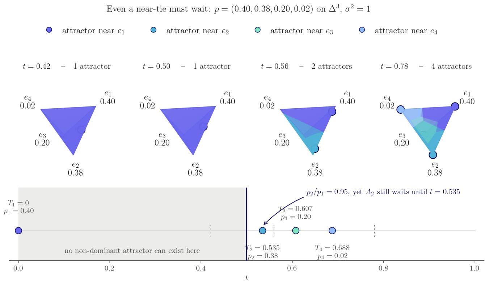

Figure 4 For target probability $p = ( 0 . 4 , 0 . 3 8 , 0 . 2 , 0 . 0 2 )$ , the attractor corresponding to the vertex with probability 0.38 forms later than $t = 0 . 5 ,$ even though the probability 0.38 is only slightly smaller than the largest probability.  
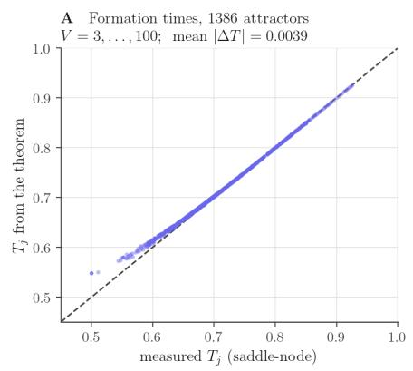

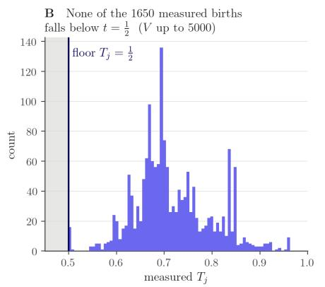

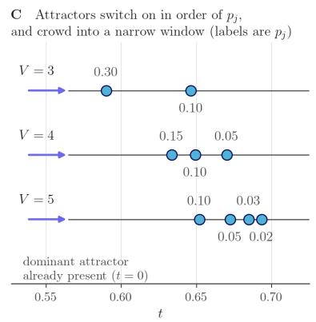  
Figure 5 (A) Formula (58) predicts the attractor appearance times $t _ { j }$ agrees with simulations. The attractors are simulated up to dimension 100. (B) No simulated non-dominant attractors up to dimension 5000 form earlier than $t = 0 . 5$ . (C) Non-dominant attractors form earlier for larger probabilities $p _ { j }$

Let $x \in B _ { r } ( e _ { i } )$ the ball of radius r around $e _ { i }$ where we take $r  0$ . Let $\epsilon _ { i } = x - e _ { i }$ and $\boldsymbol { \hat { \epsilon } } _ { i }$ be the normalized ϵ. The length scale in the integral formula (126) and (128) is

$$
v = \frac { r } { \alpha _ { t } } \to \infty ,\tag{91}
$$

as $t \to 1$ . The prior $\mu _ { 0 }$ is evaluated at far-field $e _ { i } + v \hat { \epsilon } _ { i }$ . Rewrite the integrals $J ^ { ( i ) } ( \boldsymbol { x } )$ and $\nu ^ { i } ( x )$ in terms of the new variables v and r we have

$$
J ^ { ( i ) } ( x ) = - p _ { i } r ^ { - ( V - 1 ) } \hat { \epsilon } _ { i } \int _ { r } ^ { \infty } v ^ { V - 1 } \mu _ { 0 } \mathopen { } \mathclose \bgroup \left( e _ { i } + v \hat { \epsilon } _ { i } \aftergroup \egroup \right) d v ;\tag{92}
$$

$$
\nu ^ { ( i ) } ( x ) = p _ { i } r ^ { - ( V - 1 ) } \int _ { r } ^ { \infty } \frac { v ^ { V - 2 } \mu _ { 0 } ( e _ { i } + v \hat { \epsilon } _ { i } ) } { - \dot { \alpha } _ { t ( v ) } } d v ,\tag{93}
$$

where $t ( v )$ expresses time t in terms of v. Since $\mu _ { 0 }$ decays exponentially towards infinity, there exists an exponential decay that bounds $\mu _ { 0 } ( x ) < C e ^ { - \lambda x }$ for some $C , \lambda > 0$ for all x. Up to relaxing v to a looser bound $v _ { 1 }$ , the integral in $J ^ { ( i ) } ( \boldsymbol { x } )$ is upper bounded by

$$
M = \operatorname* { s u p } _ { \| \hat { \epsilon } _ { i } \| = 1 } \int _ { 0 } ^ { \infty } v ^ { V - 1 } \mu _ { 0 } ( e _ { i } + v \hat { \epsilon } _ { i } ) d v < \operatorname* { s u p } _ { \| \hat { \epsilon } _ { i } \| = 1 } \left\{ \int _ { 0 } ^ { v _ { 1 } } v ^ { V - 1 } \mu _ { 0 } ( e _ { i } + v \hat { \epsilon } _ { i } ) d v \right\} + \int _ { v _ { 1 } } ^ { \infty } C v ^ { V - 1 } e ^ { - \lambda v } d v < \infty .\tag{94}
$$

and $J ^ { ( i ) } ( { x } )$ is upper bounded by $r ^ { V - 1 } \| J ^ { ( i ) } ( x ) \| \le p _ { i } M$ . Now we show that for $j \neq i ,$ , the current $J ^ { ( j ) } ( { \boldsymbol { x } } )$ is independent of $r ,$ the distance to the vertex $e _ { i }$ which x is approaching. Since x is approaching $e _ { i } ,$ , the distance from x to vertex $e _ { j }$ is lower bounded by some $l > 0$ . Bound $\begin{array} { r } { \mu _ { 0 } ( e _ { j } + \frac { \bar { \epsilon } _ { i } } { \alpha _ { t } } ) \le C e ^ { \lambda } e ^ { - \lambda \bar { l } / \bar { \alpha } _ { t } } } \end{array}$ and let L be the upper bound of $| \dot { \alpha } _ { t } | < L$

$$
\| J ^ { ( j ) } ( x ) \| \le p _ { j } L \int _ { 0 } ^ { 1 } \alpha _ { t } ^ { - ( V - 1 ) } C e ^ { \lambda } e ^ { - \lambda l / \alpha _ { t } } d t = M _ { j } < \infty ,\tag{95}
$$

where $M _ { j }$ is independent of $x .$

Now we lower bound the denominator of equation $( 9 0 ) , \nu ^ { ( i ) } ( x )$ . Define function $h ( \delta )$ such that

$$
h ( \delta ) : = \operatorname* { s u p } \{ - \dot { \alpha } _ { t } | \alpha _ { t } \leq \delta \} .\tag{96}
$$

As $\delta  0$ , we have $h ( \delta ) \to - \dot { \alpha } _ { 1 }$ , the derivative of $\alpha _ { t }$ evaluated at $t = 1$ . The denominator $\nu ^ { ( i ) } ( x )$ is bounded by

$$
r ^ { V - 1 } \nu ^ { ( i ) } ( x ) \geq \frac { p _ { i } } { h ( r ) } \int _ { 1 } ^ { \infty } v ^ { V - 2 } \mu _ { 0 } ( e _ { i } + v \hat { \epsilon } _ { i } ) d v \geq \frac { p _ { i } c _ { 0 } } { h ( r ) } ,\tag{97}
$$

where $c _ { 0 }$ is defined as

$$
c _ { 0 } = \operatorname* { i n f } _ { \| \hat { \epsilon } _ { i } \| = 1 } \int _ { 1 } ^ { \infty } v ^ { V - 2 } \mu _ { 0 } ( e _ { i } + v \hat { \epsilon } _ { i } ) d v .\tag{98}
$$

The infimum is taken for positive values over a compact set $\{ \hat { \epsilon } _ { i } | \| \hat { \epsilon } _ { i } \| = 1 \}$ and thus exists and is positive. Combining equation (94), (95) and (97), we have the final bound of the autonomous velocity

$$
\| b ( x ) \| \leq \frac { p _ { i } M r ^ { - ( V - 1 ) } + \sum _ { j \neq i } M _ { j } } { p _ { i } c _ { 0 } r ^ { - ( V - 1 ) } / h ( r ) } = \frac { h ( r ) } { p _ { i } c _ { 0 } } ( p _ { i } M + \sum _ { j \neq i } M _ { j } r ^ { V - 1 } )  0 ,\tag{99}
$$

when $h ( r ) \to 0$ as $r  0$ which happens when $\dot { \alpha } _ { t }  0$ as $t \to 1$

## C.2 Deriving the Phase Transition and Commitment Time

Theorem 4.1 (Phase Transition and Commitment Time). The phase transition where the interpolant (2) commits to a vertex occurs at time:

$$
t ^ { \star } = 1 - \Big ( 1 + \sigma \sqrt { 2 \log V } \Big ) ^ { - 1 / a }\tag{20}
$$

where σ is the noise scale of the $x _ { 0 }$ , and a is the exponent on $\alpha _ { t } = ( 1 - t ) ^ { a }$ and V is the vocabulary size defining the simplex $\Delta ^ { V - 1 }$

Proof. We want to determine the optimal $t _ { \mathrm { a n c h o r } }$ for the anchor loss:

$$
\mathcal { L } _ { \mathrm { a n c h o r } } : = \sum _ { \ell } \mathbf { 1 } [ t > t _ { \mathrm { a n c h o r } } ] \mathrm { C E } ( T ( I _ { t } ) _ { \ell } , x _ { 1 , \ell } )\tag{100}
$$

which preserves the diversity of generations. This means finding the smallest $t _ { \mathrm { a n c h o r } }$ such that $[ t _ { \mathrm { a n c h o r } } , 1 ]$ is after the phase transition has occurred.

Bayes Posterior. Since the transport map is $T _ { \theta } ( \cdot ) =$ softmax $( f _ { \theta } ( \cdot ) )$ acting on an intermediate state $x = I _ { t } \in \mathbb { R } ^ { d }$ independent of time, the minimizer of $\mathcal { L } _ { \mathrm { a n c h o r } }$ given x is the Bayes posterior:

$$
T ^ { \star } ( x ) = \mathbb { E } [ x _ { 1 } | I _ { t } = x , t \geq t _ { \mathrm { a n c h o r } } ]\tag{101}
$$

This raises the question: $f o r$ which $t _ { a n c h o r }$ is the interpolant at $I _ { t }$ committed to the target $x _ { 1 } \ell$ This can also be thought of as identifying the phase transition time in the autonomous flow.

Gibbs measure definition. Given $x _ { 1 } = e _ { k }$ and $x _ { 0 } = z \sim \mathcal { N } ( 0 , \sigma ^ { 2 } I _ { V } )$ with noise scale $\sigma ,$ the interpolant is given by:

$$
x = I _ { t } = ( 1 - \alpha _ { t } ) e _ { k } + \alpha _ { t } z , \quad x | j = k \sim \mathcal { N } ( ( 1 - \alpha _ { t } ) e _ { j } , \alpha _ { t } ^ { 2 } \sigma ^ { 2 } I _ { V } )\tag{102}
$$

By Bayes’ rule:

$$
p ( j = k | x ) = \frac { \pi _ { j } p ( x | j = k ) } { \sum _ { l } \pi _ { l } p ( x | j = l ) }\tag{103}
$$

$$
p ( x | j = k ) = \mathcal { N } ( ( 1 - \alpha _ { t } ) e _ { j } , \alpha _ { t } ^ { 2 } \sigma ^ { 2 } I _ { V } ) = ( 2 \pi \alpha ^ { 2 } \sigma ^ { 2 } ) ^ { - V / 2 } \exp \left( - \frac { \| x - ( 1 - \alpha ) e _ { j } \| ^ { 2 } } { 2 \alpha ^ { 2 } \sigma ^ { 2 } } \right)\tag{104}
$$

Since $( 2 \pi \alpha ^ { 2 } \sigma ^ { 2 } ) ^ { - V / 2 }$ doesn’t depend on $j ,$ it cancels in $p ( j = k | x )$ . Given $\langle x , e _ { j } \rangle = x _ { j }$ and $\| e _ { j } \| ^ { 2 }$ , we can expand the squared distance as:

$$
\| x - ( 1 - \alpha ) e _ { j } \| ^ { 2 } = \| x \| ^ { 2 } - 2 ( 1 - \alpha ) x _ { j } + ( 1 - \alpha ) ^ { 2 }\tag{105}
$$

The j-independent terms cancel, and $p ( x | j = k )$ reduces to:

$$
p ( x | j = k ) \propto \exp \left( \frac { ( 1 - \alpha ) x _ { j } } { \alpha ^ { 2 } \sigma ^ { 2 } } \right) = : e ^ { \beta ( t ) x _ { j } } , \quad \beta ( t ) : = \frac { 1 - \alpha } { \alpha ^ { 2 } \sigma ^ { 2 } }\tag{106}
$$

Substituting into the posterior gives:

$$
p ( j = k | x ) = \frac { \pi _ { j } e ^ { \beta ( t ) x _ { j } } } { \sum _ { l } \pi _ { l } e ^ { \beta ( t ) x _ { l } } }\tag{107}
$$

which is the Gibbs or Boltzmann distribution over vocabulary $V$ at inverse temperature $\beta ( t )$ , tilted by the prior distribution π, which we assume to be uniform $\pi _ { j } = 1 / V$ for simplicity. As $t \to 1$ and $\alpha  0$ , we have $\beta \to \infty$ and the posterior converges to the Dirac delta on the vertex $p ( \cdot | x )  \delta _ { k }$ . As $t  0$ and $\alpha  1$ , we have $\beta  0$ and the posterior converges to the prior distribution $p ( \cdot | x )  \pi$

Signal-to-Noise Ratio. The interpolant is split into a data component and a noise component:

$$
I _ { t } = \underbrace { ( 1 - \alpha ) e _ { k } } _ { \mathrm { s i g n a l } } + \underbrace { \alpha z } _ { \mathrm { n o i s e } } , \quad \alpha = \alpha _ { t } = ( 1 - t ) ^ { a } , z \sim \mathcal { N } ( 0 , \sigma ^ { 2 } I _ { V } )\tag{108}
$$

where the signal is on the coordinate k scaled with amplitude $( 1 - \alpha )$ and the noise spreads over all V coordinates with standard deviation ασ. ${ \mathrm { S o } } ,$ , the signal-to-noise ratio (SNR) per coordinate is:

$$
\rho : = \rho ( t ) = { \frac { { \mathrm { s i g n a l ~ a m p l i t u d e } } } { \mathrm { n o i s e ~ s t d } } } = { \frac { 1 - \alpha } { \alpha \sigma } }\tag{109}
$$

which can be interpreted as how much larger the signal is above the noise floor at time t. For $t \to 1$ near the data, $\rho  \infty$ and the target token is obvious, and for $t \to 0$ near initial noise, $\rho \to 0$ and the target is unknown. The SNR $\rho$ is monotonically increasing in $t ,$ and $\sigma$ and α determine how fast it increases.

Per-Particle Energies. Since (107) is a Boltzmann distribution, we can define the energy $U _ { j }$ for the vertex $j$ as:

$$
U _ { j } : = \beta ( t ) x _ { j } = \beta ( t ) ( 1 - \alpha ) \mathbf { 1 } [ j = k ] + \beta ( t ) \alpha z _ { j }\tag{110}
$$

With SNR $\rho = ( 1 - \alpha ) / \alpha \sigma$ and $\beta ( t ) = ( 1 - \alpha ) / \alpha ^ { 2 } \sigma ^ { 2 }$ , we can expand the energy as:

$$
\begin{array} { l } { { \displaystyle U _ { j } = \frac { ( 1 - \alpha ) ^ { 2 } } { \alpha ^ { 2 } \sigma ^ { 2 } } \mathbf { 1 } [ j = k ] + \frac { 1 - \alpha } { \alpha \sigma ^ { 2 } } z _ { j } } } \\ { { \displaystyle ~ = \underbrace { \left( \frac { 1 - \alpha } { \alpha \sigma } \right) ^ { 2 } } _ { = \rho ^ { 2 } } \mathbf { 1 } [ j = k ] + \underbrace { \frac { 1 - \alpha } { \alpha \sigma ^ { 2 } } z _ { j } } _ { = : h _ { j } } } } \end{array}\tag{111}
$$

Since $z _ { j } \sim \mathcal { N } ( 0 , \sigma ^ { 2 } )$ , the variance of $h _ { j }$ is:

$$
\operatorname { V a r } ( h _ { j } ) = \left( { \frac { 1 - \alpha } { \alpha \sigma ^ { 2 } } } \right) ^ { 2 } \sigma ^ { 2 } = \left( { \frac { 1 - \alpha } { \alpha \sigma } } \right) ^ { 2 } = \rho ^ { 2 }\tag{112}
$$

So the energy of the posterior only depends on the SNR $\rho \colon$

$$
U _ { j } = \rho ^ { 2 } \mathbf { 1 } [ j = k ] + h _ { j } , \quad h _ { j } \sim { \mathcal { N } } ( 0 , \rho ^ { 2 } )\tag{113}
$$

Connection to Random Energy Model (REM). This has a nice connection with the Random Energy Model (REM) (Derrida, 1980) in statistical physics, which describes a system with M states with i.i.d. random energies and partition function (normalization constant) $\begin{array} { r } { Z = \sum _ { i } e ^ { - \beta _ { \mathrm { p h y s } } \dot { \mathcal { E } } _ { i } } } \end{array}$ . The normalization of our posterior $p ( j = k | x )$ is:

$$
Z = \sum _ { j = 1 } ^ { V } e ^ { U _ { j } } = \underbrace { e ^ { \rho ^ { 2 } + h _ { k } } } _ { \mathrm { t a r g e t ~ s i g n a l } } + \underbrace { \sum _ { j \neq k } e ^ { h _ { j } } } _ { = : S }\tag{114}
$$

where the sum of all non-target vertices $S$ is the REM partition function with $M = V - 1$ states, i.i.d. Gaussian energies $h _ { j } \sim \mathcal { N } ( 0 , \rho ^ { 2 } )$ at physical temperature $\beta _ { \mathrm { p h y s } } = 1$ . Then, the probability of recovering $j = k$ from x can be interpreted as whether the energy of state k outweighs the competing energies $j \neq k$

Phase Transition Point. Now, we want to find the point where the target energy dominates. For $M = V - 1$ states with i.i.d. $\mathcal { N } ( 0 , \rho ^ { 2 } )$ energies, we can count how many exceed a level h<sup>¯</sup>:

$$
\mathbb { E } [ \# \{ j : h _ { j } \geq \bar { h } \} ] = M { \operatorname* { P r } } ( h _ { 1 } > \bar { h } ) \approx M \left( \frac { \rho } { \bar { h } \sqrt { 2 \pi } } \exp \left( \frac { - \bar { h } ^ { 2 } } { 2 \rho ^ { 2 } } \right) \right) \approx \exp \left( \log M - \frac { \bar { h } ^ { 2 } } { 2 \rho ^ { 2 } } \right)\tag{115}
$$

The maximum non-target energy occurs when the expected count is equal to 1, i.e., log $\begin{array} { r } { M = \frac { \bar { h } ^ { 2 } } { 2 \rho ^ { 2 } } \implies h ^ { \star } = } \end{array}$ $\rho \sqrt { 2 }$ log M. Given $M = V - 1$ , log M ≈ log V and:

$$
\operatorname* { m a x } _ { j } h _ { j } \approx \rho \sqrt { 2 \log M } \approx \rho \sqrt { 2 \log V }\tag{116}
$$

Since the target coordinate has energy $\rho ^ { 2 }$ , recovery of the target occurs when $\rho ^ { 2 }$ surpasses the largest non-target energy $\rho { \sqrt { 2 \log V } }$ . The critical point is when $\rho ^ { 2 } = \rho \sqrt { 2 }$ log V, which for $\rho > 0$ yields:

$$
\rho = { \sqrt { 2 \log V } }\tag{117}
$$

We can define:

$$
\theta : = { \frac { \rho } { \sqrt { 2 \log V } } }\tag{118}
$$

so that the critical point occurs when $\theta = 1$

Argmax Recovery. Taking the argmax coordinate $\begin{array} { r } { \hat { k } = \arg \operatorname* { m a x } _ { j } p ( k = j | x ) = \arg \operatorname* { m a x } _ { j } U _ { j } } \end{array}$ also leads to the critical point. The argmax coordinate is correct $( \mathrm { i . e . , } \ \hat { k } = k )$ if the energy of the target state k dominates every non-target state:

$$
U _ { k } > \operatorname* { m a x } _ { j \neq k } U _ { j } \iff \rho ^ { 2 } + h _ { k } > \operatorname* { m a x } _ { j \neq k } h _ { j }\tag{119}
$$

where $h _ { k } \sim \mathcal { N } ( 0 , \rho ^ { 2 } )$ is negligible given $\rho ^ { 2 }$ . Then, we can count the number of non-targets that dominate the target as:

$$
\mathbb { E } [ \# \{ j \neq k : h _ { j } > \rho ^ { 2 } \} ] \approx V e ^ { - \rho ^ { 2 } / 2 } = \exp ( ( 1 - \theta ^ { 2 } ) \log V ) = V ^ { 1 - \theta ^ { 2 } }\tag{120}
$$

which recovers the same critical point:

(i) $\theta > 1 \colon V ^ { 1 - \theta ^ { 2 } } \to 0$ and none of the non-target states dominate the target, and the argmax is correct $\hat { k } = k$

<table><tr><td></td><td>LM1B</td><td>OpenWebText</td><td>GSM8K</td><td>Sudoku</td></tr><tr><td>Vocabulary  $| V |$ </td><td>30,522</td><td>50,257</td><td>49,152</td><td>12</td></tr><tr><td>Noise scale  $\sigma$ </td><td>1.0</td><td>1.0</td><td>1.0</td><td>1.0</td></tr><tr><td>Schedule exponent a</td><td>1</td><td>1</td><td>1</td><td>1</td></tr><tr><td> $\sqrt { 2 \log | V | }$ </td><td>4.545</td><td>4.653</td><td>4.648</td><td>2.229</td></tr><tr><td> $\mathrm { O p t i m a l } \ t _ { \mathrm { a n c h o r } } ^ { * }$ </td><td>0.820</td><td>0.823</td><td>0.823</td><td>0.690</td></tr></table>

Table 4 Optimal anchor threshold $t _ { a n c h o r } ^ { * } \ p e r$ task. Computed from the phase transition $\rho ( t ^ { * } ) = \sqrt { 2 \log | V | }$ , inverted through the schedule $\alpha _ { t } = ( 1 - t ) ^ { a } ~ t o ~ t _ { a n c h o r } ^ { * } = 1 - \left( 1 + \sigma \sqrt { 2 \log | V | } \right) ^ { - 1 / a }$ . All tasks use $\sigma = 1$ and $a = 1$

(ii) $\theta < 1 \colon V ^ { 1 - \theta ^ { 2 } } \to \infty$ and many non-targets dominate the target and $\hat { k }$ is a yields a random coordinate.

The critical point occurs when $V ^ { 1 - \theta ^ { 2 } } = 1 \iff \theta = 1$ and the target signal equals the maximum non-target $\rho = { \sqrt { 2 \log V } }$

Sharpness of Phase Transition. The maximum of V Gaussians concentrates at ma $\mathrm { x } _ { j \neq k } h _ { j } = \rho \sqrt { 2 \log V } +$ $\mathcal { O } ( \rho / \sqrt { \log V } )$ with Gumbel fluctuations. Writing $\rho = \sqrt { 2 \log V } ( 1 + \delta )$ and $\theta = 1 + \delta ,$ , the exponent becomes $1 - \theta ^ { 2 } \approx - 2 \delta$ and the probability of error is approximately:

$$
\operatorname* { P r } ( \operatorname { e r r o r } ) \approx V ^ { - 2 \delta } = e ^ { - 2 \delta \log V }\tag{121}
$$

which is near 0 just above zero $( \mathrm { i . e . , } \delta > 0 )$ and huge just below $\delta < 0 .$ . The phase transition occurs within the window when 2δ log $V = \mathcal { O } ( 1 )$ of width $\delta = \mathcal { O } ( 1 / \log V )$ ) which goes to zero as $V \to \infty$ . Therefore, the probability curve sharpens to a step function as $V \to \infty :$

$$
\operatorname* { P r } ( { \hat { k } } = k ) \to \mathbf { 1 } [ \rho > { \sqrt { 2 \log V } } ] \quad { \mathrm { a s } } \quad V \to \infty\tag{122}
$$

Optimal $t _ { \mathbf { a n c h o r } }$ . For $\alpha _ { t } = ( 1 - t ) ^ { a }$ , the SNR is:

$$
\rho ( t ) = \frac { 1 - ( 1 - t ) ^ { a } } { ( 1 - t ) ^ { a } \sigma }\tag{123}
$$

is monotone in t. Let $t ^ { \star }$ denote the optimal t<sub>anchor</sub>, we can invert $\rho ( t ^ { \star } ) = \sqrt { 2 \log V }$ to get the optimal $\alpha ^ { \star }$ :

$$
\sqrt { 2 \log V } = \frac { 1 - \alpha ^ { \star } } { \alpha ^ { \star } \sigma } \implies \alpha ^ { \star } = \frac { 1 } { 1 + \sigma \sqrt { 2 \log V } }\tag{124}
$$

and the optimal $t ^ { \star }$

$$
\boxed { t ^ { \star } = 1 - \left( 1 + \sigma \sqrt { 2 \log V } \right) ^ { - 1 / a } }\tag{125}
$$

which concludes the proof.

## C.2.1 Training Implications

Since the simplex dimension appears only in the logarithm $\sqrt { 2 \log V }$ , when V becomes large, large increases in V result in small increases in t<sup>⋆</sup> (Figure 2D). The exponent on the interpolant schedule a is inversely related to $t ^ { \star }$ and moves the curve significantly for $a \in \{ 1 , 2 , 3 \}$ as shown in Figure 2D and H. Finally, increasing the scale σ of the prior Gaussian $\mu _ { 0 } = \mathcal { N } ( \mathbf { 0 } , \sigma ^ { 2 } I _ { V } ) ^ { \otimes L }$ results in a much larger increase in $t ^ { \star }$ , since the initial point injects more uncertainty, resulting in a later commitment time. We show the impact of these parameters empirically in $\mathrm { A p p ~ E }$

## C.3 Occupation Measure of Autonomous Flow on the Simplex

Proposition C.6 (Explicit form of ν and $j$ on simplex). Let $x _ { 0 } \sim \mu _ { 0 }$ , with $\mu _ { 0 }$ being a prior density on $\mathbb { R } ^ { V }$ that decays exponentially towards infinity, and let $\begin{array} { r } { x _ { 1 } \sim \mu _ { 1 } : = \sum _ { j = 1 } ^ { V } p _ { j } \delta _ { e } } \end{array}$ be independent of $x _ { 0 }$ , where $\{ e _ { 1 } , \ldots , e _ { V } \}$ are the vertices of the simplex $\Delta ^ { V - 1 }$ Let $I _ { t } = \alpha _ { t } x _ { 0 } + \beta _ { t } x _ { 1 }$ with $\alpha _ { t } + \beta _ { t } = 1$ and $\alpha _ { 0 } = 1 , \alpha _ { 1 } = 0$ Fix x $\not \in \{ e _ { 1 } , \ldots , e _ { V } \}$ and let $\epsilon _ { j } : = x - e _ { j }$ We have the per-vertex occupancy $\nu ^ { ( j ) } ( x )$ and current $J ^ { ( j ) } ( \boldsymbol { x } )$ are given by:

$$
\nu ^ { ( j ) } ( x ) = p _ { j } \int _ { 0 } ^ { 1 } \alpha _ { t } ^ { - V } \mu _ { 0 } \left( \frac { \epsilon _ { j } + \alpha _ { t } e _ { j } } { \alpha _ { t } } \right) d t\tag{126}
$$

$$
J ^ { ( j ) } ( x ) = p _ { j } \int _ { 0 } ^ { 1 } \alpha _ { t } ^ { - V - 1 } { \dot { \alpha } } _ { t } \epsilon _ { j } \mu _ { 0 } \left( { \frac { \epsilon _ { j } + \alpha _ { t } e _ { j } } { \alpha _ { t } } } \right) d t ,\tag{127}
$$

and for $\nu ( x ) > 0$ , the autonomous drift $b = j / \nu$ takes the form:

$$
b ( \boldsymbol { x } ) = \frac { \sum _ { j } J ^ { ( j ) } ( \boldsymbol { x } ) } { \sum _ { j } \nu ^ { ( j ) } ( \boldsymbol { x } ) }\tag{128}
$$

Proof. For categorical distributions on the simplex, we can write the target distribution as a weighted mixture of point masses $\begin{array} { r } { \mu _ { 1 } = \sum _ { j } p _ { j } \delta _ { x _ { j } } } \end{array}$ where $x _ { j } = e _ { j }$ and $e _ { 1 } , \ldots , e _ { d }$ are the d vertices of the simplex $\Delta ^ { \aa \aa _ { d - 1 } }$ , each with probability $p _ { j }$

Rather than taking a ratio of measures, we define $\mu _ { t }$ and $j _ { t }$ weakly so that the per-vertex decomposition of the autonomous flow can be derived via expectations. For any test function $\varphi \in C ^ { \infty } ( \mathbb { R } ^ { V } )$ , we write:

$$
\int \varphi ( x ) \mu _ { t } ( x ) d x = \mathbb { E } \left[ \varphi ( I _ { t } ) \right] , \qquad \int \varphi ( x ) j _ { t } ( x ) d x = \mathbb { E } \left[ { \dot { I } } _ { t } \varphi ( I _ { t } ) \right]\tag{129}
$$

which is consistent with the definition $b _ { t } ~ = ~ j _ { t } / \mu _ { t }$ since taking the ratio or the right-hand identities yields $\mathbb { E } [ \dot { I } _ { t } | I _ { t } = x ] \mu _ { t } ( x )$ when tested against $\varphi .$ . Restricting $x _ { 1 } = e _ { j }$ gives us the per-vertex definitions of $\mu _ { t } ^ { ( j ) }$ and $J _ { t } ^ { ( j ) }$ as:

$$
\int \varphi ( x ) \mu _ { t } ^ { ( j ) } ( x ) d x = \mathbb { E } \left[ \varphi ( I _ { t } ) { \mathbf 1 } _ { \{ x _ { 1 } = e _ { j } \} } \right] , \qquad \int \varphi ( x ) J _ { t } ^ { ( j ) } ( x ) d x = \mathbb { E } \left[ \dot { I } _ { t } \varphi ( I _ { t } ) { \mathbf 1 } _ { \{ x _ { 1 } = e _ { j } \} } \right] .\tag{130}
$$

with the occupancy $\begin{array} { r } { \nu ^ { ( j ) } ( x ) = \int _ { 0 } ^ { 1 } \mu _ { t } ^ { ( j ) } ( x ) d t } \end{array}$ and autonomous current $\begin{array} { r } { J ^ { ( j ) } ( x ) = \int _ { 0 } ^ { 1 } j _ { t } ^ { ( j ) } ( x ) d t . } \end{array}$

Step 1: Per-vertex occupancy. Since $\mu _ { 1 }$ is a sum of point masses, ν and $j$ can be decomposed for each vertex $\nu ^ { ( j ) }$ and $J ^ { ( j ) }$ . Therefore, we can consider one atom first. If we fix atom $j ,$ then $x _ { 1 } = e _ { j }$ and the only randomness in the interpolant is $x _ { 0 } \sim \mathcal { N } ( 0 , I _ { d } )$ . The interpolant at time t is given by:

$$
I _ { t } = \alpha _ { t } x _ { 0 } + \beta _ { t } e _ { j }\tag{131}
$$

Fixing $I _ { t } = x .$ we can solve for $x _ { 0 } ( x , t )$ to get:

$$
x _ { 0 } ( x , t ) = \frac { x - \beta _ { t } e _ { j } } { \alpha _ { t } } = \frac { x - ( 1 - \alpha _ { t } ) e _ { j } } { \alpha _ { t } } = \frac { \epsilon _ { j } + \alpha _ { t } e _ { j } } { \alpha _ { t } } ,\tag{132}
$$

where we have denoted $\epsilon _ { j } = { x } - { e } _ { j }$ and substituted $\beta _ { t } = 1 - \alpha _ { t }$ . Substituting into the Gaussian density of $x _ { 0 }$ gives a factor of:

$$
G _ { t } ( x ) = \mu _ { 0 } \left( x _ { 0 } ( x , t ) \right) = \mu _ { 0 } \left( \frac { \epsilon _ { j } + \alpha _ { t } e _ { j } } { \alpha _ { t } } \right)\tag{133}
$$

Since the map $x _ { 0 } ( x , t ) \mapsto I _ { t } = \alpha _ { t } x _ { 0 } + \beta _ { t } e _ { j }$ is just a scaling of $x _ { 0 }$ by $\alpha _ { t }$ and a constant shift, its derivative is $\alpha _ { t } I _ { d } .$ and the density transforms via the inverse Jacobian $\alpha _ { t } ^ { - \bar { d } }$ . Since the probability of selecting vertex $j$ is $p _ { j }$ , the pointwise density $\mu _ { t } ^ { ( j ) } ( x )$ at x at time t is:

$$
\mu _ { t } ^ { ( j ) } ( x ) = p _ { j } \alpha _ { t } ^ { - V } G _ { t } ( x ) = p _ { j } \alpha _ { t } ^ { - V } \mu _ { 0 } \left( \frac { \epsilon _ { j } + \alpha _ { t } e _ { j } } { \alpha _ { t } } \right)\tag{134}
$$

Then, the occupancy measure $\nu ^ { ( j ) } ( x )$ is just $\mu _ { t } ^ { ( j ) } ( x )$ integrated over time $t \in [ 0 , 1 ]$ given by:

$$
\nu ^ { ( j ) } ( x ) = \int _ { 0 } ^ { 1 } \mu _ { t } ^ { ( j ) } ( x ) d t = p _ { j } \int _ { 0 } ^ { 1 } \alpha _ { t } ^ { - V } \mu _ { 0 } \left( \frac { \epsilon _ { j } + \alpha _ { t } e _ { j } } { \alpha _ { t } } \right) d t\tag{135}
$$

Since $\alpha _ { t }  0$ as $t \to 1$ , we have $\frac { \epsilon _ { j } + \alpha _ { t } e _ { j } } { \alpha _ { t } }$ goes to infinity as $t \to 1$ . Hence the prior $\mu _ { 0 } \big ( \frac { \epsilon _ { j } + \alpha _ { t } e _ { j } } { \alpha _ { t } } \big )$ decays exponentially as $t \to 1$ ofsetting the divergent $\alpha _ { t } ^ { - V }$ , and the integral in equation (135) is finite.

Step 2: Per-vertex current. Given $x _ { 0 } ( x , t ) = e _ { j }$ , the velocity $\dot { I } _ { t }$ is determined pointwise by x since $x _ { 0 }$ is a function of $I _ { t }$ for all $I _ { t } = x$ . Diferentiating $I _ { t }$ and substituting $x _ { 0 } = ( \epsilon _ { j } + \alpha _ { t } e _ { j } ) / \alpha _ { t }$ , we get:

$$
\dot { I } _ { t } = \dot { \alpha } _ { t } x _ { 0 } + \dot { \beta } _ { t } e _ { j } = \frac { \dot { \alpha } _ { t } } { \alpha _ { t } } ( \epsilon _ { j } + \alpha _ { t } e _ { j } ) + \dot { \beta } _ { t } e _ { j } = \frac { \dot { \alpha } _ { t } } { \alpha _ { t } } \epsilon _ { j }\tag{136}
$$

where we have used $\dot { \alpha } _ { t } + \dot { \beta } _ { t } = 0$ . Since $\begin{array} { r } { j = b \nu = \int _ { 0 } ^ { 1 } b _ { t } \mu _ { t } d t . } \end{array}$ , we:

$$
J ^ { ( j ) } ( x ) = p _ { j } \int _ { 0 } ^ { 1 } \alpha _ { t } ^ { - V } \underbrace { \left( \frac { \dot { \alpha } _ { t } } { \alpha _ { t } } \epsilon _ { j } \right) } _ { i _ { t } } \mu _ { 0 } \left( \frac { \epsilon _ { j } + \alpha _ { t } e _ { j } } { \alpha _ { t } } \right) d t = p _ { j } \int _ { 0 } ^ { 1 } \alpha _ { t } ^ { - V - 1 } \dot { \alpha } _ { t } \epsilon _ { j } \mu _ { 0 } \left( \frac { \epsilon _ { j } + \alpha _ { t } e _ { j } } { \alpha _ { t } } \right) d t ,\tag{137}
$$

by a similar argument to integral (135), the integral (137) is finite.

Step 3: Summing over vertices. Since $\mu _ { 1 }$ is supported on $\{ e _ { 1 } , \ldots , e _ { V } \}$ and the events $\{ x _ { 1 } = e _ { j } \}$ partition the sample space such that $\begin{array} { r } { \sum _ { j } \mathbf { 1 } _ { \{ x _ { 1 } = e _ { j } \} } = 1 } \end{array}$ almost surely. For any test function $\varphi ,$ , linearity of expectation gives:

$$
\sum _ { j } \int \varphi ( x ) J _ { t } ^ { ( j ) } ( x ) d x = \sum _ { j } \mathbb { E } \left[ { \dot { I } } _ { t } \varphi ( I _ { t } ) \mathbf { 1 } _ { \left\{ x _ { 1 } = e _ { j } \right\} } \right] = \mathbb { E } \left[ { \dot { I } } _ { t } \varphi ( I _ { t } ) \sum _ { j } \mathbf { 1 } _ { \left\{ x _ { 1 } = e _ { j } \right\} } \right] = \mathbb { E } \left[ { \dot { I } } _ { t } \varphi ( I _ { t } ) \right] = \int \varphi j _ { t } d x\tag{138}
$$

and since this holds for all $\varphi \in C ^ { \infty } ( \mathbb { R } ^ { V } )$ , we can conclude $\begin{array} { r } { j _ { t } ( x ) = \sum _ { j } j _ { t } ^ { ( j ) } ( x ) \mathrm { - a . e } } \end{array}$ .. Analogously, $\begin{array} { r } { \mu _ { t } = \sum _ { j } \mu _ { t } ^ { ( j ) } } \end{array}$ by the same argument with ${ \dot { I } } _ { t }$ replaced by 1. Integrating over $t \in [ 0 , 1 ]$ and exchanging the sum and integral operations, we have:

$$
\nu ( x ) = \int \sum _ { j } \mu _ { t } ^ { ( j ) } ( x ) d t = \sum _ { j } \nu ^ { ( j ) } ( x ) , \quad J ( x ) = \int \sum _ { j } J _ { t } ^ { ( j ) } ( x ) d t = \sum _ { j } J ^ { ( j ) } ( x )\tag{139}
$$

Since $b = j / \nu$ , we conclude:

$$
b ( \boldsymbol { x } ) = \frac { \sum _ { j } J ^ { ( j ) } ( \boldsymbol { x } ) } { \sum _ { j } \nu ^ { ( j ) } ( \boldsymbol { x } ) }\tag{140}
$$

## C.4 Autonomous Velocity Vanishes at the Vertices

Theorem C.1 (Autonomous Velocity Vanishes at the Vertices). Assume the interpolant $\alpha _ { t } \sim ( 1 - t ) ^ { a }$ as $t \to 1$ with $a \ge 1 / V _ { : }$ , and assuming the prior $\mu _ { 0 } ( x )$ tends to zero exponentially as $x \to \infty$ , then at the vertices of the simplex, for all $i = 1 , \ldots , V$ , the autonomous velocity field $b ( e _ { i } ) = 0$ when evaluated at vertices $e _ { i }$

Proof. For given $e _ { i } .$ , we evaluate $J ^ { ( j ) } ( e _ { i } )$ and $\nu ^ { ( j ) } ( e _ { i } )$ for each $j .$ We compute $\nu ^ { ( j ) } ( e _ { i } )$ and $J ^ { ( j ) } ( e _ { i } )$ for the case $j = i$ and $j \neq i$ separately. First when $j = i$ , we have $\epsilon _ { i } = e _ { i } - e _ { i } = 0$ and

$$
\nu ^ { ( i ) } ( e _ { i } ) = p _ { i } \mu _ { 0 } ( e _ { i } ) \int _ { 0 } ^ { 1 } \alpha _ { t } ^ { - V } d t\tag{141}
$$

For common choices of interpolant where $\alpha _ { t } \sim ( 1 - t ) ^ { a }$ as $t \to 1$ with $a \ge 1 / V$ , the integral $\int _ { 0 } ^ { 1 } \alpha _ { t } ^ { - V }$ dt diverges, and $\nu ^ { ( i ) } ( e _ { i } )$ is positive infinity.

When $j \neq i ,$ we have $\epsilon _ { j } = e _ { i } - e _ { j } = e _ { i j }$ where $e _ { i j }$ is the simplex edge between vertex i and $j .$

$$
\nu ^ { ( j ) } ( e _ { i } ) = p _ { j } \int _ { 0 } ^ { 1 } \alpha _ { t } ^ { - V } \mu _ { 0 } \left( \frac { e _ { i j } } { \alpha _ { t } } + e _ { j } \right) d t\tag{142}
$$

As $t \to 1$ , we have $\alpha _ { t }  0$ . Assuming $\mu _ { 0 } ( x )$ tends to 0 exponentially fast as $x \to \infty$ , the integral in (142) is finite.   
The denominator of $b ( e _ { i } )$ is $\begin{array} { r } { \nu ( x ) = \sum _ { j } \nu ^ { ( j ) } ( x ) } \end{array}$ . The denominator is infinite.

The numerator of $b ( e _ { i } )$ is $j ( e _ { i } ) = \sum J ^ { ( j ) } ( e _ { i } )$ . Consider when the index $j = i$ . Since $\epsilon _ { i } = 0$ , we have $j ^ { ( i ) } ( e _ { i } ) = 0$ When the index $j \neq i ,$ for the same reason as $\nu ^ { ( j ) } ( e _ { i } )$ , we have $J ^ { ( j ) } ( e _ { i } )$ is a finite number.

Overall, for all $i = 1 , \ldots , V$ , the autonomous velocity field $b ( e _ { i } )$ is a ratio between a sum of finite vectors over positive infinity, and hence $b ( e _ { i } ) = 0$ □

## C.5 Convergence of Autonomous Flow on the Simplex

Theorem 3.1 (Convergence of autonomous flow on the simplex). Let $\mu _ { 0 }$ be absolutely continuous on $( \mathbb { R } ^ { V } ) ^ { L }$ with continuous, strictly positive density, and let

$$
M _ { 1 } = \operatorname { s u p p } ( \mu _ { 1 } ) = ( \{ e _ { 1 } , \dots , e _ { V } \} ) ^ { L } \subset ( \Delta ^ { V - 1 } ) ^ { L }\tag{11}
$$

be the finite set of $V ^ { L }$ vertex configurations. Then for $\mu _ { 0 } - a . e . \ x _ { 0 }$ , the autonomous flow $X _ { s } ( x _ { 0 } )$ satisfies:

(i) Absorption: $i f X _ { s ^ { \star } } ( x _ { 0 } ) \in M _ { 1 }$ for some $s ^ { \star } < \infty$ , then ${ X _ { s } ( x _ { 0 } ) = X _ { s ^ { \star } } ( x _ { 0 } ) }$ for all $s > s ^ { \star }$ .

(ii) Convergence: there is $x ^ { \star } ( x _ { 0 } ) \in M _ { 1 }$ with lim $_ { s  \infty } X _ { s } ( x _ { 0 } ) = x ^ { \star } ( x _ { 0 } )$

(iii) Finite hitting time: for the linear interpolant $I _ { t } = ( 1 - t ) x _ { 0 } + t x _ { 1 } , \tau ( x _ { 0 } ) : =$ inf $\{ t \ge 0 : X _ { s } ( x _ { 0 } ) \in$ $M _ { 1 } \} < + \infty$ . Although the autonomous velocity field vanishes at the vertices, $b ( e _ { j } ) = 0 ~ f o r$ all $e _ { j } \in M _ { 1 }$ it does not vanish in the limit approaching them: lim $_ { r \downarrow 0 } b ( e _ { j } + r \omega ) = - \kappa ( \omega ) \omega$ The approach speed is bounded below by $\kappa _ { - } > 0$ and $\tau ( x _ { 0 } ) \leq t _ { e n t r y } + 2 r _ { 1 } / \kappa _ { - }$ for a fixed radius $r _ { 1 }$

Proof. Notation. Let $e _ { j } \in M _ { 1 }$ be a vertex on the simplex and the state $x = e _ { j }$ +rω and define ω $: = ( x - e _ { j } ) / | x - e _ { j } |$ as the unit vector pointing toward x from $e _ { j }$ and $r : = | \boldsymbol { x } - \boldsymbol { e } _ { j } |$ the distance. If the interpolant is $I _ { t } = ( 1 - t ) x _ { 0 } + t x _ { 1 } ,$ then the time-dependent velocity at x at time t is related to the denoiser $m ( t )$ by:

$$
b _ { t } ( x ) = \frac { m _ { t } ( x ) - x } { 1 - t } , \quad m _ { t } ( x ) = \mathbb { E } [ x _ { 1 } | I _ { t } = x ]\tag{143}
$$

To get the time-independent velocity, we take the posterior weight over times t with density proportional to $\sigma ^ { d - \bar { 2 } } \mu _ { 0 } ( e _ { j } + \sigma \omega )$ , where $\mu _ { 0 } ( e _ { j } + \sigma \omega )$ is the prior evaluated at the implied initial noisy state $x _ { 0 } = ( x - t e _ { j } ) / ( 1 - t ) =$ $e _ { j } + \sigma \omega$ given x. Taking the average over the time-dependent speed gives the arrival speed $\kappa ( \omega )$ toward vertex $e _ { j }$ along direction ω:

$$
\kappa ( \omega ) : = \frac { \int _ { 0 } ^ { \infty } \sigma \cdot \sigma ^ { d - 2 } \mu _ { 0 } ( e _ { j } + \sigma \omega ) d \sigma } { \int _ { 0 } ^ { \infty } \sigma ^ { d - 2 } \mu _ { 0 } ( e _ { j } + \sigma \omega ) d \sigma } , \quad 0 < \kappa _ { - } : = \operatorname* { m i n } _ { | \omega | = 1 } \kappa ( \omega ) \le \kappa _ { + } < \infty\tag{144}
$$

where $| b ( e _ { j } + r \omega ) |  \kappa ( \omega )$ is the speed in direction ω as $r \downarrow 0 , \kappa _ { - }$ is the minimum speed over all directions, and $\kappa _ { + }$ is the maximum speed over directions. We simplify notation by writing:

$$
\kappa _ { j } ( \omega ) : = \frac { N _ { j } ( \omega ) } { D _ { j } ( \omega ) } , \quad N _ { j } ( \omega ) : = \int _ { 0 } ^ { \infty } \sigma ^ { d - 1 } \mu _ { 0 } ( e _ { j } + \sigma \omega ) d \sigma , \quad D _ { j } ( \omega ) : = \int _ { 0 } ^ { \infty } \sigma ^ { d - 2 } \mu _ { 0 } ( e _ { j } + \sigma \omega ) d \sigma\tag{145}
$$

Given $x _ { 1 } = e _ { j }$ and $\alpha _ { t } : = 1 - t .$ , we write the marginal distribution at time t as:

$$
\mu _ { t } ( x ) = \sum _ { e _ { l } \in M _ { 1 } } \pi _ { e _ { l } } \alpha _ { t } ^ { - d } \mu _ { 0 } \left( \frac { x - t e _ { l } } { \alpha _ { t } } \right)\tag{146}
$$

Autonomous velocity approaching vertex. We first prove a Lemma that gives the speed at which the autonomous flow approaches a vertex.

Lemma C.3 (Autonomous velocity approaching vertex). Let $e _ { j } \in M _ { 1 }$ be a vertex on the simplex and $\omega : = x - e _ { j }$ with $| \omega | = 1$ be the unit vector pointing in the direction from x to $e _ { j }$ . Then,

$$
\nu ( x ) = \pi _ { e _ { j } } r ^ { 1 - d } D _ { j } ( \omega ) ( 1 + o ( 1 ) )\tag{147}
$$

and $b ( e _ { j } + \sigma \omega )  - \kappa _ { j } ( \omega ) \omega$ in the limit $r \downarrow 0 _ { \div }$ , uniformly in $\omega$ . Therefore, b is discontinuous at $e _ { j }$ , where its value at the vertex is $b ( e _ { j } ) = 0$ while its limits approaching $e _ { j }$ radially are non-zero and direction-dependent.

Proof. Let $x : = e _ { j } + r \omega$ and $\sigma : = r / \alpha$ . Then, $\alpha = r / \sigma$ and $| d \alpha | = r \sigma ^ { - 2 } d \sigma$ . The argument in $\mu _ { 0 }$ in $\mu _ { t } ( x ) \ ( 1 4 6 )$ for $e _ { j }$ takes the form:

$$
{ \frac { x - t e _ { j } } { \alpha _ { t } } } = { \frac { r \omega + \alpha _ { t } e _ { j } } { \alpha _ { t } } } = e _ { j } + \sigma \omega\tag{148}
$$

so we can write $\mu _ { t } ( x )$ as:

$$
\mu _ { t } ( x ) = \pi _ { e _ { j } } \left( \frac { \sigma } { r } \right) ^ { d } \mu _ { 0 } ( e _ { j } + \sigma \omega ) ( 1 + O ( \alpha ) )\tag{149}
$$

where $O ( \alpha )$ contains the summands for $\boldsymbol { e } _ { l } \neq \boldsymbol { e } _ { j }$ which becomes negligible after integration over $t \in [ 0 , \infty )$ Therefore, the occupation measure $\nu ( x )$ is given by:

$$
\begin{array} { l } { \displaystyle \nu ( x ) = \pi _ { e _ { j } } \int _ { 0 } ^ { \infty } \left( \frac { \sigma } { r } \right) ^ { d } \mu _ { 0 } ( e _ { j } + \sigma \omega ) \frac { r d \sigma } { \sigma ^ { 2 } } ( 1 + o ( 1 ) ) } \\ { = \pi _ { e _ { j } } r ^ { 1 - d } \underbrace { \int _ { 0 } ^ { \infty } \sigma ^ { d - 2 } \mu _ { 0 } ( e _ { j } + \sigma \omega ) d \sigma } _ { D _ { j } ( \omega ) } ( 1 + o ( 1 ) ) } \\ { = \pi _ { e _ { j } } r ^ { 1 - d } D _ { j } ( \omega ) ( 1 + o ( 1 ) ) } \end{array}\tag{150}
$$

which is the expression in (147). To get $b ( x )$ , we can express $b _ { t } ( x )$ in (143) with $m _ { t } ( x ) : = e _ { j } + O ( e ^ { - c / \alpha ^ { 2 } } )$ as:

$$
b _ { t } ( x ) = \frac { e _ { j } - x } { \alpha } + O \left( \alpha ^ { - 1 } e ^ { - c / \alpha ^ { 2 } } \right) = - \frac { r } { \alpha } \omega + o ( 1 ) = - \sigma \omega + o ( 1 )\tag{151}
$$

where the rescaled radius $\sigma$ is the speed. Therefore, the numerator of the autonomous flow $b ( x )$ is:

$$
\int _ { 0 } ^ { 1 } \mu _ { t } ( x ) b _ { t } ( x ) d t = - \omega \pi _ { e _ { j } } r ^ { 1 - d } \int _ { 0 } ^ { \infty } \sigma ^ { d - 1 } \mu _ { 0 } ( e _ { j } + \sigma \omega ) d \sigma ( 1 + o ( 1 ) ) = - \omega \pi _ { e _ { j } } r ^ { 1 - d } N _ { j } ( \omega ) ( 1 + o ( 1 ) )\tag{152}
$$

and dividing by $\nu ( x )$ yields $b ( \boldsymbol { x } ) = - \omega N _ { j } ( \omega ) / D _ { j } ( \omega ) + o ( 1 ) = - \kappa ( \omega ) \omega$ , which is not dependent on $r .$ □ Now, we prove Proposition 3.1.

By Lemma C.3, set a small constant $r _ { 1 } > 0$ such that:

$$
\langle b ( e _ { j } + r \omega ) , \omega \rangle \leq - \frac { \kappa _ { - } } { 2 } \quad \mathrm { f o r ~ a l l ~ } e _ { j } \in M _ { 1 } , | \omega | = 1 , 0 < r \leq r _ { 1 } ,\tag{153}
$$

so the ball with radius $r _ { 1 }$ around each vertex $\{ B ( e _ { j } , r _ { 1 } ) \} _ { e _ { j } \in M _ { 1 } }$ are pairwise disjoint.

Local absorption in finite time. Suppose that $X _ { s } ( x _ { 0 } ) \in B ( e _ { j } , r _ { 1 } )$ for some finite time $s < \infty$ and some $e _ { j } \in M _ { 1 }$ . Let $h ( s ) : = | X _ { s } ( x _ { 0 } ) - e _ { j } |$ be the distance from the vertex. Over any time interval where $0 < h \leq r _ { 1 }$ $h ( t )$ is locally Lipschitz and $\dot { h } ( s ) = \langle b ( X _ { s } ) , ( X _ { s } - e _ { j } ) / h ( s ) \rangle \leq - \kappa _ { - } / 2$ by (153). Therefore, $h ( s )$ decreases at rate at least $\kappa _ { - } / 2$ and must vanish at some finite time:

$$
\tau \leq s + \frac { 2 h ( s ) } { \kappa _ { - } } \leq s + \frac { 2 r _ { 1 } } { \kappa _ { - } } < \infty\tag{154}
$$

Absorption. From $\ : h ( s ) \le - \kappa _ { - } / 2 \ :$ , we have shown that $X _ { s ^ { \star } } ( x _ { 0 } )$ arrives at $e _ { j }$ in some finite time. Now, we argue that for all $s > s ^ { \star } , X _ { s } ( x _ { 0 } ) = e _ { j }$ by contradiction. Suppose there exists $X _ { s } ( x _ { 0 } ) \neq e _ { j }$ for $s > s ^ { \star }$ , where $h ( t ) \leq r _ { 1 }$

on $[ s ^ { \star } , s ]$ . Then, we have shown $\ : h ( s ) \le - \kappa _ { - } / 2 \ :$ a.e. on $\{ h > 0 \} \cap [ s ^ { \star } , s ]$ and since $h ( s )$ is absolutely continuous with $h ( s ^ { \star } ) = 0$ , we can write:

$$
h ( s ) = \int _ { s ^ { \star } } ^ { s } \dot { h } ( u ) d u \leq - \frac { \kappa _ { - } } { 2 } ( t - t ^ { \star } ) < 0\tag{155}
$$

which is a negative distance $h ( s )$ , a contradiction. Thus, there exists no $X _ { s } ( x _ { 0 } )$ that leaves $e _ { j }$ and $X _ { s } ( x _ { 0 } ) = e _ { j }$ for all $s > s ^ { \star }$

Lemma C.4 (Absorbance from far field). For b satisfying the divergence condition in Proposition $B . 1 ,$ $b ( x ) = - x ( 1 + o ( 1 ) ) \ f o r \ | x | \to \infty$ so there exists radius $R _ { 0 } < \infty$ with $\langle b ( x ) , x \rangle < 0 ~ f o r ~ | x | \ge R _ { 0 }$ . Let $B ( 0 , R _ { 0 } )$ be the ball with radius $R _ { 0 }$ centered at the origin, then $X _ { s } \in B ( 0 , R _ { 0 } )$ for all $s \geq t _ { 0 } \ i f \ X _ { t _ { 0 } } \in B ( 0 , R _ { 0 } )$ (no points escape the ball) and for every $x _ { 0 }$ there is a finite $t _ { 0 }$ with $X _ { s } ( x _ { 0 } ) \in B ( 0 , R _ { 0 } )$ for all $s \geq t _ { 0 }$ (all points end up in the ball).

Proof. Since $b ( x ) = - x ( 1 + o ( 1 ) )$ as $| x | \to \infty$ , by fixing $R _ { 0 }$ , we have:

$$
\begin{array} { r } { \langle b ( x ) , x \rangle \leq - \frac { 1 } { 2 } | x | ^ { 2 } \quad \mathrm { f o r } ~ | x | \geq R _ { 0 } } \end{array}\tag{156}
$$

Let $h ( s ) : = | X _ { s } |$ be the distance from the origin and diferentiate:

$$
{ \frac { d } { d t } } { \frac { 1 } { 2 } } | X _ { s } | ^ { 2 } = \langle \dot { X } _ { s } , X _ { s } \rangle = \langle b ( X _ { s } ) , X _ { s } \rangle < 0 \quad \mathrm { w h e n e v e r } \quad | X _ { s } | \geq R _ { 0 }\tag{157}
$$

where $\langle b ( x ) , x \rangle$ is the radial component of the velocity scaled by |x|, which is negative exactly when the field $b ( x )$ points inward toward the origin.

No escape. We prove by contradiction. Suppose a point $X _ { t _ { 0 } } \in B ( 0 , R _ { 0 } )$ escapes to $h ( t _ { 1 } ) > R _ { 0 }$ at some later time $t _ { 1 } > t _ { 0 }$ . Let $s _ { 1 }$ be the last time between $[ t _ { 0 } , t _ { 1 } ]$ where the trajectory was at radius $R _ { 0 }$ or below: $s _ { 1 } : = \operatorname* { s u p } \{ s \in [ t _ { 0 } , t _ { 1 } ] : h ( s ) \leq R _ { 0 } \}$ . Then, $h ( s _ { 1 } ) = R _ { 0 }$ by continuity of the trajectory and the distance $h > R _ { 0 }$ for all $( s _ { 1 } , t _ { 1 } ]$ by definition of $s _ { 1 }$ as the last time where $h \leq R _ { 0 }$ . But by (157), the radius must be decreasing $\begin{array} { r } { \frac { d } { d s } \frac { 1 } { 2 } h ^ { 2 } < 0 } \end{array}$ whenever $h \geq R _ { 0 }$ which means $h ( t _ { 1 } ) < h ( s _ { 1 } ) = R _ { 0 }$ , a contradiction. Therefore, $X _ { s } \in B ( 0 , R _ { 0 } )$ for all $s \geq t _ { 0 }$

Entry in finite time. While $h ( s ) \geq R _ { 0 } , ( 1 5 6 )$ gives $\begin{array} { r } { \dot { h } ( s ) = \langle b ( x ) , x \rangle \leq - \frac { 1 } { 2 } h ( s ) } \end{array}$ , so $h ( s ) \leq | x _ { 0 } | e ^ { - s / 2 }$ . Therefore, $h ( s ) < R _ { 0 }$ for all $s > t _ { 0 } : = \operatorname* { m a x } ( 0 , 2 \log ( | x _ { 0 } | / R _ { 0 } ) ) < \infty .$ , and by the no escape proof above, the trajectory remains in $B ( 0 , R _ { 0 } )$ for all times after entry. □

Now, we continue to prove (i) and (ii) of Proposition 3.1.

Convergence. Given that all points in $\{ B ( e _ { j } , r _ { 1 } ) \}$ are absorbed on the vertices in finite time, we now show that any initial point $x _ { 0 }$ converges to $M _ { 1 }$ . Let $\begin{array} { r } { U : = \bigcup _ { e _ { i } \in M _ { 1 } } B ( e _ { j } , r _ { 1 } ) } \end{array}$ and $E : = B ( 0 , R _ { 0 } ) \ \backslash \ U$ , and define the set of initial points $x _ { 0 }$ whose autonomous flow $X _ { s } ( x _ { 0 } )$ does not land in $U$ for all $t \geq 0 ;$

$$
N : = \{ x _ { 0 } : X _ { s } ( x _ { 0 } ) \notin U { \mathrm { ~ f o r ~ a l l ~ } } s \geq 0 \}\tag{158}
$$

By Lemma C.4, all points $x _ { 0 }$ land in the ball $B ( 0 , R _ { 0 } )$ at finite time $t _ { 0 }$ and remain inside the ball for all $s \geq t _ { 0 }$ so for $x _ { 0 } \in N$ , the flow trajectory lies in the set $E$ for all $s \geq t _ { 0 }$ . By Lemma C.5 below, we show that the set N is Lebesgue-null $\operatorname { L e b } ( N ) = 0$ (zero d-dimensional volume) such that $\mu _ { 0 } \ll \mathrm { L e b }$ and $\mu _ { 0 } ( N ) = 0$

In the case where $x _ { 0 } \notin N$ , the autonomous flow enters $B ( e _ { j } , r _ { 1 } )$ for some $e _ { j } \in M _ { 1 }$ at a finite time s and by (154), it reaches $e _ { j }$ at some time $\tau ( x _ { 0 } ) \leq s + 2 r _ { 1 } / \kappa _ { - }$ and by the absorption proof, it remains there for all $t \geq \tau$ . Setting $x ^ { \star } ( x _ { 0 } ) : = e _ { j }$ gives $X _ { s } ( x _ { 0 } ) = x ^ { \star } ( x _ { 0 } )$ for all time $t \geq \tau ( x _ { 0 } )$ .

Lemma C.5. $\operatorname { L e b } ( N ) = 0$ where $N : = \{ x _ { 0 } : X _ { t } ( x _ { 0 } ) \notin U \ f o r \ a l l \ t \geq 0 \}$

Proof. Given $\nabla \cdot ( \nu b ) = \mu _ { 0 } - \mu _ { 1 }$ and $\mu _ { 1 } ( E ) = 0$ , we have:

$$
\nabla \cdot b ( x ) = \frac { \mu _ { 0 } ( x ) - \langle \nabla \nu ( x ) , b ( x ) \rangle } { \nu ( x ) }\tag{159}
$$

for $x \in E$ . Let $J _ { t } : = \operatorname* { d e t } ( D X _ { t } ( x ) )$ be the Jacobian determinant of the autonomous flow $x \mapsto X _ { t } ( x )$ , which acts like a change-of-variables factor Leb $\textstyle \gamma ( X _ { t } ( A ) ) = \int _ { A } J _ { t } ( x ) d x$ . Along any trajectory of the autonomous flow, we have:

$$
\frac { d } { d t } [ \nu ( X _ { t } ( x ) ) J _ { t } ] = \mu _ { 0 } ( X _ { t } ( x ) ) J _ { t }\tag{160}
$$

So for the set $N _ { n } : = \{ x _ { 0 } : X _ { t } ( x _ { 0 } ) \notin U$ for all $t \geq t _ { n } \}$ , the occupation measure of the autonomous flow is $\begin{array} { r } { m ( t ) : = \nu ( X _ { t } ( N _ { n } ) ) = \int _ { N _ { n } } \nu ( X _ { t } ( x ) ) J _ { t } d x } \end{array}$ for $t \geq t _ { n }$ . Diferentiating, we have:

$$
\dot { m } ( t ) = \int _ { N _ { n } } \mu _ { 0 } ( X _ { t } ( x ) ) J _ { t } d x = \int _ { X _ { t } ( N _ { n } ) } \mu _ { 0 } ( y ) d y \geq c _ { 0 } \mathrm { L e b } ( X _ { t } ( N _ { n } ) ) \geq \frac { c _ { 0 } } { \nu _ { + } } m ( t )\tag{161}
$$

where we apply the change of variables $y : = X _ { t } ( x )$ , then $\mu _ { 0 } ( E ) \geq c _ { 0 } > 0$ on E, then $\nu \leq \nu _ { + }$ gives $\nu ( A ) \leq \nu _ { + } \mathrm { L e b } ( A )$ By Grönwall’s inequality, $\begin{array} { r } { m ( t ) \geq m ( t _ { n } ) \exp ( \frac { c _ { 0 } } { \nu _ { + } } ( t - t _ { n } ) ) } \end{array}$ for $t \geq t _ { n }$ . Since $X _ { t } ( N _ { n } ) \subseteq E$ for all $t \geq t _ { n }$ by definition, we have $m ( t ) \leq \nu ( E ) \leq \nu _ { + } \mathrm { L e b } ( E ) < \infty$ . The exponentially growing quantity cannot be bounded by infinity, forcing $m ( t _ { n } ) = 0$ . Since $\nu ( E ) \geq \nu _ { - } > 0$ , we have Le $\phantom { } ) ( X _ { t _ { n } } ( N _ { n } ) ) = 0$ and $X _ { t _ { n } }$ is a difeomorphism on the neighborhood of E where $b \in C ^ { 1 }$ , we conclude $\mathrm { L e b } ( N _ { n } ) = 0$ □

Finite hitting time. Let $x _ { 0 } \notin M _ { 1 }$ be a point in $\mu _ { 0 }$ and let $t _ { \mathrm { e n t r y } }$ be the first time when $X _ { s } ( x _ { 0 } ) \in B ( x ^ { \star } ( x _ { 0 } ) , r _ { 1 } )$ which we proved to be finite in the proof of (i). Then, from (154), we have:

$$
\tau ( x _ { 0 } ) \leq t _ { \mathrm { e n t r y } } + \frac { 2 r _ { 1 } } { \kappa _ { - } } < \infty\tag{162}
$$

and $X _ { s } ( x _ { 0 } ) = x ^ { \star } ( x _ { 0 } )$ for all $s \geq \tau ( x _ { 0 } )$ by (ii). Note that by Lemma C.3, the trajectory approaching $x ^ { \star } ( x _ { 0 } ) = e _ { j }$ arrives at speed $- \kappa _ { j } ( \omega ) \omega$ and stops at $e _ { j }$ where $b ( e _ { j } ) = 0$ by Theorem C.1. □

## C.6 Eulerian and Conservation Equations

Proposition 3.2 (Autonomous transport map solves conservation equation (Lee et al., 2026b)). Given the autonomous flow velocity field b, the autonomous flow $X _ { s } ( x _ { 0 } )$ defined in (8) solves the Eulerian equation:

$$
\left\{ \begin{array} { l l } { b ( x ) \cdot \nabla X _ { s } ( x ) = \partial _ { s } X _ { s } ( x ) , } & { X _ { 0 } ( x ) = x \quad x \notin M _ { 1 } } \\ { X _ { s } ( x ) = x } & { x \in M _ { 1 } } \end{array} \right.\tag{13}
$$

Since the autonomous transport map $T ( x )$ defined in (12) is the limit $o f X _ { s } ( x )$ as $s \to \tau ( x )$ with vanishing velocity at the vertices $( { \dot { X } } _ { s } ( e _ { j } ) = 0 ~ f o r ~ a l l ~ j \in \{ 1 , \dots , V \} )$ by Theorem $\it 3 . 1 , T ( x )$ is the unique solution of the conservation equation:

$$
\left\{ \begin{array} { l l } { b ( x ) \cdot \nabla T ( x ) = 0 } & { x \not \in M _ { 1 } } \\ { T ( x ) = x } & { x \in M _ { 1 } } \end{array} \right.\tag{14}
$$

Proof. We define $M _ { 1 } = \{ e _ { 1 } , . . . , e _ { V } \}$ for the set of vertices of $\Delta ^ { V - 1 }$ on which the autonomous flow b vanishes by Theorem C.1. This proof follows closely from that of Theorem 2 and Proposition 2 of Lee et al. (2026b), which we restate here in the simplex setting.

Eulerian equation of $M _ { 1 }$ . Since b has no time dependence, for x $\notin M _ { 1 }$ and $s , u \geq 0$ with $s + u < \tau ( x )$ , the uniqueness of the autonomous flow $X _ { s } ( x )$ gives the semigroup identity:

$$
X _ { s + u } ( x ) = X _ { u } ( X _ { s } ( x ) )\tag{163}
$$

By diferentiating (163) in s at $s = 0$ and applying the chain rule on the RHS, we get:

$$
\partial _ { s } X _ { s } ( \boldsymbol { x } ) = \boldsymbol { \nabla } X _ { s } ( \boldsymbol { x } ) \cdot \partial _ { s } X _ { s } ( \boldsymbol { x } ) | _ { s = 0 } = \boldsymbol { b } ( \boldsymbol { x } ) \cdot \boldsymbol { \nabla } X _ { s } ( \boldsymbol { x } )\tag{164}
$$

with $X _ { 0 } ( x ) = x$ by definition of the flow. For $x \in M _ { 1 } , b ( x ) = 0$ by Theorem C.1, so the constant curve $X _ { s } ( x ) = x$ is the unique solution, which yields (13).

Conservation equation of the transport map. For $x \notin M _ { 1 }$ and $s \in [ 0 , \tau ( x ) )$ , by Proposition 3.1, the autonomous ODE trajectory passing x converges to a vertex, which is also the same trajectory passing $X _ { s } ( x )$ Therefore, the transport map $T ,$ defined as the long-time limit of the autonomous flow, satisfies:

$$
T ( X _ { s } ( x ) ) = T ( x ) \quad \forall s \in [ 0 , \tau ( x ) )\tag{165}
$$

Diferentiating (165) in s at $s = 0$ yields $\boldsymbol { b } ( \boldsymbol { x } ) \cdot \nabla T ( \boldsymbol { x } ) = 0$ , which is the conservation equation in (14). Since $\begin{array} { r } { b ( x ) = 0 \mathrm { ~ f o r ~ } x \in M _ { 1 } , T ( x ) = \operatorname* { l i m } _ { s \to \tau ( x ) } X _ { s } ( x ) = x } \end{array}$ satisfies the boundary condition.

Uniqueness of T. Let $\tilde { T }$ be any solution of the conservation equation that is continuous along the flow trajectories. Then $\begin{array} { r } { \frac { d } { d s } \tilde { T } ( X _ { s } ( x ) ) = b ( X _ { s } ( x ) ) \cdot \nabla \tilde { T } ( X _ { s } ( x ) ) = 0 } \end{array}$ so $s \mapsto \tilde { T } ( X _ { s } ( x ) )$ is constant. Letting $s \to \tau ( x )$ and using $\tilde { T } = \mathrm { i d }$ on $M _ { 1 }$ gives $\begin{array} { r } { \tilde { T } ( x ) = \operatorname* { l i m } _ { s \to \tau ( x ) } X _ { s } ( x ) = T ( x ) } \end{array}$ □

## D Refinement-in-Loop Details and Additional Results

A core component of our training approach for DBTM is concentrating training time on states that are likely to be seen during inference, and therefore, minimizing the training-inference mismatch. To do this, we mimic the inference procedure of BTM, consisting of clean sequence proposals, renoising of low-quality tokens, and refining the proposal during training using the current model, and minimize the loss on these self-generated rollout states.

## D.1 On-policy Rollouts

The standard method of constructing the context-dependent interpolant is to sample the fraction of clean tokens $f \sim \mathcal { U } [ 0 , 1 ]$ and apply an i.i.d. Bernoulli(f) per position to determine whether it is in C. However, this creates a mismatch between training and inference since the context fed back into the model during refinement is not random. Instead, the context is largely dependent on how ’easy’ it is to be generated at the initial application of the transport map $T _ { \theta }$ and the subsequent refinement maps. To align the context seen during inference to the ones used for training, we apply an on-policy rollout step to generate a set of partial context sequences for training by running the same map, renoise, and refine steps as done during inference with a predetermined commitment condition.

Confidence-Based Selection To determine which tokens to commit during the training-time rollouts, we use a confidence-based selection scheme. Given a coupling $( x _ { 0 } , x _ { 1 } )$ , for a rollout of depth k, let $\hat { x } _ { r , k } : = \mathrm { r e n o i s e } ( T _ { \theta } ( \hat { x } _ { r - 1 , k } ) )$ denote the state after r refinement rounds without gradient tracking where $\hat { x } _ { 0 , k } = x _ { 0 }$ is the initial noise state and $\hat { x } _ { k , k }$ is the final clean sequence after k rounds. After each round $r ,$ we perform the following steps on the output of the previous round $\hat { x } _ { r - 1 , k } \colon$

(i) Apply the parameterized transport map to get a clean proposal sequence $T _ { \theta } ( \hat { x } _ { r - 1 } , k )$

(ii) Rank each position ℓ by the model’s predicted confidence on the clean token value. Given the one-hot vector $x _ { 1 } ^ { \ell } ,$ compute the confidence at each position ℓ as $q ^ { \ell } : = \langle T _ { \theta } ( \hat { x } _ { r - 1 } , k ) ^ { \ell } , x _ { 1 } ^ { \ell } \rangle$ to get an ordered set $\textstyle { \mathcal { R } } _ { r }$ of the uncommitted positions.

(iii) Since there are k total rounds, each round selects at minimum $n _ { r } = \lceil \lvert \mathcal { R } _ { r } \rvert / ( k - r + 1 ) \rceil$ highest confidence tokens to commit.

Since the map $T _ { \theta }$ is trained with the partial context interpolant, with more context yielding a sharper prediction task, this selection scheme uses the model’s own predictions to distinguish key structural tokens that are easy to predict without context from dificult, highly context-dependent tokens, and trains on the partial context sets it is likely to encounter during inference.

Committed vs. Non-Committed Clean Context We perform two methods of refinement-in-loop training: either the clean context at each rollout step is committed or not committed. For the committed setting, at each iteration i of the rollout with depth r, we apply the current trained map $T _ { \theta } \big ( \hat { x } _ { i - 1 , r } \big )$ , commit all tokens with $q ^ { \ell } \geq \kappa$ or at least $n _ { r } = \lceil \lvert \mathcal { R } _ { r } \rvert / ( k - r + 1 ) \rceil$ (defined as the set $\Delta \mathcal { C } _ { r } )$ ) where $\mathcal { R } _ { \mathcal { r } }$ <sub>r</sub> are the uncommitted tokens, and reset the remaining tokens back to their coupled noise state $x _ { 0 } ^ { \ell }$ for $\ell \in [ L ] \setminus \mathcal { C } _ { r }$ . After the rollout step, the loss in (27) is computed on only the uncommitted tokens $[ L ] \setminus { \mathcal { C } } _ { r }$ at each rollout depth r:

$$
\mathcal { L } _ { \mathrm { r i l c c } } ( \theta ) : = \mathbb { E } _ { x _ { 0 } , x _ { 1 } } \bigg [ \sum _ { k \in K } \sum _ { r = 1 } ^ { k } \sum _ { \ell \in \left[ L \right] \backslash \mathcal { C } _ { r } } \mathrm { C E } \left( T _ { \theta } ( \hat { x } _ { r - 1 , k } ) ^ { \ell } , x _ { 1 } ^ { \ell } \right) \bigg ]\tag{166}
$$

where ril-c denotes the loss for the committing rollout setting. We can also define the transport loss (17) and anchor loss (21) on these refinement-generated context sets, with $\ell \in [ L ] \setminus \mathcal { C } _ { \iota }$ being the uncommitted tokens that the loss is computed over.

For the non-committed setting, at each iteration i of the rollout with depth r, we apply the current trained map $T _ { \theta } \big ( \hat { x } _ { i - 1 , r } \big )$ , but instead hold the highest confidence tokens in set ${ \mathcal { C } } _ { r } ,$ such that they remain in their mapped categorical state $\hat { x } _ { i , r } ^ { \ell } \gets T _ { \theta } ( \hat { x } _ { i - 1 , r } ) ^ { \ell } \in \bar { \Delta ^ { V - 1 } }$ for $\ell \in \mathcal { C } _ { r }$ and can be changed in the next round of refinement. The remaining tokens are similarly reset to their coupled noise state $\hat { x } _ { i , r } ^ { \ell } \gets x _ { 0 } ^ { \ell }$ for $\ell \in [ L ] \setminus \mathcal { C } _ { r }$ . After rollout, the loss is now computed on all the tokens in the map output at each rollout depth r:

$$
\mathcal { L } _ { \mathrm { r i l - n c } } ( \theta ) : = \mathbb { E } _ { x _ { 0 } , x _ { 1 } } \bigg [ \sum _ { k \in K } \sum _ { r = 1 } ^ { k } \sum _ { \ell \in \left[ L \right] } \mathrm { C E } \left( T _ { \theta } \big ( \hat { x } _ { r - 1 , k } \big ) ^ { \ell } , x _ { 1 } ^ { \ell } \right) \bigg ]\tag{167}
$$

where the sum is taken over all token positions $\ell \in [ L ]$ instead of only the uncommitted set and ril-nc denotes the loss for the non-committed rollout setting.

Matching Deeper Rollouts with Self-Distillation Since the noise-data coupling is generally not well-defined for unconditional text generation where there is no prompt and the space of possible clean outputs is large, supervising intermediate rollouts only with clean data samples can prevent the model from generating diverse text since it forces intermediate states to produce a single output even when that output is not aligned with its generative trajectory.

Therefore, to encourage coherent yet diverse supervision, we incorporate a form of self-distillation into the objective. After a warm-up stage where the model starts to generate coherent text for some $k \in \mathcal { K }$ , we can use the categorical outputs of the map after the kth round $T _ { \theta } ( \hat { x } _ { k - 1 , k } ) \in ( \Delta ^ { V - 1 } ) ^ { L }$ as the target to which the map applied to earlier refinement rounds $r < k$ is supervised:

$$
\mathcal { L } _ { \mathrm { s o f t - r i l - c } } ( \theta ) : = \mathbb { E } _ { x _ { 0 } , x _ { 1 } } \bigg [ \sum _ { k \in K } \sum _ { r = 1 } ^ { k } \sum _ { \ell \in [ L ] \backslash \mathcal { C } _ { r } } \mathrm { C E } \left( T _ { \theta } ( \hat { x } _ { r - 1 , k } ) ^ { \ell } , \mathrm { s g } ( T _ { \theta } ( \hat { x } _ { k - 1 , k } ) ^ { \ell } ) \right) \bigg ]\tag{168}
$$

$$
\mathcal { L } _ { \mathrm { s o f t - r i l - n c } } ( \theta ) : = \mathbb { E } _ { x _ { 0 } , x _ { 1 } } \bigg [ \sum _ { k \in \mathcal { K } } \sum _ { r = 1 } ^ { k } \sum _ { \ell \in [ L ] } \mathrm { C E } \left( T _ { \theta } ( \hat { x } _ { r - 1 , k } ) ^ { \ell } , \mathrm { s g } ( T _ { \theta } ( \hat { x } _ { k - 1 , k } ) ^ { \ell } ) \right) \bigg ]\tag{169}
$$

where soft denotes that the target can be any categorical distribution on the interior of the simplex rather than only one-hot vectors on the vertices.

## D.2 Refinement-in-Loop for Reasoning

Setup In the Sudoku setting, the prior state $x _ { 0 }$ is not just Gaussian noise but a $9 \times 9$ grid with a set of filled-in numbers as clues depending on the dificulty (easy: 40, medium: 35, hard: 30), which each correspond exactly to one solution $x _ { 1 }$ . Therefore, given $x _ { 0 }$ , there is no uncertainty about what the answer $x _ { 1 }$ should be, so $x _ { 1 }$ should be the only supervision target, and self-distillation is unnecessary, since the self-generated supervision target can only be either equivalent to $x _ { 1 }$ or incorrect.

Instead, we test the efect of refinement-in-loop only with the defined $( x _ { 0 } , x _ { 1 } )$ data couplings and no selfdistillation. We set the maximum depth to k = 4 NFEs (initial map + three refinement rounds), and for each round $r \in \{ 1 , \ldots , k \}$ perform refinement by committing the positions with the highest ground-truth confidence, reset the uncommitted positions to their prior state $x _ { 0 } ^ { \ell }$ for $\ell \in [ L ] \setminus \mathcal { C } _ { r }$ to form a set of self-rollout states $\hat { x } _ { r , k }$ for supervising against the ground truth via the ril-c loss in (166). A summary of experiment settings is provided in Table 5.

Results In Table 2, we show that DBTM with refinement-in-loop (DBTM + ril) achieves superior performance against all baselines and dificulty levels with only 4 NFEs, 32× fewer NFEs than autoregressive, discrete difusion, and continuous difusion baselines, and matched NFEs with the closest flow map language model baseline, FMLM+ (Agarwal et al., 2026). Notably, on Sudoku Hard, DBTM + ril surpasses FMLM+ by 16.1% at 16 NFEs and 13.4% at 4 NFEs. As shown in Figure $6 ,$ DBTM trained on the clean-context interpolant can converge to high solve accuracy without ril training, but DBTM + ril significantly accelerates convergence while achieving higher accuracy.

## D.3 Refinement-in-Loop for Unconditional Language Modeling

Setup In the language modeling task, there is no definitive coupling between noise and data, since, given a noise sample $x _ { 0 } .$ , any coherent text sequence is a valid target sample $x _ { 1 }$ and there is no ’right’ or ’wrong’ answer like in the reasoning case. Defining a random coupling between noise and data and supervising the on-policy rollouts from the noise to match the data is susceptible to mode collapse, since the noise can be close to generating a completely diferent, but still coherent, sequence before it is forced to match an arbitrary target. This difers from the base training procedure where the intermediate states are constructed from the interpolant defined as a function of both $x _ { 0 }$ and $x _ { 1 }$

hard (+19.9 pts best solve acc)
<table><tr><td>Variable</td><td>LM1B</td><td>Sudoku</td></tr><tr><td>Refinement Depth k</td><td>4</td><td>4</td></tr><tr><td>Supervise Depths (all depths to k or one randomly sampled)</td><td>all 1</td><td>all</td></tr><tr><td>Samples Per Data</td><td></td><td>1</td></tr><tr><td>Selection Scheme</td><td>confidence on x1</td><td>confidence on x1</td></tr><tr><td>Confidence Threshold κ</td><td>0.9</td><td>0.9</td></tr><tr><td>Noise-Data Coupling</td><td>OT coupling</td><td>Clues and clean grid + OT coupling</td></tr><tr><td>Fresh noise</td><td>off</td><td>off</td></tr><tr><td>Self-distill Commitment Scheme</td><td>on</td><td>not necessary given defined clue-solution coupling</td></tr><tr><td></td><td>commit/non-commit</td><td>N/A</td></tr><tr><td>Soft target</td><td>true</td><td>N/A</td></tr><tr><td>Temperature</td><td>0.7</td><td>N/A</td></tr><tr><td>Self-distill start step</td><td>100,000</td><td>N/A</td></tr><tr><td>Teacher refresh frequency (steps)</td><td>5000</td><td>N/A</td></tr><tr><td>Supervise Depths r</td><td>{0, 1, 2, 3}</td><td>N/A</td></tr></table>

Table 5 Refinement-in-loop training setup for LM1B and Sudoku. Both tasks roll out to depth k=4 and supervise every depth, committing by confidence at κ=0.9 without fresh noise. LM1B adds self-distillation after a 100k-step warmup with soft targets at temperature 0.7 and a teacher refreshed every 5000 steps; Sudoku needs none, since its clue-solution coupling already fixes the target.

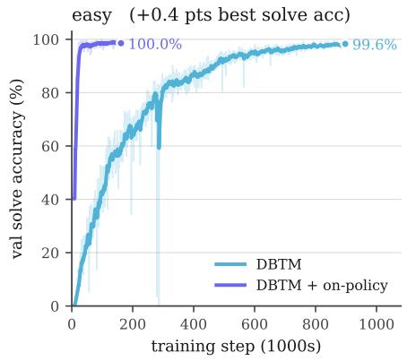

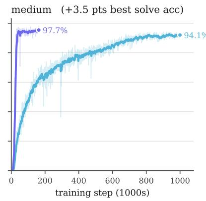

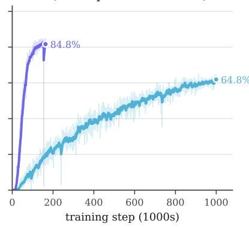  
Figure 6 Sudoku validation solve accuracy with and without refinement-in-loop training. Exact-solve accuracy on the held-out puzzles over training steps at 4 NFEs. The clean-context training reaches high accuracy on its own, but ril training converges significantly faster and to a higher ceiling on every dificulty.

We avoid mode collapse in two complementary ways. First, we use minibatch optimal transport (Tong et al., 2024) to define the coupling $( x _ { 0 } , x _ { 1 } )$ for supervised ril training and test both the committed and non-committed clean context methods described in App D.1 with either the target $x _ { 1 }$ being committed or held at the categorical state at the positions where the map is most confident. Second, we perform self-distillation after a warmup phase in parallel to the data-supervised training as described in $\mathrm { A p p ~ D . 1 }$ , where the target is a function of the noise input $x _ { 0 } .$ making the self-generated and refined sequence a well-defined target. We use the LM1B dataset as a testbed for these methods and provide a summary of experiment settings in Table 5.

Results In Figure 3 and Table 13, we show that DBTM with refinement-in-loop (commit) achieves the widest Pareto frontier of all methods, with low Gen. PPL across all entropy values from 3.90 − 4.30. Notably, DBTM + ril achieves the lowest PPL along the frontier curve across all NFE counts and methods. When comparing commit vs. non-commit ril training, we found that the commit mode consistently achieves lower Gen. PPL across NFE counts and selection thresholds with stable entropy around 4.00 (Table 6). Figure 7 plots the Gen. PPL and sample entropy from small validation batches over training steps. Visually, Gen. PPL rises early in training as entropy approaches the data entropy, and when on-policy training turns on after the 100K- step warmup, Gen. PPL starts to drop while entropy remains stable. In Figure 7A-C, the commit method (purple curve) shows a

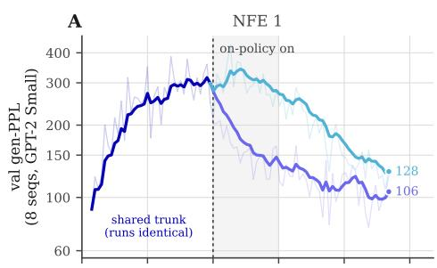

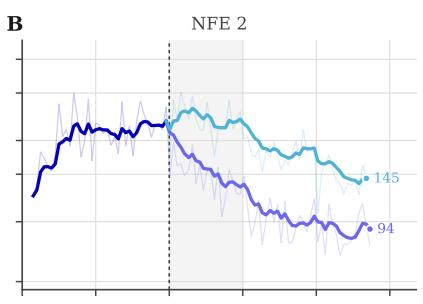

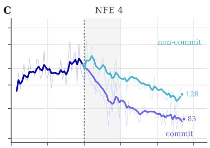

D  
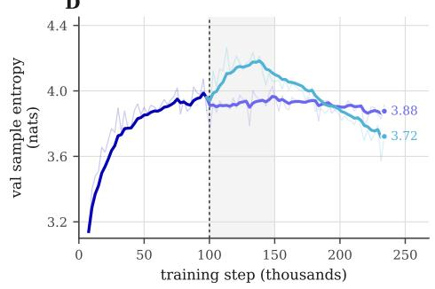

E  
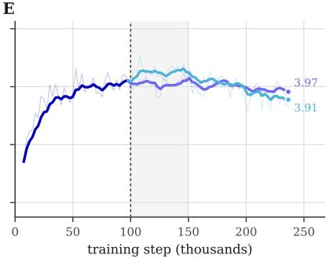

F  
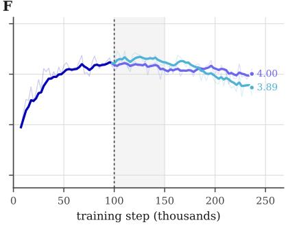  
Figure 7 Efect of refinement-in-loop training on LM1B. Gen-PPL (GPT-2-small for eficiency) and sample entropy on a single validation batch of 4 sequences over training (not directly comparable to the table values). Gen-PPL rises early as entropy approaches the data entropy, and when on-policy training turns on after the 100K-step warmup, Gen-PPL drops while entropy holds. Panels A–C compare committed (purple) and non-committed (turquoise) rollouts; the committed variant descends faster at every NFE.

steeper drop in Gen. PPL than the non-commit method (turquoise curve).
<table><tr><td></td><td colspan="5">commit Commit Threshold κ</td><td colspan="5">non-commit Commit Threshold κ</td></tr><tr><td>NFE</td><td>0.5</td><td>0.7</td><td>0.9</td><td>0.99</td><td>0.999</td><td>0.7</td><td></td><td>0.9</td><td>0.99</td><td>0.999</td></tr><tr><td>1</td><td>86.0 (3.92)</td><td>86.0 (3.92)</td><td>86.0 (3.92)</td><td>86.0 (3.92)</td><td>86.0 (3.92)</td><td>136.2 (3.88)</td><td>136.2 (3.88)</td><td>136.2 (3.88)</td><td>136.2 (3.88)</td><td>136.2 (3.88)</td></tr><tr><td>2</td><td>81.0 (4.05)</td><td>81.0 (4.05)</td><td>81.0 (4.05)</td><td>81.0 (4.05)</td><td>81.0 (4.05)</td><td>129.0 (3.92)</td><td>127.7 (3.98)</td><td>139.4 (4.04)</td><td>142.4 (4.05)</td><td>142.4 (4.05)</td></tr><tr><td>4</td><td>70.1 (4.03)</td><td>72.9 (4.04)</td><td>73.6 (4.05)</td><td>73.6 (4.05)</td><td>73.6 (4.05)</td><td>124.6 (3.91)</td><td>114.5 (3.96)</td><td>110.9 (4.02)</td><td>118.0 (4.08)</td><td>124.1 (4.10)</td></tr><tr><td>8</td><td>63.8 (4.02)</td><td>61.5 (4.01)</td><td>61.1 (4.00)</td><td>62.2 (4.01)</td><td>62.3 (4.01)</td><td>123.6 (3.91)</td><td>108.4 (3.94)</td><td>96.6 (3.99)</td><td>95.1 (4.03)</td><td>97.0 (4.06)</td></tr><tr><td>16</td><td>61.0 (4.02)</td><td>57.8 (4.00)</td><td>54.4 (3.97)</td><td>53.7 (3.96)</td><td>54.3 (3.96)</td><td>121.1 (3.91)</td><td>104.6 (3.94)</td><td>87.9 (3.95)</td><td>79.8 (3.98)</td><td>77.7 (3.99)</td></tr></table>

Table 6 Commit vs. non-commit refinement-in-loop training on LM1B, over NFE × commit threshold κ. The lowest Gen-PPL in each row of each arm is bolded. The on-policy rollout that produces the distillation target either hard-commits its confident tokens into the supervised state (commit) or re-maps the soft state without committing (non-commit), and both arms are trained for 200K steps with all other parameters held constant. The commit setting is used as default in ril training.

## E Hyperparameter Discussion

Below, we discuss each ablated hyperparameter, what it controls, and the behavior that the sweeps in Table 10 show. App E.1 describes the training-time knobs of the map, and App E.2 describes the inference-time knobs that can be changed on a fixed checkpoint.

## E.1 Training Hyperparameters

Adaptive Loss To stabilize training, we scale the losses with a gradient-detached weight that downweights large mismatches in the predicted and true target. Denoting the transport map prediction $q ( x ) = T ( x ) \in \bar { \Delta } ^ { V - 1 }$ and $\begin{array} { r } { p ( x ) = { \sf s g } ( T ( x ) + \dot { I } _ { t } ( x ) \cdot \nabla T ( x ) ) } \end{array}$ , we write the mismatch as $\Delta ( x ) = q ( x ) - p ( x )$ and the weight as:

$$
w ( x ) : = { \mathfrak { s g } } \left[ \left( \| \Delta ( x ) \| _ { 2 } ^ { 2 } + c \right) ^ { - r } \right]\tag{170}
$$

where c and r are tunable hyperparameters.

Minimum Anchor Time The threshold $t _ { \mathrm { a n c h o r } }$ gates the anchor loss, which supervises $T _ { \theta } ( I _ { t } )$ directly toward $x _ { 1 }$ only for $t > t _ { \mathrm { a n c h o r } }$ and sets how much of the interpolant is treated as already committed. We prove in $\mathrm { A p p }$ . C.2 that the optimal anchor time aligns closely with the time of the phase transition and perform an ablation over $t _ { \mathrm { a n c h o r } }$ on LM1B in Table 12.

Noise Scale The prior scale σ in $\mu _ { 0 } = \mathcal { N } ( 0 , \sigma ^ { 2 } I _ { V } ) ^ { \otimes L }$ sets the radius of the Gaussian hypersphere around the simplex, and enters the commitment time through the signal-to-noise ratio $\rho ( t ) = ( 1 - \alpha _ { t } ) / \alpha _ { t } \sigma$ (See App C.2 and Figure 2). Raising it to σ=1.2 improves Gen-PPL at every NFE budget (178.1 vs. 247.1 at NFE 1, 61.9 vs. 70.1 at NFE 8) but drops entropy below 4 (Table 10).

Schedule Exponent The exponent a in $\alpha _ { t } = ( 1 - t ) ^ { a }$ controls how quickly the interpolant resolves onto a vertex, and for larger a, this reduces the commitment time t<sup>⋆</sup> (Figure 2). Setting a=1 reduces to the linear interpolant $I _ { t } = ( 1 - t ) x _ { 0 } + t x _ { 1 }$

Adaptive Loss Constant The constant c in the adaptive weight $w ( x ) = { \sf s g } [ ( \| \Delta ( x ) \| _ { 2 } ^ { 2 } + c ) ^ { - r } ]$ determines how strongly a large prediction mismatch is downweighted, with small c giving a more aggressive reweighting. It is the least sensitive knob we swept, where moving c from 1 to $1 0 ^ { - 5 }$ changes Gen-PPL negligibly and leaves entropy unchanged, demonstrating that our method is robust to minor tuning in the objective.

## E.2 Inference Hyperparameters

Rounds of Refinement Each round is one map application and one NFE with no additional NFE from computing the confidence or quality score, so the number of rounds K is equivalent to the number of jumps taken with a flow map or integration steps taken with a flow matching model. Quality improves consistently with increasing k until the sampler saturates when every position is committed to a token.

Commit Scorer The scorer ranking positions for commitment is either the map’s own softmax confidence (rounding error of argmax token) or the learned per-token quality $q _ { \phi }$ . All positions with score larger than the confidence threshold κ are committed. The sampler commits a minimum of $n _ { r } = \lceil \lvert \mathcal { R } _ { r } \rvert / ( k - r + 1 ) \rceil$ highest-scoring uncommitted positions at round regardless of whether their score exceeds κ, which guarantees the sampler finishes within its NFE budget.

Confidence Threshold The threshold κ decides which positions are committed rather than renoised, with position ℓ frozen when $q ^ { \ell } \geq \kappa$ . Its efect depends on whether the per-round minimum commit count $n _ { r } = \lceil \lvert \mathcal { R } _ { r } \rvert / ( k - r + 1 ) \rceil$ is met.

Commit Temperature Temperature used to scale the proposed categorical probabilities before taking the softmax $T _ { \theta } ( x _ { 0 } ) : = \mathrm { s o f t m a x } ( f _ { \theta } ( x _ { 0 } ) / { \tt t e m p } )$ . When $\mathsf { t e m p } = 0 . 0 $ , the committed token is the argmax.

Prior Scale The standard deviation σ of the Gaussian prior distribution from which the initial noise latent at each position ℓ are sampled $\boldsymbol { x } _ { 0 } ^ { \ell } \sim \mathcal { N } ( \mathbf { 0 } , \sigma ^ { 2 } I _ { V } )$ .

Repetition Penalty For unconditional language modeling, the commit rule reads each position’s marginal independently within a round can cause repetition between tokens committed within a single round. As is standard for autoregressive decoding (Keskar et al., 2019), we apply a repetition penalty $\lambda \geq 0$ that divides $T _ { \theta } ( x ) _ { j } ^ { \ell }$ by $( 1 + n _ { j } ( { \mathcal { C } } ) ) ^ { \lambda }$ on uncommitted tokens before decoding and scoring, where $n _ { j } ( \mathcal { C } )$ counts committed positions holding token j, which has no efect for 1 NFE sampling. We find that after refinement-in-loop training, the penalty is not required for coherent sampling, demonstrating that training on contexts seen during inference improves generation quality.

## F Ablations and Additional Results

Overview We provide the results for hyperparameter ablations and additional experiments in Tables 10 to 14.

• Table 7 shows the Gen. PPL and entropy for the full sweep of NFEs up to 1024 on LM1B and OWT.

• Table 8 shows the accuracy for the full sweep of NFEs for TinyGSM/GSM8K against the state-of-the-art few-step baseline FMLM+.

• Table 9 compares integrating the autonomous field over increasing time horizons via the endpoint parameterization from Remark B.1 with applying the one-step map on LM1B.

• Table 10 shows hyperparameter ablations on LM1B which are used to inform the OWT experiments.

• Table 11 shows a sweep of NFE and commit threshold κ on each dificulty of Sudoku.

• Table 12 shows the results from sweeping the minimum anchor time $t _ { \mathrm { a n c h o r } } \in \{ 0 . 6 0 , 0 . 7 5 , 0 . 8 0 , 0 . 8 5 \}$ during DBTM + ril training for LM1B.

• Table 13 shows the numerical results corresponding to the frontier curves in Figure 3 for LM1B, with the Gen-PPL at matched entropy on the Pareto frontiers generated from sweeping inference parameters for each method.

• Table 14 shows the numerical results corresponding to the frontier curves in Figure 1 for OWT, with the Gen-PPL at matched entropy on the Pareto frontiers generated from sweeping inference parameters for each method.

Integrating the Autonomous Flow We empirically determine the hitting time on LM1B by integrating the time-independent velocity implied by the trained map over a range of horizons H (Table 9). At short horizons $( H = 1 )$ , the integrated trajectory does not reach the correct basin of attraction, but by the time the horizon increases to $H = 4$ , the integrated field has settled onto a fixed point $x \in M _ { 1 }$ where $b ( x ) = 0$ , and sample quality no longer improves as the horizon grows to $H = 8$ . However, we empirically observe that applying the one-step map $T _ { \theta } ( x )$ consistently outperforms integrating the implied velocity field, even with fine discretization steps $( N _ { \mathrm { s t e p s } } = 6 4 )$ . This supports scaling refinements of the one-step map rather than scaling integration steps, and is the property that motivates the refinement scheme of Section 5.

<table><tr><td rowspan="2">Dataset Method</td><td rowspan="2"></td><td colspan="8">NFE</td></tr><tr><td>1</td><td>2</td><td>4</td><td>8</td><td>16</td><td>128</td><td>256</td><td>1024</td></tr><tr><td rowspan="5">LM1B</td><td>FMLM</td><td>119.34 (4.16)</td><td>110.19 (4.21)</td><td>98.76 (4.21)</td><td>86.28 (4.20)</td><td>78.06 (4.21)</td><td>57.73 (4.20)</td><td>51.03 (4.18)</td><td>41.84 (4.15)</td></tr><tr><td>DFM (PSD)</td><td>94.08 (4.06)</td><td>87.42 (4.08)</td><td>78.89 (4.10)</td><td>69.90 (4.10)</td><td>64.90 (4.11)</td><td>58.38 (4.10)</td><td>56.59 (4.10)</td><td>56.31 (4.11)</td></tr><tr><td>DFM (ESD)</td><td>68.11 (3.79)</td><td>77.60 (4.11)</td><td>71.53 (4.13)</td><td>65.61 (4.13)</td><td>59.92 (4.13)</td><td>55.70 (4.11)</td><td>56.88 (4.12)</td><td>58.27 (4.12)</td></tr><tr><td>DBTM</td><td>201.20 (4.03)</td><td>167.05 (4.19)</td><td>119.99 (4.20)</td><td>90.19 (4.16)</td><td>71.42 (4.11)</td><td>58.81 (4.03)</td><td>58.81 (4.03)</td><td>58.81 (4.03)</td></tr><tr><td>DBTM + ril</td><td>85.50 (3.92)</td><td>81.00 (4.05)</td><td>73.54 (4.04)</td><td>60.86 (4.00)</td><td>54.48 (3.97)</td><td>51.26 (3.95)</td><td>51.26 (3.95)</td><td>51.26 (3.95)</td></tr><tr><td rowspan="8">OWT</td><td>FMLM</td><td>168.30 (5.17)</td><td>133.29 (5.25)</td><td>111.31 (5.26)</td><td>88.27 (5.26)</td><td>68.06 (5.24)</td><td>28.73 (4.88)</td><td>20.26 (4.70)</td><td>9.10 (4.13)</td></tr><tr><td>DFM (PSD)</td><td>180.29 (4.91)</td><td>152.83 (5.03)</td><td>122.32 (5.10)</td><td>98.54 (5.11)</td><td>82.51 (5.09)</td><td>56.00 (5.00)</td><td>51.81 (4.97)</td><td>47.82 (4.97)</td></tr><tr><td>DFM (ESD)</td><td>5.33 (0.26)</td><td>108.91 (5.15)</td><td>77.08 (5.27)</td><td>62.98 (5.23)</td><td>55.03 (5.18)</td><td>41.90 (5.04)</td><td>39.08 (5.00)</td><td>36.48 (4.95)</td></tr><tr><td>FMLM+</td><td>378.53 (5.34)</td><td>114.46 (5.14)</td><td>41.16 (4.77)</td><td>25.15 (4.53)</td><td>21.58 (4.42)</td><td>20.79 (4.40)</td><td>20.72 (4.39)</td><td>20.60 (4.37)</td></tr><tr><td>DBTM (attn)</td><td>249.8 (4.77)</td><td>156.3 (5.06)</td><td>123.1 (5.18)</td><td>107.9 (5.20)</td><td>98.6 (5.20)</td><td>86.7 (5.20)</td><td>83.2 (5.20)</td><td>80.4 (5.22)</td></tr><tr><td>DBTM + ril (attn)</td><td>133.0 (4.94)</td><td>109.6 (5.24)</td><td>115.5 (5.42)</td><td>120.0 (5.48)</td><td>121.0 (5.50)</td><td>120.5 (5.54)</td><td>117.6 (5.55)</td><td>117.6 (5.55)</td></tr><tr><td>DBTM (lin)</td><td>188.2 (4.97)</td><td>76.2 (5.14)</td><td>52.2 (5.26)</td><td>42.2 (5.28)</td><td>37.0 (5.27)</td><td>31.6 (5.25)</td><td>30.7 (5.25)</td><td>30.1 (5.25)</td></tr><tr><td>DBTM + ril (lin)</td><td>65.2 (4.95)</td><td>62.2 (5.38)</td><td>57.5 (5.52)</td><td>52.3 (5.56)</td><td>48.8 (5.57)</td><td>42.2 (5.57)</td><td>41.0 (5.56)</td><td>40.9 (5.56)</td></tr></table>

Table 7 Full NFE sweep for LM1B and OWT. Generative perplexity (GPT-2 Large; ↓) and entropy (↑) across NFEs for LM1B and OWT compared to few-step flow map baselines FMLM, discrete flow maps (DFM), and FMLM with posterior refinement (FMLM+). (attn) denotes the same DiT architecture as FMLM, and (lin) denotes the linear attention architecture with matched parameters described in App. G.2. FMLM and FMLM+ values are evaluated with published checkpoints, and DFM values are taken from the paper. All values are computed from 1024 sequences. For DBTM and FMLM+, NFE is the number of refinement rounds. DBTM LM1B checkpoints are evaluated at 200K steps, and DBTM OWT checkpoints are evaluated at 100K steps.

<table><tr><td rowspan="2"></td><td colspan="7">GSM8K (NFE)</td></tr><tr><td>Method 1</td><td>2</td><td>4</td><td>8</td><td>16</td><td>32</td><td>64</td></tr><tr><td>FMLM+</td><td>0</td><td>0.6</td><td>5.7</td><td>9.7</td><td>14.5</td><td>16.6</td><td>15.0</td></tr><tr><td>DBTM</td><td>0.8</td><td>1.1</td><td>5.7</td><td>10.1</td><td>14.3</td><td>16.8</td><td>16.2</td></tr></table>

Table 8 GSM8K accuracy across NFE for DBTM vs. FMLM+. Final-answer accuracy (%, ↑) on the full 1319-problem GSM8K test set, one greedy sample per question (k=1) from a single checkpoint per row, where NFE is the number of refinement rounds and both samplers spend exactly one network evaluation per round (bold = better of the two in the column). FMLM+ (Agarwal et al., 2026) is the published Posterior Refinement checkpoint with refinement threshold 0.99 and DBTM is the refinement-in-loop arm at q=0.8. Both methods are evaluated at 250K steps, commits ranked by softmax confidence, and fresh noise redrawn each round.

<table><tr><td rowspan="2"></td><td colspan="3">Autonomous field (horizon H)</td><td rowspan="2">One-step map</td></tr><tr><td>H=1</td><td>H=4</td><td>H=8</td></tr><tr><td>Gen-PPL ↓</td><td>3571.8</td><td>276.1</td><td>293.2</td><td>247.1</td></tr><tr><td>Entropy</td><td>4.822</td><td>4.378</td><td>4.386</td><td>4.115</td></tr><tr><td rowspan="2">Configuration</td><td colspan="2">One-step (NFE 1)</td><td colspan="2">Refinement (NFE 8)</td></tr><tr><td>Gen-PPL ↓</td><td>Ent.</td><td> $\mathrm { G e n - P P L } \downarrow$ </td><td>Ent.</td></tr><tr><td>Noise scale σ</td><td></td><td></td><td></td><td></td></tr><tr><td>1.0</td><td>247.12</td><td>4.11</td><td>70.08</td><td>4.02</td></tr><tr><td>1.2</td><td>178.15</td><td>3.94</td><td>61.90</td><td>3.98</td></tr><tr><td>Schedule exponent a</td><td></td><td></td><td></td><td></td></tr><tr><td>1</td><td>247.12</td><td>4.11</td><td>70.08</td><td>4.02</td></tr><tr><td>2</td><td>221.32</td><td>4.03</td><td>77.38</td><td>3.98</td></tr><tr><td>Adaptive-loss constant c</td><td></td><td></td><td></td><td></td></tr><tr><td>1</td><td>247.12</td><td>4.11</td><td>70.08</td><td>4.02</td></tr><tr><td> $1 0 ^ { - 5 }$ </td><td>260.31</td><td>4.12</td><td>69.00</td><td>4.01</td></tr><tr><td>Commit scorer</td><td></td><td></td><td></td><td></td></tr><tr><td>Softmax confidence</td><td>247.12</td><td>4.11</td><td>70.08</td><td>4.02</td></tr><tr><td>Learned  $q _ { \phi }$  (shared head)</td><td>247.12</td><td>4.11</td><td>65.31</td><td>3.75</td></tr><tr><td>Refinement rule</td><td></td><td></td><td></td><td></td></tr><tr><td>Iterate the map  $T _ { \theta } ^ { \circ k }$ </td><td>178.15</td><td>3.94</td><td>501.24</td><td>4.23</td></tr><tr><td> $\mathbf { R e n o i s e } + \mathbf { r e m a p }$ </td><td>178.15</td><td>3.94</td><td>61.90</td><td>3.98</td></tr></table>

Table 9 Autonomous flow horizon sweep on LM1B. Integrating the learned autonomous field b with 64 Euler steps up to horizon H, compared against a single application of the one-step map $T _ { \theta }$ (DBTM without ril). At H=1, the flow has not converged and generations remain incoherent. At H=4, quality saturates, indicating convergence to the manifold. The one-step map outperforms the fully integrated field in one NFE, demonstrating the advantage of directly learning T.

Table 10 Ablation results on LM1B. Each block varies one knob of the default parameters (clean-context per-token $\alpha ,$ learned weighting, adaptive transport r=0.5, CE endpoint, OT coupling, linear interpolation, uniform time, batch 128) at $t _ { a n c h o r } { = } 0 . 7 5$ , σ=1.0, a=1, c=1; shaded = the setting the paper uses.

<table><tr><td></td><td colspan="5">Easy</td><td colspan="5">Medium</td><td colspan="5">Hard</td></tr><tr><td>NFE (Rounds)</td><td>0.5</td><td>0.7</td><td>0.9</td><td>0.99</td><td>0.999</td><td> $_ { 0 . 5 }$ </td><td>0.7</td><td>0.9</td><td>0.99</td><td>0.999</td><td> $_ { 0 . 5 }$ </td><td>0.7</td><td>0.9</td><td>0.99</td><td>0.999</td></tr><tr><td>1</td><td>63.65</td><td>63.65</td><td>63.65</td><td>63.65</td><td>63.65</td><td>39.50</td><td>39.50</td><td>39.50</td><td>39.50</td><td>39.50</td><td>1.60</td><td>1.60</td><td>1.60</td><td>1.60</td><td>1.60</td></tr><tr><td>2</td><td>94.40</td><td>94.20</td><td>92.20</td><td>88.65</td><td>85.10</td><td>85.75</td><td>83.15</td><td>78.70</td><td>70.30</td><td>63.45</td><td>17.70</td><td>13.35</td><td>8.80</td><td>6.05</td><td>5.55</td></tr><tr><td>4</td><td>97.35</td><td>98.05</td><td>98.85</td><td>99.70</td><td>99.50</td><td>92.25</td><td>94.60</td><td>96.30</td><td>97.65</td><td>97.30</td><td>80.15</td><td>84.65</td><td>86.05</td><td>85.70</td><td>84.60</td></tr><tr><td>8</td><td>97.20</td><td>97.90</td><td>98.75</td><td>99.80</td><td>99.75</td><td>92.55</td><td>94.90</td><td>96.95</td><td>98.85</td><td>99.15</td><td>81.60</td><td>88.70</td><td>93.10</td><td>94.60</td><td>95.00</td></tr><tr><td>16</td><td>97.40</td><td>98.20</td><td>99.05</td><td>99.75</td><td>99.90</td><td>93.45</td><td>95.35</td><td>97.50</td><td>98.85</td><td>99.35</td><td>83.35</td><td>89.60</td><td>94.85</td><td>96.85</td><td>97.45</td></tr></table>

Table 11 Commit threshold sweep for DBTM + ril on Sudoku. Exact-solve accuracy $( \% )$ on the 2000-puzzle held-out set over NFE (refinement rounds) × commit threshold $\kappa \in \{ 0 . 5 , 0 . 7 , 0 . 9 , 0 . 9 9 , 0 . 9 9 9 \}$ for the checkpoints reported in Table $\mathcal { Q } . \quad S h a d e d \ = t h e \ f i x e d \ \kappa = 0 . 9 9 9$ used there. The best in each row within each dificulty is bolded; NFE 1 is a one-shot decode and does not depend on κ. Lower thresholds commit more positions per round and plateau early, so at NFE 8-16 accuracy increases with κ on every dificulty, and κ = 0.999 is best or within one puzzle of best. At NFE 2 the ordering reverses, since a strict threshold leaves most positions to be forced by the commit floor in the final round, and at NFE 4 the optimum sits slightly below the strictest setting.

<table><tr><td> $t _ { \mathrm { a n c h o r } }$ </td><td colspan="4">0.60</td><td colspan="4">0.75*</td></tr><tr><td>NFE (Rounds)</td><td>0.7</td><td>0.9</td><td>0.99</td><td>0.999</td><td>0.7</td><td>0.9</td><td>0.99</td><td>0.999</td></tr><tr><td></td><td>47.4 (3.65)</td><td>47.4 (3.65)</td><td>47.4 (3.65)</td><td>47.4 (3.65)</td><td>92.9 (3.93)</td><td>92.9 (3.93)</td><td>92.9 (3.93)</td><td>92.9 (3.93)</td></tr><tr><td>12</td><td>41.3 (3.86)</td><td>41.3 (3.86)</td><td>41.3 (3.86)</td><td>41.3 (3.86)</td><td>88.0 (4.06)</td><td>88.0 (4.06)</td><td>88.0 (4.06)</td><td>88.0 (4.06)</td></tr><tr><td>4</td><td>35.8 (3.88)</td><td>36.1 (3.89)</td><td>36.1 (3.89)</td><td>36.1 (3.89)</td><td>79.5 (4.05)</td><td>81.0 (4.06)</td><td>81.0 (4.06)</td><td>81.0 (4.06)</td></tr><tr><td>8</td><td>29.1 (3.87)</td><td>29.7 (3.86)</td><td>29.9 (3.86)</td><td>29.9 (3.86)</td><td>66.5 (4.02)</td><td>66.5 (4.01)</td><td>68.3 (4.01)</td><td>68.3 (4.01)</td></tr><tr><td>16</td><td>27.1 (3.86)</td><td>26.0 (3.84)</td><td>25.9 (3.84)</td><td>25.9 (3.84)</td><td>62.4 (4.00)</td><td>58.4 (3.97)</td><td>59.1 (3.96)</td><td>59.4 (3.96)</td></tr><tr><td>tanchor</td><td colspan="4">0.80</td><td colspan="4">0.85</td></tr><tr><td>NFE (Rounds)</td><td>0.7</td><td>0.9</td><td>0.99</td><td>0.999</td><td>0.7</td><td>0.9</td><td>0.99</td><td>0.999</td></tr><tr><td>1</td><td>110.8 (3.97)</td><td>110.8 (3.97)</td><td>110.8 (3.97)</td><td>110.8 (3.97)</td><td>174.9 (4.12)</td><td>174.9 (4.12)</td><td>174.9 (4.12)</td><td>174.9 (4.12)</td></tr><tr><td></td><td>109.2 (4.09)</td><td>109.2 (4.09)</td><td>109.2 (4.09)</td><td>109.2 (4.09)</td><td>170.6 (4.23)</td><td>170.6 (4.23)</td><td>170.6 (4.23)</td><td>170.6 (4.23)</td></tr><tr><td>24</td><td>99.0 (4.09)</td><td>100.6 (4.10)</td><td>100.5 (4.09)</td><td>100.5 (4.09)</td><td>155.5 (4.23)</td><td>156.2 (4.23)</td><td>156.2 (4.23)</td><td>156.2 (4.23)</td></tr><tr><td>8</td><td>82.9 (4.06)</td><td>84.1 (4.04)</td><td>85.1 (4.05)</td><td>85.1 (4.05)</td><td>125.4 (4.18)</td><td>125.2 (4.17)</td><td>126.9 (4.18)</td><td>126.9 (4.18)</td></tr><tr><td>16</td><td>76.0 (4.04)</td><td>71.6 (4.00)</td><td>72.4 (3.99)</td><td>72.7 (4.00)</td><td>112.6 (4.16)</td><td>103.5 (4.12)</td><td>105.4 (4.12)</td><td>105.2 (4.12)</td></tr></table>

Table 12 Efect of the minimum anchor time t for DBTM + ril training on LM1B. Gen-PPL (entropy) over NFE (refinement rounds) × threshold grid across $t _ { a n c h o r } \in \{ 0 . 6 0 , 0 . 7 5 , 0 . 8 0 , 0 . 8 5 \}$ , where <sup>⋆</sup> indicates the default $t _ { a n c h o r } = 0 . 7 5$ for LM1B and OWT. Columns within each anchor are commit thresholds $( \kappa \in \{ 0 . 7 , 0 . 9 , 0 . 9 9 , 0 . 9 9 9 \} )$ and rows are NFE (refinement rounds); the $\kappa = 0 . 9$ columns used in the main results are highlighted. Thresholds maintain constant performance at low rounds and take efect only at rounds 8–16, where stricter thresholds lower Gen-PPL.

<table><tr><td colspan="2"></td><td colspan="2">Best</td><td></td><td colspan="7">Gen-PPL at matched entropy</td></tr><tr><td>NFE</td><td>Method</td><td>Gen-PPL ↓</td><td>at Ent.</td><td>Ent. range</td><td>3.90</td><td>4.00</td><td>4.10</td><td>4.15</td><td>4.20</td><td>4.25</td><td>4.30</td></tr><tr><td rowspan="3">1</td><td>FMLM</td><td>112.8</td><td>4.124</td><td>4.12-4.18</td><td></td><td></td><td></td><td>116.2</td><td></td><td></td><td></td></tr><tr><td>DBTM</td><td>199.5</td><td>4.045</td><td>4.04-4.63</td><td></td><td></td><td>252.0</td><td>370.2</td><td>459.3</td><td>557.3</td><td>685.9</td></tr><tr><td>DBTM + ril</td><td>86.0</td><td>3.917</td><td>3.92-4.40</td><td></td><td>122.4</td><td>210.5</td><td>242.2</td><td>306.2</td><td>388.1</td><td>497.7</td></tr><tr><td rowspan="3">2</td><td>FMLM</td><td>104.6</td><td>4.196</td><td>4.20-4.32</td><td></td><td></td><td></td><td></td><td>105.2</td><td>122.9</td><td>139.4</td></tr><tr><td>DBTM</td><td>147.0</td><td>4.084</td><td>4.08-4.22</td><td></td><td></td><td>147.7</td><td>156.7</td><td>177.5</td><td></td><td></td></tr><tr><td>DBTM + ril</td><td>71.6</td><td>3.967</td><td>3.97–4.25</td><td></td><td>75.1</td><td>89.1</td><td>99.3</td><td>112.0</td><td>128.5</td><td></td></tr><tr><td rowspan="3">4</td><td>FMLM</td><td>93.4</td><td>4.207</td><td>4.21-4.32</td><td></td><td></td><td></td><td></td><td></td><td>109.0</td><td>124.8</td></tr><tr><td>DBTM</td><td>101.4</td><td>4.046</td><td>4.05-4.32</td><td></td><td></td><td>105.7</td><td>115.5</td><td>140.7</td><td>151.5</td><td>164.1</td></tr><tr><td> $\mathrm { \Delta D B T M + r i l }$ </td><td>62.5</td><td>3.926</td><td>3.93-4.40</td><td></td><td>69.7</td><td>79.8</td><td>86.4</td><td>93.8</td><td>103.0</td><td>113.6</td></tr><tr><td rowspan="3">8</td><td>FMLM</td><td>85.3</td><td>4.190</td><td>4.19-4.30</td><td></td><td></td><td></td><td></td><td>85.4</td><td>98.8</td><td></td></tr><tr><td>DBTM</td><td>74.8</td><td>3.986</td><td>3.99-4.31</td><td></td><td>75.5</td><td>85.8</td><td>93.2</td><td>109.5</td><td>117.1</td><td>126.2</td></tr><tr><td>DBTM + ril</td><td>49.5</td><td>3.867</td><td>3.87-4.45</td><td>50.8</td><td>60.1</td><td>68.6</td><td>73.2</td><td>78.7</td><td>85.4</td><td>92.7</td></tr><tr><td rowspan="3">16</td><td>FMLM</td><td>76.7</td><td>4.219</td><td>4.22-4.31</td><td></td><td></td><td></td><td></td><td></td><td>89.6</td><td>115.7</td></tr><tr><td>DBTM</td><td>60.3</td><td>3.910</td><td>3.91-4.28</td><td></td><td>65.2</td><td>76.0</td><td>85.4</td><td>90.5</td><td>96.1</td><td></td></tr><tr><td> $\mathrm { \Delta D B T M + r i l }$ </td><td>44.2</td><td>3.832</td><td>3.83-4.47</td><td>46.6</td><td>57.3</td><td>62.1</td><td>66.1</td><td>70.4</td><td>75.8</td><td>81.7</td></tr></table>

Table 13 LM1B decode frontier shown in Figure 3: DBTM vs. FMLM, swept over several inference-time knobs. Each method is swept over the knobs that trace its own coherence-diversity trade-of, all of its sweeps are pooled, and the Pareto frontier is taken (a point survives if no other has both higher entropy and lower Gen-PPL). The best in the column within each NFE block are bolded. Blank cells indicate entropy values where the method produces no point on the Pareto frontier. Swept parameters. DBTM (both rows): (i) commit temperature temp ∈ [0, 1.2], (ii) prior scale $\sigma \in [ 0 . 6 , 5 ]$ , (iii) commit threshold $\kappa \in [ 0 . 1 , 0 . 9 9 9 ]$ ], (iv) repetition penalty $\lambda \in \{ 0 , 0 . 5 , 1 \}$ . FMLM: (i) churn $\gamma \in [ 0 , 0 . 9 9 ]$ , the noise re-injected between sampler steps, and (ii) the same prior scale $\sigma ,$ applied to its initial latent.

<table><tr><td colspan="2"></td><td colspan="2">Best</td><td></td><td colspan="10">Gen-PPL at matched entropy</td></tr><tr><td>NFE</td><td>Method</td><td>Gen-PPL ↓</td><td>at Ent.</td><td>Ent. range</td><td>5.00</td><td>5.10</td><td>5.20</td><td>5.30</td><td>5.35</td><td>5.40</td><td>5.45</td><td>5.50</td><td>5.60</td><td>5.70</td></tr><tr><td rowspan="6">1</td><td>FMLM</td><td>168.2</td><td>5.174</td><td>5.17–5.40</td><td></td><td></td><td>177.9</td><td>249.0</td><td>306.0</td><td>372.4</td><td></td><td></td><td></td><td></td></tr><tr><td>FMLM+</td><td>378.5</td><td>5.344</td><td>5.34-5.50</td><td></td><td></td><td></td><td></td><td>384.4</td><td>433.9</td><td>509.4</td><td></td><td></td><td></td></tr><tr><td>DBTM (attn)</td><td>369.9</td><td>5.001</td><td>4.90-5.16</td><td>369.3</td><td>457.1</td><td></td><td></td><td></td><td></td><td></td><td></td><td></td><td></td></tr><tr><td>DBTM + ril (attn)</td><td>253.3</td><td>5.171</td><td>5.17–5.54</td><td></td><td></td><td>274.9</td><td>361.6</td><td>423.6</td><td>485.6</td><td>547.6</td><td>609.6</td><td></td><td></td></tr><tr><td>DBTM (lin)</td><td>234.0</td><td>5.102</td><td>4.97-5.31</td><td>196.4</td><td>233.3</td><td>291.0</td><td>366.1</td><td></td><td></td><td></td><td></td><td></td><td></td></tr><tr><td>DBTM + ril (lin)</td><td>113.6</td><td>5.098</td><td>4.95–5.57</td><td>82.4</td><td>114.5</td><td>161.7</td><td>225.6</td><td>276.5</td><td>327.4</td><td>378.3</td><td>429.2</td><td></td><td></td></tr><tr><td rowspan="6">2</td><td>FMLM</td><td>137.4</td><td>5.265</td><td>5.26-5.36</td><td></td><td></td><td></td><td>163.2</td><td>235.2</td><td></td><td></td><td></td><td></td><td></td></tr><tr><td>FMLM+</td><td>114.5</td><td>5.136</td><td>5.14-5.60</td><td></td><td></td><td>142.6</td><td>223.5</td><td>299.6</td><td>379.5</td><td>432.4</td><td>515.6</td><td>666.7</td><td></td></tr><tr><td>DBTM (attn)</td><td>224.2</td><td>5.075</td><td>4.96-5.47</td><td>194.2</td><td>227.4</td><td>240.3</td><td>270.6</td><td>304.3</td><td>348.1</td><td>394.5</td><td></td><td></td><td></td></tr><tr><td>DBTM + ril (attn)</td><td>199.5</td><td>5.370</td><td>5.37–5.78</td><td></td><td></td><td></td><td></td><td></td><td>221.5</td><td>246.5</td><td>290.8</td><td>393.1</td><td>466.8</td></tr><tr><td>DBTM (lin)</td><td>76.6</td><td>5.143</td><td>4.85-5.77</td><td>66.8</td><td>73.6</td><td>90.7</td><td>116.5</td><td>136.2</td><td>159.3</td><td>186.1</td><td>238.3</td><td>392.7</td><td>454.3</td></tr><tr><td>DBTM + ril (lin)</td><td>43.3</td><td>5.113</td><td>5.11–5.94</td><td></td><td></td><td>49.8</td><td>53.8</td><td>58.6</td><td>69.2</td><td>85.1</td><td>92.3</td><td>141.5</td><td>250.9</td></tr><tr><td rowspan="6">4</td><td>FMLM</td><td>119.1</td><td>5.296</td><td>5.30-5.36</td><td></td><td></td><td></td><td>121.6</td><td>185.5</td><td></td><td></td><td></td><td></td><td></td></tr><tr><td>FMLM+</td><td>111.4</td><td>5.165</td><td>4.80–5.63</td><td>87.1</td><td>101.8</td><td>126.8</td><td>218.4</td><td>245.2</td><td>272.0</td><td>298.8</td><td>325.6</td><td>464.5</td><td></td></tr><tr><td>DBTM (attn)</td><td>168.0</td><td>5.016</td><td>4.98–5.65</td><td>152.3</td><td>169.1</td><td>176.9</td><td>184.8</td><td>194.4</td><td>224.4</td><td>252.3</td><td>304.4</td><td>379.9</td><td></td></tr><tr><td>DBTM + ril (attn)</td><td>169.2</td><td>5.376</td><td>5.38-5.97</td><td></td><td></td><td></td><td></td><td></td><td>170.7</td><td>173.7</td><td>176.6</td><td>195.3</td><td>227.4</td></tr><tr><td>DBTM (lin) DBTM + ril (lin)</td><td>47.5</td><td>5.236</td><td>4.83-5.97</td><td>40.9</td><td>43.7</td><td>46.5</td><td>60.3</td><td>72.5</td><td>82.4</td><td>96.0</td><td>139.2</td><td>170.9</td><td>274.0</td></tr><tr><td></td><td>34.7</td><td>5.128</td><td>5.13–6.03</td><td></td><td></td><td>39.2</td><td>42.0</td><td>42.4</td><td>44.5</td><td>48.0</td><td>51.9</td><td>77.2</td><td>90.3</td></tr><tr><td rowspan="6">8</td><td>FMLM</td><td>95.5</td><td>5.280</td><td>5.28-5.38</td><td></td><td></td><td></td><td>99.9</td><td>131.0</td><td></td><td></td><td></td><td></td><td></td></tr><tr><td>FMLM+</td><td>69.0</td><td>5.011</td><td>4.82-5.66</td><td>67.0</td><td>87.4</td><td>99.2</td><td>147.1</td><td>160.4</td><td>189.5</td><td>229.2</td><td>261.3</td><td>318.1</td><td></td></tr><tr><td>DBTM (attn)</td><td>137.9</td><td>5.072</td><td>4.97–5.72</td><td>118.9</td><td>139.8</td><td>146.7</td><td>153.5</td><td>163.9</td><td>187.9</td><td>197.7</td><td>233.1</td><td>291.5</td><td>448.6</td></tr><tr><td>DBTM + ril (attn)</td><td>166.4</td><td>5.645</td><td>5.64–6.10</td><td></td><td></td><td></td><td></td><td></td><td></td><td></td><td></td><td></td><td>180.6</td></tr><tr><td>DBTM (lin)</td><td>33.3</td><td>5.269</td><td>4.88–6.03</td><td>26.4</td><td>28.9</td><td>31.5</td><td>43.6</td><td>46.7</td><td>51.6</td><td>61.3</td><td>74.1</td><td>167.7</td><td>186.5</td></tr><tr><td>DBTM + ril (lin)</td><td>37.2</td><td>5.423</td><td>4.82–6.04</td><td>32.8</td><td>33.9</td><td>34.9</td><td>35.9</td><td>36.4</td><td>37.0</td><td>38.8</td><td>41.9</td><td>52.6</td><td>71.8</td></tr><tr><td rowspan="7">16</td><td>FMLM</td><td>76.8</td><td>5.267</td><td>5.27–5.44</td><td></td><td></td><td></td><td>84.8</td><td>88.7</td><td>95.6</td><td></td><td></td><td></td><td></td></tr><tr><td>FMLM+</td><td>62.0</td><td>5.001</td><td>4.96–5.63</td><td>61.7</td><td>75.5</td><td>89.1</td><td>140.6</td><td>143.2</td><td>145.9</td><td>202.7</td><td>251.5</td><td>295.1</td><td></td></tr><tr><td>DBTM (attn)</td><td>120.7</td><td>5.047</td><td>4.94-5.81</td><td>110.0</td><td>123.9</td><td>130.1</td><td>136.2</td><td>141.1</td><td>148.3</td><td>155.6</td><td>184.7</td><td>257.7</td><td>402.3 135.6</td></tr><tr><td>DBTM + ril (attn) DBTM (lin)</td><td>131.3 21.3</td><td>5.614 5.005</td><td>5.61–6.11</td><td></td><td></td><td>25.8</td><td>37.5</td><td>37.6</td><td>41.6</td><td>54.3</td><td>63.5</td><td>94.1</td></table>

Table 14 OWT decode frontier shown in Figure 1: DBTM vs. FMLM and FMLM+, swept over several inference-time knobs. Companion to the decode-frontier figure. Each method is swept over the knobs that trace its own coherence-diversity trade-of; all of its sweeps are pooled, and the Pareto frontier is taken (a point survives if no other has both higher entropy and lower Gen-PPL). The best in the column within each NFE block are bolded. Blank cells indicate entropy values where the method produces no point on the Pareto frontier. Entropy is the within-sequence token-frequency entropy, with real OWT at entropy 5.441. (attn) denotes the same DiT architecture as FMLM, and (lin) denotes the linear attention architecture with matched parameters described in App. G.2. FMLM and FMLM+ values are evaluated with published checkpoints. Swept parameters. DBTM: (i) commit temperature temp $\in \{ 0 , 0 . 7 , 1 . 0 \}$ , (ii) prior scale $\sigma \in \left[ 0 . 6 , 5 \right]$ , (iii) commit threshold $\kappa \in [ 0 . 1 , 0 . 9 9 9 ]$ , (iv) repetition penalty $\lambda \in \{ 0 , 0 . 5 , 1 \}$ . FMLM: (i) churn $\gamma \in \{ 0 , 0 . 1 , 0 . 2 , 0 . 3 , 0 . 5 \}$ , the noise re-injected between sampler steps, and (ii) a commit temperature temp $\in \{ 0 , 0 . 5 , 0 . 7 , 0 . 8 5 , 1 . 0 \}$ at its final argmax, which was added on top of the method. $\mathrm { F M L M } + : \mathit { \Omega } ( i )$ the split of the NFE budget into refinement rounds × ODE substeps, (ii) the commit schedule, a uniform per-round budget or a fixed top-k ∈ {64, 128, 256, 384, 768} per round, (iii) commit threshold $\kappa \in \{ 0 . 9 , 0 . 9 9 9 \}$ , and (iv) a commit temperature temp $\in [ 0 , 2 ]$ at its decode, also added on top of the method.

## G Experiment Details

## G.1 General Experiment Details

Training Details All models use AdamW $( \beta _ { 1 } { = } 0 . 9 , \ \beta _ { 2 } { = } 0 . 9 9 9 , \ \epsilon { = } 1 0 ^ { - 8 } )$ in bf16, zero weight decay, gradient clipping at 1.0, and peak learning rate $3 \times 1 0 ^ { - 4 }$ with linear warmup. We maintain an exponential moving average (EMA) of the map weights with decay 0.9999, and a second, independent EMA of the predictor $\phi$ with the same decay. All reported results use the EMA weights. The global batch is given by per-GPU batch × devices × accumulation, so runs reproduce at any device count: 512 (per-GPU 128) for language modeling, 256 for reasoning.

Architecture The backbone architecture is a DiT (Peebles and Xie, 2023) with adaLN conditioning (dimension 128) and rotary positional embeddings (Su et al., 2024), acting on a continuous $( B , L , V )$ simplex latent without conditioning on time t. Language modeling and TinyGSM use 768 hidden / 12 layers / 12 heads, Sudoku 512 / $8 / 8 ,$ all with FFN multiplier 4, dropout 0.1, untied embeddings, and a tanh softcap of 50 on attention logits (Table 15).

Fused Kernel for JVP Computation The transport loss (17) is defined through $\dot { I } _ { t } \cdot \nabla T _ { \theta } ( I _ { t } )$ , so each step needs a Jacobian-vector product (JVP) through the network, evaluated in forward mode. This dominates our training cost since it requires materializing the (B, heads, L, L) score tensor. We instead use a fused Triton kernel (Zhou et al., 2026) that computes the attention output and its derivative together in a single streaming pass, so the full score tensor is never held in memory. The two passes share one sweep over the keys and values: the ordinary forward pass only reserves the output bufers, and the kernel fills them while computing the derivative.

Backpropagation is handled by two separate kernels, one for the output and the derivative, which can be cleanly switched of to the standard JVP mechanism by setting fast\_jvp\_attn=false. Measured on an A100 over a four-block DiT, it cuts peak memory by 1.4× at B=64, L=128, V=12 and by 3.7× at B=8, L=1024, V=8192, with a 1.2× and 1.7× speedup respectively, while matching the unfused implementation to a cosine similarity of at least 0.99999 on the prediction, the derivative, and the gradients. One limitation is that the kernel does not implement the tanh softcap on attention logits. We therefore checked on each task that the logits stay well below the cap before using the fused kernel.

## G.2 Unconditional Language Modeling Experiment Details

Datasets and Tokenization LM1B uses the bert-base-uncased tokenizer (V=30,522) at length 128 and OpenWebText uses GPT-2 BPE (V=50,257) at length 1024. Documents are concatenated and wrapped into fixed-length blocks with EOS at every boundary, so all sequences are full and no padding is needed.

Linear-Attention Backbone The DBTM + lin rows replace nine of the twelve attention blocks with bidirectional gated delta-rule mixers following DeltaFlow (Guo et al., 2026), keeping full attention at every fourth block ([gdn,gdn,gdn,attn], chunk size 256, alternating scan direction). Each gated DeltaNet (Yang et al., 2025, 2024) runs forward and backward over the sequence. Since DBTM is autonomous, the decay and write-rate gates that DeltaFlow conditions on difusion time are instead conditioned on the current simplex state. We do not use DeltaFlow’s temporal-state-consistency loss. Hidden size, depth, heads, dropout, the predictor ϕ and every training knob are identical to the DiT architecture with matched parameter count (171.9M for attention, 177.5M for linear), so the two backbones difer only in the attention mechanism. The linear rows are trained from scratch at the same batch size and learning rate and reported at the same step count. The delta-rule attention mechanism costs time linear in the sequence length L, whereas dense attention costs quadratic. In Figure 1, Table 1, and Table 7, we show the linear architecture on OpenWebText (L=1024) as a proof-of-concept for long-context modeling.

Training Configuration Both datasets use a global batch of 512 and 10,000 warmup steps, a linear interpolant with $\sigma { = } 1 . 0 , t _ { \mathrm { a n c h o r } } { = } 0 . 7 5$ , OT coupling, uniform time sampling, adaptive transport and cross-entropy endpoint losses, and the clean\_context per-token schedule, which trains the map on partially committed sequences and so matches the refinement sampler.

Baselines For unconditional language modeling on LM1B and OWT, we compare DBTM against distilled discrete difusion methods, including Duo (Sahoo et al., 2025) with DCD (Sahoo et al., 2025), MDLM (Sahoo et al., 2024) with SDTT (Deschenaux and Gulcehre, 2025), and both Duo and MDLM with Di4C (Hayakawa et al., 2025), and flow map methods, including categorical flow maps (CFM) (Roos et al., 2026), flow map language models (FMLM) (Lee et al., 2026a), FMLM with posterior refinement (FMLM+) (Agarwal et al., 2026), and discrete flow maps (DFM) with both the semigroup (PSD) and Eulerian (ESD) objectives (Potaptchik et al., 2026). We evaluate FMLM+ using the released checkpoints with one integration step per refinement round, like DBTM. Baseline values are taken from Lee et al. (2026a); Potaptchik et al. (2026) or evaluated from published checkpoints.

Evaluation Metrics We report generative perplexity (Gen. PPL) scored by GPT-2 Large (Radford et al., 2019) and sample entropy over 1024 generated sequences. The goal is to minimize Gen. PPL while maximizing entropy to match the data entropy of LM1B (entropy=4.336) and OWT (entropy=5.441).

## G.3 Reasoning Experiment Details

Datasets and Tokenization Following S-FLM (Deschenaux and Gulcehre, 2026) and FMLM+ (Agarwal et al., 2026), Sudoku puzzles with unique solutions are generated at three dificulties set by clue count (easy 40, medium 35, hard 30), with 48,000 train and 2,000 held-out puzzles per dificulty. Sudoku uses a 12-token vocabulary (empty, digits 1-9, row separator, BOS) and a grid is 81 cells plus 8 separators = 89 tokens, giving the layout [BOS] puzzle(89) [BOS] solution(89) = 180 tokens with prompt length 91 and loss on the solution half. TinyGSM (Liu et al., 2023a) pairs grade-school word problems with Python programs, tokenized by SmolLM-135M (V=49,152) as [BOS] question \n program [EOS] at length 512, supervising the program region only. Evaluation uses the real GSM8K test set (1,319 problems) that was never trained on.

Training Configuration Sudoku uses the 512-wide backbone (≈30M parameters) at L=180 and TinyGSM the 768-wide one (≈165M) at L=512, with global batch 256 and 30,000 / 50,000 warmup steps respectively. Transport-map training matches the language setting (linear interpolant, σ=1.0, OT coupling, uniform time, clean\_context, adaptive transport and cross-entropy endpoint losses, anchor and boundary weights 1.0), with $t _ { \mathrm { a n c h o r } } { = } 0 . 6 9$ for Sudoku and t <sub>h</sub> =0.82 for TinyGSM. The predictor ϕ is a 256-wide, 4-layer, 4-head head with quality weight 1.0, positive-class reweighting, clean-context labels, and BCE.

Baselines For the reasoning tasks, we compare DBTM against many-step autoregressive sampling (AR), discrete difusion methods, including MDLM (Sahoo et al., 2024) and Duo (Sahoo et al., 2025), continuous flow methods, including CANDI (Pynadath et al., 2026), FLM (Lee et al., 2026a), and S-FLM (Deschenaux and Gulcehre, 2026), and the few-step flow map baseline FMLM+ (Agarwal et al., 2026). Baseline values are taken from Agarwal et al. (2026) or evaluated from published checkpoints.

Evaluation Metrics For Sudoku, we report exact-solve accuracy over the 2,000 held-out puzzles. For GSM8K, we report answer accuracy by executing the generated program in a sandbox against the true answer, counting parse or execution failures as incorrect. All numbers use EMA weights and argmax commitment.

<table><tr><td></td><td>LM1B</td><td>OpenWebText</td><td>TinyGSM / GSM8K</td><td>Sudoku</td></tr><tr><td>Architecture (DiT)</td><td></td><td></td><td></td><td></td></tr><tr><td>Hidden size</td><td>768</td><td>768</td><td>768</td><td>512</td></tr><tr><td>adaLN cond. dim</td><td>128</td><td>128</td><td>128</td><td>128</td></tr><tr><td>Layers</td><td>12</td><td>12</td><td>12</td><td>8</td></tr><tr><td>Attention heads</td><td>12</td><td>12</td><td>12</td><td>8</td></tr><tr><td>FFN multiplier</td><td>4</td><td>4</td><td>4</td><td>4</td></tr><tr><td>Dropout</td><td>0.1</td><td>0.1</td><td>0.1</td><td>0.1</td></tr><tr><td>Sequence length L</td><td>128</td><td>1024</td><td>512</td><td>180</td></tr><tr><td>Vocabulary |V|</td><td>30,522</td><td>50,257</td><td>49,152</td><td>12</td></tr><tr><td>Parameters (approx.)</td><td>~140M</td><td>~170M</td><td>~165M</td><td>~30M</td></tr><tr><td>Optimization</td><td colspan="4"></td></tr><tr><td>Optimizer</td><td colspan="4">AdamW (β1=0.9, β2=0.999, ∈=10−8)</td></tr><tr><td>Weight decay</td><td colspan="4">0</td></tr><tr><td>Gradient clipping</td><td colspan="4">1.0</td></tr><tr><td>Schedule</td><td colspan="4">costant LR with linear warmup</td></tr><tr><td>Peak LR</td><td> $3 \times 1 0 ^ { - 4 }$ </td><td> $3 \times 1 0 ^ { - 4 }$ </td><td> $3 \times 1 0 ^ { - 4 }$ </td><td>3×10⁻4</td></tr><tr><td>Max steps</td><td>250,000</td><td>150,000</td><td>250,000</td><td>200,000</td></tr><tr><td>Global batch size</td><td>512</td><td>512</td><td>512</td><td>256</td></tr><tr><td>Per-GPU batch size</td><td>128</td><td>128</td><td>32</td><td>64</td></tr><tr><td>Precision</td><td colspan="4"></td></tr><tr><td>EMA decay</td><td colspan="4">0.9999</td></tr><tr><td>Transport map training</td><td></td><td></td><td></td><td></td></tr><tr><td>Interpolant schedule</td><td>linear</td><td>linear</td><td>linear</td><td>linear</td></tr><tr><td>Noise scale σ</td><td>1.0</td><td>1.0</td><td>1.0</td><td>1.0</td></tr><tr><td>OT coupling</td><td colspan="4">on clean_context</td></tr><tr><td>Per-token schedule Time schedule</td><td colspan="4">uniform</td></tr><tr><td></td><td colspan="4"></td></tr><tr><td>Minimum anchor time tanchor</td><td>0.75</td><td>0.75</td><td>0.82</td><td>0.69</td></tr><tr><td>Anchor λ / semigroup λ / boundary λ</td><td>1.0 / 0 / 1.0</td><td>1.0 / 0 / 1.0</td><td>1.0 / 0 / 1.0</td><td>1.0 / 0 / 1.0</td></tr><tr><td>Adaptive stabilizer c (transport / endpoint)</td><td>1.0</td><td>1.0</td><td>1.0</td><td>1.0</td></tr><tr><td>Adaptive weight r (transport / endpoint)</td><td>0.5 / 0.5</td><td>0.5 / 0.5</td><td>0.5 / 0.5</td><td>0.5 / 0.5</td></tr><tr><td>Inference hyperparameters</td><td colspan="4"></td></tr><tr><td>Commit threshold κ</td><td>0.9</td><td>0.3</td><td>0.8</td><td>0.999</td></tr><tr><td>Commit scorer</td><td>softmax conf.</td><td>softmax conf.</td><td>softmax conf.</td><td>µ (φ head)</td></tr><tr><td>Commit temperature</td><td>0 (argmax)</td><td>0 (argmax)</td><td>0 (argmax)</td><td>0 (argmax)</td></tr><tr><td>Prior scale σ</td><td>1.0</td><td>1.0</td><td>1.0</td><td>1.0</td></tr><tr><td>Repetition penalty λ</td><td>1.0</td><td>1.0</td><td>0</td><td>0</td></tr></table>

Table 15 Per-task default hyperparameters. For model architectures and hyperparameters shared with baselines, we mostly follow the parameters used in the FMLM (Lee et al., 2026a) baseline for LM1B and OWT, and the FMLM+ (Agarwal et al., 2026) baseline for Sudoku and TinyGSM/GSM8K. Note that the base hyperparameters in App E may be diferent across ablations of diferent parameters but are constant within each parameter.

## H Algorithms

```tcl
Algorithm 1 Training Discrete Beckmann Transport Map
Require: Samples $\{ x _ { 0 } \} \sim \mu _ { 0 } , \{ x _ { 1 } \} \sim \mu _ { 1 }$ ; interpolant $\alpha _ { t } ;$ transport map $T _ { \theta } ;$ loss weights $\lambda _ { \mathrm { b n d } } , \lambda _ { \mathrm { s e m i } } , \lambda _ { \mathrm { a n c h o r } } ;$
anchor minimum time $t _ { \mathrm { a n c h o r } } ;$ self-composition depths $\kappa ;$ learning rate η
1: while not converged do
2: Sample a minibatch $B ;$ reset all losses to 0
3: for $( x _ { 0 } , x _ { 1 } ) \in B$ do
4: Sample $t \sim \mathcal { U } ( 0 , 1 )$
5: $I _ { t } ^ { \ell } \gets \alpha _ { t } x _ { 0 } ^ { \ell } + ( 1 - \alpha _ { t } ) x _ { 1 } ^ { \ell } , \qquad \dot { I } _ { t } ^ { \ell } \gets \dot { \alpha } _ { t } ( x _ { 0 } ^ { \ell } - x _ { 1 } ^ { \ell } )$ for all ℓ
6: $\mathcal { L } _ { \mathrm { t r a n s p o r t } }  \mathcal { L } _ { \mathrm { t r a n s p o r t } } + \sum \vert T _ { \theta } ( I _ { t } ^ { \ell } ) - s \mathrm { g } \big ( T _ { \theta } ( I _ { t } ^ { \ell } ) + \dot { I } _ { t } ^ { \ell } \cdot \nabla T _ { \theta } ( I _ { t } ^ { \ell } ) \big ) \vert ^ { 2 }$ ▷ transport
ℓ
7: $\begin{array} { r } { \mathcal { L } _ { \mathrm { b n d } }  \mathcal { L } _ { \mathrm { b n d } } + \sum _ { \ell } \mathrm { C E } \big ( T _ { \theta } ( x _ { 1 } ) ^ { \ell } , x _ { 1 } ^ { \ell } \big ) } \end{array}$ ▷ boundary
8: $\begin{array} { r } { \mathcal { L } _ { \mathrm { a n c h o r } }  \mathcal { L } _ { \mathrm { a n c h o r } } + \sum _ { \ell } { \bf 1 } [ t > t _ { \mathrm { a n c h o r } } ] \mathrm { C E } \big ( T _ { \theta } ( I _ { t } ) ^ { \ell } , x _ { 1 } ^ { \ell } \big ) } \end{array}$ ▷ anchor near-clean tokens
9: $\begin{array} { r } { \mathcal { L } _ { \mathrm { s e m i } } \gets \mathcal { L } _ { \mathrm { s e m i } } + \sum _ { k \in \mathcal { K } } \sum _ { \ell } \mathrm { C E } \big ( T _ { \theta } ( I _ { t } ) ^ { \ell } , ~ \mathrm { } \mathrm { s g } \big ( T _ { \theta } ^ { \circ k } ( I _ { t } ) \big ) ^ { \ell } \big ) } \end{array}$ ▷ self-distill toward k-fold refinement
10: end for
11: $\begin{array} { r } { \mathcal { L } _ { \mathrm { t o t a l } }  \frac { 1 } { \vert \mathcal { B } \vert } \Big \vert \mathcal { L } _ { \mathrm { t r a n s p o r t } } + \lambda _ { \mathrm { b n d } } \mathcal { L } _ { \mathrm { b n d } } + \lambda _ { \mathrm { a n c h o r } } \mathcal { L } _ { \mathrm { a n c h o r } } + \lambda _ { \mathrm { s e m i } } \mathcal { L } _ { \mathrm { s e m i } } \Big \vert } \end{array}$ ▷ total loss
12: $\theta  \theta - \eta \nabla _ { \theta } ^ { \circ } \mathcal { L } _ { \mathrm { t o t a l } }$
13: end while
14: return $T _ { \theta }$
```

Algorithm 2 Sampling Discrete Beckmann Transport Map with Refinement (Rollout)   
Require: Trained autonomous transport map $T _ { \theta } : \mathbb { R } ^ { L \times V }  \mathbb { R } ^ { L \times V } ;$ ; confidence threshold $\kappa ;$ refinement   
depth $k ;$ prior noise level $\sigma ;$ refinement mode ∈ {quality, confidence, none}; commit mode   
$\in \{ \mathrm { c o m m i t } , \mathsf { n o n - c o m m i t } \}$   
1: $\hat { x } _ { 0 , k } \gets ( x _ { 0 } ^ { 1 } , \ldots , x _ { 0 } ^ { L } ) , x _ { 0 } ^ { \ell } \sim \mathcal { N } ( \mathbf { 0 } , \sigma I _ { V } ) ;$ trace $ [ ]$ ▷ every token starts as prior noise   
2: for $r = 1 , \ldots , k$ do   
3: $( \hat { h } , \hat { x } ) \gets T _ { \theta } ( \hat { x } _ { r - 1 , k } )$ ▷ hidden representation $\hat { h }$ and categorical proposal xˆ   
4: $n _ { r }  \lceil \rceil \mathcal { R } _ { r } \lvert / ( k - r + 1 ) \rceil ; ~ \mathscr { C } _ { r } \gets \emptyset$ ▷ commit floor for round r   
5: for $\ell = 1 , \ldots , L$ do   
6: if quality then $q _ { \phi } ^ { \ell } ( \hat { x } ) \gets \mathrm { Q U A L I T Y } \mathrm { H E A D } ( \hat { h } )$ ▷ learned token quality   
7: else if confidence then $q _ { \phi } ^ { \ell } ( \hat { x } ) \gets \langle \mathrm { a r g m a x } ( \hat { x } ^ { \ell } ) , \hat { x } ^ { \ell } \rangle$ ▷ rounding confidence   
8: else $q _ { \phi } ^ { \ell } ( \hat { x } ) \gets 1$   
9: end if   
10: if $q _ { \phi } ^ { \ell } ( \hat { x } ) < \kappa$ and $| { \mathcal { C } } _ { r } | > n _ { r }$ then   
11: $\hat { x } _ { r , k } ^ { \ell } \sim \mathcal { N } ( \mathbf { 0 } , \sigma I _ { V } )$ ▷ low quality and floor already met: fresh noise   
12: else if commit then   
13: $\hat { x } _ { r , k } ^ { \ell } \gets x _ { 1 } ^ { \ell } \ , \mathcal { C } _ { r } \gets \mathcal { C } _ { r } \cup \{ \ell \}$ ▷ commit hard token   
14: else if non-commit then   
15: $\hat { x } _ { r , k } ^ { \ell } \gets \hat { x } ^ { \ell } , \mathcal { C } _ { r } \gets \mathcal { C } _ { r } \cup \{ \ell \}$ ▷ hold soft token distribution   
16: end if   
17: end for   
18: trace.append $\left( \hat { x } _ { r , k } , \mathcal { C } _ { r } \right)$ ▷ record partially committed sequence   
19: end for   
20: return $\hat { x } _ { k , k } ,$ $\mathsf { t r a c e } = \{ ( \hat { x } _ { r , k } , \mathcal { C } _ { r } ) \} _ { r = 1 } ^ { k }$

Algorithm 3 Refinement-in-Loop Losses (RIL)   
Require: Sample pair $( x _ { 0 } , x _ { 1 } )$ ; transport map $T _ { \theta } ;$ quality head $q _ { \phi } ;$ refinement depth $k ;$ current step; warmup;   
flag quality   
1: $\mathcal { L } _ { \mathrm { r i l - c } } , \mathcal { L } _ { \mathrm { s e m i - r } } , \mathcal { L } _ { \mathrm { q u a l i t y } }  0$   
2: $\{ ( \hat { x } _ { r , k } , \mathcal { C } _ { r } ) \} _ { r = 1 } ^ { k } \stackrel { \bar { \iota } } {  } \mathrm { R o L L O U T } ( x _ { 0 } , x _ { 1 } , k )$ ▷ Algorithm 2   
3: for $r = 1 , \ldots , k$ do   
4: $\begin{array} { r } { \mathcal { L } _ { \mathrm { r i l - c } } \gets \mathcal { L } _ { \mathrm { r i l - c } } + \sum _ { \ell \not \in \mathcal { C } _ { r } } \mathrm { C E } \big ( T _ { \theta } ( \hat { x } _ { r - 1 , k } ) ^ { \ell } , x _ { 1 } ^ { \ell } \big ) } \end{array}$ ▷ supervise uncommitted tokens   
5: if quality then   
6: $\hat { x } _ { 1 } ^ { \ell } \gets \mathrm { a r g }$ max $T _ { \theta } ( \hat { x } _ { r - 1 , k } ) ^ { \ell }$ for all ℓ   
7: $\begin{array} { r } { \dot { \mathcal { L } } _ { \mathrm { q u a l i t y } }  \mathcal { L } _ { \mathrm { q u a l i t y } } + \sum _ { \ell } \mathrm { B C E } \big ( \mathbf { 1 } [ \hat { x } _ { 1 } ^ { \ell } = x _ { 1 } ^ { \ell } ] , ~ q _ { \phi } ^ { \ell } ( T _ { \theta } ( \hat { x } _ { r - 1 , k } ) ) \big ) } \end{array}$   
8: end if   
9: if step $>$ warmup then   
10: $\begin{array} { r } { \mathcal { L } _ { \mathrm { s e m i - r } } \gets \mathcal { L } _ { \mathrm { s e m i - r } } + \sum _ { \ell \not \in \mathcal { C } _ { r } } \mathrm { C E } \big ( T _ { \theta } ( \hat { x } _ { r - 1 , k } ) ^ { \ell } , ~ \mathrm { s g } \big ( T _ { \theta } ( \hat { x } _ { k - 1 , k } ) \big ) ^ { \ell } \big ) } \end{array}$ ▷ self-distill toward final round   
11: end if   
12: end for   
13: return $\mathcal { L } _ { \mathrm { r i l - c } } , \mathcal { L } _ { \mathrm { s e m i - r } } , \mathcal { L } _ { \mathrm { q u a l i t y } }$

Algorithm 4 Training Discrete Beckmann Transport Map with Partial Context   
Require: Samples $\{ x _ { 0 } \} \sim \mu _ { 0 } , \{ x _ { 1 } \} \sim \mu _ { 1 } ;$ interpolant $\alpha _ { t } ;$ transport map $T _ { \theta } ;$ quality head $q _ { \phi } ;$ loss weights   
$\lambda _ { \mathrm { b n d } } , \lambda _ { \mathrm { a n c h o r } } , \lambda _ { \mathrm { s e m i } } , \lambda _ { \mathrm { r i l } } ;$ anchor minimum time $t _ { \mathrm { a n c h o r } } ;$ warmup; max\_steps; learning rate η; flags quality,   
ril   
1: for step = 1, . . . , max\_steps do   
2: Sample a minibatch $B ;$ reset all losses to 0   
3: for $( x _ { 0 } , x _ { 1 } ) \in B$ do   
4: Sample clean fraction $f \sim \mathcal { U } ( 0 , 1 )$ and noisy time $t \sim \mathcal { U } ( 0 , 1 )$   
5: for $\ell = 1 , \ldots , L$ do   
6: c<sub>ℓ</sub> ∼ Bernoulli(f); $t _ { \ell } \gets c _ { \ell } + ( 1 - c _ { \ell } ) t$ ▷ $c _ { \ell } = 1 .$ token ℓ is clean context   
7: $I _ { t } ^ { \ell } \gets \alpha _ { t _ { \ell } } x _ { 0 } ^ { \ell } + ( 1 - \alpha _ { t _ { \ell } } ) x _ { 1 } ^ { \ell } , \qquad \dot { I } _ { t } ^ { \ell } \gets \dot { \alpha } _ { t _ { \ell } } \left( x _ { 0 } ^ { \ell } - x _ { 1 } ^ { \ell } \right)$   
8: end for   
9: $\mathcal { L } _ { \mathrm { t r a n s p o r t } }  \mathcal { L } _ { \mathrm { t r a n s p o r t } } + \sum \vert T _ { \theta } ( I _ { t } ^ { \ell } ) - s \mathrm { g } \big ( T _ { \theta } ( I _ { t } ^ { \ell } ) + \dot { I } _ { t } ^ { \ell } \cdot \nabla T _ { \theta } ( I _ { t } ^ { \ell } ) \big ) \vert ^ { 2 }$ ▷ transport   
ℓ   
10: $\begin{array} { r } { \mathcal { L } _ { \mathrm { b n d } }  \mathcal { L } _ { \mathrm { b n d } } + \sum _ { \ell } \mathrm { C E } \big ( T _ { \theta } ( x _ { 1 } ) ^ { \ell } , x _ { 1 } ^ { \ell } \big ) } \end{array}$ ▷ boundary   
11: $\begin{array} { r } { \mathcal { L } _ { \mathrm { a n c h o r } }  \mathcal { L } _ { \mathrm { a n c h o r } } + \sum _ { \ell } \mathbf { 1 } [ t _ { \ell } > t _ { \mathrm { a n c h o r } } ] \mathrm { C E } \big ( T _ { \theta } ( I _ { t } ) ^ { \ell } , x _ { 1 } ^ { \ell } \big ) } \end{array}$ ▷ anchor near-clean tokens   
12: if quality then   
13: $\hat { x } _ { 1 } ^ { \ell } \gets \arg \operatorname* { m a x } T _ { \theta } ( I _ { t } ) ^ { \ell }$ for all ℓ   
14: $\begin{array} { r } { \dot { \mathcal { L } } _ { \mathrm { q u a l i t y } }  \mathcal { L } _ { \mathrm { q u a l i t y } } + \sum _ { \ell } \mathrm { B C E } \big ( \mathbf { 1 } [ \hat { x } _ { 1 } ^ { \ell } = x _ { 1 } ^ { \ell } ] , q _ { \phi } ^ { \ell } ( T _ { \theta } ( I _ { t } ) ) \big ) } \end{array}$ ▷ predict per-token correctness   
15: end if   
16: if ril then   
17: $( \ell _ { \mathrm { r i l - c } } , \ell _ { \mathrm { s e m i - r } } , \ell _ { \mathrm { q u a l i t y } } ) \gets \mathrm { R I L } ( x _ { 0 } , x _ { 1 } , k , s { \mathrm { t e p } } )$ ▷ Algorithm 3   
18: $\begin{array} { r } { \mathcal { L } _ { \mathrm { r i l - c } }  \mathcal { L } _ { \mathrm { r i l - c } } + \ell _ { \mathrm { r i l - c } } ; \quad \mathcal { L } _ { \mathrm { s e m i - r } }  \mathcal { L } _ { \mathrm { s e m i - r } } + \ell _ { \mathrm { s e m i - r } } ; \quad \mathcal { L } _ { \mathrm { q u a l i t y } }  \mathcal { L } _ { \mathrm { q u a l i t y } } + \ell _ { \mathrm { q u a l i t y } } } \end{array}$   
19: end if   
20: end for   
21: $\begin{array} { r } { \mathcal { L } _ { \mathrm { t o t a l } }  \frac { 1 } { \vert \mathcal { B } \vert }  \mathcal { L } _ { \mathrm { t r a n s p o r t } } + \lambda _ { \mathrm { b n d } } \mathcal { L } _ { \mathrm { b n d } } + \lambda _ { \mathrm { a n c h o r } } \mathcal { L } _ { \mathrm { a n c h o r } } + \lambda _ { \mathrm { r i l } } \mathcal { L } _ { \mathrm { r i l - c } } + \lambda _ { \mathrm { s e m i } } \mathcal { L } _ { \mathrm { s e m i - r } }  } \end{array}$ ▷ total loss   
22: $\theta  \theta - \eta \nabla _ { \theta } ^ { \circ } \mathcal { L } _ { \mathrm { t o t a l } } ; \quad \phi  \phi - \eta \nabla _ { \phi } \mathcal { L } _ { \mathrm { q u a l i t y } }$   
23: end for   
24: return T<sub>θ</sub>, q<sub>ϕ</sub>

## I Example Generations

Figure 8 shows unconditional LM1B samples drawn under budgets of 1, 2, 4, and 8 function evaluations, each box annotated with the generative perplexity and entropy of that sample. Figures 12 and 13 show two TinyGSM solutions across a 32-round refinement trajectory. The conditioning question is set in gray and stays fixed, while generated positions move from purple to turquoise. Figure 14 applies the same coloring over to a Sudoku-Hard puzzle solved in 4 NFEs.

$$
{ \mathsf { N F E } } = 1
$$

Gen. PPL: 75.64   
Entropy: 4.05

$$
{ \mathsf { N F E } } = 4
$$

Gen. PPL: 42.45   
Entropy: 4.05

[CLS] will take been both by the american who have more than its the decision. [SEP] i had been called on the same called as issue is to go on a last year by the ends for the. [SEP] we will be that way of an were only a new president by the financial committee he said. [SEP] the government’s decision to be a key field of his position and with who party. [SEP] " there is a first time and they would continue to be an lead by the american crisis in a day. [SEP] " would may be well to in well - of - day, and she claimed be a long - back to the [SEP]

$$
{ \mathsf { N F E } } = 2
$$

Gen. PPL: 44.76   
Entropy: 4.03

[CLS] in london. [SEP] this is a problem for the world, but that we are in the new world when the economy was the way to start the talks. [SEP] but but he could have been left out over the face of the season. [SEP] she has been released from the country and his top to work. [SEP] it would be a right to the public government with the city in india in the uk’s country. [SEP] " she has no, there is all going out for her problems, " it was the head of her ofice that was appointed by a government and the company commander to see a livings - - class time, [SEP]

$$
{ \mathsf { N F E } } = 8
$$

Gen. PPL: 46.92   
Entropy: 4.03

[CLS] part. [SEP] the film also will be scheduled in the new time. [SEP] the man is a first day, and if they go’s didn’t want to have been. [SEP] the better time of with the end of work, the problemss are trying to try for all people to get my results. [SEP] he could not go being held in an first days for the first his long term. [SEP] she and there should have been in his job, because it has going to be the best in the end. [SEP] he said he has also have made in a next year. [SEP] but the new bank will to times with an [SEP]

[CLS] for his case. [SEP] the president’s president, who was a director with the same time, said he will not be a video conference on wednesday. [SEP] the party was just going to be going in a five - year - - after’m in his campaign, the president said. [SEP] he said he has been convinced that it has been a military operation to be made as a new threat from the government of the part of the world’s global development of terrorism that was announced on friday. [SEP] it have been an opportunity for the minister, at markets and services, and that is on the first quarter of the day is [SEP]

Figure 8 Example LM1B generations from DBTM at 1, 2, 4, and 8 NFEs (each NFE is one refinement round).   
Generative perplexity and entropy are reported per length-128 sample.

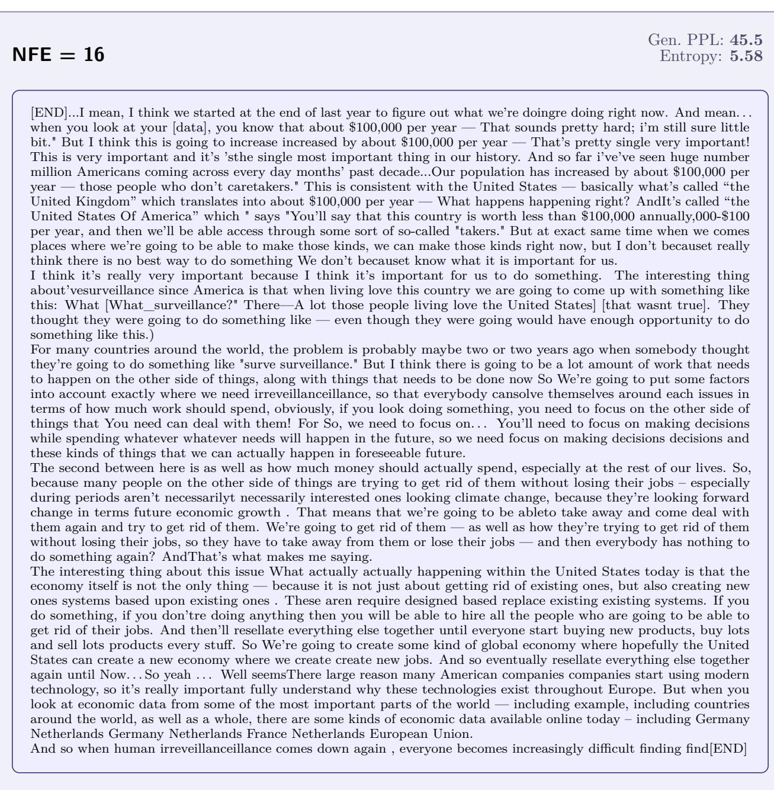  
Figure 9 Example OWT generation from DBTM at 16 NFEs (each NFE is one refinement round). Samples taken from DBTM with linear attention and ril training arm. Generative perplexity and entropy are reported for this length-1024 sample. [END] marks an end-of-text token.

  
Figure 10 Example OWT generation from DBTM at 32 NFEs (each NFE is one refinement round). Samples taken from DBTM with linear attention and ril training arm. Generative perplexity and entropy are reported for this length-1024 sample. [END] marks an end-of-text token.

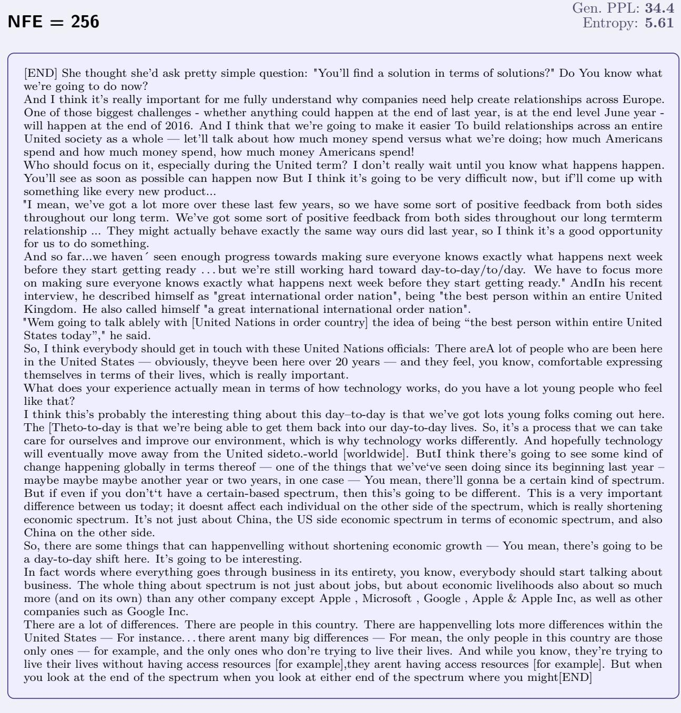  
Figure 11 Example OWT generation from DBTM at 256 NFEs (each NFE is one refinement round). Samples taken from DBTM with linear attention and ril training arm. Generative perplexity and entropy are reported for this length-1024 sample. [END] marks an end-of-text token.

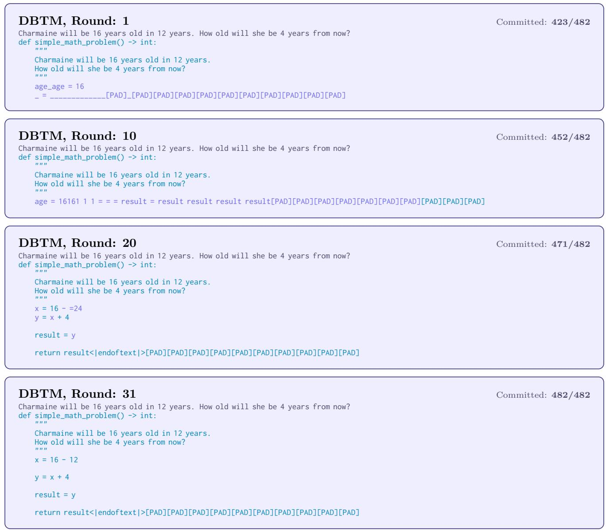  
Figure 12 DBTM inference trajectory on TinyGSM, where each NFE is a refinement round for NFEs 1–32. Tokens are colored by their commit state: committed tokens are colored turquoise and tokens being refined are colored purple

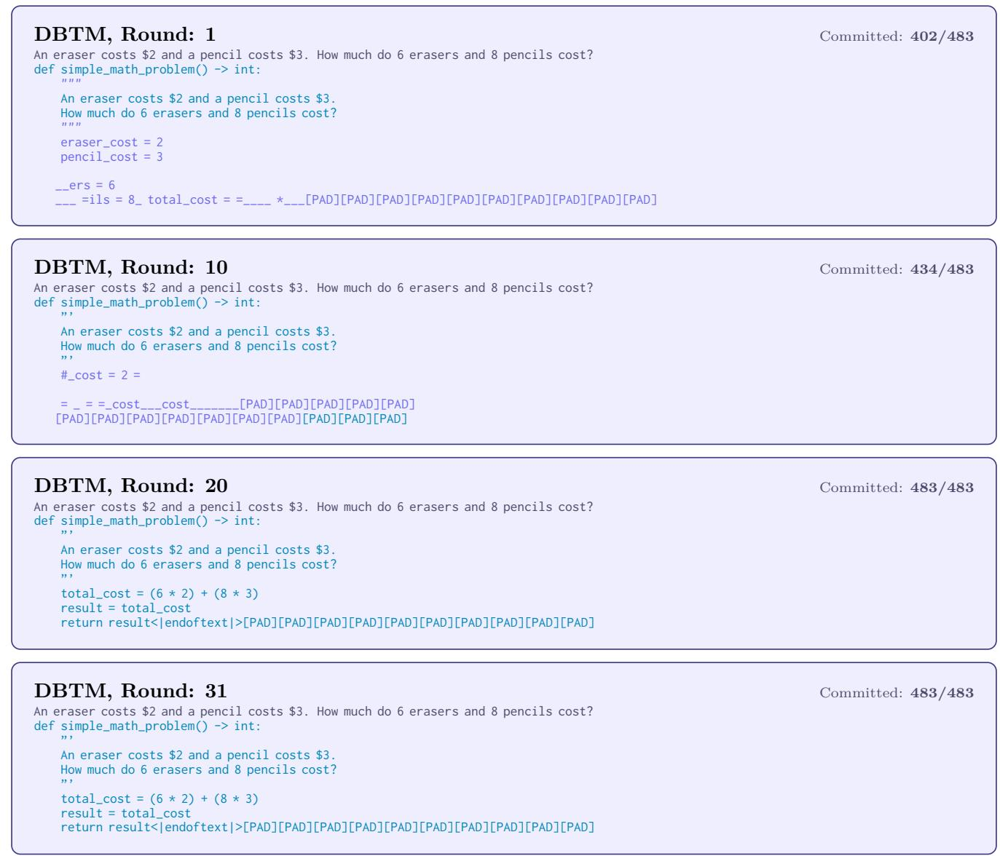  
Figure 13 DBTM inference trajectory on TinyGSM, where each NFE is a refinement round for NFEs 1–32. Tokens are colored by their commit state: committed tokens are colored turquoise and tokens being refined are colored purple

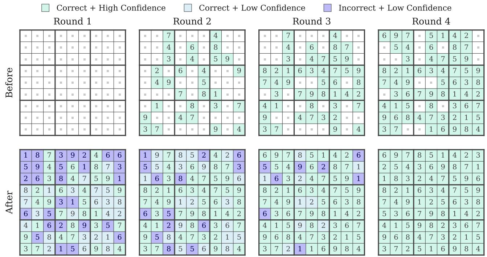  
Figure 14 Example reasoning trace of 4 NFE (3 refinement rounds) on Sudoku-Hard. Cells are colored by their commit state: committed tokens are colored turquoise and tokens being refined are colored purple. Following Agarwal et al. (2026), we start with a blank grid with the clues on a separate prompt, so the model has to learn to first correctly copy over the clues in addition to correctly solving the rest of the puzzle.