# Disentangling Representation Evolution in Transformers through Directional Decomposition

Shwai He1,∗ Haichao Zhang2 Shen Yan3

1University of Maryland, College Park 2Northeastern University 3ByteDance

shwaihe@umd.edu zhang.haich@northeastern.edu sheny@bytedance.com

## Abstract

Transformer layers evolve representations through learned additive transformations that combine parallel scaling and perpendicular steering. Across pretrained models, we find that learned updates consistently contain sub stantial parallel components. To test whether these components are redundant or behaviorally important, we decompose updates in two complementary spaces: residual space, analyzing complete sub-layer updates relative to the incoming hidden state; and attention value space, analyzing pre-output-projection aggregation relative to the token’s own value. Targeted edits reveal a consistent directional and spacedependent asymmetry: perpendicular edits are consistently disruptive, whereas parallel edits are comparatively redundant, especially in value space when preserving the direct self message while scaling cross-token aggregation. The same geometry informs compression and training: better-performing compressed models show lower perpendicular transformation error, and suppressing parallel attention components during from-scratch pretraining improves downstream performance across evaluated model scales, with the value-space variant strongest. Overall, this geometry connects update direction to editing robustness, compres sion diagnostics, and training-time intervention. Code is available in the project repository.

## 1 Introduction

Transformer layers evolve representations through learned additive updates (Vaswani et al., 2017; Elhage et al., 2021) on top of residual streams (He et al., 2016). Geometrically, each update performs two distinct roles relative to the incoming representation: a parallel component that modulates magnitude while preserving direction, and a perpendicular component that redirects it into new semantic subspaces. This dichotomy reframes representation evolution as a problem of functional geometry: decomposing learned updates by their directional role and testing their behavioral sensitivity through targeted interventions.

Across diverse pretrained models, our measurements reveal that learned updates consistently contain substantial components parallel to their incoming states. Geometrically, parallel updates amount to simple scalar rescaling, which the residual stream already provides at zero parameter cost (He et al., 2016; Elhage et al., 2021). Yet, heavily parameterized attention and MLP sub-layers actively allocate capacity to produce such components. This paradox prompts a fundamental question: are these parallel updates behaviorally essential to Transformer capabilities, or are they functionally redundant?

To resolve this question, we formulate directional decomposition across two complementary representation spaces: residual space, which analyzes sub-layer updates relative to the incoming hidden state, and attention value space, which analyzes internal value aggregation relative to the token’s own value representation. Using componentscaling interventions, we systematically modulate the parallel and perpendicular components in these spaces to measure their behavioral sensitivity.

Our interventions reveal a pronounced directional asymmetry across both representation spaces. Perpendicular scaling is consistently disruptive, confirming that orthogonal steering is essential to model capabilities. In contrast, parallel scaling is comparatively benign, leaving performance near baseline across a wide scaling interval. Within this parallel resilience, the degree of stability depends on the representation space: in attention value space, scaling the parallel component of cross-token aggregation keeps model behavior remarkably close to baseline, whereas residual-space parallel scaling is comparatively less stable. Thus, parallel updates exhibit broad resilience compared to perpendicular steering, especially within internal value aggregation.

Finally, this directional geometry extends beyond inference-time editing to post-training compression and from-scratch pretraining. For model compression (Frantar et al., 2023; Lin et al., 2024; Sun et al., 2024; Men et al., 2024; He et al., 2026), decomposing update distortion reveals that betterperforming quantized and pruned models consistently exhibit lower perpendicular error, whereas parallel error is far less discriminative. Motivated by this directional geometry, we evaluate parallel attention suppression during pretraining. Across model scales from 296M to 2.7B parameters, the value-space variant consistently yields lower validation-loss trajectories, and both variants improve downstream performance, with the valuespace variant producing the largest gains.

In summary, the contributions of this work are as follows:

• This work reveals substantial directionpreserving components in learned transformer updates and maps their behavioral robustness across representation spaces.

• For attention updates, value-space decomposition separates direct self-value flow from cross-token aggregation, revealing a marked stability gap between value-space and residual-space edits.

• For compression and pretraining, this directional geometry extends beyond editing: perpendicular error tracks compressed-model quality, while parallel suppression consistently improves validation loss and downstream performance across model scales.

## 2 Related Work

Residual Stream Magnitude Scaling. Residual connections preserve input representations while allowing each block to add a learned transformation (He et al., 2016). In transformers, this creates a residual stream that carries information across layers and serves as the shared workspace for attention and feed-forward updates (Elhage et al., 2021). This preservation path is also a primary target for architectural scaling: mechanisms such as ReZero (Bachlechner et al., 2021), Layer-Scale (Touvron et al., 2021), and deep-transformer normalization schemes (Xiong et al., 2020; Wang et al., 2024) adjust branch scale to stabilize optimization, while residual paths mitigate representational degeneracy such as rank collapse (Dong et al., 2021). These works establish the importance of residual pathways and branch magnitude for training stability. In contrast, we study a complementary directional geometric property of the learned update itself: whether it reinforces the incoming representation direction or steers it into orthogonal semantic subspaces.

Self-Directed Attention Value Flow. Attention explicitly aggregates information across tokens (Vaswani et al., 2017), but attention mass can also concentrate on special or persistent positions, as shown by attention-sink behavior in long-context inference (Xiao et al., 2024). Gated attention variants mitigate such sink behavior by modulating attention outputs (Qiu et al., 2025). However, even when attention sinks are reduced, large diagonal attention weights can still route substantial mass back to the current token itself. Exclusive Self-Attention (XSA) directly addresses this self-directed pathway by modifying value flow aligned with the current token (Zhai, 2026). In this work, we analyze this self-directed pathway from a directional geometric perspective, disentangling direction-preserving updates from direction-changing information.

## 3 Background

## 3.1 Parallel and Perpendicular Decomposition

Given a reference vector $\mathbf { z } \in \mathbb { R } ^ { d }$ and an update vector $\Delta \in \mathbb { R } ^ { d }$ within the same representation space, $\Delta$ admits a unique orthogonal decomposition into components parallel and perpendicular to z:

$$
\Delta _ { \parallel } = { \frac { \Delta \cdot \mathbf { z } } { \| \mathbf { z } \| ^ { 2 } } } \mathbf { z } = \alpha \mathbf { z } , \qquad \alpha = { \frac { \Delta \cdot \mathbf { z } } { \| \mathbf { z } \| ^ { 2 } } } ,\tag{1}
$$

$$
\Delta _ { \perp } = \Delta - \Delta _ { \parallel } , \qquad \Delta _ { \perp } \perp { \bf z } .\tag{2}
$$

The parallel component $\Delta _ { \parallel }$ lies along the reference direction z, scaling its magnitude by α, whereas $\Delta _ { \perp }$ lies in the (d − 1)-dimensional orthogonal subspace, carrying the direction-changing degrees of freedom.

We apply this decomposition across two primary sites: in residual space, $\Delta$ is the sub-layer update added to the incoming state $\mathbf { z } ;$ in attention value space, $\Delta$ is the pre-projection aggregate relative to the token’s own value vector z.

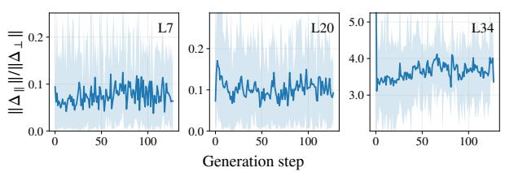  
(a) Qwen3-4B-Instruct-2507

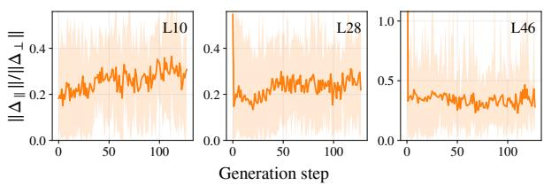  
(b) Qwen3-30B-A3B  
Figure 1: Parallel components persist across depth. For each accumulated attention-plus-MLP update, $\Delta _ { t , \parallel } ^ { l }$ is its projection along the incoming hidden state, whereas $\Delta _ { t , \perp } ^ { l }$ is orthogonal to that state. Curves show the ratio $\| \Delta _ { t , \parallel } ^ { l } \| / \| \Delta _ { t , \perp } ^ { l }$ ∥ at three sampled layers per model across generation steps; lines are means and bands span the observed range. Ratios above one indicate parallel dominance.

## 3.2 Transformer Residual Updates

In a transformer with hidden dimension $d ,$ each residual sub-layer adds an update to the current representation:

$$
\mathbf { z } ^ { l + 1 } = \mathbf { z } ^ { l } + \Delta ^ { l } .\tag{3}
$$

The update $\Delta ^ { l }$ denotes the output of an individual sub-layer (self-attention Attn or MLP) or the net update of the full transformer block. The reference state $\mathbf { z } _ { t } ^ { l }$ is taken as the representation immediately preceding the addition: the sub-layer input for individual modules, or the block input for the accumulated update. We write $\Delta _ { t } ^ { l }$ for the corresponding residual contribution at token position $t \in \{ 1 , \ldots , T \}$

Using the decomposition in Equation 1, the parallel component of a residual update is:

$$
\Delta _ { t , \parallel } ^ { l } = \alpha _ { t } ^ { l } \mathbf { z } _ { t } ^ { l } , \qquad \alpha _ { t } ^ { l } = \frac { \Delta _ { t } ^ { l } \cdot \mathbf { z } _ { t } ^ { l } } { \parallel \mathbf { z } _ { t } ^ { l } \parallel ^ { 2 } } ,\tag{4}
$$

where the scalar $\alpha _ { t } ^ { l }$ measures the magnitude of the parallel update relative to the incoming state $\mathbf { z } _ { t } ^ { l }$ Substituting this decomposition into the residual addition yields

$$
\begin{array} { r } { \mathbf { z } _ { t } ^ { l + 1 } = ( 1 + \alpha _ { t } ^ { l } ) \mathbf { z } _ { t } ^ { l } + \Delta _ { t , \perp } ^ { l } , \qquad \Delta _ { t , \perp } ^ { l } \perp \mathbf { z } _ { t } ^ { l } , } \end{array}\tag{5}
$$

where the parallel component rescales the incoming representation by $( 1 + \alpha _ { t } ^ { l } )$ , while $\Delta _ { t , \perp } ^ { l }$ introduces orthogonal direction-changing information.

Figure 1 reports the relative magnitude $\| \Delta _ { t , \| } ^ { l } \| / \| \Delta _ { t , \perp } ^ { l } \|$ across generation steps at three sampled layers for two Qwen3 models. This ratio quantifies how much of a residual update aligns with the existing representation versus redirects it. The persistence of substantial parallel components across depth motivates investigating when they affect model behavior and in which representation spaces those effects remain robust.

## 4 Directional Interventions

We instantiate directional decomposition across two complementary spaces: the residual stream (Section 4.1) and the attention value space (Section 4.2). We then unify these sites into a shared component-scaling framework (Section 4.3) to systematically manipulate parallel and perpendicular updates. Figure 2 summarizes both intervention sites and their diagonal view.

## 4.1 Residual-Level Decomposition

Set $\Delta = \Delta _ { t } ^ { l }$ (the residual update at layer l, token position t) and $\mathbf { z } = \mathbf { z } _ { t } ^ { l }$ (the pre-update hidden state). For layer and module profiles, we report calibration-corpus averages of the per-token residual parallel ratio:

$$
\begin{array} { r l } & { r _ { t } ^ { l } = r \Big ( \Delta _ { t } ^ { l } , \mathbf { z } _ { t } ^ { l } \Big ) = \frac { \lvert \alpha _ { t } ^ { l } \rvert \lVert \mathbf { z } _ { t } ^ { l } \rVert } { \lVert \Delta _ { t , \perp } ^ { l } \rVert } , } \\ & { \alpha _ { t } ^ { l } = \frac { \Delta _ { t } ^ { l } \cdot \mathbf { z } _ { t } ^ { l } } { \lVert \mathbf { z } _ { t } ^ { l } \rVert ^ { 2 } } . } \end{array}\tag{6}
$$

This residual-level view serves as the shared observable for the rest of the paper. The resulting diagnostic is block-agnostic. We apply it to (i) the Attn sub-layer output, (ii) the MLP sub-layer output, and (iii) their accumulated effect at the transformerblock level.

## 4.2 Value-Space Decomposition

Inside attention, let $\mathbf { x } _ { s } ^ { \mathrm { a t t n } }$ denote the input to the value projection, including the model’s preattention normalization. Each source token s is mapped to a value vector $\mathbf { v } _ { s } ~ = ~ W _ { V } \mathbf { x } _ { s } ^ { \mathrm { a t t n } }$ . For query token t, let $\boldsymbol { A } _ { t s }$ denote a linear attentionmixing operator on the value space. This notation does not assume a particular head structure; standard multi-head attention is the block-diagonal instance whose head blocks carry their corresponding attention weights. The pre-output-projection aggregate is

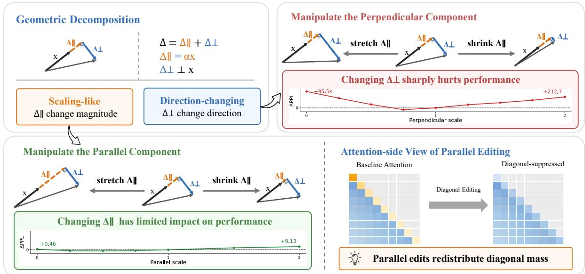  
Figure 2: Geometric decomposition and component scaling. Residual updates and attention value aggregates are decomposed into parallel and perpendicular components and scaled independently; parallel-only scaling can be expressed as an attention-diagonal change. Labels report raw ∆PPL relative to the scale-one no-op (lower is better); curves are rescaled only for display.

$$
\mathbf { o } _ { t } = \sum _ { s \leq t } { \mathcal { A } } _ { t s } \mathbf { v } _ { s } .\tag{7}
$$

Within this space the natural reference is the current token’s own value $\mathbf { v } _ { t } \colon$ the direction $\mathbf { o } _ { t }$ would take if attention routed nothing from other positions.

$$
\mathbf { o } _ { t , \parallel } = \frac { \mathbf { o } _ { t } \cdot \mathbf { v } _ { t } } { \parallel \mathbf { v } _ { t } \parallel ^ { 2 } } \mathbf { v } _ { t } , \qquad \mathbf { o } _ { t , \perp } = \mathbf { o } _ { t } - \mathbf { o } _ { t , \parallel } .\tag{8}
$$

Residual-space geometry does not isolate this selfvalue-aligned structure because the output projection mixes the aggregate into the residual stream.

Direct Self-Message Preservation. In naive value-space decomposition (Equation 8), the query token’s self message $\mathbf { d } _ { t } = \mathcal { A } _ { t t } \mathbf { v } _ { t }$ is colinear with $\mathbf { v } _ { t }$ and absorbed into $\mathbf { o } _ { t , \parallel }$ . Naive parallel removal $( s ^ { ( \parallel ) } = 0 )$ thus extinguishes the token’s identity carrier alongside cross-token features. To isolate contextual magnitude modulation while preserving self-representation, we decouple the aggregate:

$$
\begin{array} { r l r } & { \mathbf { o } _ { t } = \underbrace { \mathcal { A } _ { t t } \mathbf { v } _ { t } } _ { \mathbf { d } _ { t } \left( \mathrm { s e l f } \right) } + \underbrace { \sum _ { s < t } \mathcal { A } _ { t s } \mathbf { v } _ { s } } _ { \mathbf { c } _ { t } \left( \mathrm { n o n - s e l f } \right) } , } & \\ & { \mathbf { c } _ { t , \parallel } = \frac { \mathbf { c } _ { t } \cdot \mathbf { v } _ { t } } { \| \mathbf { v } _ { t } \| ^ { 2 } } \mathbf { v } _ { t } , \quad } & { \mathbf { c } _ { t , \perp } = \mathbf { c } _ { t } - \mathbf { c } _ { t , \parallel } . } \end{array}\tag{9}
$$

We scale only the parallel and perpendicular components of the non-self aggregate and then restore the unchanged self message:

$$
\widetilde { \mathbf { o } } _ { t } ^ { \mathrm { e x c l } } = \mathbf { d } _ { t } + s ^ { ( \parallel ) } \mathbf { c } _ { t , \parallel } + s ^ { ( \perp ) } \mathbf { c } _ { t , \perp } .\tag{10}
$$

We refer to this operation as exclude-self scaling: it neither masks the self-attention edge nor renormalizes the attention row.

Value-space decomposition applies only to attention aggregates. For MLPs, the main analysis decomposes the sub-layer output in residual space; Appendix D separately applies the same projection geometry to the post-gating carrier and grouped down-projected contributions.

## 4.3 Component Scaling and Diagonal Form

For either attention-side site, write $\mathbf { y } _ { t }$ = $\begin{array} { r } { \sum _ { s < t } \mathcal { M } _ { t s } \mathbf { m } _ { s } } \end{array}$ and decompose $\mathbf { y } _ { t }$ relative to its reference $\mathbf { r } _ { t }$ Value-space editing uses $( \mathcal { M } _ { t s } , \mathbf { m } _ { s } , \mathbf { r } _ { t } ) \ = \ ( \mathcal { A } _ { t s } , \mathbf { v } _ { s } , \mathbf { v } _ { t } )$ . Residual-space attention editing uses $\begin{array} { r c l } { { \mathcal { B } } _ { t s } } & { { = } } & { { W _ { O } { \mathcal { A } } _ { t s } } } \end{array}$ and $\begin{array} { c c l } { \left( \mathcal { M } _ { t s } , \mathbf { m } _ { s } , \mathbf { r } _ { t } \right) } & { = } & { \left( \mathcal { B } _ { t s } , \mathbf { v } _ { s } , \mathbf { z } _ { t } ^ { l } \right) } \end{array}$ , keeping headdependent mixing explicit. Component scaling then uses the shared intervention

$$
\widetilde { \mathbf { y } } _ { t } = s ^ { ( \parallel ) } \mathbf { y } _ { t , \parallel } + s ^ { ( \perp ) } \mathbf { y } _ { t , \perp } .\tag{11}
$$

The no-op is $s ^ { ( \parallel ) } = s ^ { ( \perp ) } = 1$ , and parallel removal sets $s ^ { ( \parallel ) } \mathbf { \bar { \Psi } } = 0 , s ^ { ( \perp ) } = 1$ . Exclude-self scaling applies the same form to $\mathbf { c } _ { t }$ and restores $\mathbf { d } _ { t }$ as in Equation 10.

The same edit can also be read on the attention map itself, connecting it to self-directed attention mass (Section 2). Holding all off-diagonal messages fixed, a diagonal update realizes parallel-only scaling when

$$
\Delta \mathbf { y } _ { t t } = \big ( s ^ { ( \parallel ) } - 1 \big ) \mathbf { y } _ { t , \parallel } .\tag{12}
$$

Appendix B gives an operator realization, scalar attention-diagonal forms, removed cases, and the applied-output audit.

## 5 Experimental Setup

Intervention implementation. All inferencetime edits operate strictly during the forward pass and leave model weights untouched. We apply component scaling across decoder layers in two distinct sites: the residual stream and attention value space. In value space, we explicitly evaluate both full-aggregate scaling (decomposing the complete attention aggregate $\mathbf { o } _ { t }$ relative to $\mathbf { v } _ { t } )$ and excludeself scaling (Equation 10). Because the query token’s direct self message $\mathbf { d } _ { t } = A _ { t t } \mathbf { v } _ { t }$ is intrinsically parallel to $\mathbf { v } _ { t } .$ , naive parallel removal on the full aggregate inadvertently suppresses the token’s primary identity carrier along with cross-token updates, causing severe degradation (Section 6.2). Exclude-self scaling preserves $\mathbf { d } _ { t }$ to isolate whether cross-token contextual magnitude modulation is truly redundant. Unless explicitly marked otherwise, value-space evaluations use exclude-self scaling. Appendices A and B provide complete evaluation and implementation details.

Models and benchmarks. We evaluate across dense and mixture-of-experts architectures from the Qwen3 (Qwen Team, 2025), Llama-3 (Llama Team, 2024), and Gemma-3 (Gemma Team, 2025) families. Our benchmarks include language modeling perplexity, seven standard zero-shot commonsense and reasoning tasks, long-context retrieval and reasoning (13-task RULER suite (Hsieh et al., 2024) up to 12k context lengths), and post-training model compression under 4-bit AWQ (Lin et al., 2024) and Wanda pruning (Sun et al., 2024) (unstructured, 4:8, and 2:4).

Pretraining setup. For training-time investigations, we pretrain GPT-style models from scratch on OpenWebText (Gokaslan et al., 2019) across scales from 296M to 2.7B parameters, comparing baseline optimization against residual- and valuespace parallel removal; Appendix E details architectural configurations and training hyperparameters.

## 6 Inference-Time Component Editing

## 6.1 Directional Component Scaling

Probing directional sensitivity. Section 4 formalized the orthogonal decomposition into parallel magnitude modulation and perpendicular semantic steering across residual and value spaces. We first evaluate the functional roles of these components by measuring model sensitivity to continuous inference-time scaling edits. Holding weights frozen, Figure 3 independently varies $s ^ { ( \parallel ) }$ (left, $s ^ { ( \bot ) } = 1 )$ and $s ^ { ( \bot ) }$ (right, $s ^ { ( \parallel ) } = 1 )$ across three intervention sites: value space (exclude-self), residual attention, and residual MLP.

Directional asymmetry: acute perpendicular fragility. Across all three intervention sites, model behavior exhibits an acute directional asymmetry. Perpendicular scaling $( s ^ { ( \perp ) } \neq 1 )$ proves extraordinarily hyper-fragile: even minor deviations from identity immediately destabilize the model with steep perplexity surges, while severe attenuation or complete removal $( s ^ { ( \bot ) } = 0 )$ triggers catastrophic breakdown, escalating by multiple orders of magnitude across all sites (reaching tens of thousands of points in value space and residual attention, and exploding into millions of points in residual MLP). This confirms that orthogonal directions govern delicate, non-interchangeable semantic steering. In stark contrast, parallel scaling $( s ^ { ( \parallel ) } )$ displays a broad, stable tolerance basin, confirming parallel updates regulate representation magnitude rather than categorical semantic trajectories.

Site asymmetry: value space vs. residual branches. Within the parallel axis, the sweeps reveal a pronounced site hierarchy. Value-space manipulation (with the direct self message preserved) stays closest to baseline, remaining virtually flat across $s ^ { ( \parallel ) } \in [ 0 , 1 ]$ (shifting PPL by less than a point, and by at most 1.3 points up to scale 3). In the residual stream, Residual(Attn) is intermediate, whereas Residual(MLP) is most fragile, collapsing rapidly outside the unit interval.

This hierarchy demonstrates that robustness is not an inherent property of “parallelness” in the abstract, but depends decisively on representation space and what is preserved. Residual-space parallel edits modify the accumulated features of the main stream, where parallel updates carry essential cross-layer computation. In contrast, value-space exclude-self editing modulates only cross-token contextual aggregation while leaving the query token’s primary identity carrier $\mathbf { \Psi } ( \mathbf { d } _ { t } = \mathbf { \Psi } A _ { t t } \mathbf { v } _ { t } )$ and perpendicular context intact. A parallel effect appears inside the MLP: decomposing the internal post-gating carrier rather than the final sub-layer output similarly preserves performance under parallel removal (Appendix D).

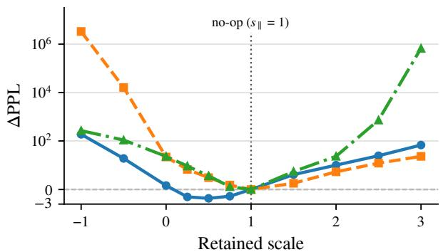  
(a) Parallel-component scaling (s ∥ )

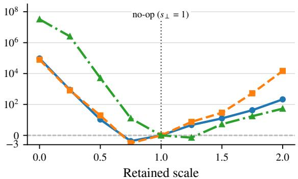  
(b) Perpendicular-component scaling (s⟂ )  
Figure 3: Perplexity under component scaling. The left panel varies $s _ { \parallel }$ with $s _ { \bot } = 1 ;$ the right varies $s _ { \perp }$ with $s _ { \parallel } = 1$ . Evaluated on Qwen3-1.7B (WikiText-2), ∆PPL is edited minus the matched scale-one no-op, so lower is better. All decoder layers are edited; value-space curves use exclude-self scaling.

## 6.2 Cross-Space Representation Editing

Robustness on general tasks. We evaluate downstream zero-shot robustness across seven standard benchmarks on dense (Qwen3-1.7B) and MoE (Qwen3-30B-A3B) models (Table 1), comparing three primary approaches: (1) self-preserving value-space removal (V-Excl.-self), (2) naive fullaggregate value removal (V-Para Rem.), and (3) residual-space and diagonal controls (Attn Para-Rem. and Diag. Rem.).

When parallel removal is applied naively to the entire value aggregate (V-Para Rem.), average performance drops by 8–10 points across both models. This degradation illustrates why isolating selfattention is essential: naive value-space editing suppresses the token’s own identity carrier $A _ { t t } { \mathbf v } _ { t }$ alongside cross-token messages, inadvertently disrupting representation propagation.

In stark contrast, preserving the direct selfmessage while scaling only cross-token aggregation (V-Excl.-self) leaves performance virtually intact across all seven benchmarks—trailing baseline by only 1.5 points on 1.7B and virtually matching it on the 30B-A3B MoE model (within 0.1 points), with slight gains on several individual tasks. Meanwhile, residual-space attention removal (Attn Para-Rem.) incurs steady drops across tasks, and hard diagonal removal (Diag. Rem.) severely degrades the models because forcing $A _ { t t } ~ = ~ 0$ artificially renormalizes attention weights over off-diagonal positions. These comparisons establish that crosstoken parallel updates are functionally redundant, provided direct self-representations are retained.

Context-length scalability. Table 2 reinforces this distinction as context expands (RULER on Llama-3.2-3B from 4k to 12k). Retaining half of the parallel component $( s ^ { ( | | ) } = 0 . 5 )$ with the selfmessage fixed closely tracks the unedited baseline across all sequence lengths (within 0.2 points at 4k and 2.4 points at 12k), consistently outperforming full-aggregate scaling. Under complete removal $( s ^ { ( \parallel ) } = 0 )$ , full-aggregate editing collapses by 26– 40 points, whereas exclude-self retains over 75% accuracy at 4k and maintains substantially higher resilience out to 12k. Table 8 details 13-task breakdowns and multi-model evaluations.

Attention diagonal views for parallel editing. All three attention-side interventions admit closedform expressions as effective diagonal modifications on the attention matrix (Section 4.3). Figure 4 compares the empirical attention map of Qwen3- 4B (layer 19, head 6) under baseline against the residual-space and value-space diagonal views (see Table 5 in the Appendix for complete mathematical derivations).

The residual-space diagonal view induces volatile positive and negative adjustments (spanning −1.00 to 0.76), whereas exclude-self valuespace editing preserves direct self-token routing with bounded, non-positive diagonal shifts. Crucially, this localized stability does not mean valuespace editing is gentler: auditing the post-WO attention output on Qwen3-0.6B reveals that removing parallel context across non-self tokens induces a much larger perturbation norm than residualspace removal (49.10% versus 25.15% of unedited branch norm; Table 6). That value-space editing preserves model capabilities despite altering attention outputs nearly twice as much proves that stability is governed by preserving self-identity routing and residual propagation trajectories, rather than minimizing isotropic perturbation magnitude. Appendix C details head-level localization.

Table 1: Task-level comparison of residual-, value-space, and diagonal controls. Entries are absolute scores (%); higher is better and Avg. is unweighted. Both value-space rows set $s _ { \parallel } = 0$ . V-Para Rem. edits the full value aggregate; V-Excl.-self preserves $A _ { t t } { \mathbf { v } } _ { t }$ . Diag. Rem. zeros $A _ { t t }$ and renormalizes over non-self positions. Attn Para-Rem. and Diag. Rem. use separate matched baselines. Differences reported in the text are computed before rounding. Bold marks the best baseline/value-space result.
<table><tr><td>Model</td><td>Setting</td><td>OBQA</td><td>PIQA</td><td>Wino</td><td>ARC-C</td><td>HSwag</td><td>BoolQ</td><td>RTE</td><td>Avg.</td></tr><tr><td rowspan="5">Qwen3-1.7B</td><td>Baseline</td><td>37.20</td><td>72.47</td><td>60.69</td><td>53.07</td><td>60.16</td><td>77.65</td><td>70.04</td><td>61.61</td></tr><tr><td>Attn Para-Rem.</td><td>38.20</td><td>72.31</td><td>56.59</td><td>50.09</td><td>58.74</td><td>71.38</td><td>66.79</td><td>59.16</td></tr><tr><td>V-Para Rem.</td><td>34.40</td><td>69.48</td><td>54.85</td><td>41.38</td><td>54.04</td><td>66.27</td><td>53.43</td><td>53.41</td></tr><tr><td>V-Excl.-self</td><td>39.20</td><td>71.76</td><td>60.54</td><td>49.15</td><td>59.88</td><td>74.46</td><td>65.70</td><td>60.10</td></tr><tr><td>Diag. Rem.</td><td>26.20</td><td>51.36</td><td>49.17</td><td>24.49</td><td>26.66</td><td>40.70</td><td>55.60</td><td>39.17</td></tr><tr><td rowspan="5">Qwen3-30B-A3B</td><td>Baseline</td><td>44.80</td><td>80.69</td><td>70.24</td><td>69.97</td><td>77.79</td><td>88.53</td><td>81.95</td><td>73.42</td></tr><tr><td>Attn Para-Rem.</td><td>44.00</td><td>78.73</td><td>66.85</td><td>65.10</td><td>73.87</td><td>88.04</td><td>78.34</td><td>70.70</td></tr><tr><td>V-Para Rem.</td><td>41.20</td><td>76.22</td><td>64.56</td><td>59.04</td><td>69.57</td><td>70.89</td><td>62.45</td><td>63.42</td></tr><tr><td>V-Excl.-self</td><td>44.60</td><td>79.87</td><td>72.45</td><td>68.34</td><td>78.13</td><td>86.36</td><td>83.39</td><td>73.31</td></tr><tr><td>Diag. Rem.</td><td>30.60</td><td>57.67</td><td>48.46</td><td>26.96</td><td>34.78</td><td>38.59</td><td>47.65</td><td>40.68</td></tr></table>

Table 2: Long-context performance across sequence lengths. Reported scores are mean accuracy (%) across all 13 RULER tasks on Llama-3.2-3B for context lengths from 4k to 12k tokens. V-Full scales the entire value aggregate; V-Excl.-self preserves direct self messages d and scales only cross-token context.
<table><tr><td>Method</td><td>s∥</td><td>4k</td><td>8k</td><td>12k</td></tr><tr><td>Baseline</td><td>1.0</td><td>86.91</td><td>82.09</td><td>79.30</td></tr><tr><td>V-Full</td><td>0.5</td><td>84.81</td><td>78.80</td><td>74.76</td></tr><tr><td>V-Excl.-self</td><td>0.5</td><td>86.69</td><td>80.80</td><td>76.88</td></tr><tr><td>V-Full</td><td>0.0</td><td>60.99</td><td>48.61</td><td>39.17</td></tr><tr><td> $\mathrm { V - E x c l . - s e l f }$ </td><td>0.0</td><td>75.64</td><td>67.97</td><td>62.02</td></tr></table>

## 6.3 Compression Diagnostics

The removal experiments establish that model capabilities are exceptionally sensitive to directionchanging components of activation updates. We next ask how this geometric principle manifests under post-training compression. Compression alters model parameters, inducing an error between uncompressed and compressed updates rather than an explicit activation edit. Decomposing this error into parallel and perpendicular components provides a principled test: if orthogonal steering is the behaviorally critical component, superior compression algorithms should systematically exhibit lower perpendicular distortion, whereas parallel error should be far less diagnostic.

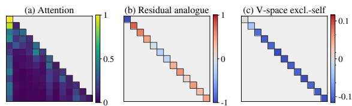  
Figure 4: Attention diagonal views of parallel editing. For full parallel removal $( s _ { \parallel } = 0 )$ , the left panel shows empirical attention weights (Qwen3-4B, layer 19, head 6); the middle shows the residual-space attention-map view, and the right shows the exclude-self value-space change. The latter two color scales encode $\Delta A _ { t t } ;$ offdiagonal entries are unchanged.

Concretely, at each layer, let $\Delta _ { \mathrm { b a s e } }$ denote the uncompressed baseline update and $\Delta _ { \mathrm { c o m p } }$ denote the compressed update. The local compression error is $e = \Delta _ { \mathrm { c o m p } } - \Delta _ { \mathrm { b a s e } }$ . We decompose e relative to the baseline update direction: $e _ { \parallel } = \mathrm { p r o j } _ { \Delta _ { \mathrm { b a s e } } } ^ { } ($ e and $e _ { \perp } = e - e _ { \parallel }$ . Figure 6 reports the normalized component norms $\| e _ { \perp } \| / \| \Delta _ { \mathrm { b a s e } } \|$ and $\| e _ { \parallel } \| / \| \Delta _ { \mathrm { b a s e } } \|$ across layers of Qwen3-4B under 4-bit AWQ and 50% Wanda pruning (unstructured, 4:8, and 2:4).

The results strongly corroborate this directional hypothesis: perpendicular error curves cleanly separate the four compression regimes in strict alignment with their downstream fidelity (4-bit AWQ achieves the lowest error, followed by unstructured, 4:8, and 2:4 Wanda). In contrast, parallel error curves heavily interleave and fail to provide a consistent ranking. This clarifies why conventional isotropic $L _ { 2 }$ error can fail to predict degradation: isotropic distance conflates benign magnitude shifts with disruptive semantic rotations. Appendix F substantiates this mechanism across the MLP branch and full block updates, showing that perpendicular distortion dominates total compression error $( r > 0 . 9 7$ , Table 11) and connecting this geometry to cosine-based pruning diagnostics.

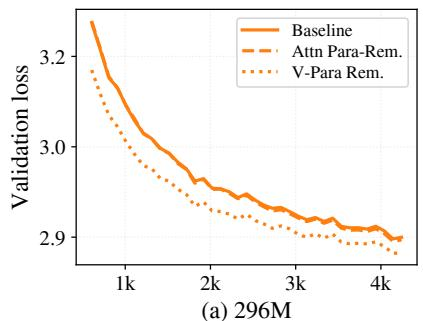

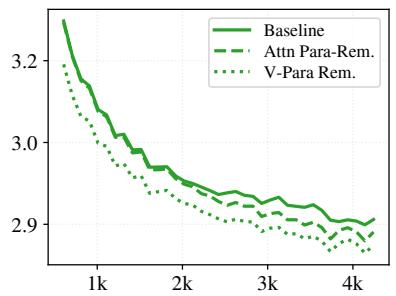  
(b) 436M

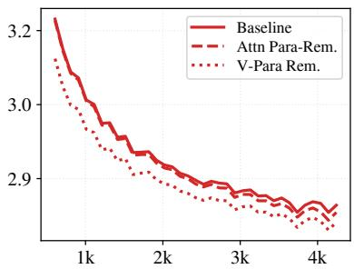  
(c) 528M

Figure 5: Training-time parallel removal lowers validation loss. The displayed OpenWebText (Gokaslan et al., 2019) loss trajectories show baseline, Attn Para-Rem., and V-Para Rem. for matched configurations across 296M, 436M, and 528M model sizes. Both interventions set $s ^ { ( \parallel ) } = 0$ and retain the perpendicular component.  
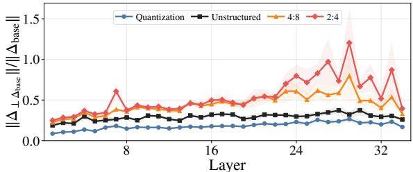

(a) Perpendicular attention-output error.  
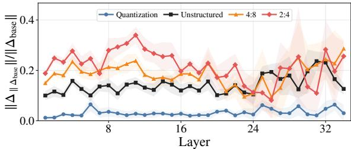  
(b) Parallel attention-output error.  
Figure 6: Directional decomposition of compression error. Curves are layerwise means, with bands showing one standard deviation over 12 fixed prompts, comparing compressed and baseline Qwen3-4B attention updates. The upper and lower panels show perpendicular and parallel error, each normalized by the full baselineupdate norm (higher is more distortion). Settings are 4-bit AWQ and 50% Wanda pruning with unstructured, 4:8, or 2:4 masks.

## 7 Training-Time Allocation

In standard Transformer pretraining, attention updates conflate colinear magnitude rescaling with orthogonal contextual steering. We investigate whether suppressing parallel attention updates throughout training shifts how optimization allocates representational capacity across directionchanging components. We train GPT-style language models from scratch on standard next-token prediction, enforcing parallel removal during both optimization and evaluation to eliminate train– evaluation mismatch. We evaluate these interventions through validation trajectories and downstream benchmarks; Appendix E gives model configurations and gated-scaling controls.

Figure 5 plots OpenWebText (Gokaslan et al., 2019) validation loss trajectories across model sizes (296M, 436M, and 528M). Suppressing parallel attention updates shifts the learning trajectory downward from early training stages, and this advantage persists consistently through the final checkpoint rather than emerging only as an endpoint artifact.

Table 3 reports downstream zero-shot accuracy across six standard benchmarks for the scaled 1.4B and 2.7B models. Both interventions improve downstream performance over the baseline at both scales, with value-space parallel removal achieving the largest gains (+0.7 points on 1.4B and +1.5 points on 2.7B). Together with training trajectories, these findings demonstrate that directional decomposition provides an effective inductive bias: suppressing parallel updates directs attention capacity toward orthogonal contextual steering, improving downstream generalization.

Appendix E details task-level scores for both larger models and the gated-scaling control, where fixed removal maintains the lowest training loss.

Table 3: Downstream generalization across model scales. Unweighted mean accuracy over six benchmarks (ARC-Easy, BoolQ, HellaSwag, OpenBookQA, PIQA, WinoGrande); ∆Avg is relative to matched baseline.
<table><tr><td>Model</td><td>Setting</td><td>Avg</td><td>∆Avg</td></tr><tr><td rowspan="2">1.4B</td><td>Baseline Attn Para-Rem.</td><td>58.5</td><td>0.0</td></tr><tr><td>V-Para Rem.</td><td>58.8 59.2</td><td>+0.3 +0.7</td></tr><tr><td rowspan="2">2.7B</td><td>Baseline</td><td>60.2</td><td>0.0</td></tr><tr><td>Attn Para-Rem.</td><td>60.9</td><td>+0.7</td></tr><tr><td></td><td>V-Para Rem.</td><td>61.7</td><td>+1.5</td></tr></table>

## 8 Discussion

Geometric Duality of Representation Evolution. Our decomposition reveals that Transformer layer updates execute two distinct geometric functions: magnitude modulation $( \Delta _ { \parallel } )$ and semantic steering $( \Delta _ { \perp } )$ . Perpendicular updates rotate representations into orthogonal subspaces housing factual and syntactic distinctions; because these coordinates are finely calibrated, $\Delta _ { \perp }$ is acutely fragile. Conversely, parallel updates act as adaptive gain controllers, amplifying existing trajectories without altering directional meaning. The extensive tolerance basin of $\Delta _ { \parallel }$ confirms that Transformers possess inherent resilience to magnitude variations, preserving semantic intent despite substantial scale disruption.

Beyond Isotropic Compression Error. Quantization and pruning minimize isotropic $L _ { 2 }$ error min $\lVert \Delta - \widehat { \Delta } \rVert _ { 2 } ^ { 2 }$ , assuming uniform sensitivity across $\mathbb { R } ^ { d } .$ . Our directional framework exposes this flaw: update-aligned errors $( \Delta _ { \parallel } ^ { \mathrm { e r r } } )$ fall within the benign tolerance basin, whereas orthogonal deviations $( \Delta _ { \perp } ^ { \mathrm { e r r } } )$ directly distort semantic trajectories. This explains why compression methods with comparable global $L _ { 2 }$ error diverge in downstream fidelity. Measuring directional distortion establishes $\Delta _ { \perp } ^ { \mathrm { e r r } }$ as a causal predictor of degradation, showing compression objectives should penalize directional rotation over uniform distance.

Architectural Implications and Pretraining Dynamics. In standard self-attention, token mixing is structurally entangled with self-representation amplification, allocating parameter capacity to redundant parallel scaling. Suppressing parallel updates relieves attention from these duties, guiding optimization to dedicate capacity toward directional contextual steering. This inductive bias accelerates convergence, lowering validation-loss trajectories and improving downstream generalization across evaluated model scales. These findings provide principled geometric support for emerging architectures that decouple contextual routing from magnitude modulation (such as gated attention and query-key normalization).

## 9 Conclusion

We formalize representation evolution in Transformers through orthogonal decomposition, separating updates into parallel magnitude modulation $( \Delta _ { \parallel } )$ and perpendicular semantic steering $( \Delta _ { \perp } )$ Across diverse pretrained language models, interventions reveal a universal directional asymmetry: representations tolerate substantial colinear scaling along their trajectory, yet exhibit acute fragility under perpendicular perturbations. Furthermore, this stability is strongly site-dependent: value-space aggregation proves markedly more robust than residual-space edits by preserving direct token routing.

This geometric perspective resolves key challenges across the model lifecycle. In compression, directional error decomposition clarifies why isotropic $L _ { 2 }$ distance often fails to predict behavioral loss: perpendicular distortion causally drives degradation, whereas parallel shifts are largely benign. In pretraining, suppressing parallel attention updates acts as an effective inductive bias, directing capacity toward orthogonal contextual routing. Across evaluated model scales, this constraint lowers validation loss and improves downstream performance. By connecting directional geometry to representation dynamics, our findings offer the NLP community a principled framework to move beyond isotropic Euclidean heuristics in model diagnosis, compression, and architecture design.

## Limitations

Our experiments cover decoder-only language models across multiple scales, language tasks, inference-time interventions, compression settings, and from-scratch training configurations. Although the same geometric picture is consistent across the evaluated settings, its behavior under other architectures and training regimes remains to be established. Future work should test whether these directional patterns persist across such settings and connect layer-level geometry more directly to downstream behavior. We use the proposed edits primarily as analysis tools; turning them into practical training or inference methods requires further validation.

## References

Thomas C. Bachlechner, Bodhisattwa Prasad Majumder, Huanru Henry Mao, G. Cottrell, and Julian McAuley. 2021. ReZero is all you need: Fast convergence at large depth. In Conference on Uncertainty in Artificial Intelligence.

Peter Clark, Isaac Cowhey, Oren Etzioni, Tushar Khot, Ashish Sabharwal, Carissa Schoenick, and Oyvind Tafjord. 2018. Think you have solved question answering? try arc, the ai2 reasoning challenge. ArXiv, abs/1803.05457.

Karl Cobbe, Vineet Kosaraju, Mo Bavarian, Mark Chen, Heewoo Jun, Lukasz Kaiser, Matthias Plappert, Jerry Tworek, Jacob Hilton, Reiichiro Nakano, Christopher Hesse, and John Schulman. 2021. Training verifiers to solve math word problems. ArXiv, abs/2110.14168.

Tri Dao. 2024. FlashAttention-2: Faster attention with better parallelism and work partitioning. In ICLR.

Yihe Dong, Jean-Baptiste Cordonnier, and Andreas Loukas. 2021. Attention is not all you need: Pure attention loses rank doubly exponentially with depth. In ICML.

Dheeru Dua, Yizhong Wang, Pradeep Dasigi, Gabriel Stanovsky, Sameer Singh, and Matt Gardner. 2019. DROP: A reading comprehension benchmark requiring discrete reasoning over paragraphs. In Proceedings ofthe 2019 Conference ofthe North American Chapter of the Association for Computational Linguistics: Human Language Technologies, Volume 1 (Long and Short Papers), pages 2368–2378, Minneapolis, Minnesota. Association for Computational Linguistics.

Nelson Elhage, Neel Nanda, Catherine Olsson, Tom Henighan, Nicholas Joseph, Ben Mann, Amanda Askell, Yuntao Bai, Anna Chen, Tom Conerly, Nova DasSarma, Dawn Drain, Deep Ganguli, Zac Hatfield-Dodds, Danny Hernandez, Andy Jones, Jackson Kernion, Liane Lovitt, Kamal Ndousse, and 6 others. 2021. A mathematical framework for transformer circuits. Transformer Circuits Thread.

Elias Frantar, Saleh Ashkboos, Torsten Hoefler, and Dan Alistarh. 2023. GPTQ: Accurate post-training quantization for generative pre-trained transformers. In International Conference on Learning Representations.

Leo Gao, Jonathan Tow, Baber Abbasi, Stella Biderman, Sid Black, Anthony DiPofi, Charles Foster, Laurence Golding, Jeffrey Hsu, Alain Le Noac’h, Haonan Li, Kyle McDonell, Niklas Muennighoff, Chris Ociepa, Jason Phang, Laria Reynolds, Hailey Schoelkopf, Aviya Skowron, Lintang Sutawika, and 5 others. 2024. The language model evaluation harness.

Gemma Team. 2025. Gemma 3 technical report. Preprint, arXiv:2503.19786.

Aaron Gokaslan, Vanya Cohen, Ellie Pavlick, and Stefanie Tellex. 2019. Openwebtext corpus. http://Skylion007.github.io/ OpenWebTextCorpus.

Kaiming He, Xiangyu Zhang, Shaoqing Ren, and Jian Sun. 2016. Deep residual learning for image recognition. In CVPR.

Shwai He, Guoheng Sun, Zheyu Shen, and Ang Li. 2026. Uncovering the redundancy in transformers via a unified study of layer dropping. Transactions on Machine Learning Research.

Dan Hendrycks, Collin Burns, Steven Basart, Andy Zou, Mantas Mazeika, Dawn Xiaodong Song, and Jacob Steinhardt. 2021. Measuring massive multitask language understanding. In International Conference on Learning Representations.

Cheng-Ping Hsieh, Simeng Sun, Samuel Kriman, Shantanu Acharya, Dima Rekesh, Fei Jia, and Boris Ginsburg. 2024. RULER: What’s the real context size of your long-context language models? ArXiv, abs/2404.06654.

Ji Lin, Jiaming Tang, Haotian Tang, Shang Yang, Wei-Ming Chen, Wei-Chen Wang, Guangxuan Xiao, Xingyu Dang, Chuang Gan, and Song Han. 2024. AWQ: Activation-aware weight quantization for ondevice LLM compression and acceleration. In Proceedings ofMachine Learning and Systems.

Stephanie Lin, Jacob Hilton, and Owain Evans. 2022. TruthfulQA: Measuring how models mimic human falsehoods. In Proceedings ofthe 60th Annual Meeting ofthe Associationfor Computational Linguistics (Volume 1: Long Papers), pages 3214–3252, Dublin, Ireland. Association for Computational Linguistics.

Llama Team. 2024. The llama 3 herd of models. arXiv preprint arXiv:2407.21783.

Xin Men, Mingyu Xu, Qingyu Zhang, Bingning Wang, Hongyu Lin, Yaojie Lu, Xianpei Han, and Weipeng Chen. 2024. ShortGPT: Layers in large language models are more redundant than you expect. arXiv:2403.03853.

Guilherme Penedo, Hynek Kydlícek, Loubna Ben al-ˇ lal, Anton Lozhkov, Margaret Mitchell, Colin Raffel, Leandro Von Werra, and Thomas Wolf. 2024. The fineweb datasets: Decanting the web for the finest text data at scale. In The Thirty-eight Conference on Neural Information Processing Systems Datasets and Benchmarks Track.

Zihan Qiu, Zekun Wang, Bo Zheng, Zeyu Huang, Kaiyue Wen, Songlin Yang, Rui Men, Le Yu, Fei Huang, Suozhi Huang, Dayiheng Liu, Jingren Zhou, and Junyang Lin. 2025. Gated attention for large language models: Non-linearity, sparsity, and attentionsink-free. Preprint, arXiv:2505.06708.

Qwen Team. 2025. Qwen3 technical report. arXiv preprint arXiv:2505.09388.

Siva Reddy, Danqi Chen, and Christopher D. Manning. 2019. CoQA: A conversational question answering challenge. Transactions ofthe Associationfor Computational Linguistics, 7:249–266.

Mingjie Sun, Zhuang Liu, Anna Bair, and J. Zico Kolter. 2024. A simple and effective pruning approach for large language models. In International Conference on Learning Representations.

Hugo Touvron, Matthieu Cord, Alexandre Sablayrolles, Gabriel Synnaeve, and Hervé Jégou. 2021. Going deeper with image transformers. In ICCV.

Ashish Vaswani, Noam Shazeer, Niki Parmar, Jakob Uszkoreit, Llion Jones, Aidan N. Gomez, Łukasz Kaiser, and Illia Polosukhin. 2017. Attention is all you need. In NeurIPS.

Alex Wang, Amanpreet Singh, Julian Michael, Felix Hill, Omer Levy, and Samuel R. Bowman. 2018. GLUE: A multi-task benchmark and analysis platform for natural language understanding. In BlackboxNLP@EMNLP.

Hongyu Wang, Shuming Ma, Li Dong, Shaohan Huang, Dongdong Zhang, and Furu Wei. 2024. DeepNet: Scaling transformers to 1,000 layers. IEEE Transactions on Pattern Analysis and Machine Intelligence, 46(10):6761–6774.

Guangxuan Xiao, Yuandong Tian, Beidi Chen, Song Han, and Mike Lewis. 2024. Efficient streaming language models with attention sinks. In ICLR.

Ruibin Xiong, Yunchang Yang, Di He, Kai Zheng, Shuxin Zheng, Huishuai Zhang, Yanyan Lan, Liwei Wang, and Tie-Yan Liu. 2020. On layer normalization in the transformer architecture. In International Conference on Machine Learning.

Rowan Zellers, Ari Holtzman, Yonatan Bisk, Ali Farhadi, and Yejin Choi. 2019. HellaSwag: Can a machine really finish your sentence? In Annual Meeting of the Association for Computational Linguistics.

Shuangfei Zhai. 2026. Exclusive self attention. Preprint, arXiv:2603.09078.

## A Evaluation Details

Evaluated models. The editing and diagnostic experiments use Qwen3 (Qwen Team, 2025) base checkpoints, except Figure 1, which uses Qwen3- 4B-Instruct-2507. Long-context evaluation uses Llama-3.2-3B (Llama Team, 2024).

Benchmark evaluation. Tasks are evaluated via Language Model Evaluation Harness (Gao et al., 2024) and RULER (Hsieh et al., 2024), following standard configurations (Wang et al., 2018; Hendrycks et al., 2021; Cobbe et al., 2021; Reddy et al., 2019; Dua et al., 2019; Lin et al., 2022; Clark et al., 2018; Zellers et al., 2019). Table 4 gives the default few-shot setting and metric for each task.

Table 4: Default evaluation task settings. Acc. denotes accuracy; Norm denotes length normalization.
<table><tr><td>Task</td><td></td><td>Shots Metric</td><td>Task</td><td>Shots Metric</td><td></td></tr><tr><td>ARC-Chal.</td><td>25</td><td>Acc. (Norm)</td><td>MMLU</td><td>5</td><td>Acc.</td></tr><tr><td>ARC-Easy</td><td>0</td><td>Acc. (Norm)</td><td>OpenBookQA</td><td>0</td><td>Acc. (Norm)</td></tr><tr><td>BoolQ</td><td>0</td><td>Acc.</td><td>PIQA</td><td>0</td><td>Acc. (Norm)</td></tr><tr><td>CoQA</td><td>0</td><td>F1</td><td>RTE</td><td>0</td><td>Acc.</td></tr><tr><td>DROP</td><td>0</td><td>F1</td><td>TruthfulQA-MC</td><td>0</td><td>Acc.</td></tr><tr><td>GSM8K</td><td>5</td><td>Exact match</td><td>TruthfulQA gen.</td><td>0</td><td>Rouge-L</td></tr><tr><td>HellaSwag</td><td>10</td><td>Acc. (Norm)</td><td>WinoGrande</td><td>5</td><td>Acc.</td></tr></table>

## B Intervention Details

Attention-diagonal editing. Equation 12 defines the requested change in the parallel component. Let m be the self message, r the reference, and $B _ { t t }$ its linear map into the edited space. One minimum-Frobenius-norm realization of $\Delta \mathbf { y } _ { t t } = \Delta B _ { t t } \mathbf { m } _ { t }$ is $\begin{array} { r } { \Delta B _ { t t } ^ { \star } = \left( s ^ { ( \parallel ) } - 1 \right) \frac { \mathbf { y } _ { t } ^ { \top } \mathbf { r } _ { t } } { \parallel \mathbf { m } _ { t } \parallel ^ { 2 } \parallel \mathbf { r } _ { t } \parallel ^ { 2 } } \mathbf { r } _ { t } \mathbf { m } _ { t } ^ { \top } } \end{array}$ . Projecting onto the admissible operator subspace yields the scalar forms in Table 5. For our primary excludeself value-space edit, Eq. 10 applies projection to $\textstyle \sum _ { s < t } A _ { t s } \mathbf { v } _ { s }$ , restoring direct $A _ { t t } { \mathbf { v } } _ { t } ;$ ; isolating selfinteraction from contextual mixing suppresses redundant cross-token parallel drift while preserving the diagonal identity carrier, ensuring downstream stability.

Applied strength of the two edits. Section 6.2 and Table 5 show that exclude-self value-space editing preserves the self contribution $A _ { t t } \mathbf { v } _ { t }$ , inducing bounded non-positive shifts along the attention diagonal, whereas residual-space removal forces volatile signed swings $( - 1 . 0 0 \mathrm { t o } + 0 . 7 6 )$ . However, diagonal stability does not imply a gentler intervention. Table 6 audits both Full No-Para interventions at the post-WO output, comparing edited $\widetilde { \mathbf { y } } _ { t }$ against baseline $\mathbf { y } _ { t }$ . The exclude-self value-space edit induces a substantially larger perturbation on every metric: 49.10% norm change and 25.89% energy removal, versus 25.15% and 9.32% for residualspace removal. This divergence reveals a geometric asymmetry: residual-space removal prunes only the 1D projection along incoming $\mathbf { z } _ { t } .$ which is a smaller fraction of branch norm yet fatally disrupts inter-layer residual propagation. Conversely, valuespace editing zeros parallel components across the non-self aggregate $\textstyle \sum _ { s < t } A _ { t s } \mathbf { v } _ { s }$ , discarding significant contextual energy while preserving the primary diagonal identity channel. Preserving capabilities despite perturbing outputs nearly twice as heavily shows that stability depends on structural alignment rather than isotropic magnitude.

Table 5: Attention-diagonal forms for component scaling. Value-space form is exact; residual form matches scalar constraint; “removed case” sets $s ^ { ( \parallel ) } = 0$ while retaining perpendicular component.
<table><tr><td>Quantity Form</td></tr><tr><td>Full-aggregate value space</td></tr><tr><td> $\begin{array} { r } { \Delta A _ { t t } = ( s ^ { ( \parallel ) } - 1 ) \frac { { \bf o } _ { t } ^ { \top } { \bf v } _ { t } } { \parallel { \bf v } _ { t } \parallel ^ { 2 } } . } \end{array}$  Diagonal change</td></tr><tr><td>Removed case  $\begin{array} { r } { \widetilde { A } _ { t t } = - \sum _ { s < t } A _ { t s } \frac { \mathbf { v } _ { s } ^ { \mathrm { ~ l ~ } } \mathbf { v } _ { t } } { \left\| \mathbf { v } _ { t } \right\| ^ { 2 } } } \end{array}$ </td></tr><tr><td>Residual space</td></tr><tr><td> $\begin{array} { r } { \Delta A _ { t t } = ( s ^ { ( \parallel ) } - 1 ) \frac { ( \Delta _ { t } ^ { \mathrm { A t t n } } ) ^ { \top } \mathbf z _ { t } } { ( W _ { O } \mathbf v _ { t } ) ^ { \top } \mathbf z _ { t } } . } \end{array}$ </td></tr><tr><td>Diagonal change Removed case  $\begin{array} { r } { \widetilde { A } _ { t t } = A _ { t t } - \sum _ { s \leq t } A _ { t s } \frac { ( W _ { O } \check { \mathbf { v } _ { s } } ) ^ { \top } \mathbf { z } _ { t } } { ( W _ { O } \mathbf { v } _ { t } ) ^ { \top } \mathbf { z } _ { t } } . } \end{array}$ </td></tr></table>

Table 6: Applied strength of attention Full No-Para interventions. Full No-Para sets $s _ { \parallel } = 0$ on Qwen3- 0.6B. Perturbation norm is $\| \widetilde { \mathbf { y } } - \mathbf { y } \| / \| \mathbf { y } \|$ , retained norm is $\| \widetilde { \mathbf { y } } \| / \| \mathbf { y } \|$ , and perturbation energy is $\| \widetilde { \mathbf { y } } - \mathbf { y } \| ^ { 2 } / \| \mathbf { y } \| ^ { 2 }$ relative to baseline y.
<table><tr><td>Geometry</td><td></td><td>Perturb. norm Perturb. energy</td><td>Retained norm</td></tr><tr><td>Attention residual-space</td><td>25.15%</td><td>9.323%</td><td>95.01%</td></tr><tr><td>Attention exclude-self value-space</td><td>49.10%</td><td>25.89%</td><td>83.36%</td></tr></table>

Computational cost. We apply Eq. 11 via forward hooks replacing only the target tensor. A fused FlashAttention-2 (Dao, 2024) kernel combines projections and attention. As Table 7 reports, overhead is negligible (< 2.5% in prefill, < 1.0% in decoding, 3.39% in pretraining), confirming that directional decomposition is practically deployable without custom accelerator hardware.

Table 7: Measured $\mathbf { p r e } { } { } { = } W _ { O }$ projection overhead. Wall-clock overhead relative to unedited baselines on an RTX 6000 Ada (BF16; 2,048 prefill, 512-token decode with CUDA Graph replay; 0.7B training with batch 1, length 2,048).
<table><tr><td>Workload</td><td>Qwen3-0.6B</td><td>Qwen3-4B</td><td>Qwen3-14B</td></tr><tr><td>Prefill</td><td>2.47%</td><td>1.25%</td><td>1.11%</td></tr><tr><td>Static graph decode</td><td>0.83%</td><td>0.36%</td><td>0.25%</td></tr><tr><td>Training (0.7B)</td><td></td><td>3.39%</td><td></td></tr></table>

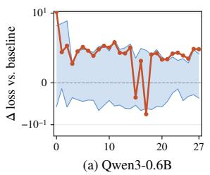

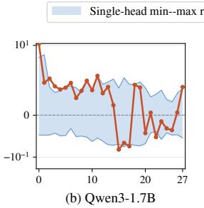

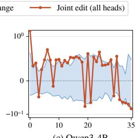  
(c) Qwen3-4B

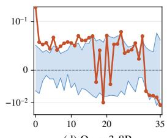  
(d) Qwen3-8B  
Figure 7: All-layer head sensitivity across Qwen3 scales. At each layer, orange shows joint full removal from all heads; the blue band spans minimum and maximum isolated single-head effects (not a confidence interval). ∆ loss is edited minus baseline over 128 fixed C4 texts (positive is worse, symmetric-log axes).

## C Additional Editing Results

Zero-shot parallel editing. To test whether value-space parallel tolerance is an artifact of Qwen3 or short contexts, Table 8 evaluates retainedscale editing $( s _ { \parallel } = 0 . 5 )$ under long-context retrieval on RULER-4k across three distinct model families. Across Gemma-3-12B, Llama-3.2-3B, and Qwen3-4B/8B, scores remain within 0.5 points of matched unedited baselines, confirming that value-space parallel tolerance generalizes across model families and long-context regimes.

Table 8: Cross-model retained-scale RULER-4k evaluation. V-Excl.-self preserves direct self contribution and sets $s _ { \parallel } = 0 . 5$ for the non-self aggregate; ∆ is edited minus baseline (computed before rounding).
<table><tr><td>Model</td><td>Baseline</td><td>V-Excl.-self,  $s _ { \parallel } { = } 0 . 5$ </td><td> $\Delta$ </td></tr><tr><td>Gemma-3-1B-IT</td><td>68.0</td><td>62.8</td><td>-5.3</td></tr><tr><td>Gemma-3-12B-IT</td><td>94.0</td><td>94.1</td><td>+0.1</td></tr><tr><td>Llama-3.2-3B</td><td>86.9</td><td>86.7</td><td>-0.2</td></tr><tr><td>Qwen3-0.6B</td><td>79.8</td><td>75.1</td><td>-4.8</td></tr><tr><td>Qwen3-1.7B</td><td>88.1</td><td>84.9</td><td>-3.2</td></tr><tr><td>Qwen3-4B</td><td>92.6</td><td>92.4</td><td>-0.2</td></tr><tr><td>Qwen3-8B</td><td>94.2</td><td>93.7</td><td>-0.5</td></tr></table>

Head-level localization. Our primary interventions suppress parallel components across all attention heads jointly. To determine how head-level sensitivity aggregates, we compare single-head parallel removal against joint all-head removal across four Qwen3 scales (Figure 7). This reveals two core properties: (1) Bidirectional single-head sensitivity: individual head edits produce substantial signed loss shifts (blue envelopes span both degradation and gains), showing distinct, non-negligible directional pulls across heads; (2) Sub-additive joint cancellation: joint all-head removal (orange curve) does not compound super-linearly, but remains bounded within the single-head min–max envelope and well below the sum of absolute perturbations $\begin{array} { r } { ( \Delta _ { \mathrm { j o i n t } } < \sum _ { h } | \Delta _ { h } | ) } \end{array}$ . Opposing head shifts thus mutually cancel in aggregate. Only layer 0 exhibits a sharp joint spike, showing initial heads collectively anchor early parallel coordinates.

Table 9: Downstream controls for MLP-internal geometry. Core-MC (9 tasks); MMLU (5-shot); GSM8K-S/F (strict match vs. flexible match exact match); TQA (Rouge-L); DROP/CoQA (F1).

(a) Multiple-choice controls
<table><tr><td>Model</td><td>Setting</td><td>Core-MC</td><td>MMLU</td></tr><tr><td rowspan="3">Qwen3-0.6B</td><td>Baseline</td><td>50.94</td><td>52.40</td></tr><tr><td>Full No-Para</td><td>50.98</td><td>52.66</td></tr><tr><td>Full No-Perp</td><td>36.62</td><td>26.89</td></tr><tr><td rowspan="3">Qwen3-1.7B</td><td>Baseline</td><td>55.19</td><td>60.21</td></tr><tr><td>Full No-Para</td><td>55.28</td><td>60.39</td></tr><tr><td>Full No-Perp</td><td>37.35</td><td>24.40</td></tr></table>

(b) Generation and question-answering controls
<table><tr><td>Model</td><td>Setting</td><td>GSM8K-S</td><td>GSM8K-F</td><td>TQA R-L</td><td>DROP</td><td>CoQA</td></tr><tr><td>Qwen3-0.6B</td><td>Baseline Full No-Para</td><td>49.43 49.96</td><td>50.42 50.72</td><td>18.98 15.61</td><td>7.76 7.66</td><td>74.24 74.04</td></tr><tr><td>Qwen3-1.7B</td><td>Baseline Full No-Para</td><td>68.76 68.08</td><td>68.92 68.01</td><td>48.34 48.32</td><td>7.32 7.44</td><td>77.06 77.69</td></tr></table>

## D MLP-Internal Geometry

Residual-space editing observes only final MLP output, leaving open whether directional asymmetry precedes down projection. Inside a gated MLP, carrier $h = \phi ( W _ { \mathrm { g a t e } } x ) \odot W _ { \mathrm { u p } } x$ and output $\begin{array} { r } { y = \sum _ { g = 1 } ^ { G } y _ { g } } \end{array}$ decompose across coordinate groups $I _ { g } = \{ ( g - 1 ) d + 1 , \ldots , g d \}$ . Each slice $h _ { g } = h [ I _ { g } ]$ and group contribution $y _ { g } = W _ { \mathrm { d o w n } } [ : , I _ { g } ] h _ { g }$ share dimensionality with residual state $x \in \mathbb { R } ^ { d }$

With directional scaling $\begin{array} { r } { \mathcal { P } ( u ; r ) = s _ { \| } \frac { u \cdot r } { \| r \| ^ { 2 } } r \ : + } \end{array}$ $\begin{array} { r } { s _ { \perp } \left( u - \frac { u \cdot r } { \| r \| ^ { 2 } } r \right) } \end{array}$ , the two internal editing sites in Table 10 are:

$$
\begin{array} { r l } & { \widetilde { y } _ { \mathrm { c a r r i e r } } = \displaystyle \sum _ { g } W _ { \mathrm { d o w n } } [ : , I _ { g } ] \mathcal { P } ( h _ { g } ; x ) , } \\ & { \widetilde { y } _ { \mathrm { c o n t r i b } } = \displaystyle \sum _ { g } \mathcal { P } ( y _ { g } ; h _ { g } ) . } \end{array}\tag{13}
$$

(14)

Site 1 (grouped h rel. to x) edits intermediate carrier $h _ { g }$ before down projection; Site 2 (grouped $y _ { g }$ rel. to $h _ { g } )$ edits projected contribution $y _ { g }$ before group summation. These controls isolate intermediate representation asymmetry from downprojection effects. On Qwen3-0.6B, parallel removal shifts fixed C4 loss by $\leq \ 0 . 0 3 0 1$ , while perpendicular removal increases it by > 13 points (Table 10), confirming directional asymmetry is an intrinsic property of internal activations.

Table 10: MLP-internal component removal. C4 ∆loss (lower is better). Full No-Para/No-Perp sets retained scale to zero; no-op matches baseline.
<table><tr><td>Geometry</td><td>Full No-Para</td><td>Full No-Perp</td></tr><tr><td>Residual MLP (y relative to x)</td><td>+0.1165</td><td>+15.9567</td></tr><tr><td>Grouped h relative to x</td><td>+0.0301</td><td>+13.4184</td></tr><tr><td>Grouped  $y _ { g } \mathrm { \ r e l a t i v e \ t o \ } h _ { g }$ </td><td>+0.0037</td><td>+13.3324</td></tr></table>

Downstream task validation. While fixed C4 loss (Table 10) confirms internal parallel removal preserves perplexity, cross-entropy averages can mask structured degradation. Table 9 audits Full No-Para $( s _ { \parallel } = 0 )$ and Full No-Perp $( s _ { \perp } ~ = ~ 0 )$ across multiple tasks. For GSM8K, GSM8K-S and GSM8K-F denote strict match (requiring exact canonical format) and flexible match (extracting the numerical answer via flexible parsing), respectively. Across both metrics and all benchmarks, Full No-Para closely tracks unedited baselines, verifying downstream reasoning remains intact without internal parallel components, whereas Full No-Perp collapses catastrophically. Thus, internal parallel coordinates provide dispensable scaling degrees of freedom, while perpendicular updates encode essential factual and algorithmic knowledge.

## E Pretraining Setup and Evaluation

Architecture and pretraining setup. Pretraining trajectories (Figure 5) train autoregressive Transformers from scratch on OpenWeb-Text (Gokaslan et al., 2019) (296M/436M/528M) and FineWeb100BT (Penedo et al., 2024) (1.4B/2.7B) with value-space parallel removal. Configurations use standard GQA: 1.4B $\left( d = 2 0 4 8 \right.$ 24 layers, 16/4 heads); 2.7B (d = 2560, 32 layers, 32/8 heads). Training spans ≈104.9B tokens over 200K steps (batch 256, length 2,048; lr $4 \times 1 0 ^ { - 4 } / 3 \times 1 0 ^ { - 4 }$ , 2K warmup, cosine decay, AdamW, 8×H100 in BF16).

Downstream evaluation results. Table 12 resolves downstream averages from Table 3 into benchmark scores across ARC-E, BoolQ, HSwag, OBQA, PIQA, and WinoGr. Value-space removal consistently outperforms the baseline (+0.7 on 1.4B, +1.5 on 2.7B). Uniform gains confirm that eliminating parallel drift refines capacity without sacrificing task competencies.

Gated parallel-scaling diagnostic. To test whether parallel scaling requires learned modulation, we compare fixed removal $( s _ { \parallel } = 0 )$ against tokenwise learned gating $( s _ { \parallel } = \sigma ( w ^ { \top } x ) )$ on 1.4B pretraining (Figure 8). Fixed removal maintains lowest loss throughout, outperforming baseline and learned gating. Dynamic gating converges to higher loss, confirming parallel coordinates introduce unneeded degrees of freedom. Thus, parallel suppression acts as an invariant inductive bias: eliminating parallel drift benefits pretraining from the outset.

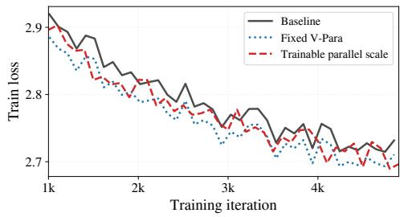  
Figure 8: Parallel-scale diagnostic on 1.4B pretraining. Fixed removal $( s _ { \parallel } = 0 )$ consistently outperforms learned gating $( s _ { \parallel } = \sigma ( w ^ { \top } x ) )$

## F Extended Compression Geometry

While Figure 6 (§6.3) evaluated directional error at attention outputs $( \Delta _ { \mathrm { a t t n } } ) ;$ practical compression alters matrices throughout the Transformer block. Figure 9 extends this breakdown to isolated MLP output $\left( \Delta _ { \mathrm { m l p } } \right)$ and combined block update $( \Delta _ { \mathrm { b l o c k } } ~ = ~ \Delta _ { \mathrm { a t t n } } + \Delta _ { \mathrm { m l p } } )$ Across sublayers and the combined update, perpendicular error strictly tracks degradation (AWQ < unstructured $< 4 { : 8 } < 2 { : 4 } )$ , while parallel error is non-monotonic. Table 11 confirms perpendicular error aligns with total error $( r \geq 0 . 9 7 ,$ $\rho \ge 0 . 9 0 )$ , accounting for 87.5%–98.0% of layer distortion. Thus, compression distortion is overwhelmingly governed by perpendicular steering; objectives must prioritize preserving directional orientation over scalar norm, explaining why unconstrained pruning damages reasoning.

Alignment with cosine diagnostics. Our decomposition directly aligns with cosine diagnostics for layer dropping (He et al., 2026). For update $\Delta = \alpha x + \Delta _ { \perp } \left( \| \Delta _ { \perp } \| = \beta \| x \| \right)$ , cosine similarity is $\cos ( x , x + \Delta ) \approx 1 - 0 . 5 ( \| \Delta _ { \perp } \| / \| x + \Delta _ { \| } \| ) ^ { 2 }$ since $\| \Delta \| \ll \| x \|$ (Figure 10). Angular diagnostics thus evaluate perpendicular steering relative to parallel magnitude: layers are safely pruned when perpendicular steering vanishes.

Table 11: Attention-output error alignment. Layerwise correlations on Qwen3-4B.
<table><tr><td>Setting</td><td> $r ( e , e _ { \perp } )$ </td><td> $\rho ( e , e _ { \perp } )$ </td><td> $\rho ( e , e _ { \parallel } )$ </td><td>Perp./Total</td><td>Para./Total</td></tr><tr><td>Quantization</td><td>0.998</td><td>0.990</td><td>0.596</td><td>0.980</td><td>0.168</td></tr><tr><td>Ünstructured</td><td>0.970</td><td>0.909</td><td>0.810</td><td>0.891</td><td>0.439</td></tr><tr><td>4:8</td><td>0.986</td><td>0.986</td><td>-0.135</td><td>0.887</td><td>0.415</td></tr><tr><td>2:4</td><td>0.991</td><td>0.979</td><td>-0.432</td><td>0.875</td><td>0.425</td></tr></table>

Table 12: Task-wise downstream scores for pretrained models. Resolving the summary downstream averages reported in Table 3 (§7) into individual benchmark scores. Avg. is unweighted and $\Delta \mathrm { A v g }$ is relative to the baseline at the same model scale. Base, Attn, and V-Para denote baseline, residual-space attention parallel removal, and full-aggregate value-space parallel removal.
<table><tr><td>Model</td><td>Setting</td><td>ARC-E</td><td>BoolQ</td><td>HSwag</td><td>OBQA</td><td>PIQA</td><td>WinoGr</td><td>Avg</td><td> $\Delta \mathrm { A v g }$ </td></tr><tr><td rowspan="3">1.4B</td><td>Base</td><td>56.0</td><td>65.1</td><td>60.5</td><td>34.7</td><td>75.8</td><td>58.7</td><td>58.5</td><td>0.0</td></tr><tr><td>Attn</td><td>57.1</td><td>63.9</td><td>61.3</td><td>35.3</td><td>76.0</td><td>59.1</td><td>58.8</td><td>+0.3</td></tr><tr><td>V-Para</td><td>58.3</td><td>62.8</td><td>62.1</td><td>35.9</td><td>76.3</td><td>59.8</td><td>59.2</td><td>+0.7</td></tr><tr><td rowspan="3">2.7B</td><td>Base</td><td>58.4</td><td>61.2</td><td>66.0</td><td>37.1</td><td>76.5</td><td>61.8</td><td>60.2</td><td>0.0</td></tr><tr><td>Attn</td><td>59.3</td><td>62.8</td><td>66.7</td><td>37.7</td><td>77.0</td><td>62.1</td><td>60.9</td><td>+0.7</td></tr><tr><td>V-Para</td><td>60.4</td><td>64.4</td><td>67.1</td><td>38.2</td><td>77.6</td><td>62.6</td><td>61.7</td><td>+1.5</td></tr></table>

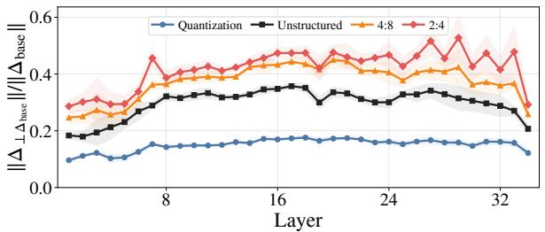

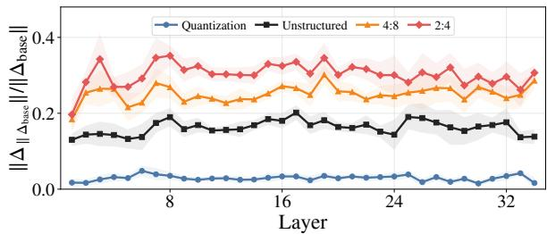

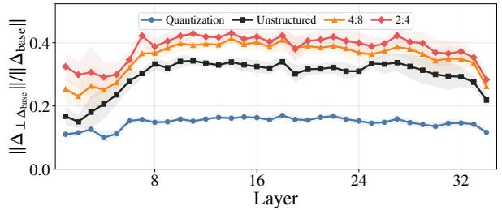  
(a) Perpendicular error $\Delta _ { \perp } ^ { \mathrm { e r r } }$

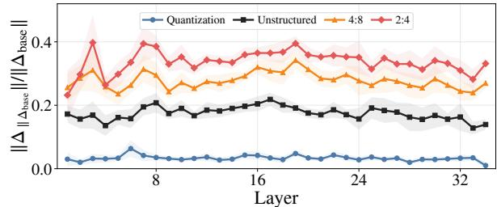  
(b) Parallel error $\Delta _ { \parallel } ^ { \mathrm { e r r } }$

Figure 9: Compression-geometry breakdown across Block and MLP branches. Evaluation of directional compression distortion across two architectural sites: the combined Transformer block update $( \Delta _ { \mathrm { b l o c k } } = \Delta _ { \mathrm { a t t n } } +$ $\Delta _ { \mathrm { m l p } } .$ , top row) and the isolated MLP sub-layer output $( \Delta _ { \mathrm { m l p } } .$ , bottom row). Columns display (a) perpendicular error $( \Delta _ { \perp } ^ { \mathrm { e r r } } )$ and (b) parallel error $( \Delta _ { \parallel } ^ { \mathrm { e r r } } )$ , respectively, each normalized by the corresponding full baseline-update norm. Curves are layerwise means, with bands showing one standard deviation over 12 fixed prompts on Qwen3-4B. Settings are 4-bit AWQ and 50% Wanda pruning with unstructured, 4:8, or 2:4 masks.  
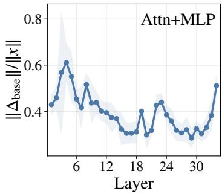

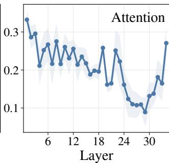

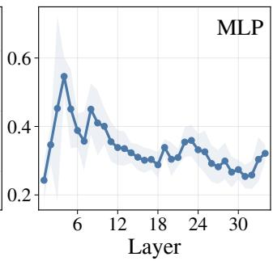  
Figure 10: Baseline layer updates are small relative to the residual stream. Means and one-standard-deviation bands for $\| \Delta _ { \mathrm { b a s e } } \| / \| x \|$ across 12 prompts for Qwen3-4B layers 1–34, shown for the combined Transformer block update $( \Delta _ { \mathrm { b l o c k } } = \Delta _ { \mathrm { a t t n } } + \Delta _ { \mathrm { m l p } } )$ , attention output, and MLP output. Values below one indicate updates smaller than the incoming residual stream.