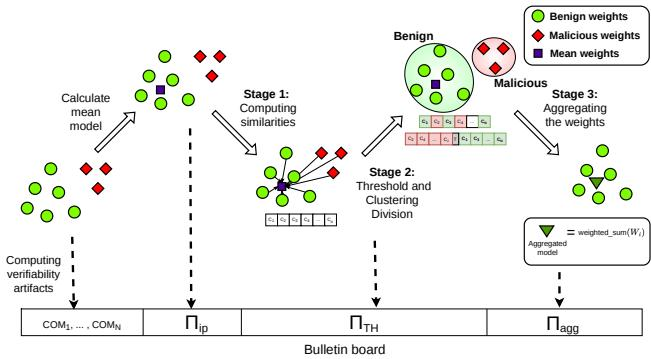
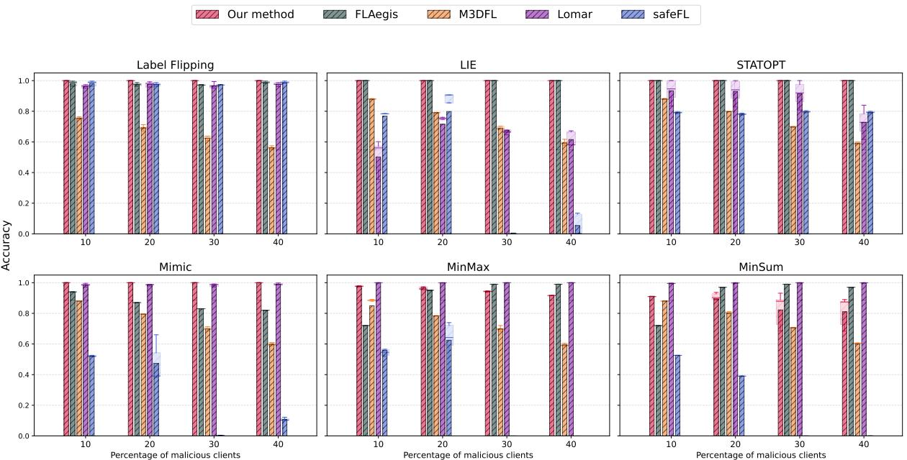
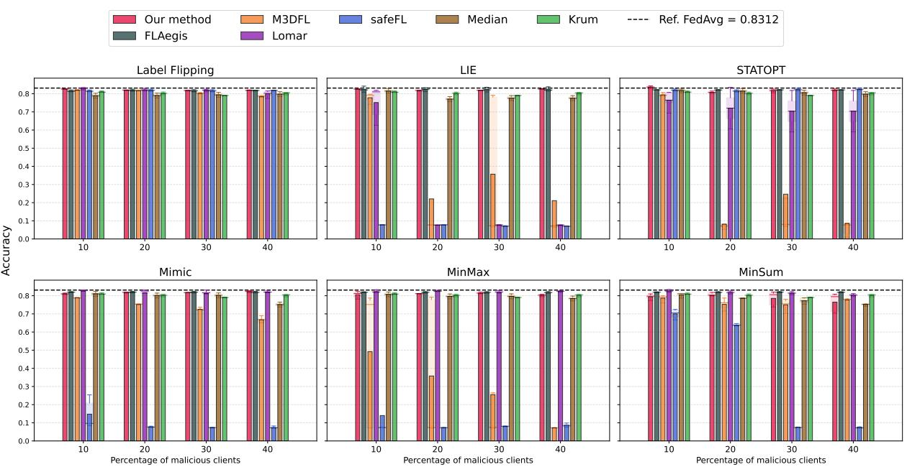
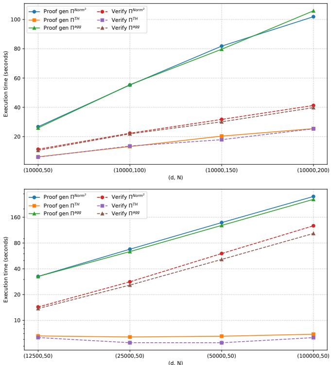
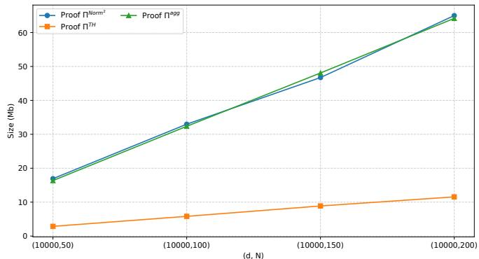
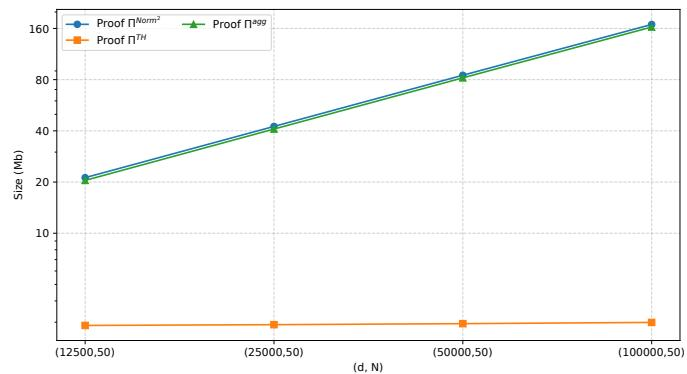
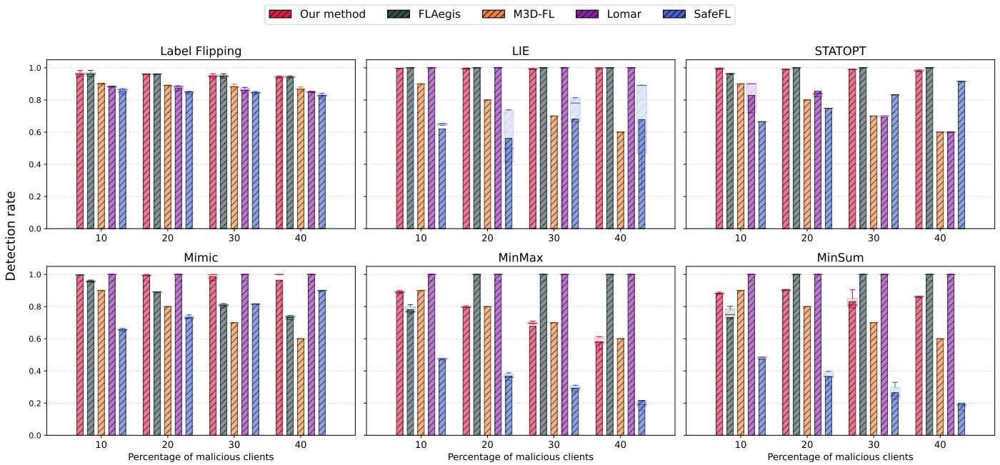
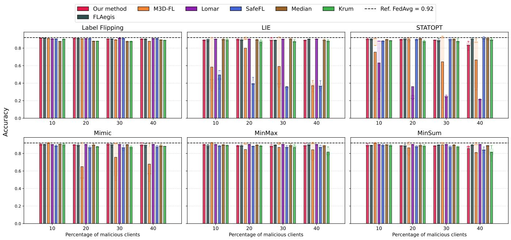
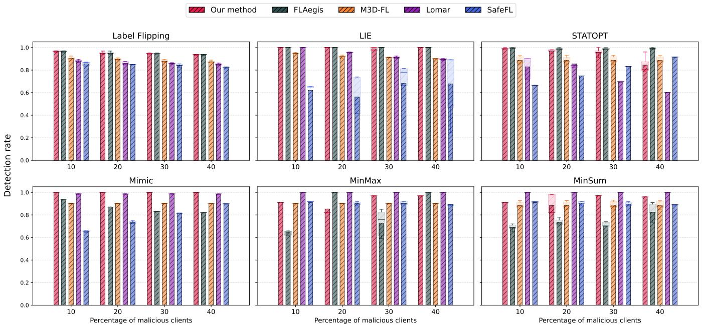
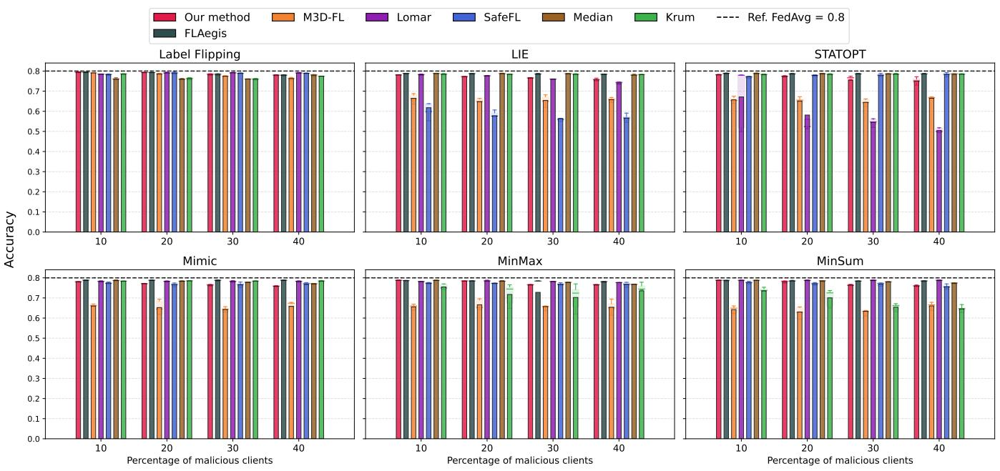

# End-to-End Verifiable and Robust Federated Learning

D<sub>o</sub>r<sub>ya</sub>n L<sub>esa</sub>i<sub>g</sub>n<sub>ou</sub>x AIT A<sub>us</sub>t<sub>r</sub>i<sub>an</sub> I<sub>ns</sub>tit<sub>u</sub>t<sub>e</sub> <sub>o</sub>f T<sub>ec</sub>h<sub>no</sub>l<sub>ogy</sub> Vi<sub>e</sub>nn<sub>a,</sub> A<sub>us</sub>tri<sub>a</sub>

Enri<sub>qu</sub>e Mármol Cam<sub>p</sub>os De<sub>p</sub>artment of Com<sub>p</sub>uter En<sub>g</sub>ineerin<sub>g</sub> Uni<sub>ve</sub>r<sub>s</sub>it<sub>y o</sub>f M<sub>u</sub>r<sub>c</sub>i<sub>a</sub> M<sub>u</sub>r<sub>c</sub>i<sub>a,</sub> S<sub>pa</sub>in

José L. Hernández-Ramos De<sub>p</sub>artment of Com<sub>p</sub>uter En<sub>g</sub>ineerin<sub>g</sub> Uni<sub>ve</sub>r<sub>s</sub>it<sub>y</sub> <sub>o</sub>f M<sub>u</sub>r<sub>c</sub>i<sub>a</sub> M<sub>u</sub>r<sub>c</sub>i<sub>a,</sub> S<sub>pa</sub>in

G<sub>a</sub>bri<sub>e</sub>l<sub>e</sub> S<sub>p</sub>ini AIT A<sub>us</sub>t<sub>r</sub>i<sub>an</sub> I<sub>ns</sub>tit<sub>u</sub>t<sub>e</sub> <sub>o</sub>f T<sub>ec</sub>h<sub>no</sub>l<sub>ogy</sub> Vi<sub>e</sub>nn<sub>a,</sub> A<sub>us</sub>tri<sub>a</sub>

Ste<sub>p</sub>han Krenn AIT A<sub>us</sub>t<sub>r</sub>i<sub>an</sub> I<sub>ns</sub>tit<sub>u</sub>t<sub>e</sub> <sub>o</sub>f T<sub>ec</sub>h<sub>no</sub>l<sub>ogy</sub> Vi<sub>e</sub>nn<sub>a,</sub> A<sub>us</sub>tri<sub>a</sub>

## Abstract

F<sub>e</sub>d<sub>era</sub>t<sub>e</sub>d l<sub>earn</sub>i<sub>ng</sub> <sub>ena</sub>bl<sub>es</sub> <sub>mu</sub>lti<sub>p</sub>l<sub>e</sub> <sub>par</sub>ti<sub>es</sub> t<sub>o</sub> t<sub>ra</sub>i<sub>n</sub> <sub>a</sub> <sub>s</sub>h<sub>are</sub>d <sub>mo</sub>d<sub>e</sub>l <sub>w</sub>ith<sub>ou</sub>t <sub>cen</sub>t<sub>ra</sub>li<sub>z</sub>i<sub>ng</sub> <sub>raw</sub> d<sub>a</sub>t<sub>a</sub> <sub>w</sub>ith th<sub>e</sub> h<sub>e</sub>l<sub>p</sub> <sub>o</sub>f <sub>an</sub> <sub>aggrega</sub>t<sub>or,</sub> b<sub>u</sub>t introd<sub>u</sub>ces inte<sub>g</sub>rit<sub>y</sub> risks once <sub>p</sub>artici<sub>p</sub>ants or infrastr<sub>u</sub>ct<sub>u</sub>re are not full<sub>y</sub> trustworth<sub>y</sub>. Two re<sub>q</sub>uirements are <sub>p</sub>articularl<sub>y</sub> im<sub>p</sub>ortant: <sub>ro</sub>b<sub>us</sub>t<sub>ness</sub> t<sub>o</sub> <sub>po</sub>i<sub>sone</sub>d <sub>or</sub> B<sub>yzan</sub>ti<sub>ne</sub> <sub>c</sub>li<sub>en</sub>t <sub>up</sub>d<sub>a</sub>t<sub>es,</sub> <sub>an</sub>d <sub>ver</sub>ifi<sub>a</sub>bil<sub>-</sub> it<sub>y</sub> of the a<sub>gg</sub>re<sub>g</sub>ator so that clients or third <sub>p</sub>arties can audit the re<sub>p</sub>orted a<sub>gg</sub>re<sub>g</sub>ation without learnin<sub>g</sub> individual u<sub>p</sub>dates. Existin<sub>g</sub> <sub>wor</sub>k h<sub>as</sub> l<sub>arge</sub>l<sub>y</sub> t<sub>rea</sub>t<sub>e</sub>d th<sub>ese goa</sub>l<sub>s separa</sub>t<sub>e</sub>l<sub>y, an</sub>d <sub>e</sub>fi<sub>c</sub>i<sub>en</sub>t <sub>pu</sub>b<sub>-</sub> lic verifiabilit<sub>y</sub> for robust<sub>,</sub> outlier-excludin<sub>g</sub> a<sub>gg</sub>re<sub>g</sub>ation remains li<sub>m</sub>it<sub>e</sub>d<sub>.</sub> W<sub>e presen</sub>t <sub>a ver</sub>ifi<sub>a</sub>bl<sub>e</sub> f<sub>e</sub>d<sub>era</sub>t<sub>e</sub>d l<sub>earn</sub>i<sub>ng pro</sub>t<sub>oco</sub>l th<sub>a</sub>t makes a robust a<sub>gg</sub>re<sub>g</sub>ation <sub>p</sub>i<sub>p</sub>eline <sub>p</sub>ublicl<sub>y</sub> auditable. Our desi<sub>g</sub>n combines cr<sub>yp</sub>to<sub>g</sub>ra<sub>p</sub>hic commitments with non-interactive zeroknowled<sub>g</sub>e <sub>p</sub>roofs to certif<sub>y</sub> both (i) cosine-similarit<sub>y</sub>-based outlier exclusion and (ii) a<sub>gg</sub>re<sub>g</sub>ation over the selected set, without revealin<sub>g</sub> individual client u<sub>p</sub>dates to verifiers. In ex<sub>p</sub>eriments under re<sub>p</sub>resentative <sub>p</sub>oisonin<sub>g</sub> attacks<sub>,</sub> our method maintains hi<sub>g</sub>h accu-<sub>racy, w</sub>ith <sub>an average accuracy</sub> l<sub>oss</sub> b<sub>e</sub>l<sub>ow</sub> 4% <sub>across</sub> th<sub>e eva</sub>l<sub>ua</sub>t<sub>e</sub>d <sub>con</sub>fi<sub>gura</sub>ti<sub>ons, w</sub>hil<sub>e</sub> k<sub>eep</sub>i<sub>ng ver</sub>ifi<sub>ca</sub>ti<sub>on over</sub>h<sub>ea</sub>d <sub>prac</sub>ti<sub>ca</sub>l<sub>: proo</sub>f <sub>ar</sub>tif<sub>ac</sub>t<sub>s can</sub> b<sub>e genera</sub>t<sub>e</sub>d <sub>an</sub>d <sub>ver</sub>ifi<sub>e</sub>d <sub>w</sub>ithi<sub>n m</sub>i<sub>nu</sub>t<sub>es a</sub>t th<sub>e sca</sub>l<sub>e</sub> <sub>s</sub>t<sub>u</sub>di<sub>e</sub>d<sub>.</sub> I<sub>n</sub> <sub>summary,</sub> <sub>our</sub> <sub>resu</sub>lt<sub>s</sub> <sub>s</sub>h<sub>ow</sub> th<sub>a</sub>t <sub>ro</sub>b<sub>us</sub>t <sub>ou</sub>tli<sub>er</sub> <sub>exc</sub>l<sub>u-</sub> sion an<sup>d</sup> pu<sup>bl</sup>ic veri<sup>fi</sup>a<sup>b</sup>i<sup>l</sup>ity can <sup>b</sup>e joint<sup>l</sup>y ac<sup>h</sup>ieve<sup>d</sup> in a <sup>f</sup>e<sup>d</sup>erate<sup>d</sup> learnin<sub>g</sub> settin<sub>g</sub>.

## CCS Concepts

• Security and privacy → Distributed systems security; Cryptography; • Computing methodologies → Machine learning.

## Keywords

federated learnin<sub>g,</sub> <sub>p</sub>oisonin<sub>g</sub> attacks<sub>,</sub> B<sub>y</sub>zantine robustness<sub>,</sub> zeroknowled<sub>g</sub>e <sub>p</sub>roofs<sub>,</sub> cr<sub>yp</sub>to<sub>g</sub>ra<sub>p</sub>hic commitments<sub>,</sub> <sub>p</sub>ublic verifiabilit<sub>y</sub>

ACM Reference Format: Dor<sub>y</sub>an Lesai<sub>g</sub>noux, Enri<sub>q</sub>ue Mármol Cam<sub>p</sub>os, Gabriele S<sub>p</sub>ini,José L. Hernández R<sub>amos, an</sub>d St<sub>ep</sub>h<sub>an</sub> K<sub>renn.</sub> 2026<sub>.</sub> E<sub>n</sub>d<sub>-</sub>t<sub>o-</sub>E<sub>n</sub>d V<sub>er</sub>ifi<sub>a</sub>bl<sub>e an</sub>d R<sub>o</sub>b<sub>us</sub>t F<sub>e</sub>d<sub>-</sub> erated Learning. In Proceedings of the Full Name of the ACM Conference (CONFERENCE ’26), Month DD–DD, 2026, City, Country. ACM, New York, NY<sub>,</sub> USA<sub>,</sub> 21 <sub>pages.</sub> htt<sub>ps</sub>://d<sub>o</sub>i<sub>.o</sub>r<sub>g</sub>/XX<sub>.</sub>XXXX/XXXXXXX<sub>.</sub>XXXXXXX

## 1 Introduction

Federated Learnin<sub>g</sub> (FL) enables multi<sub>p</sub>le data holders to train a shared machine-learnin<sub>g</sub> model without centralizin<sub>g</sub> raw data [47, 72]. In a standard FL workflow, clients train local models on <sub>p</sub>rivate datasets and send model u<sub>p</sub>dates to a central server (the a<sub>gg</sub>re<sub>g</sub>ator), which combines them usin<sub>g</sub> an a<sub>gg</sub>re<sub>g</sub>ation function. This desi<sub>g</sub>n <sub>p</sub>rovides a <sub>p</sub>ractical <sub>p</sub>ath to collaborative learnin<sub>g</sub> under <sub>p</sub>rivac<sub>y</sub> or <sub>con</sub>fid<sub>en</sub>ti<sub>a</sub>lit<sub>y cons</sub>t<sub>ra</sub>i<sub>n</sub>t<sub>s.</sub>

Despite its privacy <sup>b</sup>ene<sup>fi</sup>ts, FL raises major integrity c<sup>h</sup>a<sup>ll</sup>enges once <sub>p</sub>artici<sub>p</sub>ants and infrastr<sub>u</sub>ct<sub>u</sub>re are not f<sub>u</sub>ll<sub>y</sub> tr<sub>u</sub>sted. Tr<sub>u</sub>st-<sub>wor</sub>thi<sub>ness</sub> i<sub>n</sub> FL <sub>requ</sub>i<sub>res</sub> h<sub>an</sub>dli<sub>ng a</sub>t l<sub>eas</sub>t th<sub>e</sub> f<sub>o</sub>ll<sub>ow</sub>i<sub>ng</sub> th<sub>ree</sub> com<sub>p</sub><sup>l</sup>ementar<sub>y</sub> t<sup>h</sup>reats:

(i) malicious or B<sub>y</sub>zantine clients that submit <sub>p</sub>oisoned u<sub>p</sub>dates to de<sub>g</sub>rade conver<sub>g</sub>ence or im<sub>p</sub>lant backdoors [6, 61];

(ii) the a<sub>gg</sub>re<sub>g</sub>ator should learn as little information as <sub>p</sub>ossible <sub>a</sub>b<sub>ou</sub>t th<sub>e</sub> <sub>par</sub>ti<sub>c</sub>i<sub>pan</sub>t<sub>s</sub>’ l<sub>oca</sub>l d<sub>a</sub>t<sub>a</sub> <sub>or</sub> <sub>mo</sub>d<sub>e</sub>l <sub>up</sub>d<sub>a</sub>t<sub>es,</sub> id<sub>ea</sub>ll<sub>y</sub> <sub>revea</sub>li<sub>ng</sub> <sub>on</sub>l<sub>y</sub> th<sub>e</sub> fi<sub>na</sub>l <sub>aggrega</sub>t<sub>e</sub>d <sub>resu</sub>lt <sub>w</sub>hil<sub>e</sub> k<sub>eep</sub>i<sub>ng</sub> individual contributions <sub>p</sub>rivate [3, 16, 41]; and

(iii) a deviatin<sub>g</sub> a<sub>gg</sub>re<sub>g</sub>ator that ma<sub>y</sub> tam<sub>p</sub>er with the a<sub>gg</sub>re<sub>g</sub>ation com<sub>p</sub>utation or its outcome [75].

Th<sub>ese</sub> th<sub>rea</sub>t<sub>s are o</sub>ft<sub>en a</sub>dd<sub>resse</sub>d <sub>separa</sub>t<sub>e</sub>l<sub>y,</sub> th<sub>roug</sub>h <sub>ro</sub>b<sub>us</sub>t a<sub>gg</sub>re<sub>g</sub>ation toleratin<sub>g</sub> outliers and <sub>p</sub>oisoned u<sub>p</sub>dates [7, 14, 24, 38, 49, 55, 63, 71], de<sub>p</sub>lo<sub>y</sub>ment of cr<sub>yp</sub>to<sub>g</sub>ra<sub>p</sub>hic schemes such as secure multi-<sub>p</sub>art<sub>y</sub> com<sub>p</sub>utation or full<sub>y</sub> homomor<sub>p</sub>hic encr<sub>yp</sub>tion [41], and verifiabilit<sub>y</sub> mechanisms that allow clients (or external auditors) to check that a<sub>gg</sub>re<sub>g</sub>ation was <sub>p</sub>erformed correctl<sub>y</sub> [58, 69, 75] without re<sub>q</sub>uirin<sub>g p</sub>laintext access to the individual u<sub>p</sub>dates.

H<sub>owever, cons</sub>id<sub>er</sub>i<sub>ng</sub> th<sub>ese c</sub>h<sub>a</sub>ll<sub>enges</sub> i<sub>n</sub>d<sub>epen</sub>d<sub>en</sub>tl<sub>y</sub> l<sub>ea</sub>d<sub>s</sub> t<sub>o</sub> incom<sub>p</sub>atibilities<sub>,</sub> as the solutions can<sub>,</sub> in <sub>g</sub>eneral<sub>,</sub> not be combined i<sub>n</sub> <sub>a</sub> “<sub>p</sub>l<sub>ug-an</sub>d<sub>-p</sub>l<sub>ay</sub>” f<sub>as</sub>hi<sub>on.</sub> Thi<sub>s</sub> i<sub>s</sub> <sub>no</sub>t <sub>on</sub>l<sub>y</sub> d<sub>ue</sub> t<sub>o</sub> i<sub>ncompa</sub>tibl<sub>e</sub> <sub>p</sub>arameters or cr<sub>yp</sub>to<sub>g</sub>ra<sub>p</sub>hic methods in (ii) and (iii), but more f<sub>un</sub>d<sub>amen</sub>t<sub>a</sub>ll<sub>y a</sub>l<sub>so</sub> t<sub>o</sub> th<sub>e</sub> i<sub>n</sub>t<sub>erna</sub>l <sub>s</sub>t<sub>ruc</sub>t<sub>ure o</sub>f th<sub>e aggrega</sub>ti<sub>on</sub> techni<sub>q</sub>ues in (i). S<sub>p</sub>ecificall<sub>y</sub>, man<sub>y</sub> robustness mechanisms rel<sub>y</sub> on hi<sub>g</sub>hl<sub>y</sub> non-linear or data-de<sub>p</sub>endent ste<sub>p</sub>s (includin<sub>g</sub> but not limited to as<sub>p</sub>ects like sortin<sub>g,</sub> iterative thresholdin<sub>g,</sub> or clusterin<sub>g</sub> decisions), which are hard to realize in a data-oblivious wa<sub>y</sub>. For i<sub>ns</sub>t<sub>ance,</sub> <sub>no</sub> d<sub>a</sub>t<sub>a-</sub>d<sub>epen</sub>d<sub>en</sub>t b<sub>ranc</sub>hi<sub>ng</sub> <sub>may</sub> b<sub>e</sub> <sub>recogn</sub>i<sub>za</sub>bl<sub>e</sub> t<sub>o</sub> th<sub>e</sub> a<sub>gg</sub>re<sub>g</sub>ator (in case of (ii)) or a verifier (in case of (iii)), makin<sub>g</sub> sim<sub>p</sub>le functions like com<sub>p</sub>utin<sub>g</sub> medians or sortin<sub>g</sub> com<sub>p</sub>utationall<sub>y</sub> ex<sub>p</sub>ensive<sub>;</sub> even worse<sub>,</sub> alread<sub>y</sub> com<sub>p</sub>arin<sub>g</sub> two values becomes relativel<sub>y</sub> ex<sub>p</sub>ensive<sub>,</sub> as data-de<sub>p</sub>endent com<sub>p</sub>utations must often be im<sub>p</sub>lemented with worst-case execution behavior (e.<sub>g</sub>., in the bit-len<sub>g</sub>th of the values to be com<sub>p</sub>ared) to not leak an<sub>y</sub> infor mation about the underl<sub>y</sub>in<sub>g</sub> data (e.<sub>g</sub>., at which bit <sub>p</sub>osition the decision was taken). Finall<sub>y</sub>, des<sub>p</sub>ite recent <sub>p</sub>ro<sub>g</sub>ress, com<sub>p</sub>utin<sub>g</sub> on floatin<sub>g</sub>-<sub>p</sub>oint numbers introduces si<sub>g</sub>nificant overheads<sub>,</sub> su<sub>gg</sub>estin<sub>g</sub> inte<sub>g</sub>er com<sub>p</sub>utations as the natural candidate. This leads to a <sub>con</sub>fli<sub>c</sub>t b<sub>e</sub>t<sub>ween</sub> hi<sub>g</sub>h <sub>ro</sub>b<sub>us</sub>t<sub>ness</sub> <sub>guaran</sub>t<sub>ees</sub> <sub>on</sub> th<sub>e</sub> <sub>one</sub> h<sub>an</sub>d<sub>,</sub> <sub>an</sub>d hi<sub>g</sub>h <sub>pr</sub>i<sub>vacy</sub> <sub>an</sub>d <sub>ver</sub>ifi<sub>a</sub>bilit<sub>y</sub> <sub>nee</sub>d<sub>s</sub> <sub>on</sub> th<sub>e</sub> <sub>o</sub>th<sub>er.</sub>

In this <sub>p</sub>a<sub>p</sub>er we thus aim at solutions simultaneousl<sub>y</sub> achievin<sub>g</sub> (i) and (iii), leadin<sub>g</sub> to the followin<sub>g</sub> research <sub>q</sub>uestion:

Can a verifiable robust a<sub>gg</sub>re<sub>g</sub>ation <sub>p</sub>i<sub>p</sub>eline be desi<sub>g</sub>ned that certifi<sub>es</sub> b<sub>o</sub>th <sub>ou</sub>tli<sub>er</sub> <sub>se</sub>l<sub>ec</sub>ti<sub>on</sub> <sub>an</sub>d fi<sub>na</sub>l <sub>aggrega</sub>ti<sub>on</sub> <sub>w</sub>hil<sub>e</sub> <sub>re</sub>t<sub>a</sub>i<sub>n</sub>i<sub>ng</sub> com<sub>p</sub>etiti<sub>v</sub>e em<sub>p</sub>irical rob<sub>u</sub>stness a<sub>g</sub>ainst re<sub>p</sub>resentati<sub>v</sub>e <sub>p</sub>oisonin<sub>g</sub> attacks within <sub>p</sub>racticall<sub>y p</sub>lausible runtime?

It is worth notin<sub>g</sub> that we deliberatel<sub>y</sub> leave aside threat (ii), as <sub>a</sub>dd<sub>ress</sub>i<sub>ng a</sub>ll th<sub>ree c</sub>h<sub>a</sub>ll<sub>enges s</sub>i<sub>mu</sub>lt<sub>aneous</sub>l<sub>y wou</sub>ld b<sub>e</sub> b<sub>eyon</sub>d th<sub>e scope o</sub>f <sub>a s</sub>i<sub>ng</sub>l<sub>e ar</sub>ti<sub>c</sub>l<sub>e.</sub> N<sub>ever</sub>th<sub>e</sub>l<sub>ess,</sub> th<sub>e c</sub>h<sub>a</sub>ll<sub>enges</sub> i<sub>n ac</sub>hi<sub>ev-</sub> in<sub>g</sub> robustness in (ii) and (iii) are often closel<sub>y</sub> related, <sub>p</sub>articularl<sub>y</sub> re<sub>g</sub>ardin<sub>g</sub> data-obliviousness and eficient com<sub>p</sub>utation over <sub>p</sub>rot<sub>ec</sub>t<sub>e</sub>d <sub>va</sub>l<sub>ues,</sub> <sub>so</sub> th<sub>a</sub>t <sub>we</sub> <sub>expec</sub>t <sub>some</sub> <sub>o</sub>f th<sub>e</sub> t<sub>ec</sub>h<sub>n</sub>i<sub>ques</sub> d<sub>eve</sub>l<sub>ope</sub>d <sup>here</sup> <sup>ma</sup>y <sup>carr</sup>y <sup>over.</sup>

## 1.1 Contributions and Overview of results I<sub>n</sub> <sub>par</sub>ti<sub>cu</sub>l<sub>ar,</sub> <sub>we</sub> <sub>ma</sub>k<sub>e</sub> th<sub>e</sub> f<sub>o</sub>ll<sub>ow</sub>i<sub>ng</sub> <sub>con</sub>t<sub>r</sub>ib<sub>u</sub>ti<sub>ons:</sub>

ZK-friendly robust aggregation. We propose a threshold-based robust a<sub>gg</sub>re<sub>g</sub>ation <sub>p</sub>i<sub>p</sub>eline desi<sub>g</sub>ned around o<sub>p</sub>erations suitable for <sub>zero-</sub>k<sub>now</sub>l<sub>e</sub>d<sub>ge proo</sub>f<sub>s, ma</sub>i<sub>n</sub>l<sub>y a</sub>l<sub>ge</sub>b<sub>ra</sub>i<sub>c re</sub>l<sub>a</sub>ti<sub>ons an</sub>d <sub>compar</sub>i<sub>sons.</sub> Unlike conventional verifiable a<sub>gg</sub>re<sub>g</sub>ation<sub>,</sub> which t<sub>yp</sub>icall<sub>y</sub> focuses <sub>on</sub> <sub>secure</sub> <sub>sums,</sub> <sub>our</sub> d<sub>es</sub>i<sub>gn</sub> b<sub>a</sub>l<sub>ances</sub> <sub>ro</sub>b<sub>us</sub>t<sub>ness</sub> <sub>an</sub>d <sub>proo</sub>f <sub>e</sub>fi<sub>c</sub>i<sub>ency.</sub> We use cosine similarit<sub>y</sub> [34] to detect inconsistent u<sub>p</sub>dates, exclude th<sub>em</sub> th<sub>roug</sub>h th<sub>res</sub>h<sub>o</sub>ld<sub>-</sub>b<sub>ase</sub>d <sub>se</sub>l<sub>ec</sub>ti<sub>on,</sub> <sub>an</sub>d <sub>aggrega</sub>t<sub>e</sub> th<sub>e</sub> <sub>rema</sub>i<sub>n</sub> in<sub>g</sub> u<sub>p</sub>dates usin<sub>g</sub> wei<sub>g</sub>hted a<sub>gg</sub>re<sub>g</sub>ation. While the basic version <sub>uses a s</sub>t<sub>a</sub>ti<sub>c</sub> th<sub>res</sub>h<sub>o</sub>ld<sub>, we a</sub>l<sub>so cons</sub>id<sub>er sem</sub>i<sub>-s</sub>t<sub>a</sub>ti<sub>c an</sub>d d<sub>ynam</sub>i<sub>c</sub> variants. A<sub>g</sub>ainst several <sub>p</sub>oisonin<sub>g</sub> attacks<sub>,</sub> our method achieves l<sub>ow an</sub>d <sub>s</sub>t<sub>a</sub>bl<sub>e accuracy</sub> d<sub>egra</sub>d<sub>a</sub>ti<sub>on w</sub>hil<sub>e us</sub>i<sub>ng a proo</sub>f<sub>-</sub>f<sub>r</sub>i<sub>en</sub>dl<sub>y</sub> a<sub>gg</sub>re<sub>g</sub>ation rule<sub>,</sub> avoidin<sub>g</sub> catastro<sub>p</sub>hic failures across the evaluated <sub>con</sub>fi<sub>gura</sub>ti<sub>ons.</sub>

Zero-knowledge public verifiability. We introduce a commitment-<sub>an</sub>d NIZK<sub>-</sub>b<sub>ase</sub>d <sub>ver</sub>ifi<sub>ca</sub>ti<sub>on</sub> l<sub>ayer</sub> th<sub>a</sub>t <sub>ena</sub>bl<sub>es pu</sub>bli<sub>c au</sub>diti<sub>ng o</sub>f the com<sub>p</sub>lete robust a<sub>gg</sub>re<sub>g</sub>ation <sub>p</sub>i<sub>p</sub>eline. Usin<sub>g</sub> commitments <sub>p</sub>ublished b<sub>y</sub> clients, the a<sub>gg</sub>re<sub>g</sub>ator <sub>p</sub>roves: (i) correct cosine-similarit<sub>y</sub> com<sub>p</sub>utations, (ii) correct threshold-based inclusion or exclusion, and (iii) correct wei<sub>g</sub>hted a<sub>gg</sub>re<sub>g</sub>ation over the selected u<sub>p</sub>dates. Th<sub>ese</sub> <sub>proo</sub>f<sub>s</sub> <sub>revea</sub>l <sub>ne</sub>ith<sub>er</sub> i<sub>n</sub>di<sub>v</sub>id<sub>ua</sub>l <sub>c</sub>li<sub>en</sub>t <sub>up</sub>d<sub>a</sub>t<sub>es</sub> <sub>nor</sub> <sub>se</sub>l<sub>ec</sub>ti<sub>on</sub> <sup>d</sup>ecisions, inc<sup>l</sup>u<sup>d</sup>ing t<sup>h</sup>e num<sup>b</sup>er o<sup>f</sup> rejecte<sup>d</sup> c<sup>l</sup>ients. Hi<sup>d</sup>ing t<sup>h</sup>is inf<sub>orma</sub>ti<sub>on a</sub>l<sub>so</sub> li<sub>m</sub>it<sub>s</sub> f<sub>ee</sub>db<sub>ac</sub>k th<sub>a</sub>t <sub>a</sub>d<sub>ap</sub>ti<sub>ve a</sub>tt<sub>ac</sub>k<sub>ers cou</sub>ld <sub>exp</sub>l<sub>o</sub>it to cra<sup>f</sup>t up<sup>d</sup>ates c<sup>l</sup>ose to t<sup>h</sup>e rejection t<sup>h</sup>res<sup>h</sup>o<sup>ld</sup>.

Characterizing robustness–verifiability costs. We evaluate both robustness a<sub>g</sub>ainst re<sub>p</sub>resentative <sub>p</sub>oisonin<sub>g</sub> attacks and the cost of <sub>p</sub>ublic verification in terms of <sub>p</sub>roof size<sub>, g</sub>eneration time<sub>,</sub> and verifi-<sub>ca</sub>ti<sub>on</sub> ti<sub>me,</sub> i<sub>nc</sub>l<sub>u</sub>di<sub>ng sca</sub>l<sub>a</sub>bilit<sub>y w</sub>ith <sub>mo</sub>d<sub>e</sub>l di<sub>mens</sub>i<sub>on an</sub>d <sub>num</sub>b<sub>er</sub> of clients. We im<sub>p</sub>lement a <sub>p</sub>rotot<sub>yp</sub>e of our verification <sub>p</sub>i<sub>p</sub>eline <sub>an</sub>d <sub>ana</sub>l<sub>yze</sub> th<sub>e</sub> i<sub>mpac</sub>t <sub>o</sub>f <sub>a</sub>lt<sub>erna</sub>ti<sub>ve con</sub>fi<sub>gura</sub>ti<sub>ons,</sub> i<sub>nc</sub>l<sub>u</sub>di<sub>ng</sub> <sub>me</sub>t<sub>a</sub>d<sub>a</sub>t<sub>a</sub> di<sub>sc</sub>l<sub>osure</sub> <sub>an</sub>d <sub>more</sub> <sub>a</sub>d<sub>vance</sub>d th<sub>res</sub>h<sub>o</sub>ldi<sub>ng</sub> <sub>s</sub>t<sub>ra</sub>t<sub>eg</sub>i<sub>es.</sub>

## 1.2 Related Work

FL enables collaborative trainin<sub>g</sub> without centralizin<sub>g</sub> raw data [47]. In adversarial settin<sub>g</sub>s<sub>,</sub> inte<sub>g</sub>rit<sub>y</sub> is mainl<sub>y</sub> addressed throu<sub>g</sub>h robustness a<sub>g</sub>ainst malicious clients and verifiabilit<sub>y</sub> of the a<sub>gg</sub>re<sub>g</sub>ator. H<sub>owever, mos</sub>t <sub>ver</sub>ifi<sub>a</sub>bl<sub>e</sub> FL <sub>sc</sub>h<sub>emes rema</sub>i<sub>n</sub> li<sub>m</sub>it<sub>e</sub>d t<sub>o</sub> l<sub>arge</sub>l<sub>y</sub> linear a<sub>gg</sub>re<sub>g</sub>ation rules [33].

Robustness to poisoning and Byzantine clients. Malicious clients <sub>can</sub> d<sub>egra</sub>d<sub>e</sub> <sub>convergence</sub> <sub>or</sub> i<sub>mp</sub>l<sub>an</sub>t b<sub>ac</sub>kd<sub>oors</sub> th<sub>roug</sub>h <sub>cra</sub>ft<sub>e</sub>d u<sub>p</sub>dates [6, 22]. Re<sub>p</sub>resentative attacks include LIE [2] and Min-Max/Min-Sum [60]. Defenses include median/trimmed mean [71], Krum/Multi-Krum [7], Bul<sub>y</sub>an [48], <sub>g</sub>eometric-median a<sub>pp</sub>roaches [55], trust-based methods [15], and similarit<sub>y</sub>-based detectors [24]. Yet, <sub>a</sub>ll th<sub>ese</sub> <sub>assume</sub> <sub>an</sub> h<sub>ones</sub>t <sub>execu</sub>ti<sub>on</sub> <sub>o</sub>f th<sub>e</sub> <sub>aggrega</sub>ti<sub>on</sub> <sub>proce</sub>d<sub>ure.</sub>

Verifiable aggregation. Verifiable FL aims to prove that the server correctl<sub>y</sub> com<sub>p</sub>utes the a<sub>gg</sub>re<sub>g</sub>ate. Verif<sub>y</sub>Net [70] combines <sub>p</sub>rivac<sub>y</sub> maskin<sub>g</sub> with homomor<sub>p</sub>hic-hash verification, while VeriFL [29] <sub>re</sub>d<sub>uces ver</sub>ifi<sub>ca</sub>ti<sub>on over</sub>h<sub>ea</sub>d f<sub>or</sub> hi<sub>g</sub>h<sub>-</sub>di<sub>mens</sub>i<sub>ona</sub>l <sub>gra</sub>di<sub>en</sub>t<sub>s.</sub> Oth<sub>er</sub> a<sub>pp</sub>roaches use HE [64], blockchain-based auditin<sub>g</sub> [17, 67], or commitment- and ZK-based verification [9, 58]. These techni<sub>q</sub>ues <sub>are mos</sub>t <sub>e</sub>fi<sub>c</sub>i<sub>en</sub>t f<sub>or</sub> li<sub>near compu</sub>t<sub>a</sub>ti<sub>ons, w</sub>h<sub>ereas</sub> d<sub>a</sub>t<sub>a-</sub>d<sub>epen</sub>d<sub>en</sub>t filterin<sub>g</sub> and selection are considerabl<sub>y</sub> harder to <sub>p</sub>rove [33].

Combining robustness and verifiability. Few works jointly consider malicious clients and a deviatin<sub>g</sub> a<sub>gg</sub>re<sub>g</sub>ator. BVDFed [26] combines loss-based filterin<sub>g</sub> with a<sub>gg</sub>re<sub>g</sub>ate verification, RiseFL [76] verifies <sub>p</sub>er-u<sub>p</sub>date constraints usin<sub>g</sub> ZK <sub>p</sub>roofs, and RFLPV [66] combines robustness with verifiable a<sub>gg</sub>re<sub>g</sub>ation. Yet<sub>,</sub> these a<sub>p</sub>- <sub>proac</sub>h<sub>es</sub> d<sub>o</sub> <sub>no</sub>t <sub>ver</sub>if<sub>y</sub> th<sub>e</sub> <sub>ro</sub>b<sub>us</sub>t<sub>ness</sub> d<sub>ec</sub>i<sub>s</sub>i<sub>ons</sub> th<sub>emse</sub>l<sub>ves.</sub>

I<sub>n</sub> <sub>con</sub>t<sub>ras</sub>t<sub>,</sub> <sub>we</sub> t<sub>arge</sub>t <sub>en</sub>d<sub>-</sub>t<sub>o-en</sub>d <sub>ver</sub>ifi<sub>ca</sub>ti<sub>on</sub> <sub>o</sub>f <sub>an</sub> <sub>ou</sub>tli<sub>er-exc</sub>l<sub>u</sub>di<sub>ng</sub> a<sub>gg</sub>re<sub>g</sub>ation <sub>p</sub>i<sub>p</sub>eline under both malicious clients and a <sub>p</sub>otentiall<sub>y</sub> malicious a<sub>gg</sub>re<sub>g</sub>ator. Our <sub>p</sub>rotocol uses <sub>p</sub>roof-friendl<sub>y</sub> linear relations and com<sub>p</sub>arisons to verif<sub>y</sub> similarit<sub>y</sub> com<sub>p</sub>utation<sub>,</sub> thresholdbased selection<sub>,</sub> and a<sub>gg</sub>re<sub>g</sub>ation over acce<sub>p</sub>ted u<sub>p</sub>dates<sub>,</sub> while <sub>p</sub>re-<sup>servin</sup>g <sup>u</sup>p<sup>date</sup> p<sup>rivac</sup>y<sup>.</sup>

Combining secure and verifiable aggregation. Secure aggregati<sub>on</sub> hid<sub>es</sub> i<sub>n</sub>di<sub>v</sub>id<sub>ua</sub>l <sub>up</sub>d<sub>a</sub>t<sub>es</sub> <sub>w</sub>hil<sub>e</sub> <sub>a</sub>ll<sub>ow</sub>i<sub>ng</sub> <sub>compu</sub>t<sub>a</sub>ti<sub>on</sub> <sub>o</sub>f th<sub>e</sub>i<sub>r</sub> a<sub>gg</sub>re<sub>g</sub>ate. Existin<sub>g</sub> schemes commonl<sub>y</sub> use MPC or secret sharin<sub>g</sub> [3, 11, 54, 57] or HE [45, 65], often combined with verification m<sub>ec</sub>h<sub>a</sub>ni<sub>s</sub>m<sub>s.</sub> Thi<sub>s</sub> <sub>aspec</sub>t i<sub>s</sub> <sub>ou</sub>t<sub>s</sub>id<sub>e</sub> <sub>ou</sub>r <sub>scope,</sub> <sub>s</sub>in<sub>ce</sub> <sub>we</sub> <sub>assu</sub>m<sub>e</sub> <sub>p</sub>laintext client in<sub>p</sub>uts. Moreover<sub>,</sub> these works usuall<sub>y</sub> consider a malicious a<sub>gg</sub>re<sub>g</sub>ator but standard a<sub>gg</sub>re<sub>g</sub>ation<sub>,</sub> whereas our model <sub>a</sub>l<sub>so</sub> i<sub>nc</sub>l<sub>u</sub>d<sub>es ma</sub>li<sub>c</sub>i<sub>ous c</sub>li<sub>en</sub>t<sub>s.</sub>

Combining secure and robustness. Combining privacy and Byzanti<sub>ne ro</sub>b<sub>us</sub>t<sub>ness</sub> i<sub>s</sub> difi<sub>cu</sub>lt b<sub>ecause ro</sub>b<sub>us</sub>t <sub>ru</sub>l<sub>es requ</sub>i<sub>re compar</sub>i<sub>sons</sub> <sub>a</sub>nd di<sub>s</sub>t<sub>a</sub>n<sub>ce</sub> <sub>co</sub>m<sub>pu</sub>t<sub>a</sub>ti<sub>o</sub>n<sub>s</sub> th<sub>a</sub>t <sub>a</sub>r<sub>e</sub> <sub>e</sub>x<sub>pe</sub>n<sub>s</sub>i<sub>ve</sub> <sub>u</sub>nd<sub>e</sub>r HE <sub>o</sub>r MPC<sub>.</sub> BREA and B<sub>y</sub>zSecA<sub>gg</sub> [30, 62] combine MPC with Multi-Krumst<sub>y</sub>le techni<sub>q</sub>ues, ShieldFL [44] uses HE and cosine similarit<sub>y</sub>, and SEAR [74] relies on a TEE. PRFL [39] combines MPC with FLTrust <sub>un</sub>d<sub>er</sub> <sub>a</sub> <sub>ma</sub>li<sub>c</sub>i<sub>ous-server</sub> <sub>mo</sub>d<sub>e</sub>l<sub>,</sub> b<sub>u</sub>t f<sub>ocuses</sub> <sub>ma</sub>i<sub>n</sub>l<sub>y</sub> <sub>on</sub> <sub>pr</sub>i<sub>vacy</sub> l<sub>ea</sub>k<sub>-</sub> a<sub>g</sub>e throu<sub>g</sub>h deviation or collusion. Overall<sub>,</sub> existin<sub>g</sub> secure-robust <sub>sc</sub>h<sub>emes</sub> <sub>rare</sub>l<sub>y</sub> <sub>a</sub>dd<sub>ress</sub> <sub>an</sub> <sub>aggrega</sub>t<sub>or</sub> th<sub>a</sub>t <sub>ac</sub>ti<sub>ve</sub>l<sub>y</sub> <sub>man</sub>i<sub>pu</sub>l<sub>a</sub>t<sub>es</sub> th<sub>e</sub> ro<sup>b</sup>ust a<sub>gg</sub>re<sub>g</sub>at<sup>i</sup>on resu<sup>l</sup>t.

## 1.3 Outline

Sec. 2 introd<sub>u</sub>ces the re<sub>qu</sub>ired conce<sub>p</sub>ts<sub>,</sub> while Sec. 3 <sub>p</sub>resents the <sub>sys</sub>t<sub>em</sub> <sub>an</sub>d th<sub>rea</sub>t <sub>mo</sub>d<sub>e</sub>l<sub>.</sub> S<sub>ec.</sub> 4 d<sub>escr</sub>ib<sub>es</sub> th<sub>e</sub> <sub>propose</sub>d <sub>me</sub>th<sub>o</sub>d<sub>,</sub> <sub>w</sub>hi<sub>c</sub>h i<sub>s</sub> <sub>eva</sub>l<sub>ua</sub>t<sub>e</sub>d i<sub>n</sub> S<sub>ec.</sub> 5<sub>.</sub> W<sub>e</sub> b<sub>r</sub>i<sub>e</sub>fl<sub>y</sub> <sub>conc</sub>l<sub>u</sub>d<sub>e</sub> i<sub>n</sub> S<sub>ec.</sub> 6<sub>.</sub>

## 2 Preliminaries

In thi<sub>s</sub> <sub>sec</sub>ti<sub>o</sub>n<sub>,</sub> <sub>we</sub> <sub>ove</sub>r<sub>v</sub>i<sub>ew</sub> <sub>po</sub>i<sub>so</sub>nin<sub>g</sub> <sub>a</sub>tt<sub>ac</sub>k<sub>s</sub> in FL<sub>,</sub> <sub>su</sub>mm<sub>a</sub>riz<sub>e</sub> d<sub>e</sub>f<sub>enses</sub> b<sub>ase</sub>d <sub>on</sub> <sub>s</sub>i<sub>m</sub>il<sub>ar</sub>it<sub>y</sub> filt<sub>er</sub>i<sub>ng</sub> <sub>an</sub>d <sub>ro</sub>b<sub>us</sub>t <sub>aggrega</sub>ti<sub>on,</sub> <sub>an</sub>d <sub>ou</sub>tli<sub>ne</sub> th<sub>e</sub> <sub>cryp</sub>t<sub>ograp</sub>hi<sub>c</sub> b<sub>u</sub>ildi<sub>ng</sub> bl<sub>oc</sub>k<sub>s</sub> <sub>use</sub>d i<sub>n</sub> <sub>our</sub> f<sub>ramewor</sub>k<sub>.</sub> T<sub>a</sub>bl<sub>e</sub> 1 <sub>summar</sub>i<sub>zes</sub> th<sub>e no</sub>t<sub>a</sub>ti<sub>on use</sub>d th<sub>roug</sub>h<sub>ou</sub>t th<sub>e ar</sub>ti<sub>c</sub>l<sub>e.</sub>

Table 1: Overview of main notation and parameters
<table><tr><td>Parameter</td><td>Description</td></tr><tr><td>G,H</td><td>Generators of G</td></tr><tr><td> $N$ </td><td>Number of clients</td></tr><tr><td>M</td><td>Number of malicious clients</td></tr><tr><td> $\mathbf { w } _ { i }$ </td><td>Weights of  $i ^ { t h }$  client</td></tr><tr><td> $d$ </td><td>Dimension of the weights</td></tr><tr><td>w</td><td>Aggregated weights</td></tr><tr><td>W</td><td>Final aggregation of weights</td></tr><tr><td>q</td><td>Arithmetic modulus</td></tr><tr><td> $\lambda$ </td><td>Precision parameter</td></tr><tr><td>TH</td><td>Threshold of cosine similarities</td></tr><tr><td> $\mathbf { C } , \mathbf { 0 }$ </td><td>Commitment and opening value</td></tr><tr><td> $\ell _ { i }$ </td><td>Original norm of weight wi</td></tr></table>

## 2.1 Poisoning Attacks in FL and Mitigation

P<sub>o</sub>i<sub>so</sub>nin<sub>g a</sub>tt<sub>ac</sub>k<sub>s</sub> in FL <sub>a</sub>im t<sub>o</sub> d<sub>eg</sub>r<sub>a</sub>d<sub>e</sub> tr<sub>a</sub>inin<sub>g o</sub>r ind<sub>uce</sub> t<sub>a</sub>r<sub>ge</sub>t<sub>e</sub>d misbehavior b<sub>y</sub> mani<sub>p</sub>ulatin<sub>g</sub> the information contributed b<sub>y</sub> a sub-<sub>se</sub>t <sub>o</sub>f <sub>c</sub>li<sub>en</sub>t<sub>s,</sub> t<sub>yp</sub>i<sub>ca</sub>ll<sub>y</sub> th<sub>roug</sub>h <sub>corrup</sub>t<sub>e</sub>d l<sub>oca</sub>l d<sub>a</sub>t<sub>a</sub> <sub>or</sub> <sub>a</sub>d<sub>versar</sub>i<sub>a</sub>ll<sub>y</sub> crafted model u<sub>p</sub>dates [68]. We distin<sub>g</sub>uish two common views. In d<sub>a</sub>t<sub>a po</sub>i<sub>son</sub>i<sub>ng,</sub> th<sub>e a</sub>d<sub>versary mo</sub>difi<sub>es a c</sub>li<sub>en</sub>t’<sub>s</sub> l<sub>oca</sub>l t<sub>ra</sub>i<sub>n</sub>i<sub>ng</sub> d<sub>a</sub>t<sub>a</sub> to bias the learned u<sub>p</sub>date (e.<sub>g</sub>., to im<sub>p</sub>lant a backdoor tri<sub>gg</sub>er or to shift decision boundaries) [43, 50]. In model <sub>p</sub>oisonin<sub>g</sub> (or local u<sub>p</sub>date <sub>p</sub>oisonin<sub>g</sub>), the adversar<sub>y</sub> directl<sub>y</sub> crafts the transmitted <sub>up</sub>d<sub>a</sub>t<sub>e</sub> <sub>e</sub>ith<sub>er</sub> t<sub>o</sub> b<sub>roa</sub>dl<sub>y</sub> hi<sub>n</sub>d<sub>er</sub> <sub>convergence</sub> <sub>or</sub> t<sub>o</sub> <sub>ac</sub>hi<sub>eve</sub> <sub>a</sub> t<sub>ar-</sub> <sub>g</sub>eted efect while remainin<sub>g</sub> hard to detect [6, 22]. Modern evasion attacks ex<sub>p</sub>licitl<sub>y</sub> o<sub>p</sub>timize <sub>p</sub>oisoned u<sub>p</sub>dates to <sub>p</sub>ass common de fenses, includin<sub>g</sub> small-<sub>p</sub>erturbation strate<sub>g</sub>ies (e.<sub>g</sub>., LIE [2]) and o<sub>p</sub>timization-based attacks tailored to robust a<sub>gg</sub>re<sub>g</sub>ation rules (e.<sub>g</sub>., Min-Max/Min-Sum [60]).

Miti<sub>g</sub>ations broadl<sub>y</sub> fall into two families. Robust a<sub>gg</sub>re<sub>g</sub>ation <sub>rep</sub>l<sub>aces s</sub>i<sub>mp</sub>l<sub>e averag</sub>i<sub>ng w</sub>ith <sub>ru</sub>l<sub>es</sub> th<sub>a</sub>t <sub>re</sub>d<sub>uce</sub> th<sub>e</sub> i<sub>n</sub>fl<sub>uence o</sub>f outliers, such as coordinate-wise robust statistics (median/trimmed mean) or distance-based selection (Krum) [7, 71]. Filterin<sub>g</sub>-based defenses attem<sub>p</sub>t to identif<sub>y</sub> sus<sub>p</sub>icious clients<sub>,</sub> often usin<sub>g</sub> similarit<sub>y</sub> si<sub>g</sub>nals, and exclude them before a<sub>gg</sub>re<sub>g</sub>ation [24, 38, 49]. Recent evidence su<sub>pp</sub>orts two-sta<sub>g</sub>e <sub>p</sub>i<sub>p</sub>elines that combine filterin<sub>g</sub> with a robust a<sub>gg</sub>re<sub>g</sub>ator as <sub>p</sub>articularl<sub>y</sub> efective a<sub>g</sub>ainst <sub>p</sub>oisonin<sub>g</sub> [14]. In this <sub>p</sub>a<sub>p</sub>er<sub>,</sub> we follow this desi<sub>g</sub>n <sub>p</sub>rinci<sub>p</sub>le and use cosine similarit<sub>y</sub> as the ke<sub>y</sub> si<sub>g</sub>nal for u<sub>p</sub>date consistenc<sub>y</sub>:

$$
\cos _ { - } \sin ( \mathbf { x } , \mathbf { y } ) = { \frac { \langle \mathbf { x } , \mathbf { y } \rangle } { \| \mathbf { x } \| _ { 2 } \| \mathbf { y } \| _ { 2 } } } = { \frac { \sum _ { i = 1 } ^ { n } x _ { i } y _ { i } } { { \sqrt { \sum _ { i = 1 } ^ { n } x _ { i } ^ { 2 } } } ~ { \sqrt { \sum _ { i = 1 } ^ { n } y _ { i } ^ { 2 } } } } }\tag{1}
$$

<sub>w</sub>hi<sub>c</sub>h <sub>we</sub> l<sub>everage</sub> t<sub>o</sub> <sub>separa</sub>t<sub>e</sub> <sub>cons</sub>i<sub>s</sub>t<sub>en</sub>t <sub>up</sub>d<sub>a</sub>t<sub>es</sub> f<sub>rom</sub> <sub>ou</sub>tli<sub>ers</sub> <sub>p</sub>rior to a<sub>gg</sub>re<sub>g</sub>ation [34]. After filterin<sub>g</sub>, we a<sub>gg</sub>re<sub>g</sub>ate the retained u<sub>p</sub>dates usin<sub>g</sub> an avera<sub>g</sub>in<sub>g</sub>-st<sub>y</sub>le rule<sub>;</sub> our full <sub>p</sub>i<sub>p</sub>eline additionall<sub>y</sub> su<sub>pp</sub>orts similarit<sub>y</sub>-aware wei<sub>g</sub>htin<sub>g</sub> to reduce the im<sub>p</sub>act of b<sub>or</sub>d<sub>er</sub>li<sub>ne or m</sub>i<sub>sc</sub>l<sub>ass</sub>ifi<sub>e</sub>d <sub>up</sub>d<sub>a</sub>t<sub>es.</sub>

## 2.2 Cryptographic Preliminaries

This subsection introduces the cr<sub>yp</sub>to<sub>g</sub>ra<sub>p</sub>hic notions and <sub>p</sub>roof s<sub>y</sub>stems. The <sub>p</sub>resentation of the underl<sub>y</sub>in<sub>g</sub> <sub>p</sub>rimitives remains <sub>a</sub>t <sub>a</sub> hi<sub>g</sub>h l<sub>eve</sub>l<sub>;</sub> th<sub>e secur</sub>it<sub>y goa</sub>l<sub>s an</sub>d <sub>resu</sub>lti<sub>ng guaran</sub>t<sub>ees o</sub>f th<sub>e</sub> <sub>comp</sub>l<sub>e</sub>t<sub>e pro</sub>t<sub>oco</sub>l <sub>are s</sub>t<sub>a</sub>t<sub>e</sub>d i<sub>n</sub> S<sub>ec.</sub> 3<sub>.</sub>2<sub>.</sub> F<sub>or</sub> f<sub>ur</sub>th<sub>er</sub> d<sub>e</sub>t<sub>a</sub>il<sub>s, we re</sub>f<sub>er</sub> th<sub>e</sub> <sub>rea</sub>d<sub>er</sub> t<sub>o</sub> th<sub>e</sub> <sub>appen</sub>di<sub>x</sub> <sub>an</sub>d th<sub>e</sub> <sub>or</sub>i<sub>g</sub>i<sub>na</sub>l lit<sub>era</sub>t<sub>ure.</sub>

In the followin<sub>g</sub>, (G, +) denotes a finite c<sub>y</sub>clic <sub>g</sub>rou<sub>p</sub> and $\mathbb { Z } _ { q }$ th<sub>e</sub> fi<sub>n</sub>it<sub>e</sub> fi<sub>e</sub>ld <sub>o</sub>f i<sub>n</sub>t<sub>egers</sub> <sub>mo</sub>d<sub>u</sub>l<sub>o</sub> <sub>a</sub> <sub>pr</sub>i<sub>me</sub> <sub>�.</sub>

Commitments. A commitment scheme is a cryptographic prot<sub>oco</sub>l th<sub>a</sub>t <sub>a</sub>ll<sub>ows</sub> <sub>one</sub> <sub>par</sub>t<sub>y</sub> t<sub>o</sub> <sub>comm</sub>it t<sub>o</sub> <sub>a</sub> <sub>c</sub>h<sub>osen</sub> <sub>va</sub>l<sub>ue</sub> <sub>w</sub>hil<sub>e</sub> kee<sub>p</sub>in<sub>g</sub> it hidden<sub>,</sub> with the abilit<sub>y</sub> to reveal it later. It <sub>g</sub>uarantees hidin<sub>g,</sub> so the value remains secret until o<sub>p</sub>enin<sub>g,</sub> and bindin<sub>g,</sub> so th<sub>e</sub> <sub>comm</sub>itt<sub>er</sub> <sub>canno</sub>t <sub>c</sub>h<sub>ange</sub> th<sub>e</sub> <sub>va</sub>l<sub>ue</sub> <sub>a</sub>ft<sub>er</sub> <sub>comm</sub>itti<sub>ng.</sub>

Our construction will rel<sub>y</sub> on so-called Pedersen commitments [53]. Given two generators �, � in G, a commitment to a message msg ∈ $\mathbb { Z } _ { q }$ is <sub>g</sub>iven b<sub>y</sub> $\mathbf { c } = \mathbf { C O M } ( \mathsf { m s g } , \mathbf { o } ) = \mathsf { m s g } \cdot G + \mathbf { o } \cdot H$ f<sub>or</sub> <sub>a</sub> <sub>un</sub>if<sub>orm</sub>l<sub>y</sub> random opening o. Given a commitment c, a message msg, and an opening o, verification is done in the canonical way by checking th<sub>a</sub>t th<sub>e a</sub>b<sub>ove equa</sub>lit<sub>y</sub> h<sub>o</sub>ld<sub>s.</sub>

Zero-knowledge proofs of knowledge. These are cryptographic <sub>pro</sub>t<sub>oco</sub>l<sub>s</sub> th<sub>a</sub>t <sub>a</sub>ll<sub>ow</sub> <sub>a</sub> <sub>prover</sub> t<sub>o</sub> <sub>conv</sub>i<sub>nce</sub> <sub>a</sub> <sub>ver</sub>ifi<sub>er</sub> th<sub>a</sub>t th<sub>ey</sub> <sub>possess</sub> a secret value satisf<sub>y</sub>in<sub>g</sub> a <sub>g</sub>iven relation<sub>,</sub> without revealin<sub>g</sub> an<sub>y</sub> i<sub>n</sub>f<sub>orma</sub>ti<sub>on a</sub>b<sub>ou</sub>t th<sub>e secre</sub>t it<sub>se</sub>lf <sub>o</sub>th<sub>er</sub> th<sub>an w</sub>h<sub>a</sub>t i<sub>s a</sub>l<sub>rea</sub>d<sub>y re-</sub> <sub>vea</sub>l<sub>e</sub>d b<sub>y</sub> th<sub>e c</sub>l<sub>a</sub>i<sub>m</sub> it<sub>se</sub>lf<sub>.</sub> S<sub>uc</sub>h <sub>a pro</sub>t<sub>oco</sub>l <sub>guaran</sub>t<sub>ees comp</sub>l<sub>e</sub>t<sub>eness,</sub> <sub>soun</sub>d<sub>ness,</sub> <sub>an</sub>d <sub>zero-</sub>k<sub>now</sub>l<sub>e</sub>d<sub>ge,</sub> <sub>mean</sub>i<sub>ng</sub> th<sub>a</sub>t <sub>an</sub> h<sub>ones</sub>t <sub>prover</sub> can convince an honest verifier<sub>,</sub> a cheatin<sub>g</sub> <sub>p</sub>rover cannot convince th<sub>e</sub> <sub>ver</sub>ifi<sub>er</sub> <sub>w</sub>ith<sub>ou</sub>t k<sub>now</sub>i<sub>ng</sub> th<sub>e</sub> <sub>secre</sub>t<sub>,</sub> <sub>an</sub>d th<sub>e</sub> <sub>ver</sub>ifi<sub>er</sub> l<sub>earns</sub> nothing other than the truth of the statement. A non-interactive zero-knowledge proof (NIZK) is a variant in which the proof consists <sub>o</sub>f <sub>a</sub> <sub>s</sub>i<sub>ng</sub>l<sub>e</sub> <sub>message</sub> f<sub>rom</sub> th<sub>e</sub> <sub>prover</sub> t<sub>o</sub> th<sub>e</sub> <sub>ver</sub>ifi<sub>er,</sub> t<sub>yp</sub>i<sub>ca</sub>ll<sub>y</sub> <sub>ena</sub>bl<sub>e</sub>d b<sub>y a common re</sub>f<sub>erence s</sub>t<sub>r</sub>i<sub>ng or a ran</sub>d<sub>om orac</sub>l<sub>e mo</sub>d<sub>e</sub>l<sub>.</sub>

W<sub>e</sub> <sub>use</sub> th<sub>e</sub> C<sub>amen</sub>i<sub>sc</sub>h<sub>-</sub>St<sub>a</sub>dl<sub>er</sub> f<sub>ramewor</sub>k f<sub>or</sub> <sub>represen</sub>ti<sub>ng</sub> <sub>proo</sub>f <sub>g</sub>oals [13]. For instance,

$$
\begin{array} { r } { \begin{array} { c } { \Pi  \mathsf { N I Z K } \big [ ( \alpha , \beta , \gamma ) : Y = \alpha G + \beta H \wedge } \\ { Z = \alpha G + \gamma H \wedge \gamma = \alpha \cdot \beta \big ] } \end{array} } \end{array}
$$

denotes a NIZK demonstratin<sub>g</sub> knowled<sub>g</sub>e of witnesses $\alpha , \beta , \gamma$ satisf<sub>y</sub>in<sub>g</sub> the <sub>g</sub>iven relations. All values exce<sub>p</sub>t witnesses are assumed t<sub>o</sub> b<sub>e</sub> <sub>pu</sub>bli<sub>c.</sub> All <sub>s</sub>t<sub>a</sub>t<sub>emen</sub>t<sub>s</sub> <sub>use</sub>d i<sub>n</sub> thi<sub>s</sub> <sub>paper</sub> <sub>can</sub> <sub>e</sub>fi<sub>c</sub>i<sub>en</sub>tl<sub>y</sub> b<sub>e</sub> <sub>p</sub>roven usin<sub>g</sub> standard techni<sub>q</sub>ues [19, 23, 35, 46, 59].

## 3 Threat Model

This section introd<sub>u</sub>ces the FL settin<sub>g</sub> considered in this work<sub>,</sub> alon<sub>g</sub> <sub>w</sub>ith th<sub>e assump</sub>ti<sub>ons</sub> th<sub>a</sub>t d<sub>e</sub>fi<sub>ne our</sub> th<sub>rea</sub>t <sub>mo</sub>d<sub>e</sub>l<sub>.</sub> W<sub>e</sub> th<sub>en</sub> d<sub>escr</sub>ib<sub>e</sub> th<sub>e</sub> b<sub>u</sub>ll<sub>e</sub>ti<sub>n</sub> b<sub>oar</sub>d f<sub>or</sub> l<sub>e</sub>tti<sub>ng</sub> <sub>c</sub>li<sub>en</sub>t<sub>s</sub> <sub>or</sub> <sub>ex</sub>t<sub>erna</sub>l <sub>au</sub>dit<sub>ors</sub> <sub>ver</sub>if<sub>y</sub> th<sub>a</sub>t t<sup>h</sup>e a<sub>gg</sub>re<sub>g</sub>at<sup>i</sup>on was <sub>p</sub>er<sup>f</sup>orme<sup>d</sup> correct<sup>l</sup><sub>y</sub>.

## 3.1 Threat Model

We consider a standard cross-silo FL de<sub>p</sub>lo<sub>y</sub>ment with � clients trainin<sub>g</sub> a shared model throu<sub>g</sub>h a central a<sub>gg</sub>re<sub>g</sub>ator. In each traini<sub>ng roun</sub>d<sub>, c</sub>li<sub>en</sub>t<sub>s compu</sub>t<sub>e a</sub> l<sub>oca</sub>l <sub>up</sub>d<sub>a</sub>t<sub>e an</sub>d <sub>sen</sub>d it t<sub>o</sub> th<sub>e ag-</sub> <sub>g</sub>re<sub>g</sub>ator<sub>,</sub> which a<sub>pp</sub>lies an a<sub>gg</sub>re<sub>g</sub>ation <sub>p</sub>rocedure and returns the <sub>resu</sub>lti<sub>ng</sub> <sub>g</sub>l<sub>o</sub>b<sub>a</sub>l <sub>mo</sub>d<sub>e</sub>l<sub>.</sub>

Malicious clients. We assume that up to � clients are Byzantine and ma<sub>y</sub> send arbitrar<sub>y</sub> wei<sub>g</sub>hts with the <sub>g</sub>oal of de<sub>g</sub>radin<sub>g</sub> the <sub>g</sub>lobal model’s utilit<sub>y</sub> (untar<sub>g</sub>eted <sub>p</sub>oisonin<sub>g</sub>) or inducin<sub>g</sub> tar-<sub>g</sub>eted behavior (e.<sub>g</sub>., backdoors). Malicious clients ma<sub>y</sub> collude and coordinate their wei<sub>g</sub>hts. Followin<sub>g</sub> common assum<sub>p</sub>tions in B<sub>y</sub>z<sub>a</sub>ntin<sub>e</sub>-r<sub>o</sub>b<sub>us</sub>t FL<sub>, we co</sub>n<sub>s</sub>id<sub>e</sub>r $M \leq N / 2$ <sub>,</sub> <sub>w</sub>hi<sub>c</sub>h i<sub>s</sub> <sub>a</sub>l<sub>so</sub> <sub>requ</sub>i<sub>re</sub>d b<sub>y c</sub>l<sub>us</sub>t<sub>er</sub>i<sub>ng</sub>/filt<sub>er</sub>i<sub>ng-</sub>b<sub>ase</sub>d d<sub>e</sub>f<sub>enses.</sub>

Deviating aggregator. We also consider a corrupted aggregator th<sub>a</sub>t <sub>may</sub> d<sub>ev</sub>i<sub>a</sub>t<sub>e</sub> <sub>ar</sub>bit<sub>rar</sub>il<sub>y</sub> f<sub>rom</sub> th<sub>e</sub> <sub>prescr</sub>ib<sub>e</sub>d <sub>pro</sub>t<sub>oco</sub>l<sub>.</sub> C<sub>on-</sub> cretel<sub>y</sub>, the a<sub>gg</sub>re<sub>g</sub>ator ma<sub>y</sub> (i) out<sub>p</sub>ut an a<sub>gg</sub>re<sub>g</sub>ate that is inconsistent with the received client wei<sub>g</sub>hts, (ii) alter intermediate com<sub>p</sub>utations (e.<sub>g</sub>., similarit<sub>y</sub> scores, thresholds, or selection decisions), or (iii) selectivel<sub>y</sub> omit, re-wei<sub>g</sub>ht, or re<sub>p</sub>lace wei<sub>g</sub>hts. This ca<sub>p</sub>tures th<sub>e</sub> i<sub>n</sub>t<sub>egr</sub>it<sub>y</sub> th<sub>rea</sub>t th<sub>a</sub>t <sub>ver</sub>ifi<sub>a</sub>bilit<sub>y</sub> i<sub>s</sub> d<sub>es</sub>i<sub>gne</sub>d t<sub>o a</sub>dd<sub>ress.</sub>

Visibility and Knowledge. We assume the aggregator receives <sub>p</sub>laintext client wei<sub>g</sub>hts in each round (secure a<sub>gg</sub>re<sub>g</sub>ation is be<sub>y</sub>ond the sco<sub>p</sub>e of this work). Honest clients cannot observe other clients’ <sub>we</sub>i<sub>g</sub>ht<sub>s, w</sub>hil<sub>e</sub> m<sub>a</sub>li<sub>c</sub>i<sub>ous c</sub>li<sub>e</sub>nt<sub>s ca</sub>n <sub>s</sub>h<sub>a</sub>r<sub>e</sub> inf<sub>o</sub>rm<sub>a</sub>ti<sub>o</sub>n<sub>.</sub> Att<sub>ac</sub>k<sub>e</sub>r<sub>s</sub> <sub>may</sub> k<sub>now</sub> th<sub>e</sub> l<sub>earn</sub>i<sub>ng</sub> t<sub>as</sub>k <sub>an</sub>d t<sub>ra</sub>i<sub>n</sub>i<sub>ng proce</sub>d<sub>ure;</sub> th<sub>e</sub> k<sub>ey</sub> th<sub>rea</sub>t is that the<sub>y</sub> can craft wei<sub>g</sub>hts (clients) or deviate from the <sub>p</sub>rescribed com<sub>p</sub>utation (a<sub>gg</sub>re<sub>g</sub>ator).

Objective. The goal of the adversaries, Byzantine clients and/or a corru<sub>p</sub>ted a<sub>gg</sub>re<sub>g</sub>ator<sub>,</sub> is to cause honest clients to acce<sub>p</sub>t a <sub>g</sub>lobal <sub>mo</sub>d<sub>e</sub>l <sub>w</sub>h<sub>ose</sub> <sub>per</sub>f<sub>ormance</sub> i<sub>s</sub> d<sub>egra</sub>d<sub>e</sub>d <sub>or</sub> <sub>ma</sub>li<sub>c</sub>i<sub>ous</sub>l<sub>y</sub> bi<sub>ase</sub>d<sub>.</sub>

O<sub>u</sub>r rob<sub>u</sub>stness mechanism miti<sub>g</sub>ates the im<sub>p</sub>act of B<sub>y</sub>zantine wei<sub>g</sub>hts under its assum<sub>p</sub>tions<sub>,</sub> while the verifiabilit<sub>y</sub> la<sub>y</sub>er ensures th<sub>a</sub>t th<sub>e aggrega</sub>t<sub>or canno</sub>t d<sub>ev</sub>i<sub>a</sub>t<sub>e</sub> f<sub>rom</sub> th<sub>e prescr</sub>ib<sub>e</sub>d <sub>ro</sub>b<sub>us</sub>t <sub>ag-</sub> <sub>g</sub>re<sub>g</sub>ation <sub>p</sub>i<sub>p</sub>eline without bein<sub>g</sub> detected b<sub>y</sub> auditors.

## 3.2 Security Model and Guarantees

We consider a <sub>p</sub>robabilistic <sub>p</sub>ol<sub>y</sub>nomial-time adversar<sub>y</sub> that ma<sub>y</sub> corrupt t<sup>h</sup>e aggregator an<sup>d</sup> an ar<sup>b</sup>itrary su<sup>b</sup>set o<sup>f</sup> c<sup>l</sup>ients, su<sup>b</sup>ject to th<sub>e ro</sub>b<sub>us</sub>t<sub>ness assump</sub>ti<sub>ons s</sub>t<sub>a</sub>t<sub>e</sub>d <sub>a</sub>b<sub>ove.</sub>

O<sub>ur secur</sub>it<sub>y goa</sub>l<sub>s are</sub> th<sub>en as</sub> f<sub>o</sub>ll<sub>ows.</sub>

Aggregation soundness. No probabilistic polynomial-time aggre-<sub>g</sub>ator can <sub>p</sub>roduce an acce<sub>p</sub>tin<sub>g</sub> <sub>p</sub>roof for an out<sub>p</sub>ut that is inconsistent with the <sub>p</sub>ublicl<sub>y</sub> s<sub>p</sub>ecified a<sub>gg</sub>re<sub>g</sub>ation <sub>p</sub>rocedure a<sub>pp</sub>lied t<sub>o</sub> th<sub>e</sub> <sub>comp</sub>l<sub>e</sub>t<sub>e</sub> fi<sub>na</sub>li<sub>ze</sub>d <sub>se</sub>t <sub>o</sub>f <sub>va</sub>lidl<sub>y</sub> <sub>au</sub>th<sub>en</sub>ti<sub>ca</sub>t<sub>e</sub>d i<sub>npu</sub>t<sub>s</sub> f<sub>or</sub> th<sub>e</sub> corres<sub>p</sub>ondin<sub>g</sub> trainin<sub>g</sub> round<sub>,</sub> exce<sub>p</sub>t with ne<sub>g</sub>li<sub>g</sub>ible <sub>p</sub>robabilit<sub>y</sub>.

Public-transcript privacy. The public transcript, including the <sub>comm</sub>it<sub>men</sub>t<sub>s</sub> <sub>an</sub>d <sub>zero-</sub>k<sub>now</sub>l<sub>e</sub>d<sub>ge</sub> <sub>proo</sub>f<sub>s,</sub> <sub>revea</sub>l<sub>s</sub> <sub>no</sub> i<sub>n</sub>f<sub>orma</sub>ti<sub>on</sub> <sub>a</sub>b<sub>ou</sub>t i<sub>n</sub>di<sub>v</sub>id<sub>ua</sub>l <sub>c</sub>li<sub>en</sub>t <sub>up</sub>d<sub>a</sub>t<sub>es, c</sub>li<sub>en</sub>t<sub>-</sub>l<sub>eve</sub>l i<sub>nc</sub>l<sub>us</sub>i<sub>on</sub> d<sub>ec</sub>i<sub>s</sub>i<sub>ons,</sub> <sub>or</sub> th<sub>e num</sub>b<sub>er o</sub>f <sub>se</sub>l<sub>ec</sub>t<sub>e</sub>d <sub>c</sub>li<sub>en</sub>t<sub>s</sub> b<sub>eyon</sub>d <sub>w</sub>h<sub>a</sub>t i<sub>s</sub> i<sub>mp</sub>li<sub>e</sub>d b<sub>y</sub> th<sub>e</sub> <sub>pu</sub>bli<sub>c</sub> i<sub>npu</sub>t<sub>s, au</sub>th<sub>en</sub>ti<sub>ca</sub>t<sub>e</sub>d <sub>su</sub>b<sub>m</sub>i<sub>ss</sub>i<sub>on me</sub>t<sub>a</sub>d<sub>a</sub>t<sub>a, an</sub>d th<sub>e re</sub>l<sub>ease</sub>d a<sub>gg</sub>re<sub>g</sub>ate. This <sub>g</sub>uarantee a<sub>pp</sub>lies to <sub>p</sub>ublic verifiers and to clients that do not collude with the a<sub>gg</sub>re<sub>g</sub>ator. The a<sub>gg</sub>re<sub>g</sub>ator receives the client u<sub>p</sub>dates and commitment o<sub>p</sub>enin<sub>g</sub>s in <sub>p</sub>laintext and is th<sub>ere</sub>f<sub>ore</sub> <sub>ou</sub>t<sub>s</sub>id<sub>e</sub> th<sub>e</sub> <sub>pr</sub>i<sub>vacy</sub> b<sub>oun</sub>d<sub>ary.</sub>

  
Figure 1: Pictorial description of our method.

## 4 Verifiable and Robust Federated Learning

A<sub>s s</sub>t<sub>a</sub>t<sub>e</sub>d b<sub>e</sub>f<sub>o</sub>r<sub>e,</sub> FL i<sub>s o</sub>ft<sub>e</sub>n d<sub>ep</sub>l<sub>oye</sub>d in <sub>e</sub>n<sub>v</sub>ir<sub>o</sub>nm<sub>e</sub>nt<sub>s w</sub>h<sub>e</sub>r<sub>e</sub> n<sub>e</sub>ith<sub>er c</sub>li<sub>en</sub>t<sub>s nor</sub> th<sub>e coor</sub>di<sub>na</sub>ti<sub>ng</sub> i<sub>n</sub>f<sub>ras</sub>t<sub>ruc</sub>t<sub>ure are</sub> f<sub>u</sub>ll<sub>y</sub> t<sub>rus</sub>t<sub>e</sub>d<sub>.</sub> Robust a<sub>gg</sub>re<sub>g</sub>ation is thus needed to tolerate malicious <sub>p</sub>artici<sub>p</sub>ants<sub>,</sub> <sub>w</sub>hil<sub>e ver</sub>ifi<sub>a</sub>bilit<sub>y ena</sub>bl<sub>es c</sub>li<sub>en</sub>t<sub>s or</sub> thi<sub>r</sub>d <sub>par</sub>ti<sub>es</sub> t<sub>o au</sub>dit th<sub>e aggre-</sub> <sub>ga</sub>t<sub>or.</sub> Y<sub>e</sub>t<sub>,</sub> <sub>pu</sub>bli<sub>c</sub> <sub>ver</sub>ifi<sub>ca</sub>ti<sub>on</sub> <sub>cons</sub>t<sub>ra</sub>i<sub>ns</sub> <sub>ro</sub>b<sub>us</sub>t d<sub>e</sub>f<sub>enses:</sub> <sub>me</sub>th<sub>o</sub>d<sub>s</sub> such as coordinate-wise median or Krum rel<sub>y</sub> on sortin<sub>g</sub> and datade<sub>p</sub>endent o<sub>p</sub>erations that are costl<sub>y</sub> to <sub>p</sub>rove at model scale [71]. This motivates robust <sub>p</sub>i<sub>p</sub>elines based on <sub>p</sub>roof-friendl<sub>y</sub> <sub>p</sub>rimitives<sub>,</sub> mainl<sub>y</sub> linear relations and sim<sub>p</sub>le com<sub>p</sub>arisons. In this section<sub>,</sub> <sub>we presen</sub>t <sub>our ro</sub>b<sub>us</sub>t <sub>an</sub>d <sub>pu</sub>bli<sub>c</sub>l<sub>y ver</sub>ifi<sub>a</sub>bl<sub>e</sub> FL <sub>pro</sub>t<sub>oco</sub>l<sub>.</sub> W<sub>e</sub> fi<sub>rs</sub>t describe the a<sub>gg</sub>re<sub>g</sub>ation <sub>p</sub>i<sub>p</sub>eline and desi<sub>g</sub>n choices that <sub>p</sub>reserve <sub>ro</sub>b<sub>us</sub>t<sub>ness w</sub>hil<sub>e ena</sub>bli<sub>ng e</sub>fi<sub>c</sub>i<sub>en</sub>t <sub>ver</sub>ifi<sub>ca</sub>ti<sub>on,</sub> th<sub>en</sub> i<sub>n</sub>t<sub>ro</sub>d<sub>uce</sub> th<sub>e</sub> <sub>co</sub>rr<sub>espo</sub>ndin<sub>g</sub> m<sub>ec</sub>h<sub>a</sub>ni<sub>s</sub>m<sub>s, w</sub>h<sub>e</sub>r<sub>e co</sub>mmitm<sub>e</sub>nt<sub>s a</sub>nd NIZKP<sub>s a</sub>llow third <sub>p</sub>arties to audit the com<sub>p</sub>utation without revealin<sub>g</sub> client wei<sub>g</sub>hts.

We build on FLAe<sub>g</sub>is [14], which combines filterin<sub>g</sub> of sus<sub>p</sub>icious u<sub>p</sub>dates with robust a<sub>gg</sub>re<sub>g</sub>ation to miti<sub>g</sub>ate malicious u<sub>p</sub>dates th<sub>a</sub>t <sub>escape</sub> d<sub>e</sub>t<sub>ec</sub>ti<sub>o</sub>n<sub>.</sub> H<sub>oweve</sub>r<sub>, seve</sub>r<sub>a</sub>l <sub>ope</sub>r<sub>a</sub>ti<sub>o</sub>n<sub>s</sub> in FLA<sub>eg</sub>i<sub>s a</sub>r<sub>e</sub> difi<sub>cu</sub>lt t<sub>o ver</sub>if<sub>y e</sub>fi<sub>c</sub>i<sub>en</sub>tl<sub>y.</sub> W<sub>e</sub> th<sub>ere</sub>f<sub>ore re</sub>d<sub>es</sub>i<sub>gn</sub> th<sub>e p</sub>i<sub>pe</sub>li<sub>ne</sub> i<sub>n</sub>t<sub>o</sub> <sub>a</sub> <sub>more</sub> “ZK<sub>-</sub>f<sub>r</sub>i<sub>en</sub>dl<sub>y</sub>” <sub>var</sub>i<sub>an</sub>t<sub>,</sub> <sub>rep</sub>l<sub>ac</sub>i<sub>ng</sub> <sub>comp</sub>l<sub>ex</sub> <sub>proce</sub>d<sub>ures</sub> <sub>w</sub>ith <sub>opera</sub>ti<sub>ons</sub> <sub>su</sub>it<sub>a</sub>bl<sub>e</sub> f<sub>or</sub> <sub>e</sub>fi<sub>c</sub>i<sub>en</sub>t <sub>proo</sub>f<sub>s.</sub> Th<sub>e</sub> <sub>resu</sub>lti<sub>ng</sub> filt<sub>er</sub>i<sub>ng</sub> and a<sub>gg</sub>re<sub>g</sub>ation ste<sub>p</sub>s can be <sub>p</sub>ublicl<sub>y</sub> certified while retainin<sub>g</sub> rob<sub>u</sub>stness a<sub>g</sub>ainst <sub>p</sub>oisonin<sub>g</sub> attacks. More ex<sub>p</sub>ressi<sub>v</sub>e <sub>v</sub>ariants are <sub>poss</sub>ibl<sub>e a</sub>t th<sub>e cos</sub>t <sub>o</sub>f hi<sub>g</sub>h<sub>er ver</sub>ifi<sub>ca</sub>ti<sub>on comp</sub>l<sub>ex</sub>it<sub>y;</sub> th<sub>e</sub>i<sub>r</sub> t<sub>ra</sub>d<sub>e-</sub> <sub>o</sub>f<sub>s are</sub> di<sub>scusse</sub>d i<sub>n</sub> th<sub>e</sub> f<sub>o</sub>ll<sub>ow</sub>i<sub>ng su</sub>b<sub>sec</sub>ti<sub>ons an</sub>d th<sub>e appen</sub>di<sub>x.</sub>

Al<sub>gor</sub>ith<sub>m</sub> 1 <sub>spec</sub>ifi<sub>es</sub> th<sub>e</sub> <sub>proce</sub>d<sub>ure</sub> <sub>o</sub>f <sub>our</sub> <sub>me</sub>th<sub>o</sub>d<sub>,</sub> <sub>cons</sub>i<sub>s</sub>ti<sub>ng</sub> of three main sta<sub>g</sub>es: (1) com<sub>p</sub>ute a similarit<sub>y</sub> score for each client u<sub>p</sub>date, (2) cluster division, and (3) a<sub>gg</sub>re<sub>g</sub>ate the selected wei<sub>g</sub>hts.

W<sub>e</sub> <sub>a</sub>l<sub>so</sub> <sub>re</sub>f<sub>er</sub> t<sub>o</sub> Fi<sub>gure</sub> 1 f<sub>or</sub> <sub>an</sub> <sub>overv</sub>i<sub>ew</sub> <sub>o</sub>f th<sub>e</sub> dif<sub>eren</sub>t <sub>p</sub>h<sub>ases</sub> <sub>exp</sub>l<sub>a</sub>i<sub>ne</sub>d i<sub>n</sub> th<sub>e</sub> f<sub>o</sub>ll<sub>ow</sub>i<sub>ng.</sub>

Algorithm 1 Our ZK-Friendly Robust Aggregation   
Input: Number of clients $N ,$ th<sub>res</sub>h<sub>o</sub>ld TH $\in ( 0 , 1 ) ,$ <sub>,</sub> client wei<sub>g</sub>hts   
$\left( \mathsf { w } _ { i } \right) _ { i \in N } ,$ <sub>,</sub> commitments $\left( \mathbf { c } _ { i , j } : j = 1 , \ldots , d \right) _ { i = 1 , \ldots , N }$ t<sub>o norma</sub>li<sub>ze</sub>d   
<sub>we</sub>i<sub>g</sub>ht <sub>coe</sub>fi<sub>c</sub>i<sub>en</sub>t<sub>s an</sub>d <sub>comm</sub>it<sub>men</sub>t<sub>s</sub> $\left( \mathsf { c } _ { i } ^ { \mathrm { N o r m } } \right) _ { i = 1 , \dots , N }$ to wei<sub>g</sub>ht   
norms.   
Output: Aggregated weights w and proofs $\left( \Pi ^ { \mathsf { i p } } , \Pi ^ { \mathrm { T H } } , \Pi ^ { \mathrm { a g g } } \right)$   
1: - Extension 1: input validation -   
2: The clients provide a proo $\mathrm { \Delta } ^ { c } \mathrm { I I } _ { i } ^ { \mathrm { N o r m } 2 }$ that their inputs and norms   
are consistent with the provided commitments.   
3: - Computing similarities -   
4: $\bar { \mathsf { w } }  \sum _ { i \in N }$ w<sub>�</sub> //scaled reference model   
5: for each client $i \in N$ do   
6: cos\_sim<sub>�</sub> ← cos\_sim(w¯ , w<sub>�</sub>)   
7: end for   
8: $C \gets ( \cos \_ { i } \sin _ { i } ) _ { i \in N }$   
9: Com ute roof Π<sup>ip</sup> of correctness of the inner roducts   
10: - Threshold selection and cluster division -   
11: $C _ { 1 } \gets \{ \mathrm { c o s \_ s i m } _ { i } \in C \ | \ \mathrm { c o s \_ s i m } _ { i } < \mathrm { T H } \}$ //malicious inputs   
12: $C _ { 2 }  \{ \cos \_ { \cdot } \sin _ { i } \in C$ | cos\_sim ≥ TH} //benign inputs   
13: - Extension 2: semi-static threshold -   
14: <sup>C</sup>om<sub>p</sub>ute av<sub>g</sub>\_cos\_s<sup>i</sup>m $\begin{array} { r } { \longleftarrow \frac { 1 } { N } \sum _ { i \in N } \cos \underline { { \mathrm { s i m } } } _ { i } } \end{array}$   
15: $C _ { 1 } \gets ( \cos \_ { - } \sin _ { i } \in C \ |$ cos\_sim<sub>�</sub> ${ < \mathrm { a v g } _ { - } }$ \_cos\_sim)   
16: $C _ { 2 }  ( \cos \_ { \cdot } \sin _ { i } \in C$ | cos\_sim ≥ av<sub>g</sub>\_cos\_sim)   
17: <sup>C</sup>om<sub>p</sub>ute <sub>p</sub>roo<sup>f</sup> $\mathrm { ^ { \cdot } \Pi ^ { T H } }$ <sub>o</sub>f <sub>correc</sub>t th<sub>res</sub>h<sub>o</sub>ld <sub>compu</sub>t<sub>a</sub>ti<sub>on</sub>   
18: - Aggregation phase -   
19: $I  \{ i \in N \}$ cos\_sim<sub>�</sub> $\in C _ { 2 } \}$   
20: $\begin{array} { r } { \mathbf { w }  \frac { 1 } { | I | } \sum _ { i \in I } ( \mathbf { w } _ { i } ) } \end{array}$ //final model   
21: - Extension 3: weighted sum -   
22: <sup>C</sup>om<sub>p</sub>ute $\begin{array} { r } { b _ { i } \gets \frac { \top } { 1 - \cos \_ \sin i } } \end{array}$ f<sub>or</sub> $i = 1 , \ldots , N$   
23: <sup>C</sup>om<sub>p</sub>ute $\begin{array} { r } { b  \sum _ { i \in I } \bar { b _ { i } } } \end{array}$   
24: $\begin{array} { r } { \mathbf { w }  \sum _ { i \in I } \biggl ( \frac { b _ { i } } { b } \cdot \mathbf { w } _ { i } \biggr ) } \end{array}$   
25: Com<sub>p</sub>ute <sub>p</sub>roof Π<sup>agg</sup> of correctness of final a<sub>gg</sub>re<sub>g</sub>ation   
26: return $\grave { \mu _ { \mu } } , ( \Pi ^ { \mathsf { i p } } , \Pi ^ { \mathrm { T H } } , \Pi ^ { \mathrm { a g g } } )$

Fixed-point arithmetic. Before presenting our algorithm, we note that <sub>p</sub>erformin<sub>g</sub> com<sub>p</sub>utations over floatin<sub>g</sub>-<sub>p</sub>oint numbers within zero-knowled<sub>g</sub>e <sub>p</sub>roofs is <sub>p</sub>rohibitivel<sub>y</sub> ex<sub>p</sub>ensive. This is due to the com<sub>p</sub>lexit<sub>y</sub> of accuratel<sub>y</sub> modelin<sub>g</sub> floatin<sub>g</sub>-<sub>p</sub>oint semantics in <sub>ar</sub>ith<sub>me</sub>ti<sub>c c</sub>i<sub>rcu</sub>it<sub>s, w</sub>hi<sub>c</sub>h l<sub>ea</sub>d<sub>s</sub> t<sub>o s</sub>i<sub>gn</sub>ifi<sub>can</sub>t <sub>over</sub>h<sub>ea</sub>d<sub>.</sub>

T<sub>o</sub> <sub>a</sub>dd<sub>ress</sub> thi<sub>s,</sub> <sub>we</sub> i<sub>ns</sub>t<sub>ea</sub>d <sub>emu</sub>l<sub>a</sub>t<sub>e</sub> fi<sub>xe</sub>d<sub>-po</sub>i<sub>n</sub>t <sub>ar</sub>ith<sub>me</sub>ti<sub>c.</sub> C<sub>on-</sub> cretel<sub>y,</sub> for a <sub>p</sub>recision <sub>p</sub>arameter $\lambda \in \mathbb { N } ,$ <sub>, we represen</sub>t <sub>eac</sub>h <sub>rea</sub>l value � ∈ R b<sub>y</sub> its scaled inte<sub>g</sub>er encodin<sub>g</sub> $a ^ { \prime } = \overline { { { \lfloor 2 ^ { \lambda } \cdot a \rceil } } }$ <sub>.</sub> All <sub>com-</sub> <sub>p</sub>utations are then carried out over these inte<sub>g</sub>er re<sub>p</sub>resentations. For ease of ex<sub>p</sub>osition<sub>,</sub> this transformation is left im<sub>p</sub>licit and <sub>w</sub>e <sub>are</sub> <sub>over</sub>l<sub>oa</sub>di<sub>ng</sub> <sub>no</sub>t<sub>a</sub>ti<sub>on</sub> <sub>w</sub>h<sub>enever</sub> <sub>c</sub>l<sub>ear</sub> f<sub>rom</sub> th<sub>e</sub> <sub>con</sub>t<sub>ex</sub>t<sub>.</sub> F<sub>or</sub> <sub>ap-</sub> <sub>p</sub>ro<sub>p</sub>riatel<sub>y</sub> chosen <sub>p</sub>arameters (cf. Sec. 5.2.4), all com<sub>p</sub>utations can b<sub>e carr</sub>i<sub>e</sub>d <sub>ou</sub>t <sub>w</sub>ith<sub>ou</sub>t <sub>over</sub>fl<sub>ow;</sub> thi<sub>s can</sub> b<sub>e ensure</sub>d b<sub>y s</sub>t<sub>an</sub>d<sub>ar</sub>d b<sub>oun</sub>d<sub>s on</sub> th<sub>e ma n</sub>it<sub>u</sub>d<sub>e o</sub>f i<sub>n</sub>t<sub>erme</sub>di<sub>a</sub>t<sub>e va</sub>l<sub>ues.</sub>

Modular design. We adopt a modular approach in the present<sub>a</sub>ti<sub>on</sub> <sub>o</sub>f <sub>our</sub> <sub>pro</sub>t<sub>oco</sub>l<sub>.</sub> Thi<sub>s</sub> <sub>a</sub>ll<sub>ows</sub> <sub>users</sub> t<sub>o</sub> <sub>se</sub>l<sub>ec</sub>ti<sub>ve</sub>l<sub>y</sub> <sub>ena</sub>bl<sub>e</sub> <sub>or</sub> di<sub>sa</sub>bl<sub>e</sub> i<sub>n</sub>di<sub>v</sub>id<sub>ua</sub>l <sub>componen</sub>t<sub>s</sub> <sub>w</sub>h<sub>en</sub> d<sub>ep</sub>l<sub>oy</sub>i<sub>ng</sub> <sub>our</sub> <sub>resu</sub>lt<sub>s,</sub> d<sub>e-</sub> <sub>p</sub>endin<sub>g</sub> on the s<sub>p</sub>ecifics of their a<sub>pp</sub>lication. Moreover<sub>,</sub> this leads t<sub>o</sub> <sub>c</sub>l<sub>earer</sub> <sub>expos</sub>iti<sub>on</sub> <sub>an</sub>d <sub>more</sub> <sub>compre</sub>h<sub>ens</sub>ibl<sub>e</sub> <sub>proo</sub>f <sub>s</sub>t<sub>a</sub>t<sub>emen</sub>t<sub>s.</sub> While combinin<sub>g</sub> all com<sub>p</sub>onents into a sin<sub>g</sub>le <sub>p</sub>roof ma<sub>y</sub> <sub>y</sub>ield minor eficienc<sub>y g</sub>ains (e.<sub>g</sub>., b<sub>y</sub> avoidin<sub>g</sub> redundant o<sub>p</sub>enin<sub>g</sub>s), we <sub>p</sub>rioritize clarit<sub>y</sub> and flexibilit<sub>y</sub> in o<sub>u</sub>r ex<sub>p</sub>osition.

## 4.1 Input Preparation and Preprocessing

In<sub>p</sub>ut <sub>p</sub>re<sub>p</sub>aration consists of a series of ste<sub>p</sub>s as described next.

Verifiability. To reduce the computational costs of verification, <sub>we</sub> l<sub>e</sub>t <sub>c</sub>li<sub>en</sub>t<sub>s su</sub>b<sub>m</sub>it th<sub>e</sub>i<sub>r up</sub>d<sub>a</sub>t<sub>e</sub>d <sub>mo</sub>d<sub>e</sub>l<sub>s</sub> i<sub>n a cer</sub>t<sub>a</sub>i<sub>n</sub> f<sub>orma</sub>t<sub>.</sub> Th<sub>a</sub>t i<sub>s, we</sub> r<sub>equ</sub>ir<sub>e c</sub>li<sub>e</sub>nt<sub>s</sub> t<sub>o su</sub>bmit <sub>a</sub> P<sub>e</sub>d<sub>e</sub>r<sub>se</sub>n <sub>co</sub>mmitm<sub>e</sub>nt <sub>pe</sub>r <sub>norma</sub>li<sub>ze</sub>d <sub>mo</sub>d<sub>e</sub>l <sub>up</sub>d<sub>a</sub>t<sub>e parame</sub>t<sub>er as we</sub>ll <sub>as a comm</sub>it<sub>men</sub>t t<sub>o</sub> th<sub>e or</sub>i<sub>g</sub>i<sub>na</sub>l <sub>norm o</sub>f th<sub>e mo</sub>d<sub>e</sub>l <sub>up</sub>d<sub>a</sub>t<sub>e,</sub> i<sub>.e.,</sub> f<sub>or a norma</sub>li<sub>ze</sub>d <sub>mo</sub>d<sub>e</sub>l <sub>up</sub>d<sub>a</sub>t<sub>e o</sub>fth<sub>e</sub> f<sub>orm</sub> $\mathbf { w } _ { i } = ( \mathbf { w } i , j ) _ { j = 1 } ^ { d }$ and ori<sub>g</sub>inal norm $\ell _ { i } ,$ th<sub>ey su</sub>b<sub>m</sub>it<sub>:</sub>

$$
\mathsf { c } _ { i } ^ { \ell } = \mathsf { C O M } ( \ell _ { i } , \mathsf { o } _ { i } ^ { ( \ell ) } ) = \ell _ { i } \cdot G + \mathsf { o } _ { i } ^ { ( \ell ) } \cdot H .
$$

The a<sub>gg</sub>re<sub>g</sub>ator additionall<sub>y</sub> receives the o<sub>p</sub>enin<sub>g</sub>s ${ \bf o } _ { i , j } , { \bf o } _ { i } ^ { ( \ell ) }$ <sub>o</sub>f th<sub>e</sub> <sub>comm</sub>it<sub>men</sub>t<sub>s, w</sub>hil<sub>e</sub> th<sub>e comm</sub>it<sub>men</sub>t<sub>s</sub> $\mathbf { c } _ { i , j } , \mathbf { c } _ { i } ^ { \ell }$ <sub>are pu</sub>bli<sub>s</sub>h<sub>e</sub>d<sub>.</sub>

N<sub>ow,</sub> th<sub>e aggrega</sub>t<sub>or c</sub>h<sub>ec</sub>k<sub>s</sub> th<sub>a</sub>t th<sub>e norm o</sub>f th<sub>e norma</sub>li<sub>ze</sub>d <sub>vec</sub>t<sub>ors</sub> i<sub>n</sub>d<sub>ee</sub>d <sub>correspon</sub>d<sub>s</sub> t<sub>o</sub> $2 ^ { \lambda }$ (for some <sub>p</sub>recision <sub>p</sub>arameter $\lambda ) ,$ <sub>an</sub>d <sub>a</sub>b<sub>or</sub>t<sub>s</sub> <sub>o</sub>th<sub>erw</sub>i<sub>se,</sub> <sub>open</sub>i<sub>ng</sub> th<sub>e</sub> <sub>ma</sub>lf<sub>orme</sub>d <sub>comm</sub>it<sub>men</sub>t<sub>s</sub> t<sub>o</sub> <sub>a</sub>ll<sub>ow</sub> f<sub>or</sub> <sub>ver</sub>if<sub>y</sub>i<sub>ng</sub> th<sub>e</sub> <sub>ma</sub>lf<sub>orme</sub>d i<sub>npu</sub>t<sub>s.</sub>

Extension 1: Input Validation. The description above makes some im<sub>p</sub>licit non-collusion assum<sub>p</sub>tion between the a<sub>gg</sub>re<sub>g</sub>ator and the <sub>c</sub>li<sub>en</sub>t<sub>s,</sub> i<sub>n</sub> th<sub>e</sub> <sub>sense</sub> th<sub>a</sub>t th<sub>e</sub> <sub>aggrega</sub>t<sub>or</sub> <sub>c</sub>h<sub>ec</sub>k<sub>s</sub> th<sub>e</sub> <sub>norm</sub> <sub>o</sub>f $\mathbf { w } _ { i }$ <sub>an</sub>d <sub>a</sub>b<sub>or</sub>t<sub>s</sub> if it d<sub>oes</sub> <sub>no</sub>t <sub>correspon</sub>d t<sub>o</sub> $2 ^ { \lambda }$

Overcomin<sub>g</sub> this limitation can be achieved b<sub>y</sub> the clients <sub>p</sub>ro-<sub>v</sub>idi<sub>ng</sub> <sub>a</sub> <sub>proo</sub>f th<sub>a</sub>t th<sub>e</sub> i<sub>n</sub>di<sub>v</sub>id<sub>ua</sub>l <sub>coe</sub>fi<sub>c</sub>i<sub>en</sub>t<sub>s</sub> <sub>are</sub> <sub>a</sub>t <sub>mos</sub>t $2 ^ { \lambda }$ <sub>an</sub>d the norm of the vector is close to this value (e<sub>q</sub>ualit<sub>y</sub> mi<sub>g</sub>ht not be achieved due to roundin<sub>g</sub> errors in fixed-<sub>p</sub>oint arithmetic).

The <sub>p</sub>roof <sub>g</sub>oal is now <sub>g</sub>iven b<sub>y</sub>:

```latex
$\Pi ^ { \mathrm { N o r m } _ { i } ^ { 2 } } \gets \mathsf { N I Z K } \bigg [ \Big ( ( \mathsf { w } _ { i , j } , \mathsf { o } _ { i , j } , \nu _ { i } , \mathsf { o } _ { i } , \Delta _ { i } ^ { \nu } ) :$
$\underset { j \in [ d ] } { \bigwedge } \mathbf { c } _ { i , j } = \boldsymbol { \mathrm { C O M } } ( \mathbf { w } _ { i , j } , \mathbf { o } _ { i , j } ) \wedge \mathbf { w } _ { i , j } \in [ - 2 ^ { \lambda } , 2 ^ { \lambda } ]$ ∧
${ \bf c } _ { i } ^ { \mathrm { N o r m } ^ { 2 } } = \sum _ { j \in [ d ] } { \bf w } _ { i , j } \cdot { \bf c } _ { i , j } + H \cdot \Delta _ { i } ^ { \nu } \wedge$
$\mathbf { c } _ { i } ^ { \mathrm { N o r m } ^ { 2 } } = \mathbf { C O M } ( \nu _ { i } , \mathbf { o } _ { i } ) \ \wedge \ \nu _ { i } \in [ L , R ] \times$
```

<sub>w</sub>h<sub>ere</sub> th<sub>e users a</sub>l<sub>so ma</sub>k<sub>e</sub> th<sub>e comm</sub>it<sub>men</sub>t<sub>s</sub> $\mathsf { c } _ { i } ^ { \mathrm { { N o r m } ^ { 2 } } }$ <sub>pu</sub>bli<sub>c</sub>l<sub>y</sub> <sub>ava</sub>il<sub>-</sub> <sub>a</sub>bl<sub>e, an</sub>d <sub>compu</sub>t<sub>e</sub> $\Delta _ { i } ^ { \nu }$ as $\Delta _ { i } ^ { \nu } = \mathbf { o } _ { i } - \textstyle \sum \mathbf { w } _ { i , j } \mathbf { o } _ { i , j } .$

While not made ex<sub>p</sub>licit<sub>,</sub> all NIZKs follo<sub>w</sub> best-<sub>p</sub>ractices in the <sub>sense</sub> th<sub>a</sub>t th<sub>ey</sub> <sub>are</sub> <sub>cryp</sub>t<sub>ograp</sub>hi<sub>ca</sub>ll<sub>y</sub> b<sub>oun</sub>d t<sub>o</sub> <sub>a</sub>ll <sub>necessary</sub> <sub>con</sub>t<sub>ex</sub>t i<sub>n</sub>f<sub>orma</sub>ti<sub>on.</sub> Th<sub>a</sub>t ${ \mathrm { i } } s ,$ f<sub>o</sub>r <sub>ou</sub>r <sub>co</sub>n<sub>c</sub>r<sub>e</sub>t<sub>e</sub> in<sub>s</sub>t<sub>a</sub>nti<sub>a</sub>ti<sub>o</sub>n<sub>, a</sub>ll Fi<sub>a</sub>t–Sh<sub>a</sub>mir <sub>c</sub>h<sub>a</sub>ll<sub>enges are compu</sub>t<sub>e</sub>d <sub>over</sub> th<sub>e comp</sub>l<sub>e</sub>t<sub>e pu</sub>bli<sub>c s</sub>t<sub>a</sub>t<sub>emen</sub>t<sub>,</sub> i<sub>n-</sub> cludin<sub>g</sub> all <sub>p</sub>ublic in<sub>p</sub>uts<sub>,</sub> s<sub>y</sub>stem <sub>p</sub>arameters<sub>,</sub> <sub>p</sub>rotocol and <sub>p</sub>roof id<sub>en</sub>tifi<sub>ers,</sub> <sub>sess</sub>i<sub>on</sub> id<sub>en</sub>tifi<sub>er,</sub> t<sub>ra</sub>i<sub>n</sub>i<sub>ng-roun</sub>d id<sub>en</sub>tifi<sub>er,</sub> <sub>an</sub>d <sub>any</sub> <sub>o</sub>th<sub>er</sub> <sub>con</sub>t<sub>ex</sub>t i<sub>n</sub>f<sub>orma</sub>ti<sub>on</sub> <sub>re</sub>l<sub>evan</sub>t t<sub>o</sub> th<sub>e</sub> <sub>respec</sub>ti<sub>ve</sub> <sub>proo</sub>f<sub>.</sub>

It i<sub>s easy</sub> t<sub>o s</sub>h<sub>ow</sub> th<sub>a</sub>t f<sub>or a vec</sub>t<sub>or o</sub>f <sub>rea</sub>l<sub>s w</sub>ith <sub>norm</sub> 1<sub>, w</sub>hi<sub>c</sub>h i<sub>s</sub> <sub>sca</sub>l<sub>e</sub>d b<sub>y</sub> $\dot { 2 } ^ { \lambda }$ <sub>an</sub>d <sub>roun</sub>d<sub>e</sub>d<sub>,</sub> th<sub>e norm o</sub>f th<sub>e resu</sub>lti<sub>ng vec</sub>t<sub>or</sub> li<sub>es</sub> i<sub>n</sub> th<sub>e</sub> f<sub>o</sub>ll<sub>ow</sub>i<sub>ng</sub> i<sub>n</sub>t<sub>erva</sub>l<sub>:</sub>

$$
\left[ L , R \right] = \left[ \left( 2 ^ { \lambda } - \frac { \sqrt { d } } { 2 } \right) ^ { 2 } , \left( 2 ^ { \lambda } + \frac { \sqrt { d } } { 2 } \right) ^ { 2 } \right]
$$

This <sub>p</sub>roof <sub>g</sub>oal can<sub>,</sub> $\mathrm { e . g . }$ <sub>,</sub> be instantiated usin<sub>g</sub> Bullet<sub>p</sub>roofs. Note th<sub>a</sub>t th<sub>e</sub> $d + 1$ ran<sub>g</sub>e <sub>p</sub>roofs can be batched [10], resultin<sub>g</sub> in an <sub>overa</sub>ll <sub>proo</sub>f <sub>s</sub>i<sub>ze o</sub>f <sub>a</sub>b<sub>ou</sub>t $O ( \log _ { 2 } ( N ) + \log _ { 2 } ( \lambda ) )$ g<sup>rou</sup>p <sup>elements.</sup>

W<sub>e s</sub>t<sub>ress</sub> th<sub>a</sub>t<sub>,</sub> h<sub>ere an</sub>d th<sub>roug</sub>h<sub>ou</sub>t th<sub>e paper, a</sub>ll <sub>w</sub>it<sub>nesses</sub> <sub>an</sub>d i<sub>n</sub>t<sub>erme</sub>di<sub>a</sub>t<sub>e</sub> <sub>va</sub>l<sub>ues</sub> <sub>are</sub> <sub>res</sub>t<sub>r</sub>i<sub>c</sub>t<sub>e</sub>d t<sub>o</sub> <sub>pu</sub>bli<sub>c</sub>l<sub>y</sub> d<sub>e</sub>fi<sub>ne</sub>d i<sub>n</sub>t<sub>eger</sub> ran<sub>g</sub>es. If the <sub>p</sub>arameters<sub>,</sub> in <sub>p</sub>articular $\lambda ,$ <sub>are</sub> <sub>c</sub>h<sub>osen</sub> <sub>as</sub> di<sub>scusse</sub>d in Sec. 5<sub>,</sub> then ever<sub>y</sub> inte<sub>g</sub>er ex<sub>p</sub>ression occurrin<sub>g</sub> in the <sub>p</sub>roof <sub>re</sub>l<sub>a</sub>ti<sub>ons</sub> h<sub>as</sub> <sub>a</sub>b<sub>so</sub>l<sub>u</sub>t<sub>e</sub> <sub>va</sub>l<sub>ue</sub> <sub>s</sub>t<sub>r</sub>i<sub>c</sub>tl<sub>y</sub> <sub>sma</sub>ll<sub>er</sub> th<sub>an</sub> $q / 2 .$ . <sup>C</sup>onse<sub>q</sub>uent<sup>l</sup><sub>y</sub>, e<sub>q</sub>ualit<sub>y</sub> modulo the <sub>g</sub>rou<sub>p</sub> order <sub>�</sub> is e<sub>q</sub>uivalent to e<sub>q</sub>ualit<sub>y</sub> over th<sub>e</sub> i<sub>n</sub>t<sub>egers,</sub> <sub>an</sub>d <sub>a</sub>ll <sub>range</sub> <sub>an</sub>d <sub>compar</sub>i<sub>son</sub> <sub>s</sub>t<sub>a</sub>t<sub>emen</sub>t<sub>s</sub> h<sub>ave</sub> th<sub>e</sub>i<sub>r</sub> intended inte<sub>g</sub>er semantics.

Data sharing between clients and aggregator. The aforementioned <sub>p</sub>ublication of the re<sub>q</sub>uired in<sub>p</sub>uts can be realized in diferent wa<sub>y</sub>s. For instance, i<sup>f</sup> c<sup>l</sup>ients are mutua<sup>ll</sup>y <sup>k</sup>nown an<sup>d</sup> joint<sup>l</sup>y au<sup>d</sup>it t<sup>h</sup>e a<sub>gg</sub>re<sub>g</sub>ator, a (<sub>p</sub>otentiall<sub>y</sub> anon<sub>y</sub>mous) broadcast channel ma<sub>y</sub> be <sub>use</sub>d<sub>.</sub> F<sub>or</sub> <sub>ease</sub> <sub>o</sub>f <sub>expos</sub>iti<sub>on,</sub> h<sub>owever,</sub> <sub>we</sub> <sub>assume</sub> th<sub>a</sub>t d<sub>a</sub>t<sub>a</sub> i<sub>s</sub> <sub>s</sub>h<sub>are</sub>d via a bulletin board, which also enables third-party auditing, cf. also Fi<sub>g</sub>ure 1. More s<sub>p</sub>ecificall<sub>y,</sub> both clients and the a<sub>gg</sub>re<sub>g</sub>ator have <sub>wr</sub>it<sub>e access</sub> t<sub>o</sub> th<sub>e</sub> b<sub>u</sub>ll<sub>e</sub>ti<sub>n</sub> b<sub>oar</sub>d<sub>, w</sub>hil<sub>e any e</sub>li<sub>g</sub>ibl<sub>e ver</sub>ifi<sub>er</sub> h<sub>as</sub> <sub>rea</sub>d <sub>access.</sub> Th<sub>e</sub> f<sub>un</sub>d<sub>amen</sub>t<sub>a</sub>l <sub>requ</sub>i<sub>remen</sub>t f<sub>or suc</sub>h <sub>a</sub> b<sub>u</sub>ll<sub>e</sub>ti<sub>n</sub> b<sub>oar</sub>d is that it is append-only, meaning that once data is published, it <sub>canno</sub>t b<sub>e</sub> <sub>mo</sub>difi<sub>e</sub>d <sub>or</sub> d<sub>e</sub>l<sub>e</sub>t<sub>e</sub>d<sub>.</sub> F<sub>or</sub> <sub>concre</sub>t<sub>eness,</sub> th<sub>e</sub> <sub>rea</sub>d<sub>er</sub> <sub>may</sub> thi<sub>n</sub>k <sub>o</sub>f <sub>a</sub> bl<sub>oc</sub>k<sub>c</sub>h<sub>a</sub>i<sub>n</sub> <sub>as</sub> <sub>a</sub> <sub>canon</sub>i<sub>ca</sub>l i<sub>ns</sub>t<sub>an</sub>ti<sub>a</sub>ti<sub>on.</sub>

Input authentication. While not being the central focus of this <sub>p</sub>a<sub>p</sub>er<sub>,</sub> a natural <sub>q</sub>uestion is how to authenticate the in<sub>p</sub>uts <sub>p</sub>ublished b<sub>y</sub> clients. A strai<sub>g</sub>htforward solution is to re<sub>q</sub>uire clients to si<sub>g</sub>n their commitments before <sub>p</sub>ublication. However<sub>,</sub> this a<sub>pp</sub>roach relies on a <sub>p</sub>ublic ke<sub>y</sub> infrastructure to identif<sub>y</sub> eli<sub>g</sub>ible <sub>p</sub>artici<sub>p</sub>ants and reveals which client <sub>p</sub>artici<sub>p</sub>ates in each trainin<sub>g</sub> round.

An <sub>a</sub>lt<sub>e</sub>rn<sub>a</sub>ti<sub>ve</sub> i<sub>s</sub> t<sub>o e</sub>m<sub>p</sub>l<sub>oy a</sub>d<sub>va</sub>n<sub>ce</sub>d <sub>s</sub>i<sub>g</sub>n<sub>a</sub>t<sub>u</sub>r<sub>e sc</sub>h<sub>e</sub>m<sub>es suc</sub>h <sub>as</sub> g<sup>rou</sup>p <sup>si</sup>g<sup>natures</sup> $[ 4 , 3 6 ]$ without o<sub>p</sub>enin<sub>g</sub>. In this settin<sub>g,</sub> a <sub>g</sub>rou<sub>p</sub> mana<sub>g</sub>er issues si<sub>g</sub>nin<sub>g</sub> ke<sub>y</sub>s to clients<sub>,</sub> allowin<sub>g</sub> verifiers to confirm that a si<sub>g</sub>nature ori<sub>g</sub>inates from a le<sub>g</sub>itimate <sub>g</sub>rou<sub>p</sub> member while <sub>p</sub>reservin<sub>g</sub> si<sub>g</sub>ner anon<sub>y</sub>mit<sub>y</sub>. To <sub>p</sub>revent multi<sub>p</sub>le submissions from a sin<sub>g</sub>le (<sub>p</sub>otentiall<sub>y</sub> malicious) client, one can use <sub>g</sub>rou<sub>p</sub> si<sub>g</sub>natures with controlled (or context-s<sub>p</sub>ecific) linkabilit<sub>y</sub> [27, 37, 73]. These <sub>sc</sub>h<sub>emes ena</sub>bl<sub>e</sub> d<sub>e</sub>t<sub>ec</sub>ti<sub>on o</sub>f <sub>mu</sub>lti<sub>p</sub>l<sub>e s</sub>i<sub>gna</sub>t<sub>ures</sub> f<sub>rom</sub> th<sub>e same</sub> <sub>s</sub>i<sub>g</sub>n<sub>e</sub>r <sub>w</sub>ithin <sub>a g</sub>i<sub>ve</sub>n tr<sub>a</sub>inin<sub>g</sub> r<sub>ou</sub>nd<sub>, w</sub>hil<sub>e</sub> m<sub>a</sub>int<sub>a</sub>inin<sub>g a</sub>n<sub>o</sub>n<sub>y</sub>mit<sub>y</sub> <sub>across</sub> dif<sub>eren</sub>t <sub>roun</sub>d<sub>s.</sub>

Avoiding replays and mix-and-match attacks. Federated learnin<sub>g</sub> t<sub>yp</sub>icall<sub>y</sub> consists of multi<sub>p</sub>le trainin<sub>g</sub> rounds. It is therefore im<sub>p</sub>ortant that the in<sub>p</sub>uts and out<sub>p</sub>uts of each round are uni<sub>q</sub>uel<sub>y</sub> d<sub>e</sub>t<sub>erm</sub>i<sub>ne</sub>d t<sub>o</sub> <sub>preven</sub>t<sub>,</sub> $\mathrm { e . g . }$ <sub>,</sub> in<sub>p</sub>uts from <sub>p</sub>revious rounds bein<sub>g</sub> <sub>reuse</sub>d l<sub>a</sub>t<sub>er.</sub> T<sub>o</sub> thi<sub>s en</sub>d<sub>, we requ</sub>i<sub>re</sub> th<sub>a</sub>t th<sub>e a</sub>f<sub>oremen</sub>ti<sub>one</sub>d <sub>s</sub>i<sub>gna</sub> t<sub>ures</sub> <sub>au</sub>th<sub>en</sub>ti<sub>ca</sub>t<sub>e</sub> <sub>no</sub>t <sub>on</sub>l<sub>y</sub> th<sub>e</sub> i<sub>npu</sub>t<sub>s</sub> b<sub>u</sub>t <sub>a</sub>l<sub>so</sub> <sub>a</sub>ll <sub>necessary</sub> <sub>con</sub>t<sub>ex</sub>t information (e.<sub>g</sub>., session identifier, round number, etc.) to <sub>p</sub>revent <sub>so-ca</sub>ll<sub>e</sub>d <sub>m</sub>i<sub>x-an</sub>d<sub>-ma</sub>t<sub>c</sub>h <sub>a</sub>tt<sub>ac</sub>k<sub>s.</sub>

H<sub>owever,</sub> <sub>w</sub>hil<sub>e</sub> b<sub>e</sub>i<sub>ng</sub> <sub>cen</sub>t<sub>ra</sub>l t<sub>o</sub> th<sub>e</sub> <sub>overa</sub>ll <sub>secur</sub>it<sub>y</sub> <sub>o</sub>f th<sub>e</sub> <sub>overa</sub>ll <sub>cons</sub>t<sub>ruc</sub>ti<sub>on, we w</sub>ill <sub>no</sub>t f<sub>ur</sub>th<sub>er e</sub>l<sub>a</sub>b<sub>ora</sub>t<sub>e on</sub> th<sub>ese aspec</sub>t<sub>s, as</sub> th<sub>ere</sub> <sub>ex</sub>i<sub>s</sub>t<sub>s a var</sub>i<sub>e</sub>t <sub>o</sub>f k<sub>nown so</sub>l<sub>u</sub>ti<sub>ons</sub> i<sub>n</sub> th<sub>e</sub> lit<sub>era</sub>t<sub>ure w</sub>hi<sub>c</sub>h <sub>can</sub> b<sub>e</sub> <sub>mo</sub>d<sub>u</sub>l<sub>ar</sub>l<sub>y</sub> i<sub>n</sub>t<sub>egra</sub>t<sub>e</sub>d <sub>an</sub>d <sub>use</sub>d<sub>.</sub>

## 4.2 Computing Similarities

Our al<sub>g</sub>orithm next com<sub>p</sub>utes the cosine similarit<sub>y</sub> between the <sub>p</sub>rovided in<sub>p</sub>uts<sub>,</sub> in order to <sub>q</sub>uantif<sub>y</sub> their closeness and to obtain a b<sub>as</sub>i<sub>s</sub> f<sub>o</sub>r in<sub>c</sub>l<sub>us</sub>i<sub>o</sub>n/<sub>e</sub>x<sub>c</sub>l<sub>us</sub>i<sub>o</sub>n d<sub>ec</sub>i<sub>s</sub>i<sub>o</sub>n<sub>.</sub> C<sub>o</sub>m<sub>pu</sub>tin<sub>g</sub> <sub>pa</sub>ir<sub>w</sub>i<sub>se</sub> <sub>s</sub>imil<sub>a</sub>rities across all clients is im<sub>p</sub>ractical d<sub>u</sub>e to its <sub>qu</sub>adratic cost in the <sub>num</sub>b<sub>er o</sub>f <sub>c</sub>li<sub>en</sub>t<sub>s, as</sub> it <sub>wou</sub>ld b<sub>e a</sub> 2<sub>-</sub>di<sub>mens</sub>i<sub>ona</sub>l <sub>ma</sub>t<sub>r</sub>i<sub>x.</sub> I<sub>ns</sub>t<sub>ea</sub>d<sub>,</sub> <sub>we</sub> fi<sub>rs</sub>t <sub>compu</sub>t<sub>e</sub> th<sub>e mean o</sub>f th<sub>e c</sub>li<sub>en</sub>t<sub>s</sub>’ <sub>we</sub>i<sub>g</sub>ht<sub>s</sub> t<sub>o o</sub>bt<sub>a</sub>i<sub>n</sub> th<sub>e ag-</sub> gregate weights w¯ . We then compute a one-dimensional similarity vector $C ,$ , which contains the similarity between a client and this w¯ , $\operatorname { i . e . , } C = \left( \cos \_ { - } \sin ( \bar { \mathbf { w } } , \mathbf { w } _ { i } ) \right) _ { i \in N }$ , as defined in (1).

Verifiability. Based on the commitments and openings from the p<sup>revious</sup> <sup>ste</sup>p, <sup>the</sup> <sup>a</sup>gg<sup>re</sup>g<sup>ator</sup> <sup>com</sup>p<sup>utes:</sup>

$$
\bar { \mathbf { w } } _ { j } = \sum _ { i = 1 } ^ { N } \mathbf { w } _ { i , j } , \quad \bar { \mathbf { o } } _ { j } = \sum _ { i = 1 } ^ { N } \mathbf { o } _ { i , j } , \quad \bar { \mathbf { c } } _ { j } = \sum _ { i = 1 } ^ { N } \mathbf { c } _ { i , j } .
$$

<sup>F</sup>urt<sup>h</sup>ermore, t<sup>h</sup>e a<sub>gg</sub>re<sub>g</sub>ator com<sub>p</sub>utes comm<sup>i</sup>tments ${ \bf c } _ { i } ^ { \mathsf { i p } }$ t<sub>o</sub> th<sub>e</sub> inner <sub>p</sub>roducts $\begin{array} { r } { \mathbf { \dot { p } } _ { i } = \sum _ { j \in d } \bar { \mathbf w } _ { j } \mathbf { w } _ { i , j } } \end{array}$ <sub>as</sub> <sub>we</sub>ll <sub>as</sub> $\mathrm { c } _ { i } ^ { \mathrm { i p } ^ { 2 } }$ to $\mathsf { i p } _ { i } ^ { 2 } ,$ <sub>,</sub> each usin<sub>g</sub> f<sub>res</sub>h <sub>ran</sub>d<sub>omness</sub> ${ \bf o } _ { i } ^ { \mathsf { i p } } , { \bf o } _ { i } ^ { \mathsf { i p } ^ { 2 } }$ <sub>,</sub> res<sub>p</sub>ectivel<sub>y</sub>. Moreover<sub>,</sub> it com<sub>p</sub>utes a commitment $\bar { \mathsf { c } } ^ { \mathrm { { N o r m } ^ { 2 } } }$ to the norm of the average model w¯ . Finally, it <sub>a</sub>l<sub>so compu</sub>t<sub>es</sub> th<sub>e va</sub>l<sub>ues</sub> $\Delta _ { i } , \Delta _ { i } ^ { \prime }$ and Δ which ex<sub>p</sub>ress the diference b<sub>e</sub>t<sub>ween</sub> ${ \bf c } _ { i } ^ { \mathsf { i p } } , { \bf c } _ { i } ^ { \mathsf { i p } ^ { 2 } }$ <sub>an</sub>d $\bar { \mathsf { c } } ^ { \mathrm { { N o r m } ^ { 2 } } }$ <sub>,</sub> <sub>respec</sub>ti<sub>ve</sub>l<sub>y,</sub> <sub>w</sub>h<sub>en</sub> <sub>expresse</sub>d <sub>as</sub> f<sub>res</sub>h <sub>comm</sub>it<sub>men</sub>t<sub>s</sub> <sub>an</sub>d <sub>w</sub>h<sub>en</sub> th<sub>ey</sub> <sub>are</sub> <sub>compu</sub>t<sub>e</sub>d f<sub>rom</sub> <sub>comm</sub>it<sub>men</sub>t<sub>s</sub> t<sub>o</sub> <sub>o</sub>th<sub>er e</sub>l<sub>emen</sub>t<sub>s.</sub>

All commitments are made available to the verifier (exce<sub>p</sub>t for $\bar { \mathsf { c } } _ { j }$ which the verifier can directl<sub>y</sub> re-com<sub>p</sub>ute themselves), and the f<sub>o</sub>ll<sub>ow</sub>i<sub>ng</sub> <sub>zero-</sub>k<sub>now</sub>l<sub>e</sub>d<sub>ge</sub> <sub>proo</sub>f <sub>o</sub>f k<sub>now</sub>l<sub>e</sub>d<sub>ge,</sub> <sub>s</sub>h<sub>ow</sub>i<sub>ng</sub> th<sub>e</sub> <sub>cor-</sub> <sub>rec</sub>t<sub>ness o</sub>f <sub>a</sub>ll i<sub>nner pro</sub>d<sub>uc</sub>t <sub>compu</sub>t<sub>a</sub>ti<sub>ons,</sub> i<sub>s compu</sub>t<sub>e</sub>d <sub>as</sub> f<sub>o</sub>ll<sub>ows:</sub>

$$
\begin{array} { l } { {  \prod ^ { i _ { \ell } } \ e - \ N ! \ Z \Biggl | } } \\ { {  ( ( \Psi _ { i _ { \ell } , i _ { \ell } } \circ _ { i _ { \ell } , i _ { \ell } } ) , ( \Psi _ { i _ { \ell } } \circ _ { i _ { \ell } } ^ { \dagger } ) , (  ( \Psi _ { i _ { \ell } } \circ _ { i _ { \ell } } ^ { \dagger } ) , (  ( \Psi _ { i _ { \ell } } ^ { 2 } \circ _ { i _ { \ell } } ^ { \dagger } ) ^ { i _ { \ell } } ) , \Delta , \Delta , _ { i _ { \ell } } \Delta _ { i _ { \ell } } ^ { \prime } ) ) : } } \\ { {  \bigwedge _ { \ell \in \mathrm { C O M } ( \Psi _ { i _ { \ell } } , i _ { \ell } ) }  } } \\ { {  \bigwedge _ { \ell \in \mathrm { I } / \ell } | } } \\ { {  \bigwedge _ { \ell \in \mathrm { I } / \ell } | } } \\ { {  \qquad ( \mathrm { c } _ { i \mathrm { e } } ^ { \dagger } - \mathrm { C O M } ( \Psi _ { i _ { \ell } } \circ _ { i _ { \ell } } ^ { \dagger } ) ) \wedge \ \mathrm { c } _ { i _ { \ell } } ^ { \dagger } = \displaystyle \sum _ { j \in I _ { \ell } } \mathbb { V } _ { j _ { \ell } } \circ _ { i _ { \ell } } + \Delta _ { i _ { \ell } } \cdot h ^ { j } ) \wedge } } \\ { {  \bigwedge _ { \ell \in \mathrm { I } / \ell } | } } \\    \therefore \qquad ( \mathrm { c } _ { i \mathrm { e } } ^ { \dagger } - \mathrm { C O M } ( \Psi _ { i _ { \ell } } ^ { 2 } \circ _ { i _ { \ell } } ^ { \dagger } ) ) \wedge \ \mathrm { c } _ { i _ { \ell } } ^ { \dagger } = \mathrm { c } _ { i _ { \ell } } ^ { \dagger } - \mathrm { i } _ { \mathrm { f } _ { \ell } } + \bar { H } \ \end{array}
$$

Here and in the followin<sub>g,</sub> to ensure com<sub>p</sub>leteness – i.e.<sub>, p</sub>reventin<sub>g</sub> a malicious a<sub>gg</sub>re<sub>g</sub>ator from intentionall<sub>y</sub> omittin<sub>g</sub> valid in<sub>p</sub>uts <sub>–</sub> th<sub>e ver</sub>ifi<sub>er, as par</sub>t <sub>o</sub>f <sub>proo</sub>f <sub>ver</sub>ifi<sub>ca</sub>ti<sub>on, a</sub>l<sub>so va</sub>lid<sub>a</sub>t<sub>es</sub> th<sub>e proo</sub>f <sub>goa</sub>l it<sub>se</sub>lf<sub>, ensur</sub>i<sub>ng</sub> th<sub>a</sub>t <sub>a</sub>ll <sub>va</sub>lidl<sub>y s</sub>i<sub>gne</sub>d <sub>comm</sub>it<sub>men</sub>t<sub>s</sub> f<sub>or</sub> th<sub>e spe-</sub> <sub>c</sub>ifi<sub>c con</sub>t<sub>ex</sub>t <sub>an</sub>d t<sub>ra</sub>i<sub>n</sub>i<sub>ng roun</sub>d <sub>are</sub> i<sub>nc</sub>l<sub>u</sub>d<sub>e</sub>d i<sub>n</sub> th<sub>e zero-</sub>k<sub>now</sub>l<sub>e</sub>d<sub>ge</sub> p<sup>roof com</sup>p<sup>utation. Conse</sup>q<sup>uentl</sup>y, <sup>the a</sup>gg<sup>re</sup>g<sup>ator cannot omit</sup>, <sup>re-</sup> <sub>p</sub>lace<sub>,</sub> or add client in<sub>p</sub>uts without invalidatin<sub>g</sub> the <sub>p</sub>roof. To<sub>g</sub>ether <sub>w</sub>ith th<sub>e con</sub>t<sub>ex</sub>t<sub>-spec</sub>ifi<sub>c</sub> li<sub>n</sub>k<sub>a</sub>bilit<sub>y mec</sub>h<sub>an</sub>i<sub>sm</sub> f<sub>rom</sub> i<sub>npu</sub>t <sub>au</sub>th<sub>en-</sub> tication<sub>,</sub> this also <sub>p</sub>revents a <sub>p</sub>artici<sub>p</sub>ant from contributin<sub>g</sub> multi<sub>p</sub>le in<sub>p</sub>uts to the same trainin<sub>g</sub> round.

I<sub>n or</sub>d<sub>er</sub> t<sub>o ena</sub>bl<sub>e</sub> th<sub>ese c</sub>h<sub>ec</sub>k<sub>s, we assume</sub> th<sub>e ex</sub>i<sub>s</sub>t<sub>ence o</sub>f<sub>an un-</sub> <sub>am</sub>bi<sub>guous roun</sub>d<sub>-</sub>fi<sub>na</sub>li<sub>za</sub>ti<sub>on mec</sub>h<sub>an</sub>i<sub>sm.</sub> O<sub>nce a roun</sub>d i<sub>s</sub> fi<sub>na</sub>li<sub>ze</sub>d<sub>,</sub> th<sub>e</sub> <sub>se</sub>t <sub>o</sub>f i<sub>npu</sub>t<sub>s</sub> f<sub>or</sub> th<sub>a</sub>t <sub>roun</sub>d <sub>cons</sub>i<sub>s</sub>t<sub>s</sub> <sub>o</sub>f <sub>a</sub>ll <sub>va</sub>lidl<sub>y</sub> <sub>au</sub>th<sub>en</sub>ti<sub>ca</sub>t<sub>e</sub>d <sub>su</sub>b<sub>m</sub>i<sub>ss</sub>i<sub>ons</sub> <sub>pu</sub>bli<sub>s</sub>h<sub>e</sub>d b<sub>e</sub>f<sub>ore</sub> th<sub>e</sub> <sub>correspon</sub>di<sub>ng</sub> d<sub>ea</sub>dli<sub>ne.</sub>

## 4.3 Clustering and Inclusion Decision

I<sub>n or</sub>d<sub>er</sub> t<sub>o now c</sub>l<sub>us</sub>t<sub>er</sub> th<sub>e c</sub>li<sub>en</sub>t<sub>s</sub> i<sub>n</sub>t<sub>o</sub> b<sub>en</sub>i<sub>gn an</sub>d <sub>ma</sub>li<sub>c</sub>i<sub>ous,</sub> th<sub>e</sub> a<sub>gg</sub>re<sub>g</sub>ator com<sub>p</sub>utes a threshold TH that <sub>p</sub>artitions the similarit<sub>y</sub> <sub>vec</sub>t<sub>or</sub> � i<sub>n</sub>t<sub>o</sub> t<sub>wo</sub> <sub>se</sub>t<sub>s.</sub> Cli<sub>en</sub>t<sub>s</sub> <sub>are</sub> th<sub>en</sub> <sub>c</sub>l<sub>ass</sub>ifi<sub>e</sub>d <sub>accor</sub>di<sub>ng</sub> t<sub>o</sub> thi<sub>s</sub> <sub>pa</sub>rtiti<sub>o</sub>n: in<sub>pu</sub>t<sub>s w</sub>ith <sub>cos</sub>in<sub>e s</sub>imil<sub>a</sub>rit<sub>y a</sub>t l<sub>eas</sub>t TH <sub>a</sub>r<sub>e co</sub>n<sub>s</sub>id<sub>e</sub>r<sub>e</sub>d b<sub>en</sub>i<sub>gn, w</sub>h<sub>ereas va</sub>l<sub>ues</sub> b<sub>e</sub>l<sub>ow</sub> TH <sub>are cons</sub>id<sub>ere</sub>d <sub>ma</sub>li<sub>c</sub>i<sub>ous.</sub>

Whil<sub>e</sub> i<sub>n a very</sub> b<sub>as</sub>i<sub>c vers</sub>i<sub>on,</sub> TH <sub>cou</sub>ld b<sub>e</sub> th<sub>oug</sub>ht <sub>o</sub>f <sub>as a</sub> fi<sub>xe</sub>d value<sub>,</sub> settin<sub>g</sub> ${ \mathrm { T H } } = { \mathrm { m e a n } } ( C )$ allows for basic adjustments (e.g., to account for increasin<sub>g</sub> similarities over multi<sub>p</sub>le trainin<sub>g</sub> rounds).

Here and in the followin<sub>g,</sub> we assume TH to be a <sub>p</sub>ublic decision <sub>p</sub>arameter<sub>,</sub> for exam<sub>p</sub>le s<sub>p</sub>ecified in a <sub>p</sub>ublic a<sub>gg</sub>re<sub>g</sub>ation <sub>p</sub>olic<sub>y</sub>. For ease of ex<sub>p</sub>osition<sub>,</sub> we assume that $2 ^ { \lambda } \mathrm { T H } \in \mathbb { N } ,$ <sub>so</sub> th<sub>a</sub>t <sub>a</sub>ll <sub>su</sub>b<sub>sequen</sub>t b<sub>oun</sub>d<sub>s</sub> <sub>are</sub> <sub>expresse</sub>d <sub>over</sub> th<sub>e</sub> i<sub>n</sub>t<sub>egers.</sub>

F<sub>or</sub> d<sub>ynam</sub>i<sub>ca</sub>ll<sub>y compu</sub>t<sub>e</sub>d th<sub>res</sub>h<sub>o</sub>ld<sub>s,</sub> thi<sub>s con</sub>diti<sub>on m</sub>i<sub>g</sub>ht <sub>no</sub>t b<sub>e sa</sub>ti<sub>s</sub>fi<sub>e</sub>d di<sub>rec</sub>tl<sub>y.</sub> I<sub>n</sub> thi<sub>s case, we roun</sub>d th<sub>e</sub> th<sub>res</sub>h<sub>o</sub>ld t<sub>o</sub> th<sub>e near-</sub> <sub>es</sub>t <sub>va</sub>l<sub>ue on</sub> th<sub>e</sub> fi<sub>xe</sub>d<sub>-po</sub>i<sub>n</sub>t <sub>gr</sub>id<sub>,</sub> i<sub>.e.,</sub> $\mathrm { T H } ^ { \prime } = 2 ^ { - \lambda } \bigl \lfloor 2 ^ { \lambda } \mathrm { T H } \bigr \rceil .$ <sub>, w</sub>hi<sub>c</sub>h i<sub>n-</sub> t<sub>ro</sub>d<sub>uces</sub> <sub>an</sub> <sub>a</sub>b<sub>so</sub>l<sub>u</sub>t<sub>e</sub> <sub>approx</sub>i<sub>ma</sub>ti<sub>on</sub> <sub>error</sub> <sub>o</sub>f <sub>a</sub>t <sub>mos</sub>t $| \mathrm { T H } - \mathrm { T H } ^ { \prime } | \leq$ $2 ^ { - \lambda - 1 }$ <sub>.</sub> All <sub>su</sub>b<sub>sequen</sub>t <sub>compar</sub>i<sub>sons</sub> <sub>are</sub> th<sub>en</sub> <sub>per</sub>f<sub>orme</sub>d <sub>w</sub>ith <sub>respec</sub>t to TH<sup>′</sup>. Conse<sub>qu</sub>entl<sub>y,</sub> the a<sub>pp</sub>roximation can afect the classification onl<sub>y</sub> of in<sub>p</sub>uts whose similarit<sub>y</sub> lies within $2 ^ { - \lambda - 1 }$ <sub>o</sub>f th<sub>e or</sub>i<sub>g</sub>i<sub>na</sub>l th<sub>res</sub>h<sub>o</sub>ld<sub>,</sub> <sub>w</sub>hi<sub>c</sub>h <sub>can</sub> b<sub>e</sub> <sub>cons</sub>id<sub>ere</sub>d <sub>neg</sub>li<sub>g</sub>ibl<sub>e</sub> i<sub>n</sub> <sub>prac</sub>ti<sub>ce.</sub>

Verifiability. While conceptually simple, the above logic of labelin<sub>g</sub> clients with suficientl<sub>y</sub> lar<sub>g</sub>e cosine similarit<sub>y</sub> as beni<sub>g</sub>n is non-trivial in the cr<sub>yp</sub>to<sub>g</sub>ra<sub>p</sub>hic domain. This is because no entit<sub>y</sub>— i<sub>nc</sub>l<sub>u</sub>di<sub>ng</sub> th<sub>e c</sub>li<sub>en</sub>t<sub>s</sub> th<sub>emse</sub>l<sub>ves—s</sub>h<sub>ou</sub>ld b<sub>e a</sub>bl<sub>e</sub> t<sub>o</sub> l<sub>a</sub>t<sub>er c</sub>h<sub>ec</sub>k w<sup>h</sup>et<sup>h</sup>er or not t<sup>h</sup>eir inputs were rejecte<sup>d</sup> or not.

Th<sub>ere</sub>f<sub>ore,</sub> th<sub>e a</sub>l<sub>gor</sub>ith<sub>m</sub> fi<sub>rs</sub>t <sub>compu</sub>t<sub>es,</sub> f<sub>or accep</sub>t<sub>e</sub>d i<sub>npu</sub>t<sub>s,</sub> ${ \bf c } _ { i } ^ { \mathrm { T H } }$ as a commitment to 1, <sup>f</sup>or rejecte<sup>d</sup> inputs it is compute<sup>d</sup> as a commitment to 0<sub>,</sub> without disclosin<sub>g</sub> the contained bit $b _ { i } .$ <sub>.</sub> Th<sub>ese va</sub>l<sub>ues</sub> <sub>w</sub>ill l<sub>a</sub>t<sub>er</sub> <sub>serve</sub> <sub>as</sub> <sub>means</sub> f<sub>or</sub> <sub>se</sub>tti<sub>ng</sub> th<sub>e</sub> <sub>we</sub>i<sub>g</sub>ht <sub>o</sub>f th<sub>e</sub> <sub>correspon</sub>di<sub>ng</sub> in<sub>p</sub>ut to 0 b<sub>y</sub> multi<sub>p</sub>lication with $b _ { i }$

M<sub>ore</sub> <sub>spec</sub>ifi<sub>ca</sub>ll<sub>y,</sub> <sub>we</sub> <sub>se</sub>t $\mathsf { c } _ { i } ^ { \mathrm { T H } } = \mathsf { C O M } ( 1 , \mathsf { o } _ { i } ^ { \mathsf { i p } } )$ if <sub>cos\_s</sub>im $( \bar { \mathsf { w } } , \mathsf { w } _ { i } ) \geq$ TH<sub>;</sub> <sub>o</sub>th<sub>erw</sub>i<sub>se,</sub> <sub>we</sub> <sub>se</sub>t $\mathbf { c } _ { i } ^ { \mathrm { T H } } = \mathbf { C O M } ( 0 , \mathbf { o } _ { i } ^ { \mathrm { i p } } )$ <sub>,</sub> f<sub>or</sub> <sub>un</sub>if<sub>orm</sub>l<sub>y</sub> <sub>ran</sub>d<sub>om</sub> <sub>e</sub>l<sub>emen</sub>t<sub>s</sub> ${ \boldsymbol { 0 } } _ { i } ^ { \mathsf { i p } }$

For al<sub>g</sub>ebraic constraints (e.<sub>g</sub>., com<sub>p</sub>utation of inte<sub>g</sub>er divisions or s<sub>q</sub>uare roots), we rewrite the re<sub>q</sub>uirement

$$
\cos _ { - } \sin ( \bar { \bf w } , { \bf w } _ { i } ) = \frac { \langle \bar { \bf w } , { \bf w } \rangle } { \| \bar { \bf w } \| _ { 2 } \cdot \| { \bf w } _ { i } \| _ { 2 } } \geq \mathrm { T H }
$$

to

$$
\langle \bar { \bf w } , { \bf w } _ { i } \rangle ^ { 2 } - 2 ^ { 2 \lambda } \cdot \mathrm { T H } ^ { 2 } \cdot \| \bar { \bf w } \| _ { 2 } ^ { 2 } \geq 0 \wedge \langle \bar { \bf w } , { \bf w } _ { i } \rangle \geq 0 ,\tag{2}
$$

th<sub>ere</sub>b<sub>y a</sub>l<sub>so us</sub>i<sub>ng</sub> th<sub>e</sub> f<sub>ac</sub>t th<sub>a</sub>t <sub>a</sub>ll <sub>c</sub>li<sub>en</sub>t<sub>s</sub>’ i<sub>npu</sub>t<sub>s are norma</sub>li<sub>ze</sub>d <sub>vec</sub>t<sub>ors</sub> <sub>o</sub>f <sub>norm</sub> $2 ^ { \lambda }$ (u<sub>p</sub> to the <sub>p</sub>recision <sub>g</sub>iven b<sub>y</sub> the fixed-<sub>p</sub>oint arithmetic).<sup>1</sup> Note that the second clause is necessar<sub>y</sub> due to the <sub>p</sub>erformed s<sub>q</sub>uarin<sub>g</sub> in the rewritin<sub>g</sub> of the ine<sub>q</sub>ualit<sub>y</sub>. Also note th<sub>a</sub>t th<sub>e</sub> <sub>requ</sub>i<sub>re</sub>d <sub>norms</sub> <sub>an</sub>d i<sub>nner</sub> <sub>pro</sub>d<sub>uc</sub>t<sub>s</sub> <sub>exac</sub>tl<sub>y</sub> <sub>correspon</sub>d t<sub>o</sub> th<sub>e va</sub>l<sub>ues</sub> hidd<sub>en</sub> i<sub>ns</sub>id<sub>e</sub> $\mathrm { c } _ { i } ^ { i p } , \mathrm { c } _ { i } ^ { i p ^ { 2 } }$ <sub>, an</sub>d $\bar { \mathsf { c } } ^ { \mathrm { { N o r m } ^ { 2 } } }$ , res<sub>p</sub>ect<sup>i</sup>ve<sup>l</sup><sub>y</sub>.

Th<sub>e</sub> f<sub>o</sub>ll<sub>ow</sub>i<sub>ng zero-</sub>k<sub>now</sub>l<sub>e</sub>d<sub>ge proo</sub>f <sub>s</sub>t<sub>a</sub>t<sub>emen</sub>t <sub>now ensures</sub> th<sub>a</sub>t th<sub>e</sub> bit <sub>comm</sub>itt<sub>e</sub>d i<sub>n</sub> ${ \bf c } _ { i } ^ { \mathrm { T H } }$ <sub>was</sub> i<sub>n</sub>d<sub>ee</sub>d <sub>compu</sub>t<sub>e</sub>d i<sub>n</sub> th<sub>e correc</sub>t manner, where the first clause covers the case in which (2) was <sub>sa</sub>ti<sub>s</sub>fi<sub>e</sub>d<sub>, w</sub>hil<sub>e</sub> th<sub>e</sub> l<sub>as</sub>t t<sub>wo c</sub>l<sub>auses represen</sub>t th<sub>e case w</sub>h<sub>ere e</sub>ith<sub>er</sub> <sub>o</sub>f th<sub>e</sub> t<sub>wo con</sub>diti<sub>ons was v</sub>i<sub>o</sub>l<sub>a</sub>t<sub>e</sub>d<sub>.</sub>

$$
\begin{array} { r l } & { \Pi ^ { \mathrm { H G } } _ { i } \gets \Pi \mathbb { K } \Big [ ( \Psi _ { i } , \Phi _ { i } ^ { H } ) \cdot | \Phi _ { i } ^ { \top } | ^ { 2 } \cdot | \Phi _ { i } ^ { \top } \Phi _ { i } ^ { \top } \Phi _ { i } ^ { \top } \Phi _ { i } ^ { \top } \Phi _ { i } ^ { \top } } \\ & { \Big | \Phi _ { i } ^ { \top } - C \ O M ( | \Phi _ { i } ^ { \top } , \Phi _ { i } ^ { \top } | ^ { 2 } ) \cdot | \Phi _ { i } ^ { \top } \Phi _ { i } ^ { \top } \Phi _ { i } ^ { \top } - C \ O M ( 1 ) , \Phi _ { i } ^ { \top } \Phi _ { i } ^ { \top } } \\ & { \wedge \ C _ { i } \ O M ( \delta , \Phi _ { i } ^ { \top } ) \bullet ( \Phi _ { i } ^ { \top } - \Phi _ { i } ^ { \top } \Phi _ { i } ^ { \top } - \Pi \Phi ^ { \top } ) \cdot \Pi \Phi _ { i } ^ { \top } \cdot 2 ^ { 2 } \cdot } \\ & { \wedge \star \frac { 1 } { \psi _ { i } ^ { \top } } = C \ O M ( 1 ) ; \psi _ { i } ^ { \top } \wedge | \Phi _ { i } ^ { \top } \Phi _ { i } ^ { \top } \Phi _ { i } ^ { \top } \Phi _ { i } ^ { \top } \Phi _ { i } ^ { \top } \Phi _ { i } ^ { \top } } \\ & { \vee } \\ & { \qquad \quad \times } \\ & { \qquad \quad \times } \\ & { \qquad \quad \times } \\ & { \qquad \quad \times } \\ & { \qquad \quad \times } \\ & { \qquad \quad \times } \\ & { \qquad \quad \times } \\ & { \qquad \quad \times } \\ & { \qquad \times } \\ & { \qquad \quad \times } \\ & { \qquad \times } \\ & { \qquad \quad \times } \\ & { \qquad \times } \\ & { \qquad \times } \\ & { \qquad \times } \\ & { \qquad \times } \\ & { \qquad \times } \\ & { \qquad \times } \\ & { \qquad \times } \\ & { \qquad \times } \\ & { \qquad \times } \\ & { \qquad \times } \\ &  \qquad \ \end{array}
$$

Extension 2: Semi-static Thresholds. The description above as-<sub>sume</sub>d <sub>a</sub> f<sub>u</sub>ll<sub>y</sub> <sub>s</sub>t<sub>a</sub>ti<sub>c</sub> th<sub>res</sub>h<sub>o</sub>ld TH f<sub>or</sub> <sub>cos</sub>i<sub>ne</sub> <sub>s</sub>i<sub>m</sub>il<sub>ar</sub>it<sub>y;</sub> <sub>we</sub> <sub>s</sub>h<sub>ow</sub> h<sub>ow</sub> t<sub>o ac</sub>hi<sub>eve</sub> ${ \mathrm { T H } } = { \mathrm { m e a n } } ( C )$

Thi<sub>s</sub> <sub>can</sub> b<sub>e</sub> <sub>ac</sub>hi<sub>eve</sub>d b<sub>y</sub> l<sub>everag</sub>i<sub>ng</sub> th<sub>e</sub> <sub>a</sub>l<sub>rea</sub>d<sub>y</sub> <sub>compu</sub>t<sub>e</sub>d <sub>com-</sub> mitments ${ \bf c } _ { i } ^ { \mathsf { i p } }$ , as

$$
\mathbf { c } ^ { \prime } = \sum _ { i \in [ N ] } \mathbf { c } _ { i } ^ { \mathsf { i p } }
$$

i<sub>s a pu</sub>bli<sub>c</sub>l<sub>y compu</sub>t<sub>a</sub>bl<sub>e comm</sub>it<sub>men</sub>t t<sub>o</sub> th<sub>e sum � o</sub>f th<sub>e</sub> i<sub>nner</sub> <sub>p</sub>rod<sub>u</sub>cts. This can no<sub>w</sub> be t<sub>u</sub>rned into a commitment ${ \boldsymbol { \mathrm { c } } } ^ { \prime \prime }$ t<sub>o</sub> th<sub>e av-</sub> era<sub>g</sub>e cosine similarit<sub>y �</sub> b<sub>y</sub> dividin<sub>g</sub> it b<sub>y</sub> $N \cdot \| \bar { \mathbf { w } } \| _ { 2 }$ <sub>2</sub>. Considerin<sub>g</sub> the fi<sub>xe</sub>d<sub>-po</sub>i<sub>n</sub>t <sub>ar</sub>ith<sub>me</sub>ti<sub>cs we are emu</sub>l<sub>a</sub>ti<sub>ng</sub> t<sub>o avo</sub>id <sub>zero-</sub>k<sub>now</sub>l<sub>e</sub>d<sub>ge</sub> <sub>proo</sub>f<sub>s over</sub> th<sub>e rea</sub>l<sub>s,</sub> th<sub>e correc</sub>t<sub>ness o</sub>f thi<sub>s</sub> di<sub>v</sub>i<sub>s</sub>i<sub>on can now</sub> b<sub>e</sub> <sub>p</sub>roven b<sub>y</sub> showin<sub>g</sub> that $s \approx u \cdot N \cdot \| \bar { \mathbf { w } } \| _ { 2 }$ (u<sub>p</sub> to roundin<sub>g</sub> errors), i.e.<sub>,</sub> b<sub>y p</sub>rovin<sub>g</sub> that

$$
u \cdot N \cdot \| { \bar { \mathbf { w } } } \| _ { 2 } - s \in [ - B , B ] { \mathrm { ~ f o r ~ } } B = { \frac { N ^ { 2 } } { 2 } } \left( 2 ^ { \lambda } + { \frac { \sqrt { d } } { 2 } } \right)
$$

usin<sub>g</sub> standard multi<sub>p</sub>lication <sub>p</sub>roofs. The bounds in the com<sub>p</sub>utati<sub>on o</sub>f $\Pi _ { i } ^ { \mathrm { T H } }$ can then be rewritten in a canonical wa<sub>y</sub>.

Th<sub>e ma</sub>i<sub>n a</sub>dditi<sub>ona</sub>l <sub>cos</sub>t<sub>s o</sub>f thi<sub>s s</sub>t<sub>ep are</sub> d<sub>om</sub>i<sub>na</sub>t<sub>e</sub>d b<sub>y a s</sub>i<sub>n</sub> <sub>g</sub>l<sub>e</sub> t<sub>wo-s</sub>id<sub>e</sub>d i<sub>n</sub>t<sub>erva</sub>l <sub>proo</sub>f<sub>,</sub> <sub>w</sub>hi<sub>c</sub>h i<sub>s</sub> <sub>neg</sub>li<sub>g</sub>ibl<sub>e</sub> <sub>compare</sub>d t<sub>o</sub> th<sub>e</sub> remainin<sub>g</sub> costs of the <sub>p</sub>rotocol.

N<sub>ever</sub>th<sub>e</sub>l<sub>ess,</sub> t<sub>o</sub> <sub>o</sub>bt<sub>a</sub>i<sub>n</sub> <sub>a</sub> <sub>more</sub> <sub>accura</sub>t<sub>e</sub> th<sub>res</sub>h<sub>o</sub>ld<sub>,</sub> th<sub>e</sub> <sub>appen-</sub> dix <sub>p</sub>resents an inter-means classification al<sub>g</sub>orithm that remains ZK-fri<sub>e</sub>ndl<sub>y</sub> b<sub>u</sub>t i<sub>s</sub> m<sub>o</sub>r<sub>e e</sub>x<sub>pe</sub>n<sub>s</sub>i<sub>ve</sub> d<sub>ue</sub> t<sub>o</sub> it<sub>s</sub> it<sub>e</sub>r<sub>a</sub>ti<sub>ve</sub> n<sub>a</sub>t<sub>u</sub>r<sub>e.</sub> Th<sub>e</sub> clusterin<sub>g</sub> decision is made in the same wa<sub>y</sub> as before.

Additi<sub>ona</sub>ll<sub>y, we cons</sub>id<sub>er</sub> th<sub>e</sub> d<sub>egenera</sub>t<sub>e case</sub> i<sub>n w</sub>hi<sub>c</sub>h <sub>a</sub>ll <sub>c</sub>li<sub>en</sub>t<sub>s</sub> <sub>are</sub> b<sub>en</sub>i<sub>gn</sub> <sub>an</sub>d th<sub>ere</sub>f<sub>ore</sub> <sub>a</sub>ll <sub>s</sub>h<sub>ou</sub>ld b<sub>e</sub> i<sub>nc</sub>l<sub>u</sub>d<sub>e</sub>d i<sub>n</sub> th<sub>e</sub> <sub>aggrega</sub>ti<sub>on;</sub> <sub>o</sub>th<sub>erw</sub>i<sub>se,</sub> th<sub>e proce</sub>d<sub>ure cou</sub>ld <sub>unnecessar</sub>il<sub>y exc</sub>l<sub>u</sub>d<sub>e up</sub> t<sub>o</sub> h<sub>a</sub>lf <sub>o</sub>f b<sub>en</sub>i<sub>gn</sub> <sub>c</sub>li<sub>en</sub>t<sub>s.</sub> Si<sub>nce</sub> th<sub>e</sub> b<sub>ase</sub>li<sub>ne</sub> <sub>me</sub>th<sub>o</sub>d <sub>a</sub>l<sub>ways</sub> <sub>pro</sub>d<sub>uces</sub> <sub>a</sub> two-cluster <sub>p</sub>artition<sub>,</sub> in the a<sub>pp</sub>endix we also detail a ZK-friendl<sub>y</sub> method for determinin<sub>g</sub> whether a two-wa<sub>y</sub> s<sub>p</sub>lit is necessar<sub>y</sub> or <sub>w</sub>h<sub>e</sub>th<sub>er</sub> <sub>we</sub> <sub>s</sub>h<sub>ou</sub>ld i<sub>ns</sub>t<sub>ea</sub>d <sub>re</sub>t<sub>a</sub>i<sub>n</sub> <sub>a</sub> <sub>s</sub>i<sub>ng</sub>l<sub>e</sub> <sub>c</sub>l<sub>us</sub>t<sub>er.</sub>

## 4.4 Final Aggregation of Weights

O<sub>nce</sub> th<sub>e</sub> b<sub>en</sub>i<sub>gn</sub> <sub>c</sub>l<sub>us</sub>t<sub>er</sub> h<sub>as</sub> b<sub>een</sub> id<sub>en</sub>tifi<sub>e</sub>d<sub>,</sub> <sub>we</sub> <sub>app</sub>l<sub>y</sub> F<sub>e</sub>dA<sub>vg</sub> f<sub>or</sub> a<sub>gg</sub>re<sub>g</sub>atin<sub>g</sub> the wei<sub>g</sub>hts<sub>,</sub> i.e.<sub>,</sub> the final model is sim<sub>p</sub>l<sub>y</sub> com<sub>p</sub>uted as the avera<sub>g</sub>e of the beni<sub>g</sub>n in<sub>p</sub>uts.

Nonetheless, as su<sub>gg</sub>ested b<sub>y</sub> <sub>p</sub>revious works [14, 51], robustness can be further im<sub>p</sub>roved b<sub>y</sub> usin<sub>g</sub> a robust a<sub>gg</sub>re<sub>g</sub>ation function to miti<sub>g</sub>ate im<sub>p</sub>erfect classification. Accordin<sub>g</sub>l<sub>y,</sub> we consider an a<sub>gg</sub>re<sub>g</sub>ation function that wei<sub>g</sub>hts each client’s contribution based on the distance between its similarit<sub>y</sub> score and 1<sub>,</sub> reducin<sub>g</sub> the i<sub>n</sub>fl<sub>uence o</sub>f <sub>res</sub>id<sub>ua</sub>l <sub>ma</sub>li<sub>c</sub>i<sub>ous c</sub>li<sub>en</sub>t<sub>s an</sub>d th<sub>e</sub> i<sub>mpac</sub>t <sub>o</sub>f <sub>m</sub>i<sub>sc</sub>l<sub>as-</sub> sification. However<sub>,</sub> man<sub>y</sub> robust a<sub>gg</sub>re<sub>g</sub>ation functions $( \mathrm { e . g . }$ <sub>,</sub> th<sub>e</sub> median) are ex<sub>p</sub>ensive to verif<sub>y</sub>. Therefore, we seek an a<sub>gg</sub>re<sub>g</sub>ation <sub>me</sub>th<sub>o</sub>d th<sub>a</sub>t i<sub>s</sub> b<sub>o</sub>th li<sub>g</sub>ht<sub>we</sub>i<sub>g</sub>ht <sub>an</sub>d <sub>ro</sub>b<sub>us</sub>t<sub>.</sub> T<sub>o</sub> thi<sub>s en</sub>d<sub>, we propose</sub> a similarit<sub>y</sub>-wei<sub>g</sub>hted a<sub>gg</sub>re<sub>g</sub>ation function based on the distance to 1 in the similarit<sub>y</sub> vector �. S<sub>p</sub>ecificall<sub>y,</sub> each client � is assi<sub>g</sub>ned a wei<sub>g</sub>ht $\begin{array} { r } { b _ { i } = \frac { 1 } { 1 - c _ { i } } } \end{array}$ <sub>, an</sub>d th<sub>e aggrega</sub>t<sub>e</sub>d <sub>mo</sub>d<sub>e</sub>l i<sub>s compu</sub>t<sub>e</sub>d <sub>as</sub>

$$
\mathbf { w } = \sum _ { i \in C _ { 2 } } \frac { b _ { i } } { b } \mathbf { w } _ { i } ,\tag{3}
$$

<sub>w</sub>h<sub>ere</sub> $\begin{array} { r } { b = \sum _ { i \in C _ { 2 } } b _ { i } } \end{array}$ . This wei<sub>g</sub>htin<sub>g</sub> scheme down-wei<sub>g</sub>hts clients with low similarit<sub>y</sub> (smaller $c _ { i } ) ,$ <sub>,</sub> thereb<sub>y</sub> limitin<sub>g</sub> their influence<sub>,</sub> while assi<sub>g</sub>nin<sub>g</sub> hi<sub>g</sub>her im<sub>p</sub>act to clients whose u<sub>p</sub>dates are closer to w¯ .

Verifiability. The algorithm now obliviously aggregates mod-<sub>e</sub>l<sub>s c</sub>l<sub>ose</sub> t<sub>o</sub> th<sub>e mean mo</sub>d<sub>e</sub>l<sub>, w</sub>hil<sub>e</sub> di<sub>s</sub>t<sub>an</sub>t <sub>mo</sub>d<sub>e</sub>l<sub>s are no</sub>t <sub>cons</sub>id<sub>-</sub> <sub>ere</sub>d<sub>.</sub> Th<sub>a</sub>t i<sub>s,</sub> th<sub>e</sub> $j ^ { \mathrm { t h } }$ <sub>parame</sub>t<sub>er</sub> <sub>o</sub>f th<sub>e</sub> fi<sub>na</sub>l <sub>mo</sub>d<sub>e</sub>l i<sub>s</sub> <sub>compu</sub>t<sub>e</sub>d <sub>as</sub> $\begin{array} { r } { \sum _ { i \in [ N ] } \gamma _ { i } \cdot \mathbf { w } _ { i , j } , } \end{array}$ <sub>w</sub>h<sub>ere</sub> $\gamma _ { i }$ i<sub>s</sub> <sub>equa</sub>l t<sub>o</sub> th<sub>e</sub> <sub>pro</sub>d<sub>uc</sub>t $\delta _ { i } \ell _ { i }$ <sub>.</sub> R<sub>eca</sub>ll th<sub>a</sub>t <sub>as</sub> d<sub>e</sub>t<sub>a</sub>il<sub>e</sub>d i<sub>n</sub> S<sub>ec.</sub> 4<sub>.</sub>1<sub>,</sub> ℓ<sub>�</sub> i<sub>s</sub> th<sub>e norm o</sub>f th<sub>e</sub> $i ^ { \mathrm { t h } }$ <sub>c</sub>li<sub>en</sub>t’<sub>s mo</sub>d<sub>e</sub>l<sub>.</sub> Th<sub>e</sub> commitment ${ \bf c } _ { i } ^ { \mathrm { f i n a l } }$ to this value is com<sub>p</sub>uted accordin<sub>g</sub>l<sub>y</sub>. The correctness of this a<sub>gg</sub>re<sub>g</sub>ation <sub>p</sub>rocess is now shown via the followin<sub>g</sub> statement:

$$
\Pi ^ { \mathrm { a g g } ^ { \prime } } \gets \mathsf { N l Z K } \Bigg [ \Big ( ( \delta _ { i } , \mathsf { o } _ { i } ^ { \mathrm { T H } } ) , ( \ell _ { i } , \mathsf { o } _ { i } ^ { \ell } ) , ( \gamma _ { i } , \mathsf { o } _ { i } ^ { \gamma } ) , \Delta _ { i } ^ { \prime \prime } , \Delta _ { j } ^ { \prime \prime \prime } \Big ) :
$$

$$
\bigwedge _ { i \in [ N ] } \mathbf { c } _ { i } ^ { \mathrm { T H } } = \mathbf { C O M } ( \delta _ { i } , \mathbf { o } _ { i } ^ { \mathrm { T H } } )\tag{∧}
$$

$$
\bigwedge _ { i \in [ N ] } \mathbf { c } _ { i } ^ { \mathrm { { N o r m } } } = \mathbf { C O M } ( \ell _ { i } , \mathbf { 0 } _ { i } ^ { \ell } )\tag{∧}
$$

$$
\bigwedge _ { i \in [ N ] } \mathbf { c } _ { i } ^ { \mathrm { t m p } } = \delta _ { i } \cdot \mathbf { c } _ { i } ^ { \mathrm { N o r m } } + H \cdot \Delta _ { i } ^ { \prime \prime }\tag{∧}
$$

$$
\bigwedge _ { i \in [ N ] } \mathbf { c } _ { i } ^ { \mathsf { t m p } } = \mathbf { C O M } ( \gamma _ { i } , \mathbf { o } _ { i } ^ { \gamma } )\tag{∧}
$$

$$
\bigwedge _ { j \in [ d ] } \mathbf { c } _ { j } ^ { \mathsf { f i n a l } } = \sum _ { i \in [ N ] } \gamma _ { i } \cdot \mathbf { c } _ { i , j } + H \cdot \Delta _ { j } ^ { \prime \prime \prime } \Biggr ]
$$

Th<sub>e comm</sub>it<sub>men</sub>t<sub>s</sub> $\mathbf { c } _ { j } ^ { \mathsf { f i n a l } }$ <sub>o</sub>bt<sub>a</sub>i<sub>ne</sub>d <sub>a</sub>b<sub>ove con</sub>t<sub>a</sub>i<sub>n</sub> th<sub>e sca</sub>l<sub>e</sub>d <sub>sum</sub> <sub>o</sub>f <sub>a</sub>ll <sub>se</sub>l<sub>ec</sub>t<sub>e</sub>d <sub>mo</sub>d<sub>e</sub>l <sub>up</sub>d<sub>a</sub>t<sub>es.</sub> If th<sub>e num</sub>b<sub>er o</sub>f <sub>se</sub>l<sub>ec</sub>t<sub>e</sub>d i<sub>npu</sub>t<sub>s,</sub> i<sub>.e.,</sub> |� | (cf. also Al<sub>g</sub>orithm 1, Line 19), were <sub>p</sub>ublic, the a<sub>gg</sub>re<sub>g</sub>ator could <sub>s</sub>i<sub>mp</sub>l<sub>y open</sub> th<sub>ese comm</sub>it<sub>men</sub>t<sub>s an</sub>d th<sub>e c</sub>li<sub>en</sub>t<sub>s cou</sub>ld di<sub>v</sub>id<sub>e</sub> th<sub>e</sub> resultin<sub>g</sub> coordinates b<sub>y</sub> |�|. However, disclosin<sub>g</sub> |�| would also revea<sup>l</sup> t<sup>h</sup>e num<sup>b</sup>er o<sup>f</sup> rejecte<sup>d</sup> inputs, w<sup>h</sup>ic<sup>h</sup> we aim to <sup>k</sup>eep private.

W<sub>e</sub> th<sub>ere</sub>f<sub>ore</sub> <sub>a</sub>dditi<sub>ona</sub>ll<sub>y</sub> <sub>comm</sub>it t<sub>o</sub> th<sub>e</sub> <sub>car</sub>di<sub>na</sub>lit<sub>y</sub> <sub>o</sub>f th<sub>e</sub> <sub>se-</sub> l<sub>ec</sub>t<sub>e</sub>d <sub>se</sub>t<sub>.</sub> B<sub>y</sub> th<sub>e</sub> <sub>a</sub>dditi<sub>ve</sub> h<sub>omomorp</sub>hi<sub>sm</sub> <sub>o</sub>f th<sub>e</sub> <sub>comm</sub>it<sub>men</sub>t <sub>sc</sub>h<sub>eme,</sub> th<sub>e ver</sub>ifi<sub>er can compu</sub>t<sub>e</sub>

$$
\mathsf { c } ^ { \mathrm { c a r d } } : = \sum _ { i \in [ N ] } \mathsf { c } _ { i } ^ { \mathrm { T H } } = \mathsf { C O M } \left( | I | , \sum _ { i \in [ N ] } \mathsf { o } _ { i } ^ { \mathrm { T H } } \right) .
$$

Th<sub>us,</sub> $c ^ { \mathrm { c a r d } }$ i<sub>s</sub> <sub>a</sub> <sub>pu</sub>bli<sub>c</sub>l<sub>y</sub> <sub>compu</sub>t<sub>a</sub>bl<sub>e</sub> <sub>comm</sub>it<sub>men</sub>t t<sub>o</sub> th<sub>e</sub> <sub>num</sub>b<sub>er</sub> <sub>o</sub>f <sub>se</sub>l<sub>ec</sub>t<sub>e</sub>d i<sub>npu</sub>t<sub>s w</sub>ith<sub>ou</sub>t <sub>revea</sub>li<sub>ng</sub> thi<sub>s num</sub>b<sub>er.</sub>

F<sub>or eac</sub>h <sub>coor</sub>di<sub>na</sub>t<sub>e</sub> $j \in [ d ]$ <sub>,</sub> l<sub>e</sub>t th<sub>e sum o</sub>f th<sub>e correc</sub>tl<sub>y sca</sub>l<sub>e</sub>d <sub>se</sub>l<sub>ec</sub>t<sub>e</sub>d <sub>mo</sub>d<sub>e</sub>l<sub>s,</sub> i<sub>.e.,</sub> th<sub>e</sub> <sub>va</sub>l<sub>ue</sub> <sub>comm</sub>itt<sub>e</sub>d t<sub>o</sub> i<sub>ns</sub>id<sub>e</sub> $\mathrm { c } _ { j } ^ { \mathrm { f i n a l } }$ <sub>,</sub> b<sub>e</sub>

$$
S _ { j } : = \sum _ { i \in \left[ N \right] } \gamma _ { i } \mathbf { w } _ { i , j } .
$$

<sup>Th</sup>e a<sub>gg</sub>re<sub>g</sub>ator com<sub>p</sub>utes t<sup>h</sup>e roun<sup>d</sup>e<sup>d</sup> avera<sub>g</sub>e $\begin{array} { r } { z _ { j } \ : = \ \left\lfloor \frac { S _ { j } } { \vert I \vert } \right\rceil } \end{array}$ <sub>an</sub>d <sub>pu</sub>bli<sub>s</sub>h<sub>es a comm</sub>it<sub>men</sub>t

$$
\mathbf { c } _ { j } ^ { \mathsf { a v g } } : = \mathbf { C O M } ( z _ { j } , \mathbf { o } _ { j } ^ { \mathsf { a v g } } ) .
$$

Correctness of the division re<sub>qu</sub>ires to show that $\left| z _ { j } - S _ { j } / | I | \right| \leq 1 / 2$ which is e<sub>q</sub>uivalent to:

$$
1 \leq | I | \leq N \qquad \mathrm { a n d } \qquad - | I | \leq 2 \bigl ( | I | z _ { j } - S _ { j } \bigr ) \leq | I | ,
$$

Im<sub>p</sub>ortantl<sub>y</sub>, all these relations can be <sub>p</sub>roven without revealin<sub>g</sub> |�|. More <sub>p</sub>recisel<sub>y,</sub> settin<sub>g</sub> $m = | I |$ <sub>,</sub> thi<sub>s</sub> <sub>can</sub> b<sub>e</sub> <sub>s</sub>h<sub>own</sub> b<sub>y</sub> <sub>ex</sub>t<sub>en</sub>di<sub>ng</sub> th<sub>e a</sub>b<sub>ove proo</sub>f <sub>goa</sub>l b<sub>y</sub> th<sub>e</sub> f<sub>o</sub>ll<sub>ow</sub>i<sub>ng s</sub>t<sub>a</sub>t<sub>emen</sub>t<sub>:</sub>

$$
\begin{array} { r l } & { \Pi ^ { \mathrm { a v g } } \gets \mathsf { N l Z K } \Big [ \Big ( m , \mathsf { o } ^ { \mathrm { c a r d } } ) , ( S _ { j } , \mathsf { o } _ { j } ^ { \mathrm { f i n a l } } ) , ( z _ { j } , \mathsf { o } _ { j } ^ { \mathrm { a v g } } ) , ( r _ { j } , \mathsf { o } _ { j } ^ { r } ) _ { j \in [ d ] } \Big ) \Bigg ] } \\ & { \mathsf { c } ^ { \mathrm { c a r d } } = \mathsf { C O M } ( m , \mathsf { o } ^ { \mathrm { c a r d } } ) \wedge m \in [ 1 , N ] \wedge } \\ & { \quad \int _ { j \in [ d ] } ^ { \mathsf { f i n a l } } = \mathsf { C O M } ( S _ { j } , \mathsf { o } _ { j } ^ { \mathrm { f i n a l } } ) \wedge \mathsf { c } _ { j } ^ { \mathrm { a v g } } = \mathsf { C O M } ( z _ { j } , \mathsf { o } _ { j } ^ { \mathrm { a v g } } ) \wedge } \\ & { \quad \int _ { j } ^ { r } = \mathsf { C O M } ( r _ { j } , \mathsf { o } _ { j } ^ { r } ) \wedge r _ { j } = m z _ { j } - S _ { j } \wedge } \\ & { m + 2 r _ { j } \in [ 0 , 2 N ] \wedge m - 2 r _ { j } \in [ 0 , 2 N ] \Big ) \Big ] . } \end{array}
$$

The a<sub>gg</sub>re<sub>g</sub>ator then o<sub>p</sub>ens the commitments $\mathbf { c } _ { j } ^ { \mathrm { { a v g } } }$ t<sub>o</sub> th<sub>e c</sub>li<sub>en</sub>t<sub>s.</sub> Th<sub>e resu</sub>lti<sub>ng vec</sub>t<sub>or</sub> i<sub>s s</sub>till <sub>sca</sub>l<sub>e</sub>d b<sub>y</sub> $2 ^ { \lambda }$ <sub>, w</sub>hi<sub>c</sub>h <sub>can</sub> b<sub>e remove</sub>d locall<sub>y</sub> usin<sub>g</sub> the <sub>p</sub>ublic <sub>p</sub>recision <sub>p</sub>arameter. Neither the selected set � nor its cardinalit<sub>y �</sub> is re<sub>v</sub>ealed.

Th<sub>e</sub> <sub>a</sub>l<sub>gor</sub>ith<sub>m</sub> fi<sub>na</sub>ll<sub>y</sub> <sub>ou</sub>t<sub>pu</sub>t<sub>s</sub> $\Pi ^ { \mathrm { a g g } } = ( \Pi ^ { \mathrm { a g g ^ { \prime } } } , \Pi ^ { \mathrm { a v g } } )$

Extension 3: Weighted aggregation. Again taking into consider-<sub>a</sub>ti<sub>on</sub> th<sub>e</sub> fi<sub>xe</sub>d<sub>-po</sub>i<sub>n</sub>t <sub>ar</sub>ith<sub>me</sub>ti<sub>c</sub> <sub>we</sub> <sub>are</sub> <sub>emu</sub>l<sub>a</sub>ti<sub>ng,</sub> <sub>we</sub> fi<sub>rs</sub>t <sub>prove</sub> th<sub>a</sub>t $b _ { i }$ is the correct com<sub>p</sub>utation result<sub>,</sub> i.e.<sub>,</sub> that $\begin{array} { r } { b _ { i } = \lfloor \frac { 1 } { 1 - c _ { i } } \rceil . } \end{array}$ , <sup>b</sup><sub>y</sub> <sub>s</sub>h<sub>ow</sub>i<sub>ng</sub> th<sub>a</sub>t $| b _ { i } ( 1 - c _ { i } ) - 1 |$ i<sub>s sma</sub>ll<sub>, or, equ</sub>i<sub>va</sub>l<sub>en</sub>tl<sub>y,</sub> th<sub>a</sub>t

$$
b _ { i } \big ( 1 - c _ { i } \big ) - 1 \in \big ( - 2 ^ { - \lambda } \big ( 1 - c _ { i } \big ) , 2 ^ { - \lambda } \big ( 1 - c _ { i } \big ) \big ) .
$$

Aft<sub>er</sub> <sub>cons</sub>id<sub>er</sub>i<sub>ng</sub> th<sub>e</sub> <sub>sca</sub>li<sub>ng</sub> <sub>an</sub>d th<sub>e</sub> <sub>way</sub> th<sub>a</sub>t $c _ { i }$ is com<sub>p</sub>uted<sub>,</sub> thi<sub>s</sub> r<sub>esu</sub>lt<sub>s</sub> in <sub>co</sub>mmittin<sub>g</sub> t<sub>o</sub>

$$
\hat { b } _ { i } = 2 ^ { \lambda } \frac { 2 ^ { \lambda } } { 2 ^ { \lambda } - \hat { c } _ { i } } \quad \mathrm { f o r } \quad \hat { c } _ { i } = \frac { \langle \bar { \bf w } , { \bf w } _ { i } \rangle } { \| \bar { \bf w } \| _ { 2 } } ,
$$

and <sub>p</sub>rovin<sub>g</sub> the corres<sub>p</sub>ondin<sub>g</sub> <sub>p</sub>recision<sub>,</sub> i.e.<sub>,</sub> that

$$
\hat { b } _ { i } ( 2 ^ { \lambda } - \hat { c } _ { i } ) \in \left( 2 ^ { 2 \lambda } - ( 2 ^ { \lambda } - \hat { c } _ { i } ) , 2 ^ { 2 \lambda } + ( 2 ^ { \lambda } - \hat { c } _ { i } ) \right) .
$$

S<sub>u</sub>bse<sub>qu</sub>entl<sub>y,</sub> the divisor $\sum b _ { i }$ <sub>can</sub> b<sub>e compu</sub>t<sub>e</sub>d <sub>as</sub> th<sub>e sum o</sub>f th<sub>e</sub> <sub>comm</sub>it<sub>men</sub>t<sub>s, an</sub>d th<sub>e</sub> fi<sub>na</sub>l <sub>mo</sub>d<sub>e</sub>l <sub>can</sub> b<sub>e compu</sub>t<sub>e</sub>d b<sub>y enr</sub>i<sub>c</sub>hi<sub>ng</sub> th<sub>e</sub> fi<sub>na</sub>l <sub>aggrega</sub>ti<sub>on</sub> <sub>s</sub>t<sub>a</sub>t<sub>emen</sub>t b<sub>y</sub> <sub>ano</sub>th<sub>er</sub> <sub>mu</sub>lti<sub>p</sub>li<sub>ca</sub>ti<sub>ve</sub> f<sub>ac</sub>t<sub>or</sub> $\hat { b } _ { i } .$

N<sub>o</sub>t<sub>e</sub> th<sub>a</sub>t f<sub>or s</sub>i<sub>mp</sub>li<sub>c</sub>it<sub>y, we</sub> did <sub>no</sub>t <sub>exp</sub>li<sub>c</sub>itl<sub>y mo</sub>d<sub>e</sub>l th<sub>e</sub> b<sub>oun</sub>d<sub>ary</sub> case $c _ { i } = 1$ <sub>,</sub> i<sub>n</sub> <sub>w</sub>hi<sub>c</sub>h th<sub>e</sub> d<sub>enom</sub>i<sub>na</sub>t<sub>or</sub> <sub>van</sub>i<sub>s</sub>h<sub>es</sub> <sub>an</sub>d th<sub>e</sub> <sub>compu</sub>t<sub>a</sub>ti<sub>on</sub> <sub>a</sub>b<sub>or</sub>t<sub>s.</sub> Thi<sub>s case requ</sub>i<sub>res</sub> th<sub>e norma</sub>li<sub>ze</sub>d <sub>c</sub>li<sub>en</sub>t <sub>up</sub>d<sub>a</sub>t<sub>e</sub> t<sub>o</sub> b<sub>e exac</sub>tl<sub>y</sub> <sub>a</sub>li<sub>gne</sub>d <sub>w</sub>ith th<sub>e re</sub>f<sub>erence mo</sub>d<sub>e</sub>l <sub>an</sub>d i<sub>s</sub> th<sub>ere</sub>f<sub>ore neg</sub>li<sub>g</sub>ibl<sub>e</sub> i<sub>n</sub> <sub>prac</sub>ti<sub>ce</sub> f<sub>or reasona</sub>bl<sub>e prec</sub>i<sub>s</sub>i<sub>ons an</sub>d <sub>mo</sub>d<sub>e</sub>l <sub>s</sub>i<sub>zes.</sub> Y<sub>e</sub>t<sub>,</sub> if <sub>nee</sub>d<sub>e</sub>d<sub>,</sub> thi<sub>s cou</sub>ld t<sub>r</sub>i<sub>v</sub>i<sub>a</sub>ll<sub>y</sub> b<sub>e cons</sub>id<sub>ere</sub>d b<sub>y</sub> i<sub>n</sub>t<sub>ro</sub>d<sub>uc</sub>i<sub>ng a sma</sub>ll <sub>pu</sub>bli<sub>c</sub> re<sub>g</sub>ularization ofset $\varepsilon \left( \mathrm { e . g . , } \varepsilon = 2 ^ { - 1 6 } \right)$ an<sup>d</sup> com<sub>p</sub>ut<sup>i</sup>n<sub>g</sub> $\begin{array} { r } { b _ { i } = \frac { 1 } { 1 - ( c _ { i } - \varepsilon ) } . } \end{array}$

We omit makin<sub>g</sub> the <sub>p</sub>roof <sub>g</sub>oal ex<sub>p</sub>licit as it follows the same structure as those before without <sub>p</sub>rovidin<sub>g</sub> additional insi<sub>g</sub>hts.

From a com<sub>p</sub>lexit<sub>y</sub> <sub>p</sub>oint of view<sub>,</sub> we note that the costs are d<sub>om</sub>i<sub>na</sub>t<sub>e</sub>d b<sub>y</sub> <sub>one</sub> t<sub>wo-s</sub>id<sub>e</sub>d <sub>range</sub> <sub>proo</sub>f <sub>per</sub> <sub>c</sub>li<sub>en</sub>t<sub>,</sub> <sub>w</sub>hi<sub>c</sub>h i<sub>s</sub> <sub>re</sub>l<sub>a-</sub> tivel<sub>y</sub> minor com<sub>p</sub>ared to the main <sub>p</sub>roof <sub>g</sub>oal when <sub>p</sub>rovin<sub>g</sub> cosine <sub>s</sub>i<sub>m</sub>il<sub>ar</sub>it<sub>y o</sub>f th<sub>e mo</sub>d<sub>e</sub>l<sub>s.</sub>

## 4.5 Security Analysis

We now ar<sub>g</sub>ue that the <sub>p</sub>ro<sub>p</sub>osed verification la<sub>y</sub>er <sub>p</sub>rovides the two securit<sub>y</sub> <sub>g</sub>uarantees stated in Section 3.2<sub>,</sub> namel<sub>y</sub> a<sub>gg</sub>re<sub>g</sub>ation soundness and <sub>p</sub>ublic-transcri<sub>p</sub>t <sub>p</sub>rivac<sub>y,</sub> with res<sub>p</sub>ect to the scheme <sub>su</sub>mm<sub>a</sub>riz<sub>e</sub>d in Al<sub>go</sub>rithm 1<sub>.</sub>

For a fixed trainin<sub>g</sub> round, let S denote the finalized set of validl<sub>y</sub> authenticated client submissions. The set S is determined b<sub>y</sub> th<sub>e</sub> b<sub>u</sub>ll<sub>e</sub>ti<sub>n-</sub>b<sub>oar</sub>d <sub>an</sub>d <sub>roun</sub>d<sub>-</sub>fi<sub>na</sub>li<sub>za</sub>ti<sub>on</sub> <sub>mec</sub>h<sub>an</sub>i<sub>sms</sub> <sub>reques</sub>t<sub>e</sub>d in Sec. 4.1. The verifier constructs all <sub>p</sub>roof statements from S and the <sub>p</sub>ublic a<sub>gg</sub>re<sub>g</sub>ation <sub>p</sub>olic<sub>y,</sub> includin<sub>g</sub> the session identifier<sub>,</sub> traini<sub>ng</sub> <sub>roun</sub>d<sub>,</sub> th<sub>res</sub>h<sub>o</sub>ld <sub>parame</sub>t<sub>ers,</sub> fi<sub>xe</sub>d<sub>-po</sub>i<sub>n</sub>t <sub>prec</sub>i<sub>s</sub>i<sub>on,</sub> <sub>an</sub>d <sub>a</sub>ll <sub>o</sub>th<sub>er</sub> context information. Conse<sub>q</sub>uentl<sub>y,</sub> <sub>p</sub>roofs <sub>g</sub>enerated for diferent <sub>roun</sub>d<sub>s, sess</sub>i<sub>ons, or</sub> i<sub>npu</sub>t <sub>se</sub>t<sub>s canno</sub>t b<sub>e com</sub>bi<sub>ne</sub>d<sub>.</sub>

Th<sub>e</sub> f<sub>o</sub>ll<sub>ow</sub>i<sub>ng</sub> th<sub>eorem</sub> <sub>summar</sub>i<sub>zes</sub> th<sub>e</sub> <sub>secur</sub>it<sub>y</sub> <sub>o</sub>f th<sub>e</sub> <sub>pro</sub>t<sub>oco</sub>l<sub>.</sub>

Theorem 1 (Aggregation soundness and public-transcript privacy). Assume that:

(1) the employed commitment scheme is computationally binding and hiding;

(2) the employed proof systems are complete, zero-knowledge, and knowledge-sound;

(3) the Fiat–Shamir transformation is secure in the random-oracle model;

(4) the input-authentication mechanism is unforgeable, contextbound, and prevents more than one valid submission by the same eligible client within a training round; and

(5) the bulletin board is append-only and provides an unambiguous finalized input setfor every training round.

Furthermore, assume either that the aggregator does not collude with a client in accepting an incorrectly normalized input, or that the input validation proofs Π<sup>Norm2</sup> from Sec. 4.1 are enabled.

Then the above protocol satisfies aggregation soundness and publictranscript privacy as defined in Sec. 3.2, except with negligible probability.

F<sub>or</sub> th<sub>e</sub> <sub>proo</sub>f<sub>,</sub> <sub>we</sub> <sub>re</sub>f<sub>er</sub> th<sub>e</sub> <sub>rea</sub>d<sub>er</sub> t<sub>o</sub> S<sub>ec.</sub> A<sub>.</sub>

## 5 Experimental Analysis

We evaluate our <sub>p</sub>i<sub>p</sub>eline under re<sub>p</sub>resentative <sub>p</sub>oisonin<sub>g</sub> attacks and com<sub>p</sub>are it a<sub>g</sub>ainst several robust FL defenses. We re<sub>p</sub>ort two robustness metrics: (i) client-detection accurac<sub>y</sub>, defined as the f<sub>rac</sub>ti<sub>on o</sub>f <sub>c</sub>li<sub>en</sub>t<sub>s correc</sub>tl<sub>y c</sub>l<sub>ass</sub>ifi<sub>e</sub>d <sub>as</sub> b<sub>en</sub>i<sub>gn or ma</sub>li<sub>c</sub>i<sub>ous</sub> f<sub>or</sub> d<sub>e-</sub> fenses that out<sub>p</sub>ut client-level decisions, and (ii) final <sub>g</sub>lobal-model accurac<sub>y,</sub> measured on beni<sub>g</sub>n clients. We also <sub>q</sub>uantif<sub>y p</sub>ublicverification overhead in terms of <sub>p</sub>roof-<sub>g</sub>eneration time<sub>,</sub> verification time<sub>,</sub> and <sub>p</sub>roof size.

## 5.1 Settings

Th<sub>e</sub> d<sub>a</sub>t<sub>ase</sub>t<sub>s</sub> <sub>an</sub>d <sub>comp</sub>l<sub>e</sub>t<sub>e</sub> <sub>con</sub>fi<sub>gura</sub>ti<sub>on</sub> d<sub>e</sub>t<sub>a</sub>il<sub>s</sub> <sub>o</sub>f <sub>our</sub> <sub>ro</sub>b<sub>us</sub>t <sub>an</sub>d verifiable FL scenario are <sub>p</sub>rovided in A<sub>pp</sub>endix C. We im<sub>p</sub>lement the FL ex<sub>p</sub>eriments usin<sub>g</sub> Flower [5]. The datasets used in this work are FEMNIST [12], S<sub>y</sub>nthetic [12], and Sentiment140 [28], all <sub>o</sub>f <sub>w</sub>hi<sub>c</sub>h <sub>a</sub>r<sub>e c</sub>l<sub>ass</sub>ifi<sub>ca</sub>ti<sub>o</sub>n d<sub>a</sub>t<sub>ase</sub>t<sub>s.</sub> FEMNIST i<sub>s a</sub>n im<sub>age</sub> d<sub>a</sub>t<sub>ase</sub>t f<sub>or</sub> h<sub>an</sub>d<sub>wr</sub>itt<sub>en</sub> <sub>c</sub>h<sub>arac</sub>t<sub>ers,</sub> S<sub>yn</sub>th<sub>e</sub>ti<sub>c</sub> i<sub>s</sub> <sub>an</sub> <sub>ar</sub>tifi<sub>c</sub>i<sub>a</sub>ll<sub>y</sub> <sub>genera</sub>t<sub>e</sub>d t<sub>a</sub>b<sub>u</sub>l<sub>ar</sub> d<sub>a</sub>t<sub>ase</sub>t <sub>w</sub>ith fi<sub>ve c</sub>l<sub>asses, an</sub>d S<sub>en</sub>ti<sub>men</sub>t140 <sub>c</sub>l<sub>ass</sub>ifi<sub>es</sub> t<sub>wee</sub>t <sub>se</sub>ntim<sub>e</sub>nt<sub>.</sub> F<sub>o</sub>r FEMNIST<sub>,</sub> <sub>we</sub> tr<sub>a</sub>in <sub>a</sub> CNN f<sub>o</sub>r 30 r<sub>ou</sub>nd<sub>s,</sub> <sub>o</sub>n<sub>e</sub> <sub>epoc</sub>h <sub>pe</sub>r r<sub>ou</sub>nd<sub>, w</sub>ith 30 <sub>c</sub>li<sub>e</sub>nt<sub>s.</sub> F<sub>o</sub>r S<sub>y</sub>nth<sub>e</sub>ti<sub>c, we</sub> tr<sub>a</sub>in <sub>a</sub>n MLP f<sub>o</sub>r 30 <sub>roun</sub>d<sub>s, one epoc</sub>h <sub>per roun</sub>d<sub>, w</sub>ith 20 <sub>c</sub>li<sub>en</sub>t<sub>s.</sub> Fi<sub>na</sub>ll<sub>y,</sub> f<sub>or sen</sub>ti<sub>-</sub> ment140<sub>,</sub> we train an LSTM for 10 rounds<sub>,</sub> usin<sub>g</sub> one e<sub>p</sub>och <sub>p</sub>er <sub>roun</sub>d<sub>, w</sub>ith 20 <sub>c</sub>li<sub>en</sub>t<sub>s.</sub>

Th<sub>e a</sub>tt<sub>ac</sub>k<sub>s co</sub>n<sub>s</sub>id<sub>e</sub>r<sub>e</sub>d <sub>a</sub>r<sub>e</sub> l<sub>a</sub>b<sub>e</sub>l fli<sub>pp</sub>in<sub>g,</sub> LIE<sub>,</sub> STATOPT<sub>,</sub> Mimi<sub>c,</sub> Min-max<sub>,</sub> and Min-s<sub>u</sub>m. Their descri<sub>p</sub>tion and selected <sub>p</sub>arameters are <sub>p</sub>rovided in A<sub>pp</sub>endix D. We consider fo<sub>u</sub>r malicio<sub>u</sub>s-client detection methods (FLAe<sub>g</sub>is [14], Lomar [38], SafeFL [20], and M3D-FL [1]) and two robust a<sub>gg</sub>re<sub>g</sub>ation functions (median and Krum), coverin<sub>g</sub> a broad ran<sub>g</sub>e of re<sub>p</sub>resentative defenses for com<sub>p</sub>arison. Th<sub>ese</sub> b<sub>ase</sub>li<sub>nes</sub> <sub>are</sub> <sub>no</sub>t d<sub>es</sub>i<sub>gne</sub>d f<sub>or</sub> <sub>pu</sub>bli<sub>c</sub> <sub>ver</sub>ifi<sub>a</sub>bilit<sub>y;</sub> <sub>never</sub>th<sub>e-</sub> l<sub>ess, we</sub> i<sub>nc</sub>l<sub>u</sub>d<sub>e</sub> th<sub>em</sub> t<sub>o assess</sub> th<sub>e ro</sub>b<sub>us</sub>t<sub>ness-ver</sub>ifi<sub>a</sub>bilit<sub>y</sub> t<sub>ra</sub>d<sub>e-o</sub>f<sub>.</sub> I<sub>n</sub> <sub>par</sub>ti<sub>cu</sub>l<sub>ar,</sub> th<sub>ey</sub> <sub>prov</sub>id<sub>e</sub> <sub>non-ver</sub>ifi<sub>a</sub>bl<sub>e</sub> <sub>ro</sub>b<sub>us</sub>t<sub>ness</sub> <sub>re</sub>f<sub>erences</sub> a<sub>g</sub>ainst which we com<sub>p</sub>are the accurac<sub>y</sub> cost of restrictin<sub>g</sub> our <sub>p</sub>i<sub>p</sub>eline to <sub>p</sub>roof-friendl<sub>y</sub> o<sub>p</sub>erations. Furthermore<sub>,</sub> Krum re<sub>q</sub>uires the ex<sub>p</sub>ected number of B<sub>y</sub>zantine clients as an in<sub>p</sub>ut<sub>,</sub> so we <sub>p</sub>rovide th<sub>e</sub> t<sub>rue ma</sub>li<sub>c</sub>i<sub>ous-c</sub>li<sub>en</sub>t <sub>coun</sub>t i<sub>n eac</sub>h <sub>con</sub>fi<sub>gura</sub>ti<sub>on.</sub>

Finall<sub>y,</sub> in the ex<sub>p</sub>eriments<sub>,</sub> we evaluate the core <sub>p</sub>rotocol onl<sub>y,</sub> <sub>name</sub>l<sub>y</sub> fi<sub>xe</sub>d<sub>-</sub>th<sub>res</sub>h<sub>o</sub>ld filt<sub>er</sub>i<sub>ng an</sub>d <sub>s</sub>t<sub>an</sub>d<sub>ar</sub>d <sub>aggrega</sub>ti<sub>on over</sub> th<sub>e</sub> <sub>se</sub>l<sub>ec</sub>t<sub>e</sub>d <sub>c</sub>li<sub>en</sub>t<sub>s.</sub> Th<sub>e</sub> <sub>op</sub>ti<sub>ona</sub>l <sub>ex</sub>t<sub>ens</sub>i<sub>ons</sub> <sub>are</sub> <sub>no</sub>t <sub>use</sub>d i<sub>n</sub> th<sub>e</sub> accurac<sub>y</sub> ex<sub>p</sub>er<sup>i</sup>ments; we re<sub>p</sub>ort t<sup>h</sup>e<sup>i</sup>r est<sup>i</sup>mate<sup>d</sup> cr<sub>yp</sub>to<sub>g</sub>ra<sub>p</sub><sup>hi</sup>c cost <sup>se</sup>p<sup>aratel</sup>y<sup>.</sup>

## 5.2 Results

We now evaluate our ZK-friendl<sub>y</sub> robust a<sub>gg</sub>re<sub>g</sub>ation a<sub>g</sub>ainst the considered <sub>p</sub>oisonin<sub>g</sub> attacks and com<sub>p</sub>are it with the baseline d<sub>e</sub>f<sub>enses.</sub> T<sub>o assess</sub> th<sub>e per</sub>f<sub>ormance o</sub>f <sub>eac</sub>h <sub>me</sub>th<sub>o</sub>d<sub>, we repor</sub>t two metrics: detection accuracy, i.e., the ability to label benign clients as benign and malicious clients as malicious, and final accuracy, measured on benign clients only, which captures the accuracy <sub>ac</sub>hi<sub>eve</sub>d b<sub>y</sub> th<sub>e c</sub>li<sub>en</sub>t<sub>s</sub> i<sub>n</sub> th<sub>e</sub>i<sub>r c</sub>l<sub>ass</sub>ifi<sub>ca</sub>ti<sub>on</sub> t<sub>as</sub>k<sub>.</sub> F<sub>or eac</sub>h d<sub>a</sub>t<sub>ase</sub>t we take attack-free FedAvg as the ideal accuracy reference (0.8312 on FEMNIST, 0.92 on S<sub>y</sub>nthetic, and 0.80 on Sentiment140). A rob<sub>us</sub>t <sub>me</sub>th<sub>o</sub>d <sub>s</sub>h<sub>ou</sub>ld <sub>rema</sub>i<sub>n as c</sub>l<sub>ose as poss</sub>ibl<sub>e</sub> t<sub>o</sub> thi<sub>s re</sub>f<sub>erence</sub> <sub>un</sub>d<sub>er</sub> <sub>a</sub>tt<sub>ac</sub>k<sub>.</sub> I<sub>n</sub> th<sub>e</sub> <sub>ma</sub>i<sub>n</sub> b<sub>o</sub>d<sub>y</sub> <sub>o</sub>f th<sub>e</sub> <sub>paper,</sub> <sub>we</sub> <sub>s</sub>h<sub>ow</sub> <sub>on</sub>l<sub>y</sub> th<sub>e</sub> <sub>re-</sub> <sub>su</sub>lt<sub>s o</sub>fth<sub>e</sub> FEMNIST d<sub>a</sub>t<sub>ase</sub>t<sub>, w</sub>hil<sub>e</sub> th<sub>e</sub> S<sub>y</sub>nth<sub>e</sub>ti<sub>c a</sub>nd S<sub>e</sub>ntim<sub>e</sub>nt140 r<sub>esu</sub>lt<sub>s a</sub>r<sub>e</sub> r<sub>epo</sub>rt<sub>e</sub>d in A<sub>ppe</sub>ndix E<sub>.</sub> Additi<sub>o</sub>n<sub>a</sub>ll<sub>y, a</sub>ft<sub>e</sub>r th<sub>e</sub> FEMNIST <sub>resu</sub>lt<sub>s, we prov</sub>id<sub>e a</sub> t<sub>a</sub>bl<sub>e</sub> th<sub>a</sub>t <sub>summar</sub>i<sub>zes</sub> th<sub>e resu</sub>lt<sub>s across a</sub>ll th<sub>ree</sub> d<sub>a</sub>t<sub>ase</sub>t<sub>s.</sub>

## 5.2.1 Performance of the detection method.

Detection accuracy. As shown in Figure 2, our detector remains hi<sub>g</sub>hl<sub>y</sub> <sub>e</sub>f<sub>ec</sub>ti<sub>ve</sub> <sub>across</sub> <sub>a</sub>tt<sub>ac</sub>k<sub>s</sub> <sub>an</sub>d <sub>ma</sub>li<sub>c</sub>i<sub>ous-c</sub>li<sub>en</sub>t <sub>ra</sub>ti<sub>os,</sub> <sub>an</sub>d i<sub>s</sub> th<sub>e on</sub>l<sub>y me</sub>th<sub>o</sub>d th<sub>a</sub>t d<sub>oes no</sub>t <sub>co</sub>ll<sub>apse</sub> i<sub>n any eva</sub>l<sub>ua</sub>t<sub>e</sub>d <sub>con</sub>fi<sub>gura-</sub> ti<sub>o</sub>n<sub>.</sub> D<sub>e</sub>t<sub>ec</sub>ti<sub>o</sub>n i<sub>s</sub> 1<sub>.</sub>0 <sub>u</sub>nd<sub>e</sub>r L<sub>a</sub>b<sub>e</sub>l Fli<sub>pp</sub>in<sub>g,</sub> LIE<sub>,</sub> STATOPT<sub>,</sub> Mimi<sub>c,</sub> and Min-max<sub>,</sub> while Min-sum is the onl<sub>y</sub> attack showin<sub>g</sub> de<sub>g</sub>radation<sub>,</sub> $\mathrm { f r o m } \approx 0 . 9 1$ at $1 0 \% \ \mathrm { t o } \approx 0 . 8 1$ <sub>a</sub>t 40%<sub>.</sub> Th<sub>e</sub> b<sub>ase</sub>li<sub>nes are more</sub> attack-de<sub>p</sub>endent. Lomar <sub>p</sub>erforms nearl<sub>y p</sub>erfectl<sub>y</sub> under Mimic<sub>,</sub> Min-m<sub>a</sub>x<sub>,</sub> <sub>a</sub>nd Min-<sub>su</sub>m<sub>,</sub> b<sub>u</sub>t d<sub>eg</sub>r<sub>a</sub>d<sub>es</sub> <sub>u</sub>nd<sub>e</sub>r LIE $( \approx 0 . 5 0 – 0 . 7 2 )$ <sub>an</sub>d STATOPT<sub>.</sub> M3D-FL i<sub>s</sub> r<sub>e</sub>l<sub>a</sub>ti<sub>ve</sub>l<sub>y co</sub>n<sub>s</sub>i<sub>s</sub>t<sub>e</sub>nt<sub>, a</sub>lth<sub>oug</sub>h d<sub>e</sub>t<sub>ec</sub>ti<sub>o</sub>n <sub>ge</sub>n-<sub>era</sub>ll<sub>y</sub> <sub>rema</sub>i<sub>ns</sub> b<sub>e</sub>t<sub>ween</sub> 0<sub>.</sub>6 <sub>an</sub>d 0<sub>.</sub>9 <sub>an</sub>d d<sub>ecreases</sub> <sub>as</sub> th<sub>e</sub> <sub>ma</sub>li<sub>c</sub>i<sub>ous</sub> fraction <sub>g</sub>rows. SafeFL <sub>p</sub>erforms well onl<sub>y</sub> in s<sub>p</sub>ecific re<sub>g</sub>imes<sub>,</sub> colla<sub>p</sub>sin<sub>g</sub> under LIE and Mimic and reachin<sub>g</sub> onl<sub>y</sub> $\approx 0 . 4 \substack { - 0 . 5 5 }$ <sub>un</sub>d<sub>er</sub> Min-max/Min-sum. Thus<sub>,</sub> baselines that out<sub>p</sub>erform our detector i<sub>n</sub> i<sub>so</sub>l<sub>a</sub>t<sub>e</sub>d <sub>con</sub>fi<sub>gura</sub>ti<sub>ons</sub> <sub>ex</sub>hibit l<sub>arger</sub> d<sub>egra</sub>d<sub>a</sub>ti<sub>on</sub> i<sub>n</sub> <sub>o</sub>th<sub>er</sub> <sub>se</sub>t<sub>-</sub> tin<sub>g</sub>s. Our <sub>p</sub>revious non-ZK-friendl<sub>y</sub> method, FLAe<sub>g</sub>is [14], is the stron<sub>g</sub>est com<sub>p</sub>etitor<sub>,</sub> achievin<sub>g</sub> near-<sub>p</sub>erfect detection under Lab<sub>e</sub>l Fli<sub>pp</sub>in<sub>g</sub> <sub>a</sub>nd LIE <sub>a</sub>nd r<sub>e</sub>m<sub>a</sub>inin<sub>g</sub> <sub>s</sub>tr<sub>o</sub>n<sub>g</sub> <sub>u</sub>nd<sub>e</sub>r STATOPT<sub>.</sub> H<sub>ow</sub>- ever, it de<sub>g</sub>rades under Mimic and reaches onl<sub>y</sub> ≈ 0.72 at 10% for Min-s<sub>u</sub>m and Min-max. These detection errors are <sub>p</sub>artl<sub>y</sub> miti<sub>g</sub>ated b<sub>y</sub> its a<sub>gg</sub>re<sub>g</sub>ation sta<sub>g</sub>e<sub>,</sub> resultin<sub>g</sub> in stable final-model accurac<sub>y</sub>.

Final accuracy. Figure 3 shows that final accuracy closely follows d<sub>e</sub>t<sub>ec</sub>ti<sub>on</sub> <sub>per</sub>f<sub>ormance.</sub> O<sub>ur</sub> <sub>me</sub>th<sub>o</sub>d <sub>rema</sub>i<sub>ns</sub> <sub>near</sub> th<sub>e</sub> id<sub>ea</sub>l F<sub>e</sub>dA<sub>vg</sub> accurac<sub>y</sub> (0.8312) across all attacks and malicious ratios, t<sub>yp</sub>icall<sub>y</sub> <sub>aroun</sub>d 0<sub>.</sub>81<sub>–</sub>0<sub>.</sub>83<sub>, w</sub>ith l<sub>ow var</sub>i<sub>ance an</sub>d <sub>no ca</sub>t<sub>as</sub>t<sub>rop</sub>hi<sub>c</sub> f<sub>a</sub>il<sub>ures.</sub> I<sub>n</sub> <sub>co</sub>ntr<sub>as</sub>t<sub>,</sub> M3D-FL <sub>co</sub>ll<sub>apses</sub> <sub>u</sub>nd<sub>e</sub>r LIE <sub>a</sub>nd STATOPT <sub>a</sub>nd <sub>s</sub>tr<sub>o</sub>n<sub>g</sub>l<sub>y</sub> de<sub>g</sub>rades under Mimic and Min-max. SafeFL <sub>p</sub>erforms well under Label Fli<sub>pp</sub>in<sub>g</sub> and STATOPT b<sub>u</sub>t dro<sub>p</sub>s to a<sub>pp</sub>roximatel<sub>y</sub> 0<sub>.</sub>07– 0<sub>.</sub>15 <sub>u</sub>nd<sub>e</sub>r LIE<sub>,</sub> Mimi<sub>c,</sub> <sub>a</sub>nd Min-m<sub>a</sub>x<sub>.</sub> L<sub>o</sub>m<sub>a</sub>r i<sub>s</sub> <sub>co</sub>m<sub>pe</sub>titi<sub>ve</sub> <sub>u</sub>nd<sub>e</sub>r Mi<sub>m</sub>i<sub>c,</sub> Mi<sub>n-max, an</sub>d Mi<sub>n-sum,</sub> b<sub>u</sub>t d<sub>egra</sub>d<sub>es un</sub>d<sub>er</sub> STATOPT <sub>an</sub>d colla<sub>p</sub>ses under LIE. FLAe<sub>g</sub>is remains the most stable baseline [14]. M<sub>e</sub>di<sub>an an</sub>d K<sub>rum a</sub>l<sub>so s</sub>h<sub>ow s</sub>t<sub>a</sub>bl<sub>e resu</sub>lt<sub>s, genera</sub>ll<sub>y aroun</sub>d 0<sub>.</sub>78<sub>–</sub> 0<sub>.</sub>81<sub>, a</sub>lth<sub>oug</sub>h th<sub>ey rare</sub>l<sub>y ou</sub>t<sub>per</sub>f<sub>orm our me</sub>th<sub>o</sub>d<sub>.</sub> M<sub>oreover,</sub> K<sub>rum</sub> requires a priori knowledge of the number of Byzantine clients.

Summary. The remaining datasets, reported in Appendix $\mathrm { E , }$ exhibit the same <sub>q</sub>ualitative trends as Fi<sub>g</sub>ure 3 and Fi<sub>g</sub>ure 2. Althou<sub>g</sub>h <sub>our</sub> <sub>me</sub>th<sub>o</sub>d d<sub>oes</sub> <sub>no</sub>t d<sub>om</sub>i<sub>na</sub>t<sub>e</sub> <sub>every</sub> i<sub>n</sub>di<sub>v</sub>id<sub>ua</sub>l <sub>con</sub>fi<sub>gura</sub>ti<sub>on,</sub> t<sub>wo</sub> as<sub>p</sub>ects are im<sub>p</sub>ortant when inter<sub>p</sub>retin<sub>g</sub> these results.

First<sub>,</sub> our method is ex<sub>p</sub>licitl<sub>y</sub> desi<sub>g</sub>ned for verifiabilit<sub>y</sub>. Its detection and a<sub>gg</sub>re<sub>g</sub>ation rules are restricted to ZK-friendl<sub>y</sub> linear and com<sub>p</sub>arison o<sub>p</sub>erations so that ever<sub>y</sub> decision can be eficientl<sub>y</sub> <sub>p</sub>roven. <sup>I</sup>n contrast, com<sub>p</sub>et<sup>i</sup>n<sub>g</sub> <sup>d</sup>e<sup>f</sup>enses ma<sub>y</sub> use more ex<sub>p</sub>ress<sup>i</sup>ve o<sub>p</sub>erations<sub>,</sub> such as densit<sub>y</sub>-based clusterin<sub>g,</sub> s<sub>p</sub>ectral decom<sub>p</sub>ositi<sub>ons, or sor</sub>ti<sub>ng-</sub>b<sub>ase</sub>d <sub>s</sub>t<sub>a</sub>ti<sub>s</sub>ti<sub>cs, w</sub>hi<sub>c</sub>h <sub>are cons</sub>id<sub>era</sub>bl<sub>y</sub> h<sub>ar</sub>d<sub>er</sub> t<sub>o</sub> <sub>ver</sub>if<sub>y</sub> i<sub>n</sub> <sub>zero</sub> k<sub>now</sub>l<sub>e</sub>d<sub>ge.</sub> H<sub>ence,</sub> th<sub>e</sub> <sub>compar</sub>i<sub>son</sub> d<sub>e</sub>lib<sub>era</sub>t<sub>e</sub>l<sub>y</sub> <sub>p</sub>l<sub>aces our me</sub>th<sub>o</sub>d <sub>un</sub>d<sub>er a s</sub>t<sub>r</sub>i<sub>c</sub>t<sub>er compu</sub>t<sub>a</sub>ti<sub>ona</sub>l <sub>cons</sub>t<sub>ra</sub>i<sub>n</sub>t<sub>.</sub>

Second<sub>,</sub> excludin<sub>g</sub> FLAe<sub>g</sub>is<sub>,</sub> which re<sub>p</sub>resents our <sub>p</sub>revious non-ZK<sub>-</sub>f<sub>r</sub>i<sub>en</sub>dl<sub>y wor</sub>k<sub>, our me</sub>th<sub>o</sub>d <sub>prov</sub>id<sub>es</sub> th<sub>e mos</sub>t <sub>cons</sub>i<sub>s</sub>t<sub>en</sub>t <sub>ro</sub>b<sub>us</sub>t<sub>-</sub> ness across attacks. Other baselines ma<sub>y</sub> out<sub>p</sub>erform it in <sub>p</sub>articular <sub>con</sub>fi<sub>gura</sub>ti<sub>ons,</sub> b<sub>u</sub>t <sub>eac</sub>h <sub>su</sub>f<sub>ers su</sub>b<sub>s</sub>t<sub>an</sub>ti<sub>a</sub>l d<sub>egra</sub>d<sub>a</sub>ti<sub>on un</sub>d<sub>er a</sub>t l<sub>eas</sub>t <sub>one a</sub>tt<sub>ac</sub>k<sub>, w</sub>h<sub>ereas our me</sub>th<sub>o</sub>d <sub>avo</sub>id<sub>s ca</sub>t<sub>as</sub>t<sub>rop</sub>hi<sub>c</sub> f<sub>a</sub>il<sub>ures.</sub>

We quantify this behavior using Accuracy Degradation (AD): $\mathrm { A D } = A c c _ { \mathrm { i d e a l } } - A c c _ { \mathrm { o b t a i n e d } }$ <sub>, w</sub>h<sub>ere</sub> $A c c _ { \mathrm { i d e a l } }$ d<sub>eno</sub>t<sub>es</sub> th<sub>e no-a</sub>tt<sub>ac</sub>k F<sub>e</sub>dA<sub>vg</sub> <sub>accuracy</sub> <sub>an</sub>d �<sub>��obtained</sub> th<sub>e</sub> <sub>accuracy</sub> <sub>ac</sub>hi<sub>eve</sub>d <sub>un</sub>d<sub>er</sub> <sub>a</sub>tt<sub>ac</sub>k<sub>.</sub> Hi<sub>g</sub>h<sub>e</sub>r AD th<sub>e</sub>r<sub>e</sub>f<sub>o</sub>r<sub>e</sub> indi<sub>ca</sub>t<sub>es</sub> l<sub>a</sub>r<sub>ge</sub>r <sub>accu</sub>r<sub>acy</sub> l<sub>oss</sub> <sub>u</sub>nd<sub>e</sub>r <sub>a</sub>tt<sub>ac</sub>k<sub>.</sub> T<sub>a</sub>bl<sub>e</sub> 2 r<sub>epo</sub>rt<sub>s</sub> th<sub>e</sub> AD <sub>ave</sub>r<sub>age</sub>d <sub>ove</sub>r <sub>a</sub>tt<sub>ac</sub>k<sub>s,</sub> m<sub>a</sub>li<sub>c</sub>i<sub>ous</sub>-<sub>c</sub>li<sub>e</sub>nt r<sub>a</sub>ti<sub>os</sub> <sub>an</sub>d th<sub>e</sub> th<sub>ree</sub> d<sub>a</sub>t<sub>ase</sub>t<sub>s.</sub>

FLAe<sub>g</sub>is obtains the lowest avera<sub>g</sub>e AD [14], but relies on o<sub>p</sub>erations that are im<sub>p</sub>ractical to verif<sub>y</sub> in zero knowled<sub>g</sub>e. Excludin<sub>g</sub>

<table><tr><td>Method</td><td>Mean AD</td><td>Std. dev.</td></tr><tr><td>Our method</td><td>0.0267</td><td>0.0086</td></tr><tr><td>FLAegis</td><td>0.0182</td><td>0.0042</td></tr><tr><td>M3D-FL</td><td>0.1952</td><td>0.1228</td></tr><tr><td>Lomar</td><td>0.1041</td><td>0.1871</td></tr><tr><td>SafeFL</td><td>0.2187</td><td>0.2186</td></tr><tr><td>Median</td><td>0.0282</td><td>0.0060</td></tr><tr><td>Krum</td><td>0.0414</td><td>0.0183</td></tr></table>

Table 2: Average accuracy degradation (AD) across attacks, malicious-client ratios, and the three datasets.

FLA<sub>eg</sub>i<sub>s,</sub> <sub>ou</sub>r ZK-fri<sub>e</sub>ndl<sub>y</sub> m<sub>e</sub>th<sub>o</sub>d <sub>ac</sub>hi<sub>eves</sub> th<sub>e</sub> l<sub>owes</sub>t AD <sub>a</sub>m<sub>o</sub>n<sub>g</sub> th<sub>e eva</sub>l<sub>ua</sub>t<sub>e</sub>d d<sub>e</sub>f<sub>enses, ou</sub>t<sub>per</sub>f<sub>orm</sub>i<sub>ng</sub> th<sub>e non-ver</sub>ifi<sub>a</sub>bl<sub>e</sub> b<sub>ase</sub>li<sub>nes.</sub> Median and Krum remain com<sub>p</sub>etitive but weaker<sub>,</sub> while detectorb<sub>ase</sub>d <sub>approac</sub>h<sub>es su</sub>f<sub>er su</sub>b<sub>s</sub>t<sub>an</sub>ti<sub>a</sub>ll<sub>y</sub> hi<sub>g</sub>h<sub>er</sub> AD d<sub>ue</sub> t<sub>o</sub> f<sub>a</sub>il<sub>ures on</sub> <sub>spec</sub>ifi<sub>c a</sub>tt<sub>ac</sub>k<sub>s.</sub> I<sub>n summary,</sub> th<sub>ese resu</sub>lt<sub>s s</sub>h<sub>ow</sub> th<sub>a</sub>t <sub>s</sub>t<sub>rong ro</sub>b<sub>us</sub>t<sub>-</sub> ness can be retained while restrictin<sub>g</sub> the a<sub>gg</sub>re<sub>g</sub>ation <sub>p</sub>i<sub>p</sub>eline to <sub>opera</sub>ti<sub>ons su</sub>it<sub>a</sub>bl<sub>e</sub> f<sub>or e</sub>fi<sub>c</sub>i<sub>en</sub>t <sub>zero-</sub>k<sub>now</sub>l<sub>e</sub>d<sub>ge ver</sub>ifi<sub>ca</sub>ti<sub>on.</sub>

5.2.2 Proofofconcept. We implemented a proof of concept of the scheme ex<sub>p</sub>lained in Sec. 4 in P<sub>y</sub>thon rel<sub>y</sub>in<sub>g</sub> on two cr<sub>yp</sub>to<sub>g</sub>ra<sub>p</sub>hic libraries: petlib, which <sub>p</sub>rovides eficient <sub>p</sub>rimitives for elli<sub>p</sub>ticcurve o<sub>p</sub>erations [56], and zksk, which enables the construction of zero-knowled<sub>g</sub>e <sub>p</sub>roofs [42]. The im<sub>p</sub>lementation is based on elli<sub>p</sub>tic-curve cr<sub>yp</sub>to<sub>g</sub>ra<sub>p</sub>h<sub>y</sub> and uses the NIST/SECG 224-bit <sub>p</sub>rimefield curve (secp224r1), oferin<sub>g</sub> an estimated 112-bit securit<sub>y</sub> level. All b<sub>enc</sub>h<sub>mar</sub>k<sub>s were execu</sub>t<sub>e</sub>d <sub>over</sub> 20 <sub>runs.</sub> All th<sub>e exper</sub>i<sub>men</sub>t<sub>s</sub> were run in a virtual machine e<sub>q</sub>ui<sub>pp</sub>ed with an Intel(R) Core(TM) Ultra 7 165H CPU (1.40 GHz) and 32 GB of RAM.

Fi<sub>g</sub>ure 4 and Fi<sub>g</sub>ure 5 re<sub>p</sub>ort the <sub>p</sub>erformance of our verifiable a<sub>g</sub>- <sub>g</sub>re<sub>g</sub>ator im<sub>p</sub>lementation for four sets of <sub>p</sub>arameters (�, �) where � i<sub>s</sub> th<sub>e</sub> <sub>s</sub>i<sub>ze</sub> <sub>o</sub>f th<sub>e</sub> <sub>mo</sub>d<sub>e</sub>l<sub>s</sub> <sub>an</sub>d � i<sub>s</sub> th<sub>e</sub> <sub>num</sub>b<sub>er</sub> <sub>o</sub>f <sub>c</sub>li<sub>en</sub>t<sub>s.</sub> Th<sub>ey</sub> <sub>respec-</sub> tivel<sub>y</sub> exhibit the <sub>p</sub>roof <sub>g</sub>eneration/verification time and the <sub>p</sub>roof <sub>s</sub>i<sub>ze</sub> <sub>o</sub>f th<sub>e</sub> dif<sub>eren</sub>t NIZK <sub>componen</sub>t<sub>s.</sub> I<sub>n</sub> b<sub>o</sub>th fi<sub>gures,</sub> <sub>we</sub> h<sub>ave</sub> fi<sub>xe</sub>d � <sub>on</sub> th<sub>e</sub> l<sub>e</sub>ft <sub>an</sub>d � <sub>on</sub> th<sub>e r</sub>i<sub>g</sub>ht<sub>.</sub> W<sub>e a</sub>l<sub>so</sub> h<sub>ave se</sub>t th<sub>e</sub> th<sub>res</sub>h<sub>o</sub>ld t<sub>o</sub> 0<sub>.</sub>903 <sub>an</sub>d th<sub>e prec</sub>i<sub>s</sub>i<sub>on parame</sub>t<sub>er</sub> � t<sub>o</sub> 23<sub>.</sub> Th<sub>e</sub> th<sub>eore</sub>ti<sub>ca</sub>l <sub>s</sub>i<sub>ze o</sub>f th<sub>e</sub> <sub>proo</sub>f<sub>s</sub> $\Pi ^ { \mathsf { i p } }$ and Π<sup>agg</sup> is ex<sub>p</sub>ected to be as<sub>y</sub>m<sub>p</sub>toticall<sub>y</sub> e<sub>q</sub>ual to �(��) elements. In $\Pi ^ { \mathrm { T H } }$ <sub>,</sub> th<sub>e proo</sub>f <sub>s</sub>i<sub>ze s</sub>h<sub>ou</sub>ld b<sub>e asymp</sub>t<sub>o</sub>ti<sub>ca</sub>ll<sub>y</sub> e<sub>q</sub>ual to �(��).

Our im<sub>p</sub>lementation shows that <sub>p</sub>roof <sub>g</sub>eneration and verificati<sub>on</sub> ti<sub>mes</sub> h<sub>ave</sub> dif<sub>eren</sub>t <sub>sca</sub>li<sub>ng</sub> b<sub>e</sub>h<sub>av</sub>i<sub>ors</sub> d<sub>epen</sub>di<sub>ng on</sub> th<sub>e proo</sub>f t<sub>yp</sub>e. <sup>B</sup>ot<sup>h</sup> $\Pi ^ { \mathsf { i p } }$ and Π<sup>agg</sup> scale bilinearl<sub>y</sub> with � and �. The same t<sub>ren</sub>d i<sub>s</sub> <sub>o</sub>b<sub>serva</sub>bl<sub>e</sub> f<sub>or</sub> th<sub>e</sub> <sub>s</sub>i<sub>ze</sub> <sub>o</sub>f th<sub>e</sub> <sub>respec</sub>ti<sub>ve</sub> <sub>proo</sub>f<sub>s.</sub> I<sub>n</sub> <sub>con-</sub> trast<sub>,</sub> $\Pi ^ { \mathrm { T H } }$ i<sub>s</sub> l<sub>arge</sub>l<sub>y</sub> i<sub>n</sub>d<sub>epen</sub>d<sub>en</sub>t <sub>o</sub>f � b<sub>u</sub>t <sub>grows</sub> li<sub>near</sub>l<sub>y w</sub>ith �<sub>,</sub> <sub>w</sub>hi<sub>c</sub>h i<sub>s cons</sub>i<sub>s</sub>t<sub>en</sub>t <sub>w</sub>ith th<sub>e</sub> f<sub>ac</sub>t th<sub>a</sub>t th<sub>res</sub>h<sub>o</sub>ld <sub>proo</sub>f<sub>s are genera</sub>t<sub>e</sub>d inde<sub>p</sub>endentl<sub>y</sub> for each <sub>p</sub>artici<sub>p</sub>ant

5.2.3 Estimation ofextensions eficiency. In Sec. F, we provide a <sub>mo</sub>d<sub>u</sub>l<sub>ar compu</sub>t<sub>a</sub>ti<sub>ona</sub>l <sub>cos</sub>t <sub>es</sub>ti<sub>ma</sub>ti<sub>on</sub> f<sub>or</sub> th<sub>e ma</sub>i<sub>n pro</sub>t<sub>oco</sub>l <sub>an</sub>d the introduced extensions. For t<sub>yp</sub>ical FL <sub>p</sub>arameter re<sub>g</sub>imes<sub>,</sub> the <sub>overa</sub>ll <sub>cos</sub>t i<sub>s</sub> l<sub>arge</sub>l<sub>y</sub> d<sub>e</sub>t<sub>erm</sub>i<sub>ne</sub>d b<sub>y</sub> th<sub>e</sub> <sub>ma</sub>i<sub>n</sub> <sub>pro</sub>t<sub>oco</sub>l<sub>,</sub> <sub>w</sub>hil<sub>e</sub> th<sub>e</sub> <sub>ex</sub>t<sub>ens</sub>i<sub>ons</sub> i<sub>n</sub>t<sub>ro</sub>d<sub>uce a</sub>dditi<sub>ona</sub>l <sub>mo</sub>d<sub>u</sub>l<sub>ar over</sub>h<sub>ea</sub>d f<sub>or</sub> th<sub>e proo</sub>f <sub>g</sub>enerated b<sub>y</sub> the a<sub>gg</sub>re<sub>g</sub>ator. Furthermore<sub>,</sub> we there also <sub>g</sub>ive an estimation of the <sub>p</sub>rovin<sub>g</sub> and verification times for diferent <sub>p</sub>a-<sub>rame</sub>t<sub>er se</sub>t<sub>s.</sub> Whil<sub>e</sub> th<sub>e cos</sub>t<sub>s o</sub>f E<sub>x</sub>t<sub>ens</sub>i<sub>ons</sub> 2 <sub>an</sub>d 3 <sub>are prac</sub>ti<sub>ca</sub>ll<sub>y</sub> <sub>neg</sub>l<sub>ec</sub>t<sub>a</sub>bl<sub>e</sub> <sub>compare</sub>d t<sub>o</sub> th<sub>e</sub> <sub>ma</sub>i<sub>n</sub> <sub>pro</sub>t<sub>oco</sub>l<sub>,</sub> <sub>va</sub>lid<sub>a</sub>ti<sub>ng</sub> th<sub>e</sub> i<sub>npu</sub>t<sub>s</sub> ma<sub>y</sub> im<sub>p</sub>ose a si<sub>g</sub>nificant verification overhead in case of a hi<sub>g</sub>h <sub>num</sub>b<sub>er o</sub>f <sub>c</sub>li<sub>en</sub>t<sub>s.</sub>

  
Figure 2: Detection accuracy of the diferent methods against the diferent poisoning attacks with diferent percentages for FEMNIST dataset.

  
Figure 3: Final accuracy of the diferent methods against the diferent poisoning attacks with diferent percentages for FEMNIST dataset.

5.2.4 Parameter Estimation. When instantiating the proposed prot<sub>oco</sub>l<sub>,</sub> th<sub>e</sub> fi<sub>xe</sub>d<sub>-po</sub>i<sub>n</sub>t <sub>prec</sub>i<sub>s</sub>i<sub>on</sub> <sub>mus</sub>t b<sub>e</sub> <sub>c</sub>h<sub>osen</sub> t<sub>oge</sub>th<sub>er</sub> <sub>w</sub>ith th<sub>e</sub> <sub>g</sub>r<sub>oup</sub> <sub>o</sub>rd<sub>e</sub>r<sub>.</sub> All <sub>co</sub>m<sub>pu</sub>t<sub>a</sub>ti<sub>o</sub>n<sub>s</sub> <sub>a</sub>r<sub>e</sub> <sub>ca</sub>rri<sub>e</sub>d <sub>ou</sub>t m<sub>o</sub>d<sub>u</sub>l<sub>o</sub> th<sub>e</sub> <sub>p</sub>rim<sub>e</sub> g<sup>rou</sup>p <sup>order</sup> $q .$ T<sub>o</sub> <sub>ensure</sub> th<sub>a</sub>t th<sub>e</sub> <sub>resu</sub>lti<sub>ng</sub> <sub>mo</sub>d<sub>u</sub>l<sub>ar</sub> <sub>re</sub>l<sub>a</sub>ti<sub>ons</sub> <sub>corre-</sub> s<sub>p</sub>ond uni<sub>q</sub>uel<sub>y</sub> to the intended relations over the inte<sub>g</sub>ers<sub>,</sub> ever<sub>y</sub> intermediate inte<sub>g</sub>er value occurrin<sub>g</sub> in the <sub>p</sub>roof statements must h<sub>ave a</sub>b<sub>so</sub>l<sub>u</sub>t<sub>e va</sub>l<sub>ue s</sub>t<sub>r</sub>i<sub>c</sub>tl<sub>y sma</sub>ll<sub>er</sub> th<sub>an</sub> $q / 2$

The lar<sub>g</sub>est intermediate value arises in the clusterin<sub>g</sub> ste<sub>p,</sub> <sub>name</sub>l<sub>y</sub> f<sub>rom</sub> th<sub>e</sub> <sub>sca</sub>l<sub>ar</sub> <sub>express</sub>i<sub>on</sub> <sub>represen</sub>t<sub>e</sub>d b<sub>y</sub> $\bar { \mathsf { C } } ^ { \mathrm { N o r m } ^ { 2 } } \cdot \mathrm { T H } ^ { 2 } \cdot 2 ^ { 2 \lambda }$ It<sub>s</sub> <sub>a</sub>b<sub>so</sub>l<sub>u</sub>t<sub>e</sub> <sub>va</sub>l<sub>ue</sub> i<sub>s</sub> <sub>upper-</sub>b<sub>oun</sub>d<sub>e</sub>d b<sub>y</sub> $d ^ { 2 } \cdot N ^ { 2 } \cdot { \overset { \cdot } { 2 } } ^ { 8 \lambda }$ . <sup>C</sup>onse<sub>q</sub>uent<sup>l</sup><sub>y</sub>, the <sub>p</sub>arameters must satisf<sub>y</sub> $d ^ { 2 } \cdot N ^ { 2 } \cdot 2 ^ { 8 \lambda } < q / 2 .$

For exam<sub>p</sub>le<sub>,</sub> consider $N = 2 ^ { 1 0 } \approx 1 0 0 0 , d = 2 ^ { 2 0 } \approx 1$ 000 000<sub>, an</sub>d a <sub>g</sub>rou<sub>p</sub> whose <sub>p</sub>rime order <sub>�</sub> has a<sub>pp</sub>roximatel<sub>y</sub> 256 bits. The above

  
Figure 4: Proof generation and verification times for 4 sets of parameters with a fixed model dimension � (top) and a fixed number of clients � (bottom).

re<sub>q</sub>uirement then <sub>y</sub>ields

$$
2 ^ { 2 \cdot 2 0 } \cdot 2 ^ { 2 ^ { 2 \cdot 1 0 } } \cdot 2 ^ { 8 \lambda } < q / 2 ,
$$

<sub>an</sub>d th<sub>ere</sub>f<sub>ore</sub> <sub>perm</sub>it<sub>s</sub> $\lambda = 2 4$

N<sub>o</sub>t<sub>e</sub> th<sub>a</sub>t thi<sub>s</sub> b<sub>oun</sub>d <sub>on</sub>l<sub>y</sub> li<sub>m</sub>it<sub>s</sub> th<sub>e</sub> f<sub>rac</sub>ti<sub>ona</sub>l <sub>prec</sub>i<sub>s</sub>i<sub>on</sub> <sub>o</sub>f th<sub>e</sub> fixed-<sub>p</sub>oint encodin<sub>g,</sub> not the <sub>p</sub>recision of the corres<sub>p</sub>ondin<sub>g</sub> inte<sub>g</sub>er o<sub>p</sub>erations. Once the in<sub>p</sub>uts are encoded<sub>,</sub> additions and multi<sub>p</sub>lications are <sub>p</sub>erformed exactl<sub>y</sub> on their inte<sub>g</sub>er re<sub>p</sub>resentations since<sub>,</sub> b<sub>y</sub> <sub>parame</sub>t<sub>er</sub> <sub>se</sub>l<sub>ec</sub>ti<sub>on,</sub> <sub>no</sub> <sub>wraparoun</sub>d<sub>s</sub> <sub>can</sub> <sub>occur.</sub> Th<sub>us,</sub> th<sub>ese</sub> o<sub>p</sub>erations introduce no additional a<sub>pp</sub>roximation error. Additional roundin<sub>g</sub> errors arise onl<sub>y</sub> at ex<sub>p</sub>licitl<sub>y</sub> identified rescalin<sub>g,</sub> division<sub>,</sub> normalization<sub>,</sub> or decodin<sub>g</sub> ste<sub>p</sub>s.

5.2.5 Potential Tradeofs. Our approach admits several trade-ofs bet<sub>w</sub>een <sub>p</sub>ri<sub>v</sub>ac<sub>y,</sub> eficienc<sub>y,</sub> and rob<sub>u</sub>stness. A first o<sub>p</sub>tion is to trade <sub>p</sub>rivac<sub>y</sub> for eficienc<sub>y</sub>. Our baseline desi<sub>g</sub>n reveals no informati<sub>on a</sub>b<sub>ou</sub>t i<sub>n</sub>di<sub>v</sub>id<sub>ua</sub>l <sub>we</sub>i<sub>g</sub>ht <sub>vec</sub>t<sub>ors</sub> b<sub>eyon</sub>d <sub>w</sub>h<sub>a</sub>t <sub>can</sub> b<sub>e</sub> i<sub>n</sub>f<sub>erre</sub>d f<sub>rom</sub> th<sub>e</sub> fi<sub>na</sub>l <sub>aggrega</sub>t<sub>e.</sub> H<sub>owever, pu</sub>bli<sub>s</sub>hi<sub>ng</sub> i<sub>n</sub>t<sub>erme</sub>di<sub>a</sub>t<sub>e va</sub>l<sub>ues,</sub> <sub>suc</sub>h <sub>as</sub> th<sub>e</sub> <sub>average</sub> <sub>we</sub>i<sub>g</sub>ht <sub>vec</sub>t<sub>or,</sub> <sub>cou</sub>ld <sub>ena</sub>bl<sub>e</sub> <sub>more</sub> <sub>e</sub>fi<sub>c</sub>i<sub>en</sub>t t<sub>ec</sub>h ni<sub>q</sub>ues<sub>,</sub> includin<sub>g</sub> Pedersen vector commitments and inner-<sub>p</sub>roduct ar<sub>g</sub>uments [8]. This reduces bulletin-board and <sub>p</sub>roof overhead, but i<sub>ncreases</sub> i<sub>n</sub>f<sub>orma</sub>ti<sub>on</sub> l<sub>ea</sub>k<sub>age an</sub>d <sub>may</sub> f<sub>ac</sub>ilit<sub>a</sub>t<sub>e</sub> i<sub>n</sub>f<sub>erence a</sub>tt<sub>ac</sub>k<sub>s.</sub> Hence<sub>,</sub> the <sub>p</sub>rivac<sub>y</sub> im<sub>p</sub>act of ex<sub>p</sub>osin<sub>g</sub> intermediate a<sub>gg</sub>re<sub>g</sub>ates <sub>mus</sub>t b<sub>e</sub> <sub>care</sub>f<sub>u</sub>ll<sub>y</sub> <sub>eva</sub>l<sub>ua</sub>t<sub>e</sub>d<sub>.</sub>

Si<sub>m</sub>il<sub>ar</sub>l<sub>y,</sub> <sub>revea</sub>li<sub>ng</sub> <sub>w</sub>hi<sub>c</sub>h <sub>c</sub>li<sub>en</sub>t<sub>s</sub> <sub>were</sub> <sub>exc</sub>l<sub>u</sub>d<sub>e</sub>d <sub>as</sub> <sub>ou</sub>tli<sub>ers</sub> <sub>s</sub>i<sub>m-</sub> <sub>p</sub>lifies verification b<sub>y</sub> avoidin<sub>g</sub> oblivious selection <sub>p</sub>roofs. However<sub>,</sub> this ex<sub>p</sub>oses <sub>p</sub>artici<sub>p</sub>ation-level metadata<sub>,</sub> such as which clients were rejecte<sup>d</sup> an<sup>d</sup> w<sup>h</sup>en, w<sup>h</sup>ic<sup>h</sup> may itse<sup>lf</sup> <sup>b</sup>e sensitive.



  
Figure 5: Proofsize for 4 sets ofparameters with a fixed model dimension � (top) and a fixed number of clients � (bottom).

Th<sub>e</sub> <sub>c</sub>h<sub>o</sub>i<sub>ce</sub> <sub>o</sub>f <sub>comm</sub>it<sub>men</sub>t <sub>an</sub>d <sub>zero-</sub>k<sub>now</sub>l<sub>e</sub>d<sub>ge</sub> <sub>pr</sub>i<sub>m</sub>iti<sub>ves</sub> <sub>a</sub>l<sub>so</sub> i<sub>n</sub>t<sub>ro</sub>d<sub>uces</sub> <sub>e</sub>fi<sub>c</sub>i<sub>ency</sub> t<sub>ra</sub>d<sub>e-o</sub>f<sub>s.</sub> Dif<sub>eren</sub>t <sub>sc</sub>h<sub>emes</sub> <sub>can</sub> <sub>rea</sub>li<sub>ze</sub> th<sub>e</sub> same functionalit<sub>y</sub> while favorin<sub>g</sub> smaller <sub>p</sub>roofs [10] or lower <sub>p</sub>rovin<sub>g</sub> and verification time [25].

Fi<sub>na</sub>ll<sub>y,</sub> th<sub>e</sub> <sub>ro</sub>b<sub>us</sub>t<sub>ness</sub> l<sub>ayer</sub> i<sub>nvo</sub>l<sub>ves</sub> <sub>a</sub> t<sub>ra</sub>d<sub>e-o</sub>f b<sub>e</sub>t<sub>ween</sub> <sub>s</sub>t<sub>a</sub>ti<sub>s</sub>ti<sub>-</sub> <sub>ca</sub>l <sub>sop</sub>hi<sub>s</sub>ti<sub>ca</sub>ti<sub>on</sub> <sub>an</sub>d <sub>ver</sub>ifi<sub>a</sub>bilit<sub>y.</sub> M<sub>e</sub>th<sub>o</sub>d<sub>s</sub> <sub>suc</sub>h <sub>as</sub> <sub>coor</sub>di<sub>na</sub>t<sub>e-w</sub>i<sub>se</sub> median<sub>,</sub> Krum<sub>,</sub> or <sub>g</sub>eometric-median a<sub>gg</sub>re<sub>g</sub>ation rel<sub>y</sub> on sortin<sub>g,</sub> <sub>pa</sub>ir<sub>w</sub>i<sub>se</sub> di<sub>s</sub>t<sub>a</sub>n<sub>ces,</sub> <sub>o</sub>r it<sub>e</sub>r<sub>a</sub>ti<sub>ve</sub> <sub>op</sub>timiz<sub>a</sub>ti<sub>o</sub>n<sub>,</sub> r<sub>esu</sub>ltin<sub>g</sub> in <sub>su</sub>b<sub>s</sub>t<sub>a</sub>nti<sub>a</sub>ll<sub>y</sub> l<sub>arger ver</sub>ifi<sub>ca</sub>ti<sub>on s</sub>t<sub>a</sub>t<sub>emen</sub>t<sub>s.</sub> O<sub>ur</sub> d<sub>es</sub>i<sub>gn</sub> th<sub>ere</sub>f<sub>ore</sub> f<sub>avors</sub> <sub>ou</sub>tli<sub>er-remova</sub>l <sub>mec</sub>h<sub>an</sub>i<sub>sms</sub> b<sub>ase</sub>d <sub>on</sub> li<sub>near</sub> <sub>re</sub>l<sub>a</sub>ti<sub>ons</sub> <sub>an</sub>d <sub>s</sub>i<sub>mp</sub>l<sub>e</sub> <sub>compar</sub>i<sub>sons, w</sub>hi<sub>c</sub>h <sub>can</sub> b<sub>e ver</sub>ifi<sub>e</sub>d <sub>e</sub>fi<sub>c</sub>i<sub>en</sub>tl<sub>y a</sub>t th<sub>e cos</sub>t <sub>o</sub>f<sub>avo</sub>idi<sub>ng</sub> more com<sub>p</sub><sup>l</sup>ex ro<sup>b</sup>ust a<sub>gg</sub>re<sub>g</sub>at<sup>i</sup>on ru<sup>l</sup>es.

## 6 Conclusions and Future Work

I<sub>n</sub> thi<sub>s wor</sub>k<sub>, we</sub> i<sub>n</sub>t<sub>ro</sub>d<sub>uce a</sub> f<sub>u</sub>ll<sub>y ver</sub>ifi<sub>a</sub>bl<sub>e an</sub>d <sub>ro</sub>b<sub>us</sub>t FL <sub>aggrega-</sub> ti<sub>on me</sub>th<sub>o</sub>d th<sub>a</sub>t <sub>ac</sub>hi<sub>eves per</sub>f<sub>ormance compara</sub>bl<sub>e</sub> t<sub>o</sub> l<sub>ea</sub>di<sub>ng non-</sub> <sub>ver</sub>ifi<sub>a</sub>bl<sub>e</sub> d<sub>e</sub>f<sub>enses.</sub> Alth<sub>oug</sub>h <sub>ver</sub>ifi<sub>a</sub>bilit<sub>y cons</sub>t<sub>ra</sub>i<sub>ns</sub> th<sub>e comp</sub>l<sub>ex-</sub> it<sub>y</sub> of robust a<sub>gg</sub>re<sub>g</sub>ation<sub>,</sub> our ex<sub>p</sub>eriments show that the <sub>p</sub>ro<sub>p</sub>osed <sub>me</sub>th<sub>o</sub>d <sub>w</sub>ith<sub>s</sub>t<sub>an</sub>d<sub>s a</sub> b<sub>roa</sub>d <sub>range o</sub>f<sub>sop</sub>hi<sub>s</sub>ti<sub>ca</sub>t<sub>e</sub>d <sub>po</sub>i<sub>son</sub>i<sub>ng a</sub>tt<sub>ac</sub>k<sub>s</sub> <sub>w</sub>ith <sub>on</sub>l<sub>y</sub> <sub>a</sub> li<sub>m</sub>it<sub>e</sub>d <sub>re</sub>d<sub>uc</sub>ti<sub>on</sub> i<sub>n</sub> <sub>mo</sub>d<sub>e</sub>l <sub>accuracy.</sub> Th<sub>e</sub> <sub>a</sub>dditi<sub>ona</sub>l verification overhead ma<sub>y</sub> be acce<sub>p</sub>table in man<sub>y</sub> cross-silo FL sce-<sub>nar</sub>i<sub>os:</sub> <sub>a</sub>t th<sub>e</sub> <sub>eva</sub>l<sub>ua</sub>t<sub>e</sub>d <sub>sca</sub>l<sub>es,</sub> <sub>proo</sub>f<sub>s</sub> <sub>can</sub> b<sub>e</sub> <sub>genera</sub>t<sub>e</sub>d <sub>an</sub>d <sub>ver</sub>ifi<sub>e</sub>d within minutes and re<sub>q</sub>uire hundreds of me<sub>g</sub>ab<sub>y</sub>tes of stora<sub>g</sub>e. This trade-of is <sub>p</sub>articularl<sub>y</sub> reasonable in sensitive a<sub>pp</sub>lications with lon<sub>g</sub> data-ac<sub>q</sub>uisition and trainin<sub>g</sub> c<sub>y</sub>cles. For instance<sub>,</sub> in collabor<sub>a</sub>ti<sub>ve</sub> m<sub>e</sub>di<sub>ca</sub>l im<sub>ag</sub>in<sub>g</sub> in<sub>vo</sub>l<sub>v</sub>in<sub>g</sub> MRI <sub>o</sub>r CT d<sub>a</sub>t<sub>a,</sub> d<sub>a</sub>t<sub>a</sub> <sub>acqu</sub>i<sub>s</sub>iti<sub>o</sub>n and curation can take substantiall<sub>y</sub> lon<sub>g</sub>er than a sin<sub>g</sub>le a<sub>gg</sub>re<sub>g</sub>ation ste<sub>p</sub>. In such settin<sub>g</sub>s<sub>,</sub> additional minutes to hours of cr<sub>yp</sub>to<sub>g</sub>ra<sub>p</sub>hic com<sub>p</sub>utation ma<sub>y</sub> be acce<sub>p</sub>table in exchan<sub>g</sub>e for stron<sub>g</sub>er inte<sub>g</sub>rit<sub>y</sub> and auditabilit<sub>y g</sub>uarantees.

Our stud<sub>y</sub> also su<sub>gg</sub>ests several directions for future work. First<sub>,</sub> th<sub>e</sub> <sub>ro</sub>b<sub>us</sub>t<sub>ness</sub> <sub>o</sub>f th<sub>e</sub> <sub>aggrega</sub>ti<sub>on</sub> <sub>cou</sub>ld b<sub>e</sub> f<sub>ur</sub>th<sub>er</sub> i<sub>mprove</sub>d <sub>w</sub>hil<sub>e</sub> maintainin<sub>g</sub> f<sub>u</sub>ll <sub>v</sub>erifiabilit<sub>y</sub>. As disc<sub>u</sub>ssed in Section 4<sub>,</sub> se<sub>v</sub>eral <sub>approac</sub>h<sub>es</sub> <sub>cou</sub>ld b<sub>e</sub> <sub>exp</sub>l<sub>ore</sub>d<sub>,</sub> <sub>a</sub>lth<sub>oug</sub>h th<sub>ey</sub> <sub>may</sub> <sub>s</sub>i<sub>gn</sub>ifi<sub>can</sub>tl<sub>y</sub> <sub>a</sub>f<sub>-</sub> fect <sub>p</sub>erformance. In <sub>p</sub>articular<sub>,</sub> a<sub>gg</sub>re<sub>g</sub>ation methods re<sub>q</sub>uirin<sub>g</sub> a <sub>non-cons</sub>t<sub>an</sub>t <sub>num</sub>b<sub>er</sub> <sub>o</sub>f <sub>s</sub>t<sub>eps,</sub> <sub>suc</sub>h <sub>as</sub> d<sub>ynam</sub>i<sub>ca</sub>ll<sub>y</sub> <sub>se</sub>l<sub>ec</sub>ti<sub>ng</sub> th<sub>e</sub> <sub>num</sub>b<sub>er</sub> <sub>o</sub>f <sub>c</sub>l<sub>us</sub>t<sub>ers,</sub> <sub>rema</sub>i<sub>n</sub> <sub>c</sub>h<sub>a</sub>ll<sub>eng</sub>i<sub>ng</sub> t<sub>o</sub> <sub>ver</sub>if<sub>y</sub> <sub>e</sub>fi<sub>c</sub>i<sub>en</sub>tl<sub>y.</sub> S<sub>ec-</sub> ond<sub>,</sub> a natural cr<sub>yp</sub>to<sub>g</sub>ra<sub>p</sub>hic direction is to investi<sub>g</sub>ate a <sub>q</sub>uantumsa<sup>f</sup>e var<sup>i</sup>ant <sup>b</sup>ase<sup>d</sup> on <sub>p</sub>ost-<sub>q</sub>uantum cr<sub>yp</sub>to<sub>g</sub>ra<sub>p</sub><sup>h</sup><sub>y</sub> an<sup>d</sup> assess <sup>i</sup>ts cost. This is ar<sub>g</sub>uabl<sub>y</sub> not an ur<sub>g</sub>ent concern because our solution <sub>p</sub>rovides unconditional <sub>p</sub>rivac<sub>y,</sub> even a<sub>g</sub>ainst a lar<sub>g</sub>e-scale<sub>,</sub> faulttolerant quantum computer. Quantum adversaries could instead com<sub>p</sub>romise the bindin<sub>g</sub> <sub>p</sub>ro<sub>p</sub>ert<sub>y</sub> of commitments or the sound-<sub>ness</sub> <sub>o</sub>f <sub>zero-</sub>k<sub>now</sub>l<sub>e</sub>d<sub>ge</sub> <sub>proo</sub>f<sub>s,</sub> b<sub>u</sub>t <sub>wou</sub>ld <sub>nee</sub>d <sub>access</sub> t<sub>o</sub> <sub>a</sub> <sub>quan</sub>t<sub>um</sub> com<sub>p</sub>uter at the time of a<sub>gg</sub>re<sub>g</sub>ation. Thus<sub>,</sub> store-now-decr<sub>yp</sub>t-later <sub>a</sub>tt<sub>ac</sub>k<sub>s</sub> d<sub>o</sub> <sub>no</sub>t <sub>app</sub>l<sub>y</sub> t<sub>o</sub> <sub>our</sub> <sub>me</sub>th<sub>o</sub>d<sub>.</sub>

Finall<sub>y,</sub> an interestin<sub>g</sub> extension is a multi-a<sub>gg</sub>re<sub>g</sub>ator settin<sub>g,</sub> in which a<sub>gg</sub>re<sub>g</sub>ation is <sub>p</sub>erformed b<sub>y</sub> multi<sub>p</sub>le a<sub>gg</sub>re<sub>g</sub>ators while <sub>p</sub>reservin<sub>g</sub> the same verifiabilit<sub>y</sub> re<sub>q</sub>uirements.

## Acknowledgments

Funded b<sub>y</sub> the EU CHIST-ERA initiative (PCI2023-145989-2 funded b<sub>y</sub> MICIU/AEI/10.13039/501100011033, Austrian Science Fund (FWF): I6650-N, and b<sub>y</sub> the Euro<sub>p</sub>ean Union NextGenerationEU/PRTR). And b<sub>y</sub> the Euro<sub>p</sub>ean Union under the Euro<sub>p</sub>ean Defence Fund <sub>u</sub>nder <sub>g</sub>rant a<sub>g</sub>reement No. 101121403 – NEWSROOM<sub>, u</sub>nder the Horizon Euro<sub>p</sub>e Research and Innovation <sub>p</sub>ro<sub>g</sub>ramme under <sub>g</sub>rant a<sub>g</sub>reement No. 101168311 – LICORICE). Views and o<sub>p</sub>inions ex-<sub>p</sub>ressed are however those of the author(s) onl<sub>y</sub> and do not necessaril<sub>y</sub> reflect those of the Euro<sub>p</sub>ean Union or the Euro<sub>p</sub>ean Commi<sub>ss</sub>i<sub>o</sub>n<sub>.</sub> N<sub>e</sub>ith<sub>e</sub>r th<sub>e</sub> E<sub>u</sub>r<sub>opea</sub>n Uni<sub>o</sub>n n<sub>o</sub>r th<sub>e g</sub>r<sub>a</sub>ntin<sub>g au</sub>th<sub>o</sub>rit<sub>y</sub> <sub>can</sub> b<sub>e</sub> h<sub>e</sub>ld <sub>respons</sub>ibl<sub>e</sub> f<sub>or</sub> th<sub>em.</sub>

## References

[1] Okba Ben Atia, Mustafa Al Samara, Ismail Bennis, Abdelhafid Abouaissa, Jaafar G<sub>a</sub>b<sub>e</sub>r<sub>, a</sub>nd P<sub>asca</sub>l L<sub>o</sub>r<sub>e</sub>nz<sub>.</sub> 2025<sub>.</sub> M3D-FL: M<sub>u</sub>lti-l<sub>aye</sub>r m<sub>a</sub>li<sub>c</sub>i<sub>ous</sub> m<sub>o</sub>d<sub>e</sub>l d<sub>e</sub>t<sub>ec</sub>ti<sub>o</sub>n for federated learning in IoT networks. Computers & Security 154 (2025), 104444.

[2] Gilad Baruch, Moran Baruch, and Yoav Goldber<sub>g</sub>. 2019. A little is enou<sub>g</sub>h: Circumventing defenses for distributed learning. Advances in Neural Information Processing Systems 32 (2019).

[3] Rouzbeh Behnia, Arman Riasi, Reza Ebrahimi, Sherman SM Chow, Balaji Padmanabhan<sub>,</sub> and Than<sub>g</sub> Hoan<sub>g</sub>. 2024. Eficient secure a<sub>gg</sub>re<sub>g</sub>ation for <sub>p</sub>rivac<sub>y</sub>- preserving federated machine learning. In 2024 Annual Computer Security Applications Conference (ACSAC). IEEE, 778–793.

[4] Mihir Bellare, Daniele Micciancio, and Bo<sub>g</sub>dan Warinschi. 2003. Foundations of Gr<sub>oup</sub> Si<sub>g</sub>n<sub>a</sub>t<sub>u</sub>r<sub>es</sub>: F<sub>o</sub>rm<sub>a</sub>l D<sub>e</sub>finiti<sub>o</sub>n<sub>s,</sub> Sim<sub>p</sub>lifi<sub>e</sub>d R<sub>equ</sub>ir<sub>e</sub>m<sub>e</sub>nt<sub>s,</sub> <sub>a</sub>nd <sub>a</sub> C<sub>o</sub>n<sub>s</sub>tr<sub>uc</sub>- tion Based on General Assumptions. In Advances in Cryptology - EUROCRYPT 2003 (Lecture Notes in Computer Science), Eli Biham (Ed.). Springer, 614–629. doi:10.1007/3-540-39200-9<sub>\_</sub>38

[5] Daniel J Beutel, Taner Topal, Akhil Mathur, Xinchi Qiu, Javier Fernandez-Marques, Y<sub>a</sub>n G<sub>ao,</sub> L<sub>o</sub>r<sub>e</sub>nz<sub>o</sub> S<sub>a</sub>ni<sub>,</sub> K<sub>w</sub>in<sub>g</sub> H<sub>e</sub>i Li<sub>,</sub> Tit<sub>oua</sub>n P<sub>a</sub>r<sub>co</sub>ll<sub>e</sub>t<sub>,</sub> P<sub>e</sub>dr<sub>o</sub> P<sub>o</sub>rt<sub>o</sub> B<sub>ua</sub>r<sub>que</sub> d<sub>e</sub> Gusmão, et al. 2022. Flower: A friendl<sub>y</sub> federated learnin<sub>g</sub> framework. (2022).

[6] Arjun Nitin Bhagoji, Supriyo Chakraborty, Prateek Mittal, and Seraphin Calo. 2019. Analyzing federated learning through an adversarial lens. In International Conference on Machine Learning. PMLR, 634–643.

[7] Peva Blanchard, El Mahdi El Mhamdi, Rachid Guerraoui, and Julien Stainer. 2017. Machine learnin<sub>g</sub> with adversaries: B<sub>y</sub>zantine tolerant <sub>g</sub>radient descent. Advances in neural information processing systems 30 (2017).

[8] Jonathan Bootle, Andrea Cerulli, P<sub>y</sub>rros Chaidos, Jens Groth, and Christo<sub>p</sub>he Petit. 2016. Eficient zero-knowled<sub>g</sub>e ar<sub>g</sub>uments for arithmetic circuits in the discrete log setting. In Annual International Conference on the Theory and Applications of Cryptographic Techniques. Springer, 327–357.

[9] Simone Bottoni, Giulio Zizzo, Stefano Bra<sub>g</sub>hin, and Alberto Trombetta. 2022. Verifiable federated learning. In Workshop on Federated Learning: Recent Advances and New Challenges (in Conjunction with NeurIPS 2022).

[10] Benedikt Bünz, Jonathan Bootle, Dan Boneh, Andrew Poelstra, Pieter Wuille, and G<sub>reg</sub> M<sub>axwe</sub>ll<sub>.</sub> 2018<sub>.</sub> B<sub>u</sub>ll<sub>e</sub>t<sub>proo</sub>f<sub>s:</sub> Sh<sub>or</sub>t P<sub>roo</sub>f<sub>s</sub> f<sub>or</sub> C<sub>on</sub>fid<sub>en</sub>ti<sub>a</sub>l T<sub>ransac</sub>ti<sub>ons</sub> and More. In 2018 IEEE Symposium on Security and Privacy (SP). IEEE, 315–334.

[11] Batural<sub>p</sub> Bu<sub>y</sub>ukates, Jinh<sub>y</sub>un So, Hessam Mahdavifar, and Salman Avestimehr. 2024. Li<sub>g</sub>htVeriFL: A li<sub>g</sub>htwei<sub>g</sub>ht and verifiable secure a<sub>gg</sub>re<sub>g</sub>ation for federated learning. IEEE Journal on Selected Areas in Information Theory 5 (2024), 285–301.

[12] Sebastian Caldas, Sai Meher Karthik Duddu, Peter Wu, Tian Li, Jakub Konečn<sub>y</sub>,\` H Br<sub>e</sub>nd<sub>a</sub>n M<sub>c</sub>M<sub>a</sub>h<sub>a</sub>n<sub>,</sub> Vir<sub>g</sub>ini<sub>a</sub> Smith<sub>, a</sub>nd Am<sub>ee</sub>t T<sub>a</sub>l<sub>wa</sub>lk<sub>a</sub>r<sub>.</sub> 2018<sub>.</sub> L<sub>ea</sub>f: A benchmark for federated settings. arXiv preprint arXiv:1812.01097 (2018).

[13] Jan Camenisch and Markus Stadler. 1997. Eficient Grou<sub>p</sub> Si<sub>g</sub>nature Schemes for Large Groups. In Advances in Cryptology – CRYPTO ’97.

[14] Enri<sub>q</sub>ue Mármol Cam<sub>p</sub>os, Aurora González Vidal, José Luis Hernández Ramos, <sub>a</sub>nd Ant<sub>o</sub>ni<sub>o</sub> Sk<sub>a</sub>rm<sub>e</sub>t<sub>a.</sub> 2025<sub>.</sub> FLA<sub>eg</sub>i<sub>s</sub>: A T<sub>wo</sub>-L<sub>aye</sub>r D<sub>e</sub>f<sub>e</sub>n<sub>se</sub> Fr<sub>a</sub>m<sub>ewo</sub>rk f<sub>o</sub>r Federated Learning Against Poisoning Attacks. arXiv preprint arXiv:2508.18737 (2025).

[15] Xiao<sub>y</sub>u Cao, Min<sub>g</sub>hon<sub>g</sub> Fan<sub>g</sub>, Jia Liu, and Neil Zhen<sub>q</sub>ian<sub>g</sub> Gon<sub>g</sub>. 2020. Fltrust: Byzantine-robust federated learning via trust bootstrapping. arXiv preprint arXiv:2012.13995 (2020)

[16] Gowri R. Chandran, Melek Önen, and Thomas Schneider. 2026. FLiPD: Privac<sub>y</sub>- Pr<sub>ese</sub>r<sub>v</sub>in<sub>g</sub> F<sub>e</sub>d<sub>e</sub>r<sub>a</sub>t<sub>e</sub>d L<sub>ea</sub>rnin<sub>g v</sub>i<sub>a</sub> M<sub>u</sub>lti-P<sub>a</sub>rt<sub>y</sub> C<sub>o</sub>m<sub>pu</sub>t<sub>a</sub>ti<sub>o</sub>n <sub>a</sub>nd Dif<sub>e</sub>r<sub>e</sub>nti<sub>a</sub>l Privacy. IACR Cryptol. ePrint Arch. 2026 (2026), 324. https://eprint.iacr.org/2026/ 324

[17] Handi Chen, Rui Zhou, Yun-Hin Chan, Zhihan Jian<sub>g</sub>, Xianhao Chen, and Edith CH N<sub>ga</sub>i<sub>.</sub> 2024<sub>.</sub> Lit<sub>e</sub>Ch<sub>a</sub>i<sub>n: a</sub> li<sub>g</sub>ht<sub>we</sub>i<sub>g</sub>ht bl<sub>oc</sub>k<sub>c</sub>h<sub>a</sub>i<sub>n</sub> f<sub>or ver</sub>ifi<sub>a</sub>bl<sub>e an</sub>d <sub>sca</sub>l<sub>a</sub>bl<sub>e</sub> f<sub>e</sub>d<sub>er-</sub> ated learning in massive edge networks. IEEE Transactions on Mobile Computing (2024).

[18] Gre<sub>g</sub>or<sub>y</sub> Cohen, Saeed Afshar, Jonathan Ta<sub>p</sub>son, and Andre Van Schaik. 2017. EMNIST: Extending MNIST to handwritten letters. In 2017 international joint conference on neural networks (IJCNN). IEEE, 2921–2926.

[19] Ronald Cramer, Ivan Dam<sub>g</sub>ård, and Berr<sub>y</sub> Schoenmakers. 1994. Proofs of Partial Knowledge and Simplified Design of Witness Hiding Protocols. In Advances in Cryptology - CRYPTO ’94, 14th Annual International Cryptology Conference, Santa Barbara, California, USA, August 21-25, 1994, Proceedings (Lecture Notes in Computer Science, Vol. 839), Yvo Desmedt (Ed.). Springer, 174–187. doi:10.1007/3- 540-48658-5 19

[20] Zhihao Dou, Jia<sub>q</sub>i Wan<sub>g</sub>, Wei Sun, Zhu<sub>q</sub>in<sub>g</sub> Liu, and Min<sub>g</sub>hon<sub>g</sub> Fan<sub>g</sub>. 2025. Toward Malicious Clients Detection in Federated Learning. In Proceedings of the 20th ACM Asia Conference on Computer and Communications Security. 456–472.

[21] Jens Ernstber<sub>g</sub>er, Stefanos Chaliasos, Geor<sub>g</sub>e Kadianakis, Sebastian Steinhorst, Philipp Jovanovic, Arthur Gervais, Benjamin Livshits, and Michele Orrù. 2024. zk-B<sub>e</sub>n<sub>c</sub>h: A T<sub>oo</sub>l<sub>se</sub>t f<sub>o</sub>r C<sub>o</sub>m<sub>pa</sub>r<sub>a</sub>ti<sub>ve</sub> E<sub>va</sub>l<sub>ua</sub>ti<sub>o</sub>n <sub>a</sub>nd P<sub>e</sub>rf<sub>o</sub>rm<sub>a</sub>n<sub>ce</sub> B<sub>e</sub>n<sub>c</sub>hm<sub>a</sub>rkin<sub>g</sub> of SNARKs. In Security and Cryptography for Networks, Clemente Galdi and Duon<sub>g</sub> Hieu Phan (Eds.). S<sub>p</sub>rin<sub>g</sub>er Nature Switzerland, 46–72.

[22] Min<sub>g</sub>hon<sub>g</sub> Fan<sub>g</sub>, Xiao<sub>y</sub>u Cao, Jin<sub>y</sub>uan Jia, and Neil Gon<sub>g</sub>. 2020. Local model poisoning attacks to {Byzantine-Robust} federated learning. In 29th USENIX security symposium (USENIX Security 20). 1605–1622.

[23] Amos Fiat and Adi Shamir. 1986. How to Prove Yourself: Practical Solutions to Identification and Signature Problems. In Advances in Cryptology - CRYPTO’86 (LNCS, Vol. 263). Springer, 186–194.

[24] Clement Fun<sub>g</sub>, Chris JM Yoon, and Ivan Beschastnikh. 2018. Miti<sub>g</sub>atin<sub>g</sub> s<sub>y</sub>bils in federated learning poisoning. arXiv preprint arXiv:1808.04866 (2018).

[25] Ariel Gabizon, Zachar<sub>y</sub> J Williamson, and Oana Ciobotaru. 2019. Plonk: Per-<sub>mu</sub>t<sub>a</sub>ti<sub>ons over</sub> l<sub>a ran e-</sub>b<sub>ases</sub> f<sub>or oecumen</sub>i<sub>ca</sub>l <sub>non</sub>i<sub>n</sub>t<sub>erac</sub>ti<sub>ve ar umen</sub>t<sub>s o</sub>f knowledge. Cryptology ePrint Archive (2019).

[26] Xinwen Gao, Shaojin<sub>g</sub> Fu, Lin Liu, and Yuchuan Luo. 2024. BVDFed: B<sub>y</sub>zantine-<sub>res</sub>ili<sub>en</sub>t <sub>an</sub>d <sub>ver</sub>ifi<sub>a</sub>bl<sub>e</sub> <sub>aggrega</sub>ti<sub>on</sub> f<sub>or</sub> dif<sub>eren</sub>ti<sub>a</sub>ll<sub>y</sub> <sub>pr</sub>i<sub>va</sub>t<sub>e</sub> f<sub>e</sub>d<sub>era</sub>t<sub>e</sub>d l<sub>earn</sub>i<sub>ng.</sub> Frontiers of Computer Science 18, 5 (2024), 185810.

[27] L<sub>y</sub>dia Garms and Anja Lehmann. 2019. Grou<sub>p</sub> Si<sub>g</sub>natures with Selective Linka bility. In Public-Key Cryptography – PKC 2019 (LNCS), Dongdai Lin and Kazue Sako (Eds.). S<sub>p</sub>rin<sub>g</sub>er, 190–220. doi:10.1007/978-3-030-17253-4\_7

[28] Alec Go, Richa Bha<sub>y</sub>ani, and Lei Huan<sub>g</sub>. 2009. Twitter sentiment classification using distant supervision. CS224N project report, Stanford 1, 12 (2009), 2009.

[29] Xiaojie Guo, Zheli Liu, Jin Li, Jiqiang Gao, Boyu Hou, Changyu Dong, and Thar Baker. 2020. VeriFL: Communication-eficient and fast verifiable a<sub>gg</sub>re<sub>g</sub>ation for federated learning. IEEE Transactions on Information Forensics and Security 16 (2020), 1736–1751.

[30] Ta<sub>yy</sub>ebeh Jahani-Nezhad, Mohammad Ali Maddah-Ali, and Giuse<sub>pp</sub>e Caire. 2025. B<sub>y</sub>zSecA<sub>gg</sub>: A B<sub>y</sub>zantine-resistant secure a<sub>gg</sub>re<sub>g</sub>ation scheme for federated learning based on coded computing and vector commitment. IEEE Transactions on Information Theory (2025).

[31] Sai Praneeth Karimiredd<sub>y</sub>, Lie He, and Martin Ja<sub>gg</sub>i. 2020. B<sub>y</sub>zantine-robust learning on heterogeneous datasets via bucketing. arXiv preprint arXiv:2006.09365 (2020).

[32] Pana<sub>g</sub>iota Kiourti, Kac<sub>p</sub>er Warde<sub>g</sub>a, Susmit Jha, and Wenchao Li. 2020. TrojDRL: evaluation of backdoor attacks on deep reinforcement learning. In 2020 57th ACM/IEEE Design Automation Conference (DAC). IEEE, 1–6.

[33] Aleksei Korneev and Jan Ramon. 2025. A Surve<sub>y</sub> on Verifiable Cross-Silo Federated Learning. Trans. Mach. Learn. Res. 2025 (2025). https://openreview.net/ f<sub>o</sub>r<sub>u</sub>m?id=<sub>u</sub>Mir8UIHST

[34] Vija<sub>y</sub> Kotu and Bala Desh<sub>p</sub>ande. 2019. Cha<sub>p</sub>ter 11 - Recommendation En<sub>g</sub>ines. In Data Science (Second Edition) (second edition ed.), Vijay Kotu and Bala Deshpande (Eds.). Mor<sub>g</sub>an Kaufmann, 343–394. doi:10.1016/B978-0-12-814761-0.00011-3

[35] Stephan Krenn. 2012. Bringing zero-knowledge proofs of knowledge to practice. Ph. D. Dissertation. Universit<sub>y</sub> of Fribour<sub>g</sub>. htt<sub>p</sub>s://d-nb.info/1025361660

[36] Ste<sub>p</sub>han Krenn, Kai Samelin, and Daniel Slamani<sub>g</sub>. 2025. Foundations of D<sub>y</sub>namic Group Signatures: The Case of Malicious Openers and Issuers. IACR Cryptol. ePrint Arch. 2025 (2025), 1752. https://eprint.iacr.org/2025/1752

[37] Ste<sub>p</sub>han Krenn, Kai Samelin, and Christo<sub>p</sub>h Striecks. 2019. Practical Grou<sub>p</sub>- Signatures with Privacy-Friendly Openings. In Conference on Availability, Reliability and Security – ARES 2019. ACM, 10:1–10:10. doi:10.1145/3339252.3339256

[38] Xin<sub>gy</sub>u Li, Zhe Qu, Shan<sub>gq</sub>in<sub>g</sub> Zhao, Bo Tan<sub>g</sub>, Zhuo Lu, and Yao Liu. 2021. Lomar: A local defense against poisoning attack on federated learning. IEEE Transactions on Dependable and Secure Computing (2021).

[39] Xun Liu, Jian Yan<sub>g</sub>, Shuan<sub>g</sub>wu Chen, Huasen He, and Xiaofen<sub>g</sub> Jian<sub>g</sub>. 2024. PRFL: Achievin<sub>g</sub> eficient robust a<sub>gg</sub>re<sub>g</sub>ation in <sub>p</sub>rivac<sub>y</sub>-<sub>p</sub>reservin<sub>g</sub> federated learnin<sub>g</sub>. IEEE Transactions on Network and Service Management 22, 2 (2024), 2138–2155.

[40] Stuart Lloyd. 1982. Least squares quantization in PCM. IEEE transactions on information theory 28, 2 (1982), 129–137.

[41] Jia<sub>q</sub>i Lu. 2025. Surve<sub>y</sub> on Privac<sub>y</sub>-Preservin<sub>g</sub> Techni<sub>q</sub>ues for Federated Learnin<sub>g</sub>. In Proceedings ofthe 2nd International Conference on Data Science and Engineering - Volume 1: ICDSE. INSTICC, SciTePress, 40–46.

[42] Wouter Lueks, Bo<sub>g</sub>dan Kul<sub>y</sub>n<sub>y</sub>ch, Jules Fas<sub>q</sub>uelle, Simon Le Bail-Collet, and C<sub>arme</sub>l<sub>a</sub> T<sub>roncoso.</sub> 2019<sub>.</sub> Zk<sub>s</sub>k<sub>:</sub> A lib<sub>rary</sub> f<sub>or</sub> <sub>composa</sub>bl<sub>e</sub> <sub>zero-</sub>k<sub>now</sub>l<sub>e</sub>d<sub>ge</sub> <sub>proo</sub>f<sub>s.</sub> In Proceedings ofthe 18th ACM Workshop on Privacy in the Electronic Society. 50–54.

[43] Lingjuan Lyu, Han Yu, and Qiang Yang. 2020. Threats to federated learning: A survey. arXiv preprint arXiv:2003.02133 (2020).

[44] Zhuoran Ma, Jianfen<sub>g</sub> Ma, Yinbin Miao, Yin<sub>g</sub>jiu Li, and Robert H Den<sub>g</sub>. 2022. ShieldFL: Miti<sub>g</sub>atin<sub>g</sub> model <sub>p</sub>oisonin<sub>g</sub> attacks in <sub>p</sub>rivac<sub>y</sub>-<sub>p</sub>reservin<sub>g</sub> federated learning. IEEE Transactions on Information Forensics and Security 17 (2022), 1639–1654.

[45] Abbass Madi, Oana Stan, Aurélien Ma<sub>y</sub>oue, Arnaud Grivet-Sébert, Cédric Gou<sub>y</sub>- P<sub>a</sub>ill<sub>er, an</sub>d R<sub>enau</sub>d Si<sub>r</sub>d<sub>ey.</sub> 2021<sub>.</sub> A <sub>secure</sub> f<sub>e</sub>d<sub>era</sub>t<sub>e</sub>d l<sub>earn</sub>i<sub>ng</sub> f<sub>ramewor</sub>k <sub>us</sub>i<sub>ng</sub> homomorphic encryption and verifiable computing. In 2021 Reconciling Data Analytics, Automation, Privacy, and Security: A Big Data Challenge (RDAAPS). IEEE 1–8<sub>.</sub>

[46] Ueli M. Maurer. 2009. Unifying Zero-Knowledge Proofs of Knowledge. In Progress in Cryptology - AFRICACRYPT 2009 (LNCS, Vol. 5580). Springer, 272–286.

[47] Brendan McMahan, Eider Moore, Daniel Rama<sub>g</sub>e, Seth Ham<sub>p</sub>son, and Blaise A<sub>g</sub>uera <sub>y</sub> Arcas. 2017. Communication-eficient learnin<sub>g</sub> of dee<sub>p</sub> networks from decentralized data. In Artificial intelligence and statistics. PMLR, 1273–1282.

[48] El Mahdi El Mhamdi, Rachid Guerraoui, and Sébastien Rouault. 2018. The hidden vulnerability of distributed learning in byzantium. arXiv preprint arXiv:1802.07927 (2018).

[49] Xuton<sub>g</sub> Mu, Ke Chen<sub>g</sub>, Yulon<sub>g</sub> Shen, Xiaoxiao Li, Zhao Chan<sub>g</sub>, Tao Zhan<sub>g</sub>, and Xindi M<sub>a.</sub> 2024<sub>.</sub> F<sub>e</sub>dDMC: Efi<sub>c</sub>i<sub>e</sub>nt <sub>a</sub>nd R<sub>o</sub>b<sub>us</sub>t F<sub>e</sub>d<sub>e</sub>r<sub>a</sub>t<sub>e</sub>d L<sub>ea</sub>rnin<sub>g v</sub>i<sub>a</sub> D<sub>e</sub>t<sub>ec</sub>tin<sub>g</sub> Malicious Clients. IEEE Transactions on Dependable and Secure Computing (2024).

[50] Helio N Cunha Neto, Jernej Hribar, Ivana Dus<sub>p</sub>aric, Dio<sub>g</sub>o Menezes Ferrazani Mattos<sub>,</sub> and Natalia C Fernandes. 2023. A surve<sub>y</sub> on securin<sub>g</sub> federated learnin<sub>g</sub>: Anal sis of a lications, attacks, challen es, and trends. IEEE Access 11 (2023), 41928–41953.

[51] Thien Duc N<sub>g</sub>u<sub>y</sub>en, Philli<sub>p</sub> Rie<sub>g</sub>er, Huili Chen, Hossein Yalame, Helen Möllerin<sub>g</sub>, H<sub>osse</sub>in F<sub>e</sub>r<sub>e</sub>id<sub>oo</sub>ni<sub>,</sub> S<sub>a</sub>m<sub>ue</sub>l M<sub>a</sub>r<sub>c</sub>h<sub>a</sub>l<sub>,</sub> M<sub>a</sub>rk<sub>us</sub> Mi<sub>e</sub>ttin<sub>e</sub>n<sub>,</sub> Az<sub>a</sub>li<sub>a</sub> Mirh<sub>ose</sub>ini<sub>,</sub> Sh<sub>a</sub>z<sub>a</sub> Zeitouni, et al. 2022. {FLAME}: Taming backdoors in federated learning. In 31st USENIX Security Symposium (USENIX Security 22). 1415–1432.

[52] Jun<sub>g</sub>wuk Park, Don<sub>g</sub>-Jun Han, Minseok Choi, and Jaek<sub>y</sub>un Moon. 2021. Sa<sub>g</sub>eflow: Robust federated learning against both stragglers and adversaries. Advances in neural information processing systems 34 (2021), 840–851.

[53] Torben Pr<sub>y</sub>ds Pedersen. 1992. Non-Interactive and Information-Theoretic Secure Verifiable Secret Sharing. In Advances in Cryptology – CRYPTO’91 (LNCS, Vol. 576). <sup>S</sup><sub>p</sub>r<sup>i</sup>n<sub>g</sub>er, 129–140.

[54] Kaixin Pen<sub>g</sub>, Xiao<sub>y</sub>in<sub>g</sub> Shen, Le Gao, Baocan<sub>g</sub> Wan<sub>g</sub>, and Yichao Lu. 2023. Communication-eficient and <sub>p</sub>rivac<sub>y</sub>-<sub>p</sub>reservin<sub>g</sub> verifiable a<sub>gg</sub>re<sub>g</sub>ation for federated learning. Entropy 25, 8 (2023), 1125.

[55] Krishna Pillutla, Sham M Kakade, and Zaid Harchaoui. 2022. Robust a<sub>gg</sub>re<sub>g</sub>ation for federated learning. IEEE Transactions on Signal Processing 70 (2022), 1142– 1154.

[56] Nicolas P. Rou<sub>g</sub>ier and contributors. 2018. <sub>p</sub>etlib: A P<sub>y</sub>thon Librar<sub>y</sub> for Cr<sub>yp</sub>to<sub>g</sub>- ra<sub>p</sub>h<sub>y</sub>. htt<sub>p</sub>s://<sub>p</sub>etlib.readthedocs.io.

[57] Amrita Ro<sub>y</sub> Chowdhur<sub>y</sub>, Chuan Guo, Somesh Jha, and Laurens Van der Maaten. 2022. Eifel: Ensuring integrity for federated learning. In Proceedings of the 2022 ACM SIGSAC conference on computer and communications security. 2535–2549.

[58] César Sabater, Aurélien Bellet, and Jan Ramon. 2022. An accurate, scalable and verifiable protocol for federated diferentially private averaging. Machine Learning 111, 11 (2022), 4249–4293.

[59] Claus-Peter Schnorr. 1991. Eficient signature generation by smart cards. Journal of cryptology 4, 3 (1991), 161–174.

[60] Virat Shejwalkar and Amir Houmansadr. 2021. Mani<sub>p</sub>ulatin<sub>g</sub> the b<sub>y</sub>zantine: O<sub>p</sub>timizin<sub>g</sub> model <sub>p</sub>oisonin<sub>g</sub> attacks and defenses for federated learnin<sub>g</sub>. In NDSS.

[61] Jun<sub>y</sub>u Shi, Wei Wan, Shen<sub>g</sub>shan Hu, Jianron<sub>g</sub> Lu, and Leo Yu Zhan<sub>g</sub>. 2022. Challen<sub>g</sub>es and a<sub>pp</sub>roaches for miti<sub>g</sub>atin<sub>g</sub> b<sub>y</sub>zantine attacks in federated learnin<sub>g</sub>. In 2022 IEEE International Conference on Trust, Security and Privacy in Computing and Communications (TrustCom). IEEE, 139–146.

[62] Jinh<sub>y</sub>un So, Başak Güler, and A Salman Avestimehr. 2020. B<sub>y</sub>zantine-resilient secure federated learning. IEEE Journal on Selected Areas in Communications 39, 7 (2020), 2168–2181.

[63] Md Palash Uddin, Yon<sub>g</sub> Xian<sub>g</sub>, Mahmudul Hasan, Jun Bai, Yao Zhao, and Lon<sub>g</sub>xi-<sub>a</sub>n<sub>g</sub> G<sub>ao.</sub> 2025<sub>.</sub> A S<sub>ys</sub>t<sub>e</sub>m<sub>a</sub>ti<sub>c</sub> Lit<sub>e</sub>r<sub>a</sub>t<sub>u</sub>r<sub>e</sub> R<sub>ev</sub>i<sub>ew o</sub>f R<sub>o</sub>b<sub>us</sub>t F<sub>e</sub>d<sub>e</sub>r<sub>a</sub>t<sub>e</sub>d L<sub>ea</sub>rnin<sub>g</sub>: Issues, Solutions, and Future Research Directions. Comput. Surveys 57, 10 (2025), 1–62.

[64] Lulu Wan<sub>g</sub>, Mirko Polato, Alessandro Bri<sub>g</sub>hente, Mauro Conti, Lei Zhan<sub>g</sub>, and Lin X<sub>u</sub>. 2024. PriVeriFL: Pri<sub>v</sub>ac<sub>y</sub>-<sub>p</sub>reser<sub>v</sub>in<sub>g</sub> and a<sub>gg</sub>re<sub>g</sub>ation-<sub>v</sub>erifiable federated learning. IEEE Transactions on Services Computing (2024).

[65] Ron<sub>g</sub> Wan<sub>g</sub>, Lin<sub>g</sub> Xion<sub>g</sub>, Jiazhou Gen<sub>g</sub>, Chun Xie, and Ruidon<sub>g</sub> Li. 2025. An efective and verifiable secure a<sub>gg</sub>re<sub>g</sub>ation scheme with <sub>p</sub>rivac<sub>y</sub>-<sub>p</sub>reservin<sub>g</sub> for federated learning. Journal ofSystems Architecture 161 (2025), 103364.

[66] Ru<sub>y</sub>an Wan<sub>g</sub>, Xin<sub>g</sub>min Yuan, Zhi<sub>g</sub>an<sub>g</sub> Yan<sub>g</sub>, Yan<sub>g</sub>lian<sub>g</sub> Wan, Man Luo, and Da<sub>p</sub>en<sub>g</sub> Wu. 2024. RFLPV: A robust federated learnin<sub>g</sub> scheme with <sub>p</sub>rivac<sub>y</sub> preservation and verifiable aggregation in IoMT. Information Fusion 102 (2024), 102029.

[67] Xiaofen Wan<sub>g</sub>, Tao Chen, Hon<sub>g</sub>-Nin<sub>g</sub> Dai, Pen<sub>g</sub> Lon<sub>g</sub>, Haomiao Yan<sub>g</sub>, Zeh<sub>u</sub>i Xi<sub>o</sub>n<sub>g,</sub> <sub>a</sub>nd Will<sub>y</sub> S<sub>us</sub>il<sub>o.</sub> 2025<sub>.</sub> A Pri<sub>vacy</sub>-Enh<sub>a</sub>n<sub>ce</sub>d M<sub>e</sub>th<sub>o</sub>d f<sub>o</sub>r Pri<sub>vacy</sub>- Preserving and Verifiable Federated Learning. IEEE Internet of Things Journal (2025).

[68] Gemin<sub>g</sub> Xia, Jian Chen, Chaodon<sub>g</sub> Yu, and Jun Ma. 2023. Poisonin<sub>g</sub> attacks in federated learning: A survey. Ieee Access 11 (2023), 10708–10722.

[69] Bin<sub>g</sub>hao Xu, Shuai Wan<sub>g</sub>, and Youlian<sub>g</sub> Tian. 2025. Eficient verifiable secure aggregation protocols for federated learning. Journal of Information Security and Applications 93 (2025), 104161.

[70] Guowen Xu, Hon<sub>g</sub>wei Li, Sen Liu, Kan Yan<sub>g</sub>, and Xiaodon<sub>g</sub> Lin. 2019. VerifyNet: Secure and verifiable federated learning. IEEE Transactions on Information Forensics and Security 15 (2019) 911–926.

[71] Don<sub>g</sub> Yin, Yudon<sub>g</sub> Chen, Ramchandran Kannan, and Peter Bartlett. 2018. Byzantine-robust distributed learning: Towards optimal statistical rates. In International Conference on Machine Learning. PMLR, 5650–5659.

[72] Chen Zhan<sub>g</sub>, Yu Xie, Han<sub>g</sub> Bai, Bin Yu, Weihon<sub>g</sub> Li, and Yuan Gao. 2021. A survey on federated learning. Knowledge-Based Systems 216 (2021), 106775.

[73] Lin<sub>gy</sub>ue Zhan<sub>g</sub>, Huilin Li, Yannan Li, Yon<sub>g</sub> Yu, Man Ho Au, and Baocan<sub>g</sub> Wan<sub>g</sub>. 2019. An eficient linkable <sub>g</sub>rou<sub>p</sub> si<sub>g</sub>nature for <sub>p</sub>a<sub>y</sub>er tracin<sub>g</sub> in anon<sub>y</sub>mous cryptocurrencies. Future Gener. Comput. Syst. 101 (2019), 29–38. doi:10.1016/J. FUTURE.2019.05.081

[74] Lingchen Zhao, Jianlin Jiang, Bo Feng, Qian Wang, Chao Shen, and Qi Li. 2021. SEAR: Secure and eficient a<sub>gg</sub>re<sub>g</sub>ation for B<sub>y</sub>zantine-robust federated learnin<sub>g</sub>. IEEE Transactions on Dependable and Secure Computing 19, 5 (2021), 3329–3342.

[75] Yin Zhu, Jun<sub>q</sub>in<sub>g</sub> Gon<sub>g</sub>, Kai Zhan<sub>g</sub>, and Haifen<sub>g</sub> Qian. 2024. Malicious-resistant non-interactive verifiable a re ation for federated learnin . IEEE Transactions on Dependable and Secure Computing 21, 6 (2024), 5600–5616.

[76] Yizhen<sub>g</sub> Zhu, Yunchen<sub>g</sub> Wu, Zhaojin<sub>g</sub> Luo, Ben<sub>g</sub> Chin Ooi, and Xiaokui Xiao. 2024. Secure and Verifiable Data Collaboration with Low-Cost Zero-Knowled<sub>g</sub>e Proofs. Proceedings of the VLDB Endowment 17, 9 (2024), 2321–2334.

## Open Science

We are committed to o<sub>p</sub>enl<sub>y</sub> sharin<sub>g</sub> the research artifacts associated with this work to su<sub>pp</sub>ort trans<sub>p</sub>arenc<sub>y</sub> and re<sub>p</sub>roducibilit<sub>y.</sub> T<sub>o</sub> f<sub>ac</sub>ilit<sub>a</sub>t<sub>e</sub> r<sub>euse,</sub> <sub>we</sub> <sub>sp</sub>lit <sub>ou</sub>r <sub>a</sub>rtif<sub>ac</sub>t<sub>s</sub> int<sub>o</sub> t<sub>wo</sub> r<sub>epos</sub>it<sub>o</sub>- ries: (i) the code used to evaluate robust a<sub>gg</sub>re<sub>g</sub>ation (alon<sub>g</sub> with the datasets used to train the ML models) is available at htt<sub>p</sub>s: //anon<sub>y</sub>mous.4o<sub>p</sub>en.science/r/robust-fl-a<sub>gg</sub>re<sub>g</sub>ation-5465; and (ii) th<sub>e</sub> i<sub>mp</sub>l<sub>emen</sub>t<sub>a</sub>ti<sub>on</sub> <sub>o</sub>f th<sub>e</sub> <sub>ver</sub>ifi<sub>a</sub>bilit<sub>y</sub> <sub>componen</sub>t<sub>s,</sub> t<sub>oge</sub>th<sub>er</sub> <sub>w</sub>ith th<sub>e correspon</sub>di<sub>ng</sub> b<sub>enc</sub>h<sub>mar</sub>k<sub>s,</sub> i<sub>s ava</sub>il<sub>a</sub>bl<sub>e a</sub>t htt<sub>ps:</sub>//<sub>anonymous.</sub> 4o<sub>p</sub>en.science/r/robust-fl-verification-<sub>p</sub>i<sub>p</sub>eline-33C8.

## A Security proof (Theorem 1)

P<sub>roof.</sub> Th<sub>e</sub> th<sub>eorem</sub> f<sub>o</sub>ll<sub>ows</sub> f<sub>rom</sub> th<sub>e</sub> f<sub>o</sub>ll<sub>ow</sub>i<sub>ng</sub> th<sub>ree</sub> <sub>o</sub>b<sub>serva-</sub> tions.

Binding to the finalized input set. Every client submission cont<sub>a</sub>i<sub>ns comm</sub>it<sub>men</sub>t<sub>s</sub> th<sub>a</sub>t <sub>are au</sub>th<sub>en</sub>ti<sub>ca</sub>t<sub>e</sub>d t<sub>oge</sub>th<sub>er w</sub>ith th<sub>e com-</sub> <sub>p</sub>l<sub>e</sub>t<sub>e sess</sub>i<sub>on an</sub>d <sub>roun</sub>d <sub>con</sub>t<sub>ex</sub>t<sub>.</sub> Th<sub>e ver</sub>ifi<sub>er recons</sub>t<sub>ruc</sub>t<sub>s</sub> th<sub>e pu</sub>bli<sub>c</sub> <sub>p</sub>roof statement from the com<sub>p</sub>lete finalized set S. Therefore, an <sub>accep</sub>ti<sub>ng proo</sub>f <sub>necessar</sub>il<sub>y re</sub>f<sub>ers</sub> t<sub>o exac</sub>tl<sub>y</sub> th<sub>e au</sub>th<sub>en</sub>ti<sub>ca</sub>t<sub>e</sub>d <sub>su</sub>b<sub>-</sub> missions contained in S.

More <sub>p</sub>rec<sup>i</sup>se<sup>l</sup><sub>y</sub>, t<sup>h</sup>e aggregator cannot re<sub>p</sub><sup>l</sup>ace a comm<sup>i</sup>tment without breakin<sub>g</sub> the authentication mechanism<sub>,</sub> and it cannot o<sub>p</sub>en <sub>an au</sub>th<sub>en</sub>ti<sub>ca</sub>t<sub>e</sub>d <sub>comm</sub>it<sub>men</sub>t t<sub>o a</sub> dif<sub>eren</sub>t <sub>va</sub>l<sub>ue w</sub>ith<sub>ou</sub>t b<sub>rea</sub>ki<sub>ng</sub> the bindin<sub>g</sub> <sub>p</sub>ro<sub>p</sub>ert<sub>y</sub> of the commitment scheme. Similarl<sub>y,</sub> omittin<sub>g</sub> <sub>or</sub> <sub>a</sub>ddi<sub>ng</sub> <sub>a</sub> <sub>su</sub>b<sub>m</sub>i<sub>ss</sub>i<sub>on</sub> <sub>c</sub>h<sub>anges</sub> th<sub>e</sub> <sub>pu</sub>bli<sub>c</sub> <sub>s</sub>t<sub>a</sub>t<sub>emen</sub>t <sub>cons</sub>t<sub>ruc</sub>t<sub>e</sub>d b<sub>y</sub> th<sub>e ver</sub>ifi<sub>er an</sub>d th<sub>ere</sub>f<sub>ore</sub> i<sub>nva</sub>lid<sub>a</sub>t<sub>es</sub> th<sub>e correspon</sub>di<sub>ng</sub> Fi<sub>a</sub>t<sub>-</sub>Sh<sub>am</sub>i<sub>r</sub> challen<sub>g</sub>e. Context bindin<sub>g</sub> additionall<sub>y</sub> <sub>p</sub>revents submissions or <sub>p</sub>roof com<sub>p</sub>onents from bein<sub>g</sub> re<sub>p</sub>la<sub>y</sub>ed across sessions or trainin<sub>g</sub> <sub>roun</sub>d<sub>s.</sub>

If th<sub>e</sub> i<sub>npu</sub>t <sub>va</sub>lid<sub>a</sub>ti<sub>on</sub> <sub>ex</sub>t<sub>ens</sub>i<sub>on</sub> i<sub>s</sub> <sub>ena</sub>bl<sub>e</sub>d<sub>,</sub> k<sub>now</sub>l<sub>e</sub>d<sub>ge</sub> <sub>soun</sub>d<sub>-</sub> <sub>ness o</sub>f $\cdot _ { \Pi ^ { \mathrm { N o r m } _ { i } ^ { 2 } } }$ <sub>a</sub>dditi<sub>ona</sub>ll<sub>y</sub> <sub>guaran</sub>t<sub>ees</sub> th<sub>a</sub>t <sub>every</sub> <sub>accep</sub>t<sub>e</sub>d <sub>c</sub>li<sub>en</sub>t <sub>vec</sub>t<sub>or sa</sub>ti<sub>s</sub>fi<sub>es</sub> th<sub>e coe</sub>fi<sub>c</sub>i<sub>en</sub>t <sub>an</sub>d <sub>norma</sub>li<sub>za</sub>ti<sub>on cons</sub>t<sub>ra</sub>i<sub>n</sub>t<sub>s re-</sub> <sub>q</sub>uired b<sub>y</sub> the a<sub>gg</sub>re<sub>g</sub>ation <sub>p</sub>rocedure. Without this extension<sub>,</sub> the <sub>same</sub> <sub>proper</sub>t<sub>y</sub> f<sub>o</sub>ll<sub>ows</sub> f<sub>rom</sub> th<sub>e</sub> <sub>s</sub>t<sub>a</sub>t<sub>e</sub>d <sub>non-co</sub>ll<sub>us</sub>i<sub>on</sub> <sub>assump</sub>ti<sub>on</sub> between the submittin<sub>g</sub> client and the a<sub>gg</sub>re<sub>g</sub>ator.

Correctness ofthe verified computation. Consider an accepting transcri<sub>p</sub>t for the <sub>p</sub>roof com<sub>p</sub>onents $\Pi ^ { \mathsf { i p } } , \Pi ^ { \mathsf { T H } }$ , and Π<sup>agg</sup>. First, the relations in Π<sup>ip</sup> bind the reference-model coordinates, the client-<sub>spec</sub>ifi<sub>c</sub> i<sub>nner pro</sub>d<sub>uc</sub>t<sub>s,</sub> th<sub>e</sub>i<sub>r squares, an</sub>d th<sub>e square</sub>d <sub>norm o</sub>f th<sub>e</sub> <sub>re</sub>f<sub>erence mo</sub>d<sub>e</sub>l t<sub>o</sub> th<sub>e au</sub>th<sub>en</sub>ti<sub>ca</sub>t<sub>e</sub>d <sub>c</sub>li<sub>en</sub>t <sub>comm</sub>it<sub>men</sub>t<sub>s.</sub> Th<sub>us,</sub> th<sub>e comm</sub>itt<sub>e</sub>d <sub>s</sub>i<sub>m</sub>il<sub>ar</sub>it<sub>y-re</sub>l<sub>a</sub>t<sub>e</sub>d <sub>va</sub>l<sub>ues are exac</sub>tl<sub>y</sub> th<sub>ose o</sub>bt<sub>a</sub>i<sub>ne</sub>d f<sub>rom</sub> th<sub>e</sub> fi<sub>na</sub>li<sub>ze</sub>d <sub>c</sub>li<sub>en</sub>t i<sub>npu</sub>t<sub>s.</sub>

Second, the relations in Π<sup>TH</sup> <sub>g</sub>uarantee that each commitment ${ \mathsf { c } } _ { i } ^ { \mathrm { { T H } } }$ <sub>con</sub>t<sub>a</sub>i<sub>ns</sub> th<sub>e</sub> bit $\delta _ { i } \in \{ 0 , 1 \}$ <sub>prescr</sub>ib<sub>e</sub>d b<sub>y</sub> th<sub>e</sub> th<sub>res</sub>h<sub>o</sub>ld <sub>com-</sub> <sub>p</sub>arison. In <sub>p</sub>artic<sub>u</sub>lar<sub>,</sub> $\delta _ { i } = 1$ if <sub>an</sub>d <sub>on</sub>l<sub>y</sub> if th<sub>e correspon</sub>di<sub>ng en-</sub> <sub>co</sub>d<sub>e</sub>d <sub>s</sub>i<sub>m</sub>il<sub>ar</sub>it<sub>y sa</sub>ti<sub>s</sub>fi<sub>es</sub> th<sub>e pu</sub>bli<sub>c</sub> i<sub>nc</sub>l<sub>us</sub>i<sub>on con</sub>diti<sub>on, an</sub>d $\delta _ { i } = 0$ <sub>o</sub>th<sub>erw</sub>i<sub>se.</sub> Th<sub>e</sub> <sub>range</sub> <sub>res</sub>t<sub>r</sub>i<sub>c</sub>ti<sub>ons</sub> <sub>an</sub>d th<sub>e</sub> <sub>parame</sub>t<sub>er</sub> b<sub>oun</sub>d<sub>s</sub> f<sub>rom</sub> S<sub>ec.</sub> 5<sub>.</sub>2<sub>.</sub>4 <sub>ensure</sub> th<sub>a</sub>t th<sub>ese re</sub>l<sub>a</sub>ti<sub>ons</sub> h<sub>ave</sub> th<sub>e</sub>i<sub>r</sub> i<sub>n</sub>t<sub>en</sub>d<sub>e</sub>d i<sub>n</sub>t<sub>eger</sub> i<sub>n-</sub> t<sub>erpre</sub>t<sub>a</sub>ti<sub>on</sub> <sub>an</sub>d <sub>canno</sub>t b<sub>e</sub> <sub>sa</sub>ti<sub>s</sub>fi<sub>e</sub>d th<sub>roug</sub>h <sub>mo</sub>d<sub>u</sub>l<sub>ar</sub> <sub>wraparoun</sub>d<sub>.</sub>

Finall<sub>y</sub>, the relations in Π<sup>agg</sup> bind the out<sub>p</sub>ut commitments to the <sub>aggrega</sub>ti<sub>on o</sub>f <sub>exac</sub>tl<sub>y</sub> th<sub>ose c</sub>li<sub>en</sub>t <sub>up</sub>d<sub>a</sub>t<sub>es</sub> f<sub>or w</sub>hi<sub>c</sub>h $\delta _ { i } = 1$ <sub>.</sub> Th<sub>e</sub> accom<sub>p</sub>an<sub>y</sub>in<sub>g</sub> cardinalit<sub>y</sub> and division <sub>p</sub>roofs <sub>g</sub>uarantee that the <sub>re</sub>l<sub>ease</sub>d <sub>coor</sub>di<sub>na</sub>t<sub>es</sub> <sub>are</sub> th<sub>e</sub> <sub>correc</sub>tl<sub>y</sub> <sub>roun</sub>d<sub>e</sub>d <sub>average</sub> <sub>o</sub>f th<sub>e</sub> <sub>se-</sub> l<sub>ec</sub>t<sub>e</sub>d <sub>up</sub>d<sub>a</sub>t<sub>es</sub> <sub>w</sub>ith<sub>ou</sub>t <sub>revea</sub>li<sub>ng</sub> th<sub>e</sub> <sub>num</sub>b<sub>er</sub> <sub>o</sub>f <sub>se</sub>l<sub>ec</sub>t<sub>e</sub>d <sub>c</sub>li<sub>en</sub>t<sub>s.</sub> F<sub>or</sub> the wei<sub>g</sub>hted extension<sub>,</sub> the corres<sub>p</sub>ondin<sub>g p</sub>roof relations additionall<sub>y</sub> bind the a<sub>gg</sub>re<sub>g</sub>ation coeficients to the <sub>p</sub>rescribed similarit<sub>y</sub>- d<sub>epen</sub>d<sub>en</sub>t <sub>we</sub>i<sub>g</sub>ht<sub>s.</sub>

It f<sub>o</sub>ll<sub>ows</sub> th<sub>a</sub>t <sub>an accep</sub>ti<sub>ng</sub> t<sub>ranscr</sub>i<sub>p</sub>t i<sub>mp</sub>li<sub>es</sub> th<sub>a</sub>t th<sub>e re</sub>l<sub>ease</sub>d model is the result of a<sub>pp</sub>l<sub>y</sub>in<sub>g</sub> the <sub>p</sub>ublicl<sub>y</sub> s<sub>p</sub>ecified a<sub>gg</sub>re<sub>g</sub>ation <sub>p</sub>rocedure to the com<sub>p</sub>lete finalized in<sub>p</sub>ut set S. Hence, an a<sub>gg</sub>re-<sub>g</sub>ator that <sub>p</sub>roduces an acce<sub>p</sub>tin<sub>g</sub> <sub>p</sub>roof for an inconsistent out<sub>p</sub>ut <sub>wou</sub>ld <sub>e</sub>ith<sub>er v</sub>i<sub>o</sub>l<sub>a</sub>t<sub>e</sub> k<sub>now</sub>l<sub>e</sub>d<sub>ge soun</sub>d<sub>ness, open a comm</sub>it<sub>men</sub>t inconsistentl<sub>y,</sub> for<sub>g</sub>e an authenticated submission<sub>,</sub> or violate the bindin<sub>g</sub> of the Fiat–Shamir transcri<sub>p</sub>t to its <sub>p</sub>ublic statement. Under th<sub>e</sub> <sub>assump</sub>ti<sub>ons</sub> <sub>o</sub>f th<sub>e</sub> th<sub>eorem,</sub> <sub>eac</sub>h <sub>o</sub>f th<sub>ese</sub> <sub>even</sub>t<sub>s</sub> <sub>occurs</sub> <sub>on</sub>l<sub>y</sub> with ne<sub>g</sub>li<sub>g</sub>ible <sub>p</sub>robabilit<sub>y</sub>.

Public-transcript privacy. The privacy claim concerns public verifi<sub>ers</sub> <sub>an</sub>d <sub>c</sub>li<sub>en</sub>t<sub>s</sub> th<sub>a</sub>t d<sub>o</sub> <sub>no</sub>t <sub>o</sub>bt<sub>a</sub>i<sub>n</sub> th<sub>e</sub> <sub>open</sub>i<sub>ngs</sub> <sub>o</sub>f <sub>o</sub>th<sub>er</sub> <sub>c</sub>li<sub>en</sub>t<sub>s</sub>’ commitments. The a<sub>gg</sub>re<sub>g</sub>ator is outside this <sub>p</sub>rivac<sub>y</sub> boundar<sub>y</sub> because it receives the client u<sub>p</sub>dates and commitment o<sub>p</sub>enin<sub>g</sub>s in <sub>p</sub>l<sub>a</sub>i<sub>n</sub>t<sub>ex</sub>t <sub>an</sub>d th<sub>ere</sub>f<sub>ore</sub> k<sub>nows</sub> th<sub>e</sub> i<sub>n</sub>t<sub>erme</sub>di<sub>a</sub>t<sub>e va</sub>l<sub>ues an</sub>d <sub>se</sub>l<sub>ec</sub>ti<sub>on</sub> d<sub>ec</sub>i<sub>s</sub>i<sub>o</sub>n<sub>s.</sub>

P<sub>e</sub>d<sub>ersen comm</sub>it<sub>men</sub>t<sub>s are per</sub>f<sub>ec</sub>tl<sub>y</sub> hidi<sub>ng, an</sub>d th<sub>us</sub> th<sub>e pu</sub>b<sub>-</sub> li<sub>c</sub>l<sub>y</sub> <sub>pos</sub>t<sub>e</sub>d <sub>comm</sub>it<sub>men</sub>t<sub>s</sub> <sub>revea</sub>l <sub>no</sub> i<sub>n</sub>f<sub>orma</sub>ti<sub>on</sub> <sub>a</sub>b<sub>ou</sub>t th<sub>e</sub>i<sub>r</sub> <sub>com-</sub> <sub>m</sub>itt<sub>e</sub>d <sub>va</sub>l<sub>ues.</sub> M<sub>oreover,</sub> b<sub>y</sub> <sub>zero</sub> k<sub>now</sub>l<sub>e</sub>d<sub>ge,</sub> <sub>eac</sub>h <sub>proo</sub>f <sub>componen</sub>t <sub>can</sub> b<sub>e</sub> <sub>s</sub>i<sub>mu</sub>l<sub>a</sub>t<sub>e</sub>d f<sub>rom</sub> it<sub>s</sub> <sub>pu</sub>bli<sub>c</sub> <sub>s</sub>t<sub>a</sub>t<sub>emen</sub>t <sub>w</sub>ith<sub>ou</sub>t <sub>access</sub> t<sub>o</sub> th<sub>e</sub> corres<sub>p</sub>ondin<sub>g</sub> witnesses. Since the <sub>p</sub>roof com<sub>p</sub>onents are com-<sub>pose</sub>d <sub>over</sub> th<sub>e</sub> <sub>same</sub> <sub>pu</sub>bli<sub>c</sub> <sub>s</sub>t<sub>a</sub>t<sub>emen</sub>t <sub>an</sub>d <sub>are</sub> b<sub>oun</sub>d t<sub>o</sub> th<sub>e</sub> <sub>same</sub> session an<sup>d</sup> roun<sup>d</sup> context, t<sup>h</sup>eir simu<sup>l</sup>ators can <sup>b</sup>e invo<sup>k</sup>e<sup>d</sup> joint<sup>l</sup>y to simulate the com<sub>p</sub>lete <sub>p</sub>ublic <sub>p</sub>roof transcri<sub>p</sub>t.

Conse<sub>q</sub>uentl<sub>y,</sub> the <sub>p</sub>ublic transcri<sub>p</sub>t reveals no information about i<sub>n</sub>di<sub>v</sub>id<sub>ua</sub>l <sub>c</sub>li<sub>en</sub>t <sub>up</sub>d<sub>a</sub>t<sub>es,</sub> <sub>c</sub>li<sub>en</sub>t<sub>-</sub>l<sub>eve</sub>l i<sub>nc</sub>l<sub>us</sub>i<sub>on</sub> d<sub>ec</sub>i<sub>s</sub>i<sub>ons,</sub> <sub>or</sub> th<sub>e</sub> <sub>car</sub>di<sub>na</sub>lit<sub>y</sub> <sub>o</sub>f th<sub>e</sub> <sub>se</sub>l<sub>ec</sub>t<sub>e</sub>d <sub>se</sub>t b<sub>eyon</sub>d <sub>w</sub>h<sub>a</sub>t i<sub>s</sub> <sub>a</sub>l<sub>rea</sub>d<sub>y</sub> i<sub>mp</sub>li<sub>e</sub>d b<sub>y</sub> th<sub>e</sub> <sub>pu</sub>bli<sub>c</sub> <sub>parame</sub>t<sub>ers,</sub> th<sub>e</sub> <sub>au</sub>th<sub>en</sub>ti<sub>ca</sub>t<sub>e</sub>d <sub>su</sub>b<sub>m</sub>i<sub>ss</sub>i<sub>on</sub> <sub>me</sub>t<sub>a</sub>d<sub>a</sub>t<sub>a,</sub> <sub>an</sub>d t<sup>h</sup>e re<sup>l</sup>ease<sup>d</sup> a<sub>gg</sub>re<sub>g</sub>ate. □

## B Extensions of the Aggregation Algorithms

## B.1 Dynamic threshold

As stated <sub>p</sub>re<sub>v</sub>io<sub>u</sub>sl<sub>y</sub> in the main bod<sub>y</sub> of this man<sub>u</sub>scri<sub>p</sub>t<sub>, w</sub>e de-<sub>ve</sub>l<sub>op an a</sub>d<sub>ap</sub>ti<sub>ve</sub> th<sub>res</sub>h<sub>o</sub>ld th<sub>a</sub>t <sub>a</sub>d<sub>ap</sub>t<sub>s</sub> t<sub>o</sub> th<sub>e</sub> di<sub>s</sub>t<sub>r</sub>ib<sub>u</sub>ti<sub>on o</sub>f�<sub>, a</sub>t th<sub>e expense o</sub>f <sub>a</sub>dditi<sub>ona</sub>l <sub>ver</sub>ifi<sub>ca</sub>ti<sub>on cos</sub>t<sub>.</sub> T<sub>o</sub> i<sub>mprove</sub> l<sub>a</sub>t<sub>er c</sub>l<sub>us</sub>t<sub>er</sub> se<sub>p</sub>arabilit<sub>y,</sub> we a<sub>pp</sub>l<sub>y</sub> a cubic transformation to these scores. This ma<sub>pp</sub>in<sub>g</sub> com<sub>p</sub>resses values toward zero while <sub>p</sub>reservin<sub>g</sub> si<sub>g</sub>n. As beni<sub>g</sub>n u<sub>p</sub>dates t<sub>yp</sub>icall<sub>y</sub> have cosine similarit<sub>y</sub> close to the mean<sub>,</sub> <sub>as</sub> th<sub>ey are more,</sub> i<sub>.e., c</sub>l<sub>ose</sub> t<sub>o</sub> 1<sub>,</sub> th<sub>e</sub>i<sub>r scores s</sub>h<sub>r</sub>i<sub>n</sub>k l<sub>ess</sub> th<sub>an</sub> th<sub>ose</sub> of misali<sub>g</sub>ned (malicious) u<sub>p</sub>dates, which are closer to 0, thereb<sub>y</sub> increasin<sub>g</sub> the contrast between the two <sub>g</sub>rou<sub>p</sub>s. We choose the ex<sub>p</sub>onent 3 as a com<sub>p</sub>rom<sup>i</sup>se: <sup>i</sup>t <sub>p</sub>reserves ne<sub>g</sub>at<sup>i</sup>v<sup>i</sup>t<sub>y</sub> <sup>f</sup>or $c _ { i } ~ < ~ 0$ while lar<sub>g</sub>er ex<sub>p</sub>onents were too a<sub>gg</sub>ressive<sub>,</sub> drivin<sub>g</sub> most scores <sub>c</sub>l<sub>ose</sub> t<sub>o zero an</sub>d <sub>re</sub>d<sub>uc</sub>i<sub>ng use</sub>f<sub>u</sub>l <sub>reso</sub>l<sub>u</sub>ti<sub>on.</sub>

W<sub>e</sub> d<sub>esc</sub>rib<sub>e</sub> <sub>ou</sub>r m<sub>e</sub>th<sub>o</sub>d in Al<sub>go</sub>rithm 2<sub>.</sub> W<sub>e</sub> <sub>use</sub> int<sub>e</sub>r-m<sub>ea</sub>n<sub>s</sub> classification, i.e., one-dimensional �-means [40] with $K = 2 .$ Th<sub>e</sub> <sub>p</sub>r<sub>oce</sub>d<sub>u</sub>r<sub>e</sub> initi<sub>a</sub>liz<sub>es</sub> $T _ { 0 } ~ = ~ m e a n ( C )$ <sub>,</sub> and then <sub>p</sub>artitions � into two sets: $C _ { 1 } ~ = ~ \{ c _ { i } ~ \in ~ C | c _ { i } ~ < ~ T _ { 0 } \}$ <sub>an</sub>d $C _ { 2 } ~ = ~ \{ c _ { i } ~ \in ~ C | c _ { i } ~ \geq ~ T _ { 0 } \}$ Th<sub>e</sub> th<sub>res</sub>h<sub>o</sub>ld i<sub>s up</sub>d<sub>a</sub>t<sub>e</sub>d <sub>as</sub> th<sub>e m</sub>id<sub>po</sub>i<sub>n</sub>t b<sub>e</sub>t<sub>ween</sub> th<sub>e</sub> t<sub>wo c</sub>l<sub>us</sub>t<sub>er</sub> means: $\begin{array} { r } { T _ { 1 } = \frac { m e a n \left( \bar { C } _ { 1 } \right) + m e a n \left( C _ { 2 } \right) } { 2 } } \end{array}$ <sub>.</sub> W<sub>e</sub> it<sub>e</sub>r<sub>a</sub>t<sub>e</sub> <sub>u</sub>ntil <sub>co</sub>n<sub>ve</sub>r<sub>ge</sub>n<sub>ce,</sub> i<sub>.e.,</sub> $\lvert T _ { r + 1 } - T _ { r } \rvert < \epsilon$ <sub>, an</sub>d <sub>se</sub>l<sub>ec</sub>t th<sub>e</sub> fi<sub>na</sub>l <sub>va</sub>l<sub>ue</sub> � <sub>as</sub> th<sub>e</sub> d<sub>ynam</sub>i<sub>c</sub> th<sub>res</sub>h<sub>o</sub>ld<sub>.</sub>

Algorithm 2 Threshold\_Selection $( C , \epsilon )$   
Input: Similarities vector $C ,$ <sub>convergence</sub> th<sub>res</sub>h<sub>o</sub>ld <sub>�</sub>   
Output: Threshold �   
1: $\bar { \boldsymbol { C } } \gets ( c _ { k } ^ { 3 } ) _ { k \in N }$   
2: $T _ { 0 } \gets$ mean(�)   
3: $r \gets 0$   
4: repeat   
5: $C _ { 1 } \gets \{ c \in C \mathrm { ~ | ~ } c < T _ { r } \}$   
6: $C _ { 2 } \gets \{ c \in C \mathrm { ~ | ~ } c \geq T _ { r } \}$   
$T _ { r + 1 } \gets \frac { \mathrm { m e a n } ( C _ { 1 } ) + } { \gamma }$ mean $\left( C _ { 2 } \right)$   
7:   
2   
8: $r \gets r + 1$   
9: until $| T _ { r } - T _ { r - 1 } | < \epsilon$   
10: $T \gets T _ { r }$   
11: return �

## B.2 Final clustering decision

The inter-means classification described abo<sub>v</sub>e al<sub>w</sub>a<sub>y</sub>s <sub>p</sub>artitions � into t<sub>w</sub>o cl<sub>u</sub>sters. Ho<sub>w</sub>e<sub>v</sub>er<sub>, w</sub>hen no malicio<sub>u</sub>s clients are <sub>p</sub>resent<sub>,</sub> <sub>we</sub> <sub>wou</sub>ld lik<sub>e</sub> t<sub>o</sub> <sub>re</sub>t<sub>a</sub>i<sub>n</sub> <sub>a</sub>ll <sub>c</sub>li<sub>en</sub>t<sub>s</sub> i<sub>n</sub> <sub>or</sub>d<sub>er</sub> t<sub>o</sub> <sub>avo</sub>id di<sub>scar</sub>di<sub>ng</sub> useful information. In our ex<sub>p</sub>eriments<sub>,</sub> we acce<sub>p</sub>t the two-cluster <sub>par</sub>titi<sub>on.</sub> N<sub>ever</sub>th<sub>e</sub>l<sub>ess,</sub> t<sub>o</sub> h<sub>an</sub>dl<sub>e</sub> th<sub>e genera</sub>l <sub>case, we</sub> d<sub>es</sub>i<sub>gn a</sub> <sub>ver</sub>ifi<sub>a</sub>bl<sub>e</sub> <sub>proce</sub>d<sub>ure</sub> t<sub>o</sub> d<sub>ec</sub>id<sub>e</sub> <sub>w</sub>h<sub>e</sub>th<sub>er</sub> it i<sub>s</sub> <sub>appropr</sub>i<sub>a</sub>t<sub>e</sub> t<sub>o</sub> <sub>use</sub> $K = 2$ <sub>c</sub>l<sub>us</sub>t<sub>ers</sub> <sub>or</sub> t<sub>o</sub> k<sub>eep</sub> <sub>a</sub> <sub>s</sub>i<sub>ng</sub>l<sub>e</sub> <sub>c</sub>l<sub>us</sub>t<sub>er</sub> $( K = 1 )$ <sub>,</sub> <sub>as</sub> <sub>s</sub>h<sub>ow</sub>n in Al<sub>go</sub>rithm 3<sub>.</sub>

W<sub>e</sub> fi<sub>rs</sub>t d<sub>e</sub>fi<sub>ne</sub> th<sub>e</sub> f<sub>o</sub>ll<sub>ow</sub>i<sub>ng</sub> <sub>quan</sub>titi<sub>es:</sub> $\Delta _ { i }$ d<sub>eno</sub>t<sub>es</sub> th<sub>e</sub> dif<sub>er-</sub> ences bet<sub>w</sub>een consec<sub>u</sub>ti<sub>v</sub>e <sub>p</sub>oints<sub>,</sub> $\Delta _ { \mathrm { m a x } } = \operatorname* { m a x } _ { i } ( \Delta _ { i } )$ <sub>,</sub> <sub>an</sub>d $\Delta _ { \mathrm { { m e a n } } } =$ mean $( \Delta _ { i } )$ <sub>.</sub> F<sub>or c</sub>l<sub>us</sub>t<sub>er</sub> �<sub>,</sub> l<sub>e</sub>t $\mu _ { i }$ <sub>an</sub>d $\sigma _ { i }$ b<sub>e</sub> it<sub>s mean an</sub>d <sub>s</sub>t<sub>an</sub>d<sub>ar</sub>d d<sub>e-</sub> viation<sub>,</sub> res<sub>p</sub>ectivel<sub>y</sub>. We then decide between $K \in { 1 , 2 }$ usin<sub>g</sub> the <sub>co</sub>nditi<sub>o</sub>n<sub>s</sub>

$$
K = 2 \Leftrightarrow \left\{ \begin{array} { l l } { \displaystyle \frac { \Delta _ { \mathrm { m a x } } } { \Delta _ { \mathrm { m e a n } } } \geq k _ { 1 } , } \\ { \displaystyle \frac { \left| \mu _ { 1 } - \mu _ { 2 } \right| } { \operatorname* { m a x } ( \sigma _ { 1 } , \sigma _ { 2 } ) } \geq k _ { 2 } , } \\ { \displaystyle \left| \mu _ { 1 } - \mu _ { 2 } \right| \geq 0 . 0 2 . } \end{array} \right.\tag{4}
$$

If <sub>a</sub>ll i<sub>nequa</sub>liti<sub>es are accomp</sub>li<sub>s</sub>h<sub>e</sub>d<sub>, we se</sub>t $K = 2 .$ Th<sub>e cons</sub>t<sub>an</sub>t 0<sub>.</sub>02 i<sub>n</sub> th<sub>e</sub> thi<sub>r</sub>d i<sub>nequa</sub>lit<sub>y correspon</sub>d<sub>s</sub> t<sub>o</sub> 1% <sub>o</sub>f th<sub>e</sub> t<sub>o</sub>t<sub>a</sub>l l<sub>eng</sub>th <sub>o</sub>f th<sub>e</sub> <sub>va</sub>l<sub>ue</sub> <sub>space.</sub>

In <sub>p</sub>r<sub>ac</sub>ti<sub>ce,</sub> $C _ { 1 }$ ma<sub>y</sub> occasionall<sub>y</sub> contain a distant outlier<sub>,</sub> which i<sub>n</sub>fl<sub>a</sub>t<sub>es</sub> $\Delta _ { \mathrm { m e a n } }$ <sub>an</sub>d <sub>can cause</sub> th<sub>e</sub> fi<sub>rs</sub>t <sub>con</sub>diti<sub>on</sub> t<sub>o</sub> f<sub>a</sub>il <sub>even w</sub>h<sub>en</sub> th<sub>e</sub> t<sub>wo c</sub>l<sub>us</sub>t<sub>ers are c</sub>l<sub>ear</sub>l<sub>y separa</sub>t<sub>e</sub>d b<sub>y a pronounce</sub>d <sub>va</sub>ll<sub>ey.</sub> To address this case<sub>, w</sub>hen an<sub>y</sub> of the abo<sub>v</sub>e ine<sub>qu</sub>alities is <sub>v</sub>iol<sub>a</sub>t<sub>e</sub>d<sub>, we ma</sub>k<sub>e a secon</sub>d <sub>con</sub>diti<sub>on.</sub> I<sub>n par</sub>ti<sub>cu</sub>l<sub>ar, we s</sub>t<sub>reng</sub>th<sub>en</sub> th<sub>e</sub> fi<sub>rs</sub>t <sub>an</sub>d thi<sub>r</sub>d <sub>con</sub>diti<sub>ons an</sub>d <sub>accep</sub>t $K = 2$ <sub>w</sub>h<sub>enever</sub> $K = 2 $ $\left( \frac { \Delta _ { \mathrm { m a x } } } { \Delta _ { \mathrm { m e a n } } } \geq k _ { 3 } > k _ { 1 } \right.$ <sub>an</sub>d $| \mu _ { 1 } - \mu _ { 2 } | \geq 0 . 0 5 )$

Fi<sub>na</sub>ll<sub>y, s</sub>i<sub>nce</sub> b<sub>en</sub>i<sub>gn c</sub>li<sub>en</sub>t<sub>s are expec</sub>t<sub>e</sub>d t<sub>o</sub> b<sub>e c</sub>l<sub>oser</sub> t<sub>o</sub> th<sub>e</sub> <sub>mean mo</sub>d<sub>e</sub>l <sub>up</sub>d<sub>a</sub>t<sub>e,</sub> th<sub>e</sub>i<sub>r s</sub>i<sub>m</sub>il<sub>ar</sub>it<sub>y scores s</sub>h<sub>ou</sub>ld b<sub>e c</sub>l<sub>oser</sub> t<sub>o</sub> 1 th<sub>an</sub> th<sub>ose</sub> <sub>o</sub>f <sub>ma</sub>li<sub>c</sub>i<sub>ous</sub> <sub>c</sub>li<sub>en</sub>t<sub>s.</sub> Th<sub>ere</sub>f<sub>ore,</sub> <sub>w</sub>h<sub>en</sub> $K = 2 ,$ we assume th<sub>a</sub>t $C _ { 2 }$ <sub>correspon</sub>d<sub>s</sub> t<sub>o</sub> th<sub>e</sub> b<sub>en</sub>i<sub>gn c</sub>l<sub>us</sub>t<sub>er.</sub>

## C Experiment settings

Th<sub>e</sub> d<sub>a</sub>t<sub>ase</sub>t<sub>s use</sub>d in thi<sub>s wo</sub>rk <sub>a</sub>r<sub>e</sub> FEMNIST<sub>,</sub> S<sub>y</sub>nth<sub>e</sub>ti<sub>c, a</sub>nd S<sub>e</sub>ntiment140. FEMNIST is a federated version of EMNIST [18] created b<sub>y</sub> LEAF [12] available in their GitHub re<sub>p</sub>ositor<sub>y</sub><sup>2</sup>. FEMNIST is <sub>a</sub> d<sub>a</sub>t<sub>ase</sub>t <sub>o</sub>f h<sub>an</sub>d<sub>wr</sub>itt<sub>en c</sub>h<sub>arac</sub>t<sub>ers use</sub>d f<sub>or</sub> i<sub>mage c</sub>l<sub>ass</sub>ifi<sub>ca</sub>ti<sub>on.</sub> LEAF t<sub>a</sub>k<sub>es</sub> th<sub>e</sub> EMNIST d<sub>a</sub>t<sub>ase</sub>t <sub>a</sub>nd di<sub>v</sub>id<sub>es</sub> it int<sub>o</sub> 3550 n<sub>o</sub>n-iid clients. It contains 62 classes (the numbers from 0 to 9, and 52 letters in both upper and lower case). The Synthetic dataset is a d<sub>a</sub>t<sub>ase</sub>t <sub>c</sub>r<sub>ea</sub>t<sub>e</sub>d <sub>a</sub>l<sub>so</sub> b<sub>y</sub> LEAF<sub>.</sub> It i<sub>s</sub> d<sub>es</sub>i<sub>g</sub>n<sub>e</sub>d t<sub>o s</sub>im<sub>u</sub>l<sub>a</sub>t<sub>e s</sub>t<sub>a</sub>ti<sub>s</sub>ti<sub>ca</sub>l hetero<sub>g</sub>eneit<sub>y</sub> across clients. Each client re<sub>p</sub>resents a s<sub>y</sub>nthetic task <sub>genera</sub>t<sub>e</sub>d f<sub>rom c</sub>li<sub>en</sub>t<sub>-spec</sub>ifi<sub>c mo</sub>d<sub>e</sub>l <sub>parame</sub>t<sub>ers an</sub>d <sub>non-</sub>IID f<sub>ea-</sub> ture distributions. In the confi<sub>g</sub>uration used in the <sub>p</sub>a<sub>p</sub>er<sub>,</sub> it contains 1 000 <sub>c</sub>li<sub>en</sub>t<sub>s,</sub> 60 f<sub>ea</sub>t<sub>ures, an</sub>d 5 <sub>c</sub>l<sub>asses, w</sub>ith l<sub>a</sub>b<sub>e</sub>l<sub>s genera</sub>t<sub>e</sub>d <sub>ar-</sub> tificially as class indices 0–4 Sentiment<sup>3</sup> [28] is a dataset which <sub>con</sub>t<sub>a</sub>i<sub>ns</sub> 1 600 000 t<sub>wee</sub>t<sub>s</sub> <sub>ex</sub>t<sub>rac</sub>t<sub>e</sub>d <sub>us</sub>i<sub>ng</sub> th<sub>e</sub> T<sub>w</sub>itt<sub>er</sub> API<sub>.</sub> Th<sub>e</sub> tweets have been annotated (0 = ne<sub>g</sub>ative, 4 = <sub>p</sub>ositive) and the<sub>y</sub> <sub>can</sub> b<sub>e use</sub>d t<sub>o</sub> d<sub>e</sub>t<sub>ec</sub>t <sub>sen</sub>ti<sub>men</sub>t<sub>.</sub>

Algorithm 3 Dynamic\_Clustering $( C , k _ { 1 } , k _ { 2 } , k _ { 3 } )$   
Input: Similarities vector $C ,$ p<sup>arameters</sup> $k _ { 1 } , k _ { 2 } , k _ { 3 }$   
Output: Number of clusters �   
1<sub>:</sub> Sort � increasin<sub>g</sub>l<sub>y</sub> to <sub>g</sub>et $( c _ { 1 } , \ldots , c _ { | C | } )$   
2: <sup>C</sup>om<sub>p</sub>ute $\Delta _ { i }  | c _ { i + 1 } - c _ { i } |$ f<sub>or</sub> $i = 1 , \ldots , | C | - 1$   
3: $\Delta _ { \mathrm { m a x } } $ max<sub>�</sub> $\Delta _ { i } ,$ Δ<sub>mean</sub> ← mean<sub>�</sub> $( \Delta _ { i } )$   
4: S<sub>p</sub>lit � into two <sub>p</sub>arts around the lar<sub>g</sub>est <sub>g</sub>a<sub>p</sub> (at ar<sub>g</sub> max<sub>�</sub> $\Delta _ { i } ) _ { : }$   
obtainin<sub>g</sub> clusters $C ^ { ( 1 ) } , C ^ { ( 2 ) }$   
5: <sup>C</sup>om<sub>p</sub>ute $( \mu _ { 1 } , \sigma _ { 1 } )$ f<sub>rom</sub> $C ^ { ( 1 ) }$ <sub>an</sub>d $\left( \mu _ { 2 } , \sigma _ { 2 } \right)$ f<sub>rom</sub> $C ^ { ( 2 ) }$   
6: if $\frac { \Delta _ { \mathrm { m a x } } } { \Delta _ { \mathrm { m e a n } } } \geq$ � and ${ \frac { \left| \mu _ { 1 } - \mu _ { 2 } \right| } { \operatorname* { m a x } ( \sigma _ { 1 } , \sigma _ { 2 } ) } } \geq$ �<sub>2</sub>and $\left| \mu _ { 1 } - \mu _ { 2 } \right| \geq 0 . 0 2$ then   
7: $K \gets 2$   
8: else if $\frac { \Delta _ { \mathrm { m a x } } } { \Delta _ { \mathrm { m e a n } } } \geq$ �<sub>3</sub>and $\left| \mu _ { 1 } - \mu _ { 2 } \right| \geq 0 . 0 5$ then   
9: $K \gets 2$   
10: else   
11: $K \gets 1$   
12: end if   
13: return �

Th<sub>e</sub> m<sub>o</sub>d<sub>e</sub>l <sub>use</sub>d f<sub>o</sub>r FEMNIST d<sub>a</sub>t<sub>ase</sub>t i<sub>s a</sub> C<sub>o</sub>n<sub>vo</sub>l<sub>u</sub>ti<sub>o</sub>n<sub>a</sub>l N<sub>eu</sub>r<sub>a</sub>l Network (CNN) com<sub>p</sub>osed of four hidden la<sub>y</sub>ers: three 8x8 con-<sub>vo</sub>l<sub>u</sub>ti<sub>ona</sub>l l<sub>ayers</sub> <sub>w</sub>ith 8<sub>,</sub> $^ { 1 6 , }$ <sub>an</sub>d 24 <sub>c</sub>h<sub>anne</sub>l<sub>s</sub> <sub>respec</sub>ti<sub>ve</sub>l<sub>y,</sub> <sub>an</sub>d <sub>a</sub> f<sub>u</sub>ll<sub>y connec</sub>t<sub>e</sub>d l<sub>ayer o</sub>f 128 <sub>neurons.</sub> All hidd<sub>en</sub> l<sub>ayers use</sub> th<sub>e</sub> ReLu activation function<sub>,</sub> and the out<sub>p</sub>ut la<sub>y</sub>er has 62 neurons with <sub>so</sub>ftm<sub>a</sub>x <sub>ac</sub>ti<sub>va</sub>ti<sub>o</sub>n f<sub>u</sub>n<sub>c</sub>ti<sub>o</sub>n<sub>.</sub> W<sub>e use</sub> Ad<sub>a</sub>m <sub>as</sub> th<sub>e op</sub>timiz<sub>e</sub>r <sub>w</sub>ith <sub>a</sub> l<sub>earn</sub>i<sub>ng ra</sub>t<sub>e o</sub>f 0<sub>.</sub>001<sub>.</sub> Fi<sub>na</sub>ll<sub>y,</sub> th<sub>e</sub> b<sub>a</sub>t<sub>c</sub>h <sub>s</sub>i<sub>ze</sub> i<sub>s</sub> 64<sub>.</sub>

The model <sub>u</sub>sed for S<sub>y</sub>nthetic dataset is a M<sub>u</sub>lti-La<sub>y</sub>er Perce<sub>p</sub>tron (MLP) com<sub>p</sub>osed of two hidden full<sub>y</sub> connected la<sub>y</sub>ers with 128 and 64 neurons<sub>,</sub> res<sub>p</sub>ectivel<sub>y</sub>. All hidden la<sub>y</sub>ers use the ReLU activation f<sub>unc</sub>ti<sub>on,</sub> <sub>an</sub>d th<sub>e</sub> <sub>ou</sub>t<sub>pu</sub>t l<sub>ayer</sub> h<sub>as</sub> 5 <sub>neurons</sub> <sub>w</sub>ith <sub>so</sub>ft<sub>max</sub> <sub>ac</sub>ti<sub>va</sub>ti<sub>on</sub> f<sub>u</sub>nction. The in<sub>pu</sub>t la<sub>y</sub>er receives feat<sub>u</sub>re vectors of 60 dimensions

Fi<sub>na</sub>ll<sub>y,</sub> th<sub>e mo</sub>d<sub>e</sub>l <sub>use</sub>d f<sub>or</sub> S<sub>en</sub>ti<sub>men</sub>t140 d<sub>a</sub>t<sub>ase</sub>t i<sub>s a</sub> L<sub>ong</sub> Sh<sub>or</sub>t<sub>-</sub> Term Memor<sub>y</sub> network (LSTM) desi<sub>g</sub>ned for text classification. It fi<sub>rs</sub>t i<sub>nc</sub>l<sub>u</sub>d<sub>es an em</sub>b<sub>e</sub>ddi<sub>ng</sub> l<sub>ayer</sub> th<sub>a</sub>t <sub>maps eac</sub>h i<sub>npu</sub>t t<sub>o</sub>k<sub>en</sub> i<sub>n</sub>t<sub>o a</sub> dense vector re<sub>p</sub>resentation<sub>,</sub> followed b<sub>y</sub> a S<sub>p</sub>atialDro<sub>p</sub>out1D la<sub>y</sub>er <sub>w</sub>ith a dro<sub>p</sub>o<sub>u</sub>t rate of0.4 to red<sub>u</sub>ce o<sub>v</sub>erfittin<sub>g</sub>. Then<sub>,</sub> an LSTM la<sub>y</sub>er i<sub>s</sub> <sub>use</sub>d <sub>w</sub>ith d<sub>ropou</sub>t <sub>an</sub>d <sub>recurren</sub>t d<sub>ropou</sub>t <sub>ra</sub>t<sub>es</sub> <sub>o</sub>f 0<sub>.</sub>2<sub>.</sub> Fi<sub>na</sub>ll<sub>y,</sub> th<sub>e</sub> <sub>ou</sub>t<sub>pu</sub>t l<sub>ayer</sub> h<sub>as</sub> <sub>a</sub> <sub>num</sub>b<sub>er</sub> <sub>o</sub>f <sub>neurons</sub> <sub>equa</sub>l t<sub>o</sub> th<sub>e</sub> <sub>num</sub>b<sub>er</sub> <sub>o</sub>f <sub>c</sub>l<sub>asses,</sub> <sub>w</sub>ith <sub>so</sub>ft<sub>max</sub> <sub>ac</sub>ti<sub>va</sub>ti<sub>on</sub> f<sub>unc</sub>ti<sub>on.</sub> W<sub>e</sub> <sub>use</sub> Ad<sub>am</sub> <sub>as</sub> th<sub>e</sub> o<sub>p</sub>timizer and s<sub>p</sub>arse cate<sub>g</sub>orical cross-entro<sub>py</sub> as the loss function.

In <sub>ou</sub>r <sub>case,</sub> f<sub>o</sub>r FEMNIST<sub>,</sub> S<sub>y</sub>nth<sub>e</sub>ti<sub>c, a</sub>nd S<sub>e</sub>ntim<sub>e</sub>nt140<sub>, we se</sub>- l<sub>ec</sub>t 50<sub>,</sub> 20 <sub>an</sub>d 20 <sub>ran</sub>d<sub>om c</sub>li<sub>en</sub>t<sub>s</sub> th<sub>a</sub>t <sub>rema</sub>i<sub>n</sub> fi<sub>xe</sub>d th<sub>roug</sub>h<sub>ou</sub>t th<sub>e</sub> <sub>exper</sub>i<sub>men</sub>t<sub>s.</sub> Th<sub>e ma</sub>li<sub>c</sub>i<sub>ous c</sub>li<sub>en</sub>t<sub>s are c</sub>h<sub>osen ran</sub>d<sub>om</sub>l<sub>y</sub> f<sub>rom</sub> th<sub>e</sub> <sub>same c</sub>li<sub>en</sub>t <sub>poo</sub>l<sub>, an</sub>d <sub>are re-samp</sub>l<sub>e</sub>d i<sub>n eac</sub>h <sub>exper</sub>i<sub>men</sub>t <sub>run.</sub> Addi<sub>-</sub> tionally, we assume a scenario with no dropouts or stragglers [52], meanin<sub>g</sub> the nodes remain active throu<sub>g</sub>hout the entire trainin<sub>g</sub> p<sup>rocess.</sup>

## D Poisoning attacks considered

Th<sub>e</sub> <sub>a</sub>tt<sub>ac</sub>k<sub>s</sub> <sub>cons</sub>id<sub>ere</sub>d i<sub>n</sub> thi<sub>s</sub> <sub>wor</sub>k <sub>are</sub> <sub>se</sub>l<sub>ec</sub>t<sub>e</sub>d <sub>as</sub> <sub>represen</sub>t<sub>a</sub>ti<sub>ve</sub> and influential <sub>p</sub>oisonin<sub>g</sub> strate<sub>g</sub>ies. We stud<sub>y</sub> one canonical data <sub>po</sub>i<sub>son</sub>i<sub>ng</sub> <sub>me</sub>th<sub>o</sub>d <sub>an</sub>d <sub>severa</sub>l l<sub>oca</sub>l <sub>mo</sub>d<sub>e</sub>l <sub>po</sub>i<sub>son</sub>i<sub>ng</sub> <sub>a</sub>tt<sub>ac</sub>k<sub>s,</sub> <sub>cov-</sub> <sub>er</sub>i<sub>ng</sub> b<sub>o</sub>th <sub>s</sub>i<sub>mp</sub>l<sub>e an</sub>d <sub>more a</sub>d<sub>vance</sub>d <sub>a</sub>d<sub>versar</sub>i<sub>a</sub>l <sub>se</sub>tti<sub>ngs.</sub> F<sub>or</sub> d<sub>a</sub>t<sub>a</sub> <sub>po</sub>i<sub>son</sub>i<sub>ng,</sub> <sub>we</sub> <sub>use</sub> th<sub>e</sub> l<sub>a</sub>b<sub>e</sub>l<sub>-</sub>fli<sub>pp</sub>i<sub>ng</sub> <sub>a</sub>tt<sub>ac</sub>k<sub>,</sub> <sub>a</sub> <sub>common</sub> di<sub>r</sub>t<sub>y-</sub>l<sub>a</sub>b<sub>e</sub>l <sub>approac</sub>h <sub>w</sub>h<sub>ere</sub> th<sub>e</sub> <sub>a</sub>d<sub>versary</sub> <sub>on</sub>l<sub>y</sub> <sub>a</sub>lt<sub>ers</sub> l<sub>a</sub>b<sub>e</sub>l<sub>s</sub> <sub>an</sub>d <sub>nee</sub>d <sub>no</sub>t <sub>con-</sub> trol the trainin<sub>g</sub> <sub>p</sub>i<sub>p</sub>eline. For model <sub>p</sub>oisonin<sub>g,</sub> we focus on several <sub>un</sub>t<sub>arge</sub>t<sub>e</sub>d <sub>a</sub>tt<sub>ac</sub>k<sub>s,</sub> <sub>as</sub> th<sub>ese</sub> h<sub>ave</sub> b<sub>een</sub> <sub>repor</sub>t<sub>e</sub>d t<sub>o</sub> b<sub>e</sub> h<sub>ar</sub>d<sub>er</sub> t<sub>o</sub> detect than tar<sub>g</sub>eted ones [32].

(1) Label Flipping: Label flipping [43] is a data poisoning tech-<sub>n</sub>i<sub>que</sub> i<sub>n w</sub>hi<sub>c</sub>h <sub>a c</sub>li<sub>en</sub>t’<sub>s</sub> l<sub>a</sub>b<sub>e</sub>l<sub>s are sys</sub>t<sub>ema</sub>ti<sub>ca</sub>ll<sub>y reass</sub>i<sub>gne</sub>d from one (source) class to another (tar<sub>g</sub>et) class, while the underl<sub>y</sub>in<sub>g</sub> trainin<sub>g</sub> sam<sub>p</sub>les remain unchan<sub>g</sub>ed. In our case <sub>we c</sub>h<sub>ange</sub> th<sub>e c</sub>l<sub>ass ran</sub>d<sub>om</sub>l<sub>y.</sub>

(2) LIE: LIE (Little Is Enou<sub>g</sub>h) [2] is a model <sub>p</sub>oisonin<sub>g</sub> attack th<sub>a</sub>t <sub>a</sub>dd<sub>s sma</sub>ll <sub>per</sub>t<sub>ur</sub>b<sub>a</sub>ti<sub>ons</sub> t<sub>o</sub> th<sub>e average mo</sub>d<sub>e</sub>l <sub>up</sub>d<sub>a</sub>t<sub>e.</sub> Malicio<sub>u</sub>s clients com<sub>pu</sub>te the mean $( \nabla ^ { M } )$ <sub>an</sub>d <sub>s</sub>t<sub>an</sub>d<sub>ar</sub>d d<sub>e-</sub> <sub>v</sub>i<sub>a</sub>ti<sub>o</sub>n $( \sigma ^ { M } )$ <sub>o</sub>f th<sub>e</sub>i<sub>r we</sub>i<sub>g</sub>ht<sub>s a</sub>ft<sub>er eac</sub>h <sub>roun</sub>d<sub>,</sub> th<sub>en</sub> f<sub>orm</sub> th<sub>e</sub> <sub>po</sub>i<sub>sone</sub>d <sub>up</sub>d<sub>a</sub>t<sub>e</sub> <sub>as</sub> $\bar { \nabla ^ { M } } + z \sigma ^ { M }$ <sub>, w</sub>h<sub>ere � a user-c</sub>h<sub>osen</sub> constant. This kee<sub>p</sub>s the u<sub>p</sub>date within t<sub>yp</sub>ical detection th<sub>res</sub>h<sub>o</sub>ld<sub>s.</sub> I<sub>n our exper</sub>i<sub>men</sub>t<sub>s</sub> $z = 1 . 5$

(3) STATOPT: STATOPT (Static Optimization) [22] first com-<sub>p</sub>utes the avera<sub>g</sub>e wei<sub>g</sub>hts of the malicious clients $( \nabla ^ { M } )$ <sub>an</sub>d d<sub>e</sub>fi<sub>nes a s</sub>t<sub>a</sub>ti<sub>c a</sub>d<sub>versar</sub>i<sub>a</sub>l di<sub>rec</sub>ti<sub>on</sub> $\omega = - s i g n ( \nabla ^ { M } )$ <sub>.</sub> Th<sub>e</sub> malicious u<sub>p</sub>date transmitted to the server i $\begin{array} { r } { \mathrm { ~ s ~ } - \gamma \omega , } \end{array}$ <sub>,</sub> <sub>w</sub>h<sub>ere</sub> <sub>�</sub> i<sub>s</sub> <sub>a</sub> <sub>sca</sub>l<sub>ar</sub> <sub>se</sub>l<sub>ec</sub>t<sub>e</sub>d b<sub>y</sub> th<sub>e</sub> <sub>a</sub>tt<sub>ac</sub>k<sub>ers.</sub> I<sub>n</sub> <sub>our</sub> <sub>exper</sub>i<sub>men</sub>t<sub>s</sub> $\gamma = 1 $

(4) Mimic: The Mimic attack [31] selects a benign client whose <sub>up</sub>d<sub>a</sub>t<sub>e</sub> <sub>ex</sub>hibit<sub>s</sub> hi<sub>g</sub>h <sub>var</sub>i<sub>ance</sub> b<sub>y</sub> th<sub>e</sub> f<sub>ormu</sub>l<sub>a</sub>

$$
\arg \operatorname* { m a x } _ { \| \boldsymbol { z } \| = 1 } \boldsymbol { z } ^ { \top } \bigg ( \sum _ { t \in I _ { 0 } } \sum _ { i \in G } ( \boldsymbol { x } _ { i } ^ { t } - \boldsymbol { \mu } ) ( \boldsymbol { x } _ { i } ^ { t } - \boldsymbol { \mu } ) ^ { \top } \bigg ) \boldsymbol { z } ,
$$

<sub>an</sub>d <sub>ma</sub>k<sub>es</sub> <sub>a</sub>ll <sub>ma</sub>li<sub>c</sub>i<sub>ous</sub> <sub>c</sub>li<sub>en</sub>t<sub>s</sub> <sub>copy</sub> th<sub>a</sub>t <sub>up</sub>d<sub>a</sub>t<sub>e.</sub> Thi<sub>s</sub> <sub>coor-</sub> dinated re<sub>p</sub>lication biases the <sub>g</sub>lobal a<sub>gg</sub>re<sub>g</sub>ation. Since the u<sub>p</sub>date ori<sub>g</sub>inall<sub>y</sub> comes from a beni<sub>g</sub>n client<sub>,</sub> the resultin<sub>g</sub> <sub>a</sub>tt<sub>ac</sub>k b<sub>ecomes more c</sub>h<sub>a</sub>ll<sub>eng</sub>i<sub>ng</sub> t<sub>o</sub> d<sub>e</sub>t<sub>ec</sub>t<sub>.</sub>

(5) Min-max: The min-max attack, introduced in [60], aims to maximize the se<sub>p</sub>aration between beni<sub>g</sub>n and malicious <sub>up</sub>d<sub>a</sub>t<sub>es w</sub>hil<sub>e s</sub>till b<sub>ypass</sub>i<sub>ng</sub> th<sub>e aggrega</sub>ti<sub>on ru</sub>l<sub>e</sub>’<sub>s</sub> d<sub>e</sub>f<sub>enses.</sub> M<sub>a</sub>li<sub>c</sub>i<sub>ous c</sub>li<sub>en</sub>t<sub>s</sub> fi<sub>rs</sub>t <sub>compu</sub>t<sub>e</sub> th<sub>e mean o</sub>f th<sub>e</sub>i<sub>r we</sub>i<sub>g</sub>ht<sub>s</sub> $( \nabla ^ { M } )$ <sub>,</sub> th<sub>en</sub> d<sub>e</sub>t<sub>erm</sub>i<sub>ne a per</sub>t<sub>ur</sub>b<sub>a</sub>ti<sub>on</sub> di<sub>rec</sub>ti<sub>on</sub> � <sub>an</sub>d <sub>sca</sub>l<sub>e</sub> it b<sub>y a</sub> f<sub>ac</sub>t<sub>or �, y</sub>i<sub>e</sub>ldi<sub>ng</sub> th<sub>e</sub> fi<sub>na</sub>l <sub>a</sub>d<sub>versar</sub>i<sub>a</sub>l <sub>up</sub>d<sub>a</sub>t<sub>e</sub> $\nabla ^ { M } + \gamma \theta .$ H<sub>ere,</sub> � i<sub>s an a</sub>d<sub>versar</sub>i<sub>a</sub>ll<sub>y c</sub>h<sub>osen</sub> di<sub>rec</sub>ti<sub>on</sub> i<sub>n</sub> th<sub>e mo</sub>d<sub>e</sub>l u<sub>p</sub>date s<sub>p</sub>ace<sub>,</sub> and <sub>�</sub> is obtained b<sub>y</sub> solvin<sub>g</sub> an o<sub>p</sub>timization <sub>pro</sub>bl<sub>em</sub> th<sub>a</sub>t k<sub>eeps</sub> th<sub>e resu</sub>lti<sub>ng up</sub>d<sub>a</sub>t<sub>e w</sub>ithi<sub>n</sub> th<sub>e s</sub>t<sub>a</sub>ti<sub>s-</sub> ti<sub>ca</sub>l li<sub>m</sub>it<sub>s</sub> d<sub>e</sub>fi<sub>ne</sub>d b<sub>y</sub> th<sub>e o</sub>th<sub>er ma</sub>li<sub>c</sub>i<sub>ous c</sub>li<sub>en</sub>t<sub>s.</sub> I<sub>n our</sub> <sub>exper</sub>i<sub>men</sub>t<sub>s,</sub> � i<sub>s</sub> th<sub>e</sub> <sub>s</sub>t<sub>an</sub>d<sub>ar</sub>d d<sub>ev</sub>i<sub>a</sub>ti<sub>on</sub> <sub>o</sub>f th<sub>e</sub> <sub>we</sub>i<sub>g</sub>ht<sub>s.</sub>

(6) Min-sum: The min-sum attack, also proposed in [60], closely resembles min-max in that it uses the same ke<sub>y</sub> <sub>q</sub>uantities: t<sup>h</sup>e avera<sub>g</sub>e $\nabla ^ { M }$ <sub>,</sub> th<sub>e</sub> di<sub>rec</sub>ti<sub>on</sub> �<sub>,</sub> <sub>an</sub>d th<sub>e</sub> <sub>sca</sub>li<sub>ng</sub> f<sub>ac</sub>t<sub>or</sub> <sub>�.</sub> However, in t<sup>h</sup>is case t<sup>h</sup>e optimization o<sup>b</sup>jective is to maxi<sub>m</sub>i<sub>ze</sub> th<sub>e sum o</sub>f di<sub>s</sub>t<sub>ances</sub> b<sub>e</sub>t<sub>ween</sub> th<sub>e per</sub>t<sub>ur</sub>b<sub>e</sub>d <sub>up</sub>d<sub>a</sub>t<sub>e</sub> $\nabla ^ { M } + \gamma \theta$ an<sup>d</sup> a<sup>ll</sup> ot<sup>h</sup>er ma<sup>l</sup>icious up<sup>d</sup>ates, su<sup>b</sup>ject to a constraint on their o<sub>v</sub>erall dis<sub>p</sub>ersion. In o<sub>u</sub>r ex<sub>p</sub>eriments<sub>,</sub> � is th<sub>e</sub> <sub>s</sub>t<sub>an</sub>d<sub>ar</sub>d d<sub>ev</sub>i<sub>a</sub>ti<sub>on</sub> <sub>o</sub>f th<sub>e</sub> <sub>we</sub>i<sub>g</sub>ht<sub>s.</sub>

## E Results on Synthetic and Sentiment140 datasets

In this a<sub>pp</sub>endix we re<sub>p</sub>ort the results of the ex<sub>p</sub>eriments on the two remaining datasets, namely the Synthetic benchmark and Sentiment140, which complement the FEMNIST results discussed in th<sub>e ma</sub>i<sub>n</sub> t<sub>ex</sub>t<sub>.</sub> F<sub>or eac</sub>h d<sub>a</sub>t<sub>ase</sub>t <sub>we p</sub>l<sub>o</sub>t d<sub>e</sub>t<sub>ec</sub>ti<sub>on accuracy an</sub>d fi<sub>na</sub>l accurac<sub>y</sub> under the same six <sub>p</sub>oisonin<sub>g</sub> attacks (Label Fli<sub>pp</sub>in<sub>g</sub>, LIE, STATOPT, Mimic, Min-Max, and Min-Sum) and the same ran<sub>g</sub>e of malicious-client fractions (10%–40%). The attack-free FedAv<sub>g</sub> accurac<sub>y</sub> is re<sub>p</sub>orted as a dashed reference line (0.92 for S<sub>y</sub>nthetic and 0.80 for Sentiment140). For context, we also include FLAe<sub>g</sub>is (our <sub>p</sub>rior, non-ZK-friendl<sub>y</sub> defense) as an u<sub>pp</sub>er-bound reference.

Synthetic. Figure 6 shows that our detector identifies essentially <sub>a</sub>ll <sub>ma</sub>li<sub>c</sub>i<sub>ous c</sub>li<sub>en</sub>t<sub>s across</sub> th<sub>e</sub> f<sub>u</sub>ll <sub>ran e o</sub>f <sub>a</sub>tt<sub>ac</sub>k<sub>s an</sub>d <sub>ra</sub>ti<sub>os,</sub> <sub>w</sub>ith d<sub>e</sub>t<sub>ec</sub>ti<sub>on ra</sub>t<sub>es a</sub>t <sub>or near</sub> 1<sub>.</sub>0 <sub>on</sub> LIE<sub>,</sub> STATOPT<sub>,</sub> Mi<sub>m</sub>i<sub>c, an</sub>d Label Fli<sub>pp</sub>in<sub>g</sub>, and remainin<sub>g</sub> hi<sub>g</sub>h (≥ 0.8 in mean) Min-Sum. On th<sub>e</sub> S<sub>yn</sub>th<sub>e</sub>ti<sub>c</sub> d<sub>a</sub>t<sub>ase</sub>t<sub>, our me</sub>th<sub>o</sub>d <sub>s</sub>t<sub>rugg</sub>l<sub>es more un</sub>d<sub>er</sub> th<sub>e</sub> Mi<sub>n-</sub> max attack. FLAe<sub>g</sub>is exhibits the same near-<sub>p</sub>erfect beha<sub>v</sub>ior<sub>,</sub> as <sub>expec</sub>t<sub>e</sub>d<sub>.</sub> Th<sub>e rema</sub>i<sub>n</sub>i<sub>ng</sub> d<sub>e</sub>t<sub>ec</sub>t<sub>or-</sub>b<sub>ase</sub>d b<sub>ase</sub>li<sub>nes are eac</sub>h <sub>s</sub>t<sub>rong</sub> <sub>on a su</sub>b<sub>se</sub>t <sub>o</sub>f <sub>a</sub>tt<sub>ac</sub>k<sub>s</sub> b<sub>u</sub>t b<sub>r</sub>ittl<sub>e on</sub> th<sub>e o</sub>th<sub>ers:</sub> L<sub>omar</sub> i<sub>s essen</sub>ti<sub>a</sub>ll<sub>y</sub> <sub>pe</sub>rf<sub>ec</sub>t <sub>u</sub>nd<sub>e</sub>r LIE<sub>,</sub> Mimi<sub>c,</sub> Min-M<sub>a</sub>x<sub>, a</sub>nd Min-S<sub>u</sub>m b<sub>u</sub>t d<sub>eg</sub>r<sub>a</sub>d<sub>es</sub> monotonicall<sub>y</sub> under STATOPT (down to ≈ 0.60 at 40%) and is consistentl<sub>y</sub> weaker than ours under Label Fli<sub>pp</sub>in<sub>g;</sub> M3D-FL is th<sub>e</sub> <sub>mos</sub>t <sub>un</sub>if<sub>orm</sub> b<sub>ase</sub>li<sub>ne</sub> b<sub>u</sub>t <sub>never</sub> th<sub>e</sub> b<sub>es</sub>t<sub>,</sub> d<sub>ec</sub>li<sub>n</sub>i<sub>ng</sub> <sub>s</sub>t<sub>ea</sub>dil<sub>y</sub> with the malicious fraction (e.<sub>g</sub>., from ≈ 0.90 at 10% to ≈ 0.60 at 40% on Mimic and Min-Sum); SafeFL is acce<sub>p</sub>table onl<sub>y</sub> on Label Fli<sub>pp</sub>i<sub>ng</sub> <sub>an</sub>d <sub>co</sub>ll<sub>apses</sub> <sub>e</sub>l<sub>sew</sub>h<sub>ere,</sub> f<sub>a</sub>lli<sub>ng</sub> b<sub>e</sub>l<sub>ow</sub> 0<sub>.</sub>3 <sub>un</sub>d<sub>er</sub> Mi<sub>n-</sub>M<sub>ax</sub> <sub>a</sub>nd Min-S<sub>u</sub>m <sub>a</sub>t 40%<sub>.</sub>

The corres<sub>p</sub>ondin<sub>g</sub> final accuracies in Fi<sub>g</sub>ure 7 mirror the results of FEMNIST. Our method sta<sub>y</sub>s close to the ideal reference (≈ 0.90 <sub>across</sub> <sub>a</sub>ll <sub>a</sub>tt<sub>ac</sub>k<sub>s</sub> <sub>an</sub>d <sub>ra</sub>ti<sub>os,</sub> <sub>w</sub>ith <sub>a</sub> <sub>s</sub>i<sub>ng</sub>l<sub>e</sub> <sub>m</sub>ild di<sub>p</sub> $\mathrm { t o } \approx 0 . 8$ at 40% under STATOPT and 0.85 in Min-sum), and is indistin<sub>g</sub>uishable fr<sub>o</sub>m FLA<sub>eg</sub>i<sub>s e</sub>x<sub>cep</sub>t in thi<sub>s</sub> l<sub>as</sub>t <sub>se</sub>ttin<sub>g.</sub> Th<sub>e</sub> n<sub>o</sub>n-ZK d<sub>e</sub>t<sub>ec</sub>t<sub>o</sub>r-b<sub>ase</sub>d b<sub>ase</sub>li<sub>nes ex</sub>hibit th<sub>e</sub> t<sub>ra</sub>d<sub>e-o</sub>f <sub>we a</sub>l<sub>rea</sub>d<sub>y o</sub>b<sub>serve</sub>d i<sub>n</sub> th<sub>e ma</sub>i<sub>n</sub> t<sub>ex</sub>t<sub>:</sub> L<sub>omar</sub> i<sub>s near-</sub>id<sub>ea</sub>l <sub>on mos</sub>t <sub>a</sub>tt<sub>ac</sub>k<sub>s</sub> b<sub>u</sub>t d<sub>rops</sub> t $) \approx 0 . 2 2$ <sub>un</sub>d<sub>er</sub> STATOPT at 40%; M3D-FL colla<sub>p</sub>ses under LIE (down to ≈ 0.38) and under STATOPT (down to $\approx 0 . 6 7 )$ ; SafeFL fails under LIE (≈ 0.37 at 40%) and STATOPT (with ver<sub>y</sub> lar<sub>g</sub>e variance at 10%); and Mimic at 20–40% de rades M3D-FL to ≈ 0.65–0.76. The classical robust <sub>aggrega</sub>t<sub>ors</sub> M<sub>e</sub>di<sub>an an</sub>d K<sub>rum are</sub> th<sub>e mos</sub>t <sub>s</sub>t<sub>a</sub>bl<sub>e</sub> b<sub>ase</sub>li<sub>nes an</sub>d <sub>re-</sub> <sub>ma</sub>i<sub>n aroun</sub>d 0<sub>.</sub>87<sub>–</sub>0<sub>.</sub>90<sub>, a</sub>lth<sub>oug</sub>h th<sub>ey</sub> d<sub>egra</sub>d<sub>e mono</sub>t<sub>on</sub>i<sub>ca</sub>ll<sub>y w</sub>ith th<sub>e ma</sub>li<sub>c</sub>i<sub>ous</sub> f<sub>rac</sub>ti<sub>on an</sub>d<sub>, excep</sub>t i<sub>n a</sub> f<sub>ew</sub> i<sub>so</sub>l<sub>a</sub>t<sub>e</sub>d <sub>con</sub>fi<sub>gura</sub>ti<sub>ons,</sub> sta<sub>y</sub> <sup>b</sup>e<sup>l</sup>ow our accurac<sub>y</sub>.

Sentiment140. The detection results in Figure 8 are qualitatively consistent <sub>w</sub>ith those on S<sub>y</sub>nthetic. O<sub>u</sub>r method achie<sub>v</sub>es detection rates of ≈ 0.95 on Label Fli<sub>pp</sub>in<sub>g</sub>, ≈ 1.0 on LIE and Mimic, ≥ 0.8 on

<table><tr><td colspan="4">AD</td></tr><tr><td>Method</td><td>Dataset</td><td>Mean</td><td>Standard deviation</td></tr><tr><td rowspan="4">Our method</td><td>FEMNIST</td><td>0.0188</td><td>0.0136</td></tr><tr><td>sentiment140</td><td>0.0299</td><td>0.0040</td></tr><tr><td>Synthetic</td><td>0.0315</td><td>0.0081</td></tr><tr><td>Average</td><td>0.0267</td><td>0.0086</td></tr><tr><td rowspan="4">FLAegis</td><td>FEMNIST</td><td>0.0115</td><td>0.0021</td></tr><tr><td>sentiment140</td><td>0.0171</td><td>0.0074</td></tr><tr><td>Synthetic</td><td>0.0261</td><td>0.0030</td></tr><tr><td>Average</td><td>0.0182</td><td>0.0042</td></tr><tr><td rowspan="4">M3D-FL</td><td>FEMNIST</td><td>0.2824</td><td>0.2441</td></tr><tr><td>sentiment140</td><td>0.1473</td><td>0.0065</td></tr><tr><td>Synthetic</td><td>0.1559</td><td>0.1178</td></tr><tr><td>Average</td><td>0.1952</td><td>0.1228</td></tr><tr><td rowspan="4">Lomar</td><td>FEMNIST</td><td>0.1244</td><td>0.2296</td></tr><tr><td>sentiment140</td><td>0.0618</td><td>0.0914</td></tr><tr><td>Synthetic</td><td>0.1262</td><td>0.2404</td></tr><tr><td>Average</td><td>0.1041</td><td>0.1871</td></tr><tr><td rowspan="4">SafeFL</td><td>FEMNIST</td><td>0.4527</td><td>0.3584</td></tr><tr><td>sentiment140</td><td>0.0667</td><td>0.0850</td></tr><tr><td>Synthetic</td><td>0.1368</td><td>0.2125</td></tr><tr><td>Average</td><td>0.2187</td><td>0.2186</td></tr><tr><td rowspan="4">Median</td><td>FEMNIST</td><td>0.0393</td><td>0.0104</td></tr><tr><td>sentiment140</td><td>0.0213</td><td>0.0033</td></tr><tr><td>Synthetic</td><td>0.0241</td><td>0.0044</td></tr><tr><td>Average</td><td>0.0282</td><td>0.0060</td></tr><tr><td rowspan="4">Krum</td><td>FEMNIST</td><td>0.0303</td><td>0.0001</td></tr><tr><td>sentiment140</td><td>0.0473</td><td>0.0457</td></tr><tr><td>Synthetic</td><td>0.0467</td><td>0.0090</td></tr><tr><td>Average</td><td>0.0414</td><td>0.0183</td></tr></table>

Table 3: Summary table of the AD results for each dataset and method.

STATOPT, and ≈ 0.85–0.97 on Min-Max and Min-Sum, with low <sub>v</sub>ariance across r<sub>u</sub>ns. FLAe<sub>g</sub>is beha<sub>v</sub>es almost identicall<sub>y</sub>. Lomar <sub>a</sub>tt<sub>a</sub>in<sub>s</sub> <sub>pe</sub>rf<sub>ec</sub>t d<sub>e</sub>t<sub>ec</sub>ti<sub>o</sub>n <sub>u</sub>nd<sub>e</sub>r LIE<sub>,</sub> Mimi<sub>c,</sub> Min-M<sub>a</sub>x<sub>,</sub> <sub>a</sub>nd Min-S<sub>u</sub>m<sub>,</sub> b<sub>u</sub>t—as on S<sub>y</sub>nthetic—de<sub>g</sub>rades shar<sub>p</sub>l<sub>y u</sub>nder STATOPT<sub>,</sub> fallin<sub>g</sub> below 0<sub>.</sub>60 at 40%. M3D-FL a<sub>g</sub>ain <sub>p</sub>rovides uniform but never bestin-class detection<sub>,</sub> and SafeFL is the weakest baseline<sub>,</sub> dro<sub>pp</sub>in<sub>g</sub> b<sub>e</sub>l<sub>ow</sub> 0<sub>.</sub>7 <sub>on mos</sub>t <sub>a</sub>tt<sub>ac</sub>k<sub>s a</sub>t l<sub>ow ma</sub>li<sub>c</sub>i<sub>ous</sub> f<sub>rac</sub>ti<sub>ons an</sub>d <sub>rema</sub>i<sub>n</sub>i<sub>ng</sub> th<sub>e mos</sub>t <sub>var</sub>i<sub>a</sub>bl<sub>e</sub> d<sub>e</sub>f<sub>ense overa</sub>ll<sub>.</sub>

Th<sub>e</sub> fi<sub>na</sub>l<sub>-accuracy p</sub>l<sub>o</sub>t i<sub>n</sub> Fi<sub>gure</sub> 9 <sub>con</sub>fi<sub>rms</sub> th<sub>e same</sub> t<sub>ren</sub>d<sub>.</sub> O<sub>ur</sub> <sub>me</sub>th<sub>o</sub>d t<sub>rac</sub>k<sub>s</sub> FLA<sub>eg</sub>i<sub>s an</sub>d th<sub>e</sub> id<sub>ea</sub>l <sub>re</sub>f<sub>erence c</sub>l<sub>ose</sub>l<sub>y on</sub> L<sub>a</sub>b<sub>e</sub>l Fli<sub>pp</sub>in<sub>g</sub>, LIE, Mimic, Min-Max, and Min-Sum (mean accurac<sub>y</sub> 0.76– 0.79 across all ratios). The onl<sub>y</sub> re<sub>g</sub>ime in which our method is <sub>c</sub>l<sub>ea</sub>rl<sub>y ou</sub>t<sub>pe</sub>rf<sub>o</sub>rm<sub>e</sub>d i<sub>s</sub> STATOPT<sub>, w</sub>h<sub>e</sub>r<sub>e</sub> it<sub>s accu</sub>r<sub>acy</sub> d<sub>ec</sub>r<sub>eases</sub> with the malicious fraction to ≈ 0.75 at 40% while SafeFL, Median, <sub>a</sub>nd Kr<sub>u</sub>m r<sub>e</sub>m<sub>a</sub>in n<sub>ea</sub>r 0<sub>.</sub>79<sub>;</sub> FLA<sub>eg</sub>i<sub>s a</sub>l<sub>so</sub> r<sub>e</sub>m<sub>a</sub>in<sub>s</sub> n<sub>ea</sub>r 0<sub>.</sub>79 in this settin<sub>g,</sub> confirmin<sub>g</sub> that the <sub>g</sub>a<sub>p</sub> is a <sub>p</sub>ro<sub>p</sub>ert<sub>y</sub> of the additional ZK<sub>-</sub>f<sub>r</sub>i<sub>en</sub>dli<sub>ness cons</sub>t<sub>ra</sub>i<sub>n</sub>t <sub>ra</sub>th<sub>er</sub> th<sub>an o</sub>f th<sub>e un</sub>d<sub>er</sub>l<sub>y</sub>i<sub>ng</sub> d<sub>e</sub>t<sub>ec</sub>ti<sub>on</sub> idea. On the remainin<sub>g</sub> attacks the <sub>p</sub>icture matches the main results: Lomar colla<sub>p</sub>ses under STATOPT (down to ≈ 0.51 at 40%), M3D-FL i<sub>s</sub> <sub>co</sub>n<sub>s</sub>i<sub>s</sub>t<sub>e</sub>ntl<sub>y</sub> <sub>wea</sub>k<sub>e</sub>r <sub>o</sub>n LIE<sub>,</sub> Mimi<sub>c,</sub> Min-M<sub>a</sub>x<sub>,</sub> <sub>a</sub>nd Min-S<sub>u</sub>m (around 0.63–0.68), and SafeFL fails on LIE (≈ 0.57 at 40%); Median <sub>an</sub>d K<sub>rum</sub> <sub>s</sub>t<sub>ay</sub> <sub>s</sub>t<sub>a</sub>bl<sub>e</sub> b<sub>u</sub>t <sub>s</sub>li<sub>g</sub>htl<sub>y</sub> b<sub>e</sub>l<sub>ow</sub> <sub>our</sub> <sub>accuracy.</sub>

Summary. Across both additional datasets, the same picture est<sub>a</sub>bli<sub>s</sub>h<sub>e</sub>d i<sub>n</sub> th<sub>e ma</sub>i<sub>n</sub> t<sub>ex</sub>t h<sub>o</sub>ld<sub>s: every non-ver</sub>ifi<sub>a</sub>bl<sub>e</sub> b<sub>ase</sub>li<sub>ne</sub> th<sub>a</sub>t <sub>e</sub>d<sub>ges ou</sub>t <sub>our me</sub>th<sub>o</sub>d <sub>on a par</sub>ti<sub>cu</sub>l<sub>ar a</sub>tt<sub>ac</sub>k <sub>co</sub>ll<sub>apses on a</sub>t l<sub>eas</sub>t <sub>one</sub> <sub>o</sub>th<sub>er, w</sub>hil<sub>e our me</sub>th<sub>o</sub>d <sub>w</sub>ith<sub>s</sub>t<sub>an</sub>d<sub>s a</sub>ll <sub>a</sub>tt<sub>ac</sub>k<sub>s w</sub>ith<sub>ou</sub>t <sub>ca</sub>t<sub>as</sub>t<sub>rop</sub>hi<sub>c</sub> failure and tracks FLAe<sub>g</sub>is closel<sub>y</sub> in almost ever<sub>y</sub> confi<sub>g</sub>uration. Th<sub>ese appen</sub>di<sub>x resu</sub>lt<sub>s</sub> th<sub>ere</sub>f<sub>ore re</sub>i<sub>n</sub>f<sub>orce, on</sub> t<sub>wo</sub> f<sub>ur</sub>th<sub>er</sub> d<sub>a</sub>t<sub>ase</sub>t<sub>s,</sub> th<sub>e c</sub>l<sub>a</sub>i<sub>m</sub> th<sub>a</sub>t <sub>our</sub> ZK<sub>-</sub>f<sub>r</sub>i<sub>en</sub>dl<sub>y</sub> d<sub>e</sub>f<sub>ense ac</sub>hi<sub>eves</sub> th<sub>e mos</sub>t <sub>un</sub>if<sub>orm</sub> <sub>ro</sub>b<sub>us</sub>t<sub>ness</sub> <sub>a</sub>lth<sub>oug</sub>h <sub>we</sub> h<sub>ave</sub> t<sub>o</sub> i<sub>mp</sub>l<sub>emen</sub>t <sub>ver</sub>ifi<sub>a</sub>bl<sub>e</sub> f<sub>unc</sub>ti<sub>ons.</sub> Additi<sub>ona</sub>ll<sub>y,</sub> <sub>we</sub> <sub>s</sub>h<sub>ow</sub> i<sub>n</sub> T<sub>a</sub>bl<sub>e</sub> 3 <sub>an</sub> <sub>ex</sub>t<sub>ens</sub>i<sub>on</sub> <sub>o</sub>f T<sub>a</sub>bl<sub>e</sub> 2 <sub>w</sub>ith <sub>a</sub>ll th<sub>e</sub> d<sub>a</sub>t<sub>ase</sub>t<sub>s</sub> <sub>expan</sub>d<sub>e</sub>d<sub>.</sub>

## F Cost Estimations

In Table 4<sub>,</sub> <sub>w</sub>e <sub>p</sub>ro<sub>v</sub>ide an estimate of the n<sub>u</sub>mber of m<sub>u</sub>lti-ex<sub>p</sub>onentiations (MEx<sub>p</sub>) re<sub>q</sub>uired for <sub>p</sub>roof <sub>g</sub>eneration and verification for both the main <sub>p</sub>rotocol and each extension disc<sub>u</sub>ssed in Sec. 4. The <sub>p</sub>roof <sub>g</sub>eneration cost includes the multi-ex<sub>p</sub>onentiations <sub>p</sub>erformed durin<sub>g</sub> the Schnorr <sub>p</sub>roof <sub>g</sub>eneration and simulation <sub>p</sub>hases<sub>,</sub> as well <sub>as</sub> th<sub>e co</sub>m<sub>pu</sub>t<sub>a</sub>ti<sub>o</sub>n <sub>o</sub>f P<sub>e</sub>d<sub>e</sub>r<sub>se</sub>n <sub>co</sub>mmitm<sub>e</sub>nt<sub>s.</sub> F<sub>o</sub>r <sub>ve</sub>rifi<sub>ca</sub>ti<sub>o</sub>n<sub>, we</sub> <sub>assume</sub> th<sub>a</sub>t th<sub>e ver</sub>ifi<sub>er emp</sub>l<sub>oys a</sub> b<sub>a</sub>t<sub>c</sub>h <sub>ver</sub>ifi<sub>ca</sub>ti<sub>on mec</sub>h<sub>an</sub>i<sub>sm,</sub> <sub>w</sub>h<sub>ere</sub>b<sub>y mu</sub>lti<sub>p</sub>l<sub>e proo</sub>f<sub>s are ver</sub>ifi<sub>e</sub>d <sub>s</sub>i<sub>mu</sub>lt<sub>aneous</sub>l<sub>y</sub> th<sub>roug</sub>h <sub>a s</sub>i<sub>n-</sub> <sub>g</sub>le a<sub>gg</sub>re<sub>g</sub>ated verification e<sub>q</sub>uation. To <sub>p</sub>revent a malicious <sub>p</sub>rover f<sub>rom cons</sub>t<sub>ruc</sub>ti<sub>ng corre</sub>l<sub>a</sub>t<sub>e</sub>d i<sub>nva</sub>lid <sub>proo</sub>f<sub>s</sub> th<sub>a</sub>t <sub>cance</sub>l <sub>eac</sub>h <sub>o</sub>th<sub>er</sub> out durin<sub>g</sub> a<sub>gg</sub>re<sub>g</sub>ation<sub>,</sub> the verifier sam<sub>p</sub>les a random coeficient vector A and a<sub>pp</sub>lies it to each <sub>p</sub>roof instance in the a<sub>gg</sub>re<sub>g</sub>ated verification e<sub>q</sub>uation. Batch verification si<sub>g</sub>nificantl<sub>y</sub> reduces the <sub>co</sub>m<sub>pu</sub>t<sub>a</sub>ti<sub>o</sub>n<sub>a</sub>l <sub>cos</sub>t <sub>o</sub>f <sub>ve</sub>rifi<sub>ca</sub>ti<sub>o</sub>n<sub>.</sub> H<sub>oweve</sub>r<sub>,</sub> thi<sub>s op</sub>timiz<sub>a</sub>ti<sub>o</sub>n <sub>sac</sub>rifi<sub>ces per</sub>f<sub>ec</sub>t <sub>soun</sub>d<sub>ness,</sub> i<sub>.e.,</sub> it i<sub>n</sub>t<sub>ro</sub>d<sub>uces a neg</sub>li<sub>g</sub>ibl<sub>e,</sub> b<sub>u</sub>t <sub>non-zero,</sub> <sub>p</sub>robabilit<sub>y</sub> that a malicious <sub>p</sub>rover succeeds in <sub>p</sub>assin<sub>g</sub> verification<sub>,</sub> <sub>w</sub>hi<sub>c</sub>h f<sub>or</sub> th<sub>e</sub> <sub>se</sub>l<sub>ec</sub>t<sub>e</sub>d <sub>parame</sub>t<sub>ers</sub> i<sub>s</sub> h<sub>owever</sub> <sub>neg</sub>li<sub>g</sub>ibl<sub>e.</sub>

The Table 5 <sub>g</sub>ives an estimated execution time for four sets of <sub>p</sub>arameters. We have obtained those results with estimator zka.lc [21]. W<sub>e ran</sub> th<sub>e es</sub>ti<sub>ma</sub>ti<sub>on w</sub>ith th<sub>e</sub> f<sub>o</sub>ll<sub>ow</sub>i<sub>ng env</sub>i<sub>ronmen</sub>t<sub>: sec</sub>256k1 elli<sub>p</sub>tic curve<sub>,</sub> <sub>g</sub>nark-cr<sub>yp</sub>to librar<sub>y</sub> and AWS EC2 m6i.8xlar<sub>g</sub>e ma-<sub>c</sub>hi<sub>ne.</sub>



Figure 6: Detection accuracy of the diferent methods against the diferent poisoning attacks with diferent percentages with the synthetic dataset.  
  
Figure 7: Final accuracy of the diferent methods against the diferent poisoning attacks with diferent percentages with the synthetic dataset.



Figure 8: Detection accuracy of the diferent methods against the diferent poisoning attacks with diferent percentages with the sentiment140 dataset.  
  
Figure 9: Final accuracy of the diferent methods against the diferent poisoning attacks with diferent percentages with the sentiment140 dataset.

Table 4: Estimated operation costs for proof generation and verification of the protocol and its extensions, expressed in terms of multi-exponentiations. We denote by $\mathrm { M E } _ { n }$ a multi-exponentiation involving � generators of G.
<table><tr><td>Proof Generation</td><td></td><td>Verification</td></tr><tr><td>Protocol</td><td> $( N + 1 ) \mathrm { M E } _ { d + 1 } + d \mathrm { M E } _ { N + 1 } + ( 3 N + 3 d ) \mathrm { M E } _ { 3 } + \left( 9 N ( 2 \lambda + \log _ { 2 } ( d N ) ) + 6 N ( 2 \lambda + \log _ { 3 } ( d N ) ) + 6 N ( 2 \lambda + \log _ { 2 } ( d N ) ) + 6 N ( 2 \lambda + \log _ { 3 } ( d N ) ) \right)$   $1 9 N + 2 d \log _ { 2 } ( N ) + 7 d + \log _ { 2 } ( N ) + 1 \big ) \mathrm { M E } _ { 2 } + \left( 3 N ( 2 \lambda + \log _ { 2 } ( d N ) + 1 ) + \lambda + \log _ { 2 } ( d N ) + 1 \right) = 0 .$ </td><td> $N ( 2 d + 2 4 ( 2 \lambda + \log _ { 2 } ( N ) + \log _ { 2 } ( d ) ) +$   $5 8 ) + d { \big ( } 1 0 \log _ { 2 } ( N ) + 1 7 { \big ) } + 5 \log _ { 2 } ( N ) + 5$ </td></tr><tr><td>Extension 1</td><td> $( 2 d + 1 ) ( \log _ { 2 } ( N ) + 1 ) \big ) \mathrm { M E } _ { 1 }$   $\mathrm { M E } _ { d + 1 } + ( 6 \lambda + d + 3 ) \mathrm { M E } _ { 2 } + 2 ( 3 \lambda + 2 ) \mathrm { M E } _ { 1 } \mathrm { p e r } \mathrm { c l i e n t }$ </td><td> $N ( 4 d + 3 0 \lambda + 1 3 )$ </td></tr><tr><td>Extension 2</td><td> $3 N ( 2 \lambda + 2 \log _ { 2 } ( N ) + \log _ { 2 } ( d ) + 1 ) \mathrm { M E } _ { 2 } + N ( 2 \lambda + 2 \log _ { 2 } ( N ) + \log _ { 2 } ( d ) +$  1)ME1</td><td> $1 1 N ( 2 \lambda + 2 \log _ { 2 } ( N ) + \log _ { 2 } ( d ) + 1 )$ </td></tr><tr><td>Extension 3</td><td> $2 N ( 2 \lambda + 1 ) \bigl ( \mathrm { M E } _ { 1 } + \mathrm { M E } _ { 2 } \bigr )$ </td><td> $N \big ( 2 0 \lambda + 6 )$ </td></tr></table>

Table 5: Estimated execution time (in seconds) for proof generation and verification of the protocol and its extensions.
<table><tr><td rowspan="3"></td><td colspan="2"> $d = 1 0 ^ { 5 } , N = 1 0 ^ { 2 }$ </td><td colspan="2"> $d = 1 0 ^ { 6 } , N = 1 0 ^ { 2 }$ </td><td colspan="2"> $d = 1 0 ^ { 5 } , N = 1 0 ^ { 3 }$ </td><td colspan="2"> $d = 1 0 ^ { 6 } , N = 1 0 ^ { 3 }$ </td></tr><tr><td>Proof</td><td>Ver.</td><td>Proof</td><td>Ver.</td><td>Proof</td><td>Ver.</td><td>Proof</td><td>Ver.</td></tr><tr><td>Protocol</td><td>107.7</td><td>8.71</td><td>147.00</td><td>86.00</td><td>358.66</td><td>84.00</td><td>1803.09</td><td>842.00</td></tr><tr><td>Extension 1</td><td>15.64</td><td>16.85</td><td>155.89</td><td>168.21</td><td>15.64</td><td>168.21</td><td>155.89</td><td>1682.00</td></tr><tr><td>Extension 2</td><td>4.71</td><td>0.048</td><td>4.92</td><td>0.050</td><td>51.2</td><td>0.408</td><td>53.2</td><td>0.422</td></tr><tr><td>Extension 3</td><td>2.84</td><td>0.026</td><td>2.84</td><td>0.026</td><td>28.39</td><td>0.224</td><td>28.39</td><td>0.224</td></tr></table>