# Ensemble-Conditioned Molecular Design

Ross Irwin1,2† Alessandro Tibo1 Jon Paul Janet1 Simon Olsson2

1 Molecular AI   
Discovery Sciences, R&D   
AstraZeneca   
Gothenburg, Sweden

Department of Computer Science and Engineering Chalmers University of Technology and University of Gothenburg Gothenburg, Sweden

Molecular design is typically approached as a problem of finding molecules which can adopt a single bioactive conformation. In reality, molecules occupy a distribution over conformations, and many of the properties which determine whether a candidate is viable depend on that distribution rather than on any single conformer. We reframe molecular design as an optimisation of both the modes and properties of molecules’ conformational ensembles, where modes can be represented as shapes, pharmacophore profiles or protein pockets, and properties are aggregate scalars computed over the whole distribution. To realise this we introduce ensembleconditioned guidance, a framework which conditions 3D molecular generative models on both axes simultaneously. Mode conditions are composed adaptively at inference by combining the vector fields produced under each condition. Conditions may be targeted or avoided, mixed across modalities and combined in arbitrary numbers, allowing a wide range of design tasks to be expressed with a single trained model. We introduce adaptive symmetry learning to allow conditions from diferent reference frames to be composed, and extend our generative framework to enable flexible-size generation. We evaluate on new benchmarks for multi-mode conditioning and ensemble property optimisation, and apply the framework to two practical drug discovery tasks, dual-target binder design and active-state-selective agonist design, where in both cases conditioning on the additional state improves the desired outcome over single-state conditioning.

## 1 Introduction

Existing methods for computational molecular design generally consider only a single conformation of a molecule. Docking [1] and shape-based virtual screening [2–4] both score a molecule by its best pose against a reference, and structure-based generative models [5–11] are trained and evaluated on the bioactive conformer alone. Similarly, ligand-based generative approaches condition on the shape or pharmacophore profile of a reference conformer [12–14]. In reality, all molecules occupy a distribution over conformations [15–17], the Boltzmann distribution, and many crucial molecular properties are determined by that distribution rather than a single conformer.

Many practical drug design problems can be viewed through the lens of optimising both the modes and properties of a molecule’s conformational ensemble. Agonist design requires a ligand which stabilises the active conformation of a receptor rather than the inactive one, and selectivity requires a molecule which binds one pocket while avoiding closely related of-targets. Dual-target design requires the opposite, a molecule which can adopt bioactive conformations in two diferent pockets. Beyond binding, oral bioavailability and membrane permeability depend on how much polar surface the molecule exposes across its accessible conformations [18, 19], and binding afinity is closely tied to the entropic penalty flexible molecules pay on binding [20].

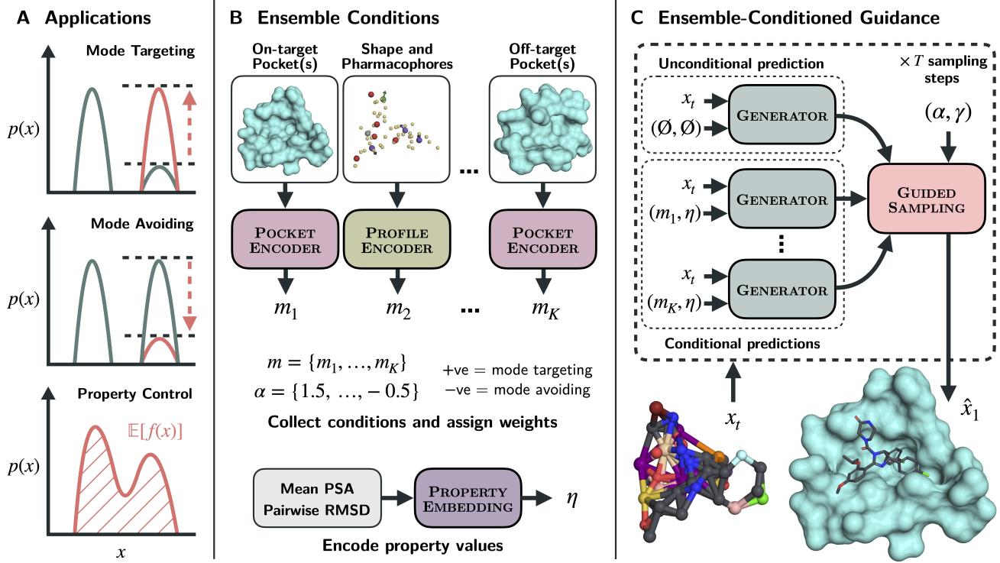  
Figure 1: Overview of the ensemble-conditioned guidance framework. A: Use-cases of our framework visualised in terms of how they can be used to optimise modes and properties of the conformational ensemble. B: Conditioning signals supported by our model; modes can be represented by shapes, pharmacophore profiles or protein pockets, and properties are target scalar values. Conditioning weights $\{ \alpha _ { 1 } , \ldots , \alpha _ { K } \}$ are assigned to each mode condition, $m _ { i }$ . In practice, conditions which share a reference frame can be grouped into a single $m _ { i }$ . C: Guided sampling with ensemble conditions, where $x _ { t }$ refers to the partially denoised molecule, and $\gamma$ is the strength of conditioning, analagous to classifier-free guidance.

Existing approaches to these problems tend to focus on one at a time, and little attention has been paid to optimising multiple aspects of the conformational ensemble. While multi-state design has a long history in computational protein design [21–24], recent deep learning methods [25–29] have largely not carried over the ability to specify a state which should be avoided, with the exception of SwitchCraft [30]. Existing work on small molecule design tends to focus narrowly on dual-target design [31, 32], or performs a full search over chemical space based on an oracle function [33–36]. Search and optimisation approaches must be re-run for every new design, and are likely to become increasingly ineficient as further orthogonal conditions are added to the objective. Ensemble properties, meanwhile, are widely used to filter and to predict, but are rarely used to condition generation. In concurrent work, DECAF [37] optimises molecules towards target values of ensemble properties through iterative optimisation of a population of candidate molecules, although it does not support conditioning on specific conformational states.

We propose to view molecular design as an optimisation over both the modes and properties of a molecule’s conformational ensemble, and introduce ensemble-conditioned guidance as a framework to realise it. Rather than training a model to satisfy several conditions jointly, we train on single conditions and compose them adaptively at inference by combining the vector fields produced under each. This side-steps the need for matched multi-mode datasets, which are scarce for any given pair of states and would have to be re-assembled for each new design task. Our framework provides considerable flexibility, unlocking a wide range of practical design tasks with a single model. Conditions can be targeted or avoided, mixed across shapes, pharmacophores, pockets and ensemble property values, and combined in arbitrary numbers. Fig. 1 provides an overview of our framework.

Composing conditions which sit in separate reference frames requires care, since combining equivariant features across frames can degrade generation. We introduce adaptive symmetry learning, where encoders are trained to produce either invariant or equivariant features, so that one condition can define the generation frame while all others are encoded invariantly and composed without disturbing it. Separately, existing difusion and flow models require the number of atoms to be fixed before generation. Recent work has begun to lift this restriction [38, 39], but not for pocket-conditioned generation, where the choice of size matters more. We introduce a simple method for generating molecules of variable size, and apply it in both single- and multi-condition settings.

Our core contributions are as follows:

• Ensemble-conditioned guidance, allowing 3D molecular generators to be conditioned on arbitrary combinations of ensemble modes and properties at inference time.

• Adaptive symmetry learning, which allows conditioning signals to be composed without breaking the generation reference frame.

• A novel encoder-decoder architecture which encodes each condition once and supports generation of flexibly-sized molecules, keeping the cost of multi-condition sampling low.

• A suite of benchmarks for multi-mode conditioning and ensemble property optimisation, for which little prior evaluation exists.

• Two case studies on practical drug discovery tasks: dual-target binder design and active-state-selective agonist design.

## 2 Background

## 2.1 Flow Matching Generative Modelling

Continuous Data Flow matching [40–42] learns a time-dependent vector field $v _ { \theta } ( x _ { t } , t )$ that transports a simple prior $p _ { 0 }$ to the data distribution $p _ { 1 }$ as t progresses from 0 to 1. Conditioning on a data endpoint $x _ { 1 } \sim p _ { 1 }$ and a prior sample $x _ { 0 } \sim p _ { 0 }$ , training regresses $v _ { \theta }$ against a conditional target $\boldsymbol { u } _ { t } ( \boldsymbol { x } _ { t } \mid \boldsymbol { x } _ { 1 } )$ , where $x _ { t }$ is fixed by a chosen interpolant. Under the commonly used linear interpolant $x _ { t } = \left( 1 - t \right) x _ { 0 } + t x _ { 1 }$ , this target reduces to $u _ { t } = x _ { 1 } - x _ { 0 }$ . For molecular generative models it is common $[ 4 3 , 4 4 ]$ to instead parameterise the network directly as a denoiser, predicting the endpoint $\hat { x } _ { 1 } = \hat { x } _ { \theta } ( x _ { t } , t )$ , in which case the loss takes the form

$$
\mathcal { L } _ { \mathrm { C F M } } = \mathbb { E } _ { t , x _ { 0 } , x _ { 1 } } \left\| \hat { { \boldsymbol x } } _ { \boldsymbol \theta } ( { \boldsymbol x } _ { t } , t ) - { \boldsymbol x } _ { 1 } \right\| ^ { 2 }\tag{1}
$$

with $t \sim \mathcal { U } ( 0 , 1 )$ , and the velocity field is recovered at inference as $\begin{array} { r } { v _ { \theta } ( x _ { t } , t ) = \frac { \hat { x } _ { 1 } - x _ { t } } { 1 - t } } \end{array}$ . We adopt this endpoint parameterisation throughout. Samples are drawn by sampling a prior $x _ { 0 } \sim p _ { 0 }$ and integrating the learned vector field from $t = 0$ to $t = 1$

Discrete Flow Matching For categorical variables $z \in \{ 1 , \ldots , S \} ^ { d }$ we follow Campbell et al. [45], where the generative process is a continuous-time Markov chain (CTMC) over the discrete state space. Each dimension’s conditional probability path interpolates linearly on the simplex, $p _ { t } ( z \mid z _ { 1 } ) = ( 1 - t ) p _ { 0 } ( z ) + t \delta _ { z , z _ { 1 } }$ , where $\delta _ { z , z _ { 1 } }$ is the Kronecker delta. As above, the model is parameterised as an endpoint predictor $p _ { \theta } ( z _ { 1 } \mid z _ { t } , t )$ , trained with the cross-entropy loss

$$
\mathcal { L } _ { \mathrm { D F M } } = - \mathbb { E } _ { t , z _ { 0 } , z _ { 1 } } \log p _ { \theta } ( z _ { 1 } \mid z _ { t } , t )\tag{2}
$$

Since we use a uniform prior in this work, the inference-time transition rate from $z _ { t }$ to any state $y \ne z _ { t }$ takes the closed form $\begin{array} { r } { R _ { t } ( z _ { t } , y ) = \frac { p _ { \theta } ( y | z _ { t } , t ) } { 1 - t } } \end{array}$ . Similarly to continuous flow matching, samples are drawn by sampling $z _ { 0 } \sim p _ { 0 }$ and simulating the CTMC with Euler steps

$$
z _ { t + \Delta t } \sim \mathrm { C a t } \big ( \delta _ { z _ { t } , y } + R _ { t } ( z _ { t } , y ) \Delta t \big )\tag{3}
$$

from $t = 0$ to $t = 1$ , where y ranges over states. In practice, we apply additional stochasticity to this rate matrix at sample time, following Campbell et al. [45].

## 2.2 Guidance for Generative Flows

Continuous Guidance Inference-time conditioning for difusion and flow models is commonly performed using guidance. Classifier guidance [46] steers a continuous-time difusion model towards a target conditioning c by adding the gradient of the log-probability of an existing classifier $p _ { \phi } ( c \mid x _ { t } , t )$ to the model’s score estimate, with a strength parameter controlling the contribution of the classifier. Classifier-free guidance (CFG) [47] extends this to training a single model to learn both the conditional and unconditional distributions by randomly replacing the conditioning with a null embedding $\varnothing$ during training. At inference, the conditional and unconditional outputs are linearly combined to bias the generative process. As shown in Zheng et al. [48], the guided velocity field of a continuous flow matching model can be written as

$$
v ^ { \gamma } ( x _ { t } , t , c ) = ( 1 - \gamma ) v _ { \theta } ( x _ { t } , t , \mathcal { D } ) + \gamma v _ { \theta } ( x _ { t } , t , c )\tag{4}
$$

where $\gamma$ is the guidance strength. $\gamma = 0$ recovers the unconditional flow, $\gamma = 1$ the conditional flow, and $\gamma > 1$ amplifies the conditioning signal, which has been found to improve sample quality at the cost of diversity.

Under the endpoint parameterisation used in this work, this is equivalent to combining the conditional and unconditional endpoint predictions with the same weights and recovering the guided velocity as in the unguided case, since $v _ { \theta }$ is afine in ${ \hat { x } } _ { \theta }$ and the weights sum to one.

Discrete Guidance For discrete flow matching, both classifier and classifier-free guidance have been extended to act on rate-matrices [49]. In this work we focus on classifier-free guidance, where, given conditioning input $c ,$ and for $y \neq x _ { t }$ , the guided rate combines the conditional and unconditional rates multiplicatively:

$$
R _ { t } ^ { \gamma } ( z _ { t } , y \mid c ) = R _ { t } ( z _ { t } , y \mid c ) ^ { \gamma } R _ { t } ( z _ { t } , y \mid \emptyset ) ^ { 1 - \gamma }\tag{5}
$$

Importantly, under our endpoint parameterisation, the rate is proportional to the endpoint prediction, $R _ { t } \propto p _ { \theta }$ . The multiplicative structure of Eq. 5 therefore carries over to the endpoint predictions, $R _ { t } ^ { \gamma } \propto p _ { \theta } ( \cdot \mid c ) ^ { \gamma } p _ { \theta } ( \cdot \mid \emptyset ) ^ { 1 - \gamma }$ . As in the continuous case, both then take the form of a weighted combination of the model’s endpoint predictions, with weights $( 1 - \gamma , \gamma )$ summing to one. We exploit this common structure in Section 3.4 to extend single-condition guidance to combinations over multiple conditioning signals.

## 3 Ensemble-Conditioned Guidance

We characterise a molecule’s conformational ensemble along two axes. Ensemble modes are regions of low energy in the Boltzmann distribution, corresponding to specific 3D conformations, pharmacophore arrangements, or pocket-bound poses. Ensemble properties are aggregate scalars computed over the distribution, such as mean polar surface area or mean pairwise RMSD. Here, we introduce ensemble-conditioned guidance to condition on both axes simultaneously, and compose signals for multiple ensemble modes at inference time. A single trained model can therefore target one or more modes while controlling a particular ensemble property, even when the objectives pull in diferent directions.

Crucially, unlike previous related methods for multi-state design [25, 26, 31], this composition does not require matched multi-mode conditions at training time, allowing us to use regular molecular and protein-ligand datasets without constraints. Below we outline how ensemble conditions are represented, then describe our molecular representation and model architecture, our method for dynamic vector field composition, and finally our training setup.

## 3.1 Ensemble Conditions

Modes can be encoded using explicit shape and pharmacophore spatial conditions, or through a soft protein pocket constraint, where the model is given freedom to generate the binding conformation. Ensemble properties are encoded directly by target value, as described further below.

Shape Conditioning Taking inspiration from Gaussian volume overlap methods for molecular shape matching [2, 3], we represent a conformer’s shape as a noisy version of its coordinates. We first duplicate each atomic coordinate independently with probability 0.2 (to ensure the model canno infer the exact atom count of the reference conformer) and then convolve each resulting point with isotropic Gaussian noise drawn from $\mathcal { N } ( 0 , \sigma _ { s h a p e } ^ { 2 } \mathbf { I } )$ . The subsequent noisy coordinates are then used to condition the generative model on the given shape, where $\sigma _ { s h a p e }$ controls the fidelity of the condition. During training we sample $\sigma _ { s h a p e } \sim \mathcal { U } ( 0 . 1 , 1 . 0 )$ , thereby allowing a choice of conditioning fidelity at inference.

Pharmacophore Conditioning Pharmacophores (as well as reference protein-ligand interactions) are similarly represented using 3D points. Our pharmacophore conditioning supports: hydrogen bond donors and acceptors; cations and anions; aromatic rings; and hydrophobic regions. For protein-ligand data, key binding interactions are mapped to one of these groups (full details in Appendix B). As in ShEPhERD [14], we include a direction vector for pharmacophores, but only for hydrogen bond donors (direction from the heavy atom to its connected hydrogen) and aromatic rings (the normal to the ring plane); all others are set to a zero vector. Each pharmacophore is therefore represented as a 3D coordinate, a direction vector and an interaction type. We randomly drop out pharmacophores during training, with a dropout rate of 0.5 applied independently. A dropout probability of 0.2 is used for protein-ligand data, where crystal interactions are known.

Pocket Conditioning As well as hard mode constraints, where the model is asked to match a specific conformer shape or pharmacophore point cloud, our method supports soft mode conditioning based on protein pockets. Soft conditions ask the model to generate a molecule which binds to the given site but give the model freedom to generate its chosen binding conformation. The model is provided with the atom types and coordinates of the pocket residues – extracted in advance at a 6Å radius from a reference ligand.

Property Conditioning Our method also supports generation conditioned on properties computed over the conformational ensemble. While our framework in principle supports conditioning on any function over the pre-computed ensemble, we focus on the following commonly-used heuristics:

• Polar surface area (PSA) measures the 3D surface area of polar atoms (we use nitrogen, oxygen and any hydrogen bonded to a nitrogen or oxygen). PSA is frequently used as a heuristic to guide orally-bioavailable and membrane-permeable drug design [18, 19]. We compute it using RDKit’s implementation of FreeSASA for each conformer. For the remainder of this paper we use PSA to refer to the mean PSA, averaged over the ensemble.

• Mean pairwise root-mean-squared deviation (RMSD) quantifies the flexibility of the molecule by measuring the average RMSD between all pairs of conformers after superpositioning. Controlling flexibility is crucial for designing potent drugs since flexible molecules pay a higher entropic cost when binding to a target, reducing afinity. In practice, we cap the number of pairs at 200 to avoid a runtime explosion.

To maximise inference-time flexibility, we randomly mask components of the input conditions during training. Shape profiles, pharmacophore profiles and each property value are dropped independently, so the model sees many combinations of conditioning signals and remains a valid predictor for any subset chosen at inference. To create the null condition $\emptyset$ for classifier-free guidance, we additionally drop all signals jointly, including protein pockets.

## 3.2 Molecular Representation and Generative Process

We now outline the molecular representation used by our framework. We follow a similar setup to the one described in Irwin et al. [44]. Notably, however, we extend their framework to enable generation of arbitrarily-sized molecules, as described below.

Molecule Representation A molecule is represented as a tuple $( X , a , b )$ of heavy-atom coordinates $\boldsymbol { X } \in \mathbb { R } ^ { N \times 3 }$ , atom types $a \in \{ 1 , \ldots , S _ { a } \} ^ { N }$ , and a pairwise bond matrix $b \in \{ 1 , \ldots , S _ { b } \} ^ { N \times N }$ . Each atom’s element and formal charge are bundled into a single categorical token, with a dedicated padding token used for the fixed-size representation that enables flexible-size generation (see below). Bonds are categorical over bond order and aromaticity, with a no-bond category for non-bonded atom pairs. Hydrogen atoms are not modelled explicitly, but instead added after the sampled molecule is converted to RDKit.

Joint Continuous-Discrete Flow Matching We treat the tuple $\boldsymbol { x } = ( \boldsymbol { X } , \boldsymbol { a } , \boldsymbol { b } )$ as a single data sample, modelling coordinates with continuous flow matching (Eq. 1) and atom and bond types with discrete flow matching (Eq. 2). The prior $p _ { 0 }$ factorises across modalities: we use a standard Gaussian with zero centre-of-mass for coordinates, and independent uniform categoricals for each atom and bond token. Training samples $x _ { t }$ are constructed by drawing $x _ { 0 } \sim p _ { 0 } , x _ { 1 } \sim p _ { 1 }$ , and sampling a time $t \in [ 0 , 1 ]$ . Coordinates are interpolated using the Gaussian-perturbed linear path from Tong et al. [50], $X _ { t } \sim \mathcal { N } ( ( 1 - t ) X _ { 0 } + t X _ { 1 } , \sigma _ { x } ^ { 2 } \mathbf { I } )$ , where $\sigma _ { x } = 0 . 2 \mathrm { \AA }$ . Atom and bond types are interpolated independently per token using the linear categorical path discussed in Section 2.1.

We parameterise the network as a denoiser which predicts the endpoint $\hat { x } _ { 1 } = ( \hat { X } _ { 1 } , \hat { a } _ { 1 } , \hat { b } _ { 1 } )$ , where $\hat { X } _ { 1 } \in \mathbb { R } ^ { N \times 3 }$ is a coordinate estimate, and $\hat { a } _ { 1 }$ and $\hat { b } _ { 1 }$ collect categorical distributions over atoms and bonds, respectively, for each token. Combinations of endpoint predictions therefore act linearly on the coordinates and log-linearly on the categorical distributions, which we make use of in Section 3.4. At inference, molecules are generated by sampling $x _ { 0 } \sim p _ { 0 }$ and integrating the learned velocity field from $t = 0$ to t = 1 with Euler steps using the procedure outlined in Section 2.1. Following Irwin et al. [44], we use a geometric decay schedule during sampling (smaller steps as t → 1), which has been found to improve sample quality. We use 100 sampling steps unless stated otherwise.

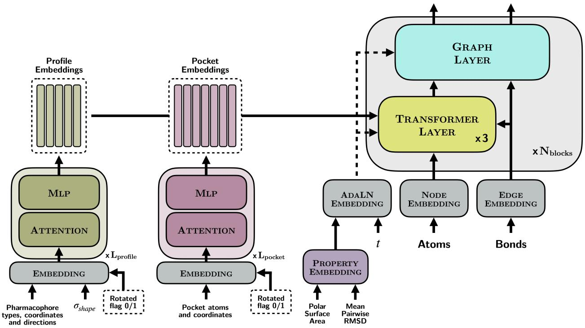  
Figure 2: Our model follows an encoder-decoder design, with separate encoders for shape/pharmacophore profiles and protein pockets, as well as an ensemble property embedding module. Profile and pocket encoders also make use of adaptive layer normalisation (not shown for brevity). Encoders follow a standard transformer design, while the decoder mixes transformer with graph transformer layers, along with adaptive layer normalisation conditioning for incorporating property conditions and the flow-matching time t.

Flexible-Size Generation Most existing difusion and flow models for molecular generation require the number of atoms in a molecule to be fixed in advance of generation. To support flexible-size generation we propose to give the model a fixed number of atom tokens; padding all molecules to a fixed maximum size (we use 48 atoms) and training the model to generate molecules including padding atoms. Sampling simply starts from a fixed-size set of random atoms and the model assigns padding tokens to unused atoms. We found two elements of the training setup to be critical for learning the correct size distribution (from unconditional sampling):

1. Setting coordinates for all pad atoms as the centre-of-mass of the molecule.

2. Applying a permutation alignment between the padded versions of x and x , which minimises the total squared distance between paired prior and data atoms (after centring both point clouds at the origin so that translations don’t dominate the cost).

Together these can be seen as an extension of equivariant optimal transport paths [51, 52] to flexible-size generation. We hypothesise these are useful for learning the correct size distribution as they force the model to place pad atoms close to the centre of mass of the molecule, potentially improving the training signal. We study these decisions further in Appendix D.1.

## 3.3 Architecture

At a high-level, our model resembles an encoder-decoder neural network architecture, where ensemble conditions (modes and scalar ensemble properties) are encoded into a stack of vectors. These are then passed to the decoder which is trained to generate molecules satisfying the given conditions. We use adaptive layer normalisation (AdaLN) [53] throughout, with zero-initialised output scaling parameters, following Peebles and Xie [54]. Fig. 2 outlines our architecture.

Encoding Conditions Shape and pharmacophore points are embedded jointly by a shared encoder; we refer to this set as a profile. Protein pockets are embedded separately. Both encoders are lightweight, non-equivariant transformers, embedding geometric information jointly with invariant node features. Property values are projected through a learnable MLP and masked-summed into a single conditioning vector, where dropped properties contribute nothing to the sum.

Generating Molecules We denote the generator as $\hat { x } _ { \theta } ( x _ { t } , t , m , \eta )$ , where m collects the crossattention conditioning signals (profile and pocket) and η refers to the property values fed through AdaLN. These together play the role of the single conditioning input c in Section 2.2. Either input can be replaced by a null token $\varnothing ,$ in which case the corresponding signal is dropped. The decoder is a stack of blocks, each mixing transformer layers with graph transformer layers in a 3:1 ratio, balancing eficiency with expressivity while supporting both conditional generation and pairwise bond prediction. Transformer layers cross-attend to the conditioning embeddings m; graph transformer layers operate purely on the partially denoised graph and are used to update pairwise features. Further details on our transformer and graph transformer layers, including our graph latent attention mechanism adapted from SemlaFlow [44], are provided in Appendix B.2.

Adaptive Symmetry Learning Since we wish to sample using potentially many structural conditions, we require a robust mechanism for combining conditioning signals during inference. In early experiments, we found that directly combining equivariant conditioning features from diferent reference frames led to degraded performance. Inspired by work on learning molecular symmetries through augmentation [55–57], we propose to train our encoders to embed adaptive symmetries – where we can select whether encoded features contain E(3)-invariant or -equivariant signal. To achieve this, we randomly rotate encoder inputs out of their reference frame 50% of the time, and pass the binary rotated flag to the encoder. We expect the model to treat the signal as invariant when a rotation has been applied, and equivariant when it has not. In Appendix D.2 we study how well the model learns these symmetries. In practice, we find that the symmetry error varies significantly over the generation trajectory, but all errors converge towards zero at t = 1. This suggests that, since generation is built on iterative denoising, encoding exact symmetries into the model may be unimportant.

## 3.4 Composing Vector Fields for Multi-Mode Conditioning

To construct composite signals that target multiple modes simultaneously, or push generation away from undesired modes, we compose mode signals adaptively at inference. In this section we outline our method for multi-mode conditioning.

Multi-Mode Guidance The combinations of Eqs. 4 and 5 act independently on each output of the generator: the continuous combination on the coordinate endpoint, and the discrete log-linear combination on each categorical distribution:

$$
\hat { X } ^ { \gamma } = ( 1 - \gamma ) \hat { X } _ { \theta } ( x _ { t } , t , \mathcal { O } , \mathcal { O } ) + \gamma \hat { X } _ { \theta } ( x _ { t } , t , m , \eta )\tag{6}
$$

$$
\log p ^ { \gamma } ( z _ { 1 } \mid x _ { t } , t ) = ( 1 - \gamma ) \log p _ { \theta } ( z _ { 1 } \mid x _ { t } , t , \mathcal { S } , \mathcal { Q } ) + \gamma \log p _ { \theta } ( z _ { 1 } \mid x _ { t } , t , m , \eta ) , \quad z \in \{ a , b \}\tag{7}
$$

Both forms share weights $( 1 - \gamma , \gamma )$ summing to one. For simplicity, we use the same weights across coordinates, atoms and bonds throughout this paper.

This structure generalises to composition over an arbitrary number of conditioning signals. Given conditions $\displaystyle m _ { 1 } , \ldots , m _ { K }$ and per-condition strengths $\gamma _ { 1 } , \dots , \gamma _ { K }$ , we define the composed endpoint predictions as:

$$
\hat { X } ^ { \gamma } = \left( 1 - \sum _ { k = 1 } ^ { K } \gamma _ { k } \right) \hat { X } _ { \theta } ( x _ { t } , t , \mathcal { D } , \mathcal { D } ) + \sum _ { k = 1 } ^ { K } \gamma _ { k } \hat { X } _ { \theta } ( x _ { t } , t , m _ { k } , \eta )\tag{8}
$$

$$
\log p ^ { \gamma } ( z _ { 1 } \mid x _ { t } , t ) = \Bigl ( 1 - \sum _ { k = 1 } ^ { K } \gamma _ { k } \Bigr ) \log p _ { \theta } ( z _ { 1 } \mid x _ { t } , t , \mathcal { S } , \mathcal { S } ) + \sum _ { k = 1 } ^ { K } \gamma _ { k } \log p _ { \theta } ( z _ { 1 } \mid x _ { t } , t , m _ { k } , \eta ) , \quad z \in \{ a , b \}\tag{9}
$$

where $\gamma = \left( \gamma _ { 1 } , \dots , \gamma _ { K } \right)$ and the null prediction absorbs the residual weight, so that the full set of weights sums to one and the endpoint-velocity equivalence of Section $2 . 2$ applies unchanged. Each $\gamma _ { k }$ therefore keeps its single-condition meaning, the strength with which $m _ { k }$ is applied, with $\gamma _ { k } < 0$ pushing generation away from it, and $K = 1$ recovers Eqs. 6 and $^ { 7 } \cdot$ More generally, Eq. 8 composes vector fields as in compositional difusion [58, 59] and $\operatorname { E q . 9 }$ is a weighted product of experts [60], with negative $\gamma _ { k }$ acting as the negation operator.

It is often convenient to separate how far the composition extrapolates from the unconditional flow from how that extrapolation is divided between conditions. Writing $\gamma _ { k } = \gamma \alpha _ { k }$ with $\textstyle \sum _ { k } \alpha _ { k } = 1$ , the scalar $\gamma$ recovers its usual role as the overall guidance strength while α specifies the allocation across conditions, with $\alpha _ { k } < 0$ for an avoided condition. We report all experiments in this parameterisation.

Reference Frame-Guided Generation Since it is often desirable to support frame-aware generation (generating a protein-bound conformation, for example), we select one $m _ { k }$ as the reference for generation and toggle the encoder to produce equivariant features using the adaptive symmetry mechanism of Section 3.3. All other mode conditions are encoded invariantly, which permits their composition without breaking the reference frame. In practice, for generation eficiency, a single condition $m _ { k }$ may itself bundle multiple embeddings, provided they share a reference frame. For example, profile (shape and pharmacophore) embeddings and pocket embeddings derived from the same ligand can be concatenated as a single $m _ { k }$ , requiring only one forward pass through the generator.

Practical Application Because composition is constructed entirely at inference, the model only sees single-mode samples during training. The independent condition masking described in Section 3.1 ensures that each $\hat { x } _ { \theta } ( \cdot , \cdot , m _ { k } , \eta )$ remains valid under whichever subset of conditions is chosen at test time. This form of dynamic signal composition also permits significant inference-time flexibility. We break conditioning strategies down into the following three regimes of practical interest:

1. Mode targeting With all $\alpha _ { k } > 0$ , generation is steered toward a region jointly satisfying all K modes.

2. Mode avoidance With $\alpha _ { k } < 0$ for some $k ,$ generation is pushed away from $m _ { k }$

3. Signal amplification With $\gamma > 1$ , the combination extrapolates beyond the conditional flow, in direct analogy to standard CFG amplification. This is independent of the choice of α and can be combined with either regime above.

These regimes can also be combined within a single composition; for example, targeting a protein pocket with a set of reference pharmacophores while concurrently avoiding two of-target pockets. Algorithm 1 summarises our general sampling procedure.

Algorithm 1 Sampling using ensemble-conditioned guidance.   
Require: Prior $x _ { 0 }$ , time schedule $\{ t _ { 0 } , \ldots , t _ { T } \}$ , embedded mode conditions $\{ m _ { 1 } , . . . , m _ { K } \}$ , property   
embedding η, per-condition strengths $\gamma _ { k } = \gamma \alpha _ { k }$ with $\textstyle \sum _ { k } \alpha _ { k } = 1$   
1: $x  x _ { 0 }$   
2: for $i = 0 , \dots , T - 1$ do   
3: $\hat { x } ^ { ( 0 ) } \gets \hat { x } _ { \theta } ( x , t _ { i } , \emptyset , \emptyset )$ ▷ null prediction   
4: for $k = 1 , \ldots , K$ do   
5: $\hat { x } ^ { ( k ) } \gets \hat { x } _ { \theta } ( x , t _ { i } , m _ { k } , \eta )$ ▷ conditional prediction   
6: end for   
7: Combine endpoint predictions using Eqs. (8) and (9) with strengths $\left\{ \gamma _ { 1 } , \dots , \gamma _ { K } \right\}$   
8: Integrate from $t _ { i }$ to $t _ { i + 1 }$ using the procedure from Section 2.1   
9: end for   
10: return x

## 3.5 Model Training

As outlined in Section 3.2, we train the network to predict the endpoint $\hat { x } _ { 1 } = ( \hat { X } _ { 1 } , \hat { a } _ { 1 } , \hat { b } _ { 1 } )$ from the interpolated sample $x _ { t }$ . We train with the combined objective:

$$
\mathcal { L } = \mathbb { E } _ { t , x _ { 0 } , x _ { 1 } } \left[ \omega ( t ) \cdot \left( \lVert \hat { X } _ { 1 } - X _ { 1 } \rVert ^ { 2 } + \lambda _ { a } \operatorname { C E } ( \hat { a } _ { 1 } , a _ { 1 } ) + \lambda _ { b } \operatorname { C E } ( \hat { b } _ { 1 } , b _ { 1 } ) \right) \right] ,\tag{10}
$$

where CE is the cross-entropy and $\begin{array} { r } { \omega ( t ) = \operatorname* { m i n } \left( \frac { t } { 1 - t } , 1 0 . 0 \right) } \end{array}$ . We use $\lambda _ { a } = 0 . 3$ and $\lambda _ { b } = 5 . 0$ , chosen to balance the losses for the discrete and continuous modalities.

Training samples are constructed by drawing $x _ { 0 } \sim p _ { 0 } , x _ { 1 } \sim p _ { 1 }$ and t ∼ Beta(1.5, 1.0) rather than the uniform time sampling of Eq. 1. Together with $\omega ,$ this biases training towards late t, following [44, 61]. Conditions are masked during training as described in Section 3.1. A masking rate of 30% is applied independently to the shape profile, pharmacophore profile, PSA and pairwise RMSD, and a global rate of 10% is applied to all signals including protein pockets.

The model is trained jointly on two datasets: GEOM Drugs [62], consisting of 300K small molecules with conformer ensembles pre-computed using CREST [63], and SPINDR [11], a dataset of 35K protein-ligand complexes originally derived from the PDB, with pre-computed protein-ligand interactions. For GEOM Drugs, we hold out a test set of 1K molecules consisting of novel, unique scafolds (Appendix B.3), which we use to construct our multi-mode benchmark (Section 4.1). SPINDR splits are the same as those proposed by PLINDER [64], which were chosen to minimise train-test data leakage. During training, we filter out SPINDR systems with QED < 0.3 and replicate the remaining 28K SPINDR systems 8 times each epoch. Training was performed in mixed-precision (bf16) using the Adam optimiser for 200 epochs on a single A100 GPU, taking approximately 2 days. Full hyperparameters are listed in Appendix B.2.

## 4 Experiments

Since there is limited existing work on designing molecules which adopt specified conformational states or target ensemble properties, we set up a suite of challenging benchmarks to test our method. We investigate both multi-mode generation (mode targeting and mode avoidance), and optimising an ensemble property while maintaining a bioactive pharmacophore profile. In Section 4.3 we apply our model to two real-world drug discovery tasks – dual-target binder design, and agonist design (optimising for active-state selectivity).

Target shape Avoid shape

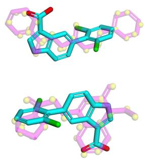  
° = 0

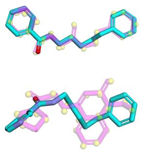  
° = 0:5

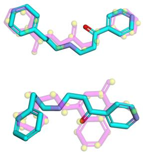  
° = 1

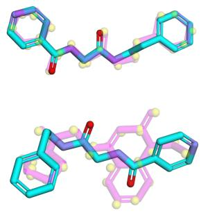  
° = 2

Figure 3: Generating molecules to target an extended shape while avoiding a compact shape for diferent conditioning strengths, γ, where $\gamma = 0$ refers to unconditional generation. The two reference molecules are shown in magenta, while yellow points show the shape profiles used for conditioning. The conformer with the highest Gaussian shape overlap to the reference is plotted, and $\sigma _ { s h a p e } = 0 . 2$ was used in all cases.

To keep our evaluations tractable, we set up a conformer sampling algorithm using ETKDG [65] (implemented in RDKit), and minimisation with the MMFF94 forcefield [66]. This bypasses the use of CREST [63], which typically takes hours per molecule, and we find it provides a reasonable approximation for our ensemble properties (full details in Appendix C.1).

## 4.1 Multi-Mode Conditioning

These benchmarks aim to evaluate mode targeting and mode avoidance abilities. In order to test fundamental capabilities, we restrict ourselves to conditioning on only two modes, which are represented using shape profiles only (Section 3.1). Fig. 3 shows an example of molecules generated to target an extended shape, while avoiding a compact shape, for diferent values of γ.

Experimental Setup We sample MMFF ensembles for all molecules in our GEOM Drugs test set (1K molecules) using the procedure above, and select a compact and an extended conformer for each based on the radius of gyration. We then find two complementary sets of compact-extended pairings: mode targeting pairings, where molecules fit both modes; and mode avoiding pairings, where molecules fit one mode but not the other. To create meaningful pairings, we ensure there exists at least one chemically-distinct reference molecule in the training set which fits both mode requirements, and only pair conformers whose parent molecules difer by at most one heavy atom. The mode targeting set contains 496 pairs, while the mode avoiding set contains 535. Full details of the benchmark construction are given in Appendix C.2.

Each molecule is scored against a target shape by sampling its MMFF ensemble, scoring every conformer against the target via Gaussian shape overlap (using RDKit rdShapeAlign), and taking the best conformer’s shape Tanimoto. For each target we define a size-matched virtual screening baseline by taking the mean of this score over a random sample of training molecules within 1 heavy atom of the reference. We report the shape-matching gain ∆ as the diference between the generated tanimoto scores and the baseline for the compact and extended targets separately. ∆ therefore measures how much better a generated molecule fits the target shape than a randomly drawn molecule of the same size.

Results In Fig. 4 we show the density plots of compact and extended ∆ when running our model on our mode targeting and avoiding benchmarks, using values of 0.2 and 0.5 for $\sigma _ { s h a p e }$ . In all runs $\gamma = 4 . 0$ , with α = (0.5, 0.5) for mode targeting and $\alpha = ( 1 . 5 , - 0 . 5 )$ for mode avoidance, where the first entry refers to the targeted mode and the second to the avoided one. In general we see a strong shift away from the size-matched virtual screening baseline and toward the target condition, which is particularly prominent at lower $\sigma _ { s h a p e }$ . This highlights the useful role of $\sigma _ { s h a p e }$ as controlling the conditioning fidelity; as more noise is added to the shape profile, the generated molecule fits the target mode less strongly, although we find this leads to samples which are more chemically distinct from the reference (see Appendix D.3). Additionally, the plots also show a bias in conditioning strength towards the condition that was provided with equivariant features, especially for $\sigma _ { s h a p e } = 0 . 2$ . When targeting both modes (left hand side of Fig. 4), the dominant axis of response shifts when the mode given equivariant features is flipped. At $\sigma _ { s h a p e } = 0 . 2$ the mean compact and extended $\Delta$ are 0.19 and 0.07 when the compact mode is given equivariant features, and 0.07 and 0.19 when the assignment is reversed, showing that the bias follows the feature type rather than the mode.

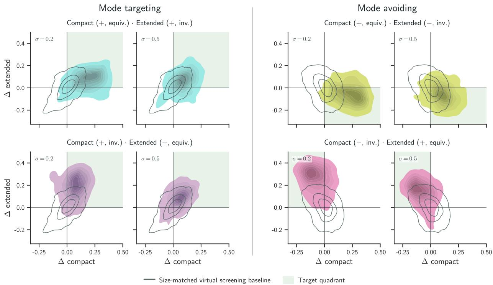  
Figure 4: Density plots showing the diference in shape Tanimoto scores compared to a size-matched baseline on mode targeting and mode avoiding tasks. + and − correspond to mode targeting and mode avoiding conditioning, respectively, and equiv. and inv. correspond to using equivariant and invariant conditioning signals.

Importantly, we also find that generation quality and chemical novelty are maintained across all four conditioning setups. Connected validity stays above 0.97 and uniqueness above 0.99 in every run except compact avoidance at $\sigma _ { s h a p e } = 0 . 2$ , where it falls to 0.90. Generated molecules also remain chemically distinct from the two reference molecules used to build the conditions, with a mean ECFP Tanimoto of between 0.25 and 0.31 at $\sigma _ { s h a p e } = 0 . 2$ and 0.14 at $\sigma _ { s h a p e } = 0 . 5$ in all four setups. Taking the more similar of the two references gives medians of 0.37 and 0.15 respectively, so as well as controlling how strongly the target shape is matched, $\sigma _ { s h a p e }$ trades conditioning fidelity against chemical novelty. Full per-run results are given in Table 2.

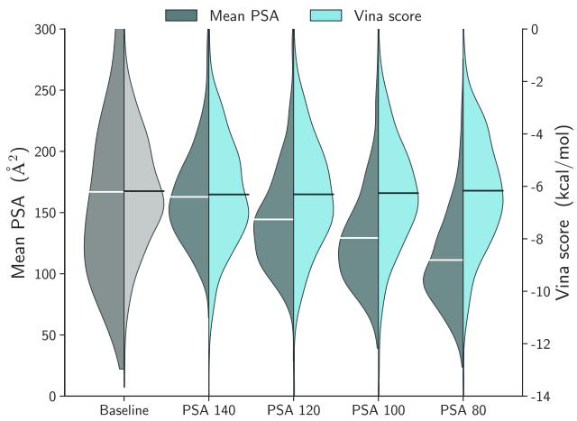

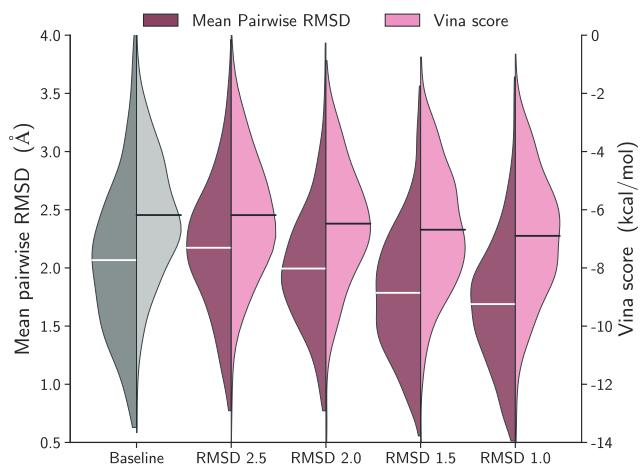  
Figure 5: Distribution plots for molecular properties generated from the ensemble property optimisation benchmark. Baseline: pocket and pharmacophore conditioning; other plots come from sampling with the same condition as well as a property condition. Centre lines denote the mean of the distributions.

## 4.2 Ensemble Property Optimisation

This benchmark aims to evaluate whether ensemble properties can be controlled while a bioactive conformation is maintained. We condition on a protein pocket together with the reference ligand’s interactions, which fixes the binding mode, and additionally ask for a target value of a single ensemble property, either mean PSA or mean pairwise RMSD (Section 3.1). Since one condition constrains the bound conformation while the other constrains the whole ensemble, we measure both the property control achieved and the cost paid in pocket fit.

Experimental Setup We take protein-ligand systems from the test set of SPINDR, which are split to be structurally distinct from the training systems [64]. Following the same filter used during training, we remove any system whose reference ligand has a QED below 0.3, leaving 179 test systems, and generate 3 molecules for each. All runs condition on the protein pocket together with the pharmacophores extracted from the reference ligand’s crystal interactions, using $\gamma = 2 . 0$ . Since the pocket and its reference pharmacophores share a reference frame, they are encoded as a single mode, so $K = 1$ and $\alpha = ( 1 )$ . Property-conditioned runs additionally provide a target for one ensemble property, where the value given to the model is drawn from $\mathcal { N } ( \mu _ { t a r g e t } , \sigma _ { p r o p } )$ , with $\sigma _ { p r o p }$ of 10 $\mathrm { \AA ^ { 2 } }$ for PSA and 0.1 Å for mean pairwise RMSD. We sweep PSA targets of 80, 100, 120 and 140 $\mathrm { \AA ^ { 2 } }$ , and mean pairwise RMSD targets of 1.0, 1.5, 2.0 and 2.5 Å, and compare against a baseline using the same pocket and pharmacophore conditioning with no property condition.

Generated molecules are scored for ensemble properties using the sampling procedure above, for the fraction of reference protein-ligand interactions recovered, and by scoring each generated pose in its pocket with AutoDock Vina [67], both as generated and after local minimisation under the Vina scoring function. Interaction recovery measures the proportion of conditioned reference interactions for which the generated molecule places a pharmacophore of the same type within 2Å. Since a model could satisfy this using a highly strained conformer, we first apply a short local GFN2-xTB relaxation on the generated pose. Full definitions of all evaluation metrics are given in Appendix C.3.

Results As shown in Fig. 5, we find that both properties respond monotonically to the conditioning target. Mean PSA moves from 111 to 163 $\textup { \AA } ^ { \bar { 2 } }$ as the target is raised from 80 to 140, and mean pairwise RMSD from 1.69 to 2.17 Å as the target is raised from 1.0 to 2.5, against baseline values of 167 $\mathrm { \AA ^ { 2 } }$ and 2.07 Å. Achieved values are compressed towards the baseline at the ends of each sweep, most visibly for PSA, where a target of 80 produces a mean of 111 $\mathrm { \AA ^ { 2 } }$ . The model therefore provides directional control over both properties across a wide range, rather than calibrated control at a specific value.

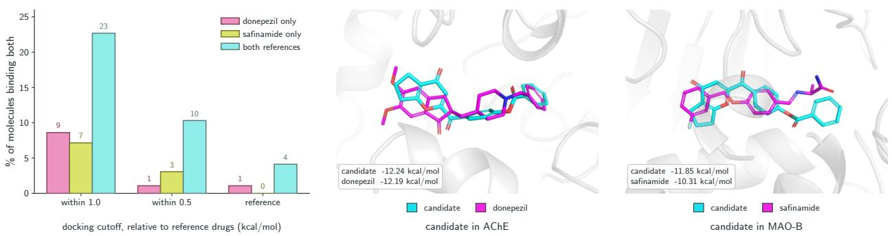  
Figure 6: Dual-target binder design for AChE and MAO-B. Left: the proportion of generated molecules which bind both pockets, at cutofs set relative to the two reference drugs’ own docking scores (AChE −12.19, MAO-B −10.31 kcal/mol), when conditioning on donepezil only, safinamide only, and both references. Centre and right: the best joint candidate in its docked pose (cyan) overlaid on the crystal pose (magenta) of donepezil in AChE and of safinamide in MAO-B. Scores are from docking both the candidate and the reference drug into each pocket.

Crucially, this control does not come at the cost of the pocket conditioning. Interaction recovery stays between 0.944 and 0.961 for every run, matching the 0.954 of the pocket and pharmacophore baseline, and Vina scores, validity and similarity to the reference ligand are all maintained across both sweeps. Docking scores even improve slightly at lower RMSD targets, from the baseline’s −6.18 to −6.90 kcal/mol at an RMSD target of 1.0. This is likely due to Vina’s direct penalty on rotatable bonds and by the easier conformational search for more rigid molecules. Full results for all runs are given in Table 3.

## 4.3 Real-World Case Studies

Dual-Target Binder Design Acetylcholinesterase (AChE) inhibitors are used to treat Alzheimer’s disease and monoamine oxidase B (MAO-B) inhibitors for Parkinson’s; MAO-B is also implicated in Alzheimer’s pathology, and dual AChE/MAO-B inhibitors are an actively pursued therapeutic strategy [68] and a challenging test case for multi-objective design. Here, we apply our ensembleconditioned guidance method to condition on the pharmacophore patterns of two reference molecules, donepezil for AChE (PDB 4EY7 [69]) and safinamide for MAO-B (PDB 2V5Z [70]). Pharmacophores for each reference molecule are randomly dropped out at a rate of 20% to encourage chemical diversity. We condition on equivariant features for donepezil and invariant for safinamide, and generate 100 molecules with $\gamma = 2 . 0$ , with $\alpha = ( 0 . 5 , 0 . 5 )$ over the donepezil and safinamide pharmacophore conditions. Each reference is run on its own under the same setup as a single-target control, using equivariant features in both cases.

We evaluate all valid, non-fragmented molecules using AutoDock Vina with exhaustiveness 32, scoring molecules against a cutof defined relative to the reference molecules’ own docking scores (after redocking). We find that conditioning on both references produces the most dual-binding molecules (according to the docking oracle) across all thresholds (Fig. 6). Within 1.0 kcal/mol of both references, 23% of the combined molecules bind both, against 9% and 7% for donepezil and safinamide alone. The gap widens as the cutof tightens, to 10% against 1% and 3% within 0.5 kcal/mol, and 4% against 1% and 0% at the reference scores themselves. The best joint candidate matches donepezil in AChE (−12.24 against −12.19 kcal/mol) and improves on safinamide in MAO-B (−11.85 against −10.31), overlaying the ring system of each drug in the corresponding pocket while remaining a novel scafold rather than a copy of either.

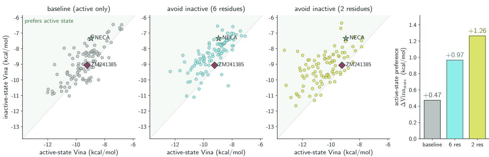  
Figure 7: Active-state-biased design for the A2A adenosine receptor. Left three panels: every generated molecule placed by its docking score against the active and inactive receptor, where points above the diagonal prefer the active state, shown for the active-pocket-only baseline and for the two CoM shift thresholds used to build the inactive-pocket negative. NECA (agonist) and ZM241385 (antagonist) are docked through the same pipeline as reference points. Right: mean $\Delta \mathrm { V i n a } _ { s t a t e }$ for each run.

Agonist Design G protein-coupled receptors (GPCRs) switch between an active and an inactive conformation, and only the active state signals. An agonist stabilises the active state while an antagonist binds the same pocket without activating the protein. This makes agonist design a problem of selectively binding the active state over the inactive, rather than maximising afinity for a single one. Here, we take the A2A adenosine receptor as a canonical example, with PDB 5G53 [71] as the active state bound to NECA, a known agonist, and PDB 4EIY [72] as the inactive state bound to ZM241385, a known antagonist. Pockets are first extracted by taking residues within 6Å of any atom of the reference ligands. We align the inactive pocket onto the active and encode both with equivariant features, since the reference frames are aligned. Embedded residues with a centre-of-mass (CoM) shift of less than a given threshold between active and inactive conformations are discarded. We experiment with thresholds of 1.5Å and 2.0Å, which retain 6 residues and 2 residues, respectively. We generate 100 molecules per run with $\gamma = 2 . 0$ and $\alpha = ( 2 . 0 , - 1 . 0 )$ , and compare against a baseline conditioned on the active pocket alone. Every molecule is docked into both receptors, and we report $\Delta \mathrm { V i n a } _ { s t a t e } = \mathrm { V i n a } _ { i n a c t i v e } - \mathrm { V i n a } _ { a c t i v e } ,$ such that positive values refer to active state-preferring.

Adding the inactive state avoidance signal noticeably shifts generation towards the active state (Fig. 7). Conditioning generation on the active pocket alone is biased towards the active state, with a mean $\Delta \mathrm { V i n a } _ { s t a t e }$ of +0.47 kcal/mol. However, adding the inactive conformation as a negative condition roughly doubles this, giving +0.97 for the 6-residue condition and +1.26 for the 2-residue run. This compares to +1.61 for NECA and +0.17 for ZM241385 docked through the same pipeline. Since both conditions are only pocket conformations rather than binding profiles, we find that the ECFP Tanimoto to NECA stays very low throughout, with medians between 0.12 and 0.19, so the model is able to explore novel chemical space while still producing active state-favouring molecules.

## 5 Conclusion

We proposed to approach molecular design through the modes and properties of a molecule’s conformational ensemble, rather than through a single bioactive conformation, and introduced ensemble-conditioned guidance as a framework for doing so. By composing conditions at inference rather than learning them jointly, our method requires no matched multi-mode training data, and allows shapes, pharmacophores, pockets and ensemble properties to be combined in arbitrary numbers, targeted or avoided, with a single trained model. On our multi-mode benchmarks we find a clear shift towards the target shape relative to a size-matched virtual screening baseline, in both the targeting and avoidance settings, without any loss of generation quality or chemical novelty. Ensemble properties respond monotonically to the conditioning target while the conditioned binding mode is retained, showing that the two axes can be controlled concurrently even when they constrain the molecule diferently. Two case studies apply the framework to practical drug design problems: for dual-target binder design, conditioning on both references substantially improves the proportion of molecules scoring well against both pockets, and for agonist design, adding the inactive receptor conformation as a negative condition more than doubles the active-state preference of generated molecules.

Limitations On the method, conditions encoded with invariant features show a weaker conditioning signal than the condition which defines the generation frame, so the assignment of the reference frame remains a meaningful choice at inference. Additionally, inference time scales linearly with the number of mode conditions since each requires its own forward pass through the generator. Property conditioning provides directional rather than calibrated control, with achieved values compressed towards the unconditioned baseline at the ends of each sweep.

On the evaluation, we rely on an approximate ensemble sampling procedure to keep our benchmarks tractable, so we cannot guarantee that generated molecules fit the desired shapes at CREST ensemble quality, and our mean PSA and mean pairwise RMSD values only approximate the CREST observables the model was trained on. CREST itself produces conformer ensembles rather than samples from a thermalized distribution, so we characterise our conditions and properties in terms of the conformational ensemble rather than making distributional claims about it. Finally, our case studies use docking scores as an oracle for binding, which is a coarse proxy and cannot distinguish designs which would succeed experimentally from those which merely score well.

Future Work A natural extension of our framework is to chameleonicity, the ability of a molecule to adopt distinct conformational states in diferent environments, which has been suggested as a route to designing orally bioavailable PROTACs, macrocycles and peptides [73, 74]. Chameleonic constraints can be expressed directly as a combination of mode and property conditions, making our framework a very suitable choice, although this would require extending the maximum size of molecules beyond 48 heavy atoms.

On the methodological side, we are interested in better ways of combining vector fields, either allowing equivariant fields to be composed directly or pushing a stronger signal into the invariant features. Investigating other composition methods [75, 76] and sequential Monte Carlo approaches targeting the desired multi-modal distribution [77, 78] are natural candidates. Scaling up proteinligand data with synthetic datasets would allow a wider range of pocket conditions to be learned. Validating the framework on a larger number of simultaneous reference frames would also test the generality of the composition beyond the two-mode setting studied here.

## Acknowledgements

We thank Selma Moqvist and the rest of the Olsson group and Molecular AI department for helpful input on the work. We also thank Kento Abeywardane and Kenji Walker for valuable discussions.

This work was partially supported by the Wallenberg AI, Autonomous Systems and Software Program (WASP) funded by the Knut and Alice Wallenberg Foundation. Computational resources were provided by the National Academic Infrastructure for Supercomputing in Sweden (NAISS), funded by the Swedish Research Council. Computational resources were also provided on the Berzelius system funded by the Knut and Alice Wallenberg foundation and operated by NAISS.

## References

[1] Irwin D Kuntz, Jefrey M Blaney, Stuart J Oatley, Robert Langridge, and Thomas E Ferrin. A geometric approach to macromolecule-ligand interactions. Journal of molecular biology, 161(2): 269–288, 1982.

[2] J Andrew Grant and BT Pickup. A gaussian description of molecular shape. The Journal of Physical Chemistry, 99(11):3503–3510, 1995.

[3] J Andrew Grant, Maria A Gallardo, and Barry T Pickup. A fast method of molecular shape comparison: A simple application of a gaussian description of molecular shape. Journal of computational chemistry, 17(14):1653–1666, 1996.

[4] Thomas S Rush, J Andrew Grant, Lidia Mosyak, and Anthony Nicholls. A shape-based 3-d scafold hopping method and its application to a bacterial protein- protein interaction. Journal of medicinal chemistry, 48(5):1489–1495, 2005.

[5] Xingang Peng, Shitong Luo, Jiaqi Guan, Qi Xie, Jian Peng, and Jianzhu Ma. Pocket2mol: Eficient molecular sampling based on 3d protein pockets. In International conference on machine learning, pages 17644–17655. PMLR, 2022.

[6] Shitong Luo, Jiaqi Guan, Jianzhu Ma, and Jian Peng. A 3d generative model for structure-based drug design. Advances in neural information processing systems, 34:6229–6239, 2021.

[7] Jiaqi Guan, Wesley Wei Qian, Xingang Peng, Yufeng Su, Jian Peng, and Jianzhu Ma. 3d equivariant difusion for target-aware molecule generation and afinity prediction. In The Eleventh International Conference on Learning Representations, 2023. URL https: //openreview.net/forum?id=kJqXEPXMsE0.

[8] Arne Schneuing, Charles Harris, Yuanqi Du, Kieran Didi, Arian Jamasb, Ilia Igashov, Weitao Du, Carla Gomes, Tom L Blundell, Pietro Lio, et al. Structure-based drug design with equivariant difusion models. Nature Computational Science, 4(12):899–909, 2024.

[9] Julian Cremer, Tuan Le, Frank Noé, Djork-Arné Clevert, and Kristof T Schütt. Pilot: equivariant difusion for pocket-conditioned de novo ligand generation with multi-objective guidance via importance sampling. Chemical Science, 15(36):14954–14967, 2024.

[10] Arne Schneuing, Ilia Igashov, Adrian W. Dobbelstein, Thomas Castiglione, Michael M. Bronstein, and Bruno Correia. Multi-domain distribution learning for de novo drug design. In The Thirteenth International Conference on Learning Representations, 2025. URL https://openreview.net/forum?id=g3VCIM94ke.

[11] Julian Cremer, Ross Irwin, Alessandro Tibo, Jon Paul Janet, Simon Olsson, and Djork-Arné

Clevert. Flowr: Flow matching for structure-aware de novo, interaction-and fragment-based ligand generation. arXiv preprint arXiv:2504.10564, 2025.

[12] Keir Adams and Connor W. Coley. Equivariant shape-conditioned generation of 3d molecules for ligand-based drug design. In The Eleventh International Conference on Learning Representations, 2023. URL https://openreview.net/forum?id=4MbGnp4iPQ.

[13] Ziqi Chen, Bo Peng, Srinivasan Parthasarathy, and Xia Ning. Shape-conditioned 3d molecule generation via equivariant difusion models. arXiv preprint arXiv:2308.11890, 2023.

[14] Keir Adams, Kento Abeywardane, Jenna Fromer, and Connor W. Coley. ShEPhERD: Difusing shape, electrostatics, and pharmacophores for bioisosteric drug design. In The Thirteenth International Conference on Learning Representations, 2025. URL https://openreview.net/ forum?id=KSLkFYHlYg.

[15] Marc C Nicklaus, Shaomeng Wang, John S Driscoll, and George WA Milne. Conformational changes of small molecules binding to proteins. Bioorganic & medicinal chemistry, 3(4):411–428, 1995.

[16] Jonas Boström, Per-Ola Norrby, and Tommy Liljefors. Conformational energy penalties of protein-bound ligands. Journal of computer-aided molecular design, 12(4):383–383, 1998.

[17] Emanuele Perola and Paul S Charifson. Conformational analysis of drug-like molecules bound to proteins: an extensive study of ligand reorganization upon binding. Journal of medicinal chemistry, 47(10):2499–2510, 2004.

[18] Daniel F Veber, Stephen R Johnson, Hung-Yuan Cheng, Brian R Smith, Keith W Ward, and Kenneth D Kopple. Molecular properties that influence the oral bioavailability of drug candidates. Journal of medicinal chemistry, 45(12):2615–2623, 2002.

[19] Jing J Lu, Kimberly Crimin, Jay T Goodwin, Patrizia Crivori, Christian Orrenius, Li Xing, Peter J Tandler, Thomas J Vidmar, Benny M Amore, Alan GE Wilson, et al. Influence of molecular flexibility and polar surface area metrics on oral bioavailability in the rat. Journal of medicinal chemistry, 47(24):6104–6107, 2004.

[20] Chia-en A Chang, Wei Chen, and Michael K Gilson. Ligand configurational entropy and protein binding. Proceedings of the National Academy of Sciences, 104(5):1534–1539, 2007.

[21] James J Havranek and Pehr B Harbury. Automated design of specificity in molecular recognition. nature structural biology, 10(1):45–52, 2003.

[22] Xavier I Ambroggio and Brian Kuhlman. Computational design of a single amino acid sequence that can switch between two distinct protein folds. Journal of the American Chemical Society, 128(4):1154–1161, 2006.

[23] Andrew Leaver-Fay, Ron Jacak, P Benjamin Stranges, and Brian Kuhlman. A generic program for multistate protein design. PloS one, 6(7):e20937, 2011.

[24] James A Davey and Roberto A Chica. Multistate approaches in computational protein design. Protein Science, 21(9):1241–1252, 2012.

[25] Alex Abrudan, Sebastian Pujalte Ojeda, Chaitanya K. Joshi, Matthew Greenig, Felipe Engelberger, Alena Khmelinskaia, Jens Meiler, Michele Vendruscolo, and Tuomas Knowles. Multistate protein sequence design with dynamicMPNN. In The Fourteenth International Conference on Learning Representations, 2026. URL https://openreview.net/forum?id=4ptHfbHG3D.

[26] Chaitanya Joshi, Arian Jamasb, Ramon Viñas, Charles Harris, Simon Mathis, Alex Morehead, Rishabh Anand, and Pietro Liò. grnade: Geometric deep learning for 3d rna inverse design. In International Conference on Learning Representations, volume 2025, pages 10166–10191, 2025.

[27] Bowen Jing, Anna Sappington, Mihir Bafna, Ravi Shah, Adrina Tang, Rohith Krishna, Adam Klivans, Daniel J. Diaz, and Bonnie Berger. Generating functional and multistate proteins with a multimodal difusion transformer. bioRxiv, 2025. doi: 10.1101/2025.09.03.672144. URL https://www.biorxiv.org/content/early/2025/09/04/2025.09.03.672144.

[28] Sidney Lyayuga Lisanza, Jacob Merle Gershon, Samuel WK Tipps, Jeremiah Nelson Sims, Lucas Arnoldt, Samuel J Hendel, Miriam K Simma, Ge Liu, Muna Yase, Hongwei Wu, et al. Multistate and functional protein design using rosettafold sequence space difusion. Nature biotechnology, 43(8):1288–1298, 2025.

[29] Richard W. Shuai, Tianyu Lu, Subhang Bhatti, Petr Kouba, and Po-Ssu Huang. Ensembleconditioned protein sequence design with caliby. bioRxiv, 2025. doi: 10.1101/2025.09.30.679633. URL https://www.biorxiv.org/content/early/2025/10/05/2025.09.30.679633.

[30] Bowen Jing, Mihir Bafna, Anisha Parsan, Heyuan Michael Ni, David Kwabi-Addo, Bryan D. Bryson, Adam Klivans, and Bonnie Berger. Switchcraft: A programmatic framework for designing state-switching proteins. In Forty-third International Conference on Machine Learning, 2026. URL https://openreview.net/forum?id=YtqaHnqv8c.

[31] Jianliang Wu, Anjie Qiao, Zhen Wang, Zhewei Wei, and Sheng Chen. Fusedif: Symmetrypreserving joint difusion for dual-target structure-based drug design. arXiv preprint arXiv:2603.05567, 2026.

[32] Xiangxin Zhou, Jiaqi Guan, Yijia Zhang, Xingang Peng, Liang Wang, and Jianzhu Ma. Reprogramming pretrained target-specific difusion models for dual-target drug design. In The Thirty-eighth Annual Conference on Neural Information Processing Systems, 2024. URL https://openreview.net/forum?id=Y79L45D5ts.

[33] Yanheng Li, Xiaohan Lin, Yize Hao, Jun Zhang, Yundong Wu, and Yi Qin Gao. Molsculptor: an adaptive difusion-evolution framework enabling generative drug design for multi-target afinity and selectivity. ChemRxiv, 2025. doi: 10.26434/chemrxiv-2025-v4758-v2. URL https://chemrxiv.org/doi/abs/10.26434/chemrxiv-2025-v4758-v2.

[34] Viet Thanh Duy Nguyen, Phuc Pham, and Truong-Son Hy. Enabling multi-target drug discovery through latent evolutionary optimization and synthesis-aware prioritization (evosynth). Communications Chemistry, 2026.

[35] Thibaud Southiratn, Bonil Koo, Yijingxiu Lu, and Sun Kim. Combimots: Combinatorial multi-objective tree search for dual-target molecule generation. In International Conference on Machine Learning, pages 56650–56691. PMLR, 2025.

[36] Laura Landolfi, Bruno Catalanotti, and Jon Paul Janet. Finding balance: Multiobjective optimization in molecular generative modeling. Journal of Chemical Information and Modeling, 2026.

[37] Selma Moqvist, Richard Beckmann, Ross Irwin, Rocío Mercado, and Simon Olsson. Boltzmannexpected molecular design with decoupled annealing flows. arXiv preprint arXiv:2607.19519, 2026.

[38] Ian Dunn and David R Koes. Flowmol3: flow matching for 3d de novo small-molecule generation. Digital Discovery, 2026.

[39] Malte Franke, Stefan P Schmid, Zarko Ivkovic, Kjell Jorner, and Andreas Krause. Generative molecular morphing for flexible-size design via unbalanced optimal transport. arXiv preprint arXiv:2606.07239, 2026.

[40] Yaron Lipman, Ricky T. Q. Chen, Heli Ben-Hamu, Maximilian Nickel, and Matthew Le. Flow matching for generative modeling. In The Eleventh International Conference on Learning Representations, 2023. URL https://openreview.net/forum?id=PqvMRDCJT9t.

[41] Michael Samuel Albergo and Eric Vanden-Eijnden. Building normalizing flows with stochastic interpolants. In The Eleventh International Conference on Learning Representations, 2023. URL https://openreview.net/forum?id=li7qeBbCR1t.

[42] Xingchao Liu, Chengyue Gong, and qiang liu. Flow straight and fast: Learning to generate and transfer data with rectified flow. In The Eleventh International Conference on Learning Representations, 2023. URL https://openreview.net/forum?id=XVjTT1nw5z.

[43] Tuan Le, Julian Cremer, Frank Noe, Djork-Arné Clevert, and Kristof T Schütt. Navigating the design space of equivariant difusion-based generative models for de novo 3d molecule generation. In International Conference on Learning Representations, volume 2024, pages 26244–26266, 2024.

[44] Ross Irwin, Alessandro Tibo, Jon Paul Janet, and Simon Olsson. Semlaflow–eficient 3d molecular generation with latent attention and equivariant flow matching. In The 28th International Conference on Artificial Intelligence and Statistics, 2025.

[45] Andrew Campbell, Jason Yim, Regina Barzilay, Tom Rainforth, and Tommi Jaakkola. Generative flows on discrete state-spaces: Enabling multimodal flows with applications to protein co-design. In Proceedings of the 41st International Conference on Machine Learning. PMLR, 2024. URL https://proceedings.mlr.press/v235/campbell24a.html.

[46] Prafulla Dhariwal and Alexander Quinn Nichol. Difusion models beat GANs on image synthesis. In Advances in Neural Information Processing Systems, 2021. URL https://openreview.net/ forum?id=AAWuCvzaVt.

[47] Jonathan Ho and Tim Salimans. Classifier-free difusion guidance, 2022. URL https://arxiv. org/abs/2207.12598.

[48] Qinqing Zheng, Matt Le, Neta Shaul, Yaron Lipman, Aditya Grover, and Ricky T. Q. Chen. Guided flows for generative modeling and decision making, 2023. URL https://arxiv.org/ abs/2311.13443.

[49] Hunter Nisonof, Junhao Xiong, Stephan Allenspach, and Jennifer Listgarten. Unlocking guidance for discrete state-space difusion and flow models. In The Thirteenth International Conference on Learning Representations, 2025. URL https://openreview.net/forum?id= XsgHl54yO7.

[50] Alexander Tong, Kilian FATRAS, Nikolay Malkin, Guillaume Huguet, Yanlei Zhang, Jarrid Rector-Brooks, Guy Wolf, and Yoshua Bengio. Improving and generalizing flow-based generative models with minibatch optimal transport. Transactions on Machine Learning Research, 2024. ISSN 2835-8856. URL https://openreview.net/forum?id=CD9Snc73AW. Expert Certification.

[51] Leon Klein, Andreas Krämer, and Frank Noé. Equivariant flow matching. Advances in Neural Information Processing Systems, 36:59886–59910, 2023.

[52] Yuxuan Song, Jingjing Gong, Minkai Xu, Ziyao Cao, Yanyan Lan, Stefano Ermon, Hao Zhou, and Wei-Ying Ma. Equivariant flow matching with hybrid probability transport for 3d molecule generation. Advances in Neural Information Processing Systems, 36:549–568, 2023.

[53] Jingjing Xu, Xu Sun, Zhiyuan Zhang, Guangxiang Zhao, and Junyang Lin. Understanding and improving layer normalization. Advances in neural information processing systems, 32, 2019.

[54] William Peebles and Saining Xie. Scalable difusion models with transformers. In Proceedings of the IEEE/CVF International Conference on Computer Vision (ICCV), pages 4195–4205, October 2023.

[55] Yuyang Wang, Ahmed A. A. Elhag, Navdeep Jaitly, Joshua M. Susskind, and Miguel Ángel Bautista. Swallowing the bitter pill: Simplified scalable conformer generation. In Forty-first International Conference on Machine Learning, 2024. URL https://openreview.net/forum? id=I44Em5D5xy.

[56] Eric Qu and Aditi S. Krishnapriyan. The importance of being scalable: Improving the speed and accuracy of neural network interatomic potentials across chemical domains. In The Thirty-eighth Annual Conference on Neural Information Processing Systems, 2024. URL https://openreview.net/forum?id=Y4mBaZu4vy.

[57] Chaitanya K. Joshi, Xiang Fu, Yi-Lun Liao, Vahe Gharakhanyan, Benjamin Kurt Miller, Anuroop Sriram, and Zachary Ward Ulissi. All-atom difusion transformers: Unified generative modelling of molecules and materials. In Forty-second International Conference on Machine Learning, 2025. URL https://openreview.net/forum?id=89QPmZjIhv.

[58] Yilun Du, Shuang Li, and Igor Mordatch. Compositional visual generation with energy based models. Advances in Neural Information Processing Systems, 33:6637–6647, 2020.

[59] Nan Liu, Shuang Li, Yilun Du, Antonio Torralba, and Joshua B Tenenbaum. Compositional visual generation with composable difusion models. In European conference on computer vision, pages 423–439. Springer, 2022.

[60] Geofrey E Hinton. Training products of experts by minimizing contrastive divergence. Neural computation, 14(8):1771–1800, 2002.

[61] Carlos Vonessen, Charles Harris, Miruna Cretu, and Pietro Lio. TABASCO: A fast, simplified model for molecular generation with improved physical quality. Transactions on Machine Learning Research, 2026. ISSN 2835-8856. URL https://openreview.net/forum?id=Kg6CSrbXl4.

[62] Simon Axelrod and Rafael Gomez-Bombarelli. Geom, energy-annotated molecular conformations for property prediction and molecular generation. Scientific data, 9(1):185, 2022.

[63] Philipp Pracht, Stefan Grimme, Christoph Bannwarth, Fabian Bohle, Sebastian Ehlert, Gereon Feldmann, Johannes Gorges, Marcel Müller, Tim Neudecker, Christoph Plett, et al. Crest—a program for the exploration of low-energy molecular chemical space. The Journal of Chemical Physics, 160(11), 2024.

[64] Janani Durairaj, Yusuf Adeshina, Zhonglin Cao, Xuejin Zhang, Vladas Oleinikovas, Thomas Duignan, Zachary McClure, Xavier Robin, Gabriel Studer, Daniel Kovtun, et al. Plinder: The protein-ligand interactions dataset and evaluation resource. BioRxiv, pages 2024–07, 2024.

[65] Sereina Riniker and Gregory A Landrum. Better informed distance geometry: using what we know to improve conformation generation. Journal of chemical information and modeling, 55 (12):2562–2574, 2015.

[66] Thomas A Halgren. Merck molecular force field. i. basis, form, scope, parameterization, and performance of mmf94. Journal of computational chemistry, 17(5-6):490–519, 1996.

[67] Oleg Trott and Arthur J Olson. Autodock vina: improving the speed and accuracy of docking with a new scoring function, eficient optimization, and multithreading. Journal of computational chemistry, 31(2):455–461, 2010.

[68] Dajiang Zou, Renzheng Liu, Yangjing Lv, Jianan Guo, Changjun Zhang, and Yuanyuan Xie. Latest advances in dual inhibitors of acetylcholinesterase and monoamine oxidase b against alzheimer’s disease. Journal of Enzyme Inhibition and Medicinal Chemistry, 38(1):2270781, 2023.

[69] Jonah Cheung, Michael J Rudolph, Fiana Burshteyn, Michael S Cassidy, Ebony N Gary, James Love, Matthew C Franklin, and Jude J Height. Structures of human acetylcholinesterase in complex with pharmacologically important ligands. Journal of medicinal chemistry, 55(22): 10282–10286, 2012.

[70] Claudia Binda, Jin Wang, Leonardo Pisani, Carla Caccia, Angelo Carotti, Patricia Salvati, Dale E Edmondson, and Andrea Mattevi. Structures of human monoamine oxidase b complexes with selective noncovalent inhibitors: safinamide and coumarin analogs. Journal of medicinal chemistry, 50(23):5848–5852, 2007.

[71] Byron Carpenter, Rony Nehmé, Tony Warne, Andrew GW Leslie, and Christopher G Tate. Structure of the adenosine a2a receptor bound to an engineered g protein. Nature, 536(7614): 104–107, 2016.

[72] Wei Liu, Eugene Chun, Aaron A Thompson, Pavel Chubukov, Fei Xu, Vsevolod Katritch, Gye Won Han, Christopher B Roth, Laura H Heitman, Adriaan P IJzerman, et al. Structural basis for allosteric regulation of gpcrs by sodium ions. Science, 337(6091):232–236, 2012.

[73] Vasanthanathan Poongavanam, Lianne HE Wieske, Stefan Peintner, Máté Erdélyi, and Jan Kihlberg. Molecular chameleons in drug discovery. Nature Reviews Chemistry, 8(1):45–60, 2024.

[74] Matteo Rossi Sebastiano, Bradley C Doak, Maria Backlund, Vasanthanathan Poongavanam, Björn Over, Giuseppe Ermondi, Giulia Caron, Pär Matsson, and Jan Kihlberg. Impact of dynamically exposed polarity on permeability and solubility of chameleonic drugs beyond the rule of 5. Journal of Medicinal Chemistry, 61(9):4189–4202, 2018.

[75] Peter Blohm and Vikas K Garg. Composition of pretrained difusion models: A logic-based calculus. In The Fourteenth International Conference on Learning Representations, 2026. URL https://openreview.net/forum?id=ADLiUSC7Qm.

[76] Marta Skreta, Lazar Atanackovic, Joey Bose, Alexander Tong, and Kirill Neklyudov. The superposition of difusion models using the itô density estimator. In International Conference on Learning Representations, volume 2025, pages 67004–67057, 2025.

[77] Marta Skreta, Tara Akhound-Sadegh, Viktor Ohanesian, Roberto Bondesan, Alan Aspuru-Guzik, Arnaud Doucet, Rob Brekelmans, Alexander Tong, and Kirill Neklyudov. Feynman-kac

correctors in difusion: Annealing, guidance, and product of experts. In International Conference on Machine Learning, pages 55906–55949. PMLR, 2025.

[78] Konstantin Mark, Leonard Galustian, Maximilian P-P Kovar, and Esther Heid. Feynmankac-flow: Inference steering of conditional flow matching to an energy-tilted posterior. arXiv preprint arXiv:2509.01543, 2025.

[79] Charles Harris, Kieran Didi, Arian R Jamasb, Chaitanya K Joshi, Simon V Mathis, Pietro Lio, and Tom Blundell. Benchmarking generated poses: How rational is structure-based drug design with generative models? arXiv preprint arXiv:2308.07413, 2023.

[80] Benoit Baillif, Jason Cole, Patrick McCabe, and Andreas Bender. Benchmarking structurebased three-dimensional molecular generative models using genbench3d: ligand conformation quality matters. arXiv preprint arXiv:2407.04424, 2024.

[81] Julian Cremer, Tuan Le, Mohammad M Ghahremanpour, Emilia Sługocka, Filipe Menezes, and Djork-Arné Clevert. Flowr. root–a flow matching-based foundation model for joint multipurpose structure-aware 3d ligand generation and afinity prediction. Nature Communications, 17(1):5883, 2026.

[82] Kunyu Wang, Helen Lai, Ross Irwin, Jon Paul Janet, and Alessandro Tibo. Assessing the factors influencing the quality of pocket-conditioned 3d generative models. Journal of Cheminformatics, 18(1):82, 2026.

[83] Riccardo Tedoldi, Ola Engkvist, Patrick Bryant, Hossein Azizpour, Jon Paul Janet, and Alessandro Tibo. Flexiflow: decomposable flow matching for generation of flexible molecular ensemble. In Forty-third International Conference on Machine Learning, 2026. URL https: //openreview.net/forum?id=iL4Uo9HeXc.

[84] Bohao Li, Xinyu Wu, Yu Cao, Jie Lin, Jingpeng Zhong, Hua Chen, Yongzhi Lu, Miru Tang, Jinping Lei, Ting Ran, et al. De novo molecular design via shape-constrained difusion models. Journal of Chemical Information and Modeling, 2026.

[85] Laura Isigkeit, Tim Hörmann, Espen Schallmayer, Katharina Scholz, Felix F Lillich, Johanna HM Ehrler, Benedikt Hufnagel, Jasmin Büchner, Julian A Marschner, Jörg Pabel, et al. Automated design of multi-target ligands by generative deep learning. Nature Communications, 15(1):7946, 2024.

[86] Brenton P Munson, Michael Chen, Audrey Bogosian, Jason F Kreisberg, Katherine Licon, Ruben Abagyan, Brent M Kuenzi, and Trey Ideker. De novo generation of multi-target compounds using deep generative chemistry. Nature Communications, 15(1):3636, 2024.

[87] Hanqun Cao, Zachary Quinn, Aastha Pal, Sumi Kimura, Jingjie Zhang, Pheng Ann Heng, and Pranam Chatterjee. Allogen: Conformation-selective binder generation with diferential state scoring. arXiv preprint arXiv:2606.05474, 2026.

[88] Francesco Alesiani, Jonathan H Warrell, Tanja Bien, Henrik Christiansen, Matheus Ferraz, and Mathias Niepert. Logical guidance for the exact composition of difusion models. In Forty-third International Conference on Machine Learning, 2026. URL https://openreview.net/forum? id=OAM1jJsMGp.

[89] Yilun Du, Conor Durkan, Robin Strudel, Joshua B Tenenbaum, Sander Dieleman, Rob Fergus, Jascha Sohl-Dickstein, Arnaud Doucet, and Will Sussman Grathwohl. Reduce, reuse, recycle:

Compositional generation with energy-based difusion models and mcmc. In International conference on machine learning, pages 8489–8510. PMLR, 2023.

[90] Vsevolod Viliuga, Leif Seute, Nicolas Wolf, Simon Wagner, Arne Elofsson, Jan Stühmer, and Frauke Gräter. Flexibility-conditioned protein structure design with flow matching. In Fortysecond International Conference on Machine Learning, 2025. URL https://openreview.net/ forum?id=890gHX7ieS.

## A Additional Related Work

Since we consider this work to lie at the intersection of numerous approaches and ideas in molecular design, we provide a thorough discussion on related strands of work in this section.

Pocket-conditioned Generation Models which can directly generate ligands conditioned on target protein pockets have received significant attention lately. Early approaches used either autoregressive generation [5, 6] or difusion generative models [7–9] but often sufered from slow sampling times and chemically unrealistic samples [79, 80]. Later work combined flow matching with eficient equivariant architectures to significantly improve sample time and quality [10, 11, 44, 81, 82]. Recently, FlexiFlow [83] was introduced to allow sampling multiple bound ligand conformers within a pocket. Generating molecules of arbitrary sizes, however, remains a limitation of difusion and flow models, although some recent work [38, 39] has investigated allowing flexible size generation, but these have not been extended to pocket-conditioned generation.

Shape Conditioning An orthogonal line of work to pocket conditioning has followed a similar strategy to ligand-based virtual screening, where ligands are selected based on having high Gaussian volume overlap with a reference binder [2, 3]. Instead of screening chemical space for potential binders, recent work has trained generative models to design molecules with low-energy conformers which fit the given reference shape [12, 13, 84]. ShEPhERD [14] takes this idea one step further by allowing generation conditioned on shape, pharmacophores and electrostatics. However, all of these approaches only consider generation based on a single reference (bound) shape profile.

Multi-target Design Designing molecules for multiple targets is also of significant interest. Ligandbased methods learn from compounds already associated with a target pair, either by fine-tuning chemical language models on known dual-active ligands [85] or by reinforcement learning over an embedded chemical space [86], and so depend on prior ligand knowledge for that pair without using explicit structural information. Other approaches, such as MolSculptor [33] and EvoSynth [34], optimise within the latent space of a pretrained generative model and score candidates using 3D-aware surrogates. MolSculptor in particular supports both dual-target and selectivity design. CombiMOTS [35] instead searches combinatorially over fragments, and, like the latent optimisation methods, does not generate directly in 3D. Structure-based methods, such as those proposed by Zhou et al. [32], reprogram pretrained single-target difusion models zero-shot by aligning two pockets under a rigid transformation and composing their scores, which avoids paired training data but assumes the two binding modes are related by a single rigid motion. FuseDif [31] drops tha assumption by jointly generating two pocket-specific poses over a shared graph, but requires the same ligand resolved in both pockets, which severely limits the available training data.

Multi-state Biomolecular Design Multi-state design has a long history in computational protein design. Havranek and Harbury [21] introduced explicit negative design into an automated design algorithm, selecting sequences which maximise the transfer free energy from a target conformation to a set of undesired competitor conformations, and Ambroggio and Kuhlman [22] optimised a single sequence against multiple target structures to produce a peptide which switches fold in response to pH or transition metals. Later work generalised this to arbitrary sets of states and scoring terms [23]. Davey and Chica [24] surveys the algorithmic and scoring approaches developed in this line of work. There has also been a recent surge of interest in deep learning approaches for designing biomolecules which fit multiple states. DynamicMPNN [25] was introduced to allow the design of proteins adopting multiple conformations, although it is limited to training on paired conformations. ProDiT [27] proposes a method to denoise two protein structures in parallel with a single sequence, circumventing the lack of paired training data, while ProteinGenerator [28] similarly ties together difusion trajectories with distinct structural constraints by averaging their sequence logits. Caliby [29] and gRNAde [26], respectively, allow protein and RNA sequence design from multiple desired conformational states. Neither supports state-avoidance, nor conditions on properties of the ensemble as a whole. SwitchCraft [30] instead treats a frozen structure prediction model as a diferentiable loss, optimising a sequence against compositional constraints defined over several states, but requires a separate optimisation run for each design. Recently, AlloGen [87] was proposed as a method for designing conformationally-selective peptide binders, but focuses only on optimising for state-selectivity.

Multi-conditional Guidance Combining distributions multiplicatively rather than additively originates with the product of experts formalism [60], where the joint density is the normalised product of per-expert densities and a sample is likely only if every expert assigns it high density. Du et al. [58] applied this idea to compose independently trained energy functions over visual concepts, including negated ones. Liu et al. [59] extended the construction to difusion models by summing the score estimates of pretrained conditional models, providing conjunction and negation operators. LogDif [88] extends these to additional logical composition operators such as disjunction and exclusive-or. Since summing scores does not sample the intended intermediate marginals, later work adds corrector steps: MCMC transitions targeting the composed density at each noise level [89], and sequential-Monte-Carlo reweighting for annealed, geometric-averaged, and product distributions [77, 78].

Ensemble Property Control Optimising properties calculated over 3D ensembles is a crucial aspect of molecular design. Heuristics based on 3D polar surface area and molecular flexibility have long served as a guide for improving bioavailability [18, 19], and controlling flexibility and conformational entropy is likewise important for optimising binding afinity [20]. Despite this, relatively little existing work addresses ensemble property optimisation in small molecule design, since most property-guided generative models tie each property to a single generated conformer. One notable recent exception is DECAF [37], which produces molecules with target ensemble property values through iterative optimisation of a population of candidate molecules. Additionally, in protein design, FliPS [90] conditions backbone generation on per-residue flexibility profiles, using a learned flexibility predictor, although conditioning is restricted to that single property. Neither DECAF nor FliPS support conditioning on specific conformational states.

## B Extended Methods

Here we provide full additional details on: the pharmacophore definitions we used for both ligand-only and protein-ligand data; further details and hyperparameters for our neural network architecture; and details on how we split our datasets into training and test subsets.

## B.1 Pharmacophore Extraction

Pharmacophores and protein-ligand interactions form a core part of our model’s conditioning information. Since we train our model on both ligand-only (GEOM Drugs) and protein-ligand (SPINDR) data, we define separate workflows for extracting pharmacophore information but combine them in a way that preserves conditioning information. Crucially, since high-quality protein-ligand data is very limited, this allows us to significantly expand the diversity of pharmacophore patterns the model sees during training.

Pharmacophores are extracted from ligand-only data using a set of SMARTS patterns. These broadly follow the patterns used by ShEPhERD. However, to help align the pharmacophores from SMARTS with those used for protein-ligand systems, we use ShEPhERD’s SMARTS rules with the following adaptations:

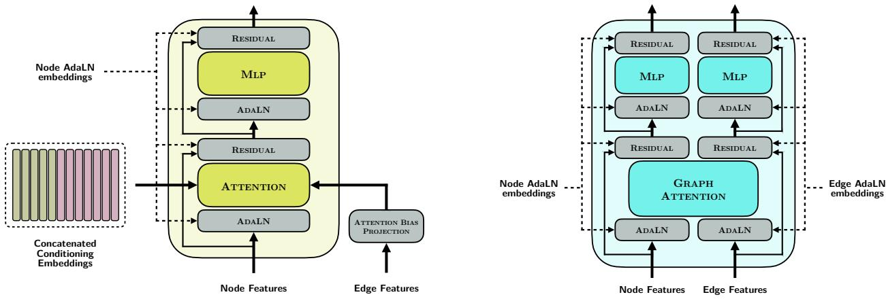  
Figure 8: A transformer layer (left) and graph transformer layer (right), as used in the generator.

• Remove aromatic systems from the hydrophobe group. Aromatic rings get assigned an aromatic pharmacophore tag anyway, so this information is mostly redundant.

• Remove ShEPhERD’s halogen group since diferent halogen atoms can provide very diferent interactions. We include bromine and iodine under our hydrophobe group, and exclude chlorine and fluorine completely.

• Exclude some of ShEPhERD’s hydrophobe SMARTS to align with ProLIF’s hydrophobe definitions. We found that ShEPhERD’s definitions tended to generate many redundant hydrophobe tags for chains of carbon atoms.

• Remove the zinc binder group completely since these are less relevant for drug-like molecules.

The full set of pharmacophore tags extracted from our SMARTS rules are: hydrogen bond donor, hydrogen bond acceptor, cation, anion, aromatic, and hydrophobe.

Although the SPINDR dataset contains pre-computed protein-ligand interactions, we re-process the systems using ProLIF for completeness. When mapping ProLIF interactions to their SMARTS counterparts we first run the ligand-only SMARTS pharmacophore extraction logic on the ligand, and then, for each ProLIF interaction, find its best matching SMARTS pharmacophore, dropping any interaction that isn’t matched. Each ProLIF interaction must exactly match its corresponding pharmacophore group tag (as provided above) based on the following mapping:

• ProLIF’s HBDonor and HBAcceptor are mapped to the hydrogen bond donor and hydrogen bond acceptor groups, respectively.

• ProLIF’s Cationic and Anionic are mapped to cation and anion, respectively.

• ProLIF’s Hydrophobic maps to hydrophobe.

• ProLIF’s PiStacking and PiCation map to aromatic.

• ProLIF’s CationPi maps to cation.

Table 1: Hyperparameters for diferent components of the our model.
<table><tr><td>Hyperparameter</td><td>Property Encoder</td><td>Profile Encoder</td><td>Pocket Encoder</td><td>Generator</td></tr><tr><td>Number of layers</td><td></td><td>8</td><td>8</td><td>4 × 4 = 16</td></tr><tr><td>Hidden dimension</td><td>128</td><td>128</td><td>128</td><td>384</td></tr><tr><td>Edge Dimension</td><td></td><td></td><td></td><td>64</td></tr><tr><td>Attention heads</td><td></td><td>8</td><td>8</td><td>16</td></tr><tr><td>Dropout</td><td>0.0</td><td>0.1</td><td>0.1</td><td>0.1</td></tr><tr><td>Parameters</td><td>0.08M</td><td>2.5M</td><td>2.5M</td><td>53.5M</td></tr></table>

## B.2 Architecture

This section provides the architectural details deferred from Section 3.3, including the encoder modules and the transformer and graph transformer layers used in the generator. Figure 8 illustrates both layer types.

Encoders Both the profile and pocket encoders are stacks of standard (non-equivariant) transformer layers combined with AdaLN [53]. Encoder inputs comprise the relevant point cloud features (coordinates, types and, for the profile encoder, direction vectors). The adaptive symmetry rotated flag described in Section 3.3, along with level of shape profile noise $\sigma _ { s h a p e }$ (only for the profile encoder), are used as conditioning for AdaLN parameters.

Decoder Transformer Layer The decoder uses a similar transformer layer structure as the encoders, with three alterations. First, the attention mechanism includes conditioning embeddings (of arbitrary length), where attention queries are linear projections of the current decoder node features, while keys and values are projections of node features concatenated with the encoded profile and pocket embeddings (denoted m). Second, we apply an additive bias to dot-product attention scores, where biases are linear projections of incoming pairwise features. Finally, AdaLN is conditioned on the concatenated time embedding and property embedding η.

Graph Transformer Layer These layers do not see the encoded conditioning embeddings m, operating only on node and edge features of the partially denoised graph (Fig. 8, right). The graph attention module operates similarly to SemlaFlow’s latent attention [44], where node features are first projected into lower dimensional queries and keys. Raw attention scores between a query qi and key $k _ { j }$ are computed using a gated outer product

$$
a _ { i j } = \boldsymbol { w } ^ { \top } ( ( q _ { i } k _ { j } ^ { \top } ) \odot \sigma ( e _ { i j } ) )\tag{11}
$$

where $e _ { i j }$ are incoming edge features and $\sigma$ is the sigmoid function. Feature accumulation then proceeds in the same way as regular dot-product attention, including the use of multiple attention heads. After graph attention, both node and edge features are updated using separate multi-layer perceptrons (MLPs).

Hyperparameters Table 1 lists the hyperparameters and model sizes for diferent parts of our model. The total number of learnable parameters (not including EMA-updated weights) is approximately 58.6M. As outlined in Section 3.5, we train end-to-end with the Adam optimiser (learning rate $1 0 ^ { - 3 }$ AMSGrad, no weight decay). We use a linear warm-up of 10K steps to a constant learning rate, gradient clipping at 1.0, and an exponential moving average of the generator weights with decay 0.999. The EMA-averaged weights are used during evaluation. Mixed-precision (bf16) is used for both training and inference.

## B.3 Dataset Splits

Here we describe our strategy for producing train/val/test dataset splits. For GEOM Drugs, we opted to create a new split based on novel, unique scafolds, to test generalisability. SPINDR splits follow those in Cremer et al. [11].

GEOM Drugs Data splitting proceeds by first finding all molecules with a unique Murcko scafold in the dataset (implemented using RDKit). From this set, we look for flexible, drug-like molecules by applying the following filters:

1. Number of heavy atoms between 16 and 35 (inclusive).

2. Maximum CLogP (logarithm of the octanol-water partition coeficient, estimated using RDKit) of 5.0.

3. At least 10 conformers in the pre-computed CREST ensemble.

We then randomly sample 1000 molecules from this filtered set as our test set. After removing the test molecules from the full set, we randomly sample 10K molecules as an additional held-out validation set, with the remaining molecules used for training.

SPINDR The protein-ligand data uses the same train and test splits used by SPINDR [11], which follow the splits originally proposed for the full PLINDER dataset [64]. These splits enforce strict conditions on pocket and ligand similarity between train and test data, including dropping some systems from train and test data to ensure a similarity gap. Full details can be found in Durairaj et al. [64]. We remove any system where the reference ligand has a QED score < 0.3 from both training and test sets.

## C Benchmark Construction

This section discusses the ensemble sampling algorithm used for our benchmark evaluations, as well as specific details on the setup of the mode targeting, mode avoidance and ensemble property optimisation benchmarks.

## C.1 Ensemble Sampling

Ensemble Approximation Since we wish to allow eficient evaluation of molecules generated by our model, we set up a fast ensemble sampling approach, bypassing the use of CREST [63], which typically takes hours per small molecule. For each molecule we first sample 128 conformers using ETKDG [65] (implemented in RDKit), and then run minimisation with the MMFF94 forcefield [66] for up to 1000 steps. We then deduplicate the conformer set by iterating the list of samples and remove any with an RMSD within 0.5Å to any previously selected conformer. Finally, we calculate the MMFF energies for each remaining sample and remove any conformer where the energy diference to the minimum is more than 6.0 kcal/mol. We found that increasing the number of sampled conformers to 1024 only marginally changed the estimated values of the observables, so we use 128 conformers to keep the benchmark evaluation tractable.

Approximate Ensemble Properties In practice, for ensemble property estimation, we find this method of sampling ensembles serves as a reasonable approximation to the underlying CREST conformers. We sampled 512 molecules at random from the validation split, sampled their ETKDG+MMFF ensembles using the above approach, and calculated mean PSA and mean pairwise RMSD property values over the CREST and approximated molecular ensembles. Ensembles and properties were successfully computed for 499 of the molecules. Scatter plots comparing the properties of the two ensemble sampling approaches for these molecules are shown in Fig. 9. The Mean PSA for each molecule is almost identical between the CREST and approximated ensembles, while the mean pairwise RMSD still shows a strong correlation (Pearson R = 0.78).

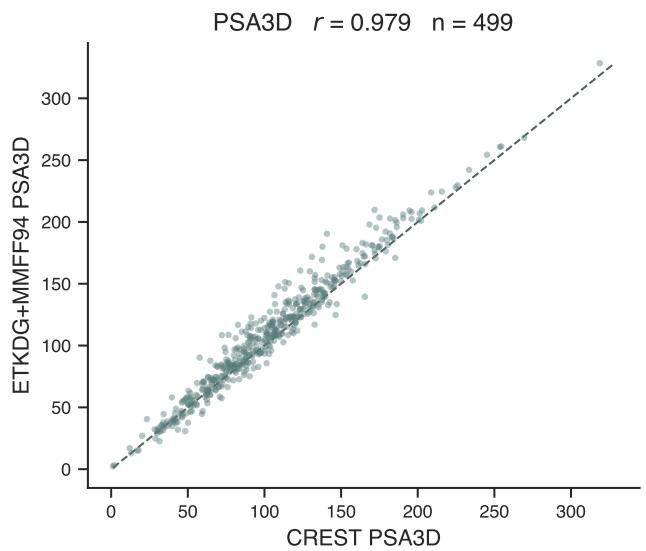

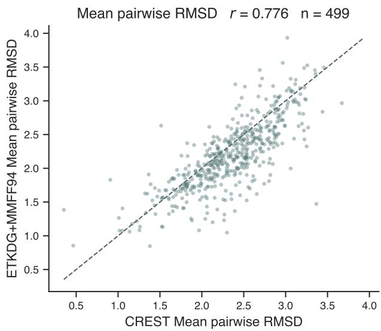  
Figure 9: Scatter plots comparing mean PSA (left) and mean pairwise RMSD (right) for ensembles computed using CREST (x-axis) and our fast ensemble approximation approach (y-axis).

## C.2 Multi-Mode Conditioning Benchmark

Our mode conditioning benchmark aims to test the model’s ability to condition on multiple modes of the desired conformational ensemble, while retaining tractable evaluation. For simplicity we restrict the benchmark to conditioning on two modes, and use shape-only conditioning throughout. The setup begins by resampling conformer ensembles for each molecule in our test set using the procedure in Appendix C.1 to ensure the conditioning shapes are accessible for evaluation using the same procedure. The compact and extended conformers are then taken at the 20th and 80th percentiles (in order to avoid outliers) of radius of gyration. Pairings are cross-molecule, taking the compact conformer of one test molecule as the first mode and the extended conformer of another as the second, so that no single molecule trivially satisfies both. A pairing is only kept if we can demonstrate that it is achievable. To do this we build a pool of training molecules, sampled evenly across heavy-atom counts and given the same ensemble treatment, and score each against both target shapes using its best conformer. For mode targeting, we require at least one training molecule reaching a shape Tanimoto of 0.8 against both targets. For mode avoidance we require a shape constraint in both directions; one molecule must match the compact target at 0.8 while staying below 0.6 against the extended target, and another must do the reverse, so that the pairing remains achievable whichever mode is negated. We further require any such molecule to have an ECFP Tanimoto of at most 0.5 to both source molecules, so that a pairing is kept only when it can be satisfied by chemistry which is distinct from either source and the benchmark cannot be solved by reproducing a source molecule. These training molecules are used only to establish feasibility during construction and are never provided to the model. The size-matched baseline for each target is computed from the same pool, averaging over all molecules within one heavy atom of the reference with no chemical filter applied.

## C.3 Evaluation Metrics

This section gives full definitions of the metrics used in Section 4 and Appendix D. Unless stated otherwise all reported values are means over the benchmark systems, and any metric involving a reference is computed per system against that system’s reference molecule.

• Validity The proportion of generated molecules which can be sanitised by RDKit and consist only of a single fragment. We use valid to refer to connected validity throughout, where molecules that contain disconnected fragments are counted as failures.

• Uniqueness The proportion of distinct canonical SMILES among all generated molecules which can be converted to SMILES.

• ECFP Tanimoto Tanimoto similarity between the ECFP4 fingerprints (Morgan, radius 2, 2048 bits) of the generated and reference molecules, computed after removing hydrogens. We use this as a novelty measure, where lower values indicate that the model is not simply reproducing the reference.

• Shape Tanimoto Gaussian shape overlap between a generated and a reference conformer, computed using RDKit’s rdShapeAlign. For the multi-mode benchmarks we sample an MMFF ensemble for each generated molecule (Appendix C.1), align every conformer to the reference and keep the best scoring one.

• Shape matching gain (∆) The shape Tanimoto of a generated molecule against a target, minus a size-matched baseline for that target. The baseline is the mean shape Tanimoto over a random sample of training molecules within one heavy atom of the reference, scored in exactly the same way. ∆ therefore measures the gain over virtual screening molecules of the same size.

• Interaction recovery The proportion of conditioned reference interactions for which the generated molecule places a pharmacophore of the same type within 2Å. Only the pharmacophores given to the model as conditioning are counted, so the metric measures conditioning fidelity rather than general interaction quality. It is computed on the locally relaxed conformer, as described in Section 4.2.

• PSA and mean pairwise RMSD The two ensemble properties defined in Section 3.1, computed over an MMFF ensemble sampled for each generated molecule using the procedure in Appendix C.1.

• Vina score and Vina min. AutoDock Vina scores for the generated pose in its pocket, in kcal/mol, using a box centred on the reference ligand with 8Å of padding. Vina evaluates the pose exactly as generated, while Vina min. evaluates it after local minimisation under the Vina scoring function. Neither uses redocking, so the generated binding mode is preserved in both cases.

## D Additional Results

## D.1 Size Distribution Learning

Section 3.2 identifies two elements of the training setup as important for learning the correct size distribution: placing pad atoms at the centre-of-mass (CoM), and applying a permutation alignment between the padded prior and data molecules. Here we ablate this decision by training models on GEOM Drugs only, without the pocket encoder, under an otherwise identical training setup. The first keeps both choices, the second removes the permutation alignment, and the third places pad atoms on resampled real atom positions instead of the centre-of-mass. Sampling is identical in all three cases, since the pad coordinate mode only afects the data molecule during training. We generate 1000 molecules from each model with all conditioning dropped, and take molecular size from the model’s own pad token predictions, so that it is defined even where a molecule cannot be sanitised. Reported intervals are 95% percentile bootstrap intervals over 2000 resamples of the generated molecules.

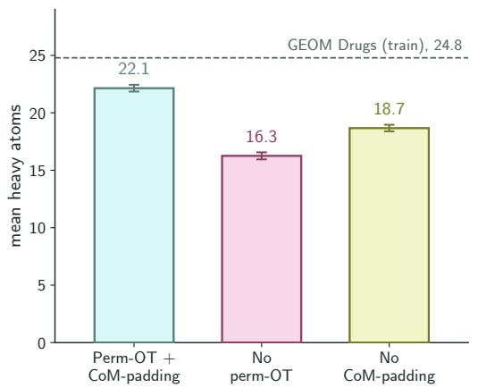

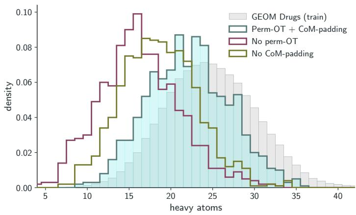  
Figure 10: Unconditional size distributions for the three training setups, all trained on GEOM Drugs without the pocket encoder. Left: mean generated size, with the GEOM Drugs training mean marked. Right: full generated size distributions against the training distribution. Sizes are taken from the model’s pad token predictions. Error bars are 95% percentile bootstrap intervals over 2000 resamples of the 1000 molecules generated per model.

We find that the combination of CoM-padding and permutation alignment is crucial for learning the correct size distribution, although even the combined model does not perfectly match the training set sizes (Fig. 10). Against a training mean of 24.8 heavy atoms, the combined setup generates a mean size of 22.1 [21.8, 22.4], removing the permutation alignment gives 16.3 [15.9, 16.6], and removing centre-of-mass padding gives 18.7 [18.4, 18.9]. Connected validity stays above 0.97 and uniqueness above 0.99 in every run, so the ablations do not degrade generation in general; they specifically move the size distribution.

The combined training setup gives pad atoms a single consistent target at the origin, which we hypothesise provides cleaner training signal. Centre-of-mass padding provides one place for them to go, and the permutation alignment assigns the prior atoms close to the origin to the pad positions, so they travel only a short distance along the trajectory. Removing either leaves a noisier signal for separating pad atoms from real atoms, and the model resolves this by padding more, which produces smaller molecules. Some undershoot remains with both choices in place, at roughly 2.6 heavy atoms below the training mean. We attribute this to the rarity of fully unconditional samples during training, which the model sees in around 10% of steps.

## D.2 Learning Adaptive Symmetries

Section 3.3 describes adaptive symmetry learning, where the rotated flag tells an encoder whether its input shares a reference frame with the ligand. Nothing in training constrains the encoder embeddings themselves, only the behaviour of the model as a whole, so we measure both symmetries at the output of the generator. We run two experiments, one for invariance and one for equivariance, testing the generator’s predicted coordinates $\hat { \bf X } _ { \theta } ( . , . , . , . )$ . With the flag set, rotating the condition alone should leave the prediction unchanged, such that $\hat { \mathbf { X } } _ { \theta } ( x _ { t } , t , R m , \eta ) = \hat { \mathbf { X } } _ { \theta } ( x _ { t } , t , m , \eta )$ . With the flag unset, rotating the state and the condition together should rotate the prediction, such that $\hat { \bf X } _ { \theta } ( R x _ { t } , t , R m , \eta ) = R \hat { \bf X } _ { \theta } ( x _ { t } , t , m , \eta )$

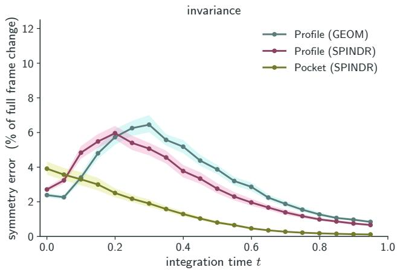

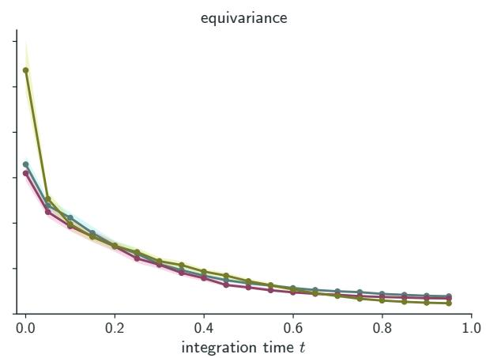  
Figure 11: Symmetry error against integration time, for the profile encoder on GEOM Drugs and SPINDR ligands and for the pocket encoder on SPINDR pockets. Left: invariance, where the condition is rotated and the prediction should not move. Right: equivariance, where the state and condition are rotated together and the prediction should rotate with them. Errors are given as a percentage of the distance the prediction would have moved had it broken the symmetry instead, which ranges from 2.6 to 5.0Å over the encoders and snapshots shown. Bands are 95% bootstrap intervals over 64 systems, each averaged over 8 rotations.

States are taken from the model’s own generation trajectory, using constant integration steps so that snapshots are evenly spaced in t, with each experiment probing a trajectory generated under the flag it tests. Writing $\hat { \mathbf X }$ for the prediction under the unrotated condition and $\hat { \mathbf { X } } _ { \mathbf { k } }$ for the prediction under rotation $R _ { k }$ , we measure both $\mathrm { R M S D } ( \hat { \mathbf { X } } , \hat { \mathbf { X } } _ { \mathbf { k } } )$ and $\mathrm { R M S D } ( R _ { k } \hat { \mathbf X } , \hat { \mathbf X } _ { \mathbf k } )$ over all atom slots. Invariance requires the first to vanish and equivariance the second, so in each experiment one distance is the symmetry error while the other gives the scale of a full frame change, and we report the error as a percentage of the latter. We use 64 systems per encoder with 8 rotations each, averaging both distances over rotations and then over systems before taking their ratio at each t. We normalise at each t since the scale of a full frame change grows as the endpoint prediction expands from a collapsed guess at $t = 0$ into a full molecule, ranging from 2.6 to 5.0 Å over the encoders and snapshots shown. Bands are 95% percentile bootstrap intervals over systems.

Both symmetries hold and, crucially, converge towards zero as the generation proceeds $\left( { \mathrm { F i g . ~ } } 1 1 \right)$ Invariance error stays below 6.5% of a full frame change at every point and equivariance below 11%, the largest single value in either experiment being the pocket encoder at $t = 0$ . By $t = 0 . 9 5$ every run is below 1%, with the pocket encoder the most invariant at 0.11%. Atom and bond distributions follow the same pattern, reaching total variation distances of at most 0.060 and 0.006 and falling below 0.009 and 0.001 by $t = 0 . 9 5$ . Invariance error for the profile encoder peaks part way along the trajectory, at $t = 0 . 2 0$ on SPINDR ligands and $t = 0 . 3 0$ on GEOM Drugs rather than at $t = 0$ , while the pocket encoder decreases throughout. It is not immediately clear what causes this pattern and why it is diferent for diferent encoders, but we do not attempt to investigate this further in this work. We do, however, speculate that, for generative models that rely on iterative denoising, encoding exact symmetries into architectures may be unimportant since the error in learned symmetries reduces towards zero as the molecule is resolved.

Table 2: Multi-mode shape conditioning results for diferent conditioning setups and values of $\sigma _ { s h a p e }$ , all generated with $\gamma = 4 . 0$ . Valid: proportion of molecules which are RDKit sanitisable with no disconnected fragments; Unique: proportion of unique generated molecules; $T _ { \mathrm { c p t } }$ and $T _ { \mathrm { e x t } } { : }$ the mean best-conformer shape Tanimoto to the compact and extended targets, respectively; $\Delta _ { \mathrm { c p t } } , \Delta _ { \mathrm { e x t } } \mathrm { : }$ the mean gain over a size-matched baseline for compact and extended, respectively; and Ref. sim.: mean ECFP tanimoto similarity to the two reference molecules. All entries are means.
<table><tr><td>Mode</td><td>σ</td><td>Valid Unique</td><td></td><td> $T _ { \mathrm { c p t } }$ </td><td> $T _ { \mathrm { e x t } }$ </td><td> $\Delta _ { \mathrm { c p t } }$ </td><td> $\Delta _ { \mathrm { e x t } }$ </td><td>Ref. sim.</td></tr><tr><td>Mode targeting</td><td></td><td></td><td></td><td></td><td></td><td></td><td></td><td></td></tr><tr><td>Cpt (+, equiv.), Ext (+, inv.)</td><td>0.5</td><td>0.2 0.970 0.982</td><td>1.000 1.000</td><td>0.867 0.768</td><td>0.765 0.750</td><td>0.188 0.088</td><td>0.071 0.056</td><td>0.260 0.137</td></tr><tr><td>Cpt (+, inv.), Ext (+, equiv.)</td><td>0.2 0.5</td><td>0.982 0.994</td><td>0.992 1.000</td><td>0.754 0.741</td><td>0.882 0.783</td><td>0.074 0.061</td><td>0.188</td><td>0.254 0.138</td></tr><tr><td>Mode avoiding</td><td></td><td></td><td></td><td></td><td></td><td></td><td>0.089</td><td></td></tr><tr><td>Cpt (+, equiv.), Ext (-, inv.)</td><td>0.2 0.5</td><td>0.981</td><td>1.000</td><td>0.890</td><td>0.585</td><td>0.223</td><td>-0.056</td><td>0.310</td></tr><tr><td></td><td>0.2</td><td>0.991</td><td>1.000</td><td>0.769</td><td>0.582</td><td>0.102</td><td>-0.059</td><td>0.138</td></tr><tr><td>Cpt (-, inv.), Ext (+, equiv.)</td><td>0.5</td><td>0.974 0.985</td><td>0.895 1.000</td><td>0.587 0.581</td><td>0.905 0.786</td><td>-0.081 -0.086</td><td>0.264 0.144</td><td>0.284 0.137</td></tr></table>

## D.3 Multi-mode Conditioning

Table 2 provides full results for the mode targeting and mode avoiding benchmarks of Section 4.1, with one row per conditioning mode and shape noise level. Alongside the shape matching gains $\Delta$ plotted in Fig. 4, we report the raw shape Tanimoto achieved against each target, as well as validity, uniqueness, and similarity to the source molecules. All entries are means over the pairs in the corresponding benchmark, and $\Delta$ is measured against the size-matched baseline described in Section 4.1. Full definitions of each metric are provided in Appendix C.3.

## D.4 Ensemble Property Optimisation

Table 3 gives full results for the property optimisation benchmark of Section 4.2, with all values reported as means over the benchmark systems. Reference values are computed by passing the system’s reference ligand through the same evaluation as the generated molecules; its ensemble properties come from the same MMFF sampling procedure and its Vina scores from the same in-place scoring and local minimisation. Its validity, interaction recovery and reference similarity are 1.00 by construction, since the reference is compared against itself, and are shown only for completeness. Full definitions of each metric are provided in Appendix C.3.

Table 3: Property optimisation results, all generated with $\gamma = 2 . 0$ and $\alpha = ( 1 )$ , conditioning on the pocket and reference pharmacophores as a single mode. Valid: proportion of molecules which are RDKit sanitisable with no disconnected fragments; Ref. sim.: ECFP tanimoto similarity to the reference molecule; Int. rec.: fraction of reference interactions recovered. Vina and Vina min. are measured in kcal/mol. All results correspond to the mean value over all benchmark systems.
<table><tr><td>Conditioning</td><td>Valid</td><td>Ref. sim.</td><td>Int. rec.</td><td>Vina</td><td>Vina Min.</td><td>PSA  $( \mathring \mathrm { A } ^ { 2 } )$ </td><td>RMSD  $( \textup { \AA } )$ </td></tr><tr><td>Pocket + pharma</td><td>0.942</td><td>0.191</td><td>0.954</td><td>-6.18</td><td>-6.79</td><td>167</td><td>2.07</td></tr><tr><td> $+ \mathrm { P S A } = 8 0$ </td><td>0.939</td><td>0.164</td><td>0.945</td><td>-6.17</td><td>-6.81</td><td>111</td><td>2.18</td></tr><tr><td> $+ \mathrm { P S A } = 1 0 0$ </td><td>0.935</td><td>0.172</td><td>0.944</td><td>-6.26</td><td>-6.87</td><td>129</td><td>2.16</td></tr><tr><td> $+ \mathrm { P S A } = 1 2 0$ </td><td>0.922</td><td>0.171</td><td>0.954</td><td>-6.30</td><td>-6.90</td><td>144</td><td>2.15</td></tr><tr><td> $+ \mathrm { P S A } = 1 4 0$ </td><td>0.922</td><td>0.172</td><td>0.958</td><td>-6.31</td><td>-6.89</td><td>163</td><td>2.11</td></tr><tr><td> $+ \mathrm { R M S D } = 1 . 0$ </td><td>0.952</td><td>0.179</td><td>0.954</td><td>-6.90</td><td>-7.39</td><td>156</td><td>1.69</td></tr><tr><td> $+ \mathrm { R M S D } = 1 . 5$ </td><td>0.953</td><td>0.190</td><td>0.961</td><td>-6.69</td><td>-7.19</td><td>159</td><td>1.79</td></tr><tr><td> $+ \mathrm { R M S D } = 2 . 0$ </td><td>0.946</td><td>0.186</td><td>0.958</td><td>-6.48</td><td>-7.00</td><td>157</td><td>1.99</td></tr><tr><td> $+ \mathrm { R M S D } = 2 . 5$ </td><td>0.935</td><td>0.174</td><td>0.960</td><td>-6.18</td><td>-6.83</td><td>154</td><td>2.17</td></tr><tr><td>Reference</td><td>1.00</td><td>1.00</td><td>1.00</td><td>-7.74</td><td>-7.93</td><td>169</td><td>1.92</td></tr></table>