# Forty Shades of Blue: Quality-Diversity Alignment via Mode-Conditioned Reinforcement Learning

⋆ Jiayi Yuan1 ⋆ Hangoo Kang2 ⋆ James Jihao Liu2 Yejin Choi2 Vikram Iyer1 É Liwei Jiang1 É Natasha Jaques1

1University of Washington 2Stanford University

yuancarrieyjy@cs.washington.edu {hangook,jihaoliu}@stanford.edu ⋆ Equal first author É Equal senior author

Code: github.com/yuanjiayiy/mode-conditioned-diversity-alignment

## Abstract

A notable byproduct of LLM alignment training is mode collapse: the progressive loss of output diversity that narrows a model’s expressivity at inference time. This degradation is especially limiting for applications requiring open-ended exploration and pluralistic perspectives, such as scientific ideation and creative writing. We present MODA (MOde-conditioned Diversity Alignment), an online post-training RL algorithm that jointly optimizes generation quality and diversity, inspired by the coordination perspective in multi-agent reinforcement learning (MARL). MODA trains a single shared LLM policy conditioned on abstract numbered mode tokens, where each mode acts as an agent that competes to produce outputs distinct from the others. This MARL-inspired formulation encourages mode-conditioned agents to explore complementary regions of the high-quality output space without requiring hand-crafted personas or architectural modifications. MODA employs a prompt-adaptive quality gating mechanism that calibrates quality thresholds against a frozen reference policy and grants diversity rewards only to responses that meet them, preventing reward-hacking behaviors such as language switching and verbosity. To study quality-diversity tradeoffs, we evaluate MODA on a comprehensive benchmark spanning seven general capability tasks and four domainspecific diversity tasks in scientific ideation and creative writing. MODA improves SBERT diversity by 265% on the Infinite-Chat held-out prompts while increasing general capability performance by 10.3% over the Qwen3-8B baseline. Compared with the strongest DivPO baseline, MODA improves SBERT diversity from 0.274 to 0.482 (+75.9%) and E-Vendi from 2.86 to 4.4 (+53.8%), while improving average general capability pass@1 by 7.0%. Overall, MODA provides a dropin alternative to standard post-training methods that preserves and expands the model’s expressive output space while improving quality.

## 1 Introduction

“In the course of evolution nature has gone to endless trouble to see that every individual is unlike every other individual.”

— Aldous Huxley, Brave New World Revisited

Post-training alignment is essential for improving the capability and safety of large language models (LLMs), but it also introduces a concerning side effect: mode collapse. Aligned models increasingly favor a narrow set of responses (the “mode”) over the broader space of plausible outputs, resulting in a substantial loss of generation diversity [25, 66, 21, 61]. Yet in many domains, diversity is not merely desirable but essential. In AI-assisted scientific discovery, progress relies on exploring a broad and plausible hypothesis space rather than prematurely converging on a single line of inquiry [15, 52]. Likewise, generative diversity is critical for applications requiring creativity and open-ended exploration [58, 1]. While inference-time interventions [43, 72] can partially mitigate this loss of diversity, a more fundamental solution is to redesign post-training algorithms so that expressivity is preserved throughout the alignment process by construction.

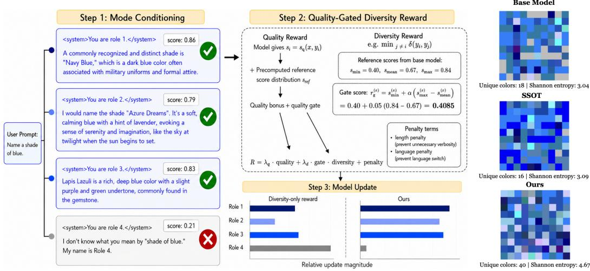  
Figure 1: Left: Overview of MODA. MODA uses mode conditioning to elicit diverse candidate responses, then applies a quality-gated diversity reward with penalty terms to promote high-quality diversity. Each candidate is labeled with its quality score $s _ { i }$ relative to the prompt-adaptive quality threshold $\tau _ { q } ^ { ( x ) }$ . Candidates with $s _ { i } < \tau _ { q } ^ { ( x ) }$ have $g ( x , y _ { i } ) = 0$ and therefore receive no diversity credit. Step 3 shows the resulting signed group-relative advantages ${ \widehat { A } } _ { i } ;$ positive advantages promote a response, whereas negative advantages suppress it during the policy update. Matching colors track the same response through Steps 1–3. Right: 100 responses to the prompt “Name a shade of blue” from the Qwen3-8B initial policy (Qwen/Qwen3-8B), String Seed of Thought (SSoT) [43], and MODA under diverse-mode inference. MODA produces 40 distinct shades of blue, 122% more than the Qwen3-8B initial policy and 150% more than SSoT.

We introduce MODA (MOde-conditioned Diversity Alignment), an online post-training RL algorithm that jointly optimizes the quality and diversity of generated responses by formulating alignment through the lens of multi-agent reinforcement learning (MARL), where agents develop diverse behaviors through competition and coordination [13, 37, 35]. MODA introduces role conditioning to instantiate multiple lightweight agents within a single shared policy. Specifically, we prepend abstract role tokens to the system prompt, enabling each role to generate a response to the same user query while independently optimizing a group-relative diversity reward. This creates competitive reward dynamics among roles, encouraging them to specialize in distinct regions of the high-quality response space and collectively produce a diverse set of outputs.

A key design choice of MODA is a prompt-adaptive quality gate that grants diversity rewards only to responses exceeding a prompt-specific quality threshold computed from a frozen reference policy. Among responses that satisfy the gate, diversity is rewarded according to semantic distance from the nearest neighboring response, encouraging exploration within the space of sufficiently high-quality generations. By coupling diversity rewards with quality, this mechanism prevents reward hacking, in which models maximize diversity by producing unusual but irrelevant outputs [36, 63].

Assessing quality-diversity tradeoffs requires evaluating both standard capabilities and applications that benefit from diverse outputs. To this end, we curate a comprehensive 11-task evaluation suite that jointly measures general capability retention and diversity-focused applications where multiple highquality generations are useful or necessary. The suite includes seven general capability benchmarks (GSM8K, MMLU, GPQA, BoolQ, HellaSwag, TruthfulQA, and IFEval) and four open-ended domain application benchmarks spanning scientific ideation and creative writing such as HypoBench [40], PreScience [2], NoveltyBench [73], and a held-out split of Infinite-Chat [25]. We evaluate output diversity using complementary metrics: semantic-level (SBERT), entropy-level (E-Vendi), and entailment-level (a learned pairwise discriminator). Under the same thinking-disabled setting, MODA improves SBERT diversity and E-Vendi by 155.5% and 94.0%, respectively, over the Qwen3-8B initial policy on the diversity-focused benchmark suite, while simultaneously increasing average pass@1 by 10.3 percentage points over the initial policy, and by 7.0 percentage points over the strongest DivPO baseline on general capability benchmarks.

Compared with prior diversity-oriented post-training methods [36, 33, 8, 7, 60, 49], MODA conditions diversity on an explicit mode token rather than baking it unconditionally into the model. As a result, it naturally supports two inference modes: supplying mode tokens yields a diverse set of responses, while omitting them recovers the base model’s standard behavior, preserving singleresponse capability. More broadly, we hope MODA motivates future work that brings richer MARL principles into LLM post-training.

## 2 Related work

Why Does Generation Diversity Matter? Language models often collapse toward a narrow set of high-probability responses, resulting in an “Artificial Hivemind” characterized by substantial intraand inter-model homogeneity on open-ended prompts [25]. Zhang et al. [72] further show that post-training alignment reduces diversity through biases in preference data, limiting performance in domains that require diverse outputs. In scientific reasoning, automated research agents benefit from a wider exploration breadth [77], and mode collapse causes reduced exploration in solution spaces [70]. In creative tasks, reduced diversity in LLM outputs also diminishes the creativity of LLM-assisted writing [1, 3, 47]. In mathematical proofs, strategy diversity is critical since repeated sampling is only useful when samples explore distinct reasoning paths [68, 6]. These findings motivate methods that preserve quality while expanding the range of model outputs.

<table><tr><td>Method</td><td>Mechanism</td><td>Code</td></tr><tr><td>INFERENCE-TIME</td><td></td><td></td></tr><tr><td>Verbalized Sampling [72]</td><td>Prompting</td><td>VVXXVVVXV</td></tr><tr><td>String Seed of Thought [43]</td><td>Prompting</td><td></td></tr><tr><td>DIPPER [34]</td><td>Prompting</td><td></td></tr><tr><td>Multi-Novelty [31]</td><td>Prompting</td><td></td></tr><tr><td>Multilingual Prompting [64]</td><td>Prompting</td><td></td></tr><tr><td>Nucleus Sampling [20]</td><td>Decoding</td><td></td></tr><tr><td>min-p Sampling [45]</td><td>Decoding</td><td></td></tr><tr><td>G2 [53]</td><td>Decoding</td><td></td></tr><tr><td>Adaptive Decoding (LPO) [12]</td><td>Decoding</td><td></td></tr><tr><td>TRAINING-TIME</td><td></td><td></td></tr><tr><td>DARLING [36]</td><td>RL</td><td></td></tr><tr><td>DivPO [33]</td><td>DPO</td><td>√×√</td></tr><tr><td>DQO [7]</td><td>RL</td><td></td></tr><tr><td>Multi-answer RL [49]</td><td>RL with multiple answers</td><td>√</td></tr><tr><td>Soft Preference Learning [60]</td><td>Entropy Decoupling</td><td>x</td></tr><tr><td></td><td>Mode-Conditioned</td><td></td></tr><tr><td>MoDA (ours)</td><td>MARL</td><td>√</td></tr></table>

Figure 2: Diversity-oriented methods. MODA conditions diversity on explicit mode tokens, inspired by MARL.

Measuring Diversity of LLMs. Diversity of LLM-generated content has been measured along several dimensions. Lexical metrics include distinct n-grams [22], Self-BLEU [76], Measure of Textual Lexical Diversity (MTLD) [42], and compression-based homogeneity scores [55]. Semantic metrics build on sentence embeddings [50, 67] and information-theoretic constructions such as the Vendi Score [14] and its conditional variant [23], as well as gradient-based measures like G-Vendi [26]. A complementary line of work studies how diversity collapses through the training pipeline [28, 46, 47, 66, 11], and recent benchmarks evaluate humanlike or effective semantic diversity directly [73, 59, 17, 54]. However, most evaluations assess diversity or quality in isolation, whereas we jointly evaluate capability and diversity across real-world applications to ensure models preserve multiple plausible answers without mode collapse [43, 49] or catastrophic forgetting [41].

Improving Diversity during Training and Inference. Recent work has explored improving diversity through prompting [72, 34, 31, 64, 27, 68], decoding [20, 45, 53, 12], and training [36, 33, 8, 7, 60, 49] (Table 2). At inference time, Verbalized Sampling [72] prompts models to express a distribution over possible responses, while String Seed of Thought [43] injects random strings as entropy sources. DIPPER [34] and Multi-Novelty [31] construct diverse prompt ensembles, and multilingual, persona, or chain-of-thought prompting can elicit variations [64, 68]. At decoding time, min-p sampling [45] adaptively truncates low-probability tokens based on model confidence, while G2 [53] and adaptive temperature methods [12] guide generation with auxiliary diversity modules or learned per-instance decoding parameters. In post-training, RL has emerged as a powerful method for enhancing diversity. Multi-answer RL [49] trains models to output multiple diverse answers within one response; Soft Preference Learning decouples entropy from KL-penalty to improve lexical and semantic variety [60]; DivPO [33] applies DPO to responses that are both diverse and exceed a quality threshold.

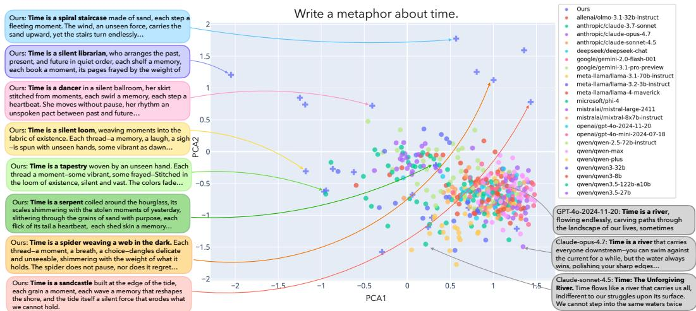  
Figure 3: Responses to the query “Write a metaphor about time” clustered by applying PCA to reduce sentence embeddings to two dimensions. Each of the 23 off-the-shelf models and our trained non-thinking model generates 20 responses using top-p sampling $( p = 1 . 0 )$ and temperature = 1.0.

Several recent works share our goal ofjointly optimizing quality and diversity through RL. DARLING [36] balances quality and diversity by rewarding a multiplicative aggregation of quality and diversity metrics; DQO [7] uses a determinant-based group diversity reward, but assigns the same reward to all responses in the group. GRPO-Unlikeliness [18] and GAPO [4] both encourage diversity through frequency- and likelihood-based rewards. However, although these methods explore different reward designs, none of them allow a single model to switch between producing one high-quality answer and a diverse set of responses. MODA, on the other hand, approaches quality-diversity alignment from a MARL-inspired perspective, treating diverse generation as a competition-and-coordination problem among role-conditioned agents within a shared policy. This formulation enables explicit per role credit assignment under quality constraints, encouraging specialization across the high-quality response space while keep the model’s standard behavior intact.

## 3 MODA: Mode-Conditioned Diversity Alignment for LLMs

## 3.1 Preliminaries: LLM RL Post-Training and Mode Collapse

Recent RL post-training has substantially improved the utility and safety of LLMs [56, 16]. However, optimizing only the expected reward often leads to mode collapse, where the learned policy focuses on a small set of high-reward responses while suppressing equally valid alternatives [28]. As a result, generated responses become repetitive despite maintaining high quality. Our goal is to learn policie that generate responses that are simultaneously high-quality, diverse, and non-redundant.

Let $s$ denote the space of natural language token sequences. Given a prompt $x \in S$ , a language model $\pi ( \cdot \mid x )$ defines a probability distribution over responses in $s ,$ where $\pi ( y \mid x )$ denotes the probability of generating response $y \in S$ . For each prompt, we independently sample k responses, $y _ { 1 } , \dots , y _ { k } \sim \pi ( \cdot \mid x )$ , forming a response group $\mathcal { V } \bar { = } \{ y _ { i } \} _ { i = 1 } ^ { k }$

Conventional RL post-training maximizes the expected reward

$$
\operatorname* { m a x } _ { \theta } J _ { \mathrm { R L } } ( \theta ) = \mathbb { E } _ { x \sim \mathcal { D } } \left[ \mathbb { E } _ { y \sim \pi _ { \theta } ( \cdot \vert x ) } r ( x , y ) \right] ,\tag{1}
$$

where $r ( x , y )$ is the reward assigned to response $y$ for prompt x. Optimizing this objective alone progressively concentrates the policy on a small set of high-reward responses, reducing the policy entropy, which is defined as:

$$
H ( \pi _ { \boldsymbol { \theta } } ( \cdot \mid x ) ) = - \sum _ { y \in \mathcal { S } } \pi _ { \boldsymbol { \theta } } ( y \mid x ) \log \pi _ { \boldsymbol { \theta } } ( y \mid x ) ,\tag{2}
$$

and causing the model to repeatedly generate only a few dominant responses despite the existence of many alternatives with comparable rewards. We refer to this phenomenon as mode collapse.

## 3.2 Multi-Agent Reinforcement Learning (MARL)-Inspired Mode Conditioning

MARL Motivation. Classical MARL studies how populations of agents can learn complementary behaviors by explicitly encouraging behavioral diversity through mechanisms such as information sharing, skill specialization, KL divergence maximization, and adversarial objectives [13, 37, 35]. We bring this perspective to LLM post-training by introducing mode conditioning, where a single policy is conditioned on different role tokens and each role is treated as an abstract agent. Agents must learn how to produce responses that are unlike those of the other agents, introducing competitive dynamics that drive the agents to continually diversify their responses. Unlike standard alignment, which learns a single behavioral interface, mode conditioning provides a richer interface that enables the model to internalize multiple high-quality behavioral modes.

Mode Conditioning via System Role Identifiers. We instantiate mode conditioning by prepending role identifiers into the system prompt. In our primary setting, we adopt an intentionally minimal identity-based conditioning: You are role i. We use numbered roles instead of hand-crafted personas to avoid injecting domain-specific assumptions about desirable perspectives. Although our ablations show that crafted personas (e.g., “innovative thinker,” “passionate educator,” or “methodical experimenter”) and token-based conditioning (e.g. “Start with your response with APPLE / BANANA / ORANGE.") are also effective, we adopt the minimal identity-based conditioning to encourage emergent specialization, where each agent adaptively learns how to play its role in order to maximize the diversity objective.

Formally, let $x \in \mathcal { X }$ denote a user prompt and $\mathcal { Z } = z _ { 1 } , \ldots , z _ { N }$ a fixed set of role identifiers. A shared policy $\pi _ { \theta } ( y \mid z _ { i } , x )$ is conditioned on role $z _ { i } ,$ with all roles sharing parameters θ. During training, each role generate one response for K prompts within the batch, forming a response group $\mathcal { Y } _ { x } = \mathbf { \bar { \{ } }  y _ { i , k } : i = \mathbf { \bar { \{ } }  1 , \ldots , N ; k = \mathbf { \bar { \{ } }  1 , \ldots , K \}$ Each response receives a Quality-Gated Diversity Reward $( \ S \ 3 . 3 )$ , and the shared policy is optimized with Group Relative Policy Optimization (GRPO; [56]). Algorithm 1 summarizes the training procedure, with full pseudocode provided in Appendix 2.

Dual Inference Settings. Not all prompts benefit from diverse responses. For example, factual queries such as “What is Albert Einstein’s birthday?” have a single correct answer. A key advantage of mode conditioning is that omitting the role instruction recovers the model’s standard behavior, allowing MODA to support both inference modes. Under the standard mode, the model generates a single response without a role identifier. Under the diverse mode, we prompt the model under multiple role identifiers to produce a candidate set $y _ { 1 } , \ldots , y _ { N }$ . The resulting set can be returned directly, ranked by a quality model, or aggregated by a downstream model into a final answer.

## 3.3 Quality-Gated Diversity Reward

Preserving quality while increasing diversity is critical: a diversity-only objective is vulnerable to reward hacking; it can be exploited by irrelevant, malformed, unnecessarily verbose, or superficially different responses. We therefore optimize a four-component reward consisting of a quality reward, a prompt-adaptive quality gate, a response-level diversity score, and explicit reward-hacking penalties:

$$
\begin{array} { r l } & { r _ { i } = \underbrace { \lambda _ { q } r _ { \mathrm { q u a l } } ( x , y _ { i } ) } _ { \mathrm { q u a l i t y ~ r e w a r d } } + \underbrace { \lambda _ { d } g ( x , y _ { i } ) } _ { \mathrm { q u a l i t y ~ g a t e } } \underbrace { d ( x , y _ { i } , \mathcal { V } ) } _ { \mathrm { d i v e r s i t y ~ r e w a r d } } } \\ & { ~ + \underbrace { r _ { \mathrm { l e n } } ( y _ { i } ) + r _ { \mathrm { l a n g } } ( x , y _ { i } ) + r _ { \mathrm { f m t } } ( y _ { i } ) } _ { \mathrm { p e n a l t i e s } } . } \end{array}\tag{3}
$$

Prompt-Adaptive Quality Scoring. To determine whether our training preserves the original model’s capability, we need a reference baseline: how the initial policy perform on the same prompt. To instantiate this baseline, for each prompt x, we score five responses sampled from the frozen initial policy and denote their minimum, mean, and maximum scores by $s _ { \mathrm { m i n } } ^ { ( x ) } , \bar { s } ^ { ( x ) }$ , and $s _ { \mathrm { m a x } } ^ { ( x ) }$ x. Let $s _ { i } = S _ { \phi } ( x , y _ { i } )$ be the reference score assigned by the reward model. We define the prompt-adaptive threshold $\tau _ { q }$ and quality reward magnitude factor $\sigma _ { q }$ as

$$
\tau _ { q } ^ { ( x ) } = s _ { \mathrm { m i n } } ^ { ( x ) } + \alpha \big ( s _ { \mathrm { m a x } } ^ { ( x ) } - \bar { s } ^ { ( x ) } \big ) , \qquad \sigma _ { q } ^ { ( x ) } = \gamma \big ( \bar { s } ^ { ( x ) } - s _ { \mathrm { m i n } } ^ { ( x ) } + \epsilon \big ) ,\tag{4}
$$

where α shifts the quality threshold above the reference minimum by a fraction of the reference score spread, γ controls the sharpness of the scoring transition, and $\epsilon > 0$ ensures numerical stability.

The binary quality gate and quality reward for a generated response $y _ { i }$ are

$$
g ( x , y _ { i } ) = \mathbf { 1 } { \Big [ } s _ { i } \geq \tau _ { q } ^ { ( x ) } { \Big ] } , \quad r _ { \mathrm { q u a l } } ( x , y _ { i } ) = \mu \operatorname { t a n h } \left( { \frac { s _ { i } - \tau _ { q } ^ { ( x ) } } { \sigma _ { q } ^ { ( x ) } } } \right)\tag{5}
$$

where $\mu$ controls the magnitude of the quality reward. This quality gate ensures that the model receives diversity reward only when the response meets the prompt-adaptive quality threshold $\tau _ { q } ^ { ( x ) }$ As a result, responses that are merely more unusual, off-topic, or malformed compared to the initial policy would not receive diversity credit, preventing spurious solutions which hack the diversity reward. Meanwhile, the quality reward ensures that responses above the threshold receive a positive bonus, while responses below the prompt-adaptive threshold still receive a quality-learning signal but receive no diversity credit. The bounded tanh transformation prevents the quality term from dominating optimization once the response already exceeds the threshold by a large margin.

Diversity Scoring. For each prompt, the response group $\mathcal { Y } = \{ y _ { 1 } , \dots , y _ { 6 } \}$ contains one candidate from each of the six modes and best fits on 4 GPUs: one for the reward model and three for inference. We embed the final answer text using sentence-transformers/all-MiniLM-L6-v2 [65].

The diversity reward directly optimized during training is the normalized semantic distance to the closest alternative within the response group:

$$
d ( x , y _ { i } , \mathcal { Y } ) = \operatorname* { m i n } _ { j \neq i } \frac { 1 - \mathbf { e } _ { i } ^ { \top } \mathbf { e } _ { j } } { 2 } .\tag{6}
$$

Here, $y _ { i }$ and every $y _ { j }$ are responses to the same prompt but are generated under different roles, and each response is therefore compared with the other five candidates in its group. For thinking-enabled models, the hidden thinking trace is removed before embedding. This nearest-neighbor formulation rewards a response only if it is sufficiently distinct from its closest alternative, preventing multiple responses from collapsing to the same mode while a single outlier dominates the group-level diversity score. Consequently, role-conditioned agents are incentivized to specialize in different regions of the response space. Although we use semantic distance by default, the framework is agnostic to the diversity metric, and lexical, syntactic, or learned semantic measures can be substituted directly.

Reward-Hacking Penalties. The terms $r _ { \mathrm { l e n } } , r _ { \mathrm { l a n g } }$ , and $r _ { \mathrm { f m t } }$ are non-positive penalties for excessive length, language mismatch, and formatting or role-label leakage, respectively. These terms suppress superficial ways of increasing measured diversity without improving the usefulness of the response.

## 3.4 Policy Optimization

We optimize the shared policy with on-policy reinforcement learning. For each prompt, all roleconditioned samples form one reward group. We optimize $\pi _ { \theta }$ using Group Relative Policy Optimization (GRPO [56]), which estimates advantages from within-group reward comparisons without a separate value network:

$$
\mathcal { L } _ { \mathrm { G R P O } } = \mathbb { E } _ { x , \{ y _ { i } \} } \left[ \frac { 1 } { k } \sum _ { i = 1 } ^ { k } \operatorname* { m i n } \Bigl ( \rho _ { i } \hat { A } _ { i } , ~ \mathrm { c l i p } ( \rho _ { i } , 1 - \varepsilon , 1 + \varepsilon ) \hat { A } _ { i } \Bigr ) - \beta \mathbb { D } _ { \mathrm { K L } } \bigl ( \pi _ { \theta } ~ \lVert ~ \pi _ { \mathrm { r e f } } \bigr ) \right] .\tag{7}
$$

where $\rho _ { i } = \pi _ { \theta } ( y _ { i } \mid x ) / \pi _ { \mathrm { r e f } } ( y _ { i } \mid x )$ is the importance ratio [29], $\hat { A } _ { i } = ( r _ { i } - \mathrm { m e a n } ( \mathbf { r } ) ) / \mathrm { s t d } ( \mathbf { r } )$ is the group-normalized advantage over $\mathbf { r } = \{ r ( x , y _ { i } , y ) \} _ { i = 1 } ^ { k }$ from Eq. 3, and $\mathbb { D } _ { \mathrm { K L } } ( \pi _ { \theta } \parallel \pi _ { \mathrm { r e f } } )$ controls divergence from the base language model [24]. The reward is computed over the set of roleconditioned generations, but the trainable model remains a single shared policy.

## 4 Experiments

We implement MODA using the verl codebase [57], using vLLM [30] for inference and FSDP [74] for training. We use Qwen3-8B-Instruct (Qwen/Qwen3-8B) [69] as the base model. We sample 5 responses using the initial policy for each prompt, precompute the reference responses using the reward model Skywork-Reward-V2-Llama-3.1-8B-40M [39], and store them as part of the dataset. During training, we sample 6 role-response pairs from the model for each prompt as a response group, and embed them using all-MiniLM-L6-v2 [65]. Our training has two generation settings: thinking-enabled and thinking-disabled. Quality and diversity metrics are computed only over the final answer, with the thinking trace masked out, throughout the training-time reward computation and evaluation. We include more implementation details in Appendix A.

Algorithm 1 MODA: Mode-Conditioned Diversity Alignment   
Require: Dataset D with precomputed $( s _ { \mathrm { m i n } } , s _ { \mathrm { m a x } } , \mu _ { \mathrm { r e f } } ) ;$ policy πθ; reference policy $\pi _ { \mathrm { r e f } } ;$ reward model $S _ { \phi } ;$   
abstract roles $\mathcal { M } = \{ \bar { m } _ { i } \} _ { i = 1 } ^ { N } ;$ diversity metric δ; weights $\lambda _ { q } , \lambda _ { d } ;$ constants $\alpha , \gamma , \epsilon , \eta$   
1: for training iteration $\mathbf { \check { \Psi } } = 1 , \dots , T$ do   
2: Sample minibatch $B \subset { \mathcal { D } }$   
3: for all $x \in B$ do   
4: Retrieve $( s _ { \mathrm { m i n } } ( x ) , s _ { \mathrm { m a x } } ( x ) , \mu _ { \mathrm { r e f } } ( x ) )$   
5: $\tau _ { q } ^ { ( x ) }  s _ { \mathrm { m i n } } + \alpha ( s _ { \mathrm { m a x } } - \mu _ { \mathrm { r e f } } ) , ~ \sigma _ { q } ^ { ( x ) }  \gamma ( \mu _ { \mathrm { r e f } } - s _ { \mathrm { m i n } } + \epsilon )$   
6: Generate mode-conditioned responses with abstract roles $\mathcal { V } ( x ) = \{ y _ { i } \sim \pi _ { \theta } ( \cdot \mid x , m _ { i } ) \} _ { i = 1 } ^ { N }$   
7: for $i = 1 , \ldots , N$ do   
8: $q _ { i } \gets S _ { \phi } ( x , y _ { i } )$ # Reward model assess response yi   
9: $R _ { \mathrm { q u a l i t y } }  \mu \operatorname { t a n h } \Bigl ( ( q _ { i } - \tau _ { q } ^ { ( x ) } ) / \sigma _ { q } ^ { ( x ) } \Bigr )$ # Compute quality bonus   
10: $\begin{array} { r } { G _ { \mathrm { q u a l } }  \mathbf { 1 } \{ q _ { i } \geq \tau _ { q } ^ { ( x ) } \} , ~ R _ { \mathrm { d i v } }  \operatorname* { m i n } _ { j \neq i } \delta ( y _ { i } , y _ { j } ) } \end{array}$ # Quality gate and diversity reward   
11: $R _ { i } \gets \lambda _ { q } R _ { \mathrm { q u a l } } + \lambda _ { d } G _ { \mathrm { q u a l } } R _ { \mathrm { d i v } } + R _ { \mathrm { p e n a l t y } } ( x , y _ { i } )$   
12: end for   
13: $\underset { - } { A _ { i } }  ( R _ { i } - \mathrm { m e a n } ( R _ { 1 : N } ) ) / ( \mathrm { s t d } ( R _ { 1 : N } ) + \eta )$ for $i = 1 , \ldots , N$   
14: end for   
15: Update $\pi _ { \theta }$ with GRPO using advantages $\{ A _ { i } \}$ and KL regularization to $\pi _ { \mathrm { r e f } }$   
16: end for   
17: return trained policy $\pi \theta$

## 4.1 Baselines

Given that MODA is a training-based method, the most direct comparisons are training-time approaches. Additionally, we include inference-time methods to showcase how they compare to training-time methods. On the training-time side, both DARLING [36] and DivPO [33] update model parameters to jointly optimize for diversity and quality. DivPO is a preference-optimization (DPO) method that constructs response preference pairs by selecting rare, high-quality responses as preferred and common, low-quality ones as rejected. DARLING optimizes an online RL objective with a learned diversity signal. We trained two versions of DARLING: one using our mixture data specified in Sec 4.2 and one using their specified recipe (10k prompts subsampled from WildChat). On the inference-time side, we repeatedly sample the base model k times per prompt without role conditioning, testing whether stochastic decoding alone suffices. SSoT [43] is a representative prompting method that induces diversity by injecting random string seeds in the thinking tokens as an entropy source. Notably, inference-time and training-time methods are complementary. We can apply inference-time methods to MODA at decoding time to further amplify diversity improvements.

## 4.2 Training Data

The training set contains 10K prompts, constructed from a 4:1 mixture of uniformly sampled Tulu3- SFT-Mixture prompts [32] and Infinite-Chat dataset [25]. We use this mixture to balance quality and diversity: Tulu3-SFT-Mixture provides instruction-following prompts that help preserve response quality, while Infinite-Chat encourages open-ended exploration and promote response diversity.

## 4.3 Generative Diversity Evaluation

To evaluate generative diversity, we focus on two application domains where multiple distinct highquality outputs are desirable: scientific ideation and creative writing. We evaluate all methods under the diverse mode, with the role code injected into the system prompt. Notably, none of the evaluation datasets below overlap with our training data, so strong performance here reflects genuine transfer rather than in-domain memorization. In the science ideation domain, we adapt HypoBench [40] and PreScience [2] for our cases. In the creative writing domain, we evaluate on NoveltyBench [73] and a held-out set of Infinite-Chat [25]. Below we detail HypoBench and PreScience, whose adaptation to our setting warrants further explanation. We measure output diversity using a comprehensive set of diversity metrics: semantic-level (SBERT), entropy-level (E-Vendi) [14], and entailmentlevel (Discriminator/Disc.). We train a lightweight discriminator on frozen sentence embeddings (all-mpnet-base-v2) to predict pairwise response diversity, using bidirectional NLI-derived labels (microsoft/deberta-v3-large; entailment vs. non-entailment on 200-token prefixes) from 20K response pairs generated by prompting Qwen3-30B across 5 sampling modes and 2 seeds on 2,000 Alpaca [62] prompts. We include more implementation details in Appendix A.4.

HypoBench. We adopt HypoBench [40], a benchmark designed to evaluate LLMs on hypothesis generation. In each task, the model is given a dataset and asked to propose a plausible hypothesis. Although HypoBench was originally designed to evaluate a model’s capacity for inductive reasoning, it also fits naturally within the broader setting of research ideation, in which theories are formed from empirical observations. Diversity is especially important in this setting because the same observation can often support multiple plausible explanations, and generating varied hypotheses increases the chance of uncovering non-obvious patterns and alternative mechanisms for further investigation.

PreScience. We adopt the Contribution Generation task from PreScience [2], where the model is given a set of prior works and asked to generate a plausible title–abstract pair for a future scientific contribution. This setup mirrors one mode of scientific collaboration: a team of scientists, each bringing expertise from their prior work, collaborates to develop a new research idea grounded in those foundations. Diversity is crucial for this task because scientific progress often depends on exploring multiple possible combinations of prior ideas.

## 4.4 General Capability Retention Evaluation

To assess whether our method preserves the model’s reasoning capability, we evaluate each trained model in the standard single-response setting on a suite of seven widely used benchmarks under the standard mode. Specifically, we use GSM8K [10] to evaluate mathematical reasoning; MMLU [19], GPQA [51], and BoolQ [9] to evaluate broad knowledge and question answering; HellaSwag [71] to evaluate commonsense inference; TruthfulQA-MC1 [38] to evaluate truthfulness; and IFEval [75] to evaluate instruction following. We used a max token length of 8192 for the thinking-enabled setting, 2048 for the thinking-disabled setting.

## 5 Results

Generative Diversity Evaluation. As shown in Figure 4, MODA Pareto-dominates all baselines on the held-out Infinite-Chat set across every setting (thinking enabled/disabled, different base models), achieving both higher diversity and higher quality simultaneously. We provide a breakdown by individual benchmarks in Table 1. Across four domains and three model families, MODA achieves the best average diversity across all evaluated baselines, while matching or improving quality on most domains except PreScience. Notably, MODA outperforms all baselines on HypoBench, a scientific ideation task that is out of domain relative to our training set, which primarily consists of standard SFT data and open-ended questions. These results suggest that MODA enhances general exploration capability across thinking settings and base models, even on out-of-domain topics.

General Capability Retention. As shown in Table 2 and Figure 5, our model achieves the best overall average pass@1, pass@5 and pass@10 score for general capability retention across thinking settings and base models among all baselines. With Qwen3-8B base and thinking disabled, it matches or exceeds the base model on 5 out of 7 benchmarks and achieves the best score among all baselines on 4 of them on pass@1 accuracy. Notably, with the GLM-4-9B base, MODA improves average pass@1 by 15.8 percentage points, including a 3.89x relative improvement on GSM8K and a 2.37x relative improvement on MMLU. These results suggest that our method is an effective alignment approach that preserves, and in several cases significantly improves, the model’s capabilities. We note that the language mixing penalty is important to maintain quality in some cases; without it, quality drops due to reward hacking from language mixing.

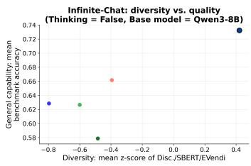  
MoDA DARLING (Mix) DivPO Qwen3-8E DARLING (WildChat)

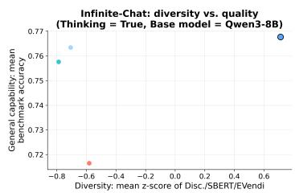

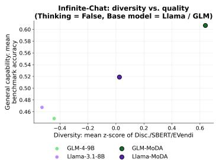  
Figure 4: Diversity vs. Quality pareto figures across base models and thinking modes. The x-axis is Infinite-Chat response diversity (mean z-score of Disc./SBERT/EmbVendi) and the y-axis is general capability (mean benchmark accuracy). (a) Qwen3-8B base, thinking enabled. (b) Qwen3-8B base, thinking disabled. (c) Llama-3.1-8B / GLM-4-9B base, thinking disabled. Across all three settings, MODA Pareto-dominates all the baselines, achieving better diversity and quality simultaneously.

<table><tr><td rowspan="2">Model</td><td colspan="4">Infinite-Chat</td><td colspan="3">NoveltyBench</td><td colspan="4"> $\overline { { H y p o B e n c h } }$ </td><td colspan="4">PreScience</td><td colspan="2">Avg.</td></tr><tr><td>Disc. SBERT E-V</td><td></td><td></td><td>Qual.(%)</td><td>Disc.</td><td>SBERT E-V</td><td>Qual</td><td>Disc.</td><td>SBERT</td><td>E-V Qual.</td><td>Disc.</td><td></td><td>SBERT E-V</td><td>Qual.</td><td>Disc.</td><td>SBERT E-V</td><td></td></tr><tr><td colspan="10">QWEN3-8B BASE, THINKING DISABLED</td><td></td><td></td><td></td><td></td><td></td><td></td><td></td><td></td></tr><tr><td>Qwen3-8B</td><td>0.400</td><td>0.132</td><td>1.83</td><td>62.9</td><td>0.493 0.224</td><td>2.36</td><td>4.58</td><td>0.384</td><td>0.144</td><td>1.91</td><td>4.03</td><td>0.431</td><td>0.155</td><td>1.94 4.25</td><td>0.427</td><td>0.164</td><td>2.01</td></tr><tr><td>DARLING (Mix)</td><td>0.430</td><td>0.203</td><td>2.33</td><td>57.9</td><td>0.513</td><td>0.281 2.96</td><td>5.24</td><td>0.406</td><td>0.222</td><td>2.48</td><td>3.44</td><td>0.559</td><td>0.541</td><td>4.73 2.33</td><td>0.477</td><td>0.312</td><td>3.12</td></tr><tr><td>DARLING (WildChat)</td><td>0.416</td><td>0.185</td><td>2.15</td><td>62.7</td><td>0.480</td><td>0.335 3.11</td><td>4.00</td><td>0.415</td><td>0.205</td><td>2.34</td><td>3.73</td><td>0.446</td><td>0.192</td><td>2.21</td><td>4.03 0.439</td><td>0.229</td><td>2.45</td></tr><tr><td>DivPO</td><td>0.410</td><td>0.274</td><td>2.86</td><td>66.2</td><td>0.519</td><td>0.380 3.58</td><td>4.87</td><td>0.427</td><td>0.198</td><td>2.30</td><td>3.89</td><td>0.455</td><td>0.233</td><td>2.41</td><td>3.96 0.453</td><td>0.271</td><td>2.79</td></tr><tr><td>MoDA</td><td>0.472</td><td>0.482</td><td>4.40</td><td>73.2</td><td>0.537</td><td>0.470</td><td>4.19 5.47</td><td>0.480</td><td>0.547</td><td>4.91</td><td>3.80</td><td>0.440</td><td>0.176</td><td>2.10 3.96</td><td>0.482</td><td>0.419</td><td>3.90</td></tr><tr><td colspan="10">QWEN3-8B BASE, THINKING ENABLED</td><td></td><td></td><td></td><td></td><td></td><td></td><td></td><td></td></tr><tr><td>Qwen3-8B</td><td>0.400</td><td>0.136</td><td>1.85</td><td>75.8</td><td>0.510 0.258</td><td>2.67</td><td>4.90</td><td>0.399</td><td>0.164</td><td>2.05</td><td>3.93</td><td>0.441</td><td>0.136</td><td>1.83 3.79</td><td>0.438</td><td>0.174</td><td>2.10</td></tr><tr><td>SSoT</td><td>0.397</td><td>0.178</td><td>2.09</td><td>76.3</td><td>0.438 0.239</td><td>2.57</td><td>0.46</td><td>0.419</td><td>0.220</td><td>2.33</td><td>3.75 0.461</td><td>0.281</td><td>2.39</td><td>3.30</td><td>0.429</td><td>0.230</td><td>2.34</td></tr><tr><td>DivPO</td><td>0.414</td><td>0.200</td><td>2.20</td><td>71.7</td><td>0.521</td><td>0.327 3.12</td><td>5.06</td><td>0.409</td><td>0.162</td><td>2.04</td><td>3.89</td><td>0.448</td><td>0.185</td><td>2.04 3.87</td><td>0.448</td><td>0.218</td><td>2.35</td></tr><tr><td>MoDA</td><td>0.600</td><td>0.909</td><td>9.04</td><td>76.8</td><td>0.589</td><td>0.800</td><td>7.63 3.39</td><td>0.579</td><td>0.875</td><td>8.06</td><td>3.71</td><td>0.439</td><td>0.194</td><td>2.10</td><td>3.68 0.552</td><td>0.695</td><td>6.71</td></tr><tr><td>LLAMA-3.1-8B BASE, THINKING DISABLED</td><td></td><td></td><td></td><td></td><td></td><td></td><td></td><td></td><td></td><td></td><td></td><td></td><td></td><td></td><td></td><td></td><td></td></tr><tr><td>Llama-3.1-8B</td><td>0.414 0.441</td><td>0.217 0.373</td><td>2.40 3.77</td><td>46.7 51.9</td><td>0.512 0.532</td><td>0.312 0.392</td><td>3.04 4.80 3.75 6.17</td><td>0.469 0.410</td><td>0.207 0.324</td><td>2.38</td><td>3.60</td><td>0.461</td><td>0.514</td><td>3.67 2.62</td><td>0.464</td><td>0.312</td><td>2.87 3.67</td></tr><tr><td colspan="10">MoDA (Llama-3.1-8B)</td><td>3.27 3.65</td><td>0.472</td><td></td><td>0.470</td><td>3.89</td><td>2.54</td><td>0.464</td><td>0.390</td></tr><tr><td>GLM-4-9B BASE, THINKING DISABLED</td><td></td><td></td><td></td><td></td><td></td><td></td><td></td><td></td><td></td><td></td><td></td><td></td><td></td><td></td><td></td><td></td><td></td></tr><tr><td>GLM-4-9B</td><td>0.421</td><td>0.234</td><td>2.60 5.14</td><td>44.9</td><td>0.544</td><td>0.408</td><td>4.08 4.14 2.70</td><td>0.402</td><td>0.225</td><td>2.52</td><td>3.75 3.68</td><td>0.461</td><td>0.438 0.448</td><td>4.15 2.57 2.58</td><td>0.457 0.475</td><td>0.326</td><td>3.34</td></tr><tr><td>MoDA(GLM-4-9b)</td><td>0.481</td><td>0.528</td><td></td><td>60.7</td><td>0.502</td><td>0.521</td><td>5.01</td><td>0.452</td><td>0.485</td><td>4.64</td><td></td><td>0.464</td><td></td><td>4.28</td><td></td><td>0.495</td><td>4.77</td></tr></table>

Table 1: Per-domain diversity (Disc. = discriminator diversity, SBERT = SBERT embedding pairwise distance, E-V = E-Vendi score) and quality (Qual.), averaged over n=3 random seeds. Infinite-Chat quality is general capability accuracy (%); all other domains use the native quality score. Bold marks the best value within each model group. Table with error bar can be found in Appx B.1.

<table><tr><td>Model</td><td>GSM8K MMLU</td><td></td><td>GPQA</td><td>BoolQ</td><td>HS</td><td>TQA</td><td>IFEval</td><td> $\operatorname { A v g } .$ </td></tr><tr><td colspan="9">QWEN3-8B BASE, THINKING DISABLED</td></tr><tr><td>Qwen3-8B</td><td>84.5</td><td>82.0</td><td>41.4</td><td>83.1</td><td>48.4</td><td>22.2</td><td>78.4</td><td>62.9</td></tr><tr><td>DARLING (Mixture)</td><td>63.5</td><td>63.0</td><td>34.3</td><td>76.7</td><td>62.2</td><td>52.4</td><td>53.0</td><td>57.9</td></tr><tr><td>DARLING (WildChat)</td><td>77.9</td><td>55.0</td><td>34.3</td><td>86.4</td><td>68.8</td><td>43.2</td><td>73.0</td><td>62.7</td></tr><tr><td>DivPO</td><td>80.5</td><td>81.0</td><td>40.4</td><td>83.5</td><td>62.8</td><td>37.7</td><td>77.3</td><td>66.2</td></tr><tr><td>MoDA</td><td>86.7</td><td>81.0</td><td>52.0</td><td>84.8</td><td>73.4</td><td>57.9</td><td>76.9</td><td>73.2</td></tr><tr><td colspan="9">QWEN3-8B BASE, THINKING ENABLED</td></tr><tr><td>Qwen3-8B</td><td>90.3</td><td>94.0</td><td>43.4</td><td>87.2</td><td>70.9</td><td>64.9</td><td>79.7</td><td>75.8</td></tr><tr><td>SSoT</td><td>84.3</td><td>93.0</td><td>55.1</td><td>87.2</td><td>80.1</td><td>72.8</td><td>61.9</td><td>76.3</td></tr><tr><td>DivPO</td><td>84.9</td><td>91.0</td><td>44.4</td><td>83.2</td><td>65.0</td><td>55.3</td><td>77.6</td><td>71.7</td></tr><tr><td>MoDA</td><td>83.9</td><td>93.0</td><td>50.5</td><td>87.2</td><td>76.2</td><td>67.2</td><td>79.5</td><td>76.8</td></tr><tr><td colspan="9">LLAMA-3.1-8B BASE, THINKING DISABLED</td></tr><tr><td>Llama-3.1-8B</td><td>71.3</td><td>16.0</td><td>6.1</td><td>81.6</td><td>30.2</td><td>53.4</td><td>68.8</td><td>46.7</td></tr><tr><td>MoDA (Llama-3.1-8B)</td><td>74.9</td><td>30.0</td><td>18.7</td><td>75.6</td><td>38.5</td><td>54.7</td><td>70.8</td><td>51.9</td></tr><tr><td colspan="9">GLM-4-9B BASE, THINKING DISABLED</td></tr><tr><td>GLM-4-9B</td><td>21.8</td><td>35.0</td><td>19.7</td><td>74.5</td><td>68.0</td><td>44.8</td><td>50.3</td><td>44.9</td></tr><tr><td>MoDA (GLM-4-9B)</td><td>84.9</td><td>83.0</td><td>33.3</td><td>81.2</td><td>52.3</td><td>34.5</td><td>55.5</td><td>60.7</td></tr></table>

Table 2: General capability retention (Pass@1 accuracy %), averaged over $n = 3$ random seeds. Bold marks the best value within each model group; underline marks the second-best value within the Qwen3-8B groups. Table with error bar can be found in Appendix B.2 Table 4.

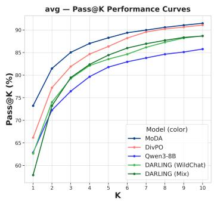

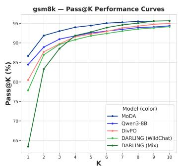

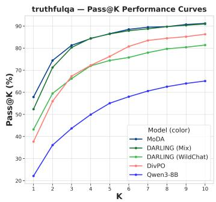  
Figure 5: General capability retention: pass@k accuracy. Qwen3-8B base, thinking disabled models on the general capability suite average, GSM8K and TruthfulQA. More results can be found in Appendix B.2 Figure 5.

## 5.1 Qualitative Results

We observe several interesting patterns in our experiments. Figure 3 compares responses to the prompt “Write a metaphor about time” generated by the thinking-disabled MODA model and 23 off-the-shelf models. The MODA generations occupy a larger region of the embedding space, suggesting that mode-conditioned training expands the model’s exploration space. Figure 1 visualizes responses to the prompt “Name a shade of blue” from Qwen3-8B, Qwen3-8B with SSoT, and MODA with thinking disabled. Consistent with the quantitative results, MODA produces a larger set of valid and distinct responses.

Interestingly, although MODA uses only abstract numbered roles rather than hand-crafted personas, the model sometimes learns role-specific behavioral patterns, suggesting that abstract mode conditioning can induce differentiated characteristics, learned via competitive multi-agent training, without manually specifying each role. We provide more qualitative generation examples in Figure 6.

## 5.2 Ablation Studies.

Ablation Setups. First, to understand whether the diversity improvement comes from training or solely from role injection, we inject numbered roles to the base model (Role-conditioned prompting). Second, to examine whether the diversity gains are driven by the explicit diversity reward or arise naturally from repeated sampling and RL optimization, we trained MODA with Diversity only reward and Quality only reward. Third, to understand the effect of quality-gated diversity reward, we trained MODA with additive reward of weighted sum of quality and diversity metrics, with diversity weight = 1, 10 and 100 (Additive w=1\10\100). Finally, to understand the effect of the naive numbered role injection, we trained several variants of MODA: (1) Crafted personas, which conditions the roles with manually crafted persona descriptions (e.g. “You are a creative problem solver.”; (2) Single role, conditions with only one role; (3) Token-based roles, conditions the role with a dummy token (e.g. “Start your response with APPLE.”). More implementation details are in Appendix A.2. We evaluate each ablation variants on general capability suite under standard and diverse decoding, and application domain suite under diverse decoding.

Quality-Diversity Trade-off. As shown in Figure 7a and 7b, MODA achieves the best accuracy on the general capability suite among all variants. MODA also achieves 77% higher SBERT diversity and 41.6% higher E-Vendi diversity than role-conditioning prompting alone, indicating that roleconditioning prompting by itself is insufficient to induce diverse generation. The quality-only variant regresses in diversity relative to role-conditioning prompting, suggesting that an explicit diversity objective is necessary for diversity gains. The diversity-only variant achieves the best diversity metrics overall, but with the lowest accuracy under standard decoding, and its performance collapses entirely under diverse decoding, indicating that explicit quality gating is critical to preserving response quality.

Additive Aggregation. Many existing works on quality-diversity optimization aggregate quality and diversity objectives using a weighted sum [44, 7]. We compare our method with variants trained using an additive reward objective. We find that additive aggregation is highly sensitive to the diversity weight $\lambda _ { d } .$ at $\lambda _ { d } = 1$ , the additive variant shows modest diversity improvement over the baseline, but substantially less than MODA; at $\lambda _ { d } = 1 0$ and $\lambda _ { d } = 1 0 0$ , diversity improves significantly, but at the cost of general capability performance under diverse decoding. In contrast, MODA separates quality control from diversity optimization through the quality gate, making the reward less sensitive to coefficient scaling and enables faster iteration.

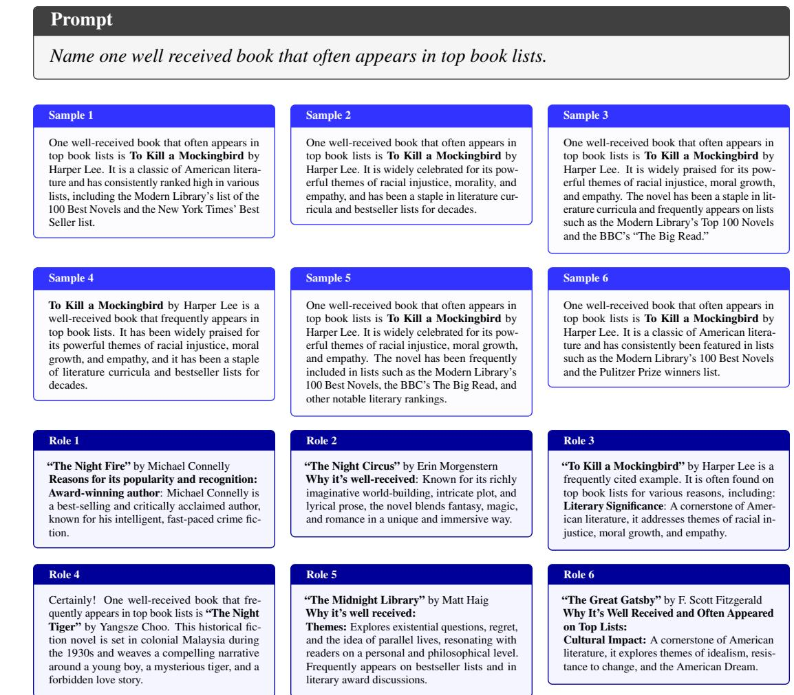  
Figure 6: Qualitative example of diverse generation. Upper: Responses sampled from Qwen3- 8B. Bottom: Responses sampled from MODA under distinct numbered roles for the same prompt, illustrating conceptual diversity across generations.

Role Injection. Prior work has shown that manually designed prompts can induce different model behaviors [48, 5]. We therefore craft six personas and inject them into the system prompt instead of the abstract numbered roles, testing whether hand-designed personas provide a stronger diversity prior than the abstract numbered role used in the main setting. To isolate the effect of role multiplicity from role content, we train a single-role variant in which every response is generated under the same “You are Role 1.” system prompt. To study the effect of the semantic role identity, we train a token-based conditioning variant in which the system prompt instructs a token-based distinguishing signal (e.g. “Start your response with APPLE/BANANA/ORANGE.”). As shown in Table 6, all variants exhibit a slight diversity improvement over the base model, but their gains are smaller than MODA’s, indicating that multiple abstract numbered identity-based role provides a more effective exploration space than all the ablated variants, without sacrificing generalization.

## 6 Discussions

In this work, we introduced MODA, an online-MARL-inspired alignment method that encourages diverse generation while preserving response quality. MODA serves as a drop-in replacement for existing post-training alignment pipelines, requiring no architectural modifications to the underlying model. Compared to previous methods, its dual-mode design enables seamless switching between producing a single high-confidence answer and generating a diverse set of plausible responses, offering greater flexibility depending on the downstream needs. The ability to surface conceptually distinct yet high-quality responses has broad implications for high-stakes domains such as medical diagnosis, legal reasoning, and scientific ideation.

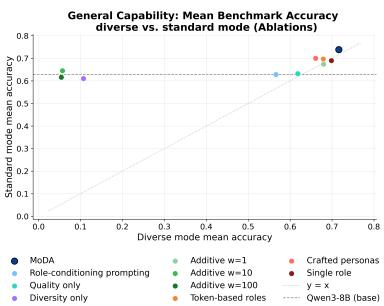  
(a) Diverse vs. standard decoding mode

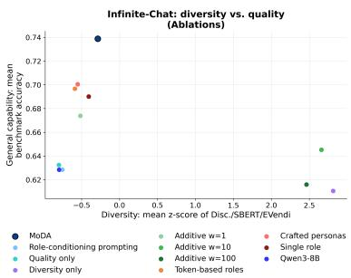  
(b) Diversity-quality pareto front

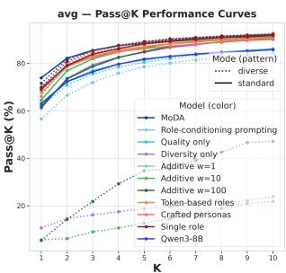  
(b) Pass@k, Avg.  
Figure 7: Ablation study: diversity-quality trade-off under diverse and standard mode, and general capability retention pass@k accuracy. (a) Diverse vs standard mode avg. pass@1 accuracy. (b) Infinite-Chat diversity vs. quality (general capability pass@1 accuracy) across ablation variants. (c) Pass@k accuracy curves for the ablation variants on the general capability suite average, showing how capability under standard (solid) and diverse (dotted) decoding scales with k. We provide a breakdown by individual benchmarks in Appendix B.3 Figure 13.

Limitations and Future Work. Several limitations point to promising directions for future research. First, our quality reward model (SkyReward-V2) tends to favor verbose responses, even for prompts that should be answered briefly, and our uniform length penalty insufficiently addresses this across prompts of varying complexity. For instance, when training GLM-4-9B with MODA, we observed suboptimal native quality score on NoveltyBench compared to the base model because its reward model doesn’t penalize verbosity therefore it reward hack by adding unnecessary preambles such as "As a model.../To answer these questions as a model..." Removing these preambles recovers the performance from 2.739 to 3.302 (+20%). Future work should explore adaptive length penalties or alternative reward models that better reflect conciseness. Second, because MODA introduces no external data during training, generative diversity is bounded by the initial policy’s capacity, and incorporating retrieval augmentation or external data sources could meaningfully expand the exploration space. Finally, there is a risk of producing more varied but misleading, unsafe, or unsupported outputs, especially in high-stakes domains such as medical diagnosis and legal reasoning. Although MODA mitigates this through its dual-mode design, whose standard mode retains the model’s general capability, future work can further combine the diverse mode with verification, calibration, retrieval, or domain-specific safeguards.

## Acknowledgment

We thank our colleagues at the SocialRL Lab at the University of Washington for their valuable feedback and support. The work of Natasha Jaques was supported by the UW-Amazon Science Gift Hub, UW-Tsukuba Amazon NVIDIA Cross Pacific AI Initiative (XPAI), Sony Research Award, Character.AI, DoorDash, Open Philanthropy, Toyota Research Institute, and the Schmidt AI2050 Fellows program. This work was supported by DARPA under the ITM program (FA8650-23-C-7316). The views expressed are those of the author and do not reflect the official policy or position of the Department of Defense or the U.S. Government.

## References

[1] Marwa Abdulhai, Isadora White, Yanming Wan, Ibrahim Qureshi, Joel Leibo, Max Kleiman-Weiner, and Natasha Jaques. How llms distort our written language, 2026.

[2] Anirudh Ajith, Amanpreet Singh, Jay DeYoung, Nadav Kunievsky, Austin C. Kozlowski, Oyvind Tafjord, James Evans, Daniel S. Weld, Tom Hope, and Doug Downey. Prescience: A benchmark for forecasting scientific contributions. 2 2026.

[3] Barrett R Anderson, Jash Hemant Shah, and Max Kreminski. Homogenization effects of large language models on human creative ideation. Proceedings ofthe 16th Conference on Creativity & Cognition, 2024.

[4] Oron Anschel, Alon Shoshan, Adam Botach, Shunit Haviv Hakimi, Asaf Gendler, Emanuel Ben Baruch, Nadav Bhonker, Igor Kviatkovsky, Manoj Aggarwal, and Gerard Medioni. Group-aware reinforcement learning for output diversity in large language models. In Proceedings of the 2025 Conference on Empirical Methods in Natural Language Processing, pages 32382–32403, 2025.

[5] Lisa P Argyle, Ethan C Busby, Nancy Fulda, Joshua R Gubler, Christopher Rytting, and David Wingate. Out of one, many: Using language models to simulate human samples. Political Analysis, 31(3):337–351, 2023.

[6] Chuxue Cao, Mengze Li, Juntao Dai, Jinluan Yang, Zijian Zhao, Shengyu Zhang, Weijie Shi, Chengzhong Liu, Sirui Han, and Yike Guo. Towards advanced mathematical reasoning for llms via first-order logic theorem proving. ArXiv, abs/2506.17104, 2025.

[7] Yilei Chen, Souradip Chakraborty, Lorenz Wolf, Yannis Paschalidis, and Aldo Pacchiano. Post-training large language models for diverse high-quality responses. 2025.

[8] John Joon Young Chung, Vishakh Padmakumar, Melissa Roemmele, Yuqian Sun, and Max Kreminski. Modifying large language model post-training for diverse creative writing, 2025.

[9] Christopher Clark, Kenton Lee, Ming-Wei Chang, Tom Kwiatkowski, Michael Collins, and Kristina Toutanova. BoolQ: Exploring the surprising difficulty of natural yes/no questions. In Jill Burstein, Christy Doran, and Thamar Solorio, editors, Proceedings ofthe 2019 Conference of the North American Chapter of the Association for Computational Linguistics: Human Language Technologies, Volume 1 (Long and Short Papers), pages 2924–2936, Minneapolis, Minnesota, June 2019. Association for Computational Linguistics.

[10] Karl Cobbe, Vineet Kosaraju, Mohammad Bavarian, Mark Chen, Heewoo Jun, Lukasz Kaiser, Matthias Plappert, Jerry Tworek, Jacob Hilton, Reiichiro Nakano, Christopher Hesse, and John Schulman. Training verifiers to solve math word problems. arXiv preprint arXiv:2110.14168, 2021.

[11] Xingyu Dang, Christina Baek, J Zico Kolter, and Aditi Raghunathan. Assessing diversity collapse in reasoning. In Scaling Self-Improving Foundation Models without Human Supervision, 2025.

[12] Shehzaad Dhuliawala, Ilia Kulikov, Ping Yu, Asli Celikyilmaz, Jason Weston, Sainbayar Sukhbaatar, and Jack Lanchantin. Adaptive decoding via latent preference optimization, 2024.

[13] Benjamin Eysenbach, Abhishek Gupta, Julian Ibarz, and Sergey Levine. Diversity is all you need: Learning skills without a reward function, 2018.

[14] Dan Friedman and Adji Bousso Dieng. The vendi score: A diversity evaluation metric for machine learning, 2023.

[15] Nate Gruver, Samuel Stanton, Nathan C. Frey, Tim G. J. Rudner, Isidro Hotzel, Julien Lafrance-Vanasse, Arvind Rajpal, Kyunghyun Cho, and Andrew Gordon Wilson. Protein design with guided discrete diffusion, 2023.

[16] Daya Guo, Dejian Yang, Haowei Zhang, Junxiao Song, Peiyi Wang, Qihao Zhu, Runxin Xu, Ruoyu Zhang, Shirong Ma, Xiao Bi, Xiaokang Zhang, Xingkai Yu, Yu Wu, Z. F. Wu, Zhibin Gou, Zhihong Shao, Zhuoshu Li, Ziyi Gao, Aixin Liu, Bing Xue, Bingxuan Wang, Bochao Wu, Bei Feng, Chengda Lu, Chenggang Zhao, Chengqi Deng, Chong Ruan, Damai Dai, Deli Chen, Dongjie Ji, Erhang Li, Fangyun Lin, Fucong Dai, Fuli Luo, Guangbo Hao, Guanting Chen, Guowei Li, H. Zhang, Hanwei Xu, Honghui Ding, Huazuo Gao, Hui Qu, Hui Li, Jianzhong Guo, Jiashi Li, Jingchang Chen, Jingyang Yuan, Jinhao Tu, Junjie Qiu, Junlong Li, J. L. Cai, Jiaqi Ni, Jian Liang, Jin Chen, Kai Dong, Kai Hu, Kaichao You, Kaige Gao, Kang Guan, Kexin Huang, Kuai Yu, Lean Wang, Lecong Zhang, Liang Zhao, Litong Wang, Liyue Zhang, Lei Xu, Leyi Xia, Mingchuan Zhang, Minghua Zhang, Minghui Tang, Mingxu Zhou, Meng Li, Miaojun Wang, Mingming Li, Ning Tian, Panpan Huang, Peng Zhang, Qiancheng Wang, Qinyu Chen, Qiushi Du, Ruiqi Ge, Ruisong Zhang, Ruizhe Pan, Runji Wang, R. J. Chen, R. L. Jin, Ruyi Chen, Shanghao Lu, Shangyan Zhou, Shanhuang Chen, Shengfeng Ye, Shiyu Wang, Shuiping Yu, Shunfeng Zhou, Shuting Pan, S. S. Li, Shuang Zhou, Shaoqing Wu, Tao Yun, Tian Pei, Tianyu Sun, T. Wang, Wangding Zeng, Wen Liu, Wenfeng Liang, Wenjun Gao, Wenqin Yu, Wentao Zhang, W. L. Xiao, Wei An, Xiaodong Liu, Xiaohan Wang, Xiaokang Chen, Xiaotao Nie, Xin Cheng, Xin Liu, Xin Xie, Xingchao Liu, Xinyu Yang, Xinyuan Li, Xuecheng Su, Xuheng Lin, X. Q. Li, Xiangyue Jin, Xiaojin Shen, Xiaosha Chen, Xiaowen Sun, Xiaoxiang Wang, Xinnan Song, Xinyi Zhou, Xianzu Wang, Xinxia Shan, Y. K. Li, Y. Q. Wang, Y. X. Wei, Yang Zhang, Yanhong Xu, Yao Li, Yao Zhao, Yaofeng Sun, Yaohui Wang, Yi Yu, Yichao Zhang, Yifan Shi, Yiliang Xiong, Ying He, Yishi Piao, Yisong Wang, Yixuan Tan, Yiyang Ma, Yiyuan Liu, Yongqiang Guo, Yuan Ou, Yuduan Wang, Yue Gong, Yuheng Zou, Yujia He, Yunfan Xiong, Yuxiang Luo, Yuxiang You, Yuxuan Liu, Yuyang Zhou, Y. X. Zhu, Yanping Huang, Yaohui Li, Yi Zheng, Yuchen Zhu, Yunxian Ma, Ying Tang, Yukun Zha, Yuting Yan, Z. Z. Ren, Zehui Ren, Zhangli Sha, Zhe Fu, Zhean Xu, Zhenda Xie, Zhengyan Zhang, Zhewen Hao, Zhicheng Ma, Zhigang Yan, Zhiyu Wu, Zihui Gu, Zijia Zhu, Zijun Liu, Zilin Li, Ziwei Xie, Ziyang Song, Zizheng Pan, Zhen Huang, Zhipeng Xu, Zhongyu Zhang, and Zhen Zhang. Deepseek-r1 incentivizes reasoning in llms through reinforcement learning. Nature, 645(8081):633–638, 2025.

[17] Yanzhu Guo, Guokan Shang, and Chloé Clavel. Benchmarking linguistic diversity of large language models. Transactions ofthe Associationfor Computational Linguistics, 13:1507–1526, 2025.

[18] Andre He, Daniel Fried, and Sean Welleck. Rewarding the unlikely: Lifting grpo beyond distribution sharpening, 2025.

[19] Dan Hendrycks, Collin Burns, Steven Basart, Andy Zou, Mantas Mazeika, Dawn Song, and Jacob Steinhardt. Measuring massive multitask language understanding. Proceedings of the International Conference on Learning Representations (ICLR), 2021.

[20] Ari Holtzman, Jan Buys, Li Du, Maxwell Forbes, and Yejin Choi. The curious case of neural text degeneration, 2020.

[21] Audrey Huang, Adam Block, Dylan J Foster, Dhruv Rohatgi, Cyril Zhang, Max Simchowitz, Jordan T Ash, and Akshay Krishnamurthy. Self-improvement in language models: The sharpening mechanism. arXiv preprint arXiv:2412.01951, 2024.

[22] Daphne Ippolito, Reno Kriz, Joao Sedoc, Maria Kustikova, and Chris Callison-Burch. Comparison of diverse decoding methods from conditional language models. In Proceedings ofthe 57th Annual Meeting of the Association for Computational Linguistics, pages 3752–3762, 2019.

[23] Mohammad Jalali, Azim Ospanov, Amin Gohari, and Farzan Farnia. Conditional vendi score: An information-theoretic approach to diversity evaluation of prompt-based generative models, 2024.

[24] Natasha Jaques, Shixiang Gu, Dzmitry Bahdanau, José Miguel Hernández-Lobato, Richard E. Turner, and Douglas Eck. Sequence tutor: Conservative fine-tuning of sequence generation models with kl-control, 2017.

[25] Liwei Jiang, Yuanjun Chai, Margaret Li, Mickel Liu, Raymond Fok, Nouha Dziri, Yulia Tsvetkov, Maarten Sap, Alon Albalak, and Yejin Choi. Artificial hivemind: The open-ended homogeneity of language models (and beyond), 2025.

[26] Jaehun Jung, Seungju Han, Ximing Lu, Skyler Hallinan, David Acuna, Shrimai Prabhumoye, Mostafa Patwary, Mohammad Shoeybi, Bryan Catanzaro, and Yejin Choi. Prismatic synthesis: Gradient-based data diversification boosts generalization in llm reasoning, 2025.

[27] Junseok Kim, Nakyeong Yang, and Kyomin Jung. Persona switch: Mixing distinct perspectives in decoding time. 1 2026.

[28] Robert Kirk, Ishita Mediratta, Christoforos Nalmpantis, Jelena Luketina, Eric Hambro, Edward Grefenstette, and Roberta Raileanu. Understanding the effects of rlhf on llm generalisation and diversity, 2024.

[29] Teun Kloek and Herman K Van Dijk. Bayesian estimates of equation system parameters: an application of integration by monte carlo. Econometrica: Journal of the Econometric Society, pages 1–19, 1978.

[30] Woosuk Kwon, Zhuohan Li, Siyuan Zhuang, Ying Sheng, Lianmin Zheng, Cody Hao Yu, Joseph E. Gonzalez, Hao Zhang, and Ion Stoica. Efficient memory management for large language model serving with PagedAttention. In Proceedings of the ACM SIGOPS 29th Symposium on Operating Systems Principles, 2023.

[31] Arash Lagzian, Srinivas Anumasa, and Dianbo Liu. Multi-novelty: Improve the diversity and novelty of contents generated by large language models via inference-time multi-views brainstorming, 2025.

[32] Nathan Lambert, Jacob Morrison, Valentina Pyatkin, Shengyi Huang, Hamish Ivison, Faeze Brahman, Lester James V. Miranda, Alisa Liu, Nouha Dziri, Shane Lyu, Yuling Gu, Saumya Malik, Victoria Graf, Jena D. Hwang, Jiangjiang Yang, Ronan Le Bras, Oyvind Tafjord, Chris Wilhelm, Luca Soldaini, Noah A. Smith, Yizhong Wang, Pradeep Dasigi, and Hannaneh Hajishirzi. Tülu 3: Pushing frontiers in open language model post-training. 2024.

[33] Jack Lanchantin, Angelica Chen, Shehzaad Dhuliawala, Ping Yu, Jason Weston, Sainbayar Sukhbaatar, and Ilia Kulikov. Diverse preference optimization. arXiv preprint arXiv:2501.18101, 2025.

[34] Gregory Kang Ruey Lau, Wenyang Hu, Diwen Liu, Jizhuo Chen, See-Kiong Ng, and Bryan Kian Hsiang Low. Dipper: Diversity in prompts for producing large language model ensembles in reasoning tasks, 2025.

[35] Chenghao Li, Tonghan Wang, Chengjie Wu, Qianchuan Zhao, Jun Yang, and Chongjie Zhang. Celebrating diversity in shared multi-agent reinforcement learning, 2021.

[36] Tianjian Li, Yiming Zhang, Ping Yu, Swarnadeep Saha, Daniel Khashabi, Jason Weston, Jack Lanchantin, and Tianlu Wang. Jointly reinforcing diversity and quality in language model generations, 2025.

[37] Yancheng Liang, Daphne Chen, Abhishek Gupta, Simon S Du, and Natasha Jaques. Learning to cooperate with humans using generative agents. Advances in Neural Information Processing Systems, 37:60061–60087, 2024.

[38] Stephanie Lin, Jacob Hilton, and Owain Evans. Truthfulqa: Measuring how models mimic human falsehoods, 2022.

[39] Chris Yuhao Liu, Liang Zeng, Yuzhen Xiao, Jujie He, Jiacai Liu, Chaojie Wang, Rui Yan, Wei Shen, Fuxiang Zhang, Jiacheng Xu, et al. Skywork-reward-v2: Scaling preference data curation via human-ai synergy. arXiv preprint arXiv:2507.01352, 2025.

[40] Haokun Liu, Sicong Huang, Jingyu Hu, Yangqiaoyu Zhou, and Chenhao Tan. Hypobench: Towards systematic and principled benchmarking for hypothesis generation, 2026.

[41] Yun Luo, Zhen Yang, Fandong Meng, Yafu Li, Jie Zhou, and Yue Zhang. An empirical study of catastrophic forgetting in large language models during continual fine-tuning, 2025.

[42] Philip M. McCarthy and Scott Jarvis. Mtld, vocd-d, and hd-d: A validation study of sophisticated approaches to lexical diversity assessment. Behavior Research Methods, 42:381–392, 2010.

[43] Kou Misaki and Takuya Akiba. String seed of thought: Prompting llms for distribution-faithful and diverse generation. 2 2026.

[44] Jean-Baptiste Mouret and Jeff Clune. Illuminating search spaces by mapping elites, 2015.

[45] Minh Nhat Nguyen, Andrew Baker, Clement Neo, Allen Roush, Andreas Kirsch, and Ravid Shwartz-Ziv. Turning up the heat: Min-p sampling for creative and coherent llm outputs, 2024.

[46] Laura O’Mahony, Leo Grinsztajn, Hailey Schoelkopf, and Stella Biderman. Attributing mode collapse in the fine-tuning of large language models, 2024.

[47] Vishakh Padmakumar and He He. Does writing with language models reduce content diversity? arXiv preprint arXiv:2309.05196, 2023.

[48] Joon Sung Park, Carolyn Q Zou, Aaron Shaw, Benjamin Mako Hill, Carrie Cai, Meredith Ringel Morris, Robb Willer, Percy Liang, and Michael S Bernstein. Generative agent simulations of 1,000 people. arXiv preprint arXiv:2411.10109, 52, 2024.

[49] Isha Puri, Mehul Damani, Idan Shenfeld, Marzyeh Ghassemi, Jacob Andreas, and Yoon Kim. Reaching beyond the mode: Rl for distributional reasoning in language models. 3 2026.

[50] Nils Reimers and Iryna Gurevych. Sentence-bert: Sentence embeddings using siamese bertnetworks, 2019.

[51] David Rein, Betty Li Hou, Asa Cooper Stickland, Jackson Petty, Richard Yuanzhe Pang, Julien Dirani, Julian Michael, and Samuel R. Bowman. GPQA: A graduate-level google-proof q&a benchmark. In First Conference on Language Modeling, 2024.

[52] Bernardino Romera-Paredes, Mohammadamin Barekatain, Alexander Novikov, Matej Balog, M Pawan Kumar, Emilien Dupont, Francisco JR Ruiz, Jordan S Ellenberg, Pengming Wang, Omar Fawzi, et al. Mathematical discoveries from program search with large language models. Nature, 625(7995):468–475, 2024.

[53] Zhiwen Ruan, Yixia Li, Yefeng Liu, Yun Chen, Weihua Luo, Peng Li, Yang Liu, and Guanhua Chen. G2: Guided generation for enhanced output diversity in LLMs. In Christos Christodoulopoulos, Tanmoy Chakraborty, Carolyn Rose, and Violet Peng, editors, Proceedings of the 2025 Conference on Empirical Methods in Natural Language Processing, pages 14116–14134, Suzhou, China, November 2025. Association for Computational Linguistics.

[54] Simra Shahid, Marissa Radensky, Raymond Fok, Pao Siangliulue, Daniel S Weld, and Tom Hope. Literature-grounded novelty assessment of scientific ideas. Technical report, 2025.

[55] Chantal Shaib, Joe Barrow, Jiuding Sun, Alexa F. Siu, Byron C. Wallace, and Ani Nenkova. Standardizing the measurement of text diversity: A tool and a comparative analysis of scores, 2024.

[56] Zhihong Shao, Peiyi Wang, Qihao Zhu, Runxin Xu, Junxiao Song, Xiao Bi, Haowei Zhang, Mingchuan Zhang, Y. K. Li, Y. Wu, and Daya Guo. Deepseekmath: Pushing the limits of mathematical reasoning in open language models, 2024.

[57] Guangming Sheng, Chi Zhang, Zilingfeng Ye, Xibin Wu, Wang Zhang, Ru Zhang, Yanghua Peng, Haibin Lin, and Chuan Wu. Hybridflow: A flexible and efficient rlhf framework. arXiv preprint arXiv:2409.19256, 2024.

[58] Ilia Shumailov, Zakhar Shumaylov, Yiren Zhao, Nicolas Papernot, Ross Anderson, and Yarin Gal. Ai models collapse when trained on recursively generated data. Nature, 631:755 – 759, 2024.

[59] Alexander Shypula, Shuo Li, Botong Zhang, Vishakh Padmakumar, Kayo Yin, and Osbert Bastani. Evaluating the diversity and quality of llm generated content, 2025.

[60] Stewart Slocum, Asher Parker-Sartori, and Dylan Hadfield-Menell. Diverse preference learning for capabilities and alignment, 2025.

[61] Zhivar Sourati, Alireza S. Ziabari, and Morteza Dehghani. The homogenizing effect of large language models on human expression and thought, 2026.

[62] Rohan Taori, Ishaan Gulrajani, Tianyi Zhang, Yann Dubois, Xuechen Li, Carlos Guestrin, Percy Liang, and Tatsunori B. Hashimoto. Stanford alpaca: An instruction-following llama model. https://github.com/tatsu-lab/stanford\_alpaca, 2023.

[63] Yanming Wan, Jiaxing Wu, Marwa Abdulhai, Lior Shani, and Natasha Jaques. Enhancing personalized multi-turn dialogue with curiosity reward, 2025.

[64] Qihan Wang, Shidong Pan, Tal Linzen, and Emily Black. Multilingual prompting for improving llm generation diversity, 2025.

[65] Wenhui Wang, Furu Wei, Li Dong, Hangbo Bao, Nan Yang, and Ming Zhou. Minilm: Deep self-attention distillation for task-agnostic compression of pre-trained transformers, 2020.

[66] Peter West and Christopher Potts. Base models beat aligned models at randomness and creativity. arXiv preprint arXiv:2505.00047, 2025.

[67] John Wieting and Kevin Gimpel. Paranmt-50m: Pushing the limits of paraphrastic sentence embeddings with millions of machine translations. In Proceedings ofthe 56th Annual Meeting of the Association for Computational Linguistics (Volume 1: Long Papers), pages 451–462, 2018.

[68] Chen Henry Wu, Sachin Goyal, and Aditi Raghunathan. Mode-conditioning unlocks superior test-time scaling. 11 2025.

[69] An Yang, Anfeng Li, Baosong Yang, Beichen Zhang, Binyuan Hui, Bo Zheng, Bowen Yu, Chang Gao, Chengen Huang, Chenxu Lv, Chujie Zheng, Dayiheng Liu, Fan Zhou, Fei Huang, Feng Hu, Hao Ge, Haoran Wei, Huan Lin, Jialong Tang, Jian Yang, Jianhong Tu, Jianwei Zhang, Jianxin Yang, Jiaxi Yang, Jing Zhou, Jingren Zhou, Junyang Lin, Kai Dang, Keqin Bao, Kexin Yang, Le Yu, Lianghao Deng, Mei Li, Mingfeng Xue, Mingze Li, Pei Zhang, Peng Wang, Qin Zhu, Rui Men, Ruize Gao, Shixuan Liu, Shuang Luo, Tianhao Li, Tianyi Tang, Wenbiao Yin, Xingzhang Ren, Xinyu Wang, Xinyu Zhang, Xuancheng Ren, Yang Fan, Yang Su, Yichang Zhang, Yinger Zhang, Yu Wan, Yuqiong Liu, Zekun Wang, Zeyu Cui, Zhenru Zhang, Zhipeng Zhou, and Zihan Qiu. Qwen3 technical report, 2025.

[70] Jiayi Yuan, Jonathan Nöther, Natasha Jaques, and Goran Radanovic. Agenticred: Evolving ´ agentic systems for red-teaming, 2026.

[71] Rowan Zellers, Ari Holtzman, Yonatan Bisk, Ali Farhadi, and Yejin Choi. Hellaswag: Can a machine really finish your sentence? In Proceedings of the 57th Annual Meeting of the Associationfor Computational Linguistics, 2019.

[72] Jiayi Zhang, Simon Yu, Derek Chong, Anthony Sicilia, Michael R. Tomz, Christopher D. Manning, and Weiyan Shi. Verbalized sampling: How to mitigate mode collapse and unlock llm diversity. 10 2025.

[73] Yiming Zhang, Harshita Diddee, Susan Holm, Hanchen Liu, Xinyue Liu, Vinay Samuel, Barry Wang, and Daphne Ippolito. Noveltybench: Evaluating language models for humanlike diversity, 2025.

[74] Yanli Zhao, Andrew Gu, Rohan Varma, Liang Luo, Chien-Chin Huang, Min Xu, Less Wright, Hamid Shojanazeri, Myle Ott, Sam Shleifer, Alban Desmaison, Can Balioglu, Pritam Damania, Bernard Nguyen, Geeta Chauhan, Yuchen Hao, Ajit Mathews, and Shen Li. PyTorch FSDP: Experiences on scaling fully sharded data parallel. Proceedings of the VLDB Endowment, 16(12):3848–3860, 2023.

[75] Jeffrey Zhou, Tianjian Lu, Swaroop Mishra, Siddhartha Brahma, Sujoy Basu, Yi Luan, Denny Zhou, and Le Hou. Instruction-following evaluation for large language models, 2023.

[76] Yaoming Zhu, Sidi Lu, Lei Zheng, Jiaxian Guo, Weinan Zhang, Jun Wang, and Yong Yu. Texygen: A benchmarking platform for text generation models. In The 41st international ACM SIGIR conference on research & development in information retrieval, pages 1097–1100, 2018.

[77] Qiran Zou, Hou Hei Lam, Wenhao Zhao, Yiming Tang, Tingting Chen, Samson Yu, Tianyi Zhang, Chang Liu, Xiangyang Ji, and Dianbo Liu. Fml-bench: Benchmarking machine learning agents for scientific research, 2026.

## Appendices

A Implementation 22   
A.1 Overview 22   
A.2 Ablation Model Implementations . 22   
A.3 Dataset 22   
A.4 Discriminator 23   
A.5 Training Curve 24   
B Additional Experiment Results 26   
B.1 Generative Diversity Evaluation. 26   
B.2 General Capability Retention . 27   
B.3 Ablation Results . 30   
C Benchmark Descriptions 32   
C.1 Diversity Metrics 32   
C.2 General Capability Retention 32   
C.3 Domain Application Tasks 33   
D Generation Examples 34

Algorithm 2 MODA: Mode-conditioned Diversity Alignment   
Require: Prompt dataset $\mathcal { D } = \{ x _ { n } \} _ { n = 1 } ^ { N } ;$ initial policy π ; reference/base policy $\pi _ { \mathrm { r e f } } ;$ quality reward   
model $S _ { \phi } ;$ set of mode instructions $\mathcal { M } = \{ m _ { 1 } , . . . , m _ { K } \}$ ; diversity metric $\delta ( \cdot , \cdot ) ;$ quality and   
diversity weights $\lambda _ { q } , \lambda _ { d } ; \mathrm { K I }$ weight β   
Require: Number of reference samples $M ;$ number of training responses per prompt $K ;$ small   
constants $\epsilon , \eta > 0$   
1: Stage 1: Precompute prompt-adaptive reference quality statistics   
2: for all $x \in \mathcal { D }$ do   
3: Initialize reference score set $S _ { \mathrm { r e f } } ( x )  \emptyset$   
4: for $j = 1 , \dots , M$ do   
5: Sample reference response $\tilde { y } _ { j } \sim \pi _ { \mathrm { r e f } } ( \cdot \mid x )$   
6: Compute quality score $\tilde { s } _ { j } \gets \tilde { S } _ { \phi } ( x , \tilde { y } _ { j } )$   
7: Add $\tilde { s } _ { j }$ to ${ \bar { \boldsymbol { S } } } _ { \mathrm { r e f } } ( { \bar { \boldsymbol { x } } } )$   
8: end for   
9: Compute   
$s _ { \mathrm { m i n } } ( x ) \gets \mathrm { m i n } S _ { \mathrm { r e f } } ( x ) , s _ { \mathrm { m a x } } ( x ) \gets \mathrm { m a x } S _ { \mathrm { r e f } } ( x ) , \mu _ { \mathrm { r e f } } ( x ) \gets \frac { 1 } { M } \quad \sum \quad \tilde { s }$   
${ \tilde { s } } \in S _ { \mathrm { r e f } } ( x )$   
10: Store ${ \left( s _ { \mathrm { m i n } } ( x ) , s _ { \mathrm { m a x } } ( x ) , \mu _ { \mathrm { r e f } } ( x ) \right) }$ with prompt x in D   
11: end for   
12: Stage 2: Mode-conditioned reinforcement learning   
13: for training iteration $t = 1 , \dots , T$ do   
14: Sample a minibatch $B \subset D$   
15: for all $x \in B$ do   
16: Retrieve stored statistics ${ \left( s _ { \mathrm { m i n } } ( x ) , s _ { \mathrm { m a x } } ( x ) , \mu _ { \mathrm { r e f } } ( x ) \right) }$   
17: Compute prompt-adaptive quality threshold and reward magnitude factor:   
$q _ { \mathrm { t a r } } ( x ) \gets s _ { \mathrm { m i n } } ( x ) + \alpha \big ( s _ { \mathrm { m a x } } ( x ) - \mu _ { \mathrm { r e f } } ( x ) \big )$   
$\tau _ { q } ( x )  \gamma ( \mu _ { \mathrm { r e f } } ( x ) - s _ { \mathrm { m i n } } ( x ) + \epsilon )$   
18: Initialize response set $\mathcal { V } ( \boldsymbol { x } )  \emptyset$   
19: for $i = 1 , \ldots , K$ do   
20: Select mode instruction $m _ { i } \in \mathcal { M }$   
21: Sample response $y _ { i } \sim \pi _ { \theta } ( \cdot \mid x , m _ { i } )$   
22: Add y to $\dot { \mathcal { V } } ( \boldsymbol { x } )$   
23: end for   
24: for $i = 1 , \ldots , K$ do   
25: Compute quality score   
$q _ { i } \gets S _ { \phi } ( x , y _ { i } )$   
26: Compute normalized quality margin   
$z _ { i } \gets \frac { q _ { i } - q _ { \mathrm { t a r } } ( x ) } { \tau _ { q } ( x ) }$   
27: Compute bounded quality reward   
$R _ { \mathrm { q u a l } } ( x , y _ { i } ) \gets \mu \operatorname { t a n h } ( z _ { i } )$   
28: Compute quality gate   
$G _ { \mathrm { q u a l } } ( x , y _ { i } ) \gets \mathbb { 1 } \{ q _ { i } \geq q _ { \mathrm { t a r } } ( x ) \}$   
29: Compute diversity reward   
$R _ { \mathrm { d i v } } ( x , y _ { i } ) \gets \operatorname* { m i n } _ { j \neq i } \delta ( y _ { i } , y _ { j } )$

30: Compute reward-hacking penalty

$$
R _ { \mathrm { p e n } } ( x , y _ { i } )  R _ { \mathrm { l e n } } ( y _ { i } ) + R _ { \mathrm { l a n g } } ( y _ { i } )
$$

Compute Quality Gated Diversity Reward

$$
R _ { i } \gets \lambda _ { q } R _ { \mathrm { q u a l } } ( x , y _ { i } ) + \lambda _ { d } G _ { \mathrm { q u a l } } ( x , y _ { i } ) R _ { \mathrm { d i v } } ( x , y _ { i } ) + R _ { \mathrm { p e n } } ( x , y _ { i } ) .
$$

32: end for

33: Compute group-relative advantages:

$$
A _ { i }  \frac { R _ { i } - \mathrm { m e a n } ( R _ { 1 : K } ) } { \mathrm { s t d } ( R _ { 1 : K } ) + \eta } , \qquad i = 1 , \ldots , K .
$$

34: end for

35: Update $\pi _ { \theta }$ using GRPO with advantages $\{ A _ { i } \}$ and KL regularization to $\pi _ { \mathrm { r e f } } .$ :

$$
\theta  \arg \operatorname* { m a x } _ { \theta } \mathbb { E } [ \frac { 1 } { K } \sum _ { i = 1 } ^ { K } \operatorname* { m i n } ( \rho _ { i } A _ { i } , \operatorname { c l i p } ( \rho _ { i } , 1 - \epsilon _ { \mathrm { c l i p } } , 1 + \epsilon _ { \mathrm { c l i p } } ) A _ { i } ) - \beta D _ { \mathrm { K L } } ( \pi _ { \theta } ( \cdot \ | \ x , m _ { i } ) \| \pi _ { \mathrm { r e f } } ( \cdot \ | \ x , m _ { i } ) ) ] ,
$$

where

$$
\rho _ { i } = { \frac { \pi _ { \theta } ( y _ { i } \mid x , m _ { i } ) } { \pi _ { \mathrm { o l d } } ( y _ { i } \mid x , m _ { i } ) } } .
$$

36: end for

37: return trained policy πθ

## A Implementation

## A.1 Overview

Training Stage For rollout generation, we use stochastic sampling with temperature 1.0 and top-$p = 1 . 0$ , which encourages broad exploration of the model’s response distribution during RL training. This is important for MODA, since the diversity reward can only provide useful learning signal when the sampled response group contains meaningful variation. We sample $k = 6$ mode-conditioned responses per prompt, forming the group over which diversity rewards and GRPO advantages are computed. We use a maximum prompt length of 1024 tokens and a maximum response length of 2048 tokens. For the Quality Gated Diversity Reward, we used quality weight of $\lambda _ { q } = 1$ , diversity reward weight of $\lambda _ { d } = 1 0 0$ , length penalty weight of 0.01, and language-mismatch penalty of weight 0.1. For GLM-4-9B base, we observed a severe language-mismatch issue in its response, and therefore increased the weight of the language-mismatch penalty to 100.

For Qwen3-8B base, we trained MODA and all baselines for 4 epochs. For Llama-3.1-8B, GLM-4-9B base and ablation models, we trained for 2 epochs due to compute resource constraints.

Our training are done on NVIDIA A100, H100 or H200 GPUs, depending on availability. A single training for 2 epochs run takes approximately 24 hours on 4 H200 GPUs. We provide the rest of the training parameters in Table 3.

## A.2 Ablation Model Implementations

Token-based roles As an ablation, we replace the abstract numbered role instructions with dummy roles. Specifically, for each prompt, we prepend one of the following system prompts. We stripped the dummy tokens (e.g., APPLE/ORANGE/BANANA) from the responses before computing the diversity and quality metrics, both during the training and during the evaluation.

1. “Start your response with APPLE.”

2. “Start your response with ORANGE.”

3. “Start your response with BANANA.”

4. “Start your response with CHERRY.”

5. “Start your response with DATE.”

6. “Start your response with ELDERBERRY.”

Crafted roles As an ablation, we replace the abstract numbered role instructions with manually crafted role descriptions. Specifically, for each prompt, we prepend one of the following system prompts:

1. “You are a helpful assistant.”

2. “You are a creative problem solver.”

3. “You are a patient educator.”

4. “You are a rigorous mathematician.”

5. “You are a skeptical analyst.”

6. “You are an optimistic encourager.”

Single role As an ablation, we use only one role for mode condition. We prepend “You are Role 1." on each system prompt.

## A.3 Dataset

Our training dataset comprises a mixture of general-purpose SFT prompts, which anchor baseline capability, and open-ended prompts, which encourage exploration and response diversity. Specifically, we sample 8k prompts from allenai/tulu-3-sft-mixture [32] as general-purpose examples and 2k prompts from Infinite-Chat as open-ended queries. We held out a part of the Infinite-Chat to used in the evaluation.

Table 3: Training hyperparameters used for MODA.
<table><tr><td>Hyperparameter</td><td>Value</td></tr><tr><td>Model and data</td><td></td></tr><tr><td>Base model</td><td>Qwen3-8B</td></tr><tr><td>Training batch size</td><td>32</td></tr><tr><td>Validation batch size</td><td>32</td></tr><tr><td>Maximum prompt length</td><td>1024</td></tr><tr><td>Maximum response length</td><td></td></tr><tr><td>Number of training epochs</td><td>2048</td></tr><tr><td>Rollout generation</td><td>2</td></tr><tr><td>Rollout engine</td><td></td></tr><tr><td>Number of responses per prompt, N</td><td>vLLM</td></tr><tr><td>Sampling</td><td>6</td></tr><tr><td>Temperature</td><td>Enabled</td></tr><tr><td>Top-p</td><td>1.0</td></tr><tr><td>Top-k</td><td>1.0</td></tr><tr><td>Maximum model length</td><td>-1</td></tr><tr><td>Policy optimization</td><td>4096</td></tr><tr><td>RL algorithm</td><td></td></tr><tr><td>Actor learning rate</td><td>GRPO -6</td></tr><tr><td>Optimizer</td><td>1 × 10</td></tr><tr><td>AdamW betas</td><td>AdamW</td></tr><tr><td>Weight decay</td><td>(0.9,0.999)</td></tr><tr><td>Gradient clipping</td><td>0.01</td></tr><tr><td>PPO epochs</td><td>1.0</td></tr><tr><td>PPO mini-batch size</td><td>1</td></tr><tr><td>PPO micro-batch size per GPU</td><td>32</td></tr><tr><td>PPO clip ratio</td><td>4</td></tr><tr><td>Advantage normalization</td><td>0.2</td></tr><tr><td></td><td>Enabled</td></tr><tr><td>Loss aggregation</td><td>Token mean</td></tr><tr><td>Entropy coefficient</td><td>0</td></tr><tr><td>KL regularization</td><td></td></tr><tr><td>Use KL loss</td><td></td></tr><tr><td>KL loss coefficient</td><td>Enabled 0.01</td></tr><tr><td>KL loss type</td><td>Low-variance KL</td></tr><tr><td>KL control coefficient</td><td></td></tr><tr><td>Target KL</td><td>0.001 0.1</td></tr><tr><td>Reward function</td><td></td></tr><tr><td>Quality reward weight</td><td>1.0</td></tr><tr><td>Distinctiveness reward weight</td><td>100.0</td></tr><tr><td>Thresholding base reward</td><td>0.5</td></tr><tr><td></td><td></td></tr><tr><td>Length penalty weight</td><td>0.01</td></tr><tr><td>Maximum length before penalty</td><td>512 tokens</td></tr><tr><td>Language mixing penalty weight (Qwen/Llama)</td><td>0.1</td></tr><tr><td>Language mixing penalty weight (GLM)</td><td>10</td></tr></table>

## A.4 Discriminator

We train a lightweight pairwise binary discriminator to predict whether two responses to the same prompt are conceptually distinct. The training data is constructed from 2,000 Alpaca prompts. For each prompt, we employ Qwen3-30B to generate responses under 5 modes and 2 random seeds, yielding 20,000 response pairs. Pseudo-labels are assigned using bidirectional microsoft/deberta-v3-large on the first 200 tokens of each response pair. A pair is labeled nondiverse if both directions predict entailment, and diverse otherwise. We discard low-confidence pairs whose maximum softmax probability is below 0.7, balance the two classes, and split the resulting 5,816 pairs by prompt into train/validation/test sets of 4,064/890/862 pairs.

Architecture. The discriminator uses frozen all-mpne $\mathtt { t - b a s e - v 2 }$ sentence embeddings to construct its feature vector. Given a pairs of sentence embeddings $u , v \in \mathbb { R } ^ { 7 6 8 }$ , we construct the feature vector

$$
z = [ u \parallel v \parallel | u - v | \parallel u \odot v \parallel \phi ( y _ { i } , y _ { j } ) ] \in \mathbb { R } ^ { 3 0 7 5 } ,
$$

where $\phi ( y _ { i } , y _ { j } )$ denotes auxiliary scalar pair features.

The classifier is a three-layer MLP with $3 0 7 5 \to 2 5 6 \to 6 4 \to 1$ nodes, ReLU activations, dropout $0 . 3 ,$ , and a sigmoid output. We train with focal loss $( \alpha = 0 . 2 5 , \gamma = 2 )$ , AdamW with learning rate $3 \times 1 0 ^ { - 4 }$ , batch size $6 4$ , and early stopping on validation AUC. The model has approximately 804K trainable parameters.

## A.5 Training Curve

We share the training curve for ablation studies in Figure $^ { 8 . }$

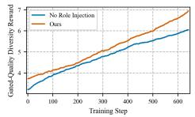

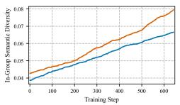

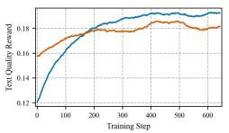

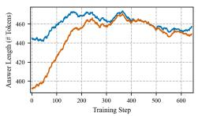

No role injection, thinking disabled.  
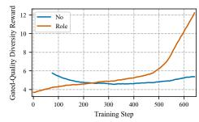

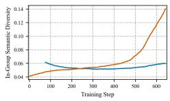

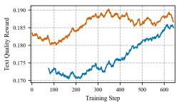

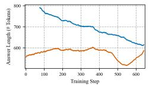  
No role injection, thinking enabled.

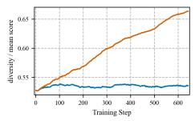

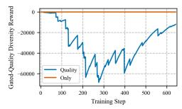

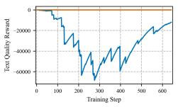

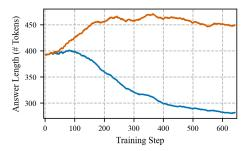  
Quality-only reward, thinking disabled.

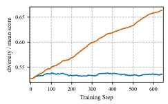

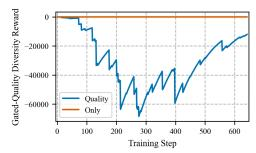

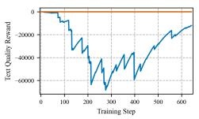

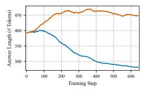  
Quality-only reward, thinking enabled.

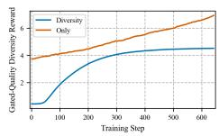

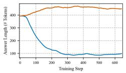

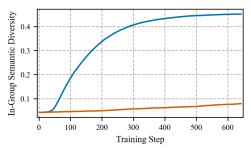

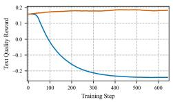  
Diversity-only reward, thinking disabled.

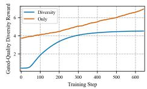

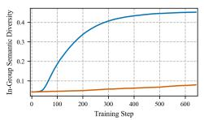

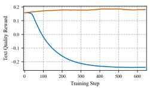

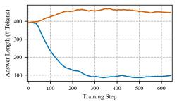

Diversity-only reward, thinking enabled.  
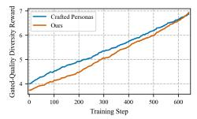

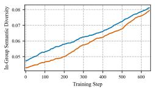

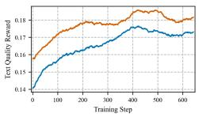

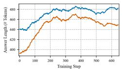  
Crafted personas, thinking disabled.

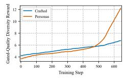

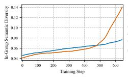

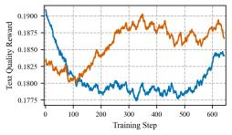  
Crafted personas, thinking enabled.

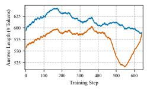

Figure 8: Training curves for ablation studies. Each row corresponds to one ablation setting, and each row reports four training diagnostics: total reward, diversity reward, quality reward, and answer token length. Results are shown under both thinking-disabled and thinking-enabled settings.

## B Additional Experiment Results

## B.1 Generative Diversity Evaluation.

We show the results with error bar for generative diversity across all domain application tasks.

## Infinite-Chat

<table><tr><td>Model</td><td>Disc.</td><td>S</td><td>EV</td><td>Qual.</td></tr><tr><td colspan="5">QWEN3-8B BASE, THINKING DISABLED</td></tr><tr><td>Qwen3-8B</td><td> $\overline { { 0 . 4 0 0 \pm 0 . 0 0 1 } }$ </td><td> $0 . 1 3 2 \pm 0 . 0 0 1$ </td><td> $1 . 8 3 \pm 0 . 0 1$ </td><td> $6 2 . 9 \% \pm 0 . 8 \%$ </td></tr><tr><td>DARLING (Mix)</td><td> $0 . 4 3 0 \pm 0 . 0 0 1$ </td><td> $0 . 2 0 3 \pm 0 . 0 0 1$ </td><td> $2 . 3 3 \pm 0 . 0 0$ </td><td> $5 7 . 9 \% \pm 1 . 0 \%$ </td></tr><tr><td>DARLING (WildChat)</td><td> $0 . 4 1 6 \pm 0 . 0 0 1$ </td><td> $0 . 1 8 5 \pm 0 . 0 0 2$ </td><td> $2 . 1 5 \pm 0 . 0 1$ </td><td> $6 2 . 7 \% \pm 1 . 0 \%$ </td></tr><tr><td>DivPO</td><td> $0 . 4 1 0 \pm 0 . 0 0 1$ </td><td> $0 . 2 7 4 \pm 0 . 0 0 4$ </td><td> $2 . 8 6 \pm 0 . 0 3$ </td><td> $6 6 . 2 \% \pm 0 . 9 \%$ </td></tr><tr><td>MoDA</td><td> ${ \bf 0 . 4 7 2 \pm 0 . 0 0 1 }$ </td><td> ${ \bf 0 . 4 8 2 \pm 0 . 0 0 3 }$ </td><td> ${ \bf 4 . 4 0 \pm 0 . 0 1 }$ </td><td> $7 3 . 2 \% \pm 0 . 9 \%$ </td></tr><tr><td colspan="5">QWEN3-8B BASE, THINKING ENABLED</td></tr><tr><td>Qwen3-8B</td><td> $\overline { { 0 . 4 0 0 \pm 0 . 0 0 1 } }$ </td><td> $0 . 1 3 6 \pm 0 . 0 0 1$ </td><td> $1 . 8 5 \pm 0 . 0 1$ </td><td> $7 5 . 8 \% \pm 0 . 7 \%$ </td></tr><tr><td>SSoT</td><td> $0 . 3 9 7 \pm 0 . 0 0 0$ </td><td> $0 . 1 7 8 \pm 0 . 0 0 2$ </td><td> $2 . 0 9 \pm 0 . 0 1$ </td><td> $7 6 . 3 \% \pm 0 . 7 \%$ </td></tr><tr><td>DivPO</td><td> $0 . 4 1 4 \pm 0 . 0 0 2$ </td><td> $0 . 2 0 0 \pm 0 . 0 0 6$ </td><td> $2 . 2 0 \pm 0 . 0 3$ </td><td> $7 1 . 7 \% \pm 0 . 8 \%$ </td></tr><tr><td>MoDA</td><td> $\mathbf { 0 . 6 0 0 \mathop { = } 0 . 0 0 1 }$ </td><td> ${ \bf 0 . 9 0 9 \pm 0 . 0 0 1 }$ </td><td> ${ \bf 9 . 0 4 } \pm 0 . 0 1$ </td><td> $7 6 . 8 \% \pm 0 . 7 \%$ </td></tr><tr><td colspan="5">LLAMA-3.1-8B BASE, THINKING DISABLED</td></tr><tr><td>Llama-3.1-8B</td><td> $\overline { { 0 . 4 1 4 \pm 0 . 0 0 1 } }$ </td><td> $\overline { { 0 . 2 } } 1 7 \pm 0 . 0 0 2$ </td><td> $2 . 4 0 \pm 0 . 0 1$ </td><td> $4 6 . 7 \% \pm 0 . 7 \%$ </td></tr><tr><td>MoDA (Llama-3.1-8B)</td><td> ${ \bf 0 . 4 4 1 } \pm 0 . 0 0 2$ </td><td> ${ \bf 0 . 3 7 3 \pm 0 . 0 0 3 }$ </td><td> ${ \bf 3 . 7 7 \pm 0 . 0 2 }$ </td><td> $5 1 . 9 \% \pm 0 . 9 \%$ </td></tr><tr><td colspan="5">GLM-4-9B BASE, THINKING DISABLED</td></tr><tr><td>GLM-4-9B</td><td> $\overline { { 0 . 4 2 1 \pm 0 . 0 0 1 } }$ </td><td> $0 . 2 3 4 \pm 0 . 0 0 2$ </td><td> $2 . 6 0 \pm 0 . 0 1$ </td><td> $4 4 . 9 \% \pm 0 . 9 \%$ </td></tr><tr><td>MoDA(GLM-4-9b)</td><td> ${ \bf 0 . 4 8 1 } \pm 0 . 0 0 1$ </td><td> ${ \bf 0 . 5 2 8 \pm 0 . 0 0 1 }$ </td><td> ${ \bf 5 . 1 4 \pm 0 . 0 1 }$ </td><td> $6 0 . 7 \% \pm 0 . 8 \%$ </td></tr></table>

## NoveltyBench

<table><tr><td>Model</td><td>Disc.</td><td>S</td><td>EV</td><td>Qual.</td></tr><tr><td colspan="5">QWEN3-8B BASE, THINKING DISABLED</td></tr><tr><td>Qwen3-8B</td><td> $\overline { { 0 . 4 9 3 \pm 0 . 0 0 2 } }$ </td><td> $0 . 2 2 4 \pm 0 . 0 0 3$ </td><td> $2 . 3 6 \pm 0 . 0 2$ </td><td> $4 . 5 8 \pm 0 . 0 4$ </td></tr><tr><td>DARLING (Mix) DARLING (WildChat)</td><td> $0 . 5 1 3 \pm 0 . 0 0 1$   $0 . 4 8 0 \pm 0 . 0 0 1$ </td><td> $0 . 2 8 1 \pm 0 . 0 0 1$   $0 . 3 3 5 \pm 0 . 0 0 4$ </td><td> $2 . 9 6 \pm 0 . 0 1$   $3 . 1 1 \pm 0 . 0 2$ </td><td> $5 . 2 4 \pm 0 . 0 7$   $4 . 0 0 \pm 0 . 0 6$ </td></tr><tr><td>DivPO</td><td> $0 . 5 1 9 \pm 0 . 0 0 1$ </td><td> $0 . 3 8 0 \pm 0 . 0 0 3$ </td><td> $3 . 5 8 \pm 0 . 0 2$ </td><td> $4 . 8 7 \pm 0 . 0 2$ </td></tr><tr><td>MoDA</td><td> $\mathbf { 0 . 5 3 7 \pm 0 . 0 0 1 }$ </td><td> ${ \bf 0 . 4 7 0 \pm 0 . 0 0 3 }$ </td><td> ${ \bf 4 . 1 9 \pm 0 . 0 1 }$ </td><td> ${ \bf 5 . 4 7 \pm 0 . 0 3 }$ </td></tr><tr><td>QWEN3-8B BASE, THINKING ENABLED</td><td></td><td></td><td></td><td></td></tr><tr><td colspan="5"></td></tr><tr><td>Qwen3-8B</td><td> $\overline { { 0 . 5 1 0 \pm 0 . 0 0 1 } }$ </td><td> $0 . 2 5 8 \pm 0 . 0 0 3$ </td><td> $2 . 6 7 \pm 0 . 0 3$ </td><td> $4 . 9 0 \pm 0 . 0 4$ </td></tr><tr><td>SSoT</td><td> $0 . 4 3 8 \pm 0 . 0 0 1$ </td><td> $0 . 2 3 9 \pm 0 . 0 0 2$ </td><td> $2 . 5 7 \pm 0 . 0 1$ </td><td> $0 . 4 6 \pm 0 . 0 1$ </td></tr><tr><td>DivPO</td><td> $0 . 5 2 1 \pm 0 . 0 0 1$ </td><td> $0 . 3 2 7 \pm 0 . 0 0 3$ </td><td> $3 . 1 2 \pm 0 . 0 2$ </td><td> ${ \bf 5 . 0 6 \pm 0 . 0 4 }$ </td></tr><tr><td>MoDA</td><td> $\mathbf { 0 . 5 8 9 \pm 0 . 0 0 2 }$ </td><td> $\mathbf { 0 . 8 0 0 \mathop { \pm } 0 . 0 0 4 }$ </td><td> $\mathbf { 7 . 6 3 \pm 0 . 0 7 }$ </td><td> $3 . 3 9 \pm 0 . 0 5$ </td></tr><tr><td colspan="5">LLAMA-3.1-8B BASE, THINKING DISABLED</td></tr><tr><td>Llama-3.1-8B</td><td> $\overline { { 0 . 5 1 2 \pm 0 . 0 0 1 } }$ </td><td> $\overline { { 0 . 3 } } 1 2 \pm 0 . 0 0 1$ </td><td> $3 . 0 4 \pm 0 . 0 1$ </td><td></td></tr><tr><td>MoDA (Llama-3.1-8B)</td><td> $\mathbf { 0 . 5 3 2 \pm 0 . 0 0 1 }$ </td><td> ${ \bf 0 . 3 9 2 \pm 0 . 0 0 1 }$ </td><td> $3 . 7 5 \pm 0 . 0 1$ </td><td> $4 . 8 0 \pm 0 . 0 8$ </td></tr><tr><td></td><td></td><td></td><td></td><td> ${ \bf 6 . 1 7 \pm 0 . 0 4 }$ </td></tr><tr><td colspan="5">GLM-4-9B BASE, THINKING DISABLED</td></tr><tr><td>GLM-4-9B</td><td> $\overline { { { \bf 0 . 5 4 4 } } } \pm 0 . 0 0 2$ </td><td></td><td></td><td></td></tr><tr><td></td><td></td><td> $0 . 4 0 8 \pm 0 . 0 0 4$ </td><td> $4 . 0 8 \pm 0 . 0 4$ </td><td> ${ \bf 4 . 1 4 \pm 0 . 0 1 }$ </td></tr><tr><td>MoDA(GLM-4-9b)</td><td> $0 . 5 0 2 \pm 0 . 0 0 2$ </td><td> ${ \bf 0 . 5 2 1 } \pm 0 . 0 0 5$ </td><td> ${ \bf 5 . 0 1 \pm 0 . 0 4 }$ </td><td> $2 . 7 0 \pm 0 . 0 3$ </td></tr></table>

## HypoBench

<table><tr><td>Model</td><td>Disc.</td><td>S</td><td>EV</td><td>Qual.</td></tr><tr><td colspan="3">QWEN3-8B BASE, THINKING DISABLED</td><td></td><td></td></tr><tr><td>Qwen3-8B</td><td> $\overline { { 0 . 3 8 4 \pm 0 . 0 0 5 } }$ </td><td> $0 . 1 4 4 \pm 0 . 0 0 5$ </td><td> $1 . 9 1 \pm 0 . 0 3$ </td><td> $\pm . 0 3 \pm 0 . 0 1$ </td></tr><tr><td>DARLING (Mix)</td><td> $0 . 4 0 6 \pm 0 . 0 0 5$ </td><td> $0 . 2 2 2 \pm 0 . 0 0 4$ </td><td> $2 . 4 8 \pm 0 . 0 2$ </td><td> $3 . 4 4 \pm 0 . 0 3$ </td></tr><tr><td>DARLING (WildChat)</td><td> $0 . 4 1 5 \pm 0 . 0 0 4$ </td><td> $0 . 2 0 5 \pm 0 . 0 0 6$ </td><td> $2 . 3 4 \pm 0 . 0 4$ </td><td> $3 . 7 3 \pm 0 . 0 2$ </td></tr><tr><td>DivPO MoDA</td><td> $0 . 4 2 7 \pm 0 . 0 0 6$   ${ \bf 0 . 4 8 0 \pm 0 . 0 0 3 }$ </td><td> $0 . 1 9 8 \pm 0 . 0 0 5$   $\mathbf { 0 . 5 4 7 \pm 0 . 0 1 0 }$ </td><td> $2 . 3 0 \pm 0 . 0 3$ </td><td> $3 . 8 9 \pm 0 . 0 1$ </td></tr><tr><td></td><td></td><td></td><td> ${ \bf 4 . 9 1 \pm 0 . 0 5 }$ </td><td> $3 . 8 0 \pm 0 . 0 2$ </td></tr><tr><td colspan="3">QWEN3-8B BASE, THINKING ENABLED</td><td></td><td></td></tr><tr><td>Qwen3-8B</td><td> $\overline { { 0 . 3 9 9 \pm 0 . 0 0 6 } }$ </td><td> $0 . 1 6 4 \pm 0 . 0 0 5$ </td><td> $2 . 0 5 \pm 0 . 0 3$ </td><td> ${ \bf 3 . 9 3 \pm 0 . 0 1 }$ </td></tr><tr><td>SSoT</td><td> $0 . 4 1 9 \pm 0 . 0 0 2$ </td><td> $0 . 2 2 0 \pm 0 . 0 1 0$ </td><td> $2 . 3 3 \pm 0 . 0 4$ </td><td> $3 . 7 5 \pm 0 . 0 2$ </td></tr><tr><td>DivPO</td><td> $0 . 4 0 9 \pm 0 . 0 0 2$ </td><td> $0 . 1 6 2 \pm 0 . 0 0 5$ </td><td> $2 . 0 4 \pm 0 . 0 3$ </td><td> $3 . 8 9 \pm 0 . 0 1$ </td></tr><tr><td>MoDA</td><td> ${ \bf 0 . 5 7 9 \pm 0 . 0 1 3 }$ </td><td> ${ \bf 0 . 8 7 5 \pm 0 . 0 1 8 }$ </td><td> ${ \bf 8 . 0 6 \pm 0 . 2 5 }$ </td><td> $3 . 7 1 \pm 0 . 0 4$ </td></tr><tr><td colspan="3">LLAMA-3.1-8B BASE, THINKING DISABLED</td><td></td><td></td></tr><tr><td>Llama-3.1-8B</td><td> $\overline { { { \bf 0 . 4 6 9 \pm 0 . 0 0 5 } } }$ </td><td> $\overline { { 0 . 2 0 7 } } \pm 0 . 0 0 6$ </td><td> $2 . 3 8 \pm 0 . 0 4$ </td><td> $3 . 6 0 \pm 0 . 0 2$ </td></tr><tr><td>MoDA (Llama-3.1-8B)</td><td> $0 . 4 1 0 \pm 0 . 0 0 1$ </td><td> ${ \bf 0 . 3 2 4 \pm 0 . 0 1 4 }$ </td><td> ${ \bf 3 . 2 7 \pm 0 . 1 0 }$ </td><td> ${ \bf 3 . 6 5 \pm 0 . 0 1 }$ </td></tr><tr><td></td><td></td><td></td><td></td><td></td></tr><tr><td colspan="3">GLM-4-9B BASE, THINKING DISABLED</td><td></td><td></td></tr><tr><td>GLM-4-9B</td><td> $\overline { { 0 . 4 0 2 \pm 0 . 0 0 3 } }$ </td><td> $0 . 2 2 5 \pm 0 . 0 0 5$ </td><td> $2 . 5 2 \pm 0 . 0 3$ </td><td> $3 . 7 5 \pm 0 . 0 1$ </td></tr><tr><td>MoDA(GLM-4-9b)</td><td> $\mathbf { 0 . 4 5 2 \pm 0 . 0 0 3 }$ </td><td> $\mathbf { 0 . 4 8 5 \pm 0 . 0 1 2 }$ </td><td> ${ \pm . 6 4 \pm 0 . 0 9 }$ </td><td> $3 . 6 8 \pm 0 . 0 1$ </td></tr></table>

## PreScience

<table><tr><td>Model</td><td>Disc.</td><td>S</td><td>EV</td><td>Qual.</td></tr><tr><td colspan="3">QWEN3-8B BASE, THINKING DISABLED</td><td></td><td></td></tr><tr><td>Qwen3-8B</td><td> $\overline { { 0 . 4 3 1 \pm 0 . 0 0 2 } }$ </td><td> $0 . 1 5 5 \pm 0 . 0 0 4$ </td><td> $1 . 9 4 \pm 0 . 0 2$ </td><td> $\pm . 2 5 \pm 0 . 0 3$ </td></tr><tr><td>DARLING (Mix)</td><td> ${ \bf 0 . 5 5 9 \pm 0 . 0 0 5 }$ </td><td> ${ \bf 0 . 5 4 1 \pm 0 . 0 1 8 }$ </td><td> ${ \bf 4 . 7 3 \pm 0 . 1 5 }$ </td><td> $2 . 3 3 \pm 0 . 0 7$ </td></tr><tr><td>DARLING (WildChat)</td><td> $0 . 4 4 6 \pm 0 . 0 0 2$ </td><td> $0 . 1 9 2 \pm 0 . 0 0 3$ </td><td> $2 . 2 1 \pm 0 . 0 3$ </td><td> $4 . 0 3 \pm 0 . 0 6$ </td></tr><tr><td>DivPO</td><td> $0 . 4 5 5 \pm 0 . 0 0 2$ </td><td> $0 . 2 3 3 \pm 0 . 0 0 1$ </td><td> $2 . 4 1 \pm 0 . 0 1$ </td><td> $3 . 9 6 \pm 0 . 0 5$ </td></tr><tr><td>MoDA</td><td> $0 . 4 4 0 \pm 0 . 0 0 2$ </td><td> $0 . 1 7 6 \pm 0 . 0 0 2$ </td><td> $2 . 1 0 \pm 0 . 0 1$ </td><td> $3 . 9 6 \pm 0 . 0 1$ </td></tr><tr><td colspan="3">QWEN3-8B BASE, THINKING ENABLED</td><td></td><td></td></tr><tr><td>Qwen3-8B</td><td> $\overline { { 0 . 4 4 1 \pm 0 . 0 0 3 } }$ </td><td> $0 . 1 3 6 \pm 0 . 0 0 1$ </td><td> $1 . 8 3 \pm 0 . 0 1$ </td><td> $3 . 7 9 \pm 0 . 0 4$ </td></tr><tr><td>SSoT</td><td> ${ \bf 0 . 4 6 1 } \pm 0 . 0 0 2$ </td><td> ${ \bf 0 . 2 8 1 \pm 0 . 0 1 7 }$ </td><td> ${ \bf 2 . 3 9 \pm 0 . 0 5 }$ </td><td> $3 . 3 0 \pm 0 . 0 5$ </td></tr><tr><td>DivPO</td><td> $0 . 4 4 8 \pm 0 . 0 0 3$ </td><td> $0 . 1 8 5 \pm 0 . 0 1 5$ </td><td> $2 . 0 4 \pm 0 . 0 7$ </td><td> ${ \bf 3 . 8 7 \pm 0 . 0 6 }$ </td></tr><tr><td>MoDA</td><td> $0 . 4 3 9 \pm 0 . 0 0 1$ </td><td> $0 . 1 9 4 \pm 0 . 0 0 5$ </td><td> $2 . 1 0 \pm 0 . 0 1$ </td><td> $3 . 6 8 \pm 0 . 0 0$ </td></tr><tr><td colspan="3">LLAMA-3.1-8B BASE, THINKING DISABLED</td><td></td><td></td></tr><tr><td>Llama-3.1-8B</td><td> $\overline { { 0 . 4 6 1 \pm 0 . 0 0 5 } }$ </td><td> $\overline { { \mathbf { 0 . 5 1 4 } } } \pm 0 . 0 2 0$ </td><td> $3 . 6 7 \pm 0 . 0 7$ </td><td></td></tr><tr><td>MoDA (Llama-3.1-8B)</td><td> $\mathbf { 0 . 4 7 2 \pm 0 . 0 0 3 }$ </td><td> $0 . 4 7 0 \pm 0 . 0 0 9$ </td><td> ${ \bf 3 . 8 9 \pm 0 . 0 7 }$ </td><td> $\pm . 6 2 \pm 0 . 0 5$   $2 . 5 4 \pm 0 . 0 4$ </td></tr><tr><td colspan="3">GLM-4-9B BASE, THINKING DISABLED</td><td></td><td></td></tr><tr><td>GLM-4-9B</td><td> $\overline { { 0 . 4 6 1 \pm 0 . 0 0 4 } }$ </td><td> $0 . 4 3 8 \pm 0 . 0 1 0$ </td><td></td><td></td></tr><tr><td> $\mathbf { M O D A ( G L M { - } 4 { - } 9 b ) }$ </td><td> ${ \bf 0 . 4 6 4 } \pm 0 . 0 0 2$ </td><td> $\mathbf { 0 . 4 4 8 \pm 0 . 0 1 0 }$ </td><td> $4 . 1 5 \pm 0 . 0 8$   ${ \pm . 2 8 \pm 0 . 0 9 }$ </td><td> $2 . 5 7 \pm 0 . 0 5$   $\pm . 5 8 \pm 0 . 1 0$ </td></tr></table>

## B.2 General Capability Retention

## B.2.1 Pass@1

We show general capability retention with error bar for pass@1 across baselines and our model.

<table><tr><td>Model</td><td>GSM8K</td><td>MMLU</td><td>GPQA</td><td>BoolQ</td><td></td><td>HellaSwag TruthfulQA</td><td>IFEval</td><td>Avg.</td></tr><tr><td colspan="7">QWEN3-8B BASE, THINKING DISABLED</td><td></td><td></td></tr><tr><td colspan="7">Qwen3-8B  $8 4 . 5 \pm 1 . 0 8 2 . 0 \pm 3 . 9 4 1 . 4 \pm 3 . 5 8 3 . 1 \pm 0 . 7 4 8 . 4 \pm 0 . 5$ </td><td> $2 2 . 2 \pm 1 . 5$   $7 8 . 4 \pm 1 . 8$ </td><td> $6 2 . 9 \pm 0 . 8$ </td></tr><tr><td>DARLING (Mixture)</td><td> $6 3 . 5 \pm 1 . 3 6 3 . 0 \pm 4 . 9 3 4 . 3 \pm 3 . 4 7 6 . 7 \pm 0 . 7 6 2 . 2 \pm 0 . 5$ </td><td></td><td></td><td></td><td></td><td> $5 2 . 4 \pm 1 . 7$ </td><td> $5 3 . 0 \pm 2 . 1$ </td><td> $5 7 . 9 \pm 1 . 0$ </td></tr><tr><td>DARLING (WildChat)</td><td> $7 7 . 9 \pm 1 . 1 5 5 . 0 \pm 5 . 0 3 4 . 3 \pm 3 . 4 8 6 . 4 \pm 0 . 6 6 8 . 8 \pm 0 . 5$ </td><td></td><td></td><td></td><td></td><td> $4 3 . 2 \pm { 1 . 7 }$ </td><td> $7 3 . 0 \pm 1 . 9$ </td><td> $6 2 . 7 \pm 1 . 0$ </td></tr><tr><td>DivPO</td><td> $8 0 . 5 \pm 1 . 1 8 1 . 0 \pm 3 . 9 4 0 . 4 \pm 3 . 5 8 3 . 5 \pm 0 . 6 6 2 . 8 \pm 0 . 5$ </td><td></td><td></td><td></td><td></td><td> $3 7 . 7 \pm 1 . 7$ </td><td> $7 7 . 3 \pm 1 . 8$ </td><td> $6 6 . 2 \pm 0 . 9$ </td></tr><tr><td>MoDA</td><td>86.7 ± 0.9 81.0 ± 3.9 52.0 ± 3.6 84.8 ± 0.6 73.4 ± 0.4</td><td></td><td></td><td></td><td></td><td> ${ \pm } 7 . 9 \pm 1 . 7$ </td><td> $7 6 . 9 \pm 1 . 8$ </td><td> $7 3 . 2 \pm 0 . 9$ </td></tr><tr><td colspan="7">QWEN3-8B BASE, THINKING ENABLED</td><td></td><td></td></tr><tr><td>Qwen3-8B 90.3 ± 0.8 94.0 ± 2.4 43.4 ± 3.5 87.2 ± 0.6 70.9 ± 0.5</td><td></td><td></td><td></td><td></td><td></td><td> $6 4 . 9 \pm 1 . 7$ </td><td>79.7 ± 1.7</td><td> $7 5 . 8 \pm 0 . 7$ </td></tr><tr><td>SSoT</td><td>84.3 ± 1.0 93.0 ± 2.6 55.1 ± 3.587.2 ± 0.6 80.1 ± 0.4</td><td></td><td></td><td></td><td></td><td> $7 2 . 8 \pm 1 . 6$ </td><td>61.9 ± 2.1</td><td> $7 6 . 3 \pm 0 . 7$ </td></tr><tr><td>DivPO</td><td> $8 4 . 9 \pm 1 . 0 9 1 . 0 \pm 2 . 9 4 4 . 4 \pm 3 . 5 8 3 . 2 \pm 0 . 7 6 5 . 0 \pm 0 . 5$ </td><td></td><td></td><td></td><td></td><td> $5 5 . 3 \pm { 1 . 7 }$ </td><td>77.6 ± 1.8 71.7 ± 0.8</td><td></td></tr><tr><td>MoDA</td><td>83.9 ± 1.0 93.0 ± 2.6 50.5 ± 3.6 87.2 ± 0.6 76.2 ± 0.4</td><td></td><td></td><td></td><td></td><td> $6 7 . 2 \pm 1 . 6$ </td><td> $7 9 . 5 \pm 1 . 7$ </td><td>76.8 ± 0.7</td></tr><tr><td colspan="7">LLAMA-3.1-8B BASE, THINKING DISABLED</td><td></td><td></td></tr><tr><td>Llama-3.1-8B</td><td></td><td>71.3 ± 1.2 16.0 ± 3.7 6.1 ± 1.7 81.6 ± 0.7</td><td></td><td></td><td> $3 0 . 2 \pm { 0 . 5 }$ </td><td> $5 3 . 4 \pm 1 . 7$ </td><td>68.8 ± 2.0 46.7 ± 0.7</td><td></td></tr><tr><td>MoDA (Llama-3.1-8B) 74.9 ± 1.2 30.0 ± 4.6 18.7 ± 2.8 75.6 ± 0.8 38.5 ± 0.5</td><td></td><td></td><td></td><td></td><td></td><td> ${ \pm } 4 . 7 \pm 1 . 7$ </td><td>70.8 ± 2.0 51.9 ± 0.9</td><td></td></tr><tr><td colspan="7">GLM-4-9B BASE, THINKING DISABLED</td><td></td><td></td></tr><tr><td>GLM-4-9B</td><td>21.8 ± 1.1 35.0 ± 4.8 19.7 ± 2.8 74.5 ± 0.8</td><td></td><td></td><td></td><td> ${ \bf 6 8 . 0 \pm 0 . 5 }$ </td><td> ${ \pm } 4 . 8 \pm 1 . 7$ </td><td> $5 0 . 3 \pm 2 . 2$ </td><td> $4 4 . 9 \pm 0 . 9$ </td></tr><tr><td>MoDA (GLM-4-9B)  ${ \bf 8 4 . 9 \pm 1 . 0 }$ </td><td></td><td>83.0 ± 3.8 33.3 ± 3.4 81.2 ± 0.7 52.3 ± 0.5</td><td></td><td></td><td></td><td> $3 4 . 5 \pm { 1 . 7 }$ </td><td>55.5 ± 2.1</td><td> ${ \bf 6 0 . 7 \pm 0 . 8 }$ </td></tr></table>

Table 4: General capability retention (accuracy %, mean ± std error; bold = best per block)

## B.2.2 Pass@5

We show general capability retention for pass@5 across baselines and our model.

<table><tr><td>Model</td><td>GSM8K</td><td>MMLU</td><td>GPQA</td><td>BoolQ</td><td>HellaSwag</td><td>TruthfulQA</td><td>IFEval</td><td>Avg.</td></tr><tr><td colspan="9">QWEN3-8B BASE, THINKING DISABLED</td></tr><tr><td>Qwen3-8B</td><td>92.6</td><td>92.0</td><td>73.7</td><td>89.7</td><td>86.0</td><td>55.1</td><td>83.4</td><td>81.8</td></tr><tr><td>DARLING (Mixture)</td><td>92.8</td><td>95.0</td><td>75.3</td><td>93.1</td><td>91.2</td><td>86.4</td><td>57.3</td><td>84.4</td></tr><tr><td>DARLING (WildChat)</td><td>91.8</td><td>86.0</td><td>69.2</td><td>91.3</td><td>91.3</td><td>74.4</td><td>80.8</td><td>83.5</td></tr><tr><td>DivPO</td><td>92.3</td><td>92.0</td><td>74.7</td><td>93.2</td><td>90.5</td><td>76.3</td><td>85.6</td><td>86.4</td></tr><tr><td>MoDA</td><td>94.5</td><td>93.0</td><td>74.7</td><td>93.9</td><td>91.3</td><td>86.5</td><td>83.9</td><td>88.3</td></tr><tr><td colspan="9">QWEN3-8B BASE, THINKING ENABLED</td></tr><tr><td>Qwen3-8B</td><td>96.1</td><td>96.0</td><td>66.2</td><td>92.2</td><td>89.1</td><td>82.5</td><td>85.4</td><td>86.8</td></tr><tr><td>SSoT</td><td>90.6</td><td>96.0</td><td>74.7</td><td>92.0</td><td>88.9</td><td>83.8</td><td>73.6</td><td>85.7</td></tr><tr><td>DivPO</td><td>94.0</td><td>97.0</td><td>72.2</td><td>93.0</td><td>89.8</td><td>83.8</td><td>85.6</td><td>87.9</td></tr><tr><td>MoDA</td><td>96.3</td><td>96.0</td><td>68.7</td><td>92.0</td><td>89.6</td><td>82.5</td><td>85.8</td><td>87.3</td></tr><tr><td colspan="9">LLAMA-3.1-8B BASE, THINKING DISABLED</td></tr><tr><td>Llama-3.1-8B</td><td>90.1</td><td>57.0</td><td>28.3</td><td>93.2</td><td>70.2</td><td>72.9</td><td>82.3</td><td>70.6</td></tr><tr><td>MoDA (Llama-3.1-8B)</td><td>93.5</td><td>76.0</td><td>56.6</td><td>92.3</td><td>79.6</td><td>80.4</td><td>80.2</td><td>79.8</td></tr><tr><td colspan="9">GLM-4-9B BASE, THINKING DISABLED</td></tr><tr><td>GLM-4-9B</td><td>60.0</td><td>69.0</td><td>59.6</td><td>97.1</td><td>91.3</td><td>82.6</td><td>57.5</td><td>73.9</td></tr><tr><td>MoDA (GLM-4-9B)</td><td>95.2</td><td>94.0</td><td>73.2</td><td>95.3</td><td>89.1</td><td>77.5</td><td>74.7</td><td>85.6</td></tr></table>

Table 5: General capability retention pass@5. For IFEval, strict instruction-following accuracy is reported. Avg. is the row mean across benchmarks. Bold marks the best average within each thinking setting.

We show pass@k figures for the rest of the general capability suite tasks below.

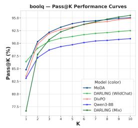

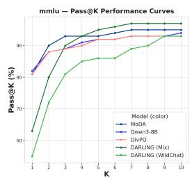

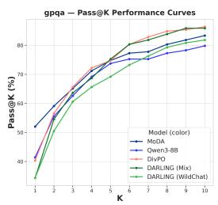

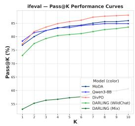  
Figure 9: General capability retention: pass@k accuracy. Qwen3-8B base and thinking disabled models on the general capability suite tasks: BoolQ, MMLU, GPQA, and IFEval.

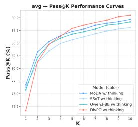

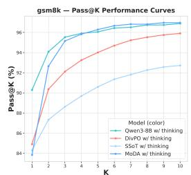

  
Figure 10: General capability retention: pass@k accuracy. Qwen3-8B base and thinking enabled models.

  
Figure 11: General capability retention: pass@k accuracy. Llama-3.1-8B base and thinking disabled models.

  
Figure 12: General capability retention: pass@k accuracy. GLM-4-9B base and thinking disabled models.

## B.3 Ablation Results

We show the mean benchmark accuracy, under both standard and diverse decoding mode, on the general capability suite, and Infinite-Chat response diversity on the held out test set for the ablation study models.

<table><tr><td rowspan="2">Ablation</td><td colspan="2">General capability (Avg., %)</td><td colspan="3">Infinite-Chat Diversity</td></tr><tr><td></td><td>Standard mode Diverse mode</td><td>Disc.</td><td>SBERT</td><td>E-Vendi</td></tr><tr><td>Role-conditioned prompting</td><td>62.9</td><td>56.6</td><td>0.403</td><td>0.145</td><td>1.90</td></tr><tr><td>Quality only</td><td>63.2</td><td>61.8</td><td>0.401</td><td>0.131</td><td>1.82</td></tr><tr><td>Diversity only</td><td>61.1</td><td>10.7</td><td>0.656</td><td>0.993</td><td>9.77</td></tr><tr><td>Additive w=1</td><td>67.4</td><td>68.0</td><td>0.422</td><td>0.204</td><td>2.33</td></tr><tr><td>Additive w=10</td><td>64.5</td><td>5.7</td><td>0.632</td><td>0.976</td><td>9.64</td></tr><tr><td>Additive w=100</td><td>61.6</td><td>5.4</td><td>0.621</td><td>0.970</td><td>8.75</td></tr><tr><td>Token-based roles</td><td>69.7</td><td>67.9</td><td>0.419</td><td>0.197</td><td>2.04</td></tr><tr><td>Crafted personas</td><td>70.1</td><td>66.1</td><td>0.421</td><td>0.194</td><td>2.24</td></tr><tr><td>Single role</td><td>69.0</td><td>69.9</td><td>0.428</td><td>0.239</td><td>2.57</td></tr><tr><td>Qwen3-8B</td><td>62.9</td><td>–</td><td>0.400</td><td>0.132</td><td>1.83</td></tr><tr><td>MoDA</td><td>73.2</td><td>71.6</td><td>0.444</td><td>0.257</td><td>2.69</td></tr></table>

Table 6: Ablation results for general capability (Pass@1) under standard and diverse decoding (accuracy %) and Infinite-Chat diversity (n=3 random seeds). Bold marks the best value per column.

  
Pass@k, GSM8K

  
Pass@k, MMLU

  
Pass@k, GPQA hellaswag — Pass@K Performance Curves

  
Pass@k, TruthfulQA

  
Pass@k, BoolQ ifeval — Pass@K Performance Curves

  
Pass@k, HellaSwag

  
Pass@k, IF-Eval  
Figure 13: General capability retention for ablated models: pass@k accuracy by benchmarks, standard vs diverse decoding mode.

## C Benchmark Descriptions

## C.1 Diversity Metrics

For each prompt x, we generate a response set $Y _ { x } = \{ y _ { 1 } , \dots , y _ { K } \}$ using the decoding configuration in Appendix $\mathbf { A } .$ Unless otherwise stated, all diversity metrics are computed at the prompt level and then averaged over prompts. For thinking-enabled models, metrics are computed only on the final-answer span after removing the reasoning trace.

We report both surface-form and semantic diversity metrics.

For application-domain experiments, we additionally report semantic and learned pairwise diversity, including SBERT diversity, E-Vendi score and learned discriminator diversity score. SBERT diversity[50] is the mean pairwise cosine distance between sentence embeddings:

$$
D _ { \mathrm { S B E R T } } ( Y _ { x } ) = \frac { 2 } { K ( K - 1 ) } \sum _ { i < j } \left( 1 - \cos ( e _ { i } , e _ { j } ) \right) ,
$$

where $e _ { i }$ is the normalized sentence embedding of $y _ { i }$ . We report the exact embedding model in Appendix A.

E-Vendi score stands for embedding Vendi score. The Vendi score is a diversity metric inspired by ecology and quantum statistical mechanics. Given a response set $Y _ { x } = \{ y _ { 1 } , \dots , y _ { K } \}$ , we first compute normalized sentence embeddings $e _ { i }$ using SBERT for each response and form the pairwise similarity matrix and then normalize the matrix by its trace,

$$
\tilde { S } = \frac { S } { \mathrm { t r } ( S ) } ,
$$

and let $\lambda _ { 1 } , \ldots , \lambda _ { K }$ denote the eigenvalues of ${ \tilde { S } } .$ . The E-Vendi score is then defined as

$$
D _ { \mathrm { E - V e n d i } } ( Y _ { x } ) = \exp \left( - \sum _ { i = 1 } ^ { K } \lambda _ { i } \log \lambda _ { i } \right) .
$$

Intuitively, the score measures the effective number of distinct semantic responses in the set: it is close to 1 when all responses are nearly identical, and increases as the responses become more semantically diverse. In practice, we add a small ϵ inside the logarithm for numerical stability.

Discriminator diversity uses a trained discriminator $f _ { \psi } ( x , y _ { i } , y _ { j } )$ that scores whether two responses are meaningfully distinct for the same prompt. We compute

$$
D _ { \mathrm { d i s c } } ( Y _ { x } ) = \frac { 2 } { K ( K - 1 ) } \sum _ { i < j } f _ { \psi } ( x , y _ { i } , y _ { j } ) .
$$

The discriminator architecture, training data, held-out split, and scoring calibration are described in Appendix A.4. Notably, the discriminator is not trained on the evaluation outputs.

## C.2 General Capability Retention

We evaluate general capability retention to test whether diversity-oriented training preserves standard reasoning, knowledge, truthfulness, and instruction-following behavior. Capability retention is evaluated in standard mode (no role injection). Max token length is 2048 when thinking is disabled, 8192 when thinking is enabled. We sample 10 responses for each prompt.

The evaluation covers seven benchmarks: GSM8K [10] for grade-school mathematical reasoning, MMLU [19] for broad multitask knowledge, GPQA [51] for graduate-level scientific reasoning, BoolQ [9] for yes/no reading comprehension, HellaSwag [71] for commonsense sentence completion, TruthfulQA-MC1 [38] for robustness to imitative falsehoods, and IFEval [75] for instructionfollowing under explicit formatting constraints.

We use each benchmark’s native scoring rule: extracted-answer accuracy for GSM8K, multiple-choice accuracy for BoolQ, MMLU, GPQA, HellaSwag, and TruthfulQA-MC1, and strict prompt-level accuracy for IFEval.

## C.3 Domain Application Tasks

The domain application suite evaluates whether diversity gains transfer to open-ended generation settings (scientific ideation and creative writing) where multiple distinct high-quality outputs are critical. The suite consists of four tasks. We sample 10 responses per model. For models with role conditioning, we rotate through the available roles to generate these samples.

HypoBench [40] evaluates scientific hypothesis generation. Given a set of labeled datascience observations, the model is asked to generate hypotheses that explain possible underlying patterns. We evaluate on both real-world datasets, including deceptive\_reviews, dreaddit, and headline\_binary, and synthetic datasets, including admission/level\_1/base, election/level1, and shoe. Every parsed hypothesis is scored individually by an LLM judge (gpt-4o-mini by default) on 3 dimensions, 1–5 each:

• Clarity — how precisely/testably it’s stated

• Novelty — how non-obvious it is, compared against any known/published hypotheses supplied for that dataset

• Plausibility — how scientifically well-reasoned it is given the task. We report the average of the 3 scores across every hypothesis scored as the quality metric. Max token number is set to 4096 when thinking is disabled, 16384 when thinking is enabled.

PreScience [2] evaluates scientific follow-up prediction using the Contribution Generation task. Given prior research context, the model generates a plausible future title and abstract. We use the benchmark’s native LACER (Lattice of Automatically Constructed Exemplars for Reference)-style scoring pipeline. Each generated (title, abstract) is paired with the actual/ground-truth follow-up paper as the reference. Both are fed into the judge model (gpt-4o-2024-11-20 by default) with a fixed few-shot prompt template, and the judge model is asked to score the reference-generation pair on the scale of 1–10 based on how similar is the generated paper to the real one. We evaluate each model on 10 research contexts, and report the average LACER score on all the generations as the quality metric. Max token number is set to 1500 when thinking is disabled, 6000 when thinking is enabled.

NoveltyBench [73] evaluates creative and novelty-seeking generation prompts. It presents each model with a single open-ended creative/generative prompt (e.g. "Tell me a story in five sentences about a girl and her dog") and samples multiple generations. Every generation is scored 1–10 by Skywork/Skywork-Reward-Gemma-2-27B-v0.2. For each prompt, utility is the sum of generation scores, weighted by the original sampling order. This rewards a model for surfacing several distinct good ideas early, and discounts the marginal value of yet another (possibly redundant) generation later in the batch. We use the benchmark’s official quality or utility scoring pipeline where available and report diversity over the generated response sets. We report the average utility across all prompts as the quality metric. The Max token number is set to 1024 when thinking is disabled, 4096 when thinking is enabled.

Infinite-Chat [25] comprises 100 open-ended prompts randomly sampled from the held-out set of Infinite-Chat dataset. Since there’s no native quality metric for Infinite-Chat, we use the average pass@1 accuracy of the general capability suite as the quality metric. Max token number is set to 1024 when thinking is disabled, 4096 when thinking is enabled.

For each domain, we report native task quality when available and diversity metrics over the generated response sets. Raw diversity tables first average each metric over prompts within a domain and then average the four domain means.

## D Generation Examples

  
Figure 14: Qualitative example of diverse generation: Give a random chess move in response to 1.35 b3. Upper: Responses sampled from Qwen3-8B. Bottom: Responses sampled from MODA under distinct numbered roles for the same prompt, illustrating conceptual diversity across generations.

  
Figure 15: Qualitative example of diverse generation: Generate a 5 word passphrase separated by hyphens. Upper: Responses sampled from Qwen3-8B. Bottom: Responses sampled from MODA under distinct numbered roles for the same prompt, illustrating conceptual diversity across generations.

  
Figure 16: Qualitative example of diverse generation: Give a random chess move in response to 1. b3. Upper: Responses sampled from Qwen3-8B. Bottom: Responses sampled from MODA under distinct numbered roles for the same prompt, illustrating conceptual diversity across generations.