# GGUF-METADATA PREDICTION OF SINGLE-SEQUENCE LLAMA.CPP THROUGHPUTACROSS THREE SYSTEMS

Xinyu Qiu1, Chuhong Xu2, Bo Su3, Ziyao Chen4, Ruiyang Xu1, Shimeng Dai5

1Northeastern University 2Sofia University 3Indiana University 4University of California, San Diego 5Michigan State University qiu.xiny@northeastern.edu, chuhong.xu@sofia.edu, subo@iu.edu cziyao@ucsd.edu, xu.r@northeastern.edu, daishime@msu.edu

## ABSTRACT

We predict single-sequence model throughput from GGUF metadata using roofline-shaped predictors with quantization-specific scale factors fitted on reference models. The scored cohort comprises 318 phase–depth measurements from 53 host–file configurations on two Apple M4 Max systems and an NVIDIA RTX 5080. On host-specific held-out sets of four, five, and two configurations, an active-parameter decode model obtains 13.1%, 14.4%, and 36.1% mean absolute percentage error (MAPE), versus 49.4%, 55.3%, and 51.9% when charging total parameters. Leave-one-host-out coeficients fitted on the other two systems yield 11.6%, 16.8%, and 36.0% test MAPE. A low-bit model ladder changes ordering across runtime stacks. The P2 prefill baseline gives 18.7%, 22.2%, and 108.2% test MAPE. GGUF structure helps on all three systems, but fitted eficiencies are not universal.

Index Terms— large language models, performance prediction, llama.cpp, GGUF, mixture of experts

## 1. INTRODUCTION

Choosing a local language model often requires benchmarking several multi-gigabyte GGUFs. A predictor based on stored metadata would reduce candidate executions relative to a lookup table; remote header-only acquisition is outside our scope. Three efects complicate a raw memory roofline [1]: quantized kernels attain diferent fractions of peak bandwidth, mixture-of-experts (MoE) models store many more weights than they activate per token, and hybrid architectures allocate key–value (KV) state diferently in global, slidingwindow, and recurrent layers.

We ask which parts of such a predictor transfer across model families and hardware. Our first contribution is a host-adapted decode model whose target features—file size, tensor shapes, expert routing, and per-layer attention metadata—are available before inference. We evaluate a frozen family split on two unified-memory Apple systems and a discrete NVIDIA GPU. Second, we isolate the benefit of activated-parameter and per-layer KV accounting. Third, we report transfer limits rather than hiding them in a pooled score: one-term coeficients only partly transfer, low-bit behavior varies by system, and the tested prefill model does not replicate on RTX.

LLMCompass explores accelerator design [2]. Vidur combines profiling with serving simulation [3]. RooflineBench and LIMINAL apply hardware-aware analysis to LLM inference [4, 5]. MoE-CAP argues that sparse utilization should be measured over activated rather than stored parameters [6]; we test the predictive efect of that accounting. Benazir and Lin characterize quantization and memory behavior on Apple Silicon [7]. Our narrower estimator targets unmeasured single-sequence GGUF families from metadata plus a small reference set, followed by an explicit cross-system falsification test. Measurements use llama-bench from llama.cpp [8]; GGUF parsing follows its format specification [9].

## 2. PREDICTOR

Let measured $T _ { d } ( c )$ and $T _ { p } ( c )$ denote decode and prefill throughput. Let � be GGUF file size, � and $P _ { a }$ total and activated parameter counts, $B _ { h }$ measured bandwidth on host ℎ, and � existing-prefix depth. We model bytes per generated token and decode tokens per second as

$$
D ( c ) = S \frac { P _ { a } } { P } + K ( c ) ,
$$

$$
\widehat { T } _ { d } ( c ) = \eta _ { h , q } \frac { B _ { h } } { D ( c ) } ,\tag{1}
$$

$$
K ( c ) = \sum _ { i } 2 h _ { i } d _ { i } \operatorname* { m i n } ( c , w _ { i } ) b _ { \mathrm { K V } } + S _ { \mathrm { s t a t e } } .\tag{2}
$$

Here $q$ is quantization format, $h _ { i }$ and $d _ { i }$ are a layer’s KV-head count and head dimension, �� is its window ( for global attention), and $b _ { \mathrm { K V } } = 2$ bytes per cached scalar for the fixed F16 cache, and $S _ { \mathrm { s t a t e } }$ is fixed recurrent-state trafic. Recurrent layers set $h _ { i } = 0 .$ Tensor dimensions and expert-routing fields estimate $P _ { a } ;$ if an expert bank has $P _ { e }$ weights, � experts, and � selected experts, then $P _ { a } = P -$ $P _ { e } + ( k / E ) P _ { e }$ . Dense models have $P _ { a } = P .$

For each $( h , q ) , \eta _ { h , q }$ is the median of $T _ { d } D / B _ { h }$ over training rows; an unseen format uses the host-wide median. This ratio-space fit prevents the fastest small models from dominating least squares. It is an empirical scale factor, not literal utilization: $S P _ { a } / P$ assumes filewide average bytes per parameter, and both file bytes and the copy benchmark are trafic proxies, so � may exceed one. B0 is the unfitted total-size roofline $B _ { h } / ( S + K ) ;$ B1 fits $\eta _ { h , q }$ but still charges total weights; B2 uses Eqs. (1)–(2). Comparing B1 with B2 isolates active-weight accounting while holding the fitting rule fixed. Because $B _ { h }$ cancels after same-host fitting, it afects B0 and cross-host substitution, not target-fitted B1/B2 accuracy; $F _ { h }$ analogously cancels for P1/P2.

We also test the deliberately simple zero-prefix prefill model

$$
\widehat { T } _ { p } = \phi _ { h , q } \frac { F _ { h } } { 2 P _ { a } } ,\tag{3}
$$

where $F _ { h }$ is calibrated matrix throughput. For each depth-zero training row, we back-solve $r = T _ { p } ( 2 P _ { a } ) / F _ { h }$ . P1 sets $\phi _ { h }$ to the median � for host ℎ; P2 uses the median within each host–quantization group.

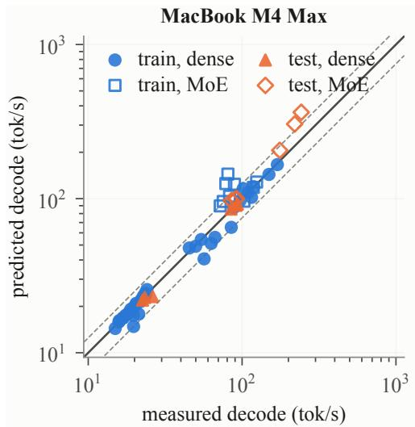

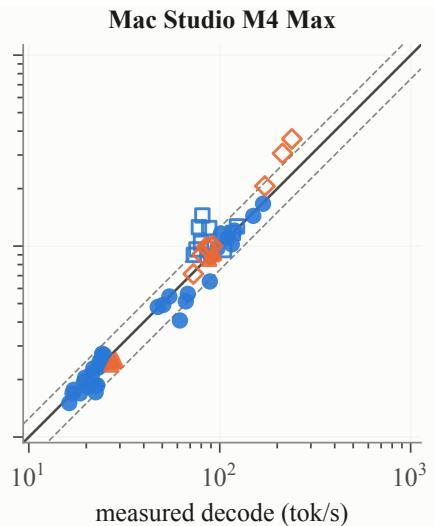

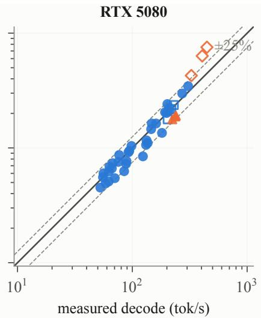  
Fig. 1. B2 decode predictions, separated by host. The 159 points comprise 57 MacBook, 60 Studio, and 42 RTX observations, with 126 training and 33 held-out; dashed lines mark 25%. Open markers are MoE and orange markers are held-out.

An unseen quantization falls back to the median of that host’s fitted group coeficients. Neither model contains an existing-prefix term, so greater depths are scope tests, not part of the fit.

## 3. EXPERIMENTAL METHOD

The hosts are a 64-GB MacBook Pro M4 Max and a 128-GB Mac Studio M4 Max, each using 12 performance-core threads, plus an RTX 5080 with 16,302 MiB reported VRAM, CUDA, and 16 threads. Their device-copy/FP16 matrix calibrations are 380.1 GB/s and 13.95 TFLOP/s, 396.7 GB/s and 15.00 TFLOP/s, and 801.1 GB/s and 118.83 TFLOP/s, respectively. The Studio binary is from the hash-recorded oficial b10794 archive. The managed RTX directory is labeled b10794, but its version query returned usage text; the legacy MacBook revision was not recovered.

The shared manifest has 23 GGUF files. The MacBook produced 22 successful grids; after three pre-specified reference-probe exclusions, it contributes 15 training and four held-out configurations. Studio completed all 23 grids and contributes 15 and five after the same exclusions. RTX covers 14 matching files, split 12 and two. The 53 scored configurations span 22 files; each held-out set contains dense and MoE families absent from training, though RTX remains a small replication. Results are therefore host-separated. Splits are fixed by base family before fitting. The 63.39-GB gpt-oss-120B file produced two prompt-batch failures on MacBook, not a demonstrated out-ofmemory failure, and a complete grid on Studio. The supplement lists every file, source URL, revision, and byte size; source organizations are cited here [10, 11, 12, 13, 14].

All reported throughput is single-sequence. Each configuration runs in a fresh process. At prefix depths 0, 4096, and 16384, llama-bench reports separate 512-token prompt-processing and 128-token generation microbenchmarks, not one end-to-end request. Runs use flash attention, F16 K/V, five repetitions, and 45 s settling. The requested GPU-layer count is 99. Physical RTX residency was not instrumented; Windows shared-memory spill therefore cannot be excluded for the largest files. The append-only data are reduced by an atomic selector that prefers complete protocol rows and then lower decode coeficient of variation (CV) and pre-run load, without inspecting prediction residuals.

Table 1. Host-separated MAPE (%). “Cfg.” is the number of model– format configurations; decode includes three depths per configuration, while P1/P2 are scored at depth zero.
<table><tr><td>Host</td><td>Split (cfg.) B0</td><td>B1</td><td>B2</td><td>P1</td><td>P2</td></tr><tr><td>MacBook</td><td>train (15)</td><td>33.6 15.8</td><td>10.4</td><td>6.8</td><td>4.1</td></tr><tr><td rowspan="2">Studio</td><td>test (4)</td><td>46.9 49.4</td><td>13.1</td><td>22.7</td><td>18.7</td></tr><tr><td>train (15)</td><td>33.0 17.8</td><td>12.4</td><td>7.0</td><td>4.3</td></tr><tr><td rowspan="2">RTX 5080</td><td>test (5)</td><td>58.0 55.3</td><td>14.4</td><td>28.0</td><td>22.2</td></tr><tr><td>train (12) test (2)</td><td>20.3 9.8 41.7 51.9</td><td>10.1 36.1</td><td>14.5 124.5</td><td>5.9 108.2</td></tr></table>

The stability gate applies to decode. Across all selected rows, median decode CV is 0.83%, 0.42%, and 0.43% on MacBook, Studio, and RTX; maxima are 3.04%, 2.30%, and 1.65%. Prefill was not gated: 8/66, 0/69, and 29/42 rows exceed 3%, with maxima 4.84%, 0.96%, and 39.2%. We retain them and give a median-sample sensitivity below. Each decode configuration contributes its three depths.

## 4. RESULTS

## 4.1. Host-adapted decode

Figure 1 and Table 1 show the primary result. B2 train/test MAPE is 10.4/13.1% on MacBook, 12.4/14.4% on Studio, and 10.1/36.1% on RTX. RTX test median/maximum error is 25.8/69.0%. On the exact two-file intersection shared by all hosts, MAPE is 18.2%, 20.1%, and 36.1%, respectively. RTX remains the smallest replication, but B2 improves on B1 for every held-out host.

Active-weight accounting substantially improves the held-out aggregate (Fig. 2a): B1 errors of 49.4%, 55.3%, and 51.9% fall to 13.1%, 14.4%, and 36.1%. Capacity is controlled by stored parameters, whereas per-token weight trafic is closer to activated parameters. Separately, Eq. (2) avoids the 10.7–13.7 cache overestimates produced by a uniform-global formula for the two Gemma-4 examples (Fig. 2b). After refitting each variant, per-layer rather than uniform-global KV lowers held-out MAPE from 21.2% to 13.1% on

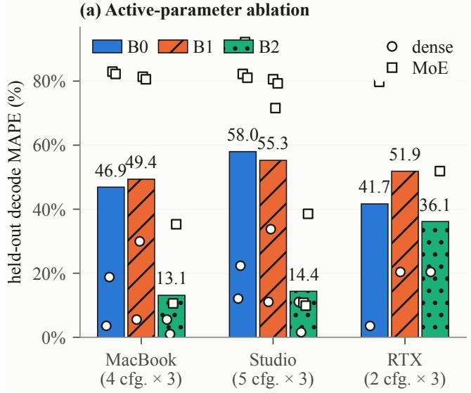

(b) Metadata-aware KV correction  
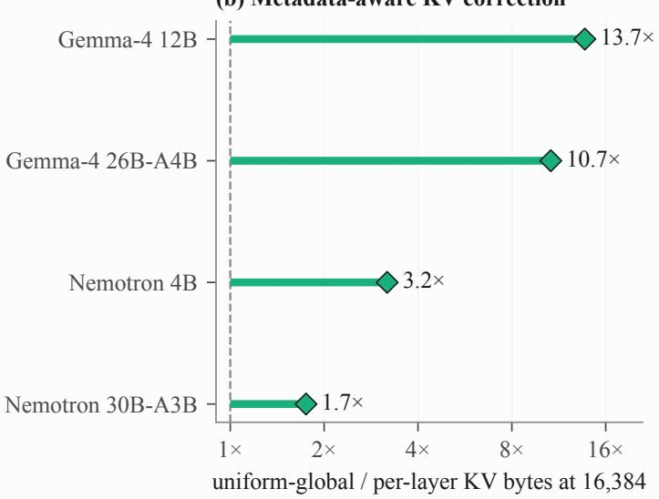

Fig. 2. Structural corrections. (a) Bars are host-specific held-out MAPE; overlaid points are per-configuration means across three depths and expose the four-, five-, and two-configuration test sizes. (b) From GGUF metadata, treating every layer as global overstates 16K KV bytes by as much as 13.7 .  
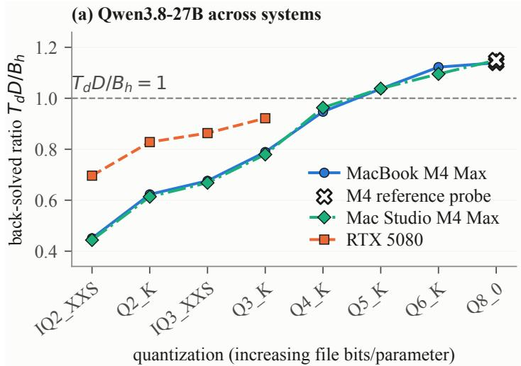

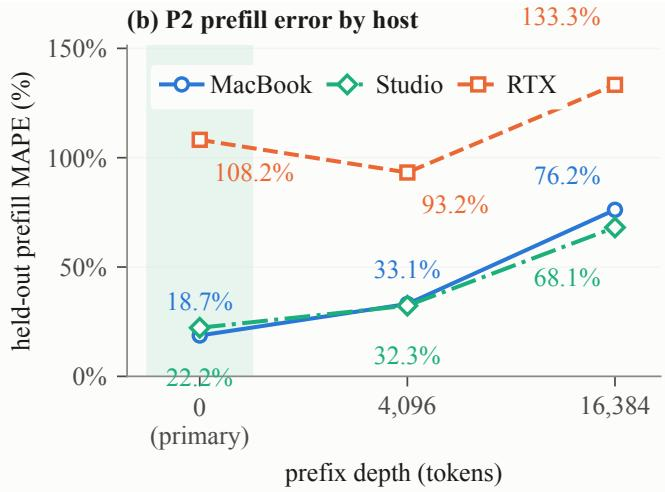  
Fig. 3. Transfer diagnostics. (a) The back-solved depth-zero ratio $T _ { d } D / B _ { h }$ for one Qwen family varies across systems; RTX covers the first four formats. The crossed Apple Q8 points are historical reference probes, shown for ladder context but excluded from fitting and scoring. (b) P2 prefill error is host-specific, remains poor on RTX, and rises by 16K.

MacBook, 21.0% to 14.4% on Studio, and 37.9% to 36.1% on RTX.

## 4.2. Cross-host transfer is incomplete

Separate fitting should not be confused with hardware generalization. In a leave-one-host-out diagnostic, B2 coeficients are fitted independently on the other two machines, given equal source-host weight, and paired with the target’s calibrated bandwidth. All-target MAPE is 14.5%, 15.4%, and 20.8% for 57 MacBook, 60 Studio, and 42 RTX rows; target-fitted B2 gives 11.0%, 12.9%, and 13.8%. Restricted to target test families, transfer gives 11.6%, 16.8%, and 36.0%, close to target-fitted 13.1%, 14.4%, and 36.1%. This test is easier than simultaneous model-and-host holdout because most target files occur on a source host.

The 14 three-way matched configurations span eight base families and weight each format equally. Across 22 MacBook–Studio matches, Studio/MacBook geometric-mean zero-prefix throughput is 1.02 for both decode and prefill. RTX/MacBook is 2.15 for decode, near the 2.11 copy-bandwidth ratio, and 7.21 for prefill versus an 8.52 compute ratio. Configuration-level decode ratios span 1.76–3.26 , ruling out one universal multiplier.

The near-family Qwen3.8-27B ladder varies across the three host/runtime stacks (Fig. 3a). IQ2 has 1.55% fewer parameters and one fewer layer. On both Apple hosts, Q2 is only 2.2% faster than IQ2 at depth zero, whereas on RTX, IQ2 is 13.7% faster. Across the three conventional Q4/Q8 pairs, Q4 is 1.32–1.43 faster on Mac-Book, 1.29–1.41 on Studio, and 1.37–1.49 on RTX, while its prefill rate is usually slightly lower. File compression alone therefore does not specify kernel eficiency.

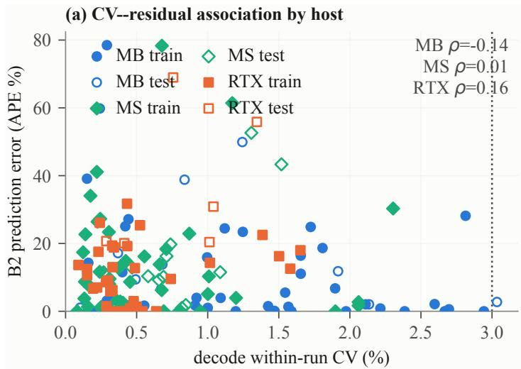

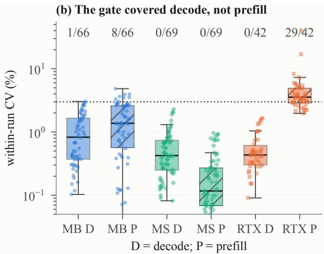  
Fig. 4. Measurement diagnostics. (a) Host-separated decode CV shows no obvious descriptive association with B2 error across 159 scored rows; the dotted line is the 3% target. (b) Row-level CV distributions use all 354 selected rows, including 36 Apple reference-probe rows; labels count rows above the target. The gate covered decode (D), not prefill (P).

## 4.3. Prefill is a negative result

P1/P2 held-out zero-prefix MAPE is 22.7/18.7% on MacBook, 28.0/22.2% on Studio, and 124.5/108.2% on RTX (Fig. 3b). The RTX result is not solely the 39.2%-CV Ling cell: replacing every cell mean by its five-sample median and refitting still gives 85.5%. At 16K, where Eq. (3) omits prefix-dependent work, test error rises to 76.2% on MacBook, 68.1% on Studio, and 133.3% on RTX. Most host–quantization groups contain only one training configuration, so the per-format coeficients are weakly identified and P2’s low 4.1– 5.9% training errors are partly resubstitution. We consequently treat prefill as unsupported under this protocol, not as a successful second regime.

## 4.4. Protocol and robustness checks

Decode behaves more consistently than its largest residuals. Every scored configuration slows monotonically with context. B2 held-out MAPE falls from 17.9% to 8.6% between depth zero and 16K on MacBook, 18.1% to 9.7% on Studio, and 44.5% to 25.6% on RTX. Across all 159 scored decode rows, within-run CV shows no obvious descriptive association with residual error (pooled Spearman � = 0.05; host values are 0.14, 0.01, and 0.16; Fig. 4), and within-run scatter is much smaller than the largest residuals.

Correlated depth rows and absent Studio/RTX between-run studies limit noise attribution. The supplement reports a rejected outputprojection extension.

## 5. LIMITATIONS AND CONCLUSION

The RTX held-out set has only two Q4\_K\_M files and no independent between-run repeatability campaign; acquisition spans two sessions. Quantization formats often have one training family, IQ2’s Qwen file has 1.55% fewer parameters than the rest of that ladder, and execution order was not randomized. The largest RTX analytical working set exceeds reported VRAM before graph bufers, so requested full layer ofload is not proof of physical residency. No GPU clock, power, or spill telemetry was recorded. Studio files were SHA-verified against repository LFS identifiers; equivalent immutable captures are unavailable for the legacy hosts. These limitations preclude a universal runtime accuracy claim. All error summaries are descriptive, not population confidence estimates. The $S P _ { a } / P$ proxy also scales shared tensors with expert tensors and assumes balanced $k / E$ routing; tensor-level active-byte validation was unavailable. No learning curve establishes how many reference configurations are suficient.

Within that boundary, active-weight and metadata-aware KV corrections reduce held-out decode error in all three cohorts; sourcehost-balanced coeficients remain close after target bandwidth calibration. Host/runtime-stack diferences in low-bit behavior argue against a universal coeficient; difering runtime versions and IQ2’s slightly diferent architecture remain confounds. Next work should record residency and broaden the cohort.

## 6. REFERENCES

[1] Samuel Williams, Andrew Waterman, and David Patterson, “Roofline: An insightful visual performance model for multicore architectures,” Communications of the ACM, vol. 52, no. 4, pp. 65–76, Apr. 2009.

[2] Hengrui Zhang, August Ning, Rohan Baskar Prabhakar, and David Wentzlaf, “LLMCompass: Enabling eficient hardware design for large language model inference,” in 2024 ACM/IEEE 51st Annual International Symposium on Computer Architecture (ISCA), 2024, pp. 1080–1096.

[3] Amey Agrawal, Nitin Kedia, Jayashree Mohan, Ashish Panwar, Nipun Kwatra, Bhargav Gulavani, Ramachandran Ramjee, and Alexey Tumanov, “Vidur: A large-scale simulation framework for LLM inference,” in Proceedings ofMachine Learning and Systems, 2024, vol. 6, pp. 351–366.

[4] Zhen Bi, Xueshu Chen, Luoyang Sun, Yuhang Yao, Qing Shen, Jungang Lou, and Cheng Deng, “RooflineBench: A benchmarking framework for on-device LLMs via roofline analysis,” arXiv preprint arXiv:2602.11506, 2026.

[5] Michael Davies, Neal Crago, Karthikeyan Sankaralingam, and Christos Kozyrakis, “LIMINAL: Exploring the frontiers of LLM decode performance,” arXiv preprint arXiv:2507.14397, 2025.

[6] Yinsicheng Jiang, Yao Fu, Yeqi Huang, Ping Nie, Zhan Lu, Leyang Xue, Congjie He, Man-Kit Sit, Jilong Xue, Li Dong, Ziming Miao, DaYou Du, Tairan Xu, Kai Zou, Edoardo Maria Ponti, and Luo Mai, “MoE-CAP: Benchmarking cost, accuracy and performance of sparse mixture-of-experts systems,” in Advances in Neural Information Processing Systems. 2025, vol. 38, pp. 90197–90223, Curran Associates, Inc., Datasets and Benchmarks Track.

[7] Afsara Benazir and Felix Xiaozhu Lin, “Benchmarking and

characterization of large language model inference on Apple Silicon,” Proceedings ofthe ACM on Measurement and Analysis ofComputing Systems, vol. 9, no. 3, pp. 1–26, Dec. 2025.

[8] Georgi Gerganov et al., “llama.cpp: LLM inference in C/C++,” GitHub repository, https://github.com/ggml-org/llama.cpp, 2023.

[9] ggml-org contributors, “GGUF file format specification,” GitHub documentation, https://github.com/ggml-org/ggml/ blob/master/docs/gguf.md, 2026, Accessed September 2026.

[10] Unsloth AI, “Model cards for the evaluated Muse-Glimmer, Nemotron, Qwen, and Gemma GGUF repositories,” Hugging Face, https://huggingface.co/unsloth, 2026, Exact repository URLs and revisions are listed in the companion appendix; accessed September 2026.

[11] LM Studio Community, “NVIDIA-Nemotron-3-Nano-4B-GGUF model card,” Hugging Face, https://huggingface.co/ lmstudio-community, 2026, Exact repository URL and revision are listed in the companion appendix; accessed September 2026.

[12] ggml-org contributors, “Model cards for the evaluated SmolLM3 and gpt-oss GGUF repositories,” Hugging Face, https://huggingface.co/ggml-org, 2026, Exact repository URLs and revisions are listed in the companion appendix; accessed September 2026.

[13] Google, “gemma-4-12B-it-qat-q4\_0-gguf model card,” Hugging Face, https://huggingface.co/google, 2026, Exact repository URL and revision are listed in the companion appendix; accessed September 2026.

[14] Bartowski, “inclusionAI/Ling-mini-2.0-GGUF model card,” Hugging Face, https://huggingface.co/bartowski, 2026, Exact repository URL and revision are listed in the companion appendix; accessed September 2026.

# Companion Results Appendix: GGUF Throughput Prediction

Protocol-complete 3-host evidence for the ICASSP manuscript

Status. This is a locally generated companion appendix. It does not claim publication, archival acceptance, or independent replication.

## 1 Scope and cohort

The source manifest contains 23 GGUF files. Across 3 hosts (MacBook Pro M4 Max, Mac Studio M4 Max, and RTX 5080), the scored data contain 22 unique files and 53 host–file configurations (42 training and 11 held out). Each configuration has one decode and one prefill observation at each of the 3 measured context depths, for 159 decode and 159 prefill rows. The final protocol selector retains 354 observations from 23 unique files in total: 318 scored rows and 36 reference-probe rows excluded from prediction fits and scores. Probe exclusion is host-specific, so a file used as a probe on one host can be scored on another. All exported rows carry the declared protocol fields. The retry decision, however, uses the worst within-run decode CV in an invocation. Prefill rows inherit that invocation’s protocol metadata but are not gated on their own CV. This distinction matters on RTX 5080, where the noisiest prefill row has 39.19% CV even though the associated decode-gate CV is 1.35%.
<table><tr><td>Host</td><td>Backend</td><td>Train cfg.</td><td>Test cfg.</td><td>Scored decode</td><td>Scored prefill</td></tr><tr><td>MacBook Pro M4 Max</td><td>BLAS,MTL</td><td>15</td><td>4</td><td>57</td><td>57</td></tr><tr><td>Mac Studio M4 Max</td><td>MTL,BLAS</td><td>15</td><td>5</td><td>60</td><td>60</td></tr><tr><td>RTX 5080</td><td>CUDA</td><td>12</td><td>2</td><td>42</td><td>42</td></tr></table>

<table><tr><td>Host</td><td>Retried cells</td><td>Gate CV med.</td><td>Gate CV max</td><td>PP CV med.</td><td>PP CV max</td><td>PP &gt; 3%</td></tr><tr><td>MacBook Pro M4 Max</td><td>3</td><td>1.43</td><td>3.04</td><td>1.41</td><td>4.84</td><td>7/57</td></tr><tr><td>Mac Studio M4 Max</td><td>1</td><td>0.88</td><td>2.30</td><td>0.14</td><td>0.96</td><td>0/60</td></tr><tr><td>RTX 5080</td><td>3</td><td>0.88</td><td>1.65</td><td>3.56</td><td>39.19</td><td>29/42</td></tr></table>

Attempted configurations with no successful row are MacBook Pro M4 Max: gpt-oss-120b-MXFP4.gguf. On the MacBook Pro M4 Max, two raw attempts of the one gpt-oss-120B configuration report failed to decode prompt batch, res=-3; these are prompt-batch failures, not demonstrated model-load or out-of-memory failures. Host-specific calibration probes are MacBook Pro M4 Max: Qwen3.8-27B-Q8\_0.gguf, Qwen3.5-9B-Q8\_0.gguf, Qwen3.5-4B-Q8\_0.gguf; Mac Studio M4 Max: Qwen3. 8-27B-Q8\_0.gguf, Qwen3.5-9B-Q8\_0.gguf, Qwen3.5-4B-Q8\_0.gguf; RTX 5080: none.

## 1.1 Cohort accounting

Raw records, superseded legacy rows, repeated protocol attempts, selected observations, and scoring exclusions are separated below. A protocol duplicate is a successful protocol row removed by the atomic host–model–phase–depth selector; it is not an additional scored observation.

<table><tr><td>Host</td><td>Raw</td><td>Failed Legacy ok Protocol ok Dup. removed Selected Probes Scored</td><td></td><td></td><td></td><td></td><td></td><td></td></tr><tr><td>MacBook Pro M4 Max</td><td>278</td><td>2</td><td>132</td><td>144</td><td>12</td><td>132</td><td>18</td><td>114</td></tr><tr><td>Mac Studio M4 Max</td><td>138</td><td>0</td><td>0</td><td>138</td><td>0</td><td>138</td><td>18</td><td>120</td></tr><tr><td>RTX 5080</td><td>84</td><td>0</td><td>0</td><td>84</td><td>0</td><td>84</td><td>0</td><td>84</td></tr></table>

## 1.2 Excluded reference-probe observations

These rows complete the 354-observation selected cohort and make the descriptive matched-host and quantization comparisons reproducible. They are reported only as measurements, never as prediction errors.

Table 1: Selected protocol-complete reference-probe observations excluded from prediction fitting and scoring. Measured throughput and SD are in tokens/s; IDs resolve through Table 2.
<table><tr><td>Host</td><td>ID</td><td>Phase</td><td>Depth</td><td>Measured</td><td>SD</td><td>CV %</td><td>Attempts</td></tr><tr><td>MacBook Pro M4 Max</td><td>M10</td><td>decode</td><td>0</td><td>77.275</td><td>0.201</td><td>0.260</td><td>1</td></tr><tr><td>MacBook Pro M4 Max</td><td>M10</td><td>decode</td><td>4,096</td><td>74.687</td><td>0.153</td><td>0.204</td><td>1</td></tr><tr><td>MacBook Pro M4 Max</td><td>M10</td><td>decode</td><td>16,384</td><td>67.270</td><td>0.341</td><td>0.507</td><td>1</td></tr><tr><td>MacBook Pro M4 Max</td><td>M10</td><td>prefill</td><td>0</td><td>1553.086</td><td>1.682</td><td>0.108</td><td>1</td></tr><tr><td>MacBook Pro M4 Max</td><td>M10</td><td>prefill</td><td>4,096</td><td>1416.098</td><td>1.799</td><td>0.127</td><td>1</td></tr><tr><td>MacBook Pro M4 Max</td><td>M10</td><td>prefill</td><td>16,384</td><td>992.403</td><td>10.398</td><td>1.048</td><td>1</td></tr><tr><td>MacBook Pro M4 Max</td><td>M12</td><td>decode</td><td>0</td><td>46.499</td><td>0.380</td><td>0.818</td><td>2</td></tr><tr><td>MacBook Pro M4 Max</td><td>M12</td><td>decode</td><td>4,096</td><td>45.340</td><td>0.169</td><td>0.372</td><td>2</td></tr><tr><td>MacBook Pro M4 Max</td><td>M12</td><td>decode</td><td>16,384</td><td>42.119</td><td>0.938</td><td>2.226</td><td>2</td></tr><tr><td>MacBook Pro M4 Max</td><td>M12</td><td>prefill</td><td>0</td><td>865.397</td><td>0.661</td><td>0.076</td><td>2</td></tr><tr><td>MacBook Pro M4 Max</td><td>M12</td><td>prefill</td><td>4,096</td><td>784.470</td><td>4.299</td><td>0.548</td><td>2</td></tr><tr><td>MacBook Pro M4 Max</td><td>M12</td><td>prefill</td><td>16,384</td><td>560.769</td><td>14.295</td><td>2.549</td><td>2</td></tr><tr><td>MacBook Pro M4 Max</td><td>M14</td><td>decode</td><td>0</td><td>14.902</td><td>0.054</td><td>0.365</td><td>1</td></tr><tr><td>MacBook Pro M4 Max</td><td>M14</td><td>decode</td><td>4,096</td><td>14.433</td><td>0.017</td><td>0.118</td><td>1</td></tr><tr><td>MacBook Pro M4 Max</td><td>M14</td><td>decode</td><td>16,384</td><td>13.575</td><td>0.092</td><td>0.680</td><td>1</td></tr><tr><td>MacBook Pro M4 Max</td><td>M14</td><td>prefill</td><td>0</td><td>238.511</td><td>7.257</td><td>3.043</td><td>1</td></tr><tr><td>MacBook Pro M4 Max</td><td>M14</td><td>prefill</td><td>4,096</td><td>201.115</td><td>2.027</td><td>1.008</td><td>1</td></tr><tr><td>MacBook Pro M4 Max</td><td>M14</td><td>prefill</td><td>16,384</td><td>161.599</td><td>1.227</td><td>0.759</td><td>1</td></tr><tr><td>Mac Studio M4 Max</td><td>M10</td><td>decode</td><td>0</td><td>78.751</td><td>0.546</td><td>0.693</td><td>1</td></tr><tr><td>Mac Studio M4 Max</td><td>M10</td><td>decode</td><td>4,096</td><td>76.142</td><td>0.100</td><td>0.131</td><td>1</td></tr><tr><td>Mac Studio M4 Max</td><td>M10</td><td>decode</td><td>16,384</td><td>70.660</td><td>0.398</td><td>0.563</td><td>1</td></tr><tr><td>Mac Studio M4 Max</td><td>M10</td><td>prefill</td><td>0</td><td>1567.538</td><td>4.181</td><td>0.267</td><td>1</td></tr><tr><td>Mac Studio M4 Max</td><td>M10</td><td>prefill</td><td>4,096</td><td>1430.704</td><td>3.482</td><td>0.243</td><td>1</td></tr><tr><td>Mac Studio M4 Max</td><td>M10</td><td>prefill</td><td>16,384</td><td>1129.638</td><td>0.567</td><td>0.050</td><td>1</td></tr><tr><td>Mac Studio M4 Max</td><td>M12</td><td>decode</td><td>0</td><td>48.365</td><td>0.091</td><td>0.188</td><td>1</td></tr><tr><td>Mac Studio M4 Max</td><td>M12</td><td>decode</td><td>4,096</td><td>47.519</td><td>0.047</td><td>0.099</td><td>1</td></tr><tr><td>Mac Studio M4 Max</td><td>M12</td><td>decode</td><td>16,384</td><td>45.097</td><td>0.041</td><td>0.090</td><td>1</td></tr><tr><td>Mac Studio M4 Max</td><td>M12</td><td>prefill</td><td>0</td><td>880.266</td><td>0.530</td><td>0.060</td><td>1</td></tr><tr><td>Mac Studio M4 Max</td><td>M12</td><td>prefill</td><td>4,096</td><td>834.386</td><td>0.599</td><td>0.072</td><td>1</td></tr><tr><td>Mac Studio M4 Max</td><td>M12</td><td>prefill</td><td>16,384</td><td>722.102</td><td>0.565</td><td>0.078</td><td>1</td></tr><tr><td>Mac Studio M4 Max</td><td>M14</td><td>decode</td><td>0</td><td>15.697</td><td>0.063</td><td>0.403</td><td>1</td></tr><tr><td>Mac Studio M4 Max</td><td>M14</td><td>decode</td><td>4,096</td><td>15.505</td><td>0.041</td><td>0.266</td><td>1</td></tr><tr><td>Mac Studio M4 Max</td><td>M14</td><td>decode</td><td>16,384</td><td>14.931</td><td>0.022</td><td>0.150</td><td>1</td></tr><tr><td>Mac Studio M4 Max</td><td>M14</td><td>prefill</td><td>0</td><td>255.725</td><td>0.175</td><td>0.068</td><td>1</td></tr><tr><td>Mac Studio M4 Max</td><td>M14</td><td>prefill</td><td>4,096</td><td>244.576</td><td>0.168</td><td>0.069</td><td>1</td></tr><tr><td>Mac Studio M4 Max</td><td>M14</td><td>prefill</td><td>16,384</td><td>215.717</td><td>0.047</td><td>0.022</td><td>1</td></tr></table>

Probe-exclusion sensitivity. For each host with calibration probes, B2 is refit after adding those files back. The original-train column evaluates that refit only on non-probe training rows; test rows remain held out.
<table><tr><td>Host</td><td>Probe cfg. Aug. train n Aug. MAPE</td><td></td><td></td><td></td><td>E Original n Original MAPE</td><td></td><td>Test n Test MAPE</td></tr><tr><td>MacBook Pro M4 Max</td><td>3</td><td>54</td><td>10.46</td><td>45</td><td>11.06</td><td>12</td><td>13.11</td></tr><tr><td>Mac Studio M4 Max</td><td>3</td><td>54</td><td>12.65</td><td>45</td><td>13.39</td><td>15</td><td>14.37</td></tr></table>

## 2 Aggregate prediction results

Results are separated by host because fitted eficiency factors are host-specific; a pooled row would weight the unequal host cohorts and is not a cross-system score.

<table><tr><td>Host</td><td>Predictor</td><td>Split</td><td>n</td><td>MAPE (%)</td><td>Median (%)</td><td>P90 / max (%)</td></tr><tr><td>MacBook Pro M4 Max</td><td>B0 unfitted (eta=1, total)</td><td>train</td><td>45</td><td>33.57</td><td>19.37</td><td>76.47 /123.27</td></tr><tr><td>MacBook Pro M4 Max</td><td>B0 unfitted (eta=1, total)</td><td>test</td><td>12</td><td>46.89</td><td>49.97</td><td>83.45 / 84.22</td></tr><tr><td>MacBook Pro M4 Max</td><td>B1 fitted, total params</td><td>train</td><td>45</td><td>15.80</td><td>3.20</td><td>70.29 / 76.77</td></tr><tr><td>MacBook Pro M4 Max</td><td>B1 fitted, total params</td><td>test</td><td>12</td><td>49.36</td><td>54.66</td><td>81.90 / 82.74</td></tr><tr><td>MacBook Pro M4 Max</td><td>B2 fitted, active params (ours)</td><td>train</td><td>45</td><td>10.39</td><td>2.12</td><td>26.32 / 78.49</td></tr><tr><td>MacBook Pro M4 Max</td><td>B2 fitted, active params (ours)</td><td>test</td><td>12</td><td>13.11</td><td>8.98</td><td>36.65 / 49.92</td></tr><tr><td>Mac Studio M4 Max</td><td>B0 unfitted (eta=1, total)</td><td>train</td><td>45</td><td>32.95</td><td>19.40</td><td>75.52 / 125.41</td></tr><tr><td>Mac Studio M4 Max</td><td>BO unfitted (eta=1, total)</td><td>test</td><td>15</td><td>57.98</td><td>81.60</td><td>92.02 / 92.67</td></tr><tr><td>Mac Studio M4 Max</td><td>B1 fitted, total params</td><td>train</td><td>45</td><td>17.76</td><td>7.49</td><td>68.32 / 75.84</td></tr><tr><td>Mac Studio M4 Max</td><td>B1 fitted, total params</td><td>test</td><td>15</td><td>55.25</td><td>72.08</td><td>80.95 / 81.72</td></tr><tr><td>Mac Studio M4 Max</td><td>B2 fitted, active params (ours)</td><td>train</td><td>45</td><td>12.40</td><td>7.49</td><td>29.09 / 78.32</td></tr><tr><td>Mac Studio M4 Max</td><td>B2 fitted, active params (ours)</td><td>test</td><td>15</td><td>14.37</td><td>11.30</td><td>33.89 / 52.62</td></tr><tr><td>RTX 5080</td><td>B0 unfitted (eta=1, total)</td><td>train</td><td>36</td><td>20.27</td><td>14.47</td><td>44.15 / 71.19</td></tr><tr><td>RTX 5080</td><td>B0 unfitted (eta=1, total)</td><td>test</td><td>6</td><td>41.65</td><td>40.39</td><td>81.22 / 81.95</td></tr><tr><td>RTX 5080</td><td>B1 fitted, total params</td><td>train</td><td>36</td><td>9.85</td><td>8.88</td><td>20.95 / 31.73</td></tr><tr><td>RTX 5080</td><td>B1 fitted, total params</td><td>test</td><td>6</td><td>51.85</td><td>50.81</td><td>84.50 / 85.11</td></tr><tr><td>RTX 5080</td><td>B2 fitted, active params (ours)</td><td>train</td><td>36</td><td>10.12</td><td>9.34</td><td>20.95 / 31.73</td></tr><tr><td>RTX 5080</td><td>B2 fitted, active params (ours)</td><td>test</td><td>6</td><td>36.15</td><td>25.79</td><td>62.41 / 68.96</td></tr><tr><td>MacBook Pro M4 Max</td><td>P1 eta_p per host</td><td>train</td><td>15</td><td>6.81</td><td>5.36</td><td>16.58 / 33.40</td></tr><tr><td>MacBook Pro M4 Max MacBook Pro M4 Max</td><td>P1 eta_p per host</td><td>test</td><td>4</td><td>22.68</td><td>19.16</td><td>44.95 / 51.25</td></tr><tr><td>MacBook Pro M4 Max</td><td>P2 eta_p per host x quant</td><td>train</td><td>15</td><td>4.13</td><td>0.00</td><td>15.06 / 25.99</td></tr><tr><td></td><td>P2 eta_p per host x quant</td><td>test</td><td>4</td><td>18.68</td><td>14.90</td><td>36.90 / 42.85</td></tr><tr><td>Mac Studio M4 Max</td><td>P1 eta_p per host</td><td>train</td><td>15</td><td>7.00</td><td>2.17</td><td>18.89 / 36.84</td></tr><tr><td>Mac Studio M4 Max</td><td>P1 eta_p per host</td><td>test</td><td>5</td><td>28.04</td><td>30.15</td><td>46.54 / 47.19</td></tr><tr><td>Mac Studio M4 Max</td><td>P2 eta_p per host x quant</td><td>train</td><td>15</td><td>4.27</td><td>0.00</td><td>16.14 /26.29</td></tr><tr><td>Mac Studio M4 Max</td><td>P2 eta_p per host x quant</td><td>test</td><td>5</td><td>22.23</td><td>20.11</td><td>40.03 / 42.81</td></tr><tr><td>RTX 5080</td><td>P1 eta_p per host</td><td>train</td><td>12</td><td>14.46</td><td>9.15</td><td>31.38 / 52.16</td></tr><tr><td>RTX 5080</td><td>P1 eta_p per host</td><td>test</td><td>2</td><td>124.51</td><td>124.51</td><td>207.24 /227.93</td></tr><tr><td>RTX 5080</td><td>P2 eta_p per host x quant</td><td>train</td><td>12</td><td>5.86</td><td>0.00</td><td>21.31 / 25.36</td></tr><tr><td>RTX 5080</td><td>P2 eta_p per host x quant</td><td>test</td><td>2</td><td>108.18</td><td>108.18</td><td>184.89 / 204.07</td></tr></table>

Decode summaries use all three context depths. Prefill headline rows use only depth 0, because the stated prefill model has no existing-prefix term; deeper rows are scope diagnostics below.

## 2.1 Leave-one-host-out transfer

B2 fits median per-quantization coeficients on all non-target training hosts and substitutes the untouched target host’s bandwidth. The target set contains all eligible rows on that host; because most files also occur on at least one source host, this isolates host/runtime transfer rather than a simultaneous model-and-hardware holdout. A target format absent from all source training rows uses the source-wide median fallback. The rejected two-term rows are the absolute-time output-projection extension.
<table><tr><td>Variant</td><td>Target host</td><td>Source n</td><td>Target n</td><td>MAPE</td><td>Median</td><td>Max</td></tr><tr><td>B2: all target rows</td><td>MacBook Pro M4 Max</td><td>81</td><td>57</td><td>14.47</td><td>8.02</td><td>73.61</td></tr><tr><td>B2: all target rows</td><td>Mac Studio M4 Max</td><td>81</td><td>60</td><td>15.42</td><td>10.78</td><td>84.30</td></tr><tr><td>B2: all target rows</td><td>RTX 5080</td><td>90</td><td>42</td><td>20.80</td><td>18.18</td><td>68.13</td></tr><tr><td>B2: target test rows</td><td>MacBook Pro M4 Max</td><td>81</td><td>12</td><td>11.59</td><td>6.00</td><td>45.82</td></tr><tr><td>B2: target test rows</td><td>Mac Studio M4 Max</td><td>81</td><td>15</td><td>16.76</td><td>14.36</td><td>57.74</td></tr><tr><td>B2: target test rows</td><td>RTX 5080</td><td>90</td><td>6</td><td>35.97</td><td>25.66</td><td>68.13</td></tr><tr><td>rejected two-term</td><td>MacBook Pro M4 Max</td><td>81</td><td>57</td><td>17.88</td><td>12.10</td><td>75.66</td></tr><tr><td>rejected two-term</td><td>Mac Studio M4 Max</td><td>81</td><td>60</td><td>16.93</td><td>9.50</td><td>66.06</td></tr><tr><td>rejected two-term</td><td>RTX 5080</td><td>90</td><td>42</td><td>149.33</td><td>132.38</td><td>501.57</td></tr></table>

For context, target-fitted B2 gives all-row MAPE of 10.96% on MacBook Pro M4 Max; 12.89% on Mac Studio M4 Max; 13.84% on RTX 5080. Unlike the untouched-target transfer rows, these comparators mix training rows used to fit the target coeficients with held-out rows.

<table><tr><td>Host</td><td>Split</td><td>Architecture</td><td>n</td><td>B0</td><td>B1</td><td>B2</td></tr><tr><td>MacBook Pro M4 Max</td><td>train</td><td>dense</td><td>36</td><td>23.21</td><td>7.14</td><td>5.66</td></tr><tr><td>MacBook Pro M4 Max</td><td>train</td><td>MoE</td><td>9</td><td>74.98</td><td>50.45</td><td>29.29</td></tr><tr><td>MacBook Pro M4 Max</td><td>test</td><td>dense</td><td>6</td><td>11.18</td><td>17.75</td><td>3.28</td></tr><tr><td>MacBook Pro M4 Max</td><td>test</td><td>MoE</td><td>6</td><td>82.61</td><td>80.97</td><td>22.95</td></tr><tr><td>Mac Studio M4 Max</td><td>train</td><td>dense</td><td>36</td><td>22.74</td><td>9.91</td><td>7.89</td></tr><tr><td>Mac Studio M4 Max</td><td>train</td><td>MoE</td><td>9</td><td>73.79</td><td>49.15</td><td>30.45</td></tr><tr><td>Mac Studio M4 Max</td><td>test</td><td>dense</td><td>6</td><td>17.21</td><td>22.40</td><td>6.31</td></tr><tr><td>Mac Studio M4 Max</td><td>test</td><td>MoE</td><td>9</td><td>85.16</td><td>77.15</td><td>19.74</td></tr><tr><td>RTX 5080</td><td>train</td><td>dense</td><td>33</td><td>15.73</td><td>10.57</td><td>10.57</td></tr><tr><td>RTX 5080</td><td>train</td><td>MoE</td><td>3</td><td>70.28</td><td>1.95</td><td>5.18</td></tr><tr><td>RTX 5080</td><td>test</td><td>dense</td><td>3</td><td>3.54</td><td>20.40</td><td>20.40</td></tr><tr><td>RTX 5080</td><td>test</td><td>MoE</td><td>3</td><td>79.77</td><td>83.31</td><td>51.90</td></tr></table>

## 2.2 Per-layer KV correction

With each variant refit on training rows, replacing a uniform-global KV denominator by the frozen per-layer metadata produces:

<table><tr><td>Host</td><td>Split</td><td>n</td><td>Uniform KV MAPE (%)</td><td>Per-layer KV MAPE (%)</td></tr><tr><td>MacBook Pro M4 Max</td><td>train</td><td>45</td><td>12.68</td><td>10.39</td></tr><tr><td>MacBook Pro M4 Max</td><td>test</td><td>12</td><td>21.23</td><td>13.11</td></tr><tr><td>Mac Studio M4 Max</td><td>train</td><td>45</td><td>14.68</td><td>12.40</td></tr><tr><td>Mac Studio M4 Max</td><td>test</td><td>15</td><td>20.96</td><td>14.37</td></tr><tr><td>RTX 5080</td><td>train</td><td>36</td><td>12.37</td><td>10.12</td></tr><tr><td>RTX 5080</td><td>test</td><td>6</td><td>37.87</td><td>36.15</td></tr></table>

## 2.3 Decode context behavior

All 53 scored host–file configurations slow monotonically from 0 through 16,384 tokens. The normalized rate is each model’s throughput divided by its own depth-0 throughput.
<table><tr><td>Host</td><td>Depth</td><td>Train n</td><td>Test n</td><td>Train B2 MAPE</td><td>Test B2 MAPE</td><td>Median normalized rate</td></tr><tr><td>MacBook Pro M4 Max</td><td>0</td><td>15</td><td>4</td><td>11.30</td><td>17.86</td><td>1.000</td></tr><tr><td>MacBook Pro M4 Max</td><td>4,096</td><td>15</td><td>4</td><td>7.59</td><td>12.83</td><td>0.945</td></tr><tr><td>MacBook Pro M4 Max</td><td>16,384</td><td>15</td><td>4</td><td>12.27</td><td>8.63</td><td>0.837</td></tr><tr><td>Mac Studio M4 Max</td><td>0</td><td>15</td><td>5</td><td>13.60</td><td>18.13</td><td>1.000</td></tr><tr><td>Mac Studio M4 Max</td><td>4,096</td><td>15</td><td>5</td><td>8.07</td><td>15.28</td><td>0.976</td></tr><tr><td>Mac Studio M4 Max</td><td>16,384</td><td>15</td><td>5</td><td>15.54</td><td>9.69</td><td>0.915</td></tr><tr><td>RTX 5080</td><td>0</td><td>12</td><td>2</td><td>10.19</td><td>44.52</td><td>1.000</td></tr><tr><td>RTX 5080</td><td>4,096</td><td>12</td><td>2</td><td>4.49</td><td>38.28</td><td>0.985</td></tr><tr><td>RTX 5080</td><td>16,384</td><td>12</td><td>2</td><td>15.67</td><td>25.64</td><td>0.922</td></tr></table>

## 2.4 Prefill scope diagnostic

Depth 0 is the primary prefill fit and score. The same fitted coeficients are applied unchanged at larger existing-prefix depths. These errors are prediction errors, distinct from within-run prefill variability; results remain separated by host.

(a) Cross-system Qwen3.8-27B ladder  
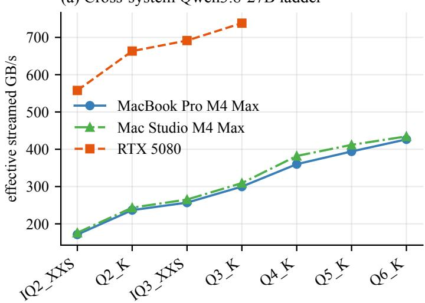

(b) Prefill error is host dependent  
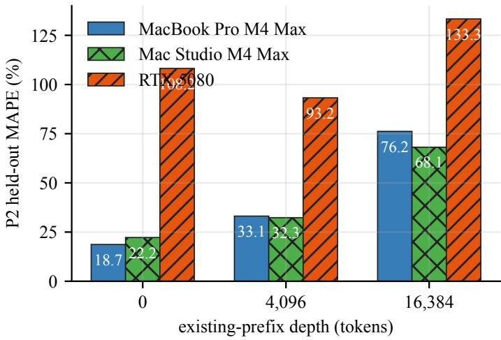

Figure 1: Host-separated diagnostics. Left: efective streamed bandwidth for the scored Qwen3.8-27B quantizations at zero prefix; host coverage difers, and IQ2 has 64 layers/26.90B parameters versus 65 layers/27.32B for the other shown files, so the set is a family comparison rather than a strictly identical-network quantization ladder. Right: P2 held-out error when depth-0 coeficients are applied at each existing-prefix depth. Host results are not pooled.
<table><tr><td>Host</td><td>Split</td><td>Depth</td><td>n</td><td>P1 MAPE</td><td>P2 MAPE</td><td>P2 median</td><td>P2 max</td></tr><tr><td>MacBook Pro M4 Max</td><td>train</td><td>0</td><td>15</td><td>6.81</td><td>4.13</td><td>0.00</td><td>25.99</td></tr><tr><td>MacBook Pro M4 Max</td><td>train</td><td>4,096</td><td>15</td><td>22.35</td><td>20.83</td><td>17.58</td><td>49.82</td></tr><tr><td>MacBook Pro M4 Max</td><td>train</td><td>16,384</td><td>15</td><td>66.94</td><td>64.13</td><td>51.02</td><td>150.97</td></tr><tr><td>MacBook Pro M4 Max</td><td>test</td><td>0</td><td>4</td><td>22.68</td><td>18.68</td><td>14.90</td><td>42.85</td></tr><tr><td>MacBook Pro M4 Max</td><td>test</td><td>4,096</td><td>4</td><td>40.98</td><td>33.11</td><td>29.60</td><td>55.36</td></tr><tr><td>MacBook Pro M4 Max</td><td>test</td><td>16,384</td><td>4</td><td>86.59</td><td>76.18</td><td>73.78</td><td>132.42</td></tr><tr><td>Mac Studio M4 Max</td><td>train</td><td>0</td><td>15</td><td>7.00</td><td>4.27</td><td>0.00</td><td>26.29</td></tr><tr><td>Mac Studio M4 Max</td><td>train</td><td>4,096</td><td>15</td><td>15.96</td><td>13.66</td><td>8.81</td><td>40.52</td></tr><tr><td>Mac Studio M4 Max</td><td>train</td><td>16,384</td><td>15</td><td>47.15</td><td>42.84</td><td>18.25</td><td>115.02</td></tr><tr><td>Mac Studio M4 Max</td><td>test</td><td>0</td><td>5</td><td>28.04</td><td>22.23</td><td>20.11</td><td>42.81</td></tr><tr><td>Mac Studio M4 Max</td><td>test</td><td>4,096</td><td>5</td><td>38.87</td><td>32.32</td><td>32.35</td><td>57.15</td></tr><tr><td>Mac Studio M4 Max</td><td>test</td><td>16,384</td><td>5</td><td>78.65</td><td>68.11</td><td>63.93</td><td>126.96</td></tr><tr><td>RTX 5080</td><td>train</td><td>0</td><td>12</td><td>14.46</td><td>5.86</td><td>0.00</td><td>25.36</td></tr><tr><td>RTX 5080</td><td>train</td><td>4,096</td><td>12</td><td>19.26</td><td>12.35</td><td>8.23</td><td>32.74</td></tr><tr><td>RTX 5080</td><td>train</td><td>16,384</td><td>12</td><td>36.13</td><td>28.56</td><td>18.19</td><td>72.26</td></tr><tr><td>RTX 5080</td><td>test</td><td>0</td><td>2</td><td>124.51</td><td>108.18</td><td>108.18</td><td>204.07</td></tr><tr><td>RTX 5080</td><td>test</td><td>4,096</td><td>2</td><td>108.39</td><td>93.23</td><td>93.23</td><td>167.57</td></tr><tr><td>RTX 5080</td><td>test</td><td>16,384</td><td>2</td><td>151.64</td><td>133.34</td><td>133.34</td><td>227.36</td></tr></table>

## 3 Selected model metadata

Tables 2 and 3 j ointly reproduce every frozen metadata field used for the 23 unique selected files (22 scored and 1 probe-only) . Scored host coverage is explicit because the measurement cohorts are not identical

Table 2 : Selected model identity source and file size. Sizes are exact bytes ; host codes are MB (MacBook Pro M4 Max) MS (Mac Studio M4 Max) RTX (RTX 5080) , and “probe only” denotes a file excluded from every prediction fit and score
<table><tr><td>ID</td><td>Split</td><td>Scored host(s)</td><td>GGUF filename</td><td>Repository</td><td>Architecture</td><td>Quant.</td><td>Bytes</td></tr><tr><td>M01</td><td>train</td><td>MB, MS, RTX</td><td>gemma-4-12b-it-qat-q4_0.gguf</td><td>google/gemma-4-12B-it-qat-q4_0-gguf</td><td>gemma4</td><td>Q4_0</td><td>6,975,879,296</td></tr><tr><td>M02</td><td>train</td><td>MB, MS</td><td>gemma-4-26B-A4B-it-UD-Q4_K_M.gguf</td><td>unsloth/gemma-4-26B-A4B-it-GGUF</td><td>gemma4</td><td>Q4_K_M</td><td>16,947,541,728</td></tr><tr><td>M03</td><td>test</td><td>MS</td><td>gpt-oss-120b-MXFP4.gguf</td><td>ggml-org/gpt-oss-120b-GGUF</td><td>gpt-oss</td><td>MXFP4</td><td>63,387,346,208</td></tr><tr><td>M04 train</td><td></td><td>MB, MS, RTX</td><td>gpt-oss-20b-MXFP4.gguf</td><td>ggml-org/gpt-oss-20b-GGUF</td><td>gpt-oss</td><td>MXFP4</td><td>12,109,566,624</td></tr><tr><td>M05</td><td>test</td><td>MB, MS, RTX</td><td>inclusionAI_Ling-mini-2.O-Q4_K_M.gguf</td><td>bartowski/inclusionAI_Ling-mini-2. O-GGUF</td><td>bailingmoe2</td><td>Q4_K_M</td><td>9,941,894,336</td></tr><tr><td>M06 test</td><td></td><td>MB, MS</td><td>Muse-Glimmer-30B-UD-Q4_K_XL.gguf</td><td>unsloth/Muse-Glimmer-30B-GGUF</td><td>muse-glimmer</td><td>Q4_K</td><td>15,878,222,368</td></tr><tr><td>M07</td><td>test</td><td>MB, MS</td><td>Nemotron-3-Nano-30B-A3B-Q4_K_M.gguf</td><td>unsloth/Nemotron-3-Nano-30B-A3B-GGUF</td><td>nemotron h moe</td><td>Q4_K_M</td><td>24,574,373,664</td></tr><tr><td>M08</td><td>test</td><td>MB, MS, RTX</td><td>NVIDIA-Nemotron-3-Nano-4B-Q4_K_M.gguf</td><td>lmstudio-community/ NVIDIA-Nemotron-3-Nano-4B-GGUF</td><td>nemotron_h</td><td>Q4_K_M</td><td>2,837,072,896</td></tr><tr><td>M09</td><td>train</td><td>MB, MS, RTX</td><td>Qwen3.5-4B-Q4_K_M.gguf</td><td>unsloth/Qwen3.5-4B-GGUF</td><td>qwen35</td><td>Q4_K_M</td><td>2,740,937,888</td></tr><tr><td>M10</td><td>train</td><td>RTX</td><td>Qwen3.5-4B-Q8_0.gguf</td><td>unsloth/Qwen3.5-4B-GGUF</td><td>qwen35</td><td>Q8_0</td><td>4,482,403,488</td></tr><tr><td>M11</td><td>train</td><td>MB, MS, RTX</td><td>Qwen3.5-9B-Q4_K_M.gguf</td><td>unsloth/Qwen3.5-9B-GGUF</td><td>qwen35</td><td>Q4_K_M</td><td>5,680,522,464</td></tr><tr><td>M12 train</td><td></td><td>RTX</td><td>Qwen3.5-9B-Q8_0.gguf</td><td>unsloth/Qwen3.5-9B-GGUF</td><td>qwen35</td><td>Q8_0</td><td>9,527,502,048</td></tr><tr><td>M13 train</td><td></td><td>MB, MS</td><td>Qwen3.6-35B-A3B-UD-Q4_K_M.gguf</td><td>unsloth/Qwen3.6-35B-A3B-GGUF</td><td>qwen35moe</td><td>Q4_K_M</td><td>22,134,528,992</td></tr><tr><td></td><td>M14 probe only</td><td></td><td>Qwen3.8-27B-Q8_0.gguf</td><td>unsloth/Qwen3.8-27B-GGUF</td><td>qwen35</td><td>Q8_0</td><td>29,047,086,048</td></tr><tr><td>M15 train</td><td></td><td>MB, MS, RTX</td><td>Qwen3.8-27B-UD-IQ2_XXS.gguf</td><td>unsloth/Qwen3.8-27B-GGUF</td><td>qwen35</td><td>IQ2_XXS</td><td>7,266,070,528</td></tr><tr><td>M16 train</td><td></td><td>MB, MS, RTX</td><td>Qwen3.8-27B-UD-IQ3_XXS.gguf</td><td>unsloth/Qwen3.8-27B-GGUF</td><td>qwen35</td><td>IQ3_XXS</td><td>10,934,860,704</td></tr><tr><td>M17 train</td><td></td><td>MB, MS, RTX</td><td>Qwen3.8-27B-UD-Q2_K_XL.gguf</td><td>unsloth/Qwen3.8-27B-GGUF</td><td>qwen35</td><td>Q2_K</td><td>9,828,981,664</td></tr><tr><td>M18 train</td><td></td><td>MB, MS, RTX</td><td>Qwen3.8-27B-UD-Q3_K_XL.gguf</td><td>unsloth/Qwen3.8-27B-GGUF</td><td>qwen35</td><td>Q3_K</td><td>13,146,393,504</td></tr><tr><td>M19 train</td><td></td><td>MB, MS</td><td>Qwen3.8-27B-UD-Q4_K_XL.gguf</td><td>unsloth/Qwen3.8-27B-GGUF</td><td>qwen35</td><td>Q4_K</td><td>17,559,178,144</td></tr><tr><td>M20 train</td><td></td><td>MB, MS</td><td>Qwen3.8-27B-UD-Q5_K_XL.gguf</td><td>unsloth/Qwen3.8-27B-GGUF</td><td>qwen35</td><td>Q5_K</td><td>20,876,938,144</td></tr><tr><td>M21</td><td>train</td><td>MB, MS</td><td>Qwen3.8-27B-UD-Q6_K_XL.gguf</td><td>unsloth/Qwen3.8-27B-GGUF</td><td>qwen35</td><td>Q6_K</td><td>25,299,061,664</td></tr><tr><td>M22 train</td><td></td><td>MB, MS, RTX</td><td>SmolLM3-Q4_K_M.gguf</td><td>ggml-org/SmolLM3-3B-GGUF</td><td>smollm3</td><td>Q4_K_M</td><td>1,915,305,312</td></tr><tr><td></td><td>M23 train</td><td>MB, MS, RTX</td><td>SmolLM3-Q8_0.gguf</td><td>ggml-org/SmolLM3-3B-GGUF</td><td>smollm3</td><td>Q8_0</td><td>3,275,574,624</td></tr></table>

Table 3 : Selected model geometry. KV columns are exact bytes at the measured depths ; � / � is routed/total experts .
<table><tr><td>ID</td><td>Total P</td><td>Active P</td><td>Active %</td><td>Layers</td><td>Width</td><td>Vocab.</td><td>KV heads</td><td>Head dim.</td><td>Used/all</td><td>KV@0</td><td>KV@4096</td><td>KV@16384</td></tr><tr><td>M01</td><td>11,907,350,576</td><td>11,907,350,576</td><td>100.0</td><td>48</td><td>3,840</td><td>262,144</td><td>8</td><td>512</td><td></td><td>0</td><td>738,197,504</td><td>939,524,096</td></tr><tr><td>M02</td><td>25,233,142,046</td><td>3,822,527,246</td><td>15.1</td><td>30</td><td>2,816</td><td>262,144</td><td>8</td><td>512</td><td>8/128</td><td>0</td><td>503,316,480</td><td>754,974,720</td></tr><tr><td>M03</td><td>116,829,156,672</td><td>5,711,982,912</td><td>4.9</td><td>36</td><td>2,880</td><td>201,088</td><td>8</td><td>64</td><td>4/128</td><td>0</td><td>301,989,888</td><td>1,207,959,552</td></tr><tr><td>M04</td><td>20,914,757,184</td><td>4,187,440,704</td><td>20.0</td><td>24</td><td>2,880</td><td>201,088</td><td>8</td><td>64</td><td>4/32</td><td>0</td><td>201,326,592</td><td>805,306,368</td></tr><tr><td>M05</td><td>16,255,643,392</td><td>1,432,973,056</td><td>8.8</td><td>20 2,048</td><td></td><td>157,184</td><td>4</td><td>128</td><td>8/256</td><td>0</td><td>167,772,160</td><td>671,088,640</td></tr><tr><td>M06</td><td>27,854,794,240</td><td>27,854,794,240</td><td>100.0</td><td>52</td><td></td><td>6,656 202,048</td><td>2</td><td>128</td><td></td><td>0</td><td>218,103,808</td><td>872,415,232</td></tr><tr><td>M07</td><td>31,577,940,288</td><td>3,580,076,352</td><td>11.3</td><td>52</td><td>2,688</td><td>131,072</td><td>2</td><td>128</td><td>6/128</td><td>397,934,592</td><td>423,100,416</td><td>498,597,888</td></tr><tr><td>M08</td><td>3,973,556,832</td><td>3,973,556,832</td><td>100.0</td><td>42</td><td>3,136</td><td>131,072</td><td>8</td><td>128</td><td></td><td>616,366,080</td><td>683,474,944</td><td>884,801,536</td></tr><tr><td>M09</td><td>4,205,751,296</td><td>4,205,751,296</td><td>100.0</td><td>32</td><td>2,560</td><td>248,320</td><td>4</td><td>256</td><td></td><td>0</td><td>536,870,912</td><td>2,147,483,648</td></tr><tr><td>M10</td><td>4,205,751,296</td><td>4,205,751,296</td><td>100.0</td><td>32</td><td></td><td>2,560248,320</td><td>4</td><td>256</td><td>一</td><td>0</td><td>536,870,912</td><td>2,147,483,648</td></tr><tr><td>M11</td><td>8,953,803,264</td><td>8,953,803,264</td><td>100.0</td><td>32</td><td>4,096</td><td>248,320</td><td>4</td><td>256</td><td></td><td>0</td><td>536,870,912</td><td>2,147,483,648</td></tr><tr><td>M12</td><td>8,953,803,264</td><td>8,953,803,264</td><td>100.0</td><td>32</td><td>4,096</td><td>248,320</td><td>4</td><td>256</td><td></td><td>0</td><td>536,870,912</td><td>2,147,483,648</td></tr><tr><td>M13</td><td>34,660,610,688</td><td>3,454,988,928</td><td>10.0</td><td>40</td><td>2,048</td><td>248,320</td><td>2</td><td>256</td><td>8/256</td><td>0</td><td>335,544,320</td><td>1,342,177,280</td></tr><tr><td>M14</td><td>27,320,697,856</td><td>27,320,697,856</td><td>100.0</td><td>65</td><td>5,120</td><td>248,320</td><td>4</td><td>256</td><td></td><td>0</td><td>1,090,519,040</td><td>4,362,076,160</td></tr><tr><td>M15</td><td>26,895,998,464</td><td>26,895,998,464</td><td>100.0</td><td>64 5,120</td><td></td><td>248,320</td><td>4</td><td>256</td><td></td><td>0</td><td>1,073,741,824</td><td>4,294,967,296</td></tr><tr><td>M16</td><td>27,320,697,856</td><td>27,320,697,856</td><td>100.0</td><td>65</td><td>5,120</td><td>248,320</td><td>4</td><td>256</td><td></td><td>0</td><td>1,090,519,040</td><td>4,362,076,160</td></tr><tr><td>M17</td><td>27,320,697,856</td><td>27,320,697,856</td><td>100.0</td><td>65</td><td>5,120</td><td>248,320</td><td>4</td><td>256</td><td></td><td>0</td><td>1,090,519,040</td><td>4,362,076,160</td></tr><tr><td>M18</td><td>27,320,697,856</td><td>27,320,697,856</td><td>100.0</td><td>65</td><td>5,120</td><td>248,320</td><td>4</td><td>256</td><td></td><td>0</td><td>1,090,519,040</td><td>4,362,076,160</td></tr><tr><td>M19</td><td>27,320,697,856</td><td>27,320,697,856</td><td>100.0</td><td>65</td><td>5,120</td><td>248,320</td><td>4</td><td>256</td><td></td><td>0</td><td>1,090,519,040</td><td>4,362,076,160</td></tr><tr><td>M20</td><td>27,320,697,856</td><td>27,320,697,856</td><td>100.0</td><td>65</td><td>5,120</td><td>248,320</td><td>4</td><td>256</td><td></td><td></td><td>1,090,519,040</td><td>4,362,076,160</td></tr><tr><td>M21</td><td>27,320,697,856</td><td>27,320,697,856</td><td>100.0</td><td>65</td><td>5,120</td><td>248,320</td><td>4</td><td>256</td><td></td><td>0</td><td>1,090,519,040</td><td>4,362,076,160</td></tr><tr><td>M22</td><td>3,075,098,624</td><td>3,075,098,624</td><td>100.0</td><td>36</td><td>2,048</td><td>128,256</td><td>4</td><td>128</td><td></td><td>0</td><td>301,989,888</td><td>1,207,959,552</td></tr><tr><td>M23</td><td>3,075,098,624</td><td>3,075,098,624</td><td>100.0</td><td>36</td><td>2,048</td><td>128,256</td><td>4</td><td>128</td><td></td><td>0</td><td>301,989,888</td><td>1,207,959,552</td></tr></table>

## 4 All scored decode observations

These are the 1 59 rows exported by re sult s /predi ct i ons . c sv. Throughput is tokens/s ; APE is absolute percentage error. Rows are ordered by host, split, model ID, and depth.

Table 4 : Protocol-complete decode measurements and B 2 predictions . The retry gate uses the worst decode CV in each host–file invocation. Pre-load is the macOS one-minute POSIX load average or on Windows busy-logical-CPU equivalents ; it is meaningful within a host but not comparable acros s hosts .
<table><tr><td>Host</td><td>ID</td><td>Split</td><td>Depth</td><td>Measured</td><td>B2</td><td>APE %</td><td>Row CV %</td><td>Load</td><td>Attempts</td></tr><tr><td>MacBook Pro M4 Max</td><td>M01</td><td>train</td><td>0</td><td>54.28</td><td>54.28</td><td>0.00</td><td>0.42</td><td>15.79</td><td>1</td></tr><tr><td>MacBook Pro M4 Max</td><td>M01</td><td>train</td><td>4,096</td><td>49.91</td><td>49.08</td><td>1.65</td><td></td><td>0.55 15.79</td><td>1</td></tr><tr><td>MacBook Pro M4 Max</td><td>M01</td><td>train</td><td>16,384</td><td>45.34</td><td>47.84</td><td>5.50</td><td></td><td>1.54 15.79</td><td>1</td></tr><tr><td>MacBook Pro M4 Max</td><td>M02</td><td>train</td><td>0</td><td>89.15</td><td>124.01</td><td>39.11</td><td>0.15</td><td>16.58</td><td>1</td></tr><tr><td>MacBook Pro M4 Max</td><td>M02</td><td>train</td><td>4,096</td><td>82.91</td><td>103.69</td><td>25.07</td><td>0.42</td><td>16.58</td><td>1</td></tr><tr><td>MacBook Pro M4 Max</td><td>M02</td><td>train</td><td>16,384</td><td>75.37</td><td>95.83</td><td>27.15</td><td>0.44</td><td>16.58</td><td>1</td></tr><tr><td>MacBook Pro M4 Max</td><td>M04 train</td><td></td><td>0</td><td>124.28</td><td>128.17</td><td>3.13</td><td>0.29</td><td>11.83</td><td>1</td></tr><tr><td>MacBook Pro M4Max</td><td>M04</td><td>train</td><td>4,096</td><td>118.34</td><td>118.34</td><td>0.00</td><td>0.19</td><td>11.83</td><td>1</td></tr><tr><td>MacBook Pro M4 Max</td><td>M04</td><td>train</td><td>16,384</td><td>102.83</td><td>96.21</td><td>6.43</td><td>0.67</td><td>11.83</td><td>1</td></tr><tr><td>MacBook Pro M4 Max</td><td>M09</td><td>train</td><td>0</td><td>101.64</td><td>116.16</td><td>14.29</td><td>0.16</td><td>8.19</td><td>1</td></tr><tr><td>MacBook Pro M4 Max</td><td>M09</td><td>train</td><td>4,096</td><td>97.13</td><td>97.13</td><td>0.00</td><td>0.28</td><td>8.19</td><td>1</td></tr><tr><td>MacBook Pro M4 Max</td><td>M09</td><td>train</td><td>16,384</td><td>85.05</td><td>65.13</td><td>23.42</td><td>1.25</td><td>8.19</td><td>1</td></tr><tr><td>MacBook Pro M4 Max</td><td>M11</td><td>train</td><td>0</td><td>66.64</td><td>56.05</td><td>15.90</td><td>1.00</td><td>8.30</td><td>1</td></tr><tr><td>MacBook Pro M4 Max</td><td>M11</td><td>train</td><td>4,096</td><td>62.95</td><td>51.21</td><td>18.65</td><td>1.81</td><td>8.30</td><td>1</td></tr><tr><td>MacBook Pro M4 Max</td><td>M11</td><td>train</td><td>16,384</td><td>56.62</td><td>40.67</td><td>28.17</td><td>2.81</td><td>8.30</td><td>1</td></tr><tr><td>MacBook Pro M4 Max</td><td>M13</td><td>train</td><td>0</td><td>80.85</td><td>144.30</td><td>78.49</td><td>0.29</td><td>15.62</td><td>1</td></tr><tr><td>MacBook Pro M4 Max</td><td>M13</td><td>train</td><td>4,096</td><td>78.38</td><td>125.26</td><td>59.81</td><td>0.24</td><td>15.62</td><td>1</td></tr><tr><td>MacBook Pro M4 Max</td><td>M13</td><td>train</td><td>16,384</td><td>72.10</td><td>89.72</td><td>24.44</td><td>1.12</td><td>215.62</td><td>1</td></tr><tr><td>MacBook Pro M4 Max</td><td>M15</td><td>train</td><td>0</td><td>23.56</td><td>23.56</td><td>0.00</td><td>1.20</td><td>16.52</td><td>1</td></tr><tr><td>MacBook Pro M4 Max</td><td>M15</td><td>train</td><td>4,096</td><td>20.41</td><td>20.53</td><td>0.59</td><td>2.70</td><td>16.52</td><td>1</td></tr><tr><td>MacBook Pro M4Max</td><td>M15</td><td>train</td><td>16,384</td><td>19.71</td><td>14.81</td><td>24.88</td><td>1.72</td><td>16.52</td><td>1</td></tr><tr><td>MacBook Pro M4 Max</td><td>M16</td><td>train</td><td>0</td><td>23.49</td><td>24.42</td><td>3.94</td><td>1.09</td><td>14.84</td><td>1</td></tr><tr><td>MacBook Pro M4 Max</td><td>M16</td><td>train</td><td>4,096</td><td>22.20</td><td>22.20</td><td>0.00</td><td>1.59</td><td>14.84</td><td>1</td></tr><tr><td>MacBook Pro M4 Max</td><td>M16</td><td>train</td><td>16,384</td><td>19.63</td><td>17.45</td><td>11.07</td><td></td><td>1.6514.84</td><td>1</td></tr><tr><td>MacBook Pro M4 Max</td><td>M17</td><td>train</td><td>0</td><td>24.08</td><td>25.71</td><td>6.75</td><td>1.90</td><td>11.04</td><td>1</td></tr><tr><td>MacBook Pro M4 Max</td><td>M17</td><td>train</td><td>4,096</td><td>23.14</td><td>23.14</td><td>0.00</td><td>2.39</td><td>11.04</td><td>1</td></tr><tr><td>MacBook Pro M4 Max</td><td>M17</td><td>train</td><td>16,384</td><td>21.30</td><td>17.81</td><td>16.41</td><td>1.65</td><td>11.04</td><td>1</td></tr><tr><td>MacBook Pro M4 Max</td><td>M18</td><td>train</td><td>0</td><td>22.80</td><td>23.29</td><td>2.12</td><td>2.60</td><td>11.42</td><td>3</td></tr><tr><td>MacBook Pro M4 Max</td><td>M18</td><td>train</td><td>4,096</td><td>21.89</td><td>21.50</td><td>1.75</td><td>0.91</td><td>11.42</td><td>3</td></tr><tr><td>MacBook Pro M4 Max</td><td>M18</td><td>train</td><td>16,384</td><td>17.49</td><td>17.49</td><td>0.00</td><td></td><td>2.9411.42</td><td>3</td></tr><tr><td>MacBook Pro M4 Max</td><td>M19</td><td>train</td><td>0</td><td>20.50</td><td>20.92</td><td>2.05</td><td></td><td>2.11 13.06</td><td>3</td></tr><tr><td>MacBook Pro M4 Max</td><td>M19</td><td>train</td><td>4,096</td><td>19.70</td><td>19.70</td><td>0.00</td><td></td><td>1.9713.06</td><td>3</td></tr><tr><td>MacBook Pro M4 Max</td><td>M19 train</td><td></td><td>16,384</td><td>16.77</td><td>16.76</td><td>0.10</td><td></td><td>1.4713.06</td><td>3</td></tr><tr><td>MacBook Pro M4 Max</td><td>M20 train</td><td></td><td>0</td><td>18.88</td><td>19.13</td><td>1.31</td><td>1.57</td><td>17.66</td><td>1</td></tr><tr><td>MacBook Pro M4 Max</td><td>M20 train</td><td></td><td>4,096</td><td>18.33</td><td>18.18</td><td>0.83</td><td>2.21</td><td>17.66</td><td>1</td></tr><tr><td>MacBook Pro M4 Max</td><td>M20</td><td>train</td><td>16,384</td><td>15.82</td><td>15.82</td><td>0.00</td><td>2.67</td><td>17.66</td><td>1</td></tr><tr><td>MacBook Pro M4 Max</td><td>M21</td><td>train</td><td>0</td><td>16.86</td><td>16.86</td><td>0.00</td><td>0.37</td><td>17.18</td><td>1</td></tr><tr><td>MacBook Pro M4 Max</td><td>M21</td><td>train</td><td>4,096</td><td>15.92</td><td>16.16</td><td>1.50</td><td>1.42</td><td>17.18</td><td>1</td></tr><tr><td>MacBook Pro M4 Max</td><td>M21</td><td>train</td><td>16,384</td><td>14.97</td><td>14.38</td><td>3.96</td><td>0.92</td><td>17.18</td><td>1</td></tr><tr><td>MacBook Pro M4 Max</td><td>M22</td><td>train</td><td>0</td><td>169.50</td><td>166.23</td><td>1.93</td><td></td><td>0.4613.91</td><td>1</td></tr><tr><td>MacBook Pro M4 Max</td><td>M22</td><td>train</td><td>4,096</td><td>149.47</td><td>143.59</td><td>3.93</td><td></td><td>0.31 13.91</td><td>1</td></tr><tr><td>MacBook Pro M4 Max</td><td>M22</td><td>train</td><td>16,384</td><td>115.22</td><td>101.94</td><td>11.53</td><td>0.40</td><td>13.91</td><td>1</td></tr><tr><td>MacBook Pro M4 Max</td><td>M23</td><td>train</td><td>0</td><td>118.87</td><td>119.53</td><td>0.55</td><td></td><td>0.4013.92</td><td>1</td></tr><tr><td>MacBook Pro M4Max</td><td>M23</td><td>train</td><td>4,096</td><td>109.44</td><td>109.44</td><td>0.00</td><td>0.41</td><td>13.92</td><td>1</td></tr><tr><td>MacBook Pro M4 Max</td><td>M23 train</td><td></td><td>16,384</td><td>88.22</td><td>87.32</td><td>1.01</td><td></td><td>1.0013.92</td><td>1</td></tr><tr><td>MacBook Pro M4 Max</td><td>M05</td><td>test</td><td>0</td><td>242.33</td><td>363.29</td><td>49.92</td><td></td><td>1.2411.64</td><td>1</td></tr><tr><td>MacBook Pro M4 Max</td><td>M05</td><td>test</td><td>4,096</td><td>219.67</td><td>304.92</td><td>38.81</td><td></td><td>0.8411.64</td><td>1</td></tr><tr><td>MacBook Pro M4 Max</td><td>M05</td><td>test</td><td>16,384</td><td>175.60</td><td>205.75</td><td>17.17</td><td></td><td>0.3711.64</td><td>1</td></tr><tr><td>MacBook Pro M4 Max</td><td>M06</td><td>test</td><td>0</td><td>26.23</td><td>23.14</td><td>11.81</td><td>1.92</td><td>8.93</td><td>3</td></tr><tr><td>MacBook Pro M4 Max</td><td>M06 test</td><td></td><td>4,096</td><td>23.30</td><td>22.82</td><td>2.05</td><td>2.13</td><td>8.93</td><td>3</td></tr><tr><td>MacBook Pro M4 Max</td><td>M06</td><td>test</td><td>16,384</td><td>22.55</td><td>21.93</td><td>2.74</td><td>3.03</td><td>8.93</td><td>3</td></tr><tr><td>MacBook Pro M4 Max</td><td>M07</td><td>test</td><td>0</td><td>92.12</td><td>100.00</td><td>8.55</td><td></td><td>0.3010.01</td><td>1</td></tr><tr><td>MacBook Pro M4 Max</td><td>M07</td><td>test</td><td>4,096</td><td>90.68</td><td>99.21</td><td>9.41</td><td>0.49</td><td>10.01</td><td>1</td></tr><tr><td>MacBook Pro M4 Max</td><td>M07</td><td>test</td><td>16,384</td><td>85.16</td><td>96.93</td><td>13.83</td><td>0.68</td><td>10.01</td><td>1</td></tr><tr><td>MacBook Pro M4 Max M08 test</td><td></td><td></td><td>0</td><td>93.29</td><td>92.19</td><td>1.18</td><td>0.30</td><td>8.78</td><td>1</td></tr><tr><td>MacBook Pro M4 Max</td><td>M08</td><td>test</td><td>4,096</td><td>91.41</td><td>90.44</td><td>1.07</td><td>0.10</td><td>8.78</td><td>1</td></tr><tr><td>MacBook Pro M4 Max M08 test</td><td></td><td></td><td>16,384</td><td>84.86</td><td>85.55</td><td>0.80</td><td>0.42</td><td>8.78</td><td>1</td></tr><tr><td>Mac Studio M4 Max</td><td>M01</td><td>train</td><td>0</td><td>54.46</td><td>54.46</td><td>0.00</td><td>0.41</td><td>10.38</td><td>1</td></tr><tr><td>Mac Studio M4 Max</td><td>M01</td><td>train</td><td>4,096</td><td>50.62</td><td>49.25</td><td>2.71</td><td>2.06</td><td>10.38</td><td>1</td></tr><tr><td>Mac Studio M4 Max</td><td>M01 train</td><td></td><td>16,384</td><td>47.37</td><td>47.99</td><td>1.31</td><td></td><td>0.16 10.38</td><td>1</td></tr><tr><td>Mac Studio M4 Max</td><td>M02</td><td>train</td><td>0</td><td>88.10</td><td>124.32</td><td>41.11</td><td>0.22</td><td>4.69</td><td>1</td></tr><tr><td>Mac Studio M4 Max</td><td>M02 train</td><td></td><td>4,096</td><td>79.77</td><td>103.94</td><td>30.31</td><td>2.30</td><td>4.69</td><td>1</td></tr><tr><td>Mac Studio M4 Max</td><td>M02</td><td>train</td><td>16,384</td><td>75.49</td><td>96.07</td><td>27.26</td><td>0.24</td><td>4.69</td><td>1</td></tr><tr><td>Mac Studio M4 Max</td><td>M04</td><td>train</td><td>0</td><td>123.10</td><td>126.93</td><td>3.11</td><td>0.36</td><td>3.28</td><td>1</td></tr><tr><td>Mac Studio M4 Max</td><td>M04</td><td>train</td><td>4,096</td><td>117.20</td><td>117.20</td><td>0.00</td><td>0.81</td><td>3.28</td><td>1</td></tr><tr><td>Mac Studio M4 Max</td><td>M04</td><td>train</td><td>16,384</td><td>105.36</td><td>95.28</td><td>9.57</td><td>0.31</td><td>3.28</td><td>1</td></tr><tr><td>Mac Studio M4 Max</td><td>M09</td><td>train</td><td>0</td><td>101.41</td><td>116.45</td><td>14.83</td><td>0.42</td><td>4.06</td><td>1</td></tr><tr><td>Mac Studio M4 Max</td><td>M09</td><td>train</td><td>4,096</td><td>97.37</td><td>97.37</td><td>0.00</td><td>1.90</td><td>4.06</td><td>1</td></tr><tr><td>Mac Studio M4 Max</td><td>M09 train</td><td></td><td>16,384</td><td>88.73</td><td>65.29</td><td>26.41</td><td>0.23</td><td>4.06</td><td>1</td></tr><tr><td>Mac Studio M4 Max</td><td>M11 train</td><td></td><td>0</td><td>68.03</td><td>56.19</td><td>17.41</td><td>0.12</td><td>3.12</td><td>1</td></tr><tr><td>Mac Studio M4 Max</td><td>M11 train</td><td></td><td>4,096</td><td>66.41</td><td>51.34</td><td>22.69</td><td>0.14</td><td>3.12</td><td>1</td></tr><tr><td>Mac Studio M4 Max</td><td>M11</td><td>train</td><td>16,384</td><td>61.83</td><td>40.77</td><td>34.06</td><td>0.18</td><td>3.12</td><td>1</td></tr><tr><td>Mac Studio M4 Max</td><td>M13</td><td>train</td><td>0</td><td>81.12144.66</td><td></td><td>78.32</td><td>0.68</td><td>3.80</td><td>1</td></tr><tr><td>Mac Studio M4 Max</td><td></td><td>M13 train</td><td>4,096</td><td>77.79</td><td>125.56</td><td>61.42</td><td>1.17</td><td>3.80</td><td>1</td></tr><tr><td>Mac Studio M4 Max</td><td></td><td>M13 train</td><td>16,384</td><td>73.18</td><td>89.94</td><td>22.91</td><td>0.87</td><td>3.80</td><td>1</td></tr><tr><td>Mac Studio M4 Max</td><td>M15 train</td><td></td><td>0</td><td>24.22</td><td>27.31</td><td>12.74</td><td>0.37</td><td>2.98</td><td>1</td></tr><tr><td>Mac Studio M4 Max</td><td></td><td>M15 train</td><td>4,096</td><td>23.79</td><td>23.79</td><td>0.00</td><td>0.95</td><td>2.98</td><td>1</td></tr><tr><td>Mac Studio M4 Max</td><td></td><td>M15 train</td><td>16,384</td><td>22.40</td><td>17.16</td><td>23.36</td><td>0.30</td><td>2.98</td><td>1</td></tr><tr><td>Mac Studio M4 Max</td><td>M16 train</td><td></td><td>0</td><td>24.24</td><td>26.19</td><td>8.02</td><td>0.31</td><td>2.14</td><td>1</td></tr><tr><td>Mac Studio M4 Max</td><td></td><td>M16 train</td><td>4,096</td><td>23.81</td><td>23.81</td><td>0.00</td><td>0.69</td><td>2.14</td><td>1</td></tr><tr><td>Mac Studio M4 Max</td><td></td><td>M16 train</td><td>16,384</td><td>22.34</td><td>18.72</td><td>16.18</td><td>0.55</td><td>2.14</td><td>1</td></tr><tr><td>Mac Studio M4 Max</td><td>M17</td><td>train</td><td>0</td><td>24.76</td><td>26.91</td><td>8.68</td><td>0.45</td><td>2.92</td><td>1</td></tr><tr><td>Mac Studio M4 Max</td><td>M17</td><td>train</td><td>4,096</td><td>24.23</td><td>24.23</td><td>0.00</td><td>0.43</td><td>2.92</td><td>1</td></tr><tr><td>Mac Studio M4 Max</td><td>M17</td><td>train</td><td>16,384</td><td>22.83</td><td>18.64</td><td>18.35</td><td>0.71</td><td>2.92</td><td>1</td></tr><tr><td>Mac Studio M4 Max</td><td>M18</td><td>train</td><td>0</td><td>23.52</td><td>24.99</td><td>6.23</td><td>0.68</td><td>4.39</td><td>1</td></tr><tr><td>Mac Studio M4 Max</td><td></td><td>M18 train</td><td>4,096</td><td>23.07</td><td>23.07</td><td>0.00</td><td>0.47</td><td>4.39</td><td>1</td></tr><tr><td>Mac Studio M4 Max</td><td></td><td>M18 train</td><td>16,384</td><td>21.77</td><td>18.76</td><td>13.81</td><td>0.66</td><td>4.39</td><td>1</td></tr><tr><td>Mac Studio M4 Max</td><td>M19 train</td><td></td><td>0</td><td>21.76</td><td>22.86</td><td>5.07</td><td>1.00</td><td>6.44</td><td>1</td></tr><tr><td>Mac Studio M4 Max</td><td>M19</td><td>train</td><td>4,096</td><td>21.52</td><td>21.52</td><td>0.00</td><td>0.80</td><td>6.44</td><td>1</td></tr><tr><td>Mac Studio M4 Max</td><td>M19</td><td>train</td><td>16,384</td><td>20.41</td><td>18.31</td><td>10.29</td><td>1.01</td><td>6.44</td><td>1</td></tr><tr><td>Mac Studio M4 Max</td><td>M20 train</td><td></td><td>0</td><td>19.72</td><td>20.46</td><td>3.76</td><td>0.13</td><td>2.24</td><td>1</td></tr><tr><td>Mac Studio M4 Max</td><td>M20</td><td>train</td><td>4,096</td><td>19.45</td><td>19.45</td><td>0.00</td><td>0.33</td><td>2.24</td><td>1</td></tr><tr><td>Mac Studio M4 Max</td><td></td><td>M20 train</td><td>16,384</td><td>18.54</td><td>16.93</td><td>8.71</td><td>0.14</td><td>2.24</td><td>1</td></tr><tr><td>Mac Studio M4 Max</td><td>M21</td><td>train</td><td>0</td><td>17.18</td><td>17.67</td><td>2.87</td><td>0.38</td><td>2.99</td><td>1</td></tr><tr><td>Mac Studio M4 Max</td><td>M21</td><td>train</td><td>4,096</td><td>16.94</td><td>16.94</td><td>0.00</td><td>0.30</td><td>2.99</td><td>1</td></tr><tr><td>Mac Studio M4 Max</td><td></td><td>M21 train</td><td>16,384</td><td>16.29</td><td>15.07</td><td>7.49</td><td>0.17</td><td>2.99</td><td>1</td></tr><tr><td>Mac Studio M4 Max</td><td>M22</td><td>train</td><td>0</td><td>168.55</td><td>166.64</td><td>1.13</td><td>0.42</td><td>4.33</td><td>2</td></tr><tr><td>Mac Studio M4 Max</td><td></td><td>M22 train</td><td>4,096</td><td>149.85</td><td>143.95</td><td>3.94</td><td>1.20</td><td>4.33</td><td>2</td></tr><tr><td>Mac Studio M4 Max</td><td>M22</td><td>train</td><td>16,384</td><td>115.65</td><td>102.19</td><td>11.64</td><td>0.24</td><td>4.33</td><td>2</td></tr><tr><td>Mac Studio M4 Max</td><td>M23</td><td>train</td><td>0</td><td>119.69</td><td>120.58</td><td>0.75</td><td>0.25</td><td>5.97</td><td>1</td></tr><tr><td>Mac Studio M4 Max</td><td>M23</td><td>train</td><td>4,096</td><td>110.40</td><td>110.40</td><td>0.00</td><td>0.08</td><td>5.97</td><td>1</td></tr><tr><td>Mac Studio M4 Max</td><td>M23</td><td>train</td><td>16,384</td><td>89.60</td><td>88.10</td><td>1.68</td><td>2.06</td><td>5.97</td><td>1</td></tr><tr><td>Mac Studio M4 Max</td><td>M03 test</td><td></td><td>0</td><td>85.42</td><td>99.30</td><td>16.25</td><td>0.71</td><td>5.93</td><td>1</td></tr></table>

Continued on next page

Table 4 : Protocol-complete decode measurements and B 2 predictions The retry gate uses the worst decode CV in each host–file invocation. Pre-load is the macOS one-minute POSIX load average or, on Windows, busy-logical-CPU equivalents ; it is meaningful within a host but not comparable across hosts . (continued)
<table><tr><td>Host</td><td>ID</td><td>Split</td><td>Depth</td><td>Measured</td><td>B2</td><td>APE %</td><td>Row CV %</td><td>Load Attempts</td></tr><tr><td>Mac Studio M4 Max</td><td>M03</td><td>test</td><td>4,096</td><td>81.13 90.48</td><td>11.54</td><td>1.09</td><td>5.93</td><td>1</td></tr><tr><td>Mac Studio M4 Max</td><td>M03 test</td><td></td><td>16,384</td><td>72.80 71.45</td><td>1.85</td><td>0.85</td><td>5.93</td><td>1</td></tr><tr><td>Mac Studio M4 Max</td><td>M05</td><td>test</td><td>0</td><td>238.62 364.19</td><td>52.62</td><td>1.31</td><td>3.14</td><td>1</td></tr><tr><td>Mac Studio M4 Max</td><td>M05</td><td>test</td><td>4,096</td><td>213.24 305.67</td><td>43.34</td><td>1.52</td><td>3.14</td><td>1</td></tr><tr><td>Mac Studio M4 Max</td><td>M05</td><td>test</td><td>16,384</td><td>172.28 206.25</td><td>19.72</td><td>0.74</td><td>3.14</td><td>1</td></tr><tr><td>Mac Studio M4 Max</td><td>M06</td><td>test</td><td>0</td><td>28.50 25.28</td><td>11.30</td><td>0.26</td><td>5.50</td><td>1</td></tr><tr><td>Mac Studio M4 Max</td><td>M06</td><td>test</td><td>4,096</td><td>27.82 24.94</td><td>10.35</td><td>0.58</td><td>5.50</td><td>1</td></tr><tr><td>Mac Studio M4 Max</td><td>M06</td><td>test</td><td>16,384</td><td>27.07 23.96</td><td>11.49</td><td>0.27</td><td>5.50</td><td>1</td></tr><tr><td>Mac Studio M4 Max</td><td>M07</td><td>test</td><td>0</td><td>91.77 100.24</td><td>9.24</td><td>0.66</td><td>2.65</td><td>1</td></tr><tr><td>Mac Studio M4 Max</td><td>M07</td><td>test</td><td>4,096</td><td>90.27</td><td>99.46 10.18</td><td>0.69</td><td>2.65</td><td>1</td></tr><tr><td>Mac Studio M4 Max</td><td>M07</td><td>test</td><td>16,384</td><td>86.07</td><td>97.17 12.90</td><td>0.47</td><td>2.65</td><td>1</td></tr><tr><td>Mac Studio M4 Max</td><td>M08</td><td>test</td><td>0</td><td>93.58</td><td>92.42 1.24</td><td>0.25</td><td>4.15</td><td>1</td></tr><tr><td>Mac Studio M4 Max</td><td>M08</td><td>test</td><td>4,096</td><td>91.56</td><td>90.66 0.99</td><td>0.82</td><td>4.15</td><td>1</td></tr><tr><td>Mac Studio M4 Max</td><td>M08</td><td>test</td><td>16,384</td><td>87.96</td><td>85.76 2.50</td><td>0.40</td><td>4.15</td><td>1</td></tr><tr><td>RTX 5080</td><td>M01</td><td>train</td><td>0</td><td>98.27</td><td>104.03 5.86</td><td>0.31</td><td>3.58</td><td>1</td></tr><tr><td>RTX 5080</td><td>M01</td><td>train</td><td>4,096</td><td>94.08</td><td>94.08 0.00</td><td>0.64</td><td>3.58</td><td>1</td></tr><tr><td>RTX 5080</td><td>M01</td><td>train</td><td>16,384</td><td>92.53</td><td>91.68 0.91</td><td>0.45</td><td>3.58</td><td>1</td></tr><tr><td>RTX 5080</td><td>M04</td><td>train</td><td>0</td><td>229.65</td><td>236.51 2.99</td><td>0.48</td><td>8.58</td><td>2</td></tr><tr><td>RTX 5080</td><td>M04 train</td><td></td><td>4,096</td><td>218.37 218.37</td><td>0.00</td><td>0.54</td><td>8.58</td><td>2</td></tr><tr><td>RTX 5080</td><td>M04</td><td>train</td><td>16,384</td><td>203.03 177.54</td><td>12.56</td><td></td><td>1.58 8.58</td><td>2</td></tr><tr><td>RTX 5080</td><td>M09</td><td>train</td><td>0</td><td>202.01</td><td>241.17 19.39</td><td></td><td>0.33 1.02</td><td>1</td></tr><tr><td>RTX 5080</td><td>M09</td><td>train</td><td>4,096</td><td>198.97</td><td>201.67 1.36</td><td></td><td>0.50 1.02</td><td>1</td></tr><tr><td>RTX 5080</td><td>M09</td><td>train</td><td>16,384</td><td>181.22</td><td>135.22 25.38</td><td></td><td>0.52 1.02</td><td>1</td></tr><tr><td>RTX 5080</td><td>M10</td><td>train</td><td>0</td><td>147.62</td><td>163.32 10.64</td><td></td><td>0.15 1.60</td><td>1</td></tr><tr><td>RTX 5080</td><td>M10</td><td>train</td><td>4,096</td><td>145.85</td><td>145.85 0.00</td><td></td><td>0.50 1.60</td><td>1</td></tr><tr><td>RTX 5080</td><td>M10 train</td><td></td><td>16,384</td><td>136.04</td><td>110.42 18.83</td><td></td><td>0.34 1.60</td><td>1</td></tr><tr><td>RTX 5080</td><td>M11</td><td>train</td><td>0</td><td>132.95</td><td>116.37 12.47</td><td></td><td>0.15 1.66</td><td>1</td></tr><tr><td>RTX 5080</td><td>M11</td><td>train</td><td>4,096</td><td>131.63</td><td>106.32</td><td>19.23</td><td>0.43 1.66</td><td>1</td></tr><tr><td>RTX 5080</td><td>M11</td><td>train</td><td>16,384</td><td>123.69</td><td>84.44 31.73</td><td></td><td>0.43 1.66</td><td>1</td></tr><tr><td>RTX 5080</td><td>M12</td><td>train</td><td>0</td><td>88.98</td><td>76.84</td><td>13.65</td><td>0.09 1.47</td><td>1</td></tr><tr><td>RTX 5080</td><td>M12 train</td><td></td><td>4,096</td><td>88.23</td><td>72.74 17.55</td><td></td><td>0.23 1.47</td><td>1</td></tr><tr><td>RTX 5080</td><td>M12</td><td>train</td><td>16,384</td><td>84.85</td><td>62.70</td><td>26.10</td><td>0.24 1.47</td><td>1</td></tr><tr><td>RTX 5080</td><td>M15</td><td>train</td><td>0</td><td>76.76</td><td>86.74</td><td>13.01</td><td>0.33 11.26</td><td>2</td></tr><tr><td>RTX 5080</td><td>M15</td><td>train</td><td>4,096</td><td>75.58</td><td>75.58</td><td>0.00</td><td>0.49 11.26</td><td>2</td></tr><tr><td>RTX 5080</td><td>M15</td><td>train</td><td>16,384</td><td>70.36</td><td>54.52</td><td>22.51</td><td>1.39 11.26</td><td>2</td></tr><tr><td>RTX 5080</td><td>M16 train</td><td></td><td>0</td><td>63.24</td><td>68.69</td><td>8.62</td><td>0.2814.78</td><td>1</td></tr></table>

Continued on next page

Table 4 : Protocol-complete decode measurements and B 2 predictions . The retry gate uses the worst decode CV in each host–file invocation. Pre-load is the macOS one-minute POSIX load average or on Windows busy-logical-CPU equivalents ; it is meaningful within a host but not comparable acros s hosts . (continued)
<table><tr><td>Host</td><td>ID</td><td>Split</td><td>Depth</td><td>Measured</td><td>B2</td><td>APE %</td><td>Row CV %</td><td>Load</td><td>Attempts</td></tr><tr><td>RTX 5080</td><td>M16</td><td>train</td><td>4,096</td><td>62.46</td><td>62.46</td><td>0.00</td><td></td><td>0.41 14.78</td><td>1</td></tr><tr><td>RTX 5080</td><td>M16</td><td>train</td><td>16,384</td><td>58.63</td><td>49.10</td><td>16.25</td><td></td><td>1.5014.78</td><td>1</td></tr><tr><td>RTX 5080</td><td>M17</td><td>train</td><td>0</td><td>67.48</td><td>73.66</td><td>9.15</td><td>0.30</td><td>12.10</td><td>1</td></tr><tr><td>RTX 5080</td><td>M17</td><td>train</td><td>4,096</td><td>66.30</td><td>66.30</td><td>0.00</td><td>0.41</td><td>12.10</td><td>1</td></tr><tr><td>RTX 5080</td><td>M17</td><td>train</td><td>16,384</td><td>62.22</td><td>51.02</td><td>18.00</td><td>1.65</td><td>12.10</td><td>1</td></tr><tr><td>RTX 5080</td><td>M18</td><td>train</td><td>0</td><td>56.15</td><td>60.10</td><td>7.02</td><td>0.22</td><td>7.74</td><td>1</td></tr><tr><td>RTX 5080</td><td>M18</td><td>train</td><td>4,096</td><td>55.49</td><td>55.49</td><td>0.00</td><td>0.36</td><td>7.74</td><td>1</td></tr><tr><td>RTX 5080</td><td>M18</td><td>train</td><td>16,384</td><td>52.65</td><td>45.12</td><td>14.30</td><td>1.02</td><td>7.74</td><td>1</td></tr><tr><td>RTX 5080</td><td>M22</td><td>train</td><td>0</td><td>306.16</td><td>345.13</td><td>12.73</td><td>0.49</td><td>1.41</td><td>1</td></tr><tr><td>RTX 5080</td><td>M22</td><td>train</td><td>4,096</td><td>272.17</td><td>298.13</td><td>9.54</td><td>0.74</td><td>1.41</td><td>1</td></tr><tr><td>RTX 5080</td><td>M22</td><td>train</td><td>16,384</td><td>211.65</td><td>211.65</td><td>0.00</td><td>0.48</td><td>1.41</td><td>1</td></tr><tr><td>RTX 5080</td><td>M23</td><td>train</td><td>0</td><td>209.46</td><td>223.49</td><td>6.70</td><td>0.19</td><td>0.70</td><td>1</td></tr><tr><td>RTX 5080</td><td>M23</td><td>train</td><td>4,096</td><td>192.60</td><td>204.63</td><td>6.24</td><td>0.33</td><td>0.70</td><td>1</td></tr><tr><td>RTX 5080</td><td>M23</td><td>train</td><td>16,384</td><td>160.88</td><td>163.28</td><td>1.49</td><td>0.29</td><td>0.70</td><td>1</td></tr><tr><td>RTX 5080</td><td>M05</td><td>test</td><td>0</td><td>446.42</td><td>754.26</td><td>68.96</td><td>0.76</td><td>2.05</td><td>1</td></tr><tr><td>RTX 5080</td><td>M05</td><td>test</td><td>4,096</td><td>406.19</td><td>633.07</td><td>55.85</td><td>1.35</td><td>2.05</td><td>1</td></tr><tr><td>RTX 5080</td><td>M05</td><td>test</td><td>16,384</td><td>326.38</td><td>427.17</td><td>30.88</td><td>1.04</td><td>2.05</td><td>1</td></tr><tr><td>RTX 5080</td><td>M08</td><td>test</td><td>0</td><td>239.52</td><td>191.41</td><td>20.09</td><td>0.41</td><td>1.86</td><td>2</td></tr><tr><td>RTX 5080</td><td>M08</td><td>test</td><td>4,096</td><td>236.79</td><td>187.76</td><td>20.70</td><td>0.29</td><td>1.86</td><td>2</td></tr><tr><td>RTX 5080</td><td>M08</td><td>test</td><td>16,384</td><td>223.15</td><td>177.61</td><td>20.41</td><td>1.01</td><td>1.86</td><td>2</td></tr></table>

## 5 All scored prefill observations

These are the 1 59 rows exported by re sult s /predi ct i ons pre f i l l . c sv. P 1 has one host coeficient; P2 has one host-by-quantization coeficient. B oth are fit only at depth 0. The row CV column is reported rather than used as an inclusion filter.

Table 5 : Protocol-complete prefill measurements and predictions . The retry deci-sion was decode-gated not prefill-gated; depth-0 rows are the primary evaluation and larger depths are scope diagnostics .
<table><tr><td>Host</td><td>ID</td><td>Split</td><td>Depth</td><td>Scope</td><td>Measured</td><td>P1</td><td>P1 APE</td><td>P2</td><td>P2 APE</td><td>Row CV %</td></tr><tr><td>MacBook Pro M4 Max</td><td>M01</td><td>train</td><td></td><td>0 primary</td><td>589.73</td><td>547.32</td><td>7.19</td><td>589.73</td><td>0.00</td><td>0.05</td></tr><tr><td>MacBook Pro M4 Max</td><td>M01</td><td>train</td><td>4,096</td><td>diagnostic</td><td>491.90</td><td>547.32</td><td>11.27</td><td>589.73</td><td>19.89</td><td>1.01</td></tr><tr><td>MacBook Pro M4 Max</td><td></td><td>M01 train</td><td>16,384</td><td>diagnostic</td><td>382.76</td><td>547.32</td><td>42.99</td><td>589.73</td><td>54.07</td><td>3.47</td></tr><tr><td>MacBook Pro M4 Max</td><td>M02 train</td><td></td><td>0</td><td>primary</td><td>1418.29</td><td>1704.93</td><td>20.21</td><td>1610.29</td><td>13.54</td><td>0.38</td></tr><tr><td>MacBook Pro M4 Max</td><td>M02 train</td><td></td><td>4,096</td><td>diagnostic</td><td>1145.69</td><td>1704.93</td><td>48.81</td><td>1610.29</td><td>40.55</td><td>2.81</td></tr><tr><td>MacBook Pro M4 Max</td><td></td><td>M02 train</td><td>16,384</td><td>diagnostic</td><td>741.02</td><td>1704.93</td><td>130.08</td><td>1610.29</td><td>117.31</td><td>2.63</td></tr><tr><td>MacBook Pro M4 Max</td><td>M04 train</td><td></td><td>0</td><td>primary</td><td>1589.84</td><td>1556.35</td><td>2.11</td><td>1589.84</td><td>0.00</td><td>0.27</td></tr><tr><td>MacBook Pro M4 Max</td><td></td><td>M04 train</td><td>4,096</td><td>diagnostic</td><td>1372.89</td><td>1556.35</td><td>13.36</td><td>1589.84</td><td>15.80</td><td>2.79</td></tr><tr><td>MacBook Pro M4 Max</td><td>M04 train</td><td></td><td>16,384</td><td>diagnostic</td><td>848.96</td><td>1556.35</td><td>83.33</td><td>1589.84</td><td>87.27</td><td>0.72</td></tr><tr><td>MacBook Pro M4 Max</td><td>M09</td><td>train</td><td>0</td><td>primary</td><td>1463.56</td><td>1549.58</td><td>5.88</td><td>1463.56</td><td>0.00</td><td>0.07</td></tr><tr><td>MacBook Pro M4 Max</td><td>M09</td><td>train</td><td>4,096</td><td>diagnostic</td><td>1310.45</td><td>1549.58</td><td>18.25</td><td>1463.56</td><td>11.68</td><td>0.40</td></tr><tr><td>MacBook Pro M4 Max</td><td>M09</td><td>train</td><td>16,384</td><td>diagnostic</td><td>941.78</td><td>1549.58</td><td>64.54</td><td>1463.56</td><td>55.40</td><td>0.89</td></tr><tr><td>MacBook Pro M4 Max</td><td>M11</td><td>train</td><td>0</td><td>primary</td><td>819.16</td><td>727.86</td><td>11.14</td><td>687.46</td><td>16.08</td><td>0.13</td></tr><tr><td>MacBook Pro M4 Max</td><td>M11</td><td>train</td><td>4,096</td><td>diagnostic</td><td>727.07</td><td>727.86</td><td>0.11</td><td>687.46</td><td>5.45</td><td>0.39</td></tr><tr><td>MacBook Pro M4 Max M11</td><td></td><td>train</td><td>16,384</td><td>diagnostic</td><td>564.60</td><td>727.86</td><td>28.92</td><td>687.46</td><td>21.76</td><td>1.59</td></tr><tr><td>MacBook Pro M4 Max</td><td>M13</td><td>train</td><td>0</td><td>primary</td><td>1414.02</td><td>1886.30</td><td>33.40</td><td>1781.59</td><td>25.99</td><td>0.67</td></tr><tr><td>MacBook Pro M4 Max</td><td>M13 train</td><td></td><td>4,096</td><td>diagnostic</td><td>1189.17</td><td>1886.30</td><td>58.62</td><td>1781.59</td><td>49.82</td><td>1.38</td></tr><tr><td>MacBook Pro M4 Max</td><td>M13 train</td><td></td><td>16,384</td><td>diagnostic</td><td>880.48</td><td>1886.30</td><td>114.24</td><td>1781.59</td><td>102.34</td><td>1.39</td></tr><tr><td>MacBook Pro M4 Max</td><td> M15 train</td><td></td><td>0</td><td>primary</td><td>239.52</td><td>242.31</td><td>1.17</td><td>239.52</td><td>0.00</td><td>2.73</td></tr><tr><td>MacBook Pro M4 Max</td><td>M15 train</td><td></td><td>4,096</td><td>diagnostic</td><td>196.04</td><td>242.31</td><td>23.60</td><td>239.52</td><td>22.18</td><td>0.31</td></tr><tr><td>MacBook Pro M4 Max</td><td>M15</td><td>train</td><td>16,384</td><td>diagnostic</td><td>158.60</td><td>242.31</td><td>52.78</td><td>239.52</td><td>51.02</td><td>1.33</td></tr><tr><td>MacBook Pro M4 Max</td><td>M16 train</td><td></td><td>0</td><td>primary</td><td>238.54</td><td>238.54</td><td>0.00</td><td>238.54</td><td>0.00</td><td>2.42</td></tr><tr><td>MacBook Pro M4 Max</td><td>M16 train</td><td></td><td>4,096</td><td>diagnostic</td><td>203.40</td><td>238.54</td><td>17.28</td><td>238.54</td><td>17.28</td><td>1.81</td></tr><tr><td>MacBook Pro M4 Max</td><td>M16</td><td>train</td><td>16,384</td><td>diagnostic</td><td>172.91</td><td>238.54</td><td>37.96</td><td>238.54</td><td>37.96</td><td>1.74</td></tr><tr><td>MacBook Pro M4 Max</td><td>M17</td><td>train</td><td>0</td><td>primary</td><td>235.14</td><td>238.54</td><td>1.45</td><td>235.14</td><td>0.00</td><td>1.72</td></tr><tr><td>MacBook Pro M4 Max</td><td>M17</td><td>train</td><td>4,096</td><td>diagnostic</td><td>207.61</td><td>238.54</td><td>14.90</td><td>235.14</td><td>13.26</td><td>2.63</td></tr><tr><td>MacBook Pro M4 Max</td><td>M17</td><td>train</td><td>16,384</td><td>diagnostic</td><td>180.12</td><td>238.54</td><td>32.43</td><td>235.14</td><td>30.54</td><td>1.42</td></tr><tr><td>MacBook Pro M4 Max</td><td>M18</td><td>train</td><td>0</td><td>primary</td><td>241.51</td><td>238.54</td><td>1.23</td><td>241.51</td><td>0.00</td><td>2.59</td></tr><tr><td>MacBook Pro M4 Max</td><td>M18</td><td>train</td><td>4,096</td><td>diagnostic</td><td>202.71</td><td>238.54</td><td>17.67</td><td>241.51</td><td>19.14</td><td>0.93</td></tr><tr><td>MacBook Pro M4 Max</td><td>M18</td><td>train</td><td>16,384</td><td>diagnostic</td><td>164.64</td><td>238.54</td><td>44.89</td><td>241.51</td><td>46.69</td><td>2.76</td></tr><tr><td>MacBook Pro M4 Max</td><td>M19</td><td>train</td><td>0</td><td>primary</td><td>224.91</td><td>238.54</td><td>6.06</td><td>224.91</td><td>0.00</td><td>3.91</td></tr><tr><td>MacBook Pro M4 Max M19</td><td></td><td>train</td><td>4,096</td><td>diagnostic</td><td>191.29</td><td>238.54</td><td>24.70</td><td>224.91</td><td>17.58</td><td>0.80</td></tr><tr><td>MacBook Pro M4 Max</td><td>M19</td><td>train</td><td>16,384</td><td>diagnostic</td><td>162.37</td><td>238.54</td><td>46.91</td><td>224.91</td><td>38.52</td><td>2.61</td></tr><tr><td>MacBook Pro M4 Max</td><td>M20</td><td>train</td><td>0</td><td>primary</td><td>225.20</td><td>238.54</td><td>5.92</td><td>225.20</td><td>0.00</td><td>2.87</td></tr><tr><td>MacBook Pro M4 Max</td><td>M20</td><td>train</td><td>4,096</td><td>diagnostic</td><td>196.00</td><td>238.54</td><td>21.70</td><td>225.20</td><td>14.90</td><td>2.15</td></tr><tr><td>MacBook Pro M4 Max</td><td>M20</td><td>train</td><td>16,384</td><td>diagnostic</td><td>174.79</td><td>238.54</td><td>36.47</td><td>225.20</td><td>28.84</td><td>1.41</td></tr><tr><td>MacBook Pro M4 Max</td><td>M21 train</td><td></td><td>0</td><td>primary</td><td>239.03</td><td>238.54</td><td>0.20</td><td>239.03</td><td>0.00</td><td>2.54</td></tr><tr><td>MacBook Pro M4 Max</td><td>M21 train</td><td></td><td>4,096</td><td>diagnostic</td><td>208.07</td><td>238.54</td><td>14.64</td><td>239.03</td><td>14.88</td><td>2.22</td></tr><tr><td>MacBook Pro M4 Max</td><td>M21</td><td>train</td><td>16,384</td><td>diagnostic</td><td>181.38</td><td>238.54</td><td>31.52</td><td>239.03</td><td>31.78</td><td>1.35</td></tr><tr><td>MacBook Pro M4 Max</td><td>M22</td><td>train</td><td>0</td><td>primary</td><td>2135.94</td><td>2119.33</td><td>0.78</td><td>2001.68</td><td>6.29</td><td>0.04</td></tr><tr><td>MacBook Pro M4 Max</td><td>M22</td><td>train</td><td>4,096</td><td>diagnostic</td><td>1653.76</td><td>2119.33</td><td>28.15</td><td>2001.68</td><td>21.04</td><td>2.82</td></tr><tr><td>MacBook Pro M4 Max</td><td>M22</td><td>train</td><td>16,384</td><td>diagnostic</td><td>965.07</td><td>2119.33</td><td>119.60</td><td>2001.68</td><td>107.41</td><td>1.34</td></tr><tr><td>MacBook Pro M4 Max</td><td>M23</td><td>train</td><td>0</td><td>primary</td><td>2239.31</td><td>2119.33</td><td>5.36</td><td>2239.31</td><td>0.00</td><td>0.12</td></tr><tr><td>MacBook Pro M4 Max</td><td>M23</td><td>train</td><td>4,096</td><td>diagnostic</td><td>1735.34</td><td>2119.33</td><td>22.13</td><td>2239.31</td><td>29.04</td><td>0.12</td></tr><tr><td>MacBook Pro M4 Max</td><td>M23</td><td>train</td><td>16,384</td><td>diagnostic</td><td>892.27</td><td>2119.33</td><td>137.52</td><td>2239.31</td><td>150.97</td><td>1.34</td></tr><tr><td>MacBook Pro M4 Max</td><td>M05</td><td>test</td><td>0</td><td>primary</td><td>4208.20</td><td>4547.98</td><td>8.07</td><td>4295.53</td><td>2.08</td><td>0.42</td></tr><tr><td>MacBook Pro M4 Max M05 test</td><td></td><td></td><td>4,096</td><td>diagnostic</td><td>3300.39</td><td>4547.98</td><td>37.80</td><td>4295.53</td><td>30.15</td><td>0.62</td></tr><tr><td>MacBook Pro M4 Max</td><td>M05</td><td>test</td><td>16,384</td><td>diagnostic</td><td>1848.16</td><td>4547.98</td><td>146.08</td><td>4295.53</td><td>132.42</td><td>1.94</td></tr><tr><td>MacBook Pro M4 Max</td><td>M06</td><td>test</td><td>0</td><td>primary</td><td>236.65</td><td>233.97</td><td>1.13</td><td>220.60</td><td>6.78</td><td>3.52</td></tr><tr><td>MacBook Pro M4 Max</td><td>M06</td><td>test</td><td>4,096</td><td>diagnostic</td><td>187.15</td><td>233.97</td><td>25.01</td><td>220.60</td><td>17.87</td><td>3.95</td></tr><tr><td>MacBook Pro M4 Max</td><td>M06 test</td><td></td><td>16,384</td><td>diagnostic</td><td>176.87</td><td>233.97</td><td>32.28</td><td>220.60</td><td>24.72</td><td>1.62</td></tr><tr><td>MacBook Pro M4 Max</td><td>M07</td><td>test</td><td>0</td><td>primary</td><td>1203.59</td><td>1820.39</td><td>51.25</td><td>1719.34</td><td>42.85</td><td>0.45</td></tr><tr><td>MacBook Pro M4 Max</td><td>M07</td><td>test</td><td>4,096</td><td>diagnostic</td><td>1106.68</td><td>1820.39</td><td>64.49</td><td>1719.34</td><td>55.36</td><td>3.64</td></tr><tr><td>MacBook Pro M4 Max</td><td>M07</td><td>test</td><td>16,384</td><td>diagnostic</td><td>895.52</td><td>1820.39</td><td>103.28</td><td>1719.34</td><td>91.99</td><td>1.19</td></tr><tr><td>MacBook Pro M4 Max</td><td>M08</td><td>test</td><td>0</td><td>primary</td><td>1259.18</td><td>1640.13</td><td>30.25</td><td>1549.08</td><td>23.02</td><td>4.84</td></tr><tr><td>MacBook Pro M4 Max M08 test</td><td></td><td></td><td>4,096</td><td>diagnostic</td><td>1200.41</td><td>1640.13</td><td>36.63</td><td>1549.08</td><td>29.05</td><td>3.30</td></tr><tr><td>MacBook Pro M4 Max M08</td><td></td><td>test</td><td>16,384</td><td>diagnostic</td><td>995.75</td><td>1640.13</td><td>64.71</td><td>1549.08</td><td>55.57</td><td>1.37</td></tr><tr><td>Mac Studio M4 Max</td><td>M01 train</td><td></td><td>0</td><td>primary</td><td>588.97</td><td>565.21</td><td>4.04</td><td>588.97</td><td>0.00</td><td>0.45</td></tr><tr><td>Mac Studio M4 Max</td><td>M01 train</td><td></td><td>4,096</td><td>diagnostic</td><td>521.77</td><td>565.21</td><td>8.32</td><td>588.97</td><td>12.88</td><td>0.20</td></tr><tr><td>Mac Studio M4 Max</td><td></td><td></td><td>M01 train 16,384</td><td>diagnostic</td><td>413.59</td><td>565.21</td><td>36.66</td><td>588.97</td><td>42.41</td><td>0.91</td></tr><tr><td>Mac Studio M4 Max</td><td>M02</td><td>train</td><td>0</td><td>primary</td><td>1408.11</td><td>1760.64</td><td>25.04</td><td>1624.90</td><td>15.40</td><td>0.75</td></tr><tr><td>Mac Studio M4 Max</td><td>M02</td><td>train</td><td>4,096</td><td>diagnostic</td><td>1181.84</td><td>1760.64</td><td>48.97</td><td>1624.90</td><td>37.49</td><td>0.93</td></tr><tr><td>Mac Studio M4 Max</td><td>M02</td><td>train</td><td>16,384</td><td>diagnostic</td><td>869.98</td><td>1760.64</td><td>102.38</td><td>1624.90</td><td>86.77</td><td>0.36</td></tr><tr><td>Mac Studio M4 Max</td><td>M04</td><td>train</td><td>0</td><td>primary</td><td>1576.97</td><td>1607.21</td><td>1.92</td><td>1576.97</td><td>0.00</td><td>0.79</td></tr><tr><td>Mac Studio M4 Max</td><td>M04</td><td>train</td><td>4,096</td><td>diagnostic</td><td>1389.95</td><td>1607.21</td><td>15.63</td><td>1576.97</td><td>13.45</td><td>0.27</td></tr><tr><td>Mac Studio M4 Max</td><td>M04</td><td>train</td><td>16,384</td><td>diagnostic</td><td>995.24</td><td>1607.21</td><td>61.49</td><td>1576.97</td><td>58.45</td><td>0.28</td></tr><tr><td>Mac Studio M4 Max</td><td>M09</td><td>train</td><td>0</td><td>primary</td><td>1476.84</td><td>1600.21</td><td>8.35</td><td>1476.84</td><td>0.00</td><td>0.12</td></tr><tr><td>Mac Studio M4 Max</td><td>M09</td><td>train</td><td>4,096</td><td>diagnostic</td><td>1357.24</td><td>1600.21</td><td>17.90</td><td>1476.84</td><td>8.81</td><td>0.20</td></tr><tr><td>Mac Studio M4 Max</td><td>M09</td><td>train</td><td>16,384</td><td>diagnostic</td><td>1083.61</td><td>1600.21</td><td>47.67</td><td>1476.84</td><td>36.29</td><td>0.16</td></tr><tr><td>Host</td><td>ID</td><td>Split</td><td>Depth</td><td>Scope</td><td>Measured</td><td></td><td>P1 P1 APE</td><td>P2</td><td>P2 APE</td><td>Row CV %</td></tr><tr><td>Mac Studio M4 Max</td><td>M11 train</td><td></td><td></td><td>0 primary</td><td>832.13</td><td>751.65</td><td>9.67</td><td>693.70</td><td>16.64</td><td>0.10</td></tr><tr><td>Mac Studio M4 Max</td><td>M11 train</td><td></td><td>4,096</td><td>diagnostic</td><td>792.01</td><td>751.65</td><td>5.10</td><td>693.70</td><td>12.41</td><td>0.12</td></tr><tr><td>Mac Studio M4 Max</td><td>M11 train</td><td></td><td>16,384</td><td>diagnostic</td><td>691.18</td><td>751.65</td><td>8.75</td><td>693.70</td><td>0.36</td><td>0.12</td></tr><tr><td>Mac Studio M4 Max</td><td>M13 train</td><td></td><td>0</td><td>primary</td><td>1423.47</td><td>1947.94</td><td>36.84</td><td>1797.76</td><td>26.29</td><td>0.75</td></tr><tr><td>Mac Studio M4 Max</td><td>M13</td><td>train</td><td>4,096</td><td>diagnostic</td><td>1279.33</td><td>1947.94</td><td>52.26</td><td>1797.76</td><td>40.52</td><td>0.47</td></tr><tr><td>Mac Studio M4 Max</td><td></td><td></td><td>M13 train 16,384</td><td>diagnostic</td><td>994.74</td><td>1947.94</td><td>95.82</td><td>1797.76</td><td>80.73</td><td>0.21</td></tr><tr><td>Mac Studio M4 Max</td><td>M15</td><td>train</td><td>0</td><td>primary</td><td>251.74</td><td>250.23</td><td>0.60</td><td>251.74</td><td>0.00</td><td>0.07</td></tr><tr><td>Mac Studio M4 Max</td><td>M15 train</td><td></td><td>4,096</td><td>diagnostic</td><td>240.96</td><td>250.23</td><td>3.84</td><td>251.74</td><td>4.47</td><td>0.03</td></tr><tr><td>Mac Studio M4 Max</td><td>M15 train</td><td></td><td>16,384</td><td>diagnostic</td><td>213.03</td><td>250.23</td><td>17.46</td><td>251.74</td><td>18.17</td><td>0.07</td></tr><tr><td>Mac Studio M4 Max</td><td>M16 train</td><td></td><td>0</td><td>primary</td><td>250.39</td><td>246.34</td><td>1.62</td><td>250.39</td><td>0.00</td><td>0.03</td></tr><tr><td>Mac Studio M4 Max</td><td>M16 train</td><td></td><td>4,096</td><td>diagnostic</td><td>239.79</td><td>246.34</td><td>2.73</td><td>250.39</td><td>4.42</td><td>0.04</td></tr><tr><td>Mac Studio M4 Max</td><td>M16</td><td>train</td><td>16,384</td><td>diagnostic</td><td>211.89</td><td>246.34</td><td>16.26</td><td>250.39</td><td>18.17</td><td>0.03</td></tr><tr><td>Mac Studio M4 Max</td><td>M17 train</td><td></td><td>0</td><td>primary</td><td>251.10</td><td>246.34</td><td>1.90</td><td>251.10</td><td>0.00</td><td>0.03</td></tr><tr><td>Mac Studio M4 Max</td><td>M17</td><td>train</td><td>4,096</td><td>diagnostic</td><td>240.25</td><td>246.34</td><td>2.53</td><td>251.10</td><td>4.52</td><td>0.06</td></tr><tr><td>Mac Studio M4 Max</td><td></td><td></td><td>M17 train 16,384</td><td>diagnostic</td><td>212.36</td><td>246.34</td><td>16.00</td><td>251.10</td><td>18.25</td><td>0.01</td></tr><tr><td>Mac Studio M4 Max</td><td>M18 train</td><td></td><td>0</td><td>primary</td><td>249.04</td><td>246.34</td><td>1.09</td><td>249.04</td><td>0.00</td><td>0.02</td></tr><tr><td>Mac Studio M4 Max</td><td>M18 train</td><td></td><td>4,096</td><td>diagnostic</td><td>238.52</td><td>246.34</td><td>3.28</td><td>249.04</td><td>4.41</td><td>0.04</td></tr><tr><td>Mac Studio M4 Max</td><td></td><td></td><td>M18 train 16,384</td><td>diagnostic</td><td>211.04</td><td>246.34</td><td>16.73</td><td>249.04</td><td>18.01</td><td>0.02</td></tr><tr><td>Mac Studio M4 Max</td><td>M19 train</td><td></td><td>0</td><td>primary</td><td>236.56</td><td>246.34</td><td>4.13</td><td>236.56</td><td>0.00</td><td>0.07</td></tr><tr><td>Mac Studio M4 Max</td><td>M19 train</td><td></td><td>4,096</td><td>diagnostic</td><td>227.01</td><td>246.34</td><td>8.51</td><td>236.56</td><td>4.21</td><td>0.06</td></tr><tr><td>Mac Studio M4 Max</td><td>M19</td><td>train</td><td>16,384</td><td>diagnostic</td><td>201.87</td><td>246.34</td><td>22.03</td><td>236.56</td><td>17.19</td><td>0.10</td></tr><tr><td>Mac Studio M4 Max</td><td>M20 train</td><td></td><td>0</td><td>primary</td><td>233.53</td><td>246.34</td><td>5.48</td><td>233.53</td><td>0.00</td><td>0.02</td></tr><tr><td>Mac Studio M4 Max</td><td>M20</td><td>train</td><td>4,096</td><td>diagnostic</td><td>224.14</td><td>246.34</td><td>9.90</td><td>233.53</td><td>4.19</td><td>0.05</td></tr><tr><td>Mac Studio M4 Max</td><td>M20</td><td>train</td><td>16,384</td><td>diagnostic</td><td>199.62</td><td>246.34</td><td>23.40</td><td>233.53</td><td>16.99</td><td>0.07</td></tr><tr><td>Mac Studio M4 Max</td><td>M21</td><td>train</td><td>0</td><td>primary</td><td>246.34</td><td>246.34</td><td>0.00</td><td>246.34</td><td>0.00</td><td>0.25</td></tr><tr><td>Mac Studio M4 Max</td><td>M21 train</td><td></td><td>4,096</td><td>diagnostic</td><td>236.32</td><td>246.34</td><td>4.24</td><td>246.34</td><td>4.24</td><td>0.09</td></tr><tr><td>Mac Studio M4 Max</td><td>M21 train</td><td></td><td>16,384</td><td>diagnostic</td><td>209.32</td><td>246.34</td><td>17.68</td><td>246.34</td><td>17.68</td><td>0.04</td></tr><tr><td>Mac Studio M4 Max</td><td>M22 train</td><td></td><td>0</td><td>primary</td><td>2142.88</td><td>2188.58</td><td>2.13</td><td>2019.85</td><td>5.74</td><td>0.26</td></tr><tr><td>Mac Studio M4 Max</td><td>M22</td><td>train</td><td>4,096</td><td>diagnostic</td><td>1678.58</td><td>2188.58</td><td>30.38</td><td>2019.85</td><td>20.33</td><td>0.26</td></tr><tr><td>Mac Studio M4 Max</td><td>M22</td><td></td><td>train 16,384</td><td>diagnostic</td><td>1019.72</td><td>2188.58</td><td>114.63</td><td>2019.85</td><td>98.08</td><td>0.10</td></tr><tr><td>Mac Studio M4 Max</td><td>M23 train</td><td></td><td>0</td><td>primary</td><td>2237.19</td><td>2188.58</td><td>2.17</td><td>2237.19</td><td>0.00</td><td>0.31</td></tr><tr><td>Mac Studio M4 Max</td><td>M23</td><td>train</td><td>4,096</td><td>diagnostic</td><td>1740.63</td><td>2188.58</td><td>25.73</td><td>2237.19</td><td>28.53</td><td>0.23</td></tr><tr><td>Mac Studio M4 Max</td><td>M23</td><td>train</td><td>16,384</td><td>diagnostic</td><td>1040.47</td><td>2188.58</td><td>110.35</td><td>2237.19</td><td>115.02</td><td>0.13</td></tr><tr><td>Mac Studio M4 Max</td><td>M03</td><td>test</td><td>0</td><td>primary</td><td>809.51</td><td>1178.24</td><td>45.55</td><td>1156.07</td><td>42.81</td><td>0.96</td></tr><tr><td>Mac Studio M4 Max</td><td>M03</td><td>test</td><td>4,096</td><td>diagnostic</td><td>735.66</td><td>1178.24</td><td>60.16</td><td>1156.07</td><td>57.15</td><td>0.61</td></tr><tr><td>Mac Studio M4 Max</td><td>M03</td><td>test</td><td>16,384</td><td>diagnostic</td><td>563.22</td><td>1178.24</td><td>109.20</td><td>1156.07</td><td>105.26</td><td>0.35</td></tr><tr><td>Mac Studio M4 Max</td><td>M05 test</td><td></td><td>0</td><td>primary</td><td>4177.10</td><td>4696.60</td><td>12.44</td><td>4334.51</td><td>3.77</td><td>0.74</td></tr><tr><td>Mac Studio M4 Max</td><td>M05</td><td>test</td><td>4,096</td><td>diagnostic</td><td>3275.07</td><td>4696.60</td><td>43.40</td><td>4334.51</td><td>32.35</td><td>0.84</td></tr><tr><td>Mac Studio M4 Max</td><td>M05</td><td>test</td><td>16,384</td><td>diagnostic</td><td>1909.80</td><td>4696.60</td><td>145.92</td><td>4334.51</td><td>126.96</td><td>0.44</td></tr><tr><td>Mac Studio M4 Max</td><td>M06</td><td>test</td><td>0</td><td>primary</td><td>253.94</td><td>241.61</td><td>4.85</td><td>232.03</td><td>8.63</td><td>0.10</td></tr><tr><td>Mac Studio M4 Max</td><td>M06 test</td><td></td><td>4,096</td><td>diagnostic</td><td>241.32</td><td>241.61</td><td>0.12</td><td>232.03</td><td>3.85</td><td>0.10</td></tr><tr><td>Mac Studio M4 Max</td><td>M06</td><td>test</td><td>16,384</td><td>diagnostic</td><td>227.12</td><td>241.61</td><td>6.38</td><td>232.03</td><td>2.16</td><td>0.08</td></tr><tr><td>Mac Studio M4 Max</td><td>M07</td><td>test</td><td>0</td><td>primary</td><td>1277.14</td><td>1879.88</td><td>47.19</td><td>1734.94</td><td>35.85</td><td>0.19</td></tr><tr><td>Mac Studio M4 Max</td><td>M07</td><td>test</td><td>4,096</td><td>diagnostic</td><td>1213.08</td><td>1879.88</td><td>54.97</td><td>1734.94</td><td>43.02</td><td>0.23</td></tr><tr><td>Mac Studio M4 Max</td><td>M07</td><td>test</td><td>16,384</td><td>diagnostic</td><td>1058.33</td><td>1879.88</td><td>77.63</td><td>1734.94</td><td>63.93</td><td>0.18</td></tr><tr><td>Mac Studio M4 Max</td><td>M08</td><td>test</td><td>0</td><td>primary</td><td>1301.39</td><td>1693.72</td><td>30.15</td><td>1563.14</td><td>20.11</td><td>0.34</td></tr><tr><td>Mac Studio M4 Max</td><td>M08</td><td>test</td><td>4,096</td><td>diagnostic</td><td>1248.09</td><td>1693.72</td><td>35.71</td><td>1563.14</td><td>25.24</td><td>0.16</td></tr><tr><td>Mac Studio M4 Max</td><td>M08</td><td>test</td><td>16,384</td><td>diagnostic</td><td>1099.00</td><td>1693.72</td><td>54.11</td><td>1563.14</td><td>42.23</td><td>0.09</td></tr><tr><td>RTX 5080</td><td>M01</td><td>train</td><td>0</td><td>primary</td><td>5624.55</td><td>4619.99</td><td>17.86</td><td>5624.55</td><td>0.00</td><td>5.17</td></tr><tr><td>RTX 5080</td><td>M01</td><td>train</td><td>4,096</td><td>diagnostic</td><td>5030.69</td><td>4619.99</td><td>8.16</td><td>5624.55</td><td>11.80</td><td>3.92</td></tr><tr><td>RTX 5080</td><td>M01</td><td>train</td><td>16,384</td><td>diagnostic</td><td>4336.80</td><td>4619.99</td><td>6.53</td><td>5624.55</td><td>29.69</td><td>2.60</td></tr><tr><td>RTX 5080</td><td>M04</td><td>train</td><td>0</td><td>primary</td><td>8633.84</td><td>13137.34</td><td>52.16</td><td>8633.84</td><td>0.00</td><td>3.75</td></tr><tr><td>RTX 5080</td><td>M04</td><td>train</td><td>4,096</td><td>diagnostic</td><td>8160.96</td><td>13137.34</td><td>60.98</td><td>8633.84</td><td>5.79</td><td>4.00</td></tr><tr><td>RTX 5080</td><td>M04</td><td>train</td><td>16,384</td><td>diagnostic</td><td>7086.04</td><td>13137.34</td><td>85.40</td><td>8633.84</td><td>21.84</td><td>2.75</td></tr><tr><td>RTX 5080</td><td>M09</td><td>train</td><td>0</td><td>primary</td><td>9911.27</td><td>13080.14</td><td>31.97</td><td>12128.70</td><td>22.37</td><td>5.67</td></tr><tr><td>RTX 5080</td><td>M09</td><td>train</td><td>4,096</td><td>diagnostic</td><td>9373.61</td><td>13080.14</td><td></td><td>39.54 12128.70</td><td>29.39</td><td>4.03</td></tr><tr><td>RTX 5080</td><td>M09</td><td>train</td><td>16,384</td><td>diagnostic</td><td>8143.16</td><td>13080.14</td><td>60.63</td><td>12128.70</td><td>48.94</td><td>3.62</td></tr><tr><td>RTX 5080</td><td>M10</td><td>train</td><td>0</td><td>primary</td><td>10379.35</td><td>13080.14</td><td>26.02</td><td>13011.54</td><td>25.36</td><td>5.85</td></tr><tr><td>RTX 5080</td><td>M10</td><td>train</td><td>4,096</td><td>diagnostic</td><td>9802.11</td><td>13080.14</td><td>33.44</td><td>13011.54</td><td>32.74</td><td>4.92</td></tr><tr><td>RTX 5080</td><td>M10</td><td>train</td><td>16,384</td><td>diagnostic</td><td>8448.91</td><td>13080.14</td><td>54.81</td><td>13011.54</td><td>54.00</td><td>3.69</td></tr><tr><td>RTX 5080</td><td>M11</td><td>train</td><td>0</td><td>primary</td><td>6452.64</td><td>6143.96</td><td>4.78</td><td>5697.05</td><td>11.71</td><td>3.37</td></tr><tr><td>RTX 5080</td><td>M11</td><td>train</td><td>4,096</td><td>diagnostic</td><td>6219.18</td><td>6143.96</td><td>1.21</td><td>5697.05</td><td>8.40</td><td>2.66</td></tr><tr><td>RTX 5080</td><td>M11</td><td>train</td><td>16,384</td><td>diagnostic</td><td>5738.49</td><td>6143.96</td><td>7.07</td><td>5697.05</td><td>0.72</td><td>2.17</td></tr><tr><td>RTX 5080</td><td>M12</td><td>train</td><td>0</td><td>primary</td><td>6861.31</td><td>6143.96</td><td>10.45</td><td>6111.74</td><td>10.92</td><td>4.42</td></tr><tr><td>RTX 5080</td><td>M12</td><td>train</td><td>4,096</td><td>diagnostic</td><td>6647.95</td><td>6143.96</td><td>7.58</td><td>6111.74</td><td>8.07</td><td>2.90</td></tr><tr><td>RTX 5080</td><td>M12</td><td>train</td><td>16,384</td><td>diagnostic</td><td>6079.76</td><td>6143.96</td><td>1.06</td><td>6111.74</td><td>0.53</td><td>2.86</td></tr><tr><td>RTX 5080</td><td>M15</td><td>train</td><td>0</td><td>primary</td><td>1725.38</td><td>2045.35</td><td>18.54</td><td>1725.38</td><td>0.00</td><td>3.23</td></tr><tr><td>RTX 5080</td><td>M15</td><td>train</td><td>4,096</td><td>diagnostic</td><td>1682.57</td><td>2045.35</td><td>21.56</td><td>1725.38</td><td>2.54</td><td>1.97</td></tr><tr><td>RTX 5080</td><td>M15</td><td>train</td><td>16,384</td><td>diagnostic</td><td>1538.25</td><td>2045.35</td><td>32.97</td><td>1725.38</td><td>12.17</td><td>2.17</td></tr><tr><td>RTX 5080</td><td>M16</td><td>train</td><td>0</td><td>primary</td><td>2024.12</td><td>2013.56</td><td>0.52</td><td>2024.12</td><td>0.00</td><td>3.50</td></tr><tr><td>RTX 5080</td><td>M16</td><td>train</td><td>4,096</td><td>diagnostic</td><td>1954.57</td><td>2013.56</td><td>3.02</td><td>2024.12</td><td>3.56</td><td>2.46</td></tr><tr><td>RTX 5080</td><td>M16</td><td>train</td><td>16,384</td><td>diagnostic</td><td>1771.53</td><td>2013.56</td><td>13.66</td><td>2024.12</td><td>14.26</td><td>2.22</td></tr><tr><td>RTX 5080</td><td>M17</td><td>train</td><td>0</td><td>primary</td><td>2043.07</td><td>2013.56</td><td>1.44</td><td>2043.07</td><td>0.00</td><td>3.11</td></tr><tr><td>RTX 5080</td><td>M17</td><td>train</td><td>4,096</td><td>diagnostic</td><td>1962.09</td><td>2013.56</td><td>2.62</td><td>2043.07</td><td>4.13</td><td>3.14</td></tr><tr><td>Host</td><td>ID</td><td>Split</td><td>Depth</td><td>Scope</td><td>Measured</td><td>P1</td><td>P1 APE</td><td>P2</td><td>P2 APE</td><td>Row CV %</td></tr><tr><td>RTX 5080</td><td>M17 train</td><td></td><td>16,384</td><td>diagnostic</td><td>1783.83</td><td>2013.56</td><td>12.88</td><td>2043.07</td><td>14.53</td><td>2.23</td></tr><tr><td>RTX 5080</td><td>M18 train</td><td></td><td>0</td><td>primary</td><td>2042.02</td><td>2013.56</td><td>1.39</td><td>2042.02</td><td>0.00</td><td>17.04</td></tr><tr><td>RTX 5080</td><td>M18</td><td>train</td><td>4,096</td><td>diagnostic</td><td>2114.20</td><td>2013.56</td><td>4.76</td><td>2042.02</td><td>3.41</td><td>2.90</td></tr><tr><td>RTX 5080</td><td>M18</td><td>train</td><td>16,384</td><td>diagnostic</td><td>1907.04</td><td>2013.56</td><td>5.59</td><td>2042.02</td><td>7.08</td><td>2.39</td></tr><tr><td>RTX 5080</td><td>M22</td><td>train</td><td>0</td><td>primary</td><td>16588.19</td><td>17889.45</td><td>7.84</td><td>16588.19</td><td>0.00</td><td>7.30</td></tr><tr><td>RTX 5080</td><td>M22</td><td>train</td><td>4,096</td><td>diagnostic</td><td>14035.04</td><td>17889.45</td><td>27.46</td><td>16588.19</td><td>18.19</td><td>5.06</td></tr><tr><td>RTX 5080</td><td>M22</td><td>train</td><td>16,384</td><td>diagnostic</td><td>9948.68</td><td>17889.45</td><td>79.82</td><td>16588.19</td><td>66.74</td><td>3.46</td></tr><tr><td>RTX 5080</td><td>M23</td><td>train</td><td>0</td><td>primary</td><td>17795.63</td><td>17889.45</td><td>0.53</td><td>17795.63</td><td>0.00</td><td>8.37</td></tr><tr><td>RTX 5080</td><td>M23</td><td>train</td><td>4,096</td><td>diagnostic</td><td>14813.44</td><td>17889.45</td><td></td><td>20.7617795.63</td><td>20.13</td><td>5.96</td></tr><tr><td>RTX 5080</td><td>M23</td><td>train</td><td>16,384</td><td>diagnostic</td><td>10330.65</td><td>17889.45</td><td>73.17</td><td>17795.63</td><td>72.26</td><td>3.83</td></tr><tr><td>RTX 5080</td><td>M05</td><td>test</td><td>0</td><td>primary</td><td>11706.91</td><td>38390.00</td><td>227.93</td><td>35597.53</td><td>204.07</td><td>39.19</td></tr><tr><td>RTX 5080</td><td>M05</td><td>test</td><td>4,096</td><td>diagnostic</td><td>13303.93</td><td>38390.00</td><td>188.56</td><td>35597.53</td><td>167.57</td><td>5.45</td></tr><tr><td>RTX 5080</td><td>M05</td><td>test</td><td>16,384</td><td>diagnostic</td><td>10873.99</td><td>38390.00</td><td></td><td>253.04 35597.53</td><td>227.36</td><td>4.90</td></tr><tr><td>RTX 5080</td><td>M08</td><td>test</td><td>0</td><td>primary</td><td>11433.58</td><td>13844.48</td><td>21.09</td><td>12837.44</td><td>12.28</td><td>4.86</td></tr><tr><td>RTX 5080</td><td>M08</td><td>test</td><td>4,096</td><td>diagnostic</td><td>10797.04</td><td>13844.48</td><td>28.22</td><td>12837.44</td><td>18.90</td><td>3.44</td></tr><tr><td>RTX 5080</td><td>M08</td><td>test</td><td>16,384</td><td>diagnostic</td><td>9215.27</td><td>13844.48</td><td>50.23</td><td>12837.44</td><td>39.31</td><td>3.36</td></tr></table>

## 6 Repeatability and calibration

A separate repeatability series exists only for the MacBook Pro M4 Max; variability on the other hosts is represented by the withininvocation repetitions in the row tables, not by equivalent across-run series. The six Mac runs give mean decode throughput 166.457 tokens/s and sample between-run CV 1.613%; prefill is 2133.091 tokens/s with CV 0.373%. The max-minus-min spans are 4.34% and 0.97% of their respective means. Decode has a descriptive linear trend of 0.74% per run. These are single-cell diagnostics, not general detection thresholds.

<table><tr><td>Run</td><td>Timestamp</td><td>Settle (s)</td><td>Prefill</td><td>Decode</td><td>Decode within-run SD</td></tr><tr><td>1</td><td>2026-08-30T01:06:08.096930-07:00</td><td>45</td><td>2137.572</td><td>164.323</td><td>6.520</td></tr><tr><td>2</td><td>2026-08-30T01:06:59.837356-07:00</td><td>45</td><td>2136.650</td><td>165.447</td><td>1.473</td></tr><tr><td>3</td><td>2026-08-30T01:07:51.671530-07:00</td><td>45</td><td>2136.742</td><td>163.200</td><td>10.629</td></tr><tr><td>4</td><td>2026-08-30T01:08:43.573411-07:00</td><td>45</td><td>2116.939</td><td>166.925</td><td>2.338</td></tr><tr><td>5</td><td>2026-08-30T01:09:35.318847-07:00</td><td>45</td><td>2135.238</td><td>168.415</td><td>0.805</td></tr><tr><td>6</td><td>2026-08-30T01:10:26.991582-07:00</td><td>45</td><td>2135.403</td><td>170.432</td><td>0.464</td></tr></table>

The append-only Mac measurement file also preserves a complete pre-protocol decode grid. It is excluded from every fit and score above. The comparison is MacBook-only and is not pooled with other hosts.
<table><tr><td>Pass</td><td>All n</td><td>Test n</td><td>Test MAPE</td><td>Median</td><td>P90</td><td>Max</td><td>All-row CV med.</td><td>All-row CV max</td></tr><tr><td>Archived pre-protocol</td><td>57</td><td>12</td><td>19.30</td><td>15.77</td><td>25.94</td><td>74.59</td><td>1.74</td><td>14.91</td></tr><tr><td>Final Mac protocol-complete</td><td>57</td><td>12</td><td>13.11</td><td>8.98</td><td>36.65</td><td>49.92</td><td>1.00</td><td>3.03</td></tr></table>

For comparison, the retained historical uncontrolled file contains two depth-0 observations of the same Qwen3.5-4B Q4\_K\_M cell:
<table><tr><td>Phase</td><td>Higher throughput</td><td>Lower throughput</td><td>Decrease (%)</td></tr><tr><td>prefill</td><td>1467.424</td><td>1090.676</td><td>25.67</td></tr><tr><td>decode</td><td>103.616</td><td>87.594</td><td>15.46</td></tr></table>

## 6.1 Host settings and calibration

<table><tr><td>Host</td><td>Platform</td><td>Accelerator</td><td>Threads</td><td>Reps</td><td>Settle (s)</td><td>Requested ngl</td></tr><tr><td>MacBook Pro M4 Max</td><td>Darwin-arm64</td><td>arm (Metal)</td><td>12</td><td>5</td><td>45</td><td>99</td></tr><tr><td>Mac Studio M4 Max</td><td>Darwin-arm64</td><td>arm (Metal)</td><td>12</td><td>5</td><td>45</td><td>99</td></tr><tr><td>RTX 5080</td><td>Windows-AMD64</td><td>NVIDIA GeForce RTX 5080</td><td>16</td><td>5</td><td>45</td><td>99</td></tr></table>

The requested n\_gpu\_layers=99 setting asks the runtime to ofload as many layers as it can; it is not direct telemetry proving that every tensor and KV allocation remained resident on the accelerator. No device-memory trace was recorded, so the appendix does not label these observations as confirmed fully resident.

<table><tr><td>Host</td><td>Calibration</td><td>Value</td><td>Detail</td></tr><tr><td>MacBook Pro M4 Max</td><td>CPU STREAM-style triad</td><td>48.558 GB/s</td><td>7 repetitions</td></tr><tr><td>MacBook Pro M4 Max</td><td>CPU FP32 matrix multiply</td><td>2.458 TFLOP/s</td><td>5 repetitions</td></tr><tr><td>MacBook Pro M4 Max</td><td>MPS device copy</td><td>380.052 GB/s</td><td>arm (Metal)</td></tr><tr><td>MacBook Pro M4 Max</td><td>MPS FP16 matrix multiply</td><td>13.950 TFLOP/s</td><td>arm (Metal)</td></tr><tr><td>MacBook Pro M4 Max</td><td>LLM reference ceiling</td><td>377.244 GB/s</td><td>Qwen3.5-9B-Q8_0.gguf</td></tr><tr><td>Mac Studio M4 Max</td><td>CPU STREAM-style triad</td><td>77.670 GB/s</td><td>7 repetitions</td></tr><tr><td>Mac Studio M4 Max</td><td>CPU FP32 matrix multiply</td><td>3.017 TFLOP/s</td><td>5 repetitions</td></tr><tr><td>Mac Studio M4 Max</td><td>MPS device copy</td><td>396.727 GB/s</td><td>arm (Metal)</td></tr><tr><td>Mac Studio M4 Max</td><td>MPS FP16 matrix multiply</td><td>15.001 TFLOP/s</td><td>arm (Metal)</td></tr><tr><td>Mac Studio M4 Max</td><td>LLM reference ceiling</td><td>425.530 GB/s</td><td>Qwen3.8-27B-Q8_0.gguf</td></tr><tr><td>RTX 5080</td><td>CPU STREAM-style triad</td><td>13.458 GB/s</td><td>7 repetitions</td></tr><tr><td>RTX 5080</td><td>CPU FP32 matrix multiply</td><td>2.314 TFLOP/s</td><td>5 repetitions</td></tr><tr><td>RTX 5080</td><td>CUDA device copy</td><td>801.061 GB/s</td><td>NVIDIA GeForce RTX 5080</td></tr><tr><td>RTX 5080</td><td>CUDA FP16 matrix multiply</td><td>118.829 TFLOP/s</td><td>NVIDIA GeForce RTX 5080</td></tr></table>

For the fitted B1/B2 and P1/P2 models, the measured bandwidth or FLOP/s scale cancels algebraically after fitting on this same host. It sets the scale of B0 and supports roofline interpretation; it does not by itself produce the reported fitted-model accuracy. The exported row-level bandwidth field uses the device-copy result on all hosts. The LLM references are retained as diagnostics and are not the B0 bandwidth value used in the current exports.

<table><tr><td>Host</td><td>Probe</td><td>File GB</td><td>Decode</td><td>SD</td><td>CV (%)</td><td>Effective GB/s</td></tr><tr><td>MacBook Pro M4 Max</td><td>Qwen3.8-27B-Q8_0.gguf</td><td>29.05</td><td>7.100</td><td>4.199</td><td>59.14</td><td>196.653</td></tr><tr><td>MacBook Pro M4 Max</td><td>Qwen3.5-9B-Q8_0.gguf</td><td>9.53</td><td>44.661</td><td>0.586</td><td>1.31</td><td>377.244</td></tr><tr><td>MacBook Pro M4 Max</td><td>Qwen3.5-4B-Q8_0.gguf</td><td>4.48</td><td>70.817</td><td>5.524</td><td>7.80</td><td>317.432</td></tr><tr><td>Mac Studio M4 Max</td><td>Qwen3.8-27B-Q8_0.gguf</td><td>29.05</td><td>15.364</td><td>0.080</td><td>0.52</td><td>425.530</td></tr><tr><td>Mac Studio M4 Max</td><td>Qwen3.5-9B-Q8_0.gguf</td><td>9.53</td><td>48.773</td><td>0.159</td><td>0.33</td><td>411.974</td></tr><tr><td>Mac Studio M4 Max</td><td>Qwen3.5-4B-Q8_0.gguf</td><td>4.48</td><td>79.528</td><td>0.146</td><td>0.18</td><td>356.475</td></tr></table>

## 7 Output-projection sensitivity

The additive output-projection term is reported as a sensitivity analysis. It is not selected: held-out improvement is not consistent across loss functions and hosts, and the term partly recharges weights already included in the streamed-byte term. Host rows and the unequally weighted all-host aggregate are shown separately. The one-term rows in this section are refit under the listed time-domain losses; they are not the median-ratio B2 headline and need not reproduce its MAPE.
<table><tr><td>Host</td><td>Loss</td><td>Model</td><td>Split</td><td>n</td><td>MAPE</td><td>Median</td><td>P90</td><td>Max</td></tr><tr><td>MacBook Pro M4 Max</td><td>absolute time</td><td>one term</td><td>train</td><td>45</td><td>12.38</td><td>4.97</td><td>34.07</td><td>91.71</td></tr><tr><td>MacBook Pro M4 Max</td><td>absolute time</td><td>one term</td><td>test</td><td>12</td><td>19.26</td><td>14.43</td><td>46.77</td><td>61.03</td></tr><tr><td>MacBook Pro M4 Max</td><td>absolute time</td><td>two terms</td><td>train</td><td>45</td><td>10.78</td><td>4.47</td><td>32.04</td><td>77.90</td></tr><tr><td>MacBook Pro M4 Max</td><td>absolute time</td><td>two terms</td><td>test</td><td>12</td><td>38.56</td><td>35.19</td><td>71.12</td><td>82.26</td></tr><tr><td>Mac Studio M4 Max</td><td>absolute time</td><td>one term</td><td>train</td><td>45</td><td>15.32</td><td>8.29</td><td>38.34</td><td>96.54</td></tr><tr><td>Mac Studio M4 Max</td><td>absolute time</td><td>one term</td><td>test</td><td>15</td><td>20.84</td><td>15.60</td><td>47.57</td><td>68.22</td></tr><tr><td>Mac Studio M4 Max</td><td>absolute time</td><td>two terms</td><td>train</td><td>45</td><td>10.70</td><td>5.05</td><td>35.95</td><td>75.68</td></tr><tr><td>Mac Studio M4 Max</td><td>absolute time</td><td>two terms</td><td>test</td><td>15</td><td>38.17</td><td>32.69</td><td>72.58</td><td>81.63</td></tr><tr><td>RTX 5080</td><td>absolute time</td><td>one term</td><td>train</td><td>36</td><td>14.18</td><td>11.77</td><td>28.14</td><td>45.36</td></tr><tr><td>RTX 5080</td><td>absolute time</td><td>one term</td><td>test</td><td>6</td><td>44.01</td><td>31.40</td><td>97.73</td><td>105.71</td></tr><tr><td>RTX 5080</td><td>absolute time</td><td>two terms</td><td>train</td><td>36</td><td>12.70</td><td>9.51</td><td>30.29</td><td>40.59</td></tr><tr><td>RTX 5080</td><td>absolute time</td><td>two terms</td><td>test</td><td>6</td><td>26.08</td><td>24.58</td><td>51.38</td><td>51.91</td></tr><tr><td>all hosts</td><td>absolute time</td><td>one term</td><td>train</td><td>126</td><td>13.94</td><td>8.17</td><td>34.00</td><td>96.54</td></tr><tr><td>all hosts</td><td>absolute time</td><td>one term</td><td>test</td><td>33</td><td>24.48</td><td>15.60</td><td>60.69</td><td>105.71</td></tr><tr><td>all hosts</td><td>absolute time</td><td>two terms</td><td>train</td><td>126</td><td>11.30</td><td>5.53</td><td>33.61</td><td>77.90</td></tr><tr><td>all hosts</td><td>absolute time</td><td>two terms</td><td>test</td><td>33</td><td>36.11</td><td>32.69</td><td>71.30</td><td>82.26</td></tr><tr><td>MacBook Pro M4 Max</td><td>relative time</td><td>one term</td><td>train</td><td>45</td><td>11.40</td><td>4.35</td><td>28.13</td><td>83.22</td></tr><tr><td>MacBook Pro M4 Max</td><td>relative time</td><td>one term</td><td>test</td><td>12</td><td>15.17</td><td>11.87</td><td>40.27</td><td>53.89</td></tr><tr><td>MacBook Pro M4 Max</td><td>relative time</td><td>two terms</td><td>train</td><td>45</td><td>8.53</td><td>5.06</td><td>18.93</td><td>44.61</td></tr><tr><td>MacBook Pro M4 Max</td><td>relative time</td><td>two terms</td><td>test</td><td>12</td><td>22.20</td><td>20.37</td><td>40.79</td><td>48.48</td></tr><tr><td>Mac Studio M4 Max</td><td>relative time</td><td>one term</td><td>train</td><td>45</td><td>14.24</td><td>6.99</td><td>32.74</td><td>88.15</td></tr><tr><td>Mac Studio M4 Max</td><td>relative time</td><td>one term</td><td>test</td><td>15</td><td>17.47</td><td>14.72</td><td>41.28</td><td>61.04</td></tr><tr><td>Mac Studio M4 Max</td><td>relative time</td><td>two terms</td><td>train</td><td>45</td><td>9.62</td><td>4.87</td><td>20.97</td><td>49.20</td></tr><tr><td>Mac Studio M4 Max</td><td>relative time</td><td>two terms</td><td>test</td><td>15</td><td>24.98</td><td>24.90</td><td>42.73</td><td>48.71</td></tr><tr><td>RTX 5080</td><td>relative time</td><td>one term</td><td>train</td><td>36</td><td>12.55</td><td>11.72</td><td>22.83</td><td>34.79</td></tr><tr><td>RTX 5080</td><td>relative time</td><td>one term</td><td>test</td><td>6</td><td>40.81</td><td>29.12</td><td>83.35</td><td>90.75</td></tr><tr><td>RTX 5080</td><td>relative time</td><td>two terms</td><td>train</td><td>36</td><td>11.74</td><td>10.36</td><td>21.21</td><td>28.73</td></tr><tr><td>RTX 5080</td><td>relative time</td><td>two terms</td><td>test</td><td>6</td><td>27.64</td><td>23.25</td><td>52.96</td><td>55.20</td></tr><tr><td>all hosts</td><td>relative time</td><td>one term</td><td>train</td><td>126</td><td>12.75</td><td>8.34</td><td>28.06</td><td>88.15</td></tr><tr><td>all hosts</td><td>relative time</td><td>one term</td><td>test</td><td>33</td><td>20.88</td><td>12.31</td><td>53.36</td><td>90.75</td></tr><tr><td>all hosts</td><td>relative time</td><td>two terms</td><td>train</td><td>126</td><td>9.84</td><td>5.95</td><td>21.21</td><td>49.20</td></tr><tr><td>all hosts</td><td>relative time</td><td>two terms</td><td>test</td><td>33</td><td>24.45</td><td>23.26</td><td>47.47</td><td>55.20</td></tr></table>

## 8 Provenance and explicit limits

The on-disk inputs used for this appendix have the following SHA-256 digests The repository HEAD at generation was 28358b c864720887 cf 9b6 e 1 4aebf 8e 1 e 3f f 86f 55 ; the generator does not as sert a clean working tree, so the file digests , rather than this commit alone, identify the inputs .

Table 6 : Exact inputs used to generate this appendix.
<table><tr><td>Role</td><td>Path</td><td>SHA-256</td></tr><tr><td>measurements (lun-mac) calibration (lun-mac)</td><td>results/measurements_lun-mac.csv results/calibration_lun-mac.json</td><td>99dcbf9abb9454877713198909703c1f77e00555f0258f7bf9d83e4395be99b4 7c374f217b54540deb3266af88ba4ba393bfb85ac94e87147a9c32ffde0696bc</td></tr><tr><td>environment (lun-mac)</td><td>results/env_lun-mac.json</td><td>10ae655545911c2b668dcd8b629effa2fd369170b14dbd38f1451d6094f6f4a6</td></tr><tr><td>measurements (mac-studio-m4-max)</td><td>results/measurements mac-studio-m4-max.csv</td><td>a9a778237b2cc3cc297dd5940a930ece0cabd5445c1665b3de4c024a336bacf8</td></tr><tr><td>calibration (mac-studio-m4-max)</td><td>results/calibration_mac-studio-m4-max. json</td><td>033df8143068779f7c6726e3bdff7b5d9f77a8fcab3081b9200fd422ba3147fa</td></tr><tr><td>environment (mac-studio-m4-max)</td><td>results/env_mac-studio-m4-max.json</td><td>ebeee6b07a509c0ebba2dbd7938b9e585496e65a35a76a50d4514be5c75ec9c8</td></tr><tr><td>system profile</td><td>results/system_profile_</td><td>e1ba22cb0ef3d3b7ce48fa1337e0c02ef9d7193ade113afabe997c799d51ae88</td></tr><tr><td>(mac-studio-m4-max) operating system</td><td>mac-studio-m4-max.txt results/os_mac-studio-m4-max.txt</td><td>cd5d6399b3785b04ceaae75045a9ca9f80f0bbc3526eff9d0c36b170ed1ec348</td></tr><tr><td>(mac-studio-m4-max) source commit</td><td>results/source_commit</td><td>f457f4d50e3197d511eefc85b20fcfe11a8b8c250924b4c4d89b56b4ba8bc6df</td></tr><tr><td>(mac-studio-m4-max) measurement-source</td><td>mac-studio-m4-max.txt results/measurement_source_tree_</td><td>7c15bd94f60ebdf349cce6df465576fb4efb9dff098e8ffe4121ea72ed34dab0</td></tr><tr><td>SHA-256 (mac-studio-m4-max)</td><td>mac-studio-m4-max.sha256</td><td></td></tr><tr><td>llama.cpp package (mac-studio-m4-max)</td><td>results/1lama_cpp_package_ mac-studio-m4-max.txt</td><td>61c81bc76cf5830ec3477189ec72d3d2b48a76ea2f52d0fa2531ad3b2cd6b91e</td></tr><tr><td>llama-bench SHA-256 (mac-studio-m4-max)</td><td>results/1lama_bench_mac-studio-m4-max. sha256</td><td>6bf25f6aa7546aa438b8d82d96f6dcf02579ef22ceb14dac8e5a0d666f04fe22</td></tr><tr><td>model sources</td><td>results/model_sources_</td><td>aed4539909710d8d145fd7d3b42fcc37047413cc502abd77d78b8edbb10be342</td></tr><tr><td>(mac-studio-m4-max) model integrity</td><td>mac-studio-m4-max.json results/model_integrity_</td><td>ab8a4993e5a3f341cec3712431dc9bd351968c9d92aebf2b0fd95aefedaf7f4d</td></tr><tr><td>(mac-studio-m4-max)</td><td>mac-studio-m4-max.json</td><td></td></tr><tr><td>Python packages (mac-studio-m4-max)</td><td>results/python_packages_ mac-studio-m4-max.txt</td><td>480c7f9805b2d84e885c8b9b720cf538d0044990f04f76ab285b717c98f478f5</td></tr><tr><td>Tectonic package</td><td>results/tectonic_package_</td><td>e99453250832d16d9a603ea0837f7fc3f7bcb5402927bbf7edb7048a15953e0b</td></tr><tr><td>(mac-studio-m4-max)</td><td>mac-studio-m4-max.txt</td><td>a6c2f0af071c38fc10f8b9ca56372535e4b63be5b36d76f533bd6a9cba8c9248</td></tr><tr><td>Tectonic SHA-256 (mac-studio-m4-max)</td><td>results/tectonic_mac-studio-m4-max. sha256</td><td></td></tr><tr><td></td><td>results/measurements_rtx5080.csv</td><td>d4373736f7a38bb9c80eeec7804681af073e01d78ca9ff0b37e80b6f442deca4</td></tr><tr><td>measurements (rtx5080)</td><td></td><td></td></tr><tr><td>calibration (rtx5080)</td><td>results/calibration_rtx5080.json</td><td>c8dc32dc71f547c9a3f2afc742f4342b9b229b6cb14665419196a57dacb0032f</td></tr><tr><td></td><td></td><td></td></tr><tr><td>environment (rtx5080)</td><td></td><td></td></tr><tr><td></td><td></td><td></td></tr><tr><td></td><td></td><td></td></tr><tr><td></td><td></td><td></td></tr><tr><td></td><td></td><td></td></tr><tr><td></td><td>results/env_rtx5080.json</td><td></td></tr><tr><td></td><td></td><td>bb4573ef46f13152005eab42226806824d0873dc0439fdb4d283b3811074fbaa</td></tr><tr><td></td><td></td><td></td></tr><tr><td></td><td></td><td></td></tr><tr><td></td><td></td><td></td></tr><tr><td></td><td></td><td></td></tr><tr><td></td><td></td><td></td></tr><tr><td></td><td></td><td></td></tr><tr><td></td><td></td><td></td></tr><tr><td></td><td></td><td></td></tr><tr><td></td><td></td><td></td></tr><tr><td></td><td></td><td></td></tr><tr><td></td><td></td><td></td></tr><tr><td></td><td></td><td></td></tr><tr><td></td><td></td><td></td></tr><tr><td></td><td></td><td></td></tr><tr><td></td><td></td><td></td></tr><tr><td></td><td></td><td></td></tr><tr><td></td><td></td><td></td></tr><tr><td></td><td></td><td></td></tr><tr><td></td><td></td><td></td></tr><tr><td></td><td></td><td></td></tr><tr><td></td><td></td><td></td></tr><tr><td></td><td></td><td></td></tr><tr><td></td><td></td><td></td></tr><tr><td></td><td></td><td></td></tr><tr><td></td><td></td><td></td></tr><tr><td></td><td></td><td></td></tr><tr><td></td><td></td><td></td></tr><tr><td></td><td></td><td></td></tr><tr><td></td><td></td><td></td></tr><tr><td></td><td></td><td></td></tr><tr><td></td><td></td><td></td></tr><tr><td></td><td></td><td></td></tr><tr><td></td><td></td><td></td></tr><tr><td>decode predictions</td><td>results/predictions.csv</td><td>6dd0b486fde80d561731b17976864280bb24111abea33f1b55ffedab6a863f79</td></tr><tr><td>prefill predictions</td><td>results/predictions_prefill.csv</td><td>9f401bc73378167c43a99caca58e89b7a4b10da0e5adfbfa4e31ae3316aee310</td></tr><tr><td>decode aggregate error table</td><td>results/error_table.csv</td><td>07b6e4847e4a3268ccbe632265bd8a4270c0d459432226e6a38b312572ef7612</td></tr><tr><td>decode error table by host</td><td>results/error_table_by_host.csv</td><td>f5a2338135fb06bf339ee5180639a34cc34a0e8643ae3f3c35993c4827ffa5e2</td></tr><tr><td>prefill aggregate error table</td><td>results/error_table_prefill.csv</td><td>460f1be7dfa5e64219f54405f8a40039dbad023800ab003ecef67dd53afb8786</td></tr><tr><td>prefill error table by host</td><td>results/error table prefill by host.csv</td><td>b5b0e18f1896fd1f1b4c4266a29b9a19f271ad5cc46bb32ea18bd43a30308194</td></tr><tr><td>manifest</td><td>results/model_manifest.json</td><td>2a672d622a30fd2107a01735744de9ba24e97025c3b9b973b5df442b2b662ec6</td></tr><tr><td>metadata</td><td>results/model_metadata.json</td><td>cb1afadb7fad3b6d9d2df88b7176d72f4c25068bbb865e8c9a33cc79a3e4a2e5</td></tr><tr><td>repeatability (lun-mac)</td><td>results/repeatability_lun-mac.csv</td><td>f79f9565aebc662bde98d1fefa44b29d73e83188c60b6bf60a1061cc2de9f622</td></tr><tr><td>archived uncontrolled</td><td>results/contaminated/measurements_</td><td>b344118d3902a9aa6530a6113a3c5d0c0310ae2a703ad4986c8146d70821eb50</td></tr><tr><td>comparison</td><td>UNCONTROLLED lun-mac.csv.bak</td><td></td></tr><tr><td>analysis implementation refinement implementation</td><td>1lmperf/analyze.py llmperf/refine.py</td><td>7eefe01436ae78f1ebe32c39c236a6f0dc521e35b410145ae785f04f66e8e27c d52acc54f91c253e1f05df31f5903e3c155584c0d1071643677ded87cf6b9e58</td></tr><tr><td>metadata implementation</td><td>1lmperf/common.py</td><td>21f8da71de805e7eecbaa5dd9f5c8fc45f5fb2e90b67ce41bcfac8d3da18b973</td></tr><tr><td></td><td></td><td>publication-figure wrapper paper/icassp2027/generate_main_figures. 4c0b7ecaa86b523c70df76f3c79d943bb5dfb75aba0117c93d15433d7d390ee9</td></tr><tr><td>appendix generator</td><td>paper/icassp2027/generate_supplement.py</td><td>f557811bc7d7084fd7acba1c3d61c236b7e40ec1dc4d12757625c3da9817e934</td></tr></table>

• MacBook Pro M4 Max, Mac Studio M4 Max, and RTX 5080 contributed unequal, overlapping cohorts. Headline coeficients are fit separately by measured host. Each leave-one-host-out audit fits on all remaining measured hosts and does not establish universal transfer to new runtime stacks or formats.

• Every scored row records a requested n\_gpu\_layers=99, but no device-memory trace or runtime-reported resident-layer count was retained. This is a maximal-ofload request, not proof of full accelerator residency; no partial-ofload sweep or ofload-clif result exists.

• The largest RTX modeled file-plus-KV footprint is 17.508 GB for Qwen3.8-27B-UD-Q3\_K\_XL.gguf at depth 16,384, while calibration reports 17.094 GB of device memory. The difering accounting conventions further preclude a residency claim.

• Runtime provenance is host-specific and is reproduced in the environment and auxiliary provenance files. Placeholder commits, project commits, and usage-text version output are not interpreted as immutable runtime-binary revisions.

• The Studio acquisition records immutable repository revisions and per-file LFS SHA-256 identifiers for all 23 manifest entries. These identify the remote artifacts; they are not retrospective local-file hashes for the earlier MacBook and RTX copies.

• Derived parameter counts and per-depth KV bytes are consumed from the frozen metadata snapshot during appendix generation. This reproduces the analysis but is not a fresh, independent metadata extraction.

• Held-out coverage is small: 4 configurations on MacBook Pro M4 Max, 5 configurations on Mac Studio M4 Max, and 2 configurations on RTX 5080. Its observed quantization formats are MXFP4, Q4\_K, Q4\_K\_M. No learning curve establishes how many reference configurations sufice.

• Decode MAPE treats three depths from each host–file configuration as observations; those rows are correlated. No narrow confidence claim is warranted.

• Prefill’s primary result is restricted to depth 0. Larger-depth predictions are scope diagnostics because the equation has no existing-prefix term. The retry rule is decode-only; the counts of prefill rows above each host’s declared CV gate are 7 of 57 on MacBook Pro M4 Max, 0 of 60 on Mac Studio M4 Max, and 29 of 42 on RTX 5080.

• Calibration-probe exclusions are host-specific (3 on MacBook Pro M4 Max, 3 on Mac Studio M4 Max, and 0 on RTX 5080). Failed configurations and probe identities are listed above; a recorded prompt-batch failure is not relabeled as an out-ofmemory failure without supporting telemetry.

• Qwen3.8-27B IQ2 has 64 layers and 26.90B parameters, whereas the other shown Qwen3.8-27B files have 65 layers and 27.32B parameters. The quantization plot is therefore a near-family comparison, not a controlled bit-format substitution for one identical network.

The metadata snapshot additionally records these parser/source Git object IDs:

<table><tr><td>Object</td><td>Identifier</td></tr><tr><td>Code commit</td><td>1bdce5e0d917dce152cba4809d05fc1922a98797</td></tr><tr><td>Measurement blob</td><td>0ec72c61f2eaa371ba4f591a28964ec602d0686b</td></tr><tr><td>Predictions blob</td><td>de86a4286026e3b895b3c3809f9b4b0eb7dbda47</td></tr><tr><td>Shape-log blob</td><td>fa3d7b9cbf4a731219c7d52829fde031c67e3a2d</td></tr></table>