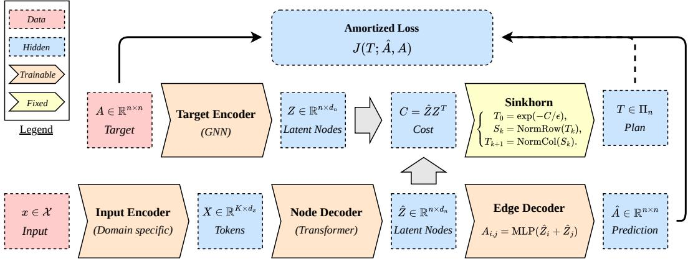
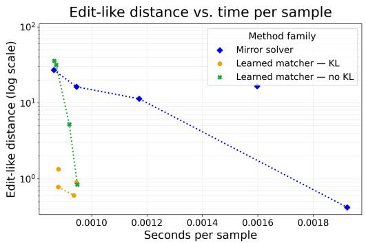
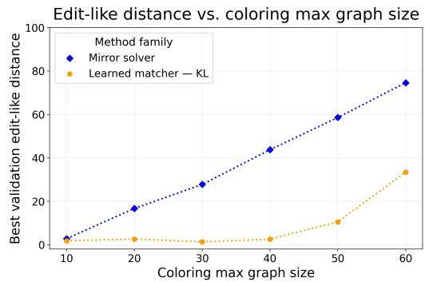
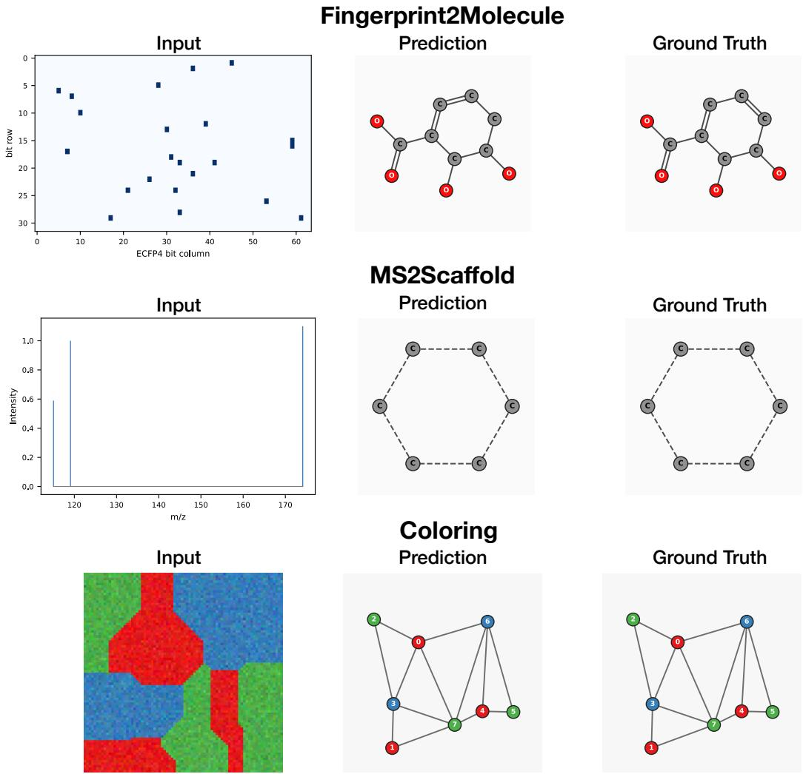

# Graph Matching Relaxations and Amortization for Supervised Graph Prediction

Federico Méndez⋆1,3 Charlotte Laclau1,3

Paul Krzakala⋆1,2,3 Rémi Flamary2,3

Gabriel Melo⋆1,3 Florence d’Alché-Buc1,3

1LTCI, Télécom Paris 2CMAP, École Polytechnique 3Institut Polytechnique de Paris

⋆Equal Contribution

## Abstract

End-to-end Supervised Graph Prediction (SGP) requires a permutation-invariant loss to compare predicted and target graphs with arbitrary node orderings. Such losses typically involve a costly graph-matching problem. We first study three Optimal Transport relaxations of this problem and show, theoretically and empirically, that the Gromov-Wasserstein (GW) objective is the most suitable for SGP. Then, to avoid solving the resulting inner optimization for every training example, we propose to amortize the graph matching (node alignment) problem. For each training sample, the loss function leverages a transport plan provided by a parametric matcher based on the differentiable Sinkhorn algorithm applied on empirical node distributions. The graph prediction module and the matcher are jointly learned. We showcase the efficiency of this approach on toy and real world SGP problems of increasing complexity including a novel Mass-spectra to Scaffold task that we introduce.

## 1 Introduction

Graphs provide a powerful and widely used tool to represent structured objects in various domains such as chemistry (molecules) or digital humanities (social networks) [1, 2, 3, 4]. While most graph machine learning focus on predicting graph properties with a graph as the input variable [5, 6], we consider instead the task of predicting an entire graph from an input variable which is not necessarily a graph. We refer to this setting as Supervised Graph Prediction (SGP). A flagship example of SGP task is de novo molecule identification, where the goal is to reconstruct a molecular graph of an unknown compound from a spectra acquired by tandem Mass Spectrometry [7, 8, 9, 10, 3].

This supervised graph prediction task poses a core difficulty as graphs have no inherent node ordering which means that the predicted and target graph cannot be compared by a classical entry-by-entry data fitting term. Computationally expensive permutation-invariant metrics are thus required instead.

Computing such loss, typically involves an alignment steps where an optimal correspondence is found between the nodes of the two graphs which results in a combinatorial graph matching problem [11, 12]. In practice, the problem is often relaxed to be tackled by continuous solvers [13, 14]. In particular, the bistochastic relaxation is a natural choice that connects the graph matching and Optimal Transport (OT) literature through the celebrated Gromov-Wasserstein distance [15, 16] and its variants [17, 18]. This approach was successfully applied to the training of end-to-end models SGP models such as Any2Graph [19].

Despite the growing efficiency of the OT solvers [20], matching every predicted-target pair quickly becomes a bottleneck as graphs and dataset size grow. An appealing alternative is to amortize the matching step by training a parametric network to predict the alignment directly [21, 22]. This approach was originally introduced into a graph-level autoencoder, GRALE [21] but remains unexplored for supervised prediction, where the matcher should be optimized for the predictive task rather than reconstruction.

In this paper we close this gap by extending the "learning to match" framework to Supervised Graph Prediction. Our contributions are listed below:

• We provide empirical and theoretical evidence that the Gromov-Wasserstein distance outperforms the alternative bistochastic relaxations of combinatorial graph matching for SGP.

• We introduce an amortized approach to SGP where a matcher is jointly trained to predict the optimal matching instead of relying on a solver.

• We propose a regularization term that penalizes the matcher for producing non-bistochastic matching which simplifies the matcher design and improves performance.

• We demonstrate that the amortized approach consistently outperforms the solver alternative both in compute time and prediction performance.

• Finally, the experiments on both synthetic datasets and two challenging molecular task show that the proposed model outperforms existing SGP models.

## 2 Problem Setup

Notation. We write ${ \bf 1 } _ { n }$ for the all-ones vector, $\langle U , V \rangle = \mathrm { t r } ( U ^ { \top } V )$ for the Frobenius inner product, and $\Pi _ { n } = \left\{ T \in [ 0 , 1 ] ^ { n \times n } : T \mathbf { 1 } _ { n } = \mathbf { 1 } _ { n } , \ T ^ { \top } \mathbf { 1 } _ { n } = \mathbf { 1 } _ { n } \right\}$ for the Birkhoff polytope of bistochastic matrices. Its extreme points are permutation matrices, whose set we denote $\Sigma _ { n } \subset \Pi _ { n }$

Supervised Graph Prediction We consider the supervised graph prediction problem of learning a mapping $f _ { \theta } : \mathcal { X }  \mathcal { G }$ from an input space $\mathcal { X }$ to the space of graphs $\mathcal { G }$ . Given a training set $\{ ( x _ { i } , \bar { g } _ { i } ^ { \star } ) \bar  \} _ { i = 1 } ^ { N }$ , the parameters θ are fit by minimizing the empirical risk

$$
\mathcal { L } ( \theta ) = \sum _ { i = 1 } ^ { N } \ell \big ( f _ { \theta } ( x _ { i } ) , g _ { i } ^ { \star } \big ) ,\tag{1}
$$

where $\ell : \mathcal { G } \times \mathcal { G }  \mathbb { R } _ { + }$ is a permutation-invariant graph loss, i.e., invariant to reordering of the nodes. For the remainder of the paper, we represent a graph by its adjacency matrix and take $\bar { \mathcal { G } } = [ 0 , 1 ] ^ { n \times n }$ where n denotes a fixed maximum graph size (smaller graphs being zero-padded); we write $A _ { i }$ for the adjacency matrix of $g _ { i } .$ . Appendix B.1 discuss the extension to labeled graphs of arbitrary size.

Graph matching. The loss ℓ must be invariant to node reordering, since a graph is unchanged by permuting its node indices [17]. A natural such loss compares two adjacency matrices under the best alignment of their nodes. For adjacency matrices $A , B \in [ 0 , 1 ] ^ { n \times n }$ , their graph-matching loss is

$$
\ell ( A , B ) = \operatorname* { m i n } _ { P \in \Sigma _ { n } } J ( P ; A , B ) , \qquad J ( P ; A , B ) : = \sum _ { i , j , k , l = 1 } ^ { n } d ( A _ { i k } , B _ { j l } ) P _ { i j } P _ { k l } ,\tag{2}
$$

and $d : [ 0 , 1 ] \times [ 0 , 1 ] \to \mathbb { R } _ { + }$ is an edge-wise discrepancy. This is a quadratic assignment problem (QAP) [12, 11]. For a permutation matrix $P \in \Sigma _ { n }$ , the same objective can equivalently be written as

$$
J _ { a } ( P ; A , B ) : = \sum _ { i , l = 1 } ^ { n } d \big ( [ A P ] _ { i l } , [ P B ] _ { i l } \big ) \mathrm { ~ a n d ~ } J _ { b } ( P ; A , B ) : = \sum _ { i , k = 1 } ^ { n } d \big ( A _ { i k } , [ P B P ^ { \top } ] _ { i k } \big ) .\tag{3}
$$

Proposition 2.1 (Equivalent permutation objectives). For every permutation matrix $P \in \Sigma _ { n }$ and every pair ofadjacency matrices A, $B \in [ 0 , \tilde { 1 } ] ^ { n \times n }$

$$
J ( P ; A , B ) = J _ { a } ( P ; A , B ) = J _ { b } ( P ; A , B ) .
$$

The three objectives are therefore equivalent over permutations, even though they yield different relaxations as discussed latter. Unfortunately, the optimization problem in (2) is NP-complete in general [23] which raises a first question:

How to efficiently compute or approximate $\ell ( A , B )$ to produce a practical loss for SGP?

We address this question in the next section. The detailed proofs for this section and the next are available in Appendix C.

## 3 Efficient Computation: From Relaxation to Amortization

In this section, we present the efficient computation of the graph matching loss, building from Optimal Transport (bistochastic) relaxation, to parallelizable solvers to the proposed approach: amortization.

Optimal Transport Relaxation. A standard approach to approximate the QAP problem is to relax the discrete set $\Sigma _ { n }$ by its convex hull, $\Pi _ { n } ~ [ 1 \bar { 4 } ]$ . Interestingly, even though objectives $J , J _ { a } , J _ { b }$ coincide on $\Sigma _ { n }$ (Proposition 2.1) they actually differ on $\Pi _ { n }$ (Proposition C.1), which yields 3 distinct relaxations:

$$
\operatorname { G W } ( A , B ) : = \operatorname* { m i n } _ { T \in \Pi _ { n } } J ( T ; A , B ) .\tag{4}
$$

$$
\ell _ { a } ( A , B ) : = \operatorname* { m i n } _ { T \in \Pi _ { n } } J _ { a } ( T ; A , B ) \quad \ell _ { b } ( A , B ) : = \operatorname* { m i n } _ { T \in \Pi _ { n } } J _ { b } ( T ; A , B )\tag{5}
$$

Where $\mathrm { G W } ( A , B )$ is known in the Optimal Transport field as the discrete Gromov-Wasserstein distance [16]. This raises the second question of this paper:

## What relaxation yields the best loss function for SGP ?

We provide both empirical and theoretical evidence that $\mathrm { G W } ( A , B )$ is the best among the three for our application. In Proposition 3.1, we show that GW is a tighter relaxation than the alternatives. In Proposition 3.2 we show that GW is a valid surrogate for ℓ given that $\mathrm { G W } ( A , B ) = 0 \implies$ $\ell ( A , B ) = 0$ which is not the case for the alternatives. Finally, in Table 2 we demonstrate empirically that, within our framework, GW consistently yields superior results across datasets.

Proposition 3.1 (GW is a closest relaxation). If d is convex in a and convex in $b ,$ then for all $A , \bar { B } \in [ 0 , 1 ] ^ { n \times n }$

$$
\operatorname* { m a x } \left( \ell _ { a } ( A , B ) , \ell _ { b } ( A , B ) \right) \leq \mathrm { G W } ( A , B ) \leq \ell ( A , B ) .
$$

Note that related inequalities have appeared in prior work [24].

Proposition 3.2 (GW has no spurious minima). $I f d ( a , b ) = 0 \iff a = b$ and $0 \leq d ( a , b )$ , we have that

$$
\operatorname { G W } ( A , B ) = 0 \iff \ell ( A , B ) = 0\tag{6}
$$

$$
\ell _ { a } ( A , B ) = 0 \ \Longrightarrow \ \ell ( A , B ) = 0 a n d \ell _ { b } ( A , B ) = 0 \ \Longrightarrow \ \ell ( A , B ) = 0
$$

Finally, note that $J ( T ; A , B )$ can be efficiently computed: given any Bregman divergence d the tensor product $J ( T ; A , B )$ admits a low-rank factorization [15], so it can be evaluated in $\mathcal { O } ( n ^ { 3 } )$ rather than the $\mathcal { O } ( n ^ { 4 } )$ of the naive tensor contraction. The question of finding the optimal matching $T ^ { * } = \arg \operatorname* { m i n } _ { T \in \Pi _ { n } } J ( T ; A , B )$ remains and we discuss two alterative approaches below.

Numerical GW solver. We now turn to computing the loss, which requires minimizing (4) over $\Pi _ { n }$ for every training pair, a step that must be fast and fully parallelizable on GPU. This can be achieved with the mirror-descent scheme of [25, 15]: from an initial plan $T _ { 0 } ,$ , each of the $K _ { \mathrm { o u t } }$ outer iterations solves

$$
T _ { k + 1 } = \arg \operatorname* { m i n } _ { T \in \Pi _ { n } } \langle \nabla _ { T } J ( T _ { k } ; A , A ^ { \star } ) , T \rangle + \tau \mathrm { K L } ( T \| T _ { k } ) .\tag{7}
$$

Linearizing J and expanding the KL term recasts this as an entropic OT problem,

$$
T _ { k + 1 } = \arg \operatorname* { m i n } _ { T \in \Pi _ { n } } \langle C _ { k } , T \rangle - \tau H ( T ) , \qquad C _ { k } = \nabla _ { T } J ( T _ { k } ; A , A ^ { \star } ) - \tau \log T _ { k } ,\tag{8}
$$

which we solve with $K _ { \mathrm { i n } }$ Sinkhorn iterations, $T _ { k + 1 } = { \mathrm { S i n k h o r n } } ( C _ { k } ; \tau , K _ { \mathrm { i n } } )$ . The full nested scheme is controlled by three parameters $( \tau , K _ { \mathrm { i n } } , K _ { \mathrm { o u t } } ^ { \cdot } )$ ; we defer the Sinkhorn details and complete pseudo-code to Appendix A. Wrapping this solver in the loss as Solver(A, A⋆) gives

$$
\mathcal { L } _ { \mathrm { s o l v e r } } ( \theta ) = \sum _ { i = 1 } ^ { N } J \bigl ( T _ { i } ; f _ { \theta } ( x _ { i } ) , A _ { i } ^ { \star } \bigr ) , \qquad T _ { i } = \mathrm { s g } \left[ \mathrm { S o l v e r } ( f _ { \theta } ( x _ { i } ) , A _ { i } ^ { \star } ) \right] ,\tag{9}
$$

  
Figure 1: Amortized Supervised Graph Prediction Schema.

where $\mathrm { s g } [ \cdot ]$ denotes the stop-gradient operator, justified by the envelope theorem [26]: at the optimum the objective is stationary in $T _ { i } ,$ so backpropagating through the solver is unnecessary, i.e. $\nabla _ { \boldsymbol { \theta } } \mathrm { G W } ( f _ { \boldsymbol { \theta } } ( x ) , A ^ { \star } ) = \nabla _ { \boldsymbol { \theta } } J ( \mathrm { s g } [ \bar { T } ^ { \star } ] ; f _ { \boldsymbol { \theta } } ( x ) , A ^ { \star } )$ , where $T ^ { \star } \stackrel { - } { = } \arg \operatorname* { m i n } _ { T \in \Pi _ { n } } J ( T ; f _ { \theta } ( x ) , A ^ { \star } )$

Amortized Matcher. The solver above optimizes the matching objective directly but is costly: a typical run, with 100k steps at batch size 128, invokes it over $1 0 ^ { 7 }$ times, so the inner Sinkhorn rollouts dominate training time. Following the recent amortized matching introduced for graph autoencoding in [21], we replace the per-step solver with a learned matcher Matche $: \theta ^ { \prime }$ that is trained jointly with $f _ { \theta }$ to predict the transport plan in a single forward pass:

$$
\mathcal { L } _ { \mathrm { m a t c h e r } } ( \theta , \theta ^ { \prime } ) = \sum _ { i = 1 } ^ { N } J \bigl ( T _ { i } ( \theta ^ { \prime } ) ; f _ { \theta } ( x _ { i } ) , A _ { i } ^ { \star } \bigr ) + \Omega ( \theta ^ { \prime } ) , \qquad T _ { i } ( \theta ^ { \prime } ) = \mathrm { M a t c h e r } _ { \theta ^ { \prime } } ( x _ { i } , A _ { i } ^ { \star } ) .\tag{10}
$$

where Ω is regularization term discussed in equation (13). We parametrize the matcher with two embedding networks, $g _ { \theta ^ { \prime } } : \mathcal { X }  \mathbb { R } ^ { n \times d _ { m } }$ and hθ′ $: \mathcal { G }  \mathbb { R } ^ { n \times d _ { m } }$ , which map the input and the target graph to node embeddings. Their inner product forms a rank- $\cdot d _ { m }$ affinity matrix used for computing a matching with entropic regularized Optimal Transport:

$$
\mathrm { M a t c h e r } _ { \theta ^ { \prime } } ( x , A ^ { \star } ) = \underset { T \in \Pi _ { n } } { \arg \operatorname* { m a x } } ~ \langle g _ { \theta ^ { \prime } } ( x ) h _ { \theta ^ { \prime } } ( A ^ { \star } ) ^ { \top } , T \rangle + \epsilon H ( T ) ,\tag{11}
$$

where the entropic smoothing parameter ϵ ensures the differentiability of the matcher. In practice, the plan is computed by the Sinkhorn Algorithm,

$$
\mathrm { M a t c h e r } _ { \theta ^ { \prime } } ( x , A ^ { \star } ) = \mathrm { S i n k h o r n } \big ( - g _ { \theta ^ { \prime } } ( x ) h _ { \theta ^ { \prime } } ( A ^ { \star } ) ^ { \top } ; \epsilon , K _ { \mathrm { m } } \big ) ,\tag{12}
$$

where $K _ { \mathrm { m } }$ is the number of steps of the algorithm. The matcher can be made equivariant to permutations of $A ^ { * }$ but this might not be desirable as we discuss in details in Appendix B.2.

Two properties are desirable here: a small $K _ { \mathrm { m } } .$ , since each Sinkhorn rollout is expensive, and a small ϵ, so that $T _ { i } ( \theta ^ { \prime } )$ is close to a permutation. These conflict: at small ϵ, the few Sinkhorn iterations we can afford do not converge, meaning that the rows and columns sums of $T _ { i } ( \theta ^ { \prime } )$ deviate from $\mathbf { 1 } _ { n } .$ Rather than run Sinkhorn to convergence, we propose to keep $K _ { \mathrm { m } }$ small and penalize these marginal deviations directly:

$$
\Omega ( \theta ^ { \prime } ) = \sum _ { i } \operatorname { K L } \bigl ( T _ { i } ( \theta ^ { \prime } ) \mathbf { 1 } _ { n } \parallel \mathbf { 1 } _ { n } \bigr ) + \operatorname { K L } \bigl ( T _ { i } ( \theta ^ { \prime } ) ^ { \top } \mathbf { 1 } _ { n } \parallel \mathbf { 1 } _ { n } \bigr ) .\tag{13}
$$

This penalty connects to unbalanced optimal transport [27] which was already used in an amortized framework [22]. While the penalty is the same, our intention differ as we do not aim to relax the marginal constraints but to prevent the model to use the low Sinkhorn iteration budget to escape the loss (e.g. with $T = 0 )$ . The full amortized scheme is summarized in Figure 1.

Table 1: Comparison of the different SGP strategies across the graph prediction tasks.
<table><tr><td rowspan="2">Model</td><td colspan="2">Coloring 10</td><td colspan="2">Coloring 20</td><td colspan="2">MS2Scaffold</td><td colspan="2">Fingerprint2Mol</td></tr><tr><td>EDIT ↓</td><td>GI ACC. ↑</td><td>EDIT ↓</td><td>GI ACC. ↑</td><td>EDIT ↓</td><td>GI ACC. ↑</td><td>EDIT↓</td><td>GI ACC. ↑</td></tr><tr><td>FGWBARY</td><td>6.73</td><td>1.00</td><td></td><td></td><td></td><td></td><td></td><td></td></tr><tr><td>RELATIONFORMER</td><td>5.47</td><td>18.14</td><td>17.28</td><td>3.58</td><td>32.72</td><td>0.00</td><td>25.20</td><td>0.00</td></tr><tr><td>ANY2GRAPH</td><td>2.82</td><td>31.79</td><td>16.64</td><td>18.92</td><td>19.11</td><td>5.61</td><td>17.64</td><td>0.001</td></tr><tr><td>ANY2GRAPH + MATCHER</td><td>2.30</td><td>45.46</td><td>02.64</td><td>46.47</td><td>12.17</td><td>29.48</td><td>7.01</td><td>15.79</td></tr></table>

Table 2: Effect of the continuous graph-matching relaxation used to train the learned matcher. The Gromov-Wasserstein objective consistently yields the best edit distance and exact-reconstruction accuracy.
<table><tr><td>Loss</td><td colspan="2">Coloring 20 EDIT ↓ GI ACC. ↑</td><td colspan="2">MS2Scaffold EDIT ↓ GI ACC. ↑</td><td colspan="2">Fingerprint2Mol EDIT ↓ GI ACC. ↑</td></tr><tr><td> $J ( T ; f _ { \theta } ( x ) , A ^ { * } )$ </td><td>2.64</td><td>46.47</td><td>12.17</td><td>29.48</td><td>7.01</td><td>15.79</td></tr><tr><td> $J _ { a } ( T ; f _ { \theta } ( x ) , A ^ { * } )$ </td><td>19.36</td><td>7.35</td><td>17.98</td><td>3.15</td><td>15.56</td><td>0.42</td></tr><tr><td> $J _ { b } ( T ; f _ { \theta } ( x ) , A ^ { * } )$ </td><td>22.42</td><td>0.61</td><td>20.29</td><td>0.23</td><td>18.71</td><td>0.14</td></tr><tr><td> $J _ { a } ( T ; A ^ { * } , f _ { \theta } ( x ) )$ </td><td>25.84</td><td>0.42</td><td>24.39</td><td>0.00</td><td>29.49</td><td>0.01</td></tr><tr><td> $J _ { b } ( T ; A ^ { * } , f _ { \theta } ( x )$ </td><td>13.61</td><td>13.51</td><td>17.19</td><td>4.32</td><td>19.47</td><td>0.12</td></tr></table>

## 4 Numerical Experiments

## 4.1 Experimental setting.

Datasets. We evaluate on three tasks. Coloring [19] is a synthetic benchmark of connected graphs labeled with a valid four-coloring where the input is an image representing the graph. We construct two molecular tasks. Fingerprint2Molecule recovers a molecular graph from its binary structural fingerprint, following [19], with molecules drawn from PubChem [28]. MS2Scaffold predicts a molecular scaffold graph from a tandem mass spectrum, using the MassSpecGym benchmark [8] with the formula-based split recommended by [29]. We propose the latter as an intermediate step toward de novo metabolite identification where the full molecule should be reconstructed which remains extremely challenging [8]. For instance, even state-of-the-art models such as MetGenX [30] (Nature Comm. 2026) reaches only 2.50% top-1 on the MassSpecGym benchmark [8].

Model architecture. Following Any2Graph [19], we parametrize the graph prediction model $f _ { \theta }$ with three components:

• A domain specific Input Encoder $E _ { \theta _ { 1 } } : \mathcal { X } \mapsto R ^ { K \times d }$ that encode the input with K latent vectors. The model used for each dataset is detailed in Appendix D.

• A node decoder $D _ { \theta _ { 2 } } : R ^ { K \times d } \mapsto R ^ { n \times d }$ that predicts some latent representations of the target graph’s nodes. This block is implemented with a Transformer [31]

• A graph prediction head $H _ { \theta _ { 3 } } : R ^ { n \times d } \mapsto \mathcal { G }$ parametrized with MLPs as in [19].

Overall, the graph prediction model is $f _ { \boldsymbol { \theta } } = H _ { \boldsymbol { \theta } _ { 3 } } \circ D _ { \boldsymbol { \theta } _ { 2 } } \circ E _ { \boldsymbol { \theta } _ { 1 } }$ . Finally, the node embeddings used by the matcher (12), are defined as follows:

• For the predicted graph node embeddings, we reuse the first part of $f _ { \theta }$ that is $g _ { \theta ^ { \prime } } = D _ { \theta _ { 2 } ^ { \prime } } \circ E _ { \theta _ { 1 } ^ { \prime } }$ and we apply weight sharing $( \theta _ { 1 } , \theta _ { 2 } ) = ( \theta _ { 1 } ^ { \prime } , \theta _ { 2 } ^ { \prime } )$

• The target graph node embeddings are extracted by a 3 layers graph neural network $h _ { \theta ^ { \prime } }$ [32] with Laplacian Positionnal Encoding as discussed in Appendix B.2.

Throughout all experiments, the loss used for $d ( a , b )$ is the cross-entropy loss. More details on the architecture and hyperparameters are provided in Appendix D. Code is available at https://github.com/FedericoMendez/amortized-graph-prediction §.

## 4.2 Results

Predictive performance. We report edit distance (↓) and graph-isomorphism accuracy (GI ACC.↑), i.e. the fraction of exactly reconstructed graphs, at the best validation epoch. We compare against three SGP baselines: FGWBARY [9], RELATIONFORMER [33], and the original ANY2GRAPH [19], without the learnable matcher. Table 1 shows that adding the matcher improves every task. The gain is especially pronounced on the molecular benchmarks: relative to ANY2GRAPH, it reduces edit distance from 19.11 to 12.17 on MS2SCAFFOLD and from 17.64 to 7.01 on FINGERPRINT2MOL, while increasing exact-reconstruction accuracy from 5.61% to 29.48% and from 0.001% to 15.79%, respectively.

  
Figure 2: Left: We report the prediction performances (Edit Distance ↓) against the model throughput (Seconds/Sample ↓) for a variety of models and hyperparameter choices. Right: We compare the performances (Edit Distance ↓) of the matcher- and solver-based approach for datasets of increasing maximum graph size. The COLORING synthetic benchmark is used in both figures [19].

Efficiency and scaling. Figure 2 compares the learned matcher with the numerical mirror solver on COLORING. In the left panel, the KL-regularized matcher forms the favorable accuracy-runtime frontier: at comparable per-sample cost it achieves a markedly smaller edit-like distance, while the solver attains a slightly lower distance only at approximately twice the latency. Removing the KL penalty worsens this trade-off. The right plot shows that the advantage widens with graph size: the solver’s error rises steadily, whereas the learned matcher remains accurate through graphs of size 40 and retains a large advantage at sizes 50 and 60.

Choice of relaxation. We now return to the first question raised in Section 3: which relaxation yields the best lossfunction? Our theoretical results identified GW as a tighter and more faithful surrogate than $\ell _ { a }$ or $\ell _ { b } ,$ , and Table 2 confirms this empirically. Replacing GW with either alternative degrades both metrics on all three benchmarks. The performance gap between GW and the two alternative relaxations is not limited to exact reconstruction accuracy: both $\ell _ { a }$ and $\ell _ { b }$ also produce substantially larger edit distances. This suggests that these weaker relaxations provide a less informative learning signal even when predictions are not exactly correct.

## 5 Conclusion

We introduced a learned matcher that amortizes graph alignment in supervised graph prediction, avoiding an iterative solver for every training sample. Our theoretical and empirical results support the Gromov-Wasserstein objective over the alternative bistochastic relaxations considered. Across synthetic and molecular tasks, the proposed approach improves reconstruction performance, provides a favorable accuracy-runtime trade-off, and scales better with graph size. These results show that amortized alignment is an effective way to reduce the computational cost of optimal transport based graph prediction.

## Acknowledgments and Disclosure of Funding

The study was funded by French National Research Agency (ANR) through PEPR IA FOUNDRY (ANR-23-PEIA-0003), e-Lucid (ANR-25- TSIA-0002-01), the France 2030 program under the MacLeOD project (ANR-25-PEIA-0005), and from the European Union’s Horizon Europe research and innovation programme under grant agreement 101120237 (ELIAS). This work benefited from Hi! PARIS and State funding managed by the French National Research Agency (ANR) under the

France 2030 program, reference ANR-23-IACL-0005. The second and third authors received PhD scholarships from Institut Polytechnique de Paris.

## References

[1] Weihua Hu, Matthias Fey, Marinka Zitnik, Yuxiao Dong, Hongyu Ren, Bowen Liu, Michele Catasta, and Jure Leskovec. Open graph benchmark: Datasets for machine learning on graphs. Advances in neural information processing systems, 33:22118–22133, 2020.

[2] Yanqiao Zhu, Yuanqi Du, Yinkai Wang, Yichen Xu, Jieyu Zhang, Qiang Liu, and Shu Wu. A survey on deep graph generation: Methods and applications. In Learning on graphs conference, pages 47–1. PMLR, 2022.

[3] Dai Hai Nguyen, Canh Hao Nguyen, and Hiroshi Mamitsuka. Recent advances and prospects of computational methods for metabolite identification: a review with emphasis on machine learning approaches. Briefings in bioinformatics, 20(6):2028–2043, 2019.

[4] Jie Tang, Jing Zhang, Limin Yao, Juanzi Li, Li Zhang, and Zhong Su. Arnetminer: extraction and mining of academic social networks. In Proceedings of the 14th ACM SIGKDD international conference on Knowledge discovery and data mining, pages 990–998, 2008.

[5] Zhenqin Wu, Bharath Ramsundar, Evan N Feinberg, Joseph Gomes, Caleb Geniesse, Aneesh S Pappu, Karl Leswing, and Vijay Pande. Moleculenet: a benchmark for molecular machine learning. Chemical science, 9(2):513–530, 2018.

[6] Vijay Prakash Dwivedi, Ladislav Rampášek, Michael Galkin, Ali Parviz, Guy Wolf, Anh Tuan Luu, and Dominique Beaini. Long range graph benchmark. Advances in Neural Information Processing Systems, 35:22326–22340, 2022.

[7] Saleh Alseekh, Asaph Aharoni, Yariv Brotman, Kévin Contrepois, John D’Auria, Jan Ewald, Jennifer C. Ewald, Paul D Fraser, Patrick Giavalisco, Robert D Hall, et al. Mass spectrometrybased metabolomics: a guide for annotation, quantification and best reporting practices. Nature methods, 18(7):747–756, 2021.

[8] Roman Bushuiev, Anton Bushuiev, Niek F de Jonge, Adamo Young, Fleming Kretschmer, Raman Samusevich, Janne Heirman, Fei Wang, Luke Zhang, Kai Dührkop, et al. Massspecgym: A benchmark for the discovery and identification of molecules. Advances in Neural Information Processing Systems, 37:110010–110027, 2024.

[9] Luc Brogat-Motte, Rémi Flamary, Céline Brouard, Juho Rousu, and Florence d’Alché Buc. Learning to predict graphs with fused gromov-wasserstein barycenters. In International Conference on Machine Learning, pages 2321–2335. PMLR, 2022.

[10] Gabriel Melo, Thibaut de Saivre, Anna Calissano, and Florence d’Alché Buc. Conformal graph prediction with z-gromov wasserstein distances. arXiv preprint arXiv:2603.02460, 2026.

[11] Rainer E Burkard. Quadratic assignment problems. European Journal of Operational Research, 15(3):283–289, 1984.

[12] Tjalling C Koopmans and Martin Beckmann. Assignment problems and the location of economic activities. Econometrica: journal ofthe Econometric Society, pages 53–76, 1957.

[13] Marius Leordeanu and Martial Hebert. A spectral technique for correspondence problems using pairwise constraints. In Tenth IEEE International Conference on Computer Vision (ICCV’05) Volume 1, volume 2, pages 1482–1489. IEEE, 2005.

[14] Mikhail Zaslavskiy, Francis Bach, and Jean-Philippe Vert. A path following algorithm for the graph matching problem. IEEE transactions on pattern analysis and machine intelligence, 31(12):2227–2242, 2008.

[15] Gabriel Peyré, Marco Cuturi, and Justin Solomon. Gromov-wasserstein averaging of kernel and distance matrices. In International conference on machine learning, pages 2664–2672. PMLR, 2016.

[16] Facundo Mémoli. Gromov–wasserstein distances and the metric approach to object matching. Foundations ofcomputational mathematics, 11(4):417–487, 2011.

[17] Vayer Titouan, Nicolas Courty, Romain Tavenard, and Rémi Flamary. Optimal transport for structured data with application on graphs. In International Conference on Machine Learning, pages 6275–6284. PMLR, 2019.

[18] Junjie Yang, Matthieu Labeau, and Florence d’Alché Buc. Exploiting edge features in graphbased learning with fused network gromov-wasserstein distance. Transactions on Machine Learning Research, 2024.

[19] Paul Krzakala, Junjie Yang, Rémi Flamary, Florence d’Alché Buc, Charlotte Laclau, and Matthieu Labeau. Any2graph: Deep end-to-end supervised graph prediction with an optimal transport loss. Advances in Neural Information Processing Systems, 37:101552–101588, 2024.

[20] Meyer Scetbon, Gabriel Peyré, and Marco Cuturi. Linear-time gromov wasserstein distances using low rank couplings and costs. In International Conference on Machine Learning, pages 19347–19365. PMLR, 2022.

[21] Paul Krzakala, Gabriel Melo, Charlotte Laclau, Florence d’Alché Buc, and Rémi Flamary. The quest for the graph level autoencoder (grale). arXiv preprint arXiv:2505.22109, 2025.

[22] Sonia Mazelet, Rémi Flamary, and Bertrand Thirion. Unsupervised learning for optimal transport plan prediction between unbalanced graphs. Advances in Neural Information Processing Systems, 38:94041–94063, 2025.

[23] Juris Hartmanis. Computers and intractability: a guide to the theory of np-completeness (michael r. garey and david s. johnson). Siam Review, 24(1):90, 1982.

[24] Yonathan Aflalo, Alexander Bronstein, and Ron Kimmel. On convex relaxation of graph isomorphism. Proceedings ofthe National Academy ofSciences, 112(10):2942–2947, 2015.

[25] Hongteng Xu, Dixin Luo, and Lawrence Carin. Scalable gromov-wasserstein learning for graph partitioning and matching. Advances in neural information processing systems, 32, 2019.

[26] Mathieu Blondel and Vincent Roulet. The elements of differentiable programming. arXiv preprint arXiv:2403.14606, 2024.

[27] Lenaic Chizat, Gabriel Peyré, Bernhard Schmitzer, and François-Xavier Vialard. Scaling algorithms for unbalanced optimal transport problems. Mathematics ofcomputation, 87(314):2563– 2609, 2018.

[28] Sunghwan Kim, Paul A Thiessen, Evan E Bolton, Jie Chen, Gang Fu, Asta Gindulyte, Lianyi Han, Jane He, Siqian He, Benjamin A Shoemaker, et al. Pubchem substance and compound databases. Nucleic acids research, 44(D1):D1202–D1213, 2016.

[29] Paul Krzakala, Gabriel Melo, Camille Lançon, Charlotte Laclau, Rémi Flamary, Etienne Thévenot, and Florence d’Alché Buc. Msalign: Aligning molecule and mass spectra foundation models for metabolite identification. arXiv preprint arXiv:2605.19752, 2026.

[30] Hongmiao Wang, Haosong Zhang, and Zheng-Jiang Zhu. Structure-informed deep generation enables de novo metabolite annotation in untargeted metabolomics. Nature Communications, 2026.

[31] Ashish Vaswani, Noam Shazeer, Niki Parmar, Jakob Uszkoreit, Llion Jones, Aidan N Gomez, Łukasz Kaiser, and Illia Polosukhin. Attention is all you need. Advances in neural information processing systems, 30, 2017.

[32] Keyulu Xu, Weihua Hu, Jure Leskovec, and Stefanie Jegelka. How powerful are graph neural networks? arXiv preprint arXiv:1810.00826, 2018.

[33] Suprosanna Shit, Rajat Koner, Bastian Wittmann, Johannes Paetzold, Ivan Ezhov, Hongwei Li, Jiazhen Pan, Sahand Sharifzadeh, Georgios Kaissis, Volker Tresp, et al. Relationformer: A unified framework for image-to-graph generation. In European conference on computer vision, pages 422–439. Springer, 2022.

[34] Marco Cuturi. Sinkhorn distances: Lightspeed computation of optimal transport. Advances in neural information processing systems, 26, 2013.

[35] Aude Genevay, Gabriel Peyré, and Marco Cuturi. Learning generative models with sinkhorn divergences. In International Conference on Artificial Intelligence and Statistics, 2018.

[36] Arkadij Semenovic Nemirovskij and David Borisovich Yudin. Problem complexity and methodˇ efficiency in optimization. 1983.

[37] Hannah Lawrence, Vasco Portilheiro, Yan Zhang, and Sékou-Oumar Kaba. Improving equivariant networks with probabilistic symmetry breaking. In Y. Yue, A. Garg, N. Peng, F. Sha, and R. Yu, editors, International Conference on Learning Representations, volume 2025, pages 80179–80206, 2025.

[38] Garrett Birkhoff. Three observations on linear algebra. Univ. Nac. Tacuman, Rev. Ser. A, 5:147–151, 1946.

[39] Greg Landrum et al. Rdkit: A software suite for cheminformatics, computational chemistry, and predictive modeling. Greg Landrum, 8(31.10):5281, 2013.

[40] Enze Xie, Wenhai Wang, Zhiding Yu, Anima Anandkumar, Jose M. Alvarez, and Ping Luo. Segformer: Simple and efficient design for semantic segmentation with transformers. Advances in Neural Information Processing Systems, 34:12077–12090, 2021.

## A Algorithms

## A.1 Reminder of Sinkhorn

Given a cost matrix $C \in \mathbb { R } ^ { n \times n }$ and regularization $\tau > 0 .$ , the Sinkhorn algorithm [34] solves the entropy-regularized OT problem min $\bar { \Psi } { \in } \Pi _ { n } \left. C , T \right. - { \tau } H ( T )$ by alternating marginal projections on the Gibbs kernel $K = \bar { \exp ( - C / \tau ) }$ . Each iteration costs $\overset { \cdot } { \mathcal { O } } ( \overset { \cdot } { n } ^ { 2 } )$ and uses only matrix and vector products, making it fully parallelizable on GPU an differentiable by unrolling [35]. Note that in the original Sinkhorn algorithm one has to make an arbitrary choice: what is the marginal that will get exactly enforced in the last step, row or column ? To remove this ambiguity we add a final half step that average the last 2 updates (Algorithm 1).

Algorithm 1 Sinkhorn $( C ; \tau , K _ { \mathrm { i n } } )$   
1: $K  \exp ( - C / \tau ) , \quad v  \mathbf { 1 } _ { n }$   
2: for $k = 1$ to $K _ { \mathrm { i n } }$ do   
3: $u  \mathbf { 1 } _ { n } / ( K v )$ ▷ Row normalization   
4: $v  \mathbf { 1 } _ { n } / ( K ^ { \top } u )$ ▷ Column normalization   
5: end for   
6: $u ^ { \prime }  \mathbf { 1 } _ { n } / ( K v )$ ▷ Extra Row normalization   
7: $u \gets \frac { u + u } { 2 }$ ▷ Average the last two steps   
8: return ${ \overset { z } { T } } = \operatorname { d i a g } ( u ) K$ diag(v)

## A.2 Mirror Descent Solver

Recall that $\begin{array} { r } { J ( T ; A , B ) = \sum _ { i , i , k , l } d ( A _ { i k } , B _ { j l } ) T _ { i j } T _ { k l } } \end{array}$ is the quadratic matching cost between adjacency matrices $A$ and $B .$ In Algorithm 2, we propose to use mirror descent to find the optimal transport $T ^ { * } = \mathrm { a r g } \operatorname* { m i n } _ { T \in \Pi _ { n } } J ( \bar { T } ; A , B )$ [36]. By leveraging the Kullback-Leibler geometry as proposed in [25], each iterations rewrites as an entropic-regularized OT problem which can we solved with the Sinkhorn algorithm.

Algorithm 2 Mirror-descent Solver $( A , A ^ { \star } )$   
Require: adjacency matrices $A , A ^ { \star }$ ; parameters $( \tau , K _ { \mathrm { i n } } , K _ { \mathrm { o u t } } )$   
1: initialize $T _ { 0 } \gets \frac { 1 } { n } { \bf 1 } _ { n } { \bf 1 } _ { n } ^ { \top }$ ▷ uniform plan in $\Pi _ { n }$   
2: for $k = 0$ to $K _ { \mathrm { o u t } } - 1$ do   
3: $C _ { k } \gets \nabla _ { T } J ( T _ { k } ; A , A ^ { \star } ) - \tau$ log $T _ { k }$ $\mathsf { \Delta } \mathsf { P } \mathcal { O } ( n ^ { 3 } )$ via factorization [19]   
4: $T _ { k + 1 } \gets \mathrm { S i n k h o r n } ( C _ { k } ; \tau , K _ { \mathrm { i n } } )$   
5: end for   
6: return $T _ { K _ { \mathrm { o u t } } }$

## A.3 Amortized Implementation

In the proposed amortized implementation, the naive loss

$$
\mathcal { L } _ { \mathrm { n a i v e } } ( \theta ) = \sum _ { i } \operatorname* { m i n } _ { T \in \Pi _ { n } } J \big ( T ; \ : f _ { \theta } ( x _ { i } ) , \ : A _ { i } ^ { \star } \big ) ,\tag{14}
$$

is replaced by

$$
\mathcal { L } _ { \mathrm { m a t c h e r } } ( \theta , \theta ^ { \prime } ) = \sum _ { i } J \bigl ( T _ { i } ( \theta ^ { \prime } ) ; f _ { \theta } ( x _ { i } ) , A _ { i } ^ { \star } \bigr ) + \Omega ( \theta ^ { \prime } ) ,\tag{15}
$$

where T (θ′) = Sinkhorn $\left( g _ { \theta ^ { \prime } } ( x ) h _ { \theta ^ { \prime } } ( A ^ { \star } ) ^ { \top } ; ~ \epsilon , ~ K _ { \mathrm { i n } } \right)$ . is the predicted matching, parametrized as the optimal (entropic) matching between some learnable node features and $\Omega ( \theta ^ { \prime } )$ is the marginal violation defined in 13. In practice, we recommend that the target predictor $f _ { \theta }$ and the node target predictor $g _ { \theta } ^ { \prime }$ share a common backbone $\phi _ { \theta }$ . This approach is summarized in Algorithm 3.

Algorithm 3 Amortized training step (matcher $\theta ^ { \prime } +$ predictor θ)   
Require: batch $\{ ( x _ { i } , A _ { i } ^ { \star } ) \} _ { i = 1 } ^ { B } ;$ parameters $( \epsilon , K _ { \mathrm { i n } } ) ;$ networks $g _ { \theta ^ { \prime } } , h _ { \theta ^ { \prime } } , f _ { \theta }$   
1: for $i = 1$ to B do   
2: $\hat { Z } _ { i } \gets \phi _ { \theta } ( x _ { i } )$ ▷ backbone   
3: $\hat { A } _ { i } \gets f _ { \theta } ( \hat { Z } _ { i } )$ ▷ predicted graph   
4: $C _ { i } \gets g _ { \theta ^ { \prime } } ( \hat { Z } _ { i } ) h _ { \theta ^ { \prime } } ( A _ { i } ^ { \star } ) ^ { \top }$ ▷ rank- $\cdot d _ { m }$ matching cost   
5: $T _ { i } \gets \mathrm { { { S i n k h o r n } } } ( \dot { C } _ { i } ; { \bf \dot { \epsilon } } , K _ { \mathrm { { i n } } } )$ ▷ predicted plan   
6: $\Omega _ { i }  K L ( T _ { i } \mathbf { 1 } _ { n } \parallel \mathbf { 1 } _ { n } ) + K L ( T _ { i } ^ { T } \mathbf { 1 } _ { n } \parallel \mathbf { 1 } _ { n } )$ ▷ marginal penalization   
7: end for   
8: $\begin{array} { r } { \mathcal { L } _ { \mathrm { m a t c h e r } }  \sum _ { i } J ( T _ { i } ; \hat { A } _ { i } , A _ { i } ^ { \star } ) + \Omega _ { i } } \end{array}$   
9: update $\theta , \theta ^ { \prime }$ by a gradient step on Lmatcher ▷ backprop through both J and Sinkhorn   
10: return updated $\bar { \theta , \theta ^ { \prime } }$

## B Technical details

## B.1 Extensions to labeled graphs of arbitrary sizes

For completeness, we explain how the framework extends to variable-size graphs with node and edge features, following Any2Graph [19]. Let a prediction be $\hat { y } = ( \hat { h } , \hat { F } , \hat { A } )$ , where $\hat { h } \in [ 0 , 1 ] ^ { n }$ is a soft node mask (equivalently, a vector of node-existence probabilities), $\hat { F } _ { i }$ is the feature of node i, and $\hat { A }$ is the predicted adjacency matrix. The target $y ^ { \star } = ( h ^ { \star } , F ^ { \star } , A ^ { \star } )$ is padded to the same maximum size n; $h _ { i } ^ { \star } = 1$ exactly for its $m = \| h ^ { \star } \| _ { 1 }$ genuine nodes. The Partially-Masked Fused Gromov-Wasserstein loss is

$$
\begin{array} { l } { \displaystyle \mathrm { P M F G W } ( \hat { y } , y ^ { \star } ) = \operatorname* { m i n } _ { T \in \Pi _ { n } } \frac { \alpha _ { h } } { n } \sum _ { i , j } T _ { i j } d _ { h } \big ( \hat { h } _ { i } , h _ { j } ^ { \star } \big ) + \frac { \alpha _ { F } } { m } \sum _ { i , j } T _ { i j } h _ { j } ^ { \star } d _ { F } \big ( \hat { F } _ { i } , F _ { j } ^ { \star } \big ) } \\ { \displaystyle + \frac { \alpha _ { A } } { m ^ { 2 } } \sum _ { i , j , k , l } T _ { i j } T _ { k l } h _ { j } ^ { \star } h _ { l } ^ { \star } d _ { A } \big ( \hat { A } _ { i k } , A _ { j l } ^ { \star } \big ) . } \end{array}\tag{16}
$$

The first term learns the graph size, the second aligns node features, and the third aligns the edges. The weights $\alpha = ( \alpha _ { h } , \alpha _ { F } , \alpha _ { A } )$ control the relative importance of these three objectives. For a plain fixed-size unlabeled graph, the third term is exactly the GW objective used in the main text (and the first two terms may be omitted). For an edge-attributed graph extension, we refer to [18].

## B.2 Equivariant matcher or symmetry breaking matcher

Recall the definition of the matcher:

$$
\mathrm { M a t c h e r } _ { \theta ^ { \prime } } ( x , A ^ { \star } ) = \underset { T \in \Pi _ { n } } { \arg \operatorname* { m a x } } ~ \langle g _ { \theta ^ { \prime } } ( x ) h _ { \theta ^ { \prime } } ( A ^ { \star } ) ^ { \top } , T \rangle + \epsilon H ( T ) ,\tag{17}
$$

where $g _ { \theta ^ { \prime } } : \mathcal { X }  \mathbb { R } ^ { n \times d _ { m } }$ and $h _ { \theta ^ { \prime } } : \mathcal { G }  \mathbb { R } ^ { n \times d _ { m } }$ . The matcher is expected to approximate the optimal transport plan between the prediction $f ( x )$ and the target A⋆. Denoting:

$$
T ( f ( x ) , A ^ { \star } ) = \underset { T \in \Pi _ { n } } { \arg \operatorname* { m i n } } J ( T ; f ( x ) , A ^ { \star } ) ,\tag{18}
$$

we expect

$$
\mathrm { M a t c h e r } _ { \theta ^ { \prime } } ( x , A ^ { \star } ) \approx T ( f ( x ) , A ^ { \star } ) .\tag{19}
$$

Interestingly, the optimal transport plan is permutation equivariant, formally:

$$
\forall P \in \Sigma _ { n } , \quad T ( f ( x ) , P A ^ { \star } P ^ { T } ) = T ( f ( x ) , A ^ { \star } ) P ^ { T } .\tag{20}
$$

Consequently, it might seem natural to enforce a similar property in the matcher. This is easy to achieve: it suffices that $h _ { \theta ^ { \prime } }$ be permutation equivariant for the matcher to inherit the property, as stated in the following proposition.

Proposition B.1 (Permutation Equivariant Matcher). If the target node encoder hθ′ is permutation equivariant,

$$
\forall P \in \Sigma _ { n } , \quad h _ { \theta ^ { \prime } } ( P A ^ { \star } P ^ { T } ) = P h _ { \theta ^ { \prime } } ( A ^ { \star } ) ,\tag{21}
$$

Then, the matcher is permutation equivariant,

$$
\forall P \in \Sigma _ { n } , \quad \mathrm { M a t c h e r } _ { \theta ^ { \prime } } \bigl ( f ( x ) , P A ^ { \star } P ^ { T } \bigr ) = \mathrm { M a t c h e r } _ { \theta ^ { \prime } } \bigl ( f ( x ) , A ^ { \star } \bigr ) P ^ { T } .\tag{22}
$$

Proof. Assume that $h _ { \theta ^ { \prime } }$ is permutation equivariant. Then, for any $P \in \Sigma _ { n }$ , we have

$$
\begin{array} { r l } & { \mathrm { M a t c h e r } _ { \theta ^ { \prime } } ( f ( x ) , P A ^ { \star } P ^ { T } ) = \underset { T \in \Pi _ { n } } { \arg \operatorname* { m a x } } \langle g _ { \theta ^ { \prime } } ( x ) h _ { \theta ^ { \prime } } ( P A ^ { \star } P ^ { T } ) ^ { \top } , T \rangle + \epsilon H ( T ) } \\ & { \quad \quad \quad \quad \quad \quad \quad \quad \quad \quad \quad \quad \quad \quad } \\ & { \quad \quad \quad \quad \quad \quad \quad \quad \quad \quad \quad \quad \quad \quad \quad \quad \quad \quad \quad \quad \quad \quad \quad } \\ & { \quad \quad \quad \quad \quad \quad \quad \quad \quad \quad \quad \quad \quad \quad \quad \quad \quad \quad \quad \quad \quad \quad \quad \quad \quad } \\ & { \quad \quad \quad \quad \quad \quad \quad \quad \quad \quad \quad \quad \quad \quad \quad \quad \quad \quad \quad \quad \quad \quad \quad \quad \quad \quad } \\ & { \quad \quad \quad \quad \quad \quad \quad \quad \quad \quad \quad \quad \quad \quad \quad \quad \quad \quad \quad \quad \quad \quad \quad \quad \quad \quad } \\ & { \quad \quad \quad \quad \quad \quad \quad \quad \quad \quad \quad \quad \quad \quad \quad \quad \quad \quad \quad \quad \quad \quad \quad \quad \quad } \\ & { \quad \quad \quad \quad \quad \quad \quad \quad \quad \quad \quad \quad \quad \quad \quad \quad \quad \quad \quad \quad \quad \quad \quad \quad \quad \quad } \\ & { \quad \quad \quad \quad \quad \quad \quad \quad \quad \quad \quad \quad \quad \quad \quad \quad \quad \quad \quad \quad \quad \quad \quad \quad \quad \quad } \\ & { \quad \quad \quad \quad \quad \quad \quad \quad \quad \quad \quad \quad \quad \quad \quad \quad \quad \quad \quad \quad \quad \quad \quad \quad \quad \quad } \\ & { \quad \quad \quad \quad \quad \quad \quad \quad \quad \quad \quad \quad \quad \quad \quad \quad \quad \quad \quad \quad \quad \quad \quad \quad \quad } \\ & { \quad \quad \quad \quad \quad \quad \quad \quad \quad \quad \quad \quad \quad \quad \quad \quad \quad \quad \quad \quad \quad \quad \quad } \\ &  \quad \quad \quad \quad \quad \quad \quad \quad \quad \quad \quad \quad \quad \quad \quad  \end{array}
$$

where we used that $H ( T ) = H ( T P )$ . The change of variable $T ^ { \prime } = T P$ concludes the proof.

Yet, previous works have highlighted that permutation equivariant models might be limited in the kind of mapping they can perform [37]. In the context of the matcher, this was a significant limitation in previous works (see Appendix B.3 from GRALE [21]). Formally, these limitations arise when the automorphism group of $A ^ { * }$ is non-trivial as detailled in the next proposition.

Proposition B.2 (Limitations of a permutation invariant matcher). Assume that $P \in \Sigma _ { n }$ is the automorphism group of $A ^ { * }$ i.e. $P A ^ { * } P ^ { T } = A ^ { * }$ . Then, for any permutation equivariant matcher we have,

$$
\forall x \in \mathcal { X } , \quad \mathrm { M a t c h e r } _ { \theta ^ { \prime } } ( x , A ^ { \star } ) P ^ { T } = \mathrm { M a t c h e r } _ { \theta ^ { \prime } } ( x , A ^ { \star } )\tag{23}
$$

In particular, $i f A ^ { * }$ is vertex-transitive, the output of the matcher is trivial,

$$
\forall x \in \mathcal { X } , \quad \mathrm { M a t c h e r } _ { \theta ^ { \prime } } ( x , A ^ { \star } ) = \frac { 1 } { n } \mathbf { 1 } \mathbf { 1 } ^ { T }\tag{24}
$$

This would apply for instance, to the Benzene molecule in Figure 3.

Proof. The first equation is a direct application of the permutation equivariance assumption. If we assume that $A ^ { * }$ is vertex-transitive, then for any $i , j \in [ 1 , n ]$ ], there exists $P \in \Sigma _ { n }$ such that

$$
P A ^ { * } P ^ { T } = A ^ { * } \quad \mathrm { a n d } \quad P _ { i , j } = 1
$$

Applying (23) we get in particular that the i-th and j-th columns of $T = \operatorname { M a t c h e r } _ { \theta ^ { \prime } } ( x , A ^ { \star } )$ are identical. Therefore all the columns of T are identical. Finally the marginal condition $T \mathbf { 1 } _ { n } = \mathbf { 1 } _ { n }$ implies that columns are constant to ${ \frac { 1 } { n } } \mathbf { 1 } _ { n }$ which concludes the proof. □

Proposition B.2 shows that a permutation equivariant matcher is unable to differentiate the symmetric nodes of a graph. Thus, if the automorphism group of $A ^ { * }$ is not trivial, the matcher is forced to output a fuzzy one-to-many matching matrix.

We address this limitation by injecting some symmetry breaking Laplacian Positionnal Encoding $( \mathrm { L P E } ) ^ { 1 }$ to the graph neural network $h _ { \theta ^ { \prime } }$ , future work could consider more subtle positionnal encoding such that proposed in [37].

## C Proofs

Proposition 2.1 (Equivalent permutation objectives). For every permutation matrix $P \in \Sigma _ { n }$ and every pair ofadjacency matrices A, $B \in [ 0 , \tilde { 1 } ] ^ { n \times n }$ n,

$$
J ( P ; A , B ) = J _ { a } ( P ; A , B ) = J _ { b } ( P ; A , B ) .
$$

Proof. Fix $P \in \Sigma _ { n }$ . Since $P$ is a permutation matrix, each of its rows and columns contains exactly one entry equal to 1 and all others equal to 0. Consequently, for any vector $x \in \mathbb { R } ^ { n }$ and any index l,

$$
\sum _ { k = 1 } ^ { n } P _ { k l } x _ { k } = x _ { \pi ( l ) } ,\tag{25}
$$

where $\pi$ is the permutation associated with $P$ (i.e. $P _ { k l } = 1$ iff $k = \pi ( l ) )$ . In particular, applying (25) entrywise inside the cost d is exact, since only one term of the sum is nonzero:

$$
\sum _ { k = 1 } ^ { n } P _ { k l } d ( A _ { i k } , B _ { j l } ) = d \bigl ( [ A P ] _ { i l } , B _ { j l } \bigr ) .\tag{26}
$$

Equivalence $J = J _ { a }$ . Starting from (2) and summing over k using (26), then over $j$ in the same way,

$$
\begin{array} { l } { { \displaystyle { \cal J } ( P ; A , B ) = \sum _ { i , j , l } \left( \sum _ { k } P _ { k l } d ( A _ { i k } , B _ { j l } ) \right) P _ { i j } = \sum _ { i , j , l } d \big ( [ A P ] _ { i l } , B _ { j l } \big ) P _ { i j } } } \\ { { \displaystyle ~ = \sum _ { i , l } d \big ( [ A P ] _ { i l } , [ P B ] _ { i l } \big ) = J _ { a } ( P ; A , B ) , } } \end{array}
$$

where the third equality collapses the sum over j exactly as in (26), now acting on the second argument of $d .$

Equivalence $J = J _ { b } .$ . Applying (25) in both the $j$ and l sums of (2) simultaneously,

$$
J ( P ; A , B ) = \sum _ { i , k } d \big ( A _ { i k } , [ P B P ^ { \top } ] _ { i k } \big ) = J _ { b } ( P ; A , B ) .
$$

Both reductions rely only on the one-hot structure of $P ,$ so they hold for every $P \in \Sigma _ { n }$ □

Proposition C.1 (Non-equivalent bistochastic objectives.). Assume that $d ( a , b ) = ( a - b ) ^ { 2 }$ . Thenfor any $T \in \Pi _ { n } ,$ , we have

$$
\begin{array} { r l } & { \boldsymbol { J } ( T ; A , B ) = \| A \| _ { F } ^ { 2 } + \| B \| _ { F } ^ { 2 } - 2 \langle A T , T B \rangle . } \\ & { \boldsymbol { J } _ { a } ( T ; A , B ) = \| A T \| _ { F } ^ { 2 } + \| T B \| _ { F } ^ { 2 } - 2 \langle A T , T B \rangle . } \\ & { \boldsymbol { J } _ { b } ( T ; A , B ) = \| A \| _ { F } ^ { 2 } + \| T B T ^ { \top } \| _ { F } ^ { 2 } - 2 \langle A T , T B \rangle . } \end{array}
$$

In particular, there exist A, $B \in [ 0 , 1 ] ^ { n \times n }$ and $T \in \Pi _ { n }$ such that:

$$
J ( T ; A , B ) = 2 \quad J _ { b } ( T ; A , B ) = 1 \quad J _ { a } ( T ; A , B ) = 0 .
$$

Proof. The provide the proof for the matrix formulation of $J ( T ; A , B )$ , the two other cases follow from similar computations. Starting from the definition:

$$
{ \begin{array} { l } { \displaystyle { \boldsymbol { J } } ( { \boldsymbol { T } } ; A , B ) = \sum _ { i , j , k , l = 1 } ^ { n } ( A _ { i k } - B _ { j l } ) ^ { 2 } T _ { i j } T _ { k l } } \\ { = \sum _ { i , k } ^ { n } A _ { i k } ^ { 2 } \left( \sum _ { j l } ^ { n } T _ { i j } T _ { k l } \right) + \sum _ { j l } ^ { n } B _ { j l } ^ { 2 } \left( \sum _ { i , k } ^ { n } T _ { i j } T _ { k l } \right) - 2 \sum _ { i , l = 1 } ^ { n } \left( \sum _ { k = 1 } ^ { n } A _ { i k } T _ { k l } \right) \left( \sum _ { j = 1 } ^ { n } T _ { i j } B _ { j l } \right) } \\ { = \sum _ { i , k } ^ { n } A _ { i k } ^ { 2 } + \sum _ { j l } ^ { n } B _ { j l } ^ { 2 } - 2 \sum _ { i , l = 1 } ^ { n } [ A T ] _ { i l } [ T B ] _ { i l } } \\ { = | | A | | _ { F } ^ { 2 } + | B | | _ { F } ^ { 2 } - 2 \langle A T , T B \rangle . } \end{array} }
$$

Then, setting

$$
A = B = { \left[ \begin{array} { l l } { 1 } & { 0 } \\ { 0 } & { 1 } \end{array} \right] } \quad { \mathrm { a n d } } \quad T = { \left[ \begin{array} { l l } { 0 . 5 } & { 0 . 5 } \\ { 0 . 5 } & { 0 . 5 } \end{array} \right] } .\tag{27}
$$

Yields the special case.

Proposition 3.1 (GW is a closest relaxation). If d is convex in a and convex in $b ,$ then for all $A , \bar { B } \in [ 0 , 1 ] ^ { n \times n }$

$$
\operatorname* { m a x } \left( \ell _ { a } ( A , B ) , \ell _ { b } ( A , B ) \right) \leq \mathrm { G W } ( A , B ) \leq \ell ( A , B ) .
$$

Proof. Recall GW(A, B) = minT∈Π J(T; A, B), ℓa(A, B) = min $\iota _ { T \in \Pi _ { n } } J _ { a } ( T ; A , B )$ $\ell _ { b } ( \boldsymbol { A } , \boldsymbol { B } ) = \operatorname* { m i n } _ { T \in \Pi _ { n } } \boldsymbol { J } _ { b } ( T ; \boldsymbol { A } , \boldsymbol { B } )$ , and ${ \bar { \ell ( A , B ) } } = \operatorname* { m i n } _ { P \in \Sigma _ { n } } { \cal \dot { J } } ( P ; A , B )$

Upper bound ${ \mathrm { G W } } \leq \ell .$ Since $\Sigma _ { n } \subset \Pi _ { n }$ , minimizing J over the larger set $\Pi _ { n }$ can only decrease:

$$
\operatorname { G W } ( A , B ) = \operatorname* { m i n } _ { T \in \Pi _ { n } } J ( T ; A , B ) \ \leq \ \operatorname* { m i n } _ { P \in \Sigma _ { n } } J ( P ; A , B ) = \ell ( A , B ) .
$$

Lower bound $\ell _ { a } \leq \mathrm { G W }$ . Now assume d is convex in both arguments. Fix $T \in \Pi _ { n }$ and $( i , l )$ . The row and column constraints give $\begin{array} { r } { \sum _ { k } T _ { k l } = 1 } \end{array}$ and $\begin{array} { r } { \sum _ { j } T _ { i j } = \mathbf { \bar { 1 } } } \end{array}$ , so applying Jensen’s inequality to each argument of d in turn,

$$
\begin{array} { r } { d \big ( [ A T ] _ { i l } , [ T B ] _ { i l } \big ) = d \Big ( \sum _ { k } A _ { i k } T _ { k l } , \sum _ { j } T _ { i j } B _ { j l } \Big ) \ \leq \ \sum _ { j , k } T _ { i j } T _ { k l } d \big ( A _ { i k } , B _ { j l } \big ) . } \end{array}
$$

Summing over (i, l) gives $J _ { a } ( T ; A , B ) \ \leq \ J ( T ; A , B )$ , and minimizing over $T \in \Pi _ { n }$ gives $\ell _ { a } ( A , B ) \overset { \vartriangle } { \leq } \mathrm { G W } ( A , B )$

Lower bound $\ell _ { b } \leq \mathrm { G W }$ . Fix $T \in \Pi _ { n }$ and $( i , k )$ . Since $\begin{array} { r } { \sum _ { j , l } T _ { i j } T _ { k l } = 1 } \end{array}$ and convexity of d in its second argument gives, by Jensen,

$$
\begin{array} { r } { d \big ( A _ { i k } , [ T B T ^ { \top } ] _ { i k } \big ) = d \Big ( A _ { i k } , \sum _ { j , l } T _ { i j } B _ { j l } T _ { k l } \Big ) \ \leq \ \sum _ { j , l } T _ { i j } T _ { k l } d \big ( A _ { i k } , B _ { j l } \big ) . } \end{array}
$$

Summing over (i, k) gives $J _ { b } ( T ; A , B ) \le J ( T ; A , B )$ ; minimizing over $T \in \Pi _ { n }$ yields $\ell _ { b } ( A , B ) \leq$ $\mathrm { G W } ( A , \bar { B } )$ □

Proposition 3.2 (GW has no spurious minima). $I f d ( a , b ) = 0 \iff a = b$ and $0 \leq d ( a , b )$ , we have that

$$
\operatorname { G W } ( A , B ) = 0 \iff \ell ( A , B ) = 0\tag{6}
$$

On the contrary, $\ell _ { a } ( A , B ) = 0 \ \Longrightarrow \ \ell ( A , B ) = 0 a n d \ell _ { b } ( A , B ) = 0 \ \Longrightarrow \ \ell ( A , B ) = 0$

Proof. We first prove that GW has no spurious minima and then exhibit counter examples for $\ell _ { a }$ and $\ell _ { b }$

GW has no spurious minima: Let us assume that $\mathrm { { G W } } ( A , B ) = 0$ . Then there exist $T \in \Pi _ { n }$ such that:

$$
J ( T ; A , B ) = \sum _ { i , j , k , l = 1 } ^ { n } d ( A _ { i k } , B _ { j l } ) T _ { i j } T _ { k l } = 0
$$

Writing $T = \textstyle \sum _ { a } \lambda _ { a } P ^ { a }$ the Birkhoff decomposition of $T$ as a convex combination of permutation matrices $P ^ { a } \in \overline { { \Sigma } } _ { n } ^ { } [ 3 8 ]$ , we have

$$
\sum _ { a , b } \sum _ { i , j , k , l = 1 } ^ { n } d ( A _ { i k } , B _ { j l } ) \lambda _ { a } \lambda _ { b } P _ { i j } ^ { a } P _ { k l } ^ { b } = 0 .
$$

Without loss of generality, we can assume that all the $\lambda _ { a }$ are strictly positive. The nonnegativity of d then implies that, for all $a , b$

$$
\sum _ { i , j , k , l = 1 } ^ { n } d ( A _ { i k } , B _ { j l } ) P _ { i j } ^ { a } P _ { k l } ^ { b } = 0 .
$$

In particular, setting $a = b ,$ we have

$$
\sum _ { i , j , k , l = 1 } ^ { n } d ( A _ { i k } , B _ { j l } ) P _ { i j } ^ { a } P _ { k l } ^ { a } = 0 .
$$

Since $P ^ { a }$ is a permutation matrix, this is equivalent to

$$
\sum _ { i , k = 1 } ^ { n } d ( A _ { i k } , [ P ^ { a } B ( P ^ { a } ) ^ { \top } ] _ { i k } ) = 0 ,
$$

which yields $A = P ^ { a } B ( P ^ { a } ) ^ { \top }$ by the separation property of $d .$ Conversely, if $A = P B P ^ { \top }$ for some $P \in \Sigma _ { n } ^ { \bar { \mathbf { \alpha } } }$ , then $J ( P ; A , \dot { B } ) = 0$ , proving the reverse implication.

Counter example for $\ell _ { a } \mathbf { : }$ : We provide a counter example for the case of the quadratic error $d ( a , b ) =$ $( a - b ) ^ { 2 }$ . Assume that A and B are symmetric and satisfy $A \mathbf { 1 } _ { n } = B \mathbf { 1 } _ { n } = k \mathbf { 1 } _ { n } .$ . For instance this apply when A is the adjacency matrices of the cycle graph $C _ { 6 }$ and $B$ that of the disjoint union of two triangles. In that case A anb B are not isomorphic. Yet, setting transport plan $\begin{array} { r } { T = \frac { 1 } { n } \mathbf { 1 } _ { n } \mathbf { 1 } _ { n } ^ { \top } } \end{array}$ , we obtain

$$
\begin{array} { l } { { \displaystyle { \cal A } T = \frac { 1 } { n } ( A { \bf 1 } _ { n } ) { \bf 1 } _ { n } ^ { \top } = \frac { k } { n } { \bf 1 } _ { n } { \bf 1 } _ { n } ^ { \top } , } } \\ { { \displaystyle ~ T B = \frac { 1 } { n } { \bf 1 } _ { n } ( { \bf 1 } _ { n } ^ { \top } B ) = \frac { 1 } { n } { \bf 1 } _ { n } ( B { \bf 1 } _ { n } ) ^ { \top } = \frac { k } { n } { \bf 1 } _ { n } { \bf 1 } _ { n } ^ { \top } . } } \end{array}
$$

Therefore, $A T = T B$ and $J _ { 2 } ( T ; A , B ) = 0$ using the expression of Proposition C.1.

Counter example for $\ell _ { b } \mathbf { : }$ Let d be non negative and such that $d ( x , x ) = 0$ . Recall that $J _ { b }$ is defined as

$$
J _ { b } ( T ; A , B ) = \sum _ { i , k = 1 } ^ { n } d \left( A _ { i k } , [ T B T ^ { \top } ] _ { i k } \right) .
$$

If we take $A = b \mathbf { 1 } _ { n } \mathbf { 1 } _ { n } ^ { \top }$ and $\begin{array} { r } { T = \frac { 1 } { n } \mathbf { 1 } _ { n } \mathbf { 1 } _ { n } ^ { \top } } \end{array}$ , we have

$$
[ T B T ^ { \top } ] _ { i k } = \sum _ { j , l = 1 } ^ { n } T _ { i j } B _ { j l } T _ { k l } = { \frac { 1 } { n ^ { 2 } } } \sum _ { j , l = 1 } ^ { n } B _ { j l } = A _ { i k } .
$$

Therefore, $J _ { b } ( T ; A , B ) = 0$ . If $B$ is not a constant matrix, then $A \neq P B P ^ { \top }$ for every permutation $P ,$ , which concludes the proof.

## D Experimental Details

## D.1 More details on the tasks

We provide additional detail on the three tasks, and show one representative (input, prediction, ground truth) triple per task in Figure 3.

  
Figure 3: Examples of each supervised graph prediction task.

Coloring. Following [19], each instance pairs a noisy image of colored regions with the graph encoding their adjacency: nodes are the colored regions and edges connect regions that share a border, with node labels giving the region color. The model must segment the regions and recover their adjacency structure jointly.

Fingerprint2Molecule. The input is the binary ECFP4 structural fingerprint of a molecule drawn from PubChem [28], and the target is the molecular graph itself (atoms as labeled nodes, bonds as edges). Since the fingerprint encodes the presence of local substructures but discards their global arrangement, the model must reassemble a consistent molecular graph from these overlapping local cues. The top row of Figure 3 shows the fingerprint bit pattern (displayed as a sparse bit matrix) alongside a predicted graph that closely matches the ground-truth structure.

MS2Scaffold. The input is a tandem (MS/MS) mass spectrum, a sparse set of mass-to-charge (m/z) peaks with intensities, and the target is the molecule’s Murcko scaffold [39], i.e. its core skelleton structure. Predicting the scaffold rather than the full molecule isolates the core structuralinference problem while remaining a meaningful chemical target, which is why we propose it as an intermediate step toward full de novo identification. We use the formula-based split of MassSpecGym [8] introduced by [29], which controls for train-test leakage. The two middle rows of Figure 3 illustrate the range of difficulty: a large heteroatom-rich macrocycle, where the prediction captures the overall ring but misses some peripheral atoms, and a simple benzene-like scaffold that is recovered exactly.

Dataset statistics. Table 3 summarizes the target graph sizes and dataset cardinalities. For Coloring with maximum capacity N, graph sizes are sampled uniformly from $\{ 5 , \ldots , N \}$ and the dataset contains 20,000N examples. The molecular statistics reflect the distributions remaining after preprocessing and filtering to the configured 32-node capacity.

Table 3: Dataset statistics. Graph sizes correspond to the number of nodes.
<table><tr><td>DATASET</td><td>MIN. SIZE</td><td>MEAN SIZE</td><td>MAX. SIZE</td><td># SAMPLES</td></tr><tr><td>COLORING 10</td><td>5</td><td>7.51</td><td>10</td><td>200,000</td></tr><tr><td>COLORING 20</td><td>5</td><td>12.51</td><td>20</td><td>400,000</td></tr><tr><td>COLORING 30</td><td>5</td><td>17.52</td><td>30</td><td>600,000</td></tr><tr><td>COLORING 40</td><td>5</td><td>22.52</td><td>40</td><td>800,000</td></tr><tr><td>COLORING 50</td><td>5</td><td>27.50</td><td>50</td><td>1,000,000</td></tr><tr><td>COLORING 60</td><td>5</td><td>32.49</td><td>60</td><td>1,200,000</td></tr><tr><td>MS2SCAFFOLD</td><td>3</td><td>17.25</td><td>32</td><td>168,573</td></tr><tr><td>FINGERPRINT2MOLECULE</td><td>1</td><td>21.82</td><td>32</td><td>80,897,368</td></tr></table>

## D.2 Implementation Details

Architecture. All tasks use a modality-specific encoder followed by a Transformer decoder with one learned query per output node. For Fingerprint2Molecule, we tokenize the active entries of a radius-2, 2048-bit ECFP4 fingerprint and prepend a learned start token. For MS2Scaffold, we encode at most 128 annotated peaks without positional encodings and condition the encoder on the collision energy. Furthermore, following Any2Graph [19], for both molecular tasks we apply one-hop feature diffusion, augmenting the node-label matrix F with AF, where A is the adjacency matrix. The model predicts this diffused component through an auxiliary node head, and uses it in both matching and reconstruction. This proved to increase performance in these hard tasks. For Coloring, we use SegFormer-B1 features [40] and apply random horizontal reflections and quarter-turn rotations during training. Table 4 summarizes the remaining architecture and training settings.

Amortized alignment. Predicted and target node states are independently projected and compared using pairwise $\ell _ { 1 }$ distances. Each cost matrix is normalized by its sum before applying log-domain Sinkhorn. For labeled graphs, the objective in Eq.(10) combines presence, node-label, edge-label, adjacency, and marginal penalties with weights (1, 1, 0.2, 0.5, 1). The Sinkhorn regularization ε is selected separately for each task. The mirror baseline uses the same predictor and reconstruction objective but computes a detached alignment for every example.

## D.3 More details on the results

Model selection. We performed small task-specific validation sweeps over the input encoder, decoder, target encoder, positional features, and matcher representation. We then fixed the best validation configuration for each task, as summarized in Table 4.

Main comparison. For Table 1, we select ε on validation data. The selected values are $3 \times$ $1 0 ^ { - 5 }$ for both molecular tasks, $4 . 5 \times 1 0 ^ { - 5 }$ for Coloring 10, and $7 . 5 \times 1 0 ^ { - 6 }$ for Coloring 20. All models otherwise follow Tables 4 and 5. Due to its substantially higher per-example matching cost, Any2Graph is trained for half the corresponding epoch budget, approximately the largest budget compatible with our 20-hour limit.

Table 4: Core architecture and training hyperparameters.
<table><tr><td>Parameter</td><td>Molecular tasks</td><td>Coloring</td></tr><tr><td>Input encoder</td><td>3-layer Transformer</td><td>SegFormer-B1</td></tr><tr><td>Encoder dimension</td><td>512</td><td>128</td></tr><tr><td>Node decoder</td><td>3 layers, width 512</td><td>5 layers, width 256</td></tr><tr><td>Attention heads</td><td>8</td><td>4</td></tr><tr><td>Target GNN</td><td>3 layers, width 512</td><td>5 layers, width 128</td></tr><tr><td>Laplacian PE dimension</td><td>8</td><td>8</td></tr><tr><td>Matcher dimension</td><td>128</td><td>256</td></tr><tr><td>Dropout</td><td>0.1</td><td>0.1</td></tr><tr><td>Sinkhorn iterations</td><td>20</td><td>20</td></tr><tr><td>Optimizer</td><td>AdamW</td><td>AdamW</td></tr><tr><td>Learning rate</td><td>10⁻⁴</td><td>10⁻⁴</td></tr><tr><td>Minimum learning rate</td><td> $1 0 ^ { - 5 }$ </td><td> $1 0 ^ { - 5 }$ </td></tr><tr><td>Learning-rate schedule</td><td>5% warm-up + cosine</td><td>5% warm-up + cosine</td></tr><tr><td>Batch size</td><td>128</td><td>Size-dependent</td></tr><tr><td>Maximum epochs</td><td>100 ms2scaffold / 10 fp2graph</td><td>Size-dependent</td></tr><tr><td>Gradient clipping</td><td>1.0</td><td>0.1</td></tr><tr><td>Precision</td><td>FP32</td><td>FP32</td></tr><tr><td>Hardware</td><td>1 NVIDIA V100</td><td>1 NVIDIA V100</td></tr></table>

Table 5: Size-dependent Coloring hyperparameters.
<table><tr><td>Maximum graph size n</td><td>10</td><td>20</td><td>30</td><td>40</td><td>50</td><td>60</td></tr><tr><td>Batch size</td><td>1536</td><td>1536</td><td>512</td><td>256</td><td>128</td><td>128</td></tr><tr><td>Epochs</td><td>120</td><td>120</td><td>100</td><td>50</td><td>30</td><td>20</td></tr></table>

Efficiency–quality frontier. Figure 2 (left) compares the following configurations on Coloring 20.

Table 6: Configurations used for the efficiency–quality comparison.
<table><tr><td>Method</td><td>Regularization</td><td> $K _ { \mathrm { i n } }$ </td><td> $K _ { \mathrm { o u t } }$ </td><td>Marginal KL</td></tr><tr><td>Mirror</td><td> $\tau = 0 . 1$ </td><td> $\{ 1 , 1 0 , 1 0 0 \}$ </td><td>{10, 100}</td><td>N/A</td></tr><tr><td>Matcher</td><td> $\varepsilon = 1 0 ^ { - 5 }$ </td><td>{5, 10, 50, 100}</td><td></td><td>No</td></tr><tr><td>Matcher + KL</td><td> $\varepsilon = 1 0 ^ { - 5 }$ </td><td>{5, 10, 50, 100}</td><td>一</td><td>Yes</td></tr></table>

We plot the frontier of edit-like distance against seconds per sample for each method. The mirror configuration $K _ { \mathrm { i n } } = K _ { \mathrm { o u t } } = 1 0 0$ is omitted because its runtime is an extreme outlier.

Scaling with graph capacity. Each Coloring dataset samples graph sizes m ∼ Uniform $\{ 5 , \ldots , N \}$ , where N is the maximum graph size. Although individual graphs may be smaller, the matcher operates on N predicted and N padded target slots and normalizes the resulting $N \times N$ cost matrix by its sum. If the unnormalized cost distribution were stable across capacities, this would shrink the relevant cost contrasts approximately as $N ^ { - 2 }$ . We therefore use

$$
\bar { \varepsilon } _ { N } = \varepsilon _ { 2 0 } \left( \frac { 2 0 } { N } \right) ^ { 2 } , \qquad \varepsilon _ { 2 0 } = 7 . 5 \times 1 0 ^ { - 6 } ,
$$

only to center a local validation sweep.

Table 7: Coloring epsilon candidates, in units of $1 0 ^ { - 6 }$
<table><tr><td>Maximum size N</td><td>10</td><td>20</td><td>30</td><td>40</td><td>50</td><td>60</td></tr><tr><td> $0 . 7 5 \bar { \varepsilon } _ { N }$ </td><td>22.5</td><td>5.625</td><td>2.50</td><td>1.406</td><td>0.90</td><td>0.625</td></tr><tr><td>ξN</td><td>30.0</td><td>7.500</td><td>3.33</td><td>1.875</td><td>1.20</td><td>0.833</td></tr><tr><td> $1 . 5 \hat { \varepsilon } _ { N }$ </td><td>45.0</td><td>11.25</td><td>5.00</td><td>2.813</td><td>1.80</td><td>1.250</td></tr></table>

The scaling is approximate because the distribution of graph sizes, padding costs, and learned cost contrasts also changes with N. We therefore select the best candidate using validation data. The mirror solver does not use ε and is evaluated with τ = 0.1 and 20 inner and outer iterations.