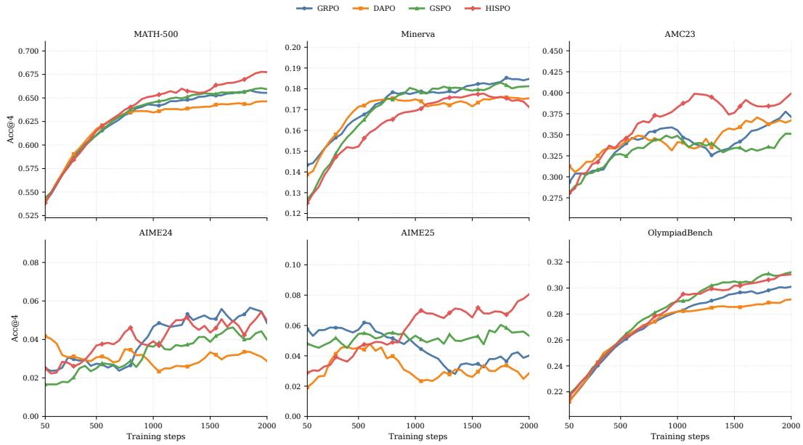
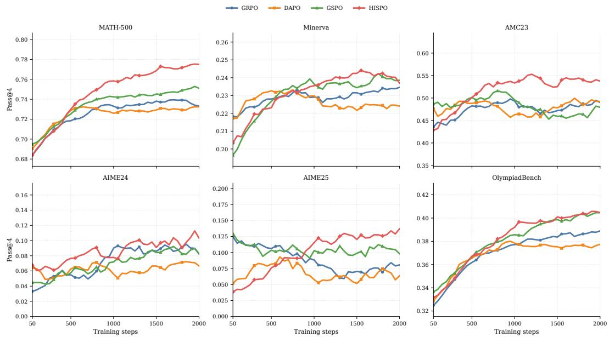
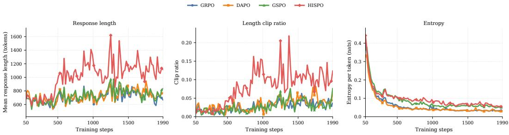

# HISPO: Hierarchical Importance-Sampling Policy Optimization with Entropy-Derived Segments

Quoc-Vinh Lai-Dang Cho Chun Shik Graduate School of Mobility KAIST ldqvinh@kaist.ac.kr

Hyo-Sang Shin∗ Cho Chun Shik Graduate School of Mobility KAIST hyosangshin@kaist.ac.kr

## Abstract

Reinforcement learning with verifiable rewards (RLVR) has become a central approach for improving mathematical reasoning in language models, but long-form completions introduce a difficult credit-assignment problem: different parts of a solution trace may contribute unevenly to final correctness. Existing policyoptimization objectives for RLVR commonly apply importance-sampling correction at either the token level (GRPO, DAPO) or the sequence level (GSPO), imposing different granularities for assigning credit across a response. We introduce Hierarchical Importance-Sampling Policy Optimization (HISPO), a segment-level policy-optimization method that constructs rollout-time entropy-derived contiguous segments, assigns soft entropy-based saliency weights, and applies clipped importance-sampling correction at the segment granularity. This provides an intermediate correction unit between token-level GRPO/DAPO and sequence-level GSPO. We evaluate HISPO by fine-tuning Qwen3-1.7B-Base on mathematical reasoning tasks. Across six benchmarks, HISPO improves Pass@8 over the strongest baseline on all benchmarks and matches or exceeds the strongest baseline in Acc@8 on five of them. On AIME25, HISPO improves over GRPO by +3.75 Acc@8 and +3.78 Pass@8, and over GSPO by +2.50 Acc@8 and +1.27 Pass@8. These results suggest that segment-level correction is a promising granularity for RLVR in long-form mathematical reasoning.

## 1 Introduction

By 2026, frontier language models increasingly expose reasoning effort as an explicit inferencetime capability. Systems such as GPT-5.5 reasoning models, Claude 4.x with adaptive or extended thinking, Gemini 3.1 Pro and Deep Think, Qwen3, and DeepSeek-R1 illustrate a broader shift toward spending more computation on difficult mathematical, scientific, coding, and agentic tasks (OpenAI, 2026; Anthropic, 2026; Google, 2026a,b; Yang et al., 2025; D. Guo et al., 2025). This trend makes reinforcement learning with verifiable rewards (RLVR) especially attractive for mathematical reasoning, since final answers can often be checked automatically. At the same time, long completions create a difficult credit-assignment problem: different tokens, steps, or reasoning regions may contribute unevenly to final correctness.

Modern RLVR methods inherit this issue from PPO-style clipped policy optimization (Schulman et al., 2017). Token-level methods such as GRPO and DAPO provide fine-grained correction, but can be sensitive to noisy local ratios and length-dependent aggregation (Shao et al., 2024; Yu et al., 2025). Sequence-level methods such as GSPO improve stability by correcting the whole response, but may treat heterogeneous reasoning traces as a single update unit (Zheng et al., 2025). Recent work on length-unbiased sequence optimization further highlights that response length can interact nontrivially with sequence-level objectives (Liu et al., 2026). These limitations motivate an intermediate correction granularity.

Several related directions also emphasize intermediate reasoning structure. Process-supervision methods use step-level signals, but often require intermediate labels or process reward models (Lightman et al., 2024; Wang et al., 2024). Concurrent work on SPO studies segment-level advantage estimation, while DHPO mixes token- and sequence-level importance ratios, including entropyguided variants (Y. Guo et al., 2025; Min et al., 2026). Our approach differs by using entropy to form contiguous reasoning segments and applying clipped importance-sampling correction directly at the segment level.

We introduce Hierarchical Importance-Sampling Policy Optimization (HISPO), a segment-level policy-optimization objective for RLVR in long-form mathematical reasoning. HISPO partitions each response into entropy-derived contiguous segments, applies non-maximum suppression and segment-level weighting to construct stable correction units, and performs clipped importancesampling correction at the segment granularity. This creates a middle ground between token-level GRPO/DAPO-style correction and sequence-level GSPO-style correction, without requiring step labels, a process reward model, a critic, or hybrid token/sequence mixing.

We evaluate HISPO by fine-tuning Qwen3-1.7B-Base (Yang et al., 2025) with LoRA (Hu et al., 2022) and comparing against GRPO, DAPO, and GSPO in a mathematical RLVR platform (Sheng et al., 2025). In the selected-checkpoint evaluation across six mathematical reasoning benchmarks, HISPO improves pass rate (Pass@8) over the strongest baseline on all benchmarks and matches or exceeds the strongest baseline in accuracy (Acc@8) on five of six. Due to computational constraints, we use monitoring curves with 4 samples (Acc@4 and Pass@4) for checkpoint selection, diagnostics, and segment-boundary sensitivity analysis, showing that HISPO’s gains are most visible in multi-sample success rates.

Our contributions are threefold. First, we propose entropy-based segment construction with nonmaximum suppression and soft segment-level weighting, forming intermediate correction units without step-level supervision. Second, we formulate HISPO, a segment-level clipped importancesampling objective for RLVR in long-form mathematical reasoning. Third, we provide a controlled comparison against token-level and sequence-level policy-optimization variants, together with monitoring curves, training diagnostics, selected-checkpoint evaluation, and segment-boundary sensitivity analysis.

## 2 Preliminaries

We study RLVR for long-form mathematical reasoning. Given a prompt x, a policy $\pi _ { \theta }$ generates a response $y = ( y _ { 1 } , \dots , y _ { T } )$ , with token probability $\pi _ { \boldsymbol { \theta } } ( y _ { t } \mid x , y _ { < t } )$ . A verifier provides a binary response-level reward $R \in \{ 0 , 1 \}$ }, and policy-gradient methods update θ through score-function terms of the form $\nabla _ { \theta }$ log $\pi _ { \theta } ( y _ { t } \mid x , y _ { < t } )$

For a response $y _ { i } = ( y _ { i , 1 } , \dots , y _ { i , T _ { i } } )$ sampled from the behavior policy $\pi _ { \theta _ { \mathrm { o l d } } }$ , the token-level importance ratio is

$$
\rho _ { i , t } ( \theta ) = \frac { \pi _ { \theta } ( y _ { i , t } \mid x , y _ { i , < t } ) } { \pi _ { \theta _ { \mathrm { o l d } } } ( y _ { i , t } \mid x , y _ { i , < t } ) } .\tag{1}
$$

Policy-optimization methods can then be compared by their advantage estimates, normalization schemes, and importance-correction granularities.

## 2.1 From PPO to GRPO

Proximal Policy Optimization (PPO) (Schulman et al., 2017) controls policy updates by clipping the importance ratio between the current and behavior policies. Omitting auxiliary KL terms for brevity, its clipped surrogate for a single response is

$$
\mathcal { I } _ { \mathrm { P P O } } ( \boldsymbol { \theta } ) \approx \frac { 1 } { T } \sum _ { t = 1 } ^ { T } \operatorname* { m i n } \Bigl ( \rho _ { t } ( \boldsymbol { \theta } ) \hat { A } _ { t } , \exp ( \rho _ { t } ( \boldsymbol { \theta } ) , 1 - \epsilon , 1 + \epsilon ) \hat { A } _ { t } \Bigr ) ,\tag{2}
$$

where $\hat { A } _ { t }$ is typically estimated from a learned value function. In LLM RLVR, however, rewards are usually assigned to complete responses, making token-level value estimation costly and nontrivial.

Group Relative Policy Optimization (GRPO) (Shao et al., 2024) removes the learned value model by sampling a group of responses $\{ y _ { j } \} _ { j = 1 } ^ { G }$ for the same prompt and normalizing rewards within the group. For response yi, the group-relative advantage is

$$
\hat { A } _ { i } = \frac { R ( x , y _ { i } ) - \mathrm { m e a n } ( \{ R ( x , y _ { j } ) \} _ { j = 1 } ^ { G } ) } { \mathrm { s t d } ( \{ R ( x , y _ { j } ) \} _ { j = 1 } ^ { G } ) } .\tag{3}
$$

Omitting KL regularization for readability, the GRPO surrogate is

$$
\mathcal { I } _ { \mathrm { G R P O } } ( \boldsymbol { \theta } ) \approx \frac { 1 } { G } \sum _ { i = 1 } ^ { G } \frac { 1 } { T _ { i } } \sum _ { t = 1 } ^ { T _ { i } } \operatorname* { m i n } \Bigl ( \rho _ { i , t } ( \boldsymbol { \theta } ) \hat { A } _ { i } , \exp ( \rho _ { i , t } ( \boldsymbol { \theta } ) , 1 - \epsilon , 1 + \epsilon ) \hat { A } _ { i } \Bigr ) .\tag{4}
$$

For the active unclipped branch, the gradient contribution is

$$
\nabla _ { \boldsymbol { \theta } } \mathcal { I } _ { \mathrm { G R P O } } ( \boldsymbol { \theta } ) \approx \frac { 1 } { G } \sum _ { i = 1 } ^ { G } \hat { A } _ { i } \frac { 1 } { T _ { i } } \sum _ { t = 1 } ^ { T _ { i } } \rho _ { i , t } ( \boldsymbol { \theta } ) \nabla _ { \boldsymbol { \theta } } \log \pi _ { \boldsymbol { \theta } } ( y _ { i , t } \mid \boldsymbol { x } , y _ { i , < t } ) .\tag{5}
$$

Thus, PPO and GRPO share clipped token-level importance correction, but differ in the source of the advantage signal: PPO uses critic-based token advantages, whereas GRPO assigns each response a group-normalized outcome advantage. GRPO therefore avoids a separate value model while retaining token-level likelihood ratios and per-response length normalization.

## 2.2 Token-level policy-gradient loss in DAPO

Decouple Clip and Dynamic sAmpling Policy Optimization (DAPO) (Yu et al., 2025) highlights a reduction issue in GRPO’s per-response averaging: each response receives equal total weight, so tokens in longer responses receive smaller per-token weight. Its token-level policy-gradient loss instead normalizes by the total number of generated tokens while retaining the clipped token-level surrogate:

$$
\mathcal { I } _ { \mathrm { D A P O } } ( \theta ) \approx \frac { 1 } { \sum _ { j = 1 } ^ { G } T _ { j } } \sum _ { i = 1 } ^ { G } \sum _ { t = 1 } ^ { T _ { i } } \operatorname* { m i n } \Bigl ( \rho _ { i , t } ( \theta ) \hat { A } _ { i } , \ \mathrm { c l i p } ( \rho _ { i , t } ( \theta ) , 1 - \epsilon _ { \mathrm { l o w } } , 1 + \epsilon _ { \mathrm { h i g h } } ) \hat { A } _ { i } \Bigr ) .\tag{6}
$$

For the active unclipped branch, the corresponding gradient is

$$
\nabla _ { \boldsymbol { \theta } } \mathcal { I } _ { \mathrm { D A P O } } ( \boldsymbol { \theta } ) \approx \frac { 1 } { \sum _ { j = 1 } ^ { G } T _ { j } } \sum _ { i = 1 } ^ { G } \hat { A } _ { i } \sum _ { t = 1 } ^ { T _ { i } } \rho _ { i , t } ( \boldsymbol { \theta } ) \nabla _ { \boldsymbol { \theta } } \log \pi _ { \boldsymbol { \theta } } ( y _ { i , t } \mid \boldsymbol { x } , y _ { i , < t } ) .\tag{7}
$$

Compared with GRPO’s per-response normalization, DAPO gives longer-than-average responses more total gradient mass and shorter-than-average responses less. Thus, DAPO mitigates length dilution in the aggregation scheme, but its correction unit remains the individual token. Other DAPO contributions are not the focus of the granularity analysis considered here.

## 2.3 Sequence-level policy optimization in GSPO

Group Sequence Policy Optimization (GSPO) (Zheng et al., 2025) moves importance correction from tokens to the full response, motivated by the instability of token-wise ratios and clipping in long completions. It defines a sequence-level ratio as the geometric mean of token ratios,

$$
s _ { i } ( \boldsymbol { \theta } ) = \left( \prod _ { t = 1 } ^ { T _ { i } } \rho _ { i , t } ( \boldsymbol { \theta } ) \right) ^ { 1 / T _ { i } } ,\tag{8}
$$

and applies clipping at the response level:

$$
\mathcal { I } _ { \mathrm { G S P O } } ( \boldsymbol { \theta } ) \approx \frac { 1 } { G } \sum _ { i = 1 } ^ { G } \operatorname* { m i n } \Bigl ( s _ { i } ( \boldsymbol { \theta } ) \hat { A } _ { i } , \exp ( s _ { i } ( \boldsymbol { \theta } ) , 1 - \epsilon , 1 + \epsilon ) \hat { A } _ { i } \Bigr ) .\tag{9}
$$

For the active unclipped branch, the gradient becomes

$$
\nabla _ { \boldsymbol { \theta } } \mathcal { I } _ { \mathrm { G S P O } } ( \boldsymbol { \theta } ) \approx \frac { 1 } { G } \sum _ { i = 1 } ^ { G } s _ { i } ( \boldsymbol { \theta } ) \hat { A } _ { i } \frac { 1 } { T _ { i } } \sum _ { t = 1 } ^ { T _ { i } } \nabla _ { \boldsymbol { \theta } } \log \pi _ { \boldsymbol { \theta } } ( y _ { i , t } \mid \boldsymbol { x } , y _ { i , < t } ) .\tag{10}
$$

Thus, unlike GRPO and DAPO, which weight each token gradient by its own $\rho _ { i , t } ( \boldsymbol { \theta } )$ , GSPO assigns all tokens in a response the same sequence-level correction factor $s _ { i } ( \theta )$ . This improves response-level stability but treats the entire reasoning trace as a single optimization unit, without distinguishing intermediate segments.

## 2.4 Motivation

The preceding objectives expose a correction-granularity tradeoff. PPO provides token-level clipping but requires a value model; GRPO removes the value model through group-relative advantages while retaining token-level ratios and per-response averaging; DAPO changes the normalization to reduce length dilution but still updates at the token level; and GSPO moves correction to the whole response, improving stability but treating the entire reasoning trace as one unit.

Long-form reasoning responses often contain distinct contiguous phases, such as problem setup, derivation, revision, and answer formation. This motivates Hierarchical Importance-Sampling Policy Optimization (HISPO), which introduces segment-level correction as an intermediate granularity between token-level and sequence-level objectives. The next section defines the segment construction procedure and derives the corresponding HISPO objective and gradient structure.

## 3 Algorithm

## 3.1 Entropy-based segment detection and weight construction

We use token entropy as a detached uncertainty signal along each completion. For token position t in response yi, entropy is computed once at rollout time under the behavior policy:

$$
H _ { i , t } = - \sum _ { v \in \mathcal { V } } p _ { i , t } ( v ) \log p _ { i , t } ( v ) , \qquad p _ { i , t } ( v ) = \mathrm { s g } [ \pi _ { \theta _ { \mathrm { o l d } } } ( v \mid x , y _ { i , < t } ) ] ,\tag{11}
$$

where $\nu$ is the vocabulary and sg[·] denotes stop-gradient. The entropy trace, segment boundaries, and segment weights are therefore fixed during subsequent policy-optimization updates. To reduce local lexical noise, we smooth the trace with a forward exponential moving average (EMA),

$$
\tilde { H } _ { i , 1 } = H _ { i , 1 } , \qquad \tilde { H } _ { i , t } = \alpha H _ { i , t } + ( 1 - \alpha ) \tilde { H } _ { i , t - 1 } , \quad t = 2 , \dots , T _ { i } .\tag{12}
$$

As a one-sided smoother, the EMA can slightly lag abrupt entropy changes, so we use $\tilde { H } _ { i }$ as a coarse boundary signal rather than a token-exact semantic boundary estimate.

Let $q _ { H } \in [ 0 , 1 ]$ be the entropy percentile threshold and $\Delta$ the NMS window. For each response, we define the response-local cutoff

$$
\tau _ { i , H } = \mathrm { Q u a n t i l e } _ { q _ { H } } \left( \{ \tilde { H } _ { i , t } \} _ { t = 2 } ^ { T _ { i } - 1 } \right) ,\tag{13}
$$

and collect high-entropy local maxima,

$$
\mathcal { C } _ { i } = \left\{ t \in \{ 2 , \ldots , T _ { i } - 1 \} : \tilde { H } _ { i , t } \geq \tau _ { i , H } , \tilde { H } _ { i , t } \geq \tilde { H } _ { i , t - 1 } , \tilde { H } _ { i , t } > \tilde { H } _ { i , t + 1 } \right\} .\tag{14}
$$

Internal boundaries are selected by token-order non-maximum suppression (NMS),

$$
B _ { i } = \mathrm { N M S } _ { \Delta } ( C _ { i } ; \tilde { H } _ { i } ) ,\tag{15}
$$

Here ${ \mathrm { N M S } } _ { \Delta }$ scans candidates from left to right, retains a candidate t only if $\tilde { H } _ { i , t }$ attains the maximum in a centered ∆-token neighborhood, breaks ties by scan order, and suppresses later candidates within $\Delta$ tokens of t. The hyperparameters $( \alpha , q _ { H } , \Delta )$ control smoothing, percentile-based peak selection, and boundary spacing.

Let the sorted selected boundaries and endpoints be

$$
0 = b _ { i , 0 } < b _ { i , 1 } < \cdots < b _ { i , K _ { i } } = T _ { i } .\tag{16}
$$

They define contiguous, non-overlapping segments

$$
\begin{array} { r } { S _ { i } = \{ S _ { i , k } = \{ b _ { i , k - 1 } + 1 , \ldots , b _ { i , k } \} \} _ { k = 1 } ^ { K _ { i } } . } \end{array}\tag{17}
$$

If no internal boundary is selected, we set $K _ { i } = 1$ and treat the full response as one segment.

Finally, each segment receives a softmax-normalized entropy saliency weight:

$$
\bar { H } _ { i , k } = \frac { 1 } { | S _ { i , k } | } \sum _ { t \in S _ { i , k } } H _ { i , t } , \qquad w _ { i , k } = \frac { \exp ( \bar { H } _ { i , k } ) } { \sum _ { \ell = 1 } ^ { K _ { i } } \exp ( \bar { H } _ { i , \ell } ) } .\tag{18}
$$

Thus, $\begin{array} { r } { \sum _ { k = 1 } ^ { K _ { i } } w _ { i , k } = 1 } \end{array}$ . This unit-temperature softmax softly distributes saliency mass across segments: higher-entropy segments receive larger saliency mass, while all segments retain nonzero weight. Here $| S _ { i , k } |$ denotes the length of segment $S _ { i , k }$

## 3.2 Hierarchical Importance-Sampling Policy Optimization

We propose Hierarchical Importance-Sampling Policy Optimization (HISPO), which applies clipped importance correction at the segment rather than token or sequence level. For response $y _ { i } ,$ , we first define the group-normalized response advantage

$$
\hat { A } _ { i } = \frac { R ( x , y _ { i } ) - \mathrm { m e a n } ( \{ R ( x , y _ { j } ) \} _ { j = 1 } ^ { G } ) } { \mathrm { s t d } ( \{ R ( x , y _ { j } ) \} _ { j = 1 } ^ { G } ) } .\tag{19}
$$

Each segment then receives a saliency-weighted advantage

$$
\hat { A } _ { i , k } = \frac { w _ { i , k } } { | S _ { i , k } | } \hat { A } _ { i } ,\tag{20}
$$

where $w _ { i , k }$ is the entropy-based segment weight from the previous Section 3.1 and $| S _ { i , k } |$ is the segment length.

For segment $S _ { i , k }$ , HISPO defines the segment-level importance ratio as the geometric mean of token ratios within the segment:

$$
\mu _ { i , k } ( \theta ) = \exp \left( \frac { 1 } { | S _ { i , k } | } \sum _ { t \in S _ { i , k } } \log \rho _ { i , t } ( \theta ) \right) = \left( \prod _ { t \in S _ { i , k } } \rho _ { i , t } ( \theta ) \right) ^ { 1 / | S _ { i , k } | } .\tag{21}
$$

The HISPO clipped surrogate is

$$
\mathcal { I } _ { \mathrm { H I S P O } } ( \theta ) \approx \frac { 1 } { G } \sum _ { i = 1 } ^ { G } \sum _ { k = 1 } ^ { K _ { i } } \left| S _ { i , k } \right| \operatorname* { m i n } \Bigl ( \mu _ { i , k } ( \theta ) \hat { A } _ { i , k } , \ \mathrm { c l i p } ( \mu _ { i , k } ( \theta ) , 1 - \epsilon , 1 + \epsilon ) \hat { A } _ { i , k } \Bigr ) .\tag{22}
$$

Equivalently, since $\vert S _ { i , k } \vert \hat { A } _ { i , k } = w _ { i , k } \hat { A } _ { i }$ , HISPO assigns each response-level advantage across entropy-weighted segments while using $\mu _ { i , k } ( \boldsymbol { \theta } )$ as the clipped correction unit. This gives an intermediate correction granularity between token-level GRPO/DAPO and sequence-level GSPO.

## 3.3 Gradient Analysis

We compare update coefficients under the active unclipped branch, without auxiliary KL terms, and with the shared group-relative advantage ${ \hat { A } } _ { i }$ . Segment boundaries and entropy-derived weights are fixed as described in Subsection 3.1. From the HISPO objective, the gradient contribution is

$$
\nabla _ { \boldsymbol { \theta } } \mathcal { I } _ { \mathrm { H I S P O } } ( \boldsymbol { \theta } ) \approx \frac { 1 } { G } \sum _ { i = 1 } ^ { G } \sum _ { k = 1 } ^ { K _ { i } } \mu _ { i , k } ( \boldsymbol { \theta } ) \hat { A } _ { i } \frac { w _ { i , k } } { | S _ { i , k } | } \sum _ { t \in S _ { i , k } } \nabla _ { \boldsymbol { \theta } } \log \pi _ { \boldsymbol { \theta } } ( y _ { i , t } \mid x , y _ { i , < t } ) ,\tag{23}
$$

where

$$
\mu _ { i , k } ( \boldsymbol { \theta } ) = \left( \prod _ { t \in S _ { i , k } } \rho _ { i , t } ( \boldsymbol { \theta } ) \right) ^ { 1 / | S _ { i , k } | } .\tag{24}
$$

Table 1: Token-gradient coefficients under a shared group-relative advantage. The comparison isolates correction granularity: GRPO and DAPO use token-level ratios, GSPO uses one sequence-level ratio, and HISPO uses entropy-weighted segment-level ratios.
<table><tr><td>Method</td><td>Correction unit</td><td>Normalization view</td><td>Token-gradient coefficients</td></tr><tr><td>GRPO</td><td>token</td><td>per response, then group</td><td> $\hat { A } _ { i } \rho _ { i , t } ( \theta ) / ( G T _ { i } )$ </td></tr><tr><td>DAPO</td><td>token</td><td>all valid response tokens</td><td> $\hat { A } _ { i } \rho _ { i , t } ( \theta ) / \sum _ { j } ^ { G } T _ { j }$ </td></tr><tr><td>GSPO</td><td>sequence</td><td>response-level correc- tion with token mean</td><td> $\begin{array} { r } { \hat { A } _ { i } \left( \prod _ { t = 1 } ^ { T _ { i } } \rho _ { i , t } ( \theta ) \right) ^ { 1 / T _ { i } } / ( G T _ { i } ) } \end{array}$ </td></tr><tr><td>HISPO</td><td>segment</td><td>saliency segment mass, uniform token share</td><td> $\begin{array} { r } { \hat { A } _ { i } \left( \prod _ { t \in S _ { i , k } } \rho _ { i , t } ( \theta ) \right) ^ { 1 / | S _ { i , k } | } w _ { i , k } / ( G | S _ { i , k } | ) } \end{array}$ </td></tr></table>

Thus, all tokens in a segment share the same correction ratio $\mu _ { i , k } ( \boldsymbol { \theta } )$ , while the segment saliency mass $w _ { i , k } \hat { A } _ { i }$ i is distributed uniformly over the segment tokens.

Table 1 summarizes the resulting token-gradient coefficients, up to common optimizer and batch-scale constants. For HISPO, the coefficient applies to tokens $t \in S _ { i , k }$

This comparison isolates the role of correction granularity. GRPO and DAPO use token-specific ratios, GSPO assigns one ratio to the full response, and HISPO assigns one ratio to each entropy-derived segment.

## 4 Experiments

We evaluate HISPO in mathematical RLVR. We first describe the shared training setup and evaluation protocol, then analyze validation curves, training diagnostics, selected-checkpoint performance, and hyperparameter sensitivity.

## 4.1 Experimental Settings

All experiments use Qwen3-1.7B-Base (Yang et al., 2025), a practical scale for controlled longreasoning experiments under our compute budget. We train on the MATH dataset (Hendrycks et al., 2021), which contains 7,500 competition-style mathematical reasoning problems, and evaluate selected checkpoints on six benchmarks: MATH500, Minerva (Lewkowycz et al., 2022), AMC23, AIME24, AIME25, and OlympiadBench (He et al., 2024). We report accuracy (Acc@k) and pass rate (Pass@k); Acc@k averages correctness over the k sampled responses, while Pass@k computes a bootstrap estimate of best-of-k correctness for each problem and then averages these per-problem estimates. Formal definitions are given in Appendix A.2.

We compare the correction granularities introduced in Sections 2 and 3: GRPO (Shao et al., 2024) and DAPO (Yu et al., 2025) as token-level methods, GSPO (Zheng et al., 2025) as a sequence-level method, and HISPO as the proposed segment-level method. All methods use the same verl-based platform (Sheng et al., 2025) and recipe family. To fit the available hardware budget, all runs use LoRA fine-tuning (Hu et al., 2022) with batch size of 32 and mini-batch size of 8. Implementation details are provided in the Appendix. Scaling to larger models, larger batches, longer schedules, and full fine-tuning remains future work.

## 4.2 Main Results and Analysis

For validation-curve monitoring, we generate four responses per problem and track Acc@4 and Pass@4 across training (Figures 1 and ${ \overset { \smile } { 2 } } ) .$ . In the displayed trajectories, HISPO shows broad improvements, ending at approximately 0.68/0.78 Acc@4/Pass@4 on MATH500, 0.40/0.54 on AMC23, 0.08/0.13 on AIME25, and 0.31/0.41 on OlympiadBench, matching or exceeding the strongest baseline on most of these benchmarks. The clearest gains appear on AMC23 and AIME25, where sev eral baselines plateau or regress while HISPO continues to improve, suggesting better multi-sample success as well as higher average correctness. Minerva is the main exception: GRPO and GSPO retain a small Acc@4 advantage, although HISPO remains close in Pass@4. These monitoring trend motivate a shared checkpoint-selection protocol for the final comparison.

  
Figure 1: Development checkpoint curves for Acc@4 on the six-benchmark validation suite. HISPO shows steady improvements on most benchmarks, with the clearest gains on AMC23 and AIME25. All curves are smoothed for visual clarity.

  
Figure 2: Development checkpoint curves for Pass@4 on the six-benchmark validation suite. HISPO provides the most consistent multi-sample gains, especially on AMC23 and AIME25. All curves are smoothed for visual clarity.

Figure 3 summarizes response length, length-clipping ratio, and entropy during training. HISPO follows a distinct regime: its mean response length rises from roughly 650 to above 1,100 tokens, with peaks near 1,600, while the baselines mostly remain in the 600–1000 range; its clipping ratio also spikes near 0.20, indicating stronger length pressure. At the same time, HISPO maintains higher entropy than DAPO and remains comparable to or above GRPO and GSPO after the initial drop. These diagnostics contextualize the validation gains, but remain correlational: they do not by themselves prove that entropy-induced boundaries are semantic boundaries or that segmentation is the causal source of the improvements.

  
Figure 3: Training diagnostics for response length, length clipping, and entropy. HISPO produces longer, higher-entropy generations, indicating stronger length pressure and more sustained exploration during training. All curves are smoothed for visual clarity.

Table 2: Selected-checkpoint top-1 @8 comparison on six benchmarks. Bold and underlined entries mark the best and second-best distinct values within each column, with ties all bolded. The final row reports HISPO minus the largest non-HISPO value in percentage points. HISPO improves Pass@8 on all six benchmarks and matches or exceeds the best Acc@8 baseline on five of six.
<table><tr><td></td><td colspan="2">MATH500</td><td colspan="2">Minerva</td><td colspan="2">AMC23</td><td colspan="2">AIME24</td><td colspan="2">AIME25</td><td colspan="2">OlympiadBench</td></tr><tr><td>Method</td><td></td><td>Acc@8Pass@8</td><td></td><td>Acc@8 Pass@8 Acc@8 Pass@8</td><td></td><td></td><td>Acc@8</td><td></td><td>Pass@8 Acc@8 Pass@8</td><td></td><td>Acc@8</td><td>Pass@8</td></tr><tr><td>GRPO</td><td>64.70</td><td>77.33</td><td>18.57</td><td>26.48</td><td>37.81</td><td>57.73</td><td>5.42</td><td>12.08</td><td>4.58</td><td>13.68</td><td>29.65</td><td>43.92</td></tr><tr><td>DAPO</td><td>64.75</td><td>76.71</td><td>17.28</td><td>26.32</td><td>34.69</td><td>53.37</td><td>2.50</td><td>7.77</td><td>5.00</td><td>13.61</td><td>29.15</td><td>44.59</td></tr><tr><td>GSPO</td><td>65.55</td><td>78.65</td><td>18.34</td><td>27.62</td><td>36.56</td><td>60.73</td><td>5.42</td><td>14.19</td><td>5.83</td><td>16.19</td><td>30.99</td><td>45.93</td></tr><tr><td>HISPO</td><td>68.00</td><td>81.25</td><td>17.51</td><td>29.11</td><td>40.00</td><td>64.42</td><td>5.42</td><td>16.09</td><td>8.33</td><td>17.46</td><td>31.49</td><td>46.72</td></tr><tr><td>HISPO ∆</td><td>+2.45</td><td>+2.60</td><td>-1.06</td><td>+1.49</td><td>+2.19</td><td>+3.69</td><td>+0.00</td><td>+1.90</td><td>+2.50</td><td>+1.27</td><td>+0.50</td><td>+0.79</td></tr></table>

For the main selected-checkpoint comparison, we select one checkpoint per method by macroaveraging Acc@4 across the six validation benchmarks, then evaluate the selected checkpoint with eight responses per problem on the same suite. Thus, Table 2 is a shared selected-checkpoint benchmark-suite comparison, not a fully held-out test estimate. Under this protocol, HISPO improves Pass@8 over the strongest non-HISPO baseline on all six benchmarks, with an average gain of +1.96 points and the largest gains on AMC23 (+3.69), MATH500 (+2.60), and AIME24 (+1.90). For Acc@8, HISPO matches or exceeds the strongest non-HISPO baseline on five of six benchmarks, with Minerva the only negative case (−1.06). These trends align with the monitoring curves and diagnostics, where HISPO’s longer, higher-entropy generations are associated with stronger multisample success. Appendix A.4 reports fresh HISPO–GSPO bootstrap diagnostics: macro Pass@8 point estimates remain positive, but intervals cross zero and Minerva/AIME24 show sampling sensitivity.

## 4.3 Hyperparameter Sensitivity Analysis

Table 3 evaluates HISPO’s sensitivity to the NMS window $\mathrm { ( N M S _ { \Delta } ) }$ used for entropy-based segment boundary selection on development-level @4 metrics over MATH500, Minerva, and AMC23. The Average columns macro-average these three displayed benchmarks. $\mathrm { N M S _ { 6 4 } }$ is strongest overall, improving the best baseline Acc@4 average from 42.05 (GRPO) to 43.55 and the best baseline Pass@4 average from 52.08 (GSPO) to 54.89. The largest gains appear on AMC23 (45.00/62.01, or $+ 3 . 1 2 / + 4 . 6 6$ over the strongest baseline). It also improves MATH500 from 66.33/75.33 to $6 7 . 0 9 / 7 7 . 1 6$ , while Minerva remains less uniform: $\mathrm { N M \bar { S } _ { 3 2 } }$ obtains the best Acc@4 (18.93), but $\mathrm { N M \dot { S } _ { 6 4 } }$ obtains the best Pass@4 (25.50). Compared with $\mathrm { N M S _ { 3 2 } }$ (42.52/51.83 average) and $\mathrm { N M S _ { 1 2 8 } }$ (41.16/50.56 average), $\mathrm { N M S _ { 6 4 } }$ provides the best average among tested NMS windows, supporting it as the default configuration for the main selected-checkpoint experiments.

Table 3: Development-level @4 sensitivity to the entropy-boundary NMS window $\mathrm { ( N M S _ { \Delta } ) }$ . The Average columns macro-average the three displayed benchmarks: MATH500, Minerva, and AMC23. Bold and underlined entries mark the best and second-best distinct values within each metric column, with ties all underlined where they are second-best. $\mathrm { N M S _ { 6 4 } }$ obtains the strongest average Acc@4 and Pass@4 among the tested windows.
<table><tr><td rowspan="2">Method</td><td colspan="2">MATH500</td><td colspan="2">Minerva</td><td colspan="2">AMC23</td><td colspan="2">Average</td></tr><tr><td></td><td></td><td>Acc@4 Pass@4 Acc@4 Pass@4 Acc@4 Pass@4 Acc@4 Pass@4</td><td></td><td></td><td></td><td></td><td></td></tr><tr><td>GRPO</td><td>65.62</td><td>73.24</td><td>18.66</td><td>23.71</td><td>41.88</td><td>57.19</td><td>42.05</td><td>51.38</td></tr><tr><td>DAPO</td><td>65.52</td><td>75.14</td><td>17.74</td><td>23.79</td><td>40.00</td><td>51.78</td><td>41.09</td><td>50.24</td></tr><tr><td>GSPO</td><td>66.33</td><td>75.33</td><td>18.20</td><td>23.55</td><td>40.62</td><td>57.35</td><td>41.72</td><td>52.08</td></tr><tr><td> $_ \mathrm { H I S P O - N M S _ { 3 2 } }$ </td><td>65.50</td><td>74.77</td><td>18.93</td><td>24.96</td><td>43.12</td><td>55.76</td><td>42.52</td><td>51.83</td></tr><tr><td> $_ { \mathrm { H I S P O - N M S _ { 6 4 } } }$ </td><td>67.09</td><td>77.16</td><td>18.57</td><td>25.50</td><td>45.00</td><td>62.01</td><td>43.55</td><td>54.89</td></tr><tr><td> $_ \mathrm { H I S P O - N M S _ { 1 2 8 } }$ </td><td>62.35</td><td>72.04</td><td>18.01</td><td>23.45</td><td>43.12</td><td>56.19</td><td>41.16</td><td>50.56</td></tr></table>

## 5 Limitations and Future Work

HISPO uses entropy-derived segments as intermediate units and entropy-softmax weights to allocate advantage mass, but our experiments evaluate HISPO as a combined method and do not establish the mechanism causally. The diagnostics are correlational: they do not prove that entropy boundaries are semantic reasoning units, that entropy-softmax weighting independently contributes to the gains, or that segmentation alone explains the improvements. Our evaluation is limited to mathematical RLVR with Qwen3-1.7B-Base and LoRA under compute constraints; since HISPO can increase response length and clipping pressure, its benefits should be weighed against token-budget and inference-cost constraints.

Future work should test larger-scale and full-finetuning regimes, additional seeds, and checkpointselection protocols that separate model selection from final reporting. It should also isolate HISPO’s components by comparing entropy-based boundaries with fixed or random alternatives and entropysoftmax weights with uniform segment weights. Further theory, boundary diagnostics, and extensions beyond mathematical RLVR remain important directions.

## 6 Related Work

Policy-optimization granularity in RLVR. HISPO builds on clipped importance-ratio policy optimization from PPO (Schulman et al., 2017) and its recent adaptations to mathematical RLVR. GRPO replaces the learned value model with group-relative advantages (Shao et al., 2024), while DAPO retains token-level correction but revises the aggregation and normalization for long-CoT training (Yu et al., 2025). GSPO instead moves correction to the sequence level with a responselevel importance ratio and clipping rule (Zheng et al., 2025). These methods expose a granularity tradeoff: token-level correction is fine-grained but noisy and length-sensitive, whereas sequence-level correction is more stable but coarse for heterogeneous reasoning traces. Recent work explores nearby design points: SPO studies segment-level advantage estimation (Y. Guo et al., 2025), DHPO mixes token- and sequence-level importance ratios (Min et al., 2026), and LUSPO corrects length bias in sequence-level optimization (Liu et al., 2026). HISPO differs by combining entropy-derived contiguous segmentation, segment-level geometric-mean importance correction, and entropy-softmax segment weighting inside a clipped RLVR objective; Appendix A.3 provides a compact comparison with the closest adjacent policy-optimization design points, including SPO, DHPO, and LUSPO.

Entropy and key-token signals in RLVR. RLVR is effective for long-form reasoning when final answers are verifiable, as illustrated by DeepSeek-R1 (D. Guo et al., 2025). Recent studies also show that entropy and uncertainty reveal important structure in reasoning updates. Wang et al. (2025) identify high-entropy minority tokens as reasoning forks, while Cheng et al. (2026) link high-entropy regions to pivotal tokens and reflective behaviors. Related entropy-mechanism work studies entropy collapse during RL (Cui et al., 2025), and RL-ZVP uses entropy-guided advantage shaping for zerovariance prompts (Le et al., 2026). HISPO differs by using entropy to form contiguous segment-level correction units, rather than only weighting, masking, or regularizing token-level updates.

## 7 Conclusion

Long-form mathematical RLVR poses a credit-assignment challenge because different parts of an extended reasoning trace may contribute unevenly to final correctness. We introduced HISPO, a segment-level policy-optimization objective that constructs entropy-derived contiguous segments and applies clipped importance-sampling correction at the segment granularity, providing an intermediate design point between token-level and sequence-level correction. In a shared mathematical reasoning evaluation with Qwen3-1.7B-Base, HISPO improves selected-checkpoint Pass@8 over the strongest baseline on all six benchmarks and matches or exceeds the strongest baseline in Acc@8 on five of six. Together with the validation curves, training diagnostics, and segment-boundary sensitivity analysis, these results suggest that segment-level correction is a promising granularity for RLVR in long-form reasoning, while further work is needed to validate the segmentation mechanism, scale the training regime, and extend the approach beyond verifiable mathematical rewards.

## References

OpenAI. Introducing GPT-5.5. OpenAI Blog, 2026. https://openai.com/index/introducing-gpt-5-5/.

Anthropic. Building with extended thinking. Claude API Documentation, 2026. https://docs.anthropic. com/en/docs/build-with-claude/extended-thinking.

Google. Gemini 3.1 Pro: A smarter model for your most complex tasks. Google Blog, 2026. https://blog. google/innovation-and-ai/models-and-research/gemini-models/gemini-3-1-pro/.

Google. Gemini 3 Deep Think: AI model update designed for science. Google Blog, 2026. https://blog. google/innovation-and-ai/models-and-research/gemini-models/gemini-3-deep-think/.

Schulman, J., Wolski, F., Dhariwal, P., Radford, A., and Klimov, O. Proximal policy optimization algorithms. arXiv preprint arXiv:1707.06347, 2017. https://arxiv.org/abs/1707.06347.

Shao, Z., Wang, P., Zhu, Q., Xu, R., Song, J., Bi, X., Zhang, H., Zhang, M., Li, Y. K., Wu, Y., and Guo, D. DeepSeekMath: Pushing the limits of mathematical reasoning in open language models. arXiv preprint arXiv:2402.03300, 2024. https://arxiv.org/abs/2402.03300.

Yu, Q., Zhang, Z., Zhu, R., Yuan, Y., Zuo, X., Yue, Y., Dai, W., Fan, T., Liu, G., Liu, J., Liu, L., Liu, X., Lin, H., Lin, Z., Ma, B., Sheng, G., Tong, Y., Zhang, C., Zhang, M., Zhang, R., et al. DAPO: An open-source LLM reinforcement learning system at scale. In Advances in Neural Information Processing Systems, 2025. https://openreview.net/forum?id=2a36EMSSTp.

Zheng, C., Liu, S., Li, M., Chen, X.-H., Yu, B., Gao, C., Dang, K., Liu, Y., Men, R., Yang, A., Zhou, J., and Lin, J. Group Sequence Policy Optimization. arXiv preprint arXiv:2507.18071, 2025. https://arxiv.org/ abs/2507.18071.

Yang, A., Li, A., Yang, B., Zhang, B., Hui, B., Zheng, B., Yu, B., Gao, C., Huang, C., Lv, C., et al. Qwen3 technical report. arXiv preprint arXiv:2505.09388, 2025. https://arxiv.org/abs/2505.09388.

Guo, D., Yang, D., Zhang, H., Song, J., Wang, P., Zhu, Q., Xu, R., Zhang, R., Ma, S., Bi, X., et al. DeepSeek-R1 incentivizes reasoning in LLMs through reinforcement learning. Nature, 645:633–638, 2025. https: //doi.org/10.1038/s41586-025-09422-z.

Wang, S., Yu, L., Gao, C., Zheng, C., Liu, S., Lu, R., Dang, K., Chen, X.-H., Yang, J., Zhang, Z., Liu, Y., Yang, A., Zhao, A., Yue, Y., Song, S., Yu, B., Huang, G., and Lin, J. Beyond the 80/20 rule: High-entropy minority tokens drive effective reinforcement learning for LLM reasoning. In Advances in Neural Information Processing Systems, 2025. https://openreview.net/forum?id=yfcpdY4gMP.

Le, T.-L. V., Jeon, M., Vu, K., Lai, V. D., and Yang, E. No Prompt Left Behind: Exploiting zero-variance prompts in LLM reinforcement learning via entropy-guided advantage shaping. In The Fourteenth International Conference on Learning Representations, 2026. https://openreview.net/forum?id=kiXFIESZKv.

He, C., Luo, R., Bai, Y., Hu, S., Thai, Z., Shen, J., Hu, J., Han, X., Huang, Y., Zhang, Y., Liu, J., Qi, L., Liu, Z., and Sun, M. OlympiadBench: A challenging benchmark for promoting AGI with olympiad-level bilingual multimodal scientific problems. In Proceedings of the 62nd Annual Meeting of the Association for Computational Linguistics (Volume 1: Long Papers), pages 3828–3850, 2024. https://aclanthology. org/2024.acl-long.211/.

Sheng, G., Zhang, C., Ye, Z., Wu, X., Zhang, W., Zhang, R., Peng, Y., Lin, H., and Wu, C. HybridFlow: A flexible and efficient RLHF framework. In Proceedings of the Twentieth European Conference on Computer Systems, pages 1279–1297. ACM, 2025. https://doi.org/10.1145/3689031.3696075.

Hu, E. J., Shen, Y., Wallis, P., Allen-Zhu, Z., Li, Y., Wang, S., Wang, L., and Chen, W. LoRA: Low-rank adaptation of large language models. In International Conference on Learning Representations, 2022. https: //openreview.net/forum?id=nZeVKeeFYf9.

Schulman, J. LoRA without regret. Thinking Machines Lab Blog, 2025. https://thinkingmachines.ai/ blog/lora/.

Lightman, H., Kosaraju, V., Burda, Y., Edwards, H., Baker, B., Lee, T., Leike, J., Schulman, J., Sutskever, I., and Cobbe, K. Let’s verify step by step. In International Conference on Learning Representations, 2024. https://openreview.net/forum?id=v8L0pN6EOi.

Wang, P., Li, L., Shao, Z., Xu, R., Dai, D., Li, Y., Chen, D., Wu, Y., and Sui, Z. Math-Shepherd: Verify and reinforce LLMs step-by-step without human annotations. In Proceedings of the 62nd Annual Meeting of the Association for Computational Linguistics (Volume 1: Long Papers), pages 9426–9439, 2024. https: //aclanthology.org/2024.acl-long.510/.

Guo, Y., Xu, L., Liu, J., Ye, D., and Qiu, S. Segment Policy Optimization: Effective segment-level credit assignment in RL for large language models. In Advances in Neural Information Processing Systems, 2025. https://openreview.net/forum?id=9osvTOYbT4.

Min, Z., Liu, B., Wang, A., Zhang, L., Zeng, A., Zhang, H., and Su, J. Orchestrating tokens and sequences: Dynamic Hybrid Policy Optimization for RLVR. arXiv preprint arXiv:2601.05607, 2026. https://arxiv. org/abs/2601.05607.

Hendrycks, D., Burns, C., Kadavath, S., Arora, A., Basart, S., Tang, E., Song, D., and Steinhardt, J. Measuring mathematical problem solving with the MATH dataset. In Proceedings ofthe Neural Information Processing Systems Track on Datasets and Benchmarks, 2021. https://datasets-benchmarks-proceedings. neurips.cc/paper/2021/hash/be83ab3ecd0db773eb2dc1b0a17836a1-Abstract-round2.html.

Lewkowycz, A., Andreassen, A., Dohan, D., Dyer, E., Michalewski, H., Ramasesh, V., Slone, A., Anil, C., Schlag, I., Gutman-Solo, T., Wu, Y., Neyshabur, B., Gur-Ari, G., and Misra, V. Solving quantitative reasoning problems with language models. In Advances in Neural Information Processing Systems, 2022. https://papers.nips.cc/paper\_files/paper/2022/hash/ 18abbeef8cfe9203fdf9053c9c4fe191-Abstract-Conference.html.

Cheng, D., Huang, S., Zhu, X., Dai, B., Zhao, W. X., Zhang, Z., and Wei, F. Reasoning with exploration: An entropy perspective. In Proceedings of the AAAI Conference on Artificial Intelligence, 40(36):30377–30385, 2026. https://doi.org/10.1609/aaai.v40i36.40290.

Cui, G., Zhang, Y., Chen, J., Yuan, L., Wang, Z., Zuo, Y., Li, H., Fan, Y., Chen, H., Chen, W., Liu, Z., Peng, H., Bai, L., Ouyang, W., Cheng, Y., Zhou, B., and Ding, N. The entropy mechanism of reinforcement learning for reasoning language models. arXiv preprint arXiv:2505.22617, 2025. https://arxiv.org/abs/2505. 22617.

Liu, F., Yin, Y., Shi, P., Yang, S., Zeng, Z., and Qiu, H. Length-Unbiased Sequence Policy Optimization: Revealing and controlling response length variation in RLVR. arXiv preprint arXiv:2602.05261, 2026. https://arxiv.org/abs/2602.05261.

Table 4: Shared training and evaluation hyperparameters.
<table><tr><td>Hyperparameter</td><td>Value</td></tr><tr><td>Train batch / mini-batch / micro-batch</td><td>32 /8 / 2</td></tr><tr><td>Training samples per prompt</td><td>8</td></tr><tr><td>Monitoring samples per prompt</td><td>4</td></tr><tr><td>Prompt / response maximum length</td><td>512 / 4096</td></tr><tr><td>Optimizer</td><td>AdamW</td></tr><tr><td>Learning rate / warmup / scheduler</td><td> $\mathrm { 3 \times 1 0 ^ { - 6 } / 0 . 0 5 / c o n s t a n t }$ </td></tr><tr><td>Train temperature / top-p / top-k</td><td> $1 . 0 / 1 . 0 / - 1$ </td></tr><tr><td>Validation temperature / top-p / top-k</td><td> $1 . 0 / 0 . 7 / - 1$ </td></tr></table>

Table 5: Compute resources for the reported experiments.
<table><tr><td>Experiment group</td><td>Number of runs</td><td>Wall-clock time</td><td>Total GPU-hours</td></tr><tr><td>Baselines: GRPO, DAPO, GSPO</td><td>3</td><td>75-85 h</td><td>225-255</td></tr><tr><td>HISPO variants: NMS32, NMS64, NMS128</td><td>3</td><td>85-100 h</td><td>255-300</td></tr><tr><td>Full six-benchmark checkpoint sweep</td><td>4</td><td>21 h</td><td>84</td></tr><tr><td>Selected-checkpoint (Acc@8, Pass @8) evaluation</td><td>4</td><td>5.5 h total</td><td>5.5</td></tr><tr><td>Total reported compute</td><td></td><td></td><td>570-645</td></tr></table>

## A Implementation Details

All methods use the same verl training platform and Qwen3-1.7B-Base (Yang et al., 2025). To fit the single-GPU hardware budget, we train with LoRA (Hu et al., 2022), following recent evidence that LoRA can be competitive in some RL post-training settings (Schulman, 2025). All runs use one RTX 5090 GPU with 32GB memory, LoRA rank $r = 1$ , LoRA scale $\alpha = 3 2$ , and all linear modules as adaptation targets.

During training, each prompt is sampled with eight responses. We monitor development performance every 50 steps with four samples per prompt. After 2,000 training steps, we sweep checkpoints on the six-benchmark suite, select one checkpoint per method by macro-averaging Acc@4 across benchmarks, and re-evaluate the selected checkpoint with eight samples per prompt on MATH500, Minerva, AMC23, AIME24, AIME25, and OlympiadBench. Shared hyperparameters are listed in Table 4. For HISPO, the default segment-detector settings are EMA smoothing $\alpha = 0 . 1$ , NMS window $\Delta = 6 4$ , and entropy percentile threshold $q _ { H } = 0 . 6 0$ The implementation distributes segment saliency mass using a minimum segment-length floor $L _ { \mathrm { m i n } } ~ = ~ 1 6$ , replacing $| S _ { i , k } |$ by max $( | S _ { i , k } | , L _ { \operatorname* { m i n } } )$ in the per-token mass denominator.

## A.1 Compute Resources

All reported experiments use one RTX 5090 GPU with 32GB memory, so wall-clock hours equal GPU-hours. Table 5 summarizes training, checkpoint-sweep, and final-evaluation costs. The total reported compute is approximately 570–645 GPU-hours and excludes preliminary debugging runs.

## A.2 Evaluation Metrics

For problem i and sampled response $m \in \{ 1 , \ldots , k \}$ , let $s _ { i , m } \in \{ 0 , 1 \}$ denote verifier correctness. Acc@k is the benchmark mean of per-problem sample correctness:

$$
\hat { a } _ { i } ^ { ( k ) } = \frac { 1 } { k } \sum _ { m = 1 } ^ { k } s _ { i , m } , \qquad \mathrm { A c c @ } k = \frac { 1 } { N } \sum _ { i = 1 } ^ { N } \hat { a } _ { i } ^ { ( k ) } .\tag{25}
$$

Pass@k follows the evaluator’s best@k/mean reducer. For each problem, the evaluator draws B bootstrap resamples of size k from the k response scores and applies a maximum reducer. With $I _ { i , b , j } \sim \mathrm { \bar { U } n i f } ( \{ 1 , \dots , k \} )$ , we define

$$
\hat { p } _ { i } ^ { ( k ) } = \frac { 1 } { B } \sum _ { b = 1 } ^ { B } \operatorname* { m a x } _ { j = 1 , \ldots , k } s _ { i , I _ { i , b , j } } , \qquad \mathrm { P a s s @ } k = \frac { 1 } { N } \sum _ { i = 1 } ^ { N } \hat { p } _ { i } ^ { ( k ) } .\tag{26}
$$

We use $B = 1 0 0 0$ and seed 42. Thus, Pass@k is the evaluator’s bootstrap estimate of best-of-k correctness, rather than the literal observed any-correct indicator.

Table 6: Closest policy-optimization design points for long-form RLVR. HISPO differs by combining entropy-derived contiguous segmentation, segment-level geometric-mean importance-ratio correction, and entropy-softmax saliency weighting inside a clipped RLVR objective.
<table><tr><td>Method</td><td>Main granularity</td><td>Main mechanism</td><td>Relation to HISPO</td></tr><tr><td>SPO (Y. Guo et al., 2025) segment advantage</td><td></td><td>segment-level advantage estimation Shares segment-level motivation, but with Monte Carlo estimation</td><td>focuses on advantage estimation rather than entropy-derived segment-level</td></tr><tr><td>DHPO (Min et al., 2026) hybrid token/sequence</td><td></td><td>mixing token- and sequence-level Blends token and sequence ratios, importance ratios</td><td>importance-ratio correction. whereas HISPO defines contiguous segment-level correction units.</td></tr><tr><td>LUSPO (Liu et al., 2026) sequence correction</td><td></td><td>length-unbiased sequence-level op- Addresses response-length bias in timization</td><td>sequence-level correction rather than segment-level correction within a</td></tr><tr><td>HISPO (Ours)</td><td>rection</td><td>tios, and entropy-softmax saliency segment granularity. weights</td><td>response. entropy-derived segment cor- entropy-derived contiguous seg- Applies clipped importance-sampling ments, geometric-mean segment ra- correction directly at the entropy-derived</td></tr></table>

Table 7: Fresh selected-checkpoint HISPO–GSPO uncertainty diagnostic on the six-benchmark suite. Values are percentages; intervals are 95% paired bootstrap intervals over matched problem IDs.
<table><tr><td>Benchmark</td><td>Metric</td><td>HISPO</td><td>GSPO</td><td>Δ</td><td>95% CI</td></tr><tr><td>MATH500</td><td>Acc@8</td><td>68.15</td><td>65.70</td><td>+2.45</td><td>[+0.70, +4.25]</td></tr><tr><td>MATH500</td><td>Pass@8</td><td>81.38</td><td>78.50</td><td>+2.88</td><td>[+0.96, +4.93]</td></tr><tr><td>Minerva</td><td>Acc@8</td><td>16.59</td><td>18.80</td><td>-2.21</td><td>[-4.14, -0.41]</td></tr><tr><td>Minerva</td><td>Pass@8</td><td>27.30</td><td>27.58</td><td>-0.28</td><td>[-3.02, +2.53]</td></tr><tr><td>AMC23</td><td>Acc@8</td><td>41.25</td><td>39.69</td><td>+1.56</td><td>[-6.56, +10.00]</td></tr><tr><td>AMC23</td><td>Pass@8</td><td>66.95</td><td>63.47</td><td>+3.47</td><td>[-7.98, +15.55]</td></tr><tr><td>AIME24</td><td>Acc@8</td><td>3.75</td><td>6.25</td><td>-2.50</td><td>[-6.67, +0.42]</td></tr><tr><td>AIME24</td><td>Pass@8</td><td>10.94</td><td>14.28</td><td>-3.34</td><td>[-8.95, +0.13]</td></tr><tr><td>AIME25</td><td>Acc@8</td><td>7.50</td><td>4.58</td><td>+2.92</td><td>[-0.42, +7.08]</td></tr><tr><td>AIME25</td><td>Pass@8</td><td>19.26</td><td>12.80</td><td>+6.46</td><td>[-3.00, +16.72]</td></tr><tr><td>OlympiadBench</td><td>Acc@8</td><td>30.84</td><td>31.57</td><td>-0.72</td><td>[-2.45, +0.95]</td></tr><tr><td>OlympiadBench</td><td>Pass@8</td><td>45.24</td><td>46.56</td><td>-1.33</td><td>[-3.87, +1.24]</td></tr><tr><td>Macro average</td><td>Acc@8</td><td>28.01</td><td>27.76</td><td>+0.25</td><td>[-1.48, +2.01]</td></tr><tr><td>Macro average</td><td>Pass@8</td><td>41.85</td><td>40.53</td><td>+1.31</td><td>[-1.41, +4.15]</td></tr></table>

## A.3 Closest Method Comparison

Table 6 summarizes the closest adjacent policy-optimization design points and highlights HISPO’s specific combination of entropy-derived segmentation, segment-level importance-ratio correction, and entropy-softmax saliency weighting.

## A.4 Selected-Checkpoint Uncertainty Diagnostics

As a sampling-variability diagnostic, we ran a fresh k = 8 evaluation of the selected HISPO and GSPO checkpoints on the six-benchmark suite. This diagnostic does not vary training seeds, checkpointselection rules, the benchmark problem sets themselves, or model initialization; it estimates only problem-level uncertainty for a fresh selected-checkpoint rerun. For each benchmark, we compute paired bootstrap intervals over matched problem IDs using the metrics from Appendix A.2. These intervals are diagnostic for the fresh HISPO–GSPO comparison, not confidence intervals for the exact sampled generations in Table 2.

Table 7 gives positive macro point estimates for HISPO on both Acc@8 and Pass@8, but both macro intervals cross zero. MATH500 is the clearest positive case, with positive intervals for both metrics. Minerva and AIME24 are the main unstable cases, motivating a focused repeat diagnostic on these two benchmarks (Table 8).

Table 8 shows that these small and difficult benchmarks are sensitive to sampled completions. Minerva remains slightly negative but no longer has a strictly negative Acc@8 interval, while AIME24 has positive point estimates, with a strictly positive Pass@8 interval. We therefore treat both reruns as diagnostics of sampling variability rather than definitive per-benchmark statistical confirmation.

Table 8: Focused repeat selected-checkpoint diagnostic on Minerva and AIME24. Values are percentages; intervals are 95% paired bootstrap intervals over matched problem IDs.
<table><tr><td>Benchmark</td><td>Metric</td><td>HISPO</td><td>GSPO</td><td>∆</td><td>95% CI</td></tr><tr><td>Minerva</td><td>Acc@8</td><td>17.14</td><td>18.11</td><td>-0.97</td><td>[-2.90, +0.92]</td></tr><tr><td>Minerva</td><td>Pass@8</td><td>28.09</td><td>28.83</td><td>-0.74</td><td>[-3.93, +2.42]</td></tr><tr><td>AIME24</td><td>Acc@8</td><td>7.50</td><td>5.00</td><td>+2.50</td><td>[-0.42, +5.83]</td></tr><tr><td>AIME24</td><td>Pass@8</td><td>21.28</td><td>12.32</td><td>+8.96</td><td>[+1.09, +18.80]</td></tr><tr><td>Minerva+AIME24 macro</td><td>Acc@8</td><td>12.32</td><td>11.55</td><td>+0.77</td><td>[-1.12, +2.64]</td></tr><tr><td>Minerva+AIME24 macro</td><td>Pass@8</td><td>24.68</td><td>20.58</td><td>+4.11</td><td>[-0.02, +9.05]</td></tr></table>

Table 9: Existing assets used in the experiments.
<table><tr><td>Asset and source</td><td>Use</td><td>License / terms</td></tr><tr><td>Qwen3-1.7B-Base; https:// huggingface.co/Qwen/Qwen3-1.</td><td>Base policy model</td><td>Apache 2.0</td></tr><tr><td>7B-Base MATH-lighteval; https:// huggingface.co/datasets/</td><td>Training data</td><td>MIT</td></tr><tr><td>DigitalLearningGmbH/ MATH-lighteval</td><td></td><td></td></tr><tr><td>MATH500;https://huggingface.co/ datasets/HuggingFaceH4/MATH-500</td><td>Evaluation benchmark</td><td>Source split is from OpenAI PRM800K / MATH splits, released under MIT</td></tr><tr><td>AMC23; https://huggingface.co/ datasets/math-ai/amc23</td><td>Evaluation benchmark</td><td>Copyrighted by the Mathematical Association of America / American Mathematics Competitions.</td></tr><tr><td>Minerva; https://huggingface.co/ datasets/math-ai/minervamath</td><td>Evaluation benchmark</td><td>Used only for evaluation; not redistributed Primarily sourced from MIT OpenCourseWare, whose default terms are CC BY-NC-SA 4.0. Used</td></tr><tr><td>AIME24;https://huggingface.co/ datasets/HuggingFaceH4/aime_2024</td><td>Evaluation benchmark</td><td>only for evaluation; not redistributed Copyrighted by the Mathematical Association of America. Used only for evaluation; not redis-</td></tr><tr><td>AIME25; https://huggingface.co/ datasets/math-ai/aime25</td><td>Evaluation benchmark</td><td>tributed Apache 2.0 on the Hugging Face dataset card</td></tr><tr><td>OlympiadBench; https:// huggingface.co/datasets/math-ai/</td><td>Evaluation benchmark</td><td>Official OlympiadBench GitHub repository is MIT licensed. Used only for evaluation; not redis-</td></tr><tr><td>olympiadbench verl; https://github.com/</td><td>RL training platform</td><td>tributed Apache 2.0</td></tr><tr><td>verl-project/verl Hugging Face Transformers;</td><td>Model implementation utili-</td><td>Apache 2.0</td></tr><tr><td>https://github.com/huggingface/ transformers Hugging Face PEFT; https://github.</td><td>ties LoRA implementation utili-</td><td></td></tr></table>

## A.5 Existing Assets and Licenses

Table 9 lists the existing assets used in the experiments. We use these assets only for research training and evaluation, cite their original sources, and do not redistribute benchmark contents or model weights as part of this paper.

## A.6 Societal Impact

HISPO may support beneficial applications such as STEM education, scientific problem solving, and coding assistance by improving mathematical RLVR post-training. It may also strengthen dual-use automation, produce more convincing but incorrect reasoning traces, or encourage over-reliance in high-stakes settings. We view HISPO as a research contribution to policy-optimization granularity rather than a deployment-ready system; use in consequential applications requires domain-specific evaluation and safeguards.

## NeurIPS Paper Checklist

## 1. Claims

Question: Do the main claims made in the abstract and introduction accurately reflect the paper’s contributions and scope?

Answer: [Yes]

Justification: The abstract and introduction state HISPO’s segment-level clipped importancesampling objective and scope. The main empirical claims are supported by Table 2 and caveated in Section 5.

Guidelines:

• The answer [N/A] means that the abstract and introduction do not include the claims made in the paper.

• The abstract and/or introduction should clearly state the claims made, including the contributions made in the paper and important assumptions and limitations. A [No] or [N/A] answer to this question will not be perceived well by the reviewers.

• The claims made should match theoretical and experimental results, and reflect how much the results can be expected to generalize to other settings.

• It is fine to include aspirational goals as motivation as long as it is clear that these goals are not attained by the paper.

## 2. Limitations

Question: Does the paper discuss the limitations of the work performed by the authors? Answer: [Yes] Answer: [Yes]

Justification: Section 5 discusses causal uncertainty, limited scale, LoRA training, mathematical-RLVR scope, response length, clipping pressure, and future validation.

Guidelines:

• The answer [N/A] means that the paper has no limitation while the answer [No] means that the paper has limitations, but those are not discussed in the paper.

• The authors are encouraged to create a separate “Limitations” section in their paper.

• The paper should point out any strong assumptions and how robust the results are to violations of these assumptions (e.g., independence assumptions, noiseless settings, model well-specification, asymptotic approximations only holding locally). The authors should reflect on how these assumptions might be violated in practice and what the implications would be.

• The authors should reflect on the scope of the claims made, e.g., if the approach was only tested on a few datasets or with a few runs. In general, empirical results often depend on implicit assumptions, which should be articulated.

• The authors should reflect on the factors that influence the performance of the approach. For example, a facial recognition algorithm may perform poorly when image resolution is low or images are taken in low lighting. Or a speech-to-text system might not be used reliably to provide closed captions for online lectures because it fails to handle technical jargon.

• The authors should discuss the computational efficiency of the proposed algorithms and how they scale with dataset size.

• If applicable, the authors should discuss possible limitations of their approach to address problems of privacy and fairness.

• While the authors might fear that complete honesty about limitations might be used by reviewers as grounds for rejection, a worse outcome might be that reviewers discover limitations that aren’t acknowledged in the paper. The authors should use their best judgment and recognize that individual actions in favor of transparency play an important role in developing norms that preserve the integrity of the community. Reviewers will be specifically instructed to not penalize honesty concerning limitations.

## 3. Theory assumptions and proofs

Question: For each theoretical result, does the paper provide the full set of assumptions and a complete (and correct) proof?

## Answer: [N/A]

Justification: The paper does not present formal theorems. It provides objective definitions and gradient decompositions under stated simplifying assumptions.

## Guidelines:

• The answer [N/A] means that the paper does not include theoretical results.

• All the theorems, formulas, and proofs in the paper should be numbered and crossreferenced.

• All assumptions should be clearly stated or referenced in the statement of any theorems.

• The proofs can either appear in the main paper or the supplemental material, but if they appear in the supplemental material, the authors are encouraged to provide a short proof sketch to provide intuition.

• Inversely, any informal proof provided in the core of the paper should be complemented by formal proofs provided in appendix or supplemental material.

• Theorems and Lemmas that the proof relies upon should be properly referenced.

## 4. Experimental result reproducibility

Question: Does the paper fully disclose all the information needed to reproduce the main experimental results of the paper to the extent that it affects the main claims and/or conclusions of the paper (regardless of whether the code and data are provided or not)?

Answer: [Yes]

Justification: Section 4 and Appendix A specify the model, data, benchmarks, methods, checkpoint selection, evaluation protocol, implementation stack, LoRA settings, and hyperparameters.

Guidelines:

• The answer [N/A] means that the paper does not include experiments.

• If the paper includes experiments, a [No] answer to this question will not be perceived well by the reviewers: Making the paper reproducible is important, regardless of whether the code and data are provided or not.

• If the contribution is a dataset and/or model, the authors should describe the steps taken to make their results reproducible or verifiable.

• Depending on the contribution, reproducibility can be accomplished in various ways. For example, if the contribution is a novel architecture, describing the architecture fully might suffice, or if the contribution is a specific model and empirical evaluation, it may be necessary to either make it possible for others to replicate the model with the same dataset, or provide access to the model. In general. releasing code and data is often one good way to accomplish this, but reproducibility can also be provided via detailed instructions for how to replicate the results, access to a hosted model (e.g., in the case of a large language model), releasing of a model checkpoint, or other means that are appropriate to the research performed.

• While NeurIPS does not require releasing code, the conference does require all submissions to provide some reasonable avenue for reproducibility, which may depend on the nature of the contribution. For example

(a) If the contribution is primarily a new algorithm, the paper should make it clear how to reproduce that algorithm.

(b) If the contribution is primarily a new model architecture, the paper should describe the architecture clearly and fully.

(c) If the contribution is a new model (e.g., a large language model), then there should either be a way to access this model for reproducing the results or a way to reproduce the model (e.g., with an open-source dataset or instructions for how to construct the dataset).

(d) We recognize that reproducibility may be tricky in some cases, in which case authors are welcome to describe the particular way they provide for reproducibility. In the case of closed-source models, it may be that access to the model is limited in some way (e.g., to registered users), but it should be possible for other researchers to have some path to reproducing or verifying the results.

## 5. Open access to data and code

Question: Does the paper provide open access to the data and code, with sufficient instructions to faithfully reproduce the main experimental results, as described in supplemental material?

Answer: [No]

Justification: The submission includes an anonymized partial supplement with HISPO loss excerpts, configuration wrappers, selected evaluation/recompute scripts, result CSVs, figure assets, checksums, and provenance notes. It does not release full checkpoints, raw logs, full datasets, or a complete standalone reproduction package.

Guidelines:

• The answer [N/A] means that paper does not include experiments requiring code.

• Please see the NeurIPS code and data submission guidelines (https://neurips.cc/ public/guides/CodeSubmissionPolicy) for more details.

• While we encourage the release of code and data, we understand that this might not be possible, so [No] is an acceptable answer. Papers cannot be rejected simply for not including code, unless this is central to the contribution (e.g., for a new open-source benchmark).

• The instructions should contain the exact command and environment needed to run to reproduce the results. See the NeurIPS code and data submission guidelines (https: //neurips.cc/public/guides/CodeSubmissionPolicy) for more details.

• The authors should provide instructions on data access and preparation, including how to access the raw data, preprocessed data, intermediate data, and generated data, etc.

• The authors should provide scripts to reproduce all experimental results for the new proposed method and baselines. If only a subset of experiments are reproducible, they should state which ones are omitted from the script and why.

• At submission time, to preserve anonymity, the authors should release anonymized versions (if applicable).

• Providing as much information as possible in supplemental material (appended to the paper) is recommended, but including URLs to data and code is permitted.

## 6. Experimental setting/details

Question: Does the paper specify all the training and test details (e.g., data splits, hyperparameters, how they were chosen, type of optimizer) necessary to understand the results?

Answer: [Yes]

Justification: Section 4 and Appendix A specify the training setup, evaluation suite, metrics, compared methods, hyperparameters, decoding settings, and HISPO-specific parameters.

Guidelines:

• The answer [N/A] means that the paper does not include experiments.

• The experimental setting should be presented in the core of the paper to a level of detail that is necessary to appreciate the results and make sense of them.

• The full details can be provided either with the code, in appendix, or as supplemental material.

## 7. Experiment statistical significance

Question: Does the paper report error bars suitably and correctly defined or other appropriate information about the statistical significance of the experiments?

Answer: [Yes]

Justification: Appendix A.4 reports paired bootstrap uncertainty diagnostics for fresh selected-checkpoint HISPO–GSPO evaluations. These intervals capture problem-level sampling variability, but not training-seed variance or checkpoint-selection uncertainty.

Guidelines:

• The answer [N/A] means that the paper does not include experiments.

• The authors should answer [Yes] if the results are accompanied by error bars, confidence intervals, or statistical significance tests, at least for the experiments that support the main claims of the paper.

• The factors of variability that the error bars are capturing should be clearly stated (for example, train/test split, initialization, random drawing of some parameter, or overall run with given experimental conditions).

• The method for calculating the error bars should be explained (closed form formula, call to a library function, bootstrap, etc.)

• The assumptions made should be given (e.g., Normally distributed errors).

• It should be clear whether the error bar is the standard deviation or the standard error of the mean.

• It is OK to report 1-sigma error bars, but one should state it. The authors should preferably report a 2-sigma error bar than state that they have a 96% CI, if the hypothesis of Normality of errors is not verified.

• For asymmetric distributions, the authors should be careful not to show in tables or figures symmetric error bars that would yield results that are out of range (e.g., negative error rates).

• If error bars are reported in tables or plots, the authors should explain in the text how they were calculated and reference the corresponding figures or tables in the text.

## 8. Experiments compute resources

Question: For each experiment, does the paper provide sufficient information on the computer resources (type of compute workers, memory, time of execution) needed to reproduce the experiments?

Answer: [Yes]

Justification: Appendix A.1 reports GPU type and memory, wall-clock training/evaluation costs, checkpoint-sweep costs, total GPU-hours, and exclusion of preliminary debugging runs.

Guidelines:

• The answer [N/A] means that the paper does not include experiments.

• The paper should indicate the type of compute workers CPU or GPU, internal cluster, or cloud provider, including relevant memory and storage.

• The paper should provide the amount of compute required for each of the individual experimental runs as well as estimate the total compute.

• The paper should disclose whether the full research project required more compute than the experiments reported in the paper (e.g., preliminary or failed experiments that didn’t make it into the paper).

## 9. Code of ethics

Question: Does the research conducted in the paper conform, in every respect, with the NeurIPS Code of Ethics https://neurips.cc/public/EthicsGuidelines?

Answer: [Yes]

Justification: The work studies algorithmic RLVR optimization using public models and benchmarks, without private data, human-subject research, crowdsourcing, surveillance, or biometric data.

Guidelines:

• The answer [N/A] means that the authors have not reviewed the NeurIPS Code of Ethics.

• If the authors answer [No], they should explain the special circumstances that require a deviation from the Code of Ethics.

• The authors should make sure to preserve anonymity (e.g., if there is a special consideration due to laws or regulations in their jurisdiction).

## 10. Broader impacts

Question: Does the paper discuss both potential positive societal impacts and negative societal impacts of the work performed?

## Answer: [Yes]

Justification: Appendix A.6 discusses potential benefits for STEM, science, and coding, as well as risks from dual-use automation, incorrect reasoning traces, and over-reliance.

## Guidelines:

• The answer [N/A] means that there is no societal impact of the work performed.

• If the authors answer [N/A] or [No], they should explain why their work has no societal impact or why the paper does not address societal impact.

• Examples of negative societal impacts include potential malicious or unintended uses (e.g., disinformation, generating fake profiles, surveillance), fairness considerations (e.g., deployment of technologies that could make decisions that unfairly impact specific groups), privacy considerations, and security considerations.

• The conference expects that many papers will be foundational research and not tied to particular applications, let alone deployments. However, if there is a direct path to any negative applications, the authors should point it out. For example, it is legitimate to point out that an improvement in the quality of generative models could be used to generate Deepfakes for disinformation. On the other hand, it is not needed to point out that a generic algorithm for optimizing neural networks could enable people to train models that generate Deepfakes faster.

• The authors should consider possible harms that could arise when the technology is being used as intended and functioning correctly, harms that could arise when the technology is being used as intended but gives incorrect results, and harms following from (intentional or unintentional) misuse of the technology.

• If there are negative societal impacts, the authors could also discuss possible mitigation strategies (e.g., gated release of models, providing defenses in addition to attacks, mechanisms for monitoring misuse, mechanisms to monitor how a system learns from feedback over time, improving the efficiency and accessibility of ML).

## 11. Safeguards

Question: Does the paper describe safeguards that have been put in place for responsible release of data or models that have a high risk for misuse (e.g., pre-trained language models, image generators, or scraped datasets)?

Answer: [N/A]

Justification: The paper does not release a new pretrained model, high-risk dataset, or deployed system.

Guidelines:

• The answer [N/A] means that the paper poses no such risks.

• Released models that have a high risk for misuse or dual-use should be released with necessary safeguards to allow for controlled use of the model, for example by requiring that users adhere to usage guidelines or restrictions to access the model or implementing safety filters.

• Datasets that have been scraped from the Internet could pose safety risks. The authors should describe how they avoided releasing unsafe images.

• We recognize that providing effective safeguards is challenging, and many papers do not require this, but we encourage authors to take this into account and make a best faith effort.

## 12. Licenses for existing assets

Question: Are the creators or original owners of assets (e.g., code, data, models), used in the paper, properly credited and are the license and terms of use explicitly mentioned and properly respected?

Answer: [Yes]

Justification: Appendix A.5 lists existing models, datasets, benchmarks, and software assets, including sources, uses, licenses, or source terms.

Guidelines:

• The answer [N/A] means that the paper does not use existing assets.

• The authors should cite the original paper that produced the code package or dataset.

• The authors should state which version of the asset is used and, if possible, include a URL.

• The name of the license (e.g., CC-BY 4.0) should be included for each asset.

• For scraped data from a particular source (e.g., website), the copyright and terms of service of that source should be provided.

• If assets are released, the license, copyright information, and terms of use in the package should be provided. For popular datasets, paperswithcode.com/datasets has curated licenses for some datasets. Their licensing guide can help determine the license of a dataset.

• For existing datasets that are re-packaged, both the original license and the license of the derived asset (if it has changed) should be provided.

• If this information is not available online, the authors are encouraged to reach out to the asset’s creators.

## 13. New assets

Question: Are new assets introduced in the paper well documented and is the documentation provided alongside the assets?

Answer: [Yes]

Justification: The submission includes an anonymized partial supplement with HISPO code excerpts, configs, scripts, result CSVs, figure assets, README, requirements, checksums, and provenance notes. It is documented as a partial review artifact rather than a full standalone release.

Guidelines:

• The answer [N/A] means that the paper does not release new assets.

• Researchers should communicate the details of the dataset/code/model as part of their submissions via structured templates. This includes details about training, license, limitations, etc.

• The paper should discuss whether and how consent was obtained from people whose asset is used.

• At submission time, remember to anonymize your assets (if applicable). You can either create an anonymized URL or include an anonymized zip file.

## 14. Crowdsourcing and research with human subjects

Question: For crowdsourcing experiments and research with human subjects, does the paper include the full text of instructions given to participants and screenshots, if applicable, as well as details about compensation (if any)?

Answer: [N/A]

Justification: The paper does not involve crowdsourcing, human-subject experiments, user studies, or new human annotations.

Guidelines:

• The answer [N/A] means that the paper does not involve crowdsourcing nor research with human subjects.

• Including this information in the supplemental material is fine, but if the main contribution of the paper involves human subjects, then as much detail as possible should be included in the main paper.

• According to the NeurIPS Code of Ethics, workers involved in data collection, curation, or other labor should be paid at least the minimum wage in the country of the data collector.

## 15. Institutional review board (IRB) approvals or equivalent for research with human subjects

Question: Does the paper describe potential risks incurred by study participants, whether such risks were disclosed to the subjects, and whether Institutional Review Board (IRB) approvals (or an equivalent approval/review based on the requirements of your country or institution) were obtained?

## Answer: [N/A]

Justification: The paper does not involve human-subject or crowdsourcing research, so IRB or equivalent approval is not applicable.

## Guidelines:

• The answer [N/A] means that the paper does not involve crowdsourcing nor research with human subjects.

• Depending on the country in which research is conducted, IRB approval (or equivalent) may be required for any human subjects research. If you obtained IRB approval, you should clearly state this in the paper.

• We recognize that the procedures for this may vary significantly between institutions and locations, and we expect authors to adhere to the NeurIPS Code of Ethics and the guidelines for their institution.

• For initial submissions, do not include any information that would break anonymity (if applicable), such as the institution conducting the review.

## 16. Declaration of LLM usage

Question: Does the paper describe the usage of LLMs if it is an important, original, or non-standard component of the core methods in this research? Note that if the LLM is used only for writing, editing, or formatting purposes and does not impact the core methodology, scientific rigor, or originality of the research, declaration is not required.

Answer: [Yes]

Justification: The core experiments fine-tune and evaluate Qwen3-1.7B-Base, as described in Section 4 and Appendix A. No external LLM is used for labeling, evaluation, or as a non-standard component of the method.

## Guidelines:

• The answer [N/A] means that the core method development in this research does not involve LLMs as any important, original, or non-standard components.

• Please refer to our LLM policy in the NeurIPS handbook for what should or should not be described.