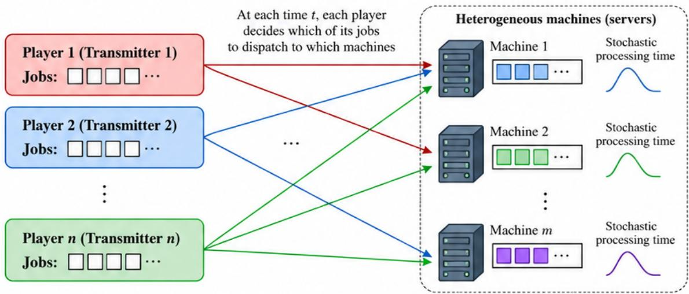

# High-Probability Nash Regret for Decentralized Learning in Markov α-Potential Games: Episodic and Fully Online Asynchronous Algorithms with Applications to Markov Congestion Games

S. Rasoul Etesami

Department of Industrial and Systems Engineering

Coordinated Science Laboratory

University of Illinois Urbana-Champaign, Urbana, IL, USA

etesami1@illinois.edu

## Abstract

We study decentralized learning of Nash equilibria (NE) in infinite-horizon discounted Markov games under bandit feedback, focusing on Markov α-potential games. We develop KL-projected natural policy gradient (NPG) algorithms in two settings: an episodic setting with frozen policies during sampling, and a fully online setting in which each player receives a single realized cost sample per time step and policies are updated asynchronously along a continuing trajectory. For both settings, we establish finite-time high-probability bounds on the time-averaged NE gap (NE regret). Crucially, our bounds do not involve a distribution-mismatch coefficient, which can scale prohibitively with the size of the state space. In the episodic setting, we obtain an NE regret bound of order $\widetilde { O } ( T ^ { - 1 / 4 } )$ , plus separate terms accounting for the potential approximation error $\alpha ,$ fixed estimation-oracle bias $L _ { \widehat { A } } .$ , and transition-kernel sensitivity to a unilateral action change $\delta _ { P }$ . Thus, our framework accommodates multiple sources of approximation error within a unified finitetime analysis. The fully online setting introduces additional challenges from asynchronous state visitation, drifting state occupancies, simultaneous policy adaptation, and one-sample importanceweighted estimation. We address these through stopping-time, coupling, charging, and dynamictracking arguments, obtaining an NE regret bound of order ${ \widetilde O } ( T ^ { - 2 / 1 5 } )$ plus analogous fixed approximation terms. We further identify a state-wise potential structure yielding sharper guarantees in which the potential approximation error α enters additively, avoiding amplification through online tracking. We then specialize our framework to independent-resource Markov congestion games (IMCGs), a class of dynamic congestion games with independently evolving resource states. We establish their approximate-potential and transition-sensitivity properties, construct decentralized estimation oracles from realized costs, and derive episodic and fully online guarantees. Finally, as an application, we introduce a novel strategic online job-scheduling problem for stochastic machines and show that our framework yields a scalable decentralized algorithm for learning stable dispatching policies. Overall, our results address several gaps in the literature by providing the first finite-time high-probability NE regret guarantees for fully online asynchronous decentralized learning in Markov α-potential games, eliminating distribution-mismatch coefficients from the regret bounds, accommodating fixed estimation-oracle bias, and developing scalable decentralized learning algorithms with finite-time NE regret guarantees for IMCGs.

## 1 Introduction

Learning equilibrium behavior in strategic multi-agent systems is a fundamental problem at the intersection of game theory and machine learning. In a noncooperative system, each player seeks to optimize its own objective while facing an environment that evolves as the other players learn simultaneously. In this regard, Nash equilibrium (NE) provides a natural stability benchmark [1]: at an NE, no player can improve its objective through a unilateral deviation. In large-scale systems, practical equilibrium learning requires three properties that are often in tension: convergence, scalability, and independence. Ideally, a learning rule should converge within a controlled time, avoid exponential dependence on the number of players when the game structure permits, and allow each player to learn from local observations without exchanging policy or payoff information with others. These requirements become particularly challenging under bandit feedback, where each player observes only its own realized cost rather than the full cost table.

Markov (or stochastic) games, introduced by Shapley [2], extend normal-form games to sequential environments in which the state evolves stochastically as a function of the players’ joint actions. They model a wide range of dynamic strategic interactions, including wireless communication [3,4], transportation and routing systems [5], energy markets [6,7], and cyber-physical security systems [8]. Relative to repeated static games, a central difficulty is that current actions affect not only instantaneous costs but also the distribution of future states, coupling strategic interaction with long-run state occupancies. This dynamic coupling, together with the general computational intractability of equilibrium computation [9], motivates structured game classes in which learning can exploit additional geometry. Potential games [10] provide a canonical example in the static setting, where unilateral changes in individual players’ objectives are aligned with changes in a common potential function. Their dynamic counterparts, Markov potential games (MPGs), were introduced in [11], where global convergence of independent policy-gradient methods to NE policies was established. Since then, MPGs have become an important model class for provably convergent multi-agent reinforcement learning.

While potential structure facilitates convergence, establishing finite-time performance guarantees under genuinely independent learning remains considerably more challenging. In our setting, players exchange neither policies, gradients, nor cost functions, and need not observe the actions of others. Instead, they independently randomize their actions, observe only their own realized costs, and learn from these local samples while interacting within the same evolving Markov environment. From each player’s perspective, the resulting environment is inherently nonstationary because all other players adapt simultaneously. This difficulty is amplified in the fully online setting, where the system is not reset between updates, states are visited asynchronously, and policies evolve along a single continu ing trajectory. Our goal is therefore to develop finite-time, high-probability guarantees on the timeaveraged NE gap, which we refer to interchangeably as NE regret, under precisely this decentralized, fully online, bandit-feedback regime.

## 1.1 Related Literature

Here, we review the literature most closely related to our work and discuss how our contributions address several gaps in the existing literature.

Linear-quadratic games. Linear-quadratic (LQ) control provides an important benchmark for understanding the guarantees and limitations of policy-gradient methods in dynamic games. In the single-agent setting, Fazel et al. [12] established global convergence and polynomial sample and computational complexity for policy-gradient methods in the LQ setting, demonstrating that a nonconvex policy-optimization landscape can nevertheless possess favorable global geometry. The multi-agent setting is substantially more delicate: Mazumdar et al. [13] constructed general-sum LQ games in which policy-gradient dynamics need not even converge locally to an NE. Under additional stochastic excitation, Hambly et al. [14] proved global convergence of natural policy gradient to an NE in finitehorizon N-player general-sum LQ games. More recently, Hosseinirad et al. [15] characterized when LQ games admit an exact potential structure, showing that exact potentiality can be restrictive under full-state feedback but becomes richer under decoupled dynamics and information structures. Plank and Zhang [16] study distributed LQ stochastic differential games through an α-potential framework and establish linear convergence to exact or approximate equilibria depending on the symmetry of interactions. These results demonstrate both the power and limitations of structural assumptions in continuous-state LQ models. Our focus is complementary: we study finite-state, finite-action Markov games under bandit feedback, allow a general approximate Markov-potential structure, and establish high-probability finite-time guarantees for decentralized episodic and fully online learning.

Markov potential and Markov α-potential games. A substantial recent literature has established increasingly sharp convergence guarantees for policy-gradient-type methods in exact MPGs. Fox et al. [17] proved last-iterate asymptotic convergence of independent natural policy gradient (NPG) to an NE policy in MPGs with constant learning rates. Ding et al. [18] obtained global nonasymptotic rates for independent policy gradient, including an ${ \cal O } ( 1 / \epsilon ^ { 2 } )$ exact-gradient iteration bound and sample-based guarantees with function approximation. Zhang et al. [19] analyzed decentralized softmax gradient and natural-gradient play, with and without log-barrier regularization, and quantified the role of trajectory-dependent constants. Zhang et al. [20] further studied stationary points, local stability, and sample complexity for gradient play in stochastic games, obtaining global guarantees for MPGs. Sun et al. [21] sharpened the exact-policy-evaluation complexity of independent NPG to $O ( 1 / \epsilon )$ under a suboptimality-gap condition. Alatur et al. [22] showed that Kullback–Leibler (KL) regularized policy mirror descent can improve the dependence on the number of players. Zhang et al. [23] considered finite-horizon Markov games with decoupled agent dynamics, deriving priceof-anarchy results and a distributed soft policy-iteration method with sample-complexity guarantees for the MPG subclass. Dong et al. [24] treated stochastic-cost and bandit-feedback potential games and MPGs using a Frank–Wolfe method with exploration and episodic gradient estimation, obtaining $O ( T ^ { 4 / 5 } )$ Nash regret for MPGs.

Several complementary extensions further illustrate the breadth of independent policy-gradient methods for structured Markov games. Cheng et al. [25] move beyond the discounted setting and establish global convergence of independent policy gradient and NPG for infinite-horizon average-reward MPGs. Given access to a gradient or differential-Q oracle, their policy-gradient, proximal-Q, and NPG methods reach an ϵ-NE in ${ \cal O } ( 1 / \epsilon ^ { 2 } )$ iterations; they also provide a sample-based policy-gradient guarantee with $\widetilde { \cal O } ( 1 / \epsilon ^ { 5 } )$ sample complexity. Jordan et al. [26] study constrained MPGs and develop an independent policy-gradient method for computing approximate constrained NEs based on proximalpoint-type updates. Thus, although these works substantially broaden the scope of independent learning in MPGs, their algorithmic and sampling models remain different from the fully online regime considered here, in which each player receives a single realized cost sample per time step and updates asynchronously, i.e., updates its policy only at the visited state, along a single evolving trajectory.

The works closest to our fully online information structure are nevertheless materially different. Maheshwari et al. [27] study independent and decentralized learning in infinite-horizon discounted MPGs, where players observe the realized states and their own realized payoffs without knowing the underlying model. Their actor–critic dynamics operate on two timescales, with the Q-estimates evolving faster than the policies, and their main guarantee is asymptotic convergence based on asynchronous stochastic approximation. In contrast, our fully online algorithm applies to the more general class of Markov α-potential games, introduced in [28], where the change in a player’s objective under a unilateral deviation is approximated, up to an error α, by the change in a common potential function. Moreover, our algorithm accommodates additional sources of error in the one-sample estimation oracle and provides an explicit high-probability finite-time bound on the NE regret.

Guo et al. [28] showed that Markov α-potential games encompass important structured models, including Markov congestion games and perturbed team games, and derived Nash-regret guarantees for projected gradient ascent and sequential maximum-improvement schemes under exact Q-function oracle access. More broadly, Guo et al. [29] develop an α-potential framework for general N-player dynamic games, characterize approximate potentiality through asymmetries of second-order derivatives, and specialize it to stochastic differential games with distributed and mean-field interactions. While these works provide complementary perspectives on approximate potentiality, our focus is on finite-state, finite-action Markov games under substantially weaker feedback: players learn independently from bandit samples, including in a fully online asynchronous regime. Moreover, under the state-wise potential structure of Section 6, i.e., when the potential function itself can be expressed as the value function of a base function, our guarantees isolate the approximation error as a single additive α term, avoiding its amplification by extra factors and thereby remaining informative over a broader approximate-potential regime.

A closely related structural direction considers stochastic games with independent or decoupled dynamics. Etesami [7] studies n-player stochastic games in which players have independently evolving state-action processes but remain coupled through their payoffs, importantly without imposing an MPG assumption. Using only their own realized payoffs, players employ online mirror descent in the dual space of occupancy measures to update their policies. For general reward functions, their episodic algorithm approaches the set of ϵ-NE policies with high probability and polynomial time and sample complexity, under the weaker notion of averaged NE regret. Jordan et al. [30] consider partially observable Markov potential games (POMGs) with decoupled transition and obser vation dynamics. Under filter stability, they approximate the partially observable game by a finitehistory superstate Markov game, show that this surrogate inherits a near-potential structure, and ob tain communication-free approximate-NE learning with quasi-polynomial sample and computational complexity. Their work addresses the additional difficulty of partial observability through finitewindow model estimation, whereas our setting assumes full state observability but targets a more primitive online interaction model without requiring decoupled transition dynamics.

Congestion games and Markov congestion games. As an important special case of our general results for Markov α-potential games, in the last section we consider independent-resource Markov congestion games (IMCGs) [31], which generalize static congestion games to dynamic stochastic environments with independent evolving resource states. In the static setting, congestion games are classical examples of exact potential games [10,32], and their structure has long made them attractive models for routing, scheduling, and resource sharing. For instance, Altman et al. [33] study decentral ized load balancing in processor-sharing systems and exploit a potential formulation to characterize equilibria and compare decentralized and centralized performance. Li et al. [34] formulate selfish scheduling of deteriorating jobs on parallel machines as a game and develop a game-theoretic approximation algorithm that converges to a pure NE. More recently, Fardno and Etesami [35] develop static and dynamic game models for distributed load balancing: the static scheduling game admits a potential function with a low price of anarchy, while dynamic best-response updates yield polynomial-time convergence to balanced behavior under their queueing dynamics. Yao and Ding [36] formulate datacenter load balancing as an MPG and propose a fully distributed MARL method, supported primarily by simulations and real-system experiments.

Table 1: Representative comparison with closely related equilibrium-learning results. “Finite-time” refers to an explicit nonasymptotic equilibrium/NE-gap or Nash-regret guarantee.
<table><tr><td>Work</td><td>Game class</td><td>Feedback/oracle</td><td>Independent Fully online Finite-time</td><td></td><td></td><td>Main distinction</td></tr><tr><td>Fox et al. [17]</td><td>MPG</td><td>exact policy quantities</td><td>Yes</td><td>No</td><td>No</td><td>last-iterate NPG convergence global PG rates;</td></tr><tr><td>Ding et al. [18]</td><td>MPG</td><td>exact / sampled gradients</td><td>Yes</td><td>No</td><td>Yes</td><td>function approximation</td></tr><tr><td>Cheng et al. [25]</td><td>average-reward MPG</td><td>oracle / sampled gradients</td><td>Yes</td><td>No</td><td>Yes</td><td>independent PG/NPG for average reward</td></tr><tr><td>Jordan et al. [26]</td><td>constrained MPG</td><td>stochastic gradients</td><td>Yes</td><td>No</td><td>Yes</td><td>independent learning with constraints</td></tr><tr><td>Zhang et al. [19]</td><td>MPG</td><td>gradient access exact policy</td><td>Yes</td><td>No</td><td>Yes</td><td>softmax PG/NPG rates O(1/€) under</td></tr><tr><td>Sun et al. [21]</td><td>MPG</td><td>evaluation</td><td>Yes</td><td>No</td><td>Yes</td><td>suboptimality gap episodic sampling;</td></tr><tr><td>Dong et al. [24]</td><td>MPG independent-chain</td><td>stochastic bandit realized own</td><td>Yes</td><td>No</td><td>Yes</td><td>O(T4/5) Nash regret dual averaging/mirror descent;</td></tr><tr><td>Etesami [7]</td><td>stochastic game decoupled POMG7</td><td>payoffs local trajectories;</td><td>Yes</td><td>No</td><td>Yes†</td><td>decentralized observations partial observability;</td></tr><tr><td>Jordan-Kamgarpour [30]</td><td>near-potential</td><td>model estimation one-stage payoff</td><td>Yes</td><td>No</td><td>Yes</td><td>finite-history approximation</td></tr><tr><td>Maheshwari et al. [27]</td><td>MPG Markov</td><td>samples policy-improvement</td><td>Yes</td><td>Yes</td><td>No</td><td>two-timescale asynchronous convergence</td></tr><tr><td>Guo et al. [28]</td><td>α-potential congestion</td><td>oracle</td><td>Partly</td><td>No</td><td>Yes</td><td>approximate-potential regret analysis</td></tr><tr><td>Cui et al. [31]</td><td>Markov congestion</td><td>bandit / semi-bandit</td><td>static: Yes; Markov: No</td><td>No</td><td>Yes</td><td>centralized Markov- congestion learning</td></tr><tr><td>This work</td><td>Markov α-potential / state-wise / IMCG</td><td>bandit; one sample online</td><td>Yes</td><td>Yes</td><td>Yes</td><td>high-probability average NE-gap; additive α in state-wise case</td></tr></table>

<sup>†</sup>For general reward functions, polynomial-time, high-probability sublinear regret is established in terms of the weaker weighted NE regret criterion, which becomes a sublinear NE regret guarantee under additional reward structure.

Finite-sample learning in congestion games has also received growing attention. Cui et al. [31] establish polynomial sample complexity for static congestion games under bandit and semi-bandit feedback and introduce IMCGs to capture stochastic resource dynamics. Their learning algorithm for the IMCG setting achieves sublinear NE regret; however, it is episodic and reset-based, as well as centralized and computationally demanding, requiring the computation of an ϵ-NE of a large matrix game to update the policies at each iteration. In contrast, by exploiting the resource-local stochastic structure of IMCGs, we show that they fall within the scope of our more general Markov α-potential framework. This allows us to develop a fully decentralized one-sample online algorithm in which players update simultaneously using only their own realized costs, together with an explicit high-probability sublinear NE regret. Thus, our results provide the first decentralized finite-time learning theory for IMCGs without episodic resets or costly centralized equilibrium computation.

Table 1 summarizes the distinctions most relevant to our work. It compares information structures and guarantees rather than ranking the results: several existing methods achieve faster rates under stronger oracle access, for more restrictive game classes, or in expectation rather than with high probability, whereas our emphasis is on combining approximate-potential structure, bandit feedback, decentralization, and fully online asynchronous learning. As we will see later, another notable distinction between our bounds and existing NE-regret bounds is that our guarantees completely eliminate the mismatch coefficient, which can be prohibitively large and may scale with the size of the state space.

## 1.2 Contributions

The main objective of this paper is to develop a finite-time theory for independent learning of stationary Nash policies in structured Markov α-potential games under information constraints that are substantially weaker than exact policy-evaluation or full-gradient access. The analysis is organized around a progression from a general approximate-potential model to sharper state-wise structure and, finally, to a concrete dynamic Markov congestion class. The main contributions are as follows.

1. A general decentralized KL-projected NPG framework for Markov α-potential games. We consider infinite-horizon discounted n-player Markov α-potential games under bandit feedback and introduce a KL-projected NPG update that can be executed independently by each player. To this end, we develop an extensive analysis that explicitly tracks the sensitivity of discounted occupancies, values, and marginalized advantages to unilateral policy changes, enabling the potential-based analysis to accommodate both imperfect potential alignment $( \alpha > 0 )$ and imperfect advantage estimation $( L _ { \widehat { A } } > 0 )$

2. High-probability NE regret under episodic bandit estimation. Section 4 studies an episodic, reset-free implementation in which the policy is held fixed while samples are collected. We derive a high-probability bound on the NE regret for general Markov α-potential games, explicitly separating the statistical term, the estimation-oracle bias term $L _ { \mathit { \widehat { A } } } ,$ the potential approximation error α, and the transition-sensitivity term $\delta _ { P }$ . The proof combines KL geometry, potential improvement, concentration bounds for importance-weighted estimators, and a conversion from local policy certificates to the global NE gap.

3. High-probability NE regret under fully online asynchronous bandit estimation. Section 5 removes the episodic frozen-policy structure. At every primitive time step, each player receives only a single realized cost sample and updates its policy only at the currently visited state. Because different states are updated at random, asynchronous times, and because the state distribution itself drifts as the policies evolve, standard episodic arguments no longer apply. We introduce stopping-time local indices, occupancy tracking, coupling and delayed-window charging arguments, and martingale concentration to control these interactions. The resulting theorem provides an explicit high-probability bound on the NE regret. This fills the gap between earlier fully decentralized asymptotic actor–critic results and finite-time oracle-based or episodic analyses.

4. Sharper NE regret bounds under state-wise potential structure. Section 6 identifies a stronger state-wise potential structure in which the underlying Markov α-potential function can be expressed as the discounted value function of a base potential function and develops matching episodic and fully online potential-advantage oracles. The key benefit is both concep tual and quantitative: the potential approximation parameter α enters the final guarantees as a single additive α term. Unlike in the general online α-potential analysis, α is not amplified by a tracking factor. Consequently, the resulting bounds remain informative over a substantially broader approximate-potential regime.

5. Decentralized learning for independent-resource Markov congestion games (IMCGs). Section 7 specializes the theory to IMCGs, where resources have local stochastic states and their transition kernels factor across resources conditional on congestion. We establish the required transition-sensitivity and state-wise approximate-potential properties, construct episodic and one-sample estimation oracles from realized player costs, and obtain an explicit fully decentralized online NE regret guarantee. Theorem 5 shows, in particular, that the NE regret decays at rate $\widetilde { O } ( T ^ { - 2 / 1 5 } )$ , up to terms controlled by the resource-coupling parameter $\delta \ll 1$ ; as $\delta  0 .$ the approximation floor vanishes. This provides a concrete interpretation of weak dynamic coupling as a quantitative source of approximate potentiality. As a concrete application, Section 7.6 maps IMCGs to decentralized strategic scheduling on stochastic machines, where players are strategic job owners, machines are congestible resources, and machine states represent stochastic processing conditions or queue/load states.<sup>1</sup> The resulting guarantee shows that strategic users can learn stable approximate dispatching policies from their own realized delays through simultaneous one-sample updates, without requiring a centralized scheduler or best-response computation. This connects the abstract Markov-game theory to a real-world application.

## 1.3 Organization

The remainder of the paper is organized as follows. Section 2 introduces the general discounted Markov-game model, stationary policies, the NE-gap criterion, and the approximate-potential assumptions used throughout. Section 3 develops the value, Q-function, marginalized-advantage, KLprojected NPG, and sensitivity tools needed for the analysis. Section 4 presents the episodic online bandit oracle, the decentralized episodic online algorithm, and its high-probability NE-regret analysis. Section 5 develops the global/local stopping-time notation, the one-sample online bandit oracle, the asynchronous online algorithm, and the coverage and tracking analyses leading to the fully online NE regret guarantee. Section 6 exploits the state-wise potential structure to obtain sharper episodic and online bounds with the additive α dependence described above. Section 7 then verifies these assumptions for independent-resource congestion dynamics, derives the corresponding decentralized online guarantee, and concludes with the strategic job-scheduling application. Conclusions are provided in Section 8, while omitted technical proofs are collected in the appendices.

## 1.4 Notation

Throughout the paper, we adopt the following notation and conventions. For any positive integer $n ,$ we write $[ n ] : = \{ 1 , \dots , n \}$ . For a finite set ${ \mathcal { A } } ,$ we denote its cardinality by $| { \cal A } |$ and the probability simplex over $A$ by $\Delta ( \mathcal { A } )$ . Random variables are denoted by capital letters and their realizations by the corresponding lowercase letters. For instance, we denote the random state at time t by $S ^ { t }$ and its realization by $s ^ { t } .$ . For a vector $x = ( x _ { 1 } , \ldots , x _ { n } ) $ , we write $x _ { - i }$ for the vector obtained by removing its ith component; the same convention is used for action and policy profiles. For a collection of scalars $\{ x ( s , a ) \} _ { s , a } ,$ , we use $x ( s , \cdot )$ , or simply $x ( s )$ when unambiguous, for the vector indexed by a at state s, and x for the full collection across states and actions. We write $\langle x , y \rangle$ for the Euclidean inner product, $\| x \| _ { p }$ for the standard $\ell _ { p }$ norm, and $\| \cdot \| _ { \mathrm { T V } }$ for total variation distance. For a stateindexed collection $x = \{ x ( s ) \} _ { s \in \mathcal S }$ , we use the mixed-norm notation $\| x \| _ { p , \infty } : = \operatorname* { m a x } _ { s \in \mathcal { S } } \| x ( s ) \| _ { p }$ and $\| x \| _ { \mathrm { T V , \infty } } : = \operatorname* { m a x } _ { s \in \mathcal { S } } \| x ( s ) \| _ { \mathrm { T V } }$ . For multi-player policy profiles $\pi = \{ \pi _ { i } ( \cdot \mid s ) : i \in [ n ] , s \in S \}$ and $\pi ^ { \prime } = \{ \pi _ { i } ^ { \prime } ( \cdot  { \mid } s ) : i \in [ n ] , s \in  { \mathcal { S } } \}$ , the corresponding mixed norms sum over players; in particular, $\begin{array} { r } { \| \pi - \pi ^ { \prime } \| _ { \mathrm { T V } , \infty } : = \operatorname* { m a x } _ { s \in \cal S } \sum _ { i = 1 } ^ { n } \| \pi _ { i } ( \cdot  { | } s ) - \pi _ { i } ^ { \prime } ( \cdot  { | } s ) \| _ { \mathrm { T V } } } \end{array}$ , with the sum restricted to $j \neq i$ for profiles indexed by −i. The indicator of an event E is denoted by $\mathbf { 1 } \{ E \}$ . For $B > 0$ , we denote the projection onto the interval $[ - B / 2 , B / 2 ]$ by $\mathrm { c l i p } _ { B } ( \cdot )$ . Unless otherwise specified, $c > 0$ denotes a universal numerical constant whose value may change from line to line, and ${ \widetilde { O } } ( \cdot )$ suppresses logarithmic factors.

## 2 General Model and Problem Formulation

We consider an infinite horizon discrete-time finite-state discounted stochastic game (a.k.a. Markov game) with $[ n ] = \{ 1 , \dots , n \}$ players, where there is a common finite state space and each player $i \in [ n ]$ has its own finite set of actions $A _ { i }$ . We use $\boldsymbol { \mathcal { S } }$ and $\mathcal { A } = \mathcal { A } _ { 1 } \times \cdot \cdot \cdot \times \mathcal { A } _ { n }$ to denote the state space and the joint action set of players, respectively. At any discrete time $t = 0 , 1 , 2 , . . . ,$ we use $s ^ { t } \in S$ and $a _ { i } ^ { t } \in \mathcal { A } _ { i }$ , respectively, to denote the global state and the action of player i at time t. We also use $a ^ { t } = ( a _ { 1 } ^ { t } , \ldots , a _ { n } ^ { t } ) \in \mathcal { A }$ to denote the joint action profile of all players at time t. Moreover, we let $c _ { i } ( s ^ { t } , a ^ { t } )$ be the cost received by player i at time t, where, without loss of generality, we assume that the costs are normalized such that $c _ { i } : S \times A \to [ 0 , 1 ] , \forall i \in [ n ]$

At any time t, the information available to player i is given by the history of realized states, its actions, and its realized costs, i.e., $\mathcal { H } _ { i } ^ { t } = \{ s ^ { \ell } , a _ { i } ^ { \ell } , c _ { i } ( s ^ { \ell } , a ^ { \ell } ) : \ell = 0 , 1 , \ldots , t - 1 \} \cup \{ s ^ { t } \}$ . In particular, we note that player i cannot observe other players’ actions, nor can it access the structure of its own cost function $c _ { i } ( \cdot )$ . At any time t, player i takes an action $a _ { i } ^ { t }$ based on its information set $\mathcal { H } _ { i } ^ { t }$ and receives an instantaneous cost $c _ { i } ( s ^ { t } , a ^ { t } )$ , which depends on the state and all other players’ actions. After that, the state of the system changes from $s ^ { t }$ to a new state $s ^ { t + 1 }$ with probability $P ( s ^ { t + 1 } \mid s ^ { t } , a ^ { t } )$ . We refer to $P$ as the (primitive) transition probability kernel of the game.

A general policy for player i is a sequence of probability measures $\pi _ { i } = \{ \pi _ { i } ^ { t } , t = 0 , 1 , 2 , . . . \}$ over $A _ { i }$ that at each time t selects an action $a _ { i } \ \in \ A _ { i }$ based on past observations $\mathcal { H } _ { i } ^ { t }$ with probability $\pi _ { i } ^ { t } ( a _ { i } \mid \mathcal { H } _ { i } ^ { t } )$ . Use of general policies is often computationally expensive, and in practical applications, players are interested in easily implementable policies. In that regard, the class of stationary policies constitutes the most well-known class of simple policies, as defined next.

Definition 1. A policy $\pi _ { i } : S \to \Delta ( { \mathcal { A } } _ { i } )$ for player i is called stationary if the probability of choosing action $a _ { i }$ at time t, denoted by $\pi _ { i } ^ { t } ( a _ { i } \mid \mathcal { H } ^ { t } )$ , depends only on the current state $s ^ { t } = s$ and is independent $o f t .$ . For a stationary policy, we use $\pi _ { i } ( a _ { i } \mid s )$ to denote this time-independent probability.

For a stationary policy profile $\pi ~ = ~ \left( \pi _ { i } , \pi _ { - i } \right)$ and initial state distribution $\mu \in \Delta ( S )$ , the infinitehorizon discounted value function for player i is given by

$$
V _ { i } ^ { \pi } ( \mu ) : = \mathbb { E } _ { \pi } \left[ \sum _ { t = 0 } ^ { \infty } \gamma ^ { t } c _ { i } ( S ^ { t } , A ^ { t } ) \Bigg | S ^ { 0 } \sim \mu \right] ,\tag{1}
$$

where $\gamma \in ( 0 , 1 )$ is the discount factor, and the expectation is with respect to the randomness of the state transitions and the policy profile π. Finally, a discounted Markov game is defined by the tuple $\mathcal { G } = ( [ n ] , \mathcal { S } , P , \{ A _ { i } \} _ { i = 1 } ^ { n } , \{ c _ { i } \} _ { i = 1 } ^ { m } , \gamma , \mu )$

Definition 2. Given an initial state distribution $\mu ,$ a stationary policy profile $\pi ^ { * } = ( \pi _ { i } ^ { * } , \pi _ { - i } ^ { * } )$ is called a stationary Nash equilibrium, or simply a Nash equilibrium (NE), $i f V _ { i } ^ { ( \pi _ { i } ^ { * } , \pi _ { - i } ^ { * } ) } ( \mu ) \leq V _ { i } ^ { ( \pi _ { i } , \pi _ { - i } ^ { * } ) } ( \mu ) f o r$ every player i and every stationary policy $\pi _ { i }$ . Moreover, for $\epsilon > 0 , \pi ^ { * }$ is called an ϵ-Nash equilibrium $( \epsilon { - } N E ) i f V _ { i } ^ { ( \pi _ { i } ^ { * } , \pi _ { - i } ^ { * } ) } ( \mu ) \leq V _ { i } ^ { ( \pi _ { i } , \pi _ { - i } ^ { * } ) } ( \mu ) +$ ϵ for every player i and every stationary policy $\pi _ { i } .$

It is known that Markov games always admit a NE within the class of stationary policies [37], and our main objective in this work is to develop online learning algorithms that can compute an ϵ-NE with provable convergence-rate guarantees. However, computing or approximating a stationary NE in general Markov games is computationally intractable [38], even under more relaxed equilibrium notions such as stationary coarse correlated equilibria [39]. Thus, to devise a scalable independent learning algorithm for computing a stationary NE, one must impose additional assumptions. To describe the assumptions adopted in this work, we first introduce the following definitions.

Definition 3. The (unilateral) transition sensitivity of the Markov game is defined as

$$
\delta _ { P } : = \operatorname* { m a x } _ { i \in [ n ] } \operatorname* { m a x } _ { s \in \mathscr { S } , a _ { i } , a _ { i } ^ { \prime } \in A _ { i } } \| P ( \cdot  { | } s , a _ { i } , a _ { - i } ) - P ( \cdot  { | } s , a _ { i } ^ { \prime } , a _ { - i } ) \| _ { \mathrm { T V } } .
$$

Since the total variation distance between any two probability distributions is at most one, we always have $\delta _ { P } \in [ 0 , 1 ]$ . The parameter $\delta _ { P }$ quantifies the maximum influence that a unilateral change in one player’s action can have on the distribution of the next state, while holding the state and the other players’ actions fixed. Thus, smaller values of $\delta _ { P }$ correspond to games in which the state dynamics are less sensitive to individual players’ actions, while $\delta _ { P } = 0$ means that no unilateral action change affects the transition distribution (e.g., in a mean-field regime).

Definition 4. For any stationary policy profile π and initial distribution $\mu \in \Delta ( \mathcal S )$ , let $\mathbb { P } _ { \pi }$ denote the probability law induced by π and the transition kernel P. The discounted state occupancy measure induced by π from µ is defined as

$$
d _ { \mu } ^ { \pi } ( s ) : = ( 1 - \gamma ) \sum _ { t = 0 } ^ { \infty } \gamma ^ { t } \mathbb { P } _ { \pi } \left( S ^ { t } = s \mid S ^ { 0 } \sim \mu \right) , \qquad s \in \mathcal { S } .
$$

Thus, $d _ { \mu } ^ { \pi } \in \Delta ( S )$ , with $d _ { \mu } ^ { \pi } ( s )$ representing the normalized discounted frequency of visits to state s.

Next, we consider the following definition of Markov α-potential game from [40].

Definition 5. Given $\alpha \geq 0$ , a Markov game is called an α-potential game if there exists a potential function Ψ on the space of stationary policy profiles such that, for every player $i \in [ n ]$ , every pair of stationary policy profiles $\pi = \left( \pi _ { i } , \pi _ { - i } \right)$ and $\pi ^ { \prime } = ( \pi _ { i } ^ { \prime } , \pi _ { - i } )$ that differ only in player i’s policy, and every initial distribution $\mu \in \Delta ( { \cal S } ) ,$ 2

$$
\Big | \left( V _ { i } ^ { \pi ^ { \prime } } ( \mu ) - V _ { i } ^ { \pi } ( \mu ) \right) - \left( \Psi ^ { \pi ^ { \prime } } ( \mu ) - \Psi ^ { \pi } ( \mu ) \right) \Big | \leq \alpha .
$$

Remark 1. Without loss of generality, we restrict $\alpha \leq 1 / ( 1 - \gamma )$ . Indeed, since the stage costs are bounded in $[ 0 , 1 ] _ { : }$ , any unilateral value difference is at most $1 / ( 1 - \gamma )$ in absolute value. Thus, the constant function $\Psi ( \pi ) \equiv 1 / ( 1 - \gamma )$ trivially satisfies the α-potential property with $\alpha = 1 / ( 1 - \gamma )$

For a policy profile $\pi = ( \pi _ { 1 } , \ldots , \pi _ { n } )$ , we define the state transition kernel induced by $\pi$ as

$$
\bar { P } ^ { \pi } ( s ^ { \prime } \mid s ) : = \mathbb { E } _ { A \sim \pi ( \cdot \mid s ) } \left[ P ( s ^ { \prime } \mid s , A ) \right] = \sum _ { a \in \mathcal { A } } P ( s ^ { \prime } \mid s , a ) \prod _ { j = 1 } ^ { n } \pi _ { j } ( a _ { j } \mid s ) ,
$$

where by abuse of notation, $\textstyle \pi ( a \mid s ) = \prod _ { i = 1 } ^ { n } \pi _ { j } ( a _ { j } \mid s )$ . Similarly, for every player $i \in [ n ]$ , state $s \in S$ , and stationary opponents’ policy $\pi _ { - i }$ , we define the marginalized transition kernel as

$$
\bar { P } _ { i } ^ { \pi _ { - i } } ( s ^ { \prime } \mid s , a _ { i } ) : = \mathbb { E } _ { A _ { - i } \sim \pi _ { - i } ( \cdot \mid s ) } \big [ P ( s ^ { \prime } \mid s , a _ { i } , A _ { - i } ) \big ] = \sum _ { a _ { - i } \in A _ { - i } } P ( s ^ { \prime } \mid s , a ) \prod _ { j \neq i } \pi _ { j } ( a _ { j } \mid s ) .
$$

Remark 2. Definition 3 immediately implies $\Big | \Big | \bar { P } _ { i } ^ { \pi _ { - i } } \big ( \cdot \mid s , a _ { i } \big ) - \bar { P } _ { i } ^ { \pi _ { - i } } \big ( \cdot \mid s , a _ { i } ^ { \prime } \big ) \Big | \Big | _ { \mathrm { T V } } \le \delta _ { P }$ for every $i \in$ $[ n ] , s \in { \mathcal { S } }$ , stationary $\pi _ { - i } ,$ and $a _ { i } , a _ { i } ^ { \prime } \in \mathcal { A } _ { i }$ . Indeed, this follows by averaging over $A _ { - i } \sim \pi _ { - i } ( \cdot \mid s )$ and using the convexity of total variation distance. Conversely, since deterministic policies $\pi _ { - i }$ are admissible, taking $\pi _ { - i }$ concentrated on anyfixed $a _ { - i }$ recovers Definition 3.

Throughout this work, we impose the following assumption.

Assumption 1. There exists $\begin{array} { r } { \alpha \in ( 0 , \frac { 1 } { 1 - \gamma } ) } \end{array}$ such that the Markov game $\mathcal { G }$ is a Markov α-potential game. Moreover, for every stationary policy profile π, the induced Markov chain over $\boldsymbol { \mathcal { S } }$ with state transition kernel ${ \bar { P } } ^ { \pi }$ is irreducible and aperiodic and admits a unique stationary distribution.

Finally, to evaluate the convergence rate of our proposed algorithms to an $\epsilon { \mathrm { - N E } } .$ , we use the following Nash equilibrium gap function (also known as the Nikaido–Isoda function), which has become a standard measure of the distance of a policy profile from a NE [7, 41, 42].

Definition 6. Given a policy profile $\pi = \left( \pi _ { i } , \pi _ { - i } \right)$ , the Nash equilibrium gap function is given by:

$$
\mathrm { G a p } ( \pi ) : = \operatorname* { m a x } _ { i } \operatorname* { s u p } _ { \pi _ { i } ^ { \prime } } \left[ V _ { i } ^ { ( \pi _ { i } , \pi _ { - i } ) } ( \mu ) - V _ { i } ^ { ( \pi _ { i } ^ { \prime } , \pi _ { - i } ) } ( \mu ) \right] .
$$

From this definition, it is easy to see that if $\mathrm { G a p } ( \pi ) \leq \epsilon .$ , then $\pi$ must be an $\mathrm { \epsilon - N E }$

Finally, we consider the following coverage assumption, which imposes a mild exploration condition needed to establish meaningful finite-time NE-regret bounds.

Assumption 2. Given $\zeta > 0 .$ , assume that there exist $H _ { \mathrm { { c o v } } } \geq 1$ and $p _ { \operatorname* { m i n } } > 0$ such that, for every stationary policy profile π satisfying $\pi _ { i } ( a _ { i } \mid s ) > \zeta$ for all $i , s ,$ and $a _ { i } ,$ and every initial state $s ^ { 0 } \in S _ { i }$ each prescribed state $s \in S$ is visited within $H _ { \mathrm { c o v } }$ steps with probability at least $p _ { \mathrm { m i n } } ;$ that is,

$$
\mathbb { P } _ { \pi } \left( S ^ { h } = s f o r s o m e \mathbb { 1 } \leq h \leq H _ { \mathrm { c o v } } \ | \ S ^ { 0 } = s ^ { 0 } \right) \geq p _ { \mathrm { m i n } } .
$$

Assumption 2 is a natural coverage requirement ensuring that each state is visited with positive probability within a finite-length time window. Otherwise, if certain states are never visited or are visited with arbitrarily small probability, then regardless of how effective the algorithm is, it cannot reliably evaluate the costs associated with such states.

## 3 Preliminaries

In this section, we provide some general definitions and preliminary results that will be used throughout the paper. The proofs of all these results are provided in Appendix $\mathrm { A } .$

## 3.1 Value, Q-Function, Advantage Function, and Bellman Optimality

Fix the stationary policies $\pi _ { - i }$ of all players other than player i. Then player i faces a single-agent discounted Markov decision process (MDP) with state space ${ \mathcal { S } } ,$ , action space $A _ { i }$ , discount factor $\gamma \in ( 0 , 1 )$ , marginalized stage cost

$$
\begin{array} { r } { \bar { c } _ { i } ^ { \pi - i } \bigl ( s , a _ { i } \bigr ) : = \mathbb { E } _ { A _ { - i } \sim \pi _ { - i } ( \cdot | s ) } \bigl [ c _ { i } \bigl ( s , a _ { i } , A _ { - i } \bigr ) \bigr ] \forall s \in \mathcal { S } , a _ { i } \in \mathcal { A } _ { i } , } \end{array}
$$

and marginalized transition kernel $\bar { P } _ { i } ^ { \pi - i } \left( s ^ { \prime } \mid s , a _ { i } \right)$ . Then, it is easy to see that the value function of player i must satisfy the recursive Bellman equation, given by

$$
V _ { i } ^ { \pi } ( s ) = \sum _ { a _ { i } \in \mathcal A _ { i } } \pi _ { i } ( a _ { i } \mid s ) \left[ \bar { c } _ { i } ^ { \pi - i } ( s , a _ { i } ) + \gamma \sum _ { s ^ { \prime } \in \mathcal S } \bar { P } _ { i } ^ { \pi - i } ( s ^ { \prime } \mid s , a _ { i } ) V _ { i } ^ { \pi } ( s ^ { \prime } ) \right] \ \forall s \in \mathcal S .\tag{2}
$$

Moreover, one can define the state–action Q-function and the advantage function for player i as

$$
Q _ { i } ^ { \pi } ( s , a ) : =  { \mathbb { E } } _ { \pi } \bigg [ \sum _ { t = 0 } ^ { \infty } \gamma ^ { t } c _ { i } ( S ^ { t } , A ^ { t } ) \bigg | \ S ^ { 0 } = s , \ A ^ { 0 } = a \bigg ] , \qquad A _ { i } ^ { \pi } ( s , a ) : = Q _ { i } ^ { \pi } ( s , a ) - V _ { i } ^ { \pi } ( s ) .
$$

Accordingly, for fixed policies of other players, $\pi _ { - i } ,$ , one can define the marginalized Q-function and the marginalized advantage function for a unilateral choice of player i’s action $a _ { i }$ as

$$
\begin{array} { r l } & { \bar { Q } _ { i } ^ { \pi } ( s , a _ { i } ) : = \mathbb { E } _ { A _ { - i } \sim \pi _ { - i } ( \cdot \vert s ) } \left[ Q _ { i } ^ { \pi } ( s , a _ { i } , A _ { - i } ) \right] = \bar { c } _ { i } ^ { \pi _ { - i } } ( s , a _ { i } ) + \gamma \displaystyle \sum _ { s ^ { \prime } \in S } \bar { P } _ { i } ^ { \pi _ { - i } } ( s ^ { \prime } \mid s , a _ { i } ) V _ { i } ^ { \pi } ( s ^ { \prime } ) , } \\ & { \bar { A } _ { i } ^ { \pi } ( s , a _ { i } ) : = \mathbb { E } _ { A _ { - i } \sim \pi _ { - i } ( \cdot \vert s ) } \left[ A _ { i } ^ { \pi } ( s , a _ { i } , A _ { - i } ) \right] = \bar { c } _ { i } ^ { \pi _ { - i } } ( s , a _ { i } ) + \gamma \displaystyle \sum _ { s ^ { \prime } \in S } \bar { P } _ { i } ^ { \pi _ { - i } } ( s ^ { \prime } \mid s , a _ { i } ) V _ { i } ^ { \pi } ( s ^ { \prime } ) - V _ { i } ^ { \pi } ( s ) . } \end{array}\tag{3}
$$

Specifically, for fixed policies of other players, $\pi _ { - i }$ , the marginalized Q-function $\textstyle { \bar { Q } } _ { i } ^ { \pi } ( s , a _ { i } )$ measures the expected total future cost of player i at the current state $s ,$ if it forces itself to choose action $a _ { i }$ once at the current time, and afterwards goes back to following its policy $\pi _ { i } .$ . Similarly, for fixed $\pi _ { - i }$ , the marginalized advantage function measures how much better $( \bar { A } _ { i } ^ { \pi } ( s , a _ { i } ) \leq 0 )$ or worse $( \bar { A } _ { i } ^ { \pi } ( s , a _ { i } ) > 0 )$ it is for player i to choose action $a _ { i }$ right now, compared to following its current policy $\pi _ { i }$ at state $s .$ In fact, the marginalized advantage function is one of the key components of our algorithmic design, as it quantifies the marginal improvement in the expected total cost obtained by selecting a particular action at a given state relative to following the current policy.

Remark 3. The key difference between thefull Q-function (or advantagefunction) and its marginalized counterpart is that, in the latter, the policies of the other players, $\pi _ { - i } ,$ are held fixed, and the randomness induced by their actions is treated as part of the Markov environment. Consequently, by averaging over the actions generated by the other players’ policies, the marginalized quantities characterize the effective single-agent MDP faced by player i.

As a first step toward developing a decentralized policy-update algorithm for computing an $\mathrm { \epsilon { - N E } }$ , we consider the best-response problem faced by each player. In particular, given a fixed policy profile π<sub>−</sub> of the other players, player i should be able to compute, or approximately compute, a best response. Since $\pi _ { i }$ is the only decision variable once $\pi _ { - i }$ is fixed, the (best-response) optimal value function of player i is defined by

$$
V _ { i } ^ { * } ( s ) : = \operatorname* { i n f } _ { \pi _ { i } } V _ { i } ^ { ( \pi _ { i } , \pi _ { - i } ) } ( s ) ,
$$

which by principle of optimality satisfies the Bellman optimality equation

$$
V _ { i } ^ { * } ( s ) = \operatorname* { m i n } _ { a _ { i } \in \mathcal { A } _ { i } } \left\{ \bar { c } _ { i } ^ { \pi _ { - i } } ( s , a _ { i } ) + \gamma \sum _ { s ^ { \prime } \in S } \bar { P } _ { i } ^ { \pi _ { - i } } ( s ^ { \prime } \mid s , a _ { i } ) V _ { i } ^ { * } ( s ^ { \prime } ) \right\} .\tag{4}
$$

Similarly, the optimal marginalized Q-function is given by

$$
\bar { Q } _ { i } ^ { * } ( s , a _ { i } ) = \bar { c } _ { i } ^ { \pi _ { - i } } ( s , a _ { i } ) + \gamma \sum _ { s ^ { \prime } \in S } \bar { P } _ { i } ^ { \pi _ { - i } } ( s ^ { \prime } \mid s , a _ { i } ) V _ { i } ^ { * } ( s ^ { \prime } ) ,\tag{5}
$$

and therefore the Bellman optimality equation can be written as

$$
V _ { i } ^ { * } ( s ) = \operatorname* { m i n } _ { a _ { i } \in A _ { i } } \bar { Q } _ { i } ^ { * } ( s , a _ { i } ) = \sum _ { a _ { i } \in A _ { i } } \pi _ { i } ^ { * } ( a _ { i } \mid s ) \bar { Q } _ { i } ^ { * } ( s , a _ { i } ) ,\tag{6}
$$

where $\pi _ { i } ^ { * } \in \mathrm { a r g m i n } _ { \pi _ { i } } V _ { i } ^ { ( \pi _ { i } , \pi _ { - i } ) }$ denotes the optimal stationary policy for player i, and the last equality follows from (2) for the choice of $\pi _ { i } = \pi _ { i } ^ { * }$

The following lemma characterizes the best response for player i, which follows directly from Bellman’s optimality condition, but we include a short proof in Appendix A.1 for completeness.

Lemma 1. Fix the policies $\pi _ { - i }$ ofall otherplayers and consider the induced marginalized MDPfaced by player i. Then a stationary policy $\pi _ { i }$ is a best response to $\pi _ { - i }$ if and only if

$$
\bar { A } _ { i } ^ { \pi } ( s , a _ { i } ) \geq 0 , \qquad \forall s , a _ { i } ,\tag{7}
$$

$$
\pi _ { i } ( a _ { i } \mid s ) > 0 \Longrightarrow \bar { A } _ { i } ^ { \pi } ( s , a _ { i } ) = 0 , \qquad \forall s , a _ { i } .\tag{8}
$$

Thus every action used with positive probability has zero marginalized advantage, while every action with strictly positive marginalized advantage receives zero probability.<sup>3</sup>

The following lemma is a straightforward adaptation of the performance difference lemma for singleagent MDPs [43, Lemma 2], applied to the marginalized MDP faced by player i. It evaluates the difference between the value functions induced by two policies of player i, while holding the policies of all other players fixed, in terms of the corresponding marginalized advantage function.

Lemma 2 (Performance Difference [43]). Fix the policies of all players except player i, namely $\pi .$ <sub>−i</sub>, and let $\mu$ be any initial state distribution. Then, for any two policies $\pi _ { i }$ and $\pi _ { i } ^ { \prime }$ of player i,

$$
V _ { i } ^ { ( \pi _ { i } , \pi _ { - i } ) } ( \mu ) - V _ { i } ^ { ( \pi _ { i } ^ { \prime } , \pi _ { - i } ) } ( \mu ) = \frac { 1 } { 1 - \gamma } \sum _ { s } d _ { \mu } ^ { ( \pi _ { i } ^ { \prime } , \pi _ { - i } ) } ( s ) \left. \pi _ { i } ( \cdot \mid s ) - \pi _ { i } ^ { \prime } ( \cdot \mid s ) , \bar { A } _ { i } ^ { ( \pi _ { i } , \pi _ { - i } ) } ( s , \cdot ) \right. ,
$$

where $\bar { A } _ { i } ^ { ( \pi _ { i } , \pi _ { - i } ) }$ is the marginalized advantage function induced by fixing $\pi _ { - }$ <sub>−i</sub>.

## 3.2 Natural Policy Gradient (NPG) and KL-Projected NPG

Fix the stationary policies $\pi _ { - i }$ of all players other than player i. Then player i faces a marginalized MDP, whose transition kernel and one-stage cost are induced by π<sub>−i</sub> as defined above. Standard policy-gradient methods can therefore be applied to this marginalized MDP. In particular, Natural Policy Gradient (NPG) preconditions the policy gradient by the inverse Fisher information matrix, thereby accounting for the geometry of the policy space [43]. Under the softmax parameterization, the resulting NPG update admits a particularly simple closed-form expression, as introduced next.

Lemma 3 ( [43]). Consider the marginalized MDP induced by fixing $\pi _ { - i } .$ . Suppose that player i employs a tabular softmax policy parameterization with exact advantage evaluations. Then, one iteration of the NPG policy update is given by

$$
\pi _ { i } ^ { t + 1 } ( a _ { i } \mid s ) = \frac { \pi _ { i } ^ { t } ( a _ { i } \mid s ) \exp \big ( - \frac { \eta } { 1 - \gamma } \bar { A } _ { i } ^ { \pi ^ { t } } ( s , a _ { i } ) \big ) } { \sum _ { a _ { i } ^ { \prime } \in { \mathcal A } _ { i } } \pi _ { i } ^ { t } ( a _ { i } ^ { \prime } \mid s ) \exp \big ( - \frac { \eta } { 1 - \gamma } \bar { A } _ { i } ^ { \pi ^ { t } } ( s , a _ { i } ^ { \prime } ) \big ) } .
$$

Furthermore, $i f \eta \le ( 1 - \gamma ) ^ { 2 }$ , then the sequence of policies generated by NPG converges globally to an optimal stationary policy. Moreover, after ${ \cal O } \big ( 1 / ( ( 1 - \gamma ) ^ { 2 } \epsilon ) \big )$ iterations, the generated policy is ϵ-optimal in terms ofthe discounted valuefunction.

The lemma shows that, after fixing the policies of the other players, NPG asymptotically drives the marginalized advantage function toward the Bellman optimality conditions characterizing an optimal stationary best response of player i to $\pi _ { - i }$ . One drawback of NPG, however, is that some action probabilities may become arbitrarily small. This can lead to high-variance estimates of the marginalized advantage function and, in turn, make it difficult to obtain high-probability regret bounds. To address this issue, we instead consider a KL-projected variant of NPG. This variant retains the simple, easily implementable structure of NPG while ensuring a uniform lower bound on all action probabilities. More precisely, for each player i and exploration parameter $\zeta \in ( 0 , 1 )$ , define the truncated simplex

$$
\Delta _ { i , \zeta } : = \left\{ p \in \Delta ( { \cal A } _ { i } ) : p ( a _ { i } ) \geq \frac { \zeta } { | { \cal A } _ { i } | } , \quad \forall a _ { i } \in { \cal A } _ { i } \right\} .
$$

At iteration $t ,$ assume player i has a vector $r _ { i } ^ { t } ( s ) \in \mathbb { R } ^ { | A _ { i } | } ( \mathbf { e . g . } , r _ { i } ^ { t } ( s ) = \bar { A } _ { i } ^ { \pi ^ { t } } ( s , \cdot ) )$ , and denote its current policy by $\pi _ { i } ^ { t }$ . Then, player i updates its policy to $\boldsymbol { \pi } _ { i } ^ { t + 1 }$ according to the update rule

$$
\pi _ { i } ^ { t + 1 } ( \cdot  { | { \mathbf { \phi } } | } s ) \in \underset { p \in \Delta _ { i , \xi } } { \arg \operatorname* { m i n } } \left\{ \frac { \eta } { 1 - \gamma } \left. p , r _ { i } ^ { t } ( s ) \right. + D _ { \mathrm { K L } } \left( p \| \pi _ { i } ^ { t } ( \cdot  { | { \mathbf { \phi } } | } s ) \right) \right\} \quad s \in \mathcal { S } ,\tag{9}
$$

where $\begin{array} { r } { D _ { \mathrm { K L } } ( p \| q ) = \sum _ { a \cdot \in A \colon } p ( a _ { i } ) \log ( p ( a _ { i } ) / q ( a _ { i } ) ) } \end{array}$ denotes the KL-divergence between two probability distributions $p$ and $q .$ . In fact, using KKT optimality conditions, the update rule (9) can also be written in the water-filling closed-form as

$$
\pi _ { i } ^ { t + 1 } ( a _ { i } \mid s ) = \operatorname* { m a x } \left\{ \frac { \zeta } { \lvert A _ { i } \rvert } , \lambda ( s ) \pi _ { i } ^ { t } ( a _ { i } \lvert s ) \exp \Big ( - \frac { \eta } { 1 - \gamma } r _ { i } ^ { t } ( s , a _ { i } ) \Big ) \right\} \quad \forall a _ { i } \in \mathcal { A } _ { i } ,\tag{10}
$$

where $\lambda ( s ) > 0$ is the normalization multiplier induced by the simplex constraint and is chosen so that the probabilities in (10) sum to one. Thus, the algorithm retains the multiplicative structure of NPG while guaranteeing $\textstyle \pi _ { i } ^ { t + 1 } ( a _ { i } \mid s ) \geq { \frac { \zeta } { | A _ { i } | } }$ . The following lemma provides a geometric characterization of the policy update under the KL-projected NPG rule (9), with its proof given in Appendix A.2.

Lemma 4. Consider the the KL-projected NPG (9) with $\| r _ { i } ^ { t } \| _ { \infty } \leq B$ , and let

$$
\begin{array} { r l } & { \mathcal { D } _ { i } ^ { t } ( s ) : = D _ { \mathrm { K L } } \left( \pi _ { i } ^ { t + 1 } ( \cdot  { \left| \begin{array} { l } { s } \end{array} \right| } \left\| \pi _ { i } ^ { t } ( \cdot  { \left| \begin{array} { l } { s } \end{array} \right) } \right) + D _ { \mathrm { K L } } \left( \pi _ { i } ^ { t } ( \cdot  { \left| \begin{array} { l } { s } \end{array} \right) } \right\| \pi _ { i } ^ { t + 1 } ( \cdot  { \left| \begin{array} { l } { s } \end{array} \right) } \right) } \\ & { \Delta _ { i } ^ { t } ( s ) : = \pi _ { i } ^ { t } ( \cdot  { \left| \begin{array} { l } { s } \end{array} \right. } - \pi _ { i } ^ { t + 1 } ( \cdot  { \left| \begin{array} { l } { s } \end{array} \right. } ) . } \end{array}\tag{11}
$$

Then, for any state $s \in S _ { \mathrm { : } }$ , the followings hold:

$$
( i ) \ \frac { \pi _ { i } ^ { t + 1 } ( a _ { i } \mid s ) } { \pi _ { i } ^ { t } ( a _ { i } \mid s ) } \leq e ^ { \frac { 2 \eta B } { 1 - \gamma } } , \quad \forall a _ { i } \in \mathcal { A } _ { i } .
$$

$$
( i i ) \sum _ { a _ { i } \in A _ { i } } \frac { \left( \Delta _ { i } ^ { t } ( s , a _ { i } ) \right) ^ { 2 } } { \pi _ { i } ^ { t } ( a _ { i } \mid s ) } \le e ^ { \frac { 2 \eta B } { 1 - \gamma } } \mathcal { D } _ { i } ^ { t } ( s ) .
$$

$$
( i i i ) \ \left. r _ { i } ^ { t } ( s ) , \Delta _ { i } ^ { t } ( s ) \right. \geq \frac { 1 - \gamma } { \eta } \mathcal { D } _ { i } ^ { t } ( s ) .
$$

$$
( i \nu ) \left\| \Delta _ { i } ^ { t } ( s ) \right\| _ { 1 } \leq \frac { \eta B } { 1 - \gamma } \quad \Rightarrow \quad \left\| \Delta _ { i } ^ { t } \right\| _ { 1 , \infty } \leq \frac { \eta B } { 1 - \gamma } , \quad \left\| \Delta _ { i } ^ { t } \right\| _ { \mathrm { T V } , \infty } \leq \frac { \eta B } { 2 ( 1 - \gamma ) } .
$$

## 3.3 Transition, Advantage, and Value Sensitivity

Here, we provide several results that quantify the sensitivity of different quantities in the Markov game to changes in the policy profile. We begin with the following transition-sensitivity lemma, whose proof is given in Appendix A.3.

Lemma 5. Let $\delta _ { P }$ be the unilateral transition sensitivity as in Definition 3 and $\begin{array} { r } { L _ { d } : = \frac { \gamma \delta _ { P } } { 1 - \gamma } } \end{array}$ . Then

(i) For two policy profiles $\pi = \left( \pi _ { i } , \pi _ { - i } \right)$ and $\pi ^ { \prime } { = } ( \pi _ { i } ^ { \prime } , \pi _ { { - } i } )$ that only differ in player i’s policy,

$$
\begin{array} { r l } & { \bigl \| \bar { P } ^ { \pi } ( \cdot  { | \mathbf { \nabla } s ) - \bar { P } ^ { \pi ^ { \prime } } ( \cdot  { | \mathbf { \nabla } s ) } \bigr \| _ { \mathrm { T V } } } \leq \delta _ { P } \| \pi _ { i } ( \cdot  { | \mathbf { \nabla } s ) - \pi _ { i } ^ { \prime } ( \cdot  { | \mathbf { \nabla } s ) } \| _ { \mathrm { T V } } } \forall s \in \mathcal { S } , } \\ & { \| d _ { \mu } ^ { \pi } - d _ { \mu } ^ { \pi ^ { \prime } } \| _ { \mathrm { T V } } \leq L _ { d } \displaystyle \sum _ { x \in \mathcal { S } } d _ { \mu } ^ { \pi ^ { \prime } } ( x ) \| \pi _ { i } ^ { \prime } ( \cdot  { | \mathbf { \nabla } x ) - \pi _ { i } ( \cdot  { | \mathbf { \nabla } x ) } } \| _ { \mathrm { T V } } . } \end{array}
$$

(ii) For any two policy profiles π and $\pi ^ { \prime }$ (not necessarily differing only in player i’s policy), we have

$$
\left. \bar { P } ^ { \pi ^ { \prime } } ( \cdot  { | } s ) - \bar { P } ^ { \pi } ( \cdot  { | } s ) \right. _ { \mathrm { T V } } \leq \delta _ { P } \sum _ { j = 1 } ^ { n } \Vert \pi _ { j } ^ { \prime } ( \cdot  { | } s ) - \pi _ { j } ( \cdot  { | } s ) \Vert _ { \mathrm { T V } } \forall s \in \mathcal { S } .\tag{12}
$$

Moreover, ifπ and $\pi ^ { \prime }$ differ only at a single state $x \in S _ { i }$ , then

$$
\Vert d _ { \mu } ^ { \pi ^ { \prime } } - d _ { \mu } ^ { \pi } \Vert _ { \mathrm { T V } } \leq L _ { d } d _ { \mu } ^ { \pi } ( x ) \sum _ { j = 1 } ^ { n } \Vert \pi _ { j } ^ { \prime } ( \cdot  { | \ x \rangle } - \pi _ { j } ( \cdot  { | \ x \rangle } \Vert _ { \mathrm { T V } } .\tag{13}
$$

Next, we state the following sensitivity lemma for the marginalized advantage function. This is a standard sensitivity property of finite discounted Markov games, closely related to the standard policydifference framework; see, e.g., [44]. For completeness, we provide a short proof specialized to our setting in Appendix A.4.

Lemma 6. Let $\begin{array} { r } { L _ { \bar { A } } : = \frac { 4 } { 1 - \gamma } + \frac { 4 \gamma \delta _ { P } } { ( 1 - \gamma ) ^ { 2 } } } \end{array}$ . Then for any two stationary policy profiles $\pi , \pi ^ { \prime } ,$ , we have

$$
\operatorname* { m a x } _ { i , s } \big \| \bar { A } _ { i } ^ { \pi ^ { \prime } } ( s , \cdot ) - \bar { A } _ { i } ^ { \pi } ( s , \cdot ) \big \| _ { \infty } \leq L _ { \bar { A } } \operatorname* { m a x } _ { x \in \mathcal { S } } \sum _ { j = 1 } ^ { n } \| \pi _ { j } ^ { \prime } ( \cdot \mid x ) - \pi _ { j } ( \cdot \mid x ) \| _ { \mathrm { T V } } .\tag{14}
$$

In our analysis, we also use the following second-order value-function sensitivity lemma to control the potential improvement in our analysis. The proof of this lemma is given in Appendix A.5.

Lemma 7. For every pair ofpolicies $\pi _ { i } , \pi _ { i } ^ { \prime } ,$ and every pair of opponent policies $\sigma _ { - i } , \tau _ { - i } ,$ we have

$$
\left| V _ { i } ^ { ( \pi _ { i } ^ { \prime } , \sigma _ { - i } ) } ( \mu ) - V _ { i } ^ { ( \pi _ { i } , \sigma _ { - i } ) } ( \mu ) - V _ { i } ^ { ( \pi _ { i } ^ { \prime } , \sigma _ { - i } ) } ( \mu ) + V _ { i } ^ { ( \pi _ { i } , \tau _ { - s } ) } ( \mu ) \right| \leq L _ { V } \| \pi _ { i } ^ { \prime } - \pi _ { i } \| _ { \mathrm { T V } , \infty } \| \sigma _ { - i } - \tau _ { - i } \| _ { \mathrm { T V } , \infty } ,
$$

where $\begin{array} { r } { L _ { V } : = \frac { 4 } { 1 - \gamma } + \frac { 1 2 \gamma \delta _ { P } } { ( 1 - \gamma ) ^ { 2 } } + \frac { 8 \gamma ^ { 2 } \delta _ { P } ^ { 2 } } { ( 1 - \gamma ) ^ { 3 } } } \end{array}$ . Here, $\begin{array} { r } { \| \sigma _ { - i } - \tau _ { - i } \| _ { \mathrm { T V } , \infty } : = \operatorname* { m a x } _ { s \in \mathcal { S } } \sum _ { j \neq i } \| \sigma _ { j } ( \cdot \mid s ) - \tau _ { j } ( \cdot \mid s ) \| _ { \mathrm { T V } } } \end{array}$ and $\begin{array} { r } { \| \pi _ { i } ^ { \prime } - \pi _ { i } \| _ { \mathrm { T V } , \infty } : = \operatorname* { m a x } _ { s \in \mathcal { S } } \| \pi _ { i } ^ { \prime } ( \cdot  { | } s ) - \pi _ { i } ( \cdot  { | } s ) \| _ { \mathrm { T V } } . } \end{array}$

Remark 4. Lemma 7 is closely related to the joint-policy decomposition used in [45]. Their analysis algebraically decomposes a simultaneous policy update into unilateral changes and mixed interaction terms. In contrast, Lemma 7 directly bounds such mixed interaction terms for discounted value functions, showing that they are second order in the corresponding policy changes.

Finally, we conclude this section with the following auxiliary lemma, which we frequently use to obtain sharper bounds on the sup-norm of the marginalized advantage and its inner product with the difference of two probability vectors. The proof is given in Appendix A.6.

Lemma 8. For any vector $v \in \mathbb { R } ^ { m }$ , define its span by span $\begin{array} { r } { ( v ) : = \operatorname* { m a x } _ { a \in [ m ] } v ( a ) - \operatorname* { m i n } _ { a \in [ m ] } v ( a ) } \end{array}$ . For every player $i ,$ state s, policy profile π, and two arbitrary policies $\pi _ { i } ^ { \prime }$ and $\pi _ { i } ^ { \prime \prime }$

$$
\left| \left. \pi _ { i } ^ { \prime } ( \cdot \mid s ) - \pi _ { i } ^ { \prime \prime } ( \cdot \mid s ) , \bar { A } _ { i } ^ { \pi } ( s ) \right. \right| \leq \mathrm { s p a n } \left( \bar { A } _ { i } ^ { \pi } ( s , \cdot ) \right) \| \pi _ { i } ^ { \prime } ( \cdot \mid s ) - \pi _ { i } ^ { \prime \prime } ( \cdot \mid s ) \| _ { \mathrm { T V } } .\tag{15}
$$

Moreover, $\begin{array} { r } { \| \bar { A } _ { i } ^ { \pi } ( s , \cdot ) \| _ { \infty } \leq \mathrm { s p a n } \left( \bar { A } _ { i } ^ { \pi } ( s , \cdot ) \right) \leq 1 + \frac { \gamma \delta _ { P } } { 1 - \gamma } = 1 + L _ { d } . } \end{array}$

## 4 Episodic Decentralized Learning with Bandit Feedback

In this section, we first present an episodic decentralized KL-projected NPG algorithm with bandit feedback and full state-table updates, and then analyze its convergence to an ϵ-Nash equilibrium policy. To this end, we first formally state our episodic estimation-oracle assumption and then describe the proposed algorithm.

## 4.1 Episodic Estimation Oracle

In this section, we work with episodes, each consisting of a certain number of global time steps. In each episode t, the policy profile $\pi ^ { t }$ remains fixed until every state has been visited a prescribed number of times. During the episode, each player observes raw samples obtained from an estimation oracle and uses them to update its policy at the end of the episode.

More precisely, let $\{ \mathcal { F } _ { t } \} _ { t \ge 0 }$ denote the episodic filtration, where $\mathcal { F } _ { t }$ contains all information generated before episode t, including the current policy profile $\pi ^ { t }$ . Throughout, we write $\mathbb { E } _ { t } [ \cdot ] : = \mathbb { E } [ \cdot \mid \mathcal { F } _ { t } ]$ and $\mathbb { P } _ { t } ( \cdot ) : = \mathbb { P } ( \cdot \mid \mathcal { F } _ { t } )$ . Conditional on $\mathcal { F } _ { t }$ , the policy $\pi ^ { t }$ remains fixed throughout episode t, while the trajectory and oracle samples generated during the episode remain random. For each state s, let $\tau _ { t , r } ( s )$ denote the (random) time of the rth visit to s during episode t, and let $\mathcal { F } _ { \tau _ { t , r } ( s ) }$ contain all information available immediately before the action and oracle sample at time $\tau _ { t , r } ( s )$ are generated. Thus, $A ^ { \tau _ { t , r } ( s ) }$ and the corresponding oracle sample are not measurable with respect to $\mathcal { F } _ { \tau _ { t , r } ( s ) }$ , but are included in the filtration thereafter. In particular, for $r \ < \ r ^ { \prime }$ , the action and oracle sample generated at $\tau _ { t , r } ( s )$ are measurable with respect to $\mathcal { F } _ { \tau _ { t , r ^ { \prime } } ( s ) }$ . We write $\mathbb { E } _ { \tau _ { t , r } ( s ) } [ \cdot ] : = \mathbb { E } [ \cdot \mid \mathcal { F } _ { \tau _ { t , r } ( s ) } ]$ . The episode terminates once every state has been visited at least $L _ { t }$ times. At the first $L _ { t }$ visits to s, player i receives scalar raw samples $g _ { i } ^ { \tau _ { t , r } ( s ) } \big ( s , A ^ { \tau _ { t , r } ( s ) } \big ) , r = 1 , \dots , L _ { t }$ . Here, the raw oracle is allowed to vary with time and depend on the history available up to the corresponding sampling time, including the current global policy profile. Thus, this formulation accommodates a general adaptive and policy-dependent oracle, provided that the resulting estimator satisfies the oracle assumption below. At each such visit, define the corresponding one-sample importance-weighted, action-centered estimator by

$$
\widehat { A } _ { i } ^ { \tau _ { t } , r ( s ) } ( s , a _ { i } ) : = g _ { i } ^ { \tau _ { t } , r ( s ) } \big ( s , A ^ { \tau _ { t } , r ( s ) } \big ) \left( \frac { \mathbf { 1 } \{ A _ { i } ^ { \tau _ { t } , r ( s ) } = a _ { i } \} } { \pi _ { i } ^ { t } ( a _ { i } \mid s ) } - 1 \right) , \quad a _ { i } \in \mathcal { A } _ { i } .\tag{16}
$$

Thus, $\widehat { A } _ { i } ^ { \tau _ { t , r } ( s ) } ( s , a _ { i } )$ is the one-sample importance-weighted estimator associated with action $a _ { i } ,$ centered by the realized raw sample. In particular, it is exactly action-centered under $\pi _ { i } ^ { t } ( \cdot \mid s )$ , i.e.,

$$
\sum _ { a _ { i } \in \mathcal { A } _ { i } } \pi _ { i } ^ { t } ( a _ { i } \mid s ) \widehat { A } _ { i } ^ { \tau _ { t , r } ( s ) } ( s , a _ { i } ) = 0 .
$$

Assumption 3. For every episode t, state s, and $r = 1 , \ldots , L _ { t }$ , the advantage estimator at sampling time $\tau _ { t , r } ( s )$ satisfies

$$
\begin{array} { r } { \left. \mathbb { E } _ { \tau _ { t , r } ( s ) } [ \widehat { A } _ { i } ^ { \tau _ { t , r } ( s ) } ( s , \cdot ) ] - \bar { A } _ { i } ^ { \pi ^ { t } } ( s , \cdot ) \right. _ { \infty } \leq L _ { \widehat { A } } , } \end{array}
$$

for some deterministic $L _ { \widehat { A } }$ . Moreover, the raw sample satisfies $\left| g _ { i } ^ { \tau } ( s , A ) \right| \leq 1$ a.s. for all $i , \tau , s , A .$

Assumption 3 allows the raw oracle to vary across sampling times and depend adaptively on the history generated within the current episode. In particular, neither the conditional distribution nor the conditional mean of the raw sample is required to remain fixed throughout the episode. The only requirement is that, at every sampling time, the conditional mean of the resulting action-centered estimator remains within $L _ { \widehat { A } }$ of the marginalized advantage under the fixed episode policy $\pi ^ { t }$ . This sample-time conditional formulation ensures that the centered (pre-clipping) estimation errors form a martingale-difference sequence within the episode, so averaging the $L _ { t }$ samples reduces their variance as $L _ { t }$ increases. The fixed-oracle setting is included as a special case.

## 4.2 An Episodic Decentralized Algorithm with Bandit Estimation Oracle

We are now ready to describe our online episodic algorithm. Algorithm 1 proceeds in episodes. At the beginning of episode t, each player i fixes its policy $\pi _ { i } ^ { t }$ and uses it throughout the episode. During the episode, whenever state s is visited at global time τ, player i samples an action from $\pi _ { i } ^ { t } ( \cdot ~ \vert ~ s )$ observes the corresponding raw sample $g _ { i } ^ { \tau } ( s , A ^ { \tau } )$ , forms the action-centered estimator $\widehat { A } _ { i } ^ { \tau } ( s , \cdot )$ , and accumulates its contribution. The episode terminates once every state has been visited at least $L _ { t }$ times. At the end of the episode, each player forms the averaged action-centered estimator $\widetilde { r } _ { i } ^ { t } ( s , a _ { i } )$ and its clipped version $r _ { i } ^ { t } ( s , a _ { i } )$ as defined in (18). Each player then simultaneously updates its policy at every state using the KL-projected NPG update (17). The clipping step prevents potentially large importance-weighted samples from producing unbounded estimation errors and provides the uniform boundedness needed for the policy-update geometry and subsequent high-probability analysis. The resulting policy $\boldsymbol { \pi } _ { i } ^ { t + 1 }$ is then kept fixed throughout the next episode, and the procedure is repeated.

```latex
Algorithm 1 Episodic KL-Projected NPG with Bandit Estimation Oracle
Require: Initial policy $\pi _ { i } ^ { 0 } ( \cdot \mid s ) \in \Delta _ { i , \zeta }$ , where $\begin{array} { r } { \Delta _ { i , \zeta } : = \left\{ p \in \Delta ( \mathcal { A } _ { i } ) : p ( a _ { i } ) \geq \frac { \zeta } { | \mathcal { A } _ { i } | } , \forall a _ { i } \in \mathcal { A } _ { i } \right\} } \end{array}$ , step
size $\eta > 0 .$ , truncation parameter $\zeta \in ( 0 , 1 )$ , clip parameter $B = 4$ , and thresholds $L _ { t }$
1: for $t = 0 , 1 , 2 , \ldots$ . do
2: Player i keeps its policy $\pi _ { i } ^ { t }$ fixed throughout episode t.
3: Initialize $N _ { i } ^ { \hat { t } , 0 } ( s ) \overset { \cdot } { = } 0 , \overset { \cdot } { \hat { r } _ { i } ^ { t } } ( s , a _ { i } ) = 0 \forall ( \overset { \cdot } { s } , a _ { i } )$ , and set the within-episode time $k  0 .$
4: while min $\dot { \mathbf { \Phi } } _ { 1 _ { s \in S } } \dot { N } _ { i } ^ { t , k } ( s ) < \dot { L } _ { t }$ do
5: Player i observes the current state $S ^ { t , k }$ and independently plays $A _ { i } ^ { t , k } \sim \pi _ { i } ^ { t } ( \cdot \mid S ^ { t , k } )$
6: Player i receives a raw sample $g _ { i } ^ { t , k } \big ( S ^ { t , k } , A ^ { t , k } \big )$ 4
7: if $N _ { i } ^ { t , k } ( S ^ { t , k } ) < L _ { t }$ then
$\widehat { A } _ { i } ^ { t , k } ( S ^ { t , k } , a _ { i } ) : = g _ { i } ^ { t , k } \big ( S ^ { t , k } , A ^ { t , k } \big ) \bigg ( \frac { \mathbf { 1 } \{ A _ { i } ^ { t , k } = a _ { i } \} } { \pi _ { i } ^ { t } ( a _ { i } \mid S ^ { t , k } ) } - 1 \bigg )$
$\widetilde { r } _ { i } ^ { t } ( S ^ { t , k } , a _ { i } ) \gets \widetilde { r } _ { i } ^ { t } ( S ^ { t , k } , a _ { i } ) + \frac { 1 } { L _ { t } } \widehat { A } _ { i } ^ { t , k } ( S ^ { t , k } , a _ { i } ) ,$
$N _ { i } ^ { t , k + 1 } ( S ^ { t , k } ) \gets N _ { i } ^ { t , k } ( S ^ { t , k } ) + 1 .$
with all other entries unchanged.
8: else Set $N _ { i } ^ { t , k + 1 } \gets N _ { i } ^ { t , k }$
9: $k \gets k + 1 .$
10: Define the episode length $H _ { t } : = k .$
11: Let $\mathrm { c l i p } _ { B } ( \cdot )$ be the projection onto $\begin{array} { r } { \left[ - \frac { B } { 2 } , \frac { B } { 2 } \right] } \end{array}$ . Define the clipped estimated advantage by
$\begin{array} { r } { r _ { i } ^ { t } ( s , a _ { i } ) : = \mathrm { c l i p } _ { B } \big ( \widetilde { r } _ { i } ^ { t } ( s , a _ { i } ) \big ) \quad \forall s , a _ { i } . } \end{array}$
12: For every $s \in S ,$ , update
$\pi _ { i } ^ { t + 1 } ( \cdot \mid s ) : = \underset { p \in \Delta _ { i , \zeta } } { \mathrm { a r g m i n } }  \frac { \eta } { 1 - \gamma }  p , r _ { i } ^ { t } ( s )  + D _ { \mathrm { K L } } ( p  \pi _ { i } ^ { t } ( \cdot \mid s ) ) $ (17)
```

Before proceeding with the analysis of the algorithm, we first establish that the bias and second moment of the clipped episodic estimator can be controlled. In particular, the following lemma shows that the clipped estimator admits a decomposition into a predictable component that remains within $L _ { \widehat { A } }$ of the marginalized advantage and an estimation-error component whose occupancy-weighted conditional second moment decays as $1 / L _ { t }$ . Controlling these two quantities is essential for deriving a high-probability NE-regret bound. The proof of the lemma is given in Appendix B.1.

Lemma 9. Fix t and suppose that the policy $\pi ^ { t }$ remains fixed throughout episode t. Let $\tau _ { t , r } ( s )$ denote the time of the rth visit to s during episode t. Consider the averaged estimator and its clipped version

$$
\begin{array} { r l } & { \widetilde { r } _ { i } ^ { t } ( s , a _ { i } ) : = \displaystyle \frac { 1 } { L _ { t } } \sum _ { r = 1 } ^ { L _ { t } } \widehat { A } _ { i } ^ { \tau _ { t , r } ( s ) } ( s , a _ { i } ) , \qquad a _ { i } \in \mathcal { A } _ { i } , } \\ & { r _ { i } ^ { t } ( s , a _ { i } ) : = \displaystyle \mathrm { c l i p } _ { B } \big ( \widetilde { r } _ { i } ^ { t } ( s , a _ { i } ) \big ) , } \end{array}\tag{18}
$$

where we note that $\begin{array} { r } { \| \boldsymbol { r } _ { i } ^ { t } \| _ { \infty } \leq \frac { B } { 2 } } \end{array}$ almost surely. Moreover, suppose that $\pi _ { i } ^ { t } ( a _ { i } \mid s ) \geq \zeta / \lvert A _ { i } \rvert \ \forall i , s , a _ { i } ,$ $B \geq 4 ,$ , and the episodic estimation oracle Assumption 3 holds. Define

$$
\xi _ { i } ^ { t } ( s , a _ { i } ) : = r _ { i } ^ { t } ( s , a _ { i } ) - \frac { 1 } { L _ { t } } \sum _ { r = 1 } ^ { L _ { t } } \mathbb { E } _ { \tau _ { t , r } ( s ) } \left[ \widehat { A } _ { i } ^ { \tau _ { t , r } ( s ) } ( s , a _ { i } ) \right] .\tag{19}
$$

Then, almost surely,

$$
\left| \bar { A } _ { i } ^ { \pi ^ { t } } ( s , a _ { i } ) - r _ { i } ^ { t } ( s , a _ { i } ) + \xi _ { i } ^ { t } ( s , a _ { i } ) \right| \leq L _ { \widehat { A } } \qquad \forall i , s , a _ { i } ,\tag{20}
$$

$$
\mathcal { V } _ { i } ^ { t } : = \mathbb { E } _ { t } \Bigg [ \sum _ { s \in S } \sum _ { a _ { i } \in A _ { i } } d _ { \mu } ^ { \pi ^ { t } } ( s ) \pi _ { i } ^ { t } ( a _ { i } \mid s ) \left( \xi _ { i } ^ { t } ( s , a _ { i } ) \right) ^ { 2 } \Bigg ] \leq \frac { | \mathcal { A } _ { i } | } { L _ { t } } .\tag{21}
$$

## 4.3 Analysis of the Episodic Decentralized Algorithm

In this subsection, we show that if every player follows Algorithm 1, then the collective behavior of the players approaches an ϵ-NE in terms of the time-averaged NE gap (NE regret), with polynomial time and sample complexity. The analysis is organized into three parts. First, in Lemma 10, we establish a descent bound for the potential function in terms of the occupancy-weighted variance of the estimation noise and the KL movement of the policy profiles. Next, in Lemma 11, we derive an upper bound on the NE gap in terms of the same quantities. While variants of the potential-improvement and NE-gap lemmas exist in the literature [18, 21, 22, 24, 40], they typically involve distributionmismatch coefficients, provide guarantees in expectation rather than with high probability, and assume exact-oracle access or Euclidean-projection-based algorithms. We therefore redesign and extend these arguments to the KL-projected NPG setting, where multiplicative updates and bandit estimation errors require more delicate treatment to obtain high-probability regret bounds. Finally, in Theorem 1, we combine these results to obtain a high-probability NE-regret bound and tune the free parameters to optimize the resulting rate.

Lemma 10. Let Assumptions 1 and 3 hold, and choose a clipping parameter $B \geq 4$ . Then,

$$
\begin{array} { r l r } {  { \mathbb { E } _ { t } [ \Psi ( \boldsymbol { \pi } ^ { t } ) - \Psi ( \boldsymbol { \pi } ^ { t + 1 } ) ] \geq \frac { 1 } { 4 \eta } \sum _ { i = 1 } ^ { n } \mathbb { E } _ { t } \bigg [ \sum _ { s \in \mathcal { S } } d _ { \mu } ^ { \boldsymbol { \pi } ^ { t } } ( s ) \mathcal { D } _ { i } ^ { t } ( s ) \bigg ] - \frac { \eta e ^ { \frac { 2 \eta B } { 1 - \gamma } } } { 2 ( 1 - \gamma ) ^ { 2 } } \sum _ { i = 1 } ^ { n } \mathcal { V } _ { i } ^ { t } } }  \\ & { } & { - \ \frac { n \eta L _ { \widehat { A } } ^ { 2 } } { ( 1 - \gamma ) ^ { 2 } } - \frac { L _ { V } n ^ { 2 } \eta ^ { 2 } B ^ { 2 } } { 8 ( 1 - \gamma ) ^ { 2 } } - \frac { n \eta ^ { 2 } B ^ { 2 } L _ { d } ( 1 + L _ { d } ) } { ( 1 - \gamma ) ^ { 3 } } - n \alpha , } \end{array}
$$

where $\begin{array} { r } { L _ { V } = \frac { 4 } { 1 - \gamma } + \frac { 1 2 \gamma \delta _ { P } } { ( 1 - \gamma ) ^ { 2 } } + \frac { 8 \gamma ^ { 2 } \delta _ { P } ^ { 2 } } { ( 1 - \gamma ) ^ { 3 } } , L _ { d } = \frac { \gamma \delta _ { P } } { 1 - \gamma } } \end{array}$ , and $\mathcal { V } _ { i } ^ { t }$ is the conditional second moment (21).

Proof. For $i = 1 , \ldots , n$ , define

$$
\widetilde { \pi } ^ { t , i } : = \left( \pi _ { 1 } ^ { t + 1 } , \ldots , \pi _ { i } ^ { t + 1 } , \pi _ { i + 1 } ^ { t } , \ldots , \pi _ { n } ^ { t } \right) , \qquad \widetilde { \pi } ^ { t , 0 } : = \pi ^ { t } .
$$

Then

$$
\Psi ( \pi ^ { t } ) - \Psi ( \pi ^ { t + 1 } ) = \sum _ { i = 1 } ^ { n } \left[ \Psi ( \widetilde { \pi } ^ { t , i - 1 } ) - \Psi ( \widetilde { \pi } ^ { t , i } ) \right] .
$$

For every player i, let $\Delta _ { i } ^ { t } ( s ) : = \pi _ { i } ^ { t } ( \cdot \mid s ) - \pi _ { i } ^ { t + 1 } ( \cdot \mid s )$ , and define

$$
G _ { i } ^ { t } : = V _ { i } ^ { ( \pi _ { i } ^ { t } , \pi _ { - i } ^ { t } ) } ( \mu ) - V _ { i } ^ { ( \pi _ { i } ^ { t + 1 } , \pi _ { - i } ^ { t } ) } ( \mu ) = \frac { 1 } { 1 - \gamma } \sum _ { s \in { \cal S } } d _ { \mu } ^ { ( \pi _ { i } ^ { t + 1 } , \pi _ { - i } ^ { t } ) } ( s ) \left. \Delta _ { i } ^ { t } ( s ) , \bar { A } _ { i } ^ { \pi ^ { t } } ( s ) \right. ,\tag{22}
$$

where the second equality follows from the performance-difference lemma (Lemma 2) applied to player $i \ ' s$ discounted value function. Therefore, by the α-potential property and the mixed-policy sensitivity of player i’s discounted value function (Lemma 7), we have

$$
\begin{array} { r l } & { \Psi ( \widetilde { \pi } ^ { t , i - 1 } ) - \Psi ( \widetilde { \pi } ^ { t , i } ) \ge V _ { i } ^ { ( \pi _ { i } ^ { t } , \widetilde { \pi } _ { - i } ^ { t , i - 1 } ) } ( \mu ) - V _ { i } ^ { ( \pi _ { i } ^ { t + 1 } , \widetilde { \pi } _ { - i } ^ { t , i - 1 } ) } ( \mu ) - \alpha } \\ & { \qquad = G _ { i } ^ { t } - \alpha + \left[ V _ { i } ^ { ( \pi _ { i } ^ { t } , \widetilde { \pi } _ { - i } ^ { t , i - 1 } ) } ( \mu ) - V _ { i } ^ { ( \pi _ { i } ^ { t + 1 } , \widetilde { \pi } _ { - i } ^ { t , i - 1 } ) } ( \mu ) - V _ { i } ^ { ( \pi _ { i } ^ { t } , \pi _ { - i } ^ { t } ) } ( \mu ) + V _ { i } ^ { ( \pi _ { i } ^ { t + 1 } , \pi _ { - i } ^ { t } ) } ( \mu ) \right] } \\ & { \qquad \ge G _ { i } ^ { t } - \alpha - L _ { V } \left\| \pi _ { i } ^ { t + 1 } - \pi _ { i } ^ { t } \right\| _ { \mathrm { T V , \infty } } \left\| \widetilde { \pi } _ { - i } ^ { t , i - 1 } - \pi _ { - i } ^ { t } \right\| _ { \mathrm { T V , \infty } } . } \end{array}
$$

Moreover,

$$
\left. \widetilde { \pi } _ { - i } ^ { t , i - 1 } - \pi _ { - i } ^ { t } \right. _ { \mathrm { T V , \infty } } \leq \sum _ { j < i } \left. \pi _ { j } ^ { t + 1 } - \pi _ { j } ^ { t } \right. _ { \mathrm { T V , \infty } } ,
$$

and hence

$$
\begin{array} { r l } & { \Psi ( \pi ^ { t } ) - \Psi ( \pi ^ { t + 1 } ) \geq \displaystyle \sum _ { i = 1 } ^ { n } G _ { i } ^ { t } - L _ { V } \displaystyle \sum _ { i = 1 } ^ { n } \displaystyle \sum _ { j < i } \| \pi _ { i } ^ { t + 1 } - \pi _ { i } ^ { t } \| _ { \mathrm { T V } , \infty } \left\| \pi _ { j } ^ { t + 1 } - \pi _ { j } ^ { t } \right\| _ { \mathrm { T V } , \infty } - n \alpha } \\ & { \qquad \geq \displaystyle \sum _ { i = 1 } ^ { n } G _ { i } ^ { t } - \frac { L _ { V } n ^ { 2 } \eta ^ { 2 } B ^ { 2 } } { 8 ( 1 - \gamma ) ^ { 2 } } - n \alpha , } \end{array}\tag{23}
$$

where the second inequality follows by using Lemma 4 (part iv). Using the conditional bias bound (20) and the definition of the mean-error (19), we have

$$
\begin{array} { r l } & { \Bigl \langle \bar { A } _ { i } ^ { \pi ^ { t } } ( s ) , \Delta _ { i } ^ { t } ( s ) \Bigr \rangle = \bigl \langle r _ { i } ^ { t } ( s ) , \Delta _ { i } ^ { t } ( s ) \bigr \rangle - \bigl \langle \xi _ { i } ^ { t } ( s ) , \Delta _ { i } ^ { t } ( s ) \bigr \rangle + \Bigl \langle \bar { A } _ { i } ^ { \pi ^ { t } } ( s ) - r _ { i } ^ { t } ( s ) + \xi _ { i } ^ { t } ( s ) , \Delta _ { i } ^ { t } ( s ) \Bigr \rangle } \\ & { \qquad \geq \displaystyle \frac { 1 - \gamma } { \eta } \mathcal { D } _ { i } ^ { t } ( s ) - \bigl | \bigl \langle \xi _ { i } ^ { t } ( s ) , \Delta _ { i } ^ { t } ( s ) \bigr \rangle \bigr | - L _ { \hat { A } } \bigl \| \Delta _ { i } ^ { t } ( s ) \bigr \| _ { 1 } . } \end{array}\tag{24}
$$

where the inequality follows from Lemma 4 (part iii), (20), and Holder’s inequality.¨ We next bound the stochastic inner product in (24). Inserting $\sqrt { \pi _ { i } ^ { t } ( a _ { i } \mid s ) }$ and its reciprocal gives

$$
\begin{array} { r l } { \displaystyle \left. \left. \xi _ { i } ^ { t } ( s ) , \Delta _ { i } ^ { t } ( s ) \right. \right. } & { = \displaystyle \left. \sum _ { a _ { 1 } \in A _ { i } } \left[ \sqrt { \pi _ { i } ^ { t } ( a _ { i } \mid s ) } \xi _ { i } ^ { t } ( s , a _ { i } ) \right] \left[ \frac { \Delta _ { i } ^ { t } ( s , a _ { i } ) } { \sqrt { \pi _ { i } ^ { t } ( a _ { i } \mid s ) } } \right] \right. } \\ & { \leq \left( \displaystyle \sum _ { a _ { i } \in A _ { i } } \pi _ { i } ^ { t } ( a _ { i } \mid s ) \left( \xi _ { i } ^ { t } ( s , a _ { i } ) \right) ^ { 2 } \right) ^ { 1 / 2 } \left( \displaystyle \sum _ { a _ { i } \in A _ { i } } \frac { ( \Delta _ { i } ^ { t } ( s , a _ { i } ) ) ^ { 2 } } { \pi _ { i } ^ { t } ( a _ { i } \mid s ) } \right) ^ { 1 / 2 } } \\ & { \leq e ^ { \eta B / ( 1 - \gamma ) } \displaystyle \left( \sum _ { a _ { i } \in A _ { i } } \pi _ { i } ^ { t } ( a _ { i } \mid s ) \left( \xi _ { i } ^ { t } ( s , a _ { i } ) \right) ^ { 2 } \right) ^ { 1 / 2 } \sqrt { D _ { i } ^ { t } ( s ) } } \\ & { \leq \frac { 1 - \gamma } { 2 \eta } \mathcal { D } _ { i } ^ { t } ( s ) + \frac { \eta \varphi ^ { 2 \eta B / ( 1 - \gamma ) } } { 2 ( 1 - \gamma ) } \displaystyle \sum _ { a _ { i } \in A _ { i } } \pi _ { i } ^ { t } ( a _ { i } \mid s ) \left( \xi _ { i } ^ { t } ( s , a _ { i } ) \right) ^ { 2 } , } \end{array}\tag{25}
$$

where the first inequality is by Cauchy–Schwarz, the second inequality uses Lemma 4 (part ii), and the last inequality follows from Young’s inequality. Substituting (25) into (24) yields

$$
\left. \bar { A } _ { i } ^ { \pi ^ { t } } ( s ) , \Delta _ { i } ^ { t } ( s ) \right. \geq \frac { 1 - \gamma } { 2 \eta } \mathcal { D } _ { i } ^ { t } ( s ) - \frac { \eta e ^ { \frac { 2 \eta B } { 1 - \gamma } } } { 2 ( 1 - \gamma ) } \sum _ { a _ { i } \in A _ { i } } \pi _ { i } ^ { t } ( a _ { i } \mid s ) \left( \xi _ { i } ^ { t } ( s , a _ { i } ) \right) ^ { 2 } - L _ { \widehat { A } } \left\| \Delta _ { i } ^ { t } ( s ) \right\| _ { 1 } .\tag{26}
$$

Adding and subtracting $d _ { \mu } ^ { \pi ^ { t } }$ in (22), substituting (26), and taking conditional expectation, we obtain

$$
\begin{array} { r l } & { \mathbb { E } _ { t } [ G _ { i } ^ { t } ] \geq \displaystyle \frac { 1 } { 2 \eta } \mathbb { E } _ { t } \bigg [ \displaystyle \sum _ { s \in \mathcal { S } } d _ { \mu } ^ { \pi ^ { t } } ( s ) \mathcal { D } _ { i } ^ { t } ( s ) \bigg ] - \frac { L _ { \widehat { A } } } { 1 - \gamma } \mathbb { E } _ { t } \bigg [ \displaystyle \sum _ { s \in \mathcal { S } } d _ { \mu } ^ { \pi ^ { t } } ( s ) \left\| \Delta _ { i } ^ { t } ( s ) \right\| _ { 1 } \bigg ] } \\ & { \phantom { \mathbb { E } _ { t } } - \displaystyle \frac { \eta e ^ { 2 \eta B / ( 1 - \gamma ) } } { 2 ( 1 - \gamma ) ^ { 2 } } \mathbb { E } _ { t } \bigg [ \displaystyle \sum _ { s \in \mathcal { S } } \displaystyle \sum _ { a _ { i } } d _ { \mu } ^ { \pi ^ { t } } ( s ) \pi _ { i } ^ { t } ( a _ { i } \mid s ) \left( \xi _ { i } ^ { t } ( s , a _ { i } ) \right) ^ { 2 } \bigg ] - \frac { \eta ^ { 2 } B ^ { 2 } L _ { d } \left( 1 + L _ { d } \right) } { ( 1 - \gamma ) ^ { 3 } } , } \end{array}\tag{27}
$$

where the last term in (27) is obtained using Lemma 5 (part i), Lemma 4 (part iv), and Lemma 8:

$$
\begin{array} { r l } & { \frac { 1 } { 1 - \gamma }  \displaystyle \sum _ { s \in \mathcal { S } } ( d _ { \mu } ^ { ( \pi _ { i } ^ { t + 1 } , \pi _ { i } ^ { t } ) } ( s ) - d _ { \mu } ^ { \pi _ { i } ^ { t } } ( s ) )  \Delta _ { i } ^ { t } ( s ) , \bar { A } _ { i } ^ { \pi _ { i } ^ { t } } ( s )  } \\ & { \qquad \leq \frac { 2 } { 1 - \gamma } ( 1 + L _ { d } ) \| d _ { \mu } ^ { ( \pi _ { i } ^ { t + 1 } , \pi _ { i } ^ { t } ) } - d _ { \mu } ^ { \pi _ { i } ^ { t } } \| _ { \mathrm { T V } } \| \Delta _ { i } ^ { t } \| _ { 1 , \infty } } \\ & { \qquad \leq \frac { L _ { d } ( 1 + L _ { d } ) } { 1 - \gamma } ( \displaystyle \sum _ { s \in \mathcal { S } } d _ { \mu } ^ { \pi ^ { t } } ( s ) \| \Delta _ { i } ^ { t } ( s ) \| _ { 1 } ) \| \Delta _ { i } ^ { t } \| _ { 1 , \infty } } \\ & { \qquad \leq \frac { \eta ^ { 2 } B ^ { 2 } L _ { d } ( 1 + L _ { d } ) } { ( 1 - \gamma ) ^ { 3 } } . } \end{array}
$$

Finally, the second error term in (27) satisfies

$$
\frac { L _ { \widehat { A } } } { 1 - \gamma } \sum _ { s \in \mathcal { S } } d _ { \mu } ^ { \pi ^ { t } } ( s ) \left. \Delta _ { i } ^ { t } ( s ) \right. _ { 1 } \leq \frac { L _ { \widehat { A } } } { 1 - \gamma } \sqrt { \sum _ { s \in \mathcal { S } } d _ { \mu } ^ { \pi ^ { t } } ( s ) \mathcal { D } _ { i } ^ { t } ( s ) } \leq \frac { 1 } { 4 \eta } \sum _ { s \in \mathcal { S } } d _ { \mu } ^ { \pi ^ { t } } ( s ) \mathcal { D } _ { i } ^ { t } ( s ) + \frac { \eta L _ { \widehat { A } } ^ { 2 } } { ( 1 - \gamma ) ^ { 2 } } ,\tag{28}
$$

where the first inequality uses Pinsker’s inequality $\| \Delta _ { i } ^ { t } ( s ) \| _ { 1 } ^ { 2 } \le { \mathcal { D } } _ { i } ^ { t } ( s )$ together with Jensen (note that $\begin{array} { r } { \sum _ { s } d _ { \mu } ^ { \pi ^ { t } } ( s ) \ : = \ : 1 ) } \end{array}$ , and the second inequality follows from Young’s inequality. Finally, taking conditional expectation in (23), and substituting (27) and (28), completes the proof. □

Next, we proceed to derive an upper bound on the NE gap at a generic time t in terms of the same quantities: the weighted conditional second moment $\mathcal { V } _ { i } ^ { t }$ and the KL policy movement $\mathcal { D } _ { i } ^ { t } ( s )$

Lemma 11. Let $\mathcal { V } _ { i } ^ { t }$ and $\mathcal { D } _ { i } ^ { t } ( s )$ be defined as (21) and (11), respectively. For the KL-projected NPG,

$$
\begin{array} { r l r } & { } & { \mathrm { G a p } ( \pi ^ { t } ) \le \left[ \displaystyle \frac { \left( 1 + L _ { d } \right) } { 2 \left( 1 - \gamma \right) } + \displaystyle \frac { 1 } { \eta } \sqrt { \frac { 2 A _ { \operatorname* { m a x } } } { \zeta } } \right] \left\{ \displaystyle \sum _ { i = 1 } ^ { n } \mathbb { E } _ { t } \left[ \displaystyle \sum _ { s } d _ { \mu } ^ { \pi ^ { t } } ( s ) \mathcal { D } _ { i } ^ { t } ( s ) \right] \right\} ^ { 1 / 2 } } \\ & { } & { \quad \quad + \displaystyle \frac { 2 L _ { \widehat { A } } } { 1 - \gamma } + \displaystyle \frac { 1 } { 1 - \gamma } \sqrt { \frac { 2 A _ { \operatorname* { m a x } } } { \zeta } } \sqrt { \displaystyle \operatorname* { m a x } _ { i \in [ n ] } \mathcal { V } _ { i } ^ { t } } + \displaystyle \frac { \zeta + 2 L _ { d } } { 1 - \gamma } \left( 1 + L _ { d } \right) . } \end{array}\tag{29}
$$

Proof. Fix a player i and let $\pi _ { i } ^ { t , * }$ be its best response to $\pi _ { - i } ^ { t }$ . By the performance-difference lemma

$$
\begin{array} { r l } & { V _ { i } ( \pi ^ { t } ) - V _ { i } ( \pi _ { i } ^ { t , * } , \pi _ { - i } ^ { t } ) = \displaystyle \frac { 1 } { 1 - \gamma } \sum _ { s \in { \mathcal { S } } } d _ { \mu } ^ { ( \pi _ { i } ^ { t , * } , \pi _ { - i } ^ { t } ) } ( s ) \left. \pi _ { i } ^ { t } ( \cdot \mid s ) - \pi _ { i } ^ { t , * } ( \cdot \mid s ) , \bar { A } _ { i } ^ { \pi ^ { t } } ( s ) \right. } \\ & { \quad \quad = \displaystyle \frac { 1 } { 1 - \gamma } \mathbb { E } _ { t } \bigg [ \sum _ { s \in { \mathcal { S } } } d _ { \mu } ^ { ( \pi _ { i } ^ { t , * } , \pi _ { - i } ^ { t } ) } ( s ) \left. \pi _ { i } ^ { t } ( \cdot \mid s ) - \pi _ { i } ^ { t , * } ( \cdot \mid s ) , \bar { A } _ { i } ^ { \pi ^ { t } } ( s ) \right. \bigg ] } \\ & { \quad \le \displaystyle \frac { 1 } { 1 - \gamma } \mathbb { E } _ { t } \bigg [ \sum _ { s \in { \mathcal { S } } } d _ { \mu } ^ { \pi ^ { t } } ( s ) \left. \pi _ { i } ^ { t } ( \cdot \mid s ) - \pi _ { i } ^ { t , * } ( \cdot \mid s ) , \bar { A } _ { i } ^ { \pi ^ { t } } ( s ) \right. \bigg ] + \frac { 2 L _ { d } ( 1 + L _ { d } ) } { 1 - \gamma } , } \end{array}\tag{30}
$$

where the second equality follows because all the variables $\pi ^ { t } , \pi ^ { t , * }$ , and $\bar { A } _ { i } ^ { \pi ^ { t } } ( s )$ are $\mathcal { F } _ { t }$ -measurable. The last inequality is obtained by changing the occupancy measure to $d _ { \mu } ^ { \pi ^ { t } }$ and bounding its discrepancy using part (i) of Lemma 5 by $\big \| d _ { \mu } ^ { ( \pi _ { i } ^ { t , * } , \pi _ { - i } ^ { t } ) } - d _ { \mu } ^ { \pi ^ { t } } \big \| _ { 1 } \ \leq \ 2 L _ { d } ,$ , while using Lemma 8 and $\| \pi _ { i } ^ { t } ( \cdot \mid s ) - \pi _ { i } ^ { t , * } ( \cdot \mid s ) \| _ { \mathrm { T V } } \leq 1$

The first-order optimality condition for the KL-projected NPG gives, for every $q ( \cdot \mid s ) \in \Delta _ { \zeta } ( \mathcal { A } _ { i } )$

$$
\begin{array} { r l } & { \left. r _ { i } ^ { t } ( s ) , \pi _ { i } ^ { t + 1 } ( \cdot \mid s ) - q ( \cdot \mid s ) \right. \leq \frac { 1 - \gamma } { \eta } \left. \log \frac { \pi _ { i } ^ { t + 1 } ( \cdot \mid s ) } { \pi _ { i } ^ { t } ( \cdot \mid s ) } , q ( \cdot \mid s ) - \pi _ { i } ^ { t + 1 } ( \cdot \mid s ) \right. } \\ & { \qquad \leq \frac { 1 - \gamma } { \eta } \left\| \log \frac { \pi _ { i } ^ { t + 1 } ( \cdot \mid s ) } { \pi _ { i } ^ { t } ( \cdot \mid s ) } \right\| _ { 2 } \left\| q ( \cdot \mid s ) - \pi _ { i } ^ { t + 1 } ( \cdot \mid s ) \right\| _ { 2 } } \\ & { \qquad \leq \frac { 1 - \gamma } { \eta } \sqrt { 2 } \left\| \log \frac { \pi _ { i } ^ { t + 1 } ( \cdot \mid s ) } { \pi _ { i } ^ { t } ( \cdot \mid s ) } \right\| _ { 2 } } \\ & { \qquad \leq \frac { 1 - \gamma } { \eta } \sqrt { \frac { 2 \left| \mathcal { A } _ { i } \right| } { \zeta } } \sqrt { \mathcal { D } _ { i } ^ { t } ( s ) } , } \end{array}\tag{31}
$$

where the second inequality uses Cauchy–Schwarz, while the third uses the fact that both $q ( \cdot \mid s )$ and $\pi _ { i } ^ { t + 1 } ( \cdot \mid s )$ are probability vectors. Finally, since $\pi _ { i } ^ { t } ( \cdot \mid s ) , \pi _ { i } ^ { t + 1 } ( \cdot \mid s ) \in \Delta _ { \zeta } ( A _ { i } )$ , every coordinate is at least $\zeta / | \mathcal { A } _ { i } |$ , and the coordinatewise inequality $\begin{array} { r } { \log ^ { 2 } { \frac { x } { y } } \leq \frac { x - y } { \operatorname* { m i n } \{ x , y \} } \log { \frac { x } { y } } } \end{array}$ implies

$$
\left\| \log \frac { \pi _ { i } ^ { t + 1 } ( \cdot \mid s ) } { \pi _ { i } ^ { t } ( \cdot \mid s ) } \right\| _ { 2 } ^ { 2 } \leq \frac { | \mathcal { A } _ { i } | } { \zeta } \sum _ { a _ { i } \in \mathcal { A } _ { i } } \left( \pi _ { i } ^ { t + 1 } ( a _ { i } \mid s ) - \pi _ { i } ^ { t } ( a _ { i } \mid s ) \right) \log \frac { \pi _ { i } ^ { t + 1 } ( a _ { i } \mid s ) } { \pi _ { i } ^ { t } ( a _ { i } \mid s ) } = \frac { | \mathcal { A } _ { i } | } { \zeta } \mathcal { D } _ { i } ^ { t } ( s ) .
$$

Next, consider the feasible truncated policy

$$
q _ { i } ^ { t , * } ( \cdot \mid s ) = ( 1 - \zeta ) \pi _ { i } ^ { t , * } ( \cdot \mid s ) + \frac { \zeta } { \mid A _ { i } \mid }           ,
$$

and let $\Delta _ { i } ^ { t } ( s ) = \pi _ { i } ^ { t } ( \cdot \mid s ) - \pi _ { i } ^ { t + 1 } ( \cdot \mid s )$ . Then, we can bound the first term in (30) as

$$
\begin{array} { r l } & { \mathbb { E } _ { t } \bigg [ \displaystyle \sum _ { s \in \mathcal { S } } d _ { \mu } ^ { { \pi ^ { t } } } ( s ) \left. \pi _ { i } ^ { t } ( \cdot \mid s ) - \pi _ { i } ^ { t , * } ( \cdot \mid s ) , \bar { A } _ { i } ^ { { \pi ^ { t } } } ( s ) \right. \bigg ] } \\ & { \quad \quad = \mathbb { E } _ { t } \bigg [ \displaystyle \sum _ { s \in \mathcal { S } } d _ { \mu } ^ { { \pi ^ { t } } } ( s ) \left. \Delta _ { i } ^ { t } ( s ) , \bar { A } _ { i } ^ { { \pi ^ { t } } } ( s ) \right. \bigg ] + \mathbb { E } _ { t } \bigg [ \displaystyle \sum _ { s \in \mathcal { S } } d _ { \mu } ^ { { \pi ^ { t } } } ( s ) \left. q _ { i } ^ { t , * } ( \cdot \mid s ) - \pi _ { i } ^ { t , * } ( \cdot \mid s ) , \bar { A } _ { i } ^ { { \pi ^ { t } } } ( s ) \right. \bigg ] } \end{array}
$$

$$
\begin{array} { r l } & { - \nabla [ \sum _ { j \in \mathcal { E } _ { j } } ^ { \infty }  \Phi \Xi ^ { \prime \prime }  _ { \mathcal { E } _ { j } } ^ { \infty }  \Xi ^ { \prime \prime }  _ { \mathcal { E } _ { j } } ^ { \infty } - \lambda _ { j } ^ { \infty } \mathcal { E } _ { j } ^ { \infty } + \lambda _ { j } ^ { \infty } \mathcal { E } _ { j } ^ { \infty }  _ { \mathcal { E } _ { j } } ^ { \infty } ] } \\ & { \le \frac { 1 } { 2 } \lambda _ { j } ^ { 2 } \operatorname* { m a x } \Bigg \{ \sum _ { j \in \mathcal { E } _ { j } } ^ { \infty }  \Phi \Xi \Xi \Xi [ \Lambda _ { j } ^ { \infty } \Lambda _ { j } ^ { \infty } ]  _ { \mathcal { E } _ { j } } ^ { \infty } - \lambda _ { j } ^ { \infty } \Lambda _ { j } ^ { \infty } + \lambda _ { j } ^ { \infty } } \\ & { \le \Bigg \{ \sum _ { j \in \mathcal { E } _ { j } } ^ { \infty } \{ \Theta \Xi \Xi \Xi \Xi \Xi \} _ { j } ^ { \infty } \{ 1 \} \{ \Xi ^ { \prime \prime } \Xi ^ { \prime } \Xi ^ { \prime \prime } \Xi ^ { \prime } \Xi ^ { \prime } \Xi ^ { \prime } \Xi ^ { \prime } + \lambda _ { j } ^ { \infty } + \lambda _ { j } ^ { \infty } \} \Bigg \} \Bigg | \ \ \Xi \Xi \Lambda _ { j } ^ { \infty } } \\ & { = \frac { 1 } { 2 } \frac { 1 } { 2 } \lambda _ { j } ^ { 2 } - \lambda _ { j } ^ { \infty } \Bigg \{ \Bigg [ \sum _ { j \in \mathcal { E } _ { j } } ^ { \infty } \{ \Xi \Xi \Xi \Xi \} _ { j } ^ { \infty } \{ \Xi \Xi ^ { \prime \prime } \} \Bigg ] _ { \mathcal { E } _ { j } } ^ { \infty } - \lambda _ { j } ^ { \infty } - \lambda _ { j } ^ { \infty } + \lambda _ { j } ^ { \infty } } \\ &  \end{array}\tag{32}
$$

Here, the first inequality uses Lemma $^ { 8 , }$ the truncation error bound $\| q _ { i } ^ { t , * } ( \cdot \mid s ) - \pi _ { i } ^ { t , * } ( \cdot \mid s ) \| _ { 1 } \leq 2 \zeta$ the a.s. conditional bias bound (20), and $\| \pi _ { i } ^ { t + 1 } ( \cdot \ | \ s ) - q _ { i } ^ { t , * } ( \cdot \ | \ s ) \| _ { 1 } \overset { \cdot \cdot } { \leq } 2$ . The next equality follows by separating $\boldsymbol { r } _ { i } ^ { t } ( s ) - \xi _ { i } ^ { t } ( s )$ into its two terms, and the last inequality follows from (31) with $q = q _ { i } ^ { t , * }$ Now, using Pinsker’s inequality $\| \Delta _ { i } ^ { t } ( s ) \| _ { 1 } ^ { 2 } \leq { \mathcal { D } } _ { i } ^ { t } ( s )$ in (32) gives

$$
\begin{array} { r l } { \mathbb { E } _ { k } \Bigg [ \displaystyle \sum _ { s \in S } a _ { \mu } ^ { \alpha _ { \ell } ^ { \prime } } ( s ) \Big \langle \pi _ { 0 } ^ { \ell } ( \cdot \mid s ) - \pi _ { + } ^ { \alpha _ { \ell } ^ { \prime } ( \cdot ) } ( \cdot \mid s ) , A _ { \tau } ^ { \alpha _ { \ell } ^ { \prime } } ( s ) \Big \rangle \Bigg ] } & { } \\ { \leq } & { \bigg ( \displaystyle \frac { 1 + L _ { \alpha } } { 2 } + \frac { 1 - \gamma } { \eta } \sqrt { \displaystyle \frac { 2 \| A _ { \xi } \| } { \zeta } } \bigg ) \mathbb { E } _ { k } \bigg [ \displaystyle \sum _ { s \in \mathcal { S } _ { \mu } ^ { \ell } } ( s ) \sqrt { \mathcal { D } _ { 1 } ^ { \ell } ( s ) } \bigg ] + 2 L _ { \widetilde { X } } + \zeta ( 1 + L _ { \alpha } ) } \\ & { \quad \quad + \mathbb { E } _ { \ell } \bigg [ \displaystyle \sum _ { s \in \mathcal { S } } d _ { \mu } ^ { \alpha _ { \ell } ^ { \prime } } ( s ) \langle \ell _ { \alpha } ^ { \prime \ell } ( \cdot \mid s ) - \pi _ { + } ^ { \alpha _ { \ell } ^ { \prime } ( \cdot ) } ( \cdot \mid s ) , \xi _ { \ell } ^ { \prime } ( s ) \rangle \bigg ] } \\ { \leq } & { \bigg ( \displaystyle \frac { 1 + L _ { \alpha _ { \ell } } } { 2 } + \frac { 1 - \gamma } { \eta } \sqrt { \displaystyle \frac { 2 \| A _ { \xi } \| } { \zeta } } \bigg ) \Bigg \{ \mathbb { E } _ { \ell } \bigg [ \displaystyle \sum _ { s } d _ { \mu } ^ { \alpha _ { \ell } ^ { \prime } } ( s ) \mathcal { D } _ { i } ^ { \ell } ( s ) \big ] \bigg \} ^ { 1 / 2 } + 2 L _ { \widetilde { X } } + \zeta ( 1 + L _ { \alpha } ) } \\ &  \quad \quad + \mathbb { E } _ { \ell } \bigg [ \displaystyle \sum _ { s \in \mathcal { S } } d _ { \mu } ^  \alpha _ { \ell } ^ \end{array}\tag{33}
$$

where the second inequality holds by Jensen’s inequality for the concave function $x \mapsto { \sqrt { x } }$ , applied first over the state probability distribution $d _ { \mu } ^ { \pi ^ { t } }$ and then to the conditional expectation. Now, it remains

to control the stochastic noise term in (33). Applying weighted Cauchy–Schwarz, we get

$$
\begin{array} { r l r } {  { \mathbb { E } _ { t } \Bigg [ \sum _ { s } d _ { \mu } ^ { \pi t } ( s )  q _ { i } ^ { t , * } ( \cdot \mid s ) - \pi _ { i } ^ { t + 1 } ( \cdot \mid s ) , \xi _ { i } ^ { t } ( s )  \Bigg ] } } \\ & { } & { \leq \mathbb { E } _ { t } \Bigg [ \Bigg ( \sum _ { s } d _ { \mu } ^ { \pi t } ( s ) \sum _ { a _ { i } } \pi _ { i } ^ { t } ( a _ { i } \mid s ) ( \xi _ { i } ^ { t } ( s , a _ { i } ) ) ^ { 2 } \Bigg ) ^ { \frac { 1 } { 2 } } \Bigg ( \sum _ { s } d _ { \mu } ^ { \pi t } ( s ) \sum _ { a _ { i } } \frac { ( q _ { i } ^ { t , * } ( a _ { i } \mid s ) - \pi _ { i } ^ { t + 1 } ( a _ { i } \mid s ) ) ^ { 2 } } { \pi _ { i } ^ { t } ( a _ { i } \mid s ) } \Bigg ) ^ { 1 / 2 } \Bigg ] } \\ & { } & { \leq \sqrt { \frac { 2 | \mathcal { A } _ { i } | } { \zeta } } \mathbb { E } _ { t } \Bigg [ \Bigg ( \sum _ { s } d _ { \mu } ^ { \pi t } ( s ) \sum _ { a _ { i } } \pi _ { i } ^ { t } ( a _ { i } \mid s ) ( \xi _ { i } ^ { t } ( s , a _ { i } ) ) ^ { 2 } \Bigg ) ^ { 1 / 2 } \Bigg ] \leq \sqrt { \frac { 2 | \mathcal { A } _ { i } | } { \zeta } } \sqrt { \mathcal { V } _ { i } ^ { t } } , \eqno { ( 3 ^ { d } \pi ) } } \end{array}\tag{4}
$$

where for the first inequality, we write

$$
\begin{array} { l } { { d _ { \mu } ^ { \pi ^ { t } } ( s ) \xi _ { i } ^ { t } ( s , a _ { i } ) \big ( q _ { i } ^ { t , * } ( a _ { i } \mid s ) - \pi _ { i } ^ { t + 1 } ( a _ { i } \mid s ) \big ) } } \\ { { \mathrm { ~ \ ~ \ ~ \ ~ = ~ \Big ( \sqrt { d _ { \mu } ^ { \pi ^ { t } } ( s ) } \pi _ { i } ^ { t } ( a _ { i } \mid s ) \xi _ { i } ^ { t } ( s , a _ { i } ) \Big ) \left( \sqrt { d _ { \mu } ^ { \pi ^ { t } } ( s ) } \frac { q _ { i } ^ { t , * } ( a _ { i } \mid s ) - \pi _ { i } ^ { t + 1 } ( a _ { i } \mid s ) } { \sqrt { \pi _ { i } ^ { t } ( a _ { i } \mid s ) } } \right) , } } } \end{array}
$$

and apply Cauchy–Schwarz over $( s , a _ { i } )$ . Moreover, the second inequality in (34) uses the exploration bound $\pi _ { i } ^ { t } ( a _ { i } \mid s ) \ge \zeta / \vert \mathcal { A } _ { i } \vert , \sum _ { s } d _ { \mu } ^ { \pi ^ { t } } ( s ) = 1$ , and the fact that $\begin{array} { r } { \sum _ { a _ { i } } ( p ( a _ { i } ) - q ( a _ { i } ) ) ^ { 2 } \le 2 } \end{array}$ for any two probability distributions $p$ and $q .$ Finally, the last inequality in (34) follows from conditional Jensen’s inequality and the definition of $\mathcal { V } _ { i } ^ { t }$

By combining (30), (33), and (34), and taking the maximum over $i = 1 , \ldots , n .$ , we obtain

$$
\begin{array} { r l r } & { } & { \mathrm { G a p } ( \pi ^ { t } ) \le \displaystyle \operatorname* { m a x } _ { i \in [ n ] } \left\{ \left[ \frac { 1 + L _ { d } } { 2 ( 1 - \gamma ) } + \frac { 1 } { \eta } \sqrt { \frac { 2 | { \cal A } _ { i } | } { \zeta } } \right] \left\{ { \mathbb E } _ { t } \left[ \displaystyle \sum _ { s } d _ { \mu } ^ { \pi ^ { t } } ( s ) { \cal D } _ { i } ^ { t } ( s ) \right] \right\} ^ { 1 / 2 } \right\} } \\ & { } & { \quad \quad \quad \quad + \displaystyle \frac { 2 L _ { { \widehat { \cal A } } } } { 1 - \gamma } + \displaystyle \frac { 1 } { 1 - \gamma } \sqrt { \frac { 2 A _ { \operatorname* { m a x } } } { \zeta } } \sqrt { \displaystyle \operatorname* { m a x } _ { i \in [ n ] } \mathcal { V } _ { i } ^ { t } } + \displaystyle \frac { \zeta + 2 L _ { d } } { 1 - \gamma } \left( 1 + L _ { d } \right) . } \end{array}
$$

This relation together with $\begin{array} { r } { \mathbb { E } _ { t } [ \sum _ { s } d _ { \mu } ^ { \pi ^ { t } } ( s ) \mathcal { D } _ { i } ^ { t } ( s ) ] \le \sum _ { j = 1 } ^ { n } \mathbb { E } _ { t } [ \sum _ { s } d _ { \mu } ^ { \pi ^ { t } } ( s ) \mathcal { D } _ { j } ^ { t } ( s ) ] } \end{array}$ and $A _ { \operatorname* { m a x } } = \operatorname* { m a x } | A _ { i } | .$ proves the desired bound (29). □

Theorem 1. Fix $T \geq 1$ and $\rho \in ( 0 , 1 )$ . Assume $T \geq \log ( 4 / \rho ) , \alpha + L _ { \widehat { A } } > 0$ , and choose

$$
\eta = \frac { 1 - \gamma } { 8 } \operatorname* { m a x } \bigg \{ T ^ { - 1 / 2 } , \frac { \sqrt { ( 1 - \gamma ) \alpha } } { \sqrt { 1 0 n } ( 1 + L _ { d } ) } \bigg \} ,\tag{35}
$$

$$
\zeta = \operatorname* { m i n } \bigg \{ \frac { 1 } { 2 } , 2 \operatorname* { m a x } \bigg \{ \frac { n ^ { 1 / 3 } A _ { \operatorname* { m a x } } ^ { 1 / 3 } L _ { \hat { A } } ^ { 2 / 3 } } { ( 1 + L _ { d } ) ^ { 2 / 3 } } , \frac { \sqrt { n } A _ { \operatorname* { m a x } } ^ { 1 / 3 } ( 1 - \gamma ) ^ { 1 / 6 } \alpha ^ { 1 / 6 } } { ( 1 + L _ { d } ) ^ { 1 / 3 } } \bigg \} \bigg \} .\tag{36}
$$

Suppose that each playerfollows Algorithm 1 with $\begin{array} { r } { L _ { t } \geq \frac { A _ { \operatorname* { m a x } } } { \eta } } \end{array}$ and $B = 4$ . Then, with probability at least $1 - \rho ,$ the NE regret is at most

$$
\frac { 1 } { T } \sum _ { t = 0 } ^ { T - 1 } \mathrm { G a p } ( \pi ^ { t } ) \lesssim \mathfrak { C } \left( \frac { \log ( 4 / \rho ) } { T } \right) ^ { 1 / 4 } + \frac { \left[ n A _ { \operatorname* { m a x } } ( 1 + L _ { d } ) \right] ^ { 1 / 3 } } { 1 - \gamma } L _ { \hat { A } } ^ { 2 / 3 } + \frac { \sqrt { n } A _ { \operatorname* { m a x } } ^ { 1 / 3 } ( 1 + L _ { d } ) ^ { 2 / 3 } } { 1 - \gamma } \alpha ^ { 1 / 6 } + \frac { L _ { d } ( 1 + L _ { d } ) } { 1 - \gamma } .\tag{37}
$$

Here, $\lesssim$ denotes an inequality up to a universal numerical constant, $\begin{array} { r } { L _ { d } = \frac { \gamma \delta _ { P } } { 1 - \gamma } } \end{array}$ , and

$$
\mathfrak { C } : = \frac { 1 } { 1 - \gamma } \Biggl ( 1 + L _ { d } + \frac { n ^ { 5 / 6 } A _ { \mathrm { m a x } } ^ { 1 / 3 } ( 1 + L _ { d } ) ^ { 4 / 3 } } { L _ { \hat { A } } ^ { 1 / 3 } + \bigl ( n ( 1 - \gamma ) ( 1 + L _ { d } ) ^ { 2 } \alpha \bigr ) ^ { 1 / 1 2 } } \Biggr ) .\tag{38}
$$

Proof. By the choice of $L _ { t }$ and Lemma 9, simultaneously for all $t ,$

$$
\operatorname* { m a x } _ { i \in [ n ] } \mathcal { V } _ { i } ^ { t } \leq \eta .\tag{39}
$$

Define

$$
K _ { t } : = \sum _ { i = 1 } ^ { n } \mathbb { E } _ { t } \Bigg [ \sum _ { s \in \mathcal { S } } { d _ { \mu } ^ { \pi ^ { t } } ( s ) \mathcal { D } _ { i } ^ { t } ( s ) } \Bigg ] .
$$

By Lemma 10 and (39), we have

$$
\begin{array} { r l } & { K _ { t } \leq 4 \eta \mathbb { E } _ { t } \left[ \Psi ( \pi ^ { t } ) - \Psi ( \pi ^ { t + 1 } ) \right] + \displaystyle \frac { 2 n \eta ^ { 3 } e ^ { \frac { 2 \eta B } { 1 - \gamma } } } { ( 1 - \gamma ) ^ { 2 } } } \\ & { \qquad + \displaystyle \frac { 4 n \eta ^ { 2 } L _ { \hat { A } } ^ { 2 } } { ( 1 - \gamma ) ^ { 2 } } + \displaystyle \frac { L _ { V } n ^ { 2 } \eta ^ { 3 } B ^ { 2 } } { 2 ( 1 - \gamma ) ^ { 2 } } + \displaystyle \frac { 4 n \eta ^ { 3 } B ^ { 2 } L _ { d } ( 1 + L _ { d } ) } { ( 1 - \gamma ) ^ { 3 } } + 4 n \alpha \eta . } \end{array}\tag{40}
$$

We next control the fluctuation of the potential improvement. Using the intermediate profiles $\widetilde { \pi } ^ { t , i }$ defined in the proof of Lemma 10, the α-potential property, and the performance-difference identity (Lemma 2) applied sequentially to each player, we have

$$
\begin{array} { r l } { \| \Psi ( \pi ^ { t + 1 } ) - \Psi ( \pi ^ { t } ) \| \leq \displaystyle \sum _ { i = 1 } ^ { n } \left| \Psi ( \widetilde { \pi } ^ { t , i } ) - \Psi ( \widetilde { \pi } ^ { t , i - 1 } ) \right| } & { } \\ { \leq \displaystyle \sum _ { i = 1 } ^ { n } \left| V _ { i } ^ { \pi ^ { t , i } } ( \mu ) - V _ { i } ^ { \pi ^ { t , i - 1 } } ( \mu ) \right| + n \alpha } \\ & { = \displaystyle \frac { 1 } { 1 - \gamma } \displaystyle \sum _ { i = 1 } ^ { n } \left| \displaystyle \sum _ { s \in \mathcal { S } } d _ { \mu } ^ { \widetilde { \pi } ^ { t , i } } ( s ) \left. \pi _ { i } ^ { t + 1 } ( \cdot \mid s ) - \pi _ { i } ^ { t } ( \cdot \mid s ) , \widetilde { A _ { i } ^ { \pi ^ { t , i - 1 } } } ( s ) \right. \right| + n \alpha } \\ & { \leq \displaystyle \frac { 1 + L _ { d } } { 2 ( 1 - \gamma ) } \displaystyle \sum _ { i = 1 } ^ { n } \| \pi _ { i } ^ { t + 1 } - \pi _ { i } ^ { t } \| _ { 1 , \infty } + n \alpha \leq \displaystyle \frac { n \eta B ( 1 + L _ { d } ) } { 2 ( 1 - \gamma ) ^ { 2 } } + n \alpha . } \end{array}\tag{41}
$$

Here, the first inequality follows from the triangle inequality, while the second follows from the $\alpha \mathrm { - }$ potential property. The equality follows from the performance-difference identity applied sequentially to each player. The next inequality uses Lemma 8 and the fact that $d _ { \mu } ^ { \widetilde { \pi } ^ { t , i } }$ is a probability distribution. The last inequality follows from the policy-increment bound of Lemma 4 (part iv). Now let

$$
\begin{array} { r } { Z _ { t + 1 } : = \Psi ( { \boldsymbol \pi } ^ { t } ) - \Psi ( { \boldsymbol \pi } ^ { t + 1 } ) - \mathbb { E } _ { t } \left[ \Psi ( { \boldsymbol \pi } ^ { t } ) - \Psi ( { \boldsymbol \pi } ^ { t + 1 } ) \right] . } \end{array}
$$

Then $\{ Z _ { t + 1 } \} _ { t \geq 0 }$ is a martingale-difference sequence with respect to $\{ \mathcal { F } _ { t } \}$ and, by (41), we have<sup>5</sup>

$\begin{array} { r } { | Z _ { t + 1 } | \lesssim \frac { n \eta B ( 1 + L _ { d } ) } { ( 1 - \gamma ) ^ { 2 } } + n \alpha } \end{array}$ . Hence, by Azuma–Hoeffding,<sup>6</sup> with probability at least $1 - \rho / 2$

$$
\Big | \sum _ { t = 0 } ^ { T - 1 } Z _ { t + 1 } \Big | \lesssim \Big ( \frac { n \eta B ( 1 + L _ { d } ) } { ( 1 - \gamma ) ^ { 2 } } + n \alpha \Big ) \sqrt { T \log ( 4 / \rho ) } .
$$

Moreover, connecting any two policy profiles through at most n unilateral changes and using the $\alpha \mathrm { - }$ potential property together with $| V _ { i } ^ { \pi } ( \mu ) | \leq 1 / ( 1 - \gamma )$ gives $\begin{array} { r } { | \Psi ( { \pi } ) - \Psi ( { \pi } ^ { \prime } ) | \leq n \big ( \frac { 2 } { 1 - \gamma } + \alpha \big ) } \end{array}$ . Therefore, on this event, which has probability at least $1 - \rho / 2$

$$
\begin{array} { r l r } {  { \sum _ { t = 0 } ^ { T - 1 } \mathbb { E } _ { t } [ \Psi ( \pi ^ { t } ) - \Psi ( \pi ^ { t + 1 } ) ] = \Psi ( \pi ^ { 0 } ) - \Psi ( \pi ^ { T } ) - \sum _ { t = 0 } ^ { T - 1 } Z _ { t + 1 } } } \\ & { } & { \lesssim n \Big ( \frac { 1 } { 1 - \gamma } + \alpha \Big ) + \Big ( \frac { n \eta B ( 1 + L _ { d } ) } { ( 1 - \gamma ) ^ { 2 } } + n \alpha \Big ) \sqrt { T \log ( 4 / \rho ) } . } \end{array}\tag{42}
$$

Summing (40), dividing by T, and using (42), together with $T \geq \log ( 4 / \rho )$ and $B = 4$ , yields

$$
\begin{array} { r l } & { \frac { 1 } { T } \displaystyle \sum _ { t = 0 } ^ { T - 1 } K _ { t } \lesssim \frac { n \eta } { ( 1 - \gamma ) T } + \frac { n \eta ^ { 2 } ( 1 + L _ { d } ) } { ( 1 - \gamma ) ^ { 2 } } \sqrt { \frac { \log ( 4 / \rho ) } { T } } + n \alpha \eta } \\ & { \qquad + \frac { n \eta ^ { 2 } L _ { \widehat { A } } ^ { 2 } } { ( 1 - \gamma ) ^ { 2 } } + \frac { n \left( 1 + n L _ { V } + L _ { d } ( 1 + L _ { d } ) / ( 1 - \gamma ) \right) \eta ^ { 3 } } { ( 1 - \gamma ) ^ { 2 } } . } \end{array}\tag{43}
$$

Using the definitions $\begin{array} { r } { L _ { V } = \frac { 4 } { 1 - \gamma } + \frac { 1 2 \gamma \delta _ { P } } { ( 1 - \gamma ) ^ { 2 } } + \frac { 8 \gamma ^ { 2 } \delta _ { P } ^ { 2 } } { ( 1 - \gamma ) ^ { 3 } } } \end{array}$ and $\begin{array} { r } { { \cal L } _ { d } = \frac { \gamma \delta _ { P } } { 1 - \gamma } } \end{array}$ , we have

$$
1 + n L _ { V } + \frac { L _ { d } ( 1 + L _ { d } ) } { 1 - \gamma } \leq \frac { 1 0 n ( 1 + L _ { d } ) ^ { 2 } } { 1 - \gamma } .
$$

Hence (43) implies

$$
\frac { 1 } { T } \sum _ { t = 0 } ^ { T - 1 } K _ { t } \lesssim \frac { n \eta } { ( 1 - \gamma ) T } + \frac { n \eta ^ { 2 } ( 1 + L _ { d } ) } { ( 1 - \gamma ) ^ { 2 } } \sqrt { \frac { \log ( 4 / \rho ) } { T } } + n \alpha \eta + \frac { n \eta ^ { 2 } L _ { \hat { A } } ^ { 2 } } { ( 1 - \gamma ) ^ { 2 } } + \frac { n ^ { 2 } ( 1 + L _ { d } ) ^ { 2 } \eta ^ { 3 } } { ( 1 - \gamma ) ^ { 3 } } .\tag{44}
$$

Since $\alpha \leq 1 / ( 1 - \gamma ) , n \geq 1 , L _ { d } \geq 0$ , and $T \geq 1$ , by (35), we get $\begin{array} { r } { \eta \le \frac { 1 - \gamma } { 8 } } \end{array}$ . Thus all exponential factors appearing in Lemma 10 are bounded by universal constants. By Lemma 11, (39), and Jensen’s inequality,

$$
\begin{array} { r l } & { \cfrac { 1 } { T } \displaystyle \sum _ { t = 0 } ^ { T - 1 } \mathrm { G a p } ( \pi ^ { t } ) \lesssim \bigg ( \frac { 1 + L _ { d } } { 1 - \gamma } + \frac { 1 } { \eta } \sqrt { \cfrac { A _ { \operatorname* { m a x } } } { \zeta } } \bigg ) \sqrt { \cfrac { 1 } { T } \displaystyle \sum _ { t = 0 } ^ { T - 1 } K _ { t } } + \frac { L _ { \hat { A } } } { 1 - \gamma } } \\ & { \qquad + \frac { 1 } { 1 - \gamma } \sqrt { \cfrac { 2 A _ { \operatorname* { m a x } } \eta } { \zeta } } + \frac { ( \zeta + L _ { d } ) ( 1 + L _ { d } ) } { 1 - \gamma } . } \end{array}\tag{45}
$$

<sup>6</sup>If $\{ Z _ { t } \} _ { t = 1 } ^ { T }$ is a martingale-difference sequence satisfying $| Z _ { t } | \ \leq \ b$ almost surely, then, for any $\varepsilon \in \mathsf { \Gamma } ( 0 , 1 )$ , with probability at least $1 - \varepsilon ,$ we have $\begin{array} { r } { | \sum _ { t = 1 } ^ { T } Z _ { t } | \le b \sqrt { 2 T \log ( 2 / \varepsilon ) } } \end{array}$ . Here we take $\varepsilon = \rho / 2$

Substituting (44) into (45) and applying $\textstyle { \sqrt { \sum _ { j } x _ { j } } } \leq \sum _ { j } { \sqrt { x _ { j } } }$ to the resulting square root gives

$$
\begin{array} { r } { \displaystyle \frac { 1 } { T } \sum _ { t = 0 } ^ { T - 1 } \mathrm { G a p } ( \pi ^ { t } ) \lesssim \bigg ( \frac { 1 + L _ { d } } { 1 - \gamma } + \frac { 1 } { \eta } \sqrt { \frac { A _ { \operatorname* { m a x } } } { \zeta } } \bigg ) \bigg [ \sqrt { \frac { n \eta } { ( 1 - \gamma ) T } } + \sqrt { n \alpha \eta } + \frac { \sqrt { n } \eta L _ { \hat { A } } } { 1 - \gamma } } \\ { + \frac { \sqrt { n ( 1 + L _ { d } ) } \eta } { 1 - \gamma } \bigg ( \frac { \log ( 4 / \rho ) } { T } \bigg ) ^ { 1 / 4 } + \frac { n ( 1 + L _ { d } ) \eta ^ { 3 / 2 } } { ( 1 - \gamma ) ^ { 3 / 2 } } \bigg ] } \\ { + \frac { L _ { \hat { A } } } { 1 - \gamma } + \frac { 1 } { 1 - \gamma } \sqrt { \frac { 2 A _ { \operatorname* { m a x } } \eta } { \zeta } } + \frac { ( \zeta + L _ { d } ) ( 1 + L _ { d } ) } { 1 - \gamma } . } \end{array}\tag{46}
$$

We now use the choices of η and ζ in (35)–(36), together with $T \geq \log ( 4 / \rho )$ . Suppose the cap in (36) is inactive.<sup>7</sup> Then $\begin{array} { r } { \zeta \gtrsim \frac { n ^ { 1 / 3 } A _ { \operatorname* { m a x } } ^ { 1 / 3 } L _ { \widehat { A } } ^ { 2 / 3 } } { ( 1 + L _ { d } ) ^ { 2 / 3 } } } \end{array}$ and $\begin{array} { r } { \zeta \gtrsim \frac { \sqrt { n } A _ { \operatorname* { m a x } } ^ { 1 / 3 } ( 1 - \gamma ) ^ { 1 / 6 } \alpha ^ { 1 / 6 } } { ( 1 + L _ { d } ) ^ { 1 / 3 } } } \end{array}$ , while $\begin{array} { r } { \eta \lesssim \frac { 1 - \gamma } { \sqrt { T } } + \frac { ( 1 - \gamma ) ^ { 3 / 2 } } { 1 + L _ { d } } \sqrt { \frac { \alpha } { n } } . } \end{array}$ Substituting these bounds into the nonvanishing terms of (46) gives

$$
\begin{array} { r } { \frac { \sqrt { n A _ { \operatorname* { m a x } } } L _ { \hat { A } } } { ( 1 - \gamma ) \sqrt { \zeta } } \lesssim \frac { [ n A _ { \operatorname* { m a x } } ( 1 + L _ { d } ) ] ^ { 1 / 3 } } { 1 - \gamma } L _ { \hat { A } } ^ { 2 / 3 } , ~ } \\ { \sqrt { \frac { n A _ { \operatorname* { m a x } } \alpha } { \eta \zeta } } + \frac { n ( 1 + L _ { d } ) \sqrt { A _ { \operatorname* { m a x } } } \eta } { ( 1 - \gamma ) ^ { 3 / 2 } \sqrt { \zeta } } \lesssim \frac { \sqrt { n } A _ { \operatorname* { m a x } } ^ { 1 / 3 } ( 1 + L _ { d } ) ^ { 2 / 3 } } { ( 1 - \gamma ) ^ { 5 / 6 } } \alpha ^ { 1 / 6 } + \frac { n ( 1 + L _ { d } ) \sqrt { A _ { \operatorname* { m a x } } } } { ( 1 - \gamma ) \sqrt { \zeta } } \left( \frac { \log ( 4 / \rho ) } { T } \right) ^ { 1 / 4 } . } \end{array}\tag{47}
$$

The additional term introduced by the adaptive-oracle decomposition satisfies

$$
\frac { 1 } { 1 - \gamma } \sqrt { \frac { 2 A _ { \operatorname* { m a x } } \eta } { \zeta } } \leq \frac { \sqrt { 2 } n ( 1 + L _ { d } ) \sqrt { A _ { \operatorname* { m a x } } \eta } } { ( 1 - \gamma ) ^ { 3 / 2 } \sqrt { \zeta } } ,
$$

and is therefore already bounded by the second estimate in (47). The remaining nonvanishing terms in (46), including $L _ { \widehat { A } } / ( 1 - \gamma )$ and $\zeta ( 1 + L _ { d } ) / ( 1 - \gamma )$ , are bounded by the same quantities. Hence, using $( 1 - \gamma ) ^ { - 5 / 6 } \leq ( 1 - \gamma ) ^ { - 1 }$ , the total nonvanishing contribution is

$$
\frac { [ n A _ { \mathrm { m a x } } ( 1 + L _ { d } ) ] ^ { 1 / 3 } } { 1 - \gamma } L _ { \hat { A } } ^ { 2 / 3 } + \frac { \sqrt { n } A _ { \mathrm { m a x } } ^ { 1 / 3 } ( 1 + L _ { d } ) ^ { 2 / 3 } } { 1 - \gamma } \alpha ^ { 1 / 6 } + \frac { L _ { d } ( 1 + L _ { d } ) } { 1 - \gamma } .\tag{48}
$$

For the T-dependent terms, the same lower bounds $\mathsf { o n } \zeta$ give

$$
\frac { n ( 1 + L _ { d } ) \sqrt { A _ { \operatorname* { m a x } } } } { ( 1 - \gamma ) \sqrt { \zeta } } \lesssim \frac { n ^ { 5 / 6 } A _ { \operatorname* { m a x } } ^ { 1 / 3 } ( 1 + L _ { d } ) ^ { 4 / 3 } } { ( 1 - \gamma ) \operatorname* { m a x } \left\{ L _ { \hat { A } } ^ { 1 / 3 } , n ^ { 1 / 1 2 } ( 1 - \gamma ) ^ { 1 / 1 2 } ( 1 + L _ { d } ) ^ { 1 / 6 } \alpha ^ { 1 / 1 2 } \right\} } \lesssim \mathfrak { C } .
$$

Moreover, $\frac { 1 + L _ { d } } { 1 - \gamma } \lesssim \mathfrak { C }$ . Hence, using also $T \geq \log ( 4 / \rho )$ , all the T-dependent terms in (46) are bounded by $\mathfrak { C } \big ( \frac { \log ( 4 / \rho ) } { T } \big ) ^ { 1 / 4 }$ , with terms decaying faster than $T ^ { - 1 / 4 }$ absorbed into this bound. Combining this estimate with (48) yields the bound (37). □

Theorem 1 provides a high-probability bound on the NE regret and hence guarantees the existence of an iterate among the first $T$ episodes with an NE gap of the same order. The bound consists of a statistical error decaying as $\widetilde { O } ( T ^ { - 1 / 4 } )$ and an approximation floor governed by the game and oracle parameters: smaller $L _ { \widehat { A } }$ corresponds to more accurate marginalized-advantage estimation, smaller α means that the game is closer to an exact Markov potential game, and smaller $\delta _ { P }$ means that individual actions have less influence on the transition dynamics. The dependence on $n , A _ { \mathrm { m a x } } .$ , and $( 1 - \gamma ) ^ { - 1 }$ reflects the additional difficulty arising from more players, larger action spaces, and longer horizons.

Remark 5. We note that the α-dependent term in (37) remains below the trivial upper bound $1 / ( 1 - \gamma )$ on the NE regret, provided $\alpha \lesssim 1 / [ n ^ { 3 } A _ { \operatorname* { m a x } } ^ { 2 } ( 1 + L _ { d } ) ^ { 4 } ]$ . In particular, when $L _ { d } = O ( 1 )$ , this reduces to $\alpha \lesssim 1 / ( n ^ { 3 } A _ { \operatorname* { m a x } } ^ { 2 } )$ , with no additional polynomial dependence on $1 - \gamma$

Remark 6. The bound (46) also permits alternative tunings that make the decaying term independent of α and $L _ { \mathit { \widehat { A } } } ,$ , at the cost of the slower rate $\widetilde O ( T ^ { - 1 / 6 } )$ . For instance, relative to the parameter choice in Theorem 1, choosing η by balancing the statistical scale $T ^ { - 1 / 2 }$ with the potentialerror scale $\sqrt { \alpha / [ n ( 1 + L _ { d } ) ^ { 2 } ] }$ , and ζ as the maximum of the corresponding statistical, oracle-bias, and potential-error scales, yields a high-probability NE regret bound with a decaying term of order $\widetilde { \cal O } ( n ^ { 2 / 3 } A _ { \mathrm { m a x } } ^ { 1 / 3 } ( 1 + L _ { d } ) T ^ { - 1 / 6 } / ( 1 - \gamma ) )$ , independent of α and $L _ { \widehat { A } } .$ . The fixed oracle-bias, potential-error, and transition-sensitivity terms scale respectively as $L _ { \widehat { A } } ^ { 2 / 3 } , \alpha ^ { 1 / 6 }$ , and $L _ { d } ( 1 + L _ { d } ) / ( 1 - \gamma )$ , with nearly the same coefficients as in Theorem 1.

Remark 7. Under Assumption 2, the episodic guarantee in Theorem 1 can be translatedfrom episode count into primitive time. Indeed, a union bound over states, samples, and episodes shows that, with high probability, collecting L samples per state in each episode requires $\widetilde { O } ( H _ { \mathrm { c o v } } L / p _ { \mathrm { m i n } } )$ primitive steps. Since $L \asymp A _ { \operatorname* { m a x } } / \eta$ and $1 / \eta \lesssim \sqrt { T } / ( 1 - \gamma )$ under (35), completing T episodes requires $N _ { T } =$ $\widetilde { O } ( H _ { \mathrm { c o v } } A _ { \mathrm { m a x } } T ^ { 3 / 2 } / [ p _ { \mathrm { m i n } } ( 1 - \gamma ) ] )$ primitive steps. Hence, after N primitive steps, $T _ { N } = \widetilde \Omega ( [ p _ { \mathrm { m i n } } ( 1 -$ $\gamma ) N / ( H _ { \mathrm { c o v } } A _ { \mathrm { m a x } } ) ] ^ { 2 / 3 } )$ . Therefore, the bound in Theorem 1 remains valid with its $\mathfrak { C } T ^ { - 1 / 4 }$ term replaced by ${ \widetilde O } ( { \mathfrak C } [ H _ { \mathrm { c o v } } A _ { \mathrm { m a x } } / ( p _ { \mathrm { m i n } } ( 1 - \gamma ) N ) ] ^ { 1 / 6 } )$ , while the fixed approximation terms remain unchanged. Thus, the episodic $\widetilde { O } ( T ^ { - 1 / 4 } )$ rate becomes $\widetilde O ( N ^ { - 1 / 6 } )$ in primitive time.

The episodic setting studied in this section provides a useful benchmark for the more challenging fully online problem. By freezing the policy within each episode, we create a locally stationary environment in which players can collect samples and estimate their advantage and value functions under a fixed policy. In the fully online setting, this separation between learning and policy updates is no longer available: policies evolve continuously along a single trajectory, so the data-generating process changes as learning proceeds. A natural way to bridge the two settings is to view the episodic dynamics as a stationary reference process and design the fully online algorithm so that its trajectory can be suitably coupled with this reference process. If the online trajectory can track the episodic one while keeping the discrepancy between them controlled, the online process should approximately inherit the favorable behavior established for its episodic counterpart. This observation motivates the approach of the next section. At a high level, we design the online algorithm with an aggregationtracking mechanism that tracks the evolving marginalized advantages while controlling policy drift. This allows the fully online trajectory to remain close to a corresponding episodic frozen-policy trajectory over suitable time windows. Making this intuition rigorous is substantially more delicate, as policy drift, changing state occupancies, asynchronous state visits, bandit estimation errors, and delayed local information all interact. We address these challenges through stopping-time, coupling, charging, and dynamic-tracking arguments, which allow us to transfer the essential stability of the episodic analysis to the fully online setting without resets or stationary sampling windows.

## 5 Fully Online Asynchronous Decentralized Learning with One-Sample Bandit Feedback

In this section, we extend our episodic online algorithm to a fully online asynchronous algorithm that runs along a single realized trajectory of the Markov game. No policy is frozen for an episode, and no batch of samples is collected. Whenever a state is visited, each player draws one action, receives one raw scalar stochastic oracle observation, forms an importance-weighted action vector and its action-centered one-sample marginalized-advantage estimator, recursively aggregates this estimator, and immediately updates the policy stored at the visited state. Thus, the algorithm operates asynchronously across states, with each player tracking its marginalized advantage.

## 5.1 Global vs. Local Notation and Filtrations

Throughout, we reserve t for global time and k for the local visit index. For every $s \in S$ , we use

$$
N _ { t } ( s ) : = \sum _ { \tau = 0 } ^ { t - 1 } 1 \{ S ^ { \tau } = s \}
$$

to denote the number of visits to s before global time t. Let $\tau _ { k } ( s )$ denote the global time of the $( k + 1 ) \mathrm { s t }$ visit to s, so that $N _ { \tau _ { k } ( s ) } ( s ) = k$ and $S ^ { \tau _ { k } ( s ) } = s$ . In particular, at the state $S ^ { t }$ visited at global time t, we have $t = \tau _ { N _ { t } ( S ^ { t } ) } ( S ^ { t } )$ . At global time t, the current policy profile $\pi ^ { t }$ is defined statewise by $\pi ^ { t } = ( \pi _ { i } ^ { t } ( \cdot \mid s ) \forall i , s )$ . In our fully online algorithm, since players’ policies at state s are updated only when s is visited, exactly $N _ { t } ( s )$ local updates have occurred at s before global time t. Consequently, the policy stored at state s at the beginning of any global time t is the locally indexed policy $\bar { \pi } _ { i } ^ { N _ { t } ( s ) } ( \cdot \mid s )$ , and therefore we write

$$
\pi _ { i } ^ { t } ( \cdot \mid s ) : = \pi _ { i } ^ { N _ { t } ( s ) } ( \cdot \mid s ) , \qquad i \in [ n ] , s \in \mathcal { S } .
$$

In other words, if $N _ { t } ( s ) = k$ , then $\pi _ { i } ^ { t } ( \cdot \mid s ) = \pi _ { i } ^ { k } ( \cdot \mid s )$ . Moreover, for notational simplicity, for global-policy quantities evaluated at the $( k + 1 )$ st visit to state s, we use the shorthands

$$
d _ { \mu } ^ { k } ( s ) : = d _ { \mu } ^ { \pi ^ { \tau _ { k } ( s ) } } ( s ) , \qquad \bar { A } _ { i } ^ { k } ( s , \cdot ) : = \bar { A } _ { i } ^ { \pi ^ { \tau _ { k } ( s ) } } ( s , \cdot ) .
$$

Thus, $d _ { \mu } ^ { k } ( s )$ and $\bar { A } _ { i } ^ { k } ( s , \cdot )$ denote, respectively, the occupancy of state s and player $i \ ' s$ marginalized advantage at state s, both evaluated under the global policy profile at the $( k + 1 )$ )st visit to $s .$

## Global and Stopped Filtrations

Let $\{ \mathcal { F } _ { t } \} _ { t \ge 0 }$ denote the global filtration, where $\mathcal { F } _ { t }$ contains the complete history up to the beginning of time t, including the current state $S ^ { t }$ , but before the actions $A ^ { t }$ and the oracle randomness at time t are generated. Throughout, we write $\mathbb { E } _ { t } [ \cdot ] : = \mathbb { E } [ \cdot \mid \mathcal { F } _ { t } ]$ . Thus, conditioning on $\mathcal { F } _ { t }$ fixes $S ^ { t }$ , the visit counts $N _ { t } ( \cdot )$ , the stored policy profile $\pi ^ { t }$ , and all recursive estimates constructed before time $t ,$ whereas $A ^ { t }$ and the new raw oracle samples, denoted by $g ^ { t }$ , remain random.

Since our proposed algorithm is also indexed by the local visit count k at each state $s ,$ we will frequently condition on the global history available at the corresponding visit time $\tau _ { k } ( s )$ . For this purpose, note that $\tau _ { k } ( s )$ is an $\{ \mathcal { F } _ { t } \} \mathrm { - s t o p p i n g }$ time, since $\{ \tau _ { k } ( s ) \leq t \} \in \mathcal { F } _ { t }$ . We therefore use the corresponding stopped sigma-field $\mathcal { F } _ { \tau _ { k } ( s ) }$ and write $\mathbb { E } _ { \tau _ { k } ( s ) } [ \cdot ] : = \mathbb { E } [ \cdot ~ | ~ \mathcal { F } _ { \tau _ { k } ( s ) } ] . ^ { 8 }$ Thus, $\mathcal { F } _ { \tau _ { k } ( s ) }$ represents the global history available at the beginning of the $( k + 1 ) \colon$ st visit to state s, before the fresh actions and oracle randomness at that visit are generated, and $\mathcal { F } _ { \tau _ { k } ( s ) } \subseteq \mathcal { F } _ { \tau _ { k + 1 } ( s ) }$ . In particular, if $t = \tau _ { k } ( s )$ , then $S ^ { t } = s , N _ { t } ( s ) = k$ , and $\pi _ { i } ^ { k } ( \cdot \mid s ) = \pi _ { i } ^ { t } ( \cdot \mid s )$ are $\mathcal { F } _ { t } = \mathcal { F } _ { \tau _ { k } ( s ) }$ -measurable, while $A ^ { t } , g ^ { t }$ , and the resulting one-sample estimators are not. We use $\mathbb { E } _ { t } , \mathbb { P } _ { t }$ when working in global time t and $\mathbb { E } _ { \tau _ { k } ( s ) } , \mathbb { P } _ { \tau _ { k } ( s ) }$ when working with the local visit index k.

## 5.2 Online One-Sample Estimation Oracle

At time $t = \tau _ { k } ( s )$ , player i observes state $S ^ { t } = s$ and draws $A _ { i } ^ { t } \sim \pi _ { i } ^ { k } ( \cdot \mid s ) = \pi _ { i } ^ { t } ( \cdot \mid s )$ independently of the others and receives a scalar raw sample $g _ { i } ^ { t } ( s , A ^ { t } )$ . Here, the conditional law of the raw sample $g _ { i } ^ { t }$ is allowed to vary with time and depend on the entire history available up to time t, including the current global policy profile $\pi ^ { t }$ , with its fresh randomness generated after conditioning on $\mathcal { F } _ { t }$ Thus, this formulation allows for a general adaptive and policy-dependent oracle. It then forms the corresponding one-sample importance-weighted and action-centered estimator by

$$
\widehat { A } _ { i } ^ { k } ( s , a _ { i } ) : = g _ { i } ^ { t } ( s , A ^ { t } ) \left( \frac { \mathbf { 1 } \{ A _ { i } ^ { t } = a _ { i } \} } { \pi _ { i } ^ { k } ( a _ { i } \mid s ) } - 1 \right) , \qquad a _ { i } \in \mathcal { A } _ { i } .
$$

Thus, $\widehat { A } _ { i } ^ { k } ( s , \cdot )$ is the one-sample importance-weighted estimator centered by the realized raw sample such that $\begin{array} { r } { \sum _ { a _ { i } \in \mathcal { A } _ { i } } \pi _ { i } ^ { k } ( a _ { i } \mid s ) \widehat { A } _ { i } ^ { k } ( s , a _ { i } ) = 0 } \end{array}$

Assumption 4. At every global time $t = \tau _ { k } ( s )$ , the one-sample advantage estimator satisfies

$$
\Big \| \mathbb { E } _ { \tau _ { k } ( s ) } [ \widehat { A } _ { i } ^ { k } ( s , \cdot ) ] - \bar { A } _ { i } ^ { k } ( s , \cdot ) \Big \| _ { \infty } \leq L _ { \widehat { A } } ,
$$

for some deterministic $L _ { \widehat { A } }$ . Moreover, the raw sample satisfies $| g _ { i } ^ { t } ( s , A ) | \leq 1$ a.s. for every $i , t , s , A .$

Next, we state the following lemma, which provides almost-sure bounds on the weighted centered estimation noise and its conditional second moment. These bounds will be used later to derive our high-probability NE-regret bounds. The proof is given in Appendix C.1.

Lemma 12. At each actual visit $t = \tau _ { k } ( s )$ to the state s, define<sup>9</sup>

$$
\begin{array} { r } { \xi _ { i } ^ { k } ( s , a _ { i } ) : = \widehat { A } _ { i } ^ { k } ( s , a _ { i } ) - \mathbb { E } _ { \tau _ { k } ( s ) } [ \widehat { A } _ { i } ^ { k } ( s , a _ { i } ) ] , } \end{array}
$$

which denotes the centered estimation noise generated at the $( k + 1 ) s i$ t visit to state s. Assume $\pi _ { i } ^ { k } ( \cdot \mid$ $s ) \in \Delta _ { i , \zeta } ,$ , and define the weighted conditional second moment at the $( k + 1 ) s t$ visit to s by

$$
\mathcal { V } _ { i } ^ { k } ( s ) : = d _ { \mu } ^ { k } ( s ) \mathbb { E } _ { \tau _ { k } ( s ) } \bigg [ \sum _ { a _ { i } \in \mathcal { A } _ { i } } \pi _ { i } ^ { k } ( a _ { i } \mid s ) \big ( \xi _ { i } ^ { k } ( s , a _ { i } ) \big ) ^ { 2 } \bigg ] .\tag{49}
$$

Then, almost surely, $\mathcal { V } _ { i } ^ { k } ( s ) \leq A _ { \operatorname* { m a x } }$ and $\begin{array} { r } { \sum _ { a _ { i } } \pi _ { i } ^ { k } ( a _ { i } \mid s ) \big ( \xi _ { i } ^ { k } ( s , a _ { i } ) \big ) ^ { 2 } \leq 1 0 A _ { \operatorname* { m a x } } / \zeta . } \end{array}$

Algorithm 2 Fully Online One-Sample KL-Projected NPG   
1: Initialize $\pi _ { i } ^ { 0 } ( \cdot \mid s )$ uniformly and $r _ { i } ^ { - 1 } ( s ) = 0$ for every player i and state s, and set $N _ { 0 } ( s ) = 0$ for   
every s. Also, choose $M = 1 + L _ { d }$ and $\omega \in ( 0 , \frac { 1 } { 2 } )$   
2: for $t = 0 , 1 , 2 , . . .$ . do   
3: Observe $S ^ { t } = s$ and set $k = N _ { t } ( s )$ (so that $\tau _ { k } ( s ) = t$ and $\pi _ { i } ^ { t } ( \cdot \mid s ) = \pi _ { i } ^ { k } ( \cdot \mid s ) )$   
4: Player i independently draws an action according to its current policy $A _ { i } ^ { t } \sim \pi _ { i } ^ { k } ( \cdot \mid s )$   
5: Player i receives the scalar oracle sample $g _ { i } ^ { t } ( s , A ^ { t } )$ and forms the one-sample estimator   
$\widehat { A } _ { i } ^ { k } ( s , a _ { i } ) = g _ { i } ^ { t } ( s , A ^ { t } ) \left( \frac { \mathbf { 1 } \{ A _ { i } ^ { t } = a _ { i } \} } { \pi _ { i } ^ { k } ( a _ { i } \mid s ) } - 1 \right) , \qquad a _ { i } \in \mathcal { A } _ { i } .$   
6: Player i recursively aggregates and clips the new estimator:   
$\widetilde { r } _ { i } ^ { k } ( s ) = ( 1 - \omega ) r _ { i } ^ { k - 1 } ( s ) + \omega \widehat { A } _ { i } ^ { k } ( s ) .$   
$r _ { i } ^ { k } ( s ) = \mathrm { c l i p } _ { M } \big ( \widetilde { r } _ { i } ^ { k } ( s ) \big )$   
7: Simultaneously, every player updates   
$\pi _ { i } ^ { k + 1 } ( \cdot \mid s ) = \underset { p _ { i } \in \Delta _ { i , \zeta } } { \mathrm { a r g m i n } } \left. \frac { \eta } { 1 - \gamma } \langle p _ { i } , r _ { i } ^ { k } ( s ) \rangle + D _ { \mathrm { K L } } \big ( p _ { i } \| \pi _ { i } ^ { k } ( \cdot \mid s ) \big ) \right.$   
8: Set $\pi _ { i } ^ { t + 1 } ( \cdot \mid s ^ { \prime } ) = \pi _ { i } ^ { t } ( \cdot \mid s ^ { \prime } )$ for every $s ^ { \prime } \neq s$ (at state s, note that $\pi _ { i } ^ { t + 1 } ( \cdot \mid s ) = \pi _ { i } ^ { k + 1 } ( \cdot \mid s ) )$   
9: Set $N _ { t + 1 } ( s ) = N _ { t } ( s ) + 1$ and leave all other counters unchanged.   
10: The state transits according to $S ^ { t + 1 } \sim P ( \cdot \mid S ^ { t } , A ^ { t } )$

Finally, for later use, let $M : = 1 + L _ { d } .$ , where by Lemma 8, it follows that $\| \bar { A } _ { i } ^ { \pi } ( s , \cdot ) \| _ { \infty } \leq M$ for every $i , \pi , s ,$ and let c $\mathrm { l i p } _ { M } ( \cdot )$ denote coordinatewise projection onto $[ - M , M ]$ . Moreover, assuming that $\pi _ { i } ^ { k } ( \cdot \mid s ) \in \Delta _ { i , \zeta }$ , we have the following almost sure bound:

$$
\| \widehat { A } _ { i } ^ { k } ( s ) \| _ { \infty } \leq \frac { A _ { \operatorname* { m a x } } } { \zeta } + 1 \leq \frac { 2 A _ { \operatorname* { m a x } } } { \zeta } .
$$

## 5.3 An Online Decentralized Algorithm with One-Sample Bandit Oracle

With these notations and definitions, we are now ready to describe our algorithm. Algorithm 2 is a fully online implementation of Algorithm 1 that uses only one oracle sample at each global time step. At time t, after observing the current state $S ^ { t } = s$ , the players set $k = N _ { t } ( s )$ and use the policy component $\pi ^ { t } ( \cdot \mid s ) = \pi ^ { k } ( \cdot \mid s )$ associated with the current local visit count to sample their actions and construct importance-weighted one-sample estimates of their advantages. These noisy estimates are recursively averaged with weight ω and clipped at level M to obtain the surrogate advantage vectors $r _ { i } ^ { k } ( s )$ . Each player then performs a KL-projected NPG update over the truncated simplex $\Delta _ { i , \zeta }$ using $r _ { i } ^ { k } ( s )$ , thereby changing the policy component at the visited state from $\pi _ { i } ^ { k } ( \cdot \mid s )$ to $\pi _ { i } ^ { k + 1 } ( \cdot \mid s ) ^ { ' }$ while the policy components at all states $s ^ { \prime } \neq s$ remain unchanged. To make this local-time interpretation precise, fix a state s and let $\tau _ { 0 } ( s ) < \tau _ { 1 } ( s ) < \tau _ { 2 } ( s ) < \cdot \cdot$ · denote its successive visit times. At global time $t = \tau _ { k } ( s )$ , we have $N _ { t } ( s ) = k ,$ so the policy component currently stored at s is $\pi ^ { t } ( \cdot \mid s ) = \pi ^ { k } ( \cdot \mid s )$ . The players draw their actions according to this state-local policy, receive the new scalar oracle sample $g _ { i } ^ { t } ( s , A ^ { t } )$ , use it together with the previously stored estimator $r _ { i } ^ { k - 1 } ( s )$ to form $r _ { i } ^ { k } ( s )$ , and then perform the KL-projected NPG update $( r _ { i } ^ { k } ( s ) , \pi _ { i } ^ { k } ( \cdot \mid$ $s ) ) \to \pi _ { i } ^ { k + 1 } ( \cdot \mid s )$ . Importantly, during the intervisit interval $\tau _ { k } ( s ) < t < \tau _ { k + 1 } ( s )$ , state s is not visited, so neither its stored estimator nor its stored policy component is updated. Other states may nevertheless be visited and updated during this interval, so the full global policy profile $\pi ^ { t } = \{ \pi _ { i } ^ { t } ( \cdot \mid$ $x ) : x \in S , i \in [ n ] \}$ continues to evolve. The resulting local timing at state s can be illustrated in the following table:

$$
\begin{array} { r l } & { \qquad \frac { \mathrm { g l o b a l ~ t i m e } } { \mathrm { s t a t e ~ V i s i t e d } } \qquad \pi _ { k } ( s ) ^ { - } \qquad \pi _ { k } ( s ) \qquad \pi _ { k } ( s ) < t < \tau _ { k + 1 } ( s ) \qquad \pi _ { k + 1 } ( s ) } \\ & { \qquad \mathrm { p o l i c y ~ c o m p o n e n t a t ~ } \pi _ { k } ^ { k } ( \cdot \vert s ) \quad \pi ^ { k } ( \cdot \vert s ) \qquad \pi ^ { k + 1 } ( \cdot \vert s ) \qquad \pi ^ { k + 1 } ( \cdot \vert s ) \qquad \pi ^ { k + 1 } ( \cdot \vert s ) \qquad \pi ^ { k + 2 } ( \cdot \vert s ) \qquad \pi ^ { k + 1 } ( \cdot \vert s ) } \\ & { \qquad \mathrm { e x i m a t o r ~ a t } s } \\ & { \qquad \mathrm { s t a n ~ a t o r ~ a t } \ : \ : \eta ^ { k - 1 } ( s ) \qquad \tau ^ { k - 1 } ( s ) \qquad \tau ^ { k } ( s ) \qquad \tau ^ { k } ( s ) \qquad \tau ^ { k } ( s ) \qquad \tau ^ { k } ( s ) \to \tau ^ { k + 1 } ( s ) \qquad \tau ^ { k + 1 } ( s ) . } \end{array}
$$

We note that although both $r _ { i } ^ { k } ( s )$ and $\pi _ { i } ^ { k + 1 } ( \cdot ~ | ~ s )$ remain stale between consecutive visits to s, the evolving global policy profile affects the next estimator update. Indeed, since the new oracle sample $g _ { i } ^ { \tau _ { k + 1 } ( s ) } \big ( s , A ^ { \tau _ { k + 1 } ( s ) } \big )$ may have a conditional mean depending on the current global policy $\pi ^ { \tau _ { k + 1 } ( s ) }$ policy updates at states x $\neq$ s during the intervisit interval can affect the update $r _ { i } ^ { k } ( s ) \longrightarrow r _ { i } ^ { k + 1 } ( s )$ In other words, while $r _ { i } ^ { k } ( s )$ is updated only at the local visit times $k , k + 1 , \ldots$ , each such change can be influenced, through the new oracle sample, by the history of the globally evolving policy profile. These global policy changes also modify the nonstationary state-transition law and hence the return time $\tau _ { k + 1 } ( s ) - \tau _ { k } ( s )$ . Thus, each state admits its own local KL-projected NPG update sequence, while the global state process and policy profile evolve continuously without episodes, global policyfreezing periods, or multiple samples per update.

Remark 8. The time-varying oracle g<sup>t</sup> allows for a broad class of adaptive and policy-dependent estimators, including rollout-based and value-based constructions, provided that the required conditional bias assumption (Assumption 4) holds. An important consequence of this generality is that, although $r _ { i } ^ { k } ( s )$ is updated only at visits to state s, its next fresh innovation $\widehat { A } _ { i } ^ { k + 1 } ( s , \cdot )$ , constructed from the raw oracle sample $g _ { i } ^ { \tau _ { k + 1 } ( s ) } \big ( s , A ^ { \tau _ { k + 1 } ( s ) } \big )$ , need not be statewise local: its conditional distribution may depend on the entire history and current global policy profile, and hence on policy updates made at other states. Thus, the locally indexed estimator processes are generally coupled through their successive innovations. Our analysis accommodates this coupling through the global filtration, moving-target tracking, sensitivity, coupling, and charging arguments.<sup>10</sup>

As we noted earlier in the description of the algorithm, when attention is restricted to a fixed state s, its successive visits generate a local KL-projected NPG sequence indexed by $k = 0 , 1 , 2 , . . . ,$ and the KL optimality condition can be applied pathwise to each such local update. This does not require $r _ { i } ^ { k } ( s )$ to be independent of the past: although $r _ { i } ^ { k } ( s )$ is a random function of the global history up to $\tau _ { k } ( s )$ , once that history and the new oracle sample are realized, $r _ { i } ^ { k } ( s )$ is simply the vector appearing in the corresponding KL optimization problem. Therefore, we have the following corollary.

Corollary 1. For any fixed state s, the local policy updates at that state follow the standard KLprojected NPG update rule. For the update performed at the $( k + 1 ) s t$ visit to state s, define

$$
\begin{array} { r l } & { \mathcal { D } _ { i } ^ { k } ( s ) : = D _ { \mathrm { K L } } \big ( \pi _ { i } ^ { k + 1 } ( \cdot  { | } s ) \big | \big | \pi _ { i } ^ { k } ( \cdot  { | } s ) \big ) + D _ { \mathrm { K L } } \big ( \pi _ { i } ^ { k } ( \cdot  { | } s ) \big | \big | \pi _ { i } ^ { k + 1 } ( \cdot  { | } s ) \big ) , } \\ & { \Delta _ { i } ^ { k } ( s ) : = \pi _ { i } ^ { k } ( \cdot  { | } s ) - \pi _ { i } ^ { k + 1 } ( \cdot  { | } s ) . } \end{array}\tag{50}
$$

Since $\| r _ { i } ^ { k } ( s ) \| _ { \infty } \leq M$ , all the conclusions of Lemma 4 hold for the local updates $k = 0 , 1 , 2 , . . . ,$ with B replaced by M.

## 5.4 Analysis of the Fully Online Asynchronous Decentralized Algorithm

Equipped with these preliminary results and notation, we are ready to analyze the performance of Algorithm 2. We first provide a brief overview of the proof strategy. The proof of the main result is organized so that the statistical analysis and the asynchronous Markov dynamics remain within the same occupancy-weighted geometry. The one-sample recursive estimator is analyzed directly along the realized trajectory. Mild clipping of the recursively aggregated estimate keeps the tracking error uniformly bounded without changing the one-sample nature of the algorithm. This allows changes in the occupancy weights themselves to be controlled by the localized occupancy-sensitivity bound, while a single global Freedman argument controls the weighted martingale noise.

The remaining steps preserve this geometry. The potential-improvement argument retains the occupancy factor in both the leading KL term and all second-order one-state perturbation terms, so the cumulative KL energy is controlled directly by the occupancy-weighted tracking error. The Nash-gap lemma uses the most recent KL and tracking certificates stored at each state. A frozen-policy coupling is then used only to show that these certificates are at most $H _ { T } = \widetilde { O } ( H _ { \mathrm { c o v } } / p _ { \mathrm { m i n } } )$ steps old and to transport their occupancy weights from their creation times to the current time. Crucially, because all the tracking, potential, and delayed-certificate arguments are carried out in the occupancy-weighted geometry, the polynomial |S| dependence arising from a statewise analysis disappears; |S| appears only logarithmically through the high-probability coverage event.

## 5.4.1 High-probability occupancy-weighted recursive tracking

At the $( k + 1 ) \mathrm { s t }$ visit to s, define the tracking error and its policy-weighted squared error by<sup>11</sup>

$$
e _ { i } ^ { k } ( s , a _ { i } ) : = r _ { i } ^ { k } ( s , a _ { i } ) - \bar { A } _ { i } ^ { k } ( s , a _ { i } ) , \qquad \mathscr { E } _ { i } ^ { k } ( s ) : = \sum _ { a _ { i } } \pi _ { i } ^ { k } ( a _ { i } \mid s ) \big ( e _ { i } ^ { k } ( s , a _ { i } ) \big ) ^ { 2 } .\tag{51}
$$

We note that since both the clipped aggregate $r _ { i } ^ { k } ( s )$ and the true advantage $\bar { A } _ { i } ^ { k } ( s , \cdot )$ belong to $[ - M , M ]$ coordinatewise, we have $\| e _ { i } ^ { k } ( s ) \| _ { \infty } \leq 2 M$ and $\begin{array} { r } { \dot { \mathcal { E } _ { i } ^ { k } } ( s ) \le 4 M ^ { 2 } } \end{array}$ . We further define

$$
\mathfrak { E } _ { T } : = \sum _ { t = 0 } ^ { T - 1 } d _ { \mu } ^ { \pi ^ { t } } ( S ^ { t } ) \sum _ { i = 1 } ^ { n } \mathcal { E } _ { i } ^ { N _ { t } ( S ^ { t } ) } ( S ^ { t } ) ,
$$

$$
\mathfrak { D } _ { T } : = \sum _ { t = 0 } ^ { T - 1 } d _ { \mu } ^ { \pi ^ { t } } ( S ^ { t } ) \sum _ { i = 1 } ^ { n } \mathcal { D } _ { i } ^ { N _ { t } ( S ^ { t } ) } ( S ^ { t } ) ,
$$

which are the cumulative occupancy-weighted squared tracking error and the cumulative occupancyweighted symmetric KL movement, respectively.

Definition 7. For any horizon $T \geq 1$ and deterministic $H _ { T } \geq 1$ , define the bounded intervisit event

$$
\mathcal { H } _ { T } ( H _ { T } ) : = \left\{ \operatorname* { m a x } _ { s \in \mathcal { S } } \tau _ { 0 } ( s ) \leq H _ { T } , \quad \operatorname* { m a x } _ { s , k : \tau _ { k } ( s ) < T } \bigl ( \tau _ { k + 1 } ( s ) - \tau _ { k } ( s ) \bigr ) \leq H _ { T } \right\} .
$$

Thus, on the event $\mathcal { H } _ { T } ( H _ { T } )$ , every state is first visited within $H _ { T }$ steps, and the time between any two consecutive visits occurring before horizon $T$ is at most $H _ { T }$ . The following lemma shows that, when the intervisit times are uniformly bounded, the cumulative squared tracking error remains controlled despite the continuously evolving global policy and the resulting drift in the advantage targets. In particular, for a sufficiently fast-decaying stepsize $\eta ,$ the time-averaged occupancy-weighted squared tracking error vanishes, so the moving advantage targets are tracked asymptotically on average. The proof of the following dynamic tracking lemma is given in Appendix C.2.

Lemma 13. Fix $T \geq 1$ and $\rho \in ( 0 , 1 )$ , and let $\begin{array} { r } { \Lambda _ { T } : = \log \left( \frac { 1 6 n A _ { \operatorname* { m a x } } \left( | \boldsymbol { S } | + T \right) } { \rho } \right) } \end{array}$ . Suppose that ω, $\zeta \in ( 0 , \frac { 1 } { 2 } ] .$ and $\frac { \eta M } { 1 - \gamma } \leq c _ { 0 } \omega ,$ , where $c _ { 0 } > 0$ is a sufficiently small constant. $\dot { I f } \mathcal { V } _ { i } ^ { k } ( s ) \leq \sigma ^ { 2 }$ for every $i , s , k ,$ then there exists an event $\mathcal { T } _ { T }$ with $\mathbb { P } ( \mathcal { T } _ { T } ) \ge 1 - \rho / 2$ such that, on $\mathcal { T } _ { T } \cap \mathcal { H } _ { T } ( H _ { T } )$ , we have

$$
\begin{array} { r l } & { \frac { \mathfrak { E } _ { T } } { T } \leq c \bigg [ \frac { n M ^ { 2 } } { \omega T } + n \sigma ^ { 2 } \omega + n L _ { \hat { \Lambda } } ^ { 2 } + n M \sigma \sqrt { \frac { \Lambda _ { T } } { T } } + \frac { n M \sqrt { A _ { \operatorname* { m a x } } } \Lambda _ { T } } { T \sqrt { \zeta } } + n \omega \sigma \sqrt { \frac { A _ { \operatorname* { m a x } } \Lambda _ { T } } { T \zeta } } } \\ & { \qquad + \frac { n \omega A _ { \operatorname* { m a x } } \Lambda _ { T } } { T \zeta } + \frac { n ^ { 3 } L _ { \hat { \lambda } } ^ { 2 } H _ { T } \eta ^ { 2 } M ^ { 2 } } { ( 1 - \gamma ) ^ { 2 } \omega ^ { 2 } } + \big ( \frac { n ^ { 3 / 2 } M ^ { 2 } L _ { d } } { \omega } + \frac { n ^ { 7 / 2 } L _ { \hat { \lambda } } ^ { 2 } H _ { T } ^ { 2 } \eta ^ { 2 } M ^ { 2 } L _ { d } } { ( 1 - \gamma ) ^ { 2 } \omega ^ { 2 } } \big ) \sqrt { \frac { \mathfrak { D } _ { T } } { T } } \bigg ] . } \end{array}\tag{52}
$$

It is worth noting that [24, Lemma B.1] also employs a moving-target tracking argument for episodic bandit learning in MPGs. There, however, the policy is frozen throughout each sampled trajectory, and the tracking error arises from the change of the policy gradient across episodes. In our fully online setting, the policy is updated after every primitive interaction using a single realized cost sample, so each state evolves on a random local clock $\tau _ { k } ( s )$ while policies at other states may change between consecutive visits. Consequently, both the marginalized advantage $\bar { A } _ { i } ^ { \pi ^ { t } } ( s , \cdot )$ and the occupancy measure $d _ { \mu } ^ { \pi ^ { t } }$ drift over random revisit intervals. Hence, Lemma 13 extends the moving-target tracking principle to this substantially more challenging coupled-drift setting, using stopping-time localization and occupancy sensitivity to handle the interaction of asynchronous state-wise learning, policy drift, and occupancy drift along a single continuously evolving Markov trajectory.

## 5.4.2 Potential improvement under asynchronous online updates

Here, we extend the potential improvement lemma from the episodic setting to the fully online setting, where, at each global time t, only the players’ policies at the visited state $S ^ { t }$ are updated.

Lemma 14. Fix an arbitrary global time t, and assume that for a sufficiently small constant $c _ { 0 }$

$$
\frac { \eta M } { 1 - \gamma } \leq c _ { 0 } \omega , \qquad \frac { \eta n \left( L _ { \bar { A } } + L _ { d } ( 1 + L _ { d } ) \right) } { 1 - \gamma } \leq c _ { 0 } ,\tag{53}
$$

where $\begin{array} { r } { L _ { d } = \frac { \gamma \delta _ { P } } { 1 - \gamma } } \end{array}$ . Then for every realization of the trajectory of Algorithm 2,

$$
\Psi ( \pi ^ { t } ) - \Psi ( \pi ^ { t + 1 } ) \ge \frac { 1 } { 4 \eta } d _ { \mu } ^ { \pi ^ { t } } ( S ^ { t } ) \sum _ { i = 1 } ^ { n } \mathcal { D } _ { i } ^ { N _ { t } ( S ^ { t } ) } ( S ^ { t } ) - \frac { c \eta } { ( 1 - \gamma ) ^ { 2 } } d _ { \mu } ^ { \pi ^ { t } } ( S ^ { t } ) \sum _ { i = 1 } ^ { n } \mathcal { E } _ { i } ^ { N _ { t } ( S ^ { t } ) } ( S ^ { t } ) - n \alpha ,
$$

where c is a universal constant. Consequently,

$$
\mathfrak { D } _ { T } \le c \left[ \frac { n \eta } { 1 - \gamma } + n \eta \alpha T + \frac { \eta ^ { 2 } } { ( 1 - \gamma ) ^ { 2 } } \mathfrak { E } _ { T } \right] .\tag{54}
$$

Proof. Fix an arbitrary global time t, and write $S ^ { t } = s$ and $N _ { t } ( s ) = k$ . By the definition of the visit time $\tau _ { k } ( s )$ , we then have $t = \tau _ { k } ( s )$ . Moreover, by the global/local policy convention introduced in subsection 5.1, $\pi _ { j } ^ { t } ( \cdot \mid x ) = \pi _ { j } ^ { N _ { t } ( x ) } ( \cdot \mid x ) \forall j , x \in \mathcal { S }$ , and hence, at the currently visited state s,

$$
\pi _ { j } ^ { t } ( \cdot \mid s ) = \pi _ { j } ^ { k } ( \cdot \mid s ) \forall j , \qquad d _ { \mu } ^ { \pi ^ { t } } ( s ) = d _ { \mu } ^ { k } ( s ) , \qquad \bar { A } _ { j } ^ { \pi ^ { t } } ( s , \cdot ) = \bar { A } _ { j } ^ { k } ( s , \cdot ) \forall j .\tag{55}
$$

Algorithm 2 updates only the policy components at s. Thus, for any $j \in [ n ]$

$$
\pi _ { j } ^ { t + 1 } ( \cdot \mid s ) = \pi _ { j } ^ { k + 1 } ( \cdot \mid s ) , \qquad \pi _ { j } ^ { t + 1 } ( \cdot \mid x ) = \pi _ { j } ^ { t } ( \cdot \mid x ) , \quad x \neq s .\tag{56}
$$

For each $i = 0 , \ldots , n .$ , let the intermediate global policy profile $\widetilde { \pi } ^ { t , i }$ be obtained from $\pi ^ { t }$ by replacing, only at state s, the policies of players $1 , \ldots , i$ by their updated policies, i.e.,

$$
\begin{array} { r } { \widetilde { \pi } _ { j } ^ { t , i } ( \cdot  { \mid } x ) : = \left\{ \begin{array} { l l } { \pi _ { j } ^ { k + 1 } ( \cdot  { \mid } s ) , } & { x = s , j \le i , } \\ { \pi _ { j } ^ { k } ( \cdot  { \mid } s ) , } & { x = s , j > i , } \\ { \pi _ { j } ^ { t } ( \cdot  { \mid } x ) , } & { x \neq s , } \end{array} \right. } \end{array}\tag{57}
$$

where in view of (55)–(56), we have $\widetilde { \pi } ^ { t , 0 } = \pi ^ { t }$ and $\widetilde { \pi } ^ { t , n } = \pi ^ { t + 1 }$ <sup>1</sup>. Consequently,

$$
\Psi ( \pi ^ { t } ) - \Psi ( \pi ^ { t + 1 } ) = \sum _ { i = 1 } ^ { n } \left[ \Psi ( \widetilde { \pi } ^ { t , i - 1 } ) - \Psi ( \widetilde { \pi } ^ { t , i } ) \right] \geq \sum _ { i = 1 } ^ { n } \left[ V _ { i } ^ { \widetilde { \pi } ^ { t , i - 1 } } ( \mu ) - V _ { i } ^ { \widetilde { \pi } ^ { t , i } } ( \mu ) \right] - n \alpha ,\tag{58}
$$

where the inequality follows by the α-potential property. Thus, we only need to lower bound each unilateral value improvement on the right-hand side of (58).

With an abuse of notation, let $( \pi _ { i } ^ { k + 1 } ( s ) , \pi _ { - i } ^ { t } )$ denote the policy profile obtained from $\pi ^ { t }$ by replacing only player i’s policy at state s by $\pi _ { i } ^ { k + 1 } ( \cdot \mid s )$ . Let $\Delta _ { i } ^ { k } ( s ) \bar { \ } = \pi _ { i } ^ { \bar { k } } ( \bar { \cdot } \mid s ) - \pi _ { i } ^ { k + 1 } ( \cdot \mid s )$ and define<sup>12</sup>

$$
G _ { i } ^ { t } : = V _ { i } ^ { ( \pi _ { i } ^ { k } ( s ) , \pi _ { - i } ^ { t } ) } ( \mu ) - V _ { i } ^ { ( \pi _ { i } ^ { k + 1 } ( s ) , \pi _ { - i } ^ { t } ) } ( \mu ) = \frac { 1 } { 1 - \gamma } d _ { \mu } ^ { ( \pi _ { i } ^ { k + 1 } ( s ) , \pi _ { - i } ^ { t } ) } ( s ) \left. \Delta _ { i } ^ { k } ( s ) , \bar { A } _ { i } ^ { k } ( s , \cdot ) \right.\tag{59}
$$

$$
\geq \frac { 1 } { 1 - \gamma } d _ { \mu } ^ { k } ( s ) \left. \Delta _ { i } ^ { k } ( s ) , \bar { A } _ { i } ^ { k } ( s , \cdot ) \right. - \frac { 1 } { 1 - \gamma } \bigg | \left( d _ { \mu } ^ { ( \pi _ { i } ^ { k + 1 } ( s ) , \pi _ { - i } ^ { t } ) } ( s ) - d _ { \mu } ^ { k } ( s ) \right) \left. \Delta _ { i } ^ { k } ( s ) , \bar { A } _ { i } ^ { k } ( s , \cdot ) \right. \bigg | ,\tag{60}
$$

where the equality follows from (55) and the performance-difference Lemma 2, as the two policy profiles differ only in player i’s policy at state s.

Since $( \pi _ { i } ^ { k + 1 } ( s ) , \pi _ { - i } ^ { t } )$ and $\pi ^ { t }$ differ only in player i’s policy at the single state s, (13) yields

$$
\begin{array} { r } { \left. d _ { \mu } ^ { ( \pi _ { i } ^ { k + 1 } ( s ) , \pi _ { - i } ^ { t } ) } ( s ) - d _ { \mu } ^ { k } ( s ) \right. \le L _ { d } d _ { \mu } ^ { k } ( s ) \| \Delta _ { i } ^ { k } ( s ) \| _ { \mathrm { T V } } . } \end{array}\tag{61}
$$

Therefore, using Lemma 8, relation (61), and Pinsker’s inequality $\| \Delta _ { i } ^ { k } ( s ) \| _ { 1 } ^ { 2 } \leq { \mathcal { D } } _ { i } ^ { k } ( s )$ , we get

$$
\frac { 1 } { 1 - \gamma } \bigg | \Big ( d _ { \mu } ^ { ( \pi _ { i } ^ { k + 1 } ( s ) , \pi _ { - i } ^ { t } ) } ( s ) - d _ { \mu } ^ { k } ( s ) \Big ) \big < \Delta _ { i } ^ { k } ( s ) , \bar { A } _ { i } ^ { k } ( s , \cdot ) \big > \bigg | \leq \frac { c L _ { d } ( 1 + L _ { d } ) } { 1 - \gamma } d _ { \mu } ^ { k } ( s ) \mathcal { D } _ { i } ^ { k } ( s ) .\tag{62}
$$

By part (iii) of Lemma 4, applied to the local update through Corollary 1, we have $\left. r _ { i } ^ { k } ( s ) , \Delta _ { i } ^ { k } ( s ) \right. \geq$ $\frac { 1 - \gamma } { \eta } \mathcal { D } _ { i } ^ { k } ( s )$ , which together with $r _ { i } ^ { k } ( s ) = \bar { A } _ { i } ^ { k } ( s , \cdot ) + e _ { i } ^ { k } ( s )$ from (51) implies

$$
\langle \bar { A } _ { i } ^ { k } ( s , \cdot ) , \Delta _ { i } ^ { k } ( s ) \rangle \geq \frac { 1 - \gamma } { \eta } \mathcal { D } _ { i } ^ { k } ( s ) - \left| \left. e _ { i } ^ { k } ( s ) , \Delta _ { i } ^ { k } ( s ) \right. \right| .\tag{63}
$$

To bound the last term in (63), weighted Cauchy–Schwarz gives

$$
\begin{array} { r l r } {  { \vert \big \langle e _ { i } ^ { k } ( s ) , \Delta _ { i } ^ { k } ( s ) \big \rangle \vert \le \bigg ( \sum _ { a _ { i } } \pi _ { i } ^ { k } ( a _ { i } \mid s ) \big ( e _ { i } ^ { k } ( s , a _ { i } ) \big ) ^ { 2 } \bigg ) ^ { 1 / 2 } \bigg ( \sum _ { a _ { i } } \frac { \big ( \Delta _ { i } ^ { k } ( s , a _ { i } ) \big ) ^ { 2 } } { \pi _ { i } ^ { k } ( a _ { i } \mid s ) } \bigg ) ^ { 1 / 2 } } } \\ & { } & { \le e ^ { \eta M / ( 1 - \gamma ) } \sqrt { \mathscr E _ { i } ^ { k } ( s ) \mathscr D _ { i } ^ { k } ( s ) } , } \end{array}\tag{64}
$$

where the first factor is exactly $\sqrt { \mathcal { E } _ { i } ^ { k } ( s ) }$ by (51), while the second inequality follows from part (ii) of Lemma 4 through Corollary 1. Since by condition (53) $\eta M / ( 1 - \gamma ) \leq c _ { 0 } \omega \leq c _ { 0 } .$ , the exponential factor is bounded by a universal constant. Applying Young’s inequality to (64) in (63) thus gives

$$
\frac { 1 } { 1 - \gamma } d _ { \mu } ^ { k } ( s ) \left. \bar { A } _ { i } ^ { k } ( s , \cdot ) , \Delta _ { i } ^ { k } ( s ) \right. \geq \frac { 1 } { 2 \eta } d _ { \mu } ^ { k } ( s ) \mathcal { D } _ { i } ^ { k } ( s ) - \frac { c \eta } { ( 1 - \gamma ) ^ { 2 } } d _ { \mu } ^ { k } ( s ) \mathcal { E } _ { i } ^ { k } ( s ) .\tag{65}
$$

Combining (60), (62), and (65), we conclude that

$$
G _ { i } ^ { t } \geq \frac { 1 } { 2 \eta } d _ { \mu } ^ { k } ( s ) \mathcal { D } _ { i } ^ { k } ( s ) - \frac { c \eta } { ( 1 - \gamma ) ^ { 2 } } d _ { \mu } ^ { k } ( s ) \mathcal { E } _ { i } ^ { k } ( s ) - \frac { c L _ { d } ( 1 + L _ { d } ) } { 1 - \gamma } d _ { \mu } ^ { k } ( s ) \mathcal { D } _ { i } ^ { k } ( s ) .\tag{66}
$$

It remains to compare $G _ { i } ^ { t }$ with the ith term in the simultaneous telescoping decomposition (58). By construction, $\widetilde { \pi } ^ { t , i - 1 }$ and $\widetilde { \pi } ^ { t , i }$ differ only in player i’s policy at state s, from $\pi _ { i } ^ { k } ( \cdot \mid s )$ to $\pi _ { i } ^ { k + 1 } ( \cdot \mid s )$ Hence, by performance difference lemma (Lemma 2),

$$
V _ { i } ^ { \widetilde { \pi } ^ { t , i - 1 } } ( \mu ) - V _ { i } ^ { \widetilde { \pi } ^ { t , i } } ( \mu ) = \frac { 1 } { 1 - \gamma } d _ { \mu } ^ { \widetilde { \pi } ^ { t , i } } ( s ) \left. \Delta _ { i } ^ { k } ( s ) , \bar { A } _ { i } ^ { \widetilde { \pi } ^ { t , i - 1 } } ( s , \cdot ) \right. .
$$

Subtracting (59) from this equation and applying the triangle inequality after adding and subtracting the corresponding terms with the common reference occupancy $d _ { \mu } ^ { k } ( s )$ , we obtain

$$
\begin{array} { r l } & { \Big | \left[ V _ { i } ^ { \widetilde { \pi } ^ { t , i - 1 } } ( \mu ) - V _ { i } ^ { \widetilde { \pi } ^ { t , i } } ( \mu ) \right] - G _ { i } ^ { t } \Big | \le \displaystyle \frac { 1 } { 1 - \gamma } \Big | d _ { \mu } ^ { \widetilde { \pi } ^ { t , i } } ( s ) - d _ { \mu } ^ { k } ( s ) \Big | \left| \left. \Delta _ { i } ^ { k } ( s ) , \bar { A } _ { i } ^ { \widetilde { \pi } ^ { t , i - 1 } } ( s , \cdot ) \right. \right| } \\ & { \qquad + \displaystyle \frac { 1 } { 1 - \gamma } \Big | d _ { \mu } ^ { ( \pi _ { i } ^ { k + 1 } ( s ) , \pi _ { - i } ^ { t } ) } ( s ) - d _ { \mu } ^ { k } ( s ) \Big | \left| \left. \Delta _ { i } ^ { k } ( s ) , \bar { A } _ { i } ^ { k } ( s , \cdot ) \right. \right| } \end{array}
$$

$$
+ \frac { 1 } { 1 - \gamma } d _ { \mu } ^ { k } ( s ) \left| \left. \Delta _ { i } ^ { k } ( s ) , \bar { A } _ { i } ^ { \widetilde { \pi } ^ { t , i - 1 } } ( s , \cdot ) - \bar { A } _ { i } ^ { k } ( s , \cdot ) \right. \right| .\tag{67}
$$

By definition (57), the policy profiles $\widetilde { \pi } ^ { t , i }$ and $\pi ^ { t }$ agree at every state $x \neq s ,$ , while at state s they differ only in the policies of players $j \le i$ , which are $\pi _ { j } ^ { k + 1 } ( \cdot \mid \bar { s } )$ under $\widetilde { \pi } ^ { t , i }$ and $\pi _ { j } ^ { k } ( \cdot \mid s )$ under $\pi ^ { t }$ Therefore, (13) gives

$$
\left| d _ { \mu } ^ { \widetilde { \pi } ^ { t , i } } ( s ) - d _ { \mu } ^ { k } ( s ) \right| \le L _ { d } d _ { \mu } ^ { k } ( s ) \sum _ { j \le i } \| \Delta _ { j } ^ { k } ( s ) \| _ { \mathrm { T V } } .\tag{68}
$$

Similarly, by definition $( 5 7 ) \widetilde { \pi } ^ { t , i - 1 }$ and $\pi ^ { t } = ( \pi _ { i } ^ { k } ( s ) , \pi _ { - i } ^ { t } )$ agree everywhere except that, at state $s ,$ the policies of players $j < i$ are $\pi _ { j } ^ { k + 1 } ( \cdot \mid s )$ under $\widetilde { \pi } ^ { t , i - 1 }$ and $\pi _ { j } ^ { k } ( \cdot \mid s )$ under $\pi ^ { t }$ . Hence (14) gives

$$
\left\| \bar { A } _ { i } ^ { \widetilde { \pi } ^ { t , i - 1 } } ( s , \cdot ) - \bar { A } _ { i } ^ { k } ( s , \cdot ) \right\| _ { \infty } \leq L _ { \bar { A } } \sum _ { j < i } \| \Delta _ { j } ^ { k } ( s ) \| _ { \mathrm { T V } } .\tag{69}
$$

Now, applying Lemma $8$ to bound the first two inner products in (67), and then using the bounds (61), (68), and (69) in (67), we get

$$
\Big | \big [ V _ { i } ^ { \tilde { \pi } ^ { t , i - 1 } } ( \mu ) - V _ { i } ^ { \tilde { \pi } ^ { t , i } } ( \mu ) \big ] - G _ { i } ^ { t } \Big | \le \frac { c \big ( L _ { \bar { A } } + L _ { d } ( 1 + L _ { d } ) \big ) } { 1 - \gamma } d _ { \mu } ^ { k } ( s ) \| \Delta _ { i } ^ { k } ( s ) \| _ { \mathrm { T V } } \sum _ { j < i } \| \Delta _ { j } ^ { k } ( s ) \| _ { \mathrm { T V } } .
$$

Summing the above relation over $i$ and using Pinske $\mathbf { \nabla } \cdot \mathbf { \vec { s } }$ inequality $\begin{array} { r } { \| \Delta _ { i } ^ { k } ( s ) \| _ { \mathrm { T V } } ^ { 2 } \le \frac { 1 } { 4 } \mathcal { D } _ { i } ^ { k } ( s ) } \end{array}$ , we obtain

$$
\begin{array} { r l } & { \displaystyle \sum _ { i = 1 } ^ { n } \Big | \big [ V _ { i } ^ { \widetilde { \pi } ^ { t , i - 1 } } ( \mu ) - V _ { i } ^ { \widetilde { \pi } ^ { t , i } } ( \mu ) \big ] - G _ { i } ^ { t } \Big | \leq \frac { c \big ( L _ { \bar { A } } + L _ { d } ( 1 + L _ { d } ) \big ) } { 1 - \gamma } d _ { \mu } ^ { k } ( s ) \Big ( \displaystyle \sum _ { i = 1 } ^ { n } \| \Delta _ { i } ^ { k } ( s ) \| _ { \mathrm { T V } } \Big ) ^ { 2 } } \\ & { \quad \quad \quad \leq \frac { c n \big ( L _ { \bar { A } } + L _ { d } ( 1 + L _ { d } ) \big ) } { 1 - \gamma } d _ { \mu } ^ { k } ( s ) \displaystyle \sum _ { i = 1 } ^ { n } \mathcal { D } _ { i } ^ { k } ( s ) . } \end{array}\tag{70}
$$

Combining (58), (66), and (70) gives

$$
\begin{array} { l } { { \Psi ( \pi ^ { t } ) - \Psi ( \pi ^ { t + 1 } ) \ge \displaystyle \left[ \frac { 1 } { 2 \eta } - \frac { c L _ { d } ( 1 + L _ { d } ) } { 1 - \gamma } - \frac { c n \big ( L _ { \bar { A } } + L _ { d } ( 1 + L _ { d } ) \big ) } { 1 - \gamma } \right] d _ { \mu } ^ { k } ( s ) \sum _ { i = 1 } ^ { n } \mathcal { D } _ { i } ^ { k } ( s ) } } \\ { { \displaystyle \qquad - \frac { c \eta } { ( 1 - \gamma ) ^ { 2 } } d _ { \mu } ^ { k } ( s ) \sum _ { i = 1 } ^ { n } \mathcal { E } _ { i } ^ { k } ( s ) - n \alpha . } } \end{array}
$$

Since $n \geq 1$ , the two coefficients are jointly bounded by $\begin{array} { r } { \frac { c n } { 1 - \gamma } \big ( L _ { \bar { A } } + L _ { d } \big ( 1 + \frac { \gamma \delta _ { P } } { 1 - \gamma } \big ) \big ) } \end{array}$ . Thus, choosing the constant $c _ { 0 } > 0$ in (53) sufficiently small allows this term to be absorbed into the leading $1 / ( 2 \eta )$ coefficient. Recalling that $s = S ^ { t } , k = N _ { t } ( S ^ { t } )$ , and, by (55), $d _ { \mu } ^ { k } ( s ) = d _ { \mu } ^ { \pi ^ { t } } ( S ^ { t } )$ , this yields

$$
\Psi ( \pi ^ { t } ) - \Psi ( \pi ^ { t + 1 } ) \ge \frac { 1 } { 4 \eta } d _ { \mu } ^ { \pi ^ { t } } ( S ^ { t } ) \sum _ { i = 1 } ^ { n } \mathcal { D } _ { i } ^ { N _ { t } ( S ^ { t } ) } ( S ^ { t } ) - \frac { c \eta } { ( 1 - \gamma ) ^ { 2 } } d _ { \mu } ^ { \pi ^ { t } } ( S ^ { t } ) \sum _ { i = 1 } ^ { n } \mathcal { E } _ { i } ^ { N _ { t } ( S ^ { t } ) } ( S ^ { t } ) - n \alpha .
$$

Finally, summing the above relation over t and using the definitions of ${ \mathfrak { D } } _ { T }$ and $\mathfrak { E } _ { T }$ gives

$$
\frac { 1 } { 4 \eta } \mathfrak { D } _ { T } \le \Psi ( \pi ^ { 0 } ) - \Psi ( \pi ^ { T } ) + \frac { c \eta } { ( 1 - \gamma ) ^ { 2 } } \mathfrak { E } _ { T } + n \alpha T .
$$

By the α-potential property, changing the players’ policies one at a time and using $\begin{array} { r } { | V _ { i } ^ { \pi } ( \mu ) | \leq \frac { 1 } { 1 - \gamma } } \end{array}$ gives $\begin{array} { r } { \Psi ( \pi ^ { 0 } ) - \Psi ( \pi ^ { T } ) \leq n \big ( \frac { 2 } { 1 - \gamma } + \alpha \big ) \leq \frac { 3 n } { 1 - \gamma } } \end{array}$ . Multiplying the above relation by 4η, using this relation, and absorbing numerical constants into the universal constant c yields (54). □

## 5.4.3 A delayed occupancy-weighted NE gap

Recall that at the beginning of a global time t, the current policy stored at a state s is $\pi ^ { N _ { t } ( s ) } ( \cdot \mid s )$ whereas the most recent update that produced this policy was performed at the preceding visit, namely at global time $\tau _ { N _ { t } ( s ) - 1 } ( s )$ . Recall also that $\bar { A } _ { i } ^ { N _ { t } ( s ) - 1 } ( s , \cdot )$ denotes the marginalized advantage under the global policy at that preceding visit. Thus, once s has been visited at least once, the quantities $\mathcal { D } _ { i } ^ { N _ { t } \overline { { ( s ) } } - 1 } ( s )$ and $\mathcal { E } _ { i } ^ { N _ { t } ( s ) - 1 } { \bar { ( s ) } }$ , are respectively the policy movement and tracking error associated with the most recent update at s strictly before time t. These quantities are generally delayed relative to the current global policy $\pi ^ { t } { \mathrm { : } }$ : although the policy stored at s has not changed since that visit, policies at other states may have changed in the meantime, and hence the global-policy quantities $d _ { \mu } ^ { \pi ^ { t } }$ and $\bar { A } _ { i } ^ { \pi ^ { t } }$ need not coincide with their values at the time of that update. This delay is inherent in the fully online statewise scheme, since only the currently visited state is updated at each global time. The next lemma uses these most recent statewise quantities to control the current NE gap, while the subsequent coupling lemma shows that, with high probability, the delay is uniformly bounded and allows the corresponding quantities to be related to those at their original update times.

Lemma 15. Suppose that every state has been visited strictly before global time t, i.e., $N _ { t } ( s ) \geq 1$ for every $s \in S$ . Then

$$
\begin{array} { l } { { \displaystyle { \mathrm { G a p } ( \pi ^ { t } ) \leq \frac { c ( \zeta + L _ { d } ) ( 1 + L _ { d } ) } { 1 - \gamma } + \frac { c } { \eta } \sqrt { \frac { A _ { \operatorname* { m a x } } } { \zeta } } \left( \sum _ { s } d _ { \mu } ^ { \pi ^ { t } } ( s ) \sum _ { i = 1 } ^ { n } \mathcal { D } _ { i } ^ { N _ { t } ( s ) - 1 } ( s ) \right) ^ { 1 / 2 } } } } \\ { { \displaystyle ~ + \frac { c } { 1 - \gamma } \sqrt { \frac { A _ { \operatorname* { m a x } } } { \zeta } } \left( \sum _ { s } d _ { \mu } ^ { \pi ^ { t } } ( s ) \sum _ { i = 1 } ^ { n } \mathcal { E } _ { i } ^ { N _ { t } ( s ) - 1 } ( s ) \right) ^ { 1 / 2 } } } \\ { { \displaystyle ~ + \frac { c } { 1 - \gamma } \left( \sum _ { s } d _ { \mu } ^ { \pi ^ { t } } ( s ) \sum _ { i = 1 } ^ { n } \Big \lVert \bar { A } _ { i } ^ { \pi ^ { t } } ( s , \cdot ) - \bar { A } _ { i } ^ { N _ { t } ( s ) - 1 } ( s , \cdot ) \Big \rVert _ { \infty } ^ { 2 } \right) ^ { 1 / 2 } } . }  \end{array}\tag{71}
$$

Proof. Fix a player i and let $\pi _ { i } ^ { t , * }$ be a best response to $\pi _ { - i } ^ { t }$ . By the performance-difference lemma,

$$
V _ { i } ( \pi ^ { t } ) - V _ { i } ( \pi _ { i } ^ { t , * } , \pi _ { - i } ^ { t } ) = \frac { 1 } { 1 - \gamma } \sum _ { s \in { \cal S } } d _ { \mu } ^ { ( \pi _ { i } ^ { t , * } , \pi _ { - i } ^ { t } ) } ( s ) \left. \pi _ { i } ^ { t } ( \cdot  { | \ s \rangle } - \pi _ { i } ^ { t , * } ( \cdot  { | \ s \rangle } , \bar { A } _ { i } ^ { \pi ^ { t } } ( s , \cdot ) \right. .
$$

As the policies $( \pi _ { i } ^ { t , * } , \pi _ { - i } ^ { t } )$ and $\pi ^ { t }$ differ only in player i, Lemma 5 gives $\| d _ { \mu } ^ { ( \pi _ { i } ^ { t , * } , \pi _ { - i } ^ { t } ) } - d _ { \mu } ^ { \pi ^ { t } } \| _ { \mathrm { T V } } \leq L _ { d }$

Consequently, by adding and subtracting $d _ { \mu } ^ { \pi ^ { t } }$ in the above relation and using Lemma 8, we obtain

$$
V _ { i } ( \pi ^ { t } ) - V _ { i } ( \pi _ { i } ^ { t , * } , \pi _ { - i } ^ { t } ) \le \frac { 1 } { 1 - \gamma } \sum _ { s \in S } d _ { \mu } ^ { \pi ^ { t } } ( s ) \left. \pi _ { i } ^ { t } ( \cdot \mid s ) - \pi _ { i } ^ { t , * } ( \cdot \mid s ) , \bar { A } _ { i } ^ { \pi ^ { t } } ( s , \cdot ) \right. + \frac { c L _ { d } ( 1 + L _ { d } ) } { 1 - \gamma } .\tag{72}
$$

As in the proof of Lemma 11, introduce the feasible truncated best response

$$
q _ { i } ^ { t , * } ( \cdot \mid s ) : = ( 1 - \zeta ) \pi _ { i } ^ { t , * } ( \cdot \mid s ) + \frac { \zeta } { \vert A _ { i } \vert } \mathbf { 1 } \in \Delta _ { i , \zeta } .
$$

Since $\left\| q _ { i } ^ { t , * } ( \cdot \mid s ) - \pi _ { i } ^ { t , * } ( \cdot \mid s ) \right\| _ { 1 } \leq 2 \zeta$ , using Lemma 8, we have

$$
\left. \pi _ { i } ^ { t } ( \cdot  { | } s ) - \pi _ { i } ^ { t , * } ( \cdot  { | } s ) , \bar { A } _ { i } ^ { \pi ^ { t } } ( s , \cdot ) \right. \le \left. \pi _ { i } ^ { t } ( \cdot  { | } s ) - q _ { i } ^ { t , * } ( \cdot  { | } s ) , \bar { A } _ { i } ^ { \pi ^ { t } } ( s , \cdot ) \right. + \zeta \left( 1 + L _ { d } \right) .\tag{73}
$$

We now relate the first term on the right-hand side of (73), which is defined at the current global time $t ,$ to the most recent local update at state s. Fix $s \in S$ and write $k = N _ { t } ( s ) \geq 1$ . The most recent visit to s before time t is $\tau _ { k - 1 } ( s )$ , at which the local update changes $\pi _ { i } ^ { k - 1 } ( \cdot \mid s )$ to $\pi _ { i } ^ { k } ( \cdot \mid s )$ for every player i. Since there is no subsequent visit to s before time t, the policy stored at s at the beginning of time t is therefore $\pi ^ { t } ( \cdot \mid s ) = \pi ^ { k } ( \cdot \mid s )$

We next invoke the KL optimality condition for the local update performed at $\tau _ { k - 1 } ( s )$ . By Corollary 1, this update is exactly an instance of the KL-projected NPG update in Lemma 4, with the update vector $r _ { i } ^ { k - 1 } ( s )$ . Thus, applying the same variational-inequality and Cauchy–Schwarz argument used in (31), with the global time there replaced by the local index $k - 1$ , yields,

$$
\left. r _ { i } ^ { k - 1 } ( s ) , \pi _ { i } ^ { k } ( \cdot  { | } s ) - q ( \cdot  { | } s ) \right. \leq \frac { 1 - \gamma } { \eta } \sqrt { \frac { 2 A _ { \operatorname* { m a x } } } { \zeta } } \sqrt { \mathcal { D } _ { i } ^ { k - 1 } ( s ) } \qquad \forall q ( \cdot  { | } s ) \in \Delta _ { i , \zeta } .\tag{74}
$$

In particular, although $q _ { i } ^ { t , * }$ depends on the global policy at the later time t, it may be substituted for $q$ in (74).<sup>13</sup> By the definition of the local tracking error in (51),

$$
r _ { i } ^ { k - 1 } ( s ) = \bar { A } _ { i } ^ { k - 1 } ( s , \cdot ) + e _ { i } ^ { k - 1 } ( s ) .\tag{75}
$$

Using (75) and the fact that $\pi _ { i } ^ { t } ( \cdot \mid s ) = \pi _ { i } ^ { k } ( \cdot \mid s )$ , we can write

$$
\begin{array} { r l } & { \Big \langle \pi _ { i } ^ { t } ( \cdot  { \lvert { \ s } } ) - q _ { i } ^ { t , * } ( \cdot  { \lvert { \ s } } ) , \bar { A } _ { i } ^ { \pi ^ { t } } ( s , \cdot ) \Big \rangle = \big \langle \pi _ { i } ^ { k } ( \cdot  { \lvert { \ s } } ) - q _ { i } ^ { t , * } ( \cdot  { \lvert { \ s } } ) , r _ { i } ^ { k - 1 } ( s ) \big \rangle } \\ & { \quad \quad - \big \langle \pi _ { i } ^ { k } ( \cdot  { \lvert { \ s } } ) - q _ { i } ^ { t , * } ( \cdot  { \lvert { \ s } } ) , e _ { i } ^ { k - 1 } ( s ) \big \rangle + \Big \langle \pi _ { i } ^ { k } ( \cdot  { \lvert { \ s } } ) - q _ { i } ^ { t , * } ( \cdot  { \lvert { \ s } } ) , \bar { A } _ { i } ^ { \pi ^ { t } } ( s , \cdot ) - \bar { A } _ { i } ^ { k - 1 } ( s , \cdot ) \Big \rangle . } \end{array}
$$

The first term on the right-hand side is controlled by (74). For the tracking term, since we have $\pi _ { i } ^ { k - 1 } ( a _ { i } \mid s ) \ge \zeta / | A _ { i } | \ge \zeta / A _ { \operatorname* { m a x } } ,$ the definition of $\mathcal { E } _ { i } ^ { k - 1 } ( s )$ and Cauchy–Schwarz give

$$
\left| \left. \pi _ { i } ^ { k } ( \cdot  { \mid } s ) - q _ { i } ^ { t , * } ( \cdot  { \mid } s ) , e _ { i } ^ { k - 1 } ( s ) \right. \right| \leq \left\| \pi _ { i } ^ { k } ( \cdot  { \mid } s ) - q _ { i } ^ { t , * } ( \cdot  { \mid } s ) \right\| _ { 2 } \left( \sum _ { a _ { i } } \frac { \pi _ { i } ^ { k - 1 } ( a _ { i }  { \mid } s ) ( e _ { i } ^ { k - 1 } ( s , a _ { i } ) ) ^ { 2 } } { \pi _ { i } ^ { k - 1 } ( a _ { i }  { \mid } s ) } \right) ^ { 1 / 2 }
$$

$$
\begin{array} { r l } & { \leq \sqrt { 2 } \sqrt { \cfrac { A _ { \operatorname* { m a x } } } { \zeta } } \left( \sum _ { a _ { i } } \pi _ { i } ^ { k - 1 } ( a _ { i } \mid s ) ( e _ { i } ^ { k - 1 } ( s , a _ { i } ) ) ^ { 2 } \right) ^ { 1 / 2 } } \\ & { = \sqrt { \cfrac { 2 A _ { \operatorname* { m a x } } } { \zeta } } \sqrt { \mathscr { E } _ { i } ^ { k - 1 } ( s ) } . } \end{array}
$$

Finally, since $\pi _ { i } ^ { k } ( \cdot \mid s )$ and $q _ { i } ^ { t , * } ( \cdot \mid s )$ are probability distributions, $\| \pi _ { i } ^ { k } ( \cdot \ | \ s ) - q _ { i } ^ { t , * } ( \cdot \ | \ s ) \| _ { 1 } \leq 2 .$ Hence, by Holder’s inequality,¨

$$
\left| \left. \pi _ { i } ^ { k } ( \cdot  { | } s ) - q _ { i } ^ { t , * } ( \cdot  { | } s ) , \bar { A } _ { i } ^ { \pi ^ { t } } ( s , \cdot ) - \bar { A } _ { i } ^ { k - 1 } ( s , \cdot ) \right. \right| \leq 2 \left\| \bar { A } _ { i } ^ { \pi ^ { t } } ( s , \cdot ) - \bar { A } _ { i } ^ { k - 1 } ( s , \cdot ) \right\| _ { \infty } .\tag{76}
$$

Combining (74)–(76) therefore gives

$$
\begin{array} { r l } & { \Big \langle \pi _ { i } ^ { t } ( \cdot \ \big \vert \ s ) - q _ { i } ^ { t , * } ( \cdot \ \big \vert \ s ) , \bar { A } _ { i } ^ { \pi ^ { t } } ( s , \cdot ) \Big \rangle \leq \displaystyle \frac { 1 - \gamma } { \eta } \sqrt { \frac { 2 A _ { \operatorname* { m a x } } } { \zeta } } \sqrt { \mathcal { D } _ { i } ^ { k - 1 } ( s ) } + \sqrt { \frac { 2 A _ { \operatorname* { m a x } } } { \zeta } } \sqrt { \mathcal { E } _ { i } ^ { k - 1 } ( s ) } } \\ & { \qquad + \ 2 \left\| \bar { A } _ { i } ^ { \pi ^ { t } } ( s , \cdot ) - \bar { A } _ { i } ^ { k - 1 } ( s , \cdot ) \right\| _ { \infty } . } \end{array}\tag{77}
$$

We now return from the local index k to global time t. Since $k = N _ { t } ( s )$ , multiplying (77) by $d _ { \mu } ^ { \pi ^ { t } } ( s )$ and summing over s, together with Cauchy–Schwarz under the probability distribution $d _ { \mu } ^ { \pi ^ { t } }$ , yields

$$
\begin{array} { r l } & { \displaystyle \sum _ { s } { d _ { \mu } ^ { \pi ^ { t } } ( s ) \left. \pi _ { i } ^ { t } ( \cdot \mid s ) - q _ { i } ^ { t , * } ( \cdot \mid s ) , \bar { A } _ { i } ^ { \pi ^ { t } } ( s , \cdot ) \right. } } \\ & { \displaystyle \quad \le \frac { 1 - \gamma } { \eta } \sqrt { \frac { 2 A _ { \operatorname* { m a x } } } { \zeta } } \left( \displaystyle \sum _ { s } { d _ { \mu } ^ { \pi ^ { t } } ( s ) \mathcal D _ { i } ^ { N _ { t } ( s ) - 1 } ( s ) } \right) ^ { 1 / 2 } \sqrt { \frac { 2 A _ { \operatorname* { m a x } } } { \zeta } } \left( \displaystyle \sum _ { s } { d _ { \mu } ^ { \pi ^ { t } } ( s ) \mathcal E _ { i } ^ { N _ { t } ( s ) - 1 } ( s ) } \right) ^ { 1 / 2 } } \\ & { \displaystyle \quad + 2 \left( \displaystyle \sum _ { s } { d _ { \mu } ^ { \pi ^ { t } } ( s ) \left\| \bar { A } _ { i } ^ { \pi ^ { t } } ( s , \cdot ) - \bar { A } _ { i } ^ { N _ { t } ( s ) - 1 } ( s , \cdot ) \right\| _ { \infty } ^ { 2 } } \right) ^ { 1 / 2 } . } \end{array}\tag{78}
$$

Substituting (73) and (78) into (72) gives

$$
\begin{array} { l } { { V _ { i } ( \pi ^ { t } ) - V _ { i } ( \pi _ { i } ^ { t , * } , \pi _ { - i } ^ { t } ) \leq \displaystyle \frac { c ( \zeta + L _ { d } ) ( 1 + L _ { d } ) } { 1 - \gamma } + \displaystyle \frac { c } { \eta } \sqrt { \displaystyle \frac { A _ { \operatorname* { m a x } } } { \zeta } \left( \sum _ { s } d _ { \mu } ^ { \pi ^ { t } } ( s ) \mathcal { D } _ { i } ^ { N _ { t } ( s ) - 1 } ( s ) \right) ^ { 1 / 2 } } } } \\ { { \displaystyle \qquad + \frac { c } { 1 - \gamma } \sqrt { \displaystyle \frac { A _ { \operatorname* { m a x } } } { \zeta } } \left( \sum _ { s } d _ { \mu } ^ { \pi ^ { t } } ( s ) \mathcal { E } _ { i } ^ { N _ { t } ( s ) - 1 } ( s ) \right) ^ { 1 / 2 } } } \\ { { \displaystyle \qquad + \frac { c } { 1 - \gamma } \left( \sum _ { s } d _ { \mu } ^ { \pi ^ { t } } ( s ) \left\| \bar { A } _ { i } ^ { \pi ^ { t } } ( s , \cdot ) - \bar { A } _ { i } ^ { N _ { t } ( s ) - 1 } ( s , \cdot ) \right\| _ { \infty } ^ { 2 } \right) ^ { 1 / 2 } } . }  \end{array}\tag{79}
$$

Finally, each of the three nonnegative player-specific sums in (79) is bounded by its corresponding sum over all players. Therefore, taking the maximum over $i \in [ n ]$ and recalling the definition of $\operatorname { G a p } ( \pi ^ { t } )$ yields (71). □

## 5.4.4 Frozen-policy coupling and delayed transfer

The next lemma provides the key bridge between the fixed-policy coverage assumption and the fully online, time-varying dynamics of the algorithm. The main idea is to couple the actual trajectory over each coverage window with an auxiliary episodic trajectory in which the policy is frozen at the beginning of the window. Since the policy changes only at the currently visited state and each update is small, condition (80) ensures that the cumulative transition perturbation within a coverage window is sufficiently small. Consequently, the uniform state-coverage guarantee for the frozen policy transfers to the actual nonstationary trajectory, yielding, with high probability, a uniform bound $H _ { T }$ on the time between successive visits to every state. This bounded-delay property is then used to relate quantities indexed by the most recent completed visit to a state to their corresponding contemporaneous online quantities. In particular, each delayed KL movement or estimation-error term can be charged to at most $H _ { T }$ global time steps, up to additional errors caused by drift in the state-occupancy distribution. The same bounded-delay argument, together with the sensitivity of the marginalized advantages to policy changes, controls the discrepancy between the current advantage $\bar { A } _ { i } ^ { \pi ^ { t } }$ and the stale advantage $\bar { A } _ { i } ^ { N _ { t } ( s ) - 1 }$ . Thus, the lemma provides the mechanism for converting statewise, visit-indexed estimates and policy movements into global-time bounds that can be used in the subsequent NE-gap and regret analysis. The proof is given in Appendix C.3.

Lemma 16. Suppose the coverage Assumption 2 holds and

$$
\eta \leq \frac { p _ { \mathrm { m i n } } ( 1 - \gamma ) } { 2 \delta _ { P } n M H _ { \mathrm { c o v } } ^ { 2 } } .\tag{80}
$$

Let $\begin{array} { r } { H _ { T } : = H _ { \mathrm { c o v } } \lceil \frac { 2 } { p _ { \mathrm { m i n } } } \log \bigl ( \frac { 2 ( | \mathcal { S } | + T ) } { \rho } \bigr ) \rceil } \end{array}$ . Then, with probability at least $1 - \rho / 2 ,$ , the bounded intervisit event $\mathcal { H } _ { T } ( H _ { T } )$ given in Definition 7 holds. In particular, on $\mathcal { H } _ { T } ( H _ { T } )$ , we have $N _ { t } ( s ) \geq 1$ for every $s \in S$ and $t \geq H _ { T } + 1$ , and

$$
\sum _ { t = H _ { T } + 1 } ^ { T - 1 } \sum _ { s } d _ { \mu } ^ { \pi ^ { t } } ( s ) \sum _ { i = 1 } ^ { n } \mathcal { D } _ { i } ^ { N _ { t } ( s ) - 1 } ( s ) \leq H _ { T } \mathfrak { D } _ { T } + 2 \frac { L _ { d } n ^ { 2 } M ^ { 3 } } { ( 1 - \gamma ) ^ { 3 } } H _ { T } T \eta ^ { 3 } ,\tag{81}
$$

$$
\sum _ { t = H _ { T } + 1 } ^ { T - 1 } \sum _ { s } d _ { \mu } ^ { \pi ^ { t } } ( s ) \sum _ { i = 1 } ^ { n } \mathcal { E } _ { i } ^ { N _ { t } ( s ) - 1 } ( s ) \leq H _ { T } \mathfrak { E } _ { T } + 8 \frac { L _ { d } n ^ { 2 } M ^ { 3 } } { 1 - \gamma } H _ { T } T \eta ,\tag{82}
$$

Moreover, the occupancy-weighted stale marginalized-advantage drift is bounded by

$$
\sum _ { t = H _ { T } + 1 } ^ { T - 1 } \left\{ \sum _ { s } d _ { \mu } ^ { \pi ^ { t } } ( s ) \sum _ { i } \Big \Vert \bar { A } _ { i } ^ { \pi ^ { t } } ( s , \cdot ) - \bar { A } _ { i } ^ { N _ { t } ( s ) - 1 } ( s , \cdot ) \Big \Vert _ { \infty } ^ { 2 } \right\} ^ { 1 / 2 } \le \frac { L _ { \bar { A } } n ^ { 3 / 2 } M } { 1 - \gamma } H _ { T } T \eta .
$$

## 5.4.5 High-probability fully online NE-regret

Finally, by combining the above lemmas, we can state the main result of this section, which provides a high-probability NE-regret bound for fully online asynchronous decentralized learning in Markov α-potential games. We sketch only the main steps of the proof here and defer the parameter-feasibility checks, term-by-term tuning, and treatment of the capped regimes to Appendix C.4.

Theorem 2. Let Assumptions 1, 2, and 4 hold, and let the playersfollow Algorithm 2. Fix $T \geq 1$ and $\rho \in ( 0 , 1 )$ and define $\begin{array} { r } { \dot { \Lambda _ { T } } : = \log ( \frac { 1 6 n A _ { \operatorname* { m a x } } ( | S | + T ) } { \rho } ) } \end{array}$ and $\begin{array} { r } { H _ { T } : = \dot { H } _ { \mathrm { c o v } } \big \rvert _ { p _ { \mathrm { m i n } } } \log \big ( \frac { 2 ( | \mathcal { S } | + T ) } { \rho } \big ) \big \rvert } \end{array}$ . Let $\begin{array} { r } { x _ { T } : = \frac { \Lambda _ { T } } { T } } \end{array}$ $u _ { T } : = \mathrm { m a x } \{ x _ { T } / ( 1 - \gamma ) , \alpha \}$ , and define $\begin{array} { r } { \eta _ { \mathrm { c o v } } : = \frac { p _ { \mathrm { m i n } } ( 1 - \gamma ) } { 2 \delta _ { P } n ( 1 + L _ { d } ) H _ { \mathrm { c o v } } ^ { 2 } } . ^ { 1 4 } } \end{array}$ Choose

$$
\begin{array} { l } { { \eta = \operatorname* { m i n } \left\{ \eta _ { \mathrm { c o v } } , \displaystyle { c _ { \eta } \frac { 1 - \gamma } { n L _ { \bar { A } } } H _ { T } ^ { - 1 / 2 } u _ { T } ^ { 3 / 5 } } \right\} , \qquad \omega = \operatorname* { m i n } \left\{ \frac { 1 } { 4 } , \displaystyle { c _ { \omega } H _ { T } ^ { 1 / 4 } u _ { T } ^ { 2 / 5 } } \right\} , } } \\ { { \zeta = \operatorname* { m i n } \left\{ \frac { 1 } { 4 } , \displaystyle { c _ { \zeta } \operatorname* { m a x } \left\{ H _ { T } ^ { 1 / 2 } u _ { T } ^ { 2 / 1 5 } , L _ { \hat { A } } ^ { 2 / 3 } \right\} } \right\} , } } \end{array}\tag{83}
$$

for sufficiently small universal constants $c _ { \eta } , c _ { \omega } , c _ { \zeta } > 0 .$ . Then, with probability at least $1 - \rho ,$

$$
\frac { 1 } { T } \sum _ { t = 0 } ^ { T - 1 } \mathrm { G a p } ( \pi ^ { t } ) \le \mathfrak { C } _ { 1 } \left( \frac { \Lambda _ { T } } { ( 1 - \gamma ) T } + \alpha \right) ^ { 2 / 1 5 } + \mathfrak { C } _ { 2 } L _ { \hat { A } } ^ { 2 / 3 } + \frac { c L _ { d } ( 1 + L _ { d } ) } { 1 - \gamma } ,
$$

where $\begin{array} { r } { L _ { d } = \frac { \gamma \delta _ { P } } { 1 - \gamma } } \end{array}$ and

$$
\mathfrak { C } _ { 1 } = \widetilde { O } \bigg ( \sqrt { \frac { H _ { \mathrm { c o v } } } { p _ { \operatorname* { m i n } } } } \bigg ( \frac { \sqrt { n } A _ { \operatorname* { m a x } } + n ( 1 + L _ { d } ) \sqrt { A _ { \operatorname* { m a x } } } } { 1 - \gamma } \bigg ) \bigg ) , \quad \mathfrak { C } _ { 2 } = \widetilde { O } \bigg ( \sqrt { \frac { H _ { \mathrm { c o v } } } { p _ { \operatorname* { m i n } } } } \bigg ( \frac { 1 + L _ { d } + \sqrt { n A _ { \operatorname* { m a x } } } } { 1 - \gamma } \bigg ) \bigg ) .
$$

Proofsketch. Recall that $M = 1 + L _ { d }$ . The choices in (83) ensure that the conditions of Lemmas 13, 14, and 16 hold. Thus, with probability at least $1 - \rho ,$ the events $\mathcal { H } _ { T }$ and $\mathcal { T } _ { T }$ hold simultaneously, and we work on this event below.

By Lemma 14,

$$
\frac { \mathfrak { D } _ { T } } { T } \leq c \left[ \frac { n \eta } { ( 1 - \gamma ) T } + n \eta \alpha + \frac { \eta ^ { 2 } } { ( 1 - \gamma ) ^ { 2 } } \frac { \mathfrak { E } _ { T } } { T } \right] .\tag{84}
$$

On the other hand, Lemma 13, together with $\mathcal { V } _ { i } ^ { k } ( s ) \leq A _ { \mathrm { m a x } }$ from Lemma 12, gives a bound on ${ \mathfrak { E } } _ { T } / T$ in terms of $( \mathfrak { D } _ { T } / T ) ^ { 1 / 2 }$ . Substituting (84) into this bound and applying Young’s inequality closes the feedback between the tracking error and the KL policy movement. Substitution of the parameters in (83) then gives

$$
\frac { \mathfrak { E } _ { T } } { T } \le c \left[ \left( n A _ { \mathrm { m a x } } + n ^ { 3 / 2 } ( 1 + L _ { d } ) ^ { 2 } \right) H _ { T } ^ { 1 / 4 } u _ { T } ^ { 2 / 5 } + n L _ { \hat { A } } ^ { 2 } \right] .\tag{85}
$$

It remains to convert these global movement and tracking bounds into NE regret. On $\mathcal { H } _ { T }$ , every state has been visited by time $H _ { T } + 1$ . Hence, averaging Lemma 15, applying Jensen’s inequality, and then using Lemma 16 yield

$$
\begin{array} { r } { \frac { 1 } { T } \displaystyle \sum _ { t = 0 } ^ { T - 1 } \mathrm { G a p } ( \pi ^ { t } ) \leq \frac { c ( \zeta + L _ { d } ) ( 1 + L _ { d } ) } { 1 - \gamma } + \frac { c } { \eta } \sqrt { \displaystyle \frac { A _ { \operatorname* { m a x } } } { \zeta } } \left( H _ { T } \frac { \mathfrak { D } _ { T } } { T } + 2 \frac { L _ { d } n ^ { 2 } M ^ { 3 } } { ( 1 - \gamma ) ^ { 3 } } H _ { T } \eta ^ { 3 } \right) ^ { 1 / 2 } } \\ { + \frac { c } { 1 - \gamma } \sqrt { \displaystyle \frac { A _ { \operatorname* { m a x } } } { \zeta } } \left( H _ { T } \frac { \mathfrak { C } _ { T } } { T } + 8 \frac { L _ { d } n ^ { 2 } M ^ { 3 } } { 1 - \gamma } H _ { T } \eta \right) ^ { 1 / 2 } + \frac { L _ { \bar { A } } n ^ { 3 / 2 } H _ { T } \eta M } { ( 1 - \gamma ) ^ { 2 } } + \frac { H _ { T } + 1 } { T } . } \end{array}\tag{86}
$$

Finally, substituting (84) and (85) into (86), and using the parameter choices in (83), gives the claimed bound. The detailed term-by-term verification and proof steps are given in Appendix C.4. □

Remark 9. It is instructive to compare the dependence on α with the finite-time bounds in $I 4 0 ,$ Theorem 6.1]. After normalizing one-stage costs to [0, 1], their two bounds are nontrivial, $i . e .$ , become less than $( 1 - \gamma ) ^ { - 1 }$ , only when $\alpha \lesssim ( 1 - \gamma ) ^ { 5 } / ( n ^ { 4 } \widetilde { \kappa } _ { \mu } ^ { 2 } A _ { \mathrm { m a x } } ^ { 2 } )$ and $\alpha \lesssim ( 1 - \gamma ) ^ { 4 } / ( \operatorname* { m i n } \{ \kappa _ { \mu } , | S | \} ^ { 4 } n A _ { \mathrm { m a x } } )$ respectively, up to universal constants. In contrast, after separating the state-coverage cost specific to our online setting, our α-dependent term scales as $\widetilde { \cal O } ( ( \sqrt { n } A _ { \mathrm { m a x } } + n ( 1 + L _ { d } ) \sqrt { A _ { \mathrm { m a x } } } ) \alpha ^ { 2 / 1 5 } / ( 1 - \gamma ) )$ and thus imposes no additional polynomial restriction on α in $1 - \gamma ,$ , apart from that through $L _ { d } .$

## 6 Sharper Guarantees under State-Wise Potentials

The analysis in Sections 4 and 5 was developed for a general policy-level potential Ψ and therefore uses the players’ marginalized advantages $\bar { A } _ { i } ^ { \pi }$ . In this section, we show that when the α-potential function Ψ admits a value-function representation in terms of an underlying state-wise potential, the same algorithms and proofs can be adapted to work directly with the potential advantages. The main benefit is that the approximation error α no longer enters the potential-improvement arguments; instead, it is used only when potential suboptimality is converted into the players’ NE gap. Consequently, the fractional-power dependence on α in Sections 4 and 5 is replaced by an additive α term, leading to improved bounds. Since the resulting analysis closely parallels that of the previous two sections and substantially overlaps with it, we omit the detailed proofs. Instead, in Appendix D, we highlight the modifications needed to obtain the improved bounds from the earlier results. These modifications require only minor changes to the analysis and notation while leveraging the additional state-wise potential structure.

## 6.1 State-wise potential structure

Throughout this section, we impose the following assumption.

Assumption 5. The α-potential function of the game, denoted by $\Psi ^ { \pi } ( \mu )$ can be represented as the discounted value of a base potential $\Phi : { \mathcal { S } } \times { \mathcal { A } }  \mathbb { R } ,$ i.e.,

$$
\Psi ^ { \pi } ( \mu ) = \mathbb { E } _ { \pi } \bigg [ \sum _ { h = 0 } ^ { \infty } \gamma ^ { h } \Phi ( S ^ { h } , A ^ { h } ) \bigg | S ^ { 0 } \sim \mu \bigg ] .\tag{87}
$$

Similar as before, for every stationary policy profile π, one can define the marginalized potential Q-function and the marginalized potential advantage function as

$$
\bar { Q } _ { \Phi , i } ^ { \pi } ( s , a _ { i } ) : = \mathbb { E } _ { A _ { - i } \sim \pi _ { - i } ( \cdot | s ) } \biggl [ \Phi ( s , a _ { i } , A _ { - i } ) + \gamma \sum _ { s ^ { \prime } } P ( s ^ { \prime } \mid s , a _ { i } , A _ { - i } ) \Psi ^ { \pi } ( s ^ { \prime } ) \biggr ] ,
$$

$$
\bar { A } _ { \Phi , i } ^ { \pi } ( s , a _ { i } ) : = \bar { Q } _ { \Phi , i } ^ { \pi } ( s , a _ { i } ) - \Psi ^ { \pi } ( s ) .\tag{88}
$$

Since (87) is itself a discounted Markov value function, the unilateral performance-difference identity holds exactly. That is, for $\pi ^ { \prime } = ( \pi _ { i } ^ { \prime } , \pi _ { - i } )$ , we have<sup>15</sup>

$$
\Psi ( \pi ^ { \prime } ) - \Psi ( \pi ) = \frac { 1 } { 1 - \gamma } \sum _ { s \in \cal S } d _ { \mu } ^ { \pi ^ { \prime } } ( s ) \left. \pi _ { i } ^ { \prime } ( \cdot  { | } s ) - \pi _ { i } ( \cdot  { | } s ) , \bar { A } _ { \Phi , i } ^ { \pi } ( s , \cdot ) \right. .\tag{89}
$$

Moreover, the same sensitivity argument used for marginalized player advantages gives a finite constant $L _ { \bar { A } _ { \Phi } }$ such that

$$
\operatorname* { m a x } _ { i , s , a _ { i } } \Big | \bar { A } _ { \Phi , i } ^ { \pi ^ { \prime } } ( s , a _ { i } ) - \bar { A } _ { \Phi , i } ^ { \pi } ( s , a _ { i } ) \Big | \le L _ { \bar { A } _ { \Phi } } \operatorname* { m a x } _ { x \in S } \sum _ { j = 1 } ^ { n } \| \pi _ { j } ^ { \prime } ( \cdot \mid x ) - \pi _ { j } ( \cdot \mid x ) \| _ { \mathrm { T V } } .
$$

For later use, define the range of the one-stage potential by

$$
R _ { \Phi } : = \operatorname* { m a x } _ { s , a } \Phi ( s , a ) - \operatorname* { m i n } _ { s , a } \Phi ( s , a ) .\tag{90}
$$

Since adding a constant to $\Phi$ does not change either ${ \bar { A } } _ { \Phi , i }$ or any policy difference of Ψ, we may first shift Φ so that its range is contained in $[ 0 , R _ { \Phi } ]$ , where without loss of generality we may assume $R _ { \Phi } > 0 . { } ^ { 1 6 }$ Applying the corresponding sensitivity argument to the normalized function $\Phi / R _ { \Phi }$ and then scaling the resulting bound back by $R _ { \Phi }$ gives

$$
L _ { \bar { A } _ { \Phi } } : = R _ { \Phi } \left( \frac { 4 } { 1 - \gamma } + \frac { 4 \gamma \delta _ { P } } { ( 1 - \gamma ) ^ { 2 } } \right) = \frac { 4 R _ { \Phi } ( 1 + L _ { d } ) } { 1 - \gamma } .
$$

The crucial observation is that if Assumption 5 holds, then players can aim to learn their marginalized potential advantages $\bar { A } _ { \Phi , i } ^ { \pi }$ , which share substantially more information through the common statewise potential $\Phi .$ , rather than their individual marginalized advantage functions $\bar { A } _ { i } ^ { \pi }$ . In particular, (89) is exact. Hence, if the policy updates are driven by estimators of ${ \bar { A } } _ { \Phi , i } ^ { \pi } ,$ potential improvement can be analyzed without invoking the α-potential property. The latter is needed only for a best-response deviation, for which Definition 5 gives

$$
V _ { i } ^ { \pi } ( \mu ) - V _ { i } ^ { ( \pi _ { i } ^ { \prime } , \pi _ { - i } ) } ( \mu ) \leq \Psi ( \pi ) - \Psi ( \pi _ { i } ^ { \prime } , \pi _ { - i } ) + \alpha .\tag{91}
$$

As a result, the analysis in the previous two sections can be repeated almost verbatim after replacing $\bar { A } _ { i } ^ { \pi }$ with $\bar { A } _ { \Phi , i } ^ { \pi }$ in the algorithms and analysis, and, in particular, in the oracle estimation assumptions. The main difference is that the α-potential property is now invoked in the NE-gap lemma rather than in the potential-improvement lemma.

## 6.2 Episodic learning with a potential-advantage oracle

We first give the state-wise-potential counterpart of Section 4. The episodic filtration, stopping times, random episode lengths, clipping, and KL projection are exactly as in that section. The only change is the target of the estimation oracle. To make the resulting oracle explicit, at the rth visit to state s in episode t, player i receives a scalar raw sample $g _ { i } ^ { \tau _ { t , r } ( s ) } ( s , A ^ { \tau _ { t , r } ( s ) } )$ and forms

$$
\widehat { A } _ { \Phi , i } ^ { \tau _ { t } , r ( s ) } ( s , a _ { i } ) : = g _ { i } ^ { \tau _ { t , r } ( s ) } \big ( s , A ^ { \tau _ { t , r } ( s ) } \big ) \left( \frac { \mathbf { 1 } \{ A _ { i } ^ { \tau _ { t , r } ( s ) } = a _ { i } \} } { \pi _ { i } ^ { t } ( a _ { i } \mid s ) } - 1 \right) , \qquad a _ { i } \in \mathcal { A } _ { i } .\tag{92}
$$

As before, this estimator is exactly action-centered under $\pi _ { i } ^ { t } ( \cdot \mid s )$

Algorithm 3 State-wise-Potential Episodic KL-Projected NPG   
Require: Initial policies $\pi _ { i } ^ { 0 } ( \cdot \mid s ) \in \Delta _ { i , \zeta }$ , step size $\eta > 0 .$ , truncation parameter $\zeta \in ( 0 , 1 )$ , clipping   
parameter $B = 4 ,$ , and episode thresholds $L _ { t }$ as in Algorithm 1.   
1: Initialize the visit counters and the running potential-advantage estimates as in Algorithm 1.   
2: for $t = 0 , 1 , 2 , . . .$ . do   
3: Keep the policy profile $\pi ^ { t }$ fixed throughout episode t.   
4: Collect samples until every state has been visited $L _ { t }$ times, exactly as in Algorithm 1.   
5: At each visit, each player i constructs the potential-advantage estimator according to (92).   
6: Update the potential-advantage estimates as in Algorithm 1, with $\widehat { A } _ { i } ^ { t }$ replaced by $\widehat { A } _ { \Phi , i } ^ { t }$   
7: Apply the KL-projected NPG update using the resulting estimate of $\bar { A } _ { \Phi , i } ^ { \pi ^ { t } }$ , obtaining $\boldsymbol { \pi } _ { i } ^ { t + 1 }$   
8: Output: The policy sequence $\{ \pi ^ { t } \} _ { t \geq 0 } .$

Assumption 6. For every episode $t ,$ state s, and $r = 1 , \ldots , L _ { t } ,$ , the estimator in (92) satisfies

$$
\begin{array} { r } { \left. \mathbb { E } _ { \tau _ { t , r } ( s ) } \Big [ \widehat { A } _ { \Phi , i } ^ { \tau _ { t , r } ( s ) } \big ( s , \cdot \big ) \Big ] - \bar { A } _ { \Phi , i } ^ { \pi ^ { t } } \big ( s , \cdot \big ) \right. _ { \infty } \leq L _ { \widehat { A } } , } \end{array}
$$

for some deterministic $L _ { \widehat { A } } .$ . Moreover, as in Assumption 3, we assume $| g _ { i } ^ { \tau } ( s , A ) | \leq 1 a . s . { } ^ { 1 7 }$

Next, we state the following lemma, which provides analogues of our marginalized-advantage lemmas for this special case of marginalized potential advantages. All omitted proofs in this section are given in Appendix D.

Lemma 17. Let $M _ { \Phi } : = R _ { \Phi } ( 1 + L _ { d } )$ , where $R _ { \Phi }$ denotes the potential range defined in (90). Then

$$
\begin{array} { r } { \lVert \bar { A } _ { \Phi , i } ^ { \pi } ( s , \cdot ) \rVert _ { \infty } \leq \mathrm { s p a n } ( \bar { A } _ { \Phi , i } ^ { \pi } ( s , \cdot ) ) \leq M _ { \Phi } , \qquad \forall i , \pi , s . } \end{array}\tag{93}
$$

Moreover,

$$
\begin{array} { r } { \lVert \bar { A } _ { \Phi , i } ^ { \pi } ( s , \cdot ) - \bar { A } _ { \Phi , i } ^ { \pi ^ { \prime } } ( s , \cdot ) \rVert _ { \infty } \leq L _ { \bar { A } _ { \Phi } } \lVert \pi - \pi ^ { \prime } \rVert _ { \mathrm { T V } , \infty } . } \end{array}\tag{94}
$$

where $\begin{array} { r } { L _ { \bar { A } _ { \Phi } } : = \frac { 4 R _ { \Phi } ( 1 + L _ { d } ) } { 1 - \gamma } = \frac { 4 M _ { \Phi } } { 1 - \gamma } } \end{array}$ . Finally, for any $\pi _ { i } , \pi _ { i } ^ { \prime } , \sigma _ { - i } , \tau _ { - i } ,$

$$
\left| \Psi ( \pi _ { i } ^ { \prime } , \sigma _ { - i } ) - \Psi ( \pi _ { i } , \sigma _ { - i } ) - \Psi ( \pi _ { i } ^ { \prime } , \tau _ { - i } ) + \Psi ( \pi _ { i } , \tau _ { - i } ) \right| \leq L _ { \Psi } \| \pi _ { i } ^ { \prime } - \pi _ { i } \| _ { \mathrm { T V , \infty } } \| \sigma _ { - i } - \tau _ { - i } \| _ { \mathrm { T V , \infty } } ,
$$

where $\begin{array} { r } { L _ { \Psi } : = R _ { \Phi } \big ( \frac { 4 } { 1 - \gamma } + \frac { 1 2 \gamma \delta _ { P } } { ( 1 - \gamma ) ^ { 2 } } + \frac { 8 \gamma ^ { 2 } \delta _ { P } ^ { 2 } } { ( 1 - \gamma ) ^ { 3 } } \big ) = \frac { R _ { \Phi } } { 1 - \gamma } \big ( 4 + 1 2 L _ { d } + 8 L _ { d } ^ { 2 } \big ) . } \end{array}$

## State-wise-potential episodic algorithm

All purely statistical statements in Section 4, including the random-count variance bound and the KL-projected local geometry, remain unchanged, since their proofs use only the oracle boundedness, importance weighting, action-centering, and the geometry of the KL update. The only substantive changes in the regret analysis occur in the potential-improvement and NE-gap arguments, as will be discussed later. The resulting algorithm is precisely the adaptation of Algorithm 1 to the marginalized potential advantage function and is summarized in Algorithm 3.

For clarity, throughout this section we attach a subscript Φ only to quantities whose definitions change because the estimation target is now the potential advantage. Thus, $\mathcal { V } _ { \Phi , i } ^ { t } , \mathcal { V } _ { \Phi , i } ^ { k } ( s ) , \mathcal { E } _ { \Phi , i } ^ { k } ( s )$ , and $\mathfrak { E } _ { \Phi , T }$ denote the corresponding potential-oracle variance and tracking quantities. In contrast, $\mathcal { D } _ { i } ^ { t } ( s ) , \mathcal { D } _ { i } ^ { k } ( s )$ and ${ \mathfrak { D } } _ { T }$ retain their original notation because they are the same KL policy-movement quantities as in Sections 4 and 5. The same convention is used for occupancy, visit-count, stopping-time, and coverage quantities, whose definitions are unchanged.

For completeness, define the episodic averaged and clipped estimators by

$$
\begin{array} { l } { \displaystyle \widetilde { r } _ { \Phi , i } ^ { t } ( s , a _ { i } ) : = \frac { 1 } { L _ { t } } \sum _ { r = 1 } ^ { L _ { t } } \widehat { A } _ { \Phi , i } ^ { \tau _ { t , r } ( s ) } ( s , a _ { i } ) , } \\ { \displaystyle r _ { \Phi , i } ^ { t } ( s , a _ { i } ) : = \mathrm { c l i p } _ { B } \left( \widetilde { r } _ { \Phi , i } ^ { t } ( s , a _ { i } ) \right) , } \end{array}
$$

and let

$$
\xi _ { \Phi , i } ^ { t } ( s , a _ { i } ) : = r _ { \Phi , i } ^ { t } ( s , a _ { i } ) - \frac { 1 } { L _ { t } } \sum _ { r = 1 } ^ { L _ { t } } \mathbb { E } _ { \tau _ { t , r } ( s ) } \Big [ \widehat { A } _ { \Phi , i } ^ { \tau _ { t , r } ( s ) } ( s , a _ { i } ) \Big ] .
$$

The corresponding occupancy-weighted conditional second moment is

$$
\mathcal { V } _ { \Phi , i } ^ { t } : = \mathbb { E } _ { t } \left[ \sum _ { s \in S } \sum _ { a _ { i } \in A _ { i } } d _ { \mu } ^ { \pi ^ { t } } ( s ) \pi _ { i } ^ { t } ( a _ { i } \mid s ) ( \xi _ { \Phi , i } ^ { t } ( s , a _ { i } ) ) ^ { 2 } \right] .\tag{95}
$$

Since $0 \leq g _ { i } ^ { \tau } \leq 1$ , the proof of Lemma 9 applies without any rescaling and gives

$$
\mathcal { V } _ { \Phi , i } ^ { t } \leq \frac { | \mathcal { A } _ { i } | } { L _ { t } } .\tag{96}
$$

Next, we derive analogues of the corresponding lemmas in the state-wise-potential setting. Note that, unlike Lemma 10, the bound in Lemma 18 contains no term involving α. Instead, the α term now enters through the NE-gap bound in Lemma 19, which is the main source of improvement over the earlier bounds.

Lemma 18. Let Assumptions 1, 5, and 6 hold, and choose $B = 4 .$ . Then

$$
\begin{array} { r l } { \mathbb { E } _ { t } \left[ \Psi ( \pi ^ { t } ) - \Psi ( \pi ^ { t + 1 } ) \right] \geq \displaystyle \frac { 1 } { 4 \eta } \displaystyle \sum _ { i = 1 } ^ { n } \mathbb { E } _ { t } \Bigg [ \displaystyle \sum _ { s \in \mathcal { S } } d _ { \mu } ^ { \pi ^ { t } } ( s ) \mathcal { D } _ { i } ^ { t } ( s ) \Bigg ] - \displaystyle \frac { \eta e ^ { \frac { 2 \eta B } { 1 - \gamma } } } { 2 ( 1 - \gamma ) ^ { 2 } } \displaystyle \sum _ { i = 1 } ^ { n } \mathcal { V } _ { \Phi , i } ^ { t } } & { } \\ { \displaystyle - \frac { n \eta L _ { \hat { A } } ^ { 2 } } { ( 1 - \gamma ) ^ { 2 } } - \frac { L _ { \Psi } n ^ { 2 } \eta ^ { 2 } B ^ { 2 } } { 8 ( 1 - \gamma ) ^ { 2 } } - \frac { n \eta ^ { 2 } B ^ { 2 } L _ { d } M _ { \Phi } } { ( 1 - \gamma ) ^ { 3 } } . } & { } \end{array}\tag{97}
$$

Lemma 19. Let $\mathcal { V } _ { \Phi , i } ^ { t }$ be defined as in (95), and let $\mathcal { D } _ { i } ^ { t } ( s )$ be defined as in (11). For the state-wisepotential episodic KL-projected NPG,

$$
\begin{array} { l } { { \displaystyle { \mathrm { G a p } ( \pi ^ { t } ) \leq \alpha + \left[ \frac { M _ { \Phi } } { 2 ( 1 - \gamma ) } + \frac { 1 } { \eta } \sqrt { \frac { 2 A _ { \operatorname* { m a x } } } { \zeta } } \right] \left\{ \displaystyle \sum _ { i = 1 } ^ { n } \mathbb { E } _ { t } \left[ \displaystyle \sum _ { s } d _ { \mu } ^ { \pi ^ { t } } ( s ) { \mathcal D } _ { i } ^ { t } ( s ) \right] \right\} ^ { 1 / 2 } } } } \\ { { \displaystyle ~ + \frac { 2 L _ { \widehat { A } } } { 1 - \gamma } + \frac { 1 } { 1 - \gamma } \sqrt { \frac { 2 A _ { \operatorname* { m a x } } } { \zeta } } \sqrt { \displaystyle \frac { \operatorname* { m a x } } { i \in [ n ] } \nu _ { \Phi , i } ^ { t } } + \frac { M _ { \Phi } ( \zeta + 2 L _ { d } ) } { 1 - \gamma } . } } \end{array}\tag{98}
$$

By combining these two lemmas and carefully tuning the stepsize and mixing parameters, we obtain:

Algorithm 4 State-wise-Potential Fully Online KL-Projected NPG   
Require: Initial policies $\{ \pi _ { i } ^ { 0 } \} _ { i = 1 } ^ { n }$ , step size $\eta > 0 .$ , truncation parameter $\zeta \in ( 0 , 1 )$ , and all other   
parameters as in Algorithm 2, with the clipping level M replaced by $M _ { \Phi }$   
1: Initialize the visit counters and the potential-advantage trackers $r _ { \Phi , i } ^ { 0 } ( s , \cdot )$ as in Algorithm 2.   
2: for $t = 0 , 1 , 2 , . . .$ . do   
3: Observe the current state $S ^ { t } = s$ and let $k = N _ { t } ( s )$ be its current visit index.   
4: Each player i independently samples $A _ { i } ^ { t } \sim \pi _ { i } ^ { k } ( \cdot \mid s )$   
5: Each player i constructs the potential-advantage estimator $\widehat { A } _ { \Phi , i } ^ { k } ( s , \cdot )$ according to (101).   
6: Update and clip the tracker $r _ { \Phi , i } ^ { k } ( s , \cdot )$ exactly as in Algorithm 2, with $\widehat { A } _ { i } ^ { k }$ replaced by $\widehat { A } _ { \Phi , i } ^ { k }$   
7: Apply the same KL-projected NPG update at state s using $r _ { \Phi , i } ^ { k } ( s , \cdot )$ , obtaining $\pi _ { i } ^ { k + 1 } ( \cdot \mid s )$   
8: Leave the policies at all unvisited states unchanged.   
9: Output: The policy sequence $\{ \pi ^ { t } \} _ { t \geq 0 } .$

Theorem 3. Let Assumptions 1, 5, and 6 hold. Fix $\rho \in ( 0 , 1 )$ and $T \geq \log ( 4 / \rho )$ , and choose

$$
\eta = \frac { 1 - \gamma } { 8 \sqrt { T } } , \qquad \zeta = \operatorname* { m i n } \bigg \{ \frac { 1 } { 2 } , \ : \frac { 2 n ^ { 1 / 3 } A _ { \operatorname* { m a x } } ^ { 1 / 3 } L _ { \widehat { A } } ^ { 2 / 3 } } { [ R _ { \Phi } ( 1 + L _ { d } ) ] ^ { 2 / 3 } } \bigg \} .\tag{99}
$$

If players follow Algorithm 3 with $L _ { t } \ge A _ { \mathrm { m a x } } / \eta$ and $B = 4 ,$ , then, with probability at least $1 - \rho ,$

$$
\frac { 1 } { T } \sum _ { t = 0 } ^ { T - 1 } \mathrm { G a p } ( \pi ^ { t } ) \le \mathfrak { C } _ { \Phi } \left( \frac { \log \left( 4 / \rho \right) } { T } \right) ^ { 1 / 4 } + \alpha + \frac { \left[ n A _ { \operatorname* { m a x } } R _ { \Phi } \left( 1 + L _ { d } \right) \right] ^ { 1 / 3 } } { 1 - \gamma } L _ { \hat { A } } ^ { 2 / 3 } + \frac { c R _ { \Phi } \left( 1 + L _ { d } \right) L _ { d } } { 1 - \gamma } ,\tag{100}
$$

where c is a universal constant and ${ \mathfrak { C } } _ { \Phi }$ is upper-bounded by

$$
\mathfrak { C } _ { \Phi } \lesssim \frac { 1 + \sqrt { n R _ { \Phi } } ( 1 + L _ { d } ) } { 1 - \gamma } \left( \sqrt { n } R _ { \Phi } ( 1 + L _ { d } ) ( 1 + L _ { \hat { A } } ) + \left[ n A _ { \operatorname* { m a x } } R _ { \Phi } ( 1 + L _ { d } ) L _ { \hat { A } } ^ { - 1 } \right] ^ { 1 / 3 } \right) .
$$

## 6.3 Fully online one-sample learning with a potential-advantage oracle

In this subsection, we give the counterpart of Section 5 under the state-wise potential Assumption 5, with an improved NE regret bound. All global/local indexing, stopping times, coverage events, and state-wise policy storage remain unchanged. At global time $t = \tau _ { k } ( s )$ , player i receives a scalar raw sample $g _ { i } ^ { t } ( s , A ^ { t } )$ and forms

$$
\widehat { A } _ { \Phi , i } ^ { k } ( s , a _ { i } ) : = g _ { i } ^ { t } ( s , A ^ { t } ) \left( \frac { \mathbf { 1 } A _ { i } ^ { t } = a _ { i } } { \pi _ { i } ^ { k } ( a _ { i } \mid s ) } - 1 \right) , \qquad a _ { i } \in \mathcal { A } _ { i } .\tag{101}
$$

In particular, $\begin{array} { r } { \sum _ { a _ { i } } \pi _ { i } ^ { k } ( a _ { i } \mid s ) \widehat { A } _ { \Phi , i } ^ { k } ( s , a _ { i } ) = 0 } \end{array}$ almost surely.

Assumption 7. At every global time $t = \tau _ { k } ( s )$ , almost surely we have $| g _ { i } ^ { t } ( s , A ^ { t } ) | \leq 1$ and

$$
\begin{array} { r } { \Big \| \mathbb { E } _ { \tau _ { k } ( s ) } [ \widehat { A } _ { \Phi , i } ^ { k } ( s , \cdot ) ] - \bar { A } _ { \Phi , i } ^ { \pi ^ { t } } ( s , \cdot ) \Big \| _ { \infty } \leq L _ { \widehat { A } } . } \end{array}
$$

Using these notations, the fully online state-wise-potential algorithm is summarized in Algorithm 4,

which closely resembles Algorithm 2. For completeness, and to provide a formal performance guarantee for this algorithm, at $t = \tau _ { k } ( s )$ define

$$
\begin{array} { r l } & { \xi _ { \Phi , i } ^ { k } ( s , a _ { i } ) : = \widehat { A } _ { \Phi , i } ^ { k } ( s , a _ { i } ) - { \mathbb E } _ { \tau _ { k } ( s ) } [ \widehat { A } _ { \Phi , i } ^ { k } ( s , a _ { i } ) ] , } \\ & { \gamma _ { \Phi , i } ^ { k } ( s ) : = d _ { \mu } ^ { k } ( s ) { \mathbb E } _ { \tau _ { k } ( s ) } \Bigg [ \displaystyle \sum _ { a _ { i } } \pi _ { i } ^ { k } ( a _ { i } \mid s ) ( \xi _ { \Phi , i } ^ { k } ( s , a _ { i } ) ) ^ { 2 } \Bigg ] . } \end{array}
$$

The same calculation as in Lemma 12, using $| g _ { i } ^ { t } | \le 1$ , gives $\mathcal { V } _ { \Phi , i } ^ { k } ( s ) \ \leq \ A _ { \mathrm { m a x } }$ and almost surely, $\begin{array} { r } { \sum _ { a _ { i } } \pi _ { i } ^ { k } ( a _ { i } \mid s ) ( \xi _ { \Phi , i } ^ { k } ( s , a _ { i } ) ) ^ { 2 } \le 1 0 A _ { \operatorname* { m a x } } / \zeta } \end{array}$ . Define

$$
e _ { \Phi , i } ^ { k } ( s , a _ { i } ) : = r _ { \Phi , i } ^ { k } ( s , a _ { i } ) - \bar { A } _ { \Phi , i } ^ { \pi ^ { \pi _ { k } ( s ) } } ( s , a _ { i } ) , \qquad \mathcal { E } _ { \Phi , i } ^ { k } ( s ) : = \sum _ { a _ { i } } \pi _ { i } ^ { k } ( a _ { i } \mid s ) ( e _ { \Phi , i } ^ { k } ( s , a _ { i } ) ) ^ { 2 } ,
$$

$$
\mathfrak { E } _ { \Phi , T } : = \sum _ { t = 0 } ^ { T - 1 } d _ { \mu } ^ { \pi ^ { t } } ( S ^ { t } ) \sum _ { i = 1 } ^ { n } \mathcal { E } _ { \Phi , i } ^ { N _ { t } ( S ^ { t } ) } ( S ^ { t } ) , \qquad \mathfrak { D } _ { T } : = \sum _ { t = 0 } ^ { T - 1 } d _ { \mu } ^ { \pi ^ { t } } ( S ^ { t } ) \sum _ { i = 1 } ^ { n } \mathcal { D } _ { i } ^ { N _ { t } ( S ^ { t } ) } ( S ^ { t } ) .
$$

The following lemma provides counterparts of the online bounds in Section 5, adapted to the statewise-potential setting.

Lemma 20. Fix $T \geq 1$ and $\rho \in ( 0 , 1 )$ , and let $\begin{array} { r } { \Lambda _ { T } : = \log ( \frac { 1 6 n A _ { \operatorname* { m a x } } ( | S | + T ) } { \rho } ) } \end{array}$ . Suppose ω $, \zeta \in ( 0 , 1 / 2 ]$ $\eta M _ { \Phi } / ( 1 - \gamma ) \le c _ { 0 } \omega , \eta n ( L _ { \bar { A } _ { \Phi } } + L _ { d } M _ { \Phi } ) \le c _ { 0 } ( 1 - \gamma )$ , and $\begin{array} { r } { \eta \le \frac { p _ { \operatorname* { m i n } } ( 1 - \gamma ) } { 2 \delta _ { P } n M _ { \Phi } H _ { \mathrm { c o v } } ^ { 2 } } } \end{array}$ for a sufficiently small constant $c _ { 0 } > 0 .$ . Define $\begin{array} { r } { H _ { T } : = H _ { \mathrm { c o v } } \big \lceil \frac { 2 } { p _ { \mathrm { m i n } } } \log \big ( \frac { 2 ( | \mathcal { S } | + T ) } { \rho } \big ) \big \rceil } \end{array}$ . Suppose Assumptions $I , 2 , 5 ,$ , and 7 hold.

(i) Tracking. Since $\mathcal { V } _ { \Phi , i } ^ { k } ( s ) \leq A _ { \mathrm { m a x } }$ for all $i , s , k ,$ on $\mathcal { T } _ { T } \cap \mathcal { H } _ { T } ( H _ { T } )$ for some $\mathbb { P } ( \mathcal { T } _ { T } ) \geq 1 - \rho / 2 ,$

$$
\begin{array} { r l } & { \frac { \mathfrak { E } _ { \Phi , T } } { T } \leq c \bigg [ \frac { n M _ { \Phi } ^ { 2 } } { \omega T } + n \omega A _ { \mathrm { m a x } } + n L _ { \bar { A } } ^ { 2 } + n M _ { \Phi } \sqrt { \frac { A _ { \mathrm { m a x } } \Lambda _ { T } } { T } } + \frac { n M _ { \Phi } \sqrt { A _ { \mathrm { m a x } } } \Lambda _ { T } } { T \sqrt { \zeta } } + n \omega A _ { \mathrm { m a x } } \sqrt { \frac { \Lambda _ { T } } { T \zeta } } } \\ & { + \frac { n \omega A _ { \mathrm { m a x } } \Lambda _ { T } } { T \zeta } + \frac { n ^ { 3 } L _ { A _ { \Phi } } ^ { 2 } H _ { T } \eta ^ { 2 } M _ { \Phi } ^ { 2 } } { ( 1 - \gamma ) ^ { 2 } \omega ^ { 2 } } + \bigg ( \frac { n ^ { 3 / 2 } M _ { \Phi } ^ { 2 } L _ { d } } { \omega } + \frac { n ^ { 7 / 2 } L _ { A _ { \Phi } } ^ { 2 } H _ { T } ^ { 2 } \eta ^ { 2 } M _ { \Phi } ^ { 2 } L _ { d } } { ( 1 - \gamma ) ^ { 2 } \omega ^ { 2 } } \bigg ) \sqrt { \frac { \mathfrak { D } _ { T } } { T } } \bigg ] . \quad \mathrm { ~ } ( 1 0 ) \mathrm { ~ } } \end{array}\tag{02}
$$

(ii) Potential improvement.

$$
\Psi ( \pi ^ { t } ) - \Psi ( \pi ^ { t + 1 } ) \geq \frac { d _ { \mu } ^ { \pi ^ { t } } ( S ^ { t } ) } { 4 \eta } \sum _ { i = 1 } ^ { n } \mathcal { D } _ { i } ^ { N _ { t } ( S ^ { t } ) } ( S ^ { t } ) - \frac { c \eta d _ { \mu } ^ { \pi ^ { t } } ( S ^ { t } ) } { ( 1 - \gamma ) ^ { 2 } } \sum _ { i = 1 } ^ { n } \mathcal { E } _ { \Phi , i } ^ { N _ { t } ( S ^ { t } ) } ( S ^ { t } ) ,\tag{103}
$$

$$
{ \mathfrak { D } } _ { T } \leq c \left[ \frac { \eta R _ { \Phi } } { 1 - \gamma } + \frac { \eta ^ { 2 } } { ( 1 - \gamma ) ^ { 2 } } { \mathfrak { E } } _ { \Phi , T } \right] .\tag{104}
$$

(iii) NE-gap certificate.

$$
\begin{array} { l } { { \displaystyle { \mathrm { G a p } ( \pi ^ { t } ) \leq \alpha + \frac { c M _ { \Phi } ( \zeta + L _ { d } ) } { 1 - \gamma } + \frac { c } { \eta } \sqrt { \frac { A _ { \operatorname* { m a x } } } { \zeta } } \bigg ( \sum _ { s } d _ { \mu } ^ { \pi ^ { t } } ( s ) \sum _ { i } \mathcal { D } _ { i } ^ { N _ { t } ( s ) - 1 } ( s ) \bigg ) ^ { 1 / 2 } } } } \\ { { \displaystyle \quad \quad + \frac { c } { 1 - \gamma } \sqrt { \frac { A _ { \operatorname* { m a x } } } { \zeta } } \bigg ( \sum _ { s } d _ { \mu } ^ { \pi ^ { t } } ( s ) \sum _ { i } \mathcal { E } _ { \Phi , i } ^ { N _ { t } ( s ) - 1 } ( s ) \bigg ) ^ { 1 / 2 } } } \end{array}
$$

$$
+ \frac { c } { 1 - \gamma } \bigg ( \sum _ { s } d _ { \mu } ^ { \pi ^ { t } } ( s ) \sum _ { i } \big \| \bar { A } _ { \Phi , i } ^ { \pi ^ { t } } ( s , \cdot ) - \bar { A } _ { \Phi , i } ^ { N _ { t } ( s ) - 1 } ( s , \cdot ) \big \| _ { \infty } ^ { 2 } \bigg ) ^ { 1 / 2 } .
$$

(iv) Coupling transfer. With probability at least $1 - \rho / 2 , \mathcal { H } _ { T } ( H _ { T } )$ holds and

$$
\begin{array} { r l } & { \underset { t = H _ { T } + 1 } { \overset { T - 1 } { \sum } } \displaystyle \sum _ { s } d _ { \mu } ^ { \pi ^ { t } } ( s ) \sum _ { i } \mathcal { D } _ { i } ^ { N _ { t } ( s ) - 1 } ( s ) \leq H _ { T } \mathfrak { D } _ { T } + 2 \frac { L _ { d } n ^ { 2 } M _ { \Phi } ^ { 3 } } { ( 1 - \gamma ) ^ { 3 } } H _ { T } T \eta ^ { 3 } , } \\ & { \underset { t = H _ { T } + 1 } { \overset { T - 1 } { \sum } } \displaystyle \sum _ { s } d _ { \mu } ^ { \pi ^ { t } } ( s ) \sum _ { i } \mathcal { E } _ { \Phi , i } ^ { N _ { t } ( s ) - 1 } ( s ) \leq H _ { T } \mathfrak { C } _ { \Phi , T } + 8 \frac { L _ { d } n ^ { 2 } M _ { \Phi } ^ { 3 } } { 1 - \gamma } H _ { T } T \eta , } \\ & { \underset { t = H _ { T + 1 } } { \overset { T - 1 } { \sum } } \left. \sum _ { s } d _ { \mu } ^ { \pi ^ { t } } ( s ) \sum _ { i } \Big \Vert \bar { A } _ { \Phi , i } ^ { \pi ^ { t } } ( s , \cdot ) - \bar { A } _ { \Phi , i } ^ { N _ { t } ( s ) - 1 } ( s , \cdot ) \Big \Vert _ { \infty } ^ { 2 } \right. ^ { 1 / 2 } \leq \frac { L _ { \bar { A } _ { \Phi } } n ^ { 3 / 2 } M _ { \Phi } } { 1 - \gamma } H _ { T } T \eta . } \end{array}
$$

Finally, using this lemma and following steps similar to those in the proof of Theorem 2, we obtain the following improved NE regret bound for state-wise Markov α-potential games, in which the α term appears without any multiplicative blow-up factor.

Theorem 4. Let Assumptions 1, 5, 2, and 7 hold. Fix $T \geq 1$ and $\rho \in ( 0 , 1 )$ . Define

$$
\begin{array} { c } { \displaystyle \Lambda _ { T } : = \log \Big ( \frac { 1 6 n A _ { \mathrm { m a x } } ( | \boldsymbol { S } | + T ) } { \rho } \Big ) , \qquad H _ { T } : = H _ { \mathrm { c o v } } \left\lceil \frac { 2 } { p _ { \mathrm { m i n } } } \log \frac { 2 ( | \boldsymbol { S } | + T ) } { \rho } \right\rceil , } \\ { \displaystyle u _ { T } : = \frac { \Lambda _ { T } } { ( 1 - \gamma ) T } , \qquad \eta _ { \mathrm { c o v } } ^ { \Phi } : = \frac { p _ { \mathrm { m i n } } ( 1 - \gamma ) } { 2 \delta _ { P } n R _ { \Phi } ( 1 + L _ { d } ) H _ { \mathrm { c o v } } ^ { 2 } } , } \end{array}
$$

where $\begin{array} { r } { L _ { d } = \frac { \gamma \delta _ { P } } { 1 - \gamma } } \end{array}$ . Let the playersfollow Algorithm 4 with

$$
\begin{array} { r l } & { \eta = \operatorname* { m i n } \bigg \{ \eta _ { \mathrm { c o v } } ^ { \Phi } , ~ c _ { \eta } \frac { ( 1 - \gamma ) ^ { 2 } H _ { T } ^ { - 1 / 2 } u _ { T } ^ { 3 / 5 } } { n R _ { \Phi } ( 1 + L _ { d } ) } \bigg \} , \qquad \omega = \operatorname* { m i n } \bigg \{ \frac { 1 } { 4 } , ~ c _ { \omega } H _ { T } ^ { 1 / 4 } u _ { T } ^ { 2 / 5 } \bigg \} , } \\ & { \zeta = \operatorname* { m i n } \bigg \{ \frac { 1 } { 4 } , ~ c _ { \zeta } \operatorname* { m a x } \bigg \{ H _ { T } ^ { 1 / 2 } u _ { T } ^ { 2 / 1 5 } , ~ \frac { n ^ { 1 / 3 } A _ { \operatorname* { m a x } } ^ { 1 / 3 } L _ { \hat { A } } ^ { 2 / 3 } } { R _ { \Phi } ^ { 2 / 3 } ( 1 + L _ { d } ) ^ { 2 / 3 } } \bigg \} \bigg \} , } \end{array}\tag{105}
$$

where $c _ { \eta } , c _ { \omega } , c _ { \zeta } > 0$ are sufficiently small constants. Then, with probability at least $1 - \rho ,$

$$
\frac { 1 } { T } \sum _ { t = 0 } ^ { T - 1 } \mathrm { G a p } ( \pi ^ { t } ) \le \mathfrak { C } _ { \Phi , 1 } \left( \frac { \Lambda _ { T } } { ( 1 - \gamma ) T } \right) ^ { 2 / 1 5 } + \alpha + \mathfrak { C } _ { \Phi , 2 } L _ { \hat { A } } ^ { 2 / 3 } + \frac { c R _ { \Phi } ( 1 + L _ { d } ) L _ { d } } { 1 - \gamma } ,\tag{106}
$$

where one may take<sup>18</sup>

$$
\mathfrak { C } _ { \Phi , 1 } = \widetilde { \mathcal { O } } \bigg ( \sqrt { \frac { H _ { \mathrm { c o v } } } { p _ { \mathrm { m i n } } } } \frac { \sqrt { n } A _ { \mathrm { m a x } } + n R _ { \Phi } \left( 1 + L _ { d } \right) \sqrt { A _ { \mathrm { m a x } } } } { 1 - \gamma } \bigg ) , \mathfrak { C } _ { \Phi , 2 } = \widetilde { \mathcal { O } } \bigg ( \sqrt { \frac { H _ { \mathrm { c o v } } } { p _ { \mathrm { m i n } } } } \frac { \left( n A _ { \mathrm { m a x } } R _ { \Phi } \left( 1 + L _ { d } \right) \right) ^ { 1 / 3 } } { 1 - \gamma } \bigg ) .
$$

<sup>18</sup>Here, Oe(·) ${ \widetilde { O } } ( \cdot )$ hides only universal numerical constants and logarithmic factors.

## 7 Independent-Resource Markov Congestion Games (IMCGs)

In this section, we consider an important subclass of Markov games, namely, Markov congestion games, which generalize the static congestion games that have been studied extensively in the literature. This class of games is motivated by a variety of real-world applications, including dynamic resource allocation, dynamic routing, and dynamic job scheduling under stochastic dynamics. While static congestion games are known to be potential games, Markov congestion games generally do not admit an exact Markov potential function. Consequently, designing scalable learning algorithms for this class has remained a major challenge.

The work of [40, Proposition 4.2] studies this class and shows that Markov congestion games belong to the class of Markov α-potential games under a Lipschitz continuity assumption on the transition kernels. However, the resulting α can scale with the size of the state space |S| and other game parameters. Since any bounded game can, in principle, be viewed as a Markov α-potential game for a sufficiently large $\alpha ,$ obtaining an α that grows substantially with the problem dimensions can limit the usefulness of such a characterization for deriving nontrivial equilibrium guarantees. On the other hand, [46] considers Markov congestion games with independent resource chains and develops a centralized algorithm that achieves sublinear NE regret with high probability. Their approach, however, is centralized and computationally demanding, as each iteration requires solving a large static game induced by the Q-function; developing a fully decentralized algorithm is left as an open problem.

In this section, we address both issues by applying the results developed earlier in this paper. We show that Markov congestion games with independent resource chains can be characterized as Markov α- potential games with an $\alpha$ that is small and, importantly, independent of the size of the state space. At the same time, these games admit a state-wise α-potential structure. Thus, they benefit from both properties developed in this paper, allowing us to obtain scalable, fully online, and decentralized learning algorithms with sublinear NE regret guarantees that hold with arbitrarily high probability.

## 7.1 Problem Formulation for IMCGs

Markov congestion games with independent resource chains (IMCGs) [46] are a subclass of Markov games, described in Section 2, where actions select subsets of resources, costs increase with resource congestion, and resource chains evolve independently.

More specifically, an IMCG is described by a finite set of players $[ n ] = \{ 1 , \dots , n \}$ and a finite set of resources $\mathcal { E } = \{ 1 , \dots , m \}$ . Time evolves in discrete stages $t = 0 , 1 , 2 , \ldots .$ At each time t, we assume that each resource $e \in { \mathcal { E } }$ possesses a local state $s _ { e } ^ { t } \in S _ { e } ,$ , where $S _ { e }$ is a finite state space associated with resource $e ,$ and the global state of the system at time t is denoted by $s ^ { t } = ( s _ { 1 } ^ { t } , \ldots , s _ { m } ^ { t } ) \in S : =$ $\Pi _ { e = 1 } ^ { m } S _ { e }$ . As before, we write $s = ( s _ { 1 } , \ldots , s _ { m } ) $ for a generic global state, and denote the random variables by capital letters. At each time t, each player $i \in [ n ]$ selects an action $a _ { i } ^ { t } \in A _ { i } ,$ consisting of a subset of resources, where the only restriction on the action set $\mathbf { \mathcal { A } } _ { i }$ is that each of its elements has cardinality at most $\boldsymbol { q . } ^ { 1 9 }$ Let $a ^ { t } = ( a _ { 1 } ^ { t } , \ldots , a _ { n } ^ { t } ) \in { \mathcal { A } } _ { 1 } \times \cdots \times { \mathcal { A } } _ { n }$ denote the joint action profile at time t. Then, the congestion level (or load) on resource e at time t is denoted by

$$
n _ { e } ( a ^ { t } ) = \sum _ { i = 1 } ^ { n } { \bf 1 } _ { \{ e \in a _ { i } ^ { t } \} } ,
$$

and the vector of loads is given by $n ( a ^ { t } ) = \bigl ( n _ { 1 } ( a ^ { t } ) , \dots , n _ { m } ( a ^ { t } ) \bigr )$

Remark 10. Our results naturally extend to the case where different players have different weights $w _ { i , e } f o r d i f f$ erent resources, in which case one can work with the weighted congestion measure $n _ { e } ( a ^ { t } ) =$ $\scriptstyle \sum _ { i = 1 } ^ { n } w _ { i , e } \mathbf { 1 } _ { \{ e \in a _ { i } ^ { t } \} }$ . However, for simplicity of presentation and to avoid introducing additional notation, wefocus on the homogeneous-weight setting.

We assume resources are independent in the sense that conditional on the current state and the action profile, each resource evolves according to its own Markov chain independently. More precisely, for every resource $e \in { \mathcal { E } }$ , let $P _ { e } ( \cdot | x , k )$ denote a resource transition kernel on $S _ { e } .$ , where $x \in S _ { e }$ , and $k \in \{ 0 , \ldots , n \}$ represents the current congestion level on resource $e .$ Conditioned on the current state and action profile, the next-state distribution factorizes as

$$
P ( S ^ { t + 1 } = s ^ { \prime } | S ^ { t } = s , A ^ { t } = a ) = \prod _ { e = 1 } ^ { m } P _ { e } \bigl ( s _ { e } ^ { \prime } \mid s _ { e } , n _ { e } ( a ) \bigr ) .
$$

For every resource e, let $c _ { e } : S _ { e } \times \{ 0 , \ldots , n \}  [ 0 , 1 ]$ denote the local congestion cost. We assume that the one-stage cost of player i is additive over the resources selected by player $i ,$ that is

$$
c _ { i } ( s , a ) = \sum _ { e \in a _ { i } } c _ { e } ( s _ { e } , n _ { e } ( a ) ) ,
$$

where without loss of generality, we assume that players’ costs are normalized so that $c _ { i } \in [ 0 , 1 ]$ Similar as before, for a stationary policy profile $\pi$ and initial state distribution $\mu \in \Delta ( \mathcal { S } )$ , the infinitehorizon discounted value function for player i is given by

$$
V _ { i } ^ { \pi } ( \mu ) : = \mathbb { E } _ { \pi } \bigg [ \sum _ { t = 0 } ^ { \infty } \gamma ^ { t } c _ { i } ( S ^ { t } , A ^ { t } ) \bigg | S ^ { 0 } \sim \mu \bigg ] ,
$$

Finally, an IMCG is defined by the tuple $\mathcal { G } = \left( [ n ] , \mathcal { S } , \{ P _ { e } \} _ { e \in \mathcal { E } } , \{ A _ { i } \} _ { i = 1 } ^ { n } , \{ c _ { e } \} _ { e \in \mathcal { E } } , \gamma , \mu \right)$

Definition 8 (Local load sensitivity). The load transition sensitivity of the IMCG is defined as

$$
\delta : = \operatorname* { m a x } _ { \stackrel { \scriptstyle e \in \mathcal { E } , s _ { e } \in S _ { e } } { k \in \{ 0 , \ldots , n - 1 \} } } \| P _ { e } ( \cdot \mid s _ { e } , k + 1 ) - P _ { e } ( \cdot \mid s _ { e } , k ) \| _ { \mathrm { T V } } .
$$

The parameter $\delta$ measures the maximum change in the transition law of a resource caused by increasing its load by one player. Since total variation distance is at most one, we always have $\delta \leq 1$ . In many large-scale congestion systems, however, the effect of a single additional player on the resource dynamics is expected to be small, so that $\delta \ll 1$ . This is particularly natural when the system contains many players and the transition dynamics depend smoothly on the aggregate congestion level, in which case the marginal effect of any individual player becomes small.

Definition 9. A Markov game is called a local α-potential game ifthere exists a potentialfunction Ψ on the space of stationary policy profiles such that, for every player $i \in [ n ]$ , every pair of stationary policy profiles $\pi = \left( \pi _ { i } , \pi _ { - i } \right)$ and $\pi ^ { \prime } = ( \pi _ { i } ^ { \prime } , \pi _ { - i } )$ that differ only in player i’s policy, and every initial distribution $\mu \in \Delta ( \mathcal { S } )$

$$
\Big | \left( V _ { i } ^ { \pi ^ { \prime } } ( \mu ) - V _ { i } ^ { \pi } ( \mu ) \right) - \left( \Psi ^ { \pi ^ { \prime } } ( \mu ) - \Psi ^ { \pi } ( \mu ) \right) \Big | \leq \alpha \sum _ { s \in \mathcal { S } } d _ { \mu } ^ { \pi ^ { \prime } } ( s ) \left\| \pi _ { i } ^ { \prime } ( \cdot \mid s ) - \pi _ { i } ( \cdot \mid s ) \right\| _ { \mathrm { T V } } .
$$

Definition 9 is stronger and more local than the Markov α-potential game notion in Definition 5, which requires the discrepancy between a player’s value change and the corresponding potential change to be uniformly bounded by α over unilateral policy deviations. In contrast, the local Definition 9 scales this discrepancy by the occupancy-weighted policy distance $\begin{array} { r }  \sum _ { s \in \mathcal { S } } d _ { \mu } ^ { \pi ^ { \prime } } ( s ) \| \pi _ { i } ^ { \prime } ( \cdot  { \mathrm { ~ / ~ { ~  ~ } ~ } } s ) - \pi _ { i } ( \cdot  { \mathrm { ~ | ~ { ~ \} } } s ) \| _ { \mathrm { T V } } } \end{array}$ Since this quantity is at most one, the local condition implies the condition of Definition 5, whereas the converse need not hold. More importantly, the approximation error vanishes with the size of the unilateral policy deviation, making the condition local in policy space and allowing the analysis to exploit the geometry of the value and potential functions along the policy updates. We will show that IMCGs benefit from this stronger local α-potential property.

## 7.2 Transition Kernel Sensitivity for IMCGs

Consider the IMCG, where we recall that the local state of resource $e$ is $s _ { e } \in S _ { e }$ , and the global state is $s = ( s _ { 1 } , \ldots , s _ { m } ) \in S$ . Then we have the following transition kernel sensitivity lemma.

Lemma 21. For anyfixed policies $\pi _ { - i }$ and any two actions $a _ { i } , a _ { i } ^ { \prime } \in \mathcal { A } _ { i }$ <sub>i</sub> of player i in an IMCG,

$$
\operatorname* { m a x } _ { s \in S } \big \| \bar { P } _ { i } ^ { \pi _ { - i } } ( \cdot \mid s , a _ { i } ) - \bar { P } _ { i } ^ { \pi _ { - i } } ( \cdot \mid s , a _ { i } ^ { \prime } ) \big \| _ { \mathrm { T V } } \leq | a _ { i } \triangle a _ { i } ^ { \prime } | \delta \leq 2 q \delta ,
$$

where $\bar { P } _ { i } ^ { \pi - i } ( \cdot \mid s , a _ { i } )$ is the marginalized transition kernel ofplayer i and $| a _ { i } \triangle a _ { i } ^ { \prime } |$ denotes the cardinality of the symmetric difference between the sets $a _ { i }$ and $a _ { i } ^ { \prime } .$ In particular, $\delta _ { P } \leq 2 q \delta$

Proof. Fix a state s and a realization of the other players’ actions $a _ { - i } .$ . For each resource $e ,$ let

$$
\begin{array} { r l } & { \mu _ { e } : = P _ { e } \left( \cdot \mid s _ { e } , n _ { e } ( a _ { - i } ) + \mathbf { 1 } _ { \{ e \in a _ { i } \} } \right) , } \\ & { \nu _ { e } : = P _ { e } \left( \cdot \mid s _ { e } , n _ { e } ( a _ { - i } ) + \mathbf { 1 } _ { \{ e \in a _ { i } ^ { \prime } \} } \right) , } \end{array}
$$

where by abuse of notation $\begin{array} { r } { n _ { e } ( a _ { - i } ) = \sum _ { j \neq i } { \bf 1 } _ { \{ e \in a _ { j } \} } } \end{array}$ . Then, by independence of the resource chains,

$$
P ( \cdot \mid s , a _ { i } , a _ { - i } ) = \prod _ { e = 1 } ^ { m } \mu _ { e } \qquad \mathrm { a n d } \qquad P ( \cdot \mid s , a _ { i } ^ { \prime } , a _ { - i } ) = \prod _ { e = 1 } ^ { m } \nu _ { e } .
$$

If $e \notin a _ { i } \triangle a _ { i } ^ { \prime } ,$ then $\mathbf { 1 } _ { \{ e \in a _ { i } \} } = \mathbf { 1 } _ { \{ e \in a _ { i } ^ { \prime } \} }$ , and therefore $\mu _ { e } = \nu _ { e }$ . Thus the only coordinates in which $\Pi _ { e = 1 } ^ { m } \mu _ { e }$ and $\Pi _ { e = 1 } ^ { m } \nu _ { e }$ differ are those in the symmetric difference $a _ { i } \triangle a _ { i } ^ { \prime }$ . By the standard telescoping bound for product measures,

$$
\left. \prod _ { e = 1 } ^ { m } \mu _ { e } - \prod _ { e = 1 } ^ { m } \nu _ { e } \right. _ { \mathrm { T V } } \leq \sum _ { e = 1 } ^ { m } \| \mu _ { e } - \nu _ { e } \| _ { \mathrm { T V } } = \sum _ { e \in a _ { i } \triangle a _ { i } ^ { \prime } } \| \mu _ { e } - \nu _ { e } \| _ { \mathrm { T V } } .
$$

where the second equality holds because $\mu _ { e } = \nu _ { e }$ whenever e $\notin a _ { i } \triangle a _ { i } ^ { \prime } .$

For each $e \in a _ { i } \triangle a _ { i } ^ { \prime } .$ , the local load on resource e differs by exactly one, so by the definition of the local load sensitivity (Definition 8), we have $\| \mu _ { e } - \nu _ { e } \| _ { \mathrm { T V } } \leq \delta$ . Hence, for fixed s and $a _ { - i }$

$$
\| P ( \cdot \mid s , a _ { i } , a _ { - i } ) - P ( \cdot \mid s , a _ { i } ^ { \prime } , a _ { - i } ) \| _ { \mathrm { T V } } = \left\| \prod _ { e = 1 } ^ { m } \mu _ { e } - \prod _ { e = 1 } ^ { m } \nu _ { e } \right\| _ { \mathrm { T V } } \leq | a _ { i } \triangle a _ { i } ^ { \prime } | \delta .
$$

This in view of Definition 3 and the fact that $| a _ { i } \triangle a _ { i } ^ { \prime } | \le 2 q$ shows that $\delta _ { P } \leq 2 q \delta$ Finally, $\bar { P } _ { i } ^ { \pi _ { - i } } ( \cdot \mid s , a _ { i } )$ and $\bar { P } _ { i } ^ { \pi _ { - i } } ( \cdot \mid s , a _ { i } ^ { \prime } )$ are obtained by averaging the primitive transition kernels $P ( \cdot \mid s , a _ { i } , a _ { - i } )$ and $P ( \cdot \mid s , a _ { i } ^ { \prime } , a _ { - i } )$ over $a _ { - i } \sim \pi _ { - i } ( \cdot \mid s )$ . As total variation is convex, averaging cannot increase the distance. Therefore, for every $s \in S$

$$
\begin{array} { r } { \left\| \bar { P } _ { i } ^ { \pi _ { - i } } ( \cdot  { | } s , a _ { i } ) - \bar { P } _ { i } ^ { \pi _ { - i } } ( \cdot  { | } s , a _ { i } ^ { \prime } ) \right\| _ { \mathrm { T V } } \leq | a _ { i } \triangle a _ { i } ^ { \prime } | \delta . } \end{array}
$$

Taking the maximum over $s \in S$ completes the proof.

## 7.3 Local α-Potential with State-wise Potential Function for IMCGs

Static congestion games possess a particularly strong structure: every unilateral change in a player’s cost is captured exactly by the corresponding change in the Rosenthal potential [32, 47]. More precisely, for eachfixed state s, define the Rosenthal potential

$$
\Phi ( s , a ) = \sum _ { e \in { \mathcal { E } } } \sum _ { k = 1 } ^ { n _ { e } ( a ) } c _ { e } ( s _ { e } , k ) .\tag{107}
$$

Then, for every player $i ,$ any fixed state $s \in S$ , and every unilateral action deviation from $a _ { i }$ to $a _ { i } ^ { \prime } ,$

$$
\Phi ( s , a _ { i } ^ { \prime } , a _ { - i } ) - \Phi ( s , a _ { i } , a _ { - i } ) = c _ { i } ( s , a _ { i } ^ { \prime } , a _ { - i } ) - c _ { i } ( s , a _ { i } , a _ { - i } ) .
$$

Thus, at every fixed state, the congestion game admits an exact potential representation. This observation suggests a natural candidate for extending the static Rosenthal potential to the dynamic Markov setting, which has also been investigated in prior works [5,40]: use $\Phi ( s , a )$ as the stage cost and define its infinite-horizon discounted value as the Markov potential function. If the exact potential identity holds state by state, one might hope that accumulating these identities along the stochastic trajectory would preserve, at least approximately, the potential structure at the policy level. The main difficulty is that a unilateral policy deviation changes not only the actions selected at each state, but also the future state distribution. Consequently, the statewise exact-potential identity alone does not imply an exact Markov potential identity, and a direct comparison between unilateral value changes and changes in the discounted Rosenthal potential can lead to loose or pessimistic α-potential bounds [40].

The key observation in our setting is that the independent local resource dynamics make this distributional mismatch controllable. Exploiting this structure, we show that the discounted Rosenthal potential satisfies a much stronger proximity relation for IMCGs: the approximation error scales locally both in terms of the magnitude of the unilateral policy deviation and the load transition sensitivity. As a result, IMCGs enjoy the best of both worlds: they satisfy the local Markov α-potential property of Definition 9, while the same discounted Rosenthal construction provides a state-wise Markov potential function in the sense of Assumption 5.

Lemma 22. Consider an IMCG and define the state-wise Markov potential function

$$
\Psi ^ { \pi } ( \mu ) : = \mathbb { E } _ { \pi } \bigg [ \sum _ { t = 0 } ^ { \infty } \gamma ^ { t } \Phi ( S ^ { t } , A ^ { t } ) \biggm | S ^ { 0 } \sim \mu \bigg ] ,
$$

where $\begin{array} { r } { \Phi ( s , a ) = \sum _ { e \in \mathcal { E } } \sum _ { k = 1 } ^ { n _ { e } ( a ) } c _ { e } ( s _ { e } , k ) } \end{array}$ denotes the static Rosential potential function at state s. Let $\pi = \left( \pi _ { i } , \pi _ { - i } \right)$ and $\pi ^ { \prime } = ( \pi _ { i } ^ { \prime } , \pi _ { - i } )$ be two policy profiles that differ only in player i’s policy. Then, for

every player i and any initial distribution $\mu \in \Delta ( { \cal S } )$ , for the choice of $\begin{array} { r } { \alpha : = \frac { 4 n q \gamma \delta } { ( 1 - \gamma ) ^ { 2 } } } \end{array}$

$$
\Big | \left( V _ { i } ^ { \pi ^ { \prime } } ( \mu ) - V _ { i } ^ { \pi } ( \mu ) \right) - \left( \Psi ^ { \pi ^ { \prime } } ( \mu ) - \Psi ^ { \pi } ( \mu ) \right) \Big | \leq \alpha \sum _ { s \in \mathcal { S } } d _ { \mu } ^ { \pi ^ { \prime } } ( s ) \left\| \pi _ { i } ^ { \prime } ( \cdot \mid s ) - \pi _ { i } ( \cdot \mid s ) \right\| _ { \mathrm { T V } } .
$$

Proof. For the sake of completeness, we first verify the static potential identity by following [32], with a straightforward extension to set-valued actions. Fix a state $s \in S$ , fix the actions $a _ { - i }$ of all players other than player i, and let $a _ { i } , a _ { i } ^ { \prime } \in \mathcal { A } _ { i }$ be two possible actions of player i. Define $a = \left( a _ { i } , a _ { - i } \right)$ and $a ^ { \prime } = ( a _ { i } ^ { \prime } , a _ { - i } )$ . For each resource e,

$$
n _ { e } ( a ) = n _ { e } ( a _ { - i } ) + { \bf 1 } \{ e \in a _ { i } \} , \qquad n _ { e } ( a ^ { \prime } ) = n _ { e } ( a _ { - i } ) + { \bf 1 } \{ e \in a _ { i } ^ { \prime } \} ,
$$

where $\textstyle n _ { e } ( a _ { - i } ) : = \sum _ { j \neq i } \operatorname { 1 } \{ e \in a _ { j } \}$ . Then, the change in player i’s one-stage cost is

$$
\begin{array} { r l } & { c _ { i } ( s , a ^ { \prime } ) - c _ { i } ( s , a ) = \displaystyle \sum _ { e \in a _ { i } ^ { \prime } } c _ { e } ( s _ { e } , n _ { e } ( a ^ { \prime } ) ) - \displaystyle \sum _ { e \in a _ { i } } c _ { e } ( s _ { e } , n _ { e } ( a ) ) } \\ & { \qquad = \displaystyle \sum _ { e = 1 } ^ { m } \Big [ \mathbf { 1 } \{ e \in a _ { i } ^ { \prime } \} c _ { e } \big ( s _ { e } , n _ { e } ( a _ { - i } ) + 1 \big ) - \mathbf { 1 } \{ e \in a _ { i } \} c _ { e } \big ( s _ { e } , n _ { e } ( a _ { - i } ) + 1 \big ) \Big ] } \\ & { \qquad = \displaystyle \sum _ { e = 1 } ^ { m } \Big ( \mathbf { 1 } \{ e \in a _ { i } ^ { \prime } \} - \mathbf { 1 } \{ e \in a _ { i } \} \Big ) c _ { e } \big ( s _ { e } , n _ { e } ( a _ { - i } ) + 1 \big ) . } \end{array}
$$

On the other hand, the change in the static Rosenthal potential is

$$
\Phi ( s , a ^ { \prime } ) - \Phi ( s , a ) = \sum _ { e = 1 } ^ { m } \bigg [ \sum _ { k = 1 } ^ { n _ { e } ( a ^ { \prime } ) } c _ { e } ( s _ { e } , k ) - \sum _ { k = 1 } ^ { n _ { e } ( a ) } c _ { e } ( s _ { e } , k ) \bigg ] .
$$

As the congestion on a resource e changes by at most one depending on whether $e \in a _ { i } \ \mathrm { o r } e \in a _ { i } ^ { \prime } ,$

$$
\sum _ { k = 1 } ^ { n _ { e } ( a ^ { \prime } ) } c _ { e } ( s _ { e } , k ) - \sum _ { k = 1 } ^ { n _ { e } ( a ) } c _ { e } ( s _ { e } , k ) = \Big ( \mathbf { 1 } \{ e \in a _ { i } ^ { \prime } \} - \mathbf { 1 } \{ e \in a _ { i } \} \Big ) c _ { e } \big ( s _ { e } , n _ { e } ( a _ { - i } ) + 1 \big ) .
$$

Hence, for every fixed $s , a _ { - i }$ , and any $a _ { i } , a _ { i } ^ { \prime } \in { \mathcal { A } } _ { i }$ , we have

$$
c _ { i } ( s , a _ { i } ^ { \prime } , a _ { - i } ) - c _ { i } ( s , a _ { i } , a _ { - i } ) = \Phi ( s , a _ { i } ^ { \prime } , a _ { - i } ) - \Phi ( s , a _ { i } , a _ { - i } ) .\tag{108}
$$

Let us define

$$
\begin{array} { r } { \bar { c } _ { i } ^ { \pi } ( s ) : = { \mathbb { E } } _ { A \sim \pi ( \cdot \vert s ) } [ c _ { i } ( s , A ) ] , \qquad \bar { \Phi } ^ { \pi } ( s ) : = { \mathbb { E } } _ { A \sim \pi ( \cdot \vert s ) } [ \Phi ( s , A ) ] . } \end{array}
$$

Now, conditional on s, take expectations in (108) with respect to $A _ { - i } \sim \pi _ { - i } ( \cdot \mid s ) , A _ { i } \sim \pi _ { i } ( \cdot \mid s )$ and $A _ { i } ^ { \prime } \sim \pi _ { i } ^ { \prime } ( \cdot \mid s )$ , independently. Using linearity of expectation, we obtain

$$
\bar { c } _ { i } ^ { \pi ^ { \prime } } ( s ) - \bar { c } _ { i } ^ { \pi } ( s ) = \bar { \Phi } ^ { \pi ^ { \prime } } ( s ) - \bar { \Phi } ^ { \pi } ( s ) \forall s \in \mathcal { S } .
$$

Moreover, using the definition of the value function and the state-wise Markov potential function,

$$
V _ { i } ^ { \pi } ( s ) = \frac { 1 } { 1 - \gamma } \sum _ { x \in \mathcal { S } } d _ { s } ^ { \pi } ( x ) \bar { c } _ { i } ^ { \pi } ( x ) , \qquad \Psi ^ { \pi } ( s ) = \frac { 1 } { 1 - \gamma } \sum _ { x \in \mathcal { S } } d _ { s } ^ { \pi } ( x ) \bar { \Phi } ^ { \pi } ( x ) .
$$

Therefore, if we define $h ( x ) : = \bar { c } _ { i } ^ { \pi } ( x ) - \bar { \Phi } ^ { \pi } ( x ) = \bar { c } _ { i } ^ { \pi ^ { \prime } } ( x ) - \bar { \Phi } ^ { \pi ^ { \prime } } ( x )$ , then

$$
\begin{array} { r l } & { \left( V _ { i } ^ { \pi ^ { \prime } } ( s ) - V _ { i } ^ { \pi } ( s ) \right) - \left( \Psi ^ { \pi ^ { \prime } } ( s ) - \Psi ^ { \pi } ( s ) \right) } \\ & { \qquad = \displaystyle \frac { 1 } { 1 - \gamma } \sum _ { x \in S } \left[ d _ { s } ^ { \pi ^ { \prime } } ( x ) \big ( \bar { c } _ { i } ^ { \pi ^ { \prime } } ( x ) - \bar { \Phi } ^ { \pi ^ { \prime } } ( x ) \big ) - d _ { s } ^ { \pi } ( x ) \big ( \bar { c } _ { i } ^ { \pi } ( x ) - \bar { \Phi } ^ { \pi } ( x ) \big ) \right] } \\ & { \qquad = \displaystyle \frac { 1 } { 1 - \gamma } \sum _ { x \in \bar { S } } \big ( d _ { s } ^ { \pi ^ { \prime } } ( x ) - d _ { s } ^ { \pi } ( x ) \big ) h ( x ) . } \end{array}\tag{109}
$$

Moreover, we can uniformly bound the static potential $\Phi ( s , a )$ for any s and a as follows:

$$
\Phi ( s , a ) = \sum _ { e \in \mathcal { E } } \sum _ { k = 1 } ^ { n _ { e } ( a ) } c _ { e } ( s _ { e } , k ) \leq \sum _ { r \in \mathcal { E } } n _ { e } ( a ) c _ { e } ( s _ { e } , n _ { e } ( a ) ) = \sum _ { i = 1 } ^ { n } \sum _ { e \in a _ { i } } c _ { e } ( s _ { e } , n _ { e } ( a ) ) = \sum _ { i = 1 } ^ { n } c _ { i } ( s , a ) \leq n ,
$$

where the first inequality holds by monotonicity of the resource costs, the second equality follows by double counting the player–resource incidences, using $\begin{array} { r } { n _ { e } ( a ) = \sum _ { i = 1 } ^ { n } \mathbf { 1 } _ { \{ e \in a _ { i } \} } } \end{array}$ , and the last equality holds because $c _ { i } \in [ 0 , 1 ]$ (note that using the notation (90), this means $R _ { \Phi } \leq n )$ . Hence $\bar { \Phi } ^ { \pi } ( s ) \in [ 0 , n ]$ and since $\bar { c } _ { i } ^ { \pi } \in [ 0 , 1 ]$ , we have $\| h \| _ { \infty } \leq n - 1$ . Thus, using (109), we obtain

$$
\begin{array} { r l } & { \Big | \left( V _ { i } ^ { \pi ^ { \prime } } ( s ) - V _ { i } ^ { \pi } ( s ) \right) - \left( \Psi ^ { \pi ^ { \prime } } ( s ) - \Psi ^ { \pi } ( s ) \right) \Big | \leq \displaystyle \frac { n - 1 } { 1 - \gamma } \sum _ { x \in \mathcal { S } } \Big | d _ { s } ^ { \pi ^ { \prime } } ( x ) - d _ { s } ^ { \pi } ( x ) \Big | } \\ & { \qquad \leq \displaystyle \frac { 4 n q \gamma \delta } { ( 1 - \gamma ) ^ { 2 } } \sum _ { x \in \mathcal { S } } d _ { s } ^ { \pi ^ { \prime } } ( x ) \left\| \pi _ { i } ^ { \prime } ( \cdot \mid x ) - \pi _ { i } ( \cdot \mid x ) \right\| _ { \mathrm { T V } } , } \end{array}
$$

where the second inequality uses part (i) of Lemma 5 with $\begin{array} { r } { L _ { d } \ = \ \frac { \gamma \delta _ { P } } { 1 - \gamma } } \end{array}$ and because $\delta _ { P } ~ \leq ~ 2 q \delta$ by Lemma 21. Taking expectation from the above inequality over $s \sim \mu$ and using the convexity of the absolute value completes the proof. □

## 7.4 Episodic and One-Sample Estimation Oracles for IMCGs

So far, we have shown that IMCGs are (local) Markov α-potential games with $\begin{array} { r } { \alpha = \frac { 4 n q \gamma \delta } { ( 1 - \gamma ) ^ { 2 } } } \end{array}$ and that they also admit a state-wise potential function (see Assumption 5), as established in Lemma 22. In practical settings, this choice of α is expected to be very small, since one would typically expect $\delta \ll 1$ Crucially, α does not scale with either the size of the state space $| S |$ or the sizes of the action spaces $| \mathcal { A } _ { i } |$ , which can be exponentially large. Therefore, IMCGs fall naturally within the class of statewise Markov α-potential games studied in Section 6. However, to apply the algorithms developed in Section 6, we still need to construct episodic or one-sample estimation oracles for the marginalized potential advantage that satisfy Assumption 6 or Assumption 7, respectively. In this subsection, we show that such estimators can be constructed directly by leveraging the Rosenthal function (107). To this end, the following lemma provides a one-stage approximation to the marginalized potential advantage, whose proof is deferred to Appendix E.1.

Lemma 23. Let Φ be the static Rosenthal potential function defined in (107). Given a policy profile $\pi = \left( \pi _ { i } , \pi _ { - i } \right)$ , let $\bar { Q } _ { \Phi . i } ^ { \pi } ( s , a _ { i } )$ and $\bar { A } _ { \Phi , i } ^ { \pi } ( s , a _ { i } )$ denote, respectively, the marginalized potential Qfunction and the marginalized potential advantagefunction that were defined in (88). Let

$$
\begin{array} { r } { \widetilde { c } _ { i } ^ { \pi _ { - i } } ( s , a _ { i } ) : = \mathbb { E } _ { A _ { - i } \sim \pi _ { - i } ( \cdot | s ) } \left[ c _ { i } ( s , a _ { i } , A _ { - i } ) \right] \qquad a n d \qquad \widetilde { c } _ { i } ^ { \pi } ( s ) : = \mathbb { E } _ { A \sim \pi ( \cdot | s ) } \left[ c _ { i } ( s , A ) \right] . } \end{array}\tag{110}
$$

Then, for every player i, state $s \in S ,$ , and action $a _ { i } \in { \mathcal { A } } _ { i } ,$ , we have

$$
\big | \bar { A } _ { \Phi , i } ^ { \pi } ( s , a _ { i } ) - \big ( \bar { c } _ { i } ^ { \pi _ { - i } } ( s , a _ { i } ) - \bar { c } _ { i } ^ { \pi } ( s ) \big ) \big | \leq \frac { 4 n q \gamma \delta } { 1 - \gamma } .\tag{111}
$$

Comparing (111) with Assumption 6 or Assumption 7 suggests that if the estimation oracle invoked by player i can estimate the surrogate quantity $\bar { c } _ { i } ^ { \pi _ { - i } } ( s , a _ { i } ) - \bar { c } _ { i } ^ { \pi } ( s )$ in an episodic or one-sample fashion, then the resulting estimator can be used to satisfy Assumption 6 or Assumption 7, respectively, with $\begin{array} { r } { L _ { \widehat { A } } : = \frac { 4 n q \gamma \delta } { 1 - \gamma } } \end{array}$ The following lemma shows that this is indeed the case; its proof is given in Appendix E.2.

Lemma 24. For IMCGs, the choice ofraw sample $g _ { i } ^ { \tau } ( s , A ^ { \tau } ) : = c _ { i } ( s , A ^ { \tau } )$ yields

(i) an episodic estimation oracle satisfying Assumption 6 with $\begin{array} { r } { L _ { \widehat { A } } = \frac { 4 n q \gamma \delta } { 1 - \gamma } . } \end{array}$ ; and

(ii) a fully online one-sample estimation oracle satisfying Assumption 7 with $\begin{array} { r } { L _ { \widehat { A } } = \frac { 4 n q \gamma \delta } { 1 - \gamma } . } \end{array}$

## 7.5 Decentralized Online Learning for IMCGs with NE-Gap Guarantees

Finally, by combining Lemmas 22 and 24 with Theorems 3 and 4, we obtain fully decentralized online learning algorithms for IMCGs with finite-time NE regret performance guarantees. For brevity, we only present the fully online version, which adapts Algorithm 4 to the IMCG setting and is summarized in Algorithm 5. An analogous result can be established in the episodic setting by applying Theorem 3 and adapting Algorithm 3 to IMCGs. The main result of this section is given in the following theorem, whose proof follows immediately from the preceding results.

Theorem 5. Consider an IMCG and let Assumption 2 hold. Fix $T \geq 1$ and $\rho \in ( 0 , 1 )$ , and suppose that each player follows Algorithm 5 with the parameter choices specified in Theorem 4, using the corresponding IMCG parameter bounds. Then, with probability at least $1 - \rho ,$

$$
\frac { 1 } { T } \sum _ { t = 0 } ^ { T - 1 } \mathrm { G a p } ( \pi ^ { t } ) \le \mathfrak { C } _ { \mathrm { I , 1 } } \Big ( \frac { \Lambda _ { T } } { ( 1 - \gamma ) T } \Big ) ^ { 2 / 1 5 } + \mathfrak { C } _ { \mathrm { I , 2 } } \Big ( \frac { n q \gamma \delta } { 1 - \gamma } \Big ) ^ { 2 / 3 } + c \frac { n q \gamma \delta } { ( 1 - \gamma ) ^ { 2 } } \Big ( 1 + \frac { q \gamma \delta } { 1 - \gamma } \Big ) ,\tag{112}
$$

where $\begin{array} { r } { \Lambda _ { T } = \log \big ( \frac { 1 6 n A _ { \mathrm { m a x } } ( | \mathcal { S } | + T ) } { \rho } \big ) } \end{array}$ , c is a universal constant, and one may take

$$
\mathfrak { C } _ { \mathrm { I , 1 } } = \widetilde { \mathcal { O } } \Bigg ( \sqrt { \frac { H _ { \mathrm { c o v } } } { p _ { \mathrm { m i n } } } } \frac { n ^ { 2 } A _ { \mathrm { m a x } } } { 1 - \gamma } \Big ( 1 + \frac { 2 q \gamma \delta } { 1 - \gamma } \Big ) \Bigg ) , \quad \mathfrak { C } _ { \mathrm { I , 2 } } = \widetilde { \mathcal { O } } \Bigg ( \sqrt { \frac { H _ { \mathrm { c o v } } } { p _ { \mathrm { m i n } } } } \frac { n ^ { 2 / 3 } A _ { \mathrm { m a x } } ^ { 1 / 3 } } { 1 - \gamma } \Big ( 1 + \frac { 2 q \gamma \delta } { 1 - \gamma } \Big ) ^ { 1 / 3 } \Bigg ) .
$$

```latex
Algorithm 5 Fully Online Algorithm for Player i in IMCGs
1: Initialize $\pi _ { i } ^ { 0 } ( \cdot \mid s )$ uniformly and $r _ { i } ^ { - 1 } ( s ) = 0$ for every state s, and set $N _ { 0 } ( s ) = 0$ for every s.
Also, choose $\begin{array} { r } { \dot { M } _ { \Phi } = n ( 1 + \frac { 2 \dot { q } \gamma \delta } { 1 - \gamma } ) } \end{array}$ and $\omega \in ( 0 , \frac { 1 } { 2 } )$
2: for $t = 0 , 1 , 2 , \ldots$ . do
3: Observe $S ^ { t } = s$ and set $k = N _ { t } ( s )$ to be the number of times state s was visited before t.
4: Player i independently draws an action $A _ { i } ^ { t } \sim \pi _ { i } ^ { k } ( \cdot \mid s ) = \pi _ { i } ^ { t } ( \cdot \mid s )$
5: Player i observes its realized cost $c _ { i } ( s , A ^ { t } )$ and forms the one-sample estimator
$\widehat { A } _ { i } ^ { k } ( s , a _ { i } ) = c _ { i } ( s , A ^ { t } ) \left( \frac { \mathbf { 1 } \{ A _ { i } ^ { t } = a _ { i } \} } { \pi _ { i } ^ { k } ( a _ { i } \mid s ) } - 1 \right) , \qquad a _ { i } \in \mathcal { A } _ { i } .$
6: Player i aggregates and clips the new estimator:
$\widetilde { r } _ { i } ^ { k } ( s ) = ( 1 - \omega ) r _ { i } ^ { k - 1 } ( s ) + \omega \widehat { A } _ { i } ^ { k } ( s ) .$
$\begin{array} { r } { r _ { i } ^ { k } ( s ) = \mathrm { c l i p } _ { M _ { \Phi } } \big ( \widetilde { r } _ { i } ^ { k } ( s ) \big ) } \end{array}$
7: Player i updates its policy only at the observed state $S ^ { t } = s$ as
$\pi _ { i } ^ { k + 1 } ( \cdot \mid s ) = \underset { p _ { i } \in \Delta _ { i , \zeta } } { \mathrm { a r g m i n } } \left. \frac { \eta } { 1 - \gamma } \langle p _ { i } , r _ { i } ^ { k } ( s ) \rangle + D _ { \mathrm { K L } } \big ( p _ { i } \| \pi _ { i } ^ { k } ( \cdot \mid s ) \big ) \right.$
8: Set $\pi _ { i } ^ { t + 1 } ( \cdot \mid s ^ { \prime } ) = \pi _ { i } ^ { t } ( \cdot \mid s ^ { \prime } )$ for every $s ^ { \prime } \neq s .$
9: Set $N _ { t + 1 } ( s ) = N _ { t } ( s ) + 1$ and leave all other counters unchanged.
10: The state transits according to $S ^ { t + 1 } \sim P ( \cdot \mid S ^ { t } , A ^ { t } )$
In particular, as $\delta  0 ,$ , with all other problem parametersfixed, with probability at least $1 - \rho ,$
$\frac { 1 } { T } \sum _ { t = 0 } ^ { T - 1 } \mathrm { G a p } ( \pi ^ { t } ) \leq \mathfrak { C } _ { \mathrm { I } , 1 } \Big ( \frac { \Lambda _ { T } } { ( 1 - \gamma ) T } \Big ) ^ { 2 / 1 5 } + o _ { \delta } ( 1 ) .$
Proof. By Lemma 21, every IMCG satisfies $\delta _ { P } \leq 2 q \delta _ { \mathrm { { \scriptsize ~ 2 ~ } } }$ , and hence $\begin{array} { r } { L _ { d } = \frac { \gamma \delta _ { P } } { 1 - \gamma } \leq \frac { 2 q \gamma \delta } { 1 - \gamma } } \end{array}$ . Moreover,
the proof of Lemma 22 shows that the discounted Rosenthal potential satisfies Assumption 5 with
$R _ { \Phi } \leq n ,$ and that IMCGs are local Markov α-potential games with $\begin{array} { r } { \alpha = \frac { 4 n q \gamma \delta } { ( 1 - \gamma ) ^ { 2 } } } \end{array}$ . Finally, by part (ii) of
Lemma 24, the realized cost sample used in Algorithm 5 provides a one-sample estimation oracle sat
isfying Assumption 7 with $\begin{array} { r } { L _ { \widehat { A } } = \frac { 4 n q \gamma \delta } { 1 - \gamma } } \end{array}$ . Thus, under Assumption 2, all the hypotheses of Theorem 4
hold. Substituting the valid IMCG upper bounds
$R _ { \Phi } \le n , \qquad \delta _ { P } \le 2 q \delta , \qquad L _ { d } \le \frac { 2 q \gamma \delta } { 1 - \gamma } , \qquad L _ { \widehat { A } } = \frac { 4 n q \gamma \delta } { 1 - \gamma } , \qquad \alpha = \frac { 4 n q \gamma \delta } { ( 1 - \gamma ) ^ { 2 } }$
into (105) and (106), and absorbing universal numerical constants and dominated terms into c and the
${ \widetilde { O } } ( \cdot )$ factors, gives (112). The final claim follows immediately by letting $\delta \to 0$ with all other problem
parameters fixed. □
```

## 7.6 Strategic Online Job Scheduling on Independent Stochastic Machines

A particularly compelling application of IMCGs arises in online job scheduling on heterogeneous machines [48, 49]. Motivated by this setting, we formulate a strategic online job-scheduling problem in which n self-interested users (or transmitters) receive jobs over time and share a collection of m heterogeneous machines. At each time t, the users simultaneously decide where to dispatch their currently available jobs, while each machine processes its assigned jobs according to its current operating state and congestion level, with its processing dynamics evolving stochastically over time (see Figure 1 for an illustration). This formulation builds on our earlier work on distributed load balancing and dynamic job scheduling [49], where self-interested users allocate jobs among heterogeneous servers to minimize their individual processing delays. In particular, the static load-balancing game in [49] is shown to be an exact potential game, while its dynamic extension captures the carryover of unfinished jobs across time. Here, we show that this strategic online formulation naturally fits the IMCG framework, thereby providing a concrete application of our earlier results and yielding a fully online decentralized learning scheme with finite-time NE-regret guarantees.

Formally, let $\mathcal { E } ~ = ~ [ m ]$ denote the set of heterogeneous machines, with each machine e having a finite local state space $S _ { e }$ . Its state $s _ { e } ^ { t } \in S _ { \epsilon }$ represents its current operating state, which may encode, for example, its queue length, workload, or processing condition. The global system state is $s ^ { t } = $ $\begin{array} { r } { ( s _ { e } ^ { t } ) _ { e \in \mathcal { E } } \in \mathcal { S } : = \prod _ { e \in \mathcal { E } } \mathcal { S } _ { e } } \end{array}$ . Each user $i \in [ n ]$ has a finite set $\mathbf { \mathcal { A } } _ { i }$ of admissible dispatching patterns, where an action $a _ { i } \ \in \ A _ { i }$ specifies the subset of machines to which user i dispatches its currently available jobs. As in the IMCG model, we assume that each user can use at most q machines at each time step, so that $| a _ { i } | \leq q$ Given a joint dispatching decision $a = ( a _ { 1 } , \ldots , a _ { n } ) $ , define $n _ { e } ( a ) : = { \cal N }$ $\textstyle \sum _ { i = 1 } ^ { n } \mathbb { 1 } \left\{ e \in a _ { i } \right\}$ as the number of users simultaneously dispatching jobs to machine e.

For each machine e, let $c _ { e } ( s _ { e } , n _ { e } )$ denote the delay cost associated with using that machine when its local state is $s _ { e }$ and its congestion level is $n _ { e }$ . Accordingly, the one-stage delay incurred by user i under state s and joint dispatching decision a is $\begin{array} { r } { c _ { i } ( s , a ) = \sum _ { e \in a _ { i } } c _ { e } \big ( s _ { e } , n _ { e } ( a ) \big ) } \end{array}$ . Thus, the machines correspond to the resources of an IMCG, while the users’ dispatching decisions determine their resource subsets and the resulting congestion levels. Finally, suppose that the stochastic processing dynamics of different machines are conditionally independent and that the evolution of each machine depends only on its current local state and congestion level. Then there exist local transition kernels $P _ { e }$ such that $\begin{array} { r } { P ( S ^ { t + 1 } = s ^ { \prime } \mid S ^ { t } = s , A ^ { t } = a ) = \prod _ { e \in \mathcal { E } } P _ { e } \big ( s _ { e } ^ { \prime } \mid s _ { e } , n _ { e } ( a ) \big ) } \end{array}$ , which is precisely the independentresource transition structure of an IMCG. Consequently, the strategic online job-scheduling problem formulated above is an IMCG, and the decentralized learning framework developed in this paper applies directly. For heterogeneous job sizes, the weighted-congestion extension discussed in Remark 10 can be used. The formulation here should therefore be viewed as a stochastic simultaneous-dispatch extension of the dynamic scheduling model in [49].

Algorithm 5 has a particularly simple interpretation in this application. At time t, every player observes the current machine states/loads $S ^ { t }$ , independently samples a dispatching pattern from its current policy, and sends its jobs accordingly. After the dispatch, player i only needs to observe its own realized delay $c _ { i } ( S ^ { t } , A ^ { t } )$ ; it does not need to know the other players’ costs or policies. Using this single realized delay, the player forms the importance-weighted advantage estimate in Algorithm 5, recursively averages and clips this estimate, and then performs a KL-projected NPG update only at the state that was just observed. Intuitively, dispatching patterns that repeatedly produce smaller delays at a given machine-state configuration gain probability, while the KL regularization prevents the policy from changing too abruptly and the truncation parameter $\zeta$ maintains sufficient exploration. Thus, all users adapt simultaneously from their own experienced delays and the observed machine states, without a centralized scheduler, without computing a best response, and without observing the other users’ actions.

  
Figure 1: Strategic online job scheduling on stochastic machines. Each player receives jobs over time and chooses a subset of machines to which its jobs are dispatched. The machines are shared resources whose local processing conditions evolve stochastically and independently, conditional on their current states and congestion levels.

Theorem 5 then gives a finite-time equilibrium guarantee for this decentralized scheduling mechanism. In particular, with probability at least $1 - \rho ,$ , the average incentive of any user to unilaterally change its dispatching policy satisfies

$$
\frac { 1 } { T } \sum _ { t = 0 } ^ { T - 1 } \mathrm { G a p } ( \pi ^ { t } ) \le \mathfrak { C } _ { \mathrm { I , 1 } } \Big ( \frac { \Lambda _ { T } } { ( 1 - \gamma ) T } \Big ) ^ { 2 / 1 5 } + \mathfrak { C } _ { \mathrm { I , 2 } } \Big ( \frac { n q \gamma \delta } { 1 - \gamma } \Big ) ^ { 2 / 3 } + c \frac { n q \gamma \delta } { ( 1 - \gamma ) ^ { 2 } } \Big ( 1 + \frac { q \gamma \delta } { 1 - \gamma } \Big ) .
$$

Here, δ has a transparent physical meaning: it measures how much the future operating condition of a machine can change when one additional user dispatches a job to it. When the effect of a single user is small $( \delta \ll 1 )$ , which occurs particularly when there are many users and machines in the system, the last two terms are small, while the remaining term decreases as $\widetilde { O } ( T ^ { - 2 / 1 5 } )$ . Consequently, for any target accuracy above the δ-dependent approximation floor, a polynomial number of online interactions suffices, with high probability, to make the time-averaged NE gap small. A similar phenomenon has also been proved for a sequential update rule and observed in simulations for a simultaneous update rule in [49]. Equivalently, over a long run, only a small fraction of time steps can have a large unilateral improvement opportunity. In the scheduling interpretation, the users therefore learn dispatching policies under which no single user can substantially reduce its discounted delay by changing its policy alone. In other words, strategic users can learn stable approximate equilibrium behavior in polynomial time through fully decentralized, simultaneous, one-sample updates, even when they can observe only their own realized costs and the machine conditions evolve stochastically over time.

## 8 Conclusions

This paper developed a finite-time framework for decentralized learning in structured Markov games under bandit feedback. Starting from general Markov α-potential games, we introduced KL-projected NPG algorithms and established high-probability NE regret bounds in both episodic and fully online settings. In the fully online setting, players learn from a single continuing trajectory, receive only one realized cost sample per time step, and update asynchronously whenever the corresponding state is visited. The analysis therefore required controlling not only bandit estimation errors but also the interactions among policy drift, changing state occupancies, asynchronous state visits, and delayed local information. The stopping-time, coupling, charging, and dynamic-tracking arguments developed here provide a way to handle these effects without episodic resets or centralized coordination. We further showed that sharper guarantees are possible when the game possesses a state-wise potential structure. In this case, the approximation error α enters the resulting NE regret guarantees as a single additive term rather than being amplified through the online tracking analysis, enlarging the regime of approximate potentiality for which the bounds remain informative.

Finally, we specialized the framework to IMCGs, where stochastic resource dynamics are coupled to strategic behavior through congestion. We showed that weak sensitivity of resource dynamics to an individual player’s actions induces an approximate state-wise potential structure and derived a fully decentralized, one-sample online NE regret guarantee. In particular, the NE regret decays at rate $\widetilde { O } ( T ^ { - 2 / 1 5 } )$ without any distribution-mismatch coefficient, up to additive approximation terms controlled by the resource-coupling parameter that vanish as the dynamic coupling becomes weak. The strategic job-scheduling application illustrates the practical interpretation of this result: strategic users can learn approximately stable dispatching policies from realized costs while continuously interacting with stochastic machines, without requiring a centralized scheduler.

As future research directions, one could consider improving our bounds through sharper tracking or variance-reduction arguments while retaining one-sample bandit feedback and asynchronous updates. It would also be useful to extend the framework beyond discounted finite-state games, for example, to average-reward, partially observed [30], or function-approximation settings. More broadly, our results suggest that weak dynamic coupling and approximate potential structure provide a promising route toward finite-time guarantees for independent learning in large stochastic multi-agent systems where centralized learning and strong oracle access are impractical.

Acknowledgment. The core ideas and technical contributions of this work originated with the author and were developed in part in a research proposal submitted prior to this work. These include the coupling argument, charging and delay lemmas, dynamic tracking analysis, and estimation and sensitivity lemmas. The author acknowledges the use of generative AI (GPT-5.6 Sol) for brainstorming and writing assistance. Specifically, AI was used to refine proofs; fill in standard technical steps, including proofs of Lemmas 1, 6, and 25; carry out step-size and parameter tuning for the main regret bounds; and brainstorm sharper analytical techniques, including the tailored span bounds in Lemma 17. The author independently verified and revised all such material. Generative AI also assisted with exposi tion, literature review, grammatical editing, and generating tables and Figure 1.

## References

[1] J. Nash, “Non-cooperative games,” Annals of Mathematics, vol. 54, no. 2, pp. 286–295, 1951.

[2] L. S. Shapley, “Stochastic games,” Proceedings of the National Academy of Sciences, vol. 39, no. 10, pp. 1095–1100, 1953.

[3] E. Altman, K. Avrachenkov, N. Bonneau, M. Debbah, R. El-Azouzi, and D. S. Menasche, “Constrained cost-coupled stochastic games with independent state processes,” Operations Research Letters, vol. 36, no. 2, pp. 160–164, 2008.

[4] T. Qin and S. R. Etesami, “Scalable and independent learning of Nash equilibrium policies in nplayer stochastic games with unknown independent chains,” arXiv preprint arXiv:2312.01587, 2023.

[5] R. Fox, S. M. Mcaleer, W. Overman, and I. Panageas, “Independent natural policy gradient always converges in Markov potential games,” in International Conference on Artificial Intelligence and Statistics. PMLR, 2022, pp. 4414–4425.

[6] S. R. Etesami, W. Saad, N. B. Mandayam, and H. V. Poor, “Stochastic games for the smart grid energy management with prospect prosumers,” IEEE Transactions on Automatic Control, vol. 63, no. 8, pp. 2327–2342, 2018.

[7] S. R. Etesami, “Learning stationary Nash equilibrium policies in n-player stochastic games with independent chains,” SIAM Journal on Control and Optimization, vol. 62, no. 2, pp. 799–825, 2024.

[8] S. R. Etesami and T. Bas¸ar, “Dynamic games in cyber-physical security: An overview,” Dynamic Games and Applications, vol. 9, no. 4, pp. 884–913, 2019.

[9] C. Daskalakis, P. W. Goldberg, and C. H. Papadimitriou, “The complexity of computing a Nash equilibrium,” SIAM Journal on Computing, vol. 39, no. 1, pp. 195–259, 2009.

[10] D. Monderer and L. S. Shapley, “Potential games,” Games and Economic Behavior, vol. 14, no. 1, pp. 124–143, 1996.

[11] S. Leonardos, W. Overman, I. Panageas, and G. Piliouras, “Global convergence of multi-agent policy gradient in Markov potential games,” in International Conference on Learning Representations, 2022.

[12] M. Fazel, R. Ge, S. M. Kakade, and M. Mesbahi, “Global convergence of policy gradient methods for the linear quadratic regulator,” in Proceedings of the 35th International Conference on Machine Learning, vol. 80, 2018, pp. 1467–1476.

[13] E. Mazumdar, L. J. Ratliff, M. I. Jordan, and S. S. Sastry, “Policy-gradient algorithms have no guarantees of convergence in linear quadratic games,” in Proceedings of the 19th International Conference on Autonomous Agents and MultiAgent Systems, 2020, pp. 860–868.

[14] B. Hambly, R. Xu, and H. Yang, “Policy gradient methods find the Nash equilibrium in N-player general-sum linear-quadratic games,” Journal of Machine Learning Research, vol. 24, no. 139, pp. 1–56, 2023.

[15] S. Hosseinirad, G. Salizzoni, A. Alian Porzani, and M. Kamgarpour, “On linear quadratic potential games,” Automatica, vol. 183, p. 112643, 2026.

[16] P. Plank and Y. Zhang, “Learning distributed equilibria in linear-quadratic stochastic differential games: An α-potential approach,” arXiv preprint arXiv:2602.16555, 2026.

[17] R. Fox, S. M. McAleer, W. Overman, and I. Panageas, “Independent natural policy gradient always converges in Markov potential games,” in Proceedings ofthe 25th International Conference on Artificial Intelligence and Statistics, ser. Proceedings of Machine Learning Research, vol. 151, 2022, pp. 4414–4425.

[18] D. Ding, C.-Y. Wei, K. Zhang, and M. R. Jovanovic, “Independent policy gradient for largescale Markov potential games: Sharper rates, function approximation, and game-agnostic convergence,” in Proceedings of the 39th International Conference on Machine Learning, ser. Proceedings of Machine Learning Research, vol. 162, 2022, pp. 5166–5220.

[19] R. Zhang, J. Mei, B. Dai, D. Schuurmans, and N. Li, “On the global convergence rates of decentralized softmax gradient play in Markov potential games,” in Advances in Neural Information Processing Systems, vol. 35, 2022.

[20] R. Zhang, Z. Ren, and N. Li, “Gradient play in stochastic games: Stationary points, convergence, and sample complexity,” IEEE Transactions on Automatic Control, vol. 69, no. 10, pp. 6499– 6514, 2024.

[21] Y. Sun, T. Liu, R. Zhou, P. R. Kumar, and S. Shahrampour, “Provably fast convergence of independent natural policy gradient for Markov potential games,” in Advances in Neural Information Processing Systems, vol. 36, 2023.

[22] P. Alatur, A. Barakat, and N. He, “Independent policy mirror descent for Markov potential games: Scaling to large number of players,” in 2024 IEEE 63rd Conference on Decision and Control (CDC), 2024.

[23] R. Zhang, Y. Zhang, R. Konda, B. Ferguson, J. Marden, and N. Li, “Markov games with decoupled dynamics: Price of anarchy and sample complexity,” in 2023 62nd IEEE Conference on Decision and Control (CDC), 2023.

[24] J. Dong, B. Wang, and Y. Yu, “Convergence to Nash equilibrium and no-regret guarantee in (Markov) potential games,” in Proceedings of the 27th International Conference on Artificial Intelligence and Statistics, ser. Proceedings of Machine Learning Research, vol. 238, 2024, pp. 2044–2052.

[25] M. Cheng, R. Zhou, P. R. Kumar, and C. Tian, “Provable policy gradient methods for averagereward Markov potential games,” in Proceedings of the 27th International Conference on Artificial Intelligence and Statistics, ser. Proceedings of Machine Learning Research, vol. 238. PMLR, 2024, pp. 4699–4707.

[26] P. Jordan, A. Barakat, and N. He, “Independent learning in constrained Markov potential games,” in Proceedings ofthe 27th International Conference on Artificial Intelligence and Statistics, ser. Proceedings of Machine Learning Research, vol. 238. PMLR, 2024, pp. 4024–4032.

[27] C. Maheshwari, M. Wu, D. Pai, and S. Sastry, “Independent and decentralized learning in Markov potential games,” IEEE Transactions on Automatic Control, vol. 70, no. 11, pp. 7538– 7553, 2025.

[28] X. Guo, X. Li, C. Maheshwari, S. Sastry, and M. Wu, “Markov α-potential games,” IEEE Transactions on Automatic Control, vol. 71, no. 1, pp. 275–290, 2026.

[29] X. Guo, X. Li, and Y. Zhang, “An α-potential game framework for N-player dynamic games,” SIAM Journal on Control and Optimization, vol. 63, no. 4, pp. 2964–3005, 2025.

[30] P. Jordan and M. Kamgarpour, “Independent learning of Nash equilibria in partially observable Markov potential games with decoupled dynamics,” arXiv preprint arXiv:2605.06377, 2026.

[31] Q. Cui, Z. Xiong, M. Fazel, and S. S. Du, “Learning in congestion games with bandit feedback,” in Advances in Neural Information Processing Systems, vol. 35, 2022, pp. 11 009–11 022.

[32] R. W. Rosenthal, “A class of games possessing pure-strategy Nash equilibria,” International Journal ofGame Theory, vol. 2, no. 1, pp. 65–67, 1973.

[33] E. Altman, U. Ayesta, and B. J. Prabhu, “Load balancing in processor sharing systems,” Telecommunication Systems, vol. 47, pp. 35–48, 2011.

[34] K. Li, C. Liu, and K. Li, “An approximation algorithm based on game theory for scheduling simple linear deteriorating jobs,” Theoretical Computer Science, vol. 543, pp. 46–51, 2014.

[35] F. Fardno and S. R. Etesami, “A game-theoretic framework for distributed load balancing: Static and dynamic game models,” Automatica, vol. 185, p. 112796, 2026.

[36] Z. Yao and Z. Ding, “Learning distributed and fair policies for network load balancing as Markov potential game,” in Advances in Neural Information Processing Systems, vol. 35, 2022, pp. 28 815–28 828.

[37] L. S. Shapley, “Stochastic games,” Proceedings of the National Academy of Sciences, vol. 39, no. 10, pp. 1095–1100, 1953.

[38] C. Daskalakis, P. W. Goldberg, and C. H. Papadimitriou, “The complexity of computing a Nash equilibrium,” Communications of the ACM, vol. 52, no. 2, pp. 89–97, 2009.

[39] C. Daskalakis, N. Golowich, and K. Zhang, “The complexity of Markov equilibrium in stochastic games,” in The Thirty Sixth Annual Conference on Learning Theory. PMLR, 2023, pp. 4180–4234.

[40] X. Guo, X. Li, C. Maheshwari, S. Sastry, and M. Wu, “Markov α-potential games,” IEEE Transactions on Automatic Control, vol. 71, no. 1, pp. 275–290, 2025.

[41] Y. Sun, T. Liu, R. Zhou, P. Kumar, and S. Shahrampour, “Provably fast convergence of independent natural policy gradient for Markov potential games,” Advances in Neural Information Processing Systems, vol. 36, pp. 43 951–43 971, 2023.

[42] R. Zhang, J. Mei, B. Dai, D. Schuurmans, and N. Li, “On the global convergence rates of decentralized softmax gradient play in Markov potential games,” Advances in Neural Information Processing Systems, vol. 35, pp. 1923–1935, 2022.

[43] A. Agarwal, S. M. Kakade, J. D. Lee, and G. Mahajan, “On the theory of policy gradient meth ods: Optimality, approximation, and distribution shift,” Journal ofMachine Learning Research, vol. 22, no. 98, pp. 1–76, 2021.

[44] S. M. Kakade and J. Langford, “Approximately optimal approximate reinforcement learning,” in Proceedings ofthe 19th International Conference on Machine Learning, 2002, pp. 267–274.

[45] D. Ding, C.-Y. Wei, K. Zhang, and M. Jovanovic, “Independent policy gradient for large-scale Markov potential games: Sharper rates, function approximation, and game-agnostic convergence,” in International Conference on Machine Learning. PMLR, 2022, pp. 5166–5220.

[46] Q. Cui, Z. Xiong, M. Fazel, and S. Du, “Learning in congestion games with bandit feedback,” Advances in Neural Information Processing Systems, vol. 35, pp. 11 009–11 022, 2022.

[47] I. Milchtaich, “Congestion games with player-specific payoff functions,” Games and Economic Behavior, vol. 13, no. 1, pp. 111–124, 1996.

[48] S. R. Etesami, “An optimal control framework for online job scheduling with general cost functions,” Operations Research, vol. 70, no. 5, pp. 2674–2701, 2022.

[49] F. Fardno and S. R. Etesami, “A game-theoretic framework for distributed load balancing: Static and dynamic game models,” Automatica, vol. 185, p. 112796, 2026.

## A Omitted Proofs for Section 3

## A.1 Proof of Lemma 1

Proof. Suppose first that $\pi _ { i }$ is a best response to $\pi _ { - i } .$ . Then $V _ { i } ^ { \pi } = V _ { i } ^ { * } , \bar { Q } _ { i } ^ { \pi } = \bar { Q } _ { i } ^ { * }$ , and the Bellman optimality equation (6) gives $\begin{array} { r } { V _ { i } ^ { \pi } ( s ) = \operatorname* { m i n } _ { a _ { i } \in \mathcal { A } _ { i } } \bar { Q } _ { i } ^ { \pi } ( s , a _ { i } ) } \end{array}$ . Hence

$$
\bar { A } _ { i } ^ { \pi } ( s , a _ { i } ) = \bar { Q } _ { i } ^ { \pi } ( s , a _ { i } ) - V _ { i } ^ { \pi } ( s ) = \bar { Q } _ { i } ^ { \pi } ( s , a _ { i } ) - \operatorname* { m i n } _ { a _ { i } ^ { \prime } \in \mathcal { A } _ { i } } \bar { Q } _ { i } ^ { \pi } ( s , a _ { i } ^ { \prime } ) \geq 0 .
$$

Also, from (6), every action in the support of an optimal stationary policy attains the minimum:

$$
\pi _ { i } ( a _ { i } \mid s ) > 0 \quad \Longrightarrow \quad \bar { Q } _ { i } ^ { \pi } ( s , a _ { i } ) = \operatorname* { m i n } _ { a _ { i } ^ { \prime } \in \mathcal { A } _ { i } } \bar { Q } _ { i } ^ { \pi } ( s , a _ { i } ^ { \prime } ) \quad \Longrightarrow \quad \bar { A } _ { i } ^ { \pi } ( s , a _ { i } ) = 0 .
$$

Conversely, assume (7) and (8) hold. The first condition (7) implies

$$
\bar { Q } _ { i } ^ { \pi } ( s , a _ { i } ) \geq V _ { i } ^ { \pi } ( s ) , \qquad \forall a _ { i } \in \mathcal { A } _ { i } .
$$

Since $\pi _ { i } ( \cdot \mid s )$ is a probability distribution, there exists some action $a _ { i }$ with $\pi _ { i } ( a _ { i } \mid s ) > 0$ . By the second condition (8), $\bar { Q } _ { i } ^ { \pi } ( s , a _ { i } ^ { \prime } ) = V _ { i } ^ { \pi } ( s )$ . Therefore

$$
V _ { i } ^ { \pi } ( s ) = \operatorname* { m i n } _ { a _ { i } } \bar { Q } _ { i } ^ { \pi } ( s , a _ { i } ) , \qquad \forall s \in \mathcal { S } .
$$

Thus $\pi _ { i }$ satisfies the Bellman optimality equation and hence is an optimal stationary policy, i.e., a best response to $\pi _ { - i }$ □

## A.2 Proof of Lemma 4

Proof. Fix any arbitrary but fixed state s. By the KKT optimality condition for the KL-projected NPG update rule (9), there exists $c : = \lambda ( s ) > 0$ such that (10) holds. Since

$$
1 = \sum _ { a _ { i } } \pi _ { i } ^ { t + 1 } ( a _ { i } \mid s ) \ge c \sum _ { a _ { i } } \pi _ { i } ^ { t } ( a _ { i } \mid s ) \exp \Big ( - \frac { \eta } { 1 - \gamma } r _ { i } ^ { t } ( s , a _ { i } ) \Big ) \ge c e ^ { - \frac { B \eta } { 1 - \gamma } } ,
$$

we have $c \leq e ^ { \frac { B \eta } { 1 - \gamma } }$ . Hence, if the lower-bound constraint in (10) is inactive,

$$
\frac { \pi _ { i } ^ { t + 1 } ( a _ { i } \mid s ) } { \pi _ { i } ^ { t } ( a _ { i } \mid s ) } = c \exp \Big ( - \frac { \eta } { 1 - \gamma } r _ { i } ^ { t } ( s , a _ { i } ) \Big ) \leq e ^ { \frac { 2 \eta B } { 1 - \gamma } } ,
$$

while if it is active, $\begin{array} { r } { \frac { \pi _ { i } ^ { t + 1 } ( a _ { i } | s ) } { \pi _ { i } ^ { t } ( a _ { i } | s ) } = \frac { \zeta / | A _ { i } | } { \pi _ { i } ^ { t } ( a _ { i } | s ) } \leq 1 } \end{array}$ . This proves part (i).

To show (ii), consider the valid inequality $( x - 1 ) ^ { 2 } \leq \operatorname* { m a x } \{ 1 , x \} ( x - 1 ) \log x , \forall x > 0$ . Choosing $\begin{array} { r } { x = \frac { \pi _ { i } ^ { t + 1 } ( a _ { i } | s ) } { \pi _ { i } ^ { t } ( a _ { i } | s ) } } \end{array}$ and using the first part, we get

$$
\sum _ { a _ { i } } \frac { \left( \pi _ { i } ^ { t + 1 } ( a _ { i } | s ) - \pi _ { i } ^ { t } ( a _ { i } | s ) \right) ^ { 2 } } { \pi _ { i } ^ { t } ( a _ { i } | s ) } \leq e ^ { \frac { 2 \eta B } { 1 - \gamma } } \sum _ { a _ { i } } \bigl ( \pi _ { i } ^ { t + 1 } ( a _ { i } | s ) - \pi _ { i } ^ { t } ( a _ { i } | s ) \bigr ) \log \frac { \pi _ { i } ^ { t + 1 } ( a _ { i } | s ) } { \pi _ { i } ^ { t } ( a _ { i } | s ) } = e ^ { \frac { 2 \eta B } { 1 - \gamma } } \mathcal { D } _ { i } ^ { t } ( s ) .
$$

Part (iii) follows directly from the first-order variational optimality condition for the KL-projected NPG update (9). Indeed, optimality of $\pi _ { i } ^ { t + 1 } ( \cdot \mid s )$ gives, for any $p \in \Delta _ { i , \zeta }$

$$
 \frac { \eta } { 1 - \gamma } r _ { i } ^ { t } ( s ) + \nabla _ { p } D _ { \mathrm { K L } } \big ( p \|  \pi _ { i } ^ { t } ( \cdot \mid s ) \big ) \  _ { p = \pi _ { i } ^ { t + 1 } ( \cdot \mid s ) } , p - \pi _ { i } ^ { t + 1 } ( \cdot \mid s )  \geq 0 .
$$

Choosing the feasible test point $p = \pi _ { i } ^ { t } ( \cdot \mid s )$ and using $\nabla _ { p } D _ { \mathrm { K L } } ( p \Vert q ) = \log ( p / q ) + 1$ , together with the fact that both $\pi _ { i } ^ { t } ( \cdot \mid s )$ and $\pi _ { i } ^ { t + 1 } ( \cdot \mid s )$ are probability vectors, yields

$$
\frac { \eta } { 1 - \gamma } \left. r _ { i } ^ { t } ( s ) , \Delta _ { i } ^ { t } ( s ) \right. + \left. \log \frac { \pi _ { i } ^ { t + 1 } ( \cdot  { | } s ) } { \pi _ { i } ^ { t } ( \cdot  { | } s ) } , \Delta _ { i } ^ { t } ( s ) \right. \geq 0 .
$$

The result now follows from $\begin{array} { r } { - \Big \langle \log \frac { \pi _ { i } ^ { t + 1 } ( \cdot | s ) } { \pi _ { i } ^ { t } ( \cdot | s ) } , \Delta _ { i } ^ { t } ( s ) \Big \rangle = \mathcal { D } _ { i } ^ { t } ( s ) } \end{array}$

We next bound the policy increment. From part (iii) and $\| r _ { i } ^ { t } \| _ { \infty } \leq B$

$$
\frac { 1 - \gamma } { \eta } \mathcal { D } _ { i } ^ { t } ( s ) \leq \left. r _ { i } ^ { t } ( s ) , \Delta _ { i } ^ { t } ( s ) \right. \leq \left\| r _ { i } ^ { t } ( s ) \right\| _ { \infty } \left\| \Delta _ { i } ^ { t } ( s ) \right\| _ { 1 } \leq B \left\| \Delta _ { i } ^ { t } ( s ) \right\| _ { 1 } .\tag{113}
$$

On the other hand, Pinsker’s inequality gives

$$
\begin{array} { r } { \mathcal { D } _ { i } ^ { t } ( s ) = D _ { \mathrm { K L } } \left( \pi _ { i } ^ { t } ( \cdot  { | } s ) \| \pi _ { i } ^ { t + 1 } ( \cdot  { | } s ) \right) + D _ { \mathrm { K L } } \left( \pi _ { i } ^ { t + 1 } ( \cdot  { | } s ) \| \pi _ { i } ^ { t } ( \cdot  { | } s ) \right) \geq \left\| \Delta _ { i } ^ { t } ( s ) \right\| _ { 1 } ^ { 2 } . } \end{array}\tag{114}
$$

Combining (113) and (114) proves (iv).

## A.3 Proof of Lemma 5

Proof. (i) For $\begin{array} { r } { \pi = ( \pi _ { i } , \pi _ { - i } ) , \bar { P } ^ { \pi } ( { s } ^ { \prime } \mid { s } ) = \sum _ { a _ { i } \in \mathcal { A } _ { i } } \pi _ { i } ( a _ { i } \mid s ) \bar { P } _ { i } ^ { \pi _ { - i } } ( { s } ^ { \prime } \mid s , a _ { i } ) } \end{array}$ . Hence

$$
\bar { P } ^ { \pi } ( \cdot \mid s ) - \bar { P } ^ { \pi ^ { \prime } } ( \cdot \mid s ) = \sum _ { a _ { i } \in \mathcal { A } _ { i } } \big ( \pi _ { i } ( a _ { i } \mid s ) - \pi _ { i } ^ { \prime } ( a _ { i } \mid s ) \big ) \bar { P } _ { i } ^ { \pi _ { - i } } ( \cdot \mid s , a _ { i } ) .
$$

Let ${ \mathcal { A } } _ { i } ^ { + } : = \{ a _ { i } : \pi _ { i } ( a _ { i } \mid s ) \geq \pi _ { i } ^ { \prime } ( a _ { i } \mid s ) \}$ and $\mathcal { A } _ { i } ^ { - } : = \mathcal { A } _ { i } \setminus \mathcal { A } _ { i } ^ { + }$ . Since both policies sum to one,

$$
D : = \sum _ { a _ { i } \in A _ { i } ^ { + } } \left( \pi _ { i } ( a _ { i } \mid s ) - \pi _ { i } ^ { \prime } ( a _ { i } \mid s ) \right) = \sum _ { a _ { i } ^ { \prime } \in A _ { i } ^ { - } } \left( \pi _ { i } ( a _ { i } \mid s ) - \pi _ { i } ^ { \prime } ( a _ { i } \mid s ) \right) = \| \pi _ { i } ( \cdot \mid s ) - \pi _ { i } ^ { \prime } ( \cdot \mid s ) \| _ { \mathrm { T V } } .
$$

For $D > 0 ,$ , set $p _ { a _ { i } } : = ( \pi _ { i } ( a _ { i } \mid s ) - \pi _ { i } ^ { \prime } ( a _ { i } \mid s ) ) / D$ on A<sup>+</sup> and $q _ { a _ { i } ^ { \prime } } : = ( \pi _ { i } ^ { \prime } ( a _ { i } \mid s ) - \pi _ { i } ( a _ { i } \mid s ) ) / D$ on $\mathcal { A } _ { i } ^ { - }$ . Then $\begin{array} { r } { \sum _ { a _ { i } \in \mathcal { A } _ { i } ^ { + } } p _ { a _ { i } } = \sum _ { a _ { i } ^ { \prime } \in \mathcal { A } _ { i } ^ { - } } q _ { a _ { i } ^ { \prime } } = 1 } \end{array}$ , and hence

$$
\begin{array} { r l } { \| \bar { P } ^ { \pi } ( \cdot \mid s ) - \bar { P } ^ { \pi } ( \cdot \mid s ) \| _ { \mathrm { T V } } = D \Big \| \displaystyle \sum _ { \alpha : C : A ^ { + } } p _ { \alpha , i } \bar { P } _ { i } ^ { \pi - \alpha } ( \cdot \mid s , a _ { i } ) - \displaystyle \sum _ { a _ { i } ^ { \prime } \in A ^ { + } } \frac { 2 } { s ^ { \prime } } a _ { i } \alpha _ { i } ^ { \prime } \bar { P } _ { i } ^ { \pi - \alpha } ( \cdot \mid s , a _ { i } ^ { \prime } ) \Big \| _ { \mathrm { T V } } } & { } \\ { = D \Big \| \displaystyle \sum _ { \alpha : C : A ^ { + } } p _ { \alpha , i } q _ { \alpha _ { i } ^ { \prime } } \Big ( \bar { P } _ { i } ^ { \pi - \alpha } ( \cdot \mid s , a _ { i } ) - \bar { P } _ { i } ^ { \pi - \alpha } ( \cdot \mid s , a _ { i } ^ { \prime } ) \Big ) \Big \| _ { \mathrm { T V } } } & { } \\ { \overset { \alpha _ { i } ^ { \prime } \in A ^ { + } } { \sum _ { i } ^ { \infty } } } & { } \\ { \leq D \displaystyle \sum _ { \alpha : C : A ^ { + } } p _ { \alpha , i } q _ { \alpha _ { i } ^ { \prime } } \Big \| \bar { P } _ { i } ^ { \pi - \alpha } ( \cdot \mid s , a _ { i } ) - \bar { P } _ { i } ^ { \pi - \alpha } ( \cdot \mid s , a _ { i } ^ { \prime } ) \Big \| _ { \mathrm { T V } } } & { } \\ { \overset { \alpha _ { i } ^ { \prime } \in A ^ { + } } { \sum _ { i } ^ { \infty } } } & { } \\  \leq D \operatorname* { s u p } _ { \alpha : C : A ^ { + } } \Big \| \bar { P } _ { i } ^ { \pi - \alpha } ( \cdot \mid s , a _ { i } ) - \bar { P } _ { i } ^ { \pi - \alpha } ( \cdot \mid s , a _ { i } ^ { \prime } ) \Big \| _  \mathrm { T V } \end{array}
$$

Indeed, the second equality follows from $\begin{array} { r } { \sum _ { a _ { i } } p _ { a _ { i } } = \sum _ { a _ { i } ^ { \prime } } q _ { a _ { i } ^ { \prime } } = 1 } \end{array}$ . The first inequality then follows from the triangle inequality, while the second uses $\begin{array} { r } { \sum _ { a _ { i } , a _ { i } ^ { \prime } } p _ { a _ { i } } q _ { a _ { i } ^ { \prime } } = 1 } \end{array}$ . Finally, the last inequality follows from Remark 2 and $D = \| \pi _ { i } ( \cdot \mid s ) - \pi _ { i } ^ { \prime } ( \cdot \mid s ) \| _ { \mathrm { T V } }$

To show the second inequality in $\mathrm { ( i ) }$ , using the definition of the discounted occupancy measure, for any two policy profiles $\pi , \pi ^ { \prime }$ (not necessarily differing only in the policy of player i), we obtain

$$
\begin{array} { r l } { \displaystyle \left\| \bar { d } _ { s } ^ { \boldsymbol { \pi } ^ { \prime } } - \bar { d } _ { s } ^ { \boldsymbol { \kappa } } \right\| _ { \mathrm { T V } } = \left\| ( 1 - \gamma ) \displaystyle \sum _ { t = 0 } ^ { \infty } \gamma ^ { t } \left[ ( \bar { P } ^ { \boldsymbol { \pi } ^ { \prime } } ) ^ { t } ( \cdot \cdot \cdot \cdot ) s - ( \bar { P } ^ { \boldsymbol { \pi } } ) ^ { t } ( \cdot \cdot \cdot \cdot | s ) \right] \right\| _ { \mathrm { T V } } } & { } \\ { \displaystyle \leq ( 1 - \gamma ) \displaystyle \sum _ { t = 1 } ^ { \infty } \gamma ^ { t } \left\| ( \bar { P } ^ { \boldsymbol { \pi } ^ { \prime } } ) ^ { t } ( \cdot \cdot \cdot | s ) - ( \bar { P } ^ { \boldsymbol { \pi } } ) ^ { t } ( \cdot \cdot \cdot | s ) \right\| _ { \mathrm { T V } } } & { } \\ { \displaystyle \leq ( 1 - \gamma ) \displaystyle \sum _ { t = 1 } ^ { \infty } \gamma ^ { t } \sum _ { k = 0 } ^ { t - 1 } \sum _ { x \in \bar { S } } ( \bar { P } ^ { \boldsymbol { \pi } ^ { \prime } } ) ^ { k } ( x \cdot | s ) \left\| \bar { P } ^ { \boldsymbol { \pi } ^ { \prime } } ( \cdot \cdot \cdot | x ) - \bar { P } ^ { \boldsymbol { \pi } } ( \cdot \cdot \cdot | x ) \right\| _ { \mathrm { T V } } } & { } \\ { \displaystyle = ( 1 - \gamma ) \displaystyle \sum _ { k = 0 } ^ { \infty } \left( \displaystyle \sum _ { t = k + 1 } ^ { \infty } \gamma ^ { t } \right) \displaystyle \sum _ { x \in \bar { S } } ( \bar { P } ^ { \boldsymbol { \pi } ^ { \prime } } ) ^ { k } ( x \cdot | s ) \left\| \bar { P } ^ { \boldsymbol { \pi } ^ { \prime } } ( \cdot \cdot | x ) - \bar { P } ^ { \boldsymbol { \pi } } ( \cdot \cdot | x ) \right\| _ { \mathrm { T V } } } & { } \end{array}
$$

$$
\begin{array} { r l } & { \displaystyle = \gamma \sum _ { k = 0 } ^ { \infty } \gamma ^ { k } \sum _ { x \in \mathcal { S } } ( \bar { P } ^ { \pi ^ { \prime } } ) ^ { k } ( x \mid s ) \left\| \bar { P } ^ { \pi ^ { \prime } } ( \cdot \mid x ) - \bar { P } ^ { \pi } ( \cdot \mid x ) \right\| _ { \mathrm { T V } } } \\ & { \displaystyle = \frac { \gamma } { 1 - \gamma } \sum _ { x \in \mathcal { S } } d _ { s } ^ { \pi ^ { \prime } } ( x ) \left\| \bar { P } ^ { \pi ^ { \prime } } ( \cdot \mid x ) - \bar { P } ^ { \pi } ( \cdot \mid x ) \right\| _ { \mathrm { T V } } } \\ & { \displaystyle \leq \frac { \gamma \delta _ { P } } { 1 - \gamma } \sum _ { x \in \mathcal { S } } d _ { s } ^ { \pi ^ { \prime } } ( x ) \left\| \pi _ { i } ^ { \prime } ( \cdot \mid x ) - \pi _ { i } ( \cdot \mid x ) \right\| _ { \mathrm { T V } } , } \end{array}\tag{115}
$$

where the first inequality uses the triangle inequality and the fact that the $t = 0$ term vanishes, the second inequality follows from Lemma 25 with $A = \bar { P } ^ { \pi ^ { \prime } }$ and $B = \bar { P } ^ { \pi }$ , and the last inequality follows from the first part of the lemma. Finally, since $d _ { \mu } ^ { \pi } = \mathbb { E } _ { s \sim \mu } [ d _ { s } ^ { \pi } ]$ and $d _ { \mu } ^ { \pi ^ { \prime } } = \mathbb { E } _ { s \sim \mu } [ d _ { s } ^ { \pi ^ { \prime } } ]$ , the convexity of total variation gives $\begin{array} { r } { \Vert d _ { \mu } ^ { \pi ^ { \prime } } - d _ { \mu } ^ { \pi } \Vert _ { \mathrm { T V } } \leq L _ { d } \sum _ { x \in \cal S } d _ { \mu } ^ { \overline { { \pi ^ { \prime } } } } ( x ) \Vert \pi _ { i } ^ { \prime } ( \cdot  { | \ x \rangle } - \pi _ { i } ( \cdot  { | \ x \rangle } \Vert _ { \mathrm { T V } } . } \end{array}$

(ii) For any two policy profiles $\pi$ and $\pi ^ { \prime } .$ , introduce intermediate profiles obtained by replacing the players’ policies one at a time. Applying the first inequality of part (i) to each consecutive pair and using the triangle inequality yields the first inequality of part (ii), i.e.,

$$
\Big \| \bar { P } ^ { \pi ^ { \prime } } ( \cdot \vert x ) - \bar { P } ^ { \pi } ( \cdot \vert x ) \Big \| _ { \mathrm { T V } } \leq \delta _ { P } \sum _ { j = 1 } ^ { n } \| \pi _ { j } ^ { \prime } ( \cdot \vert x ) - \pi _ { j } ( \cdot \vert x ) \| _ { \mathrm { T V } } ~ \forall \pi , \pi ^ { \prime } , x \in \mathcal { S } .\tag{116}
$$

Next, since the induced transition row $\bar { P } ^ { \pi } ( \cdot \mid s )$ depends only on the policy profile $\pi ( \cdot \mid s )$ at the state $s ,$ if $\pi$ and $\pi ^ { \prime }$ differ only at state $x ,$ then ${ \bar { P } } ^ { \pi }$ and ${ \bar { P } } ^ { \pi ^ { \prime } }$ coincide in every row except possibly the row corresponding to x. Using (115) that holds for any two stationary policy profiles, we obtain

$$
\begin{array} { r l } & { \Vert d _ { \mu } ^ { \pi ^ { \prime } } - d _ { \mu } ^ { \pi } \Vert _ { \mathrm { T V } } \leq \frac { \gamma } { 1 - \gamma } \displaystyle \sum _ { s \in \mathcal { S } } d _ { \mu } ^ { \pi } ( s ) \left. \bar { P } ^ { \pi ^ { \prime } } ( \cdot  { | } s ) - \bar { P } ^ { \pi } ( \cdot  { | } s ) \right. _ { \mathrm { T V } } } \\ & { \qquad = \frac { \gamma } { 1 - \gamma } d _ { \mu } ^ { \pi } ( x ) \left. \bar { P } ^ { \pi ^ { \prime } } ( \cdot  { | } x ) - \bar { P } ^ { \pi } ( \cdot  { | } x ) \right. _ { \mathrm { T V } } . } \end{array}
$$

Combining the preceding two displayed inequalities and using $L _ { d } = \gamma \delta _ { P } / ( 1 - \gamma )$ proves (13).

Lemma 25. Let A and B be two transition matrices on a finite state space ${ \mathcal { S } } .$ . For every state $s ,$ let $A ( \cdot \mid s )$ and $A ^ { t } ( \cdot \mid s )$ denote the sth rows of the row-stochastic transition matrices A and $A ^ { k }$ respectively (similarly for B and $B ^ { t } )$ . Then, for every initial state $s \in S$ and every integer $t \geq 1$

$$
\big \| A ^ { t } ( \cdot \mid s ) - B ^ { t } ( \cdot \mid s ) \big \| _ { \mathrm { T V } } \leq \sum _ { k = 0 } ^ { t - 1 } \sum _ { x \in \cal S } A ^ { k } ( x \mid s ) \| A ( \cdot \mid x ) - B ( \cdot \mid x ) \| _ { \mathrm { T V } } .
$$

Proof. Consider the identity $\begin{array} { r } { A ^ { t } - B ^ { t } = \sum _ { k = 0 } ^ { t - 1 } A ^ { k } ( A - B ) B ^ { t - 1 - k } } \end{array}$ . For every state s, we can write

$$
\begin{array} { r l } & { \left\| A ^ { t } ( \cdot  { | } s ) - B ^ { t } ( \cdot  { | } s ) \right\| _ { \mathrm { T V } } \leq \displaystyle \sum _ { k = 0 } ^ { t - 1 } \| A ^ { k } ( \cdot  { | } s ) ( A - B ) B ^ { t - 1 - k } \| _ { \mathrm { T V } } } \\ & { \qquad \leq \displaystyle \sum _ { k = 0 } ^ { t - 1 } \| A ^ { k } ( \cdot  { | } s ) ( A - B ) \| _ { \mathrm { T V } } } \end{array}
$$

$$
\begin{array} { r l } & { = \displaystyle \sum _ { k = 0 } ^ { t - 1 } \left\| \sum _ { x \in \mathcal S } A ^ { k } ( x \mid s ) \big ( A ( \cdot \mid x ) - B ( \cdot \mid x ) \big ) \right\| _ { \mathrm { T V } } } \\ & { \leq \displaystyle \sum _ { k = 0 } ^ { t - 1 } \sum _ { x \in \mathcal S } A ^ { k } ( x \mid s ) \left\| A ( \cdot \mid x ) - B ( \cdot \mid x ) \right\| _ { \mathrm { T V } } , } \end{array}\tag{117}
$$

where the second inequality uses the contraction of total variation under a transition matrix,<sup>20</sup> and the last inequality uses convexity of the total variation norm. □

## A.4 Proof of Lemma 6

Proof. Boundedness of the stage costs $\| c _ { i } \| _ { \infty } ~ \leq ~ 1$ , together with the Bellman equations and the resolvent bound $\| ( I - \gamma \bar { P } ^ { \pi } ) ^ { - 1 } \| _ { \infty \to \infty } \leq ( 1 - \gamma ) ^ { - 1 }$ , implies that the value, $Q -$ , and hence marginalized advantage functions are Lipschitz continuous with respect to the policy profile.

Since $\begin{array} { r } { \bar { c } _ { i } ^ { \pi } ( s ) : = \sum _ { a \in \mathcal { A } } c _ { i } ( s , a ) \prod _ { j = 1 } ^ { n } \pi _ { j } ( a _ { j } \mid s ) } \end{array}$ is a multilinear function in players’ policies, telescoping the players one at a time and using $| c _ { i } ( s , a ) | \le 1$ gives

$$
\| \bar { c } _ { i } ^ { \pi ^ { \prime } } - \bar { c } _ { i } ^ { \pi } \| _ { \infty } \leq 2 \operatorname* { m a x } _ { x \in S } \sum _ { j = 1 } ^ { n } \| \pi _ { j } ^ { \prime } ( \cdot \mid x ) - \pi _ { j } ( \cdot \mid x ) \| _ { \mathrm { T V } } .\tag{118}
$$

Consider the vector value function $V _ { i } ^ { \pi } : = ( V _ { i } ^ { \pi } ( s ) , s \in \mathcal { S } )$ . Then, the Bellman equations (2) for all $s \in S$ can be written in a compact vector form as $V _ { i } ^ { \pi } = \bar { c } _ { i } ^ { \pi } + \gamma \bar { P } ^ { \pi } V _ { i } ^ { \pi }$ and $V _ { i } ^ { \pi ^ { \prime } } \overset { \cdot } { = } \bar { c } _ { i } ^ { \pi ^ { \prime } } + \gamma \bar { P } ^ { \pi ^ { \prime } } V _ { i } ^ { \pi ^ { \prime } }$ therefore imply

$$
V _ { i } ^ { \pi ^ { \prime } } - V _ { i } ^ { \pi } = ( I - \gamma \bar { P } ^ { \pi ^ { \prime } } ) ^ { - 1 } \left[ \bar { c } _ { i } ^ { \pi ^ { \prime } } - \bar { c } _ { i } ^ { \pi } + \gamma ( \bar { P } ^ { \pi ^ { \prime } } - \bar { P } ^ { \pi } ) V _ { i } ^ { \pi } \right] .
$$

Using $\| V _ { i } ^ { \pi } \| _ { \infty } \leq ( 1 - \gamma ) ^ { - 1 } , \| ( I - \gamma \bar { P } ^ { \pi ^ { \prime } } ) ^ { - 1 } \| _ { \infty \to \infty } \leq ( 1 - \gamma ) ^ { - 1 }$ , and part (ii) of Lemma $5 ,$

$$
\operatorname* { m a x } _ { x } \| \bar { P } ^ { \pi ^ { \prime } } ( \cdot \vert x ) - \bar { P } ^ { \pi } ( \cdot \vert x ) \| _ { \mathrm { T V } } \leq \delta _ { P } \operatorname* { m a x } _ { x } \sum _ { j = 1 } ^ { n } \| \pi _ { j } ^ { \prime } ( \cdot \vert x ) - \pi _ { j } ( \cdot \vert x ) \| _ { \mathrm { T V } } ,
$$

together with

$$
\left\| \big ( \bar { P } ^ { \pi ^ { \prime } } - \bar { P } ^ { \pi } \big ) V _ { i } ^ { \pi } \right\| _ { \infty } \leq 2 \| V _ { i } ^ { \pi } \| _ { \infty } \operatorname* { m a x } _ { x } \| \bar { P } ^ { \pi ^ { \prime } } ( \cdot \mid x ) - \bar { P } ^ { \pi } ( \cdot \mid x ) \| _ { \mathrm { T V } } ,
$$

we obtain

$$
\| V _ { i } ^ { \pi ^ { \prime } } - V _ { i } ^ { \pi } \| _ { \infty } \leq \Big ( \frac { 2 } { 1 - \gamma } + \frac { 2 \gamma \delta _ { P } } { ( 1 - \gamma ) ^ { 2 } } \Big ) \operatorname* { m a x } _ { x \in S } \sum _ { j = 1 } ^ { n } \| \pi _ { j } ^ { \prime } ( \cdot \mid x ) - \pi _ { j } ( \cdot \mid x ) \| _ { \mathrm { T V } } .\tag{119}
$$

Similarly, the marginalized Q-functions consist of the same one-stage costs and continuation-value terms. Applying the preceding mixture bounds to these terms, and then centering the marginalized Q-functions to form ${ \bar { A } } _ { i } ,$ gives the stated bound with $\begin{array} { r } { L _ { \bar { A } } = \frac { 4 } { 1 - \gamma } + \frac { 4 \gamma \delta _ { P } } { ( 1 - \gamma ) ^ { 2 } } } \end{array}$ and proves (14). □

## A.5 Proof of Lemma 7

Proof. By the Bellman equation in vector form, for any stationary policy profile $\pi .$

$$
V _ { i } ^ { \pi } = \bar { c } _ { i } ^ { \pi } + \gamma \bar { P } ^ { \pi } V _ { i } ^ { \pi } ,
$$

where $\bar { c } _ { i } ^ { \pi } ( s ) : = \mathbb { E } _ { A \sim \pi ( \cdot | s ) } [ c _ { i } ( s , A ) ]$ . Therefore, subtracting the Bellman equations corresponding to the four policy profiles gives

$$
\begin{array} { r l } & { \bigg ( I - \gamma \hat { P } ^ { ( \pi _ { i } ^ { \prime } , \sigma _ { - i } ) } \bigg ) \bigg ( V _ { i } ^ { ( \pi _ { i } ^ { \prime } , \sigma _ { - i } ) } - V _ { i } ^ { ( \pi _ { i } , \sigma _ { - i } ) } - V _ { i } ^ { ( \pi _ { i } ^ { \prime } , \tau _ { - i } ) } + V _ { i } ^ { ( \pi _ { i } , \tau _ { - i } ) } \bigg ) } \\ & { \qquad = \hat { c } _ { i } ^ { ( \pi _ { i } ^ { \prime } , \sigma _ { - i } ) } - \hat { c } _ { i } ^ { ( \pi _ { i } , \sigma _ { - i } ) } - \hat { c } _ { i } ^ { ( \pi _ { i } ^ { \prime } , \tau _ { - i } ) } + \hat { c } _ { i } ^ { ( \pi _ { i } , \tau _ { - i } ) } } \\ & { \qquad + \gamma \bigg ( \hat { P } ^ { ( \pi _ { i } ^ { \prime } , \sigma _ { - i } ) } - \hat { P } ^ { ( \pi _ { i } , \sigma _ { - i } ) } \bigg ) \bigg ( V _ { i } ^ { ( \pi _ { i } , \sigma _ { - i } ) } - V _ { i } ^ { ( \pi _ { i } , \tau _ { - i } ) } \bigg ) } \\ & { \qquad + \gamma \bigg ( \hat { P } ^ { ( \pi _ { i } ^ { \prime } , \sigma _ { - i } ) } - \hat { P } ^ { ( \pi _ { i } ^ { \prime } , \tau _ { - i } ) } \bigg ) \bigg ( V _ { i } ^ { ( \pi _ { i } ^ { \prime } , \tau _ { - i } ) } - V _ { i } ^ { ( \pi _ { i } , \tau _ { - i } ) } \bigg ) } \\ &  \qquad + \gamma \bigg ( \hat { P } ^ { ( \pi _ { i } ^ { \prime } , \sigma _ { - i } ) } - \hat { P } ^ { ( \pi _ { i } , \sigma _ { - i } ) } - \hat { P } ^ { ( \pi _ { i } ^ { \prime } , \tau _ { - i } ) } + \hat { P } ^  (  \end{array}
$$

Since the expected one-stage cost and the induced transition kernel are multilinear in the players policies, telescoping the opponents’ policies one at a time, as in the proofs of Lemmas 5 and 6 (see (118) and (116)), gives

$$
\begin{array} { r l } & { \left\| \bar { c } _ { i } ^ { ( \pi _ { i } ^ { \prime } , \sigma _ { - i } ) } - \bar { c } _ { i } ^ { ( \pi _ { i } , \sigma _ { - i } ) } - \bar { c } _ { i } ^ { ( \pi _ { i } ^ { \prime } , \tau _ { - i } ) } + \bar { c } _ { i } ^ { ( \pi _ { i } , \tau _ { - i } ) } \right\| _ { \infty } \leq 4 \| \pi _ { i } ^ { \prime } - \pi _ { i } \| _ { \mathrm { T V } , \infty } \| \sigma _ { - i } - \tau _ { - i } \| _ { \mathrm { T V } , \infty } , } \\ & { \left\| \bar { P } ^ { ( \pi _ { i } ^ { \prime } , \sigma _ { - i } ) } - \bar { P } ^ { ( \pi _ { i } , \sigma _ { - i } ) } - \bar { P } ^ { ( \pi _ { i } ^ { \prime } , \tau _ { - i } ) } + \bar { P } ^ { ( \pi _ { i } , \tau _ { - i } ) } \right\| _ { \infty \to \infty } \leq 8 \delta _ { P } \| \pi _ { i } ^ { \prime } - \pi _ { i } \| _ { \mathrm { T V } , \infty } \| \sigma _ { - i } - \tau _ { - i } \| _ { \mathrm { T V } , \infty } . } \end{array}
$$

Moreover, part (i) of Lemma 5, together with the identity $\| K \| _ { \infty \to \infty } = 2 \operatorname* { m a x } _ { s } \| K ( \cdot \mid s ) \| _ { \mathrm { T V } }$ for differences of stochastic kernels and telescoping the opponents’ policies one at a time, gives

$$
\begin{array} { r l } & { \left\| \bar { P } ^ { ( \pi _ { i } ^ { \prime } , \sigma _ { - i } ) } - \bar { P } ^ { ( \pi _ { i } , \sigma _ { - i } ) } \right\| _ { \infty \to \infty } \le 2 \delta _ { P } \| \pi _ { i } ^ { \prime } - \pi _ { i } \| _ { \mathrm { T V } , \infty } , } \\ & { \left\| \bar { P } ^ { ( \pi _ { i } ^ { \prime } , \sigma _ { - i } ) } - \bar { P } ^ { ( \pi _ { i } ^ { \prime } , \tau _ { - i } ) } \right\| _ { \infty \to \infty } \le 2 \delta _ { P } \| \sigma _ { - i } - \tau _ { - i } \| _ { \mathrm { T V } , \infty } . } \end{array}
$$

On the other hand, the Bellman-resolvent argument leading to (119) in the proof of Lemma 6 gives

$$
\left\| { V _ { i } ^ { ( \pi _ { i } , \sigma _ { - i } ) } - V _ { i } ^ { ( \pi _ { i } , \tau _ { - i } ) } } \right\| _ { \infty } \le \left( \frac { 2 } { 1 - \gamma } + \frac { 2 \gamma \delta _ { P } } { ( 1 - \gamma ) ^ { 2 } } \right) \| \sigma _ { - i } - \tau _ { - i } \| _ { \mathrm { T V } , \infty } ,
$$

$$
\left\| \mathbf { V } _ { i } ^ { ( \pi _ { i } ^ { \prime } , \tau _ { - i } ) } - V _ { i } ^ { ( \pi _ { i } , \tau _ { - i } ) } \right\| _ { \infty } \leq \left( \frac { 2 } { 1 - \gamma } + \frac { 2 \gamma \delta _ { P } } { ( 1 - \gamma ) ^ { 2 } } \right) \| \pi _ { i } ^ { \prime } - \pi _ { i } \| _ { \mathrm { T V } , \infty } .
$$

Finally, using $\begin{array} { r } { \| ( I - \gamma \bar { P } ^ { ( \pi _ { i } ^ { \prime } , \sigma _ { - i } ) } ) ^ { - 1 } \| _ { \infty \to \infty } \leq \frac { 1 } { 1 - \gamma } } \end{array}$ , as in the proof of Lemma 6, we obtain

$$
\begin{array} { r } { \left\| { V _ { i } ^ { ( \pi _ { i } ^ { \prime } , \sigma _ { - i } ) } - V _ { i } ^ { ( \pi _ { i } , \sigma _ { - i } ) } - V _ { i } ^ { ( \pi _ { i } ^ { \prime } , \tau _ { - i } ) } + V _ { i } ^ { ( \pi _ { i } , \tau _ { - i } ) } } \right\| _ { \infty } \le L _ { V } \| \pi _ { i } ^ { \prime } - \pi _ { i } \| _ { \mathrm { T V } , \infty } \| \sigma _ { - i } - \tau _ { - i } \| _ { \mathrm { T V } , \infty } , } \end{array}
$$

where $\begin{array} { r } { L _ { V } = \frac { 4 } { 1 - \gamma } + \frac { 1 2 \gamma \delta _ { P } } { ( 1 - \gamma ) ^ { 2 } } + \frac { 8 \gamma ^ { 2 } \delta _ { P } ^ { 2 } } { ( 1 - \gamma ) ^ { 3 } } } \end{array}$ . Averaging over the initial distribution $\mu$ proves the result.

## A.6 Proof of Lemma 8

Proof. Let $\begin{array} { r } { c : = \frac { 1 } { 2 } \left( \operatorname* { m a x } _ { a } v ( a ) + \operatorname* { m i n } _ { a } v ( a ) \right) } \end{array}$ . Since for any vector $x \in \mathbb { R } ^ { m }$ such that $\textstyle \sum _ { a } x ( a ) = 0$ , we have $\langle x , v \rangle = \langle x , v - c \mathbf { 1 } \rangle$ ⟩, by Holder’s inequality, we get ¨

$$
| \langle x , v \rangle | \leq \| x \| _ { 1 } \| v - c \mathbf { 1 } \| _ { \infty } = { \frac { 1 } { 2 } } \| x \| _ { 1 } \operatorname { s p a n } ( v ) .\tag{120}
$$

Since $\bar { A } _ { i } ^ { \pi } ( s , a _ { i } ) = \bar { Q } _ { i } ^ { \pi } ( s , a _ { i } ) - V _ { i } ^ { \pi } ( s )$ and $V _ { i } ^ { \pi } ( s )$ is independent of $a _ { i } .$ , we have span $\left( \hat { A } _ { i } ^ { \pi } ( s , \cdot ) \right) =$ span $\left( \bar { Q } _ { i } ^ { \pi } ( s , \cdot ) \right)$ . For any $a _ { i } , a _ { i } ^ { \prime } \in { \mathcal { A } } _ { i }$

$$
\begin{array} { r l } & { \bigl | \bar { Q } _ { i } ^ { \pi } ( s , a _ { i } ) - \bar { Q } _ { i } ^ { \pi } ( s , a _ { i } ^ { \prime } ) \bigr | \leq | \bar { c } _ { i } ^ { \pi - i } ( s , a _ { i } ) - \bar { c } _ { i } ^ { \pi - i } ( s , a _ { i } ^ { \prime } ) | + \gamma \bigl | \bigl \langle \bar { P } _ { i } ^ { \pi - i } ( \cdot \mid s , a _ { i } ) - \bar { P } _ { i } ^ { \pi - i } ( \cdot \mid s , a _ { i } ^ { \prime } ) , V _ { i } ^ { \pi } \bigr \rangle \bigr | } \\ & { \qquad \leq 1 + \gamma \delta _ { P } \mathrm { s p a n } ( V _ { i } ^ { \pi } ) \leq 1 + \displaystyle \frac { \gamma \delta _ { P } } { 1 - \gamma } , } \end{array}
$$

where the second inequality uses $c _ { i } ( s , a _ { i } ) \in [ 0 , 1 ]$ , Definition 3, and (120), while the last inequality follows from $0 \leq V _ { i } ^ { \pi } ( s ) \leq 1 / ( 1 - \gamma )$ . Taking the maximum over $a _ { i } , a _ { i } ^ { \prime }$ proves span $( \bar { A } _ { i } ^ { \pi } ( s , \cdot ) ) \leq$ $\begin{array} { r } { 1 + \frac { \gamma \delta _ { P } } { 1 - \gamma } } \end{array}$ . Finally, choosing $v : = \bar { A } _ { i } ^ { \pi } ( s , \cdot )$ and $x : = \pi _ { i } ^ { \prime } ( \cdot \mid s ) - \pi _ { i } ^ { \prime \prime } ( \cdot \mid s )$ in (120), and noting that $\begin{array} { r } { \frac 1 2 \| \pi _ { i } ^ { \prime } ( \cdot  { | } s ) - \pi _ { i } ^ { \prime \prime } ( \cdot  { | } s ) \| _ { 1 } = \| \pi _ { i } ^ { \prime } ( \cdot  { | } s ) - \pi _ { i } ^ { \prime \prime } ( \cdot  { | } s ) \| _ { \mathrm { T V } } } \end{array}$ , proves (15).   
Moreover, by the definition of the marginalized advantage function,

$$
\sum _ { a _ { i } \in \mathcal { A } _ { i } } \pi _ { i } ( a _ { i } \mid s ) \bar { A } _ { i } ^ { \pi } ( s , a _ { i } ) = 0 .
$$

Hence,

$$
\operatorname* { m i n } _ { a _ { i } \in \mathcal { A } _ { i } } \bar { A } _ { i } ^ { \pi } ( s , a _ { i } ) \le 0 \le \operatorname* { m a x } _ { a _ { i } \in \mathcal { A } _ { i } } \bar { A } _ { i } ^ { \pi } ( s , a _ { i } ) .
$$

Therefore,

$$
\big \| \bar { A } _ { i } ^ { \pi } ( s , \cdot ) \big \| _ { \infty } \leq \mathrm { s p a n } \big ( \bar { A } _ { i } ^ { \pi } ( s , \cdot ) \big ) \leq 1 + \frac { \gamma \delta _ { P } } { 1 - \gamma } = 1 + L _ { d } ,
$$

which completes the proof.

## B Omitted Proofs for Section 4

## B.1 Proof of Lemma 9

Proof. For every state s and $r = 1 , \ldots , L _ { t }$ , let $\tau _ { t , r } ( s )$ denote the time of the r-th visit to state s during episode t. By the definition of the sample-time filtration in Section 4.1, $\mathcal { F } _ { \tau _ { t , r } ( s ) }$ contains all information available immediately before the action $A ^ { \tau _ { t , r } ( s ) }$ is drawn and the corresponding raw sample is generated. In particular, since the policy profile $\pi ^ { t }$ remains fixed throughout the episode, $A ^ { \tau _ { t , r } ( s ) } \mid \mathcal { F } _ { \tau _ { t , r } ( s ) } \sim \pi ^ { t } ( \cdot \mid s )$ , with the players’ action draws conditionally independent. Moreover, $\mathcal { F } _ { t } \subseteq \mathcal { F } _ { \tau _ { t , r } ( s ) }$ , and, for $r < r ^ { \prime }$ , the action and oracle sample generated at $\tau _ { t , r } ( s )$ are measurable with respect to $\mathcal { F } _ { \tau _ { t , r ^ { \prime } } ( s ) }$

Now, let us fix $( i , s , a _ { i } )$ and define the centered observations

$$
X _ { r } ( s , a _ { i } ) : = \widehat { A } _ { i } ^ { \tau _ { t , r } ( s ) } ( s , a _ { i } ) - \mathbb { E } _ { \tau _ { t , r } ( s ) } \left[ \widehat { A } _ { i } ^ { \tau _ { t , r } ( s ) } ( s , a _ { i } ) \right] , \quad \quad r = 1 , \ldots , L _ { t } .
$$

The centered observations satisfy the martingale-difference property along the successive visits to s. Indeed, the observation generated at visit r has conditional zero mean given the information available immediately before that visit, i.e., $\mathbb { E } _ { \tau _ { t , r } ( s ) } \left[ X _ { r } ( s , a _ { i } ) \right] = 0$ . Moreover, for $r ^ { \prime } < r$ , the earlier observation $X _ { r ^ { \prime } } ( s , a _ { i } )$ is measurable with respect to $\mathcal { F } _ { \tau _ { t , r } ( s ) }$ . Now, let us define

$$
m _ { i } ^ { t } ( s , a _ { i } ) : = \frac { 1 } { L _ { t } } \sum _ { r = 1 } ^ { L _ { t } } \mathbb { E } _ { \tau _ { t , r } ( s ) } \left[ \widehat { A } _ { i } ^ { \tau _ { t , r } ( s ) } ( s , a _ { i } ) \right] .
$$

Then, using (18) and (19), we have

$$
\begin{array} { r l } & { \widetilde { r } _ { i } ^ { t } ( s , a _ { i } ) - m _ { i } ^ { t } ( s , a _ { i } ) = \displaystyle \frac { 1 } { L _ { t } } \sum _ { r = 1 } ^ { L _ { t } } X _ { r } ( s , a _ { i } ) , } \\ & { \xi _ { i } ^ { t } ( s , a _ { i } ) = r _ { i } ^ { t } ( s , a _ { i } ) - m _ { i } ^ { t } ( s , a _ { i } ) . } \end{array}\tag{121}
$$

Moreover, Assumption 3 and the triangle inequality give

$$
\begin{array} { r l } & { \Big | \bar { A } _ { i } ^ { \pi ^ { t } } ( s , a _ { i } ) - r _ { i } ^ { t } ( s , a _ { i } ) + \xi _ { i } ^ { t } ( s , a _ { i } ) \Big | = \displaystyle \bigg | \frac { 1 } { L _ { t } } \sum _ { r = 1 } ^ { L _ { t } } \Big ( \bar { A } _ { i } ^ { \pi ^ { t } } ( s , a _ { i } ) - \mathbb { E } _ { \pi , r ( s ) } \left[ \widehat { A } _ { i } ^ { \tau _ { i } , r ( s ) } ( s , a _ { i } ) \right] \Big ) \bigg | } \\ & { \qquad \leq \displaystyle \frac { 1 } { L _ { t } } \sum _ { r = 1 } ^ { L _ { t } } \Big | \bar { A } _ { i } ^ { \pi ^ { t } } ( s , a _ { i } ) - \mathbb { E } _ { \pi _ { t } , r ( s ) } \left[ \widehat { A } _ { i } ^ { \tau _ { i } , r ( s ) } ( s , a _ { i } ) \right] \Big | \leq L _ { \widehat { A } } , } \end{array}
$$

where the equality holds by (19). This proves (20).

To bound the conditional second moment $\mathcal { V } _ { i } ^ { t }$ , using the definition of $X _ { r } ( s , a _ { i } )$ and the action-centered estimator $\widehat { A } _ { i } ^ { \tau _ { t , r } ( s ) } ( s , \cdot )$ from (16), we have

$$
\begin{array} { r l } & { \mathbb { E } _ { \tau _ { t , r } ( s ) } \bigg [ \displaystyle \sum _ { a _ { i } \in A _ { i } } \pi _ { i } ^ { t } ( a _ { i } \mid s ) \left( X _ { r } ( s , a _ { i } ) \right) ^ { 2 } \bigg ] \leq \mathbb { E } _ { \tau _ { t , r } ( s ) } \bigg [ \displaystyle \sum _ { a _ { i } \in A _ { i } } \pi _ { i } ^ { t } ( a _ { i } \mid s ) \left( \widehat { A } _ { i } ^ { \tau , r ( s ) } ( s , a _ { i } ) \right) ^ { 2 } \bigg ] } \\ & { \quad \quad = \mathbb { E } _ { \tau _ { t , r } ( s ) } \bigg [ \Big ( g _ { i } ^ { \tau _ { t , r } ( s ) } \big ( s , A ^ { \tau _ { t , r } ( s ) } \big ) \Big ) ^ { 2 } \bigg ( \displaystyle \frac { 1 } { \pi _ { i } ^ { t } \big ( A _ { i } ^ { \tau _ { t , r } ( s ) } \mid s \big ) } - 1 \Big ) \bigg ] } \end{array}
$$

$$
\leq \sum _ { a _ { i } \in \mathcal { A } _ { i } } \mathbb { E } _ { \tau _ { t , r } ( s ) } \left[ \left. \left( g _ { i } ^ { \tau _ { t , r } ( s ) } \big ( s , a _ { i } , A _ { - i } ^ { \tau _ { t , r } ( s ) } \big ) \right) ^ { 2 } \right| A _ { i } ^ { \tau _ { t , r } ( s ) } = a _ { i } \right] \leq | A _ { i } | .\tag{122}
$$

The first inequality follows from conditional centering: for each $a _ { i } .$ , subtracting $\mathbb { E } _ { \tau _ { t , r } ( s ) } [ \widehat { A } _ { i } ^ { \tau _ { t , r } ( s ) } ( s , a _ { i } ) ]$ reduces the conditional second moment by the square of the conditional mean. For the equality, by (16), direct expansion of the $\pi _ { i } ^ { t } ( \cdot \mid s )$ -weighted squared action-centered estimator gives

$$
\sum _ { a _ { i } \in \mathcal { A } _ { i } } \pi _ { i } ^ { t } ( a _ { i } \mid s ) \left( \widehat { A } _ { i } ^ { \pi _ { t , r } ( s ) } ( s , a _ { i } ) \right) ^ { 2 } = \left( g _ { i } ^ { \pi _ { t , r } ( s ) } \big ( s , A ^ { \pi _ { t , r } ( s ) } \big ) \right) ^ { 2 } \left( \frac { 1 } { \pi _ { i } ^ { t } \big ( A _ { i } ^ { \pi _ { t , r } ( s ) } \mid s \big ) } - 1 \right) .
$$

The second inequality simply drops the nonpositive term $- 1$ , and taking conditional expectation by averaging over $\bar { A } _ { i } ^ { \tau _ { t , r } ( s ) } \sim \pi _ { i } ^ { t } ( \cdot \mid s )$ , which cancels the importance-weighting denominator. Finally, the bounded-oracle assumption $| g _ { i } ^ { \tau _ { t , r } ( s ) } ( s , A ) | \leq 1$ bounds each of the resulting $| \mathcal { A } _ { i } |$ terms by 1. On the other hand, since $| g _ { i } ^ { \tau } ( s , A ) | \leq 1$ , we have

$$
\begin{array} { r l } & { \left| \mathbb { E } _ { \tau _ { t , r } ( s ) } \left[ \widehat { A } _ { i } ^ { \tau _ { t , r } ( s ) } ( s , a _ { i } ) \right] \right| } \\ & { \qquad \leq \mathbb { E } _ { \tau _ { t , r } ( s ) } \Bigg [ \Big | g _ { i } ^ { \tau _ { t , r } ( s ) } \big ( s , A ^ { \tau _ { t , r } ( s ) } \big ) \Big | \frac { { \mathbf 1 } \{ A _ { i } ^ { \tau _ { t , r } ( s ) } = a _ { i } \} } { \pi _ { i } ^ { t } \left( a _ { i } \mid s \right) } \Bigg ] + \mathbb { E } _ { \tau _ { t , r } ( s ) } \left[ \Big | g _ { i } ^ { \tau _ { t , r } ( s ) } \big ( s , A ^ { \tau _ { t , r } ( s ) } \big ) \Big | \right] } \\ & { \qquad = \mathbb { E } _ { \tau _ { t , r } ( s ) } \left[ \Big | g _ { i } ^ { \tau _ { t , r } ( s ) } \big ( s , A ^ { \tau _ { t , r } ( s ) } \big ) \Big | \Big | A _ { i } ^ { \tau _ { t , r } ( s ) } = a _ { i } \right] + \mathbb { E } _ { \tau _ { t , r } ( s ) } \left[ \Big | g _ { i } ^ { \tau _ { t , r } ( s ) } \big ( s , A ^ { \tau _ { t , r } ( s ) } \big ) \Big | \right] \leq 2 . } \end{array}
$$

Consequently, $\begin{array} { r } { | m _ { i } ^ { t } ( s , a _ { i } ) | \le 2 \le \frac { B } { 2 } } \end{array}$ , and therefore, cli $\cup _ { B } ( m _ { i } ^ { t } ( s , a _ { i } ) ) = m _ { i } ^ { t } ( s , a _ { i } )$ . Since $r _ { i } ^ { t } ( s , a _ { i } ) =$ $\mathrm { c l i p } _ { B } ( \widetilde { r } _ { i } ^ { t } ( s , a _ { i } ) )$ , using the 1-Lipschitzness<sup>21</sup> of the clipping and (121), we have

$$
\begin{array} { r } { | \xi _ { i } ^ { t } ( s , a _ { i } ) | = \left| \mathrm { c l i p } _ { B } \big ( \widetilde { r } _ { i } ^ { t } ( s , a _ { i } ) \big ) - \mathrm { c l i p } _ { B } \big ( m _ { i } ^ { t } ( s , a _ { i } ) \big ) \right| \leq \left| \widetilde { r } _ { i } ^ { t } ( s , a _ { i } ) - m _ { i } ^ { t } ( s , a _ { i } ) \right| . } \end{array}\tag{123}
$$

Therefore, for every state s we can write

$$
\begin{array} { r l } & { \mathbb { E } _ { t } \bigg [ \displaystyle \sum _ { a _ { i } \in \mathcal { A } _ { i } } \pi _ { i } ^ { t } ( a _ { i } \mid s ) \left( \xi _ { i } ^ { t } ( s , a _ { i } ) \right) ^ { 2 } \bigg ] \le \mathbb { E } _ { t } \bigg [ \displaystyle \sum _ { a _ { i } \in \mathcal { A } _ { i } } \pi _ { i } ^ { t } ( a _ { i } \mid s ) \left( \widehat { r } _ { i } ^ { t } ( s , a _ { i } ) - m _ { i } ^ { t } ( s , a _ { i } ) \right) ^ { 2 } \bigg ] } \\ & { = \mathbb { E } _ { t } \bigg [ \displaystyle \sum _ { a _ { i } \in \mathcal { A } _ { i } } \pi _ { i } ^ { t } ( a _ { i } \mid s ) \bigg ( \displaystyle \frac { 1 } { L _ { t } } \displaystyle \sum _ { r = 1 } ^ { L _ { t } } X _ { r } ( s , a _ { i } ) \bigg ) ^ { 2 } \bigg ] = \displaystyle \frac { 1 } { L _ { t } ^ { 2 } } \displaystyle \sum _ { r = 1 } ^ { L _ { t } } \mathbb { E } _ { t } \bigg [ \displaystyle \sum _ { a _ { i } \in \mathcal { A } _ { i } } \pi _ { i } ^ { t } ( a _ { i } \mid s ) \left( X _ { r } ( s , a _ { i } ) \right) ^ { 2 } \bigg ] \le \displaystyle \frac { | A _ { i } | } { L _ { t } } , } \end{array}
$$

where the first inequality uses (123) and the first equality follows from (121). The second equality follows from the martingale-difference property, which ensures that the cross terms in the squared average vanish by conditioning on $\mathcal { F } _ { \tau _ { t , r } ( s ) }$ and the tower property. Indeed, for $r ^ { \prime } < r , X _ { r ^ { \prime } } ( s , a _ { i } )$ is $\mathcal { F } _ { \tau _ { t , r } ( s ) }$ -measurable, and hence $\mathbb { E } _ { t } \left[ X _ { r ^ { \prime } } ( s , a _ { i } ) X _ { r } ( s , a _ { i } ) \right] \ = \ \mathbb { E } _ { t } \left[ X _ { r ^ { \prime } } ( s , a _ { i } ) \mathbb { E } _ { \tau _ { t , r } ( s ) } \left[ X _ { r } ( s , a _ { i } ) \right] \right] \ = \ 0 .$ Moreover, the last inequality uses (122) and the tower property.

Finally, using (123) and since $\pi ^ { t }$ and $d _ { \mu } ^ { \pi ^ { t } }$ are $\mathcal { F } _ { t }$ -measurable and $\begin{array} { r } { \sum _ { s } d _ { \mu } ^ { \pi ^ { t } } ( s ) = 1 } \end{array}$ , we obtain

$$
\mathcal { V } _ { i } ^ { t } = \mathbb { E } _ { t } \bigg [ \sum _ { s , a _ { i } } d _ { \mu } ^ { \pi ^ { t } } ( s ) \pi _ { i } ^ { t } ( a _ { i } \mid s ) \big ( \xi _ { i } ^ { t } ( s , a _ { i } ) \big ) ^ { 2 } \bigg ] \leq \frac { | \mathcal { A } _ { i } | } { L _ { t } } .
$$

## C Omitted Proofs for Section 5

## C.1 Proof of Lemma 12

Proof. At an actual visit $t = \tau _ { k } ( s )$ , the conditional second moment is controlled as

$$
\begin{array} { r l } & { \mathcal { V } _ { i } ^ { k } ( s ) \leq d _ { \mu } ^ { k } ( s ) \mathbb { E } _ { \tau _ { k } ( s ) } \bigg [ \displaystyle \sum _ { a _ { i } \in A _ { i } } \pi _ { i } ^ { k } \big ( a _ { i } \mid s \big ) \big ( \widehat { A } _ { i } ^ { k } ( s , a _ { i } ) \big ) ^ { 2 } \bigg ] } \\ & { \quad \quad \quad = d _ { \mu } ^ { k } ( s ) \mathbb { E } _ { \tau _ { k } ( s ) } \bigg [ \big ( g _ { i } ^ { t } ( s , A ^ { t } ) \big ) ^ { 2 } \bigg ( \frac { 1 } { \pi _ { i } ^ { k } \big ( A _ { i } ^ { t } \mid s \big ) } - 1 \bigg ) \bigg ] } \\ & { \quad \quad \leq d _ { \mu } ^ { k } ( s ) \mathbb { E } _ { \tau _ { k } ( s ) } \bigg [ \frac { \big ( g _ { i } ^ { t } ( s , A ^ { t } ) \big ) ^ { 2 } } { \pi _ { i } ^ { k } \big ( A _ { i } ^ { t } \mid s \big ) } \bigg ] \leq d _ { \mu } ^ { k } ( s ) \left| \mathcal { A } _ { i } \right| \leq A _ { \operatorname* { m a x } } , } \end{array}
$$

where the first inequality follows because conditional centering minimizes mean-square error. The equality follows directly from the definition $\widehat { A } _ { i } ^ { k } ( s , a _ { i } ) \ = \ g _ { i } ^ { t } ( \bar { s , A } ^ { t } ) \big ( { \bf 1 } \{ A _ { i } ^ { t } \ = \ a _ { i } \} / \bar { \pi _ { i } ^ { k } } ( a _ { i } \ | \ s ) - 1 \big )$ Indeed, for the realized action $A _ { i } ^ { t } .$

$$
\begin{array} { l } { \displaystyle \sum _ { a _ { i } \in A _ { i } } \pi _ { i } ^ { k } ( a _ { i } \mid s ) \big ( \widehat { A } _ { i } ^ { k } ( s , a _ { i } ) \big ) ^ { 2 } = ( g _ { i } ^ { t } ( s , A ^ { t } ) ) ^ { 2 } \sum _ { a _ { i } \in A _ { i } } \pi _ { i } ^ { k } ( a _ { i } \mid s ) \left( \frac { \mathbf { 1 } \{ A _ { i } ^ { t } = a _ { i } \} } { \pi _ { i } ^ { k } ( a _ { i } \mid s ) } - 1 \right) ^ { 2 } } \\ { = ( g _ { i } ^ { t } ( s , A ^ { t } ) ) ^ { 2 } \left( \frac { 1 } { \pi _ { i } ^ { k } ( A _ { i } ^ { t } \mid s ) } - 1 \right) . } \end{array}
$$

Thus, the subtraction of the realized raw sample is exactly the action-centering operation and reduces the corresponding $\pi _ { i } ^ { k } ( \cdot \mid s )$ -weighted second moment by $( g _ { i } ^ { t } ( s , A ^ { t } ) ) ^ { 2 }$ relative to the uncentered importance-weighted vector. The next inequality simply drops this nonnegative reduction. The following inequality holds by conditioning on $\mathcal { F } _ { \tau _ { k } ( s ) }$ and averaging over $A _ { i } ^ { \tau _ { k } ( s ) } \sim \pi _ { i } ^ { k } ( \cdot \mid s )$ , which cancels the importance-weighting denominator, while the bounded-oracle assumption $| g _ { i } ^ { \tau _ { k } ( s ) } | \le 1$ gives a contribution of at most 1 for each $a _ { i } \in { \mathcal { A } } _ { i }$ . The last inequality uses $d _ { \mu } ^ { k } ( s ) : = d _ { \mu } ^ { \pi ^ { \tau _ { k } ( s ) } } ( s ) \leq 1$ Moreover, almost surely, we have

$$
\begin{array} { r l } { \displaystyle \sum _ { a _ { i } } \pi _ { i } ^ { k } ( a _ { i } \mid s ) \big ( \xi _ { i } ^ { k } ( s , a _ { i } ) \big ) ^ { 2 } \leq 2 \displaystyle \sum _ { a _ { i } } \pi _ { i } ^ { k } ( a _ { i } \mid s ) \big ( \widehat A _ { i } ^ { k } ( s , a _ { i } ) \big ) ^ { 2 } + 2 \displaystyle \sum _ { a _ { i } } \pi _ { i } ^ { k } ( a _ { i } \mid s ) \big ( \mathbb { E } _ { \tau _ { k } ( s ) } [ \widehat A _ { i } ^ { k } ( s , a _ { i } ) ] \big ) ^ { 2 } } & { } \\ { \leq 2 \displaystyle \sum _ { a _ { i } } \pi _ { i } ^ { k } ( a _ { i } \mid s ) \big ( \widehat A _ { i } ^ { k } ( s , a _ { i } ) \big ) ^ { 2 } + 8 } \\ { = 2 ( g _ { i } ^ { t } ( s , A ^ { t } ) ) ^ { 2 } \left( \displaystyle \frac { 1 } { \pi _ { i } ^ { k } ( A _ { i } ^ { t } \mid s ) } - 1 \right) + 8 } \\ { \leq \displaystyle \frac { 2 ( g _ { i } ^ { t } ( s , A ^ { t } ) ) ^ { 2 } } { \pi _ { i } ^ { k } ( A _ { i } ^ { t } \mid s ) } + 8 \leq \displaystyle \frac { 2 | A _ { i } | } { \zeta } + 8 \leq 1 0 \displaystyle \frac { A _ { \operatorname* { m a x } } } { \zeta } . } \end{array}
$$

The first inequality uses $\xi _ { i } ^ { k } = { \widehat A } _ { i } ^ { k } - \mathbb { E } _ { \tau _ { k } ( s ) } [ { \widehat A } _ { i } ^ { k } ]$ while the second one uses $\| \mathbb { E } _ { \tau _ { k } ( s ) } [ \widehat { A } _ { i } ^ { k } ( s ) ] \| _ { \infty } \leq 2$ which follows directly from $| g _ { i } ^ { t } ( s , A ^ { t } ) | \leq 1$ and the definition of $\widehat { A } _ { i } ^ { k }$ . The equality follows from the direct weighted second-moment identity above, and the next inequality drops the nonnegative actioncentering reduction. The following inequality uses $\begin{array} { r } { \pi _ { i } ^ { k } ( \cdot \mid s ) \geq \frac { \zeta } { | \mathcal { A } _ { i } | } } \end{array}$ and $| g _ { i } ^ { t } ( s , A ^ { t } ) | \leq 1$ . Finally, the last inequality holds because $\zeta \in ( 0 , 1 )$ and $A _ { \mathrm { m a x } } = \operatorname* { m a x } _ { i } \left| \mathcal { A } _ { i } \right| \geq 1$ □

## C.2 Proof of Lemma 13

Since the proof is relatively long, we divide it into four steps and briefly describe the role of each step. In Step 1, we derive the one-step tracking-error recursion and control the stochastic fluctuations by constructing suitable global-time martingale-difference sequences. In Step 2, we sum the tracking recursion along the realized trajectory and control the resulting occupancy-weight drift using the localized occupancy-sensitivity bound. In Step 3, we bound the drift of the true marginalized advantages between consecutive visits to the same state, using the bounded-intervisit event and charging the resulting occupancy drift to the cumulative policy movement. Finally, in Step 4, we combine these estimates and pass from the lagged tracking errors appearing naturally in the recursion to the current tracking errors, yielding the desired bound. With these steps in mind, we now provide a formal proof.

## Proof. Step 1: Tracking error recursion and the global martingales.

Fix s and $k \geq 0$ , and put $t = \tau _ { k } ( s )$ . Recall that $\mathcal { F } _ { \tau _ { k } ( s ) }$ contains the complete global history, including the current state $S ^ { t }$ , but is taken before the fresh actions are drawn and oracle randomness at the $( k + 1 ) \mathrm { s t }$ visit to state s is generated. In particular, $\pi ^ { \tau _ { k } ( s ) } , r _ { i } ^ { k - 1 } ( s )$ , and $e _ { i } ^ { k - 1 } ( s )$ are $\mathcal { F } _ { \tau _ { k } ( s ) }$ -measurable. The fresh actions and oracle observations are generated afterward.

For $k \geq 1$ , let $\widetilde { e } _ { i } ^ { k } ( s , a _ { i } ) = \widetilde { r } _ { i } ^ { k } ( s , a _ { i } ) - \bar { A } _ { i } ^ { k } ( s , a _ { i } )$ denote the tracking error before clipping, and define

$$
{ \Delta } A _ { i } ^ { k } ( s , a _ { i } ) : = \bar { A } _ { i } ^ { k - 1 } ( s , a _ { i } ) - \bar { A } _ { i } ^ { k } ( s , a _ { i } ) , { \Delta } A _ { i } ^ { 0 } ( s ) = 0 .
$$

Then using $\xi _ { i } ^ { k } ( s , a _ { i } ) : = \widehat { A } _ { i } ^ { k } ( s , a _ { i } ) - \mathbb { E } _ { \tau _ { k } ( s ) } [ \widehat { A } _ { i } ^ { k } ( s , a _ { i } ) ]$ and (51), we have

$$
\begin{array} { r l } & { \sqrt { \pi _ { i } ^ { k } ( a _ { i } \mid s ) } \tilde { e } _ { i } ^ { k } ( s , a _ { i } ) = \sqrt { \pi _ { i } ^ { k } ( a _ { i } \mid s ) } \left[ ( 1 - \omega ) r _ { i } ^ { k - 1 } ( s , a _ { i } ) + \omega \widehat { A } _ { i } ^ { k } ( s , a _ { i } ) - \bar { A } _ { i } ^ { k } ( s , a _ { i } ) \right] } \\ & { \qquad = \sqrt { \pi _ { i } ^ { k } ( a _ { i } \mid s ) } \Bigg \{ ( 1 - \omega ) \left[ e _ { i } ^ { k - 1 } ( s , a _ { i } ) + \Delta A _ { i } ^ { k } ( s , a _ { i } ) \right] } \\ & { \qquad + \omega \left[ \mathbb { E } _ { \pi _ { k } ( s ) } [ \widehat { A } _ { i } ^ { k } ( s , a _ { i } ) ] - \bar { A } _ { i } ^ { k } ( s , a _ { i } ) \right] + \omega \xi _ { i } ^ { k } ( s , a _ { i } ) \Bigg \} } \\ & { \qquad = u _ { i } ^ { k } ( s , a _ { i } ) + \omega \sqrt { \pi _ { i } ^ { k } ( a _ { i } \mid s ) } \xi _ { i } ^ { k } ( s , a _ { i } ) , } \end{array}\tag{124}
$$

where we recall that $\pi _ { i } ^ { k } ( \cdot \mid s )$ is the policy stored at state s immediately before the $( k + 1 ) \mathrm { s t }$ local update, and $u _ { i } ^ { k } ( s , a _ { i } )$ is defined to be the $\mathcal { F } _ { \tau _ { k } ( s ) }$ predictable part of (124) before clipping, i.e., <sup>22</sup>

$$
\begin{array} { r } { u _ { i } ^ { k } ( s , a _ { i } ) : = \sqrt { \pi _ { i } ^ { k } ( a _ { i } \mid s ) } \Bigg \{ ( 1 - \omega ) \big [ e _ { i } ^ { k - 1 } ( s , a _ { i } ) + \Delta A _ { i } ^ { k } ( s , a _ { i } ) \big ] + \omega \Big [ \mathbb { E } _ { \tau _ { k } ( s ) } [ \widehat { A } _ { i } ^ { k } ( s , a _ { i } ) ] - \bar { A } _ { i } ^ { k } ( s , a _ { i } ) \Big ] \Bigg \} . } \end{array}
$$

Squaring this relation, summing over $a _ { i } ,$ , and applying Young’s inequality, for some constant $c \leq 5 .$

$$
\sum _ { a _ { i } } ( u _ { i } ^ { k } ( s , a _ { i } ) ) ^ { 2 } \leq ( 1 - \omega ) \sum _ { a _ { i } } \pi _ { i } ^ { k } ( a _ { i } \mid s ) \big ( e _ { i } ^ { k - 1 } ( s , a _ { i } ) \big ) ^ { 2 } + \frac { c } { \omega } \sum _ { a _ { i } } \pi _ { i } ^ { k } ( a _ { i } \mid s ) \big ( \Delta A _ { i } ^ { k } ( s , a _ { i } ) \big ) ^ { 2 }
$$

<sup>22</sup>Since $\bar { A } _ { i } ^ { k } ( s , \cdot ) : = \bar { A } _ { i } ^ { \pi ^ { \tau _ { k } ( s ) } } ( s , \cdot )$ is determined by the policy profile $\pi ^ { \tau _ { k } ( s ) }$ , it is $\mathcal { F } _ { \tau _ { k } ( s ) }$ -measurable.

$$
\begin{array} { r l r } {  { + c \omega \sum _ { a _ { i } } \pi _ { i } ^ { k } ( a _ { i } \mid s ) ( \mathbb { E } _ { \tau _ { k } ( s ) } \big [ \widehat { A } _ { i } ^ { k } ( s , a _ { i } ) \big ] - \bar { A } _ { i } ^ { k } ( s , a _ { i } ) ) ^ { 2 } } } \\ & { } & { \leq ( 1 - \omega ) \sum _ { a _ { i } } \pi _ { i } ^ { k } ( a _ { i } \mid s ) \big ( e _ { i } ^ { k - 1 } ( s , a _ { i } ) \big ) ^ { 2 } + \displaystyle \frac { c } { \omega } \sum _ { a _ { i } } \pi _ { i } ^ { k } ( a _ { i } \mid s ) \big ( \Delta A _ { i } ^ { k } ( s , a _ { i } ) \big ) ^ { 2 } + c \omega L _ { \widehat { A } } ^ { 2 } } \\ & { } & { \leq ( 1 - \omega ) e ^ { \frac { 2 \eta \mathcal { M } } { 1 - \gamma } } \sum _ { a _ { i } } \pi _ { i } ^ { k - 1 } ( a _ { i } \mid s ) \big ( e _ { i } ^ { k - 1 } ( s , a _ { i } ) \big ) ^ { 2 } + \displaystyle \frac { c } { \omega } \sum _ { a _ { i } } \pi _ { i } ^ { k } ( a _ { i } \mid s ) \big ( \Delta A _ { i } ^ { k } ( s , a _ { i } ) \big ) ^ { 2 } + c \omega L _ { \widehat { A } } ^ { 2 } } \\ & { } & { \leq ( 1 - c _ { 1 } \omega ) \mathcal { E } _ { i } ^ { k - 1 } ( s ) + \displaystyle \frac { c } { \omega } \sum _ { a _ { i } } \pi _ { i } ^ { k } ( a _ { i } \mid s ) \big ( \Delta A _ { i } ^ { k } ( s , a _ { i } ) \big ) ^ { 2 } + c \omega L _ { \widehat { A } } ^ { 2 } , \qquad ( 1 2 5 \omega ) } \end{array}
$$

where the second inequality uses the oracle Assumption 4. The third inequality uses part (i) of Lemma 4 (see also Corollary 1). The last inequality follows from the definition in (51) and the condition $\eta M / ( 1 - \gamma ) \le c _ { 0 } \omega$ , which, for sufficiently small $c _ { 0 } > 0$ , implies $( 1 - \omega ) e ^ { 2 \eta M / ( 1 - \gamma ) } \leq$ $( 1 - \omega ) e ^ { 2 c _ { 0 } \omega } \leq 1 - c _ { 1 } \omega$ for some universal constant $c _ { 1 } > 0$

Next, note that since the true target $\bar { A } _ { i } ^ { k } ( s , a _ { i } )$ belongs $\mathrm { t o } [ - M , M ]$ and clipping is Euclidean projection onto this interval, by the nonexpansive property of the projection, we have

$$
\vert e _ { i } ^ { k } ( s , a _ { i } ) \vert = \vert \exp _ { M } ( \tilde { r } _ { i } ^ { k } ( s , a _ { i } ) ) - \mathrm { c l i p } _ { M } \big ( \bar { A } _ { i } ^ { k } ( s , a _ { i } ) \big ) \vert \le \vert \tilde { r } _ { i } ^ { k } ( s , a _ { i } ) - \bar { A } _ { i } ^ { k } ( s , a _ { i } ) \vert = \vert \tilde { e } _ { i } ^ { k } ( s , a _ { i } ) \vert .
$$

Therefore,

$$
| e _ { i } ^ { k } ( s , a _ { i } ) | \leq | \widetilde e _ { i } ^ { k } ( s , a _ { i } ) | , \qquad \| e _ { i } ^ { k } ( s ) \| _ { \infty } \leq 2 M .\tag{126}
$$

Squaring (124), using (126), and summing over $a _ { i } .$ , we obtain

$$
\mathcal { E } _ { i } ^ { k } ( s ) \leq \sum _ { a _ { i } } ( u _ { i } ^ { k } ( s , a _ { i } ) ) ^ { 2 } + \omega ^ { 2 } \sum _ { a _ { i } } \pi _ { i } ^ { k } ( a _ { i } \mid s ) ( \xi _ { i } ^ { k } ( s , a _ { i } ) ) ^ { 2 } + 2 \omega \sum _ { a _ { i } } u _ { i } ^ { k } ( s , a _ { i } ) \sqrt { \pi _ { i } ^ { k } ( a _ { i } \mid s ) } \xi _ { i } ^ { k } ( s , a _ { i } ) .
$$

Using (125) into the above relation and adding and subtracting the conditional second moment gives

$$
\begin{array} { r } { \mathcal { E } _ { i } ^ { k } ( s ) \leq ( 1 - c _ { 1 } \omega ) \mathcal { E } _ { i } ^ { k - 1 } ( s ) + \cfrac { c } { \omega } \displaystyle \sum _ { a _ { i } } \pi _ { i } ^ { k } ( a _ { i } \mid s ) ( \Delta A _ { i } ^ { k } ( s , a _ { i } ) ) ^ { 2 } + c \omega L _ { \hat { A } } ^ { 2 } } \\ { + Y _ { i } ^ { k } ( s ) + V _ { i } ^ { k } ( s ) + \omega ^ { 2 } \mathbb { E } _ { \tau _ { k } ( s ) } \Big [ \displaystyle \sum _ { a _ { i } } \pi _ { i } ^ { k } ( a _ { i } \mid s ) ( \xi _ { i } ^ { k } ( s , a _ { i } ) ) ^ { 2 } \Big ] , } \end{array}\tag{127}
$$

where $Y _ { i } ^ { k } ( s )$ and $V _ { i } ^ { k } ( s )$ are defined as

$$
\begin{array} { c } { { \displaystyle Y _ { i } ^ { k } ( s ) : = 2 \omega \sum _ { a _ { i } } u _ { i } ^ { k } ( s , a _ { i } ) \sqrt { \pi _ { i } ^ { k } ( a _ { i } \mid s ) } \xi _ { i } ^ { k } ( s , a _ { i } ) , } } \\ { { { } } } \\ { { { \displaystyle V _ { i } ^ { k } ( s ) : = \omega ^ { 2 } \biggl [ \sum _ { a _ { i } } \pi _ { i } ^ { k } ( a _ { i } \mid s ) ( \xi _ { i } ^ { k } ( s , a _ { i } ) ) ^ { 2 } - \mathbb { E } _ { \tau _ { k } ( s ) } \biggl [ \sum _ { a _ { i } } \pi _ { i } ^ { k } ( a _ { i } \mid s ) ( \xi _ { i } ^ { k } ( s , a _ { i } ) ) ^ { 2 } \biggr ] \biggr ] . } } } \end{array}
$$

We note that $\mathbb { E } _ { \tau _ { k } ( s ) } [ \xi _ { i } ^ { k } ( s , a _ { i } ) ] ~ = ~ 0$ by definition, and since $u _ { i } ^ { k } ( s , a _ { i } )$ and $\pi _ { i } ^ { k } ( a _ { i } \ \mid \ s )$ are ${ \mathcal { F } } _ { \tau _ { k } ( s ) } -$ measurable, it follows that $\mathbb { E } _ { \tau _ { k } ( s ) } [ Y _ { i } ^ { k } ( s ) ] ~ = ~ 0$ , while $\mathbb { E } _ { \tau _ { k } ( s ) } [ V _ { i } ^ { k } ( s ) ] ~ = ~ 0$ follows directly from its conditional centering. Thus, both $Y _ { i } ^ { k } ( s )$ and $V _ { i } ^ { k } ( s )$ are conditionally mean zero given $\mathcal { F } _ { \tau _ { k } ( s ) }$

To apply martingale concentration along the actual online trajectory, we now reindex these local increments in global time. Indeed, at every global time $t ,$ setting $S ^ { t } = s$ and $N _ { t } ( S ^ { t } ) = k \mathrm { g i v e s } t =$ $\tau _ { k } ( s ) = \tau _ { N _ { t } ( S ^ { t } ) } ( S ^ { t } )$ , so $Y _ { i } ^ { N _ { t } ( S ^ { t } ) } ( S ^ { t } )$ and $V _ { i } ^ { N _ { t } ( S ^ { t } ) } ( S ^ { t } )$ are precisely the local statewise increments $Y _ { i } ^ { k } ( s )$ and $V _ { i } ^ { k } ( s )$ generated at time t. In particular, since $\mathcal { F } _ { \tau _ { k } ( s ) } = \mathcal { F } _ { t }$ , their conditional mean-zero property with respect to $\mathcal { F } _ { \tau _ { k } ( s ) }$ implies that they have conditional mean zero given $\mathcal { F } _ { t }$ . Since $S ^ { t } , \pi ^ { t }$ , and hence $d _ { \mu } ^ { \pi ^ { t } } ( S ^ { t } )$ are $\mathcal { F } _ { t } .$ -measurable, it follows that the occupancy-weighted increments $d _ { \mu } ^ { \pi ^ { t } } ( S ^ { t } ) Y _ { i } ^ { N _ { t } ( S ^ { t } ) } ( S ^ { t } )$ and $\overset { \cdot } { d _ { \mu } ^ { \pi ^ { t } } } ( S ^ { t } ) V _ { i } ^ { N _ { t } ( S ^ { t } ) } ( S ^ { t } )$ are $\mathcal { F } _ { t + 1 }$ -measurable and have conditional mean zero given $\mathcal { F } _ { t }$ . Thus, the globaltime reindexing chronologically merges the statewise mean-zero increments while preserving their martingale-difference property, yielding martingale-difference sequences with respect to the global filtration $( \mathcal { F } _ { t } ) _ { t \geq 0 } . ^ { 2 3 }$ Therefore, in the following, we compute their conditional second moments to obtain high-probability concentration results.

Since $\pi _ { i } ^ { t } ( \cdot \mid S ^ { t } ) = \pi _ { i } ^ { N _ { t } ( S ^ { t } ) } ( \cdot \mid S ^ { t } )$ , and $\pi _ { i } ^ { t } ( \cdot \mid S ^ { t } ) , d _ { \mu } ^ { \pi ^ { t } } ( S ^ { t } )$ , and $u _ { i } ^ { N _ { t } ( S ^ { t } ) } ( S ^ { t } , \cdot )$ are $\mathcal { F } _ { t }$ -measurable, while $\xi _ { i } ^ { N _ { t } ( S ^ { t } ) } ( S ^ { t } ) = \widehat { A } _ { i } ^ { N _ { t } ( S ^ { t } ) } ( S ^ { t } ) - \mathbb { E } _ { t } \big [ \widehat { A } _ { i } ^ { N _ { t } ( S ^ { t } ) } ( S ^ { t } ) \big ]$ , by Cauchy–Schwarz, we have

$$
\begin{array} { r l } {  { \mathbb { E } _ { t } \bigg [ \big ( d _ { \mu } ^ { \pi ^ { t } } ( S ^ { t } ) Y _ { i } ^ { N _ { t } ( S ^ { t } ) } ( S ^ { t } ) \big ) ^ { 2 } \bigg ] } } \\ & { \leq 4 \omega ^ { 2 } \big ( d _ { \mu } ^ { \pi ^ { t } } ( S ^ { t } ) \big ) ^ { 2 } ( \sum _ { a _ { i } } \big ( u _ { i } ^ { N _ { t } ( S ^ { t } ) } ( S ^ { t } , a _ { i } ) \big ) ^ { 2 } ) \mathbb { E } _ { t } \Bigg [ \sum _ { a _ { i } } \pi _ { i } ^ { t } ( a _ { i } \mid S ^ { t } ) \big ( \xi _ { i } ^ { N _ { t } ( S ^ { t } ) } ( S ^ { t } , a _ { i } ) \big ) ^ { 2 } \Bigg ] } \\ & { \leq c \omega ^ { 2 } M ^ { 2 } d _ { \mu } ^ { \pi ^ { t } } ( S ^ { t } ) \mathbb { E } _ { t } \Bigg [ \sum _ { a _ { i } } \pi _ { i } ^ { t } ( a _ { i } \mid S ^ { t } ) \big ( \xi _ { i } ^ { N _ { t } ( S ^ { t } ) } ( S ^ { t } , a _ { i } ) \big ) ^ { 2 } \Bigg ] } \\ & { = c \omega ^ { 2 } M ^ { 2 } \mathcal { V } _ { i } ^ { N _ { t } ( S ^ { t } ) } ( S ^ { t } ) . } \end{array}\tag{128}
$$

Here, the first inequality uses Cauchy–Schwarz and measurability of $u _ { i } ^ { N _ { t } ( S ^ { t } ) } ( S ^ { t } , \cdot )$ . The second inequality holds because $d _ { \mu } ^ { \pi ^ { t } } ( S ^ { t } ) \leq 1$ and $\begin{array} { r } { \sum _ { a _ { i } } ( u _ { i } ^ { k } ( s , a _ { i } ) ) ^ { 2 } \le c M ^ { \dot { 2 } } } \end{array}$ for all s. To see the latter, since $| g _ { i } ^ { t } ( s , A ) | \leq 1$ , the definition of $\widehat { A } _ { i } ^ { k }$ implies $\big | \mathbb { E } _ { \tau _ { k } ( s ) } [ \widehat { A } _ { i } ^ { k } ( s , a _ { i } ) ] \big | \leq 2$ , and therefore $\big | \big | \mathbb { E } _ { \tau _ { k } ( s ) } [ \widehat { A } _ { i } ^ { k } ( s , \cdot ) ] -$ $\left. \bar { A } _ { i } ^ { k } ( s , \cdot ) \right\| _ { \infty } \leq 2 +$ M. Combining this with $\| e _ { i } ^ { k } ( s ) \| _ { \infty } \leq 2 M$ and $\| \Delta A _ { i } ^ { k } ( s ) \| _ { \infty } \leq 2 { \ddot { M } }$ in the definition of $u _ { i } ^ { k }$ yields $\begin{array} { r } { \sum _ { a _ { i } } ( u _ { i } ^ { k } ( s , a _ { i } ) ) ^ { 2 } \leq c M ^ { 2 } . ^ { 2 4 } } \end{array}$ Finally, the equality in (128) follows from $t = \tau _ { N _ { t } ( S ^ { t } ) } ( S ^ { t } )$ and the definition of $\mathcal { V } _ { i } ^ { N _ { t } ( S ^ { t } ) } ( S ^ { t } )$ in (49).

On the other hand, the martingale increments can be bounded as

$$
\begin{array} { r l } & { \Bigl | d _ { \mu } ^ { \pi ^ { t } } \bigl ( S ^ { t } \bigr ) Y _ { i } ^ { N _ { t } ( S ^ { t } ) } \bigl ( S ^ { t } \bigr ) \Bigr | \le 2 \omega \Biggl ( \displaystyle \sum _ { a _ { i } } \bigl ( u _ { i } ^ { N _ { t } ( S ^ { t } ) } ( S ^ { t } , a _ { i } ) \bigr ) ^ { 2 } \Biggr ) ^ { 1 / 2 } \Biggl ( \displaystyle \sum _ { a _ { i } } \pi _ { i } ^ { t } \bigl ( a _ { i } \mid S ^ { t } \bigr ) \bigl ( \xi _ { i } ^ { N _ { t } ( S ^ { t } ) } ( S ^ { t } , a _ { i } ) \bigr ) ^ { 2 } \Biggr ) ^ { 1 / 2 } } \\ & { \qquad \le c \omega M \left( \displaystyle \frac { A _ { \operatorname* { m a x } } } { \zeta } \right) ^ { 1 / 2 } , } \end{array}
$$

where the first inequality follows directly by Cauchy–Schwarz to the definition of $Y _ { i } ^ { N _ { t } ( S ^ { t } ) } ( S ^ { t } )$ and using $d _ { \mu } ^ { \pi ^ { t } } ( S ^ { t } ) \leq 1$ , while the second inequality uses $\begin{array} { r } { \sum _ { a _ { i } } ( u _ { i } ^ { N _ { t } ( S ^ { t } ) } ( S ^ { t } , a _ { i } ) ) ^ { 2 } \le c M ^ { 2 } } \end{array}$ , and the almostsure bound $\begin{array} { r } { \sum _ { a _ { i } } \pi _ { i } ^ { t } ( a _ { i } \mid S ^ { t } ) ( \xi _ { i } ^ { N _ { t } ( S ^ { t } ) } ( S ^ { t } , a _ { i } ) ) ^ { 2 } \leq 1 0 A _ { \operatorname* { m a x } } / \zeta } \end{array}$ from Lemma 12.

Similarly, we can bound the conditional occupancy-weighted second moment of $V _ { i }$ as

$$
\begin{array} { r l } { \mathbb { E } _ { t } \Big [ \big ( d _ { \mu } ^ { r t } ( S ^ { t } ) V _ { \lambda } ^ { N _ { 1 } ( S ^ { t } ) } ( S ^ { t } ) \big ) ^ { 2 } \Big ] \leq \omega ^ { 4 } \big ( d _ { \mu } ^ { r t } \big ( S ^ { t } \big ) \big ) ^ { 2 } \mathbb { E } _ { t } \Bigg [ \Bigg ( \sum _ { a _ { i } } \pi _ { i } ^ { i } ( a _ { i } \mid S ^ { t } ) \big ( \xi _ { i } ^ { N _ { i } ( S ^ { t } ) } ( S ^ { t } , a _ { i } ) \big ) ^ { 2 } \Bigg ) ^ { 2 } \Bigg ] } & \\ { \leq c \frac { \omega ^ { 4 } A _ { \operatorname* { m a x } } } { \zeta } \big ( d _ { \mu } ^ { r t } ( S ^ { t } ) \big ) ^ { 2 } \mathbb { E } _ { t } \Bigg [ \displaystyle \sum _ { a _ { i } } \pi _ { i } ^ { t } ( a _ { i } \mid S ^ { t } ) \big ( \xi _ { i } ^ { N _ { i } ( S ^ { t } ) } ( S ^ { t } , a _ { i } ) \big ) ^ { 2 } \Bigg ] } & \\ { \leq c \frac { \omega ^ { 4 } A _ { \operatorname* { m a x } } } { \zeta } d _ { \mu } ^ { r t } \big ( S ^ { t } \big ) \mathbb { E } _ { t } \Bigg [ \displaystyle \sum _ { a _ { i } } \pi _ { i } ^ { t } ( a _ { i } \mid S ^ { t } ) \big ( \xi _ { i } ^ { N _ { i } ( S ^ { t } ) } ( S ^ { t } , a _ { i } ) \big ) ^ { 2 } \Bigg ] } & \\ { = c \frac { \omega ^ { 4 } A _ { \operatorname* { m a x } } } { \zeta } \mathcal { V } _ { \lambda } ^ { N _ { i } ( S ^ { t } ) } ( S ^ { t } ) . } \end{array}\tag{129}
$$

The first inequality follows from the definition of $V _ { i } ^ { N _ { t } ( S ^ { t } ) } ( S ^ { t } )$ and the fact that conditional centering can only decrease the second moment. The second inequality uses the almost-sure bound from Lemma 12, and the third inequality uses $d _ { \mu } ^ { \pi ^ { t } } ( S ^ { t } ) \leq 1$ . Moreover, using the definition of $V _ { i } ^ { N _ { t } ( S ^ { t } ) } ( S ^ { t } )$ and the same almost-sure bound from Lemma 12, it is easy to see that

$$
\left| { d _ { \mu } ^ { \pi ^ { t } } ( S ^ { t } ) V _ { i } ^ { N _ { t } ( S ^ { t } ) } ( S ^ { t } ) } \right| \le c \frac { \omega ^ { 2 } A _ { \mathrm { m a x } } } { \zeta } .
$$

Since $\begin{array} { r } { \gamma _ { i } ^ { k } ( s ) \leq \sigma ^ { 2 } } \end{array}$ for every $i , s , k$ , the predictable quadratic variations in (128) and (129) satisfy,

$$
\begin{array} { r l } & { \displaystyle \sum _ { t < T } \mathbb { E } _ { t } \Big [ \big ( d _ { \mu } ^ { \pi ^ { t } } ( S ^ { t } ) Y _ { i } ^ { N _ { t } ( S ^ { t } ) } ( S ^ { t } ) \big ) ^ { 2 } \Big ] \leq c \omega ^ { 2 } M ^ { 2 } \sigma ^ { 2 } T , } \\ & { \displaystyle \sum _ { t < T } \mathbb { E } _ { t } \Big [ \big ( d _ { \mu } ^ { \pi ^ { t } } ( S ^ { t } ) V _ { i } ^ { N _ { t } ( S ^ { t } ) } ( S ^ { t } ) \big ) ^ { 2 } \Big ] \leq c \omega ^ { 4 } \sigma ^ { 2 } \frac { A _ { \operatorname* { m a x } } } { \zeta } T . } \end{array}
$$

Therefore, applying Freedman $\because \mathbf { \sigma } _ { \mathbf { S } }$ inequality<sup>25</sup> to each of the two martingales for each $i \in [ n ]$ with failure probability $\rho / ( 4 n )$ , and taking a union bound, yields an event $\mathcal { T } _ { T }$ with $\mathbb { P } ( \mathcal { T } _ { T } ) \ge 1 - \rho / 2$ . Since $\log ( 4 n / \rho ) \leq \Lambda _ { T }$ , the predictable quadratic-variation and deterministic increment bounds above imply that, on $\mathcal { T } _ { T }$ , simultaneously for all players,

$$
\begin{array} { r l } & { \displaystyle \sum _ { t < T } d _ { \mu } ^ { \pi ^ { t } } ( S ^ { t } ) Y _ { i } ^ { N _ { t } ( S ^ { t } ) } ( S ^ { t } ) \leq c \omega M \sigma \sqrt { T \Lambda _ { T } } + c \omega M \Lambda _ { T } \sqrt { \frac { A _ { \operatorname* { m a x } } } { \zeta } } , } \\ & { \displaystyle \sum _ { t < T } d _ { \mu } ^ { \pi ^ { t } } ( S ^ { t } ) V _ { i } ^ { N _ { t } ( S ^ { t } ) } ( S ^ { t } ) \leq c \omega ^ { 2 } \sigma \sqrt { \frac { A _ { \operatorname* { m a x } } T \Lambda _ { T } } { \zeta } } + c \omega ^ { 2 } \Lambda _ { T } \frac { A _ { \operatorname* { m a x } } } { \zeta } . } \end{array}\tag{130}
$$

$^ { 2 5 } \mathrm { I f } \left( X _ { t } , \mathcal { F } _ { t + 1 } \right)$ is a martingale difference sequence with $| X _ { t } | \le b$ a.s. and $\begin{array} { r } { \sum _ { t < T } \mathbb { E } _ { t } [ X _ { t } ^ { 2 } ] \le v } \end{array}$ deterministically, then, with probability at least $\begin{array} { r } { 1 - \rho , \sum _ { t < T } X _ { t } \le c \big ( \sqrt { v \log ( 1 / \rho ) } + b \log ( 1 / \rho ) \big ) } \end{array}$ , for a universal constant $c .$

## Step 2: weighted telescoping and occupancy-weight drift

We first control the weighted telescoping term that will arise from tracking error. For fixed $i , s ,$ summation by parts and (126) give

$$
\begin{array} { r l r } {  { \sum _ { k : \tau _ { k } ( s ) < T } d _ { \mu } ^ { k } ( s ) \big ( \mathcal { E } _ { i } ^ { k - 1 } ( s ) - \mathcal { E } _ { i } ^ { k } ( s ) \big ) } } \\ & { } & { \qquad \leq d _ { \mu } ^ { 0 } ( s ) \mathcal { E } _ { i } ^ { - 1 } ( s ) \mathbf { 1 } \{ \tau _ { 0 } ( s ) < T \} + \displaystyle \sum _ { k \geq 1 : \tau _ { k } ( s ) < T } \big ( d _ { \mu } ^ { k } ( s ) - d _ { \mu } ^ { k - 1 } ( s ) \big ) \mathcal { E } _ { i } ^ { k - 1 } ( s ) } \\ & { } & { \qquad \leq 4 M ^ { 2 } d _ { \mu } ^ { 0 } ( s ) \mathbf { 1 } \{ \tau _ { 0 } ( s ) < T \} + 4 M ^ { 2 } \displaystyle \sum _ { k \geq 1 : \tau _ { k } ( s ) < T } | d _ { \mu } ^ { k } ( s ) - d _ { \mu } ^ { k - 1 } ( s ) | . } \end{array}\tag{131}
$$

For a fixed state s, consider an intervisit interval $[ \tau _ { k - 1 } ( s ) , \tau _ { k } ( s ) )$ . During each such interval, the local policy at s is not updated, but the global policy profile can still change as other states are visited and their policies are updated. Consequently, even though s itself is not visited, its occupancy $d _ { \mu } ^ { \pi ^ { t } } ( s )$ can change over global time. Thus, the total change in the occupancy of s between two consecutive visits is the telescoping sum of all global-time occupancy changes occurring in between. In particular, using the shorthand $d _ { \mu } ^ { k } ( s ) : = d _ { \mu } ^ { \pi ^ { \tau _ { k } ( s ) } } ( s )$ and the triangle inequality,

$$
\vert d _ { \mu } ^ { k } ( s ) - d _ { \mu } ^ { k - 1 } ( s ) \vert = \bigg \vert \sum _ { t = \tau _ { k - 1 } ( s ) } ^ { \tau _ { k } ( s ) - 1 } \left( d _ { \mu } ^ { \pi ^ { t + 1 } } ( s ) - d _ { \mu } ^ { \pi ^ { t } } ( s ) \right) \bigg \vert \leq \sum _ { t = \tau _ { k - 1 } ( s ) } ^ { \tau _ { k } ( s ) - 1 } \Big \vert d _ { \mu } ^ { \pi ^ { t + 1 } } ( s ) - d _ { \mu } ^ { \pi ^ { t } } ( s ) \Big \vert .
$$

Since the intervisit intervals are disjoint for each fixed state, by summing the above relation we get

$$
\sum _ { s } \sum _ { \substack { k \geq 1 : \tau _ { k } ( s ) < T } } | d _ { \mu } ^ { k } ( s ) - d _ { \mu } ^ { k - 1 } ( s ) | \leq \sum _ { \substack { t < T } } \sum _ { s } \bigg | d _ { \mu } ^ { \pi ^ { t + 1 } } ( s ) - d _ { \mu } ^ { \pi ^ { t } } ( s ) \bigg | = 2 \sum _ { \substack { t < T } } \| d _ { \mu } ^ { \pi ^ { t + 1 } } - d _ { \mu } ^ { \pi ^ { t } } \| _ { \mathrm { T V } } .\tag{132}
$$

At global time t, the two policy profiles $\pi ^ { t }$ and $\pi ^ { t + 1 }$ differ only at $S ^ { t }$ . Indeed, setting $S ^ { t } = s$ and $N _ { t } ( s ) = k$ , we have $N _ { t + 1 } ( s ) = k + 1$ , and hence $\pi _ { j } ^ { t } ( \cdot \mid S ^ { t } ) = \bar { \pi } _ { j } ^ { k } ( \cdot \mid s ) , \pi _ { j } ^ { t + 1 } ( \cdot \mid S ^ { t } ) \stackrel { - } { = } \pi _ { j } ^ { k + 1 } ( \cdot \mid s )$ Thus, the local policy-increment bound from Corollary 1 applies to the update at global time $t , \mathrm { i . e . }$

$$
\| \pi _ { j } ^ { t + 1 } ( \cdot \mid S ^ { t } ) - \pi _ { j } ^ { t } ( \cdot \mid S ^ { t } ) \| _ { \mathrm { T V } } \leq \frac { \eta M } { 1 - \gamma } .\tag{133}
$$

Moreover, to bound the right-hand side of (132), we can write

$$
\begin{array} { r l } { \displaystyle \sum _ { t < T } \| d _ { \mu } ^ { \pi ^ { t + 1 } } - d _ { \mu } ^ { \pi ^ { t } } \| _ { \mathrm { T V } } \leq L _ { d } \displaystyle \sum _ { t < T } d _ { \mu } ^ { \pi ^ { t } } ( S ^ { t } ) \displaystyle \sum _ { j } \| \pi _ { j } ^ { t + 1 } ( \cdot \ | \ S ^ { t } ) - \pi _ { j } ^ { t } ( \cdot \ | \ S ^ { t } ) \| _ { \mathrm { T V } } } & { } \\ { \leq c L _ { d } \sqrt { n } \displaystyle \sum _ { t < T } d _ { \mu } ^ { \pi ^ { t } } ( S ^ { t } ) \left( \displaystyle \sum _ { j } \mathcal { D } _ { j } ^ { N _ { t } ( S ^ { t } ) } ( S ^ { t } ) \right) ^ { 1 / 2 } } & { } \\ { = c L _ { d } \sqrt { n } \displaystyle \sum _ { t < T } \sqrt { d _ { \mu } ^ { \pi ^ { t } } ( S ^ { t } ) } \left( d _ { \mu } ^ { \pi ^ { t } } ( S ^ { t } ) \displaystyle \sum _ { j } \mathcal { D } _ { j } ^ { N _ { t } ( S ^ { t } ) } ( S ^ { t } ) \right) ^ { 1 / 2 } } \end{array}
$$

$$
\begin{array} { r l } & { \leq c L _ { d } \sqrt { n T } \left( \displaystyle \sum _ { t < T } { d _ { \mu } ^ { \pi } } ^ { t } ( S ^ { t } ) \displaystyle \sum _ { j } { \mathcal D } _ { j } ^ { N _ { t } ( S ^ { t } ) } ( S ^ { t } ) \right) ^ { 1 / 2 } } \\ & { = c L _ { d } \sqrt { n T \mathfrak { D } _ { T } } , } \end{array}\tag{134}
$$

where the first inequality follows from (13), since $\pi ^ { t }$ and $\pi ^ { t + 1 }$ differ only at the visited state $S ^ { t }$ The second inequality uses Pinsker’s inequality $\Vert \Delta _ { j } ^ { k } ( s ) \Vert _ { 1 } \leq \sqrt { D _ { j } ^ { k } ( s ) }$ , and then applying Cauchy– Schwarz over the players. Finally, the last inequality follows from Cauchy–Schwarz over global time and using $\begin{array} { r } { \sum _ { t < T } { \bar { d _ { \mu } ^ { \pi ^ { t } } } ( S ^ { t } ) } \le T } \end{array}$

Similarly, for the first-visit boundary, we can write

$$
\begin{array} { r l } & { \displaystyle \sum _ { s : \tau _ { 0 } ( s ) < T } d _ { \mu } ^ { 0 } ( s ) = \sum _ { s : \tau _ { 0 } ( s ) < T } \left[ d _ { \mu } ^ { \pi ^ { 0 } } ( s ) + \sum _ { t = 0 } ^ { \tau _ { 0 } ( s ) - 1 } \big ( d _ { \mu } ^ { \pi ^ { t + 1 } } ( s ) - d _ { \mu } ^ { \pi ^ { t } } ( s ) \big ) \right] } \\ & { \quad \quad \quad \quad \quad \leq \displaystyle \sum _ { s } d _ { \mu } ^ { \pi ^ { 0 } } ( s ) + \sum _ { t < T } \sum _ { s } \left| d _ { \mu } ^ { \pi ^ { t + 1 } } ( s ) - d _ { \mu } ^ { \pi ^ { t } } ( s ) \right| } \\ & { \quad \quad \quad = 1 + 2 \displaystyle \sum _ { t < T } \| d _ { \mu } ^ { \pi ^ { t + 1 } } - d _ { \mu } ^ { \pi ^ { t } } \| _ { \mathrm { T V } } . } \end{array}\tag{135}
$$

Finally, by summing (131) over all $i , s ,$ , and using (132), (134), and (135), we obtain

$$
\sum _ { i } \sum _ { ( s , k ) : \tau _ { k } ( s ) < T } d _ { \mu } ^ { k } ( s ) \big ( \mathcal { E } _ { i } ^ { k - 1 } ( s ) - \mathcal { E } _ { i } ^ { k } ( s ) \big ) \leq c n M ^ { 2 } + c L _ { d } n ^ { 3 / 2 } M ^ { 2 } \sqrt { T \mathfrak { D } _ { T } } .\tag{136}
$$

We now apply this bound to the error recursion. Multiplying (127) at each actual visit $t = \tau _ { k } ( s )$ by $d _ { \mu } ^ { k } ( s ) = \bar { d _ { \mu } ^ { \pi ^ { t } } } ( \bar { S } ^ { t } )$ , rearranging its contraction term, and summing over $i , s , k$ with $\tau _ { k } ( s ) < T$ gives<sup>26</sup>

$$
\begin{array} { l } { { { c _ { 1 } } \omega \displaystyle \sum _ { i } \displaystyle \sum _ { ( s , k ) : \nu _ { i } ( s ) < T } d _ { \mu } ^ { k } ( s ) \mathcal { E } _ { i } ^ { k - 1 } ( s ) } } \\ { { \leq \displaystyle \sum _ { i } \displaystyle \sum _ { ( s , k ) : \nu _ { i } ( s ) < T } d _ { \mu } ^ { k } ( s ) \left( \mathcal { E } _ { i } ^ { k - 1 } ( s ) - \mathcal { E } _ { i } ^ { k } ( s ) \right) + c n \omega L _ { \hat { \mathcal { A } } } ^ { 2 } \displaystyle \sum _ { ( s , k ) : \nu _ { i } ( s ) < T } d _ { \mu } ^ { k } ( s ) } } \\ { { \quad \quad + \displaystyle \sum _ { \omega } \displaystyle \sum _ { i } \displaystyle \sum _ { ( s , k ) : \nu _ { i } ( s ) < T } d _ { \mu } ^ { k } ( s ) \sum _ { \alpha _ { i } } \pi _ { i } ^ { k } ( a _ { i } \mid s ) \Big ( \Delta A _ { i } ^ { k } ( s , a _ { i } ) \Big ) ^ { 2 } } } \\ { { \quad \quad + \displaystyle \sum _ { i } \displaystyle \sum _ { \ell \leq T } d _ { \mu } ^ { \alpha _ { \ell } } ( s ^ { \prime } ) Y _ { i } ^ { N _ { i } ( s ) } ( S ^ { \ell } ) + \displaystyle \sum _ { i } \displaystyle \sum _ { \ell \leq T } \displaystyle \sum _ { \rho ^ { \prime } } d _ { \mu } ^ { \alpha _ { \ell } } ( S ^ { \ell } ) V _ { i } ^ { N _ { i } ( S ^ { \ell } ) } ( S ^ { \ell } ) } } \\   \quad \quad + \omega ^ { 2 } \displaystyle \sum _ { i } \displaystyle \sum _ { \ell \leq T } d _ { \mu } ^ { \alpha _ { \ell } } ( S ^ { \ell } ) \mathbb { E } _ { i } \bigg [ \displaystyle \sum _ { \alpha _ { i } } \pi _ { i } ^ { \ell } ( a _ { i } \mid S ^ { \ell } ) \left( \mathcal { E } _ { i } ^ { N _ { i } ( S ^ { \ell } ) } ( S ^ { \ell } , a _ { i } ) \right) ^ \end{array}
$$

Now by definition (49), we have $\begin{array} { r } { d _ { \mu } ^ { \pi ^ { t } } \big ( S ^ { t } \big ) \mathbb { E } _ { t } \big [ \sum _ { a _ { i } } \pi _ { i } ^ { t } ( a _ { i } \mid S ^ { t } ) \big ( \xi _ { i } ^ { N _ { t } ( S ^ { t } ) } ( S ^ { t } , a _ { i } ) \big ) ^ { 2 } \big ] = \mathbb { \gamma } _ { i } ^ { N _ { t } ( S ^ { t } ) } ( S ^ { t } ) \leq \sigma ^ { 2 } } \end{array}$ Moreover, by the global-time reindexing, $\begin{array} { r } { \sum _ { ( s , k ) : \tau _ { k } ( s ) < T } d _ { \mu } ^ { k } ( s ) = \sum _ { t < T } d _ { \mu } ^ { \pi ^ { t } } ( S ^ { t } ) \le T } \end{array}$ . Using these

relations together with (136) in the above inequality and dividing both sides by $c _ { 1 \omega }$ , we obtain

$$
\begin{array} { r l } {  { \sum _ { i } \sum _ { ( s , k ) : \tau _ { k } ( s ) < T } d _ { \mu } ^ { k } ( s ) \mathcal { E } _ { i } ^ { k - 1 } ( s ) } } \\ & { \leq c \frac { n M ^ { 2 } } { \omega } + c \frac { L _ { d } n ^ { 3 / 2 } M ^ { 2 } } { \omega } \sqrt { T \mathfrak { D } _ { T } } + c n L _ { \hat { \mathcal { A } } } ^ { 2 } T + c n \omega \sigma ^ { 2 } T } \\ & { \quad + \frac { c } { \omega ^ { 2 } } \sum _ { i } \sum _ { ( s , k ) : \tau _ { k } ( s ) < T } d _ { \mu } ^ { k } ( s ) \sum _ { a _ { i } } \pi _ { i } ^ { k } ( a _ { i } \mid s ) \big ( \Delta A _ { i } ^ { k } ( s , a _ { i } ) \big ) ^ { 2 } } \\ & { \quad + \frac { c } { \omega } \sum _ { i } \sum _ { t \in \mathcal { T } } d _ { \mu } ^ { \pi ^ { t } } ( S ^ { t } ) Y _ { i } ^ { N _ { t } ( S ^ { t } ) } ( S ^ { t } ) + \frac { c } { \omega } \sum _ { i } \sum _ { t \in \mathcal { T } } d _ { \mu } ^ { \pi ^ { t } } ( S ^ { t } ) V _ { i } ^ { N _ { t } ( S ^ { t } ) } ( S ^ { t } ) . } \end{array}\tag{137}
$$

It remains to control the target-drift term and then substitute the martingale bounds from Step 1.

## Step 3: target drift on the bounded-intervisit event

Assume now $\mathcal { H } _ { T } ( H _ { T } )$ . For $k \geq 1$ , by the definition of $\Delta A _ { i } ^ { k } ( s )$ and the shorthand $\bar { A } _ { i } ^ { k } ( s , \cdot ) \ =$ $\bar { A } _ { i } ^ { \pi ^ { \tau _ { k } ( s ) } } ( s , \cdot )$ , telescoping (14) over the global updates between two successive visits to s gives

$$
\begin{array} { r l } & { \| \Delta A _ { i } ^ { k } ( s ) \| _ { \infty } = \| \bar { A } _ { i } ^ { k - 1 } ( s , \cdot ) - \bar { A } _ { i } ^ { k } ( s , \cdot ) \| _ { \infty } \leq \displaystyle \sum _ { t = \tau _ { k - 1 } ( s ) } ^ { \tau _ { k } ( s ) - 1 } \left\| \bar { A } _ { i } ^ { \pi ^ { t + 1 } } ( s , \cdot ) - \bar { A } _ { i } ^ { \pi ^ { t } } ( s , \cdot ) \right\| _ { \infty } } \\ & { \qquad \leq L _ { \bar { A } } \displaystyle \sum _ { t = \tau _ { k - 1 } ( s ) } ^ { \tau _ { k } ( s ) - 1 } \displaystyle \sum _ { j } \operatorname* { m a x } _ { x } \| \pi _ { j } ^ { t + 1 } ( \cdot \mid x ) - \pi _ { j } ^ { t } ( \cdot \mid x ) \| _ { \mathrm { T V } } } \\ & { \qquad \displaystyle = L _ { \bar { A } } \displaystyle \sum _ { t = \tau _ { k - 1 } ( s ) } ^ { \tau _ { k } ( s ) - 1 } \displaystyle \sum _ { j } \| \pi _ { j } ^ { t + 1 } ( \cdot \mid S ^ { t } ) - \pi _ { j } ^ { t } ( \cdot \mid S ^ { t } ) \| _ { \mathrm { T V } } , } \end{array}
$$

where the final equality holds because at each global time $t , \pi ^ { t }$ and $\pi ^ { t + 1 }$ differ only at the visited state $S ^ { t }$ . Since the interval length is at most $H _ { T }$ , Cauchy–Schwarz yields

$$
\sum _ { i } \sum _ { a _ { i } } \pi _ { i } ^ { k } ( a _ { i } \mid s ) ( \Delta A _ { i } ^ { k } ( s , a _ { i } ) ) ^ { 2 } \leq n L _ { A } ^ { 2 } H _ { T } \sum _ { t = \tau _ { k - 1 } ( s ) } ^ { \tau _ { k } ( s ) - 1 } \biggl ( \sum _ { j } \| \pi _ { j } ^ { t + 1 } ( \cdot \mid S ^ { t } ) - \pi _ { j } ^ { t } ( \cdot \mid S ^ { t } ) \| _ { \mathrm { T V } } \biggr ) ^ { 2 } .\tag{138}
$$

Multiplying (138) by $d _ { \mu } ^ { k } ( s )$ and summing over all pairs $( s , k )$ with $k \geq 1$ and $\tau _ { k } ( s ) < T$ , and recalling that $\Delta A _ { i } ^ { 0 } ( s ) = 0$ , we have

$$
\begin{array} { r l } & { \displaystyle \sum _ { ( s , k ) : \pi ( s ) < T } d _ { \mu } ^ { k } ( s ) \sum _ { i } \sum _ { a _ { i } } \pi _ { i } ^ { k } ( a _ { i } \mid s ) \big ( \Delta A _ { i } ^ { k } ( s , a _ { i } ) \big ) ^ { 2 } } \\ & { \leq n L _ { A } ^ { 2 } H _ { T } \sum _ { ( s , k ) : k \geq 1 , \pi _ { k } ( s ) < T } \displaystyle \sum _ { t = \tau _ { k - 1 } ( s ) } d _ { \mu } ^ { k } ( s ) \bigg ( \sum _ { j } \| \pi _ { j } ^ { t + 1 } ( \cdot \mid S ^ { t } ) - \pi _ { j } ^ { t } ( \cdot \mid S ^ { t } ) \| _ { \mathrm { T V } } \bigg ) ^ { 2 } } \\ & { = n L _ { A } ^ { 2 } H _ { T } \sum _ { ( s , k ) : k \geq 1 , \tau _ { k } ( s ) < T } \displaystyle \sum _ { t < T } \mathbf { 1 } \{ \tau _ { k - 1 } ( s ) \leq t < \tau _ { k } ( s ) \} d _ { \mu } ^ { k } ( s ) \bigg ( \sum _ { j } \| \pi _ { j } ^ { t + 1 } ( \cdot \mid S ^ { t } ) - \pi _ { j } ^ { t } ( \cdot \mid S ^ { t } ) - \pi _ { j } ^ { t } ( \cdot \mid S ^ { t } ) \| _ { \mathrm { T V } } \bigg ) ^ { 2 } } \\ & { \quad \quad \quad \quad ( s , k ) : k \geq 1 , \tau _ { k } ( s ) < T } \end{array}
$$

$$
\begin{array} { l } { \displaystyle = n L _ { A } ^ { 2 } H _ { T } \sum _ { t < T } \left( \sum _ { j } \| \pi _ { j } ^ { t + 1 } ( \cdot \mid S ^ { t } ) - \pi _ { j } ^ { t } ( \cdot \mid S ^ { t } ) \| _ { \mathrm { T V } } \right) ^ { 2 } \sum _ { ( s , k ) ; k \ge 1 , \eta _ { k - 1 } ( s ) \le t < \tau _ { k } ( s ) < T } d _ { \mu } ^ { k } ( s ) } \\ { \le n L _ { A } ^ { 2 } H _ { T } \sum _ { t < T } \left( \sum _ { j } \| \pi _ { j } ^ { t + 1 } ( \cdot \mid S ^ { t } ) - \pi _ { j } ^ { t } ( \cdot \mid S ^ { t } ) \| _ { \mathrm { T V } } \right) ^ { 2 } \sum _ { s : \tau _ { N _ { t + 1 } ( s ) } ( s ) < T } d _ { \mu } ^ { N _ { t + 1 } ( s ) } ( s ) } \\ { \le \displaystyle \frac { n ^ { 3 } L _ { A } ^ { 2 } H _ { T } M ^ { 2 } \eta ^ { 2 } } { ( 1 - \gamma ) ^ { 2 } } \sum _ { t < T } \sum _ { s : \tau _ { N _ { t + 1 } ( s ) } ( s ) < T } d _ { \mu } ^ { N _ { t + 1 } ( s ) } ( s ) } \end{array}\tag{139}
$$

Here, the first equality simply rewrites the intervisit sum as a global-time sum using the indicator of the event $\tau _ { k - 1 } ( s ) \leq t < \tau _ { k } ( s )$ . The second equality then switches the order of summation. The second inequality is obtained by noting that for each fixed t and s, there is at most one intervisit interval containing t, and its ending visit has local index $k = N _ { t + 1 } ( s )$ , and then enlarging the sum to include the case $N _ { t + 1 } ( s ) = 0$ . Finally, the last inequality is obtained by using (133).

Since $d _ { \mu } ^ { N _ { t + 1 } ( s ) } ( s ) : = { d _ { \mu } ^ { \pi ^ { \tau _ { N _ { t + 1 } ( s ) } ( s ) } } ( s ) }$ denotes the occupancy of state s under the global policy at its first visit strictly after time t (i.e., at the global time $\tau _ { N _ { t + 1 } ( s ) } ( s ) )$ , on $\mathcal { H } _ { T } ( H _ { T } )$ every such visit occurring before T is within $H _ { T }$ steps of t. Hence, telescoping from time t to these next visits and then enlarging the state sums gives

$$
\begin{array} { r l } { \displaystyle \sum _ { s : \tau \leq t + 1 ^ { ( s ) } } d _ { \mu } ^ { \mathrm { N } _ { t + 1 } ( s ) } \big ( s \big ) = \displaystyle \sum _ { s : \tau \mathrm { N } _ { s + 1 ^ { ( s ) } } ( s ) \leq \tau } \bigg [ d _ { \mu } ^ { \mathrm { r e f } } ( s ) + \displaystyle \sum _ { s : \tau = t } ^ { \tau \mathrm { N } _ { t + 1 ^ { ( s ) } } ( s ) - 1 } ( d _ { \mu } ^ { \mathrm { r e f } + 1 } \big ( s \big ) - d _ { \mu } ^ { \mathrm { r e f } } ( s ) ) \bigg ] } & { } \\ { \displaystyle \leq \sum _ { s : \tau \mathrm { N } _ { t + 1 ^ { ( s ) } } ( s ) \leq \tau } [ d _ { \mu } ^ { \mathrm { r e f } } ( s ) + \displaystyle \sum _ { s : \tau = t } ^ { \tau \mathrm { N } _ { t + 1 ^ { ( s ) } } ( s ) - 1 }  d _ { \mu } ^ { \mathrm { r e f } + 1 } ( s ) - d _ { \mu } ^ { \mathrm { r e f } } ( s )  ] } & { } \\ { \displaystyle \leq \sum _ { s : \tau \leq t } d _ { \mu } ^ { \mathrm { r e f } } ( s ) + \displaystyle \sum _ { s : \tau = t } ^ { \mathrm { n i n } _ { \mathrm { ( f - 1 , t + \ell \eta _ { f } - 1 ) } } } \displaystyle \sum _ { s = \tau }  d _ { \mu } ^ { \mathrm { r e f } + 1 } ( s ) - d _ { \mu } ^ { \mathrm { r e f } } ( s )  } & { } \\ { \displaystyle = 1 + 2 \operatorname* { m i n } _ { s : \tau = t } \Big \Vert d _ { \tau _ { f } } ^ { \mathrm { R e f - 1 } + 1 } - d _ { \tau _ { f } } ^ { \mathrm { R e f } }  \displaystyle d _ { \tau _ { f } } ^ { \mathrm { R e f - 1 } + 1 } - d _ { \mu } ^ { \mathrm { r e f } }  _ { \mathrm { T r } }  . } \end{array}
$$

Substituting the above relation into (139), we obtain

$$
\begin{array} { r l } { \underset { ( s , k ) : \tau _ { k } ( s ) < T } { \sum } } & { d _ { \mu } ^ { k } ( s ) \underset { i } { \sum } \sum _ { a _ { \mathfrak { a } } } \pi _ { i } ^ { k } ( a _ { \mathfrak { a } } \mid s ) ( \Delta A _ { i } ^ { k } ( s , a _ { i } ) ) ^ { 2 } } \\ & { \leq \frac { n ^ { 3 } L _ { \mathfrak { a } } ^ { 2 } H _ { T } \eta ^ { 2 } M ^ { 2 } } { ( 1 - \gamma ) ^ { 2 } } T + c \frac { n ^ { 3 } L _ { \mathfrak { a } } ^ { 2 } H _ { T } \eta ^ { 2 } M ^ { 2 } } { ( 1 - \gamma ) ^ { 2 } } \underset { t \leq T } { \sum } \underset { \tau = t } { \sum } ^ { \operatorname* { m i n } \{ T - 1 , t + H _ { T } - 1 \} } \left. d _ { \mu } ^ { \pi ^ { \mathfrak { r } + 1 } } - d _ { \mu } ^ { \pi ^ { \mathfrak { r } } } \right. _ { \mathrm { T V } } } \\ & { \leq \frac { n ^ { 3 } L _ { \mathfrak { a } } ^ { 2 } H _ { T } \eta ^ { 2 } M ^ { 2 } } { ( 1 - \gamma ) ^ { 2 } } T + c \frac { n ^ { 3 } L _ { \mathfrak { a } } ^ { 2 } H _ { T } ^ { 2 } \eta ^ { 2 } M ^ { 2 } } { ( 1 - \gamma ) ^ { 2 } } \underset { r \leq T } { \sum } \left. d _ { \mu } ^ { \pi ^ { \mathfrak { r } + 1 } } - d _ { \mu } ^ { \pi ^ { \mathfrak { r } } } \right. _ { \mathrm { T V } } } \\ & { \leq \frac { n ^ { 3 } L _ { \mathfrak { a } } ^ { 2 } H _ { T } \eta ^ { 2 } M ^ { 2 } } { ( 1 - \gamma ) ^ { 2 } } T + c \frac { n ^ { 7 / 2 } L _ { \mathfrak { a } } ^ { 2 } L _ { \mathfrak { a } } H _ { T } ^ { 2 } \eta ^ { 2 } M ^ { 2 } } { ( 1 - \gamma ) ^ { 2 } } \sqrt { T \mathfrak { V } _ { T } } } \ \end{array}\tag{140}
$$

where the second inequality is obtained by switching the order of summation and noting that each

global time r belongs to at most $H _ { T }$ windowed occupancy-drift terms, while the last inequality follows from relation (134).

## Step 4: summation and passage from lagged to current errors

On the event $\mathcal { T } _ { T } \cap \mathcal { H } _ { T } ( H _ { T } )$ , substitute (130) and (140) into the preliminary bound (137). This gives

$$
\begin{array} { r l } {  { \sum _ { t < T } d _ { \mu } ^ { \pi ^ { t } } ( S ^ { t } ) \sum _ { i } \mathcal { E } _ { i } ^ { N _ { t } ( S ^ { t } ) - 1 } ( S ^ { t } ) } } \\ & { \leq c \Bigg [ \frac { n M ^ { 2 } } { \omega } + n \omega \sigma ^ { 2 } T + n L _ { \hat { A } } ^ { 2 } T + n M \sigma \sqrt { T \Lambda _ { T } } + \frac { n M \sqrt { A _ { \operatorname* { m a x } } } \Lambda _ { T } } { \sqrt { \zeta } } + n \omega \sigma \sqrt { \frac { A _ { \operatorname* { m a x } } T \Lambda _ { T } } { \zeta } } } \\ & { \quad + \frac { n \omega A _ { \operatorname* { m a x } } \Lambda _ { T } } { \zeta } + \frac { n ^ { 3 } L _ { \hat { A } } ^ { 2 } H _ { T } \eta ^ { 2 } M ^ { 2 } } { ( 1 - \gamma ) ^ { 2 } \omega ^ { 2 } } T + \Big ( \frac { L _ { d } n ^ { 3 / 2 } M ^ { 2 } } { \omega } + \frac { n ^ { 7 / 2 } L _ { \hat { A } } ^ { 2 } L _ { d } H _ { T } ^ { 2 } \eta ^ { 2 } M ^ { 2 } } { ( 1 - \gamma ) ^ { 2 } \omega ^ { 2 } } \Big ) \sqrt { T \mathfrak { D } \tau } \Bigg ] . } \end{array}\tag{141}
$$

Here, the global-time representation on the left follows from the one-to-one correspondence between $( s , k )$ with $\tau _ { k } ( s ) < T$ and global times $t < T$ , with the convention $\mathcal { E } _ { i } ^ { - 1 } ( s )$ at a first visit. It remains to pass from the lagged to the current tracking errors. For brevity, let

$$
L _ { T } : = \sum _ { t < T } { d _ { \mu } ^ { \pi } } ^ { t } ( S ^ { t } ) \sum _ { i } \mathcal { E } _ { i } ^ { N _ { t } ( S ^ { t } ) - 1 } ( S ^ { t } ) ,
$$

and let $R _ { T }$ denote the sum of all the remainder terms obtained by multiplying (127) by $d _ { \mu } ^ { k } ( s )$ at each actual visit $t = \tau _ { k } ( s )$ and summing over all visits and players. Then

$$
{ \mathfrak { E } } _ { T } \leq ( 1 - c _ { 1 } \omega ) L _ { T } + R _ { T } ,\tag{142}
$$

because the left-hand side reindexes as the current weighted tracking error $\mathfrak { E } _ { T }$ , whereas the contraction term reindexes as the lagged weighted tracking error $L _ { T }$ . The estimates in Steps 1–3 control the terms in $R _ { T }$ before division by the contraction factor $c _ { 1 \omega }$ . More precisely, the oracle-bias, conditionalvariance, target-drift, and martingale terms in $R _ { T }$ are, up to universal numerical constants, respectively $\omega$ times their corresponding terms on the right-hand side of (141). The occupancy-drift and initial boundary terms appearing in (141) arise from the weighted telescoping term and hence do not appear in $R _ { T }$ . Therefore, since $\omega \leq 1 / 2$ , the bound on $L _ { T }$ in (141), together with (142), implies that $\mathfrak { E } _ { T }$ is bounded, up to a universal numerical constant, by the right-hand side of (141). Dividing by $T$ and collecting terms proves the desired bound (52). □

## C.3 Proof of Lemma 16

Proof. We first establish the bounded-intervisit event. At any global time ℓ, setting $x \ = \ S ^ { \ell }$ and $k = N _ { \ell } ( x )$ , the only statewise policy that changes from $\pi ^ { \ell }$ to $\pi ^ { \ell + 1 }$ is the policy stored at x, and this change is precisely the local update $\overline { { \pi } } _ { i } ^ { k } ( \cdot \mid x ) \stackrel { \textstyle \cdot \mid } {  } \pi _ { i } ^ { k + 1 } ( \cdot \mid x )$ for every i. Hence, by Corollary 1,

$$
\sum _ { i = 1 } ^ { n } \Big \vert \Big \vert \pi _ { i } ^ { N _ { \ell } ( S ^ { \ell } ) + 1 } ( \cdot  { \mid } S ^ { \ell } ) - \pi _ { i } ^ { N _ { \ell } ( S ^ { \ell } ) } ( \cdot  { \mid } S ^ { \ell } ) \Big \vert \Big \vert _ { \mathrm { T V } } \le \frac { n \eta M } { 1 - \gamma } .\tag{143}
$$

If the policy is fixed, the state process evolves as a time-homogeneous Markov chain. Thus, under

Assumption 2, we have a uniform lower bound $p _ { \mathrm { m i n } }$ on the probability of visiting any prescribed state s within $H _ { \mathrm { c o v } }$ steps, which in turn provides control of the intervisit times to each state. However, the policies generated by Algorithm 2 are time-varying, so the resulting state process is a timeinhomogeneous Markov chain, and the coverage assumption cannot be applied directly. To transfer the coverage guarantee to the actual dynamics, we couple the state process over each $H _ { \mathrm { c o v } } { \mathrm { - s t e p } }$ window with an auxiliary time-homogeneous process whose policy is frozen at the beginning of the window. Since the policy changes slowly by only ${ \cal { O } } ( \eta )$ at each iteration, the transition sensitivity assumption ensures that the two processes remain close over the entire window. Consequently, the probability of visiting any target state within the window under the actual dynamics remains close to that under the auxiliary dynamics. Repeating this argument over successive windows yields the desired high-probability control of the intervisit times.

More formally, fix a global time t and condition on $\mathcal { F } _ { t }$ . Couple the actual trajectory during the next $H _ { \mathrm { c o v } }$ steps with an auxiliary trajectory that starts from the same state $S ^ { t }$ but evolves under the policy profile $\pi ^ { t }$ frozen at time t. The coupling is constructed recursively as follows. Whenever the two trajectories have followed the same state sequence through time $t + r$ and their common state at that time is x, we maximally couple their next-state distributions. Conditional on $\mathcal { F } _ { t + r }$ and on the event that the frozen-policy trajectory has matched the actual trajectory through time $t + r$ , with common state $x ,$ the next-state distributions of the actual and frozen-policy trajectories are $\bar { P } ^ { \pi ^ { t + r } } ( \cdot \mid x )$ and $\bar { P } ^ { \pi ^ { t } } ( \cdot \mid x )$ , respectively. Hence, maximal coupling gives a conditional probability of separation at the next step equal to $\lVert \bar { P } ^ { \pi ^ { t + r } } ( \cdot \mid x ) - \bar { P } ^ { \pi ^ { t } } ( \cdot \mid x ) \rVert _ { \mathrm { T V } }$ . Using (12) from Lemma $5 ,$

$$
\Big \| \bar { P } ^ { \pi ^ { t + r } } ( \cdot \mid x ) - \bar { P } ^ { \pi ^ { t } } ( \cdot \mid x ) \Big \| _ { \mathrm { T V } } \leq \delta _ { P } \sum _ { i = 1 } ^ { n } \big \| \pi _ { i } ^ { t + r } ( \cdot \mid x ) - \pi _ { i } ^ { t } ( \cdot \mid x ) \big \| _ { \mathrm { T V } } .\tag{144}
$$

Moreover, the policy stored at state x changes only when the actual trajectory visits x. Therefore, telescoping over the successive updates made at x between global times t and $t + r - 1$ and using the triangle inequality yield

$$
\left. \pi _ { i } ^ { t + r } ( \cdot  { | \mathbf { \phi } | } x ) - \pi _ { i } ^ { t } ( \cdot  { | \mathbf { \phi } | } x ) \right. _ { \mathrm { T V } } \leq \sum _ { \ell = t } ^ { t + r - 1 } \mathbf { 1 } \{ S ^ { \ell } = x \} \left. \pi _ { i } ^ { N _ { \ell } ( x ) + 1 } ( \cdot  { | \mathbf { \phi } | } x ) - \pi _ { i } ^ { N _ { \ell } ( x ) } ( \cdot  { | \mathbf { \phi } | } x ) \right. _ { \mathrm { T V } } .\tag{145}
$$

Combining (144), (145) with (143), the conditional probability of separation at the next step, given that the two trajectories have followed the same state sequence through time $t + r$ , is bounded by

$$
\begin{array} { r l } & { \Big \| \bar { P } ^ { \pi ^ { t + r } } ( \cdot \big \vert ~ x \big ) - \bar { P } ^ { \pi ^ { t } } ( \cdot \big \vert ~ x ) \Big \| _ { \mathrm { T V } } \leq \delta _ { P } \displaystyle \sum _ { \ell = t } ^ { t + r - 1 } \mathbf 1 \big \{ S ^ { \ell } = x \big \} \displaystyle \sum _ { i = 1 } ^ { n } \Big \| \pi _ { i } ^ { N _ { \ell } ( x ) + 1 } \big ( \cdot \big \vert ~ x \big ) - \pi _ { i } ^ { N _ { \ell } ( x ) } \big ( \cdot \big \vert ~ x \big ) \Big \| _ { \mathrm { T V } } } \\ & { \qquad \leq \delta _ { P } \displaystyle \frac { n \eta M M } { 1 - \gamma } \displaystyle \sum _ { \ell = t } ^ { t + r - 1 } \mathbf 1 \big \{ S ^ { \ell } = x \big \} } \\ & { \qquad \leq \displaystyle \frac { n \eta M \delta _ { P } } { 1 - \gamma } r } \end{array}
$$

Therefore, summing over the possible first separation times and using the tower property together

with the maximal-coupling identity, we can write

$$
\begin{array} { r l r } {  { \mathbb { P } _ { t } \Bigl ( \mathrm { t h e ~ a c t u a l ~ a n d ~ f r o z e n ~ t r a j e c t o r i e s ~ s e p a r a t e ~ w i t h i n ~ t h e ~ n e x t ~ } H _ { \mathrm { c o v } } ~ s t e p s } \Bigr ) }  \\ & { = } & { \displaystyle \sum _ { r = 0 } ^ { H _ { \mathrm { c o v } } - 1 } \mathbb { P } _ { t } ( \begin{array} { l } { \mathrm { t h e ~ t w o ~ t r a j e c t o r i e s ~ h a v e ~ f o l l o w e d ~ t h e ~ s a m e ~ s t a t e ~ s e q u e n c e } } \\ { \mathrm { t h r o u g h ~ t i m e } t + r + \mathrm { a n d ~ s c p a r a t e ~ a t ~ t i m e } t + r + 1 } \end{array} ) } \\ & { = } & { \displaystyle \sum _ { r = 0 } ^ { H _ { \mathrm { c o v } } - 1 } \mathbb { E } _ { t } [ \mathbf { 1 } \{ \begin{array} { l l } { \mathrm { t h e ~ t w o ~ t r a j e c t o r i e s ~ h a v e ~ f o l l o w e d ~ t h e } } \\ { \mathrm { s a m e ~ s t a t e ~ s e q u c e ~ t h r o u g h ~ t i m e } t + r \end{array} \} } \| \bar { P } ^ { \pi ^ { t + r } } ( \cdot \big \vert \mathcal { S } ^ { t + r } ) - \bar { P } ^ { \pi ^ { t } } ( \cdot \big \vert \mathcal { S } ^ { t + r } ) \| _ { \mathrm { T V } } ] } \\ & { \le \displaystyle \frac { n \eta M \delta _ { P } } { 1 - \gamma } \sum _ { r = 0 } ^ { H _ { \mathrm { c o v } } - 1 } r \le \frac { n \eta M \delta _ { P } } { 1 - \gamma } H _ { \mathrm { c o v } } ^ { 2 } \le \frac { p _ { \mathrm { m i n } } } { 2 } , } & { ( 1 4 6 } \end{array}
$$

where the last inequality follows directly from (80).

Under the frozen policy $\pi ^ { t } .$ , every prescribed state $s \in S$ is visited within $H _ { \mathrm { c o v } }$ steps with probability at least $p _ { \mathrm { m i n } }$ . Therefore, by (146), under the actual trajectory every prescribed state $s \in S$ is also visited within the same window with conditional probability at least $p _ { \mathrm { m i n } } / 2$ . Since this estimate is conditional on the entire history at the beginning of the window and is uniform in the current policy, the argument can be restarted after each unsuccessful block, with the next intervisit block counting only visits strictly after its left endpoint. Thus, for every $s \in \mathcal { S } , k \geq 0$ , and $m \geq 1$

$$
\mathbb { P } _ { \tau _ { k } ( s ) } \Big ( \tau _ { k + 1 } ( s ) - \tau _ { k } ( s ) > m H _ { \mathrm { c o v } } \Big ) \leq \Big ( 1 - \frac { p _ { \mathrm { m i n } } } { 2 } \Big ) ^ { m } \leq e ^ { - m p _ { \mathrm { m i n } } / 2 } .\tag{147}
$$

Starting from the initial state and applying the same block argument also gives

$$
\mathbb { P } \left( \tau _ { 0 } ( s ) > m H _ { \mathrm { c o v } } \right) \le e ^ { - m p _ { \mathrm { m i n } } / 2 } .
$$

The bound (147) controls each intervisit interval individually. Since at each global time $t < T$ the actual trajectory occupies exactly one state, each realized time before t can serve as the left endpoint of at most one intervisit interval. Hence, there are at most T such intervisit intervals in total. Together with the |S| first hitting times, a union bound gives

$$
\mathbb { P } \left( \operatorname* { m a x } _ { s \in \mathcal { S } } \tau _ { 0 } ( s ) > m H _ { \mathrm { c o v } } \ \mathrm { o r } \ \operatorname* { m a x } _ { s , k : \tau _ { k } ( s ) < T } \{ \tau _ { k + 1 } ( s ) - \tau _ { k } ( s ) \} > m H _ { \mathrm { c o v } } \right) \le ( | \mathcal { S } | + T ) e ^ { - m p _ { \mathrm { m i n } } / 2 } .
$$

Taking $\begin{array} { r } { m \ = \ \lceil \frac { 2 } { p _ { \mathrm { m i n } } } \log ( \frac { 2 ( | \boldsymbol { S } | + T ) } { \rho } ) \rceil } \end{array}$ and recalling $H _ { T } ~ = ~ m H _ { \mathrm { c o v } }$ proves $\mathbb { P } \big ( \mathcal { H } _ { T } ( H _ { T } ) \big ) \ \ge \ 1 - \ \frac \rho 2$ . In particular, on $\mathcal { H } _ { T } ( H _ { T } )$ , every state has been visited by global time $H _ { T } ,$ and hence $N _ { t } ( s ) \geq 1$ for every $s \in S$ and $t \geq H _ { T } + 1$ . We work on $\mathcal { H } _ { T } ( H _ { T } )$ throughout the rest of the proof.

We next use a delayed charging argument to bound the quantities (81) and (82) that are summed over all states by the corresponding quantities $\mathfrak { D } _ { T }$ and ${ \mathfrak { E } } _ { T }$ , which are evaluated only along the realized online trajectory. For every pair $( s , t ) \in \mathcal { S } \times [ H _ { T } + 1 , T - 1 ]$ , let $\ell = \tau _ { N _ { t } ( s ) - 1 } ( s )$ be the most recent visit to s strictly before time t. We charge the $( s , t )$ term to this global time ℓ on the realized trajectory. More precisely, for each global time $\ell ,$ define the charging set

$$
\mathcal { C } _ { \ell } : = \left\{ ( s , t ) \in \mathcal { S } \times [ H _ { T } + 1 , T - 1 ] : \tau _ { N _ { t } ( s ) - 1 } ( s ) = \ell \right\} .
$$

Thus, $\mathcal { C } _ { \ell }$ consists of the pairs $( s , t )$ whose most recent visit to s strictly before time t occurs at global

time ℓ. By construction, if $( s , t ) \in \mathcal { C } _ { \ell }$ , then $s = S ^ { \ell }$ and $N _ { t } ( s ) - 1 = N _ { \ell } ( S ^ { \ell } )$ . Therefore,<sup>27</sup>

$$
\begin{array} { r l } & { \displaystyle \sum _ { i = 1 } ^ { T } \sum _ { 1 \leq i \in \mathcal { X } _ { i } ^ { 0 } } \alpha _ { i } ^ { 3 / ( i ) } \mathbb { 1 } _ { ( s ) } \sum _ { i } \mathcal { D } _ { i } ^ { \mathcal { K } _ { i } ^ { ( i ) - 1 } } ( s ) } \\ & { \displaystyle = \sum _ { i = 1 } ^ { T } \sum _ { 1 \leq i \in \mathcal { X } _ { i } ^ { 0 } } \alpha _ { i } ^ { 3 / ( i ) } \mathbb { 1 } _ { \{ s \} } } \\ & { \displaystyle = \sum _ { i = 1 } ^ { T } \sum _ { i \in \mathcal { X } _ { i } ^ { 0 } } \alpha _ { i } ^ { 3 / ( i ) } \mathbb { 1 } _ { \{ s \} } \sum _ { i } \mathcal { D } _ { i } ^ { \mathcal { K } _ { i } ^ { ( i ) - 1 } } ( s ) } \\ & { \displaystyle = \sum _ { i = 1 } ^ { T - 1 } \sum _ { 1 \leq i \in \mathcal { X } _ { i } ^ { 0 } } \alpha _ { i } ^ { 3 / ( 2 ) } \langle \mathcal { S } _ { i } ^ { \mathcal { K } _ { i } ^ { 0 } } \rangle \sum _ { i } \mathcal { D } _ { i } ^ { \mathcal { K } _ { i } ^ { ( i ) \mathcal { E } _ { i } ^ { 0 } } } ( S ^ { \mathcal { K } _ { i } ^ { 0 } } ) } \\ & { \displaystyle = \sum _ { i = 0 } ^ { T - 1 } \sum _ { 1 \leq i \in \mathcal { X } _ { i } ^ { 0 } } \alpha _ { i } ^ { 3 / ( i ) } \mathbb { 1 } _ { \{ s \} } } \\ &  \displaystyle = \sum _ { i = 0 } ^ { T - 1 } \{ \delta \mathbb { 1 } _ { i } ^ { \mathcal { K } _ { i } ^ { 0 } } \mathbb { E } _ { i } + \mathbb { 1 } \leq t < T ^ { T } , \mathcal { N } _ { i } ( S ^ { \mathcal { K } _ { i } ^ { 0 } } ) - 1 = \mathcal { N } _ { i } ( S ^ { \mathcal { K } _ { i } ^ { 0 } } ) \} | \alpha _  i  \end{array}\tag{148}
$$

The first equality partitions the original pairs $( s , t )$ according to their unique charging time ℓ. In the second equality, $s = S ^ { \ell }$ and $N _ { t } ( s ) - 1 = N _ { \ell } ( S ^ { \ell } )$ for every $( s , t ) \in \mathcal { C } _ { \ell } .$ , so the state coordinate is fixed and the summand is precisely the corresponding online quantity at time $\ell .$ The third equality simply counts the times t charged to $\ell .$ These times lie in the intervisit interval $\left( \tau _ { N _ { \ell } \left( S ^ { \ell } \right) } ( S ^ { \ell } ) , \tau _ { N _ { \ell } \left( S ^ { \ell } \right) + 1 } ( S ^ { \ell } ) \right]$ which contains at most $H _ { T }$ global times on $\mathcal { H } _ { T } ( H _ { T } )$ . This gives the inequality, while the last equality follows from the definition of $\mathfrak { D } _ { T }$

Now, we can decompose (81) as

$$
\begin{array} { r l } { \displaystyle \sum _ { t = H _ { T } + 1 } ^ { T - 1 } \sum _ { s } d _ { \mu } ^ { \pi ^ { t } } ( s ) \sum _ { i } \mathcal { D } _ { i } ^ { N _ { t } ( s ) - 1 } ( s ) = \displaystyle \sum _ { t = H _ { T } + 1 } ^ { T - 1 } \sum _ { s } d _ { \mu } ^ { N _ { t } ( s ) - 1 } ( s ) \sum _ { i } \mathcal { D } _ { i } ^ { N _ { t } ( s ) - 1 } ( s ) } & { } \\ { + \displaystyle \sum _ { t = H _ { T } + 1 } ^ { T - 1 } \sum _ { s } \left( d _ { \mu } ^ { \pi ^ { t } } ( s ) - d _ { \mu } ^ { N _ { t } ( s ) - 1 } ( s ) \right) \sum _ { i } \mathcal { D } _ { i } ^ { N _ { t } ( s ) - 1 } ( s ) . } & { } \end{array}\tag{149}
$$

It remains to control the transport of the occupancy weights. We can write

$$
\begin{array} { r l } { \displaystyle \sum _ { t = H _ { T } + 1 } ^ { T - 1 } \sum _ { s \in \mathcal { S } } \left. d _ { \mu } ^ { \pi ^ { t } } ( s ) - d _ { \mu } ^ { N _ { t } ( s ) - 1 } ( s ) \right. = \displaystyle \sum _ { t = H _ { T } + 1 } ^ { T - 1 } \displaystyle \sum _ { s \in \mathcal { S } } \left. d _ { \mu } ^ { \pi ^ { t } } ( s ) - d _ { \mu } ^ { \pi ^ { \tau _ { N _ { t } ( s ) - 1 } ( s ) } } ( s ) \right. } & { } \\ { \leq \displaystyle \sum _ { t = H _ { T } + 1 } ^ { T - 1 } \displaystyle \sum _ { s \in \mathcal { S } } \displaystyle \sum _ { \ell = \tau _ { N _ { t } ( s ) - 1 } ( s ) } ^ { t - 1 } \left. d _ { \mu } ^ { \pi ^ { \ell + 1 } } ( s ) - d _ { \mu } ^ { \pi ^ { \ell } } ( s ) \right. } & { } \\ { \leq \displaystyle \sum _ { t = H _ { T } + 1 } ^ { T - 1 } \displaystyle \sum _ { \ell = ( t - H _ { T } ) + 1 } ^ { t - 1 } \displaystyle \sum _ { s \in \mathcal { S } } \left. d _ { \mu } ^ { \pi ^ { \ell + 1 } } ( s ) - d _ { \mu } ^ { \pi ^ { \ell } } ( s ) \right. } & { } \end{array}
$$

$$
\leq 2 H _ { T } \sum _ { \ell = 0 } ^ { T - 1 } \left. d _ { \mu } ^ { \pi ^ { \ell + 1 } } - d _ { \mu } ^ { \pi ^ { \ell } } \right. _ { \mathrm { T V } } \leq 2 \frac { L _ { d } n \eta M } { 1 - \gamma } H _ { T } T .\tag{150}
$$

The first inequality follows by telescoping the occupancy difference from the most recent visit to s up to time t. On $\mathcal { H } _ { T } ( H _ { T } ) , t - \tau _ { N _ { t } ( s ) - 1 } ( s ) \leq H _ { T }$ , so the corresponding ℓ-sum is contained in $[ ( t - H _ { T } ) _ { + } , t - 1 ]$ , which gives the second inequality. After interchanging the order of summation, each global increment $\ell$ can appear for at most $H _ { T }$ values of t, while $\bar { \sum } _ { s } \vert d _ { \mu } ^ { \pi ^ { \ell + 1 } } ( s ) - d _ { \mu } ^ { \pi ^ { \ell } } ( s ) \vert ~ =$ $2 \Vert d _ { \mu } ^ { \pi ^ { \ell + 1 } } - d _ { \mu } ^ { \pi ^ { \ell } } \Vert _ { \mathrm { T V } }$ , yielding the third inequality. The final inequality follows from the occupancysensitivity bound (13) and the policy-movement bound in part (iv) of Lemma 4.

Moreover, using (113) in view of Corollary 1 gives

$$
\sum _ { i = 1 } ^ { n } { \mathcal { D } } _ { i } ^ { N _ { t } ( s ) - 1 } ( s ) \leq \frac { n \eta ^ { 2 } M ^ { 2 } } { ( 1 - \gamma ) ^ { 2 } } .\tag{151}
$$

By substituting (148), (150), and (151) into (149), we obtain the desired bound (81). An identical argument as above by replacing $\mathcal { D } _ { i }$ with $\mathcal { E } _ { i }$ and using the uniform bound $\begin{array} { r } { \sum _ { i = 1 } ^ { n } \mathcal { E } _ { i } ^ { N _ { t } ( s ) - 1 } ( s ) \leq 4 n M ^ { 2 } } \end{array}$ which is due to clipping, we obtain (82).

Finally, we control the stale advantage term. Telescoping the intervening global policy updates and using the triangle inequality, for every $x \in S$ , we can write

$$
\begin{array} { r } { \displaystyle \sum _ { j = 1 } ^ { n } \left\| \pi _ { j } ^ { t } ( \cdot \mid x ) - \pi _ { j } ^ { \tau _ { N _ { t } ( s ) - 1 } ( s ) } ( \cdot \mid x ) \right\| _ { \mathrm { T V } } \leq \displaystyle \sum _ { \ell = \tau _ { N _ { t } ( s ) - 1 } ( s ) } ^ { t - 1 } \sum _ { j = 1 } ^ { n } \left\| \pi _ { j } ^ { \ell + 1 } ( \cdot \mid x ) - \pi _ { j } ^ { \ell } ( \cdot \mid x ) \right\| _ { \mathrm { T V } } } \\ { = \displaystyle \sum _ { \ell = \tau _ { N _ { t } ( s ) - 1 } ( s ) } ^ { t - 1 } \mathbf { 1 } \{ S ^ { \ell } = x \} \sum _ { j = 1 } ^ { n } \left\| \pi _ { j } ^ { N _ { \ell } ( x ) + 1 } ( \cdot \mid x ) - \pi _ { j } ^ { N _ { \ell } ( x ) } ( \cdot \mid x ) \right\| _ { \mathrm { T V } } \leq \frac { n H _ { T } \eta M } { 1 - \gamma } . } \end{array}\tag{152}
$$

where the equality follows because the policy at state x changes at global time ℓ only when $S ^ { \ell } = x .$ in which case for every $j \in [ n ]$ the local policy is updated from $\pi _ { j } ^ { \ell } ( \cdot \mid x ) = \pi _ { j } ^ { N _ { \ell } ( x ) } ( \cdot \mid x )$ to $\pi _ { j } ^ { \ell + 1 } ( \cdot \vert$ $x ) = \pi _ { i } ^ { N _ { \ell } ( x ) + 1 } ( \cdot \mid x )$ , and the last inequality follows from (143), which bounds each local update by ${ \boldsymbol { n } } { \boldsymbol { \eta } } M / ( 1 - \gamma )$ , together with $t - \tau _ { N _ { t } ( s ) - 1 } ( s ) \leq H _ { T }$ on $\mathcal { H } _ { T } ( H _ { T } )$

Applying the advantage-sensitivity bound (14) to policy profiles $\pi ^ { t }$ and $\pi ^ { \tau _ { N _ { t } ( s ) - 1 } ( s ) }$ , recalling the shorthand $\bar { A } _ { i } ^ { \bar { N _ { t } } ( s ) - 1 } : = \bar { A } _ { i } ^ { \pi ^ { \bar { \tau _ { N } } } t ( s ) - 1 } { } ^ { ( s ) }$ , and using (152), we obtain, for every player $i ,$

$$
\begin{array} { r l } & { \left\| \bar { A } _ { i } ^ { \pi ^ { t } } ( s , \cdot ) - \bar { A } _ { i } ^ { N _ { t } ( s ) - 1 } ( s , \cdot ) \right\| _ { \infty } = \left\| \bar { A } _ { i } ^ { \pi ^ { t } } ( s , \cdot ) - \bar { A } _ { i } ^ { \pi ^ { \tau _ { N _ { t } ( s ) - 1 } ( s ) } } ( s , \cdot ) \right\| _ { \infty } } \\ & { \qquad \le L _ { \bar { A } } \underset { x \in \mathcal { S } } { \operatorname* { m a x } } \displaystyle \sum _ { j = 1 } ^ { n } \left\| \pi _ { j } ^ { t } ( \cdot \mid x ) - \pi _ { j } ^ { \tau _ { N _ { t } ( s ) - 1 } ( s ) } ( \cdot \mid x ) \right\| _ { \mathrm { T V } } \le \frac { L _ { \bar { A } } n H _ { T } \eta M } { 1 - \gamma } . } \end{array}
$$

Squaring this inequality, multiplying by $d _ { \mu } ^ { \pi ^ { t } } ( s )$ , summing over s and $i ,$ and using $\begin{array} { r } { \sum _ { s } d _ { \mu } ^ { \pi ^ { t } } ( s ) = 1 } \end{array}$ , we obtain the desired bound

$$
\left\{ \sum _ { s } d _ { \mu } ^ { \pi ^ { t } } ( s ) \sum _ { i = 1 } ^ { n } \left\| \bar { A } _ { i } ^ { \pi ^ { t } } ( s , \cdot ) - \bar { A } _ { i } ^ { N _ { t } ( s ) - 1 } ( s , \cdot ) \right\| _ { \infty } ^ { 2 } \right\} ^ { 1 / 2 } \leq \frac { L _ { \bar { A } } n ^ { 3 / 2 } H _ { T } \eta M } { 1 - \gamma } .
$$

## C.4 Proof of Theorem 2

Proof. Recall that Algorithm 2 chooses $M = 1 + L _ { d }$ . We first consider the nontrivial regime in which the three caps in (83) are inactive, $u _ { T } \leq 1$ , and $H _ { T } \leq T . ^ { 2 8 }$ Thus,

$$
\eta = c _ { \eta } \frac { 1 - \gamma } { n L _ { \bar { A } } } H _ { T } ^ { - 1 / 2 } u _ { T } ^ { 3 / 5 } , \qquad \omega = c _ { \omega } H _ { T } ^ { 1 / 4 } u _ { T } ^ { 2 / 5 } , \qquad \zeta = c _ { \zeta } \operatorname* { m a x } \left\{ H _ { T } ^ { 1 / 2 } u _ { T } ^ { 2 / 1 5 } , L _ { \hat { A } } ^ { 2 / 3 } \right\} .\tag{153}
$$

Feasibility of the preceding lemmas. By construction, $\omega , \zeta \leq 1 / 4$ . Moreover,

$$
\frac { \eta M } { 1 - \gamma } = \frac { c _ { \eta } ( 1 + L _ { d } ) } { n L _ { \bar { A } } } H _ { T } ^ { - 1 / 2 } u _ { T } ^ { 3 / 5 } \le c _ { 0 } \omega
$$

for sufficiently small $c _ { \eta } / c _ { \omega }$ , since $H _ { T } \geq 1 , u _ { T } \leq 1$ , and $( 1 + L _ { d } ) / L _ { \bar { A } } = ( 1 - \gamma ) / 4 \leq 1 / 4$ . Also,

$$
\frac { \eta n } { 1 - \gamma } \bigg ( L _ { \bar { A } } + L _ { d } \Big ( 1 + \frac { \gamma \delta _ { P } } { 1 - \gamma } \Big ) \bigg ) = \frac { c _ { \eta } H _ { T } ^ { - 1 / 2 } u _ { T } ^ { 3 / 5 } } { L _ { \bar { A } } } \left( L _ { \bar { A } } + L _ { d } ( 1 + L _ { d } ) \right) .
$$

Since $\begin{array} { r } { \frac { L _ { d } ( 1 + L _ { d } ) } { L _ { \bar { A } } } = \frac { ( 1 - \gamma ) L _ { d } } { 4 } = \frac { \gamma \delta _ { P } } { 4 } \leq \frac { 1 } { 4 } } \end{array}$ , the preceding quantity is at most $5 c _ { \eta } / 4 .$ , and hence is at most $c _ { 0 }$ for sufficiently small $c _ { \eta }$ . Finally, by the definition of $\eta ,$ we have $\begin{array} { r } { \eta \le \eta _ { \mathrm { c o v } } = \frac { p _ { \mathrm { m i n } } ( 1 - \gamma ) } { 2 \delta _ { P } n M H _ { \mathrm { c o v } } ^ { 2 } } } \end{array}$ . Therefore the conditions of Lemmas 13, 14, and 16 all hold. Consequently, Lemma 16 gives $\mathbb { P } ( \mathcal { H } _ { T } ) \ge 1 - \rho / 2$ while Lemma 13 gives $\mathbb { P } ( \mathcal { T } _ { T } ) \ge 1 - \rho / 2$ . Hence $\mathbb { P } ( \mathcal { H } _ { T } \cap \mathcal { T } _ { T } ) \geq 1 - \rho .$ , and throughout the remainder of this case we work on this intersection event.

Tracking bound and potential-based closure. As shown in Lemma 12, $\mathcal { V } _ { i } ^ { k } ( s ) \leq A _ { \operatorname* { m a x } }$ for every i, s, k such that $\tau _ { k } ( s ) < \infty$ . Thus Lemma 13, with $\sigma ^ { 2 } = A _ { \mathrm { m a x } } .$ , gives

$$
\begin{array} { r l } & { \frac { \mathfrak { E } _ { T } } { T } \leq c \Bigg [ \frac { n M ^ { 2 } } { \omega T } + n A _ { \operatorname* { m a x } } \omega + n L _ { \bar { A } } ^ { 2 } + n M \sqrt { A _ { \operatorname* { m a x } } x _ { T } } + \frac { n M \sqrt { A _ { \operatorname* { m a x } } } x _ { T } } { \sqrt { \zeta } } + n \omega A _ { \operatorname* { m a x } } \sqrt { \frac { x _ { T } } { \zeta } } } \\ & { \qquad + \frac { n \omega A _ { \operatorname* { m a x } } x _ { T } } { \zeta } + \frac { n ^ { 3 } L _ { \bar { A } } ^ { 2 } H _ { T } \eta ^ { 2 } M ^ { 2 } } { ( 1 - \gamma ) ^ { 2 } \omega ^ { 2 } } + \Big ( \frac { n ^ { 3 / 2 } M ^ { 2 } L _ { d } } { \omega } + \frac { n ^ { 7 / 2 } L _ { \bar { A } } ^ { 2 } H _ { T } ^ { 2 } \eta ^ { 2 } M ^ { 2 } L _ { d } } { ( 1 - \gamma ) ^ { 2 } \omega ^ { 2 } } \Big ) \sqrt { \frac { \mathfrak { D } _ { T } } { T } } \Bigg ] } \\ & { \qquad : = \theta _ { 1 } + \theta _ { 2 } \sqrt { \frac { \mathfrak { D } _ { T } } { T } } , } \end{array}\tag{154}
$$

where $\theta _ { 1 }$ denotes the large additive term on the right-hand side, and $\theta _ { 2 }$ denotes the coefficient of $( \mathfrak { D } _ { T } / T ) ^ { 1 / 2 }$ . Moreover, Lemma 14 yields

$$
\frac { \mathfrak { D } _ { T } } { T } \leq c \left[ \frac { n \eta } { ( 1 - \gamma ) T } + n \eta \alpha + \frac { \eta ^ { 2 } } { ( 1 - \gamma ) ^ { 2 } } \frac { \mathfrak { E } _ { T } } { T } \right] .\tag{155}
$$

Substituting (155) into (154), and using $\sqrt { x + y + z } \leq \sqrt { x } + \sqrt { y } + \sqrt { z }$ , we first obtain

$$
\frac { \mathfrak { E } _ { T } } { T } \le \theta _ { 1 } + c \theta _ { 2 } \left( \sqrt { \frac { n \eta } { ( 1 - \gamma ) T } } + \sqrt { n \eta \alpha } + \frac { \eta } { 1 - \gamma } \sqrt { \frac { \mathfrak { E } _ { T } } { T } } \right)
$$

$$
\leq \theta _ { 1 } + c \theta _ { 2 } \left( \sqrt { \frac { n \eta } { ( 1 - \gamma ) T } } + \sqrt { n \eta \alpha } \right) + c \frac { \theta _ { 2 } ^ { 2 } \eta ^ { 2 } } { ( 1 - \gamma ) ^ { 2 } } + \frac { 1 } { 2 } \frac { \mathfrak { E } _ { T } } { T } ,\tag{156}
$$

where the second inequality follows from Young’s inequality. Absorbing the term $\frac { 1 } { 2 } \mathfrak { E } _ { T } / T$ into the left-hand side and adjusting the universal constant $c ,$ we obtain

$$
\frac { \mathfrak { E } _ { T } } { T } \leq c \left[ \theta _ { 1 } + \theta _ { 2 } \left( \sqrt { \frac { n \eta } { ( 1 - \gamma ) T } } + \sqrt { n \eta \alpha } \right) + \frac { \theta _ { 2 } ^ { 2 } \eta ^ { 2 } } { ( 1 - \gamma ) ^ { 2 } } \right] .\tag{157}
$$

By the definition of $\theta _ { 2 }$ and $( a + b ) ^ { 2 } \leq 2 a ^ { 2 } + 2 b ^ { 2 }$

$$
\frac { \theta _ { 2 } ^ { 2 } \eta ^ { 2 } } { ( 1 - \gamma ) ^ { 2 } } \leq c \left[ \frac { n ^ { 3 } M ^ { 4 } L _ { d } ^ { 2 } \eta ^ { 2 } } { ( 1 - \gamma ) ^ { 2 } \omega ^ { 2 } } + \frac { n ^ { 7 } L _ { \bar { A } } ^ { 4 } H _ { T } ^ { 4 } \eta ^ { 6 } M ^ { 4 } L _ { d } ^ { 2 } } { ( 1 - \gamma ) ^ { 6 } \omega ^ { 4 } } \right] .\tag{158}
$$

Therefore, substituting (158) into (157) and expanding $\theta _ { 1 }$ and $\theta _ { 2 }$ , we obtain

$$
\begin{array} { r l r } {  { \frac { \mathfrak { E } _ { T } } { T } \le c \bigg [ \frac { n M ^ { 2 } } { \omega T } + n A _ { \mathrm { m a x } } \omega + n L _ { \hat { \Lambda } } ^ { 2 } + n M \sqrt { A _ { \mathrm { m a x } } x _ { T } } + \frac { n M \sqrt { A _ { \mathrm { m a x } } } x _ { T } } { \sqrt { \zeta } } + n \omega A _ { \mathrm { m a x } } \sqrt { \frac { x _ { T } } { \zeta } } } } \\ & { } & { + \frac { n \omega A _ { \mathrm { m a x } } x _ { T } } { \zeta } + \frac { n ^ { 3 } L _ { \hat { \cal L } } ^ { 2 } H _ { T } \eta ^ { 2 } M ^ { 2 } } { ( 1 - \gamma ) ^ { 2 } \omega ^ { 2 } } + \Big ( \frac { n ^ { 2 } M ^ { 2 } L _ { d } } { \omega } + \frac { n ^ { 4 } L _ { \hat { \cal L } } ^ { 2 } H _ { T } ^ { 2 } \eta ^ { 2 } M ^ { 2 } L _ { d } } { ( 1 - \gamma ) ^ { 2 } \omega ^ { 2 } } \Big ) \sqrt { \frac { \eta } { ( 1 - \gamma ) T } } } \\ & { } & { + ( \frac { n ^ { 2 } M ^ { 2 } L _ { d } } { \omega } + \frac { n ^ { 4 } L _ { \hat { \cal L } } ^ { 2 } H _ { T } ^ { 2 } \eta ^ { 2 } M ^ { 2 } L _ { d } } { ( 1 - \gamma ) ^ { 2 } \omega ^ { 2 } } ) \sqrt { \eta \alpha } + \frac { n ^ { 3 } M ^ { 4 } L _ { d } ^ { 2 } \eta ^ { 2 } } { ( 1 - \gamma ) ^ { 2 } \omega ^ { 2 } } + \frac { n ^ { 7 } L _ { \hat { \cal L } } ^ { 4 } L _ { d } ^ { 2 } H _ { T } ^ { 4 } \eta ^ { 6 } M ^ { 4 } } { ( 1 - \gamma ) ^ { 6 } \omega ^ { 4 } } \bigg ] . } \end{array}\tag{159}
$$

Using $M = 1 + L _ { d } , 1 / T \leq x _ { T } \leq u _ { T } \leq 1 , H _ { T } \geq 1 , L _ { \bar { A } } = 4 ( 1 + L _ { d } ) / ( 1 - \gamma )$ , and $( 1 - \gamma ) L _ { d } \leq 1$ , we substitute the chosen parameters (153) term by term into (159). Then, the largest powers of $H _ { T }$ arise from the terms containing $H _ { T }$ explicitly. Up to universal constants, their parameter-dependent factors satisfy

$$
\begin{array} { r l } { H _ { T } \frac { \eta ^ { 2 } } { \omega ^ { 2 } } = \ O \left( \frac { ( 1 - \gamma ) ^ { 2 } } { n ^ { 2 } L _ { A } ^ { 2 } } H _ { T } ^ { - 1 / 2 } u _ { T } ^ { 2 / 5 } \right) , } & { \qquad H _ { T } ^ { 4 } \frac { \eta ^ { 6 } } { \omega ^ { 4 } } = O \left( \frac { ( 1 - \gamma ) ^ { 6 } } { n ^ { 6 } L _ { A } ^ { 6 } } u _ { T } ^ { 2 } \right) , } \\ { H _ { T } ^ { 2 } \frac { \eta ^ { 2 } } { \omega ^ { 2 } } \sqrt { \frac { \eta } { ( 1 - \gamma ) T } } = O \left( \frac { ( 1 - \gamma ) ^ { 2 } } { n ^ { 5 / 2 } L _ { A } ^ { 5 / 2 } } H _ { T } ^ { 1 / 4 } u _ { T } ^ { 6 / 5 } \right) , } & { \qquad H _ { T } ^ { 2 } \frac { \eta ^ { 2 } } { \omega ^ { 2 } } \sqrt { \eta \alpha } = O \left( \frac { ( 1 - \gamma ) ^ { 5 / 2 } } { n ^ { 5 / 2 } L _ { A } ^ { 5 / 2 } } H _ { T } ^ { 1 / 4 } u _ { T } ^ { 6 / 5 } \right) . } \end{array}
$$

Since $H _ { T } \geq 1$ and $u _ { T } \leq 1$ , all these terms are controlled by the target scale $H _ { T } ^ { 1 / 4 } u _ { T } ^ { 2 / 5 }$ after accounting for their coefficients in (159). The remaining terms have no larger $H _ { T }$ -dependence. Using again $M = 1 + L _ { d } , L _ { \bar { A } } = 4 ( 1 + L _ { d } ) / ( 1 - \gamma )$ , and $( 1 - \gamma ) L _ { d } \leq 1$ , their coefficients are dominated by $n A _ { \mathrm { m a x } }$ or $n ^ { 3 / 2 } ( 1 + L _ { d } ) ^ { 2 }$ . Consequently,

$$
\frac { \mathfrak { E } _ { T } } { T } \le c \left[ \left( n A _ { \mathrm { m a x } } + n ^ { 3 / 2 } ( 1 + L _ { d } ) ^ { 2 } \right) H _ { T } ^ { 1 / 4 } u _ { T } ^ { 2 / 5 } + n L _ { \hat { A } } ^ { 2 } \right] .\tag{160}
$$

NE-gap certificate. For $t \geq H _ { T } + 1$ , every state has already been visited on $\mathcal { H } _ { T }$ , so Lemma 15 applies. Averaging its bound, applying Jensen’s inequality to the square-root terms, and then using

Lemma 16 gives

$$
\begin{array} { r } { \frac { 1 } { T } \displaystyle \sum _ { t = 0 } ^ { T - 1 } \mathrm { G a p } ( \pi ^ { t } ) \leq \frac { c ( \zeta + L _ { d } ) ( 1 + L _ { d } ) } { 1 - \gamma } + \frac { c } { \eta } \sqrt { \displaystyle \frac { A _ { \operatorname* { m a x } } } { \zeta } } \left( H _ { T } \frac { \mathfrak { D } _ { T } } { T } + 2 \frac { L _ { d } n ^ { 2 } M ^ { 3 } } { ( 1 - \gamma ) ^ { 3 } } H _ { T } \eta ^ { 3 } \right) ^ { 1 / 2 } } \\ { + \frac { c } { 1 - \gamma } \sqrt { \displaystyle \frac { A _ { \operatorname* { m a x } } } { \zeta } } \left( H _ { T } \frac { \mathfrak { C } _ { T } } { T } + 8 \frac { L _ { d } n ^ { 2 } M ^ { 3 } } { 1 - \gamma } H _ { T } \eta \right) ^ { 1 / 2 } + \frac { L _ { \bar { A } } n ^ { 3 / 2 } H _ { T } \eta M } { ( 1 - \gamma ) ^ { 2 } } + \frac { H _ { T } + 1 } { T } . } \end{array}\tag{161}
$$

Substituting (155) and (160) into (161), and then using ${ \sqrt { x + y } } \leq { \sqrt { x } } + { \sqrt { y } }$ for each resulting squareroot term gives<sup>29</sup>

$$
\begin{array} { r l r } {  { \frac { 1 } { T } \sum _ { t = 0 } ^ { T - 1 } \mathrm { G a p } ( \pi ^ { t } ) \leq \frac { c ( \zeta + L _ { d } ) ( 1 + L _ { d } ) } { 1 - \gamma } + \frac { c } { \eta } \sqrt { \frac { A _ { \operatorname* { m a x } } } { \zeta } } ( \sqrt { \frac { H _ { T } n \eta } { ( 1 - \gamma ) T } } + \sqrt { H _ { T } n \eta \alpha } ) } } \\ & { } & { \qquad + \frac { c } { \eta } \sqrt { \frac { A _ { \operatorname* { m a x } } } { \zeta } } ( \frac { L _ { d } n ^ { 2 } M ^ { 3 } H _ { T } \eta ^ { 3 } } { ( 1 - \gamma ) ^ { 3 } } ) ^ { 1 / 2 } + \frac { c \sqrt { A _ { \operatorname* { m a x } } } } { ( 1 - \gamma ) \sqrt { \zeta } } H _ { T } ^ { 5 / 8 } u _ { T } ^ { 1 / 5 } \sqrt { n A _ { \operatorname* { m a x } } + n ^ { 3 / 2 } ( 1 + L _ { d } ) ^ { 2 } } } \\ & { } & { \quad + \frac { c \sqrt { n A _ { \operatorname* { m a x } } H _ { T } } } { ( 1 - \gamma ) \sqrt { \zeta } } L _ { \hat { A } } + \frac { c } { 1 - \gamma } \sqrt { \frac { A _ { \operatorname* { m a x } } } { \zeta } } ( \frac { L _ { d } n ^ { 2 } M ^ { 3 } H _ { T } \eta } { 1 - \gamma } ) ^ { 1 / 2 } + \frac { c L _ { \hat { A } } n ^ { 3 / 2 } H _ { T } \eta M } { ( 1 - \gamma ) ^ { 2 } } + \frac { H _ { T } + 1 } { T } . } \end{array}\tag{162}
$$

Finally, we bound each term in (162) using our parameter choices. By the choices of $\eta , \zeta ,$ , and $u _ { T }$ ,

$$
\zeta \ge c H _ { T } ^ { 1 / 2 } u _ { T } ^ { 2 / 1 5 } , \qquad \zeta \ge c L _ { \hat { A } } ^ { 2 / 3 } , \qquad \frac { 1 } { ( 1 - \gamma ) T } \le \frac { x _ { T } } { 1 - \gamma } \le u _ { T } , \qquad \alpha \le u _ { T } .
$$

First, using $\zeta \geq c H _ { T } ^ { 1 / 2 } u _ { T } ^ { 2 / 1 5 }$ gives

$$
\begin{array} { r l r } {  { \frac { c \sqrt { A _ { \operatorname* { m a x } } } } { ( 1 - \gamma ) \sqrt { \zeta } } H _ { T } ^ { 5 / 8 } u _ { T } ^ { 1 / 5 } \sqrt { n A _ { \operatorname* { m a x } } + n ^ { 3 / 2 } ( 1 + L _ { d } ) ^ { 2 } } } } \\ & { } & { \leq \frac { c } { 1 - \gamma } ( \sqrt { n } A _ { \operatorname* { m a x } } + n ( 1 + L _ { d } ) \sqrt { A _ { \operatorname* { m a x } } } ) \sqrt { H _ { T } } u _ { T } ^ { 2 / 1 5 } , } \end{array}
$$

whereas $\zeta \geq c L _ { \widehat { A } } ^ { 2 / 3 }$ gives

$$
\frac { c \sqrt { n A _ { \mathrm { m a x } } H _ { T } } } { ( 1 - \gamma ) \sqrt { \zeta } } L _ { \widehat { A } } \leq \frac { c \sqrt { n A _ { \mathrm { m a x } } } } { 1 - \gamma } \sqrt { H _ { T } } L _ { \widehat { A } } ^ { 2 / 3 } .
$$

For the next two terms, the definitions of η and $u _ { T }$ , together with the lower bound on $\zeta ,$ give

$$
\frac { c } { \eta } \sqrt { \frac { A _ { \mathrm { m a x } } } { \zeta } } \left( \sqrt { \frac { H _ { T } n \eta } { ( 1 - \gamma ) T } } + \sqrt { H _ { T } n \eta \alpha } \right) \leq \frac { c n \sqrt { A _ { \mathrm { m a x } } ( 1 + L _ { d } ) } } { 1 - \gamma } \sqrt { H _ { T } } u _ { T } ^ { 2 / 1 5 } .
$$

Similarly, the two terms involving $L _ { d }$ in (162) are identical after simplification and satisfy

$$
\frac { c n \sqrt { L _ { d } M ^ { 3 } A _ { \mathrm { m a x } } H _ { T } \eta } } { ( 1 - \gamma ) ^ { 3 / 2 } \sqrt { \zeta } } \leq \frac { c n ( 1 + L _ { d } ) \sqrt { A _ { \mathrm { m a x } } H _ { T } } } { 1 - \gamma } u _ { T } ^ { 2 / 1 5 } .
$$

where we used $( 1 - \gamma ) L _ { d } \leq 1 , H _ { T } \geq 1$ , and $u _ { T } \leq 1$ . The drift term is bounded in the same way:

$$
\frac { c L _ { \bar { A } } n ^ { 3 / 2 } H _ { T } \eta M } { ( 1 - \gamma ) ^ { 2 } } \leq \frac { c \sqrt { n } ( 1 + L _ { d } ) } { 1 - \gamma } \sqrt { H _ { T } } u _ { T } ^ { 2 / 1 5 } .
$$

Moreover, the choice of ζ gives

$$
\frac { c \zeta ( 1 + L _ { d } ) } { 1 - \gamma } \leq \frac { c ( 1 + L _ { d } ) } { 1 - \gamma } \sqrt { H _ { T } } \left( u _ { T } ^ { 2 / 1 5 } + L _ { \widehat { A } } ^ { 2 / 3 } \right) ,
$$

while the remaining part of the first term in (162) is $\frac { c L _ { d } ( 1 + L _ { d } ) } { 1 - \gamma }$ . Finally, since $1 \leq H _ { T } \leq T$ and $\Lambda _ { T } \geq 1 , ( H _ { T } + 1 ) / T \leq 2 \sqrt { H _ { T } } / \sqrt { T } \leq 2 \sqrt { H _ { T } } x _ { T } ^ { 2 / 1 5 }$ , so the burn-in term is absorbed into the $x _ { T } ^ { 2 / 1 5 }$ Substituting the preceding estimates into (162) while retaining only the dominant terms yields

$$
\begin{array} { r l r } {  { \frac { 1 } { T } \sum _ { t = 0 } ^ { T - 1 } \mathrm { G a p } ( \pi ^ { t } ) \le \widetilde O ( [ \frac { \sqrt { n } A _ { \operatorname* { m a x } } } { 1 - \gamma } + \frac { n ( 1 + L _ { d } ) \sqrt { A _ { \operatorname* { m a x } } } } { 1 - \gamma } ] \sqrt { H _ { T } } u _ { T } ^ { 2 / 1 5 } ) } } \\ & { } & { + \widetilde O ( \frac { 1 + L _ { d } + \sqrt { n A _ { \operatorname* { m a x } } } } { 1 - \gamma } \sqrt { H _ { T } } L _ { \hat { A } } ^ { 2 / 3 } ) + \frac { c L _ { d } ( 1 + L _ { d } ) } { 1 - \gamma } . } \end{array}\tag{163}
$$

This, together with $\begin{array} { r } { u _ { T } = \operatorname* { m a x } \{ \frac { x _ { T } } { 1 - \gamma } , \alpha \} \leq \frac { x _ { T } } { 1 - \gamma } + \alpha } \end{array}$ and $\scriptstyle { \sqrt { H _ { T } } = \widetilde { O } ( \sqrt { \frac { H _ { \mathrm { c o v } } } { p _ { \mathrm { m i n } } } } ) }$ proves the desired bound.

Capped and trivial regimes. It remains to consider the cases excluded at the beginning of the proof. If $H _ { T } > T$ or $u _ { T } > 1$ , then, since $u _ { T } \geq 1 / T$ and $H _ { T } \geq 1$ , respectively, we have $\sqrt { H _ { T } } u _ { T } ^ { 2 / 1 5 } \geq 1$ , so the right-hand side of (163) dominates the trivial upper bound $\frac { 1 } { 1 - \gamma }$ on the NE regret after increasing the universal constant if necessary. Therefore, in the remaining cases below, we may assume $H _ { T } \leq T$ and $u _ { T } \leq 1$ . If the cap in ω is active, then $c _ { \omega } H _ { T } ^ { 1 / 4 } u _ { T } ^ { 2 / 5 } \geq \frac { 1 } { 4 }$ , which implies $\sqrt { H _ { T } } u _ { T } ^ { 2 / 1 5 } \geq c$ . If the cap in $\zeta$ is active because $H _ { T } ^ { 1 / 2 } u _ { T } ^ { 2 / 1 5 }$ is large, the same conclusion holds; if it is active because $L _ { \widehat { A } } ^ { 2 / 3 }$ is large, then $\sqrt { H _ { T } } L _ { \hat { A } } ^ { 2 / 3 } \geq c$ . Finally, suppose the cap in η is active. Then

$$
c _ { \eta } \frac { 1 - \gamma } { n L _ { \bar { A } } } H _ { T } ^ { - 1 / 2 } u _ { T } ^ { 3 / 5 } > \eta _ { \mathrm { c o v } } = \frac { p _ { \mathrm { m i n } } ( 1 - \gamma ) } { 2 \delta _ { P } n ( 1 + L _ { d } ) H _ { \mathrm { c o v } } ^ { 2 } } ,
$$

which implies

$$
\sqrt { H _ { T } } u _ { T } ^ { 2 / 1 5 } > c H _ { T } ^ { 1 1 / 1 8 } \left( \frac { p _ { \mathrm { m i n } } L _ { \bar { A } } } { \delta _ { P } ( 1 + L _ { d } ) H _ { \mathrm { c o v } } ^ { 2 } } \right) ^ { 2 / 9 } .
$$

Since $\begin{array} { r } { H _ { T } \ge \frac { 2 H _ { \mathrm { c o v } } } { p _ { \mathrm { m i n } } } } \end{array}$ log 2, $H _ { \mathrm { c o v } } \geq 1 , p _ { \mathrm { m i n } } \leq 1 , \delta _ { P } \leq 1$ , and $\begin{array} { r } { \frac { L _ { \bar { A } } } { 1 + L _ { d } } = \frac { 4 } { 1 - \gamma } \geq 4 } \end{array}$ , the right-hand side is bounded below by a universal positive constant. Thus, in every capped regime, the right-hand side of (163) dominates the trivial bound $\mathrm { G a p } ( \pi ) \leq 1 / ( 1 - \gamma )$ after increasing the universal constant if necessary. Hence, (163) holds in all cases, completing the proof. □

## D Omitted Proofs for Section 6

Since most proofs in this section follow analyses similar to their counterparts in Sections 4 and 5, we sketch them here, focusing on the steps that differ; the remaining arguments follow almost verbatim from the corresponding earlier proofs.

## D.1 Proof of Lemma 17

Proof. The potential-advantage bounds follow directly from the proof of Lemma 8. Indeed, since adding a constant to Φ leaves $\bar { A } _ { \Phi , i } ^ { \pi }$ unchanged, we may shift Φ so that $0 \leq \Phi ( \cdot ) \leq R _ { \Phi }$ . Repeating the argument leading from (120) to the bound on span $( \bar { A } _ { i } ^ { \pi } ( s , \cdot ) )$ , with $c _ { i }$ replaced by Φ, gives

$$
\mathrm { s p a n } \left( \bar { A } _ { \Phi , i } ^ { \pi } ( s , \cdot ) \right) \leq R _ { \Phi } + \gamma \delta _ { P } \frac { R _ { \Phi } } { 1 - \gamma } = R _ { \Phi } ( 1 + L _ { d } ) = M _ { \Phi } .
$$

Moreover, since $\begin{array} { r } { \sum _ { a _ { i } } \pi _ { i } ( a _ { i } ~ \vert ~ s ) \bar { A } _ { \Phi , i } ^ { \pi } ( s , a _ { i } ) = 0 } \end{array}$ , the final argument in the proof of Lemma $8$ also gives $\| \bar { A } _ { \Phi , i } ^ { \pi } ( s , \cdot ) \| _ { \infty } \leq$ span $\bigl ( \bar { A } _ { \Phi , i } ^ { \pi } ( s , \cdot ) \bigr ) \leq M _ { \Phi }$ . Repeating the proof of the marginalized-advantage sensitivity Lemma $6$ with one-stage range $R _ { \Phi }$ gives (94). Likewise, repeating the proof of Lemma 7 with the one-stage cost $c _ { i }$ replaced by $\Phi$ multiplies its bound by $R _ { \Phi }$ , giving the expression for $L _ { \Psi }$ Thus $L _ { \Psi }$ replaces $L _ { V }$ precisely where the mixed second-order sensitivity of the potential is used.

## D.2 Proof of Lemma 18

Proof. We follow the proof of Lemma 10. For the intermediate profiles $\widetilde { \pi } ^ { t , i }$ used there, define the potential analogue of (22) by

$$
G _ { \Phi , i } ^ { t } : = \Psi ( \pi ^ { t } ) - \Psi ( \pi _ { i } ^ { t + 1 } , \pi _ { - i } ^ { t } ) = \frac { 1 } { 1 - \gamma } \sum _ { s \in \mathcal { S } } d _ { \mu } ^ { ( \pi _ { i } ^ { t + 1 } , \pi _ { - i } ^ { t } ) } ( s ) \left. \Delta _ { i } ^ { t } ( s ) , \bar { A } _ { \Phi , i } ^ { \pi ^ { t } } ( s ) \right. ,
$$

where the equality follows from (89). Consequently, in the derivation of (23), the use of the $\alpha \mathrm { - }$ potential property is no longer needed. Applying instead the potential version of Lemma 7 gives

$$
\Psi ( \pi ^ { t } ) - \Psi ( \pi ^ { t + 1 } ) \geq \sum _ { i = 1 } ^ { n } G _ { \Phi , i } ^ { t } - \frac { L _ { \Psi } n ^ { 2 } \eta ^ { 2 } B ^ { 2 } } { 8 ( 1 - \gamma ) ^ { 2 } } ,
$$

so, in particular, the term −nα in (23) disappears and $L _ { V }$ is replaced by $L _ { \Psi }$ .

Next, repeat (24)–(25) with $\bar { A } _ { i } ^ { \pi ^ { t } }$ and $\xi _ { i } ^ { t }$ replaced by $\bar { A } _ { \Phi , i } ^ { \pi ^ { t } }$ and $\xi _ { \Phi , i } ^ { t } ,$ respectively. These steps use only the KL optimality condition, Lemma 4, the potential-oracle bias bound, Cauchy–Schwarz, and Young’s inequality, and are therefore unchanged. Thus, the analogue of (26) holds with the same coefficients. Finally, in passing from this local bound to the analogue of (27), the occupancy-change term is treated exactly as in the display following (27). Lemma 5 and the KL movement bound are unchanged, while Lemma 8 together with (93) is used so that the factor $1 + L _ { d }$ in that display is replaced by $M _ { \Phi } = R _ { \Phi } ( 1 + L _ { d } )$ . Hence the last term in (27) becomes $\frac { \eta ^ { 2 } B ^ { 2 } L _ { d } M _ { \Phi } } { ( 1 { - } \gamma ) ^ { 3 } }$ . The bias term is absorbed exactly as in (28). Taking conditional expectation, summing over i, and combining these bounds with the potential analogue of (23) yields (97). □

## D.3 Proof of Lemma 19

Proof. Fix player i and let $\pi _ { i } ^ { t , * }$ be a best response to $\pi _ { - i } ^ { t }$ . By the α-potential property (91) and the exact potential performance-difference identity (89), the analogue of (30) is

$$
V _ { i } ( \pi ^ { t } ) - V _ { i } ( \pi _ { i } ^ { t , * } , \pi _ { - i } ^ { t } ) \leq \alpha + \frac { 1 } { 1 - \gamma } \sum _ { s } d _ { \mu } ^ { ( \pi _ { i } ^ { t , * } , \pi _ { - i } ^ { t } ) } ( s ) \left. \pi _ { i } ^ { t } ( \cdot \mid s ) - \pi _ { i } ^ { t , * } ( \cdot \mid s ) , \bar { A } _ { \Phi , i } ^ { \pi _ { i } ^ { t } } ( s ) \right. .
$$

Changing the occupancy measure to $d _ { \mu } ^ { \pi ^ { t } }$ exactly as in (30), and using Lemma 5 together with the potential-advantage span bound (93), replaces the remainder $2 L _ { d } ( 1 { + } L _ { d } ) / ( 1 { - } \gamma )$ there by $2 L _ { d } M _ { \Phi } / ( 1 -$ $\gamma )$ . From this point, repeat the derivation (31)–(33), using the same truncated comparator $q _ { i } ^ { t , * } =$ $\begin{array} { r } { ( \dot { 1 } - \zeta ) \pi _ { i } ^ { t , * } + \frac { \zeta } { | A _ { i } | } \mathbf { 1 } } \end{array}$ . The KL-optimality bound (31) is unchanged. In (32), replace $\bar { A } _ { i } ^ { \pi ^ { t } }$ by $\bar { A } _ { \Phi , i } ^ { \pi ^ { t } }$ and use (93); consequently, the factors $( 1 + L _ { d } ) / 2$ and $\zeta ( 1 + L _ { d } )$ become $M _ { \Phi } / 2$ and $\zeta M _ { \Phi }$ , respectively. The potential-oracle bias contributes the same $2 L _ { \widehat { A } }$ term, while the KL-movement term is unchanged. Finally, the stochastic inner product in (33) is controlled exactly as in (34), with $\xi _ { i } ^ { t }$ replaced by $\xi _ { \Phi , i } ^ { t }$ and $\mathcal { V } _ { i } ^ { t }$ by $\mathcal { V } _ { \Phi , i } ^ { t }$ . Combining these bounds as in the final step of the proof of Lemma 11, dividing by $1 - \gamma$ , and maximizing over i gives (98). □

## D.4 Proof of Theorem 3

Proof. Since the proof closely follows that of Theorem 1, we only sketch the main steps here. Set

$$
K _ { t } : = \sum _ { i = 1 } ^ { n } \mathbb { E } _ { t } \left[ \sum _ { s } d _ { \mu } ^ { \pi ^ { t } } ( s ) \mathcal { D } _ { i } ^ { t } ( s ) \right] .
$$

By Lemma 18, (96), and $L _ { t } \ge A _ { \operatorname* { m a x } } / \eta$ , we have max $\mathcal { V } _ { \Phi , i } ^ { t } \ \leq \ \eta$ . Moreover, the exact potential performance difference lemma (89), Lemma 17, and Lemma 4 give

$$
| \Psi ( { \pi } ^ { t + 1 } ) - \Psi ( { \pi } ^ { t } ) | \leq \frac { M _ { \Phi } } { 2 ( 1 - \gamma ) } \sum _ { i = 1 } ^ { n } \| { \pi } _ { i } ^ { t + 1 } - { \pi } _ { i } ^ { t } \| _ { 1 , \infty } \leq \frac { n \eta B M _ { \Phi } } { 2 ( 1 - \gamma ) ^ { 2 } } .
$$

Thus the Azuma–Hoeffding and telescoping argument used in the proof of Theorem 1, now with the range bound $| \Psi ( \pi ) - \Psi ( \pi ^ { \prime } ) | \le R _ { \Phi } / ( 1 - \gamma )$ , yields, with probability at least $1 - \rho ,$

$$
\frac { 1 } { T } \sum _ { t = 0 } ^ { T - 1 } K _ { t } \lesssim \frac { R _ { \Phi } \eta } { ( 1 - \gamma ) T } + \frac { n M _ { \Phi } \eta ^ { 2 } } { ( 1 - \gamma ) ^ { 2 } } \sqrt { \frac { \log ( 4 / \rho ) } { T } } + \frac { n \eta ^ { 2 } L _ { \bar { \Lambda } } ^ { 2 } } { ( 1 - \gamma ) ^ { 2 } } + \frac { n C _ { \Phi } \eta ^ { 3 } } { ( 1 - \gamma ) ^ { 2 } } ,\tag{164}
$$

where $\begin{array} { r } { C _ { \Phi } : = 1 + n L _ { \Psi } + \frac { L _ { d } M _ { \Phi } } { 1 - \gamma } } \end{array}$ , which is the analogue of (43) without any α term.

On the same event, combining Lemma 19, max<sub>i</sub> $\mathcal { V } _ { \Phi , i } ^ { t } \le \eta$ , Jensen’s inequality, and (164) gives

$$
\begin{array} { r } { \frac { 1 } { T } \displaystyle \sum _ { t = 0 } ^ { T - 1 } \mathrm { G a p } ( \pi ^ { t } ) \lesssim \alpha + \left( \frac { M _ { \Phi } } { 1 - \gamma } + \frac { 1 } { \eta } \sqrt { \frac { A _ { \operatorname* { m a x } } } { \zeta } } \right) \left[ \sqrt { \frac { R _ { \Phi } \eta } { ( 1 - \gamma ) T } } + \frac { \sqrt { n } \eta L _ { \hat { A } } } { 1 - \gamma } \right. } \\ { \quad \left. \qquad + \frac { \sqrt { n M _ { \Phi } } \eta } { 1 - \gamma } \left( \frac { \log ( 4 / \rho ) } { T } \right) ^ { 1 / 4 } + \frac { \sqrt { n C _ { \Phi } } \eta ^ { 3 / 2 } } { 1 - \gamma } \right] } \end{array}
$$

$$
+ \frac { L _ { \widehat { A } } } { 1 - \gamma } + \frac { 1 } { 1 - \gamma } \sqrt { \frac { A _ { \mathrm { m a x } } \eta } { \zeta } } + \frac { M _ { \Phi } \zeta } { 1 - \gamma } + \frac { c M _ { \Phi } L _ { d } } { 1 - \gamma } ,\tag{165}
$$

which is the analogue of master inequality (46); in particular, the second-order constant $C _ { \Phi }$ has been retained explicitly rather than absorbed into the truncation balance.

The rest of the proof follows by substituting the tuned parameters and carrying out straightforward algebraic manipulations. Substitute $\eta = ( 1 - \gamma ) / ( 8 \sqrt { T } )$ . When the cap in (99) is inactive,

$$
\zeta \asymp \frac { n ^ { 1 / 3 } A _ { \mathrm { m a x } } ^ { 1 / 3 } L _ { \widehat { A } } ^ { 2 / 3 } } { M _ { \Phi } ^ { 2 / 3 } } , \qquad \frac { 1 } { \sqrt { \zeta } } \lesssim \frac { M _ { \Phi } ^ { 1 / 3 } } { n ^ { 1 / 6 } A _ { \mathrm { m a x } } ^ { 1 / 6 } L _ { \widehat { A } } ^ { 1 / 3 } } .
$$

The two nonvanishing truncation/bias terms then satisfy

$$
\frac { \sqrt { n A _ { \mathrm { m a x } } } L _ { \widehat { A } } } { ( 1 - \gamma ) \sqrt { \zeta } } + \frac { M _ { \Phi } \zeta } { 1 - \gamma } \lesssim \frac { [ n A _ { \mathrm { m a x } } M _ { \Phi } ] ^ { 1 / 3 } } { 1 - \gamma } L _ { \widehat { A } } ^ { 2 / 3 } ,
$$

and the direct term $L _ { \widehat { A } } / ( 1 - \gamma )$ is also bounded by the same quantity in this regime. It remains to collect the decaying terms in (165). Using $\begin{array} { r } { M _ { \Phi } = R _ { \Phi } ( 1 + L _ { d } ) , L _ { \Psi } = \frac { R _ { \Phi } } { 1 - \gamma } ( 4 + 1 2 L _ { d } + 8 L _ { d } ^ { 2 } ) } \end{array}$ , and $\begin{array} { r } { C _ { \Phi } = 1 + n L _ { \Psi } + \frac { L _ { d } M _ { \Phi } } { 1 - \gamma } } \end{array}$ , we have

$$
\begin{array} { r } { ( 1 - \gamma ) C _ { \Phi } = ( 1 - \gamma ) + R _ { \Phi } ( 1 + L _ { d } ) \big [ 4 n ( 1 + 2 L _ { d } ) + L _ { d } \big ] \lesssim 1 + n R _ { \Phi } ( 1 + L _ { d } ) ^ { 2 } . } \end{array}
$$

Consequently,

$$
\sqrt { ( 1 - \gamma ) C _ { \Phi } } \lesssim 1 + \sqrt { n R _ { \Phi } } ( 1 + L _ { d } ) , \qquad \sqrt { n ( 1 - \gamma ) C _ { \Phi } } \lesssim \sqrt { n } \big [ 1 + \sqrt { n R _ { \Phi } } ( 1 + L _ { d } ) \big ] .
$$

Substituting these bounds together with the above estimate for $1 / \sqrt { \zeta }$ into the decaying terms of (165), and using $T \geq \log ( 4 / \rho )$ , shows that all such terms are bounded by

$$
\frac { c [ 1 + \sqrt { n R _ { \Phi } } ( 1 + L _ { d } ) ] } { 1 - \gamma } \left( \left[ n A _ { \operatorname* { m a x } } R _ { \Phi } ( 1 + L _ { d } ) L _ { \hat { A } } ^ { - 1 } \right] ^ { 1 / 3 } + \sqrt { n } R _ { \Phi } ( 1 + L _ { d } ) ( 1 + L _ { \hat { A } } ) \right) \left( \frac { \log ( 4 / \rho ) } { T } \right) ^ { 1 / 4 } ,
$$

where the coefficient of the above display gives the stated upper bound on ${ \mathfrak { C } } _ { \Phi }$ . This proves (100) when the cap is inactive. Now, if the cap is active, then $n ^ { 1 / 3 } A _ { \mathrm { m a x } } ^ { \mathrm { i } / \mathrm { 3 } } L _ { \widehat { A } } ^ { 2 / 3 } / M _ { \Phi } ^ { 2 / 3 } \gtrsim 1$ , and hence

$$
\frac { [ n A _ { \mathrm { m a x } } M _ { \Phi } ] ^ { 1 / 3 } } { 1 - \gamma } L _ { \widehat { A } } ^ { 2 / 3 } \stackrel { > } { \sim } \frac { M _ { \Phi } } { 1 - \gamma } \stackrel { } { \longrightarrow } \frac { R _ { \Phi } } { 1 - \gamma } .
$$

On the other hand, (91) and the range bound on Ψ imply the uniform estimate $\mathrm { G a p } ( \pi ) \leq R _ { \Phi } / ( 1 -$ $\gamma ) + \alpha$ . Thus the claimed bound also holds in the capped regime, after changing only the universal constant. This completes the proof. □

## D.5 Proof of Lemma 20

Proof. For part (i), repeat the proof of Lemma 13 with $\bar { A } _ { i } , L _ { \bar { A } } , M$ replaced by $\bar { A } _ { \Phi , i } , L _ { \bar { A } _ { \Phi } } , M _ { \Phi }$ , respectively. The proof does not use the α-potential property, so the tracking recursion, martingale estimates, window charging, and Young/Cauchy–Schwarz arguments are unchanged.

For part (ii), repeat the proof of Lemma 14, including the same one-state policy tiles and occupancysensitivity estimates. At each intermediate unilateral update, use the exact identity (89); hence, the −nα term in the original argument disappears. The remaining bounds are unchanged after replacing $\bar { A } _ { i } , L _ { \bar { A } } , M$ by $\bar { A } _ { \Phi , i } , L _ { \bar { A } _ { \Phi } } , M _ { \Phi }$ . In particular, $L _ { d } ( 1 + L _ { d } )$ becomes $L _ { d } M _ { \Phi }$ , while $L _ { d }$ itself is unchanged. Summing (103) over t and using $| \Psi ( \pi ) - \Psi ( \pi ^ { \prime } ) | \le R _ { \Phi } / ( 1 - \gamma )$ gives (104).

For part (iii), apply (91) to a best response and then use (89). This introduces the single additive α term. The remainder follows the proof of Lemma 15, with ${ \bar { A } } _ { i }$ and its uniform magnitude/span bound $1 + L _ { d }$ replaced by ${ \bar { A } } _ { \Phi , i }$ and $M _ { \Phi }$ , respectively.

Finally, part (iv) follows from Lemma 16 by replacing $M , L _ { \bar { A } } , \bar { A } _ { i }$ with $M _ { \Phi } , L _ { \bar { A } _ { \Phi } } , \bar { A } _ { \Phi , i }$ . Indeed, M is used there only to control one-state policy movement and the magnitude of the tracked target, while $L _ { \bar { A } }$ controls stale-target drift. The coupling, occupancy sensitivity, and bounded-delay arguments are otherwise unchanged. □

## D.6 Proof of Theorem 4

Proof. We follow the proof of Theorem 2, using Lemma 20. The parameter choices in (105), with sufficiently small constants, ensure the conditions of that lemma. By parts (i) and (iv), with probability at least $1 - \rho ,$ the events $\mathcal { T } _ { T }$ and $\mathcal { H } _ { T } ( H _ { T } )$ hold simultaneously, and we work on this event below. By part (ii) of Lemma 20,

$$
\frac { \mathfrak { D } _ { T } } { T } \le c \left[ \frac { \eta R _ { \Phi } } { ( 1 - \gamma ) T } + \frac { \eta ^ { 2 } } { ( 1 - \gamma ) ^ { 2 } } \frac { \mathfrak { E } _ { \Phi , T } } { T } \right] .\tag{166}
$$

Unlike (84), this bound contains no α term. On the other hand, part (i) bounds ${ \mathfrak { E } } _ { \Phi , T } / T$ in terms of $( \mathfrak { D } _ { T } / T ) ^ { 1 / 2 }$ . Substituting (166) into (102) and applying Young’s inequality as in the proof of Theorem 2 closes the tracking/movement feedback. Using $L _ { \bar { A } _ { \Phi } } = 4 M _ { \Phi } / ( 1 - \gamma )$ and the tuning in (105) gives

$$
\frac { \mathfrak { E } _ { \Phi , T } } { T } \le c \left[ \left( n A _ { \operatorname* { m a x } } + n ^ { 3 / 2 } M _ { \Phi } ^ { 2 } \right) H _ { T } ^ { 1 / 4 } u _ { T } ^ { 2 / 5 } + n L _ { \widehat { A } } ^ { 2 } \right] .\tag{167}
$$

It remains to convert the global movement and tracking bounds into NE regret. On $\mathcal { H } _ { T } ( H _ { T } )$ , every state has been visited by time $H _ { T } + 1$ . Hence, averaging part (iii) of Lemma 20 over $t \geq H _ { T } + 1$ applying Jensen’s inequality, and then using part (iv) of Lemma 20, while using $\mathrm { G a p } ( \pi ) \leq R _ { \Phi } / ( 1 -$ $\gamma ) + \alpha$ for the first $H _ { T } + 1$ iterations, gives the following:

$$
\begin{array} { r l } & { \cfrac { 1 } { T } \displaystyle \sum _ { t = 0 } ^ { T - 1 } \mathrm { G a p } ( \pi ^ { t } ) \leq \alpha + \frac { c M _ { \oplus } ( \zeta + L _ { d } ) } { 1 - \gamma } + \frac { c } { \eta } \sqrt { \cfrac { A _ { \operatorname* { m a x } } } { \zeta } } \left( H _ { T } \frac { \mathfrak { D } _ { T } } { T } + 2 \frac { L _ { d } n ^ { 2 } M _ { \oplus } ^ { 3 } } { ( 1 - \gamma ) ^ { 3 } } H _ { T } \eta ^ { 3 } \right) ^ { 1 / 2 } } \\ & { \qquad + \frac { c } { 1 - \gamma } \sqrt { \cfrac { A _ { \operatorname* { m a x } } } { \zeta } } \left( H _ { T } \frac { \mathfrak { E } _ { \Phi , T } } { T } + 8 \frac { L _ { d } n ^ { 2 } M _ { \oplus } ^ { 3 } } { 1 - \gamma } H _ { T } \eta \right) ^ { 1 / 2 } } \\ & { \qquad + \frac { c L _ { \bar { A } _ { \oplus } } n ^ { 3 / 2 } M _ { \oplus } H _ { T } \eta } { ( 1 - \gamma ) ^ { 2 } } + \frac { H _ { T } + 1 } { T } \frac { R _ { \bar { \Phi } } } { 1 - \gamma } , } \end{array}\tag{168}
$$

where we note that, in deriving (168), the α contributions from the two time intervals, i.e., the burn-in interval $[ 1 , H _ { T } ]$ and the subsequent interval $[ H _ { T } + 1 , T ]$ , sum to exactly α. Substituting (166) and (167) into (168), and using ${ \sqrt { x + y } } \leq { \sqrt { x } } + { \sqrt { y } } .$ , gives the state-wise-potential analogue of (162). We now collect its terms.

The lower bound $\zeta \gtrsim H _ { T } ^ { 1 / 2 } u _ { T } ^ { 2 / 1 5 }$ gives

$$
\frac { c } { 1 - \gamma } \left( \sqrt { n } A _ { \mathrm { m a x } } + n M _ { \Phi } \sqrt { A _ { \mathrm { m a x } } } + \sqrt { n R _ { \Phi } M _ { \Phi } A _ { \mathrm { m a x } } } \right) \sqrt { H _ { T } } u _ { T } ^ { 2 / 1 5 } .
$$

Since $M _ { \Phi } = R _ { \Phi } ( 1 + L _ { d } ) , \sqrt { n R _ { \Phi } M _ { \Phi } A _ { \mathrm { m a x } } } \le n M _ { \Phi } \sqrt { A _ { \mathrm { m a x } } } .$ , so the preceding display is bounded by

$$
\frac { c } { 1 - \gamma } \left( \sqrt { n } A _ { \mathrm { m a x } } + n M _ { \Phi } \sqrt { A _ { \mathrm { m a x } } } \right) \sqrt { H _ { T } } u _ { T } ^ { 2 / 1 5 } .
$$

The second lower bound on ζ gives $\begin{array} { r } { \frac { 1 } { \sqrt { \zeta } } \lesssim \frac { M _ { \Phi } ^ { 1 / 3 } } { n ^ { 1 / 6 } A _ { \operatorname* { m a x } } ^ { 1 / 6 } L _ { \widehat { A } } ^ { 1 / 3 } } } \end{array}$ , and therefore the oracle-bias term and the corresponding truncation term satisfy

$$
\frac { c \sqrt { n A _ { \mathrm { m a x } } H _ { T } } } { ( 1 - \gamma ) \sqrt { \zeta } } L _ { \widehat { A } } + \frac { c M _ { \Phi } \zeta } { 1 - \gamma } \lesssim \frac { c ( n A _ { \mathrm { m a x } } M _ { \Phi } ) ^ { 1 / 3 } } { 1 - \gamma } \sqrt { H _ { T } } L _ { \widehat { A } } ^ { 2 / 3 } ,
$$

where $H _ { T } \geq 1$ is used in the second term. The two $L _ { d } { \mathrm { - d e p e n d e n t } }$ charging terms and the staleadvantage term are bounded by the first decaying term exactly as in the proof of Theorem 2. The burn-in term $\frac { H _ { T } + 1 } { T } \frac { R _ { \Phi } } { 1 - \gamma }$ is absorbed into the corresponding decaying or trivial-regime bound. The only remaining nonvanishing occupancy term is $c M _ { \Phi } L _ { d } / ( 1 - \gamma )$ . Hence

$$
\begin{array} { r l r } {  { \frac { 1 } { T } \sum _ { t = 0 } ^ { T - 1 } \mathrm { G a p } ( \pi ^ { t } ) \le \widetilde { O } ( \frac { \sqrt { n } A _ { \operatorname* { m a x } } + n M _ { \Phi } \sqrt { A _ { \operatorname* { m a x } } } } { 1 - \gamma } \sqrt { H _ { T } } u _ { T } ^ { 2 / 1 5 } ) } } \\ & { } & { + \widetilde { O } ( \frac { ( n A _ { \operatorname* { m a x } } M _ { \Phi } ) ^ { 1 / 3 } } { 1 - \gamma } \sqrt { H _ { T } } L _ { \hat { A } } ^ { 2 / 3 } ) + \frac { c M _ { \Phi } L _ { d } } { 1 - \gamma } + \alpha . } \end{array}\tag{169}
$$

Finally, $\sqrt { H _ { T } } = \widetilde { O } ( \sqrt { H _ { \mathrm { c o v } } / p _ { \mathrm { m i n } } } )$ , which gives the stated ${ \mathfrak { C } } _ { \Phi , 1 }$ and ${ \mathfrak { C } } _ { \Phi , 2 }$

The capped and trivial regimes are handled as in the proof of Theorem 2. In particular, the state-wise representation gives the trivial bound $\mathrm { G a p } ( \pi ) \leq R _ { \Phi } / ( 1 - \gamma ) + \alpha$ . If the ζ cap is activated by the oracle-bias component, then $( n A _ { \mathrm { m a x } } M _ { \Phi } ) ^ { 1 / 3 } L _ { \widehat { A } } ^ { 2 / 3 } \gtrsim M _ { \Phi } \geq R _ { \Phi }$ , while activation of the remaining caps makes the first decaying term dominate $R _ { \Phi } \bar { / } ( 1 - \gamma )$ after increasing the universal constant. Thus (169), and hence (106), holds in all regimes. □

## E Omitted Proofs for Section 7

## E.1 Proof of Lemma 23

Proof. Fix $\pi _ { - i }$ and consider the marginalized MDP faced by player i in which its stage cost $c _ { i } ( s , a )$ is replaced by the common Rosenthal potential $\Phi ( s , a )$ ; that is, the marginalized MDP faced by player i when optimizing the potential value function

$$
\Psi ^ { \pi } ( \mu ) : = \mathbb { E } _ { \pi } \bigg [ \sum _ { t = 0 } ^ { \infty } \gamma ^ { t } \Phi ( S ^ { t } , A ^ { t } ) \biggm | S ^ { 0 } \sim \mu \bigg ] .
$$

Using (2) and (3), the Bellman equations for the marginalized value function and Q-function corresponding to this MDP give us

$$
\begin{array} { c } { { \Psi ^ { \pi } ( s ) = \bar { \Phi } ^ { \pi } ( s ) + \gamma \mathbb { E } _ { S \sim \bar { P } ^ { \pi } ( \cdot \vert s ) } \left[ \Psi ^ { \pi } ( S ) \right] , } } \\ { { \bar { Q } _ { \Phi , i } ^ { \pi } ( s , a _ { i } ) = \bar { \Phi } ^ { \pi _ { - i } } ( s , a _ { i } ) + \gamma \mathbb { E } _ { S \sim \bar { P } _ { i } ^ { \pi - i } ( \cdot \vert s , a _ { i } ) } \left[ \Psi ^ { \pi } ( S ) \right] . } } \end{array}
$$

Subtracting the first identity from the second gives

$$
\bar { A } _ { \Phi , i } ^ { \pi } ( s , a _ { i } ) = \bar { \Phi } ^ { \pi _ { - i } } ( s , a _ { i } ) - \bar { \Phi } ^ { \pi } ( s ) + \mathcal { R } _ { \Phi , i } ^ { \pi } ( s , a _ { i } ) ,
$$

where

$$
\begin{array} { r } { \mathcal { R } _ { \Phi , i } ^ { \pi } ( s , a _ { i } ) : = \gamma \left[ \mathbb { E } _ { S \sim \bar { P } _ { i } ^ { \pi } - i ( \cdot | s , a _ { i } ) } \Psi ^ { \pi } ( S ) - \mathbb { E } _ { S \sim \bar { P } ^ { \pi } ( \cdot | s ) } \Psi ^ { \pi } ( S ) \right] . } \end{array}
$$

Since we have already shown that $\Phi ( s , a ) \in [ 0 , n ]$ , we have $\textstyle \left\| \Psi ^ { \pi } \right\| _ { \infty } \leq { \frac { n } { 1 - \gamma } }$ . Therefore,

$$
\begin{array} { r l } & { \displaystyle | \mathcal { R } _ { \Phi , i } ^ { \pi } ( s , a _ { i } ) | \leq \frac { 2 n \gamma } { 1 - \gamma } \| \bar { P } _ { i } ^ { \pi - i } ( \cdot \vert s , a _ { i } ) - \bar { P } ^ { \pi } ( \cdot \vert s ) \| _ { \mathrm { T V } } } \\ & { \quad \quad \quad = \displaystyle \frac { 2 n \gamma } { 1 - \gamma } \left\| \mathbb { E } _ { A _ { i } \sim \pi _ { i } ( \cdot \vert s ) } \left[ \bar { P } _ { i } ^ { \pi - i } ( \cdot \vert s , a _ { i } ) - \bar { P } _ { i } ^ { \pi - i } ( \cdot \vert s , A _ { i } ) \right] \right\| _ { \mathrm { T V } } } \\ & { \quad \quad \quad \leq \displaystyle \frac { 2 n \gamma } { 1 - \gamma } \mathbb { E } _ { A _ { i } \sim \pi _ { i } ( \cdot \vert s ) } \Big \| \bar { P } _ { i } ^ { \pi - i } ( \cdot \vert s , a _ { i } ) - \bar { P } _ { i } ^ { \pi - i } ( \cdot \vert s , A _ { i } ) \Big \| _ { \mathrm { T V } } } \\ & { \quad \quad \quad \leq \displaystyle \frac { 4 n q \gamma \delta } { 1 - \gamma } , } \end{array}
$$

where the second inequality uses Jensen’s inequality due to the convexity of the total variation distance, and the last inequality follows from Lemma 21. Hence,

$$
\left| \bar { A } _ { \Phi , i } ^ { \pi } ( s , a _ { i } ) - \left( \bar { \Phi } ^ { \pi _ { - i } } ( s , a _ { i } ) - \bar { \Phi } ^ { \pi } ( s ) \right) \right| \leq \frac { 4 n q \gamma \delta } { 1 - \gamma } .\tag{170}
$$

Moreover, as we showed in (108), for every $a _ { i } ^ { \prime } \in \mathcal { A } _ { i }$ and $a _ { - i } \in \mathcal { A } _ { - i }$

$$
c _ { i } ( s , a _ { i } , a _ { - i } ) - c _ { i } ( s , a _ { i } ^ { \prime } , a _ { - i } ) = \Phi ( s , a _ { i } , a _ { - i } ) - \Phi ( s , a _ { i } ^ { \prime } , a _ { - i } ) .
$$

Taking expectation over $A _ { - i } \sim \pi _ { - i } ( \cdot \mid s )$ and then averaging the second action $A _ { i } ^ { \prime } \sim \pi _ { i } ( \cdot \mid s )$ gives

$$
\mathbb { E } _ { A _ { - i } \sim \pi _ { - i } ( \cdot | s ) } \left[ c _ { i } ( s , a _ { i } , A _ { - i } ) \right] - \mathbb { E } _ { A \sim \pi ( \cdot | s ) } \left[ c _ { i } ( s , A ) \right] = \bar { \Phi } ^ { \pi _ { - i } } ( s , a _ { i } ) - \bar { \Phi } ^ { \pi } ( s ) .
$$

Thus, by (110),

$$
\bar { c } _ { i } ^ { \pi - i } ( s , a _ { i } ) - \bar { c } _ { i } ^ { \pi } ( s ) = \bar { \Phi } ^ { \pi - i } ( s , a _ { i } ) - \bar { \Phi } ^ { \pi } ( s ) .
$$

Substituting this identity into (170) gives (111) and completes the proof.

## E.2 Proof of Lemma 24

Proof. For part (i), at the rth visit to s in episode t, the potential advantage estimator defined in (92), with raw sample $g _ { i } ^ { \tau _ { t , r } ( s ) } \big ( s , A ^ { \tau _ { t , r } ( s ) } \big ) = c _ { i } \big ( s , A ^ { \tau _ { t , r } ( s ) } \big )$ , satisfies

$$
\begin{array} { l } { { \mathbb { E } _ { \tau _ { t , r } ( s ) } \left[ \widehat { A } _ { \Phi , i } ^ { \tau _ { t , r } ( s ) } ( s , a _ { i } ) \right] = \mathbb { E } _ { \tau _ { t , r } ( s ) } \bigg [ c _ { i } \big ( s , A ^ { \tau _ { t , r } ( s ) } \big ) \bigg ( \frac { { \mathbf 1 } \{ A _ { i } ^ { \tau _ { t , r } ( s ) } = a _ { i } \} } { \pi _ { i } ^ { t } ( a _ { i } \mid s ) } - 1 \bigg ) \bigg ] } }  \\ { { = \mathbb { E } _ { A _ { - i } \sim \pi _ { - i } ^ { t } ( \cdot \mid s ) } \left[ c _ { i } ( s , a _ { i } , A _ { - i } ) \right] - \mathbb { E } _ { A \sim \pi ^ { t } ( \cdot \mid s ) } \left[ c _ { i } ( s , A ) \right] = \bar { c } _ { i } ^ { \pi _ { - i } ^ { t } } ( s , a _ { i } ) - \bar { c } _ { i } ^ { \pi ^ { t } } ( s ) . } } \end{array}
$$

Hence, by Lemma 23,

$$
\left| \mathbb { E } _ { \tau _ { t , r } ( s ) } \left[ \widehat { A } _ { \Phi , i } ^ { \tau _ { t , r } ( s ) } ( s , a _ { i } ) \right] - \bar { A } _ { \Phi , i } ^ { \pi ^ { t } } ( s , a _ { i } ) \right| \leq \frac { 4 n q \gamma \delta } { 1 - \gamma } .
$$

Taking the maximum over $a _ { i }$ gives precisely the bias requirement in Assumption 6. Moreover, $| g _ { i } ^ { \tau _ { t , r } ( s ) } ( s , A ^ { \tau _ { t , r } ( s ) } ) | \leq 1$ almost surely since $c _ { i } \in [ 0 , 1 ]$ . This proves part (i).

For part (ii), at global time $t = \tau _ { k } ( s )$ , using the same raw sample $g _ { i } ^ { t } ( s , A ^ { t } ) = c _ { i } ( s , A ^ { t } )$ in the estimator defined for the fully online setting gives, by the same importance-weighting calculation,

$$
\begin{array} { r } { \mathbb { E } _ { \tau _ { k } ( s ) } \left[ \widehat { A } _ { \Phi , i } ^ { k } ( s , a _ { i } ) \right] = \mathbb { E } _ { A _ { - i } \sim \pi _ { - i } ^ { t } ( \cdot | s ) } \left[ c _ { i } ( s , a _ { i } , A _ { - i } ) \right] - \mathbb { E } _ { A \sim \pi ^ { t } ( \cdot | s ) } \left[ c _ { i } ( s , A ) \right] = \bar { c } _ { i } ^ { \pi _ { - i } ^ { t } } ( s , a _ { i } ) - \bar { c } _ { i } ^ { \pi ^ { t } } ( s ) . } \end{array}
$$

Therefore, Lemma 23 again yields

$$
\left\| \mathbb { E } _ { \tau _ { k } ( s ) } \left[ \widehat { A } _ { \Phi , i } ^ { k } \big ( s , \cdot \big ) \right] - \bar { A } _ { \Phi , i } ^ { \pi ^ { t } } \big ( s , \cdot \big ) \right\| _ { \infty } \leq \frac { 4 n q \gamma \delta } { 1 - \gamma } .
$$

Since $| g _ { i } ^ { t } ( s , A ^ { t } ) | \leq 1$ almost surely, this is exactly Assumption 7, proving part (ii).