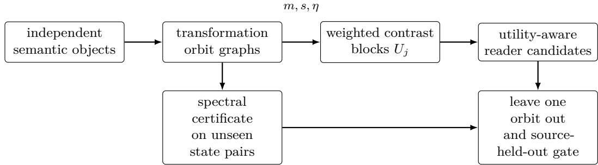
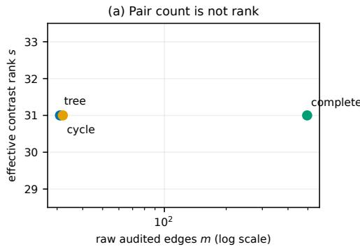
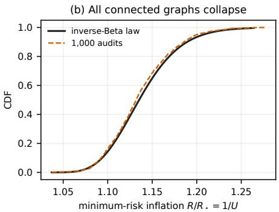
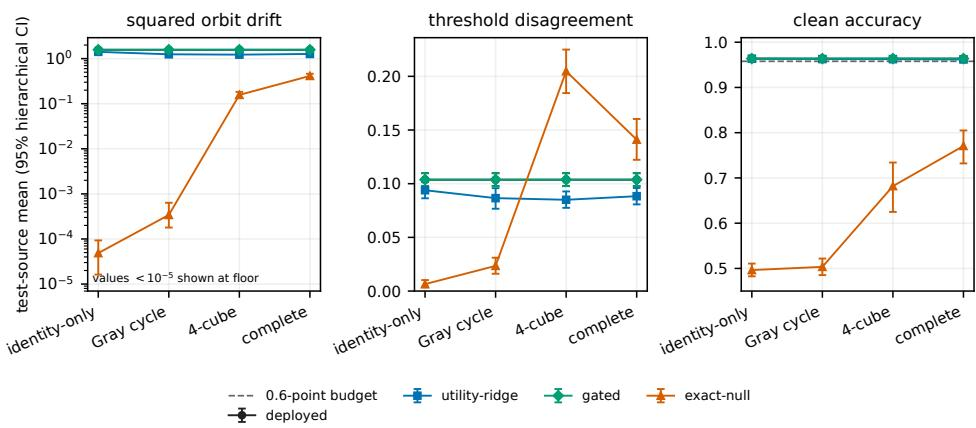

# Interpolation Is Not Invariance: Pair Count Is Not Coverage in Transformation Audits

Mohammed AHNOUCH Université Paris 1 Paris, France

Lotfi ELAACHAK Faculty of Science and Technology of Tangier Abdelmalek Essaadi University Tangier, Morocco

## Abstract

Counting equivalent pairs is the usual way to report how thoroughly a transformation audit covers a model, and it overstates what the audit constrains. Pairs drawn from one semantic object are correlated, and on a complete orbit graph most of them are algebraically redundant. We therefore separate four quantities that a raw count conflates: edge count $m ,$ efective contrast rank $s ,$ population support rank $r ,$ and graph spectral gap η. In a rank-r Gaussian contrast model, a calibrated reader that is invariant on the population exists exactly when the anchor has a component in ker T. Failing that, an audit of rank $s < r$ pays an unseen risk of $\mathsf { R } _ { \star } / U$ with $U \sim \mathrm { B e t a } ( ( r - s ) / 2 , s / 2 )$ , and once $s \geq r$ calibrated exact interpolation is infeasible. Orbit topology behaves the same way: a spanning tree imposes the exact-null constraints that a complete graph does, and a sharp graph Poincaré inequality carries edge drift to the whole orbit only after paying $1 / \eta .$ . Cycles can even let pair-level leave-one-out report zero error while no semantic object was ever held out. We therefore give exact block-Woodbury leave-one-orbitout updates, and a source-disjoint deployment gate over finitely many candidates that keeps the original reader unless uncertainty bounds certify lower drift inside a clean-utility budget. Synthetic and frozendigit audits then separate nominal pair count from algebraic rank and spectral coverage.

  
Figure 1: Pair count is not coverage. Orbit topology determines exact contrast rank; its gap converts a held-out bound on local edge drift into an all-state certificate; and semantic objects, rather than correlated edges, are held out for selection.

## 1 Introduction

Invariance audits exist because a model that answers diferently on two inputs its owner declared equivalent is a liability, and they report pair count as coverage. Such an audit rarely contains independent pairs: it usually starts from one semantic object, an image, intent, patient, or scene, and compares several transformations of that object. Record every edge of the resulting orbit graph and a q-state orbit contributes $q ( q - 1 ) / 2$ pairs, yet those pairs can encode only q − 1 independent contrasts. A complete graph can therefore make an audit look far larger than the representation it constrains, while adding no exact constraint that a spanning tree does not already impose.

The gap matters as soon as a frozen representation h feeds a linear reader. Such a reader can disagree on two inputs that were declared equivalent, and the tempting repair is to leave h alone and adjust the reader until every audited contrast vanishes. Paired translations and paraphrases motivate the problem [Yong et al., 2024, Deng et al., 2024, Wang et al., 2024], and controlled image experiments isolate its statistical geometry. Driving the edge residual to zero, however, is interpolation and nothing more: invariance asks for small drift on a fresh semantic object, and on transformation states that no audited edge ever joined.

Pair count alone therefore does not measure how strong an audit is. Three quantities pull apart, the edge count m, the efective contrast rank s, and the population support rank r, and a fourth, the graph spectral gap η, decides separately whether local comparisons certify an entire orbit. Figure 1 summarizes the separation.

Three results follow. A rank-aware finite-sample theorem shows that correlated Gaussian audits pay the same beta-law interpolation cost as s independent constraints however large m becomes, covers singular population geometry, and says when exact invariance is available and when calibrated interpolation is impossible. A sharp graph Poincaré inequality then turns population transition drift into an all-state orbit certificate, while a cycle lemma explains why leaving out a single pair can be vacuous. Finally, utilityaware ridge, an exact block-Woodbury leave-one-orbit-out calculation and a finite-candidate confidence gate combine into a rule that defaults to the deployed reader. A synthetic experiment isolates rank from edge count, and a frozen-digits experiment compares orbit graphs at a fixed pair budget.

Positioning. Nullspace projection and concept-erasure methods remove linearly recoverable information from a representation [Ravfogel et al., 2020, Belrose et al., 2023, Holstege et al., 2025]. We instead leave the representation available to every other task and edit one readout using within-object contrasts. Supervised augmentation and explicit symmetry methods can establish stronger invariance when labels or the complete group action are available [Tahmasebi et al., 2026, Soleymani et al., 2026]; our question is what can be certified from a finite, correlated audit. Graph Poincaré inequalities, block inverse identities, and spectral-gap design are classical [Levin and Peres, 2017, Chung, 1997, Ghosh and Boyd, 2006, Golub and Van Loan, 2013]. The contribution is their combination into an orbit-aware audit and deployment rule, not a new graph inequality or matrix identity. Source-aware crossvalidation is likewise established [Geras and Sutton, 2013]; here it prevents transformed copies of one object from leaking across repair selection.

## 2 Audits are graphs, not bags of pairs

We treat an audit as one graph per object rather than a list of pairs. Let $x _ { j }$ $j = 1 , \dots , n$ , be independent semantic objects. Object j has transformation states $V _ { j }$ and representations $z _ { j v } = h ( g _ { v } x _ { j } ) \in \mathbb { R } ^ { d }$ . An oriented weighted graph $\mathcal { G } _ { j } = ( V _ { j } , E _ { j } )$ specifies which states are compared. If $B _ { j } \in \mathbb { R } ^ { | V _ { j } | \times | \bar { E } _ { j } | }$ is its weighted incidence matrix and $H _ { j } = [ z _ { j v } ] _ { v \in V _ { j } }$ , its contrast block is

$$
U _ { j } = H _ { j } B _ { j } , \qquad X = [ U _ { 1 } , \ldots , U _ { n } ] , \qquad { \widehat { T } } _ { G } = X X ^ { \top } .\tag{1}
$$

Weights include any normalization, so deleting an object means deleting its whole block without changing the remaining weights. For a reader $w$ , the columns of $U _ { j }$ contain its audited score diferences.

The raw count is $\begin{array} { r } { m = \sum _ { j } | E _ { j } | } \end{array}$ . The efective contrast rank is the rank of the corresponding audit design, denoted s in the model below; the fresh-pair

second moment is $T \succeq 0$ with support rank $r = \mathrm { r a n k } ( T )$ . Finally, η is the spectral gap of the reversible state-transition graph used for the certificate in section 4. These quantities answer diferent questions:
<table><tr><td>quantity meaning</td><td></td><td>increased by duplicate edges? role</td><td></td></tr><tr><td>m</td><td>recorded comparisons</td><td>yes</td><td>compute and annotation cost</td></tr><tr><td>S</td><td>independent audit contrasts</td><td>no</td><td>interpolation geometry</td></tr><tr><td>r</td><td>population contrast support</td><td>no</td><td>unseen-risk dimension</td></tr><tr><td>η</td><td>orbit connectivity/conditioning</td><td>not necessarily</td><td>coverage certificate</td></tr></table>

For a fresh declared-equivalent contrast $D ,$ define

$$
T = \mathbb { E } [ D D ^ { \top } ] , \qquad \mathsf { R } ( w ) = \mathbb { E } ( w ^ { \top } D ) ^ { 2 } = w ^ { \top } T w .\tag{2}
$$

The deployed reader a is normalized to $\| a \| = 1$ . We call $a ^ { \top } w = 1$ anchor calibration. It fixes one afine degree of freedom; by itself it neither preserves decisions nor bounds clean accuracy. Those properties are measured separately below. An exactly interpolating reader satisfies $X ^ { \top } w = 0$ in addition to anchor calibration.

## 3 The efective-rank law

The following model separates raw columns from their algebraic content. Let $Z \in \mathbb { R } ^ { d \times k }$ have independent standard Gaussian entries, let $A \in \mathbb { R } ^ { k \times m }$ be deterministic with rank s, and set

$$
D _ { \mathrm { a u d } } = T ^ { 1 / 2 } Z A .\tag{3}
$$

The m columns may be strongly correlated. Only the s-dimensional column space selected by A enters the null constraint. An incidence matrix is the canonical example.

Theorem 1 (Rank-aware law for exact audit interpolation). Let $T \succeq 0$ be deterministic with rank r, let A and Z be as in eq. (3), and let $a _ { 0 } = P _ { \ker T } a$ (i) If $a _ { 0 } \neq 0 _ { i }$ , then $w _ { 0 } = a _ { 0 } / \Vert a _ { 0 } \Vert ^ { 2 }$ is anchor-calibrated, annihilates the audit, and has $\mathsf { R } ( w _ { 0 } ) = 0$

(ii) If $a _ { 0 } = 0$ and $1 \leq s < r$ , then almost surely

$$
\operatorname* { m i n } _ { D _ { \mathrm { a u d } } ^ { \top } w = 0 , a ^ { \top } w = 1 } \mathsf { R } ( w ) = \frac { \mathsf { R } _ { \star } } { U } , \qquad U \sim \mathrm { B e t a } \Big ( \frac { r - s } { 2 } , \frac s 2 \Big ) , \quad \mathsf { R } _ { \star } = ( a ^ { \top } T ^ { \dagger } a ) ^ { - 1 } .\tag{4}
$$

For $s = 0$ , the same statement holds with $U \equiv 1$

(iii) If $a _ { 0 } = 0$ and $s \geq r$ , no anchor-calibrated exact interpolator exists almost surely.

In case $( i i ) ,$ , for every anchor-calibrated exact audit interpolator and $\varrho \ge 1$

$$
\mathbb { P } \{ \mathsf { R } ( w ) > \varrho \mathsf { R } _ { \star } \} \ge I _ { 1 / \varrho } \bigg ( \frac { r - s } { 2 } , \frac { s } { 2 } \bigg ) ,\tag{5}
$$

$$
\mathbb { E } [ \operatorname* { m i n } \left. { R } ( w ) \right] = \mathsf { R } _ { \star } \frac { r - 2 } { r - s - 2 } , \qquad s \leq r - 3 ,\tag{6}
$$

where $I _ { x }$ is the regularized incomplete beta function and the mean is infinite for $s \in \{ r - 2 , r - 1 \}$ . Along a sequence with $r , s \to \infty$ and $r / s \to \gamma > 1$ , the ratio of the minimum to $\mathsf { R } _ { \star }$ converges in probability to $\gamma / ( \gamma - 1 )$

Proof. Part (i) follows from $T a _ { 0 } = 0$ and $a ^ { \top } a _ { 0 } = \| a _ { 0 } \| ^ { 2 }$ . For the other cases, write $T = V \Lambda V ^ { \top }$ , where $V \in \mathbb { R } ^ { d \times r }$ has orthonormal columns and $\Lambda \succ 0$ Since $a _ { 0 } = 0 ,$ , put $b = \Lambda ^ { - 1 / 2 } V ^ { \top }$ a and $y = \Lambda ^ { 1 / 2 } V ^ { \top } w$ . Kernel components of w afect neither the constraints nor the objective, and

$$
\mathsf { R } ( w ) = \| y \| ^ { 2 } , \qquad a ^ { \top } w = b ^ { \top } y , \qquad \| b \| ^ { 2 } = a ^ { \top } T ^ { \dagger } a .
$$

Take a thin singular-value decomposition $A = L \Sigma R ^ { \top }$ . Rotational invariance makes $V ^ { \top } Z L$ a standard Gaussian $r \times s$ matrix, while $\Sigma R ^ { \top }$ does not change its column span. Thus interpolation is $y \perp s$ for a Haar-random s-plane $S \subset \mathbb { R } ^ { r }$ . When $s < r ,$ Cauchy–Schwarz on $S ^ { \perp }$ gives the unique minimum-risk coordinate

$$
y _ { \star } = \frac { P _ { S ^ { \perp } } b } { \| P _ { S ^ { \perp } } b \| ^ { 2 } } , \qquad \| y _ { \star } \| ^ { 2 } = \frac { 1 } { \| b \| ^ { 2 } U } , \quad U = \frac { \| P _ { S ^ { \perp } } b \| ^ { 2 } } { \| b \| ^ { 2 } } .
$$

The squared projection of a fixed direction onto a Haar $( r - s ) – \mathrm { p l a n e }$ is the beta variable in eq. (4) [Muirhead, 1982]. Its inverse tail and first inverse moment give eqs. (5) and (6); beta concentration gives the limit. If $s \geq r$ the audit span equals $\mathbb { R } ^ { r }$ almost surely, forcing $y = 0$ , which contradicts $b ^ { \top } y = 1$ □

The kernel case is a genuine population-invariant escape, but it may move far from the deployed reader; this is precisely why anchor calibration is not a utility guarantee. In the usual case $a \in { \mathrm { r a n g e } } ( T )$ , the theorem replaces the nominal sample size m by s. In particular, when $1 \leq s < r _ { : }$ , for $\mathsf { R } _ { 0 } = a ^ { \top } T a$ every anchor-calibrated exact audit interpolator is worse than deployment with probability at least

$$
I _ { \mathsf { R } _ { \star } / \mathsf { R } _ { 0 } } \left( \frac { r - s } { 2 } , \frac { s } { 2 } \right) ,\tag{7}
$$

because $( a ^ { \top } T a ) ( a ^ { \top } T ^ { \dagger } a ) \geq 1$ for normalized $a \in { \mathrm { r a n g e } } ( T )$ .

Corollary 2 (Edge redundancy). If B is an incidence matrix of a graph with q vertices and c connected components, then rank $( B ) = q - c$ . A complete graph and any spanning tree on the same connected orbit therefore impose identical exact-null constraints $B ^ { \top } H ^ { \top } w = 0$ , despite having diferent edge counts.

Proof. The kernel of $B ^ { \top }$ consists of vectors constant on each component, hence has dimension c. For any two connected graphs, the incidence columns span the same zero-sum subspace; applying the same linear map H preserves equality of their column spans. □

Exact constraints depend only on connected components. Approximate repair is diferent: edge weights and graph conditioning decide how small observed edge energy controls the unobserved orbit.

## 4 From local edges to orbit coverage

Edges are local while the claim we want covers every state. Fix an object x and write $f _ { x } ( \boldsymbol { v } ) = \boldsymbol { w } ^ { \top } h ( g _ { \boldsymbol { v } } x )$ . Let P be a reversible Markov kernel on a finite set of transformation states with stationary law $\pi$ . Draw $V , V ^ { \prime } \stackrel { \mathrm { i i d } } { \sim } \pi$ and $W \mid V \sim P ( V , \cdot )$ , and average also over fresh objects:

$$
\mathsf { R } _ { \mathrm { o r b i t } } ( w ) = \mathbb { E } _ { x , V , V ^ { \prime } } [ f _ { x } ( V ) - f _ { x } ( V ^ { \prime } ) ] ^ { 2 } ,\tag{8}
$$

$$
\mathsf { R } _ { \mathrm { e d g e } } ( w ) = \mathbb { E } _ { x , V , W } [ f _ { x } ( V ) - f _ { x } ( W ) ] ^ { 2 } .\tag{9}
$$

Let η be the Poincaré spectral gap of $P$ on mean-zero functions [Levin and Peres, 2017, Chung, 1997].

Theorem 3 (Sharp orbit certificate). Ifthe transformation graph is connected and reversible, then every reader satisfies

$$
\mathsf { R } _ { \mathrm { o r b i t } } ( w ) \leq \frac { \mathsf { R } _ { \mathrm { e d g e } } ( w ) } { \eta } .\tag{10}
$$

The constant $1 / \eta$ is sharp.

Proof. For fixed x, let $\bar { f } _ { x } \ = \ \mathbb { E } _ { \pi } f _ { x }$ . Independence gives $\mathbb { E } _ { V , V ^ { \prime } } ( f _ { x } ( V ) ~ -$ $f _ { x } ( V ^ { \prime } ) ) ^ { 2 } = 2 \operatorname { V a r } _ { \pi } ( f _ { x } )$ . Reversibility gives $\mathbb { E } _ { V , W } ( f _ { x } ( V ) - f _ { x } ( W ) ) ^ { 2 } = 2 \langle f _ { x } , ( I -$ $P ) f _ { x } \rangle _ { \pi }$ . The variational definition of the gap yields $\eta \operatorname { V a r } _ { \pi } ( f _ { x } ) \leq \langle f _ { x } , ( I -$ $P ) f _ { x } \rangle _ { \pi }$ . Multiply by two and average over x. An eigenfunction associated with the first nonzero eigenvalue attains equality. □

The certificate can be made finite-sample at the same semantic-object level. Conditional on the training data, fix the reader and let $L _ { j } ^ { \mathrm { e d g e } } \in [ 0 , B ]$ be validation object $j ^ { \ast } { } _  \}$ s expected transition loss over the chosen graph and let $\begin{array} { r } { \hat { R } _ { \mathrm { e d g e } } = n ^ { - 1 } \dot { \sum _ { j } { L _ { j } ^ { \mathrm { e d g e } } } } } \end{array}$ . Hoefding’s inequality and theorem 3 give, with probability at least $1 - \delta$ ，

$$
\mathsf { R } _ { \mathrm { o r b i t } } ( w ) \leq \frac { \widehat { R } _ { \mathrm { e d g e } } + B \sqrt { \log ( 1 / \delta ) / ( 2 n ) } } { \eta } .\tag{11}
$$

A small gap magnifies both observed edge drift and statistical uncertainty. If the same objects influenced the choice of w, a separate validation split or the simultaneous bound in theorem 6 is required.

Disconnected audits have $\eta = 0 ;$ : their edge loss cannot control ofsets between components. In particular, checking each generator only at the identity does not establish functional invariance under compositions. A generator edge must be sampled at orbit locations, as in a connected Cayley graph, before eq. (10) applies. Under a fixed normalization, maximizing the corresponding Poincaré gap—the Fiedler value in a symmetric-Laplacian formulation—is a classical connectivity objective [Ghosh and Boyd, 2006]. Here it supplies an audit-design rule: first connect the declared orbit, then spend remaining comparisons where they increase η or reduce uncertainty.

Proposition 4 (Cycle leakage in pair holdout). Let e be an edge lying on a cycle and let $B _ { - e }$ be the incidence matrix after deleting it. Then $b _ { e } \in \mathrm { c o l } ( B _ { - e } )$ . Consequently, any reader that exactly annihilates HB−e also has zero residual on the held-out contrast $H b _ { e }$

Proof. Rescale each nonzero weighted column to its unweighted incidence vector and orient the cycle consistently. These signed columns sum to zero, so $b _ { e }$ is a weight-adjusted linear combination of the remaining cycle columns. Multiplying by H preserves the relation. □

Thus pair-level leave-one-out can report perfect prediction without removing any independent information. The appropriate deletion unit is the semantic object and all of its orbit edges.

## 5 Utility-aware repair and safe selection

Repair should not cost more clean behavior than it buys in invariance. With $G \succ 0$ measuring the edit cost, we fit

$$
\widehat { w } _ { \lambda , G } = \arg \operatorname* { m i n } _ { a ^ { \top } w = 1 } \left\{ w ^ { \top } X X ^ { \top } w + \lambda ( w - a ) ^ { \top } G ( w - a ) \right\} .\tag{12}
$$

This need not lie in the exact-null plane when $\lambda > 0$ . Put $M = X X ^ { \top } + \lambda G$ $Q = M ^ { - 1 }$ , and $b = \lambda G a$ . Direct Lagrange optimization gives

$$
\widehat { w } _ { \lambda , G } = Q ( b + \tau a ) , \qquad \tau = \frac { 1 - a ^ { \top } Q b } { a ^ { \top } Q a } .\tag{13}
$$

For leave-one-orbit-out (looo), delete the entire block $U _ { j }$ from eq. (1). The inverse needed for the refit is available from one full fit:

Proposition 5 (Exact block-Woodbury looo). For $\lambda > 0$ , define $Q _ { - j } =$ $( M - U _ { j } U _ { j } ^ { \top } ) ^ { - 1 }$ . Then

$$
Q _ { - j } = Q + Q U _ { j } ( I - U _ { j } ^ { \top } Q U _ { j } ) ^ { - 1 } U _ { j } ^ { \top } Q .\tag{14}
$$

Substituting ${ Q _ { - j } } \ f o r \ Q$ in $e q .$ (13) gives exactly the reader refitted without semantic object $j$

Proof. Because $\begin{array} { r } { M - U _ { j } U _ { j } ^ { \top } = \lambda G + \sum _ { k \neq j } U _ { k } U _ { k } ^ { \top } \succ 0 } \end{array}$ , the stated inverse exists. The matrix inversion lemma for a negative rank-|Ej| update gives eq. (14); the constrained minimizer then follows from the same Lagrange calculation as eq. (13). □

looo is a useful diagnostic, but a separate source-disjoint validation set makes model selection transparent. Let C be K candidate graph, penalty, and utility-metric choices, all fit without validation data. For validation object $j ,$ let $\Delta _ { j c } ^ { I }$ be candidate c’s orbit-loss minus the deployed reader’s orbit-loss, and let $\Delta _ { j c } ^ { U }$ be its clean-error increase. Suppose their ranges have pre-specified widths $W _ { I } , W _ { U }$ ; clipping scores before squared loss is one way to ensure this.

Theorem 6 (Finite-candidate source-held-out gate). On $n _ { v }$ independent validation objects, let $\begin{array} { r } { \widehat { \Delta } _ { c } ^ { k } = n _ { v } ^ { - 1 } \sum _ { j } \Delta _ { j c } ^ { k } } \end{array}$ for $k \in \{ I , U \}$ and set

$$
\epsilon _ { k } = W _ { k } \sqrt { \frac { \log ( 4 K / \delta ) } { 2 n _ { v } } } .\tag{15}
$$

With probability at least $1 - \delta$ , simultaneously for every candidate and both metrics, $| \widehat { \Delta } _ { c } ^ { k } - \mathbb { E } \Delta _ { c } ^ { k } | \leq \epsilon _ { k }$ . Hence a gate that returns a repair only if

$$
\widehat { \Delta } _ { c } ^ { I } + \epsilon _ { I } < 0 , \qquad \widehat { \Delta } _ { c } ^ { U } + \epsilon _ { U } \leq 0 . 0 0 6\tag{16}
$$

guarantees, on the same event, lower orbit loss than deployment and at most a 0.6-percentage-point clean-accuracy loss. If no candidate passes, returning a preserves the baseline.

Proof. Hoefding’s inequality bounds either tail for one candidate and metric by $\exp ( - 2 n _ { v } \epsilon _ { k } ^ { 2 } / W _ { k } ^ { 2 } )$ . A union bound over 2K candidate–metric pairs and two tails gives the simultaneous event. On it, each left side of eq. (16) is an upper bound on its population diference, so the two conclusions follow even after selecting a candidate adaptively. □

When a valid variance upper bound $\sigma _ { k } ^ { 2 }$ is available, the pre-specified Bernstein radius

$$
\epsilon _ { k } ^ { \mathrm { B } } = \sqrt { \frac { 2 \sigma _ { k } ^ { 2 } \log ( 4 K / \delta ) } { n _ { v } } } + \frac { 2 W _ { k } \log ( 4 K / \delta ) } { 3 n _ { v } }
$$

may replace eq. (15). Candidate selection uses the smallest invariance upper bound among utility-feasible candidates, then applies the strict improvement test; it never treats training annihilation as evidence.

Orbit-aware readout audit (fixed before test evaluation)

1. Split semantic objects into train, validation, and test sets before generating transformations.

2. For each candidate graph, form orbit blocks $U _ { j } ;$ record $m , s ,$ and η. A disconnected graph cannot claim compositional coverage.

3. Fit eq. (12) over a finite penalty grid. Compute block looo by eq. (14) only as a diagnostic.

4. On validation objects, evaluate all declared state pairs and clean utility. Apply the simultaneous gate in eq. (16).

5. Freeze the passing candidate with the lowest orbit-loss upper bound, or retain a if none passes. Evaluate the test objects once.

## 6 Experiments

## 6.1 Rank collapse despite hundreds of edges

We draw 1000 audits with $d = 2 5 6$ and $q = 3 2$ latent transformation states under a full-rank spiked T. For each latent state matrix we form a spanning tree, a cycle, and a complete graph. They contain respectively 31, 32, and 496 recorded pairs, but each connected design has efective rank 31. In particular, the complete audit has more nominal pairs than representation dimensions without approaching the $s \geq r$ infeasibility boundary.

  
Figure 2: Raw edge count collapses to graph rank. Tree, cycle, and complete orbits have the same exact nullspace for each audit, and their normalized optimal risks follow $1 / U$ , where $U \sim \mathrm { B e t a } ( ( 2 5 6 - 3 1 ) / 2 , 3 1 / 2 )$ . Curves use 1000 independent audits; theory is not fit to the simulation.

Figure 2 shows the three empirical laws on top of the same inverse-Beta prediction; the pre-specified Kolmogorov–Smirnov diagnostics are applied to $U = \mathsf { R } _ { \star } /$ min R. Their smallest p-value is 0.0286, and the empirical mean risk ratio is 1.1362 against the exact 1.1390. The maximum numerical diference between the tree and complete exact-null projectors is $2 . 0 \times 1 0 ^ { - 1 5 }$ . Thus m can cross d while the efective constraint rank remains small.

## 6.2 Frozen digits: equal budgets, diferent orbit graphs

On the $8 \times 8$ optical digits [Alpaydin and Kaynak, 1998, Pedregosa et al., 2011], the task is parity. For each of 5 seeds, we train a one-hidden-layer ReLU network of width 512 for 180 full-batch epochs on 500 clean sources, then freeze its hidden map, normalized parity readout $^ { a , }$ and bias. Each of 3 source partitions reserves disjoint sets of 120/300/500/377 images for audit/tuning/gate/test before constructing any orbit.

Four binary state bits apply, in order, brightness +0.08, contrast ×1.15 about intensity 0.25, a 0.65-pixel horizontal shift, and Gaussian blur with width 0.65. Thus every source has 16 states. The clean metric is parity accuracy at the frozen zero threshold and bias. Using only the 500 representation-training sources, we set $G = C + 0 . 0 2 \operatorname { t r } ( C ) I / d .$ , with C their hidden covariance. We tune 17 penalties over a trace-scaled $1 0 ^ { - 4 } – 1 0 ^ { 4 }$ grid on the tuning sources. The exact-null comparator is the minimum-Euclideanedit reader subject to $X ^ { \top } w = 0$ and $a ^ { \top } w = 1 \mathrm { : }$ ; the ridge reader uses eq. (12). Tuning enumerates all 120 state pairs. On the independent gate split, squared drift is clipped at the pre-specified $B = 4$ only for its signed paired upper bound; an exact binomial upper bound on newly harmed clean predictions conservatively bounds net accuracy loss. Test drift is unclipped.

Four audits receive the same budget of 480 recorded pairs: generator checks only at the identity, a Gray-code cycle, the four-dimensional cube, and the complete graph. Their respective edge counts per orbit are 4, 16, 32, 120, so the budget covers 120, 30, 15, 4 independent training sources. The first design leaves composition states disconnected; the other three cover all states but have diferent gaps and edge multiplicities. For every design we fit the deployed reader, exact nulling, and utility-aware ridge. Ridge penalties are selected only on source-disjoint validation data; pair leave-one-out and block looo are reported as diagnostics, not selection evidence.

The graph comparison is structural before any reader is fitted. Writing $q = 1 6 ,$ , the table reports the mean realized audit rank across the $5 { \times } 3$ fits:
<table><tr><td>graph</td><td> $_ { e _ { G } }$ </td><td> $n _ { G }$ </td><td> $q - c$ </td><td>rank X</td><td>η</td></tr><tr><td>identity generators</td><td>4</td><td>120</td><td>4</td><td>377.8667</td><td>0</td></tr><tr><td>Gray-code cycle</td><td>q</td><td>30</td><td> $q - 1$ </td><td>369.8667</td><td> $1 - \cos ( 2 \pi / q )$ </td></tr><tr><td>4-cube</td><td> $2 q$ </td><td>15</td><td> $q - 1$ </td><td>225</td><td> $1 / 2$ </td></tr><tr><td>complete</td><td> $q ( q - 1 ) / 2$ </td><td>4</td><td> $q - 1$ </td><td></td><td> $q / ( q - 1 )$ </td></tr></table>

The fixed budget induces a breadth–connectivity trade-of. Identity checks cover the most objects but disconnect composition states; complete graphs give the strongest per-orbit certificate from the fewest objects; cycles and cubes lie between. Neither maximum edge count nor maximum gap is therefore guaranteed to minimize held-out drift.

Test evaluation enumerates all 120 distinct unordered state pairs per source. Under the uniform state law, multiplying this distinct-pair mean by 15/16 recovers eq. (8); the factor does not change paired graph comparisons. Squared drift and threshold disagreement are averaged over those pairs; clean accuracy uses state zero. Intervals resample networks, then source splits within networks, then source objects while keeping graph contrasts paired at all three levels. A graph-design advantage is called directional only when its paired 95% interval excludes zero.

The pre-specified cube-minus-identity utility-ridge contrast in fig. 3 is directional: drift changes by -0.1880 (paired hierarchical 95% interval $\left[ - 0 . 2 9 4 9 , - 0 . 0 9 6 9 \right] )$ . Under exact nulling, identity-only drift falls to $4 . 9 \times 1 0 ^ { - 5 }$ while clean accuracy falls from 0.9637 to 0.4964. The joint gate accepts 0% of fits and otherwise returns deployment, so the cube contrast does not satisfy the clean-utility deployment criterion. Identity-only has $\eta = 0 ;$ connected graphs saturate per-orbit rank $q - 1$ , but denser graphs see fewer sources and lower aggregate rank.

  
Figure 3: Frozen-digits orbit audit at an equal pair budget. Panels report all-state squared drift, threshold disagreement, and clean accuracy; the table reports rank and gap. Points pair the same source split and network seed; bars are hierarchical 95% intervals. The dashed accuracy line marks the pre-specified 0.6-point deployment budget.

## 6.3 What to optimize under a pair budget

Let M be a fixed number of recorded comparisons and let a candidate graph $\mathcal { G }$ use $e _ { G }$ edges per semantic object. It can then cover roughly $n _ { G } = \lfloor M / e _ { G } \rfloor$ independent objects. More edges within an orbit can increase ηG, but they reduce $n _ { G }$ and hence weaken source-level concentration. Combining eq. (11) with this accounting suggests the pre-validation design score

$$
\mathcal { B } ( \mathcal { G } ) = \frac { \widehat { R } _ { \mathrm { e d g e } } ( \mathcal { G } ) + B \sqrt { \log ( 1 / \delta ) / ( 2 n _ { G } ) } } { \eta _ { G } } , \qquad \eta _ { G } > 0 .\tag{17}
$$

When several graphs share pilot data, the logarithm is adjusted for the number of candidates. Candidate selection is followed by the untouched validation gate of theorem 6 and one test evaluation.

Neither a spanning tree nor a complete graph uniformly minimizes eq. (17). A tree attains the full exact-null rank with the fewest edges, maximizing source breadth, but may have a small gap and a loose orbit certificate. A complete graph maximizes local connectivity but repeatedly measures contrasts already in the same incidence span. Intermediate graphs can improve the gap per added edge. A practical greedy heuristic begins with a spanning graph and adds the edge with the largest predicted improvement in the chosen Poincaré gap (or the Fiedler value under the corresponding Laplacian normalization) [Ghosh and Boyd, 2006], recomputing the sourcecount penalty in eq. (17) after each addition. It stops when another edge would worsen the bound; the stopping rule has no global optimality guarantee. Once s is saturated within an orbit, added edges must improve spectral conditioning rather than merely increase the recorded pair count.

Mechanical validation. Graph-incidence ranks and the equality of tree and complete nullspaces hold to maximum discrepancy $2 . 0 \times 1 0 ^ { - 1 5 }$ . The minimum eigenvalue in the numerical Poincaré matrix-slack check is $- 9 . 3 \times 1 0 ^ { - 1 6 }$ (up to floating-point tolerance). The maximum held-cycle residual after exact nulling is $5 . 8 \times 1 0 ^ { - 1 5 }$ . Block-Woodbury looo agrees with brute-force refitting to relative error $2 . 9 \times 1 0 ^ { - 1 6 }$ , below the pre-specified $1 0 ^ { - 9 }$ tolerance. At $\delta = 0 . 0 5$ , the source-level gate’s simultaneous event holds in 99.8300% of $1 . 0 \times 1 0 ^ { 4 }$ repetitions (nominal 95%).

## 7 Limitations and conclusion

The beta law assumes Gaussian latent innovations and a fixed A; the graph certificate is distribution-free but needs a correct equivalence relation and a finite reversible graph; a frozen linear head cannot recover information the representation never carried; anchor calibration is normalization and nothing more; and the gate needs independent source orbits with bounded loss. The digit transformations are mild and in fixed order, so they do not probe noncommuting actions or a misdeclared relation, and digits test orbit geometry rather than multilingual guards or foundation models.

What an audit certifies is fixed by its rank and its orbit topology. Count semantic objects rather than edges, report the contrast rank, connect the orbit and report its gap, hold out whole orbits, and deploy only when a source-level bound beats the deployed reader inside the budget. Pair count alone certifies none of these.

## References

Ethem Alpaydin and Cenk Kaynak. Optical recognition of handwritten digits data set. UCI Machine Learning Repository, 1998.

Nora Belrose, David Schneider-Joseph, Shauli Ravfogel, Ryan Cotterell, Edward Raf, and Stella Biderman. LEACE: Perfect linear concept erasure in closed form. In Advances in Neural Information Processing Systems, volume 36, 2023.

Fan R. K. Chung. Spectral Graph Theory, volume 92 of CBMS Regional Conference Series in Mathematics. American Mathematical Society, Providence, RI, 1997.

Yue Deng, Wenxuan Zhang, Sinno Jialin Pan, and Lidong Bing. Multilingual jailbreak challenges in large language models. In International Conference on Learning Representations, 2024.

Krzysztof Geras and Charles Sutton. Multiple-source cross-validation. In Proceedings of the 30th International Conference on Machine Learning, volume 28 of Proceedings of Machine Learning Research, pages 1292–1300. PMLR, 2013. URL https://proceedings.mlr.press/v28/geras13.html.

Arpita Ghosh and Stephen Boyd. Growing well-connected graphs. In Proceedings of the 45th IEEE Conference on Decision and Control, pages 6605–6611. IEEE, 2006. doi: 10.1109/CDC.2006.377282.

Gene H. Golub and Charles F. Van Loan. Matrix Computations. Johns Hopkins University Press, 4 edition, 2013.

Floris Holstege, Shauli Ravfogel, and Bram Wouters. Preserving task-relevant information under linear concept removal. In Advances in Neural Information Processing Systems, 2025.

David A. Levin and Yuval Peres. Markov Chains and Mixing Times, volume 107 of MBK. American Mathematical Society, Providence, RI, 2 edition, 2017. doi: 10.1090/mbk/107.

Robb J. Muirhead. Aspects of Multivariate Statistical Theory. Wiley, 1982.

Fabian Pedregosa, Gael Varoquaux, Alexandre Gramfort, Vincent Michel, Bertrand Thirion, Olivier Grisel, Mathieu Blondel, Peter Prettenhofer, Ron Weiss, Vincent Dubourg, et al. Scikit-learn: Machine learning in python. Journal of Machine Learning Research, 12:2825–2830, 2011.

Shauli Ravfogel, Yanai Elazar, Hila Gonen, Michael Twiton, and Yoav Goldberg. Null it out: Guarding protected attributes by iterative nullspace projection. In Proceedings of the 58th Annual Meeting of the Association for Computational Linguistics, pages 7237–7256, 2020.

Ashkan Soleymani, Behrooz Tahmasebi, Patrick Jaillet, and Stefanie Jegelka. Ef ficient learning and symmetry discovery under exact invariances. In Proceedings of the Thirty-Ninth Conference on Learning Theory, volume 336 of Proceedings of Machine Learning Research, pages 5950–5979. PMLR, 2026. URL https://proceedings.mlr.press/v336/soleymani26a.html.

Behrooz Tahmasebi, Melanie Weber, and Stefanie Jegelka. Data augmentation: A fourier analysis perspective. In Proceedings of the Thirty-Ninth Conference

on Learning Theory, volume 336 of Proceedings of Machine Learning Research, pages 6114–6155. PMLR, 2026. URL https://proceedings.mlr.press/v336/ tahmasebi26a.html.

Wenxuan Wang, Zhaopeng Tu, Chang Chen, Youliang Yuan, Jen-tse Huang, Wenxiang Jiao, and Michael Lyu. All languages matter: On the multilingual safety of LLMs. In Findings of the Association for Computational Linguistics: ACL, pages 5865–5877, 2024.

Zheng-Xin Yong, Cristina Menghini, and Stephen H. Bach. Low-resource languages jailbreak GPT-4. arXiv preprint arXiv:2310.02446, 2024.