# Learned Bow Control on a Measured Bowed-String Model: a Revised Minimum-Bow-Force Law, a Recurrent Controller, and the Domain of a Supervision Ceiling

Columbia University Nonlinear Control Lab Technical Report No. 20260913-01

Homayoon Beigi1,2,3 and Grace Conneely1

1Department of Mechanical Engineering, Columbia University, New York, NY, USA

2Department of Electrical Engineering, Columbia University, New York, NY, USA

3Recognition Technologies, Inc., South Salem, NY, USA

Email: hb87@columbia.edu and gec2147@columbia.edu

Abstract—A finite-difference bowed-string model with implicitly resolved Stribeck friction is presented, with a regime diagnostic, the Schelleng bow-force limits on four strings, and a comparison of learned bow controllers. Implicit resolution is necessary, and quantitatively so: a lagged contact force cannot capture the string on a discrete grid, so no stick phase forms at any bow force. With friction, impedance and quality factor taken from published measurement rather than fitted, all four strings return a stick fraction of 89.1% against an ideal 90%. Schelleng’s maximum bow force is recovered on every string. The minimum is not: it follows Zvbβ−1 rather than the predicted $Z ^ { 2 } v _ { b } \beta ^ { - 2 }$ , reducing both squared dependences to first powers. Six controllers at matched capacity, over four strings and twenty seeds each, place a gated recurrent network ahead of a feedforward one, by most under a mid-stroke disturbance. The feedforward network completes more strokes only from a start the model’s own playability map places outside the Helmholtz region. A minimal gated variant fails because gates computed from the input alone cannot clear a latched state. Training loss selects neither the capacity nor the context length, and no learned controller improves on the lookup rule that generated its labels. That bound has a domain. Regressing the controller’s score on the rule’s gives a slope of 0.32, more than ten standard errors below unity, so the controller overtakes the rule where the rule fails and is bounded by it where it holds. Under a rigid finger stop the plant is provably invariant, so transfer loss between pitches belongs to the controller alone and is traced to one feature. A regime classifier without a stick test labels small-amplitude periodic slipping as Helmholtz motion, and a harmonicity measure rates a string the bow never grips above Helmholtz motion.

Index Terms—bowed-string instruments, Helmholtz motion, stick-slip friction, finite-difference time-domain, imitation learning, recurrent neural networks, neural network control, learningbased control

## I. INTRODUCTION

## A. Motivation

The sound of a violin arises from a nonlinear stick-slip interaction between the bow and the string. A player governs that interaction through three quantities: the normal force the bow applies, the bow speed, and the distance from the bridge at which the bow crosses the string. Small changes in any of them move the string between a regime that sounds like a tone and regimes that do not, and a player spends years learning to hold the first while listening for its edges.

The regime that sounds like a tone is Helmholtz motion, a cycle in which the bow carries the string for most of each period and releases it once. It has been studied since Helmholtz described it in 1862, and the conditions under which it forms and survives are now stated quantitatively. Holding those conditions across a complete bow stroke is a control problem, and the way a player acquires the skill, by adjusting the commands while listening to the result, makes a learned feedback policy a natural starting point.

The work reported here is one layer of a longer program, and the layer everything above it rests on. The object is a complete playing simulation of a physical violin, parameterized from measurement throughout: the string coupled through the bridge to a body and soundpost rather than terminated rigidly, the left hand modeled as flesh of finite impedance rather than as an ideal stop, and the bow carried at the angle and tilt a player actually uses rather than held normal to the string at a fixed contact. Such a model has to reverse the bow, so that a note is no longer one stroke, and to follow the dynamics of real playing rather than a single sustained tone. Beyond the violin, the program would take in the rest of its family, the smaller violins, the viola, the cellos in their several sizes, the double bass and the contrabass, on the expectation that they differ in the quantities this model is parameterized by rather than in kind. That expectation is untested here and is offered as a direction rather than a result. None of that is attempted here, and no instrument other than the violin is modeled, simulated or measured anywhere in this paper. What is established here is the string and the contact, the diagnostics by which a regime is identified, and a controller that holds the regime across a stroke, because a simulation that cannot hold a tone on one open string will not hold one on a violin.

## B. Literature Review

Helmholtz Motion: Helmholtz was the first to describe the motion that carries his name, and it remains the reference against which a bowed string is judged. Helmholtz motion describes the stick-slip cycle by which the bow catches and carries the string along with it (stick), until it reaches a tensile limit and eventually loses contact, sending the string back in the other direction (slip) [1].

Physical Modeling of Bowed Strings: Such works of classical physics, not only by Helmholtz, but Raman [2], Guettler [3], and Woodhouse [4], contributed to the thesis that stable violin tones arise from a repeating, stable, stick-slip cycle and further characterized the relationship in experiments and specific equations [5]–[8]. Their work underlies the modern physical models of bowed strings. Coupling a nonlinear friction law to a one-dimensional wave equation reproduces the interaction, whether the string is advanced as a partial differential equation or as a digital waveguide [7], [9].

Playability: Schelleng put the steady state on a quantitative footing, bounding the Helmholtz regime between a minimum and a maximum bow force, each a function of bow speed and bow-bridge distance [5]. Woodhouse recast those bounds computationally, deriving reflection functions for the string terminations and using them to predict the minimum bow force and the transient that precedes steady motion [10], [11]. Guettler moved the question from the steady state to the onset, mapping bow acceleration against bow force and grading an attack by the number of slips that precede regular triggering [12]. Measurement supplies the other half. Askenfelt registered bow position, bow velocity, bow-bridge distance and bow force in normal playing [13], [14], Demoucron, Askenfelt and Causse built a detachable sensor that recovers bow force´ from the transverse force at the hair termination [15], and Ablitzer, Dalmont and Dauchez modeled the statics of the tightened bow itself [16]. Section II-G applies Schelleng’s steady-state bounds to the model developed here and Section II-H applies Guettler’s onset test.

Friction Model: Frictional interaction between the bow and string is a central mechanism underlying bowed-string oscillation and has been modeled using a variety of approaches. One widely cited formulation is the LuGre dynamic friction model [17], which represents stick-slip behavior through an internal bristle state and is capable of capturing Stribeck effects, in which the average friction force decreases with increasing relative velocity, as well as hysteresis arising from the history-dependent nature of the contact. The LuGre model has since been re-examined and its identification clarified [18], and it sits within a broader control literature on friction modeling and compensation [19], [20].

In practice, many bowed-string models adopt simplified friction laws that focus primarily on the Stribeck velocityfriction relationship, omitting internal state dynamics while still reproducing the essential stick-slip behavior required for Helmholtz motion. Such Stribeck-based formulations are widely used in musical acoustics due to their relative simplicity and computational efficiency, while retaining the key nonlinear dependence of friction on relative bow-string velocity [7], [21]. The principal alternative replaces the velocity-only curve with one in which the friction force follows the temperature of the rosin layer. Woodhouse [22] reports that this thermal model establishes Helmholtz motion more readily than a steadysliding curve and predicts a different flattening behavior, so the choice of friction law is a modeling commitment and not only a simplification.

Control of Bowed Strings: Most prior approaches to controlling bowed-string dynamics rely on open-loop parameter maps, such as bow force–speed diagrams, to maintain Helmholtz motion [5], [8]. While effective within limited operating regions, these methods often struggle to accommodate the strong nonlinearities, discontinuities, and regime transitions induced by frictional contact.

Learning-based work on the bowed string has taken two complementary forms. Luan and Scavone [23] apply physicsinformed networks to the friction nonlinearity itself, learning the contact behavior of a lumped bow-string system rather than closing a loop around it. Percival, Bailey and Tzanetakis [24]– [26] do close the loop. Support vector machines trained on the audio produced by a bowed-string physical model generate finger position, bow-bridge distance, bow velocity and bow force, so that the system performs written music with the competence of a beginning student. That work treats the model as a black box and judges its own output by timbre.

Imitation Learning and Its Ceiling: The controller in this paper is trained on labels generated by a rule, which makes it an imitation learner, and the bound it runs into is the one that literature is about. A policy fitted to a demonstrator’s actions was the approach of Pomerleau’s ALVINN [27] and remains the simplest form of learning from demonstration [28], [29]. The central difficulty of behavior cloning is distribution shift: a policy trained on states the demonstrator visits is evaluated on states its own errors produce, and Ross and Bagnell [30] show the resulting error can compound quadratically in the horizon, which motivates the interactive aggregation of DAgger [31]. That a cloned policy does not generally exceed its demonstrator is the expected result rather than a surprising one. Imitating an algorithmic teacher rather than a human is also established: guided policy search trains a network on the output of a trajectory optimizer [32], which is the same arrangement used here with a playability map in place of the optimizer. Imitation learning has also been applied to violin bowing: Jin and colleagues [33] learn bowing motion from recorded human performance, which places their teacher on the demonstrator side of that distinction and this paper’s on the other.

What this plant adds is not a new bound but a measurable one. The teacher is an exhaustive tabulation of the steady-state inverse rather than a demonstrator, so its competence can be scored independently at every operating point, which is not usually possible. That turns the domain on which the bound holds from an assumption into a measurement: the controller’s score regressed on the teacher’s has a slope well below one, and the two cross at a teacher score that can be quoted. The result of Section V-B, that the controller exceeds the teacher exactly where the teacher fails, is a consequence of that rather than a counterexample to the imitation bound.

The controller developed here differs in what it commands and in what it measures. It commands normal force at the frog rather than at the contact point, which is the quantity a robotic bow can actually apply, and coordinates that force with bow velocity across the stroke as the transmission factor changes. Its objective is the oscillation regime itself, quantified by the stick fraction, rather than a judgment of timbre, which makes success and failure measurable against the Helmholtz signature. Neural approximation of the piecewise-continuous nonlinearities that arise in frictional contact is well established [34], so a small feedforward policy is a reasonable choice for the task.

## C. Our Contributions

• A quantitative demonstration that the contact must be resolved implicitly. Implicit and energy-balanced treatments of the bow-string contact are established [35]. What is shown here is the size of the consequence of not using one. A point force on a finite-difference grid acts on a lumped mass of order $1 0 ^ { - 6 }$ kg, so a friction force lagged by one time step changes the bow-point velocity by several meters per second. Section II-C shows that no bow force whatever produces a stick phase under that treatment.

• The stick fraction as a diagnostic, and the failure it exposes. Section II-D defines the proportion of a window during which the bow carries the string, and shows that a regime classifier lacking an explicit stick test will report Helmholtz motion for small-amplitude continuous slipping, which has the right period and the right spectral peak while having none of the underlying physics. The check is inexpensive and should precede any use of a playability map.

• A model built from measured parameters, validated on four strings. The friction characteristic, the wave impedance and the quality factor are taken from published measurement rather than fitted. Driven at each string’s own mid-band force, all four open strings return Helmholtz motion with a stick fraction of 89.1% against an ideal 90.0%, slip frequency within 0.83% of the value the flattening effect predicts, and slip jitter at machine precision. Section II-D also shows why a single operating point cannot be used for this: the force chosen on A sits at 99% of the maximum on E and 36% on G.

• The two bow-force limits, one confirmed and one revised. Section II-G fits both Schelleng limits against bow speed and bow-bridge distance on all four open strings. The maximum is recovered everywhere, with four exponents spanning 0.05. The minimum is not. Fitted jointly over impedance, speed and bow-bridge distance it follows $Z v _ { b } \beta ^ { - 1 }$ rather than the predicted $Z ^ { 2 } v _ { b } \beta ^ { - 2 }$ , reducing both squared dependences to first powers at 8.9 and 8.7 standard errors and halving the residual. The impedance dependence can be read from the magnitude of the limit alone, at $+ 1 . 0 6 \pm 0 . 0 7$ against a predicted +2. The two departures stand differently. The bow-bridge exponent confirms an experimental result of Schoonderwaldt, Guettler and Askenfelt [8], who reach $\beta ^ { - 1 }$ as a low-speed limit once the shape of the friction curve is taken into account. The impedance exponent has no such corroboration and its cause is not identified. Section II-H reproduces Guettler’s three regions and finds the band of clean attacks closing entirely, on every string, as the bow moves from one tenth to one twentieth of the string length from the bridge.

• A frog-referenced control formulation. The controller commands normal force at the frog and bow velocity, the quantities a robotic bow can actually apply, with the transmission to contact force modeled explicitly. Section V-A quantifies the cost of getting that transmission wrong, which is strongly asymmetric.

• A controller comparison at matched capacity, and a failure mode with a mechanism. Section IV-G trains six architectures at 1362 to 1410 parameters on all four strings with twenty seeds each. A gated recurrent unit leads on the mean of all four and significantly on one, and its margin is largest on the disturbance start, where it leads by 11.9, 15.5 and 8.2 points on G, D and E and is level on A. The feedforward network completes more strokes on three of the four starts, but by 20.0 points on the cold one against 6.2 and 1.2 on the others, and Section IV-I places that start outside the model’s own playable region. The minimal gated variant, whose gates are computed from the input alone, cannot clear a latched hidden state after an abrupt velocity override: eight of its twenty seeds on the E string hold below 9% Helmholtz motion for the remainder of the stroke, and forcing a state reset at every control step recovers all eight. Depth compounds that failure rather than repairing it.

Three ways of selecting a controller that do not work: by parameter count, by training-context length, and by training loss. Over a four-rung ladder of parameter budgets on all four strings and four architectures, one hundred and ninety-two fits, training loss falls in every one of the sixteen cells while closed-loop quality falls clearly in nine, rises clearly in two and is tied in five against the paper’s own interpretability bar, and the seed spread widens rather than narrowing in thirteen. Training loss also falls with the length of the training context while closed-loop quality moves in every direction. A search driven by fit quality picks the largest model every time and the worse controller more often than not (Sections IV-H and IV-K).

• A ceiling located in the supervision rather than the model. The rule that generates the controller’s training labels reads an exhaustive tabulation of the plant’s steady-state inverse at 1089 operating points, and on steady-state regulation the learned controller does not exceed it: over four open strings and thirty-seven fingered notes, in the 128 cells where both controllers finish, it wins 9 comparisons, loses 56 and ties 63 against the paper’s interpretability bar. What it does better is finish (Sections IV-F, V-F and IV-K).

• The domain of that ceiling, which is where the tabulation fails. The controller overtakes the tabulation wherever the tabulation itself fails and is bounded by it wherever the tabulation holds. Regressing the controller’s score on the tabulation’s over a friction sweep gives a slope of $0 . 3 1 9 \pm 0 . 0 6 5$ , more than ten standard errors below the unit slope that inheriting the teacher’s competence would produce, with the two crossing at a tabulation score of 88. Where the tabulation scores below 60 it averages 40.5 and the controller 65.7, and above 90 the order reverses at 97.5 against 90.3. The operative variable is the tabulation’s own health and not how far the contact has moved, because the tabulation is not monotone in the friction removed: the reduction at which it collapses on three strings is a local minimum, and it recovers before falling again. Measured across two independent families of fit, twenty-one of twenty-four cells agree within the interpretability bar and the three that do not are all where the effect is largest (Section V-B).

• Two attempts to lift that ceiling, failing the same way. Section V-D optimizes against the simulator instead of the teacher and finds no net gain over sixteen architecture and string combinations, but a significant one in mechanism: the conditions the search is shown improve in fifteen of sixteen and those it is not degrade in eleven, a separation of 9.2 points at $p = 0 . 0 0 0 8$ . A residual controller, which begins at the tabulation and learns a correction to it, reproduces the same trade from a different architecture and a different search, improving most on the string it was shown and losing most on the conditions it was not. The bound a residual architecture appears to offer holds at initialization and is destroyed by training on a distribution that does not cover the evaluation conditions.

• Whether oscillation feedback earns its place is a property of the string, not of the network. Retraining without each input group in turn, over four strings and four architectures, spreads the cost of removing the oscillation feedback by 19.3 points across strings against 6.8 across architectures. It significantly hurts on two strings and significantly helps on a third. A second experiment that freezes the same inputs at inference rather than removing them agrees about which strings on the same disturbance start, from a different manipulation, while a third under a different disturbance reverses the sign on G (Sections IV-F, IV-J and V-B).

• An acoustic check on the mechanical measure. Each condition is rendered from the bridge force and scored with descriptors from the voice literature. Cepstral peak prominence separates Helmholtz motion from every other regime by a factor of eight to twenty-four, and tracks the mechanical regime measure at a rank correlation of +0.825 over ninety-six recordings spanning four strings and four controllers, where a plain harmonicity measure reaches +0.327 and rates a string the bow never grips above Helmholtz motion (Section V-E).

• Fingered notes across three octaves, on a plant that is provably invariant. Thirty-seven chromatic positions from G3 to G6 are evaluated in Section V-F. Under a rigid stop at constant bow-bridge fraction, stopping the string leaves every coefficient of the discrete scheme unchanged and rescales only time, so two positions on one string are the same simulation relabeled, confirmed to $6 . 8 \times 1 0 ^ { - 1 3 }$ over three octaves. One playability map therefore serves every stopped position on a string. Because the plant is identical, every point of loss when an open-string controller is deployed at a stopped position belongs to the controller, and Section V-F traces most of it to a single feature: an amplitude target specified as a displacement, where displacement scales with the reciprocal of the fundamental and velocity does not.

• Three measurement choices that decide results, identified by making more than one. A scoring window can decide whether an effect exists at all. Scored over the whole stroke, a mid-stroke change in the contact condition separates the full controller from its feedback-free variant on both recurrent architectures at twenty seeds, by 14.7 and 18.5 points at p below 0.001. Scored over the steps after the onset, which is the more specific measure, only the minimal variant reaches significance and the architecture this paper recommends does not, at $p = 0 . 6 4$ . Reporting one window would have allowed either a finding or a null to be presented as the result. Likewise a start condition can decide whose failure a failure is: the cold start begins at a commanded speed whose entire force window lies below the model’s own force floor on one string, so a class of cold-start stalls belongs to the condition rather than to the controller, and the completion figures are reported both with and without it (Section IV-I). And a choice of protocol can decide which way an effect points rather than whether it exists: the feature ablation and a freeze at inference agree about which strings the oscillation feedback helps, on the disturbance start, while a third measurement under a different disturbance reverses the sign on G (Sections IV-J, IV-F and V-B).

## II. PROBLEM FORMULATION

## A. Nomenclature

Table I lists every symbol used in this paper, with its meaning and its unit. Each symbol carries one meaning throughout, so a reader meeting an unfamiliar one anywhere in the text can resolve it there.

## B. String Model

Following Desvages and Bilbao [35], the string is represented by a damped wave equation with frequency-dependent

TABLE I  
SYMBOLS USED THROUGHOUT. EACH SYMBOL CARRIES ONE MEANING. BOLD LOWERCASE DENOTES A VECTOR.
<table><tr><td>Symbol</td><td>Meaning</td><td>Unit</td></tr><tr><td colspan="3">String and grid</td></tr><tr><td> $\overline { { u ( x , t ) , u _ { l } ^ { n } } }$ </td><td>transverse displacement</td><td>m</td></tr><tr><td> $u _ { B }$ </td><td>displacement at the bow point</td><td>m</td></tr><tr><td> $x , L$ </td><td>position along the string, length</td><td>m</td></tr><tr><td> $x _ { B } , \beta$ </td><td>bow position,  $x _ { B } / L$ </td><td> $\mathrm { m } , -$ </td></tr><tr><td>C</td><td>transverse wave speed</td><td> $\mathrm { m / s }$ </td></tr><tr><td> $f _ { 0 } , f _ { 0 } ^ { \star }$ </td><td>nominal fundamental, its target</td><td>Hz</td></tr><tr><td> $\rho A$ </td><td>linear mass density</td><td> $\mathrm { k g / m }$ </td></tr><tr><td> $\dot { T }$ </td><td>string tension</td><td>N</td></tr><tr><td> $Z = \rho A c$ </td><td>wave impedance</td><td> $\mathrm { N } { \cdot } \mathrm { s } / \mathrm { m }$ </td></tr><tr><td> $\sigma _ { 0 } , \sigma _ { 1 }$ </td><td>damping coefficients</td><td> $\mathrm { s ^ { - 1 } , m ^ { 2 } / s }$ </td></tr><tr><td> $Q _ { 1 } , Q _ { 2 }$ </td><td>quality factors of modes 1, 2</td><td></td></tr><tr><td> $h , k$ </td><td>space step, time step</td><td>m, s</td></tr><tr><td> $n , l , l _ { B }$ </td><td>time index, space index, bow node</td><td></td></tr><tr><td> $N _ { x }$ </td><td>number of grid points</td><td></td></tr><tr><td> $\lambda = c k / h$ </td><td>Courant number</td><td></td></tr><tr><td> $\delta _ { x x }$ </td><td>second spatial difference operator</td><td></td></tr><tr><td> $\delta ( \cdot )$ </td><td>Dirac delta</td><td>1/m</td></tr><tr><td></td><td>discrete indicator of the bow node</td><td></td></tr><tr><td> $\begin{array} { l } { \mathbb { 1 } _ { l = l _ { B } } } \\ { \Gamma = ( 1 + \sigma _ { 0 } k ) ^ { - 1 } } \end{array}$ </td><td>damping denominator of the update</td><td></td></tr><tr><td colspan="3"></td></tr><tr><td>Contact  $v _ { b } , \dot { v } _ { b }$ </td><td>bow speed, its rate at the attack</td><td> $\overline { { \mathrm { \ m / s } , \mathrm { \ m / s } ^ { 2 } } }$ </td></tr><tr><td> $v _ { \mathrm { r e l } } , v ^ { \star }$ </td><td>relative velocity, its force-free value</td><td>m/s</td></tr><tr><td> $F _ { N }$ </td><td>normal force at the contact point</td><td>N</td></tr><tr><td> $F _ { \mathrm { f r o g } }$ </td><td>normal force at the frog</td><td>N</td></tr><tr><td> $f _ { \mathrm { b o w } }$ </td><td>friction force on the string</td><td>N</td></tr><tr><td> $\varphi$ </td><td>friction characteristic</td><td></td></tr><tr><td> $a _ { 1 } , a _ { 2 } , \mu _ { c }$ </td><td>friction curve coefficients</td><td>1</td></tr><tr><td> $v _ { 1 } , v _ { 2 }$ </td><td>Stribeck velocity scales</td><td>m/s</td></tr><tr><td> $v _ { \varepsilon }$ </td><td>sign-regularization velocity</td><td>m/s</td></tr><tr><td>a</td><td>implicit-solve coefficient, (5)</td><td>s/kg</td></tr><tr><td> $\alpha ( s ) , \alpha _ { \mathrm { t i p } }$ </td><td>transmission factor, its value at the tip</td><td>一</td></tr><tr><td> $T _ { h }$ </td><td>bow-hair tension</td><td>N</td></tr><tr><td> $K _ { s }$ </td><td>stick stiffness at the tip</td><td> $\mathrm { N } / \mathrm { m }$ </td></tr><tr><td> $F _ { W } , d$ </td><td>bow weight, its center of gravity</td><td> $\Nu , \mathrm { m }$ </td></tr><tr><td> $\tau , \tau _ { \mathrm { m a x } }$ </td><td>moment applied at the frog, its bound</td><td> $\mathrm { N } { \cdot } \mathrm { m }$ </td></tr><tr><td>θ</td><td>bow inclination from the horizontal</td><td>rad</td></tr><tr><td colspan="3">Diagnostics</td></tr><tr><td>η</td><td>stick fraction</td><td></td></tr><tr><td> $W , \epsilon$ </td><td>analysis window, stick tolerance slip-interval frequency</td><td> $\mathrm { s } , \mathrm { m } / \mathrm { s }$  Hz</td></tr><tr><td> $\underline { { f _ { \mathrm { s l i p } } } }$   $\overbrace { C ( q ) , C ( q ) }$ </td><td></td><td></td></tr><tr><td></td><td>cepstrum, its fitted line</td><td>一</td></tr><tr><td> $q , q ^ { \star }$ </td><td>quefrency, its value at the peak</td><td>S</td></tr><tr><td> $A , A ^ { \star }$ </td><td>bow-point amplitude, its target</td><td>m</td></tr><tr><td>r</td><td>oscillation regime label, 1–6</td><td>N</td></tr><tr><td> $F _ { \mathrm { m i n } } , F _ { \mathrm { m a x } }$  Control</td><td>Schelleng bow-force limits</td><td></td></tr><tr><td> $\overline { { m , M } }$ </td><td></td><td></td></tr><tr><td colspan="3">control-step index, step count</td></tr><tr><td> $s , L _ { \mathrm { b o w } }$ </td><td>stroke position, bow length</td><td>−, m</td></tr><tr><td> $\Delta t$ </td><td>control-step duration</td><td>S</td></tr><tr><td></td><td>feature vector, (11)</td><td>1</td></tr><tr><td> ${ \mathbf z } _ { m }$ </td><td></td><td></td></tr><tr><td> $\mathbf { y } _ { m }$ </td><td>commanded increments</td><td>N, m/s</td></tr><tr><td> $\Delta f , \Delta A$ </td><td>frequency and amplitude error</td><td> $\mathrm { H z , - }$ </td></tr><tr><td>J Statistics</td><td>reinforcement reward, (12)</td><td></td></tr><tr><td colspan="3"> $\overline { { p , R ^ { 2 } } }$  significance level, fit coefficient</td></tr></table>

losses,

$$
\begin{array} { l } { { u _ { t t } } ( x , t ) = { c } ^ { 2 } { u _ { x x } } ( x , t ) - 2 \sigma _ { 0 } { u _ { t } } ( x , t ) } \\ { + \left. \displaystyle \frac { 1 } { \rho A } ⨏ _ { \mathrm { b o w } } ( t ) \delta ( x - x _ { B } ) \right. } \end{array}\tag{1}
$$

where $u ( x , t )$ is transverse displacement, c the wave speed, $\rho A$ the linear density, and $\sigma _ { 0 } , \sigma _ { 1 }$ the frequency-independent and frequency-dependent damping coefficients. The bow acts at $x _ { B } = \beta L$

Discretizing in space and time on a grid of spacing h with step k, and writing $\delta _ { x x }$ for the second spatial difference operator, the update is

$$
\begin{array} { l } { \left( 1 + \sigma _ { 0 } k \right) u _ { l } ^ { n + 1 } = 2 u _ { l } ^ { n } - \left( 1 - \sigma _ { 0 } k \right) u _ { l } ^ { n - 1 } } \\ { \qquad + \lambda ^ { 2 } \delta _ { x x } u _ { l } ^ { n } + \displaystyle \frac { 2 \sigma _ { 1 } k } { h ^ { 2 } } \delta _ { x x } \left( u _ { l } ^ { n } - u _ { l } ^ { n - 1 } \right) } \\ { \qquad + \displaystyle \frac { k ^ { 2 } } { \rho A h } f _ { \mathrm { b o w } } ^ { n } \mathbb { 1 } _ { l = l _ { B } } } \end{array}\tag{2}
$$

with $\lambda = c k / h$ the Courant number and fixed ends $u _ { 0 } ^ { n } \ =$ $u _ { N _ { x } - 1 } ^ { n } = 0$ . The index $l _ { B }$ is the grid point nearest the bow position $x _ { B } .$ , and $\mathbb { 1 } _ { l = l _ { B } }$ is its discrete indicator, equal to one at ${ \mathit { l } } = { { l } _ { B } }$ and zero at every other grid point. Taken with the factor $1 / h$ it is the discrete counterpart of $\delta ( x - x _ { B } )$ in (1), converting the lumped bow force in newtons into the force density that (1) requires. Both damping terms are retained. The coefficients $\sigma _ { 0 }$ and $\sigma _ { 1 }$ are obtained by matching the target quality factors of the first two modes.

## C. Friction and the Stick Phase

The bow–string contact is described by a friction characteristic that is odd in the relative velocity $v _ { \mathrm { r e l } } = u _ { t } ( x _ { B } , t ) - v _ { b }$

$$
\varphi ( v ) = \left[ a _ { 1 } e ^ { - | v | / v _ { 1 } } + a _ { 2 } e ^ { - | v | / v _ { 2 } } + \mu _ { c } \right] { \frac { 2 } { \pi } } \arctan \left( { \frac { v } { v _ { \varepsilon } } } \right)\tag{3}
$$

The expression is that of Smith and Woodhouse [36] in form as well as in value: the bracketed term is the steady-sliding curve they measured for rosin-coated surfaces, and the arctan factor is the device they use to give the sticking phase a finite slope. The constants are theirs, with $a _ { 1 } = 0 . 4 0 , v _ { 1 } = 0 . 0 1$ m/s, $a _ { 2 } = 0 . 4 5 , v _ { 2 } = 0 . 1 0$ m/s and $\mu _ { c } = 0 . 3 5$ . The bracketed term rises to 1.20 as the sliding speed approaches zero and falls to the Coulomb asymptote of 0.35 at high speed. The width of the arctan transition is set by $v _ { \varepsilon } = 2 \times 1 0 ^ { - 4 }$ m/s, also theirs, and the factor makes $\varphi$ odd with $\varphi ( 0 ) = 0$ . The force applied to the string is

$$
f _ { \mathrm { b o w } } = - F _ { N } \varphi ( v _ { \mathrm { r e l } } )\tag{4}
$$

the sign expressing that friction opposes relative sliding.

Resolving (4) explicitly is not viable. A point force on the grid acts on a lumped mass $\rho A h$ , of order $1 0 ^ { - 6 } \mathrm { k g }$ for the discretization used here, so a friction force lagged by one step changes the bow-point velocity by several meters per second in a single sample. The bow can then never capture the string and no stick phase forms, whatever the bow force. The friction is therefore resolved implicitly. Writing $\Gamma = ( 1 + \sigma _ { 0 } k ) ^ { - 1 }$ and letting $v ^ { \star }$ be the relative velocity the bow point would acquire with no bow force, the new relative velocity satisfies the scalar equation

$$
v _ { \mathrm { r e l } } + a \varphi ( v _ { \mathrm { r e l } } ) = v ^ { \star } , \qquad a = { \frac { \Gamma k F _ { N } } { 2 \rho A h } }\tag{5}
$$

solved each step by Newton iteration with a bracketed bisection fallback. Implicit treatments of this contact are established, and energy-balanced schemes adopt them for the same reason [35]. Equation (5) can admit more than one root, which is Friedlander’s ambiguity. Following McIntyre, Schumacher and Woodhouse [37], the root retained is the one that continues the current phase of the motion, sticking or slipping, and the intermediate root is never selected. This is what makes stick possible: for $| \boldsymbol { v } ^ { \star } |$ small the solution is driven to $| v _ { \mathrm { r e l } } | \ll v _ { \varepsilon } .$ and the bow carries the string.

## D. Diagnostics

Helmholtz motion is defined by its stick phase, so the diagnostic used throughout is the stick fraction

$$
\eta = \frac { 1 } { W } \left| \{ t \in W : | v _ { \mathrm { r e l } } ( t ) | < \epsilon \} \right|\tag{6}
$$

the proportion of the analysis window during which the bow carries the string. Ideal Helmholtz motion gives $\eta \approx 1 - \beta$ Slip onsets are the instants at which $| v _ { \mathrm { r e l } } |$ crosses ϵ upwards. Their mean spacing gives the slip frequency $f _ { \mathrm { s l i p } }$ and their relative standard deviation gives the jitter. Because $f _ { \mathrm { s l i p } }$ is obtained from event timing rather than from a spectral peak, it is continuous rather than quantized to the width of an FFT bin.

Regimes are labeled from these quantities: constant sticking $( \eta > 0 . 9 8 )$ , constant slipping $( \eta < 0 . 0 5 )$ , multiple slipping (more than 1.5 slips per nominal period), sub-harmonic or ALF motion (fewer than 0.6), raucous motion (jitter above $0 . 2 5 , \mathrm { o r } \eta < 0 . 3 5 )$ , and Helmholtz otherwise. The requirement $\eta \ : > \ : 0 . 3 5$ matters: without an explicit stick test a classifier will report Helmholtz for small-amplitude continuous slipping, which has the right period but none of the right physics.

## E. Parameters and Validation

The values used throughout are collected in Table II, and the symbols in Table I.

Every physical parameter is taken from published measurement rather than fitted. The friction characteristic is the steadysliding curve measured on rosin-coated surfaces by Smith and Woodhouse [36]. The linear density is set so that the wave impedance $Z = \rho A c$ equals the 0.2 N·s/m quoted for a typical violin string [38], giving a tension of 58 N. This matters because the minimum bow force scales with $Z ^ { 2 }$ . The quality factors follow the measured decay of a string on a monochord, 7.5 s at the fundamental, corresponding to $Q \approx 9 0 0 \ [ 3 9 ]$ , which is the appropriate figure here because the model uses rigid terminations. A string mounted on an instrument loses more energy through the bridge and has a lower Q. The commanded force range of 0.05–4 N lies inside the 0.1– 10 N reported for ordinary playing [14], although its upper part corresponds to forceful playing rather than to a typical sustained note.

TABLE II PARAMETER VALUES USED THROUGHOUT.
<table><tr><td rowspan=1 colspan=1>Parameter</td><td rowspan=1 colspan=1>Value</td><td rowspan=1 colspan=1>Note</td></tr><tr><td rowspan=1 colspan=1>String length L</td><td rowspan=1 colspan=1>0.33 m</td><td rowspan=1 colspan=1>violin A [6]</td></tr><tr><td rowspan=1 colspan=1>Fundamental $f _ { 0 }$ </td><td rowspan=1 colspan=1>440 Hz</td><td rowspan=1 colspan=1></td></tr><tr><td rowspan=1 colspan=1>Wave speed $c = 2 L f _ { 0 }$ </td><td rowspan=1 colspan=1> $\overline { { 2 9 0 . 4 ~ \mathrm { m } / \mathrm { s } } }$ </td><td rowspan=1 colspan=1></td></tr><tr><td rowspan=1 colspan=1>Linear density $\rho A$ </td><td rowspan=1 colspan=1> $\overline { { 6 . 8 9 \times 1 0 ^ { - 4 } ~ \mathrm { k g / m } } }$ </td><td rowspan=1 colspan=1></td></tr><tr><td rowspan=1 colspan=1>Tension $\overline { { \rho A c ^ { 2 } } }$ </td><td rowspan=1 colspan=1>58.1 N</td><td rowspan=1 colspan=1></td></tr><tr><td rowspan=1 colspan=1>Impedance $Z = \rho A c$ </td><td rowspan=1 colspan=1>0.200 N·s/m</td><td rowspan=1 colspan=1>[38]</td></tr><tr><td rowspan=1 colspan=1>Sample rate $\overline { { f _ { s } } }$ </td><td rowspan=1 colspan=1>48 kHz</td><td rowspan=1 colspan=1></td></tr><tr><td rowspan=1 colspan=1>Grid points $N _ { x }$ </td><td rowspan=1 colspan=1> $\overline { { 5 1 \ ( h = 6 . 6 0 \ \mathrm { m m } ) } }$ </td><td rowspan=1 colspan=1></td></tr><tr><td rowspan=1 colspan=1>Courant number $\lambda$ </td><td rowspan=1 colspan=1>0.9167</td><td rowspan=1 colspan=1> $\overline { { \lambda \leq 1 } }$ </td></tr><tr><td rowspan=1 colspan=1>Damping $\sigma _ { 0 }$ </td><td rowspan=1 colspan=1> $\overline { { 1 . 0 2 4 \mathrm { ~ s } ^ { - 1 } } }$ </td><td rowspan=1 colspan=1> $Q _ { 1 } = 9 0 0 \ [ 3 9 ]$ </td></tr><tr><td rowspan=1 colspan=1>Damping $\sigma _ { 1 }$ </td><td rowspan=1 colspan=1>5.649 $\overline { { \times 1 0 ^ { - 3 } \mathrm { ~ m ^ { 2 } / s } } }$ </td><td rowspan=1 colspan=1> $\overline { { Q _ { 2 } = 9 0 0 } }$ [39]</td></tr><tr><td rowspan=1 colspan=1>Friction $a _ { 1 } , v _ { 1 }$ </td><td rowspan=1 colspan=1>0.40, 0.01 m/s</td><td rowspan=1 colspan=1>[36]</td></tr><tr><td rowspan=1 colspan=1>Friction $a _ { 2 } , v _ { 2 }$ </td><td rowspan=1 colspan=1>0.45, 0.10 m/s</td><td rowspan=1 colspan=1>[36]</td></tr><tr><td rowspan=1 colspan=1>Coulomb $\mu _ { c } , \varphi ( 0 )$ </td><td rowspan=1 colspan=1>0.35, 1.20</td><td rowspan=1 colspan=1>[36]</td></tr><tr><td rowspan=1 colspan=1>Regularization vε</td><td rowspan=1 colspan=1> $\overline { { 2 \times 1 0 ^ { - 4 } ~ \mathrm { m / s } } }$ </td><td rowspan=1 colspan=1>[36]</td></tr><tr><td rowspan=1 colspan=1>Bow position β</td><td rowspan=1 colspan=1> $\overline { { 1 / 1 0 } }$ </td><td rowspan=1 colspan=1></td></tr></table>

Four checks are applied before any downstream result is used. Free vibration of the undriven string is at 440.00 Hz and the measured first-mode quality factor is 858 against a target of 900. At $v _ { b } = 0 . 3 0$ m/s and $F _ { N } = 1 . 5$ N the motion has stick fraction 89.2% against an ideal $1 - \beta = 9 0 \%$ , one slip per nominal period, slip jitter below $1 0 ^ { - 4 }$ , and bowpoint displacement of $7 7 7 \mu \mathrm { m }$ . The slip frequency is 432.4 Hz rather than 440 Hz, the flattening effect expected under bow force. That effect was identified by McIntyre, Schumacher and Woodhouse [37] and analyzed by Boutillon [40], and its magnitude here grows with bow force, from −14 cents at $F _ { N } = 0 . 8 \mathrm { ~ N ~ t o ~ } - 3 0$ cents at $F _ { N } = 1 . 5 ~ \mathrm { N } .$ , reproducing the dependence those studies report without any parameter having been fitted to it. The same difference is familiar to players as the discrepancy between an open string tuned pizzicato and the pitch it sounds under the bow, although on a real instrument the bending stiffness of the string contributes to that discrepancy as well and is absent here. Figure 1 shows the resulting waveforms.

That operating point is a fixed reference condition rather than a validation claim, and it is specific to A. Measured against each string’s own Schelleng band, $F _ { N } = 1 . 5$ N sits at 36% of the band on G, 59% on D, 83% on A and 99% on E, which places it at the maximum force for E. Held at the same window, which is fixed in seconds while the sample rate scales with the fundamental, only A returns Helmholtz motion at all: G, D and E are classified as multiple slipping and return slip frequencies that carry no meaning. Neither failure is a property of those strings. A single force and a single duration are not comparable across a set whose impedance ranges over 1.77 and whose periods range over 3.4.

Validating the simulator on four strings therefore requires two changes together, and both are changes of measurement rather than of model. Each string is driven at the midpoint of its own Schelleng band, and the analysis window is set in string periods rather than in seconds. Under those conditions all four strings give the same answer: Helmholtz motion, stick fraction 89.1% against an ideal 90.0%, slip frequency within 0.83% of the value the flattening effect predicts, and slip jitter at machine precision, between 1.2 and $1 . 5 \times 1 0 ^ { - 1 4 }$ . The bowpoint displacement scales as the reciprocal of the fundamental, with the product of the two constant across the four strings to within a factor of 1.043, which is the same scaling that governs the stopped-string results of Section V-F.

Run under those conditions A returns stick fraction 89.2% and slip frequency 432.4 Hz, reproducing the single-string figures above exactly. The four-string measurement is an extension of the validation rather than a revision of it, and nothing reported for A changes.

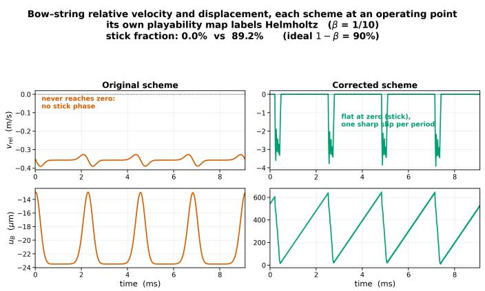  
Fig. 1. Bow–string relative velocity (top) and bow-point displacement (bottom), each scheme shown at an operating point that its own playability map labels Helmholtz. The corrected scheme shows the Helmholtz signature: $v _ { \mathrm { r e l } }$ held at zero through the stick phase with one sharp slip per period, and a sawtooth displacement. An explicitly lagged friction force (left) produces neither, even where the original model reports success.

## F. Playability

Sweeping $( F _ { N } , v _ { b } )$ and classifying the steady state gives the map of Fig. 2. It is built by running the model to steady state at every one of the 1089 points of a 33×33 grid and recording which regime results, so it is an exhaustive tabulation of the plant’s steady-state inverse rather than a model of it. That matters twice over in what follows: the rule that reads this map is the strongest baseline in the paper, and it is also what generates the labels the controller is trained on. Its structure is that of a Schelleng diagram: Helmholtz motion occupies a band whose lower edge rises roughly linearly with bow speed, multiple slipping lies below that minimum-force boundary, and raucous motion above the maximum. Of the 1089 points, 118 are Helmholtz, 459 multiple slipping, 324 raucous and 106 sub-harmonic, with the remaining 82 either constant sticking or constant slipping. Figure 3 cuts the same surface along bow force at three bow speeds, showing the Helmholtz window as the interval where the slip jitter collapses, the slip count reaches one per period and the stick fraction approaches $1 - \beta ,$ and showing that window move to higher force as bow speed rises.

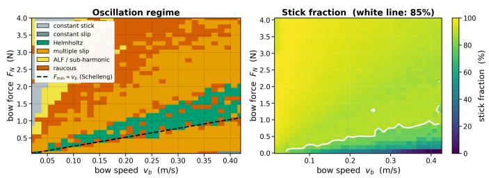  
Fig. 2. Playability of the model. Left: oscillation regime, with the Schelleng minimum-bow-force trend overlaid. Right: stick fraction, the quantity that distinguishes Helmholtz motion from periodic slipping.  
Diagnostics across bow force (dotted: ideal Helmholtz values)

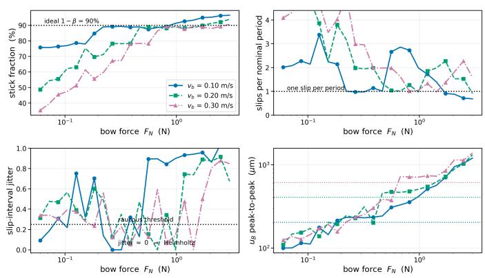  
Fig. 3. Diagnostics across bow force at three bow speeds. The Helmholtz window is where the jitter collapses to zero, the slip count reaches one per period and the stick fraction approaches $1 - \beta .$ It moves to higher force as bow speed increases.

## G. Quantitative Test of the Schelleng Limits

Schelleng [5] predicts that the Helmholtz band is bounded above and below by forces linear in bow speed, and that the two limits follow different powers of the bow-bridge distance and of the wave impedance,

$$
F _ { \mathrm { m a x } } \propto { \frac { v _ { b } } { \beta } } , \qquad F _ { \mathrm { m i n } } \propto { \frac { Z ^ { 2 } v _ { b } } { \beta ^ { 2 } } }\tag{7}
$$

Figure 4 shows the four playability maps, whose resolved cells the band edges drawn on it are fitted through. Table III reports the exponents, which come from a separate sweep: the maps sit at a single bow-bridge distance and cannot supply a dependence on it. The band edges were located by bisection to about 7% in force, on a finer spatial grid than the rest of this work so that $\beta$ is not quantized coarsely by the node spacing. Both edges were measured on all four open strings, against bow-bridge distance with $\beta$ from 0.07 to 0.17 at $v _ { b } = 0 . 3 0$ m/s, and against bow speed from 0.10 to 0.42 m/s. On a 330 mm string the first range is 23.1 mm to 56.1 mm from the bridge, spanning mid-range ordinary bowing at one end and reaching just past the sul tasto edge at the other. The second spans the commanded speed range, from a 6.5 s frog-to-tip stroke at the slow end to the fastest the command box permits, and is kept well clear of the unplayable floor discussed in Section IV-I.

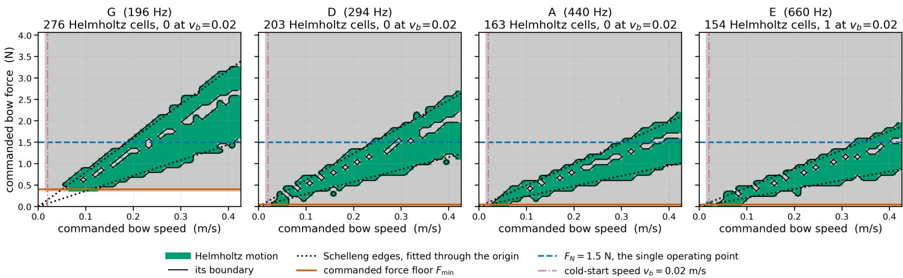  
Fig. 4. Playability of all four open strings, measured over a window set in string periods rather than in seconds, at 140 settling periods. Helmholtz motion is filled and outlined and every other regime is recessive, so the region is identifiable without color. The dotted lines are the Schelleng band edges fitted through the origin, which is the form the proportionality to bow speed implies and which can therefore be evaluated below the resolution of the grid. The solid line is each string’s commanded force floor and the dashed line is $F _ { N } \overset { \cdot } { = } 1 . 5 \ : \mathrm { N } ,$ the single operating point of Section II-E, which sits at 36, 59, 83 and 99 per cent of the four bands. On G the fitted window at the cold-start speed is [0.072, 0.159] N, entirely below the 0.40 N floor, so Helmholtz motion is unreachable there by command rather than by resolution. These maps are reported and not adopted: no controller in this paper was trained on them.

TABLE III  
MEASURED POWER-LAW EXPONENTS OF THE TWO BOW-FORCE LIMITS, ON EACH OPEN STRING, WITH THE STANDARD ERROR OF THE FIT. THE WAVE IMPEDANCE IS GIVEN BECAUSE THE PREDICTED MINIMUM-FORCE LIMIT CARRIES ITS SQUARE.
<table><tr><td rowspan=1 colspan=1></td><td rowspan=1 colspan=1></td><td rowspan=1 colspan=2>against β</td><td rowspan=1 colspan=2>against vb</td></tr><tr><td rowspan=1 colspan=1>String</td><td rowspan=1 colspan=1>Z</td><td rowspan=1 colspan=1> $F _ { \mathrm { m a x } }$ </td><td rowspan=1 colspan=1> $F _ { \mathrm { m i n } }$ </td><td rowspan=1 colspan=1> $F _ { \mathrm { m a x } }$ </td><td rowspan=1 colspan=1> $\overline { { F _ { \mathrm { m i n } } } }$ </td></tr><tr><td rowspan=3 colspan=1>GDAE</td><td rowspan=1 colspan=1>0.3178</td><td rowspan=1 colspan=1>-1.01</td><td rowspan=1 colspan=1>-0.77</td><td rowspan=1 colspan=1>+0.89</td><td rowspan=3 colspan=1>+1.07 $+ 1 . 5 6$  $+ 1 . 0 9$  $+ 1 . 0 5$ </td></tr><tr><td rowspan=1 colspan=1>0.2490</td><td rowspan=1 colspan=1>-0.99</td><td rowspan=2 colspan=1>-0.96-1.58-1.05</td><td rowspan=2 colspan=1>+0.97+0.90+0.99</td></tr><tr><td rowspan=1 colspan=1>0.20010.1795</td></tr><tr><td rowspan=1 colspan=1>Predicted</td><td rowspan=1 colspan=1></td><td rowspan=1 colspan=1>-1</td><td rowspan=1 colspan=1>-2</td><td rowspan=1 colspan=1>+1</td><td rowspan=1 colspan=1>+1</td></tr></table>

The maximum bow force recovers Schelleng’s prediction on both axes and on every string. Against bow-bridge distance the four exponents span 0.05 and each sits within half a standard error of −1. Against bow speed they span 0.10 about +1. The upper edge of the band, governed by the capture and release of the string at the contact point, is reproduced across a range of impedance of 1.77.

The minimum bow force is not. Its dependence on bowbridge distance falls short of $\beta ^ { - 2 }$ on every string, by between 2.2 and 19 standard errors, so the shortfall is a property of the model rather than of one string. Measured against bow speed the same edge sits near the predicted +1 on three strings and at +1.56 on D, which is the string that behaves ordinarily on the other axis. Different strings deviate on different axes, which is the signature of scatter at a poorly determined edge rather than of string physics.

Fitting all three variables together over 48 operating points identifies what the departure is. The minimum force follows

$$
F _ { \mathrm { m i n } } \propto Z ^ { 1 . 0 6 \pm 0 . 1 1 } v _ { b } ^ { 1 . 1 9 \pm 0 . 0 6 } \beta ^ { - 1 . 0 9 \pm 0 . 1 0 }\tag{8}
$$

at $R ^ { 2 } = 0 . 9 2 7$ . Both of the quantities Schelleng squares return at the first power, at 8.9 and 8.7 standard errors from the predicted exponents, while the one he takes linearly returns near linear. Replacing $Z ^ { 2 } v _ { b } \beta ^ { - 2 }$ with $Z v _ { b } \beta ^ { - 1 }$ halves the residual standard deviation, from 0.341 to 0.172, and reduces the worst spread across operating points from 6.26 to 3.34.

The impedance dependence alone is the cleanest part of it, because it can be read from the magnitude of the limit rather than from a fitted slope. At $\beta = 0 . 1 0$ and $v _ { b } = 0 . 3 0$ m/s the minimum force is 1.046, 0.807, 0.665 and 0.560 N on G, D, A and E. Regressing its logarithm on the logarithm of impedance gives $+ 1 . 0 6 \pm 0 . 0 7$ against a predicted +2, at $r =$ +0.996 and $p = 0 . 0 0 4$ , which is 14.3 standard errors. Dividing each measured minimum by $Z ^ { 2 }$ , as an exact Schelleng law would require, leaves a residual varying by 1.68 across the four strings where the correct scaling would leave it constant.

Two qualifications bound this. The minimum is the lower band edge, where the regime classifier is least certain, and the global fit retains a residual standard deviation of 0.155 in logarithmic terms, about 17%, so (8) is a coarse description and not an exact replacement. The bow-speed exponent is itself 3.1 standard errors from unity, so the linear speed dependence in it is an approximation. What is not scatter is the departure in the two squared terms, which is an order of magnitude larger than either of those effects.

The bow-bridge half of that departure is not new, and the agreement is worth stating as agreement. Schoonderwaldt, Guettler and Askenfelt [8] measured the bow-force limits experimentally and found that once the shape of the friction curve is taken into account, rather than the constant friction difference Schelleng assumed, the minimum force becomes proportional to $\beta ^ { - 1 }$ as the bow speed approaches zero. Their route is an analytic limit from a modified model with a hyperbolic friction curve. The present result is an empirical joint fit over the full measured range, on four strings, with a two-exponential Stribeck curve. Those are different kinds of evidence for the same departure, and the mechanism proposed there, that the exponent changes because a real friction curve is not the idealization the derivation assumes, applies here in the same form.

The bow-speed dependence does not agree, and the disagreement is large. The same experiments found the minimum force independent of bow velocity over the range measured, five to twenty centimeters per second, which they describe as in clear contradiction to Schelleng’s prediction. The fit here gives $v _ { b } ^ { 1 . 1 9 \pm 0 . 0 6 }$ , about twenty standard errors from independence and closer to Schelleng’s linear prediction than to theirs. The two are not measuring the same object: theirs is an experiment on steel D and E strings mounted on a monochord and on a violin, and this is a simulation of four strings. The two ranges of bow speed also barely overlap, theirs running from 0.05 to 0.20 m/s and this one from 0.10 to 0.42, so the two mostly probe different speeds. Nothing here resolves it.

The impedance departure has no counterpart in that work, which varied two strings and did not test impedance scaling, so for that half the cause is not identified. A model terminated on rigid supports rather than on a bridge is the obvious candidate, and adding an admittance [10] remains the test, but nothing measured here establishes it. What has changed is that the departure from Schelleng is now characterized rather than noted: it is a systematic reduction of both squared dependences to first powers, not an unexplained shortfall in one exponent on one string.

These exponents and the joint fit are measured over a window scaled to a fixed number of string periods rather than a fixed duration, following Section II-F. The choice is not cosmetic. Under a window fixed in seconds the four strings receive 15.7, 23.5, 35.2 and 52.8 periods to settle, and the number of bow positions at which the band cannot be located at all follows that ordering exactly, at seven of ten on G, three of ten on D and none on A or E. The G string cannot be measured at the fixed-duration setting. The two conventions agree closely on the bow-speed exponents, which move by +0.04 and −0.09 on A, and disagree on the bow-bridge exponent, which moves from −1.14 to −1.58 on the same string.

## H. Attack Transients and the Guettler Diagram

The preceding tests are of the steady state. Guettler’s is of the onset [12]. The bow starts at rest on a string at rest and accelerates uniformly, $v _ { b } ( t ) = \dot { v } _ { b } t$ , at constant contact force. The attack is clean when periodic slipping at the nominal period is established from the first slip, and the number of slips preceding that point, mapped over the acceleration-force plane, is the standard playability test for a model of this kind.

Figure 5 gives that plane on a $3 3 \times 2 5$ grid over $\dot { v } _ { b } \ \in$ $[ 2 , 3 \bar { 4 } ] \mathrm { m } / \mathrm { s } ^ { 2 }$ and $F _ { N } \in [ 0 . 2 , 2 . 6 ]$ N, measured over 22 nominal periods. The sweep runs at $N _ { x } = 1 0 1$ and $f _ { s } = 9 6$ kHz, the grid of Section II-G, because the bow sits on a node and both $\beta = 1 / 1 0$ and $\beta = 1 / 2 0$ are exact multiples of $1 / ( N _ { x } - 1 )$ ) there.

The three regions Guettler describes all appear. Where the force is large for the acceleration the first slips are delayed. Where it is small the string is released early and repeatedly. Between them the attack establishes, in a narrow diagonal band along $\dot { v } _ { b } = 1 2 . 7 F _ { N }$ at $\beta = 1 / 1 0$ , with 36 of 825 points clean and a further 102 preceded by a single slip.

The same sweep on the other three open strings closes the band nowhere and opens it nowhere comparable. At $\beta = 1 / 2 0$ no point in the plane gives a clean attack on any of the four, which is a comparison the grid supports because the answer is zero everywhere. At $\beta = 1 / 1 0$ the clean fractions read 2.1% on G, 4.0% on D, 4.4% on A and 2.4% on E, and those four numbers are not comparable with one another. The grid is centered on A, so it clips each string differently: G and D reach the upper force edge at 2.60 N while A and E reach the lower edge and the maximum acceleration. Every count is a lower bound, and ranking the strings on them would be ranking the grid.

Moving the bow to $\beta = 1 / 2 0$ closes the clean band. No point in the plane reaches Helmholtz motion with fewer than two pre-Helmholtz slips, and a probe at four times the grid resolution along the ridge returns the same floor of two, so the absence is not a sampling artifact. Guettler reports that bowing closer to the bridge narrows the range of accelerations that give a clean onset [41]. At half the bow-bridge distance, in this model, the range closes.

Two measurement details decide the outcome, and both were found by checking rather than by assumption. The steady-state detector of Section II-D thresholds $| v _ { \mathrm { r e l } } |$ at a fixed 1 mm/s, which suits a bow running at 0.3 m/s. During an attack the bow starts from rest, the stick-phase relative velocity is a fraction of a millimeter per second, and a fixed threshold chatters across it and reports slips a hundredth of a period apart. Slip excursions run about ten times the instantaneous bow speed, so a threshold proportional to it separates them, and the counts are identical for constants of 0.3, 0.5 and 0.7. Periodicity alone also admits free ringing. Where the force is small the string is barely gripped and rings at $f _ { 0 } ,$ which is periodic at exactly the nominal period and passes any test of regularity. Those points carry stick fractions of 0.02 to 0.04 against $1 - \beta = 0 . 9 0 .$ , and pairing the periodicity test with a stick test removes them. It is the trap of Section II-D in a second place.

## I. Bow Forces

The friction model responds to the normal force at the contact point, but a robot, like a player, commands force at the frog. The two are related by a transmission factor

$$
F _ { N } = \alpha ( s ) F _ { \mathrm { f r o g } } , \qquad \alpha ( s ) = 1 - { \textstyle { \frac { 1 } { 2 } } } s\tag{9}
$$

where $s \in [ 0 , 1 ]$ is the normalized position of the contact point along the bow, from frog to tip.

The origin of this factor is not a transmission ratio in the mechanical sense, because force at the frog is not a single quantity. It can mean the vertical reaction on a rigid bow, the transverse force at the hair termination, the force implied by a controlled height, or the force a bounded hand moment can reach, and these behave differently.

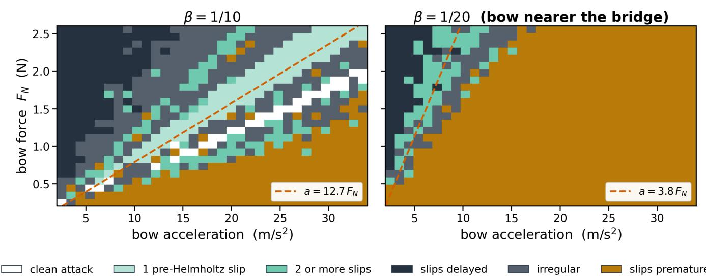  
Fig. 5. The Guettler diagram of the model [12]: attacks from rest over the acceleration-force plane, at two bow-bridge distances. Color gives the number of slips preceding regular triggering at the nominal period, and luminance falls monotonically from the clean attack to the worst outcome, so the figure keeps its meaning in grayscale. Below the band the contact force is large for the acceleration and the first slips are delayed. Above it the force is small, and the string is released early and repeatedly. The dashed line is the median ratio of acceleration to force among the points that establish.

On a rigid massless bow the free-body balance of Fig. 6 reduces to $F _ { \mathrm { f r o g } } = F _ { N }$ , a horizontal reaction equal to $f _ { \mathrm { b o w } } ,$ and $\tau = s L _ { \mathrm { b o w } } F _ { N }$ . Vertical equilibrium alone therefore fixes the contact force at the applied force and yields no dependence on s whatever.

Measured at the hair termination the dependence runs the other way. Demoucron, Askenfelt and Causse hung known´ loads at successive points along the hair and recorded the transverse force at the frog [15]. A rigid stick predicts a fall as $( 1 - s )$ to zero at the tip. The measurement rises instead, and is larger with the load at the tip than at the frog, because bending of the stick lowers the hair termination at the tip faster than the hair angle at the frog decreases. The gradient changes sign once the hair tension exceeds the product of tip stiffness and hair length, which for the bow they measured is 91 N/m times 0.53 m, or 48 N, against playing tensions near 60 N. On that reading α falls from 1.00 to 0.83, monotone but shallower than (9), while its rigid-stick counterpart rises without bound.

Compliance gives a third answer. Treating the hair alone as a taut ribbon of tension $T _ { h }$ loaded at fraction s, the transverse stiffness is $T _ { h } / ( L _ { \mathrm { b o w } } s ( 1 - s ) )$ , symmetric about mid-bow. The hair is one term of two. Adding the stick as a spring of stiffness $K _ { s }$ at the tip gives a deflection per unit force of $s ( 1 - s ) L _ { \mathrm { b o w } } / T _ { h } + s ^ { 2 } / K _ { s }$ , whose second term dominates toward the tip [16]. The compliance of an assembled bow rises monotonically from frog to tip rather than peaking at mid-bow, and for $L _ { \mathrm { b o w } } = 0 . 6 5$ m, $T _ { h } = 4 5 \mathrm { ~ N ~ }$ and $K _ { s } = 7 2$ N/m the stiffness falls by a factor of 4.3 over $s \in [ 0 . 2 , 1 ]$

The fourth is the largest force a player can apply. A grip is a finger and thumb couple acting over a few centimeters, so the moment it supplies is bounded. Taking moments about the frog, $s L _ { \mathrm { b o w } } F _ { N } = \tau + F _ { W }$ d for a bow of weight $F _ { W }$ with its center of gravity at $d ,$ and the greatest contact force reachable is

$$
F _ { N } ^ { \mathrm { m a x } } ( s ) = \frac { \tau _ { \mathrm { m a x } } + F _ { W } d } { s L _ { \mathrm { b o w } } }\tag{10}
$$

This falls as $1 / s ,$ , by a factor of 4.5 over $s \in [ 0 . 2 , 1 ]$ against 1.75 for (9). Guettler gives the same balance for a 60 g bow with its center of gravity 19 cm ahead of the thumb, where holding 0.5 N from frog to tip takes a torque running from −0.11 to +0.21 N·m [41], and (10) reproduces both endpoints to within 2%.

Which of the four the stroke follows is not settled by measurement. Askenfelt recorded bow force and bow position simultaneously under normal playing conditions [13], [14], but the frog and tip gauges were wired into one bridge whose branch sensitivities were set to give a constant signal for a given bow force at every position along the hair [15]. That record is position-independent by construction and cannot supply $\alpha ( s )$

Equation (9) is therefore a statement about what the controller commands rather than a property of the bow as a structure, and the linear form is the simplest monotone approximation to it. The four readings disagree among themselves in shape, magnitude and sign by more than any of them disagrees with the linear form. Section V-A measures the cost of getting the profile wrong, which is the appropriate test for an assumption of this kind. A controller commanding $F _ { \mathrm { f r o g } }$ must raise its command as the stroke proceeds simply to hold the contact force constant, and the playable region moves up the frog-force axis accordingly (Fig. 7).

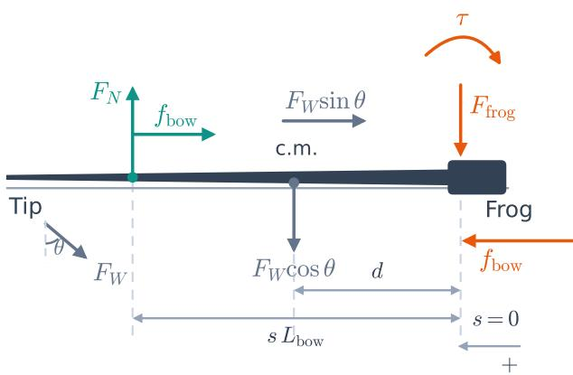  
Fig. 6. Free body diagram of the forces and moments on a violin bow. Forces exerted by the string are shown in teal, those exerted by the hand at the frog in orange, and the bow weight in gray. Drawn after the analysis of [42].

Playable region moves up the force axis as the bow advances (transmission α(s) = 1 – 0.5 s, frog → tip)  
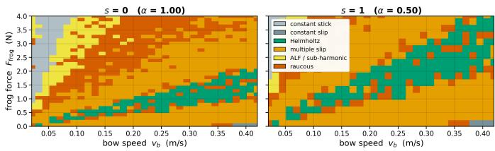  
Fig. 7. The playable region in frog-force coordinates at the start and end of the stroke. Because the physics depends only on the contact force, the map at any s follows from the contact-force map by rescaling the force axis by α(s).

## III. CONTROLLER

## A. Formulation

The control objective is to hold Helmholtz motion across a complete bow stroke while commanding only quantities a robot can command: normal force at the frog and bow velocity. The contact point $x _ { B }$ is held fixed.

At control step m the string is advanced for $\Delta t = 3 5$ ms under the current commands, the last 60% of that window is analyzed, and the controller proposes increments. The string state is carried between steps, so the oscillation continues across the stroke rather than restarting from rest, and the simulated interval matches the interval over which the bow advances.

Figure 8 shows the loop.

The feature vector is

$$
\mathbf { z } _ { m } = \left[ s _ { m } r _ { m } \quad \eta _ { m } \quad \Delta f _ { m } \quad \Delta A _ { m } \quad F _ { \mathrm { f r o g } } ^ { m - 1 } \quad v _ { b } ^ { m - 1 } \right] _ { ( 1 ) } ^ { \top }\tag{11}
$$

where $s _ { m }$ is stroke position, $r _ { m }$ the regime label, $\eta _ { m }$ the stick fraction, $\Delta f _ { m } = f _ { 0 } ^ { \star } - f _ { \mathrm { s l i p } , m }$ the frequency error and $\Delta A _ { m } = \log _ { 1 0 } ( A ^ { \star } / A _ { m } )$ the amplitude error. The output is $\mathbf y _ { m } = [ \Delta F _ { \mathrm { f r o g } } , \Delta v _ { b } ] ^ { \top }$ , applied as increments and rate-limited to 0.05 N and 0.012 m/s per step.

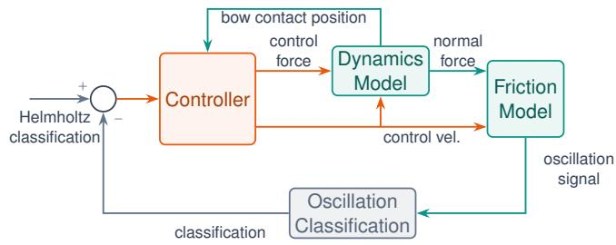  
Fig. 8. Closed-loop control architecture. The classifier and the stick-fraction diagnostic are computed from the relative-velocity signal over each control window and returned to the controller.

The stick fraction is a continuous measure of how nearly Helmholtz the current motion is, and carries information that a categorical regime label does not. The frequency error is derived from slip timing, so it varies continuously. A spectral estimate over a short window is quantized to the bin width and can be identically zero for an entire stroke, in which case that input is inert.

## B. Training

Labels come from the playability map: at each state the target increment points toward the nearest $( F _ { \mathrm { f r o g } } , v _ { b } )$ pair classified Helmholtz at the current stroke position, clipped to the rate limits. Three kinds of trajectory are generated: tracking trajectories starting inside the playable region, boundarycrossing trajectories in which a deliberate excursion is forced at mid-stroke, and recovery trajectories starting from a random point anywhere in the command space. Five hundred trajectories of thirty steps give 15 000 labeled samples.

Two more expressive families were considered before settling on a plain feedforward network. A Kolmogorov-Arnold network [43] replaces linear weights with learnable univariate splines and is attractive on low-dimensional problems, both for sample efficiency and because the learned functions can be inspected. A recurrent policy such as an LSTM [44] would let the controller carry state between control steps. Neither was adopted. Both are ways of fitting the training labels more closely, and Section IV-K shows that closeness of fit is not what limits performance here, since raising the parameter budget lowers the training loss in every cell while closed-loop quality does not follow. That reasoning holds for the spline network and did not survive for recurrence: Section IV-G retrains six architectures at matched capacity and finds a gated recurrent unit ahead of the feedforward one, so the controller reported in the rest of this section is the one the comparison later displaces. It is retained as the baseline against which that comparison is made, and the spline network is revisited in Section VI-C.

The controller is therefore a feedforward network with two hidden layers of 32 units and tanh activation, linear outputs, and 1378 parameters (Fig. 9). Inputs and outputs are z-scored. Training uses Adam on a mean-squared-error objective with early stopping on a held-out 15% split, which halted after 164 epochs.

Neural-network bow controller  
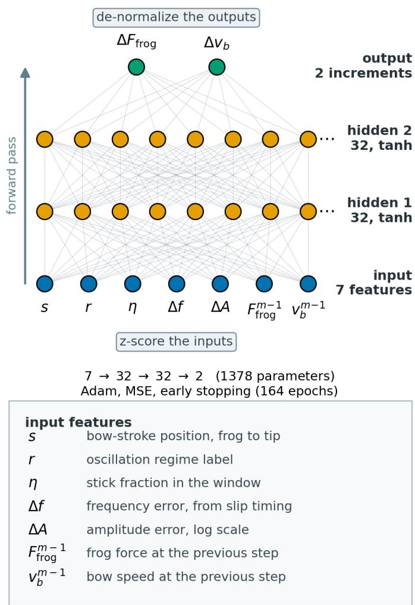  
Fig. 9. Architecture of the neural-network bow controller. The input features are those of (11).

## IV. RESULTS

## A. Sustained Helmholtz Motion

Started inside the playable region at $F _ { \mathrm { f r o g } } = 1 . 6 0 \ \mathrm { N }$ and $v _ { b } = 0 . 3 0$ m/s, the feedforward baseline of Section III-B holds Helmholtz motion on 94.8% of the 69 control steps of a full stroke, with a mean stick fraction of 88.7% against the ideal 90% (Fig. 10). The commanded frog force rises from 1.6 N to 2.6 N over the stroke, which is what holding the contact force roughly constant requires as $\alpha ( s )$ falls from 1 to 0.5. The controller was not told this and recovers it from the data. The slip frequency stays between 432.4 and 432.9 Hz over the fifty-five Helmholtz steps, a few hertz flat of 440 Hz, consistent with the flattening effect at these bow forces. It leaves that band only on the three opening steps, which are exactly the three the regime measure counts against it.

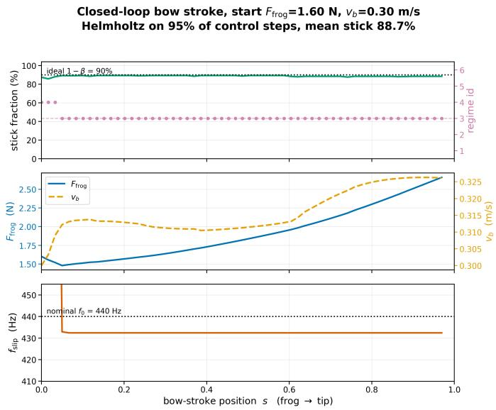  
Fig. 10. Closed-loop bow stroke. Top: stick fraction and regime label. Middle: commanded frog force and bow speed. Bottom: slip frequency.

Figure 11 overlays the command trajectory on the playability map at the two ends of the stroke. The path begins inside the playable band and ends inside it, and the band itself has moved upward between the two panels.

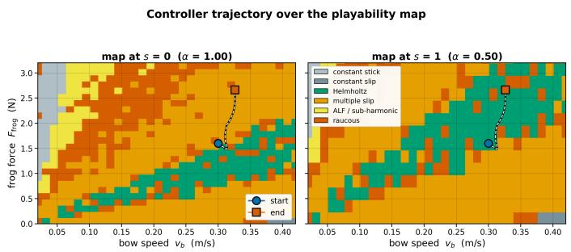  
Fig. 11. Command trajectory over the playability map at the start and end of the stroke.

## B. Disturbance Rejection

Bow velocity was overridden to 0.02 m/s for three control steps at mid-stroke. The regime leaves Helmholtz for the duration of the override and is recovered eighteen control steps after release, after which the stroke completes normally. Helmholtz is held on 81% of steps overall (Fig. 12). Recovery is dominated by the rate limit on $\Delta v _ { b }$ , not by the string dynamics.

## C. Dependence on Initial Conditions

Figure 13 compares four starts. It plots the deviation of the stick fraction from the ideal $1 - \beta$ on a logarithmic axis rather than the stick fraction itself, because the runs all sit between 81% and 100% and are not separable on a linear scale, whereas their departure from ideal covers rather more than two decades. The run started inside the playable region holds a deviation

Disturbance rejection: V forced to 0.02 m/s for 3 control steps at mid-stroke Helmholtz on 76% of steps

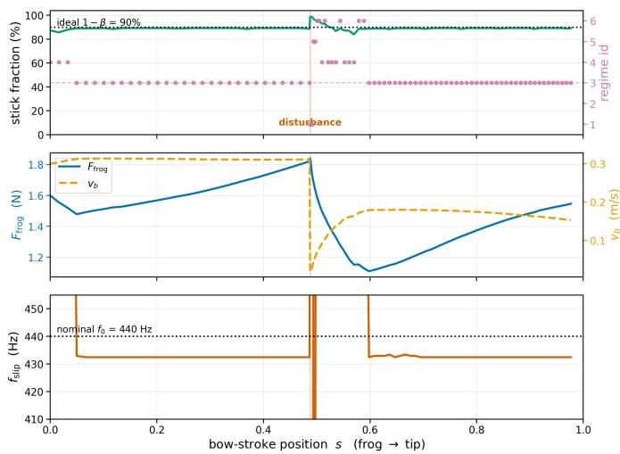  
Fig. 12. Disturbance rejection. The shaded band marks the three control steps during which v was overridden.

of about 0.7 percentage points for almost the whole stroke, the cold start settles near 2, and the hot start remains erratic between 0.07 and 7. From a cold start at the lower command limits (0.05 N, 0.02 m/s) the controller reaches the playable region and holds Helmholtz on 87% of steps, though the stroke takes 306 steps because the bow advances slowly while vb is small. From a hot start at the upper limits (4.00 N, 0.42 m/s) it recovers only partially: the stroke completes in 51 steps, and with $| \Delta F _ { \mathrm { f r o g } } | \leq 0 . 0 5 ~ \mathrm { N }$ per step the controller cannot bring the force down fast enough to spend the early part of the stroke inside the playable band. Helmholtz is held on 40.9% of steps. Both halves of that explanation were tested, and they do not behave the same way (Table IV).

The stroke itself cannot be lengthened, since a violin bow is a fixed object. What can be changed is the control interval, and shortening it buys more decisions over the same stroke. Halving ∆t takes the network from 43.1% to 63.4% and quartering it to 84.9%. That gain is not an artifact of the shorter analysis window. On the in-band start, which is already near ideal and has no room to improve, the same change moves the network from 94.8% to 95.7% and the map lookup from 95.0% to 98.3%, a few points either way against the thirtyeight the high-force corner gains. The cost is measurement: an 8.75 ms window holds fewer than four nominal periods, so every regime call rests on correspondingly less evidence.

Raising the permitted increment separates them. The map lookup recomputes its target from the map at every step, and climbs from 47.7% to 88.6% as the limit is relaxed eightfold. The network gains 4.5 points and then saturates at 45.5%. The labels it was trained on are themselves clipped to the nominal increment, so it never learned to ask for a larger step, and relaxing the limiter offers it room it does not use. Inside the band neither change costs the lookup anything, which holds 95.0% at every increment and 95.0%, 95.0% and 98.3% across the three intervals. It does cost the adopted controller of Section IV-G, which falls from 94.4% to 80.7% to 74.3% on A and from 94.5% to 65.7% to 63.6% on E as the interval shortens. Shortening the interval trades in-band regulation for corner recovery, and only for a controller that carries state.

Repeating the increment ladder with the adopted controller makes the saturation stronger rather than weaker. At twice, four times and eight times the nominal cap it scores identically to every digit on all four strings, because the increments it asks for already lie inside twice the cap, so relaxing it further is a literal no-op. Over the same range the lookup gains 25.0 points on A and 27.3 on E. The sklearn network at least moved 4.5 points at the first rung. This one moves −3.0, +3.9, −3.8 and +0.4 on the four strings, every one inside the interpretability bar.

Two features of the ladder do not carry across strings. Shortening the interval helps monotonically only on E, while G rises then collapses and D and A both rise at the middle rung and fall at the shortest. And the periods column of Table IV is specific to A: the same intervals give 6.86, 3.43 and 1.72 periods on G against 15.40, 7.70 and 3.85 on A. At 8.75 ms on G both controllers read 0.0%, the lookup included, which is the regime diagnostic failing at 1.72 periods per window rather than either controller failing. The shortest interval in the ladder does not exist as a measurement on the lowest string.

The number of decisions therefore bounds what any controller can do from this corner, while the size of each one bounds only a controller that recomputes its target. For the network the binding constraint is the rule that generated its labels, which is the ceiling Section IV-K reaches from a different direction.

## TABLE IV

PERCENTAGE OF CONTROL STEPS IN HELMHOLTZ MOTION FROM THE HIGH-FORCE CORNER AS THE PERMITTED INCREMENT AND THE CONTROL

INTERVAL ARE VARIED, WITH THE NOMINAL SETTING FIRST. BOLD MARKS THE BEST VALUE IN EACH COLUMN. THE PERIODS COLUMN IS THE NUMBER OF NOMINAL PERIODS IN EACH ANALYSIS WINDOW, WHICH IS THE EVIDENCE BEHIND ONE REGIME CALL.
<table><tr><td rowspan=1 colspan=1></td><td rowspan=1 colspan=1>Steps</td><td rowspan=1 colspan=1>Periods</td><td rowspan=1 colspan=1>Network</td><td rowspan=1 colspan=1>Map</td></tr><tr><td rowspan=1 colspan=1>Nominal, ∆t = 35 ms</td><td rowspan=1 colspan=1>44</td><td rowspan=1 colspan=1>15.4</td><td rowspan=1 colspan=1>40.9%</td><td rowspan=1 colspan=1>47.7%</td></tr><tr><td rowspan=1 colspan=5>Permitted increment</td></tr><tr><td rowspan=1 colspan=1>×2</td><td rowspan=1 colspan=1>44</td><td rowspan=1 colspan=1>15.4</td><td rowspan=1 colspan=1>45.5%</td><td rowspan=1 colspan=1>63.6%</td></tr><tr><td rowspan=1 colspan=1>×4</td><td rowspan=1 colspan=1>44</td><td rowspan=1 colspan=1>15.4</td><td rowspan=1 colspan=1>45.5%</td><td rowspan=1 colspan=1>79.5%</td></tr><tr><td rowspan=1 colspan=1>×8</td><td rowspan=1 colspan=1>44</td><td rowspan=1 colspan=1>15.4</td><td rowspan=1 colspan=1>45.5%</td><td rowspan=1 colspan=1>88.6%</td></tr><tr><td rowspan=1 colspan=5>Control interval</td></tr><tr><td rowspan=1 colspan=1>17.5 ms</td><td rowspan=1 colspan=1>87</td><td rowspan=1 colspan=1>7.7</td><td rowspan=1 colspan=1>59.8%</td><td rowspan=1 colspan=1>74.7%</td></tr><tr><td rowspan=1 colspan=1>8.75 ms</td><td rowspan=1 colspan=1>175</td><td rowspan=1 colspan=1>3.9</td><td rowspan=1 colspan=1>78.9%</td><td rowspan=1 colspan=1>82.2%</td></tr></table>

## D. Summary

Table V collects the four episodes described above in one place, for the A-string feedforward baseline of Section III-B. It reports the number of control steps each stroke took, the fraction of those steps in Helmholtz motion, and the mean stick fraction over the stroke. The broader comparison the architecture recommendation rests on is Table VII, not this one.

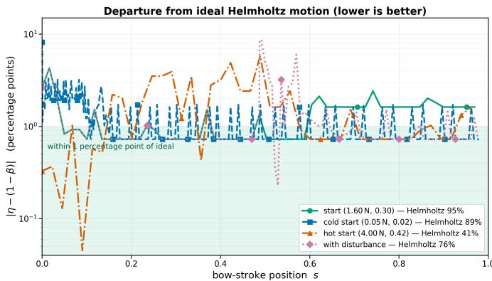  
Fig. 13. Departure from ideal Helmholtz motion across the stroke for four initial conditions. The stick fraction itself spans only 81–100%, so the runs are indistinguishable on a linear axis. Its deviation from the ideal 1 − β spans about 2.2 decades, which a logarithmic axis resolves. Lower is better, and the shaded band marks agreement to within one percentage point.

## TABLE V

CLOSED-LOOP PERFORMANCE OF THE A-STRING FEEDFORWARD BASELINE OF SECTION III-B, ON THE FOUR EPISODES PLOTTED IN FIGS. 10 TO 13. THE FOUR-STRING, SIX-ARCHITECTURE EVIDENCE THE RECOMMENDATION RESTS ON IS IN TABLE VII.
<table><tr><td rowspan=1 colspan=1>Condition</td><td rowspan=1 colspan=1>Steps</td><td rowspan=1 colspan=1>Helmholtz</td><td rowspan=1 colspan=1>Mean η</td></tr><tr><td rowspan=1 colspan=1>Start inside playable region</td><td rowspan=1 colspan=1>58</td><td rowspan=1 colspan=1>94.8%</td><td rowspan=1 colspan=1>88.7%</td></tr><tr><td rowspan=1 colspan=1>Cold start (0.05N, 0.02)</td><td rowspan=1 colspan=1>238</td><td rowspan=1 colspan=1>89.5%</td><td rowspan=1 colspan=1>88.8%</td></tr><tr><td rowspan=1 colspan=1>Hot start (4.00 N, 0.42)</td><td rowspan=1 colspan=1>44</td><td rowspan=1 colspan=1>40.9%</td><td rowspan=1 colspan=1>88.5%</td></tr><tr><td rowspan=1 colspan=1>With mid-stroke disturbance</td><td rowspan=1 colspan=1>91</td><td rowspan=1 colspan=1>75.8%</td><td rowspan=1 colspan=1>89.7%</td></tr></table>

## E. Why No Direct Comparison with Prior Work Is Reported

The closest prior work is Vivi, the virtual violinist of Percival, Bailey and Tzanetakis [24]–[26], which also closes a learned loop around a bowed-string physical model. No headto-head number against it is reported here, for three reasons.

A shared ingredient is not a shared measurement, and the bowing-imitation work of Jin and colleagues [33] shows the distinction plainly. They adopt a Stribeck friction law of the same family as the one used here and apply it to shape the damping of a single-degree-of-freedom oscillator, while here it drives a distributed string. Their objective is the distance between a produced trajectory and a recorded human one, measured by Euclidean, Frechet and related metrics. Nothing in that arrangement produces or scores Helmholtz motion, so a comparison with this paper is undefined rather than unperformed: the two report no result in common.

The two systems do not share a plant. Vivi drives a modal formulation after Demoucron, whereas the model here is a finite-difference scheme with implicitly resolved friction and rigid terminations. A bow force of a given magnitude does not mean the same thing in the two, because the minimum bow force depends on the wave impedance and the damping, and neither is matched between them.

They do not share a command set. Vivi generates finger position, bow-bridge distance, bow velocity and bow force, all specified at the contact point. The controller here commands normal force at the frog together with bow velocity, lets the contact force follow from the transmission factor of (9), and holds the contact point fixed.

They do not share an objective. Vivi is trained and assessed on timbre judged from the audio it produces, and its reported outcome is musical, that it performs a beginner repertoire at a level compared with a first-year student. The objective here is the oscillation regime, measured mechanically as the stick fraction of (6). A percentage of control steps in Helmholtz motion and a judgment of tone quality are not commensurable, and placing them in adjacent columns would imply a rigor the comparison does not have.

A comparison remains possible in principle, by the following route. Vivi is publicly available, and scoring its output with the diagnostics of Section II-D would put both systems on one scale. Reviving the published implementation is a project in itself, since it rests on a Qt4 and Python 2 era toolchain with a separate audio back end. The harder half is the plant. A fair test needs the two string models matched closely enough that the result measures the controllers rather than the models they drive, and that matching is the work.

The other learning-based work cited, Luan and Scavone [23], models the friction nonlinearity rather than controlling it, so it offers no controller to compare against.

## F. Comparison with Alternative Controllers

What can be compared is what the learned policy buys over simpler controllers driving the same plant from the same initial conditions. Table VI reports three. The first holds the initial commands for the whole stroke. The second is the labeling rule itself, which steps toward the nearest playable pair using only s, $F _ { \mathrm { f r o g } }$ and $v _ { b } .$ . It is open loop with respect to the oscillation and at the same time an exact steady-state model of the plant, tabulated at 1089 operating points. Both halves matter. Reading it as a handicapped baseline understates it: within the conditions the table covers, no controller can do better than the entry it would look up, and the learned controller is trained to reproduce those entries. The third is the trained network with its string-state inputs $r , \ \eta , \Delta f$ and $\Delta A$ frozen at nominal values, an ablation that isolates how much the oscillation feedback contributes.

Holding the commands is not sufficient even from a good start, because $\alpha ( s )$ falls as the bow advances and the contact force falls with it. It fails outright elsewhere, stalling from the cold start and under disturbance on every string, which is eight of its twelve runs.

Stroke completion has to be read alongside the regime score, because the two can point in opposite directions. The map lookup reaches 99.8% from the cold start on A while traveling only to $s = 0 . 7 0$ before the step limit, against the 0.98 that ends a stroke: holding a low bow speed keeps the string in Helmholtz motion while the bow barely moves. Scoring regime maintenance without also requiring the stroke to finish rewards exactly that. Counted over the twelve combinations of string and start, the lookup completes nine, the learned controller eleven and its frozen variant eleven, against four for the held commands.

## TABLE VI

PERCENTAGE OF CONTROL STEPS IN HELMHOLTZ MOTION, ON EACH OF THE FOUR OPEN STRINGS. A DAGGER MARKS A RUN THAT FAILED TO REACH THE TIP WITHIN THE 400-STEP LIMIT, AND A REGIME SCORE ON SUCH A RUN IS NOT MEANINGFUL. A DOUBLE DAGGER MARKS INPUTS FROZEN AT INFERENCE RATHER THAN REMOVED, WHICH THE ABLATION OF TABLE XI SHOWS IS A DIFFERENT QUESTION. THE TWO LEARNED  
ROWS ARE THE GATED RECURRENT UNIT RECOMMENDED IN SECTION IV-G. THE OTHER ARCHITECTURES APPEAR IN TABLE VII.
<table><tr><td rowspan=1 colspan=3>Controller</td><td rowspan=1 colspan=1>Start</td><td rowspan=1 colspan=1>G</td><td rowspan=1 colspan=1>D</td><td rowspan=1 colspan=1>A</td><td rowspan=1 colspan=1>E</td></tr><tr><td rowspan=1 colspan=3>No control,</td><td rowspan=1 colspan=1>band</td><td rowspan=1 colspan=1>94.3</td><td rowspan=1 colspan=1>91.2</td><td rowspan=1 colspan=1>80.3</td><td rowspan=1 colspan=1>87.0</td></tr><tr><td rowspan=1 colspan=3>commands</td><td rowspan=1 colspan=1>cold</td><td rowspan=1 colspan=1>0.2†</td><td rowspan=2 colspan=1>32.8†19.5†</td><td rowspan=2 colspan=1>15.0†5.5†</td><td rowspan=2 colspan=1>86.2†5.2†</td></tr><tr><td rowspan=1 colspan=3>held</td><td rowspan=1 colspan=1>dist</td><td rowspan=1 colspan=1>27.3†</td></tr><tr><td rowspan=3 colspan=3>Map lookup,open loop</td><td rowspan=3 colspan=1>bandcolddist</td><td rowspan=1 colspan=1>98.2</td><td rowspan=1 colspan=1>96.1</td><td rowspan=3 colspan=1>95.099.8†77.5</td><td rowspan=3 colspan=1>98.199.5†79.3</td></tr><tr><td rowspan=1 colspan=1>94.8</td><td rowspan=1 colspan=1>99.5†</td></tr><tr><td rowspan=1 colspan=1>94.3</td><td rowspan=1 colspan=1>92.4</td></tr><tr><td rowspan=3 colspan=3>Network,inputsfrozen‡</td><td rowspan=1 colspan=1>band</td><td rowspan=1 colspan=1>90.6</td><td rowspan=1 colspan=1>95.2</td><td rowspan=1 colspan=1>81.0</td><td rowspan=1 colspan=1>66.1</td></tr><tr><td rowspan=1 colspan=1>cold</td><td rowspan=1 colspan=1>93.2</td><td rowspan=1 colspan=1>94.8†</td><td rowspan=1 colspan=1>55.2</td><td rowspan=1 colspan=1>52.0</td></tr><tr><td rowspan=1 colspan=1></td><td rowspan=1 colspan=1>dist</td><td rowspan=1 colspan=1>88.0</td><td rowspan=1 colspan=1>79.0</td><td rowspan=1 colspan=1>29.1</td><td rowspan=1 colspan=1>23.7</td></tr><tr><td rowspan=1 colspan=2>Netwo</td><td rowspan=1 colspan=1>rk,</td><td rowspan=1 colspan=1>band</td><td rowspan=1 colspan=1>81.9</td><td rowspan=1 colspan=1>97.2</td><td rowspan=1 colspan=1>96.7</td><td rowspan=2 colspan=1>96.495.1</td></tr><tr><td rowspan=1 colspan=3>full</td><td rowspan=1 colspan=1>cold</td><td rowspan=1 colspan=1>86.7</td><td rowspan=1 colspan=1>86.9</td><td rowspan=1 colspan=1>42.8†</td></tr><tr><td rowspan=1 colspan=3>feedback</td><td rowspan=1 colspan=1>dist</td><td rowspan=1 colspan=1>71.2</td><td rowspan=1 colspan=1>78.2</td><td rowspan=1 colspan=1>70.2</td><td rowspan=1 colspan=1>79.7</td></tr></table>

The learned controller does not outperform the rule it imitates on steady-state regulation, and that holds well beyond the four open strings. Extended to the thirty-seven fingered notes of Section V-F and scored only where both complete the stroke, the lookup wins 51 comparisons, the network 9, and 59 are ties against the four-point interpretability bar of Section IV-G. On the four open strings the count is 5, 0 and 4. Pooled over the 128 cells in which both controllers finish, that is 56 to the lookup, 9 to the network and 63 ties.

The lookup’s margins are concentrated rather than spread. On the disturbance start it leads by 23.1 points on G, 14.2 on D and 7.3 on A, and the two are level on E. Inside the band it leads by 16.4 on G while the other three differences are inside the bar, so on D, A and E the two are indistinguishable there. On the cold start it leads by 8.1 on G, its only cold-start win earned by regulating rather than by never arriving.

The lookup’s advantage on the cold start is of a different kind and should not be read from the percentage. It reaches 99.5, 99.8 and 99.5 on D, A and E, and on all three the bow never reaches the tip, which is what the dagger records. It fails to finish the cold start on three of the four open strings and on 29 of the 37 fingered notes, where the learned controller fails on 14 once its amplitude target is referred to the sounding pitch and on 15 without that correction. On A the bow reaches only $s = 0 . 7 0$ , and on D and E it stops just short at 0.97. Holding a low speed keeps the string in Helmholtz motion while the bow fails to arrive, which is the same degenerate behavior Section V-D finds a reward search exploiting. The advantages of the learned controller are of a different kind: it needs no map stored or searched at run time, it produces rate-limited commands rather than nearest-neighbor jumps, it completes two more of the twelve runs, and it extends to observations no map is indexed by.

Freezing the four string-state inputs is not a measure of what those inputs contribute, and the four-string result shows why more clearly than one string could. Freezing improves the disturbance response on G and D, by 16.8 and 0.8 points, and destroys it on A and E, by 41.1 and 55.9. That is the same split by string that the retrained ablation of Section IV-J finds, from a different experiment: removing the string state helps on G and hurts on A and E. On this protocol, the disturbance start of Table VI, two methods that disagree about the size of the effect agree about which strings it helps.

That agreement does not survive a change of protocol, which is worth stating rather than leaving for a reader to find. Under the contact disturbance of Section V-B, measured at twenty seeds rather than on one episode, freezing the same inputs hurts on G by 13.5 points at $p = 0 . 0 0 0 1$ , the largest effect of the four strings and the opposite sign to the 16.8 above. Neither measurement is wrong. They use different disturbances, different protocols and different families of fit, and they have not been pooled. The choice of measurement here decides not whether an effect exists but which way it points, which is the third instance in this paper of the caution in Section V-B. What freezing measures on its own is sensitivity to out-of-distribution input, since a trained network given constant values for inputs that varied during training is being shown combinations it never saw.

Taken with the attack result of Section V-E, the two places the learned controller does better than the rule form a pattern rather than a pair of exceptions. It settles from the high-force corner on five of five seeds on G, D and A where the lookup never settles at all. And when the friction characteristic is cut hard enough to move the playable band, it holds the stroke together where the lookup does not. On the single episode of Table XV, which uses the feedforward baseline of Section III-B, it holds 80.6% of the steps after the onset against the lookup’s 25.7%. Retrained under twenty seeds, the adopted architecture leads by 20.1 ± 20.9 points on the same window, positive on seventeen of twenty seeds at $p = 0 . 0 0 0 4$ , and the feedforward network by $4 4 . 9 \pm 1 0 . 3$ on twenty of twenty. The two figures are not the same quantity, and the comparison that makes sense is the like-for-like one: the episode is itself a feedforward sklearn fit, and the seeded feedforward mean is 44.9 ± 10.3 against the episode’s 54.9, so the two agree to within about a fifth. The adopted architecture’s 20.1 is lower than either, which is a fact about the architecture rather than about the measurement.

The advantage is not monotone in severity, which is the part a reader would not guess, and it is not monotone only for the architectures that carry state. At the two mildest reductions the recurrent architectures tie the lookup while the feedforward one trails it. At 0.55 the lookup is ahead on all three, by 7.0 points for the adopted architecture and 41.0 for the feedforward network. Only at 0.40 does the network lead, and there it leads on every architecture and both windows.

The mechanism is visible in what the lookup does rather than in what it scores. Its commands do not read the string, so its trajectory is identical to six digits at every friction level, 60 steps ending at $s ~ = ~ 0 . 9 7 7$ in all four cases. Only the regime classification moves underneath it. Both conditions are ones the map cannot describe: a transient, which a steady-state tabulation has no entry for, and the plant moving away from the tabulation. Feedback earns its place where the plant leaves the model, and nowhere else that this paper measures.

Section V-B takes the second of those conditions, the plant moving away from the tabulation, at twenty seeds. That comparison is a single episode on one string, at the protocol of Table XV, so it carries the same caution as the rest of that table.

## G. Architecture Comparison

Whether the task needs memory of the oscillation across control steps is a different question from whether it needs the oscillation as an input, which the ablation of Section IV-J answers. Six architectures were trained at matched parameter count on all four open strings with twenty seeds each, every fit on one device. They are the feedforward network of Section III-B, a gated recurrent unit (Fig. 14), its minimal variant whose gates do not depend on the hidden state (Fig. 15), two deeper minimal variants at two and three layers (Figs. 16 and 17), and a state-space model with input-selective transitions (Fig. 18). Parameter counts span 1362 to 1410, a 3.5% spread.

Figure 19 shows every seed behind Table VII. One bar applies to every closed-loop comparison in this paper and is set by the model rather than by the estimator. Two runs of the same controller that differ only in a numerically negligible input perturbation still diverge by up to 4 points on the Helmholtz fraction, through the chaotic amplification of a stick-slip contact. The mean divergence is about 0.3 points and the worst observed is 4. No difference below about four points between individual cells is interpretable here, whatever its nominal precision, and differences of that size are read as ties throughout.

TABLE VII  
MEAN HELMHOLTZ FRACTION OVER FOUR STARTS, TWENTY SEEDS PER CELL, WITH THE STANDARD DEVIATION ACROSS SEEDS AND THE MEDIAN IN PARENTHESES. EVERY FIT WAS MADE ON ONE DEVICE.
<table><tr><td rowspan=1 colspan=1>Arch.</td><td rowspan=1 colspan=1>G</td><td rowspan=1 colspan=1>D</td><td rowspan=1 colspan=1>A</td><td rowspan=1 colspan=1>E</td></tr><tr><td rowspan=1 colspan=1>Feedforward</td><td rowspan=1 colspan=1>75.1 ± 13.2(78)</td><td rowspan=1 colspan=1>63.6 ± 11.1(61)</td><td rowspan=1 colspan=1>69.5 ± 4.4(70)</td><td rowspan=1 colspan=1>64.3 ± 7.2(65)</td></tr><tr><td rowspan=1 colspan=1>Gated recurrent</td><td rowspan=1 colspan=1>81.3 ± 9.8(85)</td><td rowspan=1 colspan=1>71.7 ± 10.6(74)</td><td rowspan=1 colspan=1>69.6 ± 6.2(71)</td><td rowspan=1 colspan=1>66.2 ± 4.5(66)</td></tr><tr><td rowspan=1 colspan=1>Minimal gated</td><td rowspan=1 colspan=1>69.6 ± 14.2(73)</td><td rowspan=1 colspan=1>66.3 ± 10.2(67)</td><td rowspan=1 colspan=1>66.5 ± 6.3(68)</td><td rowspan=1 colspan=1>56.9 ± 8.7(56)</td></tr><tr><td rowspan=1 colspan=1>Minimal, 2 layer</td><td rowspan=1 colspan=1>68.3 ± 22.0(80)</td><td rowspan=1 colspan=1>46.6 ± 16.5(46)</td><td rowspan=1 colspan=1>57.3 ± 10.4(60)</td><td rowspan=1 colspan=1>54.5 ± 11.1(55)</td></tr><tr><td rowspan=1 colspan=1>Minimal, 3 layer</td><td rowspan=1 colspan=1>75.6 ± 15.0(81)</td><td rowspan=1 colspan=1>55.3 ± 24.3(60)</td><td rowspan=1 colspan=1>55.9 ± 13.7(57)</td><td rowspan=1 colspan=1>51.0 ± 12.3(55)</td></tr><tr><td rowspan=1 colspan=1>State space</td><td rowspan=1 colspan=1>76.2 ± 14.6(82)</td><td rowspan=1 colspan=1>66.3 ± 13.9(70)</td><td rowspan=1 colspan=1>67.8 ± 5.5(68)</td><td rowspan=1 colspan=1>65.8 ± 6.4(67)</td></tr></table>

The gated recurrent unit leads on the mean of all four strings, and significantly on one. Paired over the same twenty seeds its margin over the feedforward network is 6.16 points on G at $p = 0 . 1 2 2$ , 8.12 on D at $p = 0 . 0 3 7 \mathrm { . }$ , 0.12 on A at $p = 0 . 9 4 7$ and 1.86 on E at $p = 0 . 2 9 6$ . The

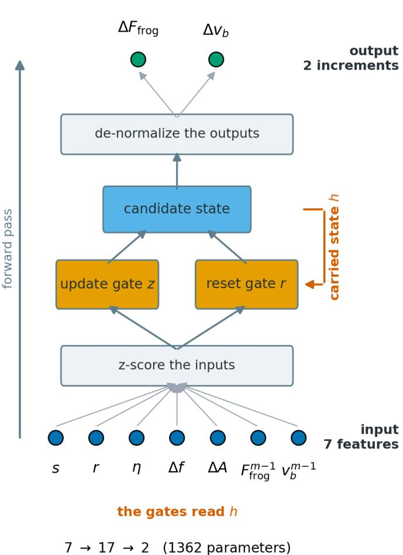  
Fig. 14. Architecture of the gated recurrent bow controller, drawn to the same scale as Fig. 9. Both gates are computed from the input and from the carried state, so the state can influence how much of itself survives the next step. The input features are those of (11).

margin on A is a tenth of a point and should be read as a tie. Against the minimal variant it gains 11.67 points on G at $p = 0 . 0 0 3 6 ,$ , 5.44 on D at $p = 0 . 0 2 9$ , 3.06 on A at $p =$ 0.114 and 9.22 on E at $p = 0 . 0 0 0 2 7 .$ . Against the feedforward baseline the minimal variant on A reads −2.94 at $p = 0 . 1 9$

That last figure reverses an earlier reading of this comparison, and the reason it reverses is the finding. Measured on A over the three starts that exclude the disturbance, the minimal variant beats the feedforward network inside the band by 3.58 points at $p = 0 . 0 0 3 8$ and at the high-force corner by 3.70 at $p = 0 . 0 1 1$ . It loses the disturbance start by 17.36 points at $p = 0 . 0 0 0 2$ , and on E it scores 24.6% there.

Table VIII isolates that start. The minimal variant’s defining simplification is that its gates are computed from the input alone and not from the hidden state, which Figs. 14 and 15 contrast directly. That is what leaves it unable to clear a latched state after the abrupt bow-velocity override. On E, eight of its twenty seeds hold between 3% and 9% Helmholtz motion for the remainder of the stroke once the override lifts. Forcing a state reset at every control step recovers every one of them, taking three representative seeds from 6.2% to 72.5%, from 6.5% to 60.6% and from 6.8% to 70.8%. The architectures that survive the disturbance are the two that keep a state-aware or input-selective gate.

Minimal gated controller, 2 layers  
TABLE VIII  
MEAN HELMHOLTZ FRACTION ON THE DISTURBANCE START ALONE, TWENTY SEEDS PER CELL.
<table><tr><td rowspan=1 colspan=1>Architecture</td><td rowspan=1 colspan=1>G</td><td rowspan=1 colspan=1>D</td><td rowspan=1 colspan=1>A</td><td rowspan=1 colspan=1>E</td></tr><tr><td rowspan=1 colspan=1>Feedforward</td><td rowspan=1 colspan=1>71.1</td><td rowspan=1 colspan=1>55.9</td><td rowspan=1 colspan=1>72.2</td><td rowspan=1 colspan=1>64.0</td></tr><tr><td rowspan=1 colspan=1>Gated recurrent</td><td rowspan=1 colspan=1>83.0</td><td rowspan=1 colspan=1>71.4</td><td rowspan=1 colspan=1>70.9</td><td rowspan=1 colspan=1>72.2</td></tr><tr><td rowspan=1 colspan=1>Minimal gated</td><td rowspan=1 colspan=1>64.4</td><td rowspan=1 colspan=1>75.3</td><td rowspan=1 colspan=1>54.8</td><td rowspan=1 colspan=1>24.6</td></tr><tr><td rowspan=1 colspan=1>Minimal, two layers</td><td rowspan=1 colspan=1>66.7</td><td rowspan=1 colspan=1>48.9</td><td rowspan=1 colspan=1>33.3</td><td rowspan=1 colspan=1>25.2</td></tr><tr><td rowspan=1 colspan=1>Minimal, three layers</td><td rowspan=1 colspan=1>66.5</td><td rowspan=1 colspan=1>52.1</td><td rowspan=1 colspan=1>33.0</td><td rowspan=1 colspan=1>21.8</td></tr><tr><td rowspan=1 colspan=1>State space</td><td rowspan=1 colspan=1>75.2</td><td rowspan=1 colspan=1>65.2</td><td rowspan=1 colspan=1>68.2</td><td rowspan=1 colspan=1>65.1</td></tr></table>

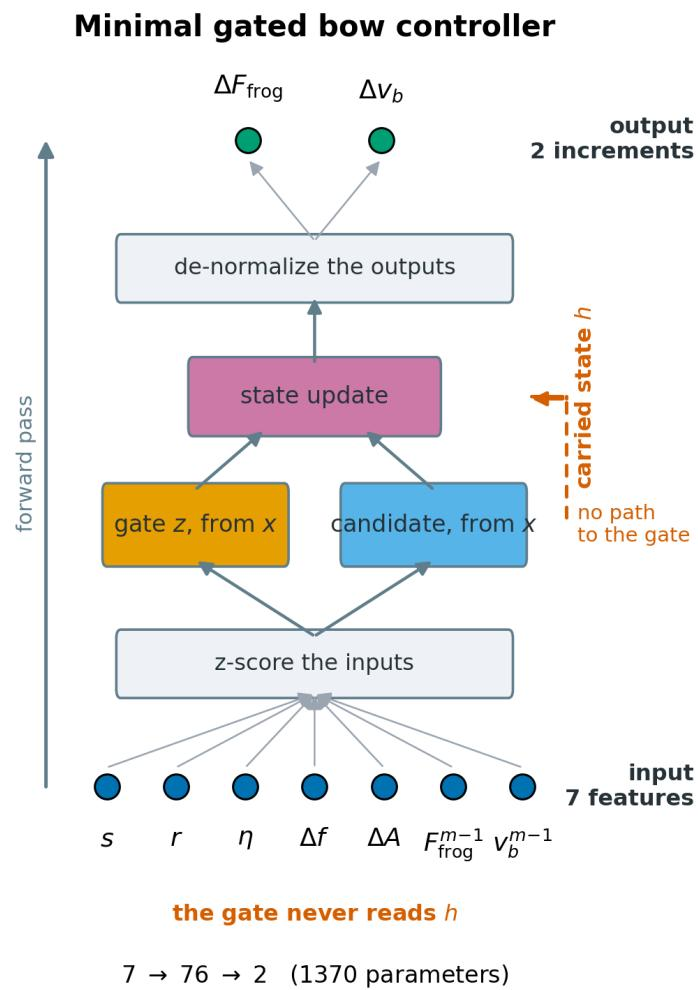  
Fig. 15. Architecture of the minimal gated variant. The gate is computed from the input alone, so no path carries the state into it, and the state cannot influence how much of itself survives. That is the omission behind the failure above. Removing the state from the gate also makes each unit cheaper, so at a matched parameter budget this cell is 76 units wide against the gated recurrent unit’s 17.

Depth does not repair it. The two-layer and three-layer minimal variants never significantly improve on the single layer and significantly worsen it on D by 19.70 points and on A by 9.24, both surviving Holm correction. They are the two weakest architectures on the disturbance start on D and on A. On G the minimal single-layer variant is weaker than either of them, and on E it sits between them, below the twolayer variant and above the three-layer one. Depth compounds the latching rather than fixing it.

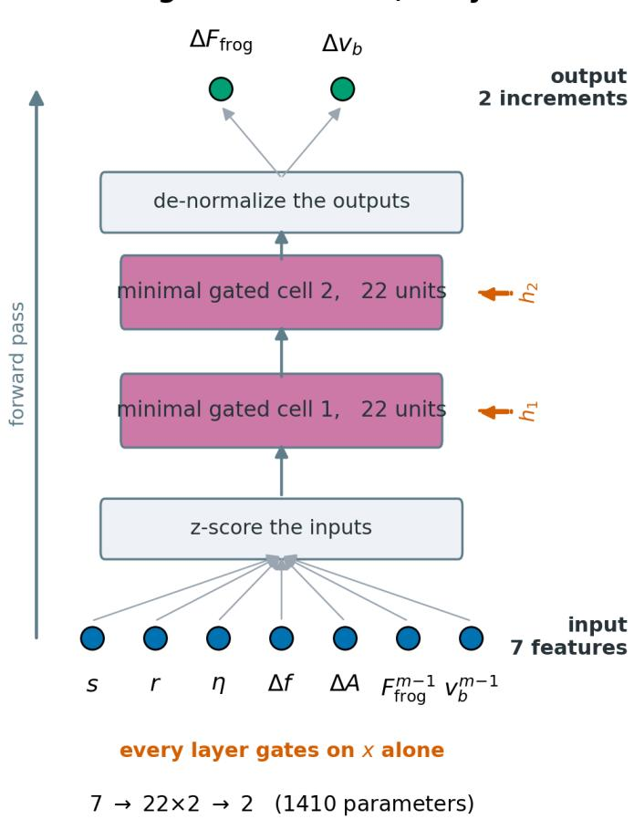  
Fig. 16. The minimal gated cell stacked to two layers, each carrying its own state. The parameter budget is spent on depth rather than on width, at 22 units per layer.

The state-space model is never the winner and never collapses in the mean. It places second or third on every string and holds 65.1% on the E disturbance where the minimal variant manages 24.6%. Individual seeds do go low: its seed spread on G is 14.6 points, the widest in its own row of Table VII, so the claim is about the distribution and not about every draw from it.

Three readings of Table IX bear on the recommendation. The gated recurrent unit is the cheapest of the contenders rather than the dearest, with fewer parameters than the feedforward network at 1362 against 1378 and fewer multiplyaccumulates at 1258 against 1312, while leading on all four strings. The microsecond column measures a NumPy

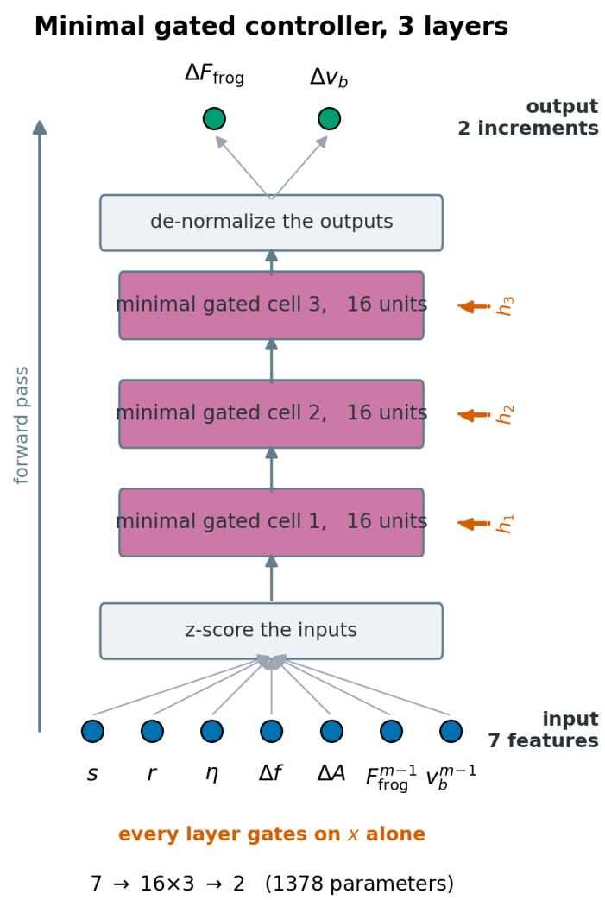  
Fig. 17. The same cell at three layers and 16 units each. Every layer still gates on its input alone, so stacking adds carried states without giving any of them influence over its own gate.  
TABLE IX

COST PER CONTROL STEP. MULTIPLY-ACCUMULATE COUNT IS THEHARDWARE-INDEPENDENT COLUMN. THE MICROSECOND COLUMNMEASURES THIS IMPLEMENTATION RATHER THAN THE ARCHITECTURE.

<table><tr><td rowspan=1 colspan=1>Architecture</td><td rowspan=1 colspan=1>Par.</td><td rowspan=1 colspan=1>MAC</td><td rowspan=1 colspan=1>Tr.</td><td rowspan=1 colspan=1>µs</td><td rowspan=1 colspan=1>×</td></tr><tr><td rowspan=1 colspan=1>Feedforward</td><td rowspan=1 colspan=1>1378</td><td rowspan=1 colspan=1>1312</td><td rowspan=1 colspan=1>64</td><td rowspan=1 colspan=1>25.4</td><td rowspan=1 colspan=1>1.00</td></tr><tr><td rowspan=1 colspan=1>Gated recurrent</td><td rowspan=1 colspan=1>1362</td><td rowspan=1 colspan=1>1258</td><td rowspan=1 colspan=1>68</td><td rowspan=1 colspan=1>53.3</td><td rowspan=1 colspan=1>2.10</td></tr><tr><td rowspan=1 colspan=1>Minimal gated</td><td rowspan=1 colspan=1>1370</td><td rowspan=1 colspan=1>1216</td><td rowspan=1 colspan=1>152</td><td rowspan=1 colspan=1>50.9</td><td rowspan=1 colspan=1>2.01</td></tr><tr><td rowspan=1 colspan=1>Minimal, two layers</td><td rowspan=1 colspan=1>1410</td><td rowspan=1 colspan=1>1320</td><td rowspan=1 colspan=1>88</td><td rowspan=1 colspan=1>80.6</td><td rowspan=1 colspan=1>3.18</td></tr><tr><td rowspan=1 colspan=1>Minimal, three layers</td><td rowspan=1 colspan=1>1378</td><td rowspan=1 colspan=1>1280</td><td rowspan=1 colspan=1>96</td><td rowspan=1 colspan=1>111.8</td><td rowspan=1 colspan=1>4.41</td></tr><tr><td rowspan=1 colspan=1>State space</td><td rowspan=1 colspan=1>1382</td><td rowspan=1 colspan=1>1920</td><td rowspan=1 colspan=1>23</td><td rowspan=1 colspan=1>132.3</td><td rowspan=1 colspan=1>5.22</td></tr></table>

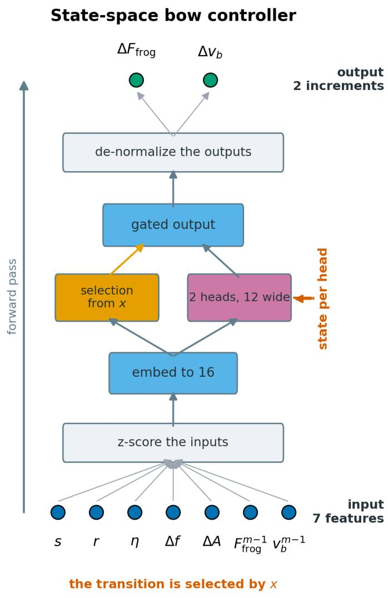  
7 → 16 → 2 (1382 parameters), 2 heads × 12  
Fig. 18. Architecture of the state-space controller. The transition applied to each state head is selected by the input rather than fixed, which is the mechanism it shares with a gate, and the state is carried in two heads of width 12.

implementation in which per-step latency is dominated by interpreter overhead, which is why the minimal variant has the fewest multiply-accumulates of anything in the table and still costs twice the feedforward network. The state-space model’s multiply-accumulate count exceeds its parameter count, 1920 against 1382, because its recurrence carries 592 operations that are not weights.

None of it decides the question. Against the cost of one finite-difference control step the cheapest controller occupies between 0.042% and 0.142% and the dearest between 0.221% and 0.743%, so every architecture in Table IX is under 1% on every string.

What decides it is where the two architectures differ. The feedforward network’s only advantage is on the cold start, where it completes sixteen more strokes of eighty. On the other three starts together the two are 237 and 231 of 240. That start commands $v _ { b } = 0 . 0 2$ m/s, which is a 32.5 s frog-to-tip stroke, and Section IV-I shows the target regime is unreachable there on three of the four strings and below the commanded force floor on the fourth. It is a test of escape from an unplayable corner rather than of playing. On the disturbance start, where the commanded state is displaced at mid-stroke, the gated recurrent unit leads by 11.9, 15.5 and 8.2 points on G, D and E and is level on A. The asymmetry is not confined to disturbances the commands can see. Section V-B reduces the limiting friction instead, which is what rosin depletion or a heating contact would do and which leaves $s , \ F _ { \mathrm { f r o g } }$ and v untouched, and finds at twenty seeds that both recurrent architectures show the effect over the whole stroke below $p = 0 . 0 0 1$ and the feedforward network reaches significance on neither window. The recommendation therefore rests on the conditions under which a violin is actually played, and the feedforward network’s reliability advantage does not survive restriction to them.

## H. The Training Context Window Bounds the Comparison

Every fit in Table VII was trained on sequences capped at thirty control steps. Because the recurrent architectures differ in what they can retain, that cap is a condition on the comparison rather than an incidental setting. A sweep over six windows on two strings, with six seeds at the longest window, measures its effect.

The advantage of the gated recurrent unit over the minimal variant is largest at the window the comparison used and absent at a longer one. On A the difference is −13.4 points at thirty steps and −0.2 at four hundred. On E it is −14.3 and +0.2. At four hundred steps the two are indistinguishable on both strings, an order of magnitude inside the four-point interpretability bar of Section IV-G, where at thirty steps both differences are more than three times outside it.

This does not show the minimal variant winning at the longer window, and it does not overturn the recommendation. It states its condition. The recommendation holds at the training window used, and the accuracy argument for it weakens as the window grows.

The practical argument moves the other way. One minimalvariant fit at the longer window costs 3216 seconds against 51 for the gated recurrent unit, a factor of 63, so a board of the size reported here is not affordable in that family at that window. That same factor is why this sweep covers two strings where the capacity ladder of Section IV-K covers four. Extending it to the other two would cost between six and eleven times the ladder, and almost all of that cost is the minimal variant at the long window, which is the cell the comparison is made of, so the scope is a costed choice rather than an oversight. Section VI-C carries the extension.

Training loss falls with the window in almost every cell of the sweep, by 76% on the A-string feedforward network, and rises only slightly in three of eight cells at the longest window, while the closed-loop score moves in every direction. The divergence between supervised loss and control quality reported in Section IV-K therefore holds along the context axis as well, and supervised loss cannot be used to select a training window either.

I. The Cold Start Begins Below the Map’s Helmholtz Threshold

The cold start commands $v _ { b } = 0 . 0 2$ m/s, the lowest speed the action bounds permit. On 0.65 m of playing hair that is a 32.5 s frog-to-tip stroke, far outside ordinary playing. Reading the playability map at that speed, the column holds no Helmholtz cell on three of the four strings. On E it resolves a single cell, at 0.05 N.

An empty column is not proof that Helmholtz motion is unavailable there. Schelleng’s maximum and minimum forces are both proportional to bow speed, so as the speed falls the window slides toward zero force and narrows rather than vanishing, and a window narrower than one cell of the force grid will not be resolved. Fitting both bounds through the origin against the resolved columns of each map and evaluating at 0.02 m/s gives [0.072, 0.159] N on G, [0.058, 0.124] on D, [0.048, 0.099] on A and [0.041, 0.088] on E.

On G that window lies entirely below the commanded force floor of 0.40 N. The floor is higher on G than on the other strings because Schelleng’s minimum force scales with the square of the wave impedance, and G’s impedance is close to twice E’s. The upper bound of the window does not rise to meet the floor until the bow speed reaches about 0.050 m/s. On G the controller is forbidden by its own action bounds from reaching Helmholtz motion at the cold-start speed, and that is a statement about the command set rather than about grid resolution.

What occupies the low-speed column instead is constant sticking, between 23 and 26 of the 33 force cells on the four strings. At the cold-start speed the bow drags the string rather than releasing it.

TABLE X  
STROKES REACHING THE TIP, OUT OF TWENTY SEEDS ON EACH OF FOUR STRINGS. THE FINAL COLUMN RESTRICTS TO THE THREE STARTS WHOSE COMMANDED SPEED LIES INSIDE THE PLAYABLE REGION.
<table><tr><td rowspan=1 colspan=1>Architecture</td><td rowspan=1 colspan=1>Band</td><td rowspan=1 colspan=1>Cold</td><td rowspan=1 colspan=1>Hot</td><td rowspan=1 colspan=1>Dist.</td><td rowspan=1 colspan=1>Three</td></tr><tr><td rowspan=1 colspan=1>Feedforward</td><td rowspan=1 colspan=1>80/80</td><td rowspan=1 colspan=1>70/80</td><td rowspan=1 colspan=1>80/80</td><td rowspan=1 colspan=1>77/80</td><td rowspan=1 colspan=1>237/240</td></tr><tr><td rowspan=1 colspan=1>Gated recurrent</td><td rowspan=1 colspan=1>79/80</td><td rowspan=1 colspan=1>54/80</td><td rowspan=1 colspan=1>80/80</td><td rowspan=1 colspan=1>72/80</td><td rowspan=1 colspan=1>231/240</td></tr><tr><td rowspan=1 colspan=1>Minimal gated</td><td rowspan=1 colspan=1>79/80</td><td rowspan=1 colspan=1>69/80</td><td rowspan=1 colspan=1>80/80</td><td rowspan=1 colspan=1>68/80</td><td rowspan=1 colspan=1>227/240</td></tr><tr><td rowspan=1 colspan=1>State space</td><td rowspan=1 colspan=1>78/80</td><td rowspan=1 colspan=1>59/80</td><td rowspan=1 colspan=1>80/80</td><td rowspan=1 colspan=1>73/80</td><td rowspan=1 colspan=1>231/240</td></tr></table>

Table X therefore reports completion two ways. Pooled over all four starts the feedforward network completes every stroke on 68 of 80 seeds against the gated recurrent unit’s 51. Restricted to the three playable starts the gap is 237/240 against 231/240, and on those same three starts the gated recurrent unit leads the feedforward network on mean Helmholtz fraction on all four strings, 71.5% against 66.4%. The reliability advantage of the feedforward network rests largely on a start that begins below the Helmholtz threshold of the model’s own playability map.

the adopted architecture, one point per seedthe alternatives, one point per seedmedian of twenty seeds

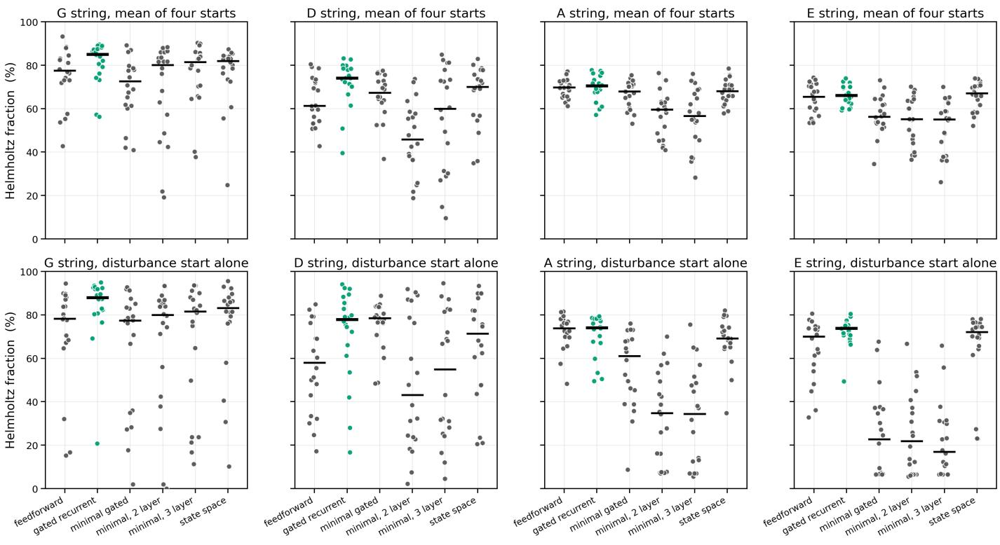  
Fig. 19. Every seed of the six-architecture board, twenty per cell, with the median marked. Top row, the mean over four starts, which is what Table VII reports. Bottom row, the disturbance start alone. Points rather than a box plot because the finding is a cluster and not a shifted mean: on E the minimal gated variant places eight of twenty seeds below nine per cent on the disturbance start, which a box plot renders as outliers. The gated recurrent unit and the feedforward network overlap almost completely on A, which is the tenth-of-a-point margin reported above.

The cold start is retained rather than dropped. It measures escape from a corner in which the target regime lies below the controller’s own force floor on one string and below its speed resolution on the others, which is a different question from regulation inside the playable band, and the paper should not let one number stand for both.

## J. Feature Ablation

To establish which inputs the controller actually needs, the policy was retrained from scratch with each feature or feature group removed, rather than masked at inference. Every condition was evaluated on the same ten initial conditions, comprising the four named cases of Table V and six drawn at random from the command box, so the comparison is paired. Table XI reports the mean fraction of control steps in Helmholtz motion, the paired difference against the full model, and the number of strokes that reached the tip.

Removing the previously applied commands hurts in fourteen of the sixteen cells, which is the one group whose sign is close to consistent. Removing the stroke position hurts in ten. Removing the four string-state features together hurts in twelve, and the four cells in which it helps are concentrated rather than scattered: three of the four are on the G string, and the two in which the help reaches significance are both on G, at 5.2 points for the minimal gated variant at $p = 0 . 0 3 0$ and

## TABLE XI

FEATURE ABLATION, AS THE FULL MODEL’S MEAN HELMHOLTZ FRACTION MINUS THE ABLATED MODEL’S OVER TEN PAIRED STARTS, SO A POSITIVE ENTRY MEANS THAT REMOVING THE GROUP HURTS. THE POLICY IS RETRAINED FROM SCRATCH IN EVERY ONE OF THE CELLS, ACROSS FOUR STRINGS AND FOUR ARCHITECTURES. SSM IS THE STATE-SPACE MODEL.
<table><tr><td rowspan=1 colspan=1>Removed</td><td rowspan=1 colspan=1>Str.</td><td rowspan=1 colspan=1>MLP</td><td rowspan=1 colspan=1>GRU</td><td rowspan=1 colspan=1>minGRU</td><td rowspan=1 colspan=1>SSM</td></tr><tr><td rowspan=4 colspan=1>all fourstring-state</td><td rowspan=1 colspan=1>G</td><td rowspan=1 colspan=1>-1.1</td><td rowspan=1 colspan=1>+1.0</td><td rowspan=1 colspan=1>-5.2</td><td rowspan=1 colspan=1>-22.3</td></tr><tr><td rowspan=1 colspan=1>D</td><td rowspan=1 colspan=1>-3.7</td><td rowspan=1 colspan=1>+11.5</td><td rowspan=1 colspan=1>+1.6</td><td rowspan=1 colspan=1>+16.7</td></tr><tr><td rowspan=2 colspan=1>AE</td><td rowspan=1 colspan=1>+12.0</td><td rowspan=1 colspan=1>+8.0</td><td rowspan=1 colspan=1>+15.6</td><td rowspan=1 colspan=1>+14.0</td></tr><tr><td rowspan=1 colspan=1>+1.2</td><td rowspan=1 colspan=1>+15.1</td><td rowspan=1 colspan=1>+15.1</td><td rowspan=1 colspan=1>+11.7</td></tr><tr><td rowspan=4 colspan=1>previouscommands</td><td rowspan=2 colspan=1>GD</td><td rowspan=1 colspan=1>+6.9</td><td rowspan=1 colspan=1>+0.8</td><td rowspan=1 colspan=1>+17.1</td><td rowspan=1 colspan=1>-9.9</td></tr><tr><td rowspan=1 colspan=1>-1.8</td><td rowspan=1 colspan=1>+6.9</td><td rowspan=1 colspan=1>+3.6</td><td rowspan=1 colspan=1>+12.9</td></tr><tr><td rowspan=1 colspan=1>A</td><td rowspan=1 colspan=1>+2.3</td><td rowspan=1 colspan=1>+3.2</td><td rowspan=1 colspan=1>+6.0</td><td rowspan=1 colspan=1>+5.8</td></tr><tr><td rowspan=1 colspan=1>E</td><td rowspan=1 colspan=1>+3.6</td><td rowspan=1 colspan=1>+4.4</td><td rowspan=1 colspan=1>+14.1</td><td rowspan=1 colspan=1>+4.0</td></tr><tr><td rowspan=2 colspan=1>stroke</td><td rowspan=2 colspan=1>GD</td><td rowspan=1 colspan=1>+3.4</td><td rowspan=1 colspan=1>-2.1</td><td rowspan=1 colspan=1>+7.5</td><td rowspan=1 colspan=1>-7.6</td></tr><tr><td rowspan=1 colspan=1>-7.3</td><td rowspan=1 colspan=1>+7.6</td><td rowspan=1 colspan=1>-3.8</td><td rowspan=1 colspan=1>+5.7</td></tr><tr><td rowspan=2 colspan=1>position s</td><td rowspan=1 colspan=1>A</td><td rowspan=1 colspan=1>+5.1</td><td rowspan=1 colspan=1>+2.9</td><td rowspan=1 colspan=1>+8.9</td><td rowspan=1 colspan=1>-2.8</td></tr><tr><td rowspan=1 colspan=1>E</td><td rowspan=1 colspan=1>+2.5</td><td rowspan=1 colspan=1>-3.8</td><td rowspan=1 colspan=1>+9.4</td><td rowspan=1 colspan=1>+3.8</td></tr></table>

22.3 for the state-space model at $p = 0 . 0 2 6 .$ . The other two are inside noise, at $p = 0 . 8 0 3$ on G and $p = 0 . 6 8 7 \ \mathrm { o n } \ \mathrm { D }$

That structure is the result. Removing the string state significantly hurts on A and on E, by between 8.0 and 15.6 points, and significantly helps on G. The spread of the effect across strings is 19.3 points against 6.8 across architectures, so whether the oscillation is worth observing is a property of the string rather than of the network reading it. The individual features within the group behave the same way: their signs turn over between strings more than between architectures, and no single one of them carries the group.

One conjecture fits the ordering, and it is offered as a conjecture rather than a result. G is the string whose Helmholtz band sits highest in force and whose commanded floor was raised accordingly, so a schedule over stroke position and current commands may be closer to sufficient there, with the extra inputs acting as distraction, while on A and E the band is lower in the same coordinates and the string state may carry information the commands do not. Regressing the perstring effect on the minimum bow force gives $r = - 0 . 9 4 4$ at $p = 0 . 0 5 6$ over four points, which is suggestive and not established, and the rank correlation is weaker still because A and E invert the predicted order. Section II-G declines on the same grounds to name a cause for the impedance exponent it measures on the same four strings, and the same standard is applied here.

The scope of the result is limited in a second way as well. The disturbances tested are a step change in commanded velocity and adverse initial conditions, both recoverable without oscillation feedback. A disturbance acting on the string rather than on the command is not visible in s, $F _ { \mathrm { f r o g } }$ or vb. Section V-B measures that case at twenty seeds and finds an effect on both recurrent architectures over the whole stroke, though whether it reaches the steps after the onset depends on the architecture.

## K. Capacity of the Function Approximator

A natural question is whether a larger or more expressive network would do better. It can be answered directly, over a ladder of parameter budgets that spans the architectures this paper actually uses, holding the dataset, the normalization and the evaluation starts fixed.

Two questions sit behind it. Whether the approximator family matters, and whether the budget within a family matters. Table XII takes the first, over five families spanning a linear map to exact recall, on the A string, fitted to the same labels and evaluated from the same four starts.

## TABLE XII

APPROXIMATOR FAMILY AGAINST FIT QUALITY AND CLOSED-LOOP PERFORMANCE, ON THE A STRING. THE TWO $R ^ { 2 }$ COLUMNS ARE IN-SAMPLE, AGAINST THE COMMANDED FORCE INCREMENT AND THE COMMANDED SPEED INCREMENT. THE FOUR RIGHT-HAND COLUMNS GIVE THE PERCENTAGE OF CONTROL STEPS IN HELMHOLTZ MOTION FROM EACH START. THE TWO FAMILIES CARRYING A TRAINING SEED, THE WIDE NETWORK AND THE FOREST, WERE CHECKED ACROSS TWENTY SEEDS AND EVERY VALUE HERE FALLS INSIDE THE OBSERVED RANGE.

<table><tr><td></td><td colspan="2"> $\overline { { R ^ { 2 } } }$ </td><td colspan="4">Helmholtz %</td></tr><tr><td>Family</td><td>∆F</td><td>∆vb</td><td>band</td><td>cold</td><td>hot</td><td>dist</td></tr><tr><td>Linear MLP 32–32 MLP 2563 Random forest Exact recall</td><td>0.585 0.812 0.815 0.971 1.000</td><td>0.451 0.703 0.692 0.951 1.000</td><td>96.6 94.8 93.7 91.8 96.6</td><td>57.1 89.5 77.9 81.7 97.3</td><td>11.4 40.9 42.2 38.6 47.7</td><td>67.4 75.8 78.1 80.6 73.9</td></tr></table>

Some capacity is required and very little of it suffices. The linear map holds the band but loses the cold start, at 57.1% against 89.5% for the smallest network, a gap of 32.4 points. Above that the three learned families are close, spanning 3.0 points on the band, which is inside the interpretability bar of Section IV-G. The linear map and exact recall both sit at 96.6 there, so the two ends of the capacity range meet on the start that is easiest to hold.

Fit quality does not order them. In-sample $R ^ { 2 }$ rises from 0.585 to exactly 1.000 across the table while the band score runs 96.6, 94.8, 93.7, 91.8 and 96.6, ending where it started. A family that reproduces its labels perfectly scores the same on the band as the linear map that reproduces them worst. That is the same divergence between supervised loss and closed-loop quality the ladder finds against budget, reached here against family instead.

Exact recall is the useful limit. It is at least as good as every other family from three of the four starts, which bounds what any approximator of this dataset can do and is a ceiling set by the labels rather than by the fit. No learned family reaches it from cold, and the rule that generated those labels is the subject of Section IV-F.

The ladder in Table XIII covers four parameter budgets from about 1400 to 12000, on all four strings, for four architectures, at three seeds each, which is one hundred and ninety-two fits.

TABLE XIII  
TRAINING LOSS AND CLOSED-LOOP PERFORMANCE AGAINST PARAMETER BUDGET, MEAN OF THREE SEEDS. EACH CELL GIVES THE TRAINING MEAN-SQUARED ERROR AND THE PERCENTAGE OF CONTROL STEPS IN HELMHOLTZ MOTION, AVERAGED OVER THE FOUR STARTS. THE BUDGET OF THE COMPARISON IN TABLE VII IS THE LEFTMOST COLUMN.
<table><tr><td rowspan=1 colspan=1></td><td rowspan=1 colspan=1></td><td rowspan=1 colspan=4>parameter budget</td></tr><tr><td rowspan=1 colspan=1>Str.</td><td rowspan=1 colspan=1>Arch.</td><td rowspan=1 colspan=1>1.4k</td><td rowspan=1 colspan=1>3k</td><td rowspan=1 colspan=1>6k</td><td rowspan=1 colspan=1>12k</td></tr><tr><td rowspan=1 colspan=1>G</td><td rowspan=1 colspan=1>GRUminGRUSSMMLP</td><td rowspan=1 colspan=1>0.185/85.40.206/87.50.209/70.90.123/90.5</td><td rowspan=1 colspan=1>0.155/70.80.177/73.60.177/74.10.102/68.2</td><td rowspan=1 colspan=1>0.134/77.70.158/69.90.158/62.80.094/69.4</td><td rowspan=1 colspan=1>0.101/36.00.148/84.40.131/47.80.089/57.0</td></tr><tr><td rowspan=3 colspan=1>D</td><td rowspan=3 colspan=1>GRUminGRUSSMMLP</td><td rowspan=1 colspan=1>0.240/78.10.268/69.4</td><td rowspan=1 colspan=1>0.211/66.90.233/68.6</td><td rowspan=1 colspan=1>0.166/72.60.211/65.0</td><td rowspan=1 colspan=1>0.120/57.70.194/58.4</td></tr><tr><td rowspan=1 colspan=1>0.270/74.6</td><td rowspan=2 colspan=1>0.232/59.40.139/68.0</td><td rowspan=2 colspan=1>0.204/70.10.124/61.3</td><td rowspan=2 colspan=1>0.173/63.00.117/70.4</td></tr><tr><td rowspan=1 colspan=1>0.167/57.0</td></tr><tr><td rowspan=4 colspan=1>A</td><td rowspan=4 colspan=1>GRUminGRUSSMMLP</td><td rowspan=2 colspan=1>0.194/73.20.207/59.8</td><td rowspan=2 colspan=1>0.170/69.80.190/62.1</td><td rowspan=1 colspan=1>0.130/63.1</td><td rowspan=1 colspan=1>0.080/59.7</td></tr><tr><td rowspan=1 colspan=1>0.180/68.4</td><td rowspan=1 colspan=1>0.174/64.8</td></tr><tr><td rowspan=2 colspan=1>0.220/73.30.165/72.2</td><td rowspan=2 colspan=1>0.204/64.80.148/63.1</td><td rowspan=1 colspan=1>0.190/65.1</td><td rowspan=2 colspan=1>0.171/69.60.120/70.8</td></tr><tr><td rowspan=1 colspan=1>0.133/68.8</td></tr><tr><td rowspan=4 colspan=1>E</td><td rowspan=4 colspan=1>GRUminGRUSSMMLP</td><td rowspan=1 colspan=1>0.187/70.4</td><td rowspan=1 colspan=1>0.166/61.9</td><td rowspan=1 colspan=1>0.137/70.6</td><td rowspan=1 colspan=1>0.087/66.5</td></tr><tr><td rowspan=1 colspan=1>0.213/56.1</td><td rowspan=1 colspan=1>0.197/56.3</td><td rowspan=1 colspan=1>0.188/56.5</td><td rowspan=2 colspan=1>0.183/55.50.176/52.3</td></tr><tr><td rowspan=1 colspan=1>0.219/66.4</td><td rowspan=1 colspan=1>0.205/68.7</td><td rowspan=1 colspan=1>0.198/54.0</td></tr><tr><td rowspan=1 colspan=1>0.176/67.1</td><td rowspan=1 colspan=1>0.158/64.4</td><td rowspan=1 colspan=1>0.145/59.5</td><td rowspan=1 colspan=1>0.132/60.8</td></tr></table>

Training loss falls with the budget in every one of the sixteen cells, by between 14.3 and 59.0 per cent. Closed-loop quality does not follow it. Against the same four-point bar, nine of the sixteen fall clearly, five are ties, and two rise clearly. The mean change is −11.1 points. Stating the result as sixteen cells falling would count five ties as falls, but nine clear falls against two clear rises is one-sided, and two of the nine are catastrophic at −49.4 and −33.5.

The two exceptions should be named rather than left for a reader to find. On A the minimal gated variant gains 5.0 points, from the lowest starting score on that string, which is the easy case to explain. On D the feedforward network gains 13.4, and it is not the easy case: it starts at 57.0, low for that string, and finishes at 70.4, the best D-string cell at the largest budget. That is the largest rise in the table and the seventh largest change of the sixteen in either direction, and it exceeds three of the nine clear falls. Extra capacity does help somewhere, twice, and once by a margin that is not negligible beside them.

The effect is also not uniform across strings. Per string the mean change is −27.2 on G, −7.4 on D, −3.4 on A and −6.2 on E, so G carries most of it and A is nearly flat. That matters for how the result is read: measured on G and A alone the mean would have been −15.3, and adding D and E made the effect smaller rather than larger, because those two strings happened to be the extremes of the range.

The seed spread moves the same way and is not visible in the loss at all. Comparing the smallest budget with the largest, the standard deviation across the three seeds rises in thirteen of the sixteen cells and by a factor of four or more in four of them, from 2.4 to 24.5 on the G-string feedforward network, 5.2 to 24.9 on the G-string gated unit, 4.5 to 19.7 on the Dstring gated unit and 2.9 to 12.8 on the A-string gated unit. Extra capacity does not merely lower the mean, it makes the outcome less reproducible.

Three caveats belong with the ladder. Three seeds establish a direction and not an effect size, so no single cell’s change should be quoted as a precise figure. The ladder holds the training window at thirty control steps, so it has not been crossed with the sweep of Section IV-H. And the budgets span a range the paper’s own comparison does not use: every architecture in Table VII sits at the leftmost column.

Table XIII therefore says that a search driven by fit quality selects badly here: it would pick the largest budget in every cell, and in no cell is that the better controller. Selection has to run on the closed-loop measure.

What limits the controller is therefore the supervision rather than the model. The targets are nearest-neighbor jumps on a discretized map, so they are discontinuous in the state, and fitting them more closely buys a policy that inherits the discontinuity. The ceiling on performance is set by the rule generating the labels rather than by the capacity of the model fitting them, and it is reached well below the largest budget tested.

## V. ROBUSTNESS AND SCOPE

## A. Sensitivity to the Transmission Factor

The transmission factor $\alpha ( s )$ of (9) is assumed rather than measured, so its influence must be quantified. The controller was trained under the nominal $\alpha _ { \mathrm { t i p } } = 0 . 5$ and then run on plants whose true value differs, which is what a mis-specified transmission would look like in practice. Table XIV reports the result.

TABLE XIV  
MEAN PERCENTAGE OF CONTROL STEPS IN HELMHOLTZ MOTION OVER THE THREE STARTS, WHEN THE TRUE TRANSMISSION FACTOR DIFFERS FROM THE NOMINAL 0.5 THE CONTROLLER WAS TRAINED UNDER, FOR EACH ARCHITECTURE ON EACH OPEN STRING. BOLD MARKS EACH ROW’S BEST VALUE.
<table><tr><td rowspan=1 colspan=1></td><td rowspan=1 colspan=1></td><td rowspan=1 colspan=5> $\alpha _ { \mathrm { t i p } }$ </td></tr><tr><td rowspan=1 colspan=1>Str.</td><td rowspan=1 colspan=1>Arch.</td><td rowspan=1 colspan=1>1.00</td><td rowspan=1 colspan=1>0.75</td><td rowspan=1 colspan=1>0.50</td><td rowspan=1 colspan=1>0.35</td><td rowspan=1 colspan=1>0.25</td></tr><tr><td rowspan=4 colspan=1>G</td><td rowspan=4 colspan=1>MLPGRUminGRUSSM</td><td rowspan=1 colspan=1>92.5</td><td rowspan=1 colspan=1>94.5</td><td rowspan=1 colspan=1>94.5</td><td rowspan=1 colspan=1>90.1</td><td rowspan=1 colspan=1>78.7</td></tr><tr><td rowspan=1 colspan=1>86.1</td><td rowspan=1 colspan=1>86.3</td><td rowspan=1 colspan=1>79.9</td><td rowspan=1 colspan=1>84.5</td><td rowspan=1 colspan=1>86.3</td></tr><tr><td rowspan=2 colspan=1>65.343.3</td><td rowspan=2 colspan=1>63.340.9</td><td rowspan=2 colspan=1>71.237.2</td><td rowspan=2 colspan=1>88.039.7</td><td rowspan=1 colspan=1>85.6</td></tr><tr><td rowspan=1 colspan=1>64.1</td></tr><tr><td rowspan=4 colspan=1>D</td><td rowspan=4 colspan=1>MLPGRUminGRUSSM</td><td rowspan=1 colspan=1>37.4</td><td rowspan=1 colspan=1>48.1</td><td rowspan=1 colspan=1>41.1</td><td rowspan=1 colspan=1>31.8</td><td rowspan=1 colspan=1>24.1</td></tr><tr><td rowspan=1 colspan=1>83.6</td><td rowspan=1 colspan=1>71.8</td><td rowspan=1 colspan=1>87.4</td><td rowspan=1 colspan=1>91.7</td><td rowspan=1 colspan=1>90.1</td></tr><tr><td rowspan=2 colspan=1>71.357.6</td><td rowspan=2 colspan=1>66.772.5</td><td rowspan=1 colspan=1>80.0</td><td rowspan=1 colspan=1>65.6</td><td rowspan=1 colspan=1>62.8</td></tr><tr><td rowspan=1 colspan=1>84.8</td><td rowspan=1 colspan=1>89.8</td><td rowspan=1 colspan=1>82.3</td></tr><tr><td rowspan=4 colspan=1>A</td><td rowspan=4 colspan=1>MLPGRUminGRUSSM</td><td rowspan=1 colspan=1>65.1</td><td rowspan=1 colspan=1>69.2</td><td rowspan=1 colspan=1>82.2</td><td rowspan=1 colspan=1>81.7</td><td rowspan=1 colspan=1>79.2</td></tr><tr><td rowspan=1 colspan=1>36.6</td><td rowspan=1 colspan=1>62.5</td><td rowspan=1 colspan=1>69.9</td><td rowspan=1 colspan=1>70.7</td><td rowspan=1 colspan=1>71.6</td></tr><tr><td rowspan=2 colspan=1>37.763.3</td><td rowspan=2 colspan=1>52.467.6</td><td rowspan=1 colspan=1>81.6</td><td rowspan=1 colspan=1>72.5</td><td rowspan=2 colspan=1>79.878.9</td></tr><tr><td rowspan=1 colspan=1>76.9</td><td rowspan=1 colspan=1>77.1</td></tr><tr><td rowspan=4 colspan=1>E</td><td rowspan=4 colspan=1>MLPGRUminGRUSSM</td><td rowspan=1 colspan=1>47.4</td><td rowspan=1 colspan=1>44.0</td><td rowspan=1 colspan=1>78.9</td><td rowspan=1 colspan=1>74.6</td><td rowspan=1 colspan=1>84.1</td></tr><tr><td rowspan=1 colspan=1>47.6</td><td rowspan=1 colspan=1>77.5</td><td rowspan=1 colspan=1>90.4</td><td rowspan=1 colspan=1>84.0</td><td rowspan=1 colspan=1>87.5</td></tr><tr><td rowspan=1 colspan=1>39.9</td><td rowspan=1 colspan=1>72.6</td><td rowspan=1 colspan=1>82.9</td><td rowspan=1 colspan=1>69.2</td><td rowspan=1 colspan=1>80.5</td></tr><tr><td rowspan=1 colspan=1>52.8</td><td rowspan=1 colspan=1>75.2</td><td rowspan=1 colspan=1>76.7</td><td rowspan=1 colspan=1>78.7</td><td rowspan=1 colspan=1>70.6</td></tr></table>

The response is asymmetric, and the asymmetry is the robust part of this table. Over-estimating the loss is expensive: a bow with no loss at all, $\alpha _ { \mathrm { t i p } } = 1 . 0 0$ , is the worst or second worst setting in eleven of the sixteen combinations of string and architecture, and in those eleven costs between 8 and 44 points against that cell’s best. Under-estimating is cheap, and in several cells it is an improvement.

The reason for the expensive direction is visible in Fig. 10. The controller learns to raise the frog force as the stroke proceeds, compensating for a contact force it expects to fall. When that fall does not occur the compensation becomes overshoot into raucous motion.

What does not survive at four strings is the claim that the nominal value is best. It is the best setting in only five of the sixteen cells, and on G the feedforward network is as good at 0.75 while the gated unit is worst at the nominal value and indistinguishable across the other four. The differences among 0.50, 0.35 and 0.25 are mostly a few points and many are inside the interpretability bar of Section IV-G. The defensible statement is the one-sided one: the assumption is not free, the risk it carries runs in one direction, and erring toward too little assumed loss is the safer choice.

## B. A Disturbance the Commands Cannot See

The ablation of Section IV-J found the value of the oscillation feedback to depend on the string rather than on the network, but the disturbances used there were a step in commanded velocity and adverse initial conditions, both visible in the commands themselves. A change in the contact condition is not. Here the limiting friction is reduced at midstroke, as rosin depletes or the contact heats, which moves the playable band while leaving s, $F _ { \mathrm { f r o g } }$ and vb untouched. Table XV reports the result.

## TABLE XV

PERCENTAGE OF CONTROL STEPS IN HELMHOLTZ MOTION AFTER A MID-STROKE REDUCTION OF THE FRICTION CHARACTERISTIC, FOR THE FULL CONTROLLER AND FOR THE SAME CONTROLLER WITH ITS FOUR STRING-STATE INPUTS FROZEN, SCORED OVER THE STEPS FOLLOWING THE ONSET AND OVER THE WHOLE STROKE.

<table><tr><td rowspan=1 colspan=1></td><td rowspan=1 colspan=2>after onset</td><td rowspan=1 colspan=2>whole stroke</td></tr><tr><td rowspan=1 colspan=1>Friction</td><td rowspan=1 colspan=1>Full</td><td rowspan=1 colspan=1>Frozen</td><td rowspan=1 colspan=1>Full</td><td rowspan=1 colspan=1>Frozen</td></tr><tr><td rowspan=1 colspan=1>100%</td><td rowspan=1 colspan=1>100.0</td><td rowspan=1 colspan=1>90.9</td><td rowspan=1 colspan=1>94.8</td><td rowspan=1 colspan=1>70.7</td></tr><tr><td rowspan=1 colspan=1>70%</td><td rowspan=1 colspan=1>100.0</td><td rowspan=1 colspan=1>97.0</td><td rowspan=1 colspan=1>94.8</td><td rowspan=1 colspan=1>74.1</td></tr><tr><td rowspan=1 colspan=1>55%</td><td rowspan=1 colspan=1>100.0</td><td rowspan=1 colspan=1>60.6</td><td rowspan=1 colspan=1>94.8</td><td rowspan=1 colspan=1>53.4</td></tr><tr><td rowspan=1 colspan=1>40%</td><td rowspan=1 colspan=1>80.6</td><td rowspan=1 colspan=1>87.9</td><td rowspan=1 colspan=1>83.6</td><td rowspan=1 colspan=1>69.0</td></tr></table>

The answer depends on which window is scored, and at twenty seeds that dependence is itself the finding.

Over the whole stroke the full controller leads at every reduction, by between 14.7 and 41.4 points. Over the steps following the onset it leads at three reductions and trails at the fourth, by 7.2 points. The same episodes therefore support opposite conclusions according to the interval chosen, and neither is the obvious choice. The disturbance is a persistent change of condition rather than a transient to be recovered from, which argues for the whole stroke. The post-onset window is what isolates the response to it, which argues for that.

Retraining under twenty seeds settles which of those readings is statistically supported, and the two do not agree. Scored over the whole stroke the gap is $1 4 . 7 \pm 1 5 . 0$ points for the minimal gated variant, at $p = \mathrm { 0 . 0 0 0 3 }$ , and $1 8 . 5 \pm 1 7 . 8$ for the gated recurrent unit, at p = 0.0002. Scored over the steps after the onset the same twenty fits give $1 8 . 4 \pm 2 4 . 6$ for the minimal variant, still significant at $p = 0 . 0 0 3 4$ , and 3.8 ± 35.4 for the gated unit, which is indistinguishable from zero at $p = 0 . 6 4$ . The feedforward network reaches significance on neither window, at p = 0.16 and p = 0.27.

For the controller this paper recommends, then, the choice of window decides whether the effect exists at all. That is the same disagreement that the single-episode table above shows, now measured with twenty retrainings behind it rather than one.

## TABLE XVI

NETWORK MINUS LOOKUP AT TWENTY SEEDS, IN POINTS OF HELMHOLTZ FRACTION, FOR EACH FRICTION LEVEL AND EACH SCORING WINDOW. POSITIVE FAVORS THE LEARNED CONTROLLER. THE LOOKUP IS SEED-INDEPENDENT BY CONSTRUCTION AND IS RUN ONCE PER ONSET. ENTRIES INSIDE THE FOUR-POINT BAR ARE TIES. THE ARCHITECTURES ARE THE TORCH BOARD FAMILY, NOT THE SINGLE SKLEARN FIT OF TABLE XV.
<table><tr><td rowspan=1 colspan=1></td><td rowspan=1 colspan=3>after onset</td><td rowspan=1 colspan=3>whole stroke</td></tr><tr><td rowspan=1 colspan=1>Fric.</td><td rowspan=1 colspan=1>MLP</td><td rowspan=1 colspan=1>GRU</td><td rowspan=1 colspan=1>minGRU</td><td rowspan=1 colspan=1>MLP</td><td rowspan=1 colspan=1>GRU</td><td rowspan=1 colspan=1>minGRU</td></tr><tr><td rowspan=1 colspan=1>1.00</td><td rowspan=1 colspan=1>-4.6</td><td rowspan=1 colspan=1>-1.1</td><td rowspan=1 colspan=1>-2.0</td><td rowspan=1 colspan=1>-6.6</td><td rowspan=1 colspan=1>+0.2</td><td rowspan=1 colspan=1>-1.1</td></tr><tr><td rowspan=1 colspan=1>0.70</td><td rowspan=1 colspan=1>-4.1</td><td rowspan=1 colspan=1>+0.0</td><td rowspan=1 colspan=1>+0.0</td><td rowspan=1 colspan=1>-6.0</td><td rowspan=1 colspan=1>+0.9</td><td rowspan=1 colspan=1>+0.1</td></tr><tr><td rowspan=1 colspan=1>0.55</td><td rowspan=1 colspan=1>-41.0</td><td rowspan=1 colspan=1>-7.0</td><td rowspan=1 colspan=1>-17.5</td><td rowspan=1 colspan=1>-27.4</td><td rowspan=1 colspan=1>-3.2</td><td rowspan=1 colspan=1>-10.1</td></tr><tr><td rowspan=1 colspan=1>0.40</td><td rowspan=1 colspan=1>+44.9</td><td rowspan=1 colspan=1>+20.1</td><td rowspan=1 colspan=1>+38.0</td><td rowspan=1 colspan=1>+22.5</td><td rowspan=1 colspan=1>+12.6</td><td rowspan=1 colspan=1>+22.5</td></tr></table>

Table XVI sets the same twenty fits against the map lookup instead, which is a different question from the one above:

that one asks what freezing the inputs costs, this one asks whether reading the string beats consulting an exhaustive table of steady states. Both are answered at twenty seeds and neither is answered by the other.

Read down the friction column and the two families of architecture behave differently. The feedforward network simply crosses over once: the lookup leads it at 1.00, 0.70 and 0.55, and only at 0.40 does it lead the lookup. The two recurrent architectures are not monotone. They tie the lookup at 1.00 and 0.70, lose to it at 0.55 by 7.0 points for the adopted one and 17.5 for the minimal variant, and beat it at 0.40 by 20.1 and 38.0. So the crossover is a single one for a memoryless controller and a reversal followed by a crossover for one carrying state.

That reversal is itself window-dependent for the adopted architecture, in the same way the full-against-frozen contrast above is. The minimal variant shows it on both windows. The gated recurrent unit shows it only after the onset: over the whole stroke its 0.55 figure is −3.2, inside the bar, so the sequence there is three ties and then a lead. A reader choosing the whole-stroke window sees no reversal at all on the controller this paper recommends. One reading, offered as a reading and not a measurement, is that an intermediate change moves the plant enough to disturb a controller that is watching the string and not enough to invalidate a table that is not, so the lookup’s inability to react is briefly an advantage. At 0.40 it stops being one.

Repeating the same comparison on all four strings, using the board family rather than the grid family that Table XVI is built on, turns the result into a statement about when feedback helps rather than a statement about controllers. At 0.40 the network leads on D, A and E, by 14.9 to 59.6 points after the onset depending on architecture. On G it loses on all three architectures and both windows, by 8.6 to 14.1, with between two and eight seeds of twenty positive and every cell significant at $p < 0 . 0 1$ . That is a clean reversal on one string, not a noisy cell.

## TABLE XVII

THE LOOKUP’S OWN HELMHOLTZ FRACTION AFTER THE ONSET, PER STRING AND FRICTION LEVEL. THE LAST TWO COLUMNS EXTEND THE GRID BELOW THE RANGE USED ELSEWHERE IN THIS PAPER AND WERE

FIXED BEFORE THEY WERE RUN. THE TABULATION’S SCORE IS NOT MONOTONE IN THE FRICTION RETAINED, AND 0.40 IS A LOCAL MINIMUM ON D, A AND E.
<table><tr><td rowspan=1 colspan=1>String</td><td rowspan=1 colspan=1>1.00</td><td rowspan=1 colspan=1>0.70</td><td rowspan=1 colspan=1>0.55</td><td rowspan=1 colspan=1>0.40</td><td rowspan=1 colspan=1>0.25</td><td rowspan=1 colspan=1>0.10</td></tr><tr><td rowspan=1 colspan=1>G</td><td rowspan=1 colspan=1>100.0</td><td rowspan=1 colspan=1>100.0</td><td rowspan=1 colspan=1>59.6</td><td rowspan=1 colspan=1>96.0</td><td rowspan=1 colspan=1>94.0</td><td rowspan=1 colspan=1>60.7</td></tr><tr><td rowspan=1 colspan=1>D</td><td rowspan=1 colspan=1>58.8</td><td rowspan=1 colspan=1>96.0</td><td rowspan=1 colspan=1>90.6</td><td rowspan=1 colspan=1>26.7</td><td rowspan=1 colspan=1>77.4</td><td rowspan=1 colspan=1>30.0</td></tr><tr><td rowspan=1 colspan=1>A</td><td rowspan=1 colspan=1>100.0</td><td rowspan=1 colspan=1>100.0</td><td rowspan=1 colspan=1>98.9</td><td rowspan=1 colspan=1>41.4</td><td rowspan=1 colspan=1>94.0</td><td rowspan=1 colspan=1>58.6</td></tr><tr><td rowspan=1 colspan=1>E</td><td rowspan=1 colspan=1>100.0</td><td rowspan=1 colspan=1>100.0</td><td rowspan=1 colspan=1>98.4</td><td rowspan=1 colspan=1>22.8</td><td rowspan=1 colspan=1>96.6</td><td rowspan=1 colspan=1>26.1</td></tr></table>

Table XVII explains the exception rather than excusing it. At the four reported factors the lookup collapses on D, A and E at 0.40, to between 22.8 and 41.4, and on G it does not: it dips at 0.55 and recovers to 96.0. The learned controller is not beating a collapsing table on G because the table does not collapse there. G also inverts the milder reduction, giving the network a 12.0-point lead at 0.55 where A gives the lookup 7.7.

Stated that way the relation could be a coincidence across four strings at one factor, so it was put to a test the relation could fail. The test is a regression of the controller’s own score on the tabulation’s, over the four friction factors reported here. If the controller simply inherits the tabulation’s competence the slope is one. If it degrades more slowly than the tabulation does, the slope is below one, and the two curves must cross. The fitted slope is $0 . 3 1 9 \pm 0 . 0 6 5$ , which is more than ten standard errors below one, and the fitted lines cross at a tabulation score of 88. That crossing is the overtaking threshold, estimated rather than asserted.

The Helmholtz fraction cannot exceed 100, and in eighteen of these cells the tabulation sits exactly there, where the controller cannot overtake it by arithmetic. Those cells could bias the slope below one on their own, so the fit was repeated without them: the slope moves to $0 . 2 2 4 \pm 0 . 0 9 3$ , further from one rather than closer, so the saturation was attenuating the effect and not producing it. The D string carries no saturated cell at all, and its slope of 0.370 is four standard errors below one with no exclusion needed.

The levels behind it need no model. Over the cells in which the tabulation scores below 60, it averages 40.5 and the controller 65.7. Over those in which it scores 90 or above, it averages 97.5 and the controller 90.3. Both halves of the claim are in those four numbers, and the same slope is below one on every string taken separately, from 0.370 on D to 0.667 on G.

TABLE XVIII  
THE G STRING, ORDERED BY THE TABULATION’S OWN SCORE RATHER THAN BY HOW MUCH FRICTION WAS REMOVED. THE ADOPTED ARCHITECTURE OVERTAKES IN EXACTLY THE TWO CONDITIONS WHERE THE TABULATION FAILS, AND THOSE TWO ARE NOT ADJACENT IN FRICTION.
<table><tr><td rowspan=1 colspan=1>Friction</td><td rowspan=1 colspan=1>Tabulation</td><td rowspan=1 colspan=1>Controller</td><td rowspan=1 colspan=1>Margin</td></tr><tr><td rowspan=1 colspan=1>0.55</td><td rowspan=1 colspan=1>59.6</td><td rowspan=1 colspan=1>71.6</td><td rowspan=1 colspan=1>+12.0</td></tr><tr><td rowspan=1 colspan=1>0.10</td><td rowspan=1 colspan=1>60.7</td><td rowspan=1 colspan=1>67.2</td><td rowspan=1 colspan=1>+6.5</td></tr><tr><td rowspan=1 colspan=1>0.25</td><td rowspan=1 colspan=1>94.0</td><td rowspan=1 colspan=1>91.6</td><td rowspan=1 colspan=1>-2.4</td></tr><tr><td rowspan=1 colspan=1>0.40</td><td rowspan=1 colspan=1>96.0</td><td rowspan=1 colspan=1>82.2</td><td rowspan=1 colspan=1>-13.8</td></tr><tr><td rowspan=1 colspan=1>1.00</td><td rowspan=1 colspan=1>100.0</td><td rowspan=1 colspan=1>95.3</td><td rowspan=1 colspan=1>-4.7</td></tr><tr><td rowspan=1 colspan=1>0.70</td><td rowspan=1 colspan=1>100.0</td><td rowspan=1 colspan=1>98.5</td><td rowspan=1 colspan=1>-1.5</td></tr></table>

Table XVIII is the clearest form of the result, and it is on the string that appeared to be the counterexample. Two further friction factors, 0.25 and 0.10, were fixed before they were run and added below the grid used elsewhere. Ordering G’s six conditions by the tabulation’s score rather than by friction, the controller overtakes in exactly the two where the tabulation fails. Those two are 0.55 and 0.10, which are not adjacent: 0.40 and 0.25 lie between them and the tabulation is healthy in both. No ordering by how much friction was removed produces that column, because the tabulation’s score is not monotone in friction on any string. What the controller tracks is whether the tabulation still describes the plant, not how far the plant has moved.

No mechanism is claimed for the non-monotonicity itself. Six sampled factors do not determine the shape between them.

One string is not accounted for. D’s tabulation is the weakest of the four even undisturbed, scoring 58.8 at full friction where the other three score 100.0, and the network’s lead on D is the largest of those reported above, at 59.6 points. Part of that lead may therefore be a statement about D’s map rather than about the disturbance, and this paper does not separate the two. The 0.55 and severity readings above are readings. This one is an acknowledged gap.

Offered as a reading and not a measurement: the four friction factors were chosen on A, and they are not a shared scale across strings sitting at different places on the Schelleng diagram, so the G column may be sampling a different part of the same curve rather than describing a different curve.

The two fit families agree about all of this to within the interpretability bar on twenty-one of twenty-four cells. The three that differ are all at 0.40, and all three make the board family the more conservative one, by between 4.7 and 5.3 points. A number from one family is therefore not interchangeable with a number from the other where the effect is largest, which is where the claim is made.

Two things limit what follows from this. The whole-stroke window is the less specific of the two: it includes the steps before the onset, where the frozen variant already differs from the full one because its inputs are held from the beginning of the stroke rather than from the disturbance, so part of that gap is not a response to the disturbance at all, and part of its extra stability is only the effect of averaging over more steps. And the per-seed sign still turns over, in sixteen of the sixty whole-stroke cells, so what is established is a mean and not a property of every fit.

What the experiment does establish is narrower than the table suggests and wider than nothing. Oscillation feedback measurably improves a recurrent controller’s behavior across a stroke in which the contact has changed, on two architectures at twenty seeds. Whether it improves the specific response to the change, measured only after the onset, is established for the minimal variant and not for the gated one. That is a genuine limit on the recommendation of Section IV-G, and it is reported rather than resolved.

## C. Variance Across Seeds and Initial Conditions

The closed-loop figures elsewhere are single episodes. To separate training noise from the effect of the initial condition, the policy was retrained under five seeds and each was evaluated on the same ten randomized starts. The grand mean is 77.5% of control steps in Helmholtz motion, with a 95% confidence interval of ±1.6 points on four degrees of freedom, and all fifty strokes reach the tip. The spread of the ten per-start means is 19.4 points against 1.3 points for the five per-seed means, a ratio of 14.9.

That ratio is a statement about an average of ten starts and does not transfer to any single figure. A grand mean over ten starts suppresses seed variance by roughly the square root of ten, and the individual conditions reported elsewhere have no such protection. Measured at twenty seeds the same architecture spans 6.6 points of standard deviation on a threestart mean, and the contact-disturbance gap of Section V-B spans 27. Averaging over starts conceals a source of variation that a single-episode number carries in full, so the percondition figures in this paper should be read as single draws and not as properties of those conditions.

## D. Reinforcement Fine-Tuning

Section IV-K located the ceiling in the labeling rule, which suggests optimizing against the simulator instead of against the teacher. The output layer was fine-tuned by a cross-entropy method on the reward

$$
J = 1 0 0 \frac { \# \{ m : r _ { m } = 3 \} } { M } - 6 0 \left[ \mathrm { s t r o k e ~ u n f i n i s h e d } \right]\tag{12}
$$

evaluated on two starts, the in-band case and the high-force corner. The completion penalty is necessary. Without it the optimum is to creep at low bow speed, holding Helmholtz while never reaching the tip, which is the same degenerate behavior the map lookup falls into in Section IV-F. Only the 66 output-layer parameters were searched, which keeps a derivative-free method tractable and leaves the learned features intact.

Repeated for four architectures on each of the four strings, the fine-tuning does not improve on the policy it starts from. The mean change over the sixteen cells is −3.4 points, with seven cells improving, at $p = 0 . 1 2$

The mechanism is clearer than the net effect and is $\mathrm { s i g \mathrm { - } }$ nificant where the net effect is not. The search optimizes on two starts, so eight of the ten are held out. Across the same sixteen cells the trained starts gain 4.0 points on average and improve in fifteen of sixteen, while the held-out starts lose 5.2 and improve in five. The paired difference between the two groups is 9.2 points at $p = 0 . 0 0 0 8$ . Fine-tuning systematically improves the conditions it is shown and degrades the ones it is not.

Individual cells are not quotable here. The search reproduces exactly for its first five iterations and then diverges by chaotic amplification, so a change of host moves a per-cell result by about 5 points on average and reverses its sign in a third of cells. The group-level contrast above survives that change of host and the per-cell figures do not.

The same pattern appears again from a different architecture and a different search. A residual controller, in which a small learned correction is added to the lookup’s command rather than replacing it, was optimized against the simulator on six random starts and evaluated on the four named ones it never saw. The string on which training improved most, by 41.2 points, is the string on which held-out performance fell furthest. The two strings between them do not order the same way, so the trade is visible at the extremes rather than across the set. That a second method with a different inductive bias reproduces the same trade makes it a property of the training distribution rather than of either search.

Lifting the imitation ceiling therefore requires optimization over a distribution of initial conditions wide enough to represent the task, at a simulation cost proportionally greater than was spent here. The finding of Section IV-K is unaffected.

## E. Acoustic Assessment

Every measure so far is mechanical. Because the model gives the transverse force the string exerts on the bridge, $T \partial u / \partial x$ at $x \ = \ 0 .$ , which is what drives the body, each condition can also be rendered as audio and assessed by descriptors from the speech and voice literature [45]. The body itself is not modeled, so these are the string’s drive rather than radiated sound.

Figure 20 shows the short-time spectrum and the real cepstrum of each recording, the latter computed as the inverse transform of the log magnitude spectrum in the manner set out in [45, Ch. 5]. Writing $C ( q )$ for that cepstrum at quefrency $q ,$ and $\widehat { C } ( q )$ for the least-squares line fitted to it over the search band, cepstral peak prominence is the height of the cepstral peak above that line,

$$
\mathrm { C P P } = C ( q ^ { \star } ) - \widehat { C } ( q ^ { \star } ) , \qquad q ^ { \star } = \arg \operatorname* { m a x } _ { q _ { 1 } \leq q \leq q _ { 2 } } C ( q )\tag{13}
$$

with the band $q _ { 1 } = 0 . 8$ ms to $q _ { 2 } = 6$ ms, which brackets the periods of interest, and frames of 50 ms at a 10 ms hop. Those are the frames the tabulated values are computed on. The cepstrogram above is displayed on a slightly shorter frame chosen for the figure. A sharply periodic signal puts a tall narrow peak at the period, so the prominence is large. Motion that is periodic but not sharply so leaves the peak close to the line. Table XIX collects the result against the mechanical measure.

TABLE XIX  
CEPSTRAL PEAK PROMINENCE AND HARMONICITY OF THE BRIDGE-FORCE RECORDINGS ON THE A STRING, MEAN AND STANDARD DEVIATION ACROSS 50 MS FRAMES, AGAINST THE MECHANICAL MEASURE. THESE SIX CONDITIONS ARE ONE CELL OF THE SIXTEEN THAT THE CORRELATIONS QUOTED IN THE TEXT ARE POOLED OVER.
<table><tr><td rowspan=1 colspan=1>Condition</td><td rowspan=1 colspan=1>CPP</td><td rowspan=1 colspan=1>Harm.</td><td rowspan=1 colspan=1>Helmholtz</td></tr><tr><td rowspan=1 colspan=1>Map lookup</td><td rowspan=1 colspan=1> $\overline { { 1 . 4 6 0 \pm 0 . 3 3 7 } }$ </td><td rowspan=1 colspan=1>0.988</td><td rowspan=1 colspan=1>95.0%</td></tr><tr><td rowspan=1 colspan=1>Trained network</td><td rowspan=1 colspan=1> $\overline { { 1 . 4 1 4 \pm 0 . 3 7 8 } }$ </td><td rowspan=1 colspan=1>0.981</td><td rowspan=1 colspan=1>94.8%</td></tr><tr><td rowspan=1 colspan=1>Network, contact disturbed</td><td rowspan=1 colspan=1> $\overline { { 1 . 0 5 0 \pm 0 . 4 8 4 } }$ </td><td rowspan=1 colspan=1>0.962</td><td rowspan=1 colspan=1>83.6%</td></tr><tr><td rowspan=1 colspan=1>No control</td><td rowspan=1 colspan=1> $\overline { { 0 . 9 5 9 \pm 0 . 4 8 6 } }$ </td><td rowspan=1 colspan=1>0.946</td><td rowspan=1 colspan=1>80.3%</td></tr><tr><td rowspan=1 colspan=1>Network, inputs frozen</td><td rowspan=1 colspan=1> $\overline { { 0 . 7 5 1 \pm 0 . 5 2 4 } }$ </td><td rowspan=1 colspan=1>0.940</td><td rowspan=1 colspan=1>70.7%</td></tr><tr><td rowspan=1 colspan=1>Frozen, contact disturbed</td><td rowspan=1 colspan=1> $\overline { { 0 . 7 5 0 \pm 0 . 4 5 4 } }$ </td><td rowspan=1 colspan=1>0.936</td><td rowspan=1 colspan=1>69.0%</td></tr></table>

The three findings do not point the same way.

The first is a validation, and it is measured over ninetysix recordings: six conditions on each of four strings under each of four controllers. Cepstral peak prominence tracks the mechanical Helmholtz percentage at a Spearman correlation of +0.825, at $p = 5 \times 1 0 ^ { - 2 5 }$ . A simpler harmonicity measure, the fraction of spectral energy falling on harmonics of the detected fundamental, tracks it at +0.327 over the same ninety-six points. A regime measure defined on the stick fraction of the relative velocity therefore predicts an acoustic property of the resulting sound, which is independent support for the

Spectrogram (upper, to 2 kHz) and cepstrogram (lower) of the bridge-force recordings open violin A string, nominal A4 = 440 Hz, sounding at 432 Hz (30 cents flat under bow force)

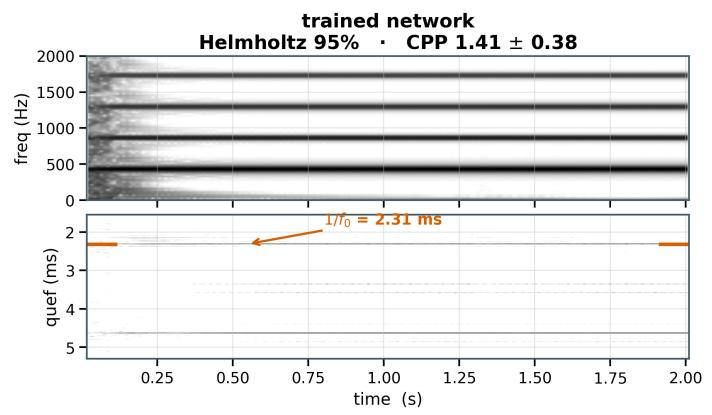

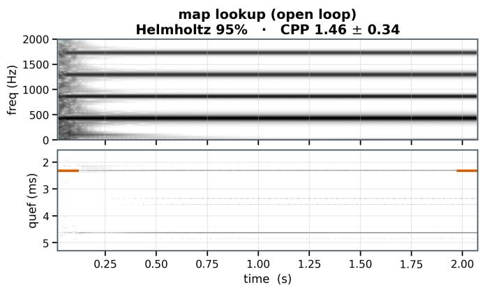

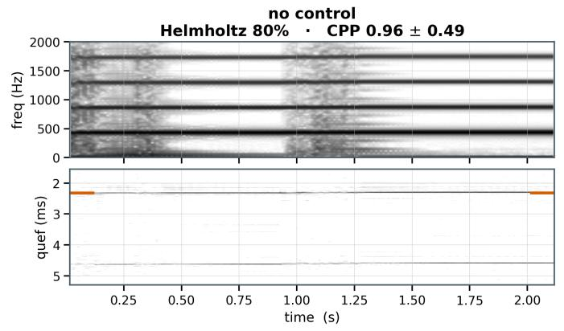

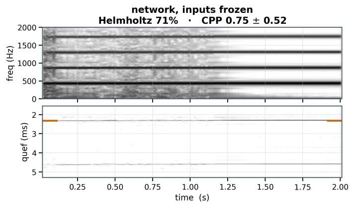

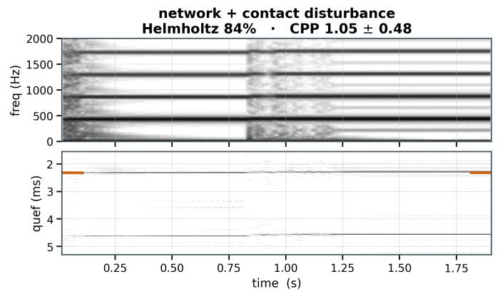

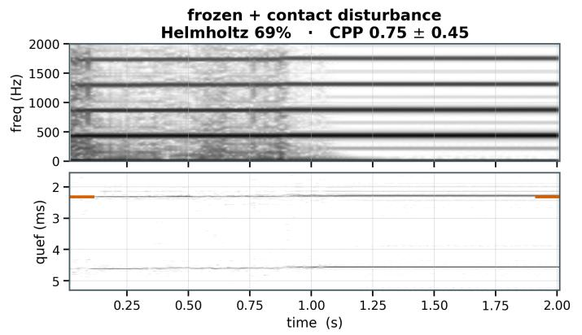  
Fig. 20. Short-time spectrum (upper panel of each pair) and cepstrum (lower panel) of the bridge-force recordings. The string is an open violin A, nominal $A _ { 4 } = 4 4 0$ Hz, sounding at 432.4 Hz, about 30 cents flat because of the flattening effect under bow force. The recordings are generated at a sampling rate of 48 kHz, but the spectrogram is displayed only to $2 \ \mathrm { k H z } ,$ which gives better visual contrast: the first four harmonics are then resolved individually, whereas over the full band they blur together. In the cepstrogram the dark band at a quefrency of $1 / f _ { 0 } = 2 . 3 1$ ms marks periodicity at the fundamental. It is continuous under the network and the map lookup, dims and wanders without control, and after the contact disturbance at about $1 . 0 \mathrm { ~ s ~ i t }$ survives under the full controller while breaking up when the string-state inputs are frozen. The spectrogram shows the same event as a broadening of the harmonics and a spread of energy between them.

Cepstral peak prominence during the attack diagnostic of Section II-D, and the sharpness criterion carries that support where the periodicity criterion largely does not. Multiple slipping is still periodic, so a measure of whether the signal is periodic separates the regimes less sharply than one of how sharply periodic it is. A stick test is what an oscillation classifier needs, and a sharpness criterion is its acoustic counterpart.

Both measures rank the six conditions of Table XIX perfectly, at a correlation of +1.000. That agreement is a property of six points inside one cell rather than of the measures, and pooling over all ninety-six separates them. Six conditions are too few to distinguish a criterion that works from one that happens to order them.

The second concerns the contact disturbance. Under it the full controller holds a prominence of 1.050 against 0.750 with the string-state inputs frozen, and Fig. 20 shows the band at 2.31 ms surviving in the first case and breaking up in the second. That ordering agrees with the whole-stroke column of Table XV rather than with the post-onset column that reverses, which is consistent since both are measured over the whole recording. It is one episode, and Section V-B measures the same contrast at twenty seeds with a per-seed spread wide enough that a single episode carries no interval, so it is offered as agreement between two whole-stroke measures and not as evidence for a gap.

The third does not favor the controller. In the steady state the network and the map lookup are indistinguishable, at 1.414 and 1.460, a difference of about an eighth of one standard deviation, and the lookup is nominally ahead. The acoustic evidence agrees with Section IV-F, that the learned policy matches the rule it imitates rather than improving on it.

The six recordings above are one operating point driven six ways. Rendering the playability space instead asks whether the regime labels of Section II-D correspond to anything audible. Table XX scores one fixed-command stroke from the interior of each region of Fig. 2, together with a point below the mapped force range at which the bow never grips the string.

## TABLE XX

ONE FIXED-COMMAND STROKE FROM THE INTERIOR OF EACH REGION OF FIG. 2, AND A POINT BELOW THE MAPPED FORCE RANGE AT WHICH THE BOW NEVER GRIPS. CEPSTRAL PEAK PROMINENCE AND HARMONICITY ARE MEANS ACROSS 50 MS FRAMES OF THE BRIDGE FORCE. BOLD MARKS THE BEST VALUE IN EACH OF THOSE TWO COLUMNS.
<table><tr><td rowspan=1 colspan=1>Regime</td><td rowspan=1 colspan=1> $F _ { N }$ (N)</td><td rowspan=1 colspan=1>η</td><td rowspan=1 colspan=1>CPP</td><td rowspan=1 colspan=1>Harm.</td></tr><tr><td rowspan=1 colspan=1>Helmholtz</td><td rowspan=1 colspan=1>0.91</td><td rowspan=1 colspan=1>0.891</td><td rowspan=1 colspan=1>1.49</td><td rowspan=1 colspan=1>0.996</td></tr><tr><td rowspan=1 colspan=1>Multiple slipping</td><td rowspan=1 colspan=1>1.41</td><td rowspan=1 colspan=1>0.882</td><td rowspan=1 colspan=1>0.07</td><td rowspan=1 colspan=1>0.245</td></tr><tr><td rowspan=1 colspan=1>Raucous</td><td rowspan=1 colspan=1>3.75</td><td rowspan=1 colspan=1>0.931</td><td rowspan=1 colspan=1>0.09</td><td rowspan=1 colspan=1>0.175</td></tr><tr><td rowspan=1 colspan=1>Sub-harmonic, ALF</td><td rowspan=1 colspan=1>1.78</td><td rowspan=1 colspan=1>0.970</td><td rowspan=1 colspan=1>0.08</td><td rowspan=1 colspan=1>0.047</td></tr><tr><td rowspan=1 colspan=1>Constant sticking</td><td rowspan=1 colspan=1>2.77</td><td rowspan=1 colspan=1>0.989</td><td rowspan=1 colspan=1>0.06</td><td rowspan=1 colspan=1>0.009</td></tr><tr><td rowspan=1 colspan=1>Bow never grips</td><td rowspan=1 colspan=1>0.01</td><td rowspan=1 colspan=1>0.000</td><td rowspan=1 colspan=1>0.18</td><td rowspan=1 colspan=1>1.000</td></tr></table>

Cepstral peak prominence separates Helmholtz motion from every other regime by a factor of between eight and twentyfour. Across the six controller conditions of Table XIX it spans a factor of 1.9, because those conditions all sit near the Helmholtz band. Sampling the regimes rather than the controllers widens the separation by an order of magnitude.

Harmonicity supplies a counterexample rather than a weak correlation. The point at which the bow never grips scores 1.000, above the 0.996 of Helmholtz motion, while its stick fraction is 0.000 and its cepstral peak prominence is 0.18 against 1.49. A free string rings at its natural frequency and is perfectly periodic, so a measure of whether the signal is periodic rates it ideal. The two columns pick different rows.

The stick fraction alone does not order the table either. The non-Helmholtz regimes carry stick fractions from 0.882 to 0.989 against 0.891 for Helmholtz motion, which is why the classifier of Section II-D tests slips per period and jitter as well. Three attacks from the acceleration-force plane of Section II-H are rendered alongside these at nearly one bow force, so that the acceleration is what differs, one clean, one whose first slips are delayed by fifty-one, and one that never settles.

Both families of measure favor the lookup in the attack. Figure 21 follows one stroke from the in-band start. Cepstral peak prominence rises ahead of the network on 97.4% of frames over the first 400 ms and reaches 90% of its steady value at 295 ms against 325 ms. On the same episode the slip period settles to within 5% of its final value at 67 ms for the lookup against 113 ms for the network. Both panels of Fig. 21 therefore favor the lookup.

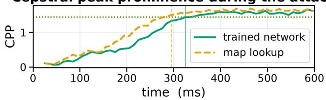

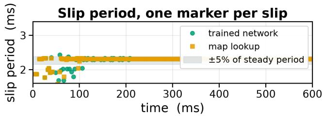  
Fig. 21. The attack from the in-band start, measured two ways. Top: cepstral peak prominence of the bridge force, with dotted lines at 90% of each steady value and vertical lines where each first reaches it. Bottom: the interval between successive slips, one marker per slip, against a band of ±5% around the steady period. Both measures favor the lookup, which reaches each threshold first, and the two settle on timescales differing by about a factor of three.

Repeating that comparison for the adopted controller of Section IV-G, across four strings and five seeds, splits the answer by start. On the twelve cells covering the three starts that begin in or near the playable band, the lookup still reaches the acoustic threshold first in ten. The mechanical measure no longer separates the two: eight of those twelve are ties, in the sense that the five seeds straddle the lookup’s value, and the total variation of the commands gives nine ties of twelve.

At the high-force corner the ordering reverses, and it reverses on every string. The adopted controller reaches the acoustic threshold on all five seeds on G, D and A, at 1282, 1272 and 1191 ms, where the lookup never reaches it at all, and on E it settles at 1305 ms against the lookup’s 1485. The corner is the one start where a learned controller does something the rule it imitates does not.

Two cautions belong with those figures. The acoustic transient is barely determined for this controller: across the cells where two or more seeds settle, the seed standard deviation of the threshold time has a median of 0.37 of the mean and a worst case of 0.87, and fourteen of eighty seed-runs never reach the threshold. And the adopted controller is not a uniform improvement on the feedforward baseline at the onset. On the A string its mechanical transient is faster at every start, 77 against 113 ms inside the band and 93 against 144 from cold, while its acoustic one is slower, 945 against 325 ms and 10493 against 7085.

The attack therefore separates the two only from the start the teacher cannot handle. Everywhere in or near the playable band the lookup is at least as good on the acoustic measure and indistinguishable on the mechanical one.

What the two measures retain is a difference of timescale rather than of verdict. The mechanical one settles within 45 to 144 ms and the acoustic one within 185 to 325 ms, a factor of about three, so a choice between them is a claim about what a listener attends to rather than a detail of method. Section II-H bounds what any controller can achieve at the onset in any case. At $\beta = 1 / 1 0$ the band of clean attacks is narrow and diagonal, and the controller commands increments from a bow already in motion, which places its attacks outside the protocol of that diagram.

## F. Fingered Notes: Chromatic Positions from G3 to G6

Everything above is measured on open strings. This section evaluates thirty-seven fingered notes instead, every chromatic semitone from G3 to G6, each taken on the string that carries it in first position, which is three octaves and every note a violinist reaches without leaving the first four positions. Stopping the string with a finger shortens the sounding length at unchanged tension and mass density, so the wave speed is unchanged and the fundamental rises as the reciprocal of the length.

Two conventions are possible for the bow-bridge distance under fingering. The bow may stay at a fixed absolute distance from the bridge, in which case $\beta$ rises as the string shortens, or it may track the shortening string at constant $\beta .$ . The second is used here. Schelleng’s limits give $F _ { \mathrm { m a x } } \ \propto \ v _ { b } / \beta$ and $F _ { \mathrm { m i n } } \propto Z ^ { 2 } v _ { b } / \beta ^ { 2 }$ at unchanged impedance, so holding $\beta$ constant leaves each string’s force bounds valid at every position and requires no change to the command set. Every result in this section depends on that choice.

Under a rigid stop and constant β, fingering changes nothing about the dynamics except the time scale. The sample rate is set proportional to the fundamental and the grid spacing to the length, so the Courant number, the bow-point index, the wave impedance, and both damping coefficients in discrete form are all invariant, and the friction law is a function of absolute relative velocity, which is itself invariant. Two positions on one string are the same simulation with the time axis relabeled. Comparing open F5 against G6, the full fourteen-semitone span of the E string, the relative velocity histories agree to $6 . 8 \times 1 0 ^ { - 1 3 }$ over sixteen operating points spanning three octaves.

The regime classifier thresholds only quantities derived from relative velocity, so the classification, and with it the playability map, is exactly position-invariant within a string. The open-string map of Section II-F is therefore the map for every stopped position on that string, and no per-position map is needed. This holds for the rigid stop assumed throughout, in which the finger is a hard support reflecting the wave completely. A real finger is flesh, of finite impedance, and absorbs at the stopping point. That loss depends on how much string lies behind the finger and so differs between positions, which breaks the invariance exactly rather than approximately. Every result in this section is a statement about a rigid-stop instrument, and the flesh-finger model is left to future work.

Because the plant is exactly invariant, every point of transfer loss when an open-string controller is deployed at a stopped position is attributable to the controller rather than to the string. That is an unusually clean attribution, and it is why the transfer arm is reported. Over 592 episodes, thirty-seven positions by four architectures by four starts, the mean Helmholtz fraction falls from the open position to the fingered ones by 4.4 points for the gated recurrent unit, 3.5 for the minimal variant, 4.6 for the feedforward network and 7.4 for the state-space model. The loss sits in the hard starts, at 1.1 points inside the band against 4.9 at the high-force corner, 6.7 under disturbance and 7.3 from cold.

The loss is not uniform across strings. Grouped by parent string it is 1.6 points on A over seven semitones, 2.9 on D over five and 8.0 on E over fourteen, against 21.5 on G over seven. Per-string and per-architecture slopes are not quoted: at four starts per position they range from +19.3 to −74.4, far wider than any effect they could measure.

## TABLE XXI

MEAN HELMHOLTZ FRACTION OVER THE FINGERED NOTES OF EACH   
STRING, POOLED OVER THE STARTS THAT REACHED THE TIP, FOR EACH ARCHITECTURE DEPLOYED ZERO-SHOT FROM ITS OPEN-STRING CONTROLLER. THE FINAL COLUMN COUNTS THE START-AND-NOTE   
COMBINATIONS EXCLUDED BECAUSE THE STROKE STALLED. FIGURE 22 SHOWS THE SAME DATA NOTE BY NOTE.

<table><tr><td rowspan=1 colspan=1>String</td><td rowspan=1 colspan=1>Notes</td><td rowspan=1 colspan=1>GRU</td><td rowspan=1 colspan=1>MLP</td><td rowspan=1 colspan=1>minGRU</td><td rowspan=1 colspan=1>SSM</td><td rowspan=1 colspan=1>Inc.</td></tr><tr><td rowspan=1 colspan=1>G</td><td rowspan=1 colspan=1>8</td><td rowspan=1 colspan=1>85.31</td><td rowspan=1 colspan=1>76.69</td><td rowspan=1 colspan=1>83.06</td><td rowspan=1 colspan=1>75.14</td><td rowspan=1 colspan=1>3</td></tr><tr><td rowspan=1 colspan=1>D</td><td rowspan=1 colspan=1>6</td><td rowspan=1 colspan=1>77.88</td><td rowspan=1 colspan=1>47.44</td><td rowspan=1 colspan=1>82.06</td><td rowspan=1 colspan=1>69.49</td><td rowspan=1 colspan=1>5</td></tr><tr><td rowspan=1 colspan=1>A</td><td rowspan=1 colspan=1>8</td><td rowspan=1 colspan=1>71.22</td><td rowspan=1 colspan=1>68.81</td><td rowspan=1 colspan=1>63.89</td><td rowspan=1 colspan=1>71.09</td><td rowspan=1 colspan=1>4</td></tr><tr><td rowspan=1 colspan=1>E</td><td rowspan=1 colspan=1>15</td><td rowspan=1 colspan=1>65.10</td><td rowspan=1 colspan=1>69.73</td><td rowspan=1 colspan=1>61.96</td><td rowspan=1 colspan=1>65.08</td><td rowspan=1 colspan=1>44</td></tr></table>

Table XXI pools those notes by string. The transfer loss is concentrated on E, which carries fifteen of the thirty-seven notes and forty-four of the fifty-six stalled strokes, and on the two architectures that fail there. The feedforward network’s 47.44 on D is the lowest cell in the table, and more than twenty points below any other result on that string.

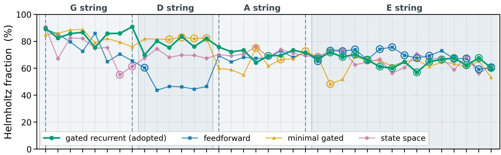

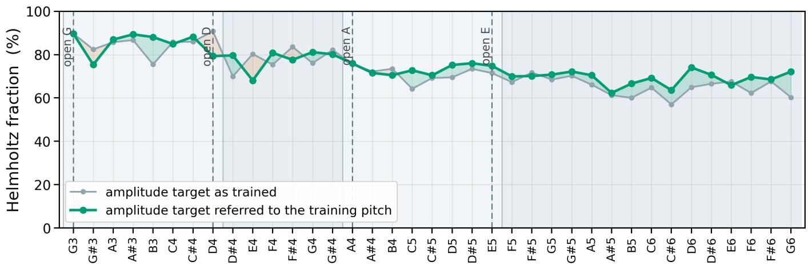  
fingered note, chromatic, each on the string that carries it in first position  
Fig. 22. Closed-loop performance at each of the thirty-seven fingered notes, deployed zero-shot from the open-string controller. Upper panel, all four architectures, with the adopted one drawn heavier. Lower panel, the adopted controller with the amplitude target as trained against the same target referred to the training pitch, the shading marking where the correction helps and where it costs. Each note is taken on the string that carries it in first position, so a string’s run begins at or above its own open pitch and open D falls inside the G string’s run, where it is the fourth finger. Open circles mark notes at which at least one of the four starts failed to reach the tip. Those starts are excluded from that note’s mean rather than averaged in, since a regime score on a stalled stroke is not meaningful.

Figure 22 shows the structure that those pooled figures hide. Performance does not decay smoothly with pitch. It is highest on the lowest string and settles into a band between roughly 60 and 75 per cent from the middle of the range upward, with the spread between architectures much wider at the bottom than at the top. The feedforward network’s collapse on the D string, to below 50 per cent across five consecutive semitones, is the largest per-architecture excursion anywhere in the figure and has no counterpart in the adopted controller. Failures to reach the tip are concentrated in the upper octave, where the four starts increasingly disagree.

The G-string loss has a single identified cause. The amplitude feature supplied to the controller is the logarithm of a target displacement over the measured displacement, and the target is a fixed displacement. Displacement under Helmholtz motion scales as the reciprocal of the fundamental while velocity does not, so the product of frequency and amplitude is constant, measured at about 290 µm Hz across the maps. A fixed displacement target therefore carries a bias of the logarithm of the frequency ratio, which reaches +0.90 over three octaves. The controller is told the note is too quiet when the motion is ideal.

Three candidate couplings to pitch were ablated on the G string over 640 runs, paired across position, architecture and start at n = 112. Rescaling the amplitude target to a constant velocity amplitude recovers 6.43 points at $p ~ = ~ 0 . 0 0 0 2 7$ Rescaling the pitch-error clip, which saturates at high positions, returns −1.45 at $p = 0 . 3 1$ , and holding the number of string periods per control step constant returns −2.02 at $p = 0 . 2 4 .$ . Removing all three together gives 6.08, no more than the amplitude term alone. The saturating clip is the more conspicuous defect of the two and it is not a cause of any

measured loss.

The strongest form of the evidence is that the correction helps exactly the architectures that degraded. Baseline losses on G are 54.8 points for the state-space model and 23.4 for the feedforward network, against 8.9 for the minimal variant and a gain of 1.1 for the gated recurrent unit. Applying the correction returns 16.0 points at $p = 0 . 0 0 5$ and 9.1 at $p = 0 . 0 0 0 4$ to the first two, and 0.7 at $p = 0 . 7 5$ and −0.1 at $p = 0 . 9 6$ to the second two.

Applied across all thirty-seven positions the correction moves the mean from 67.41 to 70.44, a gain of $3 . 0 2 \pm 0 . 7 6$ at $p = 7 . 1 \times 1 0 ^ { - 5 }$ . It was tuned on G, so the other three strings are out of sample, and it replicates on D at 5.26, $p = 0 . 0 1 7$ and not on A or E, at 1.14 and 1.46 with p above 0.2. That is what the mechanism predicts, since A and E barely degraded and there is little to recover. The correction improves 289 of 528 cells, which is 54.7%: a small consistent shift on top of large per-cell variation rather than a uniform improvement.

The correction is specific to pitch changes within one string. Across strings the impedance, the force floor and the playable region genuinely differ, so the plant is not the same and one feature cannot repair it. The same rescaling was measured for cross-string transfer over twenty seeds and nine cells and returned −0.6 points.

The gated recurrent unit, the controller recommended in Section IV-G, transfers to stopped positions without modification and does not degrade on G at all. That is a property it happens to have rather than a design feature: the amplitude bias is present for every architecture, and this one is least sensitive to that feature.

## VI. DISCUSSION

## A. What a Provably Invariant Plant Buys

The fingered results of Section V-F are worth separating from the rest, because they rest on a different kind of argument. Everywhere else in this paper a controller is compared against another controller or against itself under a changed condition, and the comparison carries the variance of whatever the plant did on that episode. Under a rigid stop at constant bowbridge fraction the plant does not vary at all: stopping the string rescales time and changes nothing else, to $6 . 8 \times 1 0 ^ { - 1 3 }$ over three octaves. Two positions on one string are the same simulation relabeled.

That converts a transfer experiment into a clean attribution. When an open-string controller loses ground at a stopped position, the loss cannot be the environment, because the environment is provably identical, so all of it belongs to the controller. Three octaves of chromatic positions then act as thirty-seven independent probes of one policy against a fixed plant, and the loss turns out to have a single cause: an amplitude target specified as a displacement, in a quantity that scales with the reciprocal of the fundamental. Correcting it recovers exactly the two architectures that degraded and does nothing to the two that did not, which is the strongest form the evidence could take.

The same invariance is what makes the assumption behind it consequential. A rigid stop is a hard support. A real finger is flesh, and a termination of finite impedance absorbs by an amount that depends on how much string lies behind it, so it breaks the invariance exactly rather than approximately. Every conclusion above is therefore a statement about a rigid-stop instrument, including the useful one that a single playability map serves a whole string. The flesh-finger model is the obvious next test and is set out in Section VI-C, where it makes a falsifiable prediction rather than an open-ended extension.

## B. Limitations

Most closed-loop entries are single episodes, so individual figures in Tables V and VI should be read as properties of their condition rather than as estimates with error bars. Section V-C bounds what that costs across initial conditions, but not across fits: a grand mean over ten starts is stable to within 1.6 points between seeds, while the same architecture retrained under twenty seeds spans 6.6 points of standard deviation on its three-start mean and 27 points on the contact-disturbance gap. Averaging over starts hides seed variance that a single-episode figure carries in full, so the risk lies in both the choice of start and the fit. No comparison against prior work is reported, for the reasons set out in Section IV-E. The baselines of Section IV-F are single episodes for the same reason, though the ablation of Section IV-J is averaged over ten paired starts. Since the training labels are themselves derived from the playability map, the network is best understood as a smooth, rate-limited interpolation of a lookup policy rather than as having discovered the playability structure independently, and on the cases where both complete the stroke it does not improve on that lookup.

The string model is a single polarization on rigid terminations, with no body resonances, no torsional motion, no bowhair compliance and no finite bow width. The friction law is a static characteristic. Hysteretic and thermal models give measurably different transient behavior [21]. The transmission factor $\alpha ( s )$ is an empirical profile of player technique rather than a derived mechanical ratio, and although Section V-A bounds the cost of getting its shape wrong, it has not been fitted to a measured stroke. The acoustic assessment of Section V-E is computed on the bridge force, so it describes the string’s drive rather than radiated sound, and no listening test was run. The contact point is fixed, so the third parameter a player controls is absent.

The bow does not reverse. Stroke position advances as $s $ $s + v _ { b } \Delta t / L _ { \mathrm { b o w } }$ with $v _ { b }$ confined to positive values, so s never decreases and every episode in training, validation and test is a single down-bow from frog to tip. A note in this work is exactly one bow stroke, and its length is bounded by the hair divided by the bow speed. At the fastest permitted speed a full stroke takes 1.55 s, which is a dotted quarter at a quarternote pulse of 60. Anything shorter—every note at or below the quarter—lies outside the present model, and so does any note that outlasts one bow. Detache and martel´ e lie outside it´ for a second reason, that they reverse the bow. This bounds what the controller results claim rather than qualifying them: the regulation problem solved here is the interior of a stroke, not the joins between strokes.

The stopped-string results of Section V-F assume a rigid termination at the finger. A real finger is flesh: of finite impedance, it absorbs at the stopping point, and the loss depends on how much string lies behind it. That would break the exact scale invariance those results rest on, so the conclusion that one map serves a whole string is specific to the rigid stop. It is the same class of omission as the rigid bridge, and the two are the same problem at opposite ends of the sounding length.

Two measurement conventions in this paper are choices rather than properties of the model, and both affect numbers that are reported. The playability maps and the Schelleng sweeps are analyzed over a window set in string periods rather than in seconds, because a window fixed in seconds gives each string a different number of periods to settle and makes the four strings incomparable. Under the fixed-duration convention the playable areas rank E, A, D, G, and at equal settling they rank in the opposite order. What is a property of G is that it settles slowest, not that its playable region is smallest. The bow-bridge distance is held at a constant fraction of the sounding length, so under fingering the bow tracks the shortening string rather than staying at a fixed distance from the bridge, and at the highest position reported it sits 13.9 mm from the bridge, outside the range of ordinary bowing.

## C. Future Work

The extensions below are steps toward the playing simulation set out in Section I-A, and they divide into the plant and the player. On the plant side the rigid terminations have to go: a bridge carrying an admittance into a body and soundpost at one end, and flesh of finite impedance at the other. On the player side the bow has to acquire an angle and a tilt, to reverse, and to follow the dynamics of a phrase rather than hold one sustained tone. Each is taken in turn below, and the controller work comes first because it is the part this paper can already measure.

The clearest route to better control is to change the supervision rather than the architecture, and Sections IV-H and IV-K are the argument: neither capacity nor context length nor training loss selects a better controller, while the ceiling sits in the rule that generated the labels. Section V-D takes a first step by optimizing against the simulator instead, and finds the search improving the two conditions it is shown in fifteen of sixteen cases and degrading those it is not. The binding constraint is the width of the training distribution rather than the method, so the next attempt should sample initial conditions across the command box at every iteration, at a simulation cost roughly an order of magnitude above what was spent here. A cheaper intermediate step is to improve the teacher, replacing the greedy nearest-playable-pair rule with a horizon-aware planner over the map. The greedy rule has no notion of finishing the stroke, which is precisely why it stalls short of the tip from a cold start on three of the four strings, and the hot-start failure is likewise a horizon and rate-limit problem that no change of architecture addresses.

The case for the recurrent policy adopted in Section IV-G would be strengthened further by a history-dependent contact model, since measured rosin friction is hysteretic [36], and by a controller observing only radiated sound rather than the relative velocity directly. A Kolmogorov-Arnold network remains worth revisiting, not for accuracy, since no basis tested here improved on the feedforward network, but for readability: the boundary being learned is a Schelleng minimum-force curve, and a model whose learned univariate functions can be plotted might expose that boundary in a form comparable with [8].

Three limits of the present study are concrete enough to be next steps rather than caveats. The bow does not reverse, so a note is exactly one stroke and the shortest the controller can produce is 1.55 s, a dotted quarter at a quarter-note pulse of 60. Reversal is not an independent refinement but the mechanism that makes shorter notes possible, and it changes the command box, the friction regime near zero velocity, the episode definition and the state-reset logic at once, so the architecture comparison would have to be repeated rather than extended. Replacing the rigid finger with a flesh model, which Limitations gives as an assumption the fingered results rest on, is the natural first test of how far the invariance carries, and it yields a specific prediction rather than an open-ended extension. A flesh termination absorbs differently at each position, because the length of string behind the finger changes, so the invariance should fail progressively as the stopped length shortens and one map per string should become a family converging toward the open-string map as the finger approaches the nut. That is falsifiable, and it is the same modeling problem as the bridge admittance. And the training window was capped at thirty control steps throughout, which Section IV-H shows is the setting most favorable to the architecture recommended here, so repeating the comparison at a full-bow window would test that recommendation where it is weakest. Extending the context sweep itself to the remaining two strings belongs beside that, and is blocked by the same arithmetic: both are dominated by the cost of the minimal gated variant at long windows, which is the family the sweep exists to compare.

One architecture is worth naming because it addresses the ceiling directly. A residual controller adds a learned correction to the lookup’s command rather than replacing it, so at initialization it reproduces the tabulated rule exactly and the imitation ceiling does not apply to what it learns on top. A first attempt behaves as that argument predicts where the conditions are right, gaining 9.0 points on a held-out high-force start, and fails where they are not, because the lower bound holds only at initialization and is destroyed by training on a start distribution that does not cover the evaluation conditions. The bound has to be enforced, by regularizing the correction toward zero or by early stopping on held-out starts, rather than initialized.

Section V-B suggests a different line. A change in the contact condition is an unmeasured change in a plant parameter, and asking whether a policy notices it implicitly is the harder of the two available questions. The classical alternative is to estimate it: a disturbance observer driven by the residual between the predicted and measured oscillation would make the change an observed signal rather than a latent one, and would turn a question about what a network can infer into one about what an estimator can track.

The natural extensions are to make oscillation frequency and amplitude true tracking targets rather than diagnostic outputs, to make the stabilizing torque an output of the controller rather than an analytic consequence of the commanded force, and to allow the contact point to move so that β becomes a third control parameter. Figure 23 sketches the resulting architecture.

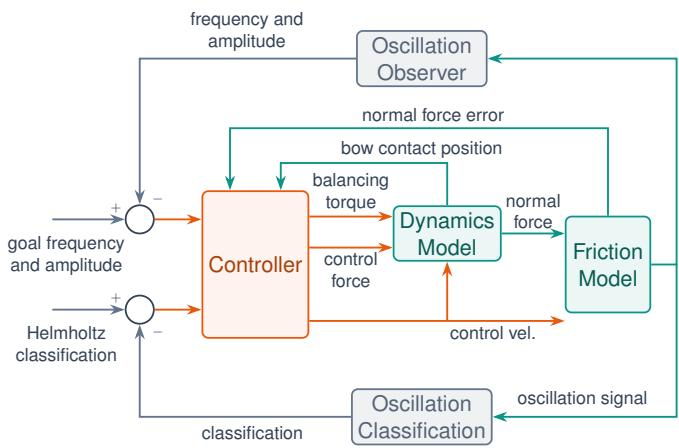  
Fig. 23. Prospective architecture for a controller that tracks frequency and amplitude and commands a stabilizing torque.

The longer aim is a complete parametric model of the instrument. The string here terminates at rigid supports, which suppresses everything that gives a violin its voice. Replacing those terminations with a modeled bridge, and coupling the bridge in turn to the top plate, the sound post and the back plate, would carry the bowing force through the radiating structure instead of stopping it at the string. The bridge is the natural first step, because its admittance is what the string actually sees and it has been characterized as a small set of damped resonances [10]. The signal rendered in Section V-E is precisely the input such a body model would take, so what is missing is the radiating structure itself, which is the larger part of the problem. With those components parameterized, the controller developed here would drive a synthesis model whose timbre depends on instrument geometry as well as on bowing, so that bow control and instrument model together form a parametric violin from which music can be generated directly.

Extending the model across the violin family is the step that would bear most directly on the law revised here. Nothing in this paper addresses any instrument but the violin, and the remarks below are a direction rather than a finding. The smaller violins and the viola differ from the instrument modeled here mainly in string length, tension and wave impedance, so for those a change of parameters may suffice, though the measured parameters would have to be obtained. The cellos in their several sizes, the double bass and the contrabass are a stronger test and possibly not a parametric one: bending stiffness is absent from the scheme used here, and it is exactly what grows on heavily wound low strings, so a member that needs it needs a new term rather than a new value. The revised minimumforce law is what such a sweep would test. Its impedance exponent was fitted over four strings whose impedances span a factor of 1.77, and Section II-G declines to name a cause for it on that evidence. The lower members reach impedances the four violin strings do not, so a fit extended to them would either carry the first-power dependence beyond the span it was fitted on or locate where it fails, and either outcome settles more than another violin string can. How far beyond is not established here, the family’s impedance range having been measured nowhere in this work, and the smaller violins may well fall inside the span rather than outside it. The same sweep would test whether the scale invariance of Section V-F extends from stopped positions on one string to instruments of different size.

Closing the loop on sound rather than on mechanics follows directly from Section V-E. The descriptors are already computed there, and cepstral peak prominence tracks the mechanical measure closely enough to serve as an objective in its own right, so the controller could be trained against what the instrument sounds like rather than against how the string moves. That would also bear on the attack comparison left open in Section V-E, where the measure that best predicts a listener’s preference during the transient is not established and would have to be determined by a listening test. Digital waveguide models offer an efficient route to the audio rate that real-time interaction requires [9]. A controller that listens and adapts, rather than one that maintains a mechanical regime, is the arrangement most analogous to a human player.

## VII. CONCLUSION

A finite-difference bowed-string model with implicitly resolved Stribeck friction reproduces the Helmholtz signature quantitatively on all four open strings: stick fraction 89.1% against an ideal 90.0%, one slip per period, slip jitter at machine precision, and the expected flattening of the slip frequency under bow force, using friction and string parameters taken entirely from published measurement. Sweeping bow force and speed recovers the Schelleng structure, with multiple slipping below the minimum-force boundary and raucous motion above it.

Two playability tests follow. Fitting the Schelleng limits on all four open strings recovers the maximum bow force in both bow speed and bow-bridge distance, with the four exponents spanning 0.05. The minimum is not recovered, and fitted jointly over impedance, speed and bow-bridge distance it follows $\dot { Z } v _ { b } \beta ^ { - 1 }$ rather than the predicted $Z ^ { 2 } v _ { b } \overline { { \beta ^ { - 2 } } }$ : both squared dependences return at the first power, at 8.9 and 8.7 standard errors, and the impedance exponent read from the magnitude of the limit alone is +1.06±0.07 against a predicted +2. The bow-bridge half confirms an experimental result of Schoonderwaldt, Guettler and Askenfelt [8], who reach $\beta ^ { - 1 }$ as a low-speed limit by accounting for the shape of the friction curve. The impedance half has no such corroboration, its cause is not identified, and the rigid termination remains a candidate. Mapping bow acceleration against bow force from rest reproduces Guettler’s three regions and finds the band of clean attacks closing entirely, on every string, as the bow moves from a tenth to a twentieth of the string length from the bridge, so the diagram bounds what any controller can achieve at the onset. The frog force that a robot commands is related to the contact force by a factor that no free-body reading determines. Four readings of the bow disagree among themselves in shape, magnitude and sign by more than any of them disagrees with the linear profile assumed here, which is why that assumption is tested by measuring the cost of getting it wrong: a bow assumed lossless is the worst or second worst of five settings in eleven of sixteen combinations of string and architecture.

Six controllers were then trained at matched parameter count on all four strings with twenty seeds each. A gated recurrent unit leads on the mean of all four and significantly on one, and is recommended. Its margin is largest under a mid-stroke contact disturbance, which is the condition a player meets as rosin depletes or the contact heats, and the feedforward network’s completion advantage is concentrated on a start that lies outside the model’s own playable region. The minimal gated variant, whose gates are computed from the input alone, cannot clear a latched hidden state after an abrupt velocity override: eight of its twenty seeds on the E string hold below 9% Helmholtz motion for the rest of the stroke and forcing a state reset at every step recovers all eight. Depth compounds that failure rather than repairing it.

Three ways of choosing a controller were tried and none works: selecting by parameter count, by training-context length, and by training loss. Over a four-rung ladder of parameter budgets, measured on all four strings and four architectures at three seeds each, training loss falls in every one of the sixteen cells while closed-loop quality falls clearly in nine, rises clearly in two and is tied in the remaining five against the interpretability bar the paper uses elsewhere. The mean change is −11.1 points, the seed spread widens rather than narrowing in thirteen of the sixteen, and the effect is not uniform across strings, running from −27.2 on G to −3.4 on A. Training loss also falls with the length of the training context while closed-loop quality moves in every direction. A search driven by fit quality therefore picks the largest model every time and the worse controller more often than not, which places the ceiling on the rule that generated the labels rather than on the network fitting them.

The learned controller does not exceed that rule on steadystate regulation, and the rule is a strong baseline rather than a handicapped one: it reads an exhaustive tabulation of the plant’s steady-state inverse at 1089 operating points, and it is what generated the controller’s training labels. Over four open strings and thirty-seven fingered notes, in the 128 cells where both finish, the lookup wins 56 comparisons, the controller 9, and 63 are ties against the paper’s own bar. What the controller does better is finish, completing eleven of twelve combinations of string and start against the lookup’s nine, and 23 of 37 fingered notes at the cold start against the lookup’s 8. It also does better in exactly one circumstance, and that circumstance is the ceiling’s own domain condition rather than an exception to it. The controller overtakes the tabulation wherever the tabulation fails and is bounded by it wherever the tabulation holds. Regressing the controller’s score on the tabulation’s gives a slope of $0 . 3 1 9 \pm 0 . 0 6 5$ over the friction sweep, more than ten standard errors below the unit slope that simply inheriting the teacher’s competence would give, and the two cross at a tabulation score of 88. Where the tabulation scores below 60 it averages 40.5 against the controller’s 65.7, and above 90 the order reverses at 97.5 against 90.3. The clearest case is the G string, where the tabulation’s score is not monotone in the friction removed and the controller overtakes in exactly the two non-adjacent conditions in which it fails. Feedback earns its place where the model stops describing the plant, which is not the same as where the plant has moved furthest. Retraining without each input in turn shows that whether the oscillation is worth observing is a property of the string rather than of the network reading it, with the effect spread over 19.3 points across strings against 6.8 across architectures, significantly helping on G and significantly hurting on A and E. A disturbance applied to the contact rather than to the command isolates the one case the commands cannot reveal, and what it establishes depend on where it is scored. Over the whole stroke both recurrent architectures show the effect at twenty seeds, at 14.7 and 18.5 points with p below 0.001. Over the steps after the onset, the more specific measure, only the minimal variant reaches significance and the adopted controller does not, at 3.8 points and $p = 0 . 6 4$ . A single episode at the most severe reduction changes sign between the two windows, and the choice of window therefore decides whether the recommended controller shows an effect at all. Optimizing against the simulator instead of the teacher gives no net gain over sixteen architecture and string combinations, but a significant separation in mechanism, improving the two conditions the search is shown in fifteen of sixteen cases and degrading those it is not.

Stopping the string extends all of this across three octaves. Thirty-seven chromatic positions from G3 to G6 were evaluated, and under a rigid termination at the finger with the bow held at a constant fraction of the sounding length the dynamics are exactly invariant: every coefficient of the discrete scheme is unchanged and only the time axis is rescaled, confirmed to $6 . 8 \times 1 0 ^ { - 1 3 }$ over sixteen operating points. One playability map therefore serves every stopped position on a string. Because the plant is provably identical, every point of loss when an open-string controller is deployed at a stopped position belongs to the controller, and most of it traces to one feature: an amplitude target specified as a displacement, where displacement scales with the reciprocal of the fundamental and velocity does not. That invariance is specific to the rigid stop.

A real finger is flesh rather than a hard support, and its finite impedance would add a length-dependent boundary loss that breaks the invariance exactly, which is the same omission as the rigid bridge and is left to future work.

Rendering the model as audio supports the diagnostic from a second direction. Rendering one stroke from the interior of each regime separates Helmholtz motion from every other by a factor of eight to twenty-four in cepstral peak prominence computed on the bridge force, and supplies the counterexample that a periodicity measure cannot: a string the bow never grips is perfectly periodic and scores above Helmholtz motion on harmonicity, at a stick fraction of zero. Over ninety-six recordings spanning four strings and four controllers the same measure tracks the mechanical Helmholtz percentage at a Spearman correlation of +0.825, where a plain harmonicity measure reaches +0.327. The acoustic evidence also agrees that the learned policy matches rather than beats the lookup it imitates.

A regime classifier that does not test explicitly for a stick phase will label small-amplitude periodic slipping as Helmholtz motion, because it has the right period and the right spectral peak while having none of the underlying physics. The stick fraction is inexpensive to compute and should be checked before any playability map is trusted.

Every extension named in Section I-A changes the plant that a controller sees, and two choices made here were made so that they survive it. The regime classifier tests for a stick phase rather than for periodicity, which is the property a radiating body would leave intact while altering the spectrum a periodicity test keys on. The commands are referred to the frog rather than to the contact point, which is where a player’s controls remain fixed if the contact acquires an angle, a tilt or a reversal. Neither claim is tested here, since the terminations are rigid and the bow does not reverse. Neither choice costs anything on one open string, and each is what allows this layer to be built on.

## REFERENCES

[1] H. L. F. von Helmholtz, On the Sensations of Tone as a Physiological Basisfor the Theory ofMusic, 1st ed. London, U.K.: Longmans, Green, and Co., 1875, a. J. Ellis, Ed. Translated from the 3rd German edition (Die Lehre von den Tonempfindungen, 1870).

[2] C. V. Raman, “On the mechanical theory of the vibrations of bowed strings and of musical instruments of the violin family, with experimental verification of the results, Part I,” Bulletin of the Indian Association for the Cultivation of Science, vol. 15, pp. 1–158, 1918. [Online]. Available: https://repository.ias.ac.in/69871/

[3] K. Guettler, “The bowed string: On the development of Helmholtz motion and on the creation of anomalous low frequencies,” Ph.D. dissertation, KTH Royal Institute of Technology, Stockholm, Sweden, 2002. [Online]. Available: https://knutsacoustics.com/files/ thesis-guettler-020607.pdf

[4] J. Woodhouse and P. M. Galluzzo, “The bowed string as we know it today,” Acta Acustica united with Acustica, vol. 90, no. 4, pp. 579–589, 2004. [Online]. Available: https://euphonics.org/wp-content/ uploads/2022/03/BowedStringReview.pdf

[5] J. C. Schelleng, “The bowed string and the player,” Journal of the Acoustical Society of America, vol. 53, no. 1, pp. 26–41, 1973. [Online]. Available: https://doi.org/10.1121/1.1913322

[6] L. Cremer, The Physics of the Violin. Cambridge, MA, USA: MIT Press, 1984.

[7] M. E. McIntyre and J. Woodhouse, “On the fundamentals of bowedstring dynamics,” Acustica, vol. 43, no. 2, pp. 93–108, 1979.

[8] E. Schoonderwaldt, K. Guettler, and A. Askenfelt, “An empirical investigation of bow-force limits in the Schelleng diagram,” Acta Acustica united with Acustica, vol. 94, no. 4, pp. 604–622, 2008. [Online]. Available: https://doi.org/10.3813/AAA.918070

[9] J. O. Smith, III, Physical Audio Signal Processing: For Virtual Musical Instruments and Audio Effects. W3K Publishing, 2010. [Online]. Available: https://ccrma.stanford.edu/∼jos/pasp/

[10] J. Woodhouse, “On the playability of violins. Part I: Reflection functions,” Acustica, vol. 78, pp. 125–136, 1993.

[11] ——, “On the playability of violins. Part II: Minimum bow force and transients,” Acustica, vol. 78, pp. 137–153, 1993.

[12] K. Guettler, “On the creation of the Helmholtz motion in bowed strings,” Acta Acustica united with Acustica, vol. 88, no. 6, pp. 970–985, 2002.

[13] A. Askenfelt, “Measurement of bow motion and bow force in violin playing,” Journal ofthe Acoustical Society ofAmerica, vol. 80, no. 4, pp. 1007–1015, 1986. [Online]. Available: https://doi.org/10.1121/1.393841

[14] ——, “Measurement of the bowing parameters in violin playing. II: Bow–bridge distance, dynamic range, and limits of bow force,” Journal of the Acoustical Society of America, vol. 86, no. 2, pp. 503–516, 1989. [Online]. Available: https://doi.org/10.1121/1.398230

[15] M. Demoucron, A. Askenfelt, and R. Causse, “Measuring bow force in´ bowed string performance: Theory and implementation of a bow force sensor,” Acta Acustica united with Acustica, vol. 95, no. 4, pp. 718–732, 2009. [Online]. Available: https://doi.org/10.3813/AAA.918200

[16] F. Ablitzer, J.-P. Dalmont, and N. Dauchez, “Static model of a violin bow: Influence of camber and hair tension on mechanical behavior,” Journal of the Acoustical Society of America, vol. 131, no. 1, pp. 773–782, 2012. [Online]. Available: https://doi.org/10.1121/1.3651230

[17] C. Canudas de Wit, H. Olsson, K. J. Astr˚ om, and P. Lischinsky, “A¨ new model for control of systems with friction,” IEEE Transactions on Automatic Control, vol. 40, no. 3, pp. 419–425, 1995. [Online]. Available: https://doi.org/10.1109/9.376053

[18] K. J. Astr˚ om and C. Canudas de Wit, “Revisiting the LuGre friction¨ model,” IEEE Control Systems Magazine, vol. 28, no. 6, pp. 101–114, 2008. [Online]. Available: https://doi.org/10.1109/MCS.2008.929425

[19] H. Olsson, K. J. Astr˚ om, C. Canudas de Wit, M. G¨ afvert, and¨ P. Lischinsky, “Friction models and friction compensation,” European Journal of Control, vol. 4, no. 3, pp. 176–195, 1998. [Online]. Available: https://doi.org/10.1016/S0947-3580(98)70113-X

[20] B. Armstrong-Helouvry, P. Dupont, and C. Canudas de Wit, “A survey´ of models, analysis tools and compensation methods for the control of machines with friction,” Automatica, vol. 30, no. 7, pp. 1083– 1138, 1994. [Online]. Available: https://doi.org/10.1016/0005-1098(94) 90209-7

[21] P. M. Galluzzo, J. Woodhouse, and H. Mansour, “Assessing friction laws for simulating bowed-string motion,” Acta Acustica united with Acustica, vol. 103, no. 6, pp. 1080–1099, 2017. [Online]. Available: https://doi.org/10.3813/AAA.919136

[22] J. Woodhouse, “Bowed string simulation using a thermal friction model,” Acta Acustica united with Acustica, vol. 89, pp. 355–368, 2003. [Online]. Available: https://euphonics.org/wp-content/uploads/ 2022/03/Thermal bowing.pdf

[23] X. Luan and G. Scavone, “Physics-informed deep learning for nonlinear friction model of bow-string interaction,” in Proceedings of the 28th International Conference on Digital Audio Effects (DAFx25), 2025, pp. 150–157, arXiv:2505.18950. [Online]. Available: https://arxiv.org/abs/2505.18950

[24] G. Percival, N. Bailey, and G. Tzanetakis, “Physical modeling meets machine learning: Teaching bow control to a virtual violinist,” in Proceedings of the 8th Sound and Music Computing Conference (SMC 2011), 2011. [Online]. Available: http://smc.afim-asso.org/smc11/ papers/smc2011 77.pdf

[25] ——, “Physical modelling and supervised training of a virtual string quartet,” in Proceedings of the 21st ACM International Conference on Multimedia, 2013. [Online]. Available: https://doi.org/10.1145/2502081. 2502101

[26] G. K. Percival, “Physical modelling meets machine learning: performing music with a virtual string ensemble,” Ph.D. dissertation, University of Glasgow, Glasgow, U.K., 2013. [Online]. Available: https://theses.gla.ac.uk/4253/

[27] D. A. Pomerleau, “ALVINN: An autonomous land vehicle in a neural network,” in Advances in Neural Information Processing Systems 1 (NIPS 1988), 1988.

[28] B. D. Argall, S. Chernova, M. Veloso, and B. Browning, “A survey of robot learning from demonstration,” Robotics and Autonomous Systems, vol. 57, no. 5, 2009. [Online]. Available: https://doi.org/10.1016/j.robot. 2008.10.024

[29] T. Osa, J. Pajarinen, G. Neumann, J. A. Bagnell, P. Abbeel, and J. Peters, “An algorithmic perspective on imitation learning,” Foundations and Trends in Robotics, vol. 7, no. 1–2, 2018. [Online]. Available: https://doi.org/10.1561/2300000053

[30] S. Ross and J. A. Bagnell, “Efficient reductions for imitation learning,” in Proceedings of the 13th International Conference on Artificial Intelligence and Statistics (AISTATS), 2010, pp. 661–668.

[31] S. Ross, G. J. Gordon, and J. A. Bagnell, “A reduction of imitation learning and structured prediction to no-regret online learning,” in Proceedings of the 14th International Conference on Artificial Intelligence and Statistics (AISTATS), 2011, pp. 627–635.

[32] S. Levine, C. Finn, T. Darrell, and P. Abbeel, “End-to-end training of deep visuomotor policies,” Journal of Machine Learning Research, vol. 17, no. 39, pp. 1–40, 2016.

[33] C. Jin, X. Liu, Y. Zhao, Y. Zhu, J. Wang, and H. Wang, “ViolinBot: A framework for imitation learning of violin bowing using fuzzy logic and PCA,” IEEE Transactions on Fuzzy Systems, vol. 32, no. 9, pp. 5005–5017, 2024. [Online]. Available: https: //doi.org/10.1109/TFUZZ.2024.3409146

[34] R. R. Selmic and F. L. Lewis, “Neural-network approximation of piecewise continuous functions: application to friction compensation,” IEEE Transactions on Neural Networks, vol. 13, no. 3, pp. 745–751, 2002. [Online]. Available: https://doi.org/10.1109/TNN.2002.1000141

[35] C. Desvages and S. Bilbao, “Two-polarisation physical model of bowed strings with nonlinear contact and friction forces, and application to gesture-based sound synthesis,” Applied Sciences, vol. 6, no. 5, p. 135, 2016. [Online]. Available: https://doi.org/10.3390/app6050135

[36] J. H. Smith and J. Woodhouse, “The tribology of rosin,” Journal of the Mechanics and Physics of Solids, vol. 48, no. 8, pp. 1633–1681, 2000. [Online]. Available: https://doi.org/10.1016/S0022-5096(99)00067-8

[37] M. E. McIntyre, R. T. Schumacher, and J. Woodhouse, “On the oscillations of musical instruments,” Journal of the Acoustical Society of America, vol. 74, no. 5, pp. 1325–1345, 1983. [Online]. Available: https://doi.org/10.1121/1.390157

[38] N. C. Pickering, The Bowed String. Mattituck, NY, USA: Amereon, 1992.

[39] E. Bavu, J. Smith, and J. Wolfe, “Torsional waves in a bowed string,” Acta Acustica united with Acustica, vol. 91, no. 2, pp. 241–246, 2005, arXiv:physics/0505059. [Online]. Available: https://arxiv.org/abs/physics/0505059

[40] X. Boutillon, “Analytical investigation of the flattening effect: the reactive power balance rule,” Journal of the Acoustical Society of America, vol. 90, no. 2, pp. 754–763, 1991. [Online]. Available: https://doi.org/10.1121/1.401945

[41] K. Guettler, “The violin bow in action: A sound-sculpturing wand,” Lecture notes, International Centre for Mechanical Sciences (CISM), Udine, Italy, 2006, https://knutsacoustics.com/files/ The-Sound-Sculpturing-bow-CISM 7opl67i1.pdf.

[42] F. J. Testa, “The science of the art of bowing,” Proceedings of the Violin Society of America 28th Conference. HAL deposit hal-01578012v1, 2000. [Online]. Available: https://hal.science/hal-01578012

[43] Z. Liu, Y. Wang, S. Vaidya, F. Ruehle, J. Halverson, M. Soljacic, T. Y. Hou, and M. Tegmark, “KAN: Kolmogorov–Arnold networks,” arXiv preprint arXiv:2404.19756, 2024. [Online]. Available: https: //arxiv.org/abs/2404.19756

[44] S. Hochreiter and J. Schmidhuber, “Long short-term memory,” Neural Computation, vol. 9, no. 8, pp. 1735–1780, 1997. [Online]. Available: https://doi.org/10.1162/neco.1997.9.8.1735

[45] H. Beigi, Fundamentals of Speaker Recognition. New York, NY, USA: Springer, 2011, ISBN 978-0-387-77591-3. [Online]. Available: https://doi.org/10.1007/978-0-387-77592-0