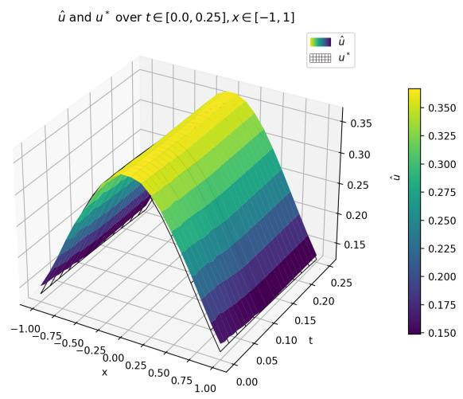
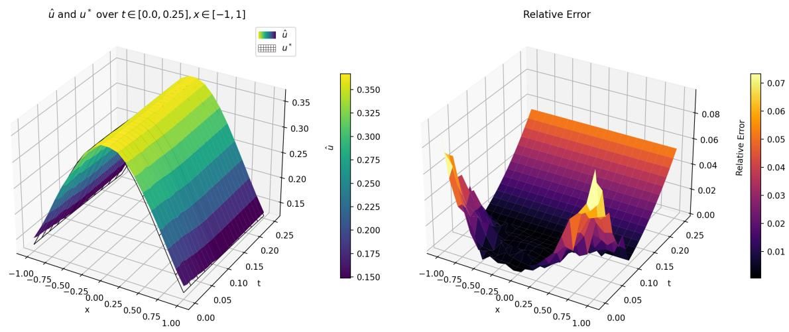
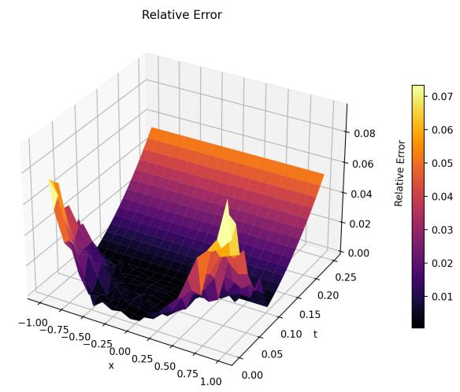
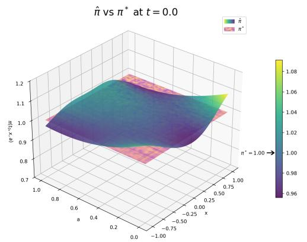
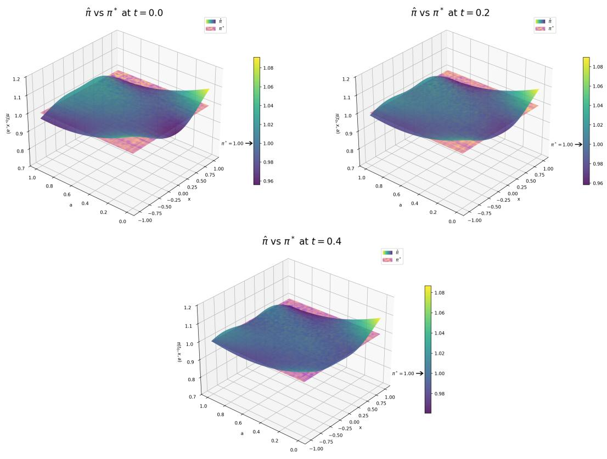
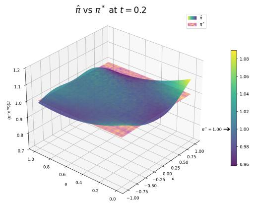
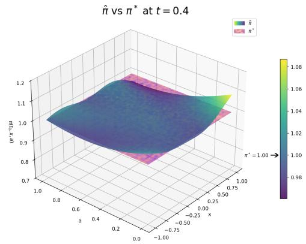
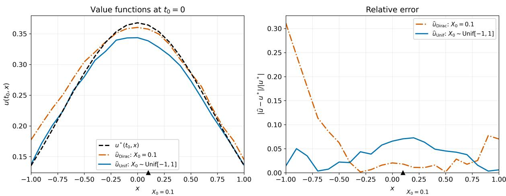

# Learning to Solve Stochastic Controls with Unknown Drifts and Running Rewards: Theory, Algorithms and Convergence

Jin Ma<sup>∗</sup>, Gaozhan Wang<sup>†</sup> Jianfeng Zhang <sup>‡</sup> and Xun Yu Zhou <sup>§</sup>

September 15, 2026

## Abstract

We study continuous-time and possibly high-dimensional stochastic control problems where drift coeficients and running reward functions are unknown. Due to these missing model primitives we take the exploratory, reinforcement learning (RL) framework of Wang, Zariphopoulou, and Zhou [34] with relaxed controls and entropy regularization. The objective is to develop theoretically grounded, eficient and scalable RL algorithms to learn both the optimal value functions (which also solves the exploratory HJB equation) and optimal exploratory feedback control policies. When the difusion coeficients do not contain control, we employ probabilistic representations of both the optimal value function and its gradient based on an auxiliary state process depending only on the difusion part of the original dynamics. With a delicate analysis on some properly defined mappings and their fixed points, this leads to the introduction of our policy iteration algorithms and their convergence. We demonstrate the performance of our algorithms through various numerical examples. Finally, we study a special control dependent difusion case where probability representation of the Hessian is called for.

Keywords. Stochastic control, reinforcement learning, entropy regularization, exploratory HJB equation, model-free algorithms.

## 1 Introduction

Stochastic control problems are prevalent in everyday applications. Classical continuoustime stochastic control theory is model-based, namely, it specifies a system dynamics, typically a controlled stochastic diferential equation (SDE), along with a given running reward function and, when the time horizon is finite, a terminal reward/payof function. It has developed into a mature theory in the past 60 years or so, with its key pillars including maximum principle, dynamics programming, and linear–quadratic controls [9, 37].

There is, however, a fundamental flaw with this model-based approach. On one hand, some of the dynamics coeficients, especially the drifts, are notoriously hard or outright impossible to estimate to a workable accuracy. Moreover, in many applications one only observes a reward signal once an action is applied, instead of knowing the functional form of a running reward. On the other hand, optimal controls and value functions are often very sensitive to those model parameters/coeficients. The conflict between the intrinsic rigidity of a model and the inherent model uncertainty or inaccessibility leads to erroneous, irrelevant and even misleading solutions.

This is where reinforcement learning (RL) comes to the rescue. Model-free RL by-passes estimation of model parameters and seeks optimal controls directly based on observed, simulated, or generated data. Because the mid-step of model estimation is skipped, RL solutions are naturally more swift in responding to the (ever) changing environment and more robust.

For a very long time, RL study had almost exclusively focused on discrete-time Markov decision processes (MDPs) [30], even though most of the important real-life applications are continuous time (with continuous state/action spaces) by nature; e.g. autonomous driving, robot navigation and high-frequency trading. Wang, Zariphopoulou, and Zhou [34] are the first to present a continuous-time RL formulation, which employs (randomized) relaxed controls to characterize exploration and an entropy regularizer to capture the exploration– exploitation tradeof central to RL, and to obtain a theoretically optimal control policy that is a Gibbs sampler via analyzing the associated exploratory Hamilton–Jacobi–Bellman (HJB) equation. Since then, there has been an upsurge of interest in this exploratory approach for continuous-time RL, including extensions to many types of stochastic control problems (e.g. [4, 6, 28, 36]), as well as various other related problems (e.g. [1, 5, 7, 12, 27]). See also the survey papers by Hambly, Xu, and Yang [14], Hu and Lauri\`ere [16], and the references therein. Notably, the subsequent “trilogy” [23, 24, 25] by Jia and Zhou builds the theoretical foundation of model-free, data-driven continuous-time RL algorithms within the exploratory framework of [34].<sup>1</sup> The key technical thrust therein is a martingale theory that naturally leads to online/ofline algorithms for policy evaluation, policy gradient, and q-learning (a continuous-time counterpart of the Q-learning for MDPs).

The above trilogy, however, does not address the important questions of convergence of the various algorithms devised and a regret analysis of the learned policies. Tang and Zhou [32] tackle these questions and establish model-free convergence and sublinear regret bounds for q-learning, based on the backward stochastic diferential equation (BSDE) and stochastic approximation (SA) theories. A limitation of [32] is its strong and rather complex assumptions arising primarily from the SA technique employed. Meanwhile, [17, 18, 19] derive convergence and sublinear regret bounds for martingale-based policy gradient algorithms, in the more specific model-free settings of LQ controls and mean–variance portfolio selection, again leveraging the SA theory.

This paper studies stochastic controls with state dynamics governed by the Itˆo difusion type SDEs. The objective is to design RL algorithms and prove their convergence when the drift coeficients and the running reward functions are unknown. The specific approach we develop requires the difusion coeficients and terminal reward functions (in the case of a finite time horizon) to be known and given, which is relatively reasonable because the former are easier to estimate (compared to the drifts) and the latter are often specified in many applications (e.g. a payof of a stock option).

Due to the unknown drifts and running rewards, we work in the exploratory realm of [34], and aim to learn the optimal critic–actor pair (u<sup>∗</sup>, π<sup>∗</sup>), namely the optimal value function and optimal (randomized) feedback policies, both functions of the time–state pair (t, x). Theoretically, this pair can be approximated through the so-called policy iteration algorithm (PIA). PIA is based on a very simple coupled relation between optimal critic and actor: the former is the conditional expectation of the total reward functional of the latter, and the latter is the maximizer (or soft maximizer) of the Hamiltonian which is a function of the gradient/Hessian of the former. This relation naturally implies an iterative scheme to approximate the two simultaneously. PIA type of algorithms along with their convergence have been extensively studied in the classical model-based setting (where exploration is not required), in both discrete-time and continuous-time; see the literature review in [26], the predecessor of this paper.

In the exploratory setting with entropy regularization, Wang and Zhou [35], for a mean– variance portfolio choice problem, show that a PIA converges in just two iterations. This is because the problem therein is essentially an LQ problem, for which the optimal Gibbs sampler reduces to Gaussian and thus highly tractable. See also Giegrich, Reisinger, and Zhang [11] for related convergence results in the LQ setting. Huang, Wang, and Zhou [20] study a general infinite horizon model with control-independent difusion coeficients and establish convergence of their PIA. Tran, Wang, and Zhang [33] consider a similar problem and investigate two cases depending on whether or not control enters into the difusion term. In both cases, with diferent additional assumptions, they establish the PIA convergence. The methods of these two papers [20, 33] are both partial diferential equation (PDE)-based by analyzing the underlying exploratory HJB equations. By contrast, Ma, Wang and Zhang [26] employ purely probabilistic method, primarily probabilistic representation formulae for the value function and its derivatives, to design PIAs and derive their convergence. A recent work by Huang, Yu, and Zhang [21] extends the probabilistic method and proves the PIA convergence to a time-inconsistent problem with entropy regularization.

The aforementioned papers [20, 33, 26] are all model-based, assuming oracle access to all the model primitives. They share two essential pitfalls. First, policy iteration involves derivatives of the value function. While these papers establish convergence of the value function iterates, accurate numerical approximation of the value function alone does not guarantee accurate approximation of its derivatives. Second, the aforementioned modelbased PIAs are not directly implementable when some of the coeficients are missing, as in a model-free setting. See more detailed discussions on these two issues at the end of § 2.1.

This paper endeavors to overcome the two pitfalls, in the setting of unknown drifts and running rewards, by stepping up the probabilistic analysis of [26]. The main part of the paper assumes that the difusion coeficient does not depend on control, as in [26], in which case one needs only to consider the gradient (but not Hessian) of the value function in the analysis. Instead of the critic–actor pair $( u ^ { * } , \pi ^ { * } )$ , we consider another pair $( \boldsymbol { v } ^ { * } , \boldsymbol { w } ^ { * } )$ , where $v ^ { * }$ is the gradient of $u ^ { * }$ (in the spatial variable) and $w ^ { * }$ the Gibbs exponent in the expression of $\pi ^ { * }$ . Delicate probabilistic representation and analysis reveal that this new pair also satisfies a coupled relation that happens to be independent of the drift and running reward functions. This in turn leads to an error analysis, as well as algorithms with theoretical guarantee on the convergence of both the value function and its gradient.<sup>2</sup> The algorithms we develop are data-driven, and we define precisely what “data” and “data-driven” mean; see Remark 2.1 and Assumption 3.3 for details.

As mentioned, the main results of the paper rely on the control-independence of the difusion coeficients. For the very special case when the state space is one-dimensional, we extend our analysis and algorithm to include the case when control enters into difusions in infinite time horizon. This calls for an analysis on the Hessian. Despite a very restrictive setting, to the best of our knowledge this is the first data-driven algorithm with a rigorous convergence analysis for continuous-time nonlinear stochastic controls with unknown drifts and known yet control-dependent difusions.

We will also present a few numerical examples to demonstrate the eficiency and scalability of our learning algorithms. In particular, we provide an example to compare with a now classical benchmark of Han, Jentzen and E [15] for solving a class of high-dimensional PDEs based on deep BSDEs. The result shows that our algorithm achieves a similar performance in terms of accuracy of the learned solution to the exploratory HJB equation up to the state space dimension of 100 (which reaches the ceiling of our hardware capacity), even though [15] is model-based and ours is model-free.

Finally, this paper also provides a probabilistic numerical method to solve the exploratory HJB equations, which is a class of potentially high-dimensional, nonlinear parabolic or elliptic PDEs with certain unknown coeficients. Such PDEs with missing coeficients are termed black-box PDEs in a concurrent paper by Jia et al. [22], which contains a comprehensive literature review and motivations of studying black-box PDEs and/or dealing with the curse of dimensionality. That paper studies a fully nonlinear (i.e. up to the Hessian) parabolic PDE whose coeficients are all unknown and develops model-free, datadriven algorithms. Its key idea is to represent the gradient and Hessian via the so-called zeroth-order derivative estimators derived from perturbed Monte Carlo trajectories, which is fundamentally diferent from the representation in our paper. The PDE studied in [22] consists of a linear operator which is the generator of a difusion process plus a nonhomogeneous source term which is fully nonlinear up to the Hessian. Although it includes in form the exploratory HJB equation as a special case, the assumption therein that the value of the nonlinear source term is known for each given input excludes our setting. On the other hand, our equation clearly does not cover the one in [22]. Therefore, the two papers are mutually exclusive and complementary to each other.

The rest of the paper is organized as follows. In §2 we introduce the problem and highlight our main ideas. In $\ S 3$ we carry out an analysis necessary for designing the main algorithm and its convergence when time duration is small. The analysis is extended to the general time horizon in §4. In $\ S 5$ we present the algorithms along with numerical examples. In $\ S 6$ we study a special case with control-dependent difusion coeficients and one-dimensional state space, with a numerical example. Finally, $\ S 7$ concludes. Some of the proofs are placed in Appendix.

## 2 Problem Formulation

Notations. Here we list a few notations that will be used frequently in the paper.

• For $x , \tilde { x } \in \mathbb { R } ^ { n } , x \cdot \tilde { x }$ denotes the inner product, and $| x |$ the Euclidean norm.

• For $M , \tilde { M } \in \mathbb { R } ^ { m \times n }$ $M ^ { \top }$ denotes the transpose of M, and $M : \tilde { M } : = \mathrm { t r } ( M \tilde { M } ^ { \top } )$ Moreover, $I _ { d }$ denotes the $d \times d$ identity matrix.

• For a generic topological space E, $C ^ { 0 } ( \mathbf { E } ; \mathbb { R } ^ { n } )$ denotes the space of continuous functions $\phi : { \bf E }  \mathbb { R } ^ { n }$ , and $C _ { b } ^ { 0 } ( \mathbf { E } ; \mathbb { R } ^ { n } )$ the subspace of functions with finite uniform norms:

$$
\| \phi \| _ { 0 } : = \operatorname* { s u p } _ { \mathbf { E } } | \phi | .\tag{2.1}
$$

• For a measurable set A in some Euclidean space, ${ \mathcal { P } } _ { 0 } ( A )$ denotes the space of probability density functions $\pi : A \to [ 0 , \infty )$ , namely $\pi ( a ) \geq 0$ a.e. and $\textstyle \int _ { A } \pi ( a ) d a = 1$ Moreover, $\mathcal { H } ( \pi )$ denotes the Shannon entropy of π:

$$
\mathcal { H } ( \pi ) : = - \int _ { A } \pi ( \boldsymbol { a } ) \ln \pi ( \boldsymbol { a } ) d \boldsymbol { a } , \pi \in \mathcal { P } _ { 0 } ( A ) .\tag{2.2}
$$

• For a generic topological space E, a measurable set A in some Euclidean space, and a measurable function $\phi : \mathbf { E } \times A  \mathbb { R } ^ { n }$ , denote

$$
\tilde { \phi } ( x , \pi ) : = \int _ { A } \phi ( x , a ) \pi ( a ) d a , \quad x \in \mathbf { E } , \pi \in \mathcal { P } _ { 0 } ( A ) .\tag{2.3}
$$

## 2.1 Entropy-regularized stochastic control

Fix a finite time horizon [0, T] and a filtered probability space $( \Omega , \mathcal { F } , \mathbb { P } ; \mathbb { F } )$ on which is defined a standard d-dimensional Brownian motion B, where F is the natural filtration generated by B. We are also given an action space A, which is a measurable set in some Euclidean space with a finite volume:

$$
0 < | A | < \infty .
$$

Our primal interest is the following classical, target control problem: for $( t , x ) \in [ 0 , T ] \times$ $\mathbb { R } ^ { d }$

$$
\begin{array} { r l r } {  { X _ { s } ^ { t , x , \alpha } = x + \int _ { t } ^ { s } b ( l , X _ { l } ^ { t , x , \alpha } , \alpha _ { l } ) d l + \int _ { t } ^ { s } \sigma ( l , X _ { l } ^ { t , x , \alpha } ) d B _ { l } , } } & { s \in [ t , T ] ; } \\ & { } & { u _ { 0 } ^ { * } ( t , x ) : = \operatorname* { s u p } _ { \alpha } \mathbb { E } \Big [ g ( X _ { T } ^ { t , x , \alpha } ) + \int _ { t } ^ { T } r ( s , X _ { s } ^ { t , x , \alpha } , \alpha _ { s } ) d s \Big ] . } \end{array}\tag{2.4}
$$

In the above, an admissible control α is an A-valued and F-progressively measurable process, and $b , \sigma , r , g$ are appropriate coeficients taking values in $\mathbb { R } ^ { d } , \mathbb { R } ^ { d \times d }$ , R, and R, respectively.<sup>3</sup> For the most part of the paper, we assume that $\sigma$ is control-independent as in (2.4), but a special case of controlled $\sigma$ will be investigated in §6.

The key feature considered in this paper is that the drift term b and the running reward function r are unknown. Therefore, classical approaches such as dynamic programming (via HJB equations) and maximum principle (via Hamiltonian and FBSDEs) fail to solve the above problem. We resort to the continuous-time reinforcement learning (RL) paradigm introduced by [34] and consider the following exploratory, entropy-regularized problem:

$$
X _ { s } ^ { t , x , \pi } = x + \int _ { t } ^ { s } \widetilde { b } ( l , X _ { l } ^ { t , x , \pi } , \pi ( l , X _ { l } ^ { t , x , \pi } ) ) d l + \int _ { t } ^ { s } \sigma ( l , X _ { l } ^ { t , x , \pi } ) d B _ { l } , s \in [ t , T ] ;
$$

$$
J ( t , x ; \pi ) : = { \mathbb E } \Big [ g ( X _ { T } ^ { t , x , \pi } ) + \int _ { t } ^ { T } \big [ \tilde { r } ( s , X _ { s } ^ { t , x , \pi } , \pi ( s , X _ { s } ^ { t , x , \pi } ) ) + \lambda \mathcal { H } ( \pi ( s , X _ { s } ^ { t , x , \pi } ) ) \big ] d s \Big ] ,\tag{2.5}
$$

$$
u ^ { * } ( t , x ) : = u _ { \lambda } ^ { * } ( t , x ) : = \operatorname* { s u p } _ { \pi \in A _ { T } } J ( t , x ; \pi ) , \quad ( t , x ) \in [ 0 , T ] \times \mathbb { R } ^ { d } .
$$

Here, $\boldsymbol { \mathcal { A } } _ { T }$ denotes the space of feedback type relaxed controls/policies $\pi : [ 0 , T ] \times \mathbb { R } ^ { d } $ ${ \mathcal { P } } _ { 0 } ( A )$ , <sup>˜</sup>b and $\tilde { r }$ are the “convexifications” of b and r respectively defined in (2.3), and $\lambda > 0$ is an exogenous “temperature parameter” capturing a balance between exploitation and exploration essential in the RL approach. It is shown in [34] that the value function $u ^ { * }$ satisfies the exploratory HJB equation

$$
u _ { t } ^ { * } + \frac { 1 } { 2 } [ \sigma \sigma ^ { \top } ] ( t , x ) : u _ { x x } ^ { * } + H ( t , x , u _ { x } ^ { * } ) = 0 , \quad u ^ { * } ( T , x ) = g ( x ) , \quad \mathrm { w h e r e }
$$

$$
H ( t , x , z ) : = \operatorname* { s u p } _ { \pi \in \mathcal { P } _ { 0 } ( A ) } \big [ \tilde { b } ( t , x , \pi ) \cdot z + \tilde { r } ( t , x , \pi ) + \lambda \mathcal { H } ( \pi ) \big ] ,\tag{2.6}
$$

and the optimal relaxed control $\pi ^ { * }$ takes the Gibbs form

$$
\pi ^ { * } ( t , x , a ) : = \Gamma ( t , x , u _ { x } ^ { * } ( t , x ) , a ) , \quad ( t , x , a ) \in [ 0 , T ] \times \mathbb { R } ^ { d } \times A , \quad \mathrm { w h e r e } \quad
$$

$$
\Gamma ( t , x , z , a ) : = \frac { \gamma ( t , x , z , a ) } { \int _ { A } \gamma ( t , x , z , a ^ { \prime } ) d a ^ { \prime } } , \mathrm { w i t h } \gamma ( t , x , z , a ) : = \exp \Big ( \frac { 1 } { \lambda } [ b ( t , x , a ) \cdot z + r ( t , x , a ) ] \Big ) .\tag{2.7}
$$

With the above notation, the Hamiltonian H in (2.6) can be rewritten as

$$
H ( t , x , z ) = \lambda \ln \Big ( \int _ { A } \gamma ( t , x , z , a ) d a \Big ) .\tag{2.8}
$$

The above results show that one should use a Gibbs sampler in general to generate trial-and-error strategies to explore the environment when certain model coeficients are unknown. [31] further shows that the exploratory control problem converges to the original target control problem when the temperature parameter $\lambda \to 0$ . In other words, the target problem (2.4) can be solved via the exploratory problem (2.5) in the RL setting. The goal of this paper is therefore to design eficient numerical algorithms with theoretical guarantees for computing the above $( u ^ { * } , \pi ^ { * } )$ without knowing b and $r .$ Note that besides numerically solving both the target and exploratory control problems, solving the exploratory HJB (2.6), which is a nonlinear parabolic PDE (and high dimensional in many applications), is interesting in its own right from a PDE perspective.<sup>4</sup>

To achieve the goal of this sort, the following policy iteration algorithm (PIA) has been popular in the literature. Given appropriate initialization $u ^ { 0 }$ , define $( \pi ^ { n } , u ^ { n } ) , n \geq 1$ , recursively:

$$
\pi ^ { n } ( t , x , a ) : = \Gamma \left( t , x , u _ { x } ^ { n - 1 } ( t , x ) , a \right) , \quad u ^ { n } ( t , x ) : = J ( t , x ; \pi ^ { n } ) .\tag{2.9}
$$

In particular, under some technical conditions, it is shown in [26, Theorem 2.4] that the PIA converges with a super-exponential rate: for some $0 < \eta < 1$ 2

$$
\| u ^ { n } - u ^ { * } \| _ { 0 } + \| \pi ^ { n } - \pi ^ { * } \| _ { 0 } \leq C \eta ^ { 2 ^ { n } } .\tag{2.10}
$$

Despite the very strong theoretical convergence, the above algorithm has two fundamental drawbacks from the numerical and learning perspectives, which we now explain. First, the iterate $\pi ^ { n }$ in (2.9) depends on $u _ { x } ^ { n - 1 }$ , whereas the above iterative scheme only returns the approximated value of $u ^ { n }$ , say $\hat { u } ^ { n }$ . It is well known that the convergence of a function (under, say, the uniform norm (2.1)), does not necessarily lead to the convergence of its derivatives. Therefore, even if $\hat { u } ^ { n - 1 }$ approximates $u ^ { n - 1 }$ well, $\hat { u } _ { x } ^ { n - 1 }$ may not be a desired approximation of $u _ { x } ^ { n - 1 } . ^ { 5 }$ Consequently $\hat { \pi } ^ { n } ( t , x , a ) : = \Gamma \left( t , x , \hat { u } _ { x } ^ { n - 1 } ( t , x ) , a \right)$ may not approximate $\pi ^ { n }$ satisfactorily, with errors propagating into subsequent iterates. Thus, in actual implementation, the above PIA algorithm may not converge at all. Indeed, in $\ S 5$ we will present a numerical example (Example 5.3) showing that a simple minded PIA actually diverges.<sup>6</sup>

The more serious issue arises from the unknown model parameters: the Gibbs function $\gamma$ in (2.7) depends on the coeficients b and $r ;$ so the algorithm is not implementable when they are unknown. Since the main purpose of the exploratory framework is to deal with such models with unknown parameters, we will make this a focal point in developing our new algorithms in this paper.

## 2.2 Plan of attack

Bearing the aforementioned two main issues in mind, in this paper we propose new implementable algorithms and analyze their convergence. In this subsection we highlight the main ideas for reader’s convenience.

To overcome the first issue, we approximate $u _ { x } ^ { * }$ directly by utilizing the Bismut–Elworthy– Li representation formula [3, 8]. Specifically, denote

$$
v ^ { * } ( t , x ) : = u _ { x } ^ { * } ( t , x ) , \quad w ^ { * } ( t , x , a ) : = v ^ { * } ( t , x ) \cdot b ( t , x , a ) + r ( t , x , a ) .\tag{2.11}
$$

Then, by (2.7) and (2.8), we may rewrite the exploratory HJB equation (2.6) as

$$
u _ { t } ^ { * } + \frac { 1 } { 2 } [ \sigma \sigma ^ { \top } ] ( t , x ) : u _ { x x } ^ { * } + \lambda \ln \int _ { A } e ^ { - \frac { 1 } { \lambda } w ^ { * } ( t , x , a ) } d a = 0 ; \quad u ^ { * } ( T , x ) = g ( x ) .\tag{2.12}
$$

It follows from the Feynman–Kac and Bismut–Elworthy–Li formulae that we have the following probabilistic presentations of $u ^ { * }$ and $v ^ { * }$ :

$$
u ^ { * } ( t , x ) = \mathbb { E } \bigg \{ g ( \mathcal { X } _ { T } ^ { t , x } ) + \int _ { t } ^ { T } \lambda \ln \Big [ \int _ { A } \exp \big ( \frac { 1 } { \lambda } w ^ { * } ( s , \mathcal { X } _ { s } ^ { t , x } , a ) \big ) d a \Big ] d s \bigg \} ;\tag{2.13}
$$

$$
v ^ { * } ( t , x ) = \mathbb { E } \Big \{ ( \nabla \mathcal { X } _ { T } ^ { t , x } ) ^ { \top } g _ { x } ( \mathcal { X } _ { T } ^ { t , x } ) + \int _ { t } ^ { T } \lambda \ln \Big [ \int _ { A } \exp \big ( \frac { 1 } { \lambda } w ^ { * } ( s , \mathcal { X } _ { s } ^ { t , x } , a ) \big ) d a \Big ] N _ { s } ^ { t , x } d s \Big \} .\tag{2.14}
$$

In the above, $\chi ^ { t , x }$ denotes the dynamics of the following reference state:

$$
\mathcal { X } _ { s } ^ { t , x } = x + \int _ { t } ^ { s } \sigma ( l , \mathcal { X } _ { l } ^ { t , x } ) d B _ { l } , \quad s \in [ t , T ] ,\tag{2.15}
$$

and $N ^ { t , x }$ is the Bismut–Elworthy–Li representation kernel defined by

$$
N _ { s } ^ { t , x } : = \frac { 1 } { s - t } \int _ { t } ^ { s } ( \sigma ^ { - 1 } ( l , \mathscr { X } _ { l } ^ { t , x } ) \nabla \mathscr { X } _ { l } ^ { t , x } ) ^ { \top } d B _ { l } , \quad s \in [ t , T ] ,\tag{2.16}
$$

where $\nabla \mathcal { X } ^ { t , x }$ is the variational process of $\chi ^ { t , x }$ , which satisfies the following linear SDE:

$$
\nabla { \boldsymbol { \mathcal { X } } _ { s } ^ { t , x } } = I _ { d } + \sum _ { i } \int _ { t } ^ { s } \sigma _ { x } ^ { i } ( l , \boldsymbol { \mathcal { X } } _ { l } ^ { t , x } ) \nabla { \boldsymbol { \mathcal { X } } _ { l } ^ { t , x } } d B _ { l } ^ { i } , \quad s \in [ t , T ] ,\tag{2.17}
$$

with $\sigma ^ { i }$ denoting the i-th column of $\sigma$ and $B ^ { i }$ the i-th component of $B .$ . It is crucial to note that the representation system (2.13)–(2.17) depends on the functional forms of $\sigma$ and $^ { g , }$ but not those of b and $r .$

The remaining task is to find an efective and implementable way to learn the function $w ^ { * }$ , again without involving b and r. Our idea is based on the following simple yet crucial observation: for $\Delta t > 0$ small and $a \in A$

$$
\begin{array} { r l } & { \mathbb { E } \big [ u ^ { * } ( t , X _ { t + \Delta t } ^ { t , x , a } ) - u ^ { * } ( t , x ) \big ] - \mathbb { E } \big [ u ^ { * } ( t , \mathcal { X } _ { t + \Delta t } ^ { t , x } ) - u ^ { * } ( t , x ) \big ] } \\ { \approx } & { \mathbb { E } \big [ u _ { x } ^ { * } ( t , x ) \cdot ( X _ { t + \Delta t } ^ { t , x , a } - \mathcal { X } _ { t + \Delta t } ^ { t , x } ) \big ] \approx v ^ { * } ( t , x ) \cdot b ( t , x , a ) \Delta t , } \end{array}\tag{2.18}
$$

where $X ^ { t , x , a }$ is the state in (2.4) under a constant control $\alpha \equiv a$ . Consequently, we have the following estimate of $w ^ { * }$ :

$$
w ^ { * } ( t , x , a ) \approx \frac { 1 } { \Delta t } \mathbb { E } \Big [ \int _ { x } ^ { X _ { t + \Delta t } ^ { t , x , a } } v ^ { * } ( t , x ^ { \prime } ) d x ^ { \prime } \Big ] - \frac { 1 } { \Delta t } \mathbb { E } \Big [ \int _ { x } ^ { \chi _ { t + \Delta t } ^ { t , x } } v ^ { * } ( t , x ^ { \prime } ) d x ^ { \prime } \Big ] + r ( t , x , a ) .\tag{2.19}
$$

Our algorithms will be based on solving the approximate “fixed $\mathrm { p o i n t } ^ { \mathfrak { N } } \left( v ^ { * } , w ^ { * } \right)$ in (2.14) and (2.19), which we develop in the following sections. Before we proceed, we would like to reiterate about what problem parameters are known and what are unknown, as they will be key in determining the implementability of our algorithm. We do this in the following remarks.

Remark 2.1. (i) Recall that the main feature of this paper is that the functional forms of b and r are unknown, and we aim to devise data-driven solutions. We now make the notions of “data” and “data-driven” precise in our setting. Even though b is unknown, we require the state process $X ^ { t , x , a }$ under any given control a is observable (i.e. the process constitutes $d a t a )$ . This is a natural requirement. For example, in investment the state process is the wealth process of a portfolio (the control). Given a portfolio policy, we can certainly observe our corresponding wealth process even if we do not know anything about the price dynamics of the stocks involved in our portfolio. Likewise, while we do not know the running reward function $r ,$ we assume we will get the function value $r ( t , x , a )$ , a so-called reward signal, whenever a control a is applied at $( t , x )$ . A data-driven RL algorithm makes use of these observed data along with other available or simulated data to learn final solutions. See e.g. [23, 24, 25] for more discussions on this issue.

(ii) There is a more subtle point regarding available data. For any given $( t , x , a )$ , in calculating $v ^ { * }$ based on (2.14) we need to compute $w ^ { * } ( s , \mathcal { X } _ { s } ^ { t , x } , a )$ for $s \in [ t , T ]$ , which in view of (2.19) requires the data $X _ { s + \Delta t } ^ { s , \mathcal { X } _ { s } ^ { t , x } , a }$ and $\chi _ { s + \Delta t } ^ { s , \chi _ { s } ^ { t , x } }$ for all s and $a .$ But since $\boldsymbol { \mathcal { X } } _ { s } ^ { t , x }$ is simulated, its trajectory could spread over the whole space. This in turn demands us to observe the state data process starting from $( s , y )$ for any given $y ,$ which is not necessarily on the original state trajectory starting from $( t , x , a )$ (i.e. in general $y \neq X _ { s } ^ { t , x , a } )$ . We will formalize this type of data availability as an assumption; see Assumption 3.3-(i) along with discussions on this assumption in Remark 3.4 in the next section.

(iii) In this paper we assume that the function $\sigma$ is known. This assumption is relatively benign because it is well understood that, comparing to the mean $b ,$ the volatility $\sigma$ is much easier to estimate to very high accuracy. Also note that due to (2.17) we actually need access to $\sigma _ { x }$ as well. Given $\sigma ,$ we can simulate $\mathcal { X }$ and $\nabla \mathcal { X }$ at low costs. Similarly, we assume the terminal reward function $g$ (and hence $g _ { x } )$ is known, which is reasonable in many applications where $g$ is a known utility or payof function (e.g. the payof function of a financial derivative).

(iv) The introduction of the function $w ^ { * }$ is central in our approach. Equation (2.14) by itself does not solve $v ^ { * }$ , but coupled with (2.19) the pair $( \boldsymbol { v } ^ { * } , \boldsymbol { w } ^ { * } )$ can be solved simultaneously. Moreover, $u ^ { * }$ can also be determined by $w ^ { * }$ . Now, $w ^ { * }$ difers from the Hamiltonian of the target problem by a control-independent term $\begin{array} { r } { \frac { 1 } { 2 } [ \sigma \sigma ^ { \top } ] ( t , x ) : u _ { x x } ^ { * } ( t , x ) } \end{array}$ . In view of the policy improvement theorem ([25, Theorem 2]) and the definition of the q-function ([25, Definition 4]), $w ^ { * }$ is essentially the q-function in our particular setting where $\sigma$ is independent of a. The general q-learning theory developed in [25] employs martingale conditions to design algorithms to learn the $q \mathrm { - }$ function without giving convergence results. [32] investigates the convergence and regret of q-learning based on BSDE and stochastic approximation, under technically complex and strong assumptions. By contrast, our paper takes a very diferent (and delicate) approach via representing the two key functions with each other: the gradient of the optimal value function and the (essentially) q-function, at the cost of having to assume σ and g to be known.

(v) In theory X and X can be driven by diferent Brownian motions, although we use the same notation B in (2.4) and (2.15). Indeed, in the numerical examples in §5 below, we will use independent Brownian motions to simulate X and generate the environmental data X respectively. However, the right side of (2.19) involves the diference of expectations, which are law invariant. Thus employing the same Brownian motion B does not cause any essential diferences in theoretical analysis. ■

## 3 Small Time Horizons

In this section we carry out an analysis following the aforementioned idea, under the assumption that the time horizon $T$ is suficiently small. The case of a general time horizon will be studied in the next section.

In the remainder of the paper, we will impose the following Standing Assumptions for the finite horizon setting, without stating explicitly in the results. The first one is about the regularity of the problem coeficients (even though some of them are unknown).

Assumption 3.1. There exist constants $L _ { 0 } , L _ { 1 } , L _ { * } > 0$ such that the following hold true: (i) $b , \sigma , r$ are bounded by $L _ { 0 } ,$ , and σ is uniformly non-degenerate: $\begin{array} { r } { \sigma \sigma ^ { \top } \geq \frac { 1 } { L _ { 0 } } I _ { d } } \end{array}$

(ii) $b , r$ are measurable in a, and $b , \sigma , r$ are uniformly Lipschitz continuous in x and uniformly $\frac { 1 } { 2 } { - } H \ddot { o } l d e r$ continuous in t, with a Lipschitz/H¨older constant $L _ { 1 }$

(iii) The PDE (2.6) has a unique classical solution $u ^ { * }$ satisfying

$$
\| u _ { x } ^ { * } \| _ { 0 } + \| u _ { x x } ^ { * } \| _ { 0 } + \| u _ { x x x } ^ { * } \| _ { 0 } \leq L _ { * } .\tag{3.1}
$$

Note that assumptions on $g = u ^ { * } ( T , \cdot )$ are implied by (iii). Throughout we will use a generic constant $\textit { C } \left( \mathrm { i . e } \right.$ . its value may change from line to line), which depends only on $d ,$ $m , \lambda , | A |$ , and $L _ { 0 } , L _ { 1 }$ , but not on $L _ { * }$ or T. When the latter dependence occurs, we use the notation $C _ { L _ { * } , T }$

Remark 3.2. Assumption 3.1 ensures that the state equation (2.4) has a unique strong solution for any given control α as well as a unique weak solution for any constant control a. On the other hand, since the PDE (2.6) is semi-linear, it is standard (see e.g. [10, Chapter $7 ]$ to find suficient conditions to ensure Assumption 3.1-(iii) by increasing the regularity of $b , \sigma , r .$ . However, because the key estimate for the convergence of our new algorithm, based on Lemma 3.8 below, relies only on $L _ { 0 } , L _ { 1 }$ but not on $L _ { * }$ , we prefer not to impose further regularity assumptions on $b , \sigma , r$ so that we can focus on $L _ { 0 } , L _ { 1 }$ . Also, for our theoretical analysis, we require only the measurability in a. However, for the numerical examples in $\ S 5$ we need to approximate integrations in a by Riemann sums, in which case certain regularity in a will further be needed.

The next assumption is on the data accessibility/availability from the environment.

Assumption 3.3. (i) The environment returns a trajectory $\{ X _ { s } ^ { t , x , a } : t \leq s \leq T \}$ , for each query with input $( t , x , a ) \in [ 0 , T ] \times \mathbb { R } ^ { d } \times A$ , which is the (unique) weak solution to (2.4) under the constant control a.

(ii) The environment returns a value $r ( t , x , a )$ for each $( t , x , a ) \in [ 0 , T ] \times \mathbb { R } ^ { d } \times A$

(iii) The functional forms of σ and g are known and given.

Remark 3.4. From a practical viewpoint it is a rather strong assumption to require the environment to return the state trajectory for any $( t , x , a )$ . Imagine one controls a state process with a constant control a starting from initial time 0 and initial state $x _ { 0 }$ . She will naturally observe the resulting data trajectory as she goes, even if she may not know the drift b. At time $t ,$ the state is at $X _ { t } ^ { 0 , x _ { 0 } , a }$ so she will continue to see the trajectory from $( t , X _ { t } ^ { 0 , x _ { 0 } , a } , a )$ . However, Assumption 3.3-(i) requires her, at time $t ,$ to also see the data process starting from an $o f f .$ trajectory state x, which may not be possible in general.

This being said, there are (important) cases where this assumption is satisfied. Consider the wealth equation in stock investment

$$
d X _ { t } = [ r X _ { t } + ( \mu - r ) a ] d t + \sigma a d B _ { t } ,
$$

where $r$ is the risk-free rate (which is assumed to be known as it is typically the bank saving rate $\mathrm { o r }$ the bond yiled), $\mu$ and $\sigma$ are the return rate (which is hard to estimate and hence unknown) and volatility rate respectively of a stock, a is the portfolio (the amount allocated to the stock), and $X _ { t }$ (which is observable) is the total wealth at time t. Here we assume there is only one stock but the following analysis extends trivially to multiple stocks. Because $\mu$ is unknown, the state equation above has an unknown drift. Denote by $X ^ { 0 , x , a }$ the solution to the equation with $X _ { 0 } = x$ . Then it is immediate that

$$
X _ { t } ^ { 0 , y , a } = X _ { t } ^ { 0 , x , a } + e ^ { r t } ( y - x ) , y \neq x .
$$

In other words, the data process starting from a diferent state y can be inferred from the data process starting from the given x that can be observed. In this case, Assumption 3.3- (i) holds. So the results in this paper can be applied to a broad class of financial portfolio selection problems.

The assumption is also (approximately) satisfied in several other practical settings. For example, a rideshare platform can monitor vehicle trajectories starting from various locations within a region, assuming a suficiently high vehicle density. A stock trading app with a huge number of users (such as Robinhood) can observe wealth trajectories of diferent accounts starting from various amounts.

Finally, if b (along with σ) is known then Assumption 3.3-(i) becomes automatic because one can simulate (and therefore observe) the state process starting from any point.

Fix $K \geq 1$ and consider the uniform time discretization $\mathbb { T } _ { K } : = \{ t _ { k } \} _ { k = 0 } ^ { K }$ of $[ 0 , T ]$ , with $\begin{array} { r } { \Delta t : = \frac { T } { K } } \end{array}$ and $t _ { k } = k \Delta t , k = 0 , \cdots , K$ . Denote $\Delta B _ { t _ { k + 1 } } = B _ { t _ { k + 1 } } - B _ { t _ { k } }$ . For each $( t _ { k } , x )$ , we first discretize the reference state (2.15) and its variational process (2.17):

$$
\begin{array} { r } { \boldsymbol { \mathcal { X } } _ { t _ { k } } ^ { t _ { k } , \boldsymbol { x } , \Delta t } = \boldsymbol { x } ; \quad \boldsymbol { \mathcal { X } } _ { t _ { i + 1 } } ^ { t _ { k } , \boldsymbol { x } , \Delta t } = \boldsymbol { \mathcal { X } } _ { t _ { i } } ^ { t _ { k } , \boldsymbol { x } , \Delta t } + \sigma ( t _ { i } , \boldsymbol { \mathcal { X } } _ { t _ { i } } ^ { t _ { k } , \boldsymbol { x } , \Delta t } ) \Delta \boldsymbol { B } _ { t _ { i + 1 } } ; } \end{array}
$$

$$
\nabla { \boldsymbol { \mathcal { X } } _ { t _ { k } } ^ { t _ { k } , x , \Delta t } } = { \boldsymbol { I } } _ { d } ; \quad \nabla { \boldsymbol { \mathcal { X } } } _ { t _ { i + 1 } } ^ { t _ { k } , x , \Delta t } = \nabla { \boldsymbol { \mathcal { X } } } _ { t _ { i } } ^ { t _ { k } , x , \Delta t } + \sum _ { j = 1 } ^ { d } \sigma _ { x } ^ { j } ( t _ { i } , \boldsymbol { \mathcal { X } } _ { t _ { i } } ^ { t _ { k } , x , \Delta t } ) \nabla { \boldsymbol { \mathcal { X } } } _ { t _ { i } } ^ { t _ { k } , x , \Delta t } \Delta B _ { t _ { i + 1 } } ^ { j } ,\tag{3.2}
$$

for $i = k , \cdots , K - 1$ . Moreover, we define the discretized kernel process from (2.16)

$$
N _ { t _ { i } } ^ { t _ { k } , x , \Delta t } = \frac { 1 } { t _ { i } - t _ { k } } \sum _ { j = k } ^ { i - 1 } ( \sigma ^ { - 1 } ( t _ { j } , \mathscr { X } _ { t _ { j } } ^ { t _ { k } , x , \Delta t } ) \nabla \mathscr { X } _ { t _ { j } } ^ { t _ { k } , x , \Delta t } ) ^ { \top } \Delta B _ { t _ { j + 1 } } , \ i = k + 1 , \cdots , K .\tag{3.3}
$$

Note that, due to the singularity of $N _ { s } ^ { t , x }$ at $s = t$ , the above iteration starts with $i = k + 1$

The following estimates are standard; see $\mathrm { { e . g . } \ [ 3 8 ] }$

Lemma 3.5. There exists a constant $C _ { T } > 0$ , depending only on $d , \lambda , L _ { 0 } , L _ { 1 }$ , and $T$ but not on $L _ { * } ,$ such that for any $( t _ { k } , x )$ and $s > t _ { k } , i > k$

$$
\begin{array} { r } { \mathbb { E } _ { t _ { k } , x } \big [ | X _ { s } ^ { a } - x | ^ { 4 } + | \mathcal { X } _ { s } - x | ^ { 4 } \big ] \leq C _ { T } ( s - t _ { k } ) ^ { 2 } , \quad \mathbb { E } _ { t _ { k } , x } \big [ | \nabla \mathcal { X } _ { s } | ^ { 4 } + | \nabla \mathcal { X } _ { t _ { i } } ^ { \Delta t } | ^ { 4 } \big ] \leq C _ { T } , } \end{array}
$$

$$
\mathbb { E } _ { t _ { k } , x } \big [ | N _ { s } | ^ { 4 } \big ] \leq \frac { C _ { T } } { ( s - t _ { k } ) ^ { 2 } } , \quad \mathbb { E } _ { t _ { k } , x } \big [ | N _ { t _ { i } } ^ { \Delta t } | ^ { 4 } \big ] \leq \frac { C _ { T } } { ( t _ { i } - t _ { k } ) ^ { 2 } } ,\tag{3.4}
$$

$$
\mathbb { E } _ { t _ { k } , x } \Big [ | \mathcal { X } _ { t _ { i } } - \mathcal { X } _ { t _ { i } } ^ { \Delta t } | ^ { 4 } + | \nabla \mathcal { X } _ { t _ { i } } - \nabla \mathcal { X } _ { t _ { i } } ^ { \Delta t } | ^ { 4 } \Big ] \leq C _ { T } ( \Delta t ) ^ { 2 } ,
$$

where $X ^ { a }$ is the state process starting from $( t _ { k } , x )$ under the constant control a. Moreover, the above $C _ { T }$ is increasing in $T _ { i }$ , and in particular $C _ { T } \leq C _ { \bar { T } } \ i f T \leq \bar { T }$

Here and henceforth, for notational simplicity we take the convention that by using $\mathbb { E } _ { t _ { k } , x }$ we omit the superscripts $^ { t _ { k } , x }$ for the processes under the expectation. For example, in (3.4),

$$
\mathcal { X } = { { \chi } ^ { t _ { k } , x } } , \quad \nabla { \mathcal { X } } ^ { \Delta t } = \nabla { { \chi } ^ { t _ { k } , x , \Delta t } } .\tag{3.5}
$$

Next, inspired by the relations (2.14) and (2.19) we introduce two mappings:

$$
\Phi _ { K } : \mathcal { W } _ { K } \mapsto \mathcal { V } _ { K } , \quad \Psi _ { K } : \mathcal { V } _ { K } \mapsto \mathcal { W } _ { K } ,\tag{3.6}
$$

$$
\begin{array} { r } { \mathcal { V } _ { K } : = C _ { b } ^ { 0 } ( \mathbb { T } _ { K } \times \mathbb { R } ^ { d } ; \mathbb { R } ^ { d } ) , \quad \mathcal { W } _ { K } : = C _ { b } ^ { 0 } ( \mathbb { T } _ { K } \times \mathbb { R } ^ { d } \times A ; \mathbb { R } ) , } \end{array}
$$

such that, for any $( v , w ) \in \mathcal { V } _ { K } \times \mathcal { W } _ { K }$ and $( t _ { k } , x , a ) \in \mathbb { T } \times \mathbb { R } ^ { d } \times A$ , recalling (3.5),

$$
\Phi _ { K } ( w ) ( t _ { k } , x ) : = \mathbb { E } _ { t _ { k } , x } \Big [ \big ( \nabla \mathcal { X } _ { T } ^ { \Delta t } \big ) ^ { \top } g _ { x } \big ( \mathcal { X } _ { T } ^ { \Delta t } \big ) + \sum _ { j = k + 1 } ^ { K - 1 } \lambda \ln \int _ { A } e ^ { \frac { 1 } { \lambda } w ( t _ { j } , \mathcal { X } _ { t _ { j } } ^ { \Delta t } , a ) } d a N _ { t _ { j } } ^ { \Delta t } \Delta t \Big ] ;\tag{3.7}
$$

$$
\Psi _ { K } ( v ) ( t _ { k } , x , a ) : = \frac { 1 } { \Delta t } \mathbb { E } _ { t _ { k } , x } \Big [ \int _ { x } ^ { X _ { t _ { k + 1 } } ^ { a } } v ( t _ { k } , x ^ { \prime } ) d x ^ { \prime } - \int _ { x } ^ { \chi _ { t _ { k + 1 } } ^ { \Delta t } } v ( t _ { k } , x ^ { \prime } ) d x ^ { \prime } \Big ] + r ( t _ { k } , x , a ) .
$$

Remark 3.6. (i) In light of Remarks 2.1-(i), the mappings $\Phi _ { K }$ and $\Psi _ { K }$ in (3.7) depend only on the coeficients $\sigma$ and $g$ which are assumed to be known, as well as the data processes $X ^ { a }$ and $\chi ^ { \Delta t }$ along with the reward signals $r ( t , x , a )$ , which can be either observed or simulated, but not on the functional forms of b and r. This ensures the implementability of any resulting algorithms built on these two mappings.

(ii) Note that, in the above we discretize X but not X because the former can only be simulated while the latter is observed upon query. However, in the numerical examples in $\ S 5$ below, we will use simulated data of $X .$ , and thus will have to discretize X too. Nevertheless, similarly to the estimates in Lemma 3.5, such a diference has no impact on the final convergence rate. ■

Denote by $v _ { \mathbb { T } _ { K } } ^ { * } : = v ^ { * } | _ { \mathbb { T } _ { K } } \in \mathcal { V } _ { K }$ and $w _ { \mathbb { T } _ { K } } ^ { * } : = w ^ { * } | _ { \mathbb { T } _ { K } } \in \mathcal { W } _ { K }$ the restriction of $v ^ { * } , w ^ { * }$ on $\mathbb { T } _ { K }$ . The following result, whose proof is postponed to Appendix, rigorously justifies our construction of $\left( \Phi _ { K } , \Psi _ { K } \right)$ as a machinery to find the approximate fixed point $( \boldsymbol { v } ^ { * } , \boldsymbol { w } ^ { * } )$ in (2.14) and (2.19) and, moreover, reveals that the approximation is of the order of the square root of the time step size $\Delta t$

Proposition 3.7. There exists a constant $C _ { L _ { * } , T _ { \cdot } }$ , which may depend on $L _ { * } , T$ but not on $K o r \Delta t ,$ , such that

$$
\| \Phi _ { K } ( w _ { \mathbb { T } _ { K } } ^ { * } ) - v _ { \mathbb { T } _ { K } } ^ { * } \| _ { 0 } + \| \Psi _ { K } ( v _ { \mathbb { T } _ { K } } ^ { * } ) - w _ { \mathbb { T } _ { K } } ^ { * } \| _ { 0 } \le C _ { L _ { * } , T } \sqrt { \Delta t } .\tag{3.8}
$$

The next estimate is crucial for building our algorithm.

Lemma 3.8. Let $T \leq \bar { T }$ for some $\bar { T } < \infty$ . There exists a constant $C > 0$ , depending only on $d , \lambda , L _ { 0 } , L _ { 1 } , \bar { T }$ , but not on $L _ { * } , \ T , \ K$ , such that, for any $( v , w ) , ( v ^ { \prime } , w ^ { \prime } ) \in \mathcal { V } _ { K } \times \mathcal { W } _ { K }$

$$
\left\| \Phi _ { K } ( w ) - \Phi _ { K } ( w ^ { \prime } ) \right\| _ { 0 } \leq C \sqrt { T } \left\| w - w ^ { \prime } \right\| _ { 0 } ; \quad \left\| \Psi _ { K } ( v ) - \Psi _ { K } ( v ^ { \prime } ) \right\| _ { 0 } \leq C \left\| v - v ^ { \prime } \right\| _ { 0 } .\tag{3.9}
$$

Proof Fix $T \leq { \bar { T } }$ and $K \geq 1$ . Recall Remarks $2 . 1 \mathrm { - } \big ( \mathrm { v } \big )$ that we can use the same Brownian motion B in (2.5) and (2.15), and Lemma 3.5 that we can use a generic constant $C = C _ { \bar { T } }$ independent of $T \leq \bar { T }$ for all the estimates therein. Fix an arbitrary triplet $( t _ { k } , x , a )$ , and assume without loss of generality that $k = 0$ . For any $j$

$$
\begin{array} { r c l } { \displaystyle \lambda \ln \int _ { A } e ^ { \frac { 1 } { \lambda } w ( t _ { j } , \mathcal { X } _ { t _ { j } } ^ { \Delta t } , a ) } d a } & { \leq } & { \displaystyle \lambda \ln \int _ { A } e ^ { \frac { 1 } { \lambda } [ w ^ { \prime } ( t _ { j } , \mathcal { X } _ { t _ { j } } ^ { \Delta t } , a ) + \| w - w ^ { \prime } \| _ { 0 } ] } d a } \\ & { = } & { \displaystyle \lambda \ln \int _ { A } e ^ { \frac { 1 } { \lambda } w ^ { \prime } ( t _ { j } , \mathcal { X } _ { t _ { j } } ^ { \Delta t } , a ) } d a + \| w - w ^ { \prime } \| _ { 0 } . } \end{array}
$$

Similarly one can prove the symmetric inequality, leading to

$$
\left| \lambda \ln \int _ { A } e ^ { \frac { 1 } { \lambda } w ( t _ { j } , \mathcal { X } _ { t _ { j } } ^ { \Delta t , a } , a ) } d a - \lambda \ln \int _ { A } e ^ { \frac { 1 } { \lambda } w ^ { \prime } ( t _ { j } , \mathcal { X } _ { t _ { j } } ^ { \Delta t } , a ) } d a \right| \leq \| w - w ^ { \prime } \| _ { 0 } .\tag{3.10}
$$

Then by (3.7), (3.2), and Lemma 3.5, we have

$$
\left| { ( \Phi _ { K } ( w ) - \Phi _ { K } ( w ^ { \prime } ) ) ( t _ { 0 } , x ) } \right| \le C \left\| { w - w ^ { \prime } } \right\| _ { 0 } \sum _ { j = 1 } ^ { K - 1 } \mathbb { E } _ { 0 , x } \left[ | N _ { t _ { j } } ^ { \Delta t } | \right] \Delta t
$$

$$
\leq C \left\| w - w ^ { \prime } \right\| _ { 0 } \sum _ { j = 1 } ^ { K - 1 } \frac { \Delta t } { \sqrt { t _ { j } } } \leq C \left\| w - w ^ { \prime } \right\| _ { 0 } \sqrt { K \Delta t } = C \sqrt { T } \left\| w - w ^ { \prime } \right\| _ { 0 } .
$$

Next, note that

$$
\begin{array} { r l } & { \displaystyle \big | ( \Psi _ { K } ( v ) - \Psi _ { K } ( v ^ { \prime } ) ) ( t _ { 0 } , x , a ) \big | = \frac { 1 } { \Delta t } \Big | \mathbb { E } _ { 0 , x } \big [ \int _ { \chi _ { t _ { 1 } } ^ { \Delta t } } ^ { X _ { t _ { 1 } } ^ { a } } ( v - v ^ { \prime } ) ( x ^ { \prime } ) | d x ^ { \prime } \big ] \Big | } \\ & { \displaystyle \leq \frac { 1 } { \Delta t } \left\| v - v ^ { \prime } \right\| _ { 0 } \mathbb { E } _ { 0 , x } \big [ \big | X _ { t _ { 1 } } ^ { a } - \chi _ { t _ { 1 } } ^ { \Delta t } \big | \big ] } \\ & { \displaystyle \leq \frac { 1 } { \Delta t } \left\| v - v ^ { \prime } \right\| _ { 0 } \mathbb { E } _ { 0 , x } \Big [ \int _ { t _ { 0 } } ^ { t _ { 1 } } | b ( s , X _ { s } ^ { a } , a ) | d s + \big | \int _ { t _ { 0 } } ^ { t _ { 1 } } ( \sigma ( s , X _ { s } ^ { a } ) - \sigma ( t _ { 0 } , x ) ) d B _ { s } \Big | \Big ] . } \end{array}
$$

Then, it follows from Assumption 3.1 and Lemma 3.5 that

$$
\begin{array} { r l } & { \displaystyle  ( \Psi _ { K } ( v ) - \Psi _ { K } ( v ^ { \prime } ) ) ( t _ { 0 } , x , a )  } \\ & { \displaystyle \leq \frac { C } { \Delta t }  v - v ^ { \prime }  _ { 0 } [ \Delta t + ( \mathbb { E } _ { 0 , x } \Big [ \int _ { t _ { 0 } } ^ { t _ { 1 } } | \sigma ( s , X _ { s } ^ { a } ) - \sigma ( t _ { 0 } , x ) | ^ { 2 } d s ] ) ^ { \frac 1 2 } ] } \\ & { \displaystyle \leq \frac { C } { \Delta t }  v - v ^ { \prime }  _ { 0 } [ \Delta t + ( \mathbb { E } _ { 0 , x } \Big [ \int _ { t _ { 0 } } ^ { t _ { 1 } } ( s + | X _ { s } ^ { a } - x | ^ { 2 } ) d s \Big ] ) ^ { \frac 1 2 } ] } \\ & { \displaystyle \leq \frac { C } { \Delta t }  v - v ^ { \prime }  _ { 0 } [ \Delta t + \Big ( \int _ { t _ { 0 } } ^ { t _ { 1 } } s d s \Big ] ) ^ { \frac 1 2 } ] \leq C \lVert v - v ^ { \prime } \rVert _ { 0 } . } \end{array}
$$

By the arbitrariness of $( t _ { k } , x , a )$ we complete the proof.

The analysis so far holds true for arbitrary T. However, the result below will be valid only for small $T ,$ and we will extend it to general T in the next section.

Fix K and introduce the loss function:

$$
J _ { K } ( v , w ) : = \| \Phi _ { K } ( w ) - v \| _ { 0 } + \| \Psi _ { K } ( v ) - w \| _ { 0 } , \quad ( v , w ) \in \mathcal { V } _ { K } \times \mathcal { W } _ { K } .\tag{3.11}
$$

Proposition 3.7 implies that

$$
J _ { K } ( v _ { \mathbb { T } _ { K } } ^ { * } , w _ { \mathbb { T } _ { K } } ^ { * } ) \le C _ { L _ { * } , T } \sqrt { \Delta t } , \quad \mathrm { a n d ~ h e n c e } \quad \operatorname* { i n f } _ { ( v , w ) \in \mathcal { V } _ { K } \times \mathcal { W } _ { K } } J _ { K } ( v , w ) \le C _ { L _ { * } , T } \sqrt { \Delta t } .\tag{3.12}
$$

The problem now boils down to finding a minimizing sequence for $J _ { K }$ . We have the following main result.

Theorem 3.9. There exist constants $\delta , C > 0$ , depending only on $d , \lambda , | A |$ , and $L _ { 0 } , L _ { 1 }$ but not on $L _ { * } ~ o r ~ T ,$ such that for any K and $T \leq \delta _ { i }$

$$
\begin{array} { r } { \left\| \Phi _ { K } ( w ) - v _ { \mathbb { T } _ { K } } ^ { * } \right\| _ { 0 } + \left\| \Psi _ { K } ( v ) - w _ { \mathbb { T } _ { K } } ^ { * } \right\| _ { 0 } \le C J _ { K } ( v , w ) + C _ { L _ { * } } \sqrt { \Delta t } , \ ( v , w ) \in \mathcal { V } _ { K } \times \mathcal { W } _ { K } . } \end{array}\tag{3.13}
$$

Proof Fix $\delta > 0$ which will be specified later, and assume without loss of generality that $\delta \leq 1$ . Fix K and assume $T \leq \delta$ . Applying Proposition 3.7 and Lemma 3.8 we have

$$
\begin{array} { r l r } { \left\| \Phi _ { K } ( w ) - v _ { \mathbb { T } _ { K } } ^ { * } \right\| _ { 0 } } & { \leq } & { \left\| \Phi _ { K } ( w ) - \Phi _ { K } ( w _ { \mathbb { T } _ { K } } ^ { * } ) \right\| _ { 0 } + \| \Phi _ { K } ( w _ { \mathbb { T } _ { K } } ^ { * } ) - v _ { \mathbb { T } _ { K } } ^ { * } \| _ { 0 } } \\ & { \leq } & { C \sqrt { \delta } \left\| w - w _ { \mathbb { T } _ { K } } ^ { * } \right\| _ { 0 } + C _ { L \times } \sqrt { \Delta t } } \\ & { \leq } & { C \sqrt { \delta } \left[ \| w - \Psi _ { K } ( v ) \| _ { 0 } + \| v - \Phi _ { K } ( w ) \| _ { 0 } + \left\| \Psi _ { K } ( v ) - w _ { \mathbb { T } _ { K } } ^ { * } \right\| _ { 0 } \right] + C _ { L \ast } \sqrt { \Delta t } } \\ & { = } & { C \sqrt { \delta } \big [ J _ { K } ( v , w ) + \left\| \Psi _ { K } ( v ) - w _ { \mathbb { T } _ { K } } ^ { * } \right\| _ { 0 } \big ] + C _ { L \ast } \sqrt { \Delta t } . \qquad ( 3 . 1 4 ) } \end{array}
$$

Here we used the obvious fact that the constant $C _ { L _ { * } , T }$ in (3.8) is increasing in T and thus we may set $C _ { L _ { * } } = C _ { L _ { * } , 1 }$ . Similarly, we also have

$$
\begin{array} { r l r } { \left\| \Psi _ { K } ( v ) - w _ { \mathbb { T } _ { K } } ^ { * } \right\| _ { 0 } } & { \leq } & { { \left\| \Psi _ { K } ( v ) - \Psi _ { K } ( v _ { \mathbb { T } _ { K } } ^ { * } ) \right\| _ { 0 } } + \| \Psi _ { K } ( v _ { \mathbb { T } _ { K } } ^ { * } ) - w _ { \mathbb { T } _ { K } } ^ { * } \| _ { 0 } } \\ & { \leq } & { C \left\| v - v _ { \mathbb { T } _ { K } } ^ { * } \right\| _ { 0 } + C _ { L _ { * } } \sqrt { \Delta t } } \\ & { \leq } & { C \big [ J _ { K } ( v , w ) + \left\| \Phi _ { K } ( w ) - v _ { \mathbb { T } _ { K } } ^ { * } \right\| _ { 0 } \big ] + C _ { L _ { * } } \sqrt { \Delta t } . } \end{array}\tag{3.15}
$$

Plugging (3.15) into (3.14), we have, for a constant $C _ { 0 }$ depending only on the model parameters $d , \lambda , | A |$ , and $L _ { 0 } , L _ { 1 }$ in Assumption 3.1,

$$
\left\| \Phi _ { K } ( w ) - v _ { \mathbb { T } _ { K } } ^ { * } \right\| _ { 0 } \leq C _ { 0 } \sqrt { \delta } \Big [ J _ { K } ( v , w ) + \left\| \Phi _ { K } ( w ) - v _ { \mathbb { T } _ { K } } ^ { * } \right\| _ { 0 } \Big ] + C _ { L _ { * } } \sqrt { \Delta t } .\tag{3.16}
$$

Set $\begin{array} { r } { \delta : = \frac { 1 } { 4 C _ { 0 } ^ { 2 } } \wedge 1 } \end{array}$ for the above $C _ { 0 }$ . Then,

$$
\big \| \Phi _ { K } ( w ) - v _ { \mathbb { T } _ { K } } ^ { * } \big \| _ { 0 } \leq \frac { 1 } { 2 } \Big [ J _ { K } ( v , w ) + \big \| \Phi _ { K } ( w ) - v _ { \mathbb { T } _ { K } } ^ { * } \big \| _ { 0 } \Big ] + C _ { L _ { * } } \sqrt { \Delta t } .
$$

Thus

$$
\frac { 1 } { 2 } \left\| \Phi _ { K } ( w ) - v _ { \mathbb { T } _ { K } } ^ { * } \right\| _ { 0 } \leq \frac { 1 } { 2 } J _ { K } ( v , w ) + C _ { L _ { * } } \sqrt { \Delta t } .
$$

Substituting this into (3.15) we obtain (3.13) and hence complete the proof.

The following is the convergence result.

Theorem 3.10. Let $T \leq \delta$ for $\delta > 0$ from Theorem 3.9. Then for any $\varepsilon > 0$ , there is K (or equivalently $\Delta t )$ such that $J _ { K }$ has an ε-minimizer $( v ^ { \varepsilon } , w ^ { \varepsilon } ) \in \mathcal { V } _ { K } \times \mathcal { W } _ { K }$ that satisfies

$$
\| \bar { v } ^ { \varepsilon } - v _ { \mathbb { T } _ { K } } ^ { * } \| _ { 0 } + \| \bar { w } ^ { \varepsilon } - w _ { \mathbb { T } _ { K } } ^ { * } \| _ { 0 } \le C _ { L _ { * } } \varepsilon , \quad w h e r e \quad \bar { v } ^ { \varepsilon } : = \Psi _ { K } ( w ^ { \varepsilon } ) , \ \bar { w } ^ { \varepsilon } : = \Phi _ { K } ( v ^ { \varepsilon } ) .\tag{3.17}
$$

Moreover, for $k = 0 , \cdots , K$ , define

$$
\bar { u } ^ { \varepsilon } ( t _ { k } , x ) : = \mathbb { E } _ { t _ { k } , x } \Big [ g ( \mathcal { X } _ { T } ^ { \Delta t } ) + \sum _ { j = k } ^ { K - 1 } \lambda \ln \int _ { A } e ^ { \frac { 1 } { \lambda } \bar { w } ^ { \varepsilon } ( t _ { j } , \mathcal { X } _ { t _ { j } } ^ { \Delta t } , a ) } d a \Delta t \Big ] ,\tag{3.18}
$$

$$
\pi ^ { \varepsilon } ( t _ { k } , x , a ) : = \Gamma ( t _ { k } , x , \bar { v } ^ { \varepsilon } ( t _ { k } , x ) , a ) .
$$

Then, restricting $u ^ { * } , \pi ^ { * }$ to $\mathbb { T } _ { K }$ , we have

$$
\| \bar { u } ^ { \varepsilon } - u _ { \mathbb { T } _ { K } } ^ { * } \| _ { 0 } + \| \pi ^ { \varepsilon } - \pi _ { \mathbb { T } _ { K } } ^ { * } \| _ { 0 } \leq C _ { L _ { * } } \varepsilon .\tag{3.19}
$$

Proof Fix $\varepsilon > 0$ . Let $\Delta t > 0$ be small enough such that $\begin{array} { r } { C _ { L _ { * } , T } \sqrt { \Delta t } \le \frac { \varepsilon } { 2 } } \end{array}$ for the constant $C _ { L _ { * } , T }$ in (3.12). Then $\begin{array} { r } { \operatorname* { i n f } _ { ( v , w ) \in \mathcal { V } _ { K } \times \mathcal { W } _ { K } } J _ { K } ( v , w ) \leq \frac { \varepsilon } { 2 } } \end{array}$ , and thus $J _ { K }$ has ε-minimizer. Now (3.17) follows directly from (3.13), and (3.19) follows from rather standard estimates.

Remark 3.11. In implementation one can use neural networks to approximate the functions v and $w ,$ and then apply any specific iterative scheme to find a minimizing sequence of $J _ { K }$ , such as Picard’s iteration or the stochastic gradient descent (SGD). In §5.1, we will present an SGD based algorithm. A benefit of the estimate (3.13) is that we can evaluate ${ \cal J } _ { K } ( v , w )$ along the iterative steps, which enables us to gauge the error of the current solution to decide when to stop the algorithm. ■

To conclude this section, we briefly discuss the infinite horizon case with time homogeneous coeficients $b , \sigma , r .$ . In this case, the exploratory HJB equation (2.6) becomes elliptic with a certain discount factor $\rho > 0$ (cf. [26]):

$$
\rho u ^ { * } ( x ) = \frac { 1 } { 2 } [ \sigma \sigma ^ { \top } ] ( x ) : u _ { x x } ^ { * } ( x ) + H ( x , u _ { x } ^ { * } ) , \quad x \in \mathbb { R } ^ { d } .\tag{3.20}
$$

With straightforward modifications, our analysis remains valid when $\rho$ is large, which essentially corresponds to a small $T .$ . Indeed, by omitting time discretization, we may modify the mappings and loss function with the parameter $\Delta t$ as follows:

$$
\begin{array} { c l l } { \displaystyle \Phi ( w ) ( x ) : = \mathbb { E } _ { 0 , x } \Big [ \int _ { 0 } ^ { \infty } e ^ { - \rho t } \ln \int _ { A } e ^ { w ( \mathcal { X } _ { t } , a ) } d a N _ { t } d t \Big ] , } \\ { \displaystyle \Psi _ { \Delta t } ( v ) ( x , a ) : = \frac { 1 } { \Delta t } \mathbb { E } \Big [ \int _ { x } ^ { X _ { \Delta t } ^ { a } } v ( x ^ { \prime } ) d x ^ { \prime } - \int _ { x } ^ { \mathcal { X } _ { \Delta t } } v ( x ^ { \prime } ) d x ^ { \prime } \Big ] + r ( x , a ) , } \\ { \displaystyle J _ { \Delta t } ( v , w ) : = \| \Phi ( w ) - v \| _ { 0 } + \| \Psi _ { \Delta t } ( v ) - w \| _ { 0 } , \quad v \in C _ { b } ^ { 0 } ( \mathbb { R } ^ { d } ; \mathbb { R } ^ { d } ) , w \in C _ { b } ^ { 0 } ( \mathbb { R } ^ { d } \times A ; \mathbb { R } ) . } \end{array}\tag{3.21}
$$

Then one can similarly show that,

$$
\begin{array} { c } { J _ { \Delta t } ( v ^ { * } , w ^ { * } ) \leq C _ { \rho } \sqrt { \Delta t } , } \\ { \displaystyle \left\| \Phi ( w ) - \Phi ( w ^ { \prime } ) \right\| _ { 0 } \leq \displaystyle \frac { C } { \sqrt { \rho } } \left\| w - w ^ { \prime } \right\| _ { 0 } ; \quad \left\| \Psi _ { \Delta t } ( v ) - \Psi _ { \Delta t } ( v ^ { \prime } ) \right\| _ { 0 } \leq C \left\| v - v ^ { \prime } \right\| _ { 0 } , } \end{array}\tag{3.22}
$$

and, for $\rho$ suficiently large,

$$
\| \Phi ( w ) - v ^ { * } \| _ { 0 } + \| \Psi _ { \Delta t } ( v ) - w ^ { * } \| _ { 0 } \leq C J _ { \Delta t } ( v , w ) + C \sqrt { \Delta t } .\tag{3.23}
$$

Then, again, the problem boils down to solving the minimization problem in $\boldsymbol { \mathrm { f } } _ { v , w } J _ { \Delta t } ( v , w )$ We leave the details to interested readers. Note that, in the infinite horizon setting, we are able to solve a special case of the problem when the difusion coeficient depends on control, namely $\sigma = \sigma ( x , a )$ ; see $\ S 6$

## 4 General Time Horizon

In this section we extend the results in the previous section to the case of a general $T .$ For arbitrary $T > 0$ , let $\delta > 0$ be determined in Theorem 3.9, which is independent of $T .$ . Consider a uniform partition: $0 = T _ { 0 } < T _ { 1 } < . . . < T _ { S } = T$ , with $\begin{array} { r } { \Delta T : = \frac { T } { S } \leq \delta } \end{array}$ and $T _ { i } : = i \Delta T , i = 0 , . . . , S$ . Now, for each sub-interval $[ T _ { i } , T _ { i + 1 } ]$ , we introduce a further uniform time discretization $\mathbb { T } _ { K } ^ { i } = \{ t _ { k } ^ { i } \} _ { k = 0 , \cdots , K }$ , with $\begin{array} { r } { \Delta t : = \frac { \Delta T } { K } = \frac { T } { S K } } \end{array}$ and $t _ { k } ^ { i } : = T _ { i } + k \Delta t$ . As in (3.6), denote

$$
\mathcal { V } _ { K } ^ { i } : = C _ { b } ^ { 0 } ( \mathbb { T } _ { K } ^ { i } \times \mathbb { R } ^ { d } ; \mathbb { R } ^ { d } ) , \quad \mathcal { W } _ { K } ^ { i } : = C _ { b } ^ { 0 } ( \mathbb { T } _ { K } ^ { i } \times \mathbb { R } ^ { d } \times A ; \mathbb { R } ) , \quad i = 0 , \cdots , m - 1 .
$$

Our main idea of treating the arbitrary time horizon is to apply the previous analysis/results to a small period recursively on each sub-interval $[ T _ { i } , T _ { i + 1 } ]$ in a backward manner, starting from $[ T _ { S - 1 } , T _ { S } ] = [ T _ { S - 1 } , T ]$ . To be precise, denote

$$
\bar { v } _ { S } ^ { \ast } ( x ) : = g _ { x } ( x ) , \quad C _ { S } ^ { \ast } : = 0 , \quad \mathrm { w h i c h ~ i s ~ e q u i v a l e n t ~ t o } \quad \| \bar { v } _ { S } ^ { \ast } - v ^ { \ast } ( T _ { S } , \cdot ) \| _ { 0 } \leq C _ { S } ^ { \ast } \sqrt { \Delta t } ,\tag{4.1}
$$

where $v ^ { * }$ is the true solution. For $i = S - 1 , \cdots , 0$ , assume we have constructed $\bar { v } _ { i + 1 } ^ { * } \in$ $C _ { b } ^ { 0 } ( \mathbb { R } ^ { d } ; \mathbb { R } ^ { d } )$ and there exists a constant $C _ { i + 1 } ^ { * } \geq 0$ such that

$$
\| \bar { v } _ { i + 1 } ^ { * } - v ^ { * } ( T _ { i + 1 } , \cdot ) \| _ { 0 } \leq C _ { i + 1 } ^ { * } \sqrt { \Delta t } .\tag{4.2}
$$

Now as in (3.6) and (3.7) we construct mappings $\Phi _ { K } ^ { i } : \mathcal { W } _ { K } ^ { i } \mapsto \mathcal { V } _ { K } ^ { i }$ and $\Psi _ { K } ^ { i } : \mathcal { V } _ { K } ^ { i } \mapsto \mathcal { W } _ { K } ^ { i }$ by

$$
\Phi _ { K } ^ { i } ( w ) ( t _ { k } ^ { i } , x ) : = \mathbb { E } _ { t _ { k } ^ { i } , x } \Big [ ( \nabla \mathcal { X } _ { T _ { i + 1 } } ^ { \Delta t } ) ^ { \top } \bar { v } _ { i + 1 } ^ { * } ( \mathcal { X } _ { T _ { i + 1 } } ^ { \Delta t } ) + \sum _ { j = k + 1 } ^ { K - 1 } \lambda \ln \int _ { A } e ^ { \frac { 1 } { \lambda } w ( t _ { j } ^ { i } , \mathcal { X } _ { t _ { j } ^ { i } } ^ { \Delta t } , a ) } d a N _ { t _ { j } ^ { i } } ^ { \Delta t } \Delta t \Big ] ;\tag{4.3}
$$

$$
\Psi _ { K } ^ { i } ( v ) ( t _ { k } ^ { i } , x , a ) : = \frac { 1 } { \Delta t } \mathbb { E } _ { t _ { k } ^ { i } , x } \Big [ \int _ { x } ^ { X _ { t _ { k + 1 } ^ { i } } ^ { a } } v ( t _ { k } ^ { i } , x ^ { \prime } ) d x ^ { \prime } - \int _ { x } ^ { \chi _ { t _ { k + 1 } ^ { i } } ^ { \chi \bot t } } v ( t _ { k } ^ { i } , x ^ { \prime } ) d x ^ { \prime } \Big ] + r ( t _ { k } ^ { i } , x , a ) ,
$$

and define the loss function as in (3.11) by:

$$
J _ { K } ^ { i } ( v , w ) : = \left\| \Phi _ { K } ^ { i } ( w ) - v \right\| _ { 0 } + \left\| \Psi _ { K } ^ { i } ( v ) - w \right\| _ { 0 } , \quad ( v , w ) \in \mathcal { V } _ { K } ^ { i } \times \mathcal { W } _ { K } ^ { i } .\tag{4.4}
$$

Then we have the following result.

Theorem 4.1. Consider the above setting where (4.2) holds. Then

$$
\| \Phi _ { K } ^ { i } ( w _ { \mathbb { T } _ { K } ^ { i } } ^ { * } ) - v _ { \mathbb { T } _ { K } ^ { i } } ^ { * } \| _ { 0 } + \| \Psi _ { K } ^ { i } ( v _ { \mathbb { T } _ { K } ^ { i } } ^ { * } ) - w _ { \mathbb { T } _ { K } ^ { i } } ^ { * } \| _ { 0 } \le C _ { L _ { * } } \bigl [ 1 + C _ { i + 1 } ^ { * } \bigr ] \sqrt { \Delta t } ,\tag{4.5}
$$

$$
\begin{array} { r } { \Big \| \Phi _ { K } ^ { i } ( w ) - v _ { \mathbb { T } _ { K } ^ { i } } ^ { * } \Big \| _ { 0 } + \Big \| \Psi _ { K } ^ { i } ( v ) - w _ { \mathbb { T } _ { K } ^ { i } } ^ { * } \Big \| _ { 0 } \leq C J _ { K } ^ { i } ( v , w ) + C _ { L _ { * } } \big [ 1 + C _ { i + 1 } ^ { * } \big ] \sqrt { \Delta t } , } \end{array}\tag{4.6}
$$

for all i and all $( v , w ) \in \mathcal { V } _ { K } ^ { i } \times \mathcal { W } _ { K } ^ { i }$

## Proof Denote

$$
\tilde { \Phi } _ { K } ^ { i } ( w ) ( t _ { k } ^ { i } , x ) : = \mathbb { E } _ { t _ { k } ^ { i } , x } \Big [ ( \nabla \mathcal { X } _ { T _ { i + 1 } } ^ { \Delta t } ) ^ { \top } v ^ { * } ( T _ { i + 1 } , \mathcal { X } _ { T _ { i + 1 } } ^ { \Delta t } ) + \sum _ { j = k + 1 } ^ { K - 1 } \lambda \ln \int _ { A } e ^ { \frac { 1 } { \lambda } w ( t _ { j } ^ { i } , \mathcal { X } _ { t _ { j } } ^ { \Delta t } , a ) } d a N _ { t _ { j } ^ { i } } ^ { \Delta t } \Delta t \Big ] .
$$

Then, since $\Delta T \le \delta \le 1$ , it follows from Proposition 3.7 that

$$
\| \tilde { \Phi } _ { K } ^ { i } ( w _ { \mathbb { T } _ { K } ^ { i } } ^ { * } ) - v _ { \mathbb { T } _ { K } ^ { i } } ^ { * } \| _ { 0 } + \| \Psi _ { K } ^ { i } ( v _ { \mathbb { T } _ { K } ^ { i } } ^ { * } ) - w _ { \mathbb { T } _ { K } ^ { i } } ^ { * } \| _ { 0 } \le C _ { L _ { * } } \sqrt { \Delta t } .
$$

Moreover, for any $( t _ { k } ^ { i } , x )$ , by Lemma 3.5 and (4.2) we have

$$
\bigl | \tilde { \Phi } _ { K } ^ { i } ( w ) ( t _ { k } ^ { i } , x ) - \Phi _ { K } ^ { i } ( w ) ( t _ { k } ^ { i } , x ) \bigr | \leq \mathbb { E } _ { t _ { k } ^ { i } , x } \bigl [ | \nabla \mathcal { X } _ { T _ { i + 1 } } ^ { \Delta t } | \bigr ] \| \bar { v } _ { i + 1 } ^ { * } - v ^ { * } ( T _ { i + 1 } , \cdot ) \| _ { 0 } \leq C _ { L _ { * } } C _ { i + 1 } ^ { * } \sqrt { \Delta t } .
$$

Combining the above two estimates, we obtain (4.5) immediately.

Next, Lemma 3.8 remains true for the mappings $\Phi _ { K } ^ { i } , \Psi _ { K } ^ { i }$ . That is,

$$
\begin{array} { r } { \left\| \Phi _ { K } ^ { i } ( w ) - \Phi _ { K } ^ { i } ( w ^ { \prime } ) \right\| _ { 0 } \leq C \sqrt { \delta } \left\| w - w ^ { \prime } \right\| _ { 0 } , \quad \left\| \Psi _ { K } ^ { i } ( v ) - \Psi _ { K } ^ { i } ( v ^ { \prime } ) \right\| _ { 0 } \leq C \left\| v - v ^ { \prime } \right\| _ { 0 } , } \end{array}
$$

for all $( v , w ) , ( v ^ { \prime } , w ^ { \prime } ) \in \mathcal { V } _ { K } ^ { i } \times \mathcal { W } _ { K } ^ { i }$ . Combining this with (4.5), we derive (4.6) following the same arguments as in Theorem 3.9. ■

Now set $\varepsilon : = 2 C _ { L * } \left[ 1 + C _ { i + 1 } ^ { * } \right] \sqrt { \Delta t }$ with the constant $C _ { L } ,$ in (4.5). Applying the arguments in proving Theorem 3.10, we obtain an ε-minimizer $( v _ { i } ^ { \varepsilon } , w _ { i } ^ { \varepsilon } ) \in \mathcal { V } _ { K } ^ { i } \times \mathcal { W } _ { K } ^ { i }$ of $J _ { K } ^ { i }$ . Denoting $\bar { v } _ { i } ^ { \varepsilon } : = \Phi _ { K } ^ { i } ( w _ { i } ^ { \varepsilon } ) , \bar { w } _ { i } ^ { \varepsilon } : = \Psi _ { K } ^ { i } ( v _ { i } ^ { \varepsilon } )$ , we have

$$
\| \bar { v } _ { i } ^ { \varepsilon } - v _ { \mathbb { T } _ { K } ^ { i } } ^ { * } \| _ { 0 } + \| \bar { w } _ { i } ^ { \varepsilon } - w _ { \mathbb { T } _ { K } ^ { i } } ^ { * } \| _ { 0 } \le C _ { L _ { * } } \varepsilon = 2 | C _ { L _ { * } } | ^ { 2 } \big [ 1 + C _ { i + 1 } ^ { * } \big ] \sqrt { \Delta t } .\tag{4.7}
$$

Set

$$
\begin{array} { r } { \bar { v } _ { i } ^ { * } ( x ) : = \bar { v } _ { i } ^ { \varepsilon } ( t _ { 0 } ^ { i } , x ) = \bar { v } ^ { \varepsilon } ( T _ { i } , x ) , \quad C _ { i } ^ { * } : = 2 | C _ { L _ { * } } | ^ { 2 } \big [ 1 + C _ { i + 1 } ^ { * } \big ] . } \end{array}\tag{4.8}
$$

We conclude that $\bar { v } _ { i } ^ { \varepsilon }$ and $C _ { i } ^ { * }$ satisfy (4.2) at $i ,$ thus completing the induction step.

We are now ready to state the main result of this section.

Theorem 4.2. Let $\delta , T _ { i } , \mathbb { T } _ { K } ^ { i } , \varepsilon$ be given and $v _ { i } ^ { \varepsilon } , w _ { i } ^ { \varepsilon } , \bar { v } _ { i } ^ { \varepsilon } , \bar { w } _ { i } ^ { \varepsilon } , v _ { i } ^ { * } , C _ { i } ^ { * } , J _ { K } ^ { i }$ be constructed as above, where in particular $( v _ { i } ^ { \varepsilon } , w _ { i } ^ { \varepsilon } )$ is an ε-minimizer of $J _ { K } ^ { i }$ . Moreover, define $\bar { u } _ { S } ^ { * } ( x ) : = g ( x )$ ， and for $i = S - 1 , \cdots , 0$ , and for all $k _ { i }$

$$
\bar { u } _ { i } ^ { \varepsilon } ( t _ { k } ^ { i } , x ) : = \mathbb { E } _ { t _ { k } ^ { i } , x } \Big [ \bar { u } _ { i + 1 } ^ { * } ( \mathcal { X } _ { T _ { i + 1 } } ^ { \Delta t } ) + \sum _ { j = k } ^ { K - 1 } \lambda \ln \int _ { A } e ^ { \frac { 1 } { \lambda } \bar { w } _ { i } ^ { \varepsilon } ( t _ { j } ^ { i } , \mathcal { X } _ { t _ { j } ^ { \Delta t } } ^ { \Delta t } , a ) } d a \Delta t \Big ] , \quad \bar { u } _ { i } ^ { * } ( x ) : = \bar { u } _ { i } ^ { \varepsilon } ( t _ { 0 } ^ { i } , x ) ;\tag{4.9}
$$

$$
\pi _ { i } ^ { \varepsilon } ( t _ { k } ^ { i } , \boldsymbol { x } , \boldsymbol { a } ) : = \Gamma ( t _ { k } ^ { i } , \boldsymbol { x } , \bar { v } _ { i } ^ { \varepsilon } ( t _ { k } ^ { i } , \boldsymbol { x } ) , \boldsymbol { a } ) .
$$

Then, there exists $C _ { L _ { * } } > 0$ such that, for $i = 0 , \cdots , m - 1$

$$
\begin{array} { r l } & { \quad \| \bar { v } _ { i } ^ { \varepsilon } - v _ { \mathbb { T } _ { K } ^ { i } } ^ { * } \| _ { 0 } + \| \bar { w } _ { i } ^ { \varepsilon } - w _ { \mathbb { T } _ { K } ^ { i } } ^ { * } \| _ { 0 } \leq C _ { i } ^ { * } \sqrt { \Delta t } ; } \\ & { \| \bar { u } _ { i } ^ { \varepsilon } - u _ { \mathbb { T } _ { K } ^ { i } } ^ { * } \| _ { 0 } \leq 2 C _ { i } ^ { * } \sqrt { \Delta t } , \quad \| \bar { \pi } _ { i } ^ { \varepsilon } - \pi _ { \mathbb { T } _ { K } ^ { i } } ^ { * } \| _ { 0 } \leq C _ { L _ { * } } C _ { i } ^ { * } \sqrt { \Delta t } . } \end{array}\tag{4.10}
$$

Proof The estimates for $\bar { v } _ { i } ^ { \varepsilon } , \bar { w } _ { i } ^ { \varepsilon }$ are already given in (4.7). To estimate $\bar { u } _ { i } ^ { \varepsilon }$ , first note that $\| \bar { u } _ { n } ^ { * } - u ^ { * } ( T _ { S } , \cdot ) \| _ { 0 } = 0 = 2 C _ { S } ^ { * } \sqrt { \Delta t }$ . Assume we have proved $\| \bar { u } _ { i + 1 } ^ { * } - u ^ { * } ( T _ { i + 1 } , \cdot ) \| _ { 0 } \leq 2 C _ { i + 1 } ^ { * } \sqrt { \Delta t }$ Recall (2.13) and note that, for $k = 0 , \cdots , K - 1$

$$
u ^ { * } ( t _ { k } ^ { i } , x ) = \mathbb { E } _ { t _ { k } ^ { i } , x } \bigg \{ u ^ { * } ( T _ { i + 1 } , \mathcal { X } _ { T _ { i + 1 } } ) + \int _ { t _ { k } ^ { i } } ^ { T _ { i + 1 } } \lambda \ln \big [ \int _ { A } \exp \big ( \frac { 1 } { \lambda } w ^ { * } ( s , \mathcal { X } _ { s } , a ) \big ) d a \big ] d s \bigg \} .
$$

Then, by (4.9) and (3.10) we have, for the function $H ^ { * }$ defined in (8.20) in Appendix,

$$
\begin{array} { r l } { \big | \bar { u } _ { i } ^ { \varepsilon } ( t _ { k } ^ { i } , x ) - u ^ { * } ( t _ { k } ^ { i } , x ) \big | \leq \| \bar { u } _ { i + 1 } ^ { * } - u ^ { * } ( T _ { i + 1 } , \cdot ) \| _ { 0 } + \displaystyle \sum _ { j = k } ^ { K - 1 } \| \bar { w } _ { i } ^ { \varepsilon } - w _ { \mathbb { T } _ { K } ^ { i } } ^ { * } \| _ { 0 } \Delta t + \displaystyle \sum _ { j = k } ^ { K - 1 } \int _ { t _ { j } ^ { i } } ^ { t _ { j + 1 } ^ { i } } I _ { s } ^ { j } d s , } & { } \\ { \mathrm { ~ w h e r e ~ } } & { I _ { s } ^ { j } : = \mathbb { E } _ { t _ { k } ^ { i } , x } \big [ \big | H ^ { * } ( s , \mathcal { X } _ { s } ) - H ^ { * } ( t _ { j } ^ { i } , \mathcal { X } _ { t _ { j } ^ { i } } ^ { \Delta t } ) \big | \big ] . } \end{array}
$$

It follows from the regularity of $H ^ { * } ;$ see (8.22) in Appendix, along with Lemma 3.5, that

$$
| I _ { s } ^ { j } | \leq C _ { L _ { * } } \mathbb { E } _ { t _ { k } ^ { i } , x } \big [ \sqrt { s - t _ { j } ^ { i } } + | \mathcal { X } _ { s } - \mathcal { X } _ { t _ { j } ^ { i } } | + | \mathcal { X } _ { t _ { j } ^ { i } } - \mathcal { X } _ { t _ { j } ^ { i } } ^ { \Delta t } \big ] \leq C _ { L _ { * } } \sqrt { \Delta t } .
$$

Then, noting $K \Delta t = \Delta T \leq \delta \leq 1$ , we get

$$
\left| \bar { u } _ { i } ^ { \varepsilon } ( t _ { k } ^ { i } , x ) - u ^ { * } ( t _ { k } ^ { i } , x ) \right| \le 2 C _ { i + 1 } ^ { * } \sqrt { \Delta t } + [ C _ { i } ^ { * } \sqrt { \Delta t } + C _ { L _ { * } } \sqrt { \Delta t } ] K \Delta t \le 2 C _ { i } ^ { * } \sqrt { \Delta t } .
$$

In particular,

$$
\| \bar { u } _ { i } ^ { * } - u ^ { * } ( T _ { i } , \cdot ) \| _ { 0 } = \operatorname* { s u p } _ { x } \left| \bar { u } _ { i } ^ { \varepsilon } ( t _ { 0 } ^ { i } , x ) - u ^ { * } ( t _ { 0 } ^ { i } , x ) \right| \leq 2 C _ { i } ^ { * } \sqrt { \Delta t } .
$$

This completes the induction step and thus we obtain the estimate for $\bar { u } _ { i } ^ { \varepsilon }$

Finally, recall (2.7) and note that

$$
\begin{array} { l } { \partial _ { z } \gamma ( t , x , z , a ) : = \displaystyle \frac { 1 } { \lambda } b ( t , x , a ) \gamma ( t , x , z , a ) , } \\ { \partial _ { z } \Gamma ( t , x , z , a ) : = \displaystyle \frac { \frac { 1 } { \lambda } b ( t , x , a ) \gamma ( t , x , z , a ) } { \int _ { A } \gamma ( t , x , z , a ^ { \prime } ) d a ^ { \prime } } - \frac { \gamma ( t , x , z , a ) \int _ { A } \frac { 1 } { \lambda } b ( t , x , a ^ { \prime } ) \gamma ( t , x , z , a ^ { \prime } ) d a ^ { \prime } } { ( \int _ { A } \gamma ( t , x , z , a ^ { \prime } ) d a ^ { \prime } ) ^ { 2 } } . } \end{array}
$$

Then,

$$
\left| \partial _ { z } \Gamma ( t , x , z , a ) \right| \leq \frac { C \gamma ( t , x , z , a ) } { \int _ { A } \gamma ( t , x , z , a ^ { \prime } ) d a ^ { \prime } } + \frac { C \gamma ( t , x , z , a ) \int _ { A } \gamma ( t , x , z , a ^ { \prime } ) d a ^ { \prime } } { ( \int _ { A } \gamma ( t , x , z , a ^ { \prime } ) d a ^ { \prime } ) ^ { 2 } } = C \Gamma ( t , x , z , a ) .
$$

Moreover, noting $| \boldsymbol { v } ^ { * } | \le C _ { L }$ ∗ as well as the estimate of $\bar { v } _ { i } ^ { \varepsilon }$ we have

$$
| \bar { v } _ { i } ^ { \varepsilon } ( t _ { k } ^ { i } , x ) | \leq | v ^ { * } ( t _ { k } ^ { i } , x ) | + C _ { i } ^ { * } \sqrt { \Delta t } \leq C _ { L _ { * } } + 1 .
$$

Here we assume without loss of generality that $\Delta t$ is small enough so that $C _ { i } ^ { * } \sqrt { \Delta t } \le 1$ Then by Assumption 3.1 and (2.7) we can easily see that $\Gamma ( t , x , z , a ) \leq C _ { L }$ for all $z$ between $\bar { v } _ { i } ^ { \varepsilon } ( t _ { k } ^ { i } , x )$ and $v ^ { * } ( t _ { k } ^ { i } , x )$ . Thus

$$
\begin{array} { l l l } { \left| \pi _ { i } ^ { \varepsilon } ( t _ { k } ^ { i } , x , a ) - \pi ^ { * } ( t _ { k } ^ { i } , x , a ) \right| } & { = } & { \left| \Gamma ( t _ { k } ^ { i } , x , \bar { v } _ { i } ^ { \varepsilon } ( t _ { k } ^ { i } , x ) , a ) - \Gamma ( t _ { k } ^ { i } , x , v ^ { * } ( t _ { k } ^ { i } , x ) , a ) \right| } \\ & { \leq } & { C _ { L _ { * } } \left| \bar { v } _ { i } ^ { \varepsilon } ( t _ { k } ^ { i } , x ) - v ^ { * } ( t _ { k } ^ { i } , x ) \right| \leq C _ { L _ { * } } C _ { i } ^ { * } \sqrt { \Delta t } . } \end{array}
$$

This completes the proof.

Remark 4.3. Recall that the constant $\delta > 0$ does not depend on $T$ or $L _ { * }$ . For a general time horizon $T > 0$ , the partition number S is determined by $\textstyle { \frac { T } { \delta } }$ . So when $T$ is very large $\mathrm { a n d } / \mathrm { o r }$ when δ is very small ( when $L _ { 0 } , L _ { 1 }$ are large), S will be large as well, so will $C _ { i } ^ { * }$ . Indeed, from (4.8) it follows that $C _ { 0 } ^ { * } \sim ( 2 | C _ { L _ { * } } | ^ { 2 } ) ^ { S } \sim ( 2 | C _ { L _ { * } } | ^ { 2 } ) ^ { \frac { T } { \delta } }$ . In other words, theoretically our scheme may become ineficient when $T$ is really large. Nevertheless, in the next section we will show numerically that for reasonably large $T$ or S this multi-step procedure is indeed eficient while the one-step method in the previous section simply fails. ■

## 5 Numerical Experiments

In this section, we first present our numerical algorithms, including a single-step algorithm for a small time horizon $T$ and a multi-time-period algorithm for a general $T ,$ along with numerical examples in both cases, including high-dimensional ones. Finally, we give comparisons with some well-known existing algorithms.

## 5.1 Algorithm for small time horizon

Before presenting the full numerical scheme in Algorithm 1, we clarify several key points.

First, the ultimate goal of the algorithm is to learn the optimal value function $u ^ { * }$ (which solves the exploratory HJB) and the optimal exploratory policy $\pi ^ { * }$ . In view of (2.13) and (2.7), it sufices to learn the functions $v ^ { * }$ and $w ^ { * }$ . In the algorithm, we use two neural networks, $v ^ { \psi }$ and $w ^ { \phi }$ to approximate $v ^ { * }$ and $w ^ { * }$ respectively.

Next, the algorithm takes a batch of M state/reference trajectories, each starting from the initial time $t _ { 0 } = 0$ and an initial state $x _ { 0 }$ randomly drawn from a distribution Law $( X _ { 0 } )$ chosen based on the specific objective of the task at hand. If the objective is to solve the exploratory HJB and/or obtain the optimal feedback policy, then a typical choice of $\operatorname { L a w } ( X _ { 0 } )$ is a uniform distribution supported on a bounded region (that is likely to contain the most states of interest). If one aims to just learn the optimal value $u ^ { * } ( 0 , x _ { 0 } )$ with respect to a specific, given initial state $x _ { 0 } .$ then the distribution can be just the Dirac measure centered at that initial state $x _ { 0 }$

In the procedure we need to apply a constant control a drawn uniformly from the action space A. In general when A is an arbitrary measurable set with a non-zero and finite volume (which is assumed in this paper), there is a so-called hit-and-run algorithm that can sample uniformly from A; see [29, 2]. Alternatively, especially when A has a more regular shape (e.g. an orthotope), we can use a suficiently fine uniform grid $\{ a _ { j } \} _ { j = 1 } ^ { N _ { a } }$ to approximate A, where $N _ { a }$ denotes the number of discrete points. Then we can sample actions uniformly just from these grid points. This method, which we will employ in our subsequent numerical experiments, has an added benefit: it also provides the quadrature nodes required to numerically evaluate the integral in the Φ mapping. Aligning the sampling grid with the integration grid ensures consistency across iterations and simplifies the evaluation of the policy.

In view of Remark 2.1-(v), we need to carefully manage the independent Brownian increments used to evaluate the mappings Φ and Ψ. The mapping Φ in (4.3) is evaluated along an entire reference path $\chi ^ { ( m ) }$ driven by the increments $B _ { k } ^ { ( m ) }$ ; see Algorithm 1, line 10-13. By contrast, the mapping Ψ, at each node $\mathcal { X } _ { k } ^ { ( m ) }$ , requires one-step transitions of both the controlled process $X _ { k + 1 } ^ { a , ( m , n ) }$ and the reference path $\mathscr X _ { k + 1 } ^ { ( m , n ) }$ . In practice, the former is observed from the environment upon a query (see Remark 2.1-(i),(ii)) while the latter is simulated using $\tilde { B } _ { k } ^ { ( m , n ) }$ that is independent from $B _ { k } ^ { ( m ) }$ ; see Algorithm 1, lines 17-20. In our numerical experiments below, we simulate the environment using Brownian increments independent of those driving the controlled state or reference processes. We note that, in practical applications, the overall cost of the algorithm also includes that of acquiring the controlled-transition data $X _ { k + 1 } ^ { a , ( m , n ) }$

Finally, we formalize the function approximation and the empirical loss. Recall we need to learn two networks $v ^ { \psi }$ and $w ^ { \phi }$ . The theoretical objective relies on the supremum norm, which is well-suited for convergence analysis but impractical for gradient-based optimization due to its non-smoothness. Therefore, we approximate the supremum norm using a diferentiable softmax surrogate. Given a parameter $\tau > 0 .$ , for any vector l of length $K ,$ we define:

$$
\mathrm { s o f t m a x } _ { \tau } ( l ) = \tau \log \sum _ { i = 1 } ^ { K } \exp ( l _ { i } / \tau ) .
$$

It is a standard result that softmax (l) converges to the supremum norm of l as $\tau  0 . { } ^ { 7 }$

To construct the empirical loss function, we first compute the residuals on each trajectory (m) at each time step $t _ { k }$

$$
\begin{array} { r c l } { { l _ { k } ^ { v , ( m ) } } } & { { = } } & { { \mid v ^ { \psi } ( t _ { k } , \mathcal { X } _ { k } ^ { ( m ) } ) - \Phi _ { k } ^ { ( m ) } \mid , } } \\ { { l _ { k } ^ { w , ( m ) } } } & { { = } } & { { \mid w ^ { \phi } ( t _ { k } , \mathcal { X } _ { k } ^ { ( m ) } , a ^ { ( m ) } ) - \Psi _ { k } ^ { ( m ) } \mid . } } \end{array}
$$

Applying the softmax approximation, we aggregate these residuals over the time grid (from $k = 0$ to $K - 2 )$ to obtain the trajectory-level losses:

$$
\begin{array} { r } { L _ { v } ^ { ( m ) } = \mathrm { s o f t m a x } _ { \tau } \left( \{ l _ { k } ^ { v , ( m ) } \} _ { k = 0 } ^ { K - 2 } \right) , \quad L _ { w } ^ { ( m ) } = \mathrm { s o f t m a x } _ { \tau } \left( \{ l _ { k } ^ { w , ( m ) } \} _ { k = 0 } ^ { K - 2 } \right) . } \end{array}
$$

Averaging across the batch of size $M .$ , the total empirical loss $J ,$ which proxies the theoretical supremum norm objective, is given by:

$$
\textit { J } = \frac { 1 } { M } \sum _ { m = 1 } ^ { M } \left( L _ { v } ^ { ( m ) } + L _ { w } ^ { ( m ) } \right) .
$$

We update the parameters $\psi$ and $\phi$ to minimize J via stochastic gradient descent with learning rates $\eta _ { v }$ and $\eta _ { w }$ respectively.

We now present our first algorithm, Algorithm 1. For ease of presentation, we write the pseudocode for $d = 1$ . Modifications are straightforward for $d > 1$ . Take the expression of $\nabla \mathcal { X }$ for example, it will be a matrix-valued Jacobian initialized at $I _ { d }$ . Its scalar exponential update will be replaced by a discretization of the corresponding matrix variational SDE. Moreover, the integrand involved will become $( \sigma ^ { - 1 } \nabla \mathcal { X } ) ^ { \top } d B$ , while the terminal derivative term will be $( \nabla \mathcal { X } ) ^ { \top } \nabla g$

```perl
Algorithm 1 (Single-time-period algorithm)
1: Input: Fixed initial time $t _ { 0 } = 0$ , terminal time $T ,$ number of grid points $K ,$ batch size $M .$
nested path size $N ,$ and epochs $E ;$ action space $A ,$ temperature parameter $\lambda > 0 .$ , softmax
parameter $\tau ,$ and learning rates $\eta _ { v } , \eta _ { w } ;$ distribution of the initial state Law $( X _ { 0 } )$
```

2: Output: Trained networks $( v ^ { \psi } , w ^ { \phi } )$ and the resulting estimated optimal value ˆu and policy ˆπ.

3: Initialize:

$$
\Delta t \gets \frac { T - t _ { 0 } } { K - 1 } , \qquad t _ { k } \gets t _ { 0 } + k \Delta t , \qquad k = 0 , \dots , K - 1 ,
$$

and randomly initialize the network weights $( \psi , \phi )$ for $v ^ { \psi } ( t , \boldsymbol { x } )$ and $w ^ { \phi } ( t , x , a )$

4: for $\operatorname { e p o c h } = 1 , \ldots , E$ do

5: for $m = 1 , \ldots , M$ do

6: Draw ${ \mathcal X } _ { 0 } ^ { ( m ) } \sim \mathrm { L a w } ( X _ { 0 } )$

7: Draw primary Brownian increments

$$
\{ \Delta B _ { k } ^ { ( m ) } \} _ { k = 0 } ^ { K - 2 } \sim \mathcal { N } ( 0 , \Delta t ) .
$$

8: Set

$$
\nabla { \mathcal X } _ { 0 } ^ { ( m ) } \gets 1 , \qquad { \cal N } _ { 0 } ^ { ( m ) } \gets 0 .
$$

9: for $k = 0$ to $K - 2$ do ▷ Forward simulation of the primary reference path

10: $\mathscr X _ { k + 1 } ^ { ( m ) } \gets \mathscr X _ { k } ^ { ( m ) } + \sigma ( t _ { k } , \boldsymbol { \mathcal X } _ { k } ^ { ( m ) } ) \Delta B _ { k } ^ { ( m ) }$

11: $\begin{array} { r } { \nabla \dot { \mathcal { X } } _ { k + 1 } ^ { ( m ) } \gets \nabla \dot { \mathcal { X } } _ { k } ^ { ( m ) } \exp \Big ( \sigma _ { x } ( t _ { k } , \mathcal { X } _ { k } ^ { ( m ) } ) \Delta B _ { k } ^ { ( m ) } - \frac { 1 } { 2 } \sigma _ { x } ^ { 2 } ( t _ { k } , \mathcal { X } _ { k } ^ { ( m ) } ) \Delta t \Big ) } \end{array}$

$$
N _ { k + 1 } ^ { ( m ) } \gets N _ { k } ^ { ( m ) } + \nabla \mathcal { X } _ { k } ^ { ( \hat { m } ) } \sigma ^ { - 1 } ( t _ { k } , \mathcal { X } _ { k } ^ { ( m ) } ) \Delta B _ { k } ^ { ( m ) } .
$$

13: for $k = 0$ to $K - 2$ do

14: Compute $\Phi _ { k } ^ { ( m ) }$ using the primary-path data $\left( k , \{ \mathcal { X } _ { i } ^ { ( m ) } \} , \{ N _ { i } ^ { ( m ) } \} , \{ \nabla \mathcal { X } _ { i } ^ { ( m ) } \} ; \phi \right)$

$$
l _ { k } ^ { v , ( m ) } \gets \left| v ^ { \psi } ( t _ { k } , \mathcal { X } _ { k } ^ { ( m ) } ) - \Phi _ { k } ^ { ( m ) } \right|
$$

16: for $n = 1 , \ldots , N$ do

17: Draw $\Delta \tilde { B } _ { k } ^ { ( m , n ) } \sim \mathcal { N } ( 0 , \Delta t )$

$$
( t _ { k } , \mathcal { X } _ { k } ^ { ( m ) } )
$$

18: Simulate the nested reference transition

$$
\mathcal X _ { k + 1 } ^ { ( m , n ) } \gets \mathcal X _ { k } ^ { ( m ) } + \sigma ( t _ { k } , \boldsymbol { \mathcal X } _ { k } ^ { ( m ) } ) \Delta \tilde { B } _ { k } ^ { ( m , n ) } .
$$

19: Sample $a ^ { ( n ) } \sim \operatorname { U n i f } ( A )$

20: Apply the fixed action $a ^ { ( n ) }$ at $( t _ { k } , \mathcal { X } _ { k } ^ { ( m ) } )$ and observe $X _ { k + 1 } ^ { a ^ { ( n ) } , ( m , n ) }$

21: Compute $\Psi _ { k } ^ { ( m ) }$ using the nested data $\left( k , \mathcal { X } _ { k } ^ { ( m ) } , a ^ { ( n ) } , \{ { X } _ { k + 1 } ^ { a ^ { ( n ) } , ( m , n ) } \} , \{ { X } _ { k + 1 } ^ { ( m , n ) } \} ; \psi \right)$

$$
l _ { k } ^ { w , ( m ) } \gets \left| w ^ { \phi } ( t _ { k } , \mathcal { X } _ { k } ^ { ( m ) } , a ^ { ( n ) } ) - \Psi _ { k } ^ { ( m ) } \right| .
$$

23: $L _ { v } ^ { ( m ) } \gets \mathrm { s o f t m a x } _ { \tau } \left( \{ l _ { k } ^ { v , ( m ) } \} _ { k = 0 } ^ { K - 2 } \right)$

24: $L _ { w } ^ { ( m ) } \gets \mathrm { s o f t m a x } _ { \tau } \left( \{ l _ { k } ^ { w , ( m ) } \} _ { k = 0 } ^ { K - 2 } \right) .$

25: Compute the total empirical loss

$$
J \gets \frac { 1 } { M } \sum _ { m = 1 } ^ { M } \Big ( L _ { v } ^ { ( m ) } + L _ { w } ^ { ( m ) } \Big ) .
$$

26: Update

$$
\psi  \psi - \eta _ { v } \nabla _ { \psi } J , \qquad \phi  \phi - \eta _ { w } \nabla _ { \phi } J .
$$

27: Obtain ${ \hat { \pi } } ( t , x , a )$ from $w ^ { \phi } ( t , x , a )$ through (2.7).

28: Recover ˆu from $w ^ { \phi } ( t , x , a )$ using independent paths through (2.13).

29: Return: $( v ^ { \psi } , w ^ { \phi } , \hat { u } , \hat { \pi } )$

We now present numerical results for applying Algorithm 1. Unless otherwise stated, all the test results reported are based on 50 independent runs on a local machine with an NVIDIA GeForce RTX 3080 Ti GPU (12 GB GDDR6X, 384-bit memory interface). For detailed neural network specifications, hyperparameters, and the complete codebase, please refer to our GitHub repository https://github.com/GaozhanWang/MWZZ-RL-2026.

We start with two one-dimensional stochastic control examples.

Example 5.1. Consider a control problem with the following coeficients and control set:

$$
b ( t , x , a ) = x + a , \quad \sigma ( t , x ) = 1 , \quad a \in [ 0 , 1 ] ,
$$

along with the reward functions

$$
r ( t , x , a ) = ( 2 t + 2 a x + 1 ) e ^ { - ( t ^ { 2 } + x ^ { 2 } + 1 ) } , \quad g ( x ) = e ^ { - ( T ^ { 2 } + x ^ { 2 } - 1 ) } .
$$

Given those coeficients, setting $\lambda = 1$ , we can solve the exploratory HJB equation (2.6) analytically to get the ground-truth optimal value function as well as the corresponding optimal policy

$$
u ^ { * } ( t , x ) = e ^ { - ( t ^ { 2 } + x ^ { 2 } + 1 ) } ; \qquad \pi ^ { * } ( t , x , a ) = \frac { 1 } { | A | } = 1 , \quad a \in [ 0 , 1 ] .
$$

Now we pretend that we do not know the analytical forms of b and $r ,$ and apply Algorithm 1 to solve the problem numerically. First consider the problem starting from $( t _ { 0 } , x _ { 0 } ) = ( 0 , 0 . 1 )$ 2 in which case we choose Law $( \mathrm { X } _ { 0 } ) = \mathrm { D i r a c } ( x _ { 0 } )$ . In implementation, we set $T = 0 . 4 , \Delta t =$ 0.02. Denote the relative error to be

$$
R E = \Big | \frac { u ^ { * } ( t _ { 0 } , x _ { 0 } ) - \hat { u } ( t _ { 0 } , x _ { 0 } ) } { u ^ { * } ( t _ { 0 } , x _ { 0 } ) } \Big | ,
$$

where $u ^ { * } ( t _ { 0 } , x _ { 0 } ) , \hat { u } ( t _ { 0 } , x _ { 0 } )$ are the true (initial) value and the learned one respectively. This error is motivated by a scenario where one is concerned with only the optimal value corresponding to the particular initial pair $( t _ { 0 } , x _ { 0 } )$

<table><tr><td rowspan=1 colspan=1>Time horizon</td><td rowspan=1 colspan=1> $u ^ { * } ( t _ { 0 } , x _ { 0 } )$ </td><td rowspan=1 colspan=1>Mean $\hat { u } ( t _ { 0 } , x _ { 0 } )$ </td><td rowspan=1 colspan=1>Mean RE</td><td rowspan=1 colspan=1>STD RE</td><td rowspan=1 colspan=1>Mean runtime $\mathrm { ( s ) }$ </td></tr><tr><td rowspan=1 colspan=1> $T { = } 0 . 4$ </td><td rowspan=1 colspan=1>0.3642</td><td rowspan=1 colspan=1>0.3546</td><td rowspan=1 colspan=1>2.6397%</td><td rowspan=1 colspan=1>0.4459%</td><td rowspan=1 colspan=1>38.12</td></tr></table>

Table 1: Numerical results with Algorithm 1 on Example 5.1.

Applying Algorithm 1 with the choice of $\mathrm { L a w } ( \mathrm { X } _ { 0 } ) = \mathrm { D i r a c } ( x _ { 0 } )$ , we not only can learn the particular value $\hat { u } ( t _ { 0 } , x _ { 0 } )$ but also the entire optimal value function ˆu along with the optimal policy ˆπ. At below we provide visualizations of the thus learned optimal value function and optimal policy versus the oracle ones in the following two figures. To be more precise, Figure 1 shows the learned value function surface and its relative error with respect to the oracle solution.<sup>8</sup> The three plots in Figure 2 compare the learned policy $\hat { \pi } ( t , \cdot , \cdot )$ with the true optimal policy $\pi ^ { * } ( t , \cdot , \cdot )$ at the time slices $t = 0 , 0 . 2 , 0 . 4$ , respectively.





  
Figure 1: ˆu vs $u ^ { * }$  
<sup>8</sup>Due to our GPU limit, we display only the portion of the surface over $t \in [ 0 , 0 . 3 ]$ for illustration. All the figures in this paper are provided in vector format; hence although scaled down to fit the page layout, they can be enlarged without loss of resolution to inspect finer details.







  
Figure 2: ˆπ vs $\pi ^ { * }$

We observe in Figure 1 that the relative errors in the optimal value function remain small in a neighborhood of the given initial point, $( t _ { 0 } , x _ { 0 } ) = ( 0 . 0 , 0 . 1 )$ . As state variable x moves away from this initial condition $x _ { 0 }$ , the errors gradually increase. This behavior is natural because in this example $\hat { u }$ is learned based on state/reference trajectories all initialized at $( t _ { 0 } , x _ { 0 } ) = ( 0 . 0 , 0 . 1 )$ . Consequently, the training data are concentrated along trajectories emanating from this point, leading to higher accuracy in its vicinity and weaker generalization in more distant regions. For applications where the control problem is strictly tied to a specific initial time and state, this localized sampling approach provides a highly computationally eficient solution and avoids the unnecessary overhead of exploring the broader state space.

If the goal of the learning is to obtain the global optimal value function (or equivalently to solve the exporatory HJB) and $/ \mathrm { o r }$ the optimal feedback policy, then we need to randomize the initial state $x _ { 0 }$ starting from $t _ { 0 } = 0$ according to some non-Dirac distribution $\operatorname { L a w } ( X _ { 0 } )$ for generating training trajectories/data as discussed earlier. For illustration and simplicity, we take $\operatorname { L a w } ( X _ { 0 } )$ to be a uniform distribution over an interval $[ x _ { 0 } ^ { \mathrm { m i n } } , x _ { 0 } ^ { \mathrm { m a x } } ] = [ - 1 , 1 ]$ for the current example. The corresponding test results (run with a new set of independent random seeds) are presented in Figure 3.

  
Figure 3: ˆu(0, ·) vs $u ^ { * } ( 0 , \cdot )$

While randomizing initial state naturally demands a higher computational cost during training, it successfully mitigates the local concentration of trajectories. Indeed, Figure 3 shows that the uniform accuracy of the approximation is now significantly improved across the target state space.

Example 5.2. The next example involves trigonometric type functions with a non-constant volatility. Specifically,

$$
b ( t , x , a ) = - 2 \cos ( t + x ) - \frac { 1 } { 4 } \sin ( 2 t + 2 x ) - 1 + a , \quad \sigma ( t , x ) = 2 + \sin ( t + x ) , \quad a \in [ 0 , 1 ] ,
$$

with

$$
r ( t , x , a ) = a \sin ( t + x ) + 2 \cos ( t + x ) , \quad g ( x ) = \cos ( T + x ) .
$$

Setting λ = 1, the theoretical optimal value function is $u ^ { * } ( t , x ) \ : = \ : \cos ( t + x )$ . We set $( t _ { 0 } , x _ { 0 } ) = ( 0 , 0 ) , T = 0 . 1 , \Delta t = 0 . 0 2$ , and obtain the results below:

<table><tr><td rowspan=1 colspan=1>Time horizon</td><td rowspan=1 colspan=1> $u ^ { * } ( t _ { 0 } , x _ { 0 } )$ </td><td rowspan=1 colspan=1>Mean $\hat { u } ( t _ { 0 } , x _ { 0 } )$ </td><td rowspan=1 colspan=1>Mean RE</td><td rowspan=1 colspan=1>STD RE</td><td rowspan=1 colspan=1>Mean runtime (s)</td></tr><tr><td rowspan=1 colspan=1>T=0.1</td><td rowspan=1 colspan=1>1.0000</td><td rowspan=1 colspan=1>0.9737</td><td rowspan=1 colspan=1>2.6222%</td><td rowspan=1 colspan=1>0.0423%</td><td rowspan=1 colspan=1>29.15</td></tr></table>

Table 2: Numerical results with Algorithm 1 on Example 5.2.

Note that in this example as both the model parameters and the truth value functions are trigonometric, we deliberately avoid using tanh as the neural network activation function—even though it is common—in order to test the generality of our algorithm’s behavior.

We now use the previous two examples to compare Algorithm 1 with the classical modelbased method which assumes all the model parameters to be known and applies PIA to directly approximate the optimal value function. Importantly, as discussed earlier PIA takes auto-dif to directly calculate the gradient of the approximated value function across iterations.

Example 5.3. (PIA Comparison) We find that the model-based PIA is numerically unstable: with GPU acceleration, it either terminates quickly in a few seconds but stops at a poor estimation, or it fails to converge within a reasonable runtime. In the tables below, we only report results with “converged” values and, in the latter case, we cap the policy iteration count at 1000 to prevent endless runs. As a result, we do not report runtimes here.

Tables 3 and 4 indicate the poor performance of the PIA scheme, which generally does not converge to the true solution.

<table><tr><td rowspan=1 colspan=1>Time Horizon</td><td rowspan=1 colspan=1> $u ^ { * } ( t _ { 0 } , x _ { 0 } )$ </td><td rowspan=1 colspan=1>Mean $\hat { u } ( t _ { 0 } , x _ { 0 } )$ </td><td rowspan=1 colspan=1>Mean RE</td><td rowspan=1 colspan=1>STD RE</td></tr><tr><td rowspan=1 colspan=1>T=0.4</td><td rowspan=1 colspan=1>0.3642</td><td rowspan=1 colspan=1>2.191</td><td rowspan=1 colspan=1>495.6%</td><td rowspan=1 colspan=1>6.5301%</td></tr></table>

Table 3: Numerical results with PIA for Example 5.1.

<table><tr><td rowspan=1 colspan=1>Time Horizon</td><td rowspan=1 colspan=1> $u ^ { * } ( t _ { 0 } , x _ { 0 } )$ </td><td rowspan=1 colspan=1>Mean $\hat { u } ( t _ { 0 } , x _ { 0 } )$ </td><td rowspan=1 colspan=1>Mean RE</td><td rowspan=1 colspan=1>STD RE</td></tr><tr><td rowspan=1 colspan=1>T=0.1</td><td rowspan=1 colspan=1>1.000</td><td rowspan=1 colspan=1>1.466</td><td rowspan=1 colspan=1>46.58%</td><td rowspan=1 colspan=1>1.4452%</td></tr></table>

Table 4: Numerical results with PIA for Example 5.2.

Example 5.4. We now extend our numerical experiment to multi-dimensional cases. Take a scaled version of Example 5.1, with the dynamics and the true value function given as

$$
b _ { i } ( t , \vec { x } , a ) = \vec { x } _ { i } + a _ { i } , \quad \sigma ( t , x ) = \mathbb { I } _ { d } , \quad a \in [ 0 , 1 ] ^ { d } , \quad i = 1 , . . . , d ,
$$

$$
u ^ { * } ( t , \vec { x } ) = e ^ { - ( t ^ { 2 } + \| \vec { x } \| _ { 2 } ^ { 2 } / d + 1 ) } , \quad \vec { x } \in \mathbb R ^ { d } ,
$$

along with the reward functions

$$
\begin{array} { r } { r ( t , \vec { x } , a ) = ( 2 t + 2 a ^ { \top } \vec { x } ) e ^ { - ( t ^ { 2 } + \| \vec { x } \| _ { 2 } ^ { 2 } / d + 1 ) } , \quad g ( \vec { x } ) = e ^ { - ( T ^ { 2 } + \| \vec { x } \| _ { 2 } ^ { 2 } / d - 1 ) } . } \end{array}
$$

We test Algorithm 1 on dimensions $d = 1 , 5 , 1 0 , 2 0 , 5 0 , 1 0 0$ with $\vec { x } _ { 0 } = ( 0 . 1 , 0 . 1 , \ldots , 0 . 1 ) ^ { \top } \in$ $\mathbb { R } ^ { d }$ $T = 0 . 1$ , and report the results in Table 5.<sup>9</sup>

<table><tr><td rowspan=1 colspan=1>Dimension</td><td rowspan=1 colspan=1> $u ^ { * } ( t _ { 0 } , x _ { 0 } )$ </td><td rowspan=1 colspan=1>Mean $\hat { u } ( t _ { 0 } , x _ { 0 } )$ </td><td rowspan=1 colspan=1>Mean RE</td><td rowspan=1 colspan=1>STD RE</td><td rowspan=1 colspan=1>Mean runtime (s)</td></tr><tr><td rowspan=1 colspan=1>d=1</td><td rowspan=1 colspan=1>0.3642</td><td rowspan=1 colspan=1>0.3678</td><td rowspan=1 colspan=1>1.0021%</td><td rowspan=1 colspan=1>0.1476%</td><td rowspan=1 colspan=1>10.41</td></tr><tr><td rowspan=1 colspan=1>d=5</td><td rowspan=1 colspan=1>0.3642</td><td rowspan=1 colspan=1>0.3351</td><td rowspan=1 colspan=1>7.9830%</td><td rowspan=1 colspan=1>0.0731%</td><td rowspan=1 colspan=1>10.75</td></tr><tr><td rowspan=1 colspan=1>d=10</td><td rowspan=1 colspan=1>0.3642</td><td rowspan=1 colspan=1>0.3309</td><td rowspan=1 colspan=1>9.1297%</td><td rowspan=1 colspan=1>0.2205%</td><td rowspan=1 colspan=1>18.29</td></tr><tr><td rowspan=1 colspan=1>d=20</td><td rowspan=1 colspan=1>0.3642</td><td rowspan=1 colspan=1>0.3285</td><td rowspan=1 colspan=1>9.8023%</td><td rowspan=1 colspan=1>0.1234%</td><td rowspan=1 colspan=1>36.88</td></tr><tr><td rowspan=1 colspan=1>d=50</td><td rowspan=1 colspan=1>0.3642</td><td rowspan=1 colspan=1>0.3274</td><td rowspan=1 colspan=1>10.1823%</td><td rowspan=1 colspan=1>0.0828%</td><td rowspan=1 colspan=1>103.31</td></tr><tr><td rowspan=1 colspan=1>d=100</td><td rowspan=1 colspan=1>0.3642</td><td rowspan=1 colspan=1>0.3266</td><td rowspan=1 colspan=1>10.3283%</td><td rowspan=1 colspan=1>0.0057%</td><td rowspan=1 colspan=1>17201.05</td></tr></table>

Table 5: Numerical results for Algorithm 1 on Example 5.4.

We now compare the above result with a state-of-the-art benchmark – a model-based method for high-dimensional PDEs in [15]. Under the same setting of Example 5.4 but assuming oracle knowledge of the model parameters, we apply the algorithm in [15] to obtain results in the following table.

<table><tr><td rowspan=1 colspan=1>Dimension</td><td rowspan=1 colspan=1> $u ^ { * } ( t _ { 0 } , x _ { 0 } )$ </td><td rowspan=1 colspan=1>Mean $\hat { u } ( t _ { 0 } , x _ { 0 } )$ </td><td rowspan=1 colspan=1>Mean RE</td><td rowspan=1 colspan=1>STD RE</td><td rowspan=1 colspan=1>Mean runtime (s)</td></tr><tr><td rowspan=1 colspan=1>d=5</td><td rowspan=1 colspan=1>0.3642</td><td rowspan=1 colspan=1>0.3443</td><td rowspan=1 colspan=1>5.4619%</td><td rowspan=1 colspan=1>0.0314%</td><td rowspan=1 colspan=1>4.84</td></tr><tr><td rowspan=1 colspan=1>d=10</td><td rowspan=1 colspan=1>0.3642</td><td rowspan=1 colspan=1>0.3317</td><td rowspan=1 colspan=1>8.9098%</td><td rowspan=1 colspan=1>0.0371%</td><td rowspan=1 colspan=1>6.36</td></tr><tr><td rowspan=1 colspan=1>d=20</td><td rowspan=1 colspan=1>0.3642</td><td rowspan=1 colspan=1>0.3308</td><td rowspan=1 colspan=1>9.1290%</td><td rowspan=1 colspan=1>0.0138%</td><td rowspan=1 colspan=1>19.75</td></tr><tr><td rowspan=1 colspan=1>d=50</td><td rowspan=1 colspan=1>0.3642</td><td rowspan=1 colspan=1>0.3295</td><td rowspan=1 colspan=1>9.5215%</td><td rowspan=1 colspan=1>0.0149%</td><td rowspan=1 colspan=1>40.55</td></tr><tr><td rowspan=1 colspan=1>d=100</td><td rowspan=1 colspan=1>0.3642</td><td rowspan=1 colspan=1>0.3280</td><td rowspan=1 colspan=1>9.9925%</td><td rowspan=1 colspan=1>0.0880%</td><td rowspan=1 colspan=1>64.66</td></tr></table>

Table 6: Numerical results with algorithm in [15] for Example 5.4.

A comparison of the results in Tables 5 and 6 is in order. First of all, due to the missing key model coeficients our algorithm needs to carry out a significantly larger number of sampling and computations that inevitably increase the runtime. However, in relatively lower dimensions $( d \leq 5 0 )$ , our algorithm, aided by GPU acceleration, achieves near-identical accuracy to the model-based approach within a reasonable computational timeframe (about 2-3 times longer). Crucially, unlike CPU execution, where computational time scales roughly linearly with sample size and dimension, GPU parallelization allows for sub-linear time scaling, maintaining high speed until hardware limits are reached. As the dimension increases to d = 100, we encounter exactly this hardware bottleneck under our current local computing power. While we anticipate that our algorithm can maintain comparable accuracy and execution speed given abundant GPU resources, it is important to explicitly acknowledge its inherent computational demands. Specifically, for any fixed dimension, our approach requires a significantly larger GPU memory footprint than the model-based baseline.

## 5.2 Algorithm for general time horizon

We now extend Algorithm 1 to the general setting when $T$ is arbitrary. For all the previously reported examples, we will show that the performance of Algorithm 1 deteriorates rapidly as $T$ increases (see Example 5.5 below). In particular, it happens when $T > 0 . 4$ in Example 5.1 and $T > 0 . 1$ in Example 5.2.

We first present the following (multi-period) algorithm based on our analysis in $\ S 4$ for a general time horizon $T .$

Algorithm 2 (Multi-time-period algorithm)   
1: Input: Fixed initial time $t _ { 0 } = 0$ and segment partition   
$t _ { 0 } = T _ { 0 } < T _ { 1 } < \cdot \cdot \cdot < T _ { S } = T ;$   
for each segment $j ,$ number of grid points $K _ { j }$ , epochs $E _ { j }$ , and learning rates $\eta _ { v , j } , \eta _ { w , j } ;$ batch size   
$M ,$ nested path size $N ,$ action space $A ,$ temperature parameter $\lambda > 0 .$ , and softmax parameter   
$\tau ;$ distribution of the initial state Law $( X _ { 0 } )$   
2: Output: Trained segment networks $\{ ( v ^ { \psi _ { j } } , w ^ { \phi _ { j } } ) \} _ { j = 0 } ^ { S - 1 }$ and the resulting estimated optimal value   
uˆ and policy $\hat { \pi } .$   
3: Initialize: For each $j = 0 , \ldots , S - 1$ , set   
$\Delta t _ { j } \gets \frac { T _ { j + 1 } - T _ { j } } { K _ { j } - 1 } , \qquad t _ { j , k } \gets T _ { j } + k \Delta t _ { j } , \qquad k = 0 , \dots , K _ { j } - 1 ,$   
and randomly initialize the segment-network weights $( \psi _ { j } , \phi _ { j } )$   
4: for $j = S - 1 , \dotsc , 0$ do ▷ Backward induction over segments   
5: Define the terminal derivative for segment $j$ by   
$\begin{array} { r } { g _ { x } ^ { ( j ) } ( x ) = \left\{ \begin{array} { l l } { g _ { x } ( x ) , } & { j = S - 1 , } \\ { v ^ { \psi _ { j + 1 } } ( T _ { j + 1 } , x ) , } & { j < S - 1 . } \end{array} \right. } \end{array}$   
6: for epoch $\mathbf { \Sigma } = 1 , \dots , E _ { j }$ do   
7: Sample initial states for the current segment:   
8: for $m = 1 , \ldots , M$ do   
9: $\textbf { i f } j = 0$ then   
10: Draw ${ \mathcal { X } _ { j , 0 } ^ { ( m ) } } \sim \mathrm { L a w } ( X _ { 0 } )$   
11: else

12: Draw $\mathcal { X } _ { j , 0 } ^ { ( m ) } \sim \mathrm { L a w } \left( \mathcal { X } _ { T _ { j } } ^ { t _ { 0 } , X _ { 0 } } \right)$ ▷ Empirical law obtained from forward simulation

13: Execute the primary-path simulation, nested-path simulation, and residual computation as in Algorithm 1, restricted to the interval $[ T _ { j } , T _ { j + 1 } ]$ with time step $\Delta t _ { j }$ . Replace the terminal derivative target in Algorithm 1 by $g _ { x } ^ { ( j ) } \left( \chi _ { j , K _ { j } - 1 } ^ { ( m ) } \right)$

14: Aggregate the batch residuals to obtain the segment loss $J _ { j }$

15: Update

$$
\psi _ { j }  \psi _ { j } - \eta _ { v , j } \nabla _ { \psi _ { j } } J _ { j } , \qquad \phi _ { j }  \phi _ { j } - \eta _ { w , j } \nabla _ { \phi _ { j } } J _ { j } .
$$

16: Store the trained segment networks $( v ^ { \psi _ { j } } , w ^ { \phi _ { j } } )$

17: Construct ${ \hat { \pi } } ( t , x , a )$ by stitching $\{ w ^ { \phi _ { j } } \} _ { j = 0 } ^ { S - 1 }$ through (2.7).

18: Recover ˆu using independent paths and $\{ w ^ { \phi _ { j } } \} _ { j = 0 } ^ { S - 1 }$ through (2.13).

19: Return: $\left( \{ v ^ { \psi _ { j } } , w ^ { \phi _ { j } } \} _ { j = 0 } ^ { S - 1 } , \hat { u } , \hat { \pi } \right)$

There is a key design choice that distinguishes the multi-period scheme from the singleperiod one, Algorithm 1, where the initial state distribution, Law $( X _ { 0 } )$ , is typically fixed as, $\mathrm { e . g . }$ , a Dirac or uniform distribution. In the multi-period setting, however, one needs to utilize the learned value function of period j as the terminal condition for period $j - 1$ . To incorporate this backward coupling, at the starting point of period $j ,$ , we draw initial states from the empirical law of the forward reference paths $\mathcal { X } _ { t _ { j } } ^ { t _ { 0 } , x _ { 0 } }$ (see line 12 of Algorithm 2). This mechanism is both natural and canonical, so as to match the distributional weighting inherent to the Feynman–Kac representation (2.13), thereby strictly aligning the training objective of the algorithm with the underlying theory.

Example 5.5. We now compare Algorithm 1 with Algorithm 2 using Examples 5.1 and 5.2 with diferent $T \mathrm { { s } }$ while keeping all other parameters (including $\Delta t$ and the neural network hyperparameters) unchanged. Algorithm 1 is trained on a single period, while Algorithm 2 is trained on multiple periods dividing the given single period. The following two tables show that Algorithm 2 clearly outperforms Algorithm 1 in terms of learning accuracy. Also, the former reduces runtime substantially for larger T.

<table><tr><td>Case I Example 5.1</td><td>Case II</td></tr><tr><td></td><td>Example 5.1</td></tr><tr><td>T = 0.6</td><td>T = 0.8</td></tr><tr><td>Single time segment: [0, 0.6]</td><td>Single time segment: [0, 0.8]</td></tr><tr><td>Multi time segments: [0, 0.2], [0.2, 0.4], [0.4, 0.6]</td><td>Multi time segments: [0, 0.2], ..., [0.6, 0.8]</td></tr></table>

<table><tr><td rowspan=1 colspan=1>Time segments</td><td rowspan=1 colspan=1> $u ^ { * } ( t _ { 0 } , x _ { 0 } )$ </td><td rowspan=1 colspan=1>Mean $\hat { u } ( t _ { 0 } , x _ { 0 } )$ </td><td rowspan=1 colspan=1>Mean RE</td><td rowspan=1 colspan=1>STD RE</td><td rowspan=1 colspan=1>Mean runtime (s)</td></tr><tr><td rowspan=1 colspan=1>Case I Single</td><td rowspan=1 colspan=1>0.3642</td><td rowspan=1 colspan=1>0.3170</td><td rowspan=1 colspan=1>12.9657%</td><td rowspan=1 colspan=1>0.8409%</td><td rowspan=1 colspan=1>72.35</td></tr><tr><td rowspan=1 colspan=1>Case I Multi</td><td rowspan=1 colspan=1>0.3642</td><td rowspan=1 colspan=1>0.3542</td><td rowspan=1 colspan=1>2.7890%</td><td rowspan=1 colspan=1>1.1365%</td><td rowspan=1 colspan=1>121.98</td></tr><tr><td rowspan=1 colspan=1>Case II Single</td><td rowspan=1 colspan=1>0.3642</td><td rowspan=1 colspan=1>0.2717</td><td rowspan=1 colspan=1>25.3914%</td><td rowspan=1 colspan=1>0.7311%</td><td rowspan=1 colspan=1>609.40</td></tr><tr><td rowspan=1 colspan=1>Case II Multi</td><td rowspan=1 colspan=1>0.3642</td><td rowspan=1 colspan=1>0.3676</td><td rowspan=1 colspan=1>1.3194%</td><td rowspan=1 colspan=1>2.4641%</td><td rowspan=1 colspan=1>147.29</td></tr></table>

Table 7: Comparison of two algorithms on Example 5.1.

<table><tr><td>Case III</td><td>Case IV</td></tr><tr><td>Example 5.2 T = 0.2</td><td>Example 5.2</td></tr><tr><td>Single time segment: [0, 0.2]</td><td>T = 0.3</td></tr><tr><td>Multiple time segments: [0, 0.1], [0.1, 0.2]</td><td>Single time segment: [0, 0.3] Multiple time segments:[0, 0.1], [0.1, 0.2], [0.2, 0.3]</td></tr></table>

<table><tr><td rowspan=1 colspan=1>Time segment</td><td rowspan=1 colspan=1> $u ^ { * } ( t _ { 0 } , x _ { 0 } )$ </td><td rowspan=1 colspan=1>Mean $\hat { u } ( t _ { 0 } , x _ { 0 } )$ </td><td rowspan=1 colspan=1>Mean RE</td><td rowspan=1 colspan=1>STD RE</td><td rowspan=1 colspan=1>Mean runtime (s)</td></tr><tr><td rowspan=1 colspan=1>Case III Single</td><td rowspan=1 colspan=1>1.0000</td><td rowspan=1 colspan=1>0.8771</td><td rowspan=1 colspan=1>12.2906%</td><td rowspan=1 colspan=1>0.0642%</td><td rowspan=1 colspan=1>54.60</td></tr><tr><td rowspan=1 colspan=1>Case III Multi</td><td rowspan=1 colspan=1>1.0000</td><td rowspan=1 colspan=1>0.9673</td><td rowspan=1 colspan=1>3.2677%</td><td rowspan=1 colspan=1>0.9841%</td><td rowspan=1 colspan=1>87.19</td></tr><tr><td rowspan=1 colspan=1>Case IV Single</td><td rowspan=1 colspan=1>1.0000</td><td rowspan=1 colspan=1>0.7755</td><td rowspan=1 colspan=1>22.4452%</td><td rowspan=1 colspan=1>1.161%</td><td rowspan=1 colspan=1>456.89</td></tr><tr><td rowspan=1 colspan=1>Case IV Multi</td><td rowspan=1 colspan=1>1.0000</td><td rowspan=1 colspan=1>1.0267</td><td rowspan=1 colspan=1>2.8463%</td><td rowspan=1 colspan=1>1.2735%</td><td rowspan=1 colspan=1>135.78</td></tr></table>

Table 8: Comparison of two algorithms on Example 5.2.

## 6 A Special Case with Controlled Difusion Coeficients

The general problem considered so far excludes the case when control enters into the difusion coeficients of the dynamics, for which the approach we develop fails. In this section, we discuss a special case with controllable difusion coeficients and one-dimensional state space in infinite time horizon and ofer a numerical example. The treatment is based on the main idea of [26].

Recall the infinite horizon problem formulated at the end of §3 and consider only the one-dimensional case, i.e., d = 1. The entropy-regularized control problem with control-

dependent difusion is

$$
\begin{array} { r l } & { d X _ { t } ^ { \pi } = \widetilde { b } ( X _ { t } ^ { \pi } , \pi ( t , X _ { t } ^ { \pi } ) ) d t + \sqrt { \widetilde { \sigma ^ { 2 } } ( X _ { t } ^ { \pi } , \pi ( t , X _ { t } ^ { \pi } ) ) } d W _ { t } ; } \\ & { J ( x , \pi ) : = \mathbb { E } \Big [ \displaystyle \int _ { 0 } ^ { \infty } e ^ { - \rho t } \big [ \widetilde { r } ( X _ { t } ^ { \pi } , \pi ( t , X _ { t } ^ { \pi } ) ) + \lambda \mathcal { H } ( \pi ( t , X _ { t } ^ { \pi } ) ) \big ] d t \Big | X _ { 0 } ^ { \pi } = x \Big ] ; } \\ & { u ^ { * } ( x ) : = \displaystyle \operatorname* { s u p } _ { \pi \in \mathcal { A } } J ( x , \pi ) . } \end{array}\tag{6.1}
$$

The corresponding exploratory HJB is

$$
\begin{array} { c } { \rho { u ^ { * } } = H ( x , u _ { x } ^ { * } , u _ { x x } ^ { * } ) , \quad x \in \mathbb { R } , \quad \mathrm { w h e r e } } \\ { H ( x , z , q ) : = \displaystyle \operatorname* { s u p } _ { \pi \in \mathcal { P } _ { 0 } ( A ) } \Big [ \frac { 1 } { 2 } \widetilde { \sigma ^ { 2 } } ( x , \pi ) q + \widetilde { b } ( x , \pi ) z + \widetilde { r } ( x , \pi ) + \lambda \mathcal { H } ( \pi ) \Big ] . } \end{array}\tag{6.2}
$$

The optimal feedback policy has the Gibbs form:

$$
\begin{array} { r l } & { \pi ^ { * } ( x , a ) = \Gamma ( x , u _ { x } ^ { * } , u _ { x x } ^ { * } , a ) , \quad \mathrm { w h e r e ~ } \Gamma ( x , z , q , a ) : = \frac { \gamma ( x , z , q , a ) } { \int _ { A } \gamma ( x , z , q , a ^ { \prime } ) d a ^ { \prime } } , } \\ & { \qquad \gamma ( x , z , q , a ) : = \exp \Big ( \displaystyle \frac { 1 } { \lambda } [ \frac { 1 } { 2 } \sigma ^ { 2 } ( x , a ) q + b ( x , a ) z + r ( x , a ) ] \Big ) . } \end{array}\tag{6.3}
$$

One can consequently rewrite (6.2) as

$$
\rho u ^ { * } ( x ) = \lambda \ln \int _ { A } \exp \Big \{ \frac { 1 } { \lambda } \big [ \frac { 1 } { 2 } \sigma ^ { 2 } ( x , a ) \partial _ { x x } u ^ { * } ( x ) + b ( x , a ) \partial _ { x } u ^ { * } ( x ) + r ( x , a ) \big ] \Big \} d a .
$$

We make the following strengthened standing assumptions, including in particular the so-called smallness assumption on the dependence of the difusion coeficient $\sigma$ on control which is used also in e.g. [33].

Assumption 6.1. There exist constants $L _ { * } , \varepsilon > 0$ such that the followings hold true:

(i) $d = 1 ; b , r$ satisfy Assumption 3.1;

(ii) $\sigma ^ { 2 } ( x , a ) = \sigma _ { 0 } ^ { 2 } ( x ) + \sigma _ { 1 } ^ { 2 } ( x , a )$ , where $\sigma _ { 0 }$ satisfies Assumption 3.1 and $| \sigma _ { 1 } ^ { 2 } | \le \varepsilon ;$

(iii) The true solution $u ^ { * }$ of the HJB equation (6.2) satisfies

$$
\| u ^ { * } \| _ { 0 } + \| u _ { x } ^ { * } \| _ { 0 } + \| u _ { x x } ^ { * } \| _ { 0 } \leq L _ { * } .
$$

Throughout this section, we omit the time discretization analysis as it is completely parallel to the one in previous sections, focusing on the key ideas for designing the algorithm. As a result, in contrast to Assumption 3.1 we do not require the boundedness of $\Vert u _ { x x x } ^ { * } \Vert _ { 0 }$ here, because the convergence analysis presented here does not involve time discretization errors. Moreover, the boundedness of $\| u ^ { * } \| _ { 0 }$ is not an additional assumption, as it follows directly from the boundedness of the reward function r.

Under Assumption 6.1, the corresponding HJB equation becomes

$$
\rho u ^ { * } ( x ) = \frac { 1 } { 2 } \sigma _ { 0 } ^ { 2 } ( x ) u _ { x x } ^ { * } ( x ) + \lambda \ln \int _ { A } \exp \Big \{ \frac { 1 } { \lambda } [ \frac { 1 } { 2 } \sigma _ { 1 } ^ { 2 } ( x , a ) u _ { x x } ^ { * } ( x ) + b ( x , a ) u _ { x } ^ { * } ( x ) + r ( x , a ) ] \Big \} d a ( 6 . 4 )
$$

Denote

$$
v ^ { * } ( x ) : = u _ { x } ^ { * } ( x ) , \quad \theta ^ { * } ( x ) : = u _ { x x } ^ { * } ( x ) , \quad w ^ { * } ( x , a ) : = b ( x , a ) u _ { x } ^ { * } ( x ) + r ( x , a ) .
$$

Following the same idea as in $\ S 2$ by applying the Feynman–Kac formula and Bismut– Elworthy–Li representation, we first have

$$
u ^ { * } ( x ) = \mathbb { E } \left[ \int _ { 0 } ^ { \infty } e ^ { - \rho t } \lambda \ln \int _ { A } \exp \Big \{ \frac { 1 } { \lambda } \big [ \frac { 1 } { 2 } \sigma _ { 1 } ^ { 2 } ( \chi _ { t } ^ { x } , a ) \theta ^ { * } ( \chi _ { t } ^ { x } ) + w ^ { * } ( \chi _ { t } ^ { x } , a ) \big ] \Big \} d a d t \right] ,\tag{6.5}
$$

$$
v ^ { * } ( x ) = \mathbb { E } \biggl [ \int _ { 0 } ^ { \infty } e ^ { - \rho t } N _ { t } ^ { x } \lambda \ln \int _ { A } \exp \Big \{ \frac { 1 } { \lambda } \big [ \frac { 1 } { 2 } \sigma _ { 1 } ^ { 2 } ( \chi _ { t } ^ { x } , a ) \theta ^ { * } ( \chi _ { t } ^ { x } ) + w ^ { * } ( \chi _ { t } ^ { x } , a ) \big ] \Big \} d a d t \biggr ] ,\tag{6.6}
$$

where $\mathcal { X } ^ { x }$ is the dynamics of the reference state in infinite horizon:

$$
\mathcal { X } _ { t } ^ { x } \ : = \ x + \int _ { 0 } ^ { t } \sigma _ { 0 } ( \mathcal { X } _ { s } ^ { x } ) d B _ { s } , \quad t > 0 .\tag{6.7}
$$

The kernel term in the representation of $v ^ { * }$ in (6.6) becomes

$$
N _ { t } ^ { x } = \frac { 1 } { t } \int _ { 0 } ^ { t } \sigma _ { 0 } ^ { - 1 } ( \mathcal { X } _ { s } ^ { x } ) \nabla \mathcal { X } _ { s } ^ { x } d B _ { s } , \quad \nabla \mathcal { X } _ { t } ^ { x } = 1 + \int _ { 0 } ^ { t } \partial _ { x } \sigma _ { 0 } ( \mathcal { X } _ { s } ^ { x } ) \nabla \mathcal { X } _ { s } ^ { x } d B _ { s } .\tag{6.8}
$$

Mimicking the estimate (2.19) in §2, we have

$$
\begin{array} { r l l } { w ^ { * } ( x , a ) } & { \approx } & { \displaystyle \frac { 1 } { \Delta t } \mathbb { E } \Big [ \Big ( \int _ { x } ^ { X _ { \Delta t } ^ { x , a } } - \int _ { x } ^ { \mathcal { X } _ { \Delta t } ^ { x , a } } \Big ) { v ^ { * } ( x ^ { \prime } ) d x ^ { \prime } } + r ( x , a ) \Delta t \Big ] , } \end{array}\tag{6.9}
$$

where $\chi ^ { x , a }$ is a new, control-dependent reference process defined as

$$
\mathcal { X } _ { t } ^ { x , a } ~ : = ~ x + \int _ { 0 } ^ { t } \sigma ( \mathcal { X } _ { s } ^ { x , a } , a ) d B _ { s } , ~ t > 0 ,\tag{6.10}
$$

while the controlled state dynamics is

$$
X _ { t } ^ { x , a } : = x + \int _ { 0 } ^ { t } b ( X _ { s } ^ { x , a } , a ) d s + \int _ { 0 } ^ { t } \sigma ( X _ { s } ^ { x , a } , a ) d B _ { s } , \quad t > 0 .\tag{6.11}
$$

Finally, thanks to the special structure of $\sigma ^ { 2 }$ and the simplicity in the one-dimensional case, we have the following representation of the second-order derivative term,

$$
\theta ^ { * } ( x ) = \frac { 2 \rho } { \sigma _ { 0 } ^ { 2 } ( x ) } u ( x ) - \frac { 2 } { \sigma _ { 0 } ^ { 2 } ( x ) } \biggl [ \lambda \ln \int _ { A } \exp \Big \{ \frac { 1 } { \lambda } \big [ \frac { 1 } { 2 } \sigma _ { 1 } ^ { 2 } ( x , a ) \theta ^ { * } ( x ) + w ^ { * } ( x , a ) \big ] \Big \} d a \biggr ]\tag{.(6.12}
$$

Denote

$$
\begin{array} { r } { \mathcal { U } : = C _ { b } ^ { 0 } ( \mathbb { R } ; \mathbb { R } ) , \qquad \mathcal { V } : = C _ { b } ^ { 0 } ( \mathbb { R } ; \mathbb { R } ) , \qquad \mathcal { W } : = C _ { b } ^ { 0 } ( \mathbb { R } \times A ; \mathbb { R } ) , \qquad \Theta : = C _ { b } ^ { 0 } ( \mathbb { R } ; \mathbb { R } ) . } \end{array}
$$

In light of the relations given by (6.5), (6.6), (6.9), and (6.12), we introduce four mappings

$$
\Lambda : \mathcal { W } \times \Theta \mapsto \mathcal { U } , \quad \Phi : \mathcal { W } \times \Theta \mapsto \mathcal { V } , \quad \Psi : \mathcal { V } \mapsto \mathcal { W } , \quad \Pi : \mathcal { U } \times \mathcal { W } \times \Theta \mapsto \Theta ,\tag{6.13}
$$

as follows: for any $( u , v , w , \theta ) \in \mathcal { U } \times \mathcal { V } \times \mathcal { W } \times \Theta$ and $( x , a ) \in [ 0 , \infty ) \times A$

$$
\Lambda ( w , \theta ) ( x ) : = \mathbb { E } \bigg [ \int _ { 0 } ^ { \infty } e ^ { - \rho t } \lambda \ln \int _ { A } \exp \Big \{ \frac { 1 } { \lambda } \big [ \frac { 1 } { 2 } \sigma _ { 1 } ^ { 2 } ( \mathcal { X } _ { t } ^ { x } , a ) \theta ( \mathcal { X } _ { t } ^ { x } ) + w ( \mathcal { X } _ { t } ^ { x } , a ) \big ] \Big \} d a d t \bigg ] ,
$$

$$
\Phi ( w , \theta ) ( x ) : = \mathbb { E } \left[ \int _ { 0 } ^ { \infty } e ^ { - \rho t } N _ { t } ^ { x } \lambda \ln \int _ { A } \exp \Big \{ \frac { 1 } { \lambda } \big [ \frac { 1 } { 2 } \sigma _ { 1 } ^ { 2 } ( \mathcal { X } _ { t } ^ { x } , a ) \theta ( \mathcal { X } _ { t } ^ { x } ) + w ( \mathcal { X } _ { t } ^ { x } , a ) \big ] \Big \} d a d t \right] ,\tag{6.14}
$$

$$
\Psi ( v ) ( x , a ) : = \frac { 1 } { \Delta t } \mathbb { E } \Big [ \Big ( \int _ { x } ^ { X _ { \Delta t } ^ { x , a } } - \int _ { x } ^ { \mathcal { X } _ { \Delta t } ^ { x , a } } \Big ) v ( x ^ { \prime } ) d x ^ { \prime } + r ( x , a ) \Delta t \Big ] ,
$$

$$
\Pi ( u , w , \theta ) ( x ) : = \frac { 2 \rho } { \sigma _ { 0 } ^ { 2 } ( x ) } u ( x ) - \frac { 2 } { \sigma _ { 0 } ^ { 2 } ( x ) } \biggl [ \lambda \ln \int _ { A } \exp \Big \{ \frac { 1 } { \lambda } \bigl [ \frac { 1 } { 2 } \sigma _ { 1 } ^ { 2 } ( x , a ) \theta ( x ) + w ( x , a ) \bigr ] \Big \} d a \biggr ] .
$$

Note the above mappings only use the coeficient $\sigma$ which is assumed to be known (including its components $\sigma _ { 0 }$ and $\sigma _ { 1 } )$ , as well as $\mathcal X ^ { x } , \mathcal X ^ { x , a }$ which can be simulated and $X ^ { x , a } , r$ which are observed data processes upon queries.

Our algorithm is now built on the iteration of $( u , v , w , \theta )$ . Similar to (3.11), introduce the new loss function

$$
\begin{array} { r } { J ( u , v , w , \theta ) : = \| \Lambda ( w , \theta ) - u \| _ { 0 } + \| \Phi ( w , \theta ) - v \| _ { 0 } + \| \Psi ( v ) - w \| _ { 0 } + \| \Pi ( u , w , \theta ) - \theta \| _ { 0 } . } \end{array}\tag{6.15}
$$

Proposition 6.2. There exists a constant $C _ { L _ { * } } > 0$ , depending on $L _ { 0 } , L _ { 1 } , L _ { * }$ , such that

$$
J ( u ^ { * } , v ^ { * } , w ^ { * } , \theta ^ { * } ) \leq C _ { L _ { * } } \Delta t .\tag{6.16}
$$

All the proofs in this section become technically easy without considering the time discretization error and are postponed to Appendix. The following estimates are needed to show the convergence.

Recall the number ε in Assumption 6.1-(ii).

Lemma 6.3. There exists a constant $C > 0$ , depending only on $m , \lambda , L _ { 0 } , L _ { 1 }$ such that, for any $( u , v , w , \theta ) , ( u ^ { \prime } , v ^ { \prime } , w ^ { \prime } , \theta ^ { \prime } ) \in \mathcal { U } \times \mathcal { V } \times \mathcal { W } \times \Theta$ and $( x , a ) \in [ 0 , \infty ) \times A$ , we have

$$
\| \Delta \Phi \| _ { 0 } + \| \Delta \Psi \| _ { 0 } \le \frac { C } { \sqrt { \rho } } \Big \{ \varepsilon \| \Delta \theta \| _ { 0 } + \| \Delta w \| _ { 0 } \Big \} ,
$$

$$
\left\| \Delta \Lambda \right\| _ { 0 } \leq \frac { C } { \rho } \Big \{ \varepsilon \left\| \Delta \theta \right\| _ { 0 } + \left\| \Delta w \right\| _ { 0 } \Big \} ,\tag{6.17}
$$

$$
\| \Delta \Pi \| _ { 0 } \leq C \Big \{ \varepsilon \| \Delta \theta \| _ { 0 } + \frac { 1 } { \sqrt { \rho } } \| \Delta w \| _ { 0 } \Big \} ,
$$

where $\Delta \Phi : = \Phi ( w , \theta ) - \Phi ( w ^ { \prime } , \theta ^ { \prime } ) , \Delta \theta : = \theta - \theta ^ { \prime }$ , and similarly for $\Delta \Psi , \Delta \Lambda , \Delta \Pi$ and $\Delta w$

We finally arrive at the main result of the section.

Theorem 6.4. There exist constants $C , \rho _ { 0 } , \varepsilon _ { 0 }$ depending on $m , \lambda , | A |$ and $L _ { 0 } , L _ { 1 }$ but not on $L _ { * }$ , such that for all $\rho > \rho _ { 0 }$ and $\varepsilon < \varepsilon _ { 0 }$

$$
\begin{array} { r l } & { ~ \| \Lambda ( w , \theta ) - u ^ { * } \| _ { 0 } + \| \Phi ( w , \theta ) - v ^ { * } \| _ { 0 } + \| \Psi ( v ) - w ^ { * } \| _ { 0 } + \| \Pi ( u , w , \theta ) - \theta ^ { * } \| _ { 0 } } \\ { \leq } & { ~ C J ( u , v , w , \theta ) + C _ { L _ { * } } \Delta t . } \end{array}\tag{6.18}
$$

Thus again, the problem boils down to solving the minimization problem

$$
\operatorname* { i n f } _ { u , v , w , \theta } J ( u , v , w , \theta ) ,
$$

leading to the following algorithm.

Algorithm 3 (Algorithm for problems with controlled difusion coeficients)   
1: Input: Fixed initial time $t _ { 0 } = 0 .$ , truncation terminal time $T ,$ number of grid points $K ,$ , batch size   
$M ,$ nested path size $N ,$ and epochs $E ;$ discount $\rho > 0 ;$ action space $A ,$ temperature parameter   
$\lambda > 0 ,$ softmax parameter $\tau ,$ and learning rates $\eta _ { u } , \eta _ { v } , \eta _ { w } , \eta _ { \theta } ;$ distribution of the initial state   
Law $( X _ { 0 } )$   
2: Output: Trained networks $( u ^ { \psi } , v ^ { \gamma } , w ^ { \phi } , \theta ^ { \xi } )$ and the resulting estimated optimal value $\hat { u }$ and   
policy $\hat { \pi } .$   
3: Initialize: Set   
$\Delta t \gets \frac { T - t _ { 0 } } { K - 1 } , \qquad t _ { k } \gets t _ { 0 } + k \Delta t , \qquad k = 0 , \dots , K - 1 ,$   
and randomly initialize the weights $( \psi , \gamma , \phi , \xi )$ for $u ^ { \psi } ( x ) , v ^ { \gamma } ( x ) , w ^ { \phi } ( x , a )$ , and $\theta ^ { \xi } ( x )$   
4: for $\operatorname { e p o c h } = 1 , \ldots , E$ do   
5: for $m = 1 , \ldots , M$ do ▷ Batch generation   
6: Draw ${ \mathcal { X } } _ { 0 } ^ { ( m ) } \sim \operatorname { L a w } ( X _ { 0 } ) .$   
7: Draw primary Brownian increments $\{ \Delta B _ { k } ^ { ( m ) } \} _ { k = 0 } ^ { K - 2 } \sim \mathcal { N } ( 0 , \Delta t )$   
8: Set   
$\nabla { \mathcal X } _ { 0 } ^ { ( m ) } \gets 1 , \qquad { \cal N } _ { 0 } ^ { ( m ) } \gets 0 .$   
9: for $k = 0$ to $K - 2$ do ▷ Forward simulation of the primary reference path   
10:   
$\mathcal X _ { k + 1 } ^ { ( m ) } \gets \mathcal X _ { k } ^ { ( m ) } + \sigma _ { 0 } ( \mathcal X _ { k } ^ { ( m ) } ) \Delta B _ { k } ^ { ( m ) } .$   
11:   
$\nabla \mathcal { X } _ { k + 1 } ^ { ( m ) } \gets \nabla \mathcal { X } _ { k } ^ { ( m ) } \exp \Bigg ( \sigma _ { 0 } ^ { \prime } ( \mathcal { X } _ { k } ^ { ( m ) } ) \Delta B _ { k } ^ { ( m ) } - \frac { 1 } { 2 } \left| \sigma _ { 0 } ^ { \prime } ( \mathcal { X } _ { k } ^ { ( m ) } ) \right| ^ { 2 } \Delta t \Bigg )$   
12:   
$N _ { k + 1 } ^ { ( m ) }  \frac { t _ { k } - t _ { 0 } } { t _ { k + 1 } - t _ { 0 } } N _ { k } ^ { ( m ) } + \frac { 1 } { t _ { k + 1 } - t _ { 0 } } \nabla \mathcal { X } _ { k } ^ { ( m ) } \sigma _ { 0 } ^ { - 1 } ( \mathcal { X } _ { k } ^ { ( m ) } ) \Delta B _ { k } ^ { ( m ) } .$

For $k = 0 , \ldots , K - 1$ , compute

$$
Q _ { k } ^ { ( m ) } \gets \lambda \log \int _ { A } \exp \biggl \{ \frac { 1 } { \lambda } \left( \frac { 1 } { 2 } \sigma _ { 1 } ^ { 2 } ( \mathcal { X } _ { k } ^ { ( m ) } , a ) \theta ^ { \xi } ( \mathcal { X } _ { k } ^ { ( m ) } ) + w ^ { \phi } ( \mathcal { X } _ { k } ^ { ( m ) } , a ) \right) \biggr \} d a .
$$

Compute the path-level targets at $\mathcal { X } _ { 0 } ^ { ( m ) }$

$$
\widetilde { u } ^ { ( m ) } \gets \sum _ { k = 1 } ^ { K - 1 } e ^ { - \rho ( t _ { k } - t _ { 0 } ) } Q _ { k } ^ { ( m ) } \Delta t ,
$$

$$
\widetilde v ^ { ( m ) } \gets \sum _ { k = 1 } ^ { K - 1 } e ^ { - \rho ( t _ { k } - t _ { 0 } ) } N _ { k } ^ { ( m ) } Q _ { k } ^ { ( m ) } \Delta t ,
$$

and

$$
\widetilde { \theta } ^ { ( m ) } \gets \frac { 2 \rho } { \sigma _ { 0 } ^ { 2 } ( \mathcal { X } _ { 0 } ^ { ( m ) } ) } u ^ { \psi } ( \mathcal { X } _ { 0 } ^ { ( m ) } ) - \frac { 2 } { \sigma _ { 0 } ^ { 2 } ( \mathcal { X } _ { 0 } ^ { ( m ) } ) } Q _ { 0 } ^ { ( m ) } .
$$

15: for $k = 0$ to $K - 2$ do

▷ Compute w-targets along the path

16: for $n = 1 , \ldots , N$ do

▷ Nested transitions conditional on $a ^ { ( n ) }$

17: Draw $\Delta \hat { B } _ { k } ^ { ( m , n ) } \sim \mathcal { N } ( 0 , \Delta t )$

18: Sample $a ^ { ( n ) } \sim \operatorname { U n i f } ( A )$

19: Apply the fixed action $a ^ { ( n ) }$ at $\mathcal { X } _ { k } ^ { ( m ) }$ and observe $X _ { k + 1 } ^ { a ^ { ( n ) } , ( m , n ) }$

20: Simulate the nested reference transition

$$
\mathcal X _ { k + 1 } ^ { ( m , n ) } \gets \mathcal X _ { k } ^ { ( m ) } + \sigma ( \boldsymbol { \mathcal X } _ { k } ^ { ( m ) } , \boldsymbol { a } ^ { ( n ) } ) \Delta \hat { B } _ { k } ^ { ( m , n ) } .
$$

21: Compute

$$
W _ { k } ^ { ( m , n ) } \gets \int _ { \mathscr { X } _ { k } ^ { ( m ) } } ^ { X _ { k + 1 } ^ { a ^ { ( n ) } , ( m , n ) } } v ^ { \gamma } ( x ) d x - \int _ { \mathscr { X } _ { k } ^ { ( m ) } } ^ { \mathscr { X } _ { k + 1 } ^ { ( m , n ) } } v ^ { \gamma } ( x ) d x + r ( \mathscr { X } _ { k } ^ { ( m ) } , a ^ { ( n ) } ) \Delta t .
$$

$$
\widetilde { w } _ { k } ^ { ( m ) } \gets \frac { 1 } { N \Delta t } \sum _ { n = 1 } ^ { N } W _ { k } ^ { ( m , n ) } .
$$

$$
\ell _ { w , k } ^ { ( m ) } \gets \left| w ^ { \phi } ( \boldsymbol { \mathcal { X } } _ { k } ^ { ( m ) } , a ^ { ( n ) } ) - \widetilde { w } _ { k } ^ { ( m ) } \right| .
$$

24: Compute

$$
\ell _ { u } ^ { ( m ) } \gets \left| u ^ { \psi } ( \mathcal { X } _ { 0 } ^ { ( m ) } ) - \widetilde { u } ^ { ( m ) } \right| , \qquad \ell _ { v } ^ { ( m ) } \gets \left| v ^ { \gamma } ( \mathcal { X } _ { 0 } ^ { ( m ) } ) - \widetilde { v } ^ { ( m ) } \right| ,
$$

$$
\begin{array} { r } { \ell _ { \theta } ^ { ( m ) } \gets \left| \theta ^ { \xi } ( \mathcal { X } _ { 0 } ^ { ( m ) } ) - \widetilde { \theta } ^ { ( m ) } \right| , \qquad L _ { w } ^ { ( m ) } \gets \mathrm { s o f t m a x } _ { \tau } \left( \{ \ell _ { w , k } ^ { ( m ) } \} _ { k = 0 } ^ { K - 2 } \right) . } \end{array}
$$

25: Aggregate the batch losses:

$$
L _ { u } \gets \frac { 1 } { M } \sum _ { m = 1 } ^ { M } \ell _ { u } ^ { ( m ) } , \qquad L _ { v } \gets \frac { 1 } { M } \sum _ { m = 1 } ^ { M } \ell _ { v } ^ { ( m ) } ,
$$

$$
L _ { \theta } \gets \frac { 1 } { M } \sum _ { m = 1 } ^ { M } \ell _ { \theta } ^ { ( m ) } , \qquad L _ { w } \gets \frac { 1 } { M } \sum _ { m = 1 } ^ { M } L _ { w } ^ { ( m ) } .
$$

26: Set

$$
J \gets L _ { u } + L _ { v } + L _ { w } + L _ { \theta } .
$$

27: Update

$$
\psi  \psi - \eta _ { u } \nabla _ { \psi } J , \qquad \gamma  \gamma - \eta _ { v } \nabla _ { \gamma } J ,
$$

$$
\phi  \phi - \eta _ { w } \nabla _ { \phi } J , \qquad \xi  \xi - \eta _ { \theta } \nabla _ { \xi } J .
$$

28: Set $\boldsymbol { \hat { u } } \gets \boldsymbol { u } ^ { \psi }$ and obtain ˆπ from $( w ^ { \phi } , \theta ^ { \xi } )$ through the entropy-regularized optimizer.   
29: Return: $( u ^ { \psi } , v ^ { \gamma } , w ^ { \phi } , \theta ^ { \xi } , \hat { u } , \hat { \pi } )$

Example 6.5. Consider an example where the dynamics coeficients are

$$
b ( x , a ) = x e ^ { - 2 ( x ^ { 2 } + a ) } , \qquad \sigma _ { 0 } ^ { 2 } ( x ) = 1 , \qquad \sigma _ { 1 } ^ { 2 } ( x , a ) = e ^ { - ( x ^ { 2 } + a ) } ,
$$

and the running reward is

$$
r ( x , a ) = ( e ^ { - 2 ( x ^ { 2 } + a ) } - 2 x ^ { 2 } + \rho + 1 ) e ^ { - x ^ { 2 } } .
$$

Setting $\lambda = 1$ , the HJB (6.4) has the oracle solution along with its derivatives

$$
u ^ { * } ( x ) = e ^ { - x ^ { 2 } } , \quad v ^ { * } ( x ) = - 2 x u ^ { * } ( x ) , \quad \theta ^ { * } ( x ) = ( 4 x ^ { 2 } - 2 ) u ^ { * } ( x ) .
$$

Although the problem is in infinite horizon, for numerical implementation we terminate the time at $T = 0 . 2$ . We also set $x _ { 0 } = 0 , \ : \rho = 5 0 , \Delta t = 0 . 0 2$ in implementation. The result is given in the following table, which shows a somewhat similar, if not slightly less, accuracy compared to the average accuracy in the previously reported examples for drift control problems.

<table><tr><td rowspan=1 colspan=1> $u ^ { * } ( x _ { 0 } )$ </td><td rowspan=1 colspan=1>Mean $\hat { u } ( x _ { 0 } )$ </td><td rowspan=1 colspan=1>Mean RE</td><td rowspan=1 colspan=1>STD RE</td><td rowspan=1 colspan=1>Mean runtime (s)</td></tr><tr><td rowspan=1 colspan=1>1.0000</td><td rowspan=1 colspan=1>0.9330</td><td rowspan=1 colspan=1>6.700%</td><td rowspan=1 colspan=1>4.827%</td><td rowspan=1 colspan=1>58.06</td></tr></table>

Table 9: Numerical results for Example 6.5.

## 7 Conclusions

This paper studies potentially high-dimensional stochastic control problems with missing key primitives, and develops data-driven algorithms that learn the optimal value functions and optimal randomized policies with theoretical guarantees on convergence and convergence rates. The method also provides a scalable way to numerically solve certain blackbox PDEs. It is distinctive from and complementary to the other approaches developed to solve similar model-free/black-box problems, such as stochastic approximation [32] and zeroth-order derivative [22].

There are clearly outstanding open questions going forward. One is to allow difusion terms to depend on control in the general setting. Control entering into difusion is important not only because this feature is inherent in many applications (e.g. portfolio selection), but also because this is the very feature that fundamentally distinguishes stochastic controls from determinist ones (see the many discussions on this point in Yong and Zhou [37]). Technically, this feature demands an additional (and most likely delicate) analysis on Hessian, which we already had a glimpse in §6 for a very special case.

The other open question is when difusion coeficients and/or terminal rewards are also unknown, which may arise in certain applications. While such a case would invalidate our current approach right away, it is interesting to investigate a way around, namely to keep the same big idea of probabilistic representations of the derivatives but find a diferent mapping for the fix-point argument to work.

Finally, as discussed in Remark 3.4, the assumption on the (unknown) environment in terms of how data are observed, Assumption 3.3-(i), can be strong for many applications. It is important to verify and make sense of this assumption in a given application. What is more interesting, however, is to investigate whether and how generative AI might help when the assumption fails.

## 8 Appendix

## 8.1 Proof of Proposition 3.7

Proof We first analyze $\Psi _ { K }$ . For any $( t _ { k } , x , a )$ , by (2.11) and (3.7) we have

$$
\begin{array} { r l } & { \quad ( \nabla ^ { k } ( \hat { x } _ { ( k ) } ^ { n } ) - w _ { ( k ) } ^ { * } ) \hat { x } _ { ( k ) } ^ { n } , x , x , a ) } \\ { = } & { \frac { 1 } { \Delta t } \frac { \nabla ^ { k } ( \hat { x } _ { ( k ) , k } ^ { n } ) } { \epsilon ^ { 2 k } } \Bigg [ \int _ { t _ { k } } ^ { \Delta t _ { ( k ) , k } ^ { n } } \hat { w } ( \hat { \mu } _ { k } , x _ { ( k ) } ^ { * } ) d x ^ { \prime } \int _ { x _ { ( k ) } } ^ { x _ { ( k + 1 ) , k } ^ { n } } \hat { w } ^ { \prime } ( \hat { \mu } _ { k , x } ^ { * } ) \hat { \mu } d x ^ { \prime } \Bigg ] - \nu ^ { n } ( \hat { \mu } _ { k , x } ) \hat { x } _ { ( k ) } d x } \\ { = } & { \frac { 1 } { \Delta t } \frac { \nabla ^ { k } ( \hat { \mu } _ { k + 1 } ^ { n } ) } { \epsilon ^ { 2 k } } \Bigg [ \int _ { t _ { k } } ^ { \Delta t _ { ( k ) , k } ^ { n } } \hat { x } _ { ( k + 1 ) } ^ { n } - w _ { ( k ) } ^ { * } ( \hat { \mu } _ { k , x } ) - \int _ { u } ^ { u } \hat { \nu } ( \hat { \nu } _ { k , x } , \hat { x } _ { ( k + 1 ) } ^ { n } ) - w _ { ( k ) } ^ { * } ( \hat { \nu } _ { k , x } , x ) \hat { \mu } d x } \\ { = } &  \frac { 1 } { \Delta t } \frac { \nabla ^ { k } ( \hat { \mu } _ { k + 1 } ^ { n } ) } { \epsilon ^ { 2 k } } \Bigg [ \int _ { t _ { k } } ^ { \Delta t _ { ( k ) , k } ^ { n } } \big [ \frac { 1 } { 2 } w ^ { \prime } \hat { \nu } _ { k , x } ^ { * } ( \hat { \mu } _ { k , x } , x _ { ( k ) } ^ { * } ) + \hat  \ \end{array}
$$

Then, by Assumption 3.1 and Lemma 3.5,

$$
\left| \left( \Psi _ { K } ( v _ { \mathbb { T } _ { K } } ^ { * } ) - w _ { \mathbb { T } _ { K } } ^ { * } \right) \right| \leq C _ { L _ { * } } \operatorname* { s u p } _ { t _ { k } \leq s \leq t _ { k + 1 } } \mathbb { E } \Big [ | X _ { s } ^ { a } - x | + | \mathcal { X } _ { s } - x | \big ] d s \Big ] \leq C _ { L _ { * } , T } \sqrt { \Delta t } .\tag{8.19}
$$

We next analyze $\Phi _ { K }$ . Recall (2.8) and denote

$$
H ^ { * } ( t , x ) : = H ( t , x , u _ { x } ^ { * } ( t , x ) ) .\tag{8.20}
$$

For any $( t _ { k } , x )$ , and assuming without loss of generality that $k = 0$ , by (2.14) and (3.7) we have

$$
v ^ { * } ( 0 , x ) - \Phi _ { K } ( w _ { \mathbb { T } _ { K } } ^ { * } ) ( 0 , x ) = \varepsilon _ { K } ^ { \Delta t } + \varepsilon _ { 0 } ^ { \Delta t } + \sum _ { j = 1 } ^ { K - 1 } [ \varepsilon _ { j } ^ { 1 , \Delta t } + \varepsilon _ { j } ^ { 2 , \Delta t } ] , \quad \mathrm { w h e r e }\tag{8.21}
$$

$$
\varepsilon _ { K } ^ { \Delta t } : = \mathbb { E } _ { 0 , x } \Big [ \big ( \nabla \mathcal { X } _ { T } \big ) ^ { \top } g _ { x } \big ( \mathcal { X } _ { T } \big ) - \big ( \nabla \mathcal { X } _ { T } ^ { \Delta t } \big ) ^ { \top } g _ { x } \big ( \mathcal { X } _ { T } ^ { \Delta t } \big ) \Big ] ,
$$

$$
\varepsilon _ { 0 } ^ { \Delta t } : = \mathbb { E } _ { 0 , x } \Big [ \int _ { t _ { k } } ^ { t _ { k + 1 } } H ^ { * } ( s , \mathcal { X } _ { s } ) N _ { s } d s \Big ] ,
$$

$$
\varepsilon _ { j } ^ { 1 , \Delta t } : = \mathbb { E } _ { 0 , x } \Big [ \int _ { t _ { i } } ^ { t _ { j + 1 } } \big [ H ^ { * } ( s , \mathcal { X } _ { s } ) - H ^ { * } ( t _ { j } , \mathcal { X } _ { t _ { j } } ^ { \Delta t } ) \big ] N _ { s } d s \Big ] ,
$$

$$
\varepsilon _ { j } ^ { 2 , \Delta t } : = \mathbb { E } _ { 0 , x } \Big [ \int _ { t _ { j } } ^ { t _ { j + 1 } } H ^ { * } ( t _ { j } , \mathcal { X } _ { t _ { j } } ^ { \Delta t } ) \big [ N _ { s } - N _ { t _ { j } } ^ { \Delta t } \big ] d s \Big ] ,
$$

for $j = 1 , \cdots , K - 1$ . By (2.8) one can easily verify that

$$
\| H ^ { * } \| _ { 0 } \leq C _ { L _ { * } } , \quad | H ^ { * } ( t , x ) - H ^ { * } ( t ^ { \prime } , x ^ { \prime } ) | \leq C _ { L _ { * } } \big [ \sqrt { | t - t ^ { \prime } | } + | x - x ^ { \prime } | \big ] .\tag{8.22}
$$

Then, applying Lemma 3.5, we have

$$
\begin{array} { r } { | \varepsilon _ { K } ^ { \Delta t } | \leq C _ { L _ { * } } \mathbb { E } _ { 0 , x } \left[ | \nabla \mathcal { X } _ { T } - \nabla \mathcal { X } _ { T } ^ { \Delta t } | + | \nabla \mathcal { X } _ { T } | | \mathcal { X } _ { T } - \mathcal { X } _ { T } ^ { \Delta t } | \right] \leq C _ { L _ { * } , T } \sqrt { \Delta t } , } \end{array}
$$

$$
| \varepsilon _ { 0 } ^ { \Delta t } | \leq C _ { L _ { * } , T } \mathbb { E } \bigg [ \int _ { t _ { 0 } } ^ { t _ { 1 } } | N _ { s } | d s \bigg ] \leq C _ { L _ { * } , T } \int _ { t _ { 0 } } ^ { t _ { 1 } } \frac { 1 } { \sqrt { s } } d s = C _ { L _ { * } , T } \sqrt { \Delta t } .\tag{8.23}
$$

Moreover, note that

$$
\begin{array} { r c l } { | \varepsilon _ { j } ^ { 1 , \Delta t } | } & { \leq } & { C _ { L _ { * } } \mathbb { E } _ { 0 , x } \Big [ \displaystyle \int _ { t _ { j } } ^ { t _ { j + 1 } } \big [ \sqrt { s - t _ { j } } + | \mathcal { X } _ { s } - \mathcal { X } _ { t _ { j } } | + | \mathcal { X } _ { t _ { j } } - \mathcal { X } _ { t _ { j } } ^ { \Delta t } | \big ] | N _ { s } | d s \Big ] } \\ & { \leq } & { C _ { L _ { * } } \displaystyle \int _ { t _ { j } } ^ { t _ { j + 1 } } \bigg ( \mathbb { E } _ { 0 , x } \big [ s - t _ { j } + | \mathcal { X } _ { s } - \mathcal { X } _ { t _ { j } } | ^ { 2 } + | \mathcal { X } _ { t _ { j } } - \mathcal { X } _ { t _ { j } } ^ { \Delta t } | ^ { 2 } \big ] \bigg ) ^ { \frac { 1 } { 2 } } \bigg ( \mathbb { E } _ { 0 , x } [ | N _ { s } | ^ { 2 } ] \bigg ) ^ { \frac { 1 } { 2 } } d s } \\ & { \leq } & { C _ { L _ { * } , T } \sqrt { \Delta t } \displaystyle \int _ { t _ { j } } ^ { t _ { j + 1 } } \frac { 1 } { \sqrt { s } } d s . } \end{array}
$$

Then

$$
\sum _ { j = 1 } ^ { K - 1 } | \varepsilon _ { j } ^ { 1 , \Delta t } | \leq \sum _ { j = 1 } ^ { K - 1 } C _ { L _ { * } , T } \sqrt { \Delta t } \int _ { t _ { j } } ^ { t _ { j + 1 } } \frac { 1 } { \sqrt { s } } d s = C _ { L _ { * } , T } \sqrt { \Delta t } \int _ { t _ { 1 } } ^ { T } \frac { 1 } { \sqrt { s } } d s \leq C _ { L _ { * } , T } \sqrt { \Delta t } .\tag{8.24}
$$

It remains to estimate $\varepsilon _ { j } ^ { 2 , \Delta t }$ . Denote

$$
I _ { l } : = ( \sigma ^ { - 1 } ( l , \boldsymbol { \mathcal { X } } _ { l } ) \nabla \boldsymbol { \mathcal { X } } _ { l } ) ^ { \top } , \quad I _ { l } ^ { \Delta t } : = \sum _ { i = 0 } ^ { K - 1 } \mathbf { 1 } _ { [ t _ { i } , t _ { i + 1 } ) } ( l ) ( \sigma ^ { - 1 } ( t _ { i } , \boldsymbol { \mathcal { X } } _ { t _ { i } } ^ { \Delta t } ) \nabla \boldsymbol { \mathcal { X } } _ { t _ { i } } ^ { \Delta t } ) ^ { \top } .
$$

Then, noting that $\begin{array} { r } { \frac { \Delta t } { t _ { j } } = \frac { 1 } { j } } \end{array}$ , we have

$$
\begin{array} { r c l } { \varepsilon _ { j } ^ { 2 , \Delta t } } & { = } & { \mathbb { E } _ { 0 , x } \biggl [ \int _ { t _ { j } } ^ { t _ { j + 1 } } H ^ { * } ( t _ { j } , \mathcal { X } _ { t _ { j } } ^ { \Delta t } ) \bigl [ \mathbb { E } _ { 0 , x } [ N _ { s } | \mathcal { F } _ { t _ { j } } ] - N _ { t _ { j } } ^ { \Delta t } \bigr ] d s \biggr ] } \\ & { = } & { \mathbb { E } _ { 0 , x } \biggl [ \int _ { t _ { j } } ^ { t _ { j + 1 } } H ^ { * } ( t _ { j } , \mathcal { X } _ { t _ { j } } ^ { \Delta t } ) \bigl [ \frac { 1 } { s } \int _ { 0 } ^ { t _ { j } } I _ { l } d B _ { l } - \frac { \Delta t } { t _ { j } } \int _ { 0 } ^ { t _ { j } } I _ { l } ^ { \Delta t } d B _ { l } \bigr ] d s \biggr ] } \\ & { = } & { \mathbb { E } _ { 0 , x } \biggl [ H ^ { * } ( t _ { j } , \mathcal { X } _ { t _ { j } } ^ { \Delta t } ) \bigl [ \ln \frac { t _ { j + 1 } } { t _ { j } } \int _ { 0 } ^ { t _ { j } } I _ { l } d B _ { l } - \frac { \Delta t } { t _ { j } } \int _ { 0 } ^ { t _ { j } } I _ { l } ^ { \Delta t } d B _ { l } \bigr ] \biggr ] } \\ & { = } & { \mathbb { E } _ { 0 , x } \biggl [ H ^ { * } ( t _ { j } , \mathcal { X } _ { t _ { j } } ^ { \Delta t } ) \bigl [ \frac { 1 } { j } \int _ { 0 } ^ { t _ { j } } ( I _ { l } - I _ { l } ^ { \Delta t } ) d B _ { l } + c _ { j } \int _ { 0 } ^ { t _ { j } } I _ { l } d B _ { l } \biggr ] \biggr ] , } \end{array}
$$

where $\begin{array} { r } { c _ { j } : = \ln \frac { t _ { j + 1 } } { t _ { j } } - \frac { 1 } { j } = \ln ( 1 + \frac { 1 } { j } ) - \frac { 1 } { j } } \end{array}$ satisfies $\begin{array} { r } { | c _ { j } | \le \frac { C } { j ^ { 2 } } } \end{array}$ . Accordingly, by (8.22),

$$
\begin{array} { r c l } { | \varepsilon _ { j } ^ { 2 , \Delta t } | ^ { 2 } } & { \leq } & { \displaystyle \frac { C _ { L _ { * } } } { j ^ { 2 } } \mathbb { E } _ { 0 , x } \Big [ \int _ { 0 } ^ { t _ { j } } | I _ { l } - I _ { l } ^ { \Delta t } | ^ { 2 } d l \Big ] + \displaystyle \frac { C } { j ^ { 4 } } \mathbb { E } _ { 0 , x } \Big [ \int _ { 0 } ^ { t _ { j } } | I _ { l } | ^ { 2 } d l \Big ] } \\ & { \leq } & { \displaystyle \frac { C _ { L _ { * } } } { j ^ { 2 } } \sum _ { i = 0 } ^ { j - 1 } \int _ { t _ { i } } ^ { t _ { i + 1 } } \mathbb { E } _ { 0 , x } \big [ | I _ { l } - I _ { l } ^ { \Delta t } | ^ { 2 } \big ] d l + \displaystyle \frac { C t _ { j } } { j ^ { 4 } } . } \end{array}
$$

For $l \in [ t _ { i } , t _ { i + 1 } ]$ , it follows easily from Assumption 3.1 and Lemma 3.5 that

$$
\mathbb { E } _ { 0 , x } \big [ | I _ { l } - I _ { l } ^ { \Delta t } | ^ { 2 } \big ] \le C \mathbb { E } _ { 0 , x } \Big [ | I _ { l } - I _ { t _ { i } } | ^ { 2 } + | I _ { t _ { i } } - I _ { t _ { i } } ^ { \Delta t } | ^ { 2 } \Big ] \le C _ { L _ { * } , T } \Delta t .
$$

Then

$$
| \varepsilon _ { j } ^ { 2 , \Delta t } | ^ { 2 } \leq \frac { C _ { L _ { * } , T } } { j ^ { 2 } } \sum _ { i = 0 } ^ { j - 1 } | \Delta t | ^ { 2 } + \frac { C \Delta t } { j ^ { 3 } } \leq \frac { C _ { L _ { * } , T } | \Delta t | ^ { 2 } } { j } .
$$

Thus

$$
\sum _ { j = 1 } ^ { K - 1 } \vert \varepsilon _ { j } ^ { 2 , \Delta t } \vert \leq C _ { L _ { * } , T } \Delta t \sum _ { j = 1 } ^ { K - 1 } \frac { 1 } { \sqrt { j } } \leq C _ { L _ { * } , T } \Delta t \sqrt { K } = C _ { L _ { * } , T } \sqrt { T \Delta t } .\tag{8.25}
$$

Plugging (8.23), (8.24) and (8.25) into (8.21), we see that

$$
| v ^ { * } ( 0 , x ) - \Phi _ { K } ( w _ { \mathbb { T } _ { K } } ^ { * } ) ( 0 , x ) | \le C _ { L _ { * } , T } \sqrt { \Delta t } .
$$

This, together with (8.19) and the arbitrariness of $( t _ { k } , x , a )$ , proves (3.8).

## 8.2 Proof of Proposition 6.2

Proof The proof is much simplified once we omit the time discretization. We can directly read from the definition (6.14) that for any x,

$$
\Phi ( w ^ { * } , \theta ^ { * } ) ( x ) = v ^ { * } ( x ) , \qquad \Lambda ( w ^ { * } , \theta ^ { * } ) ( x ) = u ^ { * } ( x ) , \qquad \Pi ( u ^ { * } , w ^ { * } , \theta ^ { * } ) = \theta ^ { * } ( x ) .
$$

For arbitrary $( x , a )$

$$
\Big | \big ( \Psi \big ( v ^ { * } \big ) - w ^ { * } \big ) ( x , a ) \Big | \ = \ \Big | \ \frac { 1 } { \Delta t } \mathbb { E } \Big [ \big ( \int _ { 0 } ^ { \Delta t } b ( X _ { t } ^ { x , a } , a ) v ^ { * } ( X _ { t } ^ { x , a } ) - b ( x , a ) v ^ { * } ( x ) d t \big ) \Big ] \Big | .
$$

Thus by Assumption 6.1,

$$
\Big | \big ( \Psi ( v ^ { * } ) - w ^ { * } \big ) ( x , a ) \Big | \leq C _ { L _ { * } } \operatorname* { s u p } _ { 0 < t < \Delta t } \mathbb { E } \Big [ | X _ { t } ^ { x , a } - x | \Big ] \leq C _ { L _ { * } } \Delta t .
$$

The above two estimates, together with the arbitrariness of $( x , a )$ , complete the proof.

## 8.3 Proof of Lemma 6.3

Proof For arbitrary $( x , a )$ , we first have

$$
\begin{array} { r l } & { \ \lambda \ln \displaystyle \int _ { A } \exp \Big \{ \frac { 1 } { \lambda } \big [ \frac { 1 } { 2 } \sigma _ { 1 } ^ { 2 } ( \mathcal { X } _ { t } ^ { x } , a ) \theta ( \mathcal { X } _ { t } ^ { x } ) + w ( \mathcal { X } _ { t } ^ { x } , a ) \big ] \Big \} d a } \\ { \leq } & { \ \lambda \ln \displaystyle \int _ { A } \exp \Big \{ \frac { 1 } { \lambda } \big [ \frac { 1 } { 2 } \sigma _ { 1 } ^ { 2 } ( \mathcal { X } _ { t } ^ { x } , a ) \big ( \theta ^ { \prime } ( \mathcal { X } _ { t } ^ { x } ) + \big \| \theta - \theta ^ { \prime } \big \| _ { 0 } ) \big ) + w ^ { \prime } ( \mathcal { X } _ { t } ^ { x } , a ) + \big \| w - w ^ { \prime } \big \| _ { 0 } \big ] \Big \} d a } \\ { = } & { \ \lambda \ln \displaystyle \int _ { A } \exp \Big \{ \frac { 1 } { \lambda } \big [ \frac { 1 } { 2 } \sigma _ { 1 } ^ { 2 } ( \mathcal { X } _ { t } ^ { x } , a ) \theta ^ { \prime } ( \mathcal { X } _ { t } ^ { x } ) + w ^ { \prime } ( \mathcal { X } _ { t } ^ { x } , a ) \big ] \Big \} d a + \frac { \varepsilon } { 2 } \left\| \theta - \theta ^ { \prime } \right\| + \left\| w - w ^ { \prime } \right\| _ { 0 } . } \end{array}
$$

This leads to

$$
\begin{array} { r l r } & { } & { \left| \lambda \ln \int _ { A } e ^ { \frac { 1 } { \lambda } \left[ \frac { 1 } { 2 } \sigma _ { 1 } ^ { 2 } ( \mathcal { X } _ { t } ^ { x } , a ) \theta ( \mathcal { X } _ { t } ^ { x } ) + w ( \mathcal { X } _ { t } ^ { x } , a ) \right] } d a - \lambda \ln \int _ { A } e ^ { \frac { 1 } { \lambda } \left[ \frac { 1 } { 2 } \sigma _ { 1 } ^ { 2 } ( \mathcal { X } _ { t } ^ { x } , a ) \theta ( \mathcal { X } _ { t } ^ { x } ) + w ( \mathcal { X } _ { t } ^ { x } , a ) \right] } d a \right| } \\ { \leq } & { } & { \frac { \varepsilon } { 2 } \left\| \theta - \theta ^ { \prime } \right\| + \left\| w - w ^ { \prime } \right\| _ { 0 } . } \end{array}\tag{8.26}
$$

It follows from (6.14) and Lemma (3.4) that

$$
\begin{array} { l l l } { \displaystyle | \Delta \Phi ( \boldsymbol { x } ) | } & { \le } & { \displaystyle C \Big \{ \varepsilon \big \| \theta - \theta ^ { \prime } \big \| + \big \| w - w ^ { \prime } \big \| _ { 0 } \Big \} \mathbb { E } \Big [ \int _ { 0 } ^ { \infty } e ^ { - \rho t } | N _ { t } ^ { \boldsymbol { x } } | d t \Big ] } \\ { \displaystyle } & { \le } & { \displaystyle \frac { C } { \sqrt { \rho } } \Big \{ \varepsilon \big \| \theta - \theta ^ { \prime } \big \| _ { 0 } + \big \| w - w ^ { \prime } \big \| _ { 0 } \Big \} . } \end{array}\tag{8.27}
$$

Then, by (8.27), (6.14) and the arbitrariness of $( x , a )$ , we have

$$
\| \Delta \Psi \| _ { 0 } \leq C \| \Delta \Phi \| _ { 0 } \leq \frac { C } { \sqrt { \rho } } \Big \{ \varepsilon \left\| \theta - \theta ^ { \prime } \right\| _ { 0 } + \left\| w - w ^ { \prime } \right\| _ { 0 } \Big \} .\tag{8.28}
$$

Next, by (6.14) and (8.26), we obtain similarly

$$
\begin{array} { l l l } { \displaystyle \left| \Delta \Lambda ( x ) \right| } & { \leq } & { \displaystyle C \Big \{ \varepsilon \left\| \theta - \theta ^ { \prime } \right\| + \left\| w - w ^ { \prime } \right\| _ { 0 } \Big \} \mathbb { E } \Big [ \int _ { 0 } ^ { \infty } e ^ { - \rho t } d t \Big ] } \\ { \displaystyle } & { \leq } & { \displaystyle \frac { C } { \rho } \Big \{ \varepsilon \left\| \theta - \theta ^ { \prime } \right\| _ { 0 } + \left\| w - w ^ { \prime } \right\| _ { 0 } \Big \} . } \end{array}\tag{8.29}
$$

Combining (6.14), (8.28) and (8.29), together with the arbitrariness of $( x , a )$ , we obtain

$$
\begin{array} { r c l } { \displaystyle \| \Delta \Pi \| _ { 0 } } & { \leq } & { C \Big \{ \rho \| \Delta \Lambda \| _ { 0 } + \varepsilon \| \Delta \Pi \| _ { 0 } + \| \Delta \Psi \| _ { 0 } \Big \} } \\ & { \leq } & { C \Big \{ \varepsilon \big \| \theta - \theta ^ { \prime } \big \| _ { 0 } + \| \Delta \Psi \| _ { 0 } \Big \} } \\ & { \leq } & { C \Big \{ \varepsilon \big \| \theta - \theta ^ { \prime } \big \| _ { 0 } + \displaystyle \frac { 1 } { \sqrt { \rho } } \big \| w - w ^ { \prime } \big \| _ { 0 } \Big \} . } \end{array}
$$

## 8.4 Proof of Theorem 6.4

Proof Fix $\rho _ { 0 } , \varepsilon _ { 0 }$ which will be specified later, and assume without loss of generality that $\rho _ { 0 } > 1$ and $\varepsilon _ { 0 } < 1$ . Applying Proposition 6.2 and Lemma 6.3 we have

$$
\begin{array} { r l } { \| \Lambda ( w , \theta ) - u ^ { * } \| _ { 0 } } & { \le \ \| \Lambda ( w , \theta ) - \Lambda ( w ^ { * } , \theta ^ { * } ) \| _ { 0 } + \| \Lambda ( w ^ { * } , \theta ^ { * } ) - u ^ { * } \| _ { 0 } } \\ & { \le \ } & { \displaystyle \int _ { \rho _ { 0 } } \Big \{ \varepsilon _ { 0 } \| \theta - \theta ^ { * } \| _ { 0 } + \| w - w ^ { * } \| _ { 0 } \Big \} } \\ & { \le \ } & { C \Big \{ \varepsilon _ { 0 } \Big ( \| \theta - \Pi ( u , w , \theta ) \| _ { 0 } + \| \Pi ( u , w , \theta ) - \theta ^ { * } \| _ { 0 } \Big ) } \\ & { \ + \frac { 1 } { \sqrt { \rho _ { 0 } } } \Big ( \| w - \Psi ( w , \theta ) \| _ { 0 } + \| \Psi ( w , \theta ) - w ^ { * } \| _ { 0 } \Big ) \Big \} } \\ & { \le \ } & { C \Big \{ \varepsilon _ { 0 } \Big ( J ( u , v , w , \theta ) + \| \Pi ( u , w , \theta ) - \theta ^ { * } \| _ { 0 } \Big ) } \\ & { \ + \frac { 1 } { \sqrt { \rho _ { 0 } } } \Big ( J ( u , v , w , \theta ) + \| \Psi ( w , \theta ) - w ^ { * } \| _ { 0 } \Big ) \Big \} . } \end{array}\tag{8.30}
$$

Similarly, we have the following estimates for the other three terms

$$
\begin{array} { r l } { | \Phi ( w , \theta ) - v ^ { * } | | _ { 0 } } & { \le \ \| \Phi ( w , \theta ) - \Phi ( w ^ { * } , \theta ^ { * } ) \| _ { 0 } + \| \Phi ( w ^ { * } , \theta ^ { * } ) - v ^ { * } \| _ { 0 } } \\ & { \le \ \frac { C } { \sqrt { \rho _ { 0 } } } \Big \{ \varepsilon _ { 0 } \| \theta - \theta ^ { * } \| _ { 0 } + \| w - w ^ { * } \| _ { 0 } \Big \} } \\ & { \le C \Big \{ \varepsilon _ { 0 } \Big ( \| \theta - \Pi ( u , w , \theta ) \| _ { 0 } + \| \Pi ( u , w , \theta ) - \theta ^ { * } \| _ { 0 } \Big ) } \\ & { \ + \frac { 1 } { \sqrt { \rho _ { 0 } } } \Big ( \| w - \Psi ( w , \theta ) \| _ { 0 } + \| \Psi ( w , \theta ) - w ^ { * } \| _ { 0 } \Big ) \Big \} } \\ & { \le \ C \Big \{ \varepsilon _ { 0 } \Big ( J ( u , v , w , \theta ) + \| \Pi ( u , w , \theta ) - \theta ^ { * } \| _ { 0 } \Big ) } \\ & { \ + \frac { 1 } { \sqrt { \rho _ { 0 } } } \Big ( J ( u , v , w , \theta ) + \| \Psi ( w , \theta ) - w ^ { * } \| _ { 0 } \Big ) \Big \} , } \end{array}\tag{8.31}
$$

$$
\begin{array} { r l } { \| \Pi ( u , w , \theta ) - \theta ^ { * } \| _ { 0 } } & { \leq \| \Pi ( u , w , \theta ) - \Pi ( u ^ { * } , w ^ { * } , \theta ^ { * } ) \| _ { 0 } + \| \Pi ( u ^ { * } , w ^ { * } , \theta ^ { * } ) - \theta ^ { * } \| _ { 0 } } \\ & { \leq \ C \Big \{ \varepsilon _ { 0 } \| \theta - \theta ^ { * } \| _ { 0 } + \frac { 1 } { \sqrt { \rho _ { 0 } } } \| w - w ^ { * } \| _ { 0 } \Big \} } \\ & { \leq \ C \Big \{ \varepsilon _ { 0 } \Big ( \| \theta - \Pi ( u , w , \theta ) \| _ { 0 } + \| \Pi ( u , w , \theta ) - \theta ^ { * } \| _ { 0 } \Big ) } \\ & { \quad + \frac { 1 } { \sqrt { \rho _ { 0 } } } \Big ( \| w - \Psi ( w , \theta ) \| _ { 0 } + \| \Psi ( w , \theta ) - w ^ { * } \| _ { 0 } \Big ) \Big \} } \\ { \leq } & { C \Big \{ \varepsilon _ { 0 } \Big ( J ( u , v , w , \theta ) + \| \Pi ( u , w , \theta ) - \theta ^ { * } \| _ { 0 } \Big ) } \\ & { \quad + \frac { 1 } { \sqrt { \rho _ { 0 } } } \Big ( J ( u , v , w , \theta ) + \| \Psi ( w , \theta ) - w ^ { * } \| _ { 0 } \Big ) \Big \} , } \end{array}\tag{8.32}
$$

and

$$
\begin{array} { r c l } { \| \Psi ( v ) - w ^ { * } \| _ { 0 } } & { \leq } & { \| \Psi ( v ) - \Psi ( v ^ { * } ) \| _ { 0 } + \| \Psi ( v ^ { * } ) - w ^ { * } \| _ { 0 } } \\ & { \leq } & { \displaystyle \sum _ { \sqrt { \rho _ { 0 } } } ^ { C } \Big \{ \varepsilon _ { 0 } \| \theta - \theta ^ { * } \| _ { 0 } + \| w - w ^ { * } \| _ { 0 } \Big \} + C _ { L , \Delta } \varepsilon } \\ & { \leq } & { C \Big \{ \varepsilon _ { 0 } \Big ( \| \theta - \Pi ( u , w , \theta ) \| _ { 0 } + \| \Pi ( u , w , \theta ) - \theta ^ { * } \| _ { 0 } \Big ) } \\ & & { + \displaystyle \frac { 1 } { \sqrt { \rho _ { 0 } } } \Big ( \| w - \Psi ( w , \theta ) \| _ { 0 } + \| \Psi ( w , \theta ) - w ^ { * } \| _ { 0 } \Big ) \Big \} + C _ { L , \Delta } \lambda } \\ & { \leq } & { C \Big \{ \varepsilon _ { 0 } \Big ( J ( u , v , w , \theta ) + \| \Pi ( u , w , \theta ) - \theta ^ { * } \| _ { 0 } \Big ) } \\ & & { + \displaystyle \frac { 1 } { \sqrt { \rho _ { 0 } } } \Big ( J ( u , v , w , \theta ) + \| \Psi ( w , \theta ) - w ^ { * } \| _ { 0 } \Big ) \Big \} + C _ { L , \Delta } \Delta t . } \end{array}\tag{8.33}
$$

Combining (8.30), (8.31), (8.32) and (8.33), similar to the derivation of (3.16), we have

$$
\begin{array} { r l } & { \quad \quad \| \Lambda ( w , \theta ) - u ^ { * } \| _ { 0 } + \| \Phi ( w , \theta ) - v ^ { * } \| _ { 0 } + \| \Psi ( v ) - w ^ { * } \| _ { 0 } + \| \Pi ( u , w , \theta ) - \theta ^ { * } \| _ { 0 } } \\ & { \le C \Big \{ \varepsilon _ { 0 } \Big ( J ( u , v , w , \theta ) + \| \Pi ( u , w , \theta ) - \theta ^ { * } \| _ { 0 } \Big ) + \frac { 1 } { \sqrt { \rho _ { 0 } } } \Big ( J ( u , v , w , \theta ) + \| \Psi ( w , \theta ) - w ^ { * } \| _ { 0 } \Big ) \Big \} + C _ { L _ { * } } \Delta t . } \end{array}
$$

Set $\textstyle \varepsilon _ { 0 } : = { \frac { 1 } { 4 C } } \wedge 1$ and $\textstyle \rho _ { 0 } : = { \frac { 1 } { 1 6 C ^ { 2 } } } \vee 1$ for the above C. Then

$$
\begin{array} { r l } & { \ \| \Lambda ( w , \theta ) - u ^ { * } \| _ { 0 } + \| \Phi ( w , \theta ) - v ^ { * } \| _ { 0 } + \| \Psi ( v ) - w ^ { * } \| _ { 0 } + \| \Pi ( u , w , \theta ) - \theta ^ { * } \| _ { 0 } } \\ { \leq } & { \ \frac { C } { 2 } J ( u , v , w , \theta ) + \cfrac { 1 } { 4 } \Big ( \| \Pi ( u , w , \theta ) - \theta ^ { * } \| _ { 0 } + \| \Psi ( w , \theta ) - w ^ { * } \| _ { 0 } \Big ) + C _ { L _ { * } } \Delta t . } \end{array}
$$

This implies the desired result immediately.

## References

[1] E. Bayraktar, M. Hernandez, Q. Yan, and Y. Zhu. Policy gradient for continuous-time mean-field control. arXiv preprint, 2026. arXiv:2605.20718.

[2] C. J. P. B´elisle, H. E. Romeijn, and R. L. Smith. Hit-and-run algorithms for generating multivariate distributions. Mathematics of Operations Research, 18(2):255–266, 1993.

[3] J.-M. Bismut. Large Deviations and the Malliavin Calculus, volume 45 of Progress in Mathematics. Birkh¨auser, Boston, MA, 1984.

[4] H. Cao, Y. Dong, and Z. Yang. A two-fold randomization framework for impulse control problems. SIAM Journal on Control and Optimization, 2026. To appear; arXiv:2509.12018.

[5] Z. Cheng, X. Guo, and Y. Zhang. Deterministic policy gradient for reinforcement learning with continuous time and state. arXiv preprint, 2025. arXiv:2509.23711.

[6] M. Dai, Y. Dong, and L. Li. Reinforcement learning for arbitrage strategies in stock index futures. SSRN working paper, 2025. SSRN: 5403455.

[7] J. Dianetti, G. Ferrari, and R. Xu. Exploratory optimal stopping: A singular control formulation. arXiv preprint, 2024. arXiv:2408.09335; revised 11 March 2026.

[8] K. D. Elworthy and X.-M. Li. Formulae for the derivatives of heat semigroups. Journal of Functional Analysis, 125(1):252–286, 1994.

[9] W. H. Fleming and H. M. Soner. Controlled Markov Processes and Viscosity Solutions, volume 25 of Stochastic Modelling and Applied Probability. Springer, New York, NY, second edition, 2006.

[10] A. Friedman. Partial Diferential Equations of Parabolic Type. Prentice-Hall, Englewood Clifs, NJ, 1964.

[11] M. Giegrich, C. Reisinger, and Y. Zhang. Convergence of policy gradient methods for finite-horizon exploratory linear–quadratic control problems. SIAM Journal on Control and Optimization, 62(2):1060–1092, 2024.

[12] X. Guo, Y. Huang, and X. Yu. Deterministic policy gradient for learning equilibrium in time-inconsistent control problems. arXiv preprint, 2026. arXiv:2606.11798.

[13] Z. Guo, W. Tang, and R. Xu. Conditional difusion guidance under hard constraint: A stochastic analysis approach. arXiv preprint, 2026. arXiv:2602.05533 [cs.AI].

[14] B. Hambly, R. Xu, and H. Yang. Recent advances in reinforcement learning in finance. Mathematical Finance, 33(3):437–503, 2023.

[15] J. Han, A. Jentzen, and W. E. Solving high-dimensional partial diferential equations using deep learning. Proceedings of the National Academy of Sciences of the United States of America, 115(34):8505–8510, 2018.

[16] R. Hu and M. Lauri\`ere. Recent developments in machine learning methods for stochastic control and games. Numerical Algebra, Control and Optimization, 14(3):435–525, 2024.

[17] Y. Huang, Y. Jia, and X. Y. Zhou. Mean–variance portfolio selection by continuoustime reinforcement learning: Algorithms, regret analysis, and empirical study. arXiv preprint, 2024. arXiv:2412.16175.

[18] Y. Huang, Y. Jia, and X. Y. Zhou. Sublinear regret for a class of continuous-time linear–quadratic reinforcement learning problems. SIAM Journal on Control and Optimization, 63(5):3452–3474, 2025.

[19] Y. Huang and X. Y. Zhou. Data-driven exploration for a class of continuous-time indefinite linear–quadratic reinforcement learning problems. IEEE Transactions on Automatic Control, 2025. To appear; arXiv:2507.00358.

[20] Y.-J. Huang, Z. Wang, and Z. Zhou. Convergence of policy iteration for entropyregularized stochastic control problems. SIAM Journal on Control and Optimization, 63(2):752–777, 2025.

[21] Y.-J. Huang, X. Yu, and K. Zhang. Policy iteration achieves regularized equilibrium under time inconsistency. arXiv preprint, 2026. arXiv:2603.06145.

[22] Y. Jia, D. Ouyang, H. Pham, and X. Y. Zhou. A zeroth-order deep learning method for fully nonlinear parabolic partial diferential equations with unknown coeficients. arXiv preprint, 2026. arXiv:2606.24999.

[23] Y. Jia and X. Y. Zhou. Policy evaluation and temporal-diference learning in continuous time and space: A martingale approach. Journal of Machine Learning Research, 23(154):1–55, 2022.

[24] Y. Jia and X. Y. Zhou. Policy gradient and actor–critic learning in continuous time and space: Theory and algorithms. Journal of Machine Learning Research, 23(275):1–50, 2022.

[25] Y. Jia and X. Y. Zhou. q-learning in continuous time. Journal of Machine Learning Research, 24(161):1–61, 2023.

[26] J. Ma, G. Wang, and J. Zhang. Convergence analysis for entropy-regularized control problems: A probabilistic approach. SIAM Journal on Control and Optimization, 64(2):816–842, 2026.

[27] H. Pham, Y. P. Zhang, and Y. Zhu. Discretization error from regularized reinforcement learning to continuous-time stochastic control. arXiv preprint, 2026. arXiv:2604.21179.

[28] D. Sethi, D. Siˇska, and Y. Zhang. Entropy annealing for policy mirror descent in <sup>ˇ</sup> continuous time and space. SIAM Journal on Control and Optimization, 63(4):3006– 3041, 2025.

[29] R. L. Smith. Eficient monte carlo procedures for generating points uniformly distributed over bounded regions. Operations Research, 32(6):1296–1308, 1984.

[30] R. S. Sutton and A. G. Barto. Reinforcement Learning: An Introduction. Adaptive Computation and Machine Learning. The MIT Press, Cambridge, MA, 1998.

[31] W. Tang, Y. P. Zhang, and X. Y. Zhou. Exploratory HJB equations and their convergence. SIAM Journal on Control and Optimization, 60(6):3191–3216, 2022.

[32] W. Tang and X. Y. Zhou. Regret of exploratory policy improvement and q-learning. arXiv preprint, 2024. arXiv:2411.01302.

[33] H. V. Tran, Z. Wang, and Y. P. Zhang. Policy iteration for exploratory Hamilton– Jacobi–Bellman equations. Applied Mathematics & Optimization, 91(2):50, 2025.

[34] H. Wang, T. Zariphopoulou, and X. Y. Zhou. Reinforcement learning in continuous time and space: A stochastic control approach. Journal of Machine Learning Research, 21(198):1–34, 2020.

[35] H. Wang and X. Y. Zhou. Continuous-time mean–variance portfolio selection: A reinforcement learning framework. Mathematical Finance, 30(4):1273–1308, 2020.

[36] X. Wei and X. Yu. Continuous time q-learning for mean-field control problems. Applied Mathematics & Optimization, 91(1):10, 2025.

[37] J. Yong and X. Y. Zhou. Stochastic Controls: Hamiltonian Systems and HJB Equations, volume 43 of Stochastic Modelling and Applied Probability. Springer, New York, NY, 1999.

[38] J. Zhang. Backward Stochastic Diferential Equations: From Linear to Fully Nonlinear Theory, volume 86 of Probability Theory and Stochastic Modelling. Springer, New York, NY, 2017.