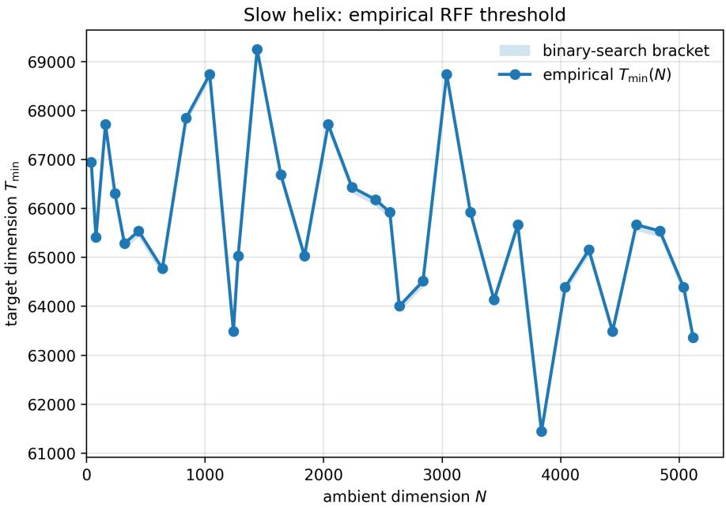
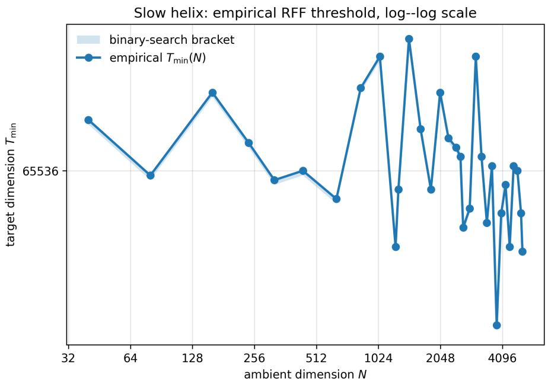
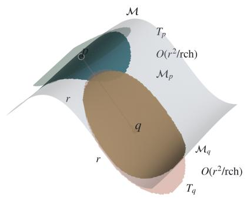
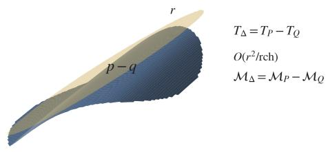

# Low-Dimensional Embeddings for Gaussian Kernels on Manifolds

Soumik Dutta\*

Kunal Dutta\*

September 15, 2026

## Abstract

The Gaussian kernel is a widely used similarity measure that captures nonlinear relationships in data. The Gaussian kernel function also gives rise to the Gaussian kernel distance, which has several applications in areas such as kernel PCA, spectral clustering, etc. However, many applications involve the computation of Gaussian kernel distances between a large number of pairs of data points, which can be computationally prohibitive. Using the Random Fourier Features sampling method of Rahimi and Recht [NeurIPS 2007], Chen and Phillips [ALT. 2017] proved that for points in a d-dimensional Euclidean ball in $\mathbb { R } ^ { N }$ , having radius-R, sampling $\begin{array} { r } { t = \Omega ( \frac { d } { { \varepsilon } ^ { 2 } } \log \frac { d R } { { \varepsilon } } ) } \end{array}$ random features suffice to preserve all pairwise Gaussian–kernel distances up to a $( 1 \pm \varepsilon )$ multiplicative factor with high probability. For the more general case when the data points are on an arbitrary submanifold $\mathcal { M } \subset \overline { { \mathbb { R } ^ { N } } }$ having positive reach, and with intrinsic dimensionality $d ,$ we establish the first uniform, relative-error embedding theorem for Gaussian kernel distances. We show that drawing

$$
\left. O \Big ( { \frac { d } { \varepsilon ^ { 2 } } } \log \big ( { \frac { \mathrm { v o l } ( M ) ^ { 2 } N ^ { 2 d } } { \mathrm { v o l } ( B _ { 1 } ^ { d } ( 0 ) ) ^ { 2 } \mathrm { r c h } ( M ) ^ { 2 d } \varepsilon ^ { 2 d + 1 } \delta } } \big ) \Big ) \right. \ \approx \ \left. O \Big ( { \frac { d ^ { 2 } } { \varepsilon ^ { 2 } } } \big ( \log N + \log { \frac { 1 } { \varepsilon \delta } } \big ) \right) ,
$$

Random Fourier Features are enough to guarantee, with probability $1 - \delta ,$ that the Gaussian kernel distance between each pair of points in the manifold, is preserved up to a relative error of ε. Thus, our bound depends only logarithmically on the ambient dimension and the manifold parameters such as volume and reach, while maintaining the optimal Euclidean rate of $1 / \varepsilon ^ { 2 }$ . Moreover, our analysis shows that the entire continuous geometry of any smooth manifold can be sketched faithfully, regardless of ambient curvature or embedding dimension.

We believe this has consequences for kernel PCA, spectral clustering, Laplacian eigenmaps, and topological data-analysis, and can enable pipelines to operate in $O ( n t )$ time and memory—independent of the ambient dimension N and of the sample size n—without sacrificing the manifold structure that these methods are designed to exploit.

In the case of topological data analysis, we prove that under the same RFF embedding, the persistent homology of the manifold is preserved: the weighted Cech and Rips filtrations built with Gaussian kernelˇ power distance are $( 1 \pm \varepsilon _ { \star } )$ -interleaved, where ε⋆ incorporates both distance distortion and kernel weight approximation.

Keywords: random Fourier features, manifold learning, kernel methods, dimensionality reduction, reach

## 1 Introduction

Kernels are fundamental similarity measures between pairs of points in an ambient space, and are extensively utilized in data analysis and machine learning for capturing nonlinear relationships among data points Mercer (1909); Schölkopf and Smola (2002). Some of the most popular types of kernels used in data analysis are

Gaussian and Laplace kernels, polynomial kernels, Dirichlet and other kernels.. A wide class of kernels induce inner products between pairs of data points in high-dimensional or infinite-dimensional feature spaces. For shift-invariant kernels, these inner products can be used to induce the notion of kernel distances in the usual way - an inner product gives rise to a norm, and the distance between a pair of points is the norm of the difference vector of the two points. For many applications such as clustering, dimensionality reduction, and manifold learning Hofmann, Schölkopf, and Smola (2008); Ghojogh, Ghodsi, Karray, and Crowley (2021), kernel distances are more natural to use than kernel inner products.

However, directly computing kernel inner products and distances in large datasets can be computationally prohibitive due to the complexity involved in high-dimensional computations. A popular solution is to approximate the kernel using low-dimensional Euclidean embeddings, significantly improving computational efficiency Liu, Huang, Chen, and Suykens (2021).

For a broad class of kernels, the Random Fourier Features (RFF) method of Rahimi and Recht Rahimi and Recht (2007) provides such embeddings by mapping data points into a lower-dimensional Euclidean space, approximating kernel inner products via standard dot products Rahimi and Recht (2007). Prior work Rahimi and Recht (2007); Sutherland and Schneider (2015) provides refined bounds for approximating kernel function values via RFFs, enabling scalable kernel ridge regression and SVMs. However, several applications in areas such as manifold learning Jayasumana, Hartley, Salzmann, Li, and Harandi (2015), kernel-based clustering Ghojogh, Ghodsi, Karray, and Crowley (2021) and topological data analysis Boissonnat and Dutta (2024) critically require the preservation of not only the kernel function values, but the kernel distances between pairs of points — a strictly stronger geometric requirement. This requirement was subsequently addressed by Chen and Phillips Chen and Phillips (2017), who showed that the RFF embedding also preserves pairwise Gaussian kernel distances up to a $( 1 \pm \varepsilon )$ -factor, provided the target dimension is at least $O \left( { \frac { \log n } { \varepsilon ^ { 2 } } } \right)$ where n is the number of data points and $\varepsilon \in ( 0 , 1 )$ is the target relative error.

For Euclidean distances, the celebrated result of Johnson and Lindenstrauss Johnson, Lindenstrauss, et al. (1984); Dasgupta and Gupta (2003) has led to a well-developed theory of low-dimensional embeddings using random projections. These ideas have found several applications in computer science such as hashing Indyk and Motwani (1998) or clustering Boutsidis, Zouzias, and Drineas (2010) high-dimensional data, highdimensional topological data analysis Lotz (2019), etc. In this context, an interesting line of research has been the investigation of the case when all data points share some property such as being on a lower-dimensional flat or manifold. This assumption, often referred to as the manifold hypothesis Fefferman, Mitter, and Narayanan (2016); Ma and Fu (2012), has been highly influential in Machine Learning, Artificial Intelligence and several related areas. Thus, Baraniuk and Wakin Baraniuk and Wakin (2009) showed that random projections preserve all pairwise distances between arbibtrary set of points on a manifold, i.e. the target dimension becomes independent of the number of points and the ambient dimension. These bounds were later improved and generalized by Clarkson Clarkson (2008) and Verma Verma (2011).

The emerging theory of low-dimensional embeddings for Gaussian and other kernels, initiated by Rahimi and Recht, parallels in some sense the development of the above random projection based ideas for Euclidean distances. While the underlying distance functions are quite different – Euclidean distances are inner products on finite-dimensional spaces and scale linearly, whereas kernel distances are often highly non-linear and involve inner products in infinite-dimensional spaces – some similarities exist. For instance given a relative error parameter ε, the required embedding dimension for Euclidean distances and Gaussian kernels is both $O ( \varepsilon ^ { - 2 } \log n )$ . Moreover, the low-dimensional embeddings for Euclidean distances and Gaussian kernels both involve sampling with random Gaussian vectors (though the Gaussian kernel embedding uses trigonometric functions of the random projections).

These unexpected similarities naturally raise some intriguing questions. For instance, just as the Johnson-Lindenstrauss bound on the embedding dimension can be improved when the points lie on a smooth submanifold, having a lower intrinsic dimension, could it be possible to improve the Chen-Phillips bound under similar conditions? More formally, we ask the following question.

Problem. Given points lying on a submanifold $\mathcal { M } \subset \mathbb { R } ^ { N }$ having intrinsic dimension d and a relative error parameter $\varepsilon \in ( 0 , 1 ]$ , is it possible to obtain a Euclidean embedding of the points in a space whose target dimension depends only on $d , \varepsilon$ and $\mathcal { M } ?$

A special case of this problem was already investigated by Chen and Phillips Chen and Phillips (2017), when the points lie inside the unit d-dimensional ball in $\dot { \mathbb { R } ^ { N } }$ . In this case their result implies that the target dimension only needed to be $\Omega \left( \frac { d } { \varepsilon ^ { 2 } } \right)$ , a bound independent of the number of points and the ambient dimension. For a general point set, it is possible to think of the smallest bounding ball for the data points and then apply the Chen-Phillips bound. However, these bounds could be very loose, as a manifold of low intrinsic dimensionality (e.g. a curve) could be embedded over all of $\mathbb { R } ^ { N }$ , so that the bounding ball would be full-dimensional in $\mathbb { R } ^ { \dot { N } }$ . Thus, it would be advantageous to obtain a bound on the target dimension, which does not depend on the dimensionality of the bounding ball.

In our main result, we address the general version of this question, and obtain nearly optimal bounds — we show that using RFFs, essentially

$$
O \left( { \frac { d ^ { 2 } \log N } { \varepsilon ^ { 2 } } } \right)
$$

dimensions suffice to obtain a Euclidean embedding which preserves all pairwise Gaussian kernel distances, up to a relative error of $( 1 \pm \varepsilon )$ . (Here the constant in the O-notation depends on the invariants of the manifold $\mathcal { M }$

Thus, in this paper, we provide uniform relative error bounds for kernel distance approximations over general manifolds using Random Fourier Features. We show that when the manifold’s reach is positive, the entire geometric structure induced by the Gaussian kernel can be approximated uniformly with high fidelity using RFF embeddings. Notably, our results indicate that the required embedding dimension t scales logarithmically with the ambient dimension N, facilitating efficient and high-fidelity applications of standard algorithms without necessitating computations of full kernel matrices.

Further, we also state and prove several algorithmic consequences for downstream applications of our low-dimensional embeddings, in areas such as (i) topological data analysis, (ii) kernel k-means clustering, (iii) kernel distance matching, (iv) kernel nearest neighbour search, and (v) kernel learning. In general, our algorithmic improvements result from replacing kernel computations by computations involving lowdimensional Euclidean distances.

## 1.1 Preliminaries and Related Work

Random Fourier Features were introduced in the seminal work of Rahimi and Recht Rahimi and Recht (2007) as a way to scale kernel methods by reducing the cost of kernel computations Rahimi and Recht (2007). For the Gaussian kernel, they approximate the kernel value between two points by a dot product in a lower-dimensional space. This has proved extremely useful in many settings, leading to extensive usage in Machine Learning (see, e.g., Li, Ton, Oglic, and Sejdinovic (2019)).

The Gaussian kernel is defined as

$$
\begin{array} { r } { K _ { \sigma } ( x , y ) = \exp \Bigl ( - \frac { \| x - y \| ^ { 2 } } { 2 \sigma ^ { 2 } } \Bigr ) , \quad x , y \in \mathbb { R } ^ { N } . } \end{array}\tag{1.1}
$$

By Mercer’s theorem Mercer (1909), $K _ { \sigma }$ can be expressed as an inner product $K _ { \sigma } ( x , y ) = \langle \psi ( x ) , \psi ( y ) \rangle _ { \mathcal { H } }$ in an infinite-dimensional reproducing kernel Hilbert space (RKHS) H, with an explicit but intractable feature map $\psi \colon \mathbb { R } ^ { N } \to \mathcal { H }$ Ghojogh, Ghodsi, Karray, and Crowley (2021). A kernel $K ( x , y )$ is said to be positive-definite, if for every finite set of points $\{ p _ { 1 } , \ldots , p _ { n } \} \in \mathbb { R } ^ { N }$ , (where N is finite), the matrix whose i, j-th entries are $K ( p _ { i } , p _ { j } )$ is positive definite. For positive-definite kernels, Bochner’s theorem implies the existence of a distribution over the feature space whose expected value at a pair of points is the kernel function evaluated at those points. The key observation of Rahimi and Recht Rahimi and Recht (2007) was that for shift-invariant kernels such as the Gaussian kernel, this expectation can be made explicit:

$$
K _ { \sigma } ( x , y ) = \mathbb { E } _ { \omega \sim \mathcal { N } ( 0 , \sigma ^ { - 2 } I _ { N } ) } [ \cos ( \langle \omega , x - y \rangle ) ] .\tag{1.2}
$$

Approximating this expectation by drawing t i.i.d. frequencies $\omega ^ { 1 } , \ldots , \omega ^ { t } \sim \mathcal { N } ( 0 , \sigma ^ { - 2 } I _ { N } )$ , and averaging, yields the finite-dimensional feature map

$$
\begin{array} { r } { \phi ( x ) = \frac { 1 } { \sqrt { t } } \big [ \cos \bigl ( \langle \omega ^ { 1 } , x \rangle \bigr ) , \sin \bigl ( \langle \omega ^ { 1 } , x \rangle \bigr ) , \ldots , \cos \bigl ( \langle \omega ^ { t } , x \rangle \bigr ) , \sin \bigl ( \langle \omega ^ { t } , x \rangle \bigr ) \big ] ^ { \top } \in \mathbb { R } ^ { 2 t } , } \end{array}\tag{1.3}
$$

so that $\hat { K } ( x , y ) = \langle \phi ( x ) , \phi ( y ) \rangle \approx K _ { \sigma } ( x , y )$

For positive-definite kernels, Mercer’s theorem also implies the existence of a kernel distance from the inner product given by the kernel function, i.e. the kernel distance between two points is the square of the inner product (the kernel function) of their difference vector with itself. Thus we can define

$$
D _ { K } ^ { 2 } ( x , y ) = D _ { K } ^ { 2 } ( x - y ) = 2 ( 1 - \exp { \left( - \| x - y \| _ { 2 } ^ { 2 } \right) } ) , \ x , y \in \mathbb { R } ^ { N } .
$$

While the kernel distance is not used as widely as the kernel-based similarity function, in several applications such as clustering, kernel distances are more important than kernel function values. There are related works that highlight connections between RFFs and such applications Gedon, Ribeiro, Wahlström, and Schön (2023). Chen and Phillips Chen and Phillips (2017) showed that RFF can preserve Gaussian kernel distances with relative error over a ball, specifically requiring dimensions $\begin{array} { r } { t = \Omega \stackrel { \bf \hat { \rho } } { \left( \frac { N } { \varepsilon ^ { 2 } } \log \left( \frac { N } { \varepsilon } \frac { r } { \delta } \right) \right) } } \end{array}$ to achieve uniform relative error bounds, where N is the ambient dimension of the bounding ball, r is the radius of that ball, $\varepsilon \in ( 0 , 1 )$ is the target relative error, and $\delta \in ( 0 , 1 )$ is the failure probability (the bound holds with probability at least $1 - \delta )$

Rahimi and Recht also demonstrated that the Gaussian kernel function is preserved up to additive error for points inside a bounded-radius ball around the origin Rahimi and Recht (2007), where the target dimension depends only the radius of the ball. However, their analyses do not extend efficiently to arbitrary manifolds.

In a different line of research, earlier work on embeddings based on the Johnson–Lindenstrauss lemma provides bounds for relative preservation of Euclidean distances, requiring projection dimensions of $O ( \log n / \varepsilon ^ { 2 } )$ for n points Johnson, Lindenstrauss, et al. (1984); Dasgupta and Gupta (2003). Yet these methods are inherently linear, making them unsuitable for directly handling nonlinear kernel distances.

In this context, Baraniuk and Wakin Baraniuk and Wakin (2009) established that random linear projections preserve pairwise distances on smooth manifolds with high probability, requiring a number of projections linear in the manifold’s intrinsic dimension, specifically $\begin{array} { r } { M = O \left( \frac { d \log \left( N V R _ { \mathrm { g e o } } \tau ^ { - 1 } \varepsilon ^ { - 1 } \right) \log \left( 1 / \delta \right) } { \varepsilon ^ { 2 } } \right) } \end{array}$ where M is number of projections, d is the intrinsic manifold dimension, N is ambient dimension, $V$ is manifold volume, $R _ { \mathrm { g e o } }$ is geodesic covering regularity, τ is the reach rch(M), δ is probability of failure. Similarly, Verma Verma (2011) proved that random projections preserve geodesic path lengths on manifolds with distortion bounded by $( 1 \pm \varepsilon )$ , independent of the ambient dimension. Clarkson Clarkson (2008) provided tighter bounds for random projections preserving manifold geometry, emphasizing the importance of extrinsic properties depending on embedding curvature such as total curvature and reach.

Other works have taken complementary directions. Tai Tai (2020) constructed small-sized coresets for Gaussian kernel density estimation, significantly reducing dataset size but without directly addressing uniform preservation of pairwise distances. Lotz Lotz (2019) demonstrated approximations of persistent homology for data structures of low complexity, showing that Gaussian width measures effectively guide projection dimension requirements. Cheng, Jiang, Wei, and Wei Cheng, Jiang, Wei, and Wei (2023) study relative-error preservation of kernel distance by RFF for general shift-invariant kernels: they prove that for wide kernel families—including standard Laplacian kernels—low feature dimension cannot yield small relative error, whereas for analytic shift-invariant kernels (in particular the Gaussian) RFF with poly $( \varepsilon ^ { - 1 } \log { n } )$ features achieves ε-relative error for all pairwise kernel distances among n points.

While Random Fourier Features (RFFs) primarily offer relative error guarantees, alternative methods like Phillips and Tai’s Gaussian Sketch Phillips and Tai (2020) provide provably superior almost relative error for kernel distance, alongside significantly improved, near-linear runtimes for applications. Avron et al. Avron, Kapralov, Musco, Musco, Velingker, and Zandieh (2017) also studied modified RFFs for kernel ridge regression, giving improved spectral approximation bounds and statistical guarantees.

In the topological domain, Lotz demonstrated that persistence modules can be preserved under random projections using Gaussian width complexity Lotz (2019), while Arya et al. proved interleaving guarantees for weighted filtrations by showing that simplex radii admit convex decompositions in preserved distances Arya, Boissonnat, Dutta, and Lotz (2021). Boissonnat and Dutta showed that RFF embeddings preserve the persistent homology of GKPD-based filtrations Boissonnat and Dutta (2024). Other complementary approaches include Tai’s coresets for kernel density estimation Tai (2020) and Kusano et al.’s use of RFF for vectorizing persistence diagrams Kusano, Fukumizu, and Hiraoka (2016), demonstrating the broad applicability of random features in topological data analysis.

Thus, prior literature spans various aspects of distance preservation under linear or kernelized embeddings. Yet, a unified, dimensionally efficient framework that achieves uniform relative error guarantees for Gaussian kernel distances on general manifolds has been lacking, motivating the current study. While these works establish important foundations, a unified framework that achieves both efficient dimensionality reduction and certified topological preservation on general manifolds has been lacking. Our work bridges this gap by providing intrinsic dimension bounds for kernel distance preservation while ensuring interleaving guarantees for the resulting persistent homology modules.

## 1.2 Our Contributions

Rahimi–Recht Rahimi and Recht (2007) show that $\begin{array} { r } { t = O \big ( \frac { d } { \varepsilon ^ { 2 } } \log \frac { \sigma \mathrm { { d i a m } } ( \mathcal { M } ) } { \varepsilon } \big ) } \end{array}$ random features make the inner–product estimate $\hat { K }$ additively ε–close to the true, shift-invariant kernel K uniformly over a compact set M. Chen–Phillips Chen and Phillips (2017) upgrade this to a relative $( 1 \pm \varepsilon )$ bound for Gaussian-kernel distances, but only for points lying in a ball of radius r, with $\begin{array} { r } { t = \Omega \big ( \frac { N } { \varepsilon ^ { 2 } } \log \frac { N r } { \varepsilon \delta } \big ) } \end{array}$ . Both results depend on the ambient diameter (or radius) and on the ambient dimension, and they do not exploit intrinsic geometry.

Our Theorem 1.1 removes the Chen–Phillips limitation, guaranteeing (1±2ε) preservation of all Gaussian kernel distances on any $C ^ { 2 }$ manifold M with positive reach. The resulting bound has effective intrinsicdimension dependence roughly $d ^ { 2 } / \varepsilon ^ { 2 }$ , up to the remaining logarithmic and geometric factors, while retaining only logarithmic dependence on the ambient dimension N. Our Theorem 1.5 removes the Rahimi–Recht limitation: the same feature dimension suffices for uniform additive ε-accuracy of kernel values on M, replacing the ambient-diameter dependence with intrinsic geometry.

We consider a compact, d–dimensional, $\mathcal { C } ^ { 2 }$ submanifold $\mathcal { M } \subset \mathbb { R } ^ { N }$ with positive reach rch $( \mathcal { M } ) > 0$ . The reach of a manifold—a classical regularity measure introduced by Federer Federer (1959)—quantifies the largest distance up to which each point in the ambient space has a unique nearest point on the manifold. We work with the Gaussian kernel $K _ { \sigma }$ of (1.1) and the RFF map ϕ: $\mathbb { R } ^ { N } \to { \bar { \mathbb { R } } } ^ { 2 t }$ of (1.3). As in the kernel-distance convention $D _ { K }$ above, write

$$
{ \cal D } _ { K _ { \sigma } } ( x , y ) ^ { 2 } : = K _ { \sigma } ( x , x ) + K _ { \sigma } ( y , y ) - 2 K _ { \sigma } ( x , y ) = 2 \big ( 1 - K _ { \sigma } ( x , y ) \big )
$$

for the associated Gaussian kernel distance at bandwidth σ. Below, $B _ { 1 } ^ { d } ( 0 ) \subset \mathbb { R } ^ { d }$ denotes the closed unit ball (radius 1, centered at the origin); see Section 3 for the general ball notation $B _ { r } ^ { d } ( p )$

Theorem 1.1 (Uniform kernel–distance preservation). Fix accuracy $\varepsilon \in ( 0 , \mathrm { r c h } ( \mathcal { M } ) / 2 )$ and confidence $\delta \in ( 0 , 1 )$ . If

$$
t = \Omega \Bigl ( { \frac { d } { \varepsilon ^ { 2 } } } \log \Bigl ( { \frac { \mathrm { v o l } ( \mathcal { M } ) ^ { 2 } N ^ { 2 d } } { \mathrm { v o l } ( B _ { 1 } ^ { d } ( 0 ) ) ^ { 2 } \mathrm { r c h } ( \mathcal { M } ) ^ { 2 d } \varepsilon ^ { 2 d + 1 } \delta } } \Bigr ) \Bigr ) ,\tag{1.4}
$$

then with probability at least $1 - \delta$ the RFF embedding satisfies

$$
( 1 - 2 \varepsilon ) D _ { K _ { \sigma } } ( p , q ) ^ { 2 } \ \leq \ \| \phi ( p ) - \phi ( q ) \| ^ { 2 } \ \leq \ ( 1 + 2 \varepsilon ) D _ { K _ { \sigma } } ( p , q ) ^ { 2 } , \qquad \forall p , q \in \mathcal { M } .
$$

Remark 1.2. Our contribution lies in reducing the target embedding dimension from a linear dependence on the ambient dimension N to the intrinsic manifold dimension d. One natural way to apply the result of Chen and Phillips Chen and Phillips (2017) to a manifold $\mathcal { M } \subset \mathbb { R } ^ { N }$ is to first embed M within a Euclidean ball of radius $r = \dim ( { \mathcal { M } } )$ , and then invoke their result over this enclosing ball. Their bound requires $\begin{array} { r } { t = \Omega \big ( \frac { N } { \varepsilon ^ { 2 } } \log \big ( \frac { N } { \varepsilon } \cdot \frac { r } { \delta } \big ) \big ) } \end{array}$ dimensions to obtain a $( 1 \pm \varepsilon )$ relative error approximation to Gaussian kernel distances.

In contrast, our Theorem 1.1 provides a uniform relative error bound directly over the manifold M, without relying on any ambient Euclidean ball. The sample complexity in our result depends on the intrinsic dimension $d ,$ the reach $\operatorname { r c h } ( \mathcal { M } )$ , and the intrinsic volume $\mathrm { v o l } ( \mathcal { M } )$ , with only logarithmic dependence on the ambient dimension N. Notably, our bound avoids any dependence on diam $( \mathcal { M } )$ , and the logarithmic ambient dependence yields a significant advantage in high dimensions.

Below, we give an example showing a case where our bound can be much better than that of Chen and Phillips.

Example [Slow Helix with Bounded Curvature in High Dimensions]: Let $N \in  { \mathbb { N } }$ be large. Define the 1D manifold $\mathcal { M } = \{ x ( s ) : s \in [ 0 , 2 \pi ] \}$ with $\begin{array} { r } { x ( s ) = \frac { 1 } { \sqrt { N } } \big ( \cos \frac { s } { N } , \sin \frac { s } { N } , \dots , \cos \frac { s } { 2 } , \sin \frac { s } { 2 } \big ) \in \mathbb { R } ^ { N } } \end{array}$ (the jth pair has frequency $j / N$ , ending at cos $( s / 2 ) , \sin ( s / 2 ) )$ . This defines a slow helix where the frequency of each harmonic decreases inversely with $N$ . Before we apply our result to this slow helix, let us first consider a few geometric properties of this slow helix.

Norm. We have $\begin{array} { r } { \| \ b { x } ( s ) \| ^ { 2 } = \frac { 1 } { N } \sum _ { j = 1 } ^ { N / 2 } \bigl ( \cos ^ { 2 } \bigl ( \frac { j s } { N } \bigr ) + \sin ^ { 2 } \bigl ( \frac { j s } { N } \bigr ) \bigr ) = \frac { 1 } { 2 } } \end{array}$ , hence $\mathcal { M } \subset B _ { 2 } ^ { N } ( 0 )$ and $d = 1$

Reach. For each $j ,$ , the scaled pair $\left( N ^ { - 1 / 2 } \cos ( j s / N ) , N ^ { - 1 / 2 } \sin ( j s / N ) \right)$ has coordinatewise second derivatives of magnitude $j ^ { 2 } / N ^ { 5 / 2 }$ , so $\textstyle \| { \ddot { x } } ( s ) \| ^ { 2 } = \sum _ { i = 1 } ^ { N / 2 } j ^ { 4 } / N ^ { 5 }$ . Since $\begin{array} { r } { \sum _ { j = 1 } ^ { N / 2 } j ^ { 4 } \sim \frac { 1 } { 5 } ( N / 2 ) ^ { 5 } = \Theta ( N ^ { 5 } ) } \end{array}$ , this gives $\| \ddot { x } ( s ) \| = \Theta ( 1 )$ and therefore rch $( \mathcal { M } ) = \Omega ( 1 )$ in N.

Volume. Each (cos, sin) block contributes $j ^ { 2 } / N ^ { 3 }$ to $\begin{array} { r } { \| \dot { { \boldsymbol { x } } } ( s ) \| ^ { 2 } , { \bf s o } \| \dot { x } ( s ) \| ^ { 2 } = \sum _ { j = 1 } ^ { N / 2 } j ^ { 2 } / N ^ { 3 } } \end{array}$ is independent of $s ,$ and $\begin{array} { r } { \| \dot { x } ( s ) \| = N ^ { - 3 / 2 } \sqrt { \sum _ { j = 1 } ^ { N / 2 } j ^ { 2 } } = \frac { 1 } { \sqrt { N } } \sqrt { \sum _ { j = 1 } ^ { N / 2 } ( j / N ) ^ { 2 } } } \end{array}$ . Since $\begin{array} { r } { \sum _ { j = 1 } ^ { N / 2 } j ^ { 2 } \sim \frac { 1 } { 3 } ( N / 2 ) ^ { 3 } = \Theta ( N ^ { 3 } ) } \end{array}$ , we obtain $\| \dot { \boldsymbol { x } } ( s ) \| = \Theta ( 1 )$ and $\begin{array} { r } { \mathrm { V o l } ( \mathcal { M } ) = \int _ { 0 } ^ { 2 \pi } \| \dot { x } ( s ) \| d s = 2 \pi \| \dot { x } ( 0 ) \| = \Theta ( 1 ) } \end{array}$

Note that the slow helix is genuinely N-dimensional: there is no nonzero $a \in \mathbb { R } ^ { N }$ with $a \cdot x ( s ) = 0$ for every $s \in [ 0 , 2 \pi ]$ . Equivalently, the curve is not contained in any hyperplane through the origin, so its linear span in $\mathbb { R } ^ { N }$ is all of $\mathbb { R } ^ { N }$

For $j = 1 , \ldots , N / 2$ , write $\begin{array} { r } { u _ { j } ( s ) : = \frac { 1 } { \sqrt { N } } \cos ( j s / N ) } \end{array}$ and $\begin{array} { r } { v _ { j } ( s ) : = \frac { 1 } { \sqrt { N } } \sin ( j s / N ) } \end{array}$ ; these have pairwise distinct frequencies $j / N$ . Regarded as elements of $L ^ { 2 } ( [ 0 , 2 \pi ] )$ with the usual inner product $\langle f , g \rangle : =$ $\textstyle \int _ { 0 } ^ { 2 \pi } f ( s ) g ( s )$ ds, the family $\{ u _ { j } , v _ { j } \} _ { j = 1 } ^ { N / 2 }$ is linearly independent; hence no nontrivial linear combination $\textstyle \sum _ { \ell = 1 } ^ { N } a _ { \ell } x _ { \ell } ( s )$ vanishes identically on $[ 0 , 2 \pi ]$

Consequently, M cannot lie in a ball in any strictly lower-dimensional linear subspace of $\mathbb { R } ^ { N }$

We are now in a position to compare the two guarantees on this helix. Theorem 1.1 applies directly to M with its intrinsic reach and volume. The Chen–Phillips bound, by contrast, is stated for points in a Euclidean ball in RN ; since $\mathcal { M } \subset B _ { 2 } ^ { N } ( 0 )$ , invoking it requires enlarging to that full unit ball, where their analysis yields $\begin{array} { r } { t _ { \mathrm { C P } } = \Omega \left( \frac { N } { \varepsilon ^ { 2 } } \log \left( \frac { N } { \varepsilon \delta } \right) \right) } \end{array}$ feature dimensions, whereas on M alone, Theorem 1.1 needs only $\begin{array} { r } { t = \Omega \big ( \frac { 1 } { \varepsilon ^ { 2 } } \operatorname* { l o g } \bigl ( \frac { \bar { N } } { \varepsilon ^ { 3 } \delta } \bigr ) \big ) } \end{array}$ .

This example shows a setting where both methods operate within a unit ball, yet the Chen–Phillips bound incurs a full linear cost in the ambient dimension N, while our intrinsic RFF approach maintains efficient scaling.

Remark 1.3. It should be noted that the logarithmic term in our bound hides factors exponential in d. Thus, the target dimension should be interpreted as $O ( d ^ { 2 } / \varepsilon ^ { 2 } )$ . We emphasize that the non-linearity in d is offset by the reduction in dependence on the ambient dimension N, from linear to logarithmic.

Remark 1.4. Cheng et al. Cheng, Jiang, Wei, and Wei (2023) suggest that there may be a gap in the Chen– Phillips Chen and Phillips (2017) proof of the relative-error bound for Gaussian kernel distances on a ball, specifically in Lemma 5 of that paper.

In our proof of Theorem 1.1, we use a version of the concentration inequality of Chen and Phillips, however it is nevertheless a special case of a stronger inequality due to Boissonnat and Dutta Boissonnat and Dutta (2024) (Lemma 8(2)) (see also the full version Boissonnat and Dutta (2023)). In particular, taking S in their lemma to consist of a single column vector (the difference vector between two points), together with the trivial bound $r _ { \mathrm { s t } } \geq 1$ , recovers the Chen–Phillips concentration bound. We provide a proof of the lemma of Boissonnat and Dutta (2024), restricted to our case of interest, in the Appendix.

Uniform additive approximation of kernel values. Besides relative control of kernel distances, many applications require uniform additive accuracy for the Gaussian kernel values $K _ { \sigma } ( p , q )$ under the RFF estimator $\widehat { K }$ . A short sketch of the idea appears at the end of the proof overview (Section 1.3); Section 8 develops the lemmas and ends with the complete proof.

Theorem 1.5 (Uniform additive error bound for kernel values). Fix $\varepsilon < \mathrm { r c h } ( \mathcal { M } ) / 2$ and $\delta \in ( 0 , 1 )$ . If

$$
t ~ = ~ \Omega \Bigl ( { \frac { d } { \varepsilon ^ { 2 } } } ~ \log \Bigl ( { \frac { \mathrm { v o l } ( \mathcal { M } ) ^ { 2 } N ^ { 2 d } } { \mathrm { v o l } ( B _ { 1 } ^ { d } ( 0 ) ) ^ { 2 } \mathrm { r c h } ( \mathcal { M } ) ^ { 2 d } \varepsilon ^ { 2 d + 1 } \delta } } \Bigr ) \Bigr ) ,
$$

then with probability at least $1 - \delta ,$

$$
\operatorname* { s u p } _ { p , q \in \mathcal { M } } \left| K _ { \sigma } ( p , q ) - \widehat { K } ( p , q ) \right| \ \leq \ \varepsilon .
$$

Equation (1.4) shows that the required feature dimension is $t = \Theta ( \varepsilon ^ { - 2 } )$ up to a logarithmic factor that depends on intrinsic geometry $( \operatorname { v o l } ( \mathcal { M } ) , \operatorname { r c h } ( \mathcal { M } ) )$ and the ambient dimension N. This is similar to the case of random linear projection Baraniuk and Wakin (2009). The leading $1 / \varepsilon ^ { 2 }$ term matches the optimal Euclidean RFF rate; reach (curvature) appears only in the logarithmic factor.

Preserving persistent homology. Beyond kernel distances and values, many downstream pipelines depend on the persistent homology of a kernel-weighted filtration built from the data; our embedding preserves this structure as well, up to a controlled multiplicative distortion.

For a finite point set $P \subset { \mathcal { M } }$ , define the kernel weight of $p \in P$ by

$$
w ( p ) : = - \left( { \frac { 1 } { | { \cal P } | } } \sum _ { y \in { \cal P } } D _ { K _ { \sigma } } ^ { 2 } ( p , y ) - { \frac { 1 } { 2 | { \cal P } | ^ { 2 } } } \sum _ { x , y \in { \cal P } } D _ { K _ { \sigma } } ^ { 2 } ( x , y ) \right) ,
$$

and write $\widehat { P } : = \{ ( p , w ( p ) ) : p \in P \}$ for P equipped with these weights. The induced Gaussian kernel power distance between weighted points is $D _ { K _ { \sigma } } ^ { 2 } ( \widehat { p } , \widehat { q } ) : = D _ { K _ { \sigma } } ^ { 2 } ( p , q ) - w ( p ) - w ( q )$ Phillips, Wang, and

Zheng (2015); Boissonnat and Dutta (2024). The weighted Cechfiltrationˇ $\check { C } _ { \alpha } ( \widehat { P } )$ includes a simplex once its minimal enclosing radius under this power distance is at most $\alpha ,$ and the weighted Ripsfiltration $V R _ { \alpha } ( \widehat { P } )$ includes a simplex once every pairwise power distance within it is at most α; see Section 3 for the formal definitions. Two filtrations $\{ F _ { \alpha } \}$ and $\{ G _ { \alpha } \}$ are $( 1 \pm \varepsilon )$ -interleaved if $F _ { \alpha } \subseteq G _ { ( 1 + \varepsilon ) \alpha } \subseteq F _ { ( 1 + \varepsilon ) ^ { 2 } \alpha }$ for every $\alpha \geq 0$ (and symmetrically); by the persistence Stability Theorem (Section 3.4) this bounds the bottleneck distance between the corresponding persistence diagrams.

Theorem 1.6 (Weighted $\check { \mathrm { C e c h } } / \mathrm { R i p s }$ interleaving on manifolds). Under the same setting as Theorem $I . I ,$ let $P \subset \mathcal { M }$ be a finite sample of n points. Define the kernel centroid $\begin{array} { r } { \mu _ { P } : = \frac { 1 } { | P | } \sum _ { y \in P } \phi ( y ) } \end{array}$ , the constant $\begin{array} { r } { c _ { P } : = \ \frac { 2 } { ( 1 - \| \mu _ { P } \| ) ^ { 2 } } } \end{array}$ , and $\varepsilon _ { \star } : = \operatorname* { m a x } \{ 2 \varepsilon , \varepsilon c _ { P } \}$ . Then, with probability at least $1 - \delta ,$ , the weighted Cech filtrationsˇ $\check { C } _ { \alpha } ( \widehat { P } )$ and $\check { C } _ { \alpha } \big ( \phi ( P ) \big )$ built with the Gaussian kernel power distance $D _ { K _ { o } }$ are $( 1 \pm \varepsilon _ { \star } )$ –interleaved. Consequently, the corresponding weighted Rips filtrations $V R _ { \alpha } ( \widehat { P } )$ and $V R _ { \alpha } { \big ( } \phi ( P ) { \big ) }$ are also $( 1 \pm \varepsilon _ { \star } )$ –interleaved. (Full proof: Theorem 7.1.)

This topological guarantee extends the point cloud results of Boissonnat and Dutta (2024) to the manifold setting. The key technical innovation lies in establishing relative approximation bounds for kernel weights defined through RKHS centroids, ensuring that the weighted simplex structure—and consequently the persistent homology—remains stable under projection.

Remark 1.7 (On the centroid constant $c _ { P } )$ . The constant $\begin{array} { r } { c _ { P } = \frac { 2 } { ( 1 - \| \mu _ { P } \| ) ^ { 2 } } } \end{array}$ is strictly positive since $\| \mu _ { P } \| < 1$ for any non-degenerate finite set $P _ { - }$ . Moreover, using Lemma 7.2, one can lower bound $( 1 - \Vert \mu _ { P } \Vert ) ^ { 2 }$ by

$$
( 1 - \| \mu _ { P } \| ) ^ { 2 } \geq \left( \Big ( 1 - e ^ { - r ^ { 2 } / 2 } \Big ) \frac { \mathbb { E } \big [ \| x - y \| ^ { 2 } \big ] } { r ^ { 2 } } \right) ^ { 2 } \Big / 4 ,
$$

where $r = \mathrm { d i a m } ( \mathrm { s u p p } P )$ . Hence, $c _ { P }$ is not only finite but bounded above by the reciprocal of this term. This bound, however, is not sharp—empirically, $\| \mu _ { P } \|$ tends to be small for well-spread data, so the actual value of $c _ { P }$ is often considerably lower than this theoretical upper bound.

## 1.3 Proof Ideas

In the following, we shall assume unit bandwidth $( \sigma = 1 )$ for simplicity. For a general bandwidth $\sigma > 0$ observe that both the Gaussian kernel and the Random Fourier Feature approximation are invariant under the rescaling $x \mapsto x / \sigma ;$

$$
K _ { \sigma } ( x , y ) = \exp \left( - \frac { \| x - y \| ^ { 2 } } { 2 \sigma ^ { 2 } } \right) = K \left( \frac { x } { \sigma } , \frac { y } { \sigma } \right) .
$$

Similarly, the RFF approximation using $\omega \sim { \mathcal { N } } ( 0 , \sigma ^ { - 2 } I _ { N } )$ is equivalent to using $\omega ^ { \prime } \sim \mathcal { N } ( 0 , I _ { N } )$ on the manifold rescaled by a factor of $1 / \sigma$ . Thus in order to obtain our full theorems, it is sufficient to consider the case of Gaussian kernels having unit bandwidth.

Our goal is Theorem 1.1: a uniform error bound on the ratio of the RFF distance between pairs of embedded points and their kernel distances in the original space, i.e. $D _ { \hat { K } } ^ { 2 } ( x - y ) / D _ { K _ { \sigma } } ^ { 2 } ( x - y )$ for all pairs of points $x , y \in { \mathcal { M } }$ , where $\mathcal { M } \subset \mathbb { R } ^ { N }$ is a compact d-dimensional $\mathcal { C } ^ { 2 }$ submanifold with reach rch $( \mathcal { M } )$

Let us denote by $\widehat { \mathcal { M } } : = \mathcal { M } - \mathcal { M } = \{ y - z : y , z \in \mathcal { M } \}$ , the set of all pairwise separations. Since Gaussian kernel distances are shift-invariant – every comparison between $y , z \in { \mathcal { M } }$ depends only on the chord $\Delta = y - z ,$ , so bounding the ratio $R = R ( \Delta ) : = \bar { D _ { \hat { K } } ^ { 2 } } ( \Delta ) / D _ { K _ { \sigma } } ^ { 2 } ( \Delta )$ , pointwise and uniformly over $\Delta \in { \widehat { \mathcal { M } } }$ , is precisely the statement that all kernel distances on $\mathcal { M }$ are preserved simultaneously.

As is typical in proofs of this type (see e.g. Baraniuk and Wakin (2009); Rahimi and Recht (2007)), the initial framework of our proof is via a net argument – (i) constructing an appropriately fine net over the manifold, (ii) showing that kernel distances between all pairs of points from the net are preserved by the RFF embedding (using a union bound over pairs of points from the net), and (iii) extending this distance preservation to small neighbourhoods of the net points via a Lipschitz continuity argument, via an upper bound on the magnitude of the gradient of the ratio $R ( \Delta )$ . Observe that a crucial aspect of our analysis is always to work using local tangent-plane approximations (around each point in the net), rather than using Euclidean balls or higher-order differential geometry. Subsequently we lift the error bounds obtained in the tangent planes to a small neighbourhood around the net-points. This allows us to use the intrinsic dimension of the manifold, as the tangent planes are affine spaces having the intrinsic dimension rather than the ambient one.

However, an attempt to implement this basic approach encounters some major obstacles, which are conceptual as well as technical. Handling these requires several technical and some conceptual innovations, which we regard as our main technical contribution.

Firstly, $\widehat { \mathcal { M } }$ always contains the origin (i.e. corresponding to points $y \in { \mathcal { M } }$ , giving $\Delta = y - y = 0 \in \widehat { \mathcal { M } } )$ where the ratio R approaches $0 / 0 .$ , since both the kernel distance as well as the RFF distance approach zero as $\Delta$ goes to zero. Moreover, the two distances approach zero at different speeds, which, in the limit, causes the gradient to blow up around zero. A possible approach to address this issue could be to use the Chen-Phillips result, bounding the relative error of all pairwise distances in a small ball around the origin. However this would force the target dimension to depend linearly on the ambient dimension.

We therefore take a different tack – using the notion of relative Lipschitz continuity. We show that the RFF distances when normalized by the kernel distance, as well as by the magnitude of the original position vectors, is bound with high probability. This is sufficient to compare a true separation $\Delta \in { \widehat { M } }$ to its projection on to the tangent plane, and requires only a logarithmic dependence on the ambient dimension.

Next, although the manifold has bounded reach, its tangent spaces may rotate arbitrarily as one moves along the manifold; in particular, the manifold may twist in arbitrary directions. Consequently, a direct Lipschitz – or even relative Lipschitz – argument would require controlling the approximation error in every ambient direction. Such an approach inevitably incurs a dependence on the ambient dimension N, since the analysis must account for all possible directions in which the tangent plane may rotate, thereby negating our previous attempts to eliminate ambient-dimensional dependence.

Instead, we exploit the defining geometric consequence of bounded reach: locally, the manifold departs from its tangent plane only quadratically. More precisely, if a tangent disk has diameter ε, then the corresponding manifold patch remains within $O ( \varepsilon ^ { 2 } )$ of that disk. Combining this quadratic deviation with the relative Lipschitz property and an appropriately constructed net on the tangent disk allows us to transfer estimates from the tangent plane to the manifold without paying a linear penalty in the ambient dimension. This is the key geometric insight that enables us to remove the dependence on $N$

Finally, in general, $\widehat { \mathcal { M } }$ is not a smooth manifold (it can be a stratified set), so there is no global tangent bundle or chart in which to run the linear analysis. To handle this, we avoid covering $\widehat { \mathcal { M } }$ directly. Instead, Section 6 shows, using only the reach of M, that if $U , V \subset { \mathcal { M } }$ are two small intrinsic neighborhoods about net points $y , z \in { \mathcal { M } }$ , then the ambient set of chord vectors $\{ u - v : u \in U , \ v \in V \}$ lies near the affine space of tangent differences $T _ { y } \mathcal { M } - T _ { z } \mathcal { M }$ (Lemma 6.4). That affine model has dimension at most 2d and is described by intrinsic data we control. The reach rch(M) enters crucially here: it bounds how far this set difference of intrinsic neighborhoods may deviate from the flat tangent-difference model. Once such reach-controlled proximity is in hand, one combines the relative Lipschitz–type property for R (Lemma 5.3) to propagate uniform ratio bounds from $T _ { y } \mathcal { M } - T _ { z } \mathcal { M }$ back to the intrinsic neighborhoods, and a union bound over the finitely many neighborhood pairs completes the global theorem.

## 1.4 Applications

Random Fourier Features (RFF), introduced in Rahimi and Recht (2007), approximate shift-invariant kernels by an explicit finite-dimensional map so that inner products in the feature space estimate kernel values; see Liu, Huang, Chen, and Suykens (2021); Hofmann, Schölkopf, and Smola (2008) for surveys of kernel methods and random-feature approximations. For Gaussian kernels, Chen and Phillips (2017) showed that RFFs can preserve Gaussian kernel distances with relative error, which is the relevant geometric quantity in many kernel-based pipelines.

Our contribution is that, when the input is supported on a compact low-dimensional manifold, the required number of random features is controlled by the intrinsic geometry of the manifold rather than by the size of the data set or by an ambient Euclidean ball. Thus any RFF-based pipeline whose analysis reduces to preserving Gaussian kernel distances or kernel values may use the manifold embedding of Theorems 1.1 and 1.5. The formal statements and the corresponding approximation and complexity calculations are deferred to Appendix 9.

Kernel k-means clustering. Kernel k-means maps the data to an RKHS and performs Euclidean k-means there using feature-space centroids Girolami (2002); Dhillon, Guan, and Kulis (2004). RFFs replace the implicit RKHS representation by explicit Euclidean vectors, making standard Euclidean clustering tools applicable. Under the manifold hypothesis, our theorem gives the same type of kernel-distance preservation using an intrinsic feature count. The formal cost-preservation statement and the approximation-transfer calculation are given in Appendix 9.1.

## Corollary 1.8. Let

$$
P = \{ p _ { 1 } , \dots , p _ { n } \} \subset \mathcal { M } \subset \mathbb { R } ^ { N } ,
$$

where M is a compact d-dimensional $C ^ { 2 }$ submanifold with positive reach. Let $K _ { \sigma }$ be the Gaussian kernel, let $\Psi : \mathcal { M }  \mathcal { H } _ { K _ { \sigma } }$ be its RKHS feature map, and let $\phi : \mathbb { R } ^ { N } \to \mathbb { R } ^ { 2 t }$ be the RFF map from Theorem 1.1. Assume that

$$
t \ \geq \ C { \frac { d } { \varepsilon ^ { 2 } } } \log \left( { \frac { \operatorname { v o l } ( { \mathcal { M } } ) ^ { 2 } N ^ { 2 d } } { \operatorname { v o l } ( B _ { 1 } ^ { d } ( 0 ) ) ^ { 2 } \operatorname { r c h } ( { \mathcal { M } } ) ^ { 2 d } \varepsilon ^ { 2 d + 1 } \delta } } \right)
$$

for the constant C in Theorem 1.1. Then, with probability at least $1 - \delta ,$ the following holds simultaneously for every partition $\Pi = \{ C _ { 1 } , \ldots , C _ { k } \}$ of P:

$$
( 1 - 2 \varepsilon ) \mathrm { c o s t } _ { K _ { \sigma } } ( \Pi ) \ \leq \ \mathrm { c o s t } _ { \phi } ( \Pi ) \ \leq \ ( 1 + 2 \varepsilon ) \mathrm { c o s t } _ { K _ { \sigma } } ( \Pi ) ,
$$

where

$$
\mathrm { c o s t } _ { K _ { \sigma } } ( \Pi ) : = \sum _ { j = 1 } ^ { k } \sum _ { p \in C _ { j } } \| \Psi ( p ) - \mu _ { j } \| _ { \mathcal { H } _ { K _ { \sigma } } } ^ { 2 } , \qquad \mu _ { j } : = \frac { 1 } { | C _ { j } | } \sum _ { q \in C _ { j } } \Psi ( q ) ,
$$

and

$$
\mathrm { c o s t } _ { \phi } ( \Pi ) : = \sum _ { j = 1 } ^ { k } \sum _ { p \in C _ { j } } \| \phi ( p ) - \widehat { \mu } _ { j } \| _ { 2 } ^ { 2 } , \qquad \widehat { \mu } _ { j } : = \frac { 1 } { | C _ { j } | } \sum _ { q \in C _ { j } } \phi ( q ) .
$$

Hence, if a Euclidean clustering algorithm applied to $\phi ( P ) \subset \mathbb { R } ^ { 2 t }$ returns a partition Πb satisfying

$$
\mathrm { c o s t } _ { \phi } ( \widehat { \Pi } ) \leq \rho \operatorname* { m i n } _ { \Pi } \mathrm { c o s t } _ { \phi } ( \Pi ) ,
$$

then the same partition satisfies

$$
\mathrm { c o s t } _ { K _ { \sigma } } ( \widehat { \Pi } ) \leq \rho \frac { 1 + 2 \varepsilon } { 1 - 2 \varepsilon } \operatorname* { m i n } _ { \Pi } \mathrm { c o s t } _ { K _ { \sigma } } ( \Pi ) .
$$

Here $\rho \geq 1$ denotes the approximationfactor ofthe Euclidean clustering algorithm applied to the embedded point set $\phi ( P ) ,$ ; that is, the algorithm returns a partition whose RFF-space k-means cost is at most $\rho$ times the optimal RFF-space k-means cost.

Topological inference. The Gaussian kernel power distance introduced in Phillips, Wang, and Zheng (2015) expresses geometric inference on kernel density estimates through weighted power distances; its sublevel sets are stable under $W _ { 2 }$ perturbations of the measure and Lipschitz in the bandwidth $\sigma .$ . Boissonnat and Dutta (2024) showed that an RFF embedding into $\mathbb { R } ^ { 2 t }$ with $t = O ( \varepsilon ^ { - 2 } \log n )$ yields a weighted Cechˇ filtration that is interleaved with the GKPD filtration in the original space under a stable-rank condition. We prove the manifold version of this guarantee, Theorem 1.6 (weighted Cech/Rips interleaving), as one of ourˇ main contributions in Section 1.2. For kernel-distance coresets, near-linear-size summaries exist Tai (2020); Phillips (2013), and RFF makes querying them practical in high ambient dimension. Kusano, Fukumizu, and Hiraoka (2016) combine RFF with persistence-weighted Gaussian kernels to vectorize persistence diagrams for standard kernel classifiers.

In some applications one may simply restrict attention to those data points whose kernel-power weights (see e.g. Boissonnat and Dutta (2024)) stay uniformly bounded away from zero. For such cases, filtrations built from Gaussian kernel weights enjoy the same (1±ε) stability after projection. Persistent homology of n points can therefore be computed faster.

Kernel distance matching. Kernel distances are used to compare distributions, point clouds, shapes, and medical images through RKHS mean embeddings Smola, Gretton, Song, and Schölkopf (2007); Gretton, Borgwardt, Rasch, Schölkopf, and Smola (2012); Glaunès and Joshi (2006); Durrleman, Pennec, Trouvé, and Ayache (2007); Joshi et al. (2011). When the task is to recover a pointwise alignment, one may instead solve a matching problem with pairwise kernel-distance costs. RFFs reduce this to Euclidean geometric matching, and our manifold theorem gives the corresponding intrinsic-dimensional version. The reduction and approximation guarantee are stated in Appendix 9.2.

Corollary 1.9. Assume that the RFF map $\phi$ satisfies

$$
( 1 - 2 \varepsilon ) D _ { K _ { \sigma } } ( p , q ) ^ { 2 } \leq \| \phi ( p ) - \phi ( q ) \| _ { 2 } ^ { 2 } \leq ( 1 + 2 \varepsilon ) D _ { K _ { \sigma } } ( p , q ) ^ { 2 }
$$

for all $p , q \in { \mathcal { M } } .$ . Then,for every matching $\pi \in S _ { n }$

$$
( 1 - 2 \varepsilon ) C _ { K _ { \sigma } } ( \pi ) \le C _ { \phi } ( \pi ) \le ( 1 + 2 \varepsilon ) C _ { K _ { \sigma } } ( \pi ) .
$$

Consequently, if a Euclidean matching algorithm applied to $\phi ( X ) , \phi ( Y ) \subset \mathbb { R } ^ { m }$ has approximation factor $\rho \geq 1$ , meaning that it returns a permutation $\widehat { \pi }$ satisfying

$$
C _ { \phi } ( \widehat \pi ) \leq \rho \operatorname* { m i n } _ { \pi \in S _ { n } } C _ { \phi } ( \pi ) ,
$$

then the same matching satisfies

$$
C _ { K _ { \sigma } } ( \widehat \pi ) \leq \rho \frac { 1 + 2 \varepsilon } { 1 - 2 \varepsilon } \operatorname* { m i n } _ { \pi \in S _ { n } } C _ { K _ { \sigma } } ( \pi ) .
$$

Thus, any ρ-approximate Euclidean matching algorithm applied after the manifold RFF embedding yields a

$$
\rho \frac { 1 + 2 \varepsilon } { 1 - 2 \varepsilon } = \rho ( 1 + O ( \varepsilon ) )
$$

approximation to the original Gaussian-kernel matching problem.

Kernel nearest-neighbor search. For the Gaussian kernel, nearest-neighbor search under the kernel distance is equivalent to maximum Gaussian similarity search. Since our embedding preserves Gaussian kernel distances on the manifold, standard Euclidean nearest-neighbor data structures may be applied after the RFF map. The precise statement is given in Appendix 9.3.

Corollary 1.10. Let $P \subset \mathcal { M } \subset \mathbb { R } ^ { N }$ and $q \in { \mathcal { M } }$ , where M is a compact d-dimensional $C ^ { 2 }$ submanifold with positive reach. Let $\phi : \mathbb { R } ^ { N } \to \mathbb { R } ^ { 2 t }$ be the RFF map from Theorem 1.1 with t satisfying the bound in that theorem. Then, with probability at least $1 - \delta ,$

$$
\begin{array} { r } { ( 1 - 2 \varepsilon ) D _ { K _ { \sigma } } ( p , q ) ^ { 2 } \leq \| \phi ( p ) - \phi ( q ) \| _ { 2 } ^ { 2 } \leq ( 1 + 2 \varepsilon ) D _ { K _ { \sigma } } ( p , q ) ^ { 2 } \qquad f o r a l l p , q \in \mathcal { M } . } \end{array}
$$

Consequently, if

$$
\widehat { p } = \arg \operatorname* { m i n } _ { p \in P } \| \phi ( p ) - \phi ( q ) \| _ { 2 }
$$

is the Euclidean nearest neighbor of $\dot { \phi } ( q )$ in $\phi ( P )$ , then

$$
D _ { K _ { \sigma } } ( \widehat { p } , q ) \leq \sqrt { \frac { 1 + 2 \varepsilon } { 1 - 2 \varepsilon } } \operatorname * { m i n } _ { p \in P } D _ { K _ { \sigma } } ( p , q ) = ( 1 + O ( \varepsilon ) ) \operatorname * { m i n } _ { p \in P } D _ { K _ { \sigma } } ( p , q ) .
$$

Thus Euclidean nearest-neighbor search on $\phi ( P ) \subset \mathbb { R } ^ { 2 t }$ yields a $( 1 + O ( \varepsilon ) )$ )-approximate nearest neighbor with respect to the original Gaussian kernel distance, with the feature dimension controlled by the intrinsic geometry ofM rather than by the ambient dimension N.

Kernel SVM. For kernel SVMs, the margin is a distance-to-boundary quantity in the RKHS. Since our embedding preserves RKHS distances on $\mathcal { M } ,$ , it preserves the large-margin geometry up to $1 \pm O ( \varepsilon )$ . Thus the kernel SVM can be replaced by a linear SVM in $\mathbb { R } ^ { t }$ , reducing Gram-matrix storage $O ( n ^ { 2 } )$ to feature storage $O ( n t )$ , and replacing kernel-SVM optimization by linear-SVM optimization on the random features.

## 1.5 Roadmap

The remainder of the paper is organized as follows. Section 2 gives a brief empirical illustration of the random-feature construction. Section 3 collects background on kernel distances and random Fourier features, the Gaussian kernel power distance, persistent homology and interleaving, and the manifold regularity assumptions used throughout. Section 4 presents the local strategy for the squared-distance ratio $R ( \Delta )$ pointwise concentration, gradient control, and uniform bounds on Euclidean patches. Section 5 develops the relative Lipschitz-type estimates for R needed near degeneracies. Section 6 lifts these local bounds to chord differences on M via intrinsic nets and reach, completing the proof of Theorem 1.1. Section 7 gives the complete proof of Theorem 1.6 (stated above as one of our main contributions in Section 1.2), transferring the kernel-distance guarantees to weighted Cech and Rips filtrations in the GKPD setting. Sectionˇ 8 turns to uniform additive approximation of Gaussian kernel values on M and proves Theorem 1.5. Section 9 spells out the further application corollaries previewed in Section 1.4: kernel k-means clustering, kernel-distance matching, and kernel nearest-neighbor search, together with the Maximum Mean Discrepancy preservation result of Section 9.4. Appendix A proves the concentration inequality of Boissonnat and Dutta (2024) invoked in the proof of Theorem 1.1 (Section 1.3).

## 2 Numerical experiment: ambient dimension versus RFF dimension

The purpose of this experiment is not to compare the numerical constants in the estimate of Chen and Phillips (2017) with the constants in Theorem 1.1. The constants in both bounds are conservative and are not expected to predict practical feature counts. Instead, the experiment is designed to test the qualitative dependence on the ambient dimension. The bound in Chen and Phillips (2017) gives a relative Gaussian-kernel-distance guarantee whose required number of random features contains an ambient-dimensional factor, schematically of the form

$$
T \gtrsim \frac { N } { \varepsilon ^ { 2 } } \log \left( \frac { N r } { \varepsilon \delta } \right) ,\tag{2.1}
$$

where N is the ambient dimension. In contrast, Theorem 1.1 predicts that for a fixed-dimensional manifold with controlled geometry, the leading dependence is governed by the intrinsic dimension and geometric quantities of the manifold, rather than by a linear dependence on the ambient dimension.

We test this distinction on the slow helix in $\mathbb { R } ^ { N }$ . For even $N$ , define

$$
\gamma _ { N } ( s ) = \frac { 1 } { \sqrt { N } } \big ( \cos ( s / N ) , \sin ( s / N ) , \cos ( 2 s / N ) , \sin ( 2 s / N ) , \ldots ,\tag{2.2}
$$

This is a one-dimensional curve, but it uses all N ambient coordinates. Thus the example separates intrinsic dimension from ambient dimension: the intrinsic parameter dimension remains one, while the ambient space dimension is allowed to grow.

For each ambient dimension $N _ { \ast }$ , we sample points $x _ { 1 } , \ldots , x _ { n }$ on the curve and use the Gaussian kernel with bandwidth $\sigma = 1$ . The exact Gaussian kernel distance is

$$
D _ { K } ( x , y ) = \sqrt { 2 \left( 1 - \exp \left( - \frac { \| x - y \| ^ { 2 } } { 2 \sigma ^ { 2 } } \right) \right) } .\tag{2.3}
$$

Given an RFF map $\phi _ { T } : \mathbb { R } ^ { N }  \mathbb { R } ^ { T }$ , we measure the maximum sampled relative kernel-distance distortion

$$
\mathrm { e r r } _ { T , N } : = \operatorname* { m a x } _ { i < j } \left| \frac { \| \phi _ { T } ( x _ { i } ) - \phi _ { T } ( x _ { j } ) \| } { D _ { K } ( x _ { i } , x _ { j } ) } - 1 \right| .\tag{2.4}
$$

For each pair $( N , T )$ , the experiment is repeated over independent random Fourier feature seeds. We record the empirical 95th percentile of $\mathrm { e r r } _ { T , N } $ , and define the empirical target dimension threshold

$$
T _ { \operatorname* { m i n } } ( N ) : = \operatorname* { m i n } \left\{ T : q _ { 0 . 9 5 } \bigl ( \mathrm { e r r } _ { T , N } \bigr ) \leq 1 0 ^ { - 2 } \right\} .\tag{2.5}
$$

The value $T _ { \mathrm { m i n } } ( N )$ is found by an exponential scan followed by a binary search. The shaded region in the figures below shows the final binary-search bracket.

  
Figure 1: Empirical RFF threshold on the slow helix, shown on ordinary axes. The horizontal axis is the ambient dimension N, and the vertical axis is the empirical target dimension $T _ { \mathrm { m i n } } ( N )$ required to make the empirical 95th percentile of the maximum sampled relative Gaussian-kernel-distance error at most 10−2. The shaded band shows the final binary-search bracket.

  
Figure 2: The same empirical thresholds plotted on log–log axes. Both the ambient dimension N and the target dimension $T _ { \mathrm { m i n } } ( N )$ are displayed on logarithmic scales. This view is useful for assessing whether the observed growth is compatible with ambient-linear scaling. The experiment does not show the linear-in-N growth suggested by applying an ambient-dimensional estimate of the type in Chen and Phillips (2017) to this one-dimensional manifold family.

The experiment supports the intrinsic-geometric interpretation of Theorem 1.1. Increasing the ambient dimension by adding more slow-helix coordinates does not force the empirical target dimension to grow linearly with N. The relevant point is therefore not that the empirical constants match the theoretical constants, but rather that the observed scaling is qualitatively inconsistent with an ambient-linear dependence for this family of low-dimensional manifolds.

This numerical evidence should be interpreted with the usual finite-sample caveats. The maximum in $( 2 . 4 )$ is taken over a sampled point set rather than over all pairs of points on the curve, and the empirical 95th percentile over random seeds is not a substitute for a symbolic high-probability theorem. Nevertheless, the experiment illustrates the phenomenon captured by the manifold theorem: for structured low-dimensional data embedded in high ambient dimension, the number of random Fourier features needed to preserve Gaussian kernel distances can be governed by intrinsic geometry rather than by the ambient dimension itself.

## 3 Background and Preliminaries

The main theorem and its proof rely on standard notions from kernel methods, probability, and manifold geometry. This section collects the definitions and facts needed to state the approximation guarantees and to carry out the local-to-global argument. The material on kernel distances and random features is used throughout the kernel approximation analysis; the part on manifold geometry supports the net construction and the control of differences on the manifold.

## 3.1 Probabilistic and concentration lemmas

The following lemmas are standard probabilistic tools used in the main text to control concentration of the kernel distance ratio and of gradient terms. They support the pointwise and gradient-concentration steps of the local approximation argument and the net-based union bound. Later sections rely on them: the local kernel-ratio analysis is in Section 4, analytic properties of the ratio in Section 5, chart arguments in Section 6, and additive uniform kernel-value bounds (including Theorem 1.5) in Section 8.

Lemma 3.1 (Generalized Hoeffding’s Inequality). Let $\{ X _ { i } \} _ { i = 1 } ^ { k }$ be independent, identically distributed $( i . i . d . )$ zero-mean random variables with $\| X _ { i } \| _ { \psi _ { 2 } } \leq K$ for all i. Then for any $\varepsilon > 0$

$$
\begin{array} { r } { \mathbb { P } \left( \left| \displaystyle \sum _ { i = 1 } ^ { k } X _ { i } \right| \ge \varepsilon \right) ~ \le ~ 2 \exp \left( - \frac { c _ { H } \varepsilon ^ { 2 } } { k K ^ { 2 } } \right) , } \end{array}
$$

where $c _ { H } > 0$ is a universal constant (which may be taken as $c _ { H } = 1 / 8 )$

Lemma 3.2 (Stein’s Lemma Vershynin (2009)). Let $g \sim \mathcal { N } ( 0 , I _ { q } )$ be a standard Gaussian vector in $\mathbb { R } ^ { q }$ and let $f : \mathbb { R } ^ { q }  \mathbb { 1 }$ R be a differentiable function such that both $f ( g )$ and $\nabla f ( g )$ are integrable. Then $\mathbb { E } [ f ( g ) \cdot g ] = \mathbb { E } [ \nabla f ( g ) ]$ , where the expectation on the left is vector-valued and taken coordinatewise.

Lemma 3.3 (Probabilistic Cauchy-Schwarz in Subspaces). Let $w _ { 1 } , \ldots , w _ { k } \stackrel { i i d } { \sim } { \mathcal { N } } ( 0 , I _ { N } )$ be independent standard Gaussian vectors in $\mathbb { R } ^ { N }$ , and let $\boldsymbol { x } \in \mathbb { R } ^ { N }$ be afixed vector lying in a d-dimensional subspace of $\mathbb { R } ^ { N }$ . Define $\begin{array} { r } { M : = \frac { 1 } { k } \sum _ { i = 1 } ^ { k } | \langle w _ { i } , x \rangle | ^ { 2 } } \end{array}$ . Then there exists a universal constant $C > 0$ such that

$$
\mathbb { P } \left( M > 2 d \| x \| ^ { 2 } \right) \leq 2 \exp \left( - \frac { k d } { C } \right) .
$$

Proof. Let $\boldsymbol { x } ~ \in ~ \mathbb { R } ^ { N }$ be supported on its first d coordinates $( { \mathrm { i . e . , ~ } } x \ = \ ( x _ { 1 } , \ldots , x _ { d } , 0 , \ldots , 0 ) )$ . This is without loss of generality because Gaussians are rotationally invariant, so any d-dimensional subspace can

be rotated to align with the first d coordinates. Now decompose the inner product. For $w _ { i } \sim \mathcal { N } ( 0 , I _ { N } )$ write $w _ { i } = ( w _ { i } ^ { ( d ) } , w _ { i } ^ { ( N - d ) } )$ , where $w _ { i } ^ { ( d ) }$ is the first d coordinates. Since x has no support beyond the first d coordinates:

$$
M = \frac { 1 } { k } \sum _ { i = 1 } ^ { k } | \langle w _ { i } ^ { ( d ) } , x \rangle | ^ { 2 } \leq \frac { 1 } { k } \sum _ { i = 1 } ^ { k } | | w _ { i } ^ { ( d ) } | | ^ { 2 } | | x | | ^ { 2 } .
$$

Since $w _ { i } ^ { ( d ) } \sim \mathcal { N } ( 0 , I _ { d } )$ , the Lemma 3.4 gives:

$$
\mathbb { P } \left( \frac { 1 } { k } \sum _ { i = 1 } ^ { k } \Vert w _ { i } ^ { ( d ) } \Vert ^ { 2 } \geq 2 d \right) \leq 2 \exp \left( - \frac { k d } { C } \right) .
$$

Thus for $w _ { 1 } , \ldots , w _ { k } \sim { \mathcal { N } } ( 0 , I _ { N } )$ and any fixed d-dimensional subspace V, we have:

$$
\mathbb { P } \left( \operatorname* { s u p } _ { x \in V } \frac { 1 } { k } \sum _ { i = 1 } ^ { k } | \langle w _ { i } , x \rangle | ^ { 2 } \leq 2 d \| x \| ^ { 2 } \right) \geq 1 - 2 \exp \left( - \frac { k d } { C } \right) ,
$$

where $C > 0$ is a universal constant. This holds simultaneously for all $x \in V$

Lemma 3.4 (Concentration for Gaussian Norm Sums). Let $w _ { i } \sim \mathcal { N } ( 0 , 1 )$ be i.i.d. standard Gaussian vectors in $\mathbb { R } ^ { N }$ . Thenfor any integer $L \geq 1$ , we have

$$
\mathbb { P } \left[ \frac { 1 } { L } \sum _ { i = 1 } ^ { L } \| w _ { i } \| ^ { 2 } \geq 2 N \right] \leq 2 \exp \left( - \frac { N L } { C _ { 4 } ^ { 4 } } \right) ,
$$

for some absolute constant $C _ { 4 } > 0$

Proof. Expectation & Gaussian–norm calculation. $\begin{array} { r } { \frac { w _ { i } } { \sqrt L } \sim \mathcal { N } \big ( 0 , \frac { 1 } { L } I _ { N } \big ) , \left. \frac { w _ { i } } { \sqrt L } \right. _ { \psi _ { 2 } } = \frac { c } { \sqrt L } , \left. \big ( \frac { w _ { i } } { \sqrt L } \big ) ^ { 2 } \right. _ { \psi _ { 1 } } = \frac { c ^ { 2 } } { L } } \end{array}$ E $\begin{array} { r } { \left\{ \left( \frac { w _ { i } } { \sqrt { L } } \right) ^ { 2 } \right\} = \frac { 1 } { L } } \end{array}$

Concentration calculation. First centre the variable:

$$
\begin{array} { l } { \displaystyle { \sum _ { i = 1 } ^ { k = L N } \left( \frac { w _ { i } } { \sqrt { L } } \right) ^ { 2 } = \sum _ { i = 1 } ^ { k } \left[ \left( \frac { w _ { i } } { \sqrt { L } } \right) ^ { 2 } - \frac { 1 } { L } \right] + \frac { k } { L } , } } \end{array}
$$

a mean-zero, sub-exponential sum with norm $1 / L$ . By Bernstein’s inequality,

$$
\mathbb { P } \Big [ \sum _ { i = 1 } ^ { k } \Big ( \big ( \frac { w _ { i } } { \sqrt { L } } \big ) ^ { 2 } - \frac { 1 } { L } \Big ) \ \ge \ N \Big ] \ \le \ 2 \exp \big ( - N L / c _ { 4 } ^ { 4 } \big ) .
$$

Hence

$$
\mathbb { P } \Big [ \frac { 1 } { L } \sum _ { i = 1 } ^ { L N } w _ { i } ^ { 2 } \ge 2 N \Big ] \le 2 \exp \bigl ( - N L / c _ { 4 } ^ { 4 } \bigr ) .
$$

## 3.2 Kernel Distance and Random Fourier Features (RFF)

Kernel Distance. Let $K : \mathbb { R } ^ { N } \times \mathbb { R } ^ { N } $ R be a positive-definite kernel. For any two points $x , y \in \mathbb { R } ^ { N }$ the kernel distance $D _ { K }$ induced by K is $D _ { K } ( x , y ) : = \sqrt { K ( x , x ) + K ( y , y ) - 2 K ( x , y ) }$ . When K is the Gaussian kernel with bandwidth $\sigma > 0$ , i.e. $K _ { \sigma } ( x , y ) = \exp ( - \| x - y \| ^ { 2 } / ( 2 \sigma ^ { 2 } ) \big )$ , the squared kernel distance simplifies to $D _ { K _ { \sigma } } ( x , y ) ^ { 2 } = 2 \big ( 1 - \exp \big ( - \| x - y \| ^ { 2 } / ( 2 \sigma ^ { 2 } ) \big ) \big )$ . We will frequently use the shorthand $D _ { K } ( \Delta )$ where $\Delta = x - y$

Random Fourier Features (RFF). To efficiently approximate shift-invariant kernels like the Gaussian, we employ Random Fourier Features (RFF) Rahimi and Recht (2007). The method proceeds as follows:

1. Sample t i.i.d. frequencies $\omega ^ { 1 } , \ldots , \omega ^ { t } \sim \mathcal { N } ( 0 , \sigma ^ { - 2 } I _ { N } )$

2. Construct a randomized feature map $\phi : \mathbb { R } ^ { N }  \mathbb { R } ^ { t }$ , such as:

$$
\phi ( x ) = \frac { 1 } { \sqrt { t } } \left[ \cos \bigl ( \langle \omega ^ { 1 } , x \rangle \bigr ) , \sin \bigl ( \langle \omega ^ { 1 } , x \rangle \bigr ) , \dots , \cos \Bigl ( \langle \omega ^ { t / 2 } , x \rangle \Bigr ) , \sin \Bigl ( \langle \omega ^ { t / 2 } , x \rangle \Bigr ) \right]
$$

3. Approximate the kernel via $\hat { K } ( x , y ) = \langle \phi ( x ) , \phi ( y ) \rangle$

This construction yields an unbiased estimator of the true kernel: $\mathbb { E } [ \hat { K } ( x , y ) ] = K ( x , y )$

Approximate Kernel Distance. The RFF approximation induces

$$
D _ { \hat { K } } ( x , y ) : = \sqrt { \hat { K } ( x , x ) + \hat { K } ( y , y ) - 2 \hat { K } ( x , y ) } .
$$

Our key objective is to control the relative approximation error $D _ { \hat { K } } ( x , y ) ^ { 2 } / D _ { K } ( x , y ) ^ { 2 } \in [ 1 - \varepsilon , 1 + \varepsilon ]$ with high probability.

Lemma 3.5 (Relative Error Guarantee Chen and Phillips (2017)). Let $B \geq 0$ bound the maximum pairwise distance $\| x - y \| \leq \sigma B$ . Thenfor the Gaussian kernel approximation:

$$
\mathbb { P } \left( \frac { D _ { \hat { K } } ( x , y ) ^ { 2 } } { D _ { K } ( x , y ) ^ { 2 } } \in [ 1 - \varepsilon , 1 + \varepsilon ] \right) \geq 1 - O \left( \frac { d B } { \varepsilon } \exp \left( - \frac { t \varepsilon ^ { 2 } } { d } \right) \right) .
$$

Corollary 3.6 (Sample Complexity). For any $\varepsilon , \delta \in ( 0 , 1 )$ , if the number of random features satisfies

$$
t = \Omega \left( \frac { d } { \varepsilon ^ { 2 } } \log \left( \frac { d } { \varepsilon \delta } \right) \right) ,
$$

then uniformly for all $\| \Delta \| \leq 1$

$$
\frac { D _ { \hat { K } } ( \Delta ) } { D _ { K } ( \Delta ) } \in [ 1 - \varepsilon , 1 + \varepsilon ] \quad w i t h p r o b a b i l i t y a t l e a s t 1 - \delta .
$$

Definition 3.7 (Kernel weight). For a point set $P ,$ , the kernel weight is $\begin{array} { r } { w ( p ) = \frac { 1 } { | P | } \sum _ { y \in P } D _ { K } ^ { 2 } ( p , y ) - } \end{array}$ $\begin{array} { r } { \frac { 1 } { 2 | P | ^ { 2 } } \sum _ { x , y \in P } D _ { K } ^ { 2 } ( x , y ) } \end{array}$

## 3.3 Gaussian Kernel Power Distance (GKPD)

Definition and Formulation. Let $P \subset \mathbb { R } ^ { N }$ be a finite point set with empirical measure $\mu .$ . The Gaussian Kernel Power Distance (GKPD) Phillips, Wang, and Zheng (2015) is defined as

$$
f _ { \mu } ^ { K } ( x ) ^ { 2 } : = \displaystyle \operatorname* { m i n } _ { p \in P } \left( D _ { K } ^ { 2 } ( x , p ) - w ( p ) \right) .
$$

Here $D _ { K } ( x , y )$ is the Gaussian kernel distance, with squared form $D _ { K } ( x , y ) ^ { 2 } = 2 ( 1 - K ( x , y ) ) =$ $2 { \big ( } 1 - e ^ { - \| { \dot { x } } - y \| ^ { 2 } / 2 } { \big ) }$ . The kernel weight function at $p$ is

$$
w ( p ) : = - D _ { K } ^ { 2 } ( \mu , p ) = - \left( \frac { 1 } { | P | } \sum _ { y \in P } D _ { K } ^ { 2 } ( p , y ) - \frac { 1 } { 2 | P | ^ { 2 } } \sum _ { x , y \in P } D _ { K } ^ { 2 } ( x , y ) \right) .
$$

The GKPD is the minimal squared power distance to the weighted set $\widehat { P } = \{ ( p , w ( p ) ) : p \in P \}$

## Pairwise GKPD.

Definition 3.8 (Pairwise Gaussian Kernel Power Distance). Let $\widehat { p _ { i } } = ( p _ { i } , w ( p _ { i } ) )$ and $\widehat { p } _ { j } = ( p _ { j } , w ( p _ { j } ) )$ be weighted points in ${ \widehat { P } } ,$ where $w ( p )$ is the kernel weight from Definition 3.7. The pairwise Gaussian Kernel Power Distance between $\widehat { p _ { i } }$ and $\widehat { p } _ { j }$ is

$$
D _ { K } ^ { 2 } ( \widehat { p } _ { i } , \widehat { p } _ { j } ) : = D _ { K } ^ { 2 } ( p _ { i } , p _ { j } ) - w ( p _ { i } ) - w ( p _ { j } ) ,
$$

with $D _ { K } ( p _ { i } , p _ { j } )$ as defined above.

Unweighted Cech Complex. ˇ For an unweighted set $\sigma \subset P$

$$
{ \mathrm { r a d } } ( \sigma ) = { \underset { x \in \mathbb { R } ^ { D } } { \mathrm { m i n } } } \operatorname* { m a x } _ { p _ { i } \in \sigma } \left\| x - p _ { i } \right\| .
$$

A simplex σ belongs to $\check { C } _ { \alpha } ( P )$ if and only if rad $. ( \sigma ) \leq \alpha$

Weighted Cech Complex (Power Distance). ˇ For weighted points $\hat { X } = \{ \hat { p } _ { 1 } , \hdots , \hat { p } _ { n } \}$ with $\hat { p } _ { i } = ( p _ { i } , w ( i ) )$

$$
\operatorname { r a d } ^ { 2 } ( \hat { X } ) = \operatorname* { m i n } _ { x \in \mathbb { R } ^ { D } } \operatorname* { m a x } _ { \hat { p } _ { i } \in \hat { X } } D ( x , \hat { p } _ { i } ) ,
$$

where the power distance is $D ( x , \hat { p } _ { i } ) = \| x - p _ { i } \| ^ { 2 } - w ( i )$

GKPD Context. In a Hilbert space H (or RKHS $H _ { K } )$ , the squared radius for a weighted simplex $\hat { \sigma } \subset \hat { P }$ is defined using the power distance $D ( \hat { x } , \hat { p } _ { i } ) = \| x - p _ { i } \| _ { H } ^ { 2 } - w ( p _ { i } )$

Definition 3.9 (GKPD distortion map). A map $f : ( \mathbb { R } ^ { D } , D _ { K } ) \to ( \mathbb { R } ^ { 2 t } , \| \cdot \| )$ is an $( \varepsilon , \eta )$ -distortion map for the GKPD if it satisfies:

1. Pairwise Distance Preservation: For all $x , y \in P ,$

$$
( 1 - \varepsilon ) D _ { K } ( x , y ) ^ { 2 } - \eta \le \| f ( x ) - f ( y ) \| ^ { 2 } \le ( 1 + \varepsilon ) D _ { K } ( x , y ) ^ { 2 } + \eta .
$$

2. Weight Function Preservation: For all $x \in P$

$$
| w ( f ( x ) ) - w ( x ) | \leq \varepsilon | w ( x ) | + \eta ,
$$

where $w ( f ( x ) )$ is recomputed in $\mathbb { R } ^ { 2 t }$ using Euclidean distances.

Lemma 3.10 (Simplex Distortion Lemma Boissonnat and Dutta (2024)). Let ${ \widehat { \sigma } } \subset { \widehat { P } }$ be a simplex in the weighted Cech complexˇ $\check { C } _ { \alpha } ( \widehat { P } )$ builtfrom the GKPD $D _ { K } ^ { 2 } ( \widehat { p } _ { i } , \widehat { p } _ { j } )$ . Let $f$ be an $( \varepsilon , \eta )$ -distortion mapfor the pairwise GKPD. Write $\widehat { f ( \sigma ) } f o r$ the image of σ in $\mathbb { R } ^ { 2 t }$ (with weights recomputed). Then

$$
( 1 - \varepsilon ) \left( \mathrm { r a d } ^ { 2 } ( \widehat { \sigma } ) - \eta \right) \leq \mathrm { r a d } ^ { 2 } \left( \widehat { f ( \sigma ) } \right) \leq ( 1 + \varepsilon ) \left( \mathrm { r a d } ^ { 2 } ( \widehat { \sigma } ) + \eta \right) .
$$

Recent work Boissonnat and Dutta (2024) demonstrates that Random Fourier Feature (RFF) embeddings can approximate both pairwise kernel distances and weights with relative error, enabling efficient dimensionality reduction for kernel-based persistent homology.

## 3.4 Persistent Homology and Interleaving Distance

Persistent homology (PH) Edelsbrunner, Harer, et al. (2008) is a foundational method in Topological Data Analysis (TDA) that quantifies the multiscale geometric and topological structure of data. Given a function or filtration $\{ F _ { \alpha } \} _ { \alpha \ge 0 }$ —for example, the sublevel sets of a distance function or a kernel power distance—PH tracks how topological features such as connected components, holes, and voids appear and disappear as the scale parameter α varies. The resulting summary, called a persistence module, records these birth–death events algebraically, and its canonical visualization is the persistence diagram (PD), a multiset of points $( b , d )$ where each point represents a topological feature born at scale b and dying at scale d.

To compare filtrations or persistence modules, we use the interleaving distance. Given two persistence modules M and N, an ε–interleaving consists of morphisms $f _ { t } : M _ { t } \to N _ { t + \varepsilon }$ and $g _ { t } : N _ { t } \to M _ { t + \varepsilon }$ such that composing them shifts indices by at most 2ε. The smallest such ε defines the interleaving distance $d _ { I } ( M , N )$ which measures how much the modules can be “shifted” to align. A related geometric notion is the bottleneck distance $d _ { B } ( D ( f ) , D ( g ) )$ between persistence diagrams $D ( f )$ and $D ( g )$ , defined as the minimal cost of optimally matching their points. A fundamental result, the Stability Theorem Cohen-Steiner, Edelsbrunner, and Harer (2005), states that $d _ { B } ( D ( f ) , D ( g ) ) \leq d _ { I } ( M ( f ) , M ( g ) )$ , ensuring that small perturbations in the input metric or kernel function lead to only small changes in the output persistence diagrams. This stability principle underlies the robustness of all topological approximations presented in this work.

## 3.5 Notation for Persistent Homology and GKPD

We write H for the RKHS and $\psi : \mathbb { R } ^ { N } \to \mathcal { H }$ for the canonical feature map. The kernel centroid is $\begin{array} { r } { \mu _ { P } = \frac { 1 } { | P | } \sum _ { y \in P } \psi ( y ) } \end{array}$ . Kernel weights are $w ( p ) = - \| \psi ( p ) - \mu _ { P } \| ^ { 2 }$ and $\widehat w ( p )$ ; $\widehat { P }$ denotes a weighted point set. We set $\begin{array} { r } { c _ { P } = \frac { 2 } { ( 1 - \| \mu _ { P } \| ) ^ { 2 } } } \end{array}$ and $\varepsilon _ { \star } = \operatorname* { m a x } \{ 2 \varepsilon , \varepsilon c _ { P } \}$ . The map f is as in Definition 3.9. Filtrations $\check { C } _ { \alpha } ( \widehat { P } )$ and $V R _ { \alpha } ( \widehat { P } )$ are the weighted Cech and Rips complexes;ˇ $d _ { I } ( M , N )$ and $d _ { B } ( D ( f ) , D ( g ) )$ ) denote interleaving and bottleneck distance.

## 3.6 Probabilistic Inequalities

We begin by recalling the definition of sub-Gaussian random variables and their associated norms, which quantify the tail decay behavior.

Definition 3.11 (Sub-Gaussian Norm). A random variable X is called sub-Gaussian if there exists a constant $\alpha > 0$ such that for all $t > 0$

$$
\mathbb { P } ( | X | > t ) \le 2 \exp \bigl ( - t ^ { 2 } / \alpha ^ { 2 } \bigr ) .
$$

The sub-Gaussian norm (or ψ2-norm) of X is defined as

$$
\| X \| _ { \psi _ { 2 } } : = \operatorname* { i n f } \left\{ t > 0 \mid \mathbb { E } \left[ \exp \left( X ^ { 2 } / t ^ { 2 } \right) \right] \leq 2 \right\} .
$$

Remark 3.12. The sub-Gaussian norm captures the "Gaussian-like" tail behavior of X. For a standard normal random variable $Z \sim { \mathcal { N } } ( 0 , 1 )$ ), we have $\| Z \| _ { \psi _ { 2 } } \approx 1$

Our analysis relies on several probabilistic tools for controlling concentration and expectations. We use the following concentration inequality for sums of sub-Gaussian random variables (Lemma 3.1); Lemma 3.2 and Lemma 3.3 are stated and proved in Section 3.1.

## 3.7 Manifold Geometry

Definition 3.13 (Reach of a set Federer (1959)). Let $A \subset \mathbb { R } ^ { N }$ be a closed set. The reach of A, denoted rch(A), is defined as the largest number $\tau \geq 0$ such that every point $\boldsymbol { x } \in \mathbb { R } ^ { N }$ with dist $( x , A ) < \tau$ has a

unique nearest point in A. That is,

$$
\operatorname { r c h } ( A ) : = \operatorname* { s u p } \left\{ r > 0 \bigm | \forall x \in \mathbb { R } ^ { N } , \operatorname { d i s t } ( x , A ) < r \Rightarrow \exists ! a \in A \operatorname { w i t h } \| x - a \| = \operatorname { d i s t } ( x , A ) \right\} .
$$

The following result characterizes the size of a dense point set (net) needed to cover a manifold, adapting results from Niyogi, Smale, and Weinberger (2008). We present both the original probabilistic formulation and a simplified deterministic version.

Proposition 3.14 (Probabilistic Net Construction). Let $\mathcal { M } \subset \mathbb { R } ^ { N }$ be a d-dimensional manifold with reach $\operatorname { r c h } ( { \mathcal { M } } ) > 0 .$ . Let x¯ be obtained by uniform random sampling from M. Then for any $\delta > 0$ and $\varepsilon \ <$ $\operatorname { r c h } ( { \mathcal { M } } ) / 2$ , the set x¯ is $( \varepsilon / 2 )$ )-dense in M (meaningfor every p ∈ M there exists $x _ { i } \in \bar { x }$ with $\| p - x _ { i } \| < \varepsilon / 2 )$ with probability at least $1 - \delta ,$ , provided:

$$
| \bar { x } | > \beta _ { 1 } \left( \log ( \beta _ { 2 } ) + \log \left( \frac { 1 } { \delta } \right) \right) ,
$$

where the constants are:

$$
\beta _ { 1 } = \frac { \mathrm { v o l } ( M ) } { \cos ^ { d } ( \theta _ { 1 } ) \mathrm { v o l } ( B _ { \varepsilon / 4 } ^ { d } ) } , \quad \beta _ { 2 } = \frac { \mathrm { v o l } ( M ) } { \cos ^ { d } ( \theta _ { 2 } ) \mathrm { v o l } ( B _ { \varepsilon / 8 } ^ { d } ) } ,
$$

with $\theta _ { 1 } = \arcsin ( \varepsilon / 8 \operatorname { r c h } ( \mathcal { M } ) ) , \theta _ { 2 } = \arcsin ( \varepsilon / 1 6 \operatorname { r c h } ( \mathcal { M } ) )$ , and $B _ { r } ^ { d }$ denoting the d-dimensional Euclidean ball of radius r.

For our purposes, we require the following deterministic version that provides explicit bounds on the net size:

Lemma 3.15 (Deterministic Net Size Bound). Let $\mathcal { M } \subset \mathbb { R } ^ { N }$ be a d-dimensional manifold with reach rch $( \mathcal { M } ) > 0$ . For any $0 < l < \mathrm { r c h } ( { \mathcal { M } } ) / 2$ , there exists a net $\Gamma _ { l } \subset \mathcal { M }$ such that:

(i) $\Gamma _ { l } \ i s \ ( l / 2 )$ -dense in M: for every $p \in { \mathcal { M } } ,$ there exists $x _ { j } \in \Gamma _ { l }$ with $\| p - x _ { j } \| \leq l / 2$

(ii) The cardinality satisfies:

$$
| \Gamma _ { l } | \approx \frac { \mathrm { v o l } ( \mathcal { M } ) } { ( l / 5 ) ^ { d } V _ { d } } \log \left( \frac { \mathrm { v o l } ( \mathcal { M } ) } { ( l / 9 ) ^ { d } V _ { d } } \right)
$$

where $V _ { d }$ is the volume ofa unit d-ball.

Remark 3.16. The original result in Niyogi, Smale, and Weinberger (2008) includes additional probabilistic aspects related to random sampling and curvature-dependent angle bounds. Here we present a simplified deterministic version focusing on the explicit dependence on manifold volume, dimension.

Lemma 3.17 (Tangent Space Approximation Boissonnat, Lieutier, and Wintraecken (2019)). Let $\mathcal { M } \subset \mathbb { R } ^ { N }$ be a manifold with reach rch $. ( \mathcal { M } )$ . For any $p , q \in { \mathcal { M } }$ with $\| p - q \| < \operatorname { r c h } ( { \mathcal { M } } )$

1. The angle between the secant [pq] and $T _ { p } { \mathcal { M } }$ satisfies

$$
\sin \angle ( [ p q ] , T _ { p } \mathcal { M } ) \leq \frac { \| p - q \| } { 2 \operatorname { r c h } ( \mathcal { M } ) } .
$$

2. The Euclidean distancefrom q to $T _ { p } { \mathcal { M } }$ is bounded by

$$
d _ { \mathcal { E } } ( q , T _ { p } , M ) \leq \frac { \Vert p - q \Vert ^ { 2 } } { 2 \operatorname { r c h } ( \mathcal { M } ) } .
$$

## Notation

Throughout this paper, we use the following notation: $\mathbb { R } , \mathbb { R } ^ { N } , \mathbb { R } ^ { d }$ (real line and Euclidean spaces), where N always denotes the ambient dimension of the embedding space $\mathbb { R } ^ { N } ; \lVert x \rVert$ (Euclidean norm), $B _ { r } ^ { d } ( p )$ and $B _ { r } ( p )$ (d-dimensional and contextual closed Euclidean balls), $B _ { \mathcal { M } } ( p , r )$ (intrinsic ball on manifold $\mathcal { M } )$ $\mathcal { M } \subset \mathbb { R } ^ { N }$ (compact $d -$ dimensional $\mathcal { C } ^ { 2 }$ submanifold), rch $( \mathcal { M } )$ (reach), vol(M) and diam(M) (volume and diameter), $K _ { \sigma } ( x , y ) = \exp ( - \| x - y \| ^ { 2 } / ( 2 \sigma ^ { 2 } ) \big )$ (Gaussian kernel), Kˆ (RFF approximation to $K _ { \sigma } ) , D _ { K }$ (exact Gaussian kernel distance) and $D _ { \hat { \kappa } }$ (kernel distance computed from $\hat { K } )$ $R ( \Delta ) : = D _ { \hat { K } } ( \Delta ) ^ { 2 } / D _ { K } ( \Delta ) ^ { 2 }$ (kernel distance ratio), $\omega ^ { 1 } , \dots , \omega ^ { t } \sim \dot { \mathcal { N } ( 0 , \sigma ^ { - 2 } I _ { N } ) }$ (RFF frequencies; $\mathcal { N }$ is the Gaussian law), ϕ : RN → Rt (finite-dimensional RFF feature map) and $\psi \colon \mathbb { R } ^ { N } \to \mathcal { H }$ (canonical RKHS feature map for $K _ { \sigma } ) , P$ (finite point set), Γ (r–net with $m : = | \Gamma _ { r } |$ and $\Gamma _ { r } = \{ z _ { 1 } , \dots , z _ { m } \}$ , see Lemma 3.15), $T _ { p } { \mathcal { M } }$ (tangent space at $p \in \mathcal { M } ) , O ( \cdot ) , \Theta ( \cdot )$ (asymptotic notation); s is the slow-helix parameter in Example $1 . 2 ; k , L .$ , and $q$ denote generic summation lengths in Section 3.1 (Stein’s lemma uses $g \in \mathbb { R } ^ { q } ) ;$ r denotes a Euclidean ball radius where distinguished from the net scale in $\Gamma _ { r }$

## 4 Local Approximation Strategy

In this section we work in the ambient space $\mathbb { R } ^ { N }$ and study geometric and analytic properties of the squared kernel distance ratio $\begin{array} { r } { R ( \Delta ) : = \frac { D _ { \hat { K } } ( \Delta ) ^ { 2 } } { D _ { K } ( \Delta ) ^ { 2 } } } \end{array}$ induced by Random Fourier Features (RFF). In particular, we develop useful lemmas that help us lift the ratio from tangent planes to local neighborhoods of the manifold. Our concrete objective is to bound the relative error in $R ( \Delta )$ on a small ball not necessarily centered at the $o r i g i n$ . The analysis proceeds in three stages: (i) pointwise concentration: high-probability bounds on $R ( \Delta )$ at fixed locations $\Delta \in \mathbb { R } ^ { N }$ (Lemma 4.1); (ii) gradient control: sensitivity of $R ( \Delta )$ by bounding partial derivatives (Lemma 4.3) and proving Lipschitz continuity (Lemma 4.4; proof follows that lemma); (iii) uniform neighborhood guarantees: combining (i) and (ii) via Taylor expansion, extending pointwise bounds to uniform control over Euclidean balls (Lemma $4 . 6 ;$ proof follows that lemma). This three-step approach provides the foundation for extending local accuracy guarantees to the entire manifold in subsequent sections.

## 4.1 Pointwise Ratio Concentration at a Fixed Location

We begin by establishing pointwise control of the kernel distance ratio at a fixed offset vector $\Delta$ . This foundational result will later be extended to uniform bounds over neighborhoods.

Lemma 4.1 (Pointwise concentration of kernel distance ratio). Let $\Delta \in \mathbb { R } ^ { N } \setminus \{ 0 \}$ and define the random ratio

$$
R ( \Delta ) : = \frac { D _ { \hat { K } } ( \Delta ) ^ { 2 } } { D _ { K } ( \Delta ) ^ { 2 } } = \frac { 1 } { t } \sum _ { j = 1 } ^ { t } \frac { 1 - \cos \langle \omega ^ { j } , \Delta \rangle } { 1 - e ^ { - \| \Delta \| ^ { 2 } / 2 } } ,
$$

where $\omega ^ { j } \sim \mathcal { N } ( 0 , I _ { N } )$ . Then for any $\varepsilon > 0$

$$
\mathbb { P } \left( | R ( \Delta ) - 1 | \ge \varepsilon \right) \le 2 \exp \left( - \frac { t ( 1 - e ^ { - \| \Delta \| ^ { 2 } / 2 } ) ^ { 2 } \varepsilon ^ { 2 } } { 2 } \right) .
$$

Proof of Lemma 4.1. First observe the zero mean of $R ( \Delta )$ . Note that, using Stein’s lemma, for $\| \Delta \| \neq 0$

$$
\mathbb { E } \big [ D _ { \hat { K } } ( \Delta ) / D _ { K } ( \Delta ) \big ] = 1 / ( 1 - e ^ { - \| \Delta \| ^ { 2 } / 2 } ) \mathbb { E } \Big [ 1 - \frac { 1 } { t } \sum _ { j = 1 } ^ { t } \cos \big ( \langle \omega ^ { j } , \Delta \rangle \big ) \Big ] = 1 .
$$

Further, each term in $\big ( 1 - \cos \big ( \langle \omega ^ { j } , \Delta \rangle \big ) \big ) / ( 1 - e ^ { - \| \Delta \| ^ { 2 } / 2 } )$ is bounded by $2 / ( 1 - e ^ { - \| \Delta \| ^ { 2 } / 2 } )$ in absolute value. Hence a direct application of Hoeffding’s inequality ensures the result. □

Remark 4.2. When $\| \Delta \| \geq 1$ , the bound simplifies to

$$
\mathbb { P } \left( \left| R ( \Delta ) - 1 \right| \geq \varepsilon \right) \leq 2 \exp \left( - \frac { t \varepsilon ^ { 2 } } { 1 3 } \right) ,
$$

since $1 - e ^ { - 1 / 2 } \geq \frac { 1 } { \sqrt { 1 3 } } .$

Extending pointwise bounds to neighborhoods requires controlling how the ratio varies with its input; the next lemma provides that control.

## 4.2 Gradient Concentration of the Distance Ratio

Having established pointwise control of the kernel distance ratio $R ( \Delta )$ , we now analyze its gradient to understand how the ratio varies with respect to its input. This gradient analysis will enable us to extend pointwise guarantees to local neighborhoods.

Consider the partial derivative with respect to the first coordinate (the analysis for other coordinates is identical). From Chen and Phillips (2017); Rahimi and Recht (2007), the derivative takes the form:

$$
\frac { \partial } { \partial \Delta _ { 1 } } R ( \Delta ) = \frac { 1 } { t } \sum _ { k = 1 } ^ { t } \frac { \omega _ { 1 } ^ { k } \sin \bigl ( \langle \omega ^ { k } , \Delta \rangle \bigr ) ( 1 - e ^ { - \| \Delta \| ^ { 2 } / 2 } ) - ( 1 - \cos \langle \omega ^ { k } , \Delta \rangle ) \Delta _ { 1 } e ^ { - \| \Delta \| ^ { 2 } / 2 } } { ( 1 - e ^ { - \| \Delta \| ^ { 2 } / 2 } ) ^ { 2 } } ,\tag{4.1}
$$

where $\omega ^ { 1 } , \ldots , \omega ^ { t } \sim \mathcal { N } ( 0 , I _ { N } )$ are the RFF frequencies. The key observation is that the numerator is a zero-mean random variable, enabling concentration as t increases.

For $\| \Delta \| \geq 1$ , the denominator $\bar { 1 } - e ^ { - \| \Delta \| ^ { 2 } / 2 }$ is bounded away from zero, simplifying our analysis. Let us define:

$$
\begin{array} { r l } & { I : = \langle \omega , \Delta \rangle = \omega ^ { \top } \Delta , } \\ & { } \\ & { Z : = \omega _ { 1 } \sin ( I ) ( 1 - e ^ { - \| \Delta \| ^ { 2 } / 2 } ) - ( 1 - \cos ( I ) ) \Delta _ { 1 } e ^ { - \| \Delta \| ^ { 2 } / 2 } . } \end{array}
$$

Lemma 4.3 (Gradient Concentration). Let $\Delta \in \mathbb { R } ^ { N }$ with $\| \Delta \| \geq 1$ . For any coordinate $i \in \{ 1 , \ldots , N \}$ and $\varepsilon > 0$

$$
\mathbb { P } \left( \left| \frac { \partial } { \partial \Delta _ { i } } R ( \Delta ) \right| \geq \varepsilon \right) \leq 2 \exp \left( - \frac { ( 1 - e ^ { - \| \Delta \| ^ { 2 } / 2 } ) ^ { 4 } c _ { H } \varepsilon ^ { 2 } t } { 1 6 } \right) ,
$$

where $c _ { H } > 0$ is an absolute constant.

ProofofLemma 4.3. Let $\omega \sim N ( 0 , I _ { n } )$ and $x \in \mathbb { R } ^ { n }$ , and define

$$
X = \omega ^ { \top } \Delta .
$$

First, using Stein’s Lemma one can show $\mathbb { E } [ Z ] = 0$ . We start with the following known facts:

$$
\begin{array} { r } { \mathbb { E } [ \cos ( X ) ] = e ^ { - \| \Delta \| ^ { 2 } / 2 } , \quad \mathrm { a n d } \quad \mathbb { E } [ 1 - \cos ( X ) ] = 1 - e ^ { - \| \Delta \| ^ { 2 } / 2 } . } \end{array}
$$

By Stein’s lemma, we have

$$
\mathbb E [ \omega _ { 1 } \sin ( X ) ] = \mathbb E \bigg [ \frac { \partial } { \partial \omega _ { 1 } } \sin \Big ( \omega ^ { \top } \Delta \Big ) \bigg ] = \mathbb E \big [ \Delta _ { 1 } \cos ( X ) \big ] = \Delta _ { 1 } e ^ { - \| \Delta \| ^ { 2 } / 2 } .
$$

Multiplying both sides of the last equality by $1 - e ^ { - \| \Delta \| ^ { 2 } / 2 }$ yields

$$
( 1 - e ^ { - \| \Delta \| ^ { 2 } / 2 } ) \mathbb { E } [ \omega _ { 1 } \sin ( X ) ] = ( 1 - e ^ { - \| \Delta \| ^ { 2 } / 2 } ) ( \Delta _ { 1 } e ^ { - \| \Delta \| ^ { 2 } / 2 } ) .
$$

Since $( 1 - e ^ { - \| \Delta \| ^ { 2 } / 2 } ) = \mathbb { E } [ 1 - \cos ( X ) ]$ , we have $( 1 - e ^ { - \| \Delta \| ^ { 2 } / 2 } ) \mathbb { E } [ \omega _ { 1 } \sin ( X ) ] = \Delta _ { 1 } e ^ { - \| \Delta \| ^ { 2 } / 2 } \mathbb { E } [ 1 - \cos ( X ) ]$ Rearranging terms shows that $( 1 - \stackrel {  } { e ^ { - \| \Delta \| ^ { 2 } / 2 } } ) \mathbb { E } [ \omega _ { 1 } \sin ( X ) ] - \dot { \Delta } _ { 1 } e ^ { - \| \dot { \Delta } \| ^ { 2 } / 2 } \mathbb { E } [ 1 - \cos ( X ) ] = 0 . \ \mathrm { N o w , \ w e }$ need Sub Gaussian norm of Z. $\begin{array} { r c l } { \displaystyle \mathrm { A s } | \omega _ { 1 } \sin ( I ) | } & { \leq } & { | \omega _ { 1 } | } \end{array}$ therefore ∥ω1 sin $( I ) \| _ { \psi _ { 2 } } ~ \leq ~ \| \omega _ { 1 } \| _ { \psi _ { 2 } } ~ = ~ 2 .$ $\operatorname { A l s o } , | 1 - \cos ( I ) | \ \leq \ 2 . \Rightarrow \| 1 - \cos ( I ) \| _ { \psi _ { 2 } } \ \leq \ 2$ . Then using property of norm,

$$
\left\| Z / t \Big ( 1 - e ^ { - \frac { 1 } { 2 } \| \Delta \| ^ { 2 } } \Big ) ^ { 2 } \right\| _ { \psi _ { 2 } } \leq \frac { 2 \left| 1 - e ^ { - \| \Delta \| ^ { 2 } / 2 } \right| + | \Delta _ { 1 } | e ^ { - \| \Delta \| ^ { 2 } / 2 } } { t ( 1 - e ^ { - \| \Delta \| ^ { 2 } / 2 } ) ^ { 2 } } \leq \frac { 4 } { t ( 1 - e ^ { - \| \Delta \| ^ { 2 } / 2 } ) ^ { 2 } } .
$$

Applying Generalized Hoeffding’s inequality Vershynin (2009)),

$$
\mathbb { P } \left( \left| \frac { 1 } { t } \sum _ { i = 1 } ^ { t } Z _ { i } / \left( 1 - e ^ { - \frac { 1 } { 2 } \| \Delta \| ^ { 2 } } \right) ^ { 2 } \right| \geq \varepsilon \right) \leq
$$

$$
\begin{array} { r } { 2 \exp \left( - \frac { c _ { H } \varepsilon ^ { 2 } } { t \cdot \frac { 1 6 } { t ^ { 2 } ( 1 - e ^ { - \| \Delta \| ^ { 2 } / 2 } ) ^ { 4 } } } \right) \leq 2 \exp \left( - \frac { ( 1 - e ^ { - \| \Delta \| ^ { 2 } / 2 } ) ^ { 4 } \cdot c _ { H } \varepsilon ^ { 2 } t } { 1 6 } \right) . } \end{array}
$$

## 4.3 Lipschitz Control of the Ratio Gradient

Before analyzing the Lipschitz properties of the gradient, we require a concentration bound for sums of Gaussian norms.

To extend pointwise gradient bounds to uniform control over regions, we establish that the gradient of the kernel distance ratio is Lipschitz continuous. This allows us to control how quickly the gradient can vary between nearby points. The proof of Lemma 4.4 follows the lemma statement below.

Lemma 4.4 (Lipschitz Constant of Derivative of Ratio). Let $\Delta , \Delta ^ { \prime } \in \mathbb { R } ^ { N }$ . For each coordinate $i \in$ $\{ 1 , \ldots , N \}$ , the partial derivatives satisfy

$$
\left\| \frac { \partial } { \partial \Delta _ { i } } R ( \Delta ) - \frac { \partial } { \partial \Delta ^ { \prime } { } _ { i } } R ( \Delta ^ { \prime } ) \right\| \leq C _ { L } \| \Delta - \Delta ^ { \prime } \| ,
$$

where $C _ { L } \leq 8 N + 5 3 \sqrt { N } +$ 95 with probability at least $1 - \exp ( - t N / C )$ for some absolute constant $C > 0$

Proof of Lemma 4.4. We analyze the difference in partial derivatives through several key observations:

(i) Exponential term difference: By the mean value theorem applied to $f ( s ) = e ^ { - s / 2 }$ , there exists $\xi$ between $\| \Delta \| ^ { 2 }$ and $\| \Delta ^ { \prime } \| ^ { 2 }$ such that

$$
\left| e ^ { - \| \Delta \| ^ { 2 } / 2 } - e ^ { - \| \Delta ^ { \prime } \| ^ { 2 } / 2 } \right| = \frac { 1 } { 2 } e ^ { - \xi / 2 } \left| \| \Delta \| ^ { 2 } - \| \Delta ^ { \prime } \| ^ { 2 } \right| .
$$

Since $| | \Delta | | ^ { 2 } - | | \Delta ^ { \prime } | | ^ { 2 } \big | \leq | | \Delta + \Delta ^ { \prime } | | \cdot | | \Delta - \Delta ^ { \prime } | |$ , we have

$$
\left| e ^ { - \| \Delta \| ^ { 2 } / 2 } - e ^ { - \| \Delta ^ { \prime } \| ^ { 2 } / 2 } \right| \leq \frac { 1 } { 2 } e ^ { - \operatorname* { m i n } \{ \| \Delta \| ^ { 2 } , \| \Delta ^ { \prime } \| ^ { 2 } \} / 2 } \| \Delta + \Delta ^ { \prime } \| \cdot \| \Delta - \Delta ^ { \prime } \| .
$$

(ii) Trigonometric term differences: For the sine terms, we have

$$
\left| \sin ( \langle \omega , \Delta \rangle ) - \sin \mathopen { } \mathclose \bgroup \left( \langle \omega , \Delta ^ { \prime } \rangle \aftergroup \egroup \right) \right| \leq \| \omega \| \cdot \| \Delta - \Delta ^ { \prime } \|
$$

and similarly for cosine terms:

$$
\left| \cos ( \langle \omega , \Delta \rangle ) - \cos ( \langle \omega , \Delta ^ { \prime } \rangle ) \right| \leq \| \omega \| \cdot \| \Delta - \Delta ^ { \prime } \| .
$$

(iii) Bound on individual terms: Each term in the partial derivative satisfies

$$
\left| \omega _ { 1 } \sin ( \langle \omega , \Delta \rangle ) ( 1 - e ^ { - \| \Delta \| ^ { 2 } / 2 } ) - ( 1 - \cos \langle \omega , \Delta \rangle ) \Delta _ { 1 } e ^ { - \| \Delta \| ^ { 2 } / 2 } \right| \le | \omega _ { 1 } | + 2 .
$$

Now consider the complete difference expression:

$$
\begin{array} { r l } & { E ( \Delta , \Delta ^ { \prime } ) = \omega _ { 1 } \left[ \sin ( \langle \omega , \Delta \rangle ) ( 1 - e ^ { - \| \Delta \| ^ { 2 } / 2 } ) - \sin \big ( \langle \omega , \Delta ^ { \prime } \rangle \big ) ( 1 - e ^ { - \| \Delta ^ { \prime } \| ^ { 2 } / 2 } ) \right] } \\ & { \quad \quad \quad - \left[ \Delta _ { 1 } e ^ { - \| \Delta \| ^ { 2 } / 2 } - \Delta _ { 1 } ^ { \prime } e ^ { - \| \Delta ^ { \prime } \| ^ { 2 } / 2 } \right] } \\ & { \quad \quad \quad - \left[ \cos ( \langle \omega , \Delta \rangle ) \Delta _ { 1 } e ^ { - \| \Delta \| ^ { 2 } / 2 } - \cos \big ( \langle \omega , \Delta ^ { \prime } \rangle \big ) \Delta _ { 1 } ^ { \prime } e ^ { - \| \Delta ^ { \prime } \| ^ { 2 } / 2 } \right] . } \end{array}
$$

Step 1 (Sine difference): The first term satisfies

$$
\left| { \omega _ { 1 } \Gamma _ { 1 } } \right| \le \left| { \omega _ { 1 } } \right| \left( { \frac { 1 } { 2 } } e ^ { - \operatorname* { m i n } \{ \| \Delta \| ^ { 2 } , \| \Delta ^ { \prime } \| ^ { 2 } \} / 2 } \| \Delta + \Delta ^ { \prime } \| + \| { \omega } \| \right) \| \Delta - \Delta ^ { \prime } \| .
$$

Step 2 (Linear-exponential difference): The second term satisfies

$$
| \Gamma _ { 2 } | \leq \left( 1 + \frac { 1 } { 2 } | \Delta _ { 1 } ^ { \prime } | e ^ { - \operatorname* { m i n } \{ \| \Delta \| ^ { 2 } , \| \Delta ^ { \prime } \| ^ { 2 } \} / 2 } \| \Delta + \Delta ^ { \prime } \| \right) \| \Delta - \Delta ^ { \prime } \| .
$$

Step 3 (Cosine-linear-exponential difference): The third term satisfies

$$
| \Gamma _ { 3 } | \leq \left( \| \omega \| | \Delta _ { 1 } ^ { \prime } | e ^ { - \| \Delta ^ { \prime } \| ^ { 2 } / 2 } + 1 + \frac { 1 } { 2 } | \Delta _ { 1 } | e ^ { - \operatorname* { m i n } \{ \| \Delta \| ^ { 2 } , \| \Delta ^ { \prime } \| ^ { 2 } \} / 2 } \| \Delta + \Delta ^ { \prime } \| \right) \| \Delta - \Delta ^ { \prime } \| .
$$

Combining these bounds yields:

$$
\begin{array} { r } { | E ( \Delta , \Delta ^ { \prime } ) | \leq \left( | \omega _ { 1 } | ( 1 + \| \omega \| ) + \left( \| \omega \| + 5 \right) \right) \| \Delta - \Delta ^ { \prime } \| . } \end{array}
$$

For the complete partial derivative difference, we obtain:

$$
\left| \frac { \partial } { \partial \Delta _ { i } } R ( \Delta ) - \frac { \partial } { \partial \Delta _ { i } ^ { \prime } } R ( \Delta ^ { \prime } ) \right| \leq \frac { 1 } { t } \sum _ { j = 1 } ^ { t } \left( 7 \| \omega ^ { j } \| ^ { 2 } + 5 3 \| \omega ^ { j } \| + 9 5 \right) \| \Delta - \Delta ^ { \prime } \| .
$$

By Lemma 3.3

$$
C _ { L } \leq \frac { 1 } { t } \sum _ { j = 1 } ^ { t } \big ( 7 \| \omega ^ { j } \| ^ { 2 } + 5 3 \| \omega ^ { j } \| + 9 5 \big ) \leq O ( N ) .
$$

with probability at least $1 - \exp ( - t N / C )$ for some absolute constant $C > 0$

Remark 4.5 (Uniform Control over All Local Difference Patches). In the local-chart framework of Section 6, we cover M by an r-net Γ of cardinality $\left| \Gamma _ { r } \right|$ where $r = O ( \varepsilon / N )$ . Each ordered pair $( p , q ) \in \Gamma _ { r } \times \Gamma _ { r }$ defines a difference patch $\Delta _ { p q }$ , and Lemma 4.4 guarantees that on the tangent-space approximation to each patch the Lipschitz constant $C _ { L }$ satisfies

$$
\begin{array} { r } { \mathbb { P } \Big [ \forall \Delta , \Delta ^ { \prime } \in \Delta _ { p q } : | \partial _ { i } R ( \Delta ) - \partial _ { i } R ( \Delta ^ { \prime } ) | \leq C _ { L } \| \Delta - \Delta ^ { \prime } \| \Big ] \geq 1 - 2 \exp ( - t d / C ) . } \end{array}
$$

Since there are $\textstyle | \Gamma _ { r } | ^ { 2 }$ such patches, a union bound over all $( p , q )$ shows that with probability at least

$$
1 ~ - ~ 2 | \Gamma _ { r } | ^ { 2 } \exp ( - t d / C )
$$

the same Lipschitz control holds simultaneously on every local difference patch $\Delta _ { p q }$ . In particular, as long as

$$
t d \gtrsim \log \left( | \Gamma _ { r } | ^ { 2 } \right) = 2 \log | \Gamma _ { r } | ,
$$

all tangent-based approximations—and hence the propagated ratio bounds of Section 6.1—hold uniformly over the entire manifold difference set $\mathcal { M } - \mathcal { M }$

## 4.4 Uniform Control of Ratio Gradient Within Euclidean Balls

Equipped with pointwise and differential control, we now derive a uniform guarantee over Euclidean balls using the gradient’s Lipschitz continuity.

Lemma 4.6 (Local Uniform Control in Euclidean Balls). Let $p \in \mathbb { R } ^ { n }$ with $\| p \| \geq 1$ , and let $B _ { p } ^ { v _ { 1 } , . . . , v _ { d } } ( l )$ denote a ball ofradius l centered at p in the affineflat $\vec { p } + \langle \{ v _ { 1 } , \ldots , v _ { d } \} \rangle$ ⟩. Define the kernel-distance ratio

$$
R ( \Delta ) : = \frac { D _ { \hat { K } } ( \Delta ) ^ { 2 } } { D _ { K } ( \Delta ) ^ { 2 } } .
$$

Then for all $\Delta \in B _ { p } ^ { v _ { 1 } , \ldots , v _ { d } } ( l )$ , with probability at least

$$
1 - 2 d \exp \left( - \frac { c _ { H } \varepsilon ^ { 2 } t } { 6 6 8 } \right) - 2 \exp \left( - \frac { t \varepsilon _ { 0 } ^ { 2 } } { 1 3 } \right) ,
$$

we have the uniform bound:

$$
| R ( \Delta ) - 1 | \leq \varepsilon _ { 0 } + l \sqrt { d } ( \varepsilon + l C _ { L } ) ,
$$

where $C _ { L }$ is the Lipschitz constant for ∇R from Lemma 4.4, cH is the absolute constant from Lemma 4.3, and $\varepsilon , \varepsilon _ { 0 } > 0$ are error parameters.

ProofofLemma 4.6. By Lemma 4.4 and Lemma 4.3, for all $\Delta \in B _ { l } ( p )$

$$
\Vert \nabla _ { i } R ( \Delta ) \Vert \ \leq \ \Vert \nabla _ { i } R ( p ) \Vert + l C _ { L } \ \leq \ \varepsilon + l C _ { L }
$$

with probability at least

$$
1 \ : - \ : 2 \exp \left( - \frac { ( 1 - e ^ { - \| p \| ^ { 2 } / 2 } ) ^ { 4 } \cdot c _ { H } \varepsilon ^ { 2 } t } { 1 6 } \right) ,
$$

where $c _ { H }$ is an absolute positive constant. Using union bound over all the directional derivatives with the directions spanning $\left. \{ v _ { 1 } , \ldots , v _ { d } \} \right.$ .

$$
\| \nabla R ( \Delta ) \| \le \sqrt { d } ( \varepsilon + l C _ { L } ) \quad \mathrm { w i t h ~ p r o b a b i l i t y ~ a t ~ l e a s t ~ 1 - 2 } d \exp \left( - \frac { c _ { H } \varepsilon ^ { 2 } t } { 6 6 8 } \right) .
$$

Then using Lemma 4.1 along with the above bound

$$
\begin{array} { r l } & { \| R ( \Delta ) \| \le \varepsilon _ { 0 } + l \sqrt { d } ( \varepsilon + l C _ { L } ) \quad \mathrm { w i t h ~ p r o b a b i l i t y ~ a t ~ l e a s t } } \\ & { 1 - 2 d \exp \left( - \frac { c _ { H } \varepsilon ^ { 2 } t } { 6 6 8 } \right) - 2 \exp \left( - \frac { t \varepsilon _ { 0 } ^ { 2 } } { 1 3 } \right) } \end{array}
$$

## 5 Some Properties of the Function R

In this section we take a closer look at the analytic and geometric properties of the random kernel-distance ratio R. In particular, we focus on the regime $\| \Delta \| \ll 1$ . The ratio

$$
R ( x ) : = \frac { 1 } { t } \sum _ { i = 1 } ^ { t } \frac { 1 - \cos \langle w _ { i } , x \rangle } { 1 - \exp \bigl ( - \frac { 1 } { 2 } \| x \| ^ { 2 } \bigr ) } , \qquad x \in  { \mathbb { R } } ^ { N } ,
$$

plays a central rôle in all subsequent error bounds. Although R is not Lipschitz at the origin, it enjoys a relative-Lipschitz behavior of the form $| R ( z ) - R ( y ) | \lesssim \| z - y \| / \operatorname* { m a x } \{ \| y \| , \| z \| \}$ , which is sufficient for our manifold patching arguments (Section 6).

The purpose of this section is to establish that estimate in two steps:

1. Lemma 5.1 proves the estimate for the single-frequency building block $f ( x ) = ( 1 - \cos \langle w , x \rangle ) / ( 1 -$ $e ^ { - \| x \| ^ { 2 } / 2 } )$ inside the unit ball.

2. Lemma 5.3 upgrades this to the full random feature map R via a Gaussian concentration argument, showing that the desired bound holds simultaneously for all $y , z \in B _ { 0 } ( 1 )$ with high probability.

These results will later allow us to transfer uniform approximation guarantees from tangent spaces to the manifold itself, even in regions where $\| x \| \ll 1$ . The proofs of Lemmas 5.1 and 5.3 follow each lemma statement above.

Lemma 5.1. Let

$$
f ( x ) = { \frac { 1 - \cos \langle w , x \rangle } { 1 - e ^ { - \| x \| ^ { 2 } / 2 } } } .
$$

Then $\begin{array} { r } { | f ( z ) - f ( y ) | \leq 6 \| w \| ^ { 2 } \frac { \| y - z \| } { \operatorname* { m a x } ( \| z \| , \| y \| ) } } \end{array}$ inside the unit ball.

ProofofLemma 5.1. Write $g ( x ) = 1 - \cos \langle w , x \rangle$ and $h ( x ) = 1 - e ^ { - \| x \| ^ { 2 } / 2 }$ . Then

$$
\begin{array} { r l } & { f ( z ) - f ( y ) = \frac { \cos \langle w , y \rangle - \cos \langle w , z \rangle } { h ( y ) } - g ( z ) \Big ( \frac { 1 } { h ( y ) } - \frac { 1 } { h ( z ) } \Big ) } \\ & { \qquad = \frac { 2 \sin \langle \frac { w } { 2 } , y + z \rangle \sin \langle \frac { w } { 2 } , y - z \rangle } { h ( y ) } - g ( z ) \frac { e ^ { - \| y \| ^ { 2 } / 2 } - e ^ { - \| z \| ^ { 2 } / 2 } } { h ( y ) h ( z ) } . } \end{array}
$$

Assume $\| z \| \leq \| y \|$ . For the first grouped term,

$$
\begin{array} { r l } & { \frac { 2 \left| \sin \langle \frac { w } { 2 } , y + z \rangle \right| \left| \sin \langle \frac { w } { 2 } , y - z \rangle \right| } { | h ( y ) | } \leq \frac { 2 \left| \big \langle \frac { w } { 2 } , y + z \rangle \right| \left| \big \langle \frac { w } { 2 } , y - z \big \rangle \right| } { | h ( y ) | } \leq \frac { \| w \| ^ { 2 } \| y + z \| \| y - z \| } { 2 | h ( y ) | } } \\ & { \qquad \leq \frac { \| w \| ^ { 2 } \| y \| ^ { 2 } \| y - z \| } { | h ( y ) | \| y \| } \leq 3 \| w \| ^ { 2 } \frac { \| y - z \| } { \| y \| } . } \end{array}
$$

For the second grouped term,

$$
\begin{array} { r l } & { \left| g ( z ) \frac { e ^ { - \| y \| ^ { 2 } / 2 } - e ^ { - \| z \| ^ { 2 } / 2 } } { h ( y ) h ( z ) } \right| \leq 2 \sin ^ { 2 } \langle \frac { w } { 2 } , z \rangle \cdot \frac { \frac { 1 } { 2 } \| y - z \| \| y + z \| } { h ( y ) h ( z ) } } \\ & { \leq \frac { \| w \| ^ { 2 } } { 2 } \cdot \frac { \frac { 1 } { 2 } \| z \| ^ { 2 } \| y \| ^ { 2 } \| y - z \| } { h ( y ) h ( z ) \| y \| } \leq 3 \| w \| ^ { 2 } \frac { \| y - z \| } { \| y \| } . } \end{array}
$$

Summing the two bounds completes the proof.

Remark 5.2 (Relative-Lipschitz Bound Outside the Unit Ball). For points $y , z \in \mathbb { R } ^ { N }$ with $\| y \| , \| z \| \ge 1$ , one obtains a simpler (absolute) Lipschitz bound for

$$
f ( x ) = { \frac { 1 - \cos \langle w , x \rangle } { 1 - e ^ { - \| x \| ^ { 2 } / 2 } } }
$$

by observing that both numerator and denominator are $O ( 1 )$ and smooth away from the origin. In fact, assuming $\| y - z \| \leq 1$ , one shows

$$
| f ( z ) - f ( y ) | \leq 3 { \big | } \langle w , y - z \rangle { \big | } + 5 \| y - z \| \leq \left( 3 \| w \| + 5 \right) \| y - z \| .
$$

Lemma 5.3 (Relative Lipschitzness of the random feature map). Let $w _ { 1 } , \ldots , w _ { t } \stackrel { \mathrm { i . i . d . } } { \sim } \mathcal { N } ( 0 , I _ { N } )$ and define

$$
R ( x ) : = \frac { 1 } { t } \sum _ { i = 1 } ^ { t } \frac { 1 - \cos \langle w _ { i } , x \rangle } { 1 - \exp \bigl ( - \frac { 1 } { 2 } \| x \| ^ { 2 } \bigr ) } , \qquad x \in  { \mathbb { R } } ^ { N } .
$$

There is an absolute constant $c _ { 4 } > 0$ such that, with probability at least $1 - 2 \exp \left( - N t / c _ { 4 } ^ { 4 } \right)$ , the following relative-Lipschitz estimate holdsfor all $y , z \in B _ { 0 } ( 1 ) : = \{ x \in \mathbb { R } ^ { N } : \| x \| \leq 1 \}$ :

$$
| R ( z ) - R ( y ) | \leq 1 2 N { \frac { \| y - z \| } { \operatorname* { m a x } \{ \| y \| , \| z \| \} } } .
$$

Proof of Lemma 5.3. Invoke Lemma 5.1 with $f _ { i } ( x ) = { \frac { 1 - \cos \langle w _ { i } , x \rangle } { 1 - \exp \bigl ( - { \frac { 1 } { 2 } } \| x \| ^ { 2 } \bigr ) } }$ . For each i and $\| x \| \leq \| y \| \leq 1$ it yields

$$
| f _ { i } ( z ) - f _ { i } ( y ) | \leq 6 \left\| w _ { i } \right\| ^ { 2 } \frac { \| y - z \| } { \| y \| } .
$$

Summing over $i = 1 , \ldots , t$ gives

$$
{ \big | } R ( z ) - R ( y ) { \big | } \ \leq \ { \frac { 6 \| y - z \| } { \| y \| } } { \Big ( } { \frac { 1 } { t } } \sum _ { i = 1 } ^ { t } \| w _ { i } \| ^ { 2 } { \Big ) } .\tag{∗}
$$

So,

$$
\big | R ( z ) - R ( y ) \big | \le \frac { 1 } { t } \sum _ { i = 1 } ^ { t } \| w _ { i } \| ^ { 2 } \Big ( 6 \frac { \| y - z \| } { \| y \| } \Big ) , \qquad w _ { i } \overset { \mathrm { i . i . d . } } { \sim } \mathcal { N } ( 0 , I _ { N } ) .
$$

Then using Lemma 3.4 we get,

$$
\left| R ( z ) - R ( y ) \right| \leq 1 2 N { \frac { \| y - z \| } { \| y \| } } ,
$$

so the bound holds with probability at least $1 - 2 \exp \bigl ( - N t / c _ { 4 } ^ { 4 } \bigr )$

Remark 5.4 (Lipschitz control of R outside the unit ball). Let $w _ { 1 } , \ldots , w _ { t } \stackrel { \mathrm { i . i . d . } } { \sim } \mathcal { N } ( 0 , I _ { N } )$ and define

$$
R ( x ) = \frac { 1 } { t } \sum _ { i = 1 } ^ { t } \frac { 1 - \cos \langle w _ { i } , x \rangle } { 1 - \exp \bigl ( - \frac { 1 } { 2 } \| x \| ^ { 2 } \bigr ) } , \qquad x \in  { \mathbb { R } } ^ { N } .
$$

Then there is an absolute constant $c _ { 4 } > 0$ such that, with probability at least

$$
1 - 2 \exp \bigl ( - N t / c _ { 4 } ^ { 4 } \bigr ) ,
$$

the following (absolute) Lipschitz estimate holds for all $y , z \in \mathbb { R } ^ { N }$ with $\| y \| , \| z \| \ge 1$

$$
\left| R ( z ) - R ( y ) \right| ~ \le ~ 1 2 N ~ \| y - z \| .
$$

## 6 Controlling Differences on a Manifold via Local Charts

In this section we build upon the previous section to lift the ratio from tangent planes to local neighborhoods of the manifold, using the notion of reach.

Local Difference Patches. Fix a scale parameter $0 ~ < ~ r ~ < ~ \operatorname { r c h } ( { \mathcal { M } } ) / 2$ and let $m : = | \Gamma _ { r } | , \Gamma _ { r } =$ $\{ z _ { 1 } , \dots , z _ { m } \} \subset { \mathcal { M } }$ be an r-net as provided by Lemma 3.15. For each ordered pair $( p , q ) \ = \ ( z _ { i } , z _ { j } )$ with $i , j \in \{ 1 , \dots , m \}$ , we consider the local difference patch:

$$
\Delta _ { p q } : = \{ p ^ { \prime } - q ^ { \prime } \mid p ^ { \prime } \in B _ { { \mathcal { M } } } ( p , r ) , q ^ { \prime } \in B _ { { \mathcal { M } } } ( q , r ) \} ,
$$

where $B _ { \mathcal { M } } ( p , r )$ denotes the intrinsic ball on $\mathcal { M } .$

Approximation by Tangent Differences. Lemma 6.4 establishes that each difference patch $\Delta _ { p q }$ is wellapproximated by the linear space of tangent differences: $\Delta _ { p q } \subset ( T _ { p } \mathcal { M } - T _ { q } \mathcal { M } ) + B _ { r ^ { 2 } / \operatorname { r c h } ( \mathcal { M } ) } ( 0 )$ and $d ( \Delta _ { p q } , p - q ) \leq 2 r + r ^ { 2 } / \operatorname { r c h } ( \mathcal { M } )$ . This shows that locally, the set of differences lies close to a (2d)- dimensional flat space whose geometry is explicitly determined by the tangent spaces at p and $q .$

Propagating Ratio Control. Since the ratio $R ( \Delta )$ is relatively Lipschitz (Lemma 5.3), its variation between $\Delta _ { p q }$ and $T _ { p } { \mathcal { M } } - T _ { q } { \mathcal { M } }$ is at most ${ O } ( r / \operatorname { r c h } ( \mathcal { M } ) )$ . By considering all $\textstyle | \Gamma _ { r } | ^ { 2 }$ ordered pairs of the net, we obtain global multiplicative control of R over all difference vectors in $\mathcal { M } - \mathcal { M }$ , without requiring a manifold structure on $\mathcal { M } - \mathcal { M }$ itself.

## 6.1 Lifting the Ratio from Tangent Planes to the Manifold

The ratio function $\begin{array} { r } { R ( \Delta ) = \frac { D _ { \hat { K } } ( \Delta ) ^ { 2 } } { D _ { K } ( \Delta ) ^ { 2 } } } \end{array}$ exhibits singular behavior near the origin, failing to be Lipschitz continuous in any neighborhood of zero. To handle this, we introduce a relaxed notion of continuity that better captures the behavior of R, while leveraging the manifold structure to control approximation errors.

Definition 6.1 (Relative Lipschitz Continuity). A function $f \colon  { \mathbb { R } ^ { k } } \to  { \mathbb { R } }$ is called relatively Lipschitz with constant C if for all $x , y \in \mathbb { R } ^ { k } \setminus \{ 0 \}$ ,

$$
| f ( x ) - f ( y ) | \leq C \cdot { \frac { \| y - x \| } { \operatorname* { m a x } ( \| x \| , \| y \| ) } } .
$$

The following lemma quantifies how relative Lipschitz functions behave when lifted from tangent spaces to the manifold:

Lemma 6.2 (Function Lifting via Projection). Let $\mathcal { M } \subset \mathbb { R } ^ { N }$ be a d-dimensional manifold with reach rch(M), and let $f : \mathbb { R } ^ { N } $ R be relatively Lipschitz with constant C. For any $p , q \in { \mathcal { M } }$ with $\| p - q \| \leq r < \mathrm { r c h } ( { \mathcal { M } } )$

1. The projection lies in the tangent tube:

$$
\pi _ { T _ { p } , M } ( q ) \in { \cal T } _ { p } ^ { \mathrm { r c h } ( { \cal M } ) } { \cal M } .
$$

2. Thefunction variation is quadratically small:

$$
\left| f ( q ) - f ( \pi _ { T _ { p } , \mathcal { M } } ( q ) ) \right| \le \frac { C } { 2 \operatorname { r c h } ( \mathcal { M } ) } \cdot \frac { \| p - q \| ^ { 2 } } { \| q \| } .
$$

ProofofLemma 6.2. The first claim follows immediately from the definition of the tangent tube. For the second claim, let $q ^ { \prime } = \pi _ { T _ { p } , M } ( q )$ and observe that by relative Lipschitz continuity and Lemma 3.17,

$$
| f ( q ) - f ( q ^ { \prime } ) | \leq C \cdot \frac { \| q - q ^ { \prime } \| } { \operatorname* { m a x } ( \| q \| , \| q ^ { \prime } \| ) } \leq C \cdot \frac { \| q - q ^ { \prime } \| } { \| q \| } \leq \frac { C } { 2 \operatorname { r c h } ( \mathcal { M } ) } \cdot \frac { \| p - q \| ^ { 2 } } { \| q \| } .
$$

A special case occurs when projecting to the tangent space at the origin, where the relative Lipschitz condition is most stringent:

Corollary 6.3 (Origin-Centered Projection). Under the assumptions of Lemma 6.2, $i f p = 0$ and $0 < \| q \| \leq$ $r < \operatorname { r c h } ( \mathcal { M } )$ , then:

$$
I . \pi _ { T _ { 0 } , { \cal M } } ( q ) \in { \cal T } _ { 0 } ^ { \mathrm { r c h } ( { \cal M } ) } { \cal M } .
$$

$$
\begin{array} { r } { 2 . \ | f ( q ) - f ( \pi _ { T _ { 0 } , { \mathcal M } } ( q ) ) | \leq \frac { C r } { 2 \operatorname { r c h } ( { \mathcal M } ) } . } \end{array}
$$

Manifold with patches $\mathcal { M } _ { p } , \mathcal { M } _ { q }$ and tangent planes

Differences over common local chart

  
Figure 3: Left: a d–dimensional manifold M with two intrinsic balls $B _ { \mathcal { M } } ( p , r )$ and $B _ { \mathcal { M } } ( q , r )$ (shown as patches $\mathcal { M } _ { p }$ and $\mathcal { M } _ { q } )$ together with their tangent planes $T _ { p } { \mathcal { M } }$ and $T _ { q } \mathcal { M }$ at the centers $p$ and $q .$ Right: the corresponding difference patches in a common local chart, illustrating the manifold difference $\mathcal { M } _ { p } - \mathcal { M } _ { q }$ and the tangent difference $T _ { p } { \mathcal { M } } - T _ { q } { \mathcal { M } } .$ , with the deviation between them of order $O ( r ^ { 2 } / \operatorname { r c h } ( \mathcal { M } ) ) ,$ ).

## 6.2 Local Tangent Approximation of Manifold Differences

Let $\mathcal { M } ^ { \prime } : = \mathcal { M } \cap B _ { 1 } ( 0 )$ denote the part of the manifold inside the unit ball. Our goal is to obtain a uniform bound for the kernel distance ratio over all pairwise differences $\Delta = p ^ { \prime } - q ^ { \prime }$ for $p ^ { \prime } , q ^ { \prime } \in \mathcal { M } ^ { \prime }$

For manifolds with positive reach, the distance between points and their tangent space projections admits a quadratic bound. This property will allow us to control the variation of R between the manifold and its tangent spaces. The following lemma is used later to contain each local difference patch in a small neighborhood of a tangent-difference space, so that the ratio $R ( \Delta )$ can be controlled there and then propagated globally via the net.

Manifold differences are vectors obtained by subtracting two points on the manifold; tangent differences are vectors obtained by subtracting a tangent vector at one point from a tangent vector at another. Because the manifold is curved, a manifold difference need not lie in the space of tangent differences, but when both points stay close to fixed base points the next lemma shows that the manifold difference remains close to that flat tangent-difference space.

Lemma 6.4 (Deviation of Point Differences from Tangent Differences). Let $\mathcal { M } \subset \mathbb { R } ^ { N }$ be a $\iota { C } ^ { 2 }$ submanifold with reach rch $( \mathcal { M } ) > 0 . \ F i x \ p , q \in \mathcal { M }$ and consider points:

$$
p ^ { \prime } , q ^ { \prime } \in \mathcal { M } \quad w i t h \quad \| p ^ { \prime } - p \| \leq \varepsilon , \| q ^ { \prime } - q \| \leq \varepsilon , \quad 0 < \varepsilon < \mathrm { r c h } ( \mathcal { M } ) .
$$

Define the linear space of tangent differences:

$$
L : = T _ { p } \mathcal { M } - T _ { q } \mathcal { M } = \{ u - v \mid u \in T _ { p } \mathcal { M } , v \in T _ { q } \mathcal { M } \} \subset \mathbb { R } ^ { N } .
$$

Then:

1. The distancefrom $p ^ { \prime } - q ^ { \prime }$ to L satisfies:

$$
d ( p ^ { \prime } - q ^ { \prime } , L ) \leq \frac { \varepsilon ^ { 2 } } { \operatorname { r c h } ( \mathcal { M } ) } .
$$

2. For the orthogonal projection $\eta : = \pi _ { L } ( p ^ { \prime } - q ^ { \prime } )$ , we have:

$$
\| \eta - ( p - q ) \| \leq 2 \varepsilon + \frac { \varepsilon ^ { 2 } } { \operatorname { r c h } ( \mathcal { M } ) } .
$$

ProofofLemma 6.4. Part (1): Distance to tangent differences. By reach estimate, for any $x \in \mathcal { M }$ and $x ^ { * } \in \mathcal { M }$ with $\| x ^ { * } - x \| \leq \varepsilon < \mathrm { r c h } ( { \mathcal { M } } )$ :

$$
d ( x ^ { \ast } - x , T _ { x } . M ) \leq \frac { \varepsilon ^ { 2 } } { 2 \operatorname { r c h } ( \mathcal { M } ) } .
$$

Applying this at $x = p$ and $x = q$ yields $\begin{array} { r } { d ( p ^ { \prime } - p , T _ { p } \mathcal { M } ) \leq \frac { \varepsilon ^ { 2 } } { 2 \operatorname { r c h } ( \mathcal { M } ) } } \end{array}$ and $\begin{array} { r } { d ( q ^ { \prime } - q , T _ { q } \mathcal { M } ) \leq \frac { \varepsilon ^ { 2 } } { 2 \operatorname { r c h } ( \mathcal { M } ) } . } \end{array}$ Choose $u \in T _ { p } { \mathcal { M } }$ and $v \in T _ { q } { \mathcal { M } }$ such that:

$$
\| p ^ { \prime } - p - u \| \leq \frac { \varepsilon ^ { 2 } } { 2 \operatorname { r c h } ( \mathcal { M } ) } \quad \mathrm { a n d } \quad \| q ^ { \prime } - q - v \| \leq \frac { \varepsilon ^ { 2 } } { 2 \operatorname { r c h } ( \mathcal { M } ) } .
$$

Define $\zeta : = ( p - q ) + ( u - v ) \in ( p - q ) + L$ . Then:

$$
\| p ^ { \prime } - q ^ { \prime } - \zeta \| \leq \frac { \varepsilon ^ { 2 } } { 2 \operatorname { r c h } ( \mathcal { M } ) } + \frac { \varepsilon ^ { 2 } } { 2 \operatorname { r c h } ( \mathcal { M } ) } = \frac { \varepsilon ^ { 2 } } { \operatorname { r c h } ( \mathcal { M } ) } .
$$

Since $\eta = \pi _ { L } ( p ^ { \prime } - q ^ { \prime } )$ minimizes distance to $L \colon$

$$
d ( p ^ { \prime } - q ^ { \prime } , L ) = \| p ^ { \prime } - q ^ { \prime } - \eta \| \leq \frac { \varepsilon ^ { 2 } } { \operatorname { r c h } ( \mathcal { M } ) } .
$$

Part (2): Projection proximity. By the triangle inequality:

$$
\| \eta - ( p - q ) \| \leq \underbrace { \| \eta - ( p ^ { \prime } - q ^ { \prime } ) \| } _ { \leq \varepsilon ^ { 2 } / \operatorname { r c h } ( \mathcal { M } ) } + \underbrace { \| ( p ^ { \prime } - q ^ { \prime } ) - ( p - q ) \| } _ { \leq 2 \varepsilon } .
$$

Combining these bounds gives:

$$
\| \eta - ( p - q ) \| \leq 2 \varepsilon + \frac { \varepsilon ^ { 2 } } { \operatorname { r c h } ( \mathcal { M } ) } .
$$

This lemma is used in the proof of the uniform ratio approximation over the manifold (Lemma 6.5) to confine each local difference patch near a tangent-difference space before applying the relative-error control.

Lemma 6.5 (Uniform Ratio Approximation). For any $\varepsilon > 0 _ { i }$ , with $r : = \mathrm { r c h } ( \mathcal { M } ) \varepsilon / ( 1 2 N ) < \varepsilon < \mathrm { r c h } ( \mathcal { M } )$ the approximate kernel distance satisfies

$$
\frac { D _ { \hat { K } } ( \Delta ) ^ { 2 } } { D _ { K } ( \Delta ) ^ { 2 } } \in [ 1 - 2 \varepsilon , 1 + 2 \varepsilon ]
$$

for all $\Delta \in ( \mathcal { M } - \mathcal { M } ) \cap B _ { 1 } ( 0 )$ , withfailure probability at most

$$
| \Gamma _ { r } | ^ { 2 } \cdot O \left( \frac { 2 d + 1 } { \varepsilon } \exp \left( - \frac { t \varepsilon ^ { 2 } } { 2 d + 1 } \right) \right) .
$$

Here, $\left| \Gamma _ { r } \right|$ is the covering number of an r-net for M.

Proof of Lemma 6.5. Given an r-net $\Gamma _ { r } \subset \mathcal { M } ^ { \prime } \left( \mathrm { w i t h } r = O ( \varepsilon ) \right)$ , for each pair $( p , q ) \in \Gamma _ { r } \times \Gamma _ { r }$ , consider the local difference patch

$$
\Delta _ { p q } : = \left\{ p ^ { \prime } - q ^ { \prime } : p ^ { \prime } \in B _ { \mathcal { M } } ( p , r ) , q ^ { \prime } \in B _ { \mathcal { M } } ( q , r ) \right\} .
$$

By Lemma 6.4, every such patch is contained in an ε-neighborhood (with $\varepsilon \asymp r )$ of the affine space $S _ { p q } : = T _ { p } \mathcal { M } - T _ { q } \mathcal { M }$ . This affine space has dimension at most $2 d ,$ as $T _ { p } { \mathcal { M } }$ and $T _ { q } \mathcal { M }$ are both d-dimensional linear subspaces. Moreover, the set $\Delta _ { p q }$ always contains the origin when $p = q$

Application of the relative error bound. For each patch, define the enclosing ball

$$
S _ { p q } : = ( T _ { p } \mathcal { M } - T _ { q } \mathcal { M } ) \cap B _ { 1 + O ( r ) } ( 0 ) ,
$$

which is $\textbf { a } ( 2 d )$ -dimensional slice (or $( 2 d + 1 )$ -dimensional affine subspace if including the origin). The relative error theorem in Chen and Phillips (2017) gives, for all $\Delta \in S _ { p q }$

$$
\frac { D _ { \hat { K } } ( \Delta ) ^ { 2 } } { D _ { K } ( \Delta ) ^ { 2 } } \in [ 1 - \varepsilon , 1 + \varepsilon ]
$$

with failure probability at most $\begin{array} { r } { O \left( \frac { 2 d + 1 } { \varepsilon } \exp \left( - \frac { t \varepsilon ^ { 2 } } { 2 d + 1 } \right) \right) } \end{array}$ per patch.

Control over Difference Patches. Because every $\Delta \in \Delta _ { p q }$ lies within $O ( r )$ of $S _ { p q } ,$ by relative Lipschitz continuity of the ratio, the bound holds within an $O ( r )$ margin. For $r = O ( \varepsilon )$ , this results in the final bracket $[ 1 - 2 \varepsilon , 1 + 2 \varepsilon ]$ for all $\Delta \in \Delta _ { p q }$ . Indeed, assume $r : = \mathrm { r c h } ( \mathcal { M } ) \varepsilon / ( 1 2 N ) < \varepsilon < \mathrm { r c h } ( \mathcal { M } )$ . Applying the relative error result (see, e.g., Chen and Phillips (2017)) on the smallest subspace containing $S _ { p q }$ and the origin, setting the radius as 1,

$$
\frac { D _ { \hat { K } } ( \Delta ) ^ { 2 } } { D _ { K } ( \Delta ) ^ { 2 } } \in [ 1 - \varepsilon , 1 + \varepsilon ] , \quad \forall \Delta \in S _ { p q }
$$

with probability at least

$$
1 - O \Big ( \frac { 2 d + 1 } { \varepsilon } \exp \Big ( - t \varepsilon ^ { 2 } / ( 2 d + 1 ) \Big ) \Big ) .
$$

Hence

$$
\frac { D _ { \hat { K } } ( \Delta ) ^ { 2 } } { D _ { K } ( \Delta ) ^ { 2 } } \in [ 1 - \varepsilon - 1 2 N r / ( 2 \ \mathrm { r c h } ( M ) ) , 1 + \varepsilon + 1 2 N r / ( 2 \ \mathrm { r c h } ( M ) ) ] \subset [ 1 - 2 \varepsilon , 1 + 2 \varepsilon ] , \forall \Delta \in \Delta _ { p q } .
$$

with probability at least

$$
1 - O \big ( \Big ( \frac { 2 d + 1 } { \varepsilon } \Big ) \exp \Big ( - t \varepsilon ^ { 2 } / ( 2 d + 1 ) \Big ) \big ) .
$$

Union Bound over All Pairs. Since the control applies to each difference patch associated to a pair $( p , q )$ and the number of such pairs is $\textstyle | \Gamma _ { r } | ^ { 2 }$ , we take a union bound over all pairs.

Thus, the total failure probability is bounded by

$$
| \Gamma _ { r } | ^ { 2 } \cdot O \left( \frac { 2 d + 1 } { \varepsilon } \exp \left( - \frac { t \varepsilon ^ { 2 } } { 2 d + 1 } \right) \right) .
$$

Remark 6.6. The $( 2 d )$ -dimensional structure arises since the difference of two d-dimensional tangent spaces is at most 2d-dimensional. The union bound is squared because every pair of net points defines a patch, and we require uniform control for all such patches.

## 6.3 Uniform Approximation When the Difference Patch Is Outside the Unit Ball

Lemma 6.7 (Uniform Ratio Approximation). For any $\varepsilon > 0$ , with $r : = \mathrm { r c h } ( \mathcal { M } ) \varepsilon / ( 1 2 N ) < \varepsilon < \mathrm { r c h } ( \mathcal { M } )$ the approximate kernel distance satisfies

$$
\frac { D _ { \hat { K } } ( \Delta ) ^ { 2 } } { D _ { K } ( \Delta ) ^ { 2 } } \in [ 1 - 2 \varepsilon , 1 + 2 \varepsilon ]
$$

for all $\Delta \in ( \mathcal { M } - \mathcal { M } ) \setminus B _ { 1 } ( 0 )$ , with failure probability at most

$$
| \Gamma _ { r } ^ { \prime } | ^ { 2 } \cdot O \left( 2 d \exp \left( - \frac { c _ { H } \varepsilon ^ { 2 } t } { 6 6 8 } \right) \right) ,
$$

Here, $| \Gamma _ { r } ^ { \prime } |$ is the covering number of an r-net for $\mathcal { M } ^ { \prime \prime } .$

Proof of Lemma 6.7. Let $r = \mathrm { r c h } ( \mathcal { M } ) \varepsilon / ( 1 2 N ) < \varepsilon < \mathrm { r c h } ( \mathcal { M } )$ . Define

$$
\mathcal { M } ^ { \prime \prime } : = \mathcal { M } \backslash B _ { 1 } ( 0 )
$$

as the manifold outside the unit ball. Proceed as above:

Construction of Covering Net Let $\Gamma _ { r } ^ { \prime }$ be an r-net covering $\mathcal { M } ^ { \prime \prime }$ . For each pair $( p , q ) \in \Gamma _ { r } ^ { \prime } \times \Gamma _ { r } ^ { \prime }$ , consider the difference patch

$$
\Delta _ { p q } ^ { \prime \prime } : = \{ p ^ { \prime } - q ^ { \prime } : p ^ { \prime } \in B _ { \mathcal { M } } ( p , r ) , q ^ { \prime } \in B _ { \mathcal { M } } ( q , r ) \} .
$$

Local Flat Approximation Each patch $\Delta _ { p q } ^ { \prime \prime }$ is well-approximated by $( T _ { p } \mathbf { \mathcal { M } ^ { \prime \prime } } - T _ { q } \mathbf { \mathcal { M } ^ { \prime \prime } } )$ , which is $2 d -$ dimensional. The local kernel distance ratio in each flat patch is controlled (see Lemma 4.6) with failure probability $O \left( 2 d \exp \left( - c _ { H } \varepsilon ^ { 2 } t / 6 6 8 \right) \right)$ .

Projection to Manifold Using Lemma 4.6, setting the radius as $r ,$

$$
\begin{array} { r } { \frac { D _ { \hat { K } } ( \Delta ) ^ { 2 } } { D _ { K } ( \Delta ) ^ { 2 } } \in \big [ 1 - \varepsilon - r \sqrt { d } ( \varepsilon + r C _ { L } ) , } \\ { 1 + \varepsilon + r \sqrt { d } ( \varepsilon + r C _ { L } ) \big ] , } \end{array}
$$

for all $\Delta \in T _ { p } ^ { r } \mathcal { M } ^ { \prime \prime }$ , with probability at least

$$
1 - 2 d \exp \left( - \frac { c _ { H } \varepsilon ^ { 2 } t } { 6 6 8 } \right) - 2 \exp \left( - \frac { t \varepsilon ^ { 2 } } { 1 3 } \right) .
$$

Using Remark 5.4, we get

$$
\begin{array} { c } { \displaystyle \frac { D _ { \hat { K } } ( \Delta ) ^ { 2 } } { D _ { K } ( \Delta ) ^ { 2 } } \in \Big [ 1 - \varepsilon - r \sqrt { d } ( \varepsilon + r C _ { L } ) - \frac { 1 2 N r } { 2 \mathrm { ~ r c h } ( \mathcal { M } ) } , } \\ { \displaystyle 1 + \varepsilon + r \sqrt { d } ( \varepsilon + r C _ { L } ) + \frac { 1 2 N r } { 2 \mathrm { ~ r c h } ( \mathcal { M } ) } \Big ] , } \end{array}
$$

for all $\Delta \in \mathcal { M } _ { p } ^ { \prime \prime } r$ . with probability at least

$$
1 - { \cal O } \big ( 2 d \mathrm { e x p } \left( - \frac { c _ { H } \varepsilon ^ { 2 } t } { 6 6 8 } \right) \big ) ,
$$

As $C _ { L } = O ( d )$ and $d \leq N$ we get

$$
\frac { D _ { \hat { K } } ( \Delta ) ^ { 2 } } { D _ { K } ( \Delta ) ^ { 2 } } \in [ 1 - 2 \varepsilon , 1 + 2 \varepsilon ] \quad \forall \Delta \in \Delta _ { p q } ^ { \prime \prime }
$$

with the same per-patch failure probability.

Global Union Bound A union bound over all $\vert \Gamma _ { r } ^ { \prime } \vert ^ { 2 }$ pairs gives total failure probability at most

$$
\vert \Gamma _ { r } ^ { \prime } \vert ^ { 2 } \cdot O \left( 2 d \exp \left( - \frac { c _ { H } \varepsilon ^ { 2 } t } { 6 6 8 } \right) \right) ,
$$

so the uniform bound holds for all $\Delta \in { \mathcal { M } } ^ { \prime \prime } - { \mathcal { M } } ^ { \prime \prime }$

## 6.4 Final Result: Uniform Multiplicative Approximation on Manifolds

We combine the local estimates above into the global uniform guarantee already stated as Theorem 1.1 in the Introduction.

Proof of Theorem 1.1. Combining inside and outside the unit ball, we obtain our main uniform approximation. For any $\varepsilon > 0$ , with $r = O ( \varepsilon )$ , the approximate kernel distance satisfies

$$
\frac { D _ { \hat { K } } ( \Delta ) ^ { 2 } } { D _ { K } ( \Delta ) ^ { 2 } } \in [ 1 - 2 \varepsilon + O ( \varepsilon ^ { 2 } ) , 1 + 2 \varepsilon + O ( \varepsilon ^ { 2 } ) ]
$$

for all $\Delta \in \left( \mathcal { M } - \mathcal { M } \right)$ , with failure probability at most

$$
| \Gamma _ { r } | ^ { 2 } \cdot O \left( \frac { 2 d } { \varepsilon } \exp \left( - \frac { t \varepsilon ^ { 2 } } { 2 d } \right) \right) .
$$

Here, $\left| \Gamma _ { r } \right|$ is the covering number of an r-net for $\mathcal { M } .$

The required r-net $\Gamma _ { r }$ satisfies

$$
| \Gamma _ { r } | = O \left( \frac { \mathrm { v o l } ( \mathcal { M } ) \cdot N ^ { d } } { \mathrm { v o l } ( B _ { 1 } ^ { d } ( 0 ) ) \cdot \mathrm { r c h } ( \mathcal { M } ) ^ { d } \cdot \varepsilon ^ { d } } \right) ,
$$

where $B _ { 1 } ^ { d } ( 0 )$ denotes the unit ball in $\mathbb { R } ^ { d }$ . This gives the desired result.

Remark 6.8 (Pairwise Patching Avoids Explicit Construction of $\mathcal { M } - \mathcal { M } )$ . A key difficulty in analyzing the set of all differences $\mathcal { M } - \mathcal { M } = \{ p - q : p , q \in \mathcal { M } \}$ is that $\mathcal { M } - \mathcal { M }$ generally lacks a manifold structure, and its geometric quantities such as reach are unknown or intractable. Our approach sidesteps this challenge entirely: instead of covering $\mathcal { M } - \mathcal { M }$ as a whole, we use a local chart strategy by constructing an ε-net $\Gamma _ { \varepsilon } \subset \mathcal { M }$ and considering all pairwise local difference patches $\Delta _ { p q }$ between neighborhoods around $p , q \in \Gamma _ { \varepsilon }$

Each $\Delta _ { p q }$ is tightly controlled—by Lemma 6.4, it lies in a small neighborhood of the affine subspace $T _ { p } { \mathcal { M } } - T _ { q } { \mathcal { M } }$ , which has known dimension at most 2d. The kernel distance ratio $R ( \Delta )$ is then shown to be well-approximated and uniformly controlled over all such patches, without needing any global structure or reach on $\mathcal { M } - \mathcal { M }$ itself. This pairwise tangent-based construction not only covers all differences in $\mathcal { M } - \mathcal { M }$ but also uses the manifold geometry and reach rch(M) of M—quantities that are accessible—rather than that of the potentially stratifold like difference set ${ \mathcal { M } } - { \mathcal { M } } .$

## 7 Approximation of Persistent Modules of a Manifold

The transition from geometric to topological approximation requires preserving not just pairwise distances but the full structure of the persistent homology modules. The foundational work of Phillips, Wang, and Zheng (2015) established the Gaussian Kernel Power Distance (GKPD) as a stable, distance-like function whose topology can be captured via weighted Rips complexes. Subsequent research demonstrated that dimensionality reduction can preserve persistent homology, with Lotz (2019) and Arya, Boissonnat, Dutta, and Lotz (2021) achieving this for Euclidean distances via random projections by leveraging intrinsic data complexity and the convex structure of weighted simplex radii.

The direct application to kernel methods was introduced by Boissonnat and Dutta (2024), who showed that Random Fourier Features (RFF) provide an ε-distortion map for pairwise kernel distances, leading to interleaved GKPD-based Cech filtrations via a key Simplex Distortion Lemma. Their later work introducedˇ techniques for the relative approximation of kernel weights under a stable rank condition.

Building on this foundation, we now proceed from the geometric approximation of pairwise kernel distances on a manifold $\mathcal { M } \subset \mathbb { R } ^ { N }$ to the topological approximation of the induced persistent modules. This step is non-trivial, as the persistence of a filtration depends critically on the relative scaling of kernel weights—quantities defined by the RKHS centroid $\mu _ { P }$ that are not preserved by pairwise distance approximations alone. We first prove these weights are bounded away from zero, then establish their multiplicative stability under RFF projection. By unifying this result with our manifold-level distortion bounds, we prove that the GKPD-weighted Cech and Rips filtrations of the original data and its RFF image areˇ $( 1 \pm \varepsilon _ { \star } )$ –interleaved, providing a complete topological guarantee for kernel-based persistent homology on manifolds.

Theorem 7.1 (Weighted Cech/Rips interleaving on manifolds)ˇ . Let $\mathcal { M } \subset \mathbb { R } ^ { N }$ be a compact, d–dimensional, $\mathcal { C } ^ { 2 }$ submanifold with positive reach $\operatorname { r c h } ( \mathcal { M } ) > 0$ , and let $P \subset { \mathcal { M } }$ be a finite sample of n points. Fix accuracy $\varepsilon \in ( 0 , \mathrm { r c h } ( \mathcal { M } ) / 2 )$ , confidence $\delta _ { 0 } \in ( 0 , 1 )$ , and bandwidth $\sigma > 0 .$ . Let ϕ : $\mathbb { R } ^ { N } \to \mathbb { R } ^ { t }$ be a Random Fourier Feature $( R F F )$ mapfor the Gaussian kernel $K ( x , y ) = \exp ( { - \| x - y \| ^ { 2 } / 2 } )$ with

$$
t = \Omega \Biggl ( \frac { d } { \varepsilon ^ { 2 } } \log \Biggl ( \frac { \mathrm { v o l } ( \mathcal { M } ) ^ { 2 } N ^ { 2 d } } { \mathrm { v o l } ( B _ { 1 } ^ { d } ( 0 ) ) ^ { 2 } \mathrm { r c h } ( \mathcal { M } ) ^ { 2 d } \varepsilon ^ { 2 d + 1 } \delta _ { 0 } } \Biggr ) \Biggr ) .
$$

Define the kernel centroid $\begin{array} { r } { \mu _ { P } = \frac { 1 } { | P | } \sum _ { y \in P } \phi ( y ) } \end{array}$ and the constant

$$
c _ { P } : = \frac { 2 } { \left( 1 - \left\| \mu _ { P } \right\| \right) ^ { 2 } } .
$$

Then, with probability at least $1 - \delta _ { 0 } ,$ , writing $\varepsilon _ { \star } : = \operatorname* { m a x } \{ 2 \varepsilon , \ \varepsilon c _ { P } \}$ , the weighted Cechfiltrationsˇ $\check { C } _ { \alpha } ( \widehat { P } )$ (built with the Gaussian kernel power distance $D _ { K } )$ and $\check { C } _ { \alpha } \bigl ( \phi ( P ) \bigr )$ (weights recomputed in the image) are $( 1 \pm \varepsilon _ { \star } )$ –interleaved. Consequently, the corresponding weighted Rips filtrations $V R _ { \alpha } ( \widehat { P } )$ and $V R _ { \alpha } { \big ( } \phi ( P ) { \big ) }$ are also $( 1 \pm \varepsilon _ { \star } )$ –interleaved.

In the preceding sections, we established multiplicative distortion bounds for pairwise kernel distances under Random Fourier Feature (RFF) embeddings of a submanifold $\mathcal { M } \subset \mathbb { R } ^ { N }$ . We now proceed from geometric approximation to topological approximation, namely to the persistent modules induced by these Cech and Rips filtrations.ˇ

This step is not immediate, since the persistence of a filtration depends not only on pairwise distances but also on the relative scaling of kernel weights. To ensure stability of persistence diagrams, we must establish a relative approximation result between the true kernel weights $w ( p )$ and their RFF-based estimates $\widehat w ( p )$ computed from the projected pairwise distances. Intuitively, while the kernel distance is realized as a Euclidean distance in the feature (Hilbert) space via $\psi : \mathbb { R } ^ { N } \to \dot { \mathcal { H } }$ , the centroid $\begin{array} { r } { \mu _ { P } = \frac { 1 } { | P | } \sum _ { y \in P } \psi ( y ) } \end{array}$ plays a central role in defining these weights and therefore in determining the topological structure of the filtration.

For a finite point set $P \subset \mathbb { R } ^ { N }$ , let $\psi : \mathbb { R } ^ { N } \to \mathcal { H }$ denote the canonical feature map associated with a normalized positive-definite kernel $k ( x , y ) = \langle \psi ( x ) , \psi ( y ) \rangle$ , so that $\| \psi ( x ) \| = 1$ . The kernel centroid of $P$ in the feature (Reproducing Kernel Hilbert) space H is defined as

$$
\begin{array} { r } { \mu _ { P } = \frac { 1 } { | P | } \displaystyle \sum _ { y \in P } \psi ( y ) . } \end{array}
$$

The kernel weight function (Definition 3.7) of a point $\boldsymbol { p } \in \mathbb { R } ^ { N }$ measures the (negative) squared distance of $\psi ( p )$ from the centroid. It can be shown that:

$$
w ( p ) = - \| \psi ( p ) - \mu _ { P } \| ^ { 2 } .
$$

This quantity is central in kernel distance and power distance formulations, where it encodes how far a point is from the feature-space mean of the set $P _ { - }$

Lemma 7.2 (Lower Bound on Kernel Weight). For any non-degenerate finite set $P \subset \mathbb { R } ^ { N }$ with canonical kernel feature map ψ, we have

$$
| w ( p ) | \geq ( 1 - \| \mu _ { P } \| ) ^ { 2 } \geq \left( \left( 1 - e ^ { - r ^ { 2 } / 2 } \right) \frac { \mathbb { E } \big [ \| x - y \| ^ { 2 } \big ] } { r ^ { 2 } } \right) ^ { 2 } \bigg / 4 > 0 .
$$

Here $r = \mathrm { d i a m } ( \mathrm { s u p p } P )$ and the expectation is over x, $y \in P$ chosen uniformly at random.

Proof. We first expand the squared feature-space distance:

$$
\| \psi ( x ) - \mu _ { P } \| ^ { 2 } = \| \psi ( x ) \| ^ { 2 } + \| \mu _ { P } \| ^ { 2 } - 2 \langle \psi ( x ) , \mu _ { P } \rangle .
$$

Since $\| \psi ( x ) \| = 1$ and by Cauchy–Schwarz, $\langle \psi ( x ) , \mu _ { P } \rangle \leq \| \mu _ { P } \|$ , we obtain the lower bound

$$
\| \psi ( x ) - \mu _ { P } \| ^ { 2 } \geq ( 1 - \| \mu _ { P } \| ) ^ { 2 } ,
$$

hence $| w ( p ) | = \| \psi ( p ) - \mu _ { P } \| ^ { 2 } \geq ( 1 - \| \mu _ { P } \| ) ^ { 2 }$

Next, the norm of the centroid admits the kernel expression

$$
\begin{array} { r } { \| \mu _ { P } \| ^ { 2 } = \mathbb { E } _ { x , y \in P } k ( x , y ) = \mathbb { E } _ { x , y \in P } \exp \Big ( - \frac { \| x - y \| ^ { 2 } } { 2 } \Big ) , } \end{array}
$$

for the Gaussian kernel $k ( x , y ) = e ^ { - \| x - y \| ^ { 2 } / 2 }$ . Let $T = \| x - y \| ^ { 2 } / 2 \in [ 0 , r ^ { 2 } / 2 ]$ , where $r = \mathrm { d i a m } ( \mathrm { s u p p } P )$ Using the convexity of $e ^ { - t }$ , which implies it lies below its secant line on $[ 0 , r ^ { 2 } / 2 ]$ , we obtain

$$
\| \mu _ { P } \| ^ { 2 } \leq 1 - \Big ( 1 - e ^ { - r ^ { 2 } / 2 } \Big ) \frac { \mathbb { E } \big [ \| x - y \| ^ { 2 } \big ] } { r ^ { 2 } } .
$$

Combining the two inequalities,

$$
( 1 - \| \mu _ { P } \| ) ^ { 2 } \ \ge \ \left( \Big ( 1 - e ^ { - r ^ { 2 } / 2 } \Big ) \frac { \mathbb { E } \big [ \| x - y \| ^ { 2 } \big ] } { r ^ { 2 } } \right) ^ { 2 } \Big / 4 \ > \ 0 ,
$$

which proves the stated bound.

Now that we have shown that the kernel weights are strictly bounded away from zero, we proceed to show that the weight of a point in the original dataset and the weight of its image in the projected dataset are close in a relative sense, since the pairwise distances are approximated and the kernel weights are nonzero. This idea is formalized in the following lemma.

Lemma 7.3 (Stability of Kernel Weights). Let P be a point set and p a point. Let $w ( p )$ be the kernel weight and $\widehat w ( p )$ its estimatefrom random Fourierfeatures. Then

$$
1 - \varepsilon \left( \frac { 2 } { ( 1 - \| \mu _ { P } \| ) ^ { 2 } } \right) \ \leq \ \frac { \widehat { w } ( p ) } { w ( p ) } \ \leq \ 1 + \varepsilon \left( \frac { 2 } { ( 1 - \| \mu _ { P } \| ) ^ { 2 } } \right) .
$$

Proof. Define the following quantities:

$$
A = \frac { 1 } { | P | } \sum _ { y \in P } D _ { K } ^ { 2 } ( p , y ) ,
$$

$$
\widehat { A } = \frac { 1 } { | P | } \sum _ { y \in P } D _ { \hat { K } } ^ { 2 } ( p , y ) ,
$$

$$
B = \frac { 1 } { 2 | P | ^ { 2 } } \sum _ { x , y \in P } D _ { K } ^ { 2 } ( x , y ) ,
$$

$$
\widehat { B } = \frac { 1 } { 2 | P | ^ { 2 } } \sum _ { x , y \in P } D _ { \hat { K } } ^ { 2 } ( x , y ) .
$$

By Theorem 1.1 (applied to pairs in $P \cup \{ p \} \subseteq { \mathcal { M } } )$ , for all x, $y \in P \cup \{ p \}$

$$
( 1 - \varepsilon ) D _ { K } ^ { 2 } ( x , y ) \leq D _ { \hat { K } } ^ { 2 } ( x , y ) \leq ( 1 + \varepsilon ) D _ { K } ^ { 2 } ( x , y ) .
$$

This implies:

$$
\begin{array} { c } { { ( 1 - \varepsilon ) A \leq \widehat { A } \leq ( 1 + \varepsilon ) A , } } \\ { { ( 1 - \varepsilon ) B \leq \widehat { B } \leq ( 1 + \varepsilon ) B . } } \end{array}
$$

Now consider the witness weights:

$$
w ( p ) = A - B , \quad \widehat { w } ( p ) = \widehat { A } - \widehat { B } .
$$

From the bounds above:

$$
( 1 - \varepsilon ) A - ( 1 + \varepsilon ) B \leq \widehat { A } - \widehat { B } \leq ( 1 + \varepsilon ) A - ( 1 - \varepsilon ) B .
$$

Rewriting:

$$
( A - B ) - \varepsilon ( A + B ) \leq \widehat { w } ( p ) \leq ( A - B ) + \varepsilon ( A + B ) .
$$

Thus:

$$
1 - \varepsilon \left( \frac { A + B } { w ( p ) } \right) \leq \frac { \widehat { w } ( p ) } { w ( p ) } \leq 1 + \varepsilon \left( \frac { A + B } { w ( p ) } \right) .
$$

Finally, the bound $\begin{array} { r } { \frac { A + B } { w ( p ) } \leq \frac { 2 } { ( 1 - \| \mu _ { P } \| ) ^ { 2 } } = c _ { P } } \end{array}$ is the same estimate used in Boissonnat and Dutta (2024) for kernel weights in witness form (Definition 3.7); Lemma 7.2 ensures $w ( p ) \neq 0$ □

We now combine the previous lemma on relative approximation of kernel weights with the Simplex Distortion Lemma Boissonnat and Dutta (2024) to establish the desired theorem. Theorem 7.1 states that the persistent modules induced by the Rips complex and the $\check { \mathrm { C } }$ ech complex are interleaved—that is, the persistent modules of the actual manifold and of its projected image under the RFF map are interleaved with respect to the kernel distance.

Distortion-map reminder. For convenience, recall that a map $f : ( \mathbb { R } ^ { N } , D _ { K } ) \to ( \mathbb { R } ^ { 2 t } , \| \cdot \| )$ is an $( \varepsilon , 0 )$ -distortion map for the GKPD (Definition 3.9) if it satisfies $( 1 - \varepsilon ) D _ { K } ( x , y ) ^ { 2 } \leq \| f ( x ) - f ( y ) \| ^ { 2 } \leq$ $( 1 + \varepsilon ) D _ { K } ( x , y ) ^ { 2 }$ for all $x , y$ and $| w ( f ( x ) ) - w ( x ) | \leq \varepsilon | w ( x ) |$ for all $x .$ In what follows we instantiate $f$ with the RFF map ϕ and set the effective parameter to $\varepsilon _ { \star }$ derived below.

ProofofTheorem 7.1. This is the detailed proof of the interleaving statement already stated as Theorem 1.6 in the introduction (under the same hypotheses and with the same conclusion). We show that, with high probability, $\phi$ induces a purely multiplicative distortion on the kernel power distance sufficient to invoke the Simplex Distortion Lemma in a multiplicative form.

Pairwise control (uniform on M). By Theorem 1.1, with probability at least $\begin{array} { r } { 1 - \frac { \delta _ { 0 } } { 2 } } \end{array}$

$$
( 1 - 2 \varepsilon ) D _ { K _ { \sigma } } ^ { 2 } ( p , q ) \leq \| \phi ( p ) - \phi ( q ) \| ^ { 2 } \leq ( 1 + 2 \varepsilon ) D _ { K _ { \sigma } } ^ { 2 } ( p , q ) , \qquad \forall p , q \in \mathcal { M } .
$$

This provides a pairwise multiplicative distortion factor of at most $1 \pm 2 \varepsilon$

Weight control (centroid stability via $c _ { P } )$ . Let $w ( p ) = - \| \psi ( p ) - \mu _ { P } \| ^ { 2 }$ be the kernel weight and $\widehat { w } ( p ) = - \| \phi ( p ) - \mu _ { \phi ( P ) } \| ^ { 2 }$ its RFF estimate. By Lemma 7.3,

$$
\Bigl ( 1 - \varepsilon c _ { P } \Bigr ) w ( p ) \ \leq \ \widehat { w } ( p ) \ \leq \ \Bigl ( 1 + \varepsilon c _ { P } \Bigr ) w ( p ) , \qquad \forall p \in P ,
$$

with probability at least $1 - \frac { \delta _ { 0 } } { 2 }$ , where $c _ { P } = \frac { 2 } { ( 1 - \| \mu _ { P } \| ) ^ { 2 } }$ and $\| \mu _ { P } \| < 1$ for any non-degenerate configuration. Thus weights experience a multiplicative distortion factor of at most $1 \pm \varepsilon c _ { P }$

Unified multiplicative distortion for GKPD. The Gaussian kernel power distance (GKPD) combines pairwise kernel distances and the pointwise weights. From Steps 1–2, both ingredients are controlled multiplicatively: pairwise terms by $( 1 \pm 2 \varepsilon )$ and weight terms by $( 1 \pm \varepsilon c _ { P } )$ . Hence, for any expression that is a monotone combination of these terms (in particular, the squared radius of a weighted simplex under GKPD), the total multiplicative distortion is bounded by the worst of the two factors. Defining

$$
\varepsilon _ { \star } : = \operatorname* { m a x } \{ 2 \varepsilon , \varepsilon c _ { P } \} ,
$$

we conclude that $\phi$ is a purely multiplicative $( 1 \pm \varepsilon _ { \star } )$ –distortion map for the GKPD on P with probability at least $1 - \delta _ { 0 }$ . In other words, ϕ is an $( \varepsilon _ { \star } , 0 )$ -distortion map in the sense of Definition 3.9, satisfying both pairwise distance and weight preservation with zero additive error $( \eta = 0 )$

Remark 7.4 (Unified distortion summary). Pairwise kernel distances admit $( 1 \pm 2 \varepsilon )$ multiplicative control; kernel weights admit $( 1 \pm \varepsilon c _ { P } )$ control with $c _ { P } = 2 / ( 1 - \| \mu _ { P } \| ) ^ { 2 }$ . Consequently, any GKPD-based quantity that is a monotone combination of these terms is preserved within $( 1 \pm \varepsilon _ { \star } )$ , where $\varepsilon _ { \star } = \operatorname* { m a x } \{ 2 \varepsilon , \varepsilon c _ { P } \}$ . This is the parameter used in the interleaving bounds below.

Simplex distortion in radius and interleaving of Cech filtrations.ˇ Under $\eta = 0$ , the pairwise and weight bounds above specialize the Simplex Distortion Lemma (Lemma 3.10) to the following multiplicative radius control for any weighted simplex ${ \widehat { \sigma } } \subseteq { \widehat { P } } ;$

$$
( 1 - \varepsilon _ { \star } ) \mathrm { r a d } ^ { 2 } ( \widehat { \sigma } ) \leq \mathrm { r a d } ^ { 2 } ( \phi ( \widehat { \sigma } ) ) \leq ( 1 + \varepsilon _ { \star } ) \mathrm { r a d } ^ { 2 } ( \widehat { \sigma } ) .
$$

This yields an inclusion of balls (hence of nerves) at scaled radii, giving the multiplicative interleaving of filtrations:

$$
\check { C } _ { \alpha } ( \widehat { P } ) \subseteq \check { C } _ { ( 1 + \varepsilon _ { \star } ) \alpha } ( \phi ( P ) ) \subseteq \check { C } _ { ( 1 + \varepsilon _ { \star } ) ^ { 2 } \alpha } ( \widehat { P } ) .
$$

Equivalently, the weighted Cech filtrations are ˇ $( 1 \pm \varepsilon _ { \star } ) \mathrm { - i n t e r l e a v e d } .$

Consequence for weighted Rips filtrations. The weighted Rips filtration depends solely on pairwise kernel distances and pointwise weights, each already controlled multiplicatively by Steps 1–2. Therefore the same $( 1 \pm \varepsilon _ { \star } )$ multiplicative bound transfers directly, proving that $V R _ { \alpha } ( \widehat { P } )$ and $V R _ { \alpha } { \big ( } \phi ( P ) { \big ) }$ are $( 1 \pm \varepsilon _ { \star } )$ –interleaved.

Combining the probabilistic guarantees of Steps 1–2 via a union bound completes the proof. □

## 8 Pointwise Approximation of Kernel Values

This section records the analysis of absolute approximation error for Gaussian kernel values under Random Fourier Features. Theorem 1.5 is stated in the Introduction (Section 1.2); Section 1.3 sketches the same net-and-patch idea in informal form. Below we develop the lemmas, then give the complete proof at the end of this section.

## 8.1 Concentration Bounds for Kernel Value Approximation

In addition to relative error bounds for kernel distances, many kernel methods require control over the absolute approximation error of the kernel function itself. We establish pointwise concentration bounds for the Gaussian kernel approximation via Random Fourier Features (RFF), following the approach in Rahimi and Recht (2007).

Lemma 8.1 (Pointwise kernel approximation error). Let $\Delta \in \mathbb { R } ^ { N }$ be fixed and define the kernel approximation error:

$$
F ( \Delta ) : = K ( \Delta ) - \hat { K } ( \Delta ) = \exp \Bigl ( - \frac { \| \Delta \| ^ { 2 } } { 2 } \Bigr ) - \frac { 1 } { t } \sum _ { j = 1 } ^ { t } \cos \bigl ( \langle \omega ^ { j } , \Delta \rangle \bigr ) ,
$$

where $\omega ^ { j } \sim \mathcal { N } ( 0 , I _ { N } )$ are the RFF frequencies. Then for any $\varepsilon > 0 ,$ , the approximation error satisfies:

$$
\mathbb { P } \left( | F ( \Delta ) | \ge \varepsilon \right) \le 2 \exp \left( - \frac { t \varepsilon ^ { 2 } } { 8 } \right) .
$$

Proof of Lemma 8.1. The proof follows from standard concentration arguments:

1. Each term cos $\left( \langle \omega ^ { j } , \Delta \rangle \right)$ is a zero-mean random variable since $\begin{array} { r } { \mathbb { E } [ \cos ( \langle \omega , \Delta \rangle ) ] = \exp \bigl ( - \| \Delta \| ^ { 2 } / 2 \bigr ) = } \end{array}$ $K ( \Delta )$ for $\omega \sim \mathcal { N } ( 0 , I _ { N } )$ .

2. The cosine terms are bounded: $| \cos \bigl ( \langle \omega ^ { j } , \Delta \rangle \bigr ) | \leq 1$ , making them 1-sub-Gaussian.

3. The average $\begin{array} { r } { \frac { 1 } { t } \sum _ { j = 1 } ^ { t } \cos \big ( \langle \omega ^ { j } , \Delta \rangle \big ) } \end{array}$ is therefore $1 / \sqrt { t } \mathrm { - s u b \mathrm { - } G a u s s i a n }$

4. Applying Hoeffding’s inequality to the centered sum $F ( \Delta )$ yields the stated bound.

## 8.2 Gradient Concentration for Kernel Approximation Error

To understand local approximation errors, we analyze the gradient of the kernel difference function. Consider the Gaussian kernel and its RFF approximation:

$$
\begin{array} { l } { { \displaystyle { \cal K } ( \Delta ) = \exp \left( - \frac { \| \Delta \| ^ { 2 } } { 2 } \right) , } } \\ { { \displaystyle \hat { \cal K } ( \Delta ) = \frac { 1 } { t } \sum _ { j = 1 } ^ { t } \cos \left( \langle \omega ^ { j } , \Delta \rangle \right) , } } \end{array}
$$

where $\omega ^ { j } \sim \mathcal { N } ( 0 , I _ { N } )$ . The approximation error is:

$$
{ \cal F } ( \Delta ) : = { \cal K } ( \Delta ) - \hat { \cal K } ( \Delta ) = \frac { 1 } { t } \sum _ { j = 1 } ^ { t } Y ^ { j } ( \Delta ) ,
$$

where $Y ^ { j } ( \Delta ) = \exp \left( - \| \Delta \| ^ { 2 } / 2 \right) - \cos \left( \langle \omega ^ { j } , \Delta \rangle \right)$

We analyze the partial derivatives of F coordinate-wise. For any $i \in \{ 1 , \ldots , N \}$ :

$$
\nabla _ { i } F ( \Delta ) = \frac { 1 } { t } \sum _ { j = 1 } ^ { t } \nabla _ { i } Y ^ { j } ( \Delta ) ,\tag{8.1}
$$

where

$$
\nabla _ { i } Y ^ { j } ( \Delta ) = - \Delta _ { i } e ^ { - \| \Delta \| ^ { 2 } / 2 } + \omega _ { i } ^ { j } \sin \big ( \langle \omega ^ { j } , \Delta \rangle \big ) .
$$

Lemma 8.2 (Gradient concentration). Let $\Delta \in \mathbb { R } ^ { N }$ and $i \in \{ 1 , \ldots , N \}$ . For any $\varepsilon > 0$

$$
\mathbb { P } \left( | \nabla _ { i } F ( \Delta ) | \ge \varepsilon \right) \le 2 \exp \left( - \frac { c _ { H } t \varepsilon ^ { 2 } } { 9 } \right) ,
$$

where $c _ { H } > 0$ is an absolute constant.

ProofofLemma 8.2. Each term $\nabla _ { i } Y ^ { j } ( \Delta )$ has mean zero since:

$$
\begin{array} { r l } & { \mathbb { E } [ \omega _ { i } ^ { j } \sin \left( \langle \omega ^ { j } , \Delta \rangle \right) ] = \mathbb { E } \left[ \displaystyle \frac { \partial } { \partial \omega _ { i } ^ { j } } ( - \cos \left( \langle \omega ^ { j } , \Delta \rangle \right) ) \right] } \\ & { \quad \quad \quad = \Delta _ { i } \mathbb { E } [ \cos \left( \langle \omega ^ { j } , \Delta \rangle \right) ] \quad ( \mathrm { b y ~ S t e i n ' s ~ l e m m a } ) } \\ & { \quad \quad = \Delta _ { i } e ^ { - \| \Delta \| ^ { 2 } / 2 } . } \end{array}
$$

The sub-Gaussian norm of $\nabla _ { i } Y ^ { j } ( \Delta )$ satisfies:

$$
\| \nabla _ { i } Y ^ { j } ( \Delta ) \| _ { \psi _ { 2 } } \leq \| \omega _ { i } ^ { j } \| _ { \psi _ { 2 } } + \| \Delta _ { i } e ^ { - \| \Delta \| ^ { 2 } / 2 } \| _ { \psi _ { 2 } } \leq 2 + 1 = 3 .
$$

Applying the generalized Hoeffding inequality (Lemma 3.1) with $K = 3$ yields the claimed bound.

## 8.3 Lipschitz Continuity of the Kernel Error Gradient

To extend local error bounds uniformly across a ball, we require control over how rapidly the gradient of the kernel difference varies. This is quantified through the following Lipschitz constant bound.

Lemma 8.3 (Lipschitz Constant of Kernel Difference Gradient). Let $\Delta , \Delta ^ { \prime } \in \mathbb { R } ^ { N }$ be arbitrary points. For each coordinate direction $i \in \{ 1 , \ldots , N \}$ , the partial derivatives of the kernel difference $F$ satisfy

$$
\left| \frac { \partial } { \partial \Delta _ { i } } F ( \Delta ) - \frac { \partial } { \partial \Delta _ { i } } F ( \Delta ^ { \prime } ) \right| \leq C _ { L } ^ { \prime } | | \Delta - \Delta ^ { \prime } | |
$$

where the Lipschitz constant $C _ { L } ^ { \prime }$ satisfies

$$
C _ { L } ^ { \prime } \leq 2 d + 3
$$

with probability at least $1 - \exp ( - c t )$ for some absolute constant $c > 0 .$

Proof of Lemma 8.3. The proof proceeds by analyzing the coordinate-wise differences in gradients. For the kernel difference function

$$
F ( \Delta ) = e ^ { - \| \Delta | ^ { 2 } / 2 } - \frac { 1 } { t } \sum _ { j = 1 } ^ { t } \cos \bigl ( \langle \omega ^ { j } , \Delta \rangle \bigr ) ,
$$

we compute the second partial derivatives. The Hessian matrix $\nabla ^ { 2 } F$ has entries:

1. For the Gaussian term:

$$
\frac { \partial ^ { 2 } } { \partial \Delta _ { i } \partial \Delta _ { k } } e ^ { - | \Delta | ^ { 2 } / 2 } = ( \Delta _ { i } \Delta _ { k } - \delta _ { i k } ) e ^ { - | \Delta | ^ { 2 } / 2 }
$$

2. For the RFF term:

$$
\frac { \partial ^ { 2 } } { \partial \Delta _ { i } \partial \Delta _ { k } } \left( - \frac { 1 } { t } \sum _ { j = 1 } ^ { t } \cos ( \langle \omega ^ { j } , \Delta \rangle ) \right) = \frac { 1 } { t } \sum _ { j = 1 } ^ { t } \omega _ { i } ^ { j } \omega _ { k } ^ { j } \cos ( \langle \omega ^ { j } , \Delta \rangle )
$$

The operator norm of the Hessian can be bounded by:

$$
\| \nabla ^ { 2 } F ( \Delta ) \| _ { \mathrm { o p } } \leq \operatorname* { m a x } _ { \| v \| = 1 } \left( | \langle \Delta , v \rangle | ^ { 2 } + \| v \| ^ { 2 } + { \frac { 1 } { t } } \sum _ { j = 1 } ^ { t } \| \omega ^ { j } \| ^ { 2 } \right)
$$

Using concentration of measure for Gaussian vectors, with high probability:

$$
\frac { 1 } { t } \sum _ { j = 1 } ^ { t } \| \omega ^ { j } \| ^ { 2 } \leq 2 N
$$

and $| \langle \Delta , v \rangle | ^ { 2 } \leq \| \Delta \| ^ { 2 } \leq 1$ within the unit ball. Therefore:

$$
\| \nabla ^ { 2 } F ( \Delta ) \| _ { \mathrm { o p } } \leq 1 + 1 + 2 N = 2 N + 2
$$

The mean value theorem then gives the coordinate-wise Lipschitz bound:

$$
\left| \frac { \partial F } { \partial \Delta _ { i } } ( \Delta ) - \frac { \partial F } { \partial \Delta _ { i } } ( \Delta ^ { \prime } ) \right| \leq ( 2 N + 3 ) \| \Delta - \Delta ^ { \prime } \|
$$

where we’ve absorbed the additional constant from the diagonal terms. The high probability statement follows from standard Gaussian concentration. □

## 8.4 Uniform Approximation over the Manifold

The proof of the additive approximation for the kernel value follows the same geometric roadmap as the ratio analysis in $\ S 6 . 1$ , but it is technically simpler.

## 8.5 Proof of Theorem 1.5

ProofofTheorem 1.5. The key observation is that the error function $F ( \Delta ) = K _ { \sigma } ( \Delta ) - \widehat { K } ( \Delta )$ is smooth at $\Delta = 0 ;$ hence we can dispense entirely with the “small-vs-large $\| \Delta \| ^ { \flat }$ case split that dominated the ratio argument. We first get ε-additive bound for $F$ on each Euclidean ball inside an affine copy of a tangent space $T _ { p } { \mathcal { M } }$ . Next, for every ordered pair $( p , q )$ in an r-net $\Gamma _ { r } \subset \mathcal { M }$ , the difference patch $B _ { \mathcal { M } } ( p , r ) - B _ { \mathcal { M } } ( q , r )$ is shown—via Lemma 6.4 and the positive-reach condition—to lie inside an $O ( r ^ { 2 } /$ rch $( \mathcal { M } )$ tube around the flat $T _ { p } { \mathcal { M } } { - } T _ { q } { \mathcal { M } }$ ; the Lipschitz continuity of F therefore controls the local error. Choosing $r = \mathrm { r c h } ( \mathcal { M } ) \varepsilon / ( 1 2 N )$ and combining these two ingredients with the Euclidean affine-ball estimate yields the uniform bound $| F ( \Delta ) | \leq 2 \varepsilon$ on every patch. A final union bound over all $\textstyle | \Gamma _ { r } | ^ { 2 }$ pairs, together with the net-size estimate of Lemma 3.15, establishes Theorem 1.5. □

## 9 Application details

## 9.1 A manifold version of the kernel k-means implication

Corollary 9.1. Let

$$
P = \{ p _ { 1 } , \dots , p _ { n } \} \subset \mathcal { M } \subset \mathbb { R } ^ { N } ,
$$

where M is a compact d-dimensional $C ^ { 2 }$ submanifold with positive reach. Let K be the Gaussian kernel, let $\Psi : \mathcal { M } \to \mathcal { H } _ { K }$ be its RKHS feature map, and let $\phi : \mathbb { R } ^ { N } \to \mathbb { R } ^ { 2 t }$ be the RFF map from Theorem 1.1. Assume that

$$
t \ \geq \ C { \frac { d } { \varepsilon ^ { 2 } } } \log \left( { \frac { \operatorname { v o l } ( { \mathcal { M } } ) ^ { 2 } N ^ { 2 d } } { \operatorname { v o l } ( B _ { 1 } ^ { d } ( 0 ) ) ^ { 2 } \operatorname { r c h } ( { \mathcal { M } } ) ^ { 2 d } \varepsilon ^ { 2 d + 1 } \delta } } \right)
$$

for the constant C in Theorem 1.1. Then, with probability at least $1 - \delta ,$ the following holds simultaneously for every partition $\Pi = \{ C _ { 1 } , \ldots , C _ { k } \}$ of P:

$$
( 1 - 2 \varepsilon ) \mathrm { c o s t } _ { K } ( \Pi ) \ \leq \ \mathrm { c o s t } _ { \phi } ( \Pi ) \ \leq \ ( 1 + 2 \varepsilon ) \mathrm { c o s t } _ { K } ( \Pi ) ,
$$

where

$$
\mathrm { c o s t } _ { K } ( \Pi ) : = \sum _ { j = 1 } ^ { k } \sum _ { p \in C _ { j } } \| \Psi ( p ) - \mu _ { j } \| _ { \mathcal { H } _ { K } } ^ { 2 } , \qquad \mu _ { j } : = \frac { 1 } { | C _ { j } | } \sum _ { q \in C _ { j } } \Psi ( q ) ,
$$

and

$$
\mathrm { c o s t } _ { \phi } ( \Pi ) : = \sum _ { j = 1 } ^ { k } \sum _ { p \in C _ { j } } \| \phi ( p ) - \widehat { \mu } _ { j } \| _ { 2 } ^ { 2 } , \qquad \widehat { \mu } _ { j } : = \frac { 1 } { | C _ { j } | } \sum _ { q \in C _ { j } } \phi ( q ) .
$$

Hence, $i f a$ Euclidean clustering algorithm applied to $\phi ( P ) \subset \mathbb { R } ^ { 2 t }$ returns a partition $\hat { \Pi }$ satisfying

$$
\mathrm { c o s t } _ { \phi } ( \widehat { \Pi } ) \leq \rho \operatorname* { m i n } _ { \Pi } \mathrm { c o s t } _ { \phi } ( \Pi ) ,
$$

then the same partition satisfies

$$
\mathrm { c o s t } _ { K } ( \widehat { \Pi } ) \leq \rho \frac { 1 + 2 \varepsilon } { 1 - 2 \varepsilon } \operatorname* { m i n } _ { \Pi } \mathrm { c o s t } _ { K } ( \Pi ) .
$$

Here $\rho \geq 1$ denotes the approximationfactor ofthe Euclidean clustering algorithm applied to the embedded point set $\phi ( P )$ ; that $i s ,$ the algorithm returns a partition whose RFF-space k-means cost is at most ρ times the optimal RFF-space k-means cost.

Proof. By Theorem 1.1, with probability at least $1 - \delta .$

$$
( 1 - 2 \varepsilon ) D _ { K } ( p , q ) ^ { 2 } \leq \vert \vert \phi ( p ) - \phi ( q ) \vert \vert _ { 2 } ^ { 2 } \leq ( 1 + 2 \varepsilon ) D _ { K } ( p , q ) ^ { 2 }
$$

for all $p , q \in { \mathcal { M } }$ , where

$$
D _ { K } ( p , q ) = \| \Psi ( p ) - \Psi ( q ) \| _ { \mathcal { H } _ { K } } .
$$

Fix a cluster $C \subset P$ . The Hilbert-space variance identity gives

$$
\sum _ { p \in C } \Vert \Psi ( p ) - \mu _ { C } \Vert _ { \mathcal { H } _ { K } } ^ { 2 } = \frac { 1 } { 2 | C | } \sum _ { p , q \in C } \Vert \Psi ( p ) - \Psi ( q ) \Vert _ { \mathcal { H } _ { K } } ^ { 2 } = \frac { 1 } { 2 | C | } \sum _ { p , q \in C } D _ { K } ( p , q ) ^ { 2 } .
$$

The same identity in $\mathbb { R } ^ { 2 t }$ gives

$$
\sum _ { p \in C } \| \phi ( p ) - \widehat { \mu } _ { C } \| _ { 2 } ^ { 2 } = \frac { 1 } { 2 | C | } \sum _ { p , q \in C } \| \phi ( p ) - \phi ( q ) \| _ { 2 } ^ { 2 } .
$$

Applying the pairwise distortion inequality inside the last sum yields

$$
( 1 - 2 \varepsilon ) \sum _ { p \in C } \| \Psi ( p ) - \mu _ { C } \| _ { \mathcal { H } _ { K } } ^ { 2 } \le \sum _ { p \in C } \| \phi ( p ) - \widehat { \mu } _ { C } \| _ { 2 } ^ { 2 } \le ( 1 + 2 \varepsilon ) \sum _ { p \in C } \| \Psi ( p ) - \mu _ { C } \| _ { \mathcal { H } _ { K } } ^ { 2 } .
$$

Summing over all clusters in Π proves the two-sided cost preservation.

For the approximation transfer, let $\Pi _ { K } ^ { \star }$ minimize cost $K$ and let $\Pi _ { \phi } ^ { \star }$ minimize costϕ. Then

$$
\begin{array} { r l r } {  { \mathrm { c o s t } _ { K } ( \widehat { \Pi } ) \leq \frac { 1 } { 1 - 2 \varepsilon } \mathrm { c o s t } _ { \phi } ( \widehat { \Pi } ) } } \\ & { } & \\ & { } & { \leq \frac { \rho } { 1 - 2 \varepsilon } \mathrm { c o s t } _ { \phi } ( \Pi _ { \phi } ^ { \star } ) } \\ & { } & { \leq \frac { \rho } { 1 - 2 \varepsilon } \mathrm { c o s t } _ { \phi } ( \Pi _ { K } ^ { \star } ) } \\ & { } & { \leq \rho \frac { 1 + 2 \varepsilon } { 1 - 2 \varepsilon } \mathrm { c o s t } _ { K } ( \Pi _ { K } ^ { \star } ) . } \end{array}
$$

## 9.2 Kernel distance matching

Kernel distances provide a powerful way to compare complex objects such as probability measures, point clouds, medical images, and shapes. In particular, if K is a Gaussian kernel with RKHS feature map Ψ, an empirical point set $X = \{ x _ { 1 } , \ldots , x _ { n } \}$ can be represented by its kernel mean embedding

$$
\mu _ { X } : = \frac { 1 } { n } \sum _ { i = 1 } ^ { n } \Psi ( x _ { i } ) ,
$$

and two point sets X and Y can be compared by the scalar distance

$$
D _ { K } ( X , Y ) : = \| \mu _ { X } - \mu _ { Y } \| _ { \mathcal { H } _ { K } } .
$$

This viewpoint underlies kernel methods for comparing distributions and samples, such as maximum mean discrepancy Smola, Gretton, Song, and Schölkopf (2007); Gretton, Borgwardt, Rasch, Schölkopf, and Smola (2012), and related RKHS metrics for shapes, currents, and medical images Glaunès and Joshi (2006); Durrleman, Pennec, Trouvé, and Ayache (2007); Joshi et al. (2011). However, the value $D _ { K } ( X , Y )$ is only a scalar dissimilarity between the two objects. It is invariant under relabeling the points of Y, and therefore it does not by itself produce a pointwise alignment or matching between X and Y . This is in contrast to transport-type distances, where the distance is defined through a coupling or transport plan.

To recover an alignment, one may instead solve a matching problem with pairwise kernel distance costs. For two point sets

$$
X = \{ x _ { 1 } , \ldots , x _ { n } \} , \qquad Y = \{ y _ { 1 } , \ldots , y _ { n } \} ,
$$

define, for each permutation $\pi \in S _ { n }$

$$
C _ { K } ( \pi ) : = \sum _ { i = 1 } ^ { n } D _ { K } ( x _ { i } , y _ { \pi ( i ) } ) ^ { 2 } ,
$$

where

$$
D _ { K } ( x , y ) = \| \Psi ( x ) - \Psi ( y ) \| _ { \mathcal { H } _ { K } } .
$$

The goal is to find a permutation approximately minimizing $C _ { K } ( { \boldsymbol \pi } )$ . Chen and Phillips (2017) observe that random Fourier features allow this kernel matching problem to be reduced to an ordinary Euclidean geometric matching problem. If $\phi : \mathbb { R } ^ { N }  \mathbb { R } ^ { m }$ is an RFF map satisfying

$$
\lVert \phi ( x ) - \phi ( y ) \rVert _ { 2 } ^ { 2 } \approx D _ { K } ( x , y ) ^ { 2 } ,
$$

then one can solve the Euclidean matching problem

$$
C _ { \phi } ( \pi ) : = \sum _ { i = 1 } ^ { n } \| \phi ( x _ { i } ) - \phi ( y _ { \pi ( i ) } ) \| _ { 2 } ^ { 2 }
$$

using geometric matching algorithms for points in Euclidean space Sharathkumar and Agarwal (2012); Agarwal and Sharathkumar (2014). The relative-error guarantee of the RFF embedding then transfers the approximation guarantee back to the original kernel matching objective.

Our manifold theorem strengthens this reduction when the point sets are supported on a low-dimensional manifold. Suppose

$$
X \cup Y \subset { \mathcal { M } } \subset \mathbb { R } ^ { N } ,
$$

where $\mathcal { M }$ is a compact d-dimensional $C ^ { 2 }$ submanifold with positive reach. By Theorem 1.1, it suffices to take

$$
m = O \bigg ( \frac { d } { \varepsilon ^ { 2 } } \log \bigg ( \frac { \mathrm { v o l } ( \mathcal { M } ) ^ { 2 } N ^ { 2 d } } { \mathrm { v o l } ( B _ { 1 } ^ { d } ( 0 ) ) ^ { 2 } \mathrm { r c h } ( \mathcal { M } ) ^ { 2 d } \varepsilon ^ { 2 d + 1 } \delta } \bigg ) \bigg )
$$

features to preserve all Gaussian kernel distances on $\mathcal { M }$ up to relative error $1 \pm O ( \varepsilon )$ , with probability at least $1 - \delta .$ . Thus the kernel matching reduction can be carried out in a Euclidean space whose dimension is controlled by the intrinsic geometry of $\mathcal { M } ,$ rather than by the ambient dimension $N .$ . In particular, for fixed intrinsic geometry, the ambient-ball feature count

$$
\widetilde { O } \left( \frac { N } { \varepsilon ^ { 2 } } \right)
$$

is replaced by the manifold feature count

$$
\widetilde { \cal O } \left( \frac { d ^ { 2 } \log N } { \varepsilon ^ { 2 } } \right) .
$$

Corollary 9.2. Assume that the RFF map ϕ satisfies

$$
( 1 - 2 \varepsilon ) D _ { K } ( p , q ) ^ { 2 } \leq \vert \vert \phi ( p ) - \phi ( q ) \vert \vert _ { 2 } ^ { 2 } \leq ( 1 + 2 \varepsilon ) D _ { K } ( p , q ) ^ { 2 }
$$

for all $p , q \in { \mathcal { M } } .$ Then, for every matching $\pi \in S _ { n }$

$$
( 1 - 2 \varepsilon ) C _ { K } ( \pi ) \leq C _ { \phi } ( \pi ) \leq ( 1 + 2 \varepsilon ) C _ { K } ( \pi ) .
$$

Consequently, if a Euclidean matching algorithm applied to $\phi ( X ) , \phi ( Y ) \subset \mathbb { R } ^ { m }$ has approximation factor $\rho \geq 1 _ { \cdot }$ , meaning that it returns a permutation πb satisfying

$$
C _ { \phi } ( \widehat \pi ) \leq \rho \operatorname* { m i n } _ { \pi \in S _ { n } } C _ { \phi } ( \pi ) ,
$$

then the same matching satisfies

$$
C _ { K } ( \widehat \pi ) \leq \rho \frac { 1 + 2 \varepsilon } { 1 - 2 \varepsilon } \operatorname* { m i n } _ { \pi \in S _ { n } } C _ { K } ( \pi ) .
$$

Thus, any ρ-approximate Euclidean matching algorithm applied after the manifold RFF embedding yields a

$$
\rho \frac { 1 + 2 \varepsilon } { 1 - 2 \varepsilon } = \rho ( 1 + O ( \varepsilon ) )
$$

approximation to the original Gaussian-kernel matching problem.

Proof. By the assumed distance preservation, for each $i = 1 , \ldots , n ,$

$$
( 1 - 2 \varepsilon ) D _ { K } ( x _ { i } , y _ { \pi ( i ) } ) ^ { 2 } \leq \| \phi ( x _ { i } ) - \phi ( y _ { \pi ( i ) } ) \| _ { 2 } ^ { 2 } \leq ( 1 + 2 \varepsilon ) D _ { K } ( x _ { i } , y _ { \pi ( i ) } ) ^ { 2 } .
$$

Summing over $i = 1 , \ldots , n$ yields the claimed two-sided bound on $C _ { \phi } ( \pi )$ for every $\pi \in S _ { n }$ . For the approximation transfer, let $\pi _ { K } ^ { \star }$ minimize $C _ { K }$ and let $\pi _ { \phi } ^ { \star }$ minimize $C _ { \phi }$ . Then

$$
\begin{array} { l } { { \displaystyle C _ { \mathit { K } } ( \widehat \pi ) \leq \frac { 1 } { 1 - 2 \varepsilon } C _ { \phi } ( \widehat \pi ) \leq \frac { \rho } { 1 - 2 \varepsilon } C _ { \phi } ( \pi _ { \phi } ^ { \star } ) \leq \frac { \rho } { 1 - 2 \varepsilon } C _ { \phi } ( \pi _ { \mathit { K } } ^ { \star } ) } } \\ { { \displaystyle \quad \leq \rho \frac { 1 + 2 \varepsilon } { 1 - 2 \varepsilon } C _ { \mathit { K } } ( \pi _ { \mathit { K } } ^ { \star } ) . } } \end{array}
$$

## 9.3 Kernel nearest-neighbor search

For the Gaussian kernel, nearest-neighbor search under the kernel distance

$$
D _ { K } ( p , q ) ^ { 2 } = 2 - 2 K ( p , q )
$$

is equivalent to maximum Gaussian similarity search. If $P \subset \mathcal { M } \subset \mathbb { R } ^ { N }$ and $q \in \mathcal { M }$ , our theorem gives an $\mathrm { R F F }$ map $\phi : \mathbb { R } ^ { N }  \mathbb { R } ^ { m }$ such that

$$
( 1 - 2 \varepsilon ) D _ { K } ( p , q ) ^ { 2 } \leq \vert \vert \phi ( p ) - \phi ( q ) \vert \vert _ { 2 } ^ { 2 } \leq ( 1 + 2 \varepsilon ) D _ { K } ( p , q ) ^ { 2 }
$$

simultaneously for all $p , q \in { \mathcal { M } }$ . Hence standard Euclidean nearest-neighbor or approximate nearest-neighbor data structures may be applied to $\phi ( P ) \subset \mathbb { R } ^ { m }$ , and the returned point is an approximate nearest neighbor with respect to the original Gaussian kernel distance. The feature dimension is controlled by the intrinsic geometry of M, namely

$$
m = { \cal O } \bigg ( \frac { d } { \varepsilon ^ { 2 } } \log \bigg ( \frac { \mathrm { v o l } ( \mathcal { M } ) ^ { 2 } N ^ { 2 d } } { \mathrm { v o l } ( B _ { 1 } ^ { d } ( 0 ) ) ^ { 2 } \mathrm { r c h } ( \mathcal { M } ) ^ { 2 d } \varepsilon ^ { 2 d + 1 } \delta } \bigg ) \bigg ) ,
$$

rather than by an ambient-ball feature count.

Corollary 9.3. Let $P \subset \mathcal { M } \subset \mathbb { R } ^ { N }$ and $q \in { \mathcal { M } } ,$ , where M is a compact d-dimensional $C ^ { 2 }$ submanifold with positive reach. Let $\phi : \mathbb { R } ^ { N } \to \mathbb { R } ^ { 2 t }$ be the RFF map from Theorem 1.1 with t satisfying the bound in that theorem. Then, with probability at least $1 - \delta _ { : }$

$$
( 1 - 2 \varepsilon ) D _ { K } ( p , q ) ^ { 2 } \leq \| \phi ( p ) - \phi ( q ) \| _ { 2 } ^ { 2 } \leq ( 1 + 2 \varepsilon ) D _ { K } ( p , q ) ^ { 2 } \qquad f o r a l l p , q \in \mathcal { M } .
$$

Consequently, if

$$
\widehat { p } = \arg \operatorname* { m i n } _ { p \in P } \| \phi ( p ) - \phi ( q ) \| _ { 2 }
$$

is the Euclidean nearest neighbor $o f \phi ( q )$ in $\phi ( P )$ , then

$$
D _ { K } ( \widehat { p } , q ) \ \leq \ \sqrt { \frac { 1 + 2 \varepsilon } { 1 - 2 \varepsilon } } \ \operatorname * { m i n } _ { p \in P } D _ { K } ( p , q ) \ = \ ( 1 + O ( \varepsilon ) ) \operatorname * { m i n } _ { p \in P } D _ { K } ( p , q ) .
$$

Thus Euclidean nearest-neighbor search on $\phi ( P ) \subset \mathbb { R } ^ { 2 t }$ yields a $( 1 + O ( \varepsilon ) ,$ )-approximate nearest neighbor with respect to the original Gaussian kernel distance, with thefeature dimension controlled by the intrinsic geometry ofM rather than by the ambient dimension N.

Proof. Let $p ^ { * } = { \arg \operatorname* { m i n } } _ { p \in P } D _ { K } ( p , q )$ be the true nearest neighbor with respect to the kernel distance. By the distance preservation guarantee of Theorem 1.1,

$$
D _ { K } ( \widehat { p } , q ) ^ { 2 } \ \leq \ \frac { 1 } { 1 - 2 \varepsilon } \| \phi ( \widehat { p } ) - \phi ( q ) \| _ { 2 } ^ { 2 } \ \leq \ \frac { 1 } { 1 - 2 \varepsilon } \| \phi ( p ^ { * } ) - \phi ( q ) \| _ { 2 } ^ { 2 } \ \leq \ \frac { 1 + 2 \varepsilon } { 1 - 2 \varepsilon } D _ { K } ( p ^ { * } , q ) ^ { 2 } ,
$$

where the second inequality uses that $\widehat { p }$ is the Euclidean nearest neighbor of $\phi ( q )$ in $\phi ( P )$ . Taking square roots and using $\sqrt { ( 1 + 2 \varepsilon ) / ( 1 - 2 \varepsilon ) } = 1 + O ( \varepsilon )$ for $\varepsilon \in ( 0 , 1 / 2 )$ completes the proof. □

## 9.4 Distributional Distances and Maximum Mean Discrepancy

Many kernel-based applications compare not only individual data points, but entire probability distributions. Examples include two-sample testing, dataset-shift detection, domain adaptation, and distribution matching in generative models. A standard kernel-based distance for this purpose is the maximum mean discrepancy (MMD) Gretton, Borgwardt, Rasch, Schölkopf, and Smola (2012); Smola, Gretton, Song, and Schölkopf (2007). Unlike divergences such as the Kullback–Leibler divergence, MMD can be estimated directly from samples and does not require density estimation. This makes it particularly natural when the observations are high-dimensional but are believed to be supported on a lower-dimensional geometric structure.

Our manifold RFF approximation has an immediate consequence in this setting. If two probability distributions are supported on the same manifold M, then the uniform kernel approximation of Theorem 1.5 simultaneously controls their kernel mean embeddings and their MMD. Thus, the pointwise manifold guarantee extends without any additional sampling or regularity assumptions on the probability measures themselves.

## 9.4.1 Kernel mean embeddings and MMD

Let X be a measurable space, let

$$
K : \mathcal { X } \times \mathcal { X }  \mathbb { R }
$$

be a positive-definite kernel, and let $\mathcal { H } _ { K }$ denote the corresponding reproducing kernel Hilbert space (RKHS). Write

$$
\Psi : \mathcal { X } \to \mathcal { H } _ { K }
$$

for its canonical feature map, so that

$$
K ( x , y ) = \langle \Psi ( x ) , \Psi ( y ) \rangle _ { \mathcal { H } _ { K } } .
$$

For a probability measure P on X , its kernel mean embedding is

$$
\mu _ { P } : = \mathbb { E } _ { X \sim P } [ \Psi ( X ) ] = \int _ { \mathcal { X } } \Psi ( x ) d P ( x ) \in \mathcal { H } _ { K } ,\tag{9.1}
$$

whenever the integral exists. For bounded kernels, including the Gaussian kernel considered here, this is automatically well-defined for every probability measure.

The maximum mean discrepancy between two probability measures P and $Q$ is the RKHS distance between their mean embeddings,

$$
\mathrm { M M D } _ { K } ( P , Q ) : = \| \mu _ { P } - \mu _ { Q } \| _ { \mathcal { H } _ { K } } .\tag{9.2}
$$

Thus, one may view $\mu _ { P }$ as the “centroid” of the distribution in kernel feature space and MMD as the distance between the two kernel centroids.

Equivalently, MMD is the integral probability metric

$$
\mathrm { M M D } _ { K } ( P , Q ) = \operatorname* { s u p } _ { \stackrel { f \in \mathcal { H } _ { K } } { \| f \| _ { \mathcal { H } _ { K } } \leq 1 } } \left| \mathbb { E } _ { X \sim P } [ f ( X ) ] - \mathbb { E } _ { Y \sim Q } [ f ( Y ) ] \right| .\tag{9.3}
$$

The term “maximum” in maximum mean discrepancy refers to this maximization over functions in the unit ball of the RKHS.

Expanding the squared norm in (9.2) and applying the reproducing property gives the familiar kernel representation

$$
\begin{array} { r l } & { \mathrm { M M D } _ { K } ^ { 2 } ( P , Q ) = \mathbb { E } _ { X , X ^ { \prime } \sim P } [ K ( X , X ^ { \prime } ) ] + \mathbb { E } _ { Y , Y ^ { \prime } \sim Q } [ K ( Y , Y ^ { \prime } ) ] } \\ & { \phantom { = \ } - 2 \mathbb { E } _ { X \sim P , Y \sim Q } [ K ( X , Y ) ] , } \end{array}\tag{9.4}
$$

where $X , X ^ { \prime }$ are independent draws from $P ,$ and $Y , Y ^ { \prime }$ are independent draws from $Q .$

For the Gaussian kernel

$$
K _ { \sigma } ( x , y ) = \exp \left( - \frac { \| x - y \| _ { 2 } ^ { 2 } } { 2 \sigma ^ { 2 } } \right) ,
$$

the kernel is characteristic. Consequently,

$$
\mathrm { M M D } _ { K _ { \sigma } } ( P , Q ) = 0 \qquad \Longleftrightarrow \qquad P = Q .\tag{9.5}
$$

Thus, two different distributions may have exactly the same support manifold and nevertheless be distinguished by Gaussian-kernel MMD. For example, two probability measures may both be supported on the same closed curve while assigning different amounts of probability mass to different parts of that curve.

## 9.4.2 Empirical MMD

In applications the probability measures $P$ and Q are typically not available explicitly. Instead, suppose that

$$
X = \{ x _ { 1 } , \ldots , x _ { n } \} , \qquad Y = \{ y _ { 1 } , \ldots , y _ { m } \}
$$

are samples, and associate with them the empirical measures

$$
P _ { X } = \frac { 1 } { n } \sum _ { i = 1 } ^ { n } \delta _ { x _ { i } } , \qquad P _ { Y } = \frac { 1 } { m } \sum _ { j = 1 } ^ { m } \delta _ { y _ { j } } .
$$

Their kernel mean embeddings are simply

$$
\mu _ { X } = \frac { 1 } { n } \sum _ { i = 1 } ^ { n } \Psi ( x _ { i } ) , \qquad \mu _ { Y } = \frac { 1 } { m } \sum _ { j = 1 } ^ { m } \Psi ( y _ { j } ) .\tag{9.6}
$$

Hence the MMD between the empirical distributions is

$$
\begin{array} { c } { { \mathrm { M M D } _ { K } ^ { 2 } ( P _ { X } , P _ { Y } ) = { \displaystyle \frac { 1 } { n ^ { 2 } } \sum _ { i , i ^ { \prime } = 1 } ^ { n } K ( x _ { i } , x _ { i ^ { \prime } } ) + \frac { 1 } { m ^ { 2 } } \sum _ { j , j ^ { \prime } = 1 } ^ { m } K ( y _ { j } , y _ { j ^ { \prime } } ) } } } \\ { { - { \displaystyle \frac { 2 } { n m } \sum _ { i = 1 } ^ { n } \sum _ { j = 1 } ^ { m } K ( x _ { i } , y _ { j } ) . } } } \end{array}\tag{9.7}
$$

This is precisely the squared distance between the two empirical kernel centroids. An unbiased U-statistic estimator, commonly used in two-sample testing, is obtained by removing the diagonal terms in the two within-sample sums. Our discussion below applies directly to the empirical measure formulation (9.7); analogous random-feature computational savings also hold for the unbiased estimator.

A direct evaluation of (9.7) requires

$$
O ( n ^ { 2 } + m ^ { 2 } + n m )
$$

kernel evaluations. For samples of comparable size, this is quadratic in the number of observations. Random Fourier features replace these pairwise kernel computations by a finite-dimensional mean computation.

## 9.4.3 MMD after the manifold RFF embedding

Let

$$
M \subset \mathbb { R } ^ { N }
$$

be a compact d-dimensional $C ^ { 2 }$ submanifold with positive reach, and suppose that both probability measures $P$ and $Q$ are supported on M. Let

$$
\phi : M \to \mathbb { R } ^ { 2 t }
$$

be the Gaussian random Fourier feature map used throughout this paper, and write

$$
{ \widehat K } ( x , y ) : = \langle \phi ( x ) , \phi ( y ) \rangle .
$$

The corresponding finite-dimensional mean embedding of a probability measure $P$ is

$$
{ \widehat { \mu } } _ { P } : = \mathbb { E } _ { X \sim P } [ \phi ( X ) ] = \int _ { M } \phi ( x ) d P ( x ) \in \mathbb { R } ^ { 2 t } .\tag{9.8}
$$

Hence each probability distribution supported on M is represented by a single vector in the same lowdimensional Euclidean space used for the pointwise manifold embedding.

The following consequence of our uniform kernel approximation shows that this finite-dimensional distribution embedding preserves MMD.

Corollary 9.4 (Uniform preservation of MMD on a manifold). Assume the setting of Theorem $I . 5 ,$ and let $\phi$ be the corresponding RFF map. In particular, suppose that with probability at least $1 - \delta$

$$
\operatorname* { s u p } _ { x , y \in M } \left| K _ { \sigma } ( x , y ) - \widehat { K } ( x , y ) \right| \leq \varepsilon .\tag{9.9}
$$

Then, on the same event, simultaneously for every pair of Borel probability measures $P , Q$ supported on M,

$$
\big | \mathrm { M M D } _ { K _ { \sigma } } ^ { 2 } ( P , Q ) - \| \widehat { \mu } _ { P } - \widehat { \mu } _ { Q } \| _ { 2 } ^ { 2 } \big | \leq 4 \varepsilon .\tag{9.10}
$$

Equivalently,

$$
\left| \mathrm { M M D } _ { K _ { \sigma } } ^ { 2 } ( P , Q ) - \mathrm { M M D } _ { \widehat { K } } ^ { 2 } ( P , Q ) \right| \leq 4 \varepsilon .
$$

In particular,

$$
\mathrm { M M D } _ { K _ { \sigma } } ^ { 2 } ( P , Q ) > 4 \varepsilon \quad \Longrightarrow \quad \widehat { \mu } _ { P } \neq \widehat { \mu } _ { Q } .\tag{9.11}
$$

Thus any pair ofdistributions having Gaussian-kernel MMD separation larger than 4ε remains distinguishable after the manifold RFF embedding.

Proof. Let

$$
E ( x , y ) : = \widehat { K } ( x , y ) - K _ { \sigma } ( x , y ) .
$$

On the event (9.9),

$$
| E ( x , y ) | \leq \varepsilon \qquad { \mathrm { f o r ~ a l l ~ } } x , y \in M .
$$

For arbitrary probability measures $P , Q$ supported on M, using (9.4),

$$
\begin{array} { r l } & { \quad \mathrm { M M D } _ { \widehat { K } } ^ { 2 } ( P , Q ) - \mathrm { M M D } _ { K _ { \sigma } } ^ { 2 } ( P , Q ) } \\ & { = \mathbb { E } _ { P \times P } [ E ( X , X ^ { \prime } ) ] + \mathbb { E } _ { Q \times Q } [ E ( Y , Y ^ { \prime } ) ] - 2 \mathbb { E } _ { P \times Q } [ E ( X , Y ) ] . } \end{array}\tag{9.12}
$$

Therefore,

$$
\begin{array} { r l } & { ~ \left| \mathrm { M M D } _ { \widehat { K } } ^ { 2 } ( P , Q ) - \mathrm { M M D } _ { K _ { \sigma } } ^ { 2 } ( P , Q ) \right| } \\ & { \leq \mathbb { E } _ { P \times P } | E ( X , X ^ { \prime } ) | + \mathbb { E } _ { Q \times Q } | E ( Y , Y ^ { \prime } ) | + 2 \mathbb { E } _ { P \times Q } | E ( X , Y ) | } \\ & { < \varepsilon + \varepsilon + 2 \varepsilon = 4 \varepsilon . } \end{array}\tag{9.13}
$$

It remains only to observe that, since

$$
{ \widehat K } ( x , y ) = \langle \phi ( x ) , \phi ( y ) \rangle ,
$$

linearity of expectation gives

$$
\begin{array} { r l } & { \mathrm { M M D } _ { \widehat { K } } ^ { 2 } ( P , Q ) = \| \mathbb { E } _ { X \sim P } \phi ( X ) - \mathbb { E } _ { Y \sim Q } \phi ( Y ) \| _ { 2 } ^ { 2 } } \\ & { \qquad = \| \widehat { \mu } _ { P } - \widehat { \mu } _ { Q } \| _ { 2 } ^ { 2 } . } \end{array}\tag{9.14}
$$

(9.15)

The separation statement follows immediately from

$$
\begin{array} { r } { \| \widehat { \mu } _ { P } - \widehat { \mu } _ { Q } \| _ { 2 } ^ { 2 } \geq \mathrm { M M D } _ { K _ { \sigma } } ^ { 2 } ( P , Q ) - 4 \varepsilon . } \end{array}
$$

Since the event (9.9) is uniform over all $x , y \in M$ , it is independent of the particular choice of $P$ and $Q$ Hence the conclusion holds simultaneously for all probability measures supported on M. □

The same argument also gives preservation of individual distribution centroids. For every probability measure $P$ supported on $M$

$$
\left| \| \mu _ { P } \| _ { \mathcal { H } _ { K _ { \sigma } } } ^ { 2 } - \| \widehat { \mu } _ { P } \| _ { 2 } ^ { 2 } \right| \leq \varepsilon ,\tag{9.16}
$$

and for every pair $P , Q$

$$
\left| \langle \mu _ { P } , \mu _ { Q } \rangle _ { \mathcal { H } _ { K _ { \sigma } } } - \langle \widehat { \mu } _ { P } , \widehat { \mu } _ { Q } \rangle \right| \leq \varepsilon .\tag{9.17}
$$

Thus the result preserves not only pairwise MMD values, but also the norms and mutual inner products of kernel mean embeddings.

## 9.4.4 Computational consequence

For empirical distributions the RFF representation turns the quadratic kernel computation in (9.7) into a linear pass over the samples. Indeed, define

$$
{ \widehat { \mu } } _ { X } = { \frac { 1 } { n } } \sum _ { i = 1 } ^ { n } \phi ( x _ { i } ) , \qquad { \widehat { \mu } } _ { Y } = { \frac { 1 } { m } } \sum _ { j = 1 } ^ { m } \phi ( y _ { j } ) .
$$

Then

$$
\mathrm { M M D } _ { \widehat { K } } ^ { 2 } ( P _ { X } , P _ { Y } ) = \| \widehat { \mu } _ { X } - \widehat { \mu } _ { Y } \| _ { 2 } ^ { 2 } .\tag{9.18}
$$

Once the random features have been computed, constructing the two means requires only

$$
O ( ( n + m ) t )
$$

arithmetic operations and $O ( t )$ additional memory if the means are accumulated in a streaming fashion. The final comparison costs only $O ( t )$ . By contrast, direct kernel MMD requires

$$
O ( n ^ { 2 } + m ^ { 2 } + n m )
$$

kernel evaluations and, if the full kernel matrices are stored, quadratic memory.

Including the cost of evaluating the random features, a direct implementation requires

$$
O ( ( n + m ) N t )
$$

time to embed points in $\mathbb { R } ^ { N }$ , followed by $O ( ( n + m ) t )$ time to form the means. Thus for samples of comparable size n, the dependence on the sample size changes schematically from

$$
O ( n ^ { 2 } N ) \qquad \mathrm { t o } \qquad O ( n N t ) ,
$$

up to the cost model used for Gaussian-kernel and feature evaluations. Consequently, when

$$
n \gg t ,
$$

the random-feature formulation provides a substantial computational advantage.

The manifold assumption is relevant here because the number of random features required by Theorem 1.5 is controlled by the intrinsic geometry of M rather than by a linear dependence on the ambient dimension. Schematically, for fixed geometric parameters,

$$
t = \widetilde { O } \left( \frac { d ^ { 2 } \log N } { \varepsilon ^ { 2 } } \right) ,
$$

rather than an ambient-dimensional feature count. Hence, for $d \ll N$ and a large number of samples, probability distributions supported on M can be represented by low-dimensional vectors $ { \widehat { \mu } } _ { P } \in  { \mathbb { R } } ^ { 2 t }$ whose mutual Euclidean distances approximate their Gaussian-kernel MMD.

This has an additional benefit when many distributional comparisons are required. Once a dataset has been summarized by its RFF mean vector $\widehat { \mu } _ { P }$ , the original sample need not be revisited for subsequent MMD comparisons: comparing two already-computed distributions costs only $O ( t )$ time. Thus a collection of large datasets supported on the same low-dimensional manifold can be compressed into one 2t-dimensional vector per dataset while retaining their Gaussian-kernel MMD geometry up to the additive error of Corollary 9.4.

## References

Pankaj K. Agarwal and R. Sharathkumar. Approximation algorithms for bipartite matching with metric and geometric costs. Proceedings of the Twenty-Sixth Annual ACM-SIAM Symposium on Discrete Algorithms, pages 555–572, 2014.

Shreya Arya, Jean-Daniel Boissonnat, Kunal Dutta, and Martin Lotz. Dimensionality reduction for k-distance applied to persistent homology. Journal ofApplied and Computational Topology, 5(4):671–691, 2021.

Haim Avron, Michael Kapralov, Cameron Musco, Christopher Musco, Ameya Velingker, and Amir Zandieh. Random Fourier features for kernel ridge regression: Approximation bounds and statistical guarantees. In Doina Precup and Yee Whye Teh, editors, Proceedings ofthe 34th International Conference on Machine Learning, volume 70 of Proceedings of Machine Learning Research, pages 253–262. PMLR, 06–11 Aug 2017. URL https://proceedings.mlr.press/v70/avron17a.html.

Nikhil Bansal, Zeev Dvir, Oded Goldreich, and Elad Landau. Bias vs variance tradeoffs in single classifier systems for high dimensional data. ACM Transactions on Computation Theory, 11(1):4:1–4:39, 2019. doi: 10.1145/3313193.

Richard G Baraniuk and Michael B Wakin. Random projections of smooth manifolds. Foundations of computational mathematics, 9(1):51–77, 2009.

Jean-Daniel Boissonnat and Kunal Dutta. Dimensionality reduction for persistent homology with gaussian kernels, 2023.

Jean-Daniel Boissonnat and Kunal Dutta. A euclidean embedding for computing persistent homology with gaussian kernels. In ESA 2024-European Symposium on Algorithms, volume 308, pages 29–1. Schloss Dagstuhl–Leibniz-Zentrum für Informatik, 2024.

Jean-Daniel Boissonnat, André Lieutier, and Mathijs Wintraecken. The reach, metric distortion, geodesic convexity and the variation of tangent spaces. Journal of applied and computational topology, 3:29–58, 2019.

Christos Boutsidis, Anastasios Zouzias, and Petros Drineas. Random projections for k-means clustering. In Advances in Neural Information Processing Systems (NeurIPS), volume 23, 2010.

Di Chen and Jeff M. Phillips. Relative Error Embeddings of the Gaussian Kernel Distance. In Proceedings of the 28th International Conference on Algorithmic Learning Theory, volume 76 of Proceedings of Machine Learning Research, pages 560–576. PMLR, 2017. URL http://proceedings.mlr.press/ v76/chen17a.html.

Kuan Cheng, Shaofeng H.-C. Jiang, Luojian Wei, and Zhide Wei. On the relative error of random fourier features for preserving kernel distance. In International Conference on Learning Representations, 2023. URL https://openreview.net/forum?id=qs2YCziX2o-.

Kenneth L Clarkson. Tighter bounds for random projections of manifolds. In Proceedings of the twenty-fourth annual symposium on Computational geometry, pages 39–48, 2008.

David Cohen-Steiner, Herbert Edelsbrunner, and John Harer. Stability of persistence diagrams. In Proceedings of the twenty-first annual symposium on Computational geometry, pages 263–271, 2005.

Sanjoy Dasgupta and Anupam Gupta. An elementary proof of a theorem of johnson and lindenstrauss. Random Structures & Algorithms, 22(1):60–65, 2003.

Inderjit S. Dhillon, Yuqiang Guan, and Brian Kulis. Kernel k-means, spectral clustering and normalized cuts. In Proceedings of the ACM SIGKDD International Conference on Knowledge Discovery and Data Mining (KDD), 2004.

Stanley Durrleman, Xavier Pennec, Alain Trouvé, and Nicholas Ayache. Measuring brain variability via sulcal lines registration: A diffusion tensor imaging study. Medical Image Computing and Computer-Assisted Intervention, pages 675–682, 2007.

Herbert Edelsbrunner, John Harer, et al. Persistent homology-a survey. Contemporary mathematics, 453(26): 257–282, 2008.

Herbert Federer. Curvature measures. Transactions ofthe American Mathematical Society, 93(3):418–491, 1959.

Charles Fefferman, Sanjoy Mitter, and Hariharan Narayanan. Testing the manifold hypothesis. Journal of the American Mathematical Society, 29(4):983–1049, 2016.

David A. Freedman. On tail probabilities for martingales. Annals of Probability, 3(1):100–118, 1975.

Daniel Gedon, Antônio H Ribeiro, Niklas Wahlström, and Thomas B Schön. Invertible kernel pca with random fourier features. IEEE Signal Processing Letters, 30:563–567, 2023.

Benyamin Ghojogh, Ali Ghodsi, Fakhri Karray, and Mark Crowley. Reproducing kernel hilbert space, mercer’s theorem, eigenfunctions, nystr\" om method, and use of kernels in machine learning: Tutorial and survey. arXiv preprint arXiv:2106.08443, 2021.

Mark Girolami. Mercer kernel based clustering in feature space. IEEE Transactions on Neural Networks, 13: 780–784, 2002.

Joan Alexis Glaunès and Sarang Joshi. Template estimation from unlabeled point set data and surfaces for computational anatomy. In Mathematical Foundations ofComputational Anatomy, 2006.

Arthur Gretton, Karsten M. Borgwardt, Malte J. Rasch, Bernhard Schölkopf, and Alexander Smola. A kernel two-sample test. Journal ofMachine Learning Research, 13(25):723–773, 2012.

Thomas Hofmann, Bernhard Schölkopf, and Alexander J Smola. Kernel methods in machine learning. The Annals ofStatistics, 36(3):1171–1220, 2008.

Piotr Indyk and Rajeev Motwani. Approximate nearest neighbors: towards removing the curse of dimensionality. In Proceedings ofthe thirtieth annual ACM symposium on Theory ofcomputing, pages 604–613, 1998.

Sadeep Jayasumana, Richard Hartley, Mathieu Salzmann, Hongdong Li, and Mehrtash Harandi. Kernel methods on riemannian manifolds with gaussian rbf kernels. IEEE transactions on pattern analysis and machine intelligence, 37(12):2464–2477, 2015.

William B Johnson, Joram Lindenstrauss, et al. Extensions of lipschitz mappings into a hilbert space. Contemporary mathematics, 26(189-206):1, 1984.

Sarang Joshi et al. Shape comparison using current norms and linear programming. Journal of Mathematical Imaging and Vision, 2011.

Genki Kusano, Kenji Fukumizu, and Yasuaki Hiraoka. Persistence weighted Gaussian kernel for topological data analysis. In Proceedings ofthe 33rd International Conference on Machine Learning, volume 48 of Proceedings ofMachine Learning Research, pages 2004–2013. PMLR, 2016. URL http://proceedings. mlr.press/v48/kusano16.html.

Zhu Li, Jean-Francois Ton, Dino Oglic, and Dino Sejdinovic. Towards a unified analysis of random fourier features. In International conference on machine learning, pages 3905–3914. PMLR, 2019.

Fanghui Liu, Xiaolin Huang, Yudong Chen, and Johan AK Suykens. Random features for kernel approximation: A survey on algorithms, theory, and beyond. IEEE Transactions on Pattern Analysis and Machine Intelligence, 44(10):7128–7148, 2021.

Martin Lotz. Persistent homology for low-complexity models. Proceedings of the Royal Society A, 475 (2230):20190081, 2019.

Yunqian Ma and Yun Fu, editors. Manifold Learning Theory and Applications. CRC Press, 2012. ISBN 9781439871096.

James Mercer. Xvi. functions of positive and negative type, and their connection the theory of integral equations. Philosophical transactions of the royal society of London. Series A, containing papers of a mathematical or physical character, 209(441-458):415–446, 1909.

Partha Niyogi, Stephen Smale, and Shmuel Weinberger. Finding the homology of submanifolds with high confidence from random samples. Discrete & Computational Geometry, 39:419–441, 2008.

Jeff M. Phillips. ε-samples for kernels. In Sanjeev Khanna, editor, Proceedings ofthe Twenty-Fourth Annual ACM-SIAM Symposium on Discrete Algorithms, SODA 2013, New Orleans, Louisiana, USA, January 6-8, 2013, pages 1622–1632. SIAM, 2013.

Jeff M. Phillips and Wai Ming Tai. The GaussianSketch for almost relative error kernel distance. In Approximation, Randomization, and Combinatorial Optimization. Algorithms and Techniques (APPROX/RANDOM 2020), volume 176 of LIPIcs, pages 32:1–32:19. Schloss Dagstuhl – Leibniz-Zentrum für Informatik, 2020. doi: 10.4230/LIPIcs.APPROX-RANDOM.2020.32.

Jeff M. Phillips, Bei Wang, and Yan Zheng. Geometric inference on kernel density estimates. In 31st International Symposium on Computational Geometry (SoCG 2015), volume 34 of LIPIcs, pages 857–871. Schloss Dagstuhl – Leibniz-Zentrum für Informatik, 2015. doi: 10.4230/LIPIcs.SOCG.2015.857.

Ali Rahimi and Benjamin Recht. Random features for large-scale kernel machines. In Advances in neural information processing systems, pages 1177–1184, 2007.

Bernhard Schölkopf and Alexander J. Smola. Learning with Kernels: Support Vector Machines, Regularization, Optimization, and Beyond. MIT Press, Cambridge, MA, 2002.

R. Sharathkumar and Pankaj K. Agarwal. A near-linear time approximation algorithm for geometric bipartite matching. In Proceedings of the Forty-Fourth Annual ACM Symposium on Theory of Computing, STOC, pages 385–394, 2012.

Alex Smola, Arthur Gretton, Le Song, and Bernhard Schölkopf. A hilbert space embedding for distributions. In Algorithmic Learning Theory, pages 13–31. Springer, 2007.

Dougal J. Sutherland and Jeff Schneider. On the error of random Fourier features. In Proceedings of the Thirty-First Conference on Uncertainty in Artificial Intelligence, pages 862–871. AUAI Press, 2015.

Wai Ming Tai. Optimal coreset for gaussian kernel density estimation. arXiv preprint arXiv:2007.08031, 2020.

Nakul Verma. A note on random projections for preserving paths on a manifold. Technical Report CS2011- 0971, University of California, San Diego, 2011.

Roman Vershynin. High-dimensional probability, 2009.

## A Concentration Inequality for Gaussian Kernel distances

In this section, we shall state a concentration inequality for certain trigonometric functions of projections of Gaussian random vectors, which will be crucially used in our bound on the distortion of the GKPD weight function under the RFF map. The inequality is described in the following general framework. Let $\Delta \in \bar { \mathbb { R } } ^ { D }$ be a single vector. For $k = 1 , \ldots , t ,$ let $g _ { k }$ be independent and identically distributed standard normal vectors in $\mathbb { R } ^ { D }$ , and define

$$
L _ { t } = L _ { t } ( \Delta ) : = \frac { 1 } { 4 } \cdot \frac { 1 } { t } \sum _ { k = 1 } ^ { t } \left( 1 - \cos ( \langle \Delta , g _ { k } \rangle ) \right) .
$$

The first two lemmas below are for general random variables. Lemma A.1 is a standard optimization used typically in proofs of concentration inequalities. Lemma A.2 is a slight generalization and improvement of similar lemmas in Freedman (1975); Bansal, Dvir, Goldreich, and Landau (2019).

Lemma A.1. Let X be a random variable such that there exists $A > 0$ such thatfor all $\lambda > 0 , \mathbb { E } e ^ { \lambda X } \leq$ exp (λEX) exp $\left( ( e ^ { \lambda } - \lambda - 1 ) A \right)$ . Let $\textstyle Y = ( \sum _ { i = 1 } ^ { t } X _ { i } ) / t$ be the average of t independent copies of X, given by $X _ { 1 } , \ldots , X _ { t }$ . Then for any $A > t B > 0$

$$
\mathbb { P } [ Y - \mathbb { E } Y \ge B ] ~ \le ~ \exp \left( - \frac { t B ^ { 2 } } { 2 A } + \frac { t ^ { 2 } B ^ { 3 } } { 6 A ^ { 2 } } \right) ~ \le ~ \exp \left( - \frac { t B ^ { 2 } } { 3 A } \right) .\tag{A.1}
$$

Proof of Lemma A.1. We have

$$
\mathbb { P } [ Y - \mathbb { E } Y \ge B ] ~ = ~ \mathbb { P } \Big [ e ^ { \lambda ( Y - \mathbb { E } Y ) } \ge e ^ { \lambda B } \Big ]\tag{A.2}
$$

$$
\begin{array} { r l } { \leq { } } & { { } \mathbb { E } e ^ { \lambda ( Y - \mathbb { E } Y ) } \cdot e ^ { - \lambda B } } \end{array}\tag{A.3}
$$

$$
\begin{array} { r l } { = } & { { } \mathbb { E } e ^ { \lambda Y } e ^ { - \lambda \mathbb { E } Y } \cdot e ^ { - \lambda B } } \end{array}\tag{A.4}
$$

By the premise of the lemma, $\mathbb { E } e ^ { \lambda Y }$ can be simplified as

$$
\begin{array} { r c l } { { \mathbb { E } e } ^ { \lambda Y } } & { { = } } & { { \mathbb { E } e ^ { \frac { 1 } { t } \sum _ { i = 1 } ^ { t } \lambda X _ { i } } } } \end{array}\tag{A.5}
$$

$$
= \ \prod _ { i = 1 } ^ { t } \mathbb { E } e ^ { \lambda X _ { i } / t } \ = \ \left( \mathbb { E } e ^ { \lambda X / t } \right) ^ { t }\tag{A.6}
$$

$$
\begin{array} { r c l } { \leq } & { \left( e ^ { \lambda \mathbb { E } X / t } e ^ { ( e ^ { \lambda / t } - \lambda / t - 1 ) A } \right) ^ { t } } & { = } & { \left( e ^ { \lambda \mathbb { E } X } e ^ { t ( e ^ { \lambda / t } - \lambda / t - 1 ) A } \right) } \end{array}\tag{A.7}
$$

$$
\begin{array} { r l } { \leq } & { { } e ^ { \lambda \mathbb { E } Y } \left( e ^ { ( e ^ { \lambda } - \lambda - 1 ) A / t } \right) } \end{array}\tag{A.8}
$$

where the second line above follows from the fact that $X _ { i }$ are identically distributed and independent copies of $X ,$ , and the first inequality was by using the condition in the statement of the lemma, and the last line followed from that $\mathbb { E } X = \mathbb { E } Y$ , together with the fact that for any $\lambda > 0 , t \geq 1 , t ( e ^ { \lambda / t } - \lambda / t - 1 ) \leq ( e ^ { \lambda } - \lambda - 1 ) / t$ which can be easily seen using basic calculus. The right-hand side of $( \mathrm { A } . 8 )$ can be bound by optimizing the choice of λ. From elementary calculus we get that the optimum is when $\lambda = \ln \left( 1 + t B / A \right)$ . Substituting this value of λ in the right-hand side of the last expression, we get

$$
\begin{array} { r l r } { \mathbb { P } \left[ { \cal Y } - \mathbb { E } { \cal Y } \ge B \right] } & { \le } & { \exp \left( B - ( A + B ) \ln \left( 1 + t B / A \right) \right) } \end{array}\tag{A.9}
$$

$$
\leq ~ \exp \left( - \frac { t B ^ { 2 } } { 2 A } + \frac { t ^ { 2 } B ^ { 3 } } { 6 A ^ { 2 } } \right) ,\tag{A.10}
$$

where in the last line we used the Taylor series expansion for ln $( 1 + x )$ about $x = 0$ . This proves the first inequality in the statement of the Lemma A.1. For the second inequality in the lemma, we just use that $t B < A$ to get that $t ^ { 2 } B ^ { 3 } / 6 A ^ { 2 } < B ^ { 2 } / 6 A$ , and substitute in the tail bound.

Lemma A.2. Let X be a random variable such that $| X | \leq 1 / 2 .$ . Then the following inequality holds true.

$$
\begin{array} { r } { \mathbb { E } e ^ { \lambda X } \le \exp \left( \left( e ^ { \lambda } - \lambda - 1 \right) \operatorname { V a r } X \right) \cdot \exp \left( \lambda \mathbb { E } X \right) . } \end{array}
$$

Proof of Lemma A.2. Let $x _ { 0 } : = \mathbb { E } X$ . Now since $| X | \le 1 / 2$ , we have $\mathbb { E } X = x _ { 0 } \in [ - 1 / 2 , 1 / 2 ]$ , so that $( X - x _ { 0 } ) \in [ - 1 , 1 ]$ . Consider the function $\begin{array} { r } { f ( y ) = \frac { e ^ { \lambda y } - \lambda y - 1 } { y ^ { 2 } } , y \ne 0 } \end{array}$ , and $f ( 0 ) = 1 / 2$ . From elementary calculus, for $y \in [ - 1 , 1 ] f ( y )$ is increasing. Therefore for $y \in [ - 1 , 1 ] , f ( y ) \leq f ( 1 ) = ( e ^ { \lambda } - \lambda - 1 )$ . Taking $y = \left( X - x _ { 0 } \right)$ , we get $f ( y ) \leq ( e ^ { \lambda } - \lambda - 1 ) y ^ { 2 }$ . Now taking expectations gives

$$
\begin{array} { r } { \mathbb { E } e ^ { \lambda ( X - x _ { 0 } ) } - \lambda ( X - x _ { 0 } ) - 1 \le ( e ^ { \lambda } - \lambda - 1 ) \mathbb { E } ( X - x _ { 0 } ) ^ { 2 } = ( e ^ { \lambda } - \lambda - 1 ) \operatorname { V a r } X , } \end{array}
$$

or

$$
\begin{array} { r c l } { \mathbb { E } e ^ { \lambda ( X - x _ { 0 } ) } } & { \leq } & { 1 + \mathbb { E } \lambda ( X - x _ { 0 } ) + ( e ^ { \lambda } - \lambda - 1 ) \operatorname { V a r } X } \end{array}\tag{A.11}
$$

$$
\begin{array} { r l } { = } & { { } 1 + ( e ^ { \lambda } - \lambda - 1 ) \operatorname { V a r } X } \end{array}\tag{A.12}
$$

$$
\begin{array} { r l } { \le } & { { } \exp \left( ( e ^ { \lambda } - \lambda - 1 ) \operatorname { V a r } X \right) . } \end{array}\tag{A.13}
$$

Thus we get $\mathbb { E } e ^ { \lambda X } \le \exp \left( \lambda x _ { 0 } \right) \cdot \exp \left( \left( e ^ { \lambda } - \lambda - 1 \right) \operatorname { V a r } X \right)$

Since $\langle \Delta , g \rangle = \| \Delta \| g _ { 1 }$ with $g _ { 1 } \sim \mathcal { N } ( 0 , 1 )$ , we have $\begin{array} { r } { L = \frac { 1 } { 4 } ( 1 - \cos ( \| \Delta \| g _ { 1 } ) ) } \end{array}$ . Note that $| L | \leq 1 / 2 .$ , so applying Lemma A.2 directly to $X = L$ gives, for any $\lambda > 0$

$$
\mathbb { E } e ^ { \lambda L } \le \exp \left( \lambda \mathbb { E } L \right) \cdot \exp \left( \left( e ^ { \lambda } - \lambda - 1 \right) \operatorname { V a r } L \right) .
$$

Thus we obtain the following concentration inequality for $L _ { t }$

Theorem A.3. For any $\varepsilon \in [ 0 , 1 ]$ , the following holds.

$$
\mathbb { P } [ \left| { L } _ { t } - \mathbb { E } { L } _ { t } \right| \ge \varepsilon \mathbb { E } { L } _ { t } ] \le 2 \cdot \exp \left( - \frac { \varepsilon ^ { 2 } t \mathbb { E } { L } ^ { 2 } } { 3 \operatorname { V a r } L } \right) .\tag{A.14}
$$

ProofofTheorem A.3. The proof follows directly from Lemmas $\mathrm { A } . 2$ and A.1. We focus on the upper tail, as the lower tail can be bounded by the same argument. Applying Lemma $\mathrm { A } . 2$ to $L$ gives $\mathbb { E } e ^ { \lambda L } \leq$ exp $( \lambda \mathbb { E } L ) \cdot \exp { \bigl ( } ( e ^ { \lambda } - \lambda - 1 )$ Var L. Now applying Lemma A.1 with $A = \mathrm { V a r } L$ and $B = \varepsilon \mathbb { E } L$ , and recalling that $L _ { t }$ is the sum of t independent copies of $L ,$ gives

$$
\mathbb { P } [ \left| L _ { t } - \mathbb { E } L _ { t } \right| \geq \varepsilon \mathbb { E } L _ { t } ] \leq 2 \cdot \exp \left( - \frac { \varepsilon ^ { 2 } t \mathbb { E } L ^ { 2 } } { 3 \operatorname { V a r } L } \right) ,
$$

which is the statement of the theorem.

It therefore remains to compute EL and Var L explicitly.

Lemma A.4. For $g \sim \mathcal { N } ( 0 , 1 )$ and $\theta \in \mathbb { R }$

$$
\operatorname { V a r } \cos ( \theta g ) = { \frac { 1 } { 2 } } \left( 1 - e ^ { - \theta ^ { 2 } } \right) ^ { 2 } .\tag{A.15}
$$

ProofofLemma A.4. The characteristic function of the standard Gaussian gives $\mathbb { E } e ^ { i \theta g } = e ^ { - \theta ^ { 2 } / 2 }$ . Taking real parts yields Ecos $( \theta g ) = e ^ { - \theta ^ { 2 } / 2 }$ . Using the double-angle identity $\cos ^ { 2 } ( \theta g ) = \textstyle \frac { 1 } { 2 } ( 1 + \cos ( 2 \theta g ) )$ and applying the same formula at 2θ:

$$
\mathbb { E } \mathrm { c o s } ^ { 2 } ( \theta g ) = \frac { 1 + e ^ { - 2 \theta ^ { 2 } } } { 2 } .
$$

Therefore,

$$
\operatorname { V a r } \cos ( \theta g ) = \mathbb { E } \cos ^ { 2 } ( \theta g ) - ( \mathbb { E } \cos ( \theta g ) ) ^ { 2 } = { \frac { 1 + e ^ { - 2 \theta ^ { 2 } } } { 2 } } - e ^ { - \theta ^ { 2 } } = { \frac { 1 } { 2 } } \left( 1 - e ^ { - \theta ^ { 2 } } \right) ^ { 2 } .
$$

Lemma A.5 (Expectation of $L )$ . With $L = \frac { 1 } { 4 } ( 1 - \cos ( \langle \Delta , g \rangle ) ) a n d g \sim \mathcal { N } ( 0 , I _ { D } ) .$

$$
\mathbb { E } L \ = \ \frac { 1 } { 4 } \left( 1 - e ^ { - \| \Delta \| ^ { 2 } / 2 } \right) .\tag{A.16}
$$

In particular, E $L _ { t } = \mathbb E L f o r e \nu e r y t \geq 1$

Proof of Lemma A.5. Since $\langle \Delta , g \rangle = \| \Delta \| g _ { 1 }$ with $g _ { 1 } \sim \mathcal { N } ( 0 , 1 )$ , we have $\mathbb { E } \mathrm { c o s } ( \theta g _ { 1 } ) = e ^ { - \theta ^ { 2 } / 2 }$

$$
\mathbb { E } L = \frac { 1 } { 4 } \left( 1 - \mathbb { E } \mathrm { c o s } ( \| \Delta \| g _ { 1 } ) \right) = \frac { 1 } { 4 } \left( 1 - e ^ { - \| \Delta \| ^ { 2 } / 2 } \right) .
$$

Since $L _ { t }$ is the average of t independent copies of $L ,$ we have $\mathbb { E } L _ { t } = \mathbb { E } L .$

We now have all the ingredients to state the final explicit concentration bound. Since Var $L \ =$ $\frac { 1 } { 1 6 }$ Var cos $( \| \Delta \| g _ { 1 } )$ , substituting EL from Lemma $_ { \mathrm { A . 5 } }$ and Var cos from Lemma A.4 into Theorem ${ \mathrm { A } } . 3$ gives the following.

Corollary A.6 (Explicit concentration bound for $L _ { t } ( \Delta ) )$ . For any $\varepsilon \in [ 0 , 1 ]$ and $t \geq 1$

$$
\mathbb { P } [ | L _ { t } - \mathbb { E } L _ { t } | \ge \varepsilon \mathbb { E } L _ { t } ] \ \le \ 2 \exp \left( - \frac { 2 \varepsilon ^ { 2 } t } { 3 \left( 1 + e ^ { - \| \Delta \| ^ { 2 } / 2 } \right) ^ { 2 } } \right) .\tag{A.17}
$$

Proof of Corollary A.6. Theorem A.3 gives

$$
\mathbb { P } [ \left| { L } _ { t } - \mathbb { E } { L } _ { t } \right| \ge \varepsilon \mathbb { E } { L } _ { t } ] \le 2 \exp \left( - \frac { \varepsilon ^ { 2 } t \mathbb { E } { L } ^ { 2 } } { 3 \operatorname { V a r } L } \right) .
$$

Since $\begin{array} { r } { L = \frac { 1 } { 4 } ( 1 - \cos ( \| \Delta \| g _ { 1 } ) ) } \end{array}$ , we have Var $\begin{array} { r } { L = \frac { 1 } { 1 6 } \operatorname { V a r } \cos ( \lVert \Delta \rVert g _ { 1 } ) } \end{array}$ . From Lemma A.4 with $\theta = \| \Delta \|$ Var cos $\begin{array} { r } { ( \| \Delta \| g _ { 1 } ) = \frac { 1 } { 2 } ( 1 - e ^ { - \| \Delta \| ^ { 2 } } ) ^ { 2 } } \end{array}$ , so Var $\begin{array} { r } { L = \frac { 1 } { 3 2 } ( \stackrel {  } { 1 } - e ^ { - \| \Delta \| ^ { 2 } } ) ^ { 2 } } \end{array}$ . From Lemma $\begin{array} { r } { \mathtt { \lambda . 5 , E L } = \frac { 1 } { 4 } ( 1 { - } e ^ { { - } \| \Delta \| ^ { 2 } / 2 } ) } \end{array}$ so $\textstyle \mathbb { E } L ^ { 2 } = \frac { 1 } { 1 6 } ( 1 - e ^ { - \| \Delta \| ^ { 2 } / 2 } ) ^ { 2 }$ . Therefore,

$$
\frac { \varepsilon ^ { 2 } t \mathbb { E } L ^ { 2 } } { 3 \operatorname { V a r } L } = \frac { \varepsilon ^ { 2 } t \cdot \frac { 1 } { 1 6 } ( 1 - e ^ { - \| \Delta \| ^ { 2 } / 2 } ) ^ { 2 } } { 3 \cdot \frac { 1 } { 3 2 } ( 1 - e ^ { - \| \Delta \| ^ { 2 } } ) ^ { 2 } } = \frac { 2 \varepsilon ^ { 2 } t ( 1 - e ^ { - \| \Delta \| ^ { 2 } / 2 } ) ^ { 2 } } { 3 ( 1 - e ^ { - \| \Delta \| ^ { 2 } } ) ^ { 2 } } .
$$

We now simplify using the factorisation

$$
1 - e ^ { - \| \Delta \| ^ { 2 } } = \left( 1 - e ^ { - \| \Delta \| ^ { 2 } / 2 } \right) \left( 1 + e ^ { - \| \Delta \| ^ { 2 } / 2 } \right) ,
$$

which gives $( 1 - e ^ { - \| \Delta \| ^ { 2 } } ) ^ { 2 } = ( 1 - e ^ { - \| \Delta \| ^ { 2 } / 2 } ) ^ { 2 } ( 1 + e ^ { - \| \Delta \| ^ { 2 } / 2 } ) ^ { 2 }$ . Cancelling the common factor $( 1 \textrm { -- }$ $e ^ { - \| \Delta \| ^ { 2 } / 2 } ) ^ { 2 } > 0 \mathrm { : }$

$$
\frac { \varepsilon ^ { 2 } t \mathbb { E } L ^ { 2 } } { 3 \operatorname { V a r } L } = \frac { 2 \varepsilon ^ { 2 } t } { 3 \left( 1 + e ^ { - \| \Delta \| ^ { 2 } / 2 } \right) ^ { 2 } } ,
$$

which is exact. Substituting into the tail bound gives (A.17).

## A.1 Application: Relative Error for the Gaussian Kernel Distance

We now connect the concentration inequality for $L _ { t }$ to a relative error bound for the Gaussian kernel distance under random Fourier features (RFF). This recovers a lemma from Chen and Phillips (2017) with a cleaner, self-contained proof.

Gaussian kernel and RFF setup. Let $\sigma > 0$ be the kernel bandwidth. For $x , y \in \mathbb { R } ^ { D }$ , set $\Delta : = ( x - y ) / \sigma$ The Gaussian kernel and its associated kernel distance are

$$
K ( x , y ) = e ^ { - { \frac { \| x - y \| ^ { 2 } } { 2 \sigma ^ { 2 } } } } = e ^ { - { \frac { 1 } { 2 } } \| \Delta \| ^ { 2 } } , \qquad D _ { K } ( x , y ) = { \sqrt { 2 - 2 K ( x , y ) } } = { \sqrt { 2 - 2 e ^ { - { \frac { 1 } { 2 } } \| \Delta \| ^ { 2 } } } } .
$$

Draw t independent Gaussian vectors $\omega _ { 1 } , \ldots , \omega _ { t } \sim \mathcal { N } ( 0 , \sigma ^ { - 2 } I _ { D } )$ and define the RFF embedding $\hat { \phi } : \mathbb { R } ^ { D }  \mathbb { R } ^ { 2 t }$ coordinate-wise by

$$
\big [ \hat { \phi } ( x ) _ { 2 k - 1 } ; ~ \hat { \phi } ( x ) _ { 2 k } \big ] = \frac { 1 } { \sqrt { t } } \big [ \mathrm { c o s } ( \langle \omega _ { k } , x \rangle ) ; \mathrm { s i n } ( \langle \omega _ { k } , x \rangle ) \big ] , \qquad k = 1 , \dots , t .
$$

The approximate distance is

$$
D _ { \hat { K } } ( x , y ) = \| \hat { \phi } ( x ) - \hat { \phi } ( y ) \| .
$$

A standard computation (using cos a cos $b +$ sin a sin $b = \cos ( a - b )$ and $\langle \hat { f } _ { k } ( x ) , \hat { f } _ { k } ( x ) \rangle = 1 )$ gives

$$
D _ { \hat { K } } ( x , y ) ^ { 2 } = 2 - \frac { 2 } { t } \sum _ { k = 1 } ^ { t } \cos \bigl ( \langle \omega _ { k } , x - y \rangle \bigr ) = \frac { 2 } { t } \sum _ { k = 1 } ^ { t } \bigl ( 1 - \cos ( \langle \omega _ { k } , x - y \rangle ) \bigr ) .\tag{A.18}
$$

By rotational invariance of the Gaussian, $\langle \omega _ { k } , x - y \rangle$ has the same distribution as $\| \Delta \| g _ { k }$ where $g _ { k } \sim$ $\mathcal { N } ( 0 , 1 )$ are i.i.d. standard Gaussians. Let $\tilde { g } _ { k } \sim \mathcal { N } ( 0 , I _ { D } )$ ; then $\langle \Delta , \tilde { g } _ { k } \rangle = \| \Delta \| g _ { k }$ . Comparing with (A.18) and the definition of $L _ { t } \mathrm { : }$

$$
D _ { \tilde { K } } ( x , y ) ^ { 2 } = \frac 2 t \sum _ { k = 1 } ^ { t } \bigl ( 1 - \cos ( \| \Delta \| g _ { k } ) \bigr ) = 8 L _ { t } ( \Delta ) , \qquad D _ { K } ( x , y ) ^ { 2 } = 2 \bigl ( 1 - e ^ { - \frac 1 2 \| \Delta \| ^ { 2 } } \bigr ) = 8 { \mathbb E } L _ { t } ( \Delta ) .\tag{A.19}
$$

Thus the squared-distance ratio is exactly the ratio of $L _ { t }$ to its mean:

$$
\frac { D _ { \hat { K } } ( x , y ) ^ { 2 } } { D _ { K } ( x , y ) ^ { 2 } } = \frac { L _ { t } ( \Delta ) } { \mathbb { E } L _ { t } ( \Delta ) } .
$$

From concentration of $L _ { t }$ to relative error. Corollary $_ { \mathrm { A } . 6 }$ states that for any $\varepsilon \in [ 0 , 1 ]$

$$
\mathbb { P } \Big [ | L _ { t } - \mathbb { E } L _ { t } | \geq \varepsilon \mathbb { E } L _ { t } \Big ] \leq 2 \exp \Big ( - \frac { 2 \varepsilon ^ { 2 } t } { 3 ( 1 + e ^ { - \| \Delta \| ^ { 2 } / 2 } ) ^ { 2 } } \Big ) .
$$

When $\| x - y \| \leq \sigma$ , we have $\| \Delta \| \leq 1$ , hence $e ^ { - \| \Delta \| ^ { 2 } / 2 } \in [ e ^ { - 1 / 2 } , 1 ] \subseteq [ 0 . 6 , 1 ] \mathrm { ~ a n d ~ } ( 1 + e ^ { - \| \Delta \| ^ { 2 } / 2 } ) ^ { 2 } \leq 4$ Therefore

$$
\mathbb { P } \Big [ | L _ { t } - \mathbb { E } L _ { t } | \geq \varepsilon \mathbb { E } L _ { t } \Big ] \leq 2 \exp \Bigl ( - \frac { \varepsilon ^ { 2 } t } { 6 } \Bigr ) .
$$

Choosing $\begin{array} { r } { t = \frac { 6 } { \varepsilon ^ { 2 } } \ln \frac { 2 } { \delta } = \Omega \left( \frac { 1 } { \varepsilon ^ { 2 } } \log \frac { 1 } { \delta } \right) } \end{array}$ makes this probability at most $\delta .$

On the complement event, $\begin{array} { r } { ( 1 - \varepsilon ) \mathbb { E } L _ { t } \leq L _ { t } \leq ( 1 + \varepsilon ) \mathbb { E } L _ { t } } \end{array}$ , and by (A.19) this is equivalent to

$$
( 1 - \varepsilon ) D _ { K } ( x , y ) ^ { 2 } \ \leq D _ { \hat { K } } ( x , y ) ^ { 2 } \ \leq \ ( 1 + \varepsilon ) D _ { K } ( x , y ) ^ { 2 } .
$$

Taking square roots and using $\sqrt { 1 - \varepsilon } \geq 1 - \varepsilon , \sqrt { 1 + \varepsilon } \leq 1 + \varepsilon$ (valid for $\varepsilon \in [ 0 , 1 ] ,$ , we obtain:

Lemma A.7 (Relative error bound). $I f \| x - y \| \leq \sigma$ and $\textstyle t \geq { \frac { 6 } { \varepsilon ^ { 2 } } }$ log $\frac { 2 } { \delta } { : }$ , then

$$
\mathbb { P } \Big ( \frac { D _ { \hat { K } } ( x , y ) } { D _ { K } ( x , y ) } \in [ 1 - \varepsilon , 1 + \varepsilon ] \Big ) \geq 1 - \delta .
$$

Proof. Follows directly from Corollary $_ { \mathrm { A } . 6 }$ and the identities (A.19), as detailed above.