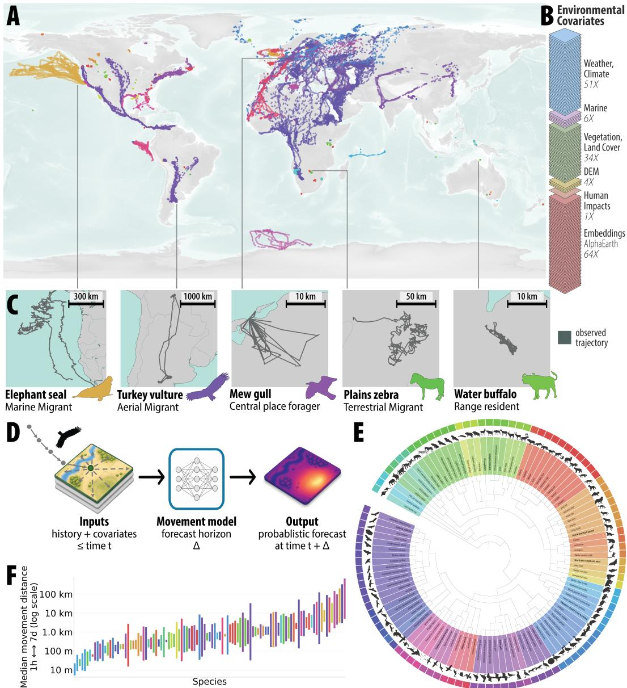
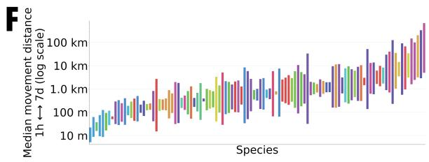
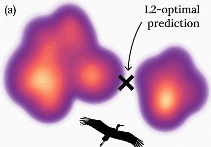
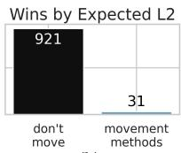
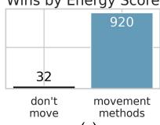
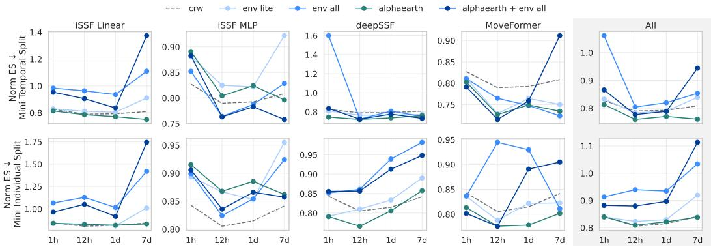
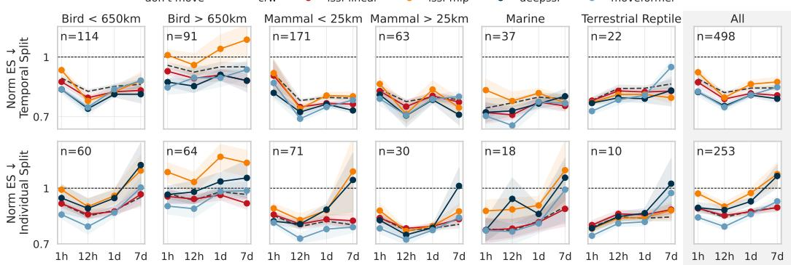
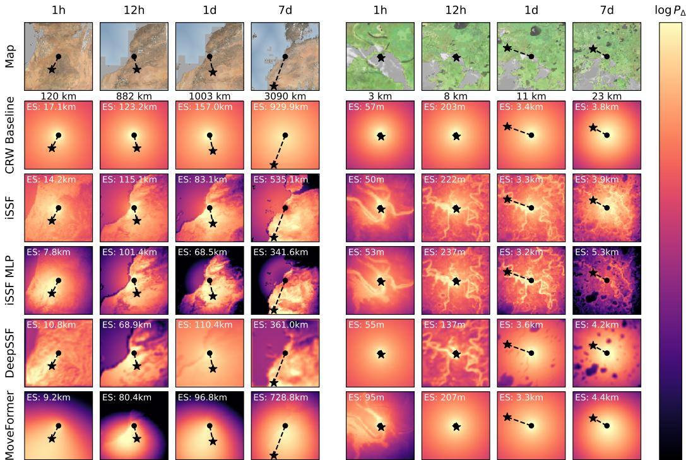
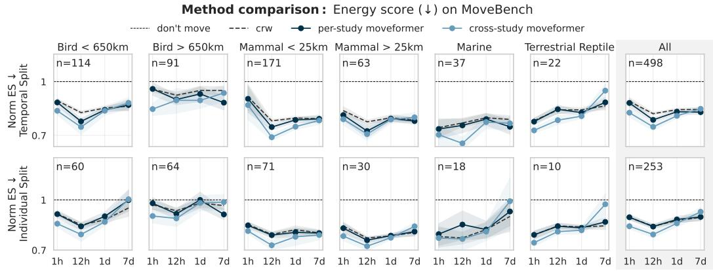

# MOVEBENCH: A Benchmark for Global-Scale Wildlife Movement Forecasting

Justin Kay1∗ Shir Bar1 Ellen O. Aikens2,α Martin Becker3,α Francesca Cagnacci4,α Juliet Cohen5,α Scott W. Forrest6,α Jessica Kendall-Bar7,α Madeleine Lucas8,α Macon Overcast18,α Meredith S. Palmer9,α Will Rogers9,α Nicholas J. Russo10,α Christian Rutz11,α Larissa T. Beumer12,β Michael Brown20,β Ying-Chi Chan13,β Sarah C. Davidson14,β Diego Ellis Soto15,β Anne G. Hertel16,β Roland Kays17,β Benjamin Koger2,β Guram Mikaberidze2,β Thomas Mueller16,β Ruth Oliver5,β Thorsten Papenbrock3,β Robert Patchett11,β Jared A. Stabach18,β Dane Taylor2,β Scott W. Yanco19,β Sara Beery1

1MIT 2University of Wyoming 3Marburg University, Hessian.AI 4Fondazione Edmund   
Mach, Research and Innovation Centre, Animal Ecology Unit 5UCSB 6Queensland University of Technology 7Scripps Institution of Oceanography, UCSD 8Colorado State University   
9Yale 10Harvard 11University of St. Andrews 12UNIS 13NTU Singapore 14Max Planck   
Institute of Animal Behavior 15UC Berkeley 16Senckenberg Biodiversity and Climate Research Centre 17NCSU and NC Museum of Natural Sciences 18Smithsonian NCBI 19Smithsonian Institution 20Giraffe Conservation Foundation

## Abstract

Understanding and predicting wildlife movement is critical for ecology and conservation. While trajectory forecasting has advanced for human and vehicle movement, wildlife trajectories present distinct challenges: they are unconstrained in space, highly stochastic, and influenced by environmental conditions. We introduce MOVEBENCH, the first large-scale benchmark for probabilistic wildlife movement forecasting, containing 2.6M GPS locations from 800+ individuals across 110 species in 127 countries, paired with 1.6B environmental raster tiles capturing 160 covariates known or hypothesized to influence movement. We propose a probabilistic evaluation protocol for movement trajectory forecasts, addressing limitations of point-prediction metrics for inherently stochastic phenomena. Through comprehensive empirical evaluation of four method families across multiple temporal and spatial scales, we reveal that: (1) existing predictive methods generalize better to future timepoints than to unseen individuals, (2) deep learning approaches do not consistently outperform simpler baselines, and (3) environmental covariate selection significantly impacts performance. MOVEBENCH enables standardized evaluation of movement forecasting methods and provides a foundation for methodological advances on this ecologically important task.

## 1 Introduction

Movement is a fundamental process of life on Earth and is at the basis of key ecological functions, from pollination and nutrient cycling to disease transmission and carbon sequestration [168, 235, 303]. Advancements in animal tracking technology (e.g., GPS-based radio-telemetry [48]) combined with real-time data transmission have allowed scientists to track and record wildlife movement at unprecedented scales and resolutions and for an increasingly diverse array of species [173]. This has catalyzed an explosion in animal movement data collection over the past decade, as evidenced by the over ten billion logged animal locations on the animal tracking data repository Movebank [226]. This breadth of observational data has deepened our understanding of how and why animals move through the world [7, 171, 225], helped prioritize areas for protection [33, 148, 224], and informed strategies for mitigating human-wildlife conflict [32, 33, 128, 248]. Beyond observational insights, the ability to predict how future animal movement might respond to various changes in natural and built environments—for instance, how new roads or energy infrastructure may alter movement corridors, how changing land use may reshape landscape connectivity [67, 78, 150], and how migratory routes may shift under climate change [151]—could revolutionize conservation decision making [77, 88, 117, 126, 307, 336].

  
Figure 1: MOVEBENCH is the first global benchmark for animal movement forecasting. (A) The benchmark contains 2.6 million curated GPS locations from over 800 individuals of 110 wildlife species, with observations from 127 countries spanning all continents, and (B) 1.6 billion raster tiles representing 160 associated environmental variables known or hypothesized to influence movement. (C) Five example species are shown that illustrate the diversity of wildlife movement: from northern elephant seals and turkey vultures that migrate thousands of kilometers over land and sea, to plains zebras that migrate over land, to mew gulls and water buffalo that spend most of their lives centered around one location. (D) The predictive challenge is probabilistic forecasting: models map from an individual’s movement history, environmental conditions, and other covariates to a probability distribution over possible future locations of that individual at a specified time horizon. (E) The data in MOVEBENCH covers 110 species across the tree of life with (F) movement patterns spanning over five orders of magnitude in spatial scale. Bars in (F) extend vertically from the median 1-hour movement distance to the median 7-day movement distance of each species. Trajectories in (A), silhouettes in (C), and bars in (F) correspond by color to species in (E).

Currently, we do not have the ability to robustly forecast animal movement. While many methods have been proposed for analyzing animal movement data [13, 15, 54, 85, 87, 104, 107, 152, 180, 181, 227, 228, 239, 264, 283, 328], their predominant use in the literature is for description, inference, and retrospective analysis rather than prediction [134]. There is great potential for the field of movement ecology to move towards a predictive science, and growing interest in the development of predictive methods [61, 104, 105, 134, 264, 271, 306]. To realize this potential, the field needs clear and shared definitions of success. This requires benchmarking frameworks that evaluate models across the dimensions that matter for real-world use: different species, movement modes (e.g., walking, swimming, flying), spatial and temporal scales, and environmental contexts. No such benchmark exists for animal movement forecasting.

Crucially, it is not possible to simply transfer lessons from other trajectory prediction benchmarks onto animal movement data. The most common trajectory data sources in the machine learning literature— human and vehicle trajectories—are fundamentally different, and in many ways simpler, than wildlife trajectories. For instance, they are almost always map-aligned, i.e., explicitly map-matched to known linear transportation infrastructures supporting human mobility, allowing movement to be modeled as a simplified process evolving over a constrained set of paths [238, 342]. There are no such maps for animal movement—in fact, discovering what routes are taken through a landscape is often an explicit goal of collecting the data in the first place [235, 241, 321]. Further, existing trajectory forecasting benchmarks primarily evaluate only a single best-guess future trajectory with metrics such as average displacement error, rather than probabilistic forecasts representing the range of possible future trajectories. Animal movement is highly stochastic [247], with several plausible futures at any given point in time, so accurate prediction requires both probabilistic forecasts and metrics that can assess the distribution of plausible futures. Finally, animal movement is heavily influenced by local environmental conditions [235, 241, 247], and a key goal of forecasting is to predict movement under changing environments. Incorporating this environmental context into predictive methods requires synthesizing heterogeneous, multi-scale, multi-resolution, and time-varying data sources. This relationship to covariates is a complexity missing from existing human and vehicle trajectory methods, and addressing these challenges will require significant methodological innovation.

We introduce MOVEBENCH, the first large-scale benchmark dataset for animal movement forecasting. The dataset contains 2.6 million curated GPS locations from over 800 individuals of 110 wildlife species, with observations from 127 countries spanning all continents. Alongside the GPS trajectory data, MOVEBENCH incorporates 160 publicly-available and global environmental covariates, which are preprocessed into 1.6 billion environmental raster tiles comprised of over two trillion environmental measurements. We propose a set of metrics for evaluating probabilistic movement forecasting methods and conduct the first large-scale empirical comparison of predictive movement methods for this task. Our experiments demonstrate there is much room for improvement in probabilistic forecasting methods, particularly in out-of-domain generalization, covariate selection, and multiscale spatiotemporal reasoning. Altogether, MOVEBENCH represents both the largest dataset for animal movement forecasting in existence and the most extensive empirical comparison of animal movement prediction methods ever conducted, while providing a novel environmentally-conditioned probabilis tic spatiotemporal forecasting challenge to the ML community. The benchmark and codebase will be made publicly available, enabling future research and methods development.2

Table 1: Trajectory benchmarks. Prior large-scale trajectory benchmarks focus on predicting vehicle movement on roads. MOVEBENCH expands this to enable probabilistic evaluation on a continuous global spatial domain X rather than point forecasts on a constrained road map. MOVEBENCH also includes more classes with diverse movement patterns, more covariates that influence movement, and larger spatial and temporal ranges than prior work. IQR computedfor per-trajectory cumulative distances and time ranges.
<table><tr><td>Benchmark</td><td># GPS</td><td># Cls</td><td># Cov</td><td>Dist IQR (km)</td><td>Time IQR (h)</td><td>Task</td><td>X</td><td>Probabilistic?</td></tr><tr><td>GeoLife [358]</td><td>23.6M</td><td>10</td><td>0</td><td>3-22</td><td>0.3-3</td><td>Forecast, Classify</td><td>Roads</td><td></td></tr><tr><td>Porto [242]</td><td>83M</td><td>1</td><td>4</td><td>2-7</td><td>0.1 - 0.2</td><td>Forecast</td><td>Roads</td><td></td></tr><tr><td>T-Drive [357]</td><td>790M</td><td>1</td><td>0</td><td>860-2000</td><td>145-148</td><td>Forecast</td><td>Roads</td><td></td></tr><tr><td>WorldTrace [359]</td><td>8.8B</td><td>1</td><td>0</td><td>0.8-10</td><td>0.03 – 0.2</td><td>Forecast</td><td>Roads</td><td></td></tr><tr><td>MOVEBENCH</td><td>2.6M</td><td>110</td><td>160</td><td>283-3500</td><td>818-8000</td><td>Forecast</td><td>Globe</td><td>√</td></tr></table>

## 2 Related work

Compared to existing benchmarks for trajectory prediction (see Tab. 1), MOVEBENCH offers innovations along three axes (for additional related work, see Appendix Sec. A):

Data: The wildlife movement data in MOVEBENCH is more complex, heterogeneous, and covariatedependent than existing benchmarks focusing on human movement [55, 201, 203, 242, 356, 358, 359]. It is unconstrained in space, varies drastically in pattern and scale across species and geographies, and requires synthesizing large-scale geospatial datasets in order to provide methods with the environmental context needed to predict where animals will move [241, 321]. Existing large datasets with tracked animals do not support probabilistic movement forecasting—BEBE [149] is a benchmark for behavior classification in accelerometry data, and Noonan et al. [240] evaluates methods for space use estimation over a large collection of datasets, anonymizing both GPS locations and timestamps.

Task: MOVEBENCH focuses on probabilistic forecasting to reflect the inherently stochastic nature of animal movement (see Sec. 3). Prior work primarily evaluates forecasting based on either: (i) pointprediction metrics (e.g., L2 error between ground truth and predicted locations), which do not assess the quality of entire predictive distributions [251, 301, 302], (ii) qualitative inspection [306], or (iii) log loss [61, 105], which is probabilistic but cannot be used to compare across arbitrary model classes because it requires an explicit predictive density, which is unavailable for deterministic predictors and may be intractable for some methods. As discussed in Sec. 5, MOVEBENCH introduces an evaluation methodology based on a proper scoring rule [124, 337] called the energy score that enables robust evaluation of probabilistic forecasts from any trajectory prediction model [299].

Methods: We compare commonly-used and state-of-the-art methods for predicting animal movement, which model the movement process as a function of habitat selection, whereby an individual chooses where to go next based on environmental conditions at candidate future locations [13, 61, 105, 107] coupled with their estimated movement capacity based on past movement. MOVEBENCH enables empirical comparison at scale between these methods for the first time.

## 3 Movement forecasting

The high-level goal is to predict the next step an animal will take at any time point, given its movement history and current environment. The following precisely defines this movement forecasting task (see Fig. 1d), describing observed trajectories, forecast targets, and evaluation settings.

Trajectory observations. We consider a spatiotemporal domain where $\mathcal { X } \subseteq \mathbb { R } ^ { 2 }$ and $\tau \subseteq \mathbb { R }$ denote the spatial and temporal extents available to an animal, respectively. For a single tracked animal, let $\tau = \left( ( \ell _ { n } , t _ { n } ) \right) _ { n = 1 } ^ { N }$ denote an observed trajectory of length N, where $\ell _ { n } \in \mathcal { X }$ is the recorded location at observation time $t _ { n } \in \mathcal { T }$ for $t _ { 1 } < t _ { 2 } < \cdots < t _ { N }$ . For $n = 1 , \ldots , N - 1$ , define the elapsed time between consecutive observations by $\Delta t _ { n } = t _ { n + 1 } - t _ { n }$ . We do not assume that $\Delta t _ { n }$ is constant in n, although in many trajectories it is approximately regular.

Covariates. Each spatiotemporal point is associated with a set of covariates, $i . e .$ . a feature vector. These may include movement-, time-, and environment-derived features. Formally, we represent these features by a vector-valued spatiotemporal field $c : \mathcal { X } \times \mathcal { T } \to \mathbb { R } ^ { K }$ , where $\dot { K }$ is the number of features. For any location–time pair $( \ell , t ) \in \mathcal { X } \times \mathcal { T }$ , the vector $c ( \ell , t )$ represents corresponding features. c can be evaluated for any observed point $c _ { n } = c ( \ell _ { n } , t _ { n } )$ with $n = 1 , \ldots , N$ , or at any candidate future location $\tilde { \ell } \in \mathcal { X }$ and candidate future time $\tilde { t } \in \mathcal { T }$ . See Tab. 2 for a summary of the covariates available in MOVEBENCH.

Table 2: Covariates in MOVEBENCH. The benchmark includes 160 environmental layers representing context at observed trajectories and at candidate locations for future movement. Covariates are included as rasters, centered at observed GPS points and aligned across spatial and temporal scales. Resolution indicates the spatial extent represented by one pixel. Cadence indicates the temporal sampling rate. Movement- and time-derived covariates are also included for all observed and candidate locations.
<table><tr><td>Category</td><td># Layers</td><td>Resolution</td><td>Cadence</td><td>Examples</td></tr><tr><td>Weather &amp; climate</td><td>51</td><td>30m−28km</td><td>1hr − 8d</td><td>Temperature, precipitation, wind, snow depth, land surface temperature, BioClim [95, 219, 353]</td></tr><tr><td>Vegetation &amp; land cover</td><td>34</td><td>10m-500m</td><td>3d – 1yr</td><td>Vegetation cover, vegetation indices, land cover, distance to water [40, 250, 279, 353]</td></tr><tr><td>DEM</td><td>4</td><td>30m</td><td>static</td><td>Elevation, slope, aspect, rugosity [91]</td></tr><tr><td>Marine</td><td>6</td><td>250m−28km</td><td>static – 30d</td><td>Bathymetry, distance to coast, sea surface temp, chlorophyll, surface current [53, 63, 156]</td></tr><tr><td>Human impact</td><td>1</td><td>300m</td><td>annual</td><td>WCS Human Footprint Index [281]</td></tr><tr><td>Embeddings</td><td>64</td><td>10m</td><td>annual</td><td>AlphaEarth Foundations [41]</td></tr><tr><td>Movement</td><td>3</td><td>一</td><td>1</td><td>Step length, turn angle [13]</td></tr><tr><td>Time</td><td>4</td><td></td><td>一</td><td>Time of day, day of year [104]</td></tr></table>

Forecasting task. We evaluate probabilistic movement forecasting at forecast horizons $\Delta > 0$ . For a forecast origin $( \ell , t )$ , the prediction target at time horizon $\Delta$ is the animal’s location at time $t + \Delta$ denoted $\ell _ { t + \Delta }$ . For an observed trajectory, define the history up to time t by $\tau _ { \leq t } = \big ( ( \ell _ { i } , t _ { i } ) \big ) _ { i = 1 } ^ { n ( t ) }$ and any associated covariates by $c _ { \leq t } = \big ( c ( \ell _ { i } , t _ { i } ) \big ) _ { i = 1 } ^ { n ( t ) }$ , with $n ( t ) = \operatorname* { m a x } \{ i : t _ { i } \leq t \}$ representing the number of observed steps up to and including time t.

Then, for a given forecast horizon $\Delta$ and origin time t, a movement forecasting method estimates a conditional predictive spatial distribution $P _ { t , \Delta } ( \cdot \mid \tau _ { \leq t } , c _ { \leq t } )$ over X representing the probability the animal will move to any spatial location at time $t + \Delta$ . In practice, for tractability, this is typically defined over a reasonable spatial range surrounding the animal’s current location $( e . g .$ , its 99th percentile next-step movement distance) rather than all of X. Deterministic predictors are a special case where $P _ { t , \Delta }$ is a point mass at a single predicted location.

## 4 MOVEBENCH

MOVEBENCH (see Fig. 1) contains 2.6 million GPS locations from over 800 individuals of 110 wildlife species, accompanied by over 1.6 billion environmental raster tiles. Here, we briefly describe how we select this data and construct the benchmark. More details can be found in Appendix Sec. B.

Trajectory curation. We aggregate trajectory data from: (1) the Movebank Data Repository [2], a subset of data from Movebank [226] that have Creative Commons licensing, DOIs, and have already undergone some quality assurance and anomaly filtering, (2) a literature review of recent movement methods papers with empirical experiments on public data, and (3) a survey of domain experts in the Movement Biodiversity Observation Network [1]. This yields 147 raw trajectory datasets, from which we apply a coarse set of filtering criteria followed by manual curation (see Appendix Sec. B for details and source acknowledgments).

Covariate rasters. MOVEBENCH contains 160 publicly-available environmental covariates that are known or hypothesized to influence movement (see Tab. 2). These include features from public environmental and climatic datasets [95, 219, 279, 353] as well as learned geospatial embeddings [41]. Covariates are downloaded and processed into 101 × 101 pixel rasters, centered at observed GPS points and scaled to include appropriate spatial context for a given species and forecast horizon, as in previous raster-based work [105] (see Appendix Sec. C). Because we evaluate each method at four different spatiotemporal scales (see Sec. 6), we include the full 160-layer raster stack at four different spatial resolutions for each of the 2.6M points in the dataset. In total, the benchmark therefore contains 10.4M raster stacks containing 1.6B individual raster layers representing over two trillion environmental measurements. This is at least four orders of magnitude larger than existing raster-based datasets for animal movement [105], enabling evaluation of predictive methods at a drastically larger scale than was previously possible. We also support raster-based versions of common movement- and time-derived covariates such as movement distance and time of movement. See Tab. 2 for a summary of all covariates and Appendix Sec. B for the full set and acknowledgments.

The use of rasters supports arbitrary definitions of candidate future movement locations (see Appendix Sec. E) as well as emerging raster-based methods [105], but introduces significant engineering complexity. The key challenges involve querying, batching, aligning, and efficiently storing data of different spatial and temporal resolutions from large-scale satellite and climate reanalysis datasets, as well as efficiently loading data during training and evaluation. Alongside the processed raster dataset, upon publication we will release the MOVEBENCH raster download and preparation pipeline as a Python package to support future research.

Train and test splits. For each study, we construct one training set and two hold-out test sets representing a temporal split and an individual split, each capturing a distinct source of ecological variation. The temporal split evaluates generalization to future time by testing on later observations from the same individuals in the training set, reflecting the challenge of predicting movement under changing environmental conditions and possibly different animal life stages. The individual split evaluates generalization across animals by testing on individuals not seen during training, capturing behavioral and environmental heterogeneity among individuals of the same species but within the same population. We select the held-out time points and individuals in order to mitigate train-test leakage; see Appendix Sec. B.3. In total, MOVEBENCH contains 1,120,127 training points, 965,233 temporal test points, and 537,781 individual test points.

MOVEBENCH-Mini. To enable quicker experimentation, we also make available a “mini” set of ten studies across taxonomic groups and movement types. MOVEBENCH-Mini includes two migratory birds, two non-migratory birds, two migratory mammals, two non-migratory mammals, one marine species, and one terrestrial reptile. We report study specifics in Appendix Sec. B.5.

## 5 Metrics

Animal movement is inherently probabilistic: future motion is often uncertain and multimodal, and thus forecasting methods are designed to return a distribution over possible next steps rather than a single best guess. To evaluate methods, we would ideally compare predicted distributions to the true distribution of the animal’s future movement, of which the observed movement is one realization. This is not possible with commonly used metrics for trajectory forecasting, such as average displacement error [251, 301, 302], which evaluate each ground truth point against a single point prediction. Further, it is well-known that optimizing for point prediction metrics rewards models that predict a central moment of the true distribution rather than its full shape (e.g., L2 error is minimized by deterministically predicting the geometric median [76]). Thus, when several distinct future destinations are plausible, point prediction metrics can reward an averaged prediction that lies between modes, even if that location itself is implausible [124, 326]. See Fig. 2a.

Proper scoring rules offer a robust framework for assessing the quality of probabilistic forecasts [125, 337]. A scoring rule is a loss or utility function that can be used to compare predicted distributions with realized observations from a ground truth distribution. A scoring rule is proper if it is maximized by predicting the true target distribution rather than hedging toward the median or some otherwise strategically distorted forecast, addressing the problems of point prediction metrics described above (see Fig. 2b and c). Negative log likelihood (NLL) is one example of a proper scoring rule that is already used widely for comparing wildlife movement forecasts [61, 105]. However a key limitation of NLL is that it requires access to predicted probability densities, preventing comparisons with deterministic baselines or more complex models where this is expensive or intractable to obtain.

  
(b)

  
(c)  
Figure 2: Probabilistic forecasting metrics. (a) Consider an animal with two modes in its next-step movement distribution, i.e. it may travel to one of two regions with equal probabil ity. A probabilistic forecast should try to reflect this, but L2-based metrics reward methods that instead deterministically predict the mean or me dian of the true movement distribution. (b) We see this empirically on MOVEBENCH: according to expected L2 error, the best forecast is to always predict “don’t move”. This is not very useful in practice. (c) Proper scoring rules like the energy score reward accurate and calibrated probabilistic predictions. In (b) and (c), a “win” means that a method has the best score for the given metric on the temporal split for a single study at a particular time horizon.

The energy score [125] is a proper scoring rule that is particularly well suited to evaluating trajectory forecasts for two reasons: (1) It is multivariate, enabling evaluation on $\mathcal { X } \subseteq \mathbb { R } ^ { 2 }$ , and (2) it requires only samples from the predictive distribution, not access to the corresponding predictive density. It is a popular choice for evaluating spatial probabilistic forecasts in other applications, such as weather forecasting [172, 194, 208, 286], and has recently been introduced for evaluating probabilistic vehicle trajectory predictions [299]. We adopt it as the main evaluation criterion in MOVEBENCH.

For a given trajectory step (ℓ, t) and forecast distribution $P _ { t , \Delta }$ (see Sec. 3), the energy score evaluated against $\ell _ { t + \Delta }$ , the ground truth location at time $t + \Delta$ , is

$$
\mathrm { E S } ( P _ { t , \Delta } , \ell _ { t + \Delta } ) = \mathbb { E } _ { X \sim P _ { t , \Delta } } \big \| X - \ell _ { t + \Delta } \big \| _ { 2 } - \frac { 1 } { 2 } \mathbb { E } _ { X , X ^ { \prime } \sim P _ { t , \Delta } } \| X - X ^ { \prime } \| _ { 2 } ,\tag{1}
$$

where $X$ and $X ^ { \prime }$ are i.i.d. draws from the predictive distribution. Lower values are better. For a deterministic predictor, $P _ { t , \Delta }$ is a point mass, so the ES reduces to the L2 error.

Like many proper scoring rules, the energy score is a combination of two terms. The first can be interpreted as measuring the accuracy of a model, and is the average distance between the ground truth location and draws from the predictive distribution (i.e., the expected L2 distance). The second term can be interpreted as measuring the spread of a model, computed as half of the average distance between two separate draws from the predictive distribution, and encourages accurate representation of model uncertainty. A model that is performing well will be both accurate and appropriately calibrated, resulting in a low energy score. See Appendix Sec. D for more details on its derivation.

## 6 Experiments

Baselines. We select a set of representative methods to benchmark on MOVEBENCH, including both methods that are widely used in practice as well as recent methods incorporating deep learning. The methods are: (1) iSSF Linear, an integrated step selection function with a standard linear head [13], (2) iSSF MLP, an iSSF with a multilayer perceptron head, (3) deepSSF [105], a CNNbased method that operates on spatial rasters, and (4) MoveFormer [61], a transformer-based method that incorporates longer temporal context and is trained across studies/species. As points of reference, we compare methods with two simple baselines: (1) don’t move, which always predicts that the animal does not move $( \mathrm { i . e . , } \hat { \ell } _ { t , \Delta } = \ell _ { t } ) ;$ and (2) correlated random walk (CRW), which samples from the same parametric distributions used to select candidates for SSF-style methods. We defer detailed descriptions to Appendix Sec. E.

Main results. We train and evaluate each baseline method at a fixed set of forecast horizons $\Delta \in \{ 1$ 1 hour, 12 hours, 1 day, 7 days}, compute the energy score (Eq. (1)) for each test step at each forecast horizon, and compute a mean energy score for each time horizon for each study.

We aggregate results across studies by either method (Fig. 3 top) or species/range groups (Fig. 3 bottom). All reported results are macro-averages of per-study energy scores. However, because energy score scales with distance, animals that move longer distances on average would dominate a simple average energy score. Before aggregating across studies we therefore first normalize each study by the average movement distance of the individuals in that study. We display the mean ± the standard deviation of these normalized energy scores over each grouping. Note that normalizing by average movement distance is equivalent to normalizing by the energy score of the “don’t move” baseline (see Eq. (1)), so “don’t move” always has a normalized ES of 1. See Appendix Sec. F for more details on evaluation methodology and complete hyperparameter settings.

Covariate comparison. We first investigate performance of all methods on MOVEBENCH-Mini using different sets of environmental covariates in Fig. 3 (top). We compare the full set of covariates available in the benchmark (“alphaearth + env all”) with smaller sets to understand which covariates contribute positively or negatively toward forecasting performance for different models. We see that this is not consistent between models, and that more covariates is not always better, even for deep learning methods. For most methods, as well as on average, AlphaEarth embeddings are the best-performing, while the MLP-based iSSF performs best with a combination of AlphaEarth and environmental covariates. While it is not surprising that adding additional highly-correlated covariates to the linear model worsens performance, The fact that combining both sources of covariates does not improve performance for other methods—in particular, the deep learning based methods deepSSF and MoveFormer—indicates that more work is needed to enable models to handle large complementary input sets, for instance with additional regularization. Rankings of covariates remain fairly stable across the temporal and individual test splits. Overall, this comparison and the lack of consistency across models point to the importance of covariate selection as a component of methods development.

don't move crw issf linear issf mlp deepssf moveformer  
Covariate comparison : Energy score ( ) on MoveBench-Mini  
  
Method comparison : Energy score ( ) on MoveBench

  
Figure 3: Main results. We report energy scores (lower is better, see Sec. 5), normalized by average movement distance at the study level to account for inter-study variation and aggregated by method (top) or taxonomic group and travel distance (bottom) (see Sec. 6). Top (Covariate comparison): For each model, we compare four different sets of input covariates on MOVEBENCH-Mini: “env lite,” a small set of common covariates (NDVI and elevation for terrestrial studies, bathymetry and chlorophyll-a for marine studies); “env all,” the full set of 96 environmental covariates excluding AlphaEarth; AlphaEarth only; and AlphaEarth + “env all”. We see that, on average across all methods, AlphaEarth covariates outperform environmental covariates, and that combining AlphaEarth with environmental covariates does not seem to add benefit for most methods. These trends are not consistent across methods, however, and in particular iSSF MLP performs best when trained with environmental covariates. Bottom (Method comparison): We compare all methods across the entirety of MOVEBENCH using AlphaEarth covariates (the best-performing set on average), aggregating studies by taxonomic group and median per-individual maximum movement distance. n indicates the number of individuals in each panel. Most methods outperform simple baselines on the temporal split, but not on the individual split, indicating that it is more difficult to generalize to new individuals who were not present in the training set. deepSSF in particular shows a large generalization gap—it is the best-performing overall on the temporal split but worse than the CRW baseline on the individual split. More work is needed to develop methods that perform well across different generalization challenges.

Method comparison. We then train and evaluate all methods on all 147 datasets in MOVEBENCH using AlphaEarth covariates since they were the highest performing on average in the covariate comparison. In Fig. 3 (bottom) we aggregate energy scores over studies based on broad taxonomic group and movement characteristics. Distance-based groupings are based on the median per-individual maximum displacement of each study.

We see that no method is consistently best across all taxonomic-range groups or timescales. On in-sample individuals (i.e., the temporal split), most methods usually—but not always—outperform the simple correlated random walk (CRW) baseline, indicating they are leveraging environmental information to improve upon simple movement statistics. deepSSF—the only method that makes use of full-raster spatial context during training—consistently performs the best on future points of training individuals, though MoveFormer is a very close second-best. All deep learning methods are inconsistent in whether or not they outperform a simple linear iSSF, indicating that deep learning on its own is not enough to guarantee better performance.

White stork, ID: O584\_Barlavento Start point (30.02, -9.23, 2019-09-03 12:36:10) End point at different time horizons  
  
Figure 4: Prediction probability surfaces. Here we show qualitative examples of forecast distributions of all four methods for all four timescales in our main experiments for two sample points of two species (white stork and jaguar). The black dot represents the animals’ starting position and the black star represents their true end position at each time horizon. The map shows Landsat RGB overlaid on Copernicus DEM for the spatial extent available at prediction time—notice that this varies with both study and timescale, and that data from some environmental layers is sometimes missing. Prediction heatmaps represent the log predicted probability that the animal moves to any spatial location at the next timestep. Energy scores are displayed for each prediction, computed on the singular sample (lower is better). Notice that some methods’ predictions are highly influenced by environmental features (e.g., iSSF, deepSSF), while others focus on broad spatial trends (e.g., MoveFormer).

We see that trained models generalize better to held-out points in time of individuals in the training set (top row of both plots) compared to held out individuals (bottom row of both plots). For held out individuals, most methods do not consistently outperform the correlated random walk baseline. Note that the movement parameters of the correlated random walk are also fit to individuals in the training data, so the CRW baseline faces distribution shift as well with held-out individuals. Therefore, methods that outperform CRW in-sample but underperform CRW out-of-sample appear to be leveraging environmental information in a way that is individual-specific and does not generalize well to new individuals. In particular, deepSSF experiences a large performance drop between the temporal and individual splits, making it the best performing for in-sample individuals but the worst performing for out-of-sample individuals. This indicates that it has learned individual-specific features that are helpful in-distribution and harmful out-of-distribution. MoveFormer—the only method to condition on multiple past timesteps and to train across studies—has the best overall average performance across both hold-out sets.

Qualitative analysis. In Fig. 4 we visualize example outputs from an iSSF model on two start points in the dataset to illustrate common qualities of predictive distributions. For each start point, we have a ground truth “next step” at each timescale {1 hour, 12 hours, 1 day, 7 days}. The plot shows methods’ predicted log probability of moving to any available location in the spatial extent. Notice that the spatial extent available to predictive methods increases with timescale according to the movement characteristics of the particular species—for white stork, a migratory bird, its 7 day spatial extent is 26× its 1 hour spatial extent, covering a large swath of Northern African coastline. We see that different methods incorporate environmental context as well as movement characteristics differently into their predictions—for instance, MoveFormer shows strong learned directionality in its predictions for both species, and most methods display a preference toward water for the jaguar.

## 7 Discussion and Conclusion

We introduce MOVEBENCH, the first benchmark for global-scale probabilistic animal movement forecasting. The benchmark enables comparisons across the many axes of variation present in animal movement data, including diverse species, spatiotemporal scales, and movement types, and represents a key step towards advancing state-of-the-art in animal movement forecasting.

Research directions MOVEBENCH highlights as key priorities. First, cross-individual generalization is a significant challenge across methods. Opportunities include adapting and developing OOD generalization methods, developing mechanisms to better capture individual variation across populations, and further investigating methods to learn movement patterns not just within but also across populations and species. Additionally, there is potential to further improve prediction by incorporating additional biologically meaningful information into movement prediction, such as life history, individual ID, or inferred behavioral state, as suggested by recent ecology literature [271, 272]. We also show that covariate design and selection is a key component of performance. Opportunities include methods to automatically identify informative covariates per-species, further develop and improve environmental representations from geospatial foundation models with movement forecast ing as a target, and address the tradeoffs between interpretability and predictive capacity when using black-box covariates. Finally, investigating prediction with long context at any given time horizon could improve both accuracy and usability of forecasting models, by, e.g., sharing information across spatial and temporal scales via memory (like MoveFormer) or spatial reasoning (like deepSSF).

Opportunities to expand movement ecology benchmarking beyond MOVEBENCH. We see several exciting future opportunities to build on MOVEBENCH, including incorporating larger populations to understand scaling laws in cross-individual generalization, expanding to cover an even broader set of species and regions, expanding to include additional target tasks such as behavior segmentation, corridor mapping, or home range estimation, and expanding to include additional modalities often captured concurrently, such as accelerometry.

Limitations. MOVEBENCH is designed for benchmarking probabilistic movement forecasting methods, and should not be used for drawing general ecological conclusions without further analysis. Further, data is sourced from existing published movement studies, inheriting any existing taxonomic and geographical sampling biases, and some nuance is inherently lost when averaging across axes of biological variation in the data. We include further limitations discussion in the Croissant metadata.

## Acknowledgments

We thank all data owners (see Appendix Sec. B), without whom none of this work would be possible. We also thank the organizers and members of MoveBON for support and feedback. JK and SaB were supported by NSF award 2330423 and NSERC award 585136. JK was additionally supported by NSF fellowship award 2313998. ShB was supported by a CHE Fellowship for Marine Sciences. JKB was supported by NSF awards 1643532 and NSF 2333609. WR was supported by a Gruber Science Foundation Fellowship. NR was supported by the Harvard University Dean’s Fund for Competitive Scientific Research. RK was supported by National Aeronautics and Space Administration Award 80NSSC21K1182. RYO was supported by the Kuni Endowed Junior Faculty Fellowship, Hellman Family Faculty Fellowship, and the University of California Early Career Faculty Research Excellence Award. DT, GM, BK and EA were supported by the Wyoming Center for Wildlife, Technology and Computing (WyldTech). MO was supported by the Smithsonian Didden Fellowship. CR acknowledges funding from the Gordon and Betty Moore Foundation (GBMF9881; GBMF 11414.01; GBMF12975), and CR and RP from the National Geographic Society (NGS-29784).

## References

[1] Move BON — geobon.org. https://geobon.org/move-bon/. [Accessed 18-04-2026].

[2] Movebank data repository. https://datarepository.movebank.org/home. [Accessed 18-04-2026].

[3] Marta Acácio, Inês Catry, Andrea Soriano-Redondo, João Paulo Silva, Philip W. Atkinson, and Aldina M. A. Franco. Timing is critical: consequences of asynchronous migration for the performance and destination of a long-distance migrant. Movement Ecology, 10(1), 2022. ISSN 2051-3933. doi: 10.1186/s40462-022-00328-3. URL http://dx.doi.org/10.1186/ s40462-022-00328-3.

[4] Marta Acácio, Inês Catry, Andrea Soriano-Redondo, João Paulo Silva, Philip W. Atkinson, and Aldina M.A. Franco. Data from: Timing is critical: consequences of asynchronous migration for the performance and destination of a long-distance migrant, 2023. URL https: //datarepository.movebank.org/handle/10255/move.258.

[5] Ellen Aikens, Jessica Speiser, Karma Choki, Michele Lovara, Anna Weesies, Jeffrey Tillery, Sean Ryder, Erica Lafferty, Amanda Cheeseman, William Severud, and Hall Sawyer. Data from: Challenging conventional views on the elevational limits of pronghorn habitat, 2024. URL https://datadryad.org/dataset/doi:10.5061/dryad.w9ghx3fz8.

[6] Ellen Aikens, Jerod Merkle, Wenjing Xu, and Hall Sawyer. Pronghorn movements and mortality during extreme weather highlight the importance of landscape connectivity, 2025. URL https://data.mendeley.com/datasets/wgyts8vyrf/1.

[7] Ellen O Aikens, Iris D Bontekoe, Lara Blumenstiel, Anna Schlicksupp, and Andrea Flack. Viewing animal migration through a social lens. Trends in Ecology & Evolution, 37(11): 985–996, 2022.

[8] Ellen O. Aikens, Elham Nourani, Wolfgang Fiedler, Martin Wikelski, and Andrea Flack. Learning shapes the development of migratory behavior. Proceedings of the National Academy ofSciences, 121(12), March 2024. ISSN 1091-6490. doi: 10.1073/pnas.2306389121. URL http://dx.doi.org/10.1073/pnas.2306389121.

[9] Ellen O. Aikens, Jessica Speiser, Karma Choki, Michele Lovara, Anna Weesies, Jeffrey Tillery, Sean Ryder, Erica Lafferty, Amanda E. Cheeseman, William J. Severud, and Hall Sawyer. Challenging conventional views on the elevational limits of pronghorn habitat. Ecology, 105 (11), 2024. ISSN 1939-9170. doi: 10.1002/ecy.4422. URL http://dx.doi.org/10.1002/ ecy.4422.

[10] Ellen O. Aikens, Jerod A. Merkle, Wenjing Xu, and Hall Sawyer. Pronghorn movements and mortality during extreme weather highlight the critical importance of connectivity. Current Biology, 35(8):1927–1934.e2, April 2025. ISSN 0960-9822. doi: 10.1016/j.cub.2025.03.010. URL http://dx.doi.org/10.1016/j.cub.2025.03.010.

[11] Alexandre Alahi, Kratarth Goel, Vignesh Ramanathan, Alexandre Robicquet, Li Fei-Fei, and Silvio Savarese. Social lstm: Human trajectory prediction in crowded spaces. In Proceedings of the IEEE Conference on Computer Vision and Pattern Recognition (CVPR), pages 961–971, 2016.

[12] Christine M. Anderson, H. Grant Gilchrist, Robert A. Ronconi, Katherine R. Shlepr, Daniel E. Clark, David A. Fifield, Gregory J. Robertson, and Mark L. Mallory. Both short and long distance migrants use energy-minimizing migration strategies in north american herring gulls. Movement Ecology, 8(1), 2020. ISSN 2051-3933. doi: 10.1186/s40462-020-00207-9. URL http://dx.doi.org/10.1186/s40462-020-00207-9.

[13] Tal Avgar, Jonathan R Potts, Mark A Lewis, and Mark S Boyce. Integrated step selection analysis: bridging the gap between resource selection and animal movement. Methods in Ecology and Evolution, 7(5):619–630, 2016.

[14] Laurie L Baker, Joanna E Mills Flemming, Ian D Jonsen, Damian C Lidgard, Sara J Iverson, and W Don Bowen. A novel approach to quantifying the spatiotemporal behavior of instrumented grey seals used to sample the environment. Movement Ecology, 3(1), 2015. ISSN 2051-3933. doi: 10.1186/s40462-015-0047-4. URL http://dx.doi.org/10.1186/ s40462-015-0047-4.

[15] Nicholas W Bakner, Bret A Collier, and Michael J Chamberlain. Behavioral-dependent recursive movements and implications for resource selection. Scientific Reports, 13(1):16632, 2023.

[16] Hattie L. A. Bartlam-Brooks, Pieter S. A. Beck, Gil Bohrer, and Stephen Harris. In search of greener pastures: Using satellite images to predict the effects of environmental change on zebra migration. Journal ofGeophysical Research: Biogeosciences, 118(4):1427–1437, October 2013. ISSN 2169-8961. doi: 10.1002/jgrg.20096. URL http://dx.doi.org/10. 1002/jgrg.20096.

[17] Hattie L.A. Bartlam-Brooks and Stephen Harris. Data from: In search of greener pastures: using satellite images to predict the effects of environmental change on zebra migration, 2013. URL https://www.datarepository.movebank.org/handle/10255/move.342.

[18] Guillaume Bastille-Rousseau, Jonathan R. Potts, Charles B. Yackulic, Jacqueline L. Frair, E. Hance Ellington, and Stephen Blake. Data from: Flexible characterization of animal movement pattern using net squared displacement and a latent state model, 2016. URL https://www.datarepository.movebank.org/handle/10255/move.618.

[19] Guillaume Bastille-Rousseau, Jonathan R. Potts, Charles B. Yackulic, Jacqueline L. Frair, E. Hance Ellington, and Stephen Blake. Flexible characterization of animal movement pattern using net squared displacement and a latent state model. Movement Ecology, 4(1), 2016. ISSN 2051-3933. doi: 10.1186/s40462-016-0080-y. URL http://dx.doi.org/10.1186/ s40462-016-0080-y.

[20] Guillaume Bastille-Rousseau, Charles B. Yackulic, Jacqueline L. Frair, Freddy Cabrera, and Stephen Blake. Data from: Allometric and temporal scaling of movement characteristics in galapagos tortoises, 2016. URL https://www.datarepository.movebank.org/handle/ 10255/move.549.

[21] Guillaume Bastille-Rousseau, Charles B. Yackulic, Jacqueline L. Frair, Freddy Cabrera, and Stephen Blake. Allometric and temporal scaling of movement characteristics in galapagos tortoises. Journal of Animal Ecology, 85(5):1171–1181, 2016. ISSN 1365-2656. doi: 10.1111/1365-2656.12561. URL http://dx.doi.org/10.1111/1365-2656.12561.

[22] Guillaume Bastille-Rousseau, Charles B. Yackulic, James Gibbs, Jacqueline L. Frair, Freddy Cabrera, and Stephen Blake. Data from: Migration triggers in a large herbivore: Galá- pagos giant tortoises navigating resource gradients on volcanoes, 2019. URL https: //www.datarepository.movebank.org/handle/10255/move.834.

[23] Guillaume Bastille-Rousseau, Charles B. Yackulic, James P. Gibbs, Jacqueline L. Frair, Freddy Cabrera, and Stephen Blake. Migration triggers in a large herbivore: Galápagos giant tortoises navigating resource gradients on volcanoes. Ecology, 100(6), April 2019. ISSN 1939-9170. doi: 10.1002/ecy.2658. URL http://dx.doi.org/10.1002/ecy.2658.

[24] Nyambayar Batbayar, Batbayar Galtbalt, Tseveenmyadag Natsagdorj, Tuvshintugs Sukhbaatar, and Martin Wikelski. Data from: Study "lifetrack mongolia demoiselle cranes", 2024. URL https://datarepository.movebank.org/handle/10255/move.3263.

[25] Nyambayar Batbayar, Batbayar Galtbalt, Tseveenmyadag Natsagdorj, Tuvshintugs Sukhbaatar, and Martin Wikelski. Data from: Study "white-naped crane mongolia wscc", 2024. URL https://datarepository.movebank.org/handle/10255/move.3264.

[26] Jeffrey L. Beck, Jacob D. Hennig, and John D. Scasta. Data from: Study "pronghorn (antilocapra americana), wyoming/colorado, usa", 2022. URL https://www.datarepository. movebank.org/handle/10255/move.1578.

[27] Christopher Beirne, Mark Thomas, Arianna Basto, Eleanor Flatt, Giancarlo Inga Diaz, Diego Rolim Chulla, Flor Perez Mullisaca, Rosio Vega Quispe, Caleb Jonatan Quispe Quispe, Adrian Forsyth, and Andrew Whitworth. Scouts vs. usurpers: alternative foraging strategies facilitate coexistence between neotropical cathartid vultures. Ibis, 166 (4):1368–1383, April 2024. ISSN 1474-919X. doi: 10.1111/ibi.13327. URL http: //dx.doi.org/10.1111/ibi.13327.

[28] Steven E. Bellan and Wayne M. Getz. Data from: Resource-driven encounters among consumers and implications for the spread of infectious disease, 2017. URL https: //www.datarepository.movebank.org/handle/10255/move.706.

[29] Lorena Benitez, J. Werner Kilian, George Wittemyer, Lacey F. Hughey, Chris H. Fleming, Peter Leimgruber, Pierre du Preez, and Jared A. Stabach. Precipitation, vegetation productivity, and human impacts control home range size of elephants in dryland systems in northern namibia. Ecology and Evolution, 12(9), 2022. ISSN 2045-7758. doi: 10.1002/ece3.9288. URL http://dx.doi.org/10.1002/ece3.9288.

[30] Keith L. Bildstein, David Barber, and Marc J. Bechard. Data from: Environmental drivers of variability in the movement ecology of turkey vultures (cathartes aura) in north and south america, 2014. URL https://www.datarepository.movebank.org/handle/10255/ move.362.

[31] Keith L. Bildstein, David Barber, Marc J. Bechard, Maricel Graña Grilli, and Jean-François Therrien. Data from: Study "vultures acopian center usa gps" (2003-2021), 2021. URL https://www.datarepository.movebank.org/handle/10255/move.1306.

[32] Barbara A Block, Ian D Jonsen, Salvador J Jorgensen, Arliss J Winship, Scott A Shaffer, Steven J Bograd, Elliott Lee Hazen, David G Foley, GA Breed, A-L Harrison, et al. Tracking apex marine predator movements in a dynamic ocean. Nature, 475(7354):86–90, 2011.

[33] Hannah Blondin, Briana Abrahms, Larry B Crowder, and Elliott L Hazen. Combining high temporal resolution whale distribution and vessel tracking data improves estimates of ship strike risk. Biological Conservation, 250:108757, 2020.

[34] Wayne S J Boardman, David Roshier, Terry Reardon, Kathryn Burbidge, Adam McKeown, David A Westcott, Charles G B Caraguel, and Thomas A A Prowse. Spring foraging movements of an urban population of grey-headed flying foxes (pteropus poliocephalus). Journal of Urban Ecology, 7(1), 2021. ISSN 2058-5543. doi: 10.1093/jue/juaa034. URL http://dx.doi.org/10.1093/jue/juaa034.

[35] Rebecca K. Borchering, Steve E. Bellan, Jason M. Flynn, Juliet R. C. Pulliam, and Scott A. McKinley. Resource-driven encounters among consumers and implications for the spread of infectious disease. Journal ofThe Royal Society Interface, 14(135):20170555, October 2017. ISSN 1742-5662. doi: 10.1098/rsif.2017.0555. URL http://dx.doi.org/10.1098/rsif. 2017.0555.

[36] Rahel M. Borrmann, Richard A. Phillips, Thomas A. Clay, and Stefan Garthe. Data from: High foraging site fidelity and spatial segregation among individual great black-backed gulls, 2019. URL https://www.datarepository.movebank.org/handle/10255/move.1003.

[37] Rahel M. Borrmann, Richard A. Phillips, Thomas A. Clay, and Stefan Garthe. High foraging site fidelity and spatial segregation among individual great black-backed gulls. Journal of Avian Biology, 50(12), December 2019. ISSN 1600-048X. doi: 10.1111/jav.02156. URL http://dx.doi.org/10.1111/jav.02156.

[38] Mark S. Boyce and Simone Ciuti. Data from: Human selection of elk behavioural traits in a landscape of fear, 2020. URL https://www.datarepository.movebank.org/handle/ 10255/move.1067.

[39] Christopher F. Brown, Steven P. Brumby, B. Guzder-Williams, Tyler Birch, Stephen B. Hyde, Joseph Mazzariello, William Czerwinski, Valerie J. Pasquarella, Robert Haertel, Sergey Ilyushchenko, Kurt Schwehr, M. J. Weisse, Fred Stolle, Craig Hanson, Oliver Guinan, and Ryan Moore. Dynamic world, near real-time global 10 m land use land cover mapping.

Scientific Data, 9:251, 2022. doi: 10.1038/s41597-022-01307-4. Accessed: 2026-04-01, This dataset is produced for the Dynamic World Project by Google in partnership with National Geographic Society and the World Resources Institute.

[40] Christopher F Brown, Steven P Brumby, Brookie Guzder-Williams, Tanya Birch, Samantha Brooks Hyde, Joseph Mazzariello, Wanda Czerwinski, Valerie J Pasquarella, Robert Haertel, Simon Ilyushchenko, et al. Dynamic world, near real-time global 10 m land use land cover mapping. Scientific data, 9(1):251, 2022.

[41] Christopher F Brown, Michal R Kazmierski, Valerie J Pasquarella, William J Rucklidge, Masha Samsikova, Chenhui Zhang, Evan Shelhamer, Estefania Lahera, Olivia Wiles, Simon Ilyushchenko, et al. Alphaearth foundations: An embedding field model for accurate and efficient global mapping from sparse label data. arXiv preprint arXiv:2507.22291, 2025.

[42] Nelleke H. Buitendijk, Monique de Jager, Menno Hornman, Helmut Kruckenberg, Andrea Kölzsch, Sander Moonen, and Bart A. Nolet. More grazing, more damage? assessed yield loss on agricultural grassland relates nonlinearly to goose grazing pressure. Journal of Applied Ecology, 59(12):2878–2889, November 2022. ISSN 1365-2664. doi: 10.1111/1365-2664. 14306. URL http://dx.doi.org/10.1111/1365-2664.14306.

[43] Nelleke H. Buitendijk, Monique De Jager, Helmut Kruckenberg, Andrea Kölzsch, Sander Moonen, Gerhard J.D.M. Müskens, and Bart A. Nolet. Data from: More grazing, more damage? assessed yield loss on agricultural grassland relates non-linearly to goose grazing pressure, 2023. URL https://datarepository.movebank.org/handle/10255/move. 241.

[44] Patrik Byholm, Martin Beal, Natalie Isaksson, Ulrik Lötberg, and Susanne Åkesson. Paternal transmission of migration knowledge in a long-distance bird migrant. Nature Communications, 13(1), March 2022. ISSN 2041-1723. doi: 10.1038/s41467-022-29300-w. URL http: //dx.doi.org/10.1038/s41467-022-29300-w.

[45] Patrik Byholm, Martin Beal, Ulrik Lötberg, and Susanne Åkesson. Data from: Paternal transmission of migration knowledge in a long-distance bird migrant, 2022. URL https: //www.datarepository.movebank.org/handle/10255/move.1310.

[46] Patrik Byholm, Paweł Mirski, and Wouter Vansteelant. Data from: Study "gps tracking of honey buzzards in finland", 2025. URL https://datarepository.movebank.org/ handle/10255/move.3162.

[47] David Cabot. Data from: Forecasting spring from afar? timing of migration and predictability of phenology along different migration routes of an avian herbivore [greenland data], 2014. URL https://www.datarepository.movebank.org/handle/10255/move.380.

[48] Francesca Cagnacci, Luigi Boitani, Roger A Powell, and Mark S Boyce. Animal ecology meets gps-based radiotelemetry: a perfect storm of opportunities and challenges. Philosophical Transactions of the Royal Society B: Biological Sciences, 365(1550):2157–2162, 2010.

[49] M. Carroll, C. DiMiceli, M. Wooten, A. Hubbard, R. Sohlberg, and J. Townshend. Mod44w modis/terra land water mask derived from modis and srtm l3 global 250m sin grid v006, 2017. Accessed: 2026-04-01.

[50] Andrew Carter and Roshier David A. Data from: Toward reliable population density estimates of partially marked populations using spatially explicit mark-resight methods, 2020. URL https://www.datarepository.movebank.org/handle/10255/move.827.

[51] Andrew Carter, Joanne M. Potts, and David A. Roshier. Toward reliable population density estimates of partially marked populations using spatially explicit mark-resight methods. Ecology and Evolution, 9(4):2131–2141, January 2019. ISSN 2045-7758. doi: 10.1002/ece3.4907. URL http://dx.doi.org/10.1002/ece3.4907.

[52] Samuel Chambers, Joshua von Nonn, Matthew A. Burgess, Lance R. Brady, Jeffrey Bracewell, Daniel A. Guerra, and Miguel L. Villarreal. The tortoise and the antilocaprid: adapting gps tracking and terrain data to model wildlife walking functions. Landscape Ecology,

40(5), April 2025. ISSN 1572-9761. doi: 10.1007/s10980-025-02092-2. URL http: //dx.doi.org/10.1007/s10980-025-02092-2.

[53] Eric P Chassignet, Harley E Hurlburt, Ole Martin Smedstad, George R Halliwell, Patrick J Hogan, Alan J Wallcraft, Remy Baraille, and Rainer Bleck. The hycom (hybrid coordinate ocean model) data assimilative system. Journal of Marine Systems, 65(1-4):60–83, 2007.

[54] Nilanjan Chatterjee, David Wolfson, Dongmin Kim, Juliana Velez, Smith Freeman, Nathan M Bacheler, Kyle Shertzer, J Christopher Taylor, and John Fieberg. Modelling individual variability in habitat selection and movement using integrated step-selection analysis. Methods in Ecology and Evolution, 15(6):1034–1047, 2024.

[55] Eunjoon Cho, Seth A Myers, and Jure Leskovec. Friendship and mobility: user movement in location-based social networks. In Proceedings ofthe 17th ACM SIGKDD international conference on Knowledge discovery and data mining, pages 1082–1090, 2011.

[56] Kinley Choden, Sébastien Ravon, Jonathan H. Epstein, Thavry Hoem, Neil Furey, Marie Gely, Audrey Jolivot, Vibol Hul, Chhoeuth Neung, Annelise Tran, and Julien Cappelle. Data from: Pteropus lylei primarily forages in residential areas in kandal, cambodia, 2019. URL https://www.datarepository.movebank.org/handle/10255/move.869.

[57] Kinley Choden, Sébastien Ravon, Jonathan H. Epstein, Thavry Hoem, Neil Furey, Marie Gely, Audrey Jolivot, Vibol Hul, Chhoeuth Neung, Annelise Tran, and Julien Cappelle. Pteropus lylei primarily forages in residential areas in kandal, cambodia. Ecology and Evolution, 9(7):4181–4191, March 2019. ISSN 2045-7758. doi: 10.1002/ece3.5046. URL http: //dx.doi.org/10.1002/ece3.5046.

[58] Beirne Christopher, Mark Thomas, Arianna Basto, Eleanor Flatt, Giancarlo Inga Diaz, Diego Rolim Chulla, Flor Perez Mullisaca, Rosio Vega Quispe, Caleb Jonatan Quispe Quispe, Adrian Forsyth, and Andrew Whitworth. Data from: Scouts vs usurpers: alternative foraging strategies facilitate coexistence between neotropical cathartid vultures, 2024. URL https://datarepository.movebank.org/handle/10255/move.3080.

[59] Mark W Chynoweth. Data from: Home range use and movement patterns of nonnative feral goats in a tropical island montane dry landscape, 2015. URL https://www. datarepository.movebank.org/handle/10255/move.410.

[60] Mark W. Chynoweth, Christopher A. Lepczyk, Creighton M. Litton, Steven C. Hess, James R. Kellner, and Susan Cordell. Home range use and movement patterns of non-native feral goats in a tropical island montane dry landscape. PLOS ONE, 10(3):e0119231, March 2015. ISSN 1932-6203. doi: 10.1371/journal.pone.0119231. URL http://dx.doi.org/10.1371/ journal.pone.0119231.

[61] Ondˇrej Cífka, Simon Chamaillé-Jammes, and Antoine Liutkus. Moveformer: a transformerbased model for step-selection animal movement modelling. bioRxiv, pages 2023–03, 2023.

[62] Simone Ciuti, Tyler B. Muhly, Dale G. Paton, Allan D. McDevitt, Marco Musiani, and Mark S. Boyce. Human selection of elk behavioural traits in a landscape of fear. Proceedings ofthe Royal Society B: Biological Sciences, 279(1746):4407–4416, 2012. ISSN 1471-2954. doi: 10.1098/rspb.2012.1483. URL http://dx.doi.org/10.1098/rspb.2012.1483.

[63] CCS Copernicus. Copernicus climate change service, 2020.

[64] Copernicus Climate Change Service. Era5 hourly data on single levels from 1940 to present, 2026. Accessed: 2026-04-01.

[65] Daniel Costa, Rachel Holser, Theresa Keates, Taiki Adachi, Roxanne Beltran, Cory Champagne, Crocker Daniel, Arina Favilla, Melinda Fowler, Juan Pablo Gallo-Reynoso, Chandra Goetsch, Jason Hassrick, Luis Hückstädt, Jessica Kendall-Bar, Sarah Kienle, Carey Kuhn, Jennifer Maresh, Sara Maxwell, Birgitte McDonald, Elizabeth McHuron, Patricia Morris, Yasuhiko Naito, Logan Pallin, Sarah Peterson, Patrick Robinson, Samantha Simmons, Akinori Takahashi, Nicole Teuschel, Michael Tift, Yann Tremblay, Stella Villegas-Amtman, and Ken Yoda. Northern elephant seal tracking and diving - raw and curated data, 2025. URL https://datadryad.org/dataset/doi:10.7291/D10D61.

[66] Daniel P. Costa, Rachel R. Holser, Theresa R. Keates, Taiki Adachi, Roxanne S. Beltran, Cory D. Champagne, Daniel E. Crocker, Arina B. Favilla, Melinda A. Fowler, Juan Pablo Gallo-Reynoso, Chandra Goetsch, Jason L. Hassrick, Luis A. Hückstädt, Jessica M. Kendall-Bar, Sarah S. Kienle, Carey E. Kuhn, Jennifer L. Maresh, Sara M. Maxwell, Birgitte I. McDonald, Elizabeth A. McHuron, Patricia A. Morris, Yasuhiko Naito, Logan J. Pallin, Sarah H. Peterson, Patrick W. Robinson, Samantha E. Simmons, Akinori Takahashi, Nicole M. Teuschel, Michael S. Tift, Yann Tremblay, Stella Villegas-Amtmann, and Ken Yoda. Two decades of three-dimensional movement data from adult female northern elephant seals. Scientific Data, 11(1), December 2024. ISSN 2052-4463. doi: 10.1038/s41597-024-04084-4. URL http://dx.doi.org/10.1038/s41597-024-04084-4.

[67] Mitchell A Cowan, Scott W Forrest, Samantha A Setterfield, Judy A Dunlop, Lesley A Gibson, and Dale G Nimmo. The impact of mining on animal movement and landscape connectivity revealed through simulations and scenarios. Ecological Applications, 35(7):e70134, 2025.

[68] Gabriele Cozzi, Femke Broekhuis, J. Weldon McNutt, and Bernhard Schmid. Comparison of the effects of artificial and natural barriers on large african carnivores: Implications for interspecific relationships and connectivity. Journal of Animal Ecology, 82(3):707–715, February 2013. ISSN 1365-2656. doi: 10.1111/1365-2656.12039. URL http://dx.doi. org/10.1111/1365-2656.12039.

[69] Paul C. Cross, Justin A. Bowers, Craig T. Hay, Julie Wolhuter, Peter Buss, Markus Hofmeyr, Johan T. Du Toit, and Wayne M. Getz. Data from: Nonparameteric kernel methods for constructing home ranges and utilization distributions, 2016. URL https: //www.datarepository.movebank.org/handle/10255/move.609.

[70] Sebastian Cruz, Carolina B. Proaño, Dave Anderson, Kate Huyvaert, and Martin Wikelski. Data from: The environmental-data automated track annotation (env-data) system: Linking animal tracks with environmental data, 2013. URL https://www.datarepository.movebank. org/handle/10255/move.331.

[71] J. A. Cummings and O. M. Smedstad. Variational data assimilation for the global ocean. In Data Assimilation for Atmospheric, Oceanic and Hydrologic Applications II, chapter 13, pages 303–343. 2013.

[72] KJN d’Entremont, GK Davoren, CJ Walsh, SI Wilhelm, and WA Montevecchi. Intra- and inter-annual shifts in foraging tactics by parental northern gannets morus bassanus indicate changing prey fields. Marine Ecology Progress Series, 698:155–170, October 2022. ISSN 1616-1599. doi: 10.3354/meps14164. URL http://dx.doi.org/10.3354/meps14164.

[73] Kyle J.N. D’Entremont, Gail K. Davoren, and William A. Montevecchi. Data from: Study "northern gannet breeding season gps data from cape st. mary’s, nl, canada: 2019 to 2022", 2023. URL https://www.datarepository.movebank.org/handle/10255/ move.1592.

[74] Somayeh Dodge, Gil Bohrer, Rolf Weinzierl, Sarah C Davidson, Roland Kays, David Douglas, Sebastian Cruz, Jiawei Han, David Brandes, and Martin Wikelski. The environmental-data automated track annotation (env-data) system: linking animal tracks with environmental data. Movement Ecology, 1(1), 2013. ISSN 2051-3933. doi: 10.1186/2051-3933-1-3. URL http://dx.doi.org/10.1186/2051-3933-1-3.

[75] Somayeh Dodge, Gil Bohrer, Keith Bildstein, Sarah C. Davidson, Rolf Weinzierl, Marc J. Bechard, David Barber, Roland Kays, David Brandes, Jiawei Han, and Martin Wikelski. Environmental drivers of variability in the movement ecology of turkey vultures (cathartes aura) in north and south america. Philosophical Transactions ofthe Royal Society B: Biological Sciences, 369(1643):20130195, May 2014. ISSN 1471-2970. doi: 10.1098/rstb.2013.0195. URL http://dx.doi.org/10.1098/rstb.2013.0195.

[76] Yadolah Dodge and Valentin Rousson. Multivariate l1 mean. Metrika, 49(2):127–134, 1999.

[77] Tim S Doherty, Graeme C Hays, and Don A Driscoll. Human disturbance causes widespread disruption of animal movement. Nature Ecology & Evolution, 5(4):513–519, 2021.

[78] Martin Dorber, Manuela Panzacchi, Olav Strand, and Bram van Moorter. New indicator of habitat functionality reveals high risk of underestimating trade-offs among sustainable development goals: The case of wild reindeer and hydropower. Ambio, 52(4):757–768, 2023.

[79] Alyssa Eby, Allison Patterson, Shannon Whelan, Kyle H. Elliott, H. Grant Gilchrist, and Oliver P. Love. Data from: Influence of sea ice concentration, sex, and chick age on foraging flexibility and success in an arctic seabird, 2024. URL https://datarepository. movebank.org/handle/10255/move.3178.

[80] Alyssa Eby, Allison Patterson, Shannon Whelan, Kyle H Elliott, H Grant Gilchrist, and Oliver P Love. Influence of sea ice concentration, sex and chick age on foraging flexibility and success in an arctic seabird. Conservation Physiology, 12(1), January 2024. ISSN 2051-1434. doi: 10.1093/conphys/coae057. URL http://dx.doi.org/10.1093/conphys/coae057.

[81] Ron Efrat, Yael Lehnardt, Alexander Bragin, Evgeny Bragin, Tal Avgar, Todd Katzner, and Nir Sapir. Data from: Age-dependent response to anthropogenic habitat during migration of an endangered raptor, 2025. URL https://datarepository.movebank.org/handle/ 10255/move.3548.

[82] Ron Efrat, Yael Lehnardt, Alexandr Bragin, Evgeny Bragin, Tal Avgar, Todd Katzner, and Nir Sapir. Age-dependent response to anthropogenic habitat during migration of an endangered raptor. Current Biology, 35(17):4301–4308.e3, 2025. ISSN 0960-9822. doi: 10.1016/j.cub. 2025.07.061. URL http://dx.doi.org/10.1016/j.cub.2025.07.061.

[83] Michael Egan, Nicole Gorman, Storm Crews, Michael W. Eichholz, Daniel Skinner, Peter Schlichting, Nathaniel Rayl, Eric J. Bergman, E. Hance Ellington, and Guillaume Bastille-Rousseau. Estimating encounter-habitat relationships with scale-integrated resource selection functions, 2024. URL https://figshare.com/collections/ Estimating\_Encounter-Habitat\_Relationships\_with\_Scale-Integrated\_ Resource\_Selection\_Functions/7271164.

[84] Michael E. Egan, Nicole T. Gorman, Storm Crews, Michael W. Eichholz, Dan Skinner, Peter E. Schlichting, Nathaniel D. Rayl, Eric J. Bergman, E. Hance Ellington, and Guillaume Bastille-Rousseau. Estimating encounter-habitat relationships with scale-integrated resource selection functions. Journal ofAnimal Ecology, 93(8):1036–1048, 2024. ISSN 1365-2656. doi: 10.1111/1365-2656.14133. URL http://dx.doi.org/10.1111/1365-2656.14133.

[85] Michael E Egan, Nicole T Gorman, Michael W Eichholz, Dan Skinner, Peter E Schlichting, and Guillaume Bastille-Rousseau. Accounting for spatiotemporal patterns of long-term recursion in estimating local-scale step selection. Methods in Ecology and Evolution, 16(3):584–595, 2025.

[86] Scott L. Eggeman, Mark Hebblewhite, Holger Bohm, Jesse Whittington, and Evelyn H. Merrill. Behavioural flexibility in migratory behaviour in a long-lived large herbivore. Journal of Animal Ecology, 85(3):785–797, March 2016. ISSN 1365-2656. doi: 10.1111/1365-2656. 12495. URL http://dx.doi.org/10.1111/1365-2656.12495.

[87] Joseph M Eisaguirre, Perry J Williams, and Mevin B Hooten. Rayleigh step-selection functions and connections to continuous-time mechanistic movement models. Movement Ecology, 12: 14, 2024.

[88] Diego Ellis-Soto, Ruth Y Oliver, Vanessa Brum-Bastos, Urška Demšar, Brett Jesmer, Jed A Long, Francesca Cagnacci, Federico Ossi, Nuno Queiroz, Mark Hindell, et al. A vision for incorporating human mobility in the study of human–wildlife interactions. Nature Ecology & Evolution, 7(9):1362–1372, 2023.

[89] Nicole Esteban, Jeanne A. Mortimer, and Graeme C. Hays. How numbers of nesting sea turtles can be overestimated by nearly a factor of two. Proceedings ofthe Royal Society B: Biological Sciences, 284(1849):20162581, February 2017. ISSN 1471-2954. doi: 10.1098/rspb.2016. 2581. URL http://dx.doi.org/10.1098/rspb.2016.2581.

[90] European Space Agency. Copernicus digital elevation model (dem) glo-30, 2023. Global 30 m digital surface model derived from WorldDEM; accessed 2026-04-01.

[91] European Space Agency (ESA). Copernicus dem – global digital elevation model glo-30, 2019. URL https://doi.org/10.5270/ESA-c5d3d65.

[92] European Union-Copernicus Marine Service. Global ocean waves reanalysis waverys, 2019. URL https://resources.marine.copernicus.eu/product-detail/GLOBAL\_ MULTIYEAR\_WAV\_001\_032/INFORMATION. This study has been conducted using E.U. Copernicus Marine Service Information.

[93] European Union-Copernicus Marine Service. Global ocean colour (copernicus-globcolour), bio-geo-chemical, l4 (monthly and interpolated) from satellite observations (1997- ongoing), 2022. URL https://resources.marine.copernicus.eu/product-detail/ OCEANCOLOUR\_GLO\_BGC\_L4\_MY\_009\_104/INFORMATION.

[94] Stephen E. Fick and Robert J. Hijmans. Worldclim 2: new 1-km spatial resolution climate surfaces for global land areas. International Journal ofClimatology, 37(12):4302–4315, 2017. doi: https://doi.org/10.1002/joc.5086. URL https://rmets.onlinelibrary.wiley.com/ doi/abs/10.1002/joc.5086.

[95] Stephen E Fick and Robert J Hijmans. Worldclim 2: new 1-km spatial resolution climate surfaces for global land areas. International journal of climatology, 37(12):4302–4315, 2017.

[96] Wolfgang Fiedler, Andrea Flack, Wolfgang Schäfle, Brigitta Keeves, Michael Quetting, Babette Eid, Heidi Schmid, and Martin Wikelski. Data from: Study "lifetrack white stork sw germany" (2013-2023), 2024. URL https://datarepository.movebank.org/handle/ 10255/move.1685.

[97] Wolfgang Fiedler, Christiane Hilsendegen, Christian Reis, Jessica Lehmann, Pirmin Hilsendegen, Heidi Schmid, and Martin Wikelski. Data from: Study "lifetrack white stork rheinlandpfalz" (2015-2023), 2024. URL https://datarepository.movebank.org/handle/ 10255/move.1687.

[98] Wolfgang Fiedler, Elke Leppelsack, Hans Leppelsack, Thomas Stahl, Oda Wieding, and Martin Wikelski. Data from: Study "lifetrack white stork bavaria" (2014-2023), 2024. URL https://datarepository.movebank.org/handle/10255/move.1686.

[99] David A. Fifield, Robert A. Ronconi, and Gregory J. Robertson. Data from: Study "herring gulls (larus argentatus); fifield; witless bay, canada", 2020. URL https://www. datarepository.movebank.org/handle/10255/move.1089.

[100] Manuela Fischer, Julian Di Stefano, Pierre Gras, Stephanie Kramer-Schadt, Duncan R. Sutherland, Graeme Coulson, and Milena Stillfried. Circadian rhythms enable efficient resource selection in a human-modified landscape. Ecology and Evolution, 9(13):7509–7527, 2019. ISSN 2045-7758. doi: 10.1002/ece3.5283. URL http://dx.doi.org/10.1002/ece3.5283.

[101] Manuela Fischer, Julian Di Stefano, Pierre Gras, Stephanie Kramer-Schadt, Duncan R. Sutherland, Graeme Coulson, and Milena Stillfried. Data from: Circadian rhythms enable efficient resource selection in a human-modified landscape, 2020. URL https: //www.datarepository.movebank.org/handle/10255/move.894.

[102] E. Fleishman, J. Anderson, B. G. Dickson, D. Krolick, J. A. Estep, R.L. Anderson, C. S. Elphick, D. S. Dobkin, and D. A. Bell. Space use by swainson’s hawk (buteo swainsoni) in the natomas basin, california. Collabra, 2(1), January 2016. ISSN 2376-6832. doi: 10.1525/collabra.35. URL http://dx.doi.org/10.1525/collabra.35.

[103] Erica Fleishman, Jesse Anderson, Brett G. Dickson, David Krolick, Jim A. Estep, Richard L. Anderson, Chris S. Elphick, David S. Dobkin, and Doug A. Bell. Data from: Space use by swainson’s hawk (buteo swainsoni) in the natomas basin, california, 2017. URL https: //www.datarepository.movebank.org/handle/10255/move.673.

[104] Scott W Forrest, Dan Pagendam, Michael Bode, Christopher Drovandi, Jonathan R Potts, Justin Perry, Eric Vanderduys, and Andrew J Hoskins. Predicting fine-scale distributions and emergent spatiotemporal patterns from temporally dynamic step selection simulations. Ecography, 2025(2):e07421, 2025.

[105] Scott W Forrest, Dan Pagendam, Conor Hassan, Jonathan R Potts, Christopher Drovandi, Michael Bode, and Andrew J Hoskins. Predicting animal movement with deepSSF: A deep learning step selection framework. Methods in Ecology and Evolution, 17(2):371–391, 2026.

[106] Scott William Forrest. Predicting fine-scale distributions and emergent spatiotemporal patterns from temporally dynamic step selection simulations, 2024. URL https://zenodo.org/ doi/10.5281/zenodo.13749246.

[107] Daniel Fortin, Hawthorne L Beyer, Mark S Boyce, Douglas W Smith, Thierry Duchesne, and Julie S Mao. Wolves influence elk movements: behavior shapes a trophic cascade in yellowstone national park. Ecology, 86(5):1320–1330, 2005.

[108] Guilad Friedemann, Yossi Leshem, and Ido Izhaki. Data from: Multidimensional differentiation in foraging resource use during breeding of two sympatric raptors: space, habitat type, time and food, 2016. URL https://www.datarepository.movebank.org/handle/10255/ move.483.

[109] Guilad Friedemann, Yossi Leshem, Lior Kerem, Boaz Shacham, Avi Bar-Massada, Krystaal M. McClain, Gil Bohrer, and Ido Izhaki. Multidimensional differentiation in foraging resource use during breeding of two sympatric top predators. Scientific Reports, 6(1), October 2016. ISSN 2045-2322. doi: 10.1038/srep35031. URL http://dx.doi.org/10.1038/srep35031.

[110] Thibault Fronville, Maximilian Pichler, Johannes Signer, Marius Grabow, Stephanie Kramer-Schadt, Viktoriia Radchuk, and Florian Hartig. Analyzing animal movement using deep learning. arXiv preprint arXiv:2603.24009, 2026.

[111] Ryo Fujii, Hideo Saito, and Ryo Hachiuma. Towards predicting any human trajectory in context. arXiv preprint arXiv:2506.00871, 2025.

[112] Stefan Garthe, Philipp Schwemmer, Vitor H. Paiva, Anna-Marie Corman, Heino O. Fock, Christian C. Voigt, and Sven Adler. Data from: Terrestrial and marine foraging strategies of an opportunistic seabird species breeding in the wadden sea, 2016. URL https://www. datarepository.movebank.org/handle/10255/move.573.

[113] Stefan Garthe, Philipp Schwemmer, Vitor H. Paiva, Anna-Marie Corman, Heino O. Fock, Christian C. Voigt, and Sven Adler. Terrestrial and marine foraging strategies of an opportunistic seabird species breeding in the wadden sea. PLOS ONE, 11(8):e0159630, August 2016. ISSN 1932-6203. doi: 10.1371/journal.pone.0159630. URL http://dx.doi.org/10. 1371/journal.pone.0159630.

[114] Stefan Garthe, Philipp Schwemmer, Ulrike Kubetzki, and Bernd Heinze. Data from: Effects of agricultural practices on foraging habitats of a seabird species in the baltic sea, 2022. URL https://www.datarepository.movebank.org/handle/10255/move.1552.

[115] Stefan Garthe, Philipp Schwemmer, Ulrike Kubetzki, and Bernd Heinze. Effects of agricultural practices on foraging habitats of a seabird species in the baltic sea. Ecology and Evolution, 12(11), November 2022. ISSN 2045-7758. doi: 10.1002/ece3.9551. URL http://dx.doi. org/10.1002/ece3.9551.

[116] Marie Claire Gatt, Paulo Lago, Martin Austad, Anne-Sophie Bonnet-Lebrun, and Benjamin J. Metzger. Pre-laying movements of yelkouan shearwaters (puffinus yelkouan) in the central mediterranean. Journal of Ornithology, 160(3):625–632, March 2019. ISSN 2193-7206. doi: 10.1007/s10336-019-01646-x. URL http://dx.doi.org/10.1007/ s10336-019-01646-x.

[117] Kaitlyn M Gaynor, Briana Abrahms, Kezia R Manlove, William K Oestreich, and Justine A Smith. Anthropogenic impacts at the interface of animal spatial and social behaviour. Philosophical Transactions B, 379(1912):20220527, 2024.

[118] Brock Geary, Scott T. Walter, Paul L. Leberg, and Jordan Karubian. Data from: Conditiondependent foraging strategies in a coastal seabird: evidence for the rich get richer hypothesis, 2018. URL https://www.datarepository.movebank.org/handle/10255/move.808.

[119] Brock Geary, Scott T Walter, Paul L Leberg, and Jordan Karubian. Condition-dependent foraging strategies in a coastal seabird: evidence for the rich get richer hypothesis. Behavioral Ecology, 30(2):356–363, December 2018. ISSN 1465-7279. doi: 10.1093/beheco/ary173. URL http://dx.doi.org/10.1093/beheco/ary173.

[120] Wayne M. Getz, Scott Fortmann-Roe, Paul C. Cross, Andrew J. Lyons, Sadie J. Ryan, and Christopher C. Wilmers. Locoh: Nonparameteric kernel methods for constructing home ranges and utilization distributions. PLoS ONE, 2(2):e207, February 2007. ISSN 1932-6203. doi: 10.1371/journal.pone.0000207. URL http://dx.doi.org/10.1371/journal.pone. 0000207.

[121] Thomas W. Glass and Martin D. Robards. Data from: Spatiotemporally variable snow properties drive habitat use of an arctic mesopredator, 2023. URL https://datarepository. movebank.org/handle/10255/move.1651.

[122] Thomas W. Glass, Greg A. Breed, Glen E. Liston, Adele K. Reinking, Martin D. Robards, and Knut Kielland. Spatiotemporally variable snow properties drive habitat use of an arctic mesopredator. Oecologia, 195(4):887–899, March 2021. ISSN 1432-1939. doi: 10.1007/ s00442-021-04890-2. URL http://dx.doi.org/10.1007/s00442-021-04890-2.

[123] Tilmann Gneiting. Making and evaluating point forecasts. Journal of the American Statistical Association, 106(494):746–762, 2011.

[124] Tilmann Gneiting and Adrian E Raftery. Strictly proper scoring rules, prediction, and estimation. Journal of the American statistical Association, 102(477):359–378, 2007.

[125] Tilmann Gneiting, Fadoua Balabdaoui, and Adrian E Raftery. Probabilistic forecasts, calibration and sharpness. Journal of the Royal Statistical Society Series B: Statistical Methodology, 69(2):243–268, 2007.

[126] Sara Gomez, Holly M English, Vanesa Bejarano Alegre, Paul G Blackwell, Anna M Bracken, Eloise Bray, Luke C Evans, Jelaine L Gan, W James Grecian, Catherine Gutmann Roberts, et al. Understanding and predicting animal movements and distributions in the anthropocene. Journal of Animal Ecology, 94(6):1146–1164, 2025.

[127] Valentin Graf, Marjorie C. Sorensen, Thomas Mueller, and Elke Lena Neuschulz. Data from: Study "movement patterns of seed dispersing spotted nutcrackers (nucifraga caryocatactes)", 2024. URL https://datarepository.movebank.org/handle/10255/move.3092.

[128] Max D Graham, Iain Douglas-Hamilton, William M Adams, and Phyllis C Lee. The movement of african elephants in a human-dominated land-use mosaic. Animal conservation, 12(5): 445–455, 2009.

[129] Larry Griffin. Data from: Forecasting spring from afar? timing of migration and predictability of phenology along different migration routes of an avian herbivore [svalbard data], 2014. URL https://www.datarepository.movebank.org/handle/10255/move.377.

[130] Daniel A. Guerra, Todd C. Esque, Drew R. Davis, and Joseph A. Veech. Home range, seasonality, and the importance of canopy cover for texas tortoises (gopherus berlandieri). Herpetologica, 81(3), August 2025. ISSN 0018-0831. doi: 10.1655/herpetologica-d-24-00045. URL http://dx.doi.org/10.1655/herpetologica-d-24-00045.

[131] Daniel A. Guerra, Joseph A. Veech, Todd C. Esque, and Drew R. Davis. Data from: Study "gps tracking of texas tortoises in south texas usa (guerra et al. 2025)", 2025. URL https: //datarepository.movebank.org/handle/10255/move.3446.

[132] Pratik Rajan Gupte, Christine E Beardsworth, Orr Spiegel, Emmanuel Lourie, Sivan Toledo, Ran Nathan, and Allert I Bijleveld. A guide to pre-processing high-throughput animal tracking data. Journal ofAnimal Ecology, 91(2):287–307, 2022.

[133] S. E. Gutowsky, J. E. Baak, S. R. Craik, M. L. Mallory, N. Knutson, A. A. d’Entremont, and K. A. Allard. Seasonal and circadian patterns of herring gull (larus smithsoniansus) movements reveal temporal shifts in industry and coastal island interaction. Ecological Solutions and Evidence, 4(3), 2023. ISSN 2688-8319. doi: 10.1002/2688-8319.12274. URL http://dx.doi.org/10.1002/2688-8319.12274.

[134] Franziska Hacker, Charlotte Christensen, Grace H Davis, Marlee A Tucker, and Damien R Farine. Making movement ecology into a predictive science. 2026.

[135] Roi Harel and Ran Nathan. Data from: The characteristic time scale of perceived information for decision-making: departure from thermal columns in soaring birds, 2018. URL https: //www.datarepository.movebank.org/handle/10255/move.751.

[136] Roi Harel and Ran Nathan. The characteristic time-scale of perceived information for decisionmaking: Departure from thermal columns in soaring birds. Functional Ecology, 32(8): 2065–2072, 2018. ISSN 1365-2435. doi: 10.1111/1365-2435.13136. URL http://dx.doi. org/10.1111/1365-2435.13136.

[137] Graeme C. Hays, Jeanne A. Mortimer, Alex Rattray, Takahiro Shimada, and Nicole Esteban. Data from: High accuracy tracking reveals how small conservation areas can protect marine megafauna, 2021. URL https://www.datarepository.movebank.org/handle/10255/ move.1347.

[138] Graeme C. Hays, Jeanne A. Mortimer, Alex Rattray, Takahiro Shimada, and Nicole Esteban. High accuracy tracking reveals how small conservation areas can protect marine megafauna. Ecological Applications, 31(7), August 2021. ISSN 1939-5582. doi: 10.1002/eap.2418. URL http://dx.doi.org/10.1002/eap.2418.

[139] Graeme C. Hays, Nicole Esteban, and Alex Rattray. Data from: Study "green turtles (chelonia mydas); hays; chagos archipelago, western indian ocean", 2024. URL https: //datarepository.movebank.org/handle/10255/move.1688.

[140] Mark Hebblewhite. Data from: Study "hebblewhite alberta-bc wolves", 2025. URL https: //datarepository.movebank.org/handle/10255/move.3469.

[141] Mark Hebblewhite and Evelyn H. Merrill. Multiscale wolf predation risk for elk: does migration reduce risk? Oecologia, 152(2):377–387, February 2007. ISSN 1432-1939. doi: 10.1007/s00442-007-0661-y. URL http://dx.doi.org/10.1007/s00442-007-0661-y.

[142] Mark Hebblewhite, Evelyn Merrill, Hans Martin, Jodi E. Berg, Holger Bohm, and Scott L. Eggeman. Data from: Study "ya ha tinda elk project, banff national park, 2001-2020 (females)", 2020. URL https://www.datarepository.movebank.org/handle/10255/ move.1129.

[143] Jacob D. Hennig, J. D. Scasta, Aaron C. Pratt, Caitlyn P. Wanner, and Jeffrey L. Beck. Habitat selection and space use overlap between feral horses, pronghorn, and greater sage-grouse in cold arid steppe. The Journal of Wildlife Management, 87(1), November 2022. ISSN 1937-2817. doi: 10.1002/jwmg.22329. URL http://dx.doi.org/10.1002/jwmg.22329.

[144] Jesús Hernández-Pliego, Carlos Rodriguez, and Javier Bustamante. Data from: Why do kestrels soar?, 2015. URL https://www.datarepository.movebank.org/handle/ 10255/move.486.

[145] Jesús Hernández-Pliego, Carlos Rodríguez, and Javier Bustamante. Why do kestrels soar? PLOS ONE, 10(12):e0145402, December 2015. ISSN 1932-6203. doi: 10.1371/journal.pone. 0145402. URL http://dx.doi.org/10.1371/journal.pone.0145402.

[146] Hans Hersbach. Decomposition of the continuous ranked probability score for ensemble prediction systems. Weather and Forecasting, 15(5):559–570, 2000. doi: 10.1175/1520-0434(2000) 015<0559:DOTCRP>2.0.CO;2.

[147] Hans Hersbach, Bill Bell, Paul Berrisford, G. Biavati, A. Horányi, J. Muñoz Sabater, J. Nicolas, C. Peubey, R. Radu, I. Rozum, D. Schepers, A. Simmons, C. Soci, Dick Dee, and Jean-Noël Thépaut. Era5 hourly data on single levels from 1940 to present, 2018. Accessed: 2026-04-01.

[148] Mark A Hindell, Ryan R Reisinger, Yan Ropert-Coudert, Luis A Hückstädt, Philip N Trathan, Horst Bornemann, Jean-Benoît Charrassin, Steven L Chown, Daniel P Costa, Bruno Danis, et al. Tracking of marine predators to protect southern ocean ecosystems. Nature, 580(7801): 87–92, 2020.

[149] Benjamin Hoffman, Maddie Cusimano, Vittorio Baglione, Daniela Canestrari, Damien Cheval lier, Dominic L. DeSantis, Lorène Jeantet, Monique A. Ladds, Takuya Maekawa, Vicente Mata-Silva, Víctor Moreno-González, Anthony Pagano, Eva Trapote, Outi Vainio, Antti Vehkaoja, Ken Yoda, Katherine Zacarian, and Ari S. Friedlaender. A benchmark for computational analysis of animal behavior, using animal-borne tags. Movement Ecology, 12(1), 2024. doi: 10.1186/s40462-024-00511-8.

[150] David D Hofmann, Gabriele Cozzi, John W McNutt, Arpat Ozgul, and Dominik M Behr. A three-step approach for assessing landscape connectivity via simulated dispersal: African wild dog case study. Landscape Ecology, 38(4):981–998, 2023. doi: 10.1007/s10980-023-01602-4.

[151] David D Hofmann, Dominik M Behr, John W McNutt, Arpat Ozgul, and Gabriele Cozzi. Dispersal and connectivity in increasingly extreme climatic conditions. Global Change Biology, 30(5):e17299, 2024.

[152] David D Hofmann, Gabriele Cozzi, and John Fieberg. Methods for implementing integrated step-selection functions with incomplete data. Movement Ecology, 12(1):37, 2024.

[153] Amanda E. Holland and Michael E. Byrne. Data from: Fine-scale assessment of home ranges and activity patterns for resident black vultures (coragyps atratus) and turkey vultures (cathartes aura), 2017. URL https://www.datarepository.movebank.org/handle/ 10255/move.677.

[154] Amanda E. Holland, Michael E. Byrne, A. Lawrence Bryan, Travis L. DeVault, Olin E. Rhodes, and James C. Beasley. Fine-scale assessment of home ranges and activity patterns for resident black vultures (coragyps atratus) and turkey vultures (cathartes aura). PLOS ONE, 12(7):e0179819, 2017. ISSN 1932-6203. doi: 10.1371/journal.pone.0179819. URL http://dx.doi.org/10.1371/journal.pone.0179819.

[155] Mevin B. Hooten, Xinyi Lu, Martha J. Garlick, and James A. Powell. Animal movement models with mechanistic selection functions. Spatial Statistics, 37:100406, 2020. ISSN 2211-6753. doi: 10.1016/j.spasta.2019.100406. URL http://dx.doi.org/10.1016/j. spasta.2019.100406.

[156] Boyin Huang, Chunying Liu, Viva F. Banzon, Eric Freeman, Garrett Graham, William Hankins, Thomas M. Smith, and Huai-Min Zhang. Noaa 0.25-degree daily optimum interpolation sea surface temperature (oisst), version 2.1, 2020. URL https://doi.org/10.25921/ RE9P-PT57.

[157] Boyin Huang, Chunying Liu, Viva F. Banzon, Eric Freeman, Garrett Graham, William Hankins, Thomas M. Smith, and Huai-Min Zhang. Noaa 0.25-degree daily optimum interpolation sea surface temperature (oisst), version 2.1, 2020. [indicate subset used]; Accessed: 2026-05-04.

[158] Elena I. Ilyashenko, Ivan Pokrovsky, Andrey E. Gavrilov, Syrymgul Zaripova, Wolfgang Fiedler, and Martin Wikelski. Data from: Study "1000 cranes. southern kazakhstan.", 2024. URL https://datarepository.movebank.org/handle/10255/move.3255.

[159] Elena I. Ilyashenko, Ivan Pokrovsky, Valentin Yu. Ilyashenko, Mikhail Korepov, Wolfgang Fiedler, and Martin Wikelski. Data from: Study "1000 cranes. russia. common crane.", 2024. URL https://datarepository.movebank.org/handle/10255/move.3257.

[160] Ladd Irvine, Daniel M. Palacios, Jorge Urbán, and Bruce Mate. Sperm whale dive behavior characteristics derived from intermediate-duration archival tag data. Ecology and Evolution, 7(19):7822–7837, August 2017. ISSN 2045-7758. doi: 10.1002/ece3.3322. URL http: //dx.doi.org/10.1002/ece3.3322.

[161] Ladd M. Irvine, Bruce R. Mate, Daniel M. Palacios, and Tomas M. Follett. Data from: Sperm whale dive behavior characteristics derived from intermediate-duration archival tag data, 2019. URL https://www.datarepository.movebank.org/handle/10255/move.940.

[162] Ladd M. Irvine, Tomas M. Follett, Martha H. Winsor, Bruce R. Mate, and Daniel M. Palacios. Data from: Study "sperm whales gulf of mexico 2011-2013 - fastloc gps data", 2020. URL https://www.datarepository.movebank.org/handle/10255/move.1058.

[163] Ladd M. Irvine, Martha H. Winsor, Tomas M. Follett, Bruce R. Mate, and Daniel M. Palacios. An at-sea assessment of argos location accuracy for three species of large whales, and the effect of deep-diving behavior on location error. Animal Biotelemetry, 8(1), 2020. ISSN 2050-3385. doi: 10.1186/s40317-020-00207-x. URL http://dx.doi.org/10.1186/ s40317-020-00207-x.

[164] LA Isbell and LR Bidner. Data from: Study "leopards, vervets, and baboons in laikipia, kenya" [baboons], 2024. URL http://dx.doi.org/10.5441/001/1.625.

[165] Lynne A. Isbell, Laura R. Bidner, Margaret C. Crofoot, Akiko Matsumoto-Oda, and Damien R. Farine. Gps-identified, low-level nocturnal activity of vervets (chlorocebus pygerythrus) and olive baboons (papio anubis) in laikipia, kenya. American Journal ofPhysical Anthropology, 164(1):203–211, 2017. ISSN 1096-8644. doi: 10.1002/ajpa.23259. URL http://dx.doi. org/10.1002/ajpa.23259.

[166] Jana W. E. Jeglinski, Jude V. Lane, Steven C. Votier, Robert W. Furness, Keith C. Hamer, Dominic J. McCafferty, Ruedi G. Nager, Maggie Sheddan, Sarah Wanless, and Jason Matthiopoulos. Hpaiv outbreak triggers short-term colony connectivity in a seabird metapopulation. Scientific Reports, 14(1), February 2024. ISSN 2045-2322. doi: 10.1038/s41598-024-53550-x. URL http://dx.doi.org/10.1038/s41598-024-53550-x.

[167] JWE Jeglinski, JV Lane, SC Votier, RW Furness, KC Hamer, DJ McCafferty, R Nager, M Sheddan, S Wanless, and J Matthiopoulos. Data from: Hpaiv outbreak triggers shortterm colony connectivity in a seabird metapopulation, 2024. URL http://dx.doi.org/10. 5441/001/1.607.

[168] Florian Jeltsch, Dries Bonte, Guy Pe’er, Björn Reineking, Peter Leimgruber, Niko Balkenhol, Boris Schröder, Carsten M Buchmann, Thomas Mueller, Niels Blaum, et al. Integrating movement ecology with biodiversity research-exploring new avenues to address spatiotemporal biodiversity dynamics. Movement Ecology, 1(1):6, 2013.

[169] Scott Jennings, David Lumpkin, Nils Warnock, T. Emiko Condeso, and John P. Kelly. Great egret (ardea alba) habitat selection and foraging behavior in a temperate estuary: Comparing natural wetlands to areas with shellfish aquaculture. PLOS ONE, 16(12):e0261963, December 2021. ISSN 1932-6203. doi: 10.1371/journal.pone.0261963. URL http://dx.doi.org/10. 1371/journal.pone.0261963.

[170] Scott Jennings, David Lumpkin, Nils Warnock, and Emiko Condeso. Data from: Study "audubon canyon ranch egret telemetry project", 2025. URL https://datarepository. movebank.org/handle/10255/move.3395.

[171] Brett R Jesmer, Jerod A Merkle, Jacob R Goheen, Ellen O Aikens, Jeffrey L Beck, Alyson B Courtemanch, Mark A Hurley, Douglas E McWhirter, Hollie M Miyasaki, Kevin L Monteith, et al. Is ungulate migration culturally transmitted? evidence of social learning from translocated animals. Science, 361(6406):1023–1025, 2018.

[172] Arpit Kapoor, Anshul Negi, Lucy Marshall, and Rohitash Chandra. Cyclone trajectory and intensity prediction with uncertainty quantification using variational recurrent neural networks. Environmental Modelling & Software, 162:105654, 2023.

[173] Roland Kays, Margaret C Crofoot, Walter Jetz, and Martin Wikelski. Terrestrial animal tracking as an eye on life and planet. Science, 348(6240):aaa2478, 2015.

[174] Roland Kays, Ben Hirsch, Damien Caillaud, Rafael Mares, Shauhin Alavi, Rasmus Worsøe Havmøller, and Margaret Crofoot. Multi-scale movement syndromes for comparative analyses of animal movement patterns. Movement Ecology, 11(1), October 2023. ISSN 2051-3933. doi: 10.1186/s40462-022-00365-y. URL http://dx.doi.org/10.1186/ s40462-022-00365-y.

[175] Roland Kays, Ben T. Hirsch, Damien Caillaud, Rafael Mares, Shauhin Alavi, Rasmus Worsøe Havmøller, and Margaret C. Crofoot. Data from: Multi-scale movement syndromes for comparative analyses of animal movement patterns, 2023. URL https://datarepository. movebank.org/handle/10255/move.1664.

[176] Kentaro Kazama, Katsuhide Fujita, Yushin Shinoda, and Shinsuke Koike. Sika deer trajectory prediction considering environmental factors by timeseries transformer-based architecture. Expert systems with applications, 250:123630, 2024.

[177] Supawat Khaewphakdee, Laurel E.K. Serieys, and Rattapan Pattanarangsan. Data from: Study "fishing cat (prionairulus viverrinus) study in khao sam roi yot, thailand", 2025. URL https://datarepository.movebank.org/handle/10255/move.3400.

[178] Anjelika Kidd-Weaver, Jeffrey Hepinstall-Cymerman, Catharine C. Welch, Maureen H. Murray, Henry C. Adams, Taylor J. Ellison, Michael J. Yabsley, and Sonia M. Hernandez. Data from: The movements of a recently urbanized wading bird reveal changes in season timing and length related to resource use, 2020. URL https://www.datarepository.movebank. org/handle/10255/move.1014.

[179] Anjelika Kidd-Weaver, Jeffrey Hepinstall-Cymerman, Catharine N. Welch, Maureen H. Murray, Henry C. Adams, Taylor J. Ellison, Michael J. Yabsley, and Sonia M. Hernandez. The movements of a recently urbanized wading bird reveal changes in season timing and length related to resource use. PLOS ONE, 15(3):e0230158, March 2020. ISSN 1932-6203. doi: 10.1371/journal.pone.0230158. URL http://dx.doi.org/10.1371/journal.pone. 0230158.

[180] Natasha J Klappstein, Théo Michelot, John Fieberg, Eric J Pedersen, and Joanna Mills Flemming. Step selection functions with non-linear and random effects. Methods in ecology and evolution, 15(8):1332–1346, 2024.

[181] Natasha Jean Klappstein, Len Thomas, and Theo Michelot. Flexible hidden markov models for behaviour-dependent habitat selection. Movement Ecology, 11(1):30, 2023.

[182] Erik Kleyheeg, Jacintha G. B. van Dijk, Despina Tsopoglou-Gkina, Tara Y. Woud, Dieuwertje K. Boonstra, Bart A. Nolet, and Merel B. Soons. Movement patterns of a keystone waterbird species are highly predictable from landscape configuration. Movement Ecology, 5(1), February 2017. ISSN 2051-3933. doi: 10.1186/s40462-016-0092-7. URL http://dx.doi.org/10.1186/s40462-016-0092-7.

[183] Erik Kleyheeg, Jacintha G.B. Van Dijk, Bart A. Nolet, and Merel B. Soons. Data from: Movement patterns of a keystone waterbird species are highly predictable from landscape configuration, 2017. URL https://www.datarepository.movebank.org/handle/10255/ move.644.

[184] A. Kölzsch, G. J. D. M. Müskens, P. Szinai, S. Moonen, P. Glazov, H. Kruckenberg, M. Wikelski, and B. A. Nolet. Flyway connectivity and exchange primarily driven by moult migration in geese. Movement Ecology, 7(1), January 2019. ISSN 2051-3933. doi: 10.1186/s40462-019-0148-6. URL http://dx.doi.org/10.1186/s40462-019-0148-6.

[185] A. Kölzsch, A. Flack, G. J. D. M. Müskens, H. Kruckenberg, P. Glazov, and M. Wikelski. Goose parents lead migration v. Journal ofAvian Biology, 51(3), March 2020. ISSN 1600- 048X. doi: 10.1111/jav.02392. URL http://dx.doi.org/10.1111/jav.02392.

[186] Andrea Kölzsch, Silke Bauer, Rob de Boer, Larry Griffin, David Cabot, Klaus-Michael Exo, Henk P. van der Jeugd, and Bart A. Nolet. Forecasting spring from afar? timing of migration and predictability of phenology along different migration routes of an avian herbivore. Journal ofAnimal Ecology, 84(1):272–283, 2014. ISSN 1365-2656. doi: 10.1111/1365-2656.12281. URL http://dx.doi.org/10.1111/1365-2656.12281.

[187] Andrea Kölzsch, Gerhard J.D.M. Müskens, Sander Moonen, Helmut Kruckenberg, Peter Glazov, and Martin Wikelski. Data from: Flyway connectivity and exchange primarily driven by moult migration in geese [north sea population], 2019. URL https: //www.datarepository.movebank.org/handle/10255/move.848.

[188] Andrea Kölzsch, Gerhard J.D.M. Müskens, Peter Glazov, Helmut Kruckenberg, and Martin Wikelski. Data from: Goose parents lead migration v, 2020. URL https://www. datarepository.movebank.org/handle/10255/move.1030.

[189] Andrea Kölzsch, Thomas K. Lameris, Gerhard J. D. M. Müskens, Kees H. T. Schreven, Nelleke H. Buitendijk, Helmut Kruckenberg, Sander Moonen, Thomas Heinicke, Lei Cao, Jesper Madsen, Martin Wikelski, and Bart A. Nolet. Wild goose chase: Geese flee high and far, and with aftereffects from new year’s fireworks. Conservation Letters, 16(1), November 2022. ISSN 1755-263X. doi: 10.1111/conl.12927. URL http://dx.doi.org/10.1111/ conl.12927.

[190] Andrea Kölzsch, Thomas K. Lameris, Gerhard J.D.M. Müskens, Kees H.T. Schreven, Nelleke H. Buitendijk, Helmut Kruckenberg, Sander Moonen, Thomas Heinicke, Lei Cao, Jesper Madsen, Martin Wikelski, and Bart A. Nolet. Data from: Wild goose chase: geese flee high and far, and with aftereffects from new year’s fireworks, 2022. URL https://www.datarepository.movebank.org/handle/10255/move.1526.

[191] Paulo Lago, Martin Austad, Benjamin Metzger, and Marie Claire Gatt. Data from: Pre-laying movements of yelkouan shearwaters (puffinus yelkouan) in the central mediterranean [2016- 2017], 2019. URL https://www.datarepository.movebank.org/handle/10255/ move.866.

[192] Juliet S. Lamb, Yvan G. Satgé, and Patrick G. R. Jodice. Influence of density-dependent competition on foraging and migratory behavior of a subtropical colonial seabird. Ecology and Evolution, 7(16):6469–6481, 2017. ISSN 2045-7758. doi: 10.1002/ece3.3216. URL http://dx.doi.org/10.1002/ece3.3216.

[193] Juliet S. Lamb, Yvan G. Satgé, and Patrick G.R. Jodice. Data from: Influence of densitydependent competition on foraging and migratory behavior of a subtropical colonial seabird, 2017. URL https://www.datarepository.movebank.org/handle/10255/move.680.

[194] Moritz N Lang, Georg J Mayr, Reto Stauffer, and Achim Zeileis. Bivariate gaussian models for wind vectors in a distributional regression framework. Advances in Statistical Climatology, Meteorology and Oceanography, 5(2):115–132, 2019.

[195] Liam P Langley, Stephen DJ Lang, Luke Ozsanlav-Harris, and Alice M Trevail. Exmove: An open-source toolkit for processing and exploring animal-tracking data in r. Journal ofAnimal Ecology, 93(7):784–795, 2024.

[196] Roland Langrock, Ruth King, Jason Matthiopoulos, Len Thomas, Daniel Fortin, and Juan M. Morales. Flexible and practical modeling of animal telemetry data: Hidden markov models and extensions. Ecology, 93(11):2336–2342, 2012. doi: 10.1890/11-2241.1.

[197] Scott LaPoint, Paul Gallery, Martin Wikelski, and Roland Kays. Data from: Animal behavior, cost-based corridor models, and real corridors, 2013. URL https://www.datarepository. movebank.org/handle/10255/move.328.

[198] Scott LaPoint, Paul Gallery, Martin Wikelski, and Roland Kays. Animal behavior, costbased corridor models, and real corridors. Landscape Ecology, 28(8):1615–1630, 2013. ISSN 1572-9761. doi: 10.1007/s10980-013-9910-0. URL http://dx.doi.org/10.1007/ s10980-013-9910-0.

[199] A. David M. Latham and Stan Boutin. Caribou, primary prey and wolf spatial relationships in northeastern alberta. Rangifer, page 155, 2011. ISSN 1890-6729. doi: 10.7557/2.31.2.2006. URL http://dx.doi.org/10.7557/2.31.2.2006.

[200] A. David M. Latham and Stan Boutin. Data from: Wolf ecology and caribou-primary prey-wolf spatial relationships in low productivity peatland complexes in northeastern alberta, 2019. URL https://www.datarepository.movebank.org/handle/10255/move.948.

[201] Songwei Li, Jie Feng, Jiawei Chi, Xinyuan Hu, Xiaomeng Zhao, and Fengli Xu. Limp: Large language model enhanced intent-aware mobility prediction. arXiv preprint arXiv:2408.12832, 2024.

[202] Damian C. Lidgard, W. Don Bowen, and Sara J. Iverson. Data from: A novel approach to quantifying the spatiotemporal behavior of instrumented grey seals used to sample the environment, 2015. URL https://www.datarepository.movebank.org/handle/10255/move.449.

[203] Yu Liu, Qian Ge, Wei Luo, Qiang Huang, Lei Zou, Haixu Wang, Xin Li, and Chang Liu. Graphmm: Graph-based vehicular map matching by leveraging trajectory and road correlations. IEEE Transactions on Knowledge and Data Engineering, 36(1):184–198, 2023.

[204] Julie M. Mallon, Keith L. Bildstein, and William F. Fagan. Inclement weather forces stopovers and prevents migratory progress for obligate soaring migrants. Movement Ecology, 9(1), 2021. ISSN 2051-3933. doi: 10.1186/s40462-021-00274-6. URL http://dx.doi.org/10.1186/ s40462-021-00274-6.

[205] Mark L. Mallory, Shawn Craik, Karel A. Allard, and Sarah Gutowsky. Data from: Study "american herring gulls - gps - lobster bay, southwest nova scotia, canada", 2023. URL https://datarepository.movebank.org/handle/10255/move.1654.

[206] Doris Matthes, Neus Latorre-Margalef, Andreas Schmidt, Jonas Waldenström, Martin Wikelski, and Mariëlle L. Van Toor. Data from: Flexibility of continental navigation and migration in european mallards, 2013. URL https://www.datarepository.movebank.org/handle/ 10255/move.339.

[207] Bernie J. McConnell. Data from: State-switching continuous-time correlated random walks, 2019. URL https://www.datarepository.movebank.org/handle/10255/move.844.

[208] J McLean Sloughter, Tilmann Gneiting, and Adrian E Raftery. Probabilistic wind vector forecasting using ensembles and bayesian model averaging. Monthly Weather Review, 141(6): 2107–2119, 2013.

[209] Laura A. McMahon, Janet L. Rachlow, Lisa A. Shipley, and Jennifer S. Forbey. Data from: Evaluation of micro-gps receivers for tracking small-bodied mammals, 2017. URL https: //www.datarepository.movebank.org/handle/10255/move.659.

[210] Laura A. McMahon, Janet L. Rachlow, Lisa A. Shipley, Jennifer S. Forbey, Timothy R. Johnson, and Peter J. Olsoy. Evaluation of micro-gps receivers for tracking small-bodied mammals. PLOS ONE, 12(3):e0173185, March 2017. ISSN 1932-6203. doi: 10.1371/journal. pone.0173185. URL http://dx.doi.org/10.1371/journal.pone.0173185.

[211] E. P. Medici, S. Mezzini, C. H. Fleming, J. M. Calabrese, and M. J. Noonan. Movement ecology of vulnerable lowland tapirs between areas of varying human disturbance. Movement Ecology, 10(1), March 2022. ISSN 2051-3933. doi: 10.1186/s40462-022-00313-w. URL http://dx.doi.org/10.1186/s40462-022-00313-w.

[212] E. Patricia Medici. Data from: Study "lowland tapirs, tapirus terrestris, in southern brazil", 2023. URL https://www.datarepository.movebank.org/handle/10255/ move.1416.

[213] Jorge Medina Hernández, Jorge P Rodríguez, Clive R McMahon, Ana MM Sequeira, and Víctor M Eguíluz. Improving prediction region accuracy in marine animal movement with temporal fusion transformer. Scientific Reports, 2025.

[214] Katherine Mertes, Marta A. Jarzyna, and Walter Jetz. Hierarchical multi-grain models improve descriptions of species’ environmental associations, distribution, and abundance. Ecological Applications, 30(6), May 2020. ISSN 1939-5582. doi: 10.1002/eap.2117. URL http: //dx.doi.org/10.1002/eap.2117.

[215] Katherine Mertes, Walter Jetz, and Martin Wikelski. Data from: Hierarchical multigrain models improve descriptions of species’ environmental associations, distribution, and abundance, 2020. URL https://www.datarepository.movebank.org/handle/10255/ move.1052.

[216] Julie Mestre, Ana Rita Patrício, Ebaye Sidina, Cheibani Senhoury, Nahi El’bar, Martin Beal, Aissa Regalla, and Paulo Catry. Movement patterns of green turtles at a key foraging site: the banc d’arguin, mauritania. Marine Biology, 172(1), November 2024. ISSN 1432-1793. doi: 10. 1007/s00227-024-04558-4. URL http://dx.doi.org/10.1007/s00227-024-04558-4.

[217] Théo Michelot and Paul G. Blackwell. State-switching continuous-time correlated random walks. Methods in Ecology and Evolution, 10(5):637–649, February 2019. ISSN 2041-210X. doi: 10.1111/2041-210x.13154. URL http://dx.doi.org/10.1111/2041-210x.13154.

[218] Paweł Mirski, Wouter M.G. Vansteelant, and Patrik Byholm. Dispersal, maturation and recruitment in a long-lived, intercontinental migrant bird. Animal Behaviour, 230:123366, December 2025. ISSN 0003-3472. doi: 10.1016/j.anbehav.2025.123366. URL http://dx. doi.org/10.1016/j.anbehav.2025.123366.

[219] Franco Molteni, Roberto Buizza, Tim N Palmer, and Thomas Petroliagis. The ecmwf ensemble prediction system: Methodology and validation. Quarterly journal ofthe royal meteorological society, 122(529):73–119, 1996.

[220] Ronaldo G. Morato, Jeffrey J. Thompson, Agustin Paviolo, Jesus A. de La Torre, Fernando Lima, Roy T. McBride, Rogerio C. Paula, Laury Cullen, Leandro Silveira, Daniel L. Z. Kantek, Emiliano E. Ramalho, Louise Maranhão, Mario Haberfeld, Denis A. Sana, Rodrigo A. Medellin, Eduardo Carrillo, Victor Montalvo, Octavio Monroy-Vilchis, Paula Cruz, Anah T. Jacomo, Natalia M. Torres, Giselle B. Alves, Ivonne Cassaigne, Ron Thompson, Carolina Saens-Bolanos, Juan Carlos Cruz, Luiz D. Alfaro, Isabel Hagnauer, Xavier Marina da Silva, Alexandre Vogliotti, Marcela F. D. Moraes, Selma S. Miyazaki, Thadeu D. C. Pereira, Gediendson R. Araujo, Leanes Cruz da Silva, Lucas Leuzinger, Marina M. Carvalho, Lilian Rampin, Leonardo Sartorello, Howard Quigley, Fernando Tortato, Rafael Hoogesteijn, Peter G. Crawshaw, Allison L. Devlin, Joares A. May, Fernando C. C. de Azevedo, Henrique V. B. Concone, Veronica A. Quiroga, Sebastian A. Costa, Juan P. Arrabal, Ezequiel Vanderhoeven, Yamil E. Di Blanco, Alexandre M. C. Lopes, Cynthia E. Widmer, and Milton Cezar Ribeiro. Jaguar movement database: a gps-based movement dataset of an apex predator in the neotropics. Ecology, 99(7):1691–1691, 2018. ISSN 1939-9170. doi: 10.1002/ecy.2379. URL http://dx.doi.org/10.1002/ecy.2379.

[221] Ronaldo Gonçalves Morato, Daniel Luiz Zanella Kantek, Samiko Miyazaki, Thadeu Deluque, and Rogerio Cunha De Paula. Data from: Jaguar movement database-a gps-based movement dataset of an apex predator in the neotropics, 2021. URL https://www.datarepository. movebank.org/handle/10255/move.1364.

[222] Michelangelo Morganti, Enrico Viganò, Alessandro Berlusconi, Sara Cioccarelli, and Mauro Fasola. Data from: Post-fledging habitat selection of a purple heron ardea purpurea revealed by gps/gsm telemetry, 2021. URL https://www.datarepository.movebank.org/handle/ 10255/move.1367.

[223] Michelangelo Morganti, Enrico Viganò, Alessandro Berlusconi, Sara Cioccarelli, and Mauro Fasola. Post-fledging habitat selection of a purple heron ardea purpurea revealed by gps/gsm telemetry. Avocetta, 45(2), 2021. ISSN 0404-4266. doi: 10.30456/avo.2021201. URL http://dx.doi.org/10.30456/avo.2021201.

[224] CD Morrison, MS Boyce, and SE Nielsen. Space-use, movement and dispersal of sub-adult cougars in a geographically isolated population. peerj 3: e1118, 2015.

[225] Henrik Mouritsen. Long-distance navigation and magnetoreception in migratory animals. Nature, 558(7708):50–59, 2018.

[226] MoveBank. Movebank for animal tracking, 2025. URL https://www.movebank.org/cms/ movebank-main. https://www.movebank.org/cms/movebank-main.

[227] Stefanie Muff, Johannes Signer, and John Fieberg. Accounting for individual-specific variation in habitat-selection studies: Efficient estimation of mixed-effects models using bayesian or frequentist computation. Journal ofAnimal Ecology, 89(1):80–92, 2020.

[228] Rhys Munden, Luca Börger, Rory P Wilson, James Redcliffe, Rowan Brown, Mathieu Garel, and Jonathan R Potts. Why did the animal turn? time-varying step selection analysis for inference between observed turning-points in high frequency data. Methods in Ecology and Evolution, 12(5):921–932, 2021.

[229] Joaquín Muñoz-Sabater, Emanuel Dutra, Anna Agustí-Panareda, Clément Albergel, Gabriele Arduini, Gianpaolo Balsamo, Souhail Boussetta, Margarita Choulga, Shaun Harrigan, Hans Hersbach, Brecht Martens, Diego G. Miralles, María Piles, Nemesio J. Rodríguez-Fernández, Ervin Zsoter, Carlo Buontempo, and Jean-Noël Thépaut. Era5-land: a state-of-the-art global reanalysis dataset for land applications. Earth System Science Data, 13(9):4349–4383, 2021. ISSN 1866-3516. doi: 10.5194/essd-13-4349-2021. URL http://dx.doi.org/10.5194/ essd-13-4349-2021.

[230] Gerhard J.D.M. Müskens, Péter Szinai, Tamas Sapi, Andrea Kölzsch, Martin Wikelski, and Bart A. Nolet. Data from: Flyway connectivity and exchange primarily driven by moult migration in geese [pannonic population], 2019. URL https://www.datarepository. movebank.org/handle/10255/move.851.

[231] Rohit Naniwadekar, Akanksha Rathore, Ushma Shukla, Saniya Chaplod, and Aparajita Datta. Data from: How far do asian forest hornbills disperse seeds?, 2019. URL https://www. datarepository.movebank.org/handle/10255/move.990.

[232] Rohit Naniwadekar, Akanksha Rathore, Ushma Shukla, Saniya Chaplod, and Aparajita Datta. How far do asian forest hornbills disperse seeds? Acta Oecologica, 101:103482, November 2019. ISSN 1146-609X. doi: 10.1016/j.actao.2019.103482. URL http://dx.doi.org/10. 1016/j.actao.2019.103482.

[233] NASA LP DAAC. Mcd12q1 version 6.1: Modis land cover type yearly global 500 m, 2024. Accessed: 2026-04-01.

[234] NASA LP DAAC. Mod44b version 6.1: Vegetation continuous fields yearly global 250 m, 2024. Accessed: 2026-04-01.

[235] Ran Nathan, Wayne M Getz, Eloy Revilla, Marcel Holyoak, Ronen Kadmon, David Saltz, and Peter E Smouse. A movement ecology paradigm for unifying organismal movement research. Proceedings ofthe National Academy ofSciences, 105(49):19052–19059, 2008.

[236] Blaise A. Newman, Jordan R. Dyal, Karl V. Miller, Michael J. Cherry, and Gino J. D’Angelo. Data from: Influence of visual perception on movement decisions by an ungulate prey species, 2023. URL https://datarepository.movebank.org/handle/10255/move.1657.

[237] Blaise A. Newman, Jordan R. Dyal, Karl V. Miller, Michael J. Cherry, and Gino J. D’Angelo. Influence of visual perception on movement decisions by an ungulate prey species. Biology Open, 12(10), October 2023. ISSN 2046-6390. doi: 10.1242/bio.059932. URL http: //dx.doi.org/10.1242/bio.059932.

[238] Paul Newson and John Krumm. Hidden markov map matching through noise and sparseness. In Proceedings of the 17th ACM SIGSPATIAL International Conference on Advances in Geographic Information Systems, 2009. doi: 10.1145/1653771.1653818.

[239] Aurélien Nicosia, Thierry Duchesne, Louis-Paul Rivest, and Daniel Fortin. A multi-state conditional logistic regression model for the analysis of animal movement. 2017.

[240] Michael J Noonan, Marlee A Tucker, Christen H Fleming, Thomas S Akre, Susan C Alberts, Abdullahi H Ali, Jeanne Altmann, Pamela Castro Antunes, Jerrold L Belant, Dean Beyer, et al. A comprehensive analysis of autocorrelation and bias in home range estimation. Ecological Monographs, 89(2):e01344, 2019.

[241] Joseph M. Northrup, Eric Vander Wal, Melinda Bonar, John Fieberg, Martin P. Laforge, Mylène Leclerc, Claire M. Prokopenko, and Brian D. Gerber. Conceptual and methodological advances in habitat-selection modeling: Guidelines for ecology and evolution. Ecological Applications, 32(1):e02470, 2022. doi: 10.1002/eap.2470.

[242] Meghan O’Connell, moreiraMatias, and Wendy Kan. Ecml/pkdd 15: Taxi trajectory prediction (i). https://kaggle.com/competitions/ pkdd-15-predict-taxi-service-trajectory-i, 2015. Kaggle.

[243] Oliver Padget, Geoff Stanley, Jay K. Willis, Annette L. Fayet, Sara Bond, Louise Maurice, Akiko Shoji, Ben Dean, Holly Kirk, Ignacio Juarez-Martinez, Robin Freeman, Mark Bolton, and Tim Guilford. Data from: Shearwaters know the direction and distance home but fail to encode intervening obstacles after free-ranging foraging trips, 2019. URL https://www. datarepository.movebank.org/handle/10255/move.983.

[244] Oliver Padget, Geoff Stanley, Jay K. Willis, Annette L. Fayet, Sarah Bond, Louise Maurice, Akiko Shoji, Ben Dean, Holly Kirk, Ignacio Juarez-Martinez, Robin Freeman, Mark Bolton, and Tim Guilford. Shearwaters know the direction and distance home but fail to encode intervening obstacles after free-ranging foraging trips. Proceedings ofthe National Academy of Sciences, 116(43):21629–21633, October 2019. ISSN 1091-6490. doi: 10.1073/pnas. 1903829116. URL http://dx.doi.org/10.1073/pnas.1903829116.

[245] Ana Rita Patrício, Castro Barbosa, Martin Beal, Julie Mestre, Cheibani Senhoury, and Paulo Catry. Data from: Study "chelonia mydas banc arguin 2020 2021", 2024. URL https: //datarepository.movebank.org/handle/10255/move.3380.

[246] Bruce D Patterson, Samuel M Kasiki, Edwin Selempo, and Roland W Kays. Livestock predation by lions (panthera leo) and other carnivores on ranches neighboring tsavo national parks, kenya. Biological Conservation, 119(4):507–516, October 2004. ISSN 0006-3207. doi: 10.1016/j.biocon.2004.01.013. URL http://dx.doi.org/10.1016/j.biocon.2004.01. 013.

[247] Toby A Patterson, Len Thomas, Chris Wilcox, Otso Ovaskainen, and Jason Matthiopoulos. State–space models of individual animal movement. Trends in ecology & evolution, 23(2): 87–94, 2008.

[248] Sasha Pekarsky, Ingo Schiffner, Yuri Markin, and Ran Nathan. Using movement ecology to evaluate the effectiveness of multiple human-wildlife conflict management practices. Biological Conservation, 262:109306, 2021.

[249] Jean-Francois Pekel, Andrew Cottam, Noel Gorelick, and Alan S. Belward. High-resolution mapping of global surface water and its long-term changes. Nature, 540:418–422, 2016. doi: 10.1038/nature20584.

[250] Jean-François Pekel, Andrew Cottam, Noel Gorelick, and Alan S Belward. High-resolution mapping of global surface water and its long-term changes. Nature, 540(7633):418–422, 2016.

[251] Stefano Pellegrini, Andreas Ess, Konrad Schindler, and Luc Van Gool. You’ll never walk alone: Modeling social behavior for multi-target tracking. In 2009 IEEE 12th international conference on computer vision, pages 261–268. IEEE, 2009.

[252] Francesco Pezzo, Marco Zenatello, Giulia Cerritelli, Augusto Navone, Dimitri Giunchi, Giovanna Spano, Enrica Pollonara, Alessandro Massolo, Anna Gagliardo, and Nicola Baccetti. Data from: Productivity changes in the mediterranean sea drive foraging movements of yelkouan shearwater puffinus yelkouan from the core of its global breeding range, 2021. URL https://www.datarepository.movebank.org/handle/10255/move.1326.

[253] Francesco Pezzo, Marco Zenatello, Giulia Cerritelli, Augusto Navone, Dimitri Giunchi, Giovanna Spano, Enrica Pollonara, Alessandro Massolo, Anna Gagliardo, and Nicola Baccetti. Productivity changes in the mediterranean sea drive foraging movements of yelkouan shearwater puffinus yelkouan from the core of its global breeding range. Marine Ecology, 42(4), 2021. ISSN 1439-0485. doi: 10.1111/maec.12668. URL http: //dx.doi.org/10.1111/maec.12668.

[254] Antti Piironen, Antti Paasivaara, and Toni Laaksonen. Data from: Birds of three worlds: moult migration to high arctic expands a boreal-temperate flyway to a third biome, 2021. URL https://www.datarepository.movebank.org/handle/10255/move.1266.

[255] Antti Piironen, Antti Paasivaara, and Toni Laaksonen. Birds of three worlds: moult migration to high arctic expands a boreal-temperate flyway to a third biome. Movement Ecology, 9(1), 2021. ISSN 2051-3933. doi: 10.1186/s40462-021-00284-4. URL http://dx.doi.org/10. 1186/s40462-021-00284-4.

[256] Ruthmery Pillco Huarcaya, Andrew Whitworth, Norma Mamani, Mark Thomas, and Elias Condori. Through the eyes of the andean bear: Camera collar insights into the life of a threatened south american ursid. Ecology and Evolution, 14(12), December 2024. ISSN 2045-7758. doi: 10.1002/ece3.70304. URL http://dx.doi.org/10.1002/ece3.70304.

[257] Ruthmery Pillco Huarcaya, Andrew Whitworth, and Mark Thomas. Data from: Study "using conservation technologies to understand the life of andean bears in and near manu national park" [part], 2024. URL https://datarepository.movebank.org/handle/ 10255/move.3359.

[258] Jennifer Pohle, Johannes Signer, Jana A Eccard, Melanie Dammhahn, and Ulrike E Schlägel. How to account for behavioral states in step-selection analysis: a model comparison. PeerJ, 12:e16509, 2024.

[259] Ivan Pokrovsky, Olga Kulikova, and Martin Wikelski. Data from: Longer days enable higher diurnal activity for migratory birds [rough-legged buzzards], 2021. URL https: //www.datarepository.movebank.org/handle/10255/move.1289.

[260] Ivan Pokrovsky, Andrea Kölzsch, Sherub Sherub, Wolfgang Fiedler, Peter Glazov, Olga Kulikova, Martin Wikelski, and Andrea Flack. Longer days enable higher diurnal activity for migratory birds. Journal ofAnimal Ecology, 90(9):2161–2171, March 2021. ISSN 1365-2656. doi: 10.1111/1365-2656.13484. URL http://dx.doi.org/10.1111/1365-2656.13484.

[261] Tom A. Porteus, Mike J. Short, Andrew N. Hoodless, and Jonathan C. Reynolds. Movement ecology and minimum density estimates of red foxes in wet grassland habitats used by breeding wading birds. European Journal of Wildlife Research, 70(1), December 2023. ISSN 1439-0574. doi: 10.1007/s10344-023-01759-y. URL http://dx.doi.org/10.1007/ s10344-023-01759-y.

[262] Tom A. Porteus, Mike J. Short, Andrew N. Hoodless, and Jonathan C. Reynolds. Data from: Study "red fox (vulpes vulpes) in uk wet grasslands", 2024. URL https://datarepository. movebank.org/handle/10255/move.1677.

[263] Jonathan R Potts and Luca Börger. How to scale up from animal movement decisions to spatiotemporal patterns: An approach via step selection. Journal of Animal Ecology, 92(1): 16–29, 2023.

[264] Jonathan R Potts, Luca Börger, Bronson K Strickland, and Garrett M Street. Assessing the predictive power of step selection functions: How social and environmental interactions affect animal space use. Methods in Ecology and Evolution, 13(8):1805–1818, 2022.

[265] R. John Power and Stephen Dell. Data from: A note on the reestablishment of the cheetah population in the pilanesberg national park, south africa, 2020. URL https: //www.datarepository.movebank.org/handle/10255/move.1215.

[266] R. John Power and Leanne Venter. Data from: Repatriating leopards into novel landscapes of a south african province, 2021. URL https://www.datarepository.movebank.org/ handle/10255/move.1247.

[267] R. John Power, Vincent Van der Merwe, Samantha Page-Nicholson, Mia V. Botha, Stephen Dell, and Pieter Nel. A note on the reestablishment of the cheetah population in the pilanesberg national park, south africa. African Journal of Wildlife Research, 49(1), February 2019. ISSN 2410-7220. doi: 10.3957/056.049.0012. URL http://dx.doi.org/10.3957/056.049. 0012.

[268] R. John Power, Leanne Venter, Mia-Vasti Botha, and Paul Bartels. Repatriating leopards into novel landscapes of a south african province. Ecological Solutions and Evidence, 2(1), January 2021. ISSN 2688-8319. doi: 10.1002/2688-8319.12046. URL http://dx.doi.org/10. 1002/2688-8319.12046.

[269] Laura R. Prugh. Data from: Study "gps tracking of bobcats and coyotes in northern washington", 2023. URL https://datarepository.movebank.org/handle/10255/move.239.

[270] Laura R. Prugh, Calum X. Cunningham, Rebecca M. Windell, Brian N. Kertson, Taylor R. Ganz, Savanah L. Walker, and Aaron J. Wirsing. Fear of large carnivores amplifies humancaused mortality for mesopredators. Science, 380(6646):754–758, May 2023. ISSN 1095-9203. doi: 10.1126/science.adf2472. URL http://dx.doi.org/10.1126/science.adf2472.

[271] Nathan Ranc, Francesca Cagnacci, and Paul R Moorcroft. Memory drives the formation of animal home ranges: evidence from a reintroduction. Ecology Letters, 25(4):716–728, 2022.

[272] Nathan Ranc, John W Cain, Francesca Cagnacci, and Paul R Moorcroft. The role of memorybased movements in the formation of animal home ranges. Journal of Mathematical Biology, 88(5):59, 2024.

[273] Maria L Rizzo and Gábor J Székely. Energy distance. wiley interdisciplinary reviews: Computational statistics, 8(1):27–38, 2016.

[274] Will Rogers, Scott Yanco, and Walter Jetz. Choices to landscapes: Mechanisms of animal movement scale to landscape patterns of space use. Ecology Letters, 28(12):e70279, 2025.

[275] Robert A. Ronconi and Katherine R. Shlepr. Herring gulls (larus argentatus); ronconi; brier island canada, 2020. URL https://www.datarepository.movebank.org/handle/ 10255/move.1087.

[276] Robert A. Ronconi and Katherine R. Shlepr. Data from: Study "herring gulls (larus argentatus); ronconi; brier island, canada", 2020. URL https://www.datarepository.movebank. org/handle/10255/move.1086.

[277] Robert A. Ronconi and Philip D. Taylor. Data from: Study "herring gulls (larus argentatus); ronconi; sable island, canada", 2020. URL https://www.datarepository.movebank. org/handle/10255/move.1080.

[278] David Roshier and Wayne S.J. Boardman. Data from: Spring foraging movements of an urban population of grey-headed flying foxes (pteropus poliocephalus), 2021. URL https: //www.datarepository.movebank.org/handle/10255/move.1218.

[279] Vincent V Salomonson, WL Barnes, Peter W Maymon, Harry E Montgomery, and Harvey Ostrow. Modis: Advanced facility instrument for studies of the earth as a system. IEEE Transactions on geoscience and remote sensing, 27(2):145–153, 1989.

[280] Eric W. Sanderson, Kim Fisher, Adam Duncan, Lucinda Royte, Nathaniel Robinson, and Dustin Sampson. The human footprint: 20-year time series dataset, 2020. Accessed: 2026-04- 01, https://wcshumanfootprint.org/data-access.

[281] Eric Wayne Sanderson, Kim Fisher, Nathaniel Robinson, Dustin Sampson, Adam Duncan, and Lucinda Royte. The march of the human footprint. 2022.

[282] John D. Scasta, Jacob D. Hennig, and Jeffrey L. Beck. Data from: Study "feral horse (equus ferus caballus), wyoming/colorado, usa", 2022. URL https://www.datarepository. movebank.org/handle/10255/move.1581.

[283] Ulrike E Schlägel, Johannes Signer, Antje Herde, Sophie Eden, Florian Jeltsch, Jana A Eccard, and Melanie Dammhahn. Estimating interactions between individuals from concurrent animal movements. Methods in Ecology and Evolution, 10(8):1234–1245, 2019.

[284] Elodie Schloesing, Alexandre Caron, Rémi Chambon, Nicolas Courbin, Morgane Labadie, Roch Nina, Frida Mouiti Mbadinga, Wilfrid Ngoubili, Danficy Sandiala, N’Kaya Tobi, Mathieu Bourgarel, Hélène M. De Nys, and Julien Cappelle. Foraging and mating behaviors of hypsignathus monstrosus at the bat-human interface in a central african rainforest. Ecology and Evolution, 13(7), 2023. ISSN 2045-7758. doi: 10.1002/ece3.10240. URL http: //dx.doi.org/10.1002/ece3.10240.

[285] Elodie Schloesing, Alexandre Caron, Rémi Chambon, Nicolas Courbin, Morgane Labadie, Roch Nina, Frida Mouti Mdadinga, Wilfrid Ngoubili, Danficy Sandial, N’Kaya-Tobi, Mathieu Bourgarel, Hélène M. De Nys, and Julien Cappelle. Data from: Foraging and mating behaviors of hypsignathus monstrosus at the bat-human interface in central african rainforest, 2024. URL https://datarepository.movebank.org/handle/10255/move.1634.

[286] Nina Schuhen, Thordis L Thorarinsdottir, and Tilmann Gneiting. Ensemble model output statistics for wind vectors. Monthly weather review, 140(10):3204–3219, 2012.

[287] Sara Schweitzer, A. Lawrence Bryan, John Brzorad, and Roland Kays. Data from: Study "nc wood stork tracking", 2023. URL https://datarepository.movebank.org/handle/ 10255/move.1676.

[288] Philipp Schwemmer and Stefan Garthe. Data from: Migrating curlews on schedule: departure and arrival patterns of a long-distance migrant depend on time and breeding location rather than on wind conditions, 2021. URL https://www.datarepository.movebank.org/ handle/10255/move.1283.

[289] Philipp Schwemmer, Moritz Mercker, Klaus Heinrich Vanselow, Pierrick Bocher, and Stefan Garthe. Migrating curlews on schedule: departure and arrival patterns of a long-distance migrant depend on time and breeding location rather than on wind conditions. Movement Ecology, 9(1), March 2021. ISSN 2051-3933. doi: 10.1186/s40462-021-00252-y. URL http://dx.doi.org/10.1186/s40462-021-00252-y.

[290] Laurel E.K. Serieys and Jacqueline M. Bishop. Data from: Study "caracal movement ecology study in cape town, south africa", 2025. URL https://datarepository.movebank.org/ handle/10255/move.3458.

[291] Laurel E.K. Serieys and Wai-Ming Wong. Data from: Study "bobcat spatial ecology study in the olympic peninsula, washington", 2025. URL https://datarepository.movebank. org/handle/10255/move.3452.

[292] Laurel E.K. Serieys, Matthew S. Rogan, Stephani S. Matsushima, and Christopher C. Wilmers. Road-crossings, vegetative cover, land use and poisons interact to influence corridor effectiveness. Biological Conservation, 253:108930, January 2021. ISSN 0006-3207. doi: 10.1016/j. biocon.2020.108930. URL http://dx.doi.org/10.1016/j.biocon.2020.108930.

[293] Laurel E.K. Serieys, Jacqueline M. Bishop, Matthew S. Rogan, Justine A. Smith, Justin P. Suraci, M. Justin O’Riain, and Christopher C. Wilmers. Anthropogenic activities and age class mediate carnivore habitat selection in a human-dominated landscape. iScience, 26(7):107050, 2023. ISSN 2589-0042. doi: 10.1016/j.isci.2023.107050. URL http://dx.doi.org/10. 1016/j.isci.2023.107050.

[294] Laurel E.K. Serieys, Stephani S. Matsushima, and Christopher C. Wilmers. Data from: Study "bobcat habitat connectivity study in central california", 2024. URL https:// datarepository.movebank.org/handle/10255/move.3087.

[295] Laurel E.K. Serieys, Christopher J. Hickling, Daniel Fortin, Matthew S. Rogan, Shannon Kachel, L. Mark Elbroch, Kimberly Sager-Fradkin, Andrew Stratton, Caitlin Kupar, Axel Moehrenschlager, Wai-Ming Wong, and Kathleen Carroll. Bobcats select young forests and avoid clear-cut and mature forests in a timber-logged landscape. Forest Ecology and Management, 588:122764, 2025. ISSN 0378-1127. doi: 10.1016/j.foreco.2025.122764. URL http://dx.doi.org/10.1016/j.foreco.2025.122764.

[296] Laurel E.K. Serieys, Supawat Khaewphakdee, Wiroon Mongkonsin, Kritsana Kaewplang, Marnoch Yindee, Warong Suksavate, Chaiwat Klakhaeng, Thaksin Wongson, Ronglarp Sukmasuang, Wai-Ming Wong, and Rattapan Pattanarangsan. Adapting to change: A wetlandspecialist carnivore’s habitat selection in a human-dominated wetland. Biological Conservation, 310:111382, October 2025. ISSN 0006-3207. doi: 10.1016/j.biocon.2025.111382. URL http://dx.doi.org/10.1016/j.biocon.2025.111382.

[297] Edy Setyawan, Abraham Sianipar, Ronald Mambrasar, and Mark Erdmann. Data from: Staying close to home: horizontal movements of satellite-tracked reef manta rays mobula alfredi (krefft, 1868) in the world’s largest manta sanctuary, 2025. URL https://datarepository. movebank.org/handle/10255/move.3339.

[298] Edy Setyawan, Abraham B. Sianipar, Ronald Mambrasar, Muhamad Izuan, Abdy W. Hasan, Fahmi, Mujiyanto, Orgenes Ambafen, Imanuel Mofu, Mochamad Iqbal Herwata Putra, and Mark V. Erdmann. Staying close to home: Horizontal movements of satellite-tracked reef

manta rays mobula alfredi (krefft, 1868) in the world’s largest manta sanctuary. Fishes, 10(2):66, February 2025. ISSN 2410-3888. doi: 10.3390/fishes10020066. URL http: //dx.doi.org/10.3390/fishes10020066.

[299] Novin Shahroudi, Mihkel Lepson, and Meelis Kull. Evaluation of trajectory distribution predictions with energy score. In Forty-first International Conference on Machine Learning, 2024.

[300] Sherub Sherub and Martin Wikelski. Data from: Study "black-necked crane bhutan (uwicempiab)", 2024. URL https://datarepository.movebank.org/handle/10255/move. 3265.

[301] Liushuai Shi, Le Wang, Chengjiang Long, Sanping Zhou, Mo Zhou, Zhenxing Niu, and Gang Hua. Sgcn: Sparse graph convolution network for pedestrian trajectory prediction. In Proceedings ofthe IEEE/CVF Conference on Computer Vision and Pattern Recognition (CVPR), pages 8994–9003, 2021.

[302] Liushuai Shi, Le Wang, Chengjiang Long, Sanping Zhou, Mo Zhou, Zhenxing Niu, and Gang Hua. Trajectory unified transformer for pedestrian trajectory prediction. In Proceedings of the IEEE/CVF International Conference on Computer Vision (ICCV), pages 20660–20669, 2023.

[303] David A Siegel, Timothy DeVries, Ivona Cetinic, and Kelsey M Bisson. Quantifying the´ ocean’s biological pump and its carbon cycle impacts on global scales. Annual review of marine science, 15(1):329–356, 2023.

[304] J Signer, J Fieberg, and T Avgar. Estimating utilization distributions from fitted step-selection functions. ecosphere. 2017; 8: e01771, 1771.

[305] Johannes Signer, John Fieberg, and Tal Avgar. Animal movement tools (amt): R package for managing tracking data and conducting habitat selection analyses. Ecology and Evolution, 9 (2):880–890, January 2019. ISSN 2045-7758. doi: 10.1002/ece3.4823. URL http://dx. doi.org/10.1002/ece3.4823.

[306] Johannes Signer, John Fieberg, Björn Reineking, Ulrike Schlägel, B Smith, Niko Balkenhol, and Tal Avgar. Simulating animal space use from fitted integrated step-selection functions (issf). Methods in Ecology and Evolution, 15(1):43–50, 2024.

[307] Navinder J Singh and Eleanor J Milner-Gulland. Conserving a moving target: planning protection for a migratory species as its distribution changes. Journal of Applied Ecology, 48 (1):35–46, 2011.

[308] Jan Škrábal, Šimon Krejcí, Rainer Raab, Esther Sebastián-González, and Ivan Literák. Soaringˇ over open waters: horizontal winds provide lift to soaring migrants in weak thermal conditions. Movement Ecology, 11(1):76, 2023.

[309] Rob Slotow, Maria Thaker, and Abi Tamim Vanak. Data from: Fine-scale tracking of ambient temperature and movement reveals shuttling behavior of elephants to water, 2019. URL https://www.datarepository.movebank.org/handle/10255/move.980.

[310] Leonard A Smith, Emma B Suckling, Erica L Thompson, Trevor Maynard, and Hailiang Du. Towards improving the framework for probabilistic forecast evaluation. Climatic Change, 132 (1):31–45, 2015.

[311] Marjorie C. Sorensen, Thomas Mueller, Isabel Donoso, Valentin Graf, Dominik Merges, Marco Vanoni, Wolfgang Fiedler, and Eike Lena Neuschulz. Scatter-hoarding birds disperse seeds to sites unfavorable for plant regeneration. Movement Ecology, 10(1), 2022. ISSN 2051-3933. doi: 10.1186/s40462-022-00338-1. URL http://dx.doi.org/10.1186/ s40462-022-00338-1.

[312] Orr Spiegel, Wayne M. Getz, and Ran Nathan. Factors influencing foraging search efficiency: Why do scarce lappet-faced vultures outperform ubiquitous white-backed vultures? The American Naturalist, 181(5):E102–E115, May 2013. ISSN 1537-5323. doi: 10.1086/670009. URL http://dx.doi.org/10.1086/670009.

[313] Orr Spiegel, Roi Harel, Alejandro Centeno-Cuadros, Ohad Hatzofe, Wayne M. Getz, and Ran Nathan. Moving beyond curve fitting: Using complementary data to assess alternative explanations for long movements of three vulture species. The American Naturalist, 185(2): E44–E54, February 2015. ISSN 1537-5323. doi: 10.1086/679314. URL http://dx.doi. org/10.1086/679314.

[314] Orr M. Spiegel, Wayne M. Getz, and Ran Nathan. Data from: Factors influencing foraging search efficiency: Why do scarce lappet-faced vultures outperform ubiquitous white-backed vultures?, 2014. URL https://www.datarepository.movebank.org/handle/10255/ move.392.

[315] Orr M. Spiegel, Roi Harel, Alejandro Centeno-Cuadros, Ohad Hatzofe, Wayne M. Getz, and Ran Nathan. Data from: Moving beyond curve-fitting: using complementary data to assess alternative explanations for long movements of three vulture species, 2015. URL https://www.datarepository.movebank.org/handle/10255/move.389.

[316] Jared A. Stabach, Lacey F. Hughey, Robin S. Reid, Jeffrey S. Worden, Peter Leimgruber, and Randall B. Boone. Data from: Comparison of movement strategies of three populations of white-bearded wildebeest, 2020. URL https://www.datarepository.movebank.org/ handle/10255/move.1095.

[317] Jared A. Stabach, Lacey F. Hughey, Ramiro D. Crego, Christen H. Fleming, J. Grant C. Hopcraft, Peter Leimgruber, Thomas A. Morrison, Joseph O. Ogutu, Robin S. Reid, Jeffrey S. Worden, and Randall B. Boone. Increasing anthropogenic disturbance restricts wildebeest movement across east african grazing systems. Frontiers in Ecology and Evolution, 10, March 2022. ISSN 2296-701X. doi: 10.3389/fevo.2022.846171. URL http://dx.doi.org/10. 3389/fevo.2022.846171.

[318] Arnaud Tarroux, Henri Weimerskirch, Sheng-Hung Wang, David H. Bromwich, Yves Cherel, Akiko Kato, Yan Ropert-Coudert, Øystein Varpe, Nigel G. Yoccoz, and Sébastien Descamps. Data from: Flexible flight response to challenging wind conditions in a commuting antarctic seabird: do you catch the drift?, 2016. URL https://www.datarepository.movebank. org/handle/10255/move.498.

[319] Arnaud Tarroux, Henri Weimerskirch, Sheng-Hung Wang, David H. Bromwich, Yves Cherel, Akiko Kato, Yan Ropert-Coudert, Øystein Varpe, Nigel G. Yoccoz, and Sébastien Descamps. Flexible flight response to challenging wind conditions in a commuting antarctic seabird: do you catch the drift? Animal Behaviour, 113:99–112, March 2016. ISSN 0003-3472. doi: 10.1016/j.anbehav.2015.12.021. URL http://dx.doi.org/10.1016/j.anbehav.2015. 12.021.

[320] Maria Thaker, Pratik R. Gupte, Herbert H. T. Prins, Rob Slotow, and Abi T. Vanak. Finescale tracking of ambient temperature and movement reveals shuttling behavior of elephants to water. Frontiers in Ecology and Evolution, 7, January 2019. ISSN 2296-701X. doi: 10.3389/fevo.2019.00004. URL http://dx.doi.org/10.3389/fevo.2019.00004.

[321] Henrik Thurfjell, Simone Ciuti, and Mark S. Boyce. Applications of step-selection functions in ecology and conservation. Movement Ecology, 2:4, 2014. doi: 10.1186/2051-3933-2-4.

[322] Christopher M. Todd, David A. Westcott, John M. Martin, Karrie Rose, Adam McKeown, Jane Hall, and Justin A. Welbergen. Data from: Study "movements of the christmas island flying fox, australia", 2022. URL https://www.datarepository.movebank.org/handle/10255/ move.1405.

[323] Christopher M. Todd, David A. Westcott, John M. Martin, Karrie Rose, Adam McKeown, Jane Hall, and Justin A. Welbergen. Body-size dependent foraging strategies in the christmas island flying-fox: implications for seed and pollen dispersal within a threatened island ecosystem. Movement Ecology, 10(1), April 2022. ISSN 2051-3933. doi: 10.1186/s40462-022-00315-8. URL http://dx.doi.org/10.1186/s40462-022-00315-8.

[324] Pyry Toivonen, Mikko Toivola, and Vesa Selonen. Data from: Ice cover and partner removal increase movements of invasive mesopredator in the coastal island mosaic, 2025. URL https://datarepository.movebank.org/handle/10255/move.3457.

[325] Pyry Toivonen, Mikko Toivola, and Vesa Selonen. Ice cover and partner removal increase movements of invasive mesopredator in the coastal island mosaic. Ecological Solutions and Evidence, 6(3), 2025. ISSN 2688-8319. doi: 10.1002/2688-8319.70068. URL http: //dx.doi.org/10.1002/2688-8319.70068.

[326] Hristos Tyralis and Georgia Papacharalampous. A review of predictive uncertainty estimation with machine learning. Artificial Intelligence Review, 57(4):94, 2024.

[327] U.S. Geological Survey. Landsat collection 2 level-2 surface reflectance, 2020. 30 m surface reflectance data used to derive 8-day NDVI, EVI, NDSI, and BAI composites; accessed 2023-03-07.

[328] Denis Valle, Nina Attias, Joshua A Cullen, Mevin B Hooten, Aline Giroux, Luiz Gustavo R Oliveira-Santos, Arnaud LJ Desbiez, and Robert J Fletcher Jr. Bridging the gap between movement data and connectivity analysis using the time-explicit habitat selection (tehs) model. Movement Ecology, 12(1):19, 2024.

[329] Henk Van Der Jeugd, Kees Osterbeek, Bruno J Ens, Judy Shamoun-Baranes, and Klaus-Michael Exo. Data from: Forecasting spring from afar? timing of migration and predictability of phenology along different migration routes of an avian herbivore [barents sea data], 2014. URL https://www.datarepository.movebank.org/handle/10255/move.383.

[330] Mariëlle L. van Toor, Anders Hedenström, Jonas Waldenström, Wolfgang Fiedler, Richard A. Holland, Kasper Thorup, and Martin Wikelski. Flexibility of continental navigation and migration in european mallards. PLoS ONE, 8(8):e72629, August 2013. ISSN 1932-6203. doi: 10.1371/journal.pone.0072629. URL http://dx.doi.org/10.1371/journal.pone. 0072629.

[331] Mariëlle L. van Toor, Alexis Avril, Guohui Wu, Scott H. Holan, and Jonas Waldenström. As the duck flies-estimating the dispersal of low-pathogenic avian influenza viruses by migrating mallards. Frontiers in Ecology and Evolution, 6, December 2018. ISSN 2296-701X. doi: 10.3389/fevo.2018.00208. URL http://dx.doi.org/10.3389/fevo.2018.00208.

[332] Mariëlle L. Van Toor, Ulf Ottosson, Tim Van Der Meer, Sita Van Hoorn, and Jonas Waldenström. Data from: As the duck flies: estimating the dispersal of low-pathogenic avian influenza viruses by migrating mallards, 2018. URL https://www.datarepository.movebank. org/handle/10255/move.800.

[333] Mariëlle L. Van Toor, Sergey Kharitonov, Saulius Švažas, Mindaugas Dagys, Eric Kleyheeg, Gerard Müskens, Ulf Ottosson, Ramunas Žydelis, and Jonas Waldenström. Data from: Study "eurasian wigeon (mareca penelope) netherlands lithuania 2018-2019", 2021. URL https://www.datarepository.movebank.org/handle/10255/move.1399.

[334] Mariëlle L. van Toor, Sergey Kharitonov, Saulius Švažas, Mindaugas Dagys, Erik Kleyheeg, Gerard Müskens, Ulf Ottosson, Ramunas Žydelis, and Jonas Waldenström. Migration distance affects how closely eurasian wigeons follow spring phenology during migration. Movement Ecology, 9(1), December 2021. ISSN 2051-3933. doi: 10.1186/s40462-021-00296-0. URL http://dx.doi.org/10.1186/s40462-021-00296-0.

[335] Ashish Vaswani, Noam Shazeer, Niki Parmar, Jakob Uszkoreit, Llion Jones, Aidan N Gomez, Łukasz Kaiser, and Illia Polosukhin. Attention is all you need. Advances in neural information processing systems, 30, 2017.

[336] Tana Verzuh, Martha Torstenson, Yun Tao, John Fryxell, Christian Rutz, and Roxanne S Beltran. Aligning tools and terminology to integrate movement ecology with conservation science. Conservation Biology, page e70209, 2026.

[337] Kartik Waghmare and Johanna Ziegel. Proper scoring rules for estimation and forecast evaluation. Annual Review ofStatistics and Its Application, 13, 2025.

[338] Hermann Wagner, Sebastian Cruz, Gustavo Jiménez-Uzcategui, Katherine Albán, Galo Quezada, and Paolo Piedrahita. Data from: Abundance, diet and foraging of galápagos barn owls (tyto furcata punctatissima), 2025. URL https://datarepository.movebank. org/handle/10255/move.3575.

[339] Hermann Wagner, Sebastian Cruz, Gustavo Jiménez-Uzcátegui, Katherine Albán, Galo Quezada, and Paolo Piedrahita. Abundance, diet and foraging of galápagos barn owls (tyto furcata punctatissima). Animals, 15(15):2283, August 2025. ISSN 2076-2615. doi: 10.3390/ani15152283. URL http://dx.doi.org/10.3390/ani15152283.

[340] Jake Wall, George Wittemyer, Valerie LeMay, Iain Douglas-Hamilton, and Brian Klinkenberg. Data from: Elliptical time-density model to estimate wildlife utilization distributions, 2014. URL https://www.datarepository.movebank.org/handle/10255/move.372.

[341] Jake Wall, George Wittemyer, Valerie LeMay, Iain Douglas-Hamilton, and Brian Klinkenberg. Elliptical time-density model to estimate wildlife utilization distributions. Methods in Ecology and Evolution, 5(8):780–790, August 2014. ISSN 2041-210X. doi: 10.1111/2041-210x.12218. URL http://dx.doi.org/10.1111/2041-210x.12218.

[342] Jiankai Wang, Meng Meng, Longkai Guo, Jiayi Xu, Lucio Dai, Yu Jiang, and Ming Yang. Ltp: Lane-based trajectory prediction for autonomous driving. In Proceedings ofthe IEEE/CVF Conference on Computer Vision and Pattern Recognition (CVPR), 2022.

[343] Chloé Warret Rodrigues and James D. Roth. Data from: Coexistence of two sympatric predators in a transitional ecosystem under constraining environmental conditions: a perspective from space and habitat use, 2023. URL https://datarepository.movebank.org/ handle/10255/move.1652.

[344] Chloé Warret Rodrigues and James D. Roth. Coexistence of two sympatric predators in a transitional ecosystem under constraining environmental conditions: a perspective from space and habitat use. Movement Ecology, 11(1), October 2023. ISSN 2051-3933. doi: 10.1186/ s40462-023-00421-1. URL http://dx.doi.org/10.1186/s40462-023-00421-1.

[345] V. Warwick-Evans, P. W. Atkinson, J. P. Y. Arnould, R. Gauvain, L. Soanes, L. A. Robinson, and J. A. Green. Changes in behaviour drive inter-annual variability in the at-sea distribution of northern gannets. Marine Biology, 163(7), 2016. ISSN 1432-1793. doi: 10.1007/s00227-016-2922-y. URL http://dx.doi.org/10.1007/s00227-016-2922-y.

[346] Victoria Warwick-Evans, Louise M. Soanes, Roland D. Gauvain, Philip W. Atkinson, John P.Y. Arnould, and Jon A. Green. Data from: Changes in behaviour drive inter-annual variability in the at-sea distribution of northern gannets, 2017. URL https://www.datarepository. movebank.org/handle/10255/move.697.

[347] Tonglong Wei, Yan Lin, Youfang Lin, Shengnan Guo, Jilin Hu, Haitao Yuan, Gao Cong, and Huaiyu Wan. Plmtrajrec: A scalable and generalizable trajectory recovery method with pre-trained language models. arXiv preprint arXiv:2410.14281, 2024.

[348] Dylan M Westaway, Dale G Nimmo, Scott W Forrest, and Mitchell A Cowan. Navigating fragmentation: movement ecology and habitat selection of a large, long-lived skink in an agri cultural landscape. Landscape ecology, 40(12):232, 2025. doi: 10.1007/s10980-025-02253-3.

[349] Sarah Wicks, Christopher Beirne, Cristina Azzopardi Schellmann, Eleanor Flatt, Sandy Quirós Beita, Rigoberto Pereira Rocha, and Andrew Whitworth. Back to the wild: Posttranslocation gps monitoring of a rehabilitated ocelot (leopardus pardalis) in a forest-agriculture matrix in the osa peninsula, costa rica. Neotropical Biology and Conservation, 19(3): 379–392, August 2024. ISSN 2236-3777. doi: 10.3897/neotropical.19.e124324. URL http://dx.doi.org/10.3897/neotropical.19.e124324.

[350] Sarah Wicks, Beirne Christopher, Cristina Azzopardi Schellmann, Eleanor Flatt, Sandy Quirós Beita, Rigoberto Pereira Rocha, and Andrew Whitworth. Data from: Back to the wild: Post-translocation gps monitoring of a rehabilitated ocelot (leopardus pardalis) in a high competition, forest-agriculture matrix, 2024. URL https://datarepository.movebank. org/handle/10255/move.3195.

[351] Dhanushi A Wijeyakulasuriya, Elizabeth W Eisenhauer, Benjamin A Shaby, and Ephraim M Hanks. Machine learning for modeling animal movement. PloS one, 15(7):e0235750, 2020.

[352] Wildlife Conservation Society (WCS) and Center for International Earth Science Information Network (CIESIN), Columbia University. Last of the wild project, version 2 (2005): Global human footprint dataset, 2005. Accessed: 2026-04-01.

[353] Darrel L Williams, Samuel Goward, and Terry Arvidson. Landsat. Photogrammetric Engineering & Remote Sensing, 72(10):1171–1178, 2006.

[354] Kenady Wilson, Ephraim Hanks, and Devin Johnson. Estimating animal utilization densities using continuous-time markov chain models. Methods in Ecology and Evolution, 9(5):1232– 1240, 2018.

[355] Scott W. Yanco, Ruth Y. Oliver, Fabiola Iannarilli, Ben S. Carlson, Georg Heine, Uschi Mueller, Nina Richter, Bernd Vorneweg, Yuriy Andryushchenko, Nyambayar Batbayar, Mindaugas Dagys, Mark Desholm, Batbayar Galtbalt, Andrey E. Gavrilov, Oleg A. Goroshko, Elena I. Ilyashenko, Valentin Yu Ilyashenko, Johan Månsson, Elena A. Mudrik, Tseveenmyadag Natsagdorj, Lovisa Nilsson, Sherub Sherub, Henrik Skov, Tuvshintugs Sukhbaatar, Ramunas Zydelis, Martin Wikelski, Walter Jetz, and Ivan Pokrovsky. Migratory birds modulate niche tradeoffs in rhythm with seasons and life history. Proceedings of the National Academy of Sciences, 121(41), 2024. ISSN 1091-6490. doi: 10.1073/pnas.2316827121. URL http: //dx.doi.org/10.1073/pnas.2316827121.

[356] Dingqi Yang, Daqing Zhang, and Bingqing Qu. Participatory cultural mapping based on collective behavior data in location-based social networks. ACM Transactions on Intelligent Systems and Technology (TIST), 7(3):1–23, 2016.

[357] Jing Yuan, Yu Zheng, Chengyang Zhang, Wenlei Xie, Xing Xie, Guangzhong Sun, and Yan Huang. T-drive: driving directions based on taxi trajectories. In Proceedings of the 18th SIGSPATIAL International conference on advances in geographic information systems, pages 99–108, 2010.

[358] Yu Zheng, Xing Xie, Wei-Ying Ma, et al. Geolife: A collaborative social networking service among user, location and trajectory. IEEE Data Eng. Bull., 33(2):32–39, 2010.

[359] Yuanshao Zhu, James Jianqiao Yu, Xiangyu Zhao, Xun Zhou, Liang Han, Xuetao Wei, and Yuxuan Liang. Unitraj: Learning a universal trajectory foundation model from billion-scale worldwide traces. arXiv preprint arXiv:2411.03859, 2024.

[360] Kristín Ágústsdóttir and Skarphéðinn G. Þórisson. Data from: Study "reindeer movement in east iceland", 2022. URL https://www.datarepository.movebank.org/handle/ 10255/move.1425.

[361] J Škrábal, I Literák, and R Raab. Data from: Study "milvus milvus soaring over adriatic sea", 2023. URL http://dx.doi.org/10.5441/001/1.300.

[362] Ramunas Žydelis, Mark Desholm, Johan Månsson, Lovisa Nilsson, and Henrik Skov. Data from: Study "gps telemetry of common cranes, sweden", 2024. URL https: //datarepository.movebank.org/handle/10255/move.3261.

## Appendix

A Additional related work 39   
B Trajectory datasets 40   
B.1 Full list of included studies . 40   
B.2 Trajectory curation and filtering details . 44   
B.3 Additional details on train/test split . 45   
B.4 Data modification records . 45   
B.5 MOVEBENCH-Mini . 45   
C Environmental covariates 45   
C.1 Full list of included covariates 45   
C.2 Details on raster preparation 49   
D Metrics 52   
E Method details 52   
E.1 Implementation 53   
F Hyperparameters 53   
G Additional experiment details 55   
G.1 All experimental results . 55   
G.2 Per-study MoveFormer 71   
G.3 Compute and storage requirements 71

## A Additional related work

Movement data. We focus on trajectory data, sequences of location-time tuples that record the movement of some object of interest over time. The most common trajectory datasets in machine learning are GPS “mobility traces” of vehicles and pedestrians, typically collected from onboard transmitters [203, 242, 359], or social media check-ins [55, 201, 356, 358]. Locations are often projected onto a known transportation network/map, reducing the dimensionality of possible movement [238, 342].

Animal movement data is difficult and costly to collect, clean, and prepare for analysis. Tag deployment often takes place in remote locations, may require veterinary expertise, and typically requires government permits and approved ethical protocols. Significant data cleaning is often required to deal with problems such as irregular or inaccurate data collection due to limited GPS reception [132, 195]. Further, animal trajectory datasets are often analyzed together with environmental covariates such as land cover, elevation, temperature, precipitation, or oceanographic variables, which must be derived and aligned from GIS layers, remote sensing products, or weather and climate reanalyses [241, 321].

Analyzing and modeling movement. Advancements in machine-learning-based trajectory analysis have paralleled broader developments in sequence modeling. Early methods drew on statistical statespace and hidden Markov models, later adopting recurrent neural networks and LSTMs for direct sequence prediction [11, 196]. More recent approaches use graph neural networks and transformer architectures to improve predictive performance on tasks such as next-step forecasting, multi-step trajectory prediction, and behavior classification [111, 301, 302, 347, 359].

In contrast, recent methods for wildlife movement have modeled the movement process as a function of habitat selection, whereby an individual chooses where to go next based in part on the environmental conditions at candidate future locations. Such methods are called step-selection functions [13, 107], and are most frequently implemented as a binary classification task where the objective is to differentiate between locations where an animal was actually observed and other nearby locations where it was not, based on environmental conditions. A range of extensions have been proposed for step-selection functions to model additional movement processes, including changepoints and behavioral states [15, 181, 228, 239, 258], individual differences or interactions between individuals [54, 180, 227, 264, 283], irregular sampling [87, 152, 228], and variation across time and space [85, 104, 180, 328]. Newer methods have also proposed moving beyond linear models toward deep learning architectures [61, 105, 110]. Recently, step-selection functions have been used to predict future movement and space use [67, 150, 263, 274, 304, 306, 348], however analysis of their performance remains mostly qualitative and limited to a small number of case studies. Beyond step selection, there have been a small number of papers focused on forecasting movement for single studies, including southern elephant seals [213], sika deer [176], and migratory gulls [351], though none have been assessed more broadly and compared across species.

Evaluating predicted trajectories. Trajectory forecasting is commonly evaluated with pointprediction metrics such as the mean L2 distance between predicted points and their associated ground truth observation [251, 301, 302]. However, when future movement is inherently stochastic, point prediction metrics are inappropriate and can reward models that hedge toward the mean or some otherwise strategically distorted forecast [123, 124, 125, 310]. For this reason, probabilistic predictions are commonly evaluated with proper scoring rules, which assess the quality of an entire predictive distribution rather than only a single point forecast [124]. For continuous outcomes, standard examples include the continuous ranked probability score (CRPS) [146].

Forecast evaluation in animal movement remains limited, often relying on qualitative inspection [306] or log loss [61, 105]. While log loss is indeed a proper scoring rule, it requires a likelihood and therefore cannot be used across arbitrary model classes, including deterministic baselines. We therefore utilize the energy score [124], a multivariate sample-based generalization of CRPS, as a probabilistic forecasting metric for wildlife movement data in MOVEBENCH.

Movement benchmarks. We provide a summary of existing trajectory benchmarks in Tab. 1. Human and vehicle trajectory datasets including GeoLife [358], Porto [242], T-Drive [357], and WorldTrace [359] have large numbers of GPS points, however apart from T-Drive they are quite short, spanning small distances and temporal extents. All human and vehicle trajectory datasets evaluate deterministic map-aligned predictions of future movement. The two existing benchmarks for animal movement data, BEBE [149] and Noonan et al. [240], also do not support probabilistic forecasting. BEBE [149] focuses on behavior classification using animal-borne accelerometer tags and does not include GPS data, while Noonan et al. [240] anonymizes both GPS locations and timestamps. Neither includes environmental covariates. To our knowledge, MOVEBENCH is the first benchmark that supports standardized evaluation of probabilistic animal movement forecasting with open-access GPS trajectories and environmental covariates.

## B Trajectory datasets

## B.1 Full list of included studies

Table 3: MoveBench studies included in the analysis.
<table><tr><td></td><td>Index Study species</td><td>Authors</td><td>Data</td><td>License</td><td>N Indiv</td><td>GPS fixes</td><td>Median fix interval (min)</td></tr><tr><td>1</td><td>Mareca penelope</td><td>van Toor et al. [334]</td><td>Van Toor et al. [333]</td><td>CCO</td><td>6</td><td>42,660</td><td>61</td></tr><tr><td>2</td><td>Anas platyrhyn- chos</td><td>Kleyheeg et al. [182]</td><td>Kleyheeg et al. [183]</td><td>CCO</td><td>6</td><td>3,740</td><td>60</td></tr><tr><td>3</td><td>Anas platyrhyn- chos</td><td>van Toor et al. [330]</td><td>Matthes et al. [206]</td><td>CCO</td><td>6</td><td>3,987</td><td>360</td></tr><tr><td>4</td><td>Anas platyrhyn-</td><td>van Toor et al. [331]</td><td>Van Toor et al. [332]</td><td>CCO</td><td>6</td><td>13,785</td><td>61</td></tr><tr><td>5</td><td>chos Anser albifrons</td><td>Buitendijk et al. [42]</td><td>Buitendijk et al. [43]</td><td>CCO</td><td>6</td><td>22,337</td><td>60</td></tr><tr><td>6</td><td>Anser albifrons</td><td>Kölzsch et al. [184]</td><td>Kölzsch et al. [187]</td><td>CCO</td><td>6</td><td>36,919</td><td>60</td></tr><tr><td></td><td></td><td>Kölzsch et al. [185]</td><td>Kölzsch et al. [188]</td><td></td><td></td><td></td><td></td></tr><tr><td>7</td><td>Anser albifrons</td><td>Kölzsch et al. [184]</td><td>Müskens et al. [230]</td><td>CCO</td><td>6</td><td>13,297</td><td>60</td></tr><tr><td>8 9</td><td>Anser anser Anser</td><td>Buitendijk et al. [42]</td><td>Buitendijk et al. [43]</td><td>CCO</td><td>6</td><td>53,183</td><td>60</td></tr><tr><td></td><td>brachyrhynchus</td><td>Kölzsch et al. [189]</td><td>Kölzsch et al. [190]</td><td>CCO</td><td>6</td><td>9,149</td><td>60</td></tr><tr><td>10</td><td>Anser fabalis Anthropoides</td><td>Piironen et al. [255]</td><td>Piironen et al. [254]</td><td>CCO</td><td>6</td><td>35,979</td><td>60</td></tr><tr><td>11</td><td>virgo</td><td>Yanco et al. [355]</td><td>Batbayar et al. [24]</td><td>CC-BY-NC- 4.0</td><td>2</td><td>12,826</td><td>67</td></tr><tr><td>12</td><td>Anthropoides virgo</td><td>Yanco et al. [355]</td><td>Ilyashenko et al. [158]</td><td>CC-BY-4.0</td><td>1</td><td>374</td><td>1439</td></tr><tr><td>13 14</td><td>Aquila nipalensis</td><td>Efrat et al. [82]</td><td>Efrat et al. [81]</td><td>CCO</td><td>6</td><td>60,623</td><td>60</td></tr><tr><td>15</td><td>Ardea alba</td><td>Jennings et al. [169]</td><td>Jennings et al. [170]</td><td>CCO</td><td>6</td><td>44,661</td><td>60</td></tr><tr><td></td><td>Ardea purpurea</td><td>Morganti et al. [223]</td><td>Morganti et al. [222]</td><td>CCO</td><td>1</td><td>1,969</td><td>60</td></tr><tr><td>16</td><td>Branta leucopsis</td><td>Buitendijk et al. [42]</td><td>Buitendijk et al. [43]</td><td>CCO</td><td>6</td><td>29,165</td><td>60</td></tr><tr><td>17</td><td>Branta leucopsis</td><td>Kölzsch et al. [186]</td><td>Cabot [47]</td><td>CCO</td><td>6</td><td>5,829</td><td>120</td></tr><tr><td>18</td><td>Branta leucopsis</td><td>Kölzsch et al. [186]</td><td>Griffin [129]</td><td>CCO</td><td>6</td><td>7,509</td><td>120</td></tr><tr><td>19</td><td>Branta leucopsis</td><td>Kölzsch et al. [189]</td><td>Kölzsch et al. [190]</td><td>CCO</td><td>6</td><td>6,299</td><td>60</td></tr><tr><td>20</td><td>Branta leucopsis</td><td>Kölzsch et al. [186]</td><td>Van Der Jeugd et al. [329]</td><td>CCO</td><td>6</td><td>12,134</td><td>180</td></tr><tr><td>21</td><td>Buceros bicornis</td><td>Naniwadekar et al. [232]</td><td>Naniwadekar et al. [231]</td><td>CCO</td><td>5</td><td>3,953</td><td>60</td></tr><tr><td>22</td><td>Buteo lagopus</td><td>Pokrovsky et al. [260]</td><td>Pokrovsky et al. [259]</td><td>CCO</td><td>5</td><td>66,221</td><td>60</td></tr><tr><td>23</td><td>Buteo rufinus</td><td>Friedemann et al. [109]</td><td>Friedemann et al. [108]</td><td>CCO</td><td>6</td><td>16,906</td><td>60</td></tr><tr><td>24</td><td>Buteo swainsoni</td><td>Fleishman et al. [102]</td><td>Fleishman et al. [103]</td><td>CCO</td><td>6</td><td>7,305</td><td>60</td></tr><tr><td>25</td><td>Cathartes aura</td><td>Mallon et al. [204]</td><td>Bildstein et al. [31]</td><td>CC-BY-4.0</td><td>11</td><td>131,764</td><td>60</td></tr><tr><td>26</td><td>Cathartes aura</td><td>Dodge et al. [75]</td><td>Bildstein et al. [30] Christopher et al.</td><td>CCO</td><td>5</td><td>22,506</td><td>180 60</td></tr><tr><td>27</td><td>Cathartes melam- brotus</td><td>Beirne et al. [27]</td><td>[58]</td><td>CCO</td><td>4</td><td>23,145</td><td></td></tr><tr><td>28</td><td>Ciconia ciconia</td><td>Acácio et al. [3]</td><td>Acácio et al. [4]</td><td>CCO</td><td>5</td><td>3,136</td><td>61</td></tr><tr><td>29</td><td>Ciconia ciconia</td><td>Aikens et al. [8]</td><td>Fiedler et al. [98] Fiedler et al. [97]</td><td>CCO</td><td>6</td><td>75,185</td><td>60</td></tr><tr><td>30</td><td></td><td>Circaetus gallicus Friedemann et al. [109]</td><td>Friedemann et al. [108]</td><td>CCO</td><td>6</td><td>26,302</td><td>60</td></tr><tr><td>31</td><td>Coragyps atratus</td><td>Mallon et al. [204]</td><td>Bildstein et al. [31]</td><td>CC-BY-4.0</td><td>6</td><td>33,372</td><td>69</td></tr><tr><td>32</td><td>Coragyps atratus</td><td>Holland et al. [154]</td><td>Holland and Byrne [153]</td><td>CCO</td><td>2</td><td>10,480</td><td>60</td></tr><tr><td>33</td><td>Eudocimus albus</td><td>Kidd-Weaver et al. [179]</td><td>Kidd-Weaver et al. [178]</td><td>CCO</td><td>6</td><td>28,835</td><td>120</td></tr><tr><td>34</td><td>Falco naumanni</td><td>Hernández-Pliego et al. [145]</td><td>Hernández-Pliego et al. [144]</td><td>CCO</td><td>6</td><td>1,967</td><td>60</td></tr><tr><td>35</td><td>Grus grus</td><td>Yanco et al. [355]</td><td>Ilyashenko et al.</td><td>CC-BY-4.0</td><td>6</td><td>3,960</td><td>1434</td></tr><tr><td>36</td><td>Grus grus</td><td>Yanco et al. [355]</td><td>[159] Žydelis et al. [362]</td><td>CC-BY-4.0</td><td>6</td><td>75,239</td><td>63</td></tr><tr><td>37</td><td>Grus nigricollis</td><td>Yanco et al. [355]</td><td>Sherub and Wikelski [300]</td><td>CC-BY-4.0</td><td>4</td><td>22,830</td><td>60</td></tr><tr><td>38</td><td>Grus vipio</td><td>Yanco et al. [355]</td><td>Batbayar et al. [25]</td><td>CC-BY-NC-</td><td>3</td><td>31,731</td><td>61</td></tr><tr><td>39</td><td>Gyps africanus</td><td>Spiegel et al. [312]</td><td>Spiegel et al. [314]</td><td>4.0 CCO</td><td>6</td><td>24,953</td><td>60</td></tr><tr><td>40</td><td>Gyps africanus</td><td>Spiegel et al. [313]</td><td>Spiegel et al. [315]</td><td>CCO</td><td>2</td><td>9,858</td><td>60</td></tr><tr><td>41</td><td>Gyps fulvus</td><td>Harel and Nathan [136]</td><td>Harel and Nathan [135]</td><td>CCO</td><td>4</td><td>13,239</td><td>60</td></tr><tr><td>42</td><td>Hydroprogne</td><td>Byholm et al. [44]</td><td>Byholm et al. [45]</td><td>CCO</td><td>5</td><td>27,655</td><td>60</td></tr><tr><td>43</td><td>caspia Larus argentatus</td><td>Anderson et al. [12]</td><td>Fifield et al. [99]</td><td>CCO</td><td>6</td><td>30,519</td><td>62</td></tr><tr><td>44</td><td>Larus argentatus</td><td>Anderson et al. [12]</td><td>Ronconi and Taylor [277]</td><td>CCO</td><td>6</td><td>30,732</td><td>120</td></tr><tr><td>45</td><td>Larus argentatus</td><td>Anderson et al. [12]</td><td>Ronconi and Shlepr [276]</td><td>CCO</td><td>6</td><td>28,174</td><td>63</td></tr><tr><td>46</td><td>Larus canus</td><td>Garthe et al. [115]</td><td>Garthe et al. [114]</td><td>CCO</td><td>6</td><td>2,452</td><td>60</td></tr><tr><td>47</td><td>Larus fuscus</td><td>Garthe et al. [113]</td><td>Garthe et al. [112]</td><td>CCO</td><td>6</td><td>1,713</td><td>59</td></tr><tr><td>48</td><td>Larus marinus</td><td>Borrmann et al. [37]</td><td>Borrmann et al. [36]</td><td>CCO</td><td>6</td><td>10,613</td><td>60</td></tr><tr><td>49</td><td>Larus smithsoni-</td><td>Gutowsky et al. [133]</td><td>Mallory et al. [205]</td><td>CCO</td><td>6</td><td>52,359</td><td>60</td></tr><tr><td>50</td><td>anus Milvus milvus</td><td>Škrábal et al. [308]</td><td>Škrábal et al. [361]</td><td>CCO</td><td>6</td><td>2,329</td><td>120</td></tr><tr><td>51</td><td>Morus bassanus</td><td>Jeglinski et al. [166]</td><td>Jeglinski et al. [167]</td><td>CC-BY-NC-</td><td>6</td><td>8,970</td><td>60</td></tr><tr><td>52</td><td>Morus bassanus</td><td>Warwick-Evans et al.</td><td>Warwick-Evans et al. CC0</td><td>4.0</td><td>6</td><td>2,150</td><td>60</td></tr><tr><td>53</td><td>Morus bassanus</td><td>[345] d’Entremont et al. [72]</td><td>[346] D'Entremont et al.</td><td>CCO</td><td>6</td><td>3,384</td><td>61</td></tr><tr><td>54</td><td>Mycteria ameri-</td><td></td><td>[73] Schweitzer et al.</td><td>CCO</td><td>1</td><td>13,481</td><td>60</td></tr><tr><td>55</td><td>cana Nucifraga cary-</td><td>Sorensen et al. [311]</td><td>[287] Graf et al. [127]</td><td>CCO</td><td>6</td><td>1,488</td><td>60</td></tr><tr><td>56</td><td>ocatactes Numenius arquata Schwemmer et al. [289]</td><td></td><td>Schwemmer and</td><td>CCO</td><td>6</td><td>31,290</td><td>60</td></tr><tr><td>57</td><td>Pelecanus occi-</td><td>Geary et al. [119]</td><td>Garthe [288] Geary et al. [118]</td><td>CCO</td><td>6</td><td>5,558</td><td>60</td></tr><tr><td>58</td><td>dentalis Pelecanus occi-</td><td>Lamb et al. [192]</td><td>Lamb et al. [193]</td><td>CCO</td><td>6</td><td>27,725</td><td>90</td></tr><tr><td>59</td><td>dentalis Pernis apivorus</td><td>Mirski et al. [218]</td><td>Byholm et al. [46]</td><td>CC-BY-NC-</td><td>5</td><td>27,577</td><td>120</td></tr><tr><td>60</td><td>Phoebastria</td><td>Dodge et al. [74]</td><td>Cruz et al. [70]</td><td>4.0 CCO</td><td>10</td><td>11,564</td><td>90</td></tr><tr><td>61</td><td>irrorata Puffinus puffinus</td><td></td><td></td><td></td><td></td><td></td><td></td></tr><tr><td>62</td><td>Puffinus yelkouan</td><td>Padget et al. [244] Gatt et al. [116]</td><td>Padget et al. [243] Lago et al. [191]</td><td>CCO CCO</td><td>6 6</td><td>3,486 2,572</td><td>60 60</td></tr><tr><td>63</td><td>Puffinus yelkouan</td><td>Pezzo et al. [253]</td><td>Pezzo et al. [252]</td><td>CCO</td><td>2</td><td>667</td><td>60</td></tr><tr><td>64</td><td>tus</td><td>Rhyticeros undula- Naniwadekar et al. [232] Naniwadekar et al.</td><td>[231]</td><td>CCO</td><td>1</td><td>1,266</td><td>60</td></tr><tr><td>65</td><td>Sarcoramphus papa</td><td>Beirne et al. [27]</td><td>Christopher et al. [58]</td><td>CCO</td><td>3</td><td>20,434</td><td>60</td></tr><tr><td>66</td><td>Thalassoica</td><td>Tarroux et al. [319]</td><td>Tarroux et al. [318]</td><td>CCO</td><td>6</td><td>2,274</td><td>60</td></tr><tr><td>67</td><td>antarctica Tockus deckeni</td><td>Mertes et al. [214]</td><td>Mertes et al. [215]</td><td>CCO</td><td>6</td><td>68,753</td><td>64</td></tr><tr><td>68</td><td>Torgos trachelio- tus</td><td>Spiegel et al. [312]</td><td>Spiegel et al. [314]</td><td>CCO</td><td>3</td><td>13,691</td><td>60</td></tr><tr><td>69</td><td>Tyto furcata</td><td>Wagner et al. [339]</td><td>Wagner et al. [338]</td><td>CCO</td><td>1</td><td>231</td><td>60</td></tr><tr><td>70</td><td>Uria lomvia</td><td>Eby et al. [80]</td><td>Eby et al. [79]</td><td>CCO</td><td>4</td><td>967</td><td>60</td></tr><tr><td>71</td><td>Acinonyx jubatus</td><td>Power et al. [267]</td><td>Power and Dell [265]</td><td>CCO</td><td>1</td><td>1,182</td><td>360</td></tr><tr><td>72</td><td>Antilocapra amer- Aikens et al. [10] icana</td><td></td><td>Aikens et al. [6]</td><td>CC-BY-4.0</td><td>6</td><td>73,328</td><td>120</td></tr><tr><td>73</td><td>Antilocapra amer- Aikens et al. [9]</td><td></td><td>Aikens et al. [5]</td><td>CCO</td><td>6</td><td>50,729</td><td>120</td></tr><tr><td>74</td><td>icana Antilocapra amer- Hennig et al. [143]</td><td></td><td>Beck et al. [26]</td><td>CCO</td><td>6</td><td>25,845</td><td>240</td></tr><tr><td>75</td><td>icana Ateles geoffroyi</td><td>Kays et al. [174]</td><td>Kays et al. [175]</td><td>CCO</td><td>6</td><td>8,191</td><td>60</td></tr><tr><td>76</td><td>Brachylagus idahoensis</td><td>McMahon et al. [210]</td><td>McMahon et al.</td><td>CCO</td><td>4</td><td>964</td><td>60</td></tr><tr><td>77</td><td>Bubalus bubalis</td><td>Forrest et al. [104]</td><td>[209] Forrest [106]</td><td>CC-BY-4.0</td><td>6</td><td>53,931</td><td>60</td></tr><tr><td>78</td><td>Canis latrans</td><td>Prugh et al. [270]</td><td>Prugh [269]</td><td>CCO</td><td>12</td><td>42,045</td><td>240</td></tr><tr><td>79</td><td>Canis lupus</td><td>Hebblewhite and Merrill Hebblewhite [140] [141]</td><td></td><td>CC-BY-4.0</td><td>6</td><td>28,362</td><td>120</td></tr><tr><td>80</td><td>Canis lupus</td><td>Latham and Boutin</td><td>Latham and Boutin</td><td>CCO</td><td>6</td><td>8,615</td><td>120</td></tr><tr><td>81</td><td>Canis mesomelas</td><td>[199] Borchering et al. [35]</td><td>[200] Bellan and Getz [28]</td><td>CCO</td><td>6</td><td>60,475</td><td>60</td></tr><tr><td>82</td><td>Capra hircus</td><td>Chynoweth et al. [60]</td><td>Chynoweth [59]</td><td>CCO</td><td>6</td><td>16,101</td><td>120</td></tr><tr><td>83</td><td>Capreolus capreo- – lus</td><td></td><td>EURODEER, Bon- done</td><td>Not specified 6</td><td></td><td>11,103</td><td>240</td></tr><tr><td>84</td><td>Caracal caracal</td><td>Serieys et al. [293]</td><td>Serieys and Bishop</td><td>CCO</td><td>6</td><td>11,743</td><td>180</td></tr><tr><td>85</td><td>Cebus capucinus</td><td>Kays et al. [174]</td><td>[290] Kays et al. [175]</td><td>CCO</td><td>6</td><td>6,091</td><td>60</td></tr><tr><td>86</td><td>Cervus elaphus</td><td>Signer et al. [305]</td><td></td><td>Not specified 1</td><td></td><td>826</td><td>360</td></tr><tr><td>87</td><td>Cervus elaphus</td><td>Ciuti et al. [62]</td><td>Boyce and Ciuti [38]</td><td>CC-BY-4.0</td><td>6</td><td>66,401</td><td>120</td></tr><tr><td>88</td><td>Cervus elaphus</td><td>Eggeman et al. [86]</td><td>Hebblewhite et al. [142]</td><td>CCO</td><td>6</td><td>88,391</td><td>120</td></tr><tr><td>89</td><td>Cervus elaphus</td><td></td><td>EURODEER, Alta</td><td>Not specified 6</td><td></td><td>51,666</td><td>60</td></tr><tr><td>90</td><td>Cervus elaphus</td><td></td><td>Val di Non EURODEER, Val</td><td>Not specified 6</td><td></td><td>17,075</td><td>180</td></tr><tr><td>91</td><td>Connochaetes</td><td>Stabach et al. [317]</td><td>Rendena Stabach et al. [316]</td><td>CCO</td><td>15</td><td>177,521</td><td>60</td></tr><tr><td>92</td><td>taurinus Crocuta crocuta</td><td>Cozzi et al. [68]</td><td></td><td>CCO</td><td>6</td><td>19,996</td><td>120</td></tr><tr><td>93</td><td>Equus burchellii</td><td>Bartlam-Brooks et al.</td><td>Bartlam-Brooks and CC0</td><td></td><td>6</td><td>36,766</td><td>60</td></tr><tr><td>94</td><td>Equus ferus</td><td>[16] Hennig et al. [143]</td><td>Harris [17] Scasta et al. [282]</td><td>CCO</td><td>6</td><td>25,628</td><td>240</td></tr><tr><td>95</td><td>Gulo gulo</td><td>Glass et al. [122]</td><td>Glass and Robards</td><td>CCO</td><td>3</td><td>6,584</td><td>80</td></tr><tr><td>96</td><td>Hypsignathus</td><td>Schloesing et al. [284]</td><td>[121] Schloesing et al.</td><td>CCO</td><td>6</td><td>1,426</td><td>60</td></tr><tr><td>97</td><td>monstrosus Leopardus</td><td>Wicks et al. [349]</td><td>[285] Wicks et al. [350]</td><td>CCO</td><td>1</td><td>695</td><td>300</td></tr><tr><td>98</td><td>Loxodonta africana</td><td>Benitez et al. [29]</td><td></td><td>Not specified 13</td><td></td><td>222,624</td><td>60</td></tr><tr><td>99</td><td>Loxodonta africana</td><td>Thaker et al. [320]</td><td>Slotow et al. [309]</td><td>CCO</td><td>6</td><td>65,747</td><td>60</td></tr><tr><td>100</td><td>Loxodonta</td><td>Wall et al. [341]</td><td>Wall et al. [340]</td><td>CCO</td><td>1</td><td>381</td><td>60</td></tr><tr><td>101</td><td>africana Lynx rufus</td><td>Prugh et al. [270]</td><td>Prugh [269]</td><td>CCO</td><td>12</td><td>25,643</td><td>240</td></tr><tr><td>102</td><td>Lynx rufus</td><td>Serieys et al. [295]</td><td>Serieys and Wong [291]</td><td>CCO</td><td>6</td><td>15,706</td><td>60</td></tr><tr><td>103</td><td>Lynx rufus</td><td>Serieys et al. [292]</td><td>Serieys et al. [294]</td><td>CCO</td><td>10</td><td>48,201</td><td>60</td></tr><tr><td>104</td><td>Martes pennanti</td><td>LaPoint et al. [198]</td><td>LaPoint et al. [197]</td><td>CCO</td><td>6</td><td>3,320</td><td>60</td></tr><tr><td>105</td><td>Nasua narica</td><td>Kays et al. [174]</td><td>Kays et al. [175]</td><td>CCO</td><td>6</td><td>7,546</td><td>60</td></tr><tr><td>106</td><td>onoides</td><td>Nyctereutes procy- Toivonen et al. [325]</td><td>Toivonen et al. [324]</td><td>CC-BY-4.0</td><td>6</td><td>4,406</td><td>240</td></tr><tr><td>107</td><td>Odocoileus vir- ginianus</td><td>Egan et al. [84]</td><td>Egan et al. [83]</td><td>Not specified 11</td><td></td><td>24,475</td><td>60</td></tr><tr><td>108</td><td>Odocoileus vir-</td><td>Newman et al. [237]</td><td>Newman et al. [236] CC0</td><td></td><td>6</td><td>2,889</td><td>60</td></tr><tr><td>109</td><td>ginianus Panthera leo</td><td>Patterson et al. [246]</td><td></td><td>CC-BY</td><td>3</td><td>2,099</td><td>420</td></tr><tr><td>110</td><td>Panthera onca</td><td>Morato et al. [220]</td><td>Morato et al. [221]</td><td>CCO</td><td>6</td><td>19,363</td><td>60</td></tr><tr><td>111</td><td>Panthera pardus</td><td>Power et al. [268]</td><td>Power and Venter [266]</td><td>CCO</td><td>3</td><td>1,067</td><td>1440</td></tr><tr><td>112</td><td>Papio anubis</td><td>Isbell et al. [165]</td><td>Isbell and Bidner</td><td>CC-BY-4.0</td><td>6</td><td>38,758</td><td>60</td></tr><tr><td>113</td><td>Pecari tajacu</td><td>Kays et al. [174]</td><td>[164] Kays et al. [175]</td><td>CCO</td><td>1</td><td>555</td><td>60</td></tr><tr><td>114</td><td>Potos flavus</td><td>Kays et al. [174]</td><td>Kays et al. [175]</td><td>CCO</td><td>6</td><td>4,202</td><td>60</td></tr><tr><td>115</td><td>Prionailurus</td><td>Serieys et al. [296]</td><td>Khaewphakdee et al. CC0</td><td></td><td>6</td><td>8,908</td><td>60</td></tr><tr><td>116</td><td>viverrinus Pteropus lylei</td><td>Choden et al. [57]</td><td>[177] Choden et al. [56]</td><td>CCO</td><td>1</td><td>295</td><td>60</td></tr><tr><td>117</td><td>Pteropus melan-</td><td>Todd et al. [323]</td><td>Todd et al. [322]</td><td>CCO</td><td>2</td><td>477</td><td>60</td></tr><tr><td>118</td><td>otus Pteropus polio-</td><td>Boardman et al. [34]</td><td>Roshier and Board-</td><td>CCO</td><td>3</td><td>2,456</td><td>60</td></tr><tr><td>119</td><td>cephalus Puma concolor</td><td>Hooten et al. [155]</td><td>man [278]</td><td>GNU Gen- eral Public</td><td>1</td><td>825</td><td>181</td></tr><tr><td>120</td><td>Rangifer tarandus</td><td></td><td>Ágústsdóttir and</td><td>License v3.0 CCO</td><td>6</td><td>15,723</td><td>180</td></tr><tr><td>121</td><td>Sus scrofa</td><td>Potts et al. [264]</td><td>Pórisson [360]</td><td>CC-BY-4.0</td><td>6</td><td>17,446</td><td>120</td></tr><tr><td>122 123</td><td>Syncerus caffer</td><td>Getz et al. [120]</td><td>Cross et al. [69]</td><td>CCO</td><td>6</td><td>24,153</td><td>60</td></tr><tr><td>124</td><td>Tapirus terrestris</td><td>Medici et al. [211]</td><td>Medici [212]</td><td>CCO</td><td>12</td><td>125,278</td><td>60</td></tr><tr><td></td><td>Tremarctos orna- tus</td><td>Pillco Huarcaya et al. [256]</td><td>Pillco Huarcaya et al. CC-BY-NC- [257]</td><td>4.0</td><td>1</td><td>830</td><td>61</td></tr><tr><td>125</td><td>Urocyon</td><td>Serieys et al. [292]</td><td>Serieys et al. [294]</td><td>CCO</td><td>1</td><td>909</td><td>60</td></tr><tr><td>126</td><td>cinereoargenteus Vulpes lagopus</td><td>Warret Rodrigues and</td><td>Warret Rodrigues</td><td>CCO</td><td>6</td><td>3,769</td><td>90</td></tr><tr><td>127</td><td>Vulpes vulpes</td><td>Roth [344] Carter et al. [51]</td><td>and Roth [343] Carter and David A. CCO</td><td></td><td>6</td><td>12,457</td><td>60</td></tr><tr><td>128</td><td>Vulpes vulpes</td><td>Porteus et al. [261]</td><td>[50] Porteus et al. [262]</td><td>CCO</td><td>12</td><td>16,409</td><td>60</td></tr><tr><td>129</td><td>Vulpes vulpes</td><td>Warret Rodrigues and</td><td>Warret Rodrigues</td><td>CCO</td><td>6</td><td>6,239</td><td>90</td></tr><tr><td>130</td><td>Wallabia bicolor</td><td>Roth [344] Fischer et al. [100]</td><td>and Roth [343] Fischer et al. [101]</td><td>CCO</td><td>6</td><td>1,277</td><td>66</td></tr><tr><td>131</td><td>Chelonia mydas</td><td>Esteban et al. [89]</td><td>Hays et al. [139]</td><td>CCO</td><td>6</td><td>12,560</td><td>119</td></tr><tr><td>132</td><td>Chelonia mydas</td><td>Mestre et al. [216]</td><td>Patrício et al. [245]</td><td>CC-BY-NC- 4.0</td><td>6</td><td>2,252</td><td>173</td></tr><tr><td>133</td><td>Eretmochelys imbricata</td><td>Hays et al. [138]</td><td>Hays et al. [137]</td><td>CCO</td><td>6</td><td>24,017</td><td>64</td></tr><tr><td>134</td><td>tus</td><td>Eumetopias juba- Wilson et al. [354]</td><td></td><td>Not specified 3</td><td></td><td>2,146</td><td>103</td></tr><tr><td>135</td><td>Halichoerus grypus</td><td>Baker et al. [14]</td><td>Lidgard et al. [202]</td><td>CCO</td><td>6</td><td>20,819</td><td>61</td></tr><tr><td>136</td><td>Halichoerus grypus</td><td>Michelot and Blackwell McConnell [207] [217]</td><td></td><td>CCO</td><td>1</td><td>1,949</td><td>88</td></tr><tr><td>137</td><td>Mirounga angu- stirostris</td><td>Costa et al. [66]</td><td>Costa et al. [65]</td><td>CCO</td><td>6</td><td>26,595</td><td>72</td></tr><tr><td>138</td><td>Mobula alfredi</td><td>Setyawan et al. [298]</td><td>Setyawan et al. [297]</td><td>CC-BY-NC- 5 4.0</td><td></td><td>1,296</td><td>123</td></tr><tr><td>139</td><td>Physeter macro- cephalus</td><td>Irvine et al. [160]</td><td>Irvine et al. [161]</td><td>CCO</td><td>4</td><td>1,388</td><td>62</td></tr><tr><td>140</td><td>Physeter macro- cephalus</td><td>Irvine et al. [163]</td><td>Irvine et al. [162]</td><td>CCO</td><td>5</td><td>2,767</td><td>62</td></tr><tr><td>141</td><td>Chelonoidis don- faustoi</td><td>Bastille-Rousseau et al. [23]</td><td>Bastille-Rousseau et al. [22]</td><td>CCO</td><td>6</td><td>78,733</td><td>60</td></tr><tr><td>142</td><td>ensis</td><td>Chelonoidis hood- Bastille-Rousseau et al. [19]</td><td>Bastille-Rousseau et al. [18]</td><td>CCO</td><td>1</td><td>8,791</td><td>60</td></tr><tr><td>143</td><td>ensis</td><td>Chelonoidis hood- Bastille-Rousseau et al. [23]</td><td>Bastille-Rousseau et al. [22]</td><td>CCO</td><td>6</td><td>11,147</td><td>720</td></tr><tr><td>144</td><td>Chelonoidis por- teri</td><td>Bastille-Rousseau et al. [19]</td><td>Bastille-Rousseau et al. [18]</td><td>CCO</td><td>3</td><td>31,017</td><td>60</td></tr><tr><td>145</td><td>Chelonoidis por- teri</td><td>Bastille-Rousseau et al. [23]</td><td>Bastille-Rousseau et al. [22]</td><td>CCO</td><td>6</td><td>60,011</td><td>60</td></tr><tr><td>146</td><td>Gopherus berlandieri</td><td>Chambers et al. [52] Guerra et al. [130]</td><td>Guerra et al. [131]</td><td>CC-BY-NC- 4.0</td><td>6</td><td>50,641</td><td>61</td></tr><tr><td>147</td><td>Chelonoidis spp.</td><td>Bastille-Rousseau et al. [21]</td><td>Bastille-Rousseau et al. [20]</td><td>CCO</td><td>6</td><td>73,524</td><td>60</td></tr></table>

## B.2 Trajectory curation and filtering details

We start by aggregating movement studies—single datasets that have been previously released by movement researchers (i.e., a row in Tab. 3). A single study contains GPS trajectory data for one or more individuals of one or more species. Because different species exhibit different movement patterns, they are often tracked using different hardware with different settings. If a single dataset contained multiple species, we split the dataset and consider each species a separate “study” for all data aggregation and analysis, and refer to these as so in the main text.

We begin with the 215 studies containing GPS data on the Movebank Data Repository [2], a subset of data from Movebank [226] that have Creative Commons licensing, DOIs, and have already undergone some quality assurance and anomaly filtering. We then add an additional 14 studies sourced from a literature review of recent movement methods papers that performed some kind of empirical study, as well as 5 additional suggested studies from domain experts in the Movement Biodiversity Observation Network (Move BON)[1] Working Group on AI. In total this results in 234 studies and 89M raw GPS points that we filter down to the final set as follows.

To make this more tractable for benchmarking, we apply a set of coarse filtering criteria followed by manual inspection of all points. We log all dataset operations for reproducibility and report the full set of modifications in the dataset Croissant file (see Sec. B.4).

We first thin the GPS points to a maximum of one point per hour, matching the minimum forecast horizon we evaluate (see Sec. 5), leaving us with 14M points. We then filter out individuals with < 200 GPS points, and keep a maximum of 17, 520 GPS points per individual. We chose the latter number as the number of hours in two years, allowing for a temporal train/test split to contain a full annual cycle of behavioral patterns in both train and test (see “Train and test splits” below). If an individual has more than the maximum number of points, we keep the most recent 17, 520. Many datasets did not meet these criteria; our final set for the benchmark includes 147 studies.

We then inspect the remaining data by hand with the goal of selecting six individuals per species per study. To do this, we use a custom web application we developed, which visualizes trajectories spatially (on a map) and temporally (on a timeline). We inspect for remaining anomalous data, such as trajectories that are stationary for extended periods of time due to falling off the animal, and remove affected individuals. We then keep all individuals whose temporal coverage allows for a temporal train/test split (see below). Finally, if there are more than six individuals remaining, we randomly sample six to keep, discarding the rest.

Note that these decisions were made specifically to keep the dataset of a tractable size. In the future, users may choose to train on larger, less filtered raw datasets.

## B.3 Additional details on train/test split

Train and test splits. For each study pair, we aim to create one training set and two hold-out test sets representing a temporal split and an individual split.

The temporal split defines a hold-out test set that includes test data that comes from future points in time with respect to the training data. We define a single split timestamp for each individual—any observations before that time goes in the training set, and any observations after go in the temporal test set. We aim for this split to be roughly 50/50. When individuals have overlapping spatial and temporal ranges, we avoid train-test leakage by enforcing that every individual in the study population has the same split time, so that models cannot leverage memorized information from nearby individuals during test time. For some studies, observations did not cover a large enough temporal range that would allow movement patterns to appear in both the training and temporal test set—for instance, splitting the data from long-distance migrants with only one recorded migration would mean that training data may come from completely disjoint countries (or even continents) than temporal test data. For these individuals, we only include an individual test set, and do not include a temporal test set.

The individual split defines a hold-out test set containing individuals that do not appear in the training set. We select one-third of the individuals from each study to be held-out, rounding down if there are an odd number of individuals. To avoid train-test leakage, for hold-out individuals we test on data from the same time range that would otherwise be in their temporal hold-out set—i.e., any data for hold-out individuals that occurs before the temporal split point remains unused during both training and testing.

To avoid two training sets per species-study pair, the final training set is the intersection of the training data that would result from either split being created on its own—that is, it includes all data before the temporal split point for all individuals not in the held-out individuals set.

## B.4 Data modification records

We built a custom application for inspecting and processing data from its raw state into the version in MOVEBENCH. The application logs atomic records of every data modification operation to maintain full data provenance. We include the complete set of data modification records alongside the release in the Croissant file.

## B.5 MOVEBENCH-Mini

The studies in MOVEBENCH-Mini are: Forrest et al. [104], Borchering et al. [35], Garthe et al. [115], Aikens et al. [9], Costa et al. [66], Acácio et al. [3], Bartlam-Brooks et al. [16], Gatt et al. [116], Dodge et al. [75], and Bastille-Rousseau et al. [23].

## C Environmental covariates

## C.1 Full list of included covariates

Weather & climate

Table 4: MoveBench environmental covariates in the Weather & climate group, with data source, resolution, temporal coverage, and license. ERA5 entries cite Hersbach et al. [147] and were downloaded from Copernicus Climate Change Service [64]. The results contain modified Copernicus Climate Change Service information 2020. Neither the European Commission nor ECMWF is responsible for any use that may be made of the Copernicus information or data it contains.
<table><tr><td>Source</td><td>Covariate</td><td>Spatial</td><td>Temporal</td><td>Coverage</td><td>License</td></tr><tr><td>ERA5-Land (Muñoz- Sabater et aì. [229])</td><td>Hourly Temperature 2 m</td><td>11km</td><td>1 hour</td><td>1950-2026</td><td>CC-BY-4.0</td></tr><tr><td></td><td>Daily Temperature 2 m</td><td>11km</td><td>1 day</td><td>1950-2026</td><td></td></tr><tr><td></td><td>Hourly Total Precipitation</td><td>11km</td><td>1 hour</td><td>1950-2026</td><td></td></tr><tr><td></td><td>Daily Total Precipitation</td><td>11km</td><td>1 day</td><td>1950-2026</td><td></td></tr><tr><td></td><td>Hourly Dewpoint Temperature 2 m</td><td>11km</td><td>1 hour</td><td>1950-2026</td><td></td></tr><tr><td></td><td>Daily Dewpoint Temperature 2 m</td><td>11km</td><td>1 day</td><td>1950-2026</td><td></td></tr><tr><td></td><td>Hourly Surface Pressure Daily Surface Pressure</td><td>11km 11km</td><td>1 hour 1 day</td><td>1950-2026 1950-2026</td><td></td></tr><tr><td></td><td>Hourly U Component of Wind 10</td><td>11km</td><td>1 hour</td><td>1950-2026</td><td></td></tr><tr><td></td><td>m</td><td></td><td></td><td></td><td></td></tr><tr><td></td><td>Daily U Component of Wind 10 m</td><td>11km</td><td>1 day</td><td>1950-2026</td><td></td></tr><tr><td></td><td>Hourly V Component of Wind 10 m</td><td>11km</td><td>1 hour</td><td>1950-2026</td><td></td></tr><tr><td></td><td>Daily V Component of Wind 10 m</td><td>11km</td><td>1 day</td><td>1950-2026</td><td></td></tr><tr><td></td><td>Hourly Surface Solar Radiation Downwards</td><td>11km</td><td>1 hour</td><td>1950-2026</td><td></td></tr><tr><td></td><td>Daily Surface Solar Radiation Downwards</td><td>11km</td><td>1 day</td><td>1950-2026</td><td></td></tr><tr><td></td><td>Hourly Surface Thermal Radiation Downwards</td><td>11km</td><td>1 hour</td><td>1950-2026</td><td></td></tr><tr><td></td><td>Daily Surface Thermal Radiation Downwards</td><td>11km</td><td>1 day</td><td>1950-2026</td><td></td></tr><tr><td></td><td>Hourly Surface Net Solar Radia- tion</td><td>11km</td><td>1 hour</td><td>1950-2026</td><td></td></tr><tr><td></td><td>Daily Surface Net Solar Radiation Hourly Surface Net Thermal</td><td>11km 11km</td><td>1 day 1 hour</td><td>1950-2026 1950-2026</td><td></td></tr><tr><td></td><td>Radiation Daily Surface Net Thermal Radia-</td><td></td><td></td><td></td><td></td></tr><tr><td></td><td>tion</td><td>11km</td><td>1 day</td><td>1950-2026</td><td></td></tr><tr><td></td><td>Hourly Surface Latent Heat Flux</td><td>11km</td><td>1 hour</td><td>1950-2026</td><td></td></tr><tr><td></td><td>Daily Surface Latent Heat Flux</td><td>11km</td><td>1 day</td><td>1950-2026</td><td></td></tr><tr><td></td><td>Hourly Surface Sensible Heat Flux</td><td>11km 11km</td><td>1 hour</td><td>1950-2026</td><td></td></tr><tr><td></td><td>Daily Surface Sensible Heat Flux</td><td></td><td>1 day</td><td>1950-2026</td><td></td></tr><tr><td></td><td>Hourly Snow Depth</td><td>11km</td><td>1 hour</td><td>1950-2026</td><td></td></tr><tr><td>ERA5 (Hersbach et al. Boundary Layer Height</td><td>Daily Snow Depth</td><td>11km 28km</td><td>1 day 1 hour</td><td>1950-2026 1950-2026</td><td>CC-BY-4.0</td></tr><tr><td>[147]; downloaded from Copernicus Climate Change</td><td></td><td></td><td></td><td></td><td></td></tr><tr><td>Service [64])</td><td>Total Cloud Cover</td><td>28km</td><td>1 hour</td><td>1950-2026</td><td></td></tr><tr><td></td><td>Mean Sea Level Pressure Thermal uplift</td><td>28km</td><td>1 hour</td><td>1950-2026</td><td></td></tr><tr><td></td><td></td><td>11km</td><td>Hourly</td><td>1950-2026 (de- rived)</td><td></td></tr><tr><td>cal Survey [327]) Bioclim (Fick and</td><td>Landsat (U.S. Geologi- Land surface temperature</td><td>30m</td><td>8 day</td><td>1984-2026</td><td>public domain</td></tr><tr><td>Hijmans [94])</td><td>BIO1: Annual Mean Temperature</td><td>1km</td><td>Static</td><td>1970-2000 cli- matology; static layer</td><td>CC-BY-4.0</td></tr><tr><td></td><td>BIO2: Mean Diurnal Range</td><td>1km</td><td>Static</td><td>1970-2000 cli- matology; static layer</td><td></td></tr><tr><td></td><td>BIO3: Isothermality</td><td>1km</td><td>Static</td><td>1970-2000 cli- matology; static layer</td><td></td></tr><tr><td></td><td>BIO4: Temperature Seasonality</td><td>1km</td><td>Static</td><td>1970-2000 cli- matology; static</td><td></td></tr><tr><td></td><td></td><td>1km</td><td>Static</td><td></td><td></td></tr><tr><td></td><td></td><td></td><td></td><td></td><td></td></tr><tr><td></td><td>BIO6: Min Temperature of Coldest 1km</td><td></td><td></td><td></td><td></td></tr><tr><td></td><td></td><td></td><td></td><td>layer</td><td></td></tr><tr><td></td><td>Warmest Month</td><td></td><td></td><td>matology; static</td><td></td></tr><tr><td></td><td></td><td></td><td></td><td></td><td></td></tr><tr><td></td><td></td><td></td><td></td><td>1970-2000 cli-</td><td></td></tr><tr><td></td><td></td><td></td><td></td><td>layer</td><td></td></tr><tr><td></td><td></td><td></td><td></td><td></td><td></td></tr><tr><td></td><td></td><td></td><td></td><td></td><td></td></tr><tr><td></td><td></td><td></td><td></td><td></td><td></td></tr><tr><td></td><td>BIO5: Max Temperature of</td><td></td><td></td><td></td><td></td></tr><tr><td></td><td></td><td></td><td></td><td></td><td></td></tr><tr><td></td><td></td><td></td><td></td><td></td><td></td></tr><tr><td></td><td></td><td></td><td></td><td></td><td></td></tr><tr><td></td><td></td><td></td><td></td><td></td><td></td></tr><tr><td></td><td></td><td></td><td></td><td></td><td></td></tr><tr><td></td><td></td><td></td><td></td><td></td><td></td></tr><tr><td></td><td></td><td></td><td></td><td></td><td></td></tr><tr><td></td><td></td><td></td><td></td><td></td><td></td></tr><tr><td></td><td></td><td></td><td></td><td></td><td></td></tr><tr><td></td><td></td><td></td><td></td><td></td><td></td></tr><tr><td></td><td></td><td></td><td></td><td></td><td></td></tr><tr><td></td><td></td><td></td><td></td><td></td><td></td></tr><tr><td></td><td></td><td></td><td></td><td></td><td></td></tr><tr><td></td><td></td><td></td><td>Static</td><td>1970-2000 cli- matology; static</td><td></td></tr><tr><td>Month</td></tr><tr><td></td><td>BIO7: Temperature Annual Range</td><td>1km</td><td>Static</td><td>1970-2000 cli- matology; static layer</td><td></td></tr><tr><td></td><td>BIO8: Mean Temperature of Wettest Quarter</td><td>1km</td><td>Static</td><td>1970-2000 cli- matology; static layer</td><td></td></tr><tr><td></td><td>BIO9: Mean Temperature of Driest 1km Quarter</td><td></td><td>Static</td><td>1970-2000 cli- matology; static</td><td></td></tr><tr><td></td><td>BIO10: Mean Temperature of Warmest Quarter</td><td>1km</td><td>Static</td><td>layer 1970-2000 cli- matology; static</td><td></td></tr><tr><td></td><td>BIO11: Mean Temperature of Coldest Quarter</td><td>1km</td><td>Static</td><td>layer 1970-2000 cli- matology; static</td><td></td></tr><tr><td></td><td>BIO12: Annual Precipitation</td><td>1km</td><td>Static</td><td>layer 1970-2000 cli- matology; static</td><td></td></tr><tr><td></td><td>BIO13: Precipitation of Wettest Month</td><td>1km</td><td>Static</td><td>layer 1970-2000 cli- matology; static</td><td></td></tr><tr><td></td><td>BIO14: Precipitation of Driest Month</td><td>1km</td><td>Static</td><td>layer 1970-2000 cli- matology; static</td><td></td></tr><tr><td></td><td>BIO15: Precipitation Seasonality</td><td>1km</td><td>Static</td><td>layer 1970-2000 cli- matology; static</td><td></td></tr><tr><td></td><td>BIO16: Precipitation of Wettest Quarter</td><td>1km</td><td>Static</td><td>layer 1970-2000 cli- matology; static</td><td></td></tr><tr><td></td><td>BIO17: Precipitation of Driest Quarter</td><td>1km</td><td>Static</td><td>layer 1970-2000 cli- matology; static layer</td><td></td></tr><tr><td>Quarter</td><td>BIO18: Precipitation of Warmest</td><td>1km</td><td>Static</td><td>1970-2000 cli- matology; static layer</td><td></td></tr><tr><td>Quarter</td><td>BIO19: Precipitation of Coldest</td><td>1km</td><td>Static</td><td>1970-2000 cli- matology; static layer</td><td></td></tr><tr><td>Copernicus DEM GLO- Orographic uplift 30 (European Space Agency [90]) + ERA5- Land (Muñoz-Sabater et al. [229])</td><td></td><td>30m</td><td>Hourly</td><td></td><td>1950-2026 (derived Copernicus DEM GLO-30 from ERA5-Land) &amp; Free and open Copernicus WorldDEM-30 licence; attribu- tion required.; CC-BY-4.0</td></tr></table>

## Vegetation & land cover

Table 5: MoveBench environmental covariates in the Vegetation & land cover group, with data source, resolution, temporal coverage, and license.
<table><tr><td>Source</td><td>Covariate</td><td>Spatial</td><td>Temporal</td><td>Coverage</td><td>License</td></tr><tr><td>Landsat (U.S. Geologi- NDVI cal Survey [327])</td><td></td><td>30m</td><td>8 day</td><td>1984-2026</td><td>public domain</td></tr><tr><td></td><td>EVI</td><td>30m</td><td>8 day</td><td>1984-2026</td><td></td></tr><tr><td></td><td>NDSI (snow)</td><td>30m</td><td>8 day</td><td>1984-2026</td><td></td></tr><tr><td>MODIS MOD44B.061</td><td>BAI (burn)</td><td>30m</td><td>8 day</td><td>1984-2026</td><td></td></tr><tr><td>(NASA LP DAAC [234])</td><td>Percent Tree Cover</td><td>250m</td><td>1 year</td><td>2000-2024</td><td>CCO</td></tr><tr><td></td><td>Percent Non-tree Vegetation</td><td>250m</td><td>1 year</td><td>2000-2024</td><td></td></tr><tr><td>MODIS MCD12Q1.061 LC Type1 01: Evergreen Needle-</td><td>Percent Non-vegetated</td><td>250m</td><td>1 year</td><td>2000-2024</td><td></td></tr><tr><td>LC_Type1 (NASA LP DAAC [233])</td><td>leaf Forests</td><td>500m</td><td>1 year</td><td>2001-2024</td><td>CC0</td></tr><tr><td></td><td>LC Type1 02: Evergreen Broadleaf 500m Forests</td><td></td><td>1 year</td><td>2001-2024</td><td></td></tr><tr><td></td><td>LC Type1 03: Deciduous Needle- 500m leaf Forests</td><td></td><td>1 year</td><td>2001-2024</td><td></td></tr><tr><td></td><td>LC Type1 04: Deciduous Broadleaf Forests</td><td>500m</td><td>1 year</td><td>2001-2024</td><td></td></tr><tr><td></td><td>LC Type1 05: Mixed Forests LC Type1 06: Closed Shrublands</td><td>500m</td><td>1 year</td><td>2001-2024</td><td></td></tr><tr><td></td><td></td><td>500m</td><td>1 year</td><td>2001-2024</td><td></td></tr><tr><td></td><td>LC Type1 07: Open Shrublands</td><td>500m</td><td>1 year</td><td>2001-2024</td><td></td></tr><tr><td></td><td>LC Type1 08: Woody Savannas</td><td>500m</td><td>1 year</td><td>2001-2024</td><td></td></tr><tr><td></td><td>LC Type1 09: Savannas</td><td>500m</td><td>1 year</td><td>2001-2024</td><td></td></tr><tr><td></td><td>LC Type1 10: Grasslands</td><td>500m</td><td>1 year</td><td>2001-2024</td><td></td></tr><tr><td></td><td>LC Type1 11: Permanent Wetlands 500m</td><td></td><td>1 year</td><td>2001-2024</td><td></td></tr><tr><td></td><td>LC Type1 12: Cropland.</td><td>500m</td><td>1 year</td><td>2001-2024</td><td></td></tr><tr><td></td><td>LC Type1 13: Urban and Built-up Lands</td><td>500m</td><td>1 year</td><td>2001-2024</td><td></td></tr><tr><td></td><td>LC Type1 14: Cropland/Natural Vegetation Mosaics</td><td>500m</td><td>1 year</td><td>2001-2024</td><td></td></tr><tr><td></td><td>LC Type1 15: Permanent Snow and Ice</td><td>500m</td><td>1 year</td><td>2001-2024</td><td></td></tr><tr><td></td><td>LC Type1 16: (sand, rock, soil) ar- 500m eas with less than 10% vegetation.</td><td></td><td>1 year</td><td>2001-2024</td><td></td></tr><tr><td>Dynamic World (Brown Water</td><td>LC Type1 17: Water Bodies</td><td>500m</td><td>1 year</td><td>2001-2024</td><td></td></tr><tr><td>et al. [39])</td><td></td><td>10m</td><td>3 to 5 days</td><td>2015-2026</td><td>CC-BY-4.0</td></tr><tr><td></td><td>Trees</td><td>10m</td><td></td><td>3 to 5 days 2015-2026</td><td></td></tr><tr><td></td><td>Grass</td><td>10m</td><td>3 to 5 days 2015-2026</td><td></td><td></td></tr><tr><td></td><td>Flooded Vegetation</td><td>10m</td><td>3 to 5 days 2015-2026</td><td></td><td></td></tr><tr><td></td><td>Crops</td><td>10m</td><td></td><td>3 to 5 days 2015-2026</td><td></td></tr><tr><td></td><td>Shrub and Scrub</td><td>10m</td><td>3 to 5 days 2015-2026</td><td></td><td></td></tr><tr><td></td><td>Built</td><td>10m</td><td>3 to 5 days</td><td>2015-2026</td><td></td></tr><tr><td></td><td>Bare</td><td>10m</td><td>3 to 5 days 2015-2026</td><td></td><td></td></tr><tr><td>JRC Global Surface</td><td>Snow and Ice</td><td>10m</td><td>3 to 5 days</td><td>2015-2026</td><td>JRC Global Surface Water</td></tr><tr><td>Water (Pekel et al. [249]]</td><td>Distance to water</td><td>30m</td><td>Mostly static</td><td>1984-2021 source observations; derived layer used as static</td><td>&amp; Free and open use un- der Copernicus / European Commission reuse terms; attribution required.</td></tr></table>

## DEM

Table 6: MoveBench environmental covariates in the DEM group, with data source, resolution, temporal coverage, and license.
<table><tr><td>Source</td><td>Covariate</td><td>Spatial</td><td>Temporal</td><td>Coverage</td><td>License</td></tr><tr><td rowspan="4">Copernicus DEM GLO- Elevation 30 (European Space Agency [90])</td><td></td><td>30m</td><td>Static</td><td>layer</td><td rowspan="2">2010-2015 acquisi- Copernicus DEM GLO-30 tion window; static &amp; Free and open Coperni- cus WorldDEM-30 licence;</td></tr><tr><td>Slope</td><td>30m</td><td>Static</td><td>2010-2015 acquisi- tion window; static layer</td></tr><tr><td>Aspect</td><td>30m</td><td>Static</td><td>2010-2015 acquisi- tion window; static layer</td><td></td></tr><tr><td>Rugosity/ruggedness</td><td>30m</td><td>Static</td><td>2010-2015 acquisi- tion window; static layer</td><td></td></tr></table>

## Human impact

Table 7: MoveBench environmental covariates in the Human impact group, with data source, resolution, temporal coverage, and license.
<table><tr><td>Source</td><td>Covariate</td><td>Spatial</td><td>Temporal</td><td>Coverage</td><td>License</td></tr><tr><td>WCS (Wildlife Con- servation Society (WCS) and Center for International Earth Science Information</td><td>Human impact index</td><td>300m</td><td>Annual</td><td>2001-2020</td><td>CC BY-NC-SA 3.0</td></tr></table>

## Marine

Table 8: MoveBench environmental covariates in the Marine group, with data source, resolution, temporal coverage, and license.
<table><tr><td>Source</td><td>Covariate</td><td>Spatial</td><td>Temporal</td><td>Coverage</td><td>License</td></tr><tr><td>Copernicus Global Ocean Waves (Eu- ropean Union- Copernicus Marine</td><td>Bathymetry (sea floor depth)</td><td>0.9km</td><td>Static</td><td>2022-2026</td><td>Copernicus Marine Service &amp; Èree and open use under Copernicus Marine Service licence; attribution required.</td></tr><tr><td>Service [92]) MOD44W.006 (Carroll Distance to coast et al. [49])</td><td></td><td>250m</td><td>Static</td><td>2000-2015 source observations; derived layer used</td><td>CCO</td></tr><tr><td>NOAA CDR (Huang et al. [157])</td><td>Sea surface temperature</td><td>28km</td><td>30 day</td><td>as static 1981-2026</td><td>NOAA OISST v2.1 &amp; Free NOAA/NCEI data; citation requested; no warranty</td></tr><tr><td>Copernicus Satellite Ocean Color (European Union-Copernicus Marine Service [93])</td><td>Ocean surface chlorophyll</td><td>4000m</td><td>30 day</td><td>1997-2026</td><td>Global Ocean Colour &amp; Free Copernicus Marine Service licence; redistribution and derivative products permitted.</td></tr><tr><td>HYCOM (Cummings and Smedstad [71])</td><td>Surface current eastward</td><td>8900m</td><td>1 day</td><td>1992-2024</td><td>Freely available with no restrictions</td></tr><tr><td></td><td>Surface current northward</td><td>8900m</td><td>1 day</td><td>1992-2024</td><td></td></tr></table>

## Embeddings

Table 9: MoveBench environmental covariates in the Embeddings group, with data source, resolution, temporal coverage, and license.
<table><tr><td>Source</td><td>Covariate</td><td>Spatial</td><td>Temporal</td><td>Coverage</td><td>License</td></tr><tr><td>AlphaEarth (Brown et al. [41])</td><td>AlphaEarth - 64 bands</td><td>10m</td><td>Annual</td><td>2017-2025</td><td>CC-BY 4.0</td></tr></table>

## C.2 Details on raster preparation

Raster preparation begins by defining a raster recipe for a given benchmark setting. This recipe defines the spatial characteristics of the rasters that will be downloaded for each study. In particular, it specifies four things: which environmental variables we need; which of them are time-varying versus static; how much spatial context we retain around each movement location; and what spatial resolution is practical for storing and reusing the resulting rasters. We define this recipe before any download occurs so that all later stages, including feature extraction and raster-based models, operate on a consistent set of bands, extents, and spatial grids. We can therefore reuse the same raw raster cache across multiple downstream experiments whenever they share the same spatial recipe, even if they use different models or different subsets of the bands.

We resolve the recipe separately for each benchmark timescale. We determine the scale (meters per pixel) and extent (meters per raster) based on each study’s movement statistics at that timescale. We elaborate on this more below. We do this because the relevant movement radius grows with forecast horizon, and storing rasters at their native resolution for very large extents would not be tractable.

Raster sources and layer families. Most layers are downloaded from Google Earth Engine. The layers that are not available on Google Earth Engine—Human Footprint Index and BioClim—are downloaded in full as local GeoTIFF archives.

Timescale-specific extent and scale. We determine both raster extent and raster scale from movement statistics in the training split at the target forecast horizon. We first identify valid interval steps after partitioning each trajectory into temporally coherent “bursts” (segments of uninterrupted movement). By default, we treat inter-fix gaps above the 0.999 quantile of an individual’s revisit-time distribution as burst boundaries, so very large temporal gaps do not create artificial long-distance steps. We then compute a conservative spatial radius b from the valid training-step lengths L:

$$
\boldsymbol { b } = \operatorname* { m i n } ( 2 . 0 \times Q _ { 0 . 9 5 } ( L ) , \ Q _ { 0 . 9 9 } ( L ) ) ,
$$

where $Q _ { q } ( L )$ denotes the q-quantile. This is the spatial range we consider as “available” to the animal during its next step, and is equal to the minimum of double its 95th percentile step length and its 99th percentile step length. This ensures that nearly all observed steps will have raster coverage while reducing the influence of any outliers. We use b as the half-width of the square spatial context around a focal point, so each local raster patch covers a square of side length 2b.

We choose the stored resolution for each layer by anchoring it to a canonical downstream chip size of $1 0 1 \times 1 0 1$ pixels to match prior work [105]. If a chip has half-width $b ,$ then a $1 0 1 \times 1 0 1$ grid spans the full width 2b with 101 pixels across each side, so the corresponding pixel size is $2 b / 1 0 1$ . For a layer with native resolution $s _ { \mathrm { n a t i v e } } ,$ we therefore store it at

$$
s = \mathrm { c l i p } \left( s _ { \mathrm { n a t i v e } } , \frac { 2 b } { 1 0 1 } , \frac { 2 b } { 3 } \right) .
$$

This rule makes the raw cache match the scale of the canonical chip whenever the native raster is finer than necessary, while still enforcing a minimum of about $3 \times 3$ pixels of spatial support for very coarse layers. The lower clamp, 2b/101, prevents fine-resolution products such as AlphaEarth (10m resolution) or DEM (30m resolution) from producing source chips that are much denser than the eventual $1 0 1 \times 1 0 1$ grid at long horizons, which would waste storage. The upper clamp, $2 b / 3$ prevents coarse products such as ERA5 fields (11–28km resolution) from collapsing to one or two pixels across the chip at short horizons. We apply this rule independently to each layer because their native resolutions differ by orders of magnitude.

We use two storage modes, depending on how a layer varies in time and how much reuse we expect across points: (1) We store chips for layers whose value depends on the focal timestamp and therefore must be queried separately for each point-time pair. In our benchmark, this includes layers with high temporal resolution such as ERA5-Land hourly and daily fields, ERA5 hourly fields, Landsat composites and their derived indices, Dynamic World probabilities, and time-varying marine layers. Each chip is a point-centered square crop with half-width b. (2) We store study-level tiles, reusable larger rasters for layers that are static or annual and can therefore serve many points within the same study. In our benchmark, this includes DEM, distance-to-water, bathymetry, distance-to-shore, annual MODIS land cover, annual MODIS vegetation fractions, and annual AlphaEarth embeddings.

Earth Engine query rules. We query different layers with source-specific temporal rules. For ERA5-Land hourly layers, we select the nearest image within ±1 hour of the focal timestamp. If ERA5-Land leaves any pixels masked, we fill those masked pixels from the corresponding bands in the ERA5 hourly collection. For ERA5-Land daily aggregates, we select the nearest image within ±1 day. If the daily aggregate is masked, we fill the six meteorological bands that also exist in the ERA5 daily collection—2 m air temperature, 2 m dewpoint temperature, total precipitation, surface pressure, and the two 10 m wind components—from ERA5 daily. The radiative flux bands and snow depth remain missing when no ERA5-Land daily aggregate is available.

For layers that are composites over some time range T (e.g. for Landsat, $T = 8 – \mathrm { d a y s } )$ , we query the most recent composite in the interval $[ t - T , t ]$ . For Landsat, if the 8-day composite is missing or masked at some pixels, we fill the missing pixels from the most recent 32-day composite in [t − 32 days, t]. We then derive NDVI, EVI, NDWI, NDSI, and BAI from the multispectral bands after loading.

For NOAA OISST, we compute a 30-day mean and a 30-day standard deviation of sea-surface temperature over the interval $[ t - 3 0 \mathrm { d a y s } , t ]$ . For Copernicus chlorophyll, we compute a 30-day mean over the same interval. For HYCOM currents, we select the latest image in [t − 1 day, t] and derive current speed as $\sqrt { u ^ { 2 } + v ^ { 2 } }$ from the eastward and northward surface components.

Dynamic World requires special handling because the product begins on 2015-06-23 and because cloud-free daily coverage is irregular. If the focal timestamp is earlier than 2015-06-23, we use the median Dynamic World probability image over the first year of product availability, 2015-06-23 through 2016-06-23. Otherwise, we compute a median over a ±15-day window around the focal timestamp, and if that window contains no imagery we widen it to ±30 days.

For annual shared layers, we resolve the year from the focal timestamp and then snap to the nearest available year in the source archive when the exact year is missing. This rule applies to annual MODIS land cover, annual MODIS vegetation fractions, and annual AlphaEarth embeddings. Within the resolved year, we use a earliest available annual image.

For shared static layers, we query fixed products directly. We obtain elevation by mosaicking the Copernicus GLO-30 DEM. We derive distance to water from the JRC Global Surface Water max\_extent mask using cumulative geodesic cost and clip the result at 30 km. We derive distance to shore from the latest MOD44W water\_mask, computing cumulative cost from land and clipping the result at 100 km. We read bathymetric depth from the static Copernicus marine layer.

Planning and batching shared tiles. For tiles that are shared between many training/evaluation points, we do not center a shared raster tile on every point. Instead, we first group points into coarse longitude-latitude buckets, separately within each data split. We then expand each bucket by the movement radius $b ,$ handle antimeridian crossing explicitly when needed, and convert the resulting buffered rectangles into a regular global tile grid whose cell size is 350 × s square meters. We keep only tiles that intersect at least one buffered rectangle. For annual layers, we reuse the same spatial tile plan for each resolved year.

We batch local dynamic downloads by point and shared static or annual downloads by tile, or by tile-year pair. Each point worker requests all multiband point-centered exports needed for that point. Each tile worker requests one shared tile for one layer, or one shared tile for one layer-year pair. This batching strategy makes the download process parallel, resumable, and easy to deduplicate.

Handling large exports. Before we request a GeoTIFF from Earth Engine, we estimate its size from the requested bounds, meters-per-pixel scale, number of bands, and float32 storage cost. We compare this estimate to Earth Engine’s practical direct-download limit of about 50 MB. If the estimate is near this limit, we subdivide the request into temporary subtiles, download those subtiles separately, and mosaic them locally into one final raster. We use this procedure for both point-centered chips and shared study-level tiles. We write masked pixels to disk as a dedicated nodata sentinel value (−9999) so that missingness survives the GeoTIFF export unchanged.

Reading windows and aligning layers. Raw downloads from different sources do not share a common grid, CRS, or resolution, so we align them only when we build model inputs. For shared tiles, we identify all stored tiles whose bounding boxes intersect the requested lat-lon window and merge them on demand. For raster-based datasets, we reproject all layers for each sample onto a shared grid in a WGS84 azimuthal equidistant (AEQD) projection centered on the step’s starting location. We warp every other layer onto the same extent, affine transform, and output array shape. We use bilinear interpolation for continuous layers and nearest-neighbor interpolation for categorical layers.

After reprojection, we convert the −9999 nodata sentinel back to NaN immediately after reading and construct a boolean validity mask so downstream models can distinguish missing pixels from observed zeros.

Some derived layers depend on spatial gradients and therefore require nontrivial spatial support. We enforce a minimum read window of $2 \times 2$ pixels for this reason. We derive slope, aspect, and terrain ruggedness from DEM after loading. We derive orographic uplift from slope, aspect, and ERA5-Land hourly wind. We derive thermal uplift from ERA5-Land hourly surface variables together with ERA5 hourly atmospheric variables. We derive spectral indices from the Landsat bands after loading rather than treating them as independent raw downloads.

Model-specific data preparation and storage. We store raster data in three layers.

First, we store a raw raster cache for each timescale. This cache contains multiband point-centered chips for local dynamic predictors, reusable shared tiles for static and annual predictors, one index per shared layer (and one per year for annual layers), and request metadata that records which downloads completed successfully. Because the cache key depends on the timescale-specific extent and scale, these raw caches are distinct across benchmark horizons even when they reference the same environmental products.

Second, for SSF-style models, we sample each layer at the candidate coordinates and store dense point-feature arrays to reduce computation during training and evaluation. Candidate coordinates are transformed into each raster’s CRS for sampling; terrain-derived layers are first computed on a local metric working grid. For each layer, we store one floating-point array of sampled values and one boolean array of sampled validity flags. We also store one structured shared array containing candidate coordinates, timestamps, step lengths, turn angles, individual identifiers, burst identifiers, and point identifiers. We memory-map these arrays during reading so that later stages can load only the needed rows and bands.

Third, for deepSSF, we store fully aligned raster tensors in streaming tar shards to reduce data loading time during training and evaluation, as loading many small GeoTIFF files for every forward pass is otherwise extremely slow. Each sample contains the spatial tensor, scalar time features, start bearing, target grid, and the start-point identifier.

## D Metrics

Here we provide some additional information about the energy score (Sec. 5) and its derivation. Recall that, for a given trajectory step (ℓ, t) and forecast distribution $P _ { t , \Delta }$ (see Sec. 3), the energy score evaluated against $\ell _ { t + \Delta }$ , the ground truth location at time $t + \Delta$ , is:

$$
\mathrm { E S } \big ( P _ { t , \Delta } , \ell _ { t + \Delta } ^ { \mathrm { o b s } } \big ) = \underbrace { \mathbb { E } _ { X \sim P _ { t , \Delta } } { \big \| } X - \ell _ { t _ { n } + \Delta } ^ { \mathrm { o b s } } { \big \| } _ { 2 } } _ { \mathrm { e x p e c t e d } ~ L _ { 2 \mathrm { ~ e r r o r ~ o f ~ f o r e c a s t } } } - \frac { 1 } { 2 } \underbrace { \mathbb { E } _ { X , X ^ { \prime } \sim P _ { t , \Delta } } { \big \| } X - X ^ { \prime } { \big \| } _ { 2 } } _ { \mathrm { s p r e a d ~ o f ~ f o r e c a s t } } .
$$

To see why ES takes the form that it does, consider the energy distance [273] between a predicted distribution $P$ and a true distribution $Q \colon D ^ { 2 } ( P , Q ) = 2 \mathbb { E } \| X - Y \| - \mathbb { E } \| X - X ^ { \prime } \| - \mathbb { E } \| Y - \mathbf { \hat { Y } } ^ { \prime } \|$ , with $X , X ^ { \prime } \sim P$ and $Y , Y ^ { \prime } \sim Q$ . If we had access to the target distribution $\textit { Q } ( i . e .$ , the true conditional distribution of an animal’s future location), we could compute and try to minimize the energy distance between $Q$ and our predicted distribution $P .$ However, for any given forecast instance we only observe a single realization $y ,$ which we treat as a draw from ${ \dot { Q } } .$ In expectation, the energy score satisfies $\begin{array} { r } { \mathbb { E } _ { Y \sim Q } \mathrm { E S } ( P , Y ) = \frac { 1 } { 2 } D ^ { 2 } ( P , Q ) + \frac { 1 } { 2 } \mathbb { E } \| Y - Y ^ { \prime } \| , i . e . } \end{array}$ , in expectation over Q the energy score is the energy distance between $P$ and $\tilde { Q }$ up to a term that does not depend on $P .$ Therefore, minimizing the expected energy score is equivalent to minimizing the energy distance.

## E Method details

Integrated step-selection functions (iSSF). iSSFs [13] and their extensions model the probability of an animal’s next step as a function of both movement features (e.g. velocity) and environmental features (see Sec. 4). In practice this is implemented as a conditional logistic regression. At training time, a set of future candidates $C _ { t , \Delta } \stackrel { } { = } \{ \ell _ { t + \Delta } , t + \Delta \} _ { i = 1 } ^ { n _ { c a n d } } \in \mathcal { X }$ is sampled from parametric distributions fit to the training data. A model then predicts movement probabilities $P _ { t , \Delta }$ over the discrete set of candidates $C _ { t , \Delta }$

In our experiments, we benchmark two iSSF baselines: (1) iSSF Linear uses a simple linear layer as the prediction function, matching prior work. Depending on the experiment, inputs may include movement-derived, time-derived, and environmental covariates, as well as linear “interactions” between them. (2) iSSF MLP uses a multilayer perceptron (MLP) in place of the linear layer used by standard SSFs. We include the same set of covariates, but no interaction terms, instead allowing the MLP to learn any linear or nonlinear interactions between input variables.

MoveFormer. MoveFormer [61] utilizes the same candidate-scoring framework as iSSFs, but incorporates several attention-based [335] components. First, it adds additional trajectory history before the most recent step by summarizing past steps using a transformer encoder, with one token per historical step. It then embeds the current set of candidates, performs dot-product attention between the historical embedding and each candidate embedding, and outputs candidate selection probabilities over the same discrete support as iSSFs. MoveFormer also includes token representing the taxonomy of the species of interest, and is the only baseline designed to be trained across studies and acros species.

deepSSF. deepSSF [105] replaces the candidate scoring of iSSFs with raster inputs processed by (1) a convolutional habitat-selection head, which captures spatial structure over the range of possible next steps, and (2) a movement head with convolutional, pooling, and fully connected layers that predicts the parameters of a step-length and turn-angle movement kernel. The resulting habitat-selection and movement surfaces are then combined to produce a predicted next-step probability surface.

## E.1 Implementation

We implement iSSFs in PyTorch. For each valid step start, we construct one discrete choice set containing $n _ { \mathrm { c a n d } }$ sampled candidates plus the observed endpoint, so each training example has $P = n _ { \mathrm { c a n d } } + 1$ alternatives. We fit the candidate proposal distributions on the training split only: step lengths are sampled from a Gamma distribution fit to valid training-step lengths (with location fixed at zero), and turn angles are sampled from a von Mises distribution fit to valid training turn angles, matching prior work [13]. If either parametric fit fails, we fall back to empirical resampling from the corresponding training distribution. We seed candidate generation deterministically from a global random seed and the step identifier, which makes the sampled choice sets exactly reproducible. We append the observed endpoint as the final alternative in each choice set.

For each alternative, we compute three movement features—step length, log step length, and cos(turn angle)—and we sample all environmental covariates at the candidate endpoint. We standardize environmental covariates with training-split means and standard deviations, and we standardize the three movement features using the corresponding training-split moments. When time covariates are enabled, we encode time of year and time of day as four cyclic features (sin, cos); when individua identity is enabled, we include an indexed individual-specific effect.

For iSSF Linear, we use a linear utility function with three groups of terms: (i) one coefficient for each environmental covariate at the candidate endpoint, (ii) one coefficient for each movement feature (step length, log step length, and cos(turn angle)), and (iii) one coefficient for each pairwise product between a movement feature and an environmental covariate. When time covariates are present, we also include time main effects together with time-by-environment and time-by-movement interactions. The resulting choice probability is

$$
\operatorname* { P r } ( y _ { i } = p \mid C _ { i } ) = \frac { \exp ( \eta _ { i p } ) } { \sum _ { j = 1 } ^ { P } \exp ( \eta _ { i j } ) } .
$$

We train this model with cross-entropy loss over the $P$ alternatives in each choice set, taking the observed endpoint as the target class. This is algebraically the same likelihood as conditional logistic regression. Standard R implementations typically fit the same model by reshaping the data into one row per alternative, defining one stratum per step, and optimizing the equivalent conditional logit / Cox partial likelihood with clogit. Our implementation differs in data layout and optimizer. We use tensorized batches of whole choice sets and optimize the same conditional likelihood with Adam, which lets us share one training and evaluation pipeline across the PyTorch baselines and scale to repeated large-benchmark runs.

For iSSF MLP, we keep the same candidate-generation procedure, feature construction, and conditional choice loss, but we replace the linear score $\eta _ { i p }$ with an MLP applied candidate-wise to the concatenated feature vector. In this variant, we do not manually specify interaction terms. Instead, the network receives the base movement, environmental, temporal, and optional individual-level inputs and learns linear and nonlinear interactions directly. We train both iSSF variants with the same PyTorch training scaffold, using minibatches of choice sets, Adam optimization, checkpointing, and early stopping on held-out negative log-likelihood.

## F Hyperparameters

Covariates. For all experiments we include some experiment-specific set of the environmental covariates in Tab. 2, as well as movement and time-derived covariates for all methods, which have been shown to improve performance in prior work [13, 104, 105]. First, for two locations ℓ and $\ell ^ { \prime } .$ we define a step beginning at ℓ and ending at $\ell ^ { \prime }$ with displacement vector $\delta \ell ^ { \prime } = \ell ^ { \prime } - \ell .$ . Then, the corresponding step length is $d ^ { \prime } = \| \delta \ell ^ { \prime } \| _ { 2 }$ . When $d ^ { \prime } > 0$ , we define the corresponding bearing as the angle $\theta ^ { \prime } = \mathrm { a t a n 2 } \big ( ( \delta \ell ^ { \prime } ) _ { 2 } , ( \delta \ell ^ { \prime } ) _ { 1 } \big ) \in ( - \pi , \pi ]$ . Finally the turn angle is the signed angular increment between successive bearings, $\alpha ^ { \prime } = \mathrm { w r a p } ( \theta ^ { \prime } - \theta ) \in ( - \pi , \pi ]$

We then include as covariates for each observed and candidate step: (1) step length, (2) log step length, (3) cosine of turn angle, (4-5) sine and cosine of normalized day-of-year, and (6-7) sine and cosine of normalized time-of-day [13, 104]. For iSSF Linear, we include linear interaction terms between all movement- and time-derived variables and all environmental variables, following prior work. That is, for each movement- or time-derived variable and each environmental variable, we construct an additional feature equal to their product. This results in $( 7 + 1 ) \times 1 6 0 = 1 2 8 0$ input features for iSSF Linear and $7 + 1 6 0 { \overline { { = } } } 1 6 7$ input features for the other methods. We z-score normalize environmental and movement covariates using training set statistics.

Candidate selection. To be consistent with prior work, we fit a gamma distribution for step-lengths and a Von Mises distribution to turn-angles for all experiments. We use $n _ { c a n d } = 1 0 0$ candidates for all steps for all experiments.

Time horizons. We evaluate forecasting methods at a fixed set of forecast horizons $\Delta \in$ {1 hour, 12 hours, 1 day, 7 days}. For each horizon $\Delta$ , we evaluate Eq. (1) at every test-set observation $( \ell _ { n } , t _ { n } )$ for which a valid target location is available within a tolerance of time $t _ { n } + \Delta$ . We call this set of observations $\tau _ { \Delta } \subseteq \tau$ . We then average these scores over forecast origins for each individual to obtain a per-individual per-timescale mean score $\begin{array} { r } { \mathrm { E S } _ { \Delta } = \frac { 1 } { | \tau _ { \Delta } | } \sum _ { i = 1 } ^ { | \tau _ { \Delta } | } \mathrm { E S } ( P _ { t _ { i } , \Delta } , \ell _ { t _ { i } + \Delta } ) } \end{array}$ For our experiments, we set this tolerance to $\pm \Delta / 3$

There are a small number of studies that have no valid test set observations for a given timescale due to either no matching end steps within this tolerance or a native sample rate larger than the specified timescale $( e . g .$ . studies that were originally sampled with fix rates longer than one hour). During evaluation, we simply skip these study-timescale pairs. Any relevant aggregations (e.g. Fig. 3) do not consider skipped study-timescale pairs in their mean and variance calculations.

Evaluation extent. To standardize evaluation, we generate predictions for each method over the entire $1 0 1 \times 1 0 1$ pixel raster of every test point at every time horizon, and compute energy scores on this $1 0 1 \times 1 0 1$ discrete domain. For methods that are trained with candidate points sampled from parametric distributions $( i . e .$ . iSSF and MoveFormer), we first compute the renormalized probability assigned to each raster cell under the fitted step-length and turn-angle distributions and then combine this with the model output for each cell to obtain the final predictive surface. This corrects for the mismatch between training on non-uniformly sampled candidate locations and evaluating on a fixed uniform grid.

Hyperparameters. We first perform a small hyperparameter sweep of all methods on MOVEBENCH-Mini for fair comparison. For iSSF linear, we swept over two batch sizes and three learning rates; for iSSF MLP, we swept over batch size, learning rate, number of hidden layers, and hidden layer size; for deepSSF, we swept over learning rate, output channels, and hidden dimension; for MoveFormer, we swept over learning rate, number of transformer layers, number of transformer heads, and context length. We used the best setting from each method for all of our main results. We train the iSSF methods on CPU and deepSSF and MoveFormer on a GPU cluster. We use the temporal hold-out sets as validation during training. We evaluate methods during training roughly every 10, 000 training samples and perform early stopping if validation loss has not decreased in 10 evaluation runs. We then evaluate the best checkpoint according to validation loss on both test sets.

## G Additional experiment details

## G.1 All experimental results

Table 10: Raw energy scores for each study and method. Lower is better. Dashes indicate unavailable results. MoveFormer denotes the shared model.
<table><tr><td rowspan="2">Study</td><td rowspan="2">Method</td><td colspan="4">ES, Temporal split ↓</td><td colspan="4">ES, Individual split ↓</td></tr><tr><td>1h</td><td>12h</td><td>1d</td><td>7d</td><td>1h</td><td>12h</td><td>1d</td><td>7d</td></tr><tr><td rowspan="6">Signer et al. [305]</td><td>don&#x27;t move</td><td></td><td>686</td><td>878</td><td>1482</td><td></td><td></td><td></td><td></td></tr><tr><td>crw</td><td></td><td>538</td><td>682</td><td>1100</td><td></td><td></td><td></td><td></td></tr><tr><td>issf linear</td><td></td><td>537</td><td>668</td><td>1071</td><td></td><td></td><td></td><td></td></tr><tr><td>issf mlp</td><td></td><td>522</td><td>662</td><td>1056</td><td></td><td></td><td></td><td></td></tr><tr><td>deepssf</td><td></td><td>529</td><td>664</td><td>1153</td><td></td><td></td><td></td><td></td></tr><tr><td>moveformer</td><td>一</td><td>496</td><td>627</td><td>1124</td><td></td><td>一</td><td></td><td>一</td></tr><tr><td rowspan="6">Acácio et al. [3]</td><td>don&#x27;t move</td><td>14709</td><td>102696</td><td>185534</td><td>1150541</td><td>15027</td><td>114012</td><td>188756</td><td>1098839</td></tr><tr><td>crw</td><td>11345</td><td>79685</td><td>130827</td><td>776299</td><td>11635</td><td>88671</td><td>134543</td><td>735285</td></tr><tr><td>issf linear</td><td>10693</td><td>72715</td><td>98796</td><td>431919</td><td>11223</td><td>82599</td><td>111520</td><td>502535</td></tr><tr><td>issf mlp</td><td>10133</td><td>69791</td><td>91115</td><td>381937</td><td>10847</td><td>80573</td><td>102372</td><td>578088</td></tr><tr><td>deepssf</td><td>7924</td><td>60409</td><td>117259</td><td>396321</td><td>8408</td><td>71629</td><td>122539</td><td>639376</td></tr><tr><td>moveformer</td><td>6610</td><td>56057</td><td>94750</td><td>422788</td><td>6055</td><td>68048</td><td>112552</td><td>817330</td></tr><tr><td rowspan="6">Wilson et al. [354]</td><td>don&#x27;t move</td><td>2470</td><td>17918</td><td>23475</td><td>25343</td><td>2276</td><td>14058</td><td>19956</td><td>35036</td></tr><tr><td>crw</td><td>1913</td><td>13968</td><td>18544</td><td>19991</td><td>1823</td><td>11476</td><td>16371</td><td>29322</td></tr><tr><td>issf linear</td><td>1842</td><td>12980</td><td>17145</td><td>18195</td><td>1696</td><td>10464</td><td>15184</td><td>29658</td></tr><tr><td>issf mlp</td><td>1853</td><td>12711</td><td>17231</td><td>17059</td><td>1696</td><td>10422</td><td>15359</td><td>30897</td></tr><tr><td>deepssf</td><td>1846</td><td>13700</td><td>18682</td><td>20175</td><td>1707</td><td>11645</td><td>17946</td><td>29853</td></tr><tr><td>moveformer</td><td>1902</td><td>13736</td><td>18486</td><td>19139</td><td>1788</td><td>11634</td><td>16123</td><td>29929</td></tr><tr><td rowspan="6">Tarroux et al. [319]</td><td>don&#x27;t move</td><td></td><td></td><td></td><td></td><td>11422</td><td>102081</td><td>163748</td><td>651097</td></tr><tr><td>crw</td><td></td><td></td><td></td><td></td><td>8327</td><td>83602</td><td>136743</td><td>511375</td></tr><tr><td>issf linear</td><td></td><td></td><td></td><td></td><td>8269</td><td>81923</td><td>130108</td><td>634303</td></tr><tr><td>issf mlp</td><td></td><td></td><td></td><td></td><td>8167</td><td>82158</td><td>135286</td><td>452419</td></tr><tr><td>deepssf</td><td></td><td></td><td></td><td></td><td>8151</td><td>80929</td><td>123860</td><td>689207</td></tr><tr><td>moveformer</td><td></td><td></td><td></td><td></td><td>5638</td><td>66264</td><td>127909</td><td>429473</td></tr><tr><td rowspan="6">Forrest et al. [104]</td><td>don&#x27;t move</td><td>182</td><td>1194</td><td>1028</td><td>1747</td><td>131</td><td>1395</td><td>956</td><td>1154</td></tr><tr><td>crw</td><td>156</td><td>878</td><td>823</td><td>1430</td><td>124</td><td>1062</td><td>785</td><td>983</td></tr><tr><td>issf linear</td><td>157</td><td>895</td><td>829</td><td>1436</td><td>123</td><td>1146</td><td>845</td><td>979</td></tr><tr><td>issf mlp</td><td>166</td><td>840</td><td>869</td><td>1409</td><td>137</td><td>1053</td><td>843</td><td>986</td></tr><tr><td>deepssf</td><td>153</td><td>837</td><td>814</td><td>1403</td><td>118</td><td>986</td><td>1161</td><td>1296</td></tr><tr><td>moveformer</td><td>144</td><td>675</td><td>774</td><td>1518</td><td>120</td><td>871</td><td>726</td><td>1170</td></tr><tr><td rowspan="6">Bartlam-Brooks et al. [16]</td><td>don&#x27;t move</td><td>451</td><td>3455</td><td>4911</td><td>15903</td><td>433</td><td>3308</td><td>4295</td><td>12271</td></tr><tr><td>crw</td><td>352</td><td>2637</td><td>3795</td><td>12912</td><td>336</td><td>2535</td><td>3395</td><td>10518</td></tr><tr><td>issf linear</td><td>348</td><td>2922</td><td>4145</td><td>13661</td><td>331</td><td>2682</td><td>3473</td><td>10780</td></tr><tr><td>issf mlp</td><td>352</td><td>2620</td><td>3823</td><td>13734</td><td>336</td><td>2481</td><td>3309</td><td>11319</td></tr><tr><td>deepssf</td><td>344</td><td>2608</td><td>3907</td><td>12587</td><td>327</td><td>2458</td><td>3360</td><td>10793</td></tr><tr><td>moveformer</td><td>317</td><td>2524</td><td>3993</td><td>13852</td><td>300</td><td>2399</td><td>3480</td><td>10877</td></tr><tr><td rowspan="6">Bastille-Rousseau et al. [19]</td><td>don&#x27;t move</td><td>15.4</td><td>33.8</td><td>61.7</td><td>125</td><td></td><td>一</td><td></td><td>一</td></tr><tr><td>crw</td><td>12.3</td><td>29.2</td><td>52.9</td><td>116</td><td></td><td></td><td></td><td></td></tr><tr><td>issf linear</td><td>12.1</td><td>28.3</td><td>49.4</td><td>96</td><td></td><td></td><td></td><td></td></tr><tr><td>issf mlp</td><td>11.8 11.9</td><td>27.2 26.5</td><td>47.8 43.2</td><td>87.5 81.6</td><td></td><td></td><td></td><td></td></tr><tr><td>deepssf</td></table>

Continued on next page

Table 10: Energy score results (continued).
<table><tr><td rowspan="2">Study</td><td rowspan="2">Method</td><td colspan="4">ES, Temporal split ↓</td><td colspan="4">ES, Individual split ↓</td></tr><tr><td>1h</td><td>12h 1d</td><td></td><td>7d</td><td>1h</td><td>12h</td><td>1d</td><td>7d</td></tr><tr><td rowspan="7">Bastille-Rousseau et al. [23]</td><td>don't move</td><td>13.5</td><td>36.6 64.6</td><td>230</td><td>16.7</td><td>49.5</td><td></td><td>79.2</td><td>302</td></tr><tr><td>crw</td><td>10.6</td><td>30.6</td><td>53.4 195</td><td>13</td><td></td><td>40.3</td><td>64.3</td><td>253</td></tr><tr><td>issf linear</td><td>10.7</td><td>30.2</td><td>52.8 192</td><td>13</td><td></td><td>40.2</td><td>65</td><td>260</td></tr><tr><td>issf mlp</td><td>10.5</td><td>30</td><td>52.4 192</td><td>13</td><td></td><td>40</td><td>63.4</td><td>256</td></tr><tr><td>deepssf</td><td>10.5</td><td>29.6</td><td>53.4 283</td><td></td><td>13</td><td>39.7</td><td>69.3</td><td>519</td></tr><tr><td>moveformer</td><td>9.97</td><td>29</td><td>50.8</td><td>223</td><td>12.7</td><td>39.4</td><td>64.3</td><td>367</td></tr><tr><td></td><td></td><td>23.2</td><td>39.2</td><td>105</td><td>一</td><td>26.8</td><td>49.6</td><td>128</td></tr><tr><td rowspan="6">Bastille-Rousseau et al. [23]</td><td>don't move crw</td><td>一</td><td>20</td><td>32.8 84.1</td><td>一</td><td>23</td><td>41.2</td><td></td><td>102</td></tr><tr><td>issf linear</td><td></td><td>20</td><td>32.7 80.3</td><td>一</td><td></td><td>24.6</td><td>43.7</td><td>111</td></tr><tr><td></td><td></td><td>19.7</td><td>32.3 77</td><td>一</td><td></td><td>22.9</td><td>41.4</td><td>101</td></tr><tr><td>issf mlp</td><td></td><td>19.3</td><td>32.1</td><td>78.3</td><td>一</td><td>22.1</td><td>40.5</td><td>99.7</td></tr><tr><td>deepssf</td><td>一</td><td>19</td><td>33.2</td><td>91.5</td><td>一</td><td>22</td><td>41</td><td>109</td></tr><tr><td>moveformer</td><td></td><td>42</td><td>74.8</td><td>383</td><td>11.7</td><td>30.8</td><td>50.6</td><td>182</td></tr><tr><td rowspan="5">Bastille-Rousseau et al. [23]</td><td>don't move crw</td><td>14.7 11.3</td><td>34.5</td><td>62.5 330</td><td>9.13</td><td>25.6</td><td></td><td>42.7</td><td>157</td></tr><tr><td>issf linear</td><td>11.3</td><td>34.3</td><td>61.9</td><td>330</td><td>9.75</td><td>26.4</td><td>45</td><td>177</td></tr><tr><td>issf mlp</td><td>11.2</td><td>33.3</td><td>61</td><td>323</td><td>9.07</td><td>26.1</td><td>44.8</td><td>180</td></tr><tr><td>deepssf</td><td>11.2</td><td>33.5</td><td>61.5</td><td>325</td><td>9.11</td><td>28.3</td><td>45</td><td>154</td></tr><tr><td>moveformer</td><td>10.6</td><td>32.7</td><td>59.8</td><td>426</td><td>8.59</td><td>25.4</td><td>43.5</td><td>182</td></tr><tr><td rowspan="5">Bastille-Rousseau et al. [21]</td><td>don't move</td><td>14.1</td><td>45.1</td><td>95.7 404</td><td>16</td><td>51.7</td><td>107</td><td>502</td><td></td></tr><tr><td>crw</td><td>11.4 11.3</td><td>39.8 39</td><td>83</td><td>370</td><td>13.3</td><td>44.9</td><td>91.6</td><td>447</td></tr><tr><td>issf linear</td><td></td><td></td><td>79</td><td>350</td><td>13.1</td><td>44.1</td><td>89.6</td><td>436</td></tr><tr><td>issf mlp</td><td>11.2</td><td>38.2</td><td>78</td><td>348</td><td>13</td><td>43.5</td><td>91.6</td><td>485</td></tr><tr><td>deepssf</td><td>11</td><td>36.5</td><td>75.5</td><td>303</td><td>12.9</td><td>43.8</td><td>97.8</td><td>522</td></tr><tr><td rowspan="5">Yanco et al. [355]</td><td>moveformer</td><td>10.5</td><td>36.8</td><td>74.6 415</td><td>12.3</td><td>42.2</td><td>85.5</td><td></td><td>499</td></tr><tr><td>don't move</td><td>723</td><td>2611</td><td>8714</td><td>66096</td><td>528</td><td>4048</td><td>13736</td><td>70021</td></tr><tr><td>crw</td><td>704</td><td>2664</td><td>10894</td><td>78447</td><td>556</td><td>3740</td><td>14914</td><td>76633</td></tr><tr><td>issf linear</td><td>718</td><td>2631</td><td>10056</td><td>75157</td><td>561</td><td>3968</td><td>13886</td><td>72646</td></tr><tr><td>issf mlp</td><td>763</td><td>2908</td><td>20730</td><td>154404</td><td>634</td><td>3947</td><td>27104</td><td>183411</td></tr><tr><td rowspan="8">Yanco et al. [355]</td><td>deepssf</td><td>665</td><td>2311</td><td>10383</td><td>86162</td><td>522 489</td><td>3738 3814</td><td>17134</td><td>47692 79664</td></tr><tr><td>moveformer</td><td>665</td><td>3359</td><td>12250 77812</td><td></td><td></td><td></td><td>24228</td><td></td></tr><tr><td>don't move</td><td>2878</td><td>14508</td><td>24895</td><td>153212</td><td>2126</td><td>10729</td><td>19061</td><td>120209</td></tr><tr><td>crw</td><td>2993</td><td>14374</td><td>26894</td><td>160346</td><td>2308</td><td>10735</td><td>20603</td><td>130433</td></tr><tr><td>issf linear</td><td>2416</td><td>13664</td><td>21357</td><td>130317</td><td>3483</td><td>12105</td><td>21275</td><td>118599</td></tr><tr><td>issf mlp</td><td>2642</td><td>13987</td><td>28710</td><td>273745</td><td>2987</td><td>10994</td><td>28628</td><td>248380</td></tr><tr><td>deepssf</td><td>2469</td><td>12204</td><td>23979</td><td>76281</td><td>2059</td><td>10566</td><td>19069</td><td>143504</td></tr><tr><td>moveformer</td><td>2262</td><td>17350</td><td>24338</td><td>127266</td><td>2251</td><td>12008</td><td>29656</td><td>107292</td></tr><tr><td rowspan="6">Hennig et al. [143] moveformer don't move crw</td><td>don't move</td><td></td><td>1347</td><td>1964 4774</td><td>一</td><td>1098</td><td></td><td>1545</td><td>3276</td></tr><tr><td></td><td></td><td>1010</td><td>1468</td><td>3584</td><td></td><td>845</td><td>1201</td><td>2637</td></tr><tr><td>crw issf linear</td><td></td><td>1010</td><td>1467</td><td>3592</td><td></td><td>848</td><td>1208</td><td>2716</td></tr><tr><td>issf mlp</td><td></td><td>1004</td><td>1458</td><td>3553</td><td></td><td>846</td><td>1203</td><td>2646 2664</td></tr><tr><td>deepssf</td><td></td><td>988</td><td>1460 3549</td></tr><tr><td rowspan="7">Mallon et al. [204]</td><td>don't move</td><td>1189</td><td>3735</td><td>6025 14106</td><td>6006</td><td></td><td>6325</td><td>8962</td><td>12001</td></tr><tr><td>crw</td><td>1289</td><td>3720</td><td>5718</td><td>12244</td><td>4329</td><td>5613</td><td>7889</td><td>9960</td></tr><tr><td>issf linear</td><td>1228</td><td>3526</td><td>5826</td><td>12184</td><td>4448</td><td>6647</td><td>7816</td><td>9923</td></tr><tr><td>issf mlp</td><td>1521</td><td>3921</td><td>6179</td><td>11599</td><td>4820</td><td>7789</td><td>9349</td><td>13917</td></tr><tr><td></td><td>1056</td><td>3230</td><td>5178</td><td>12137</td><td>5153</td><td>5577</td><td>8989</td><td>10925</td></tr><tr><td>deepssf</td><td>1067</td><td>3305</td><td>6154</td><td>11472</td><td>3907</td><td>6006</td><td>8071</td><td></td></tr><tr><td>moveformer</td><td>123</td><td>13632</td><td>25986</td><td>127958</td><td></td><td>11197</td><td>18583</td><td>10989 88166</td></tr><tr><td rowspan="5">Dodge et al. [75]</td><td>don't move crw</td><td>119</td><td>12979</td><td>24505 129894</td><td></td><td>10849</td><td></td><td>18677 101220</td></tr><tr><td></td><td>119</td><td>12818</td><td>23200 111820</td><td></td><td></td><td></td><td></td></tr><tr><td>issf linear</td><td>119</td><td>13649</td><td>24150 135738</td><td></td><td>11560</td><td>19451</td><td>104428 94295</td></tr><tr><td>issf mlp</td><td>91.3</td><td>11080</td><td>28284</td><td></td><td>12810</td><td>20398</td><td></td></tr><tr><td>deepssf moveformer</td><td>119</td><td>11129</td><td>120875 19836 106666</td><td>一</td><td>10543 9309</td><td>19727 14309</td><td>94188 80871</td></tr><tr><td rowspan="5">Borrmann et al. [37]</td><td>don't move</td><td>1912</td><td>5355</td><td>4453 7265</td><td>2312</td><td>4131</td><td>3203</td><td>4483</td></tr><tr><td>crw</td><td>1824</td><td>4680</td><td>3955 6209</td><td>2011</td><td>3314</td><td>2642</td><td>3545</td></tr><tr><td>issf linear</td><td>1823</td><td>4500</td><td>3861 5785</td><td>2020</td><td>3394</td><td>2774</td><td>3586</td></tr><tr><td>issf mlp</td><td>2139</td><td>4562</td><td>4185 5680</td><td>2299</td><td>4037</td><td>3472</td><td>4136</td></tr><tr><td>deepssf</td><td>1692</td><td>4043 3800</td><td>5836 5127</td><td>2070</td><td>3177</td><td>2861</td><td>3964</td></tr><tr><td rowspan="7">Cozzi et al. [68]</td><td>moveformer</td><td>2410</td><td>3676 3579</td><td>3649 5391 8582</td><td>2266</td><td>2636 4145</td><td>2767 5907</td><td>3446 7785</td></tr><tr><td>don't move</td><td></td><td>2902</td><td>4230 6642</td><td></td><td>3268</td><td>4543</td><td>6012</td></tr><tr><td>crw</td><td></td><td>2844</td><td>4141 6454</td><td></td><td>3267</td><td>4558</td><td>5845</td></tr><tr><td>issf linear</td><td></td><td>2845</td><td>4119 8031</td><td></td><td>3330</td><td>4521</td><td>7257</td></tr><tr><td>issf mlp</td><td></td><td>2913</td><td>4055 6414</td><td></td><td></td><td></td><td></td></tr><tr><td>deepssf</td><td></td><td>2838</td><td>4008 6054</td><td></td><td>3728 3252</td><td>4948 4200</td><td>6137 5603</td></tr><tr><td>moveformer</td><td></td><td></td><td>1350 3361</td><td></td><td></td><td></td><td></td></tr><tr><td rowspan="5">Ciuti et al. [62]</td><td>don't move crw</td><td></td><td>951 727</td><td>1039 2540</td><td>一</td><td>1002 760</td><td>1293 989</td><td>3002 2225</td></tr><tr><td>issf linear</td><td></td><td>737</td><td>1052 2525</td><td></td><td>763</td><td>996</td><td>2248</td></tr><tr><td>issf mlp</td><td>一</td><td>719</td><td>1021 2397</td><td></td><td>753</td><td>980</td><td>2172</td></tr><tr><td></td><td>一</td><td>707</td><td>1016</td><td></td><td>750</td><td>1020</td><td>2736</td></tr><tr><td>deepssf moveformer</td><td>一</td><td>698</td><td>2289 1046 2580</td><td></td><td>714</td><td>996</td><td>2243</td></tr><tr><td rowspan="9">Buitendijk et al. [42]</td><td></td><td>431</td><td>4162</td><td>4043 10255</td><td></td><td>2912</td><td></td><td></td></tr><tr><td>don't move</td><td></td><td></td><td>8288</td><td>305 302</td><td>2518</td><td>2547 2390</td><td>5714 5274</td></tr><tr><td>crw</td><td>413</td><td>3235</td><td>3377 3325 7989</td><td></td><td>2592</td><td>2445</td><td>5120</td></tr><tr><td>issf linear</td><td>414</td><td>3144</td><td>3310 8040</td><td>313 332</td><td>2479</td><td>2633</td><td>5768</td></tr><tr><td>issf mlp</td><td>449 362</td><td>3128 2918</td><td>3264 8380</td><td>264</td><td>2573</td><td>2965</td><td>6902</td></tr><tr><td>deepssf</td><td>361</td><td>2720</td><td>3346 8096</td><td>292</td><td>2353</td><td>2376</td><td>7992</td></tr><tr><td>moveformer</td><td></td><td></td><td>427</td><td></td><td></td><td></td><td></td></tr><tr><td>don't move</td><td>163</td><td>748</td><td>773</td><td>152</td><td>871</td><td>510</td><td>869 732</td></tr><tr><td>crw issf linear</td><td>159 152</td><td>626 604</td><td>678</td><td>147</td><td>701</td><td>449</td><td></td></tr><tr><td rowspan="5">Buitendijk et al. [42]</td><td></td><td></td><td>374</td><td>649 677</td><td>143 154</td><td>679 687</td><td>444 452</td><td>698 719</td></tr><tr><td>issf mlp</td><td>168</td><td>623</td><td>400 382</td><td></td><td></td><td>450</td><td>809</td></tr><tr><td>deepssf</td><td>148</td><td>515</td><td>667</td><td>137</td><td>594</td><td>416</td><td>675</td></tr><tr><td>moveformer</td><td>143</td><td>385</td><td>663</td><td>133</td><td>441</td><td></td><td></td></tr><tr><td>don't move</td><td></td><td></td><td></td><td>377</td><td>2981</td><td></td><td>2426 28188 2032 29501</td></tr><tr><td rowspan="5">Buitendijk et al. [42]</td></tr></table>

Continued on next page

Table 10: Energy score results (continued).
<table><tr><td rowspan="2">Study</td><td rowspan="2">Method</td><td colspan="4">ES, Temporal split ↓</td><td colspan="4">ES, Individual split ↓</td></tr><tr><td>1h</td><td>12h</td><td></td><td>7d</td><td>1h</td><td>12h</td><td>1d</td><td>7d</td></tr><tr><td rowspan="7">Mirski et al. [218]</td><td>don't move</td><td>6462</td><td>40770</td><td>94905</td><td>513749</td><td>10364</td><td>35663</td><td>83577</td><td>429162</td></tr><tr><td>crw</td><td>6150</td><td>37229</td><td>83172</td><td>445432</td><td>9665</td><td>32406</td><td>72183</td><td>368096</td></tr><tr><td>issf linear</td><td>6099</td><td>35397</td><td>76265</td><td>432178</td><td>9600</td><td>31570</td><td>67520</td><td>367457</td></tr><tr><td>issf mlp</td><td>7682</td><td>38112</td><td>75552</td><td>409089</td><td>10511</td><td>34312</td><td>65428</td><td>336234</td></tr><tr><td>deepssf</td><td>6101</td><td>35243</td><td>79282</td><td>472710</td><td>9993</td><td>30422</td><td>71474</td><td>356192</td></tr><tr><td>moveformer</td><td>3537</td><td>29220</td><td>62453</td><td>400605</td><td>7569</td><td>24800</td><td>52287</td><td>296514</td></tr><tr><td></td><td></td><td></td><td></td><td></td><td>2663</td><td>3505</td><td>7918</td><td>154158</td></tr><tr><td rowspan="5">Kölzsch et al. [186]</td><td>don't move crw</td><td></td><td></td><td></td><td></td><td>2784</td><td>4157</td><td>10578</td><td>150882</td></tr><tr><td>issf linear</td><td></td><td></td><td></td><td></td><td>2039</td><td>4459</td><td>9026</td><td>104694</td></tr><tr><td>issf mlp</td><td></td><td></td><td></td><td></td><td>2502</td><td>5596</td><td>18843</td><td>142402</td></tr><tr><td>deepssf</td><td></td><td></td><td></td><td></td><td>2297</td><td>4125</td><td>9582</td><td>94533</td></tr><tr><td>moveformer</td><td></td><td>一</td><td></td><td>1</td><td>2480</td><td>3702</td><td>10912</td><td>143962</td></tr><tr><td rowspan="5">Carter et al. [51]</td><td>don't move</td><td>631</td><td>1920</td><td>1980</td><td>2335</td><td>400</td><td>1194</td><td>1264</td><td>1319</td></tr><tr><td>crw</td><td>518</td><td>1423</td><td>1521</td><td>1806</td><td>339</td><td>932</td><td>994</td><td>1045</td></tr><tr><td>issf linear</td><td>514</td><td>1446</td><td>1536</td><td>1810</td><td>338</td><td>943</td><td>1001</td><td>1027</td></tr><tr><td>issf mlp</td><td>534</td><td>1371</td><td>1523</td><td>1806</td><td>399</td><td>945</td><td>1020</td><td>1046</td></tr><tr><td>deepssf</td><td>502</td><td>1406</td><td>1450 1367</td><td>1818 1724</td><td>348</td><td>995</td><td>1178 805</td><td>1045 985</td></tr><tr><td rowspan="6">Choden et al. [57]</td><td>moveformer</td><td>501</td><td>1273</td><td></td><td></td><td>343</td><td>808</td><td></td><td></td></tr><tr><td>don't move</td><td>1686 1530</td><td>5752</td><td>1592</td><td>一</td><td>一</td><td></td><td></td><td></td></tr><tr><td>crw</td><td></td><td>4416</td><td>1549</td><td></td><td></td><td></td><td></td><td></td></tr><tr><td>issf linear</td><td>1463</td><td>2358</td><td>1524</td><td></td><td></td><td></td><td></td><td></td></tr><tr><td>issf mlp</td><td>1734</td><td>1342</td><td>2270</td><td></td><td></td><td></td><td></td><td></td></tr><tr><td>deepssf</td><td>1460</td><td>511</td><td>1491</td><td>1</td><td></td><td></td><td></td><td></td></tr><tr><td rowspan="5">Beirne et al. [27]</td><td>moveformer</td><td>1446</td><td>3009</td><td>1534</td><td></td><td></td><td></td><td></td><td></td></tr><tr><td>don't move</td><td>1493</td><td>4340</td><td>8141</td><td>10870</td><td>1669</td><td>4088</td><td>8024</td><td>11345</td></tr><tr><td>crw</td><td>1353</td><td>3766</td><td>6337</td><td>8307</td><td>1511</td><td>3563</td><td>6231</td><td>8518</td></tr><tr><td>issf linear</td><td>1339</td><td>3749</td><td>6357</td><td>8001</td><td>1497</td><td>3552</td><td>6362</td><td>8683</td></tr><tr><td>issf mlp</td><td>1476</td><td>3973</td><td>6169</td><td>7896</td><td>1611</td><td>3879</td><td>6407</td><td>8604</td></tr><tr><td rowspan="8"></td><td>deepssf</td><td>1244</td><td>3525</td><td>6218</td><td>7810</td><td>1404</td><td>3332</td><td>6356</td><td>8607</td></tr><tr><td>moveformer</td><td>1251</td><td>3494</td><td>6105</td><td>8377</td><td>1369</td><td>3352</td><td>6146</td><td>10098</td></tr><tr><td></td><td>1459</td><td>6764</td><td>12986</td><td>41183</td><td>1320</td><td>6917</td><td>12662</td><td>37614</td></tr><tr><td>don't move</td><td>1457</td><td>6123</td><td>10665</td><td>29754</td><td>1338</td><td>6293</td><td>10454</td><td>27362</td></tr><tr><td>crw issf linear</td><td>1448</td><td>6134</td><td>10610</td><td>27707</td><td>1330</td><td>6345</td><td>10393</td><td>24667</td></tr><tr><td>issf mlp</td><td>1811</td><td>6726</td><td>10731</td><td>29163</td><td>1713</td><td>6859</td><td>10488</td><td>26418</td></tr><tr><td>deepssf</td><td>1297</td><td>5760</td><td>10630</td><td>28512</td><td>1186</td><td>5847</td><td>10410</td><td>26013</td></tr><tr><td>moveformer</td><td>1268</td><td>5827</td><td>11574</td><td>30638</td><td>1171</td><td>6026</td><td>11026</td><td>29280</td></tr><tr><td rowspan="7">Chynoweth et al. [60]</td><td>don't move</td><td></td><td>1006</td><td></td><td></td><td></td><td></td><td>783</td><td>1228</td></tr><tr><td>crw</td><td></td><td>781</td><td>628 507</td><td>959 758</td><td></td><td>908 695</td><td>622</td><td>968</td></tr><tr><td>issf linear</td><td></td><td>739</td><td>495</td><td>729</td><td></td><td>687</td><td>617</td><td>958</td></tr><tr><td>issf mlp</td><td></td><td>780</td><td>499</td><td>730</td><td></td><td>712</td><td>612</td><td>939 970</td></tr><tr><td>deepssf</td></tr><tr><td rowspan="7">Dodge et al. [74]</td><td>don't move</td><td>5353</td><td>34587</td><td>62573 280107</td><td>6607</td><td></td><td>43497</td><td>65811</td><td>286256</td></tr><tr><td>crw</td><td>4826</td><td>30316</td><td>56025</td><td>246481</td><td>5821</td><td>36262</td><td>57045</td><td>250505</td></tr><tr><td>issf linear</td><td>4342</td><td>28181</td><td>57592</td><td>231380</td><td>5384</td><td>34584</td><td>61173</td><td>229734</td></tr><tr><td>issf mlp</td><td>5260</td><td>29365</td><td>55301</td><td>227068</td><td>6005</td><td>34634</td><td>56091</td><td>224691</td></tr><tr><td></td><td>4100</td><td>27690</td><td>51053</td><td>212281</td><td>5304</td><td>34457</td><td>57276</td><td>216689</td></tr><tr><td>deepssf moveformer</td><td>4532</td><td>27214</td><td>50692</td><td>237828</td><td>5758</td><td>33513</td><td>55062</td><td>249763</td></tr><tr><td></td><td></td><td>1318</td><td>1580</td><td>4205</td><td></td><td>1477</td><td>1735</td><td>3683</td></tr><tr><td rowspan="5">Aikens et al. [10]</td><td>don't move crw</td><td>一 一</td><td>1020</td><td>1237</td><td></td><td></td><td>1118</td><td>1321</td><td>2917</td></tr><tr><td>issf linear</td><td></td><td>1022</td><td>1238</td><td>3416 3388</td><td>一 一</td><td>1113</td><td>1329</td><td>2951</td></tr><tr><td></td><td></td><td>1014</td><td>1226</td><td>3363</td><td></td><td>1115</td><td>1322</td><td>2943</td></tr><tr><td>issf mlp</td><td></td><td>1007</td><td>1221</td><td>3338</td><td>一</td><td>1105</td><td>1341</td><td>2836</td></tr><tr><td>deepssf moveformer</td><td>一</td><td>922</td><td>1210</td><td>3538</td><td>一 一</td><td>1005</td><td>1277</td><td>2911</td></tr><tr><td rowspan="5">Eby et al. [80]</td><td>don't move</td><td>3066</td><td>20725</td><td>9704</td><td>1627</td><td></td><td>8116</td><td>3739</td><td></td></tr><tr><td>crw</td><td>2914</td><td>16668</td><td>8374</td><td></td><td>1697</td><td>6088</td><td>3381</td><td></td></tr><tr><td>issf linear</td><td>2987</td><td>11879</td><td>8380</td><td></td><td>1797</td><td>4996</td><td>3413</td><td></td></tr><tr><td>issf mlp</td><td>3178</td><td>11620</td><td>8489</td><td></td><td>2057</td><td>4095</td><td>4377</td><td></td></tr><tr><td>deepssf</td><td>2705</td><td>16013</td><td>7516</td><td>一</td><td>1440</td><td>6018</td><td>3144</td><td></td></tr><tr><td rowspan="5">Efrat et al. [82]</td><td>moveformer</td><td>2963</td><td>12259</td><td>8081</td><td></td><td>1581</td><td>4475</td><td>3183</td><td></td></tr><tr><td>don't move</td><td>5959</td><td>30718</td><td>52850</td><td>248370</td><td>6853</td><td>36989</td><td>65163</td><td>259212</td></tr><tr><td>crw</td><td>5510</td><td>28702</td><td>46733</td><td>215023</td><td>6287</td><td>34047</td><td>56827</td><td>224338</td></tr><tr><td>issf linear</td><td>5389</td><td>28169</td><td>45107</td><td>198791</td><td>6314</td><td>34800</td><td>56663</td><td>214723</td></tr><tr><td>issf mlp</td><td>5554</td><td>29808</td><td>45488</td><td>195210</td><td>6419</td><td>35923</td><td>56517</td><td>233247</td></tr><tr><td rowspan="5"></td><td>deepssf</td><td>4938</td><td>26666</td><td>44358 204936</td><td>5652</td><td></td><td>33400</td><td>56523</td><td>225518</td></tr><tr><td>moveformer</td><td>4178</td><td>26550</td><td>39034</td><td>196523</td><td>4724</td><td>32044</td><td>50285</td><td>203906</td></tr><tr><td></td><td>4841</td><td>31827</td><td></td><td></td><td></td><td></td><td></td><td></td></tr><tr><td>don't move</td><td></td><td></td><td>55339 35263</td><td>307797 205351</td><td>4599</td><td>22654 16767</td><td>37745</td><td>168978</td></tr><tr><td>crw</td><td>3039 3029</td><td>20943 20876</td><td>35151</td><td>199787</td><td>3915 3910</td><td>16519</td><td>28432 28135</td><td>135987 135558</td></tr><tr><td rowspan="5">Costa et al. [66]</td><td>issf linear issf mlp</td><td>4841</td><td>31693</td><td>54079 197181</td><td></td><td></td><td>22542</td><td>36800</td><td>140227</td></tr><tr><td></td><td>2999</td><td>20214</td><td>32596</td><td>240515</td><td>4599 3931</td><td>16179</td><td>29177</td><td>221675</td></tr><tr><td>deepssf</td><td></td><td></td><td></td><td></td><td></td><td></td><td></td><td></td></tr><tr><td>moveformer</td><td>2837</td><td>17389</td><td>27430</td><td>165246</td><td>3974</td><td>16053</td><td>26556</td><td>138921</td></tr><tr><td>don't move</td><td>808</td><td>5506</td><td>10795</td><td>67780</td><td>719</td><td>4931</td><td>11354</td><td>71754</td></tr><tr><td rowspan="8">Aikens et al. [8] Aikens et al. [8] Aikens et al. [8]</td><td>crw</td><td>787</td><td>4881</td><td>10506</td><td>65843</td><td>718</td><td>4582</td><td>11259</td><td>67626</td></tr><tr><td>issf linear</td><td>819</td><td>5024</td><td>10645</td><td>69071</td><td>733</td><td>4792</td><td>11434</td><td>67676</td></tr><tr><td>issf mlp</td><td>889</td><td>4930</td><td>11328</td><td>73088</td><td>826</td><td>4795</td><td>12494</td><td>70328</td></tr><tr><td>deepssf</td><td>753</td><td>4774</td><td>10203</td><td>66530</td><td>678</td><td>4544</td><td>11578</td><td>68617</td></tr><tr><td>moveformer</td><td>781</td><td>4981</td><td>10559</td><td>83443</td><td>697</td><td>4828</td><td>12313</td><td>70387</td></tr><tr><td>don't move</td><td></td><td></td><td></td><td>1</td><td>2165</td><td>13498</td><td>13949</td><td>21607</td></tr><tr><td>crw</td><td></td><td></td><td></td><td></td><td>2070</td><td>11443</td><td>12318</td><td>18874</td></tr><tr><td>issf linear issf mlp</td><td></td><td></td><td></td><td></td><td>2067 2383</td><td>12105 11570</td><td>13136 12665</td><td>19266 18721</td></tr><tr><td< table=""></td<></tr><tr><td rowspan="6">Friedemann et al. [109]</td><td>don't move crw</td><td>1028</td><td>2025 1757</td><td>2830 13611</td><td></td><td>664</td><td>1332</td><td>1794</td><td>15917 17952</td></tr><tr><td>issf linear</td><td>955</td><td></td><td>2572</td><td>15212</td><td>728</td><td>1340</td><td>1892</td><td></td></tr><tr><td></td><td>947</td><td>1933</td><td>2717</td><td>16778</td><td>986</td><td>1825</td><td>2203</td><td>28653</td></tr><tr><td>issf mlp</td><td>992</td><td>1514</td><td>2544</td><td>18566</td><td>914</td><td>2680</td><td>2318</td><td>27992</td></tr><tr><td>deepssf</td><td>943</td><td>1524</td><td>2995</td><td>25396</td><td>2307</td><td>3149</td><td>3591</td><td>88155</td></tr><tr><td>moveformer</td><td>936</td><td>2172</td><td>2658</td><td>15843</td><td>659</td><td>1645</td><td>1711</td><td>19499</td></tr><tr><td rowspan="5">Friedemann et al. [109]</td><td>don't move crw</td><td>2661</td><td>4879 4519</td><td>11011 55817</td><td>2488</td><td></td><td>4716</td><td>13515</td><td>70319 79131</td></tr><tr><td>issf linear</td><td>2472 2270</td><td>3722</td><td>11116 9585</td><td>65167</td><td>2405</td><td>4632</td><td>13696</td><td></td></tr><tr><td></td><td></td><td></td><td></td><td>53301</td><td>2160</td><td>4276</td><td>11124</td><td>66584</td></tr><tr><td>issf mlp</td><td>2327</td><td>3482</td><td>9923</td><td>130847</td><td>4222</td><td>8442</td><td>14390</td><td>166910</td></tr><tr><td>deepssf moveformer</td><td>2223</td><td>3417</td><td>9731 34528</td><td></td><td>5538</td><td>12806</td><td>29388</td><td>163309</td></tr><tr><td rowspan="9">Garthe et al. [113]</td><td>don't move</td><td>2186</td><td>4333 25219</td><td>8784 24103</td><td>57907 18892</td><td>3408 3214</td><td>8916 18151</td><td>10553 18754</td><td>74879 5819</td></tr><tr><td>crw</td><td>3779 3466</td><td>20319</td><td>19777</td><td>15689</td><td>3039</td><td>15036</td><td>15594</td><td>5227</td></tr><tr><td>issf linear</td><td>3276</td><td>19554</td><td>18928</td><td>15809</td><td>2830</td><td>14741</td><td>15401</td><td>8230</td></tr><tr><td>issf mlp deepssf</td><td>3644</td><td>17444</td><td>17842</td><td>15618</td><td>3226</td><td>13349</td><td>14328</td><td>10611</td></tr><tr><td>moveformer</td><td>3089 3324</td><td>19231 16591</td><td>19076 16532</td><td>14826</td><td>2660</td><td>14623 12957</td><td>15570</td><td>5919 4935</td></tr><tr><td></td><td></td><td></td><td></td><td>16355</td><td>2832</td><td></td><td>15410</td><td></td></tr><tr><td>don't move</td><td>2279</td><td>10575</td><td>5399</td><td>4822</td><td>1710</td><td>4426</td><td>3668</td><td>4468</td></tr><tr><td>crw issf linear</td><td>2102</td><td>8816</td><td>4685</td><td>4161</td><td>1633</td><td>3853 4170</td><td>3259</td><td>3908</td></tr><tr><td>Garthe et al. [115]</td><td>1970 2493</td><td>8387 8508</td><td>4359 5422</td><td>3520 4169</td><td>1558 2115</td><td>5255</td><td>3150 4623</td><td>2979 3775</td></tr><tr><td rowspan="5"></td><td>issf mlp deepssf</td><td>1906</td><td>6379</td><td>4424</td><td>3465</td><td>1480</td><td>3112</td><td>2996</td><td>2959</td></tr><tr><td>moveformer</td><td>2151</td><td>5169</td><td>4063</td><td>4192</td><td>1641</td><td>3006</td><td>2786</td><td>4295</td></tr><tr><td></td><td></td><td></td><td></td><td></td><td></td><td></td><td></td><td></td></tr><tr><td>don't move</td><td>5112</td><td>18980</td><td>24054</td><td>25301</td><td>4042</td><td>19343</td><td>29067</td><td>35798</td></tr><tr><td>crw</td><td>4574</td><td>15706</td><td>19901</td><td>20945</td><td>3773</td><td>16452</td><td>24698</td><td>30099</td></tr><tr><td rowspan="5">Geary et al. [119]</td><td>issf linear issf mlp</td><td>4336</td><td>14438</td><td>17731</td><td>18786</td><td>3491</td><td>14912</td><td>21420</td><td>26141 23426</td></tr><tr><td></td><td>5027</td><td>13782</td><td>16803</td><td>18506</td><td>4396</td><td>14899</td><td>20579</td><td></td></tr><tr><td>deepssf</td><td>4328</td><td>14484</td><td>17691</td><td>15609</td><td>3415</td><td>15010</td><td>21933</td><td>22956</td></tr><tr><td>moveformer</td><td>4374</td><td>15215</td><td>18772</td><td>20458</td><td>3543</td><td>16228</td><td>22638</td><td>28152</td></tr><tr><td></td><td></td><td></td><td>7613</td><td></td><td></td><td></td><td></td><td>11309</td></tr><tr><td rowspan="5">Glass et al. [122]</td><td>don't move crw</td><td>854</td><td>5205 3860</td><td>5580</td><td>10142</td><td>716</td><td>6028 4547</td><td>8949 6563</td><td>7918</td></tr><tr><td></td><td>718</td><td>3870</td><td>5594</td><td>7309</td><td>626</td><td></td><td></td><td>7983</td></tr><tr><td>issf linear</td><td>710</td><td></td><td></td><td>7478</td><td>623</td><td>4512</td><td>6446</td><td></td></tr><tr><td>issf mlp</td><td>831</td><td>4012</td><td>6597</td><td>7379</td><td>798</td><td>4714</td><td>7807</td><td>7942</td></tr><tr><td>deepssf</td><td>712</td><td>3838</td><td>5568 5652</td><td>7114</td><td>615</td><td>4512 4915</td><td>6582</td><td>8042 8662</td></tr><tr><td rowspan="7">Sorensen et al. [311]</td><td>moveformer</td><td>690</td><td>3972</td><td>1137</td><td>6884</td><td>596</td><td>1731</td><td>6695 1123</td><td>1765</td></tr><tr><td>don't move</td><td>959 798</td><td>1332 1048</td><td>939</td><td>1129 925</td><td>1201 1031</td><td>1394</td><td>952</td><td>1438</td></tr><tr><td>crw</td><td>733</td><td>945</td><td>851</td><td></td><td>962</td><td>1191</td><td>874</td><td>1339</td></tr><tr><td>issf linear</td><td></td><td>977</td><td></td><td>820</td><td></td><td>1194</td><td></td><td>1415</td></tr><tr><td>issf mlp</td><td>681 798</td><td>1082</td><td>719 944</td><td>746 879</td><td>911 1028</td><td>1429</td><td>817 1010</td><td>1772</td></tr><tr><td>deepssf moveformer</td></tr></table>

Continued on next page

Table 10: Energy score results (continued).
<table><tr><td rowspan="2">Study</td><td rowspan="2">Method</td><td colspan="4">ES, Temporal split ↓</td><td colspan="4">ES, Individual split ↓</td></tr><tr><td>1h</td><td>12h</td><td></td><td></td><td>1h</td><td>12h</td><td>1d</td><td>7d</td></tr><tr><td rowspan="7">Harel and Nathan [136]</td><td>don't move</td><td>6735</td><td>7690</td><td>11595 11900</td><td>5988</td><td></td><td>8344</td><td>15210</td><td>15390</td></tr><tr><td>crw</td><td>5939</td><td>6765</td><td>9890</td><td>10188</td><td>5377</td><td>7166</td><td>12554</td><td>12650</td></tr><tr><td>issf linear</td><td>5795</td><td>6551</td><td>9443</td><td>9571</td><td>5340</td><td>6443</td><td>11860</td><td>12114</td></tr><tr><td>issf mlp</td><td>5976</td><td>6262</td><td>10187</td><td>10922</td><td>5654</td><td>6495</td><td>12458</td><td>12547</td></tr><tr><td></td><td>5733</td><td>5232</td><td>9465</td><td>10059</td><td>5076</td><td>6089</td><td></td><td>12269</td></tr><tr><td>deepssf</td><td>5368</td><td>11658</td><td>11329</td><td>9612</td><td>4921</td><td>12281</td><td>12028 13286</td><td></td></tr><tr><td>moveformer</td><td></td><td></td><td>201</td><td>299</td><td></td><td></td><td></td><td>12648</td></tr><tr><td rowspan="6">Hays et al. [138]</td><td>don't move</td><td>136 109</td><td>376 273</td><td></td><td></td><td>118</td><td>204 170</td><td>168 134</td><td>204 171</td></tr><tr><td>crw</td><td>107</td><td>265</td><td>160 155</td><td>236 224</td><td>91.8</td><td></td><td></td><td></td></tr><tr><td>issf linear</td><td></td><td></td><td></td><td></td><td>90.4</td><td>181</td><td>129</td><td>168</td></tr><tr><td>issf mlp</td><td>104</td><td>244</td><td>153</td><td>207</td><td>91.9</td><td>194</td><td>135</td><td>213</td></tr><tr><td>deepssf</td><td>108</td><td>234</td><td>164</td><td>199</td><td>113</td><td>438</td><td>140</td><td>429</td></tr><tr><td>moveformer</td><td>103</td><td>192</td><td>151</td><td>210</td><td>91.7</td><td>139</td><td>120</td><td>153</td></tr><tr><td rowspan="5">Esteban et al. [89]</td><td>don't move</td><td></td><td></td><td></td><td></td><td>473</td><td>2878 2454</td><td>3181 3643</td><td>11626 18485</td></tr><tr><td>crw</td><td></td><td></td><td></td><td></td><td>404</td><td>2517</td><td>3672</td><td>18628</td></tr><tr><td>issf linear</td><td></td><td></td><td></td><td>一</td><td>401 397</td><td>2459</td><td>4041</td><td>34229</td></tr><tr><td>issf mlp</td><td></td><td></td><td></td><td>一</td><td>399</td><td>2593</td><td>3084</td><td>12825</td></tr><tr><td>deepssf moveformer</td><td></td><td></td><td></td><td>一</td><td>410</td><td>3676</td><td>3638</td><td>27827</td></tr><tr><td rowspan="6">Eggeman et al. [86]</td><td>don't move</td><td></td><td>1125</td><td>1388</td><td>2868</td><td>145</td><td>1100</td><td>1399</td><td>3394 2606</td></tr><tr><td>crw</td><td></td><td>829</td><td>1040</td><td>2137</td><td>115</td><td>815</td><td>1062</td><td></td></tr><tr><td>issf linear</td><td></td><td>846</td><td>1056</td><td>1797</td><td>108</td><td>850</td><td>1108</td><td>2489</td></tr><tr><td>issf mlp</td><td></td><td>800</td><td>983</td><td>1745</td><td>116</td><td>792</td><td>1014</td><td>2323</td></tr><tr><td>deepssf</td><td></td><td>726</td><td>966</td><td>1629</td><td>109</td><td>743</td><td>1009</td><td>2439</td></tr><tr><td>moveformer</td><td></td><td>724</td><td>982</td><td>1725</td><td>108</td><td>725</td><td>1016</td><td>2395</td></tr><tr><td rowspan="5">Hebblewhite and Merrill [141]</td><td>don't move</td><td>677</td><td>5173</td><td>7887 14701</td><td></td><td></td><td>4861</td><td>8172</td><td>14525</td></tr><tr><td></td><td>600</td><td>4121</td><td>6142</td><td>11103</td><td>376 369</td><td>3904</td><td>6451</td><td>10979</td></tr><tr><td>crw</td><td>599</td><td>4157</td><td>6163</td><td>10958</td><td></td><td>3935</td><td>6502</td><td></td></tr><tr><td>issf linear</td><td>607</td><td>4136</td><td>6169</td><td>14319</td><td>360</td><td>3891</td><td></td><td>10767</td></tr><tr><td>issf mlp deepssf</td><td>577</td><td>4162</td><td>6096</td><td>11480</td><td>410 374</td><td>3969</td><td>6444 6535</td><td>14237 11221</td></tr><tr><td rowspan="8">Hernández-Pliego</td><td>moveformer</td><td>559</td><td>4097</td><td>6139</td><td>10565</td><td>319</td><td>3896</td><td>6363</td><td>10679</td></tr><tr><td></td><td>1718</td><td></td><td></td><td></td><td></td><td>2717</td><td></td><td>2351</td></tr><tr><td>don't move</td><td>1432</td><td>2721</td><td>1842</td><td>2551</td><td>1584</td><td>2123</td><td>1900 1557</td><td>1849</td></tr><tr><td>crw</td><td>1377</td><td>2161 1892</td><td>1521 1432</td><td>2011</td><td>1303</td><td>1944</td><td>1405</td><td>1907</td></tr><tr><td>issf linear</td><td>1362</td><td>1561</td><td>1476</td><td>2082 2028</td><td>1250</td><td>1727</td><td>1419</td><td>1822</td></tr><tr><td>issf mlp</td><td>1369</td><td>1627</td><td>1431</td><td>1731</td><td>1257 1231</td><td>1743</td><td>1346</td><td>1616</td></tr><tr><td>deepssf</td><td>1426</td><td>1973</td><td>1562</td><td>1995</td><td>1304</td><td>2071</td><td>1584</td><td>1733</td></tr><tr><td>moveformer don't move</td><td>130</td><td>1937</td><td>4181</td><td>3027</td><td>170</td><td>3243</td><td>5175</td><td>4741</td></tr><tr><td rowspan="6">Holland et al. [154]</td><td>crw</td><td>122</td><td>1659</td><td></td><td></td><td></td><td>2812</td><td>4409</td><td>3719</td></tr><tr><td>issf linear</td><td>124</td><td>1637</td><td>3592 3438</td><td>2324 2007</td><td>160 162</td><td>2999</td><td>4355</td><td>3809</td></tr><tr><td>issf mlp</td><td>125</td><td>1562</td><td>3314</td><td>1812</td><td>160</td><td>2761</td><td>4256</td><td>4088</td></tr><tr><td>deepssf</td></tr><tr><td rowspan="6">Yanco et al. [355]</td><td>don't move crw</td><td></td><td></td><td>11411 186905</td><td></td><td></td><td></td><td>10234</td><td>175636</td></tr><tr><td></td><td></td><td></td><td>9086</td><td>172691</td><td></td><td></td><td>8247</td><td>161920</td></tr><tr><td>issf linear</td><td></td><td></td><td>8362</td><td>175155</td><td></td><td></td><td>7814</td><td>162830</td></tr><tr><td>issf mlp</td><td></td><td></td><td>8256</td><td>173834</td><td></td><td></td><td>7554</td><td>157535</td></tr><tr><td>deepssf</td><td>一</td><td>一</td><td>9257</td><td>142483</td><td>一</td><td>一</td><td>8388</td><td>133910</td></tr><tr><td>moveformer</td><td>一</td><td>一</td><td>8092</td><td>146321</td><td>一</td><td>一</td><td>7548</td><td>158764</td></tr><tr><td rowspan="5">Irvine et al. [160]</td><td>don't move crw</td><td>3251</td><td>18460</td><td>21104 21331</td><td>2993</td><td></td><td>17532</td><td>18663</td><td>24525</td></tr><tr><td></td><td>1791 1793</td><td>13141 12706</td><td>15788</td><td>15672</td><td>1660</td><td>13084</td><td>14376</td><td>18446</td></tr><tr><td>issf linear</td><td></td><td></td><td>15168</td><td>14855</td><td>1669</td><td>12839</td><td>13881</td><td>17042</td></tr><tr><td>issf mlp</td><td>1950</td><td>12706</td><td>15167</td><td>14814</td><td>1799</td><td>12941</td><td>14106</td><td>16898</td></tr><tr><td>deepssf moveformer</td><td>1812</td><td>13130 12913</td><td>15213</td><td>14915</td><td>1687</td><td>13544</td><td>16580</td><td>17041 21205</td></tr><tr><td rowspan="8">Irvine et al. [163]</td><td>don't move</td><td>1746</td><td></td><td>17227</td><td>15475</td><td>1686</td><td>12846</td><td>16880</td><td></td></tr><tr><td>crw</td><td>2724 1310</td><td>20015 14075</td><td>27696</td><td>47859</td><td>2860</td><td>25814 12667</td><td>42057 23248</td><td></td></tr><tr><td>issf linear</td><td>1308</td><td>13986</td><td>20517 20392</td><td>37511 37041</td><td>1100 1100</td><td>12755</td><td>23064</td><td></td></tr><tr><td>issf mlp</td><td>2724</td><td>20015</td><td>23533</td><td>37481</td><td>2860</td><td>25814</td><td>34810</td><td></td></tr><tr><td>deepssf</td><td>1311</td><td>13975</td><td>21121</td><td>39867</td><td>1092</td><td>12671</td><td>23032</td><td></td></tr><tr><td>moveformer</td><td>1287</td><td>14190</td><td>21099</td><td>40779</td><td>1080</td><td>13357</td><td>21995</td><td>1</td></tr><tr><td>don't move</td><td>266</td><td>1370</td><td>1407</td><td>1950</td><td>188</td><td>977</td><td>1020</td><td>2094</td></tr><tr><td>crw Isbell et al. [165]</td><td>231</td><td>1080</td><td>1199</td><td>1685</td><td>171</td><td>802</td><td>905</td><td>1652</td></tr><tr><td rowspan="5"></td><td>issf linear issf mlp</td><td>195</td><td>1080</td><td>1140</td><td>1597</td><td>174</td><td>945</td><td>944</td><td>1642 1857</td></tr><tr><td></td><td>195</td><td>927</td><td>1214</td><td>1700</td><td>191</td><td>911</td><td>1160</td><td></td></tr><tr><td>deepssf</td><td>180</td><td>861</td><td>1088</td><td>1484</td><td>159</td><td>914</td><td>1344</td><td>2370</td></tr><tr><td>moveformer</td><td>179</td><td>926</td><td>1018</td><td>1643</td><td>147</td><td>716</td><td>909</td><td>1584</td></tr><tr><td>don't move</td><td></td><td></td><td></td><td></td><td></td><td></td><td></td><td>93622</td></tr><tr><td rowspan="5">Jeglinski et al. [166]</td><td>crw</td><td>7933 7127</td><td>74597 62580</td><td>123847 152248 101318</td><td>5721</td><td></td><td>50160 43883</td><td>86768 74042</td><td>76827</td></tr><tr><td></td><td>6559</td><td>59435</td><td>95048</td><td>122207 113674</td><td>5414</td><td>41648</td><td>72053</td><td>73864</td></tr><tr><td>issf linear</td><td>8522</td><td></td><td></td><td></td><td>4846</td><td></td><td></td><td></td></tr><tr><td>issf mlp</td><td></td><td>65422</td><td>102894</td><td>111216</td><td>7831</td><td>54370</td><td>89146</td><td>91012</td></tr><tr><td>deepssf</td><td>6219</td><td>62196</td><td>97990</td><td>114924</td><td>4458</td><td>42584</td><td>65663</td><td>64557</td></tr><tr><td rowspan="8">Jennings et al. [169]</td><td>moveformer</td><td>5668</td><td>60833</td><td>104078</td><td>110257</td><td>3955</td><td>45333</td><td>69722</td><td>71461</td></tr><tr><td>don't move</td><td>348</td><td>2374</td><td>1314</td><td>2076</td><td>399</td><td>3179</td><td>2592</td><td>9726</td></tr><tr><td>crw</td><td>333</td><td>1879</td><td>1290</td><td>2882</td><td>383</td><td>2477</td><td>2316</td><td>8462</td></tr><tr><td>issf linear</td><td>330</td><td>1774</td><td>1247</td><td>2458</td><td>394</td><td>2598</td><td>2326</td><td>9095</td></tr><tr><td>issf mlp</td><td>365</td><td>1810</td><td>1353</td><td>3725</td><td>443</td><td>2486</td><td>2355</td><td>8932</td></tr><tr><td>deepssf</td><td>283</td><td>1896</td><td>1147</td><td>2110</td><td>452</td><td>2703</td><td>2345</td><td>8820</td></tr><tr><td>moveformer</td><td>324</td><td>1085</td><td>1245</td><td>2706</td><td>394</td><td>1927</td><td>2531</td><td>8517</td></tr><tr><td>don't move</td><td>145</td><td>506</td><td>803</td><td>1044</td><td>153</td><td>570</td><td>919</td><td>1141</td></tr><tr><td rowspan="6">Kays et al. [174]</td><td>crw</td><td>112</td><td>379</td><td>609</td><td>794</td><td>117</td><td>432</td><td>710</td><td>879 852</td></tr><tr><td>issf linear</td><td>111</td><td>347</td><td>538</td><td>622</td><td>118</td><td>431</td><td>676</td><td></td></tr><tr><td>issf mlp</td><td>109 108</td><td>326 318</td><td>657 511</td><td>632 596</td><td>115 115</td><td>427 466</td><td>793 672</td><td>752 832</td></tr><tr><td>deepssf moveformer</td></tr></table>

Continued on next page

Table 10: Energy score results (continued).
<table><tr><td rowspan="2">Study</td><td rowspan="2">Method</td><td colspan="4">ES, Temporal split ↓</td><td colspan="4">ES, Individual split ↓</td></tr><tr><td></td><td>12h</td><td>7d</td><td></td><td></td><td>12h</td><td>1d</td><td>7d</td></tr><tr><td rowspan="7">Kays et al. [174]</td><td>don't move</td><td>151</td><td>331</td><td>389 284</td><td></td><td></td><td></td><td></td><td></td></tr><tr><td>crw</td><td>118</td><td>233</td><td>229</td><td></td><td></td><td></td><td></td><td></td></tr><tr><td>issf linear</td><td>116</td><td>185</td><td>186</td><td>235</td><td></td><td></td><td></td><td></td></tr><tr><td>issf mlp</td><td>110</td><td>183</td><td>181</td><td>208</td><td></td><td></td><td></td><td></td></tr><tr><td>deepssf</td><td>113</td><td>191</td><td>190</td><td>281</td><td></td><td>I</td><td></td><td></td></tr><tr><td>moveformer</td><td>111</td><td>195</td><td>199</td><td>250</td><td>一</td><td>一</td><td>一</td><td>一</td></tr><tr><td></td><td>143</td><td>244</td><td>232</td><td>270</td><td>127</td><td>254</td><td>223</td><td>248</td></tr><tr><td rowspan="5">Kays et al. [174]</td><td>don't move crw</td><td>108</td><td>176</td><td>194</td><td>97.2</td><td>188</td><td></td><td></td><td>188</td></tr><tr><td>issf linear</td><td>106</td><td>164</td><td>170</td><td>194</td><td>99.8</td><td>172</td><td>174</td><td>188</td></tr><tr><td>issf mlp</td><td>102</td><td>155</td><td>161</td><td>188</td><td>93.4</td><td>163</td><td>164</td><td>180</td></tr><tr><td>deepssf</td><td>104</td><td>161</td><td>167</td><td>183</td><td>93.1</td><td>168</td><td>169</td><td>183</td></tr><tr><td>moveformer</td><td>101</td><td>165</td><td>156</td><td>194</td><td>89</td><td>163</td><td>155</td><td>189</td></tr><tr><td rowspan="5">Stabach et al. [317]</td><td>don't move</td><td>242</td><td>1392</td><td>1401 4578</td><td>232</td><td>1132</td><td>1036</td><td></td><td>2212</td></tr><tr><td>crw</td><td>200</td><td>1100</td><td>1196</td><td>4082</td><td>194</td><td>906</td><td>909</td><td>2172</td></tr><tr><td>issf linear</td><td>198</td><td>1062</td><td>1173</td><td>3874</td><td>197</td><td>890</td><td>947</td><td>2570</td></tr><tr><td>issf mlp</td><td>198</td><td>1055</td><td>1169</td><td>3816</td><td>198</td><td>895</td><td>939</td><td>2750</td></tr><tr><td>deepssf moveformer</td><td>190 187</td><td>1062 964</td><td>1164 1150</td><td>3893 4325</td><td>189 188</td><td>883 801</td><td>962 879</td><td>5041 2243</td></tr><tr><td rowspan="7">Serieys et al. [296]</td><td>don't move</td><td>108</td><td>321</td><td>406</td><td>766</td><td></td><td></td><td></td><td></td></tr><tr><td>crw</td><td>89.8</td><td>249</td><td>319</td><td>594</td><td></td><td></td><td></td><td></td></tr><tr><td>issf linear</td><td>87.6</td><td>234</td><td>305</td><td>531</td><td></td><td></td><td></td><td></td></tr><tr><td>issf mlp</td><td>87</td><td>232</td><td>305</td><td>529</td><td></td><td></td><td></td><td></td></tr><tr><td>deepssf</td><td>86.1</td><td>236</td><td>312</td><td>571</td><td></td><td></td><td></td><td></td></tr><tr><td>moveformer</td><td>87</td><td>241</td><td>315</td><td>634</td><td></td><td></td><td></td><td></td></tr><tr><td>don't move</td><td></td><td></td><td>1369</td><td>3828</td><td></td><td></td><td>1061</td><td></td></tr><tr><td rowspan="5">Kidd-Weaver et al. [179]</td><td>crw</td><td>444 415</td><td>2900 2374</td><td></td><td>489</td><td>2059</td><td></td><td></td><td>3081 3838</td></tr><tr><td></td><td>414</td><td>2366</td><td>1272 1265</td><td>4314 4800</td><td>455 464</td><td>1692 2271</td><td>1000 1065</td><td>4589</td></tr><tr><td>issf linear</td><td>424</td><td></td><td></td><td></td><td></td><td></td><td></td><td></td></tr><tr><td>issf mlp</td><td></td><td>2218</td><td>1411</td><td>5659</td><td>464</td><td>1542</td><td>1499</td><td>5719</td></tr><tr><td>deepssf</td><td>402</td><td>1971</td><td>1227 1189</td><td>3677</td><td>460</td><td>1611</td><td>1209</td><td>9861 3571</td></tr><tr><td rowspan="9">Kleyheeg et al. [182]</td><td>moveformer</td><td>448</td><td>1617</td><td></td><td>4379</td><td>462</td><td>1047</td><td>905</td><td></td></tr><tr><td>don't move</td><td>132</td><td>1252</td><td>644</td><td>2458</td><td>84.4</td><td>420</td><td>195</td><td>355</td></tr><tr><td>crw</td><td>118</td><td>1024</td><td>558</td><td>2193</td><td>78</td><td>341</td><td>207</td><td>681</td></tr><tr><td>issf linear</td><td>122</td><td>1006</td><td>566</td><td>2234</td><td>78.4</td><td>349</td><td>218</td><td>451</td></tr><tr><td>issf mlp</td><td>121</td><td>855</td><td>549</td><td>2267</td><td>90</td><td>344</td><td>204</td><td>699</td></tr><tr><td>deepssf</td><td>116</td><td>925</td><td>553</td><td>2906</td><td>75.7</td><td>400</td><td>184</td><td>330</td></tr><tr><td>moveformer</td><td>126</td><td>690</td><td>539</td><td>1362</td><td>77.6</td><td>316</td><td>220</td><td>812</td></tr><tr><td>don't move</td><td></td><td></td><td></td><td>1</td><td>405</td><td>4513</td><td>13188</td><td>180050</td></tr><tr><td>crw</td><td></td><td></td><td></td><td></td><td>417</td><td>4239</td><td>13395</td><td>168265</td></tr><tr><td rowspan="8">Kölzsch et al. [185] moveformer</td><td>Kölzsch et al. [184] issf linear</td><td></td><td></td><td></td><td></td><td></td><td>4091</td><td>13513</td><td>180228</td></tr><tr><td>] issf mlp</td><td></td><td></td><td></td><td></td><td>421 482</td><td>4469</td><td>17229</td><td>180101 163205</td></tr><tr><td>deepssf</td></tr><tr><td rowspan="7">LaPoint et al. [198]</td><td>don't move</td><td>218</td><td>931</td><td>1317 1487</td><td>218</td><td></td><td>726</td><td>1003</td><td>1120</td></tr><tr><td>crw</td><td>196</td><td>725</td><td>969</td><td>1071</td><td>185</td><td>560</td><td>747</td><td>815</td></tr><tr><td>issf linear</td><td>195</td><td>690</td><td>896</td><td>975</td><td>181</td><td>528</td><td>711</td><td>741</td></tr><tr><td>issf mlp</td><td>206</td><td>744</td><td>1317</td><td>1002</td><td>191</td><td>602</td><td>1003</td><td>752</td></tr><tr><td>deepssf</td><td>184</td><td>661</td><td>873</td><td>982</td><td>176</td><td>626</td><td>926</td><td>753</td></tr><tr><td>moveformer</td><td>181</td><td>678</td><td>878</td><td>967</td><td>177</td><td>533</td><td>685</td><td>740</td></tr><tr><td></td><td>4171</td><td>37629</td><td>61817</td><td>145956</td><td>7987</td><td>58991</td><td>97182</td><td>139981</td></tr><tr><td rowspan="5">Gatt et al. [116]</td><td>don't move crw</td><td>3545</td><td>29231</td><td>46839 111110</td><td>6112</td><td></td><td>44923</td><td>72523</td><td>103931</td></tr><tr><td>issf linear</td><td>3473</td><td>29098</td><td>46829</td><td>106858</td><td>6098</td><td>44372</td><td>71895</td><td>120201</td></tr><tr><td>issf mlp</td><td>3397</td><td>28630</td><td>45686</td><td>142649</td><td>6003</td><td>44224</td><td>71556</td><td>137129</td></tr><tr><td>deepssf</td><td>3043</td><td>28709</td><td>47440</td><td>101629</td><td>5452</td><td>43569</td><td>71650</td><td>100570</td></tr><tr><td>moveformer</td><td>3014</td><td>33125</td><td>53812</td><td>137562</td><td>5011</td><td>40375</td><td>77315</td><td>138842</td></tr><tr><td rowspan="5">Lamb et al. [192]</td><td>don't move crw</td><td>3125 2804</td><td>7787 6602</td><td>11885 43521</td><td>3513</td><td></td><td>9134</td><td>22657</td><td>36404 31136</td></tr><tr><td>issf linear</td><td>2803</td><td>6627</td><td>10440 10384</td><td>39229 38183</td><td>3146 3116</td><td>7283 7430</td><td>19488 19646</td><td>29878</td></tr><tr><td>issf mlp</td><td>2915</td><td>6908</td><td>10871</td><td>41397</td><td>3305</td><td>7082</td><td>19677</td><td>30945</td></tr><tr><td>deepssf</td><td>2754</td><td>6967</td><td>11349</td><td>59069</td><td>3186</td><td>7373</td><td>20300</td><td>44089</td></tr><tr><td>moveformer</td><td>2727</td><td>6520</td><td>10849</td><td>42998</td><td>3133</td><td>7552</td><td>18993</td><td>28370</td></tr><tr><td rowspan="5">Latham and Boutin issf linear [199]</td><td>don't move crw</td><td>597</td><td>4336 3524</td><td>6731 9806</td><td></td><td>716</td><td>4009</td><td>5397</td><td>5962 4577</td></tr><tr><td></td><td>548 537</td><td>3550</td><td>5405 5497</td><td>7745</td><td>639</td><td>3219</td><td>4245</td><td></td></tr><tr><td></td><td></td><td></td><td></td><td>7867</td><td>646</td><td>3234</td><td>4304</td><td>4659</td></tr><tr><td>issf mlp</td><td>567</td><td>3491</td><td>5345</td><td>7553</td><td>649</td><td>3250</td><td>4292</td><td>4743</td></tr><tr><td>deepssf</td><td>533</td><td>3520</td><td>5333</td><td>7411 7184</td><td>628</td><td>3199</td><td>4270</td><td>5979</td></tr><tr><td rowspan="5">Baker et al. [14]</td><td>moveformer</td><td>526</td><td>3522</td><td>5172</td><td>604</td><td>3203</td><td>4007</td><td></td><td>4437</td></tr><tr><td>don't move</td><td>1256</td><td>8291</td><td>10450</td><td>34526</td><td>1337</td><td>9567</td><td>13403</td><td>59423</td></tr><tr><td>crw</td><td>893</td><td>6427</td><td>8646</td><td>28527</td><td>929</td><td>7288</td><td>10429</td><td>48277</td></tr><tr><td>issf linear</td><td>878</td><td>6405</td><td>8643</td><td>26974</td><td>920</td><td>7298</td><td>10509</td><td>45015</td></tr><tr><td>issf mlp</td><td>861</td><td>6322</td><td>8560</td><td>27553</td><td>897</td><td>7218</td><td>10579</td><td>49793</td></tr><tr><td rowspan="8"></td><td>deepssf</td><td>858</td><td>6501</td><td>8723</td><td>34711</td><td>954</td><td>8042</td><td>10937</td><td>54964</td></tr><tr><td>moveformer</td><td>789</td><td>6006</td><td>9178</td><td>30460</td><td>819</td><td>7054</td><td>11031</td><td>54303</td></tr><tr><td></td><td></td><td></td><td></td><td></td><td></td><td></td><td></td><td></td></tr><tr><td>don't move</td><td>768</td><td>3766</td><td>2477</td><td>3148 2524</td><td>800</td><td>4744 3496</td><td>2510</td><td>2861 2340</td></tr><tr><td>crw</td><td>561 482</td><td>2913 2955</td><td>2069 2046</td><td>2498</td><td>564</td><td>3509</td><td>2070 2034</td><td>2279</td></tr><tr><td>issf linear</td><td>562</td><td>2695</td><td>2129</td><td>2484</td><td>479</td><td>3219</td><td>2128</td><td></td></tr><tr><td>issf mlp</td><td>510</td><td>2201</td><td>1894</td><td>2146</td><td>556 520</td><td>2122</td><td>1875</td><td>2334 1909</td></tr><tr><td>deepssf moveformer</td><td>358</td><td>1792</td><td>1787</td><td>2121</td><td>335</td><td>1823</td><td>1744</td><td>1987</td></tr><tr><td rowspan="7">van Toor et al. [330]</td><td></td><td></td><td></td><td></td><td></td><td></td><td></td><td>447</td><td>5327</td></tr><tr><td>don't move</td><td></td><td></td><td></td><td></td><td>一</td><td>483 537</td><td>536</td><td>10458</td></tr><tr><td>crw</td><td></td><td></td><td></td><td></td><td></td><td>525</td><td>515</td><td>10065</td></tr><tr><td>issf linear</td><td></td><td></td><td></td><td></td><td></td><td>584</td><td>823</td><td>21280</td></tr><tr><td>issf mlp</td><td></td><td></td><td></td><td></td><td></td><td>502</td><td>521</td><td>8568</td></tr><tr><td>deepssf moveformer</td></tr></table>

Continued on next page

Table 10: Energy score results (continued).
<table><tr><td rowspan="2">Study</td><td rowspan="2">Method</td><td colspan="4">ES, Temporal split ↓</td><td colspan="4">ES, Individual split ↓</td></tr><tr><td></td><td>12h</td><td>7d</td><td></td><td></td><td>12h</td><td>1d</td><td>7d</td></tr><tr><td rowspan="7">Medici et al. [211]</td><td>don't move</td><td>204</td><td>937</td><td>998</td><td>210</td><td></td><td>1056</td><td>1097</td><td>1059</td></tr><tr><td>crw</td><td>173</td><td>693</td><td></td><td>764</td><td>177</td><td>773</td><td>842</td><td>806</td></tr><tr><td>issf linear</td><td>170</td><td>677</td><td>736</td><td>752</td><td>174</td><td>765</td><td>831</td><td>795</td></tr><tr><td>issf mlp</td><td>171</td><td>931</td><td>732</td><td>773</td><td>176</td><td>1049</td><td>822</td><td>813</td></tr><tr><td>deepssf</td><td>156</td><td>619</td><td>718</td><td>737</td><td>163</td><td>749</td><td>843</td><td>814</td></tr><tr><td>moveformer</td><td>153</td><td>575</td><td>636</td><td>693</td><td>158</td><td>635</td><td>681</td><td>696</td></tr><tr><td></td><td>157</td><td>381</td><td>289</td><td>356</td><td>117</td><td>339</td><td>199</td><td>219</td></tr><tr><td rowspan="5">Mertes et al. [214]</td><td>don't move crw</td><td>129</td><td>278</td><td>271</td><td>101</td><td></td><td>256</td><td>162</td><td>178</td></tr><tr><td>issf linear</td><td>126</td><td>267</td><td>216</td><td>264</td><td>99.5</td><td>239</td><td>155</td><td>169</td></tr><tr><td></td><td>126</td><td>275</td><td>214</td><td>258</td><td>101</td><td>239</td><td>156</td><td>172</td></tr><tr><td>issf mlp</td><td>121</td><td>266</td><td>220</td><td>264</td><td>91.7</td><td>225</td><td>174</td><td>194</td></tr><tr><td>deepssf moveformer</td><td>119</td><td>233</td><td>205</td><td>267</td><td>92.3</td><td>194</td><td>146</td><td>177</td></tr><tr><td rowspan="8">Potts et al. [264]</td><td></td><td></td><td>905</td><td>993</td><td>1219</td><td></td><td>860</td><td>922</td><td>1245</td></tr><tr><td>don't move crw</td><td></td><td>695</td><td>790</td><td>935</td><td></td><td>661</td><td>738</td><td>964</td></tr><tr><td>issf linear</td><td></td><td>642</td><td>731</td><td>859</td><td></td><td>610</td><td>686</td><td>894</td></tr><tr><td>issf mlp</td><td></td><td>630</td><td>738</td><td>847</td><td></td><td>596</td><td>690</td><td>879</td></tr><tr><td>deepssf</td><td></td><td>631</td><td>736</td><td>863</td><td>一</td><td>601</td><td>690</td><td>909</td></tr><tr><td>moveformer</td><td></td><td>595</td><td>708</td><td>864</td><td>一</td><td>558</td><td>637</td><td>875</td></tr><tr><td></td><td>127</td><td>940</td><td>1454</td><td>3022</td><td>79.9</td><td>617</td><td>1059</td><td>3118</td></tr><tr><td>don't move crw</td><td>120</td><td>766</td><td>1147</td><td>2247</td><td>81.8</td><td>538</td><td>867</td><td>2456</td></tr><tr><td rowspan="5">Morato et al. [220]</td><td></td><td>119</td><td>762</td><td>1145 2293</td><td></td><td></td><td>541</td><td>865</td><td>2511</td></tr><tr><td>issf linear</td><td>119</td><td>749</td><td>1118</td><td>3002</td><td>79.6 83.8</td><td>555</td><td></td><td></td></tr><tr><td>issf mlp</td><td>117</td><td>766</td><td>1164</td><td></td><td></td><td>526</td><td>863</td><td>3103</td></tr><tr><td>deepssf</td><td>106</td><td>788</td><td>1178</td><td>2143 2026</td><td>75.4</td><td></td><td>855</td><td>2509</td></tr><tr><td>moveformer</td><td></td><td></td><td>187</td><td></td><td>69.6</td><td>602</td><td>890</td><td>2364</td></tr><tr><td rowspan="5">Morganti et al. [223]</td><td>don't move</td><td>55.9</td><td>144 111</td><td>270</td><td></td><td></td><td></td><td></td><td></td></tr><tr><td>crw</td><td>42 41.6</td><td>108</td><td>147 147</td><td>205 204</td><td></td><td></td><td></td><td></td></tr><tr><td>issf linear</td><td>41.5</td><td></td><td></td><td></td><td></td><td></td><td></td><td></td></tr><tr><td>issf mlp</td><td></td><td>106</td><td>141</td><td>188</td><td></td><td></td><td></td><td></td></tr><tr><td>deepssf</td><td>41.4</td><td>111</td><td>143 141</td><td>161 205</td><td>一</td><td>一</td><td></td><td></td></tr><tr><td rowspan="8">Aikens et al. [9]</td><td>moveformer</td><td>40.7</td><td>107</td><td></td><td></td><td></td><td></td><td></td><td>4149</td></tr><tr><td>don't move</td><td></td><td>1292</td><td>1910</td><td>5446</td><td></td><td>1170</td><td>1613</td><td></td></tr><tr><td>crw</td><td></td><td>985</td><td>1474</td><td>4307</td><td></td><td>891</td><td>1242</td><td>3331</td></tr><tr><td>issf linear</td><td></td><td>988</td><td>1497</td><td>4315</td><td></td><td>893</td><td>1256</td><td>3393</td></tr><tr><td>issf mlp</td><td></td><td>977</td><td>1613</td><td>4195</td><td></td><td>881</td><td>1347</td><td>3364</td></tr><tr><td>deepssf</td><td></td><td>963 963</td><td>1465 1460</td><td>4201</td><td></td><td>882 848</td><td>1263</td><td>3617</td></tr><tr><td>moveformer</td><td></td><td></td><td></td><td>4438</td><td></td><td></td><td>1218</td><td>3681</td></tr><tr><td>don't move</td><td></td><td></td><td></td><td></td><td>125 209</td><td>21658 21224</td><td>48963</td><td>417997</td></tr><tr><td rowspan="7">Kölzsch et al. [184]</td><td>crw</td><td></td><td></td><td></td><td></td><td></td><td></td><td>48021</td><td>355670 318805</td></tr><tr><td>issf linear</td><td></td><td></td><td></td><td></td><td>170 325</td><td>21221 23339</td><td>47697 56157</td><td>331584</td></tr><tr><td>issf mlp deepssf</td></tr><tr><td rowspan="6">Naniwadekar et al.</td><td>don't move crw</td><td>1160</td><td>2357</td><td>2022</td><td></td><td></td><td></td><td></td><td></td></tr><tr><td></td><td>934</td><td>1667</td><td>1383</td><td>1579</td><td></td><td></td><td></td><td></td></tr><tr><td>issf linear</td><td>931</td><td>1698</td><td>1343</td><td>1437</td><td></td><td></td><td></td><td></td></tr><tr><td>issf mlp</td><td>875</td><td>1366</td><td>1209</td><td>1457</td><td>一</td><td></td><td></td><td></td></tr><tr><td>deepssf</td><td>935</td><td>1621</td><td>1244</td><td>1289</td><td>一</td><td>一</td><td></td><td></td></tr><tr><td>moveformer</td><td>884</td><td>1346</td><td>1377</td><td>1713</td><td>一</td><td>一</td><td>一</td><td>一</td></tr><tr><td rowspan="5">Newman et al. [237]</td><td>don't move crw</td><td>96 82.4</td><td>454 352</td><td>801 608</td><td>92.1</td><td></td><td>460</td><td>455</td><td>499 390</td></tr><tr><td>issf linear</td><td>81.9</td><td>336</td><td>408 400</td><td></td><td>77.8 80.7</td><td>339 339</td><td>356 354</td><td>396</td></tr><tr><td>issf mlp</td><td>82.1</td><td>333</td><td>399</td><td>608</td><td></td><td>331</td><td>355</td><td>390</td></tr><tr><td>deepssf</td><td>81.6</td><td>341</td><td>397</td><td>608 616</td><td>77</td><td></td><td>354</td><td>405</td></tr><tr><td>moveformer</td><td>81</td><td>342</td><td>409</td><td>629</td><td>76.7 77.4</td><td>333 292</td><td>303</td><td>394</td></tr><tr><td rowspan="4">Padget et al. [244]</td><td>don't move crw</td><td>5262 4176</td><td>29011 23694</td><td>40293 135491 33348 102634</td><td></td><td>6374 5105</td><td>33488 27116</td><td>49407 40478</td><td>161104 117479</td></tr><tr><td>issf linear issf mlp</td><td>4183 4116</td><td>23299 23057</td><td>32110 32437</td><td>97593 96379</td><td>5104 5063</td><td>26621 26272</td><td>39491 39554</td><td>114606 110477</td></tr><tr><td>deepssf moveformer</td><td>4067 3916</td><td>25772 24327</td><td>32702 33376</td><td>84768</td><td>4937 4798</td><td>28950 27113</td><td>39094 40288</td><td>100360 121353</td></tr><tr><td>don't move crw</td><td>480 448</td><td>2667 2159</td><td>1469 1233</td><td>121848 2360 1962</td><td>886 878</td><td>1939 1712</td><td>1073 940</td><td>1480 1367</td></tr><tr><td rowspan="5">Mestre et al. [216]</td><td>issf linear issf mlp</td><td>431</td><td>1971</td><td>1235 2120</td><td>893</td><td>2182</td><td>977</td><td></td><td>1251 1331</td></tr><tr><td>deepssf</td><td>518</td><td>1876</td><td>1199</td><td>1932</td><td>983</td><td>2615</td><td>989</td><td>1396</td></tr><tr><td></td><td>433</td><td>2152</td><td>1173</td><td>1984</td><td>855</td><td>2441</td><td>1304</td><td></td></tr><tr><td>moveformer</td><td>435</td><td>1716</td><td>1221</td><td>1866</td><td>860</td><td>1654</td><td>946</td><td>1331</td></tr><tr><td>don't move</td><td>4376</td><td>22543</td><td>29582</td><td></td><td>5308</td><td>38295</td><td>46250</td><td></td></tr><tr><td rowspan="5">Pezzo et al. [253]</td><td>crw</td><td>3740</td><td>19973</td><td>27563</td><td>4526</td><td></td><td>30188</td><td>37519</td><td></td></tr><tr><td>issf linear</td><td>3746</td><td>19376</td><td>29185</td><td>一</td><td>4519</td><td>29854</td><td>39911</td><td></td></tr><tr><td>issf mlp</td><td>3870</td><td>20498</td><td>31098</td><td>一</td><td>4566</td><td>30838</td><td>42171</td><td></td></tr><tr><td>deepssf</td><td>3669</td><td>19315</td><td>24201</td><td></td><td>4462</td><td>30197</td><td>37931</td><td>一</td></tr><tr><td>moveformer</td><td>3172</td><td>26565</td><td>42848</td><td>一 1</td><td>4011</td><td>31262</td><td>55931</td><td></td></tr><tr><td rowspan="8">Piironen et al. [255]</td><td></td><td></td><td></td><td></td><td></td><td></td><td></td><td></td><td>83899</td></tr><tr><td>don't move</td><td>260</td><td>3139</td><td>4710</td><td>104642</td><td>245</td><td>1945</td><td>3585</td><td></td></tr><tr><td>crw</td><td>233</td><td>2810</td><td>4972</td><td>111662</td><td>217</td><td>1877</td><td>4090</td><td>96556</td></tr><tr><td>issf linear</td><td>234</td><td>2762</td><td>5355</td><td>106671</td><td>217</td><td>2059</td><td>4485</td><td>90096</td></tr><tr><td>issf mlp</td><td>238</td><td>2760</td><td>5743</td><td>149005</td><td>220</td><td>1943</td><td>5124</td><td>126453</td></tr><tr><td>deepssf</td><td>231</td><td>2705</td><td>4759</td><td>146902</td><td>213</td><td>1748</td><td>4066</td><td>140524</td></tr><tr><td>moveformer</td><td>224</td><td>2235</td><td>5285</td><td>152317</td><td>209</td><td>1912</td><td>5086</td><td>127755</td></tr><tr><td>don't move crw</td><td>92</td><td>951</td><td>1362 1065</td><td>2568 2166</td><td></td><td></td><td></td><td></td></tr><tr><td rowspan="7">Pillco Huarcaya et al. [256]</td><td>issf linear</td><td>80.6</td><td>750</td><td></td><td></td><td></td><td></td><td></td><td></td></tr><tr><td></td><td>81.6</td><td>743</td><td>1034</td><td>2091</td><td></td><td></td><td></td><td></td></tr><tr><td>issf mlp</td><td>79.6 78.4</td><td>752 758</td><td>1037 1072</td><td>1951</td><td></td><td>一</td><td>一</td><td></td></tr><tr><td>deepssf</td><td>81.7</td><td></td><td>1113</td><td>1457 2450</td><td>一</td><td></td><td></td><td></td></tr><tr><td>moveformer</td><td></td><td>773</td><td></td><td></td><td></td><td></td><td></td><td></td></tr><tr><td>don't move</td><td>450</td><td>7585</td><td>17409</td><td>125350</td><td>427</td><td>6721</td><td>14448</td><td>78103</td></tr><tr><td>crw Pokrovsky et al. issf linear issf mlp</td><td>459 470</td><td>7951 7667</td><td>17749 16459</td><td>117720 108337</td><td>428 438</td><td>7348 6812</td><td>15564 14377</td><td>80299 78585</td></tr><tr><td< table=""></td<></tr><tr><td rowspan="6">Power et al. [268]</td><td>don't move</td><td></td><td>1474</td><td>2397</td><td></td><td></td><td></td><td>2286</td><td>5216</td></tr><tr><td>crw</td><td></td><td></td><td>1213 1886</td><td></td><td></td><td></td><td>1845</td><td>4026</td></tr><tr><td>issf linear</td><td></td><td></td><td>1139 1590</td><td></td><td></td><td></td><td>1943</td><td>3790</td></tr><tr><td>issf mlp</td><td></td><td></td><td>1147 1481</td><td></td><td></td><td></td><td>1817</td><td>3826</td></tr><tr><td>deepssf</td><td></td><td></td><td>1204 1516</td><td></td><td></td><td></td><td>1842</td><td>3838</td></tr><tr><td>moveformer</td><td></td><td>一</td><td>1179 1617</td><td></td><td></td><td></td><td>1912</td><td>4448</td></tr><tr><td rowspan="6">Power et al. [267]</td><td>don't move</td><td></td><td>721</td><td>1024 2156</td><td></td><td></td><td></td><td></td><td></td></tr><tr><td>crw</td><td></td><td>651</td><td>959 2442</td><td></td><td></td><td></td><td></td><td></td></tr><tr><td>issf linear</td><td></td><td>622</td><td>944 1875</td><td></td><td></td><td></td><td></td><td></td></tr><tr><td>issf mlp</td><td></td><td>659</td><td>931 2387</td><td></td><td></td><td></td><td></td><td></td></tr><tr><td>deepssf</td><td></td><td>619</td><td>861 1870</td><td></td><td></td><td></td><td></td><td></td></tr><tr><td>moveformer</td><td></td><td>620</td><td>973 2943</td><td></td><td></td><td></td><td></td><td>一</td></tr><tr><td rowspan="6">Prugh et al. [270]</td><td>don't move</td><td></td><td>1599</td><td>1866 2020</td><td></td><td></td><td>1529</td><td>1751</td><td>2012</td></tr><tr><td>crw</td><td></td><td>1203</td><td>1417 1519</td><td></td><td></td><td>1152</td><td>1325</td><td>1514</td></tr><tr><td></td><td></td><td>1203</td><td>1371 1460</td><td></td><td></td><td>1188</td><td>1324</td><td>1504</td></tr><tr><td>issf linear</td><td></td><td>1186</td><td>1696</td><td>1447</td><td></td><td>1166</td><td>1557</td><td>1505</td></tr><tr><td>issf mlp deepssf</td><td></td><td>1174</td><td>1342</td><td>1432</td><td></td><td>1170</td><td>1341</td><td>1567</td></tr><tr><td>moveformer</td><td></td><td>1069</td><td>1211</td><td>1340</td><td></td><td>1062</td><td>1187</td><td>1398</td></tr><tr><td rowspan="6">Prugh et al. [270]</td><td>don't move</td><td></td><td>1544</td><td>2346 3554</td><td></td><td></td><td>1794</td><td>2773</td><td>3552</td></tr><tr><td>crw</td><td></td><td>1180</td><td>1787 2657</td><td></td><td></td><td>1376</td><td>2137</td><td>2667</td></tr><tr><td></td><td></td><td>1164</td><td>1747 2591</td><td></td><td></td><td>1451</td><td>2236</td><td>2710</td></tr><tr><td>issf linear issf mlp</td><td></td><td>1190</td><td>2211</td><td>3158</td><td></td><td>1458</td><td>2672</td><td>3273</td></tr><tr><td>deepssf</td><td></td><td>1140</td><td>1668</td><td>2522</td><td></td><td>1337</td><td>2098</td><td>2813</td></tr><tr><td>moveformer</td><td></td><td>1134</td><td>1685</td><td>2455</td><td></td><td>1319</td><td>1959</td><td>2475</td></tr><tr><td rowspan="5">Anderson et al. [12]</td><td>don't move</td><td>1496</td><td>13181</td><td>16022 40419</td><td>3381</td><td></td><td>15738</td><td>24221</td><td>89569</td></tr><tr><td>crw</td><td>1506</td><td>11651</td><td>15103</td><td>38866</td><td>3135</td><td>14089</td><td>22226</td><td>82579</td></tr><tr><td>issf linear</td><td>1461</td><td>10776</td><td>13983 41822</td><td></td><td>2980</td><td>13138</td><td>20769</td><td>84920</td></tr><tr><td>issf mlp</td><td>1555</td><td>11454</td><td>15891</td><td>45585</td><td>2972</td><td>13581</td><td>21320</td><td>77892</td></tr><tr><td>deepssf</td><td>1297</td><td>10615</td><td>13799</td><td>35720</td><td>2813</td><td>12655</td><td>20959</td><td>74779</td></tr><tr><td rowspan="8">Ronconi and Shlepr issf linear [275]</td><td>moveformer</td><td>1286</td><td>9985</td><td>13915</td><td>38517</td><td>2772</td><td>12878</td><td>21313</td><td>82189</td></tr><tr><td>don't move</td><td>3476</td><td>14286</td><td>10302 13435</td><td>3147</td><td></td><td>14146</td><td>10426</td><td>11578</td></tr><tr><td>crw</td><td>3313</td><td>11564</td><td>9030 11541</td><td></td><td>3033</td><td>11631</td><td>9016</td><td>9821</td></tr><tr><td></td><td>3062</td><td>10180</td><td>8899</td><td>11339</td><td>2878</td><td>9821</td><td>8613</td><td>9580</td></tr><tr><td>issf mlp</td><td>3570</td><td>9685</td><td>9454</td><td>11052</td><td>3530</td><td>9710</td><td>9085</td><td>9805</td></tr><tr><td>deepssf</td><td>2982</td><td>7219</td><td>8204</td><td>12024</td><td>2707</td><td>6845</td><td>8070</td><td>10022</td></tr><tr><td>moveformer</td><td>2680</td><td>7368</td><td>7769</td><td>10896</td><td>2787</td><td>7421</td><td>7461</td><td>9103</td></tr><tr><td>don't move Boardman et al.</td><td>1237</td><td>3678</td><td>1014</td><td>1942</td><td>975</td><td>3030</td><td>1076</td><td>1792</td></tr><tr><td rowspan="6">[34]</td><td>crw</td><td>1100</td><td>2973</td><td>932 1682</td><td>908</td><td>2471</td><td></td><td>996</td><td>1603</td></tr><tr><td>issf linear</td><td>1069</td><td>1699</td><td>849</td><td>1567</td><td>927</td><td>2065</td><td>893</td><td>1385</td></tr><tr><td>issf mlp</td><td>1140</td><td>836</td><td>1025 1588</td><td></td><td>1145 756</td><td>1052 1263</td><td>1144 945</td><td>1482 1572</td></tr><tr><td>deepssf moveformer</td><td>974</td><td>1030</td><td>876 1678 837 1680</td></tr></table>

Continued on next page

Table 10: Energy score results (continued).
<table><tr><td rowspan="2">Study</td><td rowspan="2">Method</td><td colspan="4">ES, Temporal split ↓</td><td colspan="4">ES, Individual split ↓</td></tr><tr><td>1h</td><td>12h 1d</td><td>7d</td><td></td><td>1h</td><td>12h</td><td>1d</td><td>7d</td></tr><tr><td rowspan="6">Schweitzer et al. [287]</td><td>don't move</td><td>296</td><td>5325 9166</td><td>20655</td><td></td><td></td><td></td><td></td><td></td></tr><tr><td>crw</td><td>327</td><td>5068</td><td>8615 18521</td><td></td><td></td><td></td><td></td><td></td></tr><tr><td>issf linear</td><td>323</td><td>5083</td><td>8657 17890</td><td></td><td></td><td></td><td></td><td></td></tr><tr><td>issf mlp</td><td>416</td><td>5283</td><td>9069 18600</td><td></td><td></td><td></td><td></td><td></td></tr><tr><td>deepssf</td><td>295</td><td>6259</td><td>9911 18577</td><td></td><td>一</td><td>一</td><td></td><td></td></tr><tr><td>moveformer</td><td>329</td><td>5151</td><td>7774 21592</td><td></td><td>一</td><td>一</td><td>一</td><td></td></tr><tr><td rowspan="6">Schwemmer et al. [289]</td><td>don't move crw issf mlp deepssf</td><td>514 524 552</td><td>10626 20471 12667</td><td>196612 201233</td><td>510 516</td><td>9545 11837</td><td>17654 22824</td><td></td><td>217026 221971</td></tr><tr><td>issf linear</td><td></td><td>24973 13345 23575</td><td>179645</td><td>561</td><td>12709</td><td>22364</td><td></td><td>212204</td></tr><tr><td>577</td><td></td><td>51157</td><td>306610</td><td>591</td><td></td><td></td><td></td><td>359234</td></tr><tr><td>481</td><td></td><td>24789</td><td></td><td></td><td></td><td>23672 13532</td><td>50636 37551</td><td></td></tr><tr><td>moveformer 539</td><td>12145</td><td>24804</td><td>279114</td><td>533</td><td></td><td>13933</td><td>24884</td><td>176767 157809</td></tr><tr><td rowspan="3">don't move crw Serieys et al. [295]</td><td>264</td><td>23740 876</td><td>31287 993</td><td>234637 1196</td><td>577 371</td><td>1570</td><td>1932</td><td>1750</td></tr><tr><td>issf linear issf mlp deepssf</td><td>211 209 208</td><td>663 650</td><td>758 863 767 840</td><td>297 291</td><td>1168 1184</td><td>1405 1494</td><td></td><td>1244 1349</td></tr><tr><td>moveformer don't move</td><td>209 205</td><td>719 654 628</td><td>993 756 712</td><td>1186 857</td><td>287 284</td><td>1336 1120</td><td>1932 1328 1272</td><td>1739 1232 1208</td></tr><tr><td rowspan="6">Serieys et al. [292]</td><td>crw deepssf</td><td>180</td><td>864</td><td>768 1078 1014</td><td>281 211</td><td>1103</td><td>960 722</td><td>1121</td><td>1131</td></tr><tr><td>issf linear issf mlp</td><td>147 145</td><td>645 631</td><td>797 746 787</td><td>171</td><td></td><td></td><td>847</td><td>841 852</td></tr><tr><td></td><td></td><td>773</td><td>732</td><td>170</td><td></td><td>750</td><td>945</td><td></td></tr><tr><td>141</td><td>146</td><td>638</td><td>738</td><td></td><td>166</td><td>713</td><td>853</td><td>832</td></tr><tr><td>moveformer</td><td></td><td>689 817</td><td>775</td><td>169</td><td></td><td>874</td><td>1032</td><td>901</td></tr><tr><td>don't move</td><td>138</td><td>576</td><td>661</td><td>664</td><td>158</td><td>635</td><td>685</td><td>756</td></tr><tr><td rowspan="6">Serieys et al. [292]</td><td>crw</td><td>172 139</td><td>499 360</td><td>526 420 301</td><td>一 一</td><td></td><td>一</td><td></td><td></td></tr><tr><td>issf linear</td><td>132</td><td>306</td><td>380 304 292</td><td></td><td>一</td><td></td><td></td><td></td></tr><tr><td>issf mlp</td><td></td><td></td><td>291 419</td><td></td><td></td><td></td><td></td><td></td></tr><tr><td>deepssf</td><td>132</td><td>276</td><td></td><td></td><td>1</td><td>一</td><td></td><td></td></tr><tr><td>moveformer 128</td><td>122</td><td>284</td><td>294 251</td><td>一</td><td></td><td>一</td><td>1 1</td><td>一</td></tr><tr><td></td><td>don't move</td><td>315 1101</td><td>324 1789</td><td>301</td><td>一</td><td>一 639</td><td>721</td><td></td><td>1020</td></tr><tr><td rowspan="5">Serieys et al. [293]</td><td>crw</td><td>157 138</td><td>927</td><td>4090 1476 3172</td><td></td><td>161 140</td><td>555</td><td>720</td><td>1321</td></tr><tr><td>issf linear</td><td>136</td><td>907</td><td>1404</td><td>2856</td><td>134</td><td>561</td><td>753</td><td>1831</td></tr><tr><td>issf mlp</td><td>133</td><td>917</td><td>1455</td><td>2879</td><td>134</td><td>582</td><td>835</td><td>1972</td></tr><tr><td>deepssf</td><td>136</td><td>953</td><td>1462</td><td>3054</td><td>135</td><td>586</td><td>726</td><td>1528</td></tr><tr><td>moveformer don't move</td><td>129</td><td>886</td><td>1425</td><td>2826</td><td>130</td><td>591</td><td>607</td><td>999</td></tr><tr><td rowspan="5">Setyawan et al. [298]</td><td>crw issf linear</td><td>771 625</td><td>2902 2571</td><td>3212 7373 2873 6451</td><td></td><td>1978 1458</td><td>10325 8100</td><td>11631 9094</td><td>15687 11366</td></tr><tr><td>issf mlp deepssf</td><td>571 561</td><td>2310 2271</td><td>2634 2655</td><td>5752</td><td>1329</td><td>8014 8115</td><td>9108</td><td>12840 15216</td></tr><tr><td>moveformer</td><td>645</td><td>2311</td><td>2567</td><td>5615 5702</td><td>1331 1435</td><td>9235</td><td>9055 9660</td><td>15202</td></tr><tr><td>don't move</td><td>590</td><td>2263</td><td>2695</td><td>5907</td><td>1566</td><td>7974</td><td>9221</td><td>11503</td></tr><tr><td></td><td>660</td><td></td><td></td><td></td><td></td><td>2183</td><td>2000</td><td>5597</td></tr><tr><td rowspan="5">Yanco et al. [355]</td><td>crw</td><td></td><td>3728</td><td>4160 10720</td><td></td><td>339 314</td><td>1783</td><td>1721</td><td>6135</td></tr><tr><td>issf linear issf mlp</td><td>582 569</td><td>3070 2927</td><td>3662 3545</td><td>10004 9520</td><td>320</td><td>1802</td><td>1716</td><td>5985</td></tr><tr><td>deepssf</td><td>574</td><td>2849</td><td>3530</td><td>13272</td><td>318</td><td>2253</td><td>2014</td><td>9266</td></tr><tr><td>moveformer don't move 419</td><td>555 573</td><td>2746 2769</td><td>3394 3411 14107</td><td>7816</td><td>285 326</td><td>2737 1978</td><td>3287 1811</td><td>16170 7109</td></tr><tr></tr><tr><td rowspan="6">Spiegel et al. [312]</td><td>don't move crw</td><td>5944 5581</td><td>23875 20812</td><td>39390 74083</td><td></td><td>8158</td><td>28338 23555</td><td>39893</td><td colspan="2">45743 34846</td></tr><tr><td></td><td></td><td></td><td>31414</td><td>57064</td><td>7276</td><td></td><td>30726</td><td colspan="2"></td></tr><tr><td>issf linear</td><td>5495</td><td>20655</td><td>30763</td><td>55020</td><td>7159</td><td>22935</td><td>29236</td><td colspan="2">32358</td></tr><tr><td>issf mlp</td><td>6528</td><td>21657</td><td>30805</td><td>52314</td><td>7738</td><td>23220</td><td>28017</td><td colspan="2">30671</td></tr><tr><td>deepssf</td><td>5305</td><td>19448</td><td>31601</td><td>58567</td><td>6884</td><td>21318</td><td>28914</td><td colspan="2">37740</td></tr><tr><td>moveformer</td><td>5018</td><td>19711</td><td>32400</td><td>63549</td><td>6381</td><td>22163</td><td>28378</td><td colspan="2">36685</td></tr><tr><td rowspan="5">Spiegel et al. [312]</td><td>don't move</td><td>7382</td><td>19596</td><td>28669 37143</td><td>4522</td><td></td><td>15600</td><td>23294</td><td colspan="2">28064</td></tr><tr><td>crw</td><td>6505</td><td>16756</td><td>22967</td><td>30665</td><td>4337</td><td>13487</td><td>18440</td><td colspan="2">22256</td></tr><tr><td>issf linear</td><td>6406</td><td>16294</td><td>21991</td><td>27772</td><td>4570</td><td>13815</td><td>18807</td><td colspan="2">23487</td></tr><tr><td>issf mlp</td><td>6955</td><td>16592</td><td>20980</td><td>25097</td><td>5683</td><td>16958</td><td>22023</td><td colspan="2">26421</td></tr><tr><td>deepssf</td><td>6007</td><td>15844</td><td>21578</td><td>27596</td><td>4038</td><td>24269</td><td>30279</td><td colspan="2">35623</td></tr><tr><td rowspan="8">Spiegel et al. [313]</td><td>moveformer</td><td>5809</td><td>16171</td><td>22970</td><td>30213</td><td>3915</td><td>12393</td><td>18743</td><td colspan="2">20181</td></tr><tr><td>don't move</td><td>7765</td><td>24048</td><td>37006</td><td>57605</td><td>6965</td><td>21582</td><td>36137</td><td colspan="2">55551</td></tr><tr><td>crw</td><td>6958</td><td>20486</td><td>29412</td><td>44750</td><td>6312</td><td>18631</td><td>29146</td><td colspan="2">43773</td></tr><tr><td>issf linear</td><td>6714 7548</td><td>19062</td><td>27331</td><td>39248</td><td>6280</td><td>18973</td><td>30803</td><td colspan="2">43798</td></tr><tr><td>issf mlp</td><td>6823</td><td>19114 19238</td><td>26032</td><td>37478</td><td>7169</td><td>19764</td><td>31633</td><td colspan="2">45615</td></tr><tr><td>deepssf</td><td></td><td></td><td>28817</td><td>39075</td><td>6233</td><td>17943</td><td>28478</td><td colspan="2">48622</td></tr><tr><td>moveformer</td><td>6174</td><td>19381</td><td>29366</td><td>46919</td><td>5973</td><td>17814</td><td>29438</td><td colspan="2">47774</td></tr><tr><td>don't move</td><td>21.4</td><td>63.9</td><td>40.4 31.7</td><td>38.3 35</td><td>28.5</td><td>164</td><td>124</td><td colspan="2">30.7</td></tr><tr><td rowspan="6">Todd et al. [323]</td><td>crw</td><td>17</td><td>46.1</td><td></td><td></td><td>23.2</td><td>130</td><td>96.9 122</td><td colspan="2">26.7 27.2</td></tr><tr><td>issf linear</td><td>17.4</td><td>42.7</td><td>26.6</td><td>33.5</td><td>24.9</td><td>182</td><td></td><td colspan="2"></td></tr><tr><td>issf mlp</td><td>16.6</td><td>38.5</td><td>31.8</td><td>43.1</td><td>23.3</td><td>229</td><td>96.7</td><td colspan="2">287</td></tr><tr><td>deepssf</td><td>16.9</td><td>47.2</td><td>32.8</td><td>15.2</td><td>22.9</td><td>134</td><td>95.8</td><td colspan="2">215</td></tr><tr><td>moveformer</td><td>17.8</td><td>38.5</td><td>37.5</td><td>39.5</td><td>24.1</td><td>137</td><td>104</td><td colspan="2">43.3</td></tr><tr><td></td><td>16.1</td><td>650</td><td>663</td><td>852</td><td></td><td>1071</td><td>1275</td><td colspan="2">2368</td></tr><tr><td rowspan="5">Toivonen et al. [325]</td><td>don't move crw</td><td>51.1</td><td>478</td><td>658</td><td></td><td></td><td>830</td><td>1019</td><td colspan="2">1968</td></tr><tr><td>issf linear</td><td>51.1</td><td>474</td><td>515 520</td><td>674</td><td></td><td>819</td><td>1034</td><td colspan="2">1912</td></tr><tr><td></td><td>51.1</td><td>473</td><td></td><td>641</td><td></td><td>813</td><td></td><td colspan="2"></td></tr><tr><td>issf mlp</td><td>20.2</td><td>470</td><td>513 518</td><td></td><td>一</td><td></td><td>985</td><td colspan="2">1900</td></tr><tr><td>deepssf moveformer</td><td>51.1</td><td>440</td><td>466</td><td>670 662</td><td>一</td><td>832 820</td><td>1002 1008</td><td colspan="2">1920 1834</td></tr><tr><td rowspan="8">Patterson et al. [246]</td><td></td><td></td><td></td><td></td><td>14732</td><td></td><td>835</td><td></td><td colspan="2"></td></tr><tr><td>don't move</td><td></td><td>3964</td><td>6363</td><td></td><td></td><td></td><td>827</td><td colspan="2"></td></tr><tr><td>crw</td><td></td><td>3197</td><td>4972</td><td>10918</td><td></td><td>946</td><td>1190 1158</td><td colspan="2"></td></tr><tr><td>issf linear</td><td></td><td>3167 3126</td><td>4874 4711</td><td>10722 14732</td><td></td><td>938 1174</td><td>1359</td><td colspan="2"></td></tr><tr><td>issf mlp</td><td></td><td>3176</td><td>4936</td><td>11263</td><td></td><td>842</td><td>1148</td><td colspan="2"></td></tr><tr><td>deepssf moveformer</td><td></td><td>3262</td><td>5479</td><td>9946</td><td></td><td>972</td><td>1779</td><td colspan="2"></td></tr><tr><td></td><td></td><td></td><td></td><td></td><td></td><td></td><td></td><td colspan="2"></td></tr><tr><td>don't move crw</td><td>125 96.6</td><td>170 119</td><td>190 152</td><td>1</td><td></td><td></td><td></td><td colspan="2"></td></tr><tr><td rowspan="5">Wagner et al. [339]</td><td></td><td></td><td></td><td></td><td></td><td></td><td></td><td></td><td colspan="2"></td></tr><tr><td>issf linear</td><td>95.2 92</td><td>78.2 84.6</td><td>144 141</td><td></td><td></td><td></td><td></td><td colspan="2"></td></tr><tr><td colspan="10">issf mlp deepssf</td></tr></table>

Continued on next page

Table 10: Energy score results (continued).
<table><tr><td rowspan="2">Study</td><td rowspan="2">Method</td><td colspan="4">ES, Temporal split ↓</td><td colspan="4">ES, Individual split ↓</td></tr><tr><td>1h</td><td>12h 1d</td><td></td><td>7d</td><td>1h</td><td>12h</td><td>1d</td><td>7d</td></tr><tr><td rowspan="7">Warret Rodrigues and Roth [344]</td><td>don't move</td><td>676</td><td>2540 3729</td><td>4377</td><td>830</td><td>2437</td><td></td><td>2538</td><td>2528</td></tr><tr><td>crw</td><td>593</td><td>2052</td><td>2921 3326</td><td></td><td>711</td><td>1815</td><td>1868</td><td>1869</td></tr><tr><td>issf linear</td><td>588</td><td>2159</td><td>2994 3492</td><td></td><td>689</td><td>1721</td><td>1704</td><td>1705</td></tr><tr><td>issf mlp</td><td>619</td><td>2093</td><td>3062 3406</td><td></td><td>696</td><td>1634</td><td>1685</td><td>1643</td></tr><tr><td></td><td>590</td><td>2006</td><td>2786 3048</td><td></td><td>680</td><td>1664</td><td></td><td>1637</td></tr><tr><td>deepssf</td><td>566</td><td>1877</td><td>2546</td><td>3065</td><td>645</td><td>1517</td><td>1893 1617</td><td>1784</td></tr><tr><td>moveformer</td><td>7271</td><td>52558</td><td>90473 73525</td><td></td><td></td><td></td><td></td><td>122624</td></tr><tr><td rowspan="5">Warwick-Evans et al. [345]</td><td>don't move crw</td><td>6499</td><td>43669 71126</td><td>60020</td><td>9733 8441</td><td>64352 52375</td><td>90686 71783</td><td>98686</td></tr><tr><td></td><td>5907</td><td>41072</td><td>59664 71314</td><td></td><td></td><td></td><td></td></tr><tr><td>issf linear</td><td>7002</td><td>45982</td><td></td><td>7857</td><td>49231</td><td>62384</td><td>97933</td></tr><tr><td>issf mlp</td><td></td><td>39171</td><td>73525</td><td>8458</td><td>52348</td><td>63781</td><td>122623</td></tr><tr><td>deepssf</td><td>5582</td><td>41393 65891 34198 42965</td><td>59772 64683</td><td>7614</td><td>49717</td><td>65980</td><td>99022 104950</td></tr><tr><td rowspan="5">Wicks et al. [349]</td><td>moveformer</td><td>4955</td><td></td><td>2422</td><td>7035</td><td>53870</td><td>70076</td><td></td></tr><tr><td>don't move crw</td><td></td><td>535 443</td><td>835 695 1951</td><td></td><td></td><td></td><td></td></tr><tr><td></td><td></td><td>444 686</td><td>1764</td><td></td><td></td><td></td><td></td></tr><tr><td>issf linear issf mlp</td><td></td><td>442 698</td><td>1707</td><td></td><td></td><td></td><td></td></tr><tr><td>deepssf</td><td></td><td>425 662</td><td>1949</td><td></td><td></td><td></td><td></td></tr><tr><td rowspan="5">EURODEER: Alta Val di Non (Cervus</td><td>moveformer</td><td></td><td>434 780</td><td>1923</td><td></td><td></td><td></td><td></td></tr><tr><td>don't move</td><td>98.7</td><td>584</td><td>462 684</td><td></td><td></td><td></td><td></td></tr><tr><td>crw</td><td>81.4</td><td>433</td><td>362 535</td><td></td><td></td><td></td><td></td></tr><tr><td>issf linear</td><td>80.9</td><td>424 355</td><td>520</td><td></td><td></td><td></td><td></td></tr><tr><td>issf mlp 79.7</td><td></td><td>392 352</td><td>514</td><td></td><td></td><td></td><td></td></tr><tr><td rowspan="5">elaphus) EURODEER: Bondone (Capreolus</td><td>deepssf</td><td>79.1</td><td>377 352</td><td>508</td><td></td><td></td><td></td><td></td></tr><tr><td>moveformer</td><td>74.8</td><td>288</td><td>329 513</td><td></td><td></td><td></td><td></td></tr><tr><td></td><td>52.3</td><td>250 212</td><td>367</td><td></td><td></td><td></td><td></td></tr><tr><td>don't move crw</td><td>42.4</td><td>181 158</td><td>303</td><td></td><td></td><td></td><td></td></tr><tr><td>issf linear</td><td>43.4</td><td>179 159</td><td>315</td><td></td><td></td><td></td><td></td></tr><tr><td rowspan="8">capreolus) EURODEER: Val Rendena (Cervus elaphus)</td><td>issf mlp</td><td>42.2</td><td>175</td><td>158 301</td><td></td><td></td><td></td><td></td></tr><tr><td></td><td>43.4 171</td><td>161</td><td>308</td><td></td><td></td><td></td><td></td></tr><tr><td>deepssf moveformer</td><td>41.5</td><td>142</td><td>148 291</td><td></td><td></td><td></td><td></td></tr><tr><td></td><td></td><td></td><td></td><td></td><td></td><td></td><td></td></tr><tr><td>don't move</td><td></td><td>239</td><td>256 357</td><td></td><td></td><td></td><td></td></tr><tr><td>crw</td><td></td><td>182 187</td><td>200 277</td><td></td><td></td><td></td><td></td></tr><tr><td>issf linear issf mlp</td><td></td><td>198 178 195</td><td>267 266</td><td></td><td></td><td></td><td></td></tr><tr><td>deepssf moveformer</td><td></td><td>181 158</td><td>197 187 270</td><td>270</td><td></td><td></td><td></td><td></td></tr><tr><td rowspan="6">d’Entremont et al. [72]</td><td>don't move</td><td>6776</td><td>41347</td><td>54513 61573</td><td>7349</td><td>51197</td><td>64690</td><td>54927</td></tr><tr><td>crw</td><td>5784</td><td>31337</td><td>40833 46754</td><td>6126</td><td>39427</td><td>49138</td><td>40988</td></tr><tr><td>issf linear</td><td>5841</td><td>29193</td><td>36462 45079</td><td>6207</td><td>38599</td><td>45114</td><td>41468</td></tr><tr><td>issf mlp</td><td>5742</td><td>27334</td><td>33526 52714</td><td>6087</td><td>36630</td><td>42956</td><td>46648</td></tr><tr><td>deepssf</td><td>5437</td><td>27802 32051</td><td>46754</td><td>5760</td><td>35824</td><td>42235</td><td>41864</td></tr><tr><td>moveformer</td><td>5632</td><td>30090</td><td>38185</td><td>47647</td><td>5847</td><td>38612</td><td>46287</td><td>39377</td></tr><tr><td rowspan="5">Ágústsdóttir and Pórisson [360]</td><td>don't move</td><td>93.1</td><td>1707 2787</td><td>8333</td><td>162</td><td>1553</td><td>2474</td><td>7035</td></tr><tr><td>crw</td><td>78.7 79.8</td><td>1342 1366</td><td>2188 6441 2263 6841</td><td>140 143</td><td>1205 1231</td><td>1925</td><td>5654 2001 5799</td></tr><tr><td>issf linear issf mlp 78.9 78.2</td></tr><tr><td rowspan="6">van Toor et al. [331]</td><td>don't move</td><td></td><td></td><td>一</td><td></td><td>78.2</td><td>929</td><td>748</td><td>1576</td></tr><tr><td>crw</td><td></td><td></td><td>一</td><td></td><td>78.6</td><td>862</td><td>825</td><td>1644</td></tr><tr><td>issf linear</td><td></td><td></td><td>一</td><td></td><td>77.2</td><td>765</td><td>696</td><td>1605</td></tr><tr><td>issf mlp</td><td></td><td></td><td>一</td><td></td><td>84.7</td><td>894</td><td>1027</td><td>1667</td></tr><tr><td>deepssf</td><td></td><td></td><td>一</td><td></td><td>77</td><td>897</td><td>875</td><td>1795</td></tr><tr><td>moveformer</td><td>一</td><td></td><td>一</td><td>一</td><td>77.9</td><td>579</td><td>835</td><td>2256</td></tr><tr><td rowspan="6">van Toor et al. [334]</td><td>don't move</td><td>一</td><td>=</td><td>一</td><td>一</td><td>111</td><td>688</td><td>3297</td><td>49638</td></tr><tr><td>crw</td><td></td><td></td><td>一</td><td></td><td>118</td><td>723</td><td>3859</td><td>59314</td></tr><tr><td>issf linear</td><td></td><td></td><td>一</td><td></td><td>108</td><td>636</td><td>3711</td><td>66730</td></tr><tr><td>issf mlp</td><td></td><td></td><td>一</td><td></td><td>177</td><td>717</td><td>5105</td><td>71088</td></tr><tr><td>deepssf</td><td></td><td></td><td>一</td><td></td><td>171</td><td>678</td><td>3424</td><td>220520</td></tr><tr><td>moveformer</td><td>一</td><td>一</td><td>一</td><td>一</td><td>131</td><td>665</td><td>4032</td><td>82869</td></tr><tr><td rowspan="6">Kölzsch et al. [186]</td><td>don't move</td><td>9499</td><td>2030</td><td>6081</td><td>106578</td><td>10065</td><td>1327</td><td>3777</td><td>85952</td></tr><tr><td>crw</td><td>8489</td><td>1724</td><td>6220</td><td>110392</td><td>9140</td><td>1193</td><td>4234</td><td>94397</td></tr><tr><td>issf linear</td><td>6823</td><td>1685</td><td>6399</td><td>103331</td><td>7644</td><td>1231</td><td>4596</td><td>88331</td></tr><tr><td>issf mlp</td><td>7633</td><td>1689</td><td>6883</td><td>144270</td><td>7959</td><td>1263</td><td>5183</td><td>136868</td></tr><tr><td>deepssf</td><td>9120</td><td>1637</td><td>5460</td><td>78603</td><td>9896</td><td>1147</td><td>5106</td><td>69450</td></tr><tr><td>moveformer</td><td>8780</td><td>1608</td><td>5630</td><td>134593</td><td>7415</td><td>1071</td><td>3907</td><td>146546</td></tr><tr><td rowspan="6">Yanco et al. [355]</td><td>don't move</td><td>750</td><td>3495</td><td>3432</td><td>36654</td><td>708</td><td>3755</td><td>3879</td><td>27280</td></tr><tr><td>crw</td><td>705</td><td>2831</td><td>3199</td><td>38501</td><td>672</td><td>3082</td><td>3555</td><td>29470</td></tr><tr><td>issf linear</td><td>720</td><td>2774</td><td>3305</td><td>39410</td><td>691</td><td>3036</td><td>3809</td><td>30053</td></tr><tr><td>issf mlp</td><td>735</td><td>2721</td><td>3337</td><td>51747</td><td>707</td><td>2943</td><td>3745</td><td>37218</td></tr><tr><td>deepssf</td><td>667</td><td>2671</td><td>3124</td><td>37624</td><td>637</td><td>2868</td><td>3496</td><td>29063</td></tr><tr><td>moveformer</td><td>694</td><td>2452</td><td>3276</td><td>41766</td><td>622</td><td>2609</td><td>3563</td><td>29954</td></tr></table>

## G.2 Per-study MoveFormer

  
Figure 5: Training one MoveFormer model per study per time horizon vs. training one MoveFormer model across all studies for each time horizon. The latter is the published default that is used in our main experiments.

MoveFormer is the only method we benchmarked that is designed to train across studies. For comparison with the other methods, which train one model per-study, we also experimented with per-study MoveFormer training. On average, cross-study training was beneficial. See Fig. 5.

## G.3 Compute and storage requirements

We trained 3,360 study-specific models across 147 studies, each evaluating one method at one timescale, and four shared MoveFormer training runs that were trained across all studies at each timescale as in the original implementation. We ran experiments on a heterogeneous SLURM cluster.

All jobs were allocated 16 CPU cores and 64 GB RAM, however this is more than required for most experiments. Baseline and iSSF variants ran CPU-only, whereas deepssf and moveformer used a single GPU on either A100, V100, L40S, H100, H200, RTX3090/3080, A6000, or RTX6000 Ada nodes. Unless noted otherwise, the numbers below are median wall-clock times over completed tasks. Note that jobs were assigned to GPU nodes randomly, and run time is affected by the size of the study, so the times below may not be indicative of run time on a particular GPU generally.

• The “don’t move” baseline took 1.1 min, and the correlated random walk baseline took 1.9 min.

• Linear iSSF took 6.9 min, and MLP iSSF took 11.2 min.

• deepSSF took 11.0 min overall. Medians by GPU were 8.4 min on L40S, 9.7 min on H200, 10.7 min on H100, 12.1 min on A100, 13.1 min on A6000, and 17.3 min on V100.

• Training the four shared MoveFormer models took 7.3 h (1 h timescale), 13.4 h (12 h), 5.1 h (1 d), and 6.0 h (7 d), each on one A100, for a total of 31.7 GPU-hours. Subsequent per-study scoring took 4.6 min overall: 4.7 min on A100 and 4.4 min on L40S.

• The 90th-percentile runtimes were 28.5 min for linear iSSF, 36.0 min for MLP iSSF, 107.1 min for deepSSF, and 55.7 min for MoveFormer scoring.

The full dataset, including all covariates for all timescales for all studies, totals 7 terabytes using 32-bit floating point representations. We foresee that most users of the benchmark will not require all of this data. For instance, they main train models with a subset of covariates and/or for a subset of studies. Our Python package enables download of arbitrary subsets of covariates, studies, and timescales directly from a hosted archive. For covariates or timescales not included in our experiments, the package also enables downloading arbitrary layers, timescales, and studies (including custom studies that a user can import themselves), via Google Earth Engine. For reference, all covariates for all timescales of MOVEBENCH-Mini totals approximately 500 gigabytes, and the “lite” set of covariates (Sec. 4) for all timescales of MOVEBENCH-Mini totals approximately 20 gigabytes. Quantized versions of all covariates will also be released for additional space savings.