# MoARa: Module-Aware Rank Allocation and Structure-Preserving Decomposition for Low-Rank LLM Pre-training

Keunyoung Kim Seoul National University keunyoung.kim@snu.ac.kr

Nojun Kwak Seoul National University nojunk@snu.ac.kr

## Abstract

Low-rank gradient projection reduces the optimizer-state memory cost of large language model (LLM) pretraining, but the steps and wall-clock time needed to reach a target quality remain a meaningful axis for improvement. We attribute this to two design choices in existing methods: the projection-rank budget is allocated uniformly across Transformer modules with heterogeneous projection sensitivity, and projecting a raw gradient attenuates its magnitude and direction jointly. We propose MoARa, which combines a static profilingbased module-aware projection-rank allocation with a block-wise magnitude–direction decomposition; the default block size is set in the neighborhood of the attention head dimension. Across five Transformer architectures spanning Llama, Qwen, and DeepSeek at 300M to 7B scales, GaLore with MoARa reaches standard GaLore’s final perplexity in 37% fewer steps and 34% less wall-clock time on Llama 2 7B, with only 0.2% peak reserved memory overhead under standard graph compilation. Across the six low-rank pretraining methods we evaluate, module-aware rank allocation alone delivers directionally consistent step reductions on all six. On compatible hosts, the two-component design reaches up to 41.7% step reduction and 37.1% wall-clock reduction.

## 1 Introduction

Recent advances in large language models (LLMs) have been driven by scaling model size, data, and training compute, with memory overhead emerging as a major systems bottleneck. Under Adam (Kingma and Ba, 2015)-style full-parameter training, optimizer states alone can consume memory comparable to or exceeding model weights, since maintaining 1st- and 2nd-moment statistics requires two additional tensors of the same size as each parameter. At the billion-parameter scale, this overhead substantially raises hardware requirements and limits practical scalability.

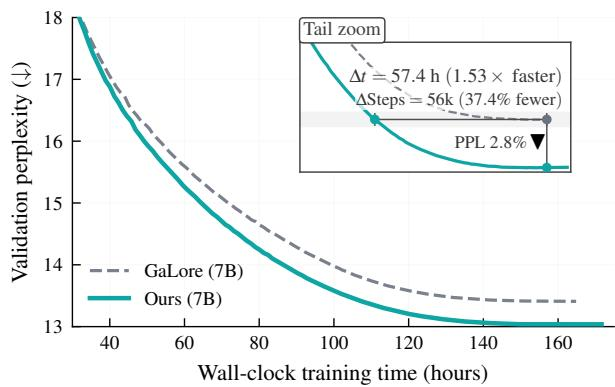  
Figure 1: Accelerated pre-training convergence at the 7B scale. Validation PPL versus wall-clock time for GaLore with MoARa and standard GaLore on Llama 2 7B; the inset (Tail zoom) marks the convergence-time and final-perplexity gains highlighted in the figure.

A growing line of work addresses this bottleneck by projecting Adam’s optimizer states into a low-dimensional subspace, retaining full-parameter learning while substantially reducing optimizerstate memory. Representative methods include GaLore (Zhao et al., 2024), which periodically recomputes the projection via SVD, and several subsequent extensions that refine how this subspace is maintained (Liang et al., 2024; Robert et al., 2025; Rajabi et al., 2025; Zhang et al., 2025b; Chen et al., 2025). These methods now approach the validation perplexity of full-rank training at substantially lower memory cost, but the number of optimization steps and the wall-clock time required to reach a given quality target remains a meaningful axis along which low-rank pretraining can be made more practical.

We identify two design limitations that constrain the convergence speed of existing methods. First, the projection-rank budget is allocated uniformly across Transformer modules, implicitly treating the seven attention and MLP projections (attn.q/k/v/o and mlp.up/gate/down) as equally sensitive to projection. As we show, the alignment between each module’s full gradient and its low-rank reconstruction is sharply heterogeneous, so a uniform allocation over-provisions some modules while leaving others as bottlenecks. Second, projecting a gradient into a low-rank subspace attenuates both its local magnitude and direction. As a result, the per-block scale information that helps the optimizer adapt is lost together with the directional information.

To address these two limitations, we propose Module-Aware Rank Allocation and Structure-Preserving Decomposition for Low-Rank LLM Pretraining (MoARa), a memory-efficient pretraining framework with two complementary components. The first, module-aware projection-rank allocation, redistributes a fixed total projectionrank budget across Transformer module types. Based on a profiling alignment diagnostic, we consolidate this redistribution into a static allocation rule (§3.2). The second, block-wise magnitude– direction decomposition, partitions each gradient row into contiguous blocks and separates per-block scale from direction before projection. The blocklocal scale is retained as a separate optimizer state outside the low-rank projection, which is the specific structure preserved by our method (§3.1). We set the default block size in the neighborhood of the attention head dimension, which our analysis identifies as a balanced regime and our empirical sweep supports as a robust plateau (§3.3).

We evaluate MoARa across five Transformer architectures (Llama 2 (Touvron et al., 2023), Llama 3.2 (Grattafiori et al., 2024), Qwen2.5 (Yang et al., 2024), Qwen3 (Yang et al., 2025), DeepSeek-V2 (DeepSeek-AI et al., 2024); 300M to 7B), at sequence lengths 256 and 2048, and across six lowrank pretraining methods. On Llama 2 7B (Figure 1), MoARa reaches standard GaLore’s final perplexity 57.4 hours earlier — 37% fewer steps and 34% less wall-clock time — with only 0.2% additional peak reserved memory under standard graph compilation. Our main contributions are:

• A module-aware low-rank pretraining framework. We introduce MoARa, which couples module-aware projection-rank allocation with structure-preserving block-wise magnitude– direction decomposition. Both components are motivated by testable claims about the information geometry of low-rank gradient projection. The attention-head dimension provides an architecture-informed reference for the default block size.

• Accelerated convergence across scale, architectures, and sequence length. On Llama 2, MoARa applied to GaLore yields up to 1.64 step speedup from 350M to 7B; at 7B this corresponds to 37% fewer steps and approximately 57.4 hours saved. Comparable reductions extend to sequence length 2048 and to four other recent Transformer architectures, with +0.2% peak reserved memory at 7B under standard graph compilation (Table 2).

• Component-specific cross-method transferability. Module-aware rank allocation transfers as a directionally consistent improvement across all six low-rank pretraining methods we evaluate (GaLore (Zhao et al., 2024), Fira (Chen et al., 2025), Q-GaLore (Zhang et al., 2025b), Sub-Track++ (Rajabi et al., 2025), LDAdam (Robert et al., 2025), OSD (Liang et al., 2024)), with 8.3%–28.3% step reductions on the five non-GaLore methods. In contrast, structurepreserving decomposition is host-dependent and shows limited benefit under Q-GaLore. When combined with projection rank allocation on compatible hosts, the framework reaches up to 41.7% step and 37.1% wall-clock reduction.

## 2 Related Work

Memory-efficient pretraining via low-rank gradient projection. Reducing optimizer-state memory under full-parameter updates is a central challenge in LLM pretraining. GaLore (Zhao et al., 2024) introduces gradient low-rank projection, periodically recomputing the projection via SVD. Subsequent methods primarily refine how the subspace is maintained: OSD (Liang et al., 2024) replaces periodic SVD with online PCA and provides the first convergence guarantee for arbitrary projection update rules; LDAdam (Robert et al., 2025) introduces a projection-aware update rule for optimizer states across changing subspaces with a generalized error-feedback mechanism; SubTrack++ (Rajabi et al., 2025) tracks the gradient subspace on the Grassmannian manifold with projection-aware moments; Q-GaLore (Zhang et al., 2025b) combines INT4-quantized projection matrices with layerwise adaptive SVD frequency; and Fira (Chen et al., 2025) restores full-rank gradient updates while keeping low-rank optimizer state through normbased scaling. Recent work further refines subspace selection through importance sampling and moment orthogonalization (Zhang et al., 2025a; Refael et al., 2025). Across this family, however, the projection-rank budget is distributed uniformly across Transformer modules, implicitly assuming that the seven attention and MLP projections share equal optimization sensitivity. Our work explicitly challenges this assumption and reallocates the budget module-wise via a baseline profiling diagnostic.

Memory efficiency along orthogonal axes. Memory-efficient pretraining has also been pursued along axes orthogonal to optimizer-side SVD projection. CoLA (Liu et al., 2025) restructures attention and MLP projections as low-rank autoencoders, which alters the model architecture itself and places it outside our fixed-architecture, fixed-budget comparison frame. APOLLO (Zhu et al., 2025) uses random-projection-based structured AdamW (Loshchilov and Hutter, 2019) scaling whose auxiliary state carries no per-module r-dimensional subspace, so it lies in a different design space from the methods compared in §4.

Gradient and weight decomposition. Decoupling magnitude from direction has a long history of stabilizing high-dimensional optimization. Weight Normalization (Salimans and Kingma, 2016) reparameterizes weights as $w = g \cdot v / \| v \|$ for improved gradient conditioning, and DoRA (Liu et al., 2024a) extends this decoupling to parameterefficient fine-tuning; both operate on weights rather than gradients. On the optimizer side, Adafactor (Shazeer and Stern, 2018) factorizes second-moment statistics row/column-wise, and VLoRP (Wang et al., 2025) varies the granularity of low-rank gradient projection. MoARa is, to our knowledge, the first method to apply magnitude– direction decomposition to gradients in low-rank pretraining, where the goal is preserving directional information through the projection bottleneck.

Module-aware rank allocation in Transformers. A growing literature establishes that Transformer modules are structurally heterogeneous and benefit from differentiated low-rank treatment. In post-hoc compression, LoRAP (Li et al., 2024) and $\mathrm { A ^ { 3 } }$ (Wong et al., 2026) report distinct low-rank characteristics between attention sub-layers and feed-forward components; in parameter-efficient fine-tuning, AdaLoRA (Zhang et al., 2023), ALoRA (Liu et al., 2024b), and ARA (Xv et al., 2025) adaptively allocate the rank budget across weight matrices based on importance scores. All of these methods target compression or fine-tuning of already-trained models, where importance can be measured on stable representations. From-scratch pretraining is fundamentally different, as rank allocation must account for Adam’s evolving moment states.

To our knowledge, MoARa is the first to bring budget-preserving, module-aware rank allocation to from-scratch LLM pretraining. This is done via a static profiling phase to maintain optimizer history without destabilizing training. The same module-wise sensitivity pattern persists across the five Transformer architectures we evaluate, suggesting the asymmetry is structural rather than incidental. A summary of how MoARa positions relative to these methods is provided in Appendix A (Table 4).

## 3 Methodology

We present MoARa, a memory-efficient pretraining framework with two components: Block-wise Magnitude–Direction Decomposition and Projection Rank Reallocation via Subspace Alignment. Algorithm 1 summarizes the overall procedure.

## 3.1 Block-wise Magnitude and Direction Decomposition

To mitigate the memory cost of optimizer states, GaLore (Zhao et al., 2024) projects each gradient $G ~ \in ~ \mathbb { R } ^ { m \times n }$ into a low-rank subspace as $G _ { \mathrm { p r o j } } = P ^ { \top } G$ via a projection matrix $P \in \mathbb { R } ^ { m \times r }$ $( r \ll m , n )$ , and maintains optimizer states only for the projected gradient. Projecting raw gradients into this fixed subspace, however, forces magnitude and direction to be compressed jointly, attenuating both factors together and potentially suppressing low-energy but still informative updates. Decomposing the gradient before projection reduces this coupled attenuation, so that the projected branch focuses on directional preservation while a separate state tracks magnitude. A naive row-wise decomposition is overly coarse for Transformer weight matrices: applying a single scalar magnitude to an entire row imposes an artificial dependency among heterogeneous features and can distort the projected subspace. Element-wise normalization, at the other extreme, is unnecessarily expensive. Thus block size is introduced to control the granularity of the decomposition. We adopt an intermediate granularity and decompose the gradient into block-wise magnitude and direction.

Algorithm 1 Overall procedure of MoARa   
Require: Model M with module types T; base rank   
$r _ { \mathrm { b a s e } } ;$ total budget $R _ { \mathrm { t o t a l } } ;$ profiling step set $S _ { p } \ =$   
$\{ x , 2 x , \ldots , N _ { p } \} ;$ ; donor set D, receiver set R, trans  
fer amount ∆r; SVD interval $T _ { \mathrm { S V D } } ;$ block size $B ;$   
learning rate $\eta .$   
Ensure: Trained weights $W .$   
Setup phase (executed once before training).   
Phase 1. Profiling.   
Run uniform-rank GaLore for $N _ { p }$ steps; at each   
$t \in S _ { p }$ and each weight W of type τ , log $G _ { t } ( W )$   
and $\dot { G } _ { \mathrm { r e c o n } , t } ( W )$   
Phase 2. Diagnostic verification.   
Compute $S _ { \tau }$ for all $\tau \in \tau ;$ validate that R contains   
low-Sτ modules and D matches donor ablations.   
Phase 3. Budget-preserving reallocation.   
Set $r _ { \tau } \gets r _ { \mathrm { b a s e } } - \Delta r$ for $\tau \in \mathcal { D } ; r _ { \tau } \gets r _ { \mathrm { b a s e } } +$   
$\Delta \boldsymbol { r } \cdot | \boldsymbol { D } | / | \mathcal { R } |$ for $\tau \in \mathcal { R } ; r _ { \tau } \gets r _ { \mathrm { b a s e } }$ otherwise.   
Training phase (with fixed ranks from Phase 3).   
1: for each training step s do   
2: for each target weight W of type τ do   
3: $G  \nabla _ { W } ^ { \setminus } \mathcal { L }$   
4: $M , V \gets$ Decompose $( G , B )$   
5: if s mod $T _ { \mathrm { S V D } } = 0$ then   
6: $P _ { \tau }  \mathrm { T }$ runcated $\mathrm { S V D } ( V , r _ { \tau } )$   
7: end if   
8: $\tilde { V }  P _ { \tau } ^ { \top } V$   
9: $\Delta \tilde { V } \gets \mathrm { O }$ ptimizerV(V˜ )   
10: $\Delta V \gets \bar { P _ { \tau } } \Delta \tilde { V }$   
11: $\Delta M \gets $ Optimizer $_ M ( M )$   
12: $W  W \bar { - } \eta \big ( \mathrm { R e p } _ { B } ( \Delta { \dot { M } } ) \odot \Delta V \big )$   
13: end for   
14: end for   
15: return W

Let $G \in \mathbb { R } ^ { m \times n }$ . When $B \nmid n ,$ , we right-zeropad each row to the smallest column dimension $n _ { \mathrm { p a d } } \geq n$ such that $B \mid n _ { \mathrm { p a d } }$ . Let $k = n _ { \mathrm { p a d } } / B$ and denote the padded gradient by $G _ { \mathrm { p a d } } \in \mathbb { R } ^ { m \times n _ { \mathrm { p a d } } }$ We partition each padded row into k contiguous $1 \times B$ blocks:

$$
\begin{array} { r } { g _ { i , j } = ( G _ { \mathrm { p a d } } ) _ { i , j B : ( j + 1 ) B } \in \mathbb { R } ^ { B } , } \\ { \mathrm { w h e r e } \quad j = 0 , \dots , k - 1 . } \end{array}\tag{1}
$$

For each block, we compute a scalar magnitude $m _ { i , j } = \| g _ { i , j } \| _ { 2 }$ and a normalized direction block

$$
( V _ { \mathrm { p a d } } ) _ { i , j B : ( j + 1 ) B } = \frac { ( G _ { \mathrm { p a d } } ) _ { i , j B : ( j + 1 ) B } } { m _ { i , j } + \epsilon }
$$

for a small $\epsilon > 0$ . Collecting all magnitudes yields $M \in \mathbb { R } ^ { m \times k }$ , and $V _ { \mathrm { p a d } } \in \mathbb { R } ^ { m \times n }$ pad . With $\mathrm { R e p } _ { B } ( M )$ denoting the matrix obtained by repeating each $m _ { i , j }$ over its B columns, the padded representation satisfies

$$
G _ { \mathrm { p a d } } \approx \mathrm { R e p } _ { B } ( M ) \odot V _ { \mathrm { p a d } } ,
$$

with exact equality recovered as $\epsilon  0 .$ . The padded columns are discarded after decomposition and recomposition, so the resulting direction and update tensors retain the original shape.

Choice of B: head-dimension-informed default. We adopt B in the neighborhood of the attention head dimension $d _ { \mathrm { h e a d } }$ as an architecture-informed scale reference, rather than requiring exact head alignment. We provide a theoretical analysis of the underlying trade-off in §3.3, empirical validation in Appendix B.4, and specific values per model scale in Appendix D.2.

## 3.2 Projection Rank Reallocation via Subspace Alignment

Architectural intuition and alignment diagnostic. Our second design is motivated by a mismatch between uniform projection-rank allocation and the heterogeneous sensitivity of Transformer modules. If projection distortion is structurally nonuniform, a uniform rank allocation over-provisions some modules while leaving others as bottlenecks. We form an a priori expectation about which modules tolerate projection-rank reduction by reading the decoder block: attn.q and attn.k parameterize token-to-token compatibility scores (routing), attn.v carries representational content and attn.o integrates the multi-head outputs, and the MLP projections transform and propagate representational content, with mlp.down acting as the bottleneck that compresses the expanded MLP representation back into the model dimension. We therefore expected the routing pair attn.q/attn.k to be more tolerant to rank reduction than the content-carrying modules, and mlp.down to be most sensitive. To test this, we measure how well the projected subspace preserves each module’s gradient direction via cosine similarity. With $G _ { \mathrm { r e c o n } } = \mathrm { R e p } _ { B } ( M ) \odot ( P P ^ { \top } V )$ , the alignment at step t is

$$
S ( W , t ) = \cos ( G _ { t } ( W ) , G _ { \mathrm { r e c o n } , t } ( W ) ) ,\tag{2}
$$

and the module-wise alignment score $\begin{array} { r l } { S _ { \tau } } & { { } = } \end{array}$ $\mathbb { E } _ { t , W \in \tau } [ S ( W , t ) ]$ averages over profiling steps and matrix instances of module type τ.

Donor and receiver selection from joint evidence. The observed $S _ { \tau }$ ordering places mlp.down lowest by a wide margin, the routing pair attn.q/attn.k at moderate values, and the content/integration modules attn.v/attn.o highest, with mlp.up and mlp.gate in the middle (Table 6). The budget-receiver role of mlp.down is strongly supported, but the cosine ranking alone would suggest attn.v/attn.o as budget-donors — in conflict with our architectural intuition. A singlemodule rank-reduction ablation (Appendix C.6) resolves the conflict: reducing the rank of attn.q or attn.k causes only a small increase in final perplexity, while reducing attn.v, attn.o, mlp.up, or mlp.gate causes a substantially larger one. The high cosine alignment of attn.v/attn.o therefore reflects a structural redundancy the projection preserves well, rather than actual robustness to capacity loss. We accordingly select the donor set = attn.q, attn.k and the receiver set $\mathcal { R } = \{ \mathsf { m l p } . \mathsf { d o w n } \}$

Static budget-preserving reallocation. Given a total projection-rank budget $R _ { \mathrm { t o t a l } }$ , we assign $r _ { \tau } \gets r _ { \mathrm { b a s e } } - \Delta r \mathrm { ~ f o r ~ } \tau \in \mathcal { D } , r _ { \tau } \gets r _ { \mathrm { b a s e } } + \Delta r \mathrm { ~ . ~ }$ $| \mathcal { D } | / | \mathcal { R } | \mathrm { f o r } \tau \in \mathcal { R }$ , and the uniform baseline rank otherwise; this preserves $\sum _ { \tau } r _ { \tau } = R _ { \mathrm { t o t a l } }$ by construction. We adopt $\Delta r = r _ { \mathrm { b a s e } } / 2$ as a balanced default that transfers a nontrivial fraction of donor capacity while preserving half of each donor’s baseline rank, without claiming this value is optimal. The resulting integer ranks are fixed throughout training. This static allocation is a deliberate design choice. In Adam-style low-rank training, changing ranks online changes the dimensionality of the optimizer states — newly added directions require fresh first- and second-moment initialization, while removed directions discard accumulated optimizer history, which can destabilize the training trajectory. Static allocation captures persistent modulewise sensitivity while maintaining optimizer-state continuity. Profiling runs once before target training and is excluded from the target-training wallclock trajectories; a 1k-step run ( 11 min on 350M in our settings) suffices to recover the full assignment (Appendix C.3).

## 3.3 Theoretical Foundations

Two information-geometric properties, both built on the cosine perspective of $S _ { \tau }$ , motivate MoARa’s design choices.

(i) Carrying magnitude outside the projection isolates block-wise cosine distortion to direction. Let $\tilde { V } = P _ { V } P _ { V } ^ { \top } V$ and let $\widetilde { v } _ { i , b }$ denote the corresponding block of $\widetilde { V }$ . For every block for which both vectors are nonzero,

$$
\cos ( G _ { i , b } , G _ { \mathrm { r e c o n } , i , b } ) = \cos ( v _ { i , b } , \widetilde { v } _ { i , b } ) .
$$

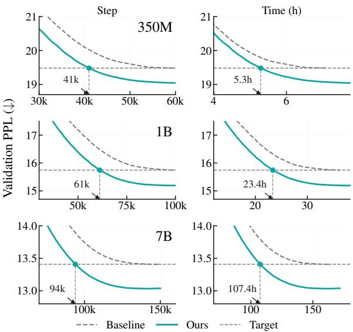  
Figure 2: Pre-training validation perplexity across model scales. The left and right columns plot perplexity versus training steps and wall-clock time, respectively. Annotated points mark where our method reaches the baseline’s final perplexity.

Thus, the scalar magnitude factor cancels from the block-wise cosine alignment, and any projectioninduced alignment change is expressed through the direction branch.

(ii) Block size induces a statistical–coupling trade-off. Small B leaves block magnitudes dominated by per-coordinate noise. At the extreme $B = 1$ , the direction signal becomes sign-valued and loses all coordinate-wise magnitude variation. Large B aggregates heterogeneous coordinates. In this regime, the unit-norm direction $v _ { i , b } = G _ { i , b } / m _ { i , b }$ attenuates low-magnitude coordinates by the dominant ones within the same block. Setting B in the neighborhood of $d _ { \mathrm { h e a d } }$ provides an architecture-informed operating point in the balanced regime between the two extremes.

The two observations above provide an information-geometric rationale for MoARa’s design, rather than a formal convergence guarantee for MoARa-augmented Adam. Full derivations are given in Appendix B.3.

## 4 Experiments

## 4.1 Experimental Setup

Models and Architectures. For the main scaling study, we adopt the Llama 2 (Touvron et al., 2023) architecture at 350M, 1B, and 7B scales. To evaluate architectural generalization, we further consider Llama 3.2 (300M) (Grattafiori et al., 2024),

Qwen2.5 (350M) (Yang et al., 2024), Qwen3 (350M) (Yang et al., 2025), and the dense variant of DeepSeek-V2 (350M) (DeepSeek-AI et al., 2024), scaled to be comparable to Llama 2 350M.

Baselines. Our primary comparisons are within the low-rank pretraining family, where GaLore serves as our main host. To assess transferability beyond GaLore, we additionally evaluate MoARa applied to five other low-rank methods in our cross-method ablation: Fira (Chen et al., 2025), Q-GaLore (Zhang et al., 2025b), SubTrack++ (Rajabi et al., 2025), LDAdam (Robert et al., 2025), and OSD (Liang et al., 2024).

Projection rank allocation protocol. For the Llama 2 scaling study, we profile the 350M configuration and reuse the resulting donor/receiver assignment at 1B and 7B, while the numerical ranks follow each scale’s $r _ { b a s e } .$ For Llama 3.2, Qwen2.5, and Qwen3, we fix Q and K as donors and Down as the receiver. For our custom dense DeepSeek-V2 variant, we use Q(b) and KV(b) as donors and Down as the receiver. These mappings are fixed before target training without target-architecture profiling or performance-based rank tuning.

Training details. All models are pretrained from scratch on the English C4 (Raffel et al., 2020) dataset. To ensure fair comparison, we control all training hyperparameters; detailed configurations are provided in Appendix D. Unless otherwise stated, all methods use the same total projection rank budget.

## 4.2 MoARa on GaLore across Scale, Architecture, and Sequence Length

We evaluate MoARa applied to GaLore along three axes: model scale, architecture family, and pretraining sequence length.

Pretraining efficiency at scale. Figure 2 reports validation perplexity trajectories with respect to both training steps and wall-clock time at 350M, 1B, and 7B scales on Llama 2. Across all three scales, GaLore with MoARa converges faster than standard GaLore in both axes. On Llama 2 7B (Figure 1), GaLore requires 150k steps to reach its final perplexity while GaLore with MoARa reaches the same target at 94k steps, reducing the required steps by 37% and the wall-clock time by 34%. These wall-clock values report target-training time only. Including the one-time 1k-step 350M profiling cost ( 11 min), the non-amortized time-to-target is 5.47 h at 350M versus 7.13 h for GaLore, while the wall-clock reduction at 7B remains approximately 34.7%. When the same assignment is reused across K target runs, the amortized time-to-target is $T _ { t r a i n }$ $+ \ T _ { p r o f i l e } \ / \ K$ (Appendix C.3). As a secondary fixed-budget result, when both methods are trained for 150k steps, GaLore with MoARa continues to improve after the standard GaLore curve plateaus and achieves a further 2.8% gain in final perplexity. This acceleration is consistent across other scales and architectures, yielding up to 1.64 step speedup from 350M to 7B in Llama 2 (Figure 7 in Appendix E). At 7B, the reduction in steps-totarget from 150k to 94k produces the net wall-clock saving despite a 4.19% per-step overhead.

Table 1: Llama 2 1B benchmark results. We report means over three seeds. $\Delta$ denotes relative change. “Win” counts the number of seeds for which our method outperforms GaLore. Full results are in Appendix F.
<table><tr><td>Task</td><td>Base</td><td>Ours</td><td> $\Delta$ </td><td>Win</td></tr><tr><td colspan="5">Language modeling ↓</td></tr><tr><td>C4 ppl</td><td>86.88</td><td>82.62</td><td>-4.90%</td><td>3/3</td></tr><tr><td>WikiText2 ppl</td><td>64.71</td><td>60.27</td><td>-6.86%</td><td>2/3</td></tr><tr><td colspan="5">Commonsense / reasoning ↑</td></tr><tr><td>HellaSwag</td><td>.386</td><td>.398</td><td>+3.11%</td><td>3/3</td></tr><tr><td>WinoGrande</td><td>.513</td><td>.531</td><td>+3.51%</td><td>3/3</td></tr><tr><td>PIQA</td><td>.677</td><td>.682</td><td>+0.74%</td><td>2/3</td></tr><tr><td>BoolQ</td><td>.546</td><td>.558</td><td>+2.20%</td><td>2/3</td></tr><tr><td>ARC-E</td><td>.425</td><td>.433</td><td>+1.88%</td><td>2/3</td></tr><tr><td>ARC-C</td><td>.252</td><td>.248</td><td>-1.59%</td><td>1/3</td></tr></table>

Generalization across recent architectures. To verify that MoARa is not specific to one model family, we evaluate it on several recent Transformer architectures at the 300–350M scale, all of which depart from the standard multi-head attention used in Llama 2. Llama 3.2 and the Qwen family adopt Grouped-Query Attention, while DeepSeek-V2 uses Multi-head Latent Attention; both alter the dimensional ratios and parameter distributions of the attn matrices. Despite these differences, the Llama-2-derived allocation rule transfers through the predefined structural mapping described in §4.1, without target-architecture profiling or performance-based rank tuning, and achieves substantial reductions in steps-to-target across all tested architectures, including approximately 43% on Llama 3.2, 33% on the Qwen models, and 28% on DeepSeek-V2 (Appendix E.2), with proportional wall-clock reductions.

Table 2: Component-wise memory cost (eager mode, MiB). Treatment columns show relative change versus baseline. Under standard graph compilation at 7B, the max allocated/reserved overheads reduce to negligible levels. Full breakdown in Appendix G.
<table><tr><td>Scale</td><td>Metric</td><td>Base</td><td>+Decomp</td><td>+Rank</td><td>Full</td></tr><tr><td>350M</td><td>Max alloc. Max reserv. Opt. state</td><td>47258 48154 539</td><td>+0.05% +0.16% +13.4%</td><td>+0.00% -0.05% +7.5%</td><td>+0.12% +0.12% +20.9%</td></tr><tr><td>1B</td><td>Max alloc. Max reserv. Opt. state</td><td>51611 54988 1652</td><td>+0.00% +0.29% +8.7%</td><td>+0.00% +0.26% +9.7%</td><td>+0.00% +0.57% +18.4%</td></tr><tr><td>7B</td><td>Max alloc. Max reserv. Opt. state</td><td>60899 62122 7177</td><td>+6.39% +7.43% +5.4%</td><td>+6.39% +7.22% +12.0%</td><td>+6.39% +7.43% +17.4%</td></tr></table>

Robustness at sequence length 2048. The above scaling and architecture results follow the GaLorestandard sequence length of 256. To test whether the efficiency gains persist beyond this shortcontext setting, we re-evaluate GaLore with MoARa against standard GaLore at sequence length 2048 on Llama 2 350M. GaLore with MoARa reaches standard GaLore’s final validation perplexity in 35.0% fewer steps and 33.3% less wall-clock time, and improves final perplexity by 2.65% (Appendix E.3).

Stability of the default configuration. The default configuration is supported by complementary diagnostics and sensitivity checks. The cosine-alignment analysis consistently identifies mlp.down as the receiver, while the single-module rank-reduction ablation identifies Q/K as the most robust donors. The 1k-step profile recovers the same donor/receiver assignment as the longer profiles, and this assignment remains unchanged across profiling strides of 50–400 steps. For decomposition, $B \in \{ 3 2 , 6 4 , 1 2 8 \}$ forms a near-optimal plateau with little variation across the three settings. We use $\Delta r = r _ { \mathrm { b a s e } } / 2$ as a conservative budget-preserving default, while $T _ { \mathrm { S V D } } = 2 0 0$ follows standard GaLore and is not tuned for MoARa.

Robustness at the 1B scale and zero-shot downstream evaluation. As a limited sanity check, we assess whether the faster pretraining trajectory causes systematic downstream degradation. We train Llama 2 1B with three random seeds for both standard GaLore and GaLore with MoARa and evaluate the 100k-step checkpoints on a suite of zero-shot downstream benchmarks (Zellers et al.,

2019; Sakaguchi et al., 2020; Bisk et al., 2020; Clark et al., 2019, 2018; Lin et al., 2022). Table 1 reports the results over three seeds. MoARa matches or improves upon standard GaLore on the majority of tasks across seeds on several primary metrics. The full benchmark set is reported in Appendix F.

Memory overhead in practice. These gains are achieved without materially compromising the memory advantage of low-rank pretraining. Table 2 summarizes the component-wise memory cost in eager mode, with the full eager- and compiledmode breakdown reported in Appendix G. All wall-clock experiments use torch.compile. Under this compiled setting at the 7B scale, MoARa increases peak allocated memory by only +0.04 MiB and peak reserved memory by 0.2% relative to Ga-Lore. Persistent optimizer-state memory is a separate, compilation-independent metric. At 7B, it increases by 1,250 MiB (+17.4%), with the contributions from block-wise decomposition and moduleaware rank allocation combining approximately additively. Peak allocated and reserved memory are dominated by model parameters and activations, so the eager-mode peak increase at 7B largely disappears under standard graph compilation.

## 4.3 Component-wise Cross-Method Transferability

To examine whether MoARa’s two components are tied to GaLore’s specific projection mechanism, we apply each component independently to five additional low-rank pretraining methods spanning distinct mechanism classes: Fira (Chen et al., 2025), Q-GaLore (Zhang et al., 2025b), SubTrack++ (Rajabi et al., 2025), LDAdam (Robert et al., 2025), and OSD (Liang et al., 2024). Combined with GaLore, this yields a 6 4 ablation at the 350M scale on C4. We report step reduction and wallclock reduction to reach the host’s vanilla final perplexity (Table 3). In summary, rank allocation improves all six hosts, whereas the added benefit of decomposition is host-dependent and is limited under Q-GaLore.

Module-aware rank allocation transfers as a directionally consistent improvement. Across all six host methods, rank allocation alone reaches the host’s vanilla final PPL with strictly fewer steps and less wall-clock time. On the five non-GaLore hosts, step reduction ranges from 8.3% (Fira) to 28.3% (SubTrack++), and wall-clock reduction ranges from 7.0% to 28.4%; the two reductions remain closely matched in each case, since rank allocation only redistributes the projection budget rather than enlarging it. The directional consistency across six independent host mechanisms suggests that the module-wise differential in projection rank sensitivity is shared across the low-rank pretraining family rather than specific to GaLore’s update rule.

Table 3: Cross-method ablation at Llama 2 350M, 60k steps. Each cell reports final PPL and step-to-/wall-clockto-target. Target is each host’s vanilla final perplexity; “—” indicates that the target was not reached within the 60k-step budget.
<table><tr><td>Condition</td><td>GaLore</td><td>Fira</td><td>Q-GaLore</td><td>SubTrack++</td><td>OSD</td><td>LDAdam</td></tr><tr><td rowspan="3">Vanilla</td><td>19.48</td><td>16.85</td><td>20.64</td><td>16.19</td><td>21.66</td><td>17.60</td></tr><tr><td>60k(−)</td><td>60k (−)</td><td>60k(−)</td><td>60k(−)</td><td>60k(−)</td><td>60k (−)</td></tr><tr><td>7.13h (−)</td><td>7.10h (−)</td><td>8.27h (−)</td><td>6.28h (−)</td><td>8.78h (−)</td><td>9.33h (−)</td></tr><tr><td>+ Rank</td><td>19.27 47k (↓22.0%) 5.58h (↓21.7%)</td><td>16.79 55k (↓8.3%) 6.60h (↓7.0%)</td><td>20.45 45k (↓25.0%) 6.19h (↓25.2%)</td><td>15.57 43k (↓28.3%) 4.50h (↓28.4%)</td><td>21.27 44k (↓26.7%) 6.97h (↓20.6%)</td><td>17.19 44k (↓26.7%) 6.99h (↓25.1%)</td></tr><tr><td>+ Decom</td><td>19.45 54k (↓9.6%) 7.06h (↓1.0%)</td><td>16.75 53k (↓11.7%) 6.79h (↓4.4%)</td><td>20.81</td><td>28.29</td><td>20.76 37k (↓38.3%) 5.41h (↓38.4%)</td><td>24.01</td></tr><tr><td>+ Full (MoARa)</td><td>19.04 41k (↓31.7%) 5.29h (↓25.8%)</td><td>16.70 51k (↓15.0%) 6.65h (↓6.3%)</td><td>20.46 45k (↓25.0%) 6.26h (↓24.3%)</td><td>19.17</td><td>20.42 35k (↓41.7%) 5.52h (↓37.1%)</td><td>20.24</td></tr></table>

The added benefit of block-wise decomposition is host-dependent. Three patterns emerge from Table 3: on hosts with slowly or discretely evolving projections (GaLore, Fira, OSD), the full configuration improves over vanilla on all three hosts and gives the best final PPL and steps-to-target. Its wallclock gain additionally reflects the per-step cost of decomposition. On OSD, the full configuration achieves 41.7% step and 37.1% wall-clock reduction. On Q-GaLore, decomposition alone produces a small increase in final PPL and the full configuration recovers the rank-allocation-only result. On SubTrack++ and LDAdam, whose projection bases change continuously during training, decomposition does not combine stably with the evolving subspace despite multiple remedies, and the full configuration does not reach the host’s vanilla target within the 60k-step budget. We analyze the host-specific mechanisms underlying all three patterns in §5.

## 5 Analysis and Discussion

The cross-method ablation of §4.3 revealed a sharp asymmetry between MoARa’s two components: rank allocation transfers consistently across all six hosts, while decomposition transfers with strong host-dependence. We discuss the mechanisms responsible for this pattern. As an additional sanity check on the allocation itself, MoARa’s sensitivityguided allocation also outperforms 20 random budget-preserving allocations (Appendix E.1).

Projection rank allocation operates on an architectural property. The module-wise alignment scores $S _ { \tau } -$ measured during a separate baseline profiling run as the cosine similarity between the full gradient and its low-rank reconstruction — characterize how much meaningful signal each module’s gradient retains inside its projection subspace, independent of how the optimizer subsequently chooses to update along that subspace. The consistent benefit across the six evaluated hosts therefore suggests that this module-wise asymmetry is not specific to GaLore’s update rule.

Decomposition operates on a host-mechanism property, splitting hosts into three groups. The behavior observed in §4.3 separates hosts by how their projection bases evolve over training and by the precision constraints of their numerical representations.

Group A — slowly or discretely evolving projections (GaLore (Zhao et al., 2024), Fira (Chen et al., 2025), OSD (Liang et al., 2024)). Fira maintains an r-dimensional optimizer state and applies a full-rank gradient update via norm-based scaling. This scaling partially restores the column-norm information attenuated by projection. In contrast, our decomposition addresses this information loss through a different path by separating the magnitude pre-projection. The Fira result in Table 3 suggests that its norm-based scaling and our decomposition are compatible in the evaluated setting. OSD updates its projection basis online via PCA on accumulated statistics. A plausible interpretation is that its basis evolves gradually enough for decomposition to remain effective in our evaluation.

Group B — continuously evolving projections (SubTrack++ (Rajabi et al., 2025), LDAdam (Robert et al., 2025)). Both methods update the projection basis continuously during training. SubTrack++ operates on the Grassmannian manifold, while LDAdam applies a per-step subspace correction. Under this continuously evolving projection regime, a plausible explanation is that the separately optimized magnitude state becomes harder to coordinate with direction updates induced by the changing projection basis. Under the remedies we tested, the full configuration does not reach the host’s vanilla final perplexity within the 60k-step budget.

Group C — quantized host (Q-GaLore (Zhang et al., 2025b)). Q-GaLore combines INT4 projection matrices and INT8 weights with an 8-bit Adam optimizer. In our precision ablation, increasing only the magnitude-branch optimizer state from 8-bit to FP32 does not recover the benefit of decomposition (Appendix E.5). This suggests that optimizer-state precision alone does not explain the degradation. The other quantized components of Q-GaLore are therefore plausible compatibility constraints for decomposition.

Two-axis summary. The cross-method pattern admits a clean two-axis reading. First, rank allocation is architecture-driven. Across the six evaluated hosts, it consistently improves time-to-target, suggesting that the module-wise asymmetry is not specific to GaLore. Second, decomposition is hostmechanism-driven. Across the evaluated hosts, decomposition is most effective when the projection basis evolves slowly or discretely and when the numerical representation is sufficiently precise. We treat these as observed compatibility factors rather than necessary or sufficient conditions. These conditions clarify when each component is likely to transfer within the broader design space of lowrank pretraining methods.

Practical trade-offs. Relative to the corresponding vanilla low-rank baselines, MoARa adds a onetime profiling stage and a static module-wise rank configuration. During target training, projection ranks remain fixed, so no online rank search or optimizer-state resizing is required. The remaining cost comes from per-step decomposition, recomposition, and the separate magnitude branch. In the 7B GaLore comparison, these additions result in a 4.19% per-step overhead. Our method also adds persistent optimizer state, while its compiled peak-memory overhead remains small.

## 6 Conclusion

We presented MoARa, a low-rank LLM pretraining framework. It combines profiling-based rank allocation with block-wise magnitude–direction decomposition. Together, these components improve the use of a fixed projection-rank budget and retain per-block magnitude information. Evaluated across five Transformer architectures from 300M to 7B, MoARa reaches the GaLore baseline’s final perplexity in 37% fewer steps and 34% less wall-clock time on Llama 2 7B. Across all six evaluated hosts, module-aware rank allocation consistently reduces steps-to-target. On compatible hosts, the full design of MoARa achieves up to 41.7% step and 37.1% wall-clock reduction. Our analysis indicates that projection rank allocation captures a persistent architecture-related pattern within the evaluated settings, while decomposition shows host-dependent compatibility associated with projection-basis evolution and numerical precision.

## Limitations

While MoARa effectively mitigates key bottlenecks in low-rank LLM pretraining, we discuss boundaries of our work and identify directions for future research.

Absence of a stable dynamic rank-allocation mechanism. MoARa allocates ranks statically through a single profiling phase prior to training, and the question of whether a stable dynamic rankallocation mechanism is achievable remains open. A dynamic schedule that, for instance, expands the capacity of receiver modules after warmup is conceptually appealing, but our empirical investigations show that expanding a module’s projection rank mid-training requires initializing the firstand second-moment statistics of Adam for newly spanned orthogonal directions, and we observe that this derails the training trajectory. We hypothesize that model parameters rapidly co-adapt to the initial low-rank bottleneck, and abruptly altering this representational capacity perturbs the accumulated moment states. Designing a stable dynamic mechanism that resolves this momentum–subspace mismatch is left to future work; the static allocation studied here should therefore be understood as the simplest stable instance of the broader moduleaware allocation principle rather than its only realization.

Cross-method decomposition compatibility for continuously-evolving projections. Our crossmethod ablation (§4.3) shows that block-wise magnitude–direction decomposition does not stably combine with hosts that update their projection basis continuously during training (Sub-Track++, LDAdam) under the variants we tested. Future work could focus on two key questions. First, what conditions allow a magnitude state to be co-transported consistently with continuouslyevolving projections? Second, does this cotransport rule lead to a stable optimization trajectory?

Formal convergence rate guarantees. Our theoretical analysis (§3.3, Appendix B.3) characterizes the information-geometric properties of MoARa’s design but does not establish a formal convergence rate guarantee for MoARa-augmented Adam. Such a result would require tracking the moment dynamics of the magnitude and direction branches jointly and is a natural direction for follow-up theoretical work.

Scope of optimizer evaluation. Our experiments focus on low-rank optimizer-state projection methods built on AdamW (Loshchilov and Hutter, 2019) -style optimization, which provide a controlled setting for isolating the effects of projection-rank allocation and structure-preserving decomposition. Evaluating specialized optimizers such as 8-bit AdamW or Muon is important, but would introduce optimizer-specific numerical behavior and tuning choices that could confound the main algorithmic comparison. We therefore do not claim that MoARa outperforms all memory-efficient optimizers. A controlled cross-family comparison would require matched memory budgets and separate tuning protocols, which we leave to future work.

Scope of generalization. Our experiments focus on decoder-only Transformers, and whether the same allocation transfers to encoder–decoder architectures remains unverified. We also do not evaluate transfer across different pre-training datasets. Extending the 2048-token study across all model scales or to substantially longer contexts was computationally prohibitive within our available budget, so our long-context evidence is limited to the Llama 2 350M setting.

## Acknowledgments

This work was supported by IITP grants funded by the Government of the Republic of Korea (Ministry of Science and ICT) under Grant Nos. RS-2021-II211343 and RS-2025-25442338, and by the "Advanced GPU Utilization Support Program".

## References

Yonatan Bisk, Rowan Zellers, Ronan Le Bras, Jianfeng Gao, and Yejin Choi. 2020. PIQA: Reasoning about physical commonsense in natural language. Proceedings of the AAAI Conference on Artificial Intelligence, 34(05):7432–7439.

Xi Chen, Kaituo Feng, Changsheng Li, Xunhao Lai, Xiangyu Yue, Ye Yuan, and Guoren Wang. 2025. Fira: Can we achieve full-rank training of LLMs under low-rank constraint? In Advances in Neural Information Processing Systems, volume 38.

Christopher Clark, Kenton Lee, Ming-Wei Chang, Tom Kwiatkowski, Michael Collins, and Kristina Toutanova. 2019. BoolQ: Exploring the surprising difficulty of natural yes/no questions. In Proceedings ofthe 2019 Conference ofthe North American Chapter of the Association for Computational Linguistics: Human Language Technologies, Volume 1

(Long and Short Papers), pages 2924–2936. Association for Computational Linguistics.

Peter Clark, Isaac Cowhey, Oren Etzioni, Tushar Khot, Ashish Sabharwal, Carissa Schoenick, and Oyvind Tafjord. 2018. Think you have solved question answering? try ARC, the AI2 reasoning challenge. Preprint, arXiv:1803.05457.

DeepSeek-AI, Aixin Liu, Bei Feng, Bin Wang, Bingxuan Wang, Bo Liu, Chenggang Zhao, Chengqi Dengr, Chong Ruan, Damai Dai, Daya Guo, Dejian Yang, Deli Chen, Dongjie Ji, Erhang Li, Fangyun Lin, Fuli Luo, Guangbo Hao, Guanting Chen, and 138 others. 2024. DeepSeek-V2: A strong, economical, and efficient mixture-of-experts language model. Preprint, arXiv:2405.04434.

Aaron Grattafiori, Abhimanyu Dubey, Abhinav Jauhri, Abhinav Pandey, Abhishek Kadian, Ahmad Al-Dahle, Aiesha Letman, Akhil Mathur, Alan Schelten, Alex Vaughan, Amy Yang, Angela Fan, Anirudh Goyal, Anthony Hartshorn, Aobo Yang, Archi Mi tra, Archie Sravankumar, Artem Korenev, Arthur Hinsvark, and 542 others. 2024. The Llama 3 herd of models. Preprint, arXiv:2407.21783.

Diederik P. Kingma and Jimmy Ba. 2015. Adam: A method for stochastic optimization. In International Conference on Learning Representations.

Guangyan Li, Yongqiang Tang, and Wensheng Zhang. 2024. LoRAP: Transformer sub-layers deserve differentiated structured compression for large language models. In Proceedings of the 41st International Conference on Machine Learning, volume 235 of Proceedings ofMachine Learning Research, pages 28657–28672. PMLR.

Kaizhao Liang, Bo Liu, Lizhang Chen, and Qiang Liu. 2024. Memory-efficient LLM training with online subspace descent. In Advances in Neural Information Processing Systems, volume 37.

Stephanie Lin, Jacob Hilton, and Owain Evans. 2022. TruthfulQA: Measuring how models mimic human falsehoods. In Proceedings ofthe 60th Annual Meeting of the Association for Computational Linguistics (Volume 1: Long Papers), pages 3214–3252. Association for Computational Linguistics.

Shih-Yang Liu, Chien-Yi Wang, Hongxu Yin, Pavlo Molchanov, Yu-Chiang Frank Wang, Kwang-Ting Cheng, and Min-Hung Chen. 2024a. DoRA: Weightdecomposed low-rank adaptation. In Proceedings of the 41st International Conference on Machine Learning, volume 235 of Proceedings of Machine Learning Research, pages 32100–32121. PMLR.

Zequan Liu, Jiawen Lyn, Wei Zhu, Xing Tian, and Yvette Graham. 2024b. ALoRA: Allocating lowrank adaptation for fine-tuning large language models. In Proceedings ofthe 2024 Conference ofthe North American Chapter of the Association for Computational Linguistics: Human Language Technologies (Volume 1: Long Papers), pages 622–641. Association for Computational Linguistics.

Ziyue Liu, Ruijie Zhang, Zhengyang Wang, Mingsong Yan, Zi Yang, Paul D. Hovland, Bogdan Nicolae, Franck Cappello, Sui Tang, and Zheng Zhang. 2025. CoLA: Compute-efficient pre-training of LLMs via low-rank activation. In Proceedings ofthe 2025 Conference on Empirical Methods in Natural Language Processing, pages 4627–4645. Association for Computational Linguistics.

Ilya Loshchilov and Frank Hutter. 2019. Decoupled weight decay regularization. In International Conference on Learning Representations.

Stephen Merity, Caiming Xiong, James Bradbury, and Richard Socher. 2017. Pointer sentinel mixture models. In International Conference on Learning Representations.

Colin Raffel, Noam Shazeer, Adam Roberts, Katherine Lee, Sharan Narang, Michael Matena, Yanqi Zhou, Wei Li, and Peter J. Liu. 2020. Exploring the limits of transfer learning with a unified text-to-text transformer. Journal ofMachine Learning Research, 21(140):1–67.

Sahar Rajabi, Nayeema Nonta, and Sirisha Rambhatla. 2025. SubTrack++: Gradient subspace tracking for scalable LLM training. In Advances in Neural Information Processing Systems, volume 38.

Yehonathan Refael, Guy Smorodinsky, Tom Tirer, and Ofir Lindenbaum. 2025. SUMO: Subspace-aware moment-orthogonalization for accelerating memoryefficient LLM training. In Advances in Neural Information Processing Systems, volume 38.

Thomas Robert, Mher Safaryan, Ionut-Vlad Modoranu, and Dan Alistarh. 2025. LDAdam: Adaptive optimization from low-dimensional gradient statistics. In International Conference on Learning Representations.

Keisuke Sakaguchi, Ronan Le Bras, Chandra Bhagavatula, and Yejin Choi. 2020. WinoGrande: An adversarial winograd schema challenge at scale. Proceedings ofthe AAAI Conference on Artificial Intelligence, 34(05):8732–8740.

Tim Salimans and Diederik P. Kingma. 2016. Weight normalization: A simple reparameterization to accelerate training of deep neural networks. In Advances in Neural Information Processing Systems, volume 29.

Noam Shazeer and Mitchell Stern. 2018. Adafactor: Adaptive learning rates with sublinear memory cost. In Proceedings ofthe 35th International Conference on Machine Learning, volume 80 of Proceedings of Machine Learning Research, pages 4596–4604. PMLR.

Hugo Touvron, Louis Martin, Kevin Stone, Peter Albert, Amjad Almahairi, Yasmine Babaei, Nikolay Bashlykov, Soumya Batra, Prajjwal Bhargava, Shruti Bhosale, Dan Bikel, Lukas Blecher, Cristian Canton Ferrer, Moya Chen, Guillem Cucurull, David Esiobu,

Jude Fernandes, Jeremy Fu, Wenyin Fu, and 49 others. 2023. Llama 2: Open foundation and fine-tuned chat models. Preprint, arXiv:2307.09288.

Yezhen Wang, Zhouhao Yang, Brian K Chen, Fanyi Pu, Bo Li, Tianyu Gao, and Kenji Kawaguchi. 2025. Memory-efficient LLM training by variousgrained low-rank projection of gradients. Preprint, arXiv:2505.01744.

Jeffrey T. H. Wong, Cheng Zhang, Xinye Cao, Pedro Gimenes, Christos-Savvas Bouganis, George Anthony Constantinides, Wayne Luk, and Yiren Zhao. 2026. A3 : an analytical low-rank approximation framework for attention. In Proceedings of the 43rd International Conference on Machine Learning, volume 306 of Proceedings of Machine Learning Research. PMLR.

Lin Xv, Jingsheng Gao, Xian Gao, Ting Liu, and Yuzhuo Fu. 2025. ARA: Adaptive rank allocation for efficient large language model SVD compression. Preprint, arXiv:2510.19389.

An Yang, Anfeng Li, Baosong Yang, Beichen Zhang, Binyuan Hui, Bo Zheng, Bowen Yu, Chang Gao, Chengen Huang, Chenxu Lv, Chujie Zheng, Dayiheng Liu, Fan Zhou, Fei Huang, Feng Hu, Hao Ge, Haoran Wei, Huan Lin, Jialong Tang, and 41 others. 2025. Qwen3 technical report. Preprint, arXiv:2505.09388.

An Yang, Baosong Yang, Beichen Zhang, Binyuan Hui, Bo Zheng, Bowen Yu, Chengyuan Li, Dayiheng Liu, Fei Huang, Haoran Wei, Huan Lin, Jian Yang, Jianhong Tu, Jianwei Zhang, Jianxin Yang, Jiaxi Yang, Jingren Zhou, Junyang Lin, Kai Dang, and 23 others. 2024. Qwen2.5 technical report. Preprint, arXiv:2412.15115.

Rowan Zellers, Ari Holtzman, Yonatan Bisk, Ali Farhadi, and Yejin Choi. 2019. HellaSwag: Can a machine really finish your sentence? In Proceedings ofthe 57th Annual Meeting ofthe Association for Computational Linguistics, pages 4791–4800. Association for Computational Linguistics.

Haochen Zhang, Junze Yin, Guanchu Wang, Zirui Liu, Lin F. Yang, Tianyi Zhang, Anshumali Shrivastava, and Vladimir Braverman. 2025a. Breaking the frozen subspace: Importance sampling for low-rank optimization in LLM pretraining. In Advances in Neural Information Processing Systems, volume 38.

Qingru Zhang, Minshuo Chen, Alexander Bukharin, Pengcheng He, Yu Cheng, Weizhu Chen, and Tuo Zhao. 2023. AdaLoRA: Adaptive budget allocation for parameter-efficient fine-tuning. In International Conference on Learning Representations.

Zhenyu Zhang, Ajay Kumar Jaiswal, Lu Yin, Shiwei Liu, Jiawei Zhao, Yuandong Tian, and Zhangyang Wang. 2025b. Q-GaLore: Quantized GaLore with INT4 projection and layer-adaptive low-rank gradients. In Conference on Parsimony and Learning, volume 280 of Proceedings of Machine Learning Research, pages 1035–1050. PMLR.

Jiawei Zhao, Zhenyu Zhang, Beidi Chen, Zhangyang Wang, Anima Anandkumar, and Yuandong Tian. 2024. GaLore: Memory-efficient LLM training by gradient low-rank projection. In Proceedings of the 41st International Conference on Machine Learning, volume 235 of Proceedings of Machine Learning Research, pages 61121–61143. PMLR.

Hanqing Zhu, Zhenyu Zhang, Wenyan Cong, Xi Liu, Sem Park, Vikas Chandra, Bo Long, David Z. Pan, Zhangyang Wang, and Jinwon Lee. 2025. APOLLO: SGD-like memory, AdamW-level performance. In Proceedings ofMachine Learning and Systems, volume 7.

## A Positioning of MoARa

Table 4 summarizes how MoARa positions relative to the closest concurrent methods along five axes: architecture preservation, optimizer-state memory regime, module-aware rank allocation, magnitude– direction decomposition, and primary design objective. The memory regime is classified as low-rank (compression to an r-dimensional gradient subspace), SGD-level (per-channel/per-tensor scalars via random projection rather than SVD), or indirect (memory reduced primarily through architectural changes). For axis context we also include DoRA (Liu et al., 2024a) and AdaLoRA (Zhang et al., 2023), two fine-tuning methods.

## B Block-wise Decomposition: Method Details and Analysis

This section provides the implementation details, justification, and theoretical analysis underlying the block-wise magnitude–direction decomposition introduced in §3.1 of the main text.

## B.1 Implementation of Block-wise Decomposition on Flattened Tensors

For implementation, we apply block-wise decomposition by preserving the first axis and flattening all remaining axes. This gives a unified rule for all target linear layers. In other words, we keep the row axis unchanged and apply blocking only along the column side.

For $G \in \mathbb { R } ^ { s _ { 0 } \times s _ { 1 } \times \cdots \times s _ { r - 1 } }$ , we define

$$
G _ { \mathrm { f l a t } } = \mathrm { r e s h a p e } ( G , m , n ) , m = s _ { 0 } , n = \prod _ { \ell = 1 } ^ { r - 1 } s _ { \ell } .
$$

If $B \nmid n ,$ , we right-zero-pad the flattened column dimension to

$$
n _ { \mathrm { p a d } } = B \left\lceil { \frac { n } { B } } \right\rceil
$$

and denote the padded tensor by

$$
G _ { \mathrm { p a d } } = \mathrm { P a d R i g h t } \left( G _ { \mathrm { f l a t } } , n _ { \mathrm { p a d } } - n \right) \in \mathbb { R } ^ { m \times n _ { \mathrm { p a d } } } .
$$

The padding is used only to complete the final block.

For block size B, each padded row is partitioned into $k = n _ { \mathrm { p a d } } / B$ contiguous blocks:

$$
g _ { i , b } = ( G _ { \mathrm { p a d } } ) _ { i , b B : ( b + 1 ) B } \in \mathbb { R } ^ { B } , \ b = 0 , \ldots , k - 1 .
$$

Block magnitude and direction are defined as

$$
m _ { i , b } = \lVert g _ { i , b } \rVert _ { 2 } , \qquad v _ { i , b } = \frac { g _ { i , b } } { \lVert g _ { i , b } \rVert _ { 2 } + \epsilon } ,
$$

where $\epsilon > 0$ is a small constant for numerical stability.

In our implementation, ϵ appears only in the normalization denominator. At recomposition, we multiply magnitude and direction directly:

$$
\hat { g } _ { i , b } = m _ { i , b } v _ { i , b } = \frac { \lVert g _ { i , b } \rVert _ { 2 } } { \lVert g _ { i , b } \rVert _ { 2 } + \epsilon } g _ { i , b } .
$$

Hence $\hat { g } _ { i , b } \neq g _ { i , b }$ for finite $\epsilon ,$ and exact equality is recovered as $\epsilon  0$ . We use $\epsilon = 1 0 ^ { - 1 2 }$ in all experiments. Because the padded entries are zero, padding does not change the $L ^ { 2 }$ magnitude of the final partial block. After forming the direction tensor, we discard the padded columns and reshape the remaining entries back to the original gradient shape. During recomposition, the direction update is temporarily padded, combined block-wise with the magnitude update, and cropped back to the original n columns.

## B.2 Module-wise Interpretation Across Transformer Layers

The same block rule is used on all target linear layers:

$$
\mathcal { W } _ { \mathrm { t a r g e t } } = \{ W _ { q } , W _ { k } , W _ { v } , W _ { o } , W _ { \mathrm { u p } } , W _ { \mathrm { g a t e } } , W _ { \mathrm { d o w n } } \} .
$$

For each layer $\ell ,$ with $G ^ { ( \ell ) } = \nabla W ^ { ( \ell ) }$ , we preserve the row axis and block along columns:

$$
g _ { i , b } ^ { ( \ell ) } = G _ { i , b B : ( b + 1 ) B } ^ { ( \ell ) } .
$$

Although the blocking rule is the same, its interpretation depends on the module. In decoder-only transformers, different column-side channel groups can play different roles. Because of this, the same coarse normalization range may not be equally suitable for all modules.

Under this view, (i) for $q / k / v$ , blocking acts along the representation axis within each row; (ii) for $\bar { W _ { o } } \in \mathbb { R } ^ { \bar { d } _ { \mathrm { h i d d e n } } \times ( H d _ { \mathrm { h e a d } } ) }$ , blocking acts over concatenated head-channel columns.

This module-wise view helps explain why coarse normalization can be especially harmful in transformer blocks with heterogeneous column-side structure.

## B.3 Detailed Analysis: Magnitude-Factor Preservation and the Block Size Trade-off

This appendix provides the formal magnitudefactor preservation result referenced in §3.3 and the detailed small-B/large-B derivation underlying the block-size trade-off discussed there.

Table 4: Positioning of MoARa relative to closest concurrent works.
<table><tr><td>Method</td><td>Arch. preserved?</td><td>Opt.-state regime</td><td>Module-aware allocation?</td><td>Mag.-dir. decomp.?</td><td>Primary objective</td></tr><tr><td>GaLore</td><td>√</td><td>low-rank</td><td>X</td><td>X</td><td>memory reduction</td></tr><tr><td>LDAdam</td><td>√</td><td>low-rank</td><td>X</td><td>X</td><td>adaptive low-D stats</td></tr><tr><td>OSD</td><td>√</td><td>low-rank</td><td>X</td><td>X</td><td>online subspace update</td></tr><tr><td>SubTrack++</td><td>√</td><td>low-rank</td><td>X</td><td>X</td><td>Grassmannian tracking</td></tr><tr><td>Q-GaLore</td><td>√</td><td>low-rank</td><td>X</td><td>X</td><td>quant. + memory</td></tr><tr><td>Fira</td><td>√</td><td>low-rank</td><td>X</td><td>X</td><td>full-rank update under low-rank state</td></tr><tr><td>APOLLO</td><td>√</td><td>SGD-level</td><td>X</td><td>X</td><td>extreme memory reduction</td></tr><tr><td>CoLA</td><td>X</td><td>indirect</td><td>X</td><td>X</td><td>architectural compression</td></tr><tr><td>DoRA</td><td>V</td><td>(fine-tune)</td><td>X</td><td>√(weight-side)</td><td>fine-tuning capacity</td></tr><tr><td>AdaLoRA</td><td>√</td><td>(fine-tune)</td><td>√(LoRA budget)</td><td>X</td><td>fine-tuning budget</td></tr><tr><td>MoARa (ours)</td><td>√</td><td>low-rank</td><td>√(rank budget)</td><td>√(gradient-side)</td><td>convergence speed under a fixed projection-rank budget</td></tr></table>

## B.3.1 Setup

For notational simplicity, the derivation below assumes $B \ | \ n ;$ the same definitions apply to the shorter final block when $B \ { \nmid } \ n$ . As in §3.1, we partition the column index set $\{ 0 , \ldots , n - 1 \}$ into $K = n / B$ contiguous blocks of size B, indexed by $b \in \{ 0 , \ldots , K - 1 \}$ . For each row i and block $b ,$ let $G _ { i , b } \in \mathbb { R } ^ { B }$ denote the corresponding sub-vector of G. For the exact identities used in the analysis below, we consider the $\epsilon  0$ limit of the implementation described in Appendix B.1. For each nonzero block, we define

$$
m _ { i , b } = \lVert G _ { i , b } \rVert _ { 2 } , \qquad v _ { i , b } = \frac { G _ { i , b } } { m _ { i , b } } ,
$$

so that

$$
G _ { i , b } = m _ { i , b } v _ { i , b } , \qquad \| v _ { i , b } \| _ { 2 } = 1
$$

exactly. For a zero block, we define $v _ { i , b } = 0$ . The implementation uses $\epsilon = 1 0 ^ { - 1 2 }$ in the normalization denominator only for numerical stability. MoARa applies low-rank projection only to the direction component $V \in \mathbb { R } ^ { m \times n }$ (where each row block $V _ { i , b } = v _ { i , b } )$ and treats the magnitude component $\boldsymbol { \dot { M } } \in \mathbb { R } ^ { m \times K }$ (where $M _ { i , b } = m _ { i , b } )$ as a separate optimizer state. The projected direction is $\tilde { V } = P _ { V } P _ { V } ^ { \top } V$ , where $P _ { V } \in \mathbb { R } ^ { m \times r }$ is obtained from the SVD of V. The reconstructed gradient is $\tilde { G } _ { i , b } = m _ { i , b } \cdot \tilde { v } _ { i , b } ,$ where $\tilde { v } _ { i , b } \in \mathbb { R } ^ { B }$ denotes the corresponding row block of $\tilde { V }$

## B.3.2 Magnitude-Factor Preservation

Recall that pure low-rank projection acts on the full gradient matrix as $G _ { \mathrm { p r o j } } = P P ^ { \top } G$ . We formalize a property specific to MoARa’s decomposition:

the pre-projection block-magnitude factor is carried outside the direction projection, so it does not contribute to block-wise cosine misalignment.

Proposition 1. For the alignment diagnostic, let

$$
\widetilde { V } = P _ { V } P _ { V } ^ { \top } V ,
$$

and let $\widetilde { v } _ { i , b }$ denote the row block of $\widetilde { V }$ corresponding to row i and block b. MoARa reconstructs each gradient block as

$$
\widetilde { G } _ { i , b } = m _ { i , b } \widetilde { v } _ { i , b } .
$$

Thus, the pre-projection magnitude factor $m _ { i , b }$ is carried outside the direction projection and reintroduced unchanged. Whenever $G _ { i , b }$ and $\widetilde { G } _ { i , b }$ are both nonzero,

$$
\cos ( G _ { i , b } , \widetilde { G } _ { i , b } ) = \cos ( v _ { i , b } , \widetilde { v } _ { i , b } ) .
$$

Proof. For a nonzero block, $G _ { i , b } = m _ { i , b } v _ { i , b }$ and $\widetilde { G } _ { i , b } = m _ { i , b } \widetilde { v } _ { i , b }$ . Therefore,

$$
\begin{array} { r l r } & { } & { \cos ( G _ { i , b } , \widetilde { G } _ { i , b } ) = \frac { m _ { i , b } ^ { 2 } \langle v _ { i , b } , \widetilde { v } _ { i , b } \rangle } { m _ { i , b } ^ { 2 } \| v _ { i , b } \| _ { 2 } \| \widetilde { v } _ { i , b } \| _ { 2 } } } \\ & { } & { = \cos ( v _ { i , b } , \widetilde { v } _ { i , b } ) . \qquad } \end{array}
$$

Hence, the scalar magnitude factor does not contribute to the block-wise cosine misalignment; any such misalignment is determined by the projected direction branch. □

Connection to weight normalization. Proposition 1 is the gradient-side analogue of the conditioning argument made by Salimans and Kingma (Salimans and Kingma, 2016) for weight normalization, who showed that reparameterizing a parameter w as $w = g \cdot v / \| v \|$ improves the conditioning of stochastic gradient descent by decoupling scale and direction. DoRA (Liu et al., 2024a) extends this principle to parameter-efficient fine-tuning by decomposing pretrained weights into magnitude and direction. MoARa adapts this principle to the gradient side in the context of low-rank pretraining: the motivation is not optimization conditioning in itself, but separating block-scale information from projection-induced cosine distortion, complementing the rank allocation strategy of §3.2.

## B.3.3 Block Size Trade-off: Detailed Derivation

Small-B regime (statistical noise). When B is small, each magnitude $m _ { i , b }$ is computed over only a few coordinates. In the extreme $B = 1$ , we have $m _ { i , j } = | G _ { i , j } |$ and $v _ { i , j } = \mathrm { s i g n } ( G _ { i , j } )$ , with $v _ { i , j } = 0$ when $G _ { i , j } = 0$ . Thus, $V \in \{ - 1 , 0 , + 1 \} ^ { m \times n }$ , and the relative magnitude structure of G is absorbed into M. The directional branch V then operates on a sign-valued matrix that no longer contains the original coordinate-wise magnitude variation. This extreme normalization can reduce the information available to the directional branch. More generally, for small $B , m _ { i , b }$ inherits the noise of small-sample $L ^ { 2 }$ norm estimates, becoming progressively less reliable as a summary of the block’s energy. Under approximate within-row stationarity and weak dependence, let

$$
X _ { i , j } = G _ { i , j } ^ { 2 } , \qquad \mu _ { 2 } = \mathbb { E } [ X _ { i , j } ] > 0 ,
$$

and assume $\mathrm { V a r } ( X _ { i , j } ) < \infty$ . For the block energy

$$
S _ { i , b } = \| G _ { i , b } \| _ { 2 } ^ { 2 } = \sum _ { j \in b } X _ { i , j } ,
$$

we then have

$$
\mathbb { E } [ S _ { i , b } ] \approx B \mu _ { 2 } , \qquad \operatorname { V a r } ( S _ { i , b } ) = O ( B ) .
$$

Applying a first-order delta-method approximation to $m _ { i , b } = \sqrt { S _ { i , b } }$ gives

$$
\mathbb { E } [ m _ { i , b } ] = \Theta ( { \sqrt { B } } ) , \qquad \operatorname { S t d } [ m _ { i , b } ] = O ( 1 ) ,
$$

and therefore

$$
\frac { \mathrm { S t d } [ m _ { i , b } ] } { \mathbb { E } [ m _ { i , b } ] } = O ( B ^ { - 1 / 2 } ) .
$$

Thus, the relative variability of the blockmagnitude estimate decreases as B grows.

Optimizer-dynamics view at $B = 1$ At $B = 1$ all coordinate-wise magnitude variation is carried by M, while the direction optimizer receives only a projection of the sign-valued direction signal. This extreme separation between the two branches provides one possible explanation for the degraded $B = 1$ result in Figure 3.

Large-B regime (column-axis subspace coupling). When B is large, $m _ { i , b }$ aggregates over heterogeneous coordinates that may span multiple attention heads. The unit direction $v _ { i , b }$ = $G _ { i , b } / m _ { i , b }$ then exhibits an attenuation phenomenon we call column-axis subspace coupling: coordinates with relatively small magnitude within $G _ { i , b }$ are scaled down by a factor proportional to the dominant coordinates’ magnitude. Formally, partitioning $G _ { i , b }$ into a high-magnitude subset  and a low-magnitude subset (with $| G _ { i , a } | \gg | G _ { i , c } |$ coordinate-wise for $a \in \mathcal { A } , c \in \mathcal { C } )$ , the corresponding directional sub-norm satisfies

$$
\begin{array} { l } { \displaystyle \| v _ { i , \mathcal { C } } \| _ { 2 } = \frac { \| G _ { i , \mathcal { C } } \| _ { 2 } } { \sqrt { \| G _ { i , \mathcal { A } } \| _ { 2 } ^ { 2 } + \| G _ { i , \mathcal { C } } \| _ { 2 } ^ { 2 } } } } \\ { \displaystyle \qquad \leq \frac { \| G _ { i , \mathcal { C } } \| _ { 2 } } { \| G _ { i , \mathcal { A } } \| _ { 2 } } , } \end{array}
$$

which can become arbitrarily small as the magnitude ratio grows. In the limit $B = n$ (rowwise normalization), each $v _ { i , 1 }$ spans an entire row and the dominant coordinate of $G _ { i , : }$ : suppresses information from all subdominant directions, explaining why an overly coarse decomposition suppresses weaker local signals. This effect is amplified when a block contains a few unusually large coordinates, because the shared magnitude scale is then dominated by those entries.

Balanced regime. The two effects intersect in an intermediate regime: small-B noise diminishes as B increases, while large-B coupling grows with B. For Transformer gradients, the attention-head dimension provides a natural architecture-informed reference scale for choosing the block granularity. This suggests selecting B in the neighborhood of $d _ { \mathrm { h e a d } }$ , without requiring exact head alignment. Appendix B.4 reports empirical evidence consistent with this choice, observing a plateau of nearoptimal performance across $B \in [ d _ { \mathrm { h e a d } } / 2 , 2 d _ { \mathrm { h e a d } } ]$ on Llama $2 3 5 0 \mathbf { M } ( d _ { \mathrm { h e a d } } = 6 4 )$

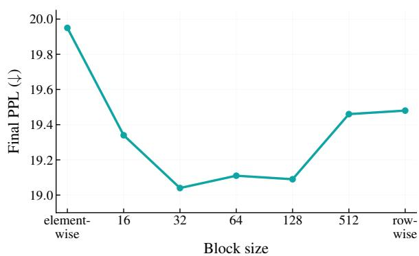  
Figure 3: Block size sensitivity sweep on Llama 2 350M 60k steps. Final validation PPL as a function of $B \in \{ 1$ (element), 16, 32, 64, 128, 512, 1024 (row) . The U-shape is consistent with the statistical–coupling trade-off analyzed in Appendix B.3.3. The plateau region $B \in \{ 3 2 , 6 4 , 1 2 8 \}$ covers the head dimension of the Llama 2 scales we evaluate.

## B.4 Block Size Sensitivity Sweep

We characterize the sensitivity of block-wise decomposition to the block size parameter B by sweeping $B \in \{ 1 , 1 6 , 3 2 , 6 4 , 1 2 8 , 5 1 2 , 1 0 2 4 \}$ on Llama 2 (Touvron et al., 2023) 350M while keeping all other settings identical to the full MoARa configuration. Figure 3 reports final validation perplexity at 60k steps as a function of B. The curve is U-shaped: both endpoints — elementwise $( B = 1$ PPL 19.95) and rowwise $( B = 1 0 2 4 .$ , PPL 19.48) — give clearly higher perplexity than the interior, while a region of small variation spans $B = 3 2$ through B = 128 (PPL 19.04, 19.11, 19.09 respectively; all within 0.07 PPL of the best).

The U-shaped trend is consistent with the statistical–coupling trade-off analyzed in $\mathsf { A p - }$ pendix B.3.3. $\mathbf { A } \mathbf { t } \ B = 1$ , the direction signal becomes sign-valued and loses coordinate-wise magnitude variation, which provides a possible qualitative explanation for the degraded trajectory. At the largest tested block size, the coarse block-wise magnitude statistics are less able to track heterogeneous local scale structure. The head dimension of Llama 2 350M sits inside the plateau region $B \in \{ 3 2 , 6 4 , 1 2 8 \}$ , providing the architectureaware default used throughout our experiments.

## C Module-aware Rank Allocation: Procedure and Analysis

This section provides the algorithmic procedure and supporting evidence for the module-aware projection-rank allocation introduced in §3.2.

Table 5: Short profiling runs match the fulltrajectory assignment. Module-wise ranks of $S _ { \tau }$ are identical across 1k, 10k, and reference 60k profiling runs on Llama 2 350M. Rank 1 denotes the highest cosine alignment and 7 the lowest. All module-wise ranks are identical across the three profiling settings.
<table><tr><td>Module</td><td>1k ~11 min</td><td>10k ~72 min</td><td>60k (full) at 6k</td></tr><tr><td>attn.q</td><td>5 (.899)</td><td>5 (.892)</td><td>5 (.892)</td></tr><tr><td>attn.k</td><td>6 (.885)</td><td>6 (.847)</td><td>6 (.851)</td></tr><tr><td>attn.v</td><td>1 (.959)</td><td>1 (.944)</td><td>1 (.971)</td></tr><tr><td>attn.o</td><td>2 (.932)</td><td>2 (.934)</td><td>2 (.960)</td></tr><tr><td>mlp.up</td><td>3 (.922)</td><td>3 (.900)</td><td>3 (.905)</td></tr><tr><td>mlp.gate</td><td>4 (.921)</td><td>4 (.898)</td><td>4 (.900)</td></tr><tr><td>mlp.down</td><td>7 (.819)</td><td>7 (.721)</td><td>7 (.734)</td></tr></table>

## C.1 Profiling-Based Rank Allocation

Our rank reallocation is based on a profiling step conducted before the target MoARa training run. We first run the standard GaLore (Zhao et al., 2024) configuration for $N _ { p }$ steps with uniform rank $r _ { \mathrm { b a s e } }$ across all modules, logging the full gradient $G _ { t } ( W )$ and the reconstructed gradient $G _ { \mathrm { r e c o n } , t } ( W ) = \mathrm { R e p } _ { B } ( M ) \odot ( P _ { \tau } P _ { \tau } ^ { \top } V )$ at sampled time points $t \in S _ { p }$ . The module-wise alignment score $S _ { \tau }$ is then computed as in Eq. (2), and the resulting integer rank allocation is fixed for the entire training run, consistent with our static-allocation design.

## C.2 Profiling protocol and intervals

Three distinct intervals appear in our procedure and serve different purposes. The profiling stride x controls how often $S ( W , t )$ is recorded during the baseline profiling run. The profiling window $N _ { p }$ is the total length of the baseline profiling run. The SVD update interval $T _ { \mathrm { S V D } }$ is how often the projection matrix P is recomputed via TruncatedSVD during MoARa training. The profiling stride and window control the diagnostic only; only the SVD update interval is part of the MoARa training loop itself.

## C.3 Profiling cost and short-run sufficiency

Profiling cost. The profiling phase reuses the standard GaLore training setup and adds negligible per-step overhead. The sampling interval x in $S _ { p } = \{ x , 2 x , \ldots , N _ { p } \}$ controls only the temporal resolution of the logged diagnostic and does not affect the resulting rank allocation. In our profiling runs we use x = 50; this choice is made for monitoring efficiency rather than for the allocation

procedure itself.

The profiling phase is off the wall-clock-totarget path. The profiling run is conducted once before target training. All raw wall-clock trajectories and training-only time-to-target measurements exclude this setup phase. In §4.2, we additionally report non-amortized and amortized time-to-target by accounting for the profiling cost separately. The resulting donor/receiver assignment can be reused across subsequent target runs.

A short profiling run already suffices. We further find that this one-time cost itself can be made very small. On Llama 2 (Touvron et al., 2023) 350M, a 1k-step profiling run completes in approximately 11 minutes and a 10k-step run completes in approximately 72 minutes in our hardware settings. The budget-donor/receiver assignment obtained from either short run matches the assignment obtained from the full 60k-step profiling trajectory at its 6k checkpoint (Table 5). This indicates that, across short and long profiles, the donor/receiver assignment is established early in the training trajectory. The observation is consistent with our claim in §5 that rank allocation operates on an architectural property of the Transformer rather than on optimizer-specific dynamics.

Amortization across scales. A 1k-step profiling run on Llama 2 350M corresponds to roughly 2.6% of a single 350M target run (7.13 h, see Table 3). The same donor/receiver assignment is reused at the 1B and 7B scales, while the numerical ranks follow each scale’s $r _ { \mathrm { b a s e } }$ . The relative profiling overhead therefore drops further at those scales. In practice, the profiling cost is small in absolute terms at 350M and effectively amortized when applied to larger target runs. Accordingly, we distinguish the target-training time $T _ { t r a i n }$ from the non-amortized time $T _ { t r a i n } + T _ { p r o f i l e }$ . When the same assignment is reused across K target runs, the corresponding amortized time-to-target is $T _ { t r a i n } + T _ { p r o f i l e } / K$ §4.2 reports this accounting alongside the headline results.

## C.4 Profiling-stride and profiling-window sensitivity

We test the dependence of the budgetdonor/receiver assignment on both the profiling stride and the profiling window. We re-sample the recorded baseline GaLore trajectory at strides of 100, 200, and 400 steps in addition to the default

50 on Llama 2 (Touvron et al., 2023) 350M. We then examine the resulting EMA-smoothed cosine similarities at four checkpoints (6k, 15k, 30k, 60k). Figure 4 reports the per-module trajectories. Table 6 reports the corresponding numerical rankings.

Donor and receiver positions are stable. mlp.down is the lowest-scoring module in all sixteen (window, stride) combinations. In every case, it occupies rank 7 by a substantial margin. attn.k occupies rank 6 in every case. attn.q occupies rank 4 or 5 in every case. The gap $S _ { K } - S _ { \mathrm { D o w n } }$ stays in the range [0.10, 0.15] across all combinations. mlp.down is therefore clearly separated as the unique receiver.

Adjacent swaps occur only within the upper tier and stay tightly bounded. Some swaps appear in Table 6 among modules whose values lie within 0.01 of one another. These all occur strictly within the upper-tier cluster ( attn.v, attn.o, mlp.up, mlp.gate, attn.q ). The largest observed within-tier difference is 0.011 (between attn.v and attn.o at 6k, stride 50) and the typical difference is below 0.008. These are about two orders of magnitude smaller than the donor–receiver boundary $S _ { K } - S _ { \mathrm { D o w n } } \in [ 0 . 1 0 , 0 . 1 5 ]$ . The upper-tier ordering is therefore sensitive to small perturbations in stride or window length, but the donor/receiver assignment used by Algorithm 1 is unaffected.

Alignment ordering is established within warmup. The inset in Figure 4 zooms into the warmup region (0–6k). The donor/receiver ordering (attn.q, attn.k as donors; mlp.down as receiver) is already present within this region and is preserved across the remainder of the 60k-step run. This is consistent with the short-run sufficiency observed in Appendix C.3 (a 1k-step profiling run, which lies entirely inside the warmup region, already recovers the full assignment). The pattern remains unchanged across the evaluated profiling strides of 50, 100, 200, and 400 steps.

## C.5 Final rank allocation

The integer rank allocation $\{ r _ { \tau } \} _ { \tau \in \mathcal { T } }$ used in our main experiments follows directly from our default configuration: = attn.q, attn.k , = mlp.down , $\Delta r = r _ { \mathrm { b a s e } } / 2$ . Per-module ranks then reduce to $r _ { Q } ~ = ~ r _ { K } ~ = ~ r _ { \mathrm { b a s e } } / 2$ (donors), $r _ { V } = r _ { O } = r _ { \mathrm { u p } } = r _ { \mathrm { g a t e } } = r _ { \mathrm { b a s e } }$ (uniform baseline), and $r _ { \mathrm { d o w n } } = 2 r _ { \mathrm { b a s e } }$ (receiver). With $| \mathcal { D } | = 2$ and $| \mathcal { R } | = 1$ , the total budget $\begin{array} { r } { \sum _ { \tau } r _ { \tau } = 7 r _ { \mathrm { b a s e } } } \end{array}$ is preserved by construction, with no residual adjustment required for this choice of $\Delta r , | \mathcal { D } |$ , and . Per-scale baseline ranks $r _ { \mathrm { b a s e } }$ follow the Ga-Lore (Zhao et al., 2024) convention at each model size and are reported in Appendix D.2.

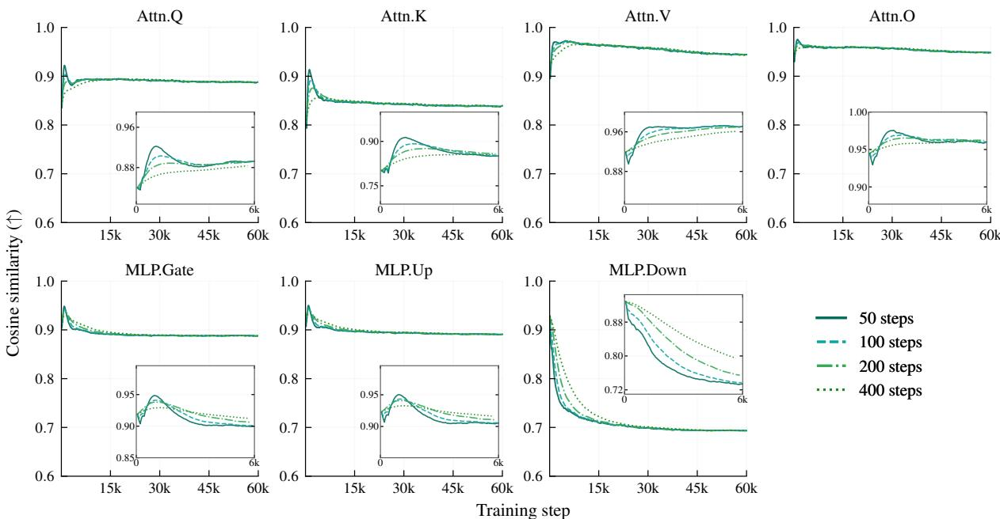  
Figure 4: Module-wise cosine similarity under varying profiling strides (Llama 2 350M, 60k-step standard GaLore). Each panel plots the EMA of cosine similarity between full and reconstructed gradients for one projection module, sampled at strides of 50, 100, 200, and 400 steps. The inset zooms into the warmup region (0–6k). The donor/receiver assignment is insensitive to the choice of profiling stride.

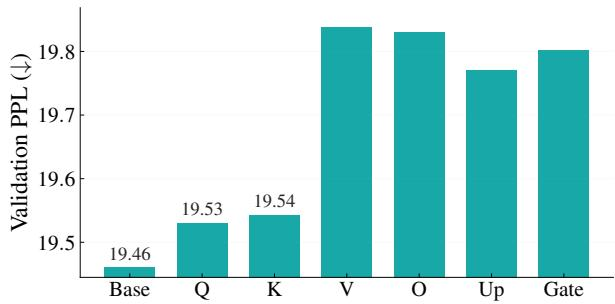  
Figure 5: Module-wise projection-rank sensitivity on Llama 2 350M. We reduce the rank of one target module to $r \ = \ 1 2 8$ and keep the others at $r \ = \ 2 5 6$ attn.q/k are the most robust to rank reduction.

## C.6 Donor Suitability and Module-wise Sensitivity

Projection sensitivity and donor suitability are related but not identical. A module with high alignment robustness can be a donor candidate, but donor selection also depends on whether reducing its rank is less harmful than reducing the rank of other modules. To identify safe donors, we conduct a controlled module-wise projection-rank sensitivity ablation on Llama 2 (Touvron et al., 2023) 350M: we reduce one target module’s projection rank from $r _ { \mathrm { b a s e } }$ to $r _ { \mathrm { b a s e } } / 2$ at a time while keeping all others at the uniform baseline rank. In our experiments at Llama 2 350M, this corresponds to reducing one target module to $r = 1 2 8$ while keeping the others at $r = 2 5 6$ (six configurations in total, one per non-receiver module).

Figure 5 reports the per-module final perplexity under this ablation. The donor/receiver implications and the underlying architectural reasoning that supports  = attn.q, attn.k are discussed in §3.2.

## D Experimental Setup

## D.1 Model Architecture

We follow the Llama configurations used in Ga-Lore (Zhao et al., 2024) across model scales. For Llama 3.2 (Grattafiori et al., 2024), Qwen2.5 (Yang et al., 2024), Qwen3 (Yang et al., 2025), and DeepSeek-V2 (DeepSeek-AI et al., 2024), we derive compatible 350M-scale configurations from their official implementations, starting from our Llama 2 (Touvron et al., 2023) 350M setup. Specifically for DeepSeek-V2, which employs a distinct Multi-head Latent Attention (MLA) architecture, we carefully scale the latent projection dimensions to align with the 350M parameter budget (q\_lora\_rank=768, kv\_lora\_rank=256, qk\_nope\_head\_dim=64, qk\_rope\_head\_dim=32, and v\_head\_dim=64). Table 7 summarizes the key architectural and training hyperparameters across all evaluated models.

Table 6: Module-wise cosine similarity rankings under different profiling intervals. Values are EMA-smoothed cosine similarities. Modules are ordered from highest to lowest cosine similarity.
<table><tr><td rowspan="2">Step</td><td rowspan="2">Interval</td><td colspan="7">Ranking by cosine similarity</td></tr><tr><td>1st</td><td>2nd</td><td>3rd</td><td>4th</td><td>5th</td><td>6th</td><td>7th</td></tr><tr><td rowspan="4">6k</td><td>50</td><td>V (0.9709)</td><td>0 (0.9600)</td><td>Up (0.9052)</td><td>Gate (0.8997)</td><td>Q (0.8924)</td><td>K (0.8505)</td><td>Down (0.7339)</td></tr><tr><td>100</td><td>V (0.9713)</td><td>0 (0.9610)</td><td>Up (0.9061)</td><td>Gate (0.9010)</td><td>Q (0.8924)</td><td>K (0.8530)</td><td>Down (0.7371)</td></tr><tr><td>200</td><td>V (0.9699)</td><td>0 (0.9624)</td><td>Up (0.9103)</td><td>Gate (0.9059)</td><td>Q (0.8914)</td><td>K (0.8578)</td><td>Down (0.7533)</td></tr><tr><td>400</td><td>V (0.9623)</td><td>0 (0.9614)</td><td>Up (0.9158)</td><td>Gate (0.9117)</td><td>Q (0.8844)</td><td>K (0.8550)</td><td>Down (0.7897)</td></tr><tr><td rowspan="4">15k</td><td>50</td><td>V</td><td>0</td><td>Up (0.8959)</td><td>Q (0.8926)</td><td>Gate</td><td>K</td><td>Down (0.7091)</td></tr><tr><td>100</td><td>(0.9617) V</td><td>(0.9578) 0</td><td>Up</td><td>Q</td><td>(0.8905) Gate</td><td>(0.8455) K</td><td>Down</td></tr><tr><td>200</td><td>(0.9627) V</td><td>(0.9583) 0</td><td>(0.8968) Up</td><td>(0.8928) Q</td><td>(0.8912) Gate</td><td>(0.8459) K</td><td>(0.7103) Down</td></tr><tr><td>400</td><td>(0.9643) V</td><td>(0.9594) 0</td><td>(0.8986) Up</td><td>(0.8939) Gate</td><td>(0.8929) Q</td><td>(0.8475) K</td><td>(0.7131) Down</td></tr><tr><td rowspan="4">30k</td><td></td><td>(0.9643) V</td><td>(0.9591) 0</td><td>(0.9008) Up</td><td>(0.8953) Q</td><td>(0.8935) Gate</td><td>(0.8489) K</td><td>(0.7219) Down</td></tr><tr><td>50</td><td>(0.9579) V</td><td>(0.9574) 0</td><td>(0.8942) Up</td><td>(0.8915) Q</td><td>(0.8884) Gate</td><td>(0.8424) K</td><td>(0.6992)</td></tr><tr><td>100</td><td>(0.9590) V</td><td>(0.9581) 0</td><td>(0.8947) Up</td><td>(0.8918) Q</td><td>(0.8890) Gate</td><td>(0.8428)</td><td>Down (0.6997)</td></tr><tr><td>200</td><td>(0.9590) V</td><td>(0.9581) 0</td><td>(0.8949) Up</td><td>(0.8920) Q</td><td>(0.8893) Gate</td><td>K (0.8431) K</td><td>Down (0.7002) Down</td></tr><tr><td rowspan="4">60k</td><td>400</td><td>(0.9592) 0</td><td>(0.9579) V</td><td>(0.8952) Up</td><td>(0.8926)</td><td>(0.8895)</td><td>(0.8440)</td><td>(0.7016) Down</td></tr><tr><td>50</td><td>(0.9484) 0</td><td>(0.9442) V</td><td>(0.8909) Up</td><td>Q (0.8884) Q</td><td>Gate (0.8881) Gate</td><td>K (0.8395) K</td><td>(0.6936) Down</td></tr><tr><td>100</td><td>(0.9487) 0</td><td>(0.9444) V</td><td>(0.8908) Up</td><td>(0.8880) Q</td><td>(0.8879) Gate</td><td>(0.8392) K</td><td>(0.6937) Down</td></tr><tr><td>200</td><td>(0.9488) 0</td><td>(0.9447) V</td><td>(0.8908) Up</td><td>(0.8879) Gate</td><td>(0.8879) Q</td><td>(0.8387) K</td><td>(0.6936) Down</td></tr><tr><td></td><td>400</td><td>(0.9484)</td><td>(0.9439)</td><td>(0.8904)</td><td>(0.8876)</td><td>(0.8874)</td><td>(0.8380)</td><td>(0.6936)</td></tr></table>

## D.2 Training Parameters

We use the C4 English dataset with a T5 tokenizer (Raffel et al., 2020). We use AdamW (Loshchilov and Hutter, 2019) with $\beta _ { 1 } = 0 . 9 , \beta _ { 2 } = 0 . 9 9 9$ $\epsilon = 1 0 ^ { - 6 }$ , zero weight decay, and bias correction enabled. The peak learning rate is 0.01 (0.005 for 7B), with 10% linear warmup and cosine decay to a minimum ratio of 0.1. Unless otherwise noted, we use a global batch size of 512 and a maximum sequence length of 256.

For GaLore (Zhao et al., 2024), we use a scale of 0.25 and an interval $T = 2 0 0$ . The magnitude branch M and its optimizer states are maintained in fp32, and the recomposed update is cast to bf16 before application. All runs use torch.compile in default mode. Gradient clipping of 1.0 is applied only to the 7B model.

Block size and rank budget per model scale. The block size B used in the main experiments follows the head-dimension-informed default discussed in §3.1: we choose B in the neighborhood of $d _ { \mathrm { h e a d } } ,$ using $B = 3 2$ for Llama 2 350M $( d _ { \mathrm { h e a d } } = 6 4 )$ $B = 6 4$ for Llama 2 1B $( d _ { \mathrm { h e a d } } =$ 64), and $B = 1 2 8$ for Llama 2 7B $( d _ { \mathrm { h e a d } } = 1 2 8 )$ Per-scale baseline projection ranks $r _ { \mathrm { b a s e } }$ follow the GaLore convention: $r _ { \mathrm { b a s e } } ~ = ~ 2 5 6$ at 350M, $r _ { \mathrm { b a s e } } ~ = ~ 5 1 2 ~ \mathrm { a t } ~ 1 \mathbf { B }$ , and $r _ { \mathrm { b a s e } } ~ = ~ 1 0 2 4$ at 7B; module-wise allocation $\{ r _ { \tau } \}$ follows the static reallocation rule of Algorithm 1 with ${ \mathcal { D } } = \{ Q , K \}$ = MLP.down , and $\Delta r = r _ { \mathrm { b a s e } } / 2 ( \mathrm { A p } \cdot$ pendix C.5).

Table 7: Model architectures and pre-training hyperparameters. We report architecture details and the pretraining budget for each evaluated model.
<table><tr><td>Model</td><td>Params</td><td colspan="5">Architecture</td><td colspan="2">Pre-training</td></tr><tr><td></td><td></td><td>Hidden</td><td>Interm.</td><td>Heads</td><td>Layers</td><td>KV</td><td>Steps</td><td>Tokens</td></tr><tr><td colspan="9">Scaling study</td></tr><tr><td>Llama 2</td><td>350M</td><td>1024</td><td>2736</td><td>16</td><td>24</td><td>16</td><td>60K</td><td>7.8B</td></tr><tr><td>Llama 2</td><td>1B</td><td>2048</td><td>5461</td><td>32</td><td>24</td><td>16</td><td>100K</td><td>13.1B</td></tr><tr><td>Llama 2</td><td>7B</td><td>4096</td><td>11008</td><td>32</td><td>32</td><td>16</td><td>150K</td><td>19.7B</td></tr><tr><td colspan="9">Model-family comparison</td></tr><tr><td>Llama 3.2</td><td>300M</td><td>1024</td><td>2736</td><td>16</td><td>24</td><td>4</td><td>60K</td><td>7.8B</td></tr><tr><td>Qwen2.5</td><td>350M</td><td>1024</td><td>2816</td><td>16</td><td>24</td><td>4</td><td>60K</td><td>7.8B</td></tr><tr><td>Qwen3</td><td>350M</td><td>1024</td><td>2816</td><td>16</td><td>24</td><td>4</td><td>60K</td><td>7.8B</td></tr><tr><td>DeepSeek-V2</td><td>350M</td><td>1024</td><td>2736</td><td>16</td><td>24</td><td>16</td><td>60K</td><td>7.8B</td></tr></table>

## D.3 Hardware and Profiling Details

For all step-to-target and time-to-target experiments, GaLore (Zhao et al., 2024) and MoARa are compared under identical hardware conditions, using NVIDIA RTX A6000, H100, and RTX PRO 6000 GPUs depending on model scale.

For memory profiling, we measure memory usage after the first 50 training steps under the same sequence-length and batch-size settings as in Appendix D.2.

## E Additional Experimental Validation

## E.1 Random Rank Allocation

We performed a validation experiment to verify that our projection-rank redistribution outperforms random budget-preserving allocations. Under identical projection rank budget constraints, we pretrained 20 Llama 2 350M models with randomly assigned ranks for 10k steps and compared them with our method. The projection ranks and resulting evaluation PPL for each of the 20 runs are summarized in Table 8. Our module-aware allocation outperforms all 20 random variants, and none approach its convergence trajectory.

## E.2 Cross-Architecture Generalization

Figure 6 reports the full validation PPL curves for the cross-architecture study referenced in §4.2. Across Llama 3.2 (Grattafiori et al., 2024), Qwen2.5 (Yang et al., 2024), Qwen3 (Yang et al., 2025), and DeepSeek-V2 (DeepSeek-AI et al., 2024), MoARa reaches the standard GaLore (Zhao et al., 2024) target earlier in all cases despite the architectural differences (GQA in Llama 3.2 and the Qwen family, MLA in DeepSeek-V2). The cross-scale speedup figure (Figure 7) is included alongside for visual reference.

Table 8: Random rank allocations and final evaluation perplexity. Each run preserves the same total projection-rank budget. G, U, and D denote the gate, up, and down MLP projections. Lower PPL is better.
<table><tr><td>Run</td><td>Q</td><td>K</td><td>V</td><td>0</td><td>G</td><td>U</td><td>D</td><td>PPL</td></tr><tr><td>R01</td><td>128</td><td>240</td><td>560</td><td>184</td><td>256</td><td>80</td><td>344</td><td>24.72</td></tr><tr><td>R02</td><td>184</td><td>320</td><td>280</td><td>320</td><td>352</td><td>272</td><td>64</td><td>24.85</td></tr><tr><td>R03</td><td>216</td><td>208</td><td>248</td><td>328</td><td>376</td><td>304</td><td>112</td><td>24.53</td></tr><tr><td>R04</td><td>160</td><td>472</td><td>72</td><td>360</td><td>256</td><td>80</td><td>392</td><td>25.00</td></tr><tr><td>R05</td><td>352</td><td>192</td><td>88</td><td>448</td><td>408</td><td>128</td><td>176</td><td>24.88</td></tr><tr><td>R06</td><td>96</td><td>136</td><td>112</td><td>608</td><td>456</td><td>232</td><td>152</td><td>24.53</td></tr><tr><td>R07</td><td>352</td><td>256</td><td>192</td><td>208</td><td>120</td><td>536</td><td>128</td><td>24.83</td></tr><tr><td>R08</td><td>552</td><td>104</td><td>192</td><td>128</td><td>64</td><td>440</td><td>312</td><td>24.92</td></tr><tr><td>R09</td><td>200</td><td>360</td><td>104</td><td>344</td><td>376</td><td>80</td><td>328</td><td>24.73</td></tr><tr><td>R10</td><td>128</td><td>312</td><td>416</td><td>200</td><td>328</td><td>72</td><td>336</td><td>24.60</td></tr><tr><td>R11</td><td>72</td><td>568</td><td>376</td><td>80</td><td>72</td><td>152</td><td>472</td><td>25.29</td></tr><tr><td>R12</td><td>160</td><td>208</td><td>64</td><td>680</td><td>128</td><td>360</td><td>192</td><td>24.78</td></tr><tr><td>R13</td><td>144</td><td>208</td><td>344</td><td>248</td><td>328</td><td>312</td><td>208</td><td>24.33</td></tr><tr><td>R14</td><td>256</td><td>480</td><td>80</td><td>232</td><td>472</td><td>120</td><td>152</td><td>25.17</td></tr><tr><td>R15</td><td>184</td><td>224</td><td>256</td><td>312</td><td>560</td><td>136</td><td>120</td><td>24.63</td></tr><tr><td>R16</td><td>144</td><td>392</td><td>360</td><td>192</td><td>248</td><td>336</td><td>120</td><td>24.72</td></tr><tr><td>R17</td><td>232</td><td>304</td><td>64</td><td>424</td><td>376</td><td>304</td><td>88</td><td>24.88</td></tr><tr><td>R18</td><td>184</td><td>64</td><td>112</td><td>592</td><td>176</td><td>504</td><td>160</td><td>24.56</td></tr><tr><td>R19</td><td>136</td><td>72</td><td>720</td><td>80</td><td>224</td><td>288</td><td>272</td><td>24.73</td></tr><tr><td>R20</td><td>152</td><td>64</td><td>256</td><td>536</td><td>496</td><td>80</td><td>208</td><td>24.58</td></tr><tr><td>Ours</td><td>128</td><td>128</td><td>256</td><td>256</td><td>256</td><td>256</td><td>512</td><td>24.07</td></tr></table>

## E.3 Robustness at Sequence Length 2048

The main scaling and architecture results in §4.2 use the GaLore (Zhao et al., 2024)-standard sequence length of 256, which matches the GaLore baseline’s setup and isolates the optimizer-side comparison from sequence-length-dependent variables. To test whether the efficiency gains persist beyond this short-context setting, we re-evaluate GaLore with MoARa against standard GaLore at sequence length 2048 on Llama 2 (Touvron et al., 2023) 350M. All other training hyperparameters are kept identical to the sequence-length-256 setup of Appendix D.2.

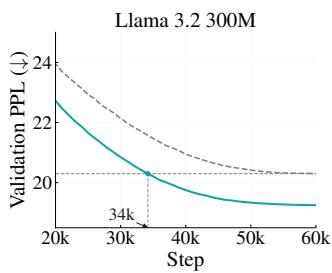

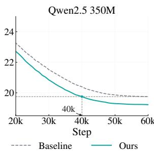

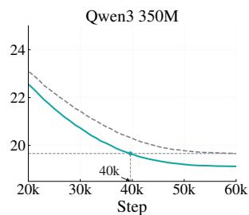  
Target (Baseline final)

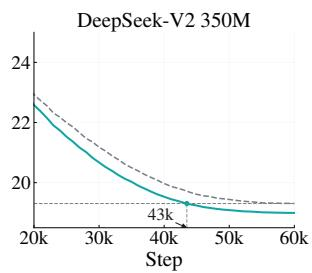

Figure 6: Validation perplexity curves across recent Transformer architectures at the 350M scale. We compare our method with GaLore on Llama 3.2, Qwen2.5, Qwen3, and DeepSeek-V2. The dashed horizontal line marks the final validation perplexity of the baseline. In all cases, our method reaches this target earlier than the baseline.  
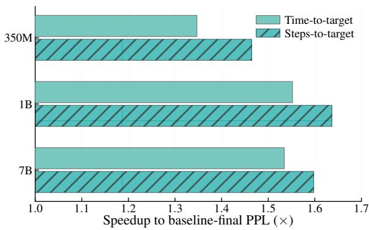  
Figure 7: Speedup across model scales. MoARa’s speedup over standard GaLore in reaching the baseline’s final perplexity, measured by both steps-to-target and time-to-target. GaLore with MoARa achieves up to 1.64 step speedup across all three configurations.

As shown in Figure 8, GaLore with MoARa reaches standard GaLore’s final validation perplexity in 35.0% fewer steps and 33.3% less wall-clock time, and improves final perplexity by 2.65% (PPL 18.09  17.61). The reduction profile in both steps and wall-clock time is consistent with the sequence-length-256 result at the same model scale. This single-scale experiment supports an optimizerside interpretation but does not establish sequencelength invariance at larger scales or substantially longer contexts.

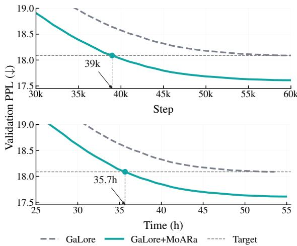  
Figure 8: Sequence-length 2048 validation perplexity on Llama 2 350M. Validation perplexity versus training steps (top) and wall-clock time (bottom); annotated points mark where GaLore with MoARa reaches the standard GaLore target (dashed line).

## E.4 Multi-seed Robustness

Figure 9 shows the full 1B pre-training trajectories over three random seeds. Our method consistently outperforms the baseline in all runs, which supports the robustness claim in §4.2.

## E.5 Q-GaLore Precision Analysis

We isolate whether the magnitude-branch optimizer-state precision explains the Group C behavior observed in §5. The official Q-GaLore configuration uses INT4 projection matrices, INT8 weights, and an 8-bit Adam optimizer. We therefore evaluate Q-GaLore + decomposition while changing only the magnitude-branch optimizer state from 8-bit to FP32; the INT4 projection matrices and INT8 weights remain unchanged. This change does not recover the benefit of decomposition. Thus, the magnitude-branch optimizer-state precision is unlikely to be the primary bottleneck. Because projection and weight quantization remain active together in this ablation, we do not attribute the limitation to either component individually. Rather, the result supports a broader quantization-compatibility limitation for decomposition. A direct comparison with GaLore + decomposition is consistent with this interpretation: decomposition alone yields a final perplexity comparable to vanilla GaLore, whereas the same decomposition under Q-GaLore produces a small but consistent increase in final perplexity.

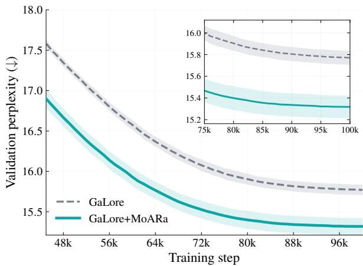  
Figure 9: Validation perplexity across three random seeds on Llama 2 1B. Our method consistently outperforms the baseline. The inset zooms into the final phase.

## F Detailed Benchmark Results

This section reports the full benchmark tables that support the summary results in §4.2. Table 9 shows the three-seed evaluation at the final checkpoint on seven downstream benchmarks (HellaSwag (Zellers et al., 2019), Wino-Grande (Sakaguchi et al., 2020), PIQA (Bisk et al., 2020), BoolQ (Clark et al., 2019), ARC-Challenge and ARC-Easy (Clark et al., 2018), and TruthfulQA (Lin et al., 2022)) together with C4 (Raffel et al., 2020) and WikiText-2 (Merity et al., 2017) perplexity, reporting mean and standard deviation over three random seeds. Table 10 compares our 60k-step intermediate checkpoint with the 100kstep GaLore (Zhao et al., 2024) baseline to demonstrate token efficiency rather than final-checkpoint parity.

Multi-seed robustness at the final checkpoint. The three-seed evaluation in Table 9 shows that GaLore (Zhao et al., 2024) with MoARa is comparable to or outperforms GaLore on the vast majority of metrics. MoARa has lower standard deviation on all six perplexity metrics and on several downstream metrics. The consistent mean trends across seeds indicate that the reported gains are not driven by a single favorable seed.

ARC-Challenge under short-context pretraining. Among the summary metrics reported in Table 1, ARC-Challenge (Clark et al., 2018) normalized accuracy is the only metric that decreases. We interpret this gap with caution. ARC-Challenge is a four-way multiple-choice benchmark in which chance-level accuracy is 0.25, and both models attain mean normalized accuracy within 0.003 of chance level. The task which requires multi-step science reasoning and remains challenging for our 1B model pre-trained at sequence length 256 sits very near the chance-level floor for both checkpoints, so the per-seed differences reflect noise around that floor rather than a substantive capability gap. This interpretation is consistent with the modest seed-to-seed variation reported in Table 9.

60k MoARa versus 100k GaLore: downstream behavior at an earlier checkpoint. Table 10 compares the 60k-step intermediate checkpoint from our 100k-step GaLore (Zhao et al., 2024) with MoARa run against the final 100k-step GaLore checkpoint. This checkpoint is selected because its pretraining validation perplexity is close to Ga-Lore’s final training-run value. On the separate C4 and WikiText evaluation metrics in Table 10, however, GaLore retains a clear perplexity advantage, as MoARa has seen approximately 40% fewer training tokens (7.86B vs. 13.1B at a context length of 256).

Despite this perplexity gap, the downstream picture is different. Ten of the eleven reported downstream comparisons fall within two standard errors of the GaLore baseline, and on BoolQ the 60k Ga-Lore with MoARa checkpoint actually exceeds the 100k GaLore baseline. The reductions in downstream accuracy that do appear are uniformly small in absolute terms. ARC-Challenge remains near the chance-level floor in normalized accuracy, whereas the ARC-Easy and PIQA differences are smaller than the corresponding standard errors reported by the evaluation harness.

Why does the downstream gap not track the perplexity gap? Two complementary explanations are consistent with this pattern. First, one possible explanation is that the additional 40% of training tokens primarily refine the next-token distribution along directions that lower per-token surprisal on general-domain text without unlocking qualitatively new downstream behaviors. This is consistent with the broader observation that perplexity continues to decrease smoothly with more tokens, while downstream capability often follows a more saturating curve in this token range. Second, our main step-to-target results (§4.2) already demonstrate that GaLore with MoARa reaches Ga-Lore’s perplexity target with substantially fewer tokens; Table 10 extends this token-efficiency observation by showing that downstream behavior is largely retained at the point where GaLore with MoARa is still trailing GaLore in raw perplexity. We do not interpret the BoolQ improvement at 60k as evidence of a separate generalization gain.

Table 9: Detailed zero-shot benchmark results on Llama 2 1B. Both standard GaLore and GaLore with MoARa are evaluated at their final 100k-step checkpoints. We report per-seed scores, mean $\mu ,$ and standard deviation σ over three seeds. We abbreviate bits-per-byte, byte-perplexity, word-perplexity, and normalized accuracy as bpb, bppl, wppl, and acc\_n.
<table><tr><td>Task</td><td>Metric</td><td>Dir.</td><td colspan="5">GaLore</td><td colspan="5">GaLore with MoARa</td></tr><tr><td></td><td></td><td></td><td>1</td><td>2</td><td>3</td><td>μ</td><td>σ</td><td>1</td><td>2</td><td>3</td><td>μ</td><td>σ</td></tr><tr><td></td><td>bpb</td><td>↓</td><td>1.077</td><td>1.091</td><td>1.060</td><td>1.076</td><td>0.016</td><td>1.056</td><td>1.063</td><td>1.073</td><td>1.064</td><td>0.008</td></tr><tr><td>C4</td><td>bppl</td><td>↓</td><td>2.110</td><td>2.130</td><td>2.084</td><td>2.108</td><td>0.023</td><td>2.079</td><td>2.089</td><td>2.103</td><td>2.091</td><td>0.012</td></tr><tr><td></td><td>wppl</td><td>↓</td><td>87.18</td><td>92.34</td><td>81.13</td><td>86.88</td><td>5.612</td><td>79.96</td><td>82.29</td><td>85.61</td><td>82.62</td><td>2.837</td></tr><tr><td></td><td>bpb</td><td>↓</td><td>1.135</td><td>1.136</td><td>1.103</td><td>1.125</td><td>0.019</td><td>1.108</td><td>1.098</td><td>1.111</td><td>1.106</td><td>0.007</td></tr><tr><td>WikiText</td><td>bppl</td><td>↓</td><td>2.197</td><td>2.197</td><td>2.148</td><td>2.181</td><td>0.029</td><td>2.156</td><td>2.141</td><td>2.159</td><td>2.152</td><td>0.010</td></tr><tr><td></td><td>wppl</td><td>↓</td><td>67.218</td><td>67.332</td><td>59.588</td><td>64.712</td><td>4.439</td><td>60.856</td><td>58.616</td><td>61.334</td><td>60.269</td><td>1.451</td></tr><tr><td>ARC-C</td><td>acc</td><td>↑</td><td>0.212</td><td>0.215</td><td>0.212</td><td>0.213</td><td>0.002</td><td>0.206</td><td>0.202</td><td>0.197</td><td>0.202</td><td>0.004</td></tr><tr><td></td><td>acc_n</td><td>↑</td><td>0.255</td><td>0.248</td><td>0.252</td><td>0.252</td><td>0.004</td><td>0.244</td><td>0.257</td><td>0.244</td><td>0.248</td><td>0.007</td></tr><tr><td>ARC-E</td><td>acc</td><td>↑</td><td>0.477</td><td>0.469</td><td>0.484</td><td>0.477</td><td>0.008</td><td>0.487</td><td>0.476</td><td>0.481</td><td>0.482</td><td>0.006</td></tr><tr><td></td><td>acc_n</td><td>↑</td><td>0.423</td><td>0.421</td><td>0.430</td><td>0.425</td><td>0.005</td><td>0.436</td><td>0.434</td><td>0.430</td><td>0.433</td><td>0.003</td></tr><tr><td>BoolQ</td><td>acc</td><td>↑</td><td>0.586</td><td>0.556</td><td>0.495</td><td>0.546</td><td>0.046</td><td>0.565</td><td>0.557</td><td>0.552</td><td>0.558</td><td>0.007</td></tr><tr><td>HellaSwag</td><td>acc</td><td>↑</td><td>0.326</td><td>0.325</td><td>0.326</td><td>0.326</td><td>0.001</td><td>0.329</td><td>0.331</td><td>0.332</td><td>0.331</td><td>0.001</td></tr><tr><td></td><td>acc_n</td><td>↑</td><td>0.386</td><td>0.389</td><td>0.384</td><td>0.386</td><td>0.002</td><td>0.402</td><td>0.394</td><td>0.399</td><td>0.398</td><td>0.004</td></tr><tr><td>PIQA</td><td>acc</td><td>↑</td><td>0.679</td><td>0.681</td><td>0.680</td><td>0.680</td><td>0.001</td><td>0.675</td><td>0.677</td><td>0.682</td><td>0.678</td><td>0.004</td></tr><tr><td></td><td>acc_n</td><td>↑</td><td>0.674</td><td>0.677</td><td>0.678</td><td>0.677</td><td>0.002</td><td>0.674</td><td>0.684</td><td>0.687</td><td>0.682</td><td>0.007</td></tr><tr><td>WinoGrande</td><td>acc</td><td>↑</td><td>0.504</td><td>0.526</td><td>0.508</td><td>0.513</td><td>0.012</td><td>0.527</td><td>0.539</td><td>0.526</td><td>0.531</td><td>0.007</td></tr><tr><td>TruthfulQA</td><td>mc2</td><td>↑</td><td>0.398</td><td>0.421</td><td>0.407</td><td>0.409</td><td>0.011</td><td>0.417</td><td>0.393</td><td>0.408</td><td>0.406</td><td>0.012</td></tr></table>

## G Detailed Memory Analysis

This section provides the comprehensive memory measurements used in §4.2.

For a target matrix $W$ , let $r _ { W }$ denote its projection rank and $d _ { W }$ the state dimension not compressed by the projection. Let $b _ { V }$ and $b _ { M }$ denote the bytes per entry in each direction-branch and magnitude-branch moment tensor, respectively. The first- and second-moment states of the projected direction require approximately

$$
\mathcal { M } _ { \mathrm { d i r } } ( W ) = 2 b _ { V } r _ { W } d _ { W } .
$$

Relative to the uniform baseline rank $r _ { \mathrm { b a s e } } .$ projection rank reallocation changes the persistent optimizer-state cost by

$$
\Delta \mathcal { M } _ { \mathrm { r a n k } } = 2 b _ { V } \sum _ { W } \left( r _ { W } - r _ { \mathrm { b a s e } } \right) d _ { W } .
$$

For $W \in \mathbb { R } ^ { m _ { W } \times n _ { W } }$ , the block-magnitude tensor has shape

$$
m _ { W } \times \left\lceil \frac { n _ { W } } { B _ { W } } \right\rceil ,
$$

so its Adam states add approximately

$$
\Delta \mathcal { M } _ { \mathrm { m a g } } = 2 b _ { M } \sum _ { W } m _ { W } \left\lceil \frac { n _ { W } } { B _ { W } } \right\rceil .
$$

The sums include all target matrices across all layers, and the factor of 2 accounts for Adam’s first and second moments. Because donor and receiver matrices can have different $d _ { W }$ , preserving the total projection-rank budget does not imply identical optimizer-state bytes. At 7B, the measured optimizer-state increases are 864 MiB from projection-rank allocation and 386 MiB from block-wise decomposition; together they match the 1,250 MiB increase of full MoARa.

Table 11(a) reports scale-wise memory profiling under both eager and compiled settings; notably, under the compiled setting, most intermediate overhead is absorbed, leaving the remaining cost dominated by the added optimizer states. Furthermore, Table 11(b) breaks down the memory cost of each component, with all measurements taken in eager mode to effectively isolate the algorithmic overhead. This granular breakdown allows us to separate the specific memory requirements of block-wise decomposition from those of projection rank allocation, showing that the two components combine approximately additively across model scales.

Table 10: Zero-shot benchmarks on Llama 2 1B: 60k vs. 100k. We compare standard GaLore at 100k steps with GaLore with MoARa at 60k steps. ∆ denotes the difference between GaLore with MoARa and GaLore. denotes the standard error reported by the evaluation harness. Results are from a single seed. We abbreviate bits-per-byte, byte-perplexity, word-perplexity, and normalized accuracy as bpb, bppl, wppl, and acc\_n.
<table><tr><td>Task</td><td>Metric</td><td>Dir.</td><td>GaLore</td><td>GaLore+MoARa</td><td>Δ</td></tr><tr><td rowspan="4">C4</td><td>bpb</td><td>↓</td><td>1.060</td><td>1.085</td><td>+0.025</td></tr><tr><td>bppl</td><td>↓</td><td>2.084</td><td>2.121</td><td>+0.036</td></tr><tr><td>wppl</td><td>↓</td><td>81.130</td><td>89.981</td><td>+8.851</td></tr><tr><td>bpb</td><td>↓</td><td>1.103</td><td>1.125</td><td>+0.022</td></tr><tr><td rowspan="3">WikiText</td><td>bppl</td><td>↓</td><td>2.148</td><td>2.180</td><td>+0.033</td></tr><tr><td>wppl</td><td>↓</td><td>59.588</td><td>64.603</td><td>+5.016</td></tr><tr><td>acc</td><td>↑</td><td> $0 . 2 1 2 \pm 0 . 0 1 2$ </td><td> $0 . 1 9 2 \pm 0 . 0 1 2$ </td><td>-0.020</td></tr><tr><td rowspan="2">ARC-C</td><td>acc_n</td><td>↑</td><td> $0 . 2 5 2 \pm 0 . 0 1 3$ </td><td> $0 . 2 4 7 \pm 0 . 0 1 3$ </td><td>-0.005</td></tr><tr><td>acc</td><td>↑</td><td> $0 . 4 8 4 \pm 0 . 0 1 0$ </td><td> $0 . 4 7 5 \pm 0 . 0 1 0$ </td><td>-0.009</td></tr><tr><td>ARC-E</td><td>acc_n</td><td>↑</td><td> $0 . 4 3 0 \pm 0 . 0 1 0$ </td><td> $0 . 4 2 2 \pm 0 . 0 1 0$ </td><td>-0.008</td></tr><tr><td>BoolQ</td><td>acc</td><td>↑</td><td> $0 . 4 9 5 \pm 0 . 0 0 9$ </td><td> $0 . 5 6 1 \pm 0 . 0 0 9$ </td><td>+0.066</td></tr><tr><td rowspan="2">HellaSwag</td><td>acc</td><td>↑</td><td> $0 . 3 2 6 \pm 0 . 0 0 5$ </td><td> $0 . 3 2 9 \pm 0 . 0 0 5$ </td><td>+0.003</td></tr><tr><td>acc_n</td><td>↑</td><td> $0 . 3 8 4 \pm 0 . 0 0 5$ </td><td> $0 . 3 9 3 \pm 0 . 0 0 5$ </td><td>+0.008</td></tr><tr><td rowspan="2">PIQA</td><td>acc</td><td>↑</td><td> $0 . 6 8 0 \pm 0 . 0 1 1$ </td><td> $0 . 6 7 6 \pm 0 . 0 1 1$ </td><td>-0.004</td></tr><tr><td>acc_n</td><td>↑</td><td> $0 . 6 7 8 \pm 0 . 0 1 1$ </td><td> $0 . 6 7 5 \pm 0 . 0 1 1$ </td><td>-0.003</td></tr><tr><td>WinoGrande</td><td>acc</td><td>↑</td><td> $0 . 5 0 8 \pm 0 . 0 1 4$ </td><td> $0 . 5 1 1 \pm 0 . 0 1 4$ </td><td>+0.004</td></tr><tr><td>TruthfulQA</td><td>mc2</td><td>↑</td><td> $0 . 4 0 7 \pm 0 . 0 1 5$ </td><td> $0 . 4 0 8 \pm 0 . 0 1 5$ </td><td>+0.001</td></tr></table>

## H Cosine similarity of G and $G _ { \mathbf { r e c o n } }$

This section reports module-wise cosine similarity trajectories between the full-rank gradient G and the reconstructed gradient $G _ { \mathrm { r e c o n } } .$ These plots support the alignment analysis in §3.2 and show how our projection rank reallocation improves lowalignment bottleneck modules across models.

## H.1 Llama 2 350M

We first show the full module-wise cosine similarity trajectories on Llama 2 (Touvron et al., 2023) 350M in Figure 10. The baseline shows the lowest alignment on mlp.down, while our method improves this bottleneck by reallocating projection rank from robust donor modules.

## H.2 Llama 2 1B

Figure 11 shows the same analysis on Llama 2 (Touvron et al., 2023) 1B. The overall pattern is

consistent with the 350M case: the main improvement appears on the most projection-sensitive modules.

## H.3 Llama 2 7B

Figure 12 reports the trajectories on Llama 2 (Touvron et al., 2023) 7B. The receiver-side alignment bottleneck and its improvement remain consistent at the larger scale.

## H.4 Llama 3.2 300M

Figure 13 shows the trajectories on Llama 3.2 (Grattafiori et al., 2024) 300M. The same trend appears in this architecture as well, supporting the cross-architecture consistency of our alignmentbased analysis.

## H.5 Qwen2.5 350M

Figure 14 shows the trajectories on Qwen2.5 (Yang et al., 2024) 350M. Again, our method improves the lowest-alignment receiver while exhibiting the expected donor-side alignment reductions.

## H.6 Qwen3 350M

Figure 15 shows the trajectories on Qwen3 (Yang et al., 2025) 350M. The result is consistent with the earlier models and supports the same bottleneckresolution pattern.

## H.7 DeepSeek-V2 350M

Figure 16 reports the trajectories on the dense variant of DeepSeek-V2 (DeepSeek-AI et al., 2024) 350M. Although the attention module structure differs from standard MHA-based models, the same qualitative pattern remains: our method improves the most sensitive modules while keeping the donor-side degradation small.

## I Licenses and Intended Use

All artifacts used in this work are public research artifacts used in an academic research context consistent with their intended use.

Dataset and tokenizer. The C4 English corpus (Raffel et al., 2020) is released by AllenAI under ODC-BY 1.0, with use also subject to the Common Crawl terms of use. The T5 tokenizer is released by Google under Apache-2.0.

Model architectures. Llama 2 (Touvron et al., 2023) and Llama 3.2 (Grattafiori et al., 2024) reference implementations are released by Meta under the Llama 2 Community License and the Llama 3.2 Community License, respectively. Qwen2.5 (Yang et al., 2024) and Qwen3 (Yang et al., 2025) reference implementations are released by Alibaba under Apache-2.0. The DeepSeek-V2 (DeepSeek-AI et al., 2024) reference implementation is released under MIT (code license); the separately released pretrained weights, which we do not use, are under the DeepSeek Model License. For all five architectures, we use only the reference implementations to derive 350M-scale configurations for from-scratch pre-training and do not redistribute any original pretrained checkpoints.

Baseline optimizer implementations. The reference implementations of GaLore (Zhao et al., 2024), Fira (Chen et al., 2025), Q-GaLore (Zhang et al., 2025b), OSD (Liang et al., 2024), and LDAdam (Robert et al., 2025) are released under Apache-2.0. The SubTrack++ (Rajabi et al., 2025) reference implementation did not include an explicit license file at the time of access. We use it only as an academic evaluation baseline and do not redistribute its code.

Released artifacts. We release no new pretrained model checkpoints or datasets in this submission.

Table 11: Memory profiling and component-wise memory ablations. Values are reported in MiB. Panel (a) compares eager (OFF) and compiled (ON) settings across model scales; $\Delta$ denotes the increase of our method over the baseline. Panel (b) reports component-wise memory ablations; $\Delta$ rows show the relative change from the baseline.  
(a) Memory profiling under eager and compiled settings
<table><tr><td rowspan="2">Setting</td><td rowspan="2">Metric</td><td colspan="2">350M</td><td colspan="2">1B</td><td colspan="2">7B</td></tr><tr><td>Base</td><td>Ours</td><td>Base</td><td>Ours</td><td>Base</td><td>Ours</td></tr><tr><td rowspan="4">OFF</td><td>Max alloc.</td><td>47258.61</td><td>47316.03</td><td>51611.42</td><td>51611.42</td><td>60898.64</td><td>64790.63</td></tr><tr><td> $\Delta$ </td><td>+57.42 (+0.12%)</td><td></td><td>+0.00 (+0.00%)</td><td></td><td>+3891.99 (+6.39%)</td><td></td></tr><tr><td>Max reserved</td><td>48154.00</td><td>48210.00</td><td>54988.00</td><td>55304.00</td><td>62122.00</td><td>66738.00</td></tr><tr><td> $\Delta$ </td><td>+56.00 (+0.12%)</td><td></td><td>+316.00 (+0.57%)</td><td></td><td>+4616.00 (+7.43%)</td><td></td></tr><tr><td rowspan="2">ON</td><td>Max alloc.  $\Delta$ </td><td>33740.11 +63.94 (+0.19%)</td><td>33804.05</td><td>38208.39 +0.38 (+0.00%)</td><td>38208.77</td><td>61777.64 +0.04 (+0.00%)</td><td>61777.68</td></tr><tr><td>Max reserved  $\Delta$ </td><td>34632.00 +22.00 (+0.06%)</td><td>34654.00</td><td>40850.00 +316.00 (+0.77%)</td><td>41166.00</td><td>63486.00 +128.00 (+0.20%)</td><td>63614.00</td></tr><tr><td>OFF/ON</td><td>Opt. state  $\Delta$ </td><td>538.57 +112.31 (+20.85%)</td><td>650.88</td><td>1652.34 +304.23 (+18.41%)</td><td>1956.57</td><td>7177.02 +1250.00 (+17.42%)</td><td>8427.02</td></tr></table>

(b) Component-wise memory ablation
<table><tr><td>Model</td><td>Metric</td><td>Baseline</td><td>Decomp.</td><td>Rank Alloc.</td><td>Ours</td></tr><tr><td rowspan="6">350M</td><td>Max alloc.</td><td>47258.61</td><td>47280.14</td><td>47258.61</td><td>47316.03</td></tr><tr><td> $\Delta$ </td><td>一</td><td>+0.05%</td><td>+0.00%</td><td>+0.12%</td></tr><tr><td>Max reserved</td><td>48154.00</td><td>48232.00</td><td>48130.00</td><td>48210.00</td></tr><tr><td> $\Delta$ </td><td>一</td><td>+0.16%</td><td>-0.05%</td><td>+0.12%</td></tr><tr><td> $\mathrm { O p t . }$  state</td><td>538.57</td><td>610.75</td><td>578.69</td><td>650.88</td></tr><tr><td> $\Delta$ </td><td>一</td><td>+13.40%</td><td>+7.45%</td><td>+20.85%</td></tr><tr><td rowspan="6">1B</td><td>Max alloc.</td><td>51611.42</td><td>51611.42</td><td>51611.42</td><td>51611.42</td></tr><tr><td> $\Delta$ </td><td></td><td>+0.00%</td><td>+0.00%</td><td>+0.00%</td></tr><tr><td>Max reserved</td><td>54988.00</td><td>55150.00</td><td>55132.00</td><td>55304.00</td></tr><tr><td> $\Delta$ </td><td>一</td><td>+0.29%</td><td>+0.26%</td><td>+0.57%</td></tr><tr><td> $\mathrm { O p t . }$  state</td><td>1652.34</td><td>1796.58</td><td>1812.32</td><td>1956.57</td></tr><tr><td> $\Delta$ </td><td>一</td><td>+8.73%</td><td>+9.68%</td><td>+18.41%</td></tr><tr><td rowspan="6">7B</td><td>Max alloc.</td><td>60898.64</td><td>64790.63</td><td>64790.63</td><td>64790.63</td></tr><tr><td> $\Delta$ </td><td>一</td><td>+6.39%</td><td>+6.39%</td><td>+6.39%</td></tr><tr><td>Max reserved</td><td>62122.00</td><td>66738.00</td><td>66610.00</td><td>66738.00</td></tr><tr><td> $\Delta$ </td><td></td><td>+7.43%</td><td>+7.22%</td><td>+7.43%</td></tr><tr><td> $\mathrm { O p t . }$  state</td><td>7177.02</td><td>7563.02</td><td>8041.02</td><td>8427.02</td></tr><tr><td> $\Delta$ </td><td></td><td>+5.38%</td><td>+12.04%</td><td>+17.42%</td></tr></table>

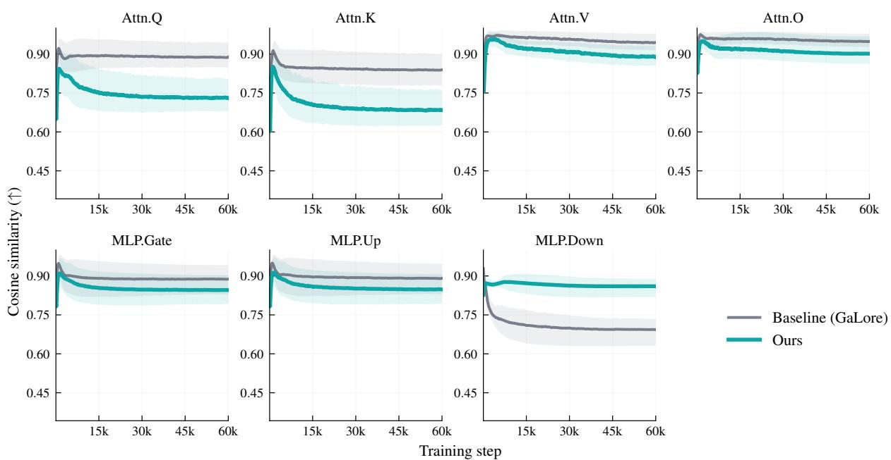  
Figure 10: Cosine similarity trajectories on Llama 2 350M. We track the cosine similarity between $G$ and $G _ { \mathrm { r e c o n } }$ for each target module during pre-training.

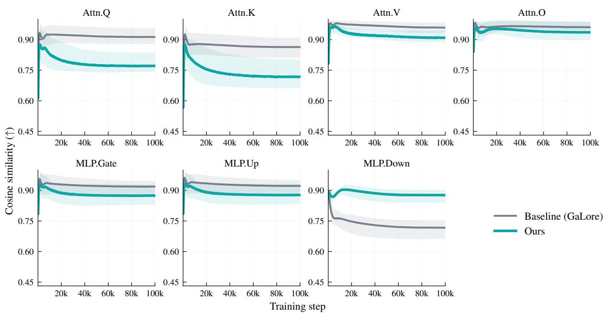  
Figure 11: Cosine similarity trajectories on Llama 2 1B. The same module-wise alignment analysis is repeated at the 1B scale.

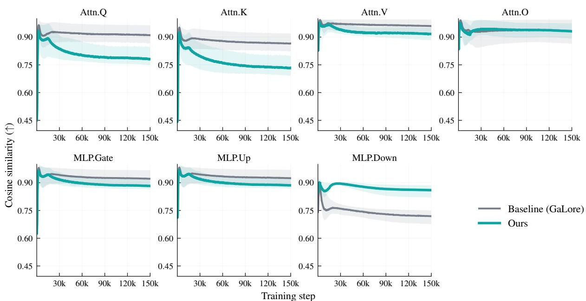  
Figure 12: Cosine similarity trajectories on Llama 2 7B. The same module-wise alignment analysis is repeated at the 7B scale.

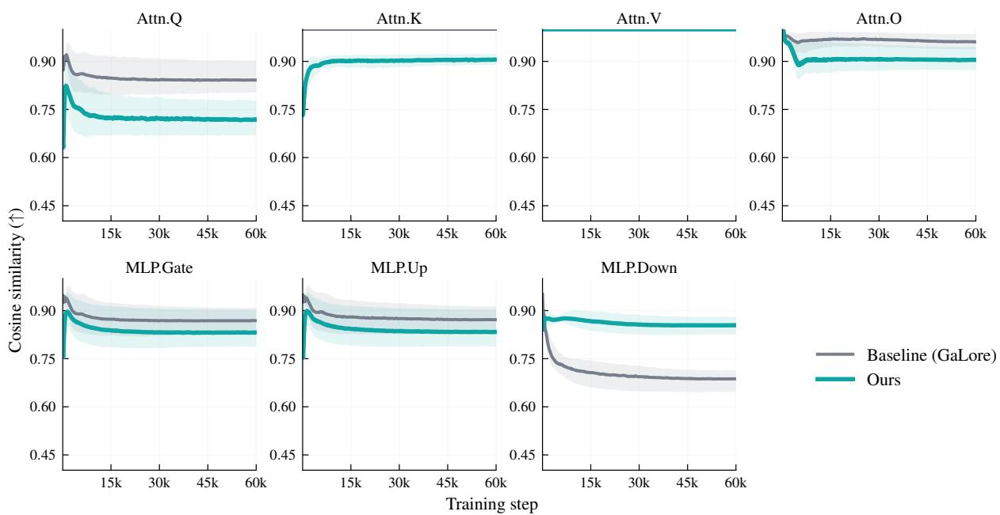  
Figure 13: Cosine similarity trajectories on Llama 3.2 300M. The same analysis is applied to Llama 3.2.

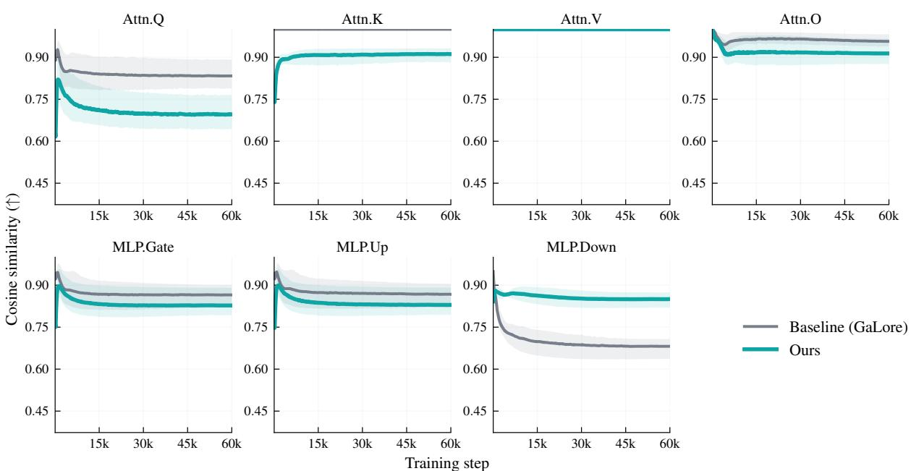  
Figure 14: Cosine similarity trajectories on Qwen2.5 350M. The same analysis is applied to Qwen2.5.

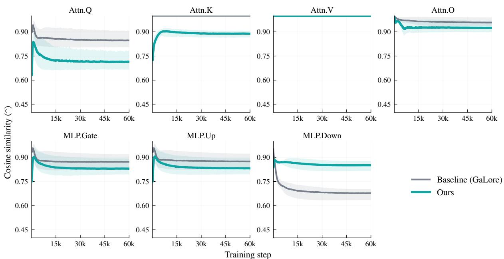  
Figure 15: Cosine similarity trajectories on Qwen3 350M. The same analysis is applied to Qwen3.

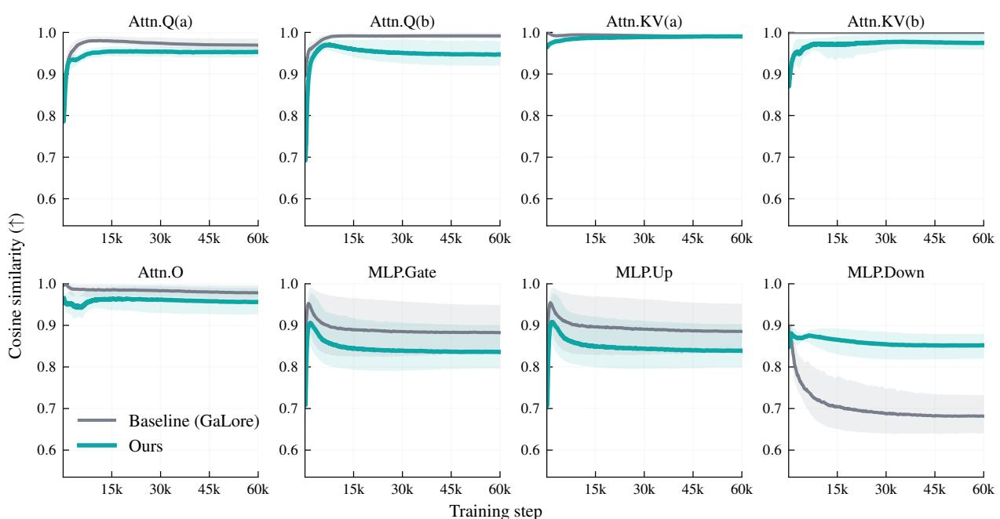  
Figure 16: Cosine similarity trajectories on DeepSeek-V2 350M. The same analysis is applied to DeepSeek-V2.