# Online local learning for generative thermodynamic computing

Huilin Wang∗, Weibing Deng†

Key Laboratory of Quark and Lepton Physics (MOE) and Institute of Particle Physics, Central China Normal University, Wuhan 430079, China

Generative thermodynamic computers turn thermal noise into structured data through Langevin dynamics. We train these systems with a local update at each integration step. The reverse-path Onsager–Machlup objective yields a coupling gradient that is a symmetric sum of local residual–state correlations. We apply this gradient immediately rather than accumulating it over a full trajectory. In digital simulations using MNIST prototypes, online and trajectory-batch training reach similar validation losses on fixed noising paths. Models trained online release less heat on average in all five independently seeded pairs, with both models’ parameters held fixed during sampling. Auxiliary classifier and nearest-prototype measures change modestly, while pairwise diversity decreases. The response to noise depends strongly on where the errors enter: independent zero-mean errors in the formed updates produce little heat change over a finite range of noise amplitudes, whereas residual ofset and temporal correlation have much larger efects. Storing trained couplings requires substantially less precision than resolving deterministic updates during training. Together, these results establish a local online training method and show how update timing, noise structure, and precision afect generative thermodynamic computing.

## I. INTRODUCTION

In thermodynamic computing, fluctuating physical variables perform a calculation through their collective dynamics [1–4]. A Langevin system, for example, can encode a calculation in its relaxation or in a nonequilibrium trajectory. This approach draws on stochastic thermodynamics [5–7] and is motivated by the growing energy cost of machine-learning workloads: conventional logic remains far above the Landauer scale, and data movement and arithmetic dominate modern accelerators [8– 10].

Thermodynamic computers have been used for a range of tasks. Equilibrium devices can solve linear-algebra problems such as matrix inversion [11, 12]; nonlinear out-of-equilibrium devices can perform machine-learning calculations analogous to those of neural networks [13]; and stochastic p-bit devices can solve optimization problems natively [14, 15]. Gradient descent extends this approach to tasks learned from data. Whitelam [16] showed that a generative thermodynamic computer trained by maximizing the probability of reversing a noising trajectory learns to synthesize structured outputs from thermal noise. The reverse-path formulation connects generative learning with stochastic thermodynamics and provides a physical counterpart to score-based generative models in machine learning [17–19]. Whitelam [20] subsequently demonstrated that gradient descent can also train a thermodynamic computer to mimic a neural network trained for image classification and analyzed its modeled energetic cost relative to digital implementations. A distinct hybrid approach, thermodynamic natural gradient descent, uses an equilibrium analog subsystem to accelerate second-order optimization of conventionally represented models [21]. Here the Langevin system is itself the nonequilibrium generator, and its couplings are updated from signals measured at each integration step.

Can the computer learn one step at a time? The analytic gradient is a sum of local contributions from individual integration steps. Applying each contribution immediately gives an online rule whose behavior can difer from trajectory-batch training at finite learning rate. In the generative Langevin-computer framework of Ref. [16], the demonstrated training procedure integrates the Langevin dynamics, accumulates gradients over a complete noising trajectory, and applies a batch parameter update at the end. This requires a gradient accumulator for each parameter, but no storage of the trajectory states. An online rule instead updates the couplings at each integration step from local information. Each update changes the parameters used to evaluate the next gradient. The gradient of the Onsager– Machlup loss with respect to a coupling Jij requires only the endpoint states, displacements, and local forces of nodes i and j at a single timestep. We write the analytic gradient of Ref. [16] as a symmetric sum of local residual–state correlations. We then derive the finitestep diference between online and batch training and test its consequences numerically. The use of local measurements connects this rule to physical learning in decentralized networks [22], equilibrium propagation [23], and coupled learning networks [24, 25]. A closely related residual-driven framework is the Hebbian Physics Network of Auti et al. [26], in which local violations of transport laws drive adaptation of a constitutive operator for difusion and flow problems. In our setting, the residual comes from the Onsager–Machlup loss for one reverse step of a stochastic generative process. We study how stepwise and trajectory-batch updates difer at finite learning rate, and how the resulting models difer in the heat released during generation with fixed parameters.

Local learning has also been investigated recently in other physical generative architectures. B¨osch et al. [27] derived local rules for learning time-dependent driving protocols in out-of-equilibrium score-based physical generative models, using either force measurements or observed dynamics, and demonstrated generation in nonlinear oscillator networks. Yu et al. [28] introduced a neural Langevin machine with a local asymmetric plasticity rule based on recurrent network fixed points and Langevin sampling. We use the autonomous generative thermodynamic computer of Ref. [16] and train its symmetric pair couplings using the reverse-path Onsager– Machlup objective. The learned couplings remain fixed when the model generates new samples.

A second question concerns the robustness of this local rule. Errors can enter after an edge update has been formed, or earlier in the node residual used to construct it. Limited precision can likewise afect either the storage of trained couplings or the small increments applied during training. These distinctions matter both for the stability of the numerical method and for future physical implementations.

We compare online and batch training across independent seeds and find similar validation losses but lower generation heat for models trained online. We examine this diference by varying the learning rate and update timing, then decomposing the energy at the generated endpoints. Noise and quantization tests show how the response depends on error structure and distinguish the precision needed to store couplings from that needed to update them.

## II. MODEL AND TRAINING RULES

## A. Thermodynamic computer

We follow the model of Refs. [16, 20]. The computer comprises $N = N _ { v } + N _ { h }$ classical real-valued degrees of freedom $\mathbf { x } = \{ x _ { i } \}$ , split into $N _ { v } = 7 8 4$ visible units (the 28 × 28 display layer) and $N _ { h } = 5 1 2$ hidden units. Couplings $J _ { i j }$ exist between every visible–hidden pair and every hidden–hidden pair; visible units have no direct mutual couplings, following Ref. [16]. The hidden–hidden diagonal is fixed to zero after every update. The units obey the overdamped Langevin equation

$$
\dot { x } _ { i } = - \mu \partial _ { i } V _ { \pmb \theta } ( \mathbf x ) + \sqrt { 2 \mu k _ { \mathrm { B } } T } \eta _ { i } ( t ) ,\tag{1}
$$

where $\mu$ is the mobility, $k _ { \mathrm { B } } T$ is the thermal energy, and $\eta _ { i } ( t )$ is unit-variance Gaussian white noise. The potential energy is

$$
V _ { \pmb \theta } ( \mathbf x ) = \sum _ { i = 1 } ^ { N } ( J _ { 2 } x _ { i } ^ { 2 } + J _ { 4 } x _ { i } ^ { 4 } ) + \sum _ { a \in h } b _ { a } x _ { a } + \sum _ { ( i j ) } J _ { i j } x _ { i } x _ { j } ,\tag{2}
$$

where the sum $\sum _ { ( i j ) }$ runs over all connected pairs with the convention $J _ { i j } = J _ { j i }$ (symmetric couplings), fixed onsite parameters $J _ { 2 } = J _ { 4 } = E _ { 0 }$ , and trainable parameters $\pmb { \theta } = ( J _ { v h } , J _ { h h } , b _ { h } )$ Only hidden-unit biases are trained; visible-unit model biases are fixed to zero. All trainable couplings and hidden biases are initialized to zero in every run. This energy-based architecture is closely related to classical Hopfield networks [29] and Boltzmann machines [30], but operates in continuous state space with nonequilibrium Langevin dynamics. The quartic term $( J _ { 4 } > 0 )$ provides nonlinearity and keeps the onsite potential confining at large amplitude [13]. We integrate Eq. (1) with the Euler–Maruyama scheme using singleprecision state and parameter arrays. We choose the simulation energy unit $E _ { 0 }$ such that $J _ { 2 } = J _ { 4 } = E _ { 0 } = 1$ and set $k _ { \mathrm { B } } T = 0 . 1 E _ { 0 } , \mu = 1$ , trajectory time $t _ { f } = 2 . 5 \mu ^ { - 1 }$ integration timestep $\Delta t = 1 0 ^ { - 3 }$ , and learning rate $\alpha =$ $\Delta t / t _ { f } = 4 \times 1 0 ^ { - 4 }$

## B. Batch training (reference)

Training follows Ref. [16]. Each prototype $s \in \mathbb { R } ^ { 7 8 4 }$ is normalized to zero mean and unit variance. A fixed random projection $P \in \mathbb { R } ^ { 7 8 4 \times 5 1 2 }$ , drawn once with entries $P _ { i a } \sim \mathcal { N } ( 0 , 1 / 7 8 4 )$ using seed $^ { 4 2 , }$ , supplies the corresponding hidden-layer field. Starting from zero, the uncoupled units are first evolved for $t _ { f }$ under external forces 2s and $2 P ^ { \mathsf { T } } s$ on the visible and hidden units, respectively. A noising trajectory $\omega = \{ \mathbf { x } ( t _ { k } ) \} _ { k = 0 } ^ { K }$ is then generated with external force $( a ( t ) s , a ( t ) P ^ { \mathsf { T } } s )$ , where $a ( t ) \ : = \ : 2 [ 1 \ : - \ : t / ( 0 . 7 5 t _ { f } ) ]$ for $t \ < \ 0 . 7 5 t _ { f }$ and $a ( t ) ~ = ~ 0$ thereafter. The learned couplings and hidden biases do not drive this forward noising path; they enter the candidate reverse-path loss below. Training maximizes the probability of the reverse trajectory $\tilde { \omega }$ under the candidate model. From the discrete Onsager–Machlup action [31, 32], the loss for one reverse step is

$$
\mathcal { L } _ { \mathrm { s t e p } } ^ { ( k ) } = \sum _ { i = 1 } ^ { N } \frac { \left( - \Delta x _ { i } + \mu \partial _ { i } V _ { \pmb { \theta } } ( \mathbf { x } ^ { \prime } ) \Delta t \right) ^ { 2 } } { 4 \mu k _ { \mathrm { B } } T \Delta t } ,\tag{3}
$$

where $\mathbf { x } ^ { \prime } = \mathbf { x } ( t _ { k + 1 } )$ and $\Delta \mathbf { x } = \mathbf { x } ^ { \prime } - \mathbf { x } ( t _ { k } )$ . The total loss is $\begin{array} { r } { \mathcal { L } = \sum _ { k } \mathcal { L } _ { \mathrm { s t e p } } ^ { ( k ) } } \end{array}$ . For plots and validation on fixed paths, we report the loss per step, $\overline { { \mathcal { L } } } = \mathcal { L } / K$ . The update equations below use the sum over the full trajectory. The batch update accumulates gradients over the full trajectory before updating parameters once:

$$
\pmb \theta \gets \pmb \theta - \alpha \sum _ { k = 1 } ^ { K } \nabla _ { \pmb \theta } \mathcal L _ { \mathrm { s t e p } } ^ { ( k ) } .\tag{4}
$$

We use the analytic gradients of Ref. [16] to construct the online rule below.

## C. Online local learning rule

Each symmetric coupling $\left( J _ { i j } \mathrm { ~ \right. ~ } J _ { j i } \mathrm { ) }$ contributes $J _ { i j } x _ { i } x _ { j }$ to the potential and therefore enters the forces on both connected units. Diferentiating Eq. (3) with respect to $J _ { i j }$ gives

$$
\frac { \partial \mathcal { L } _ { \mathrm { s t e p } } } { \partial J _ { i j } } = r _ { i } x _ { j } ^ { \prime } + r _ { j } x _ { i } ^ { \prime } ,\tag{5}
$$

where

$$
r _ { i } = \frac { - \Delta x _ { i } + \mu \partial _ { i } V _ { \pmb \theta } ( \mathbf { x } ^ { \prime } ) \Delta t } { 2 k _ { \mathrm { B } } T }\tag{6}
$$

is the local prediction residual of unit i. It measures the scaled diference between the reverse of the observed displacement $\Delta x _ { i }$ and the displacement predicted by the current potential for that reverse step. It depends on the state and displacement of unit i and on the local force $\partial _ { i } V _ { \theta }$ , which includes its neighbors’ states. The coupling gradient is thus a symmetric sum of two local residual– state correlations, $\boldsymbol { r } _ { i } \boldsymbol { x } _ { j } ^ { \prime }$ and $r _ { j } x _ { i } ^ { \prime }$ . Both can be formed at the edge connecting the units. The batch rule accumulates the same terms without storing the path.

The online rule applies these gradients immediately at each integration step $t _ { k }$

$$
J _ { i j } ( t _ { k + 1 } ) = J _ { i j } ( t _ { k } ) - \alpha \big ( r _ { i } x _ { j } ^ { \prime } + r _ { j } x _ { i } ^ { \prime } \big ) ,\tag{7}
$$

$$
b _ { a } ( t _ { k + 1 } ) = b _ { a } ( t _ { k } ) - \alpha r _ { a } ,\tag{8}
$$

where the bias update is applied only to hidden units $a \in h$ . Each update uses the current displacement, local force, and neighboring states. The trajectory-level gradient accumulator is no longer needed.

To see how online and batch training difer at finite learning rate, let $g _ { k } ( \pmb \theta ) = \nabla _ { \pmb \theta } \mathcal { L } _ { \mathrm { s t e p } } ^ { ( k ) } ( \pmb \theta )$ denote the stepk gradient along a fixed noising trajectory. The batch update from initial parameters $\pmb { \theta } _ { 0 }$ is

$$
\pmb { \theta } _ { \mathrm { b a t c h } } = \pmb { \theta } _ { 0 } - \alpha \sum _ { k } g _ { k } ( \pmb { \theta } _ { 0 } ) .\tag{9}
$$

The online rule instead evaluates later gradients at already updated parameters:

$$
\begin{array} { l } { \displaystyle \pmb { \theta } _ { \mathrm { o n l i n e } } = \pmb { \theta } _ { 0 } - \alpha \sum _ { k } g _ { k } ( \pmb { \theta } _ { k - 1 } ) } \\ { = \pmb { \theta } _ { \mathrm { b a t c h } } + \alpha ^ { 2 } \sum _ { k > l } H _ { k } ( \pmb { \theta } _ { 0 } ) g _ { l } ( \pmb { \theta } _ { 0 } ) + \mathcal { O } ( \alpha ^ { 3 } ) , } \end{array}\tag{10}
$$

where $H _ { k }$ is the Jacobian of $g _ { k }$ , assuming smooth gradients and suficiently small α. Thus batch and online training agree to first order in α but difer at second and higher orders. They can therefore reach diferent parameter sets even when their loss curves are similar.

## D. Noise and coupling quantization

We test noise in the local update signals and finite precision in the couplings.

Update and residual noise. We introduce errors at two stages of the local update calculation. In the formedupdate model, independent Gaussian errors are added after constructing each coupling or hidden-bias update signal, $u _ { i j }  u _ { i j } + \sigma _ { \mathrm { u p d } } \zeta _ { i j }$ and $u _ { a }  u _ { a } + \sigma _ { \mathrm { u p d } } \zeta _ { a }$ , where $u _ { i j } = r _ { i } x _ { j } ^ { \prime } + r _ { j } x _ { i } ^ { \prime }$ and $u _ { a } = r _ { a }$ is the hidden-bias update. For $\dot { J } _ { h h }$ , one $\zeta _ { i j }$ is drawn per undirected edge and mirrored so that coupling symmetry is preserved. In the residual model, noise is added before forming the edge update,

$$
r _ { i } \  \ r _ { i } + \sigma _ { \mathrm { r e s } } \xi _ { i } , \qquad \xi _ { i } \sim \mathcal { N } ( 0 , 1 ) ,\tag{11}
$$

with $\sigma _ { \mathrm { { u p d } } } , \sigma _ { \mathrm { { r e s } } } \geq 0 .$ The two amplitudes describe errors in diferent variables. A quantitative comparison therefore requires a mapping between the noise channels. We additionally test a residual ofset $\mu _ { \mathrm { b i a s } }$ and an AR(1) residual error $\xi _ { k + 1 } = \rho \xi _ { k } + \sqrt { 1 - \rho ^ { 2 } } \epsilon _ { k } ,$ reset at the start of each training trajectory with $\xi _ { 0 } \sim \mathcal { N } ( 0 , 1 )$ . The ofset screen adds the same $\mu _ { \mathrm { b i a s } }$ to every node residual on top of iid residual noise; all injected-error random streams are independent of the thermal Langevin random stream. Within each response sweep, the thermal training seed is fixed across error amplitudes, and all conditions use a common generation seed.

Coupling quantization. After training with full (32- bit) precision, the stored coupling tensors $A \in \{ J _ { v h } , J _ { h h } \}$ are quantized to $b _ { \mathrm { s t o r a g e } }$ bits; the primary screen retains $b _ { h }$ at full precision. We write b for $b _ { \mathrm { s t o r a g e } }$ in Eqs. (12) and (13). Here “32 bit” denotes the unquantized single-precision simulation reference rather than a 32-bit fixed-point grid. For each tensor separately, an entry is mapped to the nearest integer level:

$$
\hat { n } _ { i j } = \mathrm { r o u n d } \big ( A _ { i j } / A _ { \operatorname* { m a x } } \cdot ( 2 ^ { b - 1 } - 1 ) \big ) ,\tag{12}
$$

where $\begin{array} { r c l } { A _ { \mathrm { m a x } } } & { = } & { \operatorname* { m a x } _ { i j } | A _ { i j } | } \end{array}$ and $\begin{array} { r l r } { \hat { n } _ { i j } } & { { } \in } & { \left\{ - ( 2 ^ { b - 1 } \right. - } \end{array}$ $1 ) , \ldots , + ( 2 ^ { b - 1 } - 1 ) \}$ . The quantized coupling is then

$$
A _ { i j } ^ { ( b ) } = \frac { \hat { n } _ { i j } } { 2 ^ { b - 1 } - 1 } A _ { \mathrm { m a x } } .\tag{13}
$$

Hidden–hidden couplings are quantized once per undirected edge and mirrored. We generate samples with these quantized couplings, leaving the trained hidden biases unchanged. For each trained model, we use the same generation random numbers at all storage bit depths. We compare the resulting heat distributions with the 32-bit reference using the empirical two-sample Kolmogorov– Smirnov distance. Because the random numbers pair the samples across bit depths, the usual independent-sample KS p value does not apply. We separately test a trainingtime precision $b _ { \mathrm { t r a i n } } \colon$ each online update is followed immediately by clipping and quantization of the updated $J _ { v h }$ and $J _ { h h }$ tensors, while $b _ { h }$ remains at full precision in the primary screen. The fixed tensor ranges are measured from the corresponding full-precision checkpoint. For stochastic rounding, a scaled value y is mapped to $\left\lfloor y \right\rfloor + 1$ with probability $y - \lfloor y \rfloor$ and to ⌊y⌋ otherwise, using a random stream independent of the thermal dynamics. Training-time precision conditions use the same thermal training and generation seeds as the full-precision reference.

## E. Training versus generation

Online updates are applied only along the noising trajectories used for training. For each generation sample, all states are reset to zero and evolved for $t _ { f }$ under the uncoupled onsite potential before the learned model is applied for a further time $t _ { f }$ . The couplings and biases remain fixed throughout generation and all subsequent quality and heat measurements. We measure the heat released as this trained system relaxes, $Q = V _ { \pmb { \theta } } ( \mathbf { x } _ { 0 } ) - V _ { \pmb { \theta } } ( \mathbf { x } _ { t _ { f } } )$ , with heat flowing to the environment taken as positive. The measurement begins after preparation of the uncoupled initial state and establishment of the trained parameters; the work of establishing or switching those parameters lies outside this interval.

In each paired comparison, batch and online training use the same seed for thermal noise and therefore the same sequence of forward noising trajectories. Across pairs, the training seeds change the trajectory realizations, while all parameter initializations remain identical. The five main training seeds are 101–105. Batch and online models within a trained pair are also evaluated with the same generation seed (common random numbers), while distinct trained pairs use generation seeds 90101– 90105. The fixed validation trajectory uses seed 777001, starts from the first prototype in training order (digit 0), and is evaluated every 10 training cycles.

To compare the learned potentials, we evaluate all ten final checkpoints on 30 additional noising paths, ten per training prototype, shared across checkpoints. We also compare the normalized losses after subtracting the parameter-independent squared-increment term in Eq. (3). For the energy diagnostic, we replay the original 200 generation trajectories per checkpoint and retain the full visible and hidden endpoint states. The replayed images and heats match the archived values exactly, and all trainable parameter arrays are verified to remain unchanged. We evaluate both learned potentials on both endpoint ensembles. Evaluating states in the other model’s potential diagnoses changes in the energy drop; only evaluation in their own potential measures the heat released during generation.

## F. Auxiliary generation-quality metrics

We assess generation quality with a separately trained MNIST classifier, which plays no role in training the thermodynamic computer. The classifier contains two $3 \times 3$ convolutional layers (16 and 32 channels), each followed by ReLU and $2 \times 2$ max pooling, then a 128-unit fully connected layer and a 10-class output. It is trained with Adam (learning rate $1 0 ^ { - 3 } )$ for five epochs using seed 42. For classifier input only, each generated image is linearly rescaled by its 2nd and 98th percentiles to [0, 1], followed by standard MNIST normalization. We report the mean maximum softmax score, the fraction assigned to the three training classes, and the natural-log entropy of the predicted-class counts. These labels and scores give auxiliary measures of recognizability. Their interpretation depends on preprocessing, because the signed, zeromean generated states difer from the standard MNIST images used to train the classifier. The maximum softmax score is not a calibrated probability or a confidence interval. Nearest-prototype distance is the Euclidean distance between an unrescaled generated state and the closest zero-mean/unit-variance training prototype. Pairwise diversity is computed directly from unrescaled generated states and averaged over all distinct sample pairs. For statistical comparisons of batch and online training, each trained seed pair is one independent observation. We report paired seed-level diferences with two-sided Studentt confidence intervals and tests, together with the exact two-sided sign test for the heat comparison. The spread across trajectories from one trained model describes sampling variability, not independent replication of the training algorithm.

## III. RESULTS AND DISCUSSION

The main comparison uses three MNIST digits (0, 1, 2) [33]. We take the first image of each class in the training set, cycle through them in the order (0, 1, 2), and normalize each image to zero mean and unit variance. Using one image per class follows Ref. [16], where a small set of prototypes was suficient to train a Langevin computer to generate structured outputs. For this comparison, training runs for $N _ { \mathrm { c y c l e } } = 3 0 0$ cycles. We measure the mean heat emitted per denoising trajectory after the trained parameters are frozen, $\langle Q \rangle = \langle V _ { \pmb { \theta } } ( \mathbf { x } _ { 0 } ) - V _ { \pmb { \theta } } ( \mathbf { x } _ { t _ { f } } ) \rangle$ averaged over $N _ { \mathrm { s a m p } } = 2 0 0$ independent runs, each prepared by evolving the uncoupled units for the same finite time. Sample quality, class coverage, and diversity provide complementary measures of generation. The 2-bit quantization result below illustrates why heat alone does not determine fidelity. We express heat in the simula tion energy unit $E _ { 0 }$ . Since $k _ { \mathrm { B } } T ~ = ~ 0 . 1 E _ { 0 } .$ , conversion to thermal units multiplies the reported values by ten. This conversion leaves relative heat diferences and the dimensionless perturbation coordinates unchanged.

Figure 1 illustrates the denoising process for the three target digits. Starting from thermal noise at $t \ = \ 0 ,$ the coupled Langevin dynamics progressively transforms the noise into structured digit-like images by $t ~ = ~ t _ { f }$ Thermal fluctuations produce diferent trajectories and variation among the generated images. To display the learned structures, we select the archived sample with the smallest nearest-prototype distance within each classifierassigned target class. Figure 3(b–d) gives the class counts and quality measures for the complete archive.

## A. Generation heat and sample quality

Figure 2 compares the batch and online learning rules. Both rules approach the same validation-loss plateau within approximately 50 training cycles and remain stable for the full training run [Fig. 2(a)]. The validation curves track one another closely on the fixed forward path. We measure generation heat separately, on denoising trajectories of the frozen trained models.

Despite their similar validation losses, the trained models release diferent amounts of heat. We compare five independently seeded pairs, treating each pair as one statistical unit. The trajectory distributions for seed 101 illustrate the diference within one pair [Fig. 2(c)]. The online computer emits less heat in all five paired seeds, with a mean relative reduction of 5.6% [Fig. 2(b)]. The mean paired absolute reduction is 7.68 $E _ { 0 }$ (95% Student-t confidence interval [6.64, 8.71] $E _ { 0 } ;$ paired t-test $p = 3 . 3 \times 1 0 ^ { - 5 }$ ; exact two-sided sign test $p = 0 . 0 6 2 5$ for $n = 5 )$ All pairs show the same trend, although the small number of pairs limits the power of the nonparametric sign test. Equation (10) shows that the two rules follow diferent finite-step optimization trajectories even when they agree to first order in the learning rate. Varying the learning rate and update delay (Sec. III D) tests the role of update timing. We then examine the learned potentials and generated endpoint states to locate the heat diference (Sec. III E).

Figure 3 shows generated samples drawn from one online-trained computer and their evaluation by an independent MNIST classifier (a convolutional neural network trained to 98.7% test accuracy on the standard MNIST dataset). Panel (a) displays the four samples closest to a training prototype within each classifierassigned target class. Panels (b–d) summarize the com plete sample archives. For seed 101, the CNN assigns most samples to the three training classes [Fig. 3(b)], predominantly to class 2 and rarely to class 1. The remaining assignments fall outside the target set. Most of these of-target samples are closest to a class-1 or class-2 prototype in the unrescaled state space. Nearest-prototype assignment can only choose among the stored classes, however, so it does not establish whether an of-target sample is a recognizable target digit. All of-target assignments are included in the quality analysis. A 3-output classifier would assign every sample to classes 0, 1, or 2, concealing this distinction. The ten-class evaluation and the displayed structures together show digit generation with strongly uneven class coverage for this seed.

We compare generation quality across the same five trained seed pairs. For each seed, batch and online models were evaluated with the same generation random seed, 200 saved samples per model, and frozen parameters. An additional generation call for each model verified, by elementwise comparison before and after sampling, that all coupling and bias arrays remained unchanged. The paired intervals in Fig. 3(d) resolve no change in the mean maximum softmax score. Online samples have a lower target-class fraction, higher class entropy, slightly smaller nearest-prototype distance, and lower pairwise diversity. Lower heat therefore comes with a mixed change in quality: the outputs are slightly closer to the prototypes but less diverse, and the CNN assigns fewer of them to the target classes.

To test whether the heat trend persists with more prototypes, we repeated the comparison with the first five training images from each of the same three classes (15 prototypes in total), using three independently seeded pairs, 300 training cycles, and 200 generated samples per model. Online heat is lower in all three pairs, with a mean relative reduction of about 7%. Maximum CNN softmax score and target-class fraction remain similar in this auxiliary screen. The online samples again have lower pairwise diversity, but their nearest-prototype distance is slightly larger. Thus the heat and diversity trends persist across these three seeds, while the change in prototype distance reverses.

## B. Perturbation response

Figure $^ \mathrm { 4 ( a , b ) }$ distinguishes the two noise channels defined in Sec. II. For formed-update noise, heat remains near its baseline through $\sigma _ { \mathrm { u p d } } = 0 . 3 0$ before crossing over to large heat degradation between 0.30 and 0.35. Heat decreases modestly at low noise; sample quality was not measured in this sweep, so the decrease alone does not indicate better generation.

Residual noise enters a node signal shared by all of its incident edge updates. It produces a gradual, monotonic heat increase up to $\sigma _ { \mathrm { r e s } } ~ = ~ 0 . 4 0$ The noise-free baselines difer because the two screens use diferent training lengths and sampling protocols. The amplitudes $\sigma _ { \mathrm { u p d } }$ and $\sigma _ { \mathrm { r e s } }$ label diferent error channels, each with its own response curve.

We next add an ofset or temporal correlation to the residual noise, keeping $\sigma _ { \mathrm { r e s } } ~ = ~ 0 . 2 ~ \mathrm { [ F i g . ~ 4 ( c , d ) ] }$ Even the smallest nonzero ofset produces a marked heat increase, and larger ofsets change the heat by orders of magnitude. Increasing AR(1) correlation also raises the heat, particularly at the two largest tested correlations. In these tests, coherent ofsets and persistent errors have much larger efects than independent zero-mean errors in the formed updates.

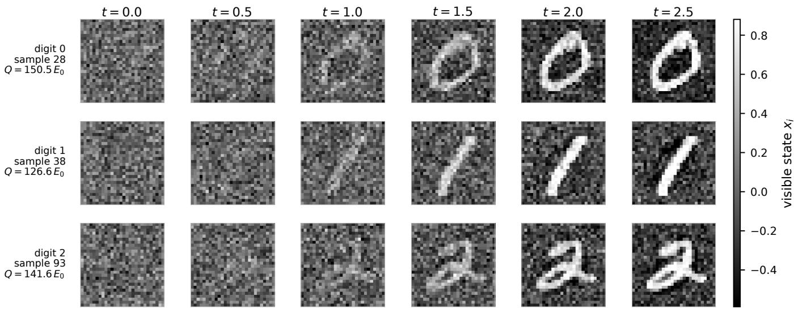  
FIG. 1. Fixed-seed denoising trajectories for digits 0, 1, and 2. For each target digit, the displayed trajectory has the minimum nearest-prototype distance among the 200 archived online seed-101 samples assigned to that digit by the frozen classifier (archive samples 28, 38, and 93). Full-archive diagnostics appear in Fig. 3(b–d). Each row shows six equally spaced times from generation seed 90101. Terminal states and heats were verified against the saved archive, and all states share one grayscale set by their 1st and 99th percentiles.

(a)  
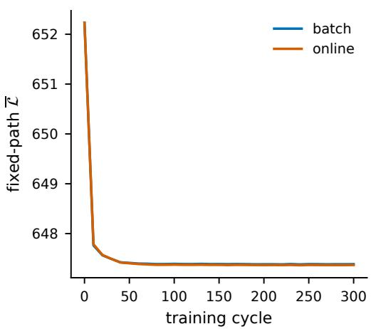

(b)  
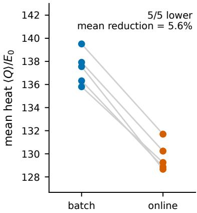

(c)  
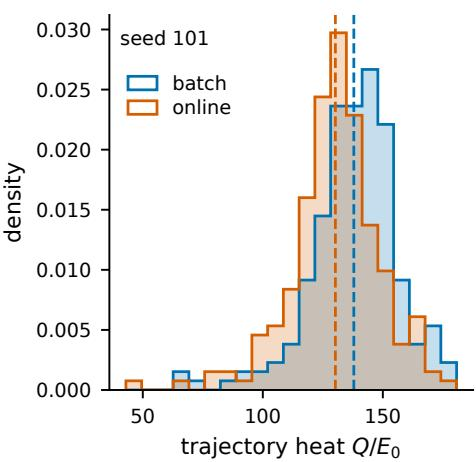  
FIG. 2. Paired comparison of online and batch training. (a) Mean fixed-path validation loss across five training seeds; shading denotes 1 s.d. across seeds. (b) Seed-level mean heat, with each line joining one paired batch and online run. Online training is lower in all five pairs, with a mean relative reduction of 5.6%. The paired t-test gives $p = 3 . 3 \times 1 0 ^ { - 5 } ;$ the exact two-sided sign test gives $p = 0 . 0 6 2 5$ (c) Trajectory-level heat distributions for trained pair 101 $( N _ { \mathrm { s a m p } } = 2 0 0$ per model); dashed lines mark the means. Panel (c) describes one trained pair; panel (b) compares independent trained seed pairs.

## C. Precision response

Figure $5 ( \mathrm { a } )$ shows the storage-precision screen for the full-precision online checkpoint of seed 101. With twobit storage, very low heat is accompanied by a lower maximum CNN softmax score, larger nearest-prototype distance, and strongly reduced diversity. Here low heat accompanies a narrower output distribution rather than better generation. At 4 and 5 bits, the heat distributions approach the 32-bit reference, and the 4-bit auxiliary quality summaries are also close to their reference values. We use the KS distance to describe diferences in the heat distributions and the auxiliary measures to assess quality and diversity. The shared generation random numbers preclude using the independent-sample KS p value here.

The distinction between storage and training precision is pronounced [Fig. 5(b)]. With deterministic fixed-range rounding after every update, $J _ { v h }$ remains identically zero at 4, 6, and 8 bits because typical updates are below the grid spacing. At 16 bits, the heat and auxiliary quality summaries approach the 32-bit reference. Stochastic rounding makes the low-bit couplings nonzero and provides partial recovery, but the 8-bit quality summaries still difer from the reference; the stochastic 16-bit result is again close to it. Stochastic rounding partly recovers training at low precision. Even with this recovery, 16 bits remain the lowest tested training precision at which both heat and the auxiliary quality measures approach the reference in this implementation.

10-class CNN assignment  
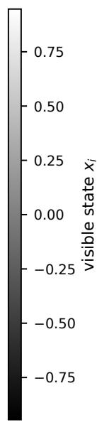

(a)  
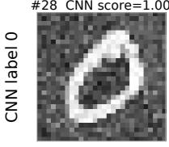

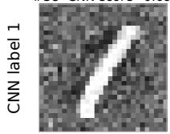

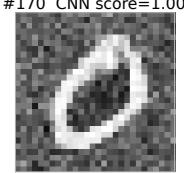

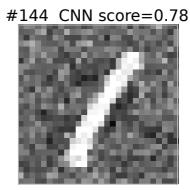

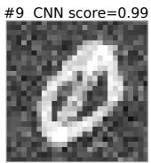

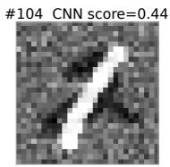

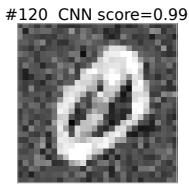

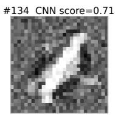

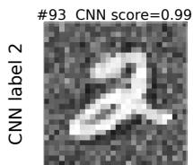  
(b)

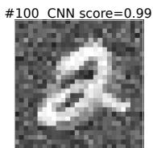  
(c)

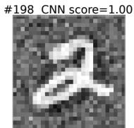

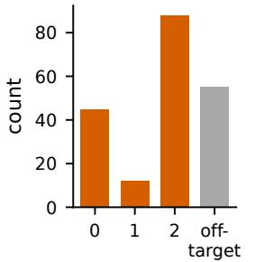

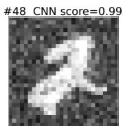

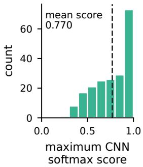

(d)  
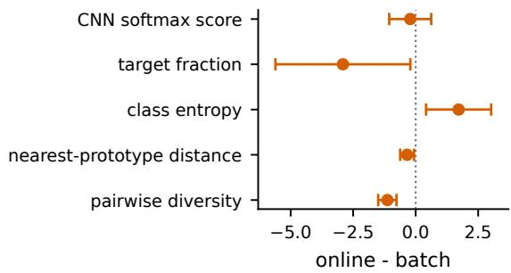  
FIG. 3. Generated samples and auxiliary quality diagnostics. (a) Class-balanced low-distance display for online-trained seed 101: within each classifier-assigned target class, the four archived samples with smallest nearest-prototype distance are shown. Titles give archive index and maximum CNN softmax score. The score is not a calibrated probability or confidence interval. This selection shows low-distance examples; class frequencies and typical distances are assessed from the full archive. A single grayscale, set by the 1st and 99th percentiles of all 200 unrescaled samples, is shared by every image; samples are not individually contrast normalized. $^ { ( \mathrm { b , c } ) }$ Ten-class auxiliary-CNN assignments and maximum softmax scores for all 200 samples from this model. Orange bars identify the three classes used to train the thermodynamic computer; the gray bar collects CNN assignments outside the training set. The dashed line in panel (c) marks the mean score. (d) Five-seed paired online-minus batch diferences with 95% Student-t confidence intervals, expressed as a percentage of each metric’s batch seed-level mean. Each model contributes 200 stored samples. For every model, a separate generation call verified elementwise that all parameter arrays remained unchanged.

## D. Learning rate and update timing

Figure 6(a,b) shows a three-seed learning-rate control with $\alpha / ( \Delta t / t _ { f } ) = 0 . 5 , 1$ , and 2, $N _ { \mathrm { c y c l e } } = 1 0 0$ , and $N _ { \mathrm { s a m p } } = 1 0 0$ Online heat is lower in all three paired seeds at every scanned scale. Both rules give their lowest measured heat at scale 0.5, where the online models still release less heat. The diference therefore persists across the tested settings. Because both minima lie at the boundary of the scan, this control does not locate the optimal learning rates. Comparing optima at matched generation quality would also require quality measurements across the scan.

(a)  
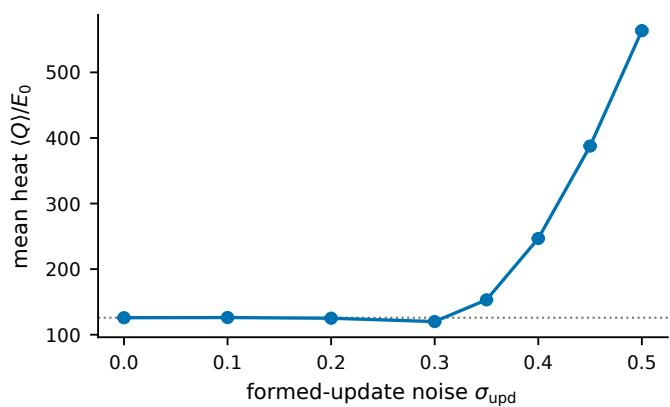

(b)  
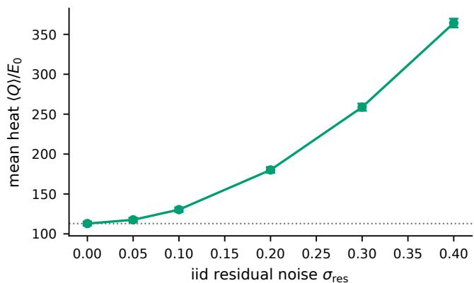

(c)  
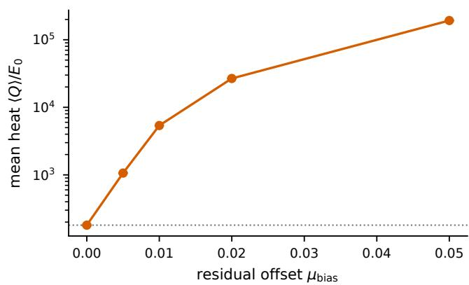

(d)  
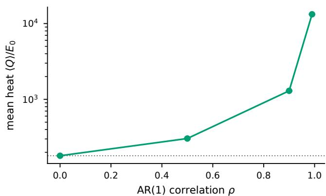  
FIG. 4. Perturbation-response screens. (a) Zero-mean noise $\sigma _ { \mathrm { u p d } }$ added after each local update has been formed $( N _ { \mathrm { c y c l e } } =$ 100, $N _ { \mathrm { s a m p } } = 2 0 0 )$ . (b) Iid noise $\sigma _ { \mathrm { r e s } }$ added to node residuals before the symmetric edge update is formed. (c) Uniform residual ofset $\mu _ { \mathrm { b i a s } }$ added on top of iid residual noise with $\sigma _ { \mathrm { r e s } } = 0 . 2$ . (d) $\mathrm { A R } ( 1 )$ temporal correlation at the same residual-noise amplitude. Panels (b–d) use $N _ { \mathrm { c y c l e } } = 4 0$ and $N _ { \mathrm { s a m p } } = 6 0$ . Error bars are trajectory $\operatorname { S E M } ;$ panels $^ { \mathrm { ( c , d ) } }$ use logarithmic vertica axes. Gray dotted lines mark the corresponding zero-perturbation baseline in each panel. The two noise amplitudes in $^ { ( \mathrm { a } , \mathrm { b } ) }$ act on diferent variables and are not quantitatively interchangeable. Each panel reports a single trained-seed response curve.

For the delayed-update control $\left[ \mathrm { F i g . \ 6 ( c , d ) } \right]$ , local gradients are accumulated for M integration steps before being applied. The fully online case is $M = 1$ , whereas $M = 2 5 0 0$ gives one accumulated update per trajectory. Across three seeds, $M = 1$ , 10, and 100 give similar heat, whereas the fully accumulated case is consistently higher than $M = 1$ . With $N _ { \mathrm { c y c l e } } = 8 0$ and $N _ { \mathrm { s a m p } } = 1 2 0$ , accumulating gradients over the full path produces models that release more heat during generation than those trained with stepwise or moderately delayed updates.

## E. Path likelihood and generation heat

Why can models with similar training losses release different amounts of heat? The loss measures reverse-path likelihood; the heat measures energy released during generation. To relate them, consider a fixed candidate parameter set θ and an observed noising path $\omega .$ . Write $\mathbf { g } _ { \theta , k } ^ { + } = \nabla V _ { \theta } ( \mathbf { x } _ { k + 1 } )$ and $\mathbf { g } _ { 0 , k } ^ { - } = \nabla V _ { 0 } ( \mathbf { x } _ { k } , t _ { k } )$ , where the uncoupled reference potential $V _ { 0 }$ includes the prescribed external forcing. Expanding the Gaussian transition densities of Eq. (3) gives the exact discrete identity

$$
\begin{array} { l } { \displaystyle \mathcal { R } _ { \theta } \equiv \ln \frac { P _ { 0 } [ \omega \mid \mathbf { x } _ { 0 } ] } { P _ { \theta } [ \tilde { \omega } \mid \mathbf { x } _ { K } ] } } \\ { \displaystyle \quad = - \frac { \beta } { 2 } \sum _ { k } \Delta \mathbf { x } _ { k } \cdot ( \mathbf { g } _ { \theta , k } ^ { + } + \mathbf { g } _ { 0 , k } ^ { - } ) } \\ { \displaystyle \quad \quad + \frac { \beta \mu \Delta t } { 4 } \sum _ { k } \left( \lVert \mathbf { g } _ { \theta , k } ^ { + } \rVert ^ { 2 } - \lVert \mathbf { g } _ { 0 , k } ^ { - } \rVert ^ { 2 } \right) , } \end{array}\tag{14}
$$

where $\beta ~ = ~ 1 / ( k _ { \mathrm { B } } T )$ and the path densities are conditioned on their respective starting states. The forcesquared term is of order $\Delta t$ per step and generally accumulates to a finite contribution at fixed $t _ { f } .$ . It must therefore be retained in the path-likelihood ratio, which cannot be expressed in terms of heat alone for these two models.

For generation under a frozen, time-independent potential, the released heat instead follows directly from

(a)  
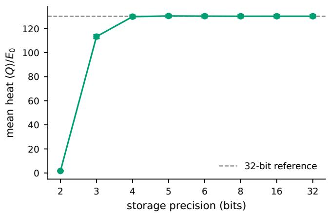

(b)  
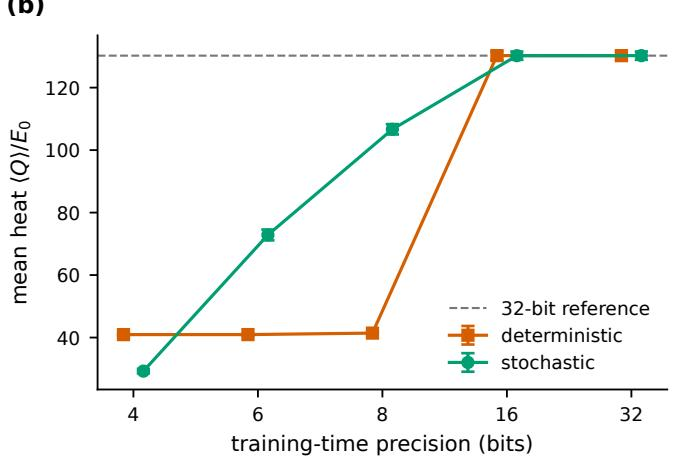  
FIG. 5. Coupling-precision screens. (a) Post-training quantization of $J _ { v h }$ and $J _ { h h }$ , with $b _ { h }$ retained at full precision. (b) Deterministic and stochastic quantization of the couplings after every online update; the 32-bit point is the unquantized single-precision reference. Dashed lines show the corresponding 32-bit reference heat, and error bars are trajectory SEM within each screening condition.

(a)  
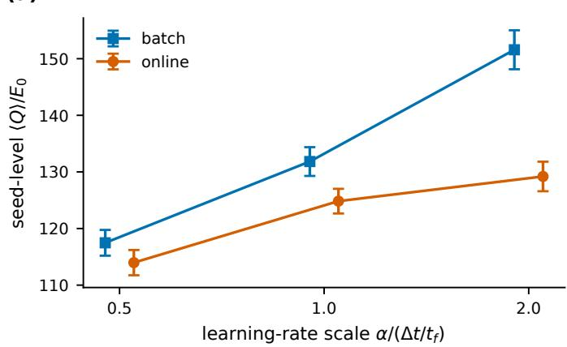

(b)  
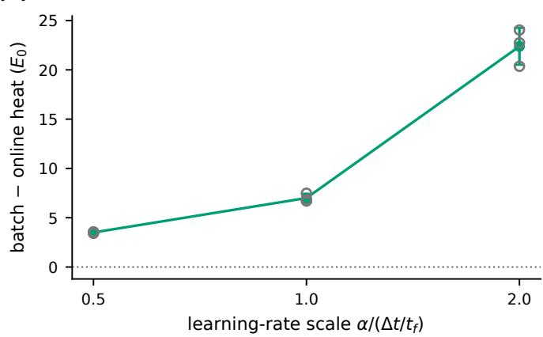

(c)  
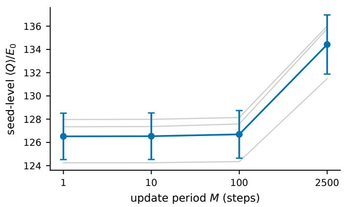

(d)  
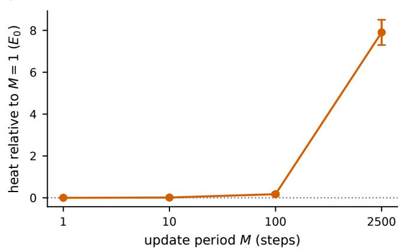  
FIG. 6. Optimization controls. (a) Seed-level heat for batch and online training across three learning-rate scales; error bars are 1 s.d. across seed means. (b) Paired batch-minus-online heat; open circles show individual seed diferences. (c) Seed-level heat versus update period M; gray lines join matched seeds and error bars are 1 s.d. across seed means. (d) Paired heat relative to $M = 1$ . The controls use three independently seeded pairs.

the energy change:

$$
Q = - \int _ { 0 } ^ { t _ { f } } \nabla V _ { \theta } \circ d \mathbf { x } = V _ { \theta } ( \mathbf { x } _ { 0 } ) - V _ { \theta } ( \mathbf { x } _ { t _ { f } } ) ,
$$

where ◦ denotes the Stratonovich integral. We measure this heat as the system relaxes in the trained potential.

The measurement starts after the parameters are set, excluding dissipation from writing the parameters and the work needed to establish the potential. The training objective is evaluated on externally generated noising paths, whereas ⟨Q⟩ averages over paths generated by the frozen trained model. The averages are over diferent ensembles, so minimizing the training loss does not by itself minimize generation heat. Online and batch training evaluate the same fixed-parameter objective along diferent finitestep optimization trajectories [Eq. (10)], and can select solutions with similar path loss but diferent generation heat.

Evaluating the saved models with fixed parameters makes this distinction concrete. On the 30 additional noising paths, the normalized losses remain numerically close after subtracting the common squared-increment term, with a slightly lower loss for online training. The similar losses are therefore not simply a consequence of the large common ofset.

The energy decomposition locates the heat diference at the generated endpoints. The two models start from nearly equal mean energies. Online-generated states have less negative coupling energy and smaller positive onsite energy than batch-generated states, evaluated in their respective learned potentials. The coupling-energy change dominates, leaving a higher final total energy and hence a smaller energy release. The online checkpoints also have smaller coupling Frobenius norms in both coupling blocks in all five pairs. Evaluating both potentials on both endpoint ensembles distinguishes changes in the potential from changes in the sampled states. On either ensemble, the online potential gives a smaller mean energy drop. In either potential, the online endpoint ensemble also gives a smaller drop. These comparisons connect the lower heat to changes in both the learned potential and the states reached during finite-time generation, while the path losses remain close.

## F. Noise structure and physical implementation

The structure of the errors helps explain the diferent noise responses. Independent zero-mean errors can partly cancel over many steps, consistent with the weak heat response at low formed-update noise. This averaging also occurs when stepwise estimates are accumulated before updating; it is not specific to the online rule. Ofsets and slowly correlated errors persist across steps, limiting what this averaging can remove and making calibration more important.

The response curves in Secs. III B and III C show how each perturbation afects learning and generation. They also separate two precision requirements: retaining the behavior of a trained model when its couplings are stored, and resolving small increments when those couplings are updated. The thresholds depend on the task and protocol. We assess storage through heat and auxiliary quality measures with parameters fixed, and training through fixed-range quantization after every update. Relating the dimensionless error amplitudes to device parameters requires a model of the chosen platform.

The locality of Eq. (7) suggests a route to physical implementation. Each coupling gradient is a symmetric sum of residual–state correlations measured at one timestep; computing it requires no backpropagation through the trajectory. This distinguishes the present setting from analog in-memory neural network training methods designed to handle asymmetric device noise in crossbar arrays [34–36]. Possible substrates include coupled electrical, mechanical, or superconducting stochastic systems [12, 37]. For each platform, the relevant questions are how to measure the local residuals and apply coupling increments with controlled noise, drift, and precision.

## IV. CONCLUSIONS

We train a generative Langevin computer one integration step at a time, updating its couplings with a symmetric sum of local residual–state correlations. Across five paired digital simulations, online and trajectorybatch training reach similar validation losses on fixed paths, while the online models release less heat on average during generation in every pair. Endpoint diagnostics connect this diference to the learned potentials and the states they generate. Lower heat accompanies reduced sample diversity. Independent zero-mean errors in the formed updates and coherent errors in the residuals have markedly diferent efects on heat, and storing trained couplings requires less precision than resolving deterministic training updates. For the tasks and protocols studied here, these simulations show how update timing, noise structure, and precision shape local learning in generative thermodynamic computers.

## ACKNOWLEDGMENTS

This work was supported by the National Key Research and Development Program of China under Grant No. 2024YFA1611003, the Fundamental Research Funds for the Central Universities (XJ2026002701), the Natural Science Foundation of Fujian Province (Grant No. 2026J0011623), and the 111 Project 2.0 (Grant No. BP0820038).

## DATA AVAILABILITY

There are no publicly available research data or software supporting this manuscript. Requests for further information or data should be sent to the authors.

[1] T. Conte, E. DeBenedictis, N. Ganesh, T. Hylton, G. E. Crooks, and P. J. Coles, Thermodynamic computing, arXiv preprint (2019), 1911.01968.

[2] T. Hylton, Thermodynamic neural network, Entropy 22, 256 (2020).

[3] G. W. Wimsatt, O.-P. Saira, A. B. Boyd, M. H. Matheny, S. Han, M. L. Roukes, and J. P. Crutchfield, Harnessing fluctuations in thermodynamic computing via time-reversal symmetries, Phys. Rev. Research 3, 033115 (2021).

[4] A. B. Boyd, A. Patra, C. Jarzynski, and J. P. Crutchfield, Shortcuts to thermodynamic computing: The cost of fast and faithful information processing, J. Stat. Phys. 187, 17 (2022).

[5] U. Seifert, Stochastic thermodynamics, fluctuation theorems and molecular machines, Rep. Prog. Phys. 75, 126001 (2012).

[6] C. Jarzynski, Nonequilibrium equality for free energy diferences, Phys. Rev. Lett. 78, 2690 (1997).

[7] G. E. Crooks, Entropy production fluctuation theorem and the nonequilibrium work relation for free energy diferences, Phys. Rev. E 60, 2721 (1999).

[8] R. Landauer, Irreversibility and heat generation in the computing process, IBM J. Res. Dev. 5, 183 (1961).

[9] A. B´erut, A. Arakelyan, A. Petrosyan, S. Ciliberto, R. Dillenschneider, and E. Lutz, Experimental verification of Landauer’s principle linking information and thermodynamics, Nature 483, 187 (2012).

[10] M. Horowitz, 1.1 computing’s energy problem (and what we can do about it), in 2014 IEEE International Solid-State Circuits Conference (ISSCC) Digest of Technical Papers (IEEE, 2014) pp. 10–14.

[11] M. Aifer, K. Donatella, M. H. Gordon, S. Dufield, T. Ahle, D. Simpson, G. E. Crooks, and P. J. Coles, Thermodynamic linear algebra, npj Unconventional Computing 1, 13 (2024).

[12] D. Melanson, M. Abu Khater, M. Aifer, K. Donatella, M. H. Gordon, T. Ahle, G. E. Crooks, A. J. Martinez, F. Sbahi, and P. J. Coles, Thermodynamic computing system for AI applications, Nat. Commun. 16, 3757 (2025).

[13] S. Whitelam and C. Casert, Nonlinear thermodynamic computing out of equilibrium, Nat. Commun. 17, 1189 (2026).

[14] K. Y. Camsari, R. Faria, B. M. Sutton, and S. Datta, Stochastic p-bits for invertible logic, Phys. Rev. X 7, 031014 (2017).

[15] W. A. Borders, A. Z. Pervaiz, S. Fukami, K. Y. Camsari, H. Ohno, and S. Datta, Integer factorization using stochastic magnetic tunnel junctions, Nature 573, 390 (2019).

[16] S. Whitelam, Generative thermodynamic computing, Phys. Rev. Lett. 136, 037101 (2026).

[17] Y. Song and S. Ermon, Generative modeling by estimating gradients of the data distribution, in Advances in Neural Information Processing Systems 32 (NeurIPS 2019) (2019) pp. 11895–11907.

[18] J. Ho, A. Jain, and P. Abbeel, Denoising difusion probabilistic models, in Advances in Neural Information Processing Systems 33 (NeurIPS 2020) (2020) pp. 6840–6851.

[19] J. Sohl-Dickstein, E. A. Weiss, N. Maheswaranathan, and S. Ganguli, Deep unsupervised learning using nonequilibrium thermodynamics, Proc. Mach. Learn. Res. 37, 2256 (2015).

[20] S. Whitelam, Training thermodynamic computers by gradient descent, Proc. Natl. Acad. Sci. USA 123, e2528413123 (2026).

[21] K. Donatella, S. Dufield, M. Aifer, D. Melanson, G. E. Crooks, and P. J. Coles, Thermodynamic natural gradient descent, npj Unconventional Computing 3, 5 (2026).

[22] S. Dillavou, M. Stern, A. J. Liu, and D. J. Durian, Demonstration of decentralized, physics-driven learning, Phys. Rev. Applied 18, 014040 (2022).

[23] B. Scellier and Y. Bengio, Equilibrium propagation: Bridging the gap between energy-based models and backpropagation, Front. Comput. Neurosci. 11, 24 (2017).

[24] M. Stern, D. Hexner, J. W. Rocks, and A. J. Liu, Supervised learning in physical networks: From machine learning to learning machines, Phys. Rev. X 11, 021045 (2021).

[25] V. Lopez-Pastor and F. Marquardt, Self-learning machines based on Hamiltonian echo backpropagation, Phys. Rev. X 13, 031020 (2023).

[26] G. Auti, H. Daiguji, and G. Tanaka, Hebbian physics networks: A self-organizing computational architecture based on local physical laws, Phys. Rev. Research 8, 013309 (2026).

[27] C. B¨osch, G. Roeder, M. Serra-Garcia, and R. P. Adams, Local learning rules for out-of-equilibrium physical generative models (2025), arXiv:2506.19136 [cs.LG].

[28] Z. Yu, W. Huang, and H. Huang, Neural langevin machine: a local asymmetric learning rule can be creative (2025), arXiv:2506.23546 [q-bio.NC].

[29] J. J. Hopfield, Neural networks and physical systems with emergent collective computational abilities, Proc. Natl. Acad. Sci. USA 79, 2554 (1982).

[30] D. H. Ackley, G. E. Hinton, and T. J. Sejnowski, A learning algorithm for Boltzmann machines, Cognitive Sci. 9, 147 (1985).

[31] H. Risken, The Fokker–Planck Equation, 2nd ed. (Springer, Berlin, 1996).

[32] L. F. Cugliandolo and V. Lecomte, Rules of calculus in the path integral representation of white noise Langevin equations: the Onsager–Machlup approach, J. Phys. A: Math. Theor. 50, 345001 (2017).

[33] Y. LeCun, C. Cortes, and C. J. C. Burges, The MNIST database of handwritten digits, http://yann.lecun.com/exdb/ mnist/ (1998).

[34] T. Gokmen and Y. Vlasov, Acceleration of deep neural network training with resistive cross-point devices: Design considerations, Front. Neurosci. 10, 333 (2016).

[35] S. R. Nandakumar, M. Le Gallo, C. Piveteau, V. Joshi, I. Boybat, B. Rajendran, A. Sebastian, and E. Eleftheriou, Mixed-precision deep learning based on computational memory, Front. Neurosci. 14, 406 (2020).

[36] T. Gokmen and W. Haensch, Algorithm for training neural networks on resistive device arrays, Front. Neurosci. 14, 103 (2020).

[37] S. Dago, J. Pereda, N. Barros, S. Ciliberto, and L. Bellon, Information and thermodynamics: Fast and precise approach to Landauer’s bound in an underdamped micromechanical oscillator, Phys. Rev. Lett. 126, 170601 (2021).