# PACE: Progressive Angular-to-Norm Contrastive Embedding

Yanping Li1,3∗, Wei Zhou2,3∗, Yawen Liu3, Yibo Wang3,4, Ke Zhu3, Guangda Huzhang3, Qing-Guo Chen3, Zhao Xu3, Jun Zhang1†, Wei Wei2† 1The Hong Kong University of Science and Technology 2Huazhong University of Science and Technology 3Alibaba Group 4Nanjing University

## Abstract

Multimodal embedding models encode heterogeneous inputs into a shared embedding space, enabling eficient similarity computation across modalities and tasks. Most existing methods optimize cosine-based contrastive objectives, which promote stable training but restrict semantic compatibility to angular geometry, precluding embedding norms from serving as an additional semantic signal. However, directly optimizing the more expressive dot-product similarity, which leverages both angular and norm information, underperforms cosine-based training and exhibits unstable training dynamics. We attribute this discrepancy to premature optimization-space expansion, manifested as angular–norm entanglement and directional anisotropy in the representation space and further compounded by full-parameter fine-tuning. In this paper, we propose PACE, a two-stage framework that progressively expands both the representation and trainable parameter spaces. Stage I combines cosine-based objective with low-rank adaptation to establish a reliable angular geometry within constrained optimization spaces. Stage II switches to dot-product similarity and full-parameter fine-tuning, enabling embedding directions and norms to jointly encode semantic information. We further introduce Focal Embedding Loss, a confidence-adaptive objective that downweights queries with high positive retrieval confidence while emphasizing ambiguous queries with competitive negatives. Experiments across multiple backbone scales and diverse multimodal embedding tasks consistently validate the efectiveness of PACE.

## 1 Introduction

Multimodal embedding models (Li et al. 2026a; Shanbhogue et al. 2026; Lee et al. 2025; Zhang et al. 2025b; Radford et al. 2021; Girdhar et al. 2023; Zhu et al. 2024) encode heterogeneous inputs—including text, images, and arbitrary compositions thereof—into compact dense vectors in a shared embedding space, such that semantically corresponding instances receive high similarity scores regardless of their modalities. By providing a unified and modality-agnostic representation interface, these models enable eficient similarity computation across diverse input forms and support a broad spectrum of applications, including cross-modal retrieval, classification, visual question answering, and visual grounding (Radford et al. 2021; Jiang et al. 2025; Lin et al. 2025; Li et al. 2026c,b; Xue et al. 2025). Recent research (Jiang et al. 2025; Lin et al. 2025; Zhang et al. 2025a; Gu et al. 2026) has further shifted toward universal multimodal embedding models that generalize across both input modalities and task formulations within a single model. Learning representations that are well aligned across modalities, discriminative with respect to fine-grained semantics, and transferable across tasks has therefore become a fundamental problem in multimodal representation learning.

(b)  
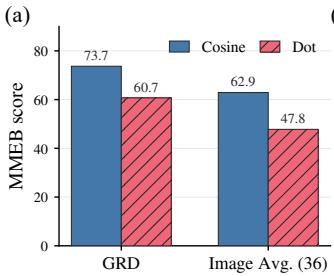

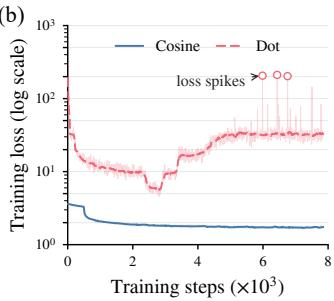  
Figure 1: Comparison of direct dot-product and cosine-based optimization over a training epoch. (a) Direct dot-product op timization achieves lower embedding performance (MMEB score). (b) Its loss trajectory exhibits recurrent late-stage spikes, whereas cosine-based optimization remains comparatively stable.

Despite substantial advances in model architectures (Shanbhogue et al. 2026; Li et al. 2026a) and multimodal data curation (Gadre et al. 2023; Fang et al. 2024; Xu et al. 2024; Zhang et al. 2025a), the dominant training paradigm for multimodal embedding models remains geometrically restrictive. Most existing methods optimize an InfoNCE objective using cosine similarity (Radford et al. 2021; Jiang et al. 2025; Lin et al. 2025; Zhu et al. 2026), which computes similarity between ℓ -normalized embeddings. By eliminating radial degrees of freedom, normalization prevents norm variations from rescaling contrastive logits and thereby simplifies optimization. However, it restricts semantic compatibility to angular information, excluding embedding norms as a potential relevance signal. This restriction is increasingly consequential as multimodal large language models (MLLMs) are adapted into universal multimodal embedders, since an angular-only similarity geometry may underutilize their substantial representational capacity. Unnormalized inner products have long served as relevance scores in retrieval and recommendation, motivating extensive research on maximum inner-product search (MIPS) (Ram and Gray 2012; Shrivastava and Li 2014). Recent evidence further indicates that embedding norms can encode taskdependent relevance information (Feng and Watanabe 2026), motivating dot-product similarity as a more expressive alternative that leverages both angular and norm information. Nevertheless, our empirical results in Figure 1 show that directly optimizing dot-product similarity underperforms its cosine-based counterpart and exhibits unstable training dynamics, revealing a persistent gap between representational expressivity and optimization stability.

To understand the performance gap, preliminary experiments reveal two challenges in direct dot-product optimization. First, jointly learning angular alignment and norm scaling from the outset can entangle directions and norms, causing them to encode redundant rather than complementary semantic information. Cosine similarity avoids this interaction by removing radial degrees of freedom. Second, dot-product training can induce directional anisotropy, concentrating embeddings within a narrow cone and assigning spuriously high similarity to semantically unrelated instances. Angular–norm entanglement and directional anisotropy help explain its unexpected underperformance and unstable training dynamics. Full-parameter fine-tuning further compounds the dificulty by substantially enlarging the trainable parameter space. Together, these findings motivate a coarse-to-fine strategy that establishes a reliable angular geometry within constrained representation and parameter spaces before progressively expanding both to exploit additional capacity.

Based on this insight, we propose Progressive Angular-to-Norm Contrastive Embedding (PACE), a two-stage framework for stable and expressive multimodal embedding learning. PACE progressively expands both the representation and trainable parameter spaces. Stage I combines a cosinebased objective with LoRA (Hu et al. 2022), restricting semantic organization to angular geometry and parameter updates to a compact low-rank subspace. Initialized from this constrained solution, Stage II adopts dot-product similarity and full-parameter fine-tuning, enabling embedding directions and norms to jointly encode semantic information while exploiting the complete parameter space. A complementary first-order gradient analysis formalizes the radial– angular coupling induced by dot-product optimization and shows that, the progressive Stage II initialization yields locally weak cross-Jacobian interactions, providing a mechanism for mitigating angular–norm entanglement. Despite these benefits, multi-stage training may overemphasize already well-separated examples, increasing the risk of overfitting. To mitigate this issue, we further introduce Foca Embedding Loss, a confidence-adaptive objective inspired by focal learning (Lin et al. 2017). It assigns each query a dificulty-aware weight based on its positive retrieval confidence, downweighting examples whose positives are already well separated from negatives while emphasizing ambiguous examples with competitive negatives. This mechanism suppresses redundant updates on saturated examples and directs the expanded optimization capacity toward unresolved semantic distinctions. Extensive experiments across multiple model scales and a diverse suite of multimodal embedding benchmarks demonstrate that PACE consistently outperforms strong baselines and validating the efectiveness of each proposed component. Our main contributions are summarized as follows:

• To our knowledge, we provide the first systematic diagnosis that attributes the unexpected underperformance and unstable training dynamics of direct dot-product optimization to angular–norm entanglement and directional anisotropy, supported by controlled experiments and a complementary theoretical analysis.

• We propose PACE, a progressive training framework that combines a cosine-to-dot-product curriculum with a LoRA-to-full-fine-tuning schedule, progressively expanding the representation and trainable parameter spaces for stable and expressive multimodal embedding learning.

• We further introduce Focal Embedding Loss, a confidence-adaptive objective that downweights wellseparated examples and emphasizes ambiguous examples with competitive negatives. Experiments across multiple backbone scales and diverse multimodal embedding tasks demonstrate the efectiveness of the overall framework.

## 2 Related Work

Existing work improves embedding models through four complementary directions: model development, query augmentation, data-side techniques, and similarity design.

Multimodal embedding learning has progressed from vision–language alignment to universal representation learning. CLIP (Radford et al. 2021) establishes the image–text dual-encoder paradigm, while ImageBind (Girdhar et al. 2023) and LanguageBind (Zhu et al. 2024) extend sharedspace learning to additional modalities. More recently, MLLMs have been adapted into universal embedders through instruction-aware training and broader task and modality coverage (Jiang et al. 2025; Lin et al. 2025; Zhang et al. 2025a). Native multimodal embedding models further scale model capacity and modality coverage (Shanbhogue et al. 2026; Li et al. 2026a).

Query augmentation improves retrieval by enriching the input representation. Query2doc (Wang, Yang, and Wei 2023) and HyDE (Gao et al. 2023) generate pseudodocuments, BRIGHT (Su et al. 2025) studies explicit reasoning for retrieval, and ExpandR (Yao et al. 2025) aligns generated expansions with the retriever. These methods generally require additional LLM inference for each query.

Data-side techniques encompass data curation and dificulty-aware supervision. Existing work improves training data through standardized selection, learned filtering, metadata-guided balancing, and task-diverse synthesis (Gadre et al. 2023; Fang et al. 2024; Xu et al. 2024; Zhang et al. 2025a). For dificulty-aware training, MM-Embed (Lin et al. 2025) mines modality-aware hard negatives, while Focal-InfoNCE (Hou and Li 2023) applies pair-level focal modulation. Query-level reweighting based on the positive retrieval probability over the candidate set remains underexplored. Our Focal Embedding Loss addresses this gap by downweighting well-separated queries and emphasizing those with competitive negatives.

(a)  
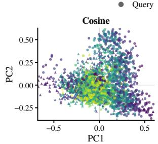

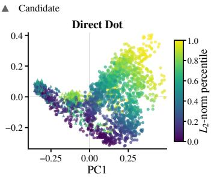

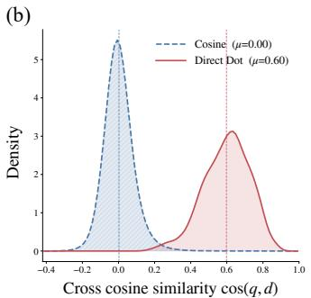

(c)  
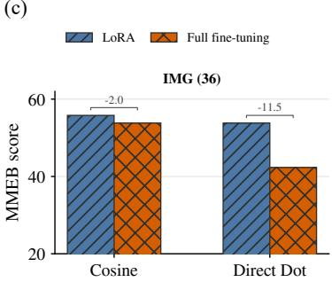  
Figure 2: Diagnostic analyses of direct dot-product training. (a) PCA projections of ℓ -normalized embeddings, colored by their original norm percentiles. Direct dot-product training produces a norm-stratified directional geometry absent under cosinebased training. (b) Cosine-similarity distributions between randomly paired queries and candidates, showing substantially greater directional concentration under direct dot-product training. (c) MMEB image-task performance under LoRA and full-parameter fine-tuning, where direct dot-product training exhibits a markedly larger degradation.

Most multimodal embedders use cosine similarity over normalized representations, excluding embedding norms from similarity computation. Unnormalized inner products have long served as retrieval and recommendation scores, motivating maximum inner-product search (Ram and Gray 2012; Shrivastava and Li 2014). Feng and Watanabe (Feng and Watanabe 2026) further show that query and candidate norms play distinct, task-dependent roles in optimization and inference. However, reliably learning a multimodal embedding geometry that jointly exploits angular and norm information remains underexplored.

## 3 Methodology

## 3.1 Problem Formulation

Given a multimodal query $x _ { i } ^ { q }$ and a candidate set $\mathcal { C } _ { i } ~ =$ $\{ x _ { i } ^ { + } , x _ { i , 1 } ^ { - } , \ldots , x _ { i , K } ^ { - } \}$ , both queries and candidates may consist of text, images, or interleaved image–text sequences. We employ a shared MLLM-based encoder $f _ { \theta }$ to map each heterogeneous input into a d-dimensional dense vector in a shared embedding space:

$$
\mathbf { q } _ { i } = f _ { \theta } ( x _ { i } ^ { q } ) , \qquad \mathbf { c } = f _ { \theta } ( x ) , \quad x \in \mathcal { C } _ { i } .
$$

Candidate relevance is measured by a similarity function $s ( \mathbf { q } _ { i } , \mathbf { c } )$ , according to which the candidate set is ranked. The learning objective is to assign the positive candidate $x _ { i } ^ { + }$ a higher similarity score than all negative candidates, thereby supporting modality-agnostic retrieval across heterogeneous input compositions.

## 3.2 Motivation

To diagnose why direct dot-product optimization exhibits unstable training dynamics, we examine whether it exploits angular and norm information complementarily. Using cosinebased training as a controlled reference under matched backbones, data, and training settings, we analyze 5,000 randomly sampled training instances and assess whether full-parameter fine-tuning amplifies the optimization dificulty.

Angular–Norm Entanglement. After ℓ2-normalizing the learned embeddings, we apply PCA to visualize their directional structure and color each point by its original norm. As shown in Figure 2(a), embeddings with substantially diferent norms are intermixed under cosine-based training, indicating little visible dependence between directions and norms. Direct dot-product training instead produces a norm-stratified structure in which embeddings with similar norms occupy nearby projected regions. This qualitative pattern suggests that direct optimization entangles angular and norm information rather than exploiting them complementarily.

Directional Anisotropy. We next examine cosine similarities between randomly paired queries and candidates. Figure 2(b) shows that cosine-based training yields lower random-pair similarities and a more dispersed directional geometry. Direct dot-product training shifts the distribution toward higher similarity values, indicating that embedding directions concentrate within a narrower region ofthe unit hypersphere. Such directional concentration can increase spurious similarities between semantically unrelated instances and potentially exacerbate hubness (Radovanovic, Nanopoulos, and Ivanovic 2010; Angiulli 2018).

Efect of Parameter-Space Expansion. Finally, Figure 2(c) compares cosine- and dot-product training under LoRA and full-parameter fine-tuning. Full-parameter fine-tuning underperforms LoRA for both similarity functions, with a substantially larger degradation under dot-product similarity. This interaction suggests that simultaneously enlarging the representation and trainable parameter spaces compounds earlystage optimization dificulty.

Overall, direct dot-product optimization does not necessarily realize its greater representational capacity. These findings motivate a coarse-to-fine strategy that first establishes a reliable angular geometry within a compact parameter subspace and subsequently introduces radial degrees of freedom

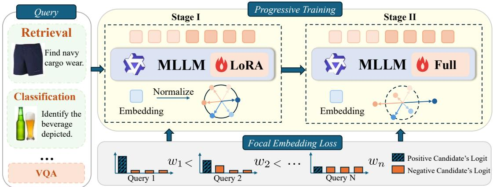  
Figure 3: Overview of PACE. Stage I learns a stable angular geometry using cosine similarity and LoRA within constrained representation and parameter spaces. Stage II expands to dot-product similarity and full-parameter fine-tuning, while Focal Embedding Loss emphasizes ambiguous queries with competitive negatives.

and full-parameter updates.

## 3.3 PACE

As illustrated in Figure 3, PACE is a two-stage framework that progressively expands both the representation and trainable parameter spaces. Stage I restricts optimization to angular similarity and a compact low-rank parameter subspace, providing a stable initialization with a reliable semantic geometry. Stage II subsequently introduces radial representational freedom and full-parameter optimization, enabling the model to exploit the increased capacity of both spaces. Focal Embedding Loss is applied in both stages. Using a consistent cosine-normalized confidence function across both stages mitigates cross-stage shifts in the focal-weight distribution and prevents embedding-norm scaling from distorting query dificulty.

Stage I: Constrained Optimization Space. In the first stage, we restrict the similarity function to angular information by $\ell _ { 2 } \cdot$ -normalizing query and candidate embeddings:

$$
\begin{array} { r } { s ^ { ( 1 ) } ( \mathbf { q } , \mathbf { c } ) = s _ { \mathrm { c o s } } ( \mathbf { q } , \mathbf { c } ) = \frac { \mathbf { q } ^ { \top } \mathbf { c } } { \| \mathbf { q } \| _ { 2 } \| \mathbf { c } \| _ { 2 } } . } \end{array}\tag{1}
$$

The resulting scale invariance removes radial degrees of freedom from the contrastive objective, allowing the model to first establish a well-structured angular geometry. We simultaneously restrict parameter updates using LoRA (Hu et al. 2022). For a pretrained weight matrix ${ \bf W } _ { 0 } , \mathrm { L o R A }$ parameterizes its update as $\Delta \mathbf { W } = \bar { \mathbf { B } } \mathbf { A }$ , where ran $\hat { \mathbf { \theta } } _ { \hat { \mathbf { \theta } } } ( \Delta \mathbf { W } ) \mathbf { \bar { \phi } } \leq r$ and r is substantially smaller than the dimensions of $\mathbf { W } _ { 0 }$ . Optimizing only these low-rank updates constrains training to a compact parameter subspace, reducing early-stage optimization dificulty and providing a stable, semantically meaningful initialization for the subsequent stage.

Stage II: Expanded Optimization Space. The second stage initializes from the Stage I solution and expands both optimization spaces. In the representation space, we remove $\ell _ { 2 }$ normalization and adopt dot-product similarity:

$$
\begin{array} { r } { s ^ { ( 2 ) } ( \mathbf { q } , \mathbf { c } ) = s _ { \mathrm { d o t } } ( \mathbf { q } , \mathbf { c } ) = \mathbf { q } ^ { \top } \mathbf { c } . } \end{array}\tag{2}
$$

This transition releases the radial degrees of freedom, allowing embedding directions and norms tojointly encode semantic information. In the parameter space, we merge the learned LoRA updates into the pretrained backbone and perform fullparameter fine-tuning. Starting from the constrained Stage I solution allows the model to exploit the greater representational and parameter capacity of Stage II without directly optimizing both expanded spaces from the beginning.

Focal Embedding Loss. Although progressive expansion improves representational capacity, both stages may overemphasize queries whose positive candidates are already well separated from the negatives. We introduce Focal Embedding Loss, which adaptively reweights each query according to its current retrieval dificulty. For Stage $\bar { T } \in \{ \mathrm { I } , \mathrm { I I } \}$ , the positive probability used by the contrastive objective is

$$
\pi _ { i } ^ { ( t ) } = \frac { \exp { \left( s ^ { ( t ) } ( \mathbf { q } _ { i } , \mathbf { c } _ { i } ^ { + } ) / \tau _ { t } \right) } } { \sum _ { \mathbf { c } \in \mathcal { C } _ { i } } \exp { \left( s ^ { ( t ) } ( \mathbf { q } _ { i } , \mathbf { c } ) / \tau _ { t } \right) } } ,\tag{3}
$$

where $s ^ { ( t ) } , t \in \{ 1 , 2 \}$ , denotes the similarity employed in Stage T; specifically, $\mathbf { \boldsymbol { s } } ^ { ( 1 ) }$ and $s ^ { ( 2 ) }$ are the cosine and dotproduct similarities used in Stages I and II, respectively. And $\tau _ { t }$ is the corresponding contrastive temperature. The perquery contrastive loss is $\ell _ { i } ^ { ( t ) } = - \log { \pi _ { i } ^ { ( t ) } }$

To obtain a norm-invariant estimate of query dificulty, we compute the focal confidence using cosine-normalized logits in both stages:

$$
p _ { i } ^ { ( t ) } = \frac { \exp { \left( s _ { \mathrm { c o s } } ( \mathbf { q } _ { i } , \mathbf { c } _ { i } ^ { + } ) / \tau _ { \mathrm { w } } \right) } } { \sum _ { \mathbf { c } \in \mathcal { C } _ { i } } \exp { \left( s _ { \mathrm { c o s } } ( \mathbf { q } _ { i } , \mathbf { c } ) / \tau _ { \mathrm { w } } \right) } } ,\tag{4}
$$

where $\tau _ { \mathrm { w } }$ is the weighting temperature. Decoupling the weighting confidence from the stage-specific training similarity prevents embedding-norm scaling in Stage II from artificially inflating the estimated confidence and provides a consistent dificulty measure across stages.

We first compute a detached focal coeficient

$$
a _ { i } ^ { ( t ) } = \mathrm { s g } \left[ \left( 1 - p _ { i } ^ { ( t ) } \right) ^ { \gamma } \right] ,\tag{5}
$$

where $\mathrm { s g } [ \cdot ]$ denotes stop-gradient and $\gamma$ determines the strength of dificulty modulation. We normalize these coeficients to have unit mean over a minibatch of N queries:

$$
\widetilde { w } _ { i } ^ { ( t ) } = \frac { a _ { i } ^ { ( t ) } } { \frac { 1 } { N } \sum _ { k = 1 } ^ { N } a _ { k } ^ { ( t ) } } .\tag{6}
$$

The focal-weighted objective for Stage t is then

$$
\mathcal { L } _ { \mathrm { P A C E } } ^ { ( t ) } = \frac { 1 } { N } \sum _ { i = 1 } ^ { N } \widetilde { w } _ { i } ^ { ( t ) } \ell _ { i } ^ { ( t ) } = - \frac { \sum _ { i = 1 } ^ { N } a _ { i } ^ { ( t ) } \log \pi _ { i } ^ { ( t ) } } { \sum _ { i = 1 } ^ { N } a _ { i } ^ { ( t ) } } .\tag{7}
$$

Queries whose positives are angularly well separated from the negatives yield high confidence and receive smaller weights, whereas ambiguous queries with competitive negatives receive larger weights. This mechanism suppresses redundant updates on saturated examples and directs optimization toward unresolved semantic distinctions in both training stages.

## 3.4 Theoretical Analysis

Radial–Angular Gradient Decomposition. We analyze the first-order embedding dynamics of the unweighted InfoNCE objectives in both stages. Let $\mathbf { q } = r { \widehat { \mathbf { q } } } .$ , where $\mathbf { \hat { \mathbf { q } } } \mathbf { \Phi } \mathbf { \Phi } \| \mathbf { \hat { q } } = 1$ , and define $\mathbf { P } _ { \widehat { \mathbf { q } } } ^ { \perp } = \mathbf { I } - \widehat { \mathbf { q } } \widehat { \mathbf { q } } ^ { \intercal }$ . Diferentiating the cosine objective through $\ell _ { 2 }$ normalization gives

$$
\nabla _ { \mathbf { q } } \mathcal { L } _ { \mathrm { c o s } } = \frac { 1 } { r } \mathbf { P } _ { \hat { \mathbf { q } } } ^ { \perp } \nabla _ { \hat { \mathbf { q } } } \mathcal { L } _ { \mathrm { c o s } } , \qquad \hat { \mathbf { q } } ^ { \top } \nabla _ { \mathbf { q } } \mathcal { L } _ { \mathrm { c o s } } = 0 .\tag{8}
$$

Hence, cosine-based training has no first-order radial embedding gradient. Assume candidates share a common norm and write $\mathbf { c } _ { j } = R \widehat { \mathbf { c } } _ { j }$ and $u _ { j } = { \widehat { \mathbf { q } } } ^ { \intercal } { \widehat { \mathbf { c } } } _ { j }$ . For dot-product InfoNCE, let $\begin{array} { r } { p _ { j } ^ { ( 2 ) } = \exp ( r R u _ { j } / \tau _ { 2 } ) / \sum _ { k } \exp ( r R u _ { k } / \tau _ { 2 } ) } \end{array}$ . Its gradient decomposes as

$$
\begin{array} { r c l } { { } } & { { } } & { { \displaystyle \nabla _ { \mathbf { q } } { \mathcal L } _ { \mathrm { d o t } } = a _ { d } \hat { \mathbf { q } } + { \mathbf { b } } _ { d } , } } \\ { { } } & { { } } & { { \displaystyle a _ { d } = \frac { R } { \tau _ { 2 } } \left( \mathbb { E } _ { p ^ { ( 2 ) } } [ u ] - u _ { + } \right) , } } \\ { { } } & { { } } & { { \displaystyle { \mathbf { b } } _ { d } = \frac { R } { \tau _ { 2 } } \mathbf { P } _ { \hat { \mathbf { q } } } ^ { \perp } \left( \sum _ { j } p _ { j } ^ { ( 2 ) } \widehat { \mathbf { c } } _ { j } - \widehat { \mathbf { c } } _ { + } \right) . } } \end{array}\tag{9}
$$

Here, $a _ { d }$ and ${ \mathbf { b } } _ { d }$ govern radial and angular evolution, respectively; because $p ^ { ( 2 ) }$ depends jointly on r and $u ,$ the two dynamics are coupled.

Proposition 1 (Confidence-Dependent Dynamic Decoupling). Under the common-norm setting above, consider the Stage II initialization $\mathbf { q } _ { 0 } = r _ { 0 } \widehat { \mathbf { q } }$ and let $\beta = r _ { 0 } R / \tau _ { 2 }$ . If its positive posterior satisfies $p _ { + } ^ { ( 2 ) } \geq 1 - \rho .$ , then

$$
\left\| \frac { \partial \mathbf { b } _ { d } } { \partial r } \right\| _ { 2 } \leq \frac { 4 R ^ { 2 } } { \tau _ { 2 } ^ { 2 } } \rho , \quad \left\| D _ { \widehat { \mathbf { q } } } a _ { d } \right\| _ { \mathrm { o p } } \leq \frac { R } { \tau _ { 2 } } ( 4 \beta + 2 ) \rho .\tag{10}
$$

where $D _ { \widehat { \mathbf { q } } } a _ { d } [ \mathbf { h } ]$ denotes the directional derivative of the radial coeficient $a _ { d }$ with respect to $\widehat { \mathbf { q } }$ along a tangent perturbation h, and $\begin{array} { r } { \| D _ { \widehat { \mathbf { q } } } a _ { d } \| _ { \mathrm { o p } } = \operatorname* { s u p } _ { \mathbf { h } \bot \widehat { \mathbf { q } } , \| \mathbf { h } \| _ { 2 } = 1 } | \bar { D } _ { \widehat { \mathbf { q } } } a _ { d } [ \mathbf { \widehat { h } } ] | } \end{array}$ These of-diagonal blocks characterize the local coupling between radial and angular dynamics. For bounded $\bar { \beta }$ and

$R / \tau _ { 2 }$ , both cross-Jacobian norms vanish as $\rho  0 ,$ yielding local first-order decoupling at the Stage II transition. This result is consistent with the reduced angular–norm dependence observed empirically but does not imply global statistical independence. A complete derivation is provided in the supplementary material.

## 4 Experiment

## 4.1 Implementation

We train PACE using two MLLMs, Qwen3.5-0.8B-Base and Qwen3.5-2B-Base (Qwen Team 2026). Training consists of two stages. In the first stage, we implement LoRA (rank=32) and adopt Focal Embedding Loss with global weight normalization, setting the focal parameter γ to 2.0 and using a learning rate of $\overset { \smile } { 2 } \times 1 0 ^ { - 5 }$ . In the second stage, we initialize the model from the step-2,000 checkpoint obtained in the first stage and perform full-parameter language-model fine-tuning with Focal Embedding Loss, where the similarity metric is calculated using the dot product. The learning rate is reduced to $2 \times 1 0 ^ { - 6 }$ . In both stages, we use 5 hard negatives per query. Detailed hyperparameters and hardware configurations are provided in the supplementary material.

## 4.2 Datasets and Evaluation

Training Data. We use the mmE5-Synthetic dataset (Chen et al. 2025) as our training data. After preprocessing, the resulting corpus comprises approximately 2.0 million training instances constructed under an MMEB-oriented design for general-purpose multimodal embedding learning. It provides task-relevant supervision across MMEB-style task formats and modality combinations, aligning with the MMEB benchmark, which consists of 20 in-distribution and 16 outof-distribution datasets spanning classification, visual question answering, multimodal retrieval, and visual grounding.

Evaluation. We evaluate PACE on both the in-distribution and out-of-distribution splits of MMEB (Jiang et al. 2025), comprising 20 and 16 test sets, respectively, to assess its general-purpose multimodal embedding capabilities across diverse tasks. Following the standard MMEB evaluation protocol, we report Precision@1, defined as the proportion of queries for which the correct candidate is ranked first. Unlike conventional cosine-similarity evaluation, PACE ranks candidates using the dot product between unnormalized query and candidate embeddings, consistent with the dot-product objective employed during the second training stage.

## 4.3 Baselines

We compare PACE against both zero-shot and fine-tuned multimodal embedding models. The zero-shot baselines include general-purpose vision–language encoders, namely CLIP (Radford et al. 2021), OpenCLIP (Cherti et al. 2023), MagicLens (Zhang et al. 2024), SigLIP (Zhai et al. 2023), BLIP-2 (Li et al. 2023), and EVA-CLIP (Sun et al. 2023), as well as MLLM-based embedders, including E5-V (Jiang et al. 2024) and pretrained Qwen3.5 backboneswithout embedding-specific fine-tuning. For fine-tuned comparisons, we consider VLM2Vec (Jiang et al. 2025), which performs instruction-guided contrastive training with standard

<table><tr><td rowspan="2">Models</td><td rowspan="2">#Params</td><td colspan="4">Per Meta-Task Score</td><td colspan="3">Average Score</td></tr><tr><td>Classification</td><td>VQA</td><td>Retrieval</td><td>Grounding</td><td>IND</td><td>OOD</td><td>Overall</td></tr><tr><td># of Datasets</td><td></td><td>10</td><td>10</td><td>12</td><td>4</td><td>20</td><td>16</td><td>36</td></tr><tr><td colspan="9">Zero-shot on MMEB</td></tr><tr><td>CLIP (ViT-L)</td><td>0.4B</td><td>42.8</td><td>9.1</td><td>53.0</td><td>51.8</td><td>37.1</td><td>38.7</td><td>37.8</td></tr><tr><td>OpenCLIP (ViT-L)</td><td>0.4B</td><td>47.8</td><td>10.9</td><td>52.3</td><td>53.3</td><td>39.3</td><td>40.2</td><td>39.7</td></tr><tr><td>MagicLens (ViT-L)</td><td>0.4B</td><td>38.8</td><td>8.3</td><td>35.4</td><td>26.0</td><td>31.0</td><td>23.7</td><td>27.1</td></tr><tr><td>SigLIP (So/14)</td><td>0.9B</td><td>40.3</td><td>8.4</td><td>31.6</td><td>59.5</td><td>32.3</td><td>38.0</td><td>35.0</td></tr><tr><td>BLIP-2 (ViT-L)</td><td>1.2B</td><td>27.0</td><td>4.2</td><td>33.9</td><td>47.0</td><td>25.3</td><td>25.1</td><td>28.0</td></tr><tr><td>CLIP (ViT-BigG/14)</td><td>2.5B</td><td>52.3</td><td>14.0</td><td>50.5</td><td>60.3</td><td>38.9</td><td>45.8</td><td>44.3</td></tr><tr><td>EVA-CLIP</td><td>8B</td><td>56.0</td><td>10.4</td><td>49.2</td><td>58.9</td><td>38.1</td><td>45.6</td><td>43.7</td></tr><tr><td>E5-V (Phi-3.5-V)</td><td>4.2B</td><td>39.1</td><td>9.6</td><td>38.0</td><td>57.6</td><td>33.1</td><td>31.9</td><td>36.1</td></tr><tr><td>E5-V (LLaVA-1.6)</td><td>7B</td><td>39.7</td><td>10.8</td><td>39.4</td><td>60.2</td><td>34.2</td><td>33.4</td><td>37.5</td></tr><tr><td colspan="9">Fine-tuning on MMEB</td></tr><tr><td>VLM2Vec (Qwen3.5-0.8b)</td><td>0.8B</td><td>51.0</td><td>56.8</td><td>53.1</td><td>73.2</td><td>61.1</td><td>49.2</td><td>55.8</td></tr><tr><td>VLM2Vec (Qwen3.5-2b)</td><td>2B</td><td>61.4</td><td>62.0</td><td>61.4</td><td>73.7</td><td>67.2</td><td>57.6</td><td>62.9</td></tr><tr><td>UniME-V2 (Qwen3.5-0.8b)</td><td>0.8B</td><td>51.7</td><td>59.0</td><td>53.8</td><td>75.0</td><td>60.9</td><td>52.2</td><td>57.0</td></tr><tr><td>UniME-V2 (Qwen3.5-2b)</td><td>2B</td><td>60.7</td><td>64.1</td><td>63.8</td><td>80.3</td><td>67.0</td><td>62.1</td><td>64.9</td></tr><tr><td>PACE (Qwen3.5-0.8b)</td><td>0.8B</td><td>52.3 (+0.6)</td><td>60.4 (+1.4)</td><td>57.4 (+3.6)</td><td>77.2 (+2.2)</td><td>63.8 (+2.7)</td><td>53.0 (+0.8)</td><td>59.0 (+2.0)</td></tr><tr><td>PACE (Qwen3.5-2b)</td><td>2B</td><td>63.6 (+2.2)</td><td>66.0 (+1.9)</td><td>66.5 (+2.7)</td><td>81.8 (+1.5)</td><td>71.2 (+4.0)</td><td>62.4 (+0.3)</td><td>67.3 (+2.4)</td></tr></table>

Table 1: Results on the MMEB benchmark. IND: in-distribution, OOD: out-of-distribution. Scores are average Precision@1 (%). The best are highlighted in bold. ∆ values in parentheses are computed against the highest-scoring baseline of the same model. Detailed results are in the supplementary materials.

InfoNCE loss across diverse multimodal embedding tasks. UniME-V2 (Gu et al. 2026) further employs MLLM-derived semantic matching scores to improve contrastive supervision.

## 5 Main Results

Table 1 presents the quantitative results on MMEB, where all methods are trained under identical hyperparameter settings for fair comparison. PACE achieves overall scores of 59.0 and 67.3 with the 0.8B and 2B backbones, respectively; the 0.8B model alone exceeds the strongest zero-shot baseline by 14.7 despite using fewer parameters. Against the strongest scalematched fine-tuned baselines, PACE yields overall margins of 2.0 and 2.4, with per-category improvements of 0.6–3.6 (0.8B) and 1.5–2.7 (2B) across classification, VQA, retrieval, and grounding. Positive margins on both IND and OOD splits further confirm robustness across evaluation distributions. These consistent gains support the central premise of PACE: establishing a reliable angular geometry before progressively expanding the representation and parameter spaces allows MLLM backbones to realize their representational capacity without sacrificing optimization stability.

## 6 Geometric Analysis

To assess whether PACE alleviates the representation-space distortions caused by direct dot-product training, we randomly analyze a subset of training data, focusing on the angular-norm coupling and directional anisotropy. Additional visual embedding geometry analysis are provided in the supplementary material.

Reduced Angular–Norm Coupling. Figure 4(a) plots the standardized $\mathrm { \bar { l o g } ( \| \mathbf { q } \| _ { 2 } \| \mathbf { c } ^ { + } \| _ { 2 } ) }$ against cosine similarity for matched query–positive pairs. Direct dot-product training yields a negative Pearson correlation $( r = - 0 . 7 8 )$ , indicating strong angular–norm coupling, whereas PACE reduces it to $\textit { \textbf { y r } } = - 0 . 1 1$ . This near-zero correlation implies little mutual information between the two factors: instead of encoding redundant information as in the coupled regime, norm and direction carry complementary signals, enlarging the efective representational capacity of the embedding space.

(a)  
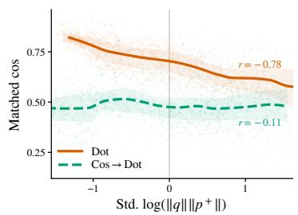

(b)  
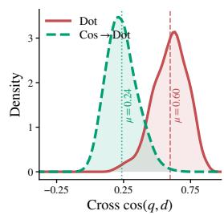  
Figure 4: Angular-geometry diagnostics ofdirect dot-product training vs. PACE. (a) PACE weakens the negative correlation between cosine similarity and the standardized log norm product. (b) PACE lowers the mean cross-cosine similarity, indicating a more angularly dispersed embedding geometry.

Directional Dispersion. Figure 4(b) compares the cosinesimilarity distributions of randomly paired queries and candidates. PACE yields a lower mean similarity than direct dotproduct training, consistent with reduced global directional concentration and a more angularly dispersed embedding geometry. Together, these results demonstrate that PACE mitigates both angular–norm coupling and directional anisotropy.

<table><tr><td>Method</td><td>CIS</td><td>VQA</td><td>RET</td><td>GRD</td><td>Overall</td></tr><tr><td>PACE (Ours)</td><td>52.3</td><td>60.4</td><td>57.4</td><td>77.2</td><td>59.0</td></tr><tr><td>PACE w/o Focal loss</td><td>52.3</td><td>59.7</td><td>55.0</td><td>74.1</td><td>57.7</td></tr><tr><td>PACE w/o Dot</td><td>52.1</td><td>58.2</td><td>54.3</td><td>76.0</td><td>57.2</td></tr><tr><td>PACE w/ S2 LoRA</td><td>49.8</td><td>56.4</td><td>49.6</td><td>72.3</td><td>54.1</td></tr></table>

Table 2: Ablation study examining efects of training objectives and second-stage tuning strategy on MMEB. Abbreviations: CLS, Classification; RET, Retrieval; GRD, Grounding. S2 denotes Stage II.

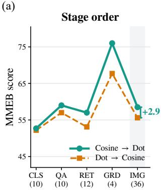

(b)  
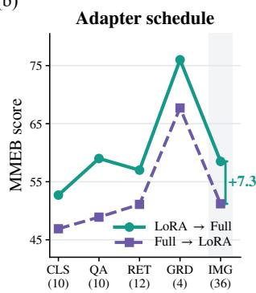  
Figure 5: Efect of progressive expansion order on MMEB. Cosine-to-dot and LoRA-to-full schedules outperform their reversed counterparts by 2.9 and 7.3 overall, respectively.

## 7 Ablation Studies

Component Contributions. Table 2 evaluates the contribution of each PACE component. Removing Focal Embedding Loss decreases the overall score from 59.0 to 57.7. Disabling representation-space expansion by retaining cosine similarity in Stage II further reduces the score to 57.2, while retaining LoRA instead of transitioning to fullparameter fine-tuning yields the largest degradation, to 54.1. These results demonstrate that dificulty-aware weighting, cosine-to-dot representation-space expansion, and LoRA-tofull parameter-space expansion each contribute to PACE.

Order of Optimization-Space Expansion. To determine whether the improvement arises from the progressive expansion order rather than two-stage training alone, Figure 5 compares PACE with the corresponding reversed schedules. Cosine-to-dot training outperforms dot-to-cosine training by 2.9 overall, demonstrating the benefit of establishing an angular semantic geometry before introducing radial degrees of freedom. Similarly, LoRA-to-full fine-tuning exceeds the reversed full-to-LoRA schedule by 7.3. This result supports our hypothesis that early optimization within a compact parameter subspace provides a more reliable update direction for subsequent full-parameter optimization.

Stage-Transition Checkpoint. Figure 6 (a) examines the efect of the Stage II initialization checkpoint. Initializing Stage II from the intermediate Stage I at steps 2000 and 4000 yields comparable scores of 58.3 and 58.5, both exceeding the 56.9 obtained from the fully converged checkpoint at step 7847 This suggests that fully converging in the constrained first-stage space can overspecialize the learned angular geometry and reduce plasticity when the optimization space is subsequently expanded. Intermediate checkpoints instead provide a more favorable balance between reliable semantic initialization and adaptability for Stage II. Further analyzes of Stage II initialization checkpoints are provided in the supplementary material.

(a)  
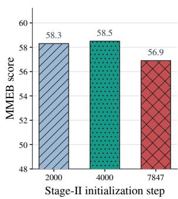

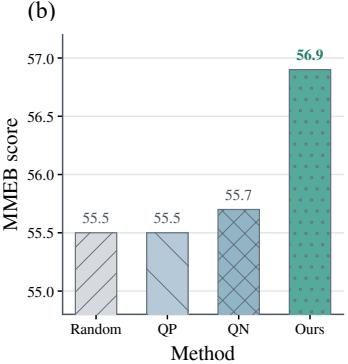  
Figure 6: Ablations of Stage I design choices. (a) Intermediate checkpoints provide better initialization for Stage II than the final. (b) Focal Embedding Loss outperforms random, query-positive (QP) and query-negative (QN) weighting.

Focal Embedding Loss Variants. To assess whether the improvement arises from dificulty-aware weighting rather than arbitrary loss rescaling, Figure 6(b) compares Focal Embedding Loss with three alternatives: random sample weighting, query–positive similarity weighting, and query–negative similarity weighting based on the hardest negative. For simplicity, all variants are evaluated in Stage I under otherwise identical settings. Focal Embedding Loss performs best, indicating that query-level retrieval confidence over the complete candidate set—whichjointly reflects positive alignment and negative competition—provides a more informative difficulty estimate than either signal alone. Sensitivity to the focal parameter γ and additional ablations are provided in the supplementary material.

## 8 Conclusion

In this work, we introduced PACE, a two-stage framework for stable and expressive multimodal embedding learning. PACE progressively expands both the representation and parameter spaces, transitioning from cosine similarity to dot-product similarity and from LoRA to full-parameter fine-tuning. This coarse-to-fine strategy first establishes a reliable angular semantic geometry before introducing radial and parameter degrees of freedom. Focal Embedding Loss further directs optimization toward ambiguous queries while reducing redundant updates on well-separated examples. Geometric analyses demonstrate that PACE alleviates angular–norm coupling and directional anisotropy, while experiments across multiple backbone scales and diverse multimodal embedding tasks consistently validate its efectiveness. These results establish progressive optimization-space expansion as an efective approach to better exploiting the representational capacity of MLLM-based embedders.

## References

Angiulli, F. 2018. On the behavior of intrinsically highdimensional spaces: distances, direct and reverse nearest neighbors, and hubness. Journal of Machine Learning Research, 18(170): 1–60.

Chen, H.; Wang, L.; Yang, N.; Zhu, Y.; Zhao, Z.; Wei, F.; and Dou, Z. 2025. mmE5: Improving Multimodal Multilingual Embeddings via High-Quality Synthetic Data. In Findings ofthe Associationfor Computational Linguistics: ACL 2025, 8254–8275.

Cherti, M.; Beaumont, R.; Wightman, R.; Wortsman, M.; Ilharco, G.; Gordon, C.; Schuhmann, C.; Schmidt, L.; and Jitsev, J. 2023. Reproducible Scaling Laws for Contrastive Language–Image Learning. In Proceedings ofthe IEEE/CVF Conference on Computer Vision and Pattern Recognition, 2818–2829.

Fang, A.; Jose, A. M.; Jain, A.; Schmidt, L.; Toshev, A.; and Shankar, V. 2024. Data Filtering Networks. In International Conference on Learning Representations.

Feng, X.; and Watanabe, T. 2026. When Does Embedding Magnitude Matter? A Cross-Task Functional-Symmetry Framework. arXiv preprint arXiv:2602.09229.

Gadre, S. Y.; Ilharco, G.; Fang, A.; Hayase, J.; Smyrnis, G.; Nguyen, T.; Marten, R.; Wortsman, M.; Ghosh, D.; Zhang, J.; Orgad, E.; Entezari, R.; Daras, G.; Pratt, S.; Ramanujan, V.; Bitton, Y.; Marathe, K.; Mussmann, S.; Vencu, R.; Cherti, M.; Krishna, R.; Koh, P. W. W.; Saukh, O.; Ratner, A. J.; Song, S.; Hajishirzi, H.; Farhadi, A.; Beaumont, R.; Oh, S.; Dimakis, A. G.; Jitsev, J.; Carmon, Y.; Shankar, V.; and Schmidt, L. 2023. DataComp: In Search of the Next Generation of Multimodal Datasets. In Advances in Neural Information Processing Systems, volume 36.

Gao, L.; Ma, X.; Lin, J.; and Callan, J. 2023. Precise Zero-Shot Dense Retrieval without Relevance Labels. In Proceedings of the 61st Annual Meeting of the Association for Computational Linguistics, 1762–1777.

Girdhar, R.; El-Nouby, A.; Liu, Z.; Singh, M.; Alwala, K. V.; Joulin, A.; and Misra, I. 2023. ImageBind: One Embedding Space To Bind Them All. In Proceedings of the IEEE/CVF Conference on Computer Vision and Pattern Recognition, 15180–15190.

Gu, T.; Yang, K.; Zhang, K.; An, X.; Feng, Z.; Zhang, Y.; Cai, W.; Deng, J.; and Bing, L. 2026. Unime-v2: Mllm-as-ajudge for universal multimodal embedding learning. In Proceedings of the AAAI Conference on Artificial Intelligence, volume 40, 21378–21386.

Hou, P.; and Li, X. 2023. Improving Contrastive Learning of Sentence Embeddings with Focal InfoNCE. In Findings of the Association for Computational Linguistics: EMNLP 2023, 4757–4762.

Hu, E. J.; Shen, Y.; Wallis, P.; Allen-Zhu, Z.; Li, Y.; Wang, S.; Wang, L.; and Chen, W. 2022. LoRA: Low-Rank Adaptation of Large Language Models. In International Conference on Learning Representations.

Jiang, T.; Song, M.; Zhang, Z.; Huang, H.; Deng, W.; Sun, F.; Zhang, Q.; Wang, D.; and Zhuang, F. 2024. E5-v: Universal embeddings with multimodal large language models. arXiv preprint arXiv:2407.12580.

Jiang, Z.; Meng, R.; Yang, X.; Yavuz, S.; Zhou, Y.; and Chen, W. 2025. VLM2Vec: Training Vision-Language Models for Massive Multimodal Embedding Tasks. In International Conference on Learning Representations.

Lee, J.; Chen, F.; Dua, S.; Cer, D.; Shanbhogue, M.; Naim, I.; Ábrego, G. H.; Li, Z.; Chen, K.; Vera, H. S.; et al. 2025. Gemini embedding: Generalizable embeddings from gemini. arXiv preprint arXiv:2503.07891.

Li, J.; Li, D.; Savarese, S.; and Hoi, S. 2023. BLIP-2: Bootstrapping Language–Image Pre-Training with Frozen Image Encoders and Large Language Models. In Proceedings ofthe 40th International Conference on Machine Learning, 19730– 19742.

Li, M.; Zhang, Y.; Long, D.; Chen, K.; Song, S.; Bai, S.; Yang, Z.; Xie, P.; Yang, A.; Liu, D.; et al. 2026a. Qwen3- VL-Embedding and Qwen3-VL-Reranker: A Unified Framework for State-of-the-Art Multimodal Retrieval and Ranking. arXiv preprint arXiv:2601.04720.

Li, S.; Huang, Y.; Liu, Z.; Li, Y.; Fu, J.; Zhao, L.; Bian, J.; Zhang, L.; Zhang, J.; and Wang, R. 2026b. GEAR: Granularity-Adaptive Advantage Reweighting for LLM Agents via Self-Distillation. arXiv preprint arXiv:2605.11853.

Li, Y.; Liu, Z.; Li, Z.; Lin, Z.; and Zhang, J. 2026c. Tokenlevel data selection for safe LLM fine-tuning. arXiv preprint arXiv:2603.01185.

Lin, S.-C.; Lee, C.; Shoeybi, M.; Lin, J.; Catanzaro, B.; and Ping, W. 2025. Mm-embed: Universal multimodal retrieval with multimodal llms. In International Conference on Learning Representations, volume 2025, 44215–44234.

Lin, T.-Y.; Goyal, P.; Girshick, R.; He, K.; and Dollár, P. 2017. Focal Loss for Dense Object Detection. In Proceedings of the IEEE International Conference on Computer Vision, 2980– 2988.

Qwen Team. 2026. Qwen3.5: Towards Native Multimodal Agents.

Radford, A.; Kim, J. W.; Hallacy, C.; Ramesh, A.; Goh, G.; Agarwal, S.; Sastry, G.; Askell, A.; Mishkin, P.; Clark, J.; Krueger, G.; and Sutskever, I. 2021. Learning Transferable Visual Models From Natural Language Supervision. In Proceedings of the 38th International Conference on Machine Learning, 8748–8763.

Radovanovic, M.; Nanopoulos, A.; and Ivanovic, M. 2010. Hubs in space: Popular nearest neighbors in highdimensional data. Journal of machine learning research, 11(sept): 2487–2531.

Ram, P.; and Gray, A. G. 2012. Maximum Inner-Product Search Using Cone Trees. In Proceedings of the 18th ACM SIGKDD International Conference on Knowledge Discovery and Data Mining, 931–939.

Shanbhogue, M.; Li, Z.; Zhang, S.; Ábrego, G. H.; Huang, S.-C.; Jain, A.; Salz, D.; Goenka, S.; Hegde, C.; Ma, J.; et al.

2026. Gemini Embedding 2: A Native Multimodal Embedding Model from Gemini. arXiv preprint arXiv:2605.27295.

Shrivastava, A.; and Li, P. 2014. Asymmetric LSH (ALSH) for Sublinear Time Maximum Inner Product Search (MIPS). In Advances in Neural Information Processing Systems, volume 27, 2321–2329.

Su, H.; Yen, H.; Xia, M.; Shi, W.; Muennighof, N.; Wang, H.-y.; Liu, H.; Shi, Q.; Siegel, Z. S.; Tang, M.; Sun, R.; Yoon, J.; Arik, S. O.; Chen, D.; and Yu, T. 2025. BRIGHT: A Realistic and Challenging Benchmark for Reasoning-Intensive Retrieval. In International Conference on Learning Representations.

Sun, Q.; Fang, Y.; Wu, L.; Wang, X.; and Cao, Y. 2023. EVA-CLIP: Improved Training Techniques for CLIP at Scale. arXiv preprint arXiv:2303.15389.

Wang, L.; Yang, N.; and Wei, F. 2023. Query2doc: Query Expansion with Large Language Models. In Proceedings of the 2023 Conference on Empirical Methods in Natural Language Processing, 9414–9423.

Xu, H.; Xie, S.; Tan, X.; Huang, P.-Y.; Howes, R.; Sharma, V.; Li, S.-W.; Ghosh, G.; Zettlemoyer, L.; and Feichtenhofer, C. 2024. Demystifying CLIP Data. In International Conference on Learning Representations.

Xue, Y.; Huang, Y.; Shao, J.; Zhu, L.; Zhang, C.; Li, X.; and Zhang, J. 2025. Vlmq: Token saliency-driven post-training quantization for vision-language models. arXiv preprint arXiv:2508.03351.

Yao, S.; Huang, P.; Liu, Z.; Gu, Y.; Yan, Y.; Yu, S.; and Yu, G. 2025. ExpandR: Teaching Dense Retrievers Beyond Queries with LLM Guidance. In Proceedings of the 2025 Conference on Empirical Methods in Natural Language Processing, 19036–19054.

Zhai, X.; Mustafa, B.; Kolesnikov, A.; and Beyer, L. 2023. Sigmoid Loss for Language Image Pre-Training. In Proceedings of the IEEE/CVF International Conference on Computer Vision, 11975–11986.

Zhang, K.; Luan, Y.; Hu, H.; Lee, K.; Qiao, S.; Chen, W.; Su, Y.; and Chang, M.-W. 2024. MagicLens: Self-Supervised Image Retrieval with Open-Ended Instructions. In Proceedings of the 41st International Conference on Machine Learning, 59403–59420.

Zhang, X.; Zhang, Y.; Xie, W.; Li, M.; Dai, Z.; Long, D.; Xie, P.; Zhang, M.; Li, W.; and Zhang, M. 2025a. Bridging Modalities: Improving Universal Multimodal Retrieval by Multimodal Large Language Models. In Proceedings of the IEEE/CVF Conference on Computer Vision and Pattern Recognition, 9274–9285.

Zhang, Y.; Li, M.; Long, D.; Zhang, X.; Lin, H.; Yang, B.; Xie, P.; Yang, A.; Liu, D.; Lin, J.; et al. 2025b. Qwen3 embedding: Advancing text embedding and reranking through foundation models. arXiv preprint arXiv:2506.05176.

Zhu, B.; Lin, B.; Ning, M.; Yan, Y.; Cui, J.; Wang, H.; Pang, Y.; Jiang, W.; Zhang, J.; Li, Z.; Zhang, C.; Li, Z.; Liu, W.; and Yuan, L. 2024. LanguageBind: Extending Video-Language Pretraining to N-Modality by Language-Based Semantic Alignment. In International Conference on Learning Representations.

Zhu, L.; Huang, Y.; Ge, X.; Xue, Y.; Liu, Z.; Zhang, Y.; Lin, Z.; and Zhang, J. 2026. Flash-VAED: Plug-and-Play VAE Decoders for Eficient Video Generation. arXiv preprint arXiv:2602.19161.

<table><tr><td>Hyperparameter</td><td>Stage 1</td><td>Stage 2</td></tr><tr><td>Training data</td><td>2.0M</td><td></td></tr><tr><td>Training epochs</td><td>1</td><td></td></tr><tr><td>Batch size</td><td>32</td><td></td></tr><tr><td>Learning rate</td><td> $2 \times 1 0 ^ { - 5 }$ </td><td> $2 \times 1 0 ^ { - 6 }$ </td></tr><tr><td>Warmup ratio</td><td></td><td>0.05</td></tr><tr><td>Temperature</td><td>0.1</td><td>100</td></tr><tr><td>Trainable parameters</td><td>LoRA (rank=32)</td><td>Full LM</td></tr><tr><td>Initialization</td><td>Backbone</td><td>Stage I step 2,000</td></tr><tr><td>Loss function</td><td>Focal Embedding Loss</td><td> $( \gamma = 2 . 0 )$ </td></tr><tr><td>Similarity metric</td><td>Cosine</td><td>Dot product</td></tr><tr><td>Frozen modules</td><td>Vision encoder, projector</td><td></td></tr><tr><td>#Hard negatives</td><td>5</td><td></td></tr><tr><td>Max sequence length</td><td></td><td></td></tr><tr><td></td><td></td><td>8,192</td></tr><tr><td>Max image pixels</td><td></td><td>1,605,632</td></tr><tr><td>Optimizer</td><td>AdamW</td><td></td></tr><tr><td>Precision</td><td></td><td>BF16</td></tr><tr><td></td><td></td><td></td></tr><tr><td>DeepSpeed Stage</td><td></td><td>2</td></tr><tr><td>GPU configuration</td><td></td><td>8×NVIDIA H100 (80GB)</td></tr></table>

Table 3: Training hyperparameters and computational requirements for PACE (Qwen3.5-0.8B-Base and Qwen3.5- 2B-Base).

## A Detail Experiment Setting

## A.1 Training Details

We provide the full training configurations of PACE in Table 3, with both backbones, Qwen3.5-0.8B-Base and Qwen3.5-2B-Base, trained under identical hyperparameter settings. In the first stage, we perform parameter-eficient fine-tuning with LoRA (rank=32) under the Focal Embedding Loss with global weight normalization (γ = 2.0). In the second stage, the model is initialized from the step-2,000 checkpoint of the first stage and undergoes full-parameter fine-tuning of the language model with dot-product similarity, with the learning rate reduced to $2 \times 1 0 ^ { - 6 }$ . In both stages, the vision encoder and multimodal projector are frozen, and each stage is trained for one epoch on 8×NVIDIA H100 (80GB) GPUs using bfloat16 precision.

For the two fine-tuned baselines, VLM2Vec (Jiang et al. 2025) and UniME-V2 (Gu et al. 2026), both of which are cosine-similarity-based, we adopt the training configuration of our first stage, with both baselines trained under hyperparameter settings identical to those in Table 3. Their full training configurations are summarized in Table 4. Grad-Cache is employed in neither PACE nor the two baselines; nevertheless, additional experiments presented later show that GradCache can be efectively applied to our approach.

## A.2 Instruction Prompts

Every query and candidate is wrapped with the unified qwen3\_5\_emb chat template shown below, which injects the system-level instruction “Represent the user’s input.” automatically.

Each query, positive, and hard negative is encoded independently under this template, and the hidden state at the last <|endoftext|> token is used for last-token pooling to obtain the embedding. Images and videos are inserted into the user content through <image> and <video> placeholders together with their corresponding media inputs.

<table><tr><td>Hyperparameter</td><td>VLM2Vec</td><td>UniME-V2</td></tr><tr><td>Training data</td><td>2.0M</td><td></td></tr><tr><td>Training epochs</td><td></td><td>1</td></tr><tr><td>Batch size</td><td></td><td>32  $2 \times 1 0 ^ { - 5 }$ </td></tr><tr><td>Learning rate Warmup ratio</td><td></td><td>0.05</td></tr><tr><td>Temperature</td><td></td><td></td></tr><tr><td>Trainable parameters</td><td></td><td>0.1</td></tr><tr><td>Initialization</td><td></td><td>LoRA (rank=32)</td></tr><tr><td>Loss function</td><td></td><td>Backbone</td></tr><tr><td>Similarity metric</td><td>InfoNCE</td><td>MLLM-judge InfoNCE</td></tr><tr><td></td><td></td><td>Cosine</td></tr><tr><td>Frozen modules</td><td></td><td>Vision encoder, projector</td></tr><tr><td>#Hard negatives</td><td></td><td>5</td></tr><tr><td>Max sequence length</td><td></td><td></td></tr><tr><td></td><td></td><td>8,192</td></tr><tr><td>Max image pixels</td><td></td><td>1,605,632</td></tr><tr><td>Optimizer</td><td></td><td>AdamW</td></tr><tr><td>Precision</td><td></td><td></td></tr><tr><td>DeepSpeed Stage</td><td></td><td>BF16</td></tr><tr><td></td><td></td><td>2</td></tr><tr><td>GPU configuration</td><td></td><td>8×NVIDIA H100 (80GB)</td></tr></table>

Table 4: Training hyperparameters and computational requirements for the retrained baselines VLM2Vec and UniME-V2.

<|im\_start|>system   
Represent the user’s input.   
<|im\_end|>   
<|im\_start|>user   
{content}   
<|im\_end|>   
<|im\_start|>assistant   
<|endoftext|>

Task-level instructions are written directly into the user content of the query; Table 5 lists the instructions used for each task format. Unlike reranking-style prompting, which concatenates a query and a candidate into a single Yes/No judgment prompt, the embedding model encodes every instance separately and computes similarities between the resulting embeddings. All PACE models and retrained baselines share this unified template and instruction set.

## B Detailed Theoretical Analysis

We provide the proof of Proposition 1. Under the commonnorm setting, write $\mathbf { q } = r \widehat { \mathbf { q } }$ and $\mathbf { c } _ { j } ~ = ~ R \widehat { \mathbf { c } } _ { j }$ , where both directional vectors have unit norm, and let $\bar { u _ { j } } = \widehat { \mathbf { q } } ^ { \intercal } \widehat { \mathbf { c } } _ { j }$ . We treat the candidate embeddings as fixed. For notational simplicity, we omit the Stage II superscript and write ${ p } _ { j } \ \mathrm { f o r } \ p _ { j } ^ { ( 2 ) }$ throughout this section. We further define $\begin{array} { r } { \bar { u } = \sum _ { j } p _ { j } \bar { u } _ { j } ; } \end{array}$ all probabilities and derivatives below are evaluated at the Stage II initialization after diferentiation. The radial–angular gradient-component map $\mathcal { G } ( r , \widehat { \mathbf { q } } ) = ( a _ { d } , \mathbf { b } _ { d } )$ has the block Jacobian

$$
{ \cal D } \mathcal { G } = \left[ \partial a _ { d } / \partial r \mathrm { ~ } \mathbf { \nabla } { \cal D } _ { \widehat { \mathbf { q } } } a _ { d } \right] .\tag{B.1}
$$

<table><tr><td>Task format</td><td>Task-level instruction</td></tr><tr><td>Visual question answering</td><td>Represent the given image to answer the following question.</td></tr><tr><td>Classification</td><td>Represent the given image to answer the following question.</td></tr><tr><td>Text→image retrieval</td><td>Retrieve an image that best matches the following description.</td></tr><tr><td>Image→text retrieval</td><td>Find the caption that best describes this image.</td></tr><tr><td>Composed retrieval</td><td>Find an image matching the described changes.</td></tr></table>

Table 5: Task-level instructions written into the user content of the query for each task format. The system-level instruction is injected automatically by the template.

The proposition bounds its two of-diagonal blocks at the Stage II initialization.

Proof. Because $\begin{array} { r } { p _ { j } = \exp ( r R u _ { j } / \tau _ { 2 } ) / \sum _ { k } } \end{array}$ exp $\left( r R u _ { k } / \tau _ { 2 } \right)$ diferentiating with respect to r while holding $\widehat { \mathbf { q } }$ fixed gives

$$
\frac { \partial p _ { j } } { \partial r } = \frac { R } { \tau _ { 2 } } p _ { j } ( u _ { j } - \bar { u } ) .\tag{B.2}
$$

Since $\widehat { \mathbf { q } }$ and the candidate embeddings are held fixed, $\mathbf { P } _ { \widehat { \mathbf { q } } } ^ { \perp }$ and $\widehat { \mathbf { c } } _ { j }$ are independent of r. Therefore,

$$
\begin{array} { l } { \displaystyle \frac { \partial { \bf b } _ { d } } { \partial r } = \frac { R } { \tau _ { 2 } } { \bf P } _ { \hat { \bf q } } ^ { \perp } \sum _ { j } \frac { \partial p _ { j } } { \partial r } \hat { \bf c } _ { j } } \\ { \displaystyle = \frac { R ^ { 2 } } { \tau _ { 2 } ^ { 2 } } { \bf P } _ { \hat { \bf q } } ^ { \perp } \sum _ { j } p _ { j } ( u _ { j } - \bar { u } ) \hat { \bf c } _ { j } . } \end{array}\tag{B.3}
$$

Since $\begin{array} { r } { \sum _ { j } p _ { j } ( u _ { j } - \bar { u } ) = 0 } \end{array}$ , the centered sum can be rewritten as

$$
\sum _ { j } p _ { j } ( u _ { j } - \bar { u } ) \widehat { \mathbf { c } } _ { j } = \sum _ { j \neq + } p _ { j } ( u _ { j } - \bar { u } ) ( \widehat { \mathbf { c } } _ { j } - \widehat { \mathbf { c } } _ { + } ) .\tag{B.4}
$$

The unit-norm assumptions imply $| u _ { j } - \bar { u } | \leq 2$ and $\| \widehat { \mathbf { c } } _ { j } - \|$ ${ \widehat { \mathbf { c } } } _ { + } \| _ { 2 } \leq 2$ . Moreover, $p _ { + } \geq 1 - \rho$ gives $\begin{array} { r } { \sum _ { j \neq + } p _ { j } \ \leq \ \rho . } \end{array}$ Because orthogonal projection is nonexpansive,

$$
\left. \frac { \partial  { \mathbf { b } } _ { d } } { \partial r } \right. _ { 2 } \leq \frac { 4 R ^ { 2 } } { \tau _ { 2 } ^ { 2 } } \rho .\tag{B.5}
$$

For the reverse coupling, let h $\perp \widehat { \mathbf { q } }$ with $\| \mathbf { h } \| _ { 2 } = 1$ , and define $v _ { j } = \mathbf { h } ^ { \top } \widehat { \mathbf { c } } _ { j }$ and $\begin{array} { r } { \bar { v } = \sum _ { j } p _ { j } v _ { j } } \end{array}$ . Along a smooth curve on the unit sphere with tangent h, $D _ { \widehat { \mathbf { q } } } u _ { j } [ \mathbf { h } ] = v _ { j }$ . Holding $r ~ = ~ r _ { 0 }$ fixed, define the Stage II logit $z _ { j } ~ = ~ \beta u _ { j } ,$ where $\beta = r _ { 0 } R / \tau _ { 2 }$ . Since $D _ { \widehat { \mathbf { q } } } z _ { j } [ \mathbf { h } ] \overset { = } { = } \beta v _ { j }$ , the softmax diferential gives

$$
\begin{array} { l } { { \displaystyle { \cal D } _ { \hat { \mathbf { q } } } p _ { j } [ { \bf h } ] = p _ { j } \left( \beta v _ { j } - \beta \sum _ { k } p _ { k } v _ { k } \right) } } \\ { ~ = \beta p _ { j } ( v _ { j } - \bar { v } ) . } \end{array}\tag{B.6}
$$

Applying the product rule to $\begin{array} { r } { a _ { d } = ( R / \tau _ { 2 } ) ( \sum _ { j } p _ { j } u _ { j } - u _ { + } ) } \end{array}$ gives

$$
\begin{array} { l } { { \displaystyle { \cal D } _ { \widehat { \mathbf { q } } } a _ { d } [ { \bf h } ] = \frac { R } { \tau _ { 2 } } \biggl [ \sum _ { j } { \cal D } _ { \widehat { \mathbf { q } } } p _ { j } [ { \bf h } ] u _ { j } } } \\ { ~ + \sum _ { j } p _ { j } { \cal D } _ { \widehat { \mathbf { q } } } u _ { j } [ { \bf h } ] - { \cal D } _ { \widehat { \mathbf { q } } } u _ { + } [ { \bf h } ] \biggr ] }  \\ { { \displaystyle ~ = \frac { R } { \tau _ { 2 } } \biggl [ \beta \sum _ { j } p _ { j } ( v _ { j } - \bar { v } ) u _ { j } + \sum _ { j } p _ { j } v _ { j } - v _ { + } \biggr ] . } } \end{array}\tag{B.7}
$$

Since $\begin{array} { r c l } { \sum _ { j } p _ { j } ( v _ { j } \ - \ \bar { v } ) u _ { j } } & { = } & { \mathbb { E } _ { p } [ u v ] \ - \ \mathbb { E } _ { p } [ u ] \mathbb { E } _ { p } [ v ] } & { = } \end{array}$ $\mathrm { C o v } _ { p } ( u , \bar { v } )$ and $\begin{array} { r } { \sum _ { j } p _ { j } v _ { j } = \mathbb { E } _ { p } [ v ] } \end{array}$ , this becomes

$$
D _ { \widehat { \mathbf { q } } } a _ { d } [ \mathbf { h } ] = \frac { R } { \tau _ { 2 } } \left[ \beta \operatorname { C o v } _ { p } ( u , v ) + \mathbb { E } _ { p } [ v ] - v _ { + } \right] .\tag{B.8}
$$

Under $p _ { + } \geq 1 - \rho ,$

$$
\begin{array} { l } { \displaystyle \mathrm { V a r } _ { p } ( u ) \leq \sum _ { j \neq + } p _ { j } ( u _ { j } - u _ { + } ) ^ { 2 } \leq 4 \rho , } \\ { \displaystyle \mathrm { V a r } _ { p } ( v ) \leq \sum _ { j \neq + } p _ { j } ( v _ { j } - v _ { + } ) ^ { 2 } \leq 4 \rho . } \end{array}\tag{B.9}
$$

By Equation B.9 and the Cauchy–Schwarz inequality, $| \bar { \mathrm { C o v } _ { p } ( u , v ) | } \leq 4 \rho .$ . In addition,

$$
| \mathbb { E } _ { p } [ v ] - v _ { + } | = \left| \sum _ { j \neq + } p _ { j } ( v _ { j } - v _ { + } ) \right| \leq 2 \rho .\tag{B.10}
$$

Consequently, for every unit tangent direction h,

$$
\big | D _ { \widehat { \mathbf { q } } } a _ { d } [ \mathbf { h } ] \big | \leq \frac { R } { \tau _ { 2 } } ( 4 \beta + 2 ) \rho .\tag{B.11}
$$

Taking the supremum over such h proves

$$
\big \| D _ { \widehat { \mathbf { q } } } a _ { d } \big \| _ { \mathrm { o p } } \leq \frac { R } { \tau _ { 2 } } ( 4 \beta + 2 ) \rho ,\tag{B.12}
$$

which completes the proof.

The result controls the local of-diagonal Jacobian blocks of the radial–angular gradient-component map under the common-norm assumption. It does not imply global statistical independence or a global convergence guarantee.

## C Additional Experiments

## C.1 Efect of GradCache

Efect of GradCache. As noted in the training details, Grad-Cache is employed in neither PACE nor the retrained baselines. To verify its compatibility with our approach, we retrain PACE and VLM2Vec with GradCache enabled, with all hyperparameter settings kept unchanged except the temperature, which is reduced to one fifth of its original value, and report the per-category results in Table 6.

GradCache lifts the overall score of both methods—from 59.0 to 60.4 for PACE and from 55.8 to 57.9 for VLM2Vec— with gains concentrated in VQA and retrieval, where the enlarged efective batch supplies more informative in-batch negatives. PACE with GradCache retains a 2.5-point overall lead over its VLM2Vec counterpart, which indicates that the benefit of the staged training is complementary to memoryeficient large-batch optimization rather than subsumed by it. The only regression is the grounding score of PACE (77.2 to 74.5), which nevertheless remains the highest among all configurations.

<table><tr><td>Method</td><td>CLS</td><td>VQA</td><td>RET</td><td>GRD</td><td>Overall</td></tr><tr><td>VLM2Vec</td><td>51.0</td><td>56.8</td><td>53.1</td><td>73.2</td><td>55.8</td></tr><tr><td>VLM2Vec‡</td><td>50.7</td><td>61.6</td><td>55.6</td><td>73.8</td><td>57.9</td></tr><tr><td>PACE</td><td>52.3</td><td>60.4</td><td>57.4</td><td>77.2</td><td>59.0</td></tr><tr><td>PACE</td><td>53.7</td><td>63.7</td><td>58.4</td><td>74.5</td><td>60.4</td></tr></table>

Table 6: Efect of GradCache on MMEB with Qwen3.5- 0.8B-Base. ‡ denotes training with GradCache enabled. CLS: Classification, RET: Retrieval, GRD: Grounding. GradCache improves the overall score of both methods, with PACE retaining its lead. Best results are in bold and second-best are underlined.

## C.2 Additional Geometry Analysis

PCA Visualization across Resampled Subsets. To verify that the qualitative pattern in Figure 2(a) is not an artifact of a particular sample, Figure 7 repeats the analysis on four subsets independently drawn from the evaluation data with diferent random seeds, applying the same procedure: embeddings are $\ell _ { 2 } \cdot$ -normalized, projected by PCA, and colored by their original norm percentile.

The observation is consistent across all four subsets. Under cosine-based training, embeddings with diferent norms remain intermixed in the projected space, and no normdependent structure emerges in any subset—directions carry little information about norms, implying low mutual information between the two factors. Under direct dot-product training, every subset reproduces the same norm-stratified layout, with high-norm embeddings concentrated in one projected region and low-norm embeddings in another. Moreover, the norm percentile varies smoothly along a coherent low-dimensional structure in the projected directional space, so that embedding magnitude is largely predictable from direction alone—a direct signature of the coupling between norms and angles. This stability across resampled subsets confirms that the angular–norm entanglement induced by direct dot-product optimization is a systematic property of the learned embedding space rather than a sampling artifact.

## Staged Training Alleviates the Coupling.

Figure 9 compares direct dot-product training with the staged cosine→dot schedule under the same visualization protocol. As in the preceding experiments, focal weighting is disabled, isolating the efect of the stage schedule itself. Direct dot-product training reproduces the coherent low-dimensional structure identified above, with the norm percentile varying smoothly along the projected directions. Under the staged schedule, this structure disappears: embeddings of diferent norms are intermixed across the projected space, and no norm-aligned gradient remains. The cosine→dot transition alone therefore sufices to alleviate the angular–norm coupling induced by direct dot-product optimization, letting the model encode magnitude as a complementary signal rather than binding it to particular directions.

<table><tr><td>γ</td><td>After Stage I</td><td>After Stage II</td></tr><tr><td>0.5</td><td>56.3</td><td>58.2</td></tr><tr><td>2.0</td><td>56.9</td><td>59.0</td></tr><tr><td>4.0</td><td>56.9</td><td>58.7</td></tr></table>

Table 7: Sensitivity to the focal parameter γ on MMEB using Qwen3.5-0.8B-Base. Scores denote average Precision@1 (%) after each training stage; the best result in each column is highlighted in bold.

## C.3 Analysis of Stage Transition

Stage-Transition Training Dynamics. To complement the summary in the main text, Figure 8 traces the full Stage II training trajectory for two representative initializations: Midstep start (from the Stage I checkpoint at step 4,000) and Final-step start (from the fully converged checkpoint at step 7,847). As in the corresponding main-text ablation, this experiment disables focal weighting; the Stage I checkpoint steps therefore difer from the step-2,000 initialization used in the full PACE configuration.

Mid-step start yields a smooth, monotonically increasing MMEB curve that plateaus around 58.3 after approximately 4,500 second-stage steps. The Final-step start, by contrary, peaks early at 55.8 within the first 1,000 steps, oscillates around 55 thereafter, and deteriorates with pronounced fluctuations after step 4,500, ultimately falling to 49.7, an 8.6- point gap relative to the Mid-step start at convergence.

This divergence corroborates the hypothesis of overspecialization outlined in the main text. Stage I optimizes a cosine-based InfoNCE loss that projects embeddings onto the unit hypersphere, learning angular alignment while discarding norm information. A fully converged Stage I checkpoint has thoroughly committed to this norm-invariant geometry. When the objective switches to dot-product similarity in Stage II—requiring the model to additionally leverage embedding magnitude as a relevance signal—the optimization must simultaneously restructure the angular layout and recover norm sensitivity. The conflicting gradient signals destabilize training and lead to the degradation observed after step 4,500. In contrast, an intermediate Stage I checkpoint has acquired suficient directional structure to provide a reliable semantic initialization, yet retains enough representational plasticity for the model to incorporate magnitude information smoothly under the expanded optimization space of Stage II.

## C.4 Sensitivity to the Focal Parameter

Table 7 reports the sensitivity of PACE to the focal parameter γ under otherwise identical training settings. Stage I performance varies by only 0.6 across the evaluated values. Stage II improves every configuration by 1.8–2.1, yielding final scores between 58.2 and 59.0. These results indicate that

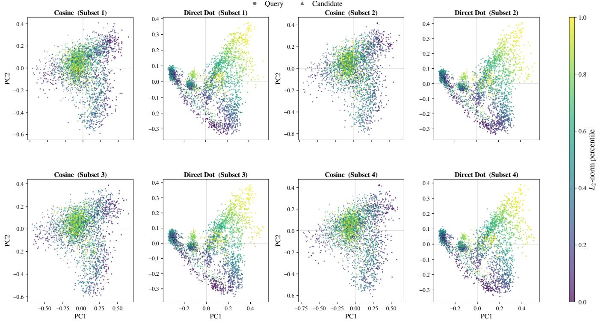  
Figure 7: PCA visualizations of $\ell _ { 2 } { \mathrm { - n o r m a l i z e d } }$ embeddings on four randomly resampled subsets, colored by the $L _ { \mathrm { { 2 } } } \mathrm { { - n o r m } }$ percentile of the original embeddings; circles and triangles denote queries and candidates. Across all subsets, cosine-based training yields intermixed colors, indicating low mutual information between directions and norms, while direct dot-product training reproduces the same norm-stratified layout, confirming that the entanglement pattern in Figure 2(a) is robust to sampling.

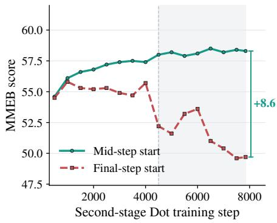  
Figure 8: Stage II training dynamics under diferent Stage I initializations. MMEB score is tracked along the secondstage dot-product training trajectory, with $M i d - s t e p$ start initialized from the Stage I checkpoint at step 4,000 and Finalstep start from the fully converged checkpoint at step 7,847. Mid-step start converges stably to 58.3, while Final-step start deteriorates after step 4,500 (shaded region), leaving an 8.6- point gap at convergence.

PACE exhibits limited sensitivity $\mathbf { t o } \ \gamma$ within the evaluated range. The setting $\gamma = 2 . 0$ achieves the highest final score of 59.0, while stronger modulation provides no additional benefit. We therefore adopt $\gamma = 2 . 0$ as the default.

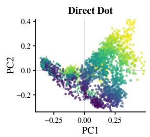

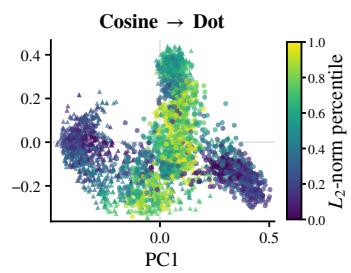  
Figure 9: PCA visualizations of $\ell _ { 2 } { \mathrm { - n o r m a l i z e d } }$ embeddings under direct dot-product training (left) and staged cosine→dot training (right), colored by $L _ { \mathrm { { 2 } } } \mathrm { { - n o r m } }$ percentile. Direct dot-product training exhibits the norm-stratified lowdimensional structure analyzed above, while staged training restores intermixed colors—norms are no longer predictable from directions—indicating reduced mutual information between the two factors.

## D External Results

Table 8 reports the per-dataset results of PACE and all compared methods on the MMEB benchmark.

<table><tr><td></td><td>VLM2Vec</td><td>VLM2Vec†</td><td>UniME-V2</td><td>UniME-V2†</td><td>PACE</td><td>PACE†</td></tr><tr><td colspan="7">Classification (10 tasks)</td></tr><tr><td>ImageNet-1K</td><td>55.6</td><td>72.6</td><td>58.2</td><td>72.0</td><td>59.6</td><td>72.6</td></tr><tr><td>N24News</td><td>65.7</td><td>69.8</td><td>59.4</td><td>59.3</td><td>72.0</td><td>75.5</td></tr><tr><td>HatefulMemes</td><td>49.9</td><td>57.3</td><td>45.8</td><td>43.2</td><td>49.1</td><td>58.4</td></tr><tr><td>VOC2007</td><td>74.4</td><td>71.1</td><td>81.3</td><td>83.4</td><td>77.3</td><td>83.6</td></tr><tr><td>SUN397</td><td>67.4</td><td>73.0</td><td>67.2</td><td>74.9</td><td>65.5</td><td>77.5</td></tr><tr><td>Place365*</td><td>35.0</td><td>42.3</td><td>34.7</td><td>41.0</td><td>35.0</td><td>40.3</td></tr><tr><td>ImageNet-A*</td><td>20.9</td><td>49.0</td><td>22.5</td><td>51.2</td><td>21.8</td><td>50.0</td></tr><tr><td>ImageNet-R*</td><td>72.9</td><td>88.6</td><td>75.6</td><td>87.4</td><td>76.0</td><td>88.5</td></tr><tr><td>ObjectNet*</td><td>61.6</td><td>75.3</td><td>63.4</td><td>77.9</td><td>59.0</td><td>74.6</td></tr><tr><td>Country-211*</td><td>6.8</td><td>14.6</td><td>8.7</td><td>17.0</td><td>7.6</td><td>15.2</td></tr><tr><td>All Classification</td><td>51.0</td><td>61.4</td><td>51.7</td><td>60.7</td><td>52.3</td><td>63.6</td></tr><tr><td>VQA (10 tasks)</td><td></td><td></td><td></td><td></td><td></td><td></td></tr><tr><td>OK-VQA</td><td>47.2</td><td>56.7</td><td>48.7</td><td>54.2</td><td>51.2</td><td>60.9</td></tr><tr><td>A-OKVQA</td><td>41.0</td><td>48.9</td><td>43.9</td><td>49.6</td><td>44.3</td><td>52.7</td></tr><tr><td>DocVQA</td><td>91.6</td><td>92.4</td><td>93.5</td><td>94.4</td><td>94.0</td><td>95.2</td></tr><tr><td>InfographicsVQA</td><td>67.6</td><td>72.6</td><td>66.1</td><td>71.5</td><td>70.4</td><td>75.7</td></tr><tr><td>ChartQA</td><td>58.9</td><td>63.5</td><td>55.0</td><td>61.8</td><td>61.2</td><td>64.4</td></tr><tr><td>Visual7W</td><td>55.0</td><td>60.6</td><td>53.9</td><td>57.7</td><td>59.6</td><td>63.8</td></tr><tr><td>ScienceQA</td><td>29.9</td><td>40.5</td><td>31.9</td><td>45.6</td><td>29.2</td><td>43.7</td></tr><tr><td>VizWiz*</td><td>50.0</td><td>53.6</td><td>51.1</td><td>55.3</td><td>51.0</td><td>54.9</td></tr><tr><td>GQA*</td><td>52.3</td><td>48.0</td><td>65.1</td><td>65.4</td><td>62.0</td><td>62.1</td></tr><tr><td>TextVQA*</td><td>74.6</td><td>82.9</td><td>81.1</td><td>85.5</td><td>81.4</td><td>86.3</td></tr><tr><td>All VQA</td><td>56.8</td><td>62.0</td><td>59.0</td><td>64.1</td><td>60.4</td><td>66.0</td></tr><tr><td colspan="7">Retrieval (12 tasks)</td></tr><tr><td>VisDial</td><td>68.3</td><td>71.5</td><td>71.6</td><td>77.3</td><td>77.9</td><td>81.8</td></tr><tr><td>CIRR</td><td>42.6</td><td>55.5</td><td>32.1</td><td>49.3</td><td>41.8</td><td>51.6</td></tr><tr><td>VisualNewSt2i</td><td>46.8</td><td>61.4</td><td>50.9</td><td>64.5</td><td>50.8</td><td>65.4</td></tr><tr><td>VisualNewSi2t</td><td>50.4</td><td>64.2</td><td>54.8</td><td>67.5</td><td>53.9</td><td>70.0</td></tr><tr><td> $\mathbf { M S C O C O _ { t 2 i } }$ </td><td>66.5</td><td>73.2</td><td>70.8</td><td>76.2</td><td>71.7</td><td>76.5</td></tr><tr><td>MSCOCO{2t</td><td>65.0</td><td>67.4</td><td>66.4</td><td>70.0</td><td>69.8</td><td>72.8</td></tr><tr><td>NIGHTS</td><td>64.7</td><td>65.3</td><td>62.5</td><td>66.6</td><td>65.1</td><td>67.1</td></tr><tr><td>WebQA</td><td>82.0</td><td>85.7</td><td>74.0</td><td>82.0</td><td>78.2</td><td>88.2</td></tr><tr><td>FashionIQ*</td><td>16.9</td><td>18.7</td><td>9.8</td><td>22.5</td><td>19.5</td><td>21.1</td></tr><tr><td>Wiki-SS-NQ*</td><td>58.6</td><td>63.3</td><td>58.1</td><td>66.5</td><td>61.3</td><td>66.8</td></tr><tr><td>OVEN*</td><td>35.0</td><td>46.4</td><td>45.6</td><td>62.7</td><td>44.2</td><td>65.7</td></tr><tr><td>EDIS*</td><td>40.6</td><td>64.0</td><td>49.2</td><td>60.3</td><td>54.5</td><td>71.5</td></tr><tr><td>All Retrieval</td><td>53.1</td><td>61.4</td><td>53.8</td><td>63.8</td><td>57.4</td><td>66.5</td></tr><tr><td colspan="7">Visual Grounding (4 tasks)</td></tr><tr><td>MSCOCO*</td><td>60.8</td><td>60.3</td><td>62.1</td><td>65.1</td><td>63.2</td><td>69.7</td></tr><tr><td>RefCOCO* RefCOCO-matching*</td><td>81.1</td><td>85.0</td><td>84.2</td><td>89.5</td><td>86.5</td><td>91.7</td></tr><tr><td></td><td>83.4</td><td>80.6</td><td>88.4</td><td>87.6</td><td>80.8</td><td>85.1</td></tr><tr><td>Visual7W-pointing*</td><td>67.7</td><td>68.9</td><td>65.4</td><td>78.9</td><td>78.2</td><td>80.8</td></tr><tr><td>All Visual Grounding</td><td>73.2</td><td>73.7</td><td>75.0</td><td>80.3</td><td>77.2</td><td>81.8</td></tr><tr><td colspan="7">Final Score (36 tasks)</td></tr><tr><td>All IND</td><td>59.5</td><td>66.2</td><td>59.4</td><td>66.0</td><td>62.1</td><td>69.9</td></tr><tr><td>All OOD</td><td>51.1</td><td>58.8</td><td>54.1</td><td>63.4</td><td>55.1</td><td>64.0</td></tr><tr><td>All</td><td>55.8</td><td>62.9</td><td>57.0</td><td>64.9</td><td>59.0</td><td>67.3</td></tr></table>

Table 8: Per-dataset results on the MMEB benchmark, with “All” denoting the average over all 36 datasets. Datasets marked with ∗ denote OOD. † indicates the Qwen3.5-2B-Base backbone; all other methods use Qwen3.5-0.8B-Base.