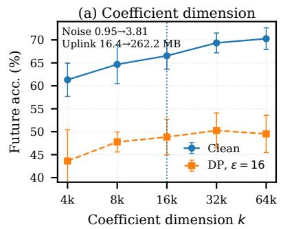
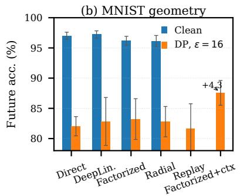
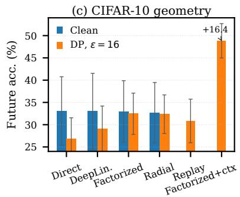

# PRIVACY-ALIGNED PERSONALIZED FEDERATED LEARNING WITH COMPACT ADAPTATION AND VARIABLE-LENGTH GAUSSIAN COMMUNICATION

Yilin Xu1, Chun Hei Michael Shiu2, Chih Wei Ling3, Linqi Song1

1Department of Computer Science, City University of Hong Kong 2Department of Electrical and Computer Engineering, University of British Columbia 3School of Computer Science and Engineering, Hebrew University of Jerusalem

## ABSTRACT

Record-level differential privacy exposes a structural misalignment in personalized federated learning when client-specific variation is low-dimensional while training repeatedly releases highdimensional updates. In this paper, we address this misalignment by releasing a private client context once and confining repeated adaptation to a fixed coefficient space. Beyond dimensionality reduction, the factorized generator induces an adaptive optimization geometry that reshapes noisy updates, and controlled ablations show that most of its private-training gain is retained by radial evolution. To further reduce the communication cost, we realize the Gaussian mechanism for coefficient updates directly through variable-length quantization with finite expected code length, so that the quantization error itself serves as the required privacy perturbation rather than extra distortion. Across MNIST and CIFAR-10, our design matches or outperforms full-model private adaptation across privacy budgets and client heterogeneity, while reducing protected uplink by a factor of 2.67 at $\varepsilon = 1 6$ on CIFAR-10 with comparable future-client accuracy.

Index Terms— federated learning, differential privacy, randomized quantization

## 1. INTRODUCTION

Personalized federated learning (PFL) addresses statistical heterogeneity without restricting all clients to a single global model. Hypernetwork-based PFL maps a compact client context to personalized model parameters [1, 2, 3, 4]. When a suitable context is available, this formulation allows previously unseen clients to obtain personalized models without iterative local fine-tuning, making this formulation attractive for future-client personalization.

However, differential privacy (DP) changes this picture. Several recent works have explored private personalization with metalearning, hypernetworks, and shared representations [5, 6, 7]. Nevertheless, future-client personalization remains challenging because trainable client embeddings require adaptation for previously unseen clients [1, 6], while learned context encoders [3, 4] add another datadependent optimization path that must be privatized. A direct privatization of hypernetwork PFL may repeatedly release gradients of the generated high-dimensional model. Although the privacy parameter of an ℓ2-bounded Gaussian mechanism is not set by dimension alone, both the expected perturbation energy and the communication overhead grow with the dimension of the released signal. Low-dimensional private optimization and reparameterization have been used to reduce this ambient-dimensional burden [8, 9], but in hypernetwork PFL this issue is coupled to client representation and future-client adaptation.

This motivates a simple question. Can client-specific information be released only once while repeated private adaptation is confined to a compact space? We answer this by replacing iterative client representation learning with a one-shot private context and moving repeated private adaptation from the full model to a fixed coefficient space. In addition, a factorized server-side generator maps the cached context to personalized coefficients and changes how noisy coefficient updates propagate through shared parameters. We further reduce the communication cost of repeated private updates with layered rejection-sampled universal quantization (LR-SUQ) [10]. Under our trusted-server setting, LRSUQ realizes the prescribed decoded Gaussian channel using variable-length messages with finite expected code length, and the privacy perturbation itself serves as quantization error. Together, the coefficient-space parameterization and variable-length Gaussian channel retain one-shot personalization for unseen clients while reducing the dimensional and communication burden of private adaptation.

Contributions. (i) We reformulate record-private hypernetwork PFL around a one-shot private client context and coefficient-space adaptation, enabling personalization of unseen clients without iterative local fine-tuning. (ii) We characterize the optimization geometry induced by the factorized generator and show with controlled ablations that radial evolution retains most of the factorization gain under private training. (iii) We instantiate coefficient updates with LRSUQ, which by construction realizes the prescribed decoded Gaussian law using variable-length messages with finite expected code length, and show experimentally that it reduces protected uplink with essentially unchanged utility.

## 2. METHOD

Our method includes three components. We first define one-shot private conditioning and repeated coefficient-space adaptation. Then, we analyze the geometry induced by the factorized generator and finally replace dense Gaussian coefficient messages by a variablelength realization of the same decoded channel.

## 2.1. Private Contextual Adaptation

We consider central record-level DP with a trusted server [11]. A record is $z = ( x , y )$ , where x is the input and y is its label. For the federated dataset $\mathcal { D } = ( D _ { 1 } , . . . , D _ { N } )$ , replace-one adjacency $\mathcal { D } \sim \mathcal { D } ^ { \prime }$ means $D _ { i } ^ { \prime } = ( D _ { i } \backslash \{ z \} ) \cup \{ z ^ { \prime } \}$ for one client i and $D _ { j } ^ { \prime } = D _ { j }$ for $j \neq i .$ . To capture client-specific information without learning a separate private encoder, we construct a bounded context from firstand second-order input statistics. Let $\{ \mathcal { G } _ { j } \} _ { j = } ^ { s }$ be a fixed partition of the input coordinates into s feature groups, and define

$$
\begin{array} { l } { \displaystyle \mu _ { j } ( \boldsymbol { x } ) = \frac { 1 } { | \mathcal { G } _ { j } | } \sum _ { u \in \mathcal { G } _ { j } } \boldsymbol { x } _ { u } , \quad \boldsymbol { \nu } _ { j } ( \boldsymbol { x } ) = \frac { 1 } { | \mathcal { G } _ { j } | } \sum _ { u \in \mathcal { G } _ { j } } \boldsymbol { x } _ { u } ^ { 2 } , } \\ { \displaystyle \phi ( \boldsymbol { x } ) = \frac { 1 } { \sqrt { 2 s } } \big [ \operatorname { t a n h } ( \mu ( \boldsymbol { x } ) ) ^ { \top } , \operatorname { t a n h } ( \nu ( \boldsymbol { x } ) ) ^ { \top } \big ] ^ { \top } . } \end{array}\tag{1}
$$

Here $\mu ( \boldsymbol { x } ) , \boldsymbol { \nu } ( \boldsymbol { x } ) \in \mathbb { R } ^ { s }$ , so $\phi ( x ) \ \in \mathbb { R } ^ { 2 s }$ and $\| \phi ( x ) \| _ { 2 } ~ \leq ~ 1$ . For the image experiments, the groups $\mathcal { G } _ { j }$ correspond to the input channels. Let $\mathcal { C } _ { i } \subset D _ { i }$ i be a fixed conditioning set of $m _ { c }$ records used to form the one-shot context statistic. The client releases the empirical context information only once through

$$
\widetilde { c } _ { i } = \frac { 1 } { m _ { c } } \sum _ { ( x , y ) \in \mathcal { C } _ { i } } \phi ( x ) + \zeta _ { i } , \qquad \zeta _ { i } \sim \mathcal { N } ( 0 , \sigma _ { c } ^ { 2 } I ) .\tag{2}
$$

Because $\| \phi ( x ) \| _ { 2 } \leq 1$ , the one-shot context release has replace-one sensitivity at most $2 / m _ { c }$ c. The server then caches $\widetilde { c } _ { i }$ , so an unseen client requires only this one-shot private context release for subsequent model generation. Conditioned on ${ \widetilde { c } } _ { i } .$ , the server generates a personalized model through the factorized coefficient map

$$
h _ { i } = h _ { \psi } ( \widetilde { c } _ { i } ) , \qquad a _ { i } = W h _ { i } , \qquad \theta _ { i } = \theta _ { \mathrm { r e f } } + P a _ { i } .\tag{3}
$$

Here $h _ { \psi } : \mathbb { R } ^ { 2 s }  \mathbb { R } ^ { r }$ is a compact multilayer perceptron (MLP), $W \in \dot { \mathbb { R } } ^ { k \times r }$ is a trainable matrix mapping its hidden representation $h _ { i }$ to k-dimensional coefficient space, and $\theta _ { i } \in \mathbb { R } ^ { d _ { \theta } }$ is the resulting personalized model. The reference parameters $\theta _ { \mathrm { r e f } } \in \mathbb { R } ^ { d _ { \theta } }$ and coefficient basis $P \in \mathbb { R } ^ { d _ { \theta } \times k }$ are initialized once using public randomness and then kept fixed. The columns of P form an orthonormal basis of the k-dimensional adaptation subspace $\mathcal { U } = \mathrm { r a n g e } ( P ) \subset$ $\mathbb { R } ^ { d _ { \theta } }$ , with $P ^ { \top } P = I _ { k }$ . Thus, $\hat { P }$ fixes a data-independent adaptation space, while $( W , \psi )$ learn context-dependent models within it (see Appendix A).

During training, selected clients differentiate their local loss with respect to the coefficients rather than the full model parameters. For a record z, define

$$
\begin{array} { r } { g _ { i } ( z ) = \nabla _ { a } \ell ( \theta _ { \mathrm { r e f } } + P a ; z ) | _ { a = a _ { i } } . } \end{array}\tag{4}
$$

At communication round $t ,$ let $B _ { i , t } \subset D _ { i }$ contain $m _ { g }$ records and define $\mathrm { c l i p } _ { C _ { g } } ( v ) = v \operatorname* { m i n } \{ 1 , C _ { g } / \| v \| _ { 2 } \}$ . Client i releases

$$
\widetilde { g } _ { i , t } = \frac { 1 } { m _ { g } } \sum _ { z \in \mathcal { B } _ { i , t } } \mathrm { c l i p } _ { C _ { g } } ( g _ { i } ( z ) ) + \xi _ { i , t } , \quad \xi _ { i , t } \sim \mathcal { N } ( 0 , \sigma _ { g } ^ { 2 } I _ { k } ) .\tag{5}
$$

The fixed denominator and clipping imply replace-one sensitivity at most $2 C _ { g } / m _ { g }$ . Let $\omega = ( W , \psi )$ denote the trainable generator parameters, and write $J _ { i } = \partial a _ { i } / \partial \omega$ for the Jacobian of the generated coefficients with respect to the trainable generator parameters. Let $S _ { t }$ denote the participating clients selected for the server update at round t. With uniform client weighting, the server update is

$$
\omega _ { t + 1 } = \omega _ { t } - \frac { \eta } { | S _ { t } | } \sum _ { i \in S _ { t } } { J _ { i } } ^ { \top } \widetilde { g } _ { i , t } .\tag{6}
$$

Algorithm 1 summarizes the complete training and deployment procedure. Privacy is accounted for using Renyi differential privacy´ (RDP) [12]. Let $\Delta _ { c } = 2 / m _ { c }$ c and $\Delta _ { g } = 2 C _ { g } / m _ { g }$ denote the sensitivities of the one-shot context and repeated coefficient releases. We use a common Gaussian standard deviation $\sigma _ { c } = \sigma _ { g } = \sigma$ . For a client participating in $T _ { i }$ private update rounds, composition of the one-shot context release and its repeated coefficient-gradient releases gives

$$
A _ { i } = \frac { \Delta _ { c } ^ { 2 } + T _ { i } \Delta _ { g } ^ { 2 } } { 2 \sigma ^ { 2 } } , \qquad \varepsilon _ { i } = A _ { i } + 2 \sqrt { A _ { i } \log ( 1 / \delta ) } .\tag{7}
$$

Algorithm 1 Privacy-aligned personalized federated learning   
1: Publicly initialize $\theta _ { \mathrm { r e f } }$ and the matrix $P .$   
2: For each participating client i, release $\widetilde { c } _ { i }$ once using Eq. (2) and   
cache it at the server.   
3: for round $t = 1 , \dots , T$ do   
4: Select the participating clients $S _ { t }$ for round t.   
5: for $i \in S _ { t }$ do   
6: Generate $a _ { i } = W h _ { \psi } ( \widetilde { c } _ { i } )$ and $\theta _ { i } = \theta _ { \mathrm { r e f } } + P a _ { i } .$   
7: Compute coefficient gradients gi(z) using Eq. (4).   
8: Clip and average the per-record gradients and realize the   
Gaussian release $\widetilde { g } _ { i , t }$ in Eq. (5).   
9: end for   
10: Update $( W , \psi )$ using Eq. (6).   
11: end for   
12: For an unseen client, release its context once and generate its   
model with no local fine-tuning.

Optimizing the RDP- $\cdot \mathrm { t o } \mathfrak { d } , \delta )$ conversion over continuous Renyi ´ orders gives the second expression; we report $\varepsilon ~ = ~ \operatorname* { m a x } _ { i } \varepsilon _ { i }$ (see Appendix B).

## 2.2. Factorized Optimization Geometry

From Eq. (6), client i’s contribution to the server update is $\Delta \omega ^ { ( i ) } =$ $- ( \eta / | S _ { t } | ) J _ { i } ^ { \top } \widetilde { g } _ { i , i }$ t. Linearizing the coefficients generated for client j gives

$$
\Delta a _ { j } ^ { ( i ) } \approx - \frac { \eta } { \vert S _ { t } \vert } K _ { j i } \widetilde { g } _ { i , t } , \qquad K _ { j i } = J _ { j } J _ { i } ^ { \top } .\tag{8}
$$

Hence, $K _ { j i }$ is the coefficient-space kernel induced by the generator and determines how a noisy private update from client i is transferred through shared parameters to client j. Since $a _ { i } = W h _ { i }$ and $\omega = ( W , \psi )$ , direct differentiation with respect to the two parameter blocks yields

$$
\begin{array} { r } { K _ { j i } = \langle h _ { j } , h _ { i } \rangle I _ { k } + W H _ { j } H _ { i } ^ { \top } W ^ { \top } . } \end{array}\tag{9}
$$

Here $\begin{array} { r } { H _ { i } ~ = ~ \frac { \partial h _ { i } } { \partial \psi } } \end{array}$ The first term arises from updating W and acts as an isotropic gain in coefficient space, whereas the second comes from updating MLP parameters ψ and introduces a directiondependent correction of rank at most r. For $i = j$ , the first term becomes $\| h _ { i } \| _ { 2 } ^ { 2 } I _ { k }$ , showing that the hidden-state norm acts as an adaptive scalar gain on the coefficient update.

Writing $h _ { i } ~ = ~ \rho _ { i } v _ { i }$ with $\| v _ { i } \| _ { 2 } = 1$ makes this interpretation more explicit. If the hidden direction vi remains fixed while only its magnitude $\rho _ { i }$ changes, the isotropic term varies as $\rho _ { i } ^ { 2 } I _ { k }$ without introducing directional motion in the hidden representation. We refer to this behavior as radial evolution. This motivates the Radial and Scalar Replay controls in Sec. 3.3, which distinguish magnitude adaptation from hidden-direction evolution; Appendix C derives the kernel and explains these controls.

## 2.3. Variable-Length Gaussian Communication via LRSUQ

Because the client context is communicated only once, repeated coefficient gradients dominate the uplink. We therefore seek a variablelength representation that preserves the prescribed Gaussian mechanism after decoding while having finite expected code length. Let L denote the length, in bits, of the encoded message, and the communication requirement is $\mathbb { E } [ L ] < \infty$ , where the expectation is over the randomness of the encoding procedure. For a vector-valued statistic $\boldsymbol { u } \in \mathbb { R } ^ { d _ { u } }$ with prescribed sensitivity, the direct Gaussian mechanism releases $\mathcal { M } _ { \mathrm { G } } ( u ) = u + \xi$ with $\dot { \xi } \sim \mathcal { N } ( 0 , \sigma ^ { 2 } I _ { d _ { u } } )$ . Sending this realization directly requires a dense $d _ { u } .$ -dimensional floating-point vector, which we refer to as Direct Gaussian (DG). Related exacterror and dithered compressors have shown how quantization can be matched to Gaussian privacy noise in federated learning [13, 14]. LRSUQ additionally admits a native vector-quantization formulation of additive-channel simulation [10], allowing coefficient blocks to be encoded jointly while preserving the prescribed input-independent Gaussian error distribution. This structure is naturally suited to our coefficient-space updates. We therefore apply LRSUQ blockwise, using block size $b = 4$ throughout, to instantiate the Gaussian mechanism. The resulting variable-length message decodes to

Table 1. Accuracy (%) across privacy budgets. The upper and lower blocks report accuracy on participating clients (Seen) and query accuracy on unseen clients (Future), respectively. Bold denotes the largest private mean in each column.
<table><tr><td rowspan="2">Method</td><td colspan="4">MNIST</td><td colspan="4">CIFAR-10</td></tr><tr><td> $\varepsilon = 4$ </td><td> $\varepsilon = 8$ </td><td> $\varepsilon = 1 6$ </td><td> $\varepsilon = 3 2$ </td><td> $\varepsilon = 4$ </td><td> $\varepsilon = 8$ </td><td> $\varepsilon = 1 6$ </td><td> $\varepsilon = 3 2$ </td></tr><tr><td colspan="9">Seen clients</td></tr><tr><td>Global</td><td> $2 2 . 9 8 { \pm } 8 . 6 2$ </td><td> $3 1 . 3 0 { \pm } 9 . 3 0 $ </td><td> $4 4 . 1 0 { \pm } 5 . 8 3 $ </td><td> $5 5 . 6 3 { \pm } 2 . 8 5$ </td><td> $1 2 . 2 9 { \pm } 0 . 8 1$ </td><td> $1 5 . 0 6 { \pm } 2 . 9 4 $ </td><td> $1 7 . 9 4 \pm 2 . 5 4$ </td><td> $2 1 . 4 7 { \pm } 3 . 0 8 $ </td></tr><tr><td>Full-DG</td><td> $6 6 . 0 6 { \scriptstyle \pm 3 . 8 6 }$ </td><td> $7 8 . 5 9 { \pm } 2 . 4 4$ </td><td> $8 6 . 4 2 { \pm } 0 . 9 9$ </td><td> $9 0 . 6 6 { \pm } 2 . 3 1 $ </td><td> $3 7 . 2 9 { \pm } 1 . 9 8 $ </td><td> $4 3 . 4 2 \pm 1 . 6 4$ </td><td> $4 7 . 9 8 { \pm } 1 . 8 1 $ </td><td> $5 0 . 4 6 { \pm } 1 . 2 3 $ </td></tr><tr><td>DeepLin-DG</td><td> $6 5 . 3 5 { \pm } 3 . 9 3$ </td><td> $7 9 . 3 7 { \pm } 1 . 2 3 $ </td><td> $8 5 . 7 8 { \pm } 1 . 2 3 $ </td><td> $8 9 . 3 4 \pm 1 . 5 9$ </td><td> $3 8 . 5 0 { \pm } 1 . 8 3 $ </td><td> $4 4 . 4 5 { \pm } 1 . 6 9 $ </td><td> $4 9 . 1 8 { \pm } 0 . 8 3 $ </td><td> $5 1 . 4 9 { \pm } 1 . 1 1 $ </td></tr><tr><td>Ours-DG</td><td> $6 8 . 7 6 { \pm } 4 . 5 6 $ </td><td> $\mathbf { 8 1 . 2 8 \pm 3 . 1 7 }$ </td><td> ${ \bf 8 8 . 3 9 \pm 2 . 6 2 }$ </td><td> $9 1 . 6 4 \pm 2 . 0 7$ </td><td> $\mathbf { 3 8 . 8 3 \pm 2 . 0 2 }$ </td><td> $\mathbf { 4 5 . 1 1 \pm 2 . 6 6 }$ </td><td> $\mathbf { 5 0 . 6 6 \pm 0 . 9 7 }$ </td><td> $5 3 . 8 1 \pm 0 . 9 9$ </td></tr><tr><td>Ours-LRSUQ</td><td> $\mathbf { 6 9 . 5 5 \pm 4 . 4 3 }$ </td><td> $8 0 . 3 9 { \pm } 4 . 1 3 $ </td><td> $8 6 . 6 9 { \pm } 2 . 8 3 $ </td><td> $\mathbf { 9 1 . 8 2 \pm 0 . 8 2 }$ </td><td> $3 8 . 7 7 \pm 1 . 6 3 $ </td><td> $4 5 . 0 5 { \pm } 3 . 2 9$ </td><td> $5 0 . 3 3 { \pm } 2 . 3 7 $ </td><td> ${ \bf 5 4 . 3 1 \pm 0 . 9 7 }$ </td></tr><tr><td colspan="9">Future clients</td></tr><tr><td>Global</td><td> $2 1 . 6 7 { \pm } 1 3 . 5 0 $ </td><td> $2 4 . 8 1 \pm 1 0 . 1 7$ </td><td> $3 5 . 0 9 { \pm } 5 . 4 3 $ </td><td> $4 7 . 4 0 { \pm } 4 . 9 9$ </td><td> $8 . 4 2 \pm 5 . 2 1$ </td><td> $9 . 4 6 \pm 4 . 8 6$ </td><td> $1 2 . 7 7 { \pm } 4 . 2 1 $ </td><td> $1 5 . 8 8 { \pm } 3 . 8 6 $ </td></tr><tr><td>Full-DG</td><td> $6 5 . 2 1 { \pm } 2 . 6 8$ </td><td> $7 6 . 8 5 { \pm } 2 . 0 9$ </td><td> $8 5 . 1 3 { \pm } 1 . 6 1 $ </td><td> $8 9 . 5 4 \pm 2 . 7 7$ </td><td> $3 4 . 4 4 \pm 3 . 3 3 $ </td><td> $4 0 . 9 9 \pm 3 . 2 7$ </td><td> $4 5 . 8 1 \pm 4 . 0 5$ </td><td> $4 8 . 2 5 { \pm } 4 . 1 1 $ </td></tr><tr><td>DeepLin-DG</td><td> $6 3 . 4 4 \pm 7 . 4 0$ </td><td> $7 8 . 4 3 { \pm } 1 . 3 1 $ </td><td> $8 4 . 7 6 { \pm } 1 . 0 6 $ </td><td> $8 8 . 9 7 { \scriptstyle \pm 1 . 5 5 }$ </td><td> $3 5 . 6 2 { \pm } 1 . 7 2 $ </td><td> $4 0 . 2 5 { \pm } 0 . 9 0 $ </td><td> $4 5 . 7 0 { \pm } 2 . 3 3 $ </td><td> $4 8 . 4 2 \pm 2 . 6 7$ </td></tr><tr><td>Ours-DG</td><td> ${ \bf 6 5 . 2 3 \pm 6 . 9 5 }$ </td><td> $\mathbf { 8 0 . 0 9 \pm 3 . 8 6 }$ </td><td> $\mathbf { 8 7 . 5 6 \pm 2 . 0 5 }$ </td><td> $9 0 . 9 9 { \pm } 2 . 0 0 \ $ </td><td> $3 6 . 6 9 \pm 1 . 2 9$ </td><td> $4 3 . 1 4 \pm 2 . 7 8$ </td><td> $4 8 . 8 4 \pm 3 . 8 6$ </td><td> $5 2 . 3 3 { \pm } 3 . 5 6 $ </td></tr><tr><td>Ours-LRSUQ</td><td> $6 4 . 2 0 { \pm } 5 . 1 4 $ </td><td> $7 8 . 1 5 { \pm } 5 . 3 7$ </td><td> $8 5 . 5 7 { \pm } 3 . 2 5 $ </td><td>91.36±1.20</td><td> $\mathbf { 3 6 . 9 9 \pm 1 . 0 8 }$ </td><td> $\mathbf { 4 3 . 6 7 \pm 3 . 0 8 }$ </td><td>48.97±3.18</td><td> $\mathbf { 5 2 . 7 9 \pm 3 . 2 5 }$ </td></tr></table>

  
Fig. 1. Mechanism-focused ablations. (a) Coefficient-dimension trade-off on CIFAR-10. (b)–(c) Geometry and conditioning controls on MNIST and CIFAR-10.

$$
\widehat { \boldsymbol { u } } = \mathrm { D e c } _ { \sigma } \big ( \mathrm { E n c } _ { \sigma } ( \boldsymbol { u } ; \mathcal { R } ) ; \mathcal { R } \big ) = \boldsymbol { u } + \boldsymbol { e } , \quad \boldsymbol { e } \sim \mathcal { N } ( 0 , \sigma ^ { 2 } I _ { d _ { u } } ) ,\tag{10}
$$

where R denotes randomness shared by the encoder and decoder, and e ⊥ u. Since e is exactly Gaussian and independent of u [15, 10], the decoded LRSUQ output follows the same additive Gaussian channel, preserving the same privacy accounting and learning dynamics as DG while replacing dense floating-point transmission with a variable-length representation of finite expected code length. Thus, rather than adding separate quantization distortion after privatization, LRSUQ realizes the required Gaussian perturbation through its quantization error. With decoding and shared randomness inside the trust boundary, central DP protects decoded releases and model outputs, not raw encoded transcripts (see Appendix D).

## 3. EXPERIMENTS

The experiments address three questions aligned with our contributions: whether coefficient-space private adaptation improves the privacy–utility trade-off, what aspect of the factorized geometry

drives the gain, and whether LRSUQ reduces communication while preserving private-learning utility.

## 3.1. Experimental Setup

Experiments use MNIST [16] and CIFAR-10 [17], with examples partitioned into equal-size client datasets using a Dirichlet label partition [18] with concentration $\alpha = 0 . 5$ . Each run uses 40 participating clients for training and 10 previously unseen clients for evaluation. Participating-client records are split 4:1 into private training and evaluation data. For every client, the private context is constructed once from $m _ { c } = 3 3 3$ unlabeled records that are disjoint from those used for accuracy evaluation. Unseen clients are evaluated directly on a disjoint query set without local fine-tuning.

We use a LeNet-style personalized model for both datasets, with $d _ { \theta } = 8 5 , 8 2 2$ on MNIST and $d _ { \theta } \ = \ 1 2 1 , 1 8 2$ on CIFAR-10. The generator hidden dimension is fixed to $r = 1 0 0$ , and the default coefficient dimension is $k = 1 6 { , } 3 8 4$ , so $W \in \mathbb { R } ^ { 1 6 , 3 8 4 \times 1 0 0 }$ . We report mean ± standard deviation over five seeds (41–45) after averaging client accuracy within each seed.

All methods are trained with stochastic gradient descent (SGD) for 500 communication rounds, using learning rates 0.1 on MNIST and 0.2 on CIFAR-10. Each round selects $\vert S _ { t } \vert ~ = ~ 2$ clients. Throughout, $m _ { c } = m _ { g } = 3 3 3 , C _ { g } = 1$ , and $\delta \stackrel { \cdot } { = } 1 0 ^ { - 5 }$ . Client schedules are sampled independently of the data and fixed before training. For each seed, the shared noise scale σ is calibrated from Eq. (7) using the maximum participation count in that fixed schedule, $T _ { \operatorname* { m a x } } = \operatorname* { m a x } _ { i } T _ { i } \in [ 3 7 , 4 7 ]$ with no subsampling amplification.

Table 2. Future client accuracy (%) $\mathrm { a t } \varepsilon = 1 6$ across different α.
<table><tr><td rowspan="2"></td><td colspan="2">MNIST</td><td colspan="2">CIFAR-10</td></tr><tr><td>Full-DG</td><td>Ours-DG</td><td>Full-DG</td><td>Ours-DG</td></tr><tr><td colspan="3">Future clients</td><td></td><td></td></tr><tr><td colspan="3">0.8  $8 5 . 8 8 \pm 1 . 8 7$   $\mathbf { 8 8 . 8 0 \pm 2 . 2 5 }$ </td><td> $4 3 . 8 3 { \pm } 1 . 2 8 $ </td><td> $\mathbf { 4 5 . 3 0 \pm 1 . 3 2 }$ </td></tr><tr><td colspan="3">0.5  $8 5 . 1 3 { \pm } 1 . 6 1 $   $\mathbf { 8 7 . 5 6 \pm 2 . 0 5 }$ </td><td> $4 5 . 8 1 \pm 4 . 0 5$ </td><td> $\mathbf { 4 8 . 8 4 \pm 3 . 8 6 }$ </td></tr><tr><td colspan="3">0.2  $8 8 . 5 5 { \pm } 2 . 4 4 $   $\mathbf { 9 1 . 5 3 \pm 2 . 2 8 }$ </td><td> $6 0 . 8 1 { \pm } 2 . 6 6 $ </td><td> ${ \bf 6 3 . 0 8 \pm 1 . 8 6 }$ </td></tr><tr><td colspan="3">0.1  $9 2 . 6 0 { \pm } 1 . 5 7 \ $   $\mathbf { 9 4 . 6 8 \pm 2 . 2 7 }$ </td><td> $7 0 . 1 0 { \scriptstyle \pm 3 . 8 4 }$ </td><td> $\mathbf { 7 5 . 5 1 \pm 2 . 5 6 }$ </td></tr></table>

We evaluate $\varepsilon \in \{ 4 , 8 , 1 6 , 3 2 \}$

End-to-end comparisons. Five matched variants probe the contribution of each design choice. Global is a record-private shared model; Full-DG keeps the same one-shot conditioning but directly generates a displacement in the full $d _ { \theta } .$ -dimensional model space and privatizes the corresponding full-model gradients, without the fixed coefficient basis $P ;$ DeepLin-DG moves the release to coefficient space with the deep-linear map $a _ { i } ~ = ~ W V \widetilde { c } _ { i }$ ; Ours-DG uses the full factorized generator $a _ { i } = W h _ { \psi } ( \widetilde { c } _ { i } ) ;$ and Ours-LRSUQ changes only the communication realization of the Gaussian coefficient channel. Accordingly, Full-DG versus Ours-DG evaluates the end-to-end effect of replacing full-model private adaptation with coefficientspace adaptation; DeepLin-DG versus Ours-DG isolates the effect of the nonlinear factorized generator within the same coefficient space; and Ours-DG versus Ours-LRSUQ isolates the communication realization. Because existing private PFL methods often differ in privacy unit, unseen-client protocol, or adaptation procedure, we focus on matched controls under a common record-level accountant and future-client evaluation protocol.

## 3.2. Privacy-Aligned Personalization

Table 1 reports held-out accuracy on participating clients (Seen) and query accuracy on previously unseen clients (Future). Across all privacy budgets, coefficient-space personalization matches or outperforms the Full-DG baseline. On Future clients, Ours-DG gains 2.15–4.08 percentage points over Full-DG on CIFAR-10 and up to 3.24 percentage points on MNIST. Ours-DG also exceeds DeepLin-DG at every evaluated budget, with gains of 1.07–3.91 percentage points on CIFAR-10 and 1.66–2.80 on MNIST.

Sensitivity to client heterogeneity. $\mathbf { A t } \varepsilon = 1 6 ,$ , Ours-DG consistently outperforms Full-DG on unseen clients across all tested Dirichlet concentrations (Table 2). The gains range from 2.08 to 2.98 percentage points on MNIST and from 1.47 to 5.41 points on CIFAR-10, indicating that the coefficient-space advantage is not limited to the default $\alpha = 0 . 5$ partition.

Coefficient-dimension trade-off. At $k = 1 6 { , } 3 8 4$ , CIFAR-10 Future accuracy is only 1.43 percentage points below $k = 3 2 , 7 6 8 ,$ while the protected uplink is halved (65.55 vs. 131.09 MB) and the measured perturbation norm falls from 2.70 to 1.91. Further increasing the dimension to $k = 6 5 , 5 3 6$ yields only another 0.68 percentage points over the default setting but requires four times its uplink. These results place $k = 1 6 { , } 3 8 4$ near a favorable capacity–privacy– communication operating point (Fig. 1(a)).

## 3.3. Factorized Geometry and Client Conditioning

This experiment separates the optimization effect of factorization from the personalization signal carried by the client context. All geometry controls replace the private context with the same public vector $u _ { 0 } .$ . Direct optimizes the coefficient vector itself and serves as the unfactorized reference. DeepLin uses $a = W V u _ { 0 }$ , retaining a linear factorization without the nonlinear trunk. Factorized uses the full map $a = W h _ { \psi } ( u _ { 0 } )$ . Radial keeps the initial hidden direction fixed and allows only its magnitude to evolve, testing whether directional motion is necessary. Replay applies to Direct the per-round scalar gain $\gamma _ { t } = \| h _ { t } \| _ { 2 } ^ { 2 }$ recorded from Factorized, testing whether factorization is equivalent to a frozen scalar step-size schedule. Factorized+ctx restores the actual one-shot private context and therefore measures the additional contribution of client conditioning.

The controls yield a consistent attribution. Without privacy noise, Direct, DeepLin, Factorized, and Radial reach similar accuracy, so factorization provides little clean-optimization advantage in this setting. $\mathbf { A t } \varepsilon = 1 6 ,$ Factorized exceeds Direct by 1.19 percentage points on MNIST and 5.63 on CIFAR-10. Radial remains within 0.43 and 0.10 percentage points of Factorized, respectively, showing that most of the private-training gain is retained without hidden-direction evolution. Replay recovers much of the CIFAR-10 gain but not the MNIST gain, so the effect is not generally explained by a fixed scalar learning-rate schedule alone. Finally, restoring client context adds 4.33 percentage points on MNIST and 16.39 on CIFAR-10. This separates two complementary effects. Factorization improves noisy optimization even without client information, while the one-shot context supplies the client-specific signal required for personalization.

## 3.4. Variable-Length Gaussian Communication

This experiment tests whether the exact decoded Gaussian channel can be communicated with substantially fewer bits without changing the private-learning behavior. Because LRSUQ preserves the decoded Gaussian law by construction, Ours-LRSUQ closely tracks Ours-DG across all privacy budgets. On CIFAR-10 at $\varepsilon = 1 6 ,$ , Table 3 shows that LRSUQ reduces the coefficient rate from 32.00 to 12.01 bpc and the protected uplink from 65.55 to 24.59 MB, a $2 . 6 7 \times$ reduction, while Future accuracy remains essentially unchanged. At approximately 12 bpc, DG+Q12 and LRSUQ provide comparable utility at nearly identical rates. The distinction is structural. $\mathrm { D G } \mathrm { + } \mathrm { Q } 1 2$ quantizes an already Gaussian-privatized update, whereas LRSUQ uses quantization error itself to realize the target Gaussian perturbation and therefore preserves the same decoded private-learning channel. This communication saving comes with additional encoding–decoding cost, where LRSUQ requires 13.97 ms per event, while DG+Q12 and DG FP32 require 11.09 ms and 0.14 ms per event, respectively.

Table 3. Coefficient communication on CIFAR-10 at $\varepsilon = 1 6 .$ . “bpc” denotes average bits per coefficient. DG+Q12 applies 12-bit postquantization to the decoded DG output. “event” denotes one complete encoding–decoding pass for a coefficient update.
<table><tr><td>Codec</td><td>bpc</td><td>Future (%)</td><td>Uplink (MB)</td><td>Ratio ms/event</td><td></td></tr><tr><td>DG FP32</td><td></td><td>32.00 48.84±3.86</td><td>65.55</td><td>1.00×</td><td>0.14</td></tr><tr><td>DG+Q12</td><td></td><td> $1 2 . 1 3 ~ 4 8 . 8 0 { \pm } 3 . 4 9 $ </td><td>24.85</td><td>2.64×</td><td>11.09</td></tr><tr><td>LRSUQ (b = 4) 12.01 48.97±3.18</td><td></td><td></td><td>24.59</td><td>2.67×</td><td>13.97</td></tr></table>

## 4. CONCLUSION

In this paper, we reformulate record-private hypernetwork-based PFL around one-shot client conditioning and repeated coefficientspace adaptation. Coefficient-space adaptation preserves utility for seen and unseen clients, while radial evolution captures most of the factorization gain under privacy noise. Finally, LRSUQ further reduces the measured protected uplink by 2.67× relative to FP32 DG while preserving the exact decoded Gaussian channel.

## 5. REFERENCES

[1] Aviv Shamsian, Aviv Navon, Ethan Fetaya, and Gal Chechik, “Personalized federated learning using hypernetworks,” in Proceedings of the 38th International Conference on Machine Learning, 2021, vol. 139 of Proceedings of Machine Learning Research, pp. 9489–9502.

[2] Ohad Amosy, Gal Eyal, and Gal Chechik, “Late to the party? on-demand unlabeled personalized federated learning,” in Proceedings of the IEEE/CVF Winter Conference on Applications ofComputer Vision (WACV), 2024, pp. 2184–2193.

[3] Jonathan Scott, Hossein Zakerinia, and Christoph H. Lampert, “PeFLL: Personalized federated learning by learning to learn,” in The Twelfth International Conference on Learning Representations, 2024.

[4] Yuhao Zhou, Jindi Lv, Yuxin Tian, Dan Si, Qing Ye, and Jiancheng Lv, “Deploying models to non-participating clients in federated learning without fine-tuning: A hypernetworkbased approach,” in The Fourteenth International Conference on Learning Representations, 2026.

[5] Kang Wei, Jun Li, Chuan Ma, Ming Ding, Wen Chen, Jun Wu, Meixia Tao, and H. Vincent Poor, “Personalized federated learning with differential privacy and convergence guarantee,” IEEE Transactions on Information Forensics and Security, vol. 18, pp. 4488–4503, 2023.

[6] Vaisnavi Nemala, Phung Lai, and Nhat Hai Phan, “Differential privacy in HyperNetworks for personalized federated learning,” in Proceedings of the 32nd ACM International Conference on Information and Knowledge Management, 2023, pp. 4224–4228.

[7] Conor Snedeker, Xinyu Zhou, and Raef Bassily, “Private model personalization revisited,” in Proceedings of the 42nd International Conference on Machine Learning, 2025, vol. 267 of Proceedings of Machine Learning Research, pp. 56018– 56067.

[8] Yingxue Zhou, Steven Wu, and Arindam Banerjee, “Bypassing the ambient dimension: Private SGD with gradient subspace identification,” in International Conference on Learning Representations, 2021.

[9] Da Yu, Huishuai Zhang, Wei Chen, Jian Yin, and Tie-Yan Liu, “Large scale private learning via low-rank reparametrization,” in Proceedings of the 38th International Conference on Machine Learning, 2021, vol. 139 of Proceedings of Machine Learning Research, pp. 12208–12218.

[10] Chih Wei Ling and Cheuk Ting Li, “Rejection-sampled universal quantization for smaller quantization errors,” IEEE Transactions on Information Theory, vol. 71, no. 12, pp. 9784–9803, 2025.

[11] Cynthia Dwork and Aaron Roth, “The algorithmic foundations of differential privacy,” Foundations and Trends in Theoretical Computer Science, vol. 9, no. 3–4, pp. 211–407, 2014.

[12] Ilya Mironov, “Renyi differential privacy,” in ´ 2017 IEEE 30th Computer Security Foundations Symposium (CSF), 2017, pp. 263–275.

[13] Mahmoud Hegazy, Remi Leluc, Cheuk Ting Li, and Aymeric´ Dieuleveut, “Compression with exact error distribution for federated learning,” in Proceedings ofthe 27th International Conference on Artificial Intelligence and Statistics, 2024, vol. 238 of Proceedings ofMachine Learning Research, pp. 613–621.

[14] Burak Hasircioglu and Deniz Gund¨ uz, “Communication effi-¨ cient private federated learning using dithering,” in 2024 IEEE International Conference on Acoustics, Speech and Signal Processing (ICASSP), 2024, pp. 7575–7579.

[15] Ram Zamir, Lattice Codingfor Signals and Networks: A Structured Coding Approach to Quantization, Modulation and Multiuser Information Theory, Cambridge University Press, 2014.

[16] Yann LeCun, Leon Bottou, Yoshua Bengio, and Patrick´ Haffner, “Gradient-based learning applied to document recognition,” Proceedings of the IEEE, vol. 86, no. 11, pp. 2278– 2324, 1998.

[17] Alex Krizhevsky, “Learning multiple layers of features from tiny images,” Tech. Rep., University of Toronto, 2009.

[18] Tzu-Ming Harry Hsu, Hang Qi, and Matthew Brown, “Measuring the effects of non-identical data distribution for federated visual classification,” in NeurIPS Workshop on Federated Learning, 2019.

## A. FIXED COEFFICIENT SPACE AND RESTRICTED GRADIENTS

This appendix expands the coefficient-space construction used in Sec. 2.1. The matrix $P \in \mathbb { R } ^ { d _ { \theta } \times k }$ has orthonormal columns, $P ^ { \top } P =$ $I _ { k }$ , and therefore defines the k-dimensional adaptation subspace

$$
\mathcal { U } = \mathrm { r a n g e } ( P ) = \{ P a : a \in \mathbb { R } ^ { k } \} \subset \mathbb { R } ^ { d _ { \theta } } .\tag{11}
$$

Thus the columns of $P$ form an orthonormal basis of $u ,$ not of the entire dθ-dimensional model space. Every personalized model satisfies

$$
\theta _ { i } - \theta _ { \mathrm { r e f } } = P a _ { i } \in \mathcal { U } ,
$$

so the method restricts client-specific adaptation to the affine space $\theta _ { \mathrm { r e f } } + \mathcal { U }$

## A.1. Public construction of the adaptation basis

The basis is generated once from public randomness and is independent of all client data. One concrete realization, used in our experiments, is a signed-partition construction. Let $\{ \mathcal { T } _ { j } \} _ { j = 1 } ^ { k }$ be disjoint nonempty sets of model coordinates whose union is the set of coordinates assigned to the adaptation space, and let $s _ { q } \in \{ - 1 , + 1 \}$ be public random signs. A column of $P$ can be written as

$$
( p _ { j } ) _ { q } = \left\{ \begin{array} { l l } { s _ { q } / \sqrt { | { \cal T } _ { j } | } , } & { q \in { \cal T } _ { j } , } \\ { 0 , } & { q \notin { \cal T } _ { j } . } \end{array} \right.\tag{12}
$$

Disjoint supports imply $p _ { j } ^ { \top } p _ { j ^ { \prime } } = 0$ for $j \neq j ^ { \prime }$ , while the normalization gives $\| p _ { j } \| _ { 2 } = 1$ . Hence $P ^ { \top } P = I _ { k }$ . Since $P$ is fixed before any private data are observed, constructing the adaptation space consumes no privacy budget.

The orthonormality also gives

$$
\| P a \| _ { 2 } ^ { 2 } = a ^ { \top } P ^ { \top } P a = \| a \| _ { 2 } ^ { 2 } ,\tag{13}
$$

so coefficient norm and model-displacement norm coincide inside $u .$

## A.2. Coefficient gradients as exact restricted gradients

Equation (4) is not a heuristic projection of a gradient computed elsewhere. It is the exact gradient of the loss with respect to the coordinates of the affine adaptation space. Let

$$
L ( a ; z ) = \ell ( \theta _ { \mathrm { r e f } } + P a ; z ) .
$$

For an infinitesimal perturbation da,

$$
\begin{array} { r } { d L = \nabla _ { \theta } \ell ( \theta _ { \mathrm { r e f } } + P a ; z ) ^ { \top } P d a . } \end{array}
$$

Therefore

$$
\begin{array} { r } { \nabla _ { a } L ( a ; z ) = P ^ { \top } \nabla _ { \theta } \ell ( \theta _ { \mathrm { r e f } } + P a ; z ) . } \end{array}\tag{14}
$$

Evaluating at $a = a _ { i }$ gives

$$
\begin{array} { r } { g _ { i } ( z ) = P ^ { \top } \nabla _ { \theta } \ell ( \theta _ { i } ; z ) . } \end{array}\tag{15}
$$

A coefficient-space descent step consequently induces the modelspace direction

$$
\begin{array} { r } { - P g _ { i } ( z ) = - P P ^ { \top } \nabla _ { \theta } \ell ( \theta _ { i } ; z ) , } \end{array}
$$

where $P P ^ { \top }$ is the orthogonal projector onto U. Thus the coefficient update is exactly the full gradient restricted to the fixed adaptation subspace. This restriction does not change the privacy parameter merely by changing dimension. For an isotropic Gaussian vector $\xi \sim \mathcal { N } ( 0 , \sigma ^ { 2 } I _ { d } )$

$$
\mathbb { E } \| \boldsymbol { \xi } \| _ { 2 } ^ { 2 } = d \sigma ^ { 2 } .\tag{16}
$$

Hence, once sensitivity and σ are fixed, reducing the released dimension reduces the total expected perturbation energy and communication burden. The k-sweep in Fig. 1(a) measures the opposing capacity cost of making the adaptation subspace too small.

## B. SENSITIVITY AND PRIVACY ACCOUNTING

We use the replace-one record adjacency defined in Sec. 2.1. The one-shot conditioning set $\mathcal { C } _ { i }$ and the round-dependent gradient minibatch $\boldsymbol { B } _ { i , t }$ play different roles. The former is used once to form the private context, whereas the latter is used for repeated coefficientgradient releases. The accounting below composes the two mechanisms and does not require these sets to be disjoint.

## B.1. One-shot context sensitivity

Define

$$
f _ { c } ( D _ { i } ) = { \frac { 1 } { m _ { c } } } \sum _ { ( x , y ) \in { \mathcal { C } } _ { i } } \phi ( x ) .
$$

Under replace-one adjacency, at most one summand changes from $\phi ( x )$ to $\phi ( x ^ { \prime } )$ . Since $\bar { | | } \phi ( x ) \bar { | | } _ { 2 } \leq 1$

$$
\begin{array} { r l r } {  { \| f _ { c } ( D _ { i } ) - f _ { c } ( D _ { i } ^ { \prime } ) \| _ { 2 } = \frac { 1 } { m _ { c } } \| \phi ( x ) - \phi ( x ^ { \prime } ) \| _ { 2 } } } \\ & { } & { \leq \frac { \| \phi ( x ) \| _ { 2 } + \| \phi ( x ^ { \prime } ) \| _ { 2 } } { m _ { c } } \leq \frac { 2 } { m _ { c } } . } \end{array}\tag{17}
$$

Thus $\Delta _ { c } = 2 / m _ { c }$

## B.2. Coefficient-gradient sensitivity

For a fixed round, define

$$
f _ { g } ( D _ { i } ) = { \frac { 1 } { m _ { g } } } \sum _ { z \in { \cal { B } } _ { i , t } } \mathrm { c l i p } _ { C _ { g } } ( g _ { i } ( z ) ) .
$$

Every clipped vector has norm at most $C _ { g }$ . Replacing one record can therefore change at most one summand, giving

$$
\begin{array} { r l } & { \| f _ { g } ( D _ { i } ) - f _ { g } ( D _ { i } ^ { \prime } ) \| _ { 2 } } \\ & { \quad \le \displaystyle \frac { 1 } { m _ { g } } \left( \| \exp _ { C _ { g } } ( g _ { i } ( z ) ) \| _ { 2 } + \| \exp _ { C _ { g } } ( g _ { i } ( z ^ { \prime } ) ) \| _ { 2 } \right) } \\ & { \quad \le \displaystyle \frac { 2 C _ { g } } { m _ { g } } . } \end{array}\tag{18}
$$

Hence $\Delta _ { g } = 2 C _ { g } / m _ { g }$

## B.3. RDP composition and conversion

A Gaussian mechanism with $\ell _ { 2 }$ sensitivity $\Delta$ and noise standard deviation σ satisfies order-α Renyi differential privacy (RDP)´

$$
\varepsilon _ { \mathrm { R D P } } ( \alpha ) = \frac { \alpha \Delta ^ { 2 } } { 2 \sigma ^ { 2 } } , \qquad \alpha > 1\tag{19}
$$

[12]. More generally, if the context and repeated gradient mechanisms use $\sigma _ { c }$ and $\sigma _ { g } ,$ respectively, then a client participating in $T _ { i }$ private update rounds has

$$
\varepsilon _ { i , \mathrm { R D P } } ( \alpha ) = \alpha \left( \frac { \Delta _ { c } ^ { 2 } } { 2 \sigma _ { c } ^ { 2 } } + \frac { T _ { i } \Delta _ { g } ^ { 2 } } { 2 \sigma _ { g } ^ { 2 } } \right) .\tag{20}
$$

The main text uses the common-noise setting $\sigma _ { c } = \sigma _ { g } = \sigma$ , for which

$$
\varepsilon _ { i , \mathrm { R D P } } ( \alpha ) = \alpha A _ { i } , \qquad A _ { i } = \frac { \Delta _ { c } ^ { 2 } + T _ { i } \Delta _ { g } ^ { 2 } } { 2 \sigma ^ { 2 } } .
$$

The standard RDP conversion gives, for every $\alpha > 1$

$$
\varepsilon _ { i } ( \alpha , \delta ) = \alpha A _ { i } + \frac { \log ( 1 / \delta ) } { \alpha - 1 } .\tag{21}
$$

Let $\Lambda = \log ( 1 / \delta )$ . Differentiating with respect to the continuous order gives

$$
\frac { \partial \varepsilon _ { i } } { \partial \alpha } = A _ { i } - \frac { \Lambda } { ( \alpha - 1 ) ^ { 2 } } .
$$

The minimizing order is

$$
\alpha _ { i } ^ { \star } = 1 + \sqrt { \frac { \Lambda } { A _ { i } } } ,\tag{22}
$$

which yields

$$
\varepsilon _ { i } = A _ { i } + 2 \sqrt { A _ { i } \Lambda } .\tag{23}
$$

This recovers Eq. (7).

For completeness, the same expression can be inverted to calibrate the common noise level to a target $( \varepsilon , \delta )$ . Solving $\varepsilon = A +$ $2 \sqrt { A \Lambda }$ gives

$$
A ^ { \star } = \left( \sqrt { \Lambda + \varepsilon } - \sqrt { \Lambda } \right) ^ { 2 } .\tag{24}
$$

If $T _ { \operatorname* { m a x } } = \operatorname* { m a x } _ { i } T _ { i }$ , the corresponding worst-client calibration is

$$
\sigma = \sqrt { \frac { \Delta _ { c } ^ { 2 } + T _ { \mathrm { m a x } } \Delta _ { g } ^ { 2 } } { 2 A ^ { \star } } } .\tag{25}
$$

We take the maximum over client participation counts because the schedule is fixed independently of the data but need not give every client the same number of private update events. We do not invoke amplification by client or record subsampling.

An unseen client in the deployment protocol releases only its one-shot context and performs no private coefficient-gradient events or local fine-tuning. Its subsequent generated model is postprocessing of that private context and the already learned server parameters.

## C. DETAILED DERIVATION OF THE FACTORIZED OPTIMIZATION GEOMETRY

This section expands the argument in Sec. 2.2. Let $a _ { i } \in \mathbb { R } ^ { k } , h _ { i } \in$ Rr, $W \in \mathbb { R } ^ { k \times r }$ , and let $\bar { \psi } \in \mathbb { R } ^ { d _ { \psi } }$ denote the MLP parameters. When taking derivatives, we identify the matrix W with its columnstacked vectorization vec $( W ) \in \mathbb { R } ^ { \bar { k } r }$ and write

$$
\omega = { \big ( } \operatorname { v e c } ( W ) , \psi { \big ) } .
$$

The notation vec(W) simply stacks the columns of W into one vector so that all trainable generator parameters can be treated as a single coordinate vector.

## C.1. From the server update to the induced coefficient kernel

The contribution of client i to the server parameter step is

$$
\Delta \omega ^ { ( i ) } = - \frac { \eta } { \vert S _ { t } \vert } J _ { i } ^ { \top } \widetilde { g } _ { i , t } , \qquad J _ { i } = \frac { \partial a _ { i } } { \partial \omega } .
$$

A first-order Taylor expansion of the coefficients generated for client j gives

$$
a _ { j } ( \omega + \Delta \omega ^ { ( i ) } ) = a _ { j } ( \omega ) + J _ { j } \Delta \omega ^ { ( i ) } + O ( \| \Delta \omega ^ { ( i ) } \| _ { 2 } ^ { 2 } ) ,\tag{26}
$$

and therefore

$$
\Delta a _ { j } ^ { ( i ) } \approx - \frac { \eta } { | S _ { t } | } J _ { j } J _ { i } ^ { \top } \widetilde { g } _ { i , t } .\tag{27}
$$

This identifies $K _ { j i } = J _ { j } J _ { i } ^ { \top }$ as the local coefficient-space coupling induced by the shared generator. For $j \neq i , K _ { j i }$ is generally not symmetric, but $K _ { i j } = K _ { j i } ^ { \top }$ . For $j = i , K _ { i i } = J _ { i } J _ { i } ^ { \top }$ is positive

semidefinite.

## C.2. Direct differentiation of the two parameter blocks

Partition the Jacobian according to the two trainable parameter blocks,

$$
J _ { i } = \left[ J _ { i } ^ { ( W ) } J _ { i } ^ { ( \psi ) } \right] .
$$

Since $a _ { i } = W h _ { i } .$ , the standard vectorization identity

$$
W h _ { i } = ( h _ { i } ^ { \top } \otimes I _ { k } ) \operatorname { v e c } ( W )
$$

gives

$$
J _ { i } ^ { ( W ) } = h _ { i } ^ { \top } \otimes I _ { k } .
$$

Let

$$
H _ { i } = \frac { \partial h _ { i } } { \partial \psi } \in \mathbb { R } ^ { r \times d _ { \psi } } .\tag{28}
$$

The chain rule gives

$$
J _ { i } ^ { ( \psi ) } = W H _ { i } .\tag{29}
$$

Hence

$$
\begin{array} { r l } & { K _ { j i } = J _ { j } ^ { ( W ) } ( J _ { i } ^ { ( W ) } ) ^ { \top } + J _ { j } ^ { ( \psi ) } ( J _ { i } ^ { ( \psi ) } ) ^ { \top } } \\ & { \qquad = ( h _ { j } ^ { \top } \otimes I _ { k } ) ( h _ { i } \otimes I _ { k } ) + W H _ { j } H _ { i } ^ { \top } W ^ { \top } } \\ & { \qquad = \langle h _ { j } , h _ { i } \rangle I _ { k } + W H _ { j } H _ { i } ^ { \top } W ^ { \top } . } \end{array}\tag{30}
$$

Equation (30) is obtained directly by partitioning the Jacobian by parameter block and multiplying the blocks.

The first term is isotropic in coefficient space. For $i = j ,$ , it is the positive scalar $\| h _ { i } \| _ { 2 } ^ { 2 }$ times the identity. The second term has rank at most r and can be direction dependent. In the self-coupling case,

$$
\begin{array} { r } { K _ { i i } = \| h _ { i } \| _ { 2 } ^ { 2 } I _ { k } + W H _ { i } H _ { i } ^ { \top } W ^ { \top } , } \end{array}\tag{31}
$$

where the second term is also positive semidefinite. Thus the factorization supplies a positive isotropic component together with an additional low-rank, potentially anisotropic correction.

## C.3. Radial evolution and the ablation controls

Write the hidden representation as

$$
h _ { i } = \rho _ { i } v _ { i } , \qquad \rho _ { i } = \| h _ { i } \| _ { 2 } , \qquad \| v _ { i } \| _ { 2 } = 1 .\tag{32}
$$

We use radial evolution to mean that the hidden direction remains fixed, $v _ { i } = v _ { i } ^ { 0 }$ , while only the magnitude $\rho _ { i }$ changes. Under this restriction, the isotropic part of the self-kernel becomes

$$
\| h _ { i } \| _ { 2 } ^ { 2 } I _ { k } = \rho _ { i } ^ { 2 } I _ { k } .\tag{33}
$$

Thus radial motion in hidden space induces an adaptive scalar gain on all coefficient directions without rotating the hidden representation.

This interpretation explains the controls in Sec. 3.3. Radial suppresses hidden-direction evolution while retaining the factorized parameterization, testing whether magnitude adaptation is sufficient for most of the gain. Replay removes the factorization and applies only the recorded scalar sequence $\gamma _ { t } = \| h _ { t } \| _ { 2 } ^ { 2 }$ to Direct. Replay therefore tests a stronger hypothesis: whether the factorized benefit can be reduced to a prescribed scalar step-size schedule in the unfactorized parameterization. The two controls are not equivalent because Radial retains the coupled factorized dynamics, whereas Replay does not.

Finally, Eq. (27) is a local first-order description. We use it to interpret how a noisy coefficient update is transferred through the shared generator. It is not a global convergence theorem.

## D. LRSUQ, EXACT GAUSSIAN CHANNEL SIMULATION, AND EXPECTED CODE LENGTH

The communication construction in Sec. 2.3 should be interpreted as exact simulation of the decoded Gaussian channel using variablelength messages with finite expected code length. Specifically, if L denotes the number of transmitted bits for one encoded message, the relevant guarantee is $\mathbb { E } [ L ] < \infty$ . This does not imply a uniform finite-length bound on every realization.

## D.1. From subtractive dithering to prescribed error laws

Classical subtractive dithered quantization uses shared randomness to make quantization error independent of the source. The corresponding input-independence principle is commonly expressed through the Crypto Lemma [15]. In conventional lattice dithering, however, the error law is tied to the quantization cell.

LRSUQ uses rejection sampling on top of universal quantization to shape the input-independent quantization error to a prescribed continuous target law [10]. In our application the target for each bdimensional block is

$$
{ \mathcal { N } } ( 0 , \sigma ^ { 2 } I _ { b } ) .
$$

With independent shared randomness across blocks, concatenating the decoded blocks gives

$$
\widehat { \boldsymbol { u } } = \boldsymbol { u } + \boldsymbol { e } , \qquad \boldsymbol { e } \sim \mathcal { N } ( 0 , \sigma ^ { 2 } I _ { d _ { \boldsymbol { u } } } ) , \qquad \boldsymbol { e } \perp \boldsymbol { u } .\tag{34}
$$

The exact prescribed error law in Eq. (34) is the LRSUQ property [10].

## D.2. Equality of the decoded channel and the DP consequence Let

$$
M _ { \mathrm { D G } } ( u ) = u + \xi , \qquad \xi \sim \mathcal { N } ( 0 , \sigma ^ { 2 } I _ { d _ { u } } ) ,
$$

and let $M _ { \mathrm { L R S U Q } } ( u )$ denote the decoded LRSUQ output. From Eq. (34),

$$
M _ { \mathrm { L R S U Q } } ( u ) \stackrel { d } { = } M _ { \mathrm { D G } } ( u ) \qquad \mathrm { f o r e v e r y ~ f i x e d } \ u ,\tag{35}
$$

where $\circeq$ denotes equality in distribution. This is an equality of conditional output laws, not an assertion that the two mechanisms generate identical sample paths.

For any measurable decoded-output set ${ \mathcal { A } } .$

$$
\operatorname* { P r } [ M _ { \mathrm { L R S U Q } } ( u ) \in \mathcal { A } ] = \operatorname* { P r } [ M _ { \mathrm { D G } } ( u ) \in \mathcal { A } ] .
$$

Therefore any $( \varepsilon , \delta )$ inequality established for the decoded DG mechanism also holds for decoded LRSUQ with the same sensitivity and noise scale. This is why replacing DG with LRSUQ does not require a new decoded-output privacy accountant.

The claim is deliberately restricted to the trusted decoded output. We do not claim local DP for the raw variable-length codeword, its length, or the shared randomness. These quantities remain inside the trusted encoder–decoder boundary in our central-DP threat model.

## D.3. Relation to post-quantization baselines

A codec such as DG+Q12 first generates an already private Gaussian output and then quantizes that output. The additional quantization is DP-preserving post-processing, but it changes the decoded channel by adding a second distortion layer. LRSUQ instead uses its quantization error to realize the required Gaussian perturbation itself. The matched-rate experiment therefore compares two different communication constructions at similar realized rates: post-quantization of a Gaussian-private release versus direct variable-length simulation of the Gaussian-private channel.