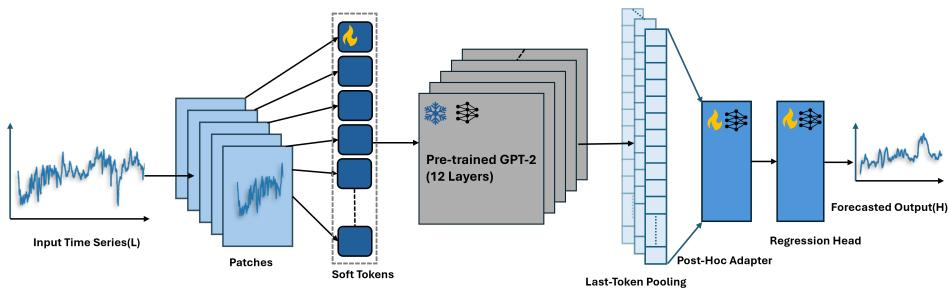
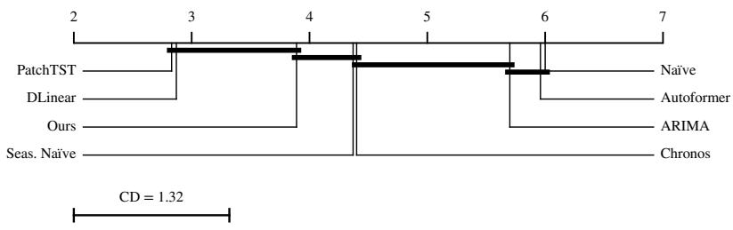
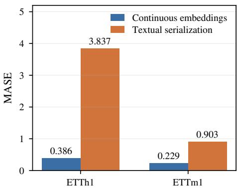
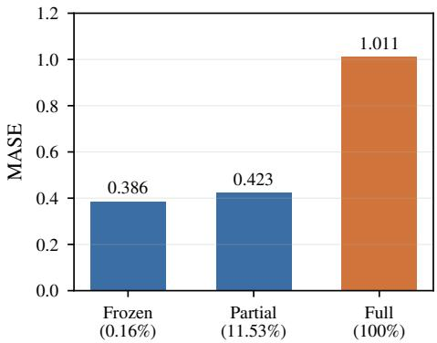
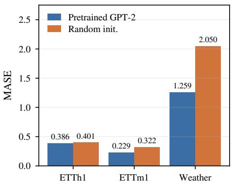
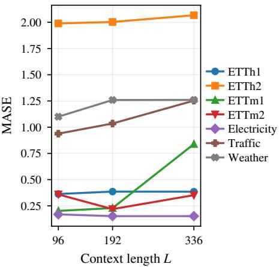
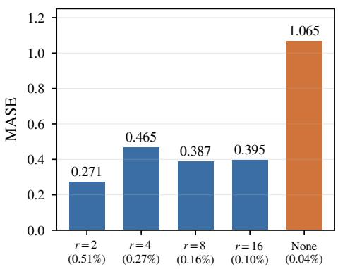
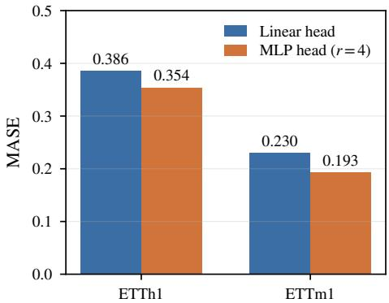
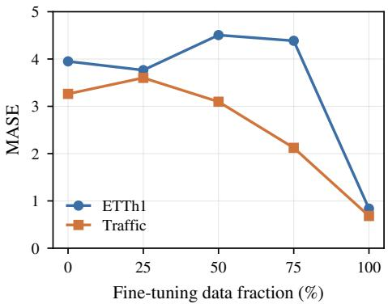
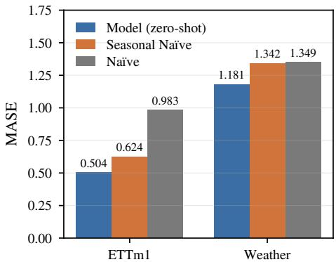

# Parameter-Eficient Adaptation of Pretrained Language Models for Time-Series Forecasting

Tamanna Kumavat1, Georg Brunner2, and Kyriakos Flouris3

1 University of Zurich, Switzerland

tamannasurendar.kumavat@uzh.ch

2 Computer Vision Laboratory, ETH Zurich, Switzerland brunnerg@student.ethz.ch

3 MRC Biostatistics Unit, University of Cambridge, United Kingdom kyriakos.flouris@mrc-bsu.cam.ac.uk

Abstract. We study the adaptation of pretrained language models to univariate time-series forecasting through a parameter-eficient transfer learning framework, with the goal of understanding which design choices drive efective cross-modal transfer. While language models operate on discrete textual tokens, time series consist of continuous numerical observations with temporal dependencies. To bridge this modality gap, we project fixed-length time-series patches directly into the embedding space of a pretrained GPT-2 backbone, bypassing textual tokenization and treating the Transformer as a generic sequence encoder. Through controlled ablation studies on seven benchmark datasets spanning energy, weather, trafic, and finance, we analyze the efects of (i) representation strategy (continuous embeddings versus textual serialisation), (ii) adaptation regime (frozen backbone versus partial or full fine-tuning), (iii) architectural components such as adapters, pooling strategies, and prediction heads, and (iv) input context length. Continuous patch-based embeddings consistently outperform textual prompting and randomly initialised backbones. The adapted pipeline attains MASE within the range of specialised forecasting architectures while updating less than 1% of total model parameters. Results further indicate that freezing the pretrained backbone and training lightweight projection and adapter modules provides a favourable accuracy–eficiency trade-of with stable behaviour across varying context lengths.

Keywords: Time-series forecasting · Transfer learning · Parameter-eficient adaptation · Large language models · Transformers

## 1 Introduction

Time-series forecasting is a fundamental problem in machine learning with applications spanning energy systems, finance, transportation, and meteorology. Classical approaches such as ARIMA and exponential smoothing [2,13] rely on linearity and stationarity assumptions frequently violated in complex real-world systems. Deep learning methods based on recurrent and convolutional architectures [10] capture nonlinear temporal dependencies, and Transformer-based architectures [22,26,23,17] have achieved strong benchmark performance. However, these models are typically trained from scratch, requiring substantial labelled data and computational resources.

Large language models (LLMs) such as GPT [20,3] have demonstrated remarkable transfer capabilities across natural language tasks. This has motivated growing interest in repurposing pretrained Transformers for time-series forecasting [9,1,8,14,27]. Yet adapting language models to numerical forecasting introduces a fundamental modality gap [21,24]: natural language consists of discrete tokens with semantic structure, whereas time series comprise continuous-valued measurements with temporal dependence and scale sensitivity.

Existing representation strategies span textual serialisation [9], discretisation into finite vocabularies [1], and direct projection into embedding space [17]. The importance of such representation choices is well established in generative modelling, where learning eficient low-dimensional latent embeddings has been shown to yield more compact and faithful data descriptions than operating through entangled or redundant representations [6,7]. Nevertheless, performance varies substantially across these time-series approaches depending on dataset characteristics, training regimes, and evaluation settings, making it dificult to disentangle architectural efects from representational choices [19,18,5].

Rather than introducing a new architecture or pursuing state-of-the-art performance, this work develops a systematic adaptation and evaluation pipeline to isolate three central factors: (i) the inductive biases of self-attention as a general sequence-processing mechanism, (ii) the representational prior induced by language-model pretraining, and (iii) the contribution of parameter-eficient task alignment modules. We select GPT-2 [20] as the pretrained backbone for its causal (decoder-only) architecture, which naturally aligns with temporal forecasting where each patch should attend only to preceding context. Preliminary experiments indicated that this causal structure outperformed bidirectional (BERT) and encoder-decoder (T5) alternatives in our pipeline, consistent with the autoregressive nature of the forecasting task. GPT-2’s open availability and widespread adoption in related work further enable controlled ablation studies under realistic computational budgets.

Our contributions are as follows: (1) A reproducible benchmarking framework for evaluating pretrained Transformer-based forecasting across datasets, horizons, and context lengths. (2) Comprehensive ablation studies analysing representation strategies, adaptation schemes, architectural components, and data scale. (3) An empirical comparison between pretrained and randomly initialised backbones, isolating the efect of language-model pretraining. (4) Evaluation of cross-domain zero-shot generalisation. (5) Practical guidelines for parametereficient adaptation in resource-constrained settings.

Code, experimental configurations, and instructions for reproducing all tables and figures are available at https://github.com/tamannaKumavat/GPT-TS.

## 2 Related Work

Transformers for time series. Transformer architectures have been widely applied to time-series forecasting. Informer [26] introduces ProbSparse attention for long-sequence eficiency, while Autoformer [23] incorporates series decomposition with auto-correlation. PatchTST [17] segments time series into patches and processes them as token sequences, achieving strong performance with channel independence. DLinear [25] challenges the necessity of attention by demonstrating competitive results with simple linear layers. Our work builds on the patching strategy of PatchTST but replaces the randomly initialised backbone with a pretrained language model, enabling the study of cross-modal transfer.

Language models for time series. Several approaches repurpose pretrained LLMs for temporal forecasting. Gruver et al. [9] serialise numerical values as text and perform zero-shot forecasting through next-token prediction. Chronos [1] discretizes time-series values into a finite vocabulary and pretrains a T5-based model on large-scale temporal corpora. TimeGPT [8] and Time-LLM [14] propose reprogramming strategies to align time-series inputs with language model representations. One Fits All [27] freezes a pretrained GPT-2 backbone and trains lightweight heads for multiple temporal tasks. Our approach shares the frozen-backbone principle with One Fits All but difers in the systematic ablation of representation strategies, adaptation regimes, and architectural components, providing controlled evidence for design choices that prior work evaluates only implicitly.

Parameter-eficient transfer learning. Adapter modules [11] and lowrank adaptation (LoRA) [12] enable task-specific alignment of pretrained models while updating only a small fraction of parameters, mitigating catastrophic forgetting [16] and overfitting on small downstream datasets. These techniques have been extensively validated in NLP but remain underexplored for crossmodal transfer to time series. We employ bottleneck adapters following Houlsby et al. [11] and systematically evaluate their capacity–accuracy trade-of in the forecasting setting.

## 3 Method

The proposed pipeline (Figure 1) adapts a pretrained GPT-2 backbone for timeseries forecasting through three stages: patch-based embedding, Transformer processing, and direct multi-step forecast projection.

Given a univariate time series $\begin{array} { r } { \{ x _ { t } \} _ { t = 1 } ^ { N } , } \end{array}$ the data is split chronologically into training and test segments. Each observation is standardised via z-score normalisation using mean and variance computed exclusively on the training segment: $x _ { t } ^ { \prime } = ( x _ { t } - \mu ) / \sigma$ . A sliding window of context length L and forecast horizon H produces input–target pairs for supervised training. The standardised context window $\mathbf { x } \in \mathbb { R } ^ { L }$ is then partitioned into $K = \lfloor ( L - P ) / S \rfloor + 1$ non-overlapping patches of length P=8 with stride S=8, following [17]. Patching aggregates local temporal dynamics into compact representations and reduces the efective sequence length from L to $K$ , lowering self-attention cost from $\mathcal { O } ( L ^ { 2 } )$ to $\mathcal { O } ( ( L / P ) ^ { 2 } )$ .

  
Fig. 1: Architecture overview. A context window of length L is standardised and segmented into non-overlapping patches. Each patch is linearly projected into the embedding space of a frozen GPT-2 backbone and processed as a sequence of continuous “soft tokens.” A lightweight residual adapter refines hidden states before last-token pooling and projection to an H-step forecast.

Each patch $\mathbf { p } _ { k } \in \mathbb { R } ^ { P }$ is projected into the Transformer embedding dimension d via a learned linear transformation followed by layer normalisation: $\mathbf { e } _ { k } =$ LayerNorm $( \mathbf { W } _ { p } \mathbf { p } _ { k } + \mathbf { b } _ { p } )$ , where $\mathbf { W } _ { p } ~ \in ~ \mathbb { R } ^ { d \times P }$ . The resulting sequence ${ \textbf { E } } =$ $[ \mathbf { e } _ { 0 } , \dots , \mathbf { e } _ { K - 1 } ]$ forms continuous “soft tokens” that reside directly in the latent space of the pretrained model, bypassing textual tokenization entirely via the inputs\_embeds interface. We employ GPT-2 Small (12 layers, 768-dimensional hidden states, 124M parameters) [20] as the backbone, which processes the embedded patches and produces hidden representations $\mathbf { H } = \mathbf { G } \mathbf { P } \mathbf { \bar { T } } \mathbf { - } 2 ( \mathbf { E } ) \in \mathbb { R } ^ { K \times d }$

A residual adapter [11] refines the hidden states for task-specific alignment: $\tilde { \mathbf { H } } _ { k } = \mathbf { H } _ { k } + \mathrm { A d a p t e r } ( \tilde { \mathbf { H } } _ { k } )$ , where the adapter is a bottleneck MLP projecting $d \to \lfloor d / r \rfloor \to d$ with GELU activation and default ratio $r { = } 8$ . Last-token pooling selects ${ \bf z } = { \bf H } _ { K - 1 }$ , naturally aligned with $\mathrm { G P T - 2 ^ { \circ } s }$ causal left-to-right processing where the final token summarizes all preceding context through self-attention. The pooled representation is mapped to the H-step forecast via $\hat { \mathbf { y } } = \mathbf { W } _ { o } \mathbf { z } + \mathbf { b } _ { o } ,$ following a direct multi-step (DMS) strategy that predicts all future timesteps simultaneously, avoiding error accumulation from recursive decoding.

In the default configuration, the GPT-2 backbone is frozen and only the patch projection $( \mathbf { W } _ { p } , \mathbf { b } _ { p } )$ , layer normalisation, adapter, and regression head $\left( \mathbf { W } _ { o } , \mathbf { b } _ { o } \right)$ are trained, amounting to approximately 197K out of 124M total parameters (0.16%). The model is optimized by minimizing mean squared error on the standardised scale:

$$
\mathcal { L } = \frac { 1 } { B H } \sum _ { i = 1 } ^ { B } \sum _ { h = 1 } ^ { H } \bigl ( y _ { t + h } ^ { ( i ) } - \hat { y } _ { t + h } ^ { ( i ) } \bigr ) ^ { 2 } ,\tag{1}
$$

where B is the mini-batch size. All reported metrics are computed after inversetransforming predictions to the original data scale.

## 4 Experimental Setup

We evaluate on seven benchmark datasets spanning energy systems (ETTh1, ETTh2, ETTm1, ETTm2 [26]), power consumption (Electricity), transportation (Trafic), and meteorology (Weather) [23]. Each dataset is used for univariate forecasting with a single target variable. Although several datasets are originally multivariate, we focus on the univariate setting to isolate representation and transfer efects. This channel-independent strategy, also adopted by PatchTST [17], has been shown to act as an implicit regulariser that can prevent overfitting in Transformer-based forecasters. Datasets are split chronologically (80/20 train/test), with a 10% validation subset extracted from the training tail for model selection. To ensure computational feasibility across the full grid of configurations, each dataset is restricted to a fixed chronological prefix (see Appendix A, Table 2 for exact lengths) that preserves temporal ordering and distributional properties; all methods—including baselines—are trained and evaluated on identical truncated segments to ensure fair comparison. Complete dataset statistics, target variables, and seasonal periods are reported in Appendix A.

Context lengths $L \in \{ 9 6 , 1 9 2 , 3 3 6 \}$ and forecast horizons $H \in \{ 2 4 , 4 8 , 9 6 \}$ follow standard benchmarking conventions [17,23]. All benchmark results are computed under a boundary forecasting protocol: each model is trained exclusively on the training segment and produces a single direct H-step forecast at the train–test boundary using the final L observations as input. Forecasting accuracy is assessed using MASE as the primary metric, defined as the ratio of forecast MAE to the in-sample seasonal naïve MAE:

$$
\mathrm { M A S E } = \frac { \frac { 1 } { H } \sum _ { h = 1 } ^ { H } \left| y _ { t + h } - \hat { y } _ { t + h } \right| } { \frac { 1 } { N _ { \mathrm { t r a i n } } - m } \sum _ { t = m + 1 } ^ { N _ { \mathrm { t r a i n } } } \left| y _ { t } - y _ { t - m } \right| } ,\tag{2}
$$

where m is the seasonal period. Values below 1.0 indicate improvement over the seasonal naïve baseline. MAE and MSE are also reported in Appendix A.

We compare against classical baselines (Naïve last-value repeat, Seasonal Naïve, and ARIMA(5, 1, 0) via Statsmodels), modern neural architectures (Autoformer [23], DLinear [25], and PatchTST [17] implemented via NeuralForecast), and the Chronos foundation model [1] using chronos-t5-small with the sample mean of 20 forecast draws as the point prediction. All neural models share identical optimisation controls and training budgets to ensure fair comparisons. Detailed hyperparameters are reported in Appendix B. Random seeds are fixed to 42 across all experiments.

All entries for the proposed pipeline use the linear prediction head and adapter ratio r=8, held fixed across every dataset and horizon rather than tuned per dataset. Section 5 ablations show that an MLP head and r=2 reduce MASE further; the table entries therefore reflect a single fixed configuration, not the lowest achievable error.

Table 1: MASE results for H=48 across all datasets and context lengths. Best per row in bold. Classical baselines are context-independent. The final row reports the average rank across the 21 configurations at this horizon (lower is better).
<table><tr><td>Dataset</td><td>L</td><td>Naïve</td><td>Seas. Naïve</td><td>ARIMA</td><td>Auto- former</td><td>DLinear</td><td>Patch TST</td><td>Chronos</td><td>Ours</td></tr><tr><td>ETTh1</td><td>96</td><td>0.388</td><td>1.009</td><td>0.393</td><td>0.780</td><td>0.443</td><td>0.710</td><td>0.431</td><td>0.363</td></tr><tr><td>ETTh1</td><td>192</td><td>0.388</td><td>1.009</td><td>0.393</td><td>1.875</td><td>0.508</td><td>0.471</td><td>0.420</td><td>0.386</td></tr><tr><td>ETTh1</td><td>336</td><td>0.388</td><td>1.009</td><td>0.393</td><td>0.766</td><td>0.280</td><td>2.115</td><td>1.190</td><td>0.385</td></tr><tr><td>ETTh2</td><td>96</td><td>2.158</td><td>1.493</td><td>1.894</td><td>1.989</td><td>1.946</td><td>1.502</td><td>1.985</td><td>1.989</td></tr><tr><td>ETTh2</td><td>192</td><td>2.158</td><td>1.493</td><td>1.894</td><td>3.004</td><td>1.326</td><td>1.137</td><td>1.394</td><td>2.003</td></tr><tr><td>ETTh2</td><td>336</td><td>2.158</td><td>1.493</td><td>1.894</td><td>2.720</td><td>1.228</td><td>1.550</td><td>1.714</td><td>2.067</td></tr><tr><td>ETTm1</td><td>96</td><td>0.983</td><td>0.624</td><td>0.991</td><td>0.336</td><td>0.235</td><td>0.222</td><td>1.460</td><td>0.202</td></tr><tr><td>ETTm1</td><td>192</td><td>0.983</td><td>0.624</td><td>0.991</td><td>1.805</td><td>0.348</td><td>0.212</td><td>1.189</td><td>0.229</td></tr><tr><td>ETTm1</td><td>336</td><td>0.983</td><td>0.624</td><td>0.991</td><td>0.508</td><td>0.476</td><td>0.436</td><td>0.657</td><td>0.839</td></tr><tr><td>ETTm2</td><td>96</td><td>1.808</td><td>0.844</td><td>1.155</td><td>2.302</td><td>0.500</td><td>0.741</td><td>0.237</td><td>0.359</td></tr><tr><td>ETTm2</td><td>192</td><td>1.808</td><td>0.844</td><td>1.155</td><td>1.268</td><td>0.528</td><td>0.567</td><td>0.303</td><td>0.219</td></tr><tr><td>ETTm2</td><td>336</td><td>1.808</td><td>0.844</td><td>1.155</td><td>4.350</td><td>0.828</td><td>0.693</td><td>0.726</td><td>0.352</td></tr><tr><td>Electricity</td><td>96</td><td>0.170</td><td>0.098</td><td>0.170</td><td>0.092</td><td>0.097</td><td>0.101</td><td>0.125</td><td>0.169</td></tr><tr><td>Electricity</td><td>192</td><td>0.170</td><td>0.098</td><td>0.170</td><td>0.170</td><td>0.094</td><td>0.096</td><td>0.162</td><td>0.152</td></tr><tr><td>Electricity</td><td>336</td><td>0.170</td><td>0.098</td><td>0.170</td><td>0.288</td><td>0.102</td><td>0.106</td><td>0.134</td><td>0.152</td></tr><tr><td>Traffic</td><td>96</td><td>4.166</td><td>1.041</td><td>3.639</td><td>0.921</td><td>0.848</td><td>0.641</td><td>0.860</td><td>0.938</td></tr><tr><td>Traffic</td><td>192</td><td>4.166</td><td>1.041</td><td>3.639</td><td>0.861</td><td>0.602</td><td>0.601</td><td>0.518</td><td>1.035</td></tr><tr><td>Traffic</td><td>336</td><td>4.166</td><td>1.041</td><td>3.639</td><td>0.831</td><td>0.637</td><td>0.634</td><td>1.034</td><td>1.253</td></tr><tr><td>Weather</td><td>96</td><td>1.349</td><td>1.342</td><td>1.574</td><td>1.129</td><td>1.213</td><td>1.163</td><td>1.336</td><td>1.100</td></tr><tr><td>Weather</td><td>192</td><td>1.349</td><td>1.342</td><td>1.574</td><td>1.335</td><td>1.464</td><td>1.199</td><td>0.998</td><td>1.259</td></tr><tr><td>Weather</td><td>336</td><td>1.349</td><td>1.342</td><td>1.574</td><td>0.757</td><td>1.356</td><td>1.203</td><td>1.552</td><td>1.260</td></tr><tr><td>Avg. rank</td><td></td><td>6.29 (8)</td><td>4.52 (5)</td><td>6.10 (7)</td><td>5.45 (6)</td><td>3.14 (2)</td><td>2.81 (1)</td><td>4.19 (4)</td><td>3.50 (3)</td></tr></table>

## 5 Results

We present the full baseline comparison at the representative horizon H=48, followed by ablation studies analysing representation design, transfer learning, adaptation regimes, architectural sensitivity, and generalisation. Complete results for $H \in \{ 2 4 , 9 6 \}$ across all datasets and context lengths are provided in Appendix A.

Baseline comparison. Table 1 reports MASE at H=48; complete results at H=24 and H=96 appear in Appendix A. The purpose of this comparison is to establish that the pipeline operates in a performance regime comparable to established forecasters: ablations conducted on a testbed far of the pace would not generalise. Averaged over all 63 dataset–context–horizon configurations, the pipeline attains a mean rank of 3.89 against 2.83 for PatchTST, 2.87 for DLinear, and 4.40 for Chronos (Friedman $\chi ^ { 2 } ( \bar { 7 } ) { = } 1 2 3 . 2 , p { < } 1 0 ^ { - 2 2 } )$ . The Nemenyi critical diference at α=0.05 is 1.32 [4], so the pipeline is not statistically separable from PatchTST, DLinear, Chronos, or the Seasonal Naïve baseline; it is separated from ARIMA, Autoformer, and the Naïve baseline (Figure 2).4

  
Fig. 2: Critical-diference diagram over 63 dataset×context×horizon configurations (k=8, N=63, α=0.05). Methods joined by a horizontal bar are not statistically separable (Nemenyi CD=1.32).

Per-dataset behaviour varies. Performance is weaker on ETTh2, where MASE consistently exceeds 1.0 for all neural methods, suggesting this dataset favours models with stronger linear inductive biases such as DLinear. On Electricity, lightweight models (Seasonal Naïve, DLinear) attain the lowest MASE, indicating that the additional capacity of a pretrained Transformer provides limited benefit on highly structured periodic signals. On Trafic, PatchTST and Chronos rank first at most context lengths. An observation across all three horizons is that the pipeline’s MASE does not degrade at L=336, in contrast to Autoformer, which exhibits substantial instability at longer contexts (e.g., MASE of 4.350 on ETTm2 at L=336).

Soft tokens vs. hard prompting. Figure 3a compares the proposed continuous embedding injection against textual serialisation where numerical values are converted to strings and processed via GPT-2’s standard tokenizer. The softtoken interface substantially and consistently outperforms hard prompting across all datasets at H=48. On ETTh1, soft tokens achieve MASE= 0.386 versus 3.84 for hard prompting—nearly an order-of-magnitude diference. On ETTm1, the gap is fourfold (0.229 vs. 0.90). The training truncation rate was zero for both, confirming the gap stems from representational ineficiency rather than context overflow. Textual serialisation expands individual values into multiple BPE tokens, exhausting the context window, and forces the model to operate through embeddings pretrained on linguistic rather than quantitative structure. Continuous patch embeddings preserve magnitude relationships while controlling token count.

Backbone adaptation regime. Figure 3b compares three regimes on ETTh1 at H=48: frozen backbone, partially frozen (last two Transformer blocks unfrozen), and full fine-tuning. The frozen regime achieves the best accuracy $( \mathrm { M A S E } = 0 . 3 8 6 )$ while training only 0.16% of parameters. Unfreezing the last two blocks increases trainable parameters to 11.53% but degrades performance $\left( \mathrm { M A S E } { = } ~ 0 . 4 2 3 \right)$ . Full fine-tuning (100% parameters) results in substantially worse accuracy $( \mathrm { M A S E } { = } ~ 1 . 0 1 1 )$ , consistent with overfitting or degradation of pretrained representations [16]. These results indicate that the pipeline benefits from reusing frozen pretrained representations while adapting only lightweight modules.

Efect of language-model pretraining. Figure 3c compares the pretrained GPT-2 backbone against an identically structured randomly initialised model under matched conditions (frozen backbone, $L { = } 1 9 2 , H { = } 4 8 )$ . Pretraining consistently improves performance across all datasets: on ETTh1 MASE decreases from 0.401 to 0.386, on ETTm1 from 0.322 to 0.229, and on Weather from 2.050 to 1.259. Because the backbone remains frozen, these gains cannot be attributed to optimisation dynamics and are instead consistent with the hypothesis that large-scale language pretraining induces reusable sequence-processing representations that transfer to numerical domains.

Context length scaling. Figure 3d shows MASE across context lengths $L \in \{ 9 6 , 1 9 2 , 3 3 6 \}$ at $H { = } 4 8 . \ \mathrm { O n \ E T T m 2 }$ performance improves monotonically as additional history is provided. On ETTh1 and Weather, improvements saturate beyond $L { = } 1 9 2$ with marginal variation at $L { = } 3 3 6$ . Crucially, no dataset exhibits severe degradation at larger contexts, contrasting with certain baselines that show instability under long input windows. This stability derives from the patch-based interface, which reduces efective sequence length from L to $K \approx L / P ,$ , controlling quadratic attention cost.

Adapter capacity. Figure 3e varies the bottleneck ratio $r \in \{ 2 , 4 , 8 , 1 6 \}$ under a frozen backbone. Removing the adapter degrades MASE to 1.065, confirming that lightweight task-specific adaptation is critical. The best performance is obtained at $r { = } 2 \ ( \mathrm { M A S E } { = } 0 . 2 7 1 , 0 . 5 1 \%$ trainable parameters), with increasing r progressively degrading accuracy $( r { = } 8 ; 0 . 3 8 6 ; r { = } 1 6 ; 0 . 3 9 5 )$ . This reveals a clear accuracy–capacity trade-of: suficient adapter width is necessary for stable alignment between pretrained representations and the forecasting objective.

Architectural sensitivity. Figure 3f compares linear and MLP prediction heads. The MLP head consistently improves performance: on ETTh1, MASE drops from 0.386 to 0.354; on ETTm1, from 0.230 to 0.193. The parameter overhead is modest (from 0.16% to 0.25% of total). Additionally, last-token pooling consistently outperforms mean pooling, with MASE improving on ETTh1 from 1.277 (mean) to 0.386 (last-token), consistent with GPT-2’s causal processing structure, where the final token integrates all preceding context.

Data eficiency and cross-domain generalisation. Figure 4a shows performance under subsampled training data. On Trafic, MASE decreases substantially with more supervision, dropping from 3.26 (0%) to 0.682 (100%), though with non-monotonic behaviour at low fractions. On ETTh1, performance remains poor at reduced fractions (MASE≈ 3.8–4.5) with a sharp improvement only at 100% (0.837), suggesting this dataset requires suficient supervision for reliable generalisation. Figure 4b evaluates zero-shot cross-domain transfer: a model trained on one source dataset is evaluated on unseen targets without fine-tuning. On ETTm1, the model achieves MASE= 0.504, improving over the seasonal naïve baseline (0.624) by approximately 19%. On Weather, zero-shot MASE= 1.181 outperforms seasonal naïve (1.342) by ∼12%, demonstrating that the pretrained backbone and learned forecasting interface can capture reusable temporal structure across domains.

  
(a) Soft vs. hard prompting

  
(b) Backbone adaptation regime

(c) Pretrained vs. random init.  
  
(e) Adapter capacity (r)

(d) Context length scaling  
  
(f) Linear vs. MLP head  
Fig. 3: Ablation studies. (a) Continuous embeddings dramatically outperform textual serialisation. (b) Frozen backbone with ${ < } 1 \%$ trainable parameters achieves best accuracy; full fine-tuning degrades performance. (c) Pretrained GPT-2 consistently outperforms random initialization under identical conditions. (d) Context length scaling is stable with no catastrophic degradation. (e) Adapter bottleneck ratio r=2 yields best accuracy; removing adapters degrades substantially. (f) MLP prediction head improves over linear across datasets. All results at H=48, L=192 unless noted.

  
(a) Training data fraction efect

  
(b) Zero-shot cross-domain transfer  
Fig. 4: Data eficiency and generalisation. (a) Performance under reduced training data; behavior is dataset-dependent with Trafic scaling smoothly and ETTh1 requiring full supervision. (b) Zero-shot cross-domain transfer consistently outperforms naïve baselines, with ∼19% improvement on ETTm1 and ∼12% on Weather over Seasonal Naïve.

## 6 Discussion and Conclusion

This work provides a systematic empirical analysis of the design choices underlying parameter-eficient adaptation of pretrained language models for time-series forecasting. Rather than proposing a new state-of-the-art architecture, our primary contribution is a set of controlled ablation studies that isolate the efects of representation strategy, adaptation regime, and architectural components. Several key findings emerge.

First, representation design is the dominant factor in cross-modal adaptation. Continuous patch-based embeddings substantially outperform textual serialisation by avoiding tokenization ineficiency, embedding misalignment, and formatting sensitivity. These results suggest that embedding-level alignment appears substantially more efective than textual serialisation in our experiments and may be necessary for stable time-series adaptation.

Second, language-model pretraining provides transferable structural benefits that extend beyond text. The pretrained GPT-2 backbone consistently outperforms an identically structured randomly initialised model even when frozen. These results are consistent with the hypothesis that pretraining induces reusable sequence-processing inductive biases (long-range dependency modelling, hierarchical structure, and multi-scale relationships via self-attention) rather than transferring linguistic semantics. An alternative explanation, that better-conditioned weight matrices lead to more stable gradient flow, cannot be fully ruled out and merits further investigation through representation probing.

Third, parameter-eficient adaptation outperforms full fine-tuning in this setting. Freezing the backbone and training lightweight modules (<1% of parameters) achieves superior accuracy compared to partial or full fine-tuning. The adapter ablation confirms that some task-specific alignment is necessary, but lightweight residual refinement sufices.

Fourth, patch-based segmentation enables stable context scaling without the catastrophic degradation observed in some Transformer baselines. Architectural interface choices (MLP head, last-token pooling) produce secondary but meaningful improvements.

Together, these findings yield practical guidelines for resource-constrained deployment: use continuous patch embeddings rather than textual serialisation, freeze the pretrained backbone, attach a lightweight adapter $( r \leq 4 )$ with an MLP prediction head and last-token pooling; this configuration achieves competitive accuracy while training less than 1% of parameters.

Several limitations warrant discussion. The study focuses on univariate forecasting with a single backbone (GPT-2 Small); larger models or multivariate settings may exhibit diferent dynamics. Data eficiency is dataset-dependent, and no single configuration universally dominates. Extending the evaluation to additional test configurations and seeds would provide stronger statistical grounding. While preliminary experiments favoured the causal GPT-2 architecture over bidirectional and encoder-decoder alternatives, a systematic multibackbone comparison with full reporting remains future work.

The most substantive question opened by our results is what, specifically, transfers from language pretraining to numerical forecasting. Section 5 shows that a frozen pretrained backbone consistently outperforms a randomly initialised one under identical conditions, but two hypotheses are compatible with this observation: pretraining induces reusable sequence-processing inductive biases (long-range dependency modelling, hierarchical structure), or pretraining simply yields better-conditioned weight matrices that support more stable forward passes. Distinguishing them is the natural extension of this work into a full research paper. Concrete probes include layer-wise Centered Kernel Alignment [15] between pretrained and random-init backbones on time-series inputs, attention-pattern comparison across the two initialisations, and a weightspectrum control that rescales the random-init backbone to match the singularvalue distribution of the pretrained one, isolating the conditioning hypothesis. Complementary directions include extending the framework to multivariate forecasting, investigating model-scale efects, and combining language pretraining with time-series-specific self-supervised objectives.

## References

1. Ansari, A.F., Stella, L., Turkmen, A.C., Zhang, X., Mercado, P., Shen, H., Shchur, O., Rangapuram, S.S., Pineda Arango, S., Kapoor, S., Zschiegner, J., Maddix, D.C., Wang, H., Mahoney, M.W., Torkkola, K., Wilson, A.G., Bohlke-Schneider, M., Wang, Y.: Chronos: Learning the language of time series. Transactions on Machine Learning Research (2024)

2. Box, G.E.P., Jenkins, G.M., Reinsel, G.C., Ljung, G.M.: Time Series Analysis: Forecasting and Control. John Wiley & Sons, Hoboken, NJ, 5th edn. (2015)

3. Brown, T.B., Mann, B., Ryder, N., Subbiah, M., Kaplan, J., Dhariwal, P., Neelakantan, A., Shyam, P., Sastry, G., Askell, A., et al.: Language models are fewshot learners. In: Advances in Neural Information Processing Systems (NeurIPS). vol. 33, pp. 1877–1901 (2020)

4. Demšar, J.: Statistical comparisons of classifiers over multiple data sets. Journal of Machine Learning Research 7, 1–30 (2006)

5. Flouris, K., Halter, M., Lee, Y.Y.R., Castonguay, S., Jacobs, L., Dirix, P., Nestmann, J., Kozerke, S., Konukoglu, E.: Localized fno for spatiotemporal hemodynamic upsampling in aneurysm mri. In: Reconstruction and Imaging Motion Estimation, and Graphs in Biomedical Image Analysis. pp. 65–75. Springer Nature Switzerland (2025)

6. Flouris, K., Konukoglu, E.: Canonical normalizing flows for manifold learning. In: Advances in Neural Information Processing Systems (NeurIPS). vol. 36, pp. 27801– 27814 (2023)

7. Flouris, K., Volokitin, A., Bredell, G., Konukoglu, E.: Explicit and data-eficient encoding via gradient flow. arXiv preprint arXiv:2412.00864 (2024)

8. Garza, A., Challu, C., Mergenthaler-Canseco, M.: TimeGPT-1. arXiv preprint arXiv:2310.03589 (2023)

9. Gruver, N., Finzi, M., Qiu, S., Wilson, A.G.: Large language models are zero-shot time series forecasters. In: Advances in Neural Information Processing Systems (NeurIPS). vol. 36, pp. 19622–19635 (2023)

10. Hochreiter, S., Schmidhuber, J.: Long short-term memory. Neural Computation 9(8), 1735–1780 (1997). https://doi.org/10.1162/neco.1997.9.8.1735

11. Houlsby, N., Giurgiu, A., Jastrzebski, S., Morrone, B., De Laroussilhe, Q., Gesmundo, A., Attariyan, M., Gelly, S.: Parameter-eficient transfer learning for NLP. In: Proceedings of the 36th International Conference on Machine Learning (ICML). Proceedings of Machine Learning Research, vol. 97, pp. 2790–2799. PMLR (2019)

12. Hu, E.J., Shen, Y., Wallis, P., Allen-Zhu, Z., Li, Y., Wang, S., Wang, L., Chen, W.: LoRA: Low-rank adaptation of large language models. In: The Tenth International Conference on Learning Representations (ICLR) (2022)

13. Hyndman, R.J., Koehler, A.B., Ord, J.K., Snyder, R.D.: Forecasting with Exponential Smoothing: The State Space Approach. Springer Series in Statistics, Springer, Berlin, Heidelberg (2008)

14. Jin, M., Wang, S., Ma, L., Chu, Z., Zhang, J.Y., Shi, X., Chen, P.Y., Liang, Y., Li, Y.F., Pan, S., Wen, Q.: Time-LLM: Time series forecasting by reprogramming large language models. In: The Twelfth International Conference on Learning Representations (ICLR) (2024)

15. Kornblith, S., Norouzi, M., Lee, H., Hinton, G.: Similarity of neural network representations revisited. In: Proceedings of the 36th International Conference on Machine Learning (ICML). Proceedings of Machine Learning Research, vol. 97, pp. 3519–3529. PMLR (2019)

16. McCloskey, M., Cohen, N.J.: Catastrophic interference in connectionist networks: The sequential learning problem. Psychology of Learning and Motivation 24, 109– 165 (1989). https://doi.org/10.1016/S0079-7421(08)60536-8

17. Nie, Y., Nguyen, N.H., Sinthong, P., Kalagnanam, J.: A time series is worth 64 words: Long-term forecasting with transformers. In: The Eleventh International Conference on Learning Representations (ICLR) (2023)

18. Park, J., Lee, H., Lee, D., Gwak, D., Choo, J.: Revisiting LLMs as zero-shot timeseries forecasters: Small noise can break large models. In: Proceedings of the 63rd Annual Meeting of the Association for Computational Linguistics (Volume 2: Short Papers). pp. 906–922. Association for Computational Linguistics (2025). https: //doi.org/10.18653/v1/2025.acl-short.71

19. Qiu, X., Hu, J., Zhou, L., Wu, X., Du, J., Zhang, B., Guo, C., Zhou, A., Jensen, C.S., Sheng, Z., Yang, B.: TFB: Towards comprehensive and fair benchmarking of time series forecasting methods. Proceedings of the VLDB Endowment 17(9), 2363–2377 (2024). https://doi.org/10.14778/3665844.3665851

20. Radford, A., Wu, J., Child, R., Luan, D., Amodei, D., Sutskever, I.: Language models are unsupervised multitask learners. Tech. rep., OpenAI (2019)

21. Tan, M., Merrill, M.A., Gupta, V., Althof, T., Hartvigsen, T.: Are language models actually useful for time series forecasting? Advances in Neural Information Processing Systems (NeurIPS) 37, 60162–60191 (2024)

22. Vaswani, A., Shazeer, N., Parmar, N., Uszkoreit, J., Jones, L., Gomez, A.N., Kaiser, Ł., Polosukhin, I.: Attention is all you need. In: Advances in Neural Information Processing Systems (NeurIPS). vol. 30, pp. 5998–6008 (2017)

23. Wu, H., Xu, J., Wang, J., Long, M.: Autoformer: Decomposition transformers with auto-correlation for long-term series forecasting. In: Advances in Neural Information Processing Systems (NeurIPS). vol. 34, pp. 22419–22430 (2021)

24. Ye, J., Yu, Y., Zhang, W., Wang, L., Li, J., Tsung, F.: Empowering time series analysis with foundation models: A comprehensive survey. Information Fusion (2024), arXiv:2405.02358

25. Zeng, A., Chen, M., Zhang, L., Xu, Q.: Are transformers efective for time series forecasting? In: Proceedings of the AAAI Conference on Artificial Intelligence. vol. 37, pp. 11121–11128 (2023). https://doi.org/10.1609/aaai.v37i9.26317

26. Zhou, H., Zhang, S., Peng, J., Zhang, S., Li, J., Xiong, H., Zhang, W.: Informer: Beyond eficient transformer for long sequence time-series forecasting. In: Proceedings of the AAAI Conference on Artificial Intelligence. vol. 35, pp. 11106–11115 (2021). https://doi.org/10.1609/aaai.v35i12.17325

27. Zhou, T., Niu, P., Wang, X., Sun, L., Jin, R.: One fits all: Power general time series analysis by pretrained LM. In: Advances in Neural Information Processing Systems (NeurIPS). vol. 36, pp. 43322–43355 (2023)

## A Dataset Configuration

Table 2 summarizes dataset-specific details including target variables, sampling frequencies, seasonal periods used for MASE computation, and chronological prefix lengths used for computational feasibility.

Table 2: Dataset configuration. The seasonal period m defines the scaling denominator in MASE. All datasets use patch length P=8 and stride S=8.
<table><tr><td>Dataset</td><td>Target</td><td>Frequency</td><td>m</td><td>Max length</td></tr><tr><td>ETTh1</td><td>OT</td><td>Hourly</td><td>24</td><td>5,000</td></tr><tr><td>ETTh2</td><td>OT</td><td>Hourly</td><td>24</td><td>5,000</td></tr><tr><td>ETTm1</td><td>OT</td><td>15-min</td><td>96</td><td>8,000</td></tr><tr><td>ETTm2</td><td>OT</td><td>15-min</td><td>96</td><td>8,000</td></tr><tr><td>Electricity</td><td>Col. 0</td><td>Hourly</td><td>24</td><td>8,000</td></tr><tr><td>Traffic</td><td>Col. 2</td><td>Hourly</td><td>24</td><td>5,000</td></tr><tr><td>Weather</td><td>T (°C)</td><td>Hourly</td><td>24</td><td>10,000</td></tr></table>

## B Training and Hyperparameter Details

All neural models (the proposed method and baselines) are trained under identical optimisation controls. The proposed GPT-2 soft-token forecaster uses AdamW with learning rate $2 \times 1 0 ^ { - 4 }$ and weight decay $1 0 ^ { - 2 }$ , batch size 8 with gradient accumulation 2 (efective batch size 16), for up to 15 epochs with early stopping (patience 3) monitored on validation MAE. Gradient norms are clipped at 1.0 and training uses mixed precision (FP16). The backbone is frozen by default; trainable components include the patch projection layer, layer normalisation, residual adapter (bottleneck ratio r=8, GELU activation), and a linear prediction head. This amounts to less than 1% of total model parameters. The benchmark results in Table 1 use this conservative configuration; ablation studies in the main text show that an MLP head and r=2 yield further improvements.

Autoformer [23], DLinear [25], and PatchTST [17] are trained via Neural-Forecast with early stopping (patience 3) and validation checks every 200 steps. ARIMA uses a fixed (5, 1, 0) configuration via Statsmodels. Chronos [1] uses chronos-t5-small with the sample mean of 20 forecast draws as the point prediction. Naïve and Seasonal Naïve baselines are deterministic and require no training.

## C Results for Additional Forecast Horizons

Table 3 presents MASE results for short-horizon forecasting (H=24). Rank ordering is consistent with the H=48 results in Table 1: PatchTST ranks first (mean rank 2.29), followed by DLinear (mean rank 3.29) and the proposed pipeline (mean rank 3.86).

Table 3: MASE results for horizon H=24. Best per row in bold. The final row reports the average rank across the 21 configurations at this horizon (lower is better).
<table><tr><td>Dataset</td><td>L</td><td>Naïve</td><td>Seas. Naive</td><td>ARIMA</td><td>Auto- former</td><td>DLinear</td><td>Patch TST</td><td>Chronos</td><td>Ours</td></tr><tr><td>ETTh1</td><td>96</td><td>0.353</td><td>0.853</td><td>0.344</td><td>1.788</td><td>0.349</td><td>0.361</td><td>0.485</td><td>0.276</td></tr><tr><td>ETTh1</td><td>192</td><td>0.353</td><td>0.853</td><td>0.344</td><td>1.321</td><td>0.216</td><td>0.315</td><td>0.505</td><td>0.268</td></tr><tr><td>ETTh1</td><td>336</td><td>0.353</td><td>0.853</td><td>0.344</td><td>1.103</td><td>0.267</td><td>0.829</td><td>0.881</td><td>0.420</td></tr><tr><td>ETTh2</td><td>96</td><td>2.245</td><td>1.570</td><td>1.973</td><td>1.961</td><td>2.024</td><td>1.414</td><td>1.892</td><td>1.968</td></tr><tr><td>ETTh2</td><td>192</td><td>2.245</td><td>1.570</td><td>1.973</td><td>2.943</td><td>1.361</td><td>1.322</td><td>1.426</td><td>2.005</td></tr><tr><td>ETTh2</td><td>336</td><td>2.245</td><td>1.570</td><td>1.973</td><td>2.297</td><td>1.199</td><td>1.467</td><td>1.670</td><td>2.042</td></tr><tr><td>ETTm1</td><td>96</td><td>0.650</td><td>0.670</td><td>0.656</td><td>0.938</td><td>0.231</td><td>0.161</td><td>0.934</td><td>0.182</td></tr><tr><td>ETTm1</td><td>192</td><td>0.650</td><td>0.670</td><td>0.656</td><td>0.378</td><td>0.357</td><td>0.227</td><td>0.791</td><td>0.332</td></tr><tr><td>ETTm1</td><td>336</td><td>0.650</td><td>0.670</td><td>0.656</td><td>1.793</td><td>0.435</td><td>0.269</td><td>0.495</td><td>0.533</td></tr><tr><td>ETTm2</td><td>96</td><td>0.933</td><td>0.681</td><td>0.452</td><td>2.691</td><td>0.267</td><td>0.585</td><td>0.270</td><td>0.592</td></tr><tr><td>ETTm2</td><td>192</td><td>0.933</td><td>0.681</td><td>0.452</td><td>0.684</td><td>0.347</td><td>0.547</td><td>0.277</td><td>0.168</td></tr><tr><td>ETTm2</td><td>336</td><td>0.933</td><td>0.681</td><td>0.452</td><td>1.493</td><td>0.527</td><td>0.579</td><td>0.666</td><td>0.254</td></tr><tr><td>Electricity</td><td>96</td><td>0.237</td><td>0.142</td><td>0.237</td><td>0.174</td><td>0.112</td><td>0.104</td><td>0.127</td><td>0.202</td></tr><tr><td>Electricity</td><td>192</td><td>0.237</td><td>0.142</td><td>0.237</td><td>0.195</td><td>0.126</td><td>0.120</td><td>0.160</td><td>0.211</td></tr><tr><td>Electricity</td><td>336</td><td>0.237</td><td>0.142</td><td>0.237</td><td>0.252</td><td>0.147</td><td>0.130</td><td>0.137</td><td>0.216</td></tr><tr><td>Traffic</td><td>96</td><td>4.227</td><td>1.138</td><td>3.692</td><td>1.372</td><td>0.919</td><td>0.724</td><td>0.846</td><td>1.158</td></tr><tr><td>Traffic</td><td>192</td><td>4.227</td><td>1.138</td><td>3.692</td><td>1.005</td><td>0.811</td><td>0.706</td><td>0.524</td><td>1.063</td></tr><tr><td>Traffic</td><td>336</td><td>4.227</td><td>1.138</td><td>3.692</td><td>0.996</td><td>0.784</td><td>0.737</td><td>1.149</td><td>0.947</td></tr><tr><td>Weather</td><td>96</td><td>0.304</td><td>0.353</td><td>0.365</td><td>0.544</td><td>0.733</td><td>0.284</td><td>0.313</td><td>0.426</td></tr><tr><td>Weather</td><td>192</td><td>0.304</td><td>0.353</td><td>0.365</td><td>1.159</td><td>1.192</td><td>0.371</td><td>0.438</td><td>0.278</td></tr><tr><td>Weather</td><td>336</td><td>0.304</td><td>0.353</td><td>0.365</td><td>0.957</td><td>0.689</td><td>0.325</td><td>0.676</td><td>0.459</td></tr><tr><td>Avg. rank</td><td></td><td>5.74(7)</td><td>4.86 (5)</td><td>5.02 (6)</td><td>6.71 (8)</td><td>3.29 (2)</td><td>2.29 (1)</td><td>4.24(4)</td><td>3.86 (3)</td></tr></table>

Table 4 presents MASE results for long-horizon forecasting (H=96). At this horizon DLinear ranks first (mean rank 2.17), followed by PatchTST (mean rank 3.38) and the Seasonal Naïve baseline (mean rank 3.71); the proposed pipeline ranks fourth (4.31), reflecting the increasing dificulty of longer horizons for adaptation-based approaches.

Table 4: MASE results for horizon H=96. Best per row in bold. The final row reports the average rank across the 21 configurations at this horizon (lower is better).
<table><tr><td>Dataset</td><td>L</td><td>Naïve</td><td>Seas. Naive</td><td>ARIMA</td><td>Auto- former</td><td>DLinear</td><td>Patch TST</td><td>Chronos</td><td>Ours</td></tr><tr><td>ETTh1</td><td>96</td><td>0.553</td><td>1.247</td><td>0.564</td><td>1.702</td><td>0.704</td><td>1.878</td><td>0.941</td><td>0.465</td></tr><tr><td>ETTh1</td><td>192</td><td>0.553</td><td>1.247</td><td>0.564</td><td>1.533</td><td>0.902</td><td>1.118</td><td>1.117</td><td>0.486</td></tr><tr><td>ETTh1</td><td>336</td><td>0.553</td><td>1.247</td><td>0.564</td><td>1.885</td><td>0.482</td><td>1.559</td><td>1.264</td><td>0.576</td></tr><tr><td>ETTh2</td><td>96</td><td>1.984</td><td>1.340</td><td>1.755</td><td>1.938</td><td>1.752</td><td>1.306</td><td>1.965</td><td>2.313</td></tr><tr><td>ETTh2</td><td>192</td><td>1.984</td><td>1.340</td><td>1.755</td><td>2.923</td><td>1.286</td><td>1.597</td><td>1.661</td><td>2.225</td></tr><tr><td>ETTh2</td><td>336</td><td>1.984</td><td>1.340</td><td>1.755</td><td>2.873</td><td>1.173</td><td>1.507</td><td>1.622</td><td>2.287</td></tr><tr><td>ETTm1</td><td>96</td><td>1.720</td><td>1.033</td><td>1.729</td><td>3.299</td><td>0.827</td><td>0.774</td><td>2.733</td><td>1.176</td></tr><tr><td>ETTm1</td><td>192</td><td>1.720</td><td>1.033</td><td>1.729</td><td>5.734</td><td>0.933</td><td>1.211</td><td>1.982</td><td>1.113</td></tr><tr><td>ETTm1</td><td>336</td><td>1.720</td><td>1.033</td><td>1.729</td><td>1.341</td><td>0.985</td><td>0.932</td><td>1.563</td><td>1.406</td></tr><tr><td>ETTm2</td><td>96</td><td>3.295</td><td>1.953</td><td>2.552</td><td>1.875</td><td>1.780</td><td>1.836</td><td>2.920</td><td>1.780</td></tr><tr><td>ETTm2</td><td>192</td><td>3.295</td><td>1.953</td><td>2.552</td><td>3.986</td><td>1.809</td><td>1.955</td><td>1.876</td><td>1.648</td></tr><tr><td>ETTm2</td><td>336</td><td>3.295</td><td>1.953</td><td>2.552</td><td>1.351</td><td>1.977</td><td>1.879</td><td>1.770</td><td>1.859</td></tr><tr><td>Electricity</td><td>96</td><td>0.149</td><td>0.078</td><td>0.149</td><td>0.103</td><td>0.082</td><td>0.133</td><td>0.128</td><td>0.164</td></tr><tr><td>Electricity</td><td>192</td><td>0.149</td><td>0.078</td><td>0.149</td><td>0.124</td><td>0.086</td><td>0.105</td><td>0.179</td><td>0.138</td></tr><tr><td>Electricity</td><td>336</td><td>0.149</td><td>0.078</td><td>0.149</td><td>0.353</td><td>0.081</td><td>0.129</td><td>0.138</td><td>0.150</td></tr><tr><td>Traffic</td><td>96</td><td>4.511</td><td>1.020</td><td>3.968</td><td>1.306</td><td>0.851</td><td>0.730</td><td>0.964</td><td>1.145</td></tr><tr><td>Traffic</td><td>192</td><td>4.511</td><td>1.020</td><td>3.968</td><td>1.143</td><td>0.731</td><td>0.773</td><td>0.921</td><td>0.956</td></tr><tr><td>Traffic</td><td>336</td><td>4.511</td><td>1.020</td><td>3.968</td><td>0.853</td><td>0.682</td><td>0.777</td><td>1.012</td><td>1.089</td></tr><tr><td>Weather</td><td>96</td><td>2.829</td><td>2.793</td><td>3.135</td><td>3.131</td><td>2.345</td><td>2.535</td><td>2.909</td><td>2.513</td></tr><tr><td>Weather</td><td>192</td><td>2.829</td><td>2.793</td><td>3.135</td><td>2.432</td><td>2.700</td><td>2.641</td><td>2.358</td><td>2.974</td></tr><tr><td>Weather</td><td>336</td><td>2.829</td><td>2.793</td><td>3.135</td><td>2.265</td><td>2.148</td><td>2.214</td><td>2.297</td><td>1.574</td></tr><tr><td>Avg. rank</td><td></td><td>5.98 (8)</td><td>3.71 (3)</td><td>5.98 (7)</td><td>5.71 (6)</td><td>2.17(1)</td><td>3.38 (2)</td><td>4.76 (5)</td><td>4.31 (4)</td></tr></table>