# Per-Matrix Optimality Is Not Enough: Three-Level Optimization for Low-Rank LLM Compression

Huicheng Zhang1\* Xiyao Feng1\* Ze-Tong Li1 Chengkai Zhu1,2

Xiao Shi1† Xiwei Pan1 Jinguo Liu1† Ge Bai1 Xin Wang1†

{xiaoshi,jinguoliu,felixxinwang}@hkust-gz.edu.cn

1Hong Kong University of Science and Technology (Guangzhou), Guangdong 511453, China 2QudeLeap Research, Shanghai 200030, China

## Abstract

Per-matrix singular value decomposition (SVD) truncation is Eckart–Young optimal in the whitened Frobenius norm, but errors from independently compressed matrices compound through the block’s nonlinear forward pass. Inspired in part by hierarchical variational optimization in quantum many-body methods, we introduce a three-level chain that widens optimization scope from individual matrices to Transformer blocks to the full model: whitened SVD (L1), block-level joint optimiza tion (L2), and end-to-end language-modeling loss refinement (L3), all from 256 calibration sequences, with no instruction or recovery data. On LLaMA-7B at 60% compression, the chain reduces WikiText-2 perplexity from 42.1 to 19.1 to 11.4. The block-level stage acts as a regularizer: skipping it worsens Penn Treebank (PTB) perplexity by 24 points, a gap that additional end-to-end training did not close in our experiments. Perplexity gains hold across 20–80% compression, five architectures up to 13B parameters, and both in-distribution and out-of-distribution benchmarks, though the cross-architecture rows use architecture-specific configurations and the ratio sweep was not run under one common protocol. With more calibration data, skipping the block-level stage becomes competitive, revealing an offline compute–data trade-off. We therefore claim improvements only in perplexity and compression fidelity; downstream accu racy remains well below the dense model.

## 1 Introduction

Large language models (LLMs) require significant memory, limiting deployment on consumer-grade hardware. Post-training compression reduces this cost through weight quantization (Frantar et al., 2022; Lin et al., 2024), pruning (Frantar and Alistarh, 2023; Wei et al., 2024), or low-rank decomposition. Singular value decomposition (SVD)- based low-rank compression preserves the original Transformer structure and uses only standard dense matrix multiplications with no specialized kernels. Among the earliest applications to neural network compression, Sainath et al. (2013) factorized the final weight layer of deep neural network (DNN) acoustic models; subsequent work extended low-rank approximations to convolutional neural network (CNN) filters (Denton et al., 2014; Jaderberg et al., 2014). Truncating the SVD of each LLM weight matrix directly is a natural baseline, but this data-agnostic objective ignores which input directions dominate the projection’s output error. Activation-aware methods address this mismatch: ASVD (Yuan et al., 2023) rescales weight columns by activation-channel magnitude before SVD, while SVD-LLM (Wang et al., 2025b) whitens calibration activations so that singularvalue truncation directly corresponds to reconstruction loss. Follow-up work refines per-matrix objectives (Wang et al., 2025a), allocates rank budgets across weight matrices (Xv et al., 2025; Qi et al., 2026; Ding et al., 2025; Abbasi et al., 2026), and compensates accumulated error (Hu et al., 2026). To widen the scope beyond individual matrices, LiLlama (Sy et al., 2024) performs SVD-initialized per-block distillation with 13 M calibration tokens, but remains local in scope.

All these methods optimize a local reconstruction surrogate for each weight matrix independently. Activation-whitened SVD already achieves the Eckart–Young optimum (Eckart and Young, 1936) for this per-matrix objective, yet on LLaMA-7B at per-matrix removal ratio ρ=0.6 it yields a WikiText-2 perplexity of 42.1, far from the dense model’s 5.68. The missing error enters at two scales: within each Transformer block, truncation errors from the seven attention and multilayer perceptron (MLP) projections interact through residual connections and nonlinearities; across blocks, these perturbations accumulate along the residual stream before reaching the language-modeling loss. Neither scale is visible to a per-matrix or perblock objective. Low-Rank Adaptation (LoRA) fine-tuning (Hu et al., 2021) on external data such as 50K Alpaca samples can recover perplexity, but it changes the setting from self-contained post-training compression to data-dependent recovery. Post-training low-rank compression, therefore, needs a broader optimization scope, one that captures interactions within and across Transformer blocks using only the calibration data already required for compression.

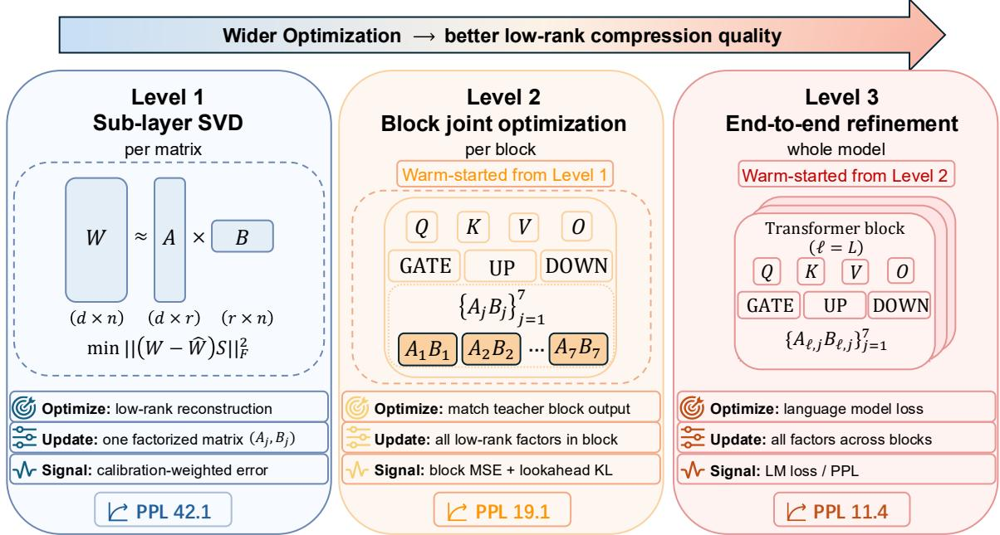  
Figure 1: Three-level compression chain. Each level widens the optimization scope and warm-starts from the previous solution using the same calibration budget. Numbers: LLaMA-7B WikiText-2 PPL at ρ=0.6. Each level reduces perplexity by roughly 2×.

In this paper, we argue that the unit of posttraining low-rank compression should not be the weight matrix but the computation graph over which truncation errors interact. Starting from whitened per-matrix SVD, we optimize the same low-rank factors at progressively larger scopes, first through each Transformer block’s nonlinear forward pass, then through the full model’s languagemodeling (LM) loss, using only the original 256 calibration sequences and adding no inference-time parameters. WikiText-2 validation is used only for L3 early stopping (Figure 1). On LLaMA-7B at 60% compression, WikiText-2 perplexity drops from 42.1 after per-matrix SVD to 19.1 after block-level optimization and 11.4 after full-model optimization, lower than SVD-LLM + Sequential LoRA (15.0) despite using 256 samples rather than 50K (Wang et al., 2025b). The same pattern holds across 20–80% compression (Tables 2 and 8), on held-out Penn Treebank (Marcus et al., 1993) (PTB) and C4 (Raffel et al., 2020), and on five architectures (Table 3). The block-level stage also acts as a regularizer: skipping it worsens out-ofdistribution (OOD) perplexity by 24 points, a gap that additional end-to-end training did not close in our experiments (§4.6). Our specific methodological contribution is the block objective of §3.2— cross-frontier reconstruction with a next-block vocabulary lookahead—together with the finding that widening optimization scope, rather than any single decomposition, closes most of the gap; we claim no novelty for whitened SVD, generic block-level recovery, or the LM loss on their own.

## 2 Background and Related Work

Per-Matrix SVD Compression. Post-training LLM compression spans quantization (Frantar et al., 2022; Lin et al., 2024), structured pruning (Frantar and Alistarh, 2023; Wei et al., 2024), and low-rank factorization. We focus on the last. Per-matrix SVD methods vary along three axes—objective design, error compensation, and rank allocation—but all factorize each weight matrix independently. On the objective side, SVD-LLM (Wang et al., 2025b) whitens activations so that the Frobenius surrogate reflects input statistics. ASVD (Yuan et al., 2023) scales weight columns by activation magnitudes before decomposition, and Dobi-SVD (Wang et al., 2025a) makes truncation differentiable for gradient-based tuning. For error compensation, SAES-SVD (Hu et al., 2026) adaptively suppresses the error that accumulates when sub-layers are compressed sequentially. Zero-Sum SVD (Abbasi et al., 2026) selects singular components globally via a zero-sum pruning rule, coupling rank decisions across sub-layers but leaving each matrix’s factorization fixed. For rank allocation, ARA (Xv et al., 2025) learns per-module rank budgets, Swift-SVD (Qi et al., 2026) obtains per-matrix solutions in closed form and selects allocations via grid search, and DipSVD (Ding et al., 2025) uses channel-weighted whitening and allocates ranks via Fisher sensitivity and effective rank. All these methods improve the per-matrix factorization or its rank budget, but do not jointly optimize across sub-layers within a block.

Beyond Per-Matrix Scope. Two lines of work widen the optimization scope beyond the individual matrices, but both remain limited. On the compression side, LiLlama (Sy et al., 2024) performs SVD-initialized per-block distillation with a hybrid ℓ +cosine loss and 13 M calibration tokens, and ERC-SVD (Bai et al., 2025) mitigates crosslayer error accumulation by leaving early layers uncompressed and applying residual SVD compensation to the rest. AA-SVD (Sinha and Fleuret, 2026) anchors each compressed layer’s output to the corresponding original output while adapting to input distribution shifts, then refines each Transformer block end-to-end to minimize block-level output distortion. Both still minimize a local reconstruction loss (per-block or per-matrix) rather than the end-to-end LM loss. On the recovery side, LoRA fine-tuning (Hu et al., 2021) on external data such as Alpaca can restore perplexity, but adds a data dependency absent from the compression step. Our block-level objective is related to knowledge distillation (Hinton et al., 2015), but operates on compressed computation graphs under a calibration-only budget. Few works systematically compare per-matrix, block, and full-model optimization scopes under a fixed calibration budget, and none study the block stage as a regularizer for end-to-end refinement.

Table 1 locates our block stage among these methods. AA-SVD overlaps with our cross-frontier

<table><tr><td>Method</td><td>signal</td><td>Block/local recovery LA LM</td></tr><tr><td>LiLlama AA-SVD</td><td>loçal feature distillation no no* original-output anchor- no no</td><td></td></tr><tr><td></td><td>ing under shifted inputs ERC-SVD residual compensation, no no</td><td></td></tr><tr><td>Ours</td><td>selective compression cross-frontier block re- yes yes construction</td><td></td></tr></table>

∗Not part of its core recovery procedure.

Table 1: Where our block-level stage sits among prior block and per-layer recovery methods. “LA” is whether the block objective penalizes a vocabularyspace shift measured through the following block (nextblock lookahead); “LM” is whether the low-rank factors are subsequently refined against the end-to-end language-modeling loss.

reconstruction in anchoring original outputs under shifted inputs; what distinguishes our stage is the next-block vocabulary lookahead, followed by factor-constrained LM-loss refinement under the same small calibration contract. We therefore present the per-matrix/block/full-model scope comparison as the broader empirical finding and cross-frontier plus lookahead (CF+LA) as the specific method contribution, claiming no novelty for whitened SVD, for generic block-level recovery, for the LM loss, or for cross-frontier anchoring alone. Our matched full-versus-skip controls support the complete block stage as a bridge to end-toend refinement; they do not isolate the individual contributions of cross-frontier reconstruction and lookahead, nor do they establish cross-architecture superiority over these methods.

## 3 Three-Level Optimization

When each weight matrix is compressed independently, the resulting errors interact through the Transformer block’s nonlinear forward pass in ways that per-matrix objectives cannot anticipate. Across blocks, these errors compound further, progressively degrading end-to-end performance. Our three-level chain counters this by widening the optimization scope at each stage. L1 performs whitened SVD on individual weights, serving as a strong per-matrix baseline (§3.1). L2 jointly optimizes all factors within each block to capture cross-sub-layer error interactions (§3.2). L3 extends optimization to the full model via end-to-end LM-loss refinement, correcting cross-block error accumulation (§3.3). Each level warm-starts from the previous solution, and all three use only the calibration set without external data.

In the following text, let $\mathcal { D } _ { \mathrm { c a l } } = \{ x _ { i } \} _ { i = 1 } ^ { N }$ be a calibration set of N token sequences shared by all three levels, where each $x _ { i } \stackrel { \cdot } { = } ( x _ { i } ^ { ( 1 ) } , \ldots , x _ { i } ^ { ( T _ { i } ) } )$ is a token sequence of length $T _ { i }$ . Consider a model with L Transformer blocks. Let $f _ { \ell } , \ell \in$ $\{ 0 , \ldots , L - 1 \}$ , denote the ℓ-th Transformer block with weight matrices $W _ { \ell , j } ~ \in ~ \mathbb { R } ^ { d _ { j } \times n _ { j } } , ~ j ~ \in ~ \mathcal { S }$ Here, without loss of generality, let the index set $S : = \{ q , k , v , o , \mathrm { g a t e } , \mathrm { u p } , \mathrm { d o w n } \}$ such that $W _ { \ell , j }$ represent the weight matrices of $Q \mathrm { - } , K \mathrm { - } , V \mathrm { - } ,$ and O-projections of the attention mechanism, and the gate, up, and down projections of the MLP, respectively.

Running the dense model on $\mathcal { D } _ { \mathrm { c a l } }$ produces hidden-state matrices $h _ { \ell } \in \mathbb { R } ^ { d \times T }$ with forward rule $h _ { \ell + 1 } = f _ { \ell } ( h _ { \ell } ; \{ W _ { \ell , j } \} )$ , where $\begin{array} { r } { T = \sum _ { i = 1 } ^ { N } T _ { i } } \end{array}$ is the total number of tokens, and $h _ { 0 }$ is the token embeddings of the calibration sequences.

## 3.1 Per-Matrix Whitened SVD (L1)

L1 follows the whitened SVD procedure of SVD-LLM (Wang et al., 2025b). Given the removal ratio $\rho \in ( 0 , 1 )$ indicating the fraction of parameters removed per weight matrix, the L1 finds the low-rank approximation of each weight matrix as $W _ { \ell , j } \approx _ { \mathcal { D } _ { \mathrm { c a l } } } A _ { \ell , j } B _ { \ell , j }$ based on the calibration data $\mathcal { D } _ { \mathrm { c a l } }$ , where $A _ { \ell , j } \in \mathbb { R } ^ { d _ { j } \times r _ { j } } , B _ { \ell , j } \in \mathbb { R } ^ { r _ { j } \times n _ { j } }$ , and the rank $r _ { j } = \lfloor \left( 1 - \rho \right) d _ { j } n _ { j } / ( d _ { j } + n _ { j } ) \rfloor$

Specifically, for the weight matrix $W _ { \ell , j }$ with activation $X _ { \ell , j }$ , L1 solves

$$
\operatorname* { m i n } _ { A _ { \ell , j } , B _ { \ell , j } } \| ( W _ { \ell , j } - A _ { \ell , j } B _ { \ell , j } ) X _ { \ell , j } \| _ { F } ^ { 2 } .\tag{1}
$$

From (Wang et al., 2025b; Eckart and Young, 1936), the analytical solution is given by

$$
A _ { \ell , j } = U _ { r _ { j } } \sqrt { \Sigma _ { r _ { j } } } , B _ { \ell , j } = \sqrt { \Sigma _ { r _ { j } } } V _ { r _ { j } } S ^ { - 1 } ,\tag{2}
$$

where $U _ { r _ { j } } \Sigma _ { r _ { j } } V _ { r _ { i } } ^ { \top }$ is the rank-rj truncated SVD of $W _ { \ell , j } S _ { \ell , j }$ $S _ { \ell , j }$ is the lower Cholesky factor of the activation covariance $X X ^ { \top }$

Although L1 attains the theoretical optimum in terms of the activation-aware Frobenius distance for each weight matrix independently, it neglects the cross-interactions among the attention projections and the MLP projections. As these per-matrix errors propagate through the block’s nonlinear forward pass, they accumulate in ways a per-matrix objective cannot capture. Hence, even a globally optimal per-matrix approximation still underperforms the dense model, motivating our block-level joint optimization in L2.

## 3.2 Block-Level Joint Optimization (L2)

L2 jointly optimizes all low-rank factors within a block (Algorithm 1), allowing approximation errors to be redistributed across attention and MLP components – a form of error compensation that is infeasible under per-matrix optimization.

The block loss is defined by

$$
\begin{array} { r } { \mathcal { L } _ { \ell } = \mathcal { L } _ { \mathrm { r e c } } + \lambda _ { \mathrm { l a } } \mathcal { L } _ { \mathrm { l a } } , } \end{array}\tag{3}
$$

where ${ \mathcal { L } } _ { \mathrm { r e c } }$ measures the accumulated reconstruction error between the compressed and original blocks, and $\mathcal { L } _ { \mathrm { l a } }$ is a look-ahead term that penalizes errors amplified by the next block, with coefficient $\lambda _ { \mathrm { l a } } > 0 .$

Let $\hat { h } _ { \ell + 1 } = f _ { \ell } ( \hat { h } _ { \ell } ; \{ A _ { \ell , j } B _ { \ell , j } \} )$ denote the compressed hidden-state matrices with initialization $\hat { h } _ { 0 } = h _ { 0 }$ . Then, the reconstruction error is defined as the Euclidean distance

$$
\begin{array} { r } { \mathcal { L } _ { \mathrm { r e c } } = \left\| h _ { \ell + 1 } - \hat { h } _ { \ell + 1 } \right\| _ { F } ^ { 2 } . } \end{array}\tag{4}
$$

Minimizing ${ \mathcal { L } } _ { \mathrm { r e c } }$ requires the compressed block to reproduce the original output $h _ { \ell + 1 }$ from a degraded input $\hat { h } _ { \ell }$ , compensating for drift accumulated across preceding blocks. However, this objective cannot capture the amplification of these errors by downstream blocks.

To capture the downstream impact of compressing block $\ell ,$ we propagate the hidden states through the frozen next block $f _ { \ell + 1 }$ and introduce a perblock probe matrix $P _ { \ell + 1 } \in \mathbb { R } ^ { | V | \times d }$ that projects the intermediate output of the $\ell + 1 \mathtt { - t h }$ block to the vocabulary space, acting as a temporary training-only surrogate for the remaining layers and the final vocabulary projection $W _ { \mathrm { h e a d } }$ . Specifically, $P _ { \ell }$ is trained on the calibration set so that softmax( $P _ { \ell } \bar { h } _ { \ell + 1 } / \tau )$ approximates the token distribution softmax $( W _ { \mathrm { h e a d } } \bar { h } _ { L } / \tau )$ produced by the full model, where $\bar { \cdot } : = \mathrm { R M S N o r m } ( \cdot )$ and $\tau > 0$ is a temperature hyperparameter. Since columns of both quantities lie on the probability simplex after softmax normalization, their discrepancy can be measured by the Kullback–Leibler (KL) divergence. We train each probe by minimizing

$$
\begin{array} { r } { \mathcal { L } _ { P _ { \ell } } = \displaystyle \sum _ { i = 1 } ^ { T } D _ { \mathrm { K I } } ( \mathrm { s o f t m a x } ( W _ { \mathrm { h e a d } } \bar { h } _ { L } ^ { ( i ) } / \tau ) \| } \\ { \mathrm { s o f t m a x } ( P _ { \ell } \bar { h } _ { \ell + 1 } ^ { ( i ) } / \tau ) ) , } \end{array}\tag{5}
$$

where $\it { h ^ { ( i ) } }$ represents the i-th column of h. With

Algorithm 1 Block-Level Joint Optimization (L2).   
Require: Original weights $\{ W _ { \ell , j } \} _ { \ell = 0 , j = 1 } ^ { L - 1 , 7 }$ , L1   
results $\{ \{ A _ { \ell , j } , B _ { \ell , j } \} _ { j \in { \mathcal { S } } } \} _ { \ell = 0 } ^ { L - 1 } ,$ calibration   
dataset $\mathcal { D } _ { \mathrm { c a l } } .$ , look-ahead coefficient $\lambda _ { \mathrm { l a } }$   
1: $\{ h _ { 0 } , \ldots , h _ { L } \}$ ← collect hidden states on $\mathcal { D } _ { \mathrm { c a l } }$   
2: $\hat { h } _ { 0 }  h _ { 0 }$   
3: for $\ell = 0$ to $L - 1$ do   
4: $P _ { \ell + 1 } $ arg min $\mathcal { L } _ { P _ { \ell + 1 } }$   
5: $\{ A _ { \ell , j } , B _ { \ell , j } \} _ { j \in \mathcal { S } }  \mathrm { a r g }$ min $\mathcal { L } _ { \ell }$   
6: $\hat { h } _ { \ell + 1 } \gets f _ { \ell } ( \hat { h } _ { \ell } ; \{ A _ { \ell , j } B _ { \ell , j } \} )$   
7: end for   
8: return optimized $\{ \{ A _ { \ell , j } , B _ { \ell , j } \} _ { j \in { \cal S } } \} _ { \ell = 0 } ^ { L - 1 } .$

$P _ { \ell }$ fixed, we define the vocabulary distributions

$$
p _ { \ell + 1 } = \mathrm { s o f t m a x } \big ( P _ { \ell + 1 } \bar { f } _ { \ell + 1 } \big ( h _ { \ell + 1 } \big ) / \tau \big ) ,\tag{6}
$$

$$
\begin{array} { r } { \hat { p } _ { \ell + 1 } = \mathrm { s o f t m a x } \big ( P _ { \ell + 1 } \bar { f } _ { \ell + 1 } \big ( \hat { h } _ { \ell + 1 } \big ) / \tau \big ) , } \end{array}\tag{7}
$$

where $\bar { f } _ { \ell + 1 } : =  \mathrm { { R M S N o r m } }$ $f _ { \ell + 1 }$ , and weights are omitted. Then, the look-ahead loss is given by

$$
\mathcal { L } _ { \mathrm { l a } } = \sum _ { i = 1 } ^ { T } D _ { \mathrm { K L } } \Big ( p _ { \ell + 1 } ^ { ( i ) } \| \hat { p } _ { \ell + 1 } ^ { ( i ) } \Big )\tag{8}
$$

which measures the next-block distributional shift of token prediction induced by the compression error. For the final block $( \ell = L - 1 )$ , no subsequent block is available for look-ahead. We set $\lambda _ { \mathrm { l a } } = 0$ and optimize ${ \mathcal { L } } _ { \mathrm { r e c } }$ only. The look-ahead captures the sensitivity of the immediate next block, but multi-block error cascades remain invisible to L2 and motivate the end-to-end L3 stage.

## 3.3 End-to-End LM-Loss Refinement (L3)

L2 widens optimization scope from individual matrices to blocks, but processes blocks sequentially with detached gradients, so cross-block error accumulation is not captured. L3 completes the progression to the full model by minimizing the standard autoregressive next-token prediction loss over $\mathcal { D } _ { \mathrm { c a l } }$ The low-rank factors $\{ A _ { \ell , j } , B _ { \ell , j } \}$ are warm-started from L2 and updated end-to-end. The objective is the standard next-token cross-entropy

$$
\mathcal { L } _ { \mathrm { L 3 } } = - \sum _ { i = 1 } ^ { N } \sum _ { t = 1 } ^ { T _ { i } } \log p \big ( x _ { i } ^ { ( t + 1 ) } \mid x _ { i } ^ { ( 1 ) } , . . . , x _ { i } ^ { ( t ) } \big ) ,\tag{9}
$$

where $p ( x _ { i } ^ { ( t + 1 ) } \mid x _ { i } ^ { ( 1 ) } , . . . , x _ { i } ^ { ( t ) } )$ is the compressed model’s next-token probability computed with all weights $W _ { \ell , j }$ replaced by their low-rank factors $A _ { \ell , j } B _ { \ell , j }$ as the trainable variables. Unlike SVD LLM’s Sequential LoRA, which freezes the SVD factors and trains additional weight matrices on external samples, L3 optimizes the existing factors without additional parameters or data.

## 4 Experiments

We evaluate the three-level chain along five dimensions: overall performance against SVD-family baselines (§4.2), sensitivity to compression ratio (§4.3), portability across architectures (§4.4), ablation of key design choices (§4.6), and compute/deployment efficiency (§4.5).

## 4.1 Setup

Baselines. We compare against five SVD-family baselines: ASVD (Yuan et al., 2023), SVD-LLM (Wang et al., 2025b), Dobi-SVD (Wang et al., 2025a), DipSVD (Ding et al., 2025), and SAES-SVD (Hu et al., 2026). Baseline numbers are from (Hu et al., 2026) under a unified evaluation protocol (same calibration data and evaluation harness). Our numbers use the same pipeline with identical hyperparameters except for the L2/L3 stages. SVD-LLM + Sequential LoRA (Wang et al., 2025b), which uses 50K external Alpaca samples, is compared in §4.2. LiLlama (Sy et al., 2024) trains on 13M tokens. We compare under our budget in Appendix A.

Models and Datasets. We evaluate on LLaMA-7B (Touvron et al., 2023a) at $\rho \in \ \{ 0 . 2 , 0 . 4 , 0 . 6 , 0 . 8 \}$ Cross-architecture results on Mistral-7B (Jiang et al., 2023), OPT-6.7B (Zhang et al., 2022), LLaMA-2-7B, and LLaMA-2-13B (Touvron et al., 2023b) appear in §4.4. All methods use the same 256 WikiText-2 (Merity et al., 2016) calibration sequences (2048 tokens each) from the training split. Perplexity is evaluated on the test splits of WikiText-2 and PTB, and the C4 validation set.

Evaluation. We report WikiText-2, PTB, and C4 perplexity, and seven zero-shot downstream tasks (OpenBookQA, ARC-e, ARC-c, WinoGrande, HellaSwag, PIQA, MathQA) via lm-evaluation-harness v0.4.

Implementation Details. Our method applies a uniform rank per weight matrix (§3.1). Methods marked ∗ in Table 2 use their original non-uniform rank allocation. Lookahead probes $P _ { \ell }$ are trained with Adam (lr 10−3, 200 steps). L2 uses Adam (lr 10−4) with early stopping per block. L3 uses AdamW ( $\mathrm { l r ~ 2 \times 1 0 ^ { - 5 } }$ , warmup 10 + cosine decay)

<table><tr><td colspan="2"></td><td colspan="3">Perplexity ↓</td><td colspan="8">Zero-Shot Accuracy (%) ↑</td><td></td></tr><tr><td>ρ</td><td>Method</td><td>Wiki</td><td>PTB</td><td>C4</td><td>Openb.</td><td>ARCe</td><td>ARCc</td><td></td><td>WinoG.</td><td>HellaS.</td><td>PIQA</td><td>MathQA</td><td>Avg.↑</td></tr><tr><td></td><td>Uncompressed</td><td>5.68</td><td>8.35</td><td>7.34</td><td>28.0</td><td>67.0</td><td>38.0</td><td>67.0</td><td></td><td>56.0</td><td>78.0</td><td>27.0</td><td>51.6</td></tr><tr><td rowspan="6">0.2</td><td>ASVD†</td><td>11.1</td><td>16.6</td><td>15.9</td><td>25.0</td><td>53.0</td><td>27.0</td><td></td><td>64.0</td><td>41.0</td><td>68.0</td><td>24.0</td><td>43.1</td></tr><tr><td> $\mathbf { S } \mathbf { V } \mathbf { D } \mathbf { - } \mathbf { L } \mathbf { L } \mathbf { M } ^ { \dagger }$ </td><td>7.94</td><td>16.2</td><td>15.8</td><td>22.0</td><td>58.0</td><td>29.0</td><td></td><td>63.0</td><td>43.0</td><td>69.0</td><td>24.0</td><td>44.0</td></tr><tr><td>Dobi  $\boldsymbol { \cdot } \boldsymbol { \mathrm { S } } \boldsymbol { \mathrm { V } } \boldsymbol { \mathrm { D } } ^ { * \dagger }$ </td><td>8.54</td><td>14.8</td><td>10.0</td><td>26.0</td><td>59.0</td><td>31.0</td><td></td><td>66.0</td><td>44.0</td><td>70.0</td><td>23.0</td><td>45.6</td></tr><tr><td>DipSVD*</td><td>7.95</td><td>15.6</td><td>14.1</td><td>27.0</td><td>63.0</td><td></td><td>33.0</td><td>64.0</td><td>45.0</td><td>71.0</td><td>24.0</td><td>46.7</td></tr><tr><td>SÁES-SVD</td><td>7.17</td><td>15.2</td><td>13.8</td><td>29.0</td><td>68.0</td><td></td><td>36.0</td><td>65.0</td><td>45.0</td><td>75.0</td><td>25.0</td><td>49.0</td></tr><tr><td>Ours (L3)</td><td>6.47</td><td>14.1</td><td>13.5</td><td>29.8</td><td>70.0</td><td>35.0</td><td></td><td>66.0</td><td>47.6</td><td>71.7</td><td>26.4</td><td>49.5</td></tr><tr><td rowspan="6">0.4</td><td>ASVD†</td><td>&gt;1k</td><td>&gt;3k</td><td>&gt;1k</td><td>13.0</td><td>28.0</td><td>22.0</td><td>48.0</td><td>26.0</td><td></td><td>55.0</td><td>19.0</td><td>30.1</td></tr><tr><td> $\mathbf { S } \mathbf { V } \mathbf { D } \mathbf { - } \mathbf { L } \mathbf { L } \mathbf { M } ^ { \dagger }$ </td><td>13.1</td><td>63.8</td><td>49.8</td><td>19.0</td><td>42.0</td><td>25.0</td><td></td><td>58.0</td><td>33.0</td><td>60.0</td><td>21.0</td><td>36.9</td></tr><tr><td> $\mathrm { D o b i - S V D ^ { * \dagger } }$ </td><td>13.5</td><td>46.4</td><td>23.5</td><td>22.0</td><td>41.0</td><td>27.0</td><td></td><td>58.0</td><td>34.0</td><td>61.0</td><td>23.0</td><td>38.0</td></tr><tr><td> ${ \mathrm { D i p S V D } } ^ { * }$ </td><td>12.8</td><td>47.0</td><td>34.4</td><td>22.0</td><td>50.0</td><td>30.0</td><td></td><td>61.0</td><td>36.0</td><td>64.0</td><td>22.0</td><td>40.7</td></tr><tr><td>SÁES-SVD</td><td>10.4</td><td>45.1</td><td>32.8</td><td>23.0</td><td>50.0</td><td>29.0</td><td></td><td>62.0</td><td>36.0</td><td>65.0</td><td>23.0</td><td>41.1</td></tr><tr><td>Ours (L3)</td><td>7.72</td><td>31.3</td><td>25.7</td><td>24.2</td><td>59.8</td><td>29.9</td><td></td><td>62.0</td><td>40.4</td><td>65.6</td><td>24.4</td><td>43.8</td></tr><tr><td rowspan="5">0.6</td><td>ASVD†</td><td>&gt;60k</td><td>&gt;40k</td><td>&gt;400k</td><td>12.0</td><td>26.0</td><td>21.0</td><td>49.0</td><td></td><td>26.0</td><td>53.0</td><td>18.0</td><td>29.3</td></tr><tr><td> $\mathbf { S } \mathbf { V } \mathbf { D } \mathbf { - } \mathbf { L } \mathbf { L } \mathbf { M } ^ { \dagger }$ </td><td>53.7</td><td>400</td><td></td><td>300</td><td>14.0</td><td>28.0</td><td>22.0</td><td>50.0</td><td>27.0</td><td>55.0</td><td>21.0</td><td>31.0</td></tr><tr><td>Dobi-SVD*†</td><td>46.2</td><td>200</td><td>200</td><td>15.0</td><td>31.0</td><td>20.0</td><td></td><td>52.0</td><td>28.0</td><td>54.0</td><td>22.0</td><td>31.7</td></tr><tr><td>SAES-SVD</td><td>22.0</td><td>117</td><td>94.0</td><td>16.0</td><td>33.0</td><td></td><td>25.0</td><td>52.0</td><td>30.0</td><td>54.0</td><td>23.0</td><td>33.3</td></tr><tr><td>Ours (L3)</td><td>11.4</td><td>62.8</td><td>57.2</td><td>17.4</td><td>41.2</td><td>22.4</td><td></td><td>55.9</td><td>32.2</td><td>57.9</td><td>22.1</td><td>35.6</td></tr></table>

Table 2: Comparison with SVD-family methods on LLaMA-7B. Symbols follow (Hu et al., 2026): † denotes fine-tuning in the source protocol; ∗ denotes mixed-rank allocation. All methods use 256 WikiText-2 calibration samples. Baseline numbers from (Hu et al., 2026), our rows evaluated with lm-eval-harness v0.4. Zero-shot accuracy may differ across harness versions. DipSVD is absent at $\rho { = } 0 . 6$ because the original paper reports only $\rho \leq 0 . 5$

with early stopping on the WikiText-2 validation split. Full hyperparameters are in Appendix 11.

## 4.2 Overall Performance

Comparison with SVD-Family Methods. L3 achieves the lowest WikiText-2 perplexity and highest zero-shot average at every tested ratio (Table 2), with gains widening at aggressive compression. At $\rho { = } 0 . 6 , \mathrm { L } 3$ nearly halves SAES-SVD’s perplexity using only 256 calibration sequences, without external data, whereas SVD-LLM + Sequential LoRA requires 50K Alpaca samples (Wang et al., 2025b) yet reaches only 15.0. Zero-shot accuracy also improves on most tasks (Table 2), though all compressed states stay well below the dense model, so we read zero-shot accuracy as a retention diagnostic rather than as evidence of preserved capability (Appendix D).

Comparison with LiLlama. LiLlama (Sy et al., 2024) is the closest prior block-level SVD method, making it a natural test of whether our L2 gains stem from joint optimization itself or from the MSE + lookahead KL objective. We reproduce its perblock distillation under our 256-sample budget (Appendix A) and separate three distinct properties. On standalone quality, our LiLlama-style reproduction is stronger on every reported LLaMA-7B final metric, including WikiText-2 perplexity (10.5 vs. 11.4)

and zero-shot average (43.9% vs. 35.6%; Table 7); we claim no uniform quality advantage over it. On offline cost, our retained logs lack matched hardware metadata, so a compute-matched comparison is unavailable and we make no speedup claim. On L3 composability, under our matched $2 \times 1 0 ^ { - 5 }$ refinement recipe on Mistral-7B, WikiText-2 validation selects step 0 and the re-evaluated perplexity is 29.04/738.20/164.46 on WikiText-2/PTB/C4: a favourable local-recovery solution need not be an L3-friendly warm start. LiLlama’s own budget is far larger—13M Slim-Orca tokens at 20% reduction, and 191M tokens for its reported 40%- compressed Mistral recovery—so we read this as warm-start and schedule sensitivity under our 60%- removal, 256-sequence protocol, not as a universal or unfixable defect; spectral renormalization remains untested (Figure 5).

## 4.3 Ratio Sensitivity

The hierarchy’s benefit grows with compression aggressiveness (Figure 2; Appendix B). L1 alone suffices at $\rho { = } 0 . 2$ , where L2/L3 add little. The gap widens at $\rho { = } 0 . 6$ (L2 reduces L1’s perplexity by ${ \sim } 2 \times$ . L3 closes half the remaining gap) and becomes essential at $\rho { = } 0 . 8 ,$ , where the three levels together yield a ${ \sim } 2 2 \times$ cumulative reduction. In practice, L1+L2 captures most of the gain. L3 is most worthwhile when OOD robustness matters or compression exceeds 50%.

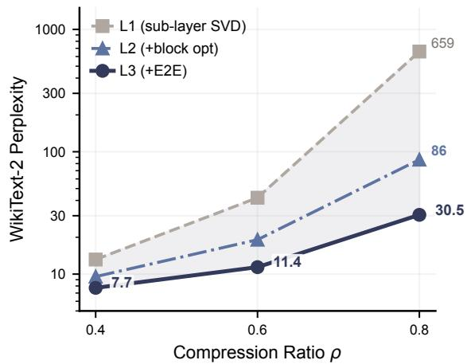  
Figure 2: WikiText-2 perplexity (log scale) vs. compression ratio on LLaMA-7B. The shaded region shows the hierarchy’s cumulative gain (L1→L3). L1 captures most of the gain at $\rho { = } 0 . 2 ,$ , but all three levels are needed at $\rho { = } 0 . 8 .$

## 4.4 Cross-Architecture Portability

The chain improves all five models at $\rho { = } 0 . 6 ,$ though the per-level contributions are architecturedependent (Table 3; Figure 6). On LLaMA-7B, L2 provides most of the OOD repair; L3 reduces perplexity further across all three test sets. On Mistral-7B, L2 halves WikiText-2 perplexity, but L3 provides the larger downstream-accuracy gain. OPT-6.7B shows the largest collapse-and-recovery pattern, with L3 reaching the best downstream accuracy in the table. LLaMA-2-13B extends the trend beyond 7B. LLaMA-2-7B is the outlier: WikiText-2 and C4 improve, but PTB remains high, partly reflecting the dense model’s own domain sensitivity, though the large amplification warrants further investigation. These rows were produced with architecture-specific configurations rather than one common protocol, so we report the per-model outcomes descriptively and do not attribute the differences among them to architecture alone; separating those factors would require matched interventions on grouped-query attention, sliding-window attention, residual scaling, or other architectural choices.

## 4.5 Compute and Deployment Efficiency

The three-level chain spends offline compute to gain compression fidelity, and the factored model reduces parameter memory at inference (Table 4). Our retained run logs do not record hardware metadata, so we report correctly scoped per-stage timers rather than a hardware-attributed total: averaged over three runs, L1 takes 17.3 min, L2 13.76 h, and L3 42.4 min, with the sequential per-block loop accounting for 13.59 h (98.8%) of L2 and probe fitting roughly 6 min. The block loop, not probe fitting, therefore dominates the block-level stage. These timers exclude loading, serialization, and final perplexity evaluation, and the implementation is unoptimized, so they do not establish a hardware-matched break-even point against training-free baselines; latency amortization remains unquantified. At inference, the factored representation reduces parameter count by ∼58% and peak GPU memory by 49–56% across architectures. Prefill latency is unchanged; batch-1 decode is 6–14% slower (Table 4) because each projection executes two unfused GEMMs, which adds kernel-launch and memory-access overhead. The slowdown is thus specific to this eager, unfused factorized implementation rather than inherent to low-rank arithmetic; kernel fusion, CUDA graphs, and compilation are plausible remedies we have not validated. The demonstrated deployment-side benefit is lower parameter memory and peak VRAM, and we make no general deployment-time claim. The factored matrices $A _ { j } , B _ { j }$ can also be quantized to INT8 or INT4 for additional savings, as low-rank projection and quantization (Frantar et al., 2022) occupy orthogonal points on the compression Pareto frontier.

<table><tr><td>Model</td><td>Stage Wiki↓</td><td>PTB↓</td><td>C4↓ Avg. ↑</td></tr><tr><td rowspan="2">LLaMA-7B</td><td>L1</td><td>42.1</td><td>182 201</td><td rowspan="2">33.2 35.3 37.8</td></tr><tr><td>L2</td><td>19.1 11.4</td><td>95.8 91.8 57.2</td></tr><tr><td rowspan="4">Mistral-7B</td><td>L3</td><td></td><td>62.8</td><td></td></tr><tr><td>L1</td><td>71.8 34.0</td><td>770 439 182</td><td>31.0 32.7</td></tr><tr><td>L2 L3</td><td>14.2</td><td>371 219 85.5</td><td>36.1</td></tr><tr><td></td><td></td><td></td><td>31.8</td></tr><tr><td rowspan="3">LLaMA-2-7B</td><td>L1</td><td>81.5</td><td>1757 567</td><td>33.9</td></tr><tr><td>L2</td><td>31.8</td><td>1438 169</td><td></td></tr><tr><td>L3</td><td>18.1</td><td>1235 87.1</td><td>34.3</td></tr><tr><td rowspan="3">OPT-6.7B</td><td>L1</td><td>42.9</td><td>1889 282</td><td>33.9 36.8</td></tr><tr><td>L2</td><td>26.0</td><td>79.6 96.0</td><td>39.7</td></tr><tr><td>L3</td><td>18.3</td><td>52.9 68.3</td><td></td></tr><tr><td rowspan="3">LLaMA-2-13B</td><td>L1</td><td>42.3</td><td>1042 277</td><td>33.0</td></tr><tr><td>L2</td><td>21.8</td><td>615 119</td><td>34.7</td></tr><tr><td>L3</td><td>11.2</td><td>513 62.4</td><td>37.4</td></tr></table>

Table 3: Cross-architecture L1→L2→L3 at $\rho { = } 0 . 6 .$ Perplexity on WikiText-2, PTB, and C4; Avg. is zero-shot accuracy over ARC-e, HellaSwag, MathQA, OBQA, PIQA, WinoGrande. WikiText-2 trend visualized in Figure 6.

<table><tr><td>Model</td><td></td><td>Par. (M)↓ Mem (GB)</td><td>Pref. (ms) Gen↑</td></tr><tr><td rowspan="2">LLaMA-7B</td><td>Base</td><td>6738</td><td>14.6G 286</td></tr><tr><td>L3</td><td>2853</td><td>43.2 7.4G 284 39.3</td></tr><tr><td rowspan="2">Mistral-7B</td><td>Base</td><td>7248</td><td>14.9G 287</td></tr><tr><td>L3</td><td>3060</td><td>41.8 7.1G 275 37.7</td></tr><tr><td rowspan="2">OPT-6.7B</td><td>Base</td><td>6659</td><td>14.5G 254 60.8</td></tr><tr><td>L3</td><td>2792</td><td>6.3G 256 52.1</td></tr></table>

Table 4: Deployment efficiency at $\rho { = } 0 . 6$ (fp16, bs=1, $\scriptstyle { \mathrm { s e q } } = 2 0 4 8 )$ Gen = decode throughput (tok/s, 64 tokens). Relative decode throughput in the same eager benchmark is 0.91× (LLaMA-7B), 0.90× (Mistral-7B), 0.94× (LLaMA-2-7B) and 0.86× (OPT-6.7B); no comparable LLaMA-2-13B measurement is available.

## 4.6 Ablation Study

Target Choice and Lookahead. The lookahead probe is the single most impactful design choice in L2, amplifying perplexity reduction by 2−3× over target choice alone (Table 5a). Without LA, both targets reduce Mistral-7B WikiText-2 by only 20– 23% relative to L1; with LA the reduction reaches 53–59% (Table 5a). On LLaMA-7B, LA further improves already-helpful no-LA variants. We adopt CF+LA as the default: SI+LA wins on Mistral-7B, but CF+LA provides the best single configuration across both architectures (Table 5a). We attribute the architecture gap to the fact that block MSE weights all hidden directions equally, while the downstream loss amplifies errors in directions with small hidden-state norms. The lookahead probe’s vocabulary-space KL signal addresses this mismatch.

Block-Level Optimization. L2 is not redundant with L3: skipping it preserves in-distribution perplexity, but degrades OOD transfer by 24 points on PTB (Table 5b). The full chain early-stops sooner with better OOD metrics, while skip-L2 trains longer yet produces worse OOD perplexity (Figure 7): additional LM-loss training did not recover the regularization that L2’s hidden-state matching provides under the tested learning-rate schedules. This direction is not specific to one calibration draw: across three end-to-end pipeline seeds, in which each seed resamples L1 calibration sampling and L2/L3 randomness, the full chain attains lower WikiText-2, PTB and C4 perplexity than skip-L2 for every seed (Table 12). Three seeds establish a consistent direction with variable effect size, not low variance or arbitrary-seed robustness.

Calibration Budget. Block-level optimization caches full hidden states, so practical deployments

<table><tr><td>Model</td><td>Config</td><td>Target LA</td><td>Wiki↓</td><td>PTB↓</td></tr><tr><td rowspan="3">Mistral-7B</td><td>L1 baseline L2 (SI)</td><td>SI</td><td>71.8 no</td><td>770 631</td></tr><tr><td>L2 (CF)</td><td>CF no</td><td>57.5 55.6</td><td>649</td></tr><tr><td>L2 (SI+LA)</td><td>SI yes</td><td>29.5</td><td>318</td></tr><tr><td rowspan="5">LLaMA-7B</td><td>L2 (CF+LA)</td><td>CF</td><td>yes 34.0</td><td>374</td></tr><tr><td>L1 baseline</td><td>—</td><td>42.1</td><td>182</td></tr><tr><td>L2 (SI)</td><td>SI</td><td>no 38.0</td><td>253</td></tr><tr><td>L2 (CF)</td><td>CF</td><td>no 35.4</td><td>275</td></tr><tr><td>L2 (SI+LA) L2 (CF+LA)</td><td>SI yes CF yes</td><td>28.3 24.8</td><td>165 146</td></tr></table>

(a) Target and lookahead ablation $( \rho { = } 0 . 6 ,$ , 20 Adam steps/block). SI = same-input: target is $f _ { \ell } ( h _ { \ell } ^ { \mathrm { c o m p } } )$ ; CF = crossfrontier: target is $h _ { \ell + 1 } ^ { \mathrm { o r i g } }$ ; LA = lookahead probe (§3.2).
<table><tr><td>Path</td><td>LR</td><td>Step</td><td>Wiki↓</td><td>PTB↓</td><td>C4↓</td></tr><tr><td>L1→L2→L3</td><td>5e-6</td><td>100</td><td>11.95</td><td>64.74</td><td>52.21</td></tr><tr><td>L1→L2→L3</td><td>2e-5</td><td>40</td><td>11.37</td><td>62.67</td><td>57.24</td></tr><tr><td> $\mathrm { L } 1 {  } \mathrm { L } 3 ^ { \prime }$ </td><td>5e-6</td><td>90</td><td>11.91</td><td>107.79</td><td>58.51</td></tr><tr><td> $\mathrm { L } 1 {  } \mathrm { L } 3 ^ { \prime }$ </td><td>2e-5</td><td>100</td><td>11.90</td><td>86.87</td><td>60.24</td></tr></table>

(b) Effect of L2 under a fixed 256-sample budget. L3′: LMloss applied directly to L1 factors. These rows come from the submitted learning-rate sweep; Table 6 reports the matched fixed-budget comparison used for the data-versus-compute analysis, and Table 12 the corresponding multi-seed check.

## Table 5: Ablation studies $\scriptstyle ( \rho = 0 . 6 )$

may be limited to small calibration sets. L2’s OOD advantage grows as calibration data shrinks (Figure 3): the PTB gap between the full chain and skip-L2 more than triples from 256 to 32 samples. L2’s block-level regularization is most valuable under data scarcity (Appendix C).

Can More Data Replace L2? Because L2 spends offline compute rather than data, the natural alternative is to skip it and enlarge the calibration pool instead. On the seed-42 path this is effective (Table 6): skip-L2 at 1024 sequences reaches lower WikiText-2 and PTB perplexity than the full chain at 256, while remaining 1.18 PPL worse on C4. An exposure control rules out the longer schedule as the explanation— running skip-L2 at pool 256 for the same 160 optimizer steps, 640 draws and 1.311M tokens as the pool-1024 run leaves the WikiText-2 selection rule choosing the elementwise-identical step-45 factors. We therefore read L2 as trading offline compute for calibration data rather than as uniformly necessary: it helps under a strict 256-sequence budget, while a larger pool makes skip-L2 a competitive cross-budget alternative. The full chain at pool 1024 remains untested. Expressed as additive next-token negative loglikelihood, the mean full-versus-skip gain at pool

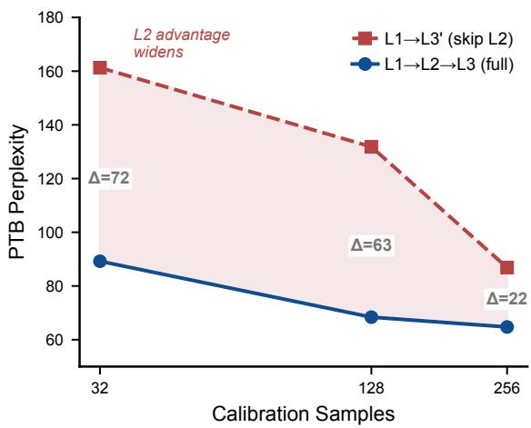

Figure 3: PTB test perplexity vs. calibration budget (LLaMA-7B, $\rho { = } 0 . 6 )$ . L2’s OOD advantage grows from $\Delta { = } 2 2$ at 256 samples to $\Delta { = } 7 2$ at 32 samples.
<table><tr><td>Path</td><td>Pool Wiki↓ PTB↓ C4↓</td></tr><tr><td>Skip-L2</td><td>256 11.97 91.44 59.71</td></tr><tr><td>Skip-L2 512 11.30</td><td>67.15</td></tr><tr><td>1024 10.71</td><td>56.77 65.61 49.70</td></tr><tr><td>Skip-L2 Full chain 256</td><td>11.41 67.64 48.53</td></tr></table>

Table 6: Trading calibration data for the block-level stage (LLaMA-7B, $\rho { = } 0 . 6 .$ seed-42 path). Enlarging the pool lets skip-L2 match or beat the full chain on WikiText-2 and PTB, but not on C4. Within each pair the arms share L1 factors, rank allocation, the L3 seed and schedule, and the WikiText-2 selection rule; the designed difference is the presence of L2.

256 is 0.070/0.335/0.172 nats/token on WikiText-2/PTB/C4, against 0.112/0.332/0.184 for moving skip-L2 from pool 256 to 1024—comparable in magnitude, which is what makes the two routes substitutable at this budget.

Level Contributions. Each level addresses a distinct error scale: L1 provides per-matrix initialization, L2 captures cross-sub-layer interactions within each block, and L3 corrects cross-block accumulation.

## 5 Discussion

Compression Error at Multiple Interaction Scales. Low-rank compression error arises at distinct structural scales, and block-internal coupling is the largest single source of recoverable degradation. The L1→L2 transition accounts for more than half of the total perplexity reduction on LLaMA-7B, while L2→L3 closes much of the remaining gap (§4.2). The balance is architecture-dependent (on Mistral-7B, L3 provides the larger gain; Table 3), but L2 helps on all five models.

L2 as OOD Regularizer. Block-level optimization also serves a role that perplexity alone does not reveal: it preserves out-of-distribution transfer. Block-level MSE forces the compressed block to reproduce the hidden-state distribution of the original, including directions that the LM loss on calibration tokens alone does not reward, analogous to “dark knowledge” in soft-target distillation (Hinton et al., 2015). The skip-L2 ablation (§4.6) confirms this: in-distribution perplexity matches, yet PTB degrades by 24 points, and the penalty triples under data scarcity (Figure 3), consistent with the spectral-norm amplification observed when L2 uses a scale-invariant loss (Appendix A).

When to Use Each Level. Together, these observations suggest a practical guideline. At mild compression $( \rho \le 0 . 2 )$ , L1 alone captures most of the gain, though L3 still improves WikiText-2 perplexity. At moderate compression $\scriptstyle \left( \rho = 0 . 4 - 0 . 6 \right)$ , L2 captures most of the robustness gain. L3 is worthwhile when OOD behavior matters or computation permits. At aggressive compression $( \rho ~ \ge ~ 0 . 8 )$ the full chain is needed; under severe calibration scarcity the block-level stage still protects PTB but no longer dominates on WikiText-2 or C4 (Table 10). These guidelines derive from LLaMA-7B and may shift for other architectures.

## 6 Conclusion

We presented a three-level chain that widens SVDbased compression from individual matrices to Transformer blocks to the full model, using only 256 calibration sequences. On LLaMA-7B at 60% compression, the chain reduces WikiText-2 perplexity from 42.1 to 11.4, below SVD-LLM + 50Ksample LoRA (15.0), with gains across five architectures whose runs use architecture-specific configurations rather than one common protocol. The block-level stage matters for OOD robustness under this budget: skipping it costs 24 points on PTB, and the penalty grows as calibration data shrink; the direction repeats across three end-to-end pipeline seeds. Given a larger calibration pool, however, skipping it becomes competitive, so the stage is best read as trading offline compute for calibration data rather than as indispensable. The gap closes not by a better decomposition but by optimizing at the right scope. We restrict these conclusions to perplexity and compression fidelity.

## Limitations

Our evaluation covers five models at the 7B–13B scale. We have not tested 70B models, instruction following, safety, or long-context settings. Block level optimization stores full hidden states per sample (one hidden-state matrix per block boundary in fp16), limiting calibration to 256 samples. The lookahead probe provides only one-block-ahead sensitivity. Multi-block cascades are addressed by L3 rather than L2. L2 matches block outputs point wise in the dense activation space; we did not test alternatives that supervise hidden states through transition geometry (Li et al., 2026b) or in a sparse autoencoder basis (Zhang et al., 2026), proposed for self-distillation and continual learning respec tively. Our calibration sequences are also drawn at random rather than selected; coverage-based selec tion criteria from the reinforcement-learning data setting (Li et al., 2026a) may change how much cal ibration data the block-level stage can be traded for. The factored representation slows decode through put by 9–14% (Table 4) due to two sequential mat muls per sub-layer; fused AB-kernels would close this gap but are not yet implemented. Downstream accuracy does not uniformly improve despite per plexity gains (Table 2), suggesting that the calibra tion distribution determines which capabilities sur vive compression. The full-versus-skip comparison was repeated across three end-to-end pipeline seeds (Appendix D), which shows a consistent direction with variable effect size; this does not establish low variance or arbitrary-seed robustness, and all other reported results use seed 42. Our conclusions are also sensitive to the calibration budget: the block-level stage’s advantage is established under the 256-sequence regime, and enlarging the pool makes skipping it competitive (Table 6). We claim only perplexity and compression fidelity. We do not claim preservation of broad capability, reason ing, instruction following, safety, or open-ended generation: at 60% removal every compressed state scores 0% strict exact match on GSM8K and pro duces degenerate, highly repetitive summaries on our held-out SAMSum subset (Appendix D). We also report no hardware-matched compute compar ison or break-even point, and the measured decode slowdown reflects our eager, unfused factorized implementation rather than low-rank arithmetic it self. Combining low-rank factorization with post training quantization (e.g., GPTQ (Frantar et al., 2022)) is a natural next step, but interaction effects under aggressive settings are untested. Compression can unevenly degrade safety-related behaviors (e.g., refusal of harmful prompts), so deploying compressed models requires dedicated safety evaluation.

## Acknowledgments

This work was partially supported by the National Key R&D Program of China (Grant No. 2024YFB4504004), the National Natural Science Foundation of China (Grant. No. 92576114, 12404568), the Guangdong Provincial Quantum Science Strategic Initiative (Grant No. GDZX2403008, GDZX2503001), and the Modern Matter Lab (MML) at HKUST(GZ).

## References

Ali Abbasi, Chayne Thrash, Haoran Qin, Shansita Sharma, Sepehr Seifi, and Soheil Kolouri. 2026. Zero sum svd: Balancing loss sensitivity for low rank llm compression. arXiv preprint arXiv:2602.02848.

Haolei Bai, Siyong Jian, Tuo Liang, Yu Yin, and Huan Wang. 2025. ERC-SVD: Error-controlled SVD for large language model compression. arXiv preprint arXiv:2505.20112.

Emily L Denton, Wojciech Zaremba, Joan Bruna, Yann LeCun, and Rob Fergus. 2014. Exploiting linear structure within convolutional networks for efficient evaluation. Advances in neural information processing systems, 27.

Xuan Ding, Rui Sun, Yunjian Zhang, Xiu Yan, Yueqi Zhou, Kaihao Huang, Suzhong Fu, Chuanlong Xie, and Yao Zhu. 2025. Dipsvd: Dual-importance protected svd for efficient llm compression. arXiv preprint arXiv:2506.20353.

Carl Eckart and Gale Young. 1936. The approximation of one matrix by another of lower rank. Psychometrika, 1(3):211–218.

Elias Frantar and Dan Alistarh. 2023. Sparsegpt: Massive language models can be accurately pruned in one-shot. In International conference on machine learning, pages 10323–10337. PMLR.

Elias Frantar, Saleh Ashkboos, Torsten Hoefler, and Dan Alistarh. 2022. Gptq: Accurate post-training quantization for generative pre-trained transformers. arXiv preprint arXiv:2210.17323.

Geoffrey Hinton, Oriol Vinyals, and Jeff Dean. 2015. Distilling the knowledge in a neural network. arXiv preprint arXiv:1503.02531.

Edward J. Hu, Yelong Shen, Phillip Wallis, Zeyuan Allen-Zhu, Yuanzhi Li, Shean Wang, Lu Wang, and Weizhu Chen. 2021. Lora: Low-rank adaptation of large language models. Preprint, arXiv:2106.09685.

Xing Hu, Dawei Yang, Yuan Cheng, Zhixuan Chen, and Zukang Xu. 2026. Saes-svd: Self-adaptive suppression of accumulated and local errors for svd-based llm compression. arXiv preprint arXiv:2602.03051.

Max Jaderberg, Andrea Vedaldi, and Andrew Zisserman. 2014. Speeding up convolutional neural networks with low rank expansions. arXiv preprint arXiv:1405.3866.

Albert Q. Jiang, Alexandre Sablayrolles, Arthur Mensch, Chris Bamford, Devendra Singh Chaplot, Diego de las Casas, Florian Bressand, Gianna Lengyel, Guillaume Lample, Lucile Saulnier, Lélio Renard Lavaud, Marie-Anne Lachaux, Pierre Stock, Teven Le Scao, Thibaut Lavril, Thomas Wang, Timothée Lacroix, and William El Sayed. 2023. Mistral 7b. Preprint, arXiv:2310.06825.

Yuhan Li, Mingxu Zhang, Dazhong Shen, and Ying Sun. 2026a. IRDS: Interpretable RLVR data selection via verifier-coupled sparse autoencoder coverage. arXiv preprint arXiv:2605.28247.

Yuhan Li, Mingxu Zhang, Dazhong Shen, and Ying Sun. 2026b. PHF: Privileged hidden flow for on-policy self-distillation. arXiv preprint arXiv:2606.29340.

Ji Lin, Jiaming Tang, Haotian Tang, Shang Yang, Wei-Ming Chen, Wei-Chen Wang, Guangxuan Xiao, Xingyu Dang, Chuang Gan, and Song Han. 2024. Awq: Activation-aware weight quantization for ondevice llm compression and acceleration. Proceedings ofmachine learning and systems, 6:87–100.

Mitchell P. Marcus, Beatrice Santorini, and Mary Ann Marcinkiewicz. 1993. Building a large annotated corpus of English: The Penn Treebank. Computational Linguistics, 19(2):313–330.

Stephen Merity, Caiming Xiong, James Bradbury, and Richard Socher. 2016. Pointer sentinel mixture models. arXiv preprint arXiv:1609.07843.

Ruoling Qi, Yirui Liu, Xuaner Wu, Xiangyu Wang, Ming Li, Chen Chen, Jian Chen, Yin Chen, and Qizhen Weng. 2026. Swift-svd: Theoretical optimality meets practical efficiency in low-rank llm compression. arXiv preprint arXiv:2604.01609.

Colin Raffel, Noam Shazeer, Adam Roberts, Katherine Lee, Sharan Narang, Michael Matena, Yanqi Zhou, Wei Li, and Peter J. Liu. 2020. Exploring the limits of transfer learning with a unified text-to-text transformer. Journal of Machine Learning Research, 21(140):1–67.

Tara N Sainath, Brian Kingsbury, Vikas Sindhwani, Ebru Arisoy, and Bhuvana Ramabhadran. 2013. Lowrank matrix factorization for deep neural network training with high-dimensional output targets. In 2013 IEEE international conference on acoustics, speech and signal processing, pages 6655–6659. IEEE.

Atul Kumar Sinha and François Fleuret. 2026. AA-SVD: Anchored and adaptive SVD for large language model compression. arXiv preprint arXiv:2604.02119.

Yaya Sy, Christophe Cerisara, and Irina Illina. 2024. Lillama: Large language models compression via low-rank feature distillation. arXiv preprint arXiv:2412.16719.

Hugo Touvron, Thibaut Lavril, Gautier Izacard, Xavier Martinet, Marie-Anne Lachaux, Timothée Lacroix, Baptiste Rozière, Naman Goyal, Eric Hambro, Faisal Azhar, and 1 others. 2023a. Llama: Open and efficient foundation language models. arXiv preprint arXiv:2302.13971.

Hugo Touvron, Louis Martin, Kevin Stone, Peter Albert, Amjad Almahairi, Yasmine Babaei, Nikolay Bashlykov, Soumya Batra, Prajjwal Bhargava, Shruti Bhosale, and 1 others. 2023b. Llama 2: Open foundation and fine-tuned chat models. arXiv preprint arXiv:2307.09288.

Qinsi Wang, Jinghan Ke, Masayoshi Tomizuka, Yiran Chen, Kurt Keutzer, and Chenfeng Xu. 2025a. Dobi-svd: Differentiable svd for llm compression and some new perspectives. In International Conference on Learning Representations, volume 2025, pages 12561–12590.

Xin Wang, Yu Zheng, Zhongwei Wan, and Mi Zhang. 2025b. Svd-llm: Truncation-aware singular value decomposition for large language model compression. In International Conference on Learning Representations, volume 2025, pages 19299–19319.

Jiateng Wei, Quan Lu, Ning Jiang, Siqi Li, Jingyang Xiang, Jun Chen, and Yong Liu. 2024. Structured optimal brain pruning for large language models. In Proceedings of the 2024 Conference on Empirical Methods in Natural Language Processing, pages 13991–14007.

Lin Xv, Jingsheng Gao, Xian Gao, Ting Liu, and Yuzhuo Fu. 2025. Ara: Adaptive rank allocation for efficient large language model svd compression. arXiv preprint arXiv:2510.19389.

Zhihang Yuan, Yuzhang Shang, Yue Song, Dawei Yang, Qiang Wu, Yan Yan, and Guangyu Sun. 2023. Asvd: Activation-aware singular value decomposition for compressing large language models. arXiv preprint arXiv:2312.05821.

Mingxu Zhang, Yuhan Li, Lujundong Li, Dazhong Shen, Hui Xiong, and Ying Sun. 2026. SAE-FD: Sparse autoencoder feature distillation for continual learning of large language models. arXiv preprint arXiv:2605.25525.

Susan Zhang, Stephen Roller, Naman Goyal, Mikel Artetxe, Moya Chen, Shuohui Chen, Christopher Dewan, Mona Diab, Xian Li, Xi Victoria Lin, and 1 others. 2022. Opt: Open pre-trained transformer language models. arXiv preprint arXiv:2205.01068.

## A LiLlama Comparison and Spectral Analysis

<table><tr><td>Model</td><td>Method</td><td>Wiki↓</td><td>PTB↓</td><td>C4↓</td><td>Avg. ↑</td><td>Time</td></tr><tr><td rowspan="4">LLaMA-7B</td><td>LiLlama* L2</td><td>12.4</td><td>56.2 39.6</td><td></td><td>42.2</td><td>~48h</td></tr><tr><td>LiLlama* L2→L3</td><td>10.5</td><td>58.4 48.0</td><td></td><td>43.9</td><td>+~1h</td></tr><tr><td>Ours L2 (CF+LA)</td><td>19.1</td><td>95.8 91.8</td><td></td><td></td><td>34.6 ~12h</td></tr><tr><td>Ours L3</td><td>11.4</td><td>62.857.2</td><td></td><td></td><td>35.6 +~1h</td></tr><tr><td rowspan="4">Mistral-7B</td><td>LiLlama* L2</td><td>28.7</td><td>743</td><td>161</td><td></td><td>33.9~48h</td></tr><tr><td>LiLlama*  $\mathrm { L } 2 {  } \mathrm { L } 3$ </td><td>29.0†</td><td>738</td><td>165</td><td></td><td>33.9 +~1h</td></tr><tr><td>Ours L2 (CF+LA)</td><td>34.0</td><td>371</td><td>182</td><td></td><td>32.7 ~14h</td></tr><tr><td>Ours L3</td><td>14.2</td><td></td><td>21985.5</td><td></td><td>36.7 +~1h</td></tr></table>

†Diverged: best checkpoint is step 0 (no improvement over L2).

Table 7: Comparison with LiLlama-style per-block distillation at $\rho { = } 0 . 6 ,$ both using 256 calibration samples. LiLlama∗ denotes our reproduction of LiLlama’s teacher+student (T+S) loss (LiLlama’s original paper uses 13M tokens). Times are archived wall-clock readings whose logs do not record hardware metadata; they are indicative only and do not support a computematched comparison. Avg. uses the 7-task set from Table 2.

Re-Extraction Control. LiLlama’s L2→L3 path requires SVD re-extraction (LiLlama saves merged dense weights), whereas our pipeline restores saved CompressedLinear factors. To rule out reextraction as the cause of LiLlama’s divergence, we apply the same merge→re-extract→F-stage recipe to our own CF+LA model: WikiText-2 improves from 11.4 (saved factors) to 11.37 (re-extracted) on LLaMA-7B. Re-extraction with QR+SVD rebalancing is thus benign or mildly beneficial— LiLlama’s divergence correlates with spectral amplification, not the re-extraction procedure.

OOD Transfer. On LLaMA-7B, LiLlama’s L3 worsens C4 perplexity (+21%) despite improving WikiText-2, while our L3 improves both (Table 7). We attribute this to headroom: LiLlama’s L2 already approaches the dense baseline on WikiText-2, leaving little room for WikiText-2-calibrated L3 to improve without overfitting to the calibration domain. Our weaker L2 has ample headroom, so L3 gains generalize to held-out corpora.

Warm-Start Quality. Figure 4 visualizes pre-L3 vs. post-L3 WikiText-2 perplexity across warmstart constructors (L1, SI, CF, CF+LA, LiLlama). On LLaMA-7B the relationship is monotonic (better L2 ⇒ better L3). On Mistral-7B it breaks— LiLlama achieves the best L2 but diverges at L3.

Spectral Stability. Figure 5 shows the leading singular value σ1 of compressed weight matrices across all 32 layers for three sub-layer types. Cosine-based per-block distillation (the T+S loss used by LiLlama (Sy et al., 2024)) is scaleinvariant, allowing $\sigma _ { 1 }$ to grow unchecked during L2 optimization. Under our 256-sample budget, Mistral-7B MLP sub-layers (gate\_proj, down\_proj) exhibit 40–95% $\sigma _ { 1 }$ amplification relative to the L1 baseline, correlating with gradient explosion during subsequent L3 training. This instability may be specific to the low-data regime. LiLlama’s original 13M-token budget likely provides sufficient implicit regularization to prevent it. Our MSE-based L2 implicitly regularizes spectral norms, keeping $\sigma _ { 1 }$ stable across architectures and data budgets.

## B Full Results Tables

Table 8 reports perplexity and zero-shot accuracy for all four compression ratios on LLaMA-7B. Each level improves at every ratio. The gap widens at aggressive compression $( \rho { = } 0 . 8 \colon$ L1 gives 659, L3 reaches 30.5).

Table 9 reports dense baselines alongside our L3 per-task zero-shot accuracy for all five architectures. Dense PTB/Wiki ratios range from 1.2× (OPT-6.7B) to 7.2× (LLaMA-2-13B), suggesting that high compressed-model PTB partly reflects pre-existing domain sensitivity, though the amplification after compression remains a limitation.

## C Low-Data Ablation and Hyperparameters

Table 10 shows how the OOD advantage of the full chain grows as calibration data shrinks. At 32 samples, skipping L2 degrades PTB by 72 points (161 vs. 89) compared with 22 points at 256 samples, confirming that L2’s block-level regularization is most valuable under data scarcity. Table 11 lists the full hyperparameters for L2 and L3.

## D Robustness and Diagnostic Results

End-to-End Pipeline Seeds. Table 12 repeats the full-versus-skip comparison across three endto-end pipeline seeds on LLaMA-7B at $\rho { = } 0 . 6$ Each seed controls L1 calibration sampling, L2 randomness and L3 randomness; within a seed the two arms share L1 factors, the 256-sequence pool, rank allocation, the L3 seed and schedule, and the WikiText-2 selection rule, so the designed difference is the presence of L2. Early stopping sets each run’s length, and WikiText-2 validation alone selects checkpoints—PTB and C4 never train, tune or select. The full chain is lower on all three corpora for every seed. This resamples the whole pipeline rather than isolating calibration-subset effects, and three seeds show a consistent direction with variable effect size rather than low variance or arbitrary-seed robustness.

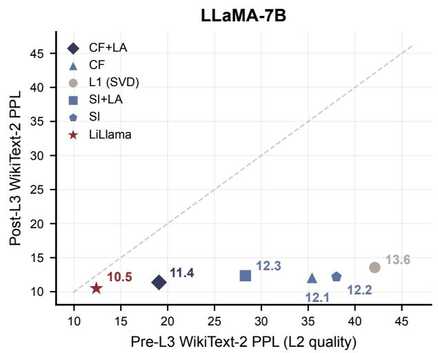

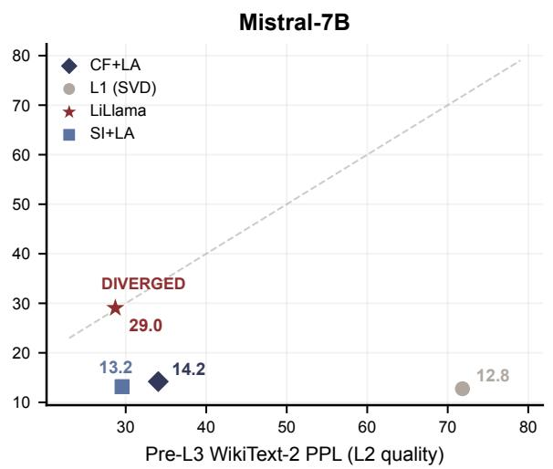  
Figure 4: Pre-L3 vs. post-L3 WikiText-2 test perplexity $( \rho { = } 0 . 6 ,$ 256 calibration samples, best val checkpoint). Left: LLaMA-7B—better L2 warm-start yields better L3 (monotonic). Right: Mistral-7B—LiLlama achieves the best L2 but diverges at L3, coinciding with the spectral amplification of Figure 5.

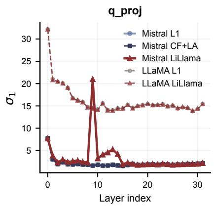

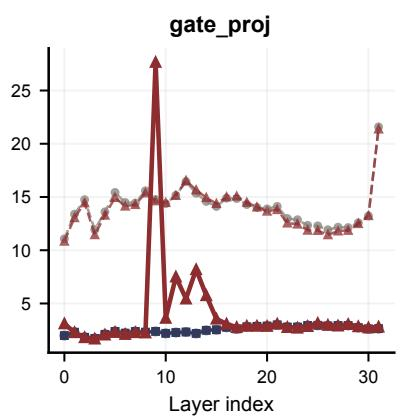

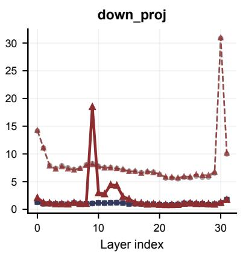  
Figure 5: Leading singular value $\sigma _ { 1 }$ of compressed weights by layer (ρ=0.6). LiLlama (red, solid) amplifies Mistral-7B MLP $\sigma _ { 1 }$ by 40–95% vs. L1 baseline (light blue). Our CF+LA (dark blue) preserves the baseline spectral structure. LLaMA-7B (dashed) shows milder amplification.

Level-Wise Retention Diagnostics. Table 13 reports the seven-task zero-shot average at each level. L2 improves all seven tasks over L1; L3 improves six of seven over L2, reducing MathQA by 0.40 points. All compressed states remain far below the dense model, so we present these as retention diagnostics rather than evidence of capability preservation. These averages are computed from our own lm-evaluation-harness v0.4 run over the canonical seed-42 states; Table $2 \mathrm { { } s }$ uncompressed row is quoted from the baseline source (Hu et al., 2026), so the two dense figures are not directly comparable and this table is not a decomposition of that table’s rows.

Generation and Reasoning Diagnostics. Perplexity gains do not transfer to open-ended generation at this ratio (Table 14). On a held-out 200-example SAMSum subset evaluated with no prompt truncation—where the prompt and stopping rule were fixed using dense-model validation only, before any compressed state was scored—L2 and L3 improve ROUGE-L over L1, but every compressed state reaches the 128-token ceiling on all examples and shows high repetition (repeated-4- gram rates of 50.9%–72.8%), whereas the dense model follows the delimiter on 199/200 examples. On GSM8K, all compressed states score 0% strict 5-shot exact match against 9.17% for dense and therefore cannot distinguish the levels. This subset is not the full or standard SAMSum benchmark, and these results do not support reliable or broad generation, summarization, dialogue, or instruction-following preservation at 60% removal.

<table><tr><td colspan="2"></td><td colspan="3">Perplexity ↓</td><td colspan="9">Zero-Shot Accuracy (%) ↑</td></tr><tr><td>ρ</td><td>Stage</td><td>Wiki</td><td>PTB</td><td>C4</td><td>ARCc</td><td>ARCe</td><td>BoolQ</td><td>HellaS.</td><td>Openb.</td><td>PIQA</td><td>WinoG.</td><td>TruthQA</td><td>MathQA</td></tr><tr><td rowspan="2"></td><td>Uncompressed</td><td>5.68</td><td>8.35</td><td>7.34</td><td>41.8</td><td>75.3</td><td>75.0</td><td>57.0</td><td>34.6</td><td>78.7</td><td>69.9</td><td>34.1</td><td>27.1</td></tr><tr><td>L1</td><td>7.86</td><td>15.4</td><td>15.9</td><td>31.6</td><td>62.7</td><td>64.4</td><td>43.2</td><td>26.6</td><td>68.8</td><td>67.2</td><td>37.7</td><td>23.4</td></tr><tr><td rowspan="3">0.2 L2</td><td></td><td>7.00</td><td>13.5</td><td>13.3</td><td>34.7</td><td>69.9</td><td>63.3</td><td>46.5</td><td>28.8</td><td>71.2</td><td>65.6</td><td>37.7</td><td>25.7</td></tr><tr><td>L3</td><td>6.47</td><td>14.1</td><td>13.5</td><td>35.0</td><td>69.9</td><td>63.3</td><td>47.6</td><td>29.8</td><td>71.7</td><td>66.0</td><td>37.4</td><td>26.5</td></tr><tr><td>L1</td><td>13.16</td><td>52.5</td><td>50.0</td><td>27.0</td><td>45.9</td><td>43.0</td><td>33.0</td><td>20.2</td><td>60.9</td><td>57.1</td><td>43.3</td><td>22.1</td></tr><tr><td rowspan="3">0.4 L2</td><td></td><td>9.54</td><td>31.1</td><td>27.8</td><td>27.6</td><td>55.9</td><td>63.2</td><td>37.6</td><td>22.6</td><td>63.9</td><td>62.1</td><td>42.8</td><td>23.5</td></tr><tr><td>L3</td><td>7.72</td><td>31.3</td><td>25.7</td><td>29.9</td><td>59.8</td><td>63.0</td><td>40.4</td><td>24.2</td><td>65.6</td><td>62.0</td><td>42.4</td><td>24.4</td></tr><tr><td>L1</td><td>42.1</td><td>182</td><td>201</td><td>19.5</td><td>29.9</td><td>37.8</td><td>27.3</td><td>13.2</td><td>54.3</td><td>52.4</td><td>47.6</td><td>21.9</td></tr><tr><td rowspan="3">0.6 L2</td><td></td><td>19.1</td><td>95.8</td><td>91.8</td><td>20.2</td><td>34.6</td><td>37.8</td><td>29.0</td><td>14.6</td><td>56.4</td><td>54.8</td><td>49.0</td><td>22.1</td></tr><tr><td>L3</td><td>11.4</td><td>62.8</td><td>57.2</td><td>22.4</td><td>41.2</td><td>54.8</td><td>32.2</td><td>17.4</td><td>57.9</td><td>55.9</td><td>48.3</td><td>22.1</td></tr><tr><td>L1</td><td>659</td><td>3687</td><td>2638</td><td>20.5</td><td>26.2</td><td>37.8</td><td>26.0</td><td>13.2</td><td>52.3</td><td>48.7</td><td>50.2</td><td>20.6</td></tr><tr><td rowspan="2">0.8 L2</td><td></td><td>86.2</td><td>526</td><td>410</td><td>19.4</td><td>27.7</td><td>37.8</td><td>26.8</td><td>12.2</td><td>52.9</td><td>49.7</td><td>49.3</td><td>20.8</td></tr><tr><td>L3</td><td>30.5</td><td>158</td><td>143</td><td>19.1</td><td>27.7</td><td>37.9</td><td>27.2</td><td>12.4</td><td>53.8</td><td>51.7</td><td>48.8</td><td>20.9</td></tr></table>

Table 8: Three-level hierarchical compression on LLaMA-7B, WikiText-2 calibration, seed 42. L1: sub-layer SVD; L2: block-level joint optimization with 256-sample block I/O; L3: end-to-end LM-loss fine-tune on top of L2. Dense baseline from our lm-eval harness (adds BoolQ and TruthfulQA to Table 2’s 7-task set).

<table><tr><td colspan="2"></td><td colspan="3">PPL↓</td><td colspan="6">Zero-Shot Acc. (%) ↑</td><td></td></tr><tr><td>Model</td><td></td><td>Wiki</td><td>PTB</td><td>C4</td><td>ARCe</td><td>HellaS.</td><td>MathQA</td><td>OBQA</td><td>PIQA</td><td>WinoG.</td><td>Avg.</td></tr><tr><td rowspan="2">LLaMA-7B</td><td>Dense</td><td>5.68</td><td>8.35</td><td>7.34</td><td>67.0</td><td>56.0</td><td>27.0</td><td>28.0</td><td>78.0</td><td>67.0</td><td>53.8</td></tr><tr><td>Ours</td><td>11.4</td><td>62.8</td><td>57.2</td><td>41.2</td><td>32.2</td><td>22.1</td><td>17.4</td><td>57.9</td><td>55.9</td><td>37.8</td></tr><tr><td rowspan="2">Mistral-7B</td><td>Dense</td><td>5.31</td><td>30.1</td><td>8.14</td><td>80.2</td><td>61.1</td><td>37.2</td><td>35.4</td><td>80.0</td><td>74.1</td><td>61.3</td></tr><tr><td>Ours</td><td>14.2</td><td>219</td><td>85.5</td><td>36.5</td><td>30.3</td><td>22.2</td><td>16.8</td><td>56.5</td><td>54.5</td><td>36.1</td></tr><tr><td rowspan="2">LLaMA-2-7B</td><td>Dense</td><td>5.47</td><td>25.2</td><td>7.13</td><td>75.4</td><td>57.1</td><td>28.3</td><td>33.4</td><td>78.1</td><td>69.3</td><td>56.9</td></tr><tr><td>Ours</td><td>18.1</td><td>1235</td><td>87.1</td><td>32.0</td><td>29.0</td><td>21.9</td><td>15.6</td><td>54.5</td><td>52.6</td><td>34.3</td></tr><tr><td rowspan="2">OPT-6.7B</td><td>Dense</td><td>10.9</td><td>12.8</td><td>12.3</td><td>66.1</td><td>50.3</td><td>24.2</td><td>26.4</td><td>76.5</td><td>65.5</td><td>51.5</td></tr><tr><td>Ours</td><td>18.3</td><td>52.9</td><td>68.3</td><td>45.6</td><td>33.1</td><td>22.0</td><td>20.2</td><td>60.7</td><td>56.4</td><td>39.7</td></tr><tr><td rowspan="2">LLaMA-2-13B</td><td>Dense</td><td>4.88</td><td>35.3</td><td>6.62</td><td>78.9</td><td>60.2</td><td>31.1</td><td>34.6</td><td>79.4</td><td>72.6</td><td>59.5</td></tr><tr><td>Ours</td><td>11.2</td><td>513</td><td>62.4</td><td>38.6</td><td>32.3</td><td>22.0</td><td>18.2</td><td>58.1</td><td>55.4</td><td>37.4</td></tr></table>

Table 9: Dense baselines and per-task zero-shot accuracy at ρ=0.6. Extends Table 3.

Removable Overhead in the Block Loop. A bounded implementation study indicates that part of the block-level stage’s cost is removable overhead rather than intrinsic. Caching fixed teacher and probe targets, keeping the frozen probe and next block resident, evaluating only the required top-128 probe rows with a custom backward, and dropping an unused teacher-logit cache leaves the objective unchanged—losses and hidden-state gradients agree with the reference implementation within $3 \times 1 0 ^ { - 6 } \mathrm { a n d } 4 \times 1 0 ^ { - 5 }$ , and all three samedevice pairs record the same selected one-block objective value. On a one-block, five-step benchmark run sequentially on each of three physical GPUs, this gives a 1.537× geometric-mean speedup for the block-optimization stage and 1.302× for the complete one-block compression call, with peak allocated memory rising from 41.409 to 42.067 GiB. These measurements do not establish a full-stage or hardware-independent speedup. The full gradient sweep over all 256 sequences at every Adam step remains the dominant cost, so larger gains would require reducing or accelerating that sweep without degrading compression quality.

<table><tr><td>Samples Path</td><td></td><td>Wiki↓ PTB↓</td><td>C4↓</td></tr><tr><td rowspan="2">256</td><td>L1→L3&#x27; (skip L2) 11.90</td><td>86.87</td><td>60.24</td></tr><tr><td>L1→L2 only 21.59 L1→L2→L3 (full) 11.95</td><td>110.09 64.74</td><td>104.97 52.21</td></tr><tr><td rowspan="2">128</td><td>L1→L3&#x27; (skip L2)</td><td>12.72 131.83</td><td>62.19</td></tr><tr><td>L1→L2 only</td><td>21.71 112.09</td><td>107.38</td></tr><tr><td rowspan="2">32</td><td>L1→L2→L3 (full)  $\mathrm { L 1 } \mathrm { \to } \mathrm { L } 3 ^ { \prime } ( \mathrm { s k i p } \mathrm { L } 2 )$ </td><td>12.57 68.40</td><td>56.58</td></tr><tr><td> $_ { \mathrm { L 1 \to L 2 \ o n l y } }$   $_ { \mathrm { L 1 \to L 2 \to L 3 } }$  (full) 16.54</td><td>14.87 161.30 26.82 141.83</td><td>73.18 132.90</td></tr></table>

Table 10: Low-data ablation (ρ=0.6, Wiki/PTB/C4 perplexity). Full chain uses lr $5 \times 1 0 ^ { - 6 }$ ; L3′ (skip L2) uses lr $2 \times 1 0 ^ { - 5 }$ (each path’s best LR).

<table><tr><td>Parameter</td><td>L2 (per block)</td><td>L3 (end-to-end)</td></tr><tr><td>Optimizer</td><td>Adam</td><td>AdamW</td></tr><tr><td>Learning rate</td><td> $1 0 ^ { - 4 }$ </td><td> $2 \times 1 0 ^ { - 5 }$ </td></tr><tr><td>LR schedule constant</td><td></td><td>warmup 10 + cosine</td></tr><tr><td>Weight decay 0</td><td></td><td>0</td></tr><tr><td>Grad clip</td><td>norm 1.0</td><td>norm 1.0</td></tr><tr><td>Max iters</td><td>150</td><td> $3 0 0 \left( \rho { \geq } 0 . 6 \right) / 2 0 0$ </td></tr><tr><td>Early stop</td><td>over 5 iters</td><td>&lt;0.5% rel. ∆L val PPL pat. 40 steps</td></tr><tr><td>Val set</td><td></td><td>WikiText-2 val (~145 seqs)</td></tr><tr><td>Typical iters</td><td>15-25</td><td>40–100 (best restore)</td></tr><tr><td>Precision</td><td>fp32</td><td>bf16 fwd / fp32</td></tr><tr><td> $\lambda _ { \mathrm { l a } }$ </td><td>0.05</td><td>params</td></tr></table>

Table 11: Hyperparameters for L2 (block-level) and L3 (end-to-end).

Skip-L2 Training Dynamics. Figure 7 shows the full training dynamics. Both paths use AdamW with   
cosine decay, early stopping on WikiText-2 validation PPL, and best checkpoint restore. At lr $5 \times 1 0 ^ { - 6 }$ skip-L2 reaches a lower validation PPL (11.98 vs. 12.07) but overfits past step 90. At $\mathrm { l r ~ 2 \times 1 0 ^ { - 5 } }$ WikiText-2 test PPL is similar (11.4 vs. 11.9) but PTB diverges by 24 points (62.8 vs. 86.9). L2’s   
block-level hidden-state matching provides ∼16M per-token constraints (256 samples × 2048 positions × 32 blocks) that regularize the factored parameters before L3 fine-tuning.

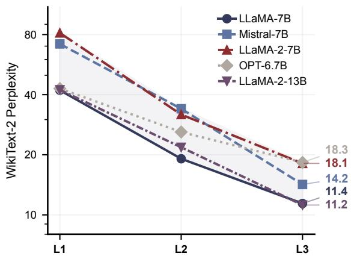

<table><tr><td>State</td><td>Seven-task avg. (%) ↑</td></tr><tr><td>Dense</td><td>55.00</td></tr><tr><td>L1</td><td>31.00</td></tr><tr><td>L2</td><td>35.56</td></tr><tr><td>L3</td><td>37.46</td></tr></table>

Table 13: Level-wise zero-shot retention on LLaMA-7B at $\rho { = } 0 . 6 .$ , same seven tasks as Table 2, our harness run.

Figure 6: WikiText-2 test perplexity across optimization levels (L1→L2→L3) for five models (7B–13B) at ρ=0.6. The chain generalizes across architectures, though per-level gains are model-dependent.
<table><tr><td>Seed</td><td>Full chain</td><td>Skip-L2</td></tr><tr><td>42</td><td>11.41 / 67.64 / 48.53</td><td>11.97/ 91.44 /59.71</td></tr><tr><td>123</td><td>11.46 / 72.76 / 54.21</td><td>12.14 /107.90 / 63.67</td></tr><tr><td>456</td><td>11.10 / 69.62 / 51.75</td><td>12.33 / 94.85 / 60.02</td></tr><tr><td>Mean</td><td>11.32 / 70.01 / 51.50</td><td>12.14/ 98.06 / 61.13</td></tr></table>

Table 12: End-to-end pipeline-seed check (LLaMA-7B, ρ=0.6), reported as WikiText-2 / PTB / C4 perplexity.

<table><tr><td>Diagnostic</td><td>Dense</td><td>L1</td><td>L2</td><td>L3</td></tr><tr><td>SAMSum ROUGE-L F1 × 100</td><td>37.18</td><td>2.86</td><td>10.90</td><td>16.90</td></tr><tr><td>SAMSum 128-tok. stops</td><td>0.5%</td><td>100%</td><td>100%</td><td>100%</td></tr><tr><td>GSM8K 5-shot EM (strict)</td><td>9.17%</td><td>0%</td><td>0%</td><td>0%</td></tr></table>

Table 14: Generation and reasoning diagnostics on LLaMA-7B at ρ=0.6. Held-out 200-example SAM-Sum subset; not the standard benchmark.

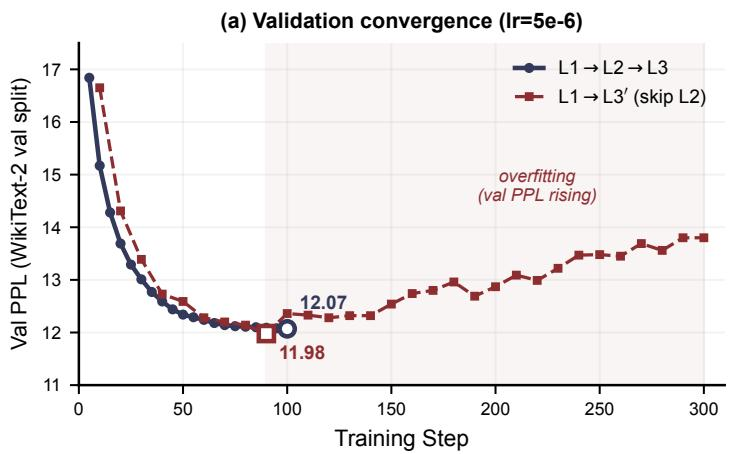

(b) Test PPL at best ckpt (lr=2e-5)  
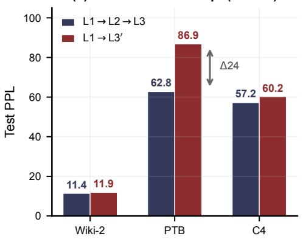  
Figure 7: Skip-L2 ablation on $\mathrm { L L a M A } { - } 7 \mathrm { B }$ at $\rho { = } 0 . 6 .$ (a) Validation PPL (lr $5 \times 1 0 ^ { - 6 } )$ converges similarly, but skip-L2 overfits past step 90. (b) Test PPL at best checkpoint $( \mathrm { l r } 2 \times 1 0 ^ { - 5 } )$ : in-distribution (WikiText-2) matches, but OOD (PTB) diverges by 24 points.